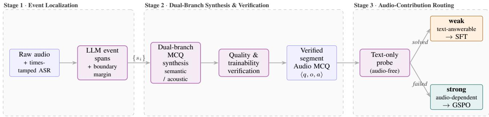
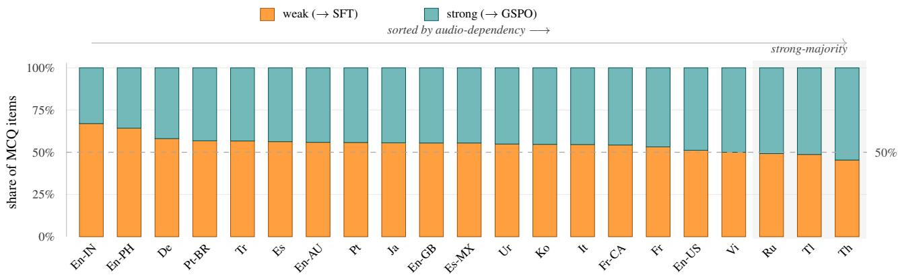
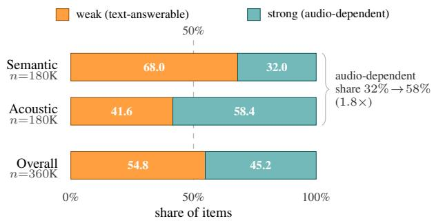

# SEAR: Segment-Evidence-Aware Routing for Weak-to-Strong Multilingual Speech MCQ

Huy Hoang Le1,∗, Long-Bao Nguyen1,∗, Minh Tri Dao1

1CAKE by VPBank, Vietnam

∗Equal contribution

hoang.le2@cake.vn, bao.nguyen@cake.vn, tri.dao@cake.vn

## Abstract

This paper describes our system for Task 2 of the second Multilingual Conversational Speech Language Model (MLC-SLM) Challenge. We adapt Qwen3-Omni-30B-A3B-Instruct with a segment-evidence-aware data and post-training pipeline. A language model converts timestamped ASR into coherent event spans, which are expanded by a boundary margin and cropped from the original recording. We then synthesize complementary semantic MCQs with Qwen3.6-27B and acoustic MCQs with Gemini 3.1 Flash-Lite, followed by structural, grounding, answer-consistency, and target-model trainability checks, yielding 359,825 verified MCQs across 21 language and accent variants. A text-only probe partitions the data into weak, textanswerable items used for supervised fine-tuning and strong, audio-dependent items used for reinforcement learning with Group Sequence Policy Optimization (GSPO), stabilized by debiased advantages, sequence-level importance correction, and dynamic filtering. Our system obtains 90.92% accuracy on the final official evaluation set.

Index Terms: spoken language understanding, audio language model, curriculum learning, reinforcement learning, multilingual speech

## 1. Introduction

Spoken language understanding over conversational speech requires a system to jointly interpret acoustic content and linguistic meaning. Task 2 of the MLC-SLM Challenge instantiates this problem as multiple-choice question answering: given a multilingual two-speaker conversation and a question about it, a system must select the correct option, and performance is measured by answer accuracy [1]. The task is demanding because the conversations span fourteen languages, are informal and spontaneous, and the questions probe both what was said and how it was said, so a system cannot rely on transcription alone.

The central difficulty for audio LLMs on this task is that strong text priors let a model answer many questions without genuinely listening. Recent analysis shows that large audio language models frequently produce correct answers from textual cues while ignoring the audio, a “zero audio-contribution” effect that inflates apparent accuracy yet fails on acoustically grounded questions [2]. Treating every training example identically therefore wastes supervision on questions the model could already answer from text, and dilutes the signal from the questions that truly require listening.

We address this with Qwen3-Omni-30B-A3B-Instruct [3] and a segment-evidence-aware post-training pipeline. Timestamped ASR is converted into coherent event spans, expanded with boundary context, and cropped into training clips. Semantic questions are generated from transcript evidence, whereas

acoustic questions are generated directly from the waveform. A multi-stage verifier rejects ungrounded, ambiguous, malformed, or trivially leaked questions and measures whether the target model can produce informative mixed-reward rollouts. We then use supervised fine-tuning (SFT) for instruction and output-format adaptation, followed by GSPO-based reinforcement learning on audio-dependent questions.

Our contributions are as follows. (i) A timestampaware, event-preserving segmentation pipeline that uses LLMextracted event spans and boundary margins instead of arbitrary fixed windows. (ii) A dual-branch synthesis and verification engine: Qwen3.6-27B [4] creates semantic MCQs, Gemini 3.1 Flash-Lite [5] creates acoustic MCQs, and target-aware verification separates valid-but-easy items from trainable RL items. (iii) A stable weak-to-strong post-training recipe of SFT followed by GSPO-based reinforcement learning. The resulting system reaches 90.92% accuracy on the final official evaluation set.

## 2. Related Work

Audio-language data construction. AudioMCQ converts captioned audio into four-option questions and filters candidates for answer consistency, distractor quality, fluency, and reasoning fidelity [2]. Our pipeline extends data construction to long multilingual conversations: timestamped transcripts define coherent candidate event spans, while separate text and audio generators specialize in semantic and acoustic questions.

Audio-contribution-aware post-training. AudioMCQ identifies zero audio-contribution cases by testing whether a question can be answered without the original audio and proposes weak-to-strong and mixed-to-strong schedules [2]. We retain this audio-contribution axis, but add a separate targetmodel trainability test because audio dependence does not guarantee useful group-relative reward variance.

Sequence-level and debiased group-relative reinforcement learning. GRPO normalizes rewards within a response group and uses token-level policy ratios. GSPO replaces these with a length-normalized sequence likelihood ratio and clips the whole response, improving stability for MoE models [6, 7]. Dr.GRPO removes the response-length and within-group standard-deviation normalizations that bias vanilla GRPO [8], and sequence-level truncated importance sampling (TIS) corrects the numerical mismatch between the rollout engine and the training backend [9]. Our recipe combines these three corrections (Section 3.5).

  
Figure 1: Segment-level Audio MCQ curation and routing. Stage 1: timestamped ASR is used by an LLM to identify coherent conversational events; each event is expanded by a boundary margin before the waveform is cropped, and model-facing timestamps are rebased to the crop. Stage 2: Qwen3.6-27B generates semantic MCQs from the event transcript and metadata, while Gemini 3.1 Flash-Lite generates acoustic MCQs from the audio segment. Candidates pass grounding, uniqueness, distractor, format, timestamp and target-model trainability checks. Stage 3: an audio-free probe estimates audio contribution. Weak items are usedfor SFT; strong items are candidatesfor GSPO, with online dynamicfiltering retaining only rollout groups with non-zero reward variance.

## 3. Method

## 3.1. Base model and parameter-efficient adaptation

We adopt Qwen3-Omni-30B-A3B-Instruct, a Mixture-of-Experts audio LLM with roughly 30B total and 3B activated parameters, whose state-of-the-art multilingual audio understanding matches the fourteen-language scope of the challenge [3]. We adapt only the language model with low-rank adaptation (LoRA), keeping the pretrained audio encoder and multimodal aligner frozen: fine-tuning them on the comparatively small challenge set risks catastrophic forgetting of large-scale multilingual acoustic knowledge.

## 3.2. Segment-level Audio MCQ curation

Our data engine uses timestamp-guided, event-preserving segmentation for long conversational speech. It produces 359,825 verified segment-level MCQs across 21 language and accent variants, with complementary semantic and acoustic question families.

Timestamped ASR and event localization. For each raw conversation, an ASR system produces timestamped transcript units $\{ ( u _ { j } , t _ { j } ^ { \mathrm { s } } , t _ { j } ^ { \mathrm { e } } ) \}$ . An LLM reads the ordered transcript and returns self-contained conversational events as intervals $e _ { k } =$ $[ b _ { k } ^ { \mathrm { s } } , b _ { k } ^ { \mathrm { e } } ]$ . We expand each interval by a per-event context margin mk, varied rather than fixed so that cropped segments span diverse durations, and clip it to the recording bounds,

$$
s _ { k } = \bigl [ \operatorname* { m a x } ( 0 , b _ { k } ^ { \mathrm { s } } - m _ { k } ) , \operatorname* { m i n } ( T , b _ { k } ^ { \mathrm { e } } + m _ { k } ) \bigr ] ,\tag{1}
$$

then merge strongly overlapping windows. This preserves complete turns and nearby prosodic context while avoiding unrelated portions of the conversation. Every model-facing timestamp is rebased to the crop as $t ^ { \mathrm { l o c a l } } = t ^ { \mathrm { \bar { a } b s } } - s _ { k } ^ { \mathrm { s } }$ (the absolute offset is kept only as provenance), so timestamps always refer to the beginning of the waveform actually supplied to the model, matching evaluation conditions.

Dual-branch MCQ synthesis. The semantic branch supplies Qwen3.6-27B [4] with the localized transcript, event span, and conversation context. It generates four-option questions about content, intent, facts, discourse relations, and temporal order. The acoustic branch supplies the cropped waveform to Gemini 3.1 Flash-Lite [5] and generates questions about speaker identity, pitch, speaking rate, emotion, voice quality, background sound, overlap, and other audible events. Each candidate is serialized as $z \ = \ ( s , q , \{ o _ { A } , o _ { B } , o _ { C } , o _ { D } \} , a , \tau )$ where a is the keyed option and τ contains provenance, absolute and rebased timestamps, language, and question type. Correctanswer positions are permuted to reduce option-position bias.

Quality and trainability verification. Verification serves two purposes. First, an LLM judge checks that each candidate is grounded in the supplied evidence: the question is answerable, exactly one option is correct, distractors are plausible but unsupported, rebased timestamps fall inside the clip, the language is fluent, and neither the stem nor the options leak the key. Malformed or ambiguous candidates are rejected or regenerated. This mirrors the in-pipeline grading of AudioMCQ, with an additional waveform-grounding check for acoustic questions [2].

Second, we probe trainability with the target Qwen3-Omni 30B-A3B-Instruct model using G = 8 audio-conditioned responses per candidate, labeling each as solved (all correct), learnable (mixed), or unsolved (all wrong). Solved items remain in SFT but are excluded from the initial GSPO queue to reduce rollout cost. Learnable items form the primary GSPO pool, while unsolved items are retained and dynamically admitted as they become learnable during training (Section 3.5).

## 3.3. Audio-contribution routing

We estimate whether the audio is necessary by running an audio-free probe on the question and four options. An item answered correctly without the waveform is labeled weak; otherwise it is labeled strong. Across the corpus, 197,231 items are weak and 162,594 are strong. The weak rate is 68.0% for semantic questions but only 41.6% for acoustic questions (Figure 3), which supports the intended distinction between transcript-recoverable and perceptually grounded supervision.

Audio contribution and trainability are orthogonal. A strong item can still be all-wrong under the current policy and therefore provide zero group-relative signal; a weak item can still be useful for SFT. We therefore use the text-only probe for stage routing and the $G = 8$ target-model probe only for compute-aware selection within a stage.

## 3.4. Supervised fine-tuning

The first stage adapts the pretrained model to the challenge instruction, multilingual question style, and exact answer format; the assistant target is the minimal sequence <answer>X</answer>, where $X ~ \in ~ \{ A , B , C , D \}$ . We train on all verified weak items.

  
Figure 2: Audio-dependency generalizes across all 21 languages. Each bar is one language/accent variant, normalized to 100% and sorted by weak (text-answerable, orange → SFT) share; the remainder is strong (audio-dependent, teal → GSPO). The weakfraction exceeds the strong fraction for 18 of 21 variants; only Thai, Russian, and Tagalog are strong-majority (shaded). The full corpus contains 359,825 segment-level Audio MCQ items, balanced across languages (11.5K–21.9K per variant). Codes: En-IN= Indian English, En-PH = Filipino English, Tl = Tagalog, etc.

  
Figure 3: Question type predicts audio dependence. $T h e$ text-only probe labels items as weak (text-answerable) or strong (audio-dependent). Audio-dependent items increase from 32.0% of semantic questions to 58.4% of acoustic questions (1.8×), validating the probe and providing GSPO with 162,594 well-defined strong items.

## 3.5. Reinforcement learning

For each strong prompt x, we sample G = 8 rollouts $\{ y _ { i } \} _ { i = 1 } ^ { G }$ from the old policy, scored with a binary exact-match reward,

$$
r _ { i } = { \bf 1 } [ y _ { i } = < \tt { a n s w e r } > a < / \tt { a n s w e r } > ] ,\tag{2}
$$

where malformed outputs receive zero. Because this reward attaches to the complete answer sequence, we optimize with GSPO, whose sequence-level ratio and clipping stabilize RL for MoE models such as Qwen3-Omni, where small expert-routing changes make token-level ratios volatile [6, 7].

Advantage debiasing. Vanilla GRPO standardizes each reward by the within-group standard deviation, $\hat { A } _ { i } ^ { \mathrm { G R P O } } =$ $( r _ { i } - \bar { r } ) / ( \sigma _ { r } + \eta )$ , which for binary rewards and a small group over-amplifies a single discordant rollout even when it stems from ambiguity, label noise, or stochastic decoding. Following Dr.GRPO [8], we keep only the group-relative baseline,

$$
\hat { A } _ { i } = r _ { i } - \bar { r } , \qquad \bar { r } = \frac { 1 } { G } \sum _ { j = 1 } ^ { G } r _ { j } ,\tag{3}
$$

so the update magnitude reflects the actual disagreement in the group. Dr.GRPO’s length-normalization correction is immaterial here because valid completions share the same short format.

Sequence-level objective. GSPO defines the lengthnormalized sequence ratio

$$
\begin{array} { r l } & { d _ { i , t } = \log \pi _ { \boldsymbol { \theta } } ( y _ { i , t } \mid x , y _ { i , < t } ) - \log \pi _ { \mathrm { o l d } } ( y _ { i , t } \mid x , y _ { i , < t } ) , } \\ & { s _ { i } ( \boldsymbol { \theta } ) = \exp \left( \frac { 1 } { \left| y _ { i } \right| } \displaystyle \sum _ { t = 1 } ^ { \left| y _ { i } \right| } d _ { i , t } \right) , } \end{array}\tag{4}
$$

and clips the entire response rather than individual tokens [6]. Combined with the mean-centered advantage, the objective is

$$
\begin{array} { l } { \ell _ { i } = \displaystyle \operatorname* { m i n } \ \left( s _ { i } \hat { A } _ { i } , \mathrm { c l i p } ( s _ { i } , 1 - \epsilon , 1 + \epsilon _ { \mathrm { h i g h } } ) \hat { A } _ { i } \right) , } \\ { \mathcal { I } = \mathbb { E } \left[ \displaystyle \frac { 1 } { G } \sum _ { i = 1 } ^ { G } \ell _ { i } \right] . } \end{array}\tag{5}
$$

Sequence-level TIS. Rollouts are generated by vLLM while gradients are evaluated by the training backend, so even with synchronized weights, numerical differences can yield πvLLM $\ne ~ \pi _ { \mathrm { t r a i n } }$ . Following truncated importance sampling (TIS) [9], we correct this mismatch with the capped sequencelevel training-to-rollout ratio

$$
\begin{array} { r l } & { q _ { i , t } = \log \pi _ { \mathrm { t r a i n } } ( y _ { i , t } \mid x , y _ { i , < t } ) - \log \pi _ { \mathrm { v L L M } } ( y _ { i , t } \mid x , y _ { i , < t } ) , } \\ & { \quad c _ { i } = \exp \left( \displaystyle \frac { 1 } { | y _ { i } | } \sum _ { t } q _ { i , t } \right) , \qquad \tilde { c } _ { i } = \operatorname* { m i n } ( c _ { i } , 2 ) . } \end{array}\tag{6}
$$

and multiply each response term in Equation 5 by ${ \tilde { c } } _ { i } .$ , preventing backend-mismatched trajectories from dominating the gradient.

Dynamic filtering. All-correct and all-wrong groups have $\hat { A } _ { i } = 0$ for every response and produce no group-relative gradient. At every update we discard groups with $\sigma _ { r } \ \leq \ \delta$ and over-sample replacement prompts until the effective batch is full, following DAPO’s dynamic sampling principle [10]. Because policy competence changes during training, this online rule is more reliable than permanently deleting every item the base model answers correctly.

Table 1: Task 2 accuracy (%). Eval is the Phase-1 evaluation set for the baselines and the Phase-2 (final) evaluation set for our system. Bold marks the best result.
<table><tr><td>System</td><td>Dev ↑</td><td>Eval ↑</td></tr><tr><td>Qwen2.5-Omni-7B (baseline) [11]</td><td>83.16</td><td>56.42</td></tr><tr><td>Qwen3-Omni-30B-A3B (zero-shot) [3]</td><td>92.40</td><td>77.36</td></tr><tr><td>Ours (SEAR)</td><td>96.02</td><td>90.92</td></tr></table>

## 4. Experiments

## 4.1. Data and metric

Training data. We train on the curated segment-level Audio MCQ corpus of Section 3.2: 359,825 items synthesized from the Task 2 training conversations, spanning 21 language and accent variants and balanced across them (11.5K–21.9K items per variant; Figure 2). The text-only probe partitions the corpus into 197,231 weak (text-answerable) and 162,594 strong (audiodependent) items (54.8% weak overall; Figure 3), which feed SFT (Section 3.4) and GSPO (Section 3.5).

Evaluation. We evaluate on the official MLC-SLM Task 2 development and evaluation sets and report accuracy, the official metric [1].

## 4.2. Implementation details

Our backbone is Qwen3-Omni-30B-A3B-Instruct [3]. We train LoRA adapters on the language model with rank 32, α = 64, and dropout 0.05, while freezing the audio encoder and aligner. SFT uses a learning rate of $1 \times 1 \bar { 0 } ^ { - 4 }$ , cosine decay, warmup ratio 0.05, weight decay 0.01, gradient clipping at 1.0, a maximum sequence length of 32,768, and bf16.

For RL, we use GSPO with $G = 8 ,$ a rollout batch size of $6 4 , \epsilon = 3 \times 1 0 ^ { - 4 } , \epsilon _ { \mathrm { h i g h } } = 4 \times 1 0 ^ { - 4 }$ , and $\beta = 0$ . We apply Dr.GRPO-style unnormalized group advantages, sequencelevel rollout importance correction with TIS threshold 2, and dynamic filtering of groups whose reward standard deviation is at or near zero, monitoring retained-group rate, reward, clipping fraction, sequence-level mismatch, and effective sample size throughout training. The reward parser accepts exactly one option in <answer>A/B/C/D</answer>. Rollout and training use the same tokenizer, chat template, stop tokens, and synchronized model weights.

## 4.3. Main results

Table 1 reports accuracy on the development and evaluation sets. Our system reaches 90.92% on the Phase-2 (final) evaluation set and ranks 2nd on the official leaderboard.

## 4.4. Ablation study

Table 2 reports a compact cumulative ablation covering the two main decisions in our system: curated segment-level supervision, and the weak-to-strong RL stage. The latter is reported as a single step—routing plus the stabilized GSPO objective (debiasing, TIS, dynamic filtering)—rather than as a combinatorial sweep over its components. We also include an all-data control that trains on the same data without weak/strong classification. It achieves only 88.24 Eval, 2.68 points below SEAR (90.92), confirming that the classification drives the improvement.

Table 2: Cumulative ablation. The middle row is an all-data control that omits the weak/strong classification. ∆ is against the preceding row; the zero-shot and curated-SFT rows use the Phase-1 evaluation set, the control and final row the Phase-2 (final) set.
<table><tr><td>Configuration</td><td>Eval ↑</td><td>Δ</td></tr><tr><td>Qwen3-Omni-30B-A3B, zero-shot</td><td>77.36</td><td>一</td></tr><tr><td>+ SFT full data, no weak-strong split</td><td>88.24</td><td>+10.88</td></tr><tr><td>+ verified event-segment MCQ SFT</td><td>86.55</td><td>+9.19</td></tr><tr><td>+ weak-to-strong GSPO RL (SEAR)</td><td>90.92</td><td>+4.37</td></tr></table>

## 4.5. Model training prompts

We use the same answer-only template, independent of language and question type, for SFT and GSPO rollouts; only SFT includes the gold assistant response. This prevents promptformat differences from confounding the training-stage ablation.

Audio MCQ Training Prompt   
System: You are an audio understanding model that   
answers multiple-choice questions based on   
audio content.   
User: <audio> Based on the audio between   
{start time} and {end time},   
{question}. Please choose the an  
swer from the following options: A.   
{option A}; B. {option B};   
C. {option C}; D. {option D}.   
Output the final answer in <answer>   
</answer>.   
Assistant: <answer>{label}</answer>

## 5. Conclusions

We presented a segment-evidence-aware system for multilingual conversational Audio MCQ. Timestamped ASR and LLM event extraction localize coherent evidence; dual semantic and acoustic generators expand supervision; and quality plus trainability verification separates invalid, easy, learnable, and currently unsolved candidates. Verified weak items feed SFT, while audio-dependent items are optimized with a debiased, importance-corrected, and dynamically filtered GSPO objective. The final system reaches 90.92% accuracy on the final evaluation set and ranks 2nd. A limitation is that LLMbased event and quality judgments may introduce correlated errors; future work will combine independent verifiers and refresh trainability labels as the policy improves.

## 6. Acknowledgements

We thank the MLC-SLM Challenge organizers for providing the data and baselines. We are also grateful to CAKE by VP-Bank for supporting this work, and to the DS/AI team at CAKE for their valuable discussions, engineering support, and computational resources.

## 7. References

[1] Nexdata, “The 2nd multilingual conversational speech language model challenge,” Challenge website, 2026, accessed 2026-07-04.

[Online]. Available: https://www.nexdata.ai/competition/mlc-slm

[2] H. He, X. Du, R. Sun, Z. Dai, Y. Xiao, M. Yang, J. Zhou, X. Li, Z. Liu, Z. Liang, C. Wu, Q. He, T. Lee, X. Chen, W.-L. Zheng, W. Wang, M. Plumbley, J. Liu, and Q. Kong, “Measuring audio’s impact on correctness: Audio-contribution-aware post-training of large audio language models,” arXiv preprint arXiv:2509.21060, 2025.

[3] J. Xu, Z. Guo, H. Hu, Y. Chu, X. Wang, J. He, Y. Wang, X. Shi, T. He, X. Zhu et al., “Qwen3-omni technical report,” arXiv preprint arXiv:2509.17765, 2025.

[4] Qwen Team, “Qwen3.6-27B: Flagship-level coding in a 27b dense model,” Qwen technical blog, 2026, accessed 2026-07-04. [Online]. Available: https://qwen.ai/blog?id=qwen3.6-27b

[5] Google DeepMind, “Gemini 3.1 Flash-Lite,” Official model overview, 2026, accessed 2026-07-04. [Online]. Available: https://deepmind.google/models/gemini/

[6] C. Zheng, S. Liu, M. Li, X.-H. Chen, B. Yu, C. Gao, K. Dang, Y. Liu, R. Men, A. Yang, J. Zhou, and J. Lin, “Group sequence policy optimization,” arXiv preprint arXiv:2507.18071, 2025.

[7] Qwen Team, “Group sequence policy optimization,” Qwen technical blog, 2025, accessed 2026-07-04. [Online]. Available: https://qwen.ai/blog?id=gspo

[8] Z. Liu, C. Chen, W. Li, P. Qi, T. Pang, C. Du, W. S. Lee, and M. Lin, “Understanding r1-zero-like training: A critical perspective,” in Proceedings of the Conference on Language Modeling, 2025, arXiv:2503.20783.

[9] Y. Feng, “Your efficient RL framework secretly brings you off-policy RL training,” Online technical note, 2025, accessed 2026-07-04. [Online]. Available: https://fengyao.notion.site/ off-policy-rl

[10] Q. Yu, Z. Zhang, R. Zhu, Y. Yuan, X. Zuo, YuYue, W. Dai, T. Fan, G. Liu, J. Liu, L. Liu, X. Liu, H. Lin, Z. Lin, B. Ma, G. Sheng, Y. Tong, C. Zhang, M. Zhang, R. Zhang, W. Zhang, H. Zhu, J. Zhu, J. Chen, J. Chen, C. Wang, H. Yu, Y. Song, X. Wei, H. Zhou, J. Liu, W.-Y. Ma, Y.-Q. Zhang, L. Yan, Y. Wu, and M. Wang, “DAPO: An open-source LLM reinforcement learning system at scale,” in The Thirty-ninth Annual Conference on Neural Information Processing Systems, 2026. [Online]. Available: https://openreview.net/forum?id=2a36EMSSTp

[11] J. Xu, Z. Guo, J. He, H. Hu, T. He, S. Bai, K. Chen, J. Wang, Y. Fan, K. Dang, B. Zhang, X. Wang, Y. Chu, and J. Lin, “Qwen2.5-omni technical report,” arXiv preprint arXiv:2503.20215, 2025.