# SWRouter: Similarity-Contractive Window Routing for Multi-Turn Large Language Model Conversations

YU WANG, Department of Big Data Management and Application, Shanghai Jiao Tong University, China

YUCHEN LI, School of Computer Science, Shanghai Jiao Tong University, China and Baidu Inc., China

RUI KONG, Baidu Inc., China

XINRAN CHEN, Baidu Inc., China

JIAMIN CHEN, Baidu Inc., China

HENGYI CAI, Baidu Inc., China

SHUAIQIANG WANG, Baidu Inc., China

JIASHU ZHAO, Wilfrid Laurier University, Canada

YULUN ZHANG, School of Computer Science, Shanghai Jiao Tong University, China

ZHONGHAO LYU, Department of Computer Science, The Hang Seng University of Hong Kong, China

HAOYI XIONG, Baidu Inc., China

LINGHE KONG, School of Computer Science, Shanghai Jiao Tong University, China

JIMMY XIANGJI HUANG, York University, Canada

DAWEI YIN, Baidu Inc., China

Large language models exhibit complementary strengths, motivating routing methods that dispatch each query to the most suitable model. Although existing routers are efective in single-turn settings, they do not directly transfer to multi-turn dialogue, where routing performance critically depends on how historical context is segmented, retained, and incorporated into the current prompt. This introduces two fundamental challenges: preventing information loss and information confusion during context construction, and evaluating routing quality without conflating model selection with prompt construction quality. In this paper, we propose SWRouter, a Similarity-Contractive Window Router for multi-turn large language model routing. SWRouter combines a similarity-based context segmentation mechanism for prompt construction with a dual-metric evaluation framework that decouples construction accuracy from router performance. Experiments on multi-turn dialogue benchmarks demonstrate that SWRouter consistently surpasses strong baselines, achieving a 16.26% improvement in evaluation accuracy over the best individual large language model and an additional 8.22% gain over the Conv-ID Context baseline. Our results highlight that multi-turn large language model routing requires a joint design of context construction and evaluation, rather than a direct extension of single-turn routing methods.

CCS Concepts: • Information systems → Retrieval models and ranking; • Computing methodologies → Natural language generation; Machine learning approaches.

Additional Key Words and Phrases: Large Language Models, Multi-turn Dialogue, LLM Routing, Context Segmentation, Evaluation Framework, Model Selection

## 1 Introduction

Large Language Models (LLMs) have become core infrastructure for a wide range of intelligent applications, including conversational assistants, code generation, content creation, and increasingly, AI search and agentic question answer ing [10, 27, 28]. Their rapid adoption has also stimulated growing eforts to improve the eficiency of long-context processing and inference [29, 30]. Meanwhile, many organizations have developed their own LLM families, such as OpenAI’s ChatGPT [35], DeepSeek’s DeepSeek [15], Meta’s LLaMA [42], Google’s Gemini [17], and Anthropic’s Claude [5] However, no single model consistently performs best across all tasks and applications. For example, OpenAI’s GPT series is known for strong text generation ability [35], DeepSeek demonstrates strength in mathematical reasoning [39], and Claude is particularly efective in code generation and understanding [5]. Such heterogeneity has motivated a growing line of work on LLM routing, which dynamically dispatches each query to the most suitable model rather than relying on a fixed model for all inputs.

Existing routing methods have achieved promising results in single-turn settings, where the routing decision is made from a single prompt in isolation. Representative examples include routers that select among models of similar scale, such as RouterDC [9], as well as methods that decide between small and large models, such as C2MAB-V [14]. However, directly applying these routing strategies to multi-turn dialogue is fundamentally dificult, because model selection in conversational systems depends not only on the current user query, but also on how the dialogue history is segmented, retained, and incorporated into the prompt. In multi-turn dialogue, naive use of historical context introduces two fundamental challenges.

• First, there is a lack of context segmentation mechanism. When historical information is not properly segmented and integrated, the router may fail to distinguish relevant from irrelevant past context. This leads to two concrete failure modes: information loss, where critical historical information required for the current response is omitted, and information confusion, where outdated context is mistakenly carried into a new topic. As illustrated in Figure 1, missing prior context can cause failure on rule-dependent queries, while incorrect reuse of obsolete context can degrade performance after topic shifts.

• Second, there is an attribution bias in multi-turn router evaluation. In multi-turn settings, final response quality is jointly determined by two factors: the quality of context construction and the selected model’s performance under the constructed prompt. A poorly constructed prompt may substantially degrade the responses of all candidate models, regardless of which model is selected. Conversely, even with well-constructed context, poor model selection can still lead to unsatisfactory responses.

As illustrated in Figure 1, a well-combined prompt and a poorly combined prompt may lead to dramatically diferent response quality across all candidate models (e.g., 0.9/0.7/0.3 vs. 0.09/0.07/0.03). However, the observed inference accuracy alone does not indicate whether such performance variation comes from the context construction stage or from errors in the trained router. This conflates construction quality with routing quality, making faithful evaluation of multi-turn routing systems dificult.

To address these issues, we propose SWRouter, a multi-turn LLM routing framework that jointly addresses context construction, router training, and evaluation. SWRouter consists of three tightly coupled components: (1) a similaritybased context segmentation mechanism that selectively incorporates semantically relevant historical turns when Manuscript submitted to ACM

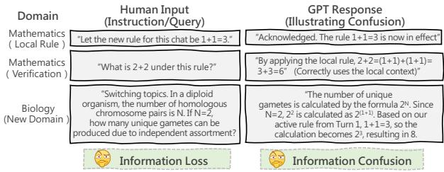  
(a) Lack of context segmentation mechanism

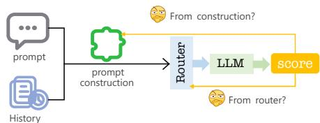  
(b) Attribution bias in multi-turn router evaluation  
Fig. 1. Illustration of the two challenges in multi-turn large language model routing. (a) The context-construction stage receives a dialogue history and the current user turn, then decides which historical turns should be retained before routing. When this step drops necessary history, the routed model receives an under-specified prompt and sufers from information loss; when it carries obsolete turns across a topic shift, the prompt contains misleading context and causes information confusion. (b) The evaluation stage observes only the final routed response score, but that score is jointly determined by prompt construction and model selection A high-quality window can raise the absolute scores of all candidate LLMs, whereas a poor window can depress them even if the router still chooses the relatively best model, producing atribution bias unless construction quality and router performance are measured separately.

constructing the prompt, thereby reducing both information loss and information confusion; (2) a pluggable router backbone trained on the constructed prompts with contrastive objectives to select the most suitable model; and (3) a decoupled evaluation framework that separates construction accuracy from router performance, enabling faithful assessment of each component independently. We evaluate SWRouter on multi-turn dialogue benchmarks and compare it against representative routing baselines and strong individual LLMs. Empirically, SWRouter consistently matches or surpasses the Conv-ID Context baseline, improves average accuracy by 16.26% over the best individual LLM, and further achieves an 8.22% gain over the Conv-ID Context baseline on multi-turn dialogue benchmarks.

Our contributions are summarized as follows:

• We identify that the lack of context segmentation in multi-turn dialogue routing leads to two concrete failure modes—information loss and information confusion. To address this issue, we propose a similarity-based prompt construction mechanism that integrates historical and current information.

• We reveal a classification bias in existing router evaluation protocols and introduce a decoupled evaluation framework with three complementary metrics: evaluation accuracy, construction accuracy, and router performance

• We construct a strong Conv-ID Context baseline and conduct extensive in-distribution and out-of-distribution evaluations. SWRouter achieves 16.26% and 8.22% gains over the best single LLM and Conv-ID Context on multiturn benchmarks, and outperforms Conv-ID Context by 2.68% on OOD tasks. Decoupled metric analysis further confirms that the gains stem from improved construction accuracy (�¯ ), while router performance $( P _ { \mathrm { r o u t e r } } > 1 )$ validates efective model selection across all settings

## 2 Background and Motivation

## 2.1 Problem Formulation

In conventional single-turn LLM routing, the routing decision is made from the current prompt alone: given a user query, the router selects the candidate model that is expected to produce the best response. In multi-turn dialogue, however, this problem becomes fundamentally more challenging. The router must not only determine which model to select, but also decide what historical context should be preserved and how that context should be incorporated into the current prompt.

Formally, let $\boldsymbol { M } = \{ \boldsymbol { M } _ { t } \} _ { t = 1 } ^ { T }$ denote a pool of � candidate LLMs, and let $\mathcal { D } _ { \mathrm { t r a i n } } = \{ ( x _ { i } , y _ { i } ) \} _ { i = 1 } ^ { n }$ denote the training set, where $x _ { i }$ is the current user input and �� is the corresponding target answer. In a single-turn setting, routing is performed directly on $x _ { i } .$ . In a multi-turn setting, by contrast, the current turn should be interpreted together with relevant dialogue history. Therefore, the efective routing input is no longer the raw query $x _ { i } ,$ , but a context-enhanced query $c _ { i } ,$ which is constructed by combining the current turn with selected historical information.

More specifically, for each current query $x _ { i } ,$ , we construct a combined query $c _ { i }$ by integrating it with semantically relevant historical turns. This yields a transformed training set

$$
C _ { \mathrm { t r a i n } } = \{ ( c _ { i } , y _ { i } ) \} _ { i = 1 } ^ { n } ,
$$

where $c _ { i }$ captures the multi-turn context on which routing should be based. The router then produces a probability distribution over the candidate model pool M and selects the model that is most suitable for answering under the constructed prompt.

Frequently used symbols are summarized in Table 1.

This formulation highlights a key distinction between single-turn and multi-turn routing: in multi-turn dialogue, routing quality depends not only on model selection, but also on prompt construction. If relevant history is omitted, the routed model may fail because of information loss; if irrelevant or outdated history is retained, the routed model may instead sufer from information confusion. As illustrated in Figure 1, these two failure modes arise before the routing decision itself and directly afect the quality of downstream responses.

## 2.2 Single-turn LLM Routing and Its Limitation

Among existing single-turn routing methods, RouterDC [9] is a representative approach. It learns a router that maps an input query to a probability distribution over candidate LLMs, and optimizes the routing process with dual contrastive objectives. This design is efective in single-turn scenarios because the router only needs to reason over one prompt in isolation [9].

However, this assumption does not hold in multi-turn dialogue. A single-turn router such as RouterDC [9] takes the current prompt as the routing unit, while ignoring the fact that the prompt itself may be under-specified or even misleading if dialogue history is not properly segmented and incorporated. As a consequence, even when the router selects the relatively best model for the observed input, the end-to-end system can still fail because the routing input is poorly constructed.

This limitation is particularly important in our setting for two reasons. First, multi-turn dialogue introduces a context selection problem: the system must decide which historical turns are relevant to the current request before routing can be performed reliably. Second, conventional router evaluation is largely based on relative ranking signals, which are suitable for stable optimization but insuficient for measuring end-to-end usefulness when prompt construction quality Manuscript submitted to ACM

Table 1. Symbols and Definitions.
<table><tr><td>Symbol</td><td>Definition</td></tr><tr><td> $\boldsymbol { M } = \{ \boldsymbol { M } _ { t } \} _ { t = 1 } ^ { T }$ </td><td>Pool of T candidate LLMs available for routing.</td></tr><tr><td> $x _ { i }$ </td><td>Current user query or turn before context construction.</td></tr><tr><td> $y _ { i }$ </td><td>Target answer or supervision associated with  $x _ { i } .$ </td></tr><tr><td> $H _ { i }$ </td><td>Historical window retained for the i-th query after similarity-based segmentation.</td></tr><tr><td> $c _ { i }$ </td><td>Context-enhanced query obtained by merging  $x _ { i }$  with the selected historical window.</td></tr><tr><td> $\mathcal { D } _ { \mathrm { t r a i n } }$ </td><td>Original training set before window-based prompt construction.</td></tr><tr><td> $C _ { \mathrm { t r a i n } }$ </td><td>Transformed training set composed of context-enhanced queries.</td></tr><tr><td> $E ( \cdot ; w )$ </td><td>Encoder that maps a query or constructed prompt into a dense representation.</td></tr><tr><td> $e _ { i }$ </td><td>Embedding of  $x _ { i }$  produced by  $E ( \cdot ; w )$ </td></tr><tr><td> $\sin ( \cdot , \cdot )$ </td><td>Cosine similarity used for window partitioning and model matching.</td></tr><tr><td> $\tau$ </td><td>Similarity threshold controlling whether adjacent turns are merged or split.</td></tr><tr><td> $k _ { t }$ </td><td>Learnable embedding representing candidate model  $M _ { t }$ </td></tr><tr><td> $R ( c _ { i } ; \theta )$ </td><td>Router distribution over candidate LLMs for constructed prompt</td></tr><tr><td> $I _ { i } ^ { + } , I _ { i } ^ { - }$ </td><td> $c _ { i } .$  Positive and negative candidate model sets used by the sample-LLM contrastive loss.</td></tr><tr><td> $L _ { \mathrm { s a m p l e - L L M } }$ </td><td>Contrastive loss that separates top-performing and bottom-performing LLMs for each query.</td></tr><tr><td> $L _ { \mathrm { s a m p l e - s a m p l e } }$ </td><td>Contrastive loss that aligns semantically related constructed prompts.</td></tr><tr><td> $w _ { i , t }$   $s _ { \cdot } ^ { ( t ) }$ </td><td>True score of model  $M _ { t }$  on constructed prompt  $c _ { i } .$  normalized to  $[ 0 , 1 ] .$ </td></tr><tr><td></td><td>Binary indicator showing whether the router selects model  $M _ { t }$  for  $c _ { i } .$ </td></tr><tr><td> $\overline { { s i } }$ </td><td>Evaluation accuracy, i.e., the average true score of routed responses.</td></tr><tr><td> $\bar { w }$ </td><td>Construction accuracy, i.e., the average true score over all candidate models and</td></tr><tr><td> $P _ { \mathrm { r o u t e r } }$ </td><td>prompts. Router performance, defined as  $\overline { { s i } } / \bar { w } .$ </td></tr></table>

varies. As discussed in Section 4.4, two prompts can induce the same relative ranking over candidate models while yielding drastically diferent true scores. Therefore, directly extending a single-turn router to multi-turn dialogue is insuficient.

These observations motivate a routing framework that jointly addresses context construction and routing evaluation. In the next section, we introduce SWRouter , which augments router learning with similarity-based window partitioning for prompt construction and a decoupled evaluation framework for faithful assessment in multi-turn settings.

## 3 Preliminaries and Problem Setup

This section formalizes the multi-turn routing setting studied in this paper. The goal is to make explicit the objects that are optimized by the router and the objects that are produced by the context-construction module. Unless otherwise specified, the notation follows Table 1.

## 3.1 Multi-turn Dialogue Instances

We consider a collection of multi-turn dialogues. For a routing instance indexed by $i ,$ let

$$
\mathcal { Z } _ { i } = \{ ( u _ { i , 1 } , a _ { i , 1 } ) , ( u _ { i , 2 } , a _ { i , 2 } ) , . . . , ( u _ { i , m _ { i } - 1 } , a _ { i , m _ { i } - 1 } ) , u _ { i , m _ { i } } \}
$$

denote the dialogue observed before producing the next assistant response. Here, $u _ { i , j }$ is the �-th user turn, $a _ { i , j }$ is the corresponding assistant turn, and $u _ { i , m _ { i } }$ is the current user request. For consistency with the rest of the paper, we write

$x _ { i } = u _ { i , m _ { i } }$ for the current query. The raw dialogue history before $x _ { i }$ is denoted by

$$
\mathcal { H } _ { i } ^ { \mathrm { r a w } } = \{ ( u _ { i , 1 } , a _ { i , 1 } ) , \ldots , ( u _ { i , m _ { i } - 1 } , a _ { i , m _ { i } - 1 } ) \} .
$$

The router does not directly operate on $\mathcal { H } _ { i } ^ { \mathrm { r a w } }$ . Instead, a context-construction function $g ( \cdot )$ first selects and organizes the relevant historical information, producing a retained semantic window $H _ { i }$ and a context-enhanced prompt

$$
\begin{array} { r } { c _ { i } = g ( \mathcal { H } _ { i } ^ { \mathrm { r a w } } , x _ { i } ) . } \end{array}\tag{1}
$$

In this paper, $g ( \cdot )$ is instantiated by similarity-based window construction, but the problem setup allows other context selectors such as full-history concatenation, current-turn-only prompting, or retrieval-based context selection.

This distinction is important because $x _ { i }$ alone may be under-specified. For example, the current request may contain pronouns, omitted constraints, or references to entities introduced in previous turns. At the same time, the entire raw history may contain outdated goals, corrected assumptions, or of-topic turns. Therefore, a valid multi-turn routing instance is not merely a user query; it is the pair consisting of the current request and the constructed prompt tha determines what the candidate LLMs actually observe.

## 3.2 Candidate Models and Router Objective

Let $\boldsymbol { \mathcal { M } } = \{ M _ { t } \} _ { t = } ^ { T }$ be a fixed pool of � candidate LLMs. Given a context-enhanced prompt $c _ { i } ,$ a router with parameters � outputs a probability distribution

$$
R ( c _ { i } ; \theta ) = \left[ R _ { 1 } ( c _ { i } ; \theta ) , R _ { 2 } ( c _ { i } ; \theta ) , \ldots , R _ { T } ( c _ { i } ; \theta ) \right] ,
$$

where $R _ { t } ( c _ { i } ; \theta )$ is the probability of selecting candidate model $M _ { t }$ . At inference time, the selected model index is

$$
\hat { t } _ { i } = \arg \operatorname* { m a x } _ { t \in \{ 1 , . . . , T \} } R _ { t } ( c _ { i } ; \theta ) ,\tag{2}
$$

and the final response is generated by $M _ { \hat { t } _ { i } } ( \boldsymbol { c } _ { i } )$

The ideal routing decision depends on the response quality that each candidate model would obtain under the same constructed prompt. Let $w _ { i , t } \in [ 0 , 1 ]$ denote the normalized quality score of model $M _ { t }$ on prompt $c _ { i } .$ The oracle candidate for this prompt is

$$
t _ { i } ^ { \star } = \arg \operatorname* { m a x } _ { t \in \{ 1 , . . . , T \} } w _ { i , t } .\tag{3}
$$

The routing objective is therefore to learn a model selector that approaches the oracle candidate while using only the constructed prompt at inference time. Equivalently, the end-to-end objective can be written as

$$
\operatorname* { m a x } _ { \theta , g } \ \frac { 1 } { n } \sum _ { i = 1 } ^ { n } w _ { i , \hat { t } _ { i } } , \quad \hat { t } _ { i } = \arg \operatorname* { m a x } _ { t } R _ { t } \big ( g ( \mathcal { H } _ { i } ^ { \mathrm { r a w } } , x _ { i } ) ; \theta \big ) .\tag{4}
$$

This expression makes explicit that multi-turn routing has two coupled components: the context-construction function $g ( \cdot )$ and the router $R ( \cdot ; \theta ) . \operatorname { I f } g ( \cdot )$ removes necessary history, even a strong router may select a model using an incomplete prompt. $\operatorname { I f } g ( \cdot )$ introduces irrelevant history, the candidate models may all produce lower-quality responses, making the routing decision less meaningful.

## 3.3 Training Supervision and Evaluation Scores

During training and evaluation, each constructed prompt $c _ { i }$ is paired with responses from all candidate models. A judge model then assigns an integer score to each response, which is normalized to obtain $w _ { i , t }$ . These scores serve two Manuscript submitted to ACM

roles. First, they provide relative supervision for router learning by identifying strong and weak candidate models for each prompt. For example, the top-scoring models form the positive set $I _ { i } ^ { + }$ , while the bottom-scoring models form the negative set $I _ { i } ^ { - }$ . Second, they provide absolute response-quality measurements for decoupled evaluation.

The distinction between relative and absolute signals is central to our setting. Relative supervision is useful for training because it tells the router which candidate models should be preferred for a particular prompt. However, relative ranking alone cannot determine whether the constructed prompt itself is good. If all candidate models receive low absolute scores because the prompt omits necessary history, the best candidate model may still be easy to identify, but the final user-facing answer remains poor. For this reason, Section 4.4 separately measures evaluation accuracy, construction accuracy, and router performance

## 3.4 Scope

We focus on routing among a fixed pool of already available LLMs. The router does not modify the candidate models, and the context-construction module operates before generation. This scope matches practical deployments in which diferent models have complementary strengths and costs, but invoking all models for every user request is undesirable. The problem studied here is therefore not how to train a stronger LLM, but how to construct an informative multi-turn prompt and select an appropriate model for that prompt.

## 4 Methodology

## 4.1 Overview

SWRouter is designed to address the two central challenges of multi-turn LLM routing introduced in Section 1: (1) how to construct an efective routing prompt from dialogue history, and (2) how to evaluate routing quality without conflating it with prompt construction quality. To this end, SWRouter consists of three stages: (1) similarity-based window partitioning to construct combined prompts from multi-turn dialogue history (Section 4.2); (2) model routing based on the constructed prompts, optimized with contrastive training objectives that rely on relative, ranking-based scores (Section 4.3); and (3) decoupled evaluation that distinguishes construction accuracy from router performance using absolute true scores after prompt construction (Section 4.4).

In the first stage, SWRouter organizes multi-turn dialogue history into semantically coherent windows. Instead of directly concatenating the entire dialogue history, it measures the semantic similarity between adjacent user turns and dynamically decides whether the current turn should be merged into the existing window or begin a new one. This design allows SWRouter to preserve relevant historical information while reducing the risk of introducing irrelevant or outdated context.

In the second stage, the constructed context-enhanced prompt is fed into a pluggable router backbone that selects the most suitable model from the candidate LLM pool. Concretely, the router backbone encodes the combined prompt into a dense representation and computes its similarity with a set of learnable model embeddings, yielding a probability distribution over candidate LLMs. The router backbone is optimized with contrastive objectives that encourage it to distinguish strong candidate models from weak ones under multi-turn settings.

In the third stage, SWRouter adopts a decoupled evaluation framework tailored to multi-turn routing. Since existing routing evaluations are typically based on relative ranking signals, they are suitable for optimization but insuficient for measuring end-to-end usefulness when prompt construction quality varies. Therefore, SWRouter separately reports construction accuracy, which reflects the average quality of all candidate models under the constructed prompt, and router performance, which measures how much the router improves over random selection.

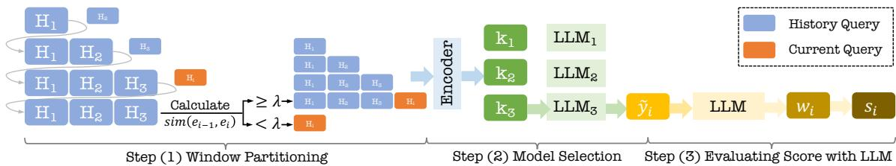  
Fig. 2. Overview of SWRouter . Given a multi-turn dialogue, SWRouter first encodes adjacent user turns and computes their semantic similarity to decide whether the current turn should extend the existing window or start a new one. The retained window is then merged into a context-enhanced prompt and passed to a pluggable router, which represents the prompt with an encoder, compares it with learnable candidate-model embeddings, and selects the LLM with the highest routing score. During training, the router is optimized with sample-LLM and sample-sample contrastive objectives so that high-quality models and semantically related prompts are pulled closer in representation space. During evaluation, the generated responses are scored by judge models and decomposed into construction accuracy, evaluation accuracy, and router performance, allowing prompt construction quality and model-selection ability to be analyzed separately.

Overall, these three stages form a unified framework for multi-turn LLM routing. The similarity-based window partitioning stage determines what historical context should be preserved, the routing stage determines which model should be selected under the constructed prompt, and the decoupled evaluation stage determines how the resulting system should be assessed.

## 4.2 Similarity-based Window Partitioning

A core challenge in multi-turn LLM routing is that the current user query should not be interpreted in isolation. Instead, the router should determine which historical turns remain semantically relevant to the current request and should therefore be retained in the routing prompt. To address this issue, SWRouter employs a similarity-based window partitioning algorithm that organizes dialogue history into semantically coherent windows. This formulation follows the broader view of sequential structure analysis and segmentation in formal-language and string-processing algorithms [1, 7, 19], while using neural semantic similarity rather than symbolic parsing rules.

Let �(�; �) denote an encoder that maps an input utterance � into an embedding in R�. Given the current user query $x _ { i } ,$ we first compute its embedding

$$
e _ { i } = E ( x _ { i } ; w ) .
$$

We then measure the similarity between the current query and the previous query:

$$
{ \mathrm { s i m i l a r i t y } } = { \sin ( { e _ { i } , e _ { i - 1 } } ) } ,\tag{5}
$$

where sim $. ( \cdot , \cdot )$ denotes cosine similarity, $e _ { i }$ is the embedding of the current query $x _ { i } ,$ , and $e _ { i - 1 }$ is the embedding of the previous query $x _ { i - 1 }$

Based on this similarity score, SWRouter updates the historical window $H _ { i }$ as follows:

$$
H _ { i } = \left\{ { \begin{array} { l l } { \{ x _ { i } \} , } & { { \mathrm { i f } } \sin ( e _ { i } , e _ { i - 1 } ) < \tau , } \\ { H _ { i - 1 } \cup \{ x _ { i } \} , } & { { \mathrm { i f } } \sin ( e _ { i } , e _ { i - 1 } ) \geq \tau , } \end{array} } \right.\tag{6}
$$

Manuscript submitted to ACM

Algorithm 1: Similarity-based window construction for multi-turn routing. The algorithm scans a dialogue   
from left to right, starts a new semantic window when adjacent user turns are weakly related, and otherwise   
extends the current window. For each current request, it outputs a context-enhanced prompt that contains only   
the active semantic window.   
Input: Dialogue ${ \mathcal { Z } } _ { i } = \{ ( u _ { i , 1 } , a _ { i , 1 } ) , . . . , ( u _ { i , m _ { i } - 1 } , a _ { i , m _ { i } - 1 } ) , u _ { i , m _ { i } } \}$ ; encoder $E ( \cdot ; w ) ;$ threshold �   
Output: Context-enhanced prompt $c _ { i }$ and retained window $H _ { i }$ for the current request $x _ { i } = u _ { i , m _ { i } }$   
1 $H \gets \{ u _ { i , 1 } , a _ { i , 1 } \} ;$   
2 $\boldsymbol { e } _ { \mathrm { p r e v } } \gets E ( u _ { i , 1 } ; w ) ;$   
3 for $j = 2$ to �� do   
4 $e _ { j } \gets E ( u _ { i , j } ; w ) ;$   
5 $\rho _ { j } \gets \sin ( e _ { j } , e _ { \mathrm { p r e v } } ) ;$   
6 if $\rho _ { j } < \tau$ then   
7 $\left| \begin{array} { r l } { \mathbf { \sigma } } & { { } \right| H \gets \{ u _ { i , j } \} } \end{array}$ ; // topic shift; reset the semantic window   
8 else   
9 $\lfloor \ H  H \cup \{ u _ { i , j } \}$ ; // same local context; extend the window   
10 i $\textbf { f } j <$ �� and $u _ { i , j } \in H$ then   
11 $H \gets H \cup \{ a _ { i , j } \}$ ; // retain assistant-side context inside the window   
12 $e _ { \mathrm { p r e v } }  e _ { j } ;$   
13 $H _ { i } \gets H ;$   
14 $c _ { i } \gets \mathrm { F o r m a t P r o m p t } ( H _ { i } , x _ { i } ) ;$   
15 return $c _ { i } , H _ { i } ;$

where � is a similarity threshold. Intuitively, if the current turn is insuficiently similar to the previous one, SWRouter starts a new window; otherwise, it appends the current turn to the existing window. In this way, the dialogue history is partitioned into locally coherent semantic segments rather than being naively concatenated into a single undiferentiated context.

After the historical window is determined, SWRouter constructs a context-enhanced prompt $c _ { i }$ for routing by combining the current query with the selected dialogue history in ��. This design enables the router to make decisions based on relevant multi-turn context, rather than relying solely on the current turn. Compared with naive history concatenation, the similarity-based windowing mechanism ofers two advantages. First, it preserves relevant context needed for rule-dependent or context-dependent requests, thereby reducing information loss. Second, it avoids carrying obsolete or of-topic history into the new prompt, thereby reducing information confusion. These two efects correspond exactly to the two failure modes illustrated in Figure 1.

The similarity threshold � controls the granularity of context segmentation. A smaller � tends to merge more turns into the same window, which may preserve more context but also increases the risk ofintroducing irrelevant information. A larger � produces more aggressive segmentation, which can better isolate topic shifts but may also discard useful dependencies. Therefore, � governs the trade-of between context retention and context purity, and its impact will be analyzed in Section 6.5.

Algorithm 1 summarizes the similarity-window construction procedure. The procedure is applied independently to each dialogue. It processes user turns in chronological order, compares each user turn with the immediately preceding user turn, and updates the active semantic window according to the threshold �. Assistant turns that lie inside the retained window are preserved when constructing the final prompt, so that the generated prompt keeps both the user’s constraints and the assistant-side facts that may be needed for resolving follow-up references.

Manuscript submitted to ACM

## 4.3 Routing and Training

For a query $x _ { i } ,$ after being transformed into a combined query $c _ { i }$ using the similarity-based window partitioning algorithm, SWRouter generates a selection probability distribution over � candidate LLMs:

$$
R ( c _ { i } ; \theta ) = \mathrm { s o f t m a x } \left( \left[ \begin{array} { c } { { \sin ( E ( c _ { i } ; w ) , k _ { 1 } ) } } \\ { { \sin ( E ( c _ { i } ; w ) , k _ { 2 } ) } } \\ { { \vdots } } \\ { { \sin ( E ( c _ { i } ; w ) , k _ { T } ) } } \end{array} \right] \right) ,\tag{7}
$$

where $\theta \equiv \{ w , k _ { 1 } , k _ { 2 } , \ldots , k _ { T } \}$ denotes the parameters of SWRouter , and $s \mathrm { i m } ( \cdot , \cdot )$ denotes cosine similarity.

A straightforward way to train the router is to align its output distribution with a score distribution:

$$
\operatorname* { m i n } _ { \theta } \sum _ { ( c _ { i } , y _ { i } ) \in C _ { \mathrm { t r a i n } } } \mathrm { K L } \Big ( R ( c _ { i } ; \theta ) , \ : \mathrm { s o f t m a x } [ s _ { i } ^ { ( 1 ) } , \ldots , s _ { i } ^ { ( T ) } ] \Big ) ,\tag{8}
$$

where $\operatorname { K L } ( \cdot , \cdot )$ denotes the Kullback–Leibler divergence [24]. This KL objective has recently been used in LLM routing [33]. However, we argue that it is not an ideal proxy for router training in our setting, because the goal of routing is to assign queries to top-performing LLMs rather than to fit the full score distribution, especially for bottom-performing models. Following the contrastive learning spirit of RouterDC [9], SWRouter adopts contrastive training objectives over the context-enhanced query.

4.3.1 Sample-LLM Contrastive Loss. For each combined query $c _ { i } ,$ , SWRouter constructs positive and negative LLM index sets $I _ { i } ^ { + }$ and $I _ { i } ^ { - }$ . The sample-LLM contrastive loss is defined as

$$
L _ { \mathrm { s a m p l e - L L M } } ( c _ { i } , y _ { i } ; \theta ) = - \log \frac { P _ { i } ^ { + } } { P _ { i } ^ { + } + P _ { i } ^ { - } } ,\tag{9}
$$

where

$$
P _ { i } ^ { + } = \sum _ { { t \in I _ { i } ^ { + } } } e ^ { \sin ( E ( c _ { i } ; w ) , k _ { t } ) } ,\tag{10}
$$

is the sum of the exponentiated similarities between the query embedding $E ( c _ { i } ; w )$ and the top- $\cdot K _ { + }$ model embeddings, and

$$
P _ { i } ^ { - } = \sum _ { { t } \in I _ { i } ^ { - } } e ^ { \sin ( { E } ( c _ { i } ; w ) , k _ { t } ) } ,\tag{11}
$$

is the corresponding sum over the bottom-�− model embeddings. Here, $I _ { i } ^ { + }$ and $I _ { i } ^ { - }$ denote the index sets of the top-�+ and bottom-�− LLMs, respectively.

4.3.2 Sample-Sample Contrastive Loss. In addition to contrasting candidate models for each query, SWRouter leverages unsupervised clustering to group semantically related queries and constructs a sample-sample contrastive loss: This representation-learning design is related to scalable log-linear optimization and predictive structure learning across related tasks [3, 4].

$$
L _ { \mathrm { s a m p l e - s a m p l e } } \left( c _ { i } ; \theta \right) = - \log \frac { Q _ { i } ^ { + } } { Q _ { i } ^ { + } + Q _ { i } ^ { - } } ,\tag{12}
$$

where

$$
Q _ { i } ^ { + } = e ^ { \sin ( E ( c _ { i } ; w ) , E ( c _ { i } ^ { + } ; w ) ) }\tag{13}
$$

Manuscript submitted to ACM

Algorithm 2: Router training and inference for SWRouter . The procedure first converts raw dialogues into   
context-enhanced prompts using Algorithm 1, then builds contrastive supervision from candidate-model scores,   
optimizes the router with sample-LLM and sample-sample losses, and finally selects one candidate LLM for   
each test prompt.   
Input: Training dialogues $\mathcal { D } _ { \mathrm { t r a i n } } .$ , test dialogues $\mathcal { D } _ { \mathrm { t e s t } } .$ , LLM pool $\boldsymbol { M } = \{ \boldsymbol { M } _ { t } \} _ { t = 1 } ^ { T }$ , encoder $E ( \cdot ; w )$ , model embeddings $\{ k _ { t } \} _ { t = 1 } ^ { T } ,$   
threshold $\tau ,$ hyperparameters $K _ { + } , K _ { - } , N , \lambda , b , \eta$   
Output: Trained router $R ( \cdot ; \theta )$ and routed responses on the test set   
1 Data preprocessing:   
2 for $\mathcal { Z } _ { i } \in \mathcal { D } _ { t r a i n }$ do   
3 $( c _ { i } , H _ { i } ) \gets \mathrm { W }$ indowConstruct $\textstyle z _ { i } , E , \tau )$ using Algorithm $^ { 1 ; }$   
4 for $t = 1$ to � do   
5 Generate response $\boldsymbol { r } _ { i , t } \gets \boldsymbol { M } _ { t } ( \boldsymbol { c } _ { i } ) ;$   
6 Score ${ \boldsymbol { r } } _ { i , t }$ with the judge model to obtain $w _ { i , t } ;$   
7 $C _ { \mathrm { t r a i n } } \gets \{ ( c _ { i } , \{ w _ { i , t } \} _ { t = 1 } ^ { T } ) \}$   
8 Training:   
9 Cluster queries $\{ c _ { i } \} _ { i = 1 } ^ { n }$ into � groups   
10 repeat   
11 Sample mini-batch � from $C _ { \mathrm { t r a i n } }$   
12 for $( c _ { i } , y _ { i } ) \in B$ do   
13 Construct $I _ { i } ^ { + }$ and $I _ { i } ^ { - }$ using $w _ { i , t }$   
14 Compute $L _ { \mathrm { s a m p l e - L L M } } ( c _ { i } , y _ { i } ; \theta )$   
15 Sample in-group query $c _ { i } ^ { + }$ and out-group queries $\left\{ c _ { i } ^ { - } \right\}$   
16 Compute $L _ { \mathrm { s a m p l e - s a m p l e } } ( c _ { i } ; \theta )$   
17 $\begin{array} { r } { L ( B ; \theta ) \xleftarrow { } \sum _ { ( c _ { i } , y _ { i } ) \in B } \left[ L _ { \mathrm { s a m p l e - L L M } } + \lambda L _ { \mathrm { s a m p l e - s a m p l e } } \right] } \end{array}$   
18 $\theta \gets \theta - \eta \nabla _ { \theta } L ( B ; \theta )$   
19 until converged;   
20 Inference:   
21 for $\mathcal { Z } _ { i } \in \mathcal { D } _ { t e s t }$ do   
22 $( c _ { i } , H _ { i } ) \gets \mathrm { W }$ indowConstruct $\scriptstyle ( Z _ { i } , E , \tau ) ;$   
23 $\hat { t } _ { i } \gets$ arg max� $R _ { t } ( c _ { i } ; \theta )$   
24 $\hat { y } _ { i } \gets M _ { \hat { t } _ { i } } ( c _ { i } ) ;$   
25 return $R ( \cdot ; \theta )$ and $\{ \hat { y } _ { i } \} ;$

represents the similarity between the embedding of query $c _ { i }$ and that of a randomly chosen in-group query $c _ { i } ^ { + }$ , and

$$
Q _ { i } ^ { - } = \sum _ { c _ { i } ^ { - } \in X _ { i } ^ { - } } e ^ { \sin ( E ( c _ { i } ; w ) , E ( c _ { i } ^ { - } ; w ) ) }\tag{14}
$$

denotes the summed similarities between $c _ { i }$ and a set of out-group queries $X _ { i } ^ { - }$

The overall training objective combines the above two contrastive losses:

$$
\operatorname* { m i n } _ { \theta } \sum \left( \alpha L _ { \mathrm { s a m p l e - L L M } } + \beta L _ { \mathrm { s a m p l e - s a m p l e } } \right) ,\tag{15}
$$

where � and $\beta$ are hyperparameters that balance the two loss terms.

Algorithm 2 summarizes the training and inference pipeline of SWRouter . The algorithm uses Algorithm 1 as a preprocessing step to transform raw multi-turn dialogues into context-enhanced prompts. Training then relies on model-level and sample-level contrastive supervision, while inference only requires a single router forward pass before calling the selected candidate LLM.

Manuscript submitted to ACM

## 4.4 Decoupled Evaluation Metrics

For each combined query $c _ { i }$ and each candidate model $\displaystyle M _ { t } ( t = 1 , . . . , T )$ , we obtain a true score $0 \leq w _ { i , t } \leq 1$ from judge models, which reflects the absolute response quality of ${ \mathbf { } } { \mathbf { } } _ { } { \mathbf { } } { \mathbf { } } _ { } { \mathbf { } } { \mathbf { } } _ { } { \mathbf { } } { \mathbf { } } _ { } { \mathbf { } } { \mathbf { } } _ { } { \mathbf { } } { \mathbf { } } _ { } { \mathbf { } } { \mathbf { } } _ { } { \mathbf { } } { \mathbf { } } _ { } { } \mathbf { } _ { } { } { \mathbf { } } _ { } { } \mathbf { } _ { } { } { \mathbf { } } _ { } { } \mathbf { } _ { } { } { \mathbf { } } _ { } { } \mathbf { } _ { } { } { \mathbf { } } _ { } { } \mathbf { } _ { } { } \mathbf { } _ { } { } \mathbf { } _ { } { } { } \mathbf { } _ { } { } \mathbf { } _ { } { } \mathbf { } _ { } { } \mathbf { } _ { } { } \mathbf { } _ { } { } \mathbf { } _ { } { } \mathbf { } _ { } { } \mathbf { } _ { } { } \mathbf { } _ { } { } \mathbf { } _ { } { } \mathbf { } _ { } { } \mathbf { } _ { } { } \mathbf { } _ { } { } \mathbf { } _ { } { } \mathbf { } _ { } { } \mathbf { } _ { }  { \mathbf } _ { } { } \mathbf { } _ { } { } \mathbf { } _ { } \mathbf { } _ { } { } \mathbf { } _ { } \mathbf { } _ { } \mathbf { } _ { } { } \mathbf { } _ { } \mathbf { } _ { } \mathbf { } _ { } \mathbf { } _ { } \mathbf { } _ { } \mathbf { } _ { } \mathbf { } _ { } \mathbf { } _ { } \mathbf { } _ { } \mathbf { } _ { } \mathbf _ { } \mathbf { } _ { } \mathbf { } _ { } \mathbf _ { } \mathbf { } _ { } \mathbf _ { } \mathbf { } _ { } \mathbf _ { } \mathbf { } _ \mathbf { } _ { } \mathbf _ { } \mathbf { } _ \mathbf { } _ \mathbf { } _ { } \mathbf _ { } \mathbf _ { } \mathbf { } _ \mathbf { } _ \mathbf { } _ \mathbf { } _ \mathbf  $ on $c _ { i }$

Evaluation Accuracy (absolute quality). Given the router’s selection indicator $s _ { i } ^ { ( t ) } \in \{ 0 , 1 \}$ , where $s _ { i } ^ { ( t ) } = 1$ if the router selects ${ \mathbf { } } { \mathbf { } } _ { } { \mathbf { } } { \mathbf { } } _ { } { \mathbf { } } { \mathbf { } } _ { } { \mathbf { } } { \mathbf { } } _ { } { \mathbf { } } { \mathbf { } } _ { } { \mathbf { } } { \mathbf { } } _ { } { \mathbf { } } { \mathbf { } } _ { } { \mathbf { } } { \mathbf { } } _ { } { } \mathbf { } _ { } { } { \mathbf { } } _ { } { } \mathbf { } _ { } { } { \mathbf { } } _ { } { } \mathbf { } _ { } { } { \mathbf { } } _ { } { } \mathbf { } _ { } { } { \mathbf { } } _ { } { } \mathbf { } _ { } { } \mathbf { } _ { } { } \mathbf { } _ { } { } { } \mathbf { } _ { } { } \mathbf { } _ { } { } \mathbf { } _ { } { } \mathbf { } _ { } { } \mathbf { } _ { } { } \mathbf { } _ { } { } \mathbf { } _ { } { } \mathbf { } _ { } { } \mathbf { } _ { } { } \mathbf { } _ { } { } \mathbf { } _ { } { } \mathbf { } _ { } { } \mathbf { } _ { } { } \mathbf { } _ { } { } \mathbf { } _ { } { } \mathbf { } _ { }  { \mathbf } _ { } { } \mathbf { } _ { } { } \mathbf { } _ { } \mathbf { } _ { } { } \mathbf { } _ { } \mathbf { } _ { } \mathbf { } _ { } { } \mathbf { } _ { } \mathbf { } _ { } \mathbf { } _ { } \mathbf { } _ { } \mathbf { } _ { } \mathbf { } _ { } \mathbf { } _ { } \mathbf { } _ { } \mathbf { } _ { } \mathbf { } _ { } \mathbf _ { } \mathbf { } _ { } \mathbf { } _ { } \mathbf _ { } \mathbf { } _ { } \mathbf _ { } \mathbf { } _ { } \mathbf _ { } \mathbf { } _ \mathbf { } _ { } \mathbf _ { } \mathbf { } _ \mathbf { } _ \mathbf { } _ { } \mathbf _ { } \mathbf _ { } \mathbf { } _ \mathbf { } _ \mathbf { } _ \mathbf { } _ \mathbf  $ for $c _ { i }$ and 0 otherwise, the score of the selected model is

$$
s _ { i } = \sum _ { t = 1 } ^ { T } w _ { i , t } \cdot s _ { i } ^ { ( t ) } .\tag{16}
$$

We define evaluation accuracy as the average true score achieved by the routing system:

$$
{ \overline { { s i } } } = { \frac { 1 } { n } } \sum _ { i = 1 } ^ { n } s _ { i } ,\tag{17}
$$

which reflects the absolute usefulness of the routed responses under the constructed prompts.

Construction Accuracy (prompt quality). To characterize the overall quality of the constructed prompt across all candidate models, we define the average true score

$$
\bar { w } = \frac { 1 } { n T } \sum _ { i = 1 } ^ { n } \sum _ { t = 1 } ^ { T } w _ { i , t } ,\tag{18}
$$

which reflects the average capability of the candidate model pool under a given prompt construction. A higher �¯ indicates that the constructed prompt enables better responses across all candidate models.

Router Performance (relative improvement). Based on $\overline { { s i } }$ and $\bar { \boldsymbol { w } } ,$ we define router performance as

$$
P _ { \mathrm { r o u t e r } } = \frac { \overline { { s i } } } { \bar { w } } .\tag{19}
$$

Here, �¯ reflects the average capability of the candidate model pool under a given prompt construction, while $P _ { \mathrm { r o u t e r } }$ measures how much the router improves over this average by selecting stronger models. A value greater than 1 indicates that the router outperforms random model selection.

Discussion: three complementary metrics. For evaluation in multi-turn dialogue, we adopt three complementary metrics to characterize the system: evaluation accuracy $( \overline { { s i } } )$ , construction accuracy (�¯ ), and router performance $( P _ { \mathrm { r o u t e r } } )$ Figure 3 illustrates why these metrics are complementary. Under good prompt construction, the candidate models obtain scores of $\{ 0 . 9 , 0 . 7 , 0 . 3 \}$ , yielding an average construction accuracy of $\dot { v } = 0 . 6 3 3 .$ . If the router selects the best model, then $\overline { { s i } } = 0 . 9$ and $P _ { \mathrm { { r o u t e r } } } = 0 . 9 / 0 . 6 3 3 = 1 . 4 2$ , indicating both strong construction quality and efective routing. In contrast, under poor prompt construction, information loss uniformly degrades the candidate scores to $\left. 0 . 0 9 , 0 . 0 7 , 0 . 0 3 \right.$ , reducing construction accuracy to $\bar { w } = 0 . 0 6 3 3$ . Even if the router still selects the best model, the final evaluation accuracy drops to $\overline { { s i } } = 0 . 0 9$ , while the router performance remains unchanged: $P _ { \mathrm { r o u t e r } } = 0 . 0 9 / 0 . 0 6 3 3 = 1 . 4 2 .$ This example shows that high router performance does not necessarily imply high end-to-end response quality. Instead, $\overline { { s i } }$ reflects the final usefulness of the routed response, �¯ measures the intrinsic quality of prompt construction, and $P _ { \mathrm { r o u t e r } }$ quantifies the router’s ability to select better-than-average candidates. Together, these metrics enable a decoupled analysis of construction quality and routing efectiveness.

Manuscript submitted to ACM

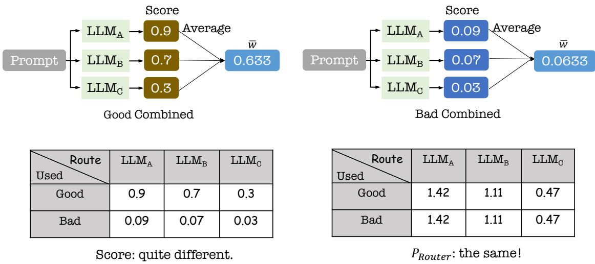  
Fig. 3. Illustration of the three complementary metrics used for decoupled evaluation. For each constructed prompt, all candidate LLMs are first evaluated with absolute true scores. Construction accuracy �¯ averages these scores across the whole candidate pool and therefore measures whether the prompt construction stage preserves useful context for models in general. Evaluation accuracy �� then records the true score of the single model selected by the router, representing the end-to-end quality observed by users. Router performance $P _ { \mathrm { r o u t e r } } = { \overline { { s i } } } /$ �¯ normalizes the selected-model score by the candidate average, showing whether the router improves over random model selection under the same constructed prompts.

## 5 Implementation

We implement SWRouter following the standard router-training and evaluation pipeline for multi-turn LLM routing. Our implementation consists of candidate model construction, multi-turn dataset preprocessing, similarity-window segmentation, response scoring, and router optimization.

Candidate LLMs. We evaluate SWRouter on seven open-source LLMs from HuggingFace: Mistral-7B [22], MetaMath-Mistral-7B [46], zephyr-7b-beta [44], Chinese-Mistral-7B [49], dolphin-2.6-mistral-7b [12], Llama-3-8B [31], and dolphin-2.9-llama3-8b [13]. The first five models are Mistral-based, while the last two are Llama-3-based. These models cover general-purpose, instruction-tuned, domain-tuned, and language-adapted variants, enabling us to evaluate whether SWRouter can select among LLMs with heterogeneous capabilities. The Llama-family candidates build on the broader open-foundation-model line represented by LLaMA and LLaMA 2 [42, 43], and zephyr-7b-beta follows preferenceoptimization techniques such as direct preference optimization [36].

Datasets. We conduct experiments on two multi-turn dialogue datasets, MTBench [6] and ShareGPT [38]. MTBench contains multi-turn conversations across diverse task categories, while ShareGPT consists of real user-AI interactions. We preprocess ShareGPT by removing noisy samples and filtering out non-multi-turn dialogues. For both datasets, we randomly split the data into 70% for training and 30% for testing. All training samples are combined as $C _ { \mathrm { t r a i n } }$ for router training.

Baselines. We compare SWRouter with three groups of baselines. First, Single Model directly uses one candidate LLM to answer each query without routing. This group includes all seven candidate LLMs listed above. Second, Conv-ID Context preserves the original dialogue segmentation according to conversation IDs and performs routing with the full original multi-turn context. This baseline serves as an ID-based static context reference. Third, ZOOTER [33] is used as a strong single-turn router backbone. To evaluate the generality of the proposed similarity-window mechanism, we combine ZOOTER with the same similarity-window segmentation and compare it with SWRouter .

Evaluation protocol. We use the Language Model Evaluation Harness [16] for model evaluation, following common benchmark practice from MMLU-style multitask evaluation [21]. For open-ended generation, we generate $M = 1 0$ candidate responses using stochastic beam search, where beam expansion is sampled with temperature 0.2. The generated responses are then scored by judge models, and the router is evaluated using testing weighted accuracy.

Similarity-window configurations. We use mDeBERTaV3-base [20] as the encoder �(�; �), which contains approximately 86M backbone parameters. This choice follows the use of eficient neural encoders for structured text analysis [37]. The similarity threshold is set to $\tau = 0 . 9 1$ for constructing similarity windows. The LLM embedding dimension is 768, and the number of clusters is set to $N = 5 .$

Router training configurations. The router is trained for 1,000 steps using AdamW [32]. The learning rate is $5 \times 1 0 ^ { - 5 }$ , the weight decay is 0.01, and the batch size is 16. All experiments are conducted on NVIDIA A100 80GB GPUs.

## 6 Evaluation

We evaluate SWRouter to answer the following questions:

(1) Can SWRouter improve routing performance on multi-turn dialogue tasks?

(2) How well does SWRouter generalize to out-of-distribution (OOD) scenarios?

(3) How much does each component contribute to the efectiveness of SWRouter ?

(4) How sensitive is SWRouter to key hyperparameters?

(5) What is the computational overhead introduced by SWRouter ?

## 6.1 Evaluation Setup

6.1.1 Prompts Used for Evaluation. To evaluate the quality of routed responses in multi-turn dialogue, we employ a judge model with the following evaluation prompt: The prompt is written as a structured evaluation rubric following standard academic reporting conventions [2].

You are given a multi-turn conversation, including the previous dialogue history, the current user request, and an assistant response generated by a candidate LLM. Please evaluate the quality ofthe assistant response with a single integer score from 1 to 10. Judge the response semantically rather than by exact wording: paraphrases, diferent ordering, or diferent surface expressions should be treated as acceptable when they preserve the same meaning and satisfy the user’s request. Do not reward verbosity by itself; longer answers should receive higher scores only when the additional content improves correctness, usefulness, or coverage.

Use the following criteria when assigning the score. Intent satisfaction evaluates whether the response identifies the user’s actual goal in the current turn and provides a useful answer or action for that goal. Dialogue context usage evaluates whether the response correctly incorporates relevant prior turns, carries over established constraints, resolves references such as “it” or “that” appropriately, and avoids being distracted by obsolete or unrelated context. Instruction following evaluates whether the response obeys explicit requirements about format, language, style, scope, tools, refusal behavior, or output length. Factuality and reasoning evaluates whether the response is factually correct, logically consistent, and supported by the information available in the conversation or by reliable reasoning. Completeness evaluates whether all important parts ofthe request are addressed, including edge cases, caveats, or requested explanations. Clarity cript submitted to ACM

and usefulness evaluates whether the response is easy to understand, well organized, appropriately concise, and practically helpful to the user.

Apply the following scoring guideline. A score of 10 should be reserved for a response that fully satisfies the user’s intent, uses all necessary dialogue context correctly, follows every instruction, is factually sound, complete, and clear. A score of9 indicates an excellent response with only negligible wording or presentation issues. Scores of7–8 indicate a mostly correct and useful response that satisfies the main request but has minor omissions, mild ambiguity, limited explanation, or only partial use of relevant context. Scores of 5–6 indicate a partially useful response that addresses the general topic but misses important constraints, overlooks meaningful dialogue history, contains noticeable but non-fatal factual or reasoning errors, or leaves substantial parts of the task incomplete. Scores of 3–4 indicate a weak response that is only loosely related to the request, substantially incomplete, poorly grounded in the dialogue, or afected by majorfactual, reasoning, or instruction-following errors. Scores of1–2 indicate a response that is irrelevant, contradicts the conversation, refuses without justification, is unsafe when safety is required, fails to answer the user, or is dominated by hallucinated content.

When several issues are present, choose the score that best reflects the overall usefulness ofthe response to the user. Penalize strongly for errors that would cause the user to take a wrong action, violate an explicit constraint, or misunderstand the task outcome. A response with a major factual error should not receive a score above 6, even if it is fluent. A response that ignores the current user request or relies on the wrong dialogue context should not receive a score above 4. A response that is correct but unnecessarily verbose, poorly organized, or missing minor details may still receive a high score if the user’s intent is satisfied. Return only the final score.

The judge model returns an integer rating from 1 to 10, which we normalize to the range [0, 1] as the true score ��,� for evaluation metrics computation.

## 6.2 Overall Performance

As shown in Figure 4, SWRouter achieves the best overall performance across the two multi-turn dialogue datasets. Compared with the strongest single LLM, dolphin-2.9-llama3-8b, SWRouter improves the average evaluation accuracy from 24.63% to 40.89%, corresponding to an absolute gain of 16.26%. The improvement is consistent across both datasets, with gains of 14.29% on ShareGPT and 18.22% on MTBench.

Compared with Conv-ID Context, which preserves the original dialogue segmentation by conversation IDs, SWRouter further improves the average evaluation accuracy by 8.22%. This result suggests that exact ID-based partitioning is not necessarily the optimal context construction strategy for multi-turn routing. Instead, dynamically constructing semantic windows provides more useful routing inputs.

Moreover, ZOOTER equipped with the similarity-window mechanism achieves 39.21% average evaluation accuracy, substantially outperforming Conv-ID Context. This indicates that the proposed similarity-window design is general and can improve diferent routing backbones by constructing better multi-turn contexts.

Manuscript submitted to ACM

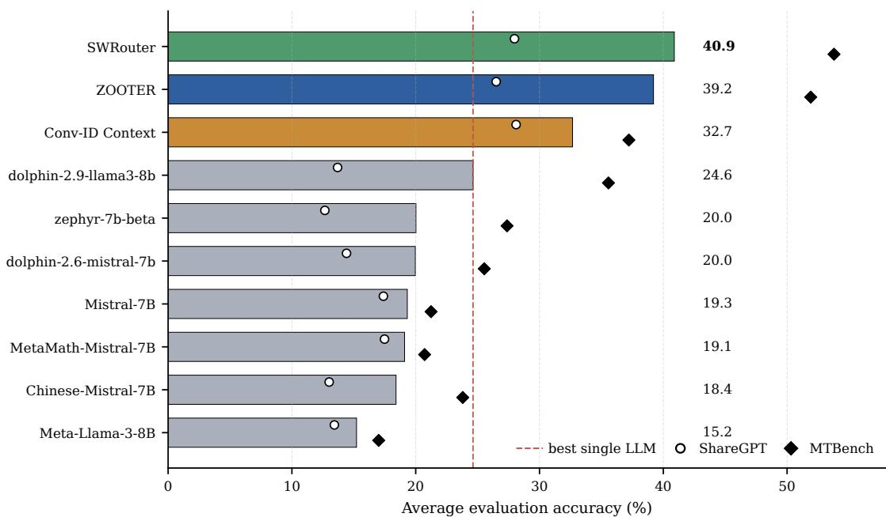  
Fig. 4. Overall evaluation accuracy (%) on ShareGPT and MTBench. Horizontal bars rank all candidate single LLMs and routing methods by average accuracy, while markers show the corresponding ShareGPT and MTBench scores. The dashed line marks the strongest single LLM, making the routing gain of SWRouter visually explicit.

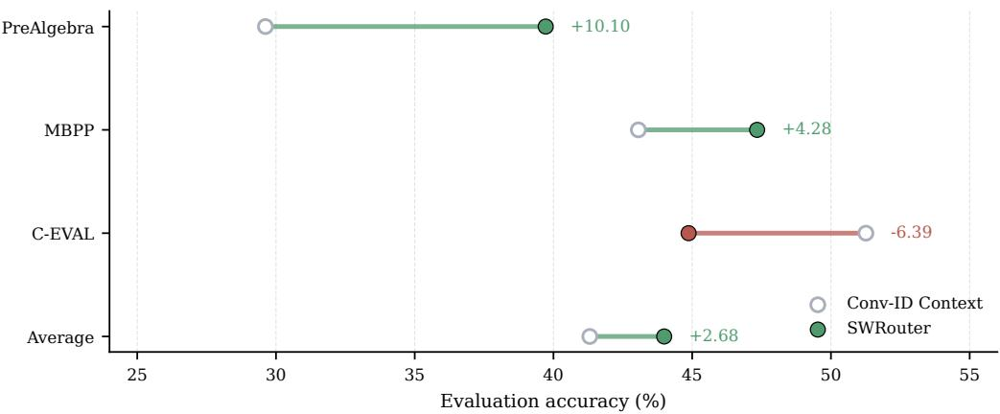  
Fig. 5. Evaluation accuracy (%) of SWRouter and Conv-ID Context on out-of-distribution datasets. PreAlgebra, MBPP, and C-EVAL cover mathematical reasoning, code generation, and Chinese knowledge-intensive evaluation, respectively. The connected markers compare SWRouter with Conv-ID Context on each task, and the right-side annotations report the absolute gain or loss. This visualization emphasizes that SWRouter improves the average OOD result despite not winning on every individual task.

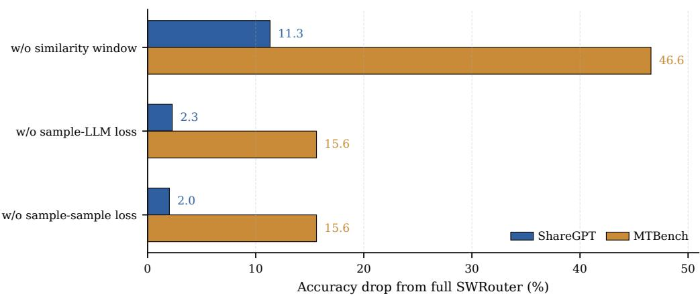  
Fig. 6. Ablation study results measured by evaluation accuracy (%) of SWRouter . Each bar reports the accuracy drop relative to the full SWRouter model after removing one component. The full model obtains 27.98% on ShareGPT and 53.79% on MTBench. This drop-oriented view highlights that similarity-window construction is the dominant contributor, especially on MTBench, while both contrastive losses also provide consistent gains.

## 6.3 OOD Generalization

We further evaluate the generalization ability of SWRouter under out-of-distribution scenarios, including PreAlgebra, MBPP, and C-EVAL. These datasets cover mathematical reasoning, code generation, and Chinese knowledge-intensive evaluation, respectively, and are related to established mathematical and Chinese multitask evaluation settings [11, 25].

As shown in Figure 5, SWRouter achieves the best average OOD performance, reaching 43.99% and outperforming Conv-ID Context by 2.68%. In particular, SWRouter improves Conv-ID Context by 10.10% on PreAlgebra and 4.28% on MBPP. Although Conv-ID Context performs better on C-EVAL, SWRouter exhibits stronger average robustness across heterogeneous OOD tasks.

This result indicates that SWRouter does not simply fit ID-based routing labels. Instead, the learned selection strategy captures transferable routing patterns that generalize beyond the original dialogue distribution.

## 6.4 Performance Breakdown

We conduct ablation studies to quantify the contribution of each component in SWRouter . As shown in Figure 6, removing any component consistently degrades performance, showing that all components are necessary for efective routing.

Similarity window. Removing the similarity window causes the largest performance drop. Evaluation Accuracy decreases by 11.33% on ShareGPT and 46.57% on MTBench. This confirms that adaptive context construction is the most important component of SWRouter .

Sample-LLM loss. Removing �sample-LLM reduces performance to 25.70% on ShareGPT and 38.17% on MTBench. This indicates that modeling the relationship between dialogue samples and candidate LLMs is critical for accurate routing.

Sample-sample loss. Removing �sample-sample also significantly hurts performance, especially on MTBench. This shows that sample-level representation alignment helps construct a more structured routing space.

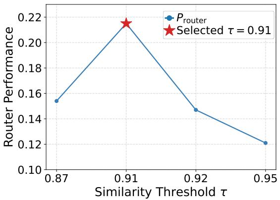  
(a) Router performance $P _ { \mathrm { r o u t e r } } .$

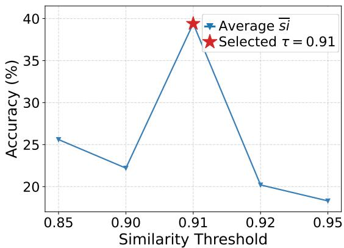  
(b) Average value of ��.

Fig. 7. Efect of the similarity threshold � on router performance $P _ { \mathrm { r o u t e r } }$ and the average value of ${ \overline { { s i } } } .$ The left subfigure shows how strongly the router improves over the average candidate-model score under each threshold, while the right subfigure reports the resulting end-to-end routed response quality. Together, the curves show that threshold selection afects both model-selection efectiveness and absolute response quality, with the best operating region concentrated around $\tau = 0 . 9 1$  
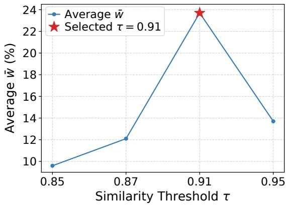  
(a) MT-Bench.

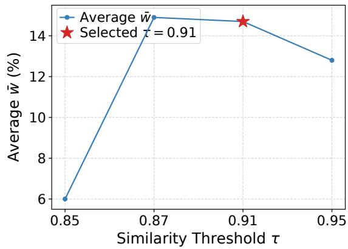  
(b) ShareGPT.  
Fig. 8. Efect of the similarity threshold � on the average value of �¯ for MT-Bench and ShareGPT. Since �¯ averages the true scores of all candidate LLMs under the constructed prompts, these curves isolate the prompt-construction quality from the router’s model-selection behavior. The comparison shows how stricter or looser window partitioning changes the amount of useful context retained for the candidate model pool.

Actual score. We further observe that proxy routing scores can substantially overestimate the final end-to-end performance if prompt construction is ignored. This highlights the necessity of evaluating actual generated responses rather than relying only on intermediate routing objectives.

## 6.5 Sensitivity Analysis

We analyze the sensitivity of SWRouter to the similarity threshold �.

Manuscript submitted to ACM

Efect of Similarity Threshold �.We conduct a sensitivity study on the similarity threshold � with respect to three key performance metrics: the average value of $\cdot { \overline { { s i } } } ,$ the average value of �¯ , and router performance $P _ { \mathrm { r o u t e r } }$

Average Value of �� $\begin{array} { r } { ( \overline { { s i } } = \frac { 1 } { n } \sum _ { i = 1 } ^ { n } } \end{array}$ ��). Figure 7(b) shows the efect of � on ${ \overline { { s i } } } .$ . The similarity-window construction achieves its best performance at $\tau = 0 . 9 1$ , reaching 40.89% accuracy and outperforming the Conv-ID Context baseline of 32.67%. When � moves away from this value, the performance decreases noticeably. For example, the accuracy drops to 25.6% at $\tau = 0 . 8 5$ , 22.2% at $\tau = 0 . 9 0$ , 20.2% at $\tau = 0 . 9 2$ , and 18.3% at $\tau = 0 . 9 5$ . These results indicate that �� is highly sensitive to the similarity threshold, and that $\tau = 0 . 9 1$ provides the most efective similarity window.

Average Value of �¯ . Figure 8 presents the average value of �¯ under diferent similarity thresholds � on MT-Bench and ShareGPT. The results show that �¯ is strongly afected by the similarity threshold. On MT-Bench, �¯ increases from 9.60% at $\tau = 0 . 8 5$ to 12.10% at $\tau = 0 . 8 7$ , and further reaches the maximum value of 23.70% at $\tau = 0 . 9 1$ . However, when the threshold is increased to $\tau = 0 . 9 5 ,$ �¯ drops sharply to 13.70%, suggesting that an overly strict similarity constraint can substantially reduce the retained high-quality samples.

A similar trend can also be observed on ShareGPT. The average value of �¯ is 6.00% at $\tau = 0 . 8 5$ , increases significantly to 14.90% at $\tau = 0 . 8 7$ , and remains at a comparable level of 14.70% when $\tau = 0 . 9 1 .$ . It then decreases to 12.80% at $\tau = 0 . 9 5 .$ . These results suggest that ShareGPT is slightly more stable than MT-Bench around the optimal region, but its performance is still afected by threshold selection.

Overall, the high-quality region is mainly concentrated around $\tau = 0 . 9 1$ . MT-Bench achieves its best result at $\tau = 0 . 9 1 $ while ShareGPT maintains competitive performance in the range of $\tau \in \left[ 0 . 8 7 , 0 . 9 1 \right]$ . Considering both datasets, $\tau = 0 . 9 1$ provides a stable trade-of between sample quality and coverage, and we therefore adopt it as the default threshold.

Router Performance $( P _ { \mathrm { r o u t e r } } ) .$ Figure 7(a) illustrates the efect of the similarity threshold � on router performance $P _ { \mathrm { r o u t e r } } .$ . Overall, $P _ { \mathrm { r o u t e r } }$ is influenced by the choice of�, although its variation is less pronounced than that of�¯ . Specifically, $P _ { \mathrm { r o u t e r } }$ is 15.4% at $\tau = 0 . 8 7$ , increases to its peak of 21.5% at $\tau = 0 . 9 1$ , and then decreases to 14.7% at � = 0.92 and 12.1% at $\tau = 0 . 9 5$

These results indicate that router performance still depends on the similarity threshold, but the overall fluctuation is relatively moderate. Compared with �¯ , $P _ { \mathrm { r o u t e r } }$ is less sensitive to changes in �. Nevertheless, the best router performance is still achieved at $\tau = 0 . 9 1$ , further supporting our choice of $\tau = 0 . 9 1$ as the default threshold.

## 6.6 Robustness Analysis

6.6.1 Extension: Top-K Retrieval for Long-Range Dependency Recovery. As an extension to the core similarity-based windowing approach, we investigate whether augmenting it with a lightweight Top-K retrieval mechanism can further recover semantically related queries that are separated by unrelated turns.

We simulate a scenario where a user issues a query a, then several unrelated queries, and finally a related query b. For each $b ,$ similarity-based Top-K retrieval is performed over the dialogue history to test whether a can be recalled

Table 2. Recall performance of similarity-based retrieval under diferent levels of semantic interference. Inserted queries denote unrelated turns placed between two semantically related user requests; Top-� recall measures whether the retrieval module can recover the earlier related turn from the dialogue history.
<table><tr><td>Inserted Queries</td><td>Top-1 Recall</td><td>Top-3 Recall</td><td>Top-5 Recall</td></tr><tr><td>1</td><td>79.43</td><td>100.00</td><td>100.00</td></tr><tr><td>3</td><td>65.16</td><td>91.31</td><td>100.00</td></tr><tr><td>5</td><td>59.84</td><td>77.84</td><td>94.15</td></tr></table>

Manuscript submitted to ACM

We also test a more challenging case where 20 unrelated queries are inserted between a and b. The results are shown below.

Table 3. Retrieval robustness under the high-dificulty seting with 20 distractor turns. This seting stresses long-range dependency recovery by separating two related requests with many unrelated turns, and the reported recall indicates whether Top-� retrieval can still recover the relevant earlier query.
<table><tr><td>Inserted Queries Top-K</td><td></td><td>Recall (%)</td><td>Difficulty</td></tr><tr><td>20</td><td>5</td><td>66.13</td><td>Hard</td></tr></table>

As shown in Tables 2 and 3, similarity-based retrieval substantially improves robustness under semantic drift. Top-3 retrieval provides an efective trade-of between recall and eficiency. Even under high-dificulty conditions with 20 distractors, Top-5 recall remains above 66%, indicating strong resilience. These results demonstrate that augmenting local similarity-based segmentation with retrieval mechanisms can further enhance context reconstruction in realistic multi-turn dialogue scenarios.

6.6.2 Semantic Coherence in Long Dialogues. To further analyze the potential semantic drift as the dialogue length increases, we conducted a similarity analysis over multi-turn dialogues on the ShareGPT and MT-Bench datasets. Specifically, we computed the cosine similarity between the first and last user turns within each dialogue window unde diferent minimum round sizes (20, 25, and 30).

As shown in Table 4, in ShareGPT, over 70% of long-range pairs maintain a cosine similarity above 0.91, and the average similarity remains above 0.92, suggesting strong semantic consistency even across extended dialogues. In MT-Bench, the average similarity is slightly lower but still indicates limited semantic drift. Extremely low similarity cases (<0.80) are rare, implying that our similarity-based segmentation remains semantically coherent over long dialogue windows.

## 6.7 Detailed Overhead Analysis

We conduct a comprehensive analysis of the computational overhead introduced by SWRouter from three aspects: inference latency, training cost, and token generation cost.

6.7.1 Latency Analysis. As shown in Table 5, the similarity calculation in SWRouter accounts for less than 1% (approximately 2.2‰) of the total inference time, indicating high computational eficiency. The dominant cost comes from LLM inference, which is consistent with all routing-based systems.

6.7.2 Training Cost Analysis. The training process of SWRouter consists of four steps:

(1) Dataset window partitioning: We use a lightweight encoder (microsoft/mdeberta-v3-base) with approximately 86M backbone parameters, which is much smaller than the 7B/8B candidate LLMs, making this step’s cost negligible.

(2) Candidate response generation: We use the seven small models mentioned in the paper (Mistral-7B, MetaMath-Mistral-7B, zephyr-7b-beta, Chinese-Mistral-7B, dolphin-2.6-mistral-7b, Meta-Llama-3-8B, dolphin-2.9-llama3-8b) to generate candidate answers for each query.

(3) Judge-model scoring: We use GPT for scoring. Since the output is just a single numerical score, this step does not significantly increase memory usage.

Manuscript submitted to ACM

Table 4. Cosine similarity between the first and last user turns across dialogues of varying lengths. For each dataset, we group dialogues by minimum round size and report the proportion of long-range turn pairs above or below the default similarity threshold � = 0.91, together with the maximum, minimum, and average similarity. The table characterizes how quickly semantic drift appears as dialogue length increases
<table><tr><td>Dataset</td><td>Min Group Size</td><td>Total Pairs</td><td>≥0.91 (%)</td><td>&lt;0.91 (%)</td><td>Max</td><td>Min</td><td>Avg</td></tr><tr><td rowspan="3">ShareGPT</td><td>20</td><td>19</td><td>73.68</td><td>26.32</td><td>0.9922</td><td>0.6774</td><td>0.9283</td></tr><tr><td>25</td><td>13</td><td>76.92</td><td>23.08</td><td>0.9922</td><td>0.6774</td><td>0.9211</td></tr><tr><td>30</td><td>7</td><td>71.43</td><td>28.57</td><td>0.9874</td><td>0.8035</td><td>0.9247</td></tr><tr><td rowspan="3">MT-Bench</td><td>20</td><td>7</td><td>57.14</td><td>42.86</td><td>0.9620</td><td>0.7961</td><td>0.8989</td></tr><tr><td>25</td><td>6</td><td>50.00</td><td>50.00</td><td>0.9620</td><td>0.7961</td><td>0.8928</td></tr><tr><td>30</td><td>4</td><td>25.00</td><td>75.00</td><td>0.9426</td><td>0.7961</td><td>0.8603</td></tr></table>

Table 5. Time consumption of SWRouter during inference. The table decomposes latency into similarity calculation for window construction, router selection, and downstream LLM inference, showing that the additional cost introduced by similarity-window routing is small relative to candidate-model generation.
<table><tr><td>Time</td><td>Similarity Calculation</td><td>Router Selection</td><td>LLM Inference</td></tr><tr><td>SWRouter</td><td>50.6s</td><td>16min32s</td><td>&gt;6h</td></tr></table>

(4) Router training: The similarity-window encoder introduces limited overhead: microsoft/mdeberta-v3-base has approximately 86M backbone parameters, which is much smaller than the 7B/8B candidate LLMs. Moreover, the encoder is used only for lightweight similarity computation, while the dominant cost remains candidate LLM inference. Router training is performed only once before deployment, making it a one-time overhead.

6.7.3 Token Generation Cost. To evaluate the eficiency of model selection, we compare the token-level costs between SWRouter and the Conv-ID Context method. Due to the unavailability of precise pricing information for small-sized models such as 7B and 8B, we adopt token count as a unified proxy for cost estimation.

Table 6. Overall evaluation accuracy and token cost comparison. Evaluation accuracy measures response quality after routing, while token cost counts the generated tokens used by each routing strategy as a model-agnostic proxy for serving cost. The comparison highlights the efectiveness–cost tradeof between Conv-ID Context, SimWindow + ZOOTER, and SWRouter .
<table><tr><td>Router</td><td>Evaluation Acc. ↑</td><td>Token Cost ↓</td></tr><tr><td>Conv-ID Context</td><td>32.67</td><td>2834</td></tr><tr><td>SimWindow + ZOOTER</td><td>39.20</td><td>3405</td></tr><tr><td>SWRouter</td><td>40.89</td><td>3477</td></tr></table>

As shown in Table 6, SWRouter incurs approximately 1.23× the token cost of Conv-ID Context while achieving an 8.22% absolute improvement in evaluation accuracy. Compared to ZOOTER, SWRouter requires only 1.02× the token cost, yet delivers a further 1.69% accuracy gain. This result suggests that SWRouter achieves a reasonable trade-of between performance and eficiency, despite lacking access to ground-truth optimal selections.

## 6.7.4 Additional Analysis. We further analyze the experimental results from the following four aspects:

(1) Prompt Construction Impact. The similar performance patterns across models at diferent similarity thresholds suggest that prompt construction, rather than model architecture, is the primary performance driver. � = 0.91 performs best among tested thresholds; performance is relatively strong in the neighborhood around 0.91.

Manuscript submitted to ACM

(2) Router-Score Correlation. Analysis reveals a weak negative correlation (Pearson $\mathrm { R } = - 0 . 2 3 0 1 )$ between router performance and true scores, indicating that higher true scores do not necessarily translate to better routing performance. This underscores the importance of decoupled evaluation metrics.

(3) Prompt Construction Dominance. $\tau = 0 . 9 1$ performs best among tested thresholds; performance is relatively strong in the neighborhood around 0.91, emphasizing that prompt construction quality outweighs router performance in multi-turn dialogue systems.

(4) Exact Partitioning is Not Necessarily Optimal. This can be compared from three aspects: (i) On Evaluation Accuracy $( \overline { { s i } } ) _ { i }$ , when $\tau = 0 . 9 1$ with 40.89%, it is 8.22% higher than Conv-ID Context (32.67%), proving that the router model trained with exact partitioning does not perform as well as SWRouter . (ii) On Construction Accuracy (�¯ ), when the similarity threshold $\tau { \mathrm { i s } } 0 . 9 0$ , the average score of 7 individual models significantly outperforms the prompt constructed by Conv-ID Context, indicating that in multi-turn dialogue scenarios, strictly accurate context partitioning cannot be considered the optimal context segmentation method. (iii) On Router Performance $( P _ { \mathrm { r o u t e r } } ) ,$ the average performance for both � = 0.85 and � = 0.91 surpass Conv-ID Context, meaning that the prompt constructed by Conv-ID Context also fails to train the optimal router performance.

Overall, SWRouter introduces limited additional computational overhead while substantially improving routing performance, demonstrating a favorable efectiveness–eficiency tradeof for multi-turn LLM routing.

## 7 Related Work

Large language models have become increasingly heterogeneous in capability, cost, latency, and domain specialization. This heterogeneity has motivated systems that use multiple LLMs rather than committing to a single model for all inputs Existing work can be broadly grouped into LLM ensembling and cascading, single-turn LLM routing, and context-aware routing for multi-turn dialogue.

## 7.1 LLM Ensembling and Cascading

LLM ensembling aims to improve response quality by consulting multiple models or multiple generations before producing the final answer. A simple and widely used strategy is voting or self-consistency, where multiple reasoning paths or model outputs are aggregated to reduce variance and improve reliability [26, 45]. More structured ensemble methods go beyond voting: LLM-Blender [23] first ranks candidate outputs with PairRanker and then synthesizes a final response with GenFuser, showing that complementary model outputs can be combined into a stronger answer.

Another line of work focuses on cascades, where models are queried sequentially according to estimated dificulty, confidence, or cost. FrugalGPT [8] studies cost-efective model selection through cascaded calls, while language-model cascades further explore uncertainty-aware and token-level routing policies [18, 47]. Online cascade learning extends this idea to streaming or adaptive inference settings [34]. These methods reduce cost compared with invoking all available models, but they may still require multiple model calls for a single user request. In contrast, SWRouter follows the routing paradigm: it aims to choose one suitable candidate LLM after constructing the multi-turn prompt, thereby avoiding repeated generation from many models at inference time.

## 7.2 Single-turn LLM Routing

LLM routing selects the most suitable model for a query without necessarily calling all candidate LLMs. Early routing studies often formulate the problem as correctness prediction or reward prediction for each candidate model. Shnitzer et al. [40] construct benchmark datasets for LLM routing and train model-specific binary classifiers to estimate whether Manuscript submitted to ACM

each model will answer correctly. ZOOTER [33] aligns a router with reward-model supervision and shows that learned routers can outperform static model selection. Cost-aware routing methods such as C2MAB-V [14] further incorporate online decision making and reward signals to balance model quality and inference cost.

Recent work also studies representation-based routing. LoraRetriever [48] routes inputs by predicting task identity and retrieving suitable LoRA modules, while Srivatsa et al. [41] analyze classifier-based and clustering-based routing strategies. RouterDC [9] introduces a dual contrastive learning objective that models both query-model relations and query-query relations, making it a strong single-turn router backbone. These methods provide useful supervision and representation-learning tools for model selection, and SWRouter builds on this direction. However, they generally assume that each routing instance is already a complete prompt. This assumption is reasonable for single-turn benchmarks, but it becomes fragile in multi-turn dialogue because the routing input itself depends on how historical context is selected and assembled.

## 7.3 Context Construction for Multi-turn Dialogue

Multi-turn dialogue introduces a context-construction problem before routing can even begin. A conversational request may depend on previous constraints, definitions, or preferences, but the full dialogue history may also contain obsolete or of-topic content. Directly concatenating all previous turns can therefore increase prompt length and introduce irrelevant information, whereas using only the current turn can omit essential context. Long-context benchmarks such as MT-Bench-101 [6] and real dialogue data such as ShareGPT [38] highlight that multi-turn tasks often require tracking user intent across turns rather than treating each prompt independently.

Several adjacent research areas ofer partial solutions. Retrieval-based context construction can recover long-range dependencies by searching dialogue history for semantically related turns. Sequence segmentation and similarity-based partitioning, rooted in broader sequence analysis and string-processing ideas [1, 7, 19], provide a way to divide a conversation into locally coherent windows. Neural encoders such as DeBERTa [20] can then map turns into dense representations for semantic matching. Nevertheless, these techniques are usually studied as prompt-construction or retrieval components rather than as part of a routing evaluation framework. SWRouter integrates similarity-based window construction with router learning so that the selected model is conditioned on a prompt that is explicitly designed for multi-turn relevance

## 7.4 Evaluation of Routing Under Constructed Prompts

Most routing evaluations focus on whether the router selects a high-scoring model for a given input. This is appropriate when the input prompt is fixed and complete, but it can be misleading when prompt construction varies. In multi-turn dialogue, a poorly constructed prompt can lower the absolute scores of all candidate LLMs even if their relative ranking remains unchanged. Conversely, a better prompt can improve all candidate responses while leaving router-selection dificulty similar. Standard aggregate metrics such as benchmark accuracy [11, 21, 25] or reward-model score therefore conflate two factors: whether the constructed prompt preserves enough information, and whether the router chooses the best model under that prompt.

The key diference between SWRouter and prior routing work is this explicit separation. Instead of evaluating only the selected model’s final score, SWRouter reports evaluation accuracy, construction accuracy, and router performance. This decoupled view makes it possible to determine whether improvements come from better prompt construction, better model selection, or both. As a result, SWRouter extends single-turn LLM routing to a setting where context segmentation is a first-class part of the routing problem rather than a preprocessing detail.

Manuscript submitted to ACM

## 8 Conclusion

This paper presents SWRouter , a similarity-contractive window router that addresses two fundamental challenges in multi-turn LLM routing: information loss and information confusion caused by improper context segmentation, and attribution bias in router evaluation that conflates prompt construction quality with routing efectiveness.

To tackle these challenges, SWRouter introduces a similarity-based window partitioning mechanism that dynamically constructs semantically coherent prompts from dialogue history, and a decoupled evaluation framework comprising three complementary metrics: evaluation accuracy (��), construction accuracy (�¯ ), and router performance $( P _ { \mathrm { r o u t e r } } ) .$ Extensive experiments on ShareGPT and MTBench demonstrate that SWRouter achieves 16.26% and 8.22% gains over the best individual LLM and the Conv-ID Context baseline, respectively. On out-of-distribution tasks (PreAlgebra, MBPP, and C-EVAL), SWRouter further outperforms Conv-ID Context by 2.68% on average, demonstrating strong generalization. Decoupled metric analysis confirms that the gains are primarily driven by improved construction accuracy, while $P _ { \mathrm { r o u t e r } } > 1$ consistently validates efective model selection. These results highlight that multi-turn LLM routing requires a joint design of context construction and evaluation, rather than a direct extension of single-turn routing methods.

Despite these advances, the current framework is evaluated on 7B/8B scale models; its behavior under larger or proprietary LLMs remains to be studied. Future work may extend the routing framework to heterogeneous model pools spanning diferent scales and explore its applicability to proprietary LLMs.

## References

[1] Alfred V. Aho and Jefrey D. Ullman. 1972. The Theory ofParsing, Translation, and Compiling. Vol. 1. Prentice-Hall, Englewood Clifs, NJ.

[2] American Psychological Association. 1983. Publications Manual. American Psychological Association, Washington, DC.

[3] Rie Kubota Ando and Tong Zhang. 2005. A Framework for Learning Predictive Structures from Multiple Tasks and Unlabeled Data. Journal of Machine Learning Research 6 (2005), 1817–1853. http://jmlr.org/papers/v6/ando05a.html

[4] Galen Andrew and Jianfeng Gao. 2007. Scalable Training of L1-Regularized Log-Linear Models. In Proceedings ofthe 24th International Conference on Machine Learning. ACM, Corvallis, OR, USA, 33–40. https://doi.org/10.1145/1273496.1273501

[5] Anthropic. 2024. Claude. https://docs.anthropic.com/en/docs/welcome.

[6] Ge Bai, Jie Liu, Xingyuan Bu, Yancheng He, Jiaheng Liu, Zhanhui Zhou, Zhuoran Lin, Wenbo Su, Tiezheng Ge, Bo Zheng, and Wanli Ouyang. 2024. MT-Bench-101: A Fine-Grained Benchmark for Evaluating Large Language Models in Multi-Turn Dialogues. In Proceedings of the 62nd Annual Meeting of the Association for Computational Linguistics. Association for Computational Linguistics, Bangkok, Thailand, 7421–7454 https://doi.org/10.18653/V1/2024.ACL-LONG.40

[7] Ashok K. Chandra, Dexter Kozen, and Larry J. Stockmeyer. 1981. Alternation. J. ACM 28, 1 (1981), 114–133. https://doi.org/10.1145/322234.322243

[8] Lingjiao Chen, Matei Zaharia, and James Zou. 2023. FrugalGPT: How to Use Large Language Models While Reducing Cost and Improving Performance. CoRR abs/2305.05176 (2023). https://doi.org/10.48550/ARXIV.2305.05176 arXiv:2305.05176

[9] Shuhao Chen, Weisen Jiang, Baijiong Lin, James T. Kwok, and Yu Zhang. 2024. RouterDC: Query-Based Router by Dual Contrastive Learning for Assembling Large Language Models. In Advances in Neural Information Processing Systems, Vol. 37. Curran Associates, Inc., Vancouver, BC, Canada, 66305–66328. https://proceedings.neurips.cc/paper\_files/paper/2024/hash/7a641b8ec86162fc875fb9f6456a542f-Abstract-Conference.html

[10] Xinran Chen, Yuchen Li, Hengyi Cai, Zhuoran Ma, Xuanang Chen, Haoyi Xiong, Shuaiqiang Wang, Ben He, Le Sun, and Dawei Yin. 2025. Multi-agent proactive information seeking with adaptive llm orchestration for non-factoid question answering. In Proceedings ofthe 31st ACM SIGKDD Conference on Knowledge Discovery and Data Mining V. 2. 4341–4352.

[11] Karl Cobbe, Vineet Kosaraju, Mohammad Bavarian, Mark Chen, Heewoo Jun, Lukasz Kaiser, Matthias Plappert, Jerry Tworek, Jacob Hilton, Reiichiro Nakano, Christopher Hesse, and John Schulman. 2021. Training Verifiers to Solve Math Word Problems. CoRR abs/2110.14168 (2021) arXiv:2110.14168 https://arxiv.org/abs/2110.14168

[12] Cognitive Computations. 2024. cognitivecomputations/dolphin-2.6-mistral-7b. https://huggingface.co/cognitivecomputations/dolphin-2.6-mistral 7b.

[13] Cognitive Computations. 2024. cognitivecomputations/dolphin-2.9-llama3-8b. https://huggingface.co/cognitivecomputations/dolphin-2.9-llama3-8b.

[14] Xiangxiang Dai, Jin Li, Xutong Liu, Anqi Yu, and John C. S. Lui. 2024. Cost-Efective Online Multi-LLM Selection with Versatile Reward Models CoRR abs/2405.16587 (2024). https://doi.org/10.48550/ARXIV.2405.16587 arXiv:2405.16587

Manuscript submitted to ACM

[15] DeepSeek-AI. 2024. DeepSeek-V3 Technical Report. CoRR abs/2412.19437 (2024). https://doi.org/10.48550/ARXIV.2412.19437 arXiv:2412.19437

[16] Leo Gao, Jonathan Tow, Baber Abbasi, Stella Biderman, Sid Black, Anthony DiPofi, Charles Foster, Laurence Golding, Jefrey Hsu, Alain Le Noac’h, Haonan Li, Kyle McDonell, Niklas Muennighof, Chris Ociepa, Jason Phang, Laria Reynolds, Hailey Schoelkopf, Aviya Skowron, Lintang Sutawika, Eric Tang, Anish Thite, Ben Wang, Kevin Wang, and Andy Zou. 2023. A Framework for Few-Shot Language Model Evaluation. https://zenodo.org/records/10256836. https://doi.org/10.5281/zenodo.10256836

[17] Gemini Team. 2023. Gemini: A Family ofHighly Capable Multimodal Models. CoRR abs/2312.11805 (2023). https://doi.org/10.48550/ARXIV.2312.11805 arXiv:2312.11805

[18] Neha Gupta, Harikrishna Narasimhan, Wittawat Jitkrittum, Ankit Singh Rawat, Aditya Krishna Menon, and Sanjiv Kumar. 2024. Language Model Cascades: Token-Level Uncertainty and Beyond. CoRR abs/2404.10136 (2024). https://doi.org/10.48550/ARXIV.2404.10136 arXiv:2404.10136

[19] Dan Gusfield. 1997. Algorithms on Strings, Trees, and Sequences: Computer Science and Computational Biology. Cambridge University Press, Cambridge, UK. https://doi.org/10.1017/CBO9780511574931

[20] Pengcheng He, Xiaodong Liu, Jianfeng Gao, and Weizhu Chen. 2021. DeBERTa: Decoding-Enhanced BERT with Disentangled Attention. In The Ninth International Conference on Learning Representations. OpenReview.net, Virtual Event, Austria. https://openreview.net/forum?id=XPZIaotutsD

[21] Dan Hendrycks, Collin Burns, Steven Basart, Andy Zou, Mantas Mazeika, Dawn Song, and Jacob Steinhardt. 2021. Measuring Massive Multitask Language Understanding. In The Ninth International Conference on Learning Representations. OpenReview.net, Virtual Event, Austria. https: //openreview.net/forum?id=d7KBjmI3GmQ

[22] Albert Q. Jiang, Alexandre Sablayrolles, Arthur Mensch, Chris Bamford, Devendra Singh Chaplot, Diego de Las Casas, Florian Bressand, Gianna Lengyel, Guillaume Lample, Lucile Saulnier, Lélio Renard Lavaud, Marie-Anne Lachaux, Pierre Stock, Teven Le Scao, Thibaut Lavril, Thomas Wang, Timothée Lacroix, and William El Sayed. 2023. Mistral 7B. CoRR abs/2310.06825 (2023). https://doi.org/10.48550/ARXIV.2310.06825 arXiv:2310.06825

[23] Dongfu Jiang, Xiang Ren, and Bill Yuchen Lin. 2023. LLM-Blender: Ensembling Large Language Models with Pairwise Ranking and Generative Fusion. In Proceedings ofthe 61st Annual Meeting ofthe Association for Computational Linguistics. Association for Computational Linguistics, Toronto, Canada, 14165–14178. https://doi.org/10.18653/V1/2023.ACL-LONG.792

[24] Solomon Kullback and Richard A. Leibler. 1951. On Information and Suficiency. The Annals of Mathematical Statistics 22, 1 (1951), 79–86 https://doi.org/10.1214/aoms/117772969

[25] Haonan Li, Yixuan Zhang, Fajri Koto, Yifei Yang, Hai Zhao, Yeyun Gong, Nan Duan, and Timothy Baldwin. 2024. CMMLU: Measuring Massive Multitask Language Understanding in Chinese. In Findings ofthe Association for Computational Linguistics: ACL 2024. Association for Computational Linguistics, Bangkok, Thailand, 11260–11285. https://doi.org/10.18653/V1/2024.FINDINGS-ACL.671

[26] Junyou Li, Qin Zhang, Yangbin Yu, Qiang Fu, and Deheng Ye. 2024. More Agents Is All You Need. CoRR abs/2402.05120 (2024). https://doi.org/10. 48550/ARXIV.2402.05120 arXiv:2402.05120

[27] Yuchen Li, Hengyi Cai, Rui Kong, Xinran Chen, Jiamin Chen, Jun Yang, Haojie Zhang, Jiayi Li, Jiayi Wu, Yiqun Chen, et al. 2025. Towards ai search paradigm. arXiv preprint arXiv:2506.17188 (2025).

[28] Yuchen Li, Jiamin Chen, Xinran Chen, Zhiyu Li, Haojie Zhang, Rui Kong, Jiayi Li, Xinyu Ma, Hengyi Cai, Lixin Su, et al. 2026. Retain to Refine: Adaptive Online Question Answering via Query Routing and Long-Short Memory. In Proceedings ofthe 32nd ACM SIGKDD Conference on Knowledge Discovery and Data Mining V. 1. 2312–2322.

[29] Yuchen Li, Rui Kong, Xinran Chen, Chengzhe Zhang, Jiamin Chen, Cheng Deng, Xinyu Ma, Haojie Zhang, Tianhao Peng, Hengyi Cai, et al. 2026. Probe-and-fetch: Dynamic KV cache pruning for accelerated long-context inference in web-scale AI search. In Proceedings of the ACM Web Conference 2026. 8127–8137.

[30] Yuchen Li, Rui Kong, Zhonghao Lyu, Qiyang Li, Xinran Chen, Hengyi Cai, Lingyong Yan, Shuaiqiang Wang, Jiashu Zhao, Guangxu Zhu, et al. 2026. Flexspec: Frozen drafts meet evolving targets in edge-cloud collaborative llm speculative decoding. IEEE Transactions on Mobile Computing (2026).

[31] Llama Team. 2024. The Llama 3 Herd of Models. CoRR abs/2407.21783 (2024). https://doi.org/10.48550/ARXIV.2407.21783 arXiv:2407.21783

[32] Ilya Loshchilov and Frank Hutter. 2019. Decoupled Weight Decay Regularization. In International Conference on Learning Representations. OpenReview.net, New Orleans, LA, USA. https://openreview.net/forum?id=Bkg6RiCqY7

[33] Keming Lu, Hongyi Yuan, Runji Lin, Junyang Lin, Zheng Yuan, Chang Zhou, and Jingren Zhou. 2024. Routing to the Expert: Eficient Reward-Guided Ensemble of Large Language Models. In Proceedings ofthe 2024 Conference ofthe North American Chapter ofthe Association for Computational Linguistics: Human Language Technologies. Association for Computational Linguistics, Mexico City, Mexico, 1964–1974. https://doi.org/10.18653/V1 2024.NAACL-LONG.109

[34] Lunyiu Nie, Zhimin Ding, Erdong Hu, Christopher M. Jermaine, and Swarat Chaudhuri. 2024. Online Cascade Learning for Eficient Inference over Streams. In Proceedings ofthe 41st International Conference on Machine Learning (Proceedings ofMachine Learning Research, Vol. 235). PMLR, Vienna, Austria, 38071–38090. https://proceedings.mlr.press/v235/nie24a.html

[35] OpenAI. 2022. ChatGPT: Optimizing Language Models for Dialogue. https://openai.com/blog/chatgpt.

[36] Rafael Rafailov, Archit Sharma, Eric Mitchell, Christopher D. Manning, Stefano Ermon, and Chelsea Finn. 2023. Direct Preference Optimization: Your Language Model is Secretly a Reward Model. In Advances in Neural Information Processing Systems, Vol. 36. Curran Associates, Inc., New Orleans, LA, USA, 53728–53741. https://proceedings.neurips.cc/paper\_files/paper/2023/hash/a85b405ed65c6477a4fe8302b5e06ce7-Abstract-Conference.html

[37] Mohammad Sadegh Rasooli and Joel R. Tetreault. 2015. Yara Parser: A Fast and Accurate Dependency Parser. CoRR abs/1503.06733 (2015). arXiv:1503.06733 http://arxiv.org/abs/1503.06733

[38] Philipp Schmid. 2023. ShareGPT 90k Raw Dataset. https://huggingface.co/datasets/philschmid/sharegpt-raw/tree/main/sharegpt\_90k\_raw\_dataset.

[39] Zhihong Shao, Peiyi Wang, Qihao Zhu, Runxin Xu, Junxiao Song, Mingchuan Zhang, Y. K. Li, Y. Wu, and Daya Guo. 2024. DeepSeekMath: Pushing the Limits of Mathematical Reasoning in Open Language Models. CoRR abs/2402.03300 (2024). https://doi.org/10.48550/ARXIV.2402.03300 arXiv:2402.03300

[40] Tal Shnitzer, Anthony Ou, Mírian Silva, Kate Soule, Yuekai Sun, Justin Solomon, Neil Thompson, and Mikhail Yurochkin. 2023. Large Language Model Routing with Benchmark Datasets. CoRR abs/2309.15789 (2023). https://doi.org/10.48550/ARXIV.2309.15789 arXiv:2309.15789

[41] KV Aditya Srivatsa, Kaushal Kumar Maurya, and Ekaterina Kochmar. 2024. Harnessing the Power of Multiple Minds: Lessons Learned from LLM Routing. CoRR abs/2405.00467 (2024). https://doi.org/10.48550/ARXIV.2405.00467 arXiv:2405.00467

[42] Hugo Touvron, Thibaut Lavril, Gautier Izacard, Xavier Martinet, Marie-Anne Lachaux, Timothée Lacroix, Baptiste Rozière, Naman Goyal, Eric Hambro, Faisal Azhar, Aurélien Rodriguez, Armand Joulin, Edouard Grave, and Guillaume Lample. 2023. LLaMA: Open and Eficient Foundation Language Models. CoRR abs/2302.13971 (2023). https://doi.org/10.48550/ARXIV.2302.13971 arXiv:2302.13971

[43] Hugo Touvron, Louis Martin, Kevin Stone, Peter Albert, Amjad Almahairi, Yasmine Babaei, Nikolay Bashlykov, Soumya Batra, Prajjwal Bhargava, Shruti Bhosale, Dan Bikel, Lukas Blecher, Cristian Canton-Ferrer, Moya Chen, Guillem Cucurull, David Esiobu, Jude Fernandes, Jeremy Fu, Wenyin Fu, Brian Fuller, Cynthia Gao, Vedanuj Goswami, Naman Goyal, Anthony Hartshorn, Saghar Hosseini, Rui Hou, Hakan Inan, Marcin Kardas, Viktor Kerkez, Madian Khabsa, Isabel Kloumann, Artem Korenev, Punit Singh Koura, Marie-Anne Lachaux, Thibaut Lavril, Jenya Lee, Diana Liskovich, Yinghai Lu, Yuning Mao, Xavier Martinet, Todor Mihaylov, Pushkar Mishra, Igor Molybog, Yixin Nie, Andrew Poulton, Jeremy Reizenstein, Rashi Rungta, Kalyan Saladi, Alan Schelten, Ruan Silva, Eric Michael Smith, Ranjan Subramanian, Xiaoqing Ellen Tan, Binh Tang, Ross Taylor, Adina Williams, Jian Xiang Kuan, Puxin Xu, Zheng Yan, Iliyan Zarov, Yuchen Zhang, Angela Fan, Melanie Kambadur, Sharan Narang, Aurélien Rodriguez, Robert Stojnic, Sergey Edunov, and Thomas Scialom. 2023. Llama 2: Open Foundation and Fine-Tuned Chat Models. CoRR abs/2307.09288 (2023) https://doi.org/10.48550/ARXIV.2307.09288 arXiv:2307.09288

[44] Lewis Tunstall, Edward Beeching, Nathan Lambert, Nazneen Rajani, Kashif Rasul, Younes Belkada, Shengyi Huang, Leandro von Werra, Clémentine Fourrier, Nathan Habib, Nathan Sarrazin, Omar Sanseviero, Alexander M. Rush, and Thomas Wolf. 2023. Zephyr: Direct Distillation of LM Alignment. CoRR abs/2310.16944 (2023). https://doi.org/10.48550/ARXIV.2310.16944 arXiv:2310.16944

[45] Xuezhi Wang, Jason Wei, Dale Schuurmans, Quoc V. Le, Ed H. Chi, Sharan Narang, Aakanksha Chowdhery, and Denny Zhou. 2023. Self-Consistency Improves Chain of Thought Reasoning in Language Models. In The Eleventh International Conference on Learning Representations. OpenReview.net, Kigali, Rwanda. https://openreview.net/forum?id=1PL1NIMMrw

[46] Longhui Yu, Weisen Jiang, Han Shi, Jincheng Yu, Zhengying Liu, Yu Zhang, James T. Kwok, Zhenguo Li, Adrian Weller, and Weiyang Liu. 2024. MetaMath: Bootstrap Your Own Mathematical Questions for Large Language Models. In The Twelfth International Conference on Learning Representations. OpenReview.net, Vienna, Austria. https://openreview.net/forum?id=N8N0hgNDRt

[47] Murong Yue, Jie Zhao, Min Zhang, Liang Du, and Ziyu Yao. 2024. Large Language Model Cascades with Mixture of Thought Representations for Cost-Eficient Reasoning. In The Twelfth International Conference on Learning Representations. OpenReview.net, Vienna, Austria. https: //openreview.net/forum?id=6okaSfANzh

[48] Ziyu Zhao, Leilei Gan, Guoyin Wang, Wangchunshu Zhou, Hongxia Yang, Kun Kuang, and Fei Wu. 2024. LoraRetriever: Input-Aware LoRA Retrieval and Composition for Mixed Tasks in the Wild. In Findings ofthe Association for Computational Linguistics: ACL 2024. Association for Computational Linguistics, Bangkok, Thailand, 4447–4462. https://doi.org/10.18653/V1/2024.FINDINGS-ACL.263

[49] Chen Zhou and Yuqi Bai. 2024. Chinese-Mistral: An Eficient and Efective Chinese Large Language Model. https://github.com/THU-ESIS/Chinese Mistral.