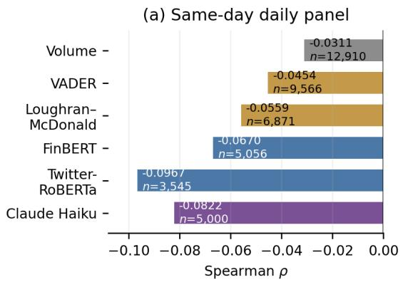
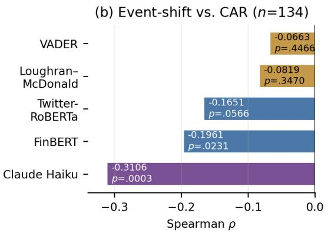
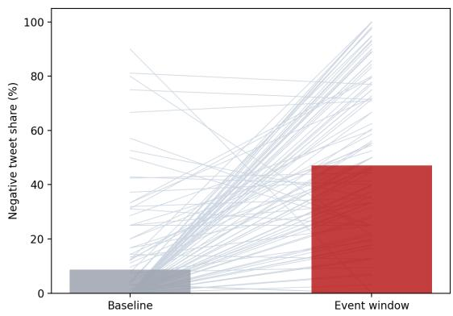
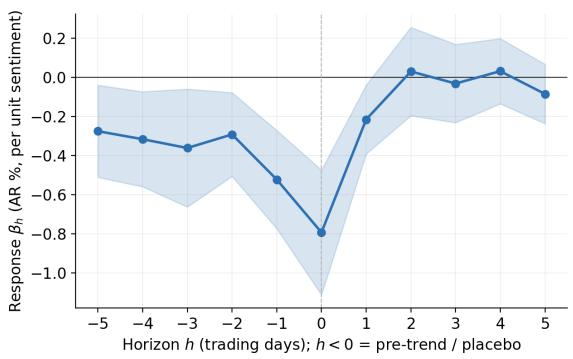
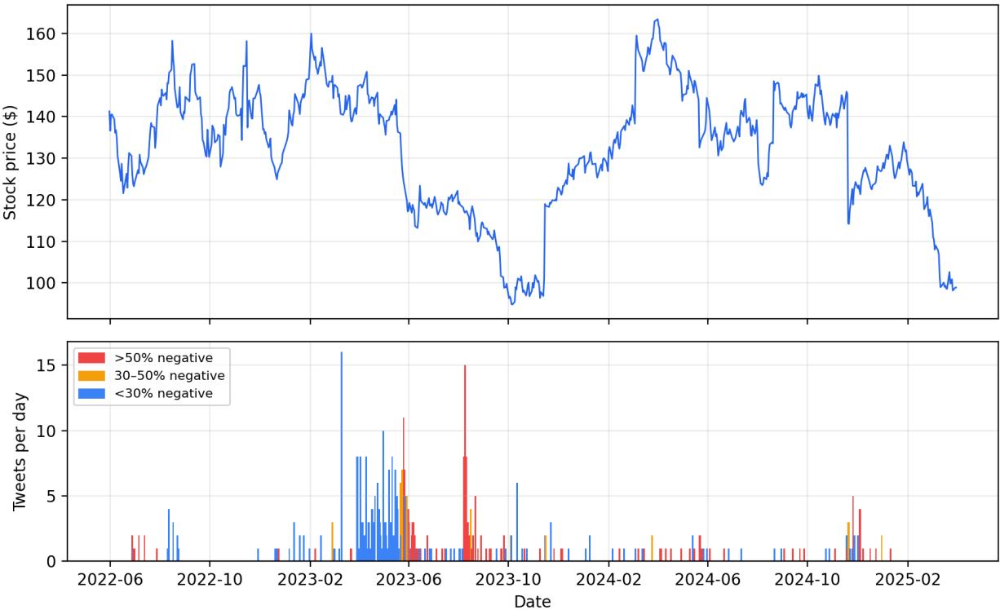

# Same Day, Same Story; One Day Ahead, a Different Signal: The Dual Validity of Financial Sentiment

AS Aravinthkakshan Manipal Institute of Technology Perssonify

Laven Srivastava Perssonify

Harsh Nandwani Perssonify

research@perssonify.com

## Abstract

Financial NLP has a standard workflow: validate a sentiment tool against human labels, then trust it to extract market signal. This assumes the two evaluations measure the same thing. We test that assumption in a setting where both can be measured at once: a corpus of securities class actions (2002– 2025) linking 70,500 X1 messages to abnormal stock returns, with a single-annotator human labelled gold sample. Running five instruments (VADER, Loughran–McDonald, Fin-BERT, Twitter-RoBERTa, and an LLM annotator) through one identical pipeline, we find that the relationship between construct and predictive validity depends on the sampling convention and score representation. Under conventional method-specific sampling, human agreement aligns more closely with graded sameday associations than with one-day leads. On a fixed-n panel, however, agreement has similar graded rank correlations at both horizons, while the coarse ordering remains weak. Benchmark agreement therefore establishes semantic validity but does not by itself determine predictive rankings. In a conversation that is 17.6% spam, message volume predicts neither market damage nor settlement size.

## 1 Introduction

Sentiment instruments are validated in natural language processing the way classifiers are generally validated: by agreement with human annotation on a labeled sample. In finance, they are used for a different purpose, to capture a signal that is associated with, and ideally precedes, movements in asset prices. These two criteria are routinely treated as though the first implied the second. An instrument that scores well on a sentiment benchmark is assumed to be the better instrument for market signal extraction. That assumption is rarely tested, because the two evaluations are normally conducted on different corpora, human labeled benchmarks carry no market outcomes and market datasets carry no human labels.

This paper tests the assumption directly: We construct a corpus in which the same messages carry both. Securities class actions provide the linkage: court complaints supply event anchors and litigation metadata, the defendant’s price history supplies abnormal returns, and the surrounding social media conversation supplies text that we annotate both automatically, with five instruments, and manually, on a gold sample. All instruments use the same aggregation and testing procedures. We compare both method-specific samples and a shared set of days, since the days retained can also affect the results.

The domain is deliberately adverse; corrective disclosures and filings generate genuine investor discussion, but also plaintiff firm solicitation, repeated news headlines, and automated promotion. The solicitation is structural, the PSLRA requires the first filing plaintiff to publish notice inviting other investors to seek lead plaintiff appointment, so every case mechanically produces a burst of law firm press releases (Choi et al., 2024). Headline repetition is a known feature of financial news (Tetlock, 2011), and bots piggyback the cashtags of newsworthy firms to promote unrelated securities (Cresci et al., 2019). Spam is 17.6% of our corpus, and solicitation and spam together account for 25,166 messages. Counting is therefore a poor measure by construction: a count absorbs all of these sources equally. We ask three questions.

• RQ1. Does agreement with human sentiment judgments predict the strength of an instrument’s association with abnormal returns?

• RQ2. If agreement and association diverge, at what horizon do they diverge, and what are the instruments responding to?

• RQ3. Which conclusions about litigation discourse are invariant to the choice of instrument, and which are not?

Our contributions are as follows.

1. A dual validity corpus, released. We release 66,890 event anchored messages across 845 securities class actions (2002–2025), carrying five instrument sentiment labels and multi axis LLM annotation, anchored by a 400 message human gold standard with its codebook and agreement statistics; to our knowledge, the first public financial social media corpus in which the same messages carry human annotation and linked market outcomes, so both validities can be measured through one pipeline.2

2. A sampling dependent relationship between the two validities. Under conventional method-specific sampling, human agreement aligns more closely with graded same-day associations than with one-day leads. On the fixed-n panel, the graded ordering is similar at both horizons, whereas the coarse ordering remains weak. The relationship between construct and predictive validity therefore depends on horizon, representation, and the treatment of zero-score days.

3. Mechanism, and instability of instrument rankings. Under conventional methodspecific sampling, the instrument with the largest one-day point estimate is pretrained on financial news; news accounts carry the strongest attributed signal (ρ = −0.261), and the local-projection placebo fails at negative horizons.

4. Domain result and informative nulls. Content is informative where volume is not, despite systematic pollution; message volume predicts neither the depth of the price decline nor dollar settlement size.

## 2 Related Work

Content and volume in financial discourse. The distinction between what market participants say and how much they post originates in the message board literature: Tumarkin and Whitelaw (2001) find little return information in posting activity, while Antweiler and Frank (2004) show that message content carries signal where volume mainly predicts volatility, and Das and Chen (2007) build the first purpose made sentiment classifier for stock talk. Media pessimism predicts market activity (Tetlock, 2007), firm level language predicts fundamentals (Tetlock et al., 2008), and the content of crowd-sourced investment opinions predicts returns and earnings surprises (Chen et al., 2014). Message volume is one member of a family of attention measures that includes search intensity (Da et al., 2011) and the attention driven trading it induces (Barber and Odean, 2008). We treat this content over volume regularity as established and use it as a domain check; the paper’s claim concerns how the instruments that measure content should be evaluated.

Sentiment instruments and their benchmark evaluation. The instruments we compare span the standard toolkit: a social media lexicon (Hutto and Gilbert, 2014), a finance dictionary (Loughran and McDonald, 2011), and transformers pretrained on financial news (Araci, 2019) and on tweets (Barbieri et al., 2020). Such instruments are standardly evaluated by agreement with human annotation, with Financial PhraseBank (Malo et al., 2014) the reference benchmark; recent suites extend the same paradigm to financial large language models (Xie et al., 2023, 2024), making the question of what agreement predicts downstream more consequential, not less. Loughran and McDonald (2016) argue that measurement choices dominate downstream conclusions; our results give that argument a sharp form: the choice between two validated instruments changes which temporal conclusions are recoverable.

Intrinsic versus extrinsic evaluation. The distinction we draw between agreement with human labels and association with outcomes is the psychometric distinction between construct and predictive validity (Cronbach and Meehl, 1955), and it has an NLP precedent: intrinsic evaluations of word representations fail to predict extrinsic task performance (Chiu et al., 2016), and measurement-theoretic critiques argue that NLP systems routinely operationalise constructs without testing what the operationalisation measures (Jacobs and Wallach, 2021). To our knowledge the two evaluations have not previously been conducted on the same financial messages with linked market outcomes, which is what permits the horizon localised comparison in Section 7.

LLMs in financial text. Large language models extract return relevant signal from headlines (Lopez-Lira and Tang, 2023) and outperform transformer and dictionary sentiment in trading settings (Kirtac and Germano, 2024); LLM annotation can match or exceed crowd workers (Gilardi et al., 2023). Two caveats shape our design: LLM sentiment can embed look ahead information from the pretraining window (Glasserman and Lin, 2023), motivating the contamination analysis of Section 9, with chronologically consistent training the proposed remedy (He et al., 2025).

Social media, returns, and securities litigation. Relations between social media mood and market movement are established (Bollen et al., 2011; Sprenger et al., 2014; Ranco et al., 2015), as is the link from investor disagreement to trading volume (Cookson and Niessner, 2020); class action event studies measure shareholder wealth effects, litigation risk, and reputational penalties without social media text (Gande and Lewis, 2009; Kim and Skinner, 2012; Karpoff et al., 2008). Our setting differs in being event anchored by court filings, carrying eventual legal outcomes, and evaluating the measurement instruments themselves rather than any one instrument’s signal. The press is a documented fraud detection channel (Miller, 2006; Dyck et al., 2010), consistent with our attribution result that news accounts carry the strongest price relevant signal and with the news arrival reading of the leading component.

## 3 Corpus and Annotation

## 3.1 Corpus construction

The corpus contains 845 securities class actions in three cohorts (Table 1): prospective 2024 and 2025 cohorts and a retrospective archive of resolved cases from 2002–2021. Court filings supply company identity, class period bounds, corrective disclosure dates, allegation summaries, defendants, and litigation metadata. Filings are ingested from PDF and converted to structured records. High value fields (company name, ticker, class period bounds, defendants, and disclosure dates) receive an independent extraction pass, and disagreements are manually reconciled. These dates define the message retrieval and event windows.

<table><tr><td>Cohort</td><td>Cases</td><td>Ticker</td><td>Stock</td><td>Social</td><td>Msgs.</td></tr><tr><td>2024</td><td>204</td><td>204</td><td>162</td><td>56</td><td>15,984</td></tr><tr><td>2025</td><td>182</td><td>180</td><td>154</td><td>51</td><td>10,178</td></tr><tr><td>Archive</td><td>459</td><td>305</td><td>180</td><td>161</td><td>44,338</td></tr><tr><td>Total</td><td>845</td><td>689</td><td>496</td><td>268</td><td>70,500</td></tr></table>

Table 1: Corpus by cohort. “Social” counts cases with collected messages; “Msgs.” counts annotated messages.

## 3.2 Composition of the conversation

The label distributions in this subsection are produced by the LLM instrument described in Section 3.4. The relevance, topic, and polarity taxonomies are closed sets fixed in the annotation prompt, which is released with the code and data.

Of 70,500 messages, 62.0% are relevant, 20.3% tangential, and 17.6% spam. The largest topics are news reporting (13,880), law firm solicitation (12,901), automated spam (12,265), legal procedure (9,658), equity analysis (8,055), and direct fraud allegations (7,835). Polarity is 41.0% negative and 7.2% positive. Relevance and polarity agree substantially with human annotation (κ = 0.746 and 0.741; Section 3.5), while the topic taxonomy is not separately validated and is therefore used descriptively only.

A count based attention measure aggregates informative reporting, investor reaction, solicitation, and automation into a single number, motivating the comparison in Section 5.

## 3.3 Event and market linkage

Messages are assigned to a pre class period baseline, the alleged class period, the corrective disclosure window, and post disclosure and post filing windows, retaining text, timestamp, impressions, and likes where available. For company i on day t, let $R _ { i , t }$ denote the realised return and $R _ { m , t }$ the market return. A market model

$$
R _ { i , t } = \alpha _ { i } + \beta _ { i } R _ { m , t } + \epsilon _ { i , t }\tag{1}
$$

is estimated over the 120 trading days ending ten days before the class period begins, so the parameters are fitted on pre event data only. The abnormal return is the part of the day’s return the market does not explain,

$$
A R _ { i , t } = R _ { i , t } - \big ( \hat { \alpha } _ { i } + \hat { \beta } _ { i } R _ { m , t } \big ) ,\tag{2}
$$

and the cumulative abnormal return over an event window W is its sum, $\begin{array} { r } { C A R _ { i } = \sum _ { t \in W } A R _ { i , t } } \end{array}$

## 3.4 Scoring instruments

Five instruments score message sentiment: VADER, a social media lexicon (Hutto and Gilbert, 2014); Loughran–McDonald, a finance dictionary (Loughran and McDonald, 2011); FinBERT and Twitter-RoBERTa, transformers pretrained on financial news and on tweets (Araci, 2019; Barbieri et al., 2020); and Claude Haiku, an LLM annotator. The instruments produce different outputs, so we derive coarse and graded negativity scores, with higher values indicating more negative sentiment. The coarse score discards magnitude. Each message is assigned to one of three classes and mapped to $\{ + 1 , 0 , - 1 \}$ with +1 negative, using the predicted class for the transformers and the LLM, and the sign of the score for the lexicons. The graded score keeps magnitude, oriented so that larger is more negative: the negated VADER compound score, the Loughran–McDonald net-negative word ratio, $p ( { \mathrm { n e g } } ) - p ( { \mathrm { p o s } } )$ for the transformers, and the negated −2 to +2 intensity label for the LLM.

Both scores are averaged over the messages for each case day. All instruments use the same aggregation and tests, but the conventional samples differ because zero-score days are excluded separately for each instrument. Section 7.1 repeats the comparison on a shared set of days.

## 3.5 Construct validity

We assess agreement with human judgment on a gold set of 400 messages, labelled by a single annotator blind to all model outputs and presented in randomised order. Messages were drawn by stratified random sampling across predicted relevance × polarity × cohort (26 strata); inverse probability weighted accuracy (0.861 polarity, 0.860 relevance) matches the unweighted estimates, so stratification does not drive the reported agreement.

Table 2 reports polarity agreement for all five instruments. We report Cohen’s $\kappa$ (Cohen, 1960) alongside accuracy because the corpus is 41.0% negative and 7.2% positive, so an instrument that predicts the majority class attains substantial accuracy while carrying no information. FinBERT is precisely this case: accuracy 0.538 with $\kappa =$ 0.079. Under conventional benchmarks (Landis and Koch, 1977) only the LLM instrument reaches substantial agreement; Twitter-RoBERTa is moderate, Loughran–McDonald fair, and FinBERT indistinguishable from chance. VADER’s accuracy is below the majority class rate.

<table><tr><td>Instrument</td><td>Accuracy</td><td>Macro-F1</td><td>κ</td></tr><tr><td>Claude Haiku</td><td>0.860 [0.825, 0.893]</td><td>0.878</td><td>0.741</td></tr><tr><td>RoBERTa</td><td>0.733 [0.693, 0.778]</td><td>0.594</td><td>0.449</td></tr><tr><td>LM</td><td>0.553 [0.508, 0.598]</td><td>0.446</td><td>0.210</td></tr><tr><td>FinBERT</td><td>0.538 [0.490, 0.588]</td><td>0.379</td><td>0.079</td></tr><tr><td>VADER</td><td>0.385 [0.338, 0.438]</td><td>0.373</td><td>0.171</td></tr></table>

Table 2: Polarity agreement with human gold labels on the same 400 messages. Brackets give 95% bootstrap intervals from 1,000 resamples (Efron and Tibshirani, 1993). LM denotes Loughran–McDonald; RoBERTa denotes Twitter-RoBERTa.

The LLM instrument’s polarity errors concentrate at the negative neutral boundary and are directionally one sided: it labels human neutral messages negative in 49 of 56 disagreements, so LLM derived negativity is if anything slightly inflated. On relevance it achieves 0.860 accuracy, 0.797 macro-F1, and $\kappa = 0 . 7 4 6$ . This evaluation measures agreement with the intended linguistic constructs; it makes no claim about association with returns, which is the subject of the next two sections.

## 4 Empirical Setup

We report Spearman $\rho$ for monotonic associations, which is robust to the heavy tails of daily returns. Daily analyses pool case days; cross sectional analyses collapse each case to one observation. Significance markers are $^ { * * * } p < 0 . 0 0 1 , ^ { * * } p < 0 . 0 1$ $^ { * } p < 0 . 0 5 , { } ^ { \dag } p < 0 . 1$ . New baseline families use Benjamini–Hochberg FDR adjustment (Benjamini and Hochberg, 1995). Because the daily panel is large, statistical significance is easily attained; we therefore compare instruments on effect size and treat $p \mathrm { - }$ values as evidence only that an association is nonzero.

Timing proceeds from descriptive to conditional tests. Lead lag correlations compare sentiment on $t - \ell$ with $A R _ { t }$ . Order two Granger tests ask whether lagged sentiment improves prediction beyond return history (Granger, 1969). A distributed lag model,

$$
A R _ { i , t } = \sum _ { k = 0 } ^ { 3 } \beta _ { k } s _ { i , t - k } + \eta _ { i } + u _ { i , t } ,\tag{3}
$$

uses case fixed effects and case clustered standard errors (Petersen, 2009). Local projections (Jordà, 2005) estimate $A R _ { i , t + h }$ on $s _ { i , t }$ for $h \in [ - 5 , 5 ]$ with negative horizons serving as a placebo. These tests establish predictive precedence, not structural causation. Between-instrument differences in $\rho$ are not directly tested; comparisons of their magnitudes are therefore descriptive point-estimate comparisons, and significance for one instrument but not another does not establish a significant difference between them.

The panel contains 179 cases and 103,542 case days.3 The conventional correlation sample drops days on which a method emits zero, so n differs by method; Section 7.1 reports a common day intersection in which n is held fixed.

## 5 Predictive Validity: Content versus Counting

At case level, attention does not track damage. In the 2025 cohort, total message volume is uncorrelated with the worst single-day abnormal return $( \rho = - 0 . 0 8 3 , p = 0 . 6 0 , n = 4 3 )$ and with CAR $( \rho = + 0 . 0 0 3 , p = 0 . 9 9 , n = 3 6 )$

The daily panel establishes the comparison precisely (Table 3, summarised in Figure 1). Tweet volume reaches $\rho = - 0 . 0 3 1 1$ . Every sentiment family contains a representation with a larger association, and the strongest instruments exceed volume by a factor of two to three. Loughran– McDonald coarse (0.80×) is the single exception, so the claim applies to method families rather than to every threshold choice. Impressions, the natural reach based count, are not significant at all.

Two features of this table matter for what follows. First, the strongest same day instrument is Twitter RoBERTa, not the LLM, so the content over counting result does not depend on the LLM annotation. Second, the p-values are not comparable across rows: RoBERTa graded attains $p = 5 . 2 7 \times 1 0$ −18 on 12,910 case days while FinBERT coarse attains $p = 1 . 8 7 \times 1 0 ^ { - 6 }$ on 5,056, and the difference is largely sample size. We compare the $\rho$ column throughout.

## 6 Temporal Structure

Table 4 reports lead lag correlations. Every instrument shows a negative and significant same day association, so the contemporaneous result of Section 5 is not instrument specific. Under the conventional method-specific nonzero-day samples, the one-day results differ across instruments. FinBERT coarse has the largest ℓ = 1 point estimate $( - 0 . 0 4 6 6 , p _ { \mathrm { F D R } } = 0 . 0 0 3 )$ ; FinBERT graded and Twitter-RoBERTa graded also survive FDR, whereas VADER and Loughran–McDonald do not. At ℓ = 2, Claude graded and Twitter-RoBERTa graded are significant at the unadjusted 5% level. These comparisons describe point estimates and do not establish statistically significant differences between instruments.

<table><tr><td>Metric</td><td>ρ</td><td>p</td><td>n</td><td>× vol.</td></tr><tr><td>Counts Tweet volume Impressions</td><td> $- 0 . 0 3 1 1 ^ { \ast \ast * }$   $- 0 . 0 3 1 7 ^ { \dagger }$   $- 0 . 0 3 8 0 ^ { * }$ </td><td> $4 . 1 4 \times 1 0 ^ { - 4 }$  0.0634 0.0135</td><td>12,9101.00× 3,4391.02× 4,2191.22×</td><td></td></tr><tr><td>Negative count Lexicons VADER c.</td><td> $- 0 . 0 4 5 4 ^ { \ast \ast \ast }$ </td><td> $8 . 8 6 \times 1 0 ^ { - 6 }$ </td><td></td><td>9,5661.46×</td></tr><tr><td>VADER g. LM c.</td><td> $- 0 . 0 4 5 4 ^ { \ast \ast \ast }$   $- 0 . 0 2 4 9 ^ { \ast }$ </td><td> $3 . 7 8 \times 1 0 ^ { - 6 }$   $0 . 0 4 1 4$ </td><td>10,3391.46× 6,7130.80×</td><td></td></tr><tr><td>LM g. Transformers</td><td> $- 0 . 0 5 5 9 ^ { \ast \ast \ast }$ </td><td> $3 . 6 0 \times 1 0 ^ { - 6 }$ </td><td>6,8711.80×</td><td></td></tr><tr><td></td><td></td><td></td><td></td><td></td></tr><tr><td>FinBERT c.</td><td> $- 0 . 0 6 7 0 ^ { * * * }$ </td><td> $1 . 8 7 \times 1 0 ^ { - 6 }$ </td><td></td><td></td></tr><tr><td>FinBERT g.</td><td> $- 0 . 0 5 2 6 ^ { \ast \ast \ast }$ </td><td></td><td>5,056 2.16×</td><td></td></tr><tr><td></td><td></td><td> $2 . 2 9 \times 1 0 ^ { - 9 }$ </td><td>12,9101.69×</td><td></td></tr><tr><td>RoBERTa c.</td><td> $- 0 . 0 9 6 7 ^ { \ast \ast \ast }$ </td><td> $7 . 9 1 \times 1 0 ^ { - 9 }$ </td><td></td><td></td></tr><tr><td>RoBERTa g.</td><td></td><td></td><td>3,545 3.11×</td><td></td></tr><tr><td></td><td> $- 0 . 0 7 6 0 ^ { * * * }$ </td><td> $5 . 2 7 \times 1 0 ^ { - 1 8 }$ </td><td>12,910 2.45×</td><td></td></tr><tr><td></td><td></td><td></td><td></td><td></td></tr><tr><td>LLM instrument</td><td></td><td></td><td></td><td></td></tr><tr><td>Claude c. Claude g.</td><td> $- 0 . 0 8 2 2 ^ { \ast \ast \ast }$   $- 0 . 0 8 2 1 ^ { \ast \ast * }$ </td><td> $5 . 7 7 \times 1 0 ^ { - 9 }$   $6 . 1 2 \times 1 0 ^ { - 9 }$  5,004 2.64×</td><td>5,0002.65×</td><td></td></tr></table>

Table 3: Same day correlation with the daily abnormal return. LM denotes Loughran–McDonald; RoBERTa denotes Twitter-RoBERTa; c. and g. denote coarse and graded scores. ×vol. is $| \rho |$ relative to tweet volume.
<table><tr><td>Method</td><td>ρ0</td><td> $\rho _ { 1 }$ </td><td>q1</td><td>ρ2</td></tr><tr><td>VADER c.</td><td> $- 0 . 0 4 5 4 ^ { \ast \ast \ast }$ </td><td>-0.0136 0.286</td><td></td><td>+0.0025</td></tr><tr><td>VADER g.</td><td> $- 0 . 0 4 5 4 ^ { \ast \ast \ast }$ </td><td>-0.0193*</td><td>0.100</td><td>-0.0034</td></tr><tr><td>LM c.</td><td> $- 0 . 0 2 4 9 ^ { \ast }$ </td><td>-0.0057 0.810</td><td></td><td>+0.0168</td></tr><tr><td>LM g.</td><td> $- 0 . 0 5 5 9 ^ { \ast \ast \ast }$ </td><td>-0.0263*</td><td>0.067</td><td>-0.0057</td></tr><tr><td>FinBERT c.</td><td> $- 0 . 0 6 7 0 ^ { * * * }$ </td><td>-0.0466 ***</td><td>0.003</td><td>+0.0010</td></tr><tr><td>FinBERT g.</td><td> $- 0 . 0 5 2 6 ^ { \ast \ast \ast }$ </td><td>-0.0292***</td><td>0.003</td><td>-0.0022</td></tr><tr><td>RoBERTa c. -0.0967***</td><td></td><td>-0.0058 0.879</td><td></td><td>+0.0010</td></tr><tr><td>RoBERTa g. −0.0760</td><td>***</td><td> $- 0 . 0 2 7 2 ^ { \ast \ast }$ </td><td>0.006</td><td>-0.0202*</td></tr><tr><td>Claude c.</td><td> $- 0 . 0 8 2 2 ^ { \ast \ast \ast }$ </td><td>-0.0227</td><td></td><td>-0.0022</td></tr><tr><td>Claude g.</td><td> $- 0 . 0 8 2 1 ^ { \ast \ast * }$ </td><td> $- 0 . 0 3 7 6 ^ { \ast \ast }$ </td><td></td><td>-0.0373 **</td></tr></table>

Table 4: Lead lag correlations, all messages; c. and g. denote coarse and graded scores; n per row as in Table 3. q values are FDR adjusted across the baseline family; the pre existing LLM reference is not included in that correction.

Conditional tests give the same picture. Four baseline specifications survive FDR on forward Granger tests: Loughran–McDonald coarse/relevant (F = 4.388, q = 0.034), Loughran–McDonald graded/all $( F = 4 . 0 5 6 , q =$

  
Figure 1: Content over volume across scoring instruments. Panel (a) shows the strongest same day representation in each method family; n differs because the conventional analysis drops method specific zero days. Panel (b) uses the identical 134 cases for event minus baseline sentiment shift versus CAR. Bars report exact $\rho$ values without treating any instrument as the contribution.

0.040), FinBERT coarse/relevant $( F ~ = ~ 3 . 9 0 7 .$ $q = 0 . 0 4 4 )$ , and FinBERT graded/all $( F = 4 . 3 1 6$ $q = 0 . 0 3 4 )$ . The LLM reference also passes $( F =$ 5.435, $p = 0 . 0 0 5 1$ coarse/all). Twitter-RoBERTa never survives, despite having the strongest same day association. Same day distributed lag coefficients are negative and significant for almost every instrument; their magnitudes are not comparable across instruments because the underlying signals differ in scale. Full results appear in Appendix B.

## 7 Where the Two Validities Diverge

Sections 3.5 and 6 measure two different properties of the same five instruments on the same corpus: agreement with human judgment, and association with abnormal returns. Table 5 places them side by side. This is the paper’s central comparison, and it is not visible from either table in isolation.

Conventional samples show contemporaneous alignment. For the graded representation in Table 5, the ordering by human agreement closely matches the ordering by same-day association: the rank correlation is +0.90 with κ and +1.00 with accuracy. Thus, under this representation and the conventional method-specific sampling rule, benchmark agreement is informative about contemporaneous association.

The one-day relationship is weaker and depends on the score representation. For graded scores, the rank correlations are +0.40 with κ and +0.70 with accuracy; for coarse scores, they are −0.30 and −0.10. Under conventional sampling, Fin-BERT has the strongest coarse one-day association $( \rho _ { 1 } = - 0 . 0 4 6 6 )$ despite its low human agreement; Claude’s corresponding value is −0.0227. Section 7.1 shows how these rankings change when all instruments are evaluated on the same case-day set.

Interpretation. Table 4 shows a horizon contrast under the conventional, method-specific samples, but Table 6 shows that this contrast is not invariant to sample construction or score representation. On the fixed-n graded panel, agreement has the same rank correlation with association at $\ell = 0$ and $\ell = 1$ ; on the coarse panel, both relationships are weak. We therefore make the narrower claim that benchmark agreement does not, by itself, determine predictive rankings, and that comparisons should be reported with the horizon, representation, and zero-day inclusion rule explicitly stated.

## 7.1 Instrument rankings are unstable

The conventional analysis drops case days on which a given method emits zero, so n differs across instruments in Tables 3 and 4 and the comparison is not made on identical data. Table 6 restricts to case days on which every instrument emits a nonzero score, holding n fixed.

Applying the Table 5 rank comparison to the fixed-n panels gives correlations with κ of +0.00 and +0.10 for coarse scores at $\ell = 0$ and 1, and +0.80 at both horizons for graded scores. The corresponding values for accuracy and macro-F1 are +0.40 and +0.20 for coarse scores, and +0.90 at both graded horizons. The exact two-sided permutation p-values are 1.000, 0.950, 0.133, and 0.133 for κ, and 0.517, 0.783, 0.083, and 0.083 for accuracy and macro-F1, respectively. None of these correlations survives BH adjustment within the 12 fixed-n construct–predictive comparisons.

<table><tr><td rowspan="2">Instrument</td><td colspan="3">Construct validity</td><td colspan="4">Predictive validity (|ρ|)</td></tr><tr><td>κ</td><td>Accuracy</td><td>Macro-F1</td><td>coarse  $\rho _ { 0 }$ </td><td>coarse  $\rho _ { 1 }$ </td><td>graded  $\rho _ { 0 }$ </td><td>graded  $\rho _ { 1 }$ </td></tr><tr><td>Claude Haiku</td><td>0.741</td><td>0.860</td><td>0.878</td><td>0.0822</td><td>0.0227</td><td>0.0821</td><td>0.0376</td></tr><tr><td>Twitter-RoBERTa</td><td>0.449</td><td>0.733</td><td>0.594</td><td>0.0967</td><td>0.0058</td><td>0.0760</td><td>0.0272</td></tr><tr><td>Loughran-McDonald</td><td>0.210</td><td>0.553</td><td>0.446</td><td>0.0249</td><td>0.0057</td><td>0.0559</td><td>0.0263</td></tr><tr><td>VADER</td><td>0.171</td><td>0.385</td><td>0.373</td><td>0.0454</td><td>0.0136</td><td>0.0454</td><td>0.0193</td></tr><tr><td>FinBERT</td><td>0.079</td><td>0.538</td><td>0.379</td><td>0.0670</td><td>0.0466</td><td>0.0526</td><td>0.0292</td></tr><tr><td colspan="4">Rank correlation with κ</td><td>+0.50</td><td>-0.30</td><td> $+ 0 . 9 0 ^ { \dagger }$ </td><td>+0.40</td></tr><tr><td colspan="4">Rank correlation with accuracy</td><td>+0.60</td><td>-0.10</td><td> $+ 1 . 0 0 ^ { * }$ </td><td>+0.70</td></tr></table>

Table 5: Construct validity from Table 2 joined to predictive validity from Tables 3 and 4, ordered by κ. On conventional method-specific nonzero-day samples, human-agreement rankings align most closely with graded same-day association and less consistently with the one-day lead. Rank correlations are Spearman correlations over five instruments, with exact two-sided p-values from all 120 permutations. These comparisons are descriptive, and no cell survives adjustment for the 12 comparisons in this table. The corresponding fixed-n comparison is reported in Table 6 and Section 7.1.

<table><tr><td>Method</td><td> $\rho _ { 0 }$ </td><td> $\rho _ { 1 }$ </td><td>ρ2</td></tr><tr><td colspan="4">Coarse, all messages (n = 1,518) Claude  $- 0 . 0 8 5 1 ^ { \ast \ast * }$  -0.0323 -0.0101 VADER -0.0068 -0.0165 +0.0300 LM  $- 0 . 0 4 6 0 ^ { \dagger }$  -0.0501† -0.0333 FinBERT  $\mathbf { - 0 . 1 2 5 9 ^ { \ast \ast \ast } }$  -0.0315 -0.0116</td></tr><tr><td colspan="4">Graded, all messages (n = 3,890) Claude  $- 0 . 0 6 9 6 ^ { \ast \ast \ast }$   $- 0 . 0 4 3 8 ^ { \ast \ast }$   $- 0 . 0 4 6 7 ^ { \ast \ast }$  VADER  $- 0 . 0 2 8 8 ^ { \dagger }$   $- 0 . 0 1 7 3$  +0.0081 LM  $- 0 . 0 4 1 1 ^ { \ast }$   $- 0 . 0 3 3 9 ^ { \ast }$  -0.0035 FinBERT  $- 0 . 0 3 8 5 ^ { \ast }$   $- 0 . 0 2 9 7 ^ { \dagger }$  +0.0215 RoBERTa  $- 0 . 0 7 2 3 ^ { \ast \ast \ast }$   $\mathbf { - 0 . 0 5 6 1 ^ { \ast \ast \ast } }$  -0.0189</td></tr></table>

Table 6: Common-case-day intersection, all messages. Relevant-message panels appear in Appendix C.

Three observations follow. First, the same day ranking reverses: on the coarse common days Fin-BERT is strongest (−0.1259), where the conventional sample placed Twitter-RoBERTa first. Second, VADER is indistinguishable from zero on common days, so its apparent advantage in Table 3 was substantially a matter of which days it scored. Third, several sentiment measures remain associated with returns on the shared days, although the strongest instrument changes. Table 6 does not compare sentiment with volume on those same days, so it does not establish that the contentover-counting result is unchanged. Claims about the strongest instrument therefore need to specify the sample used.

## 7.2 Divergence at the case level

A cross sectional test reproduces the divergence in a different form. For each case we compute the event minus baseline change in mean negativity and correlate it with the event window CAR (Table 7). The LLM instrument attains $\rho = - 0 . 3 1 0 6$ $( p = 0 . 0 0 0 3 , n = 1 3 4 )$ , several times any daily panel effect. No baseline survives FDR correction: FinBERT reaches $- 0 . 1 9 6 1 \ ( p \ = \ 0 . 0 2 3 1 )$ but $q \ = \ 0 . 1 8 5$ , and Twitter-RoBERTa −0.1651 $( p = 0 . 0 5 6 6 )$ . The case level shift is a contemporaneous contrast between two windows rather than a lead, so the $\ell = 0$ pattern of Table 5 would predict the best agreeing instrument to perform well here, which it does. We do not press that reading further, for two reasons. With $n = 1 3 4$ and five instruments the comparison is underpowered, so the ordering among the baselines is not resolvable; and the result is sensitive to how the case level measure is constructed. Substituting mean window negativity for negative share, on a reconstruction of the panel, raises Loughran–McDonald and Twitter-RoBERTa to the same range as the LLM instrument. The robust content of this table is that a case level contrast exists and is several times larger than any daily panel effect; the identity of the strongest instrument at this level is not established. Restricting to relevant messages reduces the sample to n = 50 and renders every instrument nonsignificant.

<table><tr><td>Instrument</td><td>ρ</td><td>p</td><td>q</td></tr><tr><td>Claude Haiku</td><td>-0.3106***</td><td>0.0003</td><td></td></tr><tr><td>FinBERT</td><td>-0.1961*</td><td>0.0231</td><td>0.185</td></tr><tr><td>Twitter-RoBERTa</td><td>-0.1651†</td><td>0.0566</td><td>0.226</td></tr><tr><td>Loughran-McDonald</td><td>-0.0819</td><td>0.3470</td><td>0.596</td></tr><tr><td>VADER</td><td>-0.0663</td><td>0.4466</td><td>0.596</td></tr></table>

Table 7: Event-minus-baseline change in the share of negative messages versus CAR, using the same 134 cases for all instruments and including all messages.

## 8 What the Leading Signal Responds To

Section 7 shows that the relationship between construct validity and the one-day lead depends on the sampling convention and score representation. Two pieces of evidence bear on what the observed leading associations reflect.

The largest conventional-sample lead is produced by an instrument trained on news. Fin-BERT is pretrained on financial news and evaluated on sentence-level news sentiment. On tweets about securities fraud, it agrees with human polarity at close to chance, yet its coarse score has the largest one-day point estimate under conventional methodspecific sampling. The natural reading is that it detects the vocabulary of adverse financial news rather than the polarity of investor expression, and that this vocabulary arrives shortly before the price adjustment completes.

News accounts carry the strongest signal. We classify accounts from topic mix, cross-case activity, and spam fraction. News accounts have the strongest association $( \rho = - 0 . 2 6 1 , p < 0 . 0 0 1 )$ followed by cross-case broadcasters (−0.161), other multi-case accounts (−0.115), and retail accounts (−0.083). The associations for bot/spam accounts (+0.064) and law firm solicitation (+0.040) are not significant. The strongest observed signal therefore comes from news accounts, while these two sources of additional volume show no detectable association with returns.

## 9 Robustness

Look ahead contamination. The archive cohort (2002–2021) lies inside the LLM’s pretraining window, so its results could in principle reflect recognition of publicised cases rather than message level reading (Glasserman and Lin, 2023). The baselines provide a control: the two dictionaries have no training window at all, and the two transformers were pretrained without these outcome labels. Contamination would therefore show up as an LLM advantage that is larger in the archive than in the 2024–2025 cohorts. On the daily panel it is not. Across 1,000 case level bootstrap resamples, the archive minus recent difference in the LLM’s advantage is +0.0091 (graded, same day; 95% CI [−0.027, +0.046]), −0.0013 (graded, one day lag; CI [−0.047, +0.052]), +0.0061 and +0.0017 (coarse). Every interval includes zero. The LLM’s own association is also similar across cohorts (−0.081 in the archive and −0.090 in the recent cohorts). These results do not reveal a clear difference between cohorts, but they do not rule out contamination. The LLM’s own association is stable across cohorts (−0.081 archive, −0.090 recent). We retain the archive for the daily analyses. The case level measure of Section 7.2 is less settled: split by cohort (80 archive, 47 recent), the LLM’s advantage is larger in the archive the direction contamination predicts. The subsample is too small to treat as evidence either way, so the paper rests its claims on the daily panel and reports the case level result as corroborative (decomposition in Appendix D).

Relevance filtering. Restricting to relevant messages shifts same day correlations by at most 0.0164; the central result is present on all messages. Since the relevance labels come from the LLM instrument, this removes a circularity concern (Appendix A).

Attention and legal materiality. Among 133 resolved cases with settlements, total message volume is uncorrelated with settlement amount (ρ = −0.041, p = 0.64), as are relevant message (−0.062) and negative message (−0.093) volume; median settlements do not differ across volume tertiles (H = 0.83, p = 0.66). Public attention is orthogonal to legal materiality, as it was to price damage depth.

## 10 Discussion and Conclusion

We introduce a corpus linking 845 securities class actions to 70,500 event-anchored messages, pairing a 400-message single-annotator human reference sample with abnormal-return series linked to the messages. Evaluating five instruments through one pipeline, we find that the relationship between human agreement and return association is sensitive to sampling and representation. On conventional method-specific samples, human agreement closely orders graded contemporaneous associations but not one-day leads; on the fixed-n panel, graded rankings are similar at both horizons, while coarse rankings remain weak.

Agreement with human labels is therefore evidence of semantic validity, not a sufficient basis for selecting an instrument for predictive use. Construct and predictive validity should be reported together with the horizon, score representation, and zero-day inclusion rule.

The account-level results and the failed placebo are consistent with a leading signal that partly reflects news arrival. The daily-panel comparison finds no clear archive-recent difference in the LLM’s relative advantage, but does not rule out contamination. The domain result stands: in a conversation that is 17.6% spam, content informs where counting does not, and volume predicts neither the depth of the price decline nor the size of the eventual settlement. The contribution is an evaluation design and a measurement result, not a classifier.

## Limitations

Human validation covers polarity and relevance but not intensity, emotion, severity, or topic, and it reflects agreement with a single careful annotator rather than inter annotator reliability; no human to human agreement figure is available, so the κ values in Table 2 have no measured ceiling.

The rank comparisons are based on five instruments and are therefore descriptive. Under conventional method-specific sampling, human agreement aligns more closely with graded same-day associations than with one-day leads. We therefore conclude only that benchmark agreement does not by itself determine predictive rankings and that the sampling convention and score representation must accompany such comparisons. Widening the instrument battery is a natural next step.

FinBERT’s low agreement is partly attributable to domain shift: it was tuned on Financial Phrase-Bank sentences rather than on tweets. We regard this as consistent with, rather than an alternative to, our reading, since practitioners apply it off the shelf to exactly this kind of text; but it means that κ = 0.079 should be read as agreement in deployment rather than as an intrinsic property of the model.

Account types are behavioural rather than profile derived. Relevance filtered case level windows become sparse (n falls from 134 to 50). Reach weighted variants have been evaluated only for the LLM instrument. Timing tests establish predictive precedence rather than structural causality or tradeability, and the local projection placebo fails at negative horizons. Effect sizes throughout are small.

The corpus is specific to securities-class-action discourse, where solicitation, repeated headlines, and cashtag piggybacking are unusually prevalent.

Although the evaluation design is portable, whether the observed relationships generalize to ordinary stock discussion requires cross-domain validation.

In addition, 74 of 273 archive tickers no longer resolve through the original price API. If unresolved symbols disproportionately represent delisted firms, their absence from the refreshed price panel may truncate the adverse-return tail and attenuate estimated negative associations. The reported return relationships should therefore be interpreted subject to this potential survivorship bias.

## Ethics Statement

The corpus consists of public X/Twitter posts collected via the platform API. No author profile lookups were performed; account categories are derived solely from posting behaviour, and all attribution results are reported at the aggregate class level. No personally identifying information is included in released artifacts. Court filings are public records. In accordance with the platform’s developer terms, the released artifact contains message identifiers and our annotations rather than message text, together with a script for retrieving text from the platform.

## Data and Code Availability

The provided archive contains the classification prompts and configuration, the 400 message gold annotation file, message identifiers with all model and human labels, per instrument daily sentiment series, the computed abnormal return panel, and analysis code sufficient to reproduce every table. The abnormal return panel is included directly because 74 of 273 archive tickers no longer resolve through the original price API.

## Acknowledgements

We extend our gratitude to Perssonify LLC. for their continued support of our work, and allocating resources that made this work possible. In particular we thank Stefan Persson for his valuable inputs and guidance.

## References

Werner Antweiler and Murray Z. Frank. 2004. Is all that talk just noise? The information content of internet stock message boards. The Journal of Finance, 59(3):1259–1294.

Dogu Araci. 2019. FinBERT: Financial sentiment analysis with pre-trained language models. arXiv preprint arXiv:1908.10063.

Brad M. Barber and Terrance Odean. 2008. All that glitters: The effect of attention and news on the buying behavior of individual and institutional investors. Review ofFinancial Studies, 21(2):785–818.

Francesco Barbieri, Jose Camacho-Collados, Luis Espinosa Anke, and Leonardo Neves. 2020. TweetEval: Unified benchmark and comparative evaluation for tweet classification. In Findings of the Association for Computational Linguistics: EMNLP 2020, pages 1644–1650.

Yoav Benjamini and Yosef Hochberg. 1995. Controlling the false discovery rate: A practical and powerful approach to multiple testing. Journal of the Royal Statistical Society: Series B, 57(1):289–300.

Johan Bollen, Huina Mao, and Xiaojun Zeng. 2011. Twitter mood predicts the stock market. Journal of Computational Science, 2(1):1–8.

Hailiang Chen, Prabuddha De, Yu (Jeffrey) Hu, and Byoung-Hyoun Hwang. 2014. Wisdom of crowds: The value of stock opinions transmitted through social media. Review ofFinancial Studies, 27(5):1367– 1403.

Billy Chiu, Anna Korhonen, and Sampo Pyysalo. 2016. Intrinsic evaluation of word vectors fails to predict extrinsic performance. In Proceedings of the 1st Workshop on Evaluating Vector-Space Representationsfor NLP (RepEval), pages 1–6.

Stephen J. Choi, Jessica Erickson, and A. C. Pritchard. 2024. The business of securities class action lawyering. Indiana Law Journal, 99(3).

Jacob Cohen. 1960. A coefficient of agreement for nominal scales. Educational and Psychological Measurement, 20(1):37–46.

J. Anthony Cookson and Marina Niessner. 2020. Why don’t we agree? Evidence from a social network of investors. The Journal ofFinance, 75(1):173–228.

Stefano Cresci, Fabrizio Lillo, Daniele Regoli, Serena Tardelli, and Maurizio Tesconi. 2019. Cashtag piggybacking: Uncovering spam and bot activity in stock microblogs on Twitter. ACM Transactions on the Web, 13(2):1–27.

Lee J. Cronbach and Paul E. Meehl. 1955. Construct validity in psychological tests. Psychological Bulletin, 52(4):281–302.

Zhi Da, Joseph Engelberg, and Pengjie Gao. 2011. In search of attention. The Journal of Finance, 66(5):1461–1499.

Sanjiv R. Das and Mike Y. Chen. 2007. Yahoo! for Amazon: Sentiment extraction from small talk on the web. Management Science, 53(9):1375–1388.

Alexander Dyck, Adair Morse, and Luigi Zingales. 2010. Who blows the whistle on corporate fraud? The Journal ofFinance, 65(6):2213–2253.

Bradley Efron and Robert J. Tibshirani. 1993. An Introduction to the Bootstrap. Chapman & Hall.

Amar Gande and Craig M. Lewis. 2009. Shareholderinitiated class action lawsuits: Shareholder wealth effects and industry spillovers. Journal ofFinancial and Quantitative Analysis, 44(4):823–850.

Fabrizio Gilardi, Meysam Alizadeh, and Maël Kubli. 2023. ChatGPT outperforms crowd workers for text-annotation tasks. Proceedings of the National Academy ofSciences, 120(30):e2305016120.

Paul Glasserman and Caden Lin. 2023. Assessing look-ahead bias in stock return predictions generated by large language models. arXiv preprint arXiv:2309.17322.

Clive W. J. Granger. 1969. Investigating causal relations by econometric models and cross-spectral methods. Econometrica, 37(3):424–438.

Songrun He, Linying Lv, Asaf Manela, and Jimmy Wu. 2025. Chronologically consistent large language models. arXiv preprint arXiv:2502.21206.

C. J. Hutto and Eric Gilbert. 2014. VADER: A parsimonious rule-based model for sentiment analysis of social media text. In Proceedings of the Eighth International AAAI Conference on Weblogs and Social Media, pages 216–225.

Abigail Z. Jacobs and Hanna Wallach. 2021. Measurement and fairness. In Proceedings ofthe 2021 ACM Conference on Fairness, Accountability, and Transparency, pages 375–385.

Òscar Jordà. 2005. Estimation and inference of impulse responses by local projections. American Economic Review, 95(1):161–182.

Jonathan M. Karpoff, D. Scott Lee, and Gerald S. Martin. 2008. The cost to firms of cooking the books. Journal of Financial and Quantitative Analysis, 43(3):581–611.

Irene Kim and Douglas J. Skinner. 2012. Measuring securities litigation risk. Journal ofAccounting and Economics, 53(1–2):290–310.

Kemal Kirtac and Guido Germano. 2024. Sentiment trading with large language models. arXiv preprint arXiv:2412.19245.

J. Richard Landis and Gary G. Koch. 1977. The measurement of observer agreement for categorical data. Biometrics, 33(1):159–174.

Alejandro Lopez-Lira and Yuehua Tang. 2023. Can ChatGPT forecast stock price movements? Return predictability and large language models. arXiv preprint arXiv:2304.07619.

Tim Loughran and Bill McDonald. 2011. When is a liability not a liability? Textual analysis, dictionaries, and 10-Ks. The Journal ofFinance, 66(1):35–65.

Tim Loughran and Bill McDonald. 2016. Textual analysis in accounting and finance: A survey. Journal of Accounting Research, 54(4):1187–1230.

Pekka Malo, Ankur Sinha, Pekka Korhonen, Jyrki Wallenius, and Pyry Takala. 2014. Good debt or bad debt: Detecting semantic orientations in economic texts. Journal of the Association for Information Science and Technology, 65(4):782–796.

Gregory S. Miller. 2006. The press as a watchdog for accounting fraud. Journal of Accounting Research, 44(5):1001–1033.

Mitchell A. Petersen. 2009. Estimating standard errors in finance panel data sets: Comparing approaches. Review ofFinancial Studies, 22(1):435–480.

Gabriele Ranco, Darko Aleksovski, Guido Caldarelli, Miha Grcar, and Igor Mozetiˇ c. 2015. The effects ofˇ Twitter sentiment on stock price returns. PLOS ONE, 10(9):e0138441.

Timm O. Sprenger, Andranik Tumasjan, Philipp G. Sandner, and Isabell M. Welpe. 2014. Tweets and trades: The information content of stock microblogs. European Financial Management, 20(5):926–957.

Paul C. Tetlock. 2007. Giving content to investor sentiment: The role of media in the stock market. The Journal ofFinance, 62(3):1139–1168.

Paul C. Tetlock. 2011. All the news that’s fit to reprint: Do investors react to stale information? The Review ofFinancial Studies, 24(5):1481–1512.

Paul C. Tetlock, Maytal Saar-Tsechansky, and Sofus Macskassy. 2008. More than words: Quantifying language to measure firms’ fundamentals. The Journal ofFinance, 63(3):1437–1467.

Robert Tumarkin and Robert F. Whitelaw. 2001. News or noise? Internet postings and stock prices. Financial Analysts Journal, 57(3):41–51.

Qianqian Xie, Weiguang Han, Zhengyu Chen, Ruoyu Xiang, Xiao Zhang, Sophia Ananiadou, Jimin Huang, et al. 2024. FinBen: A holistic financial benchmark for large language models. In Advances in Neural Information Processing Systems 37 (Datasets and Benchmarks Track).

Qianqian Xie, Weiguang Han, Xiao Zhang, Yanzhao Lai, Min Peng, Alejandro Lopez-Lira, and Jimin Huang. 2023. PIXIU: A comprehensive benchmark, instruction dataset and large language model for finance. In Advances in Neural Information Processing Systems 36 (Datasets and Benchmarks Track).

<table><tr><td>Method</td><td>Score</td><td>ρ₀</td><td>ρ1</td><td>q1</td><td>n</td></tr><tr><td>VADER</td><td>coarse graded</td><td> $- 0 . 0 4 6 4 ^ { \ast \ast \ast }$   $- 0 . 0 4 1 7 ^ { \ast \ast }$ </td><td>-0.0195 -0.02190.1945,502</td><td>0.268</td><td>5,071</td></tr><tr><td>LM</td><td>coarse graded</td><td> $- 0 . 0 2 9 3 ^ { \dagger }$   $\boldsymbol { - 0 . 0 4 2 5 ^ { \ast \ast } }$ </td><td>-0.01600.415</td><td></td><td>4,302</td></tr><tr><td>FinBERT</td><td>coarse graded</td><td>-0.0834*** -0.0527 ***</td><td>-0.01890.3064,372 -0.0457 -0.0259*</td><td>0.023</td><td>3,247</td></tr><tr><td>RoBERTa</td><td>coarse</td><td> $- 0 . 0 8 3 5 ^ { \ast \ast \ast }$ </td><td>-0.0007</td><td>0.088 0.972</td><td>6,167 2,511</td></tr><tr><td>Claude</td><td>graded coarse graded</td><td> $\cdot 0 . 0 8 5 3 ^ { \ast \ast \ast }$   $- 0 . 0 8 6 6 ^ { \ast \ast \ast }$   $- 0 . 0 8 7 4 ^ { * * * }$ </td><td> $0 . 0 3 5 0 ^ { * * }$  -0.0239  $- 0 . 0 3 3 6 ^ { \ast }$ </td><td>0.0166,167</td><td>4,279 4,301</td></tr></table>

Table 8: Lead–lag correlations restricted to relevant messages. LM denotes Loughran–McDonald; RoBERTa denotes Twitter-RoBERTa. $q _ { 1 }$ is FDR-adjusted across the baseline family; the LLM reference is not included in that correction (—). Significance as in Section 4.
<table><tr><td>Method</td><td>Score</td><td>All</td><td>Relevant</td><td>∆</td></tr><tr><td>Claude</td><td>coarse</td><td>-0.0822</td><td>-0.0866</td><td>-0.0044</td></tr><tr><td rowspan="3">VADER</td><td>graded</td><td>-0.0821</td><td>-0.0874</td><td>-0.0053</td></tr><tr><td>coarse</td><td>-0.0454</td><td>-0.0464</td><td>-0.0010</td></tr><tr><td>graded</td><td>-0.0454</td><td>-0.0417</td><td>+0.0037</td></tr><tr><td rowspan="2">LM</td><td>coarse</td><td>-0.0249</td><td>-0.0293</td><td>-0.0044</td></tr><tr><td>graded</td><td>-0.0559</td><td>-0.0425</td><td>+0.0134</td></tr><tr><td rowspan="2">FinBERT</td><td>coarse</td><td>-0.0670</td><td>-0.0834</td><td>-0.0164</td></tr><tr><td>graded</td><td>-0.0526</td><td>-0.0527</td><td>-0.0002</td></tr><tr><td rowspan="3">RoBERTa</td><td></td><td></td><td></td><td></td></tr><tr><td>coarse</td><td>-0.0967</td><td>-0.0835</td><td>+0.0132</td></tr><tr><td>graded</td><td>-0.0760</td><td>-0.0853</td><td>-0.0093</td></tr></table>

Table 9: Effect of relevance filtering on the same-day correlation. ∆ is relevant minus all.

## A Relevance Filtering

Table 8 repeats the lead–lag analysis of Table 4 on messages the LLM instrument labels relevant, and Table 9 reports the change against the all-message baseline. Filtering shifts the same-day correlation by at most 0.0164 and never reverses a sign, so the central result is not produced by the relevance labels. This matters because those labels come from one of the instruments under evaluation; if the result depended on them the comparison would be circular. At case level, filtering reduces the common sample from 134 to 50 because windows containing no relevant message become undefined, and every instrument becomes nonsignificant.

## B Forward-Granger and Distributed-Lag Tests

Table 10 gives the complete battery summarised in Section 6. Distributed-lag coefficients are not comparable across instruments because the underlying signals differ in scale; only sign and significance transfer.

<table><tr><td rowspan="2">Method</td><td rowspan="2">Score</td><td rowspan="2">Sample</td><td colspan="4">Forward Granger</td><td colspan="2">Distributed lag</td></tr><tr><td></td><td>F</td><td>p</td><td>q</td><td> $\beta _ { 0 }$ </td><td>qβ</td></tr><tr><td>Claude</td><td>coarse</td><td>all</td><td> $5 . 4 3 5 ^ { * * }$ </td><td>0.0051</td><td></td><td> $- 0 . 0 0 8 6 ^ { \ast \ast \ast }$ </td><td></td><td></td></tr><tr><td rowspan="4"></td><td></td><td>rel.</td><td> $7 . 8 8 8 ^ { * * * }$ </td><td>0.0005</td><td></td><td>-0.0089</td><td>***</td><td></td></tr><tr><td>graded</td><td>all</td><td> $3 . 9 0 9 ^ { \ast }$ </td><td>0.0218</td><td></td><td>-0.0071</td><td>***</td><td></td></tr><tr><td></td><td>rel.</td><td>4.717*</td><td>0.0101</td><td></td><td>-0.0071</td><td>***</td><td></td></tr><tr><td>coarse</td><td>all</td><td>0.870</td><td>0.4207</td><td></td><td>0.434</td><td> $- 0 . 0 0 1 6 ^ { * }$ </td><td>0.050</td></tr><tr><td rowspan="4">VADER</td><td></td><td>rel.</td><td>2.406†</td><td>0.0932</td><td>0.130</td><td></td><td>-0.0020†</td><td>0.133</td></tr><tr><td>graded</td><td>all</td><td>0.447</td><td>0.6403</td><td>0.640</td><td></td><td>-0.0035*</td><td>0.069</td></tr><tr><td></td><td>rel.</td><td>0.879</td><td>0.4169</td><td>0.434</td><td></td><td>-0.0038</td><td>0.245</td></tr><tr><td>coarse</td><td>all</td><td>3.062*</td><td>0.0493</td><td>0.072</td><td>-0.0043***</td><td></td><td>&lt; 0.001</td></tr><tr><td rowspan="4">LM</td><td></td><td>rel.</td><td>4.388*</td><td>0.0139</td><td></td><td>0.034</td><td> $- 0 . 0 0 6 7 ^ { \ast \ast \ast }$ </td><td>&lt; 0.001</td></tr><tr><td>graded</td><td>all</td><td>4.056*</td><td>0.0189</td><td>0.040</td><td></td><td> $- 0 . 0 8 9 5 ^ { \ast \ast \ast }$ </td><td>&lt; 0.001</td></tr><tr><td></td><td>rel.</td><td>3.265*</td><td>0.0406</td><td>0.065</td><td></td><td> $- 0 . 1 1 4 0 ^ { \ast \ast * }$ </td><td>&lt; 0.001</td></tr><tr><td>coarse</td><td>all</td><td>3.341*</td><td>0.0376</td><td>0.063</td><td> $- 0 . 0 0 4 9 ^ { \ast \ast }$ </td><td></td><td>0.003</td></tr><tr><td rowspan="4"></td><td></td><td>rel.</td><td> $3 . 9 0 7 ^ { * }$ </td><td>0.0219</td><td></td><td>0.044</td><td> $- 0 . 0 0 8 4 ^ { * * * }$ </td><td>&lt; 0.001</td></tr><tr><td>graded</td><td>all</td><td> $4 . 3 1 6 ^ { * }$ </td><td>0.0148</td><td>0.034</td><td></td><td> $- 0 . 0 0 6 2 ^ { \ast \ast \ast }$ </td><td>0.001</td></tr><tr><td></td><td>rel.</td><td>3.466*</td><td>0.0335</td><td>0.059</td><td></td><td>-0.0102***</td><td>0.001</td></tr><tr><td>coarse</td><td>all</td><td>2.111</td><td>0.1242</td><td>0.159</td><td></td><td> $- 0 . 0 0 8 8 ^ { \ast \ast \ast }$ </td><td>&lt; 0.001</td></tr><tr><td rowspan="4">RoBERTa</td><td></td><td>rel.</td><td>0.944</td><td>0.3910</td><td>0.431</td><td></td><td> $- 0 . 0 1 0 6 ^ { \ast \ast \ast }$ </td><td>&lt; 0.001</td></tr><tr><td>graded</td><td>all</td><td>1.589</td><td>0.2069</td><td>0.245</td><td></td><td> $- 0 . 0 1 4 4 ^ { \ast \ast * }$ </td><td>&lt; 0.001</td></tr><tr><td></td><td>rel.</td><td>1.534</td><td>0.2185</td><td>0.250</td><td></td><td> $- 0 . 0 1 6 6 ^ { \ast \ast \ast }$ </td><td>&lt; 0.001</td></tr><tr><td></td><td></td><td></td><td></td><td></td><td></td><td></td><td></td></tr></table>

Table 10: Forward-Granger and distributed-lag results. Bold $q$ marks the four specifications that survive FDR correction. All-message rows use $n _ { F } = 1 0 3 , 1 8 4$ and $n _ { \beta } = 1 0 3 , 0 0 5 ;$ relevant-message rows use 99,328 and 99,157. Coefficients are not comparable across instruments (see text). Significance as in Section 4.

<table><tr><td>Panel</td><td>Method</td><td> $\rho _ { 0 }$ </td><td> $\rho _ { 1 }$ </td><td> $\rho _ { 2 }$ </td></tr><tr><td>C/rel.</td><td>Claude VADER LM FinBERT RoBERTa</td><td> $- 0 . 0 9 1 0 ^ { \ast \ast \ast }$  +0.0084 -0.0564* -0.1417*** -0.0517†</td><td>-0.0395 -0.0043 -0.0467† -0.0357 +0.0105</td><td>-0.0288 +0.0442 -0.0446 -0.0153 -0.0208</td></tr><tr><td>G/rel.</td><td>Claude VADER LM FinBERT RoBERTa</td><td>-0.0711 *** -0.0216 -0.0357*  $- 0 . 0 2 9 5 ^ { \dagger }$   $- 0 . 0 7 0 6 ^ { \ast \ast \ast }$ </td><td>-0.0298† -0.0098 -0.0154 -0.0144  $- 0 . 0 3 6 8 ^ { \ast }$ </td><td>-0.0514** +0.0109 -0.0139 +0.0206 -0.0262</td></tr></table>

Table 11: Common case day intersection on relevant messages. C and G denote coarse and graded; $n =$ 1,328 and 3,295 respectively.

## C Common Day Intersection, Relevant Messages

Table 6 in the main text holds n fixed across instruments using all messages. Table 11 repeats that intersection on relevant messages only. The reordering described in Section 7.1 persists: FinBERT is strongest same day on the coarse panel and Twitter-RoBERTa on the graded panel, while VADER remains indistinguishable from zero throughout.

## D Look Ahead Contamination

Section 9 reports the headline contamination test. This appendix gives the decomposition. Table 12 reports the difference in differences against each baseline separately rather than against their mean, so the null is not an artifact of averaging: all sixteen estimates lie between −0.0400 and +0.0281 and every interval spans zero.

Within the archive cohort, splitting at the median case year gives an LLM advantage of +0.0395 for older cases against +0.0363 for newer ones on the coarse same day measure, and +0.0153 against +0.0127 at a one day lag. The advantage is slightly larger for older cases, but the differences are small. This comparison alone does not establish contamination.

We are more cautious about the case level measure. Splitting that test by cohort leaves 80 archive and 47 recent cases, and on a reconstruction of the panel the LLM’s advantage is larger in the archive than in the recent cohorts, which is the direction contamination predicts. The subsample is small and we do not treat this as evidence of contamination, but the daily panel null does not extend to it, which is why the paper rests its claims on the daily panel.

<table><tr><td>Repr.</td><td>vs baseline</td><td>DiD (l = 0) DiD (l = 1)</td></tr><tr><td rowspan="2">coarse</td><td>FinBERT Loughran-McDonald</td><td>+0.0175 +0.0281 -0.0170 -0.0400</td></tr><tr><td>Twitter-RoBERTa +0.0035 VADER +0.0202</td><td>+0.0078 +0.0111</td></tr><tr><td>graded FinBERT</td><td>Loughran-McDonald Twitter-RoBERTa VADER</td><td>+0.0044 +0.0134 -0.0156 -0.0277 +0.0221 +0.0066 +0.0254 +0.0026</td></tr></table>

Table 12: Per baseline difference in differences. Each cell is the $\mathrm { L L M ^ { \prime } s } \left| \rho \right|$ advantage over that baseline in the archive cohort minus the same advantage in the 2024– 2025 cohorts. No estimate is distinguishable from zero at 95% over 1,000 case level bootstrap resamples.

## E Retained Null Results

For completeness: the fear/panic/outrage share is insignificant at every lag, while its daily count is not; several event window specifications lose significance once firm and sector controls are added; relevance filtering does not create the daily result; the filtered case level measure becomes sparse and nonsignificant; negative horizon local projections limit causal interpretation and total, relevant, and negative message volume all fail to predict settlement size or case level price damage depth.

## F Event Validation and Local Projections

Mean negative message share rises from 11.8% in the baseline window to 46.7% in the disclosure window $( n = 1 8 4$ , paired $t = 1 0 . 9 7 , p < 1 0 ^ { - 2 1 } )$ confirming that the complaint derived disclosure dates coincide with an information shock rather than background chatter. With controls for log market capitalisation, class period length, defendant count, and sector, class period negative share predicts maximum drawdown $( n = 4 1 , t = - 3 . 2 4$ $p = 0 . 0 0 3$ , adjusted $R ^ { 2 } = 0 . 6 0 )$

Local projections (Figure 2, bottom) peak at $h = 0 \left( \beta = - 0 . 0 0 7 9 , p < 0 . 0 0 1 \right)$ , remain significant at $h = 1 \left( \beta = - 0 . 0 0 2 2 , p < 0 . 0 5 \right)$ , and are indistinguishable from zero by $h = 2 .$ . Coefficients at negative horizons are also significantly negative, and a reverse next-day correlation is present $( \rho = - 0 . 0 4 6 , p < 0 . 0 1 )$

## G Rank Correlations Between the Two Validities

Table 13 gives every correlation between a construct validity measure and a predictive validity column, completing Table 5. With five instruments

  
Figure 2: Top: the complaint derived disclosure window is a sharp negativity shock. Bottom: local projection coefficients peak contemporaneously and decay after one day; the significantly negative coefficients at negative horizons are a failed placebo and caution against a causal interpretation.

the asymptotic p-values reported by standard software are unreliable, so we compute exact two sided p-values by enumerating all $5 ! = 1 2 0$ permutations.
<table><tr><td rowspan="2">Measure</td><td colspan="2">coarse</td><td colspan="2">graded</td></tr><tr><td>|ρ₀|</td><td>|ρ1|</td><td>|ρ₀|</td><td> $| \rho _ { 1 } |$ </td></tr><tr><td>κ</td><td>+0.50 (0.450)</td><td>-0.30 (0.683)</td><td>+0.90 (0.083)</td><td>+0.40 (0.517)</td></tr><tr><td>Accuracy</td><td>+0.60 (0.350)</td><td>-0.10 (0.950)</td><td>+1.00 (0.017)</td><td>+0.70 (0.233)</td></tr><tr><td>Macro-F1</td><td>+0.60 (0.350)</td><td>-0.10 (0.950)</td><td>+1.00 (0.017)</td><td>+0.70 (0.233)</td></tr></table>

Table 13: Spearman rank correlation between each construct validity measure and each predictive validity column, over the five instruments. Exact two sided p-values from all 120 permutations in parentheses. Accuracy and macro-F1 give identical values because they order the five instruments identically. Only the graded same day column is nominally significant, and no cell survives adjustment for twelve comparisons.

Across all three agreement measures, the closest alignment is with graded same-day associations. At one day, the relationship is weaker for graded scores and weakly negative for coarse scores. None of the twelve comparisons survives multiple-testing correction. With only five instruments, we treat these patterns as descriptive.

  
Figure 3: Target Corporation over its class period. Top: daily closing price. Bottom: messages per day, coloured by the share of negative messages. Negative-heavy days concentrate around the major price declines.

## H Case Study: Target Corporation

A large cap example shows the mechanism: Figure 3 overlays Target Corporation’s stock price with its daily message volume coloured by negative share over the class period. Days on which more than half the messages are negative cluster around the two largest price declines, while low negativity days dominate the calm stretches and carry little price information. Message volume is similar in negative and quiet periods; it is the classified sentiment that lines up with the moves. The case illustrates at the single case level the domain result of Section 5.