# Target leakage, not model class, explains reported accuracy in survey-based cardiovascular screening

a leakage-tiered audit of glass-box and tabular foundation models

Raad Bin Tareaf 1,2,∗ Murad Al-Rajab 3 Samia Loucif 4 Samer Ellaham 5 Cedric Schmitz 1

1Data Science and AI Cluster, XU Exponential University of Applied Sciences, Potsdam, Germany 2German University of Digital Science, Potsdam, Germany 3College of Engineering, Abu Dhabi University, Abu Dhabi, United Arab Emirates 4College of Technological Innovation, Zayed University, Abu Dhabi, United Arab Emirates 5Cleveland Clinic Hospital, Abu Dhabi, United Arab Emirates

∗Correspondence: r.bintareaf@xu-university.de ORCID: 0000-0002-2804-3243

## ABSTRACT

Objective. Cardiovascular screening models trained on national health surveys routinely report areas under the receiver operating characteristic curve (AUROC) near 0.89. We asked whether that accuracy reflects learning or target leakage, whether tabular foundation models change the answer, and whether the properties deployment requires survive joint examination.

Materials and Methods. We benchmarked ten classifiers spanning linear, tree-ensemble, neural, glass-box and tabular foundation classes for prevalent myocardial infarction in 442 067 respondents of the 2022 Behavioral Risk Factor Surveillance System, across five feature tiers of decreasing leakage risk. Each was audited for discrimination, calibration, fairness at an explicit screening threshold, conformal coverage, explanation faithfulness and inference cost, then applied models and thresholds frozen — to 430 755 respondents of 2023.

Results. Removing two post-diagnostic features cost every model 0.049–0.051 AUROC, collapsing the field into a 0.0045-wide band. The glass-box explainable boosting machine was non-inferior to every alternative within a pre-specified 0.005 margin while scoring the cohort roughly $1 0 ^ { 4 }$ times faster than the strongest foundation model. One threshold detected 75.4% of women’s infarctions against 89.0% of men’s; editing the model’s shape functions reduced the gap to 0.010. Marginal conformal prediction gave 0.86 coverage to men and 0.82 to adults over 60; Mondrian calibration repaired every stratum. Frozen models transported within 0.002 AUROC.

Discussion. Reported headroom in this literature is a property of the feature set, not the learner. Transparency cost nothing measurable and made fairness repair and uncertainty conditioning directly auditable.

Conclusion. Evaluation practice, not model capacity, is the binding constraint.

Keywords. target leakage; clinical prediction models; glass-box models; tabular foundation models; algorithmic fairness; conformal prediction; Behavioral Risk Factor Surveillance System

## BACKGROUND AND SIGNIFICANCE

Cardiovascular disease remains the leading cause of death worldwide, and population health surveys are an attractive substrate for screening triage: they are cheap, national in scope, and require no clinical encounter. A large applied literature has grown on one such substrate, the Centers for

Disease Control and Prevention’s Behavioral Risk Factor Surveillance System (BRFSS), and on its widely redistributed derivatives. Reported discrimination in that literature clusters remarkably tightly around an AUROC of 0.89, a figure now repeated across dozens of studies and several public-facing tools.

That figure deserves scrutiny. Target leakage — the presence of predictors that are consequences of the outcome rather than antecedents of it — inflates apparent performance without conferring any screening ability, and is the single most common defect in machine-learning-based science.[1] Diagnosis codes recorded in the same encounter as the outcome have been shown to produce exactly this failure,[2] and single-pipeline corrections on cardiovascular survey data point the same way.[3] What the literature lacks is a dose–response measurement: how much of the reported accuracy survives when leakage-prone predictors are removed in controlled steps, and whether the answer depends on the learner.

The question has acquired new urgency. Tabular foundation models perform competitive classification with no task-specific training,[4] and in-context learning now extends to training sets of hundreds of thousands of rows.[5] Both are natural candidates for national-survey screening, yet published clinical evaluations emphasise discrimination on modest cohorts and leave open how they behave under leakage stress, subgroup audit, conformal calibration and temporal shift — and what their inference cost implies at population scale. At the opposite pole, glass-box generalized additive models have matched black-box accuracy on clinical tabular data for a decade,[6, 7] and their editable additive structure has been proposed as a vehicle for interactive model repair.[8] Editing has never been quantified as a fairness intervention against standard mitigation baselines, nor have glass-box explanations been used as ground truth to measure how much post-hoc explainers actually recover.[9, 10]

These gaps compound. Fairness in this literature is usually reported threshold-free, so the operating point at which harm would occur is never named. Uncertainty is rarely quantified at all, and where conformal prediction is applied its marginal guarantee is seldom conditioned on the groups that matter.[11, 12] Temporal validation, when present, permits refitting, which silently tests a diferent claim from the one deployment makes. No study subjects one cohort to all of these audits at once, so the field cannot say whether its celebrated numbers, its fairness anecdotes and its uncertainty claims describe the same models under the same conditions. Table 1 situates this work against the closest prior studies.

Table 1. Positioning against the closest prior work. “Tabular FM at scale” denotes in-context evaluation with $\mathrm { \ a \geq 1 0 ^ { 5 } }$ -row training context.
<table><tr><td></td><td>tiers</td><td>Leakage Tabular FM Fairness @ at scale</td><td>explicit thr.</td><td>Glass-box repair</td><td>Group-cond. conformal</td><td>Faithfulness vs exact</td><td>Temporal ext. valid. pipeline</td><td>Open</td></tr><tr><td>TabPFN v2 (2025) [4]</td><td></td><td>(√)</td><td></td><td></td><td></td><td></td><td></td><td></td></tr><tr><td>TabICL (2025) [5]</td><td></td><td></td><td></td><td></td><td></td><td></td><td></td><td></td></tr><tr><td>Eltawil et al. (2026) [3]</td><td>(√)</td><td></td><td></td><td></td><td></td><td></td><td></td><td></td></tr><tr><td>Davis et al. (2023) [1]</td><td>(√)</td><td></td><td></td><td></td><td></td><td></td><td></td><td></td></tr><tr><td>Ramadan et al. (2025) [2]</td><td>(√)</td><td></td><td></td><td></td><td></td><td></td><td></td><td></td></tr><tr><td>Caruana et al. (2015) [6]</td><td></td><td></td><td></td><td></td><td></td><td></td><td></td><td></td></tr><tr><td>GAM Changer (2022) [8]</td><td></td><td></td><td></td><td>(√)</td><td></td><td></td><td></td><td></td></tr><tr><td>FAIM (2024) [13]</td><td></td><td></td><td></td><td></td><td></td><td></td><td></td><td></td></tr><tr><td>Gibbs et al. (2025) [11]</td><td></td><td></td><td></td><td></td><td>V</td><td></td><td></td><td></td></tr><tr><td>FairICP (2025) [12]</td><td></td><td></td><td>(√)</td><td></td><td>√</td><td></td><td></td><td></td></tr><tr><td>Kwon et al. (2026) [14]</td><td></td><td></td><td></td><td></td><td>(√)</td><td></td><td>(√)</td><td></td></tr><tr><td>This work</td><td></td><td></td><td>√</td><td></td><td>√</td><td></td><td>√</td><td></td></tr></table>

✓ addressed as a study objective; (✓) partial or methodological precursor; – not an objective of the cited work. “Tabular FM at scale”: in-context evaluation with $\geq 1 0 ^ { 5 } .$ -row training context.

## OBJECTIVE

We set out to (1) measure how much of the reported discrimination in survey-based cardiovascular screening is attributable to target leakage rather than to model capacity, across model classes; (2) test whether a transparent glass-box model is statistically non-inferior to tuned gradient boosting and to large-context tabular foundation models once leakage-prone predictors are removed, and at what inference cost; and (3) determine whether calibration, subgroup equity at an explicit screening threshold, group-conditional uncertainty and year-to-year transportability hold simultaneously for the resulting models.

## MATERIALS AND METHODS

## Data and cohorts

We used the 2022 BRFSS Landline and Cellular Telephone file for development and the 2023 file for temporal external validation.[15, 16] The outcome was self-reported ever-diagnosed myocardial infarction (CVDINFR4), a prevalent, surviving, diagnosis-aware phenotype. Respondents with a missing outcome were excluded, leaving 442 067 of 445 132 raw 2022 records (25 108 cases, 5.68%) and 430 755 for 2023 (5.44%). Item missingness was retained natively rather than imputed or dropped: a complete-case design would have discarded 42.9% of 2022 and 98.7% of 2023 respondents, the latter because two questionnaire items moved to state-optional modules. Cohort construction, variable mapping and cohort composition are given in Supplementary Figures 1–2 and Supplementary Table 1.

## Leakage-tiered feature design

Thirty-nine analytic predictors were assigned to five tiers of decreasing leakage risk, nested as T0 ⊃ T1 ⊃ T1-portable ⊃ T2, with T1-ns a sibling ablation of T1 (Figure 1; Supplementary Table 2).

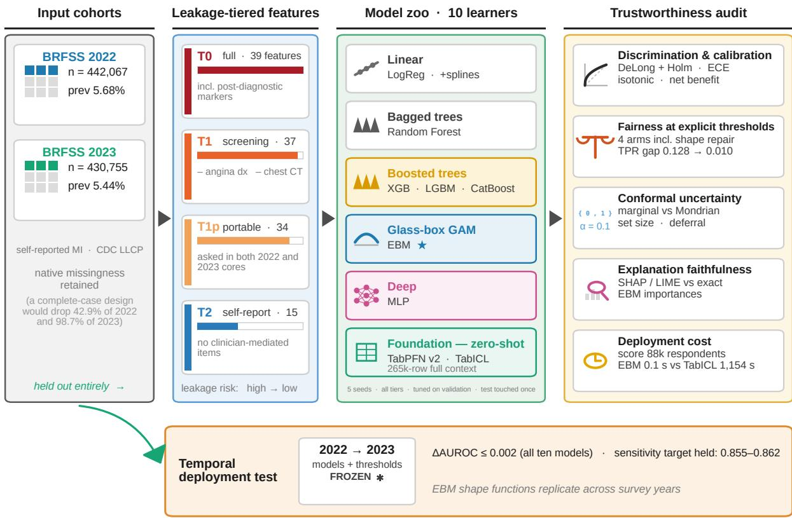  
Figure 1. Study framework. Two full BRFSS cycles feed a leakage-tiered feature design (T0 ⊃ T1 ⊃ T1-portable ⊃ T2; the finer T1-ns ablation additionally removes prior stroke from T1 and is reported for all ten models in Table 2). Ten learners are trained under one pre-specified protocol and subjected to a five-part trustworthiness audit; all 2022 models and their 2022 operating thresholds are then applied frozen to the entire 2023 cycle.

T0 (39 features) is the full set used by prior work on this data family and retains two direct post-diagnostic markers: a prior angina or coronary heart disease diagnosis, and a chest computed tomography scan. T1 (37) removes both and is the primary screening tier. T1-ns removes prior stroke as well, isolating the strongest remaining comorbidity proxy. T1-portable (34) restricts T1 to items asked in both the 2022 and 2023 core questionnaires, and is the tier used for temporal validation. T2 (15) retains only self-reportable items with no clinician-mediated content. Tier membership was fixed before any model was fitted.

## Models and protocol

Ten classifiers spanned linear models, bagged and boosted tree ensembles, a glass-box additive model, a neural network and tabular foundation models: ℓ2-regularized logistic regression and a natural-spline variant (linear); random forest (bagged trees); XGBoost, LightGBM and CatBoost (boosted trees);[17–20] the explainable boosting machine (glass-box additive, the reference model for all comparisons);[21] a multilayer perceptron (neural); and two tabular foundation models applied zero-shot — TabPFN v2 with eight 10 000-row subsampled contexts and TabICL with the full 265 240-row training context.[4, 5]

Each tier was run with five seeds under stratified 60/20/20 train/validation/test splits. Hyperparameters were tuned on validation only, using Optuna;[22] the test partition was read once per cell and no test quantity informed any modelling choice. Classical models used class-weighted training; foundation models were used as published, without weighting or inference optimisation. Full search spaces, software versions and hardware are given in Supplementary Methods.

## Evaluation

Discrimination was AUROC and area under the precision–recall curve. Non-inferiority of the glass-box model was pre-specified at a margin δ = 0.005 AUROC and tested with paired DeLong statistics under Holm correction, with two-sided equivalence assessed by the two-one-sided-tests procedure.[23, 24] Calibration was expected calibration error, Brier score and calibration slope, before and after isotonic recalibration fitted on validation predictions;[25] clinical utility was assessed by decision-curve net benefit across the 1–30% threshold range.[26]

A screening threshold was fixed on validation at sensitivity ≥ 0.85 and all fairness quantities reported at that operating point, with the true-positive-rate (TPR) gap across sex as the primary disparity metric. Four mitigation families shared one selection objective, equalizing validation TPR at the level attained overall at the global threshold: per-group thresholds; Kamiran–Calders preprocessing reweighing;[27] glass-box shape repair, in which the sex main efect and all sexinvolving interaction terms are zeroed or attenuated; and shape repair with per-group intercept equalization. Every edit is a reversible function of the fitted model and is exported as a machinereadable edit log.

Uncertainty used split conformal prediction at $\alpha = 0 . 1 , [ 2 8 ]$ comparing marginal calibration with Mondrian calibration within sex and within sex×age strata, and reporting coverage, deferral (ambiguous {0, 1} sets) and empty-set rates. Explanation faithfulness scored TreeSHAP, KernelSHAP and LIME against the glass-box model’s exact global importances by Kendall τ and top-10 Jaccard overlap across explanation budgets. Inference cost was wall-clock time on an identical 88 413-respondent scoring workload.

For temporal validation, all 2022 T1-portable models and their 2022 validation-selected thresholds were applied unchanged to the entire 2023 cycle, with no refitting and no re-thresholding. Because BRFSS oversamples by design, every frozen model was additionally re-evaluated under the survey design weights. Reporting follows TRIPOD+AI.[29]

## RESULTS

## Two post-diagnostic features account for the reported headroom

On the full T0 feature set, every one of the ten models reached a test AUROC between 0.8905 and 0.8933 (Table 2; Figure 2a), reproducing the ∼0.89 regime of the prior literature regardless of model class. Removing the two direct post-diagnostic markers (tier T1) cost 0.049–0.051 AUROC in every model, near-uniformly, and collapsed the entire zoo into a band 0.0045 wide (0.8395– 0.8440). Removing prior stroke as well (T1-ns) cost a further 0.0075–0.0086, with re-convergence into a 0.0053-wide band. Restricting to self-report-only predictors (T2) cost a further ∼0.021. The uniformity of the decline across every model class locates the reported headroom in the feature set, not the learner.

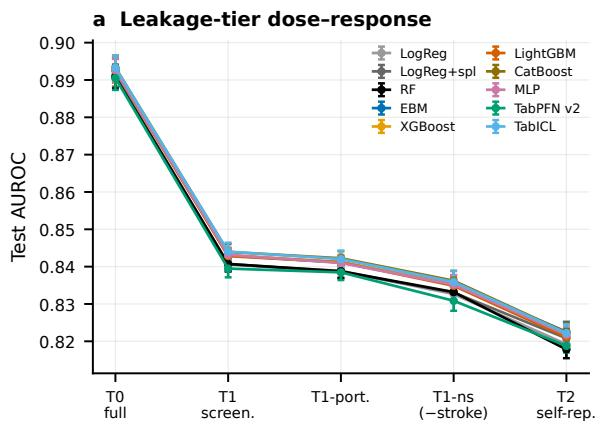  
c Equivalence at T1 (δ=0.005)

b Cost at statistical parity  
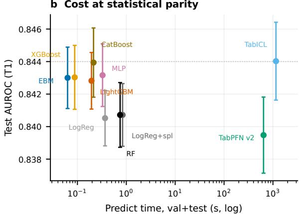  
d Design weights lift all models alike

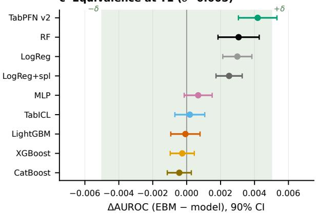

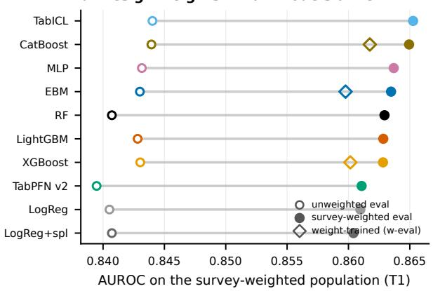  
Figure 2. Leakage, cost, equivalence and design weights. (a) Test AUROC (mean ± SD, five seeds) across leakage tiers, ordered by impact. (b) Accuracy versus prediction time on the validation and test workload, logarithmic scale. (c) Non-inferiority forest at T1: diference in AUROC (glass-box minus comparator) with 90% confidence intervals against the pre-specified ±0.005 band. (d) Survey design weights lift all models nearly uniformly; open diamonds denote weight-informed training.

Table 2. Main benchmark: test AUROC and area under the precision–recall curve by leakage tier (mean ± SD over five seeds).
<table><tr><td rowspan="2">Model</td><td colspan="4">AUROC  $( \mathrm { m e a n } \pm \mathrm { S D } ,$  5 seeds)</td></tr><tr><td>T0 (full)</td><td> $\mathrm { T 1 \ ( s c r e e n . ) }$ </td><td>T1-ns</td><td>T1-port.</td><td>T2 (self-rep.)</td></tr><tr><td>LogReg</td><td> $0 . 8 9 1 1 { \scriptstyle \pm 0 . 0 0 2 9 }$ </td><td> $0 . 8 4 0 5 { \scriptstyle \pm 0 . 0 0 1 7 }$ </td><td> $0 . 8 3 2 6 { \pm } 0 . 0 0 2 1$ </td><td> $0 . 8 3 8 9 { \pm } 0 . 0 0 1 7$ </td><td> $0 . 8 1 9 2 { \scriptstyle \pm 0 . 0 0 1 9 }$ </td></tr><tr><td> $\mathrm { L o g R e g + s p l i n e s }$ </td><td> $0 . 8 9 1 2 { \scriptstyle \pm 0 . 0 0 3 0 }$ </td><td> $0 . 8 4 0 7 { \scriptstyle \pm 0 . 0 0 1 9 }$ </td><td> $0 . 8 3 3 1 { \pm } 0 . 0 0 2 3$ </td><td> $0 . 8 3 8 6 { \scriptstyle \pm 0 . 0 0 1 7 }$ </td><td> $0 . 8 2 0 8 { \scriptstyle \pm 0 . 0 0 2 5 }$ </td></tr><tr><td>Random Forest</td><td> $0 . 8 9 0 7 { \scriptstyle \pm 0 . 0 0 3 1 }$ </td><td> $0 . 8 4 0 7 { \scriptstyle \pm 0 . 0 0 2 0 }$ </td><td> $0 . 8 3 3 2 { \scriptstyle \pm 0 . 0 0 2 1 }$ </td><td> $0 . 8 3 8 8 { \pm } 0 . 0 0 1 8$ </td><td> $0 . 8 1 7 8 { \scriptstyle \pm 0 . 0 0 2 4 }$ </td></tr><tr><td>EBM</td><td> $0 . 8 9 2 7 { \scriptstyle \pm 0 . 0 0 3 2 }$ </td><td> $0 . 8 4 3 0 { \pm } 0 . 0 0 1 9$ </td><td> $0 . 8 3 5 4 { \pm } 0 . 0 0 2 3$ </td><td> $0 . 8 4 1 1 { \scriptstyle \pm 0 . 0 0 1 7 }$ </td><td>0.8225±0.0027</td></tr><tr><td>XGBoost</td><td> $0 . 8 9 3 0 { \pm } 0 . 0 0 3 2$ </td><td> $0 . 8 4 3 0 { \pm } 0 . 0 0 2 0$ </td><td> $0 . 8 3 5 3 { \pm } 0 . 0 0 2 3$ </td><td> $0 . 8 4 1 3 { \pm } 0 . 0 0 1 9$ </td><td> $0 . 8 2 2 3 { \scriptstyle \pm 0 . 0 0 2 4 }$ </td></tr><tr><td>LightGBM</td><td> $0 . 8 9 2 5 { \pm } 0 . 0 0 3 2$ </td><td> $0 . 8 4 2 8 { \pm } 0 . 0 0 1 7$ </td><td> $0 . 8 3 4 9 { \pm } 0 . 0 0 2 2$ </td><td> $0 . 8 4 1 2 { \scriptstyle \pm 0 . 0 0 1 6 }$ </td><td> $0 . 8 2 1 1 { \scriptstyle \pm 0 . 0 0 2 2 }$ </td></tr><tr><td>CatBoost</td><td> $0 . 8 9 3 3 { \pm } 0 . 0 0 3 2$ </td><td> $0 . 8 4 3 9 { \pm } 0 . 0 0 2 1$ </td><td> $0 . 8 3 6 2 { \scriptstyle \pm 0 . 0 0 2 6 }$ </td><td> $0 . 8 4 2 3 { \pm } 0 . 0 0 1 9$ </td><td> $0 . 8 2 2 4 { \scriptstyle \pm 0 . 0 0 2 6 }$ </td></tr><tr><td>MLP</td><td> $0 . 8 9 2 7 { \scriptstyle \pm 0 . 0 0 3 0 }$ </td><td> $0 . 8 4 3 2 { \pm } 0 . 0 0 1 9$ </td><td> $0 . 8 3 5 2 { \scriptstyle \pm 0 . 0 0 2 5 }$ </td><td> $0 . 8 4 1 0 { \pm } 0 . 0 0 1 9$ </td><td> $0 . 8 2 1 8 { \pm } 0 . 0 0 2 1$ </td></tr><tr><td> $\mathrm { T a b P F N \ v 2 ^ { \dagger } }$ </td><td> $0 . 8 9 0 5 { \scriptstyle \pm 0 . 0 0 3 2 }$ </td><td> $0 . 8 3 9 5 { \pm } 0 . 0 0 2 3$ </td><td> $0 . 8 3 0 9 { \scriptstyle \pm 0 . 0 0 2 7 }$ </td><td> $0 . 8 3 8 5 { \pm } 0 . 0 0 2 1$ </td><td> $0 . 8 1 8 8 { \pm } 0 . 0 0 1 8$ </td></tr><tr><td>TabICL</td><td> $0 . 8 9 3 3 { \pm } 0 . 0 0 3 2$ </td><td> $0 . 8 4 4 0 { \pm } 0 . 0 0 2 4$ </td><td> $0 . 8 3 5 9 { \pm } 0 . 0 0 2 9$ </td><td> $0 . 8 4 2 0 { \pm } 0 . 0 0 2 3$ </td><td> $0 . 8 2 2 2 { \pm } 0 . 0 0 2 4$ </td></tr><tr><td></td><td colspan="5">AUPRC  $( { \mathrm { m e a n } } \pm { \mathrm { S D } } ;$  prevalence 0.0568)</td></tr><tr><td>LogReg</td><td> $0 . 4 1 5 { \pm } 0 . 0 0 3$ </td><td> $0 . 2 6 0 { \scriptstyle \pm 0 . 0 0 2 }$ </td><td> $0 . 2 3 7 { \pm } 0 . 0 0 2$ </td><td> $0 . 2 5 7 { \pm } 0 . 0 0 1$ </td><td> $0 . 2 1 3 { \pm } 0 . 0 0 0$ </td></tr><tr><td>LogReg + splines</td><td> $0 . 4 1 7 { \scriptstyle \pm 0 . 0 0 4 }$ </td><td> $0 . 2 6 1 { \scriptstyle \pm 0 . 0 0 2 }$ </td><td> $0 . 2 3 8 { \pm } 0 . 0 0 3$ </td><td> $0 . 2 5 6 { \pm } 0 . 0 0 2$ </td><td> $0 . 2 1 5 { \pm } 0 . 0 0 2$ </td></tr><tr><td>Random Forest</td><td> $0 . 4 1 2 { \scriptstyle \pm 0 . 0 0 5 }$ </td><td> $0 . 2 5 5 { \pm } 0 . 0 0 2$ </td><td> $0 . 2 3 3 { \pm } 0 . 0 0 2$ </td><td> $0 . 2 5 1 { \pm } 0 . 0 0 2$ </td><td> $0 . 2 1 0 { \scriptstyle \pm 0 . 0 0 1 }$ </td></tr><tr><td>EBM</td><td> $0 . 4 2 1 { \pm } 0 . 0 0 6$ </td><td> $0 . 2 6 3 { \pm } 0 . 0 0 2$ </td><td> $0 . 2 3 9 { \pm } 0 . 0 0 3$ </td><td> $0 . 2 5 9 { \pm } 0 . 0 0 1$ </td><td>0.218±0.002</td></tr><tr><td>XGBoost</td><td> $0 . 4 2 8 { \pm } 0 . 0 0 6$ </td><td> $0 . 2 6 4 { \pm } 0 . 0 0 2$ </td><td> $0 . 2 3 9 { \pm } 0 . 0 0 2$ </td><td> $0 . 2 6 0 { \scriptstyle \pm 0 . 0 0 2 }$ </td><td> $0 . 2 1 8 { \pm } 0 . 0 0 1$ </td></tr><tr><td>LightGBM</td><td> $0 . 4 2 4 { \pm } 0 . 0 0 5$ </td><td> $0 . 2 6 3 { \pm } 0 . 0 0 2$ </td><td> $0 . 2 3 9 { \pm } 0 . 0 0 2$ </td><td> $0 . 2 6 0 { \scriptstyle \pm 0 . 0 0 2 }$ </td><td> $0 . 2 1 6 { \pm } 0 . 0 0 1$ </td></tr><tr><td>CatBoost</td><td> $0 . 4 2 7 { \scriptstyle \pm 0 . 0 0 6 }$ </td><td> $0 . 2 6 6 { \pm } 0 . 0 0 2$ </td><td> $0 . 2 4 3 { \pm } 0 . 0 0 2$ </td><td> $0 . 2 6 3 { \scriptstyle \pm 0 . 0 0 1 }$ </td><td> $0 . 2 1 9 { \pm } 0 . 0 0 2$ </td></tr><tr><td>MLP</td><td> $0 . 4 2 6 { \pm } 0 . 0 0 4$ </td><td> $0 . 2 6 4 { \pm } 0 . 0 0 2$ </td><td> $0 . 2 4 1 { \pm } 0 . 0 0 2$ </td><td> $0 . 2 6 0 { \scriptstyle \pm 0 . 0 0 2 }$ </td><td> $0 . 2 1 8 { \pm } 0 . 0 0 1$ </td></tr><tr><td> $\mathrm { T a b P F N \ v 2 ^ { \dagger } }$ </td><td> $0 . 4 2 2 { \scriptstyle \pm 0 . 0 0 5 }$ </td><td> $0 . 2 5 9 { \pm } 0 . 0 0 2$ </td><td> $0 . 2 3 5 { \pm } 0 . 0 0 2$ </td><td> $0 . 2 5 6 { \pm } 0 . 0 0 1$ </td><td> $0 . 2 1 3 { \pm } 0 . 0 0 0$ </td></tr><tr><td>TabICL</td><td> $0 . 4 2 9 { \pm } 0 . 0 0 6$ </td><td> $0 . 2 6 5 { \pm } 0 . 0 0 2$ </td><td> $0 . 2 4 1 { \pm } 0 . 0 0 3$ </td><td> $0 . 2 6 2 { \scriptstyle \pm 0 . 0 0 2 }$ </td><td> $0 . 2 1 7 { \scriptstyle \pm 0 . 0 0 1 }$ </td></tr></table>

†TabPFN v2 evaluated under its 8×10k subsampled-context protocol throughout. T1-ns removes prior stroke from T1 via the release’s pre-specified switch.

## The glass-box model is statistically equivalent to every alternative

At T1 the explainable boosting machine reached 0.8430 ± 0.0019 against CatBoost 0.8439, XG-Boost 0.8430, the multilayer perceptron 0.8432 and full-context TabICL 0.8440. Under the prespecified margin $\delta = 0 . 0 0 5$ it was non-inferior to every comparator at every tier (Holm-adjusted $p < 0 . 0 0 1$ throughout), and two-sided equivalence held against all nine comparators at T0 and T1-portable and eight of nine at T1 (Figure 2c). The sole exception favoured the glass-box model: subsampled-context TabPFN v2 trailed it by 0.0042 (90% CI 0.0031–0.0053), a gap attributable to the context protocol rather than the model family. Tree-based comparators correlated with the glass-box predictions at 0.986–0.991 and the foundation models at 0.83, widening the latter’s paired standard errors as expected.

Parity in accuracy concealed an extreme asymmetry in compute. At T1 the glass-box model needed 0.1 s to score the 88 413-respondent test partition; TabICL required 3.5 s to ingest its context but 1153.8 s of GPU inference for the identical workload, and TabPFN v2 642.5 s (Figure 2b). Scaled to a national cohort, this separates sub-second scoring from tens of GPU-minutes per pass.

## Discrimination parity, calibration divergence

Raw probability quality separated the classes where discrimination could not (Figure 3a). Classweighted classical models were severely miscalibrated in absolute risk (expected calibration error 0.234–0.291) while their calibration slopes remained near ideal (0.91–1.20) — an arithmetic consequence of balanced weighting, not a property of model class, as confirmed by refitting without class weights (error 0.0031 and 0.0019 for the glass-box model and CatBoost). The two foundation models, which apply no class weighting, were natively calibrated (error 0.010). Isotonic recalibration restored every model to error $\leq 0 . 0 0 5$ without altering discrimination, after which all competitive models showed positive net benefit across the 1–30% threshold range (Figure 3b).

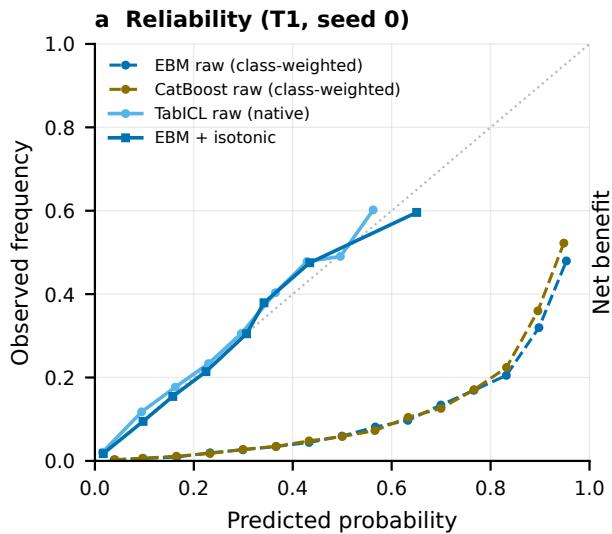

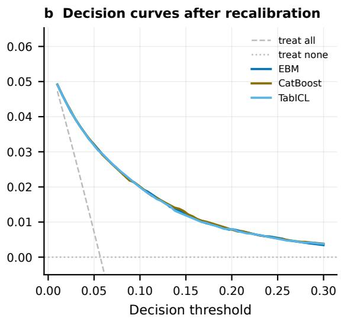  
Figure 3. Calibration and clinical utility at tier T1. (a) Reliability curves before and after isotonic recalibration. (b) Decision-curve net benefit against treat-all and treat-none strategies across the 1–30% threshold range.

## A single threshold under-detects women; glass-box repair closes the gap

At the pre-specified threshold the glass-box model detected 75.4% of women’s prior infarctions against 89.0% of men’s — a TPR gap of 0.128 ± 0.008 across seeds, with XGBoost indistinguishable $( 0 . 1 2 7 \pm 0 . 0 0 8 )$ . Under the common selection objective, per-group thresholds closed the gap to $0 . 0 1 2 5 \pm 0 . 0 0 9 5$ , reweighing to $0 . 0 0 9 0 \pm 0 . 0 0 5 4$ and shape repair with intercept equalization to $0 . 0 1 0 4 \pm 0 . 0 0 9 9$ — statistically matched arms (paired diference −0.0013, 95% bootstrap CI −0.0049 to 0.0022) at essentially identical specificity (Table 3; Supplementary Figure 3). Deleting the sex terms outright stalled at 0.043 while costing the most specificity: proxy pathways carry most of the disparity, and the fitted model makes them explicit, with sex entering the learned interaction structure through age, general health and smoking status rather than in isolation (Figure 4).

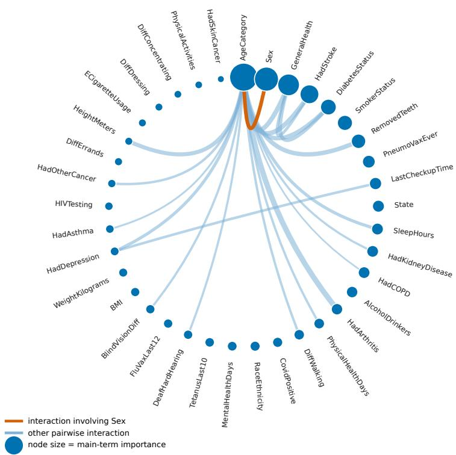  
Figure 4. Learned pairwise-interaction structure of the glass-box model. Tier T1, seed 0. Nodes are main-efect terms sized by importance; chords are the automatically selected pairwise interactions, with width proportional to term importance. Sex-involving interactions are highlighted: these are the proxy pathways that make fairness-through-unawareness insuficient, and they are readable directly of the fitted model rather than inferred post hoc.

Closing the TPR gap closed the false-positive-rate gap $( 0 . 1 4 1  0 . 0 0 7 )$ but widened the positive-predictive-value gap (0.038 → 0.070), making the calibration/error-rate impossibility concrete. Baseline age-band gaps were far larger (0.597) and closed only at heavy specificity cost; race and ethnicity gaps of 0.243 closed to 0.082 at nearly retained specificity (Supplementary Table 4).

Table 3. Fairness mitigation arms at the pre-specified screening threshold. Shape-repair arms exist only for the glass-box model by construction; XGBoost rows cover the model-agnostic arms.
<table><tr><td>Model</td><td>Arm</td><td>Sensitivity</td><td>Specificity</td><td>∆TPR (Sex)</td><td>∆FPR</td><td>∆PPV</td></tr><tr><td>EBM</td><td>baseline (single t)</td><td> $0 . 8 4 8 { \pm } 0 . 0 0 8$ </td><td> $0 . 6 7 9 { \scriptstyle \pm 0 . 0 0 7 }$ </td><td> $0 . 1 2 8 { \pm } 0 . 0 0 8$ </td><td>0.141</td><td>0.038</td></tr><tr><td>EBM</td><td>per-group thresholdsª</td><td> $0 . 8 5 1 { \pm } 0 . 0 0 8$ </td><td> $0 . 6 6 3 { \scriptstyle \pm 0 . 0 0 7 }$ </td><td> $0 . 0 1 3 { \pm } 0 . 0 1 0$ </td><td>0.007</td><td>0.070</td></tr><tr><td>EBM</td><td>reweighing (refit)</td><td> $0 . 8 4 8 { \pm } 0 . 0 0 6$ </td><td> $0 . 6 6 2 { \scriptstyle \pm 0 . 0 0 4 }$ </td><td> $0 . 0 0 9 { \scriptstyle \pm 0 . 0 0 5 }$ </td><td>0.004</td><td>0.069</td></tr><tr><td>EBM</td><td>repair (attenuate Sex)</td><td> $0 . 8 5 1 { \pm } 0 . 0 0 8$ </td><td> $0 . 6 7 0 { \scriptstyle \pm 0 . 0 0 5 }$ </td><td> $0 . 0 4 1 { \pm } 0 . 0 0 9$ </td><td>0.042</td><td>0.062</td></tr><tr><td>EBM</td><td>repair (zero Sex)</td><td> $0 . 8 5 0 { \pm } 0 . 0 0 9$ </td><td> $0 . 6 4 8 { \pm } 0 . 0 0 6$ </td><td> $0 . 0 4 3 { \pm } 0 . 0 0 9$ </td><td>0.064</td><td>0.083</td></tr><tr><td>EBM</td><td>repair + equalise</td><td> $0 . 8 5 0 { \scriptstyle \pm 0 . 0 0 8 }$ </td><td> $0 . 6 6 4 { \scriptstyle \pm 0 . 0 0 7 }$ </td><td> $0 . 0 1 0 { \scriptstyle \pm 0 . 0 1 0 }$ </td><td>0.007</td><td>0.070</td></tr><tr><td>XGBoost</td><td>baseline (single t)</td><td> $0 . 8 4 7 { \scriptstyle \pm 0 . 0 0 5 }$ </td><td> $0 . 6 7 9 { \scriptstyle \pm 0 . 0 0 5 }$ </td><td> $0 . 1 2 7 { \pm } 0 . 0 0 8$ </td><td>0.143</td><td>0.038</td></tr><tr><td>XGBoost</td><td>per-group thresholdsª</td><td> $0 . 8 4 9 { \scriptstyle \pm 0 . 0 0 7 }$ </td><td> $0 . 6 6 4 { \scriptstyle \pm 0 . 0 0 7 }$ </td><td> $0 . 0 1 1 { \scriptstyle \pm 0 . 0 0 7 }$ </td><td>0.010</td><td>0.070</td></tr><tr><td>XGBoost</td><td>reweighing (refit)</td><td> $0 . 8 4 8 { \pm } 0 . 0 0 8$ </td><td> $0 . 6 6 1 { \scriptstyle \pm 0 . 0 0 5 }$ </td><td> $0 . 0 1 2 { \scriptstyle \pm 0 . 0 0 7 }$ </td><td>0.006</td><td>0.069</td></tr></table>

Mean ± SD over five seeds; common selection objective (validation TPR equalised at τ∗). aThe sensitivity-target and TPR-equalisation threshold variants coincide numerically $\left( \tau ^ { * } \approx 0 . 8 5 \right)$ . Between-arm gap diferences cross zero under paired seed contrasts and a 1,000-draw stratified bootstrap (repair vs. thresholds −0.0013 [−0.0049, 0.0022]). Shape-repair arms exist only for the glass-box model by construction; efective per-group thresholds for the repair arm are reported in the text. Age-band and race/ethnicity audits appear in Supplementary Table 4.

## Marginal conformal guarantees hide group-level failure

Split conformal prediction met its marginal guarantee overall but redistributed it unevenly (Figure 5; Supplementary Table 3): coverage was 0.938–0.940 for women against 0.856–0.858 for men, and 0.992–0.993 for ages 18–39 against 0.818–0.819 for ages 60+, so the group at highest cardiovascular risk received the weakest guarantee. The pattern replicated across the glass-box model, XGBoost and TabICL. Deferral tracked the same gradient, from 0.035 in adults 18–39 to 0.586 in adults 60+, whose singleton predictions were wrong 44% of the time. Mondrian calibration restored every stratum to 0.90 at two distinct prices: honest deferral in the oldest stratum (0.586 → 0.712), and, in the youngest, empty prediction sets (9.5%) that marginal calibration never produces — so the identity “mean set size = 1+ deferral” holds marginally but breaks under Mondrian. A hybrid retaining marginal calibration for ages 18–39 and Mondrian elsewhere dominated both pure policies under every utility weighting we examined.

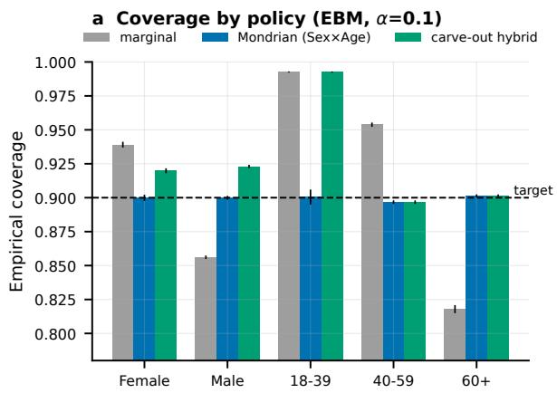

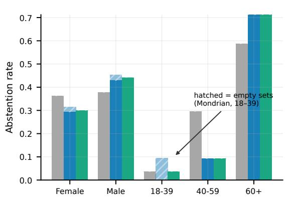  
Figure 5. Marginal guarantees hide subgroup failure, and the repair has two currencies. (a) Conformal coverage by policy for the glass-box model at $\alpha \ : = \ : 0 . 1$ (mean ± SD over five seeds): marginal, Mondrian within sex×age, and the carve-out hybrid. (b) The price: clinician deferral (solid) plus abstention through empty prediction sets (hatched), which only group-conditional calibration produces and only in the lowest-risk stratum.

## Post-hoc explanations are not glass-box explanations

Against the glass-box model’s exact global importances, TreeSHAP on tuned XGBoost plateaued at Kendall $\tau = 0 . 8 8 4$ even with 10 000 explanation samples (Figure 6). More strikingly, modelagnostic KernelSHAP applied to the glass-box model itself recovered its own knowable truth only gradually $( \tau = 0 . 7 2 4$ at 25 samples, 0.870 at 500), and LIME never converged at any budget (τ ≈ 0.626; top-10 Jaccard 0.45, misidentifying roughly half of the ten strongest drivers).

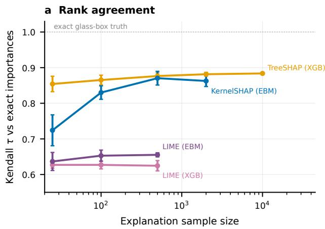

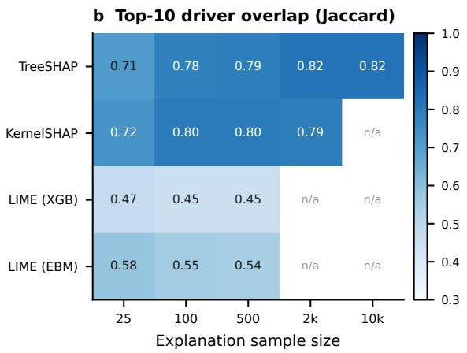  
Figure 6. Post-hoc explanation is an estimate; glass-box explanation is an identity. (a) Kendall τ between post-hoc attributions and the glass-box model’s exact global importances versus explanation sample size; LIME applied to the glass-box model itself plateaus at τ ≈ 0.63, acquitting the cross-model confound while confirming the estimator limitation. (b) Overlap of each explainer’s ten strongest drivers with the exact top ten (Jaccard index); grey cells were not computed for tractability.

## Frozen models and thresholds transport to the next survey year

Applied without refitting or re-thresholding to all 430 755 respondents of 2023, every T1-portable model lost between 0.0009 and 0.0016 AUROC relative to its internal estimate (Table 4), cali bration slopes stayed within 0.91–1.19, and the frozen 2022 thresholds delivered 2023 sensitivities of 0.855–0.862 against the 0.85 target. Glass-box shape functions refitted independently on 2023 reproduced the 2022 risk curves within bagged uncertainty bands (Supplementary Figure 4).

Table 4. Temporal external validation: all 2022 models and 2022 thresholds applied frozen to the full 2023 cycle.
<table><tr><td>Model</td><td>AUROC</td><td>AUPRC</td><td>Cal. slope</td><td>Sens.@screen</td><td>Spec.@screen</td></tr><tr><td>LogReg</td><td>0.8378</td><td>0.2465</td><td>0.928</td><td>0.861</td><td>0.651</td></tr><tr><td>LogReg (splines)</td><td>0.8375</td><td>0.2469</td><td>0.915</td><td>0.862</td><td>0.648</td></tr><tr><td>Random Forest</td><td>0.8373</td><td>0.2405</td><td>1.191</td><td>0.856</td><td>0.659</td></tr><tr><td>EBM</td><td>0.8395</td><td>0.2511</td><td>0.958</td><td>0.859</td><td>0.656</td></tr><tr><td>XGBoost</td><td>0.8400</td><td>0.2511</td><td>1.001</td><td>0.858</td><td>0.659</td></tr><tr><td>LightGBM</td><td>0.8399</td><td>0.2506</td><td>1.025</td><td>0.856</td><td>0.660</td></tr><tr><td>CatBoost</td><td>0.8410</td><td>0.2527</td><td>1.022</td><td>0.858</td><td>0.661</td></tr><tr><td>MLP</td><td>0.8401</td><td>0.2505</td><td>1.039</td><td>0.861</td><td>0.655</td></tr><tr><td>TabPFN  $\mathrm { v 2 ^ { \dag } }$ </td><td>0.8373</td><td>0.2456</td><td>0.928</td><td>0.855</td><td>0.658</td></tr><tr><td>TabICL</td><td>0.8411</td><td>0.2524</td><td>0.926</td><td>0.857</td><td>0.662</td></tr></table>

All 2022 models and 2022 thresholds applied frozen to the full 2023 cycle (n=430,755); values are means over the five seeded frozen models, at four decimals. †Subsampled-context protocol.

## Sensitivity analyses and the survey-weighted population

SMOTE-NC oversampling, standard practice in this literature, reduced T1 AUROC from 0.843 to 0.809 while inflating training time ∼150-fold.[30] Complete-case analysis cost 0.0023 AUROC in addition to discarding 42.9% of respondents. Re-evaluating every frozen model under survey design weights raised discrimination almost uniformly, by +0.020 to +0.022 AUROC for all ten models, leaving the ranking statistically unchanged (Figure 2d). Testing rather than assuming where a foundation-model edge might lie, we compared TabICL with CatBoost within design weight quintiles: diferences were null in quintiles 1–4, and in the highest-weight quintile — the most under-sampled respondents — the sign ran against the foundation model (CatBoost better by 0.0029, 95% CI 0.0009–0.0048). Weight-informed training did not improve weightedpopulation discrimination; the foundation models cannot ingest per-instance weights in their zero-shot interface.

## DISCUSSION

## Principal findings

The headroom celebrated in this literature is leakage, not learning. Every model we trained, from logistic regression to a 265 240-row in-context foundation model, reproduced the ∼0.89 regime on the full feature set and surrendered roughly 0.05 AUROC when two post-diagnostic markers were removed. The near-uniformity of that decline is the finding: it gives quantitative, dose– response form to the leakage taxonomies of Davis et al.[1] and to the diagnosis-code case reports of Ramadan et al.,[2] and it generalises the single-pipeline correction of Eltawil et al.[3] to ten models and five tiers. For the many public tools built on redistributed derivatives of this survey, the implication is uncomfortable: a model that knows a respondent has angina is not screening for myocardial infarction, it is transcribing a record back to itself.

Transparency cost nothing measurable. At the reduced-leakage tier the glass-box model was statistically non-inferior to every alternative within a pre-specified margin, extending the intelligible-models result of Caruana et al.[6] to the foundation-model era while scoring the cohort four orders of magnitude faster than TabICL at equal accuracy. This is not a verdict against foundation models: TabICL matched the best boosted trees with zero tuning, and both foundation models arrived natively calibrated where every class-weighted classical model required isotonic repair — an under-appreciated consequence of imbalance handling, and a caution for any study reporting class-weighted probabilities as risks. But the cost asymmetry, the weakness of the subsampled-context variant, and the shrinkage of any foundation-model edge under survey weighting together suggest that, for population screening on tabular surveys, in-context scale currently buys parity rather than superiority.

Fairness must be engineered at the operating point. Reporting a single validation-selected threshold converts this literature’s threshold-free disparity claims into an explicit one: one in four true cases among women is missed against one in nine among men. That the gap was essentially identical for the glass-box model and XGBoost shows it is a property of the data-plusthreshold system, not of any model’s opacity. Shape repair with intercept equalization matched conventional mitigation at matched specificity while remaining what the alternatives, including fairness-aware interpretable modelling,[13] are not — a reversible, machine-readable, governable edit of the model itself, with its per-group efective thresholds disclosed rather than implicit. This converts the interactive editing paradigm of Wang et al.[8] into an auditable fairness protocol, and the same additive structure makes visible why fairness-through-unawareness fails.

Uncertainty guarantees are only as good as their conditioning. Marginal conformal prediction met its 90% guarantee on average while delivering 86% coverage to men and 82% to adults over sixty — precisely the stratum at highest risk — replicating across three model families the group-coverage failures anticipated by the conditional-conformal literature[11] and motivating fairness-aware conformal auditing at the point of care.[12] We add that group-conditional repair in very-low-risk strata can also abstain through empty prediction sets, a cost invisible to marginal accounting.[14] Finally, the faithfulness analysis cautions the field’s default explanation practice: even explaining the glass-box model itself, KernelSHAP needed hundreds of samples and LIME never converged. Where stakes justify explanation, they justify models whose explanations are identities rather than estimates.

## Limitations

The outcome is self-reported, ever-diagnosed myocardial infarction in a cross-sectional survey: it identifies prevalent, surviving, diagnosis-aware cases, so the task is screening triage rather than incident risk prediction, and fatal or undiagnosed events are structurally invisible. Self-report introduces misclassification on outcome and predictors alike. Our tiers operationalise one principled leakage taxonomy; other boundaries are defensible, and T1 removes only direct post-diagnostic markers, so residual conditioning-on-care signal remains in variables such as checkup recency. Survey-weighted results are point-estimate sensitivity analyses; full design-based variance was out of scope. Both validation years come from the same surveillance system and country, so transportability to clinical registries or other health systems is untested. Foundation models evolve quickly, and successors may behave diferently. Fairness was audited on measured attributes only, and gap closure at one threshold does not certify equity of downstream care. Conformal validity assumes exchangeability that drift can break; our 2023 results show empirical robustness for one year, not a guarantee.

## CONCLUSION

On the most heavily reused public cardiovascular survey data, two post-diagnostic features — not model sophistication — explain the performance this literature celebrates. Once they are removed, a transparent, editable, sub-second glass-box model meets tuned gradient boosting and full-context tabular foundation models head-on, and its structure supports what deployment actually requires: explicit operating points, auditable fairness repair that matches conventional mitigation while remaining inspectable, group-conditional uncertainty with honest deferral, exact rather than estimated explanations, and thresholds that transport across survey years. The binding constraint on this field is evaluation practice, not model capacity.

## Data availability

This study analysed third-party data that are publicly available without restriction. The 2022 and 2023 Behavioral Risk Factor Surveillance System Landline and Cellular Telephone files are distributed by the Centers for Disease Control and Prevention and are cited in the reference list.[15, 16] No raw data are redistributed here. Derived cohort construction logs and every per-cell result reported in this article accompany the code release.

## Code availability

The complete configuration-driven pipeline — cohort construction, models, audits, statistical tests, tables and figures — is openly available at https://github.com/raadbintareaf/cvd-glassbox-screeni and archived at https://doi.org/10.5281/zenodo.21918761.

## Funding

Supported by Abu Dhabi University’s Ofice of Research and Sponsored Programs (grant number 19300893).

## Author contributions

Following CRediT: R.B.T. — conceptualization, methodology, software, formal analysis, data curation, visualization, writing (original draft). M.A.R. and S.L. — supervision, validation, writing (review and editing). S.E. — validation (clinical plausibility of learned risk functions), writing (review and editing). C.S. — investigation (literature synthesis), writing (review and editing).

## Competing interests

The authors declare no competing interests.

## References

[1] Sharon E Davis, Michael E Matheny, Suresh Balu, and Mark P Sendak. A framework for understanding label leakage in machine learning for health care. Journal of the American Medical Informatics Association, 31:274–280, 2023. doi: 10.1093/jamia/ocad178.

[2] Bashar Ramadan, Ming-Chieh Liu, Michael C. Burkhart, William F. Parker, and Brett K. Beaulieu-Jones. Diagnostic Codes in AI Prediction Models and Label Leakage of Same-Admission Clinical Outcomes. JAMA Network Open, 8:e2550454, 2025. doi: 10.1001/ jamanetworkopen.2025.50454.

[3] Mohamed Eltawil, Laura Byham-Gray, Yuane Jia, Neil Mistry, James Parrott, and Suril Gohel. Comment on Iacobescu et al. Evaluating Binary Classifiers for Cardiovascular Disease Prediction: Enhancing Early Diagnostic Capabilities. J. Cardiovasc. Dev. Dis. 2024, 11, 396. Journal of Cardiovascular Development and Disease, 13:46, 2026. doi: 10.3390/jcdd13010046.

[4] Noah Hollmann et al. Accurate predictions on small data with a tabular foundation model. Nature, 637:319–326, 2025. doi: 10.1038/s41586-024-08328-6.

[5] Jingang Qu et al. TabICL: A Tabular Foundation Model for In-Context Learning on Large Data. In Proceedings of the 42nd International Conference on Machine Learning, 2025. arXiv:2502.05564.

[6] Rich Caruana, Yin Lou, Johannes Gehrke, Paul Koch, Marc Sturm, and Noemie Elhadad. Intelligible Models for HealthCare. In Proceedings of the 21th ACM SIGKDD International Conference on Knowledge Discovery and Data Mining, pages 1721–1730, 2015. doi: 10.1145/ 2783258.2788613.

[7] Yin Lou, Rich Caruana, Johannes Gehrke, and Giles Hooker. Accurate intelligible models with pairwise interactions. In Proceedings of the 19th ACM SIGKDD international conference on Knowledge discovery and data mining, pages 623–631, 2013. doi: 10.1145/2487575. 2487579.

[8] Zijie J. Wang et al. Interpretability, Then What? Editing Machine Learning Models to Reflect Human Knowledge and Values. In Proceedings of the 28th ACM SIGKDD Conference on Knowledge Discovery and Data Mining, pages 4132–4142, 2022. doi: 10.1145/3534678. 3539074.

[9] Scott M. Lundberg and Su-In Lee. A Unified Approach to Interpreting Model Predictions. In Advances in Neural Information Processing Systems 30, 2017. arXiv:1705.07874.

[10] Marco Tulio Ribeiro, Sameer Singh, and Carlos Guestrin. "Why Should I Trust You?". In Proceedings of the 22nd ACM SIGKDD International Conference on Knowledge Discovery and Data Mining, pages 1135–1144, 2016. doi: 10.1145/2939672.2939778.

[11] Isaac Gibbs, John J Cherian, and Emmanuel J Candès. Conformal prediction with conditional guarantees. Journal of the Royal Statistical Society Series B: Statistical Methodology, 87:1100–1126, 2025. doi: 10.1093/jrsssb/qkaf008.

[12] Xiaotan Sun et al. FairICP: identifying biases and increasing transparency at the point of care in post-implementation clinical decision support using inductive conformal prediction. Journal of the American Medical Informatics Association, 32:1299–1309, 2025. doi: 10.1093/ jamia/ocaf095.

[13] Mingxuan Liu et al. FAIM: Fairness-aware interpretable modeling for trustworthy machine learning in healthcare. Patterns, 5:101059, 2024. doi: 10.1016/j.patter.2024.101059.

[14] Hyun Kwon and Dae-Jin Kim. Conformal selective prediction with cost aware deferral for safe clinical triage under distribution shift. Scientific Reports, 16, 2026. doi: 10.1038/ s41598-026-40637-w.

[15] Centers for Disease Control and Prevention. Behavioral Risk Factor Surveillance System: 2022 Survey Data and Documentation (LLCP2022). https://www.cdc.gov/brfss/annual\_ data/annual\_2022.html, 2023.

[16] Centers for Disease Control and Prevention. Behavioral Risk Factor Surveillance System: 2023 Survey Data and Documentation (LLCP2023). https://www.cdc.gov/brfss/annual\_ data/annual\_2023.html, 2024.

[17] Leo Breiman. Random Forests. Machine Learning, 45:5–32, 2001. doi: 10.1023/A: 1010933404324.

[18] Tianqi Chen and Carlos Guestrin. XGBoost. In Proceedings of the 22nd ACM SIGKDD International Conference on Knowledge Discovery and Data Mining, pages 785–794, 2016. doi: 10.1145/2939672.2939785.

[19] Guolin Ke et al. LightGBM: A Highly Eficient Gradient Boosting Decision Tree. In Advances in Neural Information Processing Systems 30, pages 3146–3154, 2017.

[20] Liudmila Prokhorenkova et al. CatBoost: unbiased boosting with categorical features. In Advances in Neural Information Processing Systems 31, 2018. arXiv:1706.09516.

[21] Harsha Nori, Samuel Jenkins, Paul Koch, and Rich Caruana. InterpretML: A Unified Framework for Machine Learning Interpretability, 2019. arXiv:1909.09223.

[22] Takuya Akiba, Shotaro Sano, Toshihiko Yanase, Takeru Ohta, and Masanori Koyama. Optuna. In Proceedings of the 25th ACM SIGKDD International Conference on Knowledge Discovery & Data Mining, pages 2623–2631, 2019. doi: 10.1145/3292500.3330701.

[23] Elizabeth R. DeLong, David M. DeLong, and Daniel L. Clarke-Pearson. Comparing the Areas under Two or More Correlated Receiver Operating Characteristic Curves: A Nonparametric Approach. Biometrics, 44:837, 1988. doi: 10.2307/2531595.

[24] Sture Holm. A Simple Sequentially Rejective Multiple Test Procedure. Scandinavian Journal of Statistics, 6:65–70, 1979.

[25] Bianca Zadrozny and Charles Elkan. Transforming classifier scores into accurate multiclass probability estimates. In Proceedings of the eighth ACM SIGKDD international conference on Knowledge discovery and data mining, pages 694–699, 2002. doi: 10.1145/775047.775151.

[26] Andrew J. Vickers and Elena B. Elkin. Decision Curve Analysis: A Novel Method for Evaluating Prediction Models. Medical Decision Making, 26:565–574, 2006. doi: 10.1177/ 0272989X06295361.

[27] Faisal Kamiran and Toon Calders. Data preprocessing techniques for classification without discrimination. Knowledge and Information Systems, 33:1–33, 2012. doi: 10.1007/ s10115-011-0463-8.

[28] Vladimir Vovk, Alexander Gammerman, and Glenn Shafer. Algorithmic Learning in a Random World. Springer, New York, 2005. doi: 10.1007/b106715.

[29] Gary S Collins et al. TRIPOD+AI statement: updated guidance for reporting clinical prediction models that use regression or machine learning methods. BMJ, page e078378, 2024. doi: 10.1136/bmj-2023-078378.

[30] N. V. Chawla, K. W. Bowyer, L. O. Hall, and W. P. Kegelmeyer. SMOTE: Synthetic Minority Over-sampling Technique. Journal of Artificial Intelligence Research, 16:321–357, 2002. doi: 10.1613/jair.953.

## Supplementary Information

This appendix contains the material referred to in the main text as Supplementary Figures 1–4, Supplementary Tables 1–4, Supplementary Methods and the Supplementary Note. It is identical to the Supplementary Information filed with the journal, and is bound here so that the preprint is a single self-contained document.

Supplementary Figures

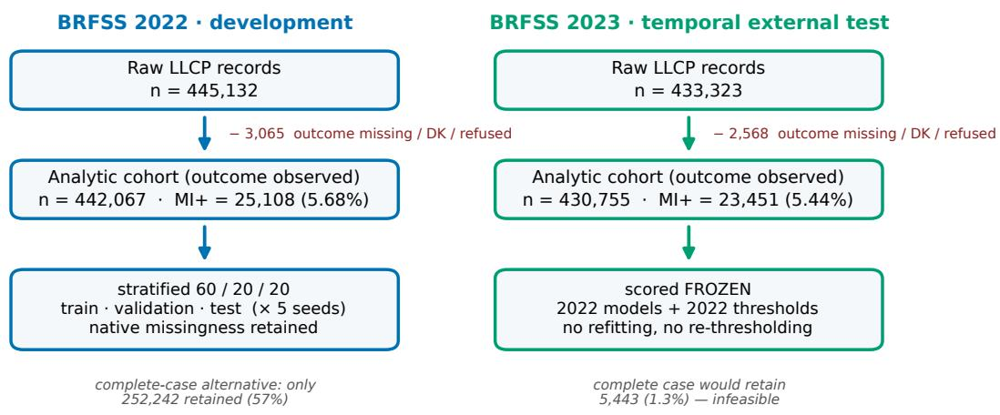  
Supplementary Fig. 1 | Cohort construction. Record flow for the 2022 development and 2023 temporal-validation cycles; complete-case counts shown for reference only (primary analyses retain native missingness).

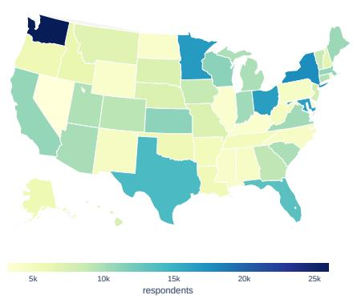

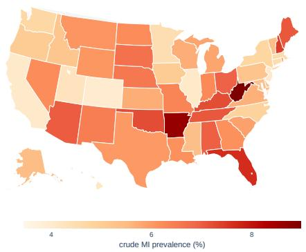

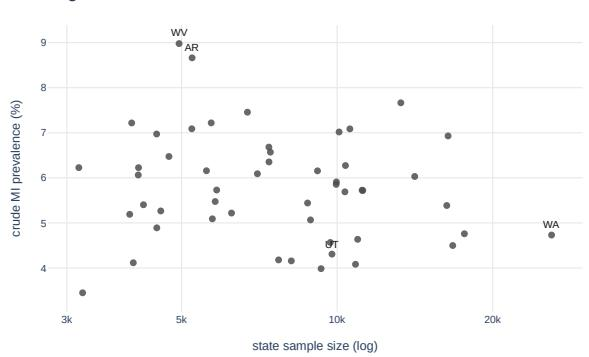

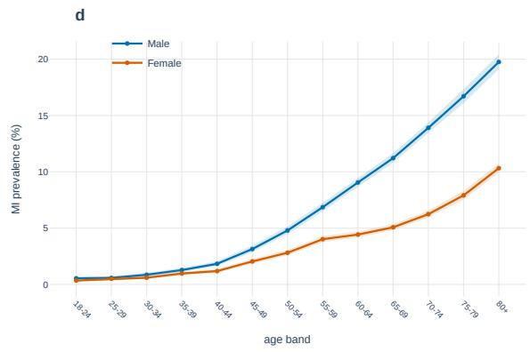  
Supplementary Fig. 2 | Cohort geography and demography (2022). (a) Respondents per state and (b) crude self-reported MI prevalence (unweighted; territories GU/PR/VI, n=9,258, not mapped). (c) State prevalence versus sample size. (d) Age–sex prevalence gradient with 95% Wilson intervals: male excess emerges in midlife and persists to 80+.

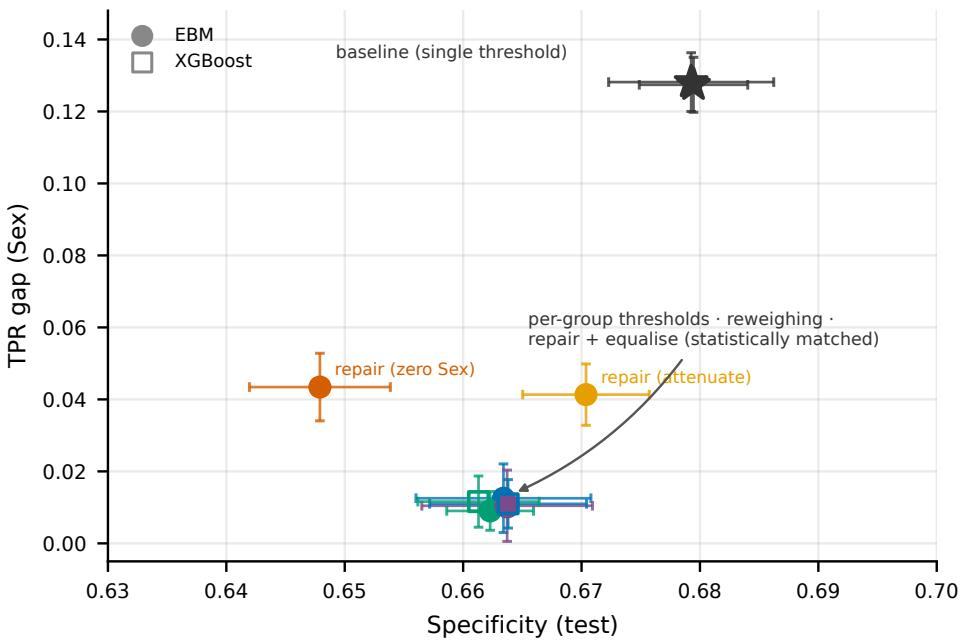  
Supplementary Fig. 3 | Equity–specificity plane of the mitigation arms (Sex). Mean ± SD over five seeds under the common selection objective; filled circles the glass-box model, open squares XGBoost, star the shared single-threshold baseline. Per-group thresholds, reweighing, and shape repair with intercept equalisation occupy the same corner of the plane—statistically matched gap closure at matched specificity—while partial and unawareness repairs stall midplane. Numerical values, including the false-positive-rate and positive-predictive-value gaps this projection does not show, are given in Table 3.

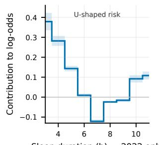

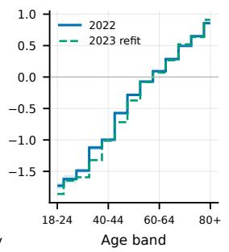

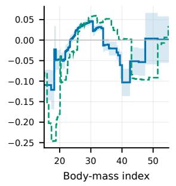

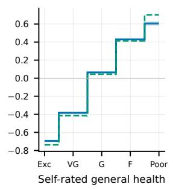

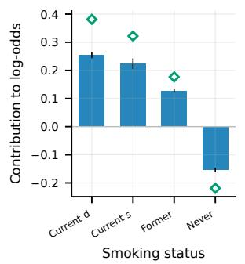

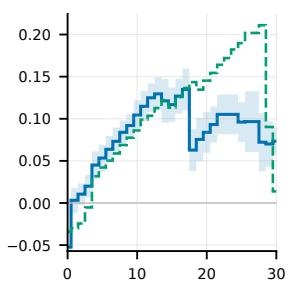

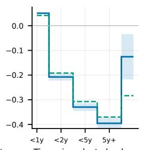

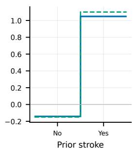  
Supplementary Fig. 4 | Learned risk shapes and their replication across survey years. Glass-box term contributions for continuous, ordinal and categorical predictors: 2022 (with bagged uncertainty) versus an independent 2023 refit on the year-portable tier. Sleep duration was removed from the 2023 core questionnaire and is therefore shown for 2022 only.

Table 5. Analytic variables, raw BRFSS items, and tier membership.
<table><tr><td rowspan=1 colspan=8>Analytic name        2022 item  2023 item  T1  T1-port.  T2</td></tr><tr><td rowspan=1 colspan=6>AgeCategory                                      1</td><td rowspan=1 colspan=1>V</td><td rowspan=1 colspan=1></td></tr><tr><td rowspan=1 colspan=6>AlcoholDrinkers</td><td rowspan=1 colspan=1></td><td rowspan=1 colspan=1></td></tr><tr><td rowspan=1 colspan=6>BMI</td><td rowspan=1 colspan=1></td><td rowspan=1 colspan=1></td></tr><tr><td rowspan=1 colspan=6>BlindVisionDiff</td><td rowspan=1 colspan=1></td><td rowspan=1 colspan=1></td></tr><tr><td rowspan=1 colspan=6>ChestScan</td><td rowspan=1 colspan=1></td><td rowspan=1 colspan=1></td></tr><tr><td rowspan=1 colspan=6>CovidPositive</td><td rowspan=1 colspan=1></td><td rowspan=1 colspan=1></td></tr><tr><td rowspan=1 colspan=6>DeafHardHearing</td><td rowspan=1 colspan=1></td><td rowspan=1 colspan=1></td></tr><tr><td rowspan=1 colspan=6>DiabetesStatus</td><td rowspan=1 colspan=1></td><td rowspan=1 colspan=1></td></tr><tr><td rowspan=1 colspan=6>DiffConcentrating</td><td rowspan=1 colspan=1></td><td rowspan=1 colspan=1></td></tr><tr><td rowspan=1 colspan=6>DiffDressing</td><td rowspan=1 colspan=1></td><td rowspan=1 colspan=1></td></tr><tr><td rowspan=1 colspan=6>DiffErrands</td><td rowspan=1 colspan=1></td><td rowspan=1 colspan=1></td></tr><tr><td rowspan=1 colspan=6>DiffWalking</td><td rowspan=1 colspan=1></td><td rowspan=1 colspan=1></td></tr><tr><td rowspan=1 colspan=6>ECigaretteUsage</td><td rowspan=1 colspan=1></td><td rowspan=1 colspan=1></td></tr><tr><td rowspan=1 colspan=6>FluVaxLast12</td><td rowspan=1 colspan=1></td><td rowspan=1 colspan=1></td></tr><tr><td rowspan=1 colspan=6>GeneralHealth</td><td rowspan=1 colspan=1></td><td rowspan=1 colspan=1></td></tr><tr><td rowspan=1 colspan=6>HIVTesting</td><td rowspan=1 colspan=1></td><td rowspan=1 colspan=1></td></tr><tr><td rowspan=1 colspan=6>HadAngina</td><td rowspan=1 colspan=1></td><td rowspan=1 colspan=1></td></tr><tr><td rowspan=1 colspan=4>HadArthritis</td><td rowspan=1 colspan=2></td><td rowspan=1 colspan=1></td><td rowspan=1 colspan=1></td></tr><tr><td rowspan=1 colspan=3>HadAsthma</td><td rowspan=1 colspan=1></td><td rowspan=1 colspan=2></td><td rowspan=1 colspan=1></td><td rowspan=1 colspan=1></td></tr><tr><td rowspan=1 colspan=3>HadCOPD</td><td rowspan=1 colspan=1></td><td rowspan=1 colspan=1></td><td rowspan=1 colspan=1></td><td rowspan=1 colspan=1></td><td rowspan=1 colspan=1></td></tr><tr><td rowspan=1 colspan=2>HadDepression</td><td rowspan=1 colspan=1></td><td rowspan=1 colspan=1></td><td rowspan=1 colspan=1></td><td rowspan=1 colspan=1></td><td rowspan=1 colspan=1></td><td rowspan=1 colspan=1></td></tr><tr><td rowspan=1 colspan=2>HadKidneyDisease</td><td rowspan=1 colspan=1></td><td rowspan=1 colspan=1></td><td rowspan=1 colspan=1></td><td rowspan=1 colspan=1></td><td rowspan=1 colspan=1></td><td rowspan=2 colspan=1></td></tr><tr><td rowspan=1 colspan=2>HadOtherCancer</td><td rowspan=1 colspan=2></td><td rowspan=1 colspan=2></td><td rowspan=1 colspan=1></td></tr><tr><td rowspan=1 colspan=4>HadSkinCancer</td><td rowspan=1 colspan=2></td><td rowspan=1 colspan=1></td><td rowspan=1 colspan=1></td></tr><tr><td rowspan=1 colspan=1>HadStroke</td><td rowspan=1 colspan=3></td><td rowspan=1 colspan=2></td><td rowspan=1 colspan=1></td><td rowspan=1 colspan=1></td></tr><tr><td rowspan=1 colspan=1>HeightMeters</td><td rowspan=1 colspan=3></td><td rowspan=1 colspan=2></td><td rowspan=1 colspan=1></td><td rowspan=1 colspan=1></td></tr><tr><td rowspan=1 colspan=1>LastCheckupTime</td><td rowspan=1 colspan=3></td><td rowspan=1 colspan=2></td><td rowspan=1 colspan=1></td><td rowspan=1 colspan=1></td></tr><tr><td rowspan=1 colspan=1>MentalHealthDays</td><td rowspan=1 colspan=3></td><td rowspan=1 colspan=2></td><td rowspan=1 colspan=1></td><td rowspan=1 colspan=1></td></tr><tr><td rowspan=1 colspan=3>PhysicalActivities</td><td rowspan=1 colspan=1></td><td rowspan=1 colspan=2></td><td rowspan=1 colspan=1></td><td rowspan=1 colspan=1></td></tr><tr><td rowspan=1 colspan=3>PhysicalHealthDays</td><td rowspan=1 colspan=1></td><td rowspan=1 colspan=1></td><td rowspan=1 colspan=1></td><td rowspan=1 colspan=1></td><td rowspan=1 colspan=1></td></tr><tr><td rowspan=1 colspan=3>PneumoVaxEver</td><td rowspan=1 colspan=1></td><td rowspan=1 colspan=1></td><td rowspan=1 colspan=1></td><td rowspan=1 colspan=1></td><td rowspan=1 colspan=1></td></tr><tr><td rowspan=1 colspan=4>RaceEthnicity</td><td rowspan=1 colspan=1></td><td rowspan=1 colspan=1></td><td rowspan=1 colspan=1></td><td rowspan=3 colspan=1></td></tr><tr><td rowspan=1 colspan=4>RemovedTeeth</td><td rowspan=1 colspan=2></td><td rowspan=1 colspan=1></td></tr><tr><td rowspan=1 colspan=4>Sex</td><td rowspan=1 colspan=2></td><td rowspan=1 colspan=1></td></tr><tr><td rowspan=1 colspan=4>SleepHours</td><td rowspan=1 colspan=2></td><td rowspan=1 colspan=1></td><td rowspan=1 colspan=1></td></tr><tr><td rowspan=1 colspan=4>SmokerStatus</td><td rowspan=1 colspan=2></td><td rowspan=1 colspan=1></td><td rowspan=1 colspan=1></td></tr><tr><td rowspan=1 colspan=4>State</td><td rowspan=1 colspan=2></td><td rowspan=1 colspan=1></td><td rowspan=3 colspan=1></td></tr><tr><td rowspan=1 colspan=4>TetanusLast10</td><td rowspan=1 colspan=2></td><td rowspan=1 colspan=1></td></tr><tr><td rowspan=1 colspan=4>WeightKilograms</td><td rowspan=1 colspan=2></td><td rowspan=1 colspan=1></td></tr></table>

T0 (39 features) AgeCategory, AlcoholDrinkers, BMI, BlindVisionDif, ChestScan, CovidPositive, Deaf-HardHearing, DiabetesStatus, DifConcentrating, DifDressing, DifErrands, DifWalking, ECigaretteUsage, FluVaxLast12, GeneralHealth, HIVTesting, HadAngina, HadArthritis, HadAsthma, Had-COPD, HadDepression, HadKidneyDisease, HadOtherCancer, HadSkinCancer, HadStroke, Height-Meters, LastCheckupTime, MentalHealthDays, PhysicalActivities, PhysicalHealthDays, PneumoVax Ever, RaceEthnicity, RemovedTeeth, Sex, SleepHours, SmokerStatus, State, TetanusLast10, WeightKilograms.

T1 (37 features) AgeCategory, AlcoholDrinkers, BMI, BlindVisionDif, CovidPositive, DeafHardHearing, DiabetesStatus, DifConcentrating, DifDressing, DifErrands, DifWalking, ECigaretteUsage, FluVaxLast12, GeneralHealth, HIVTesting, HadArthritis, HadAsthma, HadCOPD, HadDepression, HadKidneyDisease, HadOtherCancer, HadSkinCancer, HadStroke, HeightMeters, LastCheckupTime, MentalHealthDays, PhysicalActivities, PhysicalHealthDays, PneumoVaxEver, RaceEthnicity, RemovedTeeth, Sex, SleepHours, SmokerStatus, State, TetanusLast10, WeightKilograms.

T1-portable (34 features) AgeCategory, AlcoholDrinkers, BMI, BlindVisionDif, CovidPositive, Deaf-HardHearing, DiabetesStatus, DifConcentrating, DifDressing, DifErrands, DifWalking, ECigaretteUsage, FluVaxLast12, GeneralHealth, HIVTesting, HadArthritis, HadAsthma, HadCOPD, Had-Depression, HadKidneyDisease, HadOtherCancer, HadSkinCancer, HadStroke, HeightMeters, LastCheck upTime, MentalHealthDays, PhysicalActivities, PhysicalHealthDays, PneumoVaxEver, RaceEthnicity, Sex, SmokerStatus, State, WeightKilograms.

T2 (15 features) AgeCategory, AlcoholDrinkers, BMI, ECigaretteUsage, GeneralHealth, HeightMeters, MentalHealthDays, PhysicalActivities, PhysicalHealthDays, RaceEthnicity, Sex, SleepHours, SmokerStatus, State, WeightKilograms.

Supplementary Table 3 | Conformal coverage, deferral and empty-set rates across the full model×method grid.
<table><tr><td>Model</td><td>Method</td><td colspan="2">Female</td><td colspan="2">Male</td><td colspan="2">18-39</td><td colspan="2">60+</td></tr><tr><td colspan="9">Empirical coverage (target 0.90)</td></tr><tr><td>EBM</td><td>marginal</td><td> $0 . 9 3 9 1 \pm 0 . 0 0 2 1$ </td><td></td><td> $0 . 8 5 6 1 \pm 0 . 0 0 1 2$ </td><td> $0 . 9 9 2 6 \pm 0 . 0 0 0 4$ </td><td></td><td> $0 . 9 5 3 8 \pm 0 . 0 0 1 6$ </td><td></td><td> $0 . 8 1 7 9 \pm 0 . 0 0 3 0$ </td></tr><tr><td>EBM</td><td>Mondrian (Sex)</td><td></td><td> $0 . 9 0 1 \pm 0 . 0 0 1$ </td><td> $0 . 9 0 0 \pm 0 . 0 0 2$ </td><td></td><td> $0 . 9 9 2 \pm 0 . 0 0 0$ </td><td> $0 . 9 5 1 \pm 0 . 0 0 1$ </td><td></td><td> $0 . 8 2 0 \pm 0 . 0 0 1$ </td></tr><tr><td>EBM</td><td>Mondrian (Sex× Age)</td><td></td><td> $0 . 8 9 9 9 \pm 0 . 0 0 2 3$ </td><td> $0 . 8 9 9 9 \pm 0 . 0 0 1 4$ </td><td></td><td> $0 . 9 0 0 5 \pm 0 . 0 0 5 5$ </td><td> $0 . 8 9 6 7 \pm 0 . 0 0 1 3$ </td><td></td><td> $0 . 9 0 1 3 \pm 0 . 0 0 1 1$ </td></tr><tr><td>EBM</td><td>carve-out hybridª</td><td>0.9199</td><td></td><td>0.9230</td><td></td><td>0.9926</td><td>0.8967</td><td></td><td>0.9013</td></tr><tr><td></td><td>XGBoost marginal</td><td></td><td> $0 . 9 4 0 \pm 0 . 0 0 1$ </td><td> $0 . 8 5 6 \pm 0 . 0 0 1$ </td><td></td><td> $0 . 9 9 3 \pm 0 . 0 0 1$ </td><td> $0 . 9 5 3 \pm 0 . 0 0 1$ </td><td></td><td> $0 . 8 1 8 \pm 0 . 0 0 1$ </td></tr><tr><td></td><td>XGBoost Mondrian (Sex)</td><td></td><td> $0 . 9 0 1 \pm 0 . 0 0 2$ </td><td> $0 . 9 0 1 \pm 0 . 0 0 2$ </td><td></td><td> $0 . 9 9 3 \pm 0 . 0 0 1$ </td><td> $0 . 9 5 1 \pm 0 . 0 0 1$ </td><td></td><td> $0 . 8 2 1 \pm 0 . 0 0 2$ </td></tr><tr><td></td><td>XGBoost Mondrian (Sex×Age)</td><td></td><td> $0 . 9 0 0 \pm 0 . 0 0 2$ </td><td> $0 . 9 0 0 \pm 0 . 0 0 2$ </td><td></td><td> $0 . 9 0 1 \pm 0 . 0 0 5$ </td><td> $0 . 8 9 8 \pm 0 . 0 0 1$ </td><td></td><td> $0 . 9 0 1 \pm 0 . 0 0 1$ </td></tr><tr><td>TabICL</td><td>marginal</td><td></td><td> $0 . 9 3 8 \pm 0 . 0 0 3$ </td><td> $0 . 8 5 8 \pm 0 . 0 0 1$ </td><td></td><td> $0 . 9 9 2 \pm 0 . 0 0 0$ </td><td> $0 . 9 5 3 \pm 0 . 0 0 1$ </td><td></td><td> $0 . 8 1 8 \pm 0 . 0 0 3$ </td></tr><tr><td>TabICL TabICL</td><td>Mondrian (Sex)</td><td></td><td> $0 . 9 0 1 \pm 0 . 0 0 1$ </td><td> $0 . 9 0 0 \pm 0 . 0 0 1$ </td><td></td><td> $0 . 9 9 2 \pm 0 . 0 0 0$ </td><td> $0 . 9 5 1 \pm 0 . 0 0 2$ </td><td></td><td> $0 . 8 2 0 \pm 0 . 0 0 2$ </td></tr><tr><td></td><td>Mondrian</td><td> $( { \mathrm { S e x } } \times { \mathrm { A g e } } )$ </td><td> $0 . 9 0 1 \pm 0 . 0 0 2$ </td><td> $0 . 9 0 1 \pm 0 . 0 0 2$ </td><td></td><td> $0 . 9 0 2 \pm 0 . 0 0 3$ </td><td> $0 . 8 9 8 \pm 0 . 0 0 2$ </td><td></td><td> $0 . 9 0 2 \pm 0 . 0 0 3$ </td></tr><tr><td colspan="9">Deferral rate (EBM; fraction of ambiguous {0, 1} sets)</td></tr><tr><td>EBM</td><td>marginal</td><td></td><td>0.362</td><td>0.378</td><td></td><td>0.035</td><td>0.295</td><td></td><td>0.586</td></tr><tr><td>EBM</td><td>Mondrian</td><td> $( { \mathrm { S e x } } \times { \mathrm { A g e } } )$ </td><td>0.294</td><td>0.430</td><td></td><td>0.000</td><td>0.092</td><td></td><td>0.712</td></tr><tr><td>EBM</td><td>carve-out hybridª</td><td></td><td>0.300</td><td>0.441</td><td></td><td>0.035</td><td>0.092</td><td></td><td>0.712</td></tr><tr><td colspan="9">Empty prediction sets (EBM, Mondrian; marginal produces none)</td></tr><tr><td>EBM</td><td>Mondrian</td><td> $( { \mathrm { S e x } } \times { \mathrm { A g e } } )$ </td><td>2.1%</td><td>2.4%</td><td></td><td>9.5%</td><td>0.0%</td><td></td><td>0.0%</td></tr></table>

Split conformal at $\alpha = 0 .$ 1; mean ± SD over five seeds; target coverage 0.90 per group. aThe carve-out hybrid keeps marginal calibration for ages 18–39 and Mondrian (Sex×Age) elsewhere. The accounting identity “average set size = 1+ deferral” holds for the marginal method (zero empty sets) and breaks under Mondrian in the lowest-risk stratum. Respondents with missing age (n=1,795) are excluded from the age strata. Four decimals are shown for the EBM rows underlying the main-text claims.

Supplementary Table 4 | Fairness audits beyond sex.
<table><tr><td>Attribute</td><td>Model</td><td>Arm</td><td>∆TPR</td><td>∆PPV</td><td>Sens.</td><td>Spec.</td></tr><tr><td>Age band</td><td>EBM</td><td>baseline (single t)</td><td>0.597</td><td>0.024</td><td>0.838</td><td>0.684</td></tr><tr><td>Age band</td><td>EBM</td><td>per-group thresholds</td><td>0.073</td><td>0.150</td><td>0.841</td><td>0.559</td></tr><tr><td>Age band</td><td>XGBoost</td><td>baseline (single t)</td><td>0.591</td><td>0.026</td><td>0.840</td><td>0.685</td></tr><tr><td>Age band</td><td>XGBoost</td><td>per-group thresholds</td><td>0.087</td><td>0.149</td><td>0.834</td><td>0.569</td></tr><tr><td>Race/ethnicity</td><td>EBM</td><td>baseline (single t)</td><td>0.243</td><td>0.083</td><td>0.838</td><td>0.684</td></tr><tr><td>Race/ethnicity</td><td>EBM</td><td>per-group thresholds</td><td>0.082</td><td>0.159</td><td>0.839</td><td>0.677</td></tr><tr><td>Race/ethnicity</td><td>XGBoost</td><td>baseline (single t)</td><td>0.184</td><td>0.088</td><td>0.840</td><td>0.685</td></tr><tr><td>Race/ethnicity</td><td>XGBoost</td><td>per-group thresholds</td><td>0.082</td><td>0.166</td><td>0.843</td><td>0.675</td></tr></table>

Seed-0 audits at the common objective; the sensitivity-target threshold variant coincides with the TPR-equalisation variant shown. Shape-repair arms target Sex terms and are therefore not defined for these attributes. Age-conditioned thresholds close the raw gap only at heavy specificity and PPV cost (main text).

## Supplementary Methods

## Splits, tuning and the pre-specification regime

Each tier was run with five random seeds under stratified 60/20/20 train/validation/test splits, stratified on the outcome and drawn independently per seed. Hyperparameters were tuned with Optuna (15–30 trials per model per tier) against validation AUROC on the seed-0 split only; the selected configurations were then frozen and reused for all seeds, so seed-level standard deviations reflect split and fitting variability rather than tuning variability. The two tabular foundation models were deliberately not tuned, since zero-shot operation is their claimed mode. Class imbalance was handled by balanced class weighting for the classical models. No test-partition quantity informed any modelling, tuning, thresholding, editing or calibration decision; the test partition was read once per cell to produce the reported metrics.

The full protocol—tiers, model roster, tuning budgets, operating rules and analysis plan— was fixed in version-controlled configuration files frozen before full-scale execution. No external registry entry was created.

## Statistical procedures

The non-inferiority margin was pre-specified at δ = 0.005 AUROC before computation, on three grounds: it lies below any plausibly meaningful diference at this operating regime, it is roughly one-tenth of the leakage efect that motivates the study, and it is of the order of the between-seed standard deviation. Primary comparisons are one-sided non-inferiority tests and two-one-sided equivalence tests derived from paired DeLong variances on the seed-0 test partition, under Holm correction. A permutation audit of the DeLong implementation gave a 6.0% type-I rate at $\alpha = 0 . 0 5$ over 400 null draws, within Monte-Carlo error (SE ≈1.2%). Seed-level comparisons across five paired replications are reported descriptively, since five replications aford no meaningful hypothesis-testing power. Uncertainty on between-arm fairness gap diferences uses both paired seed-level contrasts and a 1000-draw stratified (sex×outcome) bootstrap of the seed-0 test partition.

## Fairness and explanation details

Sex is the BRFSS binary SEXVAR. Audits over age bands and race/ethnicity use the thresholdbased arms. Shape-repair edits act on the fitted additive model: the sex main efect and all sex-involving interaction terms are zeroed or attenuated $( \gamma = 0 . 5 )$ , and the intercept-equalisation variant adds a per-group ofset $c _ { g }$ selected on validation, giving efective per-group thresholds $t _ { g } ^ { \prime } = \sigma ( \sigma ^ { - 1 } ( t ) - c _ { g } )$ , which are reported alongside the arm. Every edit is a pure, reversible function of the fitted model and is exported as a machine-readable edit log. In the faithfulness analysis, LIME was additionally applied to the glass-box model itself, with integer-encoded categoricals, to separate estimator error from cross-model disagreement.

## Software and hardware

All experiments ran on a single workstation with an AMD Ryzen 9 7950X (16 cores, 32 threads), 128 GB RAM and one NVIDIA GeForce RTX 4090 (24 GB VRAM), under PyTorch 2.6.0+cu124 and Python 3.12. Foundation-model inference used the GPU; all other models used the CPU. Reported foundation-model inference times use the libraries’ default settings, with no batching tuning, quantisation or context caching, so they represent out-of-the-box deployment cost rather than an optimised lower bound. The principal libraries are interpret, XGBoost, LightGBM, CatBoost, scikit-learn, PyTorch, tabpfn (v2 line), tabicl, Optuna, SHAP, LIME and imbalancedlearn; versions are pinned in the code release and frozen at run time. Every result row carries its stage, tier, model, seed and split, and all tables and figures in this article are generated directly from a single append-only results file, so no reported number was transcribed by hand.

## Supplementary Note

The completed TRIPOD+AI checklist accompanies this submission as a separate file. The full analysis pipeline, configurations, per-cell results, and model edit logs are openly available (see Code availability in the main text).