# The widening evaluation gap in medical large language model research 2023 to 2026

Raad Bin Tareaf1,\*, Murad Al-Rajab2, Samia Loucif3

1XU Exponential University of Applied Sciences, Data Science and Artificial Intelligence Cluster,

Marlene-Dietrich-Allee 12B, 14482 Potsdam, Germany

2College of Engineering, Abu Dhabi University, Abu Dhabi, United Arab Emirates

3College of Technological Innovation, Zayed University, Abu Dhabi, United Arab Emirates

\* Correspondence: r.bintareaf@xu-university.de

Abstract. Large language models are superseded every few quarters; clinical evidence takes years. We asked whether medical research is keeping pace with the systems it evaluates. PubMed returned 11,628 records for January 2023 to June 2026 across fourteen clinical domains, growing 45-fold; 2.5% used a randomised, controlled or prospective design. Evaluation lag, from a study’s newest named model release to its own publication, widened from 1.33 to 6.08 quarters. Because discontinued models age mechanically, we benchmarked this against a counterfactual holding model composition fixed: migration to newer systems ofset only 56% of the drift (95% CI 50–65). Randomised trials evaluated models a median 4.6 quarters older than other designs (P = 3×10−19), yet among studies naming a model still under development no design difered from any other; 62% of randomised trials evaluated a discontinued family. Rigour and currency are in tension, and that tension reflects model selection rather than research timelines.

## 1 Introduction

Large language models entered medicine faster than any preceding class of clinical software. Where the previous generation of clinical natural language processing was built on task-specific encoders trained for a single purpose[1], a single general-purpose model is now applied across diagnosis, documentation and triage without retraining. Within three years of the release of ChatGPT, models had matched or exceeded clinician performance on licensing examinations[2–4] and approached specialist performance on diferential diagnosis[5]. They were being evaluated for diagnosis, documentation, triage, education and pharmacovigilance[6, 7], and the resulting literature now exceeds ten thousand indexed reports. The pace of that expansion is itself well documented. What has not been examined is whether the evidence base is keeping up with the technology it describes.

The question matters because the two move on diferent clocks. Model families are superseded every six to nine months. Randomised trials take one to two years from design to publication, and the first randomised evaluations of these systems in clinical reasoning appeared only in late 2024[8, 9]. If those rates diverge, a structural problem follows: the most rigorous evidence available at any moment concerns models that are no longer the ones being deployed. Clinicians and regulators would then be asked to make decisions about current systems using trials of superseded ones, and no amount of methodological improvement within any single study would resolve it.

Existing syntheses cannot answer this. Narrative reviews of the field characterise applications and challenges but do not measure the temporal relationship between evidence and technology[7, 10]. Systematic reviews of individual applications establish what particular models achieve on particular tasks[6, 11, 12], but by construction examine a slice of the literature at a fixed moment. Neither design produces the quantity that matters here: the distance, in time, between what a study evaluates and what exists when it appears.

We address this with a reproducible evidence map of the indexed literature on generative language models in healthcare, covering January 2023 to June 2026. Harvesting, screening, classification and analysis execute end to end from deposited code, so the map can be regenerated as the literature grows. Within it we define and measure the evaluation lag: the interval between the release of the newest model a study names and the study’s own publication. We then ask whether that lag difers by study design, whether it is widening, and how it relates to the reproducibility of model reporting—a property the reporting guidelines for artificial intelligence in medicine already require, CONSORT-AI listing algorithm version among the items a trial report must specify[13–16].

Our aims were to characterise the composition and growth of the evidence base; to quantify the evaluation lag and test its association with study design and publication date; to measure how precisely studies specify the models they evaluate; to describe the structure of the model landscape over time; and to identify where research attention and trial-grade evidence diverge.

## 2 Results

## Composition of the evidence base

Principal estimates are collected in Table 1. The search returned 19,406 records across fifteen query blocks, reducing to 11,851 unique records after deduplication on DOI with fallback to PMID. Of these, 87 carried a first-available date outside the analysis window and 136 carried no date from which a quarter could be assigned, leaving 11,628 records in the evidence map (Fig. 1). Reviews and commentaries were retained and characterised rather than excluded, since study design is one of the quantities under analysis. The workflow from search to analysis is set out in Fig. 2.

Output grew at an incidence rate ratio of 1.272 per quarter (95% CI 1.257–1.289), from 52 records in 2023-Q1 to 2,346 in 2026-Q2, a 45-fold increase (Fig. 3a). Growth was not uniform across domains (Fig. 3d). Agentic and multi-agent clinical systems grew fastest (IRR 1.504, 95% CI 1.454–1.556), followed by medical dialogue summarisation (1.365, 1.240–1.504) and clinical decision support (1.337, 1.308–1.366). Medical question answering grew slowest (1.175, 1.149–1.201), consistent with a maturing benchmark literature.

Study designs able to support inference about clinical use were scarce. In total 296 records, 2.5% of the corpus, met the trial-grade definition of a randomised, controlled or prospective design; randomised controlled trials accounted for 84 records (0.7%), clinical trials for 4 and observational studies for 208 (Fig. 3c). The trial-grade share did not fall over the window but neither did it rise materially in its second half: from 1.9% in 2023-Q1 it reached a maximum of 3.3% in 2025-Q2 and stood at 2.5% in 2026-Q2, and the last five quarters show no upward movement (Fig. 3b). A binomial model of the whole trajectory gives a logit slope of 0.061 per quarter (P = 0.013), but the value in the opening quarter rests on a single trial-grade record and the recent plateau makes extrapolation from this slope unsafe; we report it as a description of the window rather than as a forecast.

## The evaluation gap

We defined evaluation lag as the number of quarters between the release of the newest model family a study names and the study’s own publication quarter. Lag could be computed for 5,775 records; four named a model released after their own publication date and were excluded.

Mean lag rose from 1.33 quarters in 2023-Q1 to 6.08 in 2026-Q2, that is from approximately four to eighteen months (Fig. 4a). Interpreting that rise requires a benchmark. A model family that receives no further releases ages at exactly one quarter per quarter, so lag would widen even if no researcher changed what they studied, and a null of zero is uninformative. Holding the composition of model families at its 2023 value and allowing only within-family lag to vary gives a counterfactual slope of 0.753 quarters per quarter, under which mean lag would have reached 10.92 quarters by 2026-Q2 rather than the observed 6.08. Against that benchmark the observed slope of 0.329 represents a migration to newer systems that ofsets 56.2% of the drift the literature would otherwise accumulate (95% confidence interval 49.9 to 65.2, 2,000 bootstrap resamples; 64.7% taking the first quarter alone as baseline). The same decomposition by model-family fixed efects gives a within-family slope of 0.654 and a compositional component of −0.325. The literature is refreshing its model base, but at little more than half the rate required to hold the gap constant.

The widening was not an artefact of a residual literature on obsolete systems. Encoder-era models—BERT and its biomedical derivatives, T5, GPT-3, BioGPT and GatorTron—accounted for 198 records, 3.4% of those with a computable lag, and excluding them left the slope unchanged at 0.299 (95% CI 0.268 to 0.330). Restricting to the 3,468 records naming a family still receiving releases in 2024 or later reduced the slope to 0.237 (0.222 to 0.252) without removing it. Records naming only discontinued families widened at 1.062 quarters per quarter (1.013 to 1.110), indistinguishable from the mechanical rate of one, which validates the decomposition. Under a pessimistic sensitivity analysis, in which every study is assumed to have used the earliest release of each family it names, the slope rose to 0.673 (0.643 to 0.703).

Lag difered systematically by study design. Because the distribution is strongly right-skewed we estimated design diferences by median regression on publication quarter, taking other empirical designs as reference. Randomised controlled trials evaluated models 4.62 quarters older than reference (95% CI 3.62 to 5.63, $P = 3 . 4 \times 1 0 ^ { - 1 9 } )$ and reviews 3.51 quarters older (3.15 to 3.87, $P = 6 . 5 \times 1 0 ^ { - 8 0 } )$ , whereas preprints evaluated models 1.13 quarters more recent (−1.75 to $- 0 . 5 0 , P = 4 . 3 \times 1 0 ^ { - 4 } )$ and comparative evaluations 1.12 quarters more recent (−1.46 to −0.79, $P = 9 . 4 \times 1 0 ^ { - 1 1 } ) ~ ( \mathrm { F i g . ~ 4 b } )$ . Observational studies did not difer from reference (0.25, −0.45 to 0.95, $P = 0 . 4 8 )$ , so the efect was specific to randomised designs rather than to prospective designs in general. Ordinary least squares on the same specification reproduced the ordering with smaller coeficients; after Holm correction across the seven design contrasts the estimates for preprints, comparative evaluations and reviews remained significant and that for randomised trials did not (adjusted diference 1.57 quarters, $P = 0 . 0 2 1$ , Holm-adjusted $P = 0 . 0 8 4 )$ . An alternative operationalisation, counting model generations behind the frontier rather than quarters since release, placed randomised controlled trials furthest behind of any empirical design (2.81 generations, $n = 5 8 )$ and preprints among the closest (1.73), and its ranking of designs agreed with the quarters-based estimate (Spearman $\rho = 0 . 7 2 )$

The gradient reflects which systems each design evaluates rather than how long each design takes to complete. Among records naming an actively developed model family, no design difered materially from reference: randomised trials by 0.02 quarters (95% CI −0.50 to 0.55, P = 0.93, $n = 2 2 )$ , preprints by −0.09 (−0.31 to 0.13, P = 0.43) and reviews by 0.09 (−0.10 to 0.28, $P = 0 . 3 4 )$ ; only comparative evaluations retained a small diference (−0.28, −0.40 to −0.15) (Fig. 4d). What separated the designs was the probability of studying a discontinued family at all: 62.1% of randomised trials and 64.8% of reviews, against 24.9% of comparative evaluations and 15.6% of preprints. A single family accounted for much of this, with 2,070 records naming GPT-3.5 or ChatGPT at a median lag of eight quarters, against one quarter for GPT-4, Claude, Gemini and the OpenAI o-series (Supplementary Fig. S1). The subgroup of randomised trials naming a current model is small, so this establishes that the gradient operates through model selection rather than demonstrating the absence of any residual timeline efect. It is, however, largely insulated from detection error: of its 22 records, 11 name GPT-4 and 4 name DeepSeek, neither of which can be matched by any clinical term, and the measured flag rates imply fewer than one spurious record in the subgroup.

In the raw distribution the separation was wider than the adjusted medians suggest. The median randomised trial evaluated a model released seven quarters (21 months) earlier, interquartile range 2 to 10 quarters; the median preprint evaluated one released a single quarter (3 months) earlier, interquartile range 1 to 3 (Fig. 4c). Lag is defined only for records naming a model family in the title or abstract, and coverage varied by design, from 87.0% of comparative evaluations and 69.0% of randomised trials to 36.2% of preprints and 27.0% of reviews. Estimates for designs with low coverage therefore describe the subset that names a model, which is likely to be the more completely reported subset.

## Specification of model versions

Of records naming at least one model family, 67.8% specified a version, an access date, a decoding parameter or an equivalent identifier suficient to determine which system was evaluated. Specification improved over the window, from 38.4% of such records in 2023 to 73.5% in 2026 (Fig. 5a).

Specification difered markedly by design (Fig. 5b). Comparative evaluations specified a version in 83.4% of cases (n = 574) and validation studies in 80.3% (n = 71), whereas randomised controlled trials did so in 50.0% (n = 58), the lowest of any empirical design and below preprints (77.3%, n = 154) and observational studies (74.8%, n = 123). Reviews and commentaries specified least often (36.9% and 36.1%). Half of the randomised evidence in this corpus therefore cannot be attributed to a determinate model version.

## A diversifying but not specialising model landscape

Model use was heavily concentrated at the start of the window and became markedly less so. The Herfindahl–Hirschman index of model-family mentions fell from 5,424 in 2023-Q1 to 1,281 in

2026-Q2, a decline of 76%, while the number of distinct families named in a quarter rose from 5 to 37 and the share held by the most-named family fell from 72.0% to 25.3% (Fig. 6b).

Diversification occurred almost entirely among general-purpose systems. Models built specifically for biomedical use—including Med-PaLM, MedGemma, Meditron, OpenBioLLM, BioMistral and HuatuoGPT[17]—accounted for 0.0% of mentions in 2023-Q1 and 2.21% in 2026-Q2, and did not exceed 2.6% in any quarter. Across the corpus their share was 1.63% of 15,506 mentions. Model use was not independent of clinical domain $( \chi ^ { 2 } = 2 { , } 3 8 6$ , df = 676, P < 0.001; Cramér’s $V = 0 . 1 0 9 )$ , but the dominant family was the same in thirteen of fourteen domains; only agentic and multi-agent systems[18] had a diferent leader (Fig. 6a).

## Where attention and evidence diverge

We expressed the mismatch between publication volume and trial-grade evidence as an attention– evidence gap: a domain’s share of the corpus divided by its share of trial-grade records (Fig. 7a). Scientific research support showed the largest gap (4.92; 1,390 records, 7 trial-grade), followed by agentic and multi-agent clinical systems (2.40; 678 records, 7 trial-grade) and medical question answering (2.30; 835 records, 9 trial-grade). At the other extreme, medical dialogue summarisation had the smallest gap (0.27) and the highest trial-grade share of any domain (9.26%), despite being the smallest domain in the corpus (54 records).

The same measure applied to techniques and concerns (Fig. 7b) placed benchmark validity (2.73; 0.7% trial-grade) and safety guardrails (2.69; 0.71%) at the top: the two themes most directly concerned with establishing trustworthiness had the least trial-grade evidence behind them. Retrieval augmentation (2.09) and agentic behaviour (2.19) were also markedly evidence-poor relative to attention.

## Two literatures

Themes did not co-occur at random. Modularity analysis of the theme co-occurrence network resolved two communities of nine themes each (Fig. 8a). The first comprised agentic behaviour, retrieval augmentation, knowledge grounding, explicit reasoning, prompting, adaptation, multimodality, benchmark validity and economics. The second comprised hallucination, calibration, safety guardrails, human oversight, explainability, privacy, equity, regulation and deployment. The strongest single association bridged the two communities: hallucination with retrieval augmentation (lift 3.95), retrieval being the standard technical response to the failure mode. Every other association of comparable strength lay within the technical community—knowledge grounding with retrieval augmentation (3.78), explicit reasoning with prompting (3.62), adaptation with prompting (2.78)—so the two literatures meet at one point rather than along a front.

Domain and theme were strongly associated $( \chi ^ { 2 } = 1 0 , 1 1 0 , d f = 2 2 1 , P < 0 . 0 0 1$ ; Cramér’s $V = 0 . 1 3 9 ; \mathrm { F i g . \ 8 b ) }$ . The largest standardised residuals fell on the two domains absent from the earlier taxonomy: agentic systems with the agentic theme (64.3) and governance with the regulation theme (32.3), followed by diagnostic reasoning with explicit reasoning (25.8) and imaging with multimodality (22.9). Negative residuals were concentrated where the two communities meet, such as imaging with regulation (−11.3) and governance with prompting (−10.4).

The four domains added to the earlier taxonomy accounted for 27.1% of domain-record assignments, with a trial-grade share (2.1%) similar to that of the ten inherited domains (2.6%).

## Distribution across regions, venues and journals

Corresponding authorship was concentrated in North America (28.8%), East Asia (24.4%) and Europe (22.5%); 12.0% of records could not be attributed to a region from the first afiliation (Fig. 9a, c). The United States contributed 3,055 records and China 2,040, together 44% of the corpus (Fig. 9e). Among the three regions producing most of the literature, trial-grade share ran opposite to volume: 3.9% in Europe and 3.7% in East Asia against 1.5% in North America, which published most and tested least of the three (Fig. 9d). Lower shares occurred only in regions whose output was too small to interpret, with no trial-grade records among the 89 records from Southeast Asia or the 43 from sub-Saharan Africa.

Clinical and biomedical journals carried 46.2% of the corpus at a trial-grade share of 3.4%. High-impact general medical journals carried 2.1% at a trial-grade share of 5.7%, the highest of any venue class, whereas computer science venues carried 3.1% and preprint servers 3.7%, neither containing a single trial-grade record. The literature was distributed across 2,304 journals, of which 32 (1.4%) carried the first third of records, consistent with a Bradford distribution with successive multipliers of 7.6 and 8.4 (Supplementary Fig. S2).

## 3 Discussion

Across 11,628 indexed reports on generative language models in healthcare, we find an evidence base expanding at 1.27 times per quarter while the models it evaluates recede further into the past. Mean evaluation lag widened from approximately four months to eighteen over three and a half years. That widening is not simply models growing older: the literature does migrate toward newer systems, and the migration ofsets a little over half of the drift it would otherwise accumulate. It is the shortfall that matters, and the shortfall survives every restriction we applied, including removal of the entire encoder-era literature and restriction to families still under active development.

The association with study design initially suggests research timelines. Preprints, which have no peer review and the shortest interval between conduct and appearance, evaluated the most recent models. Randomised controlled trials, which require protocol development, approval, recruitment, follow-up and peer review, evaluated models a median of 21 months old. Reviews were furthest behind of all, a finding that applies to the present work and which we address by depositing the pipeline so that the map can be regenerated rather than repeated.

The stratified analysis does not support that explanation. Among studies evaluating a model family still receiving releases, no design difered from any other: randomised trials, preprints and reviews were statistically indistinguishable. What distinguished randomised trials was not that they took longer but that 62% of them evaluated a system whose developer had stopped shipping releases, against 16% of preprints. Randomised evaluations of artificial intelligence in clinical practice remain scarce in absolute terms[9], so the systems they select determine what the strongest tier of evidence is about. On this evidence the distance between rigorous evidence and current technology is not principally a consequence of how long rigorous work takes. It is a consequence of what rigorous work chooses to evaluate, and that is a modifiable feature of study design rather than an irreducible cost of doing careful research. This matters most where the evidence is meant to inform deployment rather than benchmark performance[19], and where the quantity of interest is the performance of a clinician working with the system rather than of the system alone[20]. Trials could specify the newest available model at the point of protocol registration and adapt, or could be designed so that the model is a replaceable component rather than the object of study.

The reproducibility finding compounds this. Randomised trials specified the model version they evaluated in half of cases, the lowest rate of any empirical design and well below comparative evaluations at 83.4%. A trial that reports neither the version nor the access date of a proprietary system cannot be reproduced even in principle, because the system it evaluated no longer exists in that form. The highest tier of evidence in this literature is thus both the least current and the least attributable. This is a specific, addressable reporting failure: CONSORT-AI[13], DECIDE-AI[15], TRIPOD-LLM[16] and the CHART statement[21] already require model provenance, and enforcement at the point of submission would be suficient.

The concentration analysis revises a common characterisation of this field. Model use was extremely concentrated in early 2023 and is no longer: the Herfindahl–Hirschman index fell by 76%, and the number of families in use rose sevenfold. Descriptions of the field as dominated by a handful of proprietary systems are becoming outdated; open-weight systems now undergo independent clinical benchmarking[22]. What has not changed is the position of purpose-built biomedical models, which have never exceeded 2.6% of mentions in any quarter despite substantial development activity. The evidence base for medical language models is, empirically, an evidence base about general-purpose systems adapted to medical tasks. Whether that reflects access, cost, capability or convention cannot be determined from bibliometric data, but the consequence is that findings inherit the behaviour and release schedules of systems developed outside medicine.

The attention–evidence gap identifies where these problems concentrate. Scientific research support, the largest gap at 4.92, contains 1,390 reports and seven trial-grade studies. Agentic and multi-agent systems, the fastest-growing domain in the corpus, contains 678 reports and seven. That these are also the domains where autonomy is greatest is uncomfortable: the applications delegating most to the model are those with least prospective evaluation. At the theme level, benchmark validity and safety guardrails rank first and second, so the questions of whether evaluations measure the right thing and whether deployed systems are constrained appropriately are the questions least often addressed with trial-grade designs.

The modularity result suggests why this may persist. The literature separates into a technical community concerned with capability—agentic behaviour, retrieval, reasoning, prompting, adaptation—and a governance community concerned with hallucination, oversight, regulation, equity and privacy. These clusters share few papers. Work that advances capability rarely carries safety analysis in the same report, and work on safety rarely advances capability. The two literatures address the same systems with little overlap in authorship or framing, and the domains most afected are those where one community is nearly absent.

Several limitations qualify these findings. PubMed indexes clinical and biomedical literature comprehensively but computer science venues only partially, so work published at machine learning conferences is under-represented; the observation that computer science venues contain no trialgrade records should be read in that light. Model detection relies on regular expressions over titles and abstracts, so a study evaluating a model named only in its methods section is not captured, and family-level resolution means a study naming GPT-4 is assigned the most recent GPT-4 release available at its publication date, which is deliberately conservative with respect to the lag hypothesis. Detection is also exposed to collisions between model names and terms that occur independently in the clinical literature, chiefly trial acronyms and anatomical abbreviations; a precision audit of the eleven most exposed families flagged 9.9% of their matches, or 2.0% of the corpus, and the direction of any residual error difers by family, inflating the long-lag tail where a discontinued family is afected and deflating it where an active one is. The families that dominate the corpus are unafected, and the subgroup carrying the design finding is expected to contain fewer than one spurious record. Evaluation lag is consequently defined for only half the corpus, and coverage is uneven across designs, so lag estimates for preprints and reviews describe the minority of those records that name a model explicitly. The finding that the design gradient disappears among actively developed models rests on 22 randomised trials and is powered to detect only large residual diferences; it establishes that model selection accounts for the gradient, not that no timeline efect exists. Classification of a family as actively developed depends on the release table, which is the component of the analysis most open to challenge. Release dates were assigned by hand and the full table is deposited. Design classification depends on PubMed publication types, which are applied by indexers and can lag or omit; this most plausibly under-counts trial-grade records. Regional attribution used first-author afiliation and failed for 19.0% of records. Records in the final quarter are subject to indexing lag, and all trend estimates are reported with and without it. Finally, the analysis is bibliometric: it describes what the literature evaluates and reports, not whether the systems evaluated are safe or efective.

The practical implications are narrow and actionable. Trials of generative systems should report the model version, access date and decoding parameters as a minimum, and journals can enforce this at submission. Trial designs that treat the model as a replaceable component, rather than as the object of study, would allow findings to outlast a release cycle. Where a domain shows a large attention–evidence gap, that is the argument for prospective work rather than further benchmarking. And because the gap widens continuously, evidence syntheses in this area should be built to be regenerated; the pipeline used here is deposited for that purpose.

## 4 Methods

## Design and reporting

This is a meta-research study: a reproducible evidence map of the indexed literature, in which the unit of analysis is the published report rather than the patient or the clinical outcome. It does not synthesise treatment efects and does not assess risk of bias in individual studies, neither of which is applicable to the questions asked. Reporting follows PRISMA 2020 where applicable to search and selection[23]; the completed checklist is provided as Supplementary Table S1. The study was registered on OSF Registries after analysis was complete; the record states this explicitly and lists all deviations from the original analysis plan. PROSPERO was not used because it does not accept meta-research. The registration, the complete search strings (Supplementary Table S2), the code and all data underlying the figures are deposited (see Data availability and Code availability).

## Search

PubMed/MEDLINE was searched through the NCBI E-utilities interface for records with a first-available publication date between 1 January 2023 and 30 June 2026. The search combined one technology block with fourteen clinical domain blocks, each executed separately and then deduplicated on DOI with fallback to PMID. The technology block covered generic terminology (large language model, generative artificial intelligence, foundation model, vision–language model, reasoning model) and named systems (GPT-3 through GPT-5, ChatGPT, Gemini, Claude, Llama, DeepSeek, Qwen, Mistral, Med-PaLM, MedGemma, Meditron, OpenBioLLM, HuatuoGPT). Complete executable strings for every block are given in Supplementary Table S2, which is generated directly from the vocabulary module the harvester imports so that the reported and executed searches cannot diverge; per-block yields and execution timestamps are written by the harvesting script.

Ten domain blocks follow the application taxonomy established by Wang and Zhang for this literature[10], with terminology updated. Four further domains were added to cover application areas that postdate their January 2024 search: agentic and multi-agent clinical systems; patientfacing conversational health and triage; mental and behavioural health; and governance, regulation and safety evaluation. Records may be assigned to more than one domain.

Only PubMed was searched. The decision reflects the clinical framing of the question and the requirement that design classification be derived from indexed metadata rather than manual coding; it is a limitation, addressed in the Discussion.

## Record characterisation

All characterisation is programmatic and deterministic. Design class was derived from PubMed publication types using a fixed priority ordering, mapping to ten analysis classes; records typed as randomised controlled trial, pragmatic clinical trial, equivalence trial, clinical trial or observational study were designated trial-grade. Publication quarter was taken from the electronic article date where present and from the journal issue date otherwise. Country was resolved from the first author afiliation against a 188-entry lookup and mapped to nine regions. Journal titles were mapped to six venue classes by regular expression. Model families were detected by 53 regular expressions over title and abstract, disambiguating families that share substrings (for example MedGemma from Gemma, ClinicalBERT from BERT, and GPT-4o from both GPT-4 and the o-series). Eighteen cross-cutting themes covering techniques and concerns were detected in the same way. The complete vocabulary is deposited as a single module and was fixed before analysis.

## Analysis window

Records whose first-available date fell outside 2023-Q1 to 2026-Q2 were excluded from all estimates (n = 87). Because indexing is incomplete for the most recent quarter, every trend estimate is

reported with and without the final quarter.

## Statistical analysis

Growth. Let $y _ { t }$ be the number of records first available in quarter $t = 0 , \ldots , T$ . Counts were modelled by negative binomial regression,

$$
y _ { t } \sim \mathrm { N B } ( \mu _ { t } , \alpha ) , \qquad \log \mu _ { t } = \beta _ { 0 } + \beta _ { 1 } t ,\tag{1}
$$

with the incidence rate ratio per quarter $\mathrm { I R R } = \exp ( \beta _ { 1 } )$ and its 95% confidence interval $\exp ( \beta _ { 1 } \pm$ $1 . 9 6 \mathrm { S E } ( \beta _ { 1 } ) )$ . The dispersion parameter α was estimated by auxiliary regression on Poisson fitted values. Monotonic trend was tested by the Mann–Kendall statistic [24] and structural breaks located by the Pettitt test [25]. Every trend is reported with and without the final quarter, which is subject to indexing lag.

Evaluation lag. Let record i be published in quarter $q _ { i }$ and name the set of datable model families ${ \mathcal { F } } _ { i }$ . Writing $r _ { f } ( q )$ for the release quarter of the most recent release of family $f$ available at quarter $q ,$ evaluation lag is

$$
\lambda _ { i } = q _ { i } - \operatorname* { m a x } _ { f \in \mathscr { F } _ { i } } r _ { f } ( q _ { i } ) .\tag{2}
$$

Taking the most recent release of each family, and the maximum over families named, are both charitable to the study and therefore conservative with respect to the hypothesis that lag is large. A sensitivity analysis replaces $r _ { f } ( q _ { i } )$ with the earliest release of $f .$ Records with $\lambda _ { i } < 0$ were flagged and excluded $( n = 4 )$ . The release table is deposited in full.

Benchmarking the lag trend. A family that receives no further releases satisfies $r _ { f } ( q ) = r _ { f }$ for all subsequent $q ,$ so its contribution to λ grows at exactly one quarter per quarter. Mean lag therefore rises under unchanged research behaviour, and a null of zero slope is uninformative. Decomposing mean lag in quarter t over families,

$$
{ L } _ { t } = \sum _ { f } w _ { f t } \ell _ { f t } ,\tag{3}
$$

where $w _ { f t }$ is the share of records in quarter t whose newest named family is $f$ and $\ell _ { f t }$ the mean lag among them, we construct a counterfactual series that holds composition at its baseline value $\boldsymbol { w _ { f } ^ { 0 } }$ and lets only within-family lag evolve,

$$
\tilde { L } _ { t } = \frac { \sum _ { f } w _ { f } ^ { 0 } \ell _ { f t } \lvert \mathcal { k } \{ \ell _ { f t } \mathrm { o b s e r v e d } \} } { \sum _ { f } w _ { f } ^ { 0 } \lvert \mathcal { k } \{ \ell _ { f t } \mathrm { o b s e r v e d } \} } .\tag{4}
$$

Writing $\beta$ and $\tilde { \beta }$ for the ordinary least squares slopes of $L _ { t }$ and ${ \tilde { L } } _ { t }$ on $t ,$ the drift ofset is

$$
\Delta \ : = \ : 1 - \beta / \tilde { \beta } ,\tag{5}
$$

the proportion of the mechanical drift absorbed by migration to newer systems; $\Delta = 1$ corresponds to a literature that holds its lag constant and $\Delta = 0$ to one that never changes what it studies.

This is a shift-share decomposition in the sense of Oaxaca and Blinder [26, 27]. ∆ is reported with a percentile bootstrap confidence interval over 2,000 resamples of records [28], and the baseline period was varied from the calendar year 2023 to the first quarter alone. The same decomposition was performed by ordinary least squares with model-family fixed efects, yielding within-family and compositional components. A family was classified as actively developed if its most recent release fell in 2024-Q1 or later and as discontinued otherwise; this is a property of the family, not of any study, so conditioning on it does not condition on the outcome. Trend estimates are reported for the whole sample, excluding encoder-era families, and restricted to actively developed families.

Design diferences. Because the distribution of λ is strongly right-skewed, design diferences were estimated by median regression [29], minimising

$$
\sum _ { i } \rho _ { 0 . 5 } \left( \lambda _ { i } - \mathbf { x } _ { i } ^ { \top } \boldsymbol { \beta } \right) , \qquad \rho _ { \tau } ( u ) = u \left( \tau - \mathcal { k } \{ u < 0 \} \right) ,\tag{6}
$$

with $\mathbf { x } _ { i }$ containing design-class indicators and publication quarter, other empirical designs as reference, and classes of at least 15 records. Ordinary least squares on the same specification is reported alongside, with P values adjusted across the seven design contrasts by the Holm procedure [30]. The analysis was repeated within the subset naming an actively developed family. As an alternative operationalisation, lag was also expressed as the number of model generations between the newest family a record names and the generation at the frontier in its publication quarter, using six generations dated by first release; the two measures are reported separately and never combined. Because λ is defined only for records naming a model in the title or abstract, coverage is reported by design class.

Detection precision. Model names can collide with terms that occur independently in the clinical literature, chiefly trial acronyms and anatomical abbreviations. We audited the eleven most exposed families by flagging every match co-occurring with a study designator or an anatomical context term. Across those families 232 of 2,347 matches were flagged (9.9%), highest for Gemini (11.9%) and Claude (9.9%); flagged matches are 2.0% of the corpus and an expected 2.5% of records with a computable lag. Exposure is concentrated in families whose names are short common words, and is nil for the families that dominate the corpus, since no clinical term matches GPT-4, GPT-3.5, DeepSeek or the OpenAI o-series. The audit is deposited.

Version specification. Defined as the presence, in title or abstract, of a version identifier, access date, decoding parameter or equivalent, among records naming at least one model family. The requirement follows CONSORT-AI, which lists algorithm version among the items a trial report must specify [13], and TRIPOD-LLM [16].

Concentration. With $s _ { f t }$ the share of model-family mentions held by family f in quarter t and $K _ { t }$ the number of distinct families,

$$
\mathrm { H H I } _ { t } = 1 0 , 0 0 0 \sum _ { f } s _ { f t } ^ { 2 } , \qquad E _ { t } = \frac { - \sum _ { f } s _ { f t } \ln s _ { f t } } { \ln K _ { t } } ,\tag{7}
$$

the Herfindahl–Hirschman index [31] and Shannon evenness [32], computed per quarter and per domain. Independence of model use across domains was tested by $\chi ^ { 2 }$ with Cramér’s $V =$ $\sqrt { \chi ^ { 2 } / \left( N ( \operatorname* { m i n } ( r , c ) - 1 ) \right) }$ [33]. Mentions are not records: a record naming three families contributes three mentions.

Attention–evidence gap. For category c with $n _ { c }$ records of which $m _ { c }$ are trial-grade, out of N records and M trial-grade records overall,

$$
\mathrm { A E G } _ { c } = \frac { n _ { c } / N } { m _ { c } / M } ,\tag{8}
$$

so values above one indicate publication volume exceeding trial-grade representation.

Theme structure. Co-occurrence of themes a and b was quantified by lift against the product of marginals,

$$
\mathrm { l i f t } ( a , b ) = { \frac { n _ { a b } N } { n _ { a } n _ { b } } } ,\tag{9}
$$

and communities identified by greedy modularity maximisation [34, 35] on the graph retaining edges with lift > 1.25 and at least 30 co-occurrences. Domain–theme association was assessed by standardised Pearson residuals. Regional specialisation was expressed as location quotients, and journal concentration summarised by Bradford zones [36]. The trajectory of the trial-grade share was modelled by binomial regression on quarter index; because the final five quarters show no upward movement, the fitted slope is reported as a description of the window and not extrapolated.

Analyses used Python 3.12 with pandas, NumPy, SciPy, statsmodels and networkx.

## Data availability

The derived data supporting every figure and every statistic reported here are openly available at Zenodo, https://doi.org/10.5281/zenodo.21671630, under a Creative Commons Attribution 4.0 licence. The deposit contains the complete set of derived tables, the controlled vocabulary, the hand-assigned model release table, the study registration, and a record index giving the PubMed identifier, DOI, publication quarter, design class, country and model families detected for every one of the 11,628 analysed records.

Bibliographic records retrieved from PubMed/MEDLINE are the property of the National Library of Medicine and of the publishers of the indexed articles, and titles and abstracts are therefore not redistributed. The record index and the complete search strings (Supplementary Table S2) allow the corpus to be reconstituted exactly from PubMed by any user, and the harvesting script performs that reconstruction unattended.

## Code availability

The complete pipeline, comprising harvesting, deterministic characterisation, statistical analysis, figure generation and the automated layout and compliance checks, is openly available at Zenodo, https://doi.org/10.5281/zenodo.21671630, under the MIT licence, and is developed at https://github.com/raadbintareaf/evaluation-gap-npj. The archived version corresponds to release v1.0.

Executing the deposited scripts in numerical order reconstitutes the corpus from PubMed and regenerates every derived table and every statistic reported here in a single pass. Two verification scripts are included and are run as part of that pass: one confirms that the study flow closes arithmetically and that the descriptive and modelled analyses share a single denominator, and the other confirms that every figure satisfies the journal’s layout requirements. No generative model is used at any stage of screening, classification, extraction or analysis.

## References

[1] Tianlin Zhang, Annika M. Schoene, Shaoxiong Ji, and Sophia Ananiadou. Natural language processing applied to mental illness detection: a narrative review. npj Digital Medicine, 5:46, 2022. doi: 10.1038/s41746-022-00589-7.

[2] Karan Singhal, Tao Tu, Juraj Gottweis, Rory Sayres, Ellery Wulczyn, Mohamed Amin, et al. Toward expert-level medical question answering with large language models. Nature Medicine, 31(3):943–950, 2025. doi: 10.1038/s41591-024-03423-7.

[3] Mingxin Liu, Tsuyoshi Okuhara, XinYi Chang, Ritsuko Shirabe, Yuriko Nishiie, Hiroko Okada, and Takahiro Kiuchi. Performance of ChatGPT across diferent versions in medical licensing examinations worldwide: systematic review and meta-analysis. Journal of Medical Internet Research, 26:e60807, 2024. doi: 10.2196/60807.

[4] Zahir Kanjee, Byron Crowe, and Adam Rodman. Accuracy of a generative artificial intelligence model in a complex diagnostic challenge. JAMA, 330(1):78–80, 2023. doi: 10.1001/jama.2023. 8288.

[5] Daniel McDuf, Mike Schaekermann, Tao Tu, Anil Palepu, Amy Wang, Jake Garrison, et al. Towards accurate diferential diagnosis with large language models. Nature, 642(8067): 451–457, 2025. doi: 10.1038/s41586-025-08869-4.

[6] Suhana Bedi, Yutong Liu, Lucy Orr-Ewing, Dev Dash, Sanmi Koyejo, Alison Callahan, et al. Testing and evaluation of health care applications of large language models: a systematic review. JAMA, 333(4):319–328, 2025. doi: 10.1001/jama.2024.21700.

[7] Xiangbin Meng, Xiangyu Yan, Kuo Zhang, Da Liu, Xiaojuan Cui, Yaodong Yang, et al. The application of large language models in medicine: a scoping review. iScience, 27(5):109713, 2024. doi: 10.1016/j.isci.2024.109713.

[8] Ethan Goh, Robert Gallo, Jason Hom, Eric Strong, Yingjie Weng, Hannah Kerman, et al. Large language model influence on diagnostic reasoning: a randomized clinical trial. JAMA Network Open, 7(10):e2440969, 2024. doi: 10.1001/jamanetworkopen.2024.40969.

[9] Ruicheng Han, Julian N. Acosta, Zahra Shakeri, John P. A. Ioannidis, Eric J. Topol, and Pranav Rajpurkar. Randomised controlled trials evaluating artificial intelligence in clinical practice: a scoping review. The Lancet Digital Health, 6(5):e367–e373, 2024. doi: 10.1016/ S2589-7500(24)00047-5.

[10] Dandan Wang and Shiqing Zhang. Large language models in medical and healthcare fields: applications, advances, and challenges. Artificial Intelligence Review, 57(11):299, 2024. doi: 10.1007/s10462-024-10921-0.

[11] Han Li, Renwen Zhang, Yi-Chieh Lee, Robert E. Kraut, and David C. Mohr. Systematic review and meta-analysis of AI-based conversational agents for promoting mental health and well-being. npj Digital Medicine, 6:236, 2023. doi: 10.1038/s41746-023-00979-5.

[12] Thomas Yu Chow Tam, Sonish Sivarajkumar, Sumit Kapoor, Alisa V. Stolyar, Katelyn Polanska, Karleigh R. McCarthy, et al. A framework for human evaluation of large language models in healthcare derived from literature review. npj Digital Medicine, 7:258, 2024. doi: 10.1038/s41746-024-01258-7.

[13] Xiaoxuan Liu, Samantha Cruz Rivera, David Moher, Melanie J. Calvert, and Alastair K. Denniston. Reporting guidelines for clinical trial reports for interventions involving artificial intelligence: the CONSORT-AI extension. Nature Medicine, 26(9):1364–1374, 2020. doi: 10.1038/s41591-020-1034-x.

[14] Samantha Cruz Rivera, Xiaoxuan Liu, An-Wen Chan, Alastair K. Denniston, and Melanie J. Calvert. Guidelines for clinical trial protocols for interventions involving artificial intelligence: the SPIRIT-AI extension. Nature Medicine, 26(9):1351–1363, 2020. doi: 10.1038/s41591-020-1037-7.

[15] Baptiste Vasey, Myura Nagendran, Bruce Campbell, David A. Clifton, Gary S. Collins, Spiros Denaxas, et al. Reporting guideline for the early-stage clinical evaluation of decision support systems driven by artificial intelligence: DECIDE-AI. Nature Medicine, 28(5):924–933, 2022. doi: 10.1038/s41591-022-01772-9.

[16] Jack Gallifant, Majid Afshar, Saleem Ameen, Yindalon Aphinyanaphongs, Shan Chen, Giovanni Cacciamani, et al. The TRIPOD-LLM reporting guideline for studies using large language models. Nature Medicine, 31(1):60–69, 2025. doi: 10.1038/s41591-024-03425-5.

[17] Andrew Sellergren, Sahar Kazemzadeh, Tiam Jaroensri, Atilla Kiraly, Madeleine Traverse, Timo Kohlberger, et al. MedGemma technical report. arXiv preprint arXiv:2507.05201, 2025. doi: 10.48550/arXiv.2507.05201.

[18] Jianing Qiu, Kyle Lam, Guohao Li, Amish Acharya, Tien Yin Wong, Ara Darzi, Wu Yuan, and Eric J. Topol. LLM-based agentic systems in medicine and healthcare. Nature Machine Intelligence, 6(12):1418–1420, 2024. doi: 10.1038/s42256-024-00944-1.

[19] Magdalena K. Wekenborg, Stephen Gilbert, and Jakob Nikolas Kather. Examining human-AI interaction in real-world healthcare beyond the laboratory. npj Digital Medicine, 8(1):169, 2025. doi: 10.1038/s41746-025-01559-5.

[20] Michelle Vaccaro, Abdullah Almaatouq, and Thomas Malone. When combinations of humans and AI are useful: a systematic review and meta-analysis. Nature Human Behaviour, 8(12): 2293–2303, 2024. doi: 10.1038/s41562-024-02024-1.

[21] The CHART Collaborative. Reporting guideline for chatbot health advice studies: the Chatbot Assessment Reporting Tool (CHART) statement. BMJ Medicine, 4(1):e001632, 2025. doi: 10.1136/bmjmed-2025-001632.

[22] Sarah Sandmann, Stefan Hegselmann, Michael Fujarski, Lucas Bickmann, Benjamin Wild, Roland Eils, and Julian Varghese. Benchmark evaluation of DeepSeek large language models in clinical decision-making. Nature Medicine, 31(8):2546–2549, 2025. doi: 10.1038/s41591-025-03727-2.

[23] Matthew J. Page, Joanne E. McKenzie, Patrick M. Bossuyt, Isabelle Boutron, Tammy C. Hofmann, Cynthia D. Mulrow, et al. The PRISMA 2020 statement: an updated guideline for reporting systematic reviews. BMJ, 372:n71, 2021. doi: 10.1136/bmj.n71.

[24] Henry B. Mann. Nonparametric tests against trend. Econometrica, 13(3):245–259, 1945. doi: 10.2307/1907187.

[25] A. N. Pettitt. A non-parametric approach to the change-point problem. Journal of the Royal Statistical Society: Series C, 28(2):126–135, 1979. doi: 10.2307/2346729.

[26] Ronald Oaxaca. Male-female wage diferentials in urban labor markets. International Economic Review, 14(3):693–709, 1973. doi: 10.2307/2525981.

[27] Alan S. Blinder. Wage discrimination: reduced form and structural estimates. The Journal of Human Resources, 8(4):436–455, 1973. doi: 10.2307/144855.

[28] Bradley Efron and Robert J. Tibshirani. An Introduction to the Bootstrap. Chapman and Hall, New York, 1993.

[29] Roger Koenker and Gilbert Bassett. Regression quantiles. Econometrica, 46(1):33–50, 1978. doi: 10.2307/1913643.

[30] Sture Holm. A simple sequentially rejective multiple test procedure. Scandinavian Journal of Statistics, 6(2):65–70, 1979.

[31] Albert O. Hirschman. The paternity of an index. The American Economic Review, 54(5): 761–762, 1964.

[32] Claude E. Shannon. A mathematical theory of communication. Bell System Technical Journal, 27(3):379–423, 1948. doi: 10.1002/j.1538-7305.1948.tb01338.x.

[33] Harald Cramér. Mathematical Methods of Statistics. Princeton University Press, Princeton, NJ, 1946.

[34] Aaron Clauset, M. E. J. Newman, and Cristopher Moore. Finding community structure in very large networks. Physical Review E, 70(6):066111, 2004. doi: 10.1103/PhysRevE.70.066111.

[35] M. E. J. Newman. Modularity and community structure in networks. Proceedings of the National Academy of Sciences, 103(23):8577–8582, 2006. doi: 10.1073/pnas.0601602103.

[36] Samuel C. Bradford. Sources of information on specific subjects. Engineering, 137:85–86, 1934.

## Acknowledgements

This research received no specific grant from any funding agency in the public, commercial or not-for-profit sectors.

## Author contributions

R.B.T. conceived the study, designed the pipeline, implemented the analysis and wrote the manuscript. M.A.-R. and S.L. contributed to the design of the domain taxonomy and the classification vocabulary, verified the model release table, and revised the manuscript. All authors approved the final version and accept accountability for the work.

## Competing interests

The authors declare no competing interests.

## Ethics

The study analyses metadata from published reports. It involves no human participants, human material or identifiable personal data, and no ethical approval or informed consent was required.

## Use of generative artificial intelligence

No generative model was used to screen records, classify studies, extract data, perform analysis or draft interpretive claims. The characterisation pipeline uses deterministic pattern matching and metadata lookup only. The authors take responsibility for all content.

## Tables

Table 1. Principal estimates. All quantities are computed on the 11,628 records first available between 2023-Q1 and 2026-Q2. Confidence intervals are given where the quantity is an estimate rather than a count. Evaluation lag is defined at Eq. (2) and the drift ofset at Eq. (5).
<table><tr><td>Quantity</td><td>Estimate</td><td>95% CI</td></tr><tr><td colspan="3">Scale and composition</td></tr><tr><td>Records analysed</td><td>11,628</td><td></td></tr><tr><td>Growth, incidence rate ratio per quarter</td><td>1.272</td><td>1.257-1.289</td></tr><tr><td>Records per quarter, 2023-Q1 to 2026-Q2</td><td>52 to 2,346 (45×)</td><td></td></tr><tr><td>Trial-grade designs</td><td>296 (2.5%)</td><td></td></tr><tr><td colspan="3">Evaluation lag (quarters)</td></tr><tr><td>Mean lag, 2023-Q1 to 2026-Q2</td><td>1.33 to 6.08</td><td></td></tr><tr><td>Observed slope, per quarter</td><td>0.329</td><td></td></tr><tr><td>Counterfactual slope, 2023 composition frozen</td><td>0.753</td><td></td></tr><tr><td>Drift offset by migration to newer models</td><td>56.2%</td><td>49.9–65.2</td></tr><tr><td>Slope, actively developed families only</td><td>0.237</td><td>0.222-0.252</td></tr><tr><td>Slope, discontinued families only</td><td>1.062</td><td>1.013-1.110</td></tr><tr><td colspan="3">Study design (difference vs other empirical designs, quarters)</td></tr><tr><td>Randomised trials, median regression</td><td>+4.62</td><td>3.62-5.63</td></tr><tr><td>Randomised trials, actively developed families only</td><td>+0.02</td><td>-0.50-0.55</td></tr><tr><td>Preprints, actively developed families only</td><td>-0.09</td><td>-0.31-0.13</td></tr><tr><td>Randomised trials evaluating a discontinued family</td><td>62.1%</td><td></td></tr><tr><td>Preprints evaluating a discontinued family</td><td>15.6%</td><td></td></tr><tr><td colspan="3">Reporting and concentration</td></tr><tr><td>Version specified, randomised trials</td><td>50.0%</td><td></td></tr><tr><td>Version specified, comparative evaluations</td><td>83.4%</td><td></td></tr><tr><td>Herfindahl–Hirschman index, 2023-Q1 to 2026-Q2</td><td>5,424 to 1,281</td><td></td></tr><tr><td>Distinct model families named per quarter</td><td>5 to 37</td><td></td></tr><tr><td>Purpose-built biomedical models, maximum share</td><td>2.5%</td><td></td></tr></table>

Figures  
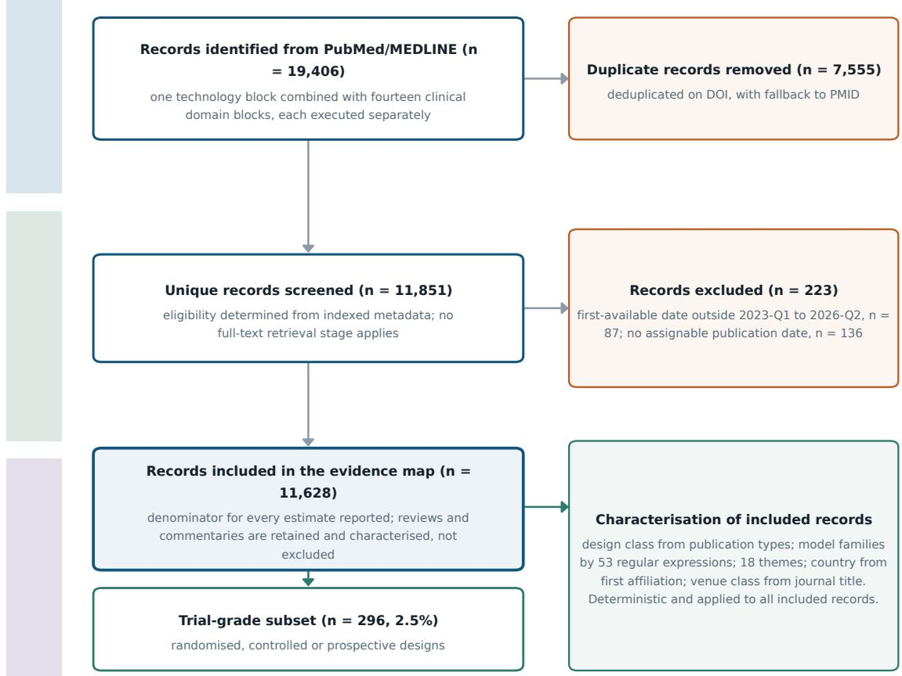  
Figure 1. Study flow. PRISMA 2020 flow adapted for an evidence map built from indexed metadata: eligibility is determined from the record itself, so the stages for reports sought and reports assessed for eligibility do not apply. Exclusions, shown at right, are by publication date alone; no record was excluded on judgement. The 11,628 included records are the denominator for every estimate reported. Reviews and commentaries are retained and characterised alongside empirical reports rather than excluded, because study design is one of the quantities under analysis. Characterisation is summarised at lower right and set out in full in Fig. 2; it is applied identically to every included record. The trial-grade subset comprises randomised, controlled and prospective designs, and is the basis for every statement about evidence able to support inference on clinical use.

## From one indexed record to one row of data

illustrated with PMID 42150962: a randomised trial first available in 2026-Q2 that names GPT-4

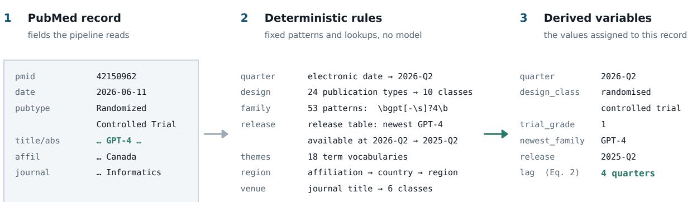

## Five estimands over 11,628 such rows

each defined in Methods and computed from the derived variables above, never from the record text

<table><tr><td>Growth Eq. (1)</td><td>2</td><td>Evaluation lag 3 Eq. (2)</td><td>Drift offset 4 Eq. (5)</td><td>Concentration Eq. (7)</td><td>Attention-evidence Eq. (8)</td></tr><tr><td>negative binomial</td><td></td><td>quarters from release</td><td>observed slope against</td><td>Herfindahl-Hirschman</td><td>corpus share divided</td></tr><tr><td>on quarter index</td><td>to publication</td><td></td><td>frozen composition</td><td>over mention shares</td><td>by trial share</td></tr><tr><td>IRR 1.272</td><td></td><td>1.33 → 6.08</td><td>56%</td><td>5,424 → 1,281</td><td>up to 4.92</td></tr><tr><td></td><td></td><td></td><td></td><td></td><td></td></tr><tr><td>per quarter</td><td></td><td>mean, quarters</td><td>of drift absorbed</td><td>HHI</td><td>domain maximum</td></tr></table>

No generative model is used at any stage of screening, classification, extraction or analysis.  
every value regenerates from the deposited pipeline

Figure 2. Study workflow. The question, the search, the characterisation rules applied to every included record, and the five analyses those rules support. Each rule is a fixed pattern or lookup table applied identically to all records; no generative model is used at any stage of screening, classification, extraction or analysis. Values beneath each analysis box give the corresponding headline estimate.

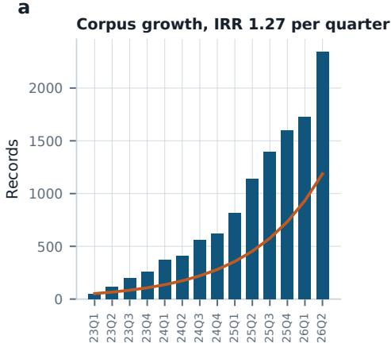

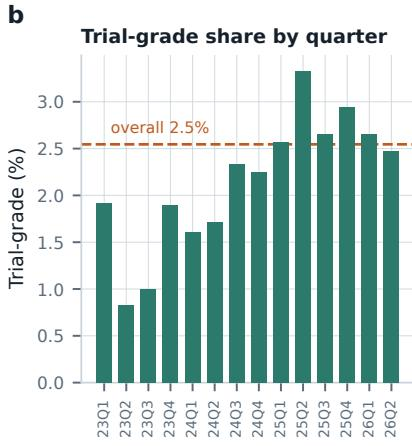

c  
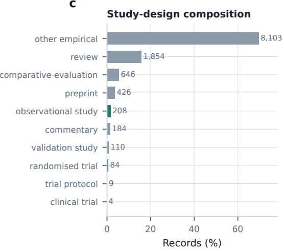

d  
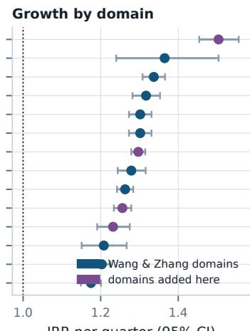  
Figure 3. Growth and composition of the evidence base. a, Quarterly record counts with fitted negative binomial trend; the fitted incidence rate ratio is 1.272 per quarter (95% CI 1.257–1.289), from 52 records in 2023-Q1 to 2,346 in 2026-Q2. b, Trial-grade share by quarter; dashed line is the corpus mean. c, Study-design composition; trial-grade designs highlighted. d, Growth by domain, incidence rate ratio per quarter with 95% confidence intervals, coloured by whether the domain derives from the earlier taxonomy or was added here.

Observed +0.33 vs stagnation benchmark +0.75  
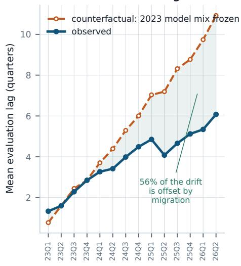

b  
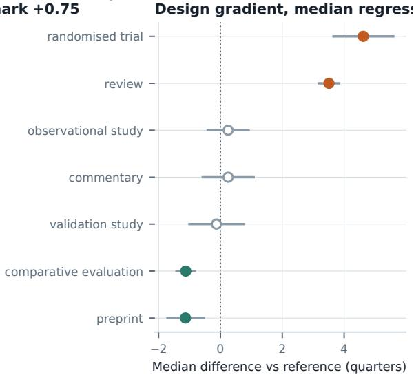

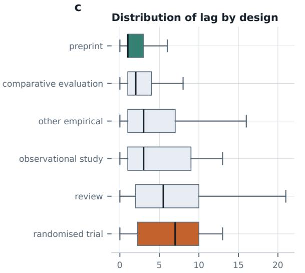

d  
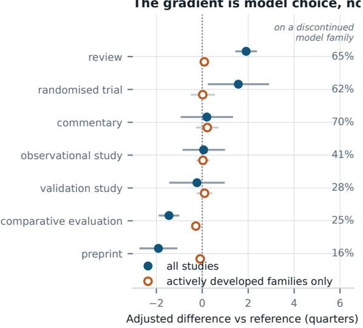  
Figure 4. The evaluation gap. a, Mean evaluation lag by quarter (solid) against a counterfactual in which the composition of model families is held at its 2023 value and only within-family lag evolves (dashed). Because a family that receives no further releases ages at one quarter per quarter, the dashed line is the drift the literature would accumulate without changing what it studies; the shaded area is the part of that drift ofset by migration to newer systems. b, Design diferences in lag from median regression adjusted for publication quarter, relative to other empirical designs; filled markers indicate $P < 0 . 0 5$ . c, Distribution of lag by design; boxes show median and interquartile range, whiskers 1.5 IQR, outliers omitted. d, Adjusted design diferences among all studies (filled) and among studies naming a model family still receiving releases (open); labels give the share of each design evaluating a discontinued family. Median lag by individual model family is given in Supplementary Fig. S1.

a  
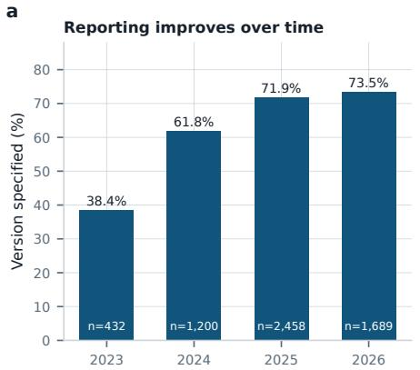

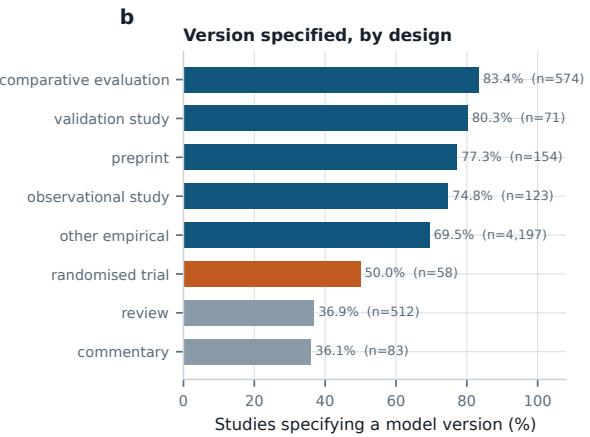  
Figure 5. Specification of model versions. a, Share of records naming a model that also specify a version, access date or decoding parameter, by year. b, The same share by study design, restricted to designs with at least 40 records.

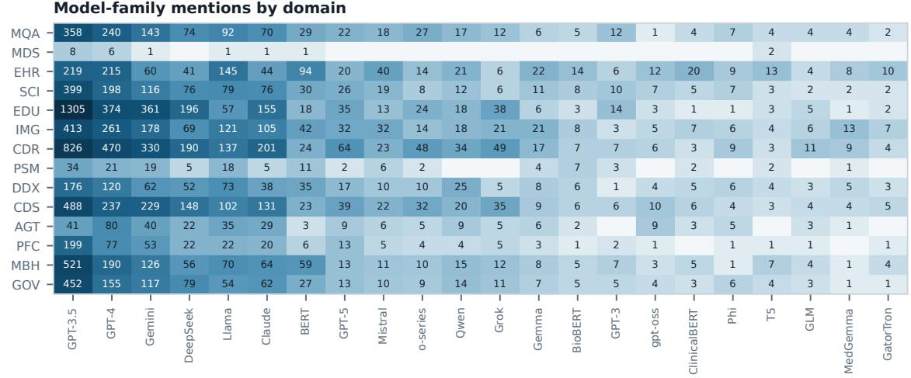

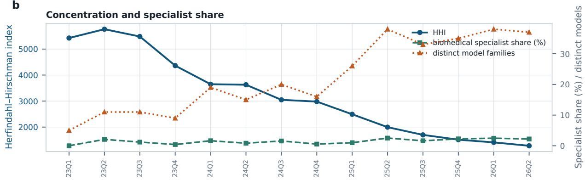  
Figure 6. The model landscape. a, Model-family mentions by clinical domain on a logarithmic colour scale; a record naming several families contributes several mentions. b, Concentration over time: Herfindahl–Hirschman index, number of distinct families named, and share of mentions held by purpose-built biomedical models.

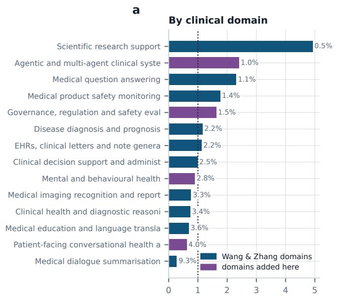

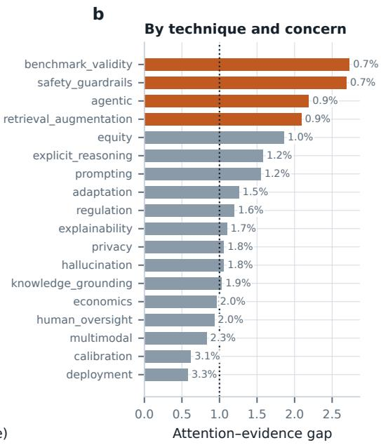  
Figure 7. Attention–evidence gap. Corpus share divided by trial-grade share, for clinical domains (a) and for techniques and concerns (b). Values above one indicate publication volume exceeding trial-grade representation. Labels give each category’s trial-grade share.

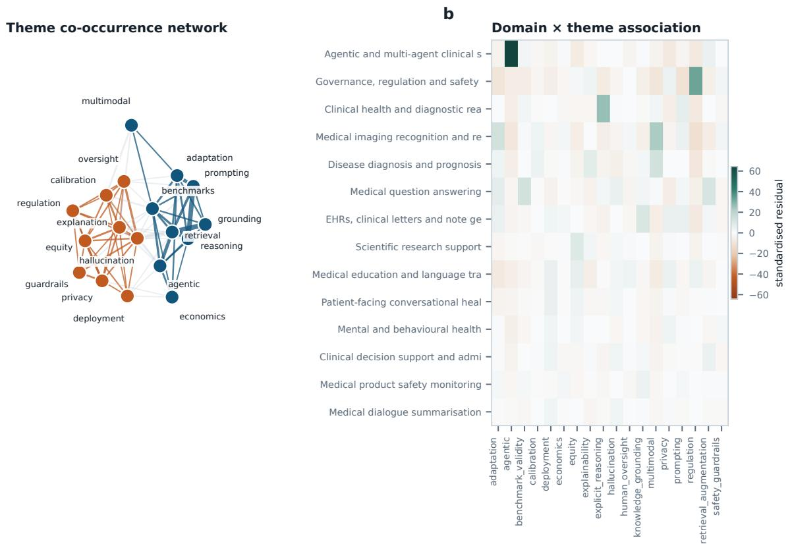  
Figure 8. Two literatures. a, Theme co-occurrence network, edges drawn where lift exceeds 1.25 with at least 30 co-occurrences; colour denotes the community identified by modularity maximisation; labels are abbreviated. b, Standardised Pearson residuals for the association between clinical domain and theme.

aCorpus by country of first-author affiliation  
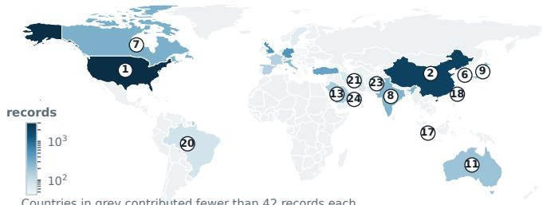

bEurope and the Mediterranean  
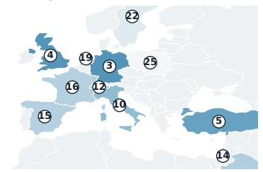

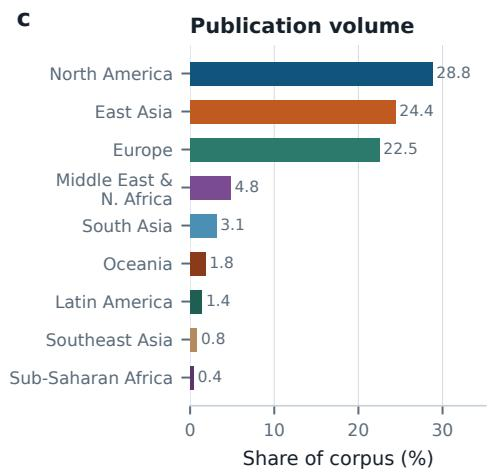

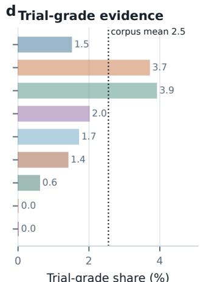  
Figure 9. Geographic distribution of the corpus and of trial-grade evidence. a, Records by country of first-author afiliation on a logarithmic colour scale; numbers key to panel $\mathbf { e } ,$ and countries in grey contributed fewer records than the twenty-fifth most productive country. b, Europe and the Mediterranean, where country areas are too small to label on the world projection. c, Share of the corpus by region. d, Trial-grade share within each region on the same vertical ordering; the dotted line is the corpus mean of 2.5%. Among the three highest-output regions the two panels run opposite to one another: North America leads on volume and trails Europe and East Asia on trial-grade share. The lower shares below them arise in regions contributing fewer than 400 records, where the estimate is unstable. $\mathbf { e } ,$ Key to panels a and b with record counts; colour denotes region.

e Key to panels a and b
<table><tr><td>1. United States 3,055</td><td></td><td>14. Israel</td><td>150</td></tr><tr><td>2. China</td><td>2,040</td><td>15. Spain</td><td>140</td></tr><tr><td>3. Germany</td><td>500</td><td>16. France</td><td>138</td></tr><tr><td>4. United Kingdom 488</td><td></td><td>17. Singapore</td><td>117</td></tr><tr><td>5. Turkey</td><td>382</td><td>18. Taiwan</td><td>103</td></tr><tr><td>6. South Korea</td><td>331</td><td>19. Netherlands</td><td>93</td></tr><tr><td>7. Canada</td><td>296</td><td>20. Brazil</td><td>89</td></tr><tr><td>8. India</td><td>273</td><td>21. Iran</td><td>78</td></tr><tr><td>9. Japan</td><td>245</td><td>22. Sweden</td><td>65</td></tr><tr><td>10. Italy</td><td>229</td><td>23. Pakistan</td><td>57</td></tr><tr><td>11. Australia</td><td>199</td><td>24. Qatar</td><td>44</td></tr><tr><td>12. Switzerland</td><td>155</td><td>25. Poland</td><td>42</td></tr><tr><td>13. Saudi Arabia</td><td>152</td><td></td><td></td></tr></table>

colour denotes region, as in panels c and d

# Supplementary Information

The widening evaluation gap in medical large language model research 2023 to 2026

## Contents

• Supplementary Table S1 | PRISMA 2020 checklist

• Supplementary Table S2 | Complete search strings

• Supplementary Table S3 | Model release table

• Supplementary Table S4 | Controlled vocabulary

• Supplementary Fig. S1 | Median evaluation lag by model family

• Supplementary Fig. S2 | Venue class and journal concentration

All derived data and the pipeline that produces them are deposited at https://doi.org/10. 5281/zenodo.21671630. Tables S2, S3 and S4 are generated directly from the analysis code, so they cannot diverge from the analysis as executed.

## Supplementary Table S1 | PRISMA 2020 checklist

This study is a meta-research evidence map. The unit of analysis is the published report, not the patient, and no treatment efect is synthesised. Several PRISMA 2020 items therefore do not apply; each is marked N/A with the reason rather than left blank, as PRISMA advises for reviews that depart from the efect-synthesis model.
<table><tr><td>#</td><td>Item</td><td>Location or reason</td></tr><tr><td>1</td><td>Title identifies the report as a systematic review</td><td>Partial. The title identifies the study as an evidence map of a defined literature over a stated window. npj Digital Medicine restricts titles to 15 words free of punctuation, which does not ac- commodate a design label in addition to the finding. The Abstract</td></tr><tr><td>2</td><td>Abstract</td><td>and the first line of Methods both state the design. Abstract. Structured per PRISMA 2020 for Abstracts as far as the journal's 150-word unstructured limit permits: source, window,</td></tr><tr><td>3</td><td>Rationale</td><td>corpus size, principal estimates with intervals, and conclusion. Introduction, paragraphs 1–3.</td></tr><tr><td>4</td><td>Objectives</td><td>Introduction, final paragraph. Five stated aims. Methods, *Search* and *Analysis window*. Records indexed</td></tr><tr><td>5</td><td>Eligibility criteria</td><td>in PubMed/MEDLINE, first-available date 2023-Q1 to 2026-Q2, retrieved by any of fourteen domain blocks combined with the technology block. No design, language or outcome restriction: reviews and commentaries are retained and characterised, because</td></tr><tr><td>6</td><td>Information sources</td><td>study design is an analysis variable rather than an exclusion. Methods, *Search*. PubMed/MEDLINE via NCBI E-utilities. Date last searched and per-block yields in Supplementary Table</td></tr><tr><td>7</td><td>Search strategy</td><td>S2. Supplementary Table S2, generated directly from the vocabu- lary module the harvester imports, so the reported and executed searches cannot diverge.</td></tr><tr><td>8</td><td>Selection process</td><td>Methods, *Search* and *Analysis window*; Fig. 1. Eligibility is determined from indexed metadata by deterministic rule, applied by one reviewer with no independent duplicate screening, since the operation is a fixed query rather than a judgement. No full-text</td></tr><tr><td>9</td><td>Data collection process</td><td>Methods, *Record characterisation*. Automated extraction from the PubMed record by fixed pattern and lookup; no manual ex- traction and therefore no duplicate-extraction step. Rules in Sup-</td></tr><tr><td>10a</td><td>Data items outcomes</td><td>Methods, *Statistical analysis*. Primary: evaluation lag, Eq. (2). Secondary: trial-grade share, version specification, model concentration, attention-evidence gap.</td></tr><tr><td>10b</td><td>Data items — other variables</td><td>Methods, *Record characterisation*. Design class, model fami- lies named, themes, country and region, venue class, publication quarter.</td></tr><tr><td>11</td><td>Study risk of bias assessment</td><td>N/A. No risk-of-bias appraisal of included records was performed. The study characterises the distribution and currency of the litera- ture; it does not estimate an effect from it, so individual-record validity does not enter any pooled estimate. Stated as a limitation</td></tr><tr><td>12</td><td>Effect measures</td><td>in Discussion. N/A. No effect measure is synthesised across studies. Estimands are properties of the literature and are defined in Eqs. (1)-(9).</td></tr><tr><td>13a</td><td>Synthesis — eligibility for synthesis</td><td>Methods, *Statistical analysis*. Records enter each analysis where the relevant variable is defined; coverage of evaluation lag is re- ported by design class because it is defined only for records naming a model.</td></tr><tr><td>13b</td><td>Synthesis — data preparation</td><td>Methods, *Record characterisation* and *Analysis window*. Dedu- plication on DOI with fallback to PMID; window restriction; han- dling of unparseable dates.</td></tr><tr><td>13c</td><td>Synthesis tabulation and visual display</td><td>Figs. 1–9; Supplementary Figs. S1-S2.</td></tr><tr><td>13d</td><td>Synthesis — synthesis of results</td><td>N/A in the meta-analytic sense. Trends across records are mod- elled by negative binomial regression, Eq. (1), and median and least-squares regression, Eq. (6), rather than pooled.</td></tr><tr><td>13e</td><td>Synthesis — heterogeneity</td><td>N/A. No pooled estimate, so no between-study heterogeneity statistic. Variation across design, domain, region and venue is reported directly.</td></tr><tr><td>13f</td><td>Synthesis sensitivity analyses</td><td>Methods, *Benchmarking the lag trend* and *Design differences*. Pessimistic release assignment; exclusion of encoder-era families; restriction to actively developed families; baseline period varied; Holm correction; bootstrap interval on the drift offset. Results</td></tr><tr><td>14</td><td>Reporting bias assessment</td><td>reported in data/tier1/lag_robustness.csv. N/A. Publication bias concerns the selective reporting of effects. This study counts what was published; unpublished work is outside the estimand by construction. Indexing bias in PubMed is stated as a limitation in Discussion.</td></tr><tr><td>15</td><td>Certainty assessment</td><td>N/A. GRADE applies to certainty in an effect estimate. No effect is estimated. Precision of each descriptive estimate is reported by confidence interval.</td></tr><tr><td>16a</td><td>Study selection results</td><td>Results, *Composition of the evidence base*; Fig. 1. 19,406 identified, 7,555 duplicates removed, 11,851 screened, 223 excluded, 11,628 included.</td></tr><tr><td>16b</td><td>Excluded studies</td><td>Fig. 1 and data/tier1/window_excluded.csv. Exclusions are by date only: 87 dated outside the window and 136 with no assignable publication date. No record was excluded on judgement.</td></tr><tr><td>17</td><td>Study characteristics</td><td>Results, *Composition of the evidence base* and *Distribution across regions, venues and journals*; Figs. 3, 9. Per-record charac-</td></tr><tr><td>18</td><td>Risk of bias in</td><td>teristics deposited. N/A. See item 11.</td></tr><tr><td>19</td><td>studies</td><td>Results of individual N/A. No individual-study effect estimates are extracted. Per- record derived variables are deposited in lag_per_study.csv.</td></tr><tr><td></td><td>studies 20a-d Results of syntheses</td><td>Results, throughout. Estimates with 95% confidence intervals; heterogeneity and certainty items N/A as above.</td></tr><tr><td>21</td><td>Reporting biases</td><td>N/A. See item 14.</td></tr><tr><td>22</td><td>Certainty of</td><td>N/A. See item 15.</td></tr><tr><td>23a</td><td>evidence Interpretation</td><td>Discussion, paragraphs 1–3.</td></tr><tr><td>23b</td><td>Limitations of the evidence</td><td>Discussion, limitations paragraph. Indexing coverage, metadata- only characterisation, differential coverage of the lag measure.</td></tr><tr><td>23c</td><td>Limitations of review processes</td><td>Discussion, limitations paragraph. Single-reviewer deterministic screening; regular-expression model detection; the hand-assigned release table; the n = 22 subgroup underpinning the mechanism</td></tr><tr><td>23d</td><td>Implications</td><td>claim. Discussion, final paragraphs.</td></tr><tr><td>24a</td><td>Registration</td><td>Methods, *Design and reporting*. Registered on OSF Registries; registration DOI in the Data availability statement. PROSPERO</td></tr><tr><td>24b</td><td>Protocol access</td><td>was not used because it does not accept meta-research. Deposited with the data and code.</td></tr><tr><td>24c</td><td>Amendments</td><td>Registration was completed after analysis; the record states this explicitly and lists all four deviations from the original analysis</td></tr><tr><td></td><td></td><td>plan.</td></tr><tr><td>25 26</td><td>Support</td><td>Acknowledgements. No specific grant. Competing interests Competing interests. None declared.</td></tr><tr><td>27</td><td>code and materials</td><td>Availability of data, Data availability and Code availability. Complete pipeline and all derived tables deposited; PubMed records not redistributed, PMIDs and queries supplied.</td></tr></table>

## Supplementary Table S2 | Complete search strings

Emitted directly from code/vocab.py, the module the harvester imports, so this table and the executed search cannot diverge. Each domain block is combined with the single technology block and the date filter ("2023/01/01"[dp] : "2026/06/30"[dp]), then executed separately; results are pooled and deduplicated on DOI with fallback to PMID.

## Technology block, constant across all searches

("largelanguagemodel"[tiab]OR"largelanguagemodels"[tiab]OR"LLM"[tiab]OR"LLMs"[tiab]OR"generativea rtificialintelligence"[tiab]OR"generativeAI"[tiab]OR"foundationmodel"[tiab]OR"foundationmodels"[t iab]OR"vision-languagemodel"[tiab]OR"visionlanguagemodel"[tiab]OR"multimodallargelanguage"[tiab]O R"multimodalmodel"[tiab]OR"largereasoningmodel"[tiab]OR"reasoningmodel"[tiab]OR"instruction-tuned "[tiab]OR"instructiontuned"[tiab]OR"transformermodel"[tiab]OR"generativepre-trained"[tiab]ORChatG PT[tiab]OR"GPT-3"[tiab]OR"GPT-3.5"[tiab]OR"GPT-4"[tiab]OR"GPT-4o"[tiab]OR"GPT-5"[tiab]ORGemini[ti ab]OR"Med-PaLM"[tiab]OR"MedGemma"[tiab]ORClaude[tiab]ORLLaMA[tiab]ORDeepSeek[tiab]ORQwen[tiab]ORM istral[tiab]ORMeditron[tiab]OR"OpenBioLLM"[tiab]OR"HuatuoGPT"[tiab])

## Domain blocks

<table><tr><td>Domain</td><td>Query</td></tr><tr><td>Medical question answering</td><td>("questionanswering"[tiab]ORUSMLE[tiab]ORMedQA[tiab]ORMedMCQA[tiab]ORPubM edQA[tiab]ORMultiMedQA[tiab]OR"MMLU"[tiab]OR"medicallicensing"[tiab]OR"bo ardexamination"[tiab]OR"boardcertification"[tiab]OR"multiplechoicequestio n"[tiab]0R"knowledgebenchmark"[tiab])</td></tr><tr><td>Medical dialogue summarisation</td><td>("dialoguesummarization"[tiab]OR"dialoguesummarisation"[tiab]OR"conversat ionsummarization"[tiab]OR"ambientclinical"[tiab]OR"ambientartificialintel ligence"[tiab]OR"ambientdocumentation"[tiab]OR"AIscribe"[tiab]OR"digitals cribe"[tiab]OR"ambientscribe"[tiab]OR"visitnote"[tiab]OR"SOAPnote"[tiab]0</td></tr><tr><td>EHRs, clinical letters and note generation</td><td>R"encounternote"[tiab]) ("electronichealthrecord"[tiab]OR"electronichealthrecords"[tiab]OR"electr onicmedicalrecord"[tiab]OR"dischargesummary"[tiab]OR"dischargesummaries"[ tiab]OR"clinicalletter"[tiab]OR"clinicaldocumentation"[tiab]OR"notegenera tion"[tiab]OR"documentationburden"[tiab]OR"clinicalnote"[tiab]ORFHIR[tiab</td></tr><tr><td>Scientific research support</td><td>("evidencesynthesis"[tiab]OR"systematicreview"[tiab]OR"literaturescreenin g"[tiab]0R"titleandabstractscreening"[tiab]OR"hypothesisgeneration"[tiab] OR"scientificdiscovery"[tiab]OR"laboratoryautomation"[tiab]OR"dataextract ion"[tiab]OR"peerreview"[tiab]OR"researchassistant"[tiab]OR"AIscientist"[</td></tr><tr><td>Medical education and</td><td>tiab]OR"co-scientist"[tiab]) ("medicaleducation"[tiab]OR"medicalstudent"[tiab]OR"medicalstudents"[tiab ]0R"nursingeducation"[tiab]OR"clinicaltraining"[tiab]OR"residenteducation "[tiab]OR"objectivestructuredclinical"[tiab]OROSCE[tiab]OR"machinetransla</td></tr><tr><td>Medical imaging recognition and reporting</td><td>("radiologyreport"[tiab]OR"radiologyreports"[tiab]OR"reportgeneration"[ti ab]0R"medicalimaging"[tiab]0R"chestradiograph"[tiab]OR"chestx-ray"[tiab]0 R"computedtomography"[tiab]OR"magneticresonanceimaging"[tiab]OR"imageinte rpretation"[tiab]OR"medicalimage"[tiab]0Rhistopathology[tiab]OR"digitalpa thology"[tiab]0Rdermoscopy[tiab]0R"fundus"[tiab]0R"echocardiograph"[tiab]</td></tr><tr><td>Clinical health and diagnostic reasoning</td><td>("diagnosticreasoning"[tiab]OR"clinicalreasoning"[tiab]OR"differentialdia gnosis"[tiab]OR"historytaking"[tiab]OR"chain-of-thought"[tiab]OR"chainoft hought"[tiab]0R"clinicalvignette"[tiab]OR"casevignette"[tiab]OR"diagnosti caccuracy"[tiab]OR"cognitivebias"[tiab]OR"anchoringbias"[tiab]OR"test-tim ecompute"[tiab])</td></tr><tr><td>Medical product safety monitoring</td><td>(pharmacovigilance[tiab]0R"adversedrugevent"[tiab]OR"adversedrugreaction" [tiab]0R"adverseeventreport"[tiab]0R"signaldetection"[tiab]0R"drugsafety" [tiab]OR"post-marketingsurveillance"[tiab]OR"medicationerror"[tiab]OR"dru g-druginteraction"[tiab]ORMedDRA[tiab]OR"individualcasesafetyreport"[tiab ])</td></tr><tr><td>Disease diagnosis and prognosis</td><td>("diseasediagnosis"[tiab]OR"diseaseclassification"[tiab]0R"riskstratifica tion"[tiab]OR"riskprediction"[tiab]OR"prognosticmodel"[tiab]ORphenotyping [tiab]0R"raredisease"[tiab]0R"earlydetection"[tiab]0R"screeningtool"[tiab ]0R"clinicaldeterioration"[tiab])</td></tr><tr><td>Clinical decision support and administrative tasks</td><td>("clinicaldecisionsupport"[tiab]OR"decisionsupportsystem"[tiab]0R"medical coding"[tiab]OR"ICDcoding"[tiab]OR"billingcode"[tiab]OR"priorauthorizatio n"[tiab]OR"priorauthorisation"[tiab]OR"administrativeburden"[tiab]OR"guid elineadherence"[tiab]OR"guidelineconcordance"[tiab]OR"treatmentrecommenda</td></tr><tr><td>Agentic and multi-agent clinical systems</td><td>tion"[tiab]0R"tumorboard"[tiab]OR"carepathway"[tiab]) ("agentic"[tiab]OR"AIagent"[tiab]OR"AIagents"[tiab]OR"multi-agent"[tiab]0 R"multiagent"[tiab]OR"autonomousagent"[tiab]OR"tooluse"[tiab]0R"toolcalli ng"[tiab]OR"functioncalling"[tiab]OR"agentworkflow"[tiab]OR"agenticworkfl</td></tr><tr><td>Patient-facing conversational health and triage</td><td>ow"[tiab]OR"modelcontextprotocol"[tiab]OR"orchestration"[tiab]) ("symptomchecker"[tiab]0R"patientportal"[tiab]0R"patientmessage"[tiab]0R" patientinquiry"[tiab]OR"healthchatbot"[tiab]0R"conversationalagent"[tiab] OR"virtualassistant"[tiab]OR"self-triage"[tiab]OR"telehealth"[tiab]0R"tel</td></tr><tr><td>Mental and behavioural health</td><td>emedicine"[tiab]OR"direct-to-consumer"[tiab]OR"patient-facing"[tiab]) ("mentalhealth"[tiab]0R"psychiatric"[tiab]ORpsychotherapy[tiab]OR"depress ion"[tiab]0R"anxiety"[tiab]OR"suicide"[tiab]OR"crisisintervention"[tiab]0 R"behavioralhealth"[tiab]0R"behaviouralhealth"[tiab]0R"substanceuse"[tiab</td></tr><tr><td>Governance, regulation and safety evaluation</td><td>("regulatory"[tiab]OR"regulation"[tiab]OR"FDA"[tiab]OR"CEmark"[tiab]OR"AI Act"[tiab]OR"medicaldevice"[tiab]OR"governance"[tiab]OR"redteam"[tiab]OR" red-teaming"[tiab]0R"safetyevaluation"[tiab]OR"post-deploymentmonitoring" [tiab]OR"liability"[tiab]OR"accountability"[tiab]0R"informedconsent"[tiab</td></tr></table>

## Supplementary Table S3 | Model release table

Emitted from MODEL\_RELEASES in code/23\_evaluation\_lag.py. Release quarters were assigned by hand from developer announcements and model cards, and are the component of this study most open to challenge; they are reported in full so that any disputed date can be corrected and the analysis re-run. A family is active if its most recent release fell in 2024-Q1 or later. The classification is a property of the family, not of any study, so conditioning on it does not condition on the outcome.  
53 families: 24 active, 29 discontinued.
<table><tr><td>Family</td><td>First</td><td>Latest</td><td>Status</td><td>All release quarters</td></tr><tr><td>Claude</td><td>2023-Q1</td><td>2025-Q4</td><td>active</td><td>Claude 1 (2023-Q1), Claude 2 (2023-Q3), Claude 3 (2024- Q1), Claude 3.5 (2024-Q2), Claude 4 (2025-Q2), Claude</td></tr><tr><td>GPT-5</td><td>2025-Q3</td><td>2025-Q4</td><td>active</td><td>Opus 4.5 (2025-Q4) GPT-5 (2025-Q3), GPT-5.2 (2025-Q4)</td></tr><tr><td>Gemini</td><td>2023-Q2</td><td>2025-Q4</td><td>active</td><td>PaLM-2/Bard (2023-Q2), Gemini 1.0 (2023-Q4), Gemini 1.5 (2024-Q1), Gemini 2.0 (2024-Q4), Gemini 2.5 (2025-</td></tr><tr><td></td><td></td><td></td><td></td><td>Q1), Gemini 3 (2025-Q4)</td></tr><tr><td>Baichuan-M MedGemma</td><td>2025-Q3</td><td>2025-Q3</td><td>active</td><td>Baichuan-M2 (2025-Q3)</td></tr><tr><td>gpt-oss</td><td>2025-Q3 2025-Q3</td><td>2025-Q3 2025-Q3</td><td>active active</td><td>MedGemma (2025-Q3) gpt-oss (2025-Q3)</td></tr><tr><td>GPT-4</td><td>2023-Q1</td><td>2025-Q2</td><td>active</td><td>GPT-4 (2023-Q1), GPT-4-turbo (2023-Q4), GPT-4o</td></tr><tr><td>Llama</td><td>2023-Q1</td><td>2025-Q2</td><td></td><td>(2024-Q2), GPT-4.1 (2025-Q2) LLaMA (2023-Q1), Llama 2 (2023-Q3), Llama 3 (2024-</td></tr><tr><td>Qwen</td><td>2023-Q3</td><td>2025-Q2</td><td></td><td>Q2), Llama 3.1 (2024-Q3), Llama 4 (2025-Q2) Qwen (2023-Q3), Qwen2 (2024-Q2), Qwen2.5 (2024-Q3),</td></tr><tr><td>o-series</td><td>2024-Q3</td><td>2025-Q2</td><td></td><td>Qwen3 (2025-Q2) o1 (2024-Q3), o3-mini (2025-Q1), o3 (2025-Q2), o4-mini</td></tr><tr><td></td><td></td><td></td><td></td><td>(2025-Q2) DeepSeek V2 (2024-Q2), DeepSeek V3 (2024-Q4),</td></tr><tr><td>Gemma</td><td></td><td></td><td></td><td>DeepSeek R1 (2025-Q1) Gemma (2024-Q1), Gemma 2 (2024-Q2), Gemma 3</td></tr><tr><td></td><td></td><td>2025-Q1</td><td></td><td>(2025-Q1)</td></tr><tr><td>Grok HuatuoGPT</td><td>2023-Q4 2023-Q2</td><td>2025-Q1</td><td>active</td><td>Grok-1 (2023-Q4), Grok-2 (2024-Q3), Grok-3 (2025-Q1) HuatuoGPT (2023-Q2), HuatuoGPT-o1 (2024-Q4)</td></tr><tr><td>Phi</td><td>2023-Q4</td><td>2024-Q4 2024-Q4</td><td>active</td><td>Phi-2 (2023-Q4), Phi-3 (2024-Q2), Phi-4 (2024-Q4)</td></tr><tr><td>Med-Gemini</td><td>2024-Q2</td><td>2024-Q2</td><td>active active</td><td>Med-Gemini (2024-Q2)</td></tr><tr><td>OpenBioLLM</td><td>2024-Q2</td><td>2024-Q2</td><td>active</td><td>OpenBioLLM (2024-Q2)</td></tr><tr><td>Apollo-Med</td><td>2024-Q1</td><td>2024-Q1</td><td>active</td><td>Apollo (2024-Q1)</td></tr><tr><td>BioMistral</td><td>2024-Q1</td><td>2024-Q1</td><td>active</td><td>BioMistral (2024-Q1)</td></tr><tr><td>CheXagent</td><td>2024-Q1</td><td>2024-Q1</td><td>active</td><td>CheXagent (2024-Q1)</td></tr><tr><td>Command-R</td><td>2024-Q1</td><td>2024-Q1</td><td>active</td><td>Command R (2024-Q1)</td></tr><tr><td>GLM</td><td>2023-Q1</td><td>2024-Q1</td><td>active</td><td>ChatGLM (2023-Q1), GLM-4 (2024-Q1)</td></tr><tr><td>MiniMax</td><td>2024-Q1</td><td>2024-Q1</td><td>active</td><td>MiniMax (2024-Q1)</td></tr><tr><td>Mistral</td><td>2023-Q3</td><td>2024-Q1</td><td>active</td><td>Mistral 7B (2023-Q3), Mixtral (2023-Q4), Mistral Large</td></tr><tr><td>Kimi</td><td></td><td></td><td></td><td>(2024-Q1) Kimi (2023-Q4)</td></tr><tr><td>MedLM</td><td>2023-Q4 2023-Q4</td><td>2023-Q4 2023-Q4</td><td>discontinued discontinued</td><td>MedLM (2023-Q4)</td></tr><tr><td>MedSAM</td><td>2023-Q4</td><td>2023-Q4</td><td>discontinued</td><td>MedSAM (2023-Q4)</td></tr><tr><td>Meditron</td><td>2023-Q4</td><td>2023-Q4</td><td>discontinued</td><td>Meditron (2023-Q4)</td></tr><tr><td>RadFM</td><td>2023-Q4</td><td>2023-Q4</td><td>discontinued</td><td></td></tr><tr><td>Yi</td><td>2023-Q4</td><td>2023-Q4</td><td>discontinued</td><td>RadFM (2023-Q4) Yi (2023-Q4)</td></tr><tr><td>ClinicalCamel</td><td>2023-Q3</td><td>2023-Q3</td><td>discontinued</td><td>Clinical Camel (2023-Q3)</td></tr><tr><td>Med-Flamingo</td><td>2023-Q3</td><td>2023-Q3</td><td>discontinued</td><td>Med-Flamingo (2023-Q3)</td></tr><tr><td>Zhongjing</td><td>2023-Q3</td><td>2023-Q3</td><td>discontinued</td><td>Zhongjing (2023-Q3)</td></tr><tr><td>Baichuan</td><td>2023-Q2</td><td>2023-Q2</td><td>discontinued</td><td>Baichuan (2023-Q2)</td></tr><tr><td>ChatDoctor</td><td>2023-Q2</td><td>2023-Q2</td><td>discontinued</td><td>ChatDoctor (2023-Q2)</td></tr><tr><td>DoctorGLM</td><td>2023-Q2</td><td>2023-Q2</td><td>discontinued</td><td>DoctorGLM (2023-Q2)</td></tr><tr><td>Falcon</td><td>2023-Q2</td><td>2023-Q2</td><td>discontinued</td><td>Falcon (2023-Q2)</td></tr><tr><td>InternLM</td><td>2023-Q2</td><td>2023-Q2</td><td>discontinued</td><td>InternLM (2023-Q2)</td></tr><tr><td>LLaVA-Med</td><td>2023-Q2</td><td>2023-Q2</td><td>discontinued</td><td>LLaVA-Med (2023-Q2)</td></tr><tr><td>Med-PaLM</td><td>2022-Q4</td><td>2023-Q2</td><td>discontinued</td><td>Med-PaLM (2022-Q4), Med-PaLM 2 (2023-Q2)</td></tr><tr><td>PMC-LLaMA</td><td>2023-Q2</td><td>2023-Q2</td><td>discontinued</td><td>PMC-LLaMA (2023-Q2)</td></tr><tr><td>XrayGPT</td><td>2023-Q2</td><td>2023-Q2</td><td>discontinued</td><td>XrayGPT (2023-Q2)</td></tr><tr><td>BiomedCLIP</td><td>2023-Q1</td><td>2023-Q1</td><td>discontinued</td><td>BiomedCLIP (2023-Q1)</td></tr><tr><td>GPT-3.5</td><td>2022-Q4</td><td>2023-Q1</td><td>discontinued</td><td>ChatGPT (2022-Q4), GPT-3.5-turbo (2023-Q1)</td></tr><tr><td>MedAlpaca</td><td>2023-Q1</td><td>2023-Q1</td><td>discontinued</td><td>MedAlpaca (2023-Q1)</td></tr><tr><td>BioGPT</td><td>2022-Q3</td><td>2022-Q3</td><td>discontinued</td><td>BioGPT (2022-Q3)</td></tr><tr><td>GatorTron</td><td>2022-Q2</td><td>2022-Q2</td><td>discontinued</td><td>GatorTron (2022-Q2)</td></tr><tr><td>PubMedBERT</td><td>2020-Q3</td><td>2020-Q3</td><td>discontinued</td><td>PubMedBERT (2020-Q3)</td></tr><tr><td>GPT-3</td><td>2020-Q2</td><td>2020-Q2</td><td>discontinued</td><td>GPT-3 (2020-Q2)</td></tr><tr><td>T5</td><td>2019-Q4</td><td>2019-Q4</td><td>discontinued</td><td>T5 (2019-Q4)</td></tr><tr><td>BioBERT</td><td>2019-Q3</td><td>2019-Q3</td><td>discontinued</td><td>BioBERT (2019-Q3)</td></tr><tr><td>ClinicalBERT</td><td>2019-Q2</td><td>2019-Q2</td><td>discontinued</td><td>ClinicalBERT (2019-Q2)</td></tr><tr><td>BERT</td><td>2018-Q4</td><td>2018-Q4</td><td>discontinued</td><td>BERT (2018-Q4)</td></tr></table>

## Supplementary Table S4 | Controlled vocabulary

Emitted from code/vocab.py. Every rule is a fixed pattern or lookup applied identically to all records; no generative model is used at any stage of screening, classification or extraction.

## S4.1 Model-family detection (53 patterns)

Applied to the concatenated title and abstract, case-insensitive.

<table><tr><td>Family</td><td>Class</td><td>Regular expression</td></tr><tr><td>Apollo-Med</td><td>biomedical specialist</td><td>\bapollo\b(?=.{0,60}\bmedical\b)</td></tr><tr><td>BERT</td><td>extractive baseline</td><td>(?&lt;!pubmed)(?&lt;!bio)(?&lt;!clinical)(?&lt;!sci)\bbert\b|\broberta\b|\ bdeberta\b</td></tr><tr><td>Baichuan</td><td>open-weight generalist</td><td>\bbaichuan\b(?![-\s]?m)</td></tr><tr><td>Baichuan-M</td><td>biomedical specialist</td><td>\bbaichuan[-\s]?m\d?\b</td></tr><tr><td>BioBERT</td><td>extractive baseline</td><td>\bbiobert\b</td></tr><tr><td>BioGPT</td><td>biomedical specialist</td><td>\bbiogpt\b</td></tr><tr><td>BioMistral</td><td>biomedical specialist</td><td>\bbiomistral\b</td></tr><tr><td>BiomedCLIP</td><td>biomedical multimodal</td><td>\bbiomedclip\b</td></tr><tr><td>ChatDoctor</td><td>biomedical specialist</td><td>\bchatdoctor\b</td></tr><tr><td>CheXagent</td><td>biomedical multimodal</td><td>\bchexagent\b</td></tr><tr><td>Claude</td><td>closed generalist</td><td>\bclaude\b|\bsonnet\b|\bopus\b(?!\s*\d*\s*magnum)</td></tr><tr><td>ClinicalBERT ClinicalCamel</td><td>extractive baseline biomedical</td><td>\bclinicalbert\b|\bbio_?clinicalbert\b</td></tr><tr><td></td><td>specialist</td><td>\bclinical?camel\b</td></tr><tr><td>Command-R</td><td>closed generalist</td><td>\bcommand[-\s]?r\+?\b</td></tr><tr><td>DeepSeek</td><td>open-weight generalist</td><td>\bdeepseek\b</td></tr><tr><td>DoctorGLM</td><td>biomedical specialist</td><td>\bdoctorglm\b</td></tr><tr><td>Falcon</td><td>open-weight</td><td>\bfalcon[-\s]?\d*b?\b</td></tr><tr><td>GLM</td><td>generalist open-weight</td><td>\bchatg1m\b|\bg1m[-\s]?\d\b</td></tr><tr><td>GPT-3</td><td>generalist closed generalist</td><td>\bgpt[-\s]?3\b(?!\.5)|\binstructgpt\b</td></tr><tr><td>GPT-3.5</td><td>closed generalist</td><td>\bgpt[-\s]?3\.5\b|\bchatgpt\b</td></tr><tr><td>GPT-4</td><td>closed generalist</td><td>\bgpt[-\s]?4(?:o|v|\.\d|[-\s]turbo)?\b</td></tr><tr><td>GPT-5</td><td>closed generalist</td><td>\bgpt[-\s]?5(?:\.\d)?\b</td></tr><tr><td>GatorTron</td><td>biomedical specialist</td><td>\bgatortron\b</td></tr><tr><td>Gemini</td><td>closed generalist</td><td>\bgemini\b|\bbard\b|\bpalm[-\s]?2\b</td></tr><tr><td>Gemma</td><td>open-weight generalist</td><td>(?&lt;!med)\bgemma[-\s]?\d?\b</td></tr><tr><td>Grok</td><td>closed generalist</td><td>\bgrok\b</td></tr><tr><td>HuatuoGPT</td><td>biomedical specialist</td><td>\bhuatuo?gpt\b|\bhuatuo\b|\bbentsao\b</td></tr><tr><td>InternLM</td><td>open-weight generalist</td><td>\binternlm\b</td></tr><tr><td>Kimi</td><td>open-weight generalist</td><td>\bkimi\b</td></tr><tr><td>LLaVA-Med</td><td>biomedical multimodal</td><td>\bllava[-\s]?med\b</td></tr><tr><td>Llama</td><td>open-weight generalist</td><td>\bllama[-\s]?\d?\b|\balpaca\b|\bvicuna\b</td></tr><tr><td>Med-Flamingo</td><td>biomedical multimodal</td><td>\bmed[-\s]?flamingo\b</td></tr><tr><td>Med-Gemini</td><td>biomedical specialist</td><td>\bmed[-\s]?gemini\b</td></tr><tr><td>Med-PaLM</td><td>biomedical specialist</td><td>\bmed[-\s]?palm\b</td></tr><tr><td>MedAlpaca</td><td>biomedical specialist</td><td>\bmedalpaca\b</td></tr><tr><td>MedGemma</td><td>biomedical specialist</td><td>\bmedgemma\b|\bmedsiglip\b</td></tr><tr><td>MedLM</td><td>biomedical specialist</td><td>\bmedlm\b</td></tr><tr><td>MedSAM</td><td>biomedical multimodal</td><td>\bmedsam\b</td></tr><tr><td>Meditron</td><td>biomedical specialist</td><td>\bmeditron\b</td></tr><tr><td>MiniMax</td><td>open-weight generalist</td><td>\bminimax\b</td></tr><tr><td>Mistral</td><td>open-weight generalist</td><td>\bmistral\b|\bmixtral\b</td></tr><tr><td>OpenBioLLM</td><td>biomedical specialist</td><td>\bopenbio?llm\b</td></tr><tr><td>PMC-LLaMA</td><td>biomedical specialist</td><td>\bpmc[-\s]?1lama\b</td></tr><tr><td>Phi</td><td>open-weight generalist</td><td>\bphi[-\s]?[2345]\b</td></tr><tr><td>PubMedBERT</td><td>extractive baseline</td><td>\bpubmedbert\b|\bbiomedbert\b</td></tr><tr><td>Qwen</td><td>open-weight generalist</td><td>\bqwen\b</td></tr><tr><td>RadFM</td><td>biomedical</td><td>\bradfm\b</td></tr><tr><td>T5</td><td>multimodal extractive baseline</td><td>\bt5\b|\bflan[-\s]?t5\b|\bscifive\b</td></tr><tr><td>XrayGPT</td><td>biomedical</td><td>\bxray?gpt\b</td></tr><tr><td>Yi</td><td>multimodal open-weight</td><td>\byi[-\s]?(?:6b|34b|1arge)\b</td></tr><tr><td>Zhongjing</td><td>generalist biomedical</td><td>\bzhongjing\b</td></tr><tr><td>gpt-oss</td><td>specialist open-weight generalist</td><td>\bgpt[-\s]?oss\b</td></tr><tr><td>o-series</td><td>closed generalist</td><td>\bopenai\s+o[134]\b|\bo1[-\s](?:preview|mini)\b|\bo3[-\s]?mini \b|\bo4[-\s]?mini\b</td></tr></table>

## S4.2 Themes (18)

<table><tr><td>Theme</td><td>Matching terms</td></tr><tr><td>adaptation</td><td>fine[-\s]?tun|instruction[-\s]?tun|\blora\b|\bpeft\blparameter[-\s]?ef ficient|domainadaptation|continuedpretrain|distillatlquantizlquantis</td></tr><tr><td>agentic</td><td>agentic|\baiagent|multi[-\s]?agent|autonomousagent|tool[-\s]?(?:use|ca 11)lfunctioncallinglmodelcontextprotocol</td></tr><tr><td>benchmark_validity</td><td>benchmark|leaderboard|contaminat|dataleakage|constructvalidity|llm[-\s</td></tr><tr><td>calibration</td><td>]?as[-\s]?(?:a[-\s]?)?judge calibrat|uncertaintylconfidenceestimat|abstention|selectiveprediction</td></tr><tr><td>deployment</td><td>deploylimplementation|real[-\s]?worldlprospective|workflowintegration| pilot|scale[-\s]?upladoption|usabilitylworkload|burnout</td></tr><tr><td>economics</td><td>cost|cost[-\s]?effectiv|latencylthroughputlinferencecost|tokenbudget|r</td></tr><tr><td>equity</td><td>esourceconstrain|edgedeployment|on[-\s]?device \bbias\b|fairness|disparit|equitylunderserved|low[-\s]?resource|multil</td></tr><tr><td>explainability</td><td>ingual|non[-\s]?english|healthequity explainablinterpretab|transparen|attribution|saliencylrationale</td></tr><tr><td>explicit_reasoning</td><td>chain[-\s]?of[-\s]?thought|step[-\s]?by[-\s]?stepreasoning|test[-\s]?t imecompute|extendedthinkinglreasoningtrace|self[-\s]?consistencylrefle</td></tr><tr><td>hallucination</td><td>ction hallucinat|confabulat|factual(?:itylerror)lfabricatlomissionlgroundedn ess</td></tr><tr><td>human_oversight</td><td>human[-\s]?in[-\s]?the[-\s]?loop|clinicianreview|oversight|automationb</td></tr><tr><td>knowledge_grounding</td><td>ias|verification|supervis|physician[-\s]?in[-\s]?the[-\s]?loop knowledgegraph|ontolog|\bumls\b|\bsnomed\b|\bicd[-\s]?1[01]\b|terminol</td></tr><tr><td>multimodal</td><td>og|graph[-\s]?rag multimodal|vision[-\s]?languagelimage[-\s]?text|volumetric|3d\blvoxel</td></tr><tr><td>privacy</td><td>privacylde[-\s]?identif|\bhipaa\b|\bgdpr\b|federated|differentialpriva cylsyntheticdata|re[-\s]?identif</td></tr><tr><td>prompting</td><td>promptengineer|zero[-\s]?shot|few[-\s]?shot|in[-\s]?contextlearninglpr omptdesignlprompttemplate</td></tr><tr><td>regulation</td><td>regulat|\bfda\b|ce[-\s]?mark|aiact|medicaldevicelgovernance|liabilit|a ccountablcertification</td></tr><tr><td>retrieval_augmentation</td><td>retrieval[-\s]?augmentedl\brag\b|retrievalaugmentation|vector(?:data)? base|semanticsearch</td></tr><tr><td>safety_guardrails</td><td>guardraillred[-\s]?team|adversarialljailbreaklpromptinjection|safetyfi lter|refusal|misuse</td></tr></table>

## S4.3 Design classification

PubMed PublicationType tags are mapped to analysis classes in the priority order below; the first match wins, so a record tagged both as a randomised controlled trial and as a journal article is classed as the former.

<table><tr><td>Priority</td><td>Publication type</td><td>Analysis class</td></tr><tr><td>1</td><td>Randomized Controlled Trial</td><td>randomised controlled trial</td></tr><tr><td>2</td><td>Pragmatic Clinical Trial</td><td>randomised controlled trial</td></tr><tr><td>3</td><td>Equivalence Trial</td><td>randomised controlled trial</td></tr><tr><td>4</td><td>Clinical Trial, Phase IV</td><td>clinical trial</td></tr><tr><td>5</td><td>Clinical Trial, Phase III</td><td>clinical trial</td></tr><tr><td>6</td><td>Clinical Trial, Phase II</td><td>clinical trial</td></tr><tr><td>7</td><td>Clinical Trial, Phase I</td><td>clinical trial</td></tr><tr><td>8</td><td>Controlled Clinical Trial</td><td>clinical trial</td></tr><tr><td>9</td><td>Clinical Trial Protocol</td><td>trial protocol</td></tr><tr><td>10</td><td>Clinical Trial</td><td>clinical trial</td></tr><tr><td>11</td><td>Observational Study</td><td>observational study</td></tr><tr><td>12</td><td>Multicenter Study</td><td>observational study</td></tr><tr><td>13</td><td>Comparative Study</td><td>comparative evaluation</td></tr><tr><td>14</td><td>Validation Study</td><td>validation study</td></tr><tr><td>15</td><td>Evaluation Study</td><td>comparative evaluation</td></tr><tr><td>16</td><td>Systematic Review</td><td>review</td></tr><tr><td>17</td><td>Meta-Analysis</td><td>review</td></tr><tr><td>18</td><td>Scoping Review</td><td>review</td></tr><tr><td>19</td><td>Review</td><td>review</td></tr><tr><td>20</td><td>Editorial</td><td>commentary</td></tr><tr><td>21</td><td>Comment</td><td>commentary</td></tr><tr><td>22</td><td>Letter</td><td>commentary</td></tr><tr><td>23</td><td>News</td><td>commentary</td></tr><tr><td>24</td><td>Preprint</td><td>preprint</td></tr></table>

Trial-grade classes (randomised, controlled or prospective): clinical trial, observational study, randomised controlled trial.

## S4.4 Clinical domains (14)

Full search strings are given in Supplementary Table S2.
<table><tr><td>Key</td><td>Domain</td><td>Provenance</td></tr><tr><td>MQA</td><td>Medical question answering</td><td>Wang and Zhang (2024)</td></tr><tr><td>MDS</td><td>Medical dialogue summarisation</td><td>Wang and Zhang (2024)</td></tr><tr><td>EHR</td><td>EHRs, clinical letters and note generation</td><td>Wang and Zhang (2024)</td></tr><tr><td>SCI</td><td>Scientific research support</td><td>Wang and Zhang (2024)</td></tr><tr><td>EDU</td><td>Medical education and language translation</td><td>Wang and Zhang (2024)</td></tr><tr><td>IMG</td><td>Medical imaging recognition and reporting</td><td>Wang and Zhang (2024)</td></tr><tr><td>CDR</td><td>Clinical health and diagnostic reasoning</td><td>Wang and Zhang (2024)</td></tr><tr><td>PSM</td><td>Medical product safety monitoring</td><td>Wang and Zhang (2024)</td></tr><tr><td>DDX</td><td>Disease diagnosis and prognosis</td><td>Wang and Zhang (2024)</td></tr><tr><td>CDS</td><td>Clinical decision support and administrative tasks</td><td>Wang and Zhang (2024)</td></tr><tr><td>AGT</td><td>Agentic and multi-agent clinical systems</td><td>added here</td></tr><tr><td>PFC</td><td>Patient-facing conversational health and triage</td><td>added here</td></tr><tr><td>MBH</td><td>Mental and behavioural health</td><td>added here</td></tr><tr><td>GOV</td><td>Governance, regulation and safety evaluation</td><td>added here</td></tr></table>

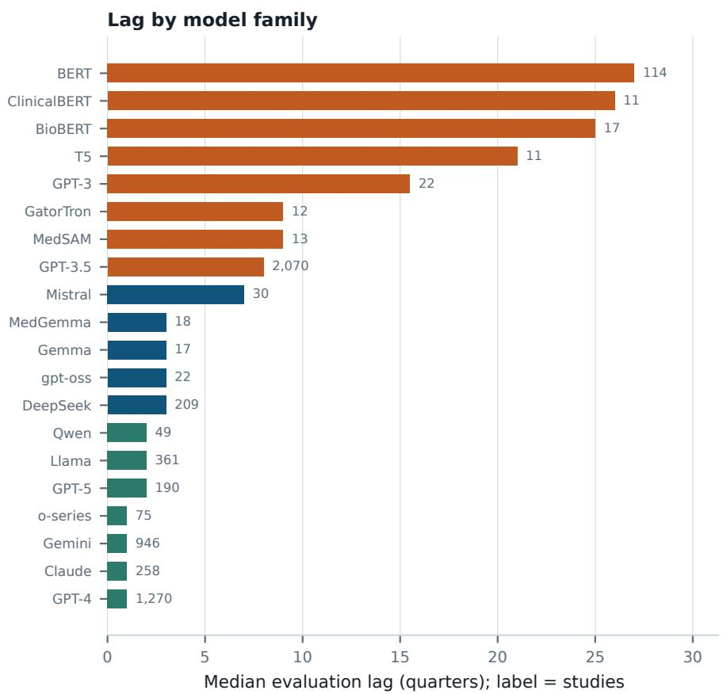  
Median evaluation lag for every model family named by at least ten records, with the number of studies labelled. Families whose development had ceased before the analysis window carry the longest lags; those still receiving releases cluster at one to three quarters.

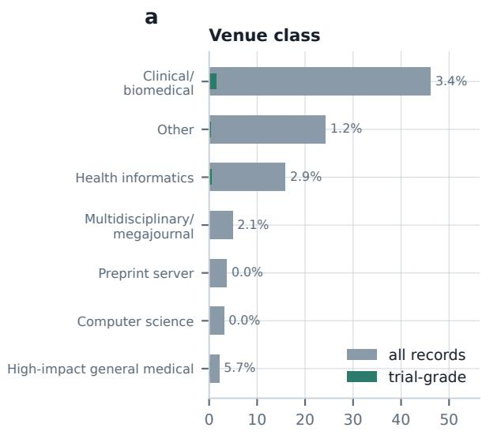

b  
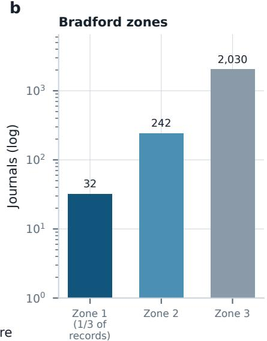  
a, Corpus share by venue class, with the trial-grade share within each class labelled. b, Bradford zones: the number of journals carrying each successive third of the corpus, on a logarithmic scale.