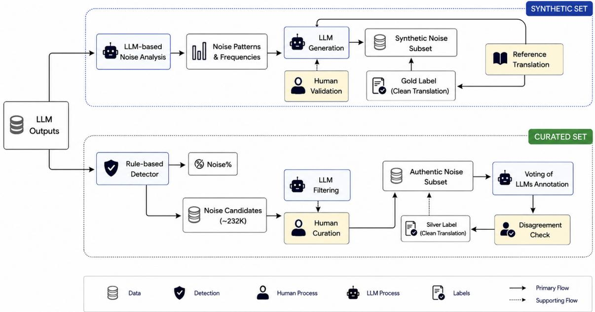
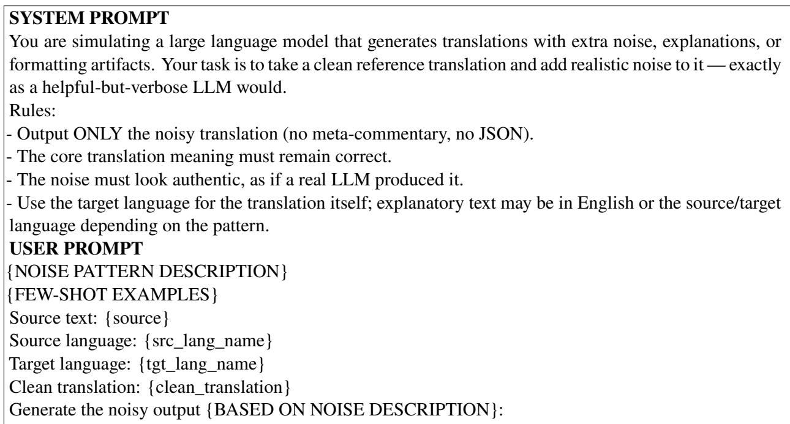
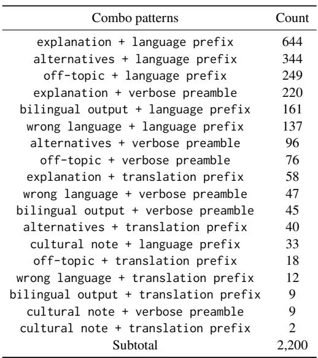

# TransClean: A Benchmark for Detecting and Extracting Clean Translations from Large Language Model Outputs

Shenbin Qian and Yves Scherrer

Language Technology Group, Department of Informatics University of Oslo, Norway {shenbinq, yves.scherrer}@ifi.uio.no

## Abstract

Large language models (LLMs) are increasingly used for machine translation, yet their outputs often contain additional text beyond the translation itself, such as language labels, explanations or bilingual repetitions, which we term translation noise. Despite its prevalence, this problem lacks dedicated benchmarks and systematic study. We analyze over 790,000 translation outputs from 12 LLMs across 22 language pairs (LPs) and identify 12 recurring noise patterns, which we group into formatting and content noise. Building on the observed patterns, we construct TransClean, a controlled benchmark of 9,900 pairs of noisy and clean translation outputs, comprising 8,800 synthetically generated instances and 1,100 manually curated authentic instances. We evaluate two extraction approaches on the Trans-Clean benchmark: 1) a span-based extraction method leveraging translation quality estimation models for span detection, and 2) an LLMbased extraction method that prompts an LLM to isolate the translation. Our benchmark and analysis provide the first systematic framework to evaluate and improve the cleanliness of LLM translation outputs.

## 1 Introduction

Large language models (LLMs) are rapidly reshaping the landscape of machine translation (MT). LLMs can perform high-quality translation through prompting alone and increasingly match or even surpass task-specific MT systems in many scenarios (Zhang et al., 2023; Vilar et al., 2023; Kocmi et al., 2024; Xu et al., 2024). The flexibility and multilingual capacity of LLMs have led to widespread adoption in both research and deployment settings, from systems developed for the Conference on Machine Translation (WMT<sup>1</sup>) shared tasks (Kocmi et al., 2025) to large-scale commercial platforms such as Google Translate (Caswell,

2024) and social media services like Instagram (Meta AI, 2026). As LLMs increasingly serve as translation engines, understanding and standardizing their outputs becomes critical.

However, LLM translations often contain additional text beyond the translation itself. Instead of producing a single target-language translation, models may prepend language labels, append explanations, repeat the source sentence, or provide cultural commentary. While such behavior can be helpful in interactive settings, it introduces a systematic challenge for automatic evaluation and downstream integration. Standard MT evaluation pipelines assume that model outputs consist solely of the translation. Extra content can distort metric scores and introduce inconsistencies in large-scale benchmarking. We refer to this phenomenon as translation noise: any content in an LLM output that is not part of the intended target translation.

In preliminary experiments across multiple models and prompts, we observe that translation noise is not rare. For most LLMs we evaluate, 3% to 99%<sup>2</sup> of the translation outputs contain additional explanatory or formatting text. Although carefully engineered prompts (e.g., “Output the translation only.”) reduce this behavior, they do not fully eliminate it. The prevalence and form of noise vary substantially across models, reflecting diferences in instruction-following abilities. As a result, clean translation cannot be reliably guaranteed through prompting alone.

Despite its practical importance, translation noise has not been systematically studied. Prior work has examined related issues such as instruction following in multilingual settings (Li et al., 2024), instruction forgetting (Chen et al., 2023), and undesirable behaviors such as repetitive texts or wrong target-language outputs (Bawden and Yvon, 2023; Wang et al., 2024). Existing studies have largely centered either on mitigating these issues through model modification or fine-tuning, or on evaluating instruction-following capabilities by proposing new benchmarks such as IFEval (Zhou et al., 2023), InFoBench (Qin et al., 2024), and M-IFEval (Dussolle et al., 2025). However, little attention has been paid to analyzing noise patterns directly in LLM translation outputs or to developing post-processing methods that recover clean translations without altering the underlying models. This distinction is crucial in real-world deployment, where models may be proprietary, closedsource, or too costly to retrain.

  
Figure 1: The process of creating TransClean to benchmark noise detection and clean translation extraction.

In this work, we formalize the task of clean translation extraction: given an LLM output that may contain translation noise, extract the span corresponding to the correct target-language translation. We approach this task in three steps:

1. We conduct a large-scale empirical study (§2) of translation noise in LLM outputs, analyzing over 790,000 translations from 12 LLMs across 22 language pairs and identifying 12 recurring noise patterns and 2 main categories.

2. We construct TransClean<sup>3</sup>, the first benchmark (§3) for clean translation extraction, comprising 8,800 synthetically noised instances and 1,100 manually curated authentic noisy examples with silver clean translations.

The process of creating TransClean is illustrated in Figure 1.

3. Using TransClean, we benchmark two approaches to extract clean translations (§4): 1) a span-based extraction method leveraging quality estimation models for span detection, 2) an LLM-based extractor that prompts an LLM to isolate the translation. In this context, we design two evaluation metrics that enable standardized comparison.

## 2 Noise in LLM Translation Outputs

In order to assess the prevalence and types of noise present in LLM-produced translations, we generate a large sample of translations for 22 language pairs (LPs) using 12 representative LLMs and 3 prompt templates (§2.1). We then systematically examine these translation outputs and analyze their noise rate and patterns (§2.2 and §2.3).

## 2.1 Generating Noisy Translations

Data Sources We identify 22 LPs with varying resource levels and translation directions and randomly sample 3,000 sentence pairs per LP from four parallel corpora collections: the TED Multilingual Parallel Corpus (Kulkarni, 2015), the WMT20 Quality Estimation Dataset (Barrault et al., 2020), the SwissAdmin corpus (Scherrer et al., 2014) and the Chinese–Korean parallel corpus (Park and Zhao, 2019), resulting in a test set of

<table><tr><td></td><td></td><td>Noise% ↑</td><td></td><td></td><td>Exp1% ↑</td><td></td><td></td><td>WrongL% ↑</td><td></td></tr><tr><td>Model name</td><td>Prompt 0</td><td>Prompt 1</td><td>Prompt 2</td><td>Prompt 0</td><td>Prompt 1</td><td>Prompt 2</td><td>Prompt 0</td><td>Prompt 1</td><td>Prompt 2</td></tr><tr><td>Qwen3-30B-A3B-Instruct-2507</td><td>4.02%</td><td>3.31%</td><td>3.28%</td><td>2.95%</td><td>2.69%</td><td>2.62%</td><td>1.18%</td><td>0.64%</td><td>0.68%</td></tr><tr><td>Qwen3-30B-A3B-Thinking-2507</td><td>3.30%</td><td>3.26%</td><td>3.28%</td><td>2.81%</td><td>2.76%</td><td>2.78%</td><td>0.65%</td><td>0.51%</td><td>0.52%</td></tr><tr><td>Qwen3-4B-Instruct-2507</td><td>4.65%</td><td>3.77%</td><td>3.79%</td><td>3.03%</td><td>3.09%</td><td>3.08%</td><td>1.77%</td><td>0.70%</td><td>0.77%</td></tr><tr><td>Qwen3-4B-Thinking-2507</td><td>3.51%</td><td>3.66%</td><td>3.62%</td><td>2.84%</td><td>2.94%</td><td>2.91%</td><td>0.99%</td><td>0.75%</td><td>0.73%</td></tr><tr><td>Llama-3.2-3B-Instruct</td><td>40.58%</td><td>69.54%</td><td>7.09%</td><td>29.47%</td><td>67.60%</td><td>3.30%</td><td>21.67%</td><td>15.87%</td><td>4.03%</td></tr><tr><td>gemma-3-27b-it</td><td>97.32%</td><td>99.73%</td><td>3.24%</td><td>97.32%</td><td>99.72%</td><td>2.79%</td><td>31.82%</td><td>31.82%</td><td>0.46%</td></tr><tr><td>Qwen2.5-32B-Instruct</td><td>55.62%</td><td>28.05%</td><td>9.06%</td><td>53.93%</td><td>26.71%</td><td>7.21%</td><td>15.22%</td><td>8.08%</td><td>4.10%</td></tr><tr><td>DeepSeek-R1-Distill-Qwen-32B</td><td>26.75%</td><td>15.90%</td><td>4.19%</td><td>22.22%</td><td>14.42%</td><td>2.89%</td><td>11.92%</td><td>5.18%</td><td>1.36%</td></tr><tr><td>aya-expanse-32b</td><td>16.63%</td><td>31.71%</td><td>3.65%</td><td>15.03%</td><td>27.46%</td><td>3.10%</td><td>4.93%</td><td>12.47%</td><td>0.60%</td></tr><tr><td>Tower-Plus-72B</td><td>5.15%</td><td>5.26%</td><td>3.88%</td><td>3.34%</td><td>4.58%</td><td>3.33%</td><td>2.05%</td><td>0.94%</td><td>0.58%</td></tr><tr><td>t5gemma-xl-xl-prefixlm-it</td><td>46.32%</td><td>27.64%</td><td>17.35%</td><td>33.88%</td><td>12.86%</td><td>4.11%</td><td>25.41%</td><td>19.35%</td><td>14.23%</td></tr><tr><td>DeepSeek-V3.2-Exp-671B-chat</td><td>60.72%</td><td>1</td><td>3.19%</td><td>59.17%</td><td>1</td><td>2.86%</td><td>11.65%</td><td>1</td><td>0.37%</td></tr></table>

Table 1: The noise rate (Noise%), the rate of generating explanatory texts (Expl%) and the rate of outputting the wrong target language (WrongL%) for diferent prompts and LLMs. We did not run all prompts on DeepSeek-V3.2- Exp as we see Prompt 0 generally leads to a higher noise rate across models.

66,000 instances in total. Detailed information on LPs, dataset sizes, and their corresponding sources is provided in Table A.1 in the appendix.

Prompt Templates We design three prompt templates (see Figure 2) to investigate how prompting strategies influence the generation of noisy translations and to identify which prompt yields the highest number of noisy instances. Prompt 0 is adopted from Zhang et al. (2023), while Prompt 1 and Prompt 2 are newly designed templates.

<table><tr><td>Prompt 0 {src_lang}: {src_txt} {tgt_lang}:</td></tr><tr><td>Prompt 1 Translate the following {src_lang} into {tgt_lang}: {src_text}</td></tr><tr><td>Prompt 2 Translate the following {src_lang} into {tgt_lang} and only output the target text: {src_text}</td></tr></table>

Figure 2: Prompt templates for translation.

Model Selection Diferent LLMs may exhibit varying tendencies in producing noisy outputs. To capture this variability, we select 12 open-weights LLMs that span a diverse range of model sizes, architectures, post-training methods, and multilingual training coverage. The selected models include decoder-only instruction-tuned models and their reasoning variants, like Qwen3-4B-Instruct-2507 and Qwen3-4B-Thinking-2507 (Qwen Team, 2025); large frontier mixture-of-experts models such as DeepSeek-V3.2-Exp (DeepSeek-

AI, 2025); smaller dense models including Llama-3.2-3B-Instruct (Meta AI, 2024) and gemma-3-27b-it (Gemma Team et al., 2025); recently released instruction-tuned encoder-decoder models such as t5gemma-xl-xl-prefixlm-it (Zhang et al., 2025); multilingual models including aya-expanse-32b (Dang et al., 2024); and Tower-Plus-72B (Rei et al., 2025), a translationoriented LLM fine-tuned on Qwen-2.5-72B (Qwen Team, 2024). Details of all our models can be found in Table A.2 in the appendix.

Inference We generate the translation outputs exclusively in a zero-shot setting. The details of LLM inference used to generate the translation outputs are provided in Appendix B.

## 2.2 Noise Rate

To estimate how frequently translation noise appears in LLM outputs, we employ a lightweight rule-based detector that captures two common types of noise: explanatory text and text generated in the wrong target language. The detector is intended to provide a coarse estimate of noise prevalence rather than a complete characterization of all noise types. The noise rate (Noise%) for a given prompt is formally defined as:

$$
\mathrm { N o i s e \% } = { \frac { | E \cup W | } { N } }\tag{1}
$$

where N denotes the total number of translation instances, E represents the set of outputs containing explanatory text, and W denotes the set of outputs containing text in the wrong target language. We $\begin{array} { r } { \mathrm { E x p } \% = \frac { | E | } { N } } \end{array}$ |<sup>W</sup>| further define and WrongL% = N to separately measure the proportions of explanatory noise and wrong-language outputs.

<table><tr><td>Noise pattern</td><td>Examples</td><td>Frequency</td><td>Category</td></tr><tr><td>explanation</td><td>这三名红军战士住在一个没有危险的小村庄里。\n\n**Explanation:**\n\n***0喜入** - This translates to \&quot;These three Hongjun warriors\&quot; \n...</td><td>33%</td><td>content</td></tr><tr><td>alternatives</td><td>This traffic accident caused chaos in the railway traffic entering the city.\n\nAlternative translation:\n 这次交通事故使该市进入铁路交通陷入混乱。</td><td>15%</td><td>content</td></tr><tr><td>off-topic</td><td>I am an AI assistant designed to be helpful. I can provide information, answer questions, and help with tasks to the best of my abilities. How can I help you today?</td><td>12%</td><td>content</td></tr><tr><td>verbose preamble</td><td>Here is the translation of \“Vulnerable Dems air impeachment concerns to Pelosi&quot; from English to Chinese: ...</td><td>9%</td><td>formatting</td></tr><tr><td>bilingual output</td><td>Arabic:\nTranslation: mn2m</td><td>7%</td><td>content</td></tr><tr><td>wrong language</td><td> $\begin{array} { r } { \cdots \operatorname { s o u r c e } ^ { * } : = \pm \infty \pm \frac { 1 } { 2 } \sin \beta + \frac { 1 } { 3 } \sin \beta + \gamma \cdots \cot \zeta - \frac { 1 } { 2 } \sin ^ { 3 } \beta , \mp \tan ^ { 3 } \beta , \mp \tan \beta \in \uparrow ^ { 3 } ; \ \cdots \cos \beta \mp \frac { 1 } { 3 } \sin \beta \pm \frac { 1 } { 3 } \sin \beta \pm \gamma , \mp \gamma \sin \beta \leq 0 , } \end{array}$  你想听你的歌”， &quot;translation&quot;: “This morning you are sad, you want to listen to your song&quot;</td><td>7%</td><td>content</td></tr><tr><td>language prefix</td><td> $A r a b i c : L _ { 0 } \approx 1 1 c a : 1 1$ </td><td>7%</td><td>formatting</td></tr><tr><td>extra punctuation</td><td>我爱你!!!!</td><td>3%</td><td>formatting</td></tr><tr><td>code block</td><td>``你好```</td><td></td><td>3% formatting</td></tr><tr><td>special formatting</td><td>[[\“Australian Shepherd\&quot;]]</td><td>2%</td><td>formatting</td></tr><tr><td>translation prefix</td><td>Translation: 八项维和任务</td><td>1%</td><td>formatting</td></tr><tr><td>cultural note</td><td>请听葬礼协奏曲 \n\n(Note: The Funeral Concerto&#x27; is not a specific well-known piece by a single composer — this may refer to Tchaikovsky&#x27;s Piano Concerto No. 1...</td><td>1%</td><td>content</td></tr></table>

Table 2: Noise patterns with examples and frequencies (%) in the dataset detected by Claude Opus 4.6. We use “...” to denote the omitted long outputs. Text in red denotes noise.

Explanatory text is detected using regular expressions matching common explanatory markers (e.g., “explanation” and similar meta-linguistic phrases in Appendix C). Wrong-language outputs are identified using the fastText language identification model (Bojanowski et al., 2017), with a confidence threshold of 60%. An output is considered noisy if either type of signal is detected. While this rule-based detector does not capture all possible noise types, it is suficient, as evaluated in §4.4, for estimating noise frequencies across prompts and models, and identifying noisy candidates for human curation in §3.2.1.

Table 1 reports Noise% across prompts and models. Prompt 0 produces the highest proportion of noisy outputs among the three prompts, particularly for wrong target-language generation, and we therefore use its outputs for the subsequent noise analysis in §2.3. Among models, gemma-3-27b-it exhibits the highest noise rates (up to 99.73%); manual inspection confirms that it frequently generates explanatory text alongside translations. These high noise rates across models and prompts underscore the need for a systematic study of this problem and for dedicated methods to extract clean translations for fair MT evaluation.

## 2.3 Noise Analysis

We utilize all 792,000 translation outputs generated by 12 models with Prompt 0 across 22 language pairs for noise analysis. To identify recurring noise patterns in such a large dataset, we conduct a two-stage analysis. First, we use an LLM, Claude Opus 4.6 (Anthropic PBC, 2026), to assist in summarizing and grouping similar noise behaviors across the outputs. Given a generated translation, the model is prompted to propose representative noise patterns, estimate their relative frequencies, and extract up to ten representative examples for each pattern<sup>4</sup>. The identified patterns and examples (see Table 2) are subsequently verified and refined through manual inspection.

Based on this inspection, we categorize the twelve observed noise patterns into two groups: content and formatting noise, corresponding to semantic and presentation-level artifacts, respectively. We retain a relatively fine-grained set of patterns to facilitate synthetic noise generation, while noting that alternative taxonomies are also possible. Since manually validating the exact frequency of each pattern at this scale is infeasible, the reported frequencies should be interpreted as approximate estimates rather than precise measurements.<sup>5</sup> These estimated frequencies, together with the taxonomy, are used primarily to capture the overall distribution of noise patterns and to support the generation of synthetic noise that reflects realistic noise distributions, while the representative examples are used as few-shot demonstrations for synthetic noise generation in §3.1.

As shown in Table 2, explanation accounts for the largest share of noisy outputs (\~33%), primarily produced by gemma-3-27b-it and DeepSeek-V3.2-Exp (see Table 1). Other frequent patterns include alternative translations and off-topic responses. Generation in the wrong target language<sup>6</sup> also contributes a notable proportion (\~7%). Overall, content-level noise constitutes the majority of noisy translations and is generally more challenging to handle thanformatting noise.

## 3 Benchmark Construction

To facilitate systematic research on clean translation detection and extraction, we introduce TransClean, the first benchmark designed to evaluate methods for removing noise from LLM-generated translations. It comprises 9,900 paired instances of LLM generated translations and their clean translation counterparts. Although the translations generated in §2 contain various levels of noise, their direct use would require manual annotation of the clean translation, which would be prohibitively expensive and require annotators with expertise in many languages. Therefore, we adopt a hybrid strategy instead: we generate large-scale synthetic noisy translations using LLMs, guided by the empirically observed noise patterns described in §2.3. To further validate the realism and usefulness of the synthetic data, we additionally curate a smaller subset of authentic noisy translations paired with silver clean translations. This subset enables comparison between synthetic and real noise scenarios. The construction of the synthetic dataset and the curated subset are described in §3.1 and §3.2 respectively, while representative examples of the final constructed subsets are provided in Appendix D.

## 3.1 Synthetic Noise Generation

Because the noise observed in LLM translation outputs originates from LLM generation behaviors, we use LLMs to simulate these noise patterns. Synthetic noisy translations are generated by injecting noise patterns (Table 2) into reference translations, which serve as clean ground-truth translations.

Noise Generation We first sample 100 instances for each LP whose source texts contain at least 10 words<sup>7</sup>. Their reference translations are treated as clean translations, yielding 2,200 clean instances across the 22 LPs. Based on these clean translations, we generate noisy outputs under 3 noise categories: content, formatting, and their combination (combo). Each category contains 2,200 instances.

The specific noise pattern applied to each instance is sampled according to the empirical distribution observed in Table 2. As a result, the distribution of noise patterns in the synthetic data approximately matches the distribution observed in LLM outputs.

In practice, noise patterns are sampled using their empirical frequencies as weights. For formatting noise, including language prefix, translation prefix, extra punctuation, code block, and special formatting, we apply a rule-based generator that inserts formatting artifacts into the reference translation. For the remaining patterns, including all content patterns and the formatting pattern verbose preamble, we use GPT-5-mini (Singh et al., 2025) to generate noisy translations in a few-shot prompting setup. The demonstrations consist of representative examples extracted during the noise analysis stage (§2.3). The prompt template is provided in Appendix E. For all noise patterns, the reference translation is used as the gold clean translation, except off-topic and wrong language, whose gold clean is an empty string.

Overall, the synthetic dataset contains 8,800 instances distributed across four splits: three noisy categories and one clean category. The clean split serves as a control set to evaluate whether extraction methods preserve already clean translations. Detailed statistics of the synthetic dataset are shown in Table F.1.

Manual Validation To assess the realism and correctness of the generated noise, we conduct manual validation on a subset of the synthetic data. Specifically, we randomly sample 10 instances for each of the seven LLM-generated noise patterns (i.e., explanation, alternatives, offtopic, verbose preamble, bilingual output, wrong language, and cultural note). For the combo category, we additionally sample 30 instances. This results in 100 manually inspected instances covering 9 language pairs. Manual inspection confirms that the generated outputs correctly reflect the intended noise patterns and closely resemble the noise behaviors in real LLM translations.<sup>8</sup>

## 3.2 Curated Noisy Subset

To complement the synthetic dataset, we construct a curated subset of authentic noisy translations drawn from real LLM outputs. The curated subset contains 1,100 instances, each annotated with a noise pattern and a silver clean translation.

## 3.2.1 Authentic Noise Curation

Taking the 792,000 LLM translation outputs from Prompt 0 in §2.1 as a starting point, we first apply the rule-based detector described in §2.2 to filter potentially noisy outputs, yielding 232,403 candidate instances. We then use GPT-5-mini to identify authentic noisy translations among the candidate instances. For each instance classified as noisy, the model assigns a noise pattern label. We curate 50 instances per language pair, each annotated with its corresponding noise pattern. We then verify the detected instances to confirm they represent authentic noise. The prompt used for this task is provided in Appendix G.

## 3.2.2 Clean Translation Annotation

We employ three LLMs, GPT-5-mini, Qwen3.5- 122B-A10B (Qwen Team, 2026), and gemma-4- 31B-it to annotate the clean translation for each noisy output. The models are provided with the noisy translation and its corresponding noise label as context. The prompt used for this task is shown in Appendix H.

<table><tr><td>Agreement</td><td>Instances</td><td>Percentage</td></tr><tr><td>3/3</td><td>448</td><td>40.73%</td></tr><tr><td>2/3</td><td>337</td><td>30.64%</td></tr><tr><td>Tie</td><td>315</td><td>28.64%</td></tr></table>

Table 3: Agreement of the three LLMs on annotating clean translations for the 1100 curated examples.

We adopt a majority voting strategy to determine the final silver clean translation. If at least two models produce identical outputs, the shared translation is used as the label. In 48 cases where at least one model outputs an empty string, manual inspection confirms that the corresponding outputs are of-topic responses, and the empty string is therefore retained as the correct label. Agreement statistics of the three models are presented in Table 3. Among the remaining 315 instances without majority agreement, we manually examine 143 instances for which the authors are fluent speakers of the target language. In these cases, gemma-4-31Bit produces the correct clean translation for all instances except 17 where multiple valid translations exist and all model outputs are acceptable. Based on this observation, we adopt the output of gemma-4-31B-it as the silver label for the remaining disagreement cases.

## 4 Translation Extraction

To support fair MT evaluation beyond merely detecting noise, we propose two methods that can extract clean translations from noisy LLM outputs: a span-based method using quality estimation models in §4.1, and an LLM-based extraction method in §4.2. Evaluation metrics and results are presented in §4.3 and §4.4. The rule-based detector is evaluated in §4.4 for noise detection only to compare with the proposed methods. Details for running these extraction methods are in Appendix I.

## 4.1 Span-based Extraction

The observation that lengthy explanatory text constitutes the largest source of noise in LLM outputs, and that explanations are typically separated from the translation by line breaks, motivates a spanbased approach: splitting the output into shorter spans, identifying the span most likely to contain the clean translation, and removing any residual noise from that span.

Following common patterns observed in LLMgenerated text, we segment the output using the line feed character (\n) as a delimiter, yielding a set of candidate spans ${ \cal S } = \{ s _ { 1 } , s _ { 2 } , \dots , s _ { m } \}$ . We then score each span using COMET-KIWI (Rei et al., 2022), a reference-free quality estimation (QE) model, which produces a score $q ( s _ { j } , x _ { \mathrm { s r c } } )$ by comparing each span $s _ { j }$ against the source text x<sub>src</sub>. The candidate clean translation is selected as:

$$
s ^ { * } = \left\{ \begin{array} { l l } { s _ { 1 } , } & { \mathrm { i f } \ | S | = 1 } \\ { \arg \operatorname* { m a x } _ { s _ { j } \in S } q ( s _ { j } , x _ { \mathrm { s r c } } ) , } & { \mathrm { i f } \ | S | > 1 } \end{array} \right.\tag{2}
$$

That is, if the output contains a single span, it is directly taken as the candidate translation without QE scoring. Otherwise, the span with the highest QE score is selected.

Finally, a rule-based post-processing step is applied to $s ^ { * }$ to remove any residual formatting noise, such as language prefixes, yielding the extracted translation $\hat { t } = g ( s ^ { * } )$ , where $g ( \cdot )$ denotes the rulebased cleaning function.

## 4.2 LLM-based Extraction

As an alternative to the span-based method, we propose using LLMs directly as extractors to produce clean translations. Given a noisy LLM translation output x , the extraction is formulated as:

$$
\hat { t } _ { i } = \mathcal { M } _ { \mathrm { e x t } } ( [ p ; x _ { i } ] )\tag{3}
$$

where $\mathcal { M } _ { \mathrm { e x t } }$ is the extractor LLM and $p$ is a fixed prompt template instructing the model to extract the clean translation from $x _ { i }$ (see Appendix J for the full template). Notably, the extractor receives only the LLM translation output $x _ { i }$ . No reference translation, or description of noise patterns is provided. This constraint ensures a fair comparison with the span-based approach, which likewise operates without access to reference information.

This setup also distinguishes this LLM extraction approach from the silver clean translation annotation procedure described in §3.2.2, where the annotator LLM is given both the source text and reference translations, along with explicit noise pattern descriptions.

In practice, we employ two backbone extractors under a zero-shot setting: a multilingual dense LLM, aya-expanse-32b, and Qwen3.5-122B-A10B, an English- and Chinese-dominant mixtureof-experts model.

## 4.3 Evaluation Metrics

To evaluate how efectively our methods detect noise and extract clean translations from LLM outputs with our benchmark, we introduce two metrics: detection accuracy and extraction accuracy.

Detection Accuracy Detection accuracy measures the rate at which a method correctly identifies whether an LLM translation output is noisy or clean (i.e., translation-only). Given the i-th LLM translation output $x _ { i }$ and an extraction method f(·), the predicted label is determined by:

$$
\hat { y } _ { i } = \left\{ \begin{array} { l l } { 0 ( \mathrm { c l e a n } ) , } & { \mathrm { i f ~ } f ( x _ { i } ) = x _ { i } } \\ { 1 ( \mathrm { n o i s y } ) , } & { \mathrm { i f ~ } f ( x _ { i } ) \neq x _ { i } } \end{array} \right.\tag{4}
$$

That is, if the extraction method returns the input unchanged, the sample is classified as clean; any modification to the input implies the presence of noise. Detection accuracy $( \mathrm { A c c _ { d e t } } )$ is computed as the proportion of samples for which the predicted noise label $\hat { y } _ { i }$ matches the ground-truth label $y _ { i }$

Extraction Accuracy Extraction accuracy is a stricter metric that measures whether the extracted translation exactly matches the annotated clean reference. Normalization is applied to both strings prior to comparison. It is formally defined as:

$$
\operatorname { A c c } _ { \mathrm { e x t } } = \frac { 1 } { N } \sum _ { i = 1 } ^ { N } \mathbb { 1 } \left[ \mathsf { n o r m } ( \hat { t } _ { i } ) = \mathsf { n o r m } ( t _ { i } ) \right]\tag{5}
$$

where $\hat { t } _ { i }$ is the extracted translation for the i-th sample, $t _ { i }$ is the corresponding annotated clean reference, $\mathbb { 1 } [ \cdot ]$ is the indicator function, N is the total number of samples, and norm(·) denotes the normalization function applied before comparison. Specifically, norm(·) strips leading and trailing whitespace and applies Unicode NFC normalization to $\hat { t } _ { i }$ and $t _ { i }$

## 4.4 Evaluation Results

<table><tr><td colspan="3">Synthetic</td><td colspan="2">Curated</td></tr><tr><td>Method</td><td> $\operatorname { A c c } _ { \operatorname* { d e t } }$ </td><td> $\operatorname { A c c } _ { \operatorname { e x t } }$ </td><td> $\mathrm { \bf A c c _ { \mathrm { d e t } } }$ </td><td> $\operatorname { A c c } _ { \operatorname { e x t } }$ </td></tr><tr><td>Span-based</td><td>99.68</td><td>50.59</td><td>96.36</td><td>15.82</td></tr><tr><td>Qwen extractor</td><td>98.38</td><td>54.07</td><td>96.73</td><td>52.18</td></tr><tr><td>Aya extractor</td><td>89.94</td><td>36.69</td><td>99.73</td><td>51.36</td></tr><tr><td>Rule-based detector</td><td>87.26</td><td>1</td><td>98.27</td><td>1</td></tr></table>

Table 4: Detection and extraction accuracy $( \% )$ on the synthetic and curated subsets of our benchmark.

Overall Results Table 4 reports the detection and extraction accuracy on both the synthetic and curated subsets. Detection accuracy is nearly saturated (close to 100%) for most methods and both subsets, indicating that identifying whether a translation contains noise is relatively easy. Our rulebased detector performs well, especially on the curated noisy subset, demonstrating its efectiveness in detecting noise and calculating Noise%.

Extraction, however, remains challenging. The best-performing method, Qwen extractor, achieves 54.07% accuracy on the synthetic subset and 52.18% on the curated subset. While promising under strict exact-match evaluation, these results suggest substantial room for improvement in extracting clean translations from noisy outputs.

The span-based approach performs well on the synthetic dataset but drops sharply on the curated subset for extraction accuracy. This behavior is expected: the synthetic data follows predefined noise patterns aligned with the rule-based cleaning function, whereas the curated subset contains authentic noise that may not match these patterns. In contrast, LLM-based extraction approaches exhibit more stability across datasets, suggesting better generalization to diverse noise patterns.

<table><tr><td>Method</td><td>Formatting</td><td>Content</td><td>Combo</td><td>Clean</td><td>Noisy</td><td>Overall</td></tr><tr><td>Span-based</td><td>83.68</td><td>10.41</td><td>8.27</td><td>100</td><td>34.12</td><td>50.59</td></tr><tr><td>Qwen extractor</td><td>89.91</td><td>17.68</td><td>14.95</td><td>93.73</td><td>40.85</td><td>54.07</td></tr><tr><td>Aya extractor</td><td>57.91</td><td>14.50</td><td>14.45</td><td>59.91</td><td>28.95</td><td>36.69</td></tr></table>

Table 5: Extraction accuracy (%) for each noise split (category) of the synthetic subset. The “noisy” column is the combination of the first three categories.

An exception is Aya extractor, whose accuracy increases on the curated subset while most other methods decline. To understand this behavior, we analyze its performance on each split of the synthetic subset. Aya achieves only 59.91% accuracy on the clean split, substantially lower than other methods (above 90%). Inspection shows that Aya frequently paraphrases already clean translations— about 40% of the time (892/2200)—altering wording, punctuation, or sentence structure. These minor reformulations lead to mismatches under exactmatch evaluation and largely explain its lower synthetic-set performance.

Overall, the relative performance trends are consistent across synthetic and curated subsets, suggesting that the synthetic data reasonably approximates real noisy translations and serves as a reliable benchmark to evaluate extraction methods.

Results per Noise Split Table 5 presents the extraction accuracy for each noise split of the synthetic subset. Qwen extractor achieves the best performance across all noise categories. The only exception is the clean split, where the span-based method attains 100% accuracy by preserving the original translation when no noise is detected.

Across noise categories,formatting noise yields the highest accuracy among the noisy splits. This is expected, as formatting noise can often be removed with simple transformations. The most difficult category is combo, which combines content and formatting noise. The interaction of multiple noise types substantially increases extraction dificulty, leading to lower accuracy for all methods.

These results further support the design of the synthetic benchmark: the splits exhibit distinct dificulty levels and capture meaningful diferences among noise categories, enabling more finegrained evaluation of extraction approaches.

## 5 Related Work

LLMs are increasingly used to generate synthetic data for Natural Language Processing tasks due to their strong language modeling and controllable generation capabilities (Long et al., 2024; Nadǎş et al., 2025). In MT, synthetic data has long been used through techniques such as backtranslation to improve performance, particularly for low-resource languages (Hassan et al., 2017; Poncelas et al., 2018). More recent work employs LLMs directly to generate synthetic multilingual data. For example, de Gibert et al. (2025) generate translations for several low-resource languages using GPT-4o (OpenAI et al., 2024) and show that synthetic data can improve downstream MT systems despite its noise. However, prior work primarily uses synthetic data to improve translation models rather than to study the behavior of LLMgenerated translations themselves. In this work, we instead leverage LLMs to generate synthetic translation noise based on empirically observed patterns, enabling scalable construction of a benchmark for clean translation extraction.

## 6 Conclusion

In this work, we present a systematic study of translation noise. Through large-scale analysis of more than 790,000 LLM translation outputs across 22 language pairs, we identify 12 recurring noise patterns and categorize them into formatting and content noise. Based on these observations, we introduce TransClean, the first benchmark designed to evaluate methods that extract clean translations from noisy LLM outputs. The benchmark combines a large synthetic dataset with gold clean translations and a curated subset of authentic noisy translations with silver clean translation, enabling both controlled evaluation and validation on realistic data. Using this benchmark, we evaluate span-based and LLM-based extraction approaches and show that, while noise detection is relatively straightforward, clean translation extraction remains a challenging task with substantial

room for improvement.

In future work, we plan to develop more robust methods for clean translation extraction and explore approaches that better generalize to diverse noise patterns across languages and models. We hope that TransClean will facilitate further research toward more reliable use of LLMs for translation and other structured generation tasks.

## Limitations

This work has several limitations. First, our estimation of the noise rate relies on a coarse rule-based detector that identifies explanatory text through English keyword matching and detects wronglanguage outputs using automatic language identification. While this approach enables scalable analysis across hundreds of thousands of translation outputs, it may miss some noise instances that do not match the predefined patterns or may occasionally produce false positives. Developing more reliable detection methods is therefore an important direction for future work. One motivation of TransClean is precisely to provide a benchmark that enables systematic evaluation of improved detection and extraction approaches.

Second, the identification of noise patterns was assisted by an LLM due to the scale of the collected outputs (over 790,000 translations), which makes full manual inspection impractical. Although we subsequently verified the discovered patterns and examples through manual review, the taxonomy of noise patterns may not be exhaustive and could evolve as new models or prompting strategies produce diferent types of noise.

Third, the synthetic noise of our benchmark is generated based on observed patterns and their empirical distribution. While this design enables controlled evaluation and suficient scale, synthetic noise may not fully capture the diversity and complexity of noise produced by LLMs in real-world settings. In addition, although we include a curated subset of authentic noise, the benchmark remains largely English-centric because both the translation prompts and the noise-generation prompts are written in English. As a result, the generated noise may under-represent truly multilingual or language-specific noise phenomena. Extending the benchmark with more diverse multilingual noise patterns remains an important direction for future work.

Finally, exact-match extraction accuracy may be overly stringent as the sole primary metric. We observe that it can penalize semantically correct outputs when Aya paraphrases translations that are already clean. This highlights a potential mismatch between exact-match evaluation and the semantic correctness of the extracted translations. Softer edit-based measures or semantic similarity metrics could therefore provide a more informative complement to exact-match accuracy in future work.

## Ethical Considerations

This research relies exclusively on publicly accessible datasets, with all data utilization adhering to the licensing agreements specified by Kulkarni (2015), Scherrer et al. (2014), Park and Zhao (2019), and Barrault et al. (2020). It is presumed that these repositories contain no sensitive or personally identifiable information. Consequently, their application in this study is deemed to present no significant ethical risks. Furthermore, the systematic generation of synthetic noise and the curation of authentic noise samples are not expected to yield additional personal data or introduce further ethical complications. In the interest of transparency and reproducibility, the resulting dataset is released to the public domain.

All original ideas, analyses, and content in this paper were created by the authors. AI tools were used only as supportive aids for improving writing quality and assisting with coding tasks. The authors retain full responsibility for the intellectual content, analyses, and conclusions presented in this work.

## Acknowledgments

This work has received funding from the European Union’s Horizon Europe research and innovation programme under the Marie Skłodowska-Curie grant agreement No. 101126636.

The computations were performed on resources provided through Sigma2—the national research infrastructure provider for high-performance computing and large-scale data storage in Norway. We acknowledge Norway and Sigma2 for awarding this project access to the Olivia supercomputer, through Project nn9851k.

## References

Anthropic PBC. 2026. Introducing Claude Opus 4.6. Anthropic. Accessed on 04, May 2026.

Loïc Barrault, Magdalena Biesialska, Ondřej Bojar, Marta R. Costa-jussà, Christian Federmann, Yvette Graham, Roman Grundkiewicz, Barry Haddow, Matthias Huck, Eric Joanis, Tom Kocmi, Philipp Koehn, Chi-kiu Lo, Nikola Ljubešić, Christof Monz, Makoto Morishita, Masaaki Nagata, Toshiaki Nakazawa, Santanu Pal, and 2 others. 2020. Findings of the 2020 conference on machine translation (WMT20). In Proceedings of the Fifth Conference on Machine Translation, pages 1–55, Online. Association for Computational Linguistics.

Rachel Bawden and François Yvon. 2023. Investigating the translation performance of a large multilingual language model: the case of BLOOM. In Proceedings of the 24th Annual Conference of the European Association for Machine Translation, pages 157–170, Tampere, Finland. European Association for Machine Translation.

Piotr Bojanowski, Edouard Grave, Armand Joulin, and Tomas Mikolov. 2017. Enriching word vectors with subword information. Transactions of the Associationfor Computational Linguistics, 5:135–146.

Isaac Caswell. 2024. 110 new languages are coming to Google Translate. Accessed on 10, Dec 2025.

Yijie Chen, Yijin Liu, Fandong Meng, Yufeng Chen, Jinan Xu, and Jie Zhou. 2023. Improving translation faithfulness of large language models via augmenting instructions. arXiv preprint.

John Dang, Shivalika Singh, Daniel D’souza, Arash Ahmadian, Alejandro Salamanca, Madeline Smith, Aidan Peppin, Sungjin Hong, Manoj Govindassamy, Terrence Zhao, Sandra Kublik, Meor Amer, Viraat Aryabumi, Jon Ander Campos, Yi-Chern Tan, Tom Kocmi, Florian Strub, Nathan Grinsztajn, Yannis Flet-Berliac, and 26 others. 2024. Aya expanse: Combining research breakthroughs for a new multilingual frontier. arXiv preprint.

Ona de Gibert, Joseph Attieh, Teemu Vahtola, Mikko Aulamo, Zihao Li, Raúl Vázquez, Tiancheng Hu, and Jörg Tiedemann. 2025. Scaling low-resource MT via synthetic data generation with LLMs. In Proceedings of the 2025 Conference on Empirical Methods in Natural Language Processing, pages 27674–27692, Suzhou, China. Association for Computational Linguistics.

DeepSeek-AI. 2025. Deepseek-v3.2-exp: Boosting long-context eficiency with deepseek sparse attention. Accessed on 08, Dec 2025.

DeepSeek-AI, Aixin Liu, Aoxue Mei, Bangcai Lin, Bing Xue, Bingxuan Wang, Bingzheng Xu, Bochao Wu, Bowei Zhang, Chaofan Lin, Chen Dong, Chengda Lu, Chenggang Zhao, Chengqi Deng, Chenhao Xu, Chong Ruan, Damai Dai, Daya Guo, Dejian Yang, and 245 others. 2025. DeepSeek-V3.2: Pushing the frontier of open large language models. arXiv preprint.

Antoine Dussolle, Andrea Cardeña Díaz, Shota Sato, and Peter Devine. 2025. M-IFEval: Multilingual instruction-following evaluation. In Findings of the Association for Computational Linguistics: NAACL 2025, pages 6176–6191, Albuquerque, New Mexico. Association for Computational Linguistics.

Clement Farabet and Oliver Lacombe. 2026. Gemma 4: Byte for byte, the most capable open models.

Gemma Team, Aishwarya Kamath, Johan Ferret, Shreya Pathak, Nino Vieillard, Ramona Merhej, Sarah Perrin, Tatiana Matejovicova, Alexandre Ramé, Morgane Rivière, Louis Rouillard, Thomas Mesnard, Geofrey Cideron, Jean-Bastien Grill, Sabela Ramos, Edouard Yvinec, Michelle Casbon, Etienne Pot, Ivo Penchev, and 197 others. 2025. Gemma 3 Technical Report. arXiv preprint.

Hany Hassan, Mostafa Elaraby, and Ahmed Y. Tawfik. 2017. Synthetic data for neural machine translation of spoken-dialects. In Proceedings ofthe 14th International Conference on Spoken Language Translation, pages 82–89, Tokyo, Japan. International Workshop on Spoken Language Translation.

Tom Kocmi, Ekaterina Artemova, Eleftherios Avramidis, Rachel Bawden, Ondřej Bojar, Konstantin Dranch, Anton Dvorkovich, Sergey Dukanov, Mark Fishel, Markus Freitag, Thamme Gowda, Roman Grundkiewicz, Barry Haddow, Marzena Karpinska, Philipp Koehn, Howard Lakougna, Jessica Lundin, Christof Monz, Kenton Murray, and 10 others. 2025. Findings of the WMT25 general machine translation shared task: Time to stop evaluating on easy test sets. In Proceedings of the Tenth Conference on Machine Translation, pages 355–413, Suzhou, China. Association for Computational Linguistics.

Tom Kocmi, Eleftherios Avramidis, Rachel Bawden, Ondřej Bojar, Anton Dvorkovich, Christian Federmann, Mark Fishel, Markus Freitag, Thamme Gowda, Roman Grundkiewicz, Barry Haddow, Marzena Karpinska, Philipp Koehn, Benjamin Marie, Christof Monz, Kenton Murray, Masaaki Nagata, Martin Popel, Maja Popović, and 3 others. 2024. Findings of the WMT24 general machine translation shared task: The LLM era is here but MT is not solved yet. In Proceedings of the Ninth Conference on Machine Translation, pages 1–46, Miami, Florida, USA. Association for Computational Linguistics.

Ajinkya Kulkarni. 2015. TED Multilingual Parallel Corpus. GitHub. Accessed on 08, Dec 2025.

Woosuk Kwon, Zhuohan Li, Siyuan Zhuang, Ying Sheng, Lianmin Zheng, Cody Hao Yu, Joseph Gonzalez, Hao Zhang, and Ion Stoica. 2023. Eficient memory management for large language model serving with pagedattention. In Proceedings of the 29th Symposium on Operating Systems Principles, SOSP ’23, page 611–626, New York, NY, USA. Association for Computing Machinery.

Jiahuan Li, Hao Zhou, Shujian Huang, Shanbo Cheng, and Jiajun Chen. 2024. Eliciting the translation ability of large language models via multilingual finetuning with translation instructions. Transactions ofthe Association for Computational Linguistics, 12:576– 592.

Lin Long, Rui Wang, Ruixuan Xiao, Junbo Zhao, Xiao Ding, Gang Chen, and Haobo Wang. 2024. On LLMs-driven synthetic data generation, curation, and evaluation: A survey. In Findings of the Association for Computational Linguistics: ACL 2024, pages 11065–11082, Bangkok, Thailand. Association for Computational Linguistics.

Meta AI. 2024. Llama 3.2: Revolutionizing edge AI and vision with open, customizable models. Accessed on 08, Dec 2025.

Meta AI. 2026. Expanding Translations to More Languages to Help You Reach Bigger Audiences on Reels. Accessed on 08, May 2026.

Mihai Nadǎş, Laura Dioşan, and Andreea Tomescu. 2025. Synthetic data generation using large language models: Advances in text and code. IEEE Access, 13:134615–134633.

OpenAI, Aaron Hurst, Adam Lerer, Adam P Goucher, Adam Perelman, Aditya Ramesh, Aidan Clark, A J Ostrow, Akila Welihinda, Alan Hayes, Alec Radford, Aleksander Mądry, Alex Baker-Whitcomb, Alex Beutel, Alex Borzunov, Alex Carney, Alex Chow, Alex Kirillov, Alex Nichol, and 400 others. 2024. GPT-4o system card. arXiv preprint.

Jeonghyeok Park and Hai Zhao. 2019. Korean-to-Chinese Machine Translation using Chinese Character as Pivot Clue. arXiv preprint.

Alberto Poncelas, Dimitar Shterionov, Andy Way, Gideon Maillette de Buy Wenniger, and Peyman Passban. 2018. Investigating backtranslation in neural machine translation. In Proceedings of the 21stAnnual Conference ofthe European Association for Machine Translation, pages 269–278, Alicante, Spain.

Yiwei Qin, Kaiqiang Song, Yebowen Hu, Wenlin Yao, Sangwoo Cho, Xiaoyang Wang, Xuansheng Wu, Fei Liu, Pengfei Liu, and Dong Yu. 2024. In-FoBench: Evaluating instruction following ability in large language models. In Findings of the Association for Computational Linguistics: ACL 2024, pages 13025–13048, Bangkok, Thailand. Association for Computational Linguistics.

Qwen Team. 2024. Qwen2.5: A Party of Foundation Models! Accessed on 08, Dec 2025.

Qwen Team. 2025. Qwen3: Think Deeper, Act Faster. Accessed on 08, Dec 2025.

Qwen Team. 2026. Qwen3.5: Accelerating Productivity with Native Multimodal Agents.

Ricardo Rei, Nuno M Guerreiro, José Pombal, João Alves, Pedro Teixeirinha, Amin Farajian, and André F T Martins. 2025. Tower+: Bridging generality and translation specialization in multilingual LLMs. arXiv preprint.

Ricardo Rei, Marcos Treviso, Nuno M. Guerreiro, Chrysoula Zerva, Ana C Farinha, Christine Maroti, José G. C. de Souza, Taisiya Glushkova, Duarte Alves, Luisa Coheur, Alon Lavie, and André F. T. Martins. 2022. CometKiwi: IST-unbabel 2022 submission for the quality estimation shared task. In Proceedings of the Seventh Conference on Machine Translation (WMT), pages 634–645, Abu Dhabi, United Arab Emirates (Hybrid). Association for Computational Linguistics.

Yves Scherrer, Luka Nerima, Lorenza Russo, Maria Ivanova, and Eric Wehrli. 2014. SwissAdmin: A multilingual tagged parallel corpus of press releases. In Proceedings of the Ninth International Conference on Language Resources and Evaluation (LREC’14), pages 1832–1836, Reykjavik, Iceland. European Language Resources Association (ELRA).

Aaditya Singh, Adam Fry, Adam Perelman, Adam Tart, Adi Ganesh, Ahmed El-Kishky, Aidan McLaughlin, Aiden Low, A J Ostrow, Akhila Ananthram, Akshay Nathan, Alan Luo, Alec Helyar, Aleksander Madry, Aleksandr Efremov, Aleksandra Spyra, Alex Baker-Whitcomb, Alex Beutel, Alex Karpenko, and 467 others. 2025. OpenAI GPT-5 system card. arXiv preprint.

Unbabel. 2025. COMET. GitHub. Accessed on 09, May 2026.

David Vilar, Markus Freitag, Colin Cherry, Jiaming Luo, Viresh Ratnakar, and George Foster. 2023. Prompting PaLM for translation: Assessing strategies and performance. In Proceedings of the 61st Annual Meeting of the Association for Computational Linguistics (Volume 1: Long Papers), pages 15406– 15427, Toronto, Canada. Association for Computational Linguistics.

Weichuan Wang, Zhaoyi Li, Defu Lian, Chen Ma, Linqi Song, and Ying Wei. 2024. Mitigating the language mismatch and repetition issues in LLM-based machine translation via model editing. In Proceedings ofthe 2024 Conference on Empirical Methods in Natural Language Processing, pages 15681–15700, Miami, Florida, USA. Association for Computational Linguistics.

Thomas Wolf, Lysandre Debut, Victor Sanh, Julien Chaumond, Clement Delangue, Anthony Moi, Pierric Cistac, Tim Rault, Remi Louf, Morgan Funtowicz, Joe Davison, Sam Shleifer, Patrick von Platen, Clara Ma, Yacine Jernite, Julien Plu, Canwen Xu, Teven Le Scao, Sylvain Gugger, and 3 others. 2020. Transformers: State-of-the-art natural language processing. In Proceedings of the 2020 Conference on Empirical Methods in Natural Language Processing: System Demonstrations, pages 38–45, Online. Association for Computational Linguistics.

```csv
"source": "Die Wasserqualität hat sich in
den letzten Jahrzehnten deutlich,
verbessert.",,
"translation": "The water quality has
greatly improved over the past,
decades.",,
"src_lang": "de", "tgt_lang": "fr",
"noise_pattern": "wrong_language",
"gold_reference": "La qualité de l’eau s’est
sensiblement améliorée au cours des,
dernières décennies.",
```

Haoran Xu, Amr Sharaf, Yunmo Chen, Weiting Tan, Lingfeng Shen, Benjamin Van Durme, Kenton Murray, and Young Jin Kim. 2024. Contrastive preference optimization: pushing the boundaries of llm performance in machine translation. In Proceedings of the 41st International Conference on Machine Learning, ICML’24. JMLR.org.

Biao Zhang, Barry Haddow, and Alexandra Birch. 2023. Prompting large language model for machine translation: a case study. In Proceedings of the 40th International Conference on Machine Learning, ICML’23. JMLR.org.

Biao Zhang, Fedor Moiseev, Joshua Ainslie, Paul Suganthan, Min Ma, Surya Bhupatiraju, Fede Lebron, Orhan Firat, Armand Joulin, and Zhe Dong. 2025. Encoder-decoder Gemma: Improving the qualityeficiency trade-of via adaptation. arXiv preprint.

Jefrey Zhou, Tianjian Lu, Swaroop Mishra, Siddhartha Brahma, Sujoy Basu, Yi Luan, Denny Zhou, and Le Hou. 2023. Instruction-following evaluation for large language models. Preprint, arXiv:2311.07911.

## A Appendix: Additional Tables for Data and Models

## B Appendix: LLM Inference Details

We used vLLM (Kwon et al., 2023) for inference with most models with the exception of DeepSeek-V3.2-Exp (DeepSeek-AI et al., 2025) and t5gemma-xl-xl-prefixlm-it. For these models, we obtained inference results using the respective API or the HuggingFace Transformers library (Wolf et al., 2020). We kept the default values of the hyperparameters with temperature and top\_p both set to 1. With the exception of DeepSeek-V3.2-Exp, all models were run without quantization on 4 NVIDIA GH200 GPUs. On average, an instruction-tuned model requires approximately 10 minutes to process one language pair (3,000 instances), whereas a reasoning model requires about 18 minutes. For reasoning LLMs, only content after the reasoning tags (i.e.,<think></think>) is treated as “LLM outputs” for noise analysis.

## C Appendix: Regular Expressions for Rule-based Detector

We use the following regular expression patterns to detect explanatory or meta-linguistic content.

## C.1 Common Explanation Phrases

r'\b(the␣translation␣is|here␣is|here\'s|this␣translates␣to|translation:|translated␣text:|output:|target:)\b',

r'\b(in␣\w+␣(this|it)␣(means|says|translates ))\b',

```javascript
r'\b(note␣that|please␣note|it␣should␣be␣
noted)\b',
r'\b(explanation|reasoning|analysis|
breakdown)\b',
r'\n\s*(translation|explanation|note|
original|source|target)\s*:',
```

## C.2 Meta-linguistic Markers

r'\b(literally|figuratively|idiomatically| contextually)\b',   
r'\b(this␣(word|phrase|sentence|text))\b', r'\b(means|refers␣to|indicates|suggests)\b .\*\b(that|which)\b',

## C.3 Comments to user

r'\b(hope␣this␣helps|let␣me␣know|feel␣free| if␣you|you␣can)\b', r'\b(please|kindly|note:|important:)\b',

## C.4 Thinking Markers

r'<think>|</think>|<thought>|</thought>', r'\*\*reasoning\*\*|\*\*analysis\*\*|\*\* explanation\*\*',

## C.5 Markdown or XML Tags

```javascript
r'^#+\s+',
r'<[a-zA-Z]+>.*</[a-zA-Z]+>',
```

## C.6 Lists or Parenthetical Explanations

```javascript
r'^\s*[\d\-\*]+[\.\)]\s+',
r'\([^)]{50,}\)'
```

## D Appendix: Examples of TransClean

## D.1 An Example of the Synthetic Subset

## D.2 An Example of the Curated Subset

"source": "Dog control laws to be reviewed , in government consultation",

"translation": "English: Dog control laws to be reviewed in government consultation, \nChinese: 政府咨询将审查狗只控制法例",<sub>,</sub> "src\_lang": "en", "tgt\_lang": "zh", "noise\_patterns": ["language\_prefix",

```python
, "bilingual_output"], "primary_pattern":
, "bilingual_output",
```

"silver\_reference": "政府咨询将审查狗只控制 法例", "silver\_agreement": 3,,

, "silver\_votes": ["政府咨询将审查狗只控制 ↔ 法例", "政府咨询将审查狗只控制法例", "政 , 府咨询将审查狗只控制法例"]

<table><tr><td>Lang_pairs</td><td>Test_size</td><td>Source</td></tr><tr><td>Arabic-Chinese (ar-zh)</td><td>3,000</td><td>TED Multilingual Parallel Corpora</td></tr><tr><td>Arabic-Hebrew (ar-he)</td><td>3,000</td><td>TED Multilingual Parallel Corpora</td></tr><tr><td>Chinese-French (zh-fr)</td><td>3,000</td><td>TED Multilingual Parallel Corpora</td></tr><tr><td>Chinese-Russian (zh-ru)</td><td>3,000</td><td>TED Multilingual Parallel Corpora</td></tr><tr><td>French-Italian (fr-it)</td><td>3,000</td><td>SwissAdmin</td></tr><tr><td>German-French (de-fr)</td><td>3,000</td><td>SwissAdmin</td></tr><tr><td>German-Italian (de-it)</td><td>3,000</td><td>SwissAdmin</td></tr><tr><td>Korean-Chinese (ko-zh)</td><td>3,000</td><td>Chinese-Korean Parallel Corpus</td></tr><tr><td>Korean-French (ko-fr)</td><td>3,000</td><td>TED Multilingual Parallel Corpora</td></tr><tr><td>Russian-French (ru-fr)</td><td>3,000</td><td>TED Multilingual Parallel Corpora</td></tr><tr><td>English-Chinese (en-zh)</td><td>3,000</td><td>WMT20 QE Shared Task</td></tr><tr><td>English-Czech (en-cs)</td><td>3,000</td><td>WMT20 QE Shared Task</td></tr><tr><td>English-German (en-de)</td><td>3,000</td><td>WMT20 QE Shared Task</td></tr><tr><td>English-Polish (en-pl)</td><td>3,000</td><td>WMT20 QE Shared Task</td></tr><tr><td>English-Russian (en-ru)</td><td>3,000</td><td>WMT20 QE Shared Task</td></tr><tr><td>English-Tamil (en-ta)</td><td>3,000</td><td>WMT20 QE Shared Task</td></tr><tr><td>Chinese-English (zh-en)</td><td>3,000</td><td>WMT20 QE Shared Task</td></tr><tr><td>Czech-English (cs-en)</td><td>3,000</td><td>WMT20 QE Shared Task</td></tr><tr><td>German-English (de-en)</td><td>3,000</td><td>WMT20 QE Shared Task</td></tr><tr><td>Khmer-English (km-en)</td><td>3,000</td><td>WMT20 QE Shared Task</td></tr><tr><td>Russian-English (ru-en)</td><td>3,000</td><td>WMT20 QE Shared Task</td></tr><tr><td>Tamil-English (ta-en)</td><td>3,000</td><td>WMT20 QE Shared Task</td></tr></table>

Table A.1: The size of our test set for each language pair and their corresponding sources.
<table><tr><td>Model Name</td><td>Architecture</td><td>Instruction-tuned or Reasoning</td><td>Parameter Size</td></tr><tr><td>Qwen3-30B-A3B-Instruct-2507</td><td>decoder-only-moe</td><td>instruction-tuned</td><td>30B in total, 3B active</td></tr><tr><td>Qwen3-30B-A3B-Thinking-2507</td><td>decoder-only-moe</td><td>reasoning</td><td>30B in total, 3B active</td></tr><tr><td>Qwen3-4B-Instruct-2507</td><td>decoder-only-dense</td><td>instruction-tuned</td><td>4B</td></tr><tr><td>Qwen3-4B-Thinking-2507</td><td>decoder-only-dense</td><td>reasoning</td><td>4B</td></tr><tr><td>Llama-3.2-3B-Instruct</td><td>decoder-only-dense</td><td>instruction-tuned</td><td>3B</td></tr><tr><td>gemma-3-27b-it</td><td>decoder-only-dense</td><td>instruction-tuned</td><td>27B</td></tr><tr><td>Qwen2.5-32B-Instruct</td><td>decoder-only-dense</td><td>instruction-tuned</td><td>32B</td></tr><tr><td>DeepSeek-R1-Distill-Qwen-32B</td><td>decoder-only-dense</td><td>reasoning</td><td>32B</td></tr><tr><td>aya-expanse-32b</td><td>decoder-only-dense</td><td>instruction-tuned</td><td>32B</td></tr><tr><td>Tower-Plus-72B</td><td>decoder-only-dense</td><td>instruction-tuned</td><td>72B</td></tr><tr><td>t5gemma-xl-xl-prefixlm-it</td><td>encoder-decoder-dense</td><td>instruction-tuned</td><td>4B</td></tr><tr><td>DeepSeek-V3.2-Exp</td><td>decoder-only-moe</td><td>mixed</td><td>671B in total, 37B active</td></tr></table>

Table A.2: Model details including names, architectures, size and either instruction-tuned or reasoning variants.

E Appendix: Prompt for Synthetic Noise Generation

F Appendix: Statistics of the Synthetic Subset

G Appendix: Prompt for Noise Data Curation

H Appendix: Prompt for Clean Translation Annotation

I Appendix: Details for Running Noise Extractors

We used vLLM for running LLM-based extraction methods with temperature set as 0 and top\_p

1.0 on 4 NVIDIA GH200 GPUs. For the spanbased extraction method, we ran COMET-KIWI via the COMET repository (Unbabel, 2025) on one NVIDIA A100 40BG GPU. On average, an LLM takes approximately 25 minutes to process all (9900) instances, whereas the span-based method costs about 70 minutes.

## J Appendix: Prompt for LLM-based Extraction

  
Figure E.1: Prompt for generating synthetic noise.

<table><tr><td>Noise pattern</td><td>Count</td><td>Generation method</td></tr><tr><td>explanation</td><td>965</td><td>GPT-5-mini</td></tr><tr><td>verbose preamble</td><td>791</td><td>GPT-5-mini</td></tr><tr><td>language prefix</td><td>650</td><td>rule-based</td></tr><tr><td>alternatives</td><td>460</td><td>GPT-5-mini</td></tr><tr><td>off-topic</td><td>320</td><td>GPT-5-mini</td></tr><tr><td>code block</td><td>267</td><td>rule-based</td></tr><tr><td>extra punctuation</td><td>244</td><td>rule-based</td></tr><tr><td>bilingual output</td><td>216</td><td>GPT-5-mini</td></tr><tr><td>wrong language</td><td>209</td><td>GPT-5-mini</td></tr><tr><td>special formatting</td><td>164</td><td>rule-based</td></tr><tr><td>translation prefix</td><td>84</td><td>rule-based</td></tr><tr><td>cultural note</td><td>30</td><td>GPT-5-mini</td></tr><tr><td>Subtotal</td><td>4,400</td><td>1</td></tr></table>

(a) Counts per noise pattern

  
(b) Combo pattern counts  
Table F.1: Detailed statistics of the synthetic noise data: (a) counts per noise pattern and (b) combo pattern counts.

SYSTEM PROMPT   
You are a translation quality analyst. Your job is to determine whether a machine translation output   
contains ONLY the translation, or whether it also contains extra content that should NOT be part of a   
clean translation.   
You will be given:   
- source: the original text   
- src\_lang / tgt\_lang: language codes   
- reference: a clean reference translation   
- translation: the LLM-generated translation to judge   
A “noisy” translation contains one or more of these artifacts:   
1. language\_prefix: A language name label before the translation, e.g. “Chinese: 你好”   
2. verbose\_preamble: An introductory sentence like “Here is the translation...” or “Sure! Here’s...”   
3. translation\_prefix: A “Translation:” or “Translated:” label   
4. explanation: Word-by-word breakdown, pinyin/romanization, grammar notes, or extended commen  
tary after the translation (usually separated by newlines)   
5. cultural\_note: Usually a parenthetical “(Note: ...)” explaining cultural context, idioms, or translation   
choices   
6. bilingual\_output: Both source and target languages appear with labels, or the source text is substan  
tially repeated   
7. alternatives: Multiple numbered translation options   
8. code\_block: Translation wrapped in markdown code fences (\`\`\`)   
9. special\_formatting: Double brackets [[...]], double braces {{...}}, or XML-like tags   
10. extra\_punctuation: Excessive repeated punctuation like “!!!” or “???” that isn’t in the source   
11. wrong\_language: The translation is in the wrong language entirely (not the target language)   
12. of\_topic: The output is completely unrelated to translation (e.g., code, random text, instructions)   
A “clean” translation contains ONLY the translated text in the target language, possibly with minor   
diferences from the reference (which is fine — diferent valid translations exist).   
IMPORTANT: Minor diferences in word choice, sentence structure, or style between the translation and   
the reference do NOT make it noisy. Only extra non-translation content counts.   
Respond with ONLY valid JSON in this exact format:   
{“is\_noisy”: true or false,   
“confidence”: “high” or “medium” or “low”,   
“noise\_patterns”: [“pattern1”, “pattern2”] or [],   
“primary\_pattern”: “the most prominent pattern” or null,   
“reasoning”: “brief explanation in one sentence” }   
USER PROMPT   
Source ({src\_lang} → {tgt\_lang}):   
{source}   
Reference translation:   
{reference}   
LLM translation to judge:   
{translation}   
Is this translation noisy? Respond with JSON only  
Figure G.1: Prompt for curating noise data.

SYSTEM PROMPT   
You are a translation quality expert. Your task is to extract the clean translation from a noisy machine   
translation output.   
The noisy output may contain artifacts such as:   
- Language prefixes or labels (e.g. “Chinese: ...”)   
- Verbose preambles (e.g. “Here is the translation...”)   
- Explanations, grammar notes, or word-by-word breakdowns   
- Cultural notes or parenthetical comments   
- Multiple alternative translations   
- Bilingual output with both source and target text   
- Code blocks, special formatting, or extra punctuation   
- Wrong language or of-topic content   
You will be given the source text, language pair, a reference translation, the noisy LLM output, and   
the identified noise patterns. Use all of this context to extract ONLY the clean translation in the target   
language.   
If the output contains multiple translation alternatives, extract the best one. If the output is entirely   
of-topic or in the wrong language, return an empty string.   
Respond with ONLY valid JSON in this exact format:   
{“extracted\_translation”: “the clean translation text only”}   
USER PROMPT   
Source ({src\_lang} → {tgt\_lang}):   
{source}   
Reference translation:   
{reference}   
Identified noise patterns: {noise\_patterns}   
Noisy LLM output to clean:   
{translation}   
Extract the clean translation. Respond with JSON only.  
Figure H.1: Prompt for annotating clean translation.

USER PROMPT   
Analyze this machine translation output. The source language is {src\_lang} and the target language is   
{tgt\_lang}.   
1. Extract ONLY the clean translation (no explanations, labels, or formatting).   
2. Identify the noise pattern if the output contains noise.   
Return a JSON object with these fields:   
“extracted\_translation”: the clean translation text only   
“noise\_pattern”: one of “none”, “language\_prefix”, “verbose\_preamble”, ”translation\_prefix”, “ex  
planation”, “cultural\_note”, “bilingual\_output”, “alternatives”, “code\_block”, “special\_formatting”,   
“extra\_punctuation”, “wrong\_language”, “of\_topic”   
Machine translation output: {translation}   
JSON:  
Figure J.1: Prompt for LLM-based Extraction.