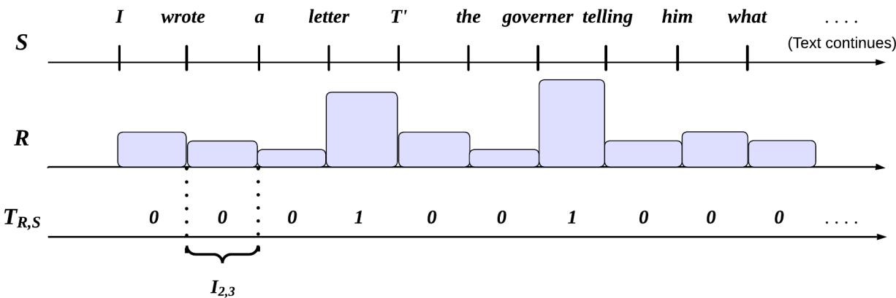
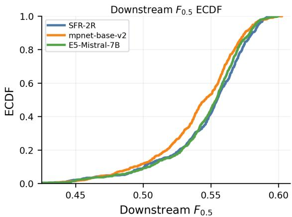
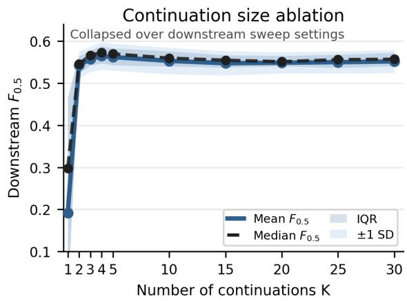
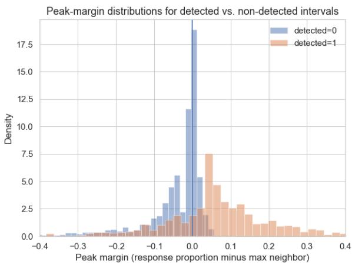

# Using Semantic Uncertainty to Estimate Transition Relevance in Turn-taking

Muhammad Umair and JP de Ruiter

Department of Computer Science

Tufts University

Medford, Massachusetts, USA

{muhammad.umair, jp.deruiter}@tufts.edu

## Abstract

Turn-taking is a fundamental mechanism that governs when interlocutors speak and listen. Although Spoken Dialogue Systems (SDS) exploit a range of linguistic, acoustic, and nonverbal cues, they produce ill-timed responses in unscripted interaction. A central challenge is anticipating Transition Relevance Places (TRPs), or opportunities, not obligations, for a listener to take the floor. Human listeners do not wait for turn endings; as an utterance unfolds, they use expectations about its developing meaning to anticipate TRPs and decide whether to take the floor. We examine whether these evolving expectations can be modeled through semantic uncertainty—an LLM-derived measure of how strongly a turn so far constrains what may plausibly come next. To do so, we sample possible continuations of an ongoing turn and use changes in semantic dispersion to identify TRPs within turns. We evaluate this account on a dataset with TRP labels derived from real-time listener responses, rather than retrospective annotation. Our approach substantially outperforms prompt-based and fine-tuned text-only baselines, providing empirical support for the view that evolving semantic constraints inform perceived turn-taking opportunities in unscripted interaction.

## 1 Introduction

Humans coordinate speaking and listening through a sophisticated turn-taking mechanism (Sacks et al., 1974). Unlike in formal settings, where who speaks when may be predetermined, speaker selection in unscripted interaction is managed on a per-turn basis. This depends on conversationalists’ orientation to Transition Relevance Places (TRPs): points at which a turn may be treated as possibly complete and a listener may, but is not obligated to, respond (Levinson, 1983; Selting, 2000).

A key distinction concerns whether a TRP results in a speaker change. If a listener takes the floor, the TRP occurs between turns and is directly observable. Many TRPs, however, arise within turns, where a listener could have responded but did not (Selting, 2000). These within-turn TRPs are an integral part of the turn-taking system but leave limited empirical trace in recorded data (Umair et al., 2024; Castillo-López et al., 2025).

This creates a challenge for Spoken Dialogue Systems (SDS), which continue to produce illtimed responses and stilted feedback in unscripted interaction (Algherairy and Ahmed, 2024; Patamia et al., 2025; Arora et al., 2025). Models trained on observable turn-taking behavior (speaker changes, backchannels, etc.) receive direct supervision for TRPs that listeners acted on, but not for the broader set of response opportunities they may have perceived (Umair et al., 2024). This motivates a representational question: what information do humans use to anticipate TRPs, and can that be used to support their prediction in dialogue systems?

Human listeners do not wait for a turn to end; they recognize in advance where it may be complete. This prospective recognition is known as projection (Sacks et al., 1974; Schegloff, 1996). As each new word arrives, what can be projected changes, and listeners revise their expectations about how the turn may continue (Magyari and de Ruiter, 2012; Riest et al., 2015).

We operationalize these evolving expectations as semantic uncertainty: an LLM-derived measure of how an unfolding turn constrains what may plausibly come next (Shorinwa et al., 2025). We estimate this signal by sampling possible continuations of the turn so far and measuring their semantic dispersion (Nguyen et al., 2025). We ask whether changes in this uncertainty predict TRPs more accurately than direct baselines. Our contribution is an empirical study of whether explicitly tracking evolving semantic constraint, derived from text alone, supports the prediction of perceived response opportunities in unscripted interaction.

## 2 Related Work

## 2.1 Turn-Taking and the Role of Semantics

Transition Relevance Places (TRPs) are points in an utterance at which a listener could, but is not obligated to, initiate a response (Sacks et al., 1974). At these locations, a listener may take the floor, the current speaker may continue, or a listener may produce minimal contributions, such as backchannels (e.g., hmm, uh-huh; Yngve 1970) or continuers (e.g., yeah, okay; Schegloff 1982). Depending on its timing, such a response may encourage the current speaker to continue or perform a specific conversational action (Schegloff, 1982). Overlapping talk is likewise not necessarily interruptive. Whether an entry is heard as competitive depends partly on where it begins relative to the developing turn and on how participants manage the overlap (Schegloff, 2000; Drew, 2009). While turn-timing varies across cultures, the basic organization of rapid speaker transition is broadly shared across languages (Stivers et al., 2009). Given the importance of TRPs for coordinating turns, a central question emerges: how do listeners project TRPs as an utterance unfolds?

Experimental work suggests that, alongside prosodic and nonverbal cues, a turn’s developing lexico-syntactic structure is particularly important for projecting possible completion (de Ruiter et al., 2006; Levinson, 2016). Listeners accurately projected turn endings when lexico-syntactic content was preserved but pitch was flattened to a monotone, whereas performance declined when words were made unrecognizable but intonation was retained (de Ruiter et al., 2006). They also anticipate upcoming words in a turn, the accuracy of which is closely linked to how well they estimate when a turn will end (Magyari and de Ruiter, 2012).

Psycholinguistic accounts describe projection as an incremental process in which listeners form and revise expectations about how a turn may continue (Riest et al., 2015; Levinson, 2016; Magyari and de Ruiter, 2012). Each new word changes the lexico-syntactic and semantic continuations that listeners may expect (Tanenhaus et al., 1995; Altmann and Kamide, 1999; Hale, 2001; Levy, 2008). Some words narrow these possibilities, while extensions, repairs, qualifications, and redirections may introduce new ones and change how listeners expect the turn to develop (Lerner, 1991; Schegloff, 1996; Selting, 2000; Liddicoat, 2004).

Changes in semantic uncertainty may therefore reflect how the range of plausible meanings evolves over the course of a turn. A decrease indicates that plausible continuations are becoming more similar in meaning, whereas an increase indicates greater variation. Such changes may be relevant to withinturn TRPs because semantic convergence may support anticipation of a continuation, while divergence may signal that an earlier expectation needs to be revised or deferred (Magyari and de Ruiter, 2012; Riest et al., 2015).

Multimodal cues, such as prosody, gaze, and gesture, also play an important disambiguating role in TRP projection. These cues are not interpreted independently of the unfolding semantics and pragmatics of a turn (Kendrick et al., 2023). Rather, they help listeners distinguish possible completion from continuation and assess whether a response is relevant at a particular position (Holler and Levinson, 2019). They are particularly informative in complex situations such as overlap, interruption, and miscommunication (Skantze et al., 2014; Bögels and Torreira, 2015).

## 2.2 Computational Models of Turn-Taking

Computational work has largely modeled turntaking through observable interactional outcomes. TurnGPT predicts token-level turn-shift probabilities from text and speaker identity, while RC-TurnGPT additionally conditions on a candidate system response (Ekstedt and Skantze, 2020; Jiang et al., 2023). Because both are trained on speaker changes, their targets are realized between-turn transitions rather than within-turn TRPs, which need not result in a listener taking the floor (Threlkeld et al., 2022).

Voice Activity Projection (VAP) models take a complementary approach by forecasting joint future speech activity from acoustic signals. Turn holds, speaker switches, overlaps, and mutual silence can be derived from these forecasts (Ekstedt and Skantze, 2022). VAP has been extended to multimodal, multi-party, and multilingual settings and combined with text-based approaches (Onishi et al., 2023; Inoue et al., 2024; Leishman et al., 2024; Wang et al., 2024a; Elmers et al., 2025).

Despite these advances, dialogue systems struggle to time responses (Algherairy and Ahmed, 2024; Patamia et al., 2025; Arora et al., 2025). Predicting voice activity or speaker changes may therefore not fully capture when a response becomes interactionally relevant (Liesenfeld et al., 2023).

This gap is difficult to study because many richly annotated interaction corpora organize turns around speaker changes (Anderson et al., 1991; Jurafsky, 1997; Calhoun et al., 2010; Reece et al., 2023), while task-oriented corpora use system–user alternation (Budzianowski et al., 2018; Si et al., 2023). These resources therefore primarily capture where speakers did respond rather than where they could have responded but did not.

## 2.3 Semantic Uncertainty Quantification

Black-box uncertainty quantification estimates variation in model outputs without requiring access to model output distributions, which may not be available for state-of-the-art LLMs (Liesenfeld and Dingemanse, 2024; Shorinwa et al., 2025). Conventional measures such as normalized predictive entropy can conflate variation in meaning with variation in lexical form by treating semantically equivalent paraphrases as distinct outcomes (Malinin and Gales, 2020; Kuhn et al., 2023). Clusterbased semantic uncertainty methods address this by grouping meaning-equivalent outputs into semantic classes via entailment and computing entropy over those classes (Kuhn et al., 2023; Farquhar et al., 2024). More recent variants replace hard clustering with graded similarity through kernel-based functions (Nikitin et al., 2024) or pairwise sentenceembedding similarities (Nguyen et al., 2025).

These approaches have primarily been applied in tasks such as question answering, summarization, and translation (Kuhn et al., 2023; Farquhar et al., 2024; Shorinwa et al., 2025). Less is known about whether these measures can characterize how an utterance becomes more or less semantically constrained as it unfolds.

## 3 Approach

## 3.1 Within-Turn TRP Prediction Task

Following Umair et al. (2024), we define our task as predicting opportunities, not obligations, for response within a single speaker’s unfolding turn. As an utterance unfolds, the task is to predict whether it affords a possible listener response, regardless of whether a listener actually takes the floor.

Formally, we define a single speaker’s turn as a stimulus $\textit { S } = \ \langle w _ { 1 } , \ldots , w _ { N } \rangle$ , a sequence of N words, where the number of words may vary across stimuli. We further segment each stimulus into a series of prefixes, where each prefix $P _ { i } = \langle w _ { 1 } , \dots , w _ { i } \rangle$ consists of the sequence of words from the first word through $w _ { i }$ . We denote by $\mathcal { P } _ { S } = \langle P _ { 1 } , \ldots , P _ { N } \rangle$ the ordered set of all prefixes derived from a stimulus S.

For each prefix $P _ { i }$ , we associate a binary reference label $T _ { i } ~ \in ~ \{ 0 , 1 \}$ indicating whether the position immediately following its last word $w _ { i }$ is labeled as a TRP. The resulting sequence $\mathbf { T } _ { \boldsymbol { S } } =$ $\langle T _ { 1 } , \dots , T _ { N } \rangle$ constitutes a reference TRP labeling for a stimulus, with $T _ { N }$ corresponding to the turn-final position. TRP predictions are therefore conditioned only on preceding linguistic material, reflecting the causal constraints under which listeners form TRP judgments. Section 4.1 describes the procedure by which the reference labels $\mathbf { T } _ { \cal S }$ are constructed from the listener-response dataset.

## Definition 3.1 (Within-turn TRP Prediction)

Given a stimulus S and its associated prefix sequence ${ \mathcal { P } } _ { S } ,$ , produce a predicted binary label sequence $\begin{array} { r l } { \widehat { \mathbf { T } } _ { S } } & { { } = \ \langle \widehat { T } _ { 1 } , \widehat { \mathbf { \Omega } } , \widehat { \mathbf { \Omega } } \rangle _ { N } \rangle } \end{array}$ , where each $\widehat { T } _ { i } \in \{ 0 , 1 \}$ indicates whether the position immediately following $w _ { i }$ is predicted to afford a possible transition, based solely on the prefix P<sub>i</sub>. Predictions are evaluated against the corresponding reference labeling $\mathbf { T } _ { \cal S }$

3.2 Predicting TRPs via Semantic Uncertainty To support TRP prediction, we introduce semantic uncertainty as an intermediate representation. For each prefix $P _ { i }$ , semantic uncertainty is a scalar value $U _ { i } \in \mathbb { R }$ that reflects how strongly the prefix constrains what may plausibly come next. We use semantic to refer to variation in meaning among possible model outputs, rather than variation in surface form alone (Kuhn et al., 2023; Farquhar et al., 2024; Nguyen et al., 2025). Intuitively, $U _ { i }$ is low when the possible continuations of $P _ { i }$ are similar in meaning, and high when they differ more substantially. Applied across the prefix sequence ${ \mathcal { P } } _ { S }$ this yields a causal trajectory $\mathbf { U } _ { S } = \langle U _ { 1 } , \ldots , U _ { N } \rangle$ that tracks how the space of plausible continuations narrows or widens as the turn unfolds. Section 3.3 describes how we estimate this quantity.

We do not associate TRPs with the absolute uncertainty value of a prefix. Instead, we relate TRPs to changes in uncertainty as the turn unfolds (Section 2.1). These changes reflect shifts in how strongly the utterance constrains its plausible continuations, highlighting locations where a listener may, but is not obligated to, respond.

We further define a TRP decision function $f$ that maps a causal, variable-length prefix of semantic uncertainty values to a binary label. For i = $1 , \ldots , N$ , this label is given by $\widehat { T } _ { i } = f ( ( \mathbf { U } _ { S } ) _ { 1 : i } )$

Algorithm 1 Estimating Semantic Uncertainty for a Prefix   
Require: Prefix $P _ { i } = \langle w _ { 1 } , \dots , w _ { i } \rangle$ ; language model $\mathcal { M } ;$ number of continuations $K \in \mathbb { N } _ { \geq 1 } ;$ ; maximum   
continuation length $L \in \mathbb { N } _ { \geq 1 } ;$ embedding model $\mathcal { E } : \mathrm { S e q }  \mathbb { R } ^ { d } ;$ similarity scaling parameter $\tau > 0$   
Ensure: Semantic uncertainty value $U _ { i } \in \mathbb { R }$   
1: Sample $K$ stochastic continuations $A _ { i } = \{ a _ { i , 1 } , . . . , a _ { i , K } \}$ from M conditioned on $P _ { i } ,$ each with   
maximum length $L$ words   
2: for $j = 1$ to $K$ do   
3: Compute continuation embedding $h _ { i , j }  \mathcal { E } ( a _ { i , j } )$   
4: end for   
5: Construct semantic similarity matrix $S ^ { ( i ) } \in \mathbb { R } ^ { K \times K }$ , where $S _ { u , v } ^ { ( i ) } = \cos ( h _ { i , u } , h _ { i , v } )$   
6: Compute semantic uncertainty $U _ { i } \gets \mathrm { S N N E } ( S ^ { ( i ) } )$ ▷ see Eq. (1)   
7: return $U _ { i }$

where $( \mathbf { U } _ { S } ) _ { 1 : i } = \langle U _ { 1 } , \dots , U _ { i } \rangle$ . This formulation is agnostic to the specific choice of $f \colon$ it may operate over absolute uncertainty values, local changes, or aggregated statistics over time. Section 3.4 describes our concrete instantiation.

## 3.3 Estimating Semantic Uncertainty

We estimate $U _ { i }$ using the procedure summarized in Algorithm 1. For each prefix $P _ { i } ,$ we sample continuations from a language model and compare their similarity in a sentence-embedding space. We then aggregate their pairwise similarities using Semantic Nearest Neighbor Entropy (SNNE; see Equation 1; Nguyen et al., 2025). SNNE is appropriate here because it uses sampled continuations rather than token-level probability distributions, and because it compares continuations using pairwise semantic similarity instead of first grouping them into entailment-based semantic clusters (Kuhn et al. 2023; Farquhar et al. 2024; Nguyen et al. 2025; see Section 2.3). The resulting scalar $U _ { i }$ reflects the semantic dispersion of the continuations. We treat this embedding-space dispersion as a model-mediated proxy for semantic variation, without assuming independence from lexical form. Appendix E.4 provides support for this treatment.

$$
\mathrm { S N N E } ( S ^ { ( i ) } ) = - \frac { 1 } { K } \sum _ { u = 1 } ^ { K } \log \left( \sum _ { v = 1 } ^ { K } \exp \left( \frac { S _ { u , v } ^ { ( i ) } } { \tau } \right) \right)\tag{1}
$$

We measure semantic proximity $S _ { u , v } ^ { ( i ) }$ using cosine similarity, a standard measure for comparing sentence embeddings (Reimers and Gurevych, 2019). The similarity scaling parameter $\tau$ controls how strongly SNNE is influenced by nearest neighbors in the similarity matrix: smaller values emphasize the most similar continuation pairs, while larger values distribute weight more broadly across pairwise similarities. Under this formulation, more negative SNNE values indicate more semantically constrained continuations, while less negative values indicate greater indeterminacy. Applying Algorithm 1 across all prefixes of a stimulus yields a prefix-indexed uncertainty trajectory $\mathbf { U } _ { S } = \langle U _ { 1 } , \ldots , U _ { N } \rangle$ , which tracks how semantic constraints evolve as the speaker’s turn unfolds.

## 3.4 Rule over Uncertainty Dynamics

We define our decision function f based on the view that TRPs arise from local shifts in semantic constraint (see Section 2.1). Accordingly, $f$ identifies candidate TRPs from both convergent shifts, where the utterance becomes more constrained, and divergent shifts, where unexpected extensions occur. We adopt a deterministic rule to emphasize interpretability and leave more expressive realizations, such as learned models, for future work.

Algorithm 2 operationalizes this intuition. It defines uncertainty change as discrete differences between successive prefixes. Because uncertainty estimates are based on finite continuation samples, the change signal may contain sampling noise rather than genuine shifts. The algorithm therefore attenuates this noise while preserving local change structure using a low-pass filter. It evaluates the current smoothed change relative to a trailing window of past changes to obtain a locally adaptive baseline. It quantifies how exceptional the current change is using the median and Median Absolute Deviation (MAD) and predicts a TRP when the normalized value exceeds a fixed threshold.

Algorithm 2 Causal TRP decision rule for a Prefix $\widehat { T } _ { i } = f ( ( \mathbf { U } _ { S } ) _ { 1 : i } )$   
Require: Index $i \in \{ 1 , \ldots , N \}$ ; Uncertainty prefix $( \mathbf { U } _ { S } ) _ { 1 : i } \ = \ \langle U _ { 1 } , \ldots , U _ { i } \rangle \ \in \ \mathbb { R } ^ { i }$ ; Window size   
$w \in \mathbb { N } _ { \geq 1 } ;$ Causal smoothing operator ${ \mathcal { F } } ;$ Threshold $\theta \in \mathbb { R } _ { > 0 } \ ; \mathbf { C o n s t a n t } \varepsilon > 0$   
Ensure: Predicted label $\widehat { T } _ { i } \in \{ 0 , 1 \}$   
1: $j \gets \operatorname* { m a x } ( 2 , i - w + 1 )$   
2: $\mathbf { i f } \ j \geq i$ then return 0   
3: end if   
4: $\Delta \mathbf { U } _ { S } \gets \langle 0 , U _ { 2 } - U _ { 1 } , \dots , U _ { i } - U _ { i - 1 } \rangle$   
5: $\Delta \tilde { \mathbf { U } } _ { S } \gets \mathcal { F } ( \Delta \mathbf { U } _ { S } )$ $\triangleright \mathcal { F }$ uses only indices $\leq i$   
6: $W _ { i } \gets \langle \Big ( \Delta \bar { \mathbf { U } _ { S } } \Big ) _ { j } , \dots , \Big ( \Delta \bar { \mathbf { U } _ { S } } \Big ) _ { i - 1 } \rangle$   
7: $b \gets \mathrm { m e d i a n } ( W _ { i } ) , s \gets \mathrm { M A D } ( W _ { i } )$ ▷ $\mathrm { M A D } ( X ) = \mathrm { m e d i a n } ( | X - \mathrm { m e d i a n } ( X ) | )$   
$| \left( \Delta \tilde { \mathbf { U } _ { S } } \right) _ { i } - b |$   
8: z ←   
$s + \varepsilon$   
9: return $\widehat { T } _ { i } \gets \mathbb { I } [ z > \theta ]$

## 4 Experimental Setup

## 4.1 Data: Empirical Within-Turn TRPs

We use the participant-response dataset<sup>1</sup> released by Umair et al. (2024), which consists of 55 singlespeaker stimuli and responses from 118 participants. In the original study, the stimuli were organized into four presentation lists: two original lists and a reversed-order version of each. The reversed lists were used to counterbalance stimulus-order effects, which refer to differences in response behavior caused by where a stimulus appeared in the sequence (de Ruiter et al., 2006; Riest et al., 2015).

The elicitation paradigm captured within-turn response opportunities through real-time listener responses rather than post-hoc annotations or observed speaker changes. Each participant was randomly assigned to one list and asked to verbalize brief backchannels (e.g., ‘hmm’, ‘yes’) when they perceived an opportunity for speech.

We derive the reference TRP labels $\mathbf { T } _ { \cal S }$ by aligning participant response onsets with the speaker’s word-level timing. Umair et al. (2024) released stimulus and per-participant response recordings, but not the orthographic transcripts, word-level stimulus timings, or response-onset timings required here. We reconstructed these manually using ELAN and Praat (Wittenburg et al., 2006; Boersma and Weenink, 2009). We excluded clear non-response vocalizations, such as breaths, laughter, and throat clearings. Because the original study reported no order effects, we pooled responses across original and reversed presentations of each stimulus, yielding a mean of 59 participants per stimulus (median 58; see Table 1).

<table><tr><td>Statistic</td><td>Value</td></tr><tr><td>Released dataset (Umair et al., 2024)</td><td></td></tr><tr><td>Stimuli</td><td>55</td></tr><tr><td>Participants</td><td>118</td></tr><tr><td>Participants per stimulus, median (range)</td><td>58 (51–60)</td></tr><tr><td>Reconstructed positions and labels</td><td></td></tr><tr><td>Candidate TRP positions (total prefixes)</td><td>5,195</td></tr><tr><td>TRP-positive positions Positive-1abel prevalence (842 / 5,195)</td><td>842</td></tr><tr><td></td><td>16.2%</td></tr><tr><td>Diagnostic</td><td></td></tr><tr><td>Local maxima among positive labels (of 842)</td><td>72%</td></tr></table>

Table 1: Dataset statistics. The 16.2% prevalence is computed over all candidate positions; the 72% localmaximum statistic is computed over the 842 positive labels only and is diagnostic rather than definitional.

For each stimulus, we define word-adjacent intervals $\langle I _ { 1 , 2 } , \ldots , I _ { N - 1 , N } \rangle$ . Each interval $I _ { i , i + 1 }$ corresponds to the candidate TRP position immediately following prefix $P _ { i }$ and its reference label $T _ { i } .$ . We compute its empirical response proportion $I _ { i , i + 1 } ^ { P r o p o r t i o n }$ as the fraction of participants who responded within the interval, counting each participant at most once (see Figure 1).

To account for temporally dispersed response onsets and varying baseline responsiveness, we binarize these proportions using a stimulus-specific threshold. Specifically, $T _ { i } = 1$ when $I _ { i , i + 1 } ^ { P r o p o r t i o n } >$ $\mu + 0 . 0 5 \sigma$ , where $\mu$ and $\sigma$ are the mean and standard deviation of the nonzero response proportions for that stimulus; otherwise, $T _ { i } = 0$ . Zero-response intervals are excluded because they would pull $\mu$ toward zero and make the threshold uninformative. The turn-final position $T _ { N }$ is always labeled positive. This yields 842 positive positions out of 5,195 (16.2%; see Table 1). Among these, 72% are local maxima relative to adjacent intervals. This statistic is diagnostic, not definitional: local maximality is not part of the labeling procedure. Additional diagnostics are provided in Appendix A; implications of the dataset size are discussed in Section 8.

  
Figure 1: Schematic illustration of empirical within-turn TRP labeling. $S$ denotes the speaker’s word sequence, R denotes aggregated listener response distribution, and $\mathbf { T } _ { \cal { S } }$ denotes the resulting binary reference labels. Participant response onsets are aligned to word-adjacent intervals $I _ { i , i + 1 }$ , each corresponding to the position following prefix $P _ { i }$ Intervals are labeled positive when their empirical response proportion $I _ { i , i + 1 } ^ { P r o p o r t i o n }$ exceeds the stimulus-specific threshold. The example text is adapted from Schegloff (1982); the figure is inspired by Umair et al. (2024).

## 4.2 Evaluation Metrics

The sparse nature of intervals in our data labeled as TRPs (16.2% of 5,195; see Table 1) highlights that TRP prediction is highly imbalanced. When predictions control system turn entry, a false positive may cause the system to interrupt the user’s ongoing turn, whereas a missed TRP may delay a response (Skantze, 2021; Arora et al., 2025). For dialogue systems, false-positive TRP predictions may therefore carry greater cost than missed ones.

Accuracy is uninformative in this setting; majority-class predictors can score well while failing to detect rare but meaningful events (He and Garcia, 2009). Instead, we report $F _ { 0 . 5 }$ , which weighs precision more heavily than recall, and the True Negative Rate (TNR), which measures suppression of spurious predictions. For comparability with prior work, we report balanced accuracy, which treats false positives and negatives symmetrically and therefore does not reflect the asymmetric interactional cost of mistimed turn entries. Section 8 discusses the limitations of this approach.

Across experiments, we report aggregated metrics using a two-level macro-average rather than pooling predictions across all stimuli. Because stimuli vary in length and number of TRPs, pooling predictions would allow the most TRP-dense stimuli to dominate. We therefore compute each metric independently for each stimulus, average across stimuli within each list, and then average across lists. This gives equal weight to each stimulus and each list in the final aggregate.

## 5 Experiments and Results

## 5.1 Prompt-Based TRP Prediction

We first test whether stronger instruction-tuned models improve prompt-based TRP prediction relative to Umair et al. (2024). Given mixed evidence on whether detailed task-specific prompts improve performance (see Reynolds and McDonell 2021; Webson and Pavlick 2022; Xu et al. 2023), we compare four prompting conditions. The expert condition provides an explicit, theory-driven definition of TRPs, while the participant condition mirrors the listener instructions used to collect the dataset. Inspired by response-conditioned models (see Jiang et al. 2023), we also test two futurecontext variants: an imagined condition, where the model generates a plausible continuation before predicting, and an oracle condition, where the true upcoming same-speaker words are provided.

Table 2 reports results for all six instructiontuned models (see Appendix B) across the four prompting conditions. Across models, performance remains weak: balanced accuracy stays near chance, and both precision and $F _ { 0 . 5 }$ are low. Although the imagined condition yields the best within-model $F _ { 0 . 5 }$ for four of six models, no prompting condition reliably identifies TRPs. Oracle access to the true upcoming words also does not consistently improve performance. Overall, direct prompting does not recover within-turn TRPs, even when possible or actual same-speaker future context is available. Experimental details are in Appendix C; prompt templates are in Appendix F. The prompts include no demonstrations from the evaluation dataset, making the setup zero-shot with respect to the target distribution (Brown et al., 2020).

<table><tr><td></td><td colspan="4">Expert</td><td colspan="4">Participant</td><td colspan="4">Imagined</td><td colspan="4">Oracle</td></tr><tr><td>Model</td><td> $F _ { 0 . 5 }$ </td><td>P</td><td>TNR</td><td>BA</td><td> $F _ { 0 . 5 }$ </td><td>P</td><td>TNR</td><td>BA</td><td> $F _ { 0 . 5 }$ </td><td>P</td><td>TNR</td><td>BA</td><td> $F _ { 0 . 5 }$ </td><td>P</td><td>TNR</td><td>BA</td></tr><tr><td>LLaMA-3.1-8B</td><td>0.12</td><td>0.12</td><td>0.81</td><td>0.5</td><td>0.10</td><td>0.12</td><td>0.84</td><td>0.49</td><td>0.18</td><td>0.16</td><td>0.48</td><td>0.50</td><td>0.17</td><td>0.16</td><td>0.62</td><td>0.49</td></tr><tr><td>LLaMA-3.1-70B</td><td>0.18</td><td>0.22</td><td>0.86</td><td>0.53</td><td>0.22</td><td>0.21</td><td>0.79</td><td>0.54</td><td>0.21</td><td>0.24</td><td>0.90</td><td>0.54</td><td>0.14</td><td>0.17</td><td>0.90</td><td>0.53</td></tr><tr><td>Mistral-7B</td><td>0.10</td><td>0.10</td><td>0.79</td><td>0.50</td><td>0.12</td><td>0.12</td><td>0.77</td><td>0.51</td><td>0.20</td><td>0.17</td><td>0.35</td><td>0.53</td><td>0.19</td><td>0.16</td><td>0.01</td><td>0.49</td></tr><tr><td>Mixtral-8x7B</td><td>0.06</td><td>0.13</td><td>0.97</td><td>0.50</td><td>0.04</td><td>0.11</td><td>0.99</td><td>0.50</td><td>0.10</td><td>0.16</td><td>0.91</td><td>0.51</td><td>0.17</td><td>0.15</td><td>0.53</td><td>0.51</td></tr><tr><td>Qwen2.5-7B</td><td>0.09</td><td>0.11</td><td>0.82</td><td>0.50</td><td>0.05</td><td>0.09</td><td>0.92</td><td>0.50</td><td>0.11</td><td>0.15</td><td>0.91</td><td>0.51</td><td>0.01</td><td>0.02</td><td>0.97</td><td>0.50</td></tr><tr><td>Qwen2.5-72B</td><td>0.08</td><td>0.20</td><td>0.99</td><td>0.51</td><td>0.08</td><td>0.14</td><td>0.97</td><td>0.51</td><td>0.21</td><td>0.31</td><td>0.93</td><td>0.54</td><td>0.16</td><td>0.22</td><td>0.88</td><td>0.52</td></tr></table>

Table 2: Prompt-based within-turn TRP prediction across instruction-tuned models (see Table 5) and prompting conditions. Expert and participant are direct prompting conditions; imagined and oracle are future-context variants of the participant-style prompt. P denotes precision and BA denotes balanced accuracy. Metrics are macro-averaged as described in Section 4.2. The highest $F _ { 0 . 5 }$ value within each prompting condition is bolded.

## 5.2 Supervised Fine-Tuning (SFT) Based TRP Prediction

We next use supervised fine-tuning (SFT), which, unlike prompting, updates model weights, to test whether explicit task adaptation improves withinturn TRP prediction. Because prompting shows no consistent benefit from model scale, we finetune LLaMA-3.1-8B-Instruct with LoRA adapters rather than the strongest prompt-based model, LLaMA-3.1-70B-Instruct (Table 2; Hu et al. 2021). Larger models may behave differently under SFT; we leave this comparison to future work.

We construct training examples by pairing each prefix $P _ { i }$ with its binary reference label $T _ { i }$ . To avoid leakage across prefixes from the same turn, we split data by stimulus rather than prefix. The train, validation, and test splits cover 60%, 20%, and 20% of the 55 stimuli, yielding 3,098, 1,203, and 894 prefixes, with 505, 188, and 149 TRPpositive labels, respectively. The held-out test split preserves the original class imbalance.

To assess whether performance is limited by sparse TRP-positive training examples, we construct three nested supervision regimes—Low, Medium, and Full—from the training split. For each regime, we select a target number of TRPpositive prefixes and include adjacent negatives to preserve local context around TRP-labeled positions (He and Garcia, 2009). Validation and test splits are fixed across regimes i.e., the ablation varies only the training subset (see Table 3).

Table 3 shows that supervision yields modest gains at the Medium regime, but improvements are limited and non-monotonic. Because results are based on a single stimulus-level split, we interpret these trends qualitatively. The pattern suggests that direct supervision provides some benefit, but performance does not consistently scale with additional data. Full training details are in Appendix D.

<table><tr><td rowspan="2"></td><td colspan="3">Training data</td><td colspan="4">Test performance</td></tr><tr><td>Regime Size</td><td>TRPs</td><td>TRP %</td><td> $\mathbf { F _ { 0 . 5 } }$ </td><td>P</td><td>TNR</td><td>BA</td></tr><tr><td>Low</td><td>528</td><td>152</td><td>28.79</td><td>0.14</td><td>0.17</td><td>0.93</td><td>0.51</td></tr><tr><td>Medium</td><td>1,011</td><td>303</td><td>29.97</td><td>0.27</td><td>0.28</td><td>0.89</td><td>0.57</td></tr><tr><td>Full</td><td>1,526</td><td>505</td><td>33.09</td><td>0.15</td><td>0.21</td><td>0.91</td><td>0.50</td></tr></table>

Table 3: SFT training-regime TRP prediction performance for LLaMA-3.1-8B-Instruct on a held-out test set. P denotes precision and BA denotes balanced accuracy. Metrics are macro-averaged (Section 4.2); the highest value in each performance column is bolded.

## 5.3 Semantic-Uncertainty-Based TRP Prediction

We now evaluate our proposed method (see Section 3.2). For the main evaluation, we fix sampling at $K = 2 5$ continuations per prefix as well as the sampling model (LLaMA-3.1-8B-Instruct), and sweep the remaining configurations across qualitatively distinct settings within our compute budget. The uncertainty-estimation stage (Algorithm 1) spans 6 decoding settings, 3 embedding models (110M–7B parameters), and 4 SNNE τ values, yielding 72 uncertainty-signal configurations. The decision stage (Algorithm 2) applies 32 detector configurations to each trajectory, for $7 2 \times 3 2 = 2 { , } 3 0 4$ total configurations (see Table 7). Grid density reflects computational cost: we limit expensive continuation sampling to 6 settings but sweep the inexpensive decision stage over saved trajectories. The grid was fixed before evaluation, and no configuration was selected using test performance; we report results across the full grid. Full configuration details appear in Appendix E.1.

  
Figure 2: Distribution of $F _ { 0 . 5 }$ across the fixed-K semantic-uncertainty sweep. Each curve is an empirical cumulative distribution over configurations for one embedding model. Mean ± SD across configurations: $\mathrm { S F R - 2 R } = 0 . 5 4 7 \pm 0 . 0 3 3$ , all-mpnet-base-v2 = $0 . 5 4 0 { \pm } 0 . 0 3 3 , \mathrm { E } 5 \mathrm { - } \mathrm { M i s t r a l - } 7 \mathrm { B - } \mathrm { I n s t r u c t } = 0 . 5 4 6 { \pm } 0 . 0 3 1$

Figure 2 summarizes the main fixed-K sweep. Across configurations, the semanticuncertainty pipeline achieves a mean $F _ { 0 . 5 }$ of 0.545 $\mathrm { ( S D ~ = ~ } 0 . 0 3 2 \mathrm { ) }$ , ranging from 0.385 to 0.603. The embedding-specific distributions are closely aligned, with mean $F _ { 0 . 5 }$ values ranging from 0.540 to 0.547. Appendix E.4 complements this comparison by showing that the embedding space captures semantic similarity across lexical variation. Results are also stable across continuation-sampling regimes: more stochastic decoding increases continuation diversity and average SNNE, while the same prefixes remain in similar semantic regions across regimes (see Appendix E.2).

A one-way $\eta ^ { 2 }$ decomposition shows that 75.4% of $F _ { 0 . 5 }$ variance is associated with the decision rule $f ;$ smoothing choices alone explain 52.6%. Upstream construction choices contribute much less:

<table><tr><td>Approach</td><td> $\mathbf { F } _ { 0 . 5 }$ </td></tr><tr><td>GPT-4 Omni, participant (Umair et al., 2024)†</td><td>0.15</td></tr><tr><td>Prompt-based prediction (best)</td><td>0.22</td></tr><tr><td>Supervised fine-tuning (best)‡</td><td>0.27</td></tr><tr><td>Next-token entropy (NTE)</td><td> $0 . 3 1 9 \pm 0 . 0 7 0$ </td></tr><tr><td>Normalized predictive entropy (NPE)</td><td> $0 . 3 2 8 \pm 0 . 0 2 7$ </td></tr><tr><td>Semantic uncertainty</td><td> $\mathbf { 0 . 5 4 5 \pm 0 . 0 3 2 }$ </td></tr></table>

Table 4: Summary $F _ { 0 . 5 }$ comparison. Baseline rows report the best result; uncertainty-signal rows report mean ± SD across configurations (32 per alternative signal and 2,304 for semantic uncertainty). <sup>†</sup>Approximated from the reported precision and recall under globalthreshold labels. <sup>‡</sup>Evaluated on the held-out split.

decoding setting, embedding model, and τ explain 5.5%, 0.9%, and 0.88%, respectively. Although these one-way effects are not additive, they indicate that SNNE preserves the TRP-relevant signal across construction choices. Varying τ changes the range of the uncertainty trajectory, but has only a small downstream effect (see Appendix E.3).

The dominance of the decision rule and nearidentical performance across embedding models raise the possibility that the gains come from the rule (Algorithm 2) rather than the semantic information carried by SNNE (Algorithm 1). To test this, we replace the SNNE trajectory with two predictive-entropy controls while holding the prefixes, decision rule, evaluation, and generation model (LLaMA-3.1-8B-Instruct) fixed. Nexttoken entropy (NTE) is the Shannon entropy of the model’s next-token distribution at each prefix and tests whether the rule can exploit token-level uncertainty without sampled continuations or embeddings. Normalized predictive entropy (NPE) averages length-normalized mean token surprisal over the same $K = 2 5$ continuations, testing whether their semantic dispersion adds information beyond their token probabilities. NTE and NPE achieve mean $F _ { 0 . 5 }$ scores of 0.319 and 0.328, respectively (see Table 4). Their maxima, 0.356 and 0.376, remain below the minimum semantic-uncertainty $( F _ { 0 . 5 } = 0 . 3 8 5 )$ , showing that the decision rule is not signal-agnostic and that the embedding-based semantic dispersion captured by SNNE contributes information beyond token-probability uncertainty.

We next test whether performance using SNNE depends on continuation-sample size K. Larger samples may improve dispersion estimates but increase sampling cost. Holding the decision-rule sweep fixed, we vary K starting at 2, the smallest nontrivial pairwise setting. Mean $F _ { 0 . 5 }$ reaches approximately 0.54 at K = 2 and remains near that level for larger samples, with a shallow optimum around four to five continuations (see Figure 3). This stability suggests that local uncertainty shifts are recoverable from small samples. Moreover, SNNE at K = 2 outperforms NPE at $K = 2 5$ indicating that its advantage is not explained by sample size alone.

  
Figure 3: Continuation-sample size ablation. For each K, downstream $F _ { 0 . 5 }$ is collapsed over the decision-rule sweep. Lines show mean and median performance; shaded bands show interquartile range and ±1 std.

## 6 Discussion

Listeners in unscripted interaction project TRPs before a speaker’s turn has ended, using the turnso-far to form expectations about what may plausibly come next. This remains difficult for dialogue systems, partly because they are typically trained on observable outcomes rather than response opportunities that do not result in speaker change.

We therefore ask whether evolving semantic constraints help identify within-turn TRPs. We estimate semantic uncertainty over sampled continuations and use local changes in its trajectory as the prediction signal. Because this procedure is computationally costly, we leave its deployment in dialogue systems as an avenue for future work.

Empirically, prompt-based inference and SFT do not reliably predict within-turn TRPs. Prompting yields low $F _ { 0 . 5 }$ across models and conditions, while SFT produces only limited, non-monotonic gains. In contrast, SNNE-based prediction performs substantially better. Most performance variation is associated with the decision rule, but neither predictive-entropy control reaches the SNNE performance range under the same rule, indicating that SNNE captures TRP-relevant uncertainty beyond token-probability uncertainty. Performance remains stable from two sampled continuations onward, suggesting that informative local changes in SNNE are recoverable from small samples.

Together, these findings suggest that evolving semantic structure provides a useful signal for withinturn TRP prediction. This is notable because our labels derive from real-time listener responses rather than retrospective annotation, targeting opportunities that listeners perceived but did not necessarily act on. Semantic uncertainty should nonetheless be read as a model-mediated proxy for semantic variation, not a measurement of listener-internal expectations. For dialogue systems, this suggests that text-only TRP prediction may benefit from intermediate representations of semantic constraint.

## 7 Conclusion

Even though spoken dialogue systems draw on linguistic, acoustic, and multimodal cues for turntaking, they continue to struggle to time responses appropriately in natural interaction. One reason is that TRPs, or opportunities for speech, are not confined to turn endings. Many occur within turns and leave no interactional trace when a listener does not respond, limiting their visibility in dialogue corpora. Models trained on observable outcomes therefore receive evidence about where listeners did respond, but not necessarily about where they could have responded. Our analyses show that this mismatch has measurable consequences. Direct textto-label prediction remains unreliable, even across diverse prompting conditions and with supervised fine-tuning. By contrast, semantic-uncertaintybased prediction provides a more reliable basis for identifying within-turn TRPs by tracking how the space of plausible continuations becomes more or less semantically dispersed as an utterance unfolds. The improvement is robust across the tested settings, but the broader contribution is representational. Semantic uncertainty shows that changes in the space of plausible continuations carry information about when response opportunities arise. Progress on turn-taking may therefore require models that track how semantic constraints evolve over a turn, not only models trained on observable response outcomes.

## 8 Limitations

We acknowledge several limitations. First, our empirical evaluation is based on a small, English-only dataset of single-speaker turns labeled through participant judgments of perceived TRPs (see Section 4.1). This dataset is well suited to studying within-turn TRPs, which are rarely observable in standard corpora. At the same time, it limits generalization. Our findings have not yet been validated on widely used dialogue datasets such as Switchboard or SpokenWOZ (Jurafsky, 1997; Si et al., 2023). This reflects a broader methodological challenge, since within-turn TRPs are underrepresented in corpora derived from natural interaction (Threlkeld et al., 2022; Umair et al., 2024). Further validation across datasets and interactional settings is therefore required.

Second, our evaluation isolates text-derived semantic information and therefore does not capture the full multimodal structure of turn-taking. This choice allows us to test whether evolving semantic constraint contributes to within-turn TRP prediction, but it does not show that semantic uncertainty alone is sufficient for response timing in deployed dialogue systems. Acoustic, prosodic, and multimodal cues may interact with semantic uncertainty in ways that are not captured here. Future work should therefore test whether the signal remains useful when integrated with models that incorporate these additional sources of information.

Third, even within the text-only setting, semantic uncertainty remains model-mediated. We do not claim that embedding-space dispersion is independent of lexical form, only that it provides a proxy for semantic relatedness less tied to surface form than token-level measures. A diagnostic analysis supports this claim. Duplicate-continuation rates vary sharply across decoding settings, from roughly 67% to 1%, while prefix-level mean embeddings remain stable, with pairwise cosine similarities of 0.94–0.97. This reduces, but does not eliminate, the concern that the signal reflects surface form. It also does not make the signal model-independent; alternative language models, embedding spaces, or similarity functions could yield different uncertainty trajectories.

Additionally, the semantic uncertainty measure we use is expensive relative to direct text to label prediction, specifically when sampling K continuations per prefix (see Section 3.3). The K ablation suggests that this cost is reducible. Mean $F _ { 0 . 5 }$ reaches 0.54 at K = 2 and remains near its best values for small K, indicating that the coarse uncertainty measures may still be informative enough to predict TRPs locally. Regardless of smaller K values, the per-prefix cost of sampling and embedding remains higher than single-pass prediction. Future work is required to determine whether semantic uncertainty can be deployed in a real-time system.

Our analysis also relies on a deliberately simple decision mechanism. The fixed, causal rule used here (Section 3.4) prioritizes interpretability over expressive capacity. The variance decomposition in Section 5.3 suggests this choice is consequential: the decision rule accounts for 75.4% of $F _ { 0 . 5 }$ variance across configurations, with smoothing alone explaining 52.6%. More flexible models, which are capable of exploiting longer-range dependencies or finer-grained patterns in the uncertainty trajectory, could plausibly outperform a deterministic rule. The reported performance should therefore not be read as a performance upper bound on uncertaintybased TRP projection.

Finally, our evaluation metrics reflect a particular interactional cost structure. We prioritize precisionweighted measures because false positive TRP predictions are often more disruptive than missed opportunities to respond (Section 4.2). This assumption may not hold in all settings. More proactive or high-initiative systems may require different tradeoffs between false positives and false negatives. Our metrics also assess local prediction quality, not downstream outcomes such as conversational fluidity or user experience. The results should therefore be interpreted as alignment with perceived TRPs under this cost structure, rather than as a complete measure of interactional success.

## 9 Ethical Considerations

We consider the ethical implications of this work in terms of how turn prediction signals might be used in deployed systems. If such signals are treated as entitlements to speak rather than advisory cues, semantic uncertainty could lead to inappropriate interruptions or missed opportunities to respond. We therefore emphasize that these signals are modelmediated and should not be interpreted as evidence of user intent or readiness to yield the floor. While turn-taking is often described as universal, its realization varies across cultures and interactional settings, and systems that operationalize TRPs risk privileging particular norms if deployed without care. Additionally, the participant-judgment data used in this work were collected under ethical oversight, with informed consent, protections for participant anonymity, and approval from the relevant institutional review board.

## 10 Acknowledgments

We thank Vasanth Sarathy for early discussions on structuring our experiments, Bilal Ahmed for refining key ideas and providing feedback, and Julia Mertens for thoughtful discussions that strengthened our arguments. We also acknowledge the Tufts University Department of Computer Science for institutional support, and Tufts Research Technology High Performance Computing for providing the computational resources used in this work. AI assistants were used in this work to improve language consistency; all scientific content and results are the authors’ original work.

## References

Atheer Algherairy and Moataz Ahmed. 2024. A review of dialogue systems: current trends and future directions. Neural Computing and Applications, 36(12):6325–6351.

Gerry T.M Altmann and Yuki Kamide. 1999. Incremental interpretation at verbs: restricting the domain of subsequent reference. Cognition, 73(3):247–264.

Anne H Anderson, Miles Bader, Ellen Gurman Bard, Elizabeth Boyle, Gwyneth Doherty, Simon Garrod, Stephen Isard, Jacqueline Kowtko, Jan McAllister, Jim Miller, et al. 1991. The hcrc map task corpus. Language and speech, 34(4):351–366.

Siddhant Arora, Zhiyun Lu, Chung-Cheng Chiu, Ruoming Pang, and Shinji Watanabe. 2025. Talking turns: Benchmarking audio foundation models on turntaking dynamics. Preprint, arXiv:2503.01174.

Paul Boersma and David Weenink. 2009. Praat: doing phonetics by computer (version 5.1.13).

Tom Brown, Benjamin Mann, Nick Ryder, Melanie Subbiah, Jared D Kaplan, Prafulla Dhariwal, Arvind Neelakantan, Pranav Shyam, Girish Sastry, Amanda Askell, et al. 2020. Language models are few-shot learners. Advances in neural information processing systems, 33:1877–1901.

Paweł Budzianowski, Tsung-Hsien Wen, Bo-Hsiang Tseng, Iñigo Casanueva, Stefan Ultes, Osman Ramadan, and Milica Gasic. 2018. Multiwoz-a largescale multi-domain wizard-of-oz dataset for taskoriented dialogue modelling. In Proceedings of the 2018 conference on empirical methods in natural language processing, pages 5016–5026.

Sara Bögels and Francisco Torreira. 2015. Listeners use intonational phrase boundaries to project turn ends in spoken interaction. Journal ofPhonetics, 52:46–57.

Sasha Calhoun, Jean Carletta, Jason M Brenier, Neil Mayo, Dan Jurafsky, Mark Steedman, and David Beaver. 2010. The nxt-format switchboard corpus: a rich resource for investigating the syntax, semantics, pragmatics and prosody of dialogue. Language resources and evaluation, 44(4):387–419.

Chris Callison-Burch, Miles Osborne, and Philipp Koehn. 2006. Re-evaluating the role of bleu in machine translation research. In 11th conference of the european chapter ofthe associationfor computational linguistics, pages 249–256.

Galo Castillo-López, Gael de Chalendar, and Nasredine Semmar. 2025. A survey of recent advances on turn-taking modeling in spoken dialogue systems. In Proceedings of the 15th International Workshop on Spoken Dialogue Systems Technology, pages 254– 271, Bilbao, Spain. Association for Computational Linguistics.

Daniel Cer, Mona Diab, Eneko Agirre, Inigo Lopez-Gazpio, and Lucia Specia. 2017. Semeval-2017 task 1: Semantic textual similarity multilingual and crosslingual focused evaluation. In Proceedings of the 11th international workshop on semantic evaluation (SemEval-2017), pages 1–14.

Jan P. de Ruiter, H. Mitterer, and N. J. Enfield. 2006. Projecting the end of a speaker’s turn: A cognitive cornerstone of conversation. Language, 82(3):515–535.

Paul Drew. 2009. "quit talking while i’m interrupting": A comparison between positions of overlap onset in conversation. In M. Haakana, M. Laakso, and J. Lindstrom, editors, Talk in Interaction: Comparative Dimensions, pages 70–93. Finnish Literature Society.

Erik Ekstedt and Gabriel Skantze. 2020. TurnGPT: a transformer-based language model for predicting turn-taking in spoken dialog. In Findings ofthe Associationfor Computational Linguistics: EMNLP 2020, pages 2981–2990, Online. Association for Computational Linguistics.

Erik Ekstedt and Gabriel Skantze. 2022. Voice Activity Projection: Self-supervised Learning of Turn-taking Events. In Proc. Interspeech 2022, pages 5190–5194.

Mikey Elmers, Koji Inoue, Divesh Lala, and Tatsuya Kawahara. 2025. Triadic Multi-party Voice Activity Projection for Turn-taking in Spoken Dialogue Systems. In Interspeech 2025, pages 3015–3019.

Sebastian Farquhar, Jannik Kossen, Lorenz Kuhn, and Yarin Gal. 2024. Detecting hallucinations in large language models using semantic entropy. Nature, 630(8017):625–630.

William Fedus, Barret Zoph, and Noam Shazeer. 2022. Switch transformers: scaling to trillion parameter models with simple and efficient sparsity. J. Mach. Learn. Res., 23(1).

John Hale. 2001. A probabilistic earley parser as a psycholinguistic model. In Proceedings of the Second Meeting ofthe North American Chapter ofthe Association for Computational Linguistics on Language Technologies, NAACL ’01, page 1–8, USA. Association for Computational Linguistics.

Haibo He and Edwardo A. Garcia. 2009. Learning from imbalanced data. IEEE Transactions on Knowledge and Data Engineering, 21(9):1263–1284.

Judith Holler and Stephen C. Levinson. 2019. Multimodal language processing in human communication. Trends in Cognitive Sciences, 23(8):639–652.

Ari Holtzman, Jan Buys, Li Du, Maxwell Forbes, and Yejin Choi. 2019. The curious case of neural text degeneration. arXiv preprint arXiv:1904.09751.

Edward J Hu, Yelong Shen, Phillip Wallis, Zeyuan Allen-Zhu, Yuanzhi Li, Shean Wang, Lu Wang, and Weizhu Chen. 2021. Lora: Low-rank adaptation of large language models. arXiv preprint arXiv:2106.09685.

Koji Inoue, Bing’er Jiang, Erik Ekstedt, Tatsuya Kawahara, and Gabriel Skantze. 2024. Multilingual turntaking prediction using voice activity projection. In Proceedings of the 2024 Joint International Conference on Computational Linguistics, Language Resources and Evaluation (LREC-COLING 2024), pages 11873–11883, Torino, Italia. ELRA and ICCL.

Bing’er Jiang, Erik Ekstedt, and Gabriel Skantze. 2023. Response-conditioned turn-taking prediction. In Findings ofthe Associationfor Computational Linguistics: ACL 2023, pages 12241–12248, Toronto, Canada. Association for Computational Linguistics.

Dan Jurafsky. 1997. Switchboard swbd-damsl shallowdiscourse-function annotation coders manual. www. dcs. shef. ac. uk/nlp/amities/files/bib/ics-tr-97-02. pdf.

Kobin H. Kendrick, Judith Holler, and Stephen C. Levinson. 2023. Turn-taking in human face-to-face interaction is multimodal: gaze direction and manual gestures aid the coordination of turn transitions. Philosophical Transactions ofthe Royal Society B: Biological Sciences, 378(1875):20210473.

Lorenz Kuhn, Yarin Gal, and Sebastian Farquhar. 2023. Semantic uncertainty: Linguistic invariances for uncertainty estimation in natural language generation. arXiv preprint arXiv:2302.09664.

Sean Leishman, Peter Bell, and Sarenne Wallbridge. 2024. Pairwiseturngpt: a multi-stream turn prediction model for spoken dialogue. In Proceedings of the 28th Workshop on the Semantics and Pragmatics ofDialogue - Full Papers, Trento, Italy. SEMDIAL.

Gene H Lerner. 1991. On the syntax of sentences-inprogress. Language in Society, 20(3):441–458.

Stephen C. Levinson. 1983. Pragmatics. Cambridge Textbooks in Linguistics. Cambridge University Press, Cambridge, U.K.

Stephen C. Levinson. 2016. Turn-taking in human communication – origins and implications for language processing. Trends in Cognitive Sciences, 20(1):6– 14.

Stephen C. Levinson and Francisco Torreira. 2015. Timing in turn-taking and its implications for processing models of language. Frontiers in Psychology, 6:731.

Roger Levy. 2008. Expectation-based syntactic comprehension. Cognition, 106(3):1126–1177.

Anthony J. Liddicoat. 2004. The projectability of turn constructional units and the role of prediction in listening. Discourse Studies, 6(4):449–469.

Andreas Liesenfeld and Mark Dingemanse. 2024. Rethinking open source generative ai: open-washing and the eu ai act. In Proceedings of the 2024 ACM Conference on Fairness, Accountability, and Transparency, FAccT ’24, page 1774–1787, New York, NY, USA. Association for Computing Machinery.

Andreas Liesenfeld, Alianda Lopez, and Mark Dingemanse. 2023. The timing bottleneck: Why timing and overlap are mission-critical for conversational user interfaces, speech recognition and dialogue systems. In Proceedings of the 24th Annual Meeting of the Special Interest Group on Discourse and Dialogue, pages 482–495, Prague, Czechia. Association for Computational Linguistics.

Lilla Magyari and Jan P. de Ruiter. 2012. Prediction of turn-ends based on anticipation of upcoming words. Frontiers in Psychology, 3:376.

Andrey Malinin and Mark Gales. 2020. Uncertainty estimation in autoregressive structured prediction. arXiv preprint arXiv:2002.07650.

MLC team. 2023-2025. MLC-LLM.

Dang Nguyen, Ali Payani, and Baharan Mirzasoleiman. 2025. Beyond semantic entropy: Boosting LLM uncertainty quantification with pairwise semantic similarity. In Findings of the Association for Computational Linguistics: ACL 2025, pages 4530–4540, Vienna, Austria. Association for Computational Linguistics.

Alexander Nikitin, Jannik Kossen, Yarin Gal, and Pekka Marttinen. 2024. Kernel language entropy: Finegrained uncertainty quantification for llms from semantic similarities. Advances in Neural Information Processing Systems, 37:8901–8929.

Kazuyo Onishi, Hiroki Tanaka, and Satoshi Nakamura. 2023. Multimodal voice activity prediction: Turntaking events detection in expert-novice conversation.

In Proceedings ofthe 11th International Conference on Human-Agent Interaction, HAI ’23, page 13–21, New York, NY, USA. Association for Computing Machinery.

Rutherford Agbeshi Patamia, Ha Pham Thien Dinh, Ming Liu, and Akansel Cosgun. 2025. Turn-taking modelling in conversational systems: A review of recent advances. Technologies, 13(12):591.

Andrew Reece, Gus Cooney, Peter Bull, Christine Chung, Bryn Dawson, Casey Fitzpatrick, Tamara Glazer, Dean Knox, Alex Liebscher, and Sebastian Marin. 2023. The candor corpus: Insights from a large multimodal dataset of naturalistic conversation. Science advances, 9(13):eadf3197.

Nils Reimers and Iryna Gurevych. 2019. Sentence-BERT: Sentence embeddings using Siamese BERTnetworks. In Proceedings ofthe 2019 Conference on Empirical Methods in Natural Language Processing and the 9th International Joint Conference on Natural Language Processing (EMNLP-IJCNLP), pages 3982–3992, Hong Kong, China. Association for Computational Linguistics.

Laria Reynolds and Kyle McDonell. 2021. Prompt programming for large language models: Beyond the few-shot paradigm. In Extended Abstracts of the 2021 CHI Conference on Human Factors in Computing Systems, CHI EA ’21, New York, NY, USA. Association for Computing Machinery.

Carina Riest, Annett B. Jorschick, and Jan P. de Ruiter. 2015. Anticipation in turn-taking: mechanisms and information sources. Frontiers in Psychology, 6:89.

Harvey Sacks, Emanuel A. Schegloff, and Gail Jefferson. 1974. A simplest systematics for the organization of turn-taking for conversation. Language, 50(4):696–735.

Emanuel A. Schegloff. 1982. Discourse as an interactional achievement: Some uses of ‘uh huh’ and other things that come between sentences. In Deborah Tannen, editor, Analyzing Discourse: Text and Talk, pages 71–93. Georgetown University Press, Washington, DC.

Emanuel A. Schegloff. 1996. Turn organization: one intersection of grammar and interaction, page 52–133. Studies in Interactional Sociolinguistics. Cambridge University Press.

Emanuel A. Schegloff. 2000. Overlapping talk and the organization of turn-taking for conversation. Language in Society, 29(1):1–63.

Margret Selting. 2000. The construction of units in conversational talk. Language in Society, 29(4):477– 517.

Ola Shorinwa, Zhiting Mei, Justin Lidard, Allen Z. Ren, and Anirudha Majumdar. 2025. A survey on uncertainty quantification of large language models: Taxonomy, open research challenges, and future directions. ACM Comput. Surv., 58(3).

Shuzheng Si, Wentao Ma, Haoyu Gao, Yuchuan Wu, Ting-En Lin, Yinpei Dai, Hangyu Li, Rui Yan, Fei Huang, and Yongbin Li. 2023. Spokenwoz: A largescale speech-text benchmark for spoken task-oriented dialogue agents. Advances in Neural Information Processing Systems, 36:39088–39118.

Gabriel Skantze. 2021. Turn-taking in conversational systems and human-robot interaction: A review. Computer Speech & Language, 67:101178.

Gabriel Skantze, Anna Hjalmarsson, and Catharine Oertel. 2014. Turn-taking, feedback and joint attention in situated human–robot interaction. Speech Communication, 65:50–66.

Tanya Stivers, N. J. Enfield, Penelope Brown, Christina Englert, Makoto Hayashi, Trine Heinemann, Gertie Hoymann, Federico Rossano, Jan Peter de Ruiter, Kyung-Eun Yoon, and Stephen C. Levinson. 2009. Universals and cultural variation in turn-taking in conversation. Proceedings ofthe National Academy ofSciences, 106(26):10587–10592.

Michael K. Tanenhaus, Michael J. Spivey-Knowlton, Kathleen M. Eberhard, and Julie C. Sedivy. 1995. Integration of visual and linguistic information in spoken language comprehension. Science, 268(5217):1632–1634.

Charles Threlkeld, Muhammad Umair, and Jp de Ruiter. 2022. Using transition duration to improve turntaking in conversational agents. In Proceedings ofthe 23rd Annual Meeting of the Special Interest Group on Discourse and Dialogue, pages 193–203, Edinburgh, UK. Association for Computational Linguistics.

Muhammad Umair, Vasanth Sarathy, and Jan Ruiter. 2024. Large language models know what to say but not when to speak. In Findings of the Association for Computational Linguistics: EMNLP 2024, pages 15503–15514, Miami, Florida, USA. Association for Computational Linguistics.

Jinhan Wang, Long Chen, Aparna Khare, Anirudh Raju, Pranav Dheram, Di He, Minhua Wu, Andreas Stolcke, and Venkatesh Ravichandran. 2024a. Turn-taking and backchannel prediction with acoustic and large language model fusion. In ICASSP 2024-2024 IEEE International Conference on Acoustics, Speech and Signal Processing (ICASSP), pages 12121–12125. IEEE.

Liang Wang, Nan Yang, Xiaolong Huang, Linjun Yang, Rangan Majumder, and Furu Wei. 2024b. Improving text embeddings with large language models. In Proceedings of the 62nd Annual Meeting of the Association for Computational Linguistics (Volume 1: Long Papers), pages 11897–11916.

Albert Webson and Ellie Pavlick. 2022. Do promptbased models really understand the meaning of their prompts? In Proceedings of the 2022 Conference of the North American Chapter ofthe Associationfor Computational Linguistics: Human Language Technologies, pages 2300–2344, Seattle, United States. Association for Computational Linguistics.

Jason Wei, Yi Tay, Rishi Bommasani, Colin Raffel, Barret Zoph, Sebastian Borgeaud, Dani Yogatama, Maarten Bosma, Denny Zhou, Donald Metzler, Ed H. Chi, Tatsunori Hashimoto, Oriol Vinyals, Percy Liang, Jeff Dean, and William Fedus. 2022. Emergent abilities of large language models. Transactions on Machine Learning Research.

Peter Wittenburg, Hennie Brugman, Albert Russel, Alex Klassmann, and Han Sloetjes. 2006. ELAN: a professional framework for multimodality research. In Proceedings of the Fifth International Conference on Language Resources and Evaluation (LREC’06), Genoa, Italy. European Language Resources Association (ELRA).

Thomas Wolf, Lysandre Debut, Victor Sanh, Julien Chaumond, Clement Delangue, Anthony Moi, Pierric Cistac, Tim Rault, Remi Louf, Morgan Funtowicz, Joe Davison, Sam Shleifer, Patrick von Platen, Clara Ma, Yacine Jernite, Julien Plu, Canwen Xu, Teven Le Scao, Sylvain Gugger, Mariama Drame, Quentin Lhoest, and Alexander Rush. 2020. Transformers: State-of-the-art natural language processing. In Proceedings ofthe 2020 Conference on Empirical Methods in Natural Language Processing: System Demonstrations, pages 38–45, Online. Association for Computational Linguistics.

Benfeng Xu, An Yang, Junyang Lin, Quan Wang, Chang Zhou, Yongdong Zhang, and Zhendong Mao. 2023. Expertprompting: Instructing large language models to be distinguished experts. arXiv preprint arXiv:2305.14688.

Victor H Yngve. 1970. On getting a word in edgewise. In Papers from the sixth regional meeting Chicago Linguistic Society, April 16-18, 1970, Chicago Linguistic Society, Chicago, pages 567–578.

Shengyu Zhang, Linfeng Dong, Xiaoya Li, Sen Zhang, Xiaofei Sun, Shuhe Wang, Jiwei Li, Runyi Hu, Tianwei Zhang, Guoyin Wang, and Fei Wu. 2026. Instruction tuning for large language models: A survey. ACM Comput. Surv., 58(7).

## A Operationalizing TRPs: Stimulus-Specific Thresholding and Local Maximality

The nature of the listener-response data permits several operationalizations of binary TRP labels. A global threshold labels an interval positive when its response proportion exceeds a fixed cutoff across all stimuli. A stimulus-specific threshold labels an interval positive when its response proportion is elevated relative to the distribution for that stimulus. A local-peak criterion labels an interval positive when its response proportion exceeds those of its adjacent intervals.

We use the stimulus-specific threshold described in Section 4.1. This choice reflects two properties of listener responses. First, response onsets are temporally dispersed because listeners project TRPs and may begin responding before the stimulus turn ends (Sacks et al., 1974; de Ruiter et al., 2006; Levinson and Torreira, 2015). High absolute agreement within any single interval is therefore unlikely. Second, stimuli differ in baseline responsiveness, making a fixed global threshold overly conservative for low-response stimuli and overly permissive for high-response stimuli. Stimulusspecific thresholding accounts for this variability.

The stimulus-specific threshold identifies elevated response proportions but does not establish whether they form distinct peaks rather than broader regions of elevated responsiveness. For each interval, we therefore compute a local peak margin: the difference between $I _ { i , i + 1 } ^ { P r o p o r t i o n }$ and the larger response proportion of its immediate neighbors, where defined. Positive margins indicate strict local maxima (see Figure 4). Among the 842 positive labels, 72% occur at strict local maxima. This statistic is diagnostic, not definitional: local maximality is not part of the labeling rule. It shows that the threshold generally selects positions that are locally prominent in the response distribution.

## B Model Selection and Experimental Infrastructure

## B.1 Model Selection

Throughout this work, we use a set of instructiontuned, open-weight LLMs spanning multiple architectural families and parameter scales (see Table 5). This selection tests whether observed behaviors vary systematically with model scale or architecture, rather than reflecting idiosyncrasies of a single model family. The set includes both dense and mixture-of-experts architectures, which allocate representational capacity differently and exhibit distinct scaling and generalization properties (Fedus et al., 2022). Varying model scale probes whether limitations reflect insufficient capacity or the formulation of the TRP prediction task itself, since scaling can affect model capabilities unevenly across tasks (Wei et al., 2022). All models are instruction-tuned, which improves adherence to task specifications (Zhang et al., 2026).



Figure 4: Distribution of peak margins for detected TRPs and non-TRP intervals. Peak margin is defined as the difference between an interval’s response proportion and the maximum of its immediate neighbors. Detected TRPs exhibit substantially larger positive margins, while non-TRP intervals are centered near zero, indicating that the labeling procedure selects positions with locally elevated listener response rates.
<table><tr><td>Model</td><td>Type</td><td>Params.</td><td>Precision</td></tr><tr><td>LLaMA-3.1-8B-Instruct</td><td>Dense</td><td>8B</td><td>q4f16</td></tr><tr><td>LLaMA-3.1-70B-Instruct</td><td>Dense</td><td>70B</td><td>q4f16</td></tr><tr><td>Mistral-7B-Instruct</td><td>Dense</td><td>7B</td><td>q4f16</td></tr><tr><td>Mixtral-8×7B-Instruct</td><td>MoE</td><td>46B</td><td>q4f16</td></tr><tr><td>Qwen2.5-7B-Instruct</td><td>Dense</td><td>7B</td><td>q4f16</td></tr><tr><td>Qwen2.5-72B-Instruct</td><td>Dense</td><td>72B</td><td>q4f16</td></tr></table>

Table 5: Instruction-tuned, open-weight LLMs used throughout this work. Dense models apply all parameters to each input, whereas Mixture-of-Experts (MoE) models route each input through a sparse subset of expert modules. Parameter counts for MoE models report total parameters across experts. q4f16 denotes 4-bit weight quantization with FP16 compute.

## B.2 Experimental Infrastructure

We implement efficient batched inference and consistent generation behavior across models using custom adaptations of the MLC-LLM framework together with the HuggingFace ecosystem (Wolf et al., 2020; MLC team, 2023-2025). Model weights are stored with 4-bit quantization and computation is performed in FP16, reducing memory usage and enabling large-scale evaluation on limited hardware. Parameter-efficient fine-tuning, which introduces low-rank trainable parameters to a frozen base model, is implemented using LoRA adapters (Hu et al., 2021). Experiments run on NVIDIA A100 (40 GB and 80 GB) and H200 GPUs with a single accelerator per run and four CPU cores per GPU. Per-experiment aggregate compute usage is summarized in Table 6. We do not include closed-source LLMs because they do not provide the transparency required for controlled scientific evaluation, including access to model weights, training data, and decoding settings (Liesenfeld and Dingemanse, 2024).

<table><tr><td>Experiment</td><td>Stage</td><td># Configs</td><td>Aggregate GPU-h</td><td>Aggregate CPU-h</td><td>Avg wall / unit</td></tr><tr><td rowspan="4">Prompting baselines (§5.1)</td><td>Expert</td><td>6</td><td>7.037</td><td>28.148</td><td>0.813 s/prefix</td></tr><tr><td>Participant</td><td>6</td><td>10.932</td><td>43.728</td><td>1.26 s/prefix</td></tr><tr><td>Imagined</td><td>6</td><td>11.755</td><td>47.020</td><td>1.36 s/prefix</td></tr><tr><td>Oracle</td><td>6</td><td>20.078</td><td>80.312</td><td>2.32 s/prefix</td></tr><tr><td rowspan="2">SFT (§5.2)</td><td>Training</td><td>3</td><td>0.591</td><td>2.366</td><td>11.83 min/model</td></tr><tr><td>Inference</td><td>3</td><td>0.351</td><td>1.404</td><td>7.02 min/model</td></tr><tr><td rowspan="3">Semantic uncertainty (§5.3)</td><td>Continuation sampling</td><td>6</td><td>85.335</td><td>341.340</td><td>9.86 s/prefix</td></tr><tr><td>Embedding</td><td>18</td><td>4.530</td><td>18.120</td><td>0.174 s/prefix</td></tr><tr><td>Decision function f</td><td>2,304</td><td></td><td>一</td><td>&lt; 0.001 s/prefix</td></tr><tr><td>Total</td><td>一</td><td></td><td>140.609</td><td>562.438</td><td>一</td></tr></table>

Table 6: Compute summary for the main-text experiments. # Configs reports the number of configurations or runs included in each stage. Aggregate GPU-h and CPU-h report total compute for that stage. Avg wall / unit reports average wall-clock time for the natural unit of the stage: per prefix for prompting and semantic-uncertainty stages, and per trained model for SFT stages. The semantic-uncertainty method is separated into continuation sampling, embedding, and decision-rule evaluation because only continuation sampling requires new LLM generations. The continuation-sampling row aggregates the six decoding configurations used in the fixed-K=25 sweep. Embedding and decision-rule configurations are computed from saved continuations, and decision-rule evaluation is CPU-only.

Across experiments, we use two decoding parameters, temperature and top-p, to control LLM generation stochasticity. Temperature rescales the shape of the full token distribution, while top-p governs its effective support by restricting sampling to the smallest set of tokens whose cumulative probability exceeds a threshold (Holtzman et al., 2019). Other decoding parameters (e.g., top-k truncation or repetition penalties) use default values to limit interacting degrees of freedom and to preserve a consistent sampling regime. Specific settings are reported in each experiment’s appendix.

## C Prompt-Based TRP Prediction Details

In Section 5.1, we evaluate all LLMs (see Table 5) under the four prompting conditions using a fixed decoding configuration (temperature = 0.4, top-p = 1.0; Holtzman et al., 2019). This allows us to balance diversity and determinism while treating generation stochasticity as a controlled source of variation rather than an object of analysis. We generate a single prediction per interval; sampling multiple generations would substantially increase computational cost across the full model–condition grid. As a result, reported metrics reflect a single sampled generation, and systematic analysis of decoding variability is left to future work.

For each prefix, prompts instruct models to produce structured JSON outputs containing a binary TRP decision, a confidence score, and a brief justification. Evaluation uses only the binary decision; confidence scores and justifications are recorded but excluded from reported metrics. Outputs are parsed using a deterministic post-processing routine, achieving a 99.5% success rate over 124,680 generations. The remaining failures primarily reflect minor deviations from the expected schema and are excluded prior to evaluation; given their low frequency, they are unlikely to affect comparative results. Appendix F shows the summarized prompt templates for each condition.

## D Supervised Fine-Tuning Details

In Section 5.2, we fine-tune LLaMA-3.1-8B-Instruct using LoRA adapters, rather than the strongest prompt-based baseline model (LLaMA-3.1-70B-Instruct; see Section 5.1). Prompt-based results indicate that larger models do not necessarily improve performance on the within-turn TRP prediction task. Fine-tuning a larger model could in principle yield different results, as supervised adaptation and prompting exhibit distinct failure modes; we leave this for future work.

We fine-tune using a causal language modeling objective with a completion-only loss, computing gradients only over the assistant completion corresponding to the binary TRP decision. Restricting gradients to the completion avoids updating the model on prompt or context tokens that are not part of the decision target. We do not introduce class-weighted or precision-aware losses, despite evaluating with $F _ { 0 . 5 }$ . Our aim is not to optimize downstream metrics but to test whether supervision alone improves TRP prediction under a standard SFT formulation. Incorporating task-specific loss shaping would confound this diagnostic.

Training uses the AdamW optimizer with a base learning rate of $2 \times 1 0 ^ { - 5 }$ , cosine scheduling with a warmup ratio of 0.03, per-device batch size of 4, and gradient accumulation over 8 steps. Models are trained for up to 30 epochs with early stopping based on the completion-only evaluation loss, and the best checkpoint is selected for evaluation. At inference time, we generate TRP predictions using the same system prompt used during training, along with the same decoding parameters (temperature = 0.4, top-p = 1.0) as used for prompt-based inference (see Appendix C).

## E Semantic Uncertainty Based TRP Prediction Details

## E.1 Experimental Setup

We evaluate the semantic uncertainty method (see Section 3.2) by sweeping three groups of parameters: continuation-sampling settings, semanticuncertainty settings, and decision-rule settings. Table 7 summarizes the configuration space.

We use LLaMA-3.1-8B-Instruct as the continuation model. This model provides a practical tradeoff between instruction-following ability and computational cost. Empirical runtimes indicate that LLaMA-3.1-70B-Instruct is between 6× and 20× slower than its smaller variant. We therefore use the 8B model throughout and vary continuation diversity through six temperature and top-p settings.

We embed continuations using three different embedding models. We include SFR-Embedding-2\_R as a general-purpose embedding model for semantic similarity and retrieval, and all-mpnet-base-v2 as a smaller sentence-transformer baseline (Reimers and Gurevych, 2019). We also include intfloat/e5-mistral-7b-instruct as a larger embedding model, allowing us to test whether the uncertainty signal depends on embedding-model scale (Wang et al., 2024b).

For each model, we compute SNNE from pairwise cosine similarities between continuation embeddings. While Nguyen et al. (2025) report ROUGE-L as the strongest similarity function for their task, we use embedding cosine similarity because our continuations are short (≈5–10 tokens) and often differ in surface form. In this setting, lexical-overlap measures may be sensitive to small wording differences rather than semantic similarity (Callison-Burch et al., 2006).

## E.2 Semantic Uncertainty Robustness

To assess whether the semantic-uncertainty signal is sensitive to continuation sampling, we summarize its behavior across the six decoding configurations (see Table 7). We hold K = 25 and $\tau = 0 . 1$ fixed to isolate the effect of temperature and top-p.

First, we summarize the uncertainty trajectory for each decoding setting. For each embedding model, we compute SNNE for every prefix, then measure the mean and standard deviation across prefixes (see Table 8). As decoding becomes more stochastic, mean SNNE becomes less negative, from −11.74 to −10.61, indicating broader continuation sets. The standard deviation across prefixes decreases from 0.56 to 0.21, indicating compressed prefix-level contrast.

Second, we measure semantic diversity within each prefix under the same decoding setting. For each prefix, we compute the average cosine similarity between all distinct pairs of continuations sampled for that prefix, then average across prefixes and embedding models. This continuation similarity decreases from 0.72 to 0.54 as decoding becomes more stochastic, indicating that higher stochasticity produces more semantically diverse continuations for the same prefix.

Finally, we test whether the same prefix remains stable across decoding settings. For each prefix and decoding setting, we average the embeddings of its sampled continuations. We then compare these mean embeddings for the same prefix across every pair of the six decoding configurations. Mean cosine similarity exceeds 0.94, indicating that changing temperature and top-p increases continuation diversity without moving the same prefix to a substantially different semantic region.

<table><tr><td>Stage</td><td>Hyperparameter</td><td>Values</td><td></td></tr><tr><td>Uncertainty estimation</td><td></td><td></td></tr><tr><td rowspan="4">(Algorithm 1)</td><td>Generation model Continuations per prefix</td><td>LLaMA-3.1-8B-Instruct (q4f16) K = 25</td></tr><tr><td>Decoding setting  $( T , \mathrm { t o p } \cdot p )$ </td><td>(0.50, 0.80); (0.80, 0.90); (0.85, 0.95); (0.90, 0.90); 6</td></tr><tr><td>Embedding model</td><td> $( \mathrm { { 0 . 9 0 , 1 . 0 0 } } ) ; ( \mathrm { { 1 . 1 0 , 1 . 0 0 } } )$  SFR-2R; all-mpnet-base-v2; E5-Mistral-7B-Instruct</td></tr><tr><td>SNNE scale (τ)</td><td>{0.1, 1, 10, 100}</td></tr><tr><td rowspan="4">Decision function (Algorithm 2)</td><td>Smoothing</td><td>EMA:  $\alpha \in \{ 0 . 3 , 0 . 5 , 0 . 7 \} ;$ </td></tr><tr><td>Rise/drop windows</td><td>Boxcar: window ∈ {3, 5, 7}; Gaussian:  $\sigma = 1 . 5 , \mathrm { w i n d o w } \in \{ 5 , 1 0 \}$  Rise window ∈ {5, 10} crossed with drop window  $\in \{ 5 , 1 0 \}$ </td></tr><tr><td>Fixed detector settings</td><td>Causal operation; adaptive thresholding; threshold = 1.5; mini- 1</td></tr><tr><td></td><td>mum local  ${ \mathrm { p o i n t s } } = 3 ;$  derivative-based rise/drop scoring; median centering; MAD-to-σ factor = 1.4826; minimum scale  $\bar { \varepsilon } = 1 0 ^ { - 8 }$ </td></tr></table>

Table 7: Main fixed-K robustness sweep, organized as a two-phase pipeline. In Phase 1, uncertainty estimation crosses 6 decoding settings, 3 embedding models, and 4 SNNE τ values, yielding 72 uncertainty-signal configurations. In Phase 2, the decision function converts each trajectory into TRP predictions using 32 detector configurations, formed by crossing 8 causal smoothing variants with 4 adaptive rise/drop window settings. In total, the sweep evaluates $7 2 \times 3 2 = 2 { , } 3 0 4$ scored configurations.

<table><tr><td colspan="2">Decoding</td><td colspan="2">Metric, mean ± SD</td></tr><tr><td> $T$ </td><td>p</td><td>SNNE Pref. Std</td><td>Cos.</td></tr><tr><td>.50 .80</td><td>.80 .90</td><td> $- 1 1 . 7 4 \pm . 3 5$   $. 5 6 \pm . 0 9$   $- 1 0 . 9 9 \pm . 5 1$   $. 4 1 \pm . 0 0$   $- 1 0 . 9 9 \pm . 5 3$   $. 3 9 \pm . 0 1$ </td></tr></table>

Table 8: Decoding diagnostic for fixed K=25 and τ=0.1. SNNE is the mean uncertainty value across prefixes. Pref. Std is the standard deviation of SNNE across prefixes. Cos. is the average cosine similarity between distinct continuations sampled for the same prefix. Values are mean ± SD across the three embedding models.

These diagnostics show that changing temperature and top-p makes the continuations broader and more diverse, but the same prefix still points to a similar semantic region across decoding settings. The uncertainty trajectory is therefore not just an artifact of one sampling setup; it reflects information tied to the prefix itself.

## E.3 SNNE Similarity Scaling and Discriminative Capacity

Our method predicts within-turn TRPs from local changes in the semantic-uncertainty trajectory. The SNNE similarity scaling parameter τ controls the numerical scale of this trajectory. Smaller values weigh similar continuation pairs highly, while larger values distribute weight more evenly and compress differences among SNNE values.

To quantify this effect, we compute a reference contrast for each τ using two synthetic $K = 2 5$ similarity matrices. One represents complete agreement, with $S ^ { ( i ) } u , v \ = \ 1$ for all u, v; the other is a positive-similarity dispersion reference, with $S ^ { ( i ) } u , u = 1$ and $S _ { u , v } ^ { ( i ) } = 0$ for u $\neq v$ . This contrast does not define the full SNNE range, since cosine similarities can be negative, but it provides a fixed calibration of how much numerical contrast SNNE expresses as τ varies. We compare it to the observed standard deviation of prefix-level SNNE values from the fixed-K sweep, averaged over embedding models and decoding configurations.

Table 9 shows that the reference contrast shrinks rapidly as τ increases. This confirms that large τ values compress SNNE scale. ${ \mathrm { ~ \bf ~ A t ~ } } \tau \ = \ 1 0 0 .$ the prefix-level standard deviation exceeds the reference contrast, meaning that this calibration no longer reflects the full empirical range of the signal. The main sweep shows, however, that this compression has limited downstream effect. The higher-level implication is that τ primarily affects the scale of the uncertainty trajectory, while TRP prediction depends on how local changes in that trajectory are interpreted by the decision rule.

<table><tr><td>T</td><td>Ref. Contrast</td><td>Prefix Std</td><td>Std / Contrast</td></tr><tr><td>0.1</td><td>3.218</td><td>0.371</td><td>11.5%</td></tr><tr><td>1</td><td>0.934</td><td>0.078</td><td>8.4%</td></tr><tr><td>10</td><td>0.096</td><td>0.022</td><td>23.3%</td></tr><tr><td>100</td><td>0.010</td><td>0.020</td><td>206.8%</td></tr></table>

Table 9: Effect of the similarity scaling parameter τ on SNNE discriminative capacity for $K = 2 5$ continuations. Reference contrast is the SNNE difference between identical $( S _ { u , v } ^ { ( i ) } = 1$ for all u, v) and orthogonal $( S _ { u , u } ^ { ( i ) } = 1 , S _ { u , v } ^ { ( i ) } = 0$ for u $\neq v )$ similarity configurations. Prefix Std denotes the observed standard deviation of SNNE across prefixes.

## E.4 In-Domain Semantic-Similarity

Section 3.3 treats embedding-space dispersion as a model-mediated proxy for semantic variation, without assuming independence from lexical form. Prior work supports this interpretation: Sentence-BERT is designed so that cosine similarity reflects semantic similarity (Reimers and Gurevych, 2019), E5-Mistral is evaluated on semantic-similarity and retrieval tasks (Wang et al., 2024b), and Semantic Textual Similarity benchmarks compare model similarities with human judgments (Cer et al., 2017).

However, these evaluations largely concern complete sentences or passages, whereas Algorithm 1 embeds LLM-generated continuations of approximately 5–10 tokens conditioned on prefixes transcribed from spontaneous speech. We therefore conduct a targeted in-domain diagnostic to test whether the embedding space captures semantic similarity in this setting.

We sample candidate continuations across all six decoding settings (see Table 7). For each continuation, the comparison reported here uses a triplet comprising the original, a similar-length paraphrase preserving its meaning while changing its wording, and a similar-length continuation from another stimulus with a different meaning. We retain 78 cases after automatic checks for comparable length, distinct wording, and the absence of prefix copying, followed by manual verification of the intended semantic relationships. For example, “was a really tough experience” is paired with the paraphrase “was incredibly challenging and difficult” and the unrelated continuation “from the main hallway suddenly.” We embed the continuations without their prefixes using SFR-Embedding-2\_R, one of the embedding models evaluated in the main experiment (see Appendix E.1).

In 77 of 78 triplets, the original is more similar to its paraphrase than to the unrelated continuation (98.7%; 95% paired-bootstrap CI: 96.2– 100%). Mean cosine similarity is 0.861 for original– paraphrase pairs and 0.654 for original–unrelated pairs, with a mean paired difference of 0.207 (95% CI: 0.190–0.223). Thus, for the short continuations used here, the embedding space captures semantic similarity across lexical variation, providing support for its use as a model-mediated proxy.

## F Prompt Templates

```ini
Prompt 1: Expert (Theory-Guided TRP Judgment)
[ROLE]
You are a Conversation Analysis (CA) expert evaluating, incrementally after each prefix, whether a Transition Relevance
Place (TRP) occurs immediately after the final word. A TRP is an opportunity (not an obligation) for speaker transition
or for the current speaker to begin a new Turn Construction Unit (TCU).
[SOURCES]
Note: For clarity of presentation, the academic sources originally included in the prompt have been omitted here.
[TASK]
Given a sequence of words spoken by a single speaker (<PREFIX>), decide whether it ends at a point where a listener could
appropriately begin speaking or where the current speaker could transition to a new Turn Construction Unit.
[DECISION RUBRIC]
A TRP is an opportunity, not an obligation, for speaker transition.
• Output 1 (TRP) when the utterance is syntactically and pragmatically complete (e.g., an independent clause or
completed social action).
• Output 0 (no TRP) when the utterance projects continuation (e.g., open coordination or subordination, discourse
markers, or continuation punctuation).
• If cues conflict, prefer 0 unless completion is decisively clear.
[OUTPUT FORMAT]
{"does_trp_occur":0 or 1,"confidence":0.0-1.0,
"justification":"brief explanation (<=1000 chars)"}
The output must end with the token <END>. The confidence and justification fields are recorded for analysis but are not
used for post-processing or decision thresholding.
[EXAMPLE (SCHEMATIC)]
Illustrative examples use fabricated text:
• "I think we’re done." → does_trp_occur = 1
• "I was thinking that" → does_trp_occur = 0
```

## Prompt 2: Participant (Intuitive TRP Judgment)

```ini
[ROLE]
You are taking the role of a participant in a conversation study. You imagine listening to a speaker and deciding whether
you could naturally produce a brief encouraging response (e.g., “yeah”, “mmhmm”) at the end of what they just said.
[TASK]
Given a single line of speech spoken by one speaker (<PREFIX>), decide whether it ends at a point where you could
reasonably give a short listener response. Always make a decision for the final word of the line.
[DECISION RUBRIC]
A TRP is an opportunity, not an obligation, for speaker transition.
• Output 1 (TRP) when the utterance is syntactically and pragmatically complete (e.g., an independent clause or
completed social action).
• Output 0 (no TRP) when the utterance projects continuation (e.g., open coordination or subordination, discourse
markers, or continuation punctuation).
• If cues conflict, prefer 0 unless completion is decisively clear.
[OUTPUT FORMAT]
{"does_trp_occur":0 or 1,"confidence":0.0-1.0,
"justification":"brief explanation (<=1000 chars)"}
The output must end with the token <END>. The confidence and justification fields are recorded for analysis but are not
used for post-processing or decision thresholding.
[EXAMPLE (SCHEMATIC)]
Illustrative examples use fabricated text:
• "I think we’re done." → does_trp_occur = 1
• "I was thinking that" → does_trp_occur = 0
```

Prompt 3: Participant (Imagined Future Continuation)   
[ROLE]   
You are listening to a single speaker in a natural conversation and must judge whether the end of the speaker’s turn-so-far   
is a natural point for a brief listener response.   
[TASK]   
First, imagine how the speaker is likely to continue next by writing a short continuation in the speaker’s voice (1–2 clauses,   
≈10 words). Then, decide whether the end of the given line is a point where a brief listener response would naturally fit.   
[DECISION GUIDELINES]   
• Output 1 (TRP) if the turn-so-far sounds complete and the continuation would be optional.   
• Output 0 (no TRP) if the turn-so-far leads directly into the provided continuation.   
• Short items (e.g., speaker acknowledgments) may be complete on their own.   
[OUTPUT FORMAT]   
{"does\_trp\_occur":0 or 1,   
"projected\_upcoming\_turns":"imagined speaker continuation",   
"confidence":0.0-1.0,   
"justification":"brief explanation (<=1000 chars)"}   
The output must end with the token <END>. The projected continuation is used only as part of the judgment and is not   
evaluated against ground truth.   
[EXAMPLE (SCHEMATIC)]   
Illustrative examples use fabricated text:   
• "I think we’re done." → continuation: "We can leave whenever you’re ready.", does\_trp\_occur = 1   
• "I was thinking that" → continuation: "we should try something else.", does\_trp\_occur = 0

## Prompt 4: Participant (Oracle Future Continuation)

```ini
[ROLE]
You are listening to a single speaker in a natural conversation and must judge whether the end of the speaker’s turn-so-far
is a natural point for a brief listener response.
[TASK]
You are given:
1. a line of speech spoken by one speaker (<PREFIX>), and
2. the actual upcoming continuation of the same speaker.
Use the provided continuation exactly as written to decide whether the end of the given line is a point where a brief
listener response would naturally fit.
[DECISION GUIDELINES]
• Output 1 (TRP) if the turn-so-far sounds complete and the continuation would be optional.
• Output 0 (no TRP) if the turn-so-far leads directly into the provided continuation.
• Short items (e.g., speaker acknowledgments) may be complete on their own.
[OUTPUT FORMAT]
{"does_trp_occur":0 or 1,
"projected_upcoming_turns":"verbatim provided continuation",
"confidence":0.0-1.0,
"justification":"brief explanation (<=1000 chars)"}
The output must end with the token <END>. The provided continuation must be copied verbatim and is not generated by the
model. The confidence and justification fields are recorded for analysis but are not used for post-processing or decision
thresholding.
[EXAMPLE (SCHEMATIC)]
Illustrative examples use fabricated text:
• Turn-so-far: "I think we’re done."
Continuation: "We can head out whenever you’re ready."
→ does_trp_occur = 1
• Turn-so-far: "I was thinking that"
Continuation: "we might need to try a different approach."
→ does_trp_occur = 0
```