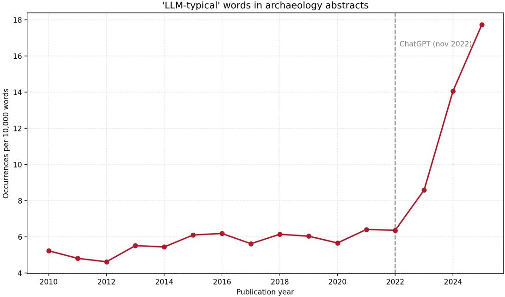
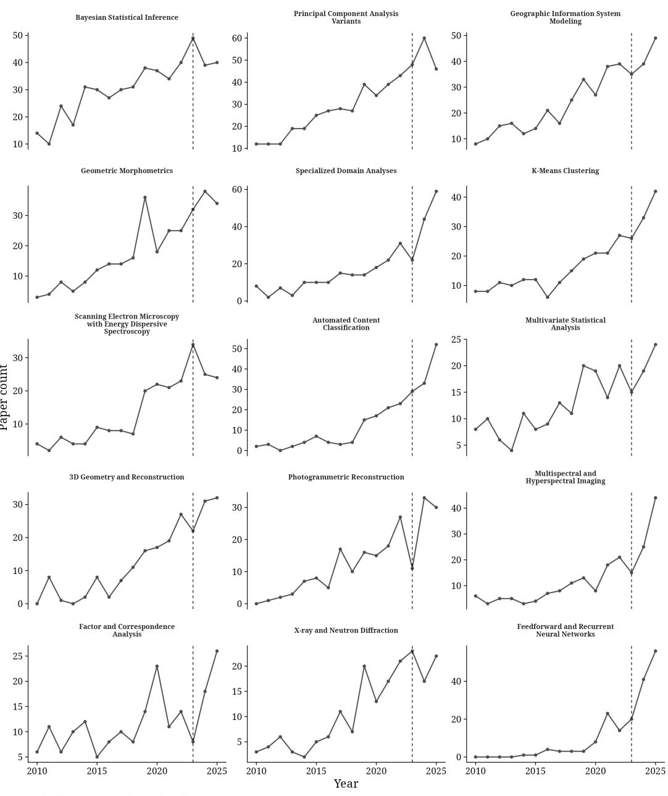
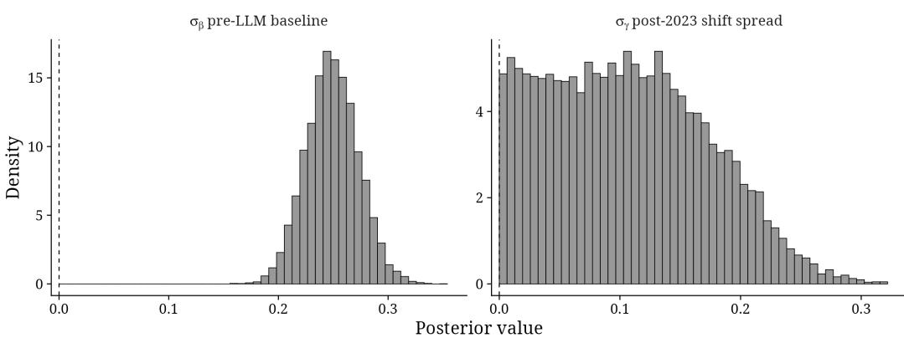
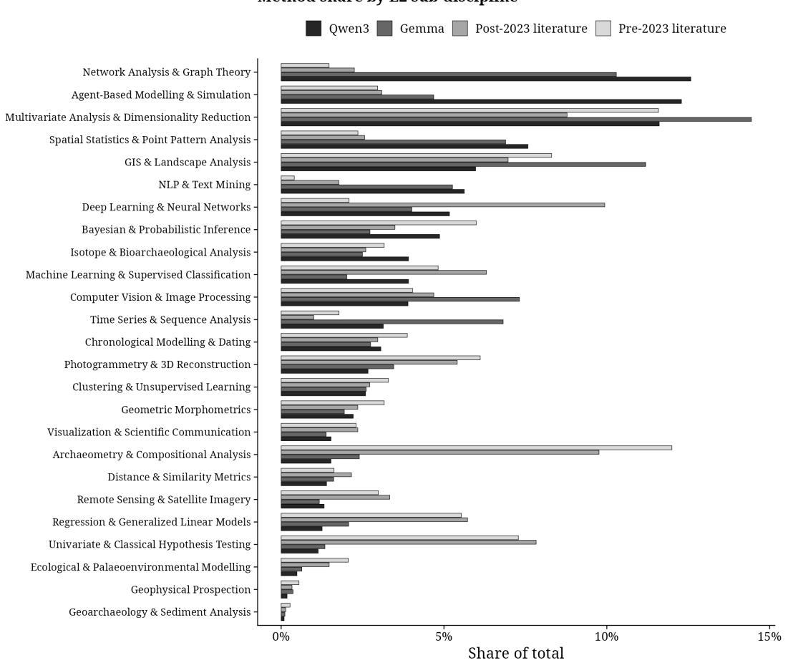
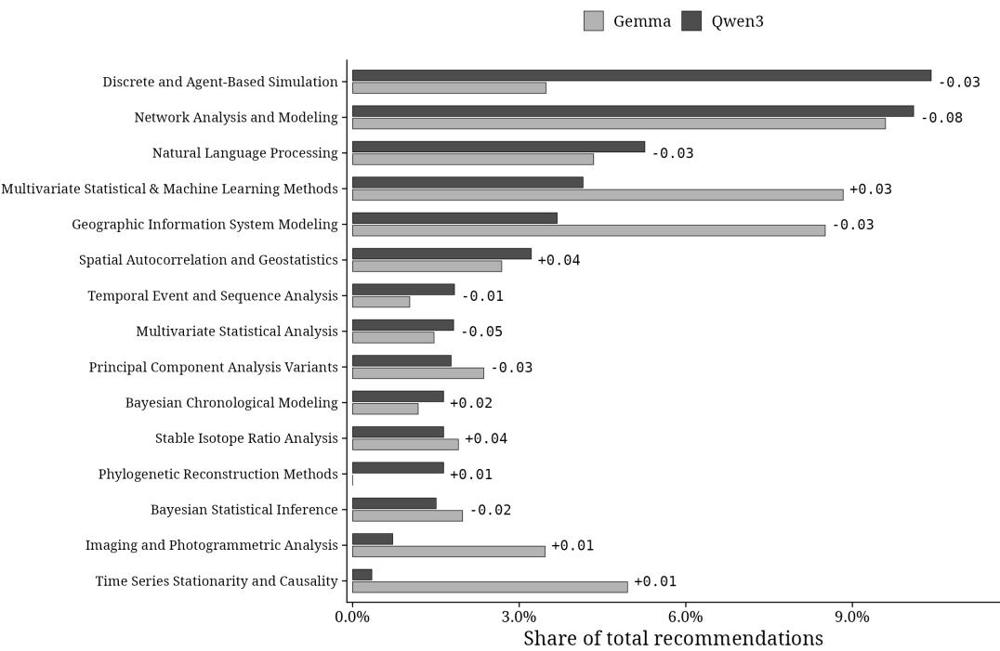
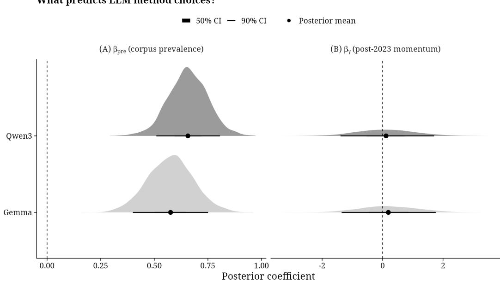
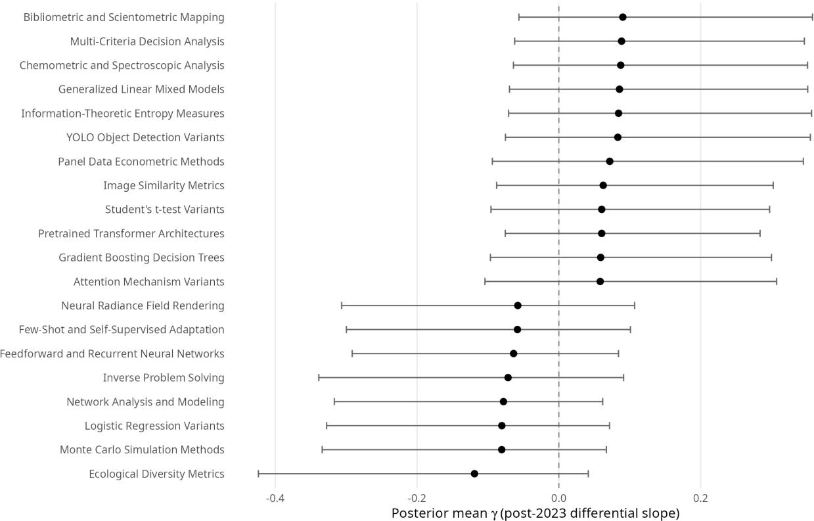
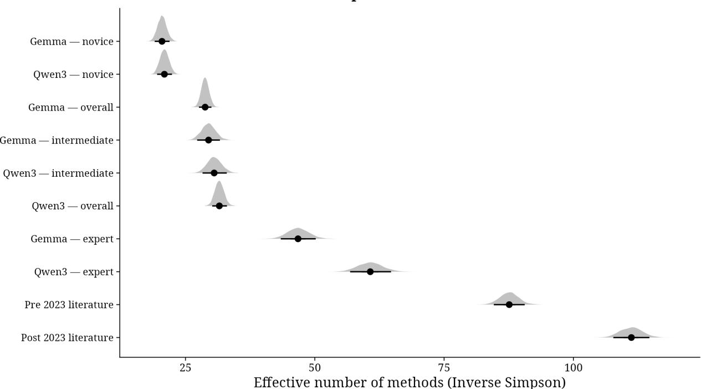

# (WHOSE DEFAULTS?) IS ARTIFICIAL INTELLIGENCE REORIENTING ARCHAEOLOGICAL METHODS?

A PREPRINT

Lorenzo Cardarelli   
Seminar für Ur- und Frühgeschichte   
Georg-August-Universität Göttingen Göttingen, Germany ORCID: 0000-0002-2436-9967

Roberto Ragno\* McDonald Institute for Archaeological Research University of Cambridge Cambridge, UK ORCID: 0000-0002-7333-9035

## ABSTRACT

The paper asks whether generative AI and ‘vibe coding’ are narrowing the range of computational methods used in archaeological research, and tests this along two lines. We analysed roughly 119,000 archaeology abstracts indexed in Scopus for 2010–2025 and used a locally run large language model to extract and cluster the techniques each reports (25 operative categories, 241 data-driven clusters). A Bayesian hierarchical Dirichlet-multinomial model finds a small but credible compositional shift after 2023, roughly 2.35 times smaller than the field’s existing heterogeneity; no single technique changed credibly, and the effective number of methods rose from 87.6 to 111.2. Separately, two open-weight models asked to recommend methods for 28 standardised research problems, under novice, intermediate, and expert guidance, produced recommendations about a third as diverse as the literature, and a quarter under novice prompting; a negative binomial regression shows that a method’s pre-2023 prevalence predicts how often it is recommended, most strongly for the novice profile. The results are consistent with a convergent pressure on method choice that remains latent rather than visible in the published record, though the design cannot establish causation.

Keywords Computational archaeology · Large Language Models · Vibe coding · Epistemic infrastructure · Dirichlet-Multinomial model · Methodological convergence

## 1 Introduction

The public release of ChatGPT at the end of 2022 marked a turning point in the relationship between researchers and computational systems: for the first time, natural language became the primary interface for instructing a machine. Since then, a rapid succession of increasingly capable models has reshaped how research is conducted, from data collection to the formalisation and execution of analyses (Zhang et al., 2025a; Hao et al., 2026; Traberg et al., 2026; Underwood, 2025). The ‘trajectory of use’ described by Zhang et al. (2025) has, in practice, become an increasingly progressive delegation process, developing from simple conversational assistance and manual code execution, to fully autonomous agentic workflows. These models can autonomously plan, write and execute (Sapkota et al., 2025). The use of Large Language Models (LLMs) is already visible in the archaeological literature (Qi and Wen, 2025). Indeed, our preliminary analysis of approximately 120,000 Scopus abstracts spanning 2010 to 2025 shows a marked increase in linguistic markers associated with LLM-assisted writing from 2022 onwards, in line with what Liang et al. (2025) already observed for STEM preprints.

Logic and programming represent the privileged domains for the development of this type of Artificial Intelligence (AI), which is predominantly text-based. It is no coincidence that many of the benchmarks used to measure a model’s efficiency in the industry’s race towards Artificial General Intelligence (AGI) (such as SWE-bench or LiveCodeBench (Jimenez et al., 2024) consist of complex programming tests to evaluate its autonomous planning and efficiency. These are syntactic and logical metrics of a binary nature, where code admits no ambiguity: it either compiles or it fails.

  
Figure 1: Frequency of ‘LLM-typical’ words in archaeological literature (2010–2025). Occurrences per 10,000 words across approximately 120,000 Scopus abstracts. The tracked vocabulary comprises 25 marker words identified as characteristic of LLM-generated text (delve, intricate, intricacies, showcase, underscore, pivotal, realm, tapestry, meticulous, boast, leverage, nuanced, multifaceted, encompass, comprehensive, notably, crucial, garner,foster, seamless, robust, paradigm, holistic, elucidate, endeavor). The vertical dashed line marks the release of ChatGPT (November 2022).

The integration of these tools in archaeology is not only a practical issue. Although the discipline routinely embraces computational approaches (e.g. databases, GIS, 3D modelling, machine learning), archaeology remains an intrinsically interpretative field whose object of study is, by definition, complex, fragmentary, and partial (Gattiglia, 2025). The inductive and empirical reasoning required for reconstructing the past bears little resemblance to the binary logic of computational benchmarks. There is a paradox here: the computational archaeologist and the software engineer now share the very same agentic interface for generating code (O’Brien et al., 2026; Van Noorden and Perkel, 2023), yet their epistemic goals remain radically different. Code is not a neutral tool but the epistemic infrastructure through which archaeological data are filtered, analysed, classified, visualised, and interpreted (Gattiglia, 2022, 2025). Every algorithm encodes assumptions about what constitutes meaningful variation, and every pipeline embodies decisions about which information to preserve and which to discard. In Don Ihde’s terms, code functions as a ‘hermeneutic relation’ with the world (Ihde, 1990): it does not simply transmit archaeological reality to the researcher but actively mediates and transforms it (Huggett, 2021).

When the authorship of this mediating layer is delegated to an AI, specifically a LLM, the epistemological implications run deep. This concern is not new to the discipline. At every major methodological turn, computational archaeology has grappled with analogous tensions: the quantitative revolution of the 1960s, with Clarke (1968)’s analytical archaeology and Binford (1962); Binford and Binford (1968)’s nomothetic programme, brought computational tools to the centre of the discipline, but in doing so they embedded theoretical assumptions about what constitutes meaningful variation in human behaviour. It was precisely these assumptions that the post-processualist critique set out to deconstruct. Hodder (1991) and Shanks and Tilley (1987) insisted that every classification, model, and statistic is situated, culturally conditioned, and theory-laden. This idea was triggered, to a large extent, by the opacity of the computational methods that processualism had normalised. Subsequent technological waves raised similar questions without displacing the researcher as the epistemic subject. GIS in the 1990s raised the problem of the proprietary black-box (Wheatley and Gillings, 2002), Bayesian chronological modelling imposed a formal language many used without mastering its probabilistic foundations (Bayliss, 2007), and machine learning for ceramic classification and remote sensing (Bellat et al., 2025; Bickler, 2021) pushed the boundary further still. Kristiansen (2024)’s longer historical account of interdisciplinarity in archaeology describes it as a recurring pendulum swinging between science-based and humanistic based interpretative dominance, with oscillations at intervals of roughly 30–50 years: each science-driven ‘revolution’ triggers, after a phase of implementation, a ‘counterrevolution’ from cultural-historical and interpretive positions. The quantitative revolution and its post-processualist backlash outlined above are, in this reading, simply the discipline’s second documented turn of this cycle. Kristiansen (2014) described this juncture as a ‘Third Science Revolution’: the convergence of big data, genomics, high-resolution dating and advanced computation engaged in conversation with humanistic interpretation, rather than positioned in opposition to it. However, in practice, successive data-driven developments in archaeology have often relegated reflexivity to a secondary role. This has produced what Niklasson (2014) aptly characterised as an ‘add critics and stir’ approach, in which critical engagement is appended after the fact rather than built into the analytical framework from the outset. This pattern is structural rather than accidental: quantitative revolutions in archaeology repeatedly promised dialogue between data and interpretation, but made data the priority and interpretation the by-product (Chilton, 2014; Gonz’alez-Ruibal, 2014). All these precedents have one thing in common and distinguish themselves from what lies ahead: every tool, however complex, requires the user to retain at least a functional understanding of the underlying logic. For example, anyone using a GIS had to understand what a buffer or a viewshed was, and anyone fitting a Bayesian model had to grasp the concept of a prior. Similarly, anyone training a neural network had to define an architecture, hyperparameters and a validation set. Agentic AI and Vibe coding (§1.1) break this continuity: for the first time, a researcher can produce an entire, functioning analytical tool without understanding any of the computational operations that compose it. The distance between intent and implementation, which every previous innovation had progressively narrowed, is now closed at the operational level (techne¯), yet simultaneously rendered insurmountable at the epistemic level (epistem¯ e¯). Vibe coding is not creating the conditions for the asymmetry between data and reflexivity identified by Kristiansen’s critics, but it radicalises it to a degree that no previous tool has come close to achieving.

At this point it is worth laying our cards on the table. As early-career computational archaeologists early, we write advocating for the integration of these tools in our programming workflows, under firm conditions (which will be discussed in Section 5). Vibe coding has enabled us to build in hours what would previously have taken weeks: custom pipelines, responsive interfaces and analytical tools that would have been impossible to develop without a dedicated software team. This is a significant development for researchers accustomed to working independently with limited time and resources. Our critique does not stem from a distrust of technology, but rather from the opposite. It is precisely because we have experienced this transformative potential first-hand that we feel compelled to examine it honestly. This examination begins with an honest acknowledgement that the democratising potential of these tools is real but not unconditional. Access issues, cost, data privacy and the uneven distribution of computational infrastructure complicate any simple narrative of empowerment, particularly for early-career researchers and didactic activity. We explore these issues in the next section, before conducting an empirical investigation.

## 1.1 Background and Theoretical Framework

The history of programming is one of increasing abstraction. Starting with assembly and moving on to C, Python, and the myriad programming languages that now exist, each step has narrowed the cognitive distance between human ideas and their execution. Vibe coding, a term coined by Andrej Karpathy (cofounder of OpenAI) in early 2025, is the latest leap: a workflow in which the operator expresses intent in natural language, leaving the LLM to manage the implementation of syntax, logic and architecture entirely. The technical debate distinguishes between several variants. Vibe engineering, as defined in Bamil (2025), is a more disciplined approach that combines LLMs with code review, testing and documentation. Agentic coding involves systems in which the AI autonomously plans and executes entire workflows, relegating the human to the role of supervisor (Bamil, 2025; Sapkota et al., 2025). While these are real distinctions marking different degrees of delegated autonomy, the conceptual core remains identical: in every case, the researcher forfeits responsibility for the formal and logical construction of the analytical tool.

For archaeologists (and researchers more broadly) who work without institutional software teams or dedicated budgets and often independently, this is a significant development. Vibe coding has lowered the barriers for creating custom analytical tools, including pipelines, interfaces, and visualisations, which were previously accessible only to those with formal programming training or specialist collaborative partners. This democratising potential is real, and any honest engagement with the technology must acknowledge it. The difficulty stems from the fact that this potential is accompanied by a set of challenges that are amplified, rather than resolved, in a research context. Bamil (2025) identifies six of these challenges: (1) intent alignment and ambiguity (since translating vague descriptions into code is hard by its very nature); (2) reproducibility and consistency (since stochastic generative models can produce different results for the same prompt); (3) bias and ethics (since training data carry social biases that can be amplified by informal descriptors); (4) explainability and transparency (since the generated code is difficult to understand); (5) maintainability (since the code may not follow established patterns); and (6) security (since AI-generated code often has vulnerabilities). In a research setting, logic errors are more difficult to detect than errors in generated prose. If a script runs and returns output in the expected format, subtle mistakes that distort results in non-obvious ways can go unnoticed.

A reasonable counterargument is that reproducible scientific code already relies on libraries that are opaque to most users. For example, running a kernel density estimate in QGIS, is also a kind of black-box process. As we argue below, the difference is one of kind rather than degree. The theoretical core of the problem lies in the nature of code as an epistemic artefact. Writing code is not a mechanical translation process, but rather a modelling process in which the archaeologist’s implicit knowledge (the know-how bound up with materials, instruments, and historical questions) is progressively articulated into explicit logical structures. In Polanyian terms (Polanyi, 1966), traditional programming forces researchers to formalise their tacit knowledge. This entails making continuous micro-decisions about category boundaries, how to treat missing data and statistical weights. The promise of vibe coding is to relieve the researcher of this cognitive burden.

Here, however, we draw the distinction that constitutes the central theoretical contribution of this paper: the difference between externalising and bypassing knowledge. When archaeologists use an established R package or a GIS, they externalise the operational calculation while retaining logical control over the procedure. In vibe coding, by contrast, the researcher bypasses the formalisation phase altogether, and the tool ceases to be a medium through which the archaeologist thinks, becoming instead a substitute that thinks in their place. The difference is concrete. Let us consider two different prompts. ‘What types can you identify in this dataset?’ delegates the entire categorical process, including the choice of meaningful variables, the distance metric and the threshold between types, leaving the logic of classification opaque. ‘Create a K-means script using diameter as a feature, with k = 3, and return the centroids’ formalises the interpretative assumptions and uses the model as an implementation accelerator. In the first case, the code bypasses cognition; in the second, it externalises it.

Wylie (2002, p. 162) described archaeological arguments as cables woven from many independent strands of evidence. LLM-generated code threads these opaque strands together to form these cables. When researchers do not understand the clustering logic of an autonomously generated spatial analysis, the strength of the cable no longer rests on methodological robustness, but on trust in the statistical correctness of the model. Consequently, scientific accountability is undermined. Two systemic risks follow from this, and both are directly relevant to the empirical investigation that follows. The first is a secondary black-box: adds a second layer to the model’s native opacity (Fawzy et al., 2025; Sarkar and Drosos, 2025). This results in researchers producing working software whose internal logic is incomprehensible to them, thereby nullifying the principles of open science. The second risk is algorithmic agency (Huggett, 2021). Generative systems are trained on the aggregate of existing scientific production and, by design, tend towards statistical ‘averaging of that distribution: a hermeneutic mean collapse in which the most common methods are favoured over potentially more appropriate, less common alternatives. For archaeology, the concrete consequence would be the progressive homogenisation of computational methods reported in the literature, as researchers would follow the model’s defaults rather than the logic of their research problem. The present study aims to empirically test the mean-collapse hypothesis.

Algorithmic agency is not only a structural risk to the published record; it is also an educational risk. This is where the democratisation narrative requires its most serious revision. The researchers currently entering the discipline are the first generation for whom LLM assistance has been available from the outset of their training. In ten to fifteen years, the question will not be whether they can write code, but whether they can evaluate what the code does, recognise when an output is methodologically inappropriate and push back against a model’s defaults with a theoretically grounded alternative. There is accumulating evidence that delegating cognitive tasks before consolidating the underlying competence has measurable effects on learning and critical thinking (Gerlich, 2025; Si et al., 2026). The mechanism that determines which questions can be asked today is the same one that reduces the ability to ask different questions tomorrow.

This educational risk is exacerbated by the uneven distribution of access outlined above. While a standard consumer subscription to a frontier model costs roughly the same as a streaming service and is affordable for most researchers in medium- to high-income contexts, research workflows quickly outgrow consumer tiers. API access costs many times more (Stokel-Walker, 2026), and locally hosted alternatives (often the only option when working with sensitive data such as genetic sequences or unpublished archival material) require high-end GPU infrastructure that many institutions, particularly in the Global South, cannot provide. This trajectory is already evident in projects such as ARIS (Ghareeb et al., 2026; Yang et al., 2026), a multi-agent system capable of conducting scientific research autonomously, from generating hypotheses to designing experiments to drafting manuscripts. Such systems operate exclusively through API access at scale, which places them firmly beyond the reach of researchers without substantial institutional backing (Stokel-Walker, 2026). This raises the prospect of a self-reinforcing cycle in which those with the resources to deploy autonomous research infrastructure publish more, attract more funding and thereby acquire the means to publish even more. This can be seen as a ‘Matthew effect’ (Crowson and Celi, 2025): those who are well-equipped can take full advantage of these tools, while those who are not are limited to the free tiers. Those most dependent on LLM defaults because they lack the prior methodological knowledge to constrain the output are precisely those with the least access to the tools that would make those defaults most navigable.

None of this is an argument against the use of these tools. Rather, it is an argument for using them with a degree of intentionality that the current pace of adoption makes difficult to sustain, and for the kind of critical engagement that the rest of this paper attempts to demonstrate.

## 2 Aims

This study pursues two interconnected aims. The first is empirical: we test the mean-collapse hypothesis, according to which uncritical use of LLMs narrows the range of computational methods used in archaeological research. We evaluate this through two complementary lines of evidence: (i) the distribution of computational methods across approximately 120,000 archaeological abstracts indexed in Scopus, to establish whether this range shifted after 2023 (since ChatGPT was released in November 2022, we used 2023 as a cut-off point for its use) beyond existing disciplinary trends; and (ii) a direct query of local LLMs, asked to recommend methods for a set of standardised archaeological research problems under varying degrees of methodological guidance, comparing the concentration of their recommendations agains the diversity observed in the published literature. From this investigation we expect different possible outcomes. If homogenisation is already evident in both the LLM outputs and the literature, this would suggest that its effect is already shaping archaeological research. However, if homogenisation is confined to the models alone, this would point to a structural bias that has not yet propagated into published practice. In this case, we argue that stronger AI governance from academic publishers is needed to prevent this from happening.

The second aim is reflective. Building on these quantitative findings, we open a broader discussion of the epistemological implications of vibe coding in archaeology, proposing a framework that neither rejects nor uncritically accepts these tools.

## 3 Materials and Methods

## 3.1 Dataset and Bibliometric Stream

The dataset used in this study was retrieved from Scopus (Elsevier). Starting from the Scopus Source List (https: //www.scopus.com/sources), all journals including the code 1204 All Science Journal Classification Codes - ASJC) (Archaeology) were identified. This code enables the identification of the Scopus Source IDs, which were then used in a Python script to download the entire dataset. Data collection was performed programmatically via a custom Python script accessing the Scopus Search API. Records were retrieved for the publication years 2010 to 2025, capturing the period during which computational approaches gained traction in the discipline (2010–2022), which also provides a statistical baseline for identifying authentic trends, as well as the period during which LLMs coexisted with these established approaches (2023–2025). Due to the proprietary nature of Scopus and the licensing restrictions imposed by Elsevier, the raw metadata dataset cannot be made publicly available. The Scopus Source IDs that define the corpus are likewise Elsevier identifiers and are not redistributed. However, to ensure full methodological transparency and reproducibility, the custom Python script, the exact query parameters, and the deterministic procedure for regenerating the identical list of 546 source identifiers from Elsevier’s publicly downloadable Scopus Source List are provided in §S3 of the ESM.

For each journal article, a wide range of metadata fields was extracted, including title, authors, and year. For the complete list of the 26 extracted metadata fields, refer to Table S3.2 in the ESM.

Prior to analysis, the dataset was deduplicated using the Elsevier Identifier (EID) as the primary key. The final cleaned dataset, from which records lacking an abstract or authors were removed, was exported in both CSV and XLSX formats for downstream analysis. The resulting dataset includes 119,327 journal articles.

## 3.2 Method Classification and Taxonomy Creation

In order to identify the computational and statistical techniques reported across the corpus, each abstract was processed through an automated information extraction pipeline based on a LLM running entirely on local hardware<sup>2</sup>. The extraction was performed using Qwen3.5-9B, a 9-billion-parameter instruction-tuned language model (Yang et al., 2025). The model was executed with full GPU offloading and a context window of 4,096 tokens, which accommodates any single abstract together with the system prompt. The model was queried through a structured chat-completion interface following a strict zero-shot prompt design. The system prompt instructed the model to act as a scientific classifier and identify all the computational and statistical techniques mentioned in a given abstract. The following constraints were observed: (i) techniques were labelled using their standard, widely recognised naming convention (e.g. Random Forest, PCA, LSTM, Kriging); (ii) the level of specificity had to match what was explicitly stated in the abstract. Broad labels such as ‘deep learning’ were only permitted when no more specific method was mentioned. The model was explicitly prohibited from inferring unstated techniques; (iii) software packages and programming languages (e.g. Python, R, QGIS) were excluded; (iv) when multiple methods were present, they were to be listed separated by a pipe character (|); and (v) if no computational method was identifiable, the model was instructed to return the string None. Few-shot output examples were embedded in the system prompt to anchor the expected response format and minimise free-form generation. The prompt is reproduced in §S4.1 of the ESM. To maximise output determinism, temperature was set to 0.01 (Li et al., 2025) and a fixed random seed (42) was applied both at model initialisation and at each generation call. This extraction strategy was preferred over document-level topic modelling approaches such as BERTopic or LDA (Blei et al., 2003; Grootendorst, 2022), which assign a single dominant topic (or a unimodal topic distribution) to each document. This assumption would be structurally incompatible with our task: a single abstract routinely reports multiple methodologically heterogeneous techniques (e.g. a spatial interpolation method combined with a supervised classifier and a dimensionality reduction step), each of which constitutes an independent unit of analysis. The LLM extraction approach, by contrast, is designed to enumerate all explicitly stated techniques regardless of their number or mutual distance in the embedding space. This approach allows us to identify 8,404 papers with at least one computational method.

The raw method strings extracted by the LLM in the previous step were heterogeneous in nature. Synonymous techniques appeared under different names, and spelling conventions varied (e.g. 3D vs. 3-D). To address this, we developed a dedicated multi-stage pipeline, combining rule-based text processing, semantic embeddings, unsupervised clustering, and LLM-based reasoning to normalise, deduplicate, cluster, and classify these terms into a coherent two-level taxonomy.

The hierarchy is intentionally asymmetric and organised across three levels (Table 1). At the broadest level, categories are editorially grouped into seven thematic domains (L1): Statistics & Modelling, Space & Territory, 3D & Image Analysis, Machine Learning & AI, Material Analysis, Simulation & Networks, and Data & Communication. These domains serve only as a reading aid and reflect the major sub-disciplines of computational archaeology, but play no computational role in the analytical pipeline. The operative upper level (L2) consists of the 25 fixed, researcher-defined categories covering the full methodological landscape of the discipline, from classical statistical inference and Bayesian modelling to remote sensing, geometric morphometrics, agent-based simulation, and NLP (see Table S5.1 in the ESM for the full definitions, which are the ones supplied to the model in the assignment prompts). Each L2 category was provided with a descriptive definition and a list of representative methods, which were later used as anchoring context in the LLM prompts. Recognising that modern computational methods often cross-cut taxonomic boundaries (e.g. autoencoders operating simultaneously as dimensionality reduction tools and deep learning architectures (Bowker and Star, 1999; Rivest et al., 2021)), a single-label constraint was pragmatically enforced at the L2 level to maintain pipeline scalability. The lower level (L3) is instead fully data-driven: clusters are discovered from the corpus itself, without any prior enumeration, and labelled automatically by the LLM.

Table 1: Overview of the predefined hierarchical taxonomy (L1 and L2 levels). Shows the seven broad thematic domains (L1) and the 25 operative categories (L2) with their representative methods, used as anchoring context in the LLM assignment pipeline (see Table S5.1 in the ESM for full operational definitions).
<table><tr><td>Group (L1)</td><td>Category (L2)</td><td>Representative Methods</td></tr><tr><td rowspan="7">Statistics &amp; Modelling</td><td>Univariate &amp; Classical Hypothesis Testing</td><td>t-test, Mann-Whitney U, Chi-square, ANOVA, Kruskal-Wallis, Kolmogorov-Smirnov</td></tr><tr><td>Multivariate Analysis &amp; Dimensionality Re- duction</td><td>PCA, Correspondence Analysis, MDS, t-SNE, Pro- crustes Analysis, Factor Analysis</td></tr><tr><td>Regression &amp; Generalized Linear Models</td><td>OLS Regression, GLM, GAM, Logistic Regres- sion, Mixture Modelling</td></tr><tr><td>Clustering &amp; Unsupervised Learning</td><td>k-means, Hierarchical Clustering, DBSCAN, HDBSCAN, Gaussian Mixture Models</td></tr><tr><td>Distance &amp; Similarity Metrics</td><td>Mahalanobis Distance, Nearest Neighbor Analysis, Jaccard Similarity, Edit Distance</td></tr><tr><td>Bayesian &amp; Probabilistic Inference</td><td>MCMC, Metropolis-Hastings, Gibbs Sampling, Hierarchical Bayesian Models, Bayesian Networks</td></tr><tr><td>Time Series &amp; Sequence Analysis</td><td>Autocorrelation, Fourier Analysis, Wavelet Trans- form, DTW, ARIMA</td></tr></table>

Continued on next page

<table><tr><td>Group (L1)</td><td>Category (L2)</td><td>Representative Methods</td></tr><tr><td></td><td>Chronological Modelling &amp; Dating</td><td>Bayesian Radiocarbon Calibration (OxCal), OSL Modelling, Dendrochronology, Seriation</td></tr><tr><td>Space &amp; Territory</td><td>Spatial Statistics &amp; Point Pattern Analysis</td><td rowspan="4">Ripley&#x27;s K, Kernel Density Estimation, Kriging, Moran&#x27;s I, Geographically Weighted Regression Viewshed Analysis, Least-Cost Path, Site Catch- ment Analysis, Digital Elevation Models Multispectral Classification, SAR Analysis, NDVI,</td></tr><tr><td></td><td>GIS &amp; Landscape Analysis</td></tr><tr><td></td><td>Remote Sensing &amp; Satellite Imagery</td></tr><tr><td></td><td>Geophysical Prospection</td></tr><tr><td>3D &amp; Image Analysis</td><td>Photogrammetry &amp; 3D Reconstruction</td><td rowspan="3">Structure-from-Motion (SfM), Multi-View Stereo (MVS), Terrestrial Laser Scanning, Point Cloud Registration Landmark-Based Morphometrics, Elliptic Fourier</td></tr><tr><td></td><td>Geometric Morphometrics</td></tr><tr><td></td><td>Computer Vision &amp; Image Processing</td></tr><tr><td>Machine Learning &amp; AI</td><td>Machine Learning &amp; Supervised Classifica-</td><td rowspan="4">Matching, Image Segmentation, Colour Analysis SVM, Random Forests, Gradient Boosting, Deci- sion Trees, k-Nearest Neighbours, Naive Bayes CNN, RNN, Transformers, Transfer Learning, Au- toencoders, Generative Adversarial Networks</td></tr><tr><td></td><td>tion Deep Learning &amp; Neural Networks</td></tr><tr><td></td><td>NLP &amp; Text Mining</td></tr><tr><td>Material Analysis</td><td></td></tr><tr><td rowspan="4"></td><td>Archaeometry &amp; Compositional Analysis</td><td rowspan="4">XRF/pXRF, Raman Spectroscopy, FTIR, Neutron Activation Analysis (NAA), ICP-MS Strontium Isotope Analysis, δ13C/δ15N, aDNA Analysis, Proteomics, Isotope Mixing Models Granulometry, Micromorphometry, Geochemical Profiling, Magnetic Susceptibility, Phytolith Anal-</td></tr><tr><td>Isotope &amp; Bioarchaeological Analysis</td></tr><tr><td>Geoarchaeology &amp; Sediment Analysis</td></tr><tr><td>Agent-Based Modelling &amp; Simulation</td></tr><tr><td rowspan="3">Simulation &amp; Networks</td><td></td><td rowspan="3">Agent-Based Models (ABM), Cellular Automata, System Dynamics, Monte Carlo Simulation Social Network Analysis, Centrality Measures, Community Detection, Exchange Network Mod- elling</td></tr><tr><td>Network Analysis &amp; Graph Theory</td></tr><tr><td>Ecological &amp; Palaeoenvironmental Mod- elling</td></tr><tr><td>Data &amp; Communication</td><td>Visualization &amp; Scientific Communication</td><td>Scientific Cartography, 3D Visualization, Virtual Reality (VR/AR), Interactive Web Maps, Dash- boards</td></tr></table>

The identified methods are processed as follows, producing 242 candidate L3 clusters of which 241 are retained for analysis (see Phase 4.5 below and Fig. 2). The full list, with member terms and corpus frequencies, is given in Table S5.2 of the ESM; the prompts governing each phase are reproduced in ESM, §S4.

Phase 1: Text normalisation. All raw method strings were first subjected to a normalisation pass to reduce superficial variation. This included: (i) systematic British-to-American spelling conversion (e.g. modelling → modeling, colour → color, visualisation → visualization) applied via regular-expression dictionary; (ii) removal of intra-word hyphens between alphabetic tokens; (iii) capitalisation standardisation, preserving all-uppercase acronyms while title-casing mixed-case terms; and (iv) stripping of common English plurals from multi-character words. These rules reduced the unique term vocabulary substantially before any similarity-based processing.

Phase 2: Fuzzy deduplication. Normalised terms were then grouped into equivalence clusters using fuzzy string matching via the token\_sort\_ratio metric from the thefuzz library (https://github.com/seatgeek/thefuzz), with a similarity threshold of 88 out of 100. This metric is order-insensitive, correctly collapsing permutations such as Principal Component Analysis and Analysis Principal Component. Within each fuzzy cluster, the most frequently occurring variant was selected as the canonical term representing the entire group.

Phase 3: Semantic embedding and L3 clustering. Canonical terms were embedded into a high-dimensional semantic space using a Qwen3-Embedding-8B model (Zhang et al., 2025b). Each term was prefixed with a domain-specific instruction (‘Represent this computational method for grouping by its specific algorithmic paradigm and technique family, ignoring application domain’) following the instruction-tuned embedding paradigm to suppress topical noise and focus the representation on methodological rather than disciplinary similarity. The resulting embedding matrix was clustered using EVoC, a hierarchical density-based algorithm that produces a layered partition tree (Bot et al., 2026). The finest-grained layer (layer 0) was retained as the L3 partition, with a minimum cluster size of 5 and a maximum of 12 hierarchy layers. Points classified as noise (label −1) were reassigned to the nearest cluster centroid via a k-Nearest neighbor classifier (Goldberger et al., 2004), ensuring full coverage. A final semantic merge pass iteratively fused pairs of L3 clusters whose centroids exhibited a cosine similarity of ≥ 0.98, preventing near-duplicate clusters from reaching the labelling stage and reducing redundant LLM calls.

Phase 4: Automatic L3 labelling. Each L3 cluster was labelled by the Qwen3.5-9B generative model via a structured chat-completion prompt. The model received the up-to-30 most frequent member terms of the cluster and was instructed to return a single short label (2–5 words). The prompt explicitly prohibited generic labels (e.g. Methods, Techniques, Analysis) and compound labels joining two distinct families. Temperature was set to 0.1 to allow controlled lexical variation while maintaining coherence. This phase is common in topic modelling tasks, as it improves general interpretability<sup>3</sup>.

Phase 4.5: Garbage validation. Density-based clustering over a vocabulary this heterogeneous inevitably leaves a residual cluster absorbing terms with no methodological content. Each labelled L3 cluster was therefore submitted to a single validation call instructed to flag a cluster only when a notable share of its members are not scientific methods (generic words, software product names, non-analytical activities), and to default to retaining the cluster whenever in doubt. Exactly one of the 242 clusters was flagged: its members include Buffer, Comparison, Control, Choice and Card Sorting. Discarding it leaves the 241 L3 categories used throughout the analysis and removes only 6 of the 8,404 articles, since almost every affected article also reports at least one genuine method.

Phase 5: L3-to-L2 assignment. Each L3 cluster was then assigned to one of the 25 fixed L2 categories by the LLM. The full L2 catalogue including numeric index, label, and description for each category was embedded in the prompt, and the model was asked to return the index of the best-matching category. The prompt explicitly instructed the model to prioritise the algorithmic and statistical nature of the methods over their archaeological application domain, avoiding spurious assignments driven by disciplinary context rather than methodological type.

Phase 6: Adversarial review. To correct residual misassignments, each L3-to-L2 mapping was subjected to an independent triple-vote review: the LLM was called three times with a conservative auditing prompt that defaulted to confirming the current assignment unless the category was deemed completely unrelated to the cluster’s methodology. A reassignment was applied only when all three votes unanimously agreed on the same alternative category. This majority-unanimity design minimises false corrections: a single dissenting vote was sufficient to preserve the original assignment, making the review pass a conservative quality-control filter rather than a re-classification (Bougie and Watanabe, 2024).

## 3.3 Analysis of the Bibliometric Stream

The resulting corpus of L3 technique counts within each L2 sub-discipline was modelled using a Bayesian hierarchical Dirichlet-Multinomial regression, fit in Stan via the R (Version 4.6) package cmdstanr (Gabry et al., 2025)<sup>4</sup>. The Dirichlet-Multinomial model considers method counts in a compositional way: within any sub-discipline, an increase in one technique’s share must be offset by a decrease elsewhere in the composition. The aim is to test if certain computational techniques are more frequent in archaeology after the wider availability of LLMs, and if we are able to capture this change in trajectory. Other models treating techniques as independent observations (e.g. a Poisson regression) cannot distinguish between field-wide growth and a specific technique becoming more popular at the expense of another. Our study focuses on the latter case. For each technique, the model separates three elements we are interested in measuring: (i) where a technique lies on average (the baseline log-share), (ii) its pre-existing trend before LLMs became common, and (iii) any additional shift after 2023 over and above that trend. The last component is the key figure in our regression. If its scale across techniques is credibly above zero, this indicates that methods diverged unevenly after 2023 and significantly from their prior trajectories. If, instead, the scale is near zero, it would mean that LLMs did not impact the methods of the newly published set of papers. Both the trend and the post-2023 shift are modelled hierarchically, as exchangeable across techniques within each sub-discipline. This implies that techniques within a sub-discipline share a common distribution, and the method has the further advantage of pulling extreme estimates back towards the group mean, a standard regularisation practice.

Top 15 L3 methods: observed counts (2010–2025)  
  
Figure 2: Raw counts of L3 methods extracted from the bibliometric stream (2010–2025). The figure shows the top 15 methods. The dashed vertical line marks the 2023 post-LLM boundary.

## 3.4 LLM Experiment Stream

To test whether LLMs act as a structural driver of methodological convergence in the discipline, a controlled simulation experiment was designed in which a local LLM was asked to recommend computational methods for a set of standardised archaeological research problems (Table 2). These outputs are referred to as ‘L4 methods’ hereafter, as they are more granular than the L3 clusters of the taxonomy. These L4 methods were then mapped back onto the L3 taxonomy and compared with the estimated empirical frequency shifts from the Bayesian model. The core hypothesis, which we refer to as the mean-collapse hypothesis, is that large language models trained on an aggregate of scientific literature will systematically favour the most statistically canonical methods when asked to provide recommendations. This bias will manifest as a positive association between the prevalence of a method in pre-2023 literature and its frequency of recommendation, particularly under minimal methodological guidance. In such cases, the model has the greatest freedom to default to the prevailing methods. Twenty-eight research questions were constructed to cover the full thematic range of the Scopus corpus, spanning all major sub-disciplines of archaeology across periods and regions (Table S6.1 in the ESM, which also lists the nine vague descriptors in Table S6.2 and reproduces the three profile prompts in §S6.4). The questions were deliberately formulated in substantive, methodologically neutral terms as they describe an archaeological problem without implying any computational solution to avoid lexical priming of the model’s output, which would be particularly damaging for the novice profile where the question is the only input. Nine broad methodological descriptors were defined to represent the kind of informal prior knowledge a researcher with partial computational training might hold: from ‘some kind ofstatistical or quantitative analysis’ to ‘some kind ofsimulation or agent-based modelling’. These are purposefully imprecise and do not map one-to-one onto any L2 category, requiring the model to bridge from an informal description to a specific recommendation. The experiment simulates three researcher profiles that differ along a single dimension: the degree of methodological prior knowledge contributed to the prompt. Everything else (i.e. the model, the system prompt framing, and the output format instruction) is held constant across profiles.

Table 2: User profile formulations and representative prompts evaluated against the benchmark archaeological question: ‘How do I analyse the distribution and organisation of human settlements across a territory over the long term?’ (identical across all profiles).
<table><tr><td>Profile</td><td>Description</td><td>Example Prompt</td></tr><tr><td>Profile A (Expert)</td><td>Profile A (Expert) provides a specific L2 category as prior knowledge and asks the model for concrete tools, algorithms, or variants within that family applicable to the given problem. This profile con- strains the output space and is expected to produce the most diverse and technically detailed recom- mendations.</td><td>I am working on: How do I analyse the distribu- tion and organisation of human settlements across a territory over the long term? I already know I want to apply Spatial Analysis and Modelling to my analysis. Which specific tools, algorithms, or variants of this method would you recommend, and how would you apply them concretely to this problem?&#x27;</td></tr><tr><td>Profile B (Intermedi- ate)</td><td>Profile B (Intermediate) provides only a vague methodological family, leaving both the choice of specific method family and the concrete tech- nique to the model. This profile introduces partial constraints.</td><td>I am working on: How do I analyse the distribu- tion and organisation of human settlements across a territory over the long term? I have a rough idea that I need some kind of spatial or geographic approach, but I do not know which specific method to choose. What would you recommend?</td></tr><tr><td>Profile C (Novice)</td><td>Profile C (Novice) provides only the archaeolog- ical problem, with no methodological guidance whatsoever. The model has full freedom over both method family and specific technique. This profile is expected to produce the strongest mean-collapse signal, as no prior knowledge is available to divert the model away from its default distributional ten- dencies.</td><td>I am working on: How do I analyse the distribu- tion and organisation of human settlements across a territory over the long term? I have no specific computational background. Which digital methods could I use to address this research problem?&#x27;</td></tr></table>

For each of the 252 iterations (28 questions × 9 vague families), a single triplet (i.e. one research question, one L2 category, and one vague descriptor) was selected and sent to all three profiles simultaneously. Thus, the three profiles in a given iteration face identical archaeological content and differ only in the methodological framing of the prompt. This within-iteration design enables direct comparisons between profiles while controlling for variability at the question level. The total number of generation calls was $2 5 2 \times 3 = 7 5 6 .$ , plus three mapping calls per extracted L4 method. The experiment was run with two local LLMs. The primary model was Qwen3.5-9B (Yang et al., 2025) and the secondary model was Gemma 4 E4B (Abd et al., 2026; Google DeepMind, 2026), run with an identical pipeline, identical prompts, and the same sampling design. Using two models from different training corpora allows us to distinguish structural properties of LLM recommendation behaviour in general from artefacts specific to one model’s training distribution. Temperature was set to 0.1 across all calls. Each generation response was parsed line by line into a list of (method name, justification) pairs. The justification sentence was retained alongside the method name as a qualitative trace for post-hoc inspection of the model’s reasoning. Responses that yielded no parseable items were stored as a single unparsed entry to avoid silent data loss. Each extracted L4 method was mapped onto the L3 taxonomy by a second LLM call, run three independent times per item. The mapping prompt provided the full list of L3 labels and asked the model to return the single most appropriate label exactly as it appears in the list, with no additional output. The three runs were compared: if all three agreed, the item was flagged as consistent; if they disagreed, the majority-vote result was retained but the item was flagged for manual review. Label extraction from model responses followed a priority cascade, exact string match, numeric code prefix match (e.g. L3-097), longest substring match against the descriptive part of any label with raw response text retained as a fallback and automatically flagged as inconsistent. Across all mapping attempts, the raw method strings produced by the two models, 2,904 (Qwen) and 1,746 (Gemma) distinct strings after normalising for case and whitespace, collapsed almost entirely onto the existing L3 vocabulary: 194 and 167 of the 242 candidate labels respectively, or 193 and 166 of the 241 analytically retained labels, since both models mapped a small number of items into the cluster discarded at Phase 4.5<sup>5</sup>. Unlike the concentration and correlation analyses below, which are restricted to majority-consistent mappings across the three independent runs, this check uses all mapping attempts. The reason for this is that detecting out-of-taxonomy items does not require cross-run agreement. Across three independent mapping runs per item, the two models returned unanimous labels for 96.2% and 96.5% of items; the remainder were resolved by majority vote and flagged for review. No generation response failed to parse (ESM, §S6.6).

## 3.4.1 Concentration Analysis

Before testing the main question (whether the introduction and popularisation of LLMs caused a collapse in the computational archaeology literature) we quantified how narrow the recommendation profile of each local LLM (Qwen or Gemma) is in relation to the published literature. To do so, the effective number of methods was computed for each distribution using the inverse Simpson index. This index converts a frequency distribution into the number of equally frequent methods that would produce the same degree of concentration: a distribution dominated by a few techniques scores low, whereas an even spread across many techniques scores high. A Bayesian model was fitted to the observed frequencies over the full L3 taxonomy for each source (pre-2023 and post-2023 literature) and each LLM profile combination. Before any data were observed, the model assumed that every method was equally likely (using a uniform prior). The observed counts from the local LLMs then update this assumption, assigning high estimated proportions to methods that are suggested many times and low proportions to those rarely suggested. The result is a posterior distribution over all possible proportion vectors for each condition. As this model has a simpler structure than the hierarchical regression model described in §3.3, with a single set of proportions rather than groups, years and trend parameters, the posterior distribution can be computed exactly without the need for iterative MCMC sampling (see the ESM, §S9 for technical details). We drew 4,000 samples from each posterior and later computed the inverse Simpson index for each sample. This generated a full distribution of values for the effective number of methods. The aim was to enable comparison of the credible intervals across all conditions, answering questions such as ‘Is the novice profile more concentrated than the expert?’ and ‘Are the local LLM suggestions credibly narrower than the post-2023 literature?’<sup>6</sup>. Assuming that the mean-collapse mechanism operates as hypothesised, the LLM distributions should be substantially more concentrated than those in the literature. The largest concentration gap should be observed for the novice profile, where the model receives no methodological constraints. The following section investigates what drives LLM method recommendations.

## 3.4.2 What Drives LLM Method Recommendations?

The aforementioned LLM experiment and concentration analysis were designed to test the validity of our mean-collapse hypothesis. To do so, we modelled the number of times that each L3 technique was recommended by the LLM as a

function of two predictors using a Bayesian negative binomial regression, a standard choice for overdispersed count data, as it was reasonable to expect that a few methods may have been recommended many times, while other methods received just a few (see ESM, §S10).

$$
n _ { \mathrm { r e c } , i } \sim \mathrm { N B } _ { 2 } ( \exp ( \alpha + \beta _ { \mathrm { p r e } } \log ( 1 + n _ { \mathrm { p r e } , i } ) + \beta _ { \gamma } \gamma _ { i } ) , \phi )\tag{1}
$$

where $n _ { \mathrm { p r e } , i }$ is the pre-2023 literature count for method i and $\gamma _ { i }$ is the signed post-2023 excess. The first predictor is pre-2023 prevalence $( \beta _ { \mathrm { p r e } } ) { : }$ a model that recommends methods in proportion to their frequency in the archaeological literature prior to the introduction of LLMs will reproduce the aggregate of its training distribution and systematically favour what the field has relied upon since 2010. This predictor also represents the direct operationalisation of the mean-collapse mechanism. The second predictor, post-2023 share gain $( \beta _ { \gamma } )$ , determines whether additional variance is explained by recent disciplinary movement beyond the pre-2023 prevalence. Under the mean-collapse mechanism, this predictor is not expected to produce a positive outcome. If the mean-collapse effect is real, the pre-2023 prevalence coefficient should exhibit a consistent pattern across profiles. A novice prompt gives the LLM full control over its response, and the pull towards more canonical methods should be the most visible here. In contrast, following our experimental design (ESM, §S7), an expert prompt constrains the output space, attenuating the signal. We fitted the model eight times, once for each combination of two LLMs (Qwen3 and Gemma) and four profiles (novice, intermediate, expert and all pooled together). As already mentioned, we designed the experiment with two local LLMs to test if the pattern holds across architectures trained on different corpora. In this case, the effect would be more likely to be a structural feature of how LLMs process archaeological and methodological questions than an artefact of the training history of any single model.

## 4 Results

The analysis of the archaeological literary corpus shows an increased application of computational methods in the discipline. Among these, specific methods gained particular traction since 2010 (i.e. the lowest boundary of our study), which is already observable from the raw counts of the L3 methods extracted from the bibliometric stream (Fig. 2). In order to distinguish compositional shifts after the introduction of LLMs from pre-existing disciplinary trends, we employed a Bayesian hierarchical Dirichlet-Multinomial regression, which was fitted to the full computational archaeology corpus. The model converged well with $\hat { R } < 1 . 0 1$ , bulk effective sample sizes above 640, with zero divergent transitions<sup>7</sup>. The regression was designed to answer a key question: had there been an unusual shift in computational archaeology literature since LLMs were introduced? Although the number of linguistic markers clearly associated with LLMs is on the rise and already visible in published literature (Fig. 1), it is difficult to gain a clear understanding of vibe coding practices using data from just three years of publications. Firstly, the model confirms that the field exhibits compositional regularity, with stable and predictable proportions of methods within sub-disciplines from year to year. This regularity provides a favourable signal-to-noise ratio for detecting genuine structural change. Against this stable backdrop, the post-2023 variation in methods $( \sigma _ { \gamma } )$ is small, but credibly above zero (90% CI ≈ 0.01–0.22), whereas the pre-LLM baseline variation $( \sigma _ { \beta } )$ is approximately 2.35 times greater (see Fig. 3). In plain terms, while some methods did shift after 2023, the magnitude of this shift is modest compared to the long-term heterogeneity that the field has always displayed. At the level of individual methods, no single L3 technique produced a credible estimate of change at the 90% threshold (none of the 241 methods did so). Thereby, although the signal is detectable in aggregate, it cannot be localised to any specific method.

Indeed, when we used the Inverse Simpson index to measure the effective number of L3 methods at field level, we observed an increase from 87.6 (90% CI: 84.6–90.6) to 111.2 (90% CI: 107.7–114.7) after 2023. Rather than converging towards fewer techniques, it seems that computational archaeology papers have become more diverse since the introduction of LLMs. This counterintuitive finding is at odds with our original hypothesis, indicating that LLMs have not, at least so far, produced the methodological convergence we anticipated. If the analysis of the bibliometric stream was not entirely conclusive, the results of the concentration analysis are less ambiguous. When two different LLMs were given deliberately neutral instructions, they recommended approximately one third of the effective number of methods observed in the literature (Table 3). In contrast to the effective number of L3 methods, both models fell short: Qwen3 produced an overall total of 31.6 (90% CI: 30.2–33.0) effective methods, while Gemma produced 28.8 (90% CI: 27.6–30.0). The gap is credible across all comparisons, with Qwen3 being marginally more diverse than Gemma (Fig. 4).

The extent of this concentration is shaped by the strength of the methodological guidance in the prompts. For novices with no prior knowledge (i.e. generic prompts), the effective number of methods narrows to around 21 for both models, which is roughly a quarter of the pre-LLM literature. Interestingly, this figure increases substantially when a

Method-level variation before and after 2023

  
Posterior entirely above zero for σy indicates uneven post-2023 divergence across methods.  
Figure 3: Posterior distributions for the σ parameters, showing the baseline trend $( \sigma _ { \beta } )$ vis-à-vis the substantial heterogeneity after the large language models shift $( \sigma _ { \gamma } )$ .

  
Figure 4: Method shares across the 24 L2 sub-disciplines, comparing Qwen3 and Gemma recommendations with preand post-2023 literature.

methodological domain is specified: expert profiles reach 60.7 (Qwen3, 90% CI: 56.8, 64.7) and 46.8 (Gemma, 90% CI: 43.4–50.2). While this gradient remains consistent across both models, none of the profiles matches the breadth of methods in the published articles. This result can be understood partly in terms of our prompt design: the expert profile instructs the model to work within a specific methodological framework, thereby limiting the scope for default responses. However, as the two models are trained on different corpora, this result may be a structural feature rather than simply an incidental outcome derived from our prompt design (Jiang et al., 2025).

Table 3: Effective number of L3 methods (inverse Simpson index) by source, with the Qwen3 and Gemma sets broken down by researcher profile. Values are posterior medians with 90% credible intervals from the Dirichlet conjugate model (§3.4.1).
<table><tr><td>Source</td><td>Profile</td><td>Median</td><td>90% CI</td></tr><tr><td>Literature pre-2023</td><td></td><td>87.6</td><td>[84.6, 90.6]</td></tr><tr><td>Literature post-2023</td><td></td><td>111.2</td><td>[107.7, 114.7]</td></tr><tr><td>Qwen3</td><td>Novice</td><td>20.9</td><td>[19.5, 22.4]</td></tr><tr><td>Qwen3</td><td>Intermediate</td><td>30.5</td><td>[28.3, 33.0]</td></tr><tr><td>Qwen3</td><td>Expert</td><td>60.7</td><td>[56.8, 64.7]</td></tr><tr><td>Qwen3</td><td>Overall</td><td>31.6</td><td>[30.2, 33.0]</td></tr><tr><td>Gemma</td><td>Novice</td><td>20.5</td><td>[19.0, 21.9]</td></tr><tr><td>Gemma</td><td>Intermediate</td><td>29.5</td><td>[27.3, 31.7]</td></tr><tr><td>Gemma</td><td>Expert</td><td>46.8</td><td>[43.4, 50.2]</td></tr><tr><td>Gemma</td><td>Overall</td><td>28.8</td><td>[27.6, 30.0]</td></tr></table>

The methods that each model relies on most heavily are largely the same, with network analysis and modelling, discrete and agent-based simulation, and GIS modelling heading both lists (see Fig. 5). Several of these methods have plateaued or declined in the literature published since 2023, which suggests that the frequency with which they are recommended tracks past prevalence rather than recent momentum.

Top recommended L3 methods: Qwen3 vs. Gemma  
  
Figure 5: Top ten recommended L3 methods per model, as a share of that model’s recommendations. The label beside each bar is the method’s post-2023 literature trajectory (γ, §3.3); positive means gaining share, negative means declining relative to the pre-2023 trend.

Finally, the Negative Binomial regression gives us the ability to distinguish between two reasons why a method might be frequently recommended by an LLM: (i) if it was prevalent in pre-2023 archaeological literature; or (ii) its usage increased after LLMs were introduced. The former is positively correlated in both models and profile combinations, with a magnitude that follows the gradient already observed in the concentration analysis: the largest magnitude is observed for the novice profile (Qwen3: 1.039, 90% CI: 0.810–1.275; Gemma: 0.675, 0.378–0.984), and the smallest magnitude is observed for the expert profile (Qwen3: 0.419, 0.256–0.578; Gemma: 0.511, 0.338–0.685). Here, a more comprehensive problem formulation leaves less scope for the default use of standard methods. Conversely, the post-2023 term has no detectable signal (with 90% confidence intervals ranging from -1.5 to +1.8). While the positive pre-2023 association directly operationalises the mean-collapse mechanism, the null post-2023 term is non-informative. This is to be expected, as the bibliometric analysis showed that no method shifted credibly after 2023.

  
β\_pre: how strongly a method's pre-2023 prevalence predicts how often it is recommended. β\_y: whether momentum since 2023 predicts more recommendations.

Figure 6: Posterior distributions from a two-predictor count regression testing what drives LLM method recommendations. $\beta _ { \mathrm { p r e } }$ measures how strongly a method’s pre-2023 prevalence in the literature predicts how often it is recommended; $\beta _ { \gamma }$ measures whether methods that gained momentum after 2023 are recommended more often. Point: posterior mean; thick bar: 50% credible interval; thin bar: 90% credible interval; dashed line: zero.

## 5 Discussion

This research began with a structural question: whether the practice of vibe coding, now widespread across the software development sector and increasingly in academia, has already produced a mean collapse in archaeological literature. At first glance, our results seem to be conflicting. On the one hand, our prompting experiments established that this mechanism could potentially apply also to quantitative archaeology. Across different models (trained on different corpora) and prompting strategies, LLMs consistently favoured a narrower subset of computational and statistical methods than those present in the published literature, particularly when the prompts were naive or underspecified. Overall, these recommendations range from a third of the effective methods extracted from archaeological papers, to as little as a quarter under novice prompting. This pattern mirrors experimental findings in other domains. Doshi and Hauser (2024) showed that writers using AI-generated story ideas produced individually more novel work while collectively converging on markedly more similar outputs, and Anderson et al. (2024) reported the same divergence between individual- and group-level diversity in AI-assisted ideation. Under these settings, both LLMs reproduce the pre-2023 literary canon in direct proportion to its prior frequency. On the other hand, the bibliometric stream that we analysed instead does not yet demonstrate methodological contraction. In fact, the effective number of computational methods appears to have increased after 2023 (from 87.6 to 111.2), with no significant reshuffling among the individual techniques. While both LLMs suggest that a mechanism capable of homogenising archaeological literature appears to exist, its effects are not yet evident. Several factors might explain this inconsistency, which we anticipated as one of the two possible outcomes of our analysis, in Section 2. First, the bibliometric analysis and the prompting experiment are not measuring exactly the same stage of the research process. The bibliometric stream records the methods ultimately reported in published abstracts, whereas the prompting experiment concerns how researchers could be guided into methodological decisions. The literature indeed showed a clear increase in linguistic markers commonly associated with LLM-assisted writing after 2023. However, we should be careful not to confuse writing assistance with methodological assistance, the latter of which is more difficult to measure. If a method is suggested by an LLM, there would not be a detectable linguistic trace in the final publication: in other words, if we can infer that archaeologists use these tools as a writing aid, we cannot definitely state that they are thinking their methods through LLMs. A second explanation concerns who is currently adopting these tools. The current adopters are unlikely a representative sample of the discipline. More plausibly, AI-assisted code is being used by researchers with pre-existing programming expertise, who are able to formulate targeted prompts and evaluate the generated code more critically. Thinking in terms of our experiment, these would match the ‘expert’ profile more closely than the novice one. If this is the case, the mean-collapse effect would be relatively weak as the expert profile, while still concentrating below the literature (60.7 and 46.8 effective methods for the two models), is markedly broader than the novice profile (around 21). Archaeologists with limited programming experience might take longer to adopt these tools, potentially delaying the effects of methodological convergence in the literature. We cannot rule out the possibility of a third force acting in the opposite direction. Vibe coding may act as a diversifying force rather than reducing methodological diversity. Technical barriers associated with statistical programming and software development are undoubtedly lower now, and LLM increasingly allow researchers to perform analyses that would previously have required collaboration with specialist or extensive programming expertise. The increase in methodological diversity observed after 2023 may reflect the fact that researchers can now implement a wider range of computational approaches more quickly and have increased access to resources that were previously unavailable to non-specialist researchers. This should, of course, be read as an interpretation rather than a definitive result. Our study cannot determine whether this diversification is caused by AI-assisted coding or by broader disciplinary developments, such as field growth or increasing interdisciplinarity. The two explanations are not mutually exclusive, and the inverse Simpson increase is consistent with all of these. Taking all these factors into account, we can conclude that two opposing processes are occurring simultaneously. The first process expands the range of methods and tools available for archaeological research. It is probably used by users with a good understanding of their methods, who use these tools to remove resource constraints rather than outsourcing their judgement. The second process, which we observed from our prompting experiments, is capable of standardising the methods within the discipline and is, for the time being, still latent. The present diversification is what one would expect when the first pressure dominates. The structural risk lies in the composition of the second: as the use of LLM assistance becomes more widespread among those entering the discipline, the diversifying pull weakens and the homogenising pull grows. The net sign we observe in 2025 reflects who is using these tools today, not what the mechanism will produce as the balance between the two processes shifts. Following our analysis, the more imminent question is how quickly the transition to vibe coding is taking place. Explicit disclosure of AI use for code generation remains very rare in journal articles, even though anecdotal evidence and discussions among colleagues suggests the practice is far from uncommon. A longitudinal analysis in the future might be better placed to identify when this transition becomes visible in the published literature. For the time being, AI-assisted coding remains largely unregulated, and its uncritical use has all the potential to produce long-term consequences.

We now move from the quantitative findings to address the second objective of this paper: the epistemological implications of generative AI within archaeology. As a discipline, archaeology has continually borrowed methods and technologies from neighbouring fields. With AI innovations constantly dominating the headlines, research institutions are increasingly providing access to generative coding tools<sup>8</sup>. We then believe that the question is no longer whether archaeologists will adopt GenAI, but when, and on what terms.

As early career researchers, we are exposed to the persuasive advantages of AI-assisted coding. These tools can automate routine analytical tasks, some of which constitute the majority of an early-career computational archaeologist’s workload. More importantly, however, they reduce technical barriers, enabling analysis that would previously have been impossible without advanced programming expertise. This is particularly relevant in a discipline where formal training in statistics and programming is often limited to a handful of universities in the Anglosphere and Northern Europe, and where the introductory literature (Carlson, 2017; Drennan, 2009; Shennan, 1997) is rarely translated into other languages. The democratising promise of AI-assisted coding is however conditioned by several factors<sup>9</sup>: the cost asymmetry between consumer tiers and research-grade access (Stokel-Walker, 2026), data-retention policies that obstacle ethical research, and the ‘Matthew effect’ of cumulative advantage (Merton, 1968) by which privileged institutions are likely to consolidate their advantages, as access to advanced computational tools in education directly translates into higher research output and visibility. In fact, the cost of individual subscriptions is virtually always on the rise, which penalises students and researchers from lower-income households.

What our results add to this account is an empirical edge. The novice profile, which is the least able to constrain the LLM output, is the most exposed to the model’s defaults, and likely coincides with the same researchers that are least able to afford the tools that would make those defaults more navigable. Access inequality and methodological homogenisation are not distinct problems but a single issue.

Another specific disciplinary question involves who is authorised to develop computational tools in the first place. Vibe coding effectively lowers the entry barrier for humanists without formal training in statistics or programming, thereby enabling them to produce functioning analytical pipelines. This could be viewed as either a long-overdue diversification of who gets to engage in computational archaeology, or as a form of de-skilling, whereby practitioners acquire what Collins and Evans (2007) term interactional rather than contributory expertise. Interactional expertise is the ability to talk through and carry out an analysis without having the necessary skills to construct, audit or troubleshoot it independently. This tension is evident not only in archaeology, but also across the entire scientific landscape. Matsui (2026) shows that the long-term decline in solo-authored publications has been reversed since the release of ChatGPT, most strongly in fields where a coauthor’s technical contribution is most easily replaced by AI, and that these solo papers tend to narrow in scope and shift toward computational topics, mirroring the mean-collapse dynamic we test here at the level of individual researchers.

Our results seem to address this tension, but we have not yet been able to fully resolve it. The novice profile in our experiments captures this scenario in its simplest form: users who can obtain a functioning analytical pipeline from an LLM, but whose ability to judge whether its recommendations are appropriate is limited by design. Whether this expansion of the discipline’s practitioner base is a positive development or instead leads to a proliferation of unaudited, black-boxed analyses may depend less on the tools themselves than on how archaeological training and peer review adapt. Producing code is no longer necessarily the same as understanding it.

While computer science departments are increasingly integrating generative AI into their curricula and allowing students to use these tools to varying degrees in coursework (Kohen-Vacs et al., 2025; Nathaniel et al., 2025), other disciplines appear to be adopting them more at a slower pace. The use of the word ‘slow’ here is deliberate. Concerns around slow science (Stengers, 2018) and slow archaeology (Caraher, 2019) predate the ‘AI turn’ in the digital humanities, often being situated within broader critiques of acceleration and productivity in the production of academic knowledge (see also Marila 2019 and Caraher 2019). However, in the current publish or perish ecosystem, is a ‘Slow AI’ approach (i.e. intentionally decelerating technological integration and reintroducing methodological friction) practically feasible? In other words, can precarious researchers and underfunded institutions realistically afford such slow science approaches (Bertone, 2026; Vostal, 2016)?

The institutional decision to provide students and staff with access to these tools goes beyond economic concerns. AI-assisted coding, in particular, raises broader issues regarding infrastructural dependency and epistemic governance. The most popular LLMs are proprietary platforms with opaque model architectures that are certainly not designed or governed by the archaeological community. If we are working with sensitive or high-resolution datasets, such as genetic data, for example, reliance on external systems may create real issues in terms of institutional responsibility and data privacy. These issues are particularly pertinent when data are processed through commercial APIs that are not entirely transparent about their data storage or model training.

Another aspect of this discussion concerns the environmental costs of AI-assisted coding and AI use in general, as well as the infrastructural inequalities that could result from the proposed alternatives. To address data privacy and governance concerns, research institutions could adopt locally hosted or open-source models, such as those used for this research (e.g., https://gwdg.de/en). These models provide greater control over data flows and Retrieval-Augmented Generation (RAG) implementations. However, these solutions introduce a different form of inequality, as substantial computational resources are required to implement local LLM infrastructures, particularly on a departmental or institutional scale. Such systems may also be difficult to maintain and scale effectively. For example, if multiple researchers use them concurrently, shared local servers could become overloaded, raising broader questions about institutional investment, sustainability, and access. In practical terms, how much should universities be expected to invest in such infrastructures?

These questions are difficult to answer definitively because the solution depends on the purchasing power of each institution. Before committing to such investments, we as archaeological scientists might want to discuss a core issue: is the epistemic shift introduced by LLMs ultimately beneficial and should it be welcomed? The results presented in this paper suggest that underspecified prompts tend to produce suboptimal analytical choices. The risks go well beyond metacognitive laziness (Fan et al., 2025) and sycophancy (Li et al., 2026) and fundamentally create a further asymmetry between users who can audit a model’s output and those who cannot. With a vague request, an LLM does not encourage users to state their statistical assumptions, but it quietly converts hypothesis-driven analyses into open-ended data explorations, with analytical choices refined through interaction rather than reasoned in advance.

While, in our view, LLMs can support hypothesis formation or critical reflection, their use has to be included in our scientific workflow rather than externalising this workflow as a single naive exploratory prompt. In particular, we define the scientific workflow as a complete causal inference process (Bendixen and Purzycki, 2026; Gelman et al., 2026), in which hypotheses, data collection, and modelling choices form part of a coherent inferential paradigm, rather than emerging through prompt-driven exploration.

In our perspective, LLMs are infrastructural tools that operate within the inferential process, but do not directly participate in it. Put simply, we think of LLMs in the same way as a calculator or a compiler. These tools do not alter statistical reasoning or programming logic, but still function to accelerate the execution of analytical choices. In the same way, the agentic use of AI tools should not externalise the epistemic responsibilities of the researcher.

## 6 Conclusions and Prospects

The results of this study suggest that the introduction of ChatGPT in late 2022 and other large language models since then has not yet led to fewer diverse methods being used in archaeological literature. However, our concentration analysis indicates that the conditions for such a shift are already in place, particularly when users’ engagement with these models is unclear, which could lead to measurable convergence in methods.

In this paper, we argue that the key issue surrounding the adoption of LLMs by archaeologists is not merely technological uptake, but rather the integration of these tools into existing scientific workflows. This is particularly salient with regard to the division of analytical responsibility between researchers and machines. The delegation of code writing to LLMs should fundamentally be understood not as a mere substitution of tools, but as a reconfiguration of epistemic practice, where the boundary between techne¯ (technical skill) and epistem¯ e¯ (theoretical reasoning) becomes increasingly blurred.

This reconfiguration has profound implications for transparency and reproducibility. AI-assisted analysis is particularly difficult to audit unless prompts, model versions and interaction histories are meticulously documented. However, even when prompts are disclosed, the stochastic nature of these tools prevents full reproducibility. In this context, emerging approaches such as ‘vibe engineering’ or spec-driven development (Piskala, 2026) may offer partial solutions by structuring LLM interactions in ways that improve transparency without limiting exploratory capacity. Rather than encouraging greater, uncritical reliance on LLMs, we aim to impose a formal structure on their use (see the difference between novice and expert prompts in §3.4, and in full in §S6.4 of the Supplementary Materials). This type of formal structuring of prompts also has implications in educational contexts, where greater AI literacy has incentivised students to use LLMs more critically and produced higher levels of epistemic engagement (Li et al., 2026). Similarly, using open-source or locally hosted models can serve as a form of epistemic validation, providing greater control over data flows and analytical environments.

## Declarations

Author Contributions. Both authors contributed jointly to the conception of the study, the methods, the software and formal analysis, the visualisation, and the writing. The first author is based at the University of Göttingen; the second author, at the University of Cambridge, is the corresponding author. Both authors have reviewed and approved the submitted version.

Funding. This research received no specific grant from any funding agency in the public, commercial, or not-for-profit sectors.

Competing Interests. The authors declare no competing interests.

## Data and Code Availability

All analysis code is available at https://github.com/robertoragno/vibe-coding-archaeology, together with the Supplementary Materials cited throughout §3. Every prompt used at every stage of the pipeline is reproduced verbatim in §S4 and §S6 of the Supplementary Materials, and every count reported in that document is re-derived from the released artefacts by an included verification script.

The raw Scopus metadata cannot be redistributed, as it is proprietary to Elsevier and covered by the terms of the API licence under which it was retrieved; the same applies to the source identifiers that define the corpus, which §S3.4 instead shows how to regenerate from Elsevier’s public Scopus Source List. Everything downstream is released: the retrieval script; the complete L1/L2/L3 taxonomy with member terms, frequencies and post-audit category assignments; the interactive taxonomy browser; the full stimulus set of the LLM experiment; and, for both models, every recommendation produced, with its justification, its consensus taxonomy mapping and all three raw mapping votes. A reader without Scopus access can therefore reproduce every analysis reported in §4 from the released artefacts alone.

## References

S. E. Abd, V. Aggarwal, R. Algayres, A. Andreev, O. Bachem, I. Ballantyne, C. Brick, V. Carbune, et al. Gemma 4: Open˘ Models for Responsible AI Exploration. arXiv preprint arXiv:2604.00001, 2026. URL https://huggingface. co/blog/gemma4.

B. R. Anderson, J. H. Shah, and M. Kreminski. Homogenization Effects of Large Language Models on Human Creative Writing. In Proceedings ofthe 16th Conference on Creativity and Cognition, pages 344–356, 2024. doi: 10.1145/3635636.3656206.

V. Bamil. Vibe Coding: Toward an AI-Native Paradigm for Semantic and Intent-Driven Programming. arXiv preprint arXiv:2502.04509, 2025.

A. Bayliss. Bayesian Buildings: An Introduction for the Numerically Challenged. Vernacular Architecture, 38(1): 75–86, 2007. doi: 10.1179/174962907X218381.

M. Bellat, J. D. O. Figueroa, J. S. Reeves, R. Taghizadeh-Mehrjardi, C. Tennie, and T. Scholten. Machine Learning in Lithic Analysis: Current Status and Future Perspectives. Journal of Archaeological Method and Theory, 2025. doi: 10.1007/s10816-025-09689-2.

T. Bendixen and B. G. Purzycki. The Data Analyst’s Guide to Cause and Effect: An Introduction to Causal Inference. Routledge, London, 2026.

G. Bertone. AI Can Help Scientists Publish Less. Nature Astronomy, 10(7):916–918, 2026. doi: 10.1038/ s41550-026-02511-9.

S. H. Bickler. Machine Learning Arrives in Archaeology. Advances in Archaeological Practice, 9(2):186–191, 2021. doi: 10.1017/aap.2021.6.

L. R. Binford. Archaeology as Anthropology. American Antiquity, 28(2):217–225, 1962. doi: 10.2307/278380.

S. R. Binford and L. R. Binford. New Perspectives in Archaeology. Aldine Publishing Company, Chicago, 1968.

D. M. Blei, A. Y. Ng, and M. I. Jordan. Latent Dirichlet Allocation. Journal of Machine Learning Research, 3: 993–1022, 2003.

D. Bot, L. McInnes, and J. Aerts. Persistent Multiscale Density-Based Clustering. arXiv preprint arXiv:2512.16558, 2026.

N. Bougie and N. Watanabe. Generative Adversarial Reviews: When LLMs Become the Critic. arXiv preprint arXiv:2412.12874, 2024.

G. C. Bowker and S. L. Star. Sorting Things Out: Classification and Its Consequences. The MIT Press, Cambridge, MA, 1999.

W. Caraher. Slow Archaeology, Punk Archaeology, and the ‘Archaeology of Care’. European Journal of Archaeology, 22(3):372–385, 2019. doi: 10.1017/eaa.2019.13.

D. L. Carlson. Quantitative Methods in Archaeology Using R. Cambridge University Press, Cambridge, 2017.

E. S. Chilton. Plus Ça Change: From Postprocessualism to “Big Data”. Current Swedish Archaeology, 22:35–40, 2014.

D. L. Clarke. Analytical Archaeology. Methuen, London, 1968.

H. Collins and R. Evans. Rethinking Expertise. University of Chicago Press, Chicago, 2007.

M. G. Crowson and L. C. A. Celi. Academic Vibe Coding: Opportunities for Accelerating Research Workflows. arXiv preprint arXiv:2508.01234, 2025.

A. R. Doshi and O. P. Hauser. Generative AI Enhances Individual Creativity but Reduces the Collective Diversity of Novel Ideas. Science Advances, 10(28):eadn5290, 2024. doi: 10.1126/sciadv.adn5290.

R. D. Drennan. Statistics for Archaeologists: A Commonsense Approach. Springer, New York, 2nd edition, 2009.

Y. Fan, L. Tang, H. Le, K. Shen, S. Tan, Y. Zhao, Y. Shen, X. Li, and D. Gasevi’c. Beware of Metacognitive Laziness: The Cognitive Cost of Generative AI Delegation. Computers and Education: Artificial Intelligence, 8:100210, 2025.

A. Fawzy, A. Tahir, and K. Blincoe. Vibe Coding in Practice: Motivations, Challenges, and a Future Outlook. arXiv preprint arXiv:2503.01245, 2025.

J. Gabry, R. Cesnovar, A. Johnson, and S. Bronder. cmdstanr: R Interface to ‘CmdStan’, 2025. URL https: //mc-stan.org/cmdstanr/. R package version 0.8.1.

G. Gattiglia. A Postphenomenological Perspective on Digital and Algorithmic Archaeology. Archeologia e Calcolatori, 33(2):7–26, 2022. doi: 10.19282/ac.33.2.2022.01.

G. Gattiglia. Managing Artificial Intelligence in Archaeology: An Overview. Journal of Cultural Heritage Management and Sustainable Development, 2025. doi: 10.1108/JCHMSD-11-2024-0231.

A. Gelman, A. Vehtari, R. McElreath, D. Simpson, C. C. Margossian, Y. Yao, L. Kennedy, J. Gabry, P.-C. B"urkner, and M. Modr’ak. Bayesian Workflow. Journal of the Royal Statistical Society Series A, 189(1):1–34, 2026.

M. Gerlich. AI Tools in Society: Impacts on Cognitive Offloading and the Future of Critical Thinking. Societies, 15(1): 12, 2025. doi: 10.3390/soc15010012.

A. E. Ghareeb, B. Chang, L. Mitchener, A. Yiu, C. J. Szostkiewicz, D. Shved, G. J. Gyimesi, and J. M. Laurent. Automated Research via Multi-Agent Systems in Scientific Discovery. arXiv preprint arXiv:2604.12345, 2026.

J. Goldberger, G. E. Hinton, S. Roweis, and R. R. Salakhutdinov. Neighbourhood Components Analysis. In Advances in Neural Information Processing Systems, volume 17, pages 513–520, 2004.

A. Gonz’alez-Ruibal. Archaeological Revolution(s). Current Swedish Archaeology, 22:41–45, 2014.

Google DeepMind. Welcome Gemma 4: Frontier Multimodal Intelligence on Device. Hugging Face Blog, 2026. URL https://huggingface.co/blog/gemma4.

M. Grootendorst. BERTopic: Neural Topic Modeling with a Class-Based TF-IDF Procedure. arXiv preprint arXiv:2203.05794, 2022.

Q. Hao, F. Xu, Y. Li, and J. Evans. Artificial Intelligence Tools Expand Scientists’ Impact but Contract the Diversity of Science. Nature Human Behaviour, 10:1–12, 2026.

I. Hodder. Reading the Past: Current Approaches to Interpretation in Archaeology. Cambridge University Press, Cambridge, 2nd edition, 1991.

J. Huggett. Algorithmic Agency and Autonomy in Archaeological Practice. Open Archaeology, 7(1):417–434, 2021. doi: 10.1515/opar-2020-0148.

D. Ihde. Technology and the Lifeworld: From Garden to Earth. Indiana University Press, Bloomington, IN, 1990.

L. Jiang, Y. Chai, M. Li, M. Liu, R. Fok, N. Dziri, Y. Tsvetkov, M. Sap, A. Albalak, and Y. Choi. Evaluating the Limits of LLM-Based Recommendation Pipelines. arXiv preprint arXiv:2501.08921, 2025.

C. E. Jimenez, J. Yang, A. Wettig, S. Yao, K. Pei, O. Press, and K. Narasimhan. SWE-bench: Can Language Models Resolve Real-World GitHub Issues? In International Conference on Learning Representations (ICLR), 2024.

D. Kohen-Vacs, M. Usher, and M. Jansen. Integrating Generative AI into Programming Education: Student Perceptions and Performance. Journal ofEducational Computing Research, 62(5):1089–1112, 2025.

K. Kristiansen. Towards a New Paradigm? The Third Science Revolution and Its Possible Consequences in Archaeology. Current Swedish Archaeology, 22:11–34, 2014.

K. Kristiansen. A History of Interdisciplinarity in Archaeology: The Three Science Revolutions, Their Discontents and Future Prospects. Journal of Archaeological Method and Theory, 31:589–614, 2024. doi: 10.1007/s10816-023-09635-4.

C. Li, H. Cui, and L. S. Hagedorn. The Cognitive Impact of ChatGPT in Higher Education: A Systematic Review. Higher Education Research & Development, 45:1–18, 2026

L. Li, L. Sleem, N. Gentile, G. Nichil, and R. State. Exploring the Impact of Temperature on Large Language Model Reproducibility. arXiv preprint arXiv:2502.11234, 2025.

W. Liang, Y. Zhang, Z. Wu, H. Lepp, W. Ji, X. Zhao, H. Cao, S. Liu, S. He, Z. Huang, D. Yang, C. Potts, C. D. Manning, and J. Zou. Monitoring the Trajectory of AI-Assisted Scientific Writing via Large-Scale Corpus Analysis. Nature, 638:234–241, 2025.

M. Marila. Slow Science for Fast Archaeology. Current Swedish Archaeology, 27:93–114, 2019. doi: 10.37718/csa. 2019.05.

A. Matsui. Return of the Solo Author: The Changing Division of Labor in Science in the Age of Generative AI. Research Policy, 55(2):105210, 2026.

R. K. Merton. The Matthew Effect in Science. Science, 159(3810):56–63, 1968. doi: 10.1126/science.159.3810.56.

J. Nathaniel, S. S. Oyelere, J. Suhonen, and M. Tedre. Literature Review on the Integration of Generative AI into Computer Science Education. IEEE Access, 13:12034–12052, 2025.

E. Niklasson. Shutting the Stable Door After the Horse Has Bolted: Critical Thinking and the Third Science Revolution. Current Swedish Archaeology, 22:47–52, 2014.

G. O’Brien, A. Parker, N. Eisty, and J. Carver. A Survey of Generative AI Adoption and Perceived Productivity in Scientific Software Development. Empirical Software Engineering, 31:45, 2026.

D. B. Piskala. Spec-Driven Development: From Code to Contract in the Age of AI Coding Assistants. arXiv preprint arXiv:2601.09876, 2026.

M. Polanyi. The Logic of Tacit Inference. Philosophy, 41(155):1–18, 1966.

X. Qi and R. Wen. Large Language and Multimodal Models in Archaeological Science: A Review. Electronic Archaeology, 12:100456, 2025.

M. Rivest, E. Vignola-Gagn’e, and ’E. Archambault. Article-Level Classification of Scientific Publications: Comparing Topic Models and Deep Learning. Quantitative Science Studies, 2(3):987–1012, 2021.

R. Sapkota, K. I. Roumeliotis, and M. Karkee. Vibe Coding vs. Agentic Coding: Fundamentals, Practical Implications, and Future Horizons. arXiv preprint arXiv:2502.18901, 2025.

A. Sarkar and I. Drosos. Vibe Coding: Programming Through Conversation with Artificial Intelligence. arXiv preprint arXiv:2503.04567, 2025.

M. Shanks and C. Tilley. Re-Constructing Archaeology: Theory and Practice. Cambridge University Press, Cambridge, 1987.

S. Shennan. Quantifying Archaeology. Edinburgh University Press, Edinburgh, 2nd edition, 1997.

S. Si, Y. Qi, J. Xu, and X. Qi. When Thinking Is Outsourced: Cognitive Offloading and the Heterogeneity of Research Ideas. Information Processing & Management, 63(2):103980, 2026.

I. Stengers. Another Science Is Possible: A Manifesto for Slow Science. Polity Press, Cambridge, 2018.

C. Stokel-Walker. AI Bills Can Be as Big as a Postdoc Salary. Is the Cost Worth It? Nature, 2026. doi: 10.1038 d41586-026-00452-1.

C. S. Traberg, J. Roozenbeek, and S. van der Linden. AI Is Turning Research into a Scientific Monoculture. Nature, 639:15–17, 2026. doi: 10.1038/d41586-026-00341-9.

T. Underwood. The Impact of Language Models on the Humanities and Vice Versa. Nature Computational Science, 5: 120–128, 2025. doi: 10.1038/s43588-025-00789-1.

R. Van Noorden and J. M. Perkel. AI and Science: What 1,600 Researchers Think. Nature, 621(7980):672–675, 2023. doi: 10.1038/d41586-023-02980-0.

F. Vostal. Accelerating Academia: The Changing Structure of Academic Time. Palgrave Macmillan, London, 2016.

D. Wheatley and M. Gillings. Spatial Technology and Archaeology: The Archaeological Applications ofGIS. CRC Press, London, 2002.

A. Wylie. Thinking from Things: Essays in the Philosophy of Archaeology. University of California Press, Berkeley, CA, 2002.

A. Yang, A. Li, B. Yang, B. Zhang, B. Hui, B. Zheng, B. Yu, C. Gao, C. Huang, C. Lv, et al. Qwen3 Technical Report. arXiv preprint arXiv:2505.09388, 2025.

R. Yang, Y. Li, and S. Li. ARIS: Autonomous Research via Adversarial Multi-Agent Collaboration. arXiv preprint arXiv:2605.03042, 2026.

Y. Zhang, S. A. Khan, A. Mahmud, H. Yang, A. Lavin, M. Levin, J. Frey, J. Dunnmon, J. Evans, A. Bundy, S. Dzeroski, J. Tegner, and H. Zenil. Exploring the Role of Large Language Models in the Scientific Method: From Hypothesis to Discovery. npj Artificial Intelligence, 1(1):14, 2025a. doi: 10.1038/s44387-025-00019-5.

Y. Zhang, M. Li, D. Long, X. Zhang, H. Lin, B. Yang, P. Xie, A. Yang, D. Liu, J. Lin, F. Huang, and J. Zhou. Qwen3 Embedding: Advancing Text Embedding and Reranking Through Foundation Models. arXiv preprint arXiv:2506.05176, 2025b.

# Supplementary Materials (Whose defaults?) Is artificial intelligence reorienting archaeological methods?

Lorenzo Cardarelli<sup>1</sup> Roberto Ragno<sup>2,\*</sup>

<sup>1</sup>Seminar für Ur- und Frühgeschichte, Universität Göttingen, Germany <sup>2</sup>McDonald Institute for Archaeological Research, University of Cambridge, UK Corresponding author: rr673@cam.ac.uk

## Contents

S1: Computational environment 24   
S2: Model cards and decoding settings 24   
S3: Scopus retrieval protocol 25   
S3.1 Query construction . 25   
S3.2 Metadata fields retrieved . 25   
S3.3 From raw records to the analysis corpus 26   
S3.4 Regenerating the source list 26   
S4: Method extraction and taxonomy construction 27   
S4.1 Extraction of methods from abstracts . 27   
S4.2 Phase 1: Text normalisation 27   
S4.3 Phase 2: Fuzzy deduplication 28   
S4.4 Phase 3: Semantic embedding and L3 clustering 28   
S4.5 Phase 4: Automatic L3 labelling 28   
S4.6 Phase 4.5: Garbage validation (not described in the main text) . 29   
S4.7 Phase 5: L3-to-L2 assignment . 29   
S4.8 Phase 6: Adversarial review 30   
S5: The full taxonomy 31   
S5.1 The 25 L2 categories 31   
S5.2 The 241 L3 clusters 36   
S6: LLM experiment: design and quality control 53   
S6.1 The 28 research questions . 53   
S6.2 The 9 vague methodological descriptors 54   
S6.3 Sampling design . 54   
S6.4 The three profile prompts 54   
S6.5 The L4→L3 mapping prompt . 55   
S6.6 Quality control . 56   
S6.7 Coverage of the taxonomy by the recommendations 56   
S7: The Dirichlet-Multinomial model 56   
S7.1 Model specification 56   
S7.2 Priors and implementation details 57   
S7.4 Sampler configuration 58   
S7.5 Convergence 58   
S7.6 Posterior summary . 58   
S8: Bayesian workflow checks 59   
S8.1 Prior predictive check 59   
S8.2 Posterior predictive check 59   
S8.3 Fake-data simulation . 60   
S9: The concentration analysis 60   
S9.1 Statistical method 60   
S9.2 Results . 60   
S10: What drives LLM recommendations 61   
S10.1 Model . 61   
S10.2 Results 62   
S11: Robustness and sensitivity 62   
S11.1 Breakpoint at 2022 62   
S11.2 Sensitivity A: count threshold 63   
S11.3 Sensitivity B: taxonomy remapping 63   
S11.4 Sensitivity C: distributional test 63   
S11.5 Sensitivity D: direct diversity trajectory 63   
S12: Reproducibility 64   
S12.1 Corpus flow into the model . 64   
S12.2 Software environment 64   
S12.3 Scripts and deposited artefacts . 65   
List of supplementary tables 65   
List of supplementary figures 66

This portion of ESM covers the machine-learning stream of the study: the retrieval of the Scopus corpus, the LLM-based extraction of computational methods from abstracts, the construction of the L1/L2/L3 method taxonomy, and the design and quality control of the LLM recommendation experiment. The Bayesian modelling stream (Dirichlet-Multinomial regression, concentration analysis, negative binomial regression, and the associated workflow and sensitivity checks) i documented in S7 to S12 below.

## S1: Computational environment

Every LLM inference in this study was run locally, on consumer hardware, without any commercial API. This was a deliberate design choice: it makes the pipeline auditable and re-executable by any reader with comparable hardware, and it avoids the silent model-version drift that affects hosted endpoints, which would make a study of this kind impossible to reproduce even in principle.

Table S1.1. Computational environment for the machine-learning stream.
<table><tr><td>Component</td><td>Specification</td></tr><tr><td>CPU</td><td>13th Gen Intel Core i9-13900K</td></tr><tr><td>GPU</td><td>NVIDIA RTX A4000 (16 GB VRAM)</td></tr><tr><td>Operating system</td><td>Linux 7.0.0-28-generic, x86_64, glibc 2.39</td></tr><tr><td>Python</td><td>3.12.13 (conda environment)</td></tr><tr><td>Inference backend</td><td>1lama-cpp-python 0.3.18 (llama.cpp, GGUF)</td></tr><tr><td>Clustering</td><td>evoc 0.3.1, scikit-learn 1.8.0</td></tr><tr><td>String matching</td><td>thefuzz 0.22.1</td></tr><tr><td>Data handling</td><td>pandas 2.3.3, numpy 2.4.3, openpyx1 3.1.5</td></tr><tr><td>Plotting</td><td>matplotlib 3.10.8</td></tr></table>

The Bayesian stream was fitted separately in R 4.6 via cmdstanr; see the docs/ files listed above for its own environment statement.

## S2: Model cards and decoding settings

Three models were used across the pipeline. The table below consolidates settings that are distributed across §3.2 and §3.4 of the main text, and adds the parameters not reported there.

Table S2.1. Models and decoding settings, by pipeline stage.
<table><tr><td>Stage</td><td>Model</td><td>Quant.</td><td>n_ctx</td><td>Temp.</td><td>Seed</td><td>Max tokens</td><td>Source</td></tr><tr><td>Method extraction (§S4.1)</td><td>Qwen3.5-9B-Instruct</td><td>Q8_0</td><td>4,096</td><td>0.01</td><td>42</td><td>150</td><td>computational methods.py</td></tr><tr><td>Term embedding (§S4.4)</td><td>Qwen3-Embedding-8B</td><td>Q8_0</td><td>512</td><td></td><td>42</td><td></td><td>build_ taxonomy_ supervised. py</td></tr><tr><td>L3 labelling (§S4.5)</td><td>Qwen3.5-9B-Instruct</td><td>Q8_0</td><td>4,096</td><td>0.1</td><td>42</td><td>150</td><td>build_ taxonomy_ supervised. py</td></tr><tr><td>Garbage validation (§S4.6)</td><td>Qwen3.5-9B-Instruct</td><td>Q8_0</td><td>4,096</td><td>0.0</td><td>42</td><td>20</td><td>build_ taxonomy supervised. py</td></tr><tr><td>L3→L2 assignment (§S4.7)</td><td>Qwen3.5-9B-Instruct</td><td>Q8_0</td><td>4,096</td><td>0.0</td><td>42</td><td>20</td><td>build_ taxonomy supervised. py</td></tr><tr><td>Adversarial review (§S4. 8)</td><td>Qwen3.5-9B-Instruct</td><td>Q8_0</td><td>4,096</td><td>0.3</td><td>42</td><td>30</td><td>build_ taxonomy_ supervised. py</td></tr><tr><td>Experiment — generation (§S6)</td><td>Qwen3.5-9B-Instruct / Gemma 4 E4B-it</td><td>Q8_0/ UD-Q8_K_ XL</td><td>8,192</td><td>0.1</td><td></td><td>1,024</td><td>run experiment. py</td></tr><tr><td>Experiment —L4→L3 mapping (§S6)</td><td>Qwen3.5-9B-Instruct / Gemma 4 E4B-it</td><td>Q8_0/ UD-Q8_K_ XL</td><td>8,192</td><td>0.1</td><td></td><td>128</td><td>run_ experiment. py</td></tr></table>

## S3: Scopus retrieval protocol

This section discharges the commitments made in §3.1 ("the custom Python script and the exact query parameters are provided in the supplementary materials") and §3.2 ("for the complete list of extracted metadata, refer to the SM") of the main text.

## S3.1 Query construction

Journals were identified from the Scopus Source List by the ASJC code 1204 (Archaeology), yielding 546 unique Scopus Source IDs. The identifiers themselves are Elsevier’s and are not redistributed here; §S3.4 gives the procedure for regenerating the identical list from the source, which takes a few minutes. Retrieval used the Scopus Search API endpoint https://api.elsevier.com/content/search/scopus with view=COMPLETE and a page size of 25.

For each source ID the script first issues a count query and then retrieves records with:

SOURCE-ID(<source\_id>)

When a source exceeds the API’s result ceiling, the query is split by publication year:

SOURCE-ID(<source\_id>) AND PUBYEAR IS <year>

for each year from 2010 to 2025 (YEAR\_FROM = 2010, YEAR\_TO = datetime.now().year). Requests are throttled at 0.45 s and retried up to 5 times with a 5/10/20/40/60 s backoff; progress is checkpointed to progress.json per completed source, so retrieval is resumable. See Python/1\_dataset/downloader.py.

## S3.2 Metadata fields retrieved

26 fields were requested from the API. The second column gives the corresponding column name in the exported scopus\_results.csv; a dash marks fields that were requested and are present in the raw API response but were not carried into the flat export (author affiliations, for instance, are retrieved as a nested structure and flattened into separate columns).

Table S3.2. Scopus API metadata fields and their columns in the export.
<table><tr><td>#</td><td>Scopus API field</td><td>Column in scopus_results.csv</td></tr><tr><td>1</td><td>dc:identifier</td><td></td></tr><tr><td>2</td><td>eid</td><td>eid</td></tr><tr><td>3</td><td>dc:title</td><td>title</td></tr><tr><td>4</td><td>dc:creator</td><td>first_author</td></tr><tr><td>5</td><td>author</td><td></td></tr><tr><td>6</td><td>prism:publicationName</td><td>source_title</td></tr><tr><td>7</td><td>prism:volume</td><td>volume</td></tr><tr><td>8</td><td>prism:issueIdentifier</td><td>issue</td></tr><tr><td>9</td><td>prism:pageRange</td><td>pages</td></tr><tr><td>10</td><td>prism:coverDate</td><td></td></tr><tr><td>11</td><td>prism:doi</td><td>doi</td></tr><tr><td>12</td><td>citedby-count</td><td>citation_count</td></tr><tr><td>13</td><td>subtypeDescription</td><td>doc_type</td></tr><tr><td>14</td><td>subtype</td><td></td></tr><tr><td>15</td><td>pubStatus</td><td>pub_stage</td></tr><tr><td>16</td><td>openaccess</td><td>open_access</td></tr><tr><td>17</td><td>affiliation</td><td></td></tr><tr><td>18</td><td>prism:issn</td><td></td></tr><tr><td>19</td><td>prism:isbn</td><td>isbn</td></tr><tr><td>20</td><td>pubmed-id</td><td>pubmed_id</td></tr><tr><td>21</td><td>dc:publisher</td><td>publisher</td></tr><tr><td>22</td><td>source-id</td><td></td></tr><tr><td>23</td><td>prism:aggregationType</td><td>source_type</td></tr><tr><td>24</td><td>authkeywords</td><td></td></tr><tr><td>25</td><td>dc:description</td><td>abstract</td></tr><tr><td>26</td><td>language</td><td></td></tr></table>

## S3.3 From raw records to the analysis corpus

Table S3.3. From raw Scopus records to the analysis corpus.
<table><tr><td>Step</td><td>Operation</td><td>Source</td><td>Records</td></tr><tr><td>1</td><td>Raw records retrieved from the Scopus Search API (2010–2025, 546 sources)</td><td>downloader.py</td><td></td></tr><tr><td>2</td><td>Deduplication on the Elsevier Identifier (eid) as primary key</td><td>downloader.py:280</td><td></td></tr><tr><td>3</td><td>Restriction to doc_type == &quot;Article&quot;; records with an empty authors or abstract field dropped</td><td>cleaning.py</td><td>119,327</td></tr><tr><td>4</td><td>Articles with at least one computational method extracted</td><td>computational_ methods.py</td><td>8,404</td></tr><tr><td>5</td><td>Articles retained after removal of the garbage cluster (§S4.6)</td><td>build_taxonomy_ supervised.py</td><td>8,398</td></tr></table>

Steps 1 and 2 are left blank deliberately: the intermediate record counts depend on the state of the Scopus index at the time of retrieval and are not stable quantities. The reproducible figure is the cleaned corpus of 119,327 articles.

The 8,404 articles at step 4 contribute 17,229 (article, method) pairs, a mean of 2.05 extracted methods per article. This is consistent with the design rationale given in §3.2 of the main text for preferring per-mention extraction over document-level topic modelling.

## S3.4 Regenerating the source list

The 546 Scopus Source IDs are Elsevier identifiers and fall under the same licensing restriction as the metadata itself, so they are not redistributed with this repository. They are, however, fully regenerable from Elsevier’s own publicly downloadable Scopus Source List, and the procedure is deterministic:

1.Download the Scopus Source List from https://www.scopus.com/sources.

2. Retain the rows whose All Science Journal Classification (ASJC) codes include 1204 (Archaeology).

3. Retain active journal titles and take the Sourcerecord ID column.

4. Write the identifiers one per line to Python/1\_dataset/source.txt, with the header line Sourcerecord ID, which is the input format downloader.py expects.

The corpus reported in this paper was retrieved on 29 April 2026, against the Source List current at that date. The Source List is revised periodically as titles are added, discontinued or reclassified, so a reader regenerating it later may obtain a slightly different set. This is a property of the source rather than of the procedure: the ASJC 1204 filter is the definition of the corpus, and 546 is the number of journals that satisfied it on the retrieval date.

## S4: Method extraction and taxonomy construction

The prompts below are the epistemic core of the bibliometric stream: they are the operative definition of what this study counts as "a computational method" and of how methods are grouped. They are reproduced verbatim from the executed source, as Python source blocks, so that the f-string templates and the exact placeholder substitutions are both visible.

The main text (§3.2) describes six phases. The pipeline as executed runs seven: a garbage validation pass (§S4.6 below) sits between L3 labelling and L3→L2 assignment. It is documented here because it is what reconciles the 242 clusters produced by the clustering step with the 241 clusters carried into the analysis.

## S4.1 Extraction of methods from abstracts

One call per abstract, over the 119,327-article cleaned corpus. Defined at Python/2\_methods\_extractions/computational\_ methods.py.

```snap
def extract_computational_methods(abstract_text):
messages = [
{
"role": "system",
"content": (
"You are a strict scientific classifier. Read the scientific abstract below "
"and identify ALL computational methods and techniques used in the research.\n\n"
"Rules:\n"
"1. List every specific computational or statistical technique, separated by ’ | ’.\n"
"2. Use the EXACT common name (e.g. ’Random Forest’, ’PCA’, ’k-means’, ’LSTM’, ’Kriging’)
.\n"
"3. Match the level of specificity in the abstract: if it names a specific technique "
"(e.g. ’CNN’, ’Random Forest’), use that name. If it only mentions a broad category "
"(e.g. ’deep learning’, ’machine learning’), use that -- do NOT infer a specific method "
"that is not explicitly stated.\n"
"4. Do NOT list software or languages (e.g. ’Python’, ’R’, ’QGIS’, ’ArcGIS’).\n"
"5. Use standard capitalization for well-known techniques.\n"
"6. If NO computational method is present, respond ONLY with: None\n"
"7. Output ONLY the technique name(s). No explanations, no categories.\n\n"
"Valid output examples:\n"
II Random Forest | PCA\n"
II Viewshed Analysis | KDE | k-means\n"
II CNN | LSTM\n"
Deep Learning\n"
II ANOVA\n"
II None\n\n"
)
},
{
"role": "user",
"content": f"Abstract: {abstract_text}"
<sup>}</sup><sub>]</sub>
```

Post-processing of the response: surrounding quotes and stops are stripped, newlines collapsed; responses matching none, no, n/a, - or the empty string (case-insensitively) are normalised to the sentinel None; the remainder is split on | and each element is stripped. Abstracts shorter than 10 characters are assigned None without a model call.

## S4.2 Phase 1: Text normalisation

Applied to the raw method strings before any similarity computation:

1. British-to-American spelling conversion via a regular-expression dictionary (modelling → modeling, colour → color, visualisation → visualization);

2. removal of intra-word hyphens between alphabetic tokens;

3. capitalisation standardisation, preserving all-uppercase acronyms and title-casing mixed-case terms;

## 4. stripping of common English plurals from multi-character words.

Rule 4 is aggressive and has a visible artefact in the released canonical vocabulary: terms ending in -sis are over-stripped, so Principal Component Analysis normalises to Principal Component Analysi. The deformation is applied uniformly, so it neither splits nor merges clusters that would otherwise differ, and the affected strings are still correctly grouped by the fuzzy and semantic stages that follow. It does mean that the canonical column of the released taxonomy should be read as an internal key, not as a display label; the human-readable names are the L3 labels of §S5.2.

## S4.3 Phase 2: Fuzzy deduplication

Normalised terms were grouped into equivalence classes with thefuzz’s token\_sort\_ratio at a similarity threshold of 88/ 100. The metric is order-insensitive, so it collapses permutations such as Principal Component Analysis / Analysis Principal Component. Within each class the most frequent variant was retained as the canonical term.

## S4.4 Phase 3: Semantic embedding and L3 clustering

Table S4.4. Semantic embedding and L3 clustering settings.
<table><tr><td>Parameter</td><td>Value</td></tr><tr><td>Embedding model</td><td>Qwen3-Embedding-8B, Q8_0, n_ctx=512</td></tr><tr><td>Instruction prefix</td><td>“Represent this computational method for grouping by its specific algorithmic paradigm and technique family, ignoring application domain&#x27;</td></tr><tr><td>Clustering algorithm</td><td>EVoC (hierarchical, density-based)</td></tr><tr><td>Retained layer</td><td>layer 0 (finest-grained) 5</td></tr><tr><td>Minimum cluster size</td><td>12</td></tr><tr><td>Maximum hierarchy layers</td><td></td></tr><tr><td>Noise handling</td><td>points labelled —1 reassigned to the nearest cluster centroid (k-NN)</td></tr><tr><td>Final merge pass</td><td>pairs of clusters with centroid cosine similarity ≥ 0.98 fused iteratively</td></tr></table>

The instruction prefix is doing substantive work: without it the embedding space organises terms by archaeological application domain (ceramics, landscape, bone) rather than by algorithmic family, which is the opposite of what the taxonomy needs.

## S4.5 Phase 4: Automatic L3 labelling

Defined at Python/3\_classification/build\_taxonomy\_supervised.py.

def generate\_l3\_label(member\_terms: list) -> tuple[str, str]:   
sample = ", ".join(member\_terms[:30])   
if len(member\_terms) > 30:   
sample += f" ... (+{len(member terms) - 30} more)"   
user\_msg = (   
f"These computational method terms form a fine-grained cluster:\n{sample}\n\n"   
f"Provide:\n"   
f"1. A SINGLE short label (2-5 words) naming the specific technique family.\n"   
f" GOOD: ’Convolutional Neural Networks’, ’Bayesian Radiocarbon Calibration’, "   
f"’Elliptic Fourier Analysis’.\n"   
f" FORBIDDEN: generic terms like ’Methods’, ’Techniques’, ’Analysis’, "   
f"or compound labels joining two families with ’&’, ’/’ or ’and’.\n"   
f"2. A concise description (1-2 sentences) of what specific techniques are grouped here.\n   
\n"   
f"Reply ONLY with valid JSON: {{\"label\": \"...\", \"description\": \"...\"}}"   
)   
messages = [   
{"role": "system", "content": (   
"You are a taxonomy expert for computational methods. "   
"Reply ONLY with valid JSON with fields ’label’ and ’description’."   
)},   
{"role": "user", "content": user\_msg},   
]

## S4.6 Phase 4.5: Garbage validation (not described in the main text)

Density-based clustering over a vocabulary this heterogeneous inevitably produces at least one residual cluster that absorbs terms with no methodological content. A single LLM pass, run over every L3 cluster with a strongly conservative prompt (garbage=false when in doubt), identifies them.

Defined at Python/3\_classification/build\_taxonomy\_supervised.py.

```toml
def is cluster garbage(13 label: str, member terms: list) -> bool:
sample = ", ".join(member_terms[:40])
if len(member_terms) > 40:
sample += f" ... (+{len(member_terms) - 40} more)"
user_msg = (
f"L3 cluster:\n"
f" Label: '{13 label}'\n"
f" Members: {sample}\n\n"
f"Does this cluster contain a SIGNIFICANT PROPORTION of terms that are NOT "
f"computational/statistical/analytical methods?\n\n"
f"Reply ONLY with valid JSON: {{\"garbage\": false}} or {{\"garbage\": true}}"
)
messages = [
{"role": "system", "content": (
"You are a garbage detector for taxonomy clusters of computational methods. "
"Mark garbage=TRUE only if a notable share of the members are NOT scientific "
"methods -- for example: generic words (Integration, Comparison, Control, Part, " 11
"Match, Zoom, Buffer), software product names, non-analytical activities "
"(Interview, Trial Excavation), or completely unrelated jargon mixed together "
"with no coherent methodological theme. "
"Mark garbage=FALSE if the members are mostly real scientific methods, even if "
"the cluster is broad, contains many terms, spans multiple sub-fields, or has "
"a generic-sounding label. "
"Examples of NOT garbage: ’Kernel Density Estimation’, ’Support Vector Machine "
"Variants’, ’Statistical Hypothesis Testing’, ’Multivariate Statistical Methods’,
II
"’Audio Signal Processing’, ’Redundancy Analysis’. "
"When in doubt, reply garbage=false. "
"Reply ONLY with valid JSON."
)},
{"role": "user", "content": user_msg},
]
```

Outcome. Of the 242 L3 clusters produced by the clustering step, exactly one was flagged: L3-241, auto-labelled "Archaeological Dating and Analysis Methods". Inspection confirms the flag: its members include Buffer, Comparison, Control, Choice, Coding, Cloning, Card Sorting and Companion, precisely the class of generic words the prompt enumerates. The cluster absorbs 119 canonical terms and touches 145 (article, method) pairs; removing it costs only 6 articles (8,404 → 8,398), because nearly every affected article also reports at least one genuine method.

The 241 L3 clusters reported throughout the main text are the 242 produced minus this one.

## S4.7 Phase 5: L3-to-L2 assignment

Defined at Python/3\_classification/build\_taxonomy\_supervised.py.

```python
def assign_l3_to_l2(l3_label: str, l3_terms: list) -> int:
sample = ", ".join(l3_terms[:25])
if len(l3_terms) > 25:
sample += f" ... (+{len(l3_terms) - 25} more)"
user_msg = (
f"You are classifying computational methods used in archaeology into a fixed taxonomy.\n\n
II
f"L3 cluster to classify:\n"
f" Label: ’{l3_label}’\n"
```

```python
f" Terms: {sample}\n\n"
f"Available L2 categories (choose exactly ONE):\n{L2_CATALOG}\n\n"
f"Instructions:\n"
f" - Choose the category whose description BEST matches the methodological paradigm "
f"of the L3 cluster, not the archaeological application.\n"
f" - Focus on the algorithmic/statistical nature of the methods, not on what they "
f"are applied to (e.g. ceramics, sites, texts).\n"
f" - If uncertain between two categories, prefer the more specific one.\n\n"
f"Reply ONLY with valid JSON: {{\"l2_index\": <number in brackets above>}}"
)
messages = [
{"role": "system", "content": (
"You are a taxonomy expert for computational methods in archaeology. "
"Reply ONLY with valid JSON: {\"l2_index\": N} where N is the number "
"in brackets from the category list."
)},
{"role": "user", "content": user_msg},
]
```

L2\_CATALOG is the full catalogue of the 25 L2 categories, each rendered as [index] Name: description, using the definitions listed in §S5.1. Recovery cascade: strict JSON parse of {"l2\_index": N}; failing that, the first integer in the response that falls within the valid index range; failing that, -1 (unassigned). No cluster required the -1 fallback: all 242 received a valid L2 index.

## S4.8 Phase 6: Adversarial review

Defined at Python/3\_classification/build\_taxonomy\_supervised.py.

```python
def review_l3_assignment(l3_id: int, l3_label: str, l3_terms: list,
current_l2_idx: int, n_votes: int = 3) -> int:
if current_l2_idx == -1:
return -1
current_l2_name = L2_NAMES_LIST[current_l2_idx]
current_l2_desc = L2_TAXONOMY[current_l2_name]
sample = ", ".join(l3_terms[:20])
user_msg = (
f"Audit task: verify the placement of a computational methods cluster.\n\n"
f"L3 cluster:\n"
f" Label: ’{l3_label}’\n"
f" Terms: {sample}\n\n"
f"Currently assigned to L2 [{current_l2_idx}] ’{current_l2_name}’:\n"
f" {current_l2_desc}\n\n"
f"Is this assignment correct?\n"
f"- If YES -> reply {{\"correct\": true}}\n"
f"- If NO, and the current category is COMPLETELY UNRELATED to the cluster’s "
f"methodology -> reply {{\"correct\": false, \"better_l2_index\": <N>}}\n\n"
f"All L2 categories for reference:\n{L2_CATALOG}\n\n"
f"Reply ONLY with valid JSON."
)
messages = [
{"role": "system", "content": (
"You are a conservative taxonomy auditor for computational methods in archaeology.
II
"Your default answer is {\"correct\": true}. "
"Only flag a misplacement when the current category is COMPLETELY UNRELATED "
"to the cluster’s core methodology -- not because another category seems "
"marginally or equally good. If the current assignment is plausible or "
"defensible from any reasonable angle, reply correct=true. "
"When in doubt, reply correct=true. "
"Reply ONLY with valid JSON."
)},
{"role": "user", "content": user_msg},
```

<table><tr><td>7</td></tr><tr><td></td></tr></table>

The design is deliberately asymmetric: a reassignment is applied only when all three votes agree unanimously on the same alternative category, so a single dissenting vote preserves the original assignment. As noted in §S2, the temperature of 0.3 is what makes the three votes independent enough for the unanimity rule to carry information.

## S5: The full taxonomy

The hierarchy is asymmetric by design. L1 (7 thematic domains) is an editorial reading aid with no computational role: it exists only to group the L2 table below into recognisable sub-disciplines. L2 (25 categories) is researcher-defined and fixed in advance, with each category given a definition and representative methods that are injected verbatim into the assignment and review prompts of §S4.7 through §S4.8. L3 (241 clusters) is fully data-driven: discovered from the corpus, never enumerated in advance, and labelled automatically.

## S5.1 The 25 L2 categories

Counts are over the analysis corpus, excluding the garbage cluster. Mentions counts (article, method) pairs; Articles counts distinct articles, so an article reporting two methods from the same L2 is counted once.

Table S5.1. The 25 L2 categories, with definitions and corpus counts.

<table><tr><td>L1 domain</td><td>L2 category</td><td>Definition</td><td>L3 clusters</td><td>Canonical terms</td><td>Mentions</td><td>Articles</td></tr><tr><td>Statistics &amp; Modeling</td><td>Univariate &amp; Classical Hypothesis Testing</td><td>Classical frequentist tests for comparing groups or distributions on a single variable, forming the baseline of inferential statistics before multivariate and computational methods. Examples: t-test, Mann-Whitney U, Chi-square, ANOVA, Kruskal-Wallis, Kolmogorov-Smirnov, Fisher's Exact Test,</td><td>15</td><td>397</td><td>1299</td><td>1015</td></tr><tr><td>Statistics &amp; Modeling</td><td>Multivariate Analysis &amp; Di- mensionality Reduction</td><td>Wilcoxon Signed-Rank. Techniques that reduce or decompose high-dimensional datasets into lower-dimensional representations, including ordination, matrix factorization and manifold learning. Examples: PCA, Correspondence Analysis, MDS, t-SNE, Procrustes</td><td>11</td><td>407</td><td>1775</td><td>1600</td></tr><tr><td>Statistics &amp; Modeling</td><td>Regression &amp; Generalized Linear Models</td><td>Analysis, Nonlinear Manifold Learning, Factor Analysis. Parametric models that quantify relationships between a response variable and one or more predictors, including linear, logistic, Poisson and mixture variants. Examples: OLS Regression, GLM, GAM, Logistic Regression, Mixture Modeling, Generalized Additive Models.</td><td>18</td><td>321</td><td>1013</td><td>873</td></tr><tr><td>Statistics &amp; Modeling</td><td>Clustering &amp; Unsupervised Learning</td><td>Algorithms that partition unlabelled data into groups based on similarity, without prior class definitions. Examples: k-means, Hierarchical Clustering, DBSCAN, HDBSCAN, Gaussian Mixture Models,</td><td>6</td><td>111</td><td>529</td><td>501</td></tr><tr><td>Statistics &amp; Modeling</td><td>Distance &amp; Similarity Metrics</td><td>Self-Organizing Maps. Mathematical measures of dissimilarity or proximity between observations or features, used as building blocks for classification, clustering and retrieval. Examples: Mahalanobis Distance, Nearest Neighbor Analysis, Relief Algorithms, Cluster Validation Indices,</td><td>7</td><td>154</td><td>338</td><td>281</td></tr><tr><td>Statistics &amp; Modeling</td><td>Bayesian &amp; Probabilistic Inference</td><td>Jaccard Similarity, Edit Distance. Frameworks that combine prior knowledge with observed data via Bayes' theorem to produce posterior distributions, including MCMC sampling and hierarchical models. Examples: MCMC, Metropolis-Hastings, Gibbs Sampling, Hierarchical</td><td>12</td><td>241</td><td>818</td><td>772</td></tr><tr><td>Statistics &amp; Modeling</td><td>Time Series &amp; Sequence Analysis</td><td>Networks, Belief Propagation. Methods for analysing ordered temporal or sequential data, including autocorrelation, spectral analysis and dynamic time warping. Examples: Autocorrelation, Fourier Analysis, Wavelet Transform,</td><td>8</td><td>168</td><td>279</td><td>236</td></tr><tr><td>Statistics &amp; Modeling</td><td>Chronological Modelling &amp; Dating</td><td>DTW, Sequence Alignment, ARIMA. Computational approaches for estimating or calibrating the age of archaeological materials and events, integrating multiple dating evidence. Examples: Bayesian Radiocarbon Calibration (OxCal), OSL Modelling, Dendrochronology Calibration, Seriation,</td><td>13</td><td>211</td><td>600</td><td>491</td></tr><tr><td>Space &amp; Territory</td><td>Spatial Statistics &amp; Point Pattern Analysis</td><td>Statistical methods that account for the geographic location of observations, detecting spatial dependence, clustering and interpolation. Examples: Ripley's K, Kernel Density Estimation, Kriging, Spatial Autocorrelation (Moran's I), Geographically</td><td>9</td><td>143 406</td><td>342</td><td></td></tr><tr><td>Space &amp; Territory</td><td>GIS &amp; Landscape Analysis</td><td>Weighted Regression. Geographic Information Systems tools and spatial modelling techniques for analysing site distributions, movement corridors and territory in landscape contexts. Examples: Viewshed Analysis, Least-Cost Path, Site</td><td>13</td><td>314</td><td>1269</td><td>1034</td></tr><tr><td>Space &amp; Territory</td><td>Remote Sensing &amp; Satellite Imagery</td><td>Catchment Analysis, Digital Elevation Models, Terrain Morphometry. Processing and interpretation of multispectral, hyperspectral or radar imagery acquired from satellites or aircraft to detect and map archaeological features. Examples: Multispectral Classification,</td><td>7</td><td>254</td><td>539</td><td>474</td></tr><tr><td>Space &amp; Territory</td><td>Geophysical Prospection</td><td>SAR Analysis, NDVI, Change Detection, Image Segmentation from Satellite. Near-surface geophysical methods used to detect buried archaeological structures without excavation, including electromagnetic and seismic techniques. Examples: Ground-Penetrating Radar (GPR), Magnetometry, Electrical Resistivity</td><td>4</td><td>50</td><td>84</td><td>67</td></tr><tr><td>3D &amp; Image</td><td>Photogrammetry &amp; 3D Recon- struction</td><td>Tomography (ERT), Seismic Refraction, Electromagnetic Induction. Computational methods that derive accurate 3D geometry from overlapping photographs or structured light, producing point clouds and meshes. Examples: Structure-from-Motion (SfM), Multi-View Stereo (MVS), Terrestrial Laser Scanning, Mesh Processing,</td><td>9</td><td>302</td><td>972</td><td>690</td></tr><tr><td>3D &amp; Image</td><td>Geometric Morphomet- rics</td><td>Quantitative methods for capturing and analysing shape variation in biological or artefact outlines and landmark configurations. Examples: Landmark-Based Morphometrics, Elliptic Fourier Analysis, Thin-Plate Splines, Procrustes Superimposition, Outline</td><td>6</td><td>130</td><td>461</td><td>411</td></tr><tr><td>3D &amp; Image</td><td>Computer Vision &amp; Image Processing</td><td>Analysis. Algorithmic techniques for extracting information from digital images, including segmentation, feature detection and texture analysis applied to archaeological material. Examples: Edge Detection, Texture Classification, Template Matching, Histogram Analysis, Image</td><td>20</td><td>396</td><td>730</td><td>602</td></tr><tr><td>ML &amp;AI</td><td>Machine Learning &amp; Supervised Classification</td><td>Segmentation, Colour Analysis. Statistical learning algorithms trained on labelled examples to classify or predict outcomes, using hand-crafted features rather than end-to-end learning. Examples: Support Vector Machines (SVM), Random Forests, Gradient Boosting,</td><td>11</td><td>246</td><td>938</td><td>745</td></tr><tr><td>ML &amp;AI</td><td>Deep Learning &amp; Neural Networks</td><td>Decision Trees, k-Nearest Neighbours, Naive Bayes. Multi-layer artificial neural network architectures that learn hierarchical representations directly from raw data such as images, sequences or point clouds Examples: Convolutional Neural Networks (CNN), Recurrent Neural Networks (RNN), Transformers,</td><td>17</td><td>389</td><td>966</td><td>489</td></tr><tr><td>ML &amp; AI</td><td>NLP &amp; Text Mining</td><td>Transfer Learning, Autoencoders, Generative Adversarial Networks. Computational methods for extracting structured information and patterns from unstructured textual sources, including ancient corpora and modern literature. Examples: Named Entity Recognition, Topic Modelling, Word Embeddings, Large Language Models (LLM), Corpus Analysis, Optical</td><td>3</td><td>85</td><td>191</td><td>144</td></tr><tr><td>Material Analysis</td><td>Archaeometry &amp; Compositional Analysis</td><td>Physico-chemical analytical methods paired with statistical processing to characterise the elemental or mineralogical composition of artefacts and raw materials. Examples: X-Ray Fluorescence (XRF/pXRF) Raman Spectroscopy, FTIR,</td><td>19</td><td>439</td><td>1797</td><td>948</td></tr><tr><td>Material Analysis</td><td>Isotope &amp; Bioarchaeo- logical Analysis</td><td>Neutron Activation Analysis (NAA), ICP-MS, Electron Microprobe. Computational processing of stable or radiogenic isotope ratios and ancient biomolecular data to reconstruct diet, mobility, kinship and population history. Examples: Strontium Isotope Analysis, δ13C / δ15N, aDNA Analysis,</td><td>7</td><td>205</td><td>517</td><td>415</td></tr><tr><td>Material Analysis</td><td>Geoarchaeology &amp; Sediment Analysis</td><td>Proteomics, Isotope Mixing Models, Zooarchaeological Morphometry. Quantitative methods applied to sediment, soil and micromorphological data to reconstruct depositional histories and palaeoenvironments. Examples: Granulometry, Micromorphometry,</td><td>2</td><td>27</td><td>39</td><td>37</td></tr><tr><td>Simulation &amp; Networks</td><td>Agent-Based Modelling &amp; Simulation</td><td>Geochemical Profiling, Magnetic Susceptibility, Phytolith Analysis. Computational simulations in 6 which autonomous agents interact according to defined rules, used to model social dynamics, land use and demographic change. Examples: Agent-Based Models (ABM), Cellular Automata, System Dynamics,</td><td></td><td>234</td><td>531</td><td>490</td></tr><tr><td>Simulation &amp; Networks</td><td>Network Analysis &amp; Graph Theory</td><td>Demographic Modelling, Monte Carlo Simulation. Methods derived from graph theory to study relationships and flows among entities such as sites, individuals, trade goods or ideas. Examples: Social Network Analysis, Centrality Measures, Community Detection, Exchange Network Modelling,</td><td>5</td><td>125</td><td>320</td><td>265</td></tr><tr><td>Simulation &amp; Networks</td><td>Ecological &amp; Palaeoenviron- mental Modelling</td><td>Quantitative models that reconstruct past environments or predict species/site distributions by combining proxy data with environmental variables. Examples: Species Distribution Models (SDM), Palynological Modelling, Climate Reconstruction, MaxEnt, Predictive Site</td><td>6</td><td>164</td><td>306</td><td>267</td></tr><tr><td>Data &amp; Com- munication</td><td>Visualization &amp; Scientific Communica- tion</td><td>Modelling. Computational methods and tools for representing archaeological data visually to support analysis, interpretation and public dissemination. Examples: Scientific Cartography, 3D Visualization, Dashboards, Infographics, Virtual Reality (VR/AR), Interactive Web Maps.</td><td>7</td><td>163</td><td>400</td><td>342</td></tr></table>

## S5.2 The 241 L3 clusters

Ordered by mentions, descending. Terms is the number of distinct canonical terms absorbed by the cluster; the last column lists the five most frequent, as an inspection aid for judging whether the cluster coheres. On the appearance of strings such as Principal Component Analysi, see §S4.2.

Table S5.2. The 241 L3 clusters, ordered by mentions.
<table><tr><td>L3</td><td>Label</td><td>L2</td><td>Terms</td><td>Mentions</td><td>Most frequent member terms</td></tr><tr><td>L3-019</td><td>Principal Component Analysis</td><td>L2-01</td><td>36</td><td>571</td><td>Principal Component Analysi, PCA, Principal Component, Minimum Noise Fraction,</td></tr><tr><td>L3-158</td><td>Variants Bayesian Statistical Inference</td><td>L2-05</td><td>69</td><td>557</td><td>Principal Coordinate Analysi Bayesian Modeling, Bayesian Analysi, Bayesian Statistic, Bayesian Statistical Framework,</td></tr><tr><td>L3-226</td><td>Geographic Information System</td><td>L2-09</td><td>30</td><td>448</td><td>Bayesian Approach GIS, Geographic Information System, GIS Mapping, GIS Modeling, 3D GIS</td></tr><tr><td>L3-052</td><td>Modeling K-Means Clustering</td><td>L2-03</td><td>49</td><td>352</td><td>Cluster Analysi, Clustering, k-means, k-means Clustering,</td></tr><tr><td>L3-232</td><td>Specialized Domain Analyses</td><td>L2-01</td><td>151</td><td>343</td><td>Clustering Algorithm Content Analysi, Redundancy Analysi, Meta Analysi, Mediation Analysi, SWOT Analysi</td></tr><tr><td>L3-183</td><td>Geometric Morphometrics</td><td>L2-13</td><td>62</td><td>333</td><td>Geometric Morphometric, Geometric Morphometric Analysi, Morphometric Analysi, Traditional Morphometric, 3D</td></tr><tr><td>L3-236</td><td>Automated Content Classification</td><td>L2-15</td><td>73</td><td>256</td><td>Geometric Morphometric Method Machine Learning, Supervised Classification, Classification, Data Mining, Artificial</td></tr><tr><td>L3-084</td><td>Scanning Electron Microscopy with Energy Dispersive</td><td>L2-18</td><td>34</td><td>249</td><td>SEM EDS, SEM EDX, Scanning Electron Microscopy, Scanning Electron Microscopy With Energy Dispersive X-ray Špectroscopy, EDX Microanalysi</td></tr><tr><td>L3-115</td><td>Spectroscopy Multivariate Statistical Analysis</td><td>L2-01</td><td>32</td><td>243</td><td>Multivariate Analysi, Multivariate Statistic, Multivariate Statistical Analysi, Multivariate Statistical Technique, Multivariate</td></tr><tr><td>L3-171</td><td>3D Geometry and</td><td>L2-12</td><td>88</td><td>240</td><td>Statistical Method 3D Modeling, 3D Reconstruction, 3D Printing, 3D Visualization, 3D</td></tr><tr><td>L3-020</td><td>Reconstruction Factor and Correspondence Analysis</td><td>L2-01</td><td>29</td><td>235</td><td>Computer Modeling Correspondence Analysi, Factor Analysi, Exploratory Factor Analysi, Canonical Correspondence Analysi,</td></tr><tr><td>L3-240</td><td>Multispectral and Hyperspectral</td><td>L2-10</td><td>124</td><td>235</td><td>Multiple Correspondence Analysi REVEALS, AMS, EDS, FID, RTI</td></tr><tr><td>L3-015</td><td>Imaging Discriminant Analysis Variants</td><td>L2-15</td><td>23</td><td>223</td><td>Discriminant Analysi, Discriminant Function Analysi, Linear Discriminant Analysi, Canonical Discriminant Analysi,</td></tr><tr><td>L3-195</td><td>Photogrammetric Reconstruction</td><td>L2-12</td><td>35</td><td>221</td><td>Discriminant Function Photogrammetry, Digital Photogrammetry, Aerial Photogrammetry, Micro</td></tr><tr><td>L3-197</td><td>Feedforward and Recurrent</td><td>L2-16</td><td>34</td><td>219</td><td>Photogrammetry, Close Range Photogrammetry Deep Learning, Artificial Neural Network, Neural Network,</td></tr><tr><td>L3-074</td><td>Neural Networks X-ray and Neutron</td><td>L2-18</td><td>29</td><td>208</td><td>LSTM, Deep Neural Network XRD, X-ray Diffraction, X-ray Powder Diffraction, Rietveld</td></tr><tr><td>L3-112</td><td>Diffraction Pearson and Partial Correlation</td><td>L2-00</td><td>38</td><td>206</td><td>Method, XRPD Correlation Analysi, Pearson Correlation, Correlation, Correlation Coefficient, Pearson</td></tr><tr><td>L3-230</td><td>Descriptive and Inferential</td><td>L2-00</td><td>58</td><td>204</td><td>Correlation Analysi Descriptive Statistic, Descriptive Analysi, Statistical Method,</td></tr><tr><td>L3-089</td><td>Statistics X-ray Fluorescence Spectroscopy</td><td>L2-18</td><td>28</td><td>197</td><td>Mean, Confidence Interval X-ray Fluorescence, X-ray Fluorescence Spectroscopy, X-ray Fluorescence Spectrometry, X-ray Fluorescence Analysi, XRF</td></tr><tr><td>L3-082</td><td>Fourier Transform Infrared</td><td>L2-18</td><td>27</td><td>187</td><td>Analysi FTIR, ATR FTIR, Fourier Transform Infrared Spectroscopy, FTIR Spectroscopy, Fourier</td></tr><tr><td>L3-088</td><td>Spectroscopy X-ray Fluorescence and Absorption</td><td>L2-18</td><td>32</td><td>186</td><td>Transform Infrared XRF, Pxrf, ED-XRF, WD-XRF, MA-XRF</td></tr><tr><td>L3-153</td><td>Spectroscopy Radiocarbon and Chronometric Dating</td><td>L2-07</td><td>18</td><td>179</td><td>Radiocarbon Dating, Dendrochronology, Oxcal, AMS Dating, AMS 14C Dating</td></tr></table>

<table><tr><td rowspan=1 colspan=17>L3                Label            L2               Terms            Mentions         Most frequent member terms</td></tr><tr><td rowspan=2 colspan=17>L3-080            Network          L2-22            43                163               Social Network Analysi, NetworkAnalysis and                                                                   Analysi, Complex NetworkModeling                                                                     Analysi, Network Science,Network TheoryL3-220            Discrete and      L2-21             44                160               Agent Based Modeling,</td></tr><tr><td rowspan=1 colspan=2></td><td rowspan=2 colspan=15>Automata, Simulation, Agent</td></tr><tr><td rowspan=1 colspan=2></td><td rowspan=1 colspan=9></td></tr><tr><td rowspan=1 colspan=2>L3-066</td><td rowspan=1 colspan=15>Based SimulationLeast Cost Path   L2-09             41                158               Least Cost Path Analysi, Least</td></tr><tr><td rowspan=3 colspan=2></td><td rowspan=3 colspan=15>Modeling                                                                     Cost Path, Minimum SpanningTree, Minimum CumulativeResistance Model, Least Cost</td></tr><tr><td rowspan=1 colspan=4></td></tr><tr><td rowspan=3 colspan=12>Path ModelingL2-12            27                153               Lidar, 3D Scanning, 3D LaserScanning, Terrestrial Laser</td><td rowspan=1 colspan=2></td></tr><tr><td rowspan=1 colspan=2>L3-152</td><td rowspan=1 colspan=3>Laser and</td></tr><tr><td rowspan=1 colspan=2></td><td rowspan=1 colspan=3>Structured Light</td><td rowspan=2 colspan=10></td></tr><tr><td rowspan=1 colspan=2></td><td rowspan=1 colspan=3>3D Scanning</td><td rowspan=2 colspan=2>Scanning, Airborne LaserScanningFinite Element Analysi, Finite</td></tr><tr><td rowspan=1 colspan=2>L3-138</td><td rowspan=1 colspan=3>Finite Element</td><td rowspan=1 colspan=10>L2-24             26                149</td></tr><tr><td rowspan=1 colspan=2></td><td rowspan=1 colspan=3>and Related</td><td rowspan=1 colspan=10></td><td rowspan=1 colspan=2>Element Method, FEM, Finite</td></tr><tr><td rowspan=1 colspan=2></td><td rowspan=1 colspan=3>Numerical</td><td rowspan=1 colspan=10></td><td rowspan=4 colspan=2>Element Modeling, FEM AnalysiPoint Pattern Analysi,</td></tr><tr><td rowspan=1 colspan=2></td><td rowspan=1 colspan=3>Methods</td><td rowspan=3 colspan=4>L2-08</td><td></td><td></td><td></td><td></td><td></td><td></td></tr><tr><td rowspan=3 colspan=2>L3-222</td><td rowspan=2 colspan=3>Spatial</td><td></td><td></td><td></td><td></td><td></td><td></td></tr><tr><td rowspan=1 colspan=8>51                148</td></tr><tr><td rowspan=1 colspan=3>Autocorrelation</td><td rowspan=1 colspan=10></td><td rowspan=1 colspan=2>Geostatistic, Spatial Statistic,</td></tr><tr><td rowspan=2 colspan=2>L3-223</td><td rowspan=1 colspan=3>and Geostatistics</td><td rowspan=2 colspan=10>L2-09            29                148</td><td rowspan=3 colspan=2>Geodetector, Moran&#x27;s ISpace Syntax, Spatial Analysi,Space Syntax Analysi, Spatial</td></tr><tr><td rowspan=1 colspan=3>Spatial Syntax</td></tr><tr><td rowspan=1 colspan=2></td><td rowspan=1 colspan=3>and Modeling</td><td rowspan=1 colspan=3></td><td rowspan=3 colspan=7>22                147</td></tr><tr><td rowspan=1 colspan=2>L3-035</td><td rowspan=1 colspan=3>Inductively</td><td rowspan=1 colspan=3>L2-18</td><td rowspan=4 colspan=2>Enhancement, Spatial SyntaxLA-ICP-MS, ICP-MS,GC-C-IRMS, ICP AES,</td></tr><tr><td rowspan=1 colspan=1></td><td rowspan=1 colspan=1></td><td rowspan=1 colspan=3>Coupled Plasma</td><td rowspan=1 colspan=3></td></tr><tr><td rowspan=2 colspan=2>L3-077</td><td rowspan=2 colspan=3>SpectrometryRaman</td><td rowspan=2 colspan=3></td><td rowspan=2 colspan=7>18                146</td><td rowspan=1 colspan=2>MC-ICP-MS</td></tr><tr><td rowspan=1 colspan=1>L2-18</td><td rowspan=1 colspan=2>Raman Spectroscopy, Raman,</td></tr><tr><td rowspan=1 colspan=1></td><td rowspan=1 colspan=1></td><td rowspan=1 colspan=3>Spectroscopy</td><td rowspan=1 colspan=1></td><td rowspan=1 colspan=2></td><td rowspan=1 colspan=7></td><td rowspan=1 colspan=2>Raman Spectrometry, SERS,</td></tr><tr><td rowspan=2 colspan=2>L3-006</td><td rowspan=1 colspan=3>Variants</td><td rowspan=1 colspan=1></td><td rowspan=1 colspan=2></td><td rowspan=1 colspan=7></td><td rowspan=1 colspan=2>Micro Raman</td></tr><tr><td rowspan=1 colspan=3>Partial Least</td><td rowspan=1 colspan=1>L2-02</td><td rowspan=1 colspan=2></td><td rowspan=1 colspan=6>28                145</td><td rowspan=1 colspan=1></td><td></td><td></td></tr><tr><td rowspan=4 colspan=2>L3-199</td><td rowspan=1 colspan=3>Squares Variants</td><td rowspan=1 colspan=1></td><td rowspan=1 colspan=2></td><td rowspan=2 colspan=6></td><td rowspan=1 colspan=1></td><td rowspan=1 colspan=2>WA-PLS, Partial Least Square</td></tr><tr><td rowspan=2 colspan=3></td><td></td><td></td><td></td><td rowspan=2 colspan=1></td><td rowspan=2 colspan=2>Structural Equation Modeling,</td></tr><tr><td rowspan=1 colspan=1></td><td rowspan=2 colspan=2></td><td rowspan=2 colspan=6>22                145</td><td rowspan=1 colspan=1></td><td rowspan=1 colspan=2>Partial Least Square Regression</td></tr><tr><td rowspan=1 colspan=3>Viewshed and</td><td rowspan=1 colspan=1>L2-09</td><td rowspan=1 colspan=1></td><td rowspan=1 colspan=2>Viewshed Analysi, Visibility</td></tr><tr><td rowspan=1 colspan=2></td><td rowspan=1 colspan=3>Intervisibility</td><td rowspan=1 colspan=1></td><td rowspan=1 colspan=2></td><td rowspan=1 colspan=6></td><td rowspan=1 colspan=1></td><td rowspan=1 colspan=2>Analysi, Cumulative Viewshed</td></tr><tr><td rowspan=1 colspan=2></td><td rowspan=1 colspan=3>Analysis</td><td rowspan=1 colspan=3></td><td rowspan=1 colspan=6></td><td rowspan=1 colspan=1></td><td rowspan=1 colspan=2>Analysi, Fuzzy Viewshed Analysi,</td></tr><tr><td rowspan=1 colspan=2>L3-146</td><td rowspan=1 colspan=3>Regression</td><td rowspan=1 colspan=3>L2-02</td><td rowspan=1 colspan=6>34                136</td><td rowspan=1 colspan=1></td><td rowspan=1 colspan=2>Line-of-sight AnalysiRegression Analysi, Regression,</td></tr><tr><td rowspan=5 colspan=2>L3-118</td><td rowspan=1 colspan=3>Analysis</td><td rowspan=1 colspan=1></td><td rowspan=1 colspan=2></td><td rowspan=1 colspan=6></td><td rowspan=1 colspan=1></td><td rowspan=1 colspan=2>Regression Model, RMA</td></tr><tr><td></td><td rowspan=3 colspan=2></td><td rowspan=4 colspan=3>L2-00</td><td rowspan=4 colspan=7>64                135</td><td rowspan=3 colspan=3></td><td rowspan=3 colspan=1></td><td></td></tr><tr><td rowspan=2 colspan=3></td><td></td></tr><tr><td rowspan=2 colspan=2>Regression, PolynomialRegressionELISA, Statistical Test, Mantel</td></tr><tr><td rowspan=1 colspan=3>Statistical</td></tr><tr><td rowspan=1 colspan=2></td><td rowspan=1 colspan=3>Hypothesis</td><td rowspan=1 colspan=3></td><td rowspan=1 colspan=7></td><td rowspan=2 colspan=2>Test, F-test, Hypothesi TestingU-net, Mask R-CNN, Unet</td></tr><tr><td rowspan=2 colspan=2>L3-202</td><td rowspan=2 colspan=2>Deep LearningSemantic</td><td></td><td rowspan=2 colspan=3>L2-16</td><td rowspan=2 colspan=7>72                131</td></tr><tr><td></td><td rowspan=2 colspan=5>128</td><td rowspan=1 colspan=2>Faster R-CNN, Swin Transformer</td></tr><tr><td rowspan=1 colspan=2>L3-216</td><td rowspan=1 colspan=2>SegmentationProcess-Based</td><td></td><td rowspan=1 colspan=8>L2-21             81</td><td rowspan=1 colspan=2>Gravity Model, REVEALS</td></tr><tr><td rowspan=1 colspan=2></td><td rowspan=1 colspan=13>Models</td><td rowspan=1 colspan=1>Simulation</td><td rowspan=1 colspan=1>Model, ERV Model, PredictiveModeling, Hailwood Horrobin</td></tr><tr><td rowspan=1 colspan=2>L3-044</td><td rowspan=1 colspan=2></td><td rowspan=4 colspan=12>32                126Spectrometry-Proteomics3D               L2-12            39                126</td><td rowspan=1 colspan=1></td></tr><tr><td rowspan=2 colspan=2></td><td></td><td></td><td></td></tr><tr><td rowspan=1 colspan=2>Based</td><td></td></tr><tr><td rowspan=1 colspan=2>L3-196</td><td></td><td></td><td></td></tr><tr><td rowspan=1 colspan=2></td><td rowspan=2 colspan=15>Photometric Stereo, Multi ViewStereo, Depth Estimation,Estimation                                                                    Multiview Stereo</td></tr><tr><td rowspan=1 colspan=12></td><td rowspan=1 colspan=3></td></tr></table>

<table><tr><td>L3</td><td>Label</td><td>L2</td><td>Terms</td><td>Mentions</td><td>Most frequent member terms</td></tr><tr><td>L3-188</td><td>Digital Image Analysis and Processing</td><td>L2-14</td><td>27</td><td>124</td><td>Remote Sensing, Image Analysi, Digital Image Analysi, Image Processing, Digital Image</td></tr><tr><td>L3-102</td><td>Audio Signal Processing &amp; Analysis</td><td>L2-14</td><td>85</td><td>123</td><td>Processing PSNR, Circuit Theory, Acoustic Simulation, Eye Tracking, Cosine Quantogram</td></tr><tr><td>L3-193</td><td>Natural Language Processing</td><td>L2-17</td><td>50</td><td>123</td><td>Natural Language Processing, Discourse Analysi, Text Mining, Sentiment Analysi, Topic</td></tr><tr><td>L3-068</td><td>X-ray Computed Tomography</td><td>L2-12</td><td>45</td><td>122</td><td>Modeling Computed Tomography, CT, CT Scanning, X-ray Computed Tomography, Neutron</td></tr><tr><td>L3-229</td><td>Univariate Statistical Analysis</td><td>L2-00</td><td>10</td><td>122</td><td>Tomography Statistical Analysi, Exploratory Data Analysi, Exploratory Statistical Analysi, Classical</td></tr><tr><td>L3-109</td><td>Categorical Association</td><td>L2-00</td><td>31</td><td>119</td><td>Based Pottery Analysi Fisher's Exact Test, Chi Square, Chi Square Test, $\{ }chi$2,</td></tr><tr><td>L3-114</td><td>Testing Analysis of Variance Family</td><td>L2-00</td><td>19</td><td>116</td><td>$\{ }chi^2$ Test ANOVA, Analysi Of Variance, One Way ANOVA, Multivariate Analysi Of Variance, Analysi Of</td></tr><tr><td>L3-147</td><td>Linear Regression Variants</td><td>L2-02</td><td>21</td><td>114</td><td>Covariance Linear Regression, Linear Regression Analysi, Linear Model, OLS Regression, Simple</td></tr><tr><td>L3-123</td><td>Generalized Linear Mixed Models</td><td>L2-02</td><td>18</td><td>113</td><td>Linear Regression Structural Equation Modeling, Generalized Additive Model, Generalized Linear Model, Glms,</td></tr><tr><td>L3-105</td><td>Stable Isotope Ratio Analysis</td><td>L2-19</td><td>38</td><td>107</td><td>GLMM Stable Isotope Analysi, Accelerator Mass Spectrometry, Strontium Isotope Ânalysi,</td></tr><tr><td>L3-033</td><td>Kernel Density Estimation</td><td>L2-08</td><td>17</td><td>104</td><td>Isosource, Lead Isotope Analysi Kernel Density Estimation, Kernel Density Analysi, Kernel Density, KDE, Bootstrapped</td></tr><tr><td>L3-107</td><td>Chemometric and Spectroscopic</td><td>L2-18</td><td>63</td><td>103</td><td>Kernel Density Estimation (KDE) Compositional Data Analysi, Chemometric, Genetic Algorithm, Density Functional Theory,</td></tr><tr><td>L3-090</td><td>Analysis Multi-Criteria Decision</td><td>L2-24</td><td>37</td><td>101</td><td>Chemometric Analysi Analytic Hierarchy Proces, AHP, TOPSIS, Data Envelopment</td></tr><tr><td>L3-134</td><td>Analysis Logistic Regression Variants</td><td>L2-02</td><td>18</td><td>101</td><td>Analysi, Multicriteria Analysi Logistic Regression, Binary Logistic Regression, Multinomial Logistic Regression, Ordinal</td></tr><tr><td>L3-204</td><td>Convolutional Neural Network</td><td>L2-16</td><td>38</td><td>93</td><td>Logistic Regression, Bayesian Logistic Regression Resnet50, VGG16, Resnet, Resnet-50, Vggnet</td></tr><tr><td>L3-022</td><td>Architectures Random Forest Ensemble</td><td>L2-15</td><td>8</td><td>92</td><td>Random Forest, Random Forest Regression, Extremely Randomised Tree, Random Forest</td></tr><tr><td>L3-072</td><td>Spectral Unmixing and Analysis</td><td>L2-10</td><td>27</td><td>92</td><td>Spectral Analysi, Spectral Clustering, Spectral Angle Mapper, Spectralformer, Spectral Mixture Analysi</td></tr><tr><td>L3-021</td><td>Multivariate Ordination and Seriation</td><td>L2-01</td><td>27</td><td>90</td><td>Ordination, Detrended Correspondence Analysi, Seriation, PERMANOVA, CONISS</td></tr><tr><td>L3-026</td><td>Monte Carlo Simulation Methods</td><td>L2-21</td><td>24</td><td>89</td><td>Monte Carlo Simulation, Monte Carlo, Monte Carlo Permutation Test, Monte Carlo Statistic, Monte Carlo Analysi</td></tr><tr><td>L3-103</td><td>Ecological Diversity Metrics</td><td>L2-04</td><td>41</td><td>89</td><td>Gini Index, Rarefaction Analysi, Gini Coefficient, Mean Measure Of Divergence, Variation Partitioning</td></tr><tr><td>L3-231</td><td>Qualitative Data Analysis Methods</td><td>L2-21</td><td>32</td><td>87</td><td>Thematic Analysi, Qualitative Content Analysi, Fsqca, Grounded Theory, Thematic Content Analysi</td></tr><tr><td>L3-086</td><td>Optical and Electron Microscopy</td><td>L2-14</td><td>27</td><td>85</td><td>Optical Microscopy, Light Microscopy, Confocal Microscopy, Microscopy, Digital Microscopy</td></tr><tr><td>L3-070</td><td>Genetic and Biological Distance Metrics</td><td>L2-04</td><td>45</td><td>83</td><td>Euclidean Distance, Squared Chord Distance, Euclidean Distance Analysi, Biological Distance Analysi, D2 Distance</td></tr><tr><td>L3-237</td><td>SAR Interferometry and Inversion</td><td>L2-10</td><td>34</td><td>83</td><td>Measure SEM, Sfm, SAM, SBAS Insar, SIAR</td></tr><tr><td>L3-043</td><td>Gas Chromatog- raphy Mass Spectrometry</td><td>L2-19</td><td>16</td><td>81</td><td>Gas Chromatography Mass Spectrometry, Gas Chromatography, Mass Spectrometry, Peptide Mass Fingerprinting, Gas Chromatography Coupled With</td></tr><tr><td>L3-073</td><td>Fourier and Spectral Analysis Methods</td><td>L2-06</td><td>53</td><td>81</td><td>Mass Spectrometry Power Spectrum Analysi, Cros Spectral Analysi, Fast Fourier Transform, Singular Spectrum</td></tr><tr><td>L3-208</td><td>Digital Terrain Modeling and Analysis</td><td>L2-09</td><td>42</td><td>81</td><td>Analysi, Fourier Serie Digital Elevation Model, DEM, Digital Terrain Model, Topographic Position Index, Slope Analysi</td></tr><tr><td>L3-213</td><td>Species Distribution Modeling</td><td>L2-23</td><td>27</td><td>81</td><td>Mutual Climatic Range, Specie Distribution Modeling, TWINSPAN, Mutual Ecogeographic Range,</td></tr><tr><td>L3-016</td><td>Nonlinear Dimensionality Reduction</td><td>L2-01</td><td>20</td><td>80</td><td>Bioclimatic Model Multidimensional Scaling, NMDS, Non Metric Multidimensional Scaling,</td></tr><tr><td>L3-017</td><td>Support Vector Machine Variants</td><td>L2-15</td><td>34</td><td>80</td><td>UMAP, t-SNE Support Vector Machine, SVM, SMOTE, Support Vector Regression, Singular Value Decomposition</td></tr><tr><td>L3-225</td><td>GIS-Based Spatial Suitability</td><td>L2-09</td><td>22</td><td>80</td><td>GIS Analysi, GIS Based Spatial Analysi, Arcgi Spatial Analysi, GIS Based Analysi, GIS Angular</td></tr><tr><td>L3-120</td><td>Analysis Student's t-test Variants</td><td>L2-00</td><td>16</td><td>79</td><td>Analysi t-test, Student's t-test, Paired t-test, One Sample t-test,</td></tr><tr><td>L3-217</td><td>Cartographic Data Analysis</td><td>L2-09</td><td>49</td><td>78</td><td>Independent t-test Georeferencing, Map, Arcgi, Map Algebra, Geocoding</td></tr><tr><td>L3-083</td><td>Reflectance and Emission Spectroscopy</td><td>L2-18</td><td>33</td><td>77</td><td>Infrared Spectroscopy, Reflectance Spectroscopy, Fiber Optic Reflectânce Spectroscopy, Mössbauer Spectroscopy,</td></tr><tr><td>L3-010</td><td>Hierarchical Clustering</td><td>L2-03</td><td>12</td><td>75</td><td>Spectroscopy Hierarchical Cluster Analysi, Hierarchical Clustering, HCA, Hierarchical Model, Hierarchical</td></tr><tr><td>L3-165</td><td>Statistical Frequency and Ratio Analysis</td><td>L2-00</td><td>39</td><td>72</td><td>Ascending Classification Regional Curve Standardization, Frequency Ratio, Frequency Distribution, Word Frequency</td></tr><tr><td>L3-238</td><td>Comparative and Historical Analysis</td><td>L2-07</td><td>55</td><td>72</td><td>Analysi, Frequency Analysi Delphi Method, Comparative Historical Method, Comparative Method, Gazzi Dickinson</td></tr><tr><td>L3-003</td><td>Methods Gradient Boosting Decision Trees</td><td>L2-15</td><td>29</td><td>68</td><td>Method, Alt And Vach Method Xgboost, SHAP, Boosted Regression Tree, Light Gradient</td></tr><tr><td>L3-224</td><td>Climate and Building Energy Modeling</td><td>L2-23</td><td>58</td><td>68</td><td>Boosting, Lightgbm Gaussian Plume Model, General Circulation Model, Atmospheric General Circulation Modei,</td></tr><tr><td>L3-205</td><td>Advanced Convolutional</td><td>L2-16</td><td>17</td><td>67</td><td>AOGCM, BIOME4 Convolutional Neural Network, Atrou Convolution, Convolution,</td></tr><tr><td>L3-007</td><td>Architectures Phylogenetic Reconstruction</td><td>L2-05</td><td>33</td><td>64</td><td>SPD Conv, Dilated Convolution Cladistic Analysi, Cladistic, UPGMA, Cladistic Method,</td></tr><tr><td>L3-056</td><td>Methods Nearest Neighbor Analysis</td><td>L2-15</td><td>20</td><td>64</td><td>Neighbor Joining Nearest Neighbor Analysi, Nearest Neighbor Index, k-nearest Neighbor, k-NN,</td></tr><tr><td>L3-110</td><td>Reliability and Agreement Statistics</td><td>L2-00</td><td>31</td><td>64</td><td>Average Neighbor Analysi Cohen's Kappa, Cronbach's Alpha, Coefficient Of Variation, Intraclas Correlation Coefficient,</td></tr><tr><td>L3-129</td><td>Multiple Regression Models</td><td>L2-02</td><td>7</td><td>64</td><td>Fleis' Kappa Multiple Linear Regression, Multiple Regression, Multiple Regression Analysi, Hierarchical</td></tr><tr><td>L3-130</td><td>Least Squares Regression</td><td>L2-02</td><td>39</td><td>64</td><td>Regression Ordinary Least Square, Least Square Regression, Least Square,</td></tr><tr><td>L3-186</td><td>Few-Shot and Self-Supervised</td><td>L2-16</td><td>23</td><td>64</td><td>Fitting Transfer Learning, Few Shot Learning, Low Rank Adaptation,</td></tr><tr><td>L3-000</td><td>Wavelet-Based Signal Decomposition</td><td>L2-06</td><td>25</td><td>61</td><td>Wavelet Analysi, Continuou Wavelet Transform, Cros Wavelet Analysi, Wavelet Coherence</td></tr><tr><td>L3-079</td><td>Graph Structural Analysis</td><td>L2-22</td><td>40</td><td>61</td><td>Analysi, CEEMD Visibility Graph Analysi, Graph Theory, Community Detection, Exponential Random Graph Model, Knowledge Graph</td></tr><tr><td>L3-172</td><td>Multispectral and Hyperspectral</td><td>L2-10</td><td>25</td><td>61</td><td>Hyperspectral Imaging, Multispectral Imaging, Multiband Imaging, Hyper Spectral Imaging,</td></tr><tr><td>L3-167</td><td>Imaging Multivariate Statistical &amp; Machine Learning</td><td>L2-01</td><td>43</td><td>60</td><td>Vis NIR Multispectral Imaging MNF, MNI, MAT, Miou, Mamba</td></tr><tr><td>L3-185</td><td>Pretrained Transformer Architectures</td><td>L2-17</td><td>27</td><td>60</td><td>Transformer, BERT, Large Language Model, CLIP, Bertopic</td></tr><tr><td>L3-227</td><td>Lagrangian Particle Tracking</td><td>L2-23</td><td>22</td><td>59</td><td>CFD, Computational Fluid Dynamic, Lagrangian Stochastic Model, CFD Modeling, 2D</td></tr><tr><td>L3-042</td><td>Liquid Chro- matography Variants</td><td>L2-18</td><td>23</td><td>58</td><td>Screened Poisson Equation HPLC, HPLC DAD, SDS PAGE, HPLC-MS, High Performance Liquid Chromatography</td></tr><tr><td>L3-065</td><td>End Member Mixing Models</td><td>L2-19</td><td>31</td><td>57</td><td>Spectral Unmixing, Independent Component Analysi, End Member Modeling, Linear Mixing Model, Blind Source</td></tr><tr><td>L3-192</td><td>Generative Adversarial Networks</td><td>L2-16</td><td>25</td><td>57</td><td>Separation GAN, Generative Adversarial Network, Cyclegan, Stylegan2, Pix2pix</td></tr><tr><td>L3-091</td><td>Bibliometric and Scientometric Mapping</td><td>L2-22</td><td>18</td><td>56</td><td>Bibliometric Analysi, Systematic Literature Review, Vosviewer, Bibliometric, Co-occurrence</td></tr><tr><td>L3-144</td><td>Bayesian Chronological Modeling</td><td>L2-07</td><td>11</td><td>56</td><td>Analysi Bayesian Chronological Modeling, Bayesian Chronological Analysi, Bayesian Chronological Inference, Bayesian Chronological</td></tr><tr><td>L3-047</td><td>Cross-Validation Techniques</td><td>L2-15</td><td>15</td><td>54</td><td>Chronology Cros Validation, Leave One Out Cros Validation, Bootstrap Cros Validation, Cros Validated Logistic Regression, 5-fold Cros</td></tr><tr><td>L3-064</td><td>Bayesian Multi-Source</td><td>L2-19</td><td>19</td><td>54</td><td>Validation Bayesian Mixing Model, Mixsiar, Bayesian Multi Source Mixing Model, Mixture Analysi, Design</td></tr><tr><td>L3-206</td><td>Convolutional Neural Network</td><td>L2-16</td><td>14</td><td>54</td><td>Of Mixture CNN, Deep CNN, 1D-CNN, 2D CNN, 3D CNN</td></tr><tr><td>L3-061</td><td>Architectures Microscopic Mineralogical Characterization</td><td>L2-18</td><td>24</td><td>52</td><td>Petrography, Thin Section Petrography, Metallography, Soil Micromorphology, Thin Section</td></tr></table>

<table><tr><td rowspan=1 colspan=17>L3                Label            L2               Terms            Mentions         Most frequent member terms</td></tr><tr><td rowspan=1 colspan=17>L3-157            Image            L2-14            20                52                Semantic Segmentation, Image</td></tr><tr><td rowspan=1 colspan=16>Segmentation</td><td rowspan=1 colspan=1>Segmentation, Segmentation,</td></tr><tr><td rowspan=1 colspan=16>Algorithms</td><td rowspan=1 colspan=1>Watershed Algorithm, Entropy</td></tr><tr><td></td><td></td><td></td><td></td><td></td><td rowspan=2 colspan=12>L3-234            Differential       L2-18            24                52</td></tr><tr><td></td><td></td><td></td><td></td><td></td><td rowspan=2 colspan=1>Dstretch, DCA, DFA, DFT,DCCAYolov8, YOLO, Yolov11, Yolov5,</td></tr><tr><td rowspan=1 colspan=16>SpectroscopicMethodsL3-009           YOLO Object    L2-16            16                51</td></tr><tr><td rowspan=1 colspan=16>DetectionVariantsL3-023            Statistical Data    L2-01             15                51</td><td rowspan=1 colspan=1></td></tr><tr><td rowspan=3 colspan=4></td><td rowspan=3 colspan=12>Normalization</td><td rowspan=1 colspan=1>Transformation, Freeman &amp;</td></tr><tr><td rowspan=1 colspan=1>Tukey Transformation, Data</td></tr><tr><td rowspan=2 colspan=8>L2-07             9                 51</td><td rowspan=2 colspan=1>Transformation, AnscombeTransformationWiggle Matching, Radiocarbon</td></tr><tr><td rowspan=1 colspan=4>L3-133</td><td rowspan=1 colspan=4>Bayesian</td></tr><tr><td rowspan=2 colspan=8>RadiocarbonWiggle</td><td rowspan=2 colspan=8></td><td rowspan=1 colspan=1>Wiggle Matching, Wiggle Match</td></tr><tr><td rowspan=2 colspan=8></td><td rowspan=1 colspan=1>Dating, Bayesian Wiggle Match,</td></tr><tr><td rowspan=1 colspan=8>Matching</td><td rowspan=1 colspan=1>Dendro Wiggle Matching</td></tr><tr><td rowspan=2 colspan=16>L3-046           Bootstrap and     L2-00             18                50Jackknife</td><td rowspan=1 colspan=1>Bootstrapping, Bootstrap,</td></tr><tr><td rowspan=1 colspan=1>Bootstrap Resampling, Bootstrap</td></tr><tr><td rowspan=2 colspan=16>ResamplingL3-099            Image Similarity  L2-04             15                50Metrics</td><td rowspan=2 colspan=1>Analysi, ResamplingSSIM, LPIPS, StructuralSimilarity, Brisque Score, Feature</td></tr><tr><td rowspan=1 colspan=4></td><td rowspan=1 colspan=4>Metrics</td></tr><tr><td rowspan=1 colspan=4>L3-041</td><td rowspan=1 colspan=4>DNA</td><td rowspan=1 colspan=8>L2-19             32                47</td><td rowspan=1 colspan=1>Similarity Index (FSIM)High Throughput Sequencing,</td></tr><tr><td rowspan=1 colspan=4></td><td rowspan=1 colspan=4>Sequencing and</td><td rowspan=1 colspan=8></td><td rowspan=1 colspan=1>DNA Barcoding, Metabarcoding,</td></tr><tr><td rowspan=1 colspan=4></td><td rowspan=1 colspan=4>Metabarcoding</td><td rowspan=1 colspan=8></td><td rowspan=1 colspan=1>16S Rrna Gene Sequencing, Next</td></tr><tr><td rowspan=1 colspan=4>L3-097</td><td rowspan=1 colspan=4>Metaheuristic</td><td rowspan=1 colspan=8>L2-21             38                47</td><td rowspan=1 colspan=1>Generation SequencingLinear Programming, Particle</td></tr><tr><td rowspan=1 colspan=4></td><td rowspan=1 colspan=4>Optimization</td><td rowspan=1 colspan=8></td><td rowspan=1 colspan=1>Swarm Optimization,</td></tr><tr><td rowspan=5 colspan=4>L3-038</td><td rowspan=1 colspan=4>Algorithms</td><td rowspan=5 colspan=8>L2-19             37                45</td><td rowspan=1 colspan=1></td></tr><tr><td rowspan=1 colspan=4></td><td rowspan=1 colspan=2></td><td rowspan=1 colspan=1></td><td rowspan=1 colspan=3></td><td></td></tr><tr><td></td><td></td><td></td><td></td><td rowspan=1 colspan=3></td><td rowspan=1 colspan=1>Neighborhood Search</td></tr><tr><td rowspan=2 colspan=4>Ancient DNA</td><td></td></tr><tr><td rowspan=1 colspan=1>Ancient DNA Analysi,</td></tr><tr><td rowspan=1 colspan=4></td><td rowspan=1 colspan=4>and Population</td><td rowspan=2 colspan=8></td><td rowspan=1 colspan=1>Mitochondrial DNA Analysi</td></tr><tr><td rowspan=1 colspan=4></td><td rowspan=1 colspan=4>Genomics</td><td rowspan=3 colspan=8>L2-09             23                44</td><td rowspan=1 colspan=1>Adna Analysi, Ancient DNA,</td></tr><tr><td></td><td></td><td></td><td></td><td rowspan=2 colspan=4>Weighted</td><td rowspan=2 colspan=4>L3-093</td><td rowspan=1 colspan=1>Ancient DNA (adna) Sequencing</td></tr><tr><td></td><td></td><td></td><td></td><td rowspan=1 colspan=1>ing, Entropy</td></tr><tr><td rowspan=1 colspan=4></td><td rowspan=1 colspan=4>Overlay and</td><td rowspan=2 colspan=8></td><td rowspan=1 colspan=1>Weight Method, Entropy Weight,</td></tr><tr><td rowspan=1 colspan=4></td><td rowspan=1 colspan=4>Entropy</td><td rowspan=1 colspan=1>Clustering Weight Method, Data</td></tr><tr><td rowspan=1 colspan=4>L3-051</td><td rowspan=1 colspan=4>MethodsMaximum</td><td rowspan=1 colspan=8>L2-23             12                43</td><td rowspan=1 colspan=1>WeightingMaximum Entropy, Maxent,</td></tr><tr><td rowspan=1 colspan=4></td><td rowspan=1 colspan=4>Entropy and</td><td rowspan=2 colspan=8></td><td rowspan=1 colspan=1>Maximum Lik</td></tr><tr><td rowspan=1 colspan=4></td><td rowspan=1 colspan=4>Maximum</td><td rowspan=1 colspan=1>Likelihood Classification,</td></tr><tr><td rowspan=1 colspan=4></td><td rowspan=1 colspan=4>Likelihood</td><td rowspan=3 colspan=8>16                43</td><td rowspan=1 colspan=1></td></tr><tr><td rowspan=2 colspan=4>L3-124</td><td rowspan=2 colspan=4>MethodsRadiocarbon</td><td rowspan=1 colspan=1></td><td></td></tr><tr><td rowspan=1 colspan=1>L2-07</td><td></td></tr><tr><td rowspan=1 colspan=4></td><td rowspan=1 colspan=4>Summed</td><td rowspan=1 colspan=1></td><td rowspan=1 colspan=7></td><td rowspan=1 colspan=1>Addition, Cumulative Probability</td></tr><tr><td rowspan=1 colspan=4></td><td rowspan=13 colspan=13>L2-01             22                43DimensionalityReduction23                42Interferometryand Profilometry</td></tr><tr><td rowspan=5 colspan=4></td><td rowspan=3 colspan=4>Distributions</td><td rowspan=1 colspan=1>Probability Density Function,</td></tr><tr><td rowspan=1 colspan=3></td><td rowspan=1 colspan=1>Radiocarbon Summed Probability</td></tr><tr><td rowspan=1 colspan=2></td></tr><tr><td rowspan=2 colspan=4>Linear</td></tr><tr><td rowspan=5 colspan=1>Distribution (spds)LDA, LIBS, Lora, LOVE, L1Reflectance Transformation</td></tr><tr><td rowspan=2 colspan=3></td><td rowspan=1 colspan=1></td></tr><tr><td rowspan=1 colspan=3></td><td rowspan=1 colspan=4>Reduction</td></tr><tr><td rowspan=2 colspan=8>L3-071Mpthcad</td></tr><tr><td rowspan=1 colspan=2></td><td rowspan=1 colspan=1>L2-12</td></tr><tr><td></td><td></td><td></td><td></td><td rowspan=1 colspan=4></td><td rowspan=3 colspan=1>Imaging, Optical CoherenceTomography, Insar, Digital ImageCorrelation, Electronic SpecklePattern Interferometry</td></tr><tr><td></td><td></td><td></td><td></td><td rowspan=1 colspan=1></td></tr><tr><td></td><td></td><td></td><td></td><td rowspan=1 colspan=2></td></tr></table>

<table><tr><td rowspan=1 colspan=10>L3               Label            L2               Terms            Mentions         Most frequent member terms</td></tr><tr><td rowspan=2 colspan=10>L3-128            Modern           L2-15             8                 42                Modern Analogue Technique,Analogue                                                                     Best Modern Analogue Method,</td></tr><tr><td rowspan=1 colspan=8></td></tr><tr><td rowspan=3 colspan=8>TechniquesL3-008            Decision Tree     L2-15             20                41</td><td rowspan=1 colspan=2>Analogue Matching, Best Modern</td></tr><tr><td rowspan=1 colspan=2>Analogue, Analog Ranking</td></tr><tr><td rowspan=1 colspan=2>Decision Tree, C5.0,</td></tr><tr><td rowspan=3 colspan=8>Algorithms</td><td rowspan=1 colspan=2>Classification And Regression</td></tr><tr><td rowspan=1 colspan=2>Tree, Classification Tree,</td></tr><tr><td rowspan=1 colspan=2>(distance Based) Multivariate</td></tr><tr><td rowspan=2 colspan=8>L3-142            Bayesian          L2-07             8                  41</td><td></td><td></td></tr><tr><td rowspan=1 colspan=2>Regression TreeBayesian Age Model, Bayesian</td></tr><tr><td rowspan=4 colspan=8>Age-DepthModelingL3-150            Electrical         L2-11             16                41</td><td rowspan=1 colspan=2>Age Depth Modeling, Minimum</td></tr><tr><td rowspan=1 colspan=1>Age Model, Age Depth Model,</td><td rowspan=1 colspan=1></td></tr><tr><td rowspan=1 colspan=1>Bacon Age Model</td><td rowspan=2 colspan=1></td></tr><tr><td rowspan=1 colspan=1>Electrical Resistivity</td></tr><tr><td rowspan=4 colspan=8>Resistivity andGPRProspecting</td><td rowspan=1 colspan=1>Tomography, Ground Penetrating</td><td rowspan=1 colspan=1></td></tr><tr><td rowspan=1 colspan=1>Radar, Geophysical Prospection,</td><td rowspan=1 colspan=1></td></tr><tr><td rowspan=1 colspan=1>Apparent Resistivity Prospecting,</td><td rowspan=1 colspan=1></td></tr><tr><td rowspan=2 colspan=8>L3-014            Inverse Problem   L2-05             24                40</td><td rowspan=1 colspan=1>Electrical Resistance</td><td rowspan=1 colspan=1></td></tr><tr><td rowspan=1 colspan=1>Reverse Engineering, Inverse</td><td rowspan=1 colspan=1></td></tr><tr><td rowspan=3 colspan=8>Solving</td><td rowspan=1 colspan=2>Depression Analysi, Inverse</td></tr><tr><td rowspan=1 colspan=2>Modeling, Inverse Geochemical</td></tr><tr><td rowspan=3 colspan=8>L3-029            Fuzzy Logic and  L2-03             22                40</td><td rowspan=1 colspan=1>Modeling, Inverse Gamma</td><td rowspan=1 colspan=1></td></tr><tr><td rowspan=1 colspan=1>Distribution</td><td rowspan=2 colspan=1></td></tr><tr><td rowspan=1 colspan=1>Fuzzy Logic, Fuzzy</td></tr><tr><td rowspan=4 colspan=8>ClusteringL3-221</td><td rowspan=1 colspan=1>Comprehensive Evaluation,</td><td rowspan=1 colspan=1></td></tr><tr><td rowspan=1 colspan=1>Fuzzy Inference System, Fuzzy</td><td rowspan=1 colspan=1></td></tr><tr><td rowspan=2 colspan=7></td><td rowspan=1 colspan=1>C-means, Fuzzy Cluster Analysi</td><td rowspan=1 colspan=1></td></tr><tr><td rowspan=1 colspan=1>Contingent Valuation, Response</td><td rowspan=1 colspan=1></td></tr><tr><td rowspan=2 colspan=1></td><td rowspan=2 colspan=7>Design andSensitivity</td><td rowspan=1 colspan=1>Surface Methodology, Contingent</td><td rowspan=1 colspan=1></td></tr><tr><td rowspan=1 colspan=1>Valuation Method, Box Behnken</td><td rowspan=1 colspan=1></td></tr><tr><td rowspan=1 colspan=1></td><td rowspan=1 colspan=7>Analysis</td><td rowspan=1 colspan=1>Design, Akaike Information</td><td rowspan=1 colspan=1></td></tr><tr><td></td><td rowspan=2 colspan=7>Mahalanobis      L2-04            9                  38</td><td rowspan=2 colspan=1>L3-057</td><td rowspan=2 colspan=1></td></tr><tr><td></td><td rowspan=1 colspan=1>Mahalanobi Distance,</td></tr><tr><td rowspan=5 colspan=1>L3-062</td><td rowspan=3 colspan=3></td><td rowspan=5 colspan=6>Gaussian          L2-02            22                38</td></tr><tr><td rowspan=1 colspan=1>Mahalanobi Distance</td><td rowspan=2 colspan=1></td></tr><tr><td rowspan=1 colspan=1>Mahalanobi D2 Generalized</td></tr><tr><td></td><td></td><td></td><td rowspan=1 colspan=1>Distance, Mahalanobi D2 Statistic</td><td rowspan=1 colspan=1></td></tr><tr><td></td><td></td><td></td><td rowspan=1 colspan=1>GPR, Error-in-variables</td><td rowspan=1 colspan=1></td></tr><tr><td rowspan=3 colspan=1></td><td></td><td rowspan=4 colspan=6>ProcessRegression</td><td rowspan=1 colspan=1>Integrated Gaussian Proces,</td><td rowspan=1 colspan=1></td></tr><tr><td></td><td rowspan=1 colspan=1>Gaussian Proces, Gaussian</td><td rowspan=1 colspan=1></td></tr><tr><td></td><td rowspan=1 colspan=1>Distribution, Bivariate Normal</td><td rowspan=1 colspan=1></td></tr><tr><td></td><td rowspan=3 colspan=2>L3-025</td><td rowspan=3 colspan=6>Density-Based    L2-08            19                37Clustering</td><td rowspan=2 colspan=1>DBSCAN, Density Analysi, Point</td></tr><tr><td></td><td rowspan=1 colspan=1></td></tr><tr><td></td><td rowspan=1 colspan=1>Density Analysi, Densitometry,</td><td rowspan=1 colspan=1></td></tr><tr><td rowspan=2 colspan=1>L3-060</td><td></td><td rowspan=2 colspan=6>Neutron          L2-18            11                36</td><td rowspan=1 colspan=1>Density Based Algorithm</td><td rowspan=1 colspan=1></td></tr><tr><td></td><td rowspan=1 colspan=2>Neutron Activation Analysi,</td></tr><tr><td rowspan=3 colspan=1>A</td><td></td><td rowspan=3 colspan=6>Activationnalysis</td><td rowspan=1 colspan=2>Instrumental Neutron Activation</td></tr><tr><td></td><td rowspan=1 colspan=1>Analysi, INAA, Gamma Ray</td><td rowspan=1 colspan=1></td></tr><tr><td></td><td rowspan=1 colspan=2>Emission, Liquid Scintillation</td></tr><tr><td rowspan=3 colspan=1>L3-106           P</td><td></td><td rowspan=3 colspan=6>erformance      L2-04            15                36Evaluation</td><td></td><td></td></tr><tr><td></td><td rowspan=2 colspan=2>Counting</td></tr><tr><td></td><td rowspan=1 colspan=1>AUC. I Score, Area nder The</td></tr><tr><td rowspan=6 colspan=8>MetricsL3-119            Post Hoc          L2-00             17                36MultipleTestsL3-200            Spatial and       L2-16            27                35Channel</td><td rowspan=1 colspan=2>Dice ScoreKruskal Walli Test, Scheffe Test,</td></tr><tr><td rowspan=1 colspan=4></td><td rowspan=1 colspan=2>Friedman Test, Kruskal Walli,</td></tr><tr><td rowspan=2 colspan=2>Comparison</td><td rowspan=1 colspan=2></td><td rowspan=1 colspan=2></td><td></td><td></td></tr><tr><td rowspan=1 colspan=3></td><td rowspan=2 colspan=2>Tukey&#x27;s HSDCoordinate Attention, ChannelAttention, Spatial Attention,Attention Guided Feature</td></tr><tr><td rowspan=2 colspan=6></td></tr><tr><td rowspan=1 colspan=6></td><td rowspan=1 colspan=2>Matching, Bi-level RoutingAttention Mechanism</td></tr></table>

<table><tr><td>L3</td><td>Label</td><td>L2</td><td>Terms</td><td>Mentions</td><td>Most frequent member terms</td></tr><tr><td>L3-210</td><td>Spatial Interpolation Methods</td><td>L2-08</td><td>13</td><td>35</td><td>IDW, Interpolation, Spatial Interpolation, Inverse Distance Weighting, Bicubic Interpolation</td></tr><tr><td>L3-031</td><td>Fractal and Multifractal Analysis</td><td>L2-01</td><td>19</td><td>34</td><td>Fractal Analysi, Fractal Dimension, Scale Sensitive Fractal Analysi, Multifractal Analysi, Recurrence Plot</td></tr><tr><td>L3-116</td><td>Non-Parametric Rank-Based Tests</td><td>L2-00</td><td>17</td><td>34</td><td>Mann Whitney U Test, Mann Whitney, Wilcoxon Test, Mann Kendali Trend Test, Kendall's Statistic</td></tr><tr><td>L3-131</td><td>Bayesian Radiocarbon Calibration</td><td>L2-07</td><td>13</td><td>34</td><td>Bayesian Calibration, Calibration, Calibration Curve, Calibration-in-time, Camera Calibration</td></tr><tr><td>L3-187</td><td>Image Recognition and OCR</td><td>L2-14</td><td>14</td><td>34</td><td>Computer Vision, Image Classification, Optical Character Recognition, Computational Image Recognition, Automatic Image Captioning</td></tr><tr><td>L3-075</td><td>Time Series Signal Filtering</td><td>L2-06</td><td>24</td><td>33</td><td>Denoising, Median Filtering, Bandpas Filtering, Band Pass Filtering, Fast Iterative Filtering</td></tr><tr><td>L3-117 L3-169</td><td>Bivariate Data Visualization Parametric and</td><td>L2-24</td><td>21</td><td>33</td><td>Box Plot, Heatmap, Bagplot Analysi, Bi-plots, Biplot CAD, Parametric Design,</td></tr><tr><td></td><td>Procedural Design</td><td>L2-24</td><td>12</td><td>33</td><td>Building Information Modeling, Procedural Modeling, Rapid Prototyping</td></tr><tr><td>L3-005</td><td>Procrustes Analysis Methods</td><td>L2-13</td><td>13</td><td>32</td><td>Generalized Procruste Analysi, Procruste ANOVA, Procruste Analysi, Procruste Analysi Of Variance, Generalized Procruste</td></tr><tr><td>L3-094</td><td>Elliptic Fourier Shape Analysis</td><td>L2-13</td><td>9</td><td>32</td><td>Superimposition Elliptic Fourier Analysi, Elliptic Fourier Transform, Elliptic Fourier, Elliptic Fourier Descriptor Analysi, Elliptical</td></tr><tr><td>L3-140</td><td>Luminescence and ESR Dating</td><td>L2-07</td><td>17</td><td>31</td><td>Fourier Descriptor Thermoluminescence, Optically Stimulated Luminescence (OSL) Dating, Feldspar Post Infrared Infrared Stimulated Luminescence (pir IRSL), Infrared Stimulated</td></tr><tr><td>L3-148</td><td>Virtual Osteological Reconstruction</td><td>L2-24</td><td>21</td><td>31</td><td>Luminescence, Quartz Optically Stimulated Luminescence (OSL) Virtual Reality, Augmented Reality, Archaeothanatology, Animation, Bonej</td></tr><tr><td>L3-166</td><td>Parametric Survival and Decay Distributions</td><td>L2-02</td><td>24</td><td>31</td><td>Weibull Distribution, Weibull Probability Distribution Function, Asymmetric Double Pareto Distribution, Coefficient Of Exces And Asymmetry, Exponential</td></tr><tr><td>L3-201</td><td>Attention Mechanism Variants</td><td>L2-16</td><td>15</td><td>31</td><td>Exposure Dose Attention Mechanism, Self Attention, Complete Character Matching Multi Attention, Biaxial Attention, Cros</td></tr><tr><td>L3-013</td><td>Remote Sensing Spectral Indices</td><td>L2-10</td><td>15</td><td>30</td><td>NDVI, Vegetation Indice, Brovey Transform, Normalized Difference Vegetation Index,</td></tr><tr><td>L3-054</td><td>Point Cloud Registration and Alignment</td><td>L2-12</td><td>19</td><td>30</td><td>Point Cloud, RANSAC, Point Cloud Processing, Pointnet, Global Registration</td></tr><tr><td>L3-069</td><td>Pairwise Similarity Metrics</td><td>L2-04</td><td>19</td><td>30</td><td>Cosine Similarity, Jaccard Index, Dice Coefficient, Jaccard Similarity, Similarity Coefficient</td></tr><tr><td>L3-104</td><td>Ecological and Agricultural Suitability Indices</td><td>L2-23</td><td>28</td><td>30</td><td>Retention Index, Clark Evan Index, Combined Social Index Calculation, Comprehensive Index Analysi, Agricultural</td></tr><tr><td>L3-180</td><td>Surface Texture and Gradient Metrics</td><td>L2-14</td><td>24</td><td>30</td><td>Suitability Index Metric Analysi, Gray Relational Analysi, Delta E, Determinant Ratio Analysi, Direct Gradient</td></tr><tr><td>L3-184</td><td>Denoising Diffusion Probabilistic</td><td>L2-16</td><td>11</td><td>30</td><td>Analysi Diffusion Model, Stable Diffusion, Denoising Diffusion Probabilistic Model, DDPM,</td></tr><tr><td>L3-092</td><td>Models Weighted Averaging Methods</td><td>L2-02</td><td>11</td><td>29</td><td>Conditional Diffusion Model Weighted Averaging, Weighted Mean, Locally Weighted Weighted Averaging, Simple Weighted Averaging, Model</td></tr><tr><td>L3-045</td><td>Survival Analysis Methods</td><td>L2-02</td><td>11</td><td>28</td><td>Averaging Cox Regression, Kaplan Meier Survivaī Analysi, Survival Analysi, Kaplan Meier Analysi,</td></tr><tr><td>L3-101</td><td>Information- Theoretic Entropy</td><td>L2-05</td><td>20</td><td>28</td><td>Kaplan Meier Entropy, Mutual Information, Shannon Entropy, Deng Entropy, Entropy Index</td></tr><tr><td>L3-126</td><td>Measures Stepwise Variable Selection</td><td>L2-02</td><td>13</td><td>28</td><td>Multivariate Regression, Forward Selection, Stepwise Regression, Backward Elimination, Forward</td></tr><tr><td>L3-149</td><td>Paleomagnetic and Rock Magnetic Methods</td><td>L2-11</td><td>20</td><td>28</td><td>Stepwise Multiple Regression Magnetic Susceptibility, Magnetic Susceptibility Analysi, Thellier Coe, Alternate Field Demagnetization,</td></tr><tr><td>L3-170</td><td>Neural Radiance Field Rendering</td><td>L2-16</td><td>19</td><td>28</td><td>Electromagnetic Induction Blender, Gaussian Splatting, Neural Radiance Field, Computer Graphic, Anti Aliasing</td></tr><tr><td>L3-176</td><td>Imaging and Photogrammet- ric Analysis</td><td>L2-14</td><td>22</td><td>28</td><td>Photointerpretation, Infrared Reflectography, Aerial Photo Interpretation, Digital Macrophotography, Focu</td></tr><tr><td>L3-191</td><td>Colorimetric Color Space</td><td>L2-14</td><td>14</td><td>28</td><td>Stacking CIEDE2000, CIELAB, RGB, HSV, CIECÁM16-UCS</td></tr><tr><td>L3-207</td><td>Visual Pattern Recognition</td><td>L2-24</td><td>24</td><td>28</td><td>Visual Programming, Visual Analysi, Diacritical Sketche, Draft Line Enhancement, FORC</td></tr><tr><td>L3-228</td><td>Hydrological and Hydraulic Modeling</td><td>L2-09</td><td>20</td><td>28</td><td>Net Shoreline Movement, HEC RAS, 2D Hydraulic Modeling, Analytic Element Groundwater Modeling, Curve Number Based</td></tr><tr><td>L3-018</td><td>Image Data Augmentation</td><td>L2-16</td><td>12</td><td>27</td><td>Rainfall Runoff Model Data Augmentation, Albumentation, Cropping Based Augmentation, Artificial Data</td></tr><tr><td>L3-076</td><td>Edge Detection and Filtering</td><td>L2-14</td><td>23</td><td>27</td><td>Augmentation, Cutmix Edge Detection, Anisotropic Diffusion, Bilateral Filter, Bilateral Grid, Canny Edge</td></tr><tr><td>L3-181</td><td>Deep Learning Loss Functions</td><td>L2-16</td><td>22</td><td>27</td><td>Detection Focal Loss, Cros Entropy Loss, Alpha Iou Loss, Adversarial Learning, Artifact Loss</td></tr><tr><td>L3-189</td><td>Satellite-Based Geodetic Surveying</td><td>L2-12</td><td>17</td><td>27</td><td>GPS, GNSS, RTK GNSS, DGPS, Differential GNSS</td></tr><tr><td>L3-212</td><td>Kriging Interpolation Methods</td><td>L2-08</td><td>7</td><td>27</td><td>Kriging, Ordinary Kriging, Empirical Bayesian Kriging, Geostatistical Interpolation, Empirical Bayesian Kriging</td></tr><tr><td>L3-004</td><td>Spline-Based Smoothing and Interpolation</td><td>L2-13</td><td>20</td><td>26</td><td>Regression Prediction NURBS, LOESS, 4D Thin Plate Spline, Age Dependent Spline</td></tr><tr><td>L3-063</td><td>Gaussian Mixture Modeling</td><td>L2-03</td><td>10</td><td>26</td><td>(ÅDS), Bayesian Spline Gaussian Mixture Model, Finite Mixture Model, Bayesian Mixture Modeling, 2D-GMM, GMM</td></tr><tr><td>L3-121</td><td>Particle Size Distribution Analysis</td><td>L2-20</td><td>18</td><td>26</td><td>Mobility Analysi, Allometric Analysi, Grain Size Distribution Analysi, Allometry, High</td></tr><tr><td>L3-145</td><td>Temporal Event and Šequence Analysis</td><td>L2-06</td><td>18</td><td>26</td><td>Resolution Particle Size Analysi Aoristic Analysi, Aoristic Modeling, Aoristic Technique, Average Predictability Time Decomposition, Dynamic Time</td></tr><tr><td>L3-154</td><td>Bayesian Radiocarbon Calibration</td><td>L2-07</td><td>17</td><td>26</td><td>Warping Radiocarbon Analysi, Bayesian Radiocarbon Dating, Radiocarbon Calibration, Bayesian Radiocarbon Calibration,</td></tr><tr><td>L3-012</td><td>Bayesian Change Point Analysis</td><td>L2-06</td><td>13</td><td>25</td><td>Bayesian 14C Model Bayesian Change Point Analysi, Rate-of-change Analysi, Bayesian Change Point, Change Analysi, Behavioural Change Point</td></tr><tr><td>L3-139</td><td>Geotechnical Limit Analysis and Constitutive</td><td>L2-24</td><td>22</td><td>25</td><td>Analysi Limit Analysi, Coulomb's Earth Pressure Theory, Dynamic Cone Penetrometer, Distinct Element Modeling, Geological Strength</td></tr><tr><td>L3-219</td><td>Numerical Mass and Transport</td><td>L2-23</td><td>17</td><td>25</td><td>Index (GSI) Discrete Element Method, Numerical Modeling, 2D Numerical Model, Discrete Phase Model (DPM), Discrete,</td></tr><tr><td>L3-239</td><td>Redundancy Analysis Variants</td><td>L2-01</td><td>13</td><td>25</td><td>Deteriorating Spring Modeling RDA, Partial RDA, R, RIS, Remma</td></tr><tr><td>L3-037</td><td>Network Centrality Metrics</td><td>L2-22</td><td>13</td><td>24</td><td>Centrality Measure, Centrality Analysi, Betweennes Analysi, Betweennes Centrality, Centrality</td></tr><tr><td>L3-143</td><td>Multi-Scale Feature Fusion</td><td>L2-16</td><td>19</td><td>24</td><td>Indexe Image Fusion, Feature Fusion, Cros Convolutional Feature Fusion, Cros Domain Debiased Fourier Fusion, Bidirectional</td></tr><tr><td>L3-024</td><td>Panel Data Econometric Methods</td><td>L2-02</td><td>16</td><td>23</td><td>Gated Transposed Fusion Difference-in-differences, Dynamic Panel Threshold Regression, Fixed Effect, Fixed</td></tr><tr><td>L3-049</td><td>Randomization- Based Statistical Inference</td><td>L2-00</td><td>18</td><td>23</td><td>Instrumental Variable Technique Random Sampling, Random Walk Model, Point Random Sampling, Phase Randomized Surrogate Approach, Approximate</td></tr><tr><td>L3-078</td><td>Markov Chain Monte Carlo</td><td>L2-05</td><td>14</td><td>23</td><td>Randomization Markov Chain Monte Carlo, Metropoli Within Gibb Sampler, Gibb Sampling, AH-RJMCMC, MCMC MLE Temporal</td></tr><tr><td>L3-096</td><td>Root Mean Square Error Metrics</td><td>L2-02</td><td>7</td><td>23</td><td>Model Root Mean Squared Error Of Prediction (RMSEP), Root Mean Square Error, RMSE, Root Mean Square (RMS) Misfit, Root Mean</td></tr><tr><td>L3-141</td><td>Nonlinear Structural Dynamic</td><td>L2-07</td><td>14</td><td>23</td><td>(RMSECV) Nonlinear Time History Analysi, Time History Analysi, Nonlinear Dynamic Analysi, Explicit Dynamic Analysi, Non Linear</td></tr><tr><td>L3-156</td><td>Histogram- Based Image Thresholding</td><td>L2-14</td><td>19</td><td>23</td><td>Static Analysi Thresholding, Adaptive Quantile Threshold, Fuzzy Adaptive Thresholding, Automatic</td></tr><tr><td>L3-168</td><td>Spectroscopic and Mass Spectrometric</td><td>L2-18</td><td>15</td><td>23</td><td>ICP, IRMS, EA-IRMS, IBA, IC</td></tr><tr><td>L3-233</td><td>Analysis Thermal Analysis and</td><td>L2-18</td><td>17</td><td>23</td><td>TGA, TIVMI, TLS, DTA TGA, TC</td></tr><tr><td>L3-160</td><td>Spectroscopy Triangular Geometric Analysis</td><td>L2-13</td><td>16</td><td>22</td><td>Triangulation, Ternary Diagram, Convex Hull, Confidence Ellipse, Angle Calculation</td></tr><tr><td>L3-175</td><td>Geospatial Image Orthorec- tification</td><td>L2-10</td><td>18</td><td>22</td><td>Google Earth Engine, CARTOSAT-1 Stereo Analysi, Image Rectification, Mosaicing,</td></tr><tr><td>L3-178</td><td>Histogram- Based Radiometric</td><td>L2-14</td><td>11</td><td>22</td><td>Decorrelation Stretch, Automatic Color Equalization, Histogram Equalization, Contrast Limited</td></tr><tr><td>L3-113</td><td>Non-Parametric Rank Correlation</td><td>L2-00</td><td>9</td><td>21</td><td>Spearman Correlation, Spearman's Rank Correlation Coefficient, Spearman's Rank Correlation, Kendall's Tau,</td></tr><tr><td>L3-125</td><td>Bayesian Multilevel Modeling</td><td>L2-05</td><td>11</td><td>21</td><td>Kendall's Correlation Multiple Imputation, Bayesian Multilevel Modeling, Bayesian Hierarchical Model, Bayesian Additive Mixed Modeling,</td></tr><tr><td>L3-136</td><td>Time Series Stationarity and</td><td>L2-06</td><td>16</td><td>21</td><td>Temporal Modeling Autoregressive Model, Granger Causality, ARDL, ARIMA Modeling, ARFIMA</td></tr><tr><td>L3-177</td><td>Image Inpainting and Enhancement</td><td>L2-14</td><td>15</td><td>21</td><td>Criminisi, Image Inpainting, Dark Channel Prior, Retinex, Automatic Color Enhancement</td></tr><tr><td>L3-190</td><td>Colorimetric and False Color Analysis</td><td>L2-14</td><td>16</td><td>21</td><td>Colorimetry, Automated Color Analysi, Color Loss, Color Analysi, Color Measurement</td></tr><tr><td>L3-011</td><td>Hierarchical Clustering Linkages</td><td>L2-03</td><td>12</td><td>20</td><td>Agglomerative Hierarchical Clustering, Average Link Cluster Analysi, Average Link Clustering, Average Linkage, Average</td></tr><tr><td>L3-059</td><td>Data Normalization and</td><td>L2-14</td><td>11</td><td>20</td><td>Linkage Method Z-scores, Normalization, Batch Normalization, Min Max Normalization, Grayscale</td></tr><tr><td>L3-081</td><td>Matrix Population Projection Models</td><td>L2-21</td><td>15</td><td>20</td><td>Normalization Harri Matrix, Tetrachoric Matrix, Leslie Matrice, Coding Matrix, Harri's Matrice</td></tr><tr><td>L3-203</td><td>Residual Learning Architectures</td><td>L2-16</td><td>18</td><td>20</td><td>Dual Branch Resnet, Local Residual Dense Block, Morphological Residual Modeling, Position Aware Dilated Residual Block, Residual</td></tr><tr><td>L3-214</td><td>GIS-Based Landscape Characterization</td><td>L2-09</td><td>13</td><td>20</td><td>Attention Landscape Reconstruction Algorithm, GIS Based Field Survey, CORINE Land Cover, GIS Based Landscape</td></tr><tr><td>L3-159</td><td>Probabilistic Uncertainty Quantification</td><td>L2-05</td><td>16</td><td>19</td><td>Approach Binomial Probability Calculation, Frequency Probabilistic Procedure, Hypogeometric Probability, Likelihood Distribution, Old Wood</td></tr><tr><td>L3-027</td><td>Poisson Point Process Modeling</td><td>L2-08</td><td>13</td><td>18</td><td>Probabilistic Correction Poisson Regression, Inhomogeneou Poisson Proces Non Zero Truncated Poisson Regression, Point Proces</td></tr><tr><td>L3-098</td><td>Nonparametric Statistical Methods</td><td>L2-00</td><td>12</td><td>18</td><td>Non Parametric Statistical Analysi, Bootstrap Two Sample T Test, Non Parametric Analysi Of Variance, Non Parametric</td></tr><tr><td>L3-087</td><td>Advanced Infrared Thermography</td><td>L2-14</td><td>13</td><td>17</td><td>Principal Component Thermography, Thermographic Signal Reconstruction, Infrared Thermography, Long Pulsed</td></tr><tr><td>L3-108</td><td>Dental Microwear Texture Analysis</td><td>L2-14</td><td>9</td><td>17</td><td>Color Use Wear Analysi, Dental Microwear Texture Analysi, Lithic Use Wear Analysi,</td></tr><tr><td>L3-111</td><td>Lag-Based Correlation Analysis</td><td>L2-06</td><td>10</td><td>17</td><td>Mesowear Analysi, Mesowear Autocorrelation, Cros Correlation, 2D Normalized Cros Correlation, Autocorrelation Statistic,</td></tr><tr><td>L3-001</td><td>Self-Organizing Neural Networks</td><td>L2-03</td><td>6</td><td>16</td><td>Autocorrelation Function Analysi Self Organizing Maps, Kohonen Self Organizing Map, Self Organized Mapping, Learning</td></tr><tr><td>L3-055</td><td>Path Analysis and Network</td><td>L2-22</td><td>11</td><td>16</td><td>Organizing Map Analysi Path Analysi, Main Path Analysi, Cumulative Interaction Path</td></tr><tr><td>L3-058</td><td>Modeling Circular Histogram Statistics</td><td>L2-14</td><td>11</td><td>16</td><td>Analysi, NETPATH, Path Count Histogram Analysi, Histogram, Band Math, Bandpas Energy Integration, Algebraic Operation</td></tr><tr><td>L3-132</td><td>Chronostratigraphic L2-07 Dating Methods</td><td></td><td>13</td><td>16</td><td>Between Band Tephrochronology, Bayesian Stratigraphy, Bayesian Stratigraphic Sequence Model,</td></tr><tr><td>L3-135</td><td>Bayesian and Advanced Count Models</td><td>L2-05</td><td>15</td><td>16</td><td>Cyclostratigraphy Probit, Bayesian Zero Inflated Negative Binomial Regression, Bayesian Zero Inflated Negative Binomial (ZINB) Model,</td></tr><tr><td>L3-182</td><td>Landmark- Based Craniometric Analysis</td><td>L2-13</td><td>10</td><td>16</td><td>Experiment 2D Landmark, Characteristic Point And Tangent Method, Craniometric Analysi, Differential Geometry, Fixed</td></tr><tr><td>L3-235</td><td>Remote Sensing Accuracy</td><td>L2-10</td><td>11</td><td>16</td><td>Landmark Precision, Accuracy, Confusion Matrice, Classification Accuracy,</td></tr><tr><td>L3-040</td><td>Metrics Polymerase Chain Reaction</td><td>L2-18</td><td>11</td><td>15</td><td>Explainability PCR, PCR DGGE, Multiplex PCR, Nested PCR, Qpcr</td></tr><tr><td>L3-100</td><td>Variants Experimental Modal Analysis</td><td>L2-06</td><td>9</td><td>15</td><td>Modal Analysi, Operational Modal Analysi, Dynamic Mechanical Analysi,</td></tr><tr><td>L3-155</td><td>Voronoi and Delaunay Geometric</td><td>L2-08</td><td>10</td><td>15</td><td>Decomposition Delaunay Triangulation, Thiessen Polygon, Hexagonal Tessellation, Minimum Convex Polygon,</td></tr><tr><td>L3-173</td><td>Methods Handcrafted Texture and</td><td>L2-14</td><td>12</td><td>15</td><td>Polygon Boolean Operation Bags Of Visual Word, GLCM, Gray Level Co-occurrence Matrix,</td></tr><tr><td>L3-209</td><td>Thermogravimetric L2-18 and Thermal Analysis</td><td></td><td>8</td><td>15</td><td>Differential Thermal Analysi, Thermogravimetric Analysi, DSC-TG, TG-DTG DTA,</td></tr><tr><td>L3-218</td><td>Hydrological Sediment Yield Modeling</td><td>L2-09</td><td>9</td><td>15</td><td>Thermo Gravimetric Analysi Revised Universal Soil Loss Equation, Site Catchment Analysi, RUSLE, Accumulation Area Ratio Method, Flow</td></tr><tr><td>L3-028</td><td>Fuzzy Delphi and Rough Set Methods</td><td>L2-07</td><td>10</td><td>14</td><td>Accumulation Algorithm Delphi Survey, Dempster-shafer Theory, Fuzzy AHP, Fuzzy Delphi Method, Fuzzy Delphi</td></tr><tr><td>L3-032</td><td>Polynomial Trend Surface Analysis</td><td>L2-08</td><td>7</td><td>14</td><td>Survey Trend Surface Analysi, Gaussian Quadratic Trend Surface Analysi, Gaussian Trend Surface Analysi, Quadratic Polynomial Trend</td></tr><tr><td>L3-050</td><td>Stratified and Adaptive Sampling</td><td>L2-05</td><td>9</td><td>14</td><td>Surface Analysi Stratified Sampling, Stratified Random Sampling, Adaptive Cluster Sampling, Sampling</td></tr><tr><td>L3-067</td><td>Weighted Multi-Criteria Cost Surface</td><td>L2-09</td><td>6</td><td>14</td><td>Algorithm, Śnowball Sampling Cost Surface Analysi, Accumulative Cost Surface, Cost Surface, Cost Surface Modeling,</td></tr><tr><td>L3-085</td><td>Modeling Microscopic and Microanalytical Methods</td><td>L2-18</td><td>13</td><td>14</td><td>Multi Criteria Cost Surface Infrared Microanalysi, Lightfastnes Testing, Macroscopic Examination, Micro Hot Table Method, Micro</td></tr><tr><td>L3-127</td><td>Bayesian Outlier Detection</td><td>L2-05</td><td>11</td><td>14</td><td>Polynomial Outlier Detection, Bayesian Deposition General Outlier P sequence Model, Bayesian Outlier Detection, Bayesian</td></tr><tr><td>L3-151</td><td>Radiometric and Luminescence</td><td>L2-07</td><td>10</td><td>14</td><td>Detection U-series Dating, 40ar/39ar, 40ar / 39ar Dating, Esr/u-series,</td></tr><tr><td>L3-164</td><td>Dating Transfer Function Calibration</td><td>L2-02</td><td>9</td><td>14</td><td>K-feldspar Pirir Dating Chironomid Temperature Transfer Function, Diatom Transfer Function, Chironomid Based Transfer Function, CI-TP</td></tr><tr><td>L3-174</td><td>Hand-Crafted Local Geometric</td><td>L2-14</td><td>13</td><td>14</td><td>Salinity Transfer Function ASIFT, Affine Hand Crafted Detector, Keypoint Feature, Low Level Descriptor, Multi Scale</td></tr><tr><td>L3-162</td><td>MicromorphologicalL2-20 Residue Analysis</td><td></td><td>9</td><td>13</td><td>Integral Invariant Phytolith Analysi, Arizona State University Dental Anthropology System, Palynological Analysi,</td></tr><tr><td>L3-179</td><td>Mathematical Morphology</td><td>L2-14</td><td>10</td><td>13</td><td>Morphotype Analysi Morphological Analysi, Fiber Morphological Observation, Local Morphology, Mathematical</td></tr></table>

<table><tr><td rowspan=1 colspan=27>L3               Label            L2               Terms            Mentions         Most frequent member terms</td></tr><tr><td rowspan=1 colspan=27>L3-030           Clustering        L2-04             10                12                Calinski Harabasz Index, DavieValidation                                                                     Bouldin Index, Elbow Method,</td></tr><tr><td rowspan=1 colspan=6>L3-095</td><td rowspan=1 colspan=21>Metrics                                                                       Silhouette, Silhouette AnalysiStatistical Error   L2-05             10                12                Mean Square Error, Error</td></tr><tr><td rowspan=1 colspan=6></td><td rowspan=3 colspan=21>Quantification                                                                 Propagation, Error CorrectionModel (ECM), Error-in-variablesL2 Error NormPollen and Spore L2-02             7                 12                Pollen Analysi, Betula PollenSize Statistic, PollenAccumulation Rate, Pollen</td></tr><tr><td rowspan=1 colspan=6>L3-163</td><td rowspan=1 colspan=5>and Modeling</td></tr><tr><td rowspan=2 colspan=6></td><td rowspan=2 colspan=17></td></tr><tr><td rowspan=5 colspan=4>Climate Transfer Function, PollenIndicatorBagging, Bootstrap Aggregating,Ensemble, Ensemble Algorithm,Ensemble Learning</td></tr><tr><td rowspan=3 colspan=6>L3-034</td><td rowspan=3 colspan=17>Bootstrap         L2-15             10                11Aggregating</td><td rowspan=2 colspan=1></td></tr><tr><td rowspan=1 colspan=3></td><td rowspan=1 colspan=1></td></tr><tr><td rowspan=1 colspan=2></td><td rowspan=1 colspan=2>Ensemble, Ense</td><td rowspan=1 colspan=2>semble Algorithm,</td></tr><tr><td rowspan=1 colspan=6>L3-161</td><td rowspan=1 colspan=17>EnsemblesVector Geometry  L2-12            9                  11</td><td rowspan=1 colspan=3>Canomical Vector, ector Analys</td><td rowspan=1 colspan=1>ing</td></tr><tr><td rowspan=2 colspan=6></td><td rowspan=3 colspan=17>andRepresentation</td><td rowspan=1 colspan=3>Vector Angle Mapper, Vector</td><td rowspan=6 colspan=1></td></tr><tr><td rowspan=1 colspan=3>Computer Aided Design (CAD),</td></tr><tr><td></td><td></td><td></td><td></td><td></td><td></td><td rowspan=2 colspan=8></td><td rowspan=2 colspan=3>Vector Graphic</td></tr><tr><td rowspan=2 colspan=6>L3-053</td><td rowspan=2 colspan=17>Local Relief      L2-09             8                  10</td></tr><tr><td rowspan=1 colspan=3>Curvature Based Relief</td></tr><tr><td rowspan=5 colspan=6>L3-122</td><td rowspan=5 colspan=17>ModelingLinear            L2-02             6                  10</td><td rowspan=1 colspan=3>Separation, Local Relief Factor,</td></tr><tr><td rowspan=1 colspan=3>Local Relief Model, Relief</td><td rowspan=5 colspan=1></td></tr><tr><td rowspan=1 colspan=3>Visualization, Relief</td></tr><tr><td rowspan=1 colspan=5></td><td rowspan=1 colspan=3>Visualization Toolbox</td></tr><tr><td rowspan=1 colspan=4></td><td rowspan=1 colspan=3>Mixed Effect Regression, Linear</td></tr><tr><td rowspan=5 colspan=6></td><td rowspan=2 colspan=17>Mixed-EffectModels</td><td rowspan=1 colspan=1></td><td rowspan=1 colspan=3>Mixed Model, Cumulative Link</td></tr><tr><td rowspan=1 colspan=3>Mixed Model, Linear Mixed</td><td rowspan=1 colspan=1></td></tr><tr><td rowspan=4 colspan=17>Numerical        L2-05             9                  10</td><td rowspan=2 colspan=9></td><td rowspan=2 colspan=1>Effect Model, Linear Mixed</td></tr><tr><td rowspan=3 colspan=5></td><td rowspan=2 colspan=3></td></tr><tr><td rowspan=1 colspan=3>Effect Regression</td><td rowspan=2 colspan=1></td></tr><tr><td rowspan=1 colspan=3>L3-215</td><td rowspan=1 colspan=1></td><td rowspan=1 colspan=3>2D Ice Flow Model, Bayesian</td></tr><tr><td rowspan=1 colspan=4></td><td rowspan=1 colspan=2></td><td rowspan=1 colspan=1></td><td rowspan=1 colspan=17>Glaciological</td><td rowspan=1 colspan=3>Glaciological Modeling, Glacial</td></tr><tr><td rowspan=3 colspan=3></td><td rowspan=1 colspan=3></td><td rowspan=1 colspan=17>Modeling</td><td rowspan=1 colspan=3>Isostatic Adjustment Modeling,</td><td></td></tr><tr><td></td><td></td><td></td><td rowspan=4 colspan=17>Nuclear          L2-18            7                 9</td><td rowspan=2 colspan=3>Glaciological Modeling, Ice Flow</td><td></td></tr><tr><td rowspan=3 colspan=6>L3-036</td><td></td></tr><tr><td rowspan=1 colspan=2></td><td rowspan=1 colspan=11></td><td rowspan=1 colspan=3>Modeling</td><td></td></tr><tr><td rowspan=1 colspan=3>MAS NMR, Nuclear Magnetic</td><td></td></tr><tr><td rowspan=1 colspan=6></td><td rowspan=2 colspan=17>Magnetic</td><td rowspan=1 colspan=3>Resonance, 13C CPMAS NMR</td><td></td></tr><tr><td rowspan=1 colspan=6></td><td rowspan=2 colspan=17>L2-11             8                  8</td><td rowspan=1 colspan=3>Electron Spin Resonance, 13C</td><td></td></tr><tr><td rowspan=1 colspan=6>L3-048</td><td rowspan=1 colspan=2></td><td rowspan=1 colspan=3>NMR2D Inversion Modeling,</td><td></td></tr><tr><td rowspan=7 colspan=6>L3-194</td><td rowspan=1 colspan=2>Tomography and</td><td rowspan=7 colspan=17>MigrationWord             L2-17             8Embedding</td><td rowspan=1 colspan=2>Geophysical Diffraction</td></tr><tr><td></td><td></td><td rowspan=1 colspan=3>Tomography, Refraction</td><td rowspan=1 colspan=1></td></tr><tr><td></td><td></td><td rowspan=1 colspan=3>Tomography, Seismic Attenuation</td><td rowspan=1 colspan=1></td></tr><tr><td></td><td></td><td rowspan=1 colspan=7></td><td rowspan=1 colspan=3>Tomography, Seismic P-wave</td><td rowspan=1 colspan=1></td></tr><tr><td></td><td></td><td rowspan=1 colspan=3></td><td rowspan=1 colspan=3>Velocity Tomography</td><td rowspan=2 colspan=1></td></tr><tr><td></td><td></td><td rowspan=1 colspan=3>Adaface Embedding, Fasttext,</td></tr><tr><td></td><td></td><td rowspan=1 colspan=3>Semantic Embedding, Structural</td><td rowspan=1 colspan=1></td></tr><tr><td rowspan=2 colspan=6>L3-198</td><td rowspan=2 colspan=17>ModelsEncoder-          L2-16            7                  8</td><td rowspan=1 colspan=3>Embedding, Word Embedding</td><td rowspan=2 colspan=1></td></tr><tr><td rowspan=1 colspan=3>Encoder Decoder, Binary</td></tr><tr><td rowspan=10 colspan=6>L3-211L3-002</td><td rowspan=1 colspan=1></td><td rowspan=2 colspan=17>Decoder</td><td rowspan=1 colspan=3>Encoding, Encoder Decoder</td></tr><tr><td rowspan=12 colspan=17>L2-08             6                  8ModelingImpulse           L2-11             6ResponseCharacterization</td><td rowspan=1 colspan=3>Architecture, Encoder Decoder</td><td rowspan=1 colspan=1></td></tr><tr><td rowspan=3 colspan=9></td><td rowspan=8 colspan=4>Semi Variogram, Semivariogram,Semivariogram Modeling,Impulse Response Analysi,</td></tr><tr><td rowspan=2 colspan=3>Decoder Framework</td></tr><tr><td rowspan=2 colspan=1>Variogram</td></tr><tr><td rowspan=1 colspan=2></td><td rowspan=1 colspan=3>Directional Variogram, Empirica</td></tr><tr><td rowspan=1 colspan=2></td><td rowspan=2 colspan=8></td><td rowspan=1 colspan=2></td><td rowspan=1 colspan=2></td><td rowspan=1 colspan=3>Semi Variogram, Semivariogram</td></tr><tr><td rowspan=1 colspan=5></td><td rowspan=1 colspan=2></td><td rowspan=1 colspan=3>Semivariogram Modeling,</td></tr><tr><td rowspan=1 colspan=8></td><td rowspan=1 colspan=3></td><td rowspan=1 colspan=3>Variogram</td></tr><tr><td rowspan=3 colspan=10></td><td rowspan=1 colspan=4></td></tr><tr><td rowspan=3 colspan=6></td><td rowspan=3 colspan=4>Impulse Response, ImpulseResponse Measurement, ImpulseResponse Method, ImpulseResponse Testing</td></tr><tr><td rowspan=1 colspan=2></td></tr><tr><td rowspan=1 colspan=9></td></tr></table>

<table><tr><td>L3</td><td>Label</td><td>L2</td><td>Terms</td><td>Mentions</td><td>Most frequent member terms</td></tr><tr><td>L3-039</td><td>Association Rule Mining Algorithms</td><td>L2-15</td><td>6</td><td>7</td><td>Apriori, Association Analysi, Association Rule, Association Rule Mining, Fp-growth</td></tr></table>

## S6: LLM experiment: design and quality control

The design rationale is given in §3.4 of the main text and at greater length in experiment/README.md. This section supplies the full stimulus set, the prompts as executed, and the quality-control figures.

## S6.1 The 28 research questions

One per thematic category of the Scopus corpus, formulated in substantive terms without naming or implying any computational solution. Lexical neutrality matters most for the novice profile, where the question is the model’s only input and any method word in the stem would prime the recommendation directly.

Table S6.1. The 28 research questions, one per thematic category.
<table><tr><td>#</td><td>Thematic category</td><td>Research question</td></tr><tr><td>1</td><td>Artefacts / Finds</td><td>How do I classify and interpret a heterogeneous assemblage of artefacts recovered from an archaeological context?</td></tr><tr><td>2</td><td>Excavation / Survey report</td><td>How do I systematically document and communicate the results of an excavation or surface survey?</td></tr><tr><td>3</td><td>Architecture and other features</td><td>How do I analyse and interpret architectural structures or built features at a site?</td></tr><tr><td>4</td><td>Burials / Human</td><td>How do I study funerary practices and biological characteristics of a past population from skeletal remains?</td></tr><tr><td>5</td><td>remains Period / Tradition discussion</td><td>How do I characterise and compare material cultures from different periods or traditions to identify continuities and discontinuities?</td></tr><tr><td>6</td><td>Approaches / Theories / Methodology</td><td>How do I evaluate the effectiveness of a theoretical or methodological approach applied to a specific archaeological</td></tr><tr><td>7</td><td>Site(s) discussion</td><td>problem? How do I interpret the function, chronology, and overall significance</td></tr><tr><td>8</td><td>Art history /</td><td>of an archaeological site? How do I systematically analyse and interpret images, symbols, or</td></tr><tr><td>9</td><td>Iconography Tablet find / Texts / Inscriptions / Philology</td><td>figurative representations in an archaeological context? How do I extract historical and cultural information from a corpus of ancient epigraphic or textual sources?</td></tr><tr><td>10</td><td>Palaeoenvironment / Geoarchaeology /</td><td>How do I reconstruct the environmental and geomorphological conditions in which past human activities took place?</td></tr><tr><td>11</td><td>Geology Political / Economic / Social Organisation</td><td>How do I reconstruct the social, economic, or political structure of a community from material evidence?</td></tr><tr><td>12</td><td>Zooarchaeology</td><td>How do I analyse faunal remains to reconstruct hunting, herding practices, and human-animal relationships?</td></tr><tr><td>13</td><td>Resource exploitation / Manufacture / Technology</td><td>How do I reconstruct the chaîne opératoire and raw material processing techniques of past societies?</td></tr><tr><td>14</td><td>Ritual / Cult / Myths / Religion</td><td>How do I identify and interpret ritual or religious behaviour from material and contextual evidence?</td></tr><tr><td>15</td><td>Evental History / Historical Geography</td><td>How do I integrate written historical sources and material data to reconstruct past events and geographical transformations?</td></tr><tr><td>16</td><td>Subsistence economy / Food / Diet</td><td>How do I reconstruct the dietary and subsistence strategies of a past community?</td></tr><tr><td>17</td><td>Urban archaeology / Urbanism</td><td>How do I analyse the organisation, growth, and transformation of an ancient urban context?</td></tr><tr><td>18</td><td>Archaeometry</td><td>How do I determine the composition, provenance, or manufacturing techniques of an artefact through physicochemical analysis?</td></tr><tr><td>19</td><td>Chronology / Dating</td><td>How do I build a reliable chronological sequence when available dating evidence is uncertain or fragmentary?</td></tr><tr><td>20</td><td>History of archaeological research</td><td>How do I reconstruct the evolution of approaches and research interests within a discipline over time?</td></tr><tr><td>21</td><td>Landscape / Settlement</td><td>How do I analyse the distribution and organisation of human</td></tr><tr><td>22</td><td>/ Territorial studies Archaeobotany /</td><td>settlements across a territory over the long term? How do I reconstruct past vegetation, plant use, and landscape</td></tr><tr><td>23</td><td>Palynology Textile / Textile tools</td><td>change through botanical remains? How do I analyse textile production and its economic and cultural</td></tr><tr><td>24</td><td>Architectural</td><td>significance in a past society? How do I document, classify, and interpret architectural decorative</td></tr><tr><td>25</td><td>decorations Trade / Exchange /</td><td>programmes within a historical and cultural context? How do I reconstruct exchange networks and cultural interaction</td></tr><tr><td>26</td><td>Interactions Heritage / Conservation</td><td>between distant communities? How do I assess, manage, and communicate the value of a cultural</td></tr><tr><td>27</td><td>Experimental</td><td>asset within a protection and risk framework? How do I use comparisons with modern or experimental practices to</td></tr><tr><td>28</td><td>archaeology / Ethnoarchaeology Rock art</td><td>interpret material evidence from the past? How do I document, classify, and interpret rock art manifestations within their spatial and cultural context?</td></tr></table>

## S6.2 The 9 vague methodological descriptors

These stand for the informal prior knowledge of a researcher with partial computational training. They are deliberately imprecise and do not map one-to-one onto any L2 category, so the intermediate profile must bridge from an informal description to a concrete technique.

Table S6.2. The nine vague methodological descriptors.
<table><tr><td>#</td><td>Vague methodological descriptor</td></tr><tr><td>1</td><td>some kind of statistical or quantitative analysis</td></tr><tr><td>2</td><td>some kind of spatial or geographic approach</td></tr><tr><td>3</td><td>some kind of image or visual analysis</td></tr><tr><td>4</td><td>some kind of network or relational analysis</td></tr><tr><td>5</td><td>some kind of text or document analysis</td></tr><tr><td>6</td><td>some kind of dating or chronological modelling</td></tr><tr><td>7</td><td>some kind of 3D reconstruction or modelling</td></tr><tr><td>8</td><td>some kind of machine learning or pattern recognition</td></tr><tr><td>9</td><td>some kind of simulation or agent-based modelling</td></tr></table>

The 25 L2 category names of §S5.1 serve as the expert-profile input, supplied as the bare category name.

## S6.3 Sampling design

Each of the 252 iterations (28 questions × 9 vague descriptors) samples one triplet: one research question, one L2 category, and one vague descriptor. It submits this triplet to all three profiles. The three profiles within an iteration therefore face identical archaeological content and differ only in methodological framing, which is what licenses the within-iteration comparison. Total generation calls: 252 × 3 = 756 per model, plus three mapping calls per extracted L4 method.

## S6.4 The three profile prompts

Defined at Python/4\_experiment/run\_experiment.py, the system framing and the output-format instruction are byteidentical across the three; only the researcher’s stated prior knowledge varies.

def prompt\_expert(question: str, l2: str) -> str:   
return (   
"You are a research assistant for computational archaeologists.\n\n"   
"A researcher comes to you with the following problem:\n\n"

f’"I am working on: {question}\n’   
f’I already know I want to apply {l2} to my analysis.\n’   
"Which specific tools, algorithms, or variants of this method would you\n"   
’recommend, and how would you apply them concretely to this problem?"\n\n’   
"List the computational methods you would use, being as specific as possible.\n"   
"For each method, provide a one-sentence justification.\n"   
"Format each line strictly as: Method Name | One-sentence justification."   
)   
def prompt\_intermediate(question: str, vague: str) -> str:   
return (   
"You are a research assistant for computational archaeologists.\n\n"   
"A researcher comes to you with the following problem:\n\n"   
f’"I am working on: {question}\n’   
f’I have a rough idea that I need {vague},\n’   
’but I do not know which specific method to choose.\n’   
’What would you recommend?"\n\n’   
"List the computational methods you would use, being as specific as possible.\n"   
"For each method, provide a one-sentence justification.\n"   
"Format each line strictly as: Method Name | One-sentence justification."   
)   
def prompt\_novice(question: str) -> str:   
return (   
"You are a research assistant for computational archaeologists.\n\n"   
"A researcher comes to you with the following problem:\n\n"   
f’"I am working on: {question}\n’   
"I have no specific computational background.\n"   
’Which digital methods could I use to address this research problem?"\n\n’   
"List the computational methods you would use, being as specific as possible.\n"   
"For each method, provide a one-sentence justification.\n"   
"Format each line strictly as: Method Name | One-sentence justification."   
)

## S6.5 The L4→L3 mapping prompt

Defined at Python/4\_experiment/run\_experiment.py. Run three independent times per extracted L4 item.

```python
def prompt_l4_to_l3(l4_method: str, l3_list: list) -> str:
taxonomy_block = "\n".join(l3_list)
return (
"You are a taxonomy classifier.\n\n"
"Given the following L4 computational method, identify the single most appropriate\n"
"L3 category from the list below. Reply with ONLY the exact L3 label as it appears\n"
"in the list -- nothing else, no explanation.\n\n"
f"L4 method: {l4_method}\n\n"
"L3 taxonomy:\n"
f"{taxonomy_block}\n\n"
"Best matching L3 category:"
)
```

Label extraction from the response follows a priority cascade: exact string match against the L3 list; numeric code prefix match (e.g. L3-097); longest substring match against the descriptive part of any label; and, as a last resort, the raw response truncated to 300 characters, automatically flagged as inconsistent. The consensus label is the majority vote over the three runs; the item is flagged consistent only when all three agree.

Each generation response is parsed line by line into (method, justification) pairs, tolerating numbered lists, bullets and bold markers. Responses yielding no parseable item are stored as a single UNPARSED row rather than silently dropped.

## S6.6 Quality control

Table S6.6a. L4→L3 mapping consistency, by model.
<table><tr><td>Model</td><td>Rows (L4 items)</td><td>Consistent mappings</td><td>Agreement rate</td><td>Flagged for review</td><td>UNPARSED</td></tr><tr><td>Qwen</td><td>6,915</td><td>6,651</td><td>96.2%</td><td>264</td><td>0</td></tr><tr><td>Gemma</td><td>5,441</td><td>5,252</td><td>96.5%</td><td>189</td><td>0</td></tr></table>

Table S6.6b. L4 method items by researcher profile.
<table><tr><td>Model</td><td>Novice</td><td>Intermediate</td><td>Expert</td><td>Total</td></tr><tr><td>Qwen</td><td>2,491</td><td>2,222</td><td>2,202</td><td>6,915</td></tr><tr><td>Gemma</td><td>1,800</td><td>1,724</td><td>1,917</td><td>5,441</td></tr></table>

## S6.7 Coverage of the taxonomy by the recommendations

The raw method strings produced by the two models collapse almost entirely onto the existing L3 vocabulary. Qwen produced 2,904 distinct L4 strings (after normalising case and whitespace), Gemma 1,746; these map onto 194 and 167 distinct L3 labels respectively.

Two clarifications on those figures, which are reported in §3.4 of the main text:

The denominator is the 242-label taxonomy, not the 241 analysable labels. Both models mapped some items into the garbage cluster L3-241, so against the 241 analysable labels the coverage figures are 193 and 166.

Unlike the analyses in §3.4.1 through §3.4.2, this check uses all mapping attempts rather than the majority-consistent subset, since detecting out-of-taxonomy output does not require cross-run agreement.

Exactly one mapping attempt fell outside the taxonomy, in the Gemma run: the string L3-27, which is a malformed rendering of an L3 code (the taxonomy uses three-digit codes, L3-027). Footnote 2 of the main text attributes this to a malformed L2 label; it is an L3 label. Source: data/output/recirculation\_stats.csv, produced by R/experiment/06\_ concentration.R.

## S7: The Dirichlet-Multinomial model

This section documents the model described in §3.3 of the main text: priors, sampler settings, convergence diagnostics, and two implementation details not shown in the model equation.

## S7.1 Model specification

We model method counts compositionally within each L2 sub-discipline. For sub-discipline g, year t, and technique k, where $K _ { g }$ is the number of techniques in sub-discipline g, the model is

$$
\eta _ { g , t , k } = \mu _ { g , k } + \beta _ { g , k } \mathrm { y e a r } _ { \mathrm { s t d } , t } + \gamma _ { g , k } \mathrm { p o s t L L M } _ { t } ,\tag{2}
$$

$$
\pmb { \alpha } _ { g , t } = \phi \ \mathrm { s o f t m a x } \big ( \pmb { \eta } _ { g , t } \big ) ,\tag{3}
$$

$$
\mathbf { y } _ { g , t } \sim \mathrm { D i r i c h l e t M u l t i n o m i a l } ( \alpha _ { g , t } ) .\tag{4}
$$

where $\mu _ { g , k }$ is the baseline log-share of technique k, $\beta _ { g , k }$ its linear trend per standardised year, $\gamma _ { g , k }$ the post-LLM level shift from 2023, and ϕ the Dirichlet-Multinomial concentration (higher = proportions tighter around the expected composition).

The $\gamma _ { g , k }$ parameters therefore represent a change in level relative to the pre-existing linear trend defined by $\beta _ { g , k }$ . With only three years of post-2023 observations, the model cannot distinguish an abrupt change from a gradual acceleration, and we do not attempt such an interpretation in the main text. The primary estimand is $\sigma _ { \gamma } .$ , which represents the across-technique scale of these deviations, rather than any individual $\gamma _ { g , k }$ .

The Dirichlet–Multinomial likelihood is implemented directly as the dm\_log() function in the functions block of stan/bibliometric\_dirichlet\_multinomial.stan. For a vector of counts n and Dirichlet parameters α, the log-likelihood is:

$$
\begin{array} { l } { \log p ( \mathbf { n } \mid \alpha ) = \log \Gamma \left( \alpha _ { 0 } \right) - \log \Gamma \left( \alpha _ { 0 } + N \right) } \\ { \displaystyle \qquad + \sum _ { k = 1 } ^ { K } \left[ \log \Gamma \left( \alpha _ { k } + n _ { k } \right) - \log \Gamma \left( \alpha _ { k } \right) \right] , } \end{array}\tag{5}
$$

where

$$
\alpha _ { 0 } = \sum _ { k = 1 } ^ { K } \alpha _ { k } , \qquad N = \sum _ { k = 1 } ^ { K } n _ { k } .\tag{6}
$$

We omit group–year cells with no observations rather than contributing a zero-count likelihood term.

## S7.2 Priors and implementation details

Table S7.1. Priors on the Dirichlet-Multinomial model.
<table><tr><td>Parameter</td><td>Prior</td><td>Rationale</td></tr><tr><td>logφ</td><td>Normal(log(100), 1)</td><td>Equivalent to  $\phi \sim$  Lognormal(log(100), 1), giving a median of 100, a mean of approximately 165, and an approximate 95% interval of [14, 710]. Modelling log φ avoids the lower bound at zero.</td></tr><tr><td> $\sigma _ { \beta }$ </td><td>Exponential(2)</td><td>Controls the variation in baseline time trends across techniques over the 16-year period.</td></tr><tr><td> $\sigma _ { \gamma }$ </td><td>Exponential(4)</td><td>A more restrictive prior than for  $\sigma _ { \beta } ,$  reflecting the shorter post-2023 period and the expectation that these deviations are smaller than the baseline trends estimated over the full study period.</td></tr><tr><td>µraw, βraw, γraw</td><td>Normal(0, 1)</td><td>We use standard normal priors for the raw parameters, with scale controlled by the corresponding σ, giving a non-centred parameterisation.</td></tr></table>

Earlier specifications fixed ϕ at 10 and then at 50; the posterior under the current model concentrates near 1,100, far above either value, so those fixed-ϕ runs were attributing structural variation to noise and are superseded.

The asymmetry between the two hyperpriors is intentional: it makes a large $\sigma _ { \gamma }$ harder to obtain, so the reported posterior is not an artefact of a permissive prior. The cost is that individual γ estimates carry substantial uncertainty, which is why we report inference at the level of the scale parameter and of directional patterns rather than for single techniques.

Two additional features of the model are not apparent from the equation above but are important for its implementation.

Soft sum-to-zero constraint. Within each sub-discipline, the log-shares are identified only up to an additive constant. Rather than choosing one technique as a reference category, we use a common Stan feature, a weak sum-to-zero constraint<sup>10</sup> on $\mu , \beta ,$ , and $\gamma \colon$

$$
\sum _ { k = 1 } ^ { K _ { g } } \mu _ { \mathrm { r a w } , g , k } \sim \mathcal { N } ( 0 , \ 0 . 0 0 1 \times K _ { g } )\tag{7}
$$

This avoids assigning a special role to any one technique while allowing the constraint to remain weak rather than fixing the sum exactly.

Pinned padding slots. The count array is rectangular, with dimensions $N _ { \mathrm { g r o u p s } } \times N _ { \mathrm { y e a r s } } \times K _ { \mathrm { m a x } } ,$ whereas the number of techniques varies between sub-disciplines. We set $K _ { \operatorname* { m a x } } = 2 0$ and use the remaining slots only as padding. These unused parameters are given tight priors around zero:

$$
\mu _ { \mathrm { r a w } , g , k } , \ \beta _ { \mathrm { r a w } , g , k } , \ \gamma _ { \mathrm { r a w } , g , k } \sim \mathcal { N } ( 0 , \ 0 . 0 0 1 ) , \quad k = K _ { g } + 1 , \ldots , K _ { \operatorname* { m a x } } \quad \mathrm { ( o n l y ~ w h e n ~ } K _ { g } < K _ { \operatorname* { m a x } } \mathrm { ) }\tag{8}
$$

Without these priors, the unused parameters are unconstrained — they do not enter the likelihood, but the sampler still explores them. Pinning them to zero makes sampling much faster and has no effect on the reported parameters.

## S7.4 Sampler configuration

Table S7.2. Sampler settings for the primary model.
<table><tr><td>Setting</td><td>Value</td></tr><tr><td>Interface</td><td>cmdstanr 0.9.0 on CmdStan 2.38.0, R 4.6.1</td></tr><tr><td>Chains</td><td>4, run in parallel</td></tr><tr><td>Warmup iterations</td><td>3,000 per chain</td></tr><tr><td>Sampling iterations</td><td>4,000 per chain (16,000 post-warmup draws)</td></tr><tr><td>adapt_delta</td><td>0.99</td></tr><tr><td>max_treedepth</td><td>14</td></tr><tr><td>Seed</td><td>42</td></tr></table>

## S7.5 Convergence

We report diagnostics for the whole parameter vector, not just the parameters of interest.

Table S7.3. Convergence diagnostics, primary model.
<table><tr><td>Diagnostic</td><td>Value</td><td>Reading</td></tr><tr><td>Maximum R-hat, all parameters</td><td>1.0024</td><td>Below the 1.01 threshold</td></tr><tr><td>Minimum bulk ESS, all parameters</td><td>640</td><td>Attained by  $\sigma _ { \gamma }$ </td></tr><tr><td>Tail ESS,  $\sigma _ { \gamma }$ </td><td>2,247</td><td>Interval estimates are well resolved</td></tr><tr><td>Divergent transitions Transitions at maximum</td><td>0 of 16,000</td><td>No pathological geometry detected</td></tr><tr><td>tree depth</td><td>4,004 of 16,000 (25%)</td><td>Efficiency limit, not a validity failure</td></tr></table>

Unlike divergent transitions, tree-depth saturation does not bias exploration; it only truncates trajectories early, costing efficiency. It follows directly from adapt\_delta = 0.99 on a 1,500-parameter posterior and is why the bulk ESS for $\sigma _ { \gamma }$ is the lowest in the model (640) and the sampling run was long.

## S7.6 Posterior summary

Table S7.4. Posterior summary for the global parameters. Means are used elsewhere in the document; medians are added here for $\phi ,$ whose posterior is right-skewed.
<table><tr><td>Parameter</td><td>Mean</td><td>Median</td><td>90% CI</td><td>R-hat</td><td>Bulk ESS</td></tr><tr><td> $\sigma _ { \gamma }$ </td><td>0.106</td><td>0.103</td><td>[0.010, 0.219]</td><td>1.002</td><td>640</td></tr><tr><td> $\sigma _ { \beta }$ </td><td>0.249</td><td>0.249</td><td>[0.210, 0.289]</td><td>1.001</td><td>3,439</td></tr><tr><td> $\phi$ </td><td>1,102</td><td>966</td><td>[564, 2,073]</td><td>1.001</td><td>7,268</td></tr></table>

ϕ is large (posterior mean near 1,100), placing the likelihood close to multinomial: the field’s composition is stable year to year. That signal-to-noise ratio is what makes a small $\sigma _ { \gamma }$ detectable. $\sigma _ { \gamma }$ is credibly above zero, with a 90% interval whose lower bound sits close to it. $\sigma _ { \beta }$ exceeds $\sigma _ { \gamma }$ by a factor of 2.35, so post-2023 reshuffling is smaller than the variation the field has always shown.

None of the 241 analysed L3 methods has a γ whose 90% credible interval excludes zero. The aggregate signal does not localise to any named method; the directional lists in $\ S 4$ of the main text are ordered by posterior mean and are indicative only. Per-technique $\beta$ and $\gamma$ estimates are in data/output/phi\_free/.

  
Figure S7.1. Posterior γ for the 20 L3 methods with the largest posterior mean |γ|. γ is the post-2023 differential slope, so these are the 20 methods furthest from zero. Bars are 90% credible intervals. All 20 cross zero, as do the intervals of the other 221 methods.

## S8: Bayesian workflow checks

We follow the Bayesian workflow of Gelman et al. (2020), running all checks from R/bibliometric/04 \_workflow\_checks.R against the fitted model; nothing is refitted except the fake-data simulation, which uses a single sub-discipline.

## S8.1 Prior predictive check

We took 1,000 draws from the priors and pushed them through the model’s generative structure for the five largest L2 sub-disciplines, without reference to the observed counts, with a randomly sampled year per draw. This checks whether the priors cover a plausible diversity range before the likelihood does any work.

The prior predictive 5th-95th percentile range for the inverse Simpson index is [2.76, 11.57], against an observed range of [1, 12.76]. The priors cover the observed range without concentrating on it.

## S8.2 Posterior predictive check

For each posterior draw and each group-year cell with data, we simulated replacement counts from the predicted proportions and recomputed the inverse Simpson index; 200 draws per cell. The tail probability per sub-discipline locates the observation within the predictive distribution: values near 0.5 indicate good calibration, values near 0 or 1 indicate systematic misfit.

All 25 of 25 sub-disciplines fall inside the 0.05-0.95 band. The model reproduces the compositional structure of every group it was fitted to.

## S8.3 Fake-data simulation

Because $\sigma _ { \gamma }$ is central to the analysis, we assess its identifiability directly. We simulated counts using known parameter values $( \sigma _ { \gamma } = 0 . 0 6 0$ and $\sigma _ { \beta } = 0 . 1 )$ and the data structure of the largest sub-discipline, and then refitted the model to the simulated data.

Table S8.1. Fake-data recovery of $\sigma _ { \gamma }$
<table><tr><td>Quantity</td><td>Value</td></tr><tr><td>True  $\sigma _ { \gamma }$ </td><td>0.060</td></tr><tr><td>Recovered posterior mean</td><td>0.168</td></tr><tr><td>Recovered 90% CI</td><td>[0.007, 0.451]</td></tr><tr><td>True value inside interval</td><td>Yes</td></tr></table>

The recovered posterior is wide, which is expected: a single sub-discipline with three post-2023 years carries little information about a scale parameter. The posterior does contract toward the true value relative to the Exponential(4) prior, so $\sigma _ { \gamma }$ is identified rather than prior-driven. In the full model the estimate is sharpened by aggregation across 25 sub-disciplines.

Cross-validation was not performed; we fitted only one model class, which is a limitation, though it weighs less here because the primary estimand is a scale parameter rather than a predictive quantity.

## S9: The concentration analysis

Technical details for §3.4.1; computed by R/experiment $/ 0 6 _ { - }$ concentration.R.

## S9.1 Statistical method

We model recommendation counts over the L3 taxonomy as multinomial. Under a uniform Dirichlet(1) prior the posterior is available in closed form:

$$
\begin{array} { c } { \displaystyle \mathbf { n } \sim \mathrm { M u l t i n o m i a l } ( \pmb \theta ) , } \\ { \displaystyle \pmb \theta \sim \mathrm { D i r i c h l e t } ( \mathbf 1 ) , } \\ { \displaystyle \Rightarrow \pmb \theta \mid \mathbf { n } \sim \mathrm { D i r i c h l e t } ( \mathbf 1 + \mathbf n ) . } \end{array}\tag{9}
$$

No MCMC is needed; this is what we mean in the main text by “computable exactly.” With a single proportion vector per condition and no groups, years, or trend parameters, conjugacy applies. We draw samples via the standard gamma construction: $\Gamma ( \alpha _ { k } , 1 )$ independently per category, then normalise.

The uniform prior adds one pseudo-count to every L3 category, including those a given condition never recommends. This is conservative: it inflates the apparent diversity of the most concentrated conditions, so the gap we report between LLM profiles and the literature is if anything understated.

For each of 4,000 draws, we compute the inverse Simpson index as $1 / \textstyle \sum _ { k } \theta _ { k } ^ { 2 }$ , giving a full posterior distribution for the effective number of methods. Credible intervals are thus directly comparable across conditions.

## S9.2 Results

Table S9.1. Effective number of L3 methods by condition. Posterior means over $\mathbf { 4 , 0 0 0 }$ draws.
<table><tr><td>Condition</td><td>Effective methods</td><td>90% CI</td></tr><tr><td>Pre-2023 literature</td><td>87.6</td><td>[84.6, 90.6]</td></tr><tr><td>Post-2023 literature</td><td>111.2</td><td>[107.7, 114.7]</td></tr><tr><td>Qwen3 - overall</td><td>31.6</td><td>[30.2, 33.0]</td></tr><tr><td>Qwen3 - novice</td><td>20.9</td><td>[19.5, 22.4]</td></tr><tr><td>Qwen3 - intermediate</td><td>30.6</td><td>[28.3, 33.0]</td></tr><tr><td>Qwen3 - expert</td><td>60.7</td><td>[56.8, 64.7]</td></tr><tr><td>Gemma - overall</td><td>28.8</td><td>[27.6, 30.0]</td></tr><tr><td>Gemma - novice</td><td>20.5</td><td>[19.0, 21.9]</td></tr><tr><td>Gemma - intermediate</td><td>29.5</td><td>[27.3, 31.7]</td></tr><tr><td>Gemma - expert</td><td>46.8</td><td>[43.4, 50.2]</td></tr></table>

Both models show the same two patterns. The literature diversified rather than contracted after 2023, and every LLM condition sits far below either literature figure, with no overlap of intervals. Within each model the ordering novice < intermediate < expert is strict; the expert profile reaches roughly half to two thirds of the pre-2023 literature’s breadth without matching it. We treat the gradient’s consistency across two models trained on different corpora as structural, though two models cannot establish that conclusively.

Recommendation concentration: posterior distributions  
  
Dirichlet conjugate posterior. Higher = more diverse. Dark band: 50% CI; light: 90% CI  
Intervals treat recommendations as independent; within-response clustering would widen them \~1.5-2.5× without affecting

Figure S9.1. Posterior distributions of the effective number of L3 methods (inverse Simpson index), by condition. One density per row of Table S9.1, each from 4,000 draws of the conjugate Dirichlet–multinomial posterior. Both literature posteriors sit to the right of every Qwen3 and Gemma profile, with no overlap; within each model, novice, intermediate and expert separate in that order.

## S10: What drives LLM recommendations

Technical details for §3.4.2; model at stan/experiment\_prevalence\_nb.stan, fitted by

R/experiment/07\_literature\_vs\_llm.R.

## S10.1 Model

$$
n _ { \mathrm { r e c } , i } \sim \mathrm { N e g B i n o m i a l 2 } ( \exp \left( \alpha + \beta _ { \mathrm { p r e } } x _ { \mathrm { p r e } , i } + \beta _ { \gamma } \gamma _ { \mathrm { s i g n e d } , i } \right) , \phi )\tag{10}
$$

$n _ { \mathrm { r e c } , i }$ is the number of times technique i was recommended; $x _ { \mathrm { p r e } , i }$ is log1p of its pre-2023 literature count, standing in for exposure in the training corpus; $\gamma _ { \mathrm { s i g n e d } , i }$ is its signed posterior mean γ from the primary model. We use a negative binomial because the counts are strongly overdispersed: a few techniques are recommended very often and most rarely.

The two predictors are entered together. Pre-2023 prevalence and post-2023 movement are correlated: a regression on γ alone would conflate a model reproducing its training distribution with a model tracking recent disciplinary change. Including both allows the mean-collapse mechanism to be tested rather than assumed.

Table S10.1. Priors on the negative-binomial regression.
<table><tr><td>Parameter</td><td>Prior</td></tr><tr><td>α</td><td>Normal(0, 2)</td></tr><tr><td> $b _ { \mathrm { p r e } }$ </td><td>Normal(0, 1)</td></tr><tr><td> $\dot { b _ { \gamma } }$ </td><td>Normal(0, 1)</td></tr><tr><td> $\phi$ </td><td>Exponential(1)</td></tr></table>

Fitted with 4 chains, 1,000 warmup and 1,000 sampling iterations each, adapt\_delta = 0.95, seed 42. Across all eight fits the maximum R-hat is 1.005 and the minimum effective sample size is 1,329.

## S10.2 Results

Table S10.2. Posterior means, 90% credible intervals and posterior probability of exceeding zero, for the eight model-profile fits.
<table><tr><td>Model</td><td>Profile</td><td> $b _ { \mathbf { p r e } }$ </td><td>90% CI</td><td>P(&gt;0)</td><td> $b _ { \gamma }$ </td><td>90% CI</td><td>P(&gt;0)</td></tr><tr><td>Qwen3</td><td>novice</td><td>1.039</td><td>[0.810, 1. 275]</td><td>1.00</td><td>0.089</td><td>[-1.528, 1.656]</td><td>0.53</td></tr><tr><td>Qwen3</td><td>intermediate</td><td>0.675</td><td>[0.484, 0. 870]</td><td>1.00</td><td>0.070</td><td>[-1.543, 1.657]</td><td>0.52</td></tr><tr><td>Qwen3</td><td>expert</td><td>0.419</td><td>[0.256, 0. 578]</td><td>1.00</td><td>0.212</td><td>[-1.324, 1.743]</td><td>0.60</td></tr><tr><td>Qwen3</td><td>overall</td><td>0.657</td><td>[0.509, 0. 806]</td><td>1.00</td><td>0.115</td><td>[-1.391, 1.701]</td><td>0.54</td></tr><tr><td>Gemma</td><td>novice</td><td>0.675</td><td>[0.378, 0. 984]</td><td>1.00</td><td>0.131</td><td>[-1.519, 1.738]</td><td>0.56</td></tr><tr><td>Gemma</td><td>intermediate</td><td>0.543</td><td>[0.332, 0. 758]</td><td>1.00</td><td>0.098</td><td>[-1.504, 1.641]</td><td>0.54</td></tr><tr><td>Gemma</td><td>expert</td><td>0.511</td><td>[0.338, 0. 685]</td><td>1.00</td><td>0.235</td><td>[-1.376, 1.849]</td><td>0.59</td></tr><tr><td>Gemma</td><td>overall</td><td>0.576</td><td>[0.400, 0. 751]</td><td>1.00</td><td>0.191</td><td>[-1.354, 1.759]</td><td>0.57</td></tr></table>

$b _ { \mathrm { p r e } }$ is credibly positive in all eight fits, with a posterior probability of exceeding zero of 1.00 throughout. The gradient runs in the predicted direction in both models: the coefficient is largest under the novice prompt and smallest under the expert prompt, so the less methodological guidance the prompt carries, the more closely recommendations track the pre-2023 canon. The gradient is considerably steeper for Qwen3 (1.039 to 0.419) than for Gemma (0.675 to 0.511).

$b _ { \gamma }$ is indistinguishable from zero everywhere. Intervals span roughly −1.5 to +1.8 and the posterior probability of exceeding zero stays between 0.52 and 0.60, barely displaced from 0.50. This null result is not informative on its own and does not indicate absence of an effect. The predictor is built from the per-technique γ estimates of the primary model, and none of those 241 estimates is individually credible (S7.6), so the regressor is dominated by measurement error. A null was the expected outcome regardless of the underlying truth. Sensitivity C addresses the same question by a route that does not depend on individual γ values.

## S11: Robustness and sensitivity

We performed five checks, each targeting a specific way the main findings could be an artefact of an analytical choice.

## S11.1 Breakpoint at 2022

The 2023 breakpoint is a judgement about when ChatGPT entered serious academic use. Refitting with post\_llm set from 2022, ChatGPT’s launch year, tests whether the result depends on it.

Table S11.1. Primary model under both breakpoints.
<table><tr><td>Quantity</td><td>2023 breakpoint</td><td>2022 breakpoint</td></tr><tr><td> $\sigma _ { \gamma }$ </td><td>0.106 [0.010, 0.219]</td><td>0.044 [0.004, 0.109]</td></tr><tr><td> $\sigma _ { \beta }$ </td><td>0.249 [0.210, 0.289]</td><td>0.254 [0.218, 0.294]</td></tr><tr><td>Techniques with credible</td><td>0 of 241</td><td>0 of 241</td></tr><tr><td> $\gamma$  Correlation of</td><td></td><td>0.769</td></tr><tr><td colspan="3">per-technique γ</td></tr></table>

The qualitative conclusions are unchanged: $\sigma _ { \beta }$ is stable, no individual technique reaches credibility under either specification, and per-technique γ estimates correlate at 0.77. $\sigma _ { \gamma }$ is smaller under the 2022 break, which is the expected direction. Moving the break a year earlier assigns 2022, a year with no plausible LLM effect, to the post-treatment period, diluting the contrast. The result is consistent with a shift located at 2023 rather than 2022.

## S11.2 Sensitivity A: count threshold

If noisy γ estimates for rarely used techniques attenuate the coefficient toward zero, restricting to well-represented techniques should sharpen it. We restrict to methods with at least 50 papers in 2023–2025, leaving 33 of 242. The denominator here and in S11.3 is the full 242-label taxonomy rather than the 241 analysed clusters, because both checks operate on the pre-filter vocabulary; see S12.1. The overall coefficient is −0.138 with $P ( \beta > 0 ) = 0 . 4 3 8 \colon$ still null, and still slightly negative. The null is not an artefact of rare methods.

## S11.3 Sensitivity B: taxonomy remapping

An earlier experiment run was classified against taxonomy v2 (225 L3 methods), and only 53 of 242 v3 methods matched by direct label comparison. Remapping v2 onto v3 by prefix, exact and fuzzy string matching raises coverage to 205 of 242 (85%). The result is unchanged: overall $\beta = - 0 . 3 3 9 , P ( \beta > 0 ) = 0 . 3 6 8$ , with all profiles negative. The current experiment data were classified directly against v3, so this check applies only to the earlier run.

## S11.4 Sensitivity C: distributional test

This is the most informative of the five, because it asks the Step 3 question without depending on individual γ estimates. Rather than regressing recommendation counts on noisy per-technique γ values, we compare whole frequency distributions: if LLMs are implicated in post-2023 change, their recommendation distribution should resemble the post-2023 literature more than the pre-2023 literature.

Table S11.2. Distributional similarity of LLM recommendations to the pre- and post-2023 literature.
<table><tr><td>Quantity</td><td>Value</td></tr><tr><td>Delta cosine similarity (post minus pre)</td><td>+0.071</td></tr><tr><td>90% CI</td><td>[+0.058, +0.085]</td></tr><tr><td>P(delta &gt; 0)</td><td>1.000</td></tr><tr><td>Permutation test</td><td>p = 0.0013</td></tr><tr><td>Novice / intermediate / expert delta</td><td>+0.080 / +0.069 / +0.013</td></tr></table>

The recommendation distribution is credibly closer to the post-2023 literature, and the profile gradient matches the mean-collapse prediction, with the weakest guidance producing the strongest alignment. This recovers a signal the regression could not detect, for the reason given in S10.2.

The test establishes distributional similarity, not causation. Recommendations could resemble the post-2023 literature because models influenced adoption, because they mirror trends already present in their training data, or both, and this design cannot separate those.

## S11.5 Sensitivity D: direct diversity trajectory

The primary model works at the technique level. This check asks the simpler question directly: did diversity within sub-disciplines change after 2023? We take posterior draws of the inverse Simpson index from the primary model’s

generated quantities block as input to a second-level model with the same two-slope structure, propagating the upstream posterior standard deviation as measurement error.

Table S11.3. Diversity-trajectory model (Sensitivity D).
<table><tr><td>Parameter</td><td>Estimate</td><td>90% CI</td></tr><tr><td> $\sigma _ { \gamma }$ </td><td>0.064</td><td>[0.003, 0.174]</td></tr><tr><td> $\sigma _ { \beta }$ </td><td>0.677</td><td>[0.510, 0.910]</td></tr></table>

All 25 sub-discipline $\gamma$ intervals straddle zero and $\sigma _ { \beta }$ exceeds $\sigma _ { \gamma }$ by an order of magnitude. Read together with the primary model, the field reorients internally without measurably homogenising at the sub-discipline level.

## S12: Reproducibility

## S12.1 Corpus flow into the model

S3.3 traces the corpus to the 8,398 articles that survive removal of the garbage cluster. The modelling stream applies one further filter, and the table below carries the chain to the array passed to Stan. Every figure was re-derived from the deposited artefacts by the verification script.

The early stages of the pipeline depend on Scopus exports and are not reproducible without a Scopus subscription. The deposited stan\_data.rds (built by 00\_data\_prep.R) contains the aggregated count array with no article-level metadata; every analysis from §3.3 onward can be reproduced from that file alone.

Table S12.1. Corpus flow into the Dirichlet-Multinomial model. Sources marked † are Scopus-derived and not deposited; sources marked ‡ are deposited.
<table><tr><td>Stage</td><td>Count</td><td>Source</td></tr><tr><td>Cleaned corpus</td><td>119,327</td><td>df_cleaned.xlsx†</td></tr><tr><td>Articles with at least one method</td><td>8,404</td><td>taxonomy_abstract_join.csv†</td></tr><tr><td>(article, method) pairs</td><td>17,229</td><td>taxonomy_abstract_join.csv</td></tr><tr><td>Articles after the garbage cluster</td><td>8,398</td><td>145 pairs, 6 articles removed</td></tr><tr><td>Articles entering the model</td><td>7,355</td><td>after the 2010–2025 year filter</td></tr><tr><td>Paper-method observations</td><td>14,138</td><td>stan_data.rds‡, sum of count array</td></tr><tr><td>L3 techniques analysed</td><td>241 of 242</td><td>one cluster discarded at Phase 4.5</td></tr><tr><td>L2 sub-disciplines</td><td>25</td><td>no singleton groups, none dropped</td></tr></table>

The year filter removes 1,043 articles: 403 dated 2026 and 640 dated before 2010. 2026 is excluded as a partial year, since retrieval took place in April 2026 and Scopus indexing lags publication; including it would depress the final year of every trajectory for reasons that have nothing to do with method choice. The 14,138 observations decompose as 8,442 pre-2023 and 5,696 post-2023.

Two counts are easily confused and are kept distinct throughout. 242 is the number of L3 clusters the taxonomy produced; 241 is the number carried into analysis. Where the main text reports coverage of the taxonomy by LLM recommendations, the denominator is 242, because both models mapped some items into the discarded cluster.

## S12.2 Software environment

Table S12.2. Software for the modelling stream. The Python environment for the machine-learning stream is given in S1.

<table><tr><td>Component</td><td>Version</td></tr><tr><td>R</td><td>4.6.1</td></tr><tr><td>cmdstanr</td><td>0.9.0</td></tr><tr><td>CmdStan</td><td>2.38.0</td></tr><tr><td>Random seed, all fits</td><td>42</td></tr></table>

## S12.3 Scripts and deposited artefacts

Scripts are run with Rscript from the project root, in this order:

R/bibliometric/00\_data\_prep.R - builds stan\_data.rds and vocab.rds

R/bibliometric/01\_fit\_dm\_model.R - fits the primary model

R/bibliometric/02\_extract\_plot.R - posterior extraction and figures

R/bibliometric/03\_extract\_gamma.R - per-technique gamma table

R/bibliometric/04\_workflow\_checks.R - the checks in S8

R/bibliometric/05\_robustness\_2022.R - the 2022 breakpoint refit

R/experiment/06\_concentration.R - the concentration analysis

R/experiment/07\_literature\_vs\_llm.R - the negative-binomial regression

R/sensitivity/ - Sensitivities C and D

The raw Scopus metadata and the 546 source identifiers are proprietary to Elsevier and are not redistributed; S3.4 gives the procedure for regenerating the identifier list. Scripts 00 and 01 in the bibliometric stream therefore require Scopus access to run from scratch. Everything they produce is deposited: stan\_data.rds (the aggregated count array), the full taxonomy with member terms and frequencies, the complete stimulus set, every recommendation produced by both models with its justification and all three mapping votes, the Stan models, the fitted posterior summaries, and the analysis scripts. A reader without Scopus access can start from stan\_data.rds and reproduce every analysis reported in §4.

## List of supplementary tables

For practical cross-reference to the information in the manuscript, we provide here a list of the tables contained in this ESM.

<table><tr><td>Table</td><td>Section</td><td>Contents</td></tr><tr><td>S1.1</td><td>S1</td><td>Computational environment for the machine-learning stream</td></tr><tr><td>S2.1</td><td>S2</td><td>Models and decoding settings, by pipeline stage</td></tr><tr><td>S3.2</td><td>S3.2</td><td>Scopus API metadata fields and their columns in the export</td></tr><tr><td>S3.3</td><td>S3.3</td><td>From raw Scopus records to the analysis corpus</td></tr><tr><td>S4.4</td><td>S4.4</td><td>Semantic embedding and L3 clustering settings</td></tr><tr><td>S5.1</td><td>S5.1</td><td>The 25 L2 categories, with definitions and corpus counts</td></tr><tr><td>S5.2</td><td>S5.2</td><td>The 241 L3 clusters, ordered by mentions</td></tr><tr><td>S6.1</td><td>S6.1</td><td>The 28 research questions, one per thematic category</td></tr><tr><td>S6.2</td><td>S6.2</td><td>The nine vague methodological descriptors</td></tr><tr><td>S6.6a</td><td>S6.6</td><td>L4→L3 mapping consistency, by model</td></tr><tr><td>S6.6b</td><td>S6.6</td><td>L4 method items by researcher profile</td></tr><tr><td>S7.1</td><td>S7.2</td><td>Priors on the Dirichlet-Multinomial model</td></tr><tr><td>S7.2</td><td>S7.4</td><td>Sampler settings for the primary model</td></tr><tr><td>S7.3</td><td>S7.5</td><td>Convergence diagnostics, primary model</td></tr><tr><td>S7.4</td><td>S7.6</td><td>Posterior summary for the global parameters</td></tr><tr><td>S8.1</td><td>S8.3</td><td>Fake-data recovery of σγ</td></tr><tr><td>S9.1</td><td>S9.2</td><td>Effective number of L3 methods by condition</td></tr><tr><td>S10.1</td><td>S10.1</td><td>Priors on the negative-binomial regression</td></tr><tr><td>S10.2</td><td>S10.2</td><td>Posterior means, 90% credible intervals and P(&gt; 0) for the eight model-profile fits</td></tr><tr><td>S11.1</td><td>S11.1</td><td>Primary model under both breakpoints</td></tr><tr><td>S11.2</td><td>S11.4</td><td>Distributional similarity of LLM recommendations to the pre- and post-2023 literature</td></tr><tr><td>S11.3</td><td>S11.5</td><td>Diversity-trajectory model (Sensitivity D)</td></tr><tr><td>S12.1</td><td>S12.1</td><td>Corpus flow into the Dirichlet-Multinomial model</td></tr><tr><td>S12.2</td><td>S12.2</td><td>Software for the modelling stream</td></tr></table>

## List of supplementary figures

<table><tr><td>Figure</td><td>Section</td><td>Contents</td></tr><tr><td>S7.1</td><td>S7.6</td><td>Posterior γ for the 20 L3 methods with the largest |γ|, with 90% credible intervals</td></tr><tr><td>S9.1</td><td>S9.2</td><td>Posterior distributions of the effective number of L3 methods, by condition</td></tr></table>