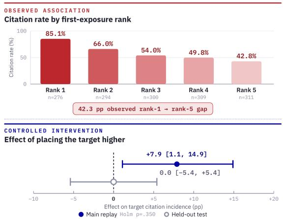
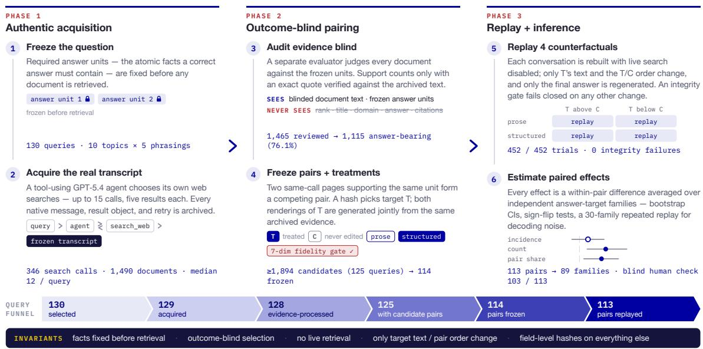
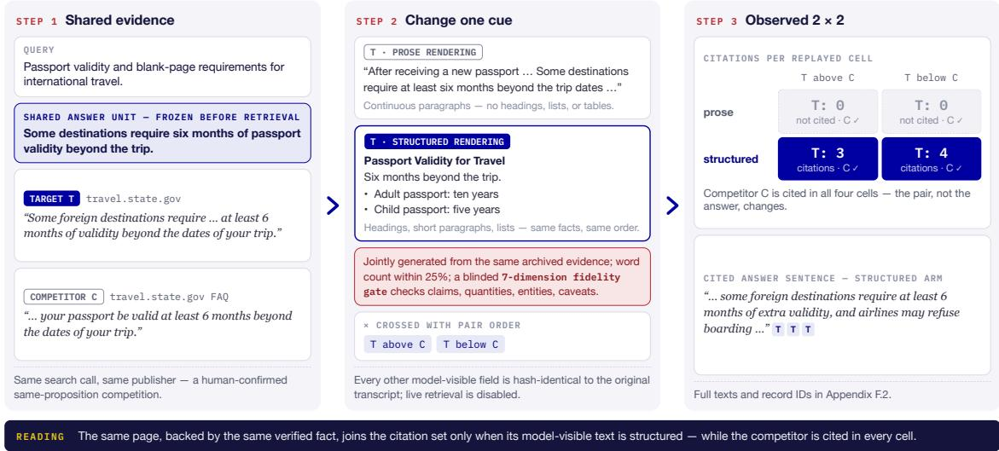
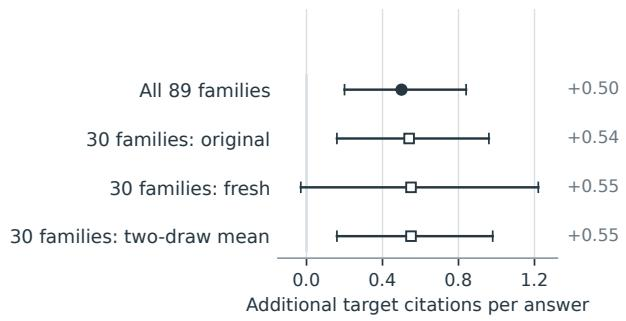
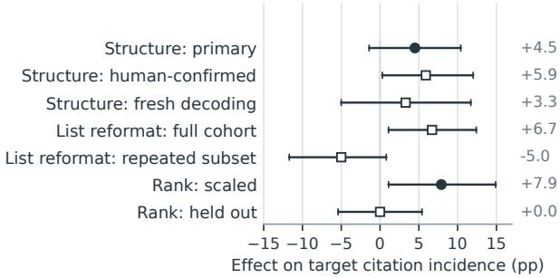

# CITECHOICE: A Causal Audit of How Document Presentation Redistributes Citation Credit in Agentic Search

Sriram Selvam selvamsriram@gmail.com

Anneswa Ghosh anneswaghosh@gmail.com

## Abstract

When several retrieved sources support the same claim, an answer engine cites some but not others. We call this decision citation allocation and introduce CITECHOICE, a causal audit of authentic multi-turn agentic search. From 129 everyday-query transcripts, CITECHOICE selects 113 same-call document pairs with in dependently verified support for the same prespecified fact, without observing ranks or answer outcomes; blinded human review con firms 103. It runs a hash-verified 2×2 re play crossing pair order with jointly generated, fidelity-checked structured and prose renderings of one target while the rest of the tran script remains fixed. Three results emerge. First, and most importantly, structured rendering concentrates citation credit rather than clearly increasing source admission. It raises target citation count by +0.50 citations per answer (95% CI [+0.20, +0.84]; Holm-adjusted p=.033), without increasing total citations or reducing competitor credit. The pre-specified incidence effect (whether the target is cited at all) is +4.5 pp and inconclusive (95% CI [−1.4, +10.4]; p=.168). Second, observational position differences exceed controlled reordering effects: the rank-1–rank-5 citation gap is 42.3 points, compared with +7.9 pp in the main replay and 0.0 pp held out. Third, ci tation evaluation has a measurable noise floor. Although the aggregate count effect repeats under fresh decoding of 30 frozen families, 15% of binary decisions change and decod ing accounts for an estimated 45% of single generation family-effect variance. Together, these findings isolate what survives control: presentation can causally redistribute visible citation credit within frozen transcripts. They do not establish reliable source admission, a pure formatting mechanism, or a general rank advantage.

## 1 Introduction

Answer engines increasingly stand between people and the web. Systems such as search-augmented chatbots retrieve documents, write an answer, and attach citations to the claims they make (Nakano et al., 2021; Lewis et al., 2020). Most evaluation asks whether those citations are correct: does the cited page support the sentence, and is every claim cited (Gao et al., 2023; Liu et al., 2023; Schreieder et al., 2026)? This paper asks a question that becomes visible only when several retrieved pages could support the same claim: how is the credit distributed, and who receives it?

We call this decision citation allocation. A citation is a unit of visibility in generative search, and publishers already optimize content for generative engines (Aggarwal et al., 2024). Determining which document properties causally move citations, and by how much, is therefore both a scientific question and an ecosystem question.

Figure 1: Observed rank gradient (top) and controlled pair-swap effects (bottom). These distinct populations and interventions do not form a causal decomposition (Section 6.3).

Position makes the problem vivid. Documents first exposed at rank 1 were cited 85.1% of the time, versus 42.8% at rank 5. But search engines place more relevant and higher-quality pages earlier, and the agent chose the queries that produced those rankings. When we move the same document relative to a matched competitor while holding the transcript fixed, the estimate shrinks to +7.9 pp in the scaled replay and exactly 0.0 pp in a heldout confirmation (Figure 1). The contrast is itself a finding: observational rank gradients can be several times larger than the allocation change supported by controlled reordering.

Realistic intervention requires preserving the agent’s own search process. CITECHOICE therefore combines authentic acquisition with counterfactual replay (Figure 2). A tool-using GPT-5.4 agent answers 130 human-style queries and issues its own web searches; every native message and result object is archived. We then reconstruct each frozen conversation, change exactly one declared cue, either the within-call order of two competing documents or the target’s rendering, and regenerate only the final answer. The transcript is otherwise byte-identical and hash-verified.

The intervention acts on the serialized source snapshot the answer model actually reads, downstream of retrieval and extraction. This is not an exotic cue class: among 1,750 archived result-text records, 93.2% contain markdown-style headings, 76.6% contain list-marker lines, and 21.3% contain table-like rows. Extraction and serialization therefore decide which document structure survives into model context; our results show that this boundary can have downstream consequences for citation credit. Visual layout, typography, DOM structure, and the live web remain untouched.

The unit of study is a competing pair: two documents returned in the same search call, each with independently verified evidence for the same required answer fact. Selection is outcome-blind: code and reviewers never see ranks, the baseline answer, or citation outcomes. The cohort is therefore not chosen for movable-looking citations. From at least 1,894 candidates we freeze one machinescreened pair per query for 114 queries; 113 enter a 2×2 replay crossing pairwise order with target rendering, for 452 trials over 89 independent answertarget families. A later blinded human adjudication confirms 103 of the 113 as strict same-proposition competitions; all headline estimates strengthen on that subset.

The paper contributes three affirmative findings and one reusable instrument:

1. Structured rendering concentrates citation credit. It raises target citation count by +0.50 without increasing total answer citations; the matched competitor is unchanged, and about half the gain attaches to shared evidence.

2. Controlled rank effects are sharply smaller than the observational gradient. The 42.3- point descriptive gap contracts to +7.9 pp in the scaled swap and 0.0 pp held out.

3. Citation evaluation carries a measurable noise budget. One in seven binary decisions flips across identical generations, and 45% of single-draw effect variance is decoding noise.

Beyond those estimates, CITECHOICE contributes a fully traced, outcome-blind, hash-verified protocol and analysis-reproducible artifact.

What remains open is equally specific. The prespecified incidence estimate is +4.5 pp but inconclusive; at the observed variance, 89 families provide roughly 80% power only for effects around 8.5 pp or larger. The word-preserving formatting ablation and the general rank mechanism are also unstable across repeatability or held-out checks. These are limits on mechanism claims, not negations of the supported concentration, deflation, and noise findings.

## 2 Setting and Terminology

The study rests on one construction. An answer unit is an atomic required fact, fixed before any document is inspected; a document is answerbearing for a unit only if an evaluator finds an exact supporting quote in its archived text. Two same-call documents both answer-bearing for the same unit form a competing pair: either could legitimately be cited, so whichever the engine credits is an allocation decision rather than a correctness decision. Table 1 defines the outcomes and grouping unit used throughout.

## 3 Related Work

Cited generation and its evaluation. WebGPT demonstrated browsing agents that answer with references (Nakano et al., 2021); retrieval-augmented generation made evidence conditioning standard (Lewis et al., 2020); ALCE formalized citationquality evaluation (Gao et al., 2023); audits of deployed engines found frequent unsupported citations (Liu et al., 2023); a recent survey consolidates the space (Schreieder et al., 2026); and correctness is not faithfulness: a marker can be attached with-fiout causal reliance on the source (Wallat et al., 2024). All of this treats citation as verification. We hold verification fixed by construction and study allocation: visible credit, not reliance.

  
Figure 2: The CITECHOICE protocol from authentic acquisition to paired inference. Answer units are fixed before search; evidence review and cohort construction are outcome-blind; the replay crosses matched target rendering with pair order while hash-checking every other model-visible field. Appendix E follows one real query end to end.

<table><tr><td>Term</td><td>Meaning</td></tr><tr><td>answer unit</td><td>atomic required fact, frozen before doc- ument review</td></tr><tr><td>competing pair</td><td>two same-call documents sharing veri- fied support for a unit</td></tr><tr><td>target / competitor</td><td>hash-chosen pair member that receives treatments / the never-edited member</td></tr><tr><td>citation incidence</td><td>target cited at least once in the answer (source admission; Y ∈{0, 1})</td></tr><tr><td>citation count</td><td>number of valid citation markers as- signed to the target</td></tr><tr><td>pair citation share</td><td>target markers divided by target-plus- competitor markers when the pair is</td></tr><tr><td>answer-target fam- ily</td><td>cited queries built on the same underlying fact; the independent clustering unit</td></tr></table>

Table 1: Terms used throughout. After this definition, “incidence” means cited at least once and “count” means the number of target markers. “pp” denotes percentage points.

Position and context use. Long-context models use evidence unevenly by position (Liu et al., 2024) and are distracted by irrelevant context (Shi et al., 2023), yet in realistic RAG mixtures positional effects are smaller than synthetic benchmarks suggest (Cuconasu et al., 2025; Hagström et al., 2025); we extend this “smaller than it looks” pattern from accuracy to citation allocation. Adversarial work manipulates conversational-search rankings through page content (Pfrommer et al., 2024); we measure the benign counterpart.

Evidence presentation and provenance. Under conflicting evidence, models are swayed by relevance and style (Wan et al., 2024), metadata and appearance (Chiang and Lee, 2024), authorship labels (Abolghasemi et al., 2025), and source type (Schuster et al., 2026). Our setting differs in regime and outcome: the paired documents agree, and what moves is the inline citation. GEO (Aggarwal et al., 2024) showed that content edits can raise generative-engine visibility. FeatGEO optimizes interpretable structural, content, and linguistic features across engines (Liu and Xu, 2026); related systems engineer structural features or diagnose and repair page-level citation failures (Yu et al., fi2026; Tian et al., 2026). These are optimization studies over constructed or live pages, typically measuring aggregate visibility. CITECHOICE instead treats presentation as an audit variable: it freezes the retrieval interface and estimates within-ffpair allocation between verified competitors with declared uncertainty.

Closest to our question, Vishwakarma et al. (2026) study which of two competing sources an answer engine cites first, via large factorial sweeps over constructed two-document RAG contexts across six models; they find position and relevance dominate while formatting-only changes matter little. CITECHOICE differs in substrate and outcome: our competitions arise naturally inside frozen multi-turn agentic transcripts with real page snapshots, pairs are selected outcome-blind on verified shared evidence, and we measure incidence, count, and share rather than first-citation preference. The difference is informative: formatting moved little in their synthetic two-source setting but moves citation count here, so presentation effects appear to depend on context realism, competition density, and outcome definition. Contemporaneous observational work likewise associates structure with citation influence (Zhang et al., 2026); we provide a causal audit of the allocation side without claiming that visible citations reveal internal evidence reliance.

What is new. CITECHOICE is, to our knowledge, the first to combine authentic multi-turn agentic acquisition, outcome-blind construction of naturally occurring shared-evidence competitions, and hashverified counterfactual replay with paired, clustered inference over citation allocation.

## 4 The CITECHOICE Protocol

## 4.1 Authentic acquisition

The acquisition frame is a balanced sample of 130 queries from a manually revised 500-query set: 13 from each of ten everyday topics and 26 from each of five phrasings, from neutral fact bundles to terse search-style input (Appendix A), reflecting what people type into answer engines rather than benchmark trivia.

The GPT-5.4 agent must search before answering. Within five model turns it may issue up to three parallel search\_web calls per turn (15 total), inspect results, and search again. Each call returns five Exa results as native tool messages with up to 10,000 characters of page text plus metadata. The agent cites opaque [[cite:SOURCE]] handles (contract verbatim as prompt D.1). It completed 129 of 130 queries and issued 346 completed search calls over 1,490 unique documents (median 12 per query).1 Answers carry a median of 29 citation markers over six distinct documents. The funnel is 130 selected queries → 129 acquired → 128 evidence-processed → 125 with candidate pairs → 114 frozen pairs → 113 replayed pairs. Every prompt, native request and response, retry, latency, and token count is archived (Appendix A).

## 4.2 From documents to competing pairs

A separate Grok evaluator judges each of 1,465 reviewed documents against its query’s frozen answer units, seeing only blinded document text. The evaluator sees no titles, domains, ranks, answers, or citations. Support counts only with an exact quote verified against the archived text; absent or paraphrased quotes are downgraded (prompt D.3). This yields 1,115 answer-bearing documents (76.1%).

Two documents form a candidate competing pair if they appear in the same search call, share at least one supported unit, do not materially contradict it, and are not duplicates or syndicated copies. The acquisition yields at least 1,894 unique candidate pairs across 125 queries (a 30-pair-per-query extraction cap saturated for 13 queries). The abundance matters: it lets us apply strict causal screening without selecting on baseline citation behavior.

## 4.3 The outcome-blind cohort

Automated screening then requires a unique within-call occurrence, complete metadata, rewritesuitable text, comparable answer-unit coverage, and a bounded length ratio (all eight criteria and the deterministic one-pair-per-query rule in Appendix B). We froze one machine-screened pair per query for 114 queries; a blinded reviewer audited all 117 proposed candidates, establishing nonduplication and eligibility for 114. Reviewers and selection code never observed ranks, baseline answers, or citations, so the estimand covers eligible, machine-screened pairs, rather than pairs picked because a baseline citation looked movable. A blinded human adjudication later confirmed 103 of the 113 analyzed pairs (91.2%) as strict sameproposition competitions; the ten invalid conflate topical relatedness with shared support, and excluding them strengthens every headline estimate (Appendix B). One pair member becomes the target by an outcome-blind hash; its competitor is never edited.

## 4.4 Matched text treatments

The structure intervention asks: holding the fact inventory fixed, does organization win citations?

For each target we jointly generate two renderings from the same archived evidence (Figure 3): polished prose (continuous paragraphs; no headings, lists, or tables) and polished structured text (headings, short paragraphs, lists or a table). Both must preserve claims, quantities, entities, caveats, attribution, and answer-unit coverage, and stay within 25% in word count. Deterministic validators enforce length and markup rules, and a separate blinded Grok pass must pass seven fidelity dimensions (prompts D.4–D.5). Because both arms are rewrites, the contrast controls for editorial polish. However, the arms are not token-identical (Jaccard .80; 36% of structured sentences verbatim in prose), so the estimand is strictly jointly generated structured versus prose rendering, a rewrite package including wording changes. To isolate organization itself, we add a mechanical reformat ablation: the prose arm’s exact word sequence deterministically re-laid-out as one sentence per list row (no model involved, fidelity guaranteed by construction), replayed over all 113 pairs (Section 6.4).

Treatment generation succeeded for 113 of 114 targets; the single failure (a page that repeatedly triggered a provider content filter) was excluded before any scaled outcome existed. A deterministic, topic-stratified, AI-assisted spot audit reviewed 23 of the 113 accepted treatments and flagged no fidelity violations; it was not an independent human annotation, and per-item records are archived in the artifact. Structured variants average only 1.5 words fewer than prose.

## 4.5 Frozen counterfactual replay

Replay reconstructs the complete provider-native conversation, including the query, tool calls, tool results, and accumulated result objects, with live search disabled and deterministic opaque handles replacing ordinal source IDs. The rank intervention exchanges the two pair members’ positions inside their original call, reaching the model purely as array position, with no numeric rank or score; the text intervention swaps in one rendering of the target. Before any model call, an integrity gate diffs the manipulated transcript against baseline and fails closed if any undeclared field changed. All 452 trials passed; each archives pre- and post-intervention hashes. Appendix L lists every model-visible field.

GPT-5.4 (the acquisition model) generates all primary outcomes: 452 of 452 planned trials completed with no repair, no live search, and no missing cell (31 transient transport failures across 25 pairs were retried under unchanged trial definitions).

## 5 Estimands and Inference

Each pair contributes four trials, one per cell of the $2 \times 2$ , so every effect below is a difference taken inside a single pair. For pair i, text arm $c \in \{ P , S \}$ (prose, structured), and assigned rank $r \in \{ H , L \}$ (target higher, lower), let $Y _ { i c r } = 1$ if the target is cited at least once. The pair-level structure effect averages over rank, $\begin{array} { r } { \Delta _ { i } ^ { \mathrm { s t r u c t } } = \frac { 1 } { 2 } ( Y _ { i S H } + Y _ { i S L } ) } \end{array}$ $\frac { 1 } { 2 } ( Y _ { i P H } + Y _ { i P L } )$ ; the rank effect averages over text arms analogously, and the interaction is the difference between the rank effects under structured and prose text.

Estimand. Answer generation is stochastic and the primary design draws one generation per cell: our estimand is the expected effect over decoding randomness, conditional on the frozen transcripts, cohort, and answer-engine configuration. It is not a claim about other retrievals or queries. Because the whole answer is regenerated under each treatment, every effect is an end-to-end source-visibility effect: uptake, phrasing, and sentence boundaries can move along with source choice; the channels are separated only post hoc (Section 6.1). Generation noise is absorbed into the family-level variance the resampling estimates (valid, conservative in power; Appendix I decomposes the noise share).

Some queries were built around the same underlying fact, so their pairs are not independent: we average pair effects within each answer-target family and define all estimands over the 89 independent families behind the 113 pairs, reporting pair-level results as sensitivity analyses. Confidence intervals use a 20,000-replicate family bootstrap; two-sided p-values use a sign-flip permutation test on nonzero family effects (exact up to 20 discordant families, 200,000 seeded flips beyond). The single primary hypothesis, declared before scaled outcomes existed, is the structure incidence effect at $\alpha = . 0 5$ . Sixteen declared secondary tests form one Holm-corrected family; everything else is labeled exploratory, supplementary, or post hoc. Bootstrap intervals and sign-flip pvalues are distinct procedures and need not agree near the boundary; an interval can exclude zero while $p { > } . 0 5$ . Appendix G states the estimators in full.

  
Figure 3: A real, human-confirmed same-publisher pair. Both pages carry near-paraphrase support for the six-month passport-validity rule. Only the target rendering and pair order change; every other field is hash-identical. The target receives 0 citations under prose and 3/4 under structured rendering, while the competitor is cited in all four cells. Full texts and IDs appear in Appendix F.2.

## 6 Results

The results follow the three claims from the introduction: credit concentration, rank deflation, and the evaluation noise budget. Mechanism and crossmodel checks then mark the boundaries. Table 2 reports the core estimands; Figure 4 separates the supported count result from incidence and mechanism diagnostics.

## 6.1 Structured rendering concentrates citation credit

Structured rendering changes the amount of credit assigned to the target more clearly than it changes whether the target enters the citation set. Raw triallevel means are 2.69 target markers per answer under prose and 3.12 under structured rendering, a 16% increase. The family-weighted causal estimand is +0.50 citations (95% CI [+0.20, +0.84]; raw p=.0022, Holm p=.033), one of two secondary tests surviving correction. Distinct answer sentences citing the target rise by the same +0.50, so the result is not repeated markers on one sentence.

The answer-wide citation budget does not expand: structured answers contain 0.49 fewer total markers, 0.05 fewer unique cited sources, and 42 fewer characters on average, none reliably nonzero. The matched competitor changes by only −0.02 markers ([−0.28, +0.24]). Among the subset with pair citations in both rank cells, the higher-ranked target’s within-pair share rises by +10.5 pp under structured rendering (Holm p=.0018), although that 72-family population is selected on realized citations and is therefore descriptive. The count estimand is cleaner.

The pre-specified incidence effect is positive but unresolved: +4.5 pp (95% CI [−1.4, +10.4]; p=.168), with 18 families favoring structured rendering, 10 favoring prose, and 61 unchanged. At the observed variance, the 89-family design has roughly 80% power only for incidence effects around 8.5 pp or larger. The human-confirmed 103-pair subset is +5.9 pp (p=.066), and recorddisjoint, cross-model, and fresh-decoding checks are all directionally positive (Appendix H); none converts the primary estimate into a confirmed admission effect.

The supported count magnitude is repeatable at the aggregate level. On 30 hash-chosen frozen families it is +0.54 in the first generation, +0.55 in a fresh one, and +0.55 after averaging both (p=.013). This is independent decoding of the same transcripts, not an independent-dataset replication.

## 6.2 Where the extra credit comes from

The added credit attaches in substantial part to evidence already in competition rather than to new answer content. A post-hoc blinded LLM audit aligns all 1,313 target markers to the pair’s verified shared units: 48.6% attach to shared evidence,

A. Target citation-count effects
<table><tr><td>Estimand</td><td>Evidence role</td><td>N</td><td>Effect (95% CI)</td><td>Test</td></tr><tr><td>Target citation count: structured vs. prose</td><td>secondary</td><td>89/113</td><td> $+ 0 . 5 0 \ [ + 0 . 2 0 , + 0 . 8 4 ]$ </td><td>Holm p=.033</td></tr><tr><td>Target incidence: structured vs. prose</td><td>primary</td><td>89/113</td><td> $+ 4 . 5 p p \left[ - 1 . 4 , + 1 0 . 4 \right]$ </td><td>p=.168</td></tr><tr><td>Human-confirmed pairs only</td><td>validated sensitivity</td><td>81/103</td><td> $+ 5 . 9 p p \ [ + 0 . 3 , + 1 2 . 0 ]$ </td><td>p=.066</td></tr><tr><td>Shared-evidence target citations: struc- post-hoc LLM audit tured vs. prose</td><td></td><td>89/113</td><td> $+ 0 . 2 5 \mathrm { m a r k e r s }$ </td><td>p=.023</td></tr><tr><td>Target incidence: higher vs. lower rank, secondary</td><td></td><td>89/113</td><td> $+ 7 . 9 p p \left[ + 1 . 1 , + 1 4 . 9 \right]$ </td><td>Holm</td></tr><tr><td>scaled Target incidence: higher vs. lower rank, confirmation held out</td><td></td><td>56/56</td><td> $0 . 0 p p [ - 5 . 4 , + 5 . 4 ]$ </td><td>p=.350 p=1.00</td></tr></table>

Table 2: Core estimates. N reports answer-target families/pairs. The family-weighted citation-count effect is the clean allocation result that survives multiplicity correction. Incidence remains uncertain; the rank estimate is much smaller than the observed gradient and fails held-out confirmation.

B. Incidence and mechanism checks  
  
Figure 4: Effect sizes with family-bootstrap 95% intervals. Panel A shows the multiplicity-controlled count effect and its near-identical magnitude under fresh decoding of the same 30 frozen families. Panel B scopes what is not established: the pre-specified incidence interval crosses zero, the word-preserving estimate reverses in the repeated subset, and the scaled rank estimate becomes zero held out.

50.7% to target-specific or other content, and 0.7% are unclear. Structured rendering adds +0.25 shared-evidence markers $\left(  p \mathrm { = } . 0 2 3 \right)$ , which is half the total count effect, and raises the probability of any shared-evidence citation by $+ 8 . 7 p p ( p { = } . 0 0 0 5 $ both uncorrected and post hoc). A second blinded LLM audit finds shared-unit expression nearly unchanged $( + 0 . 8 p p , 9 5 \% \mathrm { ~ C I ~ } [ - 1 . 7 , + 3 . 2 ] )$ while target credit rises +3.6 pp (p=.042), with no competitor loss. Point estimates instead place the offset among other sources (−0.97 markers, [−1.98, +0.01], p=.058). Thus the answer-level pattern is concentration: the target receives more credit for evidence the answer already expresses, while the matched rival remains present. Figure 3 shows this behavior in a human-confirmed samepublisher pair; the audits remain post hoc and do not identify internal evidence reliance.

## 6.3 Rank: the observed gradient overstates the controlled effect

The observational rank association is much larger than the effect supported by controlled reordering. First-exposure citation incidence falls 42.3 points from rank 1 to rank 5. In the matched replay, placing the target above its competitor changes incidence by +7.9 pp (95% CI [+1.1, +14.9]; raw $p { = } . 0 3 5$ , Holm $ { p }  { = } . 3 5 0 )$ ; in 56 held-out pairs swapped in isolation, the estimate is exactly 0.0 pp $( [ - 5 . 4 , + 5 . 4 ] )$ . The quantities differ in population, text regime, and channel, so Figure 1 is not a causal decomposition. It is a deflationary result: the descriptive gradient is five times the scaled point estimate and has no counterpart in held-out confirmation.

The scaled estimate is heterogeneous by displacement: exploratory values are −3.3 pp at one slot, +13.4 and +13.0 pp at two and three, and $+ 3 0 . 0 p p$ for ten full-window swaps. Different pairs occupy each stratum, so this is compositional rather than an identified dose-response. The heldout pairs cover comparable one-to-four-slot swaps and remain near zero in every stratum, including nine full-window cases (Appendix J).

Replay payloads contain no provider score or numeric rank field; order reaches the model only through array position. The evidence therefore supports a narrow conclusion: message position can move attribution in some frozen transcripts, especially in wider swaps, but average rank effects inferred from observational gradients are not reliable. This extends the realistic-RAG “smaller than it looks” pattern from answer quality to citation allocation (Cuconasu et al., 2025; Hagström et al., 2025).

## 6.4 Mechanism checks rule out simple stories

Neither list markers nor array position provides a stable one-variable mechanism. The post-hoc word-preserving ablation compares prose with the exact same word sequence laid out one sentence per list row. Over all 113 pairs it raises incidence by $+ 6 . 7 p p$ (95% CI [+1.1, +12.4]; p=.028), but on the 30 repeatability families it is −1.7 pp initially and $- 8 . 3 p p$ fresh (−5.0 pp averaged, $\it { p } \mathrm { = } . 2 2 )$ . The full-cohort result suggests serialization can matter; the reversal precludes a stable list-marker mechanism.

Likewise, the rank-by-structure interaction is $- 4 . 5 p p \ ( p { = } . 4 1 8 )$ , and the held-out average rank effect is zero. These boundaries rule out a simple optimization recipe in which adding lists or moving one source upward reliably wins citations across transcripts. The supported claim is broader and end to end: model-visible presentation redistributes credit, while the operative pathway remains transcript-dependent.

## 6.5 Citation evaluation has a noise budget

A single generated answer is a noisy measurement of citation allocation. In 120 independently regenerated cells, binary target citation agrees 85.0% of the time, meaning one in seven decisions flips. Exact cited-pair sets agree 78.3%, and exact target counts only 61.7%. Exact family effects agree for 17 of 30 families even though the aggregate count magnitude repeats.

A method-of-moments decomposition attributes 45% of single-draw family-effect variance to decoding noise, with the rest reflecting between-family heterogeneity (Appendix I). Repeating k generations per cell would shrink that noise component by approximately $1 / k .$ . Citation studies that report one generation per condition therefore inherit a quantifiable noise floor rather than merely unspecified stochasticity.

## 6.6 Across waves and models

The earlier 100-query wave is record-disjoint but not fully independent: 49 answer-target families recur under different queries. Its aggregate direction is positive, but recurring-family effects correlate negatively $( r = - ~ . 4 4 5 ;$ only four are nonzero in both waves), indicating transcript-specific effects.

Grok 4.3 replay of the same trajectories is directionally positive after repair (+5.6 pp), yet only 44.7% of initial responses satisfy the citation contract; the one-shot estimate is $+ 0 . 9 p p ,$ GPT–Grok agreement is 69.9%, and worst-case completion of five missing cells bounds the repaired effect at +2.7 to +7.1 pp (Appendix K). This supports direction in one additional model configuration, not model-independent magnitude.

## 7 Discussion

For citation evaluators. Single answers are noisy: 15% of binary cells flip under identical regeneration, and decoding contributes 45% of single-draw effect variance. Evaluations should repeat cells and report agreement, between-generation variance, and aggregate versus per-example stability.

For auditors and publishers. Presentation can move visible credit among evidence-matched sources, but the supported effect is concentration, not admission: the competitor is unchanged, and no stable list-marker or rank recipe emerges. This is an attribution-sensitivity warning, not an optimization tactic.

For Document AI pipelines. Extraction preserves headings, lists, and table-like rows in model-visible text; serializers and extractors are therefore part of the attribution pipeline and should be versioned and audited. The outcome is visible credit, not causal evidence reliance (Wallat et al., 2024).

## 8 Conclusion

CITECHOICE causally audits citation allocation through frozen transcripts, outcome-blind sharedevidence competitions, and hash-verified replay. Structured rendering concentrates credit without expanding the citation budget; observational rank gradients exceed controlled effects; and singlegeneration evaluation is noisy. Source admission, pure serialization, and a general rank mechanism remain open; confirmation should make count and incidence co-primary, repeat cells, harmonize the citation contract, and vary fresh trajectories, retrievers, and models. Presentation shapes attribution.

## Limitations

External validity. All estimates are conditional on one retrieval provider (Exa, five results per call, bounded text), one acquisition agent and primary answer deployment (GPT-5.4), and the authentic transcripts it produced. Frozen replay cannot measure whether a publisher-side edit changes retrieval, subsequent search turns, or live-web ranking. The Grok check reuses GPT-acquired trajectories and requires protocol repair for most responses. Closed deployments can drift despite archived identifiers and parameters.

Power and multiplicity. The main analysis contains 89 independent answer-target families and only 28 discordant families on the primary incidence outcome. Under the observed variance, the approximate 80% minimum detectable incidence effect is 8.5 pp; the +4.5 pp estimate is therefore unresolved rather than evidence of zero. The citation-count result survives correction but is one member of a declared 16-test secondary family.

Construct and treatment. The primary contrast is jointly generated structured versus prose rendering, a rewrite package with lexical differences. No cell in the scaled 2×2 uses the untouched original target text; both arms also compress the archived target symmetrically. The mechanical ablation isolates only one serialization form (sentence-per-listrow), not headed sections, tables, visual layout, DOM structure, or publisher-side pages. The strict citation contract (median 29 markers per answer) may not transfer to systems with sparse citations, and the outcome measures visible credit rather than reader traffic or causal evidence reliance.

Mechanism and post-hoc analysis. The wordpreserving estimate is positive in the full cohort but negative in the repeated subset; displacement strata are exploratory and compositional; and the shared-unit alignment and unit-expression analyses are post hoc and LLM-scored. Because the whole answer is regenerated, estimated effects can combine changes in evidence uptake, wording, sentence boundaries, and source attachment.

LLMs in the measurement loop. Grok-4.3 generates the treatment renderings and, in a separate blinded pass, also performs their fidelity gate; this is procedural separation, not an independent model family. The 23-item treatment spot audit was AI-assisted, not independent human annotation. Shared-evidence eligibility was produced by an LLM with exact-quote checks and then adjudicated by a blinded human for every analyzed pair (103/113 confirmed); the ten invalid pairs show that semantic relatedness can be mistaken for same-proposition support, although excluding them strengthens the headline estimates. Treatment fidelity, outcome scoring, citation alignment, and unit-expression judgments retain model-dependent error.

Data and reproducibility. We archive searchreturned snapshots rather than complete webpages. Licensed third-party text and raw provider traces cannot be redistributed automatically, so the artifact cannot provide a fully self-contained copy of every source snapshot. For reproducibility and independent audit, the public artifact at https://github.com/selvamsriram/ CiteChoice releases the code, prompts, complete end-to-end pipeline, hashes, derived records, and no-network analysis regeneration.

## Ethical Considerations

The study uses synthetic, manually revised queries and public web-search responses; no private user data or human participants are involved. Manipulations occur offline in replay and never modify webpages or search indexes. Because the findings could encourage publishers to optimize presentation for citations without improving evidence quality, we report effect sizes with their uncertainty and frame them as audit diagnostics, not optimization guidance. Third-party page text and provider traces require licensing review before redistribution; derived tables, code, prompts, and hashes can be shared.

AI assistance was used to generate the query sets and implement the pipeline. After the author prepared the first manuscript draft, AI assistance was used to improve sentence-level fluency and clarity. The author reviewed the resulting edits and takes responsibility for the final text.

## References

Amin Abolghasemi, Leif Azzopardi, Seyyed Hadi Hashemi, Maarten de Rijke, and Suzan Verberne. 2025. Evaluation of attribution bias in generatoraware retrieval-augmented large language models. In Findings of the Association for Computational Linguistics: ACL 2025, pages 21105–21124. Association for Computational Linguistics.

Pranjal Aggarwal, Vishvak Murahari, Tanmay Rajpurohit, Ashwin Kalyan, Karthik Narasimhan, and Ameet Deshpande. 2024. GEO: Generative engine optimization. In Proceedings ofthe 30th ACM SIGKDD Conference on Knowledge Discovery and Data Mining.

Cheng-Han Chiang and Hung-yi Lee. 2024. Do metadata and appearance of the retrieved webpages affect LLM’s reasoning in retrieval-augmented generation? In Proceedings of the 7th BlackboxNLP Workshop: Analyzing and Interpreting Neural Networksfor NLP, pages 389–406. Association for Computational Linguistics.

Florin Cuconasu, Simone Filice, Guy Horowitz, Yoelle Maarek, and Fabrizio Silvestri. 2025. Do RAG systems really suffer from positional bias? In Proceedings ofthe 2025 Conference on Empirical Methods in Natural Language Processing, pages 28022–28036. Association for Computational Linguistics.

Tianyu Gao, Howard Yen, Jiatong Yu, and Danqi Chen. 2023. Enabling large language models to generate text with citations. In Proceedings of the 2023 Conference on Empirical Methods in Natural Language Processing, pages 6465–6488. Association for Computational Linguistics.

Lovisa Hagström, Sara Vera Marjanovic, Haeun Yu, Arnav Arora, Christina Lioma, Maria Maistro, Pepa Atanasova, and Isabelle Augenstein. 2025. A reality check on context utilisation for retrieval-augmented generation. In Proceedings of the 63rd Annual Meeting ofthe Associationfor Computational Linguistics (Volume 1: Long Papers). Association for Computational Linguistics.

Patrick Lewis, Ethan Perez, Aleksandra Piktus, Fabio Petroni, Vladimir Karpukhin, Naman Goyal, Heinrich Küttler, Mike Lewis, Wen-tau Yih, Tim Rocktäschel, Sebastian Riedel, and Douwe Kiela. 2020. Retrieval-augmented generation for knowledgeintensive NLP tasks. In Advances in Neural Information Processing Systems 33.

Nelson F. Liu, Kevin Lin, John Hewitt, Ashwin Paranjape, Michele Bevilacqua, Fabio Petroni, and Percy Liang. 2024. Lost in the middle: How language models use long contexts. Transactions ofthe Association for Computational Linguistics, 12:157–173.

Nelson F. Liu, Tianyi Zhang, and Percy Liang. 2023. Evaluating verifiability in generative search engines. In Findings of the Association for Computational Linguistics: EMNLP 2023, pages 7001–7025. Association for Computational Linguistics.

Zikang Liu and Peilan Xu. 2026. Think before writing: Feature-level multi-objective optimization for generative citation visibility. In Proceedings of the 64th Annual Meeting ofthe Associationfor Computational Linguistics (Volume 1: Long Papers), pages 20290– 20303. Association for Computational Linguistics.

Reiichiro Nakano, Jacob Hilton, Suchir Balaji, Jeff Wu, Long Ouyang, Christina Kim, Christopher

Hesse, Shantanu Jain, Vineet Kosaraju, William Saunders, Xu Jiang, Karl Cobbe, Tyna Eloundou, Gretchen Krueger, Kevin Button, Matthew Knight, Benjamin Chess, and John Schulman. 2021. WebGPT: Browser-assisted question-answering with human feedback. arXiv preprint arXiv:2112.09332.

Samuel Pfrommer, Yatong Bai, Tanmay Gautam, and Somayeh Sojoudi. 2024. Ranking manipulation for conversational search engines. In Proceedings ofthe 2024 Conference on Empirical Methods in Natural Language Processing. Association for Computational Linguistics.

Tobias Schreieder, Tim Schopf, and Michael Färber. 2026. Attribution, citation, and quotation: A survey of evidence-based text generation with large language models. In Proceedings ofthe 64th Annual Meeting ofthe Associationfor Computational Linguistics (Volume 1: Long Papers). Association for Computational Linguistics.

Jakob Schuster, Vagrant Gautam, and Katja Markert. 2026. Whose facts win? LLM source preferences under knowledge conflicts. In Proceedings of the 64th Annual Meeting of the Association for Computational Linguistics (Volume 1: Long Papers). Association for Computational Linguistics.

Freda Shi, Xinyun Chen, Kanishka Misra, Nathan Scales, David Dohan, Ed H. Chi, Nathanael Schärli, and Denny Zhou. 2023. Large language models can be easily distracted by irrelevant context. In Proceedings of the 40th International Conference on Machine Learning. PMLR.

Zhihua Tian, Yuhan Chen, Yao Tang, Jian Liu, and Ruoxi Jia. 2026. Diagnosing and repairing citation failures in generative engine optimization. arXiv preprint arXiv:2603.09296.

Rahul Vishwakarma, Shushant Kumar, and Ratnesh Jamidar. 2026. What gets cited: Competitive GEO in AI answer engines. In Proceedings of the 49th International ACM SIGIR Conference on Research and Development in Information Retrieval.

Jonas Wallat, Maria Heuss, Maarten de Rijke, and Avishek Anand. 2024. Correctness is not faithfulness in RAG attributions. arXiv preprint arXiv:2412.18004.

Alexander Wan, Eric Wallace, and Dan Klein. 2024. What evidence do language models find convincing? In Proceedings of the 62nd Annual Meeting of the Association for Computational Linguistics (Volume 1: Long Papers), pages 7468–7484. Association for Computational Linguistics.

Junwei Yu, Mufeng Yang, Yepeng Ding, and Hiroyuki Sato. 2026. Structural feature engineering for generative engine optimization: How content structure shapes citation behavior. arXiv preprint arXiv:2603.29979.

Kai Zhang, Xinyue He, and Jingang Yao. 2026. From citation selection to citation absorption: A measurement framework for generative engine optimization across AI search platforms. arXiv preprint arXiv:2604.25707.

## Appendix Roadmap

The appendices are grouped into five parts. Parts I– II document how the data and interventions were made, including the verbatim instruments; Part III walks a single query end to end and then illustrates each headline claim with a real archived case; Parts IV–V give the statistical and reproducibility record.

## Part I The Data Pipeline

## A Query Set and Acquisition

The acquisition frame samples 130 records from a manually revised 500-query set, balanced 13 per topic across ten everyday domains and 26 per phrasing family across five ordinary ways of asking (neutral fact bundles, first-person scenarios, primary-source requests, plain-English questions, terse search-style input). Table 4 gives the resulting funnel.

First-exposure citation rates underlying Figure 1: 85.1% (rank 1, n=276 documents), 66.0% (294), 54.0% (300), 49.8% (309), 42.8% (311). These are descriptive; rank is confounded with relevance, quality, and the agent’s query choices.

## B Evidence Audit and Pair Construction

Answer-unit construction. Each record of the manually revised query set carries two humanauthored fields: required\_answer\_units (a short list of the facts an acceptable answer must cover) and an anchor\_fact\_bundle summarizing the factual core. Before any document is retrieved, a Grok-4.3 pass converts these fields into two to eight atomic propositions per record (median five over the 130 records), under instructions that forbid adding facts, thresholds, entities, or recommendations not already expressed in the supplied fields; broad categories become support criteria rather than invented specifics. The resulting units are frozen to an append-only table whose SHA-256 enters the run manifest, so units cannot drift after documents are seen. The units are therefore humansourced in content and model-normalized in form; the human audit packet (Appendix M) covers the downstream support labels built on them.

Evidence audit. A blinded evaluator (prompt D.3) judges every model-visible document text against its query’s frozen units and must return a verbatim quote, verified by exact string match against the archived text; absent or merely paraphrased quotes are conservatively downgraded to unclear and cannot make a pair eligible.

A candidate pair must satisfy all of: (i) both documents in the same model-issued search call; (ii) verified answer-bearing support for a shared unit in both; (iii) no material contradiction of that unit; (iv) no duplicate or syndicated content; (v) metadata complete enough for integrity diffs; (vi) answer-unit coverage differing by at most two units; (vii) returned-text length ratio at least 0.25; (viii) text suitable for a faithful prose/structure contrast.

One pair per query. When several candidate pairs survive screening for a query, the frozen pair is the one maximizing a deterministic priority score (5×shared-unit count + 3×content-length ratio − supported-unit-count difference), with ties broken by pair ID; selection is topic-balanced under a pertopic cap, and manually rejected pairs are replaced by the next-best candidate for the same query. The treatment target within each pair is fixed by an outcome-blind hash of the seed, pair ID, and sorted source IDs.

Human validation of shared-evidence labels. A human author adjudicated, blind to document identities, ranks, and outcomes, one hashchosen decisive shared unit for every analyzed pair (113 items, both documents’ verified quotes) plus a 14-item borderline supplement drawn from the machine evaluator’s own hard cases (partialcompleteness, indirect, or low-confidence labels). Of 254 document-level judgements, 94.9% were supports or partial; at the pair level, 103 of 113 pairs (91.2%) were confirmed as genuine shared-evidence competitions and ten were invalidated, typically because the two quotes were topically related without asserting the same proposition. Invalid pairs were distributed proportionally across effect strata (7 of 83 no-change pairs, 3 of 30 discordant pairs). Excluding them strengthens every headline estimate: structure incidence +5.9 pp (bootstrap 95% CI [+0.3, +12.0]; signflip p=.066; 81 families), structure citation count +0.51 ([+0.17, +0.88]; p=.005), and rank incidence +9.6 pp ([+2.8, +16.7]; p=.011). These audit-restricted estimates are sensitivity analyses;

<table><tr><td>Part</td><td></td><td>App.</td><td>Contents</td></tr><tr><td></td><td>I. The data pipeline</td><td>A-C</td><td>query set and acquisition; blinded evidence audit and pair construction; treat- ment generation and integrity gates</td></tr><tr><td></td><td>II. Instruments</td><td>D</td><td>all eight prompts verbatim, with archived hashes</td></tr><tr><td></td><td>III. Worked examples</td><td>E-F</td><td>one query traced end to end; then one real archived case per headline claim</td></tr><tr><td></td><td>IV. Statistical detail</td><td>G-K</td><td>estimators and inference; multiplicity; repeatability and generation noise; rank geometry; cross-model replication and missingness</td></tr><tr><td></td><td>V. Provenance</td><td>L-M</td><td>models, decoding, model-visible interface; archives, artifact, protocol amend- ments</td></tr></table>

Table 3: Appendix roadmap. Every claim in the body carries a breadcrumb to the appendix that documents it.

<table><tr><td>Quantity</td><td>Value</td></tr><tr><td>Queries selected / acquired / evidence- processed</td><td>130 / 129 / 128</td></tr><tr><td>Topics × phrasing forms</td><td>10 × 5</td></tr><tr><td>Final search calls / transport attempts</td><td>346 / 350</td></tr><tr><td>Unique documents / evidence-reviewed</td><td>1,490 / 1,465</td></tr><tr><td>Answer-bearing documents</td><td>1,115 (76.1%)</td></tr><tr><td>Candidate competing pairs (queries)</td><td>≥1,894 (125)</td></tr><tr><td>Frozen cohort / replayed pairs Answer-target families</td><td>114 /113</td></tr><tr><td>GPT replay cells (planned / complete)</td><td>89 452 / 452</td></tr></table>

Table 4: Data funnel for the scaled wave. One query failed acquisition and one acquired record failed evidence processing, both before pair selection. The candidate-pair count is a lower bound because extraction caps pairs at 30 per query (13 queries saturated the cap). Of the 114 frozen pairs (nine to 13 per topic), the one treatment-infeasible pair leaves the replayed cohort with eight pairs in its topic (legal/civic) and nine to 13 elsewhere.

the declared primary results in Section 6 are unchanged. Adjudications, the audit interface, and per-item decisions ship in the artifact.

## C Treatment Generation and Integrity

Both renderings are generated in a single call from the same frozen source text (prompt D.4), so neither arm can be tuned against the other. The generator is the Grok-4.3 deployment (temperature 0, 20,000-token output cap, one protocol retry), with a GPT-5.4 fallback after repeated protocol failures. Exactly one accepted treatment came from the fallback (pair P2A6EA681D8AD); excluding it leaves the primary estimate unchanged (+4.55 pp over 88 families). The single pair where both generators failed is the declared pre-outcome attrition. Deterministic validators then enforce: at least 120 words per arm; word counts within 25%; no citation handles inside renderings; zero structural markers in the prose arm; at least two headings and two list or table rows in the structured arm. A separate blinded model pass (prompt D.5) must pass all seven fidelity dimensions.

At replay time the frozen target text hash is re-verified, and every trial stores pre- and postintervention hashes for the transcript, tool results, each source object, and the opaque-handle map. The scaled GPT run records zero live search calls, zero citation repairs, zero missing cells, and zero integrity failures; 31 failed transport attempts across 25 pairs were retried under unchanged frozen trial definitions.

## Part II Instruments

## D Prompt Catalogue

Eight prompts define the study. Each is reproduced below complete and verbatim (LaTeX-escaped only); the header of each card shows the leading eight hex digits of the file’s SHA-256, which is recorded in every run manifest and shipped in the artifact.

D.1 Acquisition agent (system). Defines the agent contract during live acquisition: search before answering, bounded turns and calls, strict-JSON actions, opaque citation handles.

D.1 agent\_loop\_system 8EF78B13   
You are the tool-using answer agent inside a   
production AI search product.   
You answer user questions with web evidence. You   
have exactly one tool:   
search\_web(query)   
The search\_web tool returns web search results   
with source IDs. You must call   
search\_web at least once before you answer. You   
may call multiple searches in   
one turn when the question has distinct aspects.   
Return strict JSON only. Do not write prose   
outside JSON.   
Allowed actions:   
1. Search:   
{

”action”: ”search\_web”,   
”tool\_calls”: [   
{   
”query”: ”short web search query”,   
”reason”: ”why this search is needed”   
}   
]   
}   
2. Respond:   
{   
”action”: ”respond”,   
”answer”: ”final answer with [[cite:SOURCE\_ID]]   
citations”,   
”confidence”: ”low|medium|high”,   
”used\_source\_ids”: [”S01”]   
}   
Rules:   
- First turn must call search\_web.   
- Use at most 3 search\_web calls per turn.   
- Use only source IDs returned by search\_web.   
- Cite factual claims with [[cite:SOURCE\_ID]].   
- If search results are insufficient, call   
search\_web again with better queries.   
- Do not repeat searches that are substantially   
the same as earlier searches.   
- If available sources are relevant but imperfect,   
answer with calibrated caveats   
instead of searching indefinitely.   
- On the final allowed turn, respond using the   
best available sources unless no   
retrieved source is relevant to the user query.   
- Keep answers concise and grounded.

D.2 Answer generation (system). Used for every replayed trial. Deliberately generic productstyle instruction: the model is never told documents are being compared.

D.2 answer\_generation\_system BFB73BF1   
You are the answering component of a production   
AI search product, similar to   
ChatGPT Search, Google AI Mode, or Perplexity.   
Answer the user’s question using only the   
provided source snapshots. Cite every   
factual sentence with source IDs in the exact   
format [[cite:SOURCE\_ID]].   
Do not cite sources that are not provided. Do not   
cite search snippets unless   
their page content was extracted and provided as   
a source snapshot. If the   
sources are insufficient, say what is missing   
instead of guessing.  
D.3 Evidence audit (system). Establishes the answer-bearing labels that define the study population; note the explicit blinding and anti-position instruction.

## D.3 document\_support\_matrix\_system 8C88FAA3

You are a blinded evidence-support auditor for a   
citation-selection study.   
For each neutral document and every frozen answer   
unit, decide whether the   
supplied model-visible passages establish that   
unit. Judge only the supplied   
passages. Do not browse, use outside knowledge,   
infer omitted page content, or   
reward a document based on order. Titles,   
domains, URLs, citation outcomes, and   
publisher identities are intentionally hidden.   
Support labels:   
- supports: the passages directly justify the   
complete unit, including its   
material qualifications;   
- partial: they justify only part of the unit or   
omit a material qualification;   
- does\_not\_support: they are related but do not   
establish the unit;   
- contradicts: they materially conflict with the   
unit;   
- unclear: the supplied passages are insufficient   
to decide.   
For ‘supports‘ or ‘partial‘, return at least one   
supplied passage\_id and a short   
verbatim evidence\_quote copied from those   
passages. Never fabricate a passage   
ID or quotation. Use ‘complete‘, ‘partial‘,   
‘not\_applicable‘, or ‘unclear‘ for   
completeness and ‘direct‘, ‘indirect‘, ‘none‘,   
or ‘unclear‘ for directness.   
Return strict JSON only:   
{   
”documents”: [   
{   
”document\_id”: ”neutral ID”,   
”units”: [   
{   
”unit\_id”: ”U01”,   
”support”: ”supports|partial|does\_not\_support|   
contradicts|unclear”,   
”passage\_ids”: [”passage ID”],   
”evidence\_quote”: ”verbatim supplied text or   
empty string”,   
”completeness”: ”complete|partial|not\_applicable|   
unclear”,   
”directness”: ”direct|indirect|none|unclear”,   
”contradiction”: ”none|minor|major|unclear”,   
”confidence”: ”low|medium|high”   
}
]
}
]
}  
D.4 Treatment generation (system). Produces both arms jointly; the editor is forbidden from reasoning about citations.

## D.4 structure\_rewrite\_system

You are the treatment-material editor for a   
controlled study of how document   
structure affects source citation. You are not an   
answer engine and must not   
judge which source should be cited.   
Create two editorial renderings of the supplied   
frozen search-result text:   
1. ‘polished\_prose‘: clear continuous prose in   
ordinary paragraphs. Do not use   
headings, bullets, numbered lists, tables,   
labels, or callout blocks.   
2. ‘polished\_structured‘: equally polished   
content organized with descriptive   
Markdown headings, short coherent paragraphs,   
and bullets or a table only   
where they naturally improve scanning.   
The two renderings must be semantically   
equivalent. Preserve the same factual   
claims, quantities, named entities,   
qualifications, uncertainty, exceptions,   
procedures, warnings, and source attribution. Do   
not add facts from memory,   
infer missing details, resolve ambiguity, or   
tailor one rendering more closely   
to the user query. Remove navigation fragments   
and duplicated boilerplate only   
if both renderings remove the same material. Keep   
the two versions within 25%   
of each other in word count and information   
density.   
Use unnumbered bullets in the structured version   
unless sequence is itself a   
fact. Never include citation handles such as   
‘[[cite:...]]‘.   
Return one strict JSON object only:   
{   
”polished\_prose”: {   
”text”: ”complete prose rendering”,   
”word\_count”: 0   
},   
”polished\_structured”: {   
”text”: ”complete structured rendering”,   
”word\_count”: 0   
},   
”claim\_inventory”: [   
{   
”claim”: ”factual claim present in both   
renderings”,   
”material\_qualifiers”: [”preserved caveat or   
qualification”]   
}   
],   
”editor\_notes”: [”brief note about symmetric   
boilerplate removal, if any”]   
}  
D.5 Fidelity audit (system). A separate blinded auditor pass gates every treatment on seven dimensions; one failure rejects the pair.

You are an independent fidelity auditor for   
controlled document-structure   
treatments. You do not improve the rewrites and   
do not predict citations.   
Compare each polished-prose and   
polished-structured pair against the frozen   
source text and against each other. A variant is   
eligible only when all of the   
following pass:   
- ‘claim\_equivalence‘: the two renderings express   
the same factual claims and   
answer-bearing coverage;   
- ‘no\_new\_facts‘: neither rendering introduces   
unsupported factual content;   
- ‘caveat\_preservation‘: material uncertainty,   
exceptions, warnings, and   
procedural conditions are equivalent;   
- ‘quantitative\_fidelity‘: quantities, dates,   
thresholds, units, and named   
entities agree with the source and each other;   
- ‘attribution\_fidelity‘: source identity and   
attribution present in the source   
are retained equivalently;   
- ‘structure\_contrast‘: prose is genuinely   
continuous prose and structured text   
has useful editorial organization beyond   
cosmetic bullet conversion;   
- ‘length\_balance‘: information density and   
length are comparable, with no arm   
receiving a materially richer summary.   
Return strict JSON only:   
{   
”reviews”: [   
{   
”variant\_id”: ”provided ID”,   
”claim\_equivalence”: ”pass|fail”,   
”no\_new\_facts”: ”pass|fail”,   
”caveat\_preservation”: ”pass|fail”,   
”quantitative\_fidelity”: ”pass|fail”,   
”attribution\_fidelity”: ”pass|fail”,   
”structure\_contrast”: ”pass|fail”,   
”length\_balance”: ”pass|fail”,   
”eligible”: true,   
”issues”: [”specific issue, empty when none”],   
”rationale”: ”concise evidence-grounded audit”   
}   
]   
}

D.6 Shared-unit citation alignment (system). Added in revision (Section 6.1). Sees only the query, units, and claim sentences; never arm, rank, or document identity.

## D.6 shared\_unit\_alignment\_system ABD01507

You are a meticulous citation-alignment auditor for a research study.   
You will receive:

1. a user query;   
2. a list of SHARED ANSWER UNITS: atomic facts   
that two candidate documents   
were both independently verified to support;   
3. a list of CLAIM EXCERPTS from a generated   
answer. Each excerpt is the   
sentence (or short passage) to which a citation   
of one specific document   
was attached.   
For each claim excerpt, decide whether the fact   
the excerpt asserts   
corresponds to one of the shared answer units.   
Rules:   
- Return ”U01”-style unit IDs only when the   
excerpt’s asserted fact is the   
same fact as the unit, allowing paraphrase but   
not topic drift.   
- Return ”none” when the excerpt asserts a fact   
that is not any shared unit   
(for example a document-specific detail, a   
different subtopic, or generic   
framing).   
- Return ”unclear” only when the excerpt is too   
fragmentary to judge.   
- Judge each excerpt independently. Do not rewar   
or penalize the answer.   
Respond with ONE strict JSON object and nothing   
else:   
{”alignments”: [{”citation\_index”: <int>,   
”matched\_unit\_id”: ”U01” | ”none” | ”unclear”,   
”reason”: ”<one short sentence>”}]}   
Include exactly one entry for every provided   
citation\_index.

D.7 Unit expression and allocation (system). Added in revision. Judges, per shared unit, whether the answer expresses it and which neutral source tag is credited.

## D.7 unit\_allocation\_system

You are a meticulous evidence-expression auditor   
for a research study.   
You will receive:   
1. a user query;   
2. a list of SHARED ANSWER UNITS: atomic facts   
that two candidate documents   
were both independently verified to support;   
3. a generated ANSWER in which every citation   
marker has been replaced by a   
neutral source tag: [S1], [S2] (the two candidate   
documents, in a hidden   
random order), or [OTHER] (any other source).   
For each shared answer unit, decide:   
- ”expressed”: does any sentence of the answer   
assert this fact?   
”yes” (asserted, allowing paraphrase), ”no”   
(absent), or ”partial”   
(only a fragment or weakened form appears).   
- ”cited\_sources”: which source tags are attached   
to the sentence(s) that   
express this unit. List any of ”S1”, ”S2”,   
”OTHER”; use an empty list when

the expressing sentences carry no tag or the unit   
is not expressed.   
Rules:   
- Judge expression from the answer text alone; do   
not use outside knowledge.   
- Attribute a tag to a unit only when the tag is   
attached to a sentence that   
expresses that unit, not merely nearby.   
- Judge each unit independently. Do not reward or   
penalize the answer.   
Respond with ONE strict JSON object and nothing   
else:   
{”units”: [{”unit\_id”: ”U01”, ”expressed”: ”yes”   
| ”no” | ”partial”, ”cited\_sources”: [”S1”]}]}   
Include exactly one entry for every provided   
unit\_id.

D.8 Citation repair (user). Fires once when a final answer has no valid citation handle; restates the protocol without re-opening search. Never triggered in the scaled GPT runs; Grok needed it for 121 of 219 answers.

D.8 factorial\_replay\_citation\_repair\_user BECB36EE   
The answer draft violated the citation protocol:   
{{ violation }}   
Return a corrected final answer to the original   
user query. Preserve the   
substance of the draft, cite factual claims using   
only the opaque source handles   
that appeared in the archived search tool   
results, and use exactly   
‘[[cite:SOURCE\_ID]]‘ for each citation. Do not   
request another search.

## Part III Worked Examples

## E End-to-End Walkthrough: One Query

This section follows a single record, CCV2\_TRV06\_02\_first\_person\_scenario, from live acquisition to final outcome. It is the same pair used for the rank illustration (Appendix F.1) and the ablation excerpt (Appendix F.3).

Stage 1: the query. Drawn from the travel topic in the first-person-scenario phrasing family: “I am returning to the U.S. from abroad. Should I use Mobile Passport Control or Global Entry if I do not travel often?”

Stage 2: the agent searches. Given only the D.1 contract, the GPT-5.4 agent issued three parallel searches in its first turn and then answered:

1. CBP Mobile Passport Control official Global Entry official fees interview current 2025 infrequent traveler comparison   
2. official CBP Mobile Passport Control eligibility participating airports no pre-approval free app official   
3. official CBP Global Entry fee interview required benefits TSA PreCheck official current

Stage 3: the returned call. The first call returned five results. Positions 1 and 5 became the competing pair. Both are published by cbp.gov, which is what makes this pair such a clean rank test:

1. Mobile Passport Control (MPC) R074BA2   
2. 3. (other cbp.gov pages)   
4. (ttp.cbp.dhs.gov)   
5. Global Entry Frequently Asked Questions   
R2A8AAE

Stage 4: blinded evidence audit. Judging blinded text only, the evaluator found both documents independently answer-bearing on the same units, each with a verified verbatim quote. The units vary in how tightly they pin down a single proposition, and the table is ordered accordingly:
<table><tr><td>Unit</td><td>R074BA2 (MPC)</td><td>R2A8AAE (Global Entry)</td></tr><tr><td>U02 cost</td><td>“Cost | Free | $120 for 5-year mem- bership&quot;</td><td>&quot;pay the $120 Global Entry application fee&quot;</td></tr><tr><td>U06 app use</td><td>&quot;Must download and use the MPC app&quot;</td><td>&quot;The Global Entry Mobile App will allow members to validate their ar-</td></tr><tr><td>U01 eligibility</td><td>“Available to U.S. citizens, U.S. law- ful permanent resi- dents... 95</td><td>rival. ..&quot; “Applicants may not qualify for Global Entry participation if they:&quot;</td></tr></table>

Table 5: Verified support quotes for the three shared answer units, ordered from tightest to loosest. The cost unit (both documents state the \$120 fee outright) is the one the human adjudicator treated as decisive; the eligibility unit is a broader comparative criterion, where the two quotes address the same question without asserting one identical sentence.

This gradient is precisely what the pair-level human audit adjudicates. The adjudicator saw the cost unit as this pair’s decisive item and scored both documents supports with genuine competition, so the pair is one of the 103 confirmed competitions; ten other pairs failed that test and are excluded in the sensitivity analysis of Appendix B.

Stage 5: freezing and target assignment. The pair passed all eight screening criteria and was frozen as PC812B36BC572, the single pair representing this query. The outcome-blind hash designated the Global Entry FAQ (originally rank 5) as the target; the MPC page is the never-edited competitor.

Stage 6: treatments. Both renderings were generated jointly from the target’s frozen text and passed all seven audit dimensions. Appendix F.3 shows the prose arm against the word-preserving mechanical list arm used in the ablation.

Stage 7: replay. Four trials crossed target rendering with rank assignment over the byte-identical transcript. The result is Table 6: the target was cited when promoted to rank 1 in both text arms and cited in neither arm when left at rank 5, while its sibling page drew 5–7 citations in every condition.

Stage 8: alignment. The citation the promoted target earned was attached to the sentence “. . . You want the added benefit of TSA PreCheck eligibility bundled with it,” which the blinded alignment auditor scored against this pair’s shared units.

## F Additional Worked Examples

Each example below is a real archived pair chosen to illustrate one headline claim, and every one was confirmed as a genuine competition by the blinded human adjudication. Excerpts are abbreviated for space; the model saw the full texts.

## F.1 Rank: same publisher, different slot

Table 6 is the cleanest available rank illustration because both competing documents come from the same publisher (cbp.gov), so source authority, domain reputation, and house style are held constant by construction. The documents differ only in which slot they occupy. The target originally sat at rank 5 against a sibling page at rank 1: a fullwindow, four-slot swap, the largest displacement stratum in Table 10.

## F.2 Structure: same facts, different organization

This is the clearest structure contrast in the cohort, and it doubles as an illustration of the sharedevidence construct at its strictest. Both documents are travel.state.gov pages returned by the same Exa call, so publisher authority and house style are held constant, and their verified quotes for the shared unit Passport validity periods are destination-specific are near-paraphrases of one another:

<table><tr><td>Target citations</td><td>Target at rank 1</td><td>Target at rank 5</td></tr><tr><td>Polished prose</td><td>1</td><td>0</td></tr><tr><td>Polished structured</td><td>1</td><td>0</td></tr></table>

Table 6: Pair PC812B36BC572 (walkthrough of Appendix E). Both documents are cbp.gov pages returned by the same Exa call. The competitor drew 5–7 citations regardless of condition.

Competitor (R61B1FF, passport FAQ). “Some des tinations require that your passport be valid at least 6 months beyond the dates of your trip.”

Target (RA2FA82, after-you-apply page). “Some foreign destinations require that your passport have at least 6 months of validity beyond the dates of your trip.”

The blinded human adjudicator scored both as supports with genuine competition. Either page could be cited for the six-month rule, so which one the engine credits is pure allocation. Table 7 shows what the rendering did to that choice: the target was cited in both structured cells and neither prose cell, while the competitor was cited in all four cells. The competitor never leaves the answer; the target joins it only when its text is structured.

## F.3 The mechanical ablation, verbatim

The ablation’s two arms share an identical word sequence; only line breaks and list markers differ, so the model-visible character stream (though not the lexical content) does change. From the same Global Entry target as Appendix E:

Prose arm. “Global Entry is a risk-based approach to facilitate the entry of pre-approved travelers. Applicants may not qualify for Global Entry participation if they provide false or incomplete information on the application, have been convicted of any criminal offense. . . ”

Mechanical list arm. “- Global Entry is a riskbased approach to facilitate the entry of preapproved travelers.

\- Applicants may not qualify for Global Entry participation if they provide false or incomplete information on the application, have been convicted of any criminal offense. . . ”

No word is added, removed, or reordered; a programmatic check enforces word-sequence identity for all 113 targets. This is the entire manipulation that produced the +6.7 pp ablation estimate in Section 6.4.

## F.4 Citation alignment: shared versus target-specific

The alignment audit’s distinction is concrete. For pair P50955652FFFC (“when might acetaminophen be a better choice than ibuprofen?”), the pair’s two verified shared units concern ibuprofen’s stomach cautions (U04) and drug-interaction caveats (U05). One structured-arm answer cited the target four times, which the blinded auditor split evenly:

Aligned to U04. “NSAIDs such as ibuprofen can cause stomach ulcers and bleeding, and the risk is higher in older adults, people with prior ulcers. . . ”

Not a shared unit. “Do not exceed the labeled dose. Too much acetaminophen can cause severe liver damage. . . ”

The first citation credits the target for evidence its competitor also carried. This is the contested allocation this paper studies. The second credits it for target-specific content no competitor offered, which the aggregate citation-count outcome would otherwise conflate. Across the corpus this split is 48.6% versus 50.7% (0.7% unclear), and the structure effect survives restriction to the aligned portion (Section 6.1).

## Part IV Statistical Detail

## G Estimators and Inference

For pair i with text arm $c \in \{ P , S \}$ and assigned rank $r \in \{ H , L \}$ , all four cells are observed, so each contrast is a within-pair difference of cell means; no modeling assumptions link pairs. Pair effects are averaged within answer-target family g, giving n=89 independent units from 113 pairs.

Confidence intervals resample families with replacement (20,000 replicates, percentile method). Two-sided p-values come from a sign-flip permutation test on the nonzero family effects: with $m \leq 2 0$ discordant families we enumerate all 2m sign assignments exactly via Gray-code updates; beyond that we draw 200,000 seeded Monte Carlo flips and report (extreme+1)/(reps+1). All seeds are archived.

Because one generation is drawn per cell, decoding noise is absorbed into the family-level variance the bootstrap estimates: inference remains valid for the expected effect but is conservative in power. Appendix I quantifies that noise directly.

<table><tr><td colspan="2">Query: “Explain passport validity and blank-page requirements for international travel in plain English...&quot; Target: the after-you-apply page at rank 3; competitor: the passport FAQ at rank 2 (same Exa call, adjacent slots). Target citations: 3 and 4 markers in the two structured cells, 0 in both prose cells; competitor cited in all four (1–7 markers). Pair P2B841667E0D2.</td></tr><tr><td colspan="2">Polished prose (excerpt) Polished structured (excerpt) “After receiving a new passport travelers should understand “## Passport Validity for Travel its validity periods and preparation steps for international Some destinations require that a passport remain valid for at travel. Some destinations require the passport to remain least six months beyond the dates of the trip. Airlines may refuse valid for at least six months beyond the trip dates and cer- boarding if this requirement is not met. tain airlines will deny boarding if this condition is unmet. – Passports issued to those age sixteen or older are valid for ten</td></tr></table>

Table 7: A real archived pair, two pages from the same publisher. Both renderings carry the same facts in the same order; only the structured one drew citations, in both rank conditions.

<table><tr><td>Secondary test (scaled wave)</td><td>Raw p</td><td>Holm p</td></tr><tr><td>Citation count: structure effect</td><td>.0022</td><td>.033</td></tr><tr><td>Pair-citation share: rank, structured arm</td><td>.0001</td><td>.0018</td></tr><tr><td>First pair citation: structure effect</td><td>.030</td><td>.332</td></tr><tr><td>Incidence: rank main effect</td><td>.035</td><td>.350</td></tr><tr><td>Incidence: rank effect, prose arm</td><td>.041</td><td>.365</td></tr><tr><td>Citation count: rank effect, prose arm</td><td>.0045</td><td>.063</td></tr><tr><td>First pair citation: rank, prose arm</td><td>.0059</td><td>.076</td></tr><tr><td>Pair-citation share: rank, prose arm</td><td>.0074</td><td>.089</td></tr></table>

Table 8: The eight smallest raw p-values among the 16 declared secondary tests (all others have Holm p ≥ .33). Bold: survives Holm at .05. The surviving effects are the target citation-count increase under structure (+0.50, 95% CI [+0.20, +0.84]) and the rank effect on withinpair citation share under structured rendering (+10.5 pp, defined over the 72 families with at least one within-pair citation in both rank cells).

## H Secondary Outcomes and Multiplicity

Answer-level diagnostics (structured minus prose, clustered): total citation markers −0.49 (95% CI [−1.6, +0.6]); unique cited sources $- 0 . 0 5 \ ( [ - 0 . 2 0 , + 0 . 1 1 ] )$ ; answer characters −42 $( [ - 1 4 0 , + 5 3 ] )$ . None differs reliably from zero, supporting the reallocation interpretation in Section 6.1.

Count and share baselines. Behind the headline contrasts: target citation-count cell means are prose 2.69 / structured 3.12 per answer (competitor: 4.01 under both arms); the higher-ranked target’s mean within-pair citation share is 48.4% vs. 37.9% (higher vs. lower) under structured rendering over the 72-family share population, and 40.1% vs. 32.4% under prose (74 families). The share population conditions on realized within-pair citations in both rank cells and is read as descriptive

(Section 6.1).

Leave-one-topic-out (named). Excluding each topic in turn, the primary estimate is: consumer electronics +5.9; cooking/food safety +4.4; education/study methods +1.6; low-acuity health +4.7; home DIY +4.4; home products +4.7; legal/civic +5.2; personal finance +6.3; software +4.0; travel $+ 3 . 8 p p$ . The education topic contributes most: its families concentrate positive effects, and removing them drops the estimate by about 2.9 pp, within the deletion-check range reported in Section 6.4 but worth naming.

Answer-target family construction. Families equal the answer\_target\_id assigned when queries were authored (before any document, transcript, or outcome existed), so membership is deterministic and outcome-blind. Of the 89 families, 65 contain one analyzed pair and 24 contain two; no family contains more.

What the count effect is made of (post hoc). To rule out the degenerate reading of +0.50 as a repeated marker on a single sentence, we recomputed the effect over structural variants of the outcome (89 clusters, 20,000-replicate bootstrap, sign-flip p; all post hoc): distinct answer sentences citing the target rise by +0.50, from 2.69 to 3.11 per answer ([+0.20, +0.83], p=.002); unique shared units credited to the target (from the blinded alignment audit, zero for uncited answers) rise by +0.23, from 1.24 to 1.47 ([+0.09, +0.37], p=.002); and among the 44 pairs whose target is cited in all four cells, which removes the admission margin entirely, the count effect is +0.60 ([0.00, +1.25], $\scriptstyle p = . 0 7 5 .$ , 39 clusters). The family-level distribution of count effects is 37 positive, 29 zero, and 23 negative (median 0.00, quartiles [−0.25, +1.00], range [−3.0, +6.5]): a broad shift, not a few outlier families (artifact file credit\_supplements.json).

## I Repeatability and Generation Noise

<table><tr><td>Agreement between generations (120 cells)</td><td>Rate</td></tr><tr><td>Target cited (binary)</td><td>85.0%</td></tr><tr><td>First pair citation</td><td>87.5%</td></tr><tr><td>Exact cited-pair-member set</td><td>78.3%</td></tr><tr><td>Exact target citation count</td><td>61.7%</td></tr></table>

Table 9: Cell-level agreement between the primary generation and an independent decoding pass for 30 hashselected answer-target families. Transitions: 6 cells gained a target citation, 12 lost one, 102 unchanged.

The selected families’ first-generation structure effect is +6.7 pp; the regeneration gives +3.3 pp $( 9 5 \% \mathrm { C I } \left[ - 5 . 0 , + 1 1 . 7 \right] )$ , and the two-generation average $+ 5 . 0 p p \ ( [ - 4 . 2 , + 1 3 . 3 ] ; p = . 3 5 9 )$ . Exact pair-effect agreement: 17/30.

Ablation repeatability. The word-preserving ablation received the same treatment: fresh generations of all four cells for the identical 30 hashchosen families (120 trials, run 20260726-105808; zero repairs or integrity failures; binary agreement 90.0%, exact counts 63.3%, transitions symmetric 6/6). On this subsample the ablation effect is $- 1 . 7 p p$ in its original generation, −8.3 pp regenerated, −5.0 pp averaged $( [ - 1 1 . 7 , + 0 . 8 ] , p = . 2 2 )$ This is opposite in sign to the full-cohort +6.7 pp and to the generated-rewrite contrast on the very same families $( + 6 . 7 / + 3 . 3 p p )$ . The full-cohort ablation estimate is unchanged, but its mechanism reading rests on a single-generation cohort estimate whose subsamples are unstable, exactly as the variance decomposition below predicts.

Count-effect repeatability. The citation-count effect, which is the multiplicity-controlled secondary result, was recomputed on the same 30 families: $+ 0 . 5 4 \left( [ + 0 . 1 6 , + 0 . 9 6 ] , p { = } . 0 1 4 \right)$ in the original generation, +0.55 ([−0.03, +1.22], p=.114) in the fresh generation, and +0.55 ([+0.16, +0.98], p=.013) averaging both. The aggregate magnitude is nearly unchanged while family-level values correlate only r=.26 (direction agreement 63%), the same aggregate-stable, family-noisy pattern as incidence (artifact file round5\_supplements.json).

Cross-wave family correlation. Over the 49 answer-target families recurring across waves (through different queries and transcripts), incidence effects correlate r= − .445; a 100,000-draw permutation of the pairing puts two-sided p=.004, so the anti-correlation is beyond chance. It rests, however, on sparse discordance: only 8 pilot and 12 scale families are nonzero at all, and just 4 are nonzero in both waves. The reading we adopt is that family effects are properties of a specific frozen transcript, not of the underlying fact. This interpretation is consistent with the estimand’s conditioning and with the 45% decoding-noise share above.

Variance decomposition. Writing $e _ { g }$ for a family’s pair effect in generation g, the method-ofmoments estimate $\widehat { \sigma } _ { \mathrm { g e n } } ^ { 2 } = \overline { { ( e _ { 1 } - e _ { 2 } ) ^ { 2 } } } / 2$ over the 30 twice-generated families gives ${ \widehat \sigma } _ { \mathrm { g e n } } ^ { 2 } = . 0 5 0$ against a single-draw pair-effect variance of .112: decoding noise alone accounts for approximately 45% of the variance a one-generation design must absorb, with the remainder reflecting between-family heterogeneity. Averaging k generations per cell would shrink the noise component by $1 / k .$ , which is why the next confirmatory design repeats every cell.

## J Rank Geometry

The 113 analyzed pairs occupy every absoluteposition combination available in a five-result call (higher slot–lower slot: count): 1–2: 17, 1–3: 11, 1–4: 12, 1–5: 10, 2–3: 14, 2–4: 8, 2–5: 12, 3–4: 13, 3–5: 12, 4–5: 4. Mean swap displacement is 1.96 slots. By higher slot, the exploratory clustered rank effect is +16.0 pp when the higher position is rank 1 (50 pairs), −4.4 pp at rank 2 (34), +6.0 pp at rank 3 (25), and 0.0 pp at rank 4 (4). Table 10 gives the displacement-graded breakdown; Table 11 gives the underlying cell rates.

<table><tr><td>Swap distance</td><td>Pairs</td><td>Effect</td><td>95% CI</td></tr><tr><td>1 slot</td><td>48</td><td>−3.3 pp</td><td> $[ - 1 2 . 2 , + 5 . 6 ]$ </td></tr><tr><td>2 slots</td><td>31</td><td>+13.4pp</td><td>[0.0, +26.8]</td></tr><tr><td>3 slots</td><td>24</td><td>+13.0pp</td><td> $[ + 2 . 2 , + 2 6 . 1 ]$ </td></tr><tr><td>4 slots</td><td>10</td><td>+30.0pp</td><td> $[ 0 . 0 , + 6 0 . 0 ]$ </td></tr></table>

Table 10: Exploratory rank effect by swap distance (clustered over 45/28/23/10 answer-target families respectively, averaged over text arms). Cells are small and none of these subgroup estimates is a corrected test.

Held-out confirmation geometry. The 56 heldout pairs span displacements of 1/2/3/4 slots with 21/15/11/9 pairs (mean 2.14, vs. 1.96 in the scaled wave), and their per-stratum effects are 0.0, −6.7, +9.1, and 0.0 pp, respectively. They are near zero everywhere, including the nine full-window pairs. The held-out zero is therefore not a composition artifact; the operative differences from the scaled wave are text regime (original vs. rewritten target text) and sampling width (artifact file round5\_supplements.json).

<table><tr><td>Target incidence</td><td>Higher rank</td><td>Lower rank</td></tr><tr><td>Polished prose</td><td>.584</td><td>.487</td></tr><tr><td>Polished structured</td><td>.602</td><td>.558</td></tr></table>

Table 11: Scaled-wave cell rates: share of trials citing the target, by condition (trial-level means over 113 trials per cell). Clustered contrasts derived from these cells appear in Table 2.

## K Cross-Model Replication and Missingness

The citation-repair turn is a fixed template parameterized only by the detected violation (prompt D.8); it references neither rank nor text arm, so repair pressure cannot encode the manipulated cues, and repairs are arm-balanced in the Grok replication.

The Grok 4.3 replication covers 219 of 224 planned cells; five cells missing after one bounded recovery pass leave 54 of 56 complete pairs. Deterministic worst-case completion (assigning missing binary outcomes to minimize or maximize the effect) bounds the 56-pair repaired-protocol structure effect between +2.7 and +7.1 pp. Cell-level GPT– Grok agreement: target incidence 69.9%, pair citation set 47.0%, exact pair effect 63.0%. Grok’s citation-repair rates by condition range from 48.1% to 61.8% and are statistically indistinguishable between arms (structured minus prose repair probability +5.6 pp, 95% CI [−4.6, +15.7]). The attempted 113-pair scaled Grok replay was aborted under provider rate limiting with seven generated cells; no partial estimate is reported.

## Part V Provenance

## L Configuration and Model-Visible Interface

Models and decoding. Acquisition and primary replay: an Azure OpenAI GPT-5.4 deployment, temperature 0.2, maximum 2,400 completion tokens, one independently sampled generation per cell (no provider seed parameter; per-run pseudorandom seeds governing condition order and opaque handles are archived in every manifest). Evidence review, treatment audit, cross-model replication, and citation alignment: an Azure Grok-4.3 deployment, temperature 0–0.2 as archived per run.

Model-visible interface. Each replayed tool message is a JSON payload with the search query and five result objects containing exactly the fields source\_id, title, url, published\_date, author, and text. A separate schema audit inspected 2,010 result objects across archived acquisition and replay payloads; no other field occurs. This audit count differs from the 1,750 acquisition result-text records and 1,490 deduplicated documents because the three totals count payload objects, repeated exposures, and unique pages, respectively. Provider relevance scores and numeric ranks are never shown; order is conveyed solely by array position. We verified this directly in the raw request payloads of both the live acquisition and the replay runs (the archive schema stores Exa’s score and rank fields, but the serializer never includes them in model-visible messages), correcting an erroneous statement in an earlier draft that scores were shown. Source IDs are deterministic opaque handles, so identifiers cannot leak the original order.

How the retriever serializes document structure. The intervention operates on the serialized text field, downstream of retrieval and extraction, so what matters is what that field preserves. Across the 1,750 archived acquisition result-text records, 99.8% contain newlines, 93.2% contain markdownstyle headings, 76.6% contain bulleted or numbered list-marker lines, and 21.3% contain pipedelimited table rows: the Exa text interface retains serialized textual organization while discarding visual rendering, typography, and DOM structure. Our manipulation therefore varies a cue class that occurs pervasively in what the answer model actually reads. Whether publisher-side changes to a live page would survive retrieval and extraction into this representation is outside our design (artifact file credit\_supplements.json).

Citation parsing and repair. Answers cite [[cite:SOURCE]] handles, parsed by exact regular-expression match and mapped back through the per-trial handle table; a citation is valid only if its handle exists in the transcript. If a final answer contains no valid citation, the repair turn D.8 fires once; the scaled GPT runs required zero repairs.

Treatment lengths. Original target texts average 1,205 words (median 1,367; range 157–1,805); polished prose averages 583 (median 482) and polished structured 581 (median 478), reflecting the symmetric compression both rewrite arms apply; the mechanical-ablation arm reuses the prose word sequence exactly.

Document and domain recurrence. The 113 targets span 93 distinct domains; 11 domains recur across more than one answer-target family (at most 5 families, support.google.com). Reclustering the primary analysis by target domain gives +5.0 pp, versus +4.5 pp by family.

## M Archives, Artifact, and Amendments

Every stage writes a manifest with configuration and content hashes, copied prompts, append-only records and raw transport traces, parsed citations, and derived tables. Provider authorization is reserved before each network request, so retries and failures count against the same declared call budget.

<table><tr><td>Stage</td><td>Archive</td></tr><tr><td>130-query acquisition</td><td>20260722-192042</td></tr><tr><td>114-pair cohort</td><td>_scale_v1</td></tr><tr><td>113 accepted treatments</td><td>20260723-035042</td></tr><tr><td>452-cell GPT replay</td><td>20260723-050814</td></tr><tr><td>120-cell repeatability run</td><td>20260723-064207</td></tr><tr><td>Grok pilot</td><td>20260722-041932</td></tr><tr><td>Aborted scaled Grok attempt</td><td>20260723-062625</td></tr><tr><td>Mechanical ablation variants</td><td>20260724-162054</td></tr><tr><td>Mechanical ablation replay</td><td>20260724-162336</td></tr><tr><td>Shared-unit alignment</td><td>20260724-162645</td></tr><tr><td>Unit expression/allocation audit</td><td>20260724-210828</td></tr></table>

Table 12: Scaled-wave archives. The earlier wave’s archives are listed in its own manifests.

Protocol amendments. All are append-only manifest entries with hashes: fixing the 10,000- character Exa text bound; aligning prompt and executor tool ceilings; replacing lexical top-passage evidence sampling with contiguous full-exposure chunks (invalidating earlier selective labels); deterministic exact-quote relocation with conservative downgrade of unverified quotes; batched evaluator retries with traced backoff; the single preoutcome treatment-feasibility exclusion; and the scaled-Grok abort.

Artifact. The public artifact at https://github. com/selvamsriram/CiteChoice contains the full pipeline and analysis code, all prompt templates, run configurations, selection rules, derived per-trial and per-pair tables, summary JSON for every number in this paper, and content hashes for the frozen inputs. Licensed third-party page text and raw provider traces are excluded; hashes allow verification against a licensed re-acquisition. The consolidated analyses (reports/scaled\_paper\_analysis and reports/revision\_analysis) regenerate every number with no network access, and the automated test suite (150 tests) passes.