# Don't Count the Edits, Judge by the Outcome Alone: Reward-Based Evaluation for Grammatical Error Correction

Hayeong Ryu¹, Sunhee Jo2, Seunguk Yu¹, YoungBin Kim1,2

1Department of Artificial Intelligence, Chung-Ang University

2Graduate School of Advanced Imaging Sciences, Multimedia and Film, Chung-Ang University {bluebarry37, jo3438, bokju128, ybkim85}@cau.ac.kr

## Abstract

Grammatical error correction (GEC) evaluation has traditionally relied on reference or edit overlap, which can penalize valid rewrites that differ from gold corrections. Reference-free metrics reduce this dependence, but evaluating whether a fluent output is a valid correction of the source remains challenging. We propose SURE, a source-conditioned reward evaluator trained on within-source preferences spanning minimal-edit and rewrite-oriented corrections. SURE jointly learns an overall reward with criteria-level supervision for grammaticality, faithfulness, and fluency, together with span-level grounding for source-side error resolution. Experiments on SEEDA show that SURE performs competitively against strong baselines, with particular gains on rewrite-style corrections and more disentangled criteria-level diagnostics. Our code is available at https: //github.com/hayeonggg/SURE.

## 1 Introduction

Grammatical error correction (GEC) evaluation has traditionally been defined through reference-based comparison. Metrics such as M² (Dahlmeier and Ng, 2012), ERRANT (Ng et al., 2014; Bryant et al., 2017), and GLEU (Napoles et al., 2015, 2019) operationalize this view by comparing a system output against gold corrections using edit- or surfacelevel overlap. This edit- and reference-centered evaluation paradigm, however, introduces several limitations: it can penalize valid corrections that diverge from the gold reference, under-represent the diversity of acceptable corrections, and favor minimal edits over more fluent rewrites (Napoles et al., 2017; Chollampatt and Ng, 2018; Kobayashi et al., 2024a). Moreover, edit-wise comparison can miss sentence-level properties such as meaning preservation and naturalness, which are central to whether an output is a valid correction of the source (Choshen and Abend, 2018).

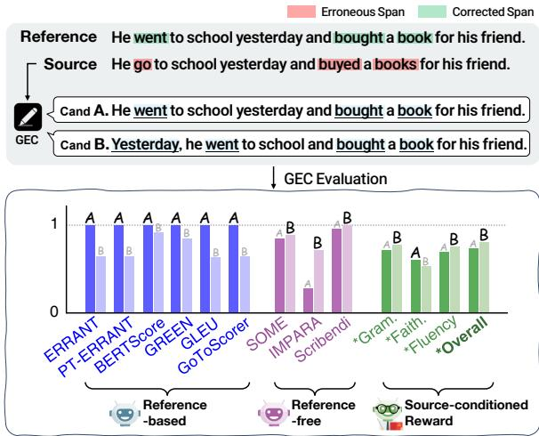  
Figure 1: Example of evaluation mismatch between reference-based and reference-free metrics for LLMstyle correction. The figure compares two candidate corrections for a source sentence and a reference correction, showing how different metric families assign preferences to minimal-edit and rewrite-style outputs. For SURE, Gram., Faith., Flu., and Overall denote grammaticality, faithfulness, fluency, and overall reward, respectively.

A natural response is to evaluate corrections without relying on a fixed reference. Referencefree and acceptability-based metrics (Asano et al., 2017; Yoshimura et al., 2020; Islam and Magnani, 2021; Maeda et al., 2022; Kobayashi et al., 2024a) shift the focus from reference overlap to the quality of the source-output relation: whether the output corrects the source, preserves its intended meaning, and reads as grammatical and fluent English.

Existing reference-free metrics already condition on both the source and the correction. The remaining issue is therefore not source conditioning itself, but how correction validity is supervised. In particular, prior metrics do not explicitly supervise source-side error resolution or relative preferences among style-diverse corrections of the same source. Thus, the central challenge is not simply to remove references, but to judge whether a fluent output is justified as a correction of the given source.

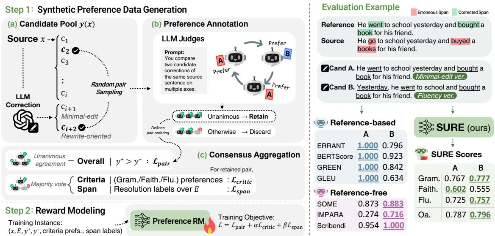  
Figure 2: Overview of SURE. (Left) Step 1: Synthetic Preference Data Generation. Given a source sentence x, we construct a style-diverse candidate pool (x) and aggregate LLM-judge annotations into an overall preference. criteria-level preferences, and span-resolution labels. Step 2: Reward Modeling. We train a source-conditioned reward model with pairwise, criteria-level, and span-level supervision. (Right) We compare reference-based and reference-free metrics with SURE using an illustrative evaluation example. At inference time, SURE scores candidate corrections using only the source and candidate, without references.

This issue is amplified in LLM-based correction, where systems often produce holistic rewrites rather than isolated local edits (Fang et al., 2023; Katinskaia and Yangarber, 2024). Such outputs may improve fluency, naturalness, and style while preserving the source meaning, but they can be penalized by reference-based metrics as reference mismatches or over-corrections (Napoles et al., 2017; Kobayashi et al., 2024b). Figure 1 illustrates this mismatch. Candidate A closely follows the gold reference and is therefore strongly favored by reference-based metrics, whereas Candidate B rewrites the sentence into a more fluent form and is preferred by several reference-free metrics. Neither behavior is sufficient on its own: evaluation should not reward reference overlap at the expense of valid rewrites, but it should also not treat fluency alone as evidence of correction quality. This motivates training signals that directly capture whether sourceside errors are resolved while accounting for grammaticality, faithfulness, and fluency (Yoshimura et al., 2020; Maeda et al., 2022; Kobayashi et al., 2024a).

This discussion leads to a central question: how can GEC evaluation recognize diverse valid corrections while ensuring that the output remains a faithful correction of the source? We address this question by directly instantiating two requirements of correction validity as training signals: resolving source-side errors and recognizing diverse valid corrections of the same source. Concretely, we combine span-level error-resolution supervision with preferences between minimal-edit and rewriteoriented corrections.

We propose SURE, a Source-conditioned Unified Reward-based Evaluator for GEC. SURE is trained on within-source preference data spanning minimal-edit and rewrite-oriented corrections, and jointly learns an overall reward with criteria-level supervision and span-level grounding for source-side error resolution. Experiments on SEEDA (Kobayashi et al., 2024a) show that SURE aligns strongly with human judgments, especially under +Fluency and rewrite-style comparisons. Criteria-level analysis further shows that SURE provides more disentangled diagnostic signals than prior multi-criteria evaluators.

Our main contributions are as follows:

(1) We introduce a GEC-specific structured supervision design that combines source-side errorresolution signals with within-source preferences over minimal-edit and rewrite-oriented corrections.

(2) We propose SURE, a reference-free reward evaluator that jointly learns an overall reward with criteria-level and span-level supervision from this preference data.

(3) We show that SURE aligns strongly with human judgments on rewrite-style corrections, and that rewrite-oriented data improves rewrite-related comparisons while introducing a trade-off on traditional GEC pairs.

## 2 Problem Formulation

Task Formulation. Conventional GEC metrics typically score y by comparing it with a reference correction z, often through edit or surface-form overlap (Dahlmeier and Ng, 2012; Napoles et al., 2015; Bryant et al., 2017; Napoles et al., 2019). For SURE, we adopt a source-conditioned reward formulation, where an evaluator assigns a scalar reward $R _ { \theta } ( x , y )$ that reflects the validity of y as a correction of x. This formulation enables referencefree evaluation at inference time, with correction validity as the scoring target.

Correction Validity Criteria. Although GEC has traditionally emphasized minimal corrections, the minimal edit is not always the best correction when meaning-preserving rewrites can improve naturalness (Napoles et al., 2017). Prior work has therefore evaluated GEC quality as a multidimensional judgment beyond grammatical correctness alone (Asano et al., 2017; Choshen and Abend, 2018; Yoshimura et al., 2020; Maeda et al., 2022). Following this perspective, we define correction validity using three criteria: (1) Grammaticality measures whether the candidate is grammatically well-formed and resolves source-side errors without introducing new ones; (2) Faithfulness measures whether the candidate preserves the meaning and intent of the source sentence; and (3) Fluency measures whether the corrected sentence is natural and idiomatic beyond being merely grammatical. These criteria provide the basis for how we characterize correction validity in this work.

## 3 SURE: Source-conditioned Unified Reward-based Evaluator

We introduce SURE, a reference-free reward evaluator for GEC that scores whether a candidate is a valid correction of the source sentence. Figure 2 provides an overview of the proposed framework, which consists of two stages: synthetic preference data generation and reward modeling. We first describe the construction of synthetic preference data from style-diverse correction candidates and consensus among LLM judges. Then we define a reward model that predicts an overall correction reward and criteria-level scores.

## 3.1 Synthetic Preference Data Generation

Candidate Pool Construction. We first collect source sentences from three standard GEC benchmarks: BEA-2019 (Bryant et al., 2019), CoNLL-2014 (Ng et al., 2014), and JFLEG (Napoles et al., 2017). We exclude all CoNLL-2014-derived data to avoid source overlap with SEEDA. To focus on examples that require non-trivial correction judgments, we restrict the source set to sentences with at least 10 tokens and at least two errors identified by ERRANT (Ng et al., 2014; Bryant et al., 2017). We further use ERRANT to identify sourceside error spans from source-reference pairs, which serve as anchors for span-level annotation.¹. Each candidate pool consists of existing candidates, including human references and GEC system outputs, and two additional corrections generated using GPT-4o (OpenAI, 2024). The GPT-4o-based candidates are generated with two different instructions: one for minimal-edit correction and the other for rewrite-oriented correction, which encourages a fluent rewrite with a different surface form while preserving the original meaning. Including rewriteoriented corrections exposes the preference data to valid corrections that differ substantially from minimal edits.² The prompts used for LLM-generated corrections are provided in Appendix D.

Preference Annotation. To construct pairwise preference data, we evaluate correction candidate pairs for each source sentence. Candidate pairs are randomly sampled from each source's candidate pool and evaluated by three independent LLM judges: GPT-4.1-mini (OpenAI, 2025), Claude Haiku 4.5 (Anthropic, 2025), and Grok 4.3 (xAI 2026). For each comparison, the judges select the better correction overall, assess the candidates along the criteria defined in Section 2, namely grammaticality, faithfulness, and fluency, and annotate whether each marked source error is resolved by each candidate. We keep only pairs with unanimous agreement on the overall preference, while aggregating criteria-level preferences and span labels by majority vote. This process yields 2,400 preference pairs from 1,320 unique source sentences. Filtering statistics are provided in Appendix A, and we validate the filtering strategy with human judgments in Section 5.4.

<table><tr><td rowspan="3">Metric</td><td colspan="7">System-level</td><td colspan="7">Sentence-level</td></tr><tr><td colspan="3">SEEDA-E</td><td colspan="4">SEEDA-S</td><td colspan="4">SEEDA-E</td><td colspan="3">SEEDA-S</td></tr><tr><td>Base</td><td colspan="3">+Fluency</td><td colspan="3">Base +Fluency</td><td colspan="3">Base</td><td colspan="2">Base</td><td colspan="2">+Fluency</td></tr><tr><td></td><td>r</td><td>ρ</td><td>r ρ</td><td>r</td><td>ρ</td><td>r</td><td>ρ</td><td>Acc.</td><td>T</td><td>+Fluency Acc.</td><td>T</td><td>Acc. τ</td><td>Acc.</td><td>T</td></tr><tr><td colspan="2">Reference-based</td><td></td><td></td><td></td><td></td><td></td><td></td><td></td><td></td><td></td><td></td><td></td><td></td><td></td></tr><tr><td>ERRANT</td><td>0.386</td><td>0.364</td><td>-0.576</td><td>-0.130</td><td>0.242</td><td>0.084</td><td>-0.656</td><td>-0.305</td><td>0.629</td><td>0.257 0.568</td><td>0.135</td><td>0.588</td><td>0.177 0.517</td><td>0.034</td></tr><tr><td>PT-ERRANT</td><td>0.588</td><td>0.545</td><td>-0.536</td><td>0.024</td><td>0.464</td><td>0.273 -0.617</td><td>-0.147</td><td>0.613</td><td>0.226</td><td>0.554</td><td>0.109</td><td>0.591</td><td>0.181 0.517</td><td>0.034</td></tr><tr><td>BERTScore</td><td>-0.031</td><td>0.552</td><td>-0.513</td><td>-0.002</td><td>-0.046 0.294</td><td>-0.549</td><td>-0.165</td><td>0.563</td><td>0.125</td><td>0.500</td><td>-0.001</td><td>0.558 0.115</td><td>0.477</td><td>-0.046</td></tr><tr><td>GREEN</td><td>0.002</td><td>0.657</td><td>0.017</td><td>0.349</td><td>0.016</td><td>0.580 0.013</td><td>0.301</td><td>0.600</td><td>0.201</td><td>0.557</td><td>0.114</td><td>0.599</td><td>0.198 0.546</td><td>0.093</td></tr><tr><td>GLEU</td><td>0.224</td><td>0.650</td><td>0.526</td><td>0.767</td><td>0.243</td><td>0.608 0.542</td><td>0.741</td><td></td><td>0.655 0.309</td><td>0.638</td><td>0.276</td><td>0.662</td><td>0.325 0.630</td><td>0.260</td></tr><tr><td>GoToScorer</td><td>0.843</td><td>0.881</td><td>-0.410</td><td>0.323</td><td>0.722</td><td>0.706 -0.503</td><td>0.191</td><td></td><td>0.704 0.408</td><td>0.644</td><td>0.288</td><td>0.675</td><td>0.350 0.603</td><td>0.207</td></tr><tr><td>CLEME 2.0</td><td>0.643</td><td>0.650</td><td>0.628</td><td>0.705</td><td>0.656</td><td>0.587 0.598</td><td>0.666</td><td></td><td>0.713 0.427</td><td>0.670</td><td>0.339</td><td>0.730 0.461</td><td>0.657</td><td>0.314</td></tr><tr><td>JELV 2.0</td><td>0.967</td><td>0.944</td><td>0.946</td><td>0.965</td><td>0.883</td><td>0.811 0.938</td><td>0.881</td><td>0.776</td><td>0.552</td><td>0.757</td><td>0.514</td><td>0.741 0.482</td><td>0.722</td><td>0.444</td></tr><tr><td colspan="2">Reference-free</td><td></td><td></td><td></td><td></td><td></td><td></td><td></td><td></td><td></td><td></td><td></td><td></td><td></td></tr><tr><td>SOME</td><td>0.901</td><td>0.951</td><td>0.943</td><td>0.969</td><td>0.892</td><td>0.867</td><td>0.931</td><td>0.916</td><td>0.771 0.542</td><td>0.758</td><td>0.516</td><td>0.783 0.565</td><td>0.769</td><td>0.537</td></tr><tr><td>Scribendi</td><td>0.825</td><td>0.839</td><td>0.715</td><td>0.842</td><td>0.620</td><td>0.636</td><td>0.604</td><td>0.714</td><td>0.760 0.519</td><td>0.742</td><td>0.484</td><td>0.740 0.480</td><td>0.707</td><td>0.414</td></tr><tr><td>IMPARA</td><td>0.902</td><td>0.965</td><td>0.900</td><td>0.978</td><td>0.916</td><td>0.902</td><td>0.887</td><td>0.938</td><td>0.757 0.514</td><td>0.747</td><td>0.493</td><td>0.758 0.516</td><td>0.741</td><td>0.481</td></tr><tr><td>GPT-4.1-E</td><td>0.584</td><td>0.602</td><td>0.893</td><td>0.746</td><td>0.520</td><td>0.634</td><td>0.874</td><td>0.766</td><td>0.741 0.482</td><td>0.742</td><td>0.483</td><td>0.733 0.465</td><td>0.747</td><td>0.494</td></tr><tr><td>GPT-4.1-S</td><td>0.203</td><td>0.266</td><td>0.772</td><td>0.534</td><td>0.080</td><td>0.273</td><td>0.745</td><td>0.538</td><td>0.739 0.478</td><td>0.741</td><td>0.482</td><td>0.736 0.472</td><td>0.748</td><td>0.496</td></tr><tr><td>GPT-4-S†</td><td>0.960</td><td>0.958</td><td>0.967</td><td>0.969</td><td>0.887</td><td>0.860</td><td>0.931</td><td>0.908</td><td>0.798 0.595</td><td>0.783</td><td>0.565</td><td>0.784 0.567</td><td>0.770</td><td>0.540</td></tr><tr><td>+ Fluency †</td><td>0.974</td><td>0.979</td><td>0.981</td><td>0.982</td><td>0.913</td><td>0.874</td><td>0.952</td><td>0.916</td><td>0.831 0.662</td><td>0.812</td><td>0.624</td><td>0.819 0.637</td><td>0.797</td><td>0.594</td></tr><tr><td>SURE (ours)</td><td>0.932</td><td>0.972</td><td>0.976</td><td>0.982</td><td>0.927</td><td>0.895</td><td>0.970</td><td>0.934</td><td>0.797 0.595</td><td>0.796</td><td>0.591</td><td>0.809 0.619</td><td>0.808</td><td>0.615</td></tr></table>

Table 1: Meta-evaluation results on SEEDA. Results are reported for both system-level and sentence-level evaluation under the Base and +Fluency settings. Metrics are grouped by whether they require references at inference time. Higher values indicate better agreement with human judgments; the best score is in bold and the second-best score is underlined. † indicates scores reported in (Kobayashi et al., 2024a), rather than results rerun in our experimental setup.

## 3.2 Reward Modeling

Model Architecture. We train SURE as a sourceconditioned reward model using the preference data constructed in Section 3.1. Given a source sentence x and a candidate correction y, the model encodes the concatenated input $[ x ; y ]$ and predicts an overall reward together with three auxiliary criterion scores $R _ { \theta } ^ { c } ( x , y )$ for each $c \in$ {gram, faith, flu}. We use DeBERTa-v3-large (He et al., 2023) as the encoder and fine-tune it with LoRA (Hu et al., 2022). The overall head is used as the main reward signal, while the criterion heads provide auxiliary supervision for grammaticality, faithfulness, and fluency.

Training Objective. For each preference pair $( x , y ^ { + } , y ^ { - } )$ , we optimize the model to score the preferred correction $y ^ { + }$ higher than the dispreferred correction $y ^ { \cdot }$ -. The training objective combines pairwise reward learning, criteria-level supervision, and span-level grounding:

$$
\mathcal { L } = \mathcal { L } _ { \mathrm { p a i r } } + \alpha \mathcal { L } _ { \mathrm { c r i t i c } } + \beta \mathcal { L } _ { \mathrm { s p a n } } ,\tag{1}
$$

where $\mathcal { L } _ { \mathrm { p a i r } }$ denotes the pairwise ranking loss over the overall reward, and $\mathcal { L } _ { \mathrm { c r i t i c } }$ denotes criteria-level pairwise ranking losses for grammaticality, faithfulness, and fluency. Each criterion-specific loss uses its corresponding preference label, while $\mathcal { L } _ { \mathrm { s p a n } }$ is an auxiliary binary classification loss for predicting whether each marked error span in the source is resolved by the candidate correction³. The weights α and $\beta$ are hyperparameters that balance criterialevel and span-level supervision, respectively.

Span supervision is used only during training: when computing $\mathcal { L } _ { \mathrm { s p a n } }$ , we mark error spans in the source so that the encoder learns whether the candidate resolves the corresponding local errors. At inference time, the span markers and span head are removed, and SURE takes only the raw source sentence and candidate correction as input. This allows the model to remain reference-free at evaluation time while using span-level signals to reduce its reliance on surface fluency alone.

<table><tr><td rowspan="2">Metric</td><td colspan="3">SEEDA-E</td><td colspan="3">SEEDA-S</td></tr><tr><td>All</td><td>R-T R-R</td><td>T-T</td><td>All</td><td>R-T</td><td>R-R T-T</td></tr><tr><td>ERRANT</td><td>48.2</td><td>39.8</td><td>32.4 53.8</td><td>49.8</td><td>42.0</td><td>35.8 55.7</td></tr><tr><td>BERTScore</td><td>41.0</td><td>30.4 29.6</td><td>47.4</td><td>43.8</td><td>35.9</td><td>35.5 49.4</td></tr><tr><td>GLEU</td><td>51.9</td><td>52.7 40.9</td><td>51.6</td><td>55.4</td><td>57.3</td><td>41.9 54.4</td></tr><tr><td>SOME</td><td>60.1</td><td>67.1 53.5</td><td>55.6</td><td>62.4</td><td>68.3</td><td>45.0 58.5</td></tr><tr><td>IMPARA GPT-4.1-E</td><td>58.9 60.2</td><td>63.8 53.5 71.9 53.3</td><td>55.7 54.7</td><td>59.9 59.8</td><td>63.8 69.9</td><td>53.3 57.1 54.4</td></tr><tr><td>SURE</td><td>65.4</td><td>73.3</td><td>58.1 60.4</td><td>65.7</td><td>72.3</td><td>52.3 58.3 61.0</td></tr></table>

Table 2: Pairwise accuracy for rewrite-style correction evaluation. Comparisons are grouped by system style: R-T compares rewrite-style and traditional GEC systems, R-R compares two rewrite-style systems, and T-T compares two traditional GEC systems; All includes all pairs. Values are the percentage of metric preferences matching human preferences, with the best score in each column in bold.

## 4 Experiments

## 4.1 Experimental Setup

Meta-Evaluation. We conduct our main evaluation on SEEDA (Kobayashi et al., 2024a), a metaevaluation benchmark for GEC metrics. SEEDA consists of two subsets: SEEDA-E for edit-level pairwise human judgments and SEEDA-S for sentence-level pairwise human judgments. Both subsets cover corrections from twelve GEC systems in the Base setting, with two additional fluent human corrections introduced in the +Fluency setting. In this setting, the added fluent corrections test whether a metric can recognize rewrite-style corrections as valid when they preserve meaning and improve naturalness, even if they differ substantially from reference edits.

At the sentence level, we convert metric scores into pairwise preferences and compare them with human judgments using accuracy and Kendall's τ. For system-level evaluation, we aggregate metric scores over corrections for each system and compare the resulting ranking with the human ranking using Pearson's r and Spearman's ρ.

Baselines. We compare SURE against two groups of GEC evaluation baselines: referencebased metrics and reference-free metrics. The reference-based metrics include ER-RANT (Ng et al., 2014; Bryant et al., 2017), PT-ERRANT (Gong et al., 2022), BERTScore (Zhang et al., 2020), GREEN (Koyama et al., 2024), GLEU (Napoles et al., 2015, 2019), GoTo-Scorer (Gotou et al., 2020), CLEME 2.0 (Ye et al.,

<table><tr><td rowspan="2">Metric</td><td rowspan="2">Setting</td><td colspan="2">SEEDA-E</td><td colspan="2">SEEDA-S</td></tr><tr><td>Base</td><td>+Fluency</td><td>Base</td><td>+Fluency</td></tr><tr><td rowspan="3">System -level (r)</td><td>w/o rewrite</td><td>0.910</td><td>0.967</td><td>0.922</td><td>0.962</td></tr><tr><td>w/ rewrite</td><td>0.926</td><td>0.978</td><td>0.945</td><td>0.989</td></tr><tr><td></td><td>(+0.016)</td><td>(+0.011)</td><td>(+0.023)</td><td>(+0.027)</td></tr><tr><td rowspan="2">-level (Acc.)</td><td>Sentence w/o rewrite</td><td>0.808</td><td>0.802</td><td>0.820</td><td>0.821</td></tr><tr><td>w/ rewrite</td><td>0.791 (-0.017)</td><td>0.785 (-0.017)</td><td>0.822 (+0.002)</td><td>0.821 (+0.000)</td></tr></table>

Table 3: Effect of rewrite-oriented preference data. w/o rewrite denotes training without rewrite candidates, while w/ rewrite denotes training with rewrite candidates. Values in parentheses indicate the difference from w/o rewrite. Ablation models are retrained under a controlled setting, so their absolute scores are not intended to exactly match the final SURE scores in Table 1; we focus on relative differences between ablation conditions.

2025), and JELV 2.0 (Zhan et al., 2026). The reference-free metrics include SOME (Yoshimura et al., 2020), Scribendi (Islam and Magnani, 2021), IMPARA (Maeda et al., 2022), and LLM-{S,E} evaluators (Kobayashi et al., 2024a). For LLM-{S,E}, we instantiate the evaluator with GPT-4.1-mini⁴ and report the edit-level and sentence-level variants as GPT-4.1-E and GPT-4.1-S, respectively. We additionally include the reported GPT-4-S (+Fluency) results (Kobayashi et al., 2024a), obtained using GPT-4 (OpenAI, 2023) (gpt-4-1106-preview). All non-LLM baselines are evaluated using gec-metrics, a unified evaluation framework for GEC metrics (Goto et al., 2025).

Implementation. We implement the model with LoRA using rank 16, scaling factor 32, and dropout 0.1. The maximum sequence length is set to 256. We train for 5 epochs with learning rate $2 \times 1 0 ^ { - 4 } .$ weight decay 0.01, warmup ratio 0.1, gradient clipping 1.0, and an effective batch size of 8 via gradient accumulation. The loss weights are set to $\alpha = 0 . 5$ and $\beta = 0 . 2$

## 4.2 Correction Validity Evaluation

We evaluate each metric against human judgments on SEEDA. As shown in Table 1, reference-based metrics perform reasonably in the Base setting, but their agreement often drops under +Fluency, where valid corrections may diverge from reference edits. Reference-free metrics are generally more stable in this setting, indicating the advantage of evaluating correction validity without relying on reference overlap. Among reference-free metrics, SURE maintains strong agreement across both Base and +Fluency settings at the system and sentence levels. The results indicate that source-conditioned reward estimation provides a robust criterion for evaluating corrections beyond reference overlap. Additional results on cross-domain transfer are provided in Appendix C.1.

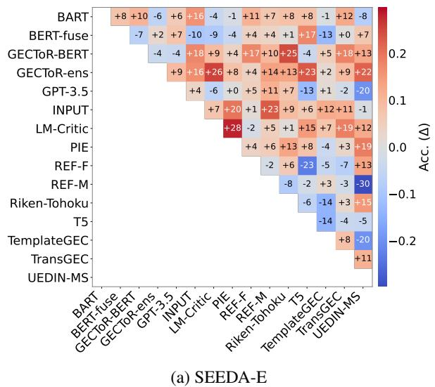

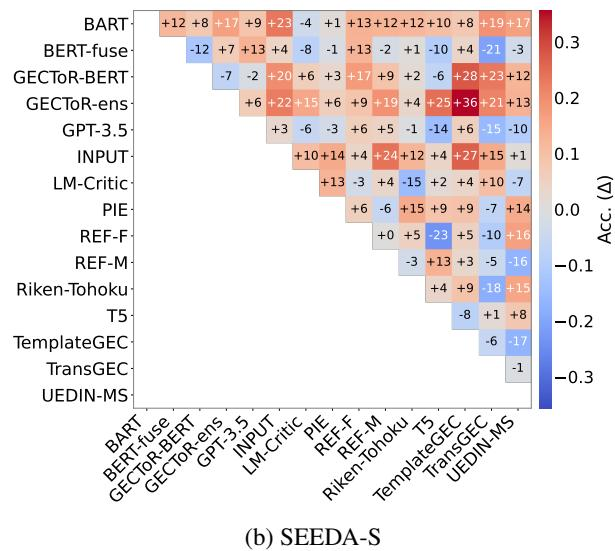  
Figure 3: System-pair accuracy difference between SURE and GPT-4.1-E. We select GPT-4.1-E as the comparison system because it is the reference-free LLM evaluator most directly comparable to SURE, assessing edit appropriateness conditioned on both the source and the candidate. Each cell reports the pairwise accuracy difference, computed as $\mathrm { A c c . _ { S U R E } - A c c . _ { G P T - 4 . 1 - E } . }$ Positive values indicate higher agreement with human preferences by SURE, while negative values indicate higher agreement by GPT-4.1-E.

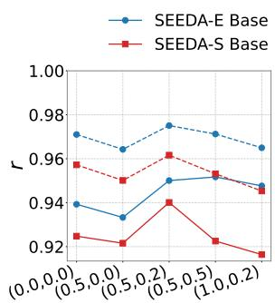

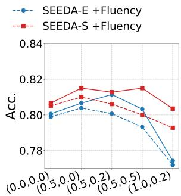  
Figure 4: Sensitivity to auxiliary loss weights α and $\beta$ in Eq. 1. We report system-level Pearson's r and sentencelevel accuracy (Acc.) on SEEDA-E and SEEDA-S under Base and +Fluency settings. The default setting is (α, β) = (0.5, 0.2).

## 5 Analysis

## 5.1 Evaluation Behavior of SURE

Rewrite-Style Correction Evaluation. We further group SEEDA pairs by comparison type and evaluate which metric best matches human preferences within each group, as shown in Table 2. SURE achieves the highest accuracy across all groups on both SEEDA-E and SEEDA-S. The separation is most visible in rewrite-related comparisons, where edit-overlap metrics fall behind reference-free metrics. This result shows that SURE is better aligned with human judgments when evaluating rewrite-style corrections, while remaining competitive on traditional GEC comparisons.

<table><tr><td>Dataset</td><td>Pair Type</td><td>w/o rewrite w/ rewrite</td><td></td></tr><tr><td rowspan="4">SEEDA-E</td><td>All</td><td>67.30</td><td>66.68 (-0.62pp)</td></tr><tr><td>Trad. only</td><td>61.03</td><td>58.77 (-2.26pp)</td></tr><tr><td>Rewrite-inv.</td><td>76.50</td><td>78.30 (+1.80pp)</td></tr><tr><td>Rewrite vs. Trad.</td><td>77.15</td><td>79.20 (+2.05pp)</td></tr><tr><td rowspan="4">SEEDA-S</td><td>All</td><td>66.52</td><td>65.45 (-1.07pp)</td></tr><tr><td>Trad. only</td><td>61.07</td><td>57.39 (-3.68pp)</td></tr><tr><td>Rewrite-inv.</td><td>73.41</td><td>75.64 (+2.23pp)</td></tr><tr><td>Rewrite vs. Trad.</td><td>74.26</td><td>76.37 (+2.11pp)</td></tr></table>

Table 4: Pair-type analysis of rewrite-oriented preference data. w/o rewrite denotes training without rewrite candidates, while w/ rewrite denotes training with rewrite candidates. Trad. only compares two traditional GEC systems, Rewrite-inv. includes pairs where at least one system is rewrite-style, and Rewrite vs. Trad. compares a rewrite-style system with a traditional GEC system. Values are pairwise accuracy (%) against human preferences.

System-Pair Analysis. We further compare SURE with GPT-4.1-E at the system-pair level, as shown in Figure 3. Positive differences appear across many system pairs, indicating that SURE's advantage is not limited to aggregate scores. The gains are especially frequent around rewrite-style systems such as GPT-3.5 and REF-F, while negative cells remain localized to a small number of specific pairs.

<table><tr><td rowspan="3">Judge/ Aggregator</td><td colspan="2">Overall</td><td colspan="2">Gram.</td><td colspan="2">Faith.</td><td colspan="2">Flu.</td></tr><tr><td>Acc.</td><td>κ</td><td>Acc.</td><td>κ</td><td>Acc.</td><td>κ</td><td>Acc.</td><td>κ</td></tr><tr><td>GPT-4.1-mini</td><td>0.760 0.515</td><td></td><td>0.770</td><td>0.536</td><td>0.395</td><td>-0.200</td><td>0.770</td><td>0.533</td></tr><tr><td>Claude Haiku 4.5</td><td>50.805</td><td>0.606</td><td>0.765</td><td>0.527</td><td>0.685</td><td>0.366</td><td>0.820</td><td>0.635</td></tr><tr><td>Grok 4.3</td><td>0.755</td><td>0.509</td><td>0.720</td><td>0.440</td><td>0.470</td><td>-0.052</td><td>0.805</td><td>0.607</td></tr><tr><td>Majority</td><td>0.790 0.577</td><td></td><td>0.745</td><td>0.487</td><td></td><td>0.490-0.018</td><td>0.810</td><td>0.614</td></tr><tr><td>Unanimous</td><td>0.831 0.658 0.819 0.635 0.5610.129</td><td></td><td></td><td></td><td></td><td></td><td>0.842 0.677</td><td></td></tr></table>

Table 5: Reliability of LLM-based preference annotations on SEEDA pairs. The first three rows report individual judge performance. Majority aggregates the three LLM judges by majority vote, while unanimous retains only pairs on which all judges agree.

Auxiliary supervision. We analyze whether the auxiliary criteria-level and span-level losses contribute to the overall reward model, varying their loss weights as summarized in Figure 4. The setting (0.0, 0.0) corresponds to the pairwise-only model, while (0.5, 0.0) removes span-level supervision and isolates the effect of criteria-level learning. The results show that SURE is not highly sensitive to the exact choice of these weights, with stable performance across both system- and sentence-level evaluations. At the same time, using auxiliary supervision generally improves or preserves performance compared to the pairwise-only objective, indicating that criteria- and span-level signals provide useful grounding for the overall reward.

We further examine the system-level consequences of these evaluation mismatches under the +Fluency setting; complete ranking analyses are provided in Appendix B.

## 5.2 Effect and Reliability of Preference Data

Effect of Rewrite-Oriented Data. We ablate rewrite-oriented candidates during preference-data construction to examine their contribution to SURE (Table 3). Adding rewrite data consistently improves system-level correlation across both SEEDA-E and SEEDA-S, with larger gains in the +Fluency setting. This indicates that stylediverse preference data helps the model rank systems more accurately when fluent rewrite-style corrections are included. Sentence-level accuracy is largely preserved, although SEEDA-E shows a small decrease, suggesting a mild trade-off with edit-level judgments that favor more local corrections.

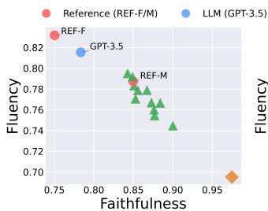

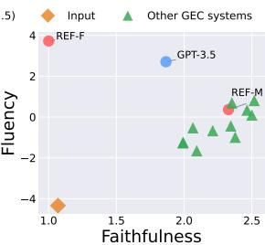  
(a) SOME (r = -0.970)  
(b) SURE (r = +0.024)  
Figure 5: Criteria-level diagnostics of faithfulness and fluency. Each point represents a GEC system, with scores averaged over its outputs. For SOME, the meaning-preservation score is treated as faithfulness for consistency. Pearson's r measures the correlation between the two criteria.

Pair-Type Effects of Rewrite-Oriented Data. Table 4 further breaks down sentence-level accuracy by system style. Comparing models trained with and without rewrite candidates, we find that rewrite-oriented data improves pairs involving rewrite-style systems, especially Rewrite vs. Trad. comparisons, but reduces accuracy on Trad. only pairs. This explains the small change in aggregate sentence-level accuracy: gains on rewriterelated comparisons are partially offset by drops on traditional-only comparisons. Thus, rewriteoriented data mainly improves the evaluation of rewrite-style systems, while introducing a mild trade-off for minimal-edit-oriented comparisons.

Reliability of Consensus-Based Preference Data. The quality of preference data depends on whether LLM judges provide judgments that are consistent with human preferences. Table 5 shows that enforcing unanimous agreement improves reliability over both individual judges and majority voting, yielding the highest overall accuracy and κ. This provides empirical support for using unanimous consensus as the filtering criterion for constructing training pairs.

## 5.3 Criteria-Level Diagnostics

We evaluate whether the criteria-level scores offer diagnostic information beyond the overall reward. A useful multi-criteria evaluator should distinguish different correction profiles, such as fluency-oriented rewrites and meaning-preserving conservative corrections. As shown in Figure 5,

<table><tr><td>Metric</td><td>Retained (3-0)</td><td>Discarded (2-1)</td></tr><tr><td>A/B consensus</td><td>62.0% (31/50)</td><td>38.0% (19/50)</td></tr><tr><td>Human pairwise agreement</td><td>49.7%</td><td>41.7%</td></tr><tr><td>LLM–Human (Overall)</td><td>77.4% (24/31)57.9% (11/19)</td><td></td></tr></table>

Table 6: Human validation of retained and discarded preference pairs. A/B consensus denotes the proportion of pairs for which human annotators reached consensus, and Human pairwise agreement is the raw percent agreement across all six annotator pairs on the three-way Overall judgment (A, B, or Difficult). LLM–Human (Overall) measures agreement between the LLM preference and the human consensus judgment. Retained pairs received unanimous 3–0 LLM judgments, whereas discarded pairs received 2–1 split judgments.
<table><tr><td>Criterion</td><td>Agreement</td><td>Cases</td></tr><tr><td>Overall</td><td>77.4%</td><td>24/31</td></tr><tr><td>Gram.</td><td>92.3%</td><td>12/13</td></tr><tr><td>Faith.</td><td>84.0%</td><td>21/25</td></tr><tr><td>Flu.</td><td>75.9%</td><td>22/29</td></tr></table>

Table 7: LLM-Human agreement on retained preference pairs. Agreement is computed over pairs with human consensus for each dimension. Cases report the number of LLM–Human agreements over the number of human-consensus pairs.

SOME (Yoshimura et al., 2020) exhibits a strong negative correlation between faithfulness and fluency, indicating that the two scores largely behave as opposite ends of a single axis. By contrast, SURE yields nearly independent faithfulness and fluency scores, allowing these correction profiles to be separated in the criteria space. A similar separation is observed between grammaticality and faithfulness, while grammaticality and fluency remain closely related (see Appendix C.3). In Appendix C.2, we further evaluate criteria-level transfer on TMU-GFM; SURE shows reasonable zeroshot transfer on confident grammaticality and fluency pairs, while meaning preservation remains challenging.

## 5.4 Human Validation of Preference Data

Human Evaluation Setup. To assess whether the LLM-generated preference labels align with independent human judgments, we conduct a human evaluation with four annotators on 100 candidate pairs: 50 retained pairs with 3–0 unanimous LLM agreement and 50 discarded pairs with 2–1 split judgments. The pairs are approximately evenly distributed across the three pair types. Human consensus is defined as a strict majority of at least three of four valid votes.

<table><tr><td>Measure</td><td>Value</td></tr><tr><td>Human rewrite preference</td><td>83.3%</td></tr><tr><td>LLM rewrite preference</td><td>66.7%</td></tr><tr><td>Human agreement with LLM rewrite</td><td>87.5% (7/8)</td></tr></table>

Table 8: Rewrite preference analysis on humanconsensus rewrite-non-rewrite pairs. The first two rows report the rewrite preference rates of human annotators and LLM judges, respectively. The last row reports human agreement among cases in which the LLM judges preferred the rewrite.

Effect of Unanimous Filtering. As shown in Table 6, retained pairs exhibit higher human consensus, pairwise agreement, and LLM–Human agreement than discarded pairs. In particular, the human consensus rate increases from 38.0% for discarded pairs to 62.0% for retained pairs, and the difference is statistically significant $( p = 0 . 0 2 7 )$ Among pairs for which humans reach consensus, the retained LLM labels agree with the human overall preference in 77.4% of cases, compared with 57.9% for discarded pairs. These results suggest that unanimous filtering preferentially retains less ambiguous comparisons and improves the human alignment of the preference labels used for training.

Criteria-Level Agreement. We further compare the retained LLM labels with human consensus separately for each evaluation criterion. Table 7 shows that agreement is highest for grammaticality (92.3%), followed by faithfulness (84.0%) and fluency (75.9%). Together with the 77.4% overall agreement, these results indicate that the supervision used to train SURE is broadly consistent with independent human judgments across both the overall and criteria-level labels.

Audit of Rewrite Preference Bias. We further assess whether LLM-judge supervision introduces a systematic preference for rewrite-style corrections. As shown in Table 8, among rewrite-nonrewrite pairs with human consensus, the rewrite preference rate is higher for human annotators than for the LLM judges (83.3% vs. 66.7%). Furthermore, human judgments agree with seven of the eight cases in which the LLM judges prefer the rewrite. These results suggest that the observed rewrite preferences are not driven by a systematic over-preference for rewrites by the LLM judges.

## 6 Related Work

## 6.1 Reference-Based Metrics for GEC

Reference-based metrics have long served as the dominant framework for GEC evaluation. ${ \bf M } ^ { 2 }$ and ERRANT compare extracted system edits against gold edits (Dahlmeier and Ng, 2012; Bryant et al., 2017). GLEU evaluates corrections through ngram overlap with references and the source sentence (Napoles et al., 2015). Subsequent metrics refine this paradigm through contextual or pretrained scoring, as in BERTScore and PT-ERRANT (Zhang et al., 2020; Gong et al., 2022); alignment-free comparison, as in GREEN (Koyama et al., 2024); or difficulty-aware edit weighting, as in GoToScorer (Gotou et al., 2020).

Recent work has further improved interpretability and validity within the edit-based framework. CLEME 2.0 decomposes edit outcomes into hit-, wrong-, under-, and over-correction (Ye et al., 2025), while JELV introduces an edit-level validity judge for evaluation and reference expansion (Zhan et al., 2026). Meta-evaluation studies have also shown that conclusions from reference-based metrics can depend on system sets, human-evaluation granularity, and reference coverage (Chollampatt and Ng, 2018; Kobayashi et al., 2024a). These studies make reference-based evaluation more robust and interpretable, but the target remains tied to gold corrections or reference-derived edits. We evaluate whether a candidate is a valid correction of the source without requiring reference overlap at inference time.

## 6.2 Reference-Free and LLM-Based GEC Evaluation

Reference-free metrics evaluate GEC outputs without comparing them against gold corrections, reducing dependence on reference coverage. SOME decomposes reference-free evaluation into grammaticality, fluency, and meaning preservation (Yoshimura et al., 2020), while Scribendi proposes a straightforward reference-free alternative to gold-standard comparison (Islam and Magnani, 2021). IMPARA estimates correction quality from the impact of a candidate correction on the source sentence using parallel grammatical and ungrammatical sentence pairs (Maeda et al., 2022).

These approaches move beyond surface overlap and already condition evaluation on the source and candidate correction. However, they do not explicitly combine source-side error-resolution supervision with relative preferences among style-diverse corrections of the same source. Recent work has also explored LLMs as reference-free evaluators for GEC (Kobayashi et al., 2024a), using edit-level and sentence-level prompts and showing that LLMs can capture broader aspects of correction quality than overlap-based metrics. Our work instead focuses on this supervision design, combining source-side error-resolution signals with preferences among minimal-edit and rewrite-oriented corrections.

## 6.3 Preference and Reward Modeling for Evaluation

Preference-based reward modeling learns evaluators from pairwise judgments by assigning higher scores to preferred outputs, a formulation widely used in language generation and alignment (Christiano et al., 2017; Ziegler et al., 2020; Stiennon et al., 2020; Ouyang et al., 2022; Bai et al., 2022; Rafailov et al., 2023). Learned text generation metrics such as BLEURT, COMET, BARTScore, and UniEval further capture semantic and qualityoriented judgments beyond surface overlap (Sellam et al., 2020; Rei et al., 2020; Yuan et al., 2021; Zhong et al., 2022).

Recent work uses LLMs as judges to collect preferences or directly evaluate generated outputs (Liu et al., 2023; Wang et al., 2023; Zheng et al., 2023; Chen et al., 2024; Fu et al., 2024; Dubois et al., 2024). While such approaches provide scalable supervision, their judgments can vary with prompts, judge models, and evaluation criteria (Zheng et al., 2023; Liu et al., 2023; Lambert et al., 2025). For correction evaluation, preferences should reflect whether an output is justified as a correction of the given source, rather than whether it is merely fluent or well-written. We adopt preference-based evaluation in this source-conditioned setting, assessing correction quality through grammaticality, faithfulness, fluency, and span-level error resolution.

## 7 Conclusion

We presented SURE, a source-conditioned reward evaluator for grammatical error correction. SURE learns correction validity from style-diverse preferences with criteria-level and span-level supervision. Experiments on SEEDA show strong alignment with human judgments, particularly for fluent rewrite-style corrections, while providing useful diagnostics for grammaticality, faithfulness, and fluency.

## Limitations

This work has several limitations. First, SURE is trained on synthetic and LLM-annotated preference data, and may inherit biases from the judge models used during data construction. Second, SURE exhibits uneven cross-domain generalization, with weaker system-level correlations on Wiki despite competitive transfer on FCE and at the sentence level. This suggests that its calibration may remain sensitive to domain shift, motivating broader validation across domains and languages. Third, although references are not required at inference time, reference-derived ERRANT spans are used during training for span-level supervision. Future work will expand human-annotated preference data, evaluate multilingual settings, and improve the calibration of criteria-level rewards.

## Acknowledgments

This work was supported by the Institute of Information & Communications Technology Planning & Evaluation (IITP) grant funded by the Korea government (MSIT) [RS-2021-II211341, Artificial Intelligence Graduate School Program (Chung-Ang University)] and by the National Research Foundation of Korea (NRF) grant funded by the Korea government (MSIT) (RS-2025-00556246).

## References

Anthropic. 2025. Claude Haiku 4.5 system card. https://www.anthropic.com/ claude-haiku-4-5-system-card. Accessed: 2026-05-25.

Hiroki Asano, Tomoya Mizumoto, and Kentaro Inui. 2017. Reference-based metrics can be replaced with reference-less metrics in evaluating grammatical error correction systems. In Proceedings of the Eighth International Joint Conference on Natural Language Processing (Volume 2: Short Papers), pages 343– 348, Taipei, Taiwan. Asian Federation of Natural Language Processing.

Yuntao Bai, Andy Jones, Kamal Ndousse, Amanda Askell, Anna Chen, Nova DasSarma, Dawn Drain, Stanislav Fort, Deep Ganguli, Tom Henighan, Nicholas Joseph, Saurav Kadavath, Jackson Kernion, Tom Conerly, Sheer El-Showk, Nelson Elhage, Zac Hatfield-Dodds, Danny Hernandez, Tristan Hume, and 12 others. 2022. Training a helpful and harmless assistant with reinforcement learning from human feedback. Preprint, arXiv:2204.05862.

Christopher Bryant, Mariano Felice, Øistein E. Andersen, and Ted Briscoe. 2019. The BEA-2019 shared

task on grammatical error correction. In Proceedings of the Fourteenth Workshop on Innovative Use of NLP for Building Educational Applications, pages 52–75, Florence, Italy. Association for Computational Linguistics.

Christopher Bryant, Mariano Felice, and Ted Briscoe. 2017. Automatic annotation and evaluation of error types for grammatical error correction. In Proceedings of the 55th Annual Meeting of the Association for Computational Linguistics (Volume 1: Long Papers), pages 793–805, Vancouver, Canada. Association for Computational Linguistics.

Lichang Chen, Shiyang Li, Jun Yan, Hai Wang, Kalpa Gunaratna, Vikas Yadav, Zheng Tang, Vijay Srinivasan, Tianyi Zhou, Heng Huang, and Hongxia Jin. 2024. AlpaGasus: Training a better alpaca with fewer data. In The Twelfth International Conference on Learning Representations.

Shamil Chollampatt and Hwee Tou Ng. 2018. A reassessment of reference-based grammatical error correction metrics. In Proceedings of the 27th International Conference on Computational Linguistics, pages 2730–2741, Santa Fe, New Mexico, USA. Association for Computational Linguistics.

Leshem Choshen and Omri Abend. 2018. Referenceless measure of faithfulness for grammatical error correction. In Proceedings of the 2018 Conference of the North American Chapter of the Association for Computational Linguistics: Human Language Technologies, Volume 2 (Short Papers), pages 124–129, New Orleans, Louisiana. Association for Computational Linguistics.

Paul F. Christiano, Jan Leike, Tom B. Brown, Miljan Martic, Shane Legg, and Dario Amodei. 2017. Deep reinforcement learning from human preferences. In Advances in Neural Information Processing Systems, volume 30, pages 4302–4310.

Daniel Dahlmeier and Hwee Tou Ng. 2012. Better evaluation for grammatical error correction. In Proceedings of the 2012 Conference of the North American Chapter of the Association for Computational Linguistics: Human Language Technologies, pages 568–572, Montréal, Canada. Association for Computational Linguistics.

Yann Dubois, Percy Liang, and Tatsunori B. Hashimoto. 2024. Length-controlled AlpacaEval: A simple debiasing of automatic evaluators. In First Conference on Language Modeling.

Tao Fang, Shu Yang, Kaixin Lan, Derek F. Wong, Jinpeng Hu, Lidia S. Chao, and Yue Zhang. 2023. Is ChatGPT a highly fluent grammatical error correction system? a comprehensive evaluation. Preprint, arXiv:2304.01746.

Jinlan Fu, See-Kiong Ng, Zhengbao Jiang, and Pengfei Liu. 2024. GPTScore: Evaluate as you desire. In Proceedings of the 2024 Conference of the North

American Chapter of the Association for Computational Linguistics: Human Language Technologies (Volume 1: Long Papers), pages 6556–6576, Mexico City, Mexico. Association for Computational Linguistics.

Peiyuan Gong, Xuebo Liu, Heyan Huang, and Min Zhang. 2022. Revisiting grammatical error correction evaluation and beyond. In Proceedings of the 2022 Conference on Empirical Methods in Natural Language Processing, pages 6891–6902, Abu Dhabi, United Arab Emirates. Association for Computational Linguistics.

Takumi Goto, Yusuke Sakai, and Taro Watanabe. 2025. gec-metrics: A unified library for grammatical error correction evaluation. In Proceedings of the 63rd Annual Meeting of the Association for Computational Linguistics (Volume 3: System Demonstrations), pages 524–534, Vienna, Austria. Association for Computational Linguistics.

Takumi Gotou, Ryo Nagata, Masato Mita, and Kazuaki Hanawa. 2020. Taking the correction difficulty into account in grammatical error correction evaluation. In Proceedings of the 28th International Conference on Computational Linguistics, pages 2085–2095, Barcelona, Spain (Online). International Committee on Computational Linguistics.

Pengcheng He, Jianfeng Gao, and Weizhu Chen. 2023. DeBERTaV3: Improving deBERTa using ELECTRAstyle pre-training with gradient-disentangled embedding sharing. In The Eleventh International Conference on Learning Representations.

Edward J. Hu, Yelong Shen, Phillip Wallis, Zeyuan Allen-Zhu, Yuanzhi Li, Shean Wang, Lu Wang, and Weizhu Chen. 2022. LoRA: Low-rank adaptation of large language models. In International Conference on Learning Representations.

Md Asadul Islam and Enrico Magnani. 2021. Is this the end of the gold standard? a straightforward referenceless grammatical error correction metric. In Proceedings of the 2021 Conference on Empirical Methods in Natural Language Processing, pages 3009–3015, Online and Punta Cana, Dominican Republic. Association for Computational Linguistics.

Anisia Katinskaia and Roman Yangarber. 2024. GPT-3.5 for grammatical error correction. In Proceedings of the 2024 Joint International Conference on Computational Linguistics, Language Resources and Evaluation (LREC-COLING 2024), pages 7831–7843, Torino, Italia. ELRA and ICCL.

Masamune Kobayashi, Masato Mita, and Mamoru Komachi. 2024a. Large language models are state-ofthe-art evaluator for grammatical error correction. In Proceedings of the 19th Workshop on Innovative Use of NLP for Building Educational Applications (BEA 2024), pages 68–77, Mexico City, Mexico. Association for Computational Linguistics.

Masamune Kobayashi, Masato Mita, and Mamoru Komachi. 2024b. Revisiting meta-evaluation for grammatical error correction. Transactions of the Association for Computational Linguistics, 12:837–855.

Shota Koyama, Ryo Nagata, Hiroya Takamura, and Naoaki Okazaki. 2024. n-gram F-score for evaluating grammatical error correction. In Proceedings of the 17th International Natural Language Generation Conference, pages 303–313, Tokyo, Japan. Association for Computational Linguistics.

Nathan Lambert, Valentina Pyatkin, Jacob Morrison, LJ Miranda, Bill Yuchen Lin, Khyathi Chandu, Nouha Dziri, Sachin Kumar, Tom Zick, Yejin Choi Noah A. Smith, and Hannaneh Hajishirzi. 2025. RewardBench: Evaluating reward models for language modeling. In Findings of the Association for Computational Linguistics: NAACL 2025, pages 1755–1797, Albuquerque, New Mexico. Association for Computational Linguistics.

Yang Liu, Dan Iter, Yichong Xu, Shuohang Wang, Ruochen Xu, and Chenguang Zhu. 2023. G-eval: NLG evaluation using Gpt-4 with better human alignment. In Proceedings of the 2023 Conference on Empirical Methods in Natural Language Processing, pages 2511–2522, Singapore. Association for Computational Linguistics.

Koki Maeda, Masahiro Kaneko, and Naoaki Okazaki. 2022. IMPARA: Impact-based metric for GEC using parallel data. In Proceedings of the 29th International Conference on Computational Linguistics, pages 3578–3588, Gyeongju, Republic of Korea. International Committee on Computational Linguistics.

Courtney Napoles, Maria Nădejde, and Joel Tetreault. 2019. Enabling robust grammatical error correction in new domains: Data sets, metrics, and analyses. Transactions of the Association for Computational Linguistics, 7:551–566.

Courtney Napoles, Keisuke Sakaguchi, Matt Post, and Joel Tetreault. 2015. Ground truth for grammatical error correction metrics. In Proceedings of the 53rd Annual Meeting of the Association for Computational Linguistics and the 7th International Joint Conference on Natural Language Processing (Volume 2: Short Papers), pages 588–593, Beijing, China. Association for Computational Linguistics.

Courtney Napoles, Keisuke Sakaguchi, and Joel Tetreault. 2017. JFLEG: A fluency corpus and benchmark for grammatical error correction. In Proceedings of the 15th Conference of the European Chapter of the Association for Computational Linguistics: Volume 2, Short Papers, pages 229–234, Valencia, Spain. Association for Computational Linguistics.

Hwee Tou Ng, Siew Mei Wu, Ted Briscoe, Christian Hadiwinoto, Raymond Hendy Susanto, and Christopher Bryant. 2014. The CoNLL-2014 shared task on grammatical error correction. In Proceedings of the Eighteenth Conference on Computational Natural Language Learning: Shared Task, pages 1–14,

Baltimore, Maryland. Association for Computational Linguistics.

OpenAI. 2023. GPT-4 technical report. Preprint, arXiv:2303.08774.

OpenAI. 2024. GPT-4o system card. Preprint, arXiv:2410.21276.

OpenAI. 2025. Introducing GPT-4.1 in the API. https: //openai.com/index/gpt-4-1/.

Long Ouyang, Jeff Wu, Xu Jiang, Diogo Almeida, Carroll L. Wainwright, Pamela Mishkin, Chong Zhang, Sandhini Agarwal, Katarina Slama, Alex Ray, John Schulman, Jacob Hilton, Fraser Kelton, Luke Miller, Maddie Simens, Amanda Askell, Peter Welinder, Paul Christiano, Jan Leike, and Ryan Lowe. 2022. Training language models to follow instructions with human feedback. In Advances in Neural Information Processing Systems, volume 35, pages 27730–27744.

Rafael Rafailov, Archit Sharma, Eric Mitchell, Christopher D Manning, Stefano Ermon, and Chelsea Finn. 2023. Direct preference optimization: Your language model is secretly a reward model. In Thirty-seventh Conference on Neural Information Processing Systems.

Ricardo Rei, Craig Stewart, Ana C Farinha, and Alon Lavie. 2020. COMET: A neural framework for MT evaluation. In Proceedings of the 2020 Conference on Empirical Methods in Natural Language Processing (EMNLP), pages 2685–2702, Online. Association for Computational Linguistics.

Thibault Sellam, Dipanjan Das, and Ankur Parikh. 2020. BLEURT: Learning robust metrics for text generation. In Proceedings of the 58th Annual Meeting of the Association for Computational Linguistics, pages 7881–7892, Online. Association for Computational Linguistics.

Nisan Stiennon, Long Ouyang, Jeffrey Wu, Daniel M. Ziegler, Ryan Lowe, Chelsea Voss, Alec Radford, Dario Amodei, and Paul F. Christiano. 2020. Learning to summarize with human feedback. In Advances in Neural Information Processing Systems, volume 33, pages 3008–3021.

Jiaan Wang, Yunlong Liang, Fandong Meng, Zengkui Sun, Haoxiang Shi, Zhixu Li, Jinan Xu, Jianfeng Qu, and Jie Zhou. 2023. Is ChatGPT a good NLG evaluator? a preliminary study. In Proceedings of the 4th New Frontiers in Summarization Workshop, pages 1–11, Singapore. Association for Computational Linguistics.

xAI. 2026. Grok 4.3. https://docs.x.ai/ developers/models/grok-4.3. Accessed: 2026- 05-25.

Jingheng Ye, Zishan Xu, Yinghui Li, Linlin Song, Qingyu Zhou, Hai-Tao Zheng, Ying Shen, Wenhao Jiang, Hong-Gee Kim, Ruitong Liu, Xin Su, and Zifei

Shan. 2025. CLEME2.0: Towards interpretable evaluation by disentangling edits for grammatical error correction. In Proceedings of the 63rd Annual Meeting of the Association for Computational Linguistics (Volume 1: Long Papers), pages 204–222, Vienna, Austria. Association for Computational Linguistics.

Ryoma Yoshimura, Masahiro Kaneko, Tomoyuki Kajiwara, and Mamoru Komachi. 2020. SOME: Reference-less sub-metrics optimized for manual evaluations of grammatical error correction. In Proceedings of the 28th International Conference on Computational Linguistics, pages 6516–6522, Barcelona, Spain (Online). International Committee on Computational Linguistics.

Weizhe Yuan, Graham Neubig, and Pengfei Liu. 2021. BARTScore: Evaluating generated text as text generation. In Advances in Neural Information Processing Systems, volume 34, pages 27263–27277.

Yuhao Zhan, Yuqing Zhang, Jing Yuan, Qixiang Ma, Zhiqi Yang, Yu Gu, Zemin Liu, and Fei Wu. 2026. JELV: A judge of edit-level validity for evaluation and automated reference expansion in grammatical error correction. In Proceedings of the AAAI Conference on Artificial Intelligence, volume 40, pages 34611-34619.

Tianyi Zhang, Varsha Kishore, Felix Wu, Kilian Q. Weinberger, and Yoav Artzi. 2020. BERTScore: Evaluating text generation with bert. In International Conference on Learning Representations.

Lianmin Zheng, Wei-Lin Chiang, Ying Sheng, Siyuan Zhuang, Zhanghao Wu, Yonghao Zhuang, Zi Lin, Zhuohan Li, Dacheng Li, Eric P. Xing, Hao Zhang, Joseph E. Gonzalez, and Ion Stoica. 2023. Judging LLM-as-a-Judge with MT-Bench and Chatbot Arena. In Advances in Neural Information Processing Systems, volume 36, pages 46595–46623.

Ming Zhong, Yang Liu, Da Yin, Yuning Mao, Yizhu Jiao, Pengfei Liu, Chenguang Zhu, Heng Ji, and Jiawei Han. 2022. Towards a unified multidimensional evaluator for text generation. In Proceedings of the 2022 Conference on Empirical Methods in Natural Language Processing, pages 2023— 2038, Abu Dhabi, United Arab Emirates. Association for Computational Linguistics.

Daniel M. Ziegler, Nisan Stiennon, Jeffrey Wu, Tom B. Brown, Alec Radford, Dario Amodei, Paul Christiano, and Geoffrey Irving. 2020. Fine-tuning language models from human preferences. Preprint, arXiv:1909.08593.

## A Dataset Statistics

Dataset Composition. The final dataset contains 2,400 preference pairs from 1,320 unique source sentences, drawn from BEA-2019 and JFLEG (Table 9). CoNLL-2014-derived data are excluded to avoid source overlap with SEEDA.

<table><tr><td>Dataset</td><td>Preference pairs</td><td>Unique sources</td></tr><tr><td>BEA-2019</td><td>1,500</td><td>881</td></tr><tr><td>JFLEG</td><td>900</td><td>439</td></tr><tr><td>Total</td><td>2,400</td><td>1,320</td></tr></table>

Table 9: Dataset composition by source benchmark.

Preference Filtering. The three LLM judges evaluated 8,093 candidate pairs, of which 4,846 (59.9%) reached unanimous agreement on the overall preference, while 3,247 received 2–1 split judgments. From these unanimous pairs, we randomly sampled 2,400 pairs to construct the final training set.

Candidate Source Coverage. GPT-4o-generated corrections appear in 87.0% of all preference pairs, accounting for 62.5% of preferred candidates and 40.4% of dispreferred candidates (Table 10). This indicates that the training data provides substantial supervision over LLM-generated corrections, including rewrite-style corrections. The minimal-edit GPT-4o variant has a win rate of 53.8%, while the rewrite-oriented GPT-4o variant has a higher win rate of 69.6%. This difference suggests that rewriteoriented corrections are frequently preferred when they provide valid and fluent alternatives, which we further examine in Section 5.2.

<table><tr><td>Statistic</td><td>Value</td></tr><tr><td>Pairs containing at least one GPT-4o correction</td><td>87.0%</td></tr><tr><td>Preferred candidates from GPT-4o corrections</td><td>62.5%</td></tr><tr><td>Dispreferred candidates from GPT-4o corrections</td><td>40.4%</td></tr><tr><td>Minimal-edit GPT-4o variant win rate</td><td>53.8%</td></tr><tr><td>Rewrite-oriented GPT-4o variant win rate</td><td>69.6%</td></tr></table>

Table 10: Coverage and preference rates of GPT-4ogenerated corrections.

Style Pair Distribution. Table 11 reports the distribution of preference pairs according to the correction styles of the preferred and dispreferred candidates. The arrow denotes the preference direction, with the style on the left corresponding to the preferred correction and the style on the right to the dispreferred correction. The dataset contains substantial comparisons between rewrite-style and minimal-edit corrections, as well as comparisons involving fluency-oriented and rewrite-style corrections.

<table><tr><td>Style pair  $( y ^ { + } \to y ^ { - } )$ </td><td>Count</td></tr><tr><td>rewrite → minimal edit</td><td>601</td></tr><tr><td>minimal edit → rewrite</td><td>560</td></tr><tr><td>rewrite → fluency edit</td><td>518</td></tr><tr><td>rewrite → rewrite</td><td>382</td></tr><tr><td>fluency edit → fluency edit fluency edit → rewrite</td><td>311</td></tr><tr><td>Total</td><td>28 2,400</td></tr></table>

Table 11: Distribution of preference pairs by correction style.

Criteria Labels and Instance Format. For each criterion, Table 12 reports whether the overall preferred correction $y ^ { + }$ or the dispreferred correction $y ^ { - }$ is preferred under that criterion. Each training instance contains a source sentence, ERRANTidentified error spans, a preferred correction $y ^ { + }$ a dispreferred correction $y ^ { - }$ , criteria-level preferences, span-resolution labels for both candidates, and metadata.

<table><tr><td>Criterion</td><td> $y ^ { + }$  preferred</td><td> $y ^ { - }$  preferred</td></tr><tr><td>Grammaticality</td><td>2,367</td><td>33</td></tr><tr><td>Faithfulness</td><td>1,264</td><td>1,136</td></tr><tr><td>Fluency</td><td>2,179</td><td>221</td></tr></table>

Table 12: Alignment between criteria-level preferences and the overall preference.

## B System-Ranking Analysis under +Fluency

To examine whether the evaluation mismatch observed for rewrite-style corrections affects practical system-level conclusions, we compare complete system rankings under the SEEDA +Fluency setting. Table 13 reports the rankings induced by human judgments, ERRANT, SOME, and SURE.

The largest discrepancies for ERRANT occur for fluent rewrite-style systems. In both SEEDA-E and SEEDA-S, REF-F and GPT-3.5 are ranked first and second by humans but are placed 14th and 12th by ERRANT, respectively. SOME and SURE substantially reduce these rank displacements and recover the human top-two ordering.

<table><tr><td colspan="5">SEEDA-E</td><td colspan="5">SEEDA-S</td></tr><tr><td>System</td><td>Human</td><td>ERRANT (∆)</td><td>SOME (∆)</td><td>SURE (∆)</td><td>System</td><td>Human</td><td>ERRANT (∆)</td><td>SOME (∆)</td><td>SURE (∆)</td></tr><tr><td>REF-F</td><td>1</td><td> $1 4 \left( + 1 3 \right)$ </td><td>1 (+0)</td><td>1 (+0)</td><td>REF-F</td><td>1</td><td>14 (+13)</td><td> $1 \ ( + 0 )$ </td><td>1 (+0)</td></tr><tr><td>GPT-3.5</td><td>2</td><td> $1 2 \left( + 1 0 \right)$ </td><td>2 (+0)</td><td>2 (+0)</td><td>GPT-3.5</td><td>2</td><td>12 (+10)</td><td> $2 \left( + 0 \right)$ </td><td>2 (+0)</td></tr><tr><td>TransGEC</td><td>3</td><td> $5 \ : ( + 2 )$ </td><td>4 (+1)</td><td>3 (+0)</td><td>T5</td><td>3</td><td>6 (+3)</td><td> $3 \ : ( + 0 )$ </td><td>4 (+1)</td></tr><tr><td>T5</td><td>4</td><td> $6 \left( + 2 \right)$ </td><td>3 (-1)</td><td>4 (+0)</td><td>TransGEC</td><td>4</td><td>5 (+1)</td><td> $4 \left( + 0 \right)$ </td><td>3 (-1)</td></tr><tr><td>REF-M</td><td>5</td><td> $1 3 \left( + 8 \right)$ </td><td>5 (+0)</td><td>5 (+0)</td><td>REF-M</td><td>5</td><td>13 (+8)</td><td> $5 \ : ( + 0 )$ </td><td>5 (+0)</td></tr><tr><td>Riken-Tohoku</td><td>6</td><td>1 (-5)</td><td>8 (+2)</td><td>7 (+1)</td><td>BERT-fuse</td><td>6</td><td>3 (-3)</td><td>6(+0)</td><td>6 (+0)</td></tr><tr><td>BERT-fuse</td><td>7</td><td>3 (-4)</td><td>6 (-1)</td><td>6(-1)</td><td>Riken-Tohoku</td><td>7</td><td>1 (-6)</td><td>8 (+1)</td><td>7 (+0)</td></tr><tr><td>UEDIN-MS</td><td>8</td><td>2 (-6)</td><td>7 (-1)</td><td>8(+0)</td><td>PIE</td><td>8</td><td>8 (+0)</td><td> $9 \left( + 1 \right)$ </td><td>9 (+1)</td></tr><tr><td>PIE</td><td>9</td><td>8 (-1)</td><td>9 (+0)</td><td>9 (+0)</td><td>LM-Critic</td><td>9</td><td>9 (+0)</td><td> $1 1 \left( + 2 \right)$ </td><td>11 (+2)</td></tr><tr><td>GECToR-BERT</td><td>10</td><td>7 (-3)</td><td>10 (+0)</td><td>10 (+0)</td><td>TemplateGEC</td><td>10</td><td>10 (+0)</td><td> $1 2 \left( + 2 \right)$ </td><td>12 (+2)</td></tr><tr><td>LM-Critic</td><td>11</td><td>9 (-2)</td><td>11 (+0)</td><td>11 (+0)</td><td>GECToR-BERT</td><td>11</td><td>7 (-4)</td><td> $1 0 \left( - 1 \right)$ </td><td>10 (-1)</td></tr><tr><td>GECToR-ens</td><td>12</td><td>4 (-8)</td><td>14 (+2)</td><td>14 (+2)</td><td>UEDIN-MS</td><td>12</td><td>2 (-10)</td><td>7 (-5)</td><td>8 (-4)</td></tr><tr><td>TemplateGEC</td><td>13</td><td>10 (-3)</td><td>12 (-1)</td><td>12 (-1)</td><td>GECToR-ens</td><td>13</td><td>4 (-9)</td><td>14 (+1)</td><td>14 (+1)</td></tr><tr><td>BART</td><td>14</td><td>11 (-3)</td><td>13 (-1)</td><td>13 (-1)</td><td>BART</td><td>14</td><td>11 (-3)</td><td>13 (-1)</td><td>13 (-1)</td></tr></table>

Table 13: System rankings under the SEEDA +Fluency setting. Human denotes the ranking induced by human judgments. $\Delta$ denotes the displacement from the human rank (metric rank minus human rank).
<table><tr><td>Metric</td><td> $\mathrm { F C E } \operatorname { S y s } .$   $( r / \rho )$ </td><td> ${ \mathrm { W i k i ~ S y s . } }$   $( r / \rho )$ </td><td> $\mathrm { \bf S y s . }$   $\operatorname { A v g } .$ </td><td> $\mathrm { F C E } \ \mathrm { S e n t . }$   $( r / \rho )$ </td><td> $\mathrm { W i k i ~ S e n t . }$   $( r / \rho )$ </td><td>Sent.  $\operatorname { A v g } .$ </td></tr><tr><td>SOME</td><td>0.941/0.929</td><td>0.923/0.833</td><td>0.932/0.881</td><td>0.653/0.643</td><td>0.402/0.408</td><td>0.528/0.526</td></tr><tr><td>IMPARA</td><td>0.940/0.952</td><td>0.954/0.786</td><td>0.947/0.869</td><td>0.392/0.336</td><td>0.347/0.339</td><td>0.369/0.337</td></tr><tr><td>Scribendi</td><td>0.777/0.905</td><td>0.846/0.571</td><td>0.812/0.738</td><td>0.005/-0.039</td><td>0.210/0.180</td><td>0.108/0.070</td></tr><tr><td>SURE</td><td>0.961/0.929</td><td>0.694/0.595</td><td>0.827/0.762</td><td>0.575/0.553</td><td>0.425/0.435</td><td>0.500/0.494</td></tr></table>

Table 14: Zero-shot cross-domain evaluation on the FCE and Wiki domains of GMEG. System-level and sentencelevel results are reported using Pearson's r and Spearman's $\rho .$ SURE is evaluated without additional fine-tuning. The best score in each column and correlation measure is shown in bold.

<table><tr><td rowspan="2">Criteria</td><td colspan="2">All Pairs</td><td colspan="2"> $| \Delta h | \geq 1 . 0$ </td></tr><tr><td>SOME</td><td>SURE</td><td>SOME</td><td>SURE</td></tr><tr><td>Grammaticality</td><td>0.738</td><td>0.680</td><td>0.944</td><td>0.852</td></tr><tr><td>Fluency</td><td>0.698</td><td>0.669</td><td>0.911</td><td>0.871</td></tr><tr><td>Faithfulness</td><td>0.841</td><td>0.538</td><td>0.988</td><td>0.734</td></tr></table>

Table 15: Criteria-level pairwise accuracy on TMU-GFM. SOME is an in-domain model trained on TMU-GFM, while SURE is evaluated zero-shot. All pairs includes all candidate pairs with different human scores, and $| \Delta h | ~ \ge ~ 1 . 0$ keeps only confident pairs whose human score difference is at least 1.0. TMU-GFM's meaning-preservation axis is mapped to faithfulness for comparison.

## C Additional Analyses

## C.1 Cross-Domain Transfer on GMEG

To assess cross-domain generalization, we evaluate SURE on the FCE and Wiki domains of GMEG (Napoles et al., 2019) without additional fine-tuning. We compare SURE with the referencefree baselines SOME, IMPARA, and Scribendi, and report Pearson's r and Spearman's $\rho$ at both the system and sentence levels. As shown in Table 14, SURE shows competitive performance on FCE and stronger sentence-level results on Wiki, while its

Wiki system-level correlations remain lower than those of SOME and IMPARA. These results suggest reasonable cross-domain transfer at the sentence level, while system-level calibration remains sensitive to domain shift.

## C.2 Criteria-Level Transfer on TMU-GFM

Table 15 evaluates criteria-level transfer on TMU-GFM. SOME performs better across all axes on all pairs, which is expected given its in-domain axislevel supervision. However, when restricting the evaluation to confident pairs with human score differences of at least 1.0, SURE achieves reasonable zero-shot accuracy on grammaticality and fluency. Faithfulness remains the weakest axis, reflecting the difficulty of aligning our faithfulness criterion with TMU-GFM's meaning-preservation annotations.

## C.3 Additional Criteria-Pair Diagnostics

Figures 6 and 7 report the remaining criteria-pair correlations, using SOME's meaning-preservation score as the counterpart of faithfulness. Both SOME and SURE show a near-perfect positive correlation between grammaticality and fluency, indicating that the two criteria capture closely related aspects of correction quality. The distinction lies in faithfulness-related pairs: SOME shows a strong negative correlation between grammaticality and faithfulness, mirroring the faithfulness-fluency entanglement observed in the main analysis. In contrast, SURE keeps grammaticality and faithfulness much less correlated, indicating that faithfulness is not simply determined by either grammaticality or fluency. These results suggest that SURE provides a more separated criteria space for diagnosing system-level correction behavior.

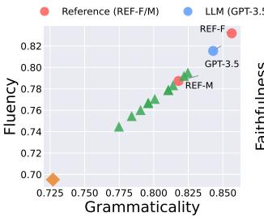  
(a) SOME (r = +0.999)

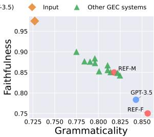  
(b) SOME (r = -0.962)

Figure 6: Additional criteria-pair correlations for SOME.  
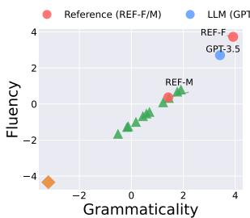  
(a) SURE (r = +0.995)

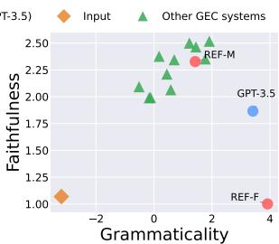  
(b) SURE (r = +0.121)  
Figure 7: Additional criteria-pair correlations for SURE.

## D Prompt Templates

## D.1 Correction Generation Prompts

## Prompt for Minimal-Edit Correction

You are a careful English writing assistant.   
Correct the following sentence:   
Source:   
{source}   
Return only the corrected sentence on one line, with no   
commentary.

## Prompt for Rewrite-Oriented Correction

## You are a careful English writing assistant.

Rewrite the following sentence so that it sounds natural and fluent in English. You may restructure clauses, change word order, swap synonyms, or split/merge clauses as long as the original meaning is preserved. Do not add information that is not in the source. Aim for a noticeably different surface form from a minimal-edit correction.

Source:

{source}

Return only the rewritten sentence on one line, with no commentary.

## D.2 GPT-4.1 Evaluation Prompts

## GPT-4.1-E Evaluation Prompt

You are evaluating English grammatical error corrections.

Rank the {n} candidates by how well their EDITS (changes vs. the source) fix the source's errors.

Focus only on the quality of the edits:

• Reward edits that correctly fix grammatical, fluency, or usage errors.

• Penalize edits that introduce new errors, change the meaning, or make unnecessary changes.

• Do not reward a candidate simply for being fluent if its edits are not appropriate.

• If two candidates are similar, prefer the one that fixes more source errors with fewer unnecessary edits.

Source:

{source}

Candidates:

{candidate\_block}

Output only the ranking from best to worst using candidate IDs.

## GPT-4.1-S Evaluation Prompt

You are evaluating English sentences as grammatical corrections of a source.

Rank the {n} candidates by OVERALL sentence quality.

Focus on the final corrected sentence:

• Reward candidates that are grammatical, fluent, natural, and clear.

• Penalize candidates that contain grammar errors, awkward wording, or unnatural phrasing.

• Penalize candidates that distort or omit important meaning from the source.

• If two candidates are similar, prefer the one that is more natural and faithful.

Source:

{source}

Candidates:

{candidate\_block}

Output only the ranking from best to worst using candi-

date IDs.

## D.3 Pairwise GEC Annotation Prompt

```jsonl
Prompt for Pairwise GEC Annotation
You are an expert linguistic annotator for grammatical error correction (GEC). You compare two candidate corrections of
the same source sentence on multiple axes. You always reply with a single JSON object that follows the requested schema
exactly. Do not include commentary outside the JSON.
Source sentence:
{source}
Known errors in the source extracted by ERRANT against a minimal-edit reference; treat these as the ground-truth list of
errors that should be addressed:
{error_block}
Candidate A:
{cand_a}
Candidate B:
{cand_b}
Your task
For each candidate, judge whether it RESOLVED each listed error.
• "resolved": the error is corrected and the result is grammatical.
• "missed": the error is still present or re-introduced.
• "partial": attempted but incomplete, or introduces a new issue.
Then compare A vs B on three sentence-level axes:
• Grammaticality: which candidate has fewer grammar errors w.r.t. the source.
• Faithfulness: which candidate better preserves the source's meaning and intent.
• Fluency: which candidate reads as more natural, idiomatic English.
Finally, give an OVERALL preference for the better correction
Important
• The amount of editing is not a criterion. Minimal edits and rewrites are equally valid; judge only on the criteria above.
• For each axis and overall, you must choose exactly one of "A" or "B". Do not use "tie". If the two candidates seem
close on a criterion, still pick whichever is even marginally better.
Reply with a single JSON object using this exact schema:
{
"span_resolution": {
"A": {"e1": "resolved|missed|partial", ...},
"B": {"e1": "resolved|missed|partial", ...}
3,
"axes": {
"grammaticality": "A|B",
"faithfulness": "A|B",
"fluency": "A|B"
},
"overall": "A|B",
"rationale": "<one short sentence>"
}
```