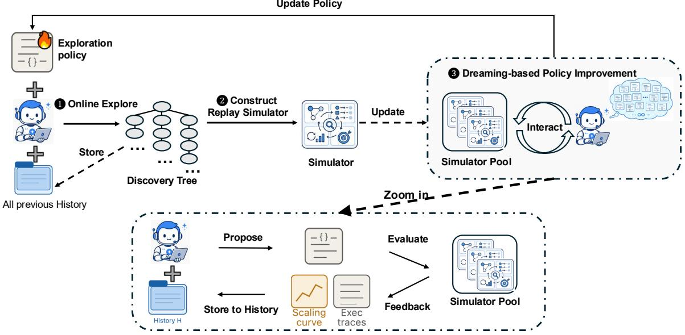
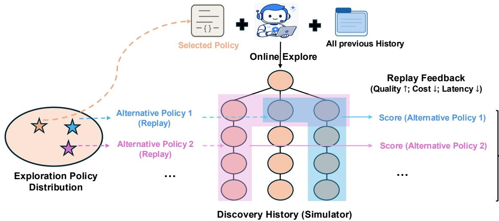
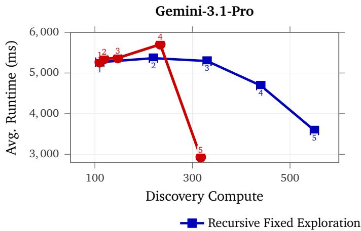
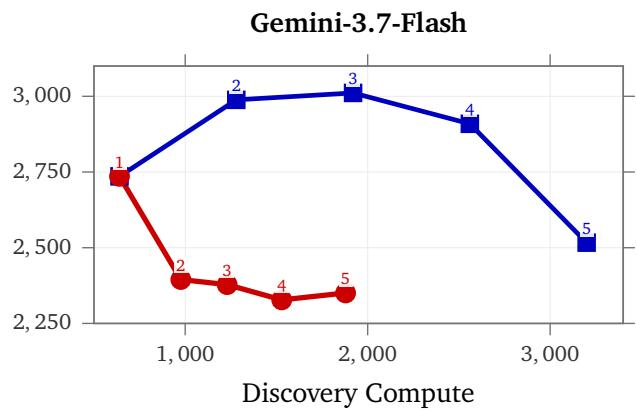
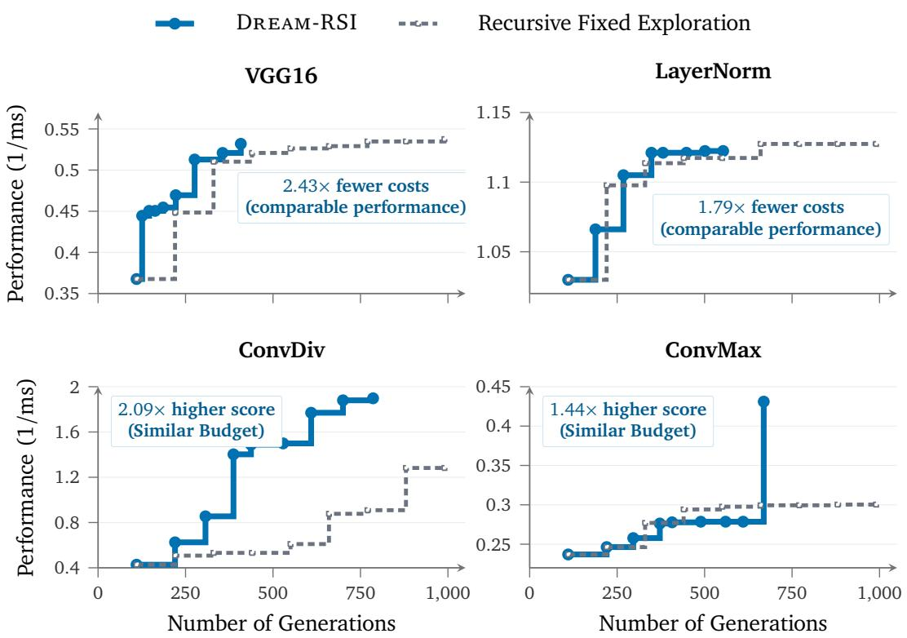
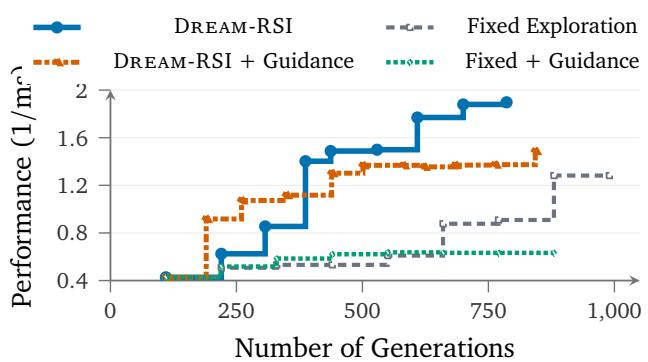
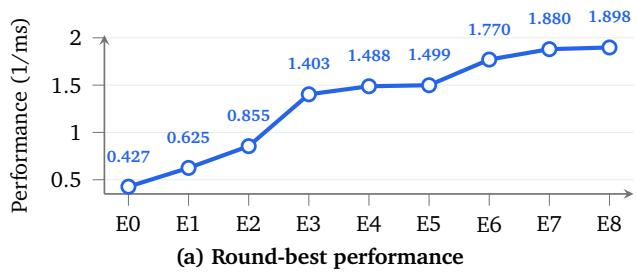
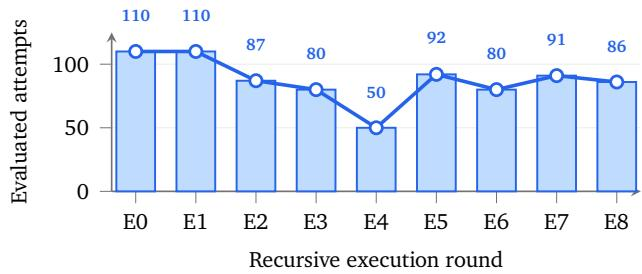

# Dream-RSI: Recursive Self-Im<sub>p</sub>rovement th<sub>roug</sub>h E<sub>vo</sub>l<sub>v</sub>i<sub>ng</sub> W<sub>or</sub>ld<sub>s</sub>

Tong Zheng<sup>1,2</sup>, Xidong Wu<sup>1</sup>, Zheng Zhang<sup>1</sup>, Zhankui He<sup>3</sup>, Chaoyi Zhang<sup>1</sup>, Benjamin Coleman<sup>3</sup>, Ruoqiao Wei<sup>1</sup>, Di Bai<sup>3</sup><sub>,</sub> Haolin Liu<sup>4</sup><sub>,</sub> Rui Liu<sup>2</sup><sub>,</sub> Xue Wan<sub>g</sub><sup>1</sup><sub>,</sub> Yue Zhuan<sup>1</sup><sub>,</sub> Wan<sub>g</sub>-Chen<sub>g</sub> Kan<sub>g</sub><sup>3</sup><sub>,</sub> Renkai Xian<sub>g</sub><sup>1</sup><sub>,</sub> Hen<sub>g</sub> Huan<sub>g</sub><sup>2</sup><sub>,</sub> Xi<sub>nwu</sub> Ch<sub>eng</sub><sup>1</sup> <sub>an</sub>d Y<sub>unsong</sub> G<sub>uo</sub><sup>1</sup>

<sup>1</sup>Google, <sup>2</sup>University of Maryland, College Park, <sup>3</sup>Google Deepmind, <sup>4</sup>University of Virginia

R<sub>ecurs</sub>i<sub>ve se</sub>lf<sub>-</sub>i<sub>mprovemen</sub>t i<sub>s</sub> b<sub>ecom</sub>i<sub>ng</sub> i<sub>ncreas</sub>i<sub>ng</sub>l<sub>y v</sub>it<sub>a</sub>l f<sub>or au</sub>t<sub>onomous</sub> AI <sub>agen</sub>t<sub>s, w</sub>h<sub>ere progress</sub> hi<sub>nges on</sub> di<sub>scover</sub>i<sub>ng</sub> hi<sub>g</sub>h<sub>-va</sub>l<sub>ue so</sub>l<sub>u</sub>ti<sub>ons across comp</sub>l<sub>ex</sub> d<sub>oma</sub>i<sub>ns.</sub> Th<sub>e</sub> d<sub>r</sub>i<sub>ver o</sub>f thi<sub>s process</sub> i<sub>s e</sub>f<sub>ec-</sub> tive exploration, however, managing and improving exploration strategies remains a major bottleneck. C<sub>urren</sub>t <sub>sys</sub>t<sub>ems</sub> f<sub>ace a</sub> f<sub>un</sub>d<sub>amen</sub>t<sub>a</sub>l dil<sub>emma:</sub> fi<sub>xe</sub>d <sub>s</sub>t<sub>ra</sub>t<sub>eg</sub>i<sub>es</sub> f<sub>a</sub>il t<sub>o a</sub>d<sub>ap</sub>t <sub>as searc</sub>h <sub>spaces sca</sub>l<sub>e, w</sub>hil<sub>e</sub> <sub>on</sub>li<sub>ne</sub> <sub>po</sub>li<sub>cy</sub> <sub>op</sub>ti<sub>m</sub>i<sub>za</sub>ti<sub>on</sub> <sub>requ</sub>i<sub>res</sub> <sub>nav</sub>i<sub>ga</sub>ti<sub>ng</sub> <sub>vas</sub>t <sub>me</sub>t<sub>a-searc</sub>h <sub>spaces</sub> <sub>un</sub>d<sub>er</sub> d<sub>e</sub>l<sub>aye</sub>d <sub>an</sub>d <sub>expens</sub>i<sub>ve</sub> f<sub>ee</sub>db<sub>ac</sub>k <sub>over</sub> l<sub>ong-</sub>h<sub>or</sub>i<sub>zon ro</sub>ll<sub>ou</sub>t<sub>s.</sub> W<sub>e</sub> i<sub>n</sub>t<sub>ro</sub>d<sub>uce</sub> D<sub>ream-</sub>RSI<sub>, a</sub> f<sub>ramewor</sub>k f<sub>or sca</sub>l<sub>a</sub>bl<sub>e an</sub>d <sub>recur-</sub> <sub>s</sub>i<sub>ve</sub>l<sub>y se</sub>lf<sub>-</sub>i<sub>mprov</sub>i<sub>ng exp</sub>l<sub>ora</sub>ti<sub>on.</sub> A li<sub>g</sub>ht<sub>we</sub>i<sub>g</sub>ht <sub>orc</sub>h<sub>es</sub>t<sub>ra</sub>ti<sub>on</sub> l<sub>ayer ma</sub>k<sub>es exp</sub>l<sub>ora</sub>ti<sub>on exp</sub>li<sub>c</sub>it <sub>an</sub>d <sub>programma</sub>bl<sub>e</sub> <sub>w</sub>hil<sub>e</sub> l<sub>eav</sub>i<sub>ng</sub> th<sub>e</sub> <sub>un</sub>d<sub>er</sub>l<sub>y</sub>i<sub>ng</sub> <sub>co</sub>di<sub>ng</sub> <sub>agen</sub>t <sub>unc</sub>h<sub>ange</sub>d<sub>.</sub> O<sub>ur</sub> k<sub>ey</sub> i<sub>ns</sub>i<sub>g</sub>ht i<sub>s</sub> th<sub>a</sub>t <sub>accumu-</sub> l<sub>a</sub>t<sub>e</sub>d di<sub>scovery</sub> hi<sub>s</sub>t<sub>ory can serve as a rep</sub>l<sub>ay s</sub>i<sub>mu</sub>l<sub>a</sub>t<sub>or over</sub> th<sub>e rea</sub>li<sub>ze</sub>d <sub>searc</sub>h <sub>space.</sub> B<sub>y per</sub>f<sub>orm</sub>i<sub>ng</sub> d<sub>ream</sub>i<sub>ng</sub> i<sub>n</sub> th<sub>e rep</sub>l<sub>ay s</sub>i<sub>mu</sub>l<sub>a</sub>t<sub>or cons</sub>t<sub>ruc</sub>t<sub>e</sub>d f<sub>rom</sub> hi<sub>s</sub>t<sub>or</sub>i<sub>ca</sub>l di<sub>scovery</sub> t<sub>rees,</sub> D<sub>ream-</sub>RSI <sub>secures</sub> i<sub>mme</sub>di<sub>a</sub>t<sub>e,</sub> l<sub>ow-cos</sub>t <sub>o</sub>f<sub>-po</sub>li<sub>cy</sub> f<sub>ee</sub>db<sub>ac</sub>k t<sub>o</sub> <sub>eva</sub>l<sub>ua</sub>t<sub>e</sub> <sub>an</sub>d <sub>re</sub>fi<sub>ne</sub> <sub>exp</sub>l<sub>ora</sub>ti<sub>on</sub> <sub>po</sub>li<sub>c</sub>i<sub>es</sub> <sub>w</sub>ith<sub>ou</sub>t i<sub>nvo</sub>ki<sub>ng</sub> <sub>repe</sub>titi<sub>ve, expens</sub>i<sub>ve on</sub>li<sub>ne eva</sub>l<sub>ua</sub>ti<sub>ons.</sub> Th<sub>e</sub> i<sub>mprove</sub>d <sub>po</sub>li<sub>cy</sub> i<sub>s su</sub>b<sub>sequen</sub>tl<sub>y re</sub>d<sub>ep</sub>l<sub>oye</sub>d <sub>on</sub>li<sub>ne</sub> t<sub>o</sub> d<sub>r</sub>i<sub>ve</sub> f<sub>ur</sub>th<sub>er</sub> di<sub>scovery, con</sub>ti<sub>nuous</sub>l<sub>y expan</sub>di<sub>ng</sub> th<sub>e s</sub>i<sub>mu</sub>l<sub>a</sub>t<sub>or poo</sub>l i<sub>n a se</sub>lf<sub>-</sub>i<sub>mprov</sub>i<sub>ng</sub> l<sub>oop.</sub> A<sub>cross a</sub>l<sub>gor</sub>ith<sub>m</sub> <sub>eng</sub>i<sub>neer</sub>i<sub>ng, ma</sub>th<sub>ema</sub>ti<sub>ca</sub>l <sub>op</sub>ti<sub>m</sub>i<sub>za</sub>ti<sub>on, an</sub>d GPU k<sub>erne</sub>l <sub>eng</sub>i<sub>neer</sub>i<sub>ng,</sub> D<sub>ream-</sub>RSI <sub>ac</sub>hi<sub>eves compe</sub>titi<sub>ve</sub> <sub>or</sub> i<sub>mprove</sub>d di<sub>scovery qua</sub>lit<sub>y w</sub>hil<sub>e su</sub>b<sub>s</sub>t<sub>an</sub>ti<sub>a</sub>ll<sub>y re</sub>d<sub>uc</sub>i<sub>ng</sub> di<sub>scovery cos</sub>t i<sub>n severa</sub>l <sub>se</sub>tti<sub>ngs.</sub>

§ <sub>g</sub>i<sub>t</sub>h<sub>u</sub>b<sub>.com</sub>/<sub>z</sub>h<sub>eng</sub>kid/D<sub>ream-</sub>RSI

€ d<sub>ream-rs</sub>i<sub>.com</sub>

## 1<sub>.</sub> I<sub>n</sub>t<sub>ro</sub>d<sub>uc</sub>ti<sub>on</sub>

Recursive self-improvement (RSI) has emerged as an ambitious goal for autonomous AI systems (Liu et al., 2026c). A common mechanism underlying RSI is an iterative discovery loop wherein agents generate candidate solutions, evaluate outcomes, incorporate feedback, and refine future iterations. Such discovery loops have driven substantial progress across scientific and algorithmic domains, including algorithm design (Novikov et al., 2025; Romera-Paredes et al., 2024), open-ended mathematical optimization (Anthropic, 2026; Georgiev et al., 2025), systems design (Cao et al., 2026; Jaber and Jaber, 2026), and agent self-improvement (Lee et al., 2026; Zhang et al., 2026b,c; Zheng et al., 2026a), with these discoveries increasingly feeding into the development of more capable AI systems. As agent capabilities improve and self-improvement targets become challenging, discovery increasingly requires long-horizon exploration over vast search spaces, often spanning thousands of proposal–evaluation cycles (OpenAI, 2026; Ye et al., 2026). At this scale, the ability to orchestrate exploration becomes critical (Zheng et al., 2026b). Poor exploration can waste substantial computation and time, severely limiting the eficiency and scalability of RSI.

Existing approaches have largely relied on manually designed exploration strategies that remain largely fixed throughout discovery (Du et al., 2026; Jiang et al., 2026; Novikov et al., 2025; Yan et al., 2026b; Ye et al., 2026). Fixed strategies cannot improve from accumulated discovery experience and may repeatedly allocate computation to inefective search directions. Recent work therefore seeks to optimize exploration policies online during discovery (Liu et al., 2026a), but doing so faces two fundamental bottlenecks. First, feedback is delayed and expensive at the meta level: unlike evaluating an individual candidate, assessing an exploration policy requires observing how it shapes the subsequent discovery process over many proposal–evaluation cycles. Second, the meta-policy space is vast: a newly proposed policy may perform poorly, so many alternatives may need to be tried. Together, these challenges make meta-level improvement particularly costly: each policy may require a long online rollout before receiving useful feedback, making it dificult to eficiently close the self-improvement loop at the exploration layer.

  
Figure 1 | Overview of Dream-RSI. The system operates in a recursive self-improvement loop via three core stages: O1 Online Explore, where the current exploration policy guides a coding agent to expand a discovery tree and log historical traces; O2 Construct Replay Simulator, where the generated discovery tree is converted into a reusable simulator pool; and O3 Dreaming-based Policy Improvement, where the agent "dreams" up a massive pool of alternative policies in its mind. It then feeds these candidate policies into the replay simulator to simulate executions and derive rapid feedback, continuously refining its strategy (detailed in the Zoom-in box). The updated policy then redeploys for the next round of online exploration.

To address these bottlenecks, our key intuition is simple: a fast and inexpensive simulator of discovery would allow many exploration policies to be evaluated before costly online deployment. Surprisingly, completed discovery histories already provide such a simulator. While prior work treats past discovery history merely as static textual context (Hu et al., 2025; Ouyang et al., 2026b) or training data for weight fine-tuning (Wang et al., 2025; Yuksekgonul et al., 2026), a completed discovery process inherently records a structured tree of past exploration decisions and their realized code-execution outcomes. Drawing an analogy to model-based reinforcement learning and World Models (Ha and Schmidhuber, 2018; Hafner et al., 2023) (§2), once organized into a discovery tree, this history can serve as a replay simulator <sup>1</sup>. As illustrated in Figure 2, an alternative exploration strategy can navigate this pre-recorded tree to traverse diferent subsets of recorded branches, in diferent orders, with diferent parallel groupings and stopping decisions. Because all execution outcomes are already saved in the tree, evaluating a new strategy requires only reading past records without rerunning the underlying discovery agent or evaluator. This transforms meta-policy improvement from an expensive online trial-and-error process into a fast, simulation-based “dreaming”

procedure.

Building on this insight, we introduce Dream-RSI, a framework for scalable and recursively self-improving meta-exploration in agent-driven discovery. We first make exploration explicit and programmable through a lightweight orchestration layer that controls branching, parallel exploration, and stopping while leaving the underlying coding agent unchanged. Rather than keeping this policy fixed, Dream-RSI establishes a closed-loop self-improvement mechanism across three core stages (Figure 1): (1) Online Exploration, where the current policy guides real-world discovery and logs historical execution traces; (2) Simulator Construction, where recorded discovery trees are converted into a reusable replay simulator pool; and (3) Dreaming-based Policy Improvement, where candidate policies are evaluated via low-cost "dreaming" over the simulator. The updated policy is then redeployed online to generate new discovery experience and expand the simulator pool, closing a RSI loop at the meta-exploration layer.

Empirically, we evaluate Dream-RSI across 8 scientific discovery tasks spanning three distinct domains: algorithm engineering, mathematical optimization, and GPU kernel engineering. In algorithm engineering (Lasso path solver), Dream-RSI outperforms standard libraries like sklearn and strong baselines while reducing agent calls by up to 162× over SimpleTES and 1.7× over fixed-exploration baselines. In mathematical optimization (sum-diference, autocorrelation, circle packing), it matches or surpasses strong baselines within 1k generations, yielding over 50× budget savings compared to SimpleTES. In GPU kernel engineering (KernelBench), it either reaches target execution speeds using 1.79×–2.43× fewer generations or improves kernel performance by up to 2.09× under identical budget constraints.

In summary, our main contributions are as follows: 1) History as Replay Simulator: We conceptualize completed discovery histories as replay simulators. This makes delayed exploration feedback reusable for eficient meta-exploration policy evaluation.; 2) Meta-Layer RSI Loop (Dream-RSI): We introduce Dream-RSI, establishing a recursive self-improvement loop that continuously collects discovery histories through online exploration, constructs replay simulators from history to refine meta-exploration strategies via dreaming, and redeploys the upgraded policy online; 3) Empirical Validation: We conduct experiments to demonstrate that Dream-RSI improves both discovery efectiveness and eficiency in several settings.

## 2. Motivation: Discover<sub>y</sub> Histor<sub>y</sub> as a Re<sub>p</sub>la<sub>y</sub> Simulator

Consider an agent navigating toward a goal in an unfamiliar environment. During its first traversal, the agent may follow ineficient routes, encounter dead ends, backtrack, and gradually construct a map of the surrounding space. Once recorded, however, this experience becomes reusable: the resulting map supports planning without requiring the agent to physically revisit every location. A new navigation policy can instead reason over the accumulated map, avoid known dead ends, reconsider earlier decisions, and compare alternative routes before acting (Gupta et al., 2017).

This idea parallels model-based reinforcement learning (M. Moerland et al., 2023; Sutton, 1990). A model captures how an environment evolves in response to an agent’s actions, allowing policies to be trained or evaluated through simulated experience rather than repeated interaction with the real environment (Ha and Schmidhuber, 2018). The Dreamer family (Hafner et al., 2019, 2020, 2023, 2025) demonstrates this principle particularly clearly: an agent learns a compact dynamics model from collected experience and improves its policy by imagining trajectories within that model.

Long-horizon discovery admits an analogous structure. An exploration policy decides which directions to pursue, which candidates to refine, which branches to explore in parallel, and when to terminate. Executing the policy online produces a structured discovery history containing the explored branches, decision points, computational costs, and realized outcomes. As illustrated in Figure 2, this history can subsequently be treated as an empirical replay simulator: a grounded model of the portion of the discovery space that has already been observed.

  
Figure 2 | Discovery history as a replay simulator. A deployed policy first explores online to generate a structured discovery tree containing historical execution traces (each node denote an attempt with its full observation). Thousands of candidate policies can then be tested within this simulator—evaluating alternative choices of search branches, exploration orders, concurrency levels, and stopping rules. Since all node outcomes are pre-stored, a single costly online run enables th<sub>ousan</sub>d<sub>s o</sub>f <sub>rap</sub>id<sub>, zero-execu</sub>ti<sub>on-cos</sub>t <sub>o</sub>f<sub>-po</sub>li<sub>cy eva</sub>l<sub>ua</sub>ti<sub>ons.</sub> Thi<sub>s ena</sub>bl<sub>es po</sub>li<sub>cy</sub> i<sub>mprovemen</sub>t th<sub>roug</sub>h hi<sub>s</sub>t<sub>or</sub>i<sub>ca</sub>l <sub>rep</sub>l<sub>ay:</sub> th<sub>e agen</sub>t <sub>can</sub> “d<sub>ream</sub>” <sub>over many a</sub>lt<sub>erna</sub>ti<sub>ve exp</sub>l<sub>ora</sub>ti<sub>on s</sub>t<sub>ra</sub>t<sub>eg</sub>i<sub>es</sub> b<sub>e</sub>f<sub>ore</sub> <sub>re</sub>d<sub>ep</sub>l<sub>oy</sub>i<sub>ng</sub> th<sub>e</sub> i<sub>mprove</sub>d <sub>po</sub>li<sub>cy</sub> <sub>on</sub>li<sub>ne.</sub>

Within this replay simulator, alternative exploration policies induce diferent trajectories through the recorded discovery tree. A policy may select a diferent subset of branches, prioritize them in a diferent order, issue diferent requests in parallel, or stop at an earlier point. Evaluating such a trajectory requires only revealing the outcomes already stored along the selected branches, rather than rerunning the underlying coding agent and evaluator. Consequently, a single expensive online discovery run can support many inexpensive evaluations of alternative exploration strategies.

## 3<sub>.</sub> D<sub>ream-</sub>RSI<sub>:</sub> R<sub>ecurs</sub>i<sub>ve</sub> S<sub>e</sub>lf<sub>-</sub>I<sub>mprovemen</sub>t th<sub>roug</sub>h E<sub>vo</sub>l<sub>v</sub>i<sub>ng</sub> W<sub>or</sub>ld<sub>s</sub>

As shown in Figure 1, Dream-RSI alternates between online exploration and ofline “dreaming” to improve an executable exploration policy that allocates discovery computation. During the online phase, the policy guides a fixed discovery agent, while a fixed evaluator scores the resulting candidates and provides diagnostic feedback. The resulting discovery tree serves as a replay world in which alternative policies can be evaluated using recorded outcomes. A fixed LLM-based policy-development agent uses this feedback to revise the exploration policy code, and the best evaluated version is deployed for the next online rollout. Only the exploration-policy code changes; the underlying models, evaluator, and execution interfaces remain fixed.

Discovery trees and the shared decision interface. A discovery tree is rooted at $r ,$ which represents the initial workspace state. Each non-root node � has exactly one primary parent, either the root or a previously created node. This parent identifies where the attempt in $\nu$ begins: the discovery agent resumes the parent’s saved workspace and uses its accumulated observations as context to produce a new attempt. Node $\nu$ preserves this inherited history and records the outcome of the new generation–evaluation attempt, including the resulting filesystem snapshot, generated artifact, evaluation diagnostics, and score $s _ { \nu }$ . Scores follow a fixed task-scoring protocol, with larger values indicating better quality.

In both online execution and ofline replay, the exploration policy observes a tree $\mathcal { T }$ , initially containing only the root, and selects the nodes from which to continue exploration. The eligible nodes form the set $A ( \mathcal { T } ) = \{ r \} \cup \{ \nu \in \mathcal { T } : \nu$ is a leaf}, where leaves are determined from the currently observed tree. Let $W \geq 1$ be the number of parallel workers, each of which can execute one generation– evaluation request at a time (e.g. concurrent API calls). The exploration policy’s action is a batch $C \in A ( \mathcal { T } ; W )$ , where $A ( { \mathcal { T } } ; W ) = \{ C \subseteq A ( { \mathcal { T } } ) : | C | \leq W \}$ is the feasible batch set. Each selected node specifies the starting point of one attempt, so the batch determines both where exploration continues and how many attempts are scheduled in parallel. Both the online and ofline phases use this same decision interface but difer in the transition that follows a selected batch.

Online rollout. Let $t = 1 , 2 , \ldots$ . index the outer iterations, starting from an initial policy $\pi _ { 1 }$ and an empty history $\mathcal { H } _ { 0 } = \left( \begin{array} { r l } \end{array} \right)$ . At iteration �, policy $\pi _ { t }$ guides a new online rollout with access to the completed discovery history $\mathcal { H } _ { t - 1 }$ . This history provides context for exploration but remains separate from the new tree being constructed. The policy code stays fixed throughout the rollout.

Let $\mathcal { T } _ { t } ^ { k }$ denote the new discovery tree after � completed decision rounds, with $\mathcal { T } _ { t } ^ { 0 } = \{ r \}$ . The rollout allows at most $K _ { 1 }$ rounds. At round $k \leq K _ { 1 }$ , the exploration policy chooses a node batch $C _ { t } ^ { k } \in A ( \mathcal { T } _ { t } ^ { k } ; W )$ and each node $\upsilon \in C _ { t } ^ { k }$ is assigned to a worker. The discovery agent uses $\nu ^ { \prime } s$ saved workspace and available context to produce a new candidate, and the evaluator assesses the result. These attempts run in parallel, each producing one new child of its selected parent. Attaching the completed children to the current tree yields $\mathcal { T } _ { t } ^ { k + 1 }$ , while all previously recorded nodes remain unchanged. This transition is stochastic because the discovery agent may generate diferent outcomes from the same starting workspace. For the next round, the newly created child becomes the selectable leaf of an extended branch, while the root remains selectable for opening further branches. The rollout ends when the policy selects an empty batch or completes $K _ { 1 }$ decision rounds. After the rollout terminates, its final tree is recorded as $\mathcal { T } _ { t }$ and appended to the history, giving $\mathcal { H } _ { t } = \mathcal { H } _ { t - 1 } \cup \{ \mathcal { T } _ { t } \}$ . The method then enters the ofline phase using this expanded collection of replay worlds.

Ofline evaluation. During the ofline phase of outer iteration �, the history $\mathcal { H } _ { t }$ remains fixed while the method constructs and evaluates $M \ge 1$ policy versions $\pi _ { t } ^ { 0 } , \ldots , \pi _ { t } ^ { M - 1 }$ , starting with $\pi _ { t } ^ { 0 } = \pi _ { t }$ Each version is evaluated separately on every historical tree $\mathcal { T } _ { i } , i = 1 , \ldots , t .$ , before the next version is developed from the resulting feedback. We use � to index policy versions, � to index replay worlds, and � to count decision rounds within one policy–world evaluation. The outer index � is fixed throughout this phase and is suppressed in the notation for replay trajectories and scores.

For each policy–tree pair $( m , i )$ , replay resets the policy’s per-rollout state and starts from $\mathcal { T } _ { i } ^ { m , 0 } =$ $\{ r \}$ . Here, $\mathcal { T } _ { i } ^ { m , k } \subseteq \mathcal { T } _ { i }$ denotes the subtree revealed after � completed rounds. The full recorded tree $\mathcal { T } _ { i }$ remains fixed; only the portion observed by the policy evolves. At each decision, $\pi _ { t } ^ { m }$ selects a batch $C _ { i } ^ { m , k } \in A ( \mathcal { T } _ { i } ^ { m , k } ; \mathbf { \bar { W } } )$ using the revealed observations. Unlike online execution, replay returns recorded children of the selected nodes deterministically rather than generating new candidates. After the exploration policy takes a nonempty batch $C _ { i } ^ { m , k }$ , the next observed tree is $\mathcal { T } _ { i } ^ { m , k + 1 } = \mathcal { T } _ { i } ^ { m , k } \cup$ $\begin{array} { r } { \bigcup _ { \nu \in C _ { i } ^ { m , k } } \mathbf { C h i l d } ( \nu ; \mathcal { T } _ { i } , \mathcal { T } _ { i } ^ { m , k } ) } \end{array}$ where Child $( \nu ; \mathcal { T } _ { i } , \mathcal { T } _ { i } ^ { m , k } )$ denotes the node set containing unobserved children of � on tree $\mathcal { T } _ { i }$ given the current observed tree $T _ { i } ^ { m , k }$ . For $\nu \neq r$ , Child $( \nu ; \mathcal { T } _ { i } , \mathcal { T } _ { i } ^ { m , k } )$ is �’s unique recorded child, if one exists. Since $\nu$ is a leaf of $\mathcal { T } _ { i } ^ { m , k }$ , that child is still unrevealed. For $\nu = r ,$ , replay returns the earliest-created child of � outside $\mathcal { T } _ { i } ^ { m , k }$ , opening one previously unrevealed branch. In either case, Child $( \nu ; \mathcal { T } _ { i } , \mathcal { T } _ { i } ^ { m , k } ) = \emptyset$ when no recorded continuation remains. The newly revealed nodes expose their stored observations before the policy makes its next decision.

Replay allows at most $K _ { 2 }$ decision rounds where each nonempty batch counts as one round, and terminates when the policy selects $C _ { i } ^ { m , k } = \varnothing .$ , the round limit $k = K _ { 2 }$ is reached, or $\mathcal { T } _ { i } ^ { m , k } = \mathcal { T } _ { i } ,$ meaning that all recorded nodes have been revealed. Let $k _ { i } ^ { m , \star } \in \{ 0 , \ldots , K _ { 2 } \}$ denote the number of completed rounds at termination, yielding the final subtree $\mathcal { T } _ { i } ^ { m , k _ { i } ^ { m , \star } } \subseteq \mathcal { T } _ { i } .$

Thus, replay evaluates how far to pursue each opened branch, how to group attempts into parallel batches, and when to open another branch or stop. These decisions may difer across policies, but each branch is traversed in its recorded parent–child order, and no outcomes beyond $\mathcal { T } _ { i }$ are generated.

Replay objective. The replay objective balances discovery quality, execution cost, and parallelism. Let $N _ { i } ^ { m } = | \mathcal { T } _ { i } ^ { m , k _ { i } ^ { m , \star } } | - 1$ be the number of revealed non-root nodes. Although replay itself does not execute new discovery attempts, $N _ { i } ^ { m }$ counts the generation–evaluation requests represented by its trajectory. For fixed coeficients $\beta _ { 1 } , \beta _ { 2 } \geq 0$ , the replay score is

$$
V _ { i } ^ { m } = \underbrace { \operatorname* { m a x } _ { \nu \in \mathcal { T } _ { i } ^ { m , k _ { i } ^ { m , \star } } } s _ { \nu } } _ { \mathrm { d i s c o v e r y q u a l i t y } } - \underbrace { \beta _ { 1 } N _ { i } ^ { m } } _ { \mathrm { e x e c u t i o n c o s t } } + \underbrace { \beta _ { 2 } \frac { N _ { i } ^ { m } } { \operatorname* { m a x } \{ 1 , k _ { i } ^ { m , \star } \} } } _ { \mathrm { p a r a l l e l i s m b o n u s } } .\tag{1}
$$

The first term measures the best solution quality attained during replay. The second penalizes the number of attempted generations. For a nonempty replay, the third rewards the average number of attempts executed per decision round, favoring policies that batch useful continuations rather than execute them sequentially.

Policy improvement and selection. The evaluation score of policy version $\pi _ { t } ^ { m }$ is its average replay score across the fixed history, $\begin{array} { r } { V ^ { m } = \frac { 1 } { t } \sum _ { i = 1 } ^ { t } V _ { i } ^ { m } } \end{array}$ . The ofline phase begins by evaluating the current policy $\pi _ { t } ^ { 0 } = \pi _ { t }$ . For each $m = 0 , \ldots , M - 1$ , the policy-development agent examines the replay trajectories and scores of $\pi _ { t } ^ { m }$ , together with feedback from earlier revisions, to identify successful decisions and recurring failures. It then revises the executable policy code to produce $\pi _ { t } ^ { m + 1 }$ , which is evaluated on the same � replay worlds. Replay feedback is available to the development agent between revisions.

After � revisions, the next online policy is selected from all � evaluated versions as $\pi _ { t + 1 } = \pi _ { t } ^ { m ^ { \star } }$ where $m ^ { \star } \in \arg \operatorname* { m a x } _ { m \in \{ 0 , \ldots , M - 1 \} } V ^ { m }$ . Because the candidate set includes the current policy, this selection satisfies $V ^ { m ^ { \star } } \geq V ^ { 0 }$ . Thus, the selected policy $\pi _ { t + 1 }$ is no worse than the current policy $\pi _ { t }$ in average replay score on the fixed history $\mathcal { H } _ { t }$ . The selected policy is then deployed online to collect $\mathcal { T } _ { t + 1 }$ , expanding the history available for the next ofline improvement phase.

## 4. Ex<sub>p</sub>eriments

We evaluate Dream-RSI across three scientific discovery domains: algorithm engineering, kernel optimization and math optimization. Our primary controlled baseline is Recursive Fixed Exploration, which uses the same underlying discovery setting and initialization but keeps the exploration policy fixed across recursive discovery rounds. We additionally compare against task-specific domain baselines.

Across all tasks, Dream-RSI and Recursive Fixed Exploration use the same discovery agent, evaluator, initialization, and resource constraints. Both methods start from the same manually designed exploration policy. This exploration policy follows a simple parallel refining strategy: it launches multiple independent exploration workspaces in parallel, with each workspace maintaining its own local discovery trajectory and repeatedly refining its current candidate based on the history accumulated within that workspace. The two methods therefore follow the same exploration policy in the first discovery round. In subsequent rounds, while Recursive Fixed Exploration keeps its exploration policy static, Dream-RSI progressively refines the policy by dreaming over a replay simulator conditioned on accumulated global discovery history, subsequently deploying the updated policy in each new round. The discovery cost is quantified by the total cumulative number of discovery-agent calls.

Specifically, we evaluate Gemini-3.1 Pro and Gemini-3.7-Flash across multiple recursive discovery rounds via the Gemini CLI <sup>2</sup>. Under Recursive Fixed Exploration, each round for Gemini-3.1 Pro executes 10 parallel workspaces with up to 11 refinement steps (10 × 11 = 110 discovery-agent calls), whereas Gemini-3.7-Flash operates 32 parallel workspaces with up to 20 refinement steps (32 × 20 = 640 calls). Dream-RSI maintains identical per-round budgets, aligning with the baseline in Round 1 while progressively updating its policy in subsequent rounds. Further details on recursive rounds, task setups, resource budgets, and evaluation protocols follow below.

## 4.1. Al<sub>g</sub>orithm En<sub>g</sub>ineerin<sub>g</sub>

In this task, we consider Lasso Regularization Path as our algorithm-engineering task, a fundamental computational primitive in high-dimensional statistics that is widely used in model selection and cross-validation across domains such as genomics and finance. We follow the benchmark setting of SimpleTES (Ye et al., 2026), where the goal is to discover eficient implementations of the complete Lasso regularization path while preserving numerical correctness. During discovery, we use the same 17 synthetic instances as SimpleTES, which cover diverse problem regimes in terms of dimensionality, sparsity, feature correlation, and active-set structure. To evaluate whether the discovered algorithms generalize beyond the search distribution, we additionally evaluate them on six held-out downstream datasets spanning both biological and non-biological domains.

Baselines and Setup. We compare against standard Lasso solvers sklearn (Pedregosa et al., 2011) and lmnet (Friedman et al., 2010), as well as Sim leTES (Ye et al., 2026), which uses GPT-OSS-120B with a reported budget of 51,200 generations. We additionally include Recursive Fixed Exploration as our controlled baseline. Specifically, we run both Recursive Fixed Exploration and Dream-RSI for 5 rounds.

Main Results. Figure 3(a) summarizes the Lasso discovery results. Across both discovery-agent backbones, Dream-RSI achieves a better downstream quality–compute trade-of than Recursive Fixed Exploration. With Gemini-3.1 Pro, it reduces the average runtime across the six held-out datasets from 3587.1 ms to 2931.0 ms while using only 317 discovery-agent calls, compared with 550 calls for fixed exploration. With Gemini-3.7-Flash, Dream-RSI further reduces the average runtime from 2516.7 ms to 2350.6 ms using 1879 calls instead of 3200. Despite using substantially less discovery compute, the resulting solvers also outperform the standard sklearn and glmnet implementations on all six held-out datasets. Compared with SimpleTES, which uses 51,200 generations, Dream-RSI achieves lower average downstream runtime with roughly two orders of magnitude fewer discovery-agent calls. Notably, the program discovered by Gemini-3.1-Pro appears particularly well suited to large-scale matrices such as RCV1. In contrast, Gemini-3.7-Flash discovers a more general-purpose program that performs consistently across diferent problem scales.

<table><tr><td>Method</td><td>Model</td><td>Compute</td><td colspan="2">Non-biological</td><td colspan="4">Biological</td><td>Avg.</td></tr><tr><td></td><td></td><td></td><td>Gisette</td><td>RCV1</td><td>DNA</td><td>Leukemia</td><td>Colon</td><td>Duke Breast</td><td></td></tr><tr><td>Previous solvers</td><td></td><td></td><td></td><td></td><td></td><td></td><td></td><td></td><td></td></tr><tr><td>sklearn</td><td></td><td></td><td>11275.2</td><td>252881.7</td><td>93.8</td><td>227.2</td><td>229.8</td><td>374.0</td><td>44180.3</td></tr><tr><td>glmnet</td><td></td><td></td><td>9063.6</td><td>73072.8</td><td>351.9</td><td>45.0</td><td>24.2</td><td>47.7</td><td>13767.5</td></tr><tr><td>SimpleTES</td><td>gpt-oss-120b</td><td>51,200</td><td>3141.9</td><td>19625.6</td><td>15.9</td><td>15.5</td><td>11.6</td><td>18.1</td><td>3804.8</td></tr><tr><td>SimpleTES †</td><td>gpt-oss-120b</td><td>51,200</td><td>8651.0</td><td>41143.1</td><td>37.6</td><td>28.2</td><td>19.5</td><td>31.1</td><td>8318.4</td></tr><tr><td>Our System</td><td></td><td></td><td></td><td></td><td></td><td></td><td></td><td></td><td></td></tr><tr><td rowspan="3">Recursive Fixed Exploration</td><td>Gemini-3.1-Pro</td><td>550</td><td>1861.8</td><td>19550.1</td><td>41.5</td><td>26.1</td><td>14.5</td><td>28.4</td><td>3587.1</td></tr><tr><td>Gemini-3.7-Flash</td><td>3200</td><td>1133.1</td><td>13873.0</td><td>29.8</td><td>24.1</td><td>15.7</td><td>24.4</td><td>2516.7</td></tr><tr><td>Gemini-3.1-Pro</td><td>317</td><td>2841.0</td><td>14616.0</td><td>49.9</td><td>30.2</td><td>16.4</td><td>32.5</td><td>2931.0</td></tr><tr><td>DREAM-RSI</td><td>Gemini-3.7-Flash</td><td>1879</td><td>1091.9</td><td>12923.4</td><td>31.4</td><td>21.0</td><td>12.2</td><td>23.6</td><td>2350.6</td></tr></table>

(a) Final <sub>p</sub>erformance.



  
(b) Recursive Discover<sub>y</sub> D<sub>y</sub>namics.  
Figure 3 | Lasso regularization-path discovery results. (a) Final wall-clock runtime on six held-out downstream tasks; lower is better. Compute denotes the cumulative number of discovery-agent calls. (b) Recursive discovery dynamics. Average downstream runtime across six held-out tasks versus cumulative discovery compute for Gemini-3.1-Pro and Gemini-3.7-Flash. Numbers next to markers denote recursive rounds (iterations). Lower is better.

Recursive Discovery Dynamics. Figure 3(b) illustrates the trajectory of downstream performance across recursive discovery rounds relative to cumulative discovery compute. By design, both methods share identical search behavior in the initial round. In subsequent rounds, Recursive Fixed Exploration maintains a static exploration policy, whereas Dream-RSI progressively refines and redeploys its policy via dreaming over accumulated discovery history. Consequently, the two trajectories diverge markedly: Dream-RSI consistently achieves superior downstream performance while requiring substantially lower cumulative compute across both Gemini-3.1-Pro and Gemini-3.7-Flash.

Table 1 | Performance comparison on mathematical discovery tasks. Higher is better for Sum Dif and Circle Packing, while lower is better for Auto Correlation. Best results are shown in bold.
<table><tr><td>Method</td><td>LLM</td><td colspan="3">Sum Diff (↑) Auto Correlation (↓) Circle Packing (↑)</td></tr><tr><td>AlphaEvolve</td><td>Gemini-2.0 Pro + Flash</td><td></td><td>1.455700</td><td>2.635862</td></tr><tr><td>AlphaEvolveV2</td><td>Gemini-2.0 Pro + Flash 1.121936</td><td></td><td></td><td>2.635983</td></tr><tr><td>OpenEvolve</td><td></td><td></td><td>1.460000</td><td></td></tr><tr><td>CodeEvolve</td><td></td><td></td><td></td><td>2.635980</td></tr><tr><td>ShinkaEvolve</td><td>Mixed</td><td></td><td>1.457800</td><td>2.635982</td></tr><tr><td>TTS-Discovery</td><td>Qwen3-8B</td><td></td><td></td><td>2.635983</td></tr><tr><td>ThetaEvolve</td><td>Distilled-Qwen3-8B</td><td></td><td>1.493000</td><td>2.635983</td></tr><tr><td>EvoX</td><td>Gemini-3.0-Pro</td><td></td><td>1.458900</td><td>2.635900</td></tr><tr><td>SimpleTES</td><td>GPT-OSS-120B</td><td>1.143975</td><td>1.453675</td><td>2.635983</td></tr><tr><td>Our System</td><td></td><td></td><td></td><td></td></tr><tr><td>Recursive Fixed Exploration Gemini-3.1-Pro</td><td></td><td>1.144047</td><td>1.456001</td><td>2.635983</td></tr><tr><td>DREAM-RSI</td><td>Gemini-3.1-Pro</td><td>1.145427</td><td>1.456375</td><td>2.635983</td></tr></table>

Discovered Solver Analysis. We further analyze the discovered solver, with its implementation provided in the Appendix C. Unlike SimpleTES, which switches between LARS and coordinate descent according to problem dimensions, the discovered solver introduces adaptivity within the active-set optimization itself. It combines strong-rule screening with Cauchy–Schwarz-based KKT pruning, selectively recomputing exact gradients only when the bound cannot certify a feature and falling back to a full refresh when pruning becomes inefective. This adaptive verification scheme is further integrated with eficient active-set bookkeeping, lazy Gram-matrix construction, and hardware-aware implementation.

## 4<sub>.</sub>2<sub>.</sub> Mathematics O<sub>p</sub>timization

We further evaluate Dream-RSI on three mathematical discovery tasks spanning discrete combinatorial optimization, geometric optimization, and functional optimization: the Sum–Diference Problem, Circle Packing, and Autocorrelation Inequalities. The goal of these problems is to discover high-quality solutions that optimize task-specific mathematical objectives under their respective constraints. Formal definitions of the three tasks are provided in Appendix.

We use Gemini-3.1 Pro via the Gemini CLI as the discovery agent for both Recursive Fixed Exploration and Dream-RSI for 10 rounds. For each task, the agent iteratively proposes and evaluates candidate constructions or optimization procedures according to the task-specific objective. We compare against a broad set of existing automated discovery systems, including AlphaEvolve (Novikov et al., 2025), AlphaEvolveV2 (Georgiev et al., 2025), OpenEvolve (Sharma, 2025), CodeEvolve (Assumpção et al., 2025), ShinkaEvolve (Lange et al., 2026), TTS-Discovery (Yuksekgonul et al., 2026), ThetaEvolve (Wang et al., 2025), EvoX (Liu et al., 2026a), and SimpleTES (Ye et al., 2026).

Results. Table 1 summarizes the results across the three mathematical discovery tasks. Dream-RSI achieves a Sum–Diference score of 1.145427, outperforming SimpleTES and Recursive Fixed Exploration. On Circle Packing, it reaches 2.635983, matching the strongest reported result among the compared methods. For Autocorrelation, Dream-RSI obtains 1.456375, remaining competitive with existing discovery systems. Notably, SimpleTES achieves state-of-the-art performance on Autocorrelation Inequalities, but requires 51,200 generations, significantly more than the fewer than 1,000 generations used by our approach. Overall, these results show that our Dream-RSI generalize well on mathematics optimization.

  
Figure 4 | GPU kernel engineering results. Discovery performance of Dream-RSI and Recursive Fixed Exploration as a function of the number of generations. On VGG16 and LayerNorm, Dream-RSI reaches comparable performance with 2.43× and 1.79× fewer generations, respectively. On ConvDiv and ConvMax, it achieves 2.09× and 1.44× higher performance under comparable discovery budgets. Higher is better for all tasks.

## 4.3. Kernel En<sub>g</sub>ineerin<sub>g</sub>

We further evaluate Dream-RSI on GPU kernel engineering, where the goal is to automatically discover high-performance implementations of kernels while preserving numerical correctness. Unlike mathematical discovery, kernel engineering requires reasoning jointly about algorithmic structure, memory access, parallelization, and hardware-specific optimizations, providing a substantially diferent testbed for evaluating whether our Dream-RSI generalizes across discovery domains.

We consider four representative kernel-engineering tasks from KernelBench (Ouyang et al., 2025): VGG16, LayerNorm, ConvDiv, and ConvMax. Candidate implementations are evaluated by their execution performance, measured as inverse runtime (1/ms), subject to correctness checks against the reference implementation. We use Gemini-3.1 Pro as the coding agent and compare Dream-RSI with Recursive Fixed Exploration under the same evaluation protocol and initialization.

Results. Figure 4 shows the discovery trajectories as the number of generations increases. On VGG16 and LayerNorm, Dream-RSI reaches comparable final performance using 2.43× and 1.79× fewer generations, respectively. On ConvDiv and ConvMax, under comparable discovery budgets,

Dream-RSI achieves 2.09× and 1.44× higher performance, respectively. These results show that adapting the exploration policy across recursive rounds can improve the eficiency and efectiveness of long-horizon discovery.

## 5. Further Anal<sub>y</sub>sis

## 5<sub>.</sub>1<sub>.</sub> A<sub>na</sub>l<sub>ys</sub>i<sub>s o</sub>f Hi<sub>s</sub>t<sub>or</sub>i<sub>ca</sub>l I<sub>n</sub>d<sub>uc</sub>ti<sub>ve</sub> Bi<sub>ases</sub> i<sub>n</sub> L<sub>ong-</sub>H<sub>or</sub>i<sub>zon</sub> Di<sub>scovery</sub>

We further investigate how the nature of the historical inductive bias afects long-horizon discovery. A natural alternative for utilizing history is to abstract prior trajectories into high-level directional insights, which are directly injected into the prompt as explicit semantic guidance for subsequent rounds. To evaluate the eficacy of this prompt-level semantic guidance, we apply it to both Recursive Fixed Exploration and Dream-RSI. As illustrated in Figure $^ { 5 , }$ explicit directional guidance consistently underperforms its unguided counterpart across both paradigms under equivalent discovery budgets. These results suggest that in long-horizon

  
Figure 5 | Discovery performance on ConvDiv. Using history as an interactive replay simulator outperforms using it only as guidance.

discovery—where multiple parallel threads are deployed for exploration—imposing strong semantic inductive biases regarding future search directions tends to over-constrain the search space and impede diverse exploration.

## 5<sub>.</sub>2<sub>.</sub> A<sub>na</sub>l<sub>ys</sub>i<sub>s o</sub>f E<sub>vo</sub>l<sub>u</sub>ti<sub>on o</sub>f E<sub>xp</sub>l<sub>ora</sub>ti<sub>on</sub> B<sub>e</sub>h<sub>av</sub>i<sub>or</sub>

Figure 6 illustrates how the learned exploration policy evolves across recursive rounds on ConvDiv. As shown, the exploration policy exhibits a clear adaptive pattern: as performance improves, it initially conserves discovery compute (e.g., reducing the number of evaluated attempts from 110 to 50). When progress subsequently plateaus, it increases exploration effort again, coinciding with further performance gains..

## 6<sub>.</sub> R<sub>e</sub>l<sub>a</sub>t<sub>e</sub>d W<sub>or</sub>k

AI<sub>-</sub>D<sub>r</sub>i<sub>ven</sub> S<sub>c</sub>i<sub>en</sub>tifi<sub>c an</sub>d Al<sub>gor</sub>ith<sub>m</sub>i<sub>c</sub> Di<sub>s-</sub> covery. LLM-based discovery systems iteratively generate, evaluate, and refine candidate solutions using prior artifacts and feedback, as in AlphaEvolve (Novikov et al., 2025), OpenEvolve (Sharma, 2025), CodeEvolve (Assumpção et al., 2025), ShinkaEvolve (Lange



  
(b) Ex<sub>p</sub>loration efort  
Figure 6 | Evolution of exploration behavior on ConvDiv. (a) Round-best performance across recursive execution rounds. (b) The number of evaluated attempts in each round.

et al., 2026), PACEvolve (Yan et al., 2026b), DeltaEvolve (Jiang et al., 2026) and MLEvolve Du et al.

(2026). More recent work emphasizes the importance of exploration itself: SkyDiscover provides adaptive discovery infrastructure (Liu et al., 2026b), SwarmResearch dynamically orchestrates multiple search branches (Virk et al., 2026), and EvoX (Liu et al., 2026a) explicitly optimizes search strategies rather than only candidate solutions. This shift makes exploration a meta-level optimization problem, but useful supervision for exploration strategies is expensive and delayed because their quality often becomes apparent only after long discovery rollouts.

Self-Evolving Agents. A broader line of work studies agents that improve their own components during interaction. Prior methods evolve model weights (Huang et al., 2026a,c), agent harnesses (Lee et al., 2026; Zhang et al., 2026b), contexts (Zhang et al., 2026d), skills (Ouyang et al., 2026a; Wu et al., 2026b; Zhang et al., 2026a), model behavior through test-time learning (Wang et al., 2025; Wu et al., 2026a; Yan et al., 2026a; Yuksekgonul et al., 2026), rubrics (Xiong et al., 2026), environments (Huang et al., 2026b) and other applications (Dai et al., 2026). Most operate at the object level, improving components used for task execution or reasoning. Recent work has begun to optimize meta-level mechanisms, including search strategies and self-improvement procedures (Kim et al., 2026; Liu et al., 2026a; Wang et al., 2026; Yan et al., 2026a; Zhang et al., 2026c). However, such meta-level strategies are dificult to improve because their quality is often revealed only after costly long-horizon rollouts. Dream-RSI makes this meta-level optimization recursive and of-policy by turning accumulated discovery history into replay simulators, allowing exploration controllers to be repeatedly evaluated, improved, and redeployed without rerunning the underlying discovery process.

Memory, History, and Experience Reuse. Prior work reuses agent experience as search history, context, memory, reusable skills, or training signals. DeltaEvolve structures evolutionary history through semantic deltas (Jiang et al., 2026); SwarmResearch and MLEvolve use cross-branch or retrospective information to guide subsequent search (Du et al., 2026; Virk et al., 2026); and other work improves how agents access and retain experience through evolving contexts, broader harness state, libraries, or skills (Lee et al., 2026; Ouyang et al., 2026a; Xu et al., 2026; Zhang et al., 2026d). We take a diferent view: rather than using exploration history only as context or memory for the next decision, we organize it as a replay simulator in which many alternative exploration controllers can be evaluated cheaply. This turns previously collected discovery experience into reusable feedback for meta-level optimization, alleviating the scarcity and high cost of training signals for improving exploration strategies.

## 7. Conclusion

We presented Dream-RSI, a framework for recursive self-improvement of exploration in recursive self improvement. By converting accumulated discovery history from static context into an active, replayable simulator, Dream-RSI addresses the core bottleneck of meta-optimization: delayed and expensive feedback, which is especially severe in long-horizon discovery settings. By ‘dreaming’ within replay simulators constructed from historical discovery trees, Dream-RSI evaluates candidate exploration policies rapidly and at negligible execution cost. The improved policies are then redeployed online to drive further discovery and expand the simulator pool, closing the recursive self-improvement loop. Across algorithm engineering, mathematical optimization, and GPU kernel engineering, Dream-RSI achieves competitive or improved discovery quality while substantially reducing discovery cost in several settings.

## Referen<sub>c</sub>e<sub>s</sub>

Anthropic. Learning more about claude’s mathematical capabilities. https://www.anthropic. com/research/riemann-zeta, Aug. 2026. Accessed: 2026-08-13.

H. Assumpção, D. Ferreira, L. Campos, and F. Murai. Codeevolve: an open source evolutionary coding agent for algorithmic discovery and optimization. arXiv preprint arXiv:2510.14150, 2025.

S. Cao, Z. Mao, J. E. Gonzalez, and I. Stoica. K-search: Llm kernel generation via co-evolving intrinsic world model. arXiv preprint arXiv:2602.19128, 2026.

R. Dai, K. Huang, C. Kang, and C. Liao. It takes two to match: Co-evolving generative retriever with reinforcement learning. arXiv preprint arXiv:2609.00638, 2026.

S. Du, X. Yan, J. Shi, Z. Cao, S. Feng, Z. Liang, B. Sun, T. Peng, Y. Zhou, X. Li, et al. Mlevolve: A self-evolving framework for automated machine learning algorithm discovery. arXiv preprint arXiv:2606.06473, 2026.

J. H. Friedman, T. Hastie, and R. Tibshirani. Regularization paths for generalized linear models via coordinate descent. Journal of statistical software, 33:1–22, 2010.

B. Georgiev, J. Gómez-Serrano, T. Tao, and A. Z. Wagner. Mathematical exploration and discovery at scale. arXiv preprint arXiv:2511.02864, 2025.

S. Gupta, J. Davidson, S. Levine, R. Sukthankar, and J. Malik. Cognitive mapping and planning for visual navigation. In Proceedings of the IEEE conference on computer vision and pattern recognition, pages 2616–2625, 2017.

D. Ha and J. Schmidhuber. World models. arXiv preprint arXiv:1803.10122, 2(3):440, 2018.

D. Hafner, T. Lillicrap, J. Ba, and M. Norouzi. Dream to control: Learning behaviors by latent imagination. arXiv preprint arXiv:1912.01603, 2019.

D. Hafner, T. Lillicrap, M. Norouzi, and J. Ba. Mastering atari with discrete world models. arXiv preprint arXiv:2010.02193, 2020.

D. Hafner, J. Pasukonis, J. Ba, and T. Lillicrap. Mastering diverse domains through world models. arXiv preprint arXiv:2301.04104, 2023.

D. Hafner, W. Yan, and T. Lillicrap. Training agents inside of scalable world models. arXiv preprint arXiv:2509.24527, 2025.

Y. Hu, S. Liu, Y. Yue, G. Zhang, B. Liu, F. Zhu, J. Lin, H. Guo, S. Dou, Z. Xi, et al. Memory in the age of ai agents. arXiv preprint arXiv:2512.13564, 2025.

C. Huang, H. Liu, T. Zheng, R. Dai, L. Huang, J. Li, Z. Li, Z. Wei, Y. Meng, and J. Huang. G-zero: Self-play for open-ended generation from zero data. arXiv preprint arXiv:2605.09959, 2026a.

C. Huang, Z. Wang, R. Han, J. Yan, Y. Chen, Z. CuiZhu, K. Jiang, P. Xia, H. Yu, Y. Zhuang, et al. Envharness: Awakening static worlds for agent learning. arXiv preprint arXiv:2608.19880, 2026b.

C. Huang, W. Yu, X. Wang, H. Zhang, Z. Li, R. Li, J. Huang, H. Mi, and D. Yu. R-zero: Self-evolving reasoning llm from zero data. In International Conference on Learning Representations, volume 2026, pages 130770–130790, 2026c.

J. Jaber and O. Jaber. Autokernel: Autonomous gpu kernel optimization via iterative agent-driven search. arXiv preprint arXiv:2603.21331, 2026.

J. Jiang, T. Ding, and Z. Zhu. Deltaevolve: Accelerating scientific discovery through momentum-driven evolution. arXiv preprint arXiv:2602.02919, 2026.

Z. M. Kim, Y.-J. Lee, S. Jwa, and D. Kang. Meta<sup>�</sup>: Recursive self-improvement through emergent depth. arXiv preprint arXiv:2608.24735, 2026.

R. Lange, Y. Imajuku, and E. Cetin. Shinkaevolve: Towards open-ended and sample-eficient program evolution. In International Conference on Learning Representations, volume 2026, pages 74026– 74078, 2026.

Y. Lee, R. Nair, Q. Zhang, K. Lee, O. Khattab, and C. Finn. Meta-harness: End-to-end optimization of model harnesses. arXiv preprint arXiv:2603.28052, 2026.

S. Liu, S. Agarwal, M. Maheswaran, M. Cemri, Z. Li, Q. Mang, A. Naren, E. Boneh, A. Cheng, M. Z. Pan, et al. Evox: Meta-evolution for automated discovery. arXiv preprint arXiv:2602.23413, 2026a.

S. Liu, M. Cemri, S. Agarwal, A. Krentsel, A. Naren, Q. Mang, Z. Li, A. Gupta, M. Maheswaran, A. Cheng, M. Pan, E. Boneh, K. Ramchandran, K. Sen, M. Zaharia, A. G. Dimakis, and I. Stoica. Skydiscover: A flexible, adaptive framework for ai-driven scientific and algorithmic discovery. In Proceedings of the ACM Conference on AI and Agentic Systems, CAIS ’26, pages 1223–1227. Association for Computing Machinery, 2026b. doi: 10.1145/3786335.3813221. URL https: //doi.org/10.1145/3786335.3813221.

S. Liu, Z. Lin, Y. Zhang, Y. Ren, Y. Wu, Y. Li, Z. Wang, Z. Fu, and J. Ye. The path to recursive self-improving agents: Foundation, framework, and future directions. Preprints, August 2026c. doi: 10.20944/preprints202608.0051.v1. URL https://doi.org/10.20944/preprints202608. 0051.v1.

T. M. Moerland, J. Broekens, A. Plaat, and C. M. Jonker. Model-based reinforcement learning: A survey. Foundations and Trends in Machine Learning, 16(1):1–118, 2023.

A. Novikov, N. Vu, M. Eisenberger, E. Dupont, P.-S. Huang, A. Z. Wagner, S. Shirobokov, B. Kozlovskii,˜ F. J. Ruiz, A. Mehrabian, et al. Alphaevolve: A coding agent for scientific and algorithmic discovery. arXiv preprint arXiv:2506.13131, 2025.

OpenAI. On the navier–stokes millennium prize problem. https://openai.com/index/ navier-stokes-solution/, Sept. 2026. Accessed: 2026-09-10.

A. Ouyang, S. Guo, S. Arora, A. L. Zhang, W. Hu, C. Ré, and A. Mirhoseini. Kernelbench: Can llms write eficient gpu kernels? arXiv preprint arXiv:2502.10517, 2025.

S. Ouyang, J. Yan, Y. Chen, R. Han, Z. Wang, B. D. Mishra, R. Meng, C.-L. Li, Y. Jiao, K. Zha, et al. Skillos: Learning skill curation for self-evolving agents. arXiv preprint arXiv:2605.06614, 2026a.

S. Ouyang, J. Yan, I. Hsu, Y. Chen, K. Jiang, Z. Wang, R. Han, L. Le, S. Daruki, X. Tang, et al. Reasoningbank: Scaling agent self-evolving with reasoning memory. In International Conference on Learning Representations, volume 2026, pages 94327–94354, 2026b.

F. Pedregosa, G. Varoquaux, A. Gramfort, V. Michel, B. Thirion, O. Grisel, M. Blondel, P. Prettenhofer, R. Weiss, V. Dubourg, et al. Scikit-learn: Machine learning in python. the Journal of machine Learning research, 12:2825–2830, 2011.

B. Romera-Paredes, M. Barekatain, A. Novikov, M. Balog, M. P. Kumar, E. Dupont, F. J. Ruiz, J. S. Ellenberg, P. Wang, O. Fawzi, et al. Mathematical discoveries from program search with large language models. Nature, 625(7995):468–475, 2024.

A. Sharma. Openevolve: an open-source evolutionary coding agent, 2025. URL https://github. com/algorithmicsuperintelligence/openevolve.

R. S. Sutton. Integrated architectures for learning, planning, and reacting based on approximating dynamic programming. In B. Porter and R. Mooney, editors, Machine Learning Proceedings 1990, pages 216–224. Morgan Kaufmann, San Francisco (CA), 1990. ISBN 978-1-55860-141-3. doi: https://doi.org/10.1016/B978-1-55860-141-3.50030-4. URL https://www.sciencedirect. com/science/article/pii/B9781558601413500304.

Y. Virk, Z. Edds, C. S. Xia, and L. Zhang. Swarmresearch: Orchestrating coding agents for open-ended discovery. arXiv preprint arXiv:2607.02807, 2026.

Y. Wang, S.-R. Su, Z. Zeng, E. Xu, L. Ren, X. Yang, Z. Huang, X. He, L. Ma, B. Peng, et al. Thetaevolve: Test-time learning on open problems. arXiv preprint arXiv:2511.23473, 2025.

Z. Wang, M. Yan, J. Bi, S. Yan, V. Tresp, and Y. Ma. Metaskill-evolve: Recursive self-improvement of llm agents via two-timescale meta-skill evolution. arXiv preprint arXiv:2607.05297, 2026.

S. Wu, C. Qian, X. Chen, and H. Ji. Teaching llms to self-evolve: Cultivating core meta-skills with reinforcement learning. arXiv preprint arXiv:2607.21971, 2026a.

X. Wu, Y. Zhuan, R. Wei, H. Chen, D. Bai, J. Liu, X. Wang, X. Wang, L. Wang, and X. Cheng. Agenticrectune: Multi-agent with self-evolving skillhub for recommendation system optimization. arXiv preprint arXiv:2604.26969, 2026b.

T. Xiong, Z. Yang, X. Wang, C.-C. Lin, R. Ma, K. Lin, Z. Wang, L. Li, C. Liu, R. Chen, et al. Rubrics as visual-repair context for self-evolving ui-to-code generation. arXiv preprint arXiv:2608.24138, 2026.

W. Xu, A. Sordoni, C. Singh, Z. Gero, M. Galley, X. Yuan, and J. Gao. Test-time learning with an evolving library. arXiv preprint arXiv:2605.14477, 2026.

M. Yan, B. Peng, B. Coleman, Z. Chen, Z. Xie, S. Chen, Z. He, N. Sachdeva, W. Wang, E. H. Chi, et al. Pacevolve++: Improving test-time learning for evolutionary search agents. arXiv preprint arXiv:2605.07039, 2026a.

M. Yan, B. Peng, B. Coleman, Z. Chen, Z. Xie, S. Chen, Z. He, N. Sachdeva, I. Ye, W. Wang, et al. Pacevolve: Enabling long-horizon progress-aware consistent evolution. arXiv preprint arXiv:2601.10657, 2026b.

H. Ye, H. Lin, J. Tang, Y. Luo, C. Yang, C. Su, R. Thapa, R. Yang, R. Liu, Z. Li, et al. Evaluation-driven scaling for scientific discovery. arXiv preprint arXiv:2604.19341, 2026.

M. Yuksekgonul, D. Koceja, X. Li, F. Bianchi, J. McCaleb, X. Wang, J. Kautz, Y. Choi, J. Zou, C. Guestrin, et al. Learning to discover at test time. arXiv preprint arXiv:2601.16175, 2026.

H. Zhang, S. Fan, H. P. Zou, Y. Chen, Z. Wang, J. Zhou, C. Li, W.-C. Huang, Y. Yao, K. Zheng, et al. Coevoskills: Self-evolving agent skills via co-evolutionary verification. arXiv preprint arXiv:2604.01687, 2026a.

J. Zhang, S. Hu, C. Lu, R. Lange, and J. Clune. Darwin gödel machine: open-ended evolution of self-improving agents. In International Conference on Learning Representations, volume 2026, pages 104223–104294, 2026b.

J. Zhang, B. Zhao, W. Yang, J. Foerster, J. Clune, M. Jiang, S. Devlin, and T. Shavrina. Hyperagents. arXiv preprint arXiv:2603.19461, 2026c.

Q. Zhang, C. Hu, S. Upasani, B. Ma, F. Hong, V. Kamanuru, J. Rainton, C. Wu, M. Ji, H. Li, et al. Agentic context engineering: Evolving contexts for self-improving language models. In International Conference on Learning Representations, volume 2026, pages 86069–86100, 2026d.

T. Zheng, H. Liu, C. Huang, H. Bao, S. Zhang, R. Liu, R. Dai, R. Chen, C. Liu, T. Xiong, et al. Llms improving llms: Agentic discovery for test-time scaling. arXiv preprint arXiv:2605.08083, 2026a.

T. Zheng, H. Zhang, W. Yu, X. Wang, H. Xing, R. Dai, R. Liu, H. Bao, C. Huang, H. Huang, et al. Parallel-r1: Towards parallel thinking via reinforcement learning. In International Conference on Learning Representations, volume 2026, pages 121144–121166, 2026b.

## A<sub>.</sub> D<sub>e</sub>t<sub>a</sub>il<sub>e</sub>d T<sub>as</sub>k D<sub>escr</sub>i<sub>p</sub>ti<sub>on</sub>

## Problem 1 (Lasso Re<sub>g</sub>ularization Path)

Given a feature matrix $\ b X \in \mathbb { R } ^ { n \times p }$ , response $\boldsymbol { y } \in \mathbb { R } ^ { n }$ , and a decreasing sequence $\lambda _ { 1 } > \cdots > \lambda _ { K }$ , define

$$
{ F } _ { k } ( \boldsymbol { w } ) : = \frac { 1 } { 2 n } \| y - X \boldsymbol { w } \| _ { 2 } ^ { 2 } + \lambda _ { k } \| \boldsymbol { w } \| _ { 1 } , \qquad \boldsymbol { w } _ { k } ^ { \star } \in \arg \operatorname* { m i n } _ { \boldsymbol { w } \in \mathbb { R } ^ { p } } { { F } _ { k } ( \boldsymbol { w } ) } .
$$

A candidate solver returns approximate coeficients $\widetilde { W } = ( \widetilde { w } _ { 1 } , \dots , \widetilde { w } _ { K } )$ . It passes the benchmark’s objective value check if

$$
F _ { k } ( \widetilde { w } _ { k } ) \le F _ { k } ( w _ { k , \mathrm { s k l e a r n } } ) + 1 0 ^ { - 6 } , \qquad \mathrm { ~ f o r ~ e v e r y ~ } k ,
$$

where correctness is checked on fresh instances distinct from the timing instances. If any required check fails, the search score is zero.

Otherwise, letting I denote the timing instances and $t _ { i }$ the time required to compute the complete regularization path on instance $i ,$ the search score is

$$
R _ { \mathrm { s e a r c h } } = \left( \prod _ { i \in I } t _ { i } \right) ^ { - 1 / | I | } .
$$

## Problem 2 (Sum–Diference Problem)

The Sum–Diference Problem asks for a finite set $A \subset \mathbb { Z }$ whose normalized sumset is large relative to its normalized diference set. The objective is

$$
\Gamma ( A ) : = { \frac { \log ( | A + A | / | A | ) } { \log ( | A - A | / | A | ) } } ,
$$

where

$$
A + A : = \{ a + a ^ { \prime } : a , a ^ { \prime } \in A \} , \qquad A - A : = \{ a - a ^ { \prime } : a , a ^ { \prime } \in A \} .
$$

The goal is to construct a finite set $A \subset \mathbb { Z }$ that maximizes $\Gamma ( A )$

## Problem 3 (Circle Packin<sub>g</sub> in a Unit S<sub>q</sub>uare)

For $n \in \{ 2 6 , 3 2 \}$ , the circle-packing task asks for centers $( x _ { i } , y _ { i } ) \in [ 0 , 1 ] ^ { 2 }$ and radii $r _ { i } \geq 0$ such that every circle lies inside the unit square and no two circles overlap:

$$
r _ { i } \leq x _ { i } \leq 1 - r _ { i } , \qquad r _ { i } \leq y _ { i } \leq 1 - r _ { i } ,
$$

$$
( x _ { i } - x _ { j } ) ^ { 2 } + ( y _ { i } - y _ { j } ) ^ { 2 } \geq ( r _ { i } + r _ { j } ) ^ { 2 } , \qquad 1 \leq i < j \leq n .
$$

The objective is to maximize

$$
\sum _ { i } r _ { i } .
$$

## Problem 4 (Autocorrelation Ine<sub>q</sub>ualities)

For an integrable function $f : \mathbb { R } \to$ ℝ, define the autoconvolution

$$
( f \ast f ) ( t ) : = \int _ { \mathbb R } f ( t - x ) f ( x ) d x , \qquad t \in \left[ - \frac { 1 } { 2 } , \frac { 1 } { 2 } \right] .
$$

First Autocorrelation Inequality. Find a non-negative integrable function $f : \mathbb { R } \to \mathbb { R }$ supported on $\left[ - { \frac { 1 } { 4 } } , { \frac { 1 } { 4 } } \right]$ such that

$$
\int _ { - 1 / 4 } ^ { 1 / 4 } f ( x ) d x = 1 .
$$

The objective is to minimize

$$
\Phi _ { 1 } ( f ) : = \operatorname* { m a x } _ { t \in [ - 1 / 2 , 1 / 2 ] } ( f * f ) ( t ) .
$$

Second Autocorrelation Inequality. Find a non-negative integrable function $f : \mathbb { R } \to \mathbb { R }$ supported on $\left[ - { \frac { 1 } { 4 } } , { \frac { 1 } { 4 } } \right]$ such that

$$
\int _ { - 1 / 4 } ^ { 1 / 4 } f ( x ) d x = 1 .
$$

The objective is to maximize

$$
\Phi _ { 2 } ( f ) : = { \frac { \| f * f \| _ { 2 } ^ { 2 } } { \| f * f \| _ { 1 } \| f * f \| _ { \infty } } } .
$$

Third Autocorrelation Inequality. Find an integrable (possibly signed) function $f : \mathbb { R } \to \mathbb { R }$ supported on $\left[ - { \frac { 1 } { 4 } } , { \frac { 1 } { 4 } } \right]$ such that

$$
\int _ { - 1 / 4 } ^ { 1 / 4 } f ( x ) d x = 1 .
$$

The objective is to minimize

$$
\Phi _ { 3 } ( f ) : = \operatorname* { m a x } _ { t \in [ - 1 / 2 , 1 / 2 ] } | ( f * f ) ( t ) | .
$$

## B. Prom<sub>p</sub>ts

For reproducibility, we provide the prompts used for online exploration and replay-based explorationpolicy improvement. Variables enclosed by dollar signs or braces are instantiated by the runtime system before execution.

## B.1. Ex<sub>p</sub>loration Prom<sub>p</sub>t

The following prompt is used to guide the discovery agent during online exploration. It requires the agent to inspect the complete available discovery history before proposing a new solution, explicitly reason about both successful and failed attempts, and avoid repeatedly exploiting a locally saturated direction.

Listing 1 | Prompt used for online exploration.

```perl
1 You must read every historical proposal before proposing or implementing a new solution.
2
3 $direction_guidance
4
5 Variables (‘$node_dir‘, ‘$history_dir‘, ‘$baseline_dir‘, ‘$eval_program‘, ‘$problem_file‘) are
filled in by the calling system. ‘$node_dir‘ is your own attempt directory –- exclude it when
scanning sibling ‘attempt_*/‘ dirs.
6
7 ## 1. Read the complete history first
8
```

9 Before proposing anything, read every ‘proposal.md‘ under sibling ‘attempt\_\*/‘ dirs, ‘\$history\_dir   
‘, and ‘\$baseline\_dir‘ in full –- not a sample, not just recent cycles or the current branch.   
For each, read its matching ‘eval/score.json‘ (and ‘error.txt‘ if it failed). Trust the   
measured result over what the proposal claims about itself.   
10   
11 ## 2. Learn from both successes and failures   
12   
13 For every past attempt, note the mechanism and how it did. For failures, figure out \*why\*: a   
flawed core idea, or a good idea let down by a bug, bad parameters, or an implementation slip   
? Don’t repeat the former. The latter is worth retrying –- but only once you’ve actually   
located the bug in the code (not just guessed from the proposal), and only with a specific   
fix in hand.   
14   
15 ## 3. Don’t converge into a local optimum   
16   
17 Look at the shape of what’s been tried. If most attempts cluster around small variations of one   
mechanism with flattening returns, that’s a local optimum - resist proposing another small   
tweak there. Deliberately favor a structurally different mechanism or an untried combination   
over a safer marginal refinement. Exploration diversity matters as much as the next   
incremental gain.   
18   
19 ## 4. Propose and implement   
20   
21 The new idea must be a genuinely new mechanism, a new combination of previously-successful pieces,   
or a targeted fix to a specific bug found in step 2 - never a repeat or rename of something   
already tried. Implement it in ‘\$eval\_program‘. Don’t claim it compiles, is correct, or beats   
SOTA until it’s actually evaluated.   
22 ## Files   
24   
25 Write only ‘\$node\_dir/proposal.md‘ (mechanism, evidence from history, why it’s not a repeat,   
expected benefit/risk) and ‘\$node\_dir/\$eval\_program‘. Everything else is read-only.   
26   
27 ## Note:   
28 Never execute pkill, kill, killall, or terminate unrelated processes.

## B.2. Re<sub>p</sub>la<sub>y</sub>-Based Polic<sub>y</sub> Im<sub>p</sub>rovement Prom<sub>p</sub>t

The following prompt is used by the controller-development agent during historical replay. The agent modifies the exploration policy using feedback obtained from replay over previously collected discovery trajectories while remaining restricted to prefix-observable information.

Listing 2 | Prompt used for replay-based improvement of the exploration policy.

1 You are improving one \*\*prefix-only exploration policy\*\*. Edit only   
2 ‘‘{method\_file}‘‘ and implement ‘‘OptimalPolicy.solve(self, question, budget=None)‘‘.   
3 Do not solve the scientific task and do not edit any other program.   
4   
5 ## Objective: quality, work, and parallelism   
6   
7 The environment is a frozen, irregular branch×attempt grid. A policy opens a root   
8 or refines the next cell of an already-open branch. Each revealed cell costs one   
9 probe. The policy sees only the cells it has revealed so far; unrevealed scores are   
10 unknown.   
11   
12 The evaluator sweeps your single ‘‘beta‘‘ knob and ranks the resulting curve by:   
13   
14 pareto.reward = pareto.auc - lambda \* parallel\_penalty   
15   
16 ‘‘pareto.auc‘‘ rewards reaching high per-trace attainment with few \*\*total probes\*\*.   
17 ‘‘parallel\_penalty‘‘ is the mean of   
18 ‘‘effective\_sequential\_rounds / total\_probes‘‘ over the sweep. For a batch of size   
19 ‘‘k‘‘ with ‘‘W = question.max\_parallelism‘‘ workers, it costs one decision round and   
20 ‘‘ceil(k / W)‘‘ effective sequential rounds. A serial policy has penalty near 1;   
21 useful full batches approach ‘‘1/W‘‘. Therefore choose only promising probes, but   
22 batch independent promising probes whenever possible.

24 A local implementation failure does not by itself prove that its parent direction   
25 is poor. Weigh recovery value against new roots and ordinary refinements while   
26 keeping batches parallel.   
27
29
39 ## API   
question.reset()   
question.observed() -> dict[str, Observation] # revealed prefix only   
question.legal\_actions() -> list[str] # roots + opened-branch frontiers   
question.legal\_roots() -> list[str] # unopened roots only   
question.opened\_branches() -> list[int]   
question.meta(cell\_id) -> CellMeta # .branch .attempt .parent\_id .seq .tags   
question.probe\_batch(cells, on\_reveal=...) -> list[Observation]   
question.baseline\_score   
question.max\_parallelism   
40 ‘‘Observation‘‘ supplies ‘‘branch‘‘, ‘‘attempt‘‘, ‘‘score‘‘, ‘‘evaluated‘‘, ‘‘valid‘‘,   
41 ‘‘fail\_class‘‘, ‘‘error‘‘, ‘‘delta\_vs\_baseline‘‘, ‘‘delta\_vs\_parent‘‘, ‘‘n\_valid‘‘, and   
42 ‘‘n\_total‘‘.   
43 Use the helpers in ‘‘see.policy.observation\_signal‘‘ when useful:   
44 ‘‘branch\_promising‘‘, ‘‘branch\_failed\_hard‘‘, ‘‘probe\_improved\_vs\_parent‘‘, and   
45 ‘‘probe\_improved\_vs\_baseline‘‘.   
46   
47 \*\*Success semantics:\*\* an evaluated observation with ‘‘error is None‘‘ and   
48 ‘‘fail\_class == "ok"‘‘ is a successful evaluation, even when ‘‘valid == False‘‘ or   
49 ‘‘n\_valid‘‘/‘‘n\_total‘‘ are unavailable. Never label it repairable solely because   
50 ‘‘valid‘‘ is false. A \*successful anchor\* below means the best historical score   
51 from such a successful evaluation.   
52   
53 Do \*\*not\*\* use ‘‘question.best\_so\_far‘‘ or ‘‘question.budget\_spent‘‘ to decide what   
54 to explore; they are bookkeeping only. Derive any decision statistic from   
55 ‘‘question.observed()‘‘ instead.   
56   
57 ## Required branch trajectory and failure interpretation   
58   
59 For each opened branch, reconstruct its ordered prefix trajectory, not only its   
60 latest observation or best score: successful anchor, score trend, regressions,   
61 failure/repair sequence, and explored versus remaining depth.   
62   
63 Before closing or deprioritizing a failed frontier, classify it as   
64 hard-unrecoverable, repairable implementation failure, weak-but-underexplored, or   
65 repeatedly unpromising after sufficient valid evidence. Output/correctness mismatch,   
66 shared-memory/resource limits, and variable/code, mask/layout/shape errors are   
67 normally repairable. Do not infer algorithmic failure from one such error.   
68 ‘‘n\_valid == 0‘‘ and ‘‘branch\_failed\_hard(obs)‘‘ are signals, not unconditional   
69 closure: use ‘‘fail\_class‘‘ and ‘‘error‘‘ to distinguish a repairable zero-valid   
70 failure from an environment/dependency failure. ‘‘compile\_other‘‘ alone is not   
71 permanently hard. Classify the current failure episode: a later successful result   
72 reopens the branch and cancels closure based only on an earlier failure.   
73   
74 ## Required batch decision loop   
75   
76 At each decision round:   
77   
78 1. Read the prefix, reconstruct trajectories, and close only branches with   
79 cumulative evidence of being hard-unrecoverable or repeatedly unpromising.   
80 2. Rank legal roots and legal branch frontiers using only prefix-derived signals:   
81 successful anchor, parent→child gain, complete branch trajectory, actual success   
82 versus failure evidence,   
83 failure recoverability, prior repair outcomes, remaining depth, and cross-branch   
84 comparison.   
85 3. Rank actual repairable failures and underexplored frontiers in deterministic   
86 queues using trajectory, recoverability, remaining depth, repeated failures, and   
87 beta. A repairable failure retains eligibility unless cumulative evidence lowers   
88 its relative priority.   
89 4. Build one \*\*dynamic portfolio\*\* batch of independent candidates, up to   
90 ‘‘question.max\_parallelism‘‘: exploitation (strong normal refinements),   
91 exploration (new roots or underexplored branches), and at most one recovery   
92 (an actual repairable failure). When multiple roles are eligible, give   
93 exploration and justified recovery representation before filling remaining slots

94 by priority; adapt this to prefix evidence rather than fixed quotas. Recovery   
95 must not displace normal successful refinements or leave workers idle. Never   
96 sample randomly, and do not default to a singleton merely because its top   
97 candidate is clear.   
98 5. Stop only after considering the whole revealed portfolio: active, underexplored,   
99 recoverable, unopened, and remaining legal candidates. Do not stop while an   
100 eligible high-priority recovery or underexplored candidate remains; every   
101 remaining action needs an evidence-based decision to continue, reserve, or close.   
102   
103 A batch must contain distinct cells that are all legal \*before\* the call. It may   
104 contain several roots and/or one frontier from each opened branch. It must never   
105 contain a parent and its child together. Do not use a fixed widen-all / deepen-all   
106 wave schedule: adapt batch composition after every revealed prefix.   
107   
108 Minimal structure:   
109   
110 from see.policy.api import (   
111 LLMDesignedMethod, SimResult, \_budget\_done, \_record\_curve, finalize\_result,   
112 )   
113   
114 def solve(self, question, budget=None):   
115 question.reset()   
116 res, closed = SimResult(), set()   
117 while not \_budget\_done(question, budget):   
118 prefix = question.observed()   
119 update\_closed(closed, prefix, question)   
120 batch = select\_batch(prefix, question, closed)   
121 if not batch:   
122 break   
123 question.probe\_batch(   
124 batch,   
125 on\_reveal=lambda \_: \_record\_curve(res, question),   
126 )   
127 return finalize\_result(question, res)   
128   
129 ## Hard constraints   
130   
131 - Keep ‘‘NAME = "OptimalPolicy"‘‘ and implement   
132 ‘‘class OptimalPolicy(LLMDesignedMethod)‘‘ in ‘‘{method\_file}‘‘ only.   
133 - \*\*Prefix-only:\*\* decisions may use revealed observations, ‘‘baseline\_score‘‘, legal   
134 sets, structural ‘‘meta‘‘, and helper signals. Never use unrevealed scores, a true   
135 optimum, hardcoded winning cell ids, absolute score targets, or internal trace data.   
136 - Every prune, widen, deepen, batch, and stop decision must be explainable from the   
137 current prefix. Shallow weak scores are not enough to discard a branch: deeper   
138 attempts can recover. A repairable latest failure must not erase its historical   
139 successful anchor or by itself cause permanent starvation.   
140 - Replay calls with ‘‘budget=None‘‘. Always terminate when no batch is selected; do   
141 not assume a budget cap exists.   
A selected batch must be legal, have no duplicate ids, and contain at most   
143 ‘‘question.max\_parallelism‘‘ cells.   
144   
145 ## Beta: fixed per run, adaptive across cycles   
146   
147 Read exactly one scalar in ‘‘\_\_init\_\_‘‘:   
148   
149 beta = float(self.config.get("beta", <sensible\_default>))   
150   
151 Beta has three distinct roles. Do not conflate them:   
152   
153 1. \*\*Within one replay or live episode:\*\* beta is fixed. Route every behavioral   
154 threshold through one ‘‘\_schedule(beta) -> dict‘‘. High beta means more width,   
155 deeper patience, and weaker pruning. Low beta means fewer probes, earlier   
156 stagnation stops, and stronger pruning. Never change beta from observations inside   
157 ‘‘solve()‘‘. Route recovery eligibility, reserve threshold, and waiting through   
158 the same schedule: high beta is more patient; low beta remains selective without   
159 treating one repairable failure as automatic closure.   
160 2. \*\*During offline evaluation:\*\* eval sweeps a fixed beta grid. This measures whether   
161 the policy exposes a real attainment/work/parallelism trade-off; it is not online   
162 beta adaptation.   
163 3. \*\*When proposing the next policy version:\*\* choose the baked-in default beta once,

164 using evidence from earlier \*live\* cycles and their beta sweeps. That default will   
165 remain fixed throughout the next live exploration episode.   
166   
167 Keep all thresholds relative to the prefix; never use absolute score cutoffs.   
168   
169 Use the following cross-cycle default-beta rule. Read the most recent 2–3   
170 \*\*live\*\* ‘‘trace\_pool/iter\*/live\_cycle\_manifest.json‘‘ sidecars (and ‘‘\_current‘‘   
171 when present) for each iteration’s final best score and actual baked-in beta. Read   
172 the matching archived ‘‘beta\_sweep.json‘‘ values (‘‘pareto.reward‘‘, AUC, parallel   
173 penalty, and the per-beta frontier). Scores alone do not establish that beta caused a   
174 change, so always use both sources:   
175   
176 - live best is still improving: keep the prior default beta unless its sweep clearly   
177 shows a better nearby beta;   
178 - live best has plateaued, and higher beta reaches higher attainment for a reasonable   
179 work/parallelism cost in the sweep: raise the default by a small step (about   
180 0.1–0.2, clamped to [0, 1]);   
181 - a high default beta has already been tried through a plateau, and high-beta sweep   
182 points add work without higher attainment: lower it by a small step;   
183 - history is insufficient or evidence conflicts: use a moderately exploratory default   
184 (about 0.6), rather than pretending the replay ceiling is a live stopping signal.   
185   
186 The beta sweep is non-degenerate only if beta changes the attainment/work trade-off.   
187 It also reveals whether the policy batches. Do not select the default simply as the   
188 smallest beta that reaches a frozen trace’s known ceiling.   
189   
190 ## Required next-cycle grid planning   
191   
192 Every proposed policy \*\*must\*\* implement this deterministic method:   
193   
194 from see.policy.api import GridPlan, GridPlanningContext   
195   
196 def plan\_grid(self, context: GridPlanningContext) -> GridPlan:   
197   
198   
199 This method runs \*\*before\*\* a new live grid is created. It does not make a   
200 within-episode decision and must never inspect a current episode’s outcomes.   
201 It must always return a non-‘‘None‘‘ ‘‘GridPlan‘‘: do not inherit the template   
202 stub and do not delegate grid choice to the runner’s fallback. When history is   
203 empty or insufficient, still return an explicit conservative bootstrap plan   
204 derived from the context’s fallback/hard-cap fields, with a factual reason.   
205   
206 ‘‘GridPlan(branch\_count=W, refine\_count=R)‘‘ accepts arbitrary integers, not a   
207 fixed set of presets. It creates branches ‘‘0..W-1‘‘ and attempts ‘‘0..R‘‘; ‘‘R‘‘ is   
208 the number of refinements allowed after each root. The runner validates   
209 ‘‘1 <= W <= context.hard\_max\_branch\_count‘‘ and   
210 ‘‘0 <= R <= context.hard\_max\_refine\_count‘‘. In replay, a requested plan beyond the   
211 frozen trace’s ‘‘context.trace\_branch\_count‘‘ or ‘‘context.trace\_refine\_count‘‘ is   
212 out of support and cannot earn replay reward.   
213   
U l h fi f f i ‘‘ ‘‘   
215   
216 - ‘‘history‘‘: completed earlier live manifests, including prior planned/effective   
217 grids, actual opened width/depth, probe work, decision rounds, scores, and beta;   
218 - fallback/hard caps and worker cap;   
219 - replay structural support fields. Do not read raw trace outcomes or a current   
220 cycle result inside ‘‘plan\_grid‘‘.   
221   
222 Choose width versus depth from evidence, not a default preference:   
223   
224 - many semantically distinct roots improve early while deeper refinements stall:   
225 increase width and reduce/hold depth;   
226 - high gains arrive late on a small, repeatable set of directions: reduce/hold width   
227 and increase depth;   
228 - all explored directions plateau after sufficient depth while meaningful direction   
229 classes remain uncovered: increase width;   
230 - repeated hard, unrecoverable failures or strongly redundant directions: reduce   
231 width and depth conservatively;   
232 - conflicting or insufficient history: return an explicit conservative bootstrap   
233 plan derived from the context, and state that evidence is insufficient.

234   
235 Include a short, factual ‘‘reason‘‘ in every plan. ‘‘plan\_grid‘‘ answers   
236 how many directions to make available; the direction provider assigns those new   
237 roots their directions, and ‘‘solve‘‘ still decides which legal roots/frontiers to   
238 open, refine, prune, or stop. Do not choose roots merely because their branch id is   
239 small. The runtime grid is the hard bound: controller thresholds may use less, but   
240 can never create branches or attempts beyond the effective plan. Before finishing,   
241 verify that the edited ‘‘method.py‘‘ contains an override of ‘‘plan\_grid‘‘ that   
242 returns ‘‘GridPlan(branch\_count=..., refine\_count=..., reason=...)‘‘ on every path.   
243   
244 ## Learn from history without leaking outcomes   
245   
246 Earlier rounds are in ‘‘{history\_dir}/r####\_\*/‘‘. Read their policy code and   
247 ‘‘proposal\_results/beta\_sweep.json‘‘. Start from a strong recent policy, retain   
248 mechanisms that raised ‘‘pareto.reward‘‘, and make a concrete change when progress   
249 stalls. A legacy AUC-only sweep is useful code history but is not numerically   
250 comparable to the current reward. The baseline under ‘‘{history\_dir}/baseline/‘‘ is   
251 a parallel-refine floor to beat.   
252   
253 Each current-objective round also archives   
254 ‘‘proposal\_results/policy\_execution\_traces.jsonl‘‘: one replay episode per   
255 ‘‘(frozen trace, beta)‘‘. Use it to diagnose general behavior –- serial batches,   
256 premature stops, over-pruning, or wasted probes –- from the prefix state, selected   
257 batch, and revealed outcomes at each decision round. It is \*\*between-round feedback   
258 only\*\*: never read it inside ‘‘solve()‘‘, and never copy a trace-specific branch,   
259 cell id, score, or target into policy logic.   
260   
261 ‘‘{trace\_pool}‘‘, if present, may be read only outside ‘‘solve()‘‘. Prefer the   
262 ‘‘live\_cycle\_manifest.json‘‘ sidecars over raw replay outcomes for the per-iteratio   
263 live trend. Never copy trace scores, targets, or cell ids into policy logic.   
264   
265 ## Deliverable   
266   
267 Write a complete adaptive policy in ‘‘{method\_file}‘‘. Include a short module   
268 docstring describing its prefix signals, batch rule, beta schedule, default-beta   
269 rationale, grid-planning rule (if implemented), and safeguards against   
270 over-pruning, over-stopping, permanent starvation after repairable failures, and   
271 serial probes. Before finishing, verify trajectory-based ranking, the stated   
272 success semantics, non-automatic zero-valid closure, deterministic recovery   
273 competition, and portfolio-level stop.

## C. Discovered Pro<sub>g</sub>rams

We provide the complete implementation of the Lasso-path solver discovered by Dream-RSI. As discussed in Section 4.1, the solver combines strong-rule screening with adaptive Cauchy–Schwarz KKT pruning, disjoint active-set bookkeeping, lazy Gram-matrix construction, and hardware-aware optimizations.

Listing 3 | Complete Lasso-path solver discovered by Dream-RSI.

```c
1 # EVOLVE-BLOCK-START
2
3 CPP_CODE = r’’’
4 #define EIGEN_NO_DEBUG
5 #define EIGEN_MPL2_ONLY
6 #define EIGEN_UNROLL_LOOPS
7
8 #include <Eigen/Dense>
9 #include <vector>
10 #include <cstdio>
11 #include <cmath>
12 #include <algorithm>
13 #include <numeric>
14 #include <omp.h>
15 #include <cstdlib>
16 #include <cstring>
```

```cpp
17
18 using Eigen::MatrixXd;
19 using Eigen::VectorXd;
20
21 #if defined(_MSC_VER)
22 #define RESTRICT __restrict
23 #elif defined(__GNUC__) || defined(__clang__)
24 #define RESTRICT __restrict__
25 #else
26 #define RESTRICT
27 #endif
28
// High-performance alignment assumption
30 #if defined(__GNUC__) || defined(__clang__)
#define ASSUME_ALIGNED(ptr, alignment) (double*)__builtin_assume_aligned((ptr), (alignment))
32 #else
33 #define ASSUME_ALIGNED(ptr, alignment) (ptr)
34 #endif
35
36 // High-performance branch-free soft-thresholding using std::abs and std::copysign
37 static inline double soft_thresh(double z, double gamma) {
38 double abs_z = std::abs(z);
39 double val = abs_z - gamma;
40 return std::copysign(val > 0.0 ? val : 0.0, z);
41 }
42
43 //
44 // DISJOINT-PARTITION ACTIVE-SET LASSO PATH SOLVER WITH ALIGNED COLUMN PADDING
45 // =======
46 void solve_active_set(
47 const double* RESTRICT X_padded,
48 int n_padded,
49 int n,
50 int p,
51 const VectorXd& y,
52 const VectorXd& lam_path,
53 const VectorXd& xv,
54 const VectorXd& grad_init,
<sup>55</sup> <sub>56</sub> MatrixXd& coef_path, // (p, n_lam) output, pre-zeroed
double thresh, // convergence threshold
57 int maxit) // max inner loop iterations
58 {
59 const double fn = static_cast<double>(n);
60 const double inv_fn = 1.0 / fn;
61 const double tol = thresh;
62 const int nlam = lam_path.size();
63
64 // Workload-Aware flag for activating Cauchy-Schwarz KKT Pruning
65 const bool use_cs = (p >= 500 && n >= 150);
66
67 // Initial capacity for active set structures - optimized to completely avoid reallocations on
almost all problems
68 int current_capacity = ((std::max(128, std::min(512, p)) + 7) / 8) * 8;
69
70 // Declare raw pointers for 64-byte aligned structures
71 double* G_data = nullptr;
72 double* c_data = nullptr;
73 double* beta_active_data = nullptr;
74 double* xv_active_data = nullptr;
75 double* inv_xv_active_data = nullptr;
76 double* grad_init_active_data = nullptr;
77 double* beta_old_at_start = nullptr;
<sup>78</sup><sub>79</sub> double* y_padded = nullptr;
80 double* r_padded = nullptr;
81 double* r_ref_padded = nullptr;
82
83 bool oom = false;
84
85 // Allocate 64-byte aligned arrays
```

```cpp
86 if (posix_memalign((void**)&G_data, 64, static_cast<size_t>(current_capacity) *
current_capacity * sizeof(double)) != 0) goto cleanup;
87 if (posix_memalign((void**)&c_data, 64, static_cast<size_t>(current_capacity) * sizeof(double)
) != 0) goto cleanup;
88 if (posix_memalign((void**)&beta_active_data, 64, static_cast<size_t>(current_capacity) *
sizeof(double)) != 0) goto cleanup;
89 if (posix_memalign((void**)&xv_active_data, 64, static_cast<size_t>(current_capacity) * sizeof
(double)) != 0) goto cleanup;
90 if (posix_memalign((void**)&inv_xv_active_data, 64, static_cast<size_t>(current_capacity) *
sizeof(double)) != 0) goto cleanup;
91 if (posix_memalign((void**)&grad_init_active_data, 64, static_cast<size_t>(current_capacity)
sizeof(double)) != 0) goto cleanup;
92 if (posix_memalign((void**)&beta_old_at_start, 64, static_cast<size_t>(current_capacity) *
sizeof(double)) != 0) goto cleanup;
93
94 if (posix_memalign((void**)&y_padded, 64, static_cast<size_t>(n_padded) * sizeof(double)) !=
0) goto cleanup;
95 if (posix_memalign((void**)&r_padded, 64, static_cast<size_t>(n_padded) * sizeof(double)) !=
0) goto cleanup;
96 if (posix_memalign((void**)&r_ref_padded, 64, static_cast<size_t>(n_padded) * sizeof(double))
!= 0) goto cleanup;
97
98 std::fill(G_data, G_data + static_cast<size_t>(current_capacity) * current_capacity, 0.0);
99 std::fill(c_data, c_data + current_capacity, 0.0);
100 std::fill(beta_active_data, beta_active_data + current_capacity, 0.0);
101 std::fill(xv_active_data, xv_active_data + current_capacity, 0.0);
102 std::fill(inv_xv_active_data, inv_xv_active_data + current_capacity, 0.0);
103 std::fill(grad_init_active_data, grad_init_active_data + current_capacity, 0.0);
104 std::fill(beta_old_at_start, beta_old_at_start + current_capacity, 0.0);
105
106 std::memcpy(y_padded, y.data(), n * sizeof(double));
107 for (int i = n; i < n_padded; ++i) y_padded[i] = 0.0;
108
109 std::memcpy(r_padded, y_padded, n_padded * sizeof(double));
110
111 // Consistently initialize r_ref_padded to y_padded (instead of all zeros) to guarantee 100%
tight bounds at start
112 std::memcpy(r_ref_padded, y_padded, n_padded * sizeof(double));
113
114 // Run the solver in a nested block to make goto compile-safe
115 {
116 V Xd b V Xd Z ( )
117
118 std::vector<char> screened(p, 0); // 1 if screened, 0 otherwise
119 std::vector<int> active; // indices of active features (beta != 0)
120 std::vector<int> feat_to_idx(p, -1); // maps feature to index in active set
121
122 // Disjoint tracking partition vectors
123 std::vector<int> unscreened_list(p);
124 std::vector<int> screened_list(p);
125 std::vector<int> screened_to_idx(p, -1);
126
127 int unscreened_size = p;
128 int screened_size = 0;
129 for (int j = 0; j < p; ++j) {
130 unscreened_list[j] = j;
131 }
132
133 VectorXd grad = grad_init; // grad can be modified/overwritten
134
135 // Reference state for Cauchy-Schwarz KKT pruning
136 VectorXd grad_ref;
137 std::vector<double> s;
138 int lambdas_since_reset = 0;
139
140 if (use_cs) {
141 grad_ref = grad_init;
142 s.resize(p);
143 for (int j = 0; j < p; ++j) {
144 s[j] = std::sqrt(xv(j) * inv_fn);
```

145 }   
146 }   
147   
148 auto add\_active = [&](int j) {   
149 if (feat\_to\_idx[j] != -1) return;   
150   
151 // O(1) swap-deletion from screened\_list to maintain partition disjointness   
152 int idx\_in\_screened = screened\_to\_idx[j];   
153 if (idx\_in\_screened >= 0) {   
154 int last\_j = screened\_list[screened\_size - 1];   
155 screened\_list[idx\_in\_screened] = last\_j;   
156 screened\_to\_idx[last\_j] = idx\_in\_screened;   
157 --screened\_size;   
158 screened\_to\_idx[j] = -1;   
159 }   
160   
161 int old\_k = static\_cast<int>(active.size());   
162 feat\_to\_idx[j] = old\_k;   
163 active.push\_back(j);   
164 int new\_k = old\_k + 1;   
165   
166 if (new\_k > current\_capacity) {   
167 int new\_capacity = current\_capacity \* 2;   
168   
169 double\* G\_data2 = nullptr;   
170 double\* c\_data2 = nullptr;   
171 double\* beta\_active\_data2 = nullptr;   
172 double\* xv\_active\_data2 = nullptr;   
173 double\* inv\_xv\_active\_data2 = nullptr;   
174 double\* grad\_init\_active\_data2 = nullptr;   
175 double\* beta\_old\_at\_start2 = nullptr;   
176   
177 if (posix\_memalign((void\*\*)&G\_data2, 64, static\_cast<size\_t>(new\_capacity) \*   
new\_capacity \* sizeof(double)) != 0) { oom = true; return; }   
178 if (posix\_memalign((void\*\*)&c\_data2, 64, static\_cast<size\_t>(new\_capacity) \*   
sizeof(double)) != 0) { free(G\_data2); oom = true; return; }   
179 if (posix\_memalign((void\*\*)&beta\_active\_data2, 64, static\_cast<size\_t>(   
new\_capacity) \* sizeof(double)) != 0) { free(G\_data2); free(c\_data2); oom = true; return; }   
180 if (posix\_memalign((void\*\*)&xv\_active\_data2, 64, static\_cast<size\_t>(new\_capacity)   
\* sizeof(double)) != 0) { free(G\_data2); free(c\_data2); free(beta\_active\_data2); oom = true;   
return; }   
181 if (posix\_memalign((void\*\*)&inv\_xv\_active\_data2, 64, static\_cast<size\_t>(   
new\_capacity) \* sizeof(double)) != 0) { free(G\_data2); free(c\_data2); free(beta\_active\_data2);   
free(xv\_active\_data2); oom = true; return; }   
182 if (posix\_memalign((void\*\*)&grad\_init\_active\_data2, 64, static\_cast<size\_t>(   
new\_capacity) \* sizeof(double)) != 0) { free(G\_data2); free(c\_data2); free(beta\_active\_data2);   
free(xv\_active\_data2); free(inv\_xv\_active\_data2); oom = true; return; }   
183 if (posix\_memalign((void\*\*)&beta\_old\_at\_start2, 64, static\_cast<size\_t>(   
new\_capacity) \* sizeof(double)) != 0) { free(G\_data2); free(c\_data2); free(beta\_active\_data2);   
free(xv\_active\_data2); free(inv\_xv\_active\_data2); free(grad\_init\_active\_data2); oom = true;   
return; }   
184   
185 std::fill(G\_data2, G\_data2 + static\_cast<size\_t>(new\_capacity) \* new\_capacity,   
0.0);   
186   
187 if (old\_k > 0) {   
188 int old\_k\_padded = (old\_k + 7) & \~7;   
189 for (int col = 0; col < old\_k; ++col) {   
190 double\* dest\_col = G\_data2 + col \* new\_capacity;   
191 const double\* src\_col = G\_data + col \* current\_capacity;   
192 #pragma omp simd aligned(dest\_col, src\_col: 64)   
193 for (int row = 0; row < old\_k\_padded; ++row) {   
194 dest\_col[row] = src\_col[row];   
195 }   
196 }   
197   
198 #pragma omp simd aligned(c\_data2, c\_data: 64)   
199 for (int i = 0; i < old\_k\_padded; ++i) c\_data2[i] = c\_data[i];   
200   
201 #pragma omp simd aligned(beta\_active\_data2, beta\_active\_data: 64)

```c
202 for (int i = 0; i < old_k_padded; ++i) beta_active_data2[i] = beta_active_data
[i];
203
204 #pragma omp simd aligned(xv_active_data2, xv_active_data: 64)
205 for (int i = 0; i < old_k_padded; ++i) xv_active_data2[i] = xv_active_data[i];
206
207 #pragma omp simd aligned(inv_xv_active_data2, inv_xv_active_data: 64)
208 for (int i = 0; i < old_k_padded; ++i) inv_xv_active_data2[i] =
inv_xv_active_data[i];
209
210 #pragma omp simd aligned(grad_init_active_data2, grad_init_active_data: 64)
211 for (int i = 0; i < old_k_padded; ++i) grad_init_active_data2[i] =
grad_init_active_data[i];
212
213 #pragma omp simd aligned(beta_old_at_start2, beta_old_at_start: 64)
214 for (int i = 0; i < old_k_padded; ++i) beta_old_at_start2[i] =
beta_old_at_start[i];
215
216
217 free(G_data);
218 free(c_data);
219 free(beta_active_data);
220 free(xv_active_data);
221 free(inv_xv_active_data);
222 free(grad_init_active_data);
223 free(beta_old_at_start);
224
225 G_data = G_data2;
226 c_data = c_data2;
227 beta_active_data = beta_active_data2;
228 xv_active_data = xv_active_data2;
229 inv_xv_active_data = inv_xv_active_data2;
230 grad_init_active_data = grad_init_active_data2;
231 beta_old_at_start = beta_old_at_start2;
232 current_capacity = new_capacity;
233 }
234
235 // SIMD 4x Register-Blocked Lazy Gram Precomputation (reduces column loads by 75%)
236 const double* RESTRICT col_j = ASSUME_ALIGNED(X_padded + j * n_padded, 64);
237 const bool run_parallel_lazy = (old_k >= 64 && static_cast<size_t>(n_padded) * old_k
>= 150000);
238
239 #pragma omp parallel for schedule(static) if(run_parallel_lazy)
240 for (int i = 0; i < (old_k / 4) * 4; i += 4) {
241 const double* RESTRICT col0 = ASSUME_ALIGNED(X_padded + active[i] * n_padded, 64);
242 const double* RESTRICT col1 = ASSUME_ALIGNED(X_padded + active[i+1] * n_padded,
64);
243 const double* RESTRICT col2 = ASSUME_ALIGNED(X_padded + active[i+2] * n_padded,
64);
244 const double* RESTRICT col3 = ASSUME_ALIGNED(X_padded + active[i+3] * n_padded,
64);
245
246 double sum0 = 0.0, sum1 = 0.0, sum2 = 0.0, sum3 = 0.0;
247 #pragma omp simd reduction(+:sum0, sum1, sum2, sum3) aligned(col_j, col0, col1,
col2, col3: 64)
248 for (int k = 0; k < n_padded; ++k) {
249 double vj = col_j[k];
250 sum0 += vj * col0[k];
251 sum1 += vj * col1[k];
252 sum2 += vj * col2[k];
253 sum3 += vj * col3[k];
254 }
255
256 double r0 = sum0 * inv_fn;
257 double r1 = sum1 * inv_fn;
258 double r2 = sum2 * inv_fn;
259 double r3 = sum3 * inv_fn;
260
261 G_data[old_k * current_capacity + i] = r0;
262 G_data[i * current_capacity + old_k] = r0;
```

```diff
263
264 G_data[old_k * current_capacity + i + 1] = r1;
265 G_data[(i + 1) * current_capacity + old_k] = r1;
266
267 G_data[old_k * current_capacity + i + 2] = r2;
268 G_data[(i + 2) * current_capacity + old_k] = r2;
269
270 G_data[old_k * current_capacity + i + 3] = r3;
271 G_data[(i + 3) * current_capacity + old_k] = r3;
272 }
273
274 for (int i = (old_k / 4) * 4; i < old_k; ++i) {
275 const double* RESTRICT col_act = ASSUME_ALIGNED(X_padded + active[i] * n_padded,
64);
276 double dot_val = 0.0;
277 #pragma omp simd reduction(+:dot_val) aligned(col_j, col_act: 64)
278 for (int k = 0; k < n_padded; ++k) {
279 dot_val += col_j[k] * col_act[k];
280 }
281 dot_val *= inv_fn;
282 G_data[old_k * current_capacity + i] = dot_val;
283 G_data[i * current_capacity + old_k] = dot_val;
284 }
285 G_data[old_k * current_capacity + old_k] = xv(j); // xv(j) is already scaled by inv_fn
286
287 // Zero-O(n) initial correlation computation
288 double sum_val = 0.0;
289 const double* RESTRICT G_col = ASSUME_ALIGNED(G_data + old_k * current_capacity, 64);
290 const double* RESTRICT beta_act = ASSUME_ALIGNED(beta_active_data, 64);
291 #pragma omp simd reduction(+:sum_val) aligned(G_col, beta_act: 64)
292 for (int i = 0; i < old_k; ++i) {
293 sum_val += G_col[i] * beta_act[i];
294 }
295 c_data[old_k] = grad_init(j) - sum_val;
296
297 xv_active_data[old_k] = xv(j);
298 inv_xv_active_data[old_k] = 1.0 / xv(j);
299 grad_init_active_data[old_k] = grad_init[j];
300 beta_active_data[old_k] = 0.0;
301 };
302
303 double prev_lam = 0.0;
304
305 // Preallocate vectors to avoid repeated heap allocation
306 std::vector<int> to_activate;
307 std::vector<int> screened_violators;
308 std::vector<int> unscreened_violators;
309 std::vector<int> to_compute;
310
311 to_activate.reserve(p);
312 screened_violators.reserve(p);
313 unscreened_violators.reserve(p);
314 if (use_cs) {
315 to_compute.reserve(p);
316 }
317
318 for (int li = 0; li < nlam; ++li) {
319 const double lam = lam_path(li);
320 const double tlam = 2.0 * lam - prev_lam;
321
322 // ---- Step 1: Strong-rule screening (with O(1) swap-deletion) ----
323 double* RESTRICT grad_ptr = grad.data();
324 for (int i = 0; i < unscreened_size; ) {
325 int j = unscreened_list[i];
326 if (std::abs(grad_ptr[j]) > tlam) {
327 screened[j] = 1;
328 screened_to_idx[j] = screened_size;
329 screened_list[screened_size++] = j;
330 unscreened_list[i] = unscreened_list[--unscreened_size];
331 } else {
```

```c
332 ++i;
333 }
334 }
335
336 // ---- Step 2: Outer loop ----
337 int nlp = 0;
338 while (true) {
339 // 2a. Identify violating features among screened features
340 to_activate.clear();
341 const double KKT_bound_screen = lam * (1.0 + 1e-9);
342 for (int i = 0; i < screened_size; ++i) {
343 int j = screened_list[i];
344 // At this point, screened_list only contains non-active screened features.
345 // Absolutely no feat_to_idx branches needed!
346 if (std::abs(grad_ptr[j]) > KKT_bound_screen) {
347 to_activate.push_back(j);
348 }
349 }
350
351 // If some screened features violate KKT, add them to active set
352 if (!to_activate.empty()) {
353 for (int j : to_activate) {
354 add_active(j);
355 if (oom) goto cleanup;
356 }
357 }
358
359 // 2b. CD over active set until convergence
360 int active_size = static_cast<int>(active.size());
361
362 // Save beta at the start of the outer iteration to track changes
363 if (active_size > 0) {
364 int active_size_padded = (active_size + 7) & ~7;
365 #pragma omp simd aligned(beta_old_at_start, beta_active_data: 64)
366 for (int i = 0; i < active_size_padded; ++i) {
367 beta_old_at_start[i] = beta_active_data[i];
368 }
369 }
370
371 if (active_size > 0) {
372 double dmax = tol; // Ensure at least one sweep
373 while (dmax >= tol && nlp < maxit) {
374 ++nlp;
375 dmax = 0.0;
376 for (int idx = 0; idx < active_size; ++idx) {
377 const double bj_old = beta_active_data[idx];
378 // Division-free gradient calculation
379 const double gj = c_data[idx] + bj_old * xv_active_data[idx];
380 const double bj_new = soft_thresh(gj, lam) * inv_xv_active_data[idx];
381 if (bj_new == bj_old) continue;
382 const double delta = bj_new - bj_old;
383 beta_active_data[idx] = bj_new;
384
385 // Extremely fast SIMD cache update (padded up to a multiple of 8)
386 int active_size_padded = (active_size + 7) & ~7;
387 double* RESTRICT c_ptr = ASSUME_ALIGNED(c_data, 64);
388 const double* RESTRICT G_col_ptr = ASSUME_ALIGNED(G_data + idx *
current_capacity, 64);
389 #pragma omp simd aligned(c_ptr, G_col_ptr: 64)
390 for (int i = 0; i < active_size_padded; ++i) {
391 c_ptr[i] -= delta * G_col_ptr[i];
392 }
393
394 const double ch = xv_active_data[idx] * delta * delta;
395 if (ch > dmax) dmax = ch;
396 }
397 }
398 }
399
400 // Safety limit check
```

```c
401 if (nlp >= maxit) break;
402
403 // Incremental O(n) residual update & any_changed check (Raw-Pointer hand
vectorized loop)
404 bool any_changed = false;
405 if (active_size > 0) {
406 double* RESTRICT r_ptr = ASSUME_ALIGNED(r_padded, 64);
407 for (int idx = 0; idx < active_size; ++idx) {
408 const double delta = beta_active_data[idx] - beta_old_at_start[idx];
409 if (delta != 0.0) {
410 const double* RESTRICT col_ptr = ASSUME_ALIGNED(X_padded + active[idx]
* n_padded, 64);
411 #pragma omp simd aligned(r_ptr, col_ptr: 64)
412 for (int i = 0; i < n_padded; ++i) {
413 r_ptr[i] -= delta * col_ptr[i];
414 }
415 any_changed = true;
416 }
417 }
418 }
419
420 // O(k^2) exact re-sync of correlation cache c (Sparse-Skipping Custom Loop)
421 if (any_changed && active_size > 0) {
422 int active_size_padded = (active_size + 7) & ~7;
423 #pragma omp simd aligned(c_data, grad_init_active_data: 64)
424 for (int i = 0; i < active_size_padded; ++i) {
425 c_data[i] = grad_init_active_data[i];
426 }
427 for (int j = 0; j < active_size; ++j) {
428 const double bj = beta_active_data[j];
429 if (bj != 0.0) {
430 const double* RESTRICT G_col = ASSUME_ALIGNED(G_data + j *
current_capacity, 64);
431 double* RESTRICT c_ptr = ASSUME_ALIGNED(c_data, 64);
432 #pragma omp simd aligned(c_ptr, G_col: 64)
433 for (int i = 0; i < active_size_padded; ++i) {
434 c_ptr[i] -= bj * G_col[i];
435 }
436 }
437 }
438 }
439
440 // 2c. Robust Two-Stage KKT check
441 bool screened_kkt_ok = true;
442 screened_violators.clear();
443 const double KKT_bound = lam * (1.0 + 1e-9);
444
445 // SIMD 4x Register-Blocked Screened KKT Checks (reduces residual vector loads by
75%)
446 const double* RESTRICT r_ptr = ASSUME_ALIGNED(r_padded, 64);
447 const bool run_parallel_screened = (static_cast<size_t>(n_padded) * screened_size
>= 150000);
448
449 #pragma omp parallel for schedule(static) if(run_parallel_screened)
450 for (int i = 0; i < (screened_size / 4) * 4; i += 4) {
451 int j0 = screened_list[i];
452 int j1 = screened_list[i+1];
453 int j2 = screened_list[i+2];
454 int j3 = screened_list[i+3];
455
456 const double* RESTRICT col0 = ASSUME_ALIGNED(X_padded + j0 * n_padded, 64);
457 const double* RESTRICT col1 = ASSUME_ALIGNED(X_padded + j1 * n_padded, 64);
458 const double* RESTRICT col2 = ASSUME_ALIGNED(X_padded + j2 * n_padded, 64);
459 const double* RESTRICT col3 = ASSUME_ALIGNED(X_padded + j3 * n_padded, 64);
460
461 double sum0 = 0.0, sum1 = 0.0, sum2 = 0.0, sum3 = 0.0;
462 #pragma omp simd reduction(+:sum0, sum1, sum2, sum3) aligned(r_ptr, col0, col1
, col2, col3: 64)
463 for (int k = 0; k < n_padded; ++k) {
464 double rk = r_ptr[k];
```

```rust
465 sum0 += rk * col0[k];
466 sum1 += rk * col1[k];
467 sum2 += rk * col2[k];
468 sum3 += rk * col3[k];
469 }
470 grad_ptr[j0] = sum0 * inv_fn;
471 grad_ptr[j1] = sum1 * inv_fn;
472 grad_ptr[j2] = sum2 * inv_fn;
473 grad_ptr[j3] = sum3 * inv_fn;
474 }
475
476 for (int i = (screened_size / 4) * 4; i < screened_size; ++i) {
477 int j = screened_list[i];
478 const double* RESTRICT col_ptr = ASSUME_ALIGNED(X_padded + j * n_padded, 64);
479 double dot_val = 0.0;
480 #pragma omp simd reduction(+:dot_val) aligned(r_ptr, col_ptr: 64)
481 for (int k = 0; k < n_padded; ++k) {
482 dot_val += col_ptr[k] * r_ptr[k];
483 }
484 grad_ptr[j] = dot_val * inv_fn;
485 }
486
487 for (int i = 0; i < screened_size; ++i) {
488 int j = screened_list[i];
489 if (std::abs(grad_ptr[j]) > KKT_bound) {
490 screened_violators.push_back(j);
491 screened_kkt_ok = false;
492 }
493 }
494
495 if (!screened_kkt_ok) {
496 // Add screened violators to active set and run CD again
497 for (int j : screened_violators) {
498 add_active(j);
499 if (oom) goto cleanup;
500 }
501 continue; // Skip full KKT check, go back to CD
502 }
503
504 // Only perform full KKT check on unscreened features if screened is 100% OK
505 bool full_kkt_ok = true;
506 unscreened_violators.clear();
507
508 if (use_cs) {
509 // Dual-Phase Adaptive Cauchy-Schwarz KKT Pruning!
510 double d2 = 0.0;
511 const double* RESTRICT r_curr_ptr = ASSUME_ALIGNED(r_padded, 64);
512 const double* RESTRICT r_ref_ptr = ASSUME_ALIGNED(r_ref_padded, 64);
513 #pragma omp simd reduction(+:d2) aligned(r_curr_ptr, r_ref_ptr: 64)
514 for (int k = 0; k < n_padded; ++k) {
515 double diff = r_curr_ptr[k] - r_ref_ptr[k];
516 d2 += diff * diff;
517 }
518 double d = std::sqrt(d2);
519
520 const double* RESTRICT grad_ref_ptr = grad_ref.data();
521 const double* RESTRICT s_ptr = s.data();
522 const int* RESTRICT unscreened_ptr = unscreened_list.data();
523
524 to_compute.clear();
525 for (int i = 0; i < unscreened_size; ++i) {
526 int j = unscreened_ptr[i];
527 double bound = std::abs(grad_ref_ptr[j]) + s_ptr[j] * d;
528 if (bound > KKT_bound) {
529 to_compute.push_back(j);
530 }
531 }
532
533 int num_to_compute = to_compute.size();
534 bool did_reset = false;
```

```c
535
536 if (num_to_compute > 0.3 * p || lambdas_since_reset >= 8) {
537 // Drift is too large or reset interval reached, do a full reset (SIMD 4x
Register-Blocked)
538 const bool run_parallel_reset = (static_cast<size_t>(n_padded) *
unscreened_size >= 150000);
539 #pragma omp parallel for schedule(static) if(run_parallel_reset)
540 for (int i = 0; i < (unscreened_size / 4) * 4; i += 4) {
541 int j0 = unscreened_list[i];
542 int j1 = unscreened_list[i+1];
543 int j2 = unscreened_list[i+2];
544 int j3 = unscreened_list[i+3];
545
546 const double* RESTRICT col0 = ASSUME_ALIGNED(X_padded + j0 * n_padded,
64);
547 const double* RESTRICT col1 = ASSUME_ALIGNED(X_padded + j1 * n_padded,
64);
548 const double* RESTRICT col2 = ASSUME_ALIGNED(X_padded + j2 * n_padded,
64);
549 const double* RESTRICT col3 = ASSUME_ALIGNED(X_padded + j3 * n_padded,
64);
550 const double* RESTRICT r_ptr_exact = ASSUME_ALIGNED(r_padded, 64);
551
552 double sum0 = 0.0, sum1 = 0.0, sum2 = 0.0, sum3 = 0.0;
553 #pragma omp simd reduction(+:sum0, sum1, sum2, sum3) aligned(
r_ptr_exact, col0, col1, col2, col3: 64)
554 for (int k = 0; k < n_padded; ++k) {
555 double rk = r_ptr_exact[k];
556 sum0 += rk * col0[k];
557 sum1 += rk * col1[k];
558 sum2 += rk * col2[k];
559 sum3 += rk * col3[k];
560 }
561 grad_ptr[j0] = sum0 * inv_fn;
562 grad_ptr[j1] = sum1 * inv_fn;
563 grad_ptr[j2] = sum2 * inv_fn;
564 grad_ptr[j3] = sum3 * inv_fn;
565 }
566
567 for (int i = (unscreened_size / 4) * 4; i < unscreened_size; ++i) {
568 int j = unscreened_list[i];
569 const double* RESTRICT col_ptr = ASSUME_ALIGNED(X_padded + j *
n_padded, 64);
570 const double* RESTRICT r_ptr_exact = ASSUME_ALIGNED(r_padded, 64);
571 double sum = 0.0;
572 #pragma omp simd reduction(+:sum) aligned(r_ptr_exact, col_ptr: 64)
573 for (int k = 0; k < n_padded; ++k) {
574 sum += r_ptr_exact[k] * col_ptr[k];
575 }
576 grad_ptr[j] = sum * inv_fn;
577 }
578
579 std::memcpy(r_ref_padded, r_padded, n_padded * sizeof(double));
580
581 double* RESTRICT grad_ref_ptr_writable = grad_ref.data();
582 #pragma omp parallel for schedule(static) if(unscreened_size >= 2048)
583 for (int i = 0; i < unscreened_size; ++i) {
584 int j = unscreened_ptr[i];
585 grad_ref_ptr_writable[j] = grad_ptr[j];
586 }
587 lambdas_since_reset = 0;
588 did_reset = true;
589 } else {
590 // Compute exact gradients only for the tiny unpruned subset (SIMD 4x
Register-Blocked)
591 const bool run_parallel_comp = (num_to_compute >= 32 && static_cast<size_t
>(n_padded) * num_to_compute >= 150000);
592 #pragma omp parallel for schedule(static) if(run_parallel_comp)
593 for (int k = 0; k < (num_to_compute / 4) * 4; k += 4) {
594 int j0 = to_compute[k];
```

```c
595 int j1 = to_compute[k+1];
596 int j2 = to_compute[k+2];
597 int j3 = to_compute[k+3];
598
599 const double* RESTRICT col0 = ASSUME_ALIGNED(X_padded + j0 * n_padded,
64);
600 const double* RESTRICT col1 = ASSUME_ALIGNED(X_padded + j1 * n_padded,
64);
601 const double* RESTRICT col2 = ASSUME_ALIGNED(X_padded + j2 * n_padded,
64);
602 const double* RESTRICT col3 = ASSUME_ALIGNED(X_padded + j3 * n_padded,
64);
603 const double* RESTRICT r_ptr_exact = ASSUME_ALIGNED(r_padded, 64);
604
605 double sum0 = 0.0, sum1 = 0.0, sum2 = 0.0, sum3 = 0.0;
606 #pragma omp simd reduction(+:sum0, sum1, sum2, sum3) aligned(
r_ptr_exact, col0, col1, col2, col3: 64)
607 for (int m = 0; m < n_padded; ++m) {
608 double rk = r_ptr_exact[m];
609 sum0 += rk * col0[m];
610 sum1 += rk * col1[m];
611 sum2 += rk * col2[m];
612 sum3 += rk * col3[m];
613 }
614 grad_ptr[j0] = sum0 * inv_fn;
615 grad_ptr[j1] = sum1 * inv_fn;
616 grad_ptr[j2] = sum2 * inv_fn;
617 grad_ptr[j3] = sum3 * inv_fn;
618 }
619
620 for (int k = (num_to_compute / 4) * 4; k < num_to_compute; ++k) {
621 int j = to_compute[k];
622 const double* RESTRICT col_ptr = ASSUME_ALIGNED(X_padded + j *
n_padded, 64);
623 const double* RESTRICT r_ptr_exact = ASSUME_ALIGNED(r_padded, 64);
624 double sum = 0.0;
625 #pragma omp simd reduction(+:sum) aligned(r_ptr_exact, col_ptr: 64)
626 for (int m = 0; m < n_padded; ++m) {
627 sum += r_ptr_exact[m] * col_ptr[m];
628 }
629 grad_ptr[j] = sum * inv_fn;
630 }
631 }
632
633 for (int i = 0; i < unscreened_size; ) {
634 int j = unscreened_list[i];
635 if (std::abs(grad_ptr[j]) > KKT_bound) {
636 screened[j] = 1;
637 unscreened_violators.push_back(j);
638 screened_to_idx[j] = screened_size;
639 screened_list[screened_size++] = j;
640 unscreened_list[i] = unscreened_list[--unscreened_size];
641 full_kkt_ok = false;
642 } else {
643 ++i;
644 }
645 }
646
647 if (full_kkt_ok) {
648 if (!did_reset) {
649 lambdas_since_reset++;
650 }
651 }
652 } else {
653 // Standard, clean KKT check without CS pruning overhead on small/medium
problems (SIMD 4x Register-Blocked)
654 const bool run_parallel_uns_std = (static_cast<size_t>(n_padded) *
unscreened_size >= 150000);
655 #pragma omp parallel for schedule(static) if(run_parallel_uns_std)
656 for (int i = 0; i < (unscreened_size / 4) * 4; i += 4) {
```

657 int j0 = unscreened\_list[i];   
658 int j1 = unscreened\_list[i+1];   
659 int j2 = unscreened\_list[i+2];   
660 int j3 = unscreened\_list[i+3];   
661   
662 const double\* RESTRICT col0 = ASSUME\_ALIGNED(X\_padded + j0 \* n\_padded, 64)   
;   
663 const double\* RESTRICT col1 = ASSUME\_ALIGNED(X\_padded + j1 \* n\_padded, 64)   
;   
664 const double\* RESTRICT col2 = ASSUME\_ALIGNED(X\_padded + j2 \* n\_padded, 64)   
;   
665 const double\* RESTRICT col3 = ASSUME\_ALIGNED(X\_padded + j3 \* n\_padded, 64)   
;   
666 const double\* RESTRICT r\_ptr = ASSUME\_ALIGNED(r\_padded, 64);   
667   
668 double sum0 = 0.0, sum1 = 0.0, sum2 = 0.0, sum3 = 0.0;   
669 #pragma omp simd reduction(+:sum0, sum1, sum2, sum3) aligned(r\_ptr, col0,   
col1, col2, col3: 64)   
670 for (int k = 0; k < n\_padded; ++k) {   
671 double rk = r\_ptr[k];   
672 sum0 += rk \* col0[k];   
673 sum1 += rk \* col1[k];   
674 sum2 += rk \* col2[k];   
675 sum3 += rk \* col3[k];   
676 }   
677 grad\_ptr[j0] = sum0 \* inv\_fn;   
678 grad\_ptr[j1] = sum1 \* inv\_fn;   
679 grad\_ptr[j2] = sum2 \* inv\_fn;   
680 grad\_ptr[j3] = sum3 \* inv\_fn;   
681 }   
682   
683 for (int i = (unscreened\_size / 4) \* 4; i < unscreened\_size; ++i) {   
684 int j = unscreened\_list[i];   
685 const double\* RESTRICT col\_ptr = ASSUME\_ALIGNED(X\_padded + j \* n\_padded,   
64);   
686 const double\* RESTRICT r\_ptr = ASSUME\_ALIGNED(r\_padded, 64);   
687 double sum = 0.0;   
688 #pragma omp simd reduction(+:sum) aligned(r\_ptr, col\_ptr: 64)   
689 for (int k = 0; k < n\_padded; ++k) {   
690 sum += r\_ptr[k] \* col\_ptr[k];   
691 }   
692 grad\_ptr[j] = sum \* inv\_fn;   
693 }   
694   
695 for (int i = 0; i < unscreened\_size; ) {   
696 int j = unscreened\_list[i];   
697 if (std::abs(grad\_ptr[j]) > KKT\_bound) {   
698 screened[j] = 1;   
699 unscreened\_violators.push\_back(j);   
700 screened\_to\_idx[j] = screened\_size;   
701 screened\_list[screened\_size++] = j;   
702 unscreened\_list[i] = unscreened\_list[--unscreened\_size];   
703 full\_kkt\_ok = false;   
704 } else {   
705 ++i;   
706 }   
707 }   
708 }   
709   
710 if (full\_kkt\_ok) {   
711 break; // Converged completely!   
712 }   
713   
714 // Add unscreened violators to active set   
715 for (int j : unscreened\_violators) {   
716 add\_active(j);   
717 if (oom) goto cleanup;   
718 }   
719 }   
720

```c
721 // Synchronize beta with beta_active and save coefficients
722 for (size_t idx = 0; idx < active.size(); ++idx) {
723 beta(active[idx]) = beta_active_data[idx];
724 }
725 coef_path.col(li) = beta;
726 prev_lam = lam;
727 }
728 }
729
730 cleanup:
731 if (G_data) free(G_data);
732 if (c_data) free(c_data);
733 if (beta_active_data) free(beta_active_data);
734 if (xv_active_data) free(xv_active_data);
735 if (inv_xv_active_data) free(inv_xv_active_data);
736 if (grad_init_active_data) free(grad_init_active_data);
737 if (beta_old_at_start) free(beta_old_at_start);
738 if (y_padded) free(y_padded);
739 if (r_padded) free(r_padded);
740 if (r_ref_padded) free(r_ref_padded);
741 }
742
743 int main() {
744 int32_t n, p, n_lambda;
745 if (fread(&n, sizeof(int32_t), 1, stdin) != 1) return 1;
746 if (fread(&p, sizeof(int32_t), 1, stdin) != 1) return 1;
747 if (fread(&n_lambda, sizeof(int32_t), 1, stdin) != 1) return 1;
748
749 // X arrives row-major. Allocate RowMajor matrix to read the bytes directly!
750 Eigen::Matrix<double, Eigen::Dynamic, Eigen::Dynamic, Eigen::RowMajor> X_row(n, p);
751 if (fread(X_row.data(), sizeof(double), static_cast<size_t>(n) * p, stdin)
752 != static_cast<size_t>(n) * p) return 1;
753
754 // Pad row dimension of X to the multiple of 8 (guarantees perfect alignment for each column)
755 int n_padded = ((n + 7) / 8) * 8;
756 double* X_padded = nullptr;
757 if (posix_memalign((void**)&X_padded, 64, static_cast<size_t>(n_padded) * p * sizeof(double))
!= 0) return 1;
758
759 VectorXd y(n);
760 if (fread(y.data(), sizeof(double), n, stdin) != static_cast<size_t>(n)) return 1;
761
762 VectorXd lam_path(n_lambda);
763 if (fread(lam_path.data(), sizeof(double), n_lambda, stdin)
764 != static_cast<size_t>(n_lambda)) return 1;
765
766 MatrixXd coef_path = MatrixXd::Zero(p, n_lambda);
767
768 VectorXd xv(p);
769 VectorXd grad_init(p);
770
771 const double* RESTRICT y_ptr = y.data();
772 const double inv_fn = 1.0 / n;
773
774 // 2D Cache-Blocked parallel Fused Transposition-Precomputation-Padding (FTPP)
775 // Avoids separate allocation/std::fill overhead of X_padded and completely saves a full pass
reading X!
776 #pragma omp parallel
777 {
778 int nthreads = omp_get_num_threads();
779 int tid = omp_get_thread_num();
780
781 // Static partition of columns j to completely prevent thread false-sharing
782 int j_per_thread = (p + nthreads - 1) / nthreads;
783 int sj = tid * j_per_thread;
784 int ej = std::min(sj + j_per_thread, p);
785
786 if (sj < ej) {
787 const int col_block = 64;
788 const int row_block = 64;
```

```c
789 for (int bj = sj; bj < ej; bj += col_block) {
790 int lim_j = std::min(bj + col_block, ej);
791
792 double local_xx[64] = {0.0};
793 double local_xy[64] = {0.0};
794
795 for (int bi = 0; bi < n; bi += row_block) {
796 int lim_i = std::min(bi + row_block, n);
797 for (int j = bj; j < lim_j; ++j) {
798 int local_j = j - bj;
799 double* RESTRICT dest = X_padded + j * n_padded;
800 const double* RESTRICT src = X_row.data() + j;
801
802 double sum_xx = 0.0;
803 double sum_xy = 0.0;
804 #pragma omp simd reduction(+:sum_xx, sum_xy)
805 for (int i = bi; i < lim_i; ++i) {
806 double val = src[i * p];
807 dest[i] = val;
808 sum_xx += val * val;
809 sum_xy += val * y_ptr[i];
810 }
811 local xx[local il += sum xx;
812 local_xy[local_j] += sum_xy;
813 }
814 }
815
816 // Set the padded elements of each column to 0.0, and store precomputed xv and
grad_init
817 for (int j = bj; j < lim_j; ++j) {
818 double* RESTRICT dest = X_padded + j * n_padded;
819 for (int i = n; i < n_padded; ++i) {
820 dest[i] = 0.0;
821 }
822 xv(j) = local_xx[j - bj] * inv_fn;
823 grad_init(j) = local_xy[j - bj] * inv_fn;
824 }
825 }
826 }
827 }
828
829 // Immediately free memory of X_row to minimize memory footprint
830 X_row.resize(0, 0);
831
832 const double thresh = 1e-9;
833 const int maxit = 100000;
834
835 solve_active_set(X_padded, n_padded, n, p, y, lam_path, xv, grad_init, coef_path, thresh,
maxit);
836
837 fwrite(coef_path.data(), sizeof(double),
838 static_cast<size_t>(p) * n_lambda, stdout);
839
840 free(X_padded);
841 return 0;
842 }
843 ’’’
844
845 COMPILE_FLAGS = ["-fopenmp", "-ffast-math"]
846
847 # EVOLVE-BLOCK-END
```