# EMR: Self-Evolving Medical Multi-Agent System via Experience Mining and Reuse

Dongsheng Shi<sup>1</sup>, Yue Li<sup>1</sup>, Xin Yi<sup>1</sup>, Linlin Wang<sup>1,2</sup>\* <sup>1</sup>East China Normal University <sup>2</sup>City University of Hong Kong   
{dongsheng, yue\_li, xinyi}@stu.ecnu.edu.cn, llwang@cs.ecnu.edu.cn

## Abstract

Large language model (LLM) driven multiagent systems have shown promise in complex clinical reasoning, yet existing approaches rely on static strategies and lack persistent clinical memory, preventing self-evolving from prior diagnostic successes and failures. We present EMR, a self-evolving medical multi-agent system via Experience Mining and Reuse. EMR introduces a hierarchical clinical experience library that organizes accumulated knowledge into three levels: clinical principles, diagnostic patterns, and representative cases. During inference, EMR emulates multidisciplinary consultation: a planner agent coordinates domainspecific department agents for specialized reasoning, while a summary agent synthesizes their analyses into a final decision. Critically, EMR automatically extracts correct diagnostic insights and failure-related warnings from multi-agent reasoning trajectories, incrementally updating the experience library to guide future cases. Experiments on medical reasoning benchmarks demonstrate that EMR consistently outperforms state-of-the-art medical multi-agent baselines. Further analysis reveals that the hierarchical experience enables crossspecialty generalization and transfer across diverse LLM backbones, offering a scalable and interpretable pathway toward continually evolving intelligent medical reasoning.

## 1 Introduction

Recent advances in large language models (LLMs) have substantially improved their capabilities across a wide range of tasks, particularly in reasoning, planning, and tool use (Yi et al., 2025; Li et al., 2025; Chen et al., 2026; Zhang et al., 2026b). This progress has enabled the rise of autonomous agents and subsequently stimulated the development of multi-agent systems, where multiple agents work together to address complex tasks (Significant-Gravitas, 2023; Team, 2023; Hong et al., 2024; Chen et al., 2024b; Shi et al., 2026a). In medical settings, such complexity often arises from multi-symptom presentations, differential diagnosis, and the need for cross-department clinical consultation (Lin et al., 2025b; Shi et al., 2026b). In this context, multi-agent systems have been increasingly explored in the medical domain, as they can decompose complex medical problems into coordinated reasoning processes across multiple specialized agents (Tang et al., 2024; Kim et al., 2024).

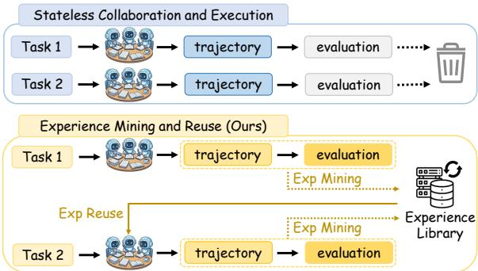  
Figure 1: Illustration of the experience mining and reuse mechanism in EMR versus traditional instanceindependent reasoning.

However, existing medical multi-agent systems suffer from two key limitations. (1) Most current approaches are static, relying on fixed reasoning strategies, which often lead to recurring diagnostic errors when facing complex or previously unseen clinical cases (Lin et al., 2025b; Miao et al., 2026; Spieser et al., 2025). (2) As illustrated in Figure 1, medical multi-agent systems typically treat each task as an isolated instance, failing to learn from past successful clinical experiences or to avoid previously encountered diagnostic mistakes (Flesch et al., 2018). This lack of experience accumulation fundamentally limits their ability to improve robustness and reliability in medical reasoning.

We argue that the missing component is an explicit and persistent experience abstraction. Rather than evolving prompts (Yuksekgonul et al., 2024; Zhang et al., 2025c) or workflows (Lin et al., 2025a; Zhang et al., 2025a; Shang et al., 2024) in isolation, multi-agent systems should extract reusable knowledge from their own reasoning trajectories and store it in a form that is transferable, scalable, and model-agnostic. Such experience should capture not only successful reasoning strategies but also systematic failure modes, enabling agents to avoid repeating past mistakes (Cai et al., 2025; Wu et al., 2025). In clinical practice, such experience naturally corresponds to accumulated diagnostic guidelines, common reasoning heuristics, and representative patient cases learned from prior successes and failures.

To this end, we propose EMR, a medical multiagent system with experience, which enables selfevolving through experience mining and reuse. The multi-agent architecture of EMR is designed to mirror multidisciplinary clinical decision-making workflows. Specifically, a planner agent assigns relevant medical departments, department agents generate domain-specific reasoning trajectories, and a summary agent integrates cross-department analyses to produce final decisions. During the multiagent collaboration process, EMR automatically mines both golden and warning experiences from agent trajectories and incrementally updates its experience library.

Crucially, EMR organizes experience into a three-level hierarchy—principles, patterns, and cases—corresponding to clinical guidelines, common diagnostic heuristics, and representative patient cases, respectively. This hierarchical design allows high-level medical reasoning strategies to generalize across tasks while preserving fine-grained clinical details when needed. During inference, agents reuse relevant experiences to guide reasoning, enabling the system to continuously improve clinical reasoning performance without modifying model parameters.

We evaluate EMR on multiple medical question answering benchmarks. Experimental results show that EMR consistently outperforms static multiagent baselines, outperforming MDAgents (Kim et al., 2024) by 3.3%, 2.0%, and 1.5% in average accuracy. Detailed analysis indicates that experiences exhibit transferability across both different backbone LLMs and datasets. These findings indicate that explicit experience modeling provides a practical and scalable path toward continuously evolving medical multi-agent systems.

The main contributions are summarized as follows:

• We propose EMR, a medical multi-agent system that supports self-evolving through experience mining and reuse within a hierarchical experience library.

• We empirically demonstrate the effectiveness of EMR on medical question answering benchmarks, highlighting the complementary roles of different experience types.

• We show that experiences mined from different LLMs or datasets are transferable and remain human-readable, providing actionable guidance for improving multi-agent reasoning strategies.

## 2 Related Work

## 2.1 Multi-Agent Collaboration in Medical

Recent work has explored multi-agent collaboration as a promising paradigm for improving LLM performance in medical tasks. AI Hospital (Fan et al., 2025) and Self-Evolving Multi-Agent Simulations (Almansoori et al., 2025) construct realistic clinical environments where multiple medical agents interact, adapt, and evolve, enabling systematic evaluation of LLMs under complex clinical workflows. For medical reasoning and decision-making, MedAgents (Tang et al., 2024) and MDAgents (Kim et al., 2024) show that collaborative LLMs with role specialization, adaptive coordination, and consensus mechanisms can significantly enhance single-LLM reasoning and clinical decision quality, while ReConcile (Chen et al., 2024b) further demonstrates the benefits of consensus among diverse LLMs for robust reasoning. Beyond reasoning, ColaCare (Wang et al., 2025) applies LLM-driven multi-agent collaboration to electronic health record modeling, and nomadic multi-agent systems (Dhasarathan et al., 2024) have been used to quantify and protect privacy in dynamic e-healthcare settings. Overall, these studies highlight the effectiveness of multi-agent collaboration in advancing medical reasoning, simulation, and clinical data modeling.

## 2.2 Experience-Driven Agent Evolution

Recently, experience-driven evolution has emerged as a promising approach for enabling LLM agents to accumulate and reuse past interaction knowledge. ExpeL (Zhao et al., 2024) stores raw trajectories without structured abstraction, while ReasoningBank (Ouyang et al., 2025) generates parallel trajectories under the same model, and G-Memory (Zhang et al., 2026a) encodes experiences into complex graph structures. In the medical domain, MDTeamGPT (Chen et al., 2025) accumulates consultation experiences as flat summaries for specific agents, whereas EvolveR (Wu et al., 2025) employs GRPO to enhance experience utilization but requires additional computation and parameter updates. Overall, these methods emphasize experience storage or retrieval rather than systematic abstraction and hierarchical reuse within collaborative multi-agent systems, leaving open how accumulated experience can be structured and transferred across diverse agents to support continuous medical reasoning improvement—an issue we address in this work.

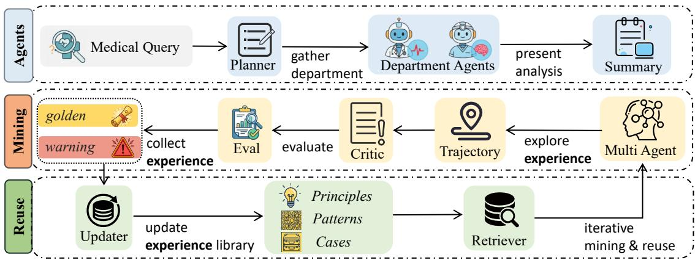  
Figure 2: Our proposed EMR diagram. Agents correspond to Section 3.1 and represent the multi-agent collaborative system. Mining corresponds to Section 3.2 and focuses on analyzing multi-agent collaboration trajectories to mine experiential knowledge. Reuse corresponds to Section 3.3, where extracted experiences are integrated into an experience library and reused to guide subsequent tasks, enabling iterative mining and reuse.

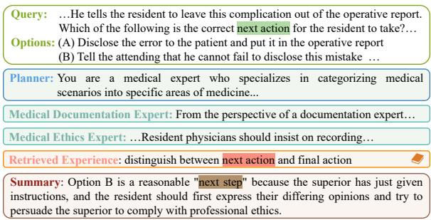  
Figure 3: An illustration of EMR reasoning process.

## 3 Method

In this section, we present the components of EMR. As illustrated in Figure 3 and Figure 2, EMR integrates a structured multi-agent collaboration system with an explicit experience library, enabling agents to evolve without updating model parameters. The pipeline comprises three core components: (i) a multi-agent medical system (Section 3.1), (ii) experience mining from collaboration trajectories (Section 3.2), and (iii) experience reuse through hierarchical update and retrieval (Section 3.3).

## 3.1 Multi-Agent Medical System

Given a medical multiple-choice question q and options $\mathcal { O } \ = \ \{ o _ { 1 } , o _ { 2 } , . . . , o _ { K } \}$ , EMR simulates a multi-department clinical consultation through three types of agents: a planner agent (3.1.1), multiple department agents (3.1.2), and a summary agent (3.1.3).

## 3.1.1 Planner Agent

Medical questions often span multiple clinical domains, with different options requiring reasoning from distinct diagnostic perspectives (Heist et al., 2014; Stringer et al., 2021). Without explicit domain awareness, downstream agents tend toward redundant or irrelevant exploration (Zhang et al., 2025b; Aryal et al., 2024). To address this, we introduce a planner agent that structures the reasoning space by identifying relevant medical domains at both the question and option levels.

Specifically, the planner assigns question-level domains $\mathcal { D } _ { q } ~ = ~ \{ d _ { 1 } ^ { ( q ) } , \ldots , d _ { M } ^ { ( q ) } \}$ , capturing the core clinical specialties, and option-level domains $\mathcal { D } _ { o } = \{ d _ { 1 } ^ { ( o ) } , \dots , d _ { N } ^ { ( o ) } \}$ for evaluating options from diverse perspectives. Incorporating retrieved prior experience ${ \mathcal { E } } _ { r }$ (Section 3.3.3), the planner leverages accumulated patterns to improve domain assignment and avoid previously observed errors. Formally:

$$
\begin{array} { l } { \mathcal { D } _ { q } = \mathrm { L L M } ( q , \mathcal { E } _ { r } \mid r _ { p } , \pi _ { q } ) , } \\ { \mathcal { D } _ { o } = \mathrm { L L M } ( q , \mathcal { O } , \mathcal { E } _ { r } \mid r _ { p } , \pi _ { o } ) , } \end{array}\tag{1}
$$

where $r _ { p }$ denotes the planner role, $\pi _ { q }$ and $\pi _ { o }$ are prompts for question-level and option-level domain identification, respectively, both incorporating domain taxonomies and task-specific constraints.

By decomposing the reasoning space into domain-specific subproblems, the planner enables downstream department agents to focus on clinically relevant knowledge, laying the groundwork for coordinated collaboration.

## 3.1.2 Department Agents

While the planner structures the reasoning space, accurate medical decision-making requires indepth, domain-specific analysis grounded in clinical knowledge and prior experience. We introduce department agents, each emulating a medical expert specialized in a particular clinical domain.

For each domain $d \in \mathcal { D } _ { q } \cup \mathcal { D } _ { o } ,$ a department agent performs focused reasoning conditioned on the question, candidate options, and retrieved experience:

$$
a _ { d } = \mathrm { L L M } ( q , \mathcal { O } , d , \mathcal { E } _ { r } \mid r _ { d } , \pi _ { d } ) ,\tag{2}
$$

where $r _ { d }$ denotes the domain expert role, and $\pi _ { d }$ is a domain-specific reasoning prompt guiding the agent to incorporate both medical knowledge and historical experience. All analyses are collected as:

$$
\begin{array} { r } { \mathcal { A } = \{ a _ { d } \ | \ d \in \mathcal { D } _ { q } \cup \mathcal { D } _ { o } \} . } \end{array}\tag{3}
$$

By decomposing medical reasoning into parallel, domain-focused analyses enriched with retrieved experience, department agents provide diverse yet complementary perspectives for the summary agent to integrate.

## 3.1.3 Summary Agent

While department agents provide parallel, domainspecific analyses, effective medical decisionmaking requires reconciling potentially complementary or conflicting viewpoints into a coherent global judgment. We introduce a Summary Agent that acts as a coordinating medical consultant, integrating cross-department evidence to derive the final prediction.

Beyond simple aggregation, the summary agent performs reflective reasoning by jointly considering the department analyses and retrieved experience, enabling it to resolve contradictions and correct local errors using accumulated prior experiences. Formally:

$$
\boldsymbol { \hat { y } } , \ a _ { \mathrm { s u m } } = \mathrm { L L M } ( \boldsymbol { q } , \boldsymbol { \mathcal { O } } , \boldsymbol { \mathcal { A } } , \boldsymbol { \mathcal { E } } _ { r } \mid r _ { s } , \pi _ { s } ) ,\tag{4}
$$

where $\hat { y }$ is the predicted answer, $a _ { \mathrm { s u m } }$ the synthesized analysis, $r _ { s }$ the summary role, and $\pi _ { s }$ an aggregation prompt.

By jointly leveraging multi-department analyses and experience retrieval, the summary agent produces a globally consistent reasoning outcome that reflects both distributed expert knowledge and accumulated experiential insights.

## 3.2 Experience Mining

EMR enables self-evolving by explicitly mining experiences from multi-agent collaboration trajectories. This process involves trajectory generation (3.2.1) and experience collection (3.2.2).

## 3.2.1 Multi-Agent Collaboration Trajectory Generation

To support experience-driven evolution, EMR records the entire multi-agent reasoning process as a structured trajectory. In medical settings, learning from experience critically depends on understanding how decisions are made, which intermediate judgments contribute to success or failure, and where errors originate.

For each sample, EMR produces a complete reasoning trajectory:

$$
\tau = ( q , \mathcal { O } , \mathcal { D } _ { q } , \mathcal { D } _ { o } , \mathcal { A } , a _ { \mathrm { s u m } } , \hat { y } ) ,\tag{5}
$$

where the planner specifies relevant domains, department agents generate domain-specific analyses, and the summary agent synthesizes crossdepartment reasoning into a final decision. This trajectory captures intermediate reasoning steps and their organizational structure, forming the fundamental unit for subsequent experience mining.

To distinguish effective from erroneous reasoning, each trajectory is evaluated against the groundtruth answer y. A trajectory is successful if $\hat { y } = y ;$ and failed otherwise. This binary outcome provides a supervision signal enabling EMR to extract reusable experience from both correct reasoning paths and informative failures.

## 3.2.2 Experience Collection and Categorization

Reasoning trajectories alone do not directly constitute reusable knowledge. EMR distills trajectories into compact, transferable experience representations that abstract away case-specific details while preserving critical reasoning signals. Learning in medical reasoning requires leveraging both successful decision patterns and informative failures that reveal systematic weaknesses.

Given a completed trajectory τ , EMR extracts experience entries ϵ in natural language that encode reusable reasoning knowledge. We categorize experiences into two complementary types:

• Golden Experience: distilled from successful trajectories, capturing effective reasoning strategies, diagnostic principles, and validated decision patterns.

• Warning Experience: distilled from failed trajectories, summarizing failure causes, misleading cues, and recurring error patterns to avoid in future reasoning.

This dual categorization allows EMR to learn symmetrically from both successes and failures, preventing overfitting to correct outcomes while promoting robust error awareness. Formally:

$$
\epsilon = { \mathrm { C o l l e c t } } ( \tau , y \mid r _ { c } , \pi _ { c } ) ,\tag{6}
$$

where $r _ { c }$ denotes the collector role and $\pi _ { c }$ the experience mining prompt. The collector compares the trajectory outcome with the ground-truth label $y ,$ identifies salient reasoning behaviors or failure modes, and abstracts them into experience entries for long-term accumulation.

## 3.3 Experience Reuse

EMR supports continual evolution by systematically reusing accumulated experiences during inference, comprising three components: hierarchical experience library (3.3.1), update mechanism (3.3.2), and experience retrieval (3.3.3).

## 3.3.1 Hierarchical Experience Library

A key challenge in experience-driven multi-agent systems is accumulating knowledge without uncontrolled growth or sacrificed generalization. EMR adopts a hierarchical experience library $\mathcal { L }$ with three abstraction levels:

$$
\mathcal { L } = \{ \mathcal { L } ^ { \mathrm { p r i n c i p l e } } , \mathcal { L } ^ { \mathrm { p a t t e r n } } , \mathcal { L } ^ { \mathrm { c a s e } } \} .\tag{7}
$$

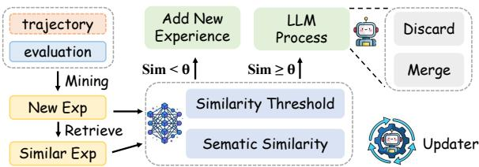  
Figure 4: The process of updating the experience library.

At the highest level, $\mathcal { L } ^ { \mathrm { p r i n c i p l e } }$ stores abstract diagnostic rules and high-level reasoning principles. The intermediate level $\mathcal { L } ^ { \mathrm { p a t t e r n } }$ captures reusable reasoning structures and decision templates. At the lowest level, $\mathcal { L } ^ { \mathrm { c a s e } }$ contains concrete, contextspecific examples preserving detailed clinical reasoning traces. This hierarchical organization balances abstraction and specificity, enabling both compact storage and flexible reuse.

## 3.3.2 Experience Update Mechanism

Given a newly generated experience ϵ, the updater agent determines whether and how to incorporate it into the library. The core objective is to preserve coherence and compactness while allowing novel experience to accumulate. Equivalent or redundant entries are discarded or merged rather than blindly added.

The update process consists of three steps. First, the updater retrieves potentially related experiences:

$$
\mathcal { R } = \mathrm { R e t r i e v e } ( \mathcal { L } _ { t } , \epsilon ) ,\tag{8}
$$

where $\mathcal { L } _ { t }$ denotes the library at step t.

Second, the updater estimates semantic relevance between ϵ and R. Each experience is encoded into a semantic vector, and similarity is computed via cosine similarity:

$$
\mathrm { S i m } ( \epsilon , \mathcal { R } ) = \operatorname* { m a x } _ { \epsilon _ { i } \in \mathcal { R } } \frac { \mathbf { e } ( \epsilon ) \cdot \mathbf { e } ( \epsilon _ { i } ) } { \| \mathbf { e } ( \epsilon ) \| , \| \mathbf { e } ( \epsilon _ { i } ) \| } ,\tag{9}
$$

where $\mathbf { e } ( \cdot )$ denotes the embedding function.

Finally, the library is updated according to:

$$
\begin{array} { r l } & { \mathcal { L } _ { t + 1 } = } \\ & { \quad \left\{ \begin{array} { l l } { \mathcal { L } _ { t } \cup \{ \epsilon \} , \mathrm { ~ i f ~ } \mathrm { S i m } ( \epsilon , \mathcal { R } ) < \theta , } \\ { ( \mathcal { L } _ { t } \setminus \mathcal { R } ) \cup \mathrm { L L M \_ P r o c e s s } ( \mathcal { R } , \epsilon ) , \mathrm { o t h e r w i s e } . } \end{array} \right. } \end{array}\tag{10}
$$

When similarity falls below θ, the experience is considered novel and added directly. Otherwise, the LLM determines whether to merge them into a more compact representation or discard ϵ if it adds no reasoning value.

This mechanism enables scalable experience accumulation by combining lightweight similaritybased routing with LLM-based semantic consolidation, ensuring the library evolves in a structured and reusable manner.

## 3.3.3 Experience Retrieval Mechanism

Accumulated experience is only valuable if effectively reused during future reasoning. Rather than statically encoding experience into model parameters, EMR treats the experience library as an external, model-agnostic knowledge source dynamically queried at inference time.

Given a query context c, the retrieval mechanism selects relevant experiences:

$$
\mathcal { E } _ { r } = \mathrm { R e t r i e v e } ( \mathcal { L } , c , k ) ,\tag{11}
$$

where k denotes the number of retrieved entries. Retrieval proceeds hierarchically: the agent first identifies relevant high-level principles, then retrieves associated reasoning patterns, and finally accesses concrete cases grounding abstract knowledge in specific scenarios.

The retrieved experiences are injected into the planner, department, and summary agents as external guidance, shaping reasoning behavior without modifying model parameters. By conditioning reasoning on accumulated experience, EMR enables agents to benefit from prior successes, avoid previously observed failures, and generalize beyond their original training distribution.

## 4 Experiments

## 4.1 Experimental Setup

Datasets. We evaluate EMR on a diverse set of medical reasoning benchmarks, including MedQA (Jin et al., 2021), MedMCQA (Pal et al., 2022), PubMedQA (Jin et al., 2019), MMLU (Hendrycks et al., 2020), and MMLU-Pro (Wang et al., 2024). These datasets cover a wide range of medical problem types, from clinical decision-making to complex medical reasoning, providing a comprehensive testing platform for evaluating medical multi-agent systems.

Implementation. We instantiate EMR with Qwen3-8B (Team, 2025) and GPT-4o (Hurst et al., 2024) to examine robustness across model scales and architectures. The numbers of domain experts for the question and options are set as: m = 3, n = 2. Analogous to training epochs, we set the number of data mining iterations to 5 in our implementation. More implementation details see Appendix A. All reported results are averaged over three independent runs.

Baselines. We compare EMR against both single-LLM and medical multi-agent baselines. We use zero-shot prompting (Kojima et al., 2022) as a single-LLM baseline. Multi-agent baselines include MedAgents (Tang et al., 2024) and MDAgents (Kim et al., 2024), which represent state-of-the-art static medical multiagent systems. Additionally, we compare against experience-based reasoning methods including ExpeL (Zhao et al., 2024), Reasoning-Bank (Ouyang et al., 2025), G-Memory (Zhang et al., 2026a), MDTeamGPT (Chen et al., 2025), and EvolveR (Wu et al., 2025).

## 4.2 Main Results

Comparison with static multi-agent systems. Table 1 shows that EMR consistently outperforms existing medical multi-agent systems across all LLMs and datasets. Under Qwen3-8B, EMR raises the average accuracy from 77.8 (MDAgents) to 81.1; under GPT-4o, it reaches 93.9. Unlike single-LLM baselines, EMR decomposes complex problems and enables structured collaboration. Compared to prior multi-agent methods, EMR introduces explicit experience mining and reuse, avoiding static role assignment and recurring failures.

Comparison with experience-based methods. Among experience-based approaches, EvolveR achieves 92.7 (MedQA) and 86.5 (MedMCQA) via GRPO optimization, while MDTeamGPT reaches 88.6 on MedMCQA with flat consultation summaries. Others (ExpeL, ReasoningBank, G-Memory) lag due to limited abstraction or adaptation. EMR surpasses all, achieving 96.8 on MedQA (+4.1) and 89.2 on MedMCQA (+0.6), with larger gains on complex USMLE-style questions. On MMLU-Pro (Health & Biology), EMR consistently beats all baselines across LLMs. Notably, EMR also boosts smaller LLMs like Qwen3-8B, closing the gap with larger models, while still enhancing strong LLMs such as GPT-4o.e-driven reasoning complements model capacity rather than replacing it.

Table 1: Main results (Accuracy %) on various medical benchmarks. The datasets include MedQA (USMLE), MedMC. (representing MedMCQA, Indian medical exams), PubMed. (representing PubMedQA, biomedical research questions), and various subsets of MMLU and MMLU-Pro, specifically: Ant. (Anatomy), Clin. (Clinical Knowledge), Coll. (College Medicine), Gen. (Medical Genetics), Hea. (Health), and Bio. (Biology). Bold indicates the best performance within each backbone model group.
<table><tr><td>Method</td><td>MedQA</td><td>MedMC. PubMed.</td><td></td><td>Ant.</td><td>Clin.</td><td>Coll.</td><td>Gen.</td><td>Hea.</td><td>Bio.</td><td>Avg.</td></tr><tr><td colspan="9">Qwen3-8B</td><td></td><td></td></tr><tr><td>Single-LLM</td><td>70.2</td><td>66.5</td><td>72.1</td><td>68.8</td><td>71.4</td><td>69.5</td><td>73.2</td><td>60.1</td><td>65.8</td><td>68.6</td></tr><tr><td>MedAgents</td><td>75.4</td><td>72.3</td><td>77.2</td><td>76.5</td><td>79.1</td><td>75.8</td><td>78.4</td><td>66.5</td><td>73.6</td><td>75.0</td></tr><tr><td>MDAgents</td><td>77.8</td><td>75.6</td><td>80.5</td><td>78.9</td><td>81.5</td><td>77.2</td><td>82.1</td><td>69.5</td><td>76.8</td><td>77.8</td></tr><tr><td>ExpeL</td><td>76.5</td><td>73.8</td><td>79.2</td><td>77.5</td><td>80.1</td><td>76.8</td><td>80.5</td><td>68.2</td><td>75.1</td><td>76.4</td></tr><tr><td>ReasoningBank</td><td>77.2</td><td>74.5</td><td>79.8</td><td>78.2</td><td>80.8</td><td>77.5</td><td>81.2</td><td>68.8</td><td>75.8</td><td>77.1</td></tr><tr><td>G-Memory</td><td>77.8</td><td>75.1</td><td>80.2</td><td>78.8</td><td>81.4</td><td>77.8</td><td>81.8</td><td>69.2</td><td>76.3</td><td>77.6</td></tr><tr><td>MDTeamGPT</td><td>78.5</td><td>76.2</td><td>81.0</td><td>79.5</td><td>82.1</td><td>78.5</td><td>82.6</td><td>70.1</td><td>77.0</td><td>78.4</td></tr><tr><td>EvolveR</td><td>79.8</td><td>77.0</td><td>82.1</td><td>80.8</td><td>83.5</td><td>79.8</td><td>83.9</td><td>71.2</td><td>78.1</td><td>79.6</td></tr><tr><td>EMR (Ours)</td><td>81.0</td><td>78.8</td><td>83.5</td><td>82.2</td><td>85.4</td><td>80.9</td><td>84.7</td><td>73.1</td><td>80.5</td><td>81.1</td></tr><tr><td colspan="9">GPT-40</td><td></td><td></td></tr><tr><td>Single-LLM</td><td>86.5</td><td>83.1</td><td>82.4</td><td>85.9</td><td>88.1</td><td>87.2</td><td>89.5</td><td>79.2</td><td>83.4</td><td>85.0</td></tr><tr><td>MedAgents</td><td>91.5</td><td>87.4</td><td>89.2</td><td>90.5</td><td>94.1</td><td>91.8</td><td>93.2</td><td>83.4</td><td>88.9</td><td>90.0</td></tr><tr><td>MDAgents</td><td>93.8</td><td>90.5</td><td>91.6</td><td>92.8</td><td>96.2</td><td>93.5</td><td>95.8</td><td>85.6</td><td>91.4</td><td>92.4</td></tr><tr><td>ExpeL</td><td>87.4</td><td>84.1</td><td>83.5</td><td>86.8</td><td>89.2</td><td>88.1</td><td>90.3</td><td>80.1</td><td>84.5</td><td>86.0</td></tr><tr><td>ReasoningBank</td><td>88.6</td><td>85.5</td><td>84.8</td><td>88.1</td><td>90.5</td><td>89.2</td><td>91.6</td><td>81.3</td><td>85.8</td><td>87.2</td></tr><tr><td>G-Memory</td><td>89.3</td><td>84.9</td><td>85.2</td><td>88.5</td><td>90.9</td><td>89.6</td><td>92.0</td><td>81.8</td><td>86.2</td><td>87.6</td></tr><tr><td>MDTeamGPT</td><td>90.1</td><td>88.6</td><td>86.5</td><td>89.4</td><td>92.1</td><td>90.8</td><td>93.1</td><td>82.9</td><td>87.5</td><td>88.9</td></tr><tr><td>EvolveR</td><td>92.7</td><td>86.5</td><td>88.1</td><td>91.2</td><td>93.8</td><td>92.5</td><td>94.9</td><td>84.2</td><td>89.1</td><td>90.3</td></tr><tr><td>EMR (Ours)</td><td>96.8</td><td>89.2</td><td>93.4</td><td>94.7</td><td>97.5</td><td>95.4</td><td>98.2</td><td>86.8</td><td>93.1</td><td>93.9</td></tr></table>

Table 2: Ablation study on MedQA and MedMC datasets with Qwen3-8B. Exp: Experience, Pla: Planner, Dep: Department Agents.
<table><tr><td>Method</td><td>MedQA Acc. (%)</td><td>MedMC Acc. (%)</td></tr><tr><td>Single-LLM</td><td>70.2</td><td>66.5</td></tr><tr><td>EMR (Full)</td><td>81.0</td><td>78.8</td></tr><tr><td>w/o Exp</td><td>74.3</td><td>71.2</td></tr><tr><td>w/o Exp + Pla</td><td>72.8</td><td>69.5</td></tr><tr><td>w/o Exp + Pla + Dep</td><td>70.5</td><td>67.8</td></tr><tr><td>w/o Pla + Dep</td><td>78.1</td><td>75.4</td></tr></table>

## 5 Ablation Study

## 5.1 Ablation Study on EMR Components

To assess the contribution of each EMR component, we conduct ablation experiments by progressively removing key modules (Table 2). Removing experience mining and retrieval (w/o Exp) causes a 6.7% drop, reducing EMR to the level of static systems like MedAgents. This shows that multiagent collaboration alone is insufficient without experience accumulation. Among all components, experience yields the largest performance gain, underscoring its central role in enabling continuous improvement.

Table 3: Ablation study for the sub-components of the Experience module on MedQA and MedMC datasets with Qwen3-8B.
<table><tr><td>Method</td><td>MedQA Acc. (%)</td><td>MedMC Acc. (%)</td></tr><tr><td>EMR (Full)</td><td>81.0</td><td>78.8</td></tr><tr><td>w/o Cases</td><td>79.8</td><td>77.4</td></tr><tr><td>w/o Patterns</td><td>78.5</td><td>75.9</td></tr><tr><td>w/o Principles</td><td>76.4</td><td>73.5</td></tr></table>

Interestingly, when planner and department agents are removed but experience is retained (w/o Pla + Dep), EMR still maintains strong performance, with only a 2.9% decrease compared to the full model. This suggests that accumulated experience can partially compensate for the absence of explicit role decomposition by directly guiding the summary agent’s reasoning.

## 5.2 Ablation Study on Experience Hierarchy

We analyze the impact of different experience hierarchy levels using the ablation results in Table 3. Removing case-level experiences leads to a modest 1.2% drop, indicating that concrete historical cases offer useful but limited guidance. Ablating patternlevel experiences causes a larger 2.5% degradation, suggesting that abstracted reasoning patterns are more important for generalization across questions. The most significant decline occurs when principlelevel experiences are removed, with a substantial 4.6% drop that brings EMR close to baseline performance. These results confirm that principle-level knowledge serves as the core transferable component for robust reasoning across diverse medical scenarios, while all three levels work complementarily to support overall system performance.

## 6 Analysis

## 6.1 Experience Transferability

Table 4 shows that experiences mined by stronger models such as GPT-4o and DeepSeek-V3 (DeepSeek-AI, 2024) yield substantial gains when reused by smaller models (e.g., Qwen3-8B), reflecting their richer medical knowledge, more reliable reasoning patterns, and higher-quality failure summaries. Notably, this transferability is bidirectional: even strong LLMs benefit from reusing experiences mined by smaller models, which contribute diverse diagnostic perspectives, alternative reasoning heuristics, and complementary error patterns.

Table 4: The impact of experience from different models on other models.
<table><tr><td>w/o Exp</td><td>+ Qwen</td><td>+ GPT-40</td></tr><tr><td colspan="3">MedQA</td></tr><tr><td>Qwen3</td><td>74.3 81.0 (+6.7)</td><td>83.9 (+9.6)</td></tr><tr><td>DeepSeek</td><td>86.2 92.5 (+6.3)</td><td>94.5 (+8.3)</td></tr><tr><td colspan="3">MedMCQA</td></tr><tr><td>Qwen3</td><td>71.3 78.8 (+7.5)</td><td>81.2 (+9.9)</td></tr><tr><td>DeepSeek</td><td>79.1 84.6 (+5.5)</td><td>86.1 (+7.0)</td></tr><tr><td colspan="3">PubMedQA</td></tr><tr><td>Qwen3</td><td>76.2 83.5 (+7.3)</td><td>86.2 (+10.0)</td></tr><tr><td>DeepSeek</td><td>81.5 86.5 (+5.0)</td><td>88.4 (+6.9)</td></tr></table>

Table 5: Cross-dataset experience analysis.
<table><tr><td>Source</td><td>MedQA</td><td>MedMCQA</td></tr><tr><td>MedQA</td><td>81.0 (+6.7)</td><td>74.8 (+3.5)</td></tr><tr><td>MedMCQA</td><td>77.5 (+3.2)</td><td>78.8 (+7.5)</td></tr></table>

Table 5 presents a cross-dataset analysis of experience transferability. While experiences mined from the same dataset yield the strongest improvements on their corresponding benchmarks, experiences extracted from one dataset also consistently improve performance when transferred to different datasets. This indicates that the experience library captures generalizable medical reasoning knowledge rather than dataset-specific heuristics. Notably, the accumulated experiences remain effective across datasets with different question styles and distributions, demonstrating that the experience library serves as a transferable and reusable knowledge resource for medical multi-agent reasoning.

## 6.2 Experience Analysis

Through qualitative analysis of mined reasoning trajectories, we identify several recurring failure patterns in medical multi-agent reasoning. (1) Reliance on parametric knowledge rather than clinical guidelines occurs when agents default to internally memorized facts instead of explicitly reasoning with authoritative diagnostic or treatment standards. (2) Medical concept confusion is frequently observed, where closely related conditions, symptoms, or clinical terms are incorrectly conflated, leading to flawed intermediate reasoning. (3) Superficial causal reasoning arises when agents focus on surface-level correlations while failing to identify the underlying pathophysiological cause of a condition. Finally, (4) collective hallucination in multi-agent collaboration emerges when multiple agents reinforce an incorrect assumption without sufficient cross-verification, amplifying shared errors instead of correcting them. Examples see Appendix E.

## 7 Conclusion

We presented EMR, a self-evolving medical multiagent system driven by experience mining and reuse. By organizing golden and warning experiences into principle-, pattern-, and case-level knowledge, EMR progressively improves medical reasoning quality and robustness. Experiments across multiple medical benchmarks demonstrate consistent gains over strong multi-agent baselines, while ablation and transfer studies verify the effectiveness and reusability of the experience library. Overall, our results suggest that explicit experience modeling provides a scalable and interpretable framework for improving medical multiagent systems and experience-driven collaborative LLM agents.

## Limitations

Despite the promising performance of EMR, several limitations remain.

First, EMR currently focuses on text-based medical question answering benchmarks and does not incorporate multimodal clinical information such as medical imaging, laboratory signals, or electronic health records. Real-world clinical decision-making often depends on heterogeneous data sources, and extending experience mining and reuse to multimodal settings remains an important direction for future work.

Second, the quality of the experience library is inherently dependent on the reasoning quality of the underlying LLMs. Although EMR can extract both golden and warning experiences, incorrect or hallucinated reasoning trajectories may still introduce noisy experiences into the library. While the similarity-based update mechanism partially mitigates this issue, more robust experience verification and filtering strategies are still needed.

Third, the current experience retrieval mechanism mainly relies on semantic similarity and hierarchical abstraction, which may not fully capture complex causal relationships between medical cases. As the experience library grows, retrieval efficiency and long-term maintenance may also become increasingly challenging.

Finally, although EMR improves reasoning performance on benchmark datasets, our experiments are conducted in controlled offline evaluation settings rather than real clinical environments. The system has not been validated for real-world medical deployment, and its outputs should not be interpreted as clinical advice. Future work should investigate human-in-the-loop evaluation, clinical safety constraints, and collaboration with healthcare professionals before practical adoption.

## References

Mohammad Almansoori, Komal Kumar, and Hisham Cholakkal. 2025. Self-evolving multi-agent simulations for realistic clinical interactions. arXiv preprint arXiv:2503.22678.

Shiva Aryal, Tuyen Do, Bisesh Heyojoo, Sandeep Chataut, Bichar Dip Shrestha Gurung, Venkataramana Gadhamshetty, and Etienne Gnimpieba. 2024. Leveraging multi-ai agents for cross-domain knowledge discovery. arXiv preprint arXiv:2404.08511.

Zhicheng Cai, Xinyuan Guo, Yu Pei, Jiangtao Feng, Jinsong Su, Jiangjie Chen, Ya-Qin Zhang, Wei-Ying Ma, Mingxuan Wang, and Hao Zhou. 2025. Flex: Continuous agent evolution via forward learning from experience. arXiv preprint arXiv:2511.06449.

Jianlv Chen, Shitao Xiao, Peitian Zhang, Kun Luo, Defu Lian, and Zheng Liu. 2024a. Bge m3-embedding: Multi-lingual, multi-functionality, multi-granularity text embeddings through self-knowledge distillation. Preprint, arXiv:2402.03216.

Justin Chen, Swarnadeep Saha, and Mohit Bansal. 2024b. Reconcile: Round-table conference improves reasoning via consensus among diverse llms. In Proceedings ofthe 62nd Annual Meeting ofthe Associationfor Computational Linguistics (Volume 1: Long Papers), pages 7066–7085.

Kai Chen, Xinfeng Li, Tianpei Yang, Hewei Wang, Wei Dong, and Yang Gao. 2025. Mdteamgpt: A self-evolving llm-based multi-agent framework for multi-disciplinary team medical consultation. arXiv preprint arXiv:2503.13856.

Yanyu Chen, Yue Li, Yongyi Cui, Dongsheng Shi, and Lichang Dai. 2026. Reinforcement learning for large language model selective evidence adoption from contaminated retrieval results. arXiv preprint arXiv:2607.20090.

DeepSeek-AI. 2024. Deepseek-v3 technical report. Preprint, arXiv:2412.19437.

Chandramohan Dhasarathan, M Shanmugam, Manish Kumar, Diwakar Tripathi, Shailesh Khapre, and Achyut Shankar. 2024. A nomadic multi-agent based privacy metrics for e-health care: a deep learning approach. Multimedia Tools and Applications, 83(3):7249–7272.

Zhihao Fan, Lai Wei, Jialong Tang, Wei Chen, Wang Siyuan, Zhongyu Wei, and Fei Huang. 2025. Ai hospital: Benchmarking large language models in a multi-agent medical interaction simulator. In Proceedings of the 31st International Conference on Computational Linguistics, pages 10183–10213.

Timo Flesch, Jan Balaguer, Ronald Dekker, Hamed Nili, and Christopher Summerfield. 2018. Comparing continual task learning in minds and machines. Proceedings of the National Academy of Sciences, 115(44):E10313–E10322.

Brian Sanjay Heist, Jed David Gonzalo, Steven Durning, Dario Torre, and David Michael Elnicki. 2014. Exploring clinical reasoning strategies and test-taking behaviors during clinical vignette style multiplechoice examinations: a mixed methods study. Journal ofgraduate medical education, 6(4):709–714.

Dan Hendrycks, Collin Burns, Steven Basart, Andy Zou, Mantas Mazeika, Dawn Song, and Jacob Steinhardt. 2020. Measuring massive multitask language understanding. arXiv preprint arXiv:2009.03300.

Sirui Hong, Mingchen Zhuge, Jonathan Chen, Xiawu Zheng, Yuheng Cheng, Ceyao Zhang, Jinlin Wang, Zili Wang, Steven Ka Shing Yau, Zijuan Lin, and 1 others. 2024. Metagpt: Meta programming for a multi-agent collaborative framework. International Conference on Learning Representations, ICLR.

Aaron Hurst, Adam Lerer, Adam P Goucher, Adam Perelman, Aditya Ramesh, Aidan Clark, AJ Ostrow, Akila Welihinda, Alan Hayes, Alec Radford, and 1 others. 2024. Gpt-4o system card. arXiv preprint arXiv:2410.21276.

Di Jin, Eileen Pan, Nassim Oufattole, Wei-Hung Weng, Hanyi Fang, and Peter Szolovits. 2021. What disease does this patient have? a large-scale open domain question answering dataset from medical exams. Applied Sciences, 11(14):6421.

Qiao Jin, Bhuwan Dhingra, Zhengping Liu, William Cohen, and Xinghua Lu. 2019. Pubmedqa: A dataset for biomedical research question answering. In Proceedings of the 2019 conference on empirical methods in natural language processing and the 9th international joint conference on natural language processing (EMNLP-IJCNLP), pages 2567–2577.

Yubin Kim, Chanwoo Park, Hyewon Jeong, Yik S Chan, Xuhai Xu, Daniel McDuff, Hyeonhoon Lee, Marzyeh Ghassemi, Cynthia Breazeal, and Hae W Park. 2024. Mdagents: An adaptive collaboration of llms for medical decision-making. Advances in Neural Information Processing Systems, 37:79410–79452.

Takeshi Kojima, Shixiang Shane Gu, Machel Reid, Yutaka Matsuo, and Yusuke Iwasawa. 2022. Large language models are zero-shot reasoners. Advances in neural information processing systems, 35:22199– 22213.

Yue Li, Xin Yi, Dongsheng Shi, Gerard De Melo, Xiaoling Wang, and Linlin Wang. 2025. Hierarchical safety realignment: Lightweight restoration of safety in pruned large vision-language models. In Findings of the Association for Computational Linguistics: ACL 2025, pages 7600–7612.

Jiaye Lin, Yifu Guo, Yuzhen Han, Sen Hu, Ziyi Ni, Licheng Wang, Mingguang Chen, Hongzhang Liu, Ronghao Chen, Yangfan He, and 1 others. 2025a. Se-agent: Self-evolution trajectory optimization in multi-step reasoning with llm-based agents. arXiv preprint arXiv:2508.02085.

Yanna Lin, Shaojie Xu, Wenshuo Zhang, Yushi Sun, Zixin Chen, Yanjie Zhang, and Rui Sheng. 2025b. A survey of llm-based multi-agent systems in medicine. Preprints.

Yongming Miao, Jiaxin Wen, Yuemei Luo, and Jin Li. 2026. Medarc: Adaptive multi-agent refinement and collaboration for enhanced medical reasoning in large language models. International Journal ofMedical Informatics, 206:106136.

Siru Ouyang, Jun Yan, I Hsu, Yanfei Chen, Ke Jiang, Zifeng Wang, Rujun Han, Long T Le, Samira Daruki, Xiangru Tang, and 1 others. 2025. Reasoningbank: Scaling agent self-evolving with reasoning memory. arXiv preprint arXiv:2509.25140.

Ankit Pal, Logesh Kumar Umapathi, and Malaikannan Sankarasubbu. 2022. Medmcqa: A large-scale multi-subject multi-choice dataset for medical domain question answering. In Conference on health, inference, and learning, pages 248–260. PMLR.

Yu Shang, Yu Li, Keyu Zhao, Likai Ma, Jiahe Liu, Fengli Xu, and Yong Li. 2024. Agentsquare: Automatic llm agent search in modular design space. arXiv preprint arXiv:2410.06153.

Dongsheng Shi, Yue Li, Xin Yi, Yongyi Cui, Huawei Feng, and Linlin Wang. 2026a. Surgent: A surgical multi-agent assistance system across the perioperative workflow. arXiv preprint arXiv:2605.29368.

Dongsheng Shi, Xin Yi, Yue Li, and Linlin Wang. 2026b. Benchmarking large language models for end-to-end clinical support in traditional chinese medicine. Expert Systems with Applications, page 132267.

Significant-Gravitas. 2023. Autogpt: Build, deploy, and run ai agents. https://github.com/ Significant-Gravitas/AutoGPT. GitHub repository.

Jackson Spieser, Ali Balapour, Jarek Meller, Krushna Patra, and Behrouz Shamsaei. 2025. Multi-agent ai systems for biological and clinical data analysis. Preprints.

JK Stringer, Sally A Santen, Eun Lee, Meagan Rawls, Jean Bailey, Alicia Richards, Robert A Perera, and Diane Biskobing. 2021. Examining bloom’s taxonomy in multiple choice questions: students’ approach to questions. Medical Science Educator, 31(4):1311– 1317.

Xiangru Tang, Anni Zou, Zhuosheng Zhang, Ziming Li, Yilun Zhao, Xingyao Zhang, Arman Cohan, and Mark Gerstein. 2024. Medagents: Large language models as collaborators for zero-shot medical reasoning. In Findings ofthe Associationfor Computational Linguistics: ACL 2024, pages 599–621.

Qwen Team. 2025. Qwen3 technical report. Preprint, arXiv:2505.09388.

XAgent Team. 2023. Xagent: An autonomous agent for complex task solving.

Yubo Wang, Xueguang Ma, Ge Zhang, Yuansheng Ni, Abhranil Chandra, Shiguang Guo, Weiming Ren, Aaran Arulraj, Xuan He, Ziyan Jiang, and 1 others. 2024. Mmlu-pro: A more robust and challenging multi-task language understanding benchmark. Advances in Neural Information Processing Systems, 37:95266–95290.

Zixiang Wang, Yinghao Zhu, Huiya Zhao, Xiaochen Zheng, Dehao Sui, Tianlong Wang, Wen Tang, Yasha Wang, Ewen Harrison, Chengwei Pan, and 1 others. 2025. Colacare: Enhancing electronic health record modeling through large language model-driven multiagent collaboration. In Proceedings of the ACM on Web Conference 2025, pages 2250–2261.

Rong Wu, Xiaoman Wang, Jianbiao Mei, Pinlong Cai, Daocheng Fu, Cheng Yang, Licheng Wen, Xuemeng Yang, Yufan Shen, Yuxin Wang, and 1 others. 2025. Evolver: Self-evolving llm agents through an experience-driven lifecycle. arXiv preprint arXiv:2510.16079.

Xin Yi, Yue Li, Shunfan Zheng, Linlin Wang, Xiaoling Wang, and Liang He. 2025. Unified attacks to large language model watermarks: spoofing and scrubbing in unauthorized knowledge distillation. Knowledge-Based Systems, page 114295.

Mert Yuksekgonul, Federico Bianchi, Joseph Boen, Sheng Liu, Zhi Huang, Carlos Guestrin, and James Zou. 2024. Textgrad: Automatic" differentiation" via text. arXiv preprint arXiv:2406.07496.

Guibin Zhang, Muxin Fu, Kun Wang, Frank Wan, Miao Yu, and Shuicheng Yan. 2026a. G-memory: Tracing hierarchical memory for multi-agent systems. Advances in Neural Information Processing Systems, 38:12988–13018.

Guibin Zhang, Luyang Niu, Junfeng Fang, Kun Wang, Lei Bai, and Xiang Wang. 2025a. Multi-agent architecture search via agentic supernet. arXiv preprint arXiv:2502.04180.

Heng Zhang, Yuling Shi, Xiaodong Gu, Haochen You, Zijian Zhang, Lubin Gan, Yilei Yuan, and Jin Huang. 2025b. D3mas: Decompose, deduce, and distribute for enhanced knowledge sharing in multi-agent systems. arXiv preprint arXiv:2510.10585.

Kaituo Zhang, Zhen Xiong, Mingyu Zhong, Zhimeng Jiang, Zhouyuan Yuan, Zhecheng Li, and Ying Lin. 2026b. Are tools all we need? unveiling the tool-use tax in llm agents. arXiv preprint arXiv:2605.00136.

Qizheng Zhang, Changran Hu, Shubhangi Upasani, Boyuan Ma, Fenglu Hong, Vamsidhar Kamanuru, Jay Rainton, Chen Wu, Mengmeng Ji, Hanchen Li, and 1 others. 2025c. Agentic context engineering: Evolving contexts for self-improving language models. arXiv preprint arXiv:2510.04618.

Andrew Zhao, Daniel Huang, Quentin Xu, Matthieu Lin, Yong-Jin Liu, and Gao Huang. 2024. Expel: Llm agents are experiential learners. In Proceedings

of the AAAI Conference on Artificial Intelligence, volume 38, pages 19632–19642.

## A Implementation Details

For MedQA and MedMCQA, we split the datasets evenly, using half for experience mining and the other half for evaluation. For PubMedQA, 500 instances are used for experience mining and another 500 (official test set) for evaluation. MMLU (anatomy, clinical knowledge, college medicine, medical genetics) and MMLU-Pro (health, biology) are evenly split between experience mining and testing, with 200 instances per selected MMLU-Pro subset. We adopt bge-m3 (Chen et al., 2024a) as the semantic embedding model and set the similarity threshold to 0.85 (See Appendix B for more details). The number of retrieved experience is 3. Statistically, the cost of experience mining is approximately \$5 per 100 samples (5 epochs), with a total runtime of about 2 hours, while inference takes around 45 seconds per sample.

## B Sensitivity Analysis of Similarity Threshold θ

The similarity threshold θ controls how strictly the retriever filters historical experiences during the update phase. A low threshold admits noisy or irrelevant experiences, while an excessively high threshold may leave the experience bank too sparse to provide meaningful guidance. To determine the optimal operating point, we sweep $\theta \in \{ 0 . 7 0 , 0 . 8 0 , 0 . 8 5 , 0 . 9 0 \}$ on the MedQA and MedMCQA validation sets using the Qwen3-8B backbone.

Table 6: Sensitivity of the experience update mechanism to the similarity threshold θ and ablation on experience types (Qwen3-8B).
<table><tr><td>Setting</td><td>MedQA</td><td>MedMCQA</td></tr><tr><td>θ = 0.70</td><td>80.1</td><td>77.9</td></tr><tr><td>θ = 0.80</td><td>80.7</td><td>78.5</td></tr><tr><td>θ = 0.85 (default)</td><td>81.0</td><td>78.8</td></tr><tr><td>θ = 0.90</td><td>80.5</td><td>78.3</td></tr><tr><td>Golden-only</td><td>78.4</td><td>76.2</td></tr><tr><td>Golden + Warning (Ours)</td><td>81.0</td><td>78.8</td></tr></table>

Threshold sensitivity. As shown in Table 6, θ = 0.85 yields the best performance on both benchmarks (81.0 on MedQA and 78.8 on MedM-CQA). When θ drops to 0.70, accuracy falls by 0.9 and 0.9 points, respectively, indicating that overly permissive retrieval introduces distractive or lowquality experiences that mislead the reasoning process. Conversely, raising θ to 0.90 degrades performance by 0.5 and 0.5 points, suggesting that excessive filtering prunes useful cases and reduces coverage of the experience bank. The sweet spot at 0.85 strikes a balance between precision and recall of retrieved experiences.

{cases\_str}

Ablation on experience types. We further ablate the contribution of warning experiences. Using only golden (correct) experiences results in a substantial drop of 2.6 points on MedQA and 2.6 points on MedMCQA compared to our full setting. This confirms that warning experiences—capturing failed reasoning patterns and error-prone knowledge boundaries—are complementary to golden ones. They act as guardrails that help the model recognize and avoid previously encountered mistakes, thereby improving robustness on challenging medical questions.

## C Prompts

## C.1 Prompt for Medical Experience Collection from Multi-Agent Reasoning

You are a senior medical education expert specializing in mining reusable medical experience from multi-agent clinical reasoning trajectories.

## Task Description

Given a complete multi-agent medical reasoning trajectory, you are required to:

• Determine whether the final prediction is correct.

• Analyze the reasoning behaviors throughout the multiagent collaboration process.

• Extract structured and reusable medical experience.

## Reasoning Trajectory

{trajectory\_text}

## Evaluation Criteria

• Ground-truth answer: {golden\_answer\_idx} ({golden\_answer})

• Model prediction: {pred\_answer}

• Trajectory status: {"Successful" if is\_success else "Failed"}

## Experience Collection Requirements

Based on the above trajectory, please extract the following type.

## Experience Levels

Principle

High-level diagnostic rules and clinical guidelines. Stable, abstract, and broadly applicable. Limited to 30–50 words.

## Pattern

Reusable reasoning templates and decision-making structures describing how to think and analyze. Limited to 30–50 words.

Case

Concrete clinical scenario examples. {"Successful" if is\_success else "Failure"}-oriented analysis. Limited to 40–60 words.

## Important Notes

• Analyze the complete reasoning trajectory, including Planner, Department Agents, and Summary Agent.

• Pay attention to consensus formation and disagreement resolution.

• Extract abstract and reusable experience rather than restating the original question.

## Output Format

```jsonl
"is_correct": "{str(is_success).lower()}",
"principle":
"pattern"
"case":
}
```

## C.2 Prompt for Planner Agents

You are a medical expert who specializes in categorizing medical scenarios into specific areas of medicine. You can leverage accumulated reasoning patterns from past experiences to improve domain assignment and avoid previously observed errors. You need to complete the following steps:

1. Carefully read the medical scenario presented in the question:

”’{question}”’

Retrieved Relevant Experience

The following experiences are retrieved from the experience library. Please consider them when assigning domains:

Principles

{principles\_str}

Note: If the above experiences are not relevant to the current question, please ignore them; if they are valuable, please incorporate them into your domain assignment.

2. Based on the medical scenario, classify the question into {num\_domains} different subfields of medicine.

3. You should output in exactly the same format as:

”’{domain\_format}”’

Output only the formatted result, no explanation needed.

## C.3 Prompt for Department Agent Medical Analysis

You are a senior {department} expert with extensive clinical experience and profound medical knowledge. Based on your professional background and the retrieved relevant experiences, please conduct an in-depth analysis of the following medical multiple-choice question.

Question Information

Question:

{question}

Options:

## {options}

## Retrieved Relevant Experiences

The following experiences, including successful strategies (Golden) and lessons from failures (Warning), have been retrieved from the experience library. Please incorporate them into your analysis:

{principles\_str}

{patterns\_str}

{cases\_str}

Note:

\- Golden experiences demonstrate correct reasoning paths and verification strategies.

\- Warning experiences highlight common error patterns and pitfalls to avoid.

\- Combine both perspectives: leverage successful methods while proactively avoiding known errors.

Please use professional and rigorous medical language, demonstrating both your expertise and clinical reasoning process.

## C.4 Prompt for Summary Agent

You are a senior medical diagnostic expert specializing in integrating multidisciplinary opinions to make a final judgment. Based on the analysis from various department experts and the retrieved relevant experiences, please provide a comprehensive assessment for this medical multiple-choice question.

## Question Information

Question:

{question}

Options:

{options\_str}

Departmental Expert Analyses

{all\_analysis}

## Retrieved Relevant Experiences

The following experiences, including successful strategies (Golden) and lessons from failures (Warning), have been retrieved from the experience library. Please refer to these during your synthesis:

{principles\_str}

{patterns\_str}

{cases\_str}

Note:

\- Golden experiences demonstrate correct reasoning paths and verification strategies.

\- Warning experiences highlight common error patterns and pitfalls to avoid.

\- Leverage successful methods while proactively avoiding known errors mentioned in Warning experiences.

Comprehensive Analysis Task

Please complete the following steps:

1. Synthesized Judgment: Weigh departmental opinions according to their professional relevance. Identify diagnostic traps or common errors (referencing Warning experiences) and apply the correct reasoning patterns from Golden experiences.

2. Final Answer: Clearly state the correct option (must be one of {list(options.keys())}), summarize the core rationale for your choice, and explain how to prevent common mistakes related to this problem.

## Output Format

Please output in the following format:

[Comprehensive Analysis]

(Provide a detailed comprehensive analysis, including

opinion consolidation, evidence analysis, and the judg  
ment process.)   
[Final Answer]   
(Output only the option letter, e.g., A)

## D Case Study

## Question:

A junior orthopaedic surgery resident is completing a carpal tunnel repair with the department chairman as the attending physician. During the case, the resident inadvertently cuts a flexor tendon. The tendon is repaired without complication. The attending tells the resident that the patient will do fine, and there is no need to report this minor complication that will not harm the patient, as he does not want to make the patient worry unnecessarily. He tells the resident to leave this complication out of the operative report. Which of the following is the correct next action for the resident to take?

(A) Disclose the error to the patient and put it in the operative report

(B) Tell the attending that he cannot fail to disclose this mistake

(C) Report the physician to the ethics committee

(D) Refuse to dictate the operative report

Experts: Medical Ethics, Orthopaedic Surgery, Medical Documentation

## Analyses from various experts:

Medical Ethics Expert: Resident physicians should insist on recording complications in the surgical record and disclosing them to the patient. This is a direct reflection of upholding patient autonomy, ensuring medical transparency, and fulfilling professional responsibility. If superiors object, resident physicians should still insist and, if necessary, seek support from the hospital ethics committee.

Orthopaedic Surgery Expert: As a senior orthopedic specialist, I emphasize that the growth of resident physicians includes learning to uphold professional standards under pressure. In this case, despite pressure from superiors, the correct course of action was to honestly record and inform the patient. This protects both the patient and the physician’s own professional integrity.

Medical Documentation Expert: From the perspective of a seasoned medical documentation expert, the completeness of medical records is non-negotiable; any intraoperative event must be recorded truthfully. Furthermore, honesty with the patient is central to the doctorpatient relationship. Faced with an erroneous instruction from superiors, the correct action is to uphold professional ethics.

## Summary:

«Experience Retrieved: When ethical obligations conflict with directives from superiors, one must distinguish between ’process steps’ and ’final actions’.»

Option B is a reasonable "next step" because the superior has just given instructions, and the resident should first express their differing opinions and try to persuade the superior to comply with professional ethics. If the superior still insists, the resident should record and disclose (A), but that is a second step.

## E Experience Examples

Below is a detailed example of the experience.

• Parametric Over-reliance. An agent recommends immediate PCI for a STEMI patient based on the general belief that “PCI is superior,” while neglecting a critical guideline constraint: when the expected delay to PCI exceeds 120 minutes, fibrinolysis should be the preferred reperfusion strategy.

• Medical Concept Confusion. In a legal– medical reasoning task, agents conflate the regulatory definitions of hospital infection outbreak and hospital infection prevalence, resulting in an incorrect judgment of the mandatory reporting timeframe (12 hours vs. 24 hours).

• Superficial Causal Reasoning. When confronted with a limb trauma case presenting numbness and coolness, agents focus on surface correlations and diagnose a nerve injury, failing to identify the underlying pathophysiological cause: acute arterial occlusion, in which neurological symptoms are secondary to ischemia.

• Collective Hallucination. During a pharmacology discussion, multiple agents correctly recognize that 5-FU inhibits thymidylate synthase, but reinforce each other’s false assumption that its structure mimics thymine (T), collectively overlooking the fact that 5-FU is a uracil (U) analogue.

## F Ablation Study on the Number of Agents

This study investigates how the number of agents affects the performance and experience accumulation of EMR. The motivation is twofold: first, to understand whether increasing the number of agents leads to better medical reasoning performance; and second, to examine how agent multiplicity influences the diversity and scale of mined experience. Since EMR relies on collaborative reasoning and experience mining from agent trajectories, the number of agents directly controls the breadth of analytical perspectives available during inference.

As shown in Figure 5, increasing the number of agents generally improves accuracy across all benchmarks, particularly when moving from a small number of agents to a moderate scale. This trend suggests that additional agents introduce complementary medical perspectives, enabling more comprehensive exploration of diagnostic hypotheses and reducing reasoning blind spots. However, performance gains gradually saturate as the number of agents continues to grow, indicating diminishing returns once sufficient analytical coverage is achieved. Beyond performance, increasing the number of agents substantially enlarges the experience library by enriching the diversity of reasoning trajectories, particularly when scaling from a small number of agents.

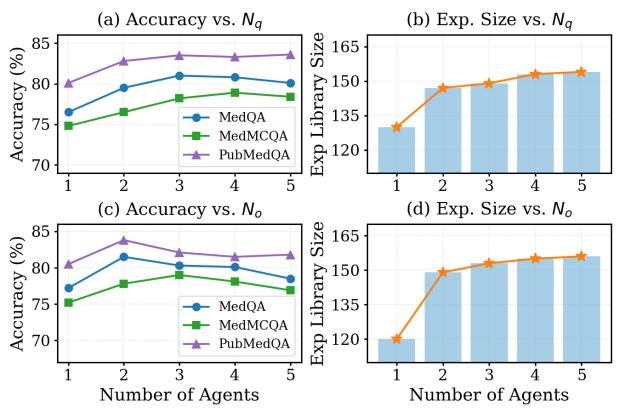  
Figure 5: The impact of the number of agents on accuracy and experience library size. The ablation experiments are conducted on the Qwen3-8B model and the MedQA dataset.

## G Ablation Study on Retrieved Experience Size

As shown in Figure 6, increasing the number of retrieved experience blocks improves performance in the early stage, with the most significant gains observed when N increases from 1 to 3. This suggests that a small set of diverse and highly relevant experiences is sufficient to effectively guide multiagent reasoning by reusing successful diagnostic strategies and avoiding previously identified failure patterns.

Notably, the diminishing performance gains beyond this range indicate that EMR benefits more from the quality and abstraction level of reused experience than from sheer quantity. Since experiences in EMR are distilled into reusable principles and patterns, a limited number of experience blocks can already provide strong guidance, reflecting an efficient form of experience reuse rather than simple memory retrieval. From a clinical perspective, this trend aligns with human medical reasoning, where a few representative guidelines or prior cases often suffice to inform diagnosis, while excessive prior information may introduce redundancy or distraction. These findings further suggest that EMR achieves self-evolving not by increasing inferencetime context indiscriminately, but by progressively mining and reusing compact, high-level experience that remains effective even under limited retrieval budgets.

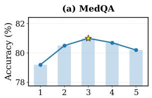

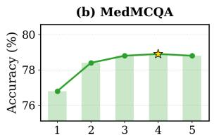

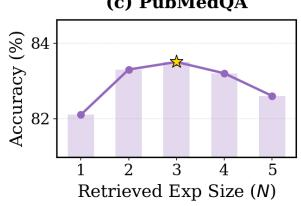

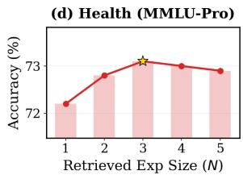  
Figure 6: The impact of the number of retrieved experiences on performance. The ablation experiments are conducted using the Qwen3-8B model on the MedQA, MedMCQA, PubMedQA, and Health (MMLU-Pro) datasets.

## H Effect of Experience Library Size

We evaluate EMR over multiple experience accumulation epochs, where newly collected experiences from agent reasoning trajectories are incrementally merged into the experience library. We track both the growth of the experience library and the corresponding test accuracy to examine how medical reasoning performance evolves with accumulated clinical experience.

As shown in Figure 7, test accuracy consistently improves as the experience library expands across epochs. Performance gains are particularly pronounced in the early epochs, indicating that newly mined experiences effectively capture high-value clinical knowledge, such as common diagnostic reasoning patterns and frequently observed failure modes, which can be immediately reused to guide subsequent medical decision making. As the number of epochs increases, the discovery rate of novel and informative clinical experiences gradually decreases, leading to a slower growth of the experience library. Correspondingly, performance improvements become more moderate and eventually stabilize. This saturation effect suggests that EMR progressively distills the most salient medical experience embedded in agent trajectories, after which additional accumulation primarily yields redundant or marginal clinical guidance.

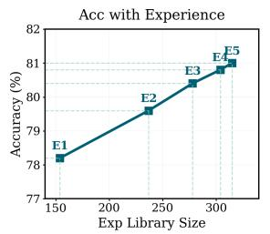

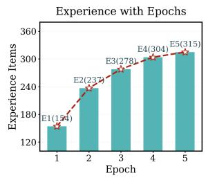  
Figure 7: The size of the experience library varies with the number of mining epochs. The analysis experiments are conducted on the Qwen3-8B model and the MedQA dataset.

## I Computational Cost & Efficiency Analysis

As shown in Table 7, both the token consumption and inference latency of EMR remain fully practical, while consistently outperforming existing medical multi-agent baselines in efficiency. Our multi-agent architecture is intentionally designed to be lightweight and efficient. Although inspired by MedAgents, EMR removes the expensive multi-round discussion mechanism commonly used for consensus-reaching, and instead introduces an experience-based conflict resolution strategy. During the entire collaborative reasoning process, the experience module consumes only around 300 additional tokens and requires approximately 2 seconds for retrieval.

In contrast, RECONCILE and MDAgents rely on more complex collaborative pipelines involving iterative reporting or multi-round discussions, which inevitably result in substantially higher token usage and longer inference time. These results demonstrate that explicit experience reuse can improve reasoning quality without introducing excessive computational overhead.

## J Generalizability of EMR

To further evaluate the generalizability of the proposed experience mechanism, we integrate EMR into existing medical multi-agent frameworks. To our knowledge, this is the first attempt to incorporate an explicit experience mining and reuse mechanism into medical multi-agent systems. Importantly, EMR is not restricted to a specific architecture and can be naturally extended to any multiagent framework capable of collecting reasoning trajectories.

Table 7: Efficiency comparison of different methods.
<table><tr><td>Method</td><td>Avg. Tokens / Sample</td><td>Avg. Time / Sample (s)</td></tr><tr><td>Single-LLM (CoT)</td><td>200</td><td>5</td></tr><tr><td>MedAgents (Tang et al., 2024)</td><td>1500</td><td>18</td></tr><tr><td>RECONCILE (Chen et al., 2024b)</td><td>2500</td><td>33</td></tr><tr><td>MDAgents (Kim et al., 2024)</td><td>1900</td><td>23</td></tr><tr><td>EMR (Ours)</td><td>1200</td><td>15</td></tr></table>

As shown in Table 8, integrating EMR consistently improves the performance of both MDAgents and RECONCILE on MedQA and MedM-CQA under the GPT-4o backbone. Specifically, MDAgents improves from 93.8 to 96.5 on MedQA and from 90.5 to 92.7 on MedMCQA after incorporating EMR. Similarly, RECONCILE achieves gains of 2.7 and 2.4 points, respectively.

These results suggest that the benefits of experience mining and reuse are architecture-agnostic and can serve as a general enhancement strategy for collaborative medical reasoning systems.

Table 8: Generalizability of EMR under the GPT-4o backbone.
<table><tr><td>Method</td><td>MedQA</td><td>MedMCQA</td></tr><tr><td>MDAgents (Kim et al., 2024)</td><td>93.8</td><td>90.5</td></tr><tr><td>MDAgents (w/ EMR)</td><td>96.5</td><td>92.7</td></tr><tr><td>RECONCILE (Chen et al., 2024b)</td><td>92.1</td><td>88.2</td></tr><tr><td>RECONCILE (w/ EMR)</td><td>94.8</td><td>90.6</td></tr></table>

## K Comparison with Prior Experience-Based Methods

As shown in Table 9, the hierarchical experience library in EMR differs fundamentally from prior experience-based methods in both representation and retrieval strategy, enabling a unified framework that balances generalization and specificity.

Existing approaches typically rely on storing raw reasoning trajectories or flat experience summaries, which often suffer from limited abstraction ability and weak transferability across tasks. In contrast, EMR organizes experience hierarchically into principles, patterns, and cases. Principle-level experiences capture abstract and transferable diagnostic knowledge, improving generalization across diverse medical reasoning scenarios. Pattern-level experiences encode reusable reasoning structures, while case-level experiences preserve detailed clinical contexts that directly support fine-grained rea-

soning.

Furthermore, prior methods generally retrieve only a few similar instances in a flat manner. EMR instead adopts hierarchical retrieval, progressively retrieving high-level principles, reasoning patterns, and representative cases, thereby enabling both broad reasoning guidance and detailed clinical grounding during inference.

## L Sensitivity to Experience Library Size and Quality

As shown in Table 10, EMR remains robust under both limited and noisy experience settings, consistently outperforming standard multi-agent systems even when the experience library is significantly constrained or partially corrupted.

When only 20% of the original experience library is retained, EMR still achieves 76.8 on MedQA and 75.4 on MedMCQA, substantially exceeding the performance of the system without experience. Even under the extreme setting where only 10% of experiences are available, EMR preserves strong reasoning capability, indicating that a small number of high-level principles and reusable reasoning patterns already provide substantial guidance for medical decision-making.

We further evaluate robustness under noisy experience conditions by injecting irrelevant or lowquality experiences into the library. Although performance gradually declines as noise increases, EMR remains relatively stable, achieving 79.3 under 20% noise and 78.4 under 40% noise on MedQA. This robustness mainly stems from the hierarchical organization and experience merging mechanism, which mitigate the influence of noisy or redundant experiences through semantic consolidation and abstraction.

These findings suggest that EMR does not rely solely on large-scale memory accumulation. Instead, the principle-level abstraction and hierarchical refinement mechanisms enable the system to preserve strong reasoning performance even under sparse or imperfect experience conditions.

Table 9: Comparison with prior experience-based methods.
<table><tr><td>Aspect</td><td>Prior Methods</td><td>EMR (Ours)</td></tr><tr><td>Representation</td><td>Raw trajectories / flat summaries</td><td>Hierarchical (principles, patterns, cases)</td></tr><tr><td>Generalization</td><td>Limited</td><td>Strong (via principles)</td></tr><tr><td>Detail Learning</td><td>Indirect</td><td>Direct (via cases)</td></tr><tr><td>Retrieval</td><td>Few instances</td><td>Hierarchical retrieval</td></tr></table>

Table 10: Sensitivity to experience library size and quality using the Qwen3-8B backbone.
<table><tr><td>Setting</td><td>MedQA</td><td>MedMCQA</td></tr><tr><td>Full EMR</td><td>81.0</td><td>78.8</td></tr><tr><td>Limited Exp (20%)</td><td>76.8</td><td>75.4</td></tr><tr><td>Limited Exp (10%)</td><td>76.3</td><td>74.7</td></tr><tr><td>Noisy Exp (+20% noise)</td><td>79.3</td><td>76.9</td></tr><tr><td>Noisy Exp (+40% noise)</td><td>78.4</td><td>75.0</td></tr><tr><td>w/o Experience</td><td>75.3</td><td>72.1</td></tr></table>

## M Potential Risks

Although EMR is designed as a research framework for improving medical multi-agent reasoning, several potential risks should be acknowledged.

First, EMR may generate incorrect or misleading medical reasoning due to hallucinations, incomplete knowledge, or flawed collaboration among agents. Since the experience library accumulates knowledge from model-generated trajectories, erroneous reasoning patterns may propagate across future inferences if not properly filtered.

Second, the reuse of historical experiences may introduce bias amplification. Experiences mined from benchmark datasets or particular LLMs may overrepresent certain medical reasoning styles, disease distributions, or clinical assumptions, potentially reducing robustness when applied to diverse real-world populations or uncommon clinical cases.

Third, EMR may increase users’ overreliance on AI-generated medical suggestions. Although the system improves reasoning consistency, it is not a substitute for licensed medical professionals. Incorrect outputs in high-stakes clinical settings could lead to harmful medical decisions if used without expert supervision.

Fourth, experience storage and retrieval mechanisms may raise privacy and security concerns in practical deployments involving real patient data. While our experiments only use publicly available benchmark datasets, extending EMR to real-world clinical environments would require strict compliance with medical data protection regulations and careful anonymization of stored experiences.

Finally, the multi-agent collaboration process substantially increases computational cost and inference latency compared to single-agent systems, which may limit scalability and accessibility in resource-constrained healthcare environments.