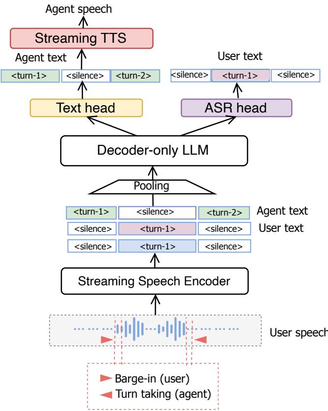

# Enabling Streaming User Transcription in Full-Duplex Speech-to-Speech Models

Ke Hu, Nourchene Ferchichi, Edresson Casanova, Ankita Pasad,

Elena Rastorgueva, Chen Chen, Nithin Rao Koluguri, Piotr Zelasko,

Yifan Peng, Hainan Xu, Zhehuai Chen, Boris Ginsburg

NVIDIA

kevinhu@nvidia.com

Abstract—Full-duplex speech-to-speech (S2S) models enable natural conversational AI by allowing simultaneous listening and speaking. However, these models typically lack inherent user speech transcription, which is essential for applications such as conversation logging, accessibility features, and quality monitoring. In this work, we propose an efficient method to add streaming ASR capabilities to an existing duplex S2S model by introducing a lightweight ASR head in parallel to the agent text head. Our approach requires minimal additional parameters and no significant architectural changes to the base S2S model, enabling real-time user transcription while preserving full-duplex conversational capabilities including turn-taking and barge-in handling. Experimental results demonstrate that our method achieves streaming average WER of 10.21% on the HuggingFace Open ASR Leaderboard within the duplex S2S framework. Additionally, we show that the same architecture trained as a standalone streaming ASR model achieves competitive results (7.73% WER) compared to current SOTA models. We will open-source our training and inference code to facilitate further research in joint streaming ASR and S2S modeling.

## I. INTRODUCTION

Streaming automatic speech recognition (ASR) is fundamental to real-time human-computer interaction, enabling applications such as live captioning, voice assistants, and conversational AI. As large language models (LLMs) [1]–[10] have transformed natural language processing, there is growing interest in extending these capabilities to speech or multimodal inputs. Recent work has explored adapting LLMs to process speech or multimodal inputs for various tasks [3], [11]–[17]. A fully capable conversational speech system benefits from not only agent response generation but also streaming user transcription capabilities alongside features such as turn-taking and barge-in handling.

There have been a number of works on incorporating speech inputs to LLMs. Traditional spoken dialogue systems cascade ASR, LLM, and TTS modules [18], and while they naturally provide user transcriptions, this approach has potentially higher latency and makes it difficult to incorporate paralinguistic information in S2S modeling. This has motivated research into end-to-end speech-to-speech (S2S) models. Initial efforts focused on half-duplex, turn-based interactions [13], [16], [17], [19]–[23], which still fail to capture the interactive nature of real dialogue. Some systems like gpt-realtime [3], [24], Freeze-Omni [16], FireRedChat [25], and FlexDuo [26] achieve low-latency interactions through external voice activity detection and turn-taking modules, but fundamentally rely on explicit turn detection rather than simultaneous processing. Recently, full-duplex S2S models have emerged that enable simultaneous listening and speaking. Moshi [27] and PersonaPlex [28] are full-duplex conversational models that jointly model both user and agent audio streams with depthbased attention mechanisms, but require extensive speech-text pretraining from scratch and do not provide streaming user transcription capabilities. Other approaches like SyncLLM [29] and OmniFlatten [30] also achieve full-duplex conversation through various architectural designs but share the same limitation of lacking explicit user transcription outputs. Recent work has explored augmenting duplex speech LLMs with chain-of-thought reasoning by interleaving ASR and reasoning tokens within a single text monologue stream [31], though this conflates transcription and reasoning into a shared channel rather than treating ASR as a dedicated output.

A recent duplex S2S architecture [32], [33] demonstrated that any text LLM can be converted into a full-duplex conversational agent without requiring extensive speech-text pretraining, by using a pretrained streaming encoder for user input and parallel text and audio heads for agent output. However, this architecture does not provide explicit user speech transcription, which is valuable for downstream applications such as conversation logging, accessibility features, and quality monitoring.

In this work, we build on this duplex S2S architecture by introducing a streaming ASR head in parallel to the agent text head, enabling the model to perform continuous speech recognition while maintaining full-duplex conversational capabilities. Our approach enables frame-level streaming ASR within a decoder-only LLM architecture, allowing simultaneous speech recognition and agent response generation. We further demonstrate that the same architecture can be trained as a standalone streaming ASR model, achieving competitive results on standard benchmarks.

Our main contributions are as follows:

• We propose an efficient method to add streaming ASR capabilities to a full-duplex S2S model, requiring minimal additional parameters while preserving turn-taking and barge-in performance.

• We demonstrate that the S2S model achieves streaming ASR capability, enabling real-time user transcription alongside agent response generation.

• We show that the same architecture trained as a standalone ASR model achieves competitive results on the HuggingFace Open ASR Leaderboard [34].

• We will open-source our training and inference code to facilitate reproducibility and enable further research in joint streaming ASR and S2S modeling.

## II. RELATED WORK

Recent advances in streaming ASR have led to several notable systems. Encoder-based models such as FastConformer [35], [36] and Parakeet [37] achieve state of the art performance using conformer blocks with cache-based inference, but it is unclear how to incorporate them into a fullduplex S2S model. Kyutai STT [38] achieves strong streaming ASR performance but lacks the conversational capabilities required for a full-duplex framework. LLM-based approaches such as Qwen-ASR [39] leverage the language understanding of large models for speech recognition, but rely on chunkbased processing where minimum latency is determined by chunk size, making integration with continuously streaming S2S models prohibitively complex.

Separately, significant progress has been made in full-duplex spoken dialogue modeling. Moshi [27] and PersonaPlex [28] enable simultaneous listening and speaking by jointly modeling user and agent audio streams, but require extensive speechtext pretraining from scratch and do not provide streaming user transcription. Systems like Freeze-Omni [16], FireRedChat [25], and FlexDuo [26] reduce interaction latency through external voice activity detection and turn-taking modules, but fundamentally rely on explicit turn detection rather than truly simultaneous processing. SALM-Duplex [32] and its system demonstration [33] convert any pretrained text LLM into a full-duplex agent without requiring speech pretraining, but similarly lack explicit user transcription output. A related line of work explores augmenting duplex speech LLMs with transcription by interleaving ASR and reasoning tokens within a single text stream [31], but this conflates transcription and reasoning into a shared channel rather than treating ASR as a dedicated parallel output. Our work addresses this by adding a dedicated streaming ASR head to the SALM-Duplex architecture, enabling real-time user transcription alongside full-duplex conversation capabilities.

## III. MODEL ARCHITECTURE

## A. Full-Duplex S2S Model

Our work builds upon the duplex speech-to-speech (S2S) architecture proposed in [32], [33] by adding a streaming ASR head. As shown in Figure 1, our extended model processes three input streams: user speech, user transcript, and agent text. User speech is first encoded by a 600M parameter Parakeet streaming speech encoder [37], generating continuous embeddings at an 80ms frame rate. The backbone LLM is initialized from NVIDIA Nemotron-Nano-9B-v2-Base [40], a 9 billion parameter decoder-only language model optimized for reasoning and instruction-following tasks. The generated user and agent text tokens are autoregressively fed back as inputs to the backbone LLM.

  
Fig. 1. Our architecture for adding a streaming ASR head to the speech-totext part of the S2S duplex model. The model takes continuous user audio embeddings, previous ASR and agent text tokens as inputs, and outputs user ASR and agent text in parallel.

The model is trained with multi-channel next token prediction, simultaneously generating user text and agent text through parallel heads. The user and agent embeddings are time-aligned and added before being passed to the decoderonly LLM, together with input user speech encoding. We use equal loss for user and agent text prediction. Unlike streaming ASR, agent text is predicted without word-level alignment to give the user a preview of the agent response before speech generation finishes. Our agent text with turn taking information is then fed to a streaming TTS [41] to generate agent speech. In this work, to incorporate user speech transcription, we focus on modifying the speech-to-text part of the architecture.

In this work, our training includes a pretraining stage followed by supervised fine-tuning (SFT). During pretraining, the model is trained on interleaved speech-to-text conversation data. In the SFT stage, we fine-tune the model on a mixture of diverse data sources including multi-turn conversational data and ASR transcription data. To improve robustness to diverse acoustic conditions, we apply background noise augmentation during the SFT stage with 0.5 probability, where additive noise is randomly selected from a collection of over 60,000 noise files. The signal-to-noise ratio (SNR) is randomly sampled in a wide range to enable the model to handle various acoustic environments.

## B. Streaming ASR Head

We augment the duplex S2S architecture by introducing a streaming ASR module in parallel to the existing agent text head. This module consists of both a separate embedding layer and a prediction head for user transcription. Both layers are initialized from the original corresponding LLM backbone layers. As illustrated in Figure 1, the ASR head takes the LLM’s hidden states and predicts user transcription tokens in a streaming fashion, while the separate embedding layer allows the model to learn user text representations independently from the agent text embeddings. This design enables real-time speech recognition concurrent with agent response generation.

The streaming ASR head shares the same LLM backbone as the agent text head, allowing it to leverage the contextual understanding from the conversation flow. Only a single decoding pass is needed to jointly produce both user and agent texts. During training, we add an ASR loss term using next token prediction that supervises the user transcription output alongside the agent text loss. This joint training enables the model to perform streaming ASR while maintaining its full-duplex conversational capabilities. For the standalone streaming ASR configuration, we train the model without the agent text heads, focusing solely on the streaming speech recognition task.

## C. On-the-fly (OTF) Forced Alignment

To enable streaming ASR training, we require frame-level alignment between user speech and transcription text. We use the torchaudio CTC-based forced alignment API with the MMS-FA acoustic model [42] for on-the-fly (OTF) forced alignment during training. Given user speech audio and transcripts, the forced aligner produces word-level timestamps that are used to align text with speech. We then use the timestamps to align text tokens with speech frames at the start of each word.

To improve streaming ASR quality, we introduce a user text delay $d _ { u }$ that shifts the transcription targets forward in time relative to the speech frames. On the other hand, to facilitate agent turn taking, we apply a separate agent text delay $d _ { a }$ to help the agent learn reliable timing to respond. The delays $d _ { u }$ and $d _ { a }$ are hyperparameters that control the trade-off between streaming ASR latency and turn taking accuracy.

For word-level alignment, we experimented with both left alignment (text tokens aligned to the start of each word) and right alignment (text tokens aligned to the end of each word). We found that left alignment yields better performance, presumably because speech onset is easier to detect in this setup. Between consecutive words, we use pad tokens to fill the frames where no text prediction is required. For example, the phrase “hello world” with left-aligned tokens would produce the target sequence like: “ hel lo <pad> <pad> world <pad> <pad>”, where the underscore denotes word boundaries and <pad> tokens fill the remaining frames within each word’s duration. We also experimented with using a distinct end-of-word token instead of the pad token at word boundaries, but did not observe a significant difference in performance.

## IV. EXPERIMENTS

## A. Data

Our training proceeds in two stages: pretraining and supervised fine-tuning (SFT). In the pretraining stage, the model is trained on interleaved speech-to-text data to learn the fundamental knowledge of user and agent conversations. In the SFT stage, we train on a mixture of diverse data sources including: interleaved S2S data, text-to-text conversations, multi-turn conversational SFT data, multiple-choice question answering, single-turn speech instruction data, and ASR training data. Background noise augmentation is applied during the SFT stage only. The multi-turn conversational SFT data is synthesized following the approach described in [32]. The textto-text data helps maintain the language modeling capabilities of the backbone LLM. The ASR data provides additional supervision for the streaming ASR head and consists of two types of data: Open-source and publicly available ASR training data including LibriSpeech [43], VoxPopuli [44], Common Voice [45], VCTK [46], SPGISpeech [47], etc, as well as our in-house training data. We use the English portions of the ASR training data, totaling 16k hours. The signal-to-noise ratio (SNR) is randomly sampled between -30 dB and 60 dB to enable the model to handle various acoustic environments.

For the standalone streaming ASR experiments, we additionally leverage English data from Granary [48], which combines open-source Creative Commons speech corpora including YODAS (YouTube-Oriented Dataset for Audio and Speech) and YouTube-Commons (YTC). The dataset enhances quality through a pseudo-labeling pipeline with segmentation, two-pass ASR inference, and hallucination filtering.

We evaluate our models on two types of test sets. For streaming ASR evaluation, we use benchmarks from the HuggingFace Open ASR Leaderboard [34], including LibriSpeech test-clean and test-other, SPGISpeech, GigaSpeech, Earnings22, AMI, TED-LIUM, and VoxPopuli. For turn-taking and conversational evaluation, we use Full-Duplex-Bench V1 (FDB-v1) [49] and an internal test set of interactions with the model in real-world setups and containing around 60 multi-turn conversations covering diverse topics, with each conversation containing roughly 4 turns. The recordings were made in various acoustic environments using different devices and headsets to ensure robustness evaluation. To create the dataset, conversation scripts were first generated using a text LLM, then users recorded their turns while simulating natural conversation flow by allowing pauses for agent responses. Multiple conversations were recorded per topic to ensure diversity.

## B. Turn Taking and Streaming ASR

We evaluate the streaming ASR performance of our model when integrated into the full-duplex S2S framework. For all experiments, we use a user text delay of $d _ { u } ~ = ~ 1 . 2 \mathrm { s }$ and an agent text delay of $d _ { a } ~ = ~ 0 . 1 6 s$ . The choice of these hyperparameters is to achieve a balance between reasonable ASR performance and immediate agent response. Tables I, II, and IV present the complete evaluation results for our duplex S2S model with the integrated streaming ASR head, including streaming ASR performance on the HuggingFace Open ASR Leaderboard [34], turn-taking metrics, intelligence scores, and FDB-v1 [49] results.

TABLE I  
STREAMING ASR RESULTS (WER %, ↓) IN S2S MODEL.
<table><tr><td>Model</td><td>LS-clean</td><td>LS-other</td><td>SPGI</td><td>Giga</td><td>Earn22</td><td>AMI</td><td>Tedlium</td><td>Voxpop</td><td>Avg</td></tr><tr><td>Ours</td><td>3.9</td><td>8.48</td><td>4.95</td><td>14.22</td><td>16.87</td><td>18.36</td><td>5.98</td><td>8.9</td><td>10.21</td></tr></table>

TABLE II

TURN-TAKING AND BARGE-IN EVALUATION. PRECISION AND RECALL ARE IN %, AND LATENCIES ARE IN MS.
<table><tr><td rowspan="2">Model</td><td colspan="3">Turn-taking</td><td colspan="2">Barge-in</td></tr><tr><td>Pr ↑</td><td>Rec ↑</td><td>Lat ↓</td><td>Acc ↑</td><td>Lat ↓</td></tr><tr><td>Baseline (noASR)</td><td>86.1</td><td>96.9</td><td>410</td><td>100</td><td>393</td></tr><tr><td>Ours</td><td>90</td><td>95</td><td>431</td><td>100</td><td>374</td></tr></table>

TABLE III

INTELLIGENCE EVALUATION.
<table><tr><td>Model</td><td>OpenbookQA (%) ↑</td><td>AE (/5) ↑</td><td>CE (15) ↑</td></tr><tr><td>Moshi [27], [50]</td><td>26.15</td><td>2.01</td><td>1.60</td></tr><tr><td>Qwen2-Audio [50]</td><td>67.91</td><td>4.11</td><td>3.77</td></tr><tr><td>Baseline (noASR)</td><td>66.59</td><td>3.71</td><td>3.24</td></tr><tr><td>Ours</td><td>69.01</td><td>3.83</td><td>3.11</td></tr></table>

As shown in Table I, our model achieves 10.21% average WER while simultaneously supporting agent response generation and full-duplex conversation. This is better than the FastConformer-80ms (11.71%) and FastConformer-multi (11.27%) models (Table V), which are dedicated streaming ASR models, demonstrating that our approach achieves competitive ASR performance even within the duplex S2S framework.

For turn-taking, we report precision (Pr), recall (Rec), and latency (Lat.) for regular turn-taking, as well as barge-in accuracy (Acc) and barge-in latency (Lat.) in the Barge-in column using our internal test set. For intelligence, we report OpenbookQA accuracy, AlpacaEval (AE), and CommonEval (CE) scores from VoiceBench [50]. The turn-taking metrics are computed by extracting user speech segments using voice activity detection (VAD) [52], while agent response segments are derived from the model’s predicted text with <bos> and <eos> timestamps. Precision measures the proportion of agent turns correctly following user turns, where an agent turn is a true positive if it starts within 1s before to 1.5s after a user segment ends. Recall measures the proportion of user utterances that receive an agent response starting within 1.5s. These thresholds are chosen empirically to align with our subjective experience but one can adjust them and we also compute turn taking latency as a complementary metric. Latency is the average time delay between user speech ending and agent response starting for correctly matched turns. For barge-in evaluation, a barge-in event is detected when the user starts speaking while the agent is still speaking. Bargein accuracy is the percentage of barge-in events where the agent successfully stops speaking within 1.5s after the user interruption. Barge-in latency is the average time for the agent to stop after a successful barge-in.

As shown in Table II, we have achieved competitive turn taking performance (90% precision and 95% recall, with 431ms latency) based on our internal test set, and 100% barge-in accuracy with 374ms barge-in latency. As shown in Table III, our model also achieves an AlpacaEval (AE) score of 3.83 and a CommonEval (CE) score of 3.11 (out of 5), with OpenbookQA accuracy of 69.01%. This represents a substantial improvement over Moshi [27]. Compared to Qwen2-Audio [50], a turn-based audio LLM, our model achieves slightly higher OpenbookQA accuracy (69.01% vs. 67.91%) but shows a gap in CommonEval (3.11 vs. 3.77).

Table IV shows the FDB-v1 [49] results comparing our model against Moshi [27]. FDB-v1 evaluates three key interactive behaviors: smooth turn-taking, user interruption handling, and pause handling (we use the Candor set). Our model achieves better smooth turn-taking (TOR 96.12% vs. 94%) and worse user interruption TOR (94% vs. 100%) to Moshi, but a notably higher GPT score (3.99 vs. 0.77), indicating significantly better response quality upon interruption. For pause handling, our model produces fewer false takeovers (TOR 44.4% vs. 98%). The higher smooth turn-taking latency of our model (477ms vs. 265ms) reflects a trade-off for this improved pause handling. We note our evaluation is based on the agent text outputs and agent start and end timestamps are based on explicit agent <bos> and <eos> tokens in modeling.

We have also compared the proposed model to a baseline model without streaming ASR head for turn taking (Table II), Intelligence (Table III) and FDB-v1 (Table IV), respectively. Overall, adding streaming ASR head does not signifcantly change the turn taking results compared to the baseline model (i.e., no ASR) as shown Table II and IV, except increasing the latency of the smooth turn taking set in FDB-v1. However, in a multi-turn conversation the turn taking latency remains similar (Table II). On the other hand, adding the ASR head leads to the improvement in OpenbookQA (Table III) from 66.59% to 69.01%, which indicates that the model may benefit from the text modality to answer questions.

TABLE IV  
FDB-V1 [49] EVALUATION. TORS ARE IN %, LATENCIES ARE IN MS, AND THE GPT SCORE IS OUT OF 5.
<table><tr><td></td><td colspan="2">Smooth TT</td><td colspan="3">User Interruption</td><td>Pause</td></tr><tr><td>Model</td><td>TOR ↑</td><td>Lat ↓</td><td>TOR ↑</td><td>GPT ↑</td><td>Lat</td><td>TOR↓</td></tr><tr><td>Moshi [27], [49]</td><td>94</td><td>265</td><td>100</td><td>0.77</td><td>257</td><td>98</td></tr><tr><td>Baseline (noASR)</td><td>95.15</td><td>257</td><td>92.5</td><td>4.38</td><td>369</td><td>51.4</td></tr><tr><td>Ours</td><td>96.12</td><td>477</td><td>94</td><td>3.99</td><td>355</td><td>44.4</td></tr></table>

TABLE V

STANDALONE STREAMING ASR RESULTS (WER %, ↓). NUMBERS IN PARENTHESES INDICATE LATENCY IN TRAINING.
<table><tr><td>Model</td><td>LS-clean</td><td>LS-other</td><td>SPGI</td><td>Giga</td><td>Earn22</td><td>AMI</td><td>Tedlium</td><td>Voxpop</td><td>Avg</td></tr><tr><td>FastConformer-80ms [35]</td><td>2.57</td><td>6.31</td><td>6.16</td><td>14.92</td><td>21.03</td><td>28.37</td><td>6.17</td><td>8.12</td><td>11.71</td></tr><tr><td>FastConformer-multi (1.12s) [36]</td><td>2.19</td><td>5.32</td><td>5.76</td><td>14.47</td><td>21.45</td><td>27.85</td><td>5.70</td><td>7.42</td><td>11.27</td></tr><tr><td>Nemotron-Speech-0.6B (1.12s) [51]</td><td>2.31</td><td>4.75</td><td>2.62</td><td>11.45</td><td>12.48</td><td>11.58</td><td>4.50</td><td>7.57</td><td>7.16</td></tr><tr><td>Qwen3-ASR-1.7B (2s) [14], [34]</td><td>1.63</td><td>3.4</td><td>2.84</td><td>8.74</td><td>10.25</td><td>10.56</td><td>2.28</td><td>6.35</td><td>5.76</td></tr><tr><td>Qwen3-ASR-0.6B (2s) [14], [34]</td><td>2.13</td><td>4.45</td><td>3.03</td><td>9.14</td><td>11.06</td><td>11.66</td><td>2.85</td><td>7.07</td><td>6.42</td></tr><tr><td>Kyutai STT-2.6B (2.5s) [34], [38]</td><td>1.70</td><td>4.32</td><td>2.03</td><td>9.81</td><td>10.99</td><td>12.17</td><td>3.35</td><td>6.79</td><td>6.40</td></tr><tr><td>Ours (1.6s)</td><td>2.68</td><td>6.04</td><td>4.87</td><td>11.64</td><td>15.01</td><td>14.20</td><td>4.61</td><td>8.70</td><td>8.47</td></tr><tr><td>+ YODAS and YTC [48]</td><td>2.48</td><td>6.03</td><td>3.66</td><td>11.21</td><td>13.56</td><td>12.97</td><td>4.03</td><td>7.91</td><td>7.73</td></tr></table>

## C. Standalone Streaming ASR

We also train a standalone streaming ASR model using the same architecture but without the agent text heads, focusing solely on the streaming speech recognition task. Table V compares our standalone model against state-of-the-art streaming ASR systems on the HuggingFace Open ASR Leaderboard [34].

Our base model with 1.6s streaming delay achieves 8.47% average WER on the HuggingFace Open ASR Leaderboard, and adding YODAS and YTC data from Granary [48] improves this to 7.73%. Starting from this model, we have also done ablations regarding the streaming latency and achieved 7.99 % average WER with a streaming latency of 1.2s. Regarding the LLM backbone, we have also tried a smaller backbone: Qwen 2.5-1.5B-Instruct [53], and achieved an average WER of 8.64%.

We note that there are still gaps comparing our model to the SOTA streaming ASR models. For example, the remaining gap compared to Nemotron-Speech-0.6B (7.16% vs 7.73%) is likely due to utilizing subsets of the Granary dataset. We note that, at the time of training, some portions of the Granary data were not available in our training pipeline, and we plan to incorporate the full dataset in future work. Compared to other SOTA models such as Qwen3-ASR and Kyutai STT (Table V), our model achieves a lower streaming latency, though at the cost of higher WER. A direct comparison is also difficult as the training data of these models differs from ours and is not fully disclosed.

## V. CONCLUSIONS

We presented an efficient method to add streaming ASR capabilities to a full-duplex speech-to-speech model. By introducing a lightweight ASR head in parallel to the agent text head, our approach enables real-time user transcription without significantly modifying the base S2S architecture. The duplex S2S model with integrated ASR achieves 10.21% average WER while maintaining competitive turn-taking, and barge-in performance. This enables applications such as conversation logging and accessibility features. Furthermore, we showed that the same architecture trained as a standalone streaming ASR model achieves 7.73% WER on the HuggingFace Open ASR Leaderboard.

## VI. GENERATIVE AI USE DISCLOSURE

Claude Opus 4.8 and Codex with GPT-5.5 are used to format tables and references and fix grammatical errors throughout all sections of the paper.

## REFERENCES

[1] T. B. Brown, B. Mann, N. Ryder, M. Subbiah, J. Kaplan, P. Dhariwal, A. Neelakantan, P. Shyam, G. Sastry, A. Askell et al., “Language models are few-shot learners,” arXiv preprint arXiv:2005.14165, 2020.

[2] A. Dubey, A. Jauhri, A. Pandey, A. Kadian, A. Al-Dahle, A. Letman, A. Mathur, A. Schelten, A. Yang, A. Fan et al., “The llama 3 herd of models,” arXiv preprint arXiv:2407.21783, 2024.

[3] OpenAI, “Gpt-4o system card,” arXiv preprint arXiv:2410.21276, 2024.

[4] Q. Team, “Qwen3 technical report,” arXiv preprint arXiv:2505.09388, 2025.

[5] Anthropic, “The claude 3 model family: Opus, sonnet, haiku,” 2024, model Card. [Online]. Available: https://www-cdn.anthropic.com/ de8ba9b01c9ab7cbabf5c33b80b7bbc618857627/Model Card Claude 3.pdf

[6] DeepSeek-AI, D. Guo, D. Qin, Z. Fan, Z. Liu, X. Ruan, W. Liang, Y. Shi, Q. Guo, Z. Shao et al., “Deepseek-v3.2: Pushing the frontier of open large language models,” arXiv preprint arXiv:2512.02556, 2025.

[7] D. Guo, D. Yang, H. Zhang, J. Song, R. Zhang, R. Xu, Q. Zhu, S. Ma, P. Wang, X. Bi et al., “Deepseek-r1: Incentivizing reasoning capability in llms via reinforcement learning,” arXiv preprint arXiv:2501.12948, 2025.

[8] MiniMax, S. Deng, Q. Yao, J. Jia, X. Zhang, J. Wang, H. Wu, X. Han, Y. Zhang, W. Xu et al., “Minimax-01: Scaling foundation models with lightning attention,” arXiv preprint arXiv:2501.08313, 2025.

[9] S. Muralidharan, S. T. Sreenivas, R. Joshi, M. Chochowski, M. Patwary, M. Shoeybi, B. Catanzaro, J. Kautz, and P. Molchanov, “Llm pruning and distillation in practice: The minitron approach,” arXiv preprint arXiv:2407.14679, 2024.

[10] A. Bakhtin, S. Casper, M. Chochowski, J. Du, V. Feinberg, D. Ganguli, R. Joshi, J. Kautz, A. Korneev, A. Kosson et al., “Nvidia nemotron nano 2: An accurate and efficient hybrid mamba-transformer reasoning model,” arXiv preprint arXiv:2508.14444, 2025.

[11] Z. Chen, H. Huang, A. Andrusenko et al., “Salm: Speech-augmented language model with in-context learning for speech recognition and translation,” in ICASSP. IEEE, 2024, pp. 13 521–13 525.

[12] G. Team, R. Anil, S. Borgeaud, J.-B. Casas, N. Fiedel, K. Georgiou, A. Gulati, S. S. Gu, H. Hu, D. Kalashnikov et al., “Gemini 2.5: Pushing the frontier with advanced reasoning, multimodality, long context, and next generation agentic capabilities,” arXiv preprint arXiv:2507.06261, 2025.

[13] Q. Team, K. Xu, Z. Zhang, X. Wang, Y. Dong, Z. Chen, J. Zhou, J. Lin, A. Yang, Y. Chu et al., “Qwen3-omni technical report,” arXiv preprint arXiv:2509.17765, 2025.

[14] Q. Team, “Qwen3-asr technical report,” arXiv preprint arXiv:2601.21337, 2026.

[15] W. Wang, D. Yan, Z. Li, S. Li, Q. Tian, and X. Chen, “Recent advances in speech language models: A survey,” arXiv preprint arXiv:2410.03751, 2024.

[16] X. Wang, Y. Li, C. Fu, Y. Shen, L. Xie, K. Li, X. Sun, and L. Ma, “Freeze-omni: A smart and low latency speech-to-speech dialogue model with frozen llm,” arXiv preprint arXiv:2411.00774, 2024.

[17] A. Zeng, Z. Du, M. Liu, K. Wang, S. Jiang, L. Zhao, Y. Dong, and J. Tang, “Glm-4-voice: Towards intelligent and human-like end-to-end spoken chatbot,” arXiv preprint arXiv:2412.02612, 2024.

[18] R. Huang, M. Li, D. Yang, J. Shi, X. Chang, Z. Ye, Y. Wu, Z. Hong, J. Huang, J. Liu et al., “Audiogpt: Understanding and generating speech, music, sound, and talking head,” in Proceedings of the AAAI Conference on Artificial Intelligence, vol. 38, no. 21, 2024, pp. 23 802–23 804.

[19] D. Zhang, S. Li, X. Zhang, J. Zhan, P. Wang, Y. Zhou, and X. Qiu, “Speechgpt: Empowering large language models with intrinsic crossmodal conversational abilities,” arXiv preprint arXiv:2305.11000, 2023.

[20] H. Kim, S. Seo, K. Jeong, O. Kwon, J. Kim, J. Lee, E. Song, M. Oh, S. Yoon, and K. M. Yoo, “Unified speech-text pretraining for spoken dialog modeling,” arXiv preprint arXiv:2402.05706, 2024.

[21] Z. Xie and C. Wu, “Mini-omni2: Towards open-source gpt-4o with vision, speech and duplex capabilities,” arXiv preprint arXiv:2410.11190, 2024.

[22] X. Xin, Z. Wang, Q. Cheng, X. Chen, Z. Li, X. Jiang, H. Zhao, and Y. Feng, “Intrinsicvoice: Empowering llms with intrinsic real-time voice interaction abilities,” arXiv preprint arXiv:2410.08035, 2024.

[23] Q. Fang, S. Guo, Y. Zhou, Z. Ma, S. Zhang, and Y. Feng, “Llama-omni: Seamless speech interaction with large language models,” arXiv preprint arXiv:2409.06666, 2024.

[24] OpenAI, “Introducing gpt-realtime and realtime api updates for production voice agents,” 2025, blog post. [Online]. Available: https://openai.com/index/introducing-gpt-realtime/

[25] Y. Chen, T. Hu, Y. Li, Y. Tang, H. Su, X. Zheng, Z. Lin, S. Wu, J. Zhang, and J. T. Zhou, “Fireredchat: A pluggable, full-duplex voice interaction system with cascaded and semi-cascaded implementations,” arXiv preprint arXiv:2509.06502, 2024.

[26] Z. Zhang, J. Chen, Y. Liu, H. Li, Y. Zhang, Z. Lin, S. Zhou, W.- Q. Zhang, and J. Liu, “Flexduo: A pluggable system for enabling full-duplex capabilities in speech dialogue systems,” arXiv preprint arXiv:2502.13472, 2025.

[27] A. Defossez, L. Mazar´ e, M. Orsini, A. Royer, P. P´ erez, H. J´ egou,´ E. Grave, and N. Zeghidour, “Moshi: a speech-text foundation model for real-time dialogue,” arXiv preprint arXiv:2410.00037, 2024.

[28] R. Roy, J. Raiman, S.-g. Lee, T.-D. Ene, R. Kirby, S. Kim, J. Kim, and B. Catanzaro, “Personaplex: Voice and role control for full duplex conversational speech models,” in IEEE International Conference on Acoustics, Speech and Signal Processing (ICASSP). IEEE, 2026.

[29] W. Yu, S. Wang, X. Yang, X. Chen, X. Tian, J. Zhang, G. Sun, L. Lu, Y. Wang, and C. Zhang, “Salmonn-omni: A codec-free llm for full-duplex speech understanding and generation,” arXiv preprint arXiv:2411.18138, 2024.

[30] Q. Zhang, L. Cheng, C. Deng, Q. Chen, W. Wang, S. Zheng, J. Liu, H. Yu, C. Tan, Z. Du et al., “Omniflatten: An end-to-end gpt model for seamless voice conversation,” arXiv preprint arXiv:2410.17799, 2024.

[31] Y.-J. Shih, D. Raj, C. Wu, W. Zhou, S. Bong, Y. Gaur, J. Mahadeokar, O. Kalinli, and M. Seltzer, “Can speech LLMs think while listening?” arXiv preprint arXiv:2510.07497, 2025.

[32] K. Hu, E. Hosseini-Asl, C. Chen, E. Casanova, S. Ghosh, P. Zelasko,˙ Z. Chen, J. Li, J. Balam, and B. Ginsburg, “Salm-duplex: Efficient and direct duplex modeling for speech-to-speech language model,” arXiv preprint arXiv:2505.15670, 2025.

[33] E. Casanova, C. Chen, K. Hu, A. Pasad, E. Rastorgueva, S. L. Narasimhan, S. Deng, E. Hosseini-Asl, P. Zelasko, V. Mendelev,˙ S. Ghosh, Y. Peng, Z. Chen, J. Li, J. Balam, V. Lavrukhin, and B. Ginsburg, “Open full-duplex voice agent with speech-to-speech language model,” in ASRU, 2025.

[34] H. Face, “Open asr leaderboard,” 2024, hugging Face Space. [Online]. Available: https://huggingface.co/spaces/hf-audio/open asr leaderboard

[35] NVIDIA, “STT En FastConformer Hybrid Transducer-CTC Large Streaming 80ms,” 2023, version 1.20.0, Released June 22, 2023. [Online]. Available: https://catalog.ngc.nvidia.com/orgs/nvidia/teams/ nemo/models/stt en fastconformer hybrid large streaming 80ms

[36] ——, “STT En FastConformer Hybrid Transducer-CTC Large Streaming Multi,” 2023, hugging Face Model Hub. [Online]. Available: https://huggingface.co/nvidia/stt en fastconformer hybrid large streaming multi

[37] S. Sridhar, K. C. Puvvada, Z. Chen, O. Hrinchuk, H. Huang, V. Lavrukhin, J. Balam, and B. Ginsburg, “Parakeet: A natural language speech recognition model,” NVIDIA Technical Blog, 2024. [Online]. Available: https://nvidia.github.io/NeMo/blogs/2024/2024-01-parakeet/

[38] Kyutai, “STT-2.6b-en: Streaming Speech-to-Text Model,” 2024, hugging Face Model Hub. [Online]. Available: https://huggingface.co/kyutai/ stt-2.6b-en

[39] Y. Chu, J. Xu, Q. Yang, H. Wei, X. Wei, Z. Guo, Y. Leng, Y. Lv, J. He, J. Lin, C. Zhou, and J. Zhou, “Qwen2-audio technical report,” arXiv preprint arXiv:2407.10759, 2024.

[40] NVIDIA, “Nemotron-Nano-9B-v2-Base: A 9B Parameter Language Model for Reasoning and Instruction Following,” 2025, hugging Face Model Hub. [Online]. Available: https://huggingface.co/nvidia/ NVIDIA-Nemotron-Nano-9B-v2-Base

[41] E. Casanova, J. Kim, M. G. Fuenmayor, S. Hussain, V. Klimkov, V. Mendelev, M. Desta, P. Neekhara, P. Zelasko, C. Chen et al., “Voicechat-tts: A low-latency continuous speech synthesis model for interactive agents,” arXiv preprint arXiv:2608.13831, 2026.

[42] V. Pratap, A. Tjandra, B. Shi, P. Tomasello, A. Babu, S. Kundu, A. Elkahky, Z. Ni, A. Vyas, M. Fazel-Zarandi et al., “Scaling speech technology to 1,000+ languages,” Journal of Machine Learning Research, vol. 25, no. 97, pp. 1–52, 2024.

[43] V. Panayotov, G. Chen, D. Povey, and S. Khudanpur, “Librispeech: an asr corpus based on public domain audio books,” in 2015 IEEE International Conference on Acoustics, Speech and Signal Processing (ICASSP). IEEE, 2015, pp. 5206–5210.

[44] C. Wang, M. Riviere, A. Lee, A. Wu, C. Talnikar, D. Haziza, M. Schwab, J. Pino, and E. Dupoux, “VoxPopuli: A large-scale multilingual speech corpus for representation learning, semi-supervised learning and interpretation,” in Proceedings of the 59th Annual Meeting of the Association for Computational Linguistics, 2021, pp. 993–1003.

[45] R. Ardila, M. Branson, K. Davis, M. Kohler, J. Meyer, M. Henretty, R. Morais, L. Saunders, F. Tyers, and G. Weber, “Common voice: A massively-multilingual speech corpus,” in Proceedings of the 12th Language Resources and Evaluation Conference, 2020, pp. 4218–4222.

[46] J. Yamagishi, C. Veaux, and K. MacDonald, “CSTR VCTK corpus: English multi-speaker corpus for CSTR voice cloning toolkit,” in University of Edinburgh. The Centre for Speech Technology Research, 2019.

[47] P. K. O’Neill, V. Lavrukhin, S. Majumdar, V. Noroozi, Y. Zhang, O. Kuchaiev, J. Balam, Y. Huang, A. Krivoshein, and B. Ginsburg, “SPGISpeech: 5,000 hours of transcribed financial audio for fully formatted end-to-end speech recognition,” arXiv preprint arXiv:2104.02014, 2021.

[48] N. R. Koluguri, M. Sekoyan, G. Zelenfroynd, S. Meister, S. Ding, S. Kostandian, H. Huang, N. Karpov, J. Balam, V. Lavrukhin, Y. Peng, S. Papi, M. Gaido, A. Brutti, and B. Ginsburg, “Granary: Speech recognition and translation dataset in 25 european languages,” arXiv preprint arXiv:2505.13404, 2025.

[49] G.-T. Lin, J. Lian, T. Li, Q. Wang, G. Anumanchipalli, A. H. Liu, and H.-y. Lee, “Full-duplex-bench: A benchmark to evaluate full-duplex spoken dialogue models on turn-taking capabilities,” arXiv preprint arXiv:2503.04721, 2025.

[50] Y. Chen, X. Yue, C. Zhang, X. Gao, R. T. Tan, and H. Li, “Voicebench: Benchmarking llm-based voice assistants,” arXiv preprint arXiv:2410.17196, 2024.

[51] V. Noroozi, S. Majumdar, A. Kumar, J. Balam, and B. Ginsburg, “Stateful conformer with cache-based inference for streaming automatic speech recognition,” in ICASSP. IEEE, 2024.

[52] Silero Team, “Silero VAD: pre-trained enterprise-grade voice activity detector,” https://github.com/snakers4/silero-vad, 2021, gitHub repository.

[53] Q. Team, “Qwen2.5 technical report,” arXiv preprint arXiv:2412.15115, 2025.