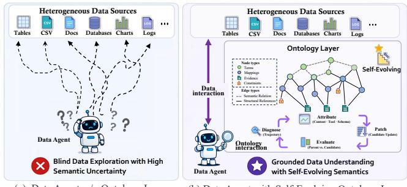
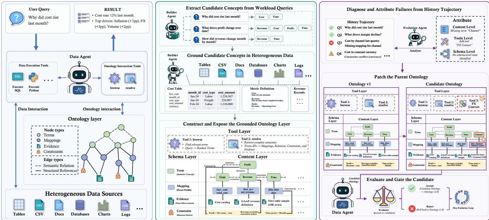
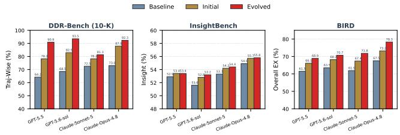
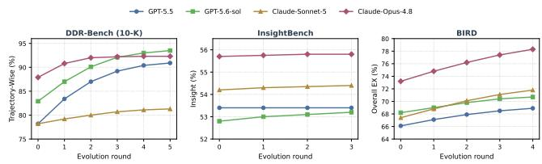
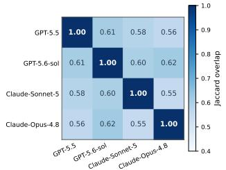
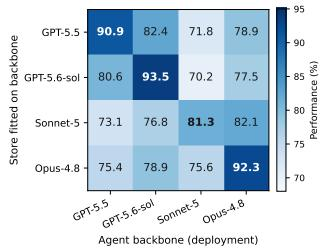
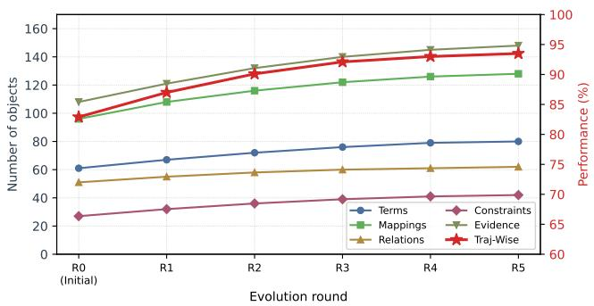
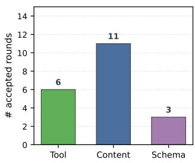
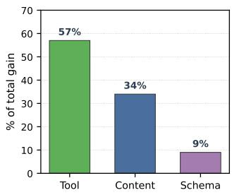
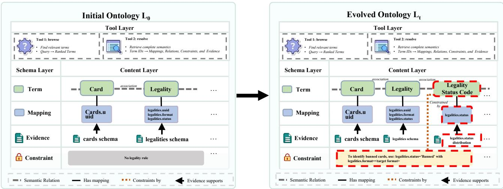

(a) Data Agent w/o Ontology Layer

# EvoOntology: A Self-Evolving Ontology Layer for Data Agents

Meiduo Chong1, Shaolei Zhang1∗, Ju Fan1, Xiaoyong Du1

1Renmin University of China zhongmeiduo210@ruc.edu.cn, zhangshaolei98@ruc.edu.cn

## Abstract

Data agents aim to fulfill natural-language instructions over heterogeneous data, including tables, files, and databases. However, data agents face a challenging agent–data gap: heterogeneous data resides outside the agent, while the agent can access it (e.g., column names and file paths) only through generic tools. Existing approaches either let agents directly explore raw data sources or inject manually constructed semantic layers into prompts. However, neither scales well to large heterogeneous data sources nor adapts to diferent agent behaviors. In this paper, we introduce EvoOntology, a self-evolving ontology layer for data agents. EvoOntology encapsulates the ontology as an MCP server comprising a schema layer, a content layer, and a tool layer, enabling agents to actively query and interact with the ontology at runtime. To this end, we introduce a builder agent for autonomous ontology construction and a self-evolution loop that continuously refines the ontology through attribution-guided typed edits that are accepted only after a backbone-conditional paired evaluation. Experiments on three well-adopted data-agent benchmarks with four LLM backbones demonstrate that EvoOntology consistently outperforms strong baselines and existing semanticlayer approaches, efectively bridging the agent–data gap and enabling more efective interaction with heterogeneous data.

Code — https://github.com/ruc-datalab/EvoOntology

## Introduction

Data agents over heterogeneous data (Liu et al. 2026; Sahu et al. 2025; Li et al. 2023; Hong et al. 2025; Zhang et al. 2023a) aim to solve natural-language tasks over both structured data (e.g., tables and databases) and unstructured data (e.g., documents and files). To accomplish such tasks, an agent must continuously interact with heterogeneous data sources to gather the information required for producing the final answer. Recent advances in tool use for large language models (LLMs) (Yao et al. 2022; Schick et al. 2023; Qin et al. 2023; Patil et al. 2024) have enabled agents to directly access and manipulate external data sources, providing the foundation for such data interactions.

However, direct interaction with heterogeneous data raises a fundamental question: Can a data agent efectively understand heterogeneous data? In real-world deployments, data resides outside the agent in the form of relational databases, semi-structured filings, and unstructured documents, while

  
(b) Data Agent with Self-Evolving Ontology Layer

Figure 1: A self-evolving ontology layer helps data agents understand heterogeneous data.

the agent can access the data only through generic tools such as SQL interfaces and file readers. A fundamental challenge is that neither the structure nor the content of these heterogeneous data sources is known a priori. As a result, the agent has to blindly explore the underlying data by repeatedly issuing probing queries, guessing where the requested concepts are located, and inspecting potentially irrelevant content. This mismatch creates a persistent agent–data gap. Bridging this gap requires an intermediate ontology layer that explicitly represents domain concepts, grounds the concepts in the underlying data, and enables agents to interact with data at the semantic level rather than the physical level.

Existing approaches to agent–data interaction can be broadly divided into raw querying and semantic-layer-based interaction. Raw-querying methods (Pourreza and Rafiei 2023; Wang et al. 2025; Talaei et al. 2024) allow agents to directly inspect schemas and issue exploratory queries over the underlying data. While efective for small and relatively simple data sources, they scale poorly to wide and heterogeneous data, where agents can easily become trapped in repetitive and ineficient exploration. Semantic-layer approaches (Hitzler 2021; dbt Labs 2023; Feng et al. 2024; Chang and Fosler-Lussier 2023), in contrast, provide metadata, including schemas, entities, metrics, and other domain semantics, to guide the agent. However, incorporating the entire semantic layer into the agent context is impractical for large data sources due to context-length limitations. Moreover, existing semantic layers are typically predefined and maintained manually, making them costly to construct and dificult to adapt to new data sources, tasks, and agents. These limitations highlight the need for an efective and scalable ontology intermediate layer to bridge the agent–data gap.

In this paper, we advance the intermediate layer between agents and data from static semantic descriptions to an interactive ontology layer that agents can flexibly access through tools. Autonomously constructing such an ontology is inherently challenging because both data sources and agent behaviors are diverse and dynamic, requiring the ontology to adapt to both. To address this challenge, we introduce EvoOntology, a self-evolving ontology layer that continuously adapts to the underlying data and the agents that use it. As illustrated in Figure 1, the ontology consists of three components: a schema layer, which defines object types and reference rules; a content layer, which stores domain knowledge and data mappings; and a tool layer, which exposes executable interfaces for agents to access and manipulate the ontology. These components are encapsulated as a Model Context Protocol (MCP) server, enabling agents to actively query and interact with the ontology rather than passively consuming it as contextual metadata.

Specifically, EvoOntology first employs a builder agent to construct an initial ontology by issuing probe queries over the underlying data sources and grounding each ontology entry in the observed data. EvoOntology then continuously refines the ontology based on agent interaction trajectories. Specifically, it performs attribution analysis to identify deficiencies in the current ontology, proposes targeted refinements to its schema, content, or tools, and accepts each refinement only after it passes a paired evaluation on a held-out validation set. Through this iterative self-evolution process, the ontology continuously adapts to both heterogeneous data and agent behaviors, progressively bridging the agent–data gap.

In summary, our main contributions are as follows:

• Interactive Ontology Layer. We propose the first autonomous interactive ontology layer for data agents and encapsulate it as an MCP server, enabling agents to query and interact with heterogeneous data through tools.

• Self-Evolving Ontology. We introduce a builder agent for autonomous ontology construction and a self-evolving framework that refines the ontology through attribution analysis, targeted refinement, and paired evaluation.

• Strong Performance. Extensive experiments on three well-adopted data-agent benchmarks with four LLM backbones demonstrate that EvoOntology consistently and substantially outperforms strong baselines and existing semantic-layer approaches.

## Related Work

Data Agents on Heterogeneous Data. Deploying LLMs as data agents is an important step toward automated analytics. Existing approaches fall into two families: raw querying and semantic-layer-based interaction. Raw-querying agents equip LLMs with schema-reading, query-executing, and fileinspecting tools, exemplified by text-to-SQL agents that generate queries over relational databases (Li et al. 2023; Yu et al. 2018; Li et al. 2024a), table-QA agents that reason over spreadsheets and web tables (Chen et al. 2020; Pasupat and Liang 2015), and code-executing analysts that answer business-intelligence questions on CSV files (Sahu et al. 2025; Guo et al. 2024). Pipeline-style variants organize these tool calls through decomposition, retrieval, and verification (Pourreza and Rafiei 2023; Wang et al. 2025; Talaei et al. 2024; Cao et al. 2024; Caferoğlu and Ulusoy 2024; Li et al. 2024b), improving standardized benchmarks while leaving the underlying representation gap untouched. This gap is amplified in heterogeneous settings, where a task may span databases, spreadsheets, and files with diferent naming conventions, schemas, and granularities. Grounding discovered in one trajectory is typically discarded rather than retained for later tasks. EvoOntology instead amortizes schema discovery across the workload through an ontology layer that preserves such grounding and evolves from agent failures.

Semantic Layers. Ontology and semantic layers have long connected domain concepts with relational data, ranging from OWL ontologies and metric layers (Hitzler 2021; dbt Labs 2023) to LLM-oriented semantic representations and prompt-time metadata (Feng et al. 2024; Chang and Fosler-Lussier 2023). Related work also uses LLMs to induce schema or metric descriptions (Zhang et al. 2023b; Nan et al. 2023) and feedback to refine prompts or retrievers (Zhou et al. 2022; Khattab et al. 2023; Asai et al. 2024). However, existing layers are typically maintained as static prompttime metadata. Whether manually authored or automatically induced, they are usually detached from downstream trajectories showing how agents use them. Full-context injection scales poorly to large data sources, while coarse updates provide little basis for identifying which semantic entry afected a downstream decision. This makes targeted, workload-driven maintenance dificult as tasks and agent behavior evolve. EvoOntology instead exposes the ontology through an MCP server for selective runtime access and refines individual entries through typed, evidence-grounded edits admitted by paired validation.

## Method

To reduce manual semantic-layer authoring while adapting the layer to agent behavior, we propose EvoOntology, an agent-first builder-and-evolver framework. EvoOntology maintains a versioned ontology state comprising content, schema, and tool layers. A builder agent constructs an evidence-grounded initial state from the training workload and raw sources, while an evolution agent refines it from historical trajectories. The design is agent-first in that the ontology is built around the workload, accessed through the agent’s tool interface, and adapted from its execution history.

## Agent-First Ontology-Layer Architecture

EvoOntology represents the ontology state at evolution round t as $\mathcal { L } _ { t } = \top \mathrm { ~ \top ~ } _ { t } , \mathcal { R } _ { t } )$ , comprising a Content Layer $\boldsymbol { S } _ { t } ,$ a Schema Layer Γt, and a Tool Layer Rt. The three components separate semantic knowledge, its object model, and its runtime exposure. This separation allows the deployed agent to retrieve only the semantics relevant to the current step and allows the evolution agent to update a bounded part of the ontology state.

  
Figure 2: Overview of EvoOntology. It comprises a typed content graph, its object schema, and a runtime tool interface. The builder constructs an evidence-grounded initial state, while the evolution agent refines it from historical interaction trajectories.

Content Layer. The Content Layer $S _ { t }$ is a typed semantic graph with four node families and two edge families. The node families comprise Terms, Mappings, Constraints, and Evidence. Terms represent domain concepts, Mappings ground them to fields and linking paths, Constraints govern their valid use, and Evidence supports their semantic claims. The edge families comprise Semantic Relations and Structural References. Semantic Relations connect Terms through association, hierarchy, composition, equivalence, or derivation. Structural References link Terms to Mappings and attach Constraints and Evidence to the objects they govern or support. Figure 2 illustrates these components through a financial-analysis example.

Schema Layer. The Schema Layer $\Gamma _ { t }$ defines the fields of the four node families, the admissible Semantic Relation types, and the permitted reference patterns. Schema updates can therefore extend the ontology’s representational capacity without changing its instantiated content.

Tool Layer. The Tool Layer $\mathcal { R } _ { t }$ exposes the ontology through two MCP tools and a session manifest. The function $\bar { f _ { \mathrm { b r o w s e } } } ( q , k , n )$ retrieves the top-n semantic matches for query q and kind $k ,$ while $f _ { \mathrm { r e s o l v e } } ( \mathcal { T } , c )$ returns the requested records and their linked objects. The manifest provides compact source and usage information at session initialization. It is the only ontology content placed in the prompt, while detailed records are retrieved on demand.

## Evidence-Grounded Ontology Initialization

Manually defining domain concepts, field mappings, linking paths, and semantic constraints for each data source requires substantial expert efort. The builder agent constructs an initial ontology from the training workload and raw sources without observing gold answers. The workload identifies semantics relevant to the agent, while executable probes verify their grounding in the underlying data.

Workload-Guided Probing. Given a training workload W and raw sources ${ \mathcal { D } } ,$ the builder proposes ${ \mathcal { C } } =$ propose(W) from recurrent entities, metrics, operations, and analytical conditions. For each candidate $c \in { \mathcal { C } } ,$ it issues probe(c, D) to identify candidate fields and linking paths and to inspect their types, values, and semantic consistency.

Evidence-Grounded Commitment. Only candidates supported by their probe results are committed to the initial Content Layer:

$$
\begin{array} { r l } & { { \mathcal { C } } ^ { + } = \left\{ c \in \mathcal { C } \left| \mathrm { v e r i f y } ( \mathrm { p r o b e } ( c , \mathcal { D } ) ) = 1 \right. \right\} , } \\ & { \left. \left. S _ { 0 } = \mathrm { c o n s t r u c t } ( \mathcal { C } ^ { + } , \mathcal { D } ; \Gamma _ { 0 } ) \vphantom { \frac { D ^ { 2 } } { D ^ { 2 } } } \right. \right. . } \end{array}\tag{1}
$$

Here, veri $\mathrm { f y } ( \cdot )$ checks the declared type, filter, and valuedistribution requirements. Verified candidates are instantiated under $\Gamma _ { 0 } ,$ with their supporting records retained as Evidence. Together with the default Tool Layer $\mathcal { R } _ { 0 }$ , they form the initial state $\mathcal { L } _ { 0 } = (  { S _ { 0 } } ,  { \Gamma _ { 0 } } ,  { \mathcal { R } } _ { 0 } )$

## Trajectory-Grounded Ontology Evolution

Data grounding alone does not ensure that an ontology suits a particular agent. EvoOntology therefore uses historical trajectories as behavioral evidence. Successful executions reveal efective semantic structures and access patterns, while unsuccessful ones expose missing, misleading, or poorly exposed components.

Trajectory Attribution. Given historical trajectories T and the current state $\mathcal { L } _ { t }$ , the evolution agent extracts recurrent signatures $\Sigma _ { t } = \mathrm { a n a l y z e } ( \mathcal { T } _ { t } , \mathcal { L } _ { t } )$ . Each signature summarizes an interaction pattern, the ontology objects involved, and its observed outcomes. The agent assigns the signature to Content, Tool, or Schema through $\alpha : \Sigma _ { t } \to \{ \mathsf { C } , \mathsf { T } , \mathsf { S } \}$ and states the expected behavioral efect of an update.

Localized Intervention. For an attributed signature $\sigma ,$ the agent proposes $\mathcal { L } _ { t } ^ { \prime } = \mathrm { p a t c h } ( \mathcal { L } _ { t } , \sigma , \alpha ( \sigma ) )$ . Each candidate modifies one level only. Content interventions add, remove, or revise instantiated semantic objects in $S _ { t }$ . Tool interventions modify existing tools or add and remove tools in $\mathcal { R } _ { t }$ according to observed agent behavior. Schema interventions revise the object model in $\Gamma _ { t }$ . Multiple dependent Content objects may be updated together when they implement the same hypothesis.

Backbone-Conditional Paired Validation. For backbone $m ,$ let $\phi ( \mathcal { L } , \mathcal { V } ; m )$ denote the score of ontology state $\mathcal { L }$ on validation set V. The candidate and its parent are evaluated on the same V with identical decoding and interaction budgets. The candidate is retained only when its improvement reaches margin τ:

$$
\mathcal { L } _ { t + 1 } = \left\{ \begin{array} { l l } { \mathcal { L } _ { t } ^ { \prime } , } & { \phi ( \mathcal { L } _ { t } ^ { \prime } , \mathcal { V } ; m ) - \phi ( \mathcal { L } _ { t } , \mathcal { V } ; m ) \ge \tau , } \\ { \mathcal { L } _ { t } , } & { \mathrm { o t h e r w i s e } . } \end{array} \right.\tag{2}
$$

The single-level diference isolates the attributed hypothesis while limiting regressions on the validation set. Rejected candidates are not deployed, and their signatures, interventions, and evaluation outcomes are logged to avoid repeated ineffective updates. All backbones evolve independently from the same initial state ${ \mathcal { L } } _ { 0 } ,$ allowing accepted updates to reflect backbone-specific interaction patterns.

## Experiments

## Benchmarks

We evaluate EvoOntology on three data-agent benchmarks with heterogeneous modalities and answer formats. All evaluations follow each benchmark’s oficial evaluation protocol.

Deep Data Research (DDR-Bench) (Liu et al. 2026) evaluates open-ended data research across heterogeneous sources. We evaluate on the 10-K scenario, and report Message-Wise accuracy on per-turn interpretation, Trajectory-Wise accuracy on full-history synthesis.

InsightBench (Sahu et al. 2025) is a business-analytics benchmark of business-intelligence flags, each paired with a CSV dataset and a ground-truth insight that an analyst should surface. We report the Insight and Summary scores.

BIRD (Li et al. 2023) is a text-to-SQL benchmark on natural-language questions across real-world databases, evaluated under the oficial Oracle Knowledge setting. Follow-up benchmarks such as Spider (Yu et al. 2018; Lei et al. 2025) extend the setting to multi-schema and enterprise workflows. The primary metric is Execution Accuracy EX and the secondary is Valid Eficiency Score VES.

## Experimental Setup

Backbones. We evaluate EvoOntology on six LLM backbones: GPT-5.5, GPT-5.6-sol, Claude-Sonnet-5, Claude-Opus-4.8, DeepSeek-V4-Flash, and Qwen3.5-Flash. For each backbone, all conditions use the same ReAct (Yao et al. 2022) scafold, raw-data tools, decoding configuration, and interaction budget. Scoring follows each benchmark’s standard evaluation protocol (Li et al. 2023; Sahu et al. 2025; Liu et al. 2026).

Baselines. We compare EvoOntology against two baselines under the same ReAct scafold and backbone. Baseline runs ReAct without any ontology layer, so the agent must rediscover the schema and the domain vocabulary at every task. Baseline + SL prepends the builder-agent’s semantic layer into the agent’s context as a static prompt fragment (Cao et al. 2024; Caferoğlu and Ulusoy 2024; Li et al. 2024b; Chang and Fosler-Lussier 2023).

Reciprocal Two-Fold Evaluation. We treat ontology construction and evolution as training-time workload adaptation, following held-out optimization protocols in prompt and agent adaptation (Zhou et al. 2022; Yang et al. 2024; Xu, Wen, and Li 2026). Each benchmark is divided into two disjoint folds, A and $B .$ . In the $A  B$ run, 70% of A is used for ontology construction, trajectory analysis, and candidate generation, and the remaining 30% for paired validation. The selected ontology is frozen before testing on B. We then reverse the folds and report

$$
{ \mathrm { S c o r e } } = { \frac { \mathrm { S c o r e } _ { A  B } + \mathrm { S c o r e } _ { B  A } } { 2 } } .
$$

This reciprocal design follows two-fold split-and-swap evaluation (Dietterich 1998; Wang et al. 2026). All methods use the same fold assignment and deployment configuration. The same adaptation fold is used for ontology construction and updating across all relevant conditions. The held-out fold is accessed only for final evaluation after the ontology has been frozen, and its answers and evaluator feedback are never used for ontology construction, evolution, or candidate selection.

## Main Results

Capability on Multi-Source Data Research. Table 1 reports DDR-Bench results across six LLM backbones. EvoOntology improves Trajectory-Wise accuracy on all six backbones, with an average gain of +17.8 points over Baseline. The improvement ranges from +4.8 on Qwen3.5-Flash to +26.7 on GPT-5.5, indicating that the ontology remains efective across backbones with substantially diferent baseline capabilities. In contrast, Baseline + SL, which injects the semantic layer into the context as a static prompt, does not consistently improve over the un-mediated agent and even drops by −15.0 points on Claude-Sonnet-5. The gap between Baseline + SL and EvoOntology stems from how the layer is used: a static prompt fragment competes with the agent’s other instructions and cannot be pruned per turn, whereas EvoOntology exposes the same content through MCP tools that the agent actively queries, retrieving only the terms and mappings relevant to the current step. We additionally compare against ReAct + Memory (Shinn et al. 2023; Wang et al. 2023; Madaan et al. 2023), which stores past trajectories as retrievable episodes. As shown in Table 2, memory-based persistence lifts Trajectory-Wise from 69.5 to 75.8 but remains 13.7 points below EvoOntology, because episodic memory only replays what has been done and does not expose typed, composable structure.

Capability on Insight Mining. Table 3 reports Insight-Bench results across six backbones. EvoOntology improves

<table><tr><td>Method</td><td>Backbone</td><td>Msg-Wise (%, ↑)</td><td>Traj-Wise (%, ↑)</td><td>Overall (%, ↑)</td></tr><tr><td rowspan="8">Reported ReAct</td><td>Claude-Sonnet-4.5</td><td>77.6</td><td>60.6</td><td>69.1</td></tr><tr><td>DeepSeek-V3.2</td><td>60.1</td><td>38.2</td><td>49.2</td></tr><tr><td>GLM-4.6</td><td>60.3</td><td>36.0</td><td>48.2</td></tr><tr><td>GPT-5.2</td><td>44.9</td><td>41.1</td><td>43.0</td></tr><tr><td>GPT-5-mini</td><td>46.8</td><td>37.1</td><td>42.0</td></tr><tr><td>Kimi-K2</td><td>51.1</td><td>30.8</td><td>40.1</td></tr><tr><td>GPT-5.1</td><td>37.1</td><td>44.3</td><td>40.7</td></tr><tr><td>Gemini-3-Flash</td><td>44.8</td><td>21.2</td><td>33.0</td></tr><tr><td rowspan="6">Baseline (ReAct w/o Ontology)</td><td>GPT-5.5</td><td>60.6</td><td>64.2</td><td>62.4</td></tr><tr><td>GPT-5.6-sol</td><td>64.0</td><td>68.5</td><td>66.3</td></tr><tr><td>Claude-Sonnet-5</td><td>74.3</td><td>72.5</td><td>73.4</td></tr><tr><td>Claude-Opus-4.8</td><td>74.0</td><td>73.0</td><td>73.5</td></tr><tr><td>DeepSeek-V4-Flash</td><td>26.2</td><td>30.3</td><td>28.2</td></tr><tr><td>Qwen3.5-Flash</td><td>16.4</td><td>14.3</td><td>15.4</td></tr><tr><td rowspan="6">Baseline + SL (ReAct + Semantic Layer)</td><td>GPT-5.5 GPT-5.6-sol</td><td>58.4 (−2.2)</td><td>63.9 (−0.3)</td><td>61.2 (−1.2)</td></tr><tr><td></td><td>62.5 (−1.5)</td><td>65.5 (-3.0)</td><td>64.0 (−2.3)</td></tr><tr><td>Claude-Sonnet-5</td><td>65.6 (-8.7)</td><td>57.5(-15.0)</td><td>)61.5 (−11.9)</td></tr><tr><td>Claude-Opus-4.8</td><td>65.9 (−8.1)</td><td>71.4 (−1.6)</td><td>68.6 (-4.9)</td></tr><tr><td>DeepSeek-V4-Flash</td><td>28.8 (+2.6)</td><td>31.7 (+1.4)</td><td>30.2 (+2.0)</td></tr><tr><td>Qwen3.5-Flash</td><td>14.8 (−1.6)</td><td>13.3 (−1.0)</td><td>14.1 (−1.3)</td></tr><tr><td rowspan="6">EvoOntology</td><td>GPT-5.5</td><td>74.0 (+13.4)</td><td>90.9 (+26.7)</td><td>82.5 (+20.1)</td></tr><tr><td>GPT-5.6-sol</td><td>78.2 (+14.2)</td><td>93.5 (+25.0)</td><td>85.9 (+19.6)</td></tr><tr><td>Claude-Sonnet-5</td><td>78.4 (+4.1)</td><td>81.3 (+8.8)</td><td>79.9 (+6.5)</td></tr><tr><td>Claude-Opus-4.8</td><td>78.0 (+4.0)</td><td>92.3 (+19.3)</td><td>85.2 (+11.7)</td></tr><tr><td>DeepSeek-V4-Flash 37.5 (+11.4)</td><td></td><td>52.3 (+22.0)</td><td>44.9 (+16.7)</td></tr><tr><td>Qwen3.5-Flash</td><td>21.1 (+4.7)</td><td>19.1 (+4.8)</td><td>20.1 (+4.8)</td></tr></table>

Table 1: Main results on the DDR-Bench 10-K scenario. Parentheses report the gain over the Baseline result.

Overall performance on every backbone, with a mean gain of 1.9 points and the largest improvement on DeepSeek-V4- Flash (+6.1). The gains are smaller than DDR-Bench because Insight is graded on short reference-style findings and saturates once the answer aligns with the reference. Baseline + SL recovers most of the Insight gain on InsightBench, but drops by −3.3 on Claude-Sonnet-5 Summary, whereas EvoOntology improves both Insight and Summary on all four backbones by exposing the same content through queryable tools instead of a static prompt.

Capability on Data Retrieval. Table 4 reports BIRD results across six backbones under Oracle Knowledge. EvoOntology improves both EX and VES for every backbone, with average gains of 7.4 and 8.6 points. The consistent gains across both metrics indicate that the ontology improves query correctness as well as execution eficiency. Baseline + SL shows a mixed pattern: EX drops by up to −5.6 (GPT-5.5) while VES rises across all backbones, indicating that a static semantic layer improves SQL well-formedness but distracts from producing correct queries. Once the same content is exposed through MCP tools that the agent actively queries and refined by the evolution loop, EvoOntology recovers the EX gains and yields a stable per-backbone improvement over both baselines and prior text-to-SQL systems (Pourreza and Rafiei 2023; Wang et al. 2025; Talaei et al. 2024).

<table><tr><td>Method</td><td>Traj-Wise (%, ↑)</td><td>∆</td></tr><tr><td>Baseline (ReAct)</td><td>69.5</td><td></td></tr><tr><td>ReAct + Memory</td><td>75.8</td><td>+6.3</td></tr><tr><td>EvoOntology</td><td>89.5</td><td>+20.0</td></tr></table>

Table 2: Comparison against a memory-based persistence baseline on DDR-Bench, averaged across the four backbones. “ReAct + Memory” stores past trajectories as retrievable episodes and injects the top-k into the prompt.
<table><tr><td>Method</td><td>Backbone</td><td>Insight (%, ↑)</td><td>Summary (%, ↑)</td><td>Overall (%, ↑)</td></tr><tr><td>Pandas Agent</td><td>GPT-40</td><td>54.0</td><td>40.0</td><td>47.0</td></tr><tr><td>AgentPoirot</td><td>GPT-3.5-turbo</td><td>50.0</td><td>31.0</td><td>40.5</td></tr><tr><td>AgentPoirot</td><td>GPT-4-turbo</td><td>56.0</td><td>35.0</td><td>45.5</td></tr><tr><td>AgentPoirot AgentPoirot</td><td>Llama-3-70B</td><td>52.0</td><td>33.0</td><td>42.5</td></tr><tr><td></td><td>GPT-40</td><td>60.0</td><td>44.0</td><td>52.0</td></tr><tr><td>Baseline (ReAct</td><td>GPT-5.5 GPT-5.6-sol</td><td>52.9 51.6</td><td>47.6 49.4</td><td>50.3 50.5</td></tr><tr><td></td><td>Claude-Sonnet-5</td><td>53.3</td><td>51.3</td><td>52.3</td></tr><tr><td>w/o Ontology)</td><td>Claude-Opus-4.8</td><td>54.9</td><td>49.9</td><td>52.4</td></tr><tr><td></td><td>DeepSeek-V4-Flash</td><td>45.0</td><td></td><td>39.8</td></tr><tr><td></td><td></td><td></td><td>34.6</td><td></td></tr><tr><td></td><td>Qwen3.5-Flash</td><td>37.5</td><td>26.2</td><td>31.9</td></tr><tr><td></td><td>GPT-5.5</td><td>53.4 (+0.5)</td><td>48.6 (+1.0)</td><td>51.0 (+0.8)</td></tr><tr><td>Baseline + SL</td><td>GPT-5.6-sol</td><td>51.3 (−0.3)</td><td>50.8 (+1.4)</td><td>51.1 (+0.6)</td></tr><tr><td>(ReAct +</td><td>Claude-Sonnet-5</td><td>53.5 (+0.2)</td><td>48.0 (−3.3)</td><td>50.8 (−1.6)</td></tr><tr><td>Semantic Layer)</td><td>Claude-Opus-4.8</td><td>55.8 (+0.9)</td><td>50.5 (+0.6)</td><td>53.2 (+0.8)</td></tr><tr><td></td><td>DeepSeek-V4-Flash</td><td></td><td></td><td>41.8 (+2.0)</td></tr><tr><td></td><td>Qwen3.5-Flash</td><td>47.0 (+2.0) 39.0 (+1.5)</td><td>36.5 (+1.9) 25.2 (−1.0)</td><td>32.1 (+0.2)</td></tr><tr><td></td><td>GPT-5.5</td><td></td><td></td><td></td></tr><tr><td></td><td>GPT-5.6-sol</td><td>53.4 (+0.5) 53.2 (+1.6)</td><td>48.6 (+1.0) 50.9 (+1.5)</td><td>51.0 (+0.8) 52.1 (+1.6)</td></tr><tr><td></td><td>Claude-Sonnet-5</td><td>54.4 (+1.1)</td><td>51.5 (+0.2)</td><td>53.0 (+0.7)</td></tr><tr><td>EvoOntology</td><td>Claude-Opus-4.8</td><td>55.8 (+0.9)</td><td>50.5 (+0.6)</td><td>53.2 (+0.8)</td></tr><tr><td></td><td></td><td></td><td></td><td></td></tr><tr><td></td><td>DeepSeek-V4-Flash</td><td>49.2 (+4.2)</td><td>42.6 (+8.0)</td><td>45.9 (+6.1)</td></tr><tr><td></td><td>Qwen3.5-Flash</td><td>39.3 (+1.8)</td><td>27.6 (+1.4)</td><td>33.4 (+1.6)</td></tr></table>

Table 3: Main results on InsightBench. Parentheses report the gain over the corresponding Baseline result.

## Efect of Ontology Layer

To separate the contribution of the builder-constructed ontology from the additional gain brought by self-evolution, we compare three settings: Baseline, Initial, and Evolved. Baseline uses no ontology layer, Initial uses the ontology constructed by the builder agent before evolution, and Evolved uses the final ontology after self-evolution. Figure 3 reports the performance of each backbone under the three settings. To summarize the overall trend, we average the primarymetric scores across the four backbones for each benchmark and setting and compare the resulting means.

The initial ontology establishes a strong improvement over the no-ontology baseline, while self-evolution consistently extends this gain across all three benchmarks. On DDR-Bench, the mean Trajectory-Wise score increases by 12.3 percentage points from Baseline to Initial, followed by a further improvement of 7.7 percentage points from Initial to Evolved. On InsightBench, the mean Insight score first increases by 0.8 points and then gains another 0.2 points through evolution. On BIRD, the mean EX score improves by 5.1 percentage points with the initial ontology and by a further 3.7 percentage points after evolution. These results show that the builder-constructed ontology provides an efective starting point, whereas the self-evolution loop is essential for realizing the full performance gain and consistently improves the ontology beyond its initial state.

<table><tr><td>Method</td><td>Backbone</td><td>EX (%, ↑)</td><td>VES (%, ↑)</td></tr><tr><td>GPT-4</td><td>GPT-4</td><td>46.4</td><td></td></tr><tr><td>DIN-SQL</td><td>GPT-4</td><td>50.7</td><td>58.8</td></tr><tr><td>DAIL-SQL</td><td>GPT-4</td><td>54.8</td><td>56.1</td></tr><tr><td>TA-SQL</td><td>GPT-4</td><td>56.2</td><td></td></tr><tr><td>MAC-SQL</td><td>GPT-4</td><td>57.6</td><td>58.8</td></tr><tr><td>MCS-SQL CHESS</td><td>GPT-4</td><td>63.4</td><td></td></tr><tr><td></td><td>GPT-40</td><td>65.0</td><td>62.8</td></tr><tr><td rowspan="6">Baseline (ReAct w/o Ontology)</td><td>GPT-5.5</td><td>61.5</td><td>63.4</td></tr><tr><td>GPT-5.6-sol</td><td>63.5</td><td>65.6</td></tr><tr><td>Claude-Sonnet-5</td><td>61.9</td><td>63.7</td></tr><tr><td>Claude-Opus-4.8</td><td>67.5</td><td>69.6</td></tr><tr><td>DeepSeek-V4-Flash Qwen3.5-Flash</td><td>33.1</td><td>36.4</td></tr><tr><td></td><td>46.5</td><td>47.9</td></tr><tr><td rowspan="6">Baseline + SL (ReAct + Semantic Layer)</td><td>GPT-5.5</td><td>55.9 (-5.6)</td><td>67.7 (+4.3)</td></tr><tr><td>GPT-5.6-sol</td><td>63.0 (−0.5)</td><td>68.9 (+3.3)</td></tr><tr><td>Claude-Sonnet-5</td><td>60.8 (−1.1)</td><td>65.8 (+2.1)</td></tr><tr><td>Claude-Opus-4.8</td><td>66.2 (−1.3)</td><td>75.0 (+5.4)</td></tr><tr><td>DeepSeek-V4-Flash</td><td>36.3 (+3.2)</td><td>37.2 (+0.7)</td></tr><tr><td>Qwen3.5-Flash</td><td>48.0 (+1.5)</td><td>51.9 (+4.0)</td></tr><tr><td rowspan="6">EvoOntology</td><td>GPT-5.5</td><td>68.9 (+7.4)</td><td>71.1 (+7.7)</td></tr><tr><td>GPT-5.6-sol</td><td>70.7 (+7.2)</td><td>73.0 (+7.4)</td></tr><tr><td>Claude-Sonnet-5</td><td>71.8 (+9.9)</td><td>74.1 (+10.4)</td></tr><tr><td>Claude-Opus-4.8</td><td>78.3 (+10.8)</td><td>80.5 (+10.9)</td></tr><tr><td>DeepSeek-V4-Flash</td><td>39.4 (+6.4)</td><td>44.1 (+7.6)</td></tr><tr><td>Qwen3.5-Flash</td><td>49.1 (+2.5)</td><td>55.2 (+7.3)</td></tr></table>

Table 4: Main results on BIRD under Oracle Knowledge. VES is reported on a 0–100 scale. Parentheses report the gain over the corresponding Baseline result.

## Analyses

To better understand the source and behavior of EvoOntology’s advantage, we conduct a series of in-depth analyses. Unless otherwise stated, all analyses in this section are conducted on DDR-Bench across the four backbones (GPT-5.5, GPT-5.6-sol, Claude-Sonnet-5, Claude-Opus-4.8).

## Efect of Iterative Evolution

To evaluate whether the observed gain accumulates through many small edits and does not collapse into a single round, we plot the deployed agent’s primary score across the sequence of accepted evolution rounds on DDR-Bench. Each round corresponds to one candidate that passed the paired gate, and the parent line traces the score of the ontology version that would remain if no more rounds were run. As shown in Figure 4, all four backbones improve monotonically from Initial through the accepted rounds, with GPT-5.6-sol reaching 93.5 Traj-Wise after five accepted rounds and Claude-

  
Figure 3: Primary metric on the three benchmarks under three conditions: Baseline , Initial, and Evolved (EvoOntology).

  
Figure 4: Primary metric across accepted evolution rounds on the three benchmarks: Traj-Wise on DDR-Bench, Insight on InsightBench, and EX on BIRD.

Opus-4.8 reaching 92.3 after four. Notably, the trajectories flatten by the last two rounds, which is consistent with the failure signatures becoming rarer once the ontology covers the recurrent cross-filing concepts. The results show that the gains reported in Table 1 are the outcome of a converging refinement and not a single fortunate patch, which validates the design of the four-step evolution loop.

## Ablation Study on Evolution Loop

The relative contribution of the four steps in the evolution loop (diagnose, attribute, patch, gate) is assessed by disabling each step in turn and comparing the resulting final Evolved score on DDR-Bench, averaged across the four backbones.The disabled variant of each step is: w/o Diagnose skips the failure-trace clustering step and asks the evolution agent to propose an edit from a random sample of recent traces; w/o Attribution drops the level tag and lets the agent commit an edit at any level without stating a hypothesis; w/o Patch stage replaces the typed, hypothesis-conditioned edit with a free-form ontology rewrite that the evolution agent produces directly from the diagnosis; w/o Gate accepts every candidate patch. As shown in Table 5, removing the gate causes the largest drop (−11.2 Traj-Wise), because unfiltered candidates admit regressions that the next round cannot always undo. Removing the attribution step drops by −6.3, because without a level tag the loop tends to make content edits when the failure is a manifest problem, and vice versa. Removing the diagnose step drops by −4.8, and replacing the typed patch with a free-form rewrite drops by −1.7. The results show that the gate and attribution are the two loadbearing pieces, which validates the design of an evolution loop that is more selective than iterative.

Three-Level Evolution. Beyond removing individual steps, we further evaluate whether the three editable levels (Content / Tool / Schema) are jointly required by restricting the evolution loop to a single level at a time and comparing against the full three-level variant on DDR-Bench, averaged across the four backbones. As shown in Table 6, Tool-only evolution recovers the largest single-level gain (+13.2 over Baseline), consistent with the manifest reshaping being the dominant lever surfaced by the attribution analysis in Figure 7. Content-only and Schema-only evolution contribute +8.7 and +3.6 respectively, but none reaches the +20.0 of the full three-level loop. The results indicate that the three levels are complementary and not substitutable, which validates the design of an evolution loop that ranges over all three editable levels.

<table><tr><td>Variant</td><td>Traj-Wise (%, ↑)</td><td> $\Delta$ </td></tr><tr><td>Full loop</td><td>89.5</td><td></td></tr><tr><td>w/o Gate</td><td>78.3</td><td>-11.2</td></tr><tr><td>w/o Attribution</td><td>83.2</td><td>-6.3</td></tr><tr><td>w/o Diagnose</td><td>84.7</td><td>-4.8</td></tr><tr><td>w/o Patch (free-form)</td><td>87.8</td><td>-1.7</td></tr></table>

Table 5: Ablation on the four steps of the evolution loop, averaged across four backbones.
<table><tr><td>Variant</td><td>Traj-Wise (%, ↑)</td></tr><tr><td>Baseline</td><td>69.5</td></tr><tr><td>Content-only evolution</td><td>78.2</td></tr><tr><td>Tool-only evolution</td><td>82.7 +13.2 +3.6</td></tr><tr><td>Schema-only evolution</td><td>73.1</td></tr><tr><td>Full three-level evolution</td><td>89.5</td></tr></table>

Table 6: Ablation on the three editable levels of the evolution loop on DDR-Bench, averaged across four backbones.

## Ablation Study on Ontology Structure

We mask each removable object family from the final Evolved ontology on DDR-Bench and report the average performance across four backbones. As shown in Table 7, masking Mappings causes the largest drop (−13.4 Traj-Wise), which is consistent with the role of Mappings as the only object that grounds a Term to concrete columns and join paths. Masking Evidence drops by −8.7, because without a probe query the agent cannot verify a candidate SQL fragment against the underlying value distribution. Masking Constraints and Relations produces smaller drops (−3.5 and −2.1), and Terms cannot be masked in isolation as every other family references them. These findings identify Mappings and Evidence as the two load-bearing families, which validates our decision to require every committed entry to be anchored in a probe query and not a natural-language description alone.

## Divergence across Backbones

We investigate whether diferent backbones converge to similar ontologies or develop distinct ones by comparing the pairwise Jaccard overlap of their accepted Term-identifier sets on DDR-Bench. As shown in Figure 5a, no pair exceeds 0.62 overlap, and the two Claude backbones share less with each other (0.55) than the two GPT backbones do (0.61). The accepted edits also difer across backbones. For example, Claude-Opus-4.8 retains more detailed manifest variants than Claude-Sonnet-5, while GPT-5.5 introduces short SQL fragment libraries under Evidence that do not appear in the Claude-Opus-4.8 ontology. However, identifier overlap alone cannot determine semantic equivalence, since diferent identifiers may encode similar concepts. We further evaluate cross-backbone transfer by applying each evolved store to all four backbones and measuring Traj-Wise performance on DDR-Bench. As shown in Figure 5b, the diagonal is uniformly the highest entry of its column, and every of-diagonal drops by at least 6.6 points relative to the same-backbone store; the average column drop from diagonal to of-diagonal ranges from −6.6 (Sonnet-5) to −10.9 (GPT-5.5). These results show that diferent backbones produce diferent evolved ontology stores from the same initialization. The cross-backbone transfer results further indicate that backbone-specific evolution is beneficial.

<table><tr><td>Variant</td><td>Traj-Wise (%, ↑)</td><td>∆</td></tr><tr><td>Full EvoOntology</td><td>89.5</td><td>一</td></tr><tr><td>w/o Mappings</td><td>76.1</td><td>-13.4</td></tr><tr><td>w/o Evidence</td><td>80.8</td><td>-8.7</td></tr><tr><td>w/o Constraints</td><td>86.0</td><td>-3.5</td></tr><tr><td>w/o Relations</td><td>87.4</td><td>-2.1</td></tr></table>

Table 7: Ablation on the five object families of the ontology content layer on DDR-Bench, averaged across four backbones. Terms cannot be masked in isolation and are omitted.

  
(a) Pairwise Jaccard overlap of accepted Term identifiers between the evolved stores of the four backbones.

  
(b) Cross-backbone transfer of the evolved store: each row is fitted on one backbone and served to every backbone (columns).  
Figure 5: Generalization of the evolved ontology store across backbones on DDR-Bench.

## Conclusion

In this paper, we introduce EvoOntology, an interactive ontology layer that is automatically constructed and self-evolving for data agents. EvoOntology encapsulates the ontology as an MCP server that the agent actively queries at runtime, and refines it through attribution-guided typed edits admitted only after a backbone-conditional paired evaluation gate. Experiments on benchmarks and six LLM backbones, EvoOntology consistently outperforms both ReAct baselines and traditional semantic-layer baselines, ofering an efective solution for helping data agents understand heterogeneous data.

## References

Asai, A.; Wu, Z.; Wang, Y.; Sil, A.; and Hajishirzi, H. 2024. Self-rag: Learning to retrieve, generate, and critique through self-reflection. In International conference on learning representations, volume 2024, 9112–9141.

Caferoğlu, H. A.; and Ulusoy, Ö. 2024. E-SQL: Direct Schema Linking via Question Enrichment in Text-to-SQL. arXiv:2409.16751.

Cao, Z.; Zheng, Y.; Fan, Z.; Zhang, X.; Chen, W.; and Bai, X. 2024. RSL-SQL: Robust Schema Linking in Text-to-SQL Generation. arXiv:2411.00073.

Chang, S.; and Fosler-Lussier, E. 2023. How to Prompt LLMs for Text-to-SQL: A Study in Zero-shot, Singledomain, and Cross-domain Settings. arXiv:2305.11853.

Chen, W.; Wang, H.; Chen, J.; Zhang, Y.; Wang, H.; Li, S.; Zhou, X.; and Wang, W. Y. 2020. TabFact: A Large-scale Dataset for Table-based Fact Verification. In 8th International Conference on Learning Representations, ICLR 2020, Addis Ababa, Ethiopia, April 26-30, 2020. OpenReview.net.

dbt Labs. 2023. The Semantic Layer for Modern Data Teams. https://www.getdbt.com/product/semantic-layer. Accessed 2025-11-01.

Dietterich, T. G. 1998. Approximate statistical tests for comparing supervised classification learning algorithms. Neural computation, 10(7): 1895–1923.

Feng, S.; Shi, W.; Bai, Y.; Balachandran, V.; He, T.; and Tsvetkov, Y. 2024. Knowledge card: Filling LLMs’ knowledge gaps with plug-in specialized language models. In International Conference on Learning Representations, volume 2024, 16097–16121.

Guo, S.; Deng, C.; Wen, Y.; Chen, H.; Chang, Y.; and Wang, J. 2024. DS-Agent: Automated Data Science by Empowering Large Language Models with Case-Based Reasoning. In Proceedings of the 41st International Conference on Machine Learning, volume 235 of Proceedings ofMachine Learning Research, 16813–16848. PMLR.

Hitzler, P. 2021. A Review of the Semantic Web Field. Communications ofthe ACM, 64(2): 76–83.

Hong, S.; Lin, Y.; Liu, B.; Liu, B.; Wu, B.; Zhang, C.; Li, D.; Chen, J.; Zhang, J.; Wang, J.; et al. 2025. Data interpreter: An llm agent for data science. In Findings ofthe Association for Computational Linguistics: ACL 2025, 19796–19821.

Khattab, O.; Singhvi, A.; Maheshwari, P.; Zhang, Z.; Santhanam, K.; Vardhamanan, S.; Haq, S.; Sharma, A.; Joshi, T. T.; Moazam, H.; Miller, H.; Zaharia, M.; and Potts, C. 2023. DSPy: Compiling Declarative Language Model Calls into Self-Improving Pipelines. arXiv:2310.03714.

Lei, F.; Chen, J.; Ye, Y.; Cao, R.; Shin, D.; Su, H.; Suo, Z.; Gao, H.; Hu, W.; Yin, P.; et al. 2025. Spider 2.0: Evaluating language models on real-world enterprise text-to-sql workflows. In International Conference on Learning Representations, volume 2025, 28691–28735.

Li, H.; Zhang, J.; Liu, H.; Fan, J.; Zhang, X.; Zhu, J.; Wei, R.; Pan, H.; Li, C.; and Chen, H. 2024a. Codes: Towards building open-source language models for text-to-sql. Proceedings of the ACM on Management ofData, 2(3): 1–28.

Li, J.; Hui, B.; Qu, G.; Li, B.; Yang, J.; Li, B.; Wang, B.; Qin, B.; Cao, R.; Geng, R.; et al. 2023. Can llm already serve as a database interface. A big bench for large-scale database grounded text-to-SQLs, 2305.

Li, Z.; Wang, X.; Zhao, J.; Yang, S.; Du, G.; Hu, X.; Zhang, B.; Ye, Y.; Li, Z.; Zhao, R.; and Mao, H. 2024b. PET-SQL: A Prompt-Enhanced Two-Round Refinement ofText-to-SQL with Cross-consistency. arXiv:2403.09732.

Liu, W.; Yu, P.; Orini, M.; Du, Y.; and He, Y. 2026. Hunt Instead of Wait: Evaluating Deep Data Research on Large Language Models. Accepted at the 43rd International Conference on Machine Learning (ICML 2026), arXiv:2602.02039.

Madaan, A.; Tandon, N.; Gupta, P.; Hallinan, S.; Gao, L.; Wiegrefe, S.; Alon, U.; Dziri, N.; Prabhumoye, S.; Yang, Y.; et al. 2023. Self-refine: Iterative refinement with selffeedback. Advances in neural information processing systems, 36: 46534–46594.

Nan, L.; Zhao, Y.; Zou, W.; Ri, N.; Tae, J.; Zhang, E.; Cohan, A.; and Radev, D. 2023. Enhancing text-to-SQL capabilities of large language models: A study on prompt design strategies. In Findings of the Association for Computational Linguistics: EMNLP 2023, 14935–14956.

Pasupat, P.; and Liang, P. 2015. Compositional semantic parsing on semi-structured tables. In Proceedings of the 53rd Annual Meeting of the Association for Computational Linguistics and the 7th International Joint Conference on Natural Language Processing (Volume 1: Long Papers), 1470– 1480.

Patil, S. G.; Zhang, T.; Wang, X.; and Gonzalez, J. E. 2024. Gorilla: Large language model connected with massive apis. Advances in Neural Information Processing Systems, 37: 126544–126565.

Pourreza, M.; and Rafiei, D. 2023. Din-sql: Decomposed incontext learning of text-to-sql with self-correction. Advances in neural information processing systems, 36: 36339–36348.

Qin, Y.; Liang, S.; Ye, Y.; Zhu, K.; Yan, L.; Lu, Y.; Lin, Y.; Cong, X.; Tang, X.; Qian, B.; et al. 2023. Toolllm: Facilitating large language models to master 16000+ real-world apis. In The twelfth international conference on learning representations.

Sahu, G.; Puri, A.; Rodriguez, J. A.; Abaskohi, A.; Chegini, M.; Drouin, A.; Taslakian, P.; Zantedeschi, V.; Lacoste, A.; Vazquez, D.; Chapados, N.; Pal, C.; Rajeswar, S.; and Laradji, I. 2025. InsightBench: Evaluating Business Analytics Agents Through Multi-Step Insight Generation. In Yue, Y.; Garg, A.; Peng, N.; Sha, F.; and Yu, R., eds., International Conference on Learning Representations, volume 2025, 4683–4715.

Schick, T.; Dwivedi-Yu, J.; Dessì, R.; Raileanu, R.; Lomeli, M.; Hambro, E.; Zettlemoyer, L.; Cancedda, N.; and Scialom, T. 2023. Toolformer: Language models can teach themselves to use tools. Advances in neural information processing systems, 36: 68539–68551.

Shinn, N.; Cassano, F.; Gopinath, A.; Narasimhan, K.; and Yao, S. 2023. Reflexion: Language agents with verbal reinforcement learning. Advances in neural information processing systems, 36: 8634–8652.

Talaei, S.; Pourreza, M.; Chang, Y.-C.; Mirhoseini, A.; and Saberi, A. 2024. CHESS: Contextual Harnessing for Eficient SQL Synthesis. arXiv:2405.16755.

Wang, B.; Ren, C.; Yang, J.; Liang, X.; Bai, J.; Chai, L.; Yan, Z.; Zhang, Q.-W.; Yin, D.; Sun, X.; and Li, Z. 2025. MAC-SQL: A Multi-Agent Collaborative Framework for Text-to-SQL. In Rambow, O.; Wanner, L.; Apidianaki, M.; Al-Khalifa, H.; Eugenio, B. D.; and Schockaert, S., eds., Proceedings of the 31st International Conference on Computational Linguistics, 540–557. Abu Dhabi, UAE: Association for Computational Linguistics.

Wang, G.; Xie, Y.; Jiang, Y.; Mandlekar, A.; Xiao, C.; Zhu, Y.; Fan, L.; and Anandkumar, A. 2023. Voyager: An Open-Ended Embodied Agent with Large Language Models. arXiv:2305.16291.

Wang, Y.; Chen, Y.; Goyal, A.; and Sundaram, H. 2026. CausalDetox: Causal Head Selection and Intervention for Language Model Detoxification. In Findings of the Association for Computational Linguistics: ACL 2026, 11893– 11914.

Xu, T.; Wen, H.; and Li, M. 2026. Adapting the interface, not the model: Runtime harness adaptation for deterministic llm agents. arXiv preprint arXiv:2605.22166.

Yang, C.; Wang, X.; Lu, Y.; Liu, H.; Le, Q. V.; Zhou, D.; and Chen, X. 2024. Large language models as optimizers. In International Conference on Learning Representations, volume 2024, 12028–12068.

Yao, S.; Zhao, J.; Yu, D.; Shafran, I.; Narasimhan, K. R.; and Cao, Y. 2022. React: Synergizing reasoning and acting in language models. In NeurIPS 2022 Foundation Models for Decision Making Workshop.

Yu, T.; Zhang, R.; Yang, K.; Yasunaga, M.; Wang, D.; Li, Z.; Ma, J.; Li, I.; Yao, Q.; Roman, S.; et al. 2018. Spider: A largescale human-labeled dataset for complex and cross-domain semantic parsing and text-to-sql task. In Proceedings of the 2018 conference on empirical methods in natural language processing, 3911–3921.

Zhang, W.; Shen, Y.; Tan, Z.; Hou, G.; Lu, W.; and Zhuang, Y. 2023a. Data-Copilot: Bridging Billions of Data and Humans with Autonomous Workflow. arXiv:2306.07209.

Zhang, X.; Yang, Y.; Lasseigne, B.; and Yao, X. 2023b. Schema-Aware Multi-Task Learning for Complex Text-to-SQL. arXiv:2305.09994.

Zhou, Y.; Muresanu, A. I.; Han, Z.; Paster, K.; Pitis, S.; Chan, H.; and Ba, J. 2022. Large language models are human-level prompt engineers. In The eleventh international conference on learning representations.

  
Figure 6: Growth of the Content Layer across accepted evolution rounds on DDR-Bench under GPT-5.6-sol. The curves report the four node families and instantiated Semantic Relations. The right axis reports Trajectory-Wise performance.

## Content-Layer Growth across Evolution Rounds

To examine whether iterative evolution causes uncontrolled expansion ofthe ontology content, we track its instantiated elements across the accepted evolution rounds on DDR-Bench, using GPT-5.6-sol as a representative backbone. The tracked elements comprise the four node families, Terms, Mappings, Constraints, and Evidence, together with instantiated Semantic Relations.As shown in Figure 6, most content growth occurs in the first three rounds. The number of Terms increases from 61 in the Initial ontology to 80 after five accepted rounds, while the per-round growth of every tracked element falls below 5% after round three. The content-size curves then flatten together with Trajectory-Wise performance. Content expansion is therefore concentrated in the early rounds, when the evolution loop addresses recurrent semantic gaps, and stabilizes once these gaps have been covered.

## Cost of the Ontology Layer

The ontology layer introduces a compact manifest into the agent’s initial context and retrieves detailed semantic records through MCP tools. We measure its computational cost using the average input and output tokens per turn, the number of turns per task, and the resulting total tokens per task on DDR-Bench.Table 8 shows that the Initial ontology increases average input tokens per turn from 3.2K to 4.1K because of the manifest and retrieved semantics. At the same time, the average trajectory shortens from 14.6 to 11.2 turns, reducing the total cost from 52.6K to 50.4K tokens per task. The Evolved ontology further reduces the trajectory to 8.4 turns and the total cost to 42.0K tokens, which is approximately 20% below the Baseline. Over the same comparison, Trajectory-Wise performance rises from 69.5 to 89.5.The ontology layer therefore adds modest per-turn context while reducing repeated schema discovery over the full trajectory. Evolution strengthens this efect by improving how the agent discovers and grounds relevant semantics.

<table><tr><td>Metric</td><td>Baseline</td><td>Initial</td><td>Evolved</td></tr><tr><td>Input tokens / turn (K)</td><td>3.2</td><td>4.1</td><td>4.6</td></tr><tr><td>Output tokens / turn (K)</td><td>0.4</td><td>0.4</td><td>0.4</td></tr><tr><td>Turns / task</td><td>14.6</td><td>11.2</td><td>8.4</td></tr><tr><td>Total tokens / task (K)</td><td>52.6</td><td>50.4</td><td>42.0</td></tr><tr><td>Traj-Wise (%, ↑)</td><td>69.5</td><td>81.8</td><td>89.5</td></tr></table>

Table 8: Cost of the ontology layer on DDR-Bench, averaged across the four-backbone analysis subset.

  
Figure 7: Distribution of the accepted evolution gain across Content, Tool, and Schema edits on DDR-Bench, aggregated over the four-backbone analysis subset.

## Attribution across Editable Levels

We next examine how the accepted evolution gain is distributed across the three editable levels. Each accepted round is grouped by its attribution tag, and the paired-evaluation improvement contributed by each group is aggregated across the four backbones. As shown in Figure 7, Tool-level edits account for 57% of the cumulative gain across six accepted rounds. These edits mainly improve how existing ontology content is exposed through the manifest and MCP tools. Content-level edits contribute 34% across eleven accepted rounds by adding or refining Terms, Mappings, Constraints, Evidence, and Semantic Relations identified from interaction trajectories. Schema-level edits contribute the remaining 9% across three accepted rounds by changing the representational structure of the ontology. Content edits are more frequent, while Tool edits contribute the largest share of the accumulated gain. Schema edits are less common but address limitations that cannot be resolved by modifying instantiated content alone. This distribution is consistent with the three levels serving distinct and complementary roles during evolution.

## Case Study: Evolution of Card-Legality Semantics

Figure 8 presents a representative text-to-SQL case in which the agent must identify cards that are banned in a target game format. The case illustrates how a localized Content-level update extends the ontology without rewriting its existing Tool or Schema layers.

Initial state. The Initial ontology $\mathcal { L } _ { 0 }$ contains the Terms Card and Legality, together with an association between them. The Card Term is grounded to Cards.uuid, while the Legality Term is grounded to legalities.uuid, legalities.format, and legalities.status. Schema observations for the two tables are retained as Evidence.Although these objects allow the agent to locate the relevant table, the ontology does not explain how the values of legalities.status should be interpreted. It also does not make explicit that legality status is defined relative to a particular game format. The agent must therefore rediscover these semantics from raw values during execution.

  
Figure 8: Evolution of the ontology for a card-legality task. The Initial state contains general Card and Legality semantics but no explicit interpretation of legality status. The accepted patch adds a Legality Status Code Term, its Mapping and Evidence, and a Constraint that relates the status value to the requested format. Red dashed boxes mark the added or refined objects.

Attributed limitation. The evolution agent attributes this limitation to the Content Layer. The existing browse and resolve tools can already retrieve the relevant objects, and the Schema Layer can represent the required knowledge. The missing component is a reusable semantic description of the status field and its applicability condition.

Localized intervention. The Candidate adds a new Term, Legality Status Code, and grounds it to legalities.status. An Evidence object records the observed distribution of the status values. A Constraint then states that identifying banned cards requires both legalities.status = ’Banned’ and legalities.format = target\_format. The existing Card and Legality objects remain unchanged, and the Candidate introduces no Tool- or Schema-level modification.After passing paired validation, the Candidate becomes part of the Evolved ontology Lt.

Efect on agent interaction. With the Evolved ontology, browse can surface Legality Status Code for queries involving banned or legal cards. The agent can then use resolve to obtain the physical Mapping, the supporting Evidence, and the format-dependent Constraint. Native SQL execution remains responsible for applying the filter and verifying the returned records.The case shows that evolution can correct a specific semantic gap by adding a small connected set of objects. The ontology retains its existing structure and interface while providing the agent with the missing interpretation required for the task.