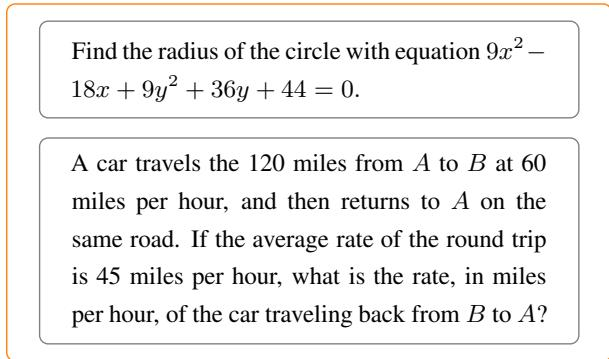
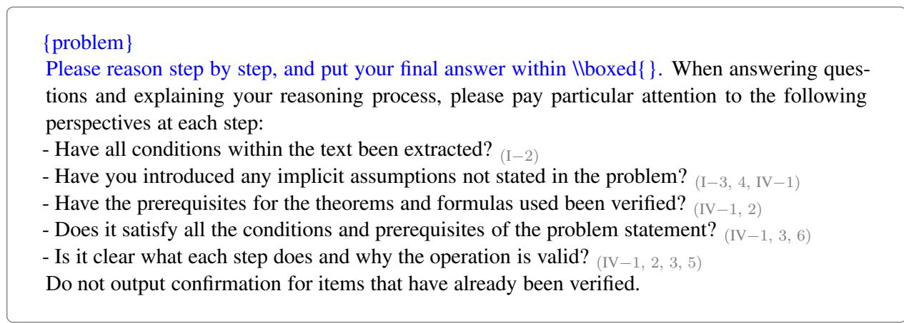
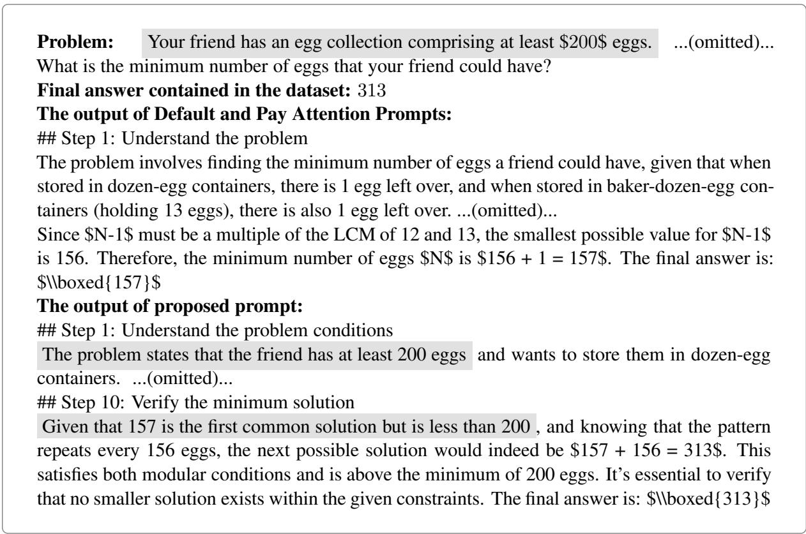

# Improving Mathematical Reasoning Capabilities in Large Language Models via Reasoning Process Error Classification

Runa Yoshida, Kosuke Nishida, Kyosuke Nishida

Human Informatics Labs., NTT, Inc.

{runa.yoshida, kosuke.nishida, kyosuke.nishida}@ntt.com

## Abstract

The reasoning ability of large language models (LLMs) is a critical factor for practical LLMbased applications. To investigate the current reasoning capability of LLMs, we clarify the types of errors that arise in LLMs’ reasoning processes on mathematical datasets. We focus on problems where LLMs produce an incorrect answer. We define errors in the reasoning process as reasoning errors and manually analyze the features of reasoning errors. We defined and classified 21 error classes and identified the frequently occurring classes among them. Beyond qualitative evaluation, we leverage the evaluation results to improve the reasoning capability. We designed a prompt that explicitly focuses on eight error classes. The experiments demonstrate that this prompt effectively improves reasoning performance. Furthermore, the results suggest that the frequent reasoning errors identified in this paper are common across LLMs of comparable scale.

## 1 Introduction

Large language models (LLMs) demonstrate high performance across a wide range of tasks, which has led to growing interest in their practical applications. The reasoning capabilities of LLMs are critically important for practical applications such as scientific computing, which require the ability to derive conclusions that satisfy multiple conditions and to decompose complex problems into simpler subproblems.

Mathematical reasoning is a task that requires strict logical consistency and computational accuracy; consequently, mathematics benchmarks have been adopted to evaluate the reasoning capabilities of LLMs (Cobbe et al., 2021; Hendrycks et al., 2021). However, the model’s reasoning capabilities remain limited: Boye and Moell (2025) and Mirzadeh et al. (2025) show that models struggle with complex questions and with problems requiring multi-step deduction or real-world knowledge.

In this paper, we investigate the current state of LLM reasoning capabilities through a thorough analysis focusing on why LLMs arrive at incorrect answers in the mathematical domain. Specifically, we analyze errors in the reasoning process that lead to incorrect answers, which we refer to as reasoning errors. For reasoning errors observed in the analyzed problems, we manually grouped similar errors into the same class and identified reasoning error classes. We collected reasoning errors from 583 questions in the MATH benchmark (Hendrycks et al., 2021) test set, on which the Llama-3.3-70B-Instruct1 (AI@Meta, 2024) model failed to arrive at the correct answer.

As a result of our analysis, we identified 21 error classes. The classification results revealed challenges of current LLMs: (i) logical reasoning, (ii) understanding the context of problem conditions and settings, (iii) calculations and algebraic manipulations, (iv) insufficient consideration of all the conditions in the problem statement, and (v) insufficient consideration of the prerequisites of the introduced theorems.

Building upon the evaluation results, we utilize a training-free approach to reduce errors in frequent classes. We design a prompt that explicitly pays attention to frequently occurring reasoning error classes. Our approach is consistent with the findings of Tyen et al. (2024) that the primary limitation of LLM reasoning lies in detecting errors rather than correcting them.

Experimental results show that the prompt designed with consideration of reasoning error classes enhances performance on mathematical datasets with statistical significance. Furthermore, since the proposed method shows consistent gains among three LLM families, this suggests that the reasoning errors identified in this paper are common challenges for LLMs. This demonstrates that systematically classifying and analyzing reasoning errors is not only useful for model evaluation but also serves as a valuable guideline for the practical application of LLMs.

In summary, our contributions are:

• Through an analysis of reasoning errors, we identified the tendencies of reasoning errors exhibited by LLMs. These classes will provide a novel framework for evaluating LLMs capability in the mathematical domain.

• We show that a prompt based on the analysis of reasoning errors can effectively improve the reasoning capabilities of LLMs.

• The reasoning errors identified in this paper suggest that they are common challenges encountered by LLMs of comparable scale.

## 2 Related Work

Classification of reasoning errors. Classification of reasoning errors in LLMs is an important topic (Lewkowycz et al., 2022; Bubeck et al., 2023; Golovneva et al., 2023; Rong et al., 2025; Boye and Moell, 2025). Among these studies, our work conducts evaluations through error classification and leverages the results to improve LLMs ability. Similar to our motivation, Yu et al. (2025) and Pan et al. (2025) aim to leverage evaluation results to improve LLMs. These studies classified the reasoning errors exhibited by models on a mathematics dataset into eight or twelve classes using an LLM and demonstrated that mathematical reasoning performance can be improved by creating training data corresponding to each class. On the other hand, the error classes they used consist of both domain-specific categories (e.g., Geometric Errors) and coarse-grained categories (e.g., Logical and Reasoning Errors), as their primary objective was to construct training data. This study introduces new classes that generalize and expand their classes, presenting more detailed error analysis.

Moreover, Yin et al. (2025) proposed a retrievalbased method. In advance, the method collects problem and incorrect solution pairs, and generated error analysis for each pair. For inference, it dynamically retrieves error analyses relevant to the input problem and incorporates them into the prompt to encourage the model to pay attention to these errors. Our study identifies reasoning error tendencies in a single model and shows that a fixed, lightweight prompt derived from these tendencies improves mathematical reasoning performance across different model families.

Furthermore, several studies showed that even high-performing LLMs exhibit varying error detection and classification performance across datasets and still perform inadequately on challenging problems (Jiang et al., 2024; Singh et al., 2025; Yin et al., 2025). Therefore, we manually classified the reasoning errors rather than using LLM-based classification.

Enhancing reasoning ability via prompt design. Currently, various Chain-of-Thought (CoT) prompting techniques have been extensively investigated, and these approaches have been shown to enhance the problem-solving capabilities of LLMs (Wei et al., 2022; Wang et al., 2023). For example, appending the phrase “Let’s think step by step” to the end of a question has been reported to prompt LLMs to generate explicit step-by-step reasoning processes, which in turn reduces reasoning errors (Kojima et al., 2022). Li et al. (2024) use GPT-4 (OpenAI, 2024) to classify errors into nine error types and show that explicitly including the assigned error class labels in the prompt improves large-scale LLMs’ error correction ability. However, the gains were limited for open-source models such as Llama-2 (Touvron et al., 2023), which suggests that error class labels alone may not provide sufficient guidance for models that struggle to estimate the underlying cause of an error. Following these studies, we transform frequently observed reasoning error classes into verification questions and incorporate them into the prompt to reduce such errors in LLMs under zero-shot prompting.

## 3 Analysis of Reasoning Errors

We describe our analysis procedure. It consists of methods for the selection of target problems, the approach to classifying reasoning errors, and the classification results. Then, we present a discussion based on the analysis.

## 3.1 Selection of Target Problems for Analysis

Problem source. For our analysis, we adopted the MATH benchmark test set. The MATH dataset includes problems ranging from secondary education to early undergraduate level and is divided into five difficulty levels. It consists of seven domains: algebra, counting and probability, geometry, intermediate algebra, number theory, prealgebra, and precalculus. Figure 1 shows examples of level 5 problems in the algebra domain. For each problem, both the reasoning process and the final answer are provided as annotations. Rong et al.’s (2025) said that this dataset contains numerous high-difficulty problems, which are challenging for correct reasoning even by the Llama-3- 70B model2 (AI@Meta, 2024). Consequently, we consider it appropriate for our analysis.

<table><tr><td rowspan="3"></td><td>|MATH</td><td colspan="6"># Analyzed</td></tr><tr><td>Total</td><td>Lev. 1</td><td>2</td><td>3</td><td>4</td><td>5</td><td>| Total</td></tr><tr><td>Algebra Counting and</td><td>1,187</td><td>0</td><td>3</td><td>5</td><td>8</td><td>25</td><td>41</td></tr><tr><td>Probability</td><td>474</td><td></td><td>1 10</td><td>9</td><td>16</td><td>37</td><td>73</td></tr><tr><td>Geometry</td><td>479</td><td>8</td><td>16</td><td>14</td><td>36</td><td>50</td><td>124</td></tr><tr><td>Intermediate Algebra</td><td>903</td><td>1</td><td>9</td><td>923</td><td>31</td><td>68</td><td>132</td></tr><tr><td>Number Theory</td><td>540</td><td>0</td><td>7</td><td>715</td><td>22</td><td>40</td><td>84</td></tr><tr><td>Prealgebra</td><td>871</td><td>2</td><td>7</td><td>10</td><td>17</td><td>40</td><td>76</td></tr><tr><td>Precalculus</td><td>564</td><td>2</td><td>7</td><td>10</td><td>12</td><td>22</td><td>53</td></tr><tr><td>Total</td><td>5,000</td><td>14</td><td>59</td><td>86</td><td>142</td><td>282</td><td>583</td></tr></table>

Table 1: Total number of problems in the MATH test set and the number of the target problems.  
  
Figure 1: Examples of level 5 algebra problems.

Generation of reasoning processes and answers. We generated reasoning processes and answers using Llama-3.3-70B-Instruct. We adopted a 70B-scale model based on observations in Rong et al. (2025) that 8B-scale models have limited arithmetic reasoning capabilities. For each problem, CoT reasoning is performed with a sequence length fixed at 1,024, and answers are generated using greedy decoding in a zero-shot setting. We excluded problems where the model could not produce a final answer due to the sequence length constraint.

Judgment of correctness. The target of the analysis is problems for which the model provided incorrect answers. To determine whether the model answered correctly, we used Exact Match (EM) between the model’s final answer and the final answer annotated in the dataset. However, EM-based evaluation may incorrectly classify answers as incorrect even when they are mathematically equivalent. For example, although $- { \sqrt { 2 } } + 1$ and 1 √2 are mathematically equivalent, EM-based evaluation considers them incorrect. To address this issue, we used gpt-oss-120b3 (OpenAI, 2025) to determine whether the two answers were equivalent. When answers were judged to be equivalent, we excluded their problem from the analysis after manual verification. Table 1 shows the number of problems selected for analysis.

Implementation. We used the evaluation script provided by DeepSeek-MATH4 (Shao et al., 2024). The evaluation procedure, including prompt configuration, followed the same script.

## 3.2 Definition and Classification of Reasoning Error Classes

We defined classes of reasoning errors that occurred in the target problems and manually classified them. We used error classes identified in prior studies (Yu et al., 2025; Pan et al., 2025; Boye and Moell, 2025) as first-level categories. We further introduced finer-grained subcategories and defined them as the error classes in this study. First, we carefully examined the reasoning process in the target problems that did not reach the correct answer, and categorized reasoning errors by coarse granularity as follows: (I) Problem Understanding Errors, (II) Mathematical Concept Knowledge Errors, (III) Arithmetic and Algebraic Manipulation Errors, (IV) Logical and Reasoning Errors, and (V) Others. We excluded domain-dependent reasoning error classes, such as Geometric Errors, provided by prior work. Next, we compared reasoning errors within each coarse-grained category and defined finer-grained reasoning error classes by grouping together similar errors. As a result, we defined a total of 21 finer-grained reasoning error classes.

<table><tr><td>(I)</td><td>Problem Understanding Errors</td><td>185</td></tr><tr><td>(I-1)</td><td>Misreading of Information Contained in Figures, Tables, Charts, and Graphs</td><td>69</td></tr><tr><td>(I-2)</td><td>Ignoring Conditions in the Problem Statement</td><td>53</td></tr><tr><td>(I-3)</td><td>Introducing Conditions not in the Problem Statement</td><td>31</td></tr><tr><td>(I-4)</td><td>Misinterpretation of Conditions in the Problem Statement</td><td>27</td></tr><tr><td>(I-5)</td><td>The model misinterprets a given condition and performs reasoning based on that incorrect interpretation. Misinterpretation of Range-, Quantity-, and Comparison-Related Conditions</td><td>5</td></tr><tr><td>(II)</td><td>Mathematical Concept Knowledge Errors</td><td>32</td></tr><tr><td>(II-1)</td><td>Misremembering Theorems and Formulas</td><td>19</td></tr><tr><td>(II-2)</td><td>Confusion between Concepts with Different Definitions or Properties</td><td>13 135</td></tr><tr><td>(III)</td><td>Arithmetic and Algebraic Manipulation Errors</td><td></td></tr><tr><td></td><td>(III-1) Incorrect Numerical Calculations</td><td></td></tr><tr><td></td><td>(III-2) Algebraic Misoperations</td><td></td></tr><tr><td></td><td>(III-3) Miscounting the Number of Elements in a Set or Range</td><td>31 4</td></tr><tr><td></td><td>(III-4) Misinterpretation of Numerical Magnitude and Order</td><td></td></tr><tr><td>(IV) Logical and Reasoning Errors</td><td>(IV-1) Application of Inappropriate Theorem</td><td>230 77</td></tr><tr><td></td><td>The model applies a theorem without satisfying its prerequisites or incorrectly handles its conclusion in a mathematical reasoning step. (IV-2) Incorrect Logical Implication</td><td></td></tr><tr><td></td><td>Even though the current statement is true, the model presents an argument that contains a logical error, leading to a conclusion that does not logically follow.</td><td></td></tr><tr><td></td><td>(IV-3) Incorrect Final Answer Selection The model incorrectly selects a final answer from the derived answer candidates.</td><td>38</td></tr><tr><td></td><td>(IV-4) Inappropriate Strategy Selection The model selects inappropriate strategies or plans.</td><td>18</td></tr><tr><td></td><td>(IV-5) Misapplication of Formulas and Theorems</td><td>14</td></tr><tr><td></td><td>The model uses incorrect substituted values or corresponding relationships, even though the conditions or premises are satisfied. (IV-6) Incorrect Reasoning of Conditions in the Problem Statement</td><td>12</td></tr><tr><td></td><td>The model misprocesses the conditions in the problem statement, leading to the selection of inappropriate solution methods or theorems.</td><td></td></tr><tr><td>(IV-8)</td><td>(IV-7) Incorrect Formulation of Regularity and Repetitive Structures Inappropriate Processing</td><td>9 5</td></tr><tr><td></td><td>The model introduces inappropriate operations, such as rounding, leading to subsequent calculations or incor- rect reasoning.</td><td></td></tr><tr><td>(V) (V-1)</td><td>Others Transcription Mistakes</td><td>52 37</td></tr><tr><td></td><td>The model outputs an incorrect value as the final answer despite having derived the correct conclusion.</td><td></td></tr><tr><td></td><td></td><td></td></tr><tr><td>(V-2)</td><td>Correct or Non-error</td><td>15</td></tr></table>

Table 2: Defined reasoning error classes and the number of classified errors. For each coarse-grained class, the count is the sum of the counts of its finer-grained classes. Some problems fall into multiple classes of reasoning errors.

  
Figure 2: The proposed prompt that explicitly considers frequent reasoning error classes. The blue text denotes Default Prompt. The labels in the parentheses for each instruction indicates the reasoning error class considered. The labels of the reasoning error classes correspond to those in Table 2: (I-2) Ignoring Conditions in the Problem Statement, (I-3) Introducing Conditions not in the Problem Statement, (I-4) Misinterpretation of Conditions in the Problem Statement, (IV-1) Application of Inappropriate Theorem, (IV-2) Incorrect Logical Implication, (IV-3) Incorrect Final Answer Selection, (IV-5) Misapplication of Formulas and Theorems, and (IV-6) Incorrect Reasoning of Conditions in the Problem Statement.

## 3.3 Discussions

Table 2 shows the defined reasoning error classes and the number of the problems corresponding to each class. Some problems fall into multiple classes of reasoning errors. The classification results revealed that (IV) Logical and Reasoning Errors, (I) Problem Understanding Errors, and (III) Arithmetic and Algebraic Manipulation Errors occurred frequently.

Among the finer-grained classes, (IV-1) Application of Inappropriate Theorem was the most frequent. This indicates that current LLMs struggle to consider all the conditions in the problem statement and the prerequisites of the introduced theorems. Other frequent classes are also considered to be related to this factor: (I-2) Ignoring Conditions in the Problem Statement, (I-3) Introducing Conditions not in the Problem Statement, (I-4) Misinterpretation of Conditions in the Problem Statement, and (IV-6) Incorrect Reasoning of Conditions in the Problem Statement. That is, we found that a major challenge for current LLMs lies in their ability to accurately extract and interpret conditions from problem statements, and to determine whether these conditions align with the prerequisites of the theorems introduced during their reasoning process.

(I-1) Misreading of Information Contained in Figures, Tables, Charts, and Graphs is the second most frequent class. This suggests that, while LLMs demonstrate strong capabilities in mathematical reasoning, the textual understanding of mathematical problems remains challenging. As discussed above, accurate understanding of problem statements plays an essential role in reasoning. Accordingly, the use and evaluation of visionlanguage models (Liu et al., 2023) is a promising direction.

We observe that approximately 6.3% of the reasoning processes exhibit (V-1) Transcription Mistakes, in which the model successfully derives the correct conclusion but fails to accurately transfer it to the final answer. Although such errors are inherently simple, their presence even in current LLMs suggests that improving reasoning ability requires addressing not only complex reasoning failures but also these seemingly minor inconsistencies.

(III) Arithmetic and Algebraic Manipulation Errors account for 23.2% of all reasoning errors. In particular, 61 cases involve (III-1) Incorrect Numerical Calculations, while 39 involve (III-2) Algebraic Misoperations. These findings suggest that LLMs with tens of billions of parameters can still struggle to accurately execute individual calculations and algebraic manipulations, even when they identify an appropriate mathematical solution strategy. Therefore, mechanisms that explicitly verify numerical calculations and algebraic transformations step by step, as well as evaluations of reasoning supported by external tools such as calculators and computer algebra systems, represent

promising directions.

Our analysis revealed the infrequency of (II) Mathematical Concept Knowledge Errors. This result is consistent with the observation that LLMs successfully utilize knowledge but still require significant improvements in reasoning capabilities (Jin et al., 2025).

## 4 Proposed Method

We propose a prompt that explicitly considers the classification results of reasoning errors. Tyen et al. (2024) argue that a primary limitation of LLMs’ reasoning capabilities stems from their limited ability to detect errors. Therefore, explicitly directing attention to frequently occurring errors is expected to compensate for the ability to detect errors and contribute to improvements in reasoning performance.

Specifically, we designed a prompt to guide the model to focus on two groups of frequent reasoning error classes. The first group consists of the classes related to understanding of the problem statements: (I-2), (I-3), and (I-4). The second group consists of the classes regarding the logical errors: (IV-1), (IV-2), (IV-3), (IV-5), and (IV-6). Based on these fine-grained error classes, our prompt includes five questions that verify the reasoning process with respect to the eight error classes. Figure 2 shows the proposed prompt.

## 5 Experiment and Result

In this section, we address three research questions:

RQ1 Is explicitly directing attention to considering reasoning errors effective?

RQ2 Is fine-grained reasoning error classification effective?

RQ3 Are frequent reasoning errors modelspecific?

## 5.1 Experimental Settings

Baseline. We adopt the zero-shot standard prompt of DeepSeek-MATH (hereafter referred to as Default Prompt; see the blue text in Figure 2). We also adopt a prompt that appends the following instruction to the end of Default Prompt (hereafter referred to as Pay Attention Prompt):

Please pay particular attention when answering questions and explaining your reasoning process.

We adopted Pay Attention Prompt as a baseline to clearly distinguish whether the performance improvement of the proposed method arises from merely directing attention to the reasoning process or from explicitly considering the reasoning error classes.

We also adopt a prompt that appends the following instruction to the end of Default Prompt (Coarse Attention Prompt):

When answering questions and explaining your reasoning process, please pay particular attention to the following perspectives at each step:

– Is each reasoning step logically valid? (IV) Logical and Reasoning Errors   
– Have you accurately understood the problem statement and its conditions? (I) Problem Understanding Errors

This prompt explicitly considers the frequently occurring coarse-grained category (IV) Logical and Reasoning Errors and (I) Problem Understanding Errors. The reason for adopting this prompt is to determine whether more detailed error analysis leads to greater performance improvements.

Dataset. As a development split, we randomly sampled a total of 700 problems from the MATH test set, selecting 20 problems from each domain at each level. The phrase in the proposed prompt was determined based on the performance of Llama-3.3-70B-Instruct on the development split. The remaining 4,300 problems were used as a test split.

Evaluation models. We used three models as evaluation models: Llama-3.3-70B-Instruct, Qwen3-32B5 (Qwen Team, 2025), and gemma-2- 27b-it6 (Gemma Team, 2024).

Evaluation metrics. We set the temperature to 0.6, and the results are averaged over 10 random seeds. The sequence length is set to 8,192, and we determine answer correctness by EM. To perform statistical tests between the proposed prompt and each baseline, we compute rank-biserial correlation (RBC) values and p-values using the Mann–Whitney U test (Mann and Whitney, 1947).

<table><tr><td rowspan=2 colspan=1></td><td rowspan=1 colspan=3># incorrect ans.       vs. Ours</td></tr><tr><td rowspan=1 colspan=3>mean ↓ (± std)  RBC↑|p-value↓</td></tr><tr><td rowspan=1 colspan=4>Llama-3.3-70B-Instruct</td></tr><tr><td rowspan=1 colspan=1>DefaultPay Att.Coarse Att.Ours</td><td rowspan=1 colspan=1>1110.9 (± 15.0)1104.8 (± 10.4)1102.0 (± 10.5)1078.5 (± 7.8)</td><td rowspan=1 colspan=1>1.001.000.90一</td><td rowspan=1 colspan=1>0.0000.0000.001</td></tr><tr><td rowspan=1 colspan=4>Qwen3-32B</td></tr><tr><td rowspan=1 colspan=1>DefaultPay Att.Coarse Att.Ours</td><td rowspan=1 colspan=1>691.7 (± 72.0)596.2 (± 19.7)473.8 (± 7.7)442.5 (± 8.9)</td><td rowspan=1 colspan=1>1.001.001.00一</td><td rowspan=1 colspan=1>0.0000.0000.000</td></tr><tr><td rowspan=1 colspan=4>gemma-2-27b-it</td></tr><tr><td rowspan=1 colspan=1>DefaultPay Att.Coarse Att.Ours</td><td rowspan=1 colspan=1>2058.1 (± 12.0)2067.7 (± 10.0)2067.0 (± 19.6)2021.6 (± 15.5)</td><td rowspan=1 colspan=1>0.921.000.92一</td><td rowspan=1 colspan=1>0.0210.0080.001</td></tr></table>

Table 3: Results of Default Prompt, Pay Attention Prompt, Coarse Attention Prompt, and the proposed method. The “# incorrect ans.” column reports the mean and standard deviation of the number of incorrect answers over 10 runs. The “vs. Ours” column report rank-biserial correlation values and p-values using the Mann–Whitney U test.

## 5.2 Experimental Results

To address RQ1, RQ2, and RQ3, we present our results in Table 3.

RQ1: Is explicitly directing attention to considering reasoning errors effective? As shown in Table 3, the proposed prompt consistently outperformed both Default Prompt and Pay Attention Prompt across all evaluated models. In particular, the proposed prompt shows statistically significant improvements over Default Prompt across all evaluated models, with p-values < 0.05. This result demonstrates that classifying reasoning errors effectively improves reasoning ability. Furthermore, Pay Attention Prompt did not yield robust performance improvements over Default Prompt. Specifically, for Llama-3.3-70B-Instruct, the mean scores of the two methods were within one standard deviation of each other. For Qwen3- 32B, their difference only slightly exceeded one standard deviation, whereas Pay Attention Prompt performed worse than Default Prompt on gemma-2-27b-it.

These results suggest that merely encouraging attention is insufficient, and it is important to explicitly direct attention to error-prone aspects based on the classes of reasoning error. Figure 3 presents an example of a reasoning error that the Pay Attention Prompt did not improve, but the proposed prompt corrected. In this example, Default Prompt and Pay Attention Prompt ignore the condition that your friend has at least 200 eggs, but the proposed prompt takes it into account by confirming that all conditions in the text had been extracted.

RQ2: Is fine-grained reasoning error classification effective? As shown in Table 3, the proposed prompt outperforms Coarse Attention Prompt across all evaluated models. Furthermore, similar to Pay Attention Prompt, Coarse Attention Prompt did not yield robust performance improvements. Specifically, Coarse Attention improved performance for Qwen3-32B but degraded it for gemma-2-27b-it. These results indicate that achieving robust performance improvements requires not only classifying errors into coarse classes but also classifying them into fine-grained reasoning error classes and explicitly highlighting specific aspects in which errors are likely to occur. Therefore, detailed error analysis is important not only as a framework for evaluating models’ reasoning capabilities but also for designing effective prompts.

RQ3: Are frequent reasoning errors modelspecific? As discussed above, not only Llama-3.3-70B-Instruct but also Qwen-3-32B and gemma-2-27b-it show performance improvements. This suggests that the reasoning errors analyzed in this paper are not specific to the Llama-3 family, but may instead reflect challenges common to LLMs of comparable scale.

## 6 Conclusion

The mathematical reasoning ability of LLMs underlies a broad range of downstream applications and has the potential to advance scientific discovery. We clarify challenges in current LLMs and offer insights into directions for improvement.

We conducted a detailed qualitative analysis of the reasoning errors made by the LLM on the mathematical dataset. We first defined broad categories based on existing research, then further subdivided them into 21 finer-grained classes of reasoning errors. Our work clarified that current LLMs struggle to consider all the conditions in the problem statement and the prerequisites of the introduced theorems.

  
Figure 3: An example of errors that did not improve with Pay Attention Prompt but improved with the proposed prompt. The output of Pay Attention Prompt in this example was identical to that of Default Prompt. The reasoning error in this example is classified into (I-2) Ignoring Conditions in the Problem Statement. The text with a light gray background refers to the condition that the number of eggs is at least 200.

Our results demonstrate that error analysis serves not only as a means of diagnosing a model’s capabilities but also as a practical foundation for improving its performance. In particular, we show that the prompt that directs attention to frequently occurring errors can improve mathematical reasoning performance. These findings suggest that it is important to carefully evaluate model behavior and design prompts based on the evaluation results.

We highlight two promising directions for future work:

• Our manual reasoning error classification produced an annotated dataset consisting of problem statements, answers, reasoning processes, correctness labels, and reasoning error class labels. This dataset enables the training and evaluation of models for reasoning error classification and detection. Deploying such models is valuable not only for understanding model behavior, but also for applications such as constructing training data to mitigate errors (Yu et al., 2025) and detecting hallucinations (Manakul et al., 2023).

• Our fine-grained definition of the reasoning error classes enables LLMs used in the LLMas-a-judge framework to assign scores across fine-grained aspects. In particular, prior work has demonstrated that aspect-wise scoring is beneficial for LLM alignment (Cui et al., 2024), and that assigning rewards to the reasoning process itself improves reasoning capability (Sun et al., 2025; Jiao et al., 2025). Building on these findings, our fine-grained definition enables more precise evaluation, which can improve LLMs’ reasoning capability through enhanced LLM-as-a-judge systems.

## 7 Limitations

This paper is broadly divided into two parts: an analysis framework (§3) and a method to reduce frequent errors, together with its evaluation (§4 and §5). We discuss two limitations of this work below.

First, although our analysis in §3 provides manual error annotation for each LLM’s response, our experiments in §5 report only aggregate accuracy and do not annotate the error class of each failed response, due to heavy annotation cost. Tracing individual responses and their error classes from Default Prompt to Proposed Prompt would provide further implications for understanding mathematical reasoning behaviors of LLMs, which we leave as a promising direction for future work.

Second, our experiments are limited to the MATH dataset and three open-weight models with parameter counts ranging from 27B to 70B, which is one of the most popular settings for evaluating LLMs’ mathematical capabilities across a broader range of difficulty levels. Consequently, it remains unclear whether the observed improvements generalize to other mathematical benchmarks and models outside this size range. For example, smaller models have been reported to be more prone to calculation errors (Rong et al., 2025). However, we believe that our analysis framework would also provide valuable insights for examining LLMs’ behavior in such settings.

## References

AI@Meta. 2024. Llama 3 model card.

Johan Boye and Birger Moell. 2025. Large language models and mathematical reasoning failures. Computing Research Repository, arXiv:2502.11574.

Sébastien Bubeck, Varun Chandrasekaran, Ronen Eldan, Johannes Gehrke, Eric Horvitz, Ece Kamar, Peter Lee, Yin Tat Lee, Yuanzhi Li, Scott Lundberg, Harsha Nori, Hamid Palangi, Marco Tulio Ribeiro, and Yi Zhang. 2023. Sparks of artificial general intelligence: Early experiments with gpt-4. Computing Research Repository, arXiv:2303.12712.

Karl Cobbe, Vineet Kosaraju, Mohammad Bavarian, Mark Chen, Heewoo Jun, Lukasz Kaiser, Matthias Plappert, Jerry Tworek, Jacob Hilton, Reiichiro Nakano, Christopher Hesse, and John Schulman. 2021. Training verifiers to solve math word problems. Computing Research Repository, arXiv:2110.14168.

Ganqu Cui, Lifan Yuan, Ning Ding, Guanming Yao, Wei Zhu, Yuan Ni, Guotong Xie, Zhiyuan Liu, and

Maosong Sun. 2024. Ultrafeedback: Boosting language models with high-quality feedback. In The Eleventh International Conference on Learning Representations.

Gemma Team. 2024. Gemma 2: Improving open language models at a practical size. Computing Research Repository, arXiv:2408.00118.

Olga Golovneva, Moya Peng Chen, Spencer Poff, Martin Corredor, Luke Zettlemoyer, Maryam Fazel-Zarandi, and Asli Celikyilmaz. 2023. ROSCOE: A suite of metrics for scoring step-by-step reasoning. In The Eleventh International Conference on Learning Representations.

Dan Hendrycks, Collin Burns, Saurav Kadavath, Akul Arora, Steven Basart, Eric Tang, Dawn Song, and Jacob Steinhardt. 2021. Measuring mathematical problem solving with the math dataset. In Proceedings of the Neural Information Processing Systems Track on Datasets and Benchmarks.

Zhuoxuan Jiang, Haoyuan Peng, Shanshan Feng, Fan Li, and Dongsheng Li. 2024. Llms can find mathematical reasoning mistakes by pedagogical chain-of-thought. In Proceedings of the Thirty-Third International Joint Conference on Artificial Intelligence, IJCAI-24, pages 3439–3447.

Fangkai Jiao, Geyang Guo, Xingxing Zhang, Nancy F Chen, Shafiq Joty, and Furu Wei. 2025. Preference optimization for reasoning with pseudo feedback. In International Conference on Learning Representations, pages 19638–19665.

Mingyu Jin, Weidi Luo, Sitao Cheng, Xinyi Wang, Wenyue Hua, Ruixiang Tang, William Yang Wang, and Yongfeng Zhang. 2025. Disentangling memory and reasoning ability in large language models. In Proceedings ofthe 63rd Annual Meeting ofthe Association for Computational Linguistics, pages 1681– 1701.

Takeshi Kojima, Shixiang (Shane) Gu, Machel Reid, Yutaka Matsuo, and Yusuke Iwasawa. 2022. Large language models are zero-shot reasoners. In Advances in Neural Information Processing Systems, pages 22199–22213.

Aitor Lewkowycz, Anders Andreassen, David Dohan, Ethan Dyer, Henryk Michalewski, Vinay Ramasesh, Ambrose Slone, Cem Anil, Imanol Schlag, Theo Gutman-Solo, Yuhuai Wu, Behnam Neyshabur, Guy Gur-Ari, and Vedant Misra. 2022. Solving quantitative reasoning problems with language models. In Advances in Neural Information Processing Systems, pages 3843–3857.

Xiaoyuan Li, Wenjie Wang, Moxin Li, Junrong Guo, Yang Zhang, and Fuli Feng. 2024. Evaluating mathematical reasoning of large language models: A focus on error identification and correction. In Findings of the Associationfor Computational Linguistics: ACL 2024, pages 11316–11360.

Haotian Liu, Chunyuan Li, Qingyang Wu, and Yong Jae Lee. 2023. Visual instruction tuning. In Advances in Neural Information Processing Systems, pages 34892–34916.

Potsawee Manakul, Adian Liusie, and Mark Gales. 2023. SelfCheckGPT: Zero-resource black-box hallucination detection for generative large language models. In Proceedings of the 2023 Conference on Empirical Methods in Natural Language Processing, pages 9004–9017.

Henry B Mann and Donald R Whitney. 1947. On a test of whether one of two random variables is stochastically larger than the other. The annals of mathematical statistics, pages 50–60.

Iman Mirzadeh, Keivan Alizadeh-Vahid, Hooman Shahrokhi, Oncel Tuzel, Samy Bengio, and Mehrdad Farajtabar. 2025. Gsm-symbolic: Understanding the limitations of mathematical reasoning in large language models. In International Conference on Learning Representations, pages 94743– 94765.

OpenAI. 2024. Gpt-4 technical report. Computing Research Repository, arXiv:2303.08774.

OpenAI. 2025. gpt-oss-120b & gpt-oss-20b model card. Computing Research Repository, arXiv:2508.10925.

Zhuoshi Pan, Yu Li, Honglin Lin, Qizhi Pei, Zinan Tang, Wei Wu, Chenlin Ming, H. Vicky Zhao, Conghui He, and Lijun Wu. 2025. LEMMA: Learning from errors for MatheMatical advancement in LLMs. In Findings of the Association for Computational Linguistics: ACL 2025, pages 11615–11639.

Qwen Team. 2025. Qwen3 technical report. arXiv preprint arXiv:2505.09388.

Yao Rong, Kathrin Seßler, Emek Gözlüklü, and Enkelejda Kasneci. 2025. Benchmarking in-context learning strategies of large language models for math reasoning tasks. IEEE Transactions on Learning Technologies, pages 1074–1082.

Zhihong Shao, Peiyi Wang, Qihao Zhu, Runxin Xu, Junxiao Song, Mingchuan Zhang, Y.K. Li, Y. Wu, and Daya Guo. 2024. Deepseekmath: Pushing the limits of mathematical reasoning in open language models. Computing Research Repository, arXiv:2402.03300.

Joykirat Singh, Akshay Nambi, and Vibhav Vineet. 2025. Exposing the achilles’ heel: Evaluating LLMs ability to handle mistakes in mathematical reasoning. In Proceedings of the 63rd Annual Meeting of the Association for Computational Linguistics, pages 27044–27065.

Wei Sun, Qianlong Du, Fuwei Cui, and Jiajun Zhang. 2025. An efficient and precise training data construction framework for process-supervised reward model in mathematical reasoning. In Proceedings

of the 63rd Annual Meeting of the Association for Computational Linguistics, pages 4292–4305.

Hugo Touvron, Louis Martin, Kevin Stone, Peter Albert, Amjad Almahairi, Yasmine Babaei, Nikolay Bashlykov, Soumya Batra, Prajjwal Bhargava, Shruti Bhosale, Dan Bikel, Lukas Blecher, Cristian Canton Ferrer, Moya Chen, Guillem Cucurull, David Esiobu, Jude Fernandes, Jeremy Fu, Wenyin Fu, and 49 others. 2023. Llama 2: Open foundation and fine-tuned chat models. Computing Research Repository, arXiv:2307.09288.

Gladys Tyen, Hassan Mansoor, Victor Carbune, Peter Chen, and Tony Mak. 2024. LLMs cannot find reasoning errors, but can correct them given the error location. In Findings of the Association for Computational Linguistics: ACL 2024, pages 13894–13908.

Xuezhi Wang, Jason Wei, Dale Schuurmans, Quoc V Le, Ed H. Chi, Sharan Narang, Aakanksha Chowdhery, and Denny Zhou. 2023. Self-consistency improves chain of thought reasoning in language models. In The Eleventh International Conference on Learning Representations.

Jason Wei, Xuezhi Wang, Dale Schuurmans, Maarten Bosma, brian ichter, Fei Xia, Ed Chi, Quoc V Le, and Denny Zhou. 2022. Chain-of-thought prompting elicits reasoning in large language models. In Advances in Neural Information Processing Systems, pages 24824–24837.

Zhangyue Yin, YuHong Sun, Xuanjing Huang, Xipeng Qiu, and Hui Zhao. 2025. Error classification of large language models on math word problems: A dynamically adaptive framework. In Findings ofthe Associationfor Computational Linguistics: EMNLP 2025, pages 338–365.

Erxin Yu, Jing Li, Ming Liao, Qi Zhu, Boyang Xue, Minghui Xu, Baojun Wang, Lanqing Hong, Fei Mi, and Lifeng Shang. 2025. Self-error-instruct: Generalizing from errors for LLMs mathematical reasoning. In Proceedings of the 63rd Annual Meeting of the Association for Computational Linguistics, pages 8504–8519.