# Learning to Coach for Experiential Learning

Guanheng Chen<sup>1,2∗</sup> Tianzhu Ye<sup>1∗</sup> Li Dong<sup>1∗</sup> Xun Wu<sup>1</sup> Shaohan Huang<sup>1</sup> Furu Wei<sup>1</sup> <sup>1</sup> Microsoft Research <sup>2</sup> Tsinghua University https://aka.ms/GeneralAI

Language models can learn from experience, but raw solution trajectories are often too long and noisy to provide effective guidance. In this work, we propose Learning to Coach (L2C), a framework that trains a dedicated LLM-as-a-Coach to extract actionable experiential knowledge from an actor model’s previous trajectory. The actor remains frozen, while the LLM-as-a-Coach is trained to maximize a reward given by the correctness of the actor’s guided response. We study two such rewards: a same-instance reward, which improves subsequent responses on the original problem, and a cross-instance reward, which elicits knowledge that transfers to other instances. Across mathematical reasoning and interactive text-games, L2C consistently outperforms self-refinement and an untrained LLM-as-a-Coach. Running experiential learning for more iterations further improves accuracy and uses additional inference compute more effectively than enlarging the actor’s decoding budget. The trained LLM-as-a-Coach also transfers to out-of-distribution tasks and adapts its guidance to the specific actor it coaches.

## Code: aka.ms/l2c-code

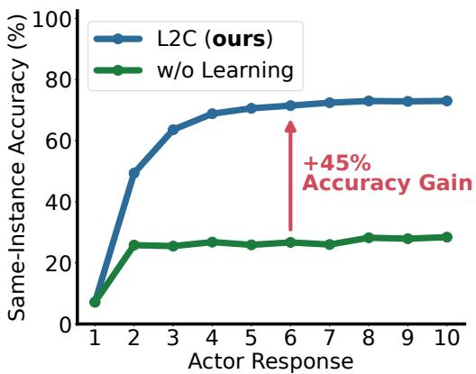

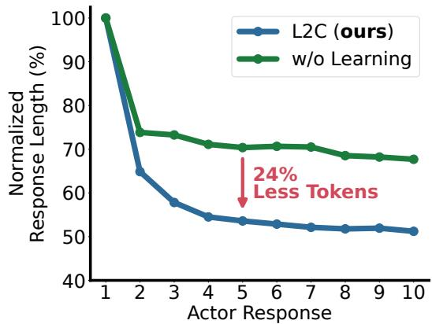  
Figure 1: Through experiential learning, a trained LLM-as-a-Coach steadily improves the actor’s accuracy, while an untrained LLM-as-a-Coach quickly plateaus (left). Meanwhile, responses become progressively shorter (right), indicating that learned coaching enables more accurate and efficient test-time scaling.

## 1 Introduction

Large language models (LLMs) have demonstrated strong capabilities in mathematical reasoning [GYZ<sup>+</sup>25, YLY<sup>+</sup>25] and, as language agents, in planning and interactive decision making [WXJ<sup>+</sup>23, POC<sup>+</sup>23]. Beyond solving a problem in a single pass, an LLM can often improve its answer by inspecting an earlier response, identifying errors, and trying again. Its own interaction history therefore carries valuable experiential knowledge: failed approaches, useful intermediate results, latent environment rules, and promising directions for subsequent responses.

However, extracting useful knowledge from a solving trajectory is itself a challenging reasoning problem. A raw trajectory can be long, redundant, or misleading, and may contain incorrect conclusions alongside useful evidence. Simply conditioning the model on its entire previous response, as in self-refinement, does not distinguish between these components [MTG<sup>+</sup>23, AAK<sup>+</sup>23]. As a result, the model may repeat its original mistakes, attend to irrelevant details, or even regress after an additional solve. Alternatively, one can fine-tune the solving model directly using task-level rewards, but doing so changes the model’s parameters and can be expensive when the same model must retain broad, general-purpose capabilities.

This motivates a different division of labor: instead of updating the model that performs the task, we train a separate model to learn how to extract useful experience from prior trajectories, while keeping the task-performing model frozen. This separation lets the solving model retain its original parameters while delegating the interpretation of prior trajectories to a dedicated model. It also makes the extracted knowledge explicit and inspectable, rather than implicitly encoded.

We term this delegated model an LLM-as-a-Coach, as in [YDC<sup>+</sup>26]. An LLM-as-a-Coach reads the actor’s prior trajectory and expresses, in natural language, what went wrong, which intermediate results are worth keeping, and which directions are promising for the next response. It distills the trajectory into concise, actionable experiential knowledge for the actor’s subsequent response.

In this work, we propose Learning to Coach (L2C), a framework that trains a dedicated LLM-as a-Coach to extract actionable experiential knowledge from a frozen actor model’s previous solving trajectory. In L2C, experiential learning proceeds as follows: the actor first makes an initial response, the LLM-as-a-Coach converts the resulting trajectory into concise experiential knowledge, and the actor makes a guided response. Rather than supervising the LLM-as-a-Coach with human-written critiques, we optimize it with reinforcement learning, using the correctness of the actor’s guided response as the reward. The LLM-as-a-Coach therefore learns to produce guidance that improves the downstream behavior of the specific actor being coached.

We study two reward variants. The same-instance reward evaluates the guided response on the instance from which the experiential knowledge was extracted, encouraging the LLM-as-a-Coach to diagnose errors and preserve useful intermediate results. The cross-instance reward evaluates the extracted knowledge on disjoint instances, encouraging it to capture reusable task structure. L2C also supports experiential learning over multiple iterations, where the LLM-as-a-Coach repeatedly updates its experiential knowledge from the actor’s latest trajectory before the actor solves again.

We evaluate L2C across two domains, mathematical reasoning and interactive text-games. Across tasks and model sizes, L2C consistently outperforms the frozen base actor, Self-Refinement, and an untrained LLM-as-a-Coach. The gains are particularly large in text-games, where interaction trajectories expose latent environment rules. Training with the cross-instance reward further produces transferable knowledge when such rules are shared across instances.

Our analysis shows that experiential learning provides an effective form of test-time scaling: perfor mance continues to improve across iterations, while an untrained LLM-as-a-Coach quickly plateaus. On math, L2C with more iterations outperforms doubling the actor’s decoding budget across all evaluated model sizes. The trained LLM-as-a-Coach also transfers to out-of-distribution evaluations, and adapts its guidance to the specific actor. These results show that learning to extract actor-specific experiential knowledge can improve language models without updating their parameters.

## 2 Method

We propose Learning to Coach (L2C), which learns from trajectories produced by a frozen actor during deployment. Once these trajectories have been collected, an LLM-as-a-Coach extracts con-

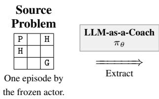

## Experiential knowledge

The game involves navigating a 3x3 grid where the player (P) starts and must reach the goal (G). The grid contains holes (H) that end the episode. The player can move up, down, left, or right, and must avoid holes while reaching the goal.

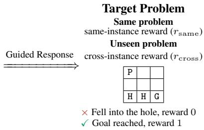

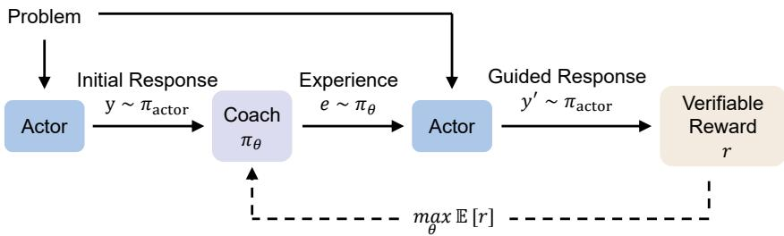  
Figure 2: Overview of L2C. A frozen actor $\pi _ { \mathrm { a c t o r } }$ first responds to problems, producing trajectories; an LLM-as-a-Coach $\pi _ { \theta }$ extracts experiential knowledge from each trajectory. The actor then produces a guided response conditioned on the extracted knowledge, and the verifiable correctness of that response serves as the reward. Only the LLM-as-a-Coach is trained. Under the same-instance reward, the target is the source problem; under the cross-instance reward, the target is an unseen problem.

cise experiential knowledge from the given trajectory, which is supplied back to the actor to improve its later performance. Unlike conventional fine-tuning, which modifies the actor directly, L2C keeps the actor fixed and instead optimizes the coach to produce experiential knowledge that improves the actor’s performance.

Learning to Coach Let $\pi _ { \mathrm { a c t o r } }$ be a frozen actor and $\pi _ { \theta }$ the trainable LLM-as-a-Coach. Running the actor on an instance $x$ leaves behind a trajectory $( x , y )$ , where $y \sim \pi _ { \mathrm { a c t o r } } ( \cdot \mid x )$ , which may be a solution trace or a multi-turn interaction gathered during actor use. Let $\mathcal { D }$ denote the resulting distribution over collected trajectories. Given $\bar { ( \boldsymbol { x } , \boldsymbol { y } ) } \sim \mathcal { D }$ , the coach extracts experiential knowledge

$$
e \sim \pi _ { \theta } ( \cdot \mid x , y ) .\tag{1}
$$

To reward the experiential knowledge $e ,$ we provide it to the frozen actor on a target instance z:

$$
y _ { z } ^ { \prime } \sim \pi _ { \mathrm { a c t o r } } ( \cdot \mid z , e ) , \qquad r ( z , e ) = \mathcal { V } ( z , y _ { z } ^ { \prime } ) ,\tag{2}
$$

where V is a deterministic verifier. Thus, the coach is rewarded when its guidance leads the actor to a correct response. Accordingly, we train the coach to maximize this reward:

$$
\operatorname* { m a x } _ { \theta } \mathbb { E } _ { \mathbf { \Phi } ( x , y ) \sim \mathcal { D } , \textit { e } } \left[ r \right] ,\tag{3}
$$

where $r$ is one of two reward variants, which differ only in which target instances the experiential knowledge is evaluated on.

The same-instance reward evaluates the knowledge on the instance x that $y$ was collected on,

$$
r _ { \mathrm { s a m e } } = r ( x , e ) ,\tag{4}
$$

which encourages the coach to distill instance-specific knowledge.

The cross-instance reward instead evaluates the knowledge on a disjoint set of target instances ${ \mathcal { P } } _ { : }$

$$
r _ { \mathrm { c r o s s } } = \frac { 1 } { | \mathcal { P } | } \sum _ { z \in \mathcal { P } } r ( z , e ) ,\tag{5}
$$

which encourages reusable knowledge, such as shared task rules and general strategies.

For each source trajectory, we sample multiple candidate knowledge snippets, evaluate each through actor rollouts, and optimize the coach with GRPO [SWZ<sup>+</sup>24].

Algorithm 1 Experiential Learning with L2C   
Input: Collected trajectories D; Frozen actor $\pi _ { \mathrm { a c t o r } } ;$ LLM-as-a-Coach $\pi _ { \boldsymbol { \theta } } ;$ Iterations K; Reward $r \in { }$   
$\{ r _ { \mathrm { s a m e } } , r _ { \mathrm { c r o s s } } \}$   
Output: Trained LLM-as-a-Coach π<sub>θ</sub>   
for each collected trajectory $( x , y ^ { ( 1 ) } ) \sim \mathcal { D }$ do   
$e ^ { ( 0 ) } \gets \emptyset$   
for $k \gets 1$ to K − 1 do   
$e ^ { ( k ) } \sim \pi _ { \theta } ( \cdot \mid x , y ^ { ( k ) } , e ^ { ( k - 1 ) } )$ ▷ Extract experiential knowledge   
$y ^ { ( k + 1 ) } \sim \pi _ { \mathrm { a c t o r } } ( \cdot \mid x , e ^ { ( k ) } ) .$ ▷ Guided response   
Update π to maximize $\mathbb { E } [ \stackrel { \cdot } { r } ]$ ▷ Equation (3)   
end for   
end for   
return π<sub>θ</sub>

Experiential Learning LLM-as-a-Coach can repeatedly update its experiential knowledge as additional actor trajectories become available. Starting with $e ^ { ( 0 ) } = \emptyset$ , iteration k performs

$$
y ^ { ( k ) } \sim \pi _ { \mathrm { a c t o r } } ( \cdot \mid x , e ^ { ( k - 1 ) } ) ,\tag{6}
$$

$$
e ^ { ( k ) } \sim \pi _ { \theta } ( \cdot \mid x , y ^ { ( k ) } , e ^ { ( k - 1 ) } ) .\tag{7}
$$

Here K denotes the total number of actor responses, counting the initial unguided response $y ^ { ( 1 ) }$ The updated knowledge replaces the previous version, allowing the coach to remove incorrect conclusions, retain useful discoveries, and refine its guidance over time. The K=2 setting uses one observed trajectory followed by one guided response; larger K models continued learning from accumulated deployment experience. Viewed from a meta-learning perspective [FAL17], generating the experience from new actor trajectories forms the inner loop, while updating the coach with reinforcement learning based on the actor’s downstream reward forms the outer loop. Algorithm 1 summarizes the training procedure.

## 3 Experiments

## 3.1 Setup

Base Models In every setting, the actor and the LLM-as-a-Coach are initialized from the same base model. For math, we use Qwen3-1.7B, Qwen3-4B, and Qwen3-8B [YLY<sup>+</sup>25], all in thinking mode. For text-games, we use Qwen3-1.7B (thinking mode) on FrozenLake-v0-raw; on Sokoban-v0 we use Qwen3-4B (thinking mode) in the K=2 setting and Qwen3-4B-Instruct-2507 in the K=10 setting.

Datasets Our experiments cover three datasets: the math corpus DAPO-Math-17K [YZZ<sup>+</sup>25] and two interactive text-game environments, FrozenLake and Sokoban, both built on TextArena [GCY<sup>+</sup>25]. DAPO-Math-17K comprises roughly 14K English math problems with verifiable numerical answers. FrozenLake asks the agent to navigate a grid to a goal tile while steering clear of holes, whereas Sokoban requires planning a sequence of pushes that moves a box onto a target without dropping into a hole or jamming the box against a wall. Both games are presented purely as text and played out over multiple interaction turns. Full per-dataset configurations are deferred to Appendix A.1.

Training We optimize the LLM-as-a-Coach with GRPO [SWZ<sup>+</sup>24] while keeping the actor frozen. For each source trajectory, we sample $n { = } 8$ candidate experiential-knowledge snippets from the LLM-as-a-Coach; their rewards form one GRPO advantage-normalization group. Each candidate conditions an independent guided response from the frozen actor, which the verifier V scores as a binary reward: answer correctness on math, and the outcome of the guided playthrough on textgames. Actor responses are limited to 16,384 tokens on math and, on text-games, to five interaction turns of at most 1,024 tokens each; LLM-as-a-Coach responses are limited to 8,192 tokens throughout. We optimize all LLM-as-a-Coach models with AdamW [KB15], using a constant learning rate of $1 0 ^ { - 6 }$

We train three variants of the LLM-as-a-Coach, each initialized from the same checkpoint as its frozen actor. (1) Same-instance experiential learning (K=2) maximizes the same-instance reward (Equation (4)) and is trained for 100 steps on math (Qwen3-1.7B/4B/8B), FrozenLake (Qwen3- 1.7B), and Sokoban (Qwen3-4B). (2) Same-instance experiential learning (K=10) maximizes the same reward across ten actor responses: one initial response followed by nine guided responses. At each iteration, one of the eight trajectories $( e ^ { ( k ) } , y ^ { ( k + 1 ) } )$ is drawn uniformly to seed the next iteration. Training runs for 100 steps on math (Qwen3-1.7B/4B/8B) and Sokoban (Qwen3-4B-Instruct-2507), and 200 steps on FrozenLake (Qwen3-1.7B). (3) Cross-instance experiential learning (K=2) maximizes the cross-instance reward (Equation (5)), where the probe set P holds eight instances for math and seven for text-games. Training runs for 100 steps on math and FrozenLake and 200 steps on Sokoban. These budgets bring the reward curves close to convergence. Full configurations are provided in Appendix A.2.

Baselines We compare L2C against three baselines that share the same frozen actor and evaluation protocol. (1) Base Model. The actor responds in a single pass, without experiential knowledge. (2) Self-Refinement. The actor revises its answer in a second pass conditioned on its full initial trajectory, with no separate LLM-as-a-Coach and no experiential knowledge [MTG<sup>+</sup>23, AAK<sup>+</sup>23]. (3) LLM-as-a-Coach (w/o training). The same experiential learning procedure as L2C, but with the LLM-as-a-Coach left untrained; we also refer to this baseline as the untrained coach.

Evaluation Each evaluation rollout consists of an initial response, experiential knowledge extraction, and a guided response. We report two accuracies, mirroring the two rewards of Section 2.

The same-instance accuracy scores the guided response on the instance the experiential knowledge was extracted from (Equation (4)). At iteration k,

$$
\begin{array} { r } { \Delta c c _ { k } ^ { \mathrm { s a m e } } \ = \ \mathbb { P } _ { ( \boldsymbol { x } , \boldsymbol { y } ^ { ( 1 ) } ) \sim \mathcal { D } } \left[ \boldsymbol { y } ^ { ( k ) } \ \mathrm { i s ~ c o r r e c t } \right] , } \end{array}\tag{8}
$$

the fraction of instances the actor answers correctly at its k-th response.

The cross-instance accuracy instead applies knowledge extracted from a source instance x to the disjoint probe set P (Equation (5)):

$$
\begin{array} { r l r } { \mathrm { A c c } ^ { \mathrm { c r o s s } } \ = \ \mathbb { E } _ { ( x , y ) \sim \mathcal { D } , z \sim \mathcal { P } } [ \mathcal { V } ( z , y _ { z } ^ { \prime } ) ] , } & { { } \ } & { y _ { z } ^ { \prime } \sim \pi _ { \mathrm { a c t o r } } ( \cdot \mid z , e ) , } \end{array}\tag{9}
$$

measuring how well the extracted knowledge transfers to unseen instances.

## 3.2 Results

We present L2C results on math and text-games in Table 1, reporting the same-instance accuracy $\mathrm { A c c _ { 2 } ^ { \hat { \mathrm { s a m e } } } }$ with the LLM-as-a-Coach trained using experiential learning at K=2 under the sameinstance reward (Equation (4)). In all settings the actor and LLM-as-a-Coach are initialized from the same Qwen3 model; the actor is frozen throughout, with only the LLM-as-a-Coach updated.

L2C delivers its largest gains on text-games. Unlike math, where the problem statement fully specifies the task, text-games have latent rules that must be inferred from interaction. Through training, the LLM-as-a-Coach learns to infer these rules from the actor’s trajectory and distills them into higher-quality experiential knowledge; conditioned on it, the actor acts more effectively and achieves better performance.

On math, L2C consistently improves over the untrained coach across all model sizes. The LLMas-a-Coach distills the actor’s own reasoning trajectory into experiential knowledge that concentrates on its most useful steps, steering the actor toward correct solutions. L2C also outperforms Self-Refinement, underscoring the value of coaching: rather than re-feeding the actor its own full trajectory, the LLM-as-a-Coach distills it into a compact, actionable experiential knowledge snippet that more effectively guides the actor’s response.

## 3.3 LLM-as-a-Coach Yields Transferable Experiential Knowledge

We train K=2 LLM-as-a-Coach with either the same-instance reward (Equation (4)) or the crossinstance reward (Equation (5)), and evaluate both using same-instance accuracy and cross-instance accuracy. We consider FrozenLake with Qwen3-1.7B and Sokoban with Qwen3-4B-Instruct-2507.

<table><tr><td>Model</td><td>Task</td><td>Method</td><td>Same-Instance Accuracy</td></tr><tr><td rowspan="5">Qwen3-1.7B</td><td rowspan="5">FrozenLake</td><td>Base Model</td><td>7.4</td></tr><tr><td>Self-Refinement  $[ \mathrm { M T G } ^ { + } 2 3 , \mathrm { A A K } ^ { + } 2 3 ]$ </td><td>36.5</td></tr><tr><td>LLM-as-a-Coach (w/o training)</td><td>23.4</td></tr><tr><td>LLM-as-a-Coach + L2C</td><td>65.4</td></tr><tr><td>Base Model</td><td>3.8</td></tr><tr><td rowspan="3">Qwen3-4B</td><td rowspan="3">Sokoban</td><td>Self-Refinement</td><td>10.6</td></tr><tr><td>LLM-as-a-Coach (w/o training)</td><td>7.6</td></tr><tr><td>LLM-as-a-Coach + L2C</td><td>23.6</td></tr><tr><td rowspan="4">Qwen3-1.7B</td><td rowspan="4">Math</td><td>Base Model</td><td>61.4</td></tr><tr><td>Self-Refinement</td><td>54.3</td></tr><tr><td>LLM-as-a-Coach (w/o training)</td><td>66.1</td></tr><tr><td>LLM-as-a-Coach + L2C</td><td>67.8</td></tr><tr><td rowspan="4">Qwen3-4B</td><td rowspan="4">Math</td><td>Base Model</td><td>67.7</td></tr><tr><td>Self-Refinement</td><td>71.4</td></tr><tr><td>LLM-as-a-Coach (w/o training)</td><td>74.4</td></tr><tr><td>LLM-as-a-Coach + L2C</td><td>78.6</td></tr><tr><td rowspan="4">Qwen3-8B</td><td rowspan="4">Math</td><td>Base Model</td><td>75.8</td></tr><tr><td>Self-Refinement</td><td>77.8</td></tr><tr><td>LLM-as-a-Coach (w/o training)</td><td>81.9</td></tr><tr><td>LLM-as-a-Coach + L2C</td><td>82.9</td></tr></table>

Table 1: Results of L2C and baselines under the same-instance reward (Equation (4)) on text-games and math. L2C consistently enhances base models’ ability to learn from prior interactions, improving guided accuracy across tasks and scales.

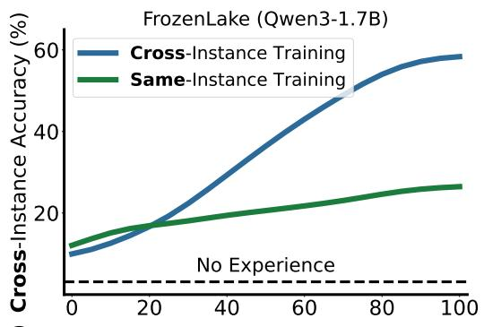

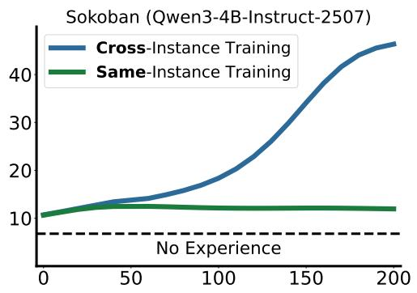

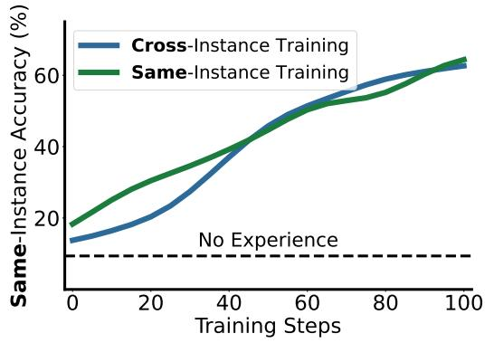

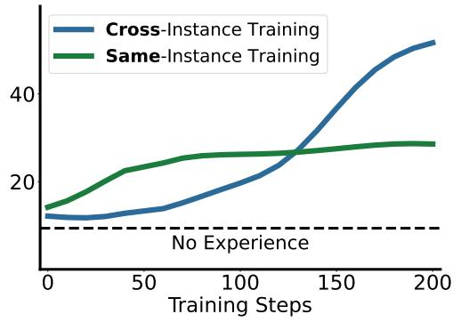  
Figure 3: Same- and cross-instance accuracy of $K { = } 2 \ \mathrm { L L M } { \mathrm { - } } { \mathrm { a s - a - } }$ Coach trained with the sameinstance reward or the cross-instance reward. Cross-instance reward training produces substantially more transferable experiential knowledge on both FrozenLake (left) and Sokoban (right).

The bare actor without experiential knowledge serves as the baseline. Appendix B.4 provides full evaluation details.

Figure 3 shows that training with the cross-instance reward yields large, transferable gains: crossinstance accuracy climbs far above the no-experience baseline, and the improvement generalizes across environments and model sizes: FrozenLake with Qwen3-1.7B and Sokoban with Qwen3- 4B-Instruct-2507 alike. The cross-instance reward also transfers better than the same-instance reward: on FrozenLake the cross-instance-trained LLM-as-a-Coach reaches far higher accuracy than the same-instance-trained one, and a similar gap emerges on Sokoban. Rewarding knowledge for helping other instances thus pushes the LLM-as-a-Coach to extract environment-general rules rather than memorize instance-specific details, positioning L2C as a mechanism for distilling reusable, environment-general knowledge that generalizes to unseen instances. On math, we observe that fully specified problem statement leaves little latent structure to share across instances. We report these results in Appendix C.

## 3.4 Scaling Up Experiential Learning Iterations

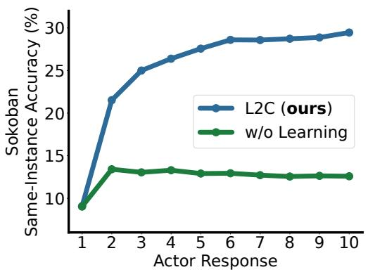

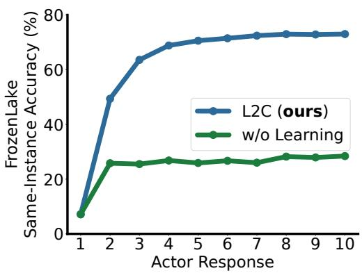

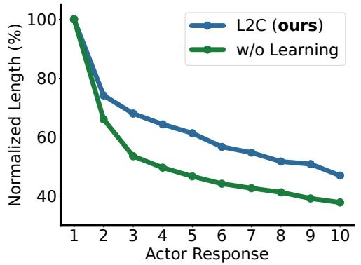

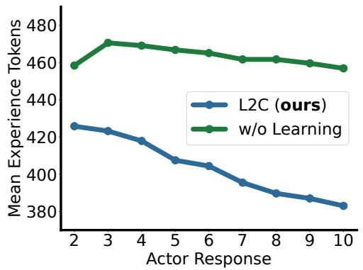  
Figure 4: Experiential learning with K=10 under the same-instance reward. Top: same-instance accuracy on Sokoban (left) and FrozenLake (right). Bottom: normalized actor-response length and experiential-knowledge length on Sokoban. The trained LLM-as-a-Coach improves accuracy across iterations while producing progressively shorter experiential knowledge and actor responses.

Section 3.2 reports the K=2 case of experiential learning; here we scale K to 10 under the sameinstance reward (Equation (4)). We train the LLM-as-a-Coach under the K=10 objective (Algorithm 1) and compare it against an untrained LLM-as-a-Coach, reporting $\mathrm { A c c } _ { k } ^ { \mathrm { s a m e } }$ at every actor response $k \in \{ 1 , \ldots , 1 0 \}$ ; the two settings coincide at k=1, the initial unguided response. Figure 4 plots per-response accuracy for Qwen3-4B-Instruct-2507 on Sokoban and Qwen3-1.7B on FrozenLake, together with the actor response length and experiential knowledge length on Sokoban. Appendix D reports $\mathrm { A c c } _ { 1 0 } ^ { \mathrm { s a m e } }$ across all three model sizes and both tasks.

Additional experiential learning iterations scale accuracy monotonically, and training the LLM-asa-Coach amplifies the effect. In Figure 4 (top), the trained curve rises steadily across all ten actor responses, whereas the untrained coach plateaus after the first guided response. The gain holds across all three model sizes and both tasks (Appendix D), where L2C improves $\mathrm { A c c } _ { 1 0 } ^ { \mathrm { s a m e } }$ over both the bare actor and the untrained coach. Iteration is therefore the strongest axis of test-time scaling that L2C unlocks.

Accuracy rises even as the actor’s responses grow shorter. Figure 4 (bottom-left) shows that the actor’s responses contract monotonically with k under both coaches, so later responses cost less than the first. Progressively refined experiential knowledge thus lets the actor reach higher accuracy at a lower inference cost.

The trained LLM-as-a-Coach also produces shorter experiential knowledge. Figure 4 (bottom-right) shows that its output sits below the untrained baseline at every response and keeps contracting with $k ,$ whereas the untrained curve stays nearly flat. Because the LLM-as-a-Coach consumes the prior knowledge together with the actor’s fresh response, this contraction indicates that each extraction step refines the previous knowledge rather than restarting from scratch, making it progressively more direct and precise.

Experiential learning uses additional inference compute more effectively than simply enlarging the actor’s decoding budget. Compared with a doubled 32k decoding budget on math (Table 2), a single guided response at K=2 already matches the extended-budget result for Qwen3-1.7B and surpasses it for Qwen3-4B; increasing to K=10 yields further gains across all evaluated model sizes. Iterative coaching thus converts inference compute into repeated opportunities for course correction—a form of test-time scaling that decoding-budget expansion alone does not provide. These results suggest that where the extra compute is spent matters as much as how much is spent.

<table><tr><td rowspan="2">Model</td><td rowspan="2">Compute Allocation</td><td>DAPO</td></tr><tr><td>Accuracy (%)</td></tr><tr><td rowspan="2">Qwen3-1.7B</td><td>Decoding 32k</td><td>67.9</td></tr><tr><td>L2C, 2 iterations L2C, 10 iterations</td><td>67.8 71.0</td></tr><tr><td rowspan="2">Qwen3-4B</td><td>Decoding 32k</td><td>77.0</td></tr><tr><td>L2C, 2 iterations</td><td>78.7</td></tr><tr><td rowspan="2"></td><td>L2C, 10 iterations</td><td>82.6</td></tr><tr><td></td><td></td></tr></table>

Table 2: Compute scaling on DAPO with a frozen actor. “L2C, $K$ iterations” denotes running a trained coach for K iterations. Experiential learning uses additional inference compute more effectively than doubling the decoding budget.

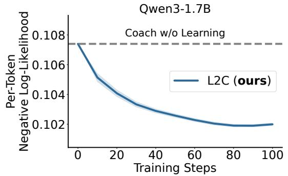

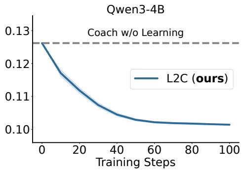  
Figure 5: Per-token negative log-likelihood of the frozen actor’s guided responses across LLMas-a-Coach training steps on the DAPO test split, for Qwen3-1.7B (left) and Qwen3-4B (right). L2C training consistently reduces the negative log-likelihood below the untrained LLM-as-a-Coach baseline, indicating that the trained LLM-as-a-Coach’s guidance is better adapted to the actor’s own policy.

## 3.5 LLM-as-a-Coach Adapts Its Guidance to the Actor

Beyond accuracy, we ask whether the LLM-as-a-Coach tailors the experiential knowledge it extracts to the specific actor it coaches. We measure the per-token negative log-likelihood that the frozen actor assigns to its own guided response $y ^ { \prime }$ when conditioned on the experiential knowledge e,

$$
\mathrm { N e g a t i v e ~ L o g - L i k e l i h o o d } = - \frac { 1 } { | y ^ { \prime } | } \sum _ { t } \log \pi _ { \mathrm { a c t o r } } ( y _ { t } ^ { \prime } \mid y _ { < t } ^ { \prime } , x , e ) , \qquad y ^ { \prime } \sim \pi _ { \mathrm { a c t o r } } ( \cdot \mid x , e ) ,\tag{10}
$$

where $y ^ { \prime }$ is drawn from the actor’s own on-policy distribution. A lower negative log-likelihood means the guided response lies in a higher-probability region of the actor’s own output distribution, indicating that e is well matched to this particular actor.

Figure 5 plots the negative log-likelihood on the DAPO test split across LLM-as-a-Coach training steps for Qwen3-1.7B and Qwen3-4B, with the untrained LLM-as-a-Coach (step 0) as the reference. L2C training consistently drives it below this baseline, and the gap widens over training.

We attribute this to two coupled effects. First, the trained LLM-as-a-Coach supplies clearer intermediate cues, so the actor commits more decisively to its guided response. Second, because the LLM-as-a-Coach is optimized against the actor’s own on-policy rollouts, its experiential knowledge comes to elicit reasoning that stays close to the actor’s familiar language and reasoning templates rather than pushing it off-distribution. The LLM-as-a-Coach therefore adapts its guidance to the specific actor rather than producing generic advice. This is consistent with prior work relating response likelihood to the quality and compatibility of the provided context $[ \mathrm { W C J ^ { + } } 2 6 ]$

## 3.6 LLM-as-a-Coach Generalizes Beyond Verifiable Tasks

We train the LLM-as-a-Coach on DAPO math with the same-instance reward and evaluate its transfer to AIME 2026, text-games, and IFEval, with DAPO as the in-distribution reference. All four benchmarks follow the same K=2 protocol as the main results—an initial response, experiential knowledge extraction, and a guided response—and are scored on the guided response: DAPO, AIME 2026, and the text-games by same-instance accuracy, and IFEval by strict instructionfollowing accuracy. Full evaluation protocols are provided in Appendices B.2 and B.3. L2C im-

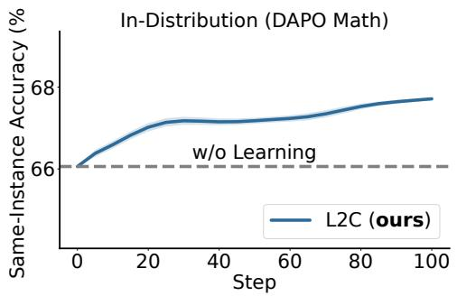

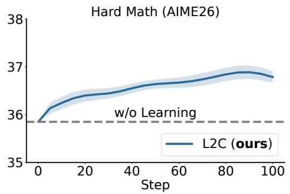

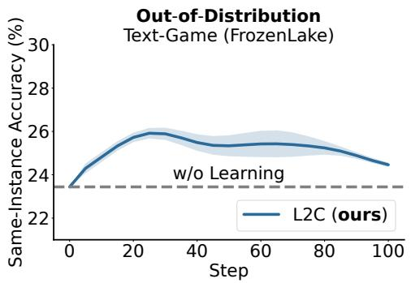

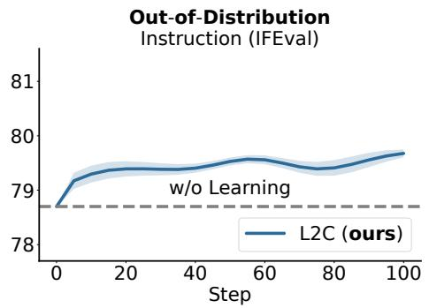  
Figure 6: Performance across L2C training steps for LLM-as-a-Coach trained on DAPO math. Results use Qwen3-1.7B on DAPO (top-left), AIME 2026 (top-right), and FrozenLake (bottom-left), and Qwen3-4B on IFEval (bottom-right). Coaching ability trained with verifiable math rewards transfers to out-of-distribution reasoning, interaction, and instruction-following tasks.

proves over the untrained LLM-as-a-Coach on all four benchmarks (Figure 6): harder math, interactive text-games, and instruction following, in addition to the in-distribution reference. Table 4 confirms positive transfer across model sizes. Training on verifiable math rewards therefore develops a general ability to extract and communicate actionable knowledge from prior trajectories, rather than a skill tied to the training domain.

## 4 Related Work

Learning from Experience Language agents can improve by reusing information acquired through prior interactions [SS25, ZCL<sup>+</sup>25]. Existing approaches prompt agents to reflect on failures [SCG<sup>+</sup>23, MTG<sup>+</sup>23], retain knowledge in external memory [ZHX<sup>+</sup>24, POC<sup>+</sup>23, SYNG23], construct reusable skill or workflow libraries [WXJ<sup>+</sup>23, WMFN24], or optimize prompts and programs through textual feedback $[ \mathrm { Y B B ^ { + } } 2 4 , \mathrm { A T S ^ { + } } 2 5 , \mathrm { L B F } 2 5 ]$ . These methods demonstrate the value of experiential knowledge, but typically rely on fixed prompting strategies, hand-designed memory operations, or heuristic extraction procedures. L2C instead treats experience extraction as a trainable decision problem: an LLM-as-a-Coach is optimized using the downstream reward of the frozen actor’s guided response. Its same-instance and cross-instance rewards further distinguish knowledge that helps revisit a particular problem from knowledge that transfers across instances.

Learned Critics and Teachers Auxiliary language models have been used to evaluate or improve model outputs, including AI-feedback critics [BKK<sup>+</sup>22], LLM-as-a-Judge systems $\left[ \mathsf { Z } \mathbf { C } \mathbf { S } ^ { + } 2 3 \right]$ , process reward models [LKB<sup>+</sup>24, WLS<sup>+</sup>24], and models that identify errors in generated code or reasoning [MPU<sup>+</sup>24]. Teacher models can also revise instruction-tuning data [LTZ<sup>+</sup>24] or provide natural-language feedback for refinement [AAK<sup>+</sup>23, YDC<sup>+</sup>26]. Related RL approaches optimize an actor using a fixed critic [ZZS<sup>+</sup>25, HCZ<sup>+</sup>26], train a critic for refinement utility $[ \mathrm { Y } \mathrm { X } \bar { \mathrm { Y } } ^ { + } 2 5 ] .$ or jointly evolve the critic and actor $[ \mathrm { L J H ^ { + } } 2 6 ]$ . In contrast, L2C freezes the actor and optimizes only the LLM-as-a-Coach using rewards from guided responses, learning to distill prior trajectories into actor-specific experiential knowledge that transfers across instances, rather than instance-bound critiques.

## 5 Conclusion

In this work, we introduced Learning to Coach (L2C), a framework that trains a dedicated LLMas-a-Coach to extract actionable experiential knowledge from a frozen actor’s previous trajectory. By optimizing the LLM-as-a-Coach with the reward of the actor’s guided response, L2C improves downstream performance without modifying the actor. Across mathematical reasoning and interactive text-games, L2C consistently outperforms self-refinement and an untrained LLM-as-a-Coach. We further showed that the cross-instance reward induces transferable knowledge when instances share latent structure, and that scaling up experiential learning iterations provides more effective test-time scaling than enlarging the actor’s decoding budget. The trained LLM-as-a-Coach also pro duces compact experiential knowledge and transfers to out-of-distribution tasks. Moreover, it adapts its guidance to the specific actor it coaches. These results establish LLM-as-a-Coach training as a modular approach for enabling language models to benefit from prior interactions while preserving the capabilities of the models being coached.

## References

[AAK<sup>+</sup>23] Afra Feyza Akyurek, Ekin Akyurek, Ashwin Kalyan, Peter Clark, Derry Tanti Wijaya, and Niket Tandon. RL4F: Generating natural language feedback with reinforcement learning for repairing model outputs. In Anna Rogers, Jordan Boyd-Graber, and Naoaki Okazaki, editors, Proceedings ofthe 61st Annual Meeting ofthe Associationfor Computational Linguistics (Volume 1: Long Papers), pages 7716–7733, Toronto, Canada, July 2023. Association for Computational Linguistics.

[ATS<sup>+</sup>25] Lakshya A Agrawal, Shangyin Tan, Dilara Soylu, Noah Ziems, Rishi Khare, Krista Opsahl-Ong, Arnav Singhvi, Herumb Shandilya, Michael J Ryan, Meng Jiang, et al. Gepa: Reflective prompt evolution can outperform reinforcement learning. In First Workshop on Foundations of Reasoning in Language Models, 2025.

[BKK<sup>+</sup>22] Yuntao Bai, Saurav Kadavath, Sandipan Kundu, Amanda Askell, Jackson Kernion, Andy Jones, Anna Chen, Anna Goldie, Azalia Mirhoseini, Cameron McKinnon, et al. Constitutional ai: Harmlessness from ai feedback. arXiv preprint arXiv:2212.08073, 2022.

[FAL17] Chelsea Finn, Pieter Abbeel, and Sergey Levine. Model-agnostic meta-learning for fast adaptation of deep networks. In International conference on machine learning, pages 1126–1135. PMLR, 2017.

[GCY<sup>+</sup>25] Leon Guertler, Bobby Cheng, Simon Yu, Bo Liu, Leshem Choshen, and Cheston Tan. Textarena. arXiv preprint arXiv:2504.11442, 2025.

[GYZ<sup>+</sup>25] Daya Guo, Dejian Yang, Haowei Zhang, Junxiao Song, Ruoyu Zhang, Runxin Xu, Qihao Zhu, Shirong Ma, Peiyi Wang, Xiao Bi, et al. Deepseek-r1: Incentivizing reasoning capability in llms via reinforcement learning. arXiv preprint arXiv:2501.12948, 2025.

[HCZ<sup>+</sup>26] Lei Huang, Xiang Cheng, Chenxiao Zhao, Guobin Shen, Junjie Yang, Xiaocheng Feng, Yuxuan Gu, Xing Yu, and Bing Qin. Bootstrapping exploration with group-level natural language feedback in reinforcement learning. arXiv preprint arXiv:2603.04597, 2026.

[KB15] Diederik P. Kingma and Jimmy Ba. Adam: A method for stochastic optimization. In Proceedings of ICLR, 2015.

[LBF25] Yoonho Lee, Joseph Boen, and Chelsea Finn. Feedback descent: Open-ended text optimization via pairwise comparison. arXiv preprint arXiv:2511.07919, 2025.

[LJH<sup>+</sup>26] Zhicong Li, Lingjie Jiang, Yulan Hu, Xingchen Zeng, Yixia Li, Xiangwen Zhang, Guanhua Chen, Zheng Pan, and Xin Li. No more stale feedback: Co-evolving critics for open-world agent learning. arXiv preprint arXiv:2601.06794, 2026.

[LKB<sup>+</sup>24] Hunter Lightman, Vineet Kosaraju, Yuri Burda, Harrison Edwards, Bowen Baker, Teddy Lee, Jan Leike, John Schulman, Ilya Sutskever, and Karl Cobbe. Let’s verify step by step. In International Conference on Learning Representations, volume 2024, pages 39578–39601, 2024.

[LTZ<sup>+</sup>24] Yilun Liu, Shimin Tao, Xiaofeng Zhao, Ming Zhu, Wenbing Ma, Junhao Zhu, Chang Su, Yutai Hou, Miao Zhang, Min Zhang, et al. Coachlm: Automatic instruction revisions improve the data quality in llm instruction tuning. In 2024 IEEE 40th International Conference on Data Engineering (ICDE), pages 5184–5197. IEEE, 2024.

[MPU<sup>+</sup>24] Nat McAleese, Rai Michael Pokorny, Juan Felipe Ceron Uribe, Evgenia Nitishinskaya, Maja Trebacz, and Jan Leike. Llm critics help catch llm bugs. arXiv preprint arXiv:2407.00215, 2024.

[MTG<sup>+</sup>23] Aman Madaan, Niket Tandon, Prakhar Gupta, Skyler Hallinan, Luyu Gao, Sarah Wiegreffe, Uri Alon, Nouha Dziri, Shrimai Prabhumoye, Yiming Yang, Shashank Gupta, Bodhisattwa Prasad Majumder, Katherine Hermann, Sean Welleck, Amir Yazdanbakhsh, and Peter Clark. Self-refine: Iterative refinement with self-feedback, 2023.

[POC<sup>+</sup>23] Joon Sung Park, Joseph O’Brien, Carrie Jun Cai, Meredith Ringel Morris, Percy Liang, and Michael S Bernstein. Generative agents: Interactive simulacra of human behavior. In Proceedings of the 36th annual acm symposium on user interface software and technology, pages 1–22, 2023.

[SCG<sup>+</sup>23] Noah Shinn, Federico Cassano, Ashwin Gopinath, Karthik Narasimhan, and Shunyu Yao. Reflexion: Language agents with verbal reinforcement learning. Advances in neural information processing systems, 36:8634–8652, 2023.

[SS25] David Silver and Richard S Sutton. Welcome to the era of experience. Google AI, 2025.

[SWZ<sup>+</sup>24] Zhihong Shao, Peiyi Wang, Qihao Zhu, Runxin Xu, Junxiao Song, Xiao Bi, Haowei Zhang, Mingchuan Zhang, YK Li, et al. Deepseekmath: Pushing the limits of mathematical reasoning in open language models. arXiv preprint arXiv:2402.03300, 2024.

[SYNG23] Theodore R Sumers, Shunyu Yao, Karthik Narasimhan, and Thomas L Griffiths. Cognitive architectures for language agents. arXiv preprint arXiv:2309.02427, 2023.

[WCJ<sup>+</sup>26] Yinjie Wang, Xuyang Chen, Xiaolong Jin, Mengdi Wang, and Ling Yang. Openclawrl: Train any agent simply by talking, 2026.

[WLS<sup>+</sup>24] Peiyi Wang, Lei Li, Zhihong Shao, Runxin Xu, Damai Dai, Yifei Li, Deli Chen, Yu Wu, and Zhifang Sui. Math-shepherd: Verify and reinforce LLMs step-by-step without human annotations. In Proceedings ofthe 62nd Annual Meeting ofthe Associationfor Computational Linguistics (Volume 1: Long Papers), pages 9426–9439. Association for Computational Linguistics, 2024.

[WMFN24] Zora Zhiruo Wang, Jiayuan Mao, Daniel Fried, and Graham Neubig. Agent workflow memory. arXiv preprint arXiv:2409.07429, 2024.

[WWX25] Sai Wang, Yu Wu, and Zhongwen Xu. Cogito, ergo ludo: An agent that learns to play by reasoning and planning. arXiv preprint arXiv:2509.25052, 2025.

[WXJ<sup>+</sup>23] Guanzhi Wang, Yuqi Xie, Yunfan Jiang, Ajay Mandlekar, Chaowei Xiao, Yuke Zhu, Linxi Fan, and Anima Anandkumar. Voyager: An open-ended embodied agent with large language models. arXiv preprint arXiv:2305.16291, 2023.

[YBB<sup>+</sup>24] Mert Yuksekgonul, Federico Bianchi, Joseph Boen, Sheng Liu, Zhi Huang, Carlos Guestrin, and James Zou. Textgrad: Automatic" differentiation" via text. arXiv preprint arXiv:2406.07496, 2024.

[YDC<sup>+</sup>26] Tianzhu Ye, Li Dong, Guanheng Chen, He Zhu, Xun Wu, Shaohan Huang, and Furu Wei. Llm-as-a-coach: Experiential learning for non-verifiable tasks. arXiv preprint arXiv:2607.18110, 2026.

[YLY<sup>+</sup>25] An Yang, Anfeng Li, Baosong Yang, Beichen Zhang, Binyuan Hui, Bo Zheng, Bowen Yu, Chang Gao, Chengen Huang, Chenxu Lv, et al. Qwen3 technical report. arXiv preprint arXiv:2505.09388, 2025.

[YXY<sup>+</sup>25] Tianshu Yu, Chao Xiang, Mingchuan Yang, Pei Ke, Bosi Wen, Cunxiang Wang, Jiale Cheng, Li Zhang, Xinyu Mu, Chuxiong Sun, and Minlie Huang. Training language model to critique for better refinement. In Findings of the Association for Computational Linguistics: ACL 2025, pages 26760–26804, Vienna, Austria, 2025. Association for Computational Linguistics.

[YZZ<sup>+</sup>25] Qiying Yu, Zheng Zhang, Ruofei Zhu, Yufeng Yuan, Xiaochen Zuo, Yu Yue, Weinan Dai, Tiantian Fan, Gaohong Liu, Lingjun Liu, et al. Dapo: An open-source llm reinforcement learning system at scale. arXiv preprint arXiv:2503.14476, 2025.

[ZCL<sup>+</sup>25] Kai Zhang, Xiangchao Chen, Bo Liu, Tianci Xue, Zeyi Liao, Zhihan Liu, Xiyao Wang, Yuting Ning, Zhaorun Chen, Xiaohan Fu, et al. Agent learning via early experience. arXiv preprint arXiv:2510.08558, 2025.

[ZCS<sup>+</sup>23] Lianmin Zheng, Wei-Lin Chiang, Ying Sheng, Siyuan Zhuang, Zhanghao Wu, Yonghao Zhuang, Zi Lin, Zhuohan Li, Dacheng Li, Eric Xing, et al. Judging llm-as-a-judge with mt-bench and chatbot arena. In Proceedings ofNeurIPS, 2023.

[ZHX<sup>+</sup>24] Andrew Zhao, Daniel Huang, Quentin Xu, Matthieu Lin, Yong-Jin Liu, and Gao Huang. Expel: Llm agents are experiential learners. In Proceedings of the AAAI Conference on Artificial Intelligence, volume 38, pages 19632–19642, 2024.

[ZLM<sup>+</sup>23] Jeffrey Zhou, Tianjian Lu, Swaroop Mishra, Siddhartha Brahma, Sujoy Basu, Yi Luan, Denny Zhou, and Le Hou. Instruction-following evaluation for large language models. arXiv preprint arXiv:2311.07911, 2023.

[ZZS<sup>+</sup>25] Xiaoying Zhang, Yipeng Zhang, Hao Sun, Kaituo Feng, Chaochao Lu, Chao Yang, and Helen Meng. Critique-grpo: Advancing llm reasoning with natural language and numerical feedback. arXiv preprint arXiv:2506.03106, 2025.

## A Training Details

## A.1 Datasets

Our training data span three task domains: mathematical problem solving and two interactive, text-only games. For mathematics, we use DAPO-Math-17K [YZZ<sup>+</sup>25], which includes roughly 14K English-language problems whose final numerical answers can be automatically verified. For interactive reasoning, we adopt the Frozen Lake and Sokoban environments provided by TextArena [GCY<sup>+</sup>25].

In Frozen Lake, the agent navigates a 3×3 board containing two holes and must find a safe route to the goal. Sokoban is instantiated on a 6×6 board with a single box; the agent must push the box onto its target while avoiding holes, walls, and irreversible deadlocks. Following prior work [WWX25], we omit some of the game instructions so that the agent must discover the missing mechanics through interaction. At every turn, TextArena converts the current board configuration into a textual observation, and the language model responds with an action, resulting in a multi-turn trajectory.

## A.2 Training Configuration

We optimize the LLM-as-a-Coach with GRPO [SWZ<sup>+</sup>24] while keeping the actor frozen. For each source trajectory, we sample n=8 candidate experiential-knowledge snippets from the LLM-as-a-Coach. Each candidate conditions an independent guided response by the actor, and the resulting eight rewards form one GRPO advantage-normalization group. All LLM-as-a-Coach models are optimized with AdamW [KB15] using a constant learning rate of $1 0 ^ { - 6 }$

Math. For math, each mini-batch contains 64 source problems for the Qwen3-1.7B and Qwen3- 4B LLM-as-a-Coach models and 128 source problems for the Qwen3-8B LLM-as-a-Coach. Actor responses, both initial and guided, are limited to 16,384 tokens, and LLM-as-a-Coach responses are limited to 8,192 tokens. Under the same-instance reward, each candidate conditions an independent guided response on the source problem, and a deterministic answer verifier assigns a binary correctness reward.

Text-games. For text-games, each mini-batch contains 64 environment seeds. An initial or guided response is a playthrough of at most five interaction turns, with actor responses limited to 1,024 tokens per turn. LLM-as-a-Coach responses are limited to 8,192 tokens. Under the same-instance reward, each candidate conditions an independent guided playthrough using the same environment seed as the initial response, and the binary win/loss outcome provides the reward.

Training variants. We train three variants of the LLM-as-a-Coach, each initialized from the same base checkpoint as its corresponding actor.

• Experiential learning with K=2. We use the same-instance reward with K=2, corresponding to one initial response, one extraction step, and one guided response. We train one LLM-as-a-Coach for each task–model pair for 100 gradient steps: math with Qwen3-1.7B/4B/8B, Frozen-Lake with Qwen3-1.7B, and Sokoban with Qwen3-4B.

• Experiential learning with K=10. We use the same-instance reward with K=10, corresponding to one initial response followed by nine guided responses. At each iteration, the LLM-asa-Coach samples eight candidate updates to the experiential knowledge, and each candidate is evaluated through an independent guided response. One of the eight candidates is then selected uniformly, together with its corresponding actor trajectory, to provide the state for the next iteration. We train the math LLM-as-a-Coach models and the Qwen3-4B-Instruct-2507 Sokoban LLM-as-a-Coach for 100 gradient steps and the Qwen3-1.7B FrozenLake LLM-as-a-Coach for 200 gradient steps.

• Cross-instance experiential learning. We use K=2 and replace the same-instance reward with the cross-instance reward in Equation (5). Each step uses 64 source instances and a probe set disjoint from the sources. Each candidate is applied independently to every probe instance, and its reward is the mean guided accuracy over the probe set. We use eight probes for math, shared across all source groups within a step, and seven per-group probes for text-games. We train the math and FrozenLake LLM-as-a-Coach models for 100 gradient steps and the Qwen3-4B-Instruct-2507 Sokoban LLM-as-a-Coach for 200 gradient steps.

Table 3 summarizes the number of GRPO gradient steps in each setting.
<table><tr><td>Reward</td><td>Protocol</td><td>Task (model)</td><td>Steps</td></tr><tr><td rowspan="3">Same-instance</td><td rowspan="3">K=2 (Section 3.2)</td><td>Math (Qwen3-1.7B / 4B / 8B)</td><td>100</td></tr><tr><td>FrozenLake (Qwen3-1.7B)</td><td>100</td></tr><tr><td>Sokoban (Qwen3-4B)</td><td>100</td></tr><tr><td rowspan="2">Same-instance</td><td rowspan="2">K=10 (Section 3.4)</td><td>Math (Qwen3-1.7B / 4B / 8B) Sokoban (Qwen3-4B-Instruct-2507)</td><td>100</td></tr><tr><td>FrozenLake (Qwen3-1.7B)</td><td>100 200</td></tr><tr><td rowspan="3">Cross-instance</td><td rowspan="3">K=2 (Section 3.3)</td><td></td><td></td></tr><tr><td>Math (Qwen3-1.7B / 4B / 8B)</td><td>100</td></tr><tr><td>FrozenLake (Qwen3-1.7B) Sokoban (Qwen3-4B-Instruct-2507)</td><td>100 200</td></tr></table>

Table 3: L2C training configurations. We report the number of GRPO optimizer steps for same-instance experiential learning (K=2), same-instance experiential learning (K=10), and crossinstance experiential learning (K=2). All runs use a frozen actor, eight LLM-as-a-Coach samples per source trajectory, AdamW, and a constant learning rate of $1 0 ^ { - 6 }$

## A.3 Prompt Templates

L2C uses two families of prompts, matching the two rewards of Section 2: the same-instance prompts behind the main results (Sections 3.2 and 3.4), and the cross-instance prompts behind the transfer experiment (Section 3.3). We list both below.

Same-instance prompts. For experiential knowledge update on the math dataset, we use the prompt template in Figure 7.

The LLM-as-a-Coach’s output replaces the previous notes verbatim (no per-line item extraction).

For experiential knowledge update on text-based games, we use the prompt template in Figure 8.

For guided responses on the same problem (or game), we embed the LLM-as-a-Coach’s notes with the prompt template in Figure 9.

Cross-instance prompts. The cross-instance variant rewards transferable experience, so its prompts extract general, high-level insight that is accumulated into a running knowledge base and then applied to new instances. For experience update on the math dataset we use Figure 10; on textbased games (the setting of the FrozenLake transfer experiment in Section 3.3) we use Figure 11. The accumulated experience is applied to a new instance with the solve template in Figure 12.

## A.4 Examples of Learned Experience

The two reward variants produce qualitatively different experiential knowledge, mirroring their prompts. Figure 13 shows a representative same-instance note learned on FrozenLake (Qwen3- 1.7B): it is tied to one specific map, recording exact obstacle coordinates and a memorized step-bystep solution path. Figure 14 shows a cross-instance experience from the same setting: it abstracts the interaction into general game rules and a reusable navigation strategy intended to apply across maps.

## B Evaluation Details

## B.1 Evaluation Configuration

For math, we evaluate on the DAPO test split (1,000 problems, n=16 rollouts per problem). For text-games, we use 500 held-out environment seeds (n=8 playthroughs per seed).

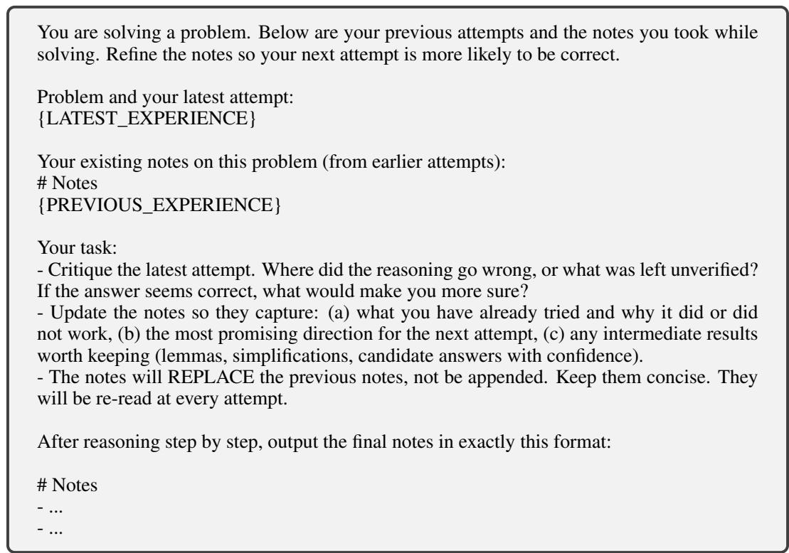  
Figure 7: The prompt template for the LLM-as-a-Coach’s notes update on the math dataset.

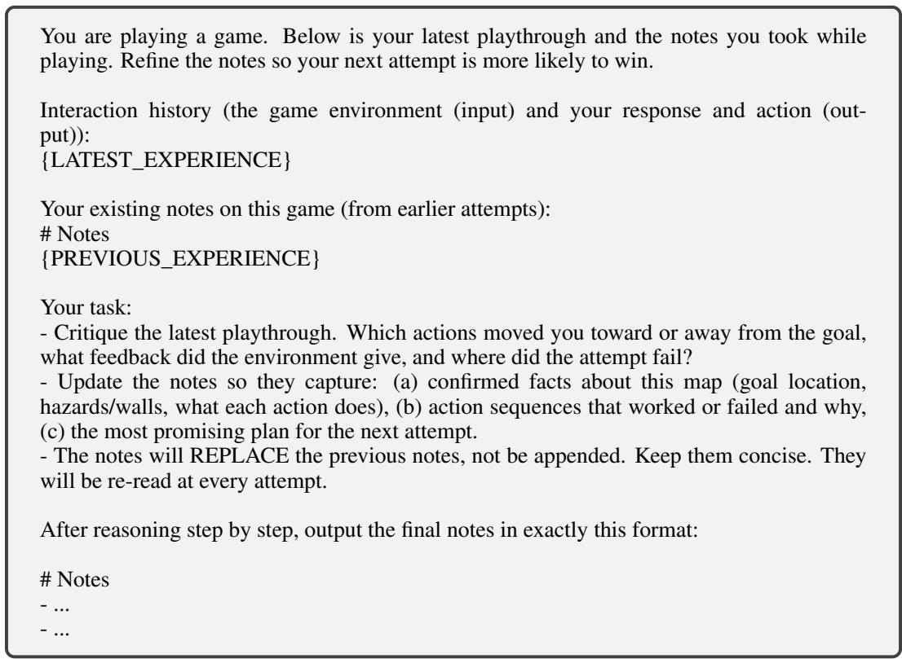  
Figure 8: The prompt template for the LLM-as-a-Coach’s notes update on text-based games.

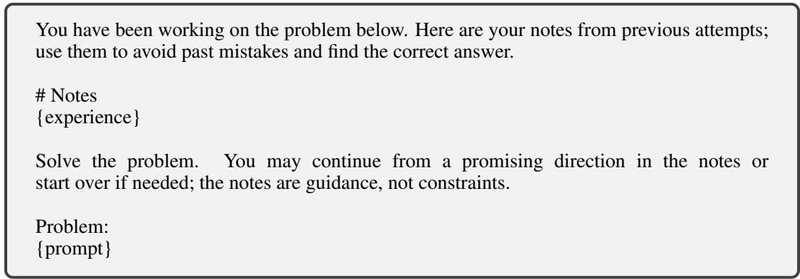  
Figure 9: The prompt template for a guided response with the LLM-as-a-Coach’s notes.

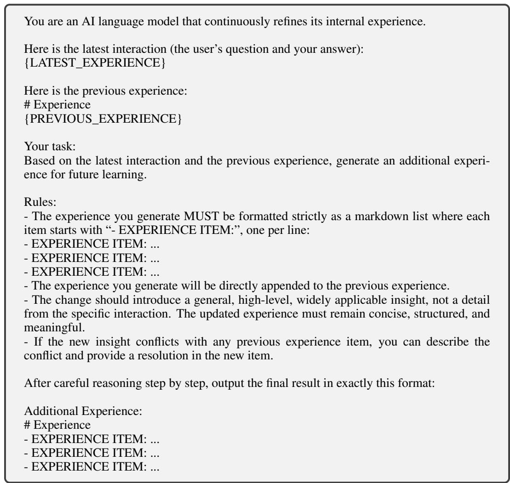  
Figure 10: The cross-instance prompt template for experience extraction on the math dataset: general, transferable insight accumulated as appended experience items.

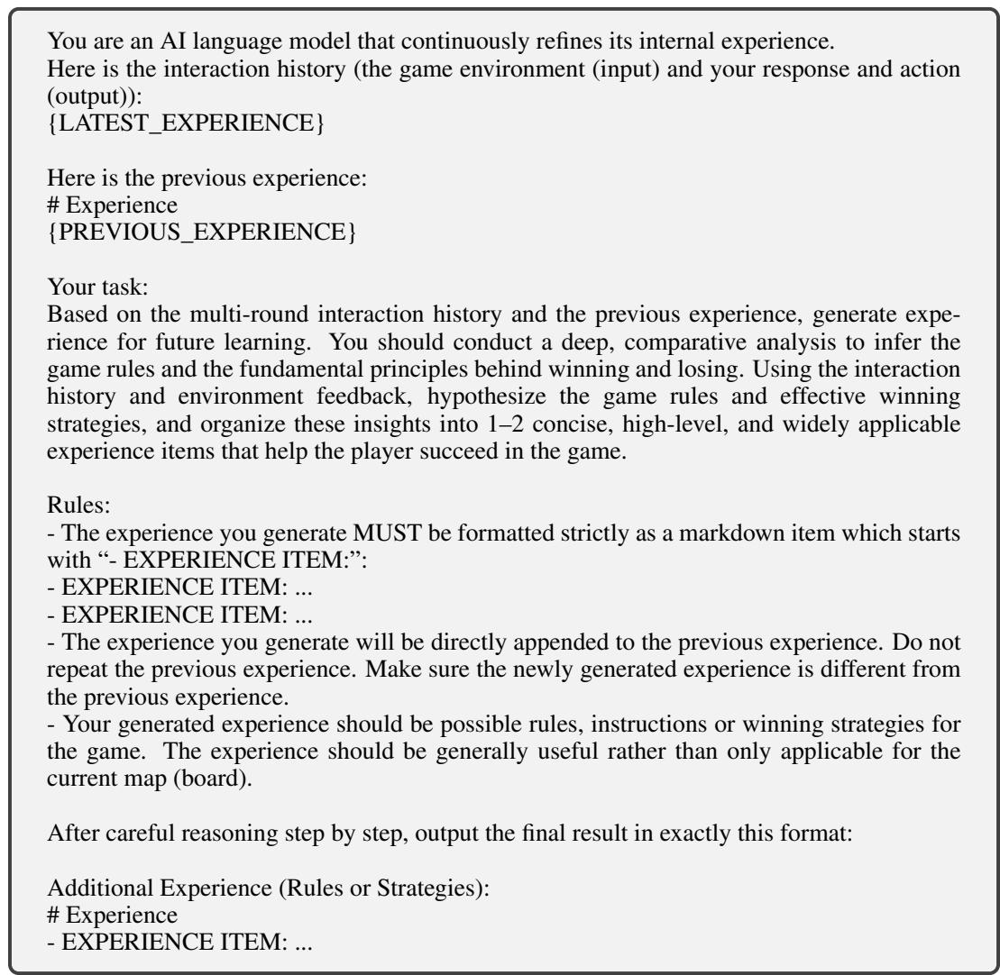  
Figure 11: The cross-instance prompt template for experience extraction on text-based games: transferable game rules and winning strategies rather than map-specific notes.

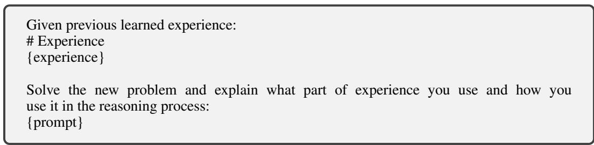  
Figure 12: The cross-instance prompt template for solving a new instance with the accumulated experience.

```prolog
# Notes
- Board Layout: 3x3 grid with player (P) at (0,0), goal (G) at (2,2), and obstacles (H) at
(0,2) and (1,2). Valid moves: up (w), down (s), left (a), right (d).
- Optimal Path:
1. Down (s) from (0,0) to (1,0) → Establishes vertical path toward the goal.
2. Down (s) from (1,0) to (2,0) → Progresses toward the goal.
3. Right (d) from (2,0) to (2,1) → Advances row.
4. Right (d) from (2,1) to (2,2) → Directly reaches the goal (G).
- Critical Failures:
- Moving up (w) from (0,0) is invalid (out of bounds).
- Moving left (a) from (0,0) is invalid (out of bounds).
```  
Figure 13: A same-instance experience (v5) learned on FrozenLake (Qwen3-1.7B). The note memorizes one map’s layout and a concrete solution path.

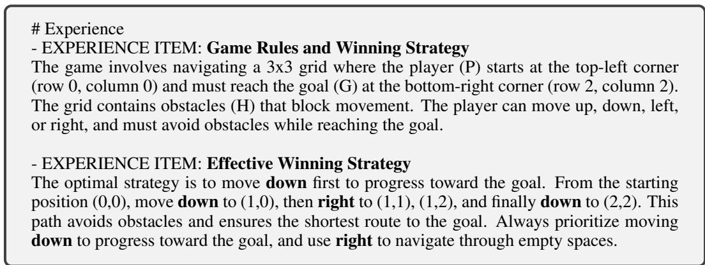  
Figure 14: A cross-instance experience (v4) learned on FrozenLake (Qwen3-1.7B). The experience abstracts the interaction into game rules and a reusable strategy rather than a single map’s solution.

## B.2 Out-of-Distribution Generalization Evaluation

For the out-of-distribution generalization results of Section 3.6 (Table 4), we evaluate on AIME 2026 with 30 problems and n=128 rollouts per problem, and on the text-games with 500 held-out environment seeds and n=8 playthroughs per seed. The in-distribution DAPO reference follows the main evaluation protocol of Appendix B.1.

## B.3 IFEval Out-of-Distribution Evaluation

For the out-of-distribution instruction-following evaluation (Section 3.6), we evaluate the trained LLM-as-a-Coach–actor system on IFEval [ZLM<sup>+</sup>23] under the same K=2 protocol used for math and text-games: the frozen actor first answers the prompt on its own, the LLM-as-a-Coach extracts experiential knowledge from the resulting trajectory, and the actor then produces a guided response conditioned on that knowledge. Only the guided response is scored. The untrained-coach baseline is step 0 of the identical pipeline.

We evaluate on the first 250 prompts of the IFEval test split as ordered by lm-eval-harness. For each prompt, the LLM-as-a-Coach samples n=16 independent experiential-knowledge snippets from the actor’s initial response, using temperature 0.6, top-p=0.95, top-k=20, and an 8,192-token budget, matching the training-time rollout configuration. Each snippet conditions one guided response, yielding $2 5 0 \times 1 6 = 4 { , } 0 0 0$ guided responses per checkpoint. In both actor passes the model’s chat template is applied as a single user turn with thinking mode disabled, and decoding is greedy with a 1,280-token budget. Because IFEval grades literal surface compliance, we inject the experiential knowledge with a shortened wrapper rather than the longer training-time template of

<table><tr><td>Out-of-Distribution Task</td><td>Model</td><td> $\mathrm { A c c } _ { 2 } ^ { \mathrm { s a m e } }$  (w/o training)</td><td> $\mathbf { A c c } _ { 2 } ^ { \mathbf { s a m e } }$   $\mathbf { ( L 2 C ) }$ </td><td> $\Delta$  (pp)</td></tr><tr><td rowspan="2">AIME26</td><td>Qwen3-1.7B</td><td>35.9</td><td>37.4</td><td>+1.5</td></tr><tr><td>Qwen3-8B</td><td>61.6</td><td>63.4</td><td>+1.8</td></tr><tr><td rowspan="2">Text-game</td><td>Qwen3-1.7B (FrozenLake)</td><td>23.4</td><td>26.3</td><td>+2.9</td></tr><tr><td>Qwen3-4B (Sokoban)</td><td>7.6</td><td>9.4</td><td>+1.8</td></tr></table>

Table 4: Out-of-distribution transfer of LLM-as-a-Coach models trained on DAPO math. Same-instance accuracy (%) after one guided response on AIME 2026 and text-game tasks. The actor remains frozen, and $\Delta$ denotes the percentage-point improvement of L2C over the untrained LLM-as-a-Coach.

Figure 9, whose instruction-heavy preamble by itself depresses prompt-level strict accuracy for the trained and untrained coach alike. Each guided response is scored by IFEval’s prompt-level strict criterion (prompt\_level\_strict\_acc); we report the per-prompt mean over the 16 snippets and then average over the 250 prompts. All other hyperparameters follow lm-eval-harness defaults.

## B.4 Cross-Instance Transfer Evaluation

We evaluate cross-instance transfer using two disjoint pools drawn from the task: a source pool $s$ of $\lvert S \rvert { = } 6 4$ instances and a held-out probe set $\mathcal { P }$ of $| \mathcal { P } | \overset { - } { = } 2 5 0$ instances (16,000 source–probe pairs), used for both FrozenLake (Qwen3-1.7B; the main-text experiment of Section 3.3, where instances are environment seeds) and DAPO math (Appendix C, where instances are problems). For each source instance $s \in S$ , the actor first responds to s without experiential knowledge and the LLM-asa-Coach compacts the resulting trajectory into experiential knowledge $e _ { s }$ . At each checkpoint we then report three quantities:

• Cross-instance accuracy: apply each $e _ { s }$ to every probe instance $z \in \mathcal { P }$ and average the actor’s guided accuracy over all $| S | \times | \mathcal { P } |$ source–probe pairs, matching the cross-instance reward of Equation (5).

• Same-instance guided accuracy: apply each $e _ { s }$ back to its own source instance s, mirroring the same-instance setting of the main results; it serves as a memorization discriminator.

• No-experience baseline: the actor’s accuracy on the probe instances without any experiential knowledge.

Both pools are held fixed across checkpoints, and $\mathcal { P }$ is disjoint from $s$ so that transfer is always measured on instances the experiential knowledge was not extracted from.

## C Cross-Instance Transfer on Math

Whether experiential knowledge transfers across instances depends on the task: it is useful only when solving one instance reveals structure that also applies to others. We probe this by running the identical cross-instance protocol (Appendix B.4) on DAPO math for all three model sizes, complementing the FrozenLake experiment of Section 3.3. Table 5 reports the cross-instance accuracy of the LLM-as-a-Coach before and after L2C training against the no-experience baseline.

The two tasks sit at opposite ends of this spectrum. On math the extracted experience transfers little: the cross-instance accuracy stays at or below the no-experience baseline, and L2C training does not lift it meaningfully above. On the text-games, by contrast, the same protocol drives cross-instance accuracy far above the baseline. The gap reflects task structure. A fully-specified math problem statement leaves little latent, cross-problem structure to transfer, so experience distilled from one problem’s solution rarely helps a different problem. A text-game’s latent rules (hazards, dynamics, and valid moves) are instead shared across maps and therefore transfer readily. Transferable experiential knowledge is thus task-dependent: abundant in interactive environments but scarce in self-contained math problems.

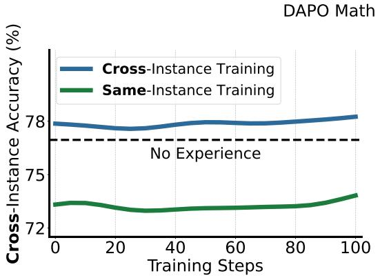

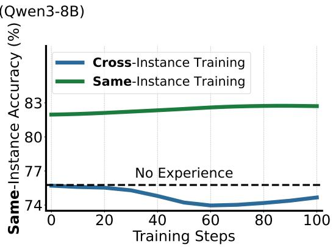  
Figure 15: LLM-as-a-Coach models trained with the cross-instance or the same-instance reward on DAPO math (Qwen3-8B), evaluated by cross-instance accuracy (left) and same-instance accuracy (right). Each reward improves only the accuracy it was optimized for.

<table><tr><td rowspan="2">Model</td><td rowspan="2">No Exp.</td><td colspan="2">Cross-instance transfer</td></tr><tr><td>LLM-as-a-Coach (w/o training)</td><td>L2C</td></tr><tr><td>Qwen3-1.7B</td><td>64.4</td><td>49.9</td><td>51.3</td></tr><tr><td>Qwen3-4B</td><td>71.0</td><td>62.5</td><td>63.7</td></tr><tr><td>Qwen3-8B</td><td>77.2</td><td>78.0</td><td>78.4</td></tr></table>

Table 5: Cross-instance transfer on DAPO math. Cross-instance accuracy (%) obtained by applying knowledge extracted from 64 source problems to 250 disjoint probe problems. Cross-problem knowledge provides limited benefit, particularly for the smaller actors.

## D Experiential Learning Results at $K { = } 1 0$

Table 6 reports the final-iteration accuracy $\mathrm { A c c } _ { 1 0 } ^ { \mathrm { s a m e } }$ under the K=10 protocol for the bare actor, the untrained coach, and L2C, across all three model sizes and both tasks. L2C improves over both baselines on every combination of model size and task.

<table><tr><td>Model</td><td>Task</td><td>Method</td><td>Accuracy</td></tr><tr><td rowspan="3">Qwen3-1.7B</td><td rowspan="3">FrozenLake</td><td>Base Model</td><td>7.4</td></tr><tr><td>LLM-as-a-Coach w/o training,  $\mathrm { A c c } _ { 1 0 } ^ { \mathrm { s a m e } }$ </td><td>28.4</td></tr><tr><td>L2C,  $\mathrm { A c c } _ { 1 0 } ^ { \mathrm { s a m e } }$ </td><td>73.0</td></tr><tr><td rowspan="3">Qwen3-4B-Ins</td><td rowspan="3">Sokoban</td><td>Base Model</td><td>9.1</td></tr><tr><td>LLM-as-a-Coach w/o training,</td><td>12.6</td></tr><tr><td>L2C,  $\mathrm { A c c } _ { 1 0 } ^ { \mathrm { s a m e } }$ </td><td>29.5</td></tr><tr><td rowspan="3">Qwen3-1.7B</td><td rowspan="3">Math</td><td>Base Model</td><td>61.4</td></tr><tr><td>LLM-as-a-Coach w/o training,</td><td>69.9</td></tr><tr><td>L2C,  $\mathrm { A c c } _ { 1 0 } ^ { \mathrm { s a m e } }$ </td><td>71.0</td></tr><tr><td rowspan="3">Qwen3-4B</td><td rowspan="3">Math</td><td>Base Model</td><td>67.7</td></tr><tr><td>LLM-as-a-Coach w/o training,  $\mathrm { A c c } _ { 1 0 } ^ { \mathrm { s a m e } }$ </td><td>75.5</td></tr><tr><td>L2C,  $\mathrm { A c c } _ { 1 0 } ^ { \mathrm { s a m e } }$ </td><td>82.6</td></tr><tr><td rowspan="3">Qwen3-8B</td><td rowspan="3">Math</td><td>Base Model</td><td>75.8</td></tr><tr><td>LLM-as-a-Coach w/o training,  $\mathrm { A c c } _ { 1 0 } ^ { \mathrm { s a m e } }$ </td><td></td></tr><tr><td>L2C,  $\mathrm { A c c } _ { 1 0 } ^ { \mathrm { s a m e } }$ </td><td>82.9 85.6</td></tr></table>

Table 6: Accuracy under same-instance experiential learning at $K { = } 1 0 .$ The base-actor rows report initial-response accuracy $\mathrm { A c c } _ { 1 } ^ { \mathrm { s a m e } }$ , whereas the remaining rows report final accuracy $\mathrm { A c c } _ { 1 0 } ^ { \mathrm { s a m e } }$ after nine guided responses. L2C outperforms the untrained LLM-as-a-Coach in all evaluated settings.

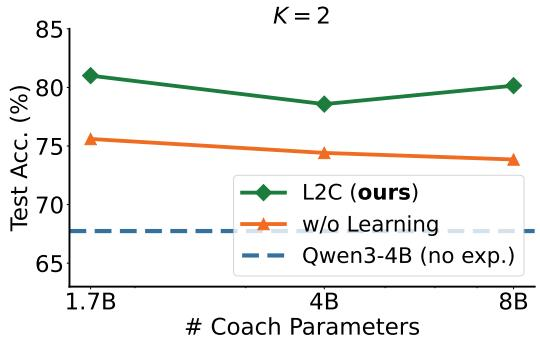

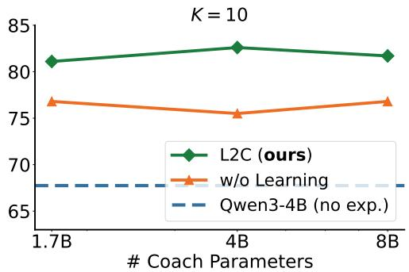  
Figure 16: Effect of LLM-as-a-Coach size on guided accuracy, with the actor fixed at Qwen3-4B on DAPO test. Left: K=2. Right: K=10. L2C training consistently improves over the untrained coach across all LLM-as-a-Coach sizes, yet LLM-as-a-Coach size itself has little effect on final accuracy under both settings.

## E Effect of Model Size

We isolate the effect of LLM-as-a-Coach capacity by fixing the actor at Qwen3-4B and varying the LLM-as-a-Coach across Qwen3-1.7B, Qwen3-4B and Qwen3-8B, each trained for 100 GRPO steps with the same-instance reward (Equation (4)). Figure 16 reports both the K=2 and the $K { = } 1 0$ settings on DAPO test.

L2C training consistently improves over the untrained coach across all LLM-as-a-Coach sizes in both the $K { = } 2$ and $K { = } 1 \bar { 0 }$ settings, confirming that the training recipe is robust to LLM-as-a-Coach capacity. However, LLM-as-a-Coach size itself has a surprisingly small effect on final accuracy: at both $\mathrm { \Delta A c c _ { 2 } ^ { s a m e } }$ and $\mathrm { A c c } _ { 1 0 } ^ { \mathrm { s a m e } }$ , all three trained LLM-as-a-Coach models reach comparable accuracy, and the untrained variants likewise cluster within a narrow range.

Actor capacity, by contrast, is the dominant factor. Pairing the same LLM-as-a-Coach with a stronger actor yields far larger gains than scaling the LLM-as-a-Coach itself (Table 6). This suggests that guided accuracy is primarily rate-limited by the actor’s ability to leverage experiential knowledge, rather than by who produced it. The finding highlights the practical potential of using a small, lightweight model as the LLM-as-a-Coach to enhance a much larger actor at modest additional inference cost.