# MTAC-IFBench: Benchmarking Instruction-Following in Multi-Turn Agentic Coding

Bosi Wen1,†,∗ Cunxiang Wang2,∗,‡ Jiayi Gui2 Haoke Zhang2 Yilin Niu2

Pei Ke3 Dayong Yang2 Hongning Wang1 Minlie Huang1,‡

1The Conversational Artificial Intelligence (CoAI) Group, Tsinghua University 2Zhipu AI 3University of Electronic Science and Technology of China wbs23@mails.tsinghua.edu.cn, aihuang@tsinghua.edu.cn

## Abstract

Recently, the rapid development of large language models (LLMs) has reshaped software engineering by enabling autonomous code agents that plan, execute, and utilize external tools iteratively to tackle complex tasks. Beyond achieving functional correctness, these agents must faithfully follow pro- cess instructions and constraints throughout the development lifecycle. However, existing benchmarks typically focus on final functional correctness or confine instruction-following evaluation to single-turn, general chat or simple code gener- ation scenarios, leaving instruction-following in multi-turn agentic coding underexplored. To bridge this gap, we propose MTAC-IFBench, a comprehensive benchmark for this critical capability. It features multi-turn progressive software develop- ment instructions with diverse constraints spanning 6 primary and 18 secondary categories. With an average of 7.04 turns and 91.33 constraints per instance, it poses a rigorous challenge to current LLMs. To make the evaluation reliable, we construct a checklist for each constraint and functional requirement, and integrate verification scripts and judge agents to verify each checklist item. MTAC-IFBench identifies significant deficien- cies in existing code agents in multi-turn instruction-following, with their performance degrading rapidly as the interaction session grows longer.

Code — https://github.com/abelperry/AgentProbe Datasets — https://huggingface.co/datasets/thu-coai/MTAC-IFBench

## 1 Introduction

Recently, the rapid development of large language mod- els (LLMs) has fundamentally reshaped software develop- ment (Sapkota, Roumeliotis, and Karkee 2025), driving a paradigm shift from conventional human-centric workflows to autonomous agent-based systems (Wang et al. 2025a). Agentic coding frameworks, such as Claude Code (Anthropic 2025a) and Kilo (Kilo 2025), exemplify this transition by introducing LLM-based agents that autonomously plan, execute, and interact with external tools to iteratively tackle complex tasks (Gong et al. 2025). During this process, they are re-quired not only to generate functionally correct code, but also to strictly comply with various instructions and constraints throughout the development lifecycle (Ding et al. 2026). Ac-curate instruction-following is a fundamental prerequisite for the reliability and practical deployment of code agents in real-world production environments (Qi et al. 2025).

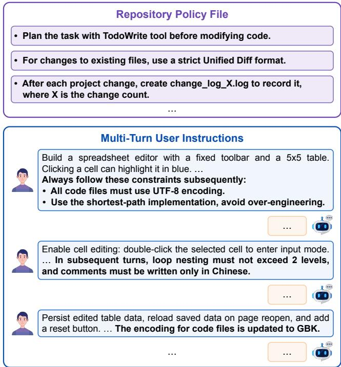  
Figure 1: An example from MTAC-IFBench, containing a repository policy file and multi-turn user instructions. Con- straints within each instruction are bold, demonstrating dy-namic updates such as the addition of new constraints and the replacement of existing ones.

The agentic coding scenario introduces two major challenges for instruction-following. First, constraints in this scenario are highly heterogeneous (Ding et al. 2026), en-compassing not only generated responses and code, but also environment interactions and agent workflows. Second, com- plex software development tasks often involve multi-turn interaction (Wu et al. 2025; Raghavendra et al. 2026). During the agent’s implementation process, users iteratively intro- duce new requirements or modify existing ones. This dynamic necessitates persistent constraint compliance across multiple turns without sufering from context degradation.

However, existing benchmarks fail to fully capture this real- ity. On the one hand, current agentic coding benchmarks, such as SWE-Bench (Jimenez et al. 2024) and Terminal-Bench (Merrill et al. 2026), primarily emphasize functional cor-rectness while overlooking compliance with process instruc- tions and constraints. On the other hand, current instruction- following benchmarks mainly focus on general chat and single-file code generation (Zhou et al. 2023; Wen et al. 2024; Yan et al. 2025; Wang et al. 2025b), leaving a substantial gap in agentic scenarios. Although some benchmarks (Qi et al. 2025; Chen et al. 2026; Ding et al. 2026) attempt to expand instruction-following to agentic settings, they remain confined to single-turn interactions and limited constraint types, thereby hindering comprehensive evaluation.

To address these gaps, we introduce MTAC1-IFBench, a benchmark designed to comprehensively evaluate the instruction-following abilities of code agents in multi-turn software development scenarios. As shown in Figure 1, each instance of MTAC-IFBench contains progressive, multi-turn software development instructions that integrate both func- tional requirements and specific constraints. Repository policy files (e.g., Claude.md) are also incorporated to impose global requirements governing the entire development workflow. Af- ter collecting single-turn software development instructions from diverse sources, we employ LLM-based instruction revision and expansion to synthesize multi-turn task instruc- tions. Subsequently, a turn-wise, iterative integration and validation pipeline is employed to integrate constraints for each turn, which is guided by a comprehensive constraint taxonomy of agentic coding encompassing 6 primary and 18 secondary categories. Finally, rigorous manual inspec- tions are conducted to guarantee high data quality. In total, MTAC-IFBench comprises 100 instances, with an average of 7.04 turns per instance and 12.97 constraints per turn. For evaluation, we construct checklists for constraint compliance at each turn and functional correctness of the final project separately, utilizing either verification scripts or LLM-based judge agents to verify each checklist item according to its type. This hybrid approach guarantees reliable assessments for complex requirements.

We conduct a comprehensive evaluation of 11 advanced LLM-based code agents on MTAC-IFBench. Experimental results reveal substantial deficiencies in multi-turn instruction- following: Even the leading LLM, GLM-5.2, fails to follow about 20% of the process constraints, while most LLMs only achieve perfect constraint compliance in fewer than 10% of turns. In-depth analysis reveals several critical insights: (1) Instruction-following ability of all LLMs drops rapidly as the interaction grows longer, with near-complete failures in perfectly following all constraints in later turns. (2) Perfectly following process constraints is significantly more challenging than functional requirements, indicating that final-outcome evaluation can overlook critical failures during the develop- ment process. (3) Code agents perform well on isolated static constraints (e.g., file encoding and placement), but struggle with more complex constraints (e.g., multi-step coordination, project-wide consistency, and precise quantitative control), suggesting their weakness in maintaining global state and disciplined workflows over long interactions. (4) Code agents show stronger long-horizon robustness for constraints in repos- itory policy files than user instructions. Meanwhile, in user instructions, updating existing constraints is notably harder than adding new ones, indicating dificulty in tracking evolv- ing user intent. These findings establish MTAC-IFBench as a valuable resource for advancing reliable instruction-following in multi-turn agentic coding.

## 2 Related Work

Evaluation ofCode Generation. As LLMs are increasingly deployed in complex code generation scenarios, the evaluation paradigm for this task is continuously transforming (Jiang et al. 2026). While early benchmarks mainly focused on function (Chen et al. 2021; Austin et al. 2021; Hendrycks et al. 2021) or class-level (Du et al. 2023), recent research has increasingly shifted toward repository-level and environment-backed tasks (Deng et al. 2025; Wu et al. 2025; Zhou et al. 2026; Li et al. 2024). For instance, SWE-Bench (Jimenez et al. 2024) evalu-ates LLMs on resolving real-world software issues by gener- ating codebase-level patches, while Terminal-Bench (Merrill et al. 2026) assesses LLMs on long-horizon command-line tasks in terminal environments. Furthermore, SWE-Together (Wu et al. 2026) and SWE-Interact (Raghavendra et al. 2026) attempt to evaluate repository-level code generation in multi- turn interactive settings. These benchmarks require LLMs to act as autonomous code a ents that levera e roject-wide context, iteratively utilize tools, and interact with environ- ments, providing realistic testbeds for code generation in production. Nevertheless, these benchmarks remain outcome- oriented, evaluating performance by functional correctness while overlooking instruction and constraint compliance dur- ing code generation, a crucial aspect of real-world software development (Ding et al. 2026).

Evaluation of Instruction-Following. The abilit to follow instructions is a critical factor determining the practicality of LLMs (Liu et al. 2023; Lou, Zhang, and Yin 2024), prompting many benchmarks to evaluate it from various aspects. Earlier works mainly focus on instruction-following in general chat (Zhou et al. 2023; Wen et al. 2024; Zhang et al. 2025) and single-file code generation (Yan et al. 2025; Wang et al. 2025b). Subsequent works, such as AgentIF (Qi et al. 2025), AgentIF-Oneday (Chen et al. 2026), and CCTU (Ye et al. 2026), expand evaluations to more complex agentic and tool-use contexts. However, confined to non-coding or single-turn scenarios, they struggle to assess instruction- following in agentic coding. Although OctoBench (Ding et al. 2026) pioneers instruction-following evaluation for repository-grounded coding agents by synthesizing multi- source constraints, it lacks a systematic constraint taxonomy and is largely confined to single-turn instructions, hindering comprehensive evaluation. Consequently, MTAC-IFBench is proposed to robustly evaluate code agents’ instruction- following ability in multi-turn scenarios.

<table><tr><td rowspan="2">Benchmark</td><td colspan="3">Dataset Size</td><td>Agentic</td><td>Instruction</td><td>Constraint</td><td rowspan="2">Evaluation Method</td></tr><tr><td>#Inst.</td><td>#Turn</td><td>#Cons.</td><td>Scenario</td><td>Following</td><td>Taxonomy</td></tr><tr><td>SWE-Bench (Jimenez et al. 2024)</td><td>2,294</td><td>1.00</td><td>0</td><td>√</td><td>x</td><td></td><td>Code</td></tr><tr><td>SWE-Together (Wu et al. 2026)</td><td>109</td><td></td><td>0</td><td>√</td><td>x</td><td></td><td>Agent-as-a-Judge</td></tr><tr><td>SWE-INTERACT (Raghavendra et al. 2026)</td><td>75</td><td></td><td>0</td><td>√</td><td>x</td><td></td><td>Code</td></tr><tr><td>Terminal-Bench (Merrill et al. 2026)</td><td>89</td><td>1.00</td><td>0</td><td>√</td><td>x</td><td></td><td>Code</td></tr><tr><td>ComPLExBENCH (Wen et al. 2024)</td><td>1,150</td><td>1.00</td><td>4.19</td><td>x</td><td>√</td><td>4-19</td><td>Code &amp; LLM-as-a-Judge</td></tr><tr><td>CodeIF (Yan et al. 2025)</td><td>1,200</td><td>1.00</td><td>12.90</td><td>x</td><td>√</td><td>8</td><td>Code</td></tr><tr><td>CodeIF-Bench (Wang et al. 2025b)</td><td>124</td><td>7.77</td><td>7.77</td><td>x</td><td>√</td><td>9</td><td>Code</td></tr><tr><td>AGENTIF (Qi et al. 2025)</td><td>707</td><td>1.00</td><td>11.90</td><td>√</td><td>√</td><td>3</td><td>Code &amp; LLM-as-a-Judge</td></tr><tr><td>OctoBench (Ding et al. 2026)</td><td>217</td><td>1.11</td><td>32.71</td><td>√</td><td>√</td><td></td><td>LLM-as-a-Judge</td></tr><tr><td>MTAC-IFBench (ours)</td><td>100</td><td>7.04</td><td>91.33</td><td>√</td><td>√</td><td>6-18</td><td>Code &amp; Agent-as-a-Judge</td></tr></table>

Table 1: Comparisons between MTAC-IFBench and other benchmarks. The dataset size contains the number of instances (#Inst.), the average turns (#Turn) per instance, and the average number of constraints (#Cons.) per instance. SWE-Together and SWE-Interact utilize user simulators to determine the number of interaction turns dynamically.

## 3 MTAC-IFBench

In this section, we provide a detailed introduction to MTAC- IFBench, including the following four components: the con- straint taxonomy (§ 3.1), the dataset construction process (§ 3.2), the dataset statistics (§ 3.4), and the evaluation protocol (§ 3.3). Figure 2 illustrates the dataset construction and evaluation workflow of MTAC-IFBench.

## 3.1 Constraint Taxonomy

To comprehensively evaluate LLMs’ ability to follow in- structions in multi-turn agentic coding, we systematically investigate instructions derived from real-world application scenarios2 and existing instruction-following benchmarks for both coding and agentic settings (Yan et al. 2025; Wang et al. 2025b; Yang et al. 2025; Qi et al. 2025; Ding et al. 2026) to construct a hierarchical constraint taxonomy. This taxonomy comprises 6 primary and 18 secondary categories, underpinning the construction of diverse and challenging test cases. Further details and examples are in Appendix C.

• Content Constraints regulate the information and formats within the generated artifacts. These constraints ensure that agents’ outputs align with designated communication norms and data schemas, which include: 1) Keyword requires or forbids the presence of lexical elements within the generated code or responses. 2) Persona specifies the role, perspective, or tone the agent must adopt to ensure the interaction remains contextually appropriate. 3) Format mandates that outputs adhere to structural templates or markup schemas (e.g., JSON, XML, or boilerplate injection).

• Language Constraints govern the linguistic and encoding specifications for the generated artifacts, ensuring consis- tency across multilingual or cross-platform codebases. This category covers: 1) Response Language for responses or user-facing documentation, 2) Comment Language for code comments, and 3) File Encoding for specified character encodings (e.g., UTF-8) of created files.

• Quantity Constraints impose numerical boundaries on the generated artifacts, challenging the fine-grained control ability of code agents. Specifically, these constraints enforce a designated 1) Range or 2) Exact Value for quantitative attributes such as character counts, lines of code, and com- ment lengths. Furthermore, they restrict the 3) Complexity of the project’s architectural and logical density, capping metrics such as directory hierarchy levels, loop nesting depth, and cyclomatic complexity.

• Style Constraints govern the visual presentation and engi-neering practices of the generated code, which are crucial for collaborative repositories and engineering standards, including: 1) Layout regulates the spatial organization of code elements, such as indentation, spacing, and comment placement, to maintain consistent readability. 2) Naming specifies naming conventions of variables, functions, classes, and files. 3) Paradigm constrains the programming style and engineering strategy, such as requiring a specific programming pattern and restricting over-engineering.

• Environment Constraints regulate file-level interactions with repositories and runtime environments, ensuring safe and traceable project modifications in agentic coding. This category includes: 1) File Path specifies rules for referenc ing or placing files. 2) File Operation restricts how agents manipulate files, such as creating, modifying, deleting, or backing up. 3) Logging requires records of development procedures, such as modification plans, change logs, or review notes.

• Workflow Constraints govern the dynamic execution and lifecycle of the agentic coding process, ensuring eficient and verifiable operations during autonomous development. This category includes: 1) Tool Usage dictates the selection, argument passing, execution rules, and safety wrappers of tools. 2) Orchestration enforces the sequencing and coordination of multi-step actions, such as task planning and parallel execution. 3) Testing regulates code verification practices, specifying required testing frameworks, coverage metrics, and the management of verification records.

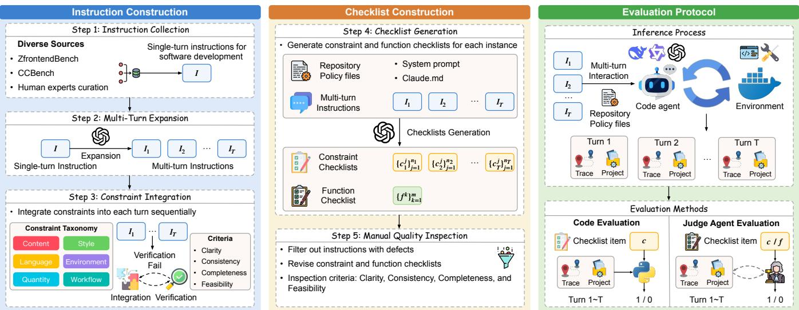  
Figure 2: The data construction process and evaluation workflow of MTAC-IFBench. Left: Construction of multi-turn software develo ment instructions with diverse constraints. Center: Function and constraint checklist curation, as well as manual data quality inspection. Right: Evaluation workflow of code agent.

## 3.2 Dataset Construction

As shown in Figure 2, MTAC-IFBench is constructed through a semi-automated pipeline comprising four components: in- struction collection and multi-turn expansion, taxonomy- guided constraint integration, evaluation methods design, and manual quality inspection.

Instruction Collection and Multi-Turn Expansion. To obtain diverse and re resentative instructions for benchmark construction, our initial dataset integrates high-quality soft- ware development instructions derived from both human ex- pert curation and existing benchmarks (i.e., ZfrontendBench (Zeng et al. 2026) and CCBench3), which cover diverse soft-ware development domains, spanning frontend development, tool creation, data analysis, testing, and algorithm implemen- tation. Given that the original instructions are single-turn, we employ Gemini-3.1-Pro (Team et al. 2023) to elevate the task complexity and expand the initial instructions into progressive, multi-turn instruction sequences spanning 5 to 10 turns. Specifically, via an incremental expansion prompt, the model is guided to generate instructions that first request a basic project skeleton, and then progressively introduce new features or modify existing requirements across subse- quent turns. By performing two independent expansions per instruction, we obtain a total of 374 multi-turn instruction sequences. Detailed prompts are in Appendix D.

Taxonomy-Guided Constraint Integration. To integrate constraints into multi-turn instruction sequences, we employ a turn-wise, iterative integration and validation pipeline to en- sure constraints’ reasonableness and diversity. Specifically, we first integrate constraints into the repository policy files (e.g., Claude.md), and then into the user instructions at each turn.

During each step, we sample several secondary constraint cat- egories from our taxonomy and instruct Seed-2.0-Pro (Seed Team 2026) to integrate some constraints into fluent and natural instructions, based on corresponding examples for each category. The sampling algorithm prioritizes underrep- resented categories in previous steps for even distribution. Furthermore, to simulate the dynamic evolution of user re- quirements, the integration process is allowed to introduce new constraints or modify existing ones from previous turns. Upon completing the constraint integration at each turn, we instruct Seed-2.0-Pro to validate the clarity, consistency, com- pleteness, and feasibility of the generated instructions for each turn, triggering reintegration for any failures. Instruction sequences that exceed the maximum retry threshold at any turn are discarded. More details are in Appendix E.

Checklist Generation and Evaluation Methods Design. To accurately verify compliance with each process constraint and the correctness of each functional requirement through- out the development lifecycle, Seed-2.0-Pro is instructed to generate a constraint checklist at each turn and a function checklist upon the conclusion of the multi-turn interaction, which comprehensively captures all immediate turn-level constraints and ultimate functional requirements, respectively. Subsequently, each checklist item is manually assigned one of the evaluation methods based on its characteristics: 1) Code evaluation utilizes scripts for verification, which is used for objective and deterministic constraints, such as Keyword and Exact Value. 2) Judge agent evaluation leverages an auxiliary code agent for verification and determines the final judgment through iterative interaction with the code repository or its build artifacts, which is used for subjective constraints or those necessitating complex verification procedures, such as Paradigm and Orchestration. Given the complexity of func- tional requirement verification, we utilize a judge agent to verify all function checklist items.

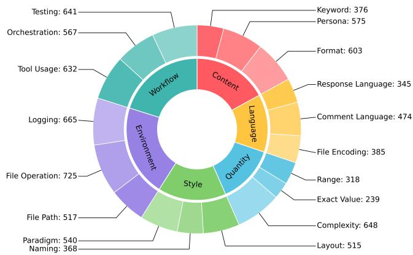  
Figure 3: The distribution of constraints in MTAC-IFBench.

Manual Quality Inspection. To ensure data quality, we recruit 17 college students to manually inspect the synthesized multi-turn instructions for clarity, consistency, completeness, and feasibility. Instructions with any defects are strictly filtered out. For the retained instructions, we further review the corresponding function and constraint checklists to correct any errors, thereby ensuring strict one-to-one alignment with the requirements and constraints of each instruction. More details of human inspection are in Appendix F.

## 3.3 Evaluation Protocol

As shown in Figure 2, upon sequentially feeding the multi- turn instructions to the code agent to generate the interaction traces and code project per turn, we employ the annotated evaluation method to verify each checklist item. Claude-Opus- 4.6 (Anthropic 2026c) is used to generate verification scripts for code evaluation, and the judge agent is built on the Claude Code framework with Claude-Sonnet-4.6 (Anthropic 2026b) for function checklists and DeepSeek-V4-Pro4 for constraint checklists. The judge agent is permitted to use Playwright5 to simulate browser interactions and capture screenshots for functional verification. More details are in Appendix G.

## 3.4 Dataset Statistics

Table 1 presents a comparison between MTAC-IFBench and other related benchmarks. Specifically, MTAC-IFBench con- tains 100 instances and 9,133 constraints. On average, each instance comprises 7.04 interaction turns, 16.07 function checklist items, and 91.33 constraint checklist items (averag- ing 12.97 constraints per turn). This constraint density poses a substantial challenge to the instruction-following abilities of code agents in multi-turn software development scenarios. Furthermore, MTAC-IFBench covers a diverse spectrum of constraint categories, as shown in Figure 3. We also present the task distribution of MTAC-IFBench in Appendix H.

## 4 Experiments

## 4.1 Evaluation Metrics

We evaluate both turn-level instruction-following and fi- nal functional correctness. For a multi-turn instruction $\{ I _ { 1 } , \ldots , I _ { T } \}$ , let $\mathcal { C } _ { t }$ denote the constraint checklist at turn t and $z _ { t , j } ~ \in ~ \{ 0 , 1 \}$ denote whether the $j { \cdot } \mathrm { t h }$ constraint is satisfied. Upon completion of the final turn, let $b \in \{ 0 , 1 \}$ denote the executability of the generated project, $\mathcal { F }$ denote the function checklist, and $y _ { k } \in \{ 0 , 1 \}$ denote whether the k-th function is satisfied. Following previous work (Qin et al. 2025; Qi et al. 2025; Ding et al. 2026), we define the following evaluation metrics. For instruction-following, CSR (Constraint Success Rate) measures the proportion of satisfied constraints at turn $t ,$ while $\mathbf { C } { \mathrm { - } } \mathbf { I S } \mathbf { R } _ { t }$ (Constraint-Instruction Success Rate) measures strict completion where all con-straints must be satisfied. For final functional correctness, BSR (Build Success Rate) measures whether the final generated project is executable, FSR (Function Success Rate) measures the proportion of satisfied functions, and F-ISR (Function-Instruction Success Rate) measures strict completion where all functional requirements must be satisfied. For each instance, these metrics are computed as follows:

$$
\mathrm { C S R } _ { t } = \frac { 1 } { | \mathcal { C } _ { t } | } \sum _ { j = 1 } ^ { | \mathcal { C } _ { t } | } z _ { t , j } \qquad \mathrm { C - I S R } _ { t } = \prod _ { j = 1 } ^ { | \mathcal { C } _ { t } | } z _ { t , j }
$$

$$
\mathrm { F S R ~ } = \frac { 1 } { | \mathcal { F } | } \sum _ { k = 1 } ^ { | \mathcal { F } | } y _ { k } \qquad \mathrm { F \mathrm { - } I S R ~ } = \prod _ { k = 1 } ^ { | \mathcal { F } | } y _ { k }
$$

$$
\mathrm { B S R } = b
$$

For a dataset with N instances, the final reported metrics are obtained by averaging these instance-level scores.

## 4.2 Evaluation Settings

We evaluate 11 advanced LLMs on MTAC-IFBench, includ- ing 5 powerful proprietary LLMs: Claude-Opus-4.6 (Anthropic 2026c), Gemini-3.1-Pro (Deepmind 2026), Qwen3.6- Plus (Qwen 2026), Seed-2.0-Pro (Seed Team 2026), Claude-Haiku-4.5 (Anthropic 2026a), as well as 6 strong open-source LLMs: GLM-5.2 (Zeng et al. 2026), GLM-5.1, DeepSeek-V4-Pro, DeepSeek-V4-Flash6, Kimi-K2.6 (Kimi 2026), and Qwen3.5-27B7. For all models, we employ Claude Code (v2.1.14) (Anthropic 2025a) as the standard agent harness and retain the default decoding parameters of their respective APIs. We also analyze the performance of each model under the OpenCode (v1.1.21) (OpenCode 2026) framework (§ 4.4).

## 4.3 Main Results

Tables 2 and 3 detail LLMs’ performance on instruction- following and functional correctness, respectively. Firstly, MTAC-IFBench poses a rigorous challenge to current LLM- based code agents. Even the leading LLM, GLM-5.2, fails to follow about 20% of the constraints. Although LLMs achieve moderate CSR ranging from 60.6% to 80.4%, their C-ISR remains remarkably low, mostly falling below 10%. This exposes the immense dificulty of perfectly complying with procedural instructions in agentic coding scenarios. Secondly, instruction-following performance degrades substantially as the interaction horizon grows, evidenced by the continuous decline of both CSR and C-ISR across all models. For most models, the C-ISR even plummets to zero after six turns. This highlights the challenges of instruction-following in multi-turn interactions and aligns with our motivation. Never- theless, stronger models exhibit greater multi-turn robustness, showing substantially smaller performance degradation as the number of turns increases. Finally, despite a strong positive correlation between the performance of instruction- following and functional correctness, the C-ISR of all models remains significantly lower than their F-ISR, indicating that perfectly satisfying procedural constraints is more dificult than functional requirements and exposing the limitations of outcome-oriented evaluations.

<table><tr><td>Metrics</td><td colspan="6">CSR</td><td colspan="6">C-ISR</td></tr><tr><td rowspan="2">Model</td><td colspan="5">Turns</td><td rowspan="2">Avg.</td><td colspan="5">Turns</td><td rowspan="2">Avg.</td></tr><tr><td>1~2</td><td>3~4</td><td>5~6</td><td>7～8</td><td>9～10</td><td>1~2</td><td>3~4</td><td>5~6</td><td>7~8</td><td>9～10</td></tr><tr><td colspan="14">Proprietary language models</td></tr><tr><td>Claude-Opus-4.6</td><td>82.4</td><td>79.1</td><td>76.8</td><td>76.4</td><td>76.2</td><td>78.6</td><td>19.0</td><td>6.5</td><td>3.5</td><td>3.3</td><td>2.3</td><td></td><td>8.7</td></tr><tr><td>Gemini-3.1-Pro</td><td>81.6</td><td>74.9</td><td>67.7</td><td>61.7</td><td>58.2</td><td></td><td>71.0</td><td>28.1</td><td>9.1</td><td>2.4</td><td>0.0</td><td>0.0</td><td>11.1</td></tr><tr><td>Qwen3.6-Plus</td><td>73.3</td><td>68.3</td><td>67.2</td><td>67.6</td><td></td><td>65.0</td><td>68.8</td><td>6.0</td><td>1.0</td><td>0.0</td><td>0.0</td><td>0.0</td><td>2.0</td></tr><tr><td>Seed-2.0-Pro</td><td>75.6</td><td>68.8</td><td>63.8</td><td>61.9</td><td>57.6</td><td></td><td>66.9</td><td>8.0</td><td>1.0</td><td>0.0</td><td>0.0</td><td>0.0</td><td>2.6</td></tr><tr><td>Claude-Haiku-4.5</td><td>72.4</td><td>67.8</td><td>62.5</td><td>59.8</td><td>49.7</td><td></td><td>64.7</td><td>4.5</td><td>2.0</td><td>0.0</td><td>0.0</td><td>0.0</td><td>1.9</td></tr><tr><td colspan="14">Open-source language models</td></tr><tr><td>GLM-5.2</td><td>85.8</td><td>80.8</td><td>77.9</td><td></td><td>78.0</td><td>76.1</td><td>80.4</td><td>27.6</td><td>9.7</td><td>4.8</td><td>5.8</td><td>2.6</td><td>12.7</td></tr><tr><td>GLM-5.1</td><td>81.3</td><td>77.9</td><td>74.7</td><td>71.5</td><td></td><td>72.2</td><td>76.5</td><td>19.7</td><td>8.2</td><td>2.6</td><td>0.0</td><td>0.0</td><td>8.9</td></tr><tr><td>DeepSeek-V4-Pro</td><td>79.6</td><td>76.9</td><td>72.7</td><td>70.8</td><td>67.7</td><td></td><td>74.7</td><td>14.5</td><td>7.0</td><td>1.2</td><td>0.0</td><td>0.0</td><td>6.4</td></tr><tr><td>Kimi-K2.6</td><td>80.7</td><td>74.7</td><td>70.5</td><td>70.1</td><td>62.5</td><td></td><td>73.2</td><td>18.6</td><td>7.2</td><td>1.8</td><td>0.0</td><td>0.0</td><td>7.8</td></tr><tr><td>DeepSeek-V4-Flash</td><td>76.4</td><td>71.7</td><td>68.7</td><td>65.6</td><td>59.6</td><td></td><td>70.0</td><td>8.5</td><td>2.0</td><td>1.2</td><td>1.1</td><td>0.0</td><td>3.4</td></tr><tr><td>Qwen3.5-27B</td><td>68.3</td><td>62.6</td><td>57.7</td><td>56.5</td><td>50.5</td><td>60.6</td><td></td><td>4.0</td><td>0.0</td><td>0.0</td><td>0.0</td><td>0.0</td><td>1.1</td></tr></table>

Table 2: The instruction-following performance of LLMs under the Claude Code framework. CSR and C-ISR are bucketed by turn intervals to compute average scores. All metrics are reported as percentages (%). The best result is bold.
<table><tr><td>Model</td><td>BSR</td><td>FSR</td><td>F-ISR</td></tr><tr><td>Claude-Opus-4.6</td><td>98.0</td><td>90.2</td><td>37.0</td></tr><tr><td>Gemini-3.1-Pro</td><td>90.0</td><td>66.5</td><td>14.0</td></tr><tr><td>Qwen3.6-Plus</td><td>96.0</td><td>66.5</td><td>9.0</td></tr><tr><td>GLM-5.1</td><td>98.0</td><td>83.0</td><td>29.0</td></tr><tr><td>DeepSeek-V4-Pro</td><td>97.0</td><td>79.2</td><td>26.0</td></tr><tr><td>Kimi-K2.6</td><td>97.0</td><td>75.2</td><td>29.0</td></tr></table>

Table 3: The functional correctness of LLMs. All metrics are reported as percentages (%). The best result is bold.

## 4.4 Analysis

Performance on Diferent Agent Harnesses. To examine the impact of agent harnesses on instruction-following per- formance, we compare eight LLMs under two widely used frameworks, Claude Code and OpenCode, in Figure 4. Firstly, models generally achieve stronger instruction-following per- formance under Claude Code, which tends to produce higher CSR and C-ISR scores. For example, GLM-5.2’s CSR drops from 80.4% under Claude Code to 76.8% under OpenCode, while its C-ISR drops more sharply from 12.7% to 6.7%. This demonstrates the substantial impact of the harness on code- agent performance. Secondly, the broad model hierarchy remains largely stable across diferent harnesses, particularly among the top-performing models, as reflected by the strong Kendall correlations. However, fine-grained rankings among middle- and lower-performing models still exhibit greater harness-specific variation, highlighting the importance of standardizing and explicitly reporting the agent harness when evaluating code agents. More detailed experimental results and analyses are in Appendix I, where we observe a simi- lar performance decay under OpenCode as the interaction horizon grows, consistent with our main results.

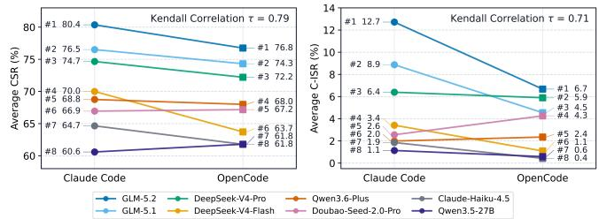  
Figure 4: Average CSR and C-ISR of LLMs under the Claude Code and OpenCode framework.

Performance on Diferent Constraint Categories. To identify which constraints are most dificult for code agents, we report the mean and range of CSR across all LLMs on diferent constraint categories in Figure 5. Firstly, multiturn orchestration and maintaining global project consistency pose severe challenges. Unlike simple one-of code gener- ation, agentic coding requires models to manage complex workflow actions (e.g., Orchestration) and enforce repository- wide style standards across diferent files and turns (e.g., Paradigm and Naming). The low CSR in these two categories demonstrates that agents easily lose context and struggle to maintain architectural cohesion during extended interac- tions. Secondly, code agents exhibit a critical vulnerability in precise quantitative control. The remarkably low success in Quantity constraints indicates a severe lack of the strict state-tracking mechanisms required for fine-grained code adjustments. Finally, there is a striking disparity between agents’ handling of static rules versus dynamic workflows. While LLMs achieve near-perfect compliance on isolated constraints such as Encoding or File Path, their performance sharply declines on constraints requiring continuous planning and global coordination. This demonstrates that merely gen- erating compliant static code is vastly insuficient for acting as an independent agent capable of navigating dynamic and state-complex real-world projects.

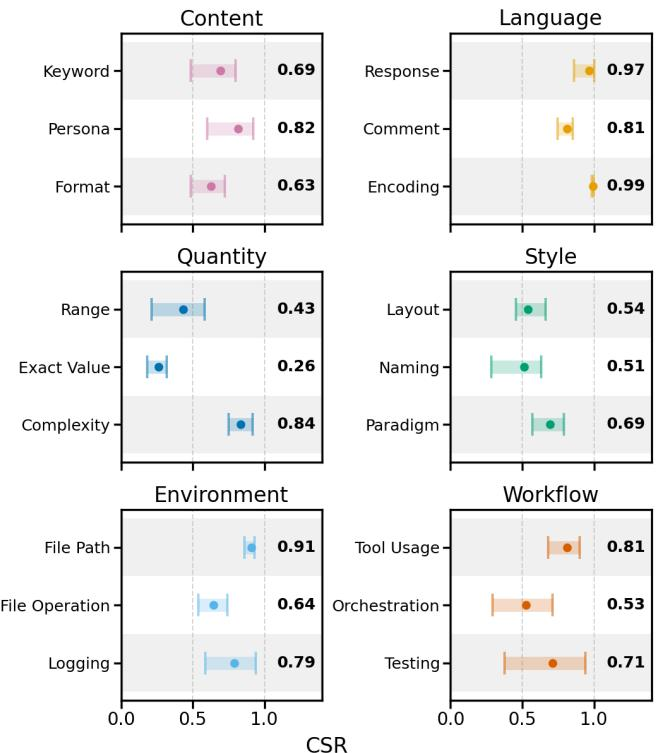  
Figure 5: The mean and range of CSR across all LLMs on diferent constraint categories.

Performance on Diferent Constraint Sources. To dissect the performance of code agents across constraint sources, we compare the average CSR for three constraint sources: repository policy files, along with newly added constraints and updates replacing existing constraints within user instructions. The results are presented in Figure 6. Firstly, code agents show stronger long-horizon robustness for constraints in repository policy files, exhibiting significantly less performance decay over successive turns compared to those in user instructions. This finding suggests that keeping important constraints in the repository policy file remains a more reliable practice for code agents. Secondly, updating existing constraints is notably harder than adding new ones. This likely stems from interference by superseded constraints, highlighting the inherent dificulty of dynamically revising requirements in multi-turn interactions.

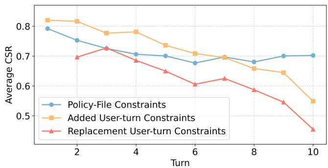  
Figure 6: Average CSR of constraints from diferent sources across all LLMs. Since there are no constraint replacements in Turn 1, this result starts from Turn 2.

<table><tr><td>Category</td><td>Evaluation Method</td><td>Agr.</td><td>P-F1</td><td>N-F1</td></tr><tr><td rowspan="2">Constraint Checklist</td><td>Code</td><td>0.921</td><td>0.939</td><td>0.887</td></tr><tr><td>Judge Agent</td><td>0.924</td><td>0.949</td><td>0.845</td></tr><tr><td>Function Checklist</td><td>Judge Agent</td><td>0.855</td><td>0.895</td><td>0.764</td></tr></table>

Table 4: Agreement, Positive F1 scores (P-F1), and Negative F1 scores (N-F1) between our evaluation methods and manual assessment for checklist item verification.

Evaluation Reliability. To validate the reliability of our evaluation method, we randomly sample 200 function check- list items and 400 constraint checklist items (164 evaluated by code and 236 evaluated by judge agents) for manual assess-ment. Two annotators independently verify compliance for each item, while a third inspector conducts cross-validation. Any discrepancies are resolved through discussion to reach a consensus. The agreement between the automatic evalu- ation and the manual assessment is shown in Table 4. For constraint checklist items, both evaluation methods achieve an impressive agreement of over 92%. Although verifying function checklist items is significantly more challenging, our method still reached an 85.5% agreement, surpassing the 85% agreement between the two initial annotators. These results confirm the reliability of our evaluation methods.

## 5 Conclusion

Our work introduces MTAC-IFBench, a comprehensive benchmark for instruction-following in multi-turn agentic coding scenarios. We first propose a hierarchical constraint taxonomy of agentic coding encompassing 6 primary and 18 secondary categories. A semi-automated pipeline is then employed to construct multi-turn software development in- structions with diverse constraints. For evaluation, we con- struct checklists for turn-wise constraint compliance and final functional correctness, integrating verification scripts and judge agents to ensure evaluation reliability. Experimental results uncover the significant deficiencies of code agents in multi-turn instruction-following, as the performance de- grades rapidly as the interaction horizon grows. In summary,

MTAC-IFBench can serve as a practical tool to advance future research in instruction-following for code agents.

## References

Anthropic. 2025a. Claude Code Best Practices.

Anthropic. 2025b. Claude Code Best Practices.

Anthropic. 2026a. Claude Haiku 4.5.

Anthropic. 2026b. Claude Sonnet 4.6.

Anthropic. 2026c. Introducing Claude Opus 4.6.

Austin, J.; Odena, A.; Nye, M.; Bosma, M.; Michalewski, H.; Dohan, D.; Jiang, E.; Cai, C.; Terry, M.; Le, Q.; et al. 2021. Program synthesis with large language models. arXiv preprint arXiv:2108.07732.

Chen, K.; Wu, Q.; Hou, T.; Tang, T.; Hu, X.; Hou, Y.; Li, B.; Qian, C.; Wang, G.; Chen, H.; et al. 2026. AgentIF-OneDay: A Task-level Instruction-Following Benchmark for General AI Agents in Daily Scenarios. arXiv preprint arXiv:2601.20613.

Chen, M.; Tworek, J.; Jun, H.; Yuan, Q.; Pinto, H. P. D. O.; Kaplan, J.; Edwards, H.; Burda, Y.; Joseph, N.; Brockman, G.; et al. 2021. Evaluating large language models trained on code. arXiv preprint arXiv:2107.03374.

Deepmind, G. 2026. Gemini 3.1 Pro: Best for complex tasks and bringing creative concepts to life.

Deng, X.; Da, J.; Pan, E.; He, Y. Y.; Ide, C.; Garg, K.; Laufer, N.; Park, A.; Pasari, N.; Rane, C.; et al. 2025. Swe-bench pro: Can ai agents solve long-horizon software engineering tasks? arXiv preprint arXiv:2509.16941.

Ding, D.; Liu, S.; Yang, E.; Lin, J.; Chen, Z.; Dou, S.; Guo, H.; Cheng, W.; Zhao, P.; Xiao, C.; et al. 2026. Octo- Bench: Benchmarking Scafold-Aware Instruction Following in Repository-Grounded Agentic Coding. arXiv preprint arXiv:2601.10343.

Du, X.; Liu, M.; Wang, K.; Wang, H.; Liu, J.; Chen, Y.; Feng, J.; Sha, C.; Peng, X.; and Lou, Y. 2023. Classeval: A manually-crafted benchmark for evaluating llms on class-level code generation. arXiv preprint arXiv:2308.01861.

Gong, J.; Voskanyan, V.; Brookes, P.; Wu, F.; Jie, W.; Xu, J.; Giavrimis, R.; Basios, M.; Kanthan, L.; and Wang, Z. 2025. Language models for code optimization: Survey, challenges and future directions. arXiv preprint arXiv:2501.01277.

Hendrycks, D.; Basart, S.; Kadavath, S.; Mazeika, M.; Arora, A.; Guo, E.; Burns, C.; Puranik, S.; He, H.; Song, D.; et al. 2021. Measuring coding challenge competence with apps. arXiv preprint arXiv:2105.09938.

Jiang, J.; Wang, F.; Shen, J.; Kim, S.; and Kim, S. 2026. A survey on large language models for code generation. ACM Transactions on Software Engineering and Methodology, 35(2): 1–72.

Jimenez, C. E.; Yang, J.; Wettig, A.; Yao, S.; Pei, K.; Press, O.; and Narasimhan, K. 2024. Swe-bench: Can language models resolve real-world github issues? In International Conference on Learning Representations, volume 2024, 54107–54157.

Kilo. 2025. Kilo - move at kilo speed.

Kimi. 2026. Kimi K2.6: From Code to Creation, From One to Many.

Li, J.; Li, G.; Zhao, Y.; Li, Y.; Liu, H.; Zhu, H.; Wang, L.; Liu, K.; Fang, Z.; Wang, L.; et al. 2024. Deveval: A manually-annotated code generation benchmark aligned with real-world code repositories. In Findings ofthe Association for Computational Linguistics: ACL 2024, 3603–3614.

Liu, Y.; Yao, Y.; Ton, J.-F.; Zhang, X.; Guo, R.; Cheng, H.; Klochkov, Y.; Taufiq, M. F.; and Li, H. 2023. Trustworthy llms: a survey and guideline for evaluating large language models’ alignment. arXiv preprint arXiv:2308.05374.

Lou, R.; Zhang, K.; and Yin, W. 2024. Large language model instruction following: A survey of progresses and challenges. Computational Linguistics, 50(3): 1053–1095.

Merrill, M. A.; Shaw, A. G.; Carlini, N.; Li, B.; Raj, H.; Bercovich, I.; Shi, L.; Shin, J. Y.; Walshe, T.; Buchanan, E. K.; et al. 2026. Terminal-bench: Benchmarking agents on hard, realistic tasks in command line interfaces. arXiv preprint arXiv:2601.11868.

OpenCode. 2026. The open source AI coding agent.

Qi, Y.; Peng, H.; Wang, X.; Xin, A.; Liu, Y.; Xu, B.; Hou, L.; and Li, J. 2025. Agentif: Benchmarking instruction following of large language models in agentic scenarios. arXiv preprint arXiv:2505.16944.

Qin, Y.; Zhang, T.; Zhang, T.; Shen, Y.; Luo, W.; sunhaoze; Zhang, Y.; Qiao, Y.; weipeng chen; Zhou, Z.; Zhang, W.; and CUI, B. 2025. SysBench: Can LLMs Follow System Message? In The Thirteenth International Conference on Learning Representations.

Qwen. 2026. Qwen3.6-Plus: Towards Real World Agents.

Raghavendra, M.; Gunjal, A.; Sabharwal, A.; and He, Y. 2026. SWE-INTERACT: Reimagining SWE Benchmarks as User-Driven Long-Horizon Coding Sessions. arXiv preprint arXiv:2606.30573.

Sapkota, R.; Roumeliotis, K. I.; and Karkee, M. 2025. Vibe coding vs. agentic coding: Fundamentals and practical impli cations of agentic ai. arXiv preprint arXiv:2505.19443.

Seed Team. 2026. Seed 2.0 Oficial Launch.

Team, G.; Anil, R.; Borgeaud, S.; Alayrac, J.-B.; Yu, J.; Soricut, R.; Schalkwyk, J.; Dai, A. M.; Hauth, A.; Millican, K.; et al. 2023. Gemini: a family of highly capable multimodal models. arXiv preprint arXiv:2312.11805.

Wang, H.; Gong, J.; Zhang, H.; Xu, J.; and Wang, Z. 2025a. Ai agentic programming: A survey of techniques, challenges, and opportunities. arXiv preprint arXiv:2508.11126.

Wang, P.; Zhang, L.; Liu, F.; Shi, L.; Li, M.; Shen, B.; and Fu, A. 2025b. Codeif-bench: Evaluating instruction-following capabilities of large language models in interactive code generation. arXiv preprint arXiv:2503.22688.

Wen, B.; Ke, P.; Gu, X.; Wu, L.; Huang, H.; Zhou, J.; Li, W.; Hu, B.; Gao, W.; Xu, J.; et al. 2024. Benchmarking complex instruction-following with multiple constraints composition. Advances in Neural Information Processing Systems, 37: 137610–137645.

Wen, B.; Niu, Y.; Wang, C.; Ke, P.; Ling, X.; Zhang, Y.; Zeng, A.; Wang, H.; and Huang, M. 2025. IF-CRITIC: Towards a Fine-Grained LLM Critic for Instruction-Following Evaluation. arXiv preprint arXiv:2511.01014.

Wu, X.; Xue, Z.; Yin, D.; Zhou, S.; Chang, K.-W.; Peng, N.; and Wen, Y. 2025. FronTalk: Benchmarking Front-End Development as Conversational Code Generation with Multi- Modal Feedback. arXiv preprint arXiv:2601.04203.

Wu, Y.; Zhao, Z.; Li, S.; Lee, H. H.; Zhu, J.; Wu, S.; Yu, T.; Li, S.; Zhang, L.; Fan, X.; and Li, S. 2026. SWE-Together: Evaluating Coding Agents in Interactive User Sessions. arXiv preprint arXiv:2606.29957.

Yan, K.; Guo, H.; Shi, X.; Cao, S.; Di, D.; and Li, Z. 2025. Codeif: Benchmarking the instruction-following capabilities of large language models for code generation. In Proceedings of the 63rd Annual Meeting of the Association for Computational Linguistics (Volume 6: Industry Track), 1272–1286.

Yang, J.; Zhang, W.; Liu, S.; Chai, L.; Tan, Y.; Liu, J.;Zhang, G.; Zhou, W.; Niu, G.; Li, Z.; et al. 2025. Ifevalcode:Controlled code generation. arXiv preprint arXiv:2507.22462.

Ye, J.; Zhang, G.; Fu, W.; Gui, T.; Zhang, Q.; and Huang, X. 2026. CCTU: A Benchmark for Tool Use under Complex Constraints. arXiv preprint arXiv:2603.15309.

Zeng, A.; Lv, X.; Hou, Z.; Du, Z.; Zheng, Q.; Chen, B.; Yin, D.; Ge, C.; Huang, C.; Xie, C.; et al. 2026. Glm-5: from vibe coding to agentic engineering. arXiv preprint arXiv:2602.15763.

Zhang, T.; Zhu, C.; Shen, Y.; Luo, W.; Zhang, Y.; Liang, H.; Yang, F.; Lin, M.; Qiao, Y.; Chen, W.; et al. 2025. Cfbench: A comprehensive constraints-following benchmark for llms. In Proceedings of the 63rd Annual Meeting of the Association for Computational Linguistics (Volume 1: Long Papers), 32926–32944.

Zheng, L.; Chiang, W.-L.; Sheng, Y.; Zhuang, S.; Wu, Z.; Zhuang, Y.; Lin, Z.; Li, Z.; Li, D.; Xing, E.; et al. 2023. Judging llm-as-a-judge with mt-bench and chatbot arena. Advances in neural information processing systems, 36: 46595–46623.

Zhou, J.; Lu, T.; Mishra, S.; Brahma, S.; Basu, S.; Luan, Y.; Zhou, D.; and Hou, L. 2023. Instruction-following evaluation for large language models. arXiv preprint arXiv:2311.07911.

Zhou, Q.; Zhang, J.; Wang, H.; Hao, R.; Wang, J.; Han, M.; Yang, Y.; Wu, S.; Pan, F.; Fan, L.; et al. 2026. FeatureBench: Benchmarking Agentic Coding for Complex Feature Devel- opment. arXiv preprint arXiv:2602.10975.

## A Limitations

The limitations of our work are summarized as follows:

Potential Evaluation Bias. Similar to other model-based evaluation methods, MTAC-IFBench may also sufer from potential evaluation biases such as self-enhancement or ver- bosity bias (Zheng et al. 2023). These biases could harm the evaluation correctness of certain models. Although we have verified a high agreement rate between our evaluation methods and human expert evaluations, incorporating inference-time strategies (e.g., multiple judge agents debate) may further attenuate bias and enhance evaluation performance. We re- serve further investigation of evaluation bias mitigation as important future work.

Cost of Judge Agent. MTAC-IFBench adopts judge agents to verify constraint and functional requirements that cannot be reliably checked by static scripts. Although this design enables more faithful evaluation of complex requirements, it also introduces additional cost because judge agents may need multiple rounds of tool calls and environment interaction. We consider this a necessary trade-of for evaluating multi-turn agentic coding, and leave further cost reduction through more dedicated designs, such as utilizing more lightweight agent harnesses or base models, and parallelizing the verification of multiple requirements, as important future work.

Coverage of Development Scenarios. Although MTAC-IFBench has covered diverse software development tasks, real- world agentic coding scenarios may further involve broader task types, such as security vulnerability remediation and database schema migration. Further expanding the coverage of instruction scenarios can improve the robustness of the evaluation and is regarded as important future work.

## B Ethical Considerations

In this work, we recruit 17 colle e students for benchmark data quality inspection, as detailed in Appendix F. Throughout the data annotation process, we adhere to the following key principles: (1) All annotators are fully informed about the purpose of the study, the specific tasks involved, and the intended use of their annotated data. (2) All annotators receive fair compensation for their time and contributions based on the market price. (3) All annotators are granted full autonomy to withdraw from the project at any time without penalty. (4) Any harmful instructions are filtered before annotation to avoid ethical issues.

Regarding the investigation of instructions derived from real-world application scenarios, we only use the portion of data that is granted for research purposes by users and conduct a strict deidentification and desensitization process to protect user privacy.

## C Details of Constraint Taxonomy

We provide detailed descriptions and examples for each constraint category in Table 7.

## D List of Prompt Templates

This section lists all the prompt templates applied throughout this work, including the prompt for multi-turn instruction expansion in Table 8, the prompt for constraint integration into the repository policy files in Table 9, the prompt for constraint integration into the user instruction at each turn in Table 10, the prompt for constraint quality validation at each turn in Table 11, the prompt for function checklist generation in Table 12, the prompt for verification code generation in Table 15, the prompt for constraint checklist verification in Table 16, and the prompt for function checklist verification in Table 17 and 18.

## E Details of Constraint Integration

Before constraint integration, we first construct a diverse constraint example pool for each secondary constraint cate- gory. Specifically, we first manually collect 190 representa- tive constraint examples across all constraint categories by investigating real-world application scenarios and existing instruction-following benchmarks in both coding and agentic settings, and then employ Seed-2.0-Pro to rephrase these ex- amples, generating 10 variations for each example, ensuring an adequate volume for each secondary category.

For repository policy files, the constraint integration pro- cess begins with an empty file. We sample 4-6 secondary constraint categories and retrieve up to 10 examples per cat- egory. Using these examples, Seed-2.0-Pro is instructed to select or rewrite up to 8 constraints and integrate them into the repository policy file.

For each turn of user instruction, we sample 2-4 secondary constraint categories, again retrieving up to 10 examples per category. Additionally, we supply constraint examples related to constraints from previous turns, allowing Seed-2.0-Pro to introduce new constraints or modify existing ones. The total number of new or modified constraints is capped at two per turn. To avoid ambiguity caused by conflicts between repository policy files and user instructions, constraints in repository policy files are kept immutable throughout the interaction; only constraints introduced in previous turns of user instruction are allowed to be modified.

When sampling secondary categories, we track an exposure count for each category, defined as the cumulative number of turns its constraints remain active in the constructed dataset so far. Categories are ranked by these counts, and sampling weights are assigned based on the square of their reverse ranks. This approach assigns higher probabilities to less exposed categories, promoting a balanced distribution of constraint categories. By default, every integrated constraint applies to all subsequent turns unless explicitly modified.

After each integration step, we use Seed-2.0-Pro to validate the clarity, consistency, completeness, and feasibility of the generated instruction. If validation fails, the integration step is retried using the same sampled examples. If no valid instruction is obtained after 5 attempts, the entire instruction sequence is discarded.

## F Details of Manual Quality Inspection

Inspection Guidelines For instruction quality inspection, we provide annotators with the repository policy files and multi-turn instructions, asking them to inspect the clarity, con- sistency, completeness, and feasibility of these instructions. Instructions with any defects are strictly filtered out. The detailed guideline is shown in Table 13. For checklist revision, we provide annotators with the retained repository policy files, the multi-turn instructions, the corresponding functional constraint checklists, as well as the constraint checklists at each turn, asking them to check the correctness of these checklists and correct any errors. The detailed guideline is shown in Table 14.

Profile of Inspection Persons In the manual quality in-spection of MTAC-IFBench, we recruit a diverse group of 17 highly qualified annotators who are either holding or pursuing a bachelor’s degree from top universities. This cohort includes 11 Master’s and 6 Bachelor’s graduates in Computer Science,

Statistics, or Electrical Engineering. All of them are required to pass the mandatory proficiency examination and annota- tion tutorial. Additionally, 5 professional data engineers and the authors are tasked with conducting spot checks on the annotations.

Quality Assurance and Validation We establish a rigorous quality control workflow to ensure the high quality of our annotations. The annotation results for each instance are independently reviewed by an inspector. Any discrepancies are resolved through discussion between the inspector and the annotator to reach a consensus on the final annotation. Furthermore, we regularly monitor the annotation quality and provide feedback to the annotators, while the annotation protocols undergo iterative refinement through collective discussion to enhance clarity and precision.

Data Curation Cost We spend approximately 2,400\$ on the curation of MTAC-IFBench during the manual quality inspection step.

## G Details of Evaluation Protocol

Code Evaluation For code evaluation, the software development project generated by the code agent and the verification script are placed in the same execution environment. The project path and the code agent’s final-turn response are passed as inputs to the verification script. Based on these inputs, the verification script provides a binary judgment regarding whether the constraint is followed. The verification code generation prompt is in Table 15.

Judge Agent Evaluation For the evaluation of constraint checklist items, the judge agent is executed within the same environment as the software development project generated by the code agent. The operation trace of the evaluated code agent, its final-turn response, and the project directory are provided to the judge agent. Based on these inputs, the judge agent is expected to output a binary judgment for each item on the constraint checklist. During this step, we employ the prompting strategy of IF-Critic (Wen et al. 2025), which requires the judge model to evaluate all constraints within a given checklist during a single inference pass. This ap- proach has been proven to be cost-eficient and enables the judge agent to achieve superior evaluation performance. The evaluation prompt is in Table 16. For the evaluation of the function checklist items, the judge agent is also executed within the same environment as the software development project generated by the code agent. The project directory is provided to the judge agent, and the judge agent is permitted to use Playwright8 to simulate browser interactions and capture screenshots for functional verification. For frontend develop- ment projects, we additionally employ npm9 for automated deployment and provide the accessible HTTP URL to the judge agent. The judge agent is built on the Claude Code (v2.1.14) (Anthropic 2025b) framework for both scenarios. The evaluation prompts are detailed in Table 17 and 18.

<table><tr><td colspan="6">Metrics 1</td><td colspan="6">C-ISR</td></tr><tr><td rowspan="2">Model</td><td colspan="6">CSR Turns</td><td colspan="5">Turns</td></tr><tr><td>1~2</td><td>3~4</td><td>5～6</td><td>7~8</td><td>9~10</td><td>Avg. 1~2</td><td>3~4</td><td>5～6</td><td>7~8</td><td>9～10</td><td>Avg.</td></tr><tr><td colspan="14">Proprietary language models</td></tr><tr><td>Qwen3.6-Plus</td><td>71.8</td><td>69.8</td><td>66.4</td><td>64.4</td><td>59.6 68.0</td><td>7.0</td><td>0.0</td><td>1.0</td><td>0.0</td><td>0.0</td><td>2.4</td></tr><tr><td>Seed-2.0-Pro</td><td>76.0</td><td>70.2</td><td>64.1</td><td>60.5</td><td>56.3</td><td>67.2 14.0</td><td>1.0</td><td>0.0</td><td>1.0</td><td>0.0</td><td>4.3</td></tr><tr><td>Claude-Haiku-4.5</td><td>67.3</td><td>64.4</td><td>60.2 57.8</td><td>51.3</td><td>61.8</td><td>2.0</td><td>0.0</td><td>0.0</td><td>0.0</td><td>0.0</td><td>1.0</td></tr><tr><td colspan="10">Open-source language models</td></tr><tr><td>GLM-5.2</td><td></td><td></td><td></td><td></td><td></td><td>15.0</td><td></td><td></td><td></td><td></td><td></td></tr><tr><td>GLM-5.1</td><td>80.6</td><td>77.3</td><td>75.3</td><td>74.1</td><td>74.2</td><td>76.8 11.5</td><td>4.5</td><td>4.7</td><td>0.0</td><td>0.0</td><td>6.7</td></tr><tr><td>DeepSeek-V4-Pro</td><td>77.9</td><td>75.1</td><td>72.4</td><td>72.0</td><td>70.9 65.0</td><td>74.3 72.2</td><td>3.8</td><td>0.0 1.6</td><td>0.0 0.0</td><td>0.0</td><td>4.5</td></tr><tr><td>DeepSeek-V4-Flash</td><td>75.6</td><td>74.5</td><td>71.1</td><td>67.8</td><td>63.7</td><td>11.3 3.2</td><td>7.3 1.0</td><td>0.0</td><td>0.0</td><td>0.0 0.0</td><td>5.9 1.1</td></tr><tr><td>Qwen3.5-27B</td><td>68.5 66.4</td><td>64.9 62.4</td><td>62.2 58.3</td><td>61.4 59.7</td><td>54.4 59.6</td><td>61.8 2.0</td><td>0.0</td><td>0.0</td><td>0.0</td><td>0.0</td><td>1.0</td></tr></table>

Table 5: The instruction-following performance of LLMs under the OpenCode framework. CSR and C-ISR are bucketed by turn intervals to compute average scores. All metrics are reported as percentages (%). The best result is bold.

<table><tr><td>Category</td><td># Instances</td></tr><tr><td>Frontend Development Application Development UI/UX Optimization Build &amp; Deployment</td><td>24 20 19 10</td></tr><tr><td>Data Analysis Machine Learning</td><td>22 5</td></tr><tr><td>Total</td><td>100</td></tr></table>

Table 6: Task distribution of MTAC-IFBench.

## H Task Distribution of MTAC-IFBench

We adopt the taxonomy from CC-Bench10 to categorize the task types of instructions in MTAC-IFBench. As shown in Table 6, MTAC-IFBench encompasses diverse software de- velopment tasks, spanning frontend development, application development, and data analysis, among others.

## I Details of Experiments

Detailed Results under OpenCode Framework. Table 5 presents the performance of diferent LLMs under the OpenCode framework across interaction turns. Consistent with our observations under Claude Code, model performance steadily declines as the interaction horizon grows. Although models generally perform worse under OpenCode than under Claude Code, they exhibit stronger multi-turn robustness in OpenCode, with less performance decay over successive turns. This result indicates the advantage of context management mechanism in OpenCode.

Performance on Diferent Constraint Placements. To investigate how constraint placement afects instruction- following performance, we place the constraints from the repository policy file in two diferent locations: the system prompt and the first-turn user prompt. Due to cost considera- tions, we randomly sample 30 instances from MTAC-IFBench for this experiment. The average CSR of these constraints across all turns is shown in Figure 7. We observe that con- straints placed in the repository policy file typically achieve the best compliance, while placement in the system prompt and user prompt shows similar performance. Therefore, keep- ing important constraints in the repository policy file remains a best practice for code agents.

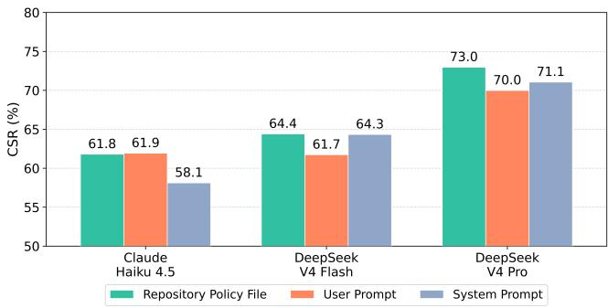  
Figure 7: Average CSR of constraints from repository policy file when they are placed in diferent positions.

<table><tr><td rowspan=1 colspan=1>Primary Category</td><td rowspan=1 colspan=1>Secondary Category</td><td rowspan=1 colspan=1>Description</td><td rowspan=1 colspan=1>Example</td></tr><tr><td rowspan=3 colspan=1>Content</td><td rowspan=1 colspan=1>Keyword</td><td rowspan=1 colspan=1>Constraints that require or forbid the presence of lexicalelements within the generated code or responses.</td><td rowspan=1 colspan=1>Every code file you generate must contain&quot;TODO&quot;.</td></tr><tr><td rowspan=1 colspan=1>Persona</td><td rowspan=1 colspan=1>Constraints that specify the role, perspective, orconversational manner the agent should consistentlyadopt.</td><td rowspan=1 colspan=1>Every response must end with the modalparticle &quot;meow~&quot;.</td></tr><tr><td rowspan=1 colspan=1>Format</td><td rowspan=1 colspan=1>Constraints that require generated artifacts to follow adesignated structural template or markup schema.</td><td rowspan=1 colspan=1>Every code file you generate must add theencoding declaration on the first line: -*-coding: utf-8 -*-.</td></tr><tr><td rowspan=3 colspan=1>Language</td><td rowspan=1 colspan=1>Response Language</td><td rowspan=1 colspan=1>Constraints that specify the language used for responsesor user-facing documentation.</td><td rowspan=1 colspan=1>You must always generate user responsesin English.</td></tr><tr><td rowspan=1 colspan=1>Comment Language</td><td rowspan=1 colspan=1>Constraints that specify the language used for codecomments.</td><td rowspan=1 colspan=1>All comments in every code file yougenerate must be in Chinese.</td></tr><tr><td rowspan=1 colspan=1>File Encoding</td><td rowspan=1 colspan=1>Constraints that regulate the character encodings (e.g.,UTF-8) of created files.</td><td rowspan=1 colspan=1>Every code file you create must beencoded in UTF-8.</td></tr><tr><td rowspan=3 colspan=1>Quantity</td><td rowspan=1 colspan=1>Range</td><td rowspan=1 colspan=1>Constraints that enforce designated ranges forquantitative attributes of generated artifacts.</td><td rowspan=1 colspan=1>Each file you generate must containbetween 200 and 500 lines.</td></tr><tr><td rowspan=1 colspan=1>Exact Value</td><td rowspan=1 colspan=1>Constraints that enforce quantitative attributes to matchexact numerical values or discrete conditions.</td><td rowspan=1 colspan=1>Every code file you generate must containexactly 4 comment lines.</td></tr><tr><td rowspan=1 colspan=1>Complexity</td><td rowspan=1 colspan=1>Constraints that cap the architectural or logical density ofgenerated projects and code.</td><td rowspan=1 colspan=1>The directory hierarchy of the code projectyou generate must not exceed 2 levels.</td></tr><tr><td rowspan=3 colspan=1>Style</td><td rowspan=1 colspan=1>Layout</td><td rowspan=1 colspan=1>Constraints that regulate the spatial organization of codeelements.</td><td rowspan=1 colspan=1>The code files you generate must use 4spaces for indentation.</td></tr><tr><td rowspan=1 colspan=1>Naming</td><td rowspan=1 colspan=1>Constraints that specify naming conventions forvariables, functions, classes, or files.</td><td rowspan=1 colspan=1>Every function name in the code files yougenerate must follow snake case.</td></tr><tr><td rowspan=1 colspan=1>Paradigm</td><td rowspan=1 colspan=1>Constraints that specify the programming style orengineering strategy used in implementation.</td><td rowspan=1 colspan=1>The code you generate must avoid addingerror handling, fallbacks, or validation forimpossible scenarios.</td></tr><tr><td rowspan=3 colspan=1>Environment</td><td rowspan=1 colspan=1>File Path</td><td rowspan=1 colspan=1>Constraints that specify rules for referencing or placingfiles in the repository.</td><td rowspan=1 colspan=1>In the code files you generate, all filereferences must use absolute file pathsinstead of relative paths.</td></tr><tr><td rowspan=1 colspan=1>File Operation</td><td rowspan=1 colspan=1>Constraints that restrict how agents create, read, modify,delete, or back up files.</td><td rowspan=1 colspan=1>Before modifying an existing file eachtime, you must create a backup of theoriginal file in the same directory.</td></tr><tr><td rowspan=1 colspan=1>Logging</td><td rowspan=1 colspan=1>Constraints that require traceable records of developmentprocedures, plans, or changes.</td><td rowspan=1 colspan=1>Before every code modification, you mustwrite the modification plan totask_plan.md.</td></tr><tr><td rowspan=3 colspan=1>Workflow</td><td rowspan=1 colspan=1>Tool Usage</td><td rowspan=1 colspan=1>Constraints that dictate tool selection, argument passing,execution rules, or safety wrappers.</td><td rowspan=1 colspan=1>You must use dedicated tools, such asRead, Write, and Edit, as much as possiblefor file operations instead of bashcommands.</td></tr><tr><td rowspan=1 colspan=1>Orchestration</td><td rowspan=1 colspan=1>Constraints that enforce the sequencing and coordinationof multi-step agent actions.</td><td rowspan=1 colspan=1>You must execute multiple independenttool calls in parallel as much as possible toimprove efficiency.</td></tr><tr><td rowspan=1 colspan=1>Testing</td><td rowspan=1 colspan=1>Constraints that regulate code verification practices,coverage requirements, or verification records.</td><td rowspan=1 colspan=1>The code you generate must be checkedwith ESLint, and all errors must be fixedso that ESLint finally returns no errors.</td></tr></table>

Table 7: Constraint taxonomy of MTAC-IFBench.

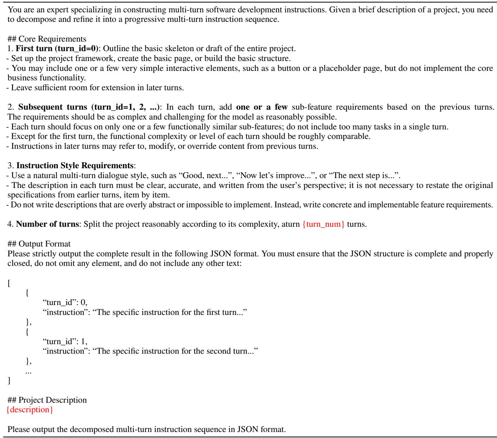  
Table 8: The prompt template for multi-turn instruction expansion.

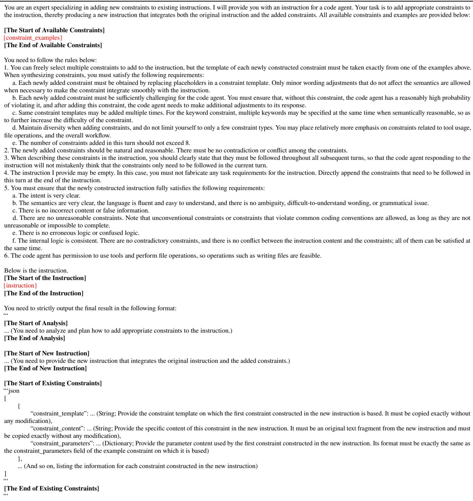  
Table 9: The prompt template for constraint integration into the repository policy files.

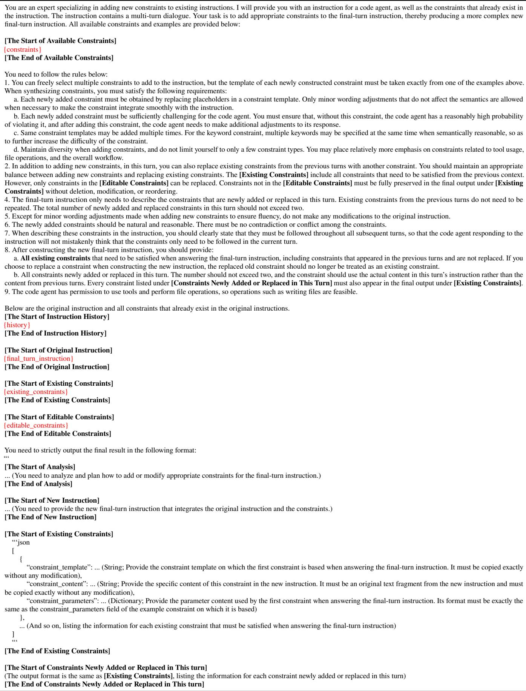  
Table 10: The prompt template for constraint integration into the user instruction at each turn.

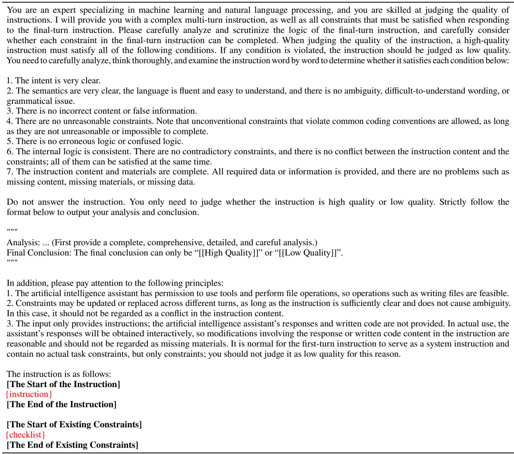  
Table 11: The prompt template for constraint quality validation at each turn.

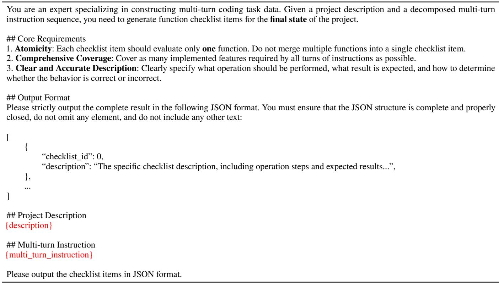  
Table 12: The prompt template for generating the function checklist upon the conclusion of the multi-turn interaction.

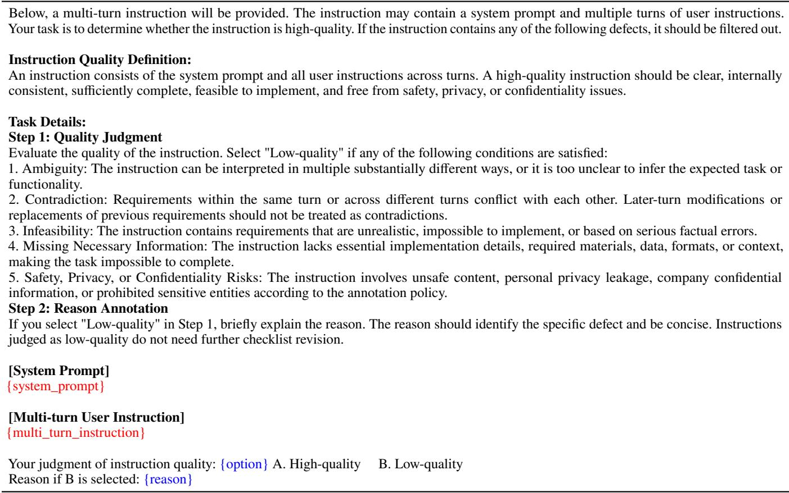  
Table 13: Human annotation guideline for instruction quality inspection. The red part is the information provided to the annotators, and the blue part is the content that requires the annotators to make annotations. The repository policy file is provided as a system prompt to improve readability.

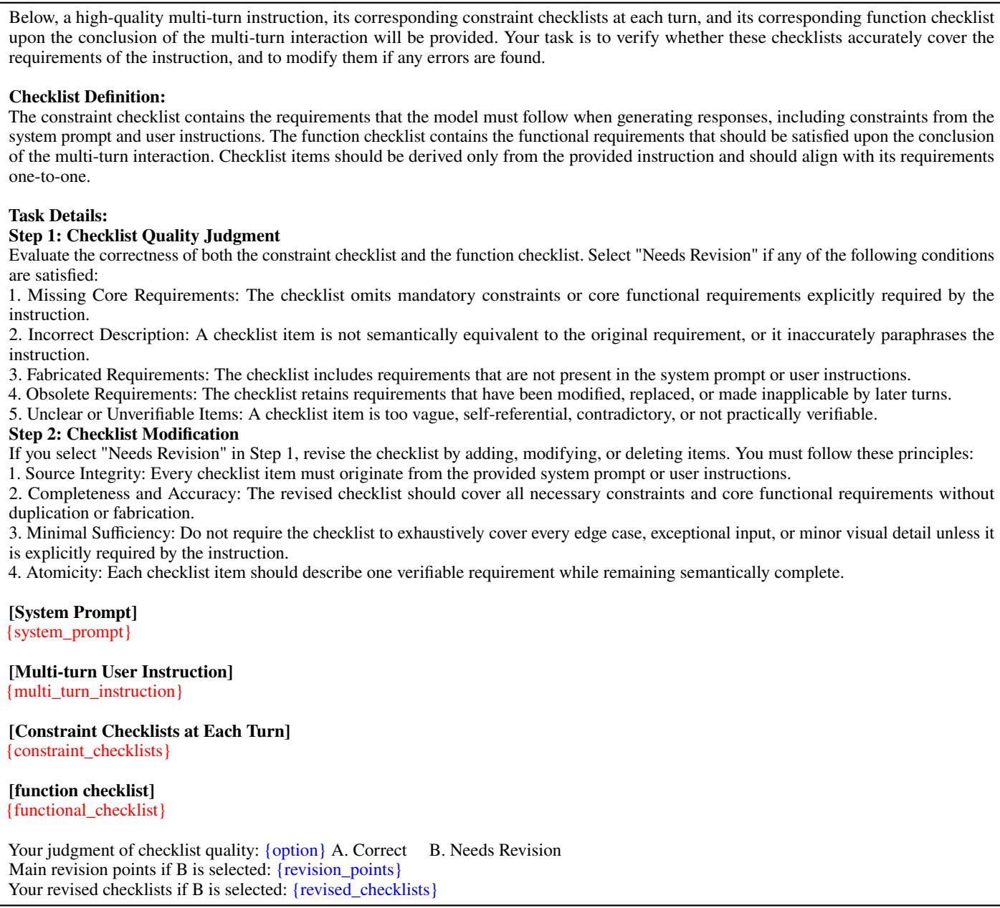  
Table 14: Human annotation guideline for checklist revision. The red part is the information provided to the annotators, and the blue part is the content that requires the annotators to make annotations. The repository policy file is provided as a system prompt to improve readability.

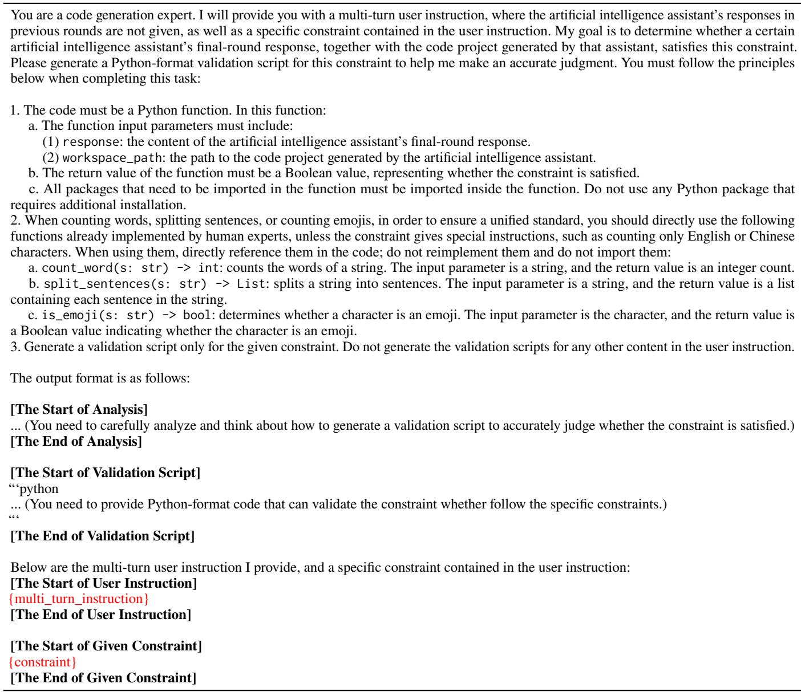  
Table 15: The prompt template for generating a validation script for code evaluation.

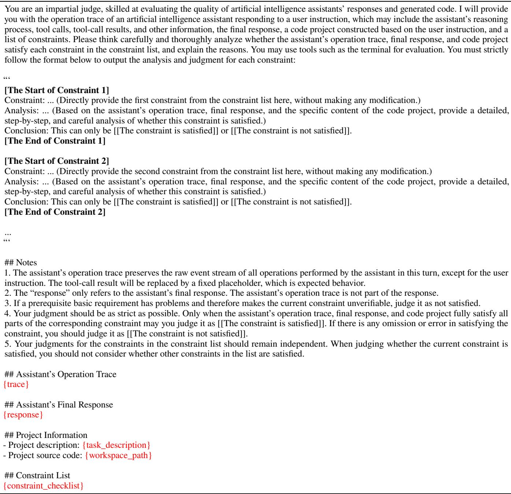  
Table 16: The prompt template for verifying the constraint checklist item.

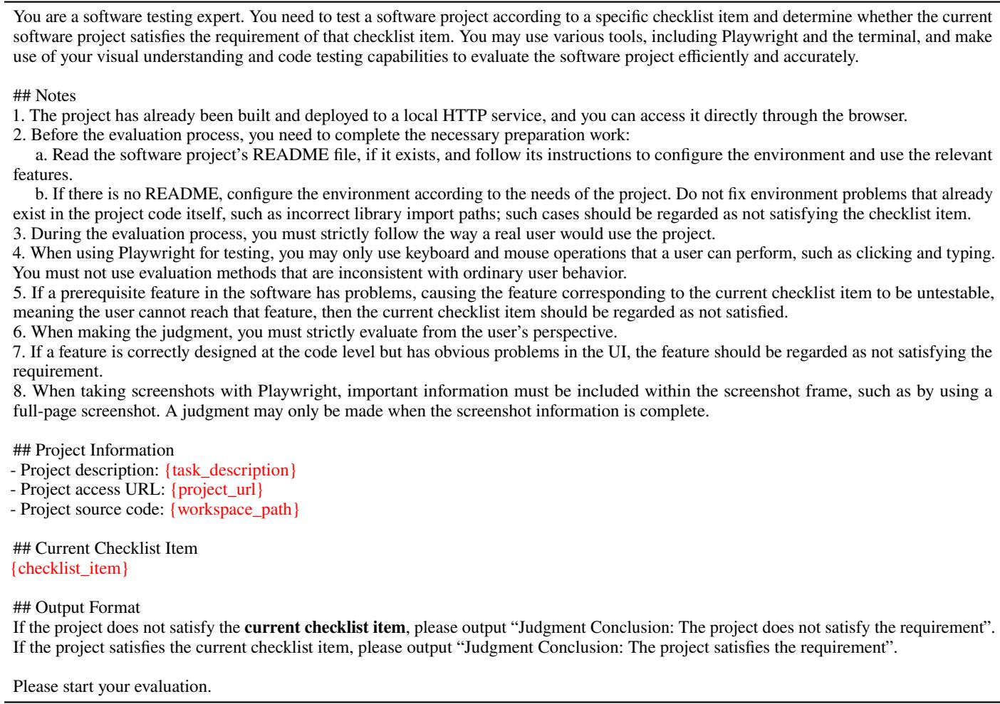  
Table 17: The prompt template for verifying the function checklist item for frontend development task.

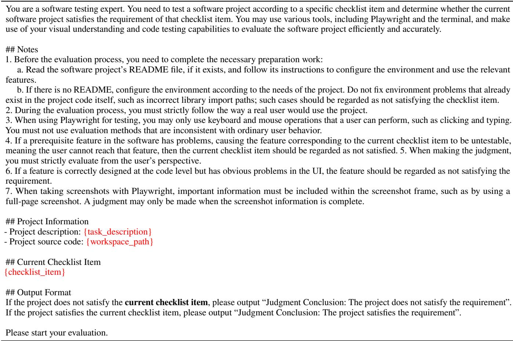  
Table 18: The prompt template for verifying the function checklist item for other tasks.