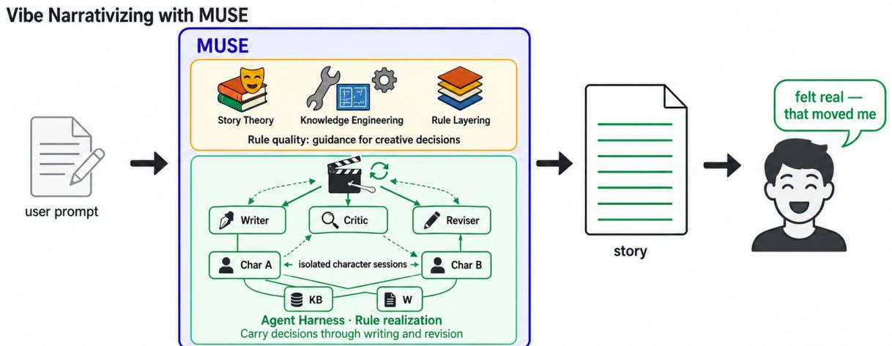
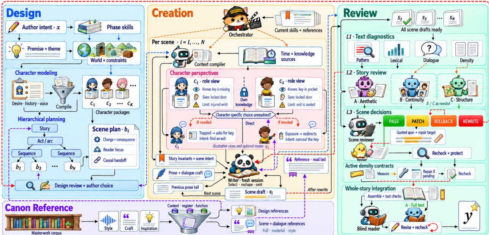
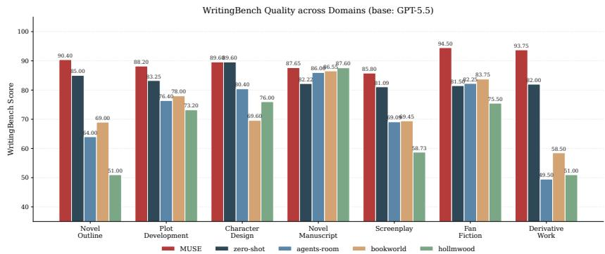

# MUSE: A THEORY-HARNESSED STORY ENGINE FOR VIBE NARRATIVIZING

A PREPRINT

Jianxiang Ma1,2 Xiaocui Yang1 Daling Wang1 Yuesong Hou Mingfu Zhang2,3,\* Yichen Gao1 Junzhao Huang1

1School of Computer Science and Engineering, Northeastern University,

Shenyang 110819, China

2OranAI, Shenzhen 518057, China

3OranAI Ltd., City of Industry, CA 91748, USA

Jianxiang Ma: jianxiangma020518@gmail.com Yuesong Hou: yuesonhou3-c@my.cityu.edu.hk Corresponding author: Mingfu Zhang, cto@oran.cn

September 14, 2026

## ABSTRACT

LLMs can generate fluent prose. Story quality depends on how decisions about plot, character, and language work together across planning, drafting, and revision. Guiding these decisions presents two bottlenecks: the quality of story guidance and its sustained use. We formulate Vibe Narrativizing as the task of turning natural-language writing requirements into a finished story and present MUSE, a Theory-Harnessed Story Engine. MUSE organizes story knowledge as guidance for specific decisions and carries those decisions into subsequent creative work. Knowledge engineering develops Robert McKee’s story theory through rule atomization, semantic consolidation, and mechanism abstraction; a single source of truth and layered disclosure organize the resulting guidance. Typical examples complement principles that depend on context and aesthetic judgment. An agent harness organizes design, character performance, scene composition, and revision through intermediate deliverables that preserve story decisions. Context engineering supplies each role with the relevant guidance and decisions, while a masterwork corpus provides inspiration and prose references. A worked example follows one requested object from its thematic role to the characters’ climactic actions. Across four base models, MUSE improves WritingBench by 1.6–4.8 points over zero-shot generation and raises LongStoryEval by more than ten points on three. ConStory-Bench consistency error density remains in the low single digits for all four models, below every reproduced story-system baseline on three. Component ablations locate the largest quality contribution in structural design, voice-specific effects in the character path, and further gains in revision. Code is available at https://github.com/RoadtoAGI/MUSE.

## 1 Introduction

Story generation brings together problems of computational creativity and practical support for human writers. A writing request can specify a genre, character relationships, required events, and a desired prose style; the resulting work must make these choices cohere as a reading experience [Colton and Wiggins, 2012, Mirowski et al., 2023]. Large language models (LLMs) make such requests easy to express. Their fluency, however, can coexist with generic characterization, weakly connected events, and language that does not fit the intended work. A conspicuous form of this mismatch is the migration of software-engineering terminology and explanatory habits into other kinds of writing. In creative prose, such language can replace concrete action and perception with abstract descriptions, weakening readability and disrupting the story’s register.

The quality of characterization, plot development, and prose depends on how creative decisions work together. A character’s desire shapes their actions under pressure; the resulting consequences change the situation in the next scene. Viewpoint, dialogue, and detail determine how the reader understands those changes. Story theory and masterwork analysis connect these choices to their narrative effects, providing a basis for guidance throughout creation.

The first bottleneck is rule quality: story knowledge needs to provide clear, appropriate guidance for the decisions a model must make. Principles such as developing subtext, revealing character under pressure, or expressing a theme through a climax describe desirable effects at different narrative scales. The model needs to understand what each principle asks it to decide, how related requirements fit together, and which guidance applies to its current task. Clear structure, consistent meanings, and explicit requirements make that guidance easier to understand and follow. For judgments that depend on context and aesthetic purpose, typical examples supply distinctions that an abstract instruction leaves implicit.

The second bottleneck is rule realization: the guidance and the decisions it informs must continue to shape the work as creation proceeds. Recent systems use recursive planning and revision, specialized agents, and playwriting knowledge [Yang et al., 2022, 2023, Huot et al., 2025, Chen et al., 2024, Wu et al., 2025a]. Each stage produces decisions that later stages need: an outline establishes a turn, a character design establishes a way of speaking, and a scene plan establishes the consequence of an action. When these decisions fade between calls, structure drifts, voices converge, and consequences disappear between otherwise fluent scenes. Sustained guidance requires both a record of what has been decided and an organized way to use that record in subsequent work.

Story knowledge needs to guide the decisions a model is making, while the creative process must carry earlier choices and their consequences into subsequent work. MUSE realizes this idea through story theory knowledge engineering and an agent harness (Figure 1). Following the knowledge-engineering tradition of acquiring, representing, and applying expert knowledge [Feigenbaum, 1977], we organize McKee’s story theory [McKee, 1997] into reusable rules and examples. The harness establishes the creative environment: stages, roles, tools, persistent story decisions, deliverable handoffs, and feedback for revision. Context engineering determines which of these materials enters each model call and in what form. A scene writer, for example, receives the planned turn, the participating characters’ intentions, the preceding scene’s state, and a relevant prose reference. These materials guide the actions, dialogue, and narration that develop the turn; review then compares the resulting scene with its design to guide revision.

We call the task of turning a finite set of natural-language writing requirements into a finished story Vibe Narrativizing. MUSE produces the story together with intermediate records of its conception, design, and revision. We evaluate the final outputs using WritingBench [Wu et al., 2025b], LongStoryEval [Yang and Jin, 2025], and ConStory-Bench [Li et al., 2026] across Claude Sonnet 4.6, Claude Opus 4.7, GPT-5.4, and GPT-5.5. MUSE improves WritingBench by 1.6–4.8 points over the corresponding zero-shot models and raises LongStoryEval by more than ten points on three. Its ConStory-Bench consistency error density remains in the low single digits, below every reproduced story-system baseline on three models and roughly an order of magnitude below them on Sonnet and Opus.

This paper makes three contributions. (1) Task formulation. We define Vibe Narrativizing through intent reflection, beat fidelity, voice differentiability, and narrative coherence. (2) Method. We introduce MUSE, which consolidates equivalent story requirements, abstracts shared mechanisms, and assigns their realization across creative responsibilities within a five-module harness for planning, performance, writing, and revision. (3) Evaluation. We report final-output scores and component ablations across four base models, together with a worked example that follows a writing requirement into the actions of the completed story.

## 2 Related Work

Story knowledge and narrative planning. Computational narratology connects story structure to causal progression and character behavior through plot grammars [Propp, 1968], narrative planning [Riedl and Young, 2010], learned event representations [Martin et al., 2018], and emotional arcs [Reagan et al., 2016]. Dramatron [Mirowski et al., 2023] uses a hierarchical story grammar for co-writing with industry professionals. Playwriting-guided generation [Wu et al., 2025a] incorporates craft knowledge and reflection into interactive drama. These approaches make narrative knowledge available as structures or instructions for generation. The knowledge-engineering perspective adds a question about the guidance itself: how should expert principles be represented and organized for the decisions a system must make [Feigenbaum, 1977]? MUSE develops this connection through McKee’s account of scene change, dialogue, character, and climax.

LLM planning systems preserve plot over longer spans. $\mathrm { R e ^ { 3 } }$ [Yang et al., 2022] recursively plans, drafts, and revises; DOC [Yang et al., 2023] strengthens detailed outline control; and DOME [Wang et al., 2025] combines dynamic hierarchical outlining with memory. StoryWriter [Xia et al., 2025], SuperWriter [Wu et al., 2025c], and heterogeneous recursive planning [Xiong et al., 2025] further develop planning, refinement, and retrieval. MUSE builds on this progression by relating each level of design to the creative choices it prepares: a controlling idea shapes the climax, the climax shapes the preceding conflicts, and scene plans guide action and dialogue.

  
Figure 1: MUSE motivation and overview. The upper panel illustrates prompt-only story generation. The lower panel addresses rule quality and rule realization together: knowledge engineering organizes story theory into layered guidance for creative decisions, and an agent harness sustains the use of this guidance and the resulting decisions through writing, character performance, critique, and revision. KB and W denote the knowledge base and world state.

Agent collaboration and the creative environment. Agents’ Room [Huot et al., 2025] assigns specialized agent to plot, character, and scene writing. HoLLMwood [Chen et al., 2024] organizes screen-oriented narratives through roles such as writer, director, and actor. Persistent character agents use persona descriptions, memory, and role-specific context to maintain behavior [Park et al., 2023, Shao et al., 2023, Wang et al., 2024, Zhou et al., 2024, Ran et al., 2025]. MUSE combines specialized writing roles with character performance: an isolated call develops one character’s possible actions and lines, and a writer composes the scene from the resulting materials. Work on agent–environment interfaces [Yang et al., 2024] and harness engineering [Lopopolo, 2026] further motivates organizing tools, shared knowledge, and feedback around a model’s work. In MUSE, intermediate deliverables provide continuity across these roles.

Examples and context engineering. Dense retrieval [Karpukhin et al., 2020] and in-context example selection [Liu et al., 2022, Rubin et al., 2022, Min et al., 2022] provide generation-time guidance through relevant demonstrations. Context engineering extends this concern to the selection and maintenance of the information available throughout an agent’s work [Anthropic, 2025]. MUSE uses examples for three purposes: teaching rules whose application depends on context, supplying plot inspiration during Design, and providing a scene’s prose register during Creation. Its layered knowledge organization supports progressive disclosure, while its runtime context combines the current guidance with persistent story decisions and task-specific references.

Evaluation of generated stories. WritingBench [Wu et al., 2025b] scores query-specific writing criteria, LongStoryEval [Yang and Jin, 2025] applies an eight-dimension craft rubric, and ConStory-Bench [Li et al., 2026] measures consistency errors. LLM-based evaluation provides structured judgments of generated text [Liu et al., 2023, Zheng et al., 2023].

## 3 Method

MUSE connects reusable story guidance to the decisions made for a particular story and their development in later stages. Skills and references hold the general guidance; intermediate artifacts hold the current premise, world, characters, structure, drafts, and feedback. The five modules in Figure 2 produce and use these artifacts so that each stage can develop the preceding work. We first formulate the task, then describe how the guidance is developed and how the harness applies it.

## 3.1 Problem Formulation for Vibe Narrativizing

Let x denote a prompt with finite requirements, such as setting, character relations, required events, and prose style. A run f maps x to an ordered trace $\mathcal { A } = ( a _ { 0 } , \ldots , a _ { 7 } )$ and a final story $y = ( s _ { 1 } , \dotsc , s _ { N } )$ of N scenes: $f : x \mapsto ( \mathcal { A } , y )$ An artifact is an intermediate file in this trace, such as a world description, character profile, scene plan, or review verdict. The trace preserves decisions at successive stages so later calls can develop the same story.

At scene scale, a beat contract specifies the intended value transition and the pressure that drives it:

$$
b _ { i } = ( v _ { i } ^ { - } , v _ { i } ^ { + } , p _ { i } ) .\tag{1}
$$

Here $v _ { i } ^ { - } , v _ { i } ^ { + } \in \mathcal { V }$ are the states entering and leaving scene $s _ { i } ,$ and $p _ { i }$ is the pressure that forces the transition. Narrative values in V include trust, safety, and betrayal. The map $\sigma : \mathcal { V }  \{ - , 0 , + \}$ expresses their negative, neutral, or positive charge in the scene. A forced choice, for example, can move a relationship from trust (+) to betrayal (−). Character packages $\mathcal { C } = \{ c _ { 1 } , \ldots , c _ { K } \}$ describe desire, voice, behavior, and prohibitions; $\mathcal { R } _ { t }$ denotes the rules used in producing artifact $a _ { t }$

A run is acceptable when its trace and story jointly satisfy four requirements:

$$
\begin{array} { l } { { Q ( y , { \cal A } ; x ) = I ( x , { \cal A } , y ) \wedge B ( \{ b _ { i } , s _ { i } \} ) } } \\ { { \wedge V ( { \cal C } , y ) \wedge H ( y ) . } } \end{array}\tag{2}
$$

Intent reflection I connects the prompt’s requirements to the intermediate decisions and finished story. Beatfidelity B relates each scene to its planned transition [Wang et al., 2023]. Voice differentiability V requires characters to remain distinct in word choice and behavior. Narrative coherence H concerns the continuity of plot, character, and world facts across scenes. These requirements guide design, composition, and review: they determine what to preserve in the artifacts and what to examine in the prose. The final-output evaluation in Section 4 covers query satisfaction, craft, and consistency.

## 3.2 Story Theory Knowledge Engineering

We organize McKee’s framework around four concepts [McKee, 1997]. A Beat is a continuing action–reaction relationship; a change in that relationship begins a new beat, and connected beats develop a scene’s value change. Dialogue connects what a character says to what is withheld or cannot be acknowledged. A Character Arc concerns what choices under pressure reveal or change about the character. The Plot Peak is the climactic action that expresses the controlling idea, the story’s central claim about how and why a value changes. Together, these concepts connect local exchanges, character development, and the meaning of the whole story.

MUSE develops these principles into rules that connect applicability, creative decisions, and intended effects. Rule atomization identifies complete decisions within a compound principle. Related rules are grouped by the narrative function or mechanism they support. Semantic consolidation merges formulations that prescribe equivalent decisions under the same conditions and responsibilities, preserving their requirements and permitted choices. Mechanism abstraction identifies the relationship through which more specific rules achieve an effect; scale-specific responsibilities and alternative methods remain attached to that relationship. This organization connects goal refinement and responsibility assignment from requirements engineering to narrative decisions [van Lamsweerde, 2001]. A single source of truth (SSOT) gives each shared rule an authoritative home, while layered disclosure makes task guidance and deeper references available where they are used.

For example, conflict connects a character’s pursuit to an opposing response and its consequences. When pursuit organizes the narrative, the resulting rule requires consequential responses to change the character’s strategies, costs, or available choices, thereby supplying conditions for what happens next. Plot-spine design develops the pursuit and its major turns; sequence and scene design determine local changes and their consequences; the writer chooses the actions, dialogue, and narrative order that realize them. The shared mechanism supports different implementations while preserving the causal relationship. Information-led guidance follows how evidence changes an interpretation;

  
Figure 2: MUSE execution flow. Design (blue) develops character packages and hierarchical scene plans. Creation (orange) assembles scene context, character perspectives, and performance material for a fresh-session writer. Canon Reference (purple) supplies design inspiration and scene references. Review (green) combines text diagnostics, story review, scene-level revision, and whole-story integration; feedback returns to the relevant writing or design stage.

motif-led guidance follows how recurrence, variation, or juxtaposition develops meaning. Both distinguish the intended effect from its realization. Appendix B.1 traces the conflict abstraction and uses Why, What, When, and How (WWWH) to show how objectives, conditions, and methods receive their respective places in the rule library.

Few-shot examples supply the contextual distinctions needed to use such guidance. A quiet line after an argument can simultaneously convey care and withhold an apology; its subtext depends on the relationship, the preceding conflict, and the speaker’s desired response. The rule library therefore pairs abstract guidance with short cases that connect an utterance or action to its narrative function. Canon craft analyses add sustained examples. In a night battle from Jin Yong, five finger-shaped holes in a skull make a threat tangible through touch; concrete wounds and their accumulating consequences then carry the changing balance of the fight (Appendix D). These examples show how an effect is achieved through a choice of action or detail. They give the model distinctions to apply when composing new material [Min et al., 2022].

The guidance also determines which story decisions should be saved. Scene plans record the conflict or organizing relationship, entering and leaving states, and consequences for the next scene; character designs record desires, contradictions, and voice; climax designs connect a decisive action to the controlling idea. Review reads these records alongside the resulting text. Appendix B specifies the representations and associated narrative judgments. The files make decisions available to later work, while the rules explain how to develop and assess those decisions.

## 3.3 Story-Generation Agent Harness

The harness organizes the creative lifecycle around a system of deliverables. Design establishes the story’s commitments; Performance develops material from individual characters’ perspectives; Creation composes scenes; Review directs revision and integration. Canon Reference supplies material for both structural and prose decisions. The orchestrator schedules these roles, provides tools and access to the relevant files, and maintains their handoffs. The persistent artifacts let one role build on another’s work: a scene writer can use a character’s established motive, and a reviewer can compare the resulting choice with the intended scene turn.

Canon Reference. The reference corpus contains 31 masterworks, comprising 28 novels and 3 plays segmented into 572 scenes. Three annotation layers serve different creative needs. The style layer profiles five register dimensions and stores a style card for each work. The craft layer explains scene development beat by beat, linking a move to a quoted source span, a common model failure at the same point, and a transferable technique. The inspiration layer groups recurring narrative patterns by their dramatic function and conditions of use. Inspiration cards enter Design while plot choices are being formed; scene exemplars enter Creation to guide narrative voice, sentence rhythm, diction, dialogue form, and omission.

Retrieval ranks content and register separately. Reciprocal rank fusion [Cormack et al., 2009] combines denseembedding [Karpukhin et al., 2020] and lexical [Robertson and Zaragoza, 2009] rankings of scene descriptions. A register channel then reorders the candidates using a short hint about narrative distance, interiority, and tempo [Wegmann et al., 2022]. This separation followed an observation that a semantically matched exemplar with the wrong register scored below the no-reference arm on every dimension; register-aligned re-ranking reversed the deficit. Either channel can return no usable reference, in which case generation proceeds with the story’s other materials. A selected scene exemplar is supplied with its usage protocol and quote-anchored craft analysis.

Design. Design builds six artifacts in sequence. Phases 0–5 develop the premise and controlling idea, world facts, character packages, plot spine and climax, sequence structure, and scene plans. Each phase uses the prompt, earlier decisions, and its current rule bundle:

$$
a _ { t } = G _ { t } ( x , a _ { < t } , \mathcal { R } _ { t } ) , \qquad t = 0 , . . . , 5 ,\tag{3}
$$

where $a _ { < t } = ( a _ { 0 } , \dotsc , a _ { t - 1 } )$ . A later artifact refines the earlier decisions toward composition: the climax determines what preceding conflicts must establish, and scene arrangement specifies the actions and consequences that make that progression possible. The Beat Tree organizes this development across four narrative scales:

$$
{ \mathcal { T } } : \quad { \mathrm { s t o r y ~ { \longrightarrow } ~ a c t ~ { \longrightarrow } ~ s e q u e n c e } } \longrightarrow { \mathrm { s c e n e } } .\tag{4}
$$

Each level develops a consequential change at its own scale. The representations follow their respective tasks: plot-spine artifacts record the central conflict and climax; sequences record conflict, escalation, and a sequence climax; scene plans record entering and leaving values and the causal links between scenes. At a scene leaf, the writer develops the transition represented by $b _ { i } .$ Appendix C inventories the artifacts, and Appendix J follows the choices and consequences of one case.

Performance. Performance gives the writer material shaped by individual characters’ goals and voices. It compiles the established character profiles into scene-specific role briefs, each containing an immediate objective and a suppressed pressure the character cannot state. For a scene with at least two characters, separate LLM calls roleplay the participating characters and propose decisions, physical actions, addressed lines with subtext, reactions, and visible tells. The materials for scene i form $M _ { \rho ( i ) }$ , where $\rho ( i )$ denotes its character roster. Before dispatching the writer, the harness checks that each character has a material file or a recorded reason for omission. The writer may adopt, revise, or discard these candidates; the character’s forbidden list remains binding and is examined during review.

Creation. Creation turns the accumulated design and performance materials into prose. Each scene is composed in a separate writer session:

$$
s _ { i } = W \bigl ( b _ { i } , \mathcal { C } _ { \rho ( i ) } , M _ { \rho ( i ) } , \kappa _ { i } \bigr ) ,\tag{5}
$$

where $\mathcal { C } _ { \rho ( i ) }$ contains the participating characters’ packages and $\kappa _ { i }$ contains the remaining scene context. The writer chooses how to stage the planned turn, integrate the characters’ proposals, and distribute attention across action, dialogue, and description. Pacing follows the scene plan, and surplus performance material is cut during composition. Since each writer starts a fresh session, continuity with earlier scenes is supplied through the selected context.

Context engineering across stages. The knowledge layers determine how guidance is stored; context engineering determines when and how it is used. On entering a phase, the harness loads the corresponding Skill bundle. Deeper references are read when the current task calls for them. Design receives earlier story commitments and relevant inspiration cards; Performance receives the active character’s situation and pressures; Creation receives the scene plan, character materials, prior prose state, and an optional exemplar; Review receives the text together with the design it should realize. This progressive disclosure concentrates attention on information that can change the current decision [Anthropic, 2025].

For scene writing, the context is assembled as

$$
\begin{array} { r l } & { \kappa _ { i } = \big \langle \mathcal { R } _ { 6 } , \mathrm { c o r e } _ { i } , \mathrm { c o m p } ( \mathrm { r e f } _ { i } ) , \mathrm { t a i l } _ { i - 1 } , \mathrm { e x } _ { i } \big \rangle , } \\ & { \qquad \mathrm { e x } _ { i } \in \mathcal { E } \cup \{ \varnothing \} . } \end{array}\tag{6}
$$

where required world and plot facts corei enter in full, secondary reference notes are compressed by comp, and $\mathrm { t a i l } _ { i - 1 }$ preserves the preceding scene’s immediate state. The optional $\mathrm { e x } _ { i }$ is drawn from the canon exemplar set $\varepsilon .$ The writer reads the design constraints and character materials before the preceding scene tail and the exemplar. This order establishes what must happen and whose choices drive it, then supplies the local continuity and prose reference needed to compose it. Character voice follows the established character source, while the exemplar informs the work’s narrative register.

Review and revision. Review compares the composed text with its design and directs revision. Its three tiers combine $L _ { 1 }$ pattern, lexical, dialogue, and paragraph-density checks; $L _ { 2 }$ aesthetic, continuity, and structural review; and $L _ { 3 }$ scene-level revision decisions. Each finding identifies the affected scene and quoted text. Findings with whole-story consequences are escalated to story-level revision. The scene-level actions are ordered by the scope of change:

$$
\begin{array} { r } { \nu ( s _ { i } , b _ { i } ) \in \{ \mathrm { P A S S } , \mathrm { P A T C H } , \mathrm { R O L L B A C K } , \mathrm { R E W R I T E } \} . } \end{array}\tag{7}
$$

A non-PASS verdict triggers revision against the same planned scene transition:

$$
\begin{array} { r } { s _ { i } ^ { ( r + 1 ) } = \mathrm { R e v } \big ( s _ { i } ^ { ( r ) } , b _ { i } , \nu ( s _ { i } ^ { ( r ) } , b _ { i } ) \big ) . } \end{array}\tag{8}
$$

The loop returns the first passing revision within $r _ { \mathrm { m a x } }$ attempts, or the final revision when that budget is reached. A reviser distinct from the writer applies changes anchored to quoted spans and reports the batch as complete, partial, or failed. A finding that requires rollback returns to the writer at scene scope. Review also compares paragraph density with the reference and checks character prohibitions. Phase 7 assembles the story and adds a reader review of immersion, expectations, and the development of information across the whole text.

Runtime checks support these handoffs. The YAML hook checks parsing, required keys, allowed labels, and selected scene declarations, reporting warnings after a write. Specialized checks cover scene-plan compliance, roster coverage, and cross-file references. The review roles examine narrative properties such as realized value change, subtext, and continuity. Appendix C gives the hook behavior, while Appendix B relates the representations to their narrative judgments.

## 3.4 From a Requested Object to a Climactic Choice

WritingBench query 189 requests a wuxia version of a Quidditch match featuring Jin Yong characters and an object equivalent to the Golden Snitch. The case develops this object into the Mystic Frost Pearl and embeds it in a complete scoring system: jade scales earn ten points when thrown through a hoop; returning the Pearl earns thirty and ends the match. The Pearl responds to outward discharges of inner force. Holding it requires control, while winning still depends on the score.

The encounters teach both the reader and the players how this rule works. Guo Jing’s palm sends the Pearl away; it briefly rests on Zhou Botong’s relaxed hand; Ouyang Feng traps it with force and freezes his knuckles. Ouyang Feng then changes his technique, contains his breath, and carries it on an open palm. His adjustment makes him a tactically capable opponent. The rule creates a shared problem that each character must solve through action.

The central choice arrives when a platform breaks. Guo Jing can reach the descending Pearl, but an opposing disciple is hanging beneath him. He catches the disciple’s wrist instead. The rescue injures his arm and occupies Huang Rong while White Camel scores three times. When he later secures the Pearl, its thirty points are insufficient to erase the deficit. Huang Rong needs another goal; Guo Jing must wait on a damaged rope with a hand that can barely hold his weight.

The ending carries these consequences through. As the rope parts, Huang Rong abandons her scoring run to help him reach the referees’ ledge. Guo Jing returns the Pearl and ends the contest at one hundred to ninety in White Camel’s favor. The rescued disciple bows to him while still clutching a strip of his torn sleeve. Huang Rong uses that cloth to bind the injury.

The case connects story guidance to concrete narrative decisions. The object has a physical response and a scoring function; character choices alter the score, bodily condition, and available routes; those changes determine the final action. Chivalry acquires a cost that remains visible after the rescue. Appendix J follows the rule, the rescue, and the finish in the story’s own words.

## 4 Experiments

## 4.1 Setup

We evaluate final outputs for query satisfaction, narrative craft, and consistency using three benchmarks. WritingBench (WB) [Wu et al., 2025b] tests whether an output satisfies the query-specific writing criteria; we use its novel-creation

<table><tr><td rowspan="2">Method</td><td colspan="3">Claude Sonnet 4.6</td><td colspan="3">Claude Opus 4.7</td><td colspan="3">GPT-5.4</td><td colspan="3">GPT-5.5</td></tr><tr><td>WB↑</td><td>CED↓</td><td>LSE↑</td><td>WB↑</td><td>CED↓</td><td>LSE↑</td><td>WB↑</td><td>CED↓</td><td>LSE↑</td><td>WB↑</td><td>CED↓</td><td>LSE↑</td></tr><tr><td>Zero-shot</td><td></td><td></td><td></td><td></td><td></td><td></td><td></td><td></td><td></td><td></td><td></td><td></td></tr><tr><td>Zero-shot</td><td>86.79</td><td>0.520</td><td>69.33</td><td>85.26</td><td>0.199</td><td>65.77</td><td>83.44</td><td>0.193</td><td>57.85</td><td>84.40</td><td>0.067</td><td>62.04</td></tr><tr><td colspan="9">Reproduced story-system baselines</td><td></td><td></td><td></td><td></td></tr><tr><td>Agents&#x27; Room</td><td>72.72</td><td>10.520</td><td>58.90</td><td>75.10</td><td>3.180</td><td>66.02</td><td>75.94</td><td>2.720</td><td>65.13</td><td>75.02</td><td>0.840</td><td>65.10</td></tr><tr><td>HoLLMwood</td><td>54.38</td><td>11.040</td><td>52.67</td><td>63.88</td><td>3.500</td><td>64.02</td><td>65.65</td><td>3.440</td><td>59.69</td><td>69.78</td><td>4.020</td><td>60.50</td></tr><tr><td>Playwriting</td><td>49.58</td><td>13.410</td><td>50.57</td><td>58.39</td><td>7.040</td><td>63.60</td><td>59.19</td><td>6.670</td><td>59.48</td><td>64.58</td><td>3.587</td><td>61.78</td></tr><tr><td>BookWorld</td><td>64.64</td><td>12.880</td><td>57.38</td><td>72.41</td><td>7.620</td><td>66.50</td><td>74.94</td><td>5.100</td><td>64.72</td><td>75.92</td><td>7.150</td><td>66.72</td></tr><tr><td colspan="9">Ours</td><td></td><td></td><td></td><td></td></tr><tr><td>MUSE</td><td>88.37</td><td>1.247</td><td>69.38</td><td>87.15</td><td>0.245</td><td>76.31</td><td>87.23</td><td>1.650</td><td>68.20</td><td>89.24</td><td>2.117</td><td>73.10</td></tr></table>

Table 1: Main results on WritingBench (WB), ConStory-Bench consistency error density (CED), and LongStoryEval overall score (LSE). Higher is better for WB and LSE, lower for CED; per-column best in bold. Per-benchmark rows are reproduced in Appendix H.

  
Figure 3: WritingBench scores across seven novel-creation domains under GPT-5.5. The plot compares MUSE (red), zero-shot, and three reproduced baselines; Playwriting is omitted. MUSE’s two largest gains over zero-shot are on Fan Fiction and Derivative Work.

subset spanning seven domains (Figure 3). ConStory-Bench [Li et al., 2026] tests whether facts remain consistent across a long story, using Consistency Error Density,

$$
\mathrm { C E D } ( y ) = \frac { E ( y ) } { \left| y \right| } \times 1 0 ^ { 4 } ,\tag{9}
$$

where $E ( y )$ counts consistency errors over five categories and $| y |$ is the story’s word count, so CED is the number of consistency errors per ten thousand words; lower is better. CED measures the coherence test H in Eq. 2. LongStoryEval (LSE) [Yang and Jin, 2025] tests craft quality with an eight-dimension rubric applied to the same WritingBench outputs. Together, the benchmarks cover prompt-specific requirements, cross-scene consistency, and narrative craft. Dataset statistics, query-id lists, and scoring categories appear in Appendix G.

We compare MUSE with prompt-only zero-shot base models (§3.1) and four reproduced story-system baselines, namely Agents’ Room [Huot et al., 2025], HoLLMwood [Chen et al., 2024], playwriting-guided generation [Wu et al., 2025a], and BookWorld [Ran et al., 2025]. The four base models are Claude Sonnet 4.6, Claude Opus 4.7, GPT-5.4, and GPT-5.5. All systems use the same 58-query WritingBench novel-creation subset and 38-query ConStory-Bench sample (ids in Appendix G). An LLM judge scores each generation [Liu et al., 2023, Zheng et al., 2023]; the judge is claude-sonnet-4-6.

## 4.2 Main Results

Table 1 reports WB, ConStory-Bench CED, and LSE overall score for all four base models.

Table 1 shows one recurring pattern. The reproduced multi-stage baselines trade away WritingBench quality and raise consistency error density, whereas MUSE improves WritingBench by 1.6–4.8 points and keeps CED between 0.245 and

<table><tr><td>Condition</td><td>WB↑</td><td>LSE↑</td><td>AIGC↓</td></tr><tr><td>Zero-shot</td><td>84.97</td><td>63.75</td><td>49.9%</td></tr><tr><td>Full MUSE</td><td>88.00</td><td>71.75</td><td>34.7%</td></tr><tr><td>— character</td><td>87.33</td><td>70.60</td><td>44.6%</td></tr><tr><td>— outline-design</td><td>85.75</td><td>65.33</td><td>37.4%</td></tr><tr><td>– review</td><td>86.60</td><td>68.73</td><td>42.5%</td></tr></table>

Table 2: Four-model average ablation results. AIGC reports the share of outputs detected as AI-generated.

2.117. The craft gains are model-dependent: LongStoryEval rises by more than ten points for Opus 4.7, GPT-5.4, and GPT-5.5, while Sonnet 4.6 holds at 69.38 versus 69.33. The following analyses separate query satisfaction, craft quality, and consistency.

WritingBench quality and domain variation. Per cell, the reproduced baselines trail their zero-shot base model by 7.5–37.2 points, and the best baseline score in Table 1 (Agents’ Room under GPT-5.4, 75.94) trails the per-model MUSE scores by roughly 11–13 points. We break the GPT-5.5 result into seven novel-creation domains in Figure 3. MUSE leads zero-shot on six of seven, with the largest gains on Fan Fiction (+13.0) and Derivative Work (+11.8), matches it on Character Design (89.60), and leads each of the three reproduced baselines plotted in Figure 3 on every domain. Per-model domain breakdowns appear in Appendix H; Appendix K analyzes ten cases across task families.

LongStoryEval craft rubric. LongStoryEval scores the same outputs on eight craft dimensions; WritingBench uses query-dependent criteria. The lift concentrates where the base model’s own craft is weakest. The three models whose zero-shot LSE sits at 57.85–65.77 gain ten points or more, while Sonnet 4.6, already at 69.33 zero-shot, holds. MUSE’s lowest LSE (68.20, GPT-5.4) also exceeds the highest reproduced-baseline score in the matrix (66.72, BookWorld under GPT-5.5).

ConStory-Bench consistency. The reproduced baselines occupy a higher error regime on CED (Eq. 9), ranging from 10.52–13.41 under Sonnet, 3.18–7.62 under Opus, 2.72–6.67 under GPT-5.4, and 0.84–7.15 under GPT-5.5. MUSE ranges from 0.245–2.117. It stays below every reproduced baseline on Sonnet, Opus, and GPT-5.4, by roughly an order of magnitude on Sonnet and Opus, and below all but one on GPT-5.5. Together with the craft scores on WritingBench outputs, the ConStory-Bench results show how MUSE combines narrative quality with continuity across scenes.

Across the three evaluations, MUSE combines higher query satisfaction with stronger craft scores and low single-digit consistency error density. The ablations below examine the contributions of structural design, character development, and revision.

## 4.3 Ablation Study

Three ablation conditions, each run across the four base models, disable one capability path while retaining the artifact structures needed by the remaining stages.

• − character. Disables character-distillation Skills and the distilled persona packages (C in Eq. 5), while retaining the Phase 2 character YAML skeleton.

• − outline-design. Disables the Phase 0–5 design stages (Beat Tree, world building, character arc, Plot Peak schema filling; Eqs. 3–4).

• − review. Disables the per-scene layered review inside Phase 6 $( L _ { 1 } { - } L _ { 3 }$ , the verdict actions of Eq. 7, and reviser dispatch) and the Phase 7 reader audit; the final story is assembled directly from unreviewed scene drafts.

Table 2 reports four-model averages for WB, LSE, and the AI-generated-content (AIGC) detection rate measured by Fast-DetectGPT [Mitchell et al., 2023, Bao et al., 2024] with GPT-Neo-2.7B on English queries (lower is better); Appendix F describes the in-pipeline AI-pattern governance module.

Full MUSE adds 3.03 WB and 8.00 LSE points over zero-shot and lowers the AIGC rate from 49.9% to 34.7%. The ablations isolate character packages, design, and layered review along the capability paths of §3.3. Outline-design has the largest quality effect (WB −2.25, LSE −6.42), consistent with the Beat Tree, character-arc, and Plot Peak artifacts carrying long-range structure. Removing the character path changes aggregate WB by only −0.67 but raises AIGC from 34.7% to 44.6%. Its WB cost is concentrated in Character Design, where scores fall 6.0–8.6 points per model while other domains hold (Appendix I). The character packages chiefly affect voice individuation. Removing review lowers WB by 1.40 and LSE by 3.02 points and raises AIGC to 42.5%, locating post-hoc repair, style de-templating, and consistency tightening in the verdict loop of Eqs. 7–8. The three paths contribute complementary capabilities: structural development, character-specific expression, and revision of the composed story.

## 5 Conclusion

MUSE organizes story knowledge as clear guidance for specific creative decisions and carries those decisions into subsequent writing and revision. Knowledge engineering connects principles to the choices a model must make; the harness preserves those choices in stage deliverables, and context engineering supplies both guidance and prior decisions to the roles that develop the story. The worked example follows a requested object into a climactic action that expresses the controlling idea. Across four base models, MUSE improves WritingBench over zero-shot generation on every model, raises LongStoryEval by more than ten points on three, and achieves lower consistency error density than every reproduced story-system baseline on three. The ablations locate the largest quality contribution in Design, voice-specific effects in the character path, and further improvements in Review.

## Limitations

Human evaluation. All reported scores are automatic; evaluation by human readers is not included.

Token cost. The multi-stage pipeline consumes far more tokens than zero-shot generation; end-to-end cost decomposition is not reported.

## References

Simon Colton and Geraint A. Wiggins. Computational creativity: The final frontier? In ECAI 2012 – 20th European Conference on Artificial Intelligence, volume 242 of Frontiers in Artificial Intelligence and Applications, pages 21–26. IOS Press, 2012. doi:10.3233/978-1-61499-098-7-21. URL https://doi.org/10.3233/978-1-61499-098-7-21.

Piotr Mirowski, Kory W. Mathewson, Jaylen Pittman, and Richard Evans. Co-writing screenplays and theatre scripts with language models: An evaluation by industry professionals. In Proceedings of the 2023 CHI Conference on Human Factors in Computing Systems, 2023. doi:10.1145/3544548.3581225. URL https://doi.org/10.1145/35 44548.3581225.

Kevin Yang, Yuandong Tian, Nanyun Peng, and Dan Klein. Re3: Generating longer stories with recursive reprompting and revision. In Proceedings of the 2022 Conference on Empirical Methods in Natural Language Processing, pages 4393–4479, Abu Dhabi, United Arab Emirates, 2022. Association for Computational Linguistics. doi:10.18653/v1/2022.emnlp-main.296. URL https://aclanthology.org/2022.emnlp-main.296/.

Kevin Yang, Dan Klein, Nanyun Peng, and Yuandong Tian. DOC: Improving long story coherence with detailed outline control. In Proceedings of the 61st Annual Meeting of the Association for Computational Linguistics (Volume 1: Long Papers), pages 3378–3465, Toronto, Canada, 2023. Association for Computational Linguistics. doi:10.18653/v1/2023.acl-long.190. URL https://aclanthology.org/2023.acl-long.190/.

Fantine Huot, Reinald Kim Amplayo, Jennimaria Palomaki, Alice Shoshana Jakobovits, Elizabeth Clark, and Mirella Lapata. Agents’ Room: Narrative generation through multi-step collaboration. In The Thirteenth International Conference on Learning Representations, 2025. URL https://openreview.net/forum?id=HfWcFs7XLR. ICLR 2025 poster; arXiv:2410.02603.

Jing Chen, Xinyu Zhu, Cheng Yang, Chufan Shi, Yadong Xi, Yuxiang Zhang, Junjie Wang, Jiashu Pu, Tian Feng, Yujiu Yang, and Rongsheng Zhang. HoLLMwood: Unleashing the creativity of large language models in screenwriting via role playing. In Findings ofthe Associationfor Computational Linguistics: EMNLP 2024, pages 8075–8121, Miami, Florida, USA, 2024. Association for Computational Linguistics. doi:10.18653/v1/2024.findings-emnlp.474. URL https://aclanthology.org/2024.findings-emnlp.474/. arXiv:2406.11683.

Hongqiu Wu, Weiqi Wu, Tianyang Xu, Jiameng Zhang, and Hai Zhao. Towards enhanced immersion and agency for LLM-based interactive drama. In Proceedings ofthe 63rd Annual Meeting ofthe Associationfor Computational Linguistics (Volume 1: Long Papers), pages 11166–11182, Vienna, Austria, 2025a. Association for Computational Linguistics. doi:10.18653/v1/2025.acl-long.546. URL https://aclanthology.org/2025.acl-long.546/. arXiv:2502.17878.

Edward A. Feigenbaum. The art of artificial intelligence: Themes and case studies of knowledge engineering. In Proceedings ofthe Fifth International Joint Conference on Artificial Intelligence, pages 1014–1029, 1977. URL https://www.ijcai.org/Proceedings/77-2/Papers/092.pdf.

Robert McKee. Story: Substance, Structure, Style, and the Principles ofScreenwriting. ReganBooks, New York, 1997.

Yuning Wu, Jiahao Mei, Ming Yan, Chenliang Li, Shaopeng Lai, Yuran Ren, Zijia Wang, Ji Zhang, Mengyue Wu, Qin Jin, and Fei Huang. WritingBench: A comprehensive benchmark for generative writing, 2025b. URL https://arxiv.org/abs/2503.05244. arXiv:2503.05244.

Dingyi Yang and Qin Jin. What matters in evaluating book-length stories? a systematic study of long story evaluation. In Proceedings ofthe 63rd Annual Meeting ofthe Associationfor Computational Linguistics (Volume 1: Long Papers), pages 16375–16398, Vienna, Austria, 2025. Association for Computational Linguistics. doi:10.18653/v1/2025.acllong.799. URL https://aclanthology.org/2025.acl-long.799/. arXiv:2512.12839.

Junjie Li, Xinrui Guo, Yuhao Wu, Roy Ka-Wei Lee, Hongzhi Li, and Yutao Xie. Lost in stories: Consistency bugs in long story generation by LLMs, 2026. URL https://arxiv.org/abs/2603.05890. arXiv:2603.05890.

Vladimir Propp. Morphology of the Folktale. University of Texas Press, Austin, 2nd edition, 1968. Translated by Laurence Scott.

Mark Owen Riedl and Robert Michael Young. Narrative planning: Balancing plot and character. Journal ofArtificial Intelligence Research, 39:217–268, 2010. doi:10.1613/jair.2989. URL https://jair.org/index.php/jair/arti cle/view/10669.

Lara J. Martin, Prithviraj Ammanabrolu, Xinyu Wang, William Hancock, Shruti Singh, Brent Harrison, and Mark O. Riedl. Event representations for automated story generation with deep neural nets. In Proceedings of the AAAI Conference on Artificial Intelligence, volume 32, 2018. doi:10.1609/aaai.v32i1.11430. URL https://ojs.aaai.o rg/index.php/AAAI/article/view/11430. arXiv:1706.01331.

Andrew J. Reagan, Lewis Mitchell, Dilan Kiley, Christopher M. Danforth, and Peter Sheridan Dodds. The emotional arcs of stories are dominated by six basic shapes. EPJ Data Science, 5(1):31, 2016. doi:10.1140/epjds/s13688-016-0093-1. URL https://doi.org/10.1140/epjds/s13688-016-0093-1.

Qianyue Wang, Jinwu Hu, Zhengping Li, Yufeng Wang, Daiyuan Li, Yu Hu, and Mingkui Tan. Generating long-form story using dynamic hierarchical outlining with memory-enhancement. In Proceedings of the 2025 Conference of the Nations of the Americas Chapter of the Association for Computational Linguistics: Human Language Technologies (Volume 1: Long Papers), pages 1352–1391, Albuquerque, New Mexico, 2025. Association for Computational Linguistics. doi:10.18653/v1/2025.naacl-long.63. URL https://aclanthology.org/2025.naacl-long.63/. arXiv:2412.13575.

Haotian Xia, Hao Peng, Yunjia Qi, Xiaozhi Wang, Bin Xu, Lei Hou, and Juanzi Li. StoryWriter: A multi-agent framework for long story generation. In Proceedings ofthe 34th ACM International Conference on Information and Knowledge Management. ACM, 2025. doi:10.1145/3746252.3761616. URL https://doi.org/10.1145/3746252. 3761616. arXiv:2506.16445.

Yuhao Wu, Yushi Bai, Zhiqiang Hu, Juanzi Li, and Roy Ka-Wei Lee. SuperWriter: Reflection-driven long-form generation with large language models, 2025c. URL https://arxiv.org/abs/2506.04180. arXiv:2506.04180.

Ruibin Xiong, Yimeng Chen, Dmitrii Khizbullin, Mingchen Zhuge, and Jürgen Schmidhuber. Beyond outlining: Heterogeneous recursive planning for adaptive long-form writing with language models. In Proceedings ofthe 2025 Conference on Empirical Methods in Natural Language Processing, pages 24678–24714, Suzhou, China, 2025. Association for Computational Linguistics. doi:10.18653/v1/2025.emnlp-main.1254. URL https://aclanthology .org/2025.emnlp-main.1254/. arXiv:2503.08275.

Joon Sung Park, Joseph C. O’Brien, Carrie Jun Cai, Meredith Ringel Morris, Percy Liang, and Michael S. Bernstein. Generative agents: Interactive simulacra of human behavior. In Proceedings ofthe 36th Annual ACM Symposium on User Interface Software and Technology, pages 2:1–2:22, 2023. doi:10.1145/3586183.3606763. URL https: //doi.org/10.1145/3586183.3606763.

Yunfan Shao, Linyang Li, Junqi Dai, and Xipeng Qiu. Character-LLM: A trainable agent for role-playing. In Proceedings ofthe 2023 Conference on Empirical Methods in Natural Language Processing, pages 13153–13187, Singapore, 2023. Association for Computational Linguistics. doi:10.18653/v1/2023.emnlp-main.814. URL https: //aclanthology.org/2023.emnlp-main.814/.

Noah Wang, Z.y. Peng, Haoran Que, Jiaheng Liu, Wangchunshu Zhou, Yuhan Wu, Hongcheng Guo, Ruitong Gan, Zehao Ni, Jian Yang, Man Zhang, Zhaoxiang Zhang, Wanli Ouyang, Ke Xu, Wenhao Huang, Jie Fu, and Junran Peng. RoleLLM: Benchmarking, eliciting, and enhancing role-playing abilities of large language models. In Findings ofthe Associationfor Computational Linguistics: ACL 2024, pages 14743–14777, Bangkok, Thailand, 2024. Association

for Computational Linguistics. doi:10.18653/v1/2024.findings-acl.878. URL https://aclanthology.org/2024. findings-acl.878/. arXiv:2310.00746.

Jinfeng Zhou, Zhuang Chen, Dazhen Wan, Bosi Wen, Yi Song, Jifan Yu, Yongkang Huang, Pei Ke, Guanqun Bi, Libiao Peng, JiaMing Yang, Xiyao Xiao, Sahand Sabour, Xiaohan Zhang, Wenjing Hou, Yijia Zhang, Yuxiao Dong, Hongning Wang, Jie Tang, and Minlie Huang. CharacterGLM: Customizing social characters with large language models. In Proceedings of the 2024 Conference on Empirical Methods in Natural Language Processing: Industry Track, pages 1457–1476, Miami, Florida, USA, 2024. Association for Computational Linguistics. doi:10.18653/v1/2024.emnlp-industry.107. URL https://aclanthology.org/2024.emnlp-industry.107/. arXiv:2311.16832.

Yiting Ran, Xintao Wang, Tian Qiu, Jiaqing Liang, Yanghua Xiao, and Deqing Yang. BOOKWORLD: From novels to interactive agent societies for story creation. In Proceedings of the 63rd Annual Meeting of the Association for Computational Linguistics (Volume 1: Long Papers), pages 15898–15912, Vienna, Austria, 2025. Association for Computational Linguistics. doi:10.18653/v1/2025.acl-long.773. URL https://aclanthology.org/2025.acl-l ong.773/. arXiv:2504.14538.

John Yang, Carlos E. Jimenez, Alexander Wettig, Kilian Lieret, Shunyu Yao, Karthik Narasimhan, and Ofir Press. SWE-agent: Agent–computer interfaces enable automated software engineering. In Advances in Neural Information Processing Systems 37, 2024. doi:10.52202/079017-1601. URL https://proceedings.neurips.cc/paper\_fil es/paper/2024/hash/5a7c947568c1b1328ccc5230172e1e7c-Abstract-Conference.html. arXiv:2405.15793.

Ryan Lopopolo. Harness engineering: Leveraging Codex in an agent-first world. OpenAI Engineering, February 2026. URL https://openai.com/index/harness-engineering/.

Vladimir Karpukhin, Barlas Oguz, Sewon Min, Patrick Lewis, Ledell Wu, Sergey Edunov, Danqi Chen, and Wen tau Yih.˘ Dense passage retrieval for open-domain question answering. In Proceedings ofthe 2020 Conference on Empirical Methods in Natural Language Processing (EMNLP), pages 6769–6781, 2020. doi:10.18653/v1/2020.emnlp-main.550. URL https://aclanthology.org/2020.emnlp-main.550/. arXiv:2004.04906.

Jiachang Liu, Dinghan Shen, Yizhe Zhang, Bill Dolan, Lawrence Carin, and Weizhu Chen. What makes good in-context examples for GPT-3? In Proceedings ofDeep Learning Inside Out (DeeLIO 2022): The 3rd Workshop on Knowledge Extraction and Integrationfor Deep Learning Architectures, pages 100–114, 2022. doi:10.18653/v1/2022.deelio-1.10. URL https://aclanthology.org/2022.deelio-1.10/.

Ohad Rubin, Jonathan Herzig, and Jonathan Berant. Learning to retrieve prompts for in-context learning. In Proceedings ofthe 2022 Conference ofthe North American Chapter ofthe Associationfor Computational Linguistics: Human Language Technologies, pages 2655–2671, 2022. doi:10.18653/v1/2022.naacl-main.191. URL https://aclantho logy.org/2022.naacl-main.191/. arXiv:2112.08633.

Sewon Min, Xinxi Lyu, Ari Holtzman, Mikel Artetxe, Mike Lewis, Hannaneh Hajishirzi, and Luke Zettlemoyer. Rethinking the role of demonstrations: What makes in-context learning work? In Proceedings ofthe 2022 Conference on Empirical Methods in Natural Language Processing, pages 11048–11064, 2022. doi:10.18653/v1/2022.emnlpmain.759. URL https://aclanthology.org/2022.emnlp-main.759/.

Anthropic. Effective context engineering for AI agents. Anthropic Engineering, September 2025. URL https: //www.anthropic.com/engineering/effective-context-engineering-for-ai-agents.

Yang Liu, Dan Iter, Yichong Xu, Shuohang Wang, Ruochen Xu, and Chenguang Zhu. G-eval: NLG evaluation using GPT-4 with better human alignment. In Proceedings of the 2023 Conference on Empirical Methods in Natural Language Processing, pages 2511–2522, Singapore, 2023. Association for Computational Linguistics. doi:10.18653/v1/2023.emnlp-main.153. URL https://aclanthology.org/2023.emnlp-main.153/.

Lianmin Zheng, Wei-Lin Chiang, Ying Sheng, Siyuan Zhuang, Zhanghao Wu, Yonghao Zhuang, Zi Lin, Zhuohan Li, Dacheng Li, Eric P. Xing, Hao Zhang, Joseph E. Gonzalez, and Ion Stoica. Judging LLM-as-a-judge with MT-bench and chatbot arena. In Advances in Neural Information Processing Systems 36, 2023. URL https: //proceedings.neurips.cc/paper\_files/paper/2023/hash/91f18a1287b398d378ef22505bf41832-Abstr act-Datasets\_and\_Benchmarks.html. arXiv:2306.05685.

Yichen Wang, Kevin Yang, Xiaoming Liu, and Dan Klein. Improving pacing in long-form story planning. In Findings ofthe Associationfor Computational Linguistics: EMNLP 2023, pages 10788–10845, Singapore, 2023. Association for Computational Linguistics. doi:10.18653/v1/2023.findings-emnlp.723. URL https://aclanthology.org/202 3.findings-emnlp.723/. arXiv:2311.04459.

Axel van Lamsweerde. Goal-oriented requirements engineering: A guided tour. In Proceedings of the Fifth IEEE International Symposium on Requirements Engineering, pages 249–262. IEEE Computer Society, 2001. doi:10.1109/ISRE.2001.948567. URL https://webperso.info.ucl.ac.be/\~avl/files/RE01.pdf.

Gordon V. Cormack, Charles L. A. Clarke, and Stefan Büttcher. Reciprocal rank fusion outperforms condorcet and individual rank learning methods. In Proceedings of the 32nd International ACM SIGIR Conference on Research and Development in Information Retrieval, pages 758–759, 2009. doi:10.1145/1571941.1572114. URL https://doi.org/10.1145/1571941.1572114.

Stephen Robertson and Hugo Zaragoza. The probabilistic relevance framework: BM25 and beyond. Foundations and Trends in Information Retrieval, 3(4):333–389, 2009. doi:10.1561/1500000019. URL https://doi.org/10.1561/ 1500000019.

Anna Wegmann, Marijn Schraagen, and Dong Nguyen. Same author or just same topic? towards content-independent style representations. In Proceedings of the 7th Workshop on Representation Learning for NLP, pages 249–268, 2022. doi:10.18653/v1/2022.repl4nlp-1.26. URL https://aclanthology.org/2022.repl4nlp- 1.26/. arXiv:2204.04907.

Eric Mitchell, Yoonho Lee, Alexander Khazatsky, Christopher D. Manning, and Chelsea Finn. DetectGPT: Zero-shot machine-generated text detection using probability curvature. In Proceedings ofthe 40th International Conference on Machine Learning, pages 24950–24962, 2023. URL https://proceedings.mlr.press/v202/mitchell23a .html.

Guangsheng Bao, Yanbin Zhao, Zhiyang Teng, Linyi Yang, and Yue Zhang. Fast-DetectGPT: Efficient zero-shot detection of machine-generated text via conditional probability curvature. In International Conference on Learning Representations, 2024. URL https://openreview.net/forum?id=Bpcgcr8E8Z.

Mujahid Sultan and Andriy Miranskyy. Ordering interrogative questions for effective requirements engineering: The W6H pattern. In 2015 IEEE Fifth International Workshop on Requirements Patterns (RePa), pages 1–8. IEEE Computer Society, 2015. doi:10.1109/RePa.2015.7407731. URL https://arxiv.org/abs/1508.01954.

## A Reproducibility

For each included generation snapshot, the supplementary bundle records the benchmark, base model, query id, final deliverable, and selected MUSE phase artifacts. The bundle also distributes the MUSE-writing Skill, benchmark inputs, judge prompt templates, and evaluation runners needed to rerun scoring. Precomputed judge scores and responses are excluded by the artifact release policy; copyright-sensitive canon passages are represented only by source-relative path, byte count, and SHA-256. Appendix J presents a detailed reading of query 189. The harness and evaluation procedures can be rerun on compatible platforms with separately supplied model access.

## B Story Theory Knowledge Engineering and Representations

## B.1 Developing the Rule Library

The rule library connects expert principles to the decisions made during story creation. Rule construction preserves the relation between an intended effect, the conditions under which guidance applies, and the choices available to its consumer. The following examples trace this transformation from source principles to shared rules, task-specific guidance, and narrative realization.

Rule atomization: from subtext to character decisions. McKee’s account of subtext distinguishes outward expression, withheld thought, and impulses the character cannot acknowledge. The prose-craft and dialogue-craft references use these distinctions to relate speech to the speaker’s objective, knowledge, and relationship with the listener. When concealment or a cost of expression matters, Performance develops the character’s immediate objective and what remains unspoken; Creation selects words and gestures that pursue it; Review examines whether the line reveals what the character would conceal. A direct admission can itself change the relationship. Each rule therefore retains the situation that makes its decision useful. The theoretical discussion and applications appear in prose-craft/references/mckee-scene-craft.md and dialogue-craft/references/subtext-theory.md.

Semantic consolidation: preserve the relationships among rules. Related formulations can express equivalence, complementary requirements, alternative methods, or applications at different scales. MUSE merges formulations when they guide the same decision under the same conditions and responsibilities. For example, the writer’s guidance on overlapping inputs and repeated action steps shares one decision: combine restatements of the same outcome, while retaining repetition that contributes new meaning, rhythm, consequence, or required source material. Other instructions remain distinct. Concealing information and limiting a viewpoint can both sustain suspense through different mechanisms; their common purpose organizes the guidance, while their respective conditions determine how each is used. The consolidated rule retains both its obligation and the choices left to the writer.

Mechanism abstraction: conflict drives plot development. McKee connects a character’s pursuit to opposing responses and consequential action [McKee, 1997]. The rule library expresses this relationship at several scales: a behavioral beat changes an action–reaction pattern, a scene develops a consequential change of situation, and a sequence establishes conditions for subsequent events. These rules share a mechanism: the consequences of acting change the opportunities for further action. MUSE expresses the resulting abstraction as follows:

When a character’s pursuit organizes narrative progression, develop opposition through consequential responses that change available strategies, costs, or choices. Let those consequences supply conditions for the next action.

Opposition may arise from another character, the environment, an institution, or incompatible commitments. The rule guides how a choice develops from a situation. Information-led guidance instead follows how evidence changes an interpretation; motif-led guidance follows how recurrence, variation, or juxtaposition develops meaning. The shared explanation preserves the decisions made at each scale, as shown in Table B.1.

WWWH: connect a rule to its point of use. MUSE uses Why, What, When, and How as questions for organizing a rule, drawing on goal refinement and interrogative elicitation in requirements engineering [van Lamsweerde, 2001, Sultan and Miranskyy, 2015]. For the conflict rule, Why connects intelligible progression to the consequences of pursuing an objective. What identifies the intended change and the conditions left for the next scene. When identifies pursuit under effective opposition as the situation in which this mechanism applies. How connects pursuit, response, and consequence, while leaving the particular action and expression to the writer. An upstream How can become a downstream What: the scene designer specifies a consequential change, and the writer receives that change as an objective to realize.

<table><tr><td>Scale</td><td>Rule derived for this responsibility</td><td>Choice retained for realization</td></tr><tr><td>Plot spine</td><td>Establish the pursuit and major turns that organize the story.</td><td>Sequences and scenes develop the intervening events.</td></tr><tr><td>Sequence</td><td>Make a local climax change the conditions for later development.</td><td>Scene design chooses the events and their presen- tation.</td></tr><tr><td>Scene</td><td>Preserve the intended change, character conditions, and handoff.</td><td>The writer chooses actions, dialogue, and narra- tive order.</td></tr><tr><td>Behavioral beat</td><td>Follow a continuing action-reaction relationship until the behavior changes.</td><td>An exchange may span several turns and any suit- able paragraph organization.</td></tr></table>

Table B.1: One conflict mechanism informs distinct decisions across narrative scales. The abstraction preserves the intended relationship while leaving its local realization to the corresponding creator.

These questions also clarify text placement. Where the Skill is useful, together with its capability, appears in its description for task selection. The body retains required inputs, local activation conditions, intended results, and handoffs. A method’s explanation accompanies the decision it informs; deeper theory and examples reside in references. Necessary dependencies retain their order, and alternative techniques retain their conditions of use.

Single source of truth: shared rules and current story decisions. A reusable rule has an authoritative home in the Skill or reference that explains it. Dependent guidance retains the local condition and points to that source for deeper treatment. For example, prose-craft refers dialogue development to dialogue-craft. For an individual story, Phase 2 supplies the character design and voice traits; scene-specific briefs develop current objectives and pressures; the writer receives the corresponding character information; Review uses the established boundaries to identify a voice violation. The work’s global style comes from Phase 0, and the character’s local voice develops within it. General knowledge and story-specific decisions therefore have their respective sources.

Layered disclosure: prepare knowledge for its point of use. The prose-craft entry introduces scene development and the interpretation of creative materials. Its guidance connects these principles to narration, expression, and paragraph rhythm; deeper references explain beats, subtext, and contextual examples. The harness loads the phase Skill on entry and obtains detailed references when the active task requires them. A writer developing dialogue can consult the relevant exchange guidance while preserving the scene’s intended outcome and the characters’ knowledge. The rule’s level of detail follows the information and creative responsibility available at that point.

Examples for contextual judgment and narrative realization. The subtext examples connect ordinary utterances to their circumstances. After an argument, “The food is on the table” can convey continuing care while anger remains unspoken. Before a departure, “Take care on the road” can express attachment through concern for the journey. The relationship, preceding events, and anticipated response determine the utterance’s function. The night-battle analysis in Appendix D develops this connection through a sustained scene. Inspiration cards support Design’s choice of dramatic relationships, while scene exemplars support Creation’s prose register.

The match in Appendix J makes the conflict abstraction concrete. Guo Jing reaches for the falling disciple instead of the Pearl. The rescue injures his arm while the contest continues, changing his physical capacity and the competitive situation. He then takes a route whose knots his injured hand can use; the widening score deficit changes the significance of returning the Pearl. Later choices arise from earlier consequences. Pursuit, opposition, consequence, and changed opportunity form the reusable relationship; the Pearl, rescue, wound, and scoring conditions supply its realization in this story.

## B.2 Story Representations and Narrative Judgments

The four McKee concepts organize fields distributed across design artifacts, role briefs, and review instructions. Table B.2 summarizes the narrative judgments and stages that use them. The following paragraphs give the relevant keys and theoretical relationships.

For a phase-t artifact, let $\textstyle { \mathcal { K } } _ { t }$ denote its required keys. The predicate $\mathrm { f i l l } _ { k }$ expresses whether key k is present and well formed, while fail expresses a violation of its associated narrative requirement. Their conjunction summarizes the requirements for the artifact:

$$
\Phi _ { t } ( a _ { t } ) = \bigwedge _ { k \in \mathcal { K } _ { t } } \left[ \mathrm { f i l l } _ { k } ( a _ { t } ) \wedge \neg \mathrm { f a i l } _ { k } ( a _ { t } ) \right] .\tag{10}
$$

The implementation distributes these judgments across format checks, specialized checks, and model-based review. The YAML hook handles structural properties such as parsing and required keys. Review examines semantic properties by reading the saved design and the prose.

For a scene’s intended value transition, the McKee diagnostic identifies a non-event when the entering and leaving values have the same charge:

$$
\mathrm { f a i l } _ { i } ^ { \mathrm { b e a t } } = \mathbb { 1 } \bigl [ \sigma ( v _ { i } ^ { - } ) = \sigma ( v _ { i } ^ { + } ) \bigr ] .\tag{11}
$$

The reviewer interprets the values in the scene’s context and checks whether the action–reaction exchanges realize the planned change. Sequence and plot-spine artifacts express their progression through conflict, escalation, and climax fields, as described in Section 3.3.

<table><tr><td>Primitive</td><td>Named failure mode</td><td>Consumer</td></tr><tr><td>Beat</td><td>non-event (same charge)</td><td>Ph.6,7</td></tr><tr><td>Dialogue</td><td>on-the-nose</td><td>Ph.6</td></tr><tr><td>Character Arc </td><td>static package</td><td>Ph.3,4, 6</td></tr><tr><td>Plot Peak</td><td>removable peak</td><td>Ph.5, 6, 7</td></tr></table>

Table B.2: Narrative judgments and consuming stages for the four story theory concepts.

Beat. The schema includes value\_start, value\_end, beat\_direction, and value\_change, plus a per-scene tension\_curve (peaks/valleys) and scene\_causal\_chain. Its source anchor is McKee’s treatment of the beat as an exchange of action and reaction [McKee, 1997]. A non-event occurs when value\_start and value\_end share a charge (Eq. 11). Phase 6 consumes the fields during writing, and Phase 7 reads them during tension and causality review.

Dialogue. The schema encodes the said / unsaid / unsayable layering through surface\_delivery, subtext, omission, immediate\_objective, and receiver\_belief\_state. McKee’s subtext principle provides the source anchor [McKee, 1997]. Its on-the-nose failure mode catches a character stating what the scene requires them to withhold. Phase 6 consumes these fields during dialogue composition.

Character Arc. Character fields comprise desire\_system (conscious, unconscious, core\_flaw), character\_arc.mode (transformative / revelatory / static / degenerative), characterization\_vs\_truth (surface, deep\_truth, gap), and inner\_capacity (loss\_trigger, loss\_signal). The source anchor is McKee’s distinction between characterization and true character [McKee, 1997]. A static package marks a character who never acts under pressure. Phases 3, 4, and 6 consume these fields.

Plot Peak. The story\_climax\_design field contains a crisis (dilemma, option\_a, option\_b), a climax (action, value\_change, controlling\_idea\_expression, climax\_form), and a counterfactual check through the scene-level precedent\_mirror. McKee’s controlling idea and obligatory climax provide the source anchor [McKee, 1997]. The removable peak failure mode identifies a high-affect scene whose removal leaves the controlling idea intact. Phases 5, 6, and 7 read these fields.

## C Pipeline Components

Phases. The pipeline runs eight phases: Phase 0 conception (premise, core value, controlling idea, genre); Phase 1 world-building (4D setting, world rules, genre conventions); Phase 2 character (desire system, character arc); Phase 3 spine (spine mode, inciting incident, arcs, climax design); Phase 4 structure (per-arc sequence expansion); Phase 5 scene arrangement (scene list, tension curve, beat direction); Phase 6 scene development (the only prose-producing phase, per-scene role briefs dispatched to the writer); Phase 7 integration (assembly plus reader-review pass).

Execution components. Section 3.3 is implemented by eight components. The Beat Tree tracks value movement across story, act, sequence, and scene. Canon reference retrieval searches a three-layer annotated masterwork corpus and materializes inspiration cards for design and per-scene style references for writing. Layered context engineering exposes core dependencies in full and compresses reference dependencies. Progressive-disclosure Skills load phase rules on entry, while orchestrator–subagent separation restricts the orchestrator to passing a working directory. Character distillation Skills compile character designs into runtime persona packages. Per-role performance materials supply candidate decisions, actions, lines, reactions, tells, and forbidden lists before writing, with roster coverage checked at dispatch. A reader-audit revision pass reports immersion breaks for a separate reviser to patch.

Hook layer. A plugin hook layer (hooks.json) couples rules to execution. PreToolUse hooks gate subagent dispatch (e.g., reviser patch-traceability and character-actor enforcement) and protect pipeline files. After an Edit or Write on a phase artifact, PostToolUse runs check-yaml-contract, check-scene-card-compliance, and post-write-scene-lint; auto-phase6-index derives the Phase 6 index after a Phase 5 write. Contract violations produce warnings that the orchestrator routes to the reviser during review. The hooks do not block the write inline.

## D Canon Corpus Construction

The canon reference module of §3.3 uses 31 masterworks (28 novels and 3 plays), reverse-engineered into 572 annotated scenes.

Stance. The corpus uses finished masterworks as evidence of craft. The model already supplies generation capacity; the corpus supplies observations about design and prose. Analysis records why events occur in a given order and rhythm, beginning at the ending because the climax’s value change determines what the earlier structure must earn [McKee, 1997]. Verbatim scene slices retain prose texture, and line-anchored provenance keeps every excerpt traceable to its source.

Reverse pipeline analysis. Each work is reconstructed in the pipeline’s own schema as conception, world, character, structure, and scene artifacts (Appendix C). This makes masterwork decisions comparable with generated artifacts and usable as phase-aligned references. Scene slicing extracts eight to thirty-five verbatim scenes per work, with the count growing sublinearly with length. Every slice records genre, point of view, conflict type, content description, and the original line span.

Character distillation. Character distillation begins with scene evidence. A package is created after evidence accumulates across identity, desire, underlying truth, voice, boundaries, and arc; characters with sparse evidence remain outside the distilled roster. Every key assertion points to a verbatim scene locator (scenes/scene\_05.md:L10-L25). A verification script requires all six sections, at least one locator per section, and an evidence line for every boundary rule. Irreversible endings such as death or descent into madness live in a separate file. Canon continuation loads that file, whereas alternate-universe writing omits it.

Three annotation layers. An early annotation pass revealed a mismatch between annotation and use. Free-form craft notes could not be indexed, style fields disappeared when the index was rebuilt, and cross-work patterns were scattered across tags. The revised corpus has three consumer-specific layers. The style layer records a five-field register profile per scene and a signature/anti-signature card per work. The craft layer pairs each beat with the master’s move, a common model failure at the same point, a transfer rule, and a short quote anchor. The inspiration layer stores a dramatic function, its applicability conditions, and the source scenes that support it. During ingest, a script validates the schemas, enumerated values, and existence of every cited scene.

Craft annotation. A night battle from The Legend of the Condor Heroes (Jin Yong; artifacts reported in English translation) is annotated as follows. One beat records how horror is built: a character verifies five holes in a skull by touch — five fingers fit exactly, as if the holes had been carved to the shape of a hand — and the note observes that the passage contains no emotional adjective, where the model default is to open with mood words and let a character cry out the killer’s name. The beat’s machine-readable sidecar distills the pattern: original move — every wound in the group fight is concrete to body part and tissue and irreversible, and the accumulating ledger of injuries is what measures the battle; model default — turn-based exchanges, vague injuries without consequence, a narrator announcing who is winning; transfer rule — measure a group fight by an accumulating ledger of concrete, irreversible injuries. A companion character package pins its voice rules and hard boundaries to the same slices: “never harms Huang Rong” carries the locator of the line that proves it.

Defaults set by observed failures. Measurement set two retrieval defaults, complementing the register observation in §3.3. A mandatory genre filter followed a cross-genre false positive in which a wuxia query retrieved science-fiction dialogue on semantic similarity alone. The original relevance threshold also skipped retrieval whenever no hit cleared it; in a ten-query audit, only one third of scenes received a reference. The threshold now selects a consumption tier. High-relevance matches supply narrative and style information, while lower-relevance matches supply style only.

## E Reference Machinery for Inspiration Cards and Style Anchors

The corpus of Appendix D serves two stages. Inspiration cards inform design when a plot lacks causal development, and style anchors guide prose register during scene writing.

Inspiration enters at design time. We moved inspiration references into design after diagnosing flat, list-like plots. In those failures, actions lacked reader payoff, information had no carrier, and late prose polishing could not repair the causal structure. During Phases 1–5, the orchestrator can promote a retrieved cross-work pattern card into a run-level ledger whose states are candidate, accepted, bound, and retired. The ledger separates dramatic patterns from character archetypes; a character may use at most two archetypes, with one dominant and an explicit merge boundary for the second. Once bound, a card names the design fields that consume it. Its disclosure plan specifies an early signal, a mid-story reframe, and a final confirmation, along with the scene, carrier object, permitted inference, and reserved information for each step.

Review closes the inspiration loop. Story-level review checks every bound card for a reader-visible carrier. A missing carrier is critical. A broken inference path or premature explanation produces a separate located finding. The review records what the text exposes and how the inference is staged.

Style anchors enter at writing time. Openings, climaxes, turns, high-pressure dialogue, group scenes, and scenes flagged by lexical lint receive a per-scene reference file. The file places the register profile, style card, craft patterns, and a small inspiration block before the verbatim exemplar. The writer reads it after the other scene inputs, allowing the exemplar to act as a local style anchor. The extracted dimensions are narrative voice, sentence-length rhythm, lexical texture, dialogue form, and omission. Each reference carries roughly four thousand characters of original prose and is scoped to one scene.

Retrieval. The retrieval query contains two sentences describing an ideal exemplar. Genre, language, and medium filters run first, including exclusion of stage-play scenes from prose-writing requests. Reciprocal rank fusion combines dense-embedding and lexical rankings; a register channel then scores point of view, scene type, rhythm, and dialogue density. Only the dense score selects the consumption tier, preventing lexical or register similarity from promoting a content-poor match into the narrative-plus-style tier.

Verbatim reuse requires explicit directives. A four-arm dispatch test established the reuse boundary. Permissive reuse clauses produced no shared five-grams with the source, whereas a directive block in the writer prompt produced measurable reuse. One unmanaged arm also imported 82 characters of storyteller-register narration into an epic-register story. The deployed contract combines a fit-based tier, voice normalization, and a reuse receipt. Full passages require high functional isomorphism; the material tier permits names, terms, and single sentences; lower-fit references provide style only. Voice normalization removes source-narrator mannerisms, maps proper nouns, and gives the current design contract precedence. The writer lists reused material, and a verifier checks that receipt against the story.

## F AI-Pattern Governance on Masterwork-Calibrated Baselines

The schema layer of §3.2 specifies required story properties. AI-pattern governance adds a distributional contract for the prose surface. Both draw on the same masterworks: the schema captures craft concepts, while this module measures recurring surface patterns. The AIGC rate in §4.3 is an external post-hoc metric. The governance module runs inside the pipeline with deterministic local scripts.

Detection. Detection computes pattern statistics by script, and no gate calls a model. Roughly twenty Chinese pattern families cover lexical clichés, fragmented rhythm, dash overuse, dummy pronouns, demonstrative-classifier padding, unsupported contrastive negation, micro-clause chains, and related defaults. Each hit includes a quoted span locator. The script reports density per thousand characters for each family.

Calibration on the canon corpus. Per-family thresholds come from percentiles of the masterwork corpus. At runtime, a family is excessive only when its density exceeds the 90th percentile of masterwork scenes. Placeholder thresholds raised cluster alerts on 96% of those scenes; the P90 criterion reduced the rate to 23%. Legitimate high-density passages become hard-negative regression fixtures, giving the thresholding corpus a direct role in testing the detector.

Policy lifecycle. Each family runs in observe or enforced mode. Observation locates and reports hits without blocking release. Enforcement adds the family to the machine ledger and release gate. Promotion requires evidence of prevalence in model output, calibration against masterwork hard negatives, a recorded human adjudication reference, and paired should-fix and must-not-fix fixtures. Manifest validation stops when any item is missing.

Release density contract. For an enforced family, the whole-text gate fails when the hit count exceeds ⌈baseline × chars/1000⌉ − 1. The report includes the admissible maximum, required reduction, and individual locators. Severity remains a separate fixed-count signal because short texts can exceed a density baseline without reaching a meaningful absolute count. Release uses two checkpoints. Admission clears stale verdicts when revision begins; the terminal gate reruns detection and binds its verdict to the final text hash. A missing terminal verdict aborts release.

Tiered-retention revision. Gate failures go to a manuscript-level reviser in a dedicated de-AI mode. The scene reviser remains limited to spans named by patch directives. Distribution-level revision classifies each hit as protected, legal-but-optional, or pathological. Protected instances stay when deletion would damage reference, identity, or a narrative device. Context-resolvable optional instances are usually elided, and pathological instances require repair. If protected instances alone exceed the budget, the run escalates to an operator and withholds release. A cross-family substitution check prevents a repair from restating the same pathology in another form.

Replay observations. The replay artifacts come from results/aigc-governance-replay/claude-opus-4-8/ in the supplementary bundle. The Claude Opus 4.8 replay covers WritingBench queries 183 (first-person outbreak survival) and 367 and is separate from the main evaluation batch. Chinese passages are reported in English translation.

For query 183, one de-AI round reduced dummy pronouns from 13 to 3 occurrences (4.34 to 0.99 per thousand characters, baseline 1.42) and demonstrative classifiers from 28 to 4 (9.35 to 1.32, baseline 6.11). The dispatch prompt named no pronoun target; the gate supplied the pressure. The verdict changed from FAIL to PASS while text length remained 1.010 of the source. Under an earlier mechanism, suppressing the observed families increased bare “it” from 9 to 12 and “they” from 3 to 6. Adding the observation channel and substitution check reduced the same counts to 2 and 0. A separate adjudication retained 37 of 41 hits as licensed and barely changed density, whereas the density contract reached 0.99 and 1.32. The comparison separates the legitimacy of an individual hit from the distribution allowed at release.

For query 367, whole-text dashes fell from 40 to 4 (7.68 to 0.82 per thousand characters). A subsequent masterwork count showed that dialogue contained most dashes in the reference works (65% in Stoner, 57% in Jane Eyre). We then exempted quoted spans and limited the detector to narration. In this instance the calibration corpus corrected the detector’s scope.

Before and after. Two sentence pairs from the query-183 replay (elided pronouns marked ∅):

Before: When the outbreak began, they pounced on whoever they saw and would not stop even after dashing themselves dead; it is different now, they have learned to wait . . . even I found its noise too loud.

After: When the outbreak began, ∅ pounced on whoever came near and would not stop even with a skull staved in; now ∅ have learned to wait . . . even I found the noise too loud.

Before: I stared at them for a beat, my mind reaching for that set of things — compute the odds, find the exit . . .   
that door to the corridor stood ajar.

After: I stared for a beat, my mind reaching for the skills I live on — compute the odds, find the exit . . . the door to the corridor stood ajar.

Chinese permits pronoun drop, allowing context to carry the reference after elision. Where the source used the vague object “that set of things,” revision supplied its concrete referent. The same pass kept all three occurrences of “that thing” because the narrator’s refusal to name the infected is a narrative device. The revision record stores this protected classification and the substitution check beside the counts.

Scope. Enforced families currently cover Chinese, while English families remain in observation mode. Thresholds use corpus-wide percentiles. Pattern frequencies vary by register: bare “it” occurs near zero per thousand characters in the web-novel register and at 2.1 in translated science fiction. The gate is fail-closed; a revision that does not converge ends in escalation or refusal to release.

<table><tr><td>Dataset</td><td>Sample Use</td></tr><tr><td>WritingBench</td><td>58 WB &amp; LSE</td></tr><tr><td>ConStory-Bench</td><td>38 CED</td></tr><tr><td>LongStoryEval</td><td>58 craft rubric</td></tr></table>

Table G.1: Datasets and query counts used in the main-text results.

## G Dataset Details

WritingBench (58 queries). All systems use the same novel-creation query set. By domain: Screenplay 12, Plot Development 11, Novel Manuscript 11, Fan Fiction 8, Novel Outline 7, Character Design 5, Derivative Work 4. Language split: 32 en / 26 zh.

ConStory-Bench (38 queries). 2, 10, 134, 188, 233, 694, 750, 792, 840, 860, 889, 993, 1076, 1084, 1092, 1101, 1109, 1144, 1207, 1272, 1311, 1361, 1380, 1451, 1505, 1519, 1584, 1596, 1662, 1726, 1801, 1821, 1868, 1952, 1960, 1985, 1993, 1998.

Scoring categories. Five ConStory categories are scored: characterization, factual\_detail, narrative\_style, timeline\_plot, world\_building. LongStoryEval rubric dimensions: plot\_structure, characters, writing\_language, world\_building, themes, emotional\_impact, enjoyment, expectation.

## H Per-Benchmark Result Tables

Tables H.1–H.4 reproduce the per-benchmark rows of Table 1 and add the MUSE per-domain breakdown across the four base models.
<table><tr><td>Method</td><td>Sonnet 4.6</td><td>Opus 4.7</td><td>GPT-5.4</td><td>GPT-5.5</td></tr><tr><td>Zero-shot</td><td>86.79</td><td>85.26</td><td>83.44</td><td>84.40</td></tr><tr><td>Agents&#x27; Room</td><td>72.72</td><td>75.10</td><td>75.94</td><td>75.02</td></tr><tr><td>HoLLMwood</td><td>54.38</td><td>63.88</td><td>65.65</td><td>69.78</td></tr><tr><td>Playwriting</td><td>49.58</td><td>58.39</td><td>59.19</td><td>64.58</td></tr><tr><td>BookWorld</td><td>64.64</td><td>72.41</td><td>74.94</td><td>75.92</td></tr><tr><td>MUSE</td><td>88.37</td><td>87.15</td><td>87.23</td><td>89.24</td></tr></table>

<table><tr><td>Method</td><td>Sonnet 4.6</td><td>Opus 4.7</td><td>GPT-5.4</td><td>GPT-5.5</td></tr><tr><td>Zero-shot</td><td>69.33</td><td>65.77</td><td>57.85</td><td>62.04</td></tr><tr><td>Agents&#x27; Room</td><td>58.90</td><td>66.02</td><td>65.13</td><td>65.10</td></tr><tr><td>HoLLMwood</td><td>52.67</td><td>64.02</td><td>59.69</td><td>60.50</td></tr><tr><td>Playwriting</td><td>50.57</td><td>63.60</td><td>59.48</td><td>61.78</td></tr><tr><td>BookWorld</td><td>57.38</td><td>66.50</td><td>64.72</td><td>66.72</td></tr><tr><td>MUSE</td><td>69.38</td><td>76.31</td><td>68.20</td><td>73.10</td></tr></table>

Table H.1: WritingBench overall scores (higher is better). Percolumn best in bold.  
Table H.2: LongStoryEval overall scores (higher is better). Percolumn best in bold.

<table><tr><td>Method</td><td>Sonnet 4.6</td><td>Opus 4.7</td><td>GPT-5.4</td><td>GPT-5.5</td></tr><tr><td>Zero-shot</td><td>0.520</td><td>0.199</td><td>0.193</td><td>0.067</td></tr><tr><td>Agents&#x27; Room</td><td>10.520</td><td>3.180</td><td>2.720</td><td>0.840</td></tr><tr><td>HoLLMwood</td><td>11.040</td><td>3.500</td><td>3.440</td><td>4.020</td></tr><tr><td>Playwriting</td><td>13.410</td><td>7.040</td><td>6.670</td><td>3.587</td></tr><tr><td>BookWorld</td><td>12.880</td><td>7.620</td><td>5.100</td><td>7.150</td></tr><tr><td>MUSE</td><td>1.247</td><td>0.245</td><td>1.650</td><td>2.117</td></tr></table>

Table H.3: ConStory-Bench consistency error density per 10,000 words (lower is better). Per-column best in bold. MUSE keeps CED below 2.2 on all base models and below every reproduced baseline on Sonnet, Opus, and GPT-5.4, by roughly an order of magnitude on Sonnet and Opus.

<table><tr><td>Domain</td><td>n Sonnet</td><td>Opus</td><td>GPT-5.4</td><td>GPT-5.5</td></tr><tr><td>Character Design</td><td>5</td><td>92.80 85.80</td><td>91.40</td><td>89.60</td></tr><tr><td>Derivative Work</td><td>4</td><td>93.50 93.25</td><td>91.00</td><td>93.75</td></tr><tr><td>Fan Fiction</td><td>8</td><td>92.25 91.80</td><td>92.50</td><td>94.50</td></tr><tr><td>Novel Outline</td><td>7</td><td>86.20 88.30</td><td>84.70</td><td>90.40</td></tr><tr><td>Novel Manuscript</td><td>11</td><td>87.10 86.50</td><td>86.50</td><td>87.65</td></tr><tr><td>Plot Development</td><td>11</td><td>85.60 84.00</td><td>84.05</td><td>88.20</td></tr><tr><td>Screenplay</td><td>12</td><td>87.20 85.40</td><td>85.80</td><td>85.80</td></tr></table>

Table H.4: MUSE WritingBench scores by domain.

## I Ablation: WritingBench by Domain

Tables I.1–I.4 report domain-level WritingBench scores under the three ablation conditions across the four base models. The ablation semantics match Table 2 of the main paper. Two patterns recur across all four models. Removing outline-design collapses Novel Outline (73.20–77.60 against 84.70–90.40 under Full MUSE) and depresses Plot Development by 2.4–2.9 points, the two domains whose deliverables are structural plans — the artifacts that ablation deletes. Removing the character module collapses Character Design (79.80–84.20 against 85.80–92.80) while leaving the remaining domains within a few tenths, which localizes the character package’s contribution to persona-centric work.

<table><tr><td>Domain</td><td>n</td><td>Full</td><td>-char</td><td>-design</td><td>-rev</td></tr><tr><td>Character Design</td><td>5</td><td>92.80</td><td>84.20</td><td>92.40</td><td>91.60</td></tr><tr><td>Derivative Work</td><td>4</td><td>93.50</td><td>93.40</td><td>93.30</td><td>91.80</td></tr><tr><td>Fan Fiction</td><td>8</td><td>92.25</td><td>92.20</td><td>91.65</td><td>90.70</td></tr><tr><td>Novel Outline</td><td>7</td><td>86.20</td><td>86.10</td><td>75.50</td><td>85.00</td></tr><tr><td>Novel Manuscript</td><td>11</td><td>87.10</td><td>87.00</td><td>86.50</td><td>85.70</td></tr><tr><td>Plot Development</td><td>11</td><td>85.60</td><td>85.50</td><td>82.80</td><td>84.20</td></tr><tr><td>Screenplay</td><td>12</td><td>87.20</td><td>86.90</td><td>86.20</td><td>85.95</td></tr></table>

Table I.1: Claude Sonnet 4.6 (Full = 88.37).

<table><tr><td>Domain</td><td>n</td><td>Full</td><td>-char</td><td>-design</td><td>-rev</td></tr><tr><td>Character Design</td><td>5</td><td>85.80</td><td>79.80</td><td>85.70</td><td>84.30</td></tr><tr><td>Derivative Work</td><td>4</td><td>93.25</td><td>93.15</td><td>93.15</td><td>91.40</td></tr><tr><td>Fan Fiction</td><td>8</td><td>91.80</td><td>91.75</td><td>91.60</td><td>90.10</td></tr><tr><td>Novel Outline</td><td>7</td><td>88.30</td><td>88.20</td><td>75.60</td><td>87.00</td></tr><tr><td>Novel Manuscript</td><td>11</td><td>86.50</td><td>86.50</td><td>86.10</td><td>85.30</td></tr><tr><td>Plot Development</td><td>11</td><td>84.00</td><td>83.95</td><td>81.30</td><td>82.60</td></tr><tr><td>Screenplay</td><td>12</td><td>85.40</td><td>85.40</td><td>84.50</td><td>83.90</td></tr></table>

Table I.2: Claude Opus 4.7 (Full = 87.15).

<table><tr><td>Domain</td><td>n</td><td>Full</td><td>-char</td><td>-design</td><td>-rev</td></tr><tr><td>Character Design</td><td>5</td><td>91.40</td><td>83.50</td><td>91.30</td><td>90.10</td></tr><tr><td>Derivative Work</td><td>4</td><td>91.00</td><td>90.90</td><td>90.80</td><td>89.40</td></tr><tr><td>Fan Fiction</td><td>8</td><td>92.50</td><td>92.35</td><td>92.30</td><td>91.00</td></tr><tr><td>Novel Outline</td><td>7</td><td>84.70</td><td>84.60</td><td>73.20</td><td>83.40</td></tr><tr><td>Novel Manuscript</td><td>11</td><td>86.50</td><td>86.50</td><td>86.20</td><td>85.20</td></tr><tr><td>Plot Development</td><td>11</td><td>84.05</td><td>84.05</td><td>81.15</td><td>82.80</td></tr><tr><td>Screenplay</td><td>12</td><td>85.80</td><td>85.75</td><td>84.90</td><td>84.55</td></tr></table>

Table I.3: GPT-5.4 (Full = 87.23).

<table><tr><td>Domain</td><td>n</td><td>Full</td><td>-char</td><td>-design</td><td>-rev</td></tr><tr><td>Character Design</td><td>5</td><td>89.60</td><td>83.60</td><td>89.50</td><td>88.20</td></tr><tr><td>Derivative Work</td><td>4</td><td>93.75</td><td>93.65</td><td>93.50</td><td>92.00</td></tr><tr><td>Fan Fiction</td><td>8</td><td>94.50</td><td>94.40</td><td>94.40</td><td>92.80</td></tr><tr><td>Novel Outline</td><td>7</td><td>90.40</td><td>90.40</td><td>77.60</td><td>89.10</td></tr><tr><td>Novel Manuscript</td><td>11</td><td>87.65</td><td>87.65</td><td>87.50</td><td>86.40</td></tr><tr><td>Plot Development</td><td>11</td><td>88.20</td><td>88.20</td><td>85.75</td><td>86.80</td></tr><tr><td>Screenplay</td><td>12</td><td>85.80</td><td>85.80</td><td>85.50</td><td>84.35</td></tr></table>

Table I.4: GPT-5.5 (Full = 89.24).

## J Case Walkthrough: Rules, Choices, and Consequences

WritingBench query 189 asks for a wuxia-style Quidditch match featuring Jin Yong characters, a Golden-Snitch equivalent, dangerous situations, and spectacular exchanges between martial-arts masters. The story places the contest on nine suspended bamboo platforms above the sea. The following passages follow its scoring rules, the players discoveries, and the consequences of a rescue.

## J.1 A Rule That Governs the Match

Jade scales score ten points through bronze hoops. The Mystic Frost Pearl adds thirty points when returned to its cage and ends play. These two conditions give the object a role in the whole contest: its possessor must consider both safe return and the current score.

“Thirty for returning the Frost Pearl,” Hong Qigong reminded the players, chewing. “Then the match is over. Until it is back in this cage, keep playing. And mind the ropes. A man who cuts one will answer to me.”

The hoops, tally bowls, connecting ropes, and suspended platforms remain active throughout the scene. Ouyang Feng uses darts to disturb landing places, while his disciple scores through the gaps. Huang Rong gives up throws to stabilize Guo Jing’s footing. The match establishes the price of helping a teammate before that price becomes decisive.

## J.2 Learning the Pearl’s Response

The Pearl flees outward force. It rises from Guo Jing’s palm, briefly rides on Zhou Botong’s loose hand, and escapes when he clenches his fists. Ouyang Feng’s attempt to pin it against the cliff freezes his knuckles. He then adjusts:

Huang Rong had expected another rush. Instead he waited, his breathing quiet, the staff laid along his forearm.   
Then he cupped his uninjured hand beneath the Pearl.

“Jing-gege,” she called. “He has it!”

Her father’s flute shot toward Ouyang Feng’s wrist. The Western Venom moved his open palm aside and parried with the staff. The Pearl remained over his skin. It was sensitive to the outward discharge of inner force; a master who kept his breath contained could carry it as readily as a child could carry an egg. Ouyang Feng had learned that from one frozen touch. Now he had only to cross the field.

His success makes the Pearl’s behavior legible as a physical constraint. Carrying it also changes combat: he cannot close his hand or launch a palm strike while keeping possession. He passes it toward his disciple as Huang Yaoshi presses him back. The handoff brings the three younger participants onto the same rope.

## J.3 The Rescue Changes the Contest

A damaged platform breaks during the masters’ exchange and strikes the rope. Ouyang Feng’s disciple falls and catches a splintered crosspiece. Guo Jing is close enough to reach either him or the Pearl:

The Pearl was coming down within reach of Guo Jing’s right hand. He turned under the rope and caught the disciple’s wrist instead.

The weight wrenched his shoulder. His left forearm, crooked over the hemp, took both of them. He tried to bring a knee up, but the broken frame was still swinging and the disciple’s trapped sash pulled him outward. Guo Jing’s sleeve tore. Hemp ground into the flesh beneath it.

The rescue requires cooperation. Guo Jing holds the disciple; Huang Rong levers the broken frame away; the disciple cuts his trapped sash; Yideng and Hong Qigong supply a rescue line. While they work, Zhou Botong keeps the Pearl moving with one hand and scores with the other. White Camel’s lead grows to ninety against sixty. Guo Jing reaches the platform with an injured arm, and Huang Rong calls for one more goal before he returns the Pearl.

## J.4 Possession and the Final Decision

Guo Jing reaches the Pearl by taking an inner route with knots his damaged hand can use. He keeps his palm open as Zhou Botong presses him off balance. Above them, Ouyang Feng intercepts Huang Rong’s throw and scores again, bringing White Camel to one hundred. The Pearl can now reduce the deficit only to ten points. Guo Jing waits below the field while Huang Rong tries to reopen the scoring lane.

The rope begins to part. His right hand carries the Pearl, his left is injured, and the nearest firm landing is the referees ledge. Huang Rong sees the danger and leaves her run to bring him up. The score follows from the accumulated choices:

Guo Jing crawled the last yard to the cage. The Pearl rested cold in his palm. He tipped it through the little door.   
Hong Qigong rang the bell.

“One hundred to ninety. White Camel wins.”

## J.5 The Cost Remains After the Bell

The ending returns to the rescue through the torn sleeve. The disciple bows to Guo Jing while holding the cloth; Huang Rong takes it to bind the injured arm. The winner receives the ivory counter, and Guo Jing needs treatment. The object, the score, and the wound retain their separate consequences.

This progression makes the story’s thematic choice concrete. A shared rule organizes the pursuit, the rescue changes both bodily capacity and the score, and the damaged rope forces the final return. The match closes through the consequences of decisions made under pressure, carrying the meaning of chivalry into the result and the relationships left on the ledge.

## K Case Studies of Creative Requirements

Beyond the walkthrough of Appendix J, we analyze ten queries from the WritingBench novel-creation subset, selected to cover distinct task forms: long-form outline, short-story plotting, derivative writing, character design, opera adaptation, historically constrained stage play, systematic worldbuilding, psychological progression, concept-driven screenplay, and absurdist theatre. The supplementary bundle provides the benchmark queries and generated artifacts, indexed by query ID. The local scores reported below were produced by claude-sonnet-4-6; precomputed score files are excluded from the bundle and can be regenerated with the included runner. Chinese queries and artifacts are presented in English translation with their source-relative paths.

Each case reports the query’s intent, the design that develops it, its realization in prose, and the resulting outcome.   
Table K.1 lists the cases. Appendix J examines the scoring rule, rescue, and finish for query 189.

<table><tr><td>Query</td><td>Domain Local score</td></tr><tr><td>Full chains 180 Novel Outline 187 Plot Development 189 Derivative Work (App. J)</td><td>10.0 9.0 9.6 9.6</td></tr><tr><td>377 Screenplay (opera) 535 Screenplay (stage)</td><td>Character Design 9.2 9.4 Screenplay (wuxia) 9.4</td></tr><tr><td>Capability evidence 365 Ñovel Outline 856 Novel Outline 990</td><td>9.2 10.0</td></tr></table>

Table K.1: Selected case queries.

Shared mechanism. Every case begins by converting aesthetic intent, task boundaries, and hard requirements into Phase 0 fields for premise, core value, controlling idea, genre, originality, and the requirement register. Later phases refine these fields into world rules, character systems, a plot spine, scene structure, and prose. The core\_value coordinates scene design, character choice, and review; phase2\_character.yaml supplies voice and action constraints to the writer; phase5\_scenes.yaml defines the scene contract executed in Phase 6 (Appendix B). Pipeline depth follows the requested deliverable. A character commission can stop after Phase 2, while a scene-writing task continues through drafting and review.

Query 180 (Novel Outline). Intent. “I want to create a post-apocalyptic sci-fi novel and need help with an outline. The protagonist is a resilient delivery courier who is introverted but has a strong sense of responsibility, continuing to deliver supplies to survivors even after the apocalyptic crisis breaks out,” with required survival, emotional, and mystery elements: resource-scarce urban survival, care for elderly survivors and orphans, and forces secretly manipulating the disaster. Design. The outline links relief work to the investigation through ration accounts and delivery obligations. A rejected parcel leads Wen Yi to a household recorded as evacuated; maintaining the children’s food supply consumes goods and displaces another courier’s route. The final handover requires witnesses, records, transport, and people willing to receive the residents. These dependencies connect survival, care, and discovery across the fourteen chapters. Realization (180/story.md, source-language English):

Wen arrives with residents who appear on those papers as having been successfully transferred elsewhere. Liang Cheng identifies the receipts he signed and explains why. Han offers him treatment inside the district. Mrs. Liang asks whether she may stay with him and whether the others may receive the same care. The private remedy becomes a negotiation in front of people with different reasons to insist on an answer.

The doctor makes receipt of the equipment conditional on immediate access to the yard and treatment of those now at the quay; the captain agrees to the short delay this requires. The warehouse supervisor’s copies and Lin’s testimony travel out on the vessel. Han retains command of her staff, but loses exclusive control over whom the visitors can see.

Outcome. Local score 10.0. The climax brings the residents and the records before the same recipients. Wen is detained while his colleagues complete the handover. The ending continues through treatment, reunification, food rounds, and shared dispatch work.

Query 187 (Plot Development). Intent. “Please help me design a story of around 1,500 words with the theme of finding life’s direction through a hometown Sichuan dish.” Design. The cooking scene brings together the protagonist’s breakfast shifts, a viable Shanghai offer, her cousin’s proposed shop, and memories of her father. Preparing and eating twice-cooked pork changes what she notices about work she already does. Her next step takes a practical form: retain paid breakfast shifts and ask about a trial of Friday suppers in a familiar kitchen. Realization (187/story.md, source-language English):

Then I look through next month’s breakfast rota. I had already asked for the weekend of the street fair. Mrs. Lau expects a crowd; I wanted to be there. I have been arranging my weeks around this work while describing it to everyone as temporary.

I email Shanghai to decline. I thank the chef separately and ask him to send me news of the opening. The Las Vegas recruiter gets a shorter reply; the job requires moving next month, and I have asked for two extensions already.

For Hao I record a voice message. I tell him I’m staying, and apologize for keeping him waiting on the shop. Halfway through I begin explaining the evening kitchen. I delete that version. He needs my answer before he puts down a deposit; he can hear the rest when we talk.

Mrs. Lau will be awake at four. I leave her a message asking whether her offer still stands. I suggest a month of Friday suppers, beginning after the street fair, and say I can come early tomorrow to discuss it. Then I open my notebook to work out how many dinners I would need to sell before I paid myself anything.

Outcome. Local score 9.0. The decision follows sustained work experience and the meal. Distinct replies settle existing commitments, and a proposed month of suppers gives the new direction a schedule, a workplace, and a cost calculation.

Query 204 (Character Design). Intent. “I’m writing a campus light novel and need help designing a male protagonist who appears cheerful and outgoing but has some inner insecurities.” Design. Haruto’s sociability grows from interests and relationships: he plays bass, enjoys games, and draws classmates into activities. His insecurity intensifies when plans change or a close friend appears to replace him. Overcommitting then creates conflicts between rehearsal, the class café, and a magazine deadline, giving the character an ordinary situation in which to make a difficult choice. Realization (204/story.md, translated from Chinese; paired English text):

During festival preparations, Haruto agrees to both café shifts and band rehearsals. He wants to be part of the fun in both places. Instead, arriving late costs the band a run-through, and his unfinished table cards consume time Misaki had set aside for her friend. He starts with a joking apology. Misaki asks, “Are you coming tomorrow or not? I need to put someone down.”

He has to make a choice that disappoints someone. He keeps rehearsal, gives up a café shift, hands over the work he has completed, and personally asks another classmate to cover for him. Misaki is still annoyed. That evening, his difficult task is resisting the urge to take everything back on so that everyone will be cheerful with him immediately.

Outcome. Local score 9.6. The design links a specific fear to a recurring mistake and a consequential choice. Haruto gives up a shift, hands over unfinished work, and tolerates a friend’s annoyance while keeping the rehearsal he values.

Query 377 (Peking Opera adaptation). Intent. After a historical synopsis of the Battle of Red Cliffs, the prompt asks: “Please adapt the [Battle of Red Cliffs] into a 2-hour Peking Opera script for use as educational material to promote traditional culture among young people,” requiring the four arts of singing, speaking, acting, and martial arts; language suitable for students aged 13–18; 20–30 minute scenes; all four role types (sheng, dan, jing, chou); at least four arias; no more than two fight scenes; and detailed lyrics, dialogue, movement, and scene arrangements. Design. Five scenes organize seven principal arias and two choreographed action passages around the campaign. Huang Gai proposes a false surrender, and Zhou Yu must authorize a punishment convincing enough for Jiang Gan to report. The command seal connects private agreement, sung deliberation, and public restraint. Rescue boats prepared in the agreement later bring Huang Gai home. Realization (377/story.md, English reading text):

Second phrase: the rod rises, the accent falls, and Huang Gai lowers onto one forearm. Cheng Pu advances. A guard bars his path with an open arm. Cheng Pu stops without a weapon exchange. Zhou Yu starts to reach toward the table’s edge, then closes his hand around the seal. He remains behind the table.

Outcome. Local score 9.2, with Performance Element Integration at 10. The punishment passage combines visible action with the concealed agreement. After the battle, Zhou Yu identifies Huang Gai’s role before the soldiers, returning public credit to the man whose disgrace made the attack possible.

Query 535 (Stage play). Intent. “Write a script for a stage play set in early 20th-century Shanghai, showcasing the urban landscape under the fusion of Chinese and Western cultures,” with underground revolutionary activity as background, a disillusioned poet whose poetry becomes a tool for transmitting revolutionary messages, and a prologue, conflict, twist and climax, conclusion, intricate psychology, tense narrative, literary dialogue, historical-cultural texture, roughly 90 minutes, and a scene breakdown. Design. The play lets a printed alteration change what different readers do. Lin’s correction of a comma draws a reaction from a courier; a later employment offer demands a statement about his editor and future cooperation with investigators. The final poem revisits the evacuation, the printer’s death, and the survivors’ obligations, while its publication requires a decision about space and payment. Realization (535/story.md, source-language English):

LIN It takes the space of two stanzas on page seventeen. I counted the lines against your layout. The advertisement has to move to the back.

SU The advertiser paid for seventeen.

LIN You can pay him back from my fee.

Outcome. Local score 9.2, with character development at 10. The completed fifty-line poem joins witnessed events to their human aftermath. Su agrees to publish material that questions their shared account, and the poem reaches Larissa through an ordinary copy of the magazine.

Query 365 (Novel Outline). Intent. “I want to write an exciting zombie-fighting novel. Here’s my current zombie setting: Zombie Level Classification,” followed by a Basic-Zombie-through-Zombie-King hierarchy keyed to eye color, mutation rarity, supernatural ability, and cultivation stage, with a request for a coherent chapter outline, one chapter per zombie level, cliffhangers after each defeated zombie, and avoidance of cliches. Design. phase0\_conception.yaml turns the user’s taxonomy into a thematic engine in which cultivators and zombies climb the same energy ladder in opposite directions and the taxonomy itself is the in-world lie. phase1\_world.yaml makes tier ascension mechanically symmetrical; phase5\_scenes.yaml verifies one-to-one chapter-to-tier coverage and encodes the anti-cliche requirement as a structural rule. Realization (365/story.md, source-language English):

In Year 8 of an apocalypse no one survived, the qi-substrate that re-awakened cultivation arts is the same substrate that nucleates the dead. Cultivators and zombies are not opposites; they are two states of one shared energy, climbing identical ladders in opposite directions. The Cultivator Reclamation Council teaches their distinction as scientific fact. The taxonomy is the lie. Lin Han, a 25-year-old bounty cultivator of the Suchen lineage, is climbing the cultivator side of this ladder to save his sister Lin Yue, whose symptoms suggest she is mutating along a path the Council taxonomy has been built to deny exists. The novel’s question is not whether Lin Han can defeat the apex, but whether he can refuse the form he has been engineered to take.

Outcome. Local score 10.0. The user’s enumerated levels survive as chapter scaffolding while the outline’s climax becomes an act of withdrawal — the cliffhanger checklist is satisfied by the same mechanism that answers the anti-cliche constraint.

Query 856 (Novel Outline). Intent (translated). A chapter-by-chapter outline about a lonely painter whose work has never been accepted, tracing psychological change from loneliness, confusion, and self-doubt to redemption through a soulmate, renewed confidence, and eventual recognition — with chapter numbers and titles, plot summaries, relationship development, psychological detail, key events, pacing, setting, painter profile, soulmate arc, signature paintings, and at least 1,000 Chinese characters. Design. phase0\_conception.yaml records the full requirement register (chapter titles, relationship development, psychological progression, iconic paintings, setting, painter profile, soulmate arc, pacing, length); phase2\_character.yaml maps the psychological progression as value movement through recognition and refusal of co-optation; phase5\_scenes.yaml maps each scene card to a chapter. The resulting 14-chapter outline expresses psychological change through staged events. Realization (856/story.md, translated):

After twenty-five years of painting people the age has quietly turned past, Lin Zhiyao meets two kinds of recognition. The first is modest and exact: Cen Ming discovers the work, his dying father looks at the portrait and says only, “It looks like him,” and eight viewers stand before Ever Spring (Yongchun) long enough to truly see it. The second comes as appropriation. Jiang Bing offers to brand Lin as a “mine-disaster suffering artist,” with an eighteen-city tour, exclusive gallery agency, biography, and documentary. Lin listens, pours tea, thanks him, and says no. His counterproposal is to hang twenty paintings in the abandoned shed at the No. 33 Mine, for the retired miners themselves. When Old Zhou’s widow sits before her husband’s portrait and silently cries, then gives Lin an apple, recognition becomes an ethical relation between painter and subject.

Outcome. Local score 9.4. The design splits “eventual recognition,” the prompt’s least specified element, into recognition received and recognition refused. The final chapters can therefore stage a choice with ethical consequences.

Query 990 (Screenplay, wuxia calligraphy). Intent. The prompt provides a sample script titled “Shadow of the Sword: A Martial Arts Story,” then asks for a wuxia-themed script in which the protagonist is a calligrapher-martial artist who “engages in an unconventional battle with his opponents through the words he writes in calligraphy,” blending calligraphy, martial arts, and philosophy across bamboo groves, marketplaces, and duel arenas, with three distinct enemies, a mentor, and a complex emotional arc. Design. phase0\_conception.yaml registers calligraphy combat, the three settings, three enemies, a mentor, a love-hate bond, and the philosophical theme; phase3\_spine.yaml fixes the climax as a substitution — the expected edge-stroke replaced by the character for release, the one character the protagonist (and his master before him) could never finish; pipeline/screenplay/sequence\_list.yaml confirms it as the final sequence. The climactic act is a written character whose completion is the plot’s resolution — the Plot Peak contract realized in the medium the query demanded. Realization (990/script.md, source-language English with character glosses):

One stroke. Then the next. Su Heng completes the character slowly, continuously, with no break in the movement. The right side offang, the strokes that turn the square-form component into “release,” arrives. The screen above grows the character to its full size: release. The character he could not write in the bamboo grove for six years the character his master could not finish either, the character that has been waiting, is finished. It is finished, and immediately it begins to dissolve. The ink-in-water dissolution that has dissolved every character in the play now dissolves this one more completely than any of them. It goes to nothing. The screen above is empty.

Outcome. Local score 9.4. The removability test reads directly off the text: delete the completed character and the six-year arc, the master’s unfinished business, and the theme of release all lose their expression at once.

Query 196 (Screenplay, absurdist campus play). Intent (translated). Using provided research notes on Ionesco-style absurdist drama, campus employment, romance, family pressure, Kafka-like surrealism, youth internet culture, and campus drama examples, write an engaging absurdist play suitable for university performance: 4–6 main characters, 60–90 minutes in 2–3 acts, simple staging, absurd plus realistic elements, possible dream, stream-of-consciousness, or symbolic scenes, and language both youthful and literary. Design. phase0\_conception.yaml requires a 60–90 minute campus play with symbolic figures, youth language, social-pressure topics, and absurdist/realist interweaving; phase4\_structure.yaml designs the ending; the Zhou Xiaobo character file reserves the nursery-rhyme breakdown and the bright jacket for the third-act collapse, so the climactic language failure is planted in the character system two phases before it plays. Realization (196/script.md, translated):

ZHOU XIAOBO opens his mouth for the fourth time. From his throat comes a fragment: “Wa.” The sound has come out. More clearly: “Wa-ya.” THE CHORUS, mechanically: “wa-ya wa.” Zhou tries again: “Wa-ya wa-ya.” The Chorus completes the children’s rhyme for him: “wa-ya wa, plant tiny seeds.” Zhou tries to say something else, but only that sound will come. “Wa-ya wa-ya wa-ya wa.” The Chorus answers, “plant tiny seeds,” then, “make tiny flowers bloom.” Zhou stops. His hand drops. The microphone hits the podium with a dull thud, and because it is live, the sound booms through the speakers. Offstage, calm as ever, MR. SYSTEM says: “Thank you for your excellent speech. Next.”

Outcome. Local score 7.8, the lowest of the ten. The planted collapse plays as designed, and the structure and staging constraints hold.

Extended response excerpt ratios. The passages below show how each response develops its central choices across a sustained stretch of text. Long works are represented by separate passages from key scenes. Table entries report the source and displayed character counts; Chinese-source material is shown in English translation. Query 204 uses its paired English version for the source count.

<table><tr><td>Query</td><td>Source chars</td><td>Display chars</td><td>Ratio</td><td>Excerpt mode</td></tr><tr><td>180</td><td>21,985</td><td>7,871</td><td>35.8%</td><td>English source passages</td></tr><tr><td>187</td><td>7,875</td><td>3,914</td><td>49.7%</td><td>English source passages</td></tr><tr><td>189</td><td>17,769</td><td>7,244</td><td>40.8%</td><td>English source passages</td></tr><tr><td>204</td><td>15,159</td><td>5,162</td><td>34.1%</td><td>Paired English translation</td></tr><tr><td>377</td><td>46,478</td><td>13,487</td><td>29.0%</td><td>English text and aria surtitles</td></tr><tr><td>535</td><td>67,510</td><td>20,742</td><td>30.7%</td><td>English source passages</td></tr><tr><td>365</td><td>18,518</td><td>5,394</td><td>29.1%</td><td>English source excerpt with romanized names</td></tr><tr><td>856</td><td>9,450</td><td>3,355</td><td>35.5%</td><td>Dedicated point-to-point translation</td></tr><tr><td>990</td><td>93,007</td><td>26,409</td><td>28.4%</td><td>English source excerpt with translated calligraphic vocabulary</td></tr><tr><td>196</td><td>30,650</td><td>11,029</td><td>36.0%</td><td>Dedicated point-to-point translation</td></tr></table>

Extended response excerpts. The selections retain the surrounding decisions and consequences needed to read each scene.

## Query 180 extended response excerpt. Novel outline: relief obligations and a witnessed handover; 180/story.md.

## 1. The Closed Account

Wen carries a food parcel across the middle district using a disused restaurant passage. The owner charges him a portion of the cooking oil in exchange for access. Wen argues, pays and reaches Mrs. Liang with less than she expected. She feeds him before he can leave, then asks why her son’s medicine has come back again.

At the depot, Wen discovers that her household has been closed because Liang Cheng was transferred. The clerk offers to restore the allowance if Mrs. Liang reports for relocation herself. Wen has visited her apartment often enough to know how much food remains. He takes a copy of the rejected delivery slip and promises to find the office responsible.

His return trip includes the relief vessel’s clinic. He delivers a patient’s request and watches the visiting doctor argue unsuccessfully for permission to make home visits. The vessel leaves that evening; its next call is posted on the quay.

## 2. Eleven Bowls

Wen makes the promised delivery to Pier 14 by exchanging the rest of his oil for rice. Ah-Sin has already given two children smaller portions after they missed water duty. Wen intervenes, then realises his proposed equal shares will leave no breakfast. He stays to help cook and agrees to a second run he has no goods for yet.

Mrs. Liang lets the children use a pot she has been saving for her son’s return. It must come back clean. The small transaction begins a difficult relationship between people who have each been waiting for somebody more capable to arrive.

Back at dispatch, Wen conceals the extra commitment. Old Hu sends Jiao, another courier, on a route Wen was meant to cover.

## 3. A Signature at the Wrong Door

Wen traces Liang Cheng’s medicine to a transfer depot. The receiving signature belongs to a guard who accepts whole consignments without checking their names. A laundry worker remembers Liang Cheng because he repaired a broken trolley. The worker says he was sent inland with a maintenance crew.

Wen returns hopeful, with a direction and no proof of arrival. Mrs. Liang wants to come on the next run. At dispatch, Jiao is back with an injured wrist after taking Wen’s poorly described roof crossing. She asks who will deliver her mother’s food while she cannot work. Wen has to put his private promises on the job board and hear what they have displaced.

## 11. The Route Meeting

Old Mail’s members insist on deciding what happens next. Wen argues for getting the records aboard the relief vessel when it returns in three days. Jiao asks who will keep the daily runs going if the best riders are all escorting his evidence. Mrs. Liang brings requests from the maintenance workers’ families. Ah-Sin wants an agreement about the children before he will help.

They divide the work. A school with a functioning kitchen agrees to receive the children if Old Mail supplies grain and two adults stay overnight. Mrs. Liang accepts one shift; the school caretaker takes another. The vessel’s doctor has already replied through the regular patient-message service: she will receive witnesses at the quay and request access to the yard, but cannot promise the captain will take everyone offshore.

Wen gives the investigation papers to two colleagues to copy and carry separately. He keeps the job that needs his street knowledge: bringing the people out. Some couriers refuse the risk. Their decision leaves fewer escorts, and they continue the food rounds.

## 12. The Last Clearance

Helion announces that the transfer yard will close before the ship docks. Maintenance workers are to move inland; dependants will go elsewhere. Liang Cheng sends word through a laundry bundle. He has found his own name on a ration receipt dated after his scheduled departure.

Wen obtains entry by taking the regular food wagon, with the driver’s cooperation. Jiao arranges its replacement on the ordinary route. Inside, Wen brings the workers their relatives’ letters and a concrete destination. Several will leave if their dependants can accompany them. Others distrust his promises and stay.

Liang Cheng helps open the service exit he has been repairing. Doing so reveals his cooperation and costs him the protected status he had hoped to keep. Ah-Sin and the two children who stayed outside meet the first group at the exit. All eleven, including the child discharged from the ward, are together for the journey to the school. Wen stays for slower residents and loses the time he had allowed for the final crossing.

## 13. The Quay

A storm-damaged approach forces the group onto a road controlled by Helion. Wen cannot carry the injured, guide the children and reach the ship on schedule. He sends Ah-Sin and an escort ahead with the people who can walk fastest, while he and Liang Cheng return for two residents stranded at the broken approach. The separated group reaches the school; the escort takes their names on to the doctor.

Han comes to the quay to secure the equipment delivery. Old Hu and Lin have already brought records to the medical team. She offers to investigate the forged accounts internally and warns that any delay in unloading will endanger the hospitals. The warning is credible. The captain will not hold the filtration parts indefinitely over papers he cannot authenticate.

Wen arrives with residents who appear on those papers as having been successfully transferred elsewhere. Liang Cheng identifies the receipts he signed and explains why. Han offers him treatment inside the district. Mrs. Liang asks whether she may stay with him and whether the others may receive the same care. The private remedy becomes a negotiation in front of people with different reasons to insist on an answer.

The doctor makes receipt of the equipment conditional on immediate access to the yard and treatment of those now at the quay; the captain agrees to the short delay this requires. The warehouse supervisor’s copies and Lin’s testimony travel out on the vessel. Han retains command of her staff, but loses exclusive control over whom the visitors can see.

Helion guards identify Wen as an organiser of the departure from the yard and detain him as the medical team receives the last residents. Liang Cheng gives the doctor Wen’s name; Old Hu refuses to leave the quay until his place of detention is recorded. Wen has to let his colleagues complete the handover. His arrest cannot recover the people or the records already received.

## 14. Deliveries Resumed

Two months later, an outside inquiry has begun. Han has been suspended pending investigation; Helion still operates the waterworks under outside supervision. The clearance order is halted, though missing people remain unaccounted for. Food reaches more neighbourhoods, irregularly. There are arguments about which workers should retain their jobs and who has benefited from the new arrangements.

Wen is released after the visiting medical team and the cooperative continue to press his case. He returns with an injured hand and cannot ride a loaded bicycle. Jiao gives him dispatch work and asks him to stop correcting her routes from the table.

Liang Cheng lives with his mother again. He has difficulty sleeping and is unwilling, at first, to discuss the accounts he signed. She has kept the letter Wen brought, including the parts that angered her. Their reunion takes place over weeks of food, appointments and ordinary disagreement.

The children remain together at the school. Ah-Sin attends lessons and occasionally leaves the dinner arrangements to an adult, badly enough that he feels obliged to complain. Lulu asks Wen to deliver a picture to the ward nurse who treated her friend. He enters Mrs. Liang’s apartment to collect a parcel and stays to eat while another courier takes the afternoon round.

His bicycle is waiting for repair downstairs. For once, somebody else knows which deliveries are still outstanding.

## Query 187 extended response excerpt. Short story: work, memory, and a trial ofFriday suppers; 187/story.md.

After he hangs up, I remember the cabbage. I also remember insisting, years later, that my father’s recipe had never changed.

At thirteen I sliced pork for him on Saturdays. He let me fill a tray before separating the thick pieces from the thin ones. The thick pieces went into our lunch. I was furious: I had wanted something I made to reach a customer. He ate his portion without comment, then pushed the tray back toward me for the afternoon batch.

He liked a busy shop. He liked men ordering another bowl of rice, and women bringing their sisters the next week. He also liked closing early when it snowed. Once he left me with the washing-up and went out to look at it before it melted. For years, whenever an interviewer asked about him, I talked about discipline.

The first mouthful is too hot. I hold it against my cheek, impatient, and burn myself anyway. The leek has kept some bite; one thick piece of pork is chewy at the skin. I eat it with rice. Halfway through the bowl I notice that I have been reaching for the leeks first. My father used to give me his when I was small, saying he preferred the meat. Later, when his teeth were bad, he kept giving them to me.

I wish I had cooked for him more often. I had sent menus, photographs, a link he couldn’t open. He had asked what time I finished work. I usually answered with something about the restaurant.

Downstairs a chair scrapes. Mrs. Lau once told me she closes at three because, after forty years of feeding people, she wants to eat dinner with her husband. Her café is dark five evenings a week. Twice she has offered me the kitchen for suppers. “Pay me for using it. Keep it clean.” The second time she named a price, because she could see I was treating it as kindness.

I told her I was waiting to hear about something.

I finish my rice and find the message with her price. Two evenings a week would leave me my breakfast shifts. Her stove has one burner strong enough for a wok; I know it because I use it every Saturday. The dining room seats eighteen. I start calculating eighteen portions of pork and stop at the thought of cooking them all at once. Two sittings, perhaps. A smaller menu. I would have to ask her about storage.

The Shanghai salary is still on the screen. I could take it, pay everyone back, save enough to begin again. I sit with that for a while. My feet hurt from breakfast service, and my shoulders hurt from a consulting job that consisted mostly of standing behind a photographer. I can imagine being grateful for an office.

Then I look through next month’s breakfast rota. I had already asked for the weekend of the street fair. Mrs. Lau expects a crowd; I wanted to be there. I have been arranging my weeks around this work while describing it to everyone as temporary.

I email Shanghai to decline. I thank the chef separately and ask him to send me news of the opening. The Las Vegas recruiter gets a shorter reply; the job requires moving next month, and I have asked for two extensions already.

For Hao I record a voice message. I tell him I’m staying, and apologize for keeping him waiting on the shop. Halfway through I begin explaining the evening kitchen. I delete that version. He needs my answer before he puts down a deposit; he can hear the rest when we talk.

Mrs. Lau will be awake at four. I leave her a message asking whether her offer still stands. I suggest a month of Friday suppers, beginning after the street fair, and say I can come early tomorrow to discuss it. Then I open my notebook to work out how many dinners I would need to sell before I paid myself anything.

Near two, Hao replies: All right. Call tomorrow anyway. Below it is a photograph of his son wearing one shoe. I put the remaining pork in a container for lunch. There is a second, smaller container on the shelf. I divide the portion between them; Mrs. Lau should taste what I mean before we talk about the stove.

## Query 189 extended response excerpt. Wuxia match: rescue, injury, and a losing return; 189/story.md.

The Mystic Frost Pearl floated out, no larger than a quail’s egg. A gold seam circled its milky surface, appearing and disappearing as it turned. Spray struck it and hung in tiny white crystals. It drifted toward Guo Jing, who lifted his hand. The breath of force from his palm sent it darting above his head.

Zhou Botong sprang after it and missed. Landing beside Guo Jing, he slapped him on the shoulder.

“Again! Send it this way!”

Guo Jing tried a gentler palm. The Pearl climbed, slower this time, and Zhou Botong pursued it along a sloping rope, laughing. He caught up with it at the crest of his leap. His fingers closed; the Pearl shot between them and struck the back of his other hand. That hand happened to be hanging loose. For an instant the little sphere rode there.

Then he clenched both fists in delight, and it was gone.

Huang Rong saw her father watching. He had reached the upper platform with Ouyang Feng a staff’s length away. Neither was looking at the other’s weapon now.

“Father,” she called, “how much more of your game have you kept to yourself?”

“The box did say Frost Pearl.”

Ouyang Feng extended his left hand. A low, swelling thrust of Toad Skill drove the Pearl toward the cliff. It fled before the pressure until it reached the stone, where the same force rebounded and held it quivering. His right hand closed around it.

He let go almost at once. Frost had whitened two knuckles. He rubbed them against his sleeve, watching the sphere descend.

Huang Rong had expected another rush. Instead he waited, his breathing quiet, the staff laid along his forearm.   
Then he cupped his uninjured hand beneath the Pearl.

“Jing-gege,” she called. “He has it!”

Her father’s flute shot toward Ouyang Feng’s wrist. The Western Venom moved his open palm aside and parried with the staff. The Pearl remained over his skin. It was sensitive to the outward discharge of inner force; a master who kept his breath contained could carry it as readily as a child could carry an egg. Ouyang Feng had learned that from one frozen touch. Now he had only to cross the field.

The disciple vanished below Guo Jing.

Guo Jing heard him hit the hanging frame, heard the breath knocked out of him. A scrap of white silk fluttered away. Beneath it, one hand held a splintered crosspiece; the young man’s legs kicked over sixty feet of empty air. The Pearl was coming down within reach of Guo Jing’s right hand. He turned under the rope and caught the disciple’s wrist instead.

The weight wrenched his shoulder. His left forearm, crooked over the hemp, took both of them. He tried to bring a knee up, but the broken frame was still swinging and the disciple’s trapped sash pulled him outward. Guo Jing’s sleeve tore. Hemp ground into the flesh beneath it.

“Your belt,” he said. “Cut it.”

The disciple stared up at him. His free hand fumbled at the knot.

“Cut it!”

Huang Rong thrust her staff through the swinging frame and levered it away from the rope. Guo Jing drew the young man upward another inch. Blood ran from his wrist onto the white sleeve he held.

A gust of palm-force swept past Guo Jing’s cheek. The Pearl shot across the gap. From the platform above, Ouyang Feng had swept his sleeve downward, driving it clear of Huang Yaoshi’s reach. Zhou Botong chased it, whooping, and a scale rang through Peach Blossom’s hoop.

“Seventy to sixty,” called Hong Qigong. He had set down his breakfast and moved to the cliffward anchorage.   
Yideng was beside him, lowering a rescue line.

The disciple got his knife out. He sawed through the sash. Released from the dragging frame, his body swung inward and struck Guo Jing’s ribs. Guo Jing grunted, held him, and waited for Huang Rong to get her staff beneath the young man’s feet.

Another scale rang.

Huang Rong could see Zhou Botong’s left hand throwing jade while his right kept the Pearl dancing away from Huang Yaoshi. She had once thought his Two-Handed Combat merely troublesome to fight against. She could have struck him now for discovering this use for it.

“Up,” she told the disciple. “Stand on the staff. It will hold.”

His weight bent the bamboo. Guo Jing heaved, and the young man caught the rescue line. Yideng drew him toward the ledge while Hong Qigong hauled the broken frame clear of their heads. The old beggar’s face was red with anger, but his hands kept the rope moving steadily.

A third scale struck bronze.

“Ninety to sixty.”

Guo Jing clambered onto the remaining platform. His left hand would not close. Huang Rong glanced from the arm to the two scoring bowls, then turned away sharply.

“One goal,” she said. “I need one goal before you bring the Pearl back.”

He nodded. With thirty for the Pearl, they could still win by ten.

Under Guo Jing’s heel, a strand of the rope parted. The shock of the falling platform had torn it where it ran through an iron eye. He felt the twist loosen before he saw the pale fibres opening. His right hand was full; his left could bear very little. The nearest firm landing was the referees’ ledge, six feet above and to his side. Beyond that ledge the scoring hoops shone empty in the sun.

He could try to throw the Pearl to Huang Rong. It would flee the force of his hand, and Ouyang Feng was waiting above him. He could hold on for one more goal.

Another strand gave.

“Rong-er.”

She looked down, saw the rope, and abandoned her run.

“Come up.”

He bent his knee and sprang. For the short ascent he kept the Pearl against his open palm, his arm rising with his body. His left hand caught the stone lip. The injured fingers opened under his weight.

Huang Rong’s staff reached beneath his armpit. She braced it across the edge and pulled, her father landing beside her to take Guo Jing by the collar. His knees scraped onto granite. Below them the rope uncoiled from the iron eye and whipped away across the face of the cliff.

Guo Jing crawled the last yard to the cage. The Pearl rested cold in his palm. He tipped it through the little door.   
Hong Qigong rang the bell.

“One hundred to ninety. White Camel wins.”

Zhou Botong dropped onto the ledge and peered into the cage.

“Already? But I was learning it.”

Ouyang Feng came ashore by the surviving high rope. He looked at the tally bowls before accepting the carved ivory counter that marked the winner. The fingers of his right hand were still white at the joints. When his disciple approached, he handed him the counter to carry.

The young man bowed, then turned and bowed to Guo Jing as well. A strip of Guo Jing’s torn sleeve remained clenched in his fist.

“Give that here,” said Huang Rong.

He obeyed. She knelt to bind Guo Jing’s forearm, winding the cloth above the worst of the rope burn. He flinched when she pulled it tight.

“I ought to have held on,” he said.

She tied the knot. “Put your hand in mine.”

He tried. Two fingers moved.

Huang Rong kept hold of them and called Yideng over. At the edge of the ledge, her father was looking down at the ruined platforms. Hong Qigong picked up the bowl containing his abandoned breakfast, found it full of bamboo splinters, and set it down again.

In the cage, the Frost Pearl turned slowly. Its golden seam caught the afternoon sun, bright enough to be seen from the highest terrace.

Query 204 extended response excerpt. Character design: sociability, insecurity, and competing commitments;   
204/story.md.

## 2 – What he wants and what unsettles him

His immediate ambition is to help the band give a good festival performance and get a song he helped arrange onto the set list. His class is also preparing a café. He has promised Misaki help with recruiting volunteers and organizing shifts, and he wants his friends to enjoy themselves. He likes being needed and is a little too proud of his ability to keep several things going at once.

His insecurity flares when his place in a close relationship seems to shift: Kentaro makes plans with teammates and Haruto hears about it last; a meeting place changes in the group chat and he misses the message; he declines an invitation and someone else is found immediately. Such moments make him wonder whether his friends mainly value him as convenient, entertaining company.

He knows it is normal for friends to have other plans. He still agrees too quickly the next time someone needs a favor. When class duties clash with rehearsal, he imagines he can catch up by being a little late to both. Asked whether he is busy, he says he can squeeze it in, until something is actually overdue. What embarrasses him most is caring deeply about someone without knowing whether the feeling is mutual. “I’m tired” is easy. “I felt left out when you didn’t invite me” is much harder.

Under pressure he slips a test into a joke: “New teammate working out? Have I been benched?” If the other person treats it purely as banter, he is relieved and disappointed. He may also sulk and delay replying, hoping someone will ask what is wrong. His generosity often helps people. When he uses it to conceal resentment, it leaves them with a misleading picture of what he has willingly agreed to do.

## Okamoto Suzuka: someone he is working with

Suzuka belongs to the Literature Club and is responsible for its festival magazine. She asks Haruto to interview the school bands, using his friendships to reach a few reluctant musicians. He asks her to write a decent introduction for his band’s performance. Their first discoveries about each other concern things they can do well. Initially, she finds that Haruto takes conversations off on tangents, leaving her extra interview audio to edit. When he repeatedly promises material and delivers it late, she decides he enjoys talking more than following through. This hurts him, and she has evidence for it. Once he explains the actual scheduling conflict, she realizes what she missed. Her print deadline still matters, and she can refuse to finish all his work for him

Haruto likes the way she almost laughs at a terrible joke and then looks annoyed with herself. Suzuka appreciates his ability to put interviewees at ease. She also wants more than a vague “That’s amazing” about her writing: she hands him two versions of a title and asks him to make a considered choice. Their closeness can grow through this mutual expenditure of attention. She gets some things right about him and others wrong. He, in turn, may mistake her brief replies near a deadline for irritation with him.

## 6 – A situation that could move him forward

During festival preparations, Haruto agrees to both café shifts and band rehearsals. He wants to be part of the fun in both places. Instead, arriving late costs the band a run-through, and his unfinished table cards consume time Misaki had set aside for her friend. He starts with a joking apology. Misaki asks, “Are you coming tomorrow or not? I need to put someone down.”

He has to make a choice that disappoints someone. He keeps rehearsal, gives up a café shift, hands over the work he has completed, and personally asks another classmate to cover for him. Misaki is still annoyed. That evening, his difficult task is resisting the urge to take everything back on so that everyone will be cheerful with him immediately.

Kentaro might help him move equipment while complaining that Haruto has ignored his messages. They have a chance to clear up part of their misunderstanding, or simply agree to state their availability next time. Once Suzuka receives the interview, she asks for the next correction as usual and invites him to see how the magazine sold after the festival. He begins to accumulate specific experiences: someone can be angry with him; someone can finish their own work and still come looking for him.

A fitting end to the festival would have Haruto meet Suzuka by the stairs. She is carrying unsold magazines. He has packed up his bass and had been planning to go help at the café.

“I can’t carry anything else today.” He looks at her box. “Can we leave it in the clubroom? I’ll borrow a trolley.” “Yes. Hold the door for me.”

After she puts the box down, he asks whether she heard the performance. Suzuka says she only caught the last song.

“The one before that had my arrangement in it,” he says. “I’ll send you a recording.”

“Do. Fair warning, I’ll tell you if it’s bad.”

“Then I’ll wait until you’re in a good mood.”

He laughs again and starts telling her about the arrangement. Next time the group chat goes unanswered, he may still worry. Today he has made something he cares about, and he wants her to give it a proper listen.

Query 377 extended response excerpt. Peking Opera: agreement, punishment, and public recognition; 377/story.md.

## A1 — The Boat at the Steps

Xiao Qiao enters with an attendant carrying afolded winter cloak. Zhou Yu meets her at the courtyard threshold. Her water sleeves remain gathered while she takes the cloak: she has arrived to give him something, and must first discover whether he is leaving.

XIAO QIAO: The boatman has loaded the household chests. He asks which bank we are going to.

ZHOU YU: He should wait.

XIAO QIAO: He has waited since morning. The families at the landing saw our baggage. Now they are loading theirs.

ZHOU YU: I left orders for you to have a boat ready.

XIAO QIAO: It is ready. Shall I put the children aboard?

ZHOU YU: The council has yet to decide.

XIAO QIAO: And you?

ZHOU YU: I have asked for the command.

She lifts the cloak to his shoulders, then keeps one edge in her hand. The aria begins before shefastens it. At each change of addressee she turns the sleeve and gaze together: first toward the unseen landing, then toward him,finally toward the household she will return to.

## XIAO QIAO — Erhuang manban:

English surtitles: A boat waits below the steps, our chests already aboard. The child asks where home will be; the old servant waits beside the landing. Last night I sewed your battle sleeves. Now you wear the armour, and the words I prepared will not come.

Zhou Yu reaches tofasten the cloak. She lets him take its edge. The orchestra carries the action through the end of the phrase.

## XIAO QIAO — Erhuang yuanban:

English surtitles: You will meet the wind on the river; I shall watch the landing. Our neighbours have seen us prepare to leave. Give halfthe boat to medicines and winter clothes. When wounded men reach our door, they will find a lamp.

## XIAO QIAO — Erhuang sanban:

English surtitles: Let me fasten your cloak before you go. Come home to take it off.

She closes the clasp. Her hands leave it on thefinal note.

ZHOU YU: If the fighting reaches the landing, take the children inland. Promise me that.

XIAO QIAO: Send a man who knows where we are. A command shouted across the river will never reach the house.

ZHOU YU: I will send one.

XIAO QIAO — to the attendant: Tell the boatman: half the chests come ashore. He is to take the cloth and medicines upstream with the supply boats.

She sends the attendant off. Sun Quan rises at the table. The council percussion recalls the others. Xiao Qiao takes a place at the courtyard’s edge; she does not enter the military assembly.

## The proposal

HUANG GAI: Their large ships have been joined. A burning vessel could carry fire through them and into the shore camp.

ZHOU YU: I have seen the patrols between the groups.

HUANG GAI: Send me through as a deserter.

ZHOU YU: He knows whose banner you have served under.

HUANG GAI: He also knows how long I have served. He would believe an old captain resents a young commander.

ZHOU YU: Would he believe a letter?

HUANG GAI: Let him hear of a quarrel before the letter reaches him.

Zhou Yu looks toward the gate through which Jiang Gan departed.

ZHOU YU: My guest sails tomorrow after the morning muster.

HUANG GAI: Give him something he saw with his own eyes.

Huang Gai takes offhis outer armour and lays it on the chair. Zhou Yu does not help him.

ZHOU YU: A public rebuke might serve.

HUANG GAI: He would report that we disagreed. Cao Cao has generals who disagree with him every day.

ZHOU YU: You intend to offer him your wounds.

HUANG GAI: And command of my own ships. He must expect something useful from my arrival.

ZHOU YU: If he searches them, you will never return.

HUANG GAI: Then give me fast boats behind the fire-ships. Give my men a way off after they light them.

ZHOU YU: You ask that for them. I ask it for you as well.

HUANG GAI: Put a good oarsman in mine.

They acknowledge the agreement with a military salute. Zhou Yu remains beside the table. Huang Gai stands beyond its lamp, within hearing but outside the commander’s sung inward speech.

## A4 — The Command Seal

## ZHOU YU — Xipi yuanban:

English surtitles: The command seal is cold in my hand. Beneath the lamp the old captain takes off his armour. He served beside ourformer lord; tonight he stands beside me. To carry fire into the enemy camp, I must inflict pain on afaithful man. I have authority to order it. Who can bear itfor him?

He movesfrom behind the table to Huang Gai’s side during the instrumental answer. Huang Gai lifts his armour, ready to leave. Zhou Yu’s next phrase detains him

## ZHOU YU — Xipi erliu:

English surtitles: Tomorrow the officers will watch. Their blame willfall on me. News ofthe punishment must cross the river; a light boat must waitfor the old captain. The ten ships need a road out when the fire rises; the rescue boats must remain alongside. I accepted this command. I must bear whatfollows it.

## ZHOU YU — Xipi sanban:

English surtitles: Gongfu, receive my bow. Returnfrom the river, and we shall drink again.

Zhou Yu bows. Huang Gai returns it, then puts his armour on without assistance. He must leave the tent as the officer he was when he entered.

HUANG GAI: Tomorrow, whatever they say, keep your place behind that table. When they carry me past you, let them carry me.

He goes. Zhou Yu takes up the seal. A night-watch percussion bridge passes into morning muster.

## The public quarrel

Cheng Pu and the officersform two ranks. Jiang Gan enters at the outer edge with his travelling bundle. An attendant indicates that he must wait until the orders arefinished. He can see and hear the whole assembly.

ZHOU YU: The ships will carry stores for a long campaign. Each captain is to make his report before noon.

HUANG GAI: How long?

ZHOU YU: As long as our enemy holds the northern bank.

HUANG GAI: Then empty every granary now. We might as well feed the river.

CHENG PU: Gongfu. Give your counsel plainly.

HUANG GAI: Strike while his men are sick. If we dare not strike, send our seals across and spare the boatmen their labour.

ZHOU YU: You heard our lord’s order concerning surrender.

HUANG GAI: I heard orders from his father before you wore a sword.

Jiang Gan shifts his bundle out ofhis writing hand. He does not take out a brush; he has begun to remember exact words.

ZHOU YU: You will withdraw that challenge before these officers.

HUANG GAI: You can take away my rank. You cannot take away my years.

ZHOU YU: Remove his command token. Forty strokes.

CHENG PU: General! He has spent his life in this service.

ZHOU YU: He has challenged its command before the ranks.

CHENG PU: And you are about to carry that quarrel through the whole army.

Zhou Yu places the seal on the table. He cannot look toward Huang Gai for reassurance.

ZHOU YU: Carry out the order.

## Action passage 1 — The punishment, three minutes

Two soldiers remove Huang Gai’s outer armour and guide him to the open center. The punishment rod travels through empty space beyond his back; a separate percussion stroke supplies impact. No rod touches his body. Three movement phrases represent the longer punishment.

First phrase: Huang Gai kneels upright. On thefirst accent his shoulders turn and his palm reaches thefloor. He restores the upright position through thefollowing drum phrase. The watching officers close ranks, then hold; their inability to intervenefills the space around him.

Second phrase: the rod rises, the accentfalls, and Huang Gai lowers onto oneforearm. Cheng Pu advances. A guard bars his path with an open arm. Cheng Pu stops without a weapon exchange. Zhou Yu starts to reach toward the table’s edge, then closes his hand around the seal. He remains behind the table.

Third phrase: Huang Gai attempts to rise on the instrumental pickup and cannot complete the movement. Cheng Pu removes his own cap and kneels before the table. The other officersfollow. The rod remains raised until Zhou Yu lifts his hand to stop it. The drummer closes the passage on that hand.

CHENG PU: Let the rest fall upon me.

ZHOU YU: The remainder is remitted. Remove him from the assembly.

Huang Gai is supported past Jiang Gan. The visitor clears a space with unusual speed. Huang Gai looks once at the emptied place where his command token hung; Jiang Ganfollows that look.

HUANG GAI — to his attendants: Take me to my own quarters.

They leave. No one salutes him. Zhou Yu dismisses the officers. Cheng Pu retrieves his cap and goes without putting it on.

JIANG GAN: Gongjin, I shall trouble you no further.

ZHOU YU: My boat will take you back.

JIANG GAN: I have one waiting.

He leaves before an escort can be offered. Zhou Yu watches the outer gate until it closes. He reachesfor Huang Gai’s confiscated token, stops short oftaking it, and calls the attendant.

ZHOU YU: Send Lu Su to me. Alone.

The attendant exits. Zhou Yu sits with the token before him. The curtain falls without a salute or victory flourish.

## A7 — Calling the Roll

Cao Cao enters with the Officer, Jiang Gan and two exhausted soldiers. A horsewhip and an abbreviated riding passage convey his retreatfrom the river to the land road. His first circuit is controlled; the second is shortened by an imagined patch ofmud. The Officer reaches his side. Cao Cao dismounts in mime, allowing the men on foot to catch up.

CAO CAO: Where is the rear guard?

CAO OFFICER: Coming by the bank. They burned what ships they could not take out.

CAO CAO: The sick?

CAO OFFICER: Some were carried clear. I have no count.

JIANG GAN: Chancellor, I saw the punishment. He could barely stand. Any man would have believed— CAO CAO: I gave the order to let him approach.

Jiang Gan stops. Cao Cao raises the whip as though to remount, then turns to the soldiers instead. The melody recalls the spacious opening of A2, compressed into broken, free-rhythm phrases.

## CAO CAO — Erhuang sanban:

English surtitles: Ourflags covered the river when we came; mud covers the saddles as we leave. I callfor the forward camp and hear wind. I saw Huang Gai’sflag. I ordered the passage opened. I wanted one surrender to bring the others after it. Tomorrow I must open the rolls. How many names will have no answer?

He waits after the final phrase as though an answer might still come from the rear. One of the soldiers struggles to rise.

CAO CAO — to the Officer: Put him on my horse until the next camp.

CAO OFFICER: The road is long, Chancellor.

CAO CAO: Then we had better move.

He gives the whip to the Officer, who helps the soldier into the indicated saddle. Cao Cao walks beside them. Jiang Ganfollows onfoot, carrying thefallen soldier’s bundle. They disappear toward the north. The retreat rhythm thins into the oars of a returning boat.

## The southern landing

Xiao Qiao stands beside an attendant and the folded cloak. The Boatman brings Huang Gai ashore. She opens the cloak as he turns painfully toward a stool. Huang Gai catches sight ofZhou Yu approaching and attempts to remain standing.

ZHOU YU: Sit, Gongfu.

HUANG GAI: The last boat?

BOATMAN: It reached the lower steps. Two men need carrying.

XIAO QIAO — to the attendant: Take the litter down.

The attendant exits with a second bearer. Xiao Qiao places Zhou Yu’s cloak around Huang Gai. She leaves its clasp open where it might press his wounds.

HUANG GAI: This is fine cloth for a boatman’s coat.

XIAO QIAO: Its owner has kept me waiting for it long enough. You may use it first.

Zhou Yu draws a stool beside him. The Wu Officer enters carrying a captured box.

WU OFFICER: Silver from the northern stores, General. The men thought it should come to your tent.

ZHOU YU: Take it to the army treasury. Have the captains witness its receipt. The wounded have claims before my tent does.

The officer lifts the box to leave.

ZHOU YU: And Shen An?

WU OFFICER: A cut to the arm. He came in with the second boat.

ZHOU YU: You may go to him when that is delivered.

The officer bows and leaves. Lu Su arrives with a message.

LU SU: The allied forces are pursuing toward the north. Cao Cao is withdrawing. Cheng Pu sent this for General Huang.

He presents the command token. Huang Gai takes it, but leaves it resting in his palm.

HUANG GAI: Will the men know?

Zhou Yu turns toward the waiting soldiers. He stands infront ofHuang Gai, where he can be seen by all ofthem. ZHOU YU: Huang Gai proposed the fire attack. His surrender was our plan. He bore the punishment with my agreement. Let every ship hear who brought us through tonight.

The soldiers salute Huang Gai. He tries to return itfrom the stool. Xiao Qiao holds the cloak awayfrom his arm so that he can complete the gesture.

HUANG GAI — to Zhou Yu: You promised a cup.

XIAO QIAO: Warm water first.

An attendant brings it. Huang Gai accepts with a slight bow to her. Zhou Yu sits beside him while Lu Su takes the account ofthe returning crewsfrom the Boatman. Thefinal singing begins over this unfinished work

XIAO QIAO — Erhuang yuanban:

English surtitles: Boats have returned to the steps. Bring the wounded insidefirst.

HUANG GAI — in answer:

English surtitles: Beneath the loweredflags we can recognize one another. Comrades still wait at the landing. ZHOU YU — continuing:

English surtitles: When the victory report is written, keep the lamp burning. Ask after one more boat.

The Boatman turns toward an offstage call. He raises his oar to guide the next arrival. Xiao Qiao takes up the lantern and goes with him. Zhou Yu remains beside Huang Gai. The final instrumental phrase completes as the lantern reaches the landing.

Curtain.

## Query 535 extended response excerpt. Stage play: a correction, a conditional offer, and the completed poem; 535/story.md.

Scene 2 — The correction

April 1929. WANG’s commercial printing shop. The desk becomes a proofing table; the gramophone gives way to the rhythm ofa press. A pile ofnewlyfolded copies ofSPRING MUD awaits wrappers. LIN compares his returned manuscript with the printed page.

LIN Mr. Wang. A comma has appeared after “thirteen.”

WANG Mr. Su’s pencil. Saturday.

LIN It makes “thirteen” hang there without its flowers.

WANG Then they can wait. He paid for the correction.

LIN There was nothing to correct.

WANG You should have told him that on Saturday.

LIN shows him both pages. WANG looks, with the patience of a craftsman being asked to account for another man’s decision.

WANG Same type body, same spacing. I took out a blank and put in the comma. If I take it out now I must unlock the forme. We are printing a dentist’s circular next.

LIN How many copies?

WANG Three hundred. A hundred have gone to the distributor. Two hundred are here. The paper alone cost— LIN I meant how many copies can be corrected.

WANG All two hundred, if you wish to buy my afternoon.

LIN searches his pocket: a few coins, a tram ticket.

WANG Mr. Lin, I don’t argue with poets. They can argue all day. My men go home at six.

LIN Have you been paid for this issue?

WANG Half.

LIN puts the coins away. He makes a small correction in one copy with his pen.   
LIN Will Mr. Su be here?   
WANG After four. I’ve left his marked proof in the drawer. Tell him I need it back if he takes it. He says “I never changed that” when the bill comes.   
WANG brings the proof. The pencilled comma is unmistakable. There is another small alteration lower on the page. LIN compares them.   
LIN He has moved a stop here as well.   
WANG Editors like pairs. One correction looks accidental.   
The press resumes. LIN stacks his corrected copy onfive clean copies and wraps the bundle to take to the café The café counter lights up. LARISSA takes the bundle. LIN remains beside the counter, reading SU’s pencil marks. ZHU enters carrying school exercise books.   
ZHU The new Spring Mud, please.   
LARISSA You are in luck. It has just come in.   
ZHU takes the top copy—the one LIN corrected. She lays her exercise books beneath it, opens at the poem, and reads. Her hand returns to the crossed-out comma.   
ZHU Has this copy been damaged?   
LIN Improved.   
Only now does she look at him.   
LARISSA The author.   
ZHU I know. I use some of your poems with my older pupils.   
LIN Then I apologise to your older pupils.   
ZHU They’re very hard to injure with a poem. Why did you change it?   
LIN I restored it. The editor supplied a breath where I had enough already.   
ZHU Do all the copies have your correction?   
LIN Only this one. Mr. Wang put a price on the others.   
ZHU sets down the marked copy and takes afresh onefrom the bundle. She checks the same place and a second place. LIN watches her hands.   
LIN If you want my signature, you needn’t buy two.   
ZHU I would like a clean one for class.   
LIN You prefer the editor’s flowers.   
ZHU I prefer a page the whole class can read alike   
She pays. LIN holds out the corrected copy.   
LIN Take it as well. Show them that authors can make mistakes about their own poems.   
She hesitates, then accepts it.   
ZHU May I ask you to leave the shop copies as they are?   
LIN For your pupils?   
ZHU For the people who have already bought theirs.   
She puts both magazines into her satchel. LARISSA counts out change.   
LARISSA You have given me half a yuan.   
ZHU Keep enough for his tea.   
LIN I can pay for my own tea.   
LARISSA Today, perhaps.   
ZHU smiles despite herself. LIN almost returns it.   
ZHU Then put it towards tomorrow’s.   
She leaves with the exercise books. LIN reachesfor another magazine, but stops before marking it.   
LARISSA You frightened her.   
LIN Did I?   
LARISSA She came to buy something she liked. You told her it was wrong.   
LIN Does she come often?   
LARISSA For the magazine. She sometimes stays to mark books. She drinks one cup and never asks me to turn down the music.   
LINfolds the marked galley into his coat.   
LARISSA Should I put the copies on the shelf?   
He looks towards the door through which ZHU left.   
LIN Wait until this evening. I’ll come back.   
He goes without his tea. LARISSA moves the magazines awayfrom the samovar’s steam.

## Scene 6 — The signature

A patron’s parlor on Rue Lafayette. March 1931. A Chinese landscape scroll lies on a walnut card table. French upholstery, a tiled fireplace, crystal glasses. BAI studies the scroll. HUIYIN enters with LIN. A SERVANT brings tea.

HUIYIN Bai-xiansheng. Mr. Yu isn’t joining us? BAI A meeting at the Bund. He asks us to consider the house our own.   
LIN Has he asked the house? BAI Tokyo boy. Still determined to quarrel with the furniture.   
BAI offers his hand. LIN takes it. BAI speaks a briefJapanese greeting,familiar rather than theatrical.   
BAI Hisashiburi da na.   
LIN Seven years.   
BAI You kept the blue gown.   
LIN It is a different gown.   
BAI Then you are making progress.   
They sit. HUIYIN pours. BAI rolls the scroll aside to make room for an envelope. BAI Attributed to him. Mr. Yu’s adviser found it. The adviser also introduced me to the school I mentioned to your husband.   
LIN Your host keeps an adviser for paintings and poets.   
BAI And for visitors who should never meet in his front hall. He has been a successful man through several changes of government.   
HUIYIN The school, please.

BAI I know. Mr. Yu would buy the first hundred copies. There would be a reading before you leave. A short announcement in the North-China Daily News. Something for the parents to see.

LIN “During my association with Spring Mud, political matter was introduced into the publication without my knowledge.”

BAI It could remain a conversation. If you sign the statement, it gives us a useful explanation of your work. Your editor made changes. You were occupied with poetry. A great many people will find that easy to believe.

BAI You could have an ordinary life in Hong Kong. Teach, write, marry if you wish. You are good at two of those things already. I can get you out of the file marked “persons to be questioned.” Other men will be in that file tomorrow. I can do this much.   
HUIYIN You told my husband that a declaration of independence would be enough.   
BAI This is what independence looks like on paper.   
HUIYIN Then why does it need his editor? BAI Because editors have used literary reputations. We should like the public to understand that. Your brother could help them understand without giving us a single address.   
LIN rises, still holding the form.   
LIN There is a paragraph on the back.   
BAI A routine undertaking.   
LIN “To assist, when required, in establishing the circumstances of the alterations.” Who put the comma in.   
Who carried the proof. Which printer kept it.   
BAI You needn’t supply information you don’t possess.   
LIN You don’t know what I possess. You want my agreement before you ask.   
HUIYIN holds out her handfor the paper. LIN gives it to her.   
HUIYIN Strike that paragraph.   
BAI I can ask for a revision.   
HUIYIN Ask whom? You brought it. You are here.   
BAI The people who will accept responsibility for releasing your brother to travel.   
HUIYIN And you accept no responsibility? BAI Lin-furen, I put my name on his application. That isn’t nothing in my office.   
She studies him. He has made a claim she recognises.   
HUIYIN Then sign beside his name that this will be the last question.   
She moves the pen towards BAI. He leaves it on the table.   
BAI I cannot bind an investigation that has not ended.   
LIN You can bind a poet who has not begun his teaching.   
BAI stands and moves to the sideboard. He pours water rather than brandy.   
BAI In Tokyo you used to say our country’s trouble was that a man couldn’t cross a room without knowing everyone’s grandfather. Now I can offer you a room where nobody knows yours. You won’t have it.   
LIN You have put my grandfather in the contract.   
BAI Your sister is here because she asked for you to have a future. I am here because I remember you helping me down a stair with a broken ankle. I can remember that and still believe your friends are ruining this country.   
LIN You have read their minds? BAI I have read the instructions they send men who cannot afford to refuse them. I have read the lists afterwards.   
You think the signatures at the bottom all mean willingness? LIN You have just offered me a signature of that kind.   
BAI Yes. I am offering you one I think you can survive.   
No one speaks. HUIYIN reads the school letter from the beginning.   
HUIYIN The house has a kitchen. It doesn’t mention servants. He would have to learn to cook.   
LIN Elder sister— HUIYIN Let me finish reading something in this room that means what it says.   
BAI returns to his chair.   
BAI Keep the letter. The appointment can wait until the end of August. The post begins in September. I need an answer by the seventh of August, so that the school has time to engage someone else.   
LIN Five months.   
BAI That is what I was able to arrange. I suggest you decide sooner.   
A knock. The SERVANT enters.   
SERVANT Inspector Li is here, sir. With the printer’s papers.   
BAI’s attention moves immediately to the door.   
BAI The side room. I’ll come presently.   
LI appears beyond the SERVANT, carrying a small packet ofproofs. He sees LIN.   
LI Mr. Lin. I have admired your work.   
LIN recognises the pale yellow cover under the packet’s string.   
BAI In the side room, Inspector.   
LI withdraws. BAI waits until the door has closed.

LIN You made him come through here.

BAI He was told to use the other entrance.

LIN Is there always another entrance in a house like this?

BAI Usually.

HUIYIN Where did he get those proofs?

BAI A printer retained papers against an unpaid account. Some were forwarded with a statement. I can’t discuss the witness.

LIN Wang?

BAI’s expression does not change. HUIYINputs the pen down sharply.

HUIYIN Brother. No more names.

LIN sits. BAI closes his cigarette case.

BAI I have an appointment to keep. Take the papers. You can return them through Mr. Yu’s secretary. I will not call at your room.

HUIYIN The school letter too.

BAI Of course.

He leaves. HUIYIN gathers the letter and statement separately. She gives LIN the statement, keeping the school letter a moment longer.

LIN I’m sorry.

HUIYIN For what part?

LIN For bringing you here.

HUIYIN I brought you. Your brother-in-law thinks he is clever because he found a classmate willing to help. I thought I was clever because I asked for a real school.

LIN It is a real school.

HUIYIN Yes. That is the worst of it. I could see you in the kitchen, burning rice. I was going to send you a proper pot.

She folds the prospectus into its envelope.

HUIYIN If you go, will you tell them what they want?

LIN I don’t know what they will want next.

HUIYIN You know something now. I saw you almost give them a name.

LIN He already had it.

HUIYIN You didn’t know that before you said it.

Beyond the door, BAI and LI exchange afew indistinct words. LIN lowers his voice.

LIN I need to warn Su.

HUIYIN Then we should leave separately. I’ll keep Mr. Yu’s secretary talking about the school. You owe me that much sense.

LIN Your husband—

HUIYIN I will tell him you are considering it. You are, aren’t you? You read the salary twice.   
LIN Yes.

HUIYIN Good. I don’t want to go home with the only lie they haven’t written for me.

She stands. LIN takes the envelope.

LIN Would Father have wanted me to sign?

HUIYIN Father wanted you home for the New Year. He died wanting it. I have no other message from him.

She smooths the back ofLIN’s gown where it has caught under his collar.

HUIYIN I’ll go first. Wait until you hear me ask about the school fees.

She leaves. Her voice is soon audible, politely insistent, in the hall. LIN crosses to the other door and goes. The servant returns to three unfinished cups and the scroll on the card table

## Scene 9 — The page that remains

Before dawn, Friday, 7 August. Pages cover the desk. The oldferry poem has been returned to the notebook. LIN reads a new draft. His small lamp is enough to work by; the rest ofthe room is dark.

LIN “The brass cools in the hand of the dead.”

He crosses out the line. He takes the paperweight from the next page and rests it on the floor beside his chair.   
LIN He hadn’t got it. I had it.

He reads again from farther down.

LIN “I held the door—”

He stops. He puts his hand against the edge ofthe desk, remembering the pressure.   
LIN “I held the back door open. / She pulled my fingers from it.” He writes. A knock. SU enters, carrying a parcel of food and a printer’s envelope.   
SU Four o’clock. The printer sent these. He wants the names written clearly, and no additions after six.   
LIN There are no names he doesn’t already know.   
SU puts thefood on the bed. He starts to gather the pages; LIN covers them with his arm.   
LIN Listen first.   
SU takes the chair opposite. LIN sorts the manuscript into two sections and a short final leaf.   
LIN “The Magnolia Comma.” The title stays.   
He reads the completedfirst section. The light opens slightly on the empty café counter. In the café, the girl counted the coins twice.   
Her mother had counted them before her.   
Beyond the glass a boy ran with the evening paper, selling a death, a rise in cotton, rain.   
I had enough to buy the paper.   
I folded it small enough to hide the death.   
A woman had left me a courtyard full of flowers;   
I counted thirteen, as if that settled anything.   
The girl brought tea. The coin warmed in her hand.   
Somewhere my sister stood beside a gate.   
She had kept a place for me among the bearers.   
I let the tea go cold. I wrote of spring.   
The evening boy came back without his papers.   
I asked the girl for credit, and she gave it. SU looks up from the page at the last line.   
SU You have put her into it.   
LIN She was there.   
SU She’ll recognise herself.   
LIN She will recognise that I still owe her. That part can survive an inquiry.   
SU turns to the second section.   
SU This is longer. LIN It takes the space of two stanzas on page seventeen. I counted the lines against your layout. The advertisement has to move to the back.   
SU The advertiser paid for seventeen.   
LIN You can pay him back from my fee.   
SU reads the opening silently.   
SU The door.   
LIN Read it aloud.

SU begins. He reads as an editor checking copy; the labour of saying it gradually changes his voice. SU

He had a son who wanted him in Wuxi.   
Every winter, next year came into his letters.   
A bicycle waited to be sent ahead.   
A room could be found. There were presses there.   
In Shanghai he put names into water, pressing the dry paper under with his thumb.   
It rose again. He pressed it under again.   
The drawer was empty when the men arrived.   
There was another drawer. There was a bag.   
A woman carried it through the back door.   
I stood where she must pass and called him out.   
My voice was one more thing she had to move.   
His shoulder held the wood a little longer.   
I never heard the words he tried to say.

He stops. LIN waits until he can continue. SU

The order said the premises must be emptied. The paper had a date, a hand, a fold. We had put down what must be carried from it. We had left him room to understand the rest. Afterwards we wrote that he had finished. The boy in Wuxi asked about the bicycle. We found another, almost like his father’s. We could have sent it with a careful letter. I held the back door open. She pulled my fingers from it. The room was lost to us. The bag came through. I have written that sentence in both orders. At the end of each, the boy is still in Wuxi, waiting to be told what we can tell him. SU puts the page down. Dawn has begun to show at the window. SU “The paper had a date, a hand, a fold.” They could ask whose hand. LIN They have been asking since before we wrote this. SU The son may read it too. LIN Your letter tells him what you know. This tells him what I saw. I haven’t put his name or his address on the page. SU If it reaches him, he may hate us. LIN Will you print it? SU sets thefirst and second sections together, without answering yet. He turns to the short leaf. SU And this? LIN Below the imprint. The closing lines. They go with the poem when anyone copies it. SU There is room in five-point type. LIN Make it readable. Take out the list of forthcoming titles. There won’t be any. SU marks the layout. He then marks the advertisement for removal and writes a refund into the margin. SU I’ll print it. We can correct the proof together at the shop. LIN I won’t go to the shop. I’ll be at my sister’s by then. Bring one ordinary copy through the distributor when it’s ready. Read the proof against these pages, all the way to the end. SU I will. LIN writes his name below the whole poem. SU notices the signature. SU You used your full name. LIN It has been on the magazine for six years. He signs the authorisationfor the printer as well. SU wraps the manuscript, leaving a copy LIN has made in the notebook. He places the wrapped parcel on the bed beside the untouched food. SU What will you tell Bai? LIN takes the unsigned statement. He has written on a separate sheet. LIN “I cannot attest to this account. Please withdraw my application.” My sister will leave it with the secretary after I’m gone. SU And the school? LIN I’ve written to them myself. They may never answer. Huiyin has found someone who needs English letters translated. I shall begin with complaints about damaged cloth. SU You always hated commercial translation. LIN I may still hate it. He tears the statement into small pieces and puts them in the cold stove. Hefolds the school letter back into its envelope and packs it in his case. SU Wanyin sent word last month. Through Wen’s people. She asked whether you were writing. LIN Is she well? SU She said she was teaching. That is what I know. LIN takes the pressed petalfrom the notebook’s endpapers. It has broken at one edge. He places it back carefully. LIN If you can answer, tell her I have written something I saw. SU takes the manuscript. At the door he turns, as though the oldfarewell betweenfriends may still be possible. SU Lin— LIN You have to reach the printer. SU goes. LIN packs the dictionary, the notebook and the brass paperweight. He takes out the notebook once more. From the street comes thefirst call ofa vendor. He reads the closing lines, standing beside the case.

## LIN

Reader, when this paper reaches you,

perhaps the street has another name.

You may have time to stop beside a door

where someone has been waiting to be called.

I leave you what we carried and what we left.

The page is light. A hand can turn it over.

Stay with the name until a person answers.

There is room beside you. Let them have the chair.

He closes the notebook and puts it in the case. He eats a mouthful ofthefood SU brought, wraps the restfor the journey, and leaves.

The stage remains litfor the change ofday. At the café counter, LARISSA opens afresh bundle ofmagazines. She recognises the title, takes one copy for herself, and sets another beside an empty chair. The vendor’s call continues while she reads.

Blackout.

End of play.

## Query 365 extended response excerpt. Zombie-cultivation outline: taxonomy as lie; 365/story.md, displayed chars 5,394.

An outline for a zombie-cultivation novel in twelve chapters.

Apparent ascension is moral descent. Each tier confrontation transforms the hunter toward the form he hunts – and the only victory available is refusal.

In Year 8 of an apocalypse no one survived, the qi-substrate that re-awakened cultivation arts is the same substrate that nucleates the dead. Cultivators and zombies are not opposites; they are two states of one shared energy, climbing identical ladders in opposite directions. The Cultivator Reclamation Council teaches their distinction as scientific fact. The taxonomy is the lie.

Lin Han, a 25-year-old bounty cultivator of the Suchen lineage, is climbing the cultivator side of this ladder to save his sister Lin Yue – whose symptoms suggest she is mutating along a path the Council taxonomy has been built to deny exists. Every tier Lin Han confronts (Basic Level 9 Zombie King) refracts the same buried truth: the hunter’s body, with each ascension, drifts further toward what he kills. The novel’s question is not whether Lin Han can defeat the apex – it is whether he can recognize what he is becoming, and refuse the form he has been engineered to take.

Controlling idea: Humanity is preserved not by what we destroy but by what we refuse to become.

Genre stack: cultivation-apocalypse moral horror tragic ascension.

Anti-cliche commitments: No "Day-zero awakening." No LitRPG status windows. No harem. No power- fantasy stomp. No "pure evil zombie" binary. No final boss defeated by superior strength – the climax is withdrawal, not victory.

Lin Han (Lin Han) – 25, Senior Disciple, Suchen lineage. A pragmatic mid-career bounty hunter, not a chosen one. Lost his parents in R.E.

Lin Han accepts the Level 5 contract because crossing Yuan Ying is the only way to qualify Lin Yue for the experimental program he still believes in. The Level 5 turns out to be his middle school chemistry teacher, Cao Min – who calls him "Han," apologizes for something she does not specify, and says: "Your sister will not need the program." He executes the severance. In a cracked supply-cabinet mirror, his sclera have flipped – white where the dark should be. He inserts his Council-issued contacts in the apartment garage at 4:30 AM. He goes upstairs. Lin Yue is asleep. He does not check on her.

Cliffhanger: The flipped sclera in the rearview mirror, the contacts going in, the door not opened.

Why this chapter is the pivot: Before Ch. 6 Lin Han knows the cosmology intellectually. After Ch. 6 his body itself is evidence; denial costs him selfhood.

Chapter 7 – The Visitor (Level 6 – Soul Exit) Four days later, refrigeration-depot warehouse.

The Threshold Survivor housing offer arrives unopened in the apartment. The Level 6’s Soul Exit displacement makes its consciousness audible seven meters left of its body – and the voice is Lin Han’s father’s voice, saying: "I waited 71 hours for you. You stayed." Lin Han executes; the consciousness re-merges with the body at severance. Afterward, at a basement teahouse in Wall-B, Lin Han meets Dr. Ke Lan in person. She tells him: Lin Yue’s qi-signature does not match any zombie tier – she is mutating along the cultivator path, without training, without intent. "They built the taxonomy to stop her from existing. She exists. They will come for her."

Cliffhanger: Lin Han comes home. Lin Yue is reading Chapter 80 of Dream of the Red Chamber aloud. Her bookmark is at Chapter 47.

Three weeks later, late afternoon, Lin Yue dies in the apartment with Lin Han present. She has finished the notebook by the time she dies.

Chapter 12 – The Notebook – Epilogue One year after Chapter 1. Anniversary of the first kill.

Lin Han alone in the apartment. Mrs. Pan, the downstairs neighbor, brings up her photo album with the funeral pictures added; she sits with him for ten minutes without speaking, then takes the album back. Wei Bao visits – released from medical observation, permanently Foundation- stage, geographically locked to Yiyang, the wound was qi-surge not infection. He sits with Lin Han for an hour and says: "I remember the teacher." Lin Han, after a pause: "I do too." Wei Bao stays for tea, then leaves.

After he is gone, Lin Han opens Lin Yue’s notebook to the last page and reads the single sentence written there in her handwriting. The content is not given to the reader. He closes the book and places it on the bookshelf. He opens the drawer of objects from kills. He does not remove anything. He closes it.

The story closes on the apartment at dusk: the bookshelf, the closed notebook, the half-empty cup of jasmine tea, the city outside continuing its ordinary night-time business. The apocalypse continues. The withheld is preserved. This story has ended.

The novel’s organizing engine is a single motif refracted twelve times, one per chapter:

Each variation is the chapter’s spine. Each variation is also that chapter’s cliffhanger fuel – the dying message that propels the reader into the next tier, the next refraction, the next refusal.

A boss-defeat ending – Lin Han wields apex power against the Zombie King and wins – would reverse the controlling idea. It would say humanity is preserved by what we destroy. A surrender ending – Lin Han accepts the apex form to save his sister – would reverse it differently. It would say humanity is preserved by what we become.

Query 856 extended response excerpt. Painter outline: ethical recognition instead of branding; 856/story.md, displayed chars 3,355.

## Segment 1

Lin Zhiyao is a realist painter from Beizhang, a coal town, followed from 1992 to 2017. For twenty-five years he paints people the age has quietly turned past: laid-off miners, miners’ widows, bicycle repairmen, and elementary-school teachers displaced by demolition. His work finds no usable channel of translation inside the three sorting machines of academy, market, and criticism, and so it falls for years into the blank space between systems. His wound is a thin-skinned hunger to be seen; his gift is attention. Others look at a person for three seconds. He can look for three hours.

## Segment 2

For fifteen years he is turned past without drama, almost gently. A youth exhibition calls his work gray and lacking the spirit of the age. A repairman cannot recognize himself in a picture and later uses the canvas as scrap cloth. After the cultural center restructures, Lin carries more than thirty paintings home through snow. In Beijing, he sees his celebrated schoolmate absorbed by galleries, then locks himself for a night inside a cheap hotel room in the western suburbs. For twenty-one days the studio light stays off. His belief that he is right becomes the fear that perhaps he was wrong from the beginning.

## Segment 3

The turn begins in 2008 at a school for blind children, where the music teacher Su Wei tells him: "You do not have to make them see. It is enough to let them hear." Blind since childhood, Su Wei redefines sight through listening, and three technical questions from her make Lin doubt his own idea of "seeing" for the first time. As he describes paintings to her, she hears breath, temperature, pauses, and false angles. He starts painting not for juries or buyers, but so the people inside the pictures can be heard by her. She records miners’ oral histories and learns to stop erasing herself. Each becomes the other’s proof that perception can be remade.

## Segment 4

This transformation produces Nine O’clock Window, Old Zhou at the No. 33 Mine Gate, the late portrait of his mother, and finally Ever Spring (Yongchun), an almost transparent painting of an apricot tree, two old people, an old bench, and the faint iron frame of the mine. By the time Ever Spring is finished in 2012, Lin has completed a painting without needing any outside response. Recognition arrives anyway. In 2013 the curator Cen Ming finds a small forgotten work and gives him a modest Beijing exhibition. His dying father looks at Father’s Cigarette seven or eight times and says only, "It looks like him." Those three words complete a reconciliation that silence could not.

## Segment 5

The moral climax comes when Jiang Bing offers to package Lin as a branded "artist of mine disaster and suffering," with an eighteen-city tour, an exclusive gallery agency, a biography, and a documentary. Jiang thinks this is help, but Lin knows that being wrongly seen can erase his subjects more thoroughly than not being seen. He listens, pours a cup of tea, says "Thank you. I do not want it," and instead hangs twenty paintings in the abandoned shed at the No. 33 Mine for the retired miners themselves. Old Zhou’s widow sits before her husband’s portrait and cries without sound, then puts an apple in Lin’s hand because Zhou loved them. By 2017 Lin paints Another Self: his fifty-one-year-old body in northern snow, with only one line of footprints.

Query 990 extended response excerpt. Wuxia calligraphy play: writing as combat and release; 990/script.md, displayed chars 26,409.

WHERE THE BRUSH MEETS THE BLADE A Wuxia Stage Play in Three Acts

A drama in five scenes, blending calligraphy, martial arts, and the cultivation of release.

Form Wuxia stage play (drama / stage play – wuxia register). Single set with three modular configurations: bamboo grove, marketplace, mountain peak. Live on-stage calligraphy projected enlarged via overhead silk screen – the projection serves as both ink and combat HUD.

Running Time Approximately 110 minutes, in five scenes: - Scene 1 (20 min) – Morning in the Bamboo Grove - Scene 2 (22 min) – The Marketplace of Lin’an - Scene 3 (22 min) – The Bamboo Grove at Twilight - Scene 4 (22 min) – The Edge of the Peak - Scene 5 (24 min) – Where the Brush Meets the Blade

Language English, with selected Chinese characters retained for the calligraphic vocabulary, which is the material of the play’s dramatic action.

The play’s combat is calligraphic. Each character functions as a technique. Below is the vocabulary the audience will learn in Scene 1, see deployed across Scenes 2 – 5, and resolved in Scene 5.

Background characters that appear in the morning practice or as motif: - yong, eternity yong (eternity) – calligrapher’s traditional first practice - kong, emptiness kong (emptiness) – closes Scene 3 as the empty grove - yi, intent yi (intent) – closes Scene 1’s morning practice

The journey is geographic but also internal. Three locales, each a way of being: 1. Master Mo’s bamboo grove residence – bamboo banners, a stone table, an inkstone, a brushrack. Where the art is cultivated in silence. (Scenes 1 and 3.) 2. The marketplace of Lin’an City – silk carts, tea-shop, busker’s stage, three calligraphic banners in three hands (Lishu / Kaishu / Caoshu), an ensemble of bustle. Where the art is published in noise. (Scene 2.) 3. Cui Feng Peak and its arena – a raised stone platform, a great pine, mist below, cold morning light. Where the art is asked to declare its purpose. (Scenes 4 and 5.)

Three innovations carry the play: 1. Live on-stage calligraphy projected via overhead silk screen. The actor playing Su Heng (and Mo Liaoran in Scene 1) actually writes each character in performance time – at the stone table in the grove, in the air in the marketplace, on the stone of the arena. An overhead camera projects the brushwork onto the upstage screen, enlarged to the scale of the stage. Each character holds for a beat, then dissolves like ink in water. The combat choreography is the brushwork. There is no separate fight choreography. 2. The unfinished character on the silk – a half-written fang, release that has sat on Mo Liaoran’s stone table for six years. Visible to the audience in Scene 1, not legible. Bequeathed to Su Heng in Scene 3. Completed for the first time in Scene 5. The play’s silent dramatic third. 3. The storyteller as wuxia balladeer – a wiry woman with a folded fan who frames the marketplace and beyond. She replaces the Greek-chorus convention with the older jianghu device of the streetside teller of tales. She has the play’s last word.

Beginning ten minutes before the listed curtain. House lights stay at half. A single figure – the actor playing Mo Liaoran, or a designated brush-master – sits cross-legged at the stone table, downstage center, grinding ink. Slowly. The sound is the only sound. The audience may enter, settle, watch. The grinding continues whether they watch or not. When the ink is ready, the lights fade. The play has begun.

EXT./INT. MO LIAORAN’S BAMBOO GROVE – HUT WITH STONE TABLE – LATE AUTUMN DAWN

A near-bare stage. Three long vertical banners of woven undyed bamboo hang upstage, evenly spaced, lit from the floor so the audience reads them as a thicket of trees. Down-center: a low square stone table. On it – an inkstone, a small water-jar, a folded sheet of rice paper, and a single piece of silk laid out, half-covered by a folded cloth. To the right of the table – a low wooden bench. Stage right wing: a brushrack hung with seven brushes, longest to shortest. Upstage above the banners – a wide silk screen, milky and pale. This screen will receive the live calligraphy as it is written; the audience reads each character grown larger than the actor.

PRE-SHOW. Beginning ten minutes before the listed curtain. House lights stay at half. A single figure sits cross-legged at the stone table – MO LIAORAN, in undyed hempen robe, barefoot. He grinds ink. Slowly. The sound is the only sound. The audience may enter, settle, watch. The grinding continues whether they watch or not. He neither acknowledges them nor avoids them. The play has begun.

When the ink is ready, he lifts the stick, sets it on its small stand, looks once at the silk, and folds his hands in his lap. The house lights fade. The grove banners brighten faintly from below – vertical stripes of light. A single bird calls somewhere offstage. Stillness.

Then – light steps. Stage left, from the bamboo banners, enters SU HENG. Young – twenty-four. Pale-grey scholar’s robe with a cinnabar sash. A brush thrust at the belt where another would wear a sword. He moves like a man who has lived in this grove for six years and knows every step of it by sound. He carries nothing in his hands.

He walks to the brushrack. Lifts one of the middle brushes. Looks at Mo Liaoran – who has not moved – bows once. Mo Liaoran inclines his head a fraction. Permission given.

Su Heng moves down-center, to the empty floor in front of the stone table. He stands. Inhales. The lighting tightens around him.

A long opening sequence. No dialogue. Su Heng practices alone for what will feel to the audience like a very long time – somewhere between four and seven minutes by the clock, but slower than that by the breath.

He writes the first character in the air with the brush. The wrist articulates; the body follows; the feet move once. The character is yong, eternity – eternity – the calligrapher’s traditional first practice, because every stroke that exists in calligraphy is contained in it. The upstage screen receives it: a luminous ink-grey character, growing, settling, then dissolving like ink dropped in water.

He writes the next character. – mountain – three vertical strokes, one foundation. He moves into it now. The brushwork has become foot-work. He turns, steps, plants. The character on the screen grows behind him.

Then – water. Then – wind. Then kong, emptiness – emptiness. Each character is also a stance. Each stroke is also a step. The body and the brush are one motion. The screen receives each character, holds it for a breath, and dissolves it.

By the sixth character – sword – the audience has understood: this is not calligraphy demonstrated alongside martial arts. This is calligraphy as martial arts. The character is written with such directional force that the air seems to follow the brush. The upstage screen receives a sharp, almost cutting outline. It dissolves.

Mo Liaoran lifts his head. Watches. Says nothing.

Su Heng writes the seventh character – yi, intent – intent. It is slower than the others. The screen holds it longer before dissolving.

He stops. Lowers the brush. Bows toward the stone table. Mo Liaoran returns the bow with the small inclination of a teacher who has watched this morning practice some two thousand times.

MO LIAORAN (quiet, low, his first line of the play) You write yi, intent better than you did last spring.

SU HENG (also quiet, the deference of a long student) The brush remembers more than the hand, Master.

MO LIAORAN The brush remembers nothing. (pause) You remembered.

A small smile crosses Su Heng’s face. He moves to the stone table. Sets the brush down beside the inkstone. Waits.

Su Heng kneels on the floor opposite him, across the stone table. Mo Liaoran takes the brush. Dips it. Writes a character on the silk –

The character – zhi, stop, stop – appears on the upstage screen, growing. It is heavier than Su Heng’s. Each of its four strokes lands with the weight of a step. The screen holds it for a long breath.

MO LIAORAN (not pressing – almost mild) Try.

Su Heng reaches out. He lifts the folded cloth from the silk on the stone table. The half- character is there as it has been for six years – a vertical, the beginning of a horizontal across the top of it. Waiting.

He dips the brush again. Brings it to the silk. Begins to extend the vertical – completes it. Begins to draw the horizontal – completes that also. He has done this much before. The screen begins to receive: , with the right-hand side still missing.

Then – the right-hand radical. The release. The two strokes that turn into fang, release.

Not painfully – it is not the bandaged wound. It is something deeper. The brush hovers above the silk and will not descend.

A beat. Another. Sweat beads at his temple. The screen above shows the half-character, waiting.

SU HENG (barely audible) I cannot, Master.

MO LIAORAN (without surprise – without disappointment) No. (beat) You cannot yet.

Su Heng lowers the brush. The screen dissolves the half-character. It is gone. The stone table holds the unfinished silk between them again, as it has held it for six years.

Mo Liaoran’s hand moves slowly – too slowly – and finds Su Heng’s. He folds Su Heng’s fingers around the brush. Then he folds Su Heng’s other hand around the silk with the unfinished character on it. He holds both for a beat. His grip is light but he does not let go quickly.

MO LIAORAN This silk. (beat – breathing slowly) I have looked at it for six years. (beat) I thought I left it for myself – that one morning I would wake and the character would be there for me to finish. (small smile) This morning, when I sent you down the mountain, I understood. I did not leave it for myself.

MO LIAORAN I left it for you. Not for myself. (beat) Take it down the mountain. (longer beat) Do not bring it back.

SU HENG (a hairline of panic) When I cannot finish it –

MO LIAORAN You will. (beat) When you do, it will not be because you have grown stronger. It will be because you have grown lighter.

Su Heng takes the silk. He folds it once – carefully, the unfinished character on the inside – and slides it into the sleeve of his robe, against the inside of his right wrist, against the bandage. The brush he sets back into his cinnabar sash.

Mo Liaoran takes one slow breath. Looks at the lamp on the table.

Su Heng lifts the small oil lamp. Holds it near his master’s face. The lamp-flame illuminates Mo Liaoran’s eyes – and the audience sees how clear they still are, how much weight is in the stillness.

MO LIAORAN and fang, release – (jin, the exhausted / the bound – and fang, the released) – they are the same stroke. (beat) Written in opposite directions.

MO LIAORAN (half-smile) That is good. (beat – the smile fades not because he is sad but because he is finished) I will not be here when you understand. (beat) That is also good.

A long beat. The lamp-flame flickers – not from breath, the air in the grove is still. From its own fuel running low.

Su Heng lowers the lamp. Sets it gently back on the stone table.

MO LIAORAN (eyes closing – still smiling – barely above a breath) Heng. (beat) When you come back – come back. Do not arrive.

A long beat. His breath continues, slowly, slowly. Then – somewhere between two breaths – it does not continue. Su Heng kneels by the bench. He does not move. He does not weep. He does not touch his master’s hand again. He looks at him a long time.

From somewhere offstage – a single low bell. One toll. Heavy, slow, allowed to fade.

The lamp-flame on the stone table flickers – and goes out. Not blown out: out of its own oil.

The grove’s vertical lights dim a half-stop.

A long beat of stillness. The screen upstage is fully blank. The stone table holds only the empty silk square where the unfinished character used to be – Su Heng now carries it in his sleeve. The brush is in his sash. The lamp is dark.

Su Heng straightens, slowly, on his knees. He bows – formally, deeply, to the wooden bench. Forehead to the floor. Holds it. Rises. Bows once more, less deeply – the second bow of farewell. He stands.

Stage right – the brushrack with its six remaining brushes – he glances toward but does not approach. He looks back at the bench.

SU HENG (very quietly – almost to himself) I will not bring it back.

A beat. The grove banners sigh – a single faint sway, as if the bamboo has heard him.

From the wings – the STORYTELLER’s voice again, slightly closer this time but still unseen.

STORYTELLER (V.O.) (speaking, no music, the meter slower than the marketplace, urgent in a quiet way)

News from the city travels on the mist: Cui Feng Peak. First light. Three days have shrunk to one. A morality contest, the strategist declares, Convener: Han Jinglue, Lord of the Plum Robe. Champion: Bai Liangzhou, the unbound sword. Challenger: the calligrapher of the grove, If he will come. The witnesses are gathered. The arena is swept. The pine on the peak waits.

Silence. Su Heng has not reacted while she has spoken. He has been looking at his teacher. Now he straightens fully. He turns toward stage left – the bamboo banners – the direction of the path down the mountain.

He pauses. Touches the brush at his sash. Touches the inside of his sleeve where the unfinished silk lies against his wrist. Both are still there.

He looks once more at the wooden bench. At the master who is no longer in it, exactly, though the body is still there.

SU HENG (barely above a whisper) When I come back, Master. (beat) I will come back. (beat) I will not arrive. He walks toward the bamboo banners. Steps through. The vertical lights sway once and settle.

The stage is now empty of any living figure but the master on the bench – who is held in stillness – and the unlit lamp, and the inkstone, and the brushrack with its six brushes, and the bare stone table with its empty silk square. The lighting holds for a long beat. The audience watches the empty hut.

Then – slowly – the bamboo banners begin to dim. The wooden bench dims with them. The hut becomes a silhouette. Only the upstage screen remains pale – and on it, very faintly, almost like a watermark, appears a single character. Not fang, release. Not feng, edge. Not jing, stillness.

The character that appears is kong, emptiness – empty.

It is too pale to read at first. It grows just enough to be legible. Then it dissolves.

A single bell, not heard before, sounds once from offstage – slightly higher pitch than the one before. Allowed to fade fully.

EXT. CUI FENG MOUNTAIN – LEDGE BELOW THE ARENA, A SINGLE PINE – FIRST LIGHT

The bamboo grove banners are gone. In their place: an immense painted backdrop suggested rather than rendered – a long charcoal wash on silk that drops from the flies, depicting the steep ascent of Cui Feng Mountain in the distance. Mist-cloth at the floor – a thin layer of stage- fog drifts knee-high. Down center: a flat stone outcrop suggested by a low raised platform, perhaps two feet up. Stage right: a single bonsai-scaled pine on a black pedestal, its branches knotted with the years that the mountain implies. Stage left wing: a rocky upthrust, just visible – black-painted stair-step shapes that climb up out of sight. On the rocky upthrust, almost off-stage, a man’s silhouette stands very still – YAN WUJIU, posted. His bow is strung and across his back. He has not drawn.

The upstage screen has changed character – it is now a pale ash-grey, cold morning light. It will receive no projections in this scene. Any projection will be reserved for the duel itself.

Sound: wind. A thin high mountain wind. Distant – a single cawing bird – perhaps a crow, perhaps something larger.

From stage left, climbing up onto the ledge from below – SU HENG. He is no longer wearing the traveler’s cloak. He wears the pale-grey scholar’s robe with the cinnabar sash; the brush is at his belt. His right wrist is still wrapped in pale silk. He carries no weapons. He moves like a man who has been climbing in silence for hours.

He arrives on the ledge. Pauses. Takes one full breath of mountain air. Looks up – sees the rocky upthrust, sees Yan Wujiu’s silhouette there. Yan Wujiu does not move. Su Heng inclines his head – a small courtesy, the bow one master gives another before knowing whether they will fight. Yan Wujiu does not return it. But he does not draw, either.

From stage right, entering with formal procession – HAN JINGLUE. Dark plum silk robe, the small ceremonial seal at his belt, the closed fan in his hand. Behind him follows a single AIDE – slight, young, anonymous – bearing a flat lacquer writing-case with both hands. The two black-robed bodyguards from the marketplace are not with him today. This is a private meeting; appearances must be courteous.

The character appears on the screen – the version he wrote in the marketplace, the too-fast version. The downward final stroke is bright but not heavy. The character is in the air at the right time but the weight – the master’s correction – is not in it.

Bai’s cut comes through. The brush-wrist is exactly where it should not be. The flat of Bai’s blade meets the side of Su Heng’s wrist – and Bai, who could have killed him here, has turned the edge at the last fraction. It is not the flat that lands; it is the edge, but the edge has been deliberately tilted so that what cuts is the back of the edge, the dull side. A controlled cut. Not deep. But it lands.

A line of red opens at the inside of Su Heng’s right wrist – over the silk bandage already there. The brush almost falls. The brush tilts in his hand. Su Heng catches it – left-handed, awkwardly, against his side. His right wrist is bleeding.

The screen above shows feng, edge dissolving. Faster than it should have.

A small intake of breath from the witnesses. Han Jinglue’s fan flickers open and closed once on his lap – he has registered that Bai pulled the cut. He has registered also that Su Heng is still holding the brush.

Bai steps back. Three paces. The arena is restored to its starting positions. Bai’s sword is held low, not raised. He looks at Su Heng with the most honest face he has worn in the play: a man’s hope that his brother will choose the third path that the brother has not yet shown.

BAI LIANGZHOU (very quiet, breath uneven) The next one will not be the back of the edge, .

SU HENG (also quiet – the brush in his left hand, the right wrist bleeding) I know.

BAI LIANGZHOU (softer) Write what you came to write. (beat) Or write feng, edge properly and end this.

Su Heng looks at him for a long beat. The witnesses on the floor are silent. Han Jinglue on the dais is silent. Yan Wujiu on the rock has not moved – but his bow-hand is now positioned to draw if the moment comes. The seventh arrow is nocked. The white-painted shaft is visible.

Su Heng does not raise the brush. He breathes – once, twice. He looks at his bandaged-and- bleeding right wrist. He transfers the brush from his left hand back into his right – and the right hand, despite the cut, closes around the brush. It steadies.

He lowers himself, slowly, to one knee on the stone of the arena. Bai watches. Does not attack. The witnesses do not breathe.

Su Heng pulls – left-handed – at the inside of his right sleeve. The silk that he has carried since Mo Liaoran’s hut comes out, folded. He unfolds it once. The half-character is on it – the vertical, the horizontal across the top, the right side blank. He has carried it for the length of one night and one climb.

He sets the silk down on the stone of the arena platform. Smooths it once with the back of his bleeding wrist – a small red mark transfers to the corner of the silk, but the character itself is untouched. He sets the brush against the silk. He kneels there for a long moment, brush hovering.

The screen above goes pale. Begins to receive – slowly – the projection of the silk in front of him. The half-character grows on the screen until it is enormous: with the right radical missing.

Bai Liangzhou’s sword is still held low. His eyes are fixed on Su Heng. He says nothing. The witnesses on the floor look up at the screen, then down at Su Heng. They do not understand what they are watching but they understand that they are watching something.

Su Heng – kneeling – inhales. The breath is long and slow. The wrist trembles once, then settles. The brush moves.

One stroke. Then the next. He completes the character – slowly, continuously, no break in the movement. The right side of fang, release – the strokes that turn into "release" – they come.

The screen above grows the character to its full size. fang, release. Released. The character he could not write in the bamboo grove for six years, the character his master could not finish either, the character that has been waiting.

It is finished, and immediately it begins to dissolve. The ink-in-water dissolution that has dissolved every character in the play – but this one dissolves more completely than any of them. It goes to nothing. The screen above is empty.

Su Heng does not move. He stays kneeling, the brush still touching the silk where the final stroke ended.

Bai Liangzhou – who has been holding his stance, sword half-raised, every muscle in his body waiting for the move that would have killed his brother – slowly, slowly lowers the sword. He looks down at the blade. He looks at Su Heng. He looks at the empty screen above. And then – with the very small care of a man performing a gesture for the first time in many years – Bai Liangzhou raises his left hand to the back of his right hip. Where the sheath has hung empty for six years. He brings the blade across – the cursive arc that has been his whole adult life – and slides the sword into the sheath. The click of the guard meeting the throat of the sheath is the loudest sound the arena has made. He stands very still. He looks at Su Heng, who is still kneeling. His face is the face of a young man who has just been given a thing he has been asking for since he was twelve. BAI LIANGZHOU (very quietly, barely audible) Thank you, . Su Heng does not look up. But he nods. Once From stage left – the tall rock – YAN WUJIU has been watching everything. He has nocked the seventh arrow. The bow is at full draw – the audience can now see it clearly – the white- painted shaft pointing toward the arena. He has been holding the draw for the length of the released character. His arms are beginning to shake from the hold. Han Jinglue on the dais is looking at Yan Wujiu. Waiting for the loose. Yan Wujiu looks once at Han Jinglue – and the audience sees, for the first time, a complete expression cross the archer’s face: it is not anger, not contempt, not even refusal. It is the face of a man who has spent ten years training himself to never doubt – and who has just understood that the discipline he built was itself a chain. He turns his head back to the arena. He looks at Su Heng on the stone – kneeling, brush down. He looks at Bai with the sheathed sword. He looks at the empty screen above. Then – with the same slowness he taught himself in ten years – he releases the tension of the bowstring without loosing the arrow. The string returns to its rest position. The arrow comes off the string and is held in his hand. With his other hand he unhooks the bowstring from the upper notch of the bow. The string falls slack across the body of the bow. He has unstrung it. He lowers the bow. He places the white-painted seventh arrow back into the quiver at his hip. The other six arrows are still there Han Jinglue on the dais has half-risen from his chair. He sees what Yan Wujiu has done. HAN JINGLUE (quietly – almost to himself – the polish suddenly thin) Archer. Yan Wujiu does not respond. He is already moving – descending the rock – climbing down the back side of it, away from the arena, away from the dais. He moves with the same economy of movement he has had through the whole play. He does not look back. Within twenty seconds – perhaps thirty – he has descended out of sight. The rock is empty. Han Jinglue is standing on his dais. The fan is in his hand. He looks at the empty rock where Yan Wujiu was. He looks at Su Heng still kneeling. He looks at Bai with the sheathed sword. He looks at the witnesses on the floor below. The witnesses are turning. The two old men in scholarly robes – one of them with the sword across his lap, the sword still sheathed throughout the morning – have turned away from the arena, toward each other, and are speaking in low voices that do not include the dais. The young woman with the twin sabers has crossed her arms. The thin-faced soldier has closed his eyes briefly and is shaking his head – not in disapproval, but in the small headshake of a man witnessing something rarer than what he came for. The tea-master in green is bowing – not to the dais, but to Su Heng kneeling on the arena. The young man with the scrollcase is writing very fast. HAN JINGLUE (louder – the velvet now visibly torn) Witnesses. (beat – the witnesses do not turn back to him) Witnesses of the prefecture. (beat – still nothing) The contest. (beat – the fan tries to open and only half-opens) The contest – by withdrawal – by the lowering of the combatant’s weapon – I would declare – The thin-faced soldier finally looks up at Han Jinglue. His look is not insolent but it is final. THIN-FACED SOLDIER (quietly, level) My Lord administrator. I do not believe the contest requires a declaration this morning. (beat – bowing very slightly, the bow that is the courtesy of dismissal) We are leaving. One by one, in stillness, the witnesses begin to move away. They do not bow to the dais. They do not bow to each other. The tea-master bows once more to Su Heng kneeling – Su Heng does not look up, but inclines his head a fraction in return. The young man with the scrollcase rolls up his tablet and tucks it under his arm. The young woman with the twin sabers gives Bai a small nod – Bai returns it. They begin to descend. SU HENG Against any strike that comes from above. The horizontal stroke takes the blade’s line; the vertical stroke roots the writer. While the character stands on the silk, the strike cannot land.

Query 196 extended response excerpt. Absurdist campus play: standardization as social ritual; 196/script.md, displayed chars 11,029.

Segment 1. Opening Frame

Four pools of light split the stage. Under cold white light, Lin Zhiyuan sits at a rented desk with an old fountain pen and the manuscript of Island ofNo One. In warm orange light, Su Meng stands in the student-union office assigning company presentation rooms, resume collection points, and emergency tissues for students who cry after group interviews. Under cold white light again, Chen Mo whispers "ubiquitous" and then "omnipresent" at the fourth desk on the east side of the third-floor library, marking the second word with a tiny equals sign. Under purple top light, Zhou Xiaobo livestreams in a bright patchwork jacket: "Family members, Xiaobo is back! Fourth year, first day back, target: shoot the real documentary of our generation!" He raps: "Not post-95, not post-00, but post-confused."

CAMPUS BROADCAST (OFF). Dear students, the 2026 spring campus recruitment fair opens in three days. All graduating seniors are welcome to attend. Next.

The broadcast stretches and becomes the calm middle-aged voice of Mr. System.

## MR. SYSTEM (OFF). Next.

That night, the four sit around a cafeteria table with milk tea, sunflower seeds, spicy strips, and the recruitment schedule on the wall. Lin Zhiyuan asks: "When we go to the recruitment fair tomorrow, who exactly are we going there to become?" Everyone freezes. Zhou Xiaobo laughs: "Damn, what a literature-major opening line." Then: "Anyway, I am definitely not going there to become myself. Wa-ya wa-ya wa-ya wa." He performs an absurd digging motion. Su Meng says this is entering alienation ahead of schedule. Chen Mo says, very softly, that it makes sense. Four plastic milk-tea cups touch. The sound is small and brittle.

## Segment 2. Recruitment System

Inside the Z University gymnasium, every door and window is shut. The basketball posters have been removed. Recruitment posters cover the walls up to the ceiling, all in the same printed font: "Seeking 985+ graduates / high stress tolerance / obedience / household registration in Beijing, Shanghai, Guangzhou, or Shenzhen." At the front stands a long table. Behind it is a high-backed black chair turned away from the audience. No one sits there. A brass plate on the chair reads "System."

The Chorus enters in two neat rows, each carrying an empty black resume folder.

CHORUS. Entry. Entry. Please enter in order.

MR. SYSTEM (OFF). Welcome to the 2026 spring Z University campus recruitment fair. Next applicant, complete entry as instructed.

One by one, the Chorus members place down empty folders and pick up thicker standard folders. The projected instructions read: submit student identification; receive standard resume folder; proceed to assigned presentation site by suffix; refusal to accept steps one through three counts as voluntary withdrawal from spring recruitment eligibility. Lin Zhiyuan lays down his single-page resume and takes the standard folder. Su Meng does the same with practiced efficiency. Chen Mo follows without a sound. Zhou Xiaobo places his colorful self-designed resume on the table, looks at it once, and takes the standard folder.

## Segment 3. The Standard Shell

At noon, six chairs stand center stage. On each lies the same gray suit-raincoat: sleeved, knee-length, cheap PVC, half business suit and half raincoat. A white square is drawn on the floor before every chair.

MR. SYSTEM (OFF). Step one. Remove your student outerwear.

The Chorus removes gray T-shirts in perfect rhythm, folds them, and places them on the chairs. Lin Zhiyuan unbuttons his white shirt slowly and precisely, aligning each button with the next. Su Meng follows quickly and neatly. Chen Mo closes her eyes and removes her hoodie. Zhou Xiaobo touches the badge on his chest, "I will not go ashore," pauses for two seconds, and takes off the bright jacket.

MR. SYSTEM (OFF). Step two. Put on your standard shell.

The gray suit-raincoats make the Chorus one outline: same shoulders, same length, same gray. Su Meng adjusts the collar automatically. Lin Zhiyuan tests the sleeve with precision. Chen Mo shrinks inside the oversized coat. Zhou Xiaobo makes a face at an invisible mirror, but the face stiffens.

MR. SYSTEM (OFF). Step three. Step into the white square.

They step in. Entry is complete. Mr. System welcomes them as standard applicants. Lin Zhiyuan’s wrist touches something hard in his pocket. He reaches in and finds his fountain pen. The pen is still there.

Segment 4. Small Compromises

That night, four separate lights. Lin Zhiyuan sits before Island ofNo One, turns to chapter sixteen, says, "Just revise it," folds the first page twice, tears it, and writes: "At the moment he reached the island, he gave up the island." Su Meng closes the romance diary with the line about a boy who once drew her a cat and writes marriage criteria: household registration, stable public-sector or bank job, parents’ combined pensions above 8,000, height above 175, no debt. After a pause she adds: "No artists." Then she replies to her mother: "Mom, I will do as you say."

Chen Mo’s study list has thirty items, twenty-eight crossed out. She adds items thirty-one through thirty-five, changes the total to thirty-five, then writes item thirty-six: finish today’s thirty items before 00:30. Zhou Xiaobo scrolls through eighty-seven videos. He stops on one titled "If my dad were still here, what would he want me to do?" In the video, his own voice says he sometimes wonders whether the laughing Xiaobo in the videos is really happy. He pauses it. Deletes it. Finds another. Deletes it. Then another at his father’s grave. Deletes it without reading the title. In the mirror he tries to smile. The smile appears, then stalls for half a second.

## Segment 5. Weighing

At a round dinner table, Su Meng sits alone. Five empty chairs have bowls, chopsticks, and tea, as if occupied. The relatives’ voices come from all sides as the Chorus. They ask about work, bank status, establishment, boyfriend, hometown, family, school, and job. Su Meng answers until she says he is from an art academy. The voices repeat: art academy, painting, can painting make money, so he has no job. Her mother’s voice message tells her not to say he paints, only that he has not found a good job and is preparing for graduate school, so that later, when they break up, the relatives will not find it strange.

The relatives ask again where her boyfriend’s family is from. Su Meng looks toward an empty chair and says: "We already broke up." The Chorus says this is good. Another voice message arrives: Mother has found a young man, twenty-seven, a civil servant, with an apartment inside the Second Ring and retired parents with pensions. Su Meng eats one quail egg, chews five times, swallows, and says: "All right."

Later, in the city marriage market, a vegetable scale becomes a scoring platform. Notices list women by age, degree, height, income, household registration, establishment, and parental pension. Su Meng stands on the scale. Numbers jump, then a green PASS lights up. The mother hands her a one-year trial marriage agreement with monthly KPI evaluations and exit conditions. Su Meng signs and presses her red thumbprint onto the contract.

## Segment 6. Contracts and Lists

Four spaces light at once: marriage market, KFC, short-video company front desk, library. At KFC, Lin Zhiyuan sits across from a civil-service tutoring salesman. On the table is a VIP Guaranteed Exam Program contract. The salesman says the price is 28,800: guaranteed pass, fail once, half refund. Lin asks why that amount. The salesman says it is the market, then adds that Lin’s father has called and transferred the money. Once Lin signs, the contract is between him and his father. Lin signs, his signature smaller and neater than usual.

At the short-video company, Zhou Xiaobo reads the employment contract aloud: "Party B shall cooperate with all creative directions of Party A and may not express personal opinions on camera." The administrator says this is a standard clause. Zhou smiles: "I understand, I understand." He signs. He removes his last badge, "I am the conspicuous one," and asks whether it can be held at the counter. The administrator offers to throw it away. Zhou suddenly says: "Do not throw it away." At the library, Chen Mo’s study list has become two sheets and ninety items. She writes item ninety-one: wake at 4:30; item ninety-two: replace meals with meal substitutes daily; item ninety-three: leave the dorm only once per week; item ninety-four: eighteen hours of study. Far away, the Chorus sings the children’s rhyme, slowed until it sounds like a funeral song.

## Segment 7. The Hat and the Lost Voice

The night before graduation, Lin Zhiyuan’s Island ofNo One has been reduced from more than two hundred pages to about fifty. He tears the title page and selected pages into even squares, seals them in a transparent plastic bag, puts the bag in a drawer, opens 200 Model Civil-Service Essays, and begins copying in handwriting that is clean, regular, and without personality. Su Meng fills out a Partner Review Form for Object A and writes: "Acceptable to marry within 2027." Chen Mo stops on item 178 and writes on the blank back of the study list: "I want to see the aurora once." She looks at it for ten seconds, then covers it with black lines until it disappears. Zhou Xiaobo lays his bright jacket flat, removes five badges, hangs the empty jacket on a chair back so it keeps a human shape, puts on the gray suit-raincoat, and practices a professional smile.

At the graduation ceremony, everyone wears the same gray suit-raincoat and academic cap. The tassels are white, like funeral cloth. The rostrum bears the empty black chair marked System, and the projection shows a headless figure in a suit. The last item is the speech by the student award representative.

CHORUS. Please – Zhou Xiaobo – come to the stage –

Zhou Xiaobo walks to the rostrum. He receives the microphone. The stage is still for five seconds. He opens his mouth. His throat makes a tiny sound, as if something is stuck. He tries once, twice, three times. His mouth shape is correct, but there are no words. The stage is still for ten seconds. Lin Zhiyuan leans forward in his seat; he is listening, even wanting to say the sentence Zhou wants to say. Su Meng’s fingertips tremble on her knees. Chen Mo’s eyes leave her bookbag for the first time.

Zhou opens his mouth for the fourth time.

ZHOU XIAOBO. (from the throat) – Wa –

The sound comes out.

ZHOU XIAOBO. (more clearly) Wa-ya –

CHORUS. (mechanically) – wa-ya wa –

ZHOU XIAOBO. Wa-ya wa-ya –

CHORUS. – wa-ya wa – plant tiny seeds –

Zhou tries to say something else, but only that sound will come.

ZHOU XIAOBO. Wa-ya wa-ya wa-ya wa –

CHORUS. – plant tiny seeds –

ZHOU XIAOBO. Wa-ya wa-ya wa-ya wa –

CHORUS. – make tiny flowers bloom –

Zhou stops. His hand drops. The microphone hits the rostrum with a dull thud, and because it is live, the sound booms through the speakers.

MR. SYSTEM (OFF). Thank you for your excellent speech. Next.

Cross-case findings. The cases connect broad creative requirements to decisions that shape an entire work. Courier obligations produce both an investigation and a shared rescue (180); work experience and a familiar dish lead to a feasible next commitment (187); a scoring rule makes rescue costly (189); overlapping school commitments expose a cheerful character’s insecurity (204). The stage works carry responsibility through public punishment and recognition (377), and through documents, testimony, and publication (535).

Their forms differ with the requested deliverable. An outline distributes consequences across chapters; a short story concentrates them in one evening; a character design supplies relationships and situations for later writing; a script coordinates dialogue, action, and performance. The remaining cases develop a shared-substrate taxonomy (365), recognition across a painter’s life (856), calligraphic release (990), and a campus character’s loss of language (196).

## L Serial-Fiction Extension

Serial writing and serial distillation extend the harness of §3.3 to open-ended novels. In this setting, the work persists across sessions and each chapter advances the project state.

Workspace. The workspace has a persistent design layer for the series bible, a chapter work layer, and an append-only published layer. Each chapter is an internally complete run using the pipeline of Appendix C. The published manifest records the released sequence. Publication follows an idempotent transaction of gate precheck, ledger promotion, copy, and manifest update; a recovery matrix selects the correct entry point when a session reopens mid-chapter.

Theory remapped onto serial units. The scene-level value shift of §3.2 remains unchanged, but larger units are reorganized. A chapter is the publication unit. Its card specifies a closing hook through suspense, reversal, emotional charge, or an information drop, and review checks the delivered ending against that design. Three to five chapters form a small three-act arc. Complete arc closure occurs at volume level, while the top-level spine records a direction and world ceiling without fixing a distant climax. Only the current volume is materialized, leaving later volumes appendable.

Persistent state in three ledgers. Three append-only ledgers support consistency across chapters and are injected before writing and validated afterward. The threads ledger records foreshadowings, promises, and mysteries as open, advance, and payoff events with intended horizons; overdue entries identify abandoned threads. The world-facts ledger stores typed entity–attribute–value facts and supersedes chains. Abilities declare limitations, secrets carry known-by sets for chapter N, and an errata channel applies post-publication corrections only to future chapters. The biography ledger stores a multi-segment growth track and per-volume deltas for each character. These ledgers retain the record-state layer of earlier world-simulation experiments.

Writer context at chapter N. Context assembles at decreasing resolution: one line per distant volume, unit digests, recent chapter recaps, ledger slices selected by the chapter card, then scene cards and the previous chapter’s tail. Rollups are pre-built at publish time, so per-chapter assembly cost stays flat as the work grows.

Self-corpus retrieval. When writing retrieves from the work’s past scenes, a publication-order filter admits scenes at or before the current chapter position. This prevents future material from entering the prompt.

Serial distillation. The distillation package analyzes serialized works in publication order because their endings may still be unwritten. It produces either a reference corpus or an importable project state. The reference corpus contains paradigm cards for volume structure, hooks, and pacing with sparse scene slices. The takeover path admits an in-progress work through an exchange-format import gate. On a 538-chapter, 1.63-million-character serial, distillation reconstructed six pipeline files, thirty scene slices, five character packages, and the paradigm cards.

Genre as data. Seven families of worldbuilding references, from apocalypse survival to xianxia, accompany a profile whose axes cover reader contract, world chassis, narrative engine, serialization topology, state burden, and evidence burden. The workflow remains shared across genres; profiles, references, and state modules carry the differences.

## M Ethics and Disclosure

Data and code. Benchmark prompts, query-id lists, generated outputs, selected phase artifacts, the MUSE-writing plugin, a canon-processing code shell, and the paper-used evaluation scripts are provided in the supplementary material. Precomputed judge scores and responses are excluded by the artifact release policy; copyright-sensitive canon passages are represented by source-relative path, byte count, and SHA-256, and private keys are excluded.

Risks. Risks include reproducing copyrighted style and harmful stereotyping through persona files. The system provides canon provenance.

AI-assisted writing. The research ideas, manuscript outline, and key arguments were developed by the human authors.   
AI tools assisted with manuscript editing.