# Online Language Adaptive Sampling for Better Distributed Cross-lingual Gains

Quang Phuoc Nguyen1\*, Felix Gaschi2∗, David Anugraha3,

Santiago Martínez Novoa4, En-Shiun Annie Lee1,5

1Ontario Tech University 2Doctrine 3Stanford University

4University of the Andes 5University of Toronto quangphuoc.nguyen@ontariotechu.net, felix.gaschi@doctrine.fr, david.anugraha@stanford.edu, s.martinezn@uniandes.edu.co, Annie.Lee@ontariotechu.ca

## Abstract

Realignment is a promising approach for im proving the cross-lingual transfer ability of multilingual language models, particularly for extremely low-resource languages (LRLs). However, existing realignment methods rely on uniform and random sampling of parallel sentences across languages, which may be suboptimal under limited batch sizes. In practice, models may benefit from seeing certain languages more frequently, especially those that are poorly aligned, and the optimal distribution can evolve throughout training. In this work, we propose a simple yet effective adaptive sampling strategy that assigns trainable sampling probabilities to each language. Languages that contribute more to the realignment loss are sampled more frequently in subsequent batches, and the optimal distribution can evolve throughout training. Our method employs an inner–outer optimization loop with a small overhead, leading to consistent performance improvements and, more importantly, distributing the gains across languages. We observed a +0.67 average performance increase on all tasks with XLM-R, and +0.60 with Gemma 2 9B compared with uniform realignment. Furthermore, our method is robust across different models.1

## 1 Introduction

Multilingual language models (MLMs) exhibit strong zero-shot cross-lingual transfer, yet still struggle on linguistically distant low-resource languages (LRLs) (Pires et al., 2019). Prior studies attribute much of this failure to weak cross-lingual representation alignment: when language representations are poorly aligned, downstream performance drops sharply (Gaschi et al., 2023; Kargaran et al., 2025). Contrastive realignment on parallel data has emerged as a data-efficient mitigation (Cao et al., 2020; Wu and Dredze, 2020), attractive given the limited data available for LRLs (Anugraha et al., 2025b). Yet its benefits remain inconsistent: some languages improve substantially while others see little gain or even regression (Wu and Dredze, 2020; Efimov et al., 2023).

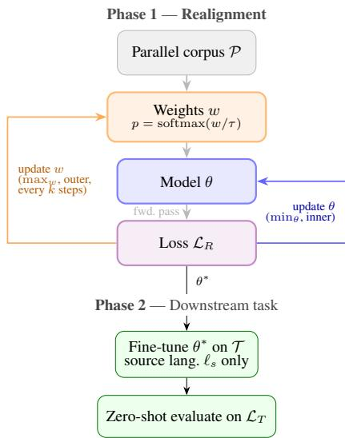  
Figure 1: Overview of our method. Phase 1 depicts the realignment process, where the model is trained on parallel data using a contrastive loss. Phase 2 illustrates the downstream cross-lingual transfer.

Prior work on improving realignment has focused mostly on the algorithmic side (Gaschi et al., 2023; Bakos et al., 2025), with little attention to efficient data utilization. Yet strategic data selection improves generalization, efficiency, and robustness across many settings (Wang and Neubig, 2019; Xie et al., 2023; Albalak et al., 2023; Chen et al., 2025; Anugraha et al., 2025a). The closest work, Nguyen et al. (2025), found that the choice of included languages matters, but their selection is static and fixed before training, ignoring that realignment needs may shift as training progresses.

In this work, we propose a dynamic languagewise sampling strategy for the realignment phase. As shown in Figure 1, rather than sampling languages uniformly, we learn per-language weights from the realignment loss, adaptively oversampling languages that benefit most from alignment (Phase 1), then evaluate via standard zero-shot cross-lingual transfer (Phase 2). Our results show consistent improvements over uniform and static baselines, with gains increasing at scale and distributing more evenly across languages. We further show that the approach generalizes to decoderonly models, extending dynamic sampling beyond encoder-only classification settings.

Algorithm 1 Adaptive Sampling for Language-  
Weighted Realignment   
Require: Parallel data P, language pool ${ \mathcal { L } } _ { T } ,$ inner steps $k ,$   
temperature τ   
1: Initialize model parameters θ, lang. weights $w \in \mathbb { R } ^ { | \mathcal { L } _ { T } | }$   
2: for each outer iteration t do   
3: p ← softmax $( w / \tau )$ ▷ language sampling distribution   
4: $L \in \mathbb { R } ^ { | \mathcal { L } _ { T } | }  \mathbf { 0 }$ ▷ per-language loss accumulator   
5: for $i = 1 , \ldots , k$ do ▷ inner loop   
6: Sample batch $\widetilde { \mathcal { P } } _ { i }$ from $\mathcal { P }$ according to p   
7: $\theta \gets \theta - \nabla _ { \theta } L _ { R } ( \theta ; \widetilde { \mathcal { P } } _ { i } )$ ▷ Eq. 1   
8: Accumulate language contributions to $L _ { R }$ into L   
9: end for   
10: w ← updateWeights $( L , w )$ ▷ variant-specific   
11: end for

## 2 Methodology

In our setup, only the source language (English) carries task supervision; we evaluate zero-shot transfer to a set of target languages $\mathcal { L } _ { T }$ . Since target-language labels are unavailable, we use a contrastive realignment loss over parallel data as a language-agnostic proxy that pulls cross-lingual sentence representations together, following Wu and Dredze (2020).

Following Wu and Dredze (2020); Gaschi et al. (2023), for a batch $\mathcal { P }$ of parallel pairs $( x , y )$ of source and target representations,

$$
L _ { R } = - \frac { 1 } { 2 | \mathcal { P } | } \sum _ { ( x , y ) \in \mathcal { P } } \left[ \log \sigma ( x , y ) + \log \sigma ( y , x ) \right]\tag{1}
$$

where $\sigma ( x , y )$ is the in-batch contrastive softmax over cosine similarities with temperature $T _ { R } = 0 . 1$ (full form in Appendix C.1). The two terms enforce alignment symmetrically.

## 2.1 Adaptive Language Sampling

We hypothesize that realignment requires more frequent exposure to “difficult” languages (linguistically distant or low-resource), and that these requirements shift as training progresses. Thus, we introduce a bi-level optimization that adaptively samples languages depending on the training progression during realignment. Our framework is summarized in Algorithm 1. We assign a scalar weight $w _ { \ell }$ to each $\ell ~ \in ~ \mathcal { L } _ { T }$ , collected in $w \in \mathbb { R } ^ { | \mathcal { L } _ { T } | }$ , inducing a sampling distribution $p = \operatorname { s o f t m a x } ( w / \tau )$ with temperature $\tau .$ . An inner loop optimizes $L _ { R }$ with respect to θ, sampling languages according to $p ;$ every k inner steps, an outer loop updates w from the accumulated per-language loss signal so as to maximize $L _ { R }$ , focusing sampling on languages that remain hard to align.

UCB-based re-weighting. We frame language selection as a multi-armed bandit, each language an arm whose reward is its per-language realignment loss (Auer et al., 2002). Let $n _ { \ell }$ be the number of times ℓ has been sampled and $\bar { r } _ { \ell }$ its mean reward; at outer iteration t,

$$
\mathbf { U C B } _ { \ell } ( t ) = \bar { r } _ { \ell } + c \sqrt { \frac { \ln t } { n _ { \ell } + 1 } } ,\tag{2}
$$

where $c > 0$ controls exploration. The first term exploits high-loss (under-aligned) languages; the second explores infrequently sampled ones. Unsampled languages receive a score above the current maximum to guarantee initial coverage. We set $w _ { \ell } \gets \mathrm { U C B } _ { \ell } ( t )$

Gradient-based variant. As an alternative, w can be updated by gradient ascent on the weighted outer-loop loss $\sum _ { i } w _ { i } L _ { i }$ , trading UCB’s explicit exploration term for a smooth, differentiable update (details in Appendix C.2).

## 3 Experimental Setup

Models. Our main object of study is XLM-R Large (Conneau et al., 2020), a 560M-parameter encoder-only model pretrained on 100 languages. To test generalization to decoder-only models, we additionally include Gemma 2 9B (Team et al., 2024), trained with LoRA adapters (Hu et al., 2022) due to resource constraints, following Liu and Niehues (2025). We discuss the rationale for focusing on encoder-only models and classification tasks in Appendix A and justification for using LoRA for generative models in Appendix C.4.

We also perform a post-hoc analysis on models that weren’t involved in the other experiments, to demonstrate the off-the-shelf effectiveness of our UCB-based approach (Section 4.5). We include three additional encoder-only models and one decoder-only model: mBERT (Devlin et al., 2018), mDeBERTa v3 (He et al., 2021), mm-BERT (Marone et al., 2026) and Llama 3.1 8B (Grattafiori et al., 2024). These four models constitute the complete set considered for this analysis. For the encoder-only models, we replicate the XLM-R Large training configuration. For Llama 3.1 8B, we mirror the Gemma 2 9B settings by employing LoRA adapters. For the gradient-based experiment, we used the outer-loop learning rate of 10−3 for all models.

Data and tasks. We follow Nguyen et al. (2025), evaluating on NER, POS, and NLI across 65 languages (29 low-resource), with parallel realignment data from OPUS-100 and NLLB. Additional dataset details and random seeds are provided in Appendix C.5.

Baselines. We compare against Fine-tuning only (no realignment), Uniform realignment, and Most-URIEL (Littell et al., 2017), the 40 most typologically diverse languages from Nguyen et al. (2025). Our methods are UCB-based and Gradient-based, all over the same 64 languages. Hyper-parameters were fixed via a small grid search on XLM-R base (Appendix C.3).

## 4 Results

## 4.1 Results Overview

Table 1 reports the cross-lingual performance gains of four realignment experiments compared to finetuning-only for 2 different model types. All realignment methods improve on the fine-tuning-only baseline for both models, confirming the general effectiveness of realignment. Besides Uniform realignment for POS and gradient-based sampling for NER with Gemma, all realignment methods bring a performance gain ranging from 0.42 to 6.81 points, depending on the method and task.

On XLM-R, both dynamic methods (UCB and gradient-based) outperform the static baselines (Uniform, Most-URIEL). On average, the gradientbased approach achieves the highest gain, at the same time outperforming both uniform sampling and most-URIEL baseline, indicating that the dynamic sampling strategies are more effective than static subset selection or uniform sampling. These gains are consistent over tasks, with the largest improvements observed in NLI, with the UCB-based method achieving a gain of +1.24 points over uniform sampling.

On Gemma, the gradient-based method largely fails to generalize, whereas UCB still achieves positive gains across all three downstream tasks, suggesting that the gradient-based approach is more brittle across architectures. Unlike XLM-R, the realignment gains on Gemma are concentrated mainly on NLI tasks, reaching up to 6.81 points of improvement. In some cases, realignment even harms POS tagging and NER performance, although the decoder-only architecture of Gemma is not well-suited for these token-level tasks as it cannot infer a token class from future tokens while encoder-only models can (Dukic and Šna-´ jder, 2024).

All realignment methods achieve significant gains on XNLI for Gemma, at least 6 points, while the gap between the different sampling approaches is smaller than their standard deviation. This suggests that for Gemma, realignment itself is highly effective. Furthermore, the UCB-based method demonstrates strong robustness across architectural changes, performing well not only in the transition from encoder-only to decoder-only models, but also under a different training regime that uses adapters instead of full-model fine-tuning.

## 4.2 Resource-level Break Down

Table 2 further breaks down models performance across different resource-level groups, including high-resource languages (HRLs), middle-resource languages (MRLs), low-resource languages (LRLs) seen and unseen. The exact language composition of each group is provided in Appendix C.5. The distinction between seen and unseen LRLs is not made for Gemma, as it is not reported which languages were included in its pre-training data.

Compared to static or uniform sampling, dynamic sampling distributes gains more evenly across resource levels for XLM-R. Most importantly, dynamic sampling mitigates the performance drop on MRLs, where uniform sampling triggers a 0.6 point drop over simple fine-tuning, while UCB-based reduces this drop to only 0.3. Furthermore, XLM-R results on unseen languages demonstrate stronger generalization ability compared to the two realignment baselines, suggesting that dynamic sampling leads to more robust and generalized cross-lingual transfer. Previous literature has shown that realignment can be harmful to some languages (Wu and Dredze, 2020; Gaschi et al., 2023), our results suggest that this is especially the case for MRLs and HRLs, and that dynamic sampling can mitigate this issue.

<table><tr><td>EXP</td><td>NER (F1)</td><td>NLI (Acc)</td><td> $\mathrm { P O S } \left( \mathrm { A c c } \right)$ </td><td>AVG</td></tr><tr><td>XLM-R-Large</td><td></td><td></td><td></td><td></td></tr><tr><td>Fine-tuning only</td><td> $5 7 . 8 3 \pm 0 . 9 0$ </td><td> $6 5 . 5 4 \pm 0 . 3 9$ </td><td> $6 8 . 9 0 \scriptstyle \pm 0 . 6 1$ </td><td> $6 4 . 0 9 \pm 0 . 3 8$ </td></tr><tr><td>Uniform realignment</td><td> $6 1 . 9 7 \pm 0 . 5 7 \ ( + 4 . 1 4 )$ </td><td> $6 7 . 7 0 \pm 0 . 3 4 \ : \left( + 2 . 1 6 \right)$ </td><td> $7 1 . 5 6 \pm 0 . 4 0 \ : \left( + 2 . 6 7 \right)$ </td><td> $6 7 . 0 8 \pm 0 . 1 3 \ : \left( + 2 . 9 9 \right)$ </td></tr><tr><td>Most-URIEL</td><td> $6 2 . 0 0 \pm 0 . 5 6 \ ( + 4 . 1 7 )$ </td><td> $6 7 . 9 8 \pm 0 . 3 2 \ : \ : ( + 2 . 4 4 )$ </td><td> $7 0 . 9 3 \pm 0 . 3 5 \ : \left( + 2 . 0 3 \right)$ </td><td> $6 6 . 9 7 \pm 0 . 3 7 \ ( + 2 . 8 8 )$ </td></tr><tr><td>Gradient-based</td><td> ${ \bf 6 2 . 2 5 _ { \pm 1 . 1 0 } \ ( + 4 . 4 2 ) }$ </td><td> $6 8 . 6 5 \pm 0 . 2 9 \ ( + 3 . 1 1 )$ </td><td> $7 2 . 3 3 \pm 0 . 3 4 \ : \left( + 3 . 4 4 \right)$ </td><td> ${ \bf 6 7 . 7 5 \_ 3 1 } \left( \bf + 3 . 6 6 \right)$ </td></tr><tr><td>UCB-based</td><td> $6 1 . 9 3 \pm 0 . 7 9 ( + 4 . 0 9 )$ </td><td> ${ \bf 6 8 . 9 4 _ { \pm 0 . 0 2 } \ ( + 3 . 4 0 ) }$ </td><td> $7 2 . 3 3 \pm 0 . 4 2 ( + 3 . 4 4 )$ </td><td> $6 7 . 7 3 \pm 0 . 1 3 ( + 3 . 6 4 )$ </td></tr><tr><td>Gemma-2-9b</td><td></td><td></td><td></td><td></td></tr><tr><td>Fine-tuning only</td><td> $3 6 . 0 9 \pm 1 . 1 8$ </td><td> $6 3 . 3 0 \pm 3 . 6 7$ </td><td> $4 9 . 0 9 \pm 0 . 9 4$ </td><td> $4 9 . 4 9 \pm 1 . 4 2$ </td></tr><tr><td>Uniform realignment</td><td> $3 6 . 5 1 \pm 1 . 3 5 ( + 0 . 4 2 )$ </td><td> $6 9 . 9 7 \pm 1 . 0 8 \ ( + 6 . 6 7 )$ </td><td> $4 8 . 2 2 \pm 4 . 7 0 ( - 0 . 8 7 )$ </td><td> $5 1 . 5 7 \pm 2 . 2 4 \ ( + 2 . 0 7 )$ </td></tr><tr><td>Most-URIEL</td><td> $\mathbf { 3 7 . 6 0 \_ } _ { \mathbf { \ell } \mathbf { 1 . 1 7 } } \mathbf { \ell } ( \mathbf { + 1 . 5 1 } )$ </td><td> $\mathbf { 7 0 . 1 1 \bot 1 0 1 \ } ( + 6 . 8 1 )$ </td><td> ${ \bar { 5 } } 1 . 8 3 _ { \textrm { } \pm 0 . 8 5 } \ ( + 2 . 7 4 )$ </td><td> ${ \bf 5 3 . 1 8 \_ 0 . 2 8 \ ( + 3 . 6 9 ) }$ </td></tr><tr><td>Gradient-based</td><td> $3 4 . 5 4 \pm 3 . 9 4 ( - 1 . 5 5 )$ </td><td> $6 9 . 3 1 \pm 0 . 8 1 \ ( + 6 . 0 1 )$ </td><td> $5 0 . 1 5 _ { \scriptsize \pm 1 . 4 1 } ( + 1 . 0 6 )$ </td><td> $5 1 . 3 3 \pm 1 . 4 5 ( + 1 . 8 4 )$ </td></tr><tr><td>UCB-based</td><td> $3 7 . 0 6 \pm 0 . 3 0 \ ( + 0 . 9 7 )$ </td><td> $6 9 . 3 6 \pm 0 . 3 6 \ ( + 6 . 0 7 )$ </td><td> $5 0 . 0 6 \pm \Game . 9 7 \ ( + 0 . 9 7 )$ </td><td> $5 2 . 1 6 _ { \pm 1 . 8 7 } ^ { - } ( + 2 . 6 7 )$ </td></tr></table>

Table 1: Average performance across three random seeds for each task and across all three tasks, comparing three baselines with two dynamic sampling strategies. All realignment experiments use 16,000 realignment steps.

<table><tr><td>type</td><td>HRL</td><td>MRL</td><td> $\mathrm { L R L } _ { \mathrm { s e c n } }$ </td><td> $\mathrm { L R L } _ { \mathrm { u n s e c n } }$ </td></tr><tr><td>Fine-tuning only</td><td> $7 5 . 8 6 _ { \pm 0 . 2 5 }$ </td><td> $7 7 . 4 7 _ { \pm 0 . 2 1 }$ </td><td> $5 5 . 0 3 _ { \pm 0 . 9 2 }$ </td><td> $4 3 . 7 4 _ { \pm 1 . 0 1 }$ </td></tr><tr><td>Uniform realignment</td><td> $7 5 . 0 3 _ { \pm 0 . 6 2 }$ </td><td> $7 6 . 8 7 _ { \pm 0 . 1 6 }$ </td><td> $5 5 . 8 8 _ { \pm 0 . 7 2 }$ </td><td> $5 3 . 1 3 _ { \pm 0 . 1 0 }$ </td></tr><tr><td>Most-URIEL</td><td> $7 4 . 9 6 _ { \pm 0 . 0 8 }$ </td><td> $7 6 . 9 5 _ { \pm 0 . 0 9 }$ </td><td> $5 6 . 2 4 _ { \pm 0 . 5 0 }$ </td><td> $5 2 . 5 8 _ { \pm 0 . 8 9 }$ </td></tr><tr><td>Gradient-based</td><td> $7 5 . 1 4 _ { \pm 0 . 9 2 }$ </td><td> $7 7 . 0 5 _ { \pm 0 . 1 8 }$ </td><td> $5 5 . 5 1 _ { \pm 0 . 7 5 }$ </td><td> ${ \bar { 5 } } 4 . 7 4 _ { \pm 0 . 2 7 }$ </td></tr><tr><td>UCB-based</td><td> $7 5 . 0 2 _ { \pm 0 . 3 1 }$ </td><td> $7 7 . 2 3 _ { \pm 0 . 0 5 }$ </td><td> $5 5 . 6 5 _ { \pm 0 . 2 1 }$ </td><td> $5 4 . 5 4 _ { \pm 0 . 1 9 }$ </td></tr></table>

Table 2: Cross-lingual transfer performance of XLM-R Large in different resource-level language groups.

<table><tr><td></td><td>XLM-R</td><td>Gemma</td></tr><tr><td>Avg. gain UCB – Uniform</td><td>+0.67</td><td>+0.60</td></tr><tr><td>Win rate  $\mathrm { U C B } > \mathrm { U n i f o r m }$ </td><td>64.2%</td><td>51.0%</td></tr></table>

Table 3: Average accuracy gap and language-level win rate of UCB-based over uniform realignment (N=441 task–language–seed triplets).

## 4.3 Win Rate vs. Average Gap

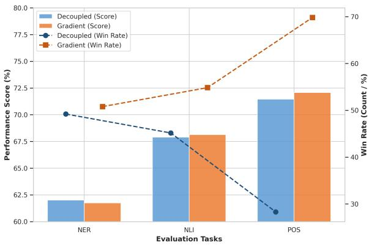  
Figure 2: Performance and Win-rate comparison between the gradient-based method and the decoupled variant using seed 42 with 32,000 realignment steps.

## 4.4 Decoupling Language Weights from Dynamic Adaptation

The average gains in Table 1 understate the impact of dynamic sampling. Table 3 contrasts the average gap with the language-level win rate, computed across all (task, language, seed) triplets. On XLM-R, UCB only improves the macro-average by +0.65 points, but it outperforms uniform realignment on 64.2% of individual triplets, indicating that the gains are spread across the benchmark rather than concentrated on a few languages. On Gemma the effect is smaller (win rate 51.0%). The full pairwise win rate matrix across all methods and both models, together with a detailed analysis, is provided in Appendix D.3.

A natural question is whether the gains stem from discovering a better language distribution or from the dynamic co-adaptation of sampling and model parameters. To disentangle these effects, we conduct a decoupling ablation on XLM-R-Large: we first learn language weights with the model frozen, then freeze those weights and run realignment using this fixed distribution, followed by standard fine-tuning.

Figure 2 shows that although the downstream task performance differences are relatively small, the gradient-based method achieves better taskwise win–loss rates and more generalized crosslingual transfer compared to the decoupled variant. This suggests that the benefit of dynamic sampling does not primarily come from converging to a single optimal distribution, but rather from the co-evolution of language weights and model representations throughout training. As realignment reshapes the embedding space, the relative alignment difficulty of each language also changes, requiring the sampling strategy to adapt dynamically. In particular, language weights that are effective during the early stages of training may become suboptimal later on. As a result, any fixed distribution, even one initially learned from the loss signal, may eventually become misaligned with the model’s evolving training needs.

<table><tr><td></td><td>Fine-tuning Only</td><td>Uniform</td><td>Most URIEL</td><td>UCB-based (Ours)</td><td>Gradient-based (Ours)</td></tr><tr><td>mBERT</td><td>56.27 ±0.09</td><td> $\overline { { { \bf 6 1 . 1 8 _ { \pm 0 . 0 8 } } } }$ </td><td> $\overline { { 6 0 . 7 0 \pm 0 . 1 5 } }$ </td><td> $\overline { { 6 1 . 1 7 \pm 0 . 2 5 } }$ </td><td> $\overline { { 6 1 . 0 5 \ \pm 0 . 2 5 } }$ </td></tr><tr><td>mDeBERTa v3</td><td> $6 6 . 3 6 \pm 0 . 3 0$ </td><td> $6 6 . 8 3 \pm 0 . 3 5$ </td><td> $6 6 . 0 9 \pm 0 . 0 3$ </td><td> ${ \bf 6 6 . 9 6 \pm 0 . 2 1 }$ </td><td> $6 6 . 8 5 \pm 0 . 2 5$ </td></tr><tr><td>mmBERT</td><td> $5 4 . 7 2 \pm 1 . 3 0$ </td><td> $6 1 . 2 1 \pm 0 . 7 8$ </td><td> $6 1 . 0 1 \pm 0 . 4 6$ </td><td> $\underline { { 6 1 . 4 8 } } \pm 0 . 7 6$ </td><td> ${ \bf 6 1 . 9 1 } _ { \pm 0 . 7 0 }$ </td></tr><tr><td>Llama 3.1 8B</td><td> $4 2 . 3 0 \pm \mathrm { 0 } . 3 3$ </td><td> $4 5 . 1 0 \pm 2 . 9 2$ </td><td> $4 5 . 4 8 \pm 1 . 5 2$ </td><td> $4 5 . 2 0 \pm 2 . 4 1$ </td><td> ${ \pm 5 . 8 0 } _ { \pm 1 . 3 6 }$ </td></tr><tr><td>XLM-R Large</td><td> $\overline { { 6 4 } } . \overline { { 0 9 } } _ { \pm 0 . 3 8 } ^ { - }$ </td><td> $\overline { { 6 7 } } . 0 \overline { { 8 } } \overset { - } { \pm } 0 . 1 3$ </td><td> $6 6 . 9 7 \pm 0 . 3 7$ </td><td> $\underline { { 6 7 . 7 3 } } = 0 . 1 3$ </td><td> $\mathbf { \bar { 6 7 . 7 5 } } _ { \pm 0 . 3 1 } ^ { - }$ </td></tr><tr><td>Gemma-2-9b</td><td> $4 9 . 4 9 \pm 1 . 4 2$ </td><td> $5 1 . 5 7 \pm 2 . 2 4$ </td><td> ${ \bar { 5 } } 3 . 1 8 _ { \pm 0 . 2 8 }$ </td><td> $5 1 . 3 3 \pm 1 . 8 7$ </td><td> $\underline { { 5 2 . 1 6 } } \pm 1 . 4 5$ </td></tr></table>

Table 4: Macro-average performance of additional encoder-only and decoder-only models on the same three tasks with the same setting and three seeds as XLM-R and Gemma 2. Bold indicates best, and underline indicates second-best in a row. The bottom two rows, separated by the dashed line, are imported from Table 1 for direct comparison. Details per task can be found in Appendix Table 7.

## 4.5 Robustness across different models

To demonstrate the robustness of our approach across different models, we extend our evaluation to include three additional encoder-only models (mBERT, mDeBERTa v3, and mmBERT) and one decoder-only model (Llama 3.1 8B).

Table 4 indicate that our two proposed approaches outperform both uniform sampling and standard fine-tuning across the majority of evaluated models. While the Most-URIEL baseline surpasses uniform sampling on decoder-only models, it consistently underperforms on encoder-only architectures. Furthermore, although Most-URIEL previously set a strong baseline on Gemma-2-9B, our Gradient-based strategy exceeds it, achieving the highest macro-average results on Llama 3.1 8B, yielding up to a 3.5% point gain over fine-tuning alone. Overall, these results demonstrate that our proposed methods offer superior consistency across diverse model architectures and training recipes over uniform sampling or performing realignment on a fixed subset.

## 5 Conclusion

Our work introduces two dynamic sampling strategies for parallel data selection during realignment that yield more generalized improvements on XLM-R-Large. Furthermore, we extend and validate the benefits of realignment for decoderonly models in multilingual natural language understanding. Lastly, we find that average accuracy understates the advantage of dynamic sampling:

gains are more evenly distributed across languages, improving or maintaining LRL results while mitigating the MRL accuracy drop that realignment can trigger. Among our approaches, UCB-based sampling shows greater robustness to training duration and hyperparameter choice, requiring no per-model tuning to remain competitive, whereas gradient-based strategies can achieve larger gains on some architectures (e.g. mmBERT, Llama 3.1 8B) but need model-wise configuration tuning and are more prone to degrading outside their tuned regime. We hope this work encourages further research on data utilization strategies for continual multilingual training and cross-lingual transfer.

## Limitations

The conclusions of this work are limited by the scope of our experiments, which focus on encoderonly models and classification tasks, due to a limited availability of resources, both computational and data-related. The compute we had only allowed for realignment with adapters on small LLMs (9B model), and the lack of large-scale multilingual generative benchmarks covering a wide range of LRLs motivated us to focus on classification tasks. Although we include results for a decoder-only model, a more comprehensive evaluation on generative tasks would be a valuable complement to this work.

Due to a lack of available human speakers of the studied low-resource languages, and the large scale of our experiments, we only evaluate on quantitative metrics, which might not fully capture the quality of the realignment and its downstream impact. Future work could focus on a smaller set of languages and include a more qualitative evaluation, especially regarding generative tasks, given the limitations of quantitative metrics for generative tasks.

Because we can only evaluate on the languages for which we have annotated data in at least one downstream task, our evaluation is limited to 78 languages, which is a small fraction of the world’s languages. Although this is a sizable coverage, it still limits the generalizability of our conclusions, and presents the risk of overexposure to certain language families and typological features.

## References

David Ifeoluwa Adelani, Graham Neubig, Sebastian Ruder, Shruti Rijhwani, Michael Beukman, Chester Palen-Michel, Constantine Lignos, Jesujoba O. Alabi, Shamsuddeen H. Muhammad, Peter Nabende, Cheikh M. Bamba Dione, Andiswa Bukula, Rooweither Mabuya, Bonaventure F. P. Dossou, Blessing Sibanda, Happy Buzaaba, Jonathan Mukiibi, Godson Kalipe, Derguene Mbaye, and 26 others. 2022. MasakhaNER 2.0: Africa-centric transfer learning for named entity recognition. In Proceedings of the 2022 Conference on Empirical Methods in Natural Language Processing, pages 4488–4508, Abu Dhabi, United Arab Emirates. Association for Computational Linguistics.

David Ifeoluwa Adelani, Jessica Ojo, Israel Abebe Azime, Jian Yun Zhuang, Jesujoba Oluwadara Alabi, Xuanli He, Millicent Ochieng, Sara Hooker, Andiswa Bukula, En-Shiun Annie Lee, Chiamaka Ijeoma Chukwuneke, Happy Buzaaba, Blessing Kudzaishe Sibanda, Godson Koffi Kalipe, Jonathan Mukiibi, Salomon Kabongo Kabenamualu, Foutse Yuehgoh, Mmasibidi Setaka, Lolwethu Ndolela, and 8 others. 2025. IrokoBench: A new benchmark for African languages in the age of large language models. In Proceedings ofthe 2025 Conference ofthe Nations of the Americas Chapter of the Association for Computational Linguistics: Human Language Technologies (Volume 1: Long Papers), pages 2732–2757, Albuquerque, New Mexico. Association for Computational Linguistics.

Alon Albalak, Liangming Pan, Colin Raffel, and William Yang Wang. 2023. Efficient online data mixing for language model pre-training. Preprint, arXiv:2312.02406.

David Anugraha, Zilu Tang, Lester James V Miranda, Hanyang Zhao, Mohammad Rifqi Farhansyah, Garry Kuwanto, Derry Wijaya, and Genta Indra Winata. 2025a. R3: Robust rubric-agnostic reward models. arXiv preprint arXiv:2505.13388.

David Anugraha, Genta Indra Winata, Chenyue Li, Patrick Amadeus Irawan, and En-Shiun Annie Lee. 2025b. ProxyLM: Predicting language model performance on multilingual tasks via proxy models. In Findings of the Association for Computational Linguistics: NAACL 2025, pages 1981–2011, Albuquerque, New Mexico. Association for Computational Linguistics.

Peter Auer, Nicolò Cesa-Bianchi, and Paul Fischer. 2002. Finite-time analysis of the multiarmed bandit problem. Machine Learning, 47:235–256.

Steve Bakos, David Guzmán, Riddhi More, Kelly Chutong Li, Félix Gaschi, and En-Shiun Annie Lee. 2025. AlignFreeze: Navigating the impact of realignment on the layers of multilingual models across diverse languages. In Proceedings of the 2025 Conference of the Nations of the Americas Chapter of the Association for Computational Linguistics: Human Language Technologies (Volume 2: Short Papers), pages 562–586, Albuquerque, New Mexico. Association for Computational Linguistics.

Nicolas Boizard, Hippolyte Gisserot-Boukhlef, Duarte Miguel Alves, Andre Martins, Ayoub Hammal, Caio Corro, CELINE HUDELOT, Emmanuel Malherbe, Etienne Malaboeuf, Fanny Jourdan, Gabriel Hautreux, João Alves, Kevin El Haddad, Manuel Faysse, Maxime Peyrard, Nuno M Guerreiro, Patrick Fernandes, Ricardo Rei, and Pierre Colombo. 2025. EuroBERT: Scaling multilingual encoders for european languages. In Second Conference on Language Modeling.

Steven Cao, Nikita Kitaev, and Dan Klein. 2020. Multilingual alignment of contextual word representations. Preprint, arXiv:2002.03518.

Zhuoyue Chen, Jihai Zhang, Ben Liu, Fangquan Lin, and Wotao Yin. 2025. Scale down to speed up: Dynamic data selection for reinforcement learning. In Findings ofthe Associationfor Computational Linguistics: EMNLP 2025, pages 7806–7817, Suzhou, China. Association for Computational Linguistics.

Jonathan H. Clark, Eunsol Choi, Michael Collins, Dan Garrette, Tom Kwiatkowski, Vitaly Nikolaev, and Jennimaria Palomaki. 2020. TyDi QA: A benchmark for information-seeking question answering in typologically diverse languages. In Transactions of the Associationfor Computational Linguistics, volume 8, pages 454–470.

Alexis Conneau, Kartikay Khandelwal, Naman Goyal, Vishrav Chaudhary, Guillaume Wenzek, Francisco Guzmán, Edouard Grave, Myle Ott, Luke Zettlemoyer, and Veselin Stoyanov. 2020. Unsupervised cross-lingual representation learning at scale. In Proceedings of the 58th Annual Meeting of the Association for Computational Linguistics, pages 8440– 8451, Online. Association for Computational Linguistics.

Alexis Conneau, Guillaume Lample, Ruty Rinott, Adina Williams, Samuel R Bowman, Holger Schwenk, and Veselin Stoyanov. 2018. Xnli: Evaluating crosslingual sentence representations. arXiv preprint arXiv:1809.05053.

Marta R Costa-Jussà, James Cross, Onur Çelebi, Maha Elbayad, Kenneth Heafield, Kevin Heffernan, Elahe Kalbassi, Janice Lam, Daniel Licht, Jean Maillard, and 1 others. 2022. No language left behind: Scaling

human-centered machine translation. arXiv preprint arXiv:2207.04672.

Marie-Catherine De Marneffe, Christopher D Manning, Joakim Nivre, and Daniel Zeman. 2021. Universal dependencies. Computational linguistics, 47(2):255– 308.

Jacob Devlin, Ming-Wei Chang, Kenton Lee, and Kristina Toutanova. 2018. BERT: pre-training of deep bidirectional transformers for language understanding. CoRR, abs/1810.04805.

Cheikh M. Bamba Dione, David Ifeoluwa Adelani, Peter Nabende, Jesujoba Alabi, Thapelo Sindane, Happy Buzaaba, Shamsuddeen Hassan Muhammad, Chris Chinenye Emezue, Perez Ogayo, Anuoluwapo Aremu, Catherine Gitau, Derguene Mbaye, Jonathan Mukiibi, Blessing Sibanda, Bonaventure F. P. Dossou, Andiswa Bukula, Rooweither Mabuya, Allahsera Auguste Tapo, Edwin Munkoh-Buabeng, and 25 others. 2023. MasakhaPOS: Part-of-speech tagging for typologically diverse African languages. In Proceedings of the 61st Annual Meeting of the Association for Computational Linguistics (Volume 1: Long Papers), pages 10883–10900, Toronto, Canada. Association for Computational Linguistics.

David Dukic and Jan Šnajder. 2024. ´ Looking right is sometimes right: Investigating the capabilities of decoder-only LLMs for sequence labeling. In Findings ofthe Associationfor Computational Linguistics: ACL 2024, pages 14168–14181, Bangkok, Thailand. Association for Computational Linguistics.

Abteen Ebrahimi, Manuel Mager, Arturo Oncevay, Vishrav Chaudhary, Luis Chiruzzo, Angela Fan, John Ortega, Annette Rios, Gustavo A. Giménez-Lugo, Ivan Vladimir Meza Ruiz, Graham Neubig, Alexis Palmer, Rolando Coto-Solano, Ngoc Thang Vu, and Katharina Kann. 2022. AmericasNLI: Evaluating zero-shot natural language understanding of pretrained multilingual models in truly low-resource languages. In Proceedings of the 60th Annual Meeting ofthe Associationfor Computational Linguistics (Volume 1: Long Papers), pages 6351–6377. Association for Computational Linguistics.

Pavel Efimov, Leonid Boytsov, Elena Arslanova, and Pavel Braslavski. 2023. The Impact ofCross-Lingual Adjustment ofContextual Word Representations on Zero-Shot Transfer, page 51–67. Springer Nature Switzerland.

Ahmed Elshabrawy, Thanh-Nhi Nguyen, Yeeun Kang, Lihan Feng, Annant Jain, Faadil Abdullah Shaikh, Jonibek Mansurov, Mohamed Fazli Mohamed Imam, Jesus-German Ortiz-Barajas, Rendi Chevi, and Alham Fikri Aji. 2025. Statement-tuning enables efficient cross-lingual generalization in encoder-only models. In Findings ofthe Associationfor Computational Linguistics: ACL 2025, pages 16226–16248, Vienna, Austria. Association for Computational Linguistics.

Chelsea Finn, Pieter Abbeel, and Sergey Levine. 2017. Model-agnostic meta-learning for fast adaptation of deep networks. In Proceedings ofthe 34th International Conference on Machine Learning, volume 70 of Proceedings of Machine Learning Research, pages 1126–1135. PMLR.

Felix Gaschi, Patricio Cerda, Parisa Rastin, and Yannick Toussaint. 2023. Exploring the relationship between alignment and cross-lingual transfer in multilingual transformers. In Findings ofthe Associationfor Computational Linguistics: ACL 2023, pages 3020–3042, Toronto, Canada. Association for Computational Linguistics.

Aaron Grattafiori and 1 others. 2024. The llama 3 herd of models. arXiv preprint arXiv:2407.21783.

Pengcheng He, Jianfeng Gao, and Weizhu Chen. 2021. Debertav3: Improving deberta using electra-style pretraining with gradient-disentangled embedding sharing. Preprint, arXiv:2111.09543.

Aung Kyaw Htet and Mark Dras. 2025. Myanmar xnli: Building a dataset and exploring low-resource approaches to natural language inference with myanmar. Preprint, arXiv:2504.09645.

Edward J Hu, yelong shen, Phillip Wallis, Zeyuan Allen-Zhu, Yuanzhi Li, Shean Wang, Lu Wang, and Weizhu Chen. 2022. LoRA: Low-rank adaptation of large language models. In International Conference on Learning Representations.

Junjie Hu, Sebastian Ruder, Aditya Siddhant, Graham Neubig, Orhan Firat, and Melvin Johnson. 2020. XTREME: A massively multilingual multitask benchmark for evaluating cross-lingual generalisation. In Proceedings of the 37th International Conference on Machine Learning.

Pratik Joshi, Sebastin Santy, Amar Budhiraja, Kalika Bali, and Monojit Choudhury. 2020. The state and fate of linguistic diversity and inclusion in the NLP world. In Proceedings of the 58th Annual Meeting of the Association for Computational Linguistics, pages 6282–6293, Online. Association for Computational Linguistics.

Amir Hossein Kargaran, Ali Modarressi, Nafiseh Nikeghbal, Jana Diesner, François Yvon, and Hinrich Schuetze. 2025. MEXA: Multilingual evaluation of English-centric LLMs via cross-lingual alignment. In Findings of the Association for Computational Linguistics: ACL 2025, pages 27001–27023, Vienna, Austria. Association for Computational Linguistics.

Patrick Lewis, Barı¸s Oguz, Ruty Rinott, Sebastianˇ Riedel, and Holger Schwenk. 2020. MLQA: Evaluating cross-lingual extractive question answering. In Proceedings of the 58th Annual Meeting of the Associationfor Computational Linguistics, pages 7315– 7330. Association for Computational Linguistics.

Patrick Littell, David R. Mortensen, Ke Lin, Katherine Kairis, Carlisle Turner, and Lori Levin. 2017. URIEL

and lang2vec: Representing languages as typological, geographical, and phylogenetic vectors. In Proceedings of the 15th Conference of the European Chapter of the Association for Computational Linguistics: Volume 2, Short Papers, pages 8–14, Valencia, Spain. Association for Computational Linguistics.

Danni Liu and Jan Niehues. 2025. Middle-layer representation alignment for cross-lingual transfer in fine-tuned LLMs. In Proceedings of the 63rd Annual Meeting of the Association for Computational Linguistics (Volume 1: Long Papers), pages 15979– 15996, Vienna, Austria. Association for Computational Linguistics.

Shayne Longpre, Yi Lu, and Joachim Daiber. 2021. MKQA: A linguistically diverse benchmark for multilingual open domain question answering. In Transactions ofthe Associationfor Computational Linguistics, volume 9, pages 1389–1406.

Rahmad Mahendra, Alham Fikri Aji, Samuel Louvan, Fahrurrozi Rahman, and Clara Vania. 2021. IndoNLI: A natural language inference dataset for Indonesian. In Proceedings of the 2021 Conference on Empirical Methods in Natural Language Processing, pages 10511–10527, Online and Punta Cana, Dominican Republic. Association for Computational Linguistics.

Marc Marone, Orion Weller, William Fleshman, Eugene Yang, Dawn Lawrie, and Benjamin Van Durme. 2026. mmBERT: A modern multilingual encoder with annealed language learning. In Forty-third International Conference on Machine Learning.

Quang Phuoc Nguyen, David Anugraha, Félix Gaschi, Jun Bin Cheng, and En-Shiun Annie Lee. 2025. Rethinking what matters: Effective and robust multilingual realignment for low-resource languages. In Proceedings ofthe 14th International Joint Conference on Natural Language Processing and the 4th Conference of the Asia-Pacific Chapter of the Associationfor Computational Linguistics, pages 1877– 1905, Mumbai, India. The Asian Federation of Natural Language Processing and The Association for Computational Linguistics.

Alex Nichol, Joshua Achiam, and John Schulman. 2018. On first-order meta-learning algorithms. Preprint, arXiv:1803.02999.

Xiaoman Pan, Boliang Zhang, Jonathan May, Joel Nothman, Kevin Knight, and Heng Ji. 2017. Cross-lingual name tagging and linking for 282 languages. In Proceedings ofthe 55th Annual Meeting ofthe Associationfor Computational Linguistics (Volume 1: Long Papers), pages 1946–1958, Vancouver, Canada. Association for Computational Linguistics.

Telmo Pires, Eva Schlinger, and Dan Garrette. 2019. How multilingual is multilingual BERT? In Proceedings of the 57th Annual Meeting of the Association for Computational Linguistics, pages 4996–5001, Florence, Italy. Association for Computational Linguistics.

Mengye Ren, Wenyuan Zeng, Bin Yang, and Raquel Urtasun. 2019. Learning to reweight examples for robust deep learning. Preprint, arXiv:1803.09050.

Sebastian Ruder, Noah Constant, Jan Botha, Aditya Siddhant, Orhan Firat, Jinlan Fu, Pengfei Liu, Junjie Hu, Dan Garrette, Graham Neubig, and Melvin Johnson. 2021. XTREME-R: Towards more challenging and nuanced multilingual evaluation. In Proceedings of the 2021 Conference on Empirical Methods in Natural Language Processing, pages 10215–10245, Online and Punta Cana, Dominican Republic. Association for Computational Linguistics.

Hanna Shcharbakova, Tatiana Anikina, Natalia Skachkova, and Josef Van Genabith. 2025. When scale meets diversity: Evaluating language models on fine-grained multilingual claim verification. In Proceedings ofthe Eighth Fact Extraction and VERification Workshop (FEVER), pages 69–84, Vienna, Austria. Association for Computational Linguistics.

Gemma Team, Morgane Riviere, Shreya Pathak, Pier Giuseppe Sessa, Cassidy Hardin, Surya Bhupatiraju, Léonard Hussenot, Thomas Mesnard, Bobak Shahriari, Alexandre Ramé, Johan Ferret, Peter Liu, Pouya Tafti, Abe Friesen, Michelle Casbon, Sabela Ramos, Ravin Kumar, Charline Le Lan, Sammy Jerome, and 179 others. 2024. Gemma 2: Improving open language models at a practical size. Preprint, arXiv:2408.00118.

NLLB Team, Marta R. Costa-jussà, James Cross, Onur Çelebi, Maha Elbayad, Kenneth Heafield, Kevin Heffernan, Elahe Kalbassi, Janice Lam, Daniel Licht, Jean Maillard, Anna Sun, Skyler Wang, Guillaume Wenzek, Al Youngblood, Bapi Akula, Loic Barrault, Gabriel Mejia Gonzalez, Prangthip Hansanti, and 20 others. 2022. No language left behind: Scaling human-centered machine translation. Preprint, arXiv:2207.04672.

Jörg Tiedemann. 2009. News from OPUS - A Collection of Multilingual Parallel Corpora with Tools and Interfaces, volume V, pages 237–248. University of Helsinki.

Xinyi Wang and Graham Neubig. 2019. Target conditioned sampling: Optimizing data selection for multilingual neural machine translation. In Proceedings of the 57th Annual Meeting of the Association for Computational Linguistics, pages 5823–5828.

Shijie Wu and Mark Dredze. 2020. Do explicit alignments robustly improve multilingual encoders? In Proceedings of the 2020 Conference on Empirical Methods in Natural Language Processing (EMNLP), pages 4471–4482, Online. Association for Computational Linguistics.

Sang Michael Xie, Hieu Pham, Xuanyi Dong, Nan Du, Hanxiao Liu, Yifeng Lu, Percy Liang, Quoc V. Le, Tengyu Ma, and Adams Wei Yu. 2023. Doremi: Optimizing data mixtures speeds up language model pretraining. Preprint, arXiv:2305.10429.

Biao Zhang, Philip Williams, Ivan Titov, and Rico Sennrich. 2020a. Improving massively multilingual neural machine translation and zero-shot translation. In Proceedings of the 58th Annual Meeting of the Associationfor Computational Linguistics, pages 1628– 1639.

Biao Zhang, Philip Williams, Ivan Titov, and Rico Sennrich. 2020b. Improving massively multilingual neural machine translation and zero-shot translation. In Proceedings ofthe 58th Annual Meeting ofthe Associationfor Computational Linguistics, pages 1628– 1639.

## A Scope: classification tasks and choice of models

We focus on classification rather than generative tasks because existing multilingual generative benchmarks have limited language coverage. Question Answering datasets such as TyDiQA, MLQA, and MKQA typically cover at most 11 languages (Clark et al., 2020; Lewis et al., 2020; Longpre et al., 2021), far below the 65-language coverage of the classification benchmarks we use. A comprehensive evaluation on generative tasks is left to future work.

For classification, encoder-only architectures remain preferred due to their size and efficiency (Dukic and Šnajder´ , 2024; Shcharbakova et al., 2025; Elshabrawy et al., 2025), motivating continued investment in recent encoder-only models such as EuroBERT (Boizard et al., 2025) and mm-BERT (Marone et al., 2026). This motivates our main focus on XLM-R Large. To verify that our adaptive sampling approach generalizes beyond encoder-only models, we additionally evaluate it on Gemma 2 9B as a decoder-only test point, following Liu and Niehues (2025).

## B Related Works

Cross-lingual realignment. Bitext-based contrastive realignment pulls together cross-lingual sentence representations by applying a symmetric contrastive loss over in-batch negative pairs sampled from a parallel corpus (Cao et al., 2020; Wu and Dredze, 2020). This approach requires no taskspecific supervision, but gains vary substantially across languages and tasks (Wu and Dredze, 2020). Gaschi et al. (2023) hypothesized that catastrophic forgetting is a systematic failure mode in encoderonly models undergoing realignment; Bakos et al. (2025) mitigated this with AlignFreeze, which selectively freezes model components during training. All four works evaluated on a limited set of predominantly high-resource or European languages.

The emergence of large-scale LRL benchmarks - driven by the Masakhane initiative (Adelani et al., 2022; Dione et al., 2023; Adelani et al., 2025) - made it newly tractable to assess realignment across typologically diverse, low-resource languages. Nguyen et al. (2025) aggregated those low-resource datasets with XTREME-R (Hu et al., 2020), performing realignment in 65 languages including 29 LRLs and evaluating on three tasks and two models. Their key finding is that realignment is particularly impactful for LRLs — especially those unseen during pre-training, where improvements reach up to 10 points — while offering limited returns for high-resource languages. They also show that a linguistically diverse language subset can match or outperform the full pool.

Our work builds directly on this line of research. Nguyen et al. (2025) suggest that some languages might benefit more from realignment than others, but their approach is static and binary: decided once before training begins, with no account of how alignment difficulty shifts across languages as training progresses. We replace this with continuous, online per-language weights learned during realignment itself.

Dynamic language sampling. Dynamic data selection methods have been developed to better allocate training budget based on the informativeness of samples at a given stage of learning (Chen et al., 2025). At the language level, multilingual pretraining research has studied how to adjust the mixture across languages to improve coverage of low-resource ones (Xie et al., 2023; Albalak et al., 2023).

However, dynamic sampling within the realignment phase remains underexplored. Existing realignment methods rely on static, uniform sampling of parallel corpora, which ignores how alignment difficulty varies across language pairs and evolves throughout training. Our work addresses this gap by introducing an online, loss-driven sampling strategy that adapts per-language weights during realignment, without requiring external supervision or a held-out validation set.

Bilevel optimization. Bilevel optimization uses a hierarchical inner–outer loop structure, popularized by MAML (Finn et al., 2017) for meta-learning model initialization and extended to first-order approximations by Reptile (Nichol et al., 2018) for scalability. Ren et al. (2019) adapted this framework to dynamic data reweighting, assigning perexample weights based on their gradient alignment with a clean, held-out validation set.

While our inner-outer loop structure is inspired by this line of work, our setting differs in key ways, and doesn’t constitute a meta-learning setup. We do not have access to a clean validation set with downstream labels for target languages, so our outer loop optimizes language weights based on the realignment loss itself, and can be seen as a form of online curriculum learning that prioritizes hard-to-align languages, rather than a meta-learning approach that optimizes for generalization to unseen tasks.

## C Details about the methodology

## C.1 Full form of the realignment loss

The contrastive term $\sigma ( x , y )$ used in Equation 1 is

$$
\sigma ( x , y ) = \frac { \exp \left( \frac { \sin ( x , y ) } { T _ { R } } \right) } { \sum _ { h \in \mathcal { H } , h \neq x } \exp \left( \frac { \sin ( x , h ) } { T _ { R } } \right) } ,\tag{3}
$$

where sim is cosine similarity, $T _ { R } = 0 . 1$ (Wu and Dredze, 2020), and H is the set of all source and target representations in the batch. The symmetric pair log $\sigma ( x , y ) + \log \sigma ( y , x )$ enforces that x is closer to y than to any other element in $\mathcal { H } ,$ and vice versa.

## C.2 Gradient-based variant

For the gradient-based variant, the outer-loop loss is the weighted sum of the accumulated perlanguage realignment losses over the k inner steps:

$$
L _ { \mathrm { o u t e r } } = \sum _ { i = 1 } ^ { | \mathcal { L } _ { T } | } w _ { i } L _ { i } .\tag{4}
$$

This loss has a closed-form maximizer that puts all the mass on the language with the highest loss; instead we update w by a single gradient-ascent step, producing a smoother trajectory. Compared to UCB, this variant forgoes explicit exploration but produces a smooth, differentiable update signal. The connection between the two variants is analyzed in Appendix C.6.

## C.3 Hyper-parameters

Hyper-parameters were fixed via a small grid search on XLM-R base. For the UCB-based method, we set the exploration coefficient $c { = } 0 . 1$ and the number of inner steps k=5. For the gradient-based method, we use k=10 inner steps and an outer-loop learning rate of 10−3, increased to $1 0 ^ { - 2 }$ for Gemma to compensate for the LoRA adapters’ smaller gradient magnitudes.

During realignment, for XLM-R and Gemma 2, we used (respectively) a batch size of 128 and 16, a learning rate of $7 . 5 \times 1 0 ^ { - 6 }$ and $2 \times 1 0 ^ { - 2 }$ , with 16k realignment steps unless mentioned otherwise.

During fine-tuning, for XLM-R and Gemma 2, we used (respectively) a batch size of 128 and 32, the same learning rate as realignment, and during 5 epochs for each task, except NLI which is trained for 2 epochs due to its significantly larger size, following (Nguyen et al., 2025).

For LORA adapters with Gemma, we use rank $r = 8 ,$ scaling factor $\alpha = 3 2$ , and a LoRA dropout of 0.1, with the adapter targeting the PEFT library’s default set of attention projection modules. The same adapter is shared between the realignment and fine-tuning phases; all non-adapter parameters of the backbone are kept frozen.

## C.4 On LoRA Usage in the Decoder-Only Setting

<table><tr><td>EXP</td><td>NLI Score</td><td>PoS Score</td><td>AVG</td></tr><tr><td>Uniform realignment (w/o LoRA)</td><td>42.47</td><td>31.42</td><td>36.94</td></tr><tr><td>Uniform realignment (LoRA)</td><td>61.43</td><td>45.68</td><td>53.56</td></tr></table>

Table 5: Ablation study on the Gemma-2-2B model comparing uniform realignment with and without LoRA adapters. Notably, without LoRA, the average downstream task transfer performance reduces by nearly 17 percentage points, with the most significant detrimental effect observed on NLI tasks with a ∼19 percentage point reduction.

The decision to utilize LoRA for decoder-only models in our experiments is driven by two distinct motivations. The primary constraint, as previously noted in our Limitations, is computational cost. Conducting full fine-tuning on a 9-billion parameter model over 16,000 realignment steps, followed by additional downstream fine-tuning, exceeded our available computational budget. Consequently, we followed Liu and Niehues (2025) in adopting adapter-based tuning.

A secondary motivation is the hypothesis that full-parameter realignment of a decoder-only model risks destabilizing its generative capabilities, potentially provoking language confusion. By employing adapter-based tuning, the core weights of the pre-trained backbone remain frozen, theoretically circumventing this instability. To empirically validate this assumption rather than relying on speculation, we conducted an ablation study comparing uniform realignment with and without LoRA using a smaller Gemma-2-2B model.

As illustrated in Table 5, the empirical results strongly support this hypothesis. The full finetuning approach (without LoRA) exhibits clear signs of catastrophic forgetting, resulting in significantly lower scores. Conversely, the low-rank LoRA updates successfully preserve the model’s stability, maintaining robust performance across the 2 evaluated tasks.

## C.5 Data and evaluation details

We follow the experimental setup of Nguyen et al. (2025), using OPUS-100 (Zhang et al., 2020a) and NLLB (Costa-Jussà et al., 2022) as realignment corpora and the same downstream benchmarks. We distinguish four language categories: HRLs, High-Resource Languages of Joshi (Joshi et al., 2020) class 5, MRLs, Medium-Resource Languages of Joshi class 3 and 4, LRLs seen, Low-Resource Languages that were seen during pre-training of the model, and LRLs unseen, Low-Resource Languages that were not seen during pre-training. The exact language composition of each group is provided in Appendix C.5. The distinction between seen and unseen LRLs is not made for Gemma, as we are unsure of what languages were included in its pre-training data. Table 6 reports, per Joshi resource class (Joshi et al., 2020), the number of languages evaluated, the range of parallel training sentences used for realignment, and the size range of each evaluation set. All 65 realignment languages are included. Rows where Realignment n < Langs (classes 0 and 1) contain these eval-only languages.

Nguyen et al. (2025) originally included AmericasNLI (Ebrahimi et al., 2022), which contains languages that are not available in the parallel dataset. For this very reason, we decided not to include it in our experiments.

All experiments are run with seeds of 31, 42 and 66.

## C.6 The link between UCB and gradient-based approaches

This section provides a more detailed discussion about the conceptual similarities between the UCBbased and gradient-based approaches.

At each step of the outer loop, we’ve got a lossper-language vector $L \in \mathbb { R } ^ { | \mathcal { L } _ { T } }$ |, where $L _ { \ell }$ is the average realignment loss for language ℓ accumulated over the last k inner steps. The optimization problem that both methods are trying to solve is to find a language distribution $p$ that maximizes the expected loss:

$$
\operatorname* { m a x } _ { p } \sum _ { \ell \in \mathcal { L } _ { T } } p _ { \ell } L _ { \ell }\tag{5}
$$

This is a linear optimization problem over the simplex, and its solution is to put all the mass on the language with the highest loss. However, this would lead to overfitting and neglecting other languages.

The gradient-based method addresses this indirectly by performing a gradient descent step instead of directly solving the optimization problem, which leads to a smoother update that doesn’t put all the mass on a single language.

The UCB-based update, on the other hand, is expressed as follows:

$$
p = \operatorname { s o f t m a x } \left( { \frac { L + c { \sqrt { \frac { \ln t } { n + 1 } } } } { \tau } } \right)\tag{6}
$$

If we ignore the exploration term, we get the closed-form solution of the following optimization problem:

$$
\operatorname* { m a x } _ { p } \sum _ { \ell \in \mathcal { L } _ { T } } p _ { \ell } L _ { \ell } - \tau H ( p )\tag{7}
$$

Where $H ( p )$ is the entropy of the distribution $p .$ This is a regularized version of the original optimization problem, where the entropy term encourages exploration and prevents putting all the mass on a single language.

Therefore, both methods can be seen as trying to solve the same underlying optimization problem, but with different approaches to prevent overfitting and encourage exploration. The gradient-based method does this through a smooth update, while the UCB-based method does this through an explicit regularization term in the optimization objective.

This also explains why the UCB-based method converges faster in the early stages of training, as it has a more direct way to find the optimal distribution, while the gradient-based method might be slower to find the optimal distribution due to its indirect approach.

## D Additional results

## D.1 Dynamic Languages Weights Analysis

To better understand the dynamics of our proposed strategies, Figures 6 and 7 plot the evolution of language weights across training for XLM-R and Gemma 2 9B respectively. Both UCB and gradientbased methods oversample roughly the same top-5 set of languages per model, despite their different designs, and this ordering is consistent across seeds. For Gemma, the oversampled languages are all LRLs except Malay (ms). For XLM-R Large, they include mid-resource languages like Hebrew (he), low-resource ones like Tswana (tsn\_Latn) and Tamil (ta), and typologically distant ones like Malay (ms) and Hindi (hi), though Hindi is Indo-European like English. Since this oversampling yields better downstream results, this supports our hypothesis that realignment benefits from oversampling LRLs.

<table><tr><td></td><td></td><td colspan="2">Realignment</td><td colspan="2">NER</td><td colspan="2">POS</td><td colspan="2">NLI</td></tr><tr><td>Joshi class</td><td>Langs</td><td>n</td><td>size range</td><td>n</td><td>size range</td><td>n</td><td>size range</td><td>n</td><td>size range</td></tr><tr><td> ${ 0 } \left( \mathrm { L R L } \right) ^ { * }$ </td><td>3</td><td>3</td><td>1.9M-2.8M</td><td>5</td><td> $9 6 6 \mathrm { - } 1 , 6 1 3$ </td><td>5</td><td>599-646</td><td>6</td><td>750</td></tr><tr><td>1 (LRL)</td><td>16</td><td>16</td><td>181k-46.4M</td><td>15</td><td>100–2,235</td><td>8</td><td>146-642</td><td>14</td><td>600-5,010</td></tr><tr><td>2 (LRL)</td><td>10</td><td>10</td><td>107k-32M</td><td>9</td><td>100-1,883</td><td>8</td><td>47-713</td><td>7</td><td>600</td></tr><tr><td>3 (MRL)</td><td>17</td><td>17</td><td>227k–63.6M</td><td>17</td><td>1,000-10,000</td><td>13</td><td>425–4,127</td><td>5</td><td>2,984–5,010</td></tr><tr><td>4 (MRL)</td><td>13</td><td>13</td><td>534k-1M</td><td>13</td><td>1,000-10,000</td><td>13</td><td>449–8,973</td><td>4</td><td>5,010</td></tr><tr><td>5 (HRL)</td><td>6</td><td>6</td><td>1M</td><td>6</td><td>10,000</td><td>6</td><td>1,680–22,358</td><td>5</td><td>5,010</td></tr><tr><td>Total</td><td>65</td><td>65</td><td>107,296–63,581,148</td><td>65</td><td></td><td>53</td><td></td><td>28</td><td></td></tr><tr><td>Train (en)</td><td>1</td><td>–</td><td></td><td>1</td><td>20,029</td><td>1</td><td>12,570</td><td>1</td><td>392,702</td></tr></table>

Table 6: Per-Joshi-class language coverage and evaluation set size ranges, following Nguyen et al. (2025). Langs counts all evaluated languages in that class; Realignment n is the subset used for realignment (classes 0 and 1 include additional eval-only languages, hence Realignment $n < L a n g s )$ . LRL = low-resource (classes 0–2), MRL = medium-resource (3–4), HRL = high-resource (5). NER: WikiANN + MasakhaNER; POS: UDPOS + MasakhaPOS; NLI: XNLI, IndoNLI, Myanmar-XNLI, and AfriXNLI. ∗Ghomala is tentatively assigned to class 0; its Joshi class is absent from the taxonomy of Joshi et al. (2020).

<table><tr><td>EXP</td><td>NER (F1)</td><td>NLI (Acc)</td><td>POS (Acc)</td><td>AVG</td></tr><tr><td>XLM-R-Large</td><td></td><td></td><td></td><td></td></tr><tr><td>Fine-tuning only</td><td> $5 7 . 8 3 \pm 0 . 9 0$ </td><td> $6 5 . 5 4 \pm 0 . 3 9$ </td><td> $6 8 . 9 0 \pm 0 . 6 1 $ </td><td> $6 4 . 0 9 \pm 0 . 3 8$ </td></tr><tr><td>Uniform realignment</td><td> $6 1 . 9 7 \pm 0 . 5 7 \ ( + 4 . 1 4 )$ </td><td> $6 7 . 7 0 \pm 0 . 3 4 \ : \left( + 2 . 1 6 \right)$ </td><td> $7 1 . 5 6 \pm 0 . 4 0 \ ( + 2 . 6 7 )$ </td><td> $6 7 . 0 8 \pm 0 . 1 3 \ : \ : ( + 2 . 9 9 )$ </td></tr><tr><td>Most-URIEL</td><td> $6 2 . 0 0 \pm 0 . 5 6 \ ( + 4 . 1 7 )$ </td><td> $6 7 . 9 8 \pm 0 . 3 2 \ : \left( + 2 . 4 4 \right)$ </td><td> $7 0 . 9 3 \pm 0 . 3 5 ( + 2 . 0 3 )$ </td><td> $6 6 . 9 7 \pm 0 . 3 7 \ ( + 2 . 8 8 )$ </td></tr><tr><td>Gradient-based</td><td> ${ \bf 6 2 . 2 5 \pm 1 . 1 0 \ ( + 4 . 4 2 ) }$ </td><td> $6 8 . 6 5 \pm 0 . 2 9 \ ( + 3 . 1 1 )$ </td><td> $7 2 . 3 3 \pm 0 . 3 4 \ : \left( + 3 . 4 4 \right)$ </td><td> ${ \bf 6 7 . 7 5 \pm 0 . 3 1 \ ( + 3 . 6 6 ) }$ </td></tr><tr><td>UCB-based</td><td> $6 1 . 9 3 \pm 0 . 7 9 \ ( + 4 . 0 9 )$ </td><td> ${ \bf 6 8 . 9 4 _ { \pm 0 . 0 2 } \ ( + 3 . 4 0 ) }$ </td><td> $7 2 . 3 3 \pm 0 . 4 2 ( + 3 . 4 4 )$ </td><td> $6 7 . 7 3 \pm 0 . 1 3 ( + 3 . 6 4 )$ </td></tr><tr><td>Gemma-2-9b</td><td></td><td></td><td></td><td></td></tr><tr><td>Fine-tuning only</td><td> $3 6 . 0 9 \pm 1 . 1 8$ </td><td> $6 3 . 3 0 \pm 3 . 6 7$ </td><td> $4 9 . 0 9 \pm 0 . 9 4$ </td><td> $4 9 . 4 9 \pm 1 . 4 2$ </td></tr><tr><td>Uniform realignment</td><td> $3 6 . 5 1 \pm 1 . 3 5 ( + 0 . 4 2 )$ </td><td> $6 9 . 9 7 \pm 1 . 0 8 \ ( + 6 . 6 7 )$ </td><td> $4 8 . 2 2 \pm 4 . 7 0 ( - 0 . 8 7 )$ </td><td> $5 1 . 5 7 \pm 2 . 2 4 \ ( + 2 . 0 7 )$ </td></tr><tr><td>Most-URIEL</td><td> $\mathbf { 3 7 . 6 0 \_ } _ { \pm 1 . 1 7 } \ ( \pm 1 . 5 1 )$ </td><td> $\mathbf { 7 0 . 1 1 \pm 1 . 0 1 \ ( + 6 . 8 1 ) }$ </td><td> ${ \bar { 5 } } 1 . 8 3 _ { \textrm { } \pm 0 . 8 5 } \ ( + 2 . 7 4 )$ </td><td> ${ \bar { 5 } } 3 . 1 8 { \overset {  } { \bot } } 0 . 2 8 { \overset {  } { ( } } + 3 . 6 9 { \overset {  } { ) } }$ </td></tr><tr><td>Gradient-based</td><td> $3 4 . 5 4 \pm 3 . 9 4 ( - 1 . 5 5 )$ </td><td> $6 9 . 3 1 \pm 0 . 8 1 \ ( + 6 . 0 1 )$ </td><td> $5 0 . 1 5 \pm 1 . 4 1 \ ( + 1 . 0 6 )$ </td><td> $5 1 . 3 3 \pm 1 . 4 5 ( + 1 . 8 4 )$ </td></tr><tr><td>UCB-based</td><td> $3 7 . 0 6 \pm 0 . 3 0 \ ( + 0 . 9 7 )$ </td><td> $6 9 . 3 6 \pm 0 . 3 6 \ ( + 6 . 0 7 )$ </td><td> $5 0 . 0 6 \pm 5 . 9 7 \ ( + 0 . 9 7 )$ </td><td> $5 2 . 1 6 \pm 1 . 8 7 \ ( + 2 . 6 7 )$ </td></tr><tr><td>mBERT</td><td></td><td></td><td></td><td></td></tr><tr><td>Fine-tuning only</td><td> $5 2 . 8 5 \pm 0 . 2 5$ </td><td> $6 2 . 9 4 \pm 0 . 0 8$ </td><td> $5 3 . 0 3 \pm 0 . 0 4$ </td><td> $5 6 . 2 7 \pm 0 . 0 9$ </td></tr><tr><td>Uniform realignment</td><td> ${ \bf 5 6 . 3 3 _ { \pm 0 . 2 3 } ( + 3 . 4 8 ) }$ </td><td> $6 8 . 8 2 \pm 0 . 0 6 \ ( + 5 . 8 8 )$ </td><td> $5 8 . 4 0 \pm 0 . 0 7 \ ( + 5 . 3 6 )$ </td><td> $\mathbf { 6 1 . 1 8 \_ 0 . 0 8 _ { } \left( + 4 . 9 1 \right) }$ </td></tr><tr><td>Most-URIEL</td><td> $5 5 . 7 6 \pm 0 . 1 7 \ : \left( + 2 . 9 1 \right)$ </td><td> $6 7 . 9 2 \pm 0 . 3 5 \ : ( + 4 . 9 9 )$ </td><td> $5 8 . 4 3 \pm 0 . 2 1 ( + 5 . 4 0 )$ </td><td> $6 0 . 7 0 \pm 0 . 1 5 \ ( + 4 . 4 3 )$ </td></tr><tr><td>Gradient-based</td><td> $5 5 . 3 9 \pm 0 . 6 5 \ : \left( + 2 . 5 4 \right)$ </td><td> ${ \bf 6 9 . 0 5 \pm 0 . 1 0 \ ( + 6 . 1 1 ) }$ </td><td> $5 8 . 7 2 \pm 0 . 3 7 \ ( + 5 . 6 9 )$ </td><td> $6 1 . 0 5 \pm 0 . 2 5 ( + 4 . 7 8 )$ </td></tr><tr><td>UCB-based</td><td> $5 6 . 0 5 \pm 0 . 4 7 \ : \left( + 3 . 2 0 \right)$ </td><td> $6 8 . 7 1 \pm 0 . 0 6 \ : ( + 5 . 7 8 )$ </td><td> ${ \bar { 5 } } 8 . 7 6 \pm 0 . 3 4 \ ( + 5 . 7 2 )$ </td><td> $6 1 . 1 7 \pm 0 . 2 5 ( + 4 . 9 0 )$ </td></tr><tr><td>mmBERT</td><td></td><td></td><td></td><td></td></tr><tr><td>Fine-tuning only</td><td> $4 5 . 3 2 \pm 1 . 9 7$ </td><td> $5 8 . 6 4 \pm 1 . 9 9$ </td><td> $6 0 . 2 1 \pm 0 . 4 4$ </td><td> $5 4 . 7 2 \pm 1 . 3 0$ </td></tr><tr><td>Uniform realignment</td><td> $5 1 . 1 6 \pm 1 . 2 0 \ ( + 5 . 8 3 )$ </td><td> ${ \bf 6 8 . 9 9 } _ { \pm 0 . 3 0 } ^ { - } ~ ( + 1 0 . 3 4 )$ </td><td> $6 3 . 4 8 \overset { - } { \pm } 1 . 1 8 \ : \left( + 3 . 2 7 \right)$ </td><td> $6 1 . 2 1 \pm 0 . 7 8 \ ( + 6 . 4 8 )$ </td></tr><tr><td>Most-URIEL</td><td> $5 1 . 8 1 \pm 0 . 4 3 ( + 6 . 4 8 )$ </td><td> $6 8 . 0 9 \pm 0 . 7 4 \ ( + 9 . 4 5 )$ </td><td> $6 3 . 1 4 \pm 0 . 2 5 \ ( + 2 . 9 4 )$ </td><td> $6 1 . 0 1 \pm 0 . 4 6 ( + 6 . 2 9 )$ </td></tr><tr><td>Gradient-based</td><td> ${ \bar { 5 } } 3 . 5 9 _ { \mathrm { ~ \pm 2 . 5 6 ~ } } ( + 8 . 2 7 )$ </td><td> $6 8 . 6 4 \pm 0 . 1 6 ( + 1 0 . 0 0 )$ </td><td> $6 3 . 5 0 \pm 0 . 6 7 \ ( + 3 . 2 9 )$ </td><td> $\mathbf { 6 1 . 9 1 \Pi _ { \pm 0 . 7 0 } ( + 7 . 1 9 ) }$ </td></tr><tr><td>UCB-based</td><td> $5 2 . 4 8 \pm 1 . 7 1 \ ( + 7 . 1 5 )$ </td><td> $6 8 . 2 6 \pm 0 . 8 2 \ ( + 9 . 6 2 )$ </td><td> ${ 6 3 . 6 9 \pm 0 . 2 9 \ ( + 3 . 4 8 ) }$ </td><td> $6 1 . 4 8 \pm 0 . 7 6 ( + 6 . 7 5 )$ </td></tr><tr><td>mDeBERTa-v3</td><td></td><td></td><td></td><td></td></tr><tr><td>Fine-tuning only</td><td> $6 6 . 8 8 \pm 0 . 2 2$ </td><td> ${ \bf 6 0 . 8 7 \scriptstyle \pm 0 . 7 7 }$ </td><td> $7 1 . 3 5 \pm 0 . 2 6$ </td><td> $6 6 . 3 6 \pm 0 . 3 0$ </td></tr><tr><td>Uniform realignment</td><td> $6 8 . 3 3 \pm 0 . 0 5 ( + 1 . 4 5 )$ </td><td> $5 9 . 7 2 \pm 0 . 8 8 \ : ( - 1 . 1 5 )$ </td><td> $7 2 . 4 4 \pm 0 . 4 7 \ ( + 1 . 0 9 )$ </td><td> $6 6 . 8 3 \pm 0 . 3 5 ( + 0 . 4 6 )$ </td></tr><tr><td>Most-URIEL</td><td> $6 8 . 0 9 \pm 0 . 1 6 \ ( + 1 . 2 1 )$ </td><td> $5 8 . 8 3 \pm 0 . 4 5 ( - 2 . 0 4 )$ </td><td> $7 1 . 3 4 \pm 0 . 5 6 \ ( - 0 . 0 0 )$ </td><td> $6 6 . 0 9 \pm 0 . 0 3 \ ( - 0 . 2 8 )$ </td></tr><tr><td>Gradient-based</td><td> $\mathbf { 6 8 . 7 9 \ : \pm 0 . 1 6 \ : ( + 1 . 9 1 ) }$ </td><td> $6 0 . 0 4 \pm 1 . 2 6 \ ( - 0 . 8 3 )$ </td><td> $7 1 . 7 2 \pm 0 . 8 8 ( + 0 . 3 7 )$ </td><td> $6 6 . 8 5 \pm 0 . 2 5 ( + 0 . 4 9 )$ </td></tr><tr><td>UCB-based</td><td> $6 8 . 5 3 \pm 0 . 3 0 ( + 1 . 6 5 )$ </td><td> $6 0 . 3 0 \pm 0 . 8 7 \ ( - 0 . 5 7 )$ </td><td> $7 2 . 0 5 \pm 0 . 4 0 \ : \left( + 0 . 7 0 \right)$ </td><td> ${ \bf 6 6 . 9 6 \pm 0 . 2 1 \ ( + 0 . 5 9 ) }$ </td></tr><tr><td>Llama 3.1 8b</td><td></td><td></td><td></td><td></td></tr><tr><td>Fine-tuning only (LoRA)</td><td> $4 0 . 3 6 \pm 2 . 7 2$ </td><td> $5 6 . 5 5 \pm 2 . 6 3$ </td><td> $2 9 . 9 8 \pm 0 . 6 2$ </td><td> $4 2 . 3 0 \pm 0 . 3 3 $ </td></tr><tr><td>Uniform realignment (LoRA)</td><td> $4 1 . 5 0 \pm 6 . 1 0 ( + 1 . 1 4 )$ </td><td> $6 2 . 0 1 \pm 1 . 0 9 \ : \left( + 5 . 4 5 \right)$ </td><td> $3 1 . 7 9 \pm 2 . 0 1 \ ( + 1 . 8 1 )$ </td><td> $4 5 . 1 0 \pm 2 . 9 2 \ : \ : ( + 2 . 8 0 )$ </td></tr><tr><td>Most-URIEL</td><td> $4 2 . 5 8 \pm 2 . 5 3 ( + 2 . 2 2 )$ </td><td> $6 2 . 0 1 \pm 0 . 8 3 \ : \left( + 5 . 4 6 \right)$ </td><td> $3 1 . 8 6 \pm 1 . 9 2 ( + 1 . 8 8 )$ </td><td> $4 5 . 4 8 \pm 1 . 5 2 \ : ( + 3 . 1 9 )$ </td></tr><tr><td>Gradient-based (LoRA)</td><td> $4 3 . 2 4 \pm 3 . 1 0 \ ( + 2 . 8 8 )$ </td><td> $6 1 . 5 0 \pm 1 . 7 6 \ ( + 4 . 9 4 )$ </td><td> ${ \bf 3 2 . 6 7 \pm 0 . 7 2 \ ( + 2 . 6 9 ) }$ </td><td> ${ \bf 4 5 . 8 0 _ { \pm 1 . 3 6 } ~ ( + 3 . 5 0 ) }$ </td></tr><tr><td>UCB-based (LoRA)</td><td> $4 1 . 2 6 \pm 5 . 4 1 \ : \left( + 0 . 9 1 \right)$ </td><td> ${ \mathbf 6 2 . 2 8 \pm 0 . 8 9 \ ( + 5 . 7 3 ) }$ </td><td> $3 2 . 0 4 \pm 1 . 0 2 \ ( + 2 . 0 6 )$ </td><td> $4 5 . 2 0 \pm 2 . 4 1 \ ( + 2 . 9 0 )$ </td></tr><tr><td></td><td></td><td></td><td></td><td></td></tr></table>

Table 7: Average performance across three random seeds for each task and across all three tasks, comparing three baselines with two dynamic sampling strategies. All realignment experiments use 16,000 realignment steps.

The two methods differ in how the weights evolve. For XLM-R, UCB quickly converges to a stable distribution with slower subsequent dynamics (e.g., the gradual increase of Hindi), while the gradient-based method appears monotonically divergent without stabilizing, though some nonmonotonic evolution is visible for Malay, especially with Gemma 2. This reflects a key limitation: gradient-based has no explicit exploration mechanism and may over-exploit early winners, whereas UCB explores by design.

More importantly, the gradient-based method is slower in early stages but suffers from strong momentum later. For XLM-R, Hebrew reaches a sampling probability above 0.04 in under 1k steps with UCB, but takes roughly 10× longer with gradientbased; it then keeps rising with gradient-based while slowly diminishing with UCB. This likely explains why UCB performs better on longer runs while gradient-based degrades at 32k steps (Figure 3). The slower early learning of the gradientbased method may stem from it being a single gradient step, whereas UCB’s update closely resembles the closed-form solution to the regularized problem of maximizing the realignment loss (Appendix C.6).

## D.2 Realignment Step Scaling

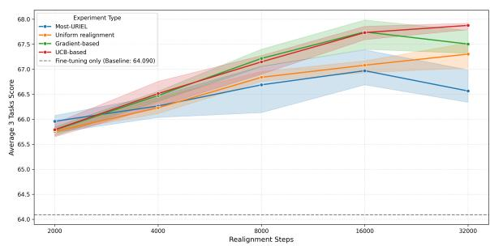  
Figure 3: Scaling of average cross-lingual transfer performance for XLM-R

Most-URIEL achieves stronger gains than the other strategies at low compute budgets (2k steps), but the gap widens in favor of the dynamic strategies as steps increase (Figure 3). At 2,000 steps, Most-URIEL leads with an average score of roughly 66.0 — approximately 0.2 points ahead of the dynamic methods. This reflects the dataefficiency of typologically-informed static selection: with scarce compute, every step targets a precurated diverse language subset, consistent with the finding that linguistic diversity is a key driver of language subset quality for realignment (Nguyen et al., 2025). Dynamic methods, starting from a near-uniform distribution, seem to require a warmup period for their weights to concentrate toward hard-to-align languages, incurring an early exploration cost. As training continues, however, the static selection’s advantage erodes. At 16,000 steps, UCB and gradient-based sampling both reach an average of 67.73–67.75 (Table 1), surpassing Most-URIEL’s 66.97 by nearly 0.8 points. This crossover directly reflects the rigidity of static distributions: since alignment difficulty shifts throughout training (see Figure 6), a distribution fixed before training begins becomes progressively misaligned with the model’s evolving needs (Albalak et al., 2023). Most importantly, this shows that dynamic sampling scales better with training time, as it can adapt to the model’s changing alignment needs, while static sampling cannot.

Gradient-based degrades at 32k steps, while UCB remains stable — pointing to UCB’s greater robustness to training duration as a key advantage. Concretely, the gradient-based method drops from 67.75 at 16,000 steps to approximately 67.50 at 32,000, while UCB continues to improve to roughly 67.9. We attribute this to hyperparameter sensitivity: all hyperparameters were tuned via grid search at 16,000 steps, and gradient-based seems to have overfit on this setting. This brittleness echoes the behaviour observed on Gemma (Section 4), where gradient-based also underperformed — in both cases, performance degrades when conditions diverge from the tuning regime. UCB is less exposed to this issue: its update rule has a principled closed-form character (Appendix C.6) and its single exploration coefficient c proves less sensitive to the choice of training length.

Nevertheless, we find 16,000 realignment steps to provide the best trade-off between computational cost and performance, as doubling the training time to 32,000 steps yields only an additional gain of roughly 0.4 points. These findings provide practical guidance for selecting realignment strategies under different resource constraints.

## D.3 Language-level win rate analysis

To complement the average performance analysis, we also examine the win rates of the different methods. This win rate is computed, given two methods A and B, as the percentage of runs, represented by a unique task, language, and seed, for which method A outperforms method B. This analysis allows us to understand how consistent the performance gains are across languages, and whether the improvements are driven by a few languages or are more widespread.

It is in the win-rate analysis that the positive impact of dynamic sampling becomes most apparent (Figure 4). Both dynamic sampling methods further improve cross-lingual transfer gains over the static baselines (uniform and Most-URIEL) while also enhancing language-wise performance. In particular, both dynamic sampling methods outperform uniform sampling by at least 61.9%. This is coherent with resource-level breakdown results, where we observed that dynamic sampling spreads the gains across more languages.

In the case of Gemma, all realignment methods win versus fine-tuning, and Most-URIEL is a surprisingly strong baseline, which mirrors the overall results. However, the win-rates show that UCB-based dynamic sampling still wins over uniform sampling, and is second only to Most-URIEL. Moreover, the gradient-based method falls behind. This suggests that a set of hyperparameters that works for one model will probably not be optimal for another one, since we tuned ours with XLM-R. As we already saw earlier, the UCB-based method generalizes better to other architectures than the gradient-based one.

For Gemma, realignment itself is highly effective, and while UCB is the most reliable dynamic approach, Most-URIEL sets a high bar that UCB doesn’t clearly surpass. When working with a new model architecture, using a subset of languages might be a good starting point before trying to implement a dynamic sampling strategy.

We additionally present a win-rate comparison of our proposed UCB-based method across the four supplementary models (three encoder-only and one decoder-only). As illustrated in Figure 5, the UCBbased strategy establishes a formidable baseline, outperforming uniform realignment on the majority of models - with uniform sampling edging it out by a marginal 0.4% on mmBERT. The approach to most frequently surpass it (on 2 of the 4 models) is our alternative gradient-based method. Although the gradient-based strategy yields limited gains over the uniform sampling baseline on Gemma-2-9B, it achieves superior performance on both mmBERT and Llama 3.1 8B.

## E Computational resources

All experiments with XLM-R Large and Gemma 2 9B were run on a single H100 80GB GPU. The total compute used for all experiments is estimated to be around 1,000 GPU hours.

A typical realignment run with XLM-R for 16k steps takes around 4.5 hours, while a typical run with Gemma 2 9B takes around 7 hours (not including fine-tuning).

## F Licenses for artifacts used

Below is a list of the datasets under study:

• The AfriXNLI dataset (Adelani et al., 2025) has the Apache 2.0 license.

• The IndoNLI dataset (Mahendra et al., 2021) has the CC-BY-SA 4.0 license.

• The Myanmar-XNLI dataset (Htet and Dras, 2025) has the Apache 2.0 license.

• The MasakhaPOS dataset (Dione et al., 2023) has the MIT license.

• The MasakhaNER 2.0 dataset (Adelani et al., 2022) has the AFL 3.0 license.

• The OPUS-100 dataset (Zhang et al., 2020b) has no explicit license; it is a filtered subset of OPUS (Tiedemann, 2009), which aggregates translation corpora that is generally considered redistributable.

• The NLLB dataset (Team et al., 2022) has the ODC-By license.

• The XTREME-R benchmark suite (Ruder et al., 2021) does not have a unified license; it aggregates multiple datasets, each with its own license or terms of use, here are the ones we use:

– The XNLI corpus (Conneau et al., 2018) has the CC BY-NC 4.0 license.

– The UDPOS dataset (De Marneffe et al., 2021) has the CC0-1.0 license.

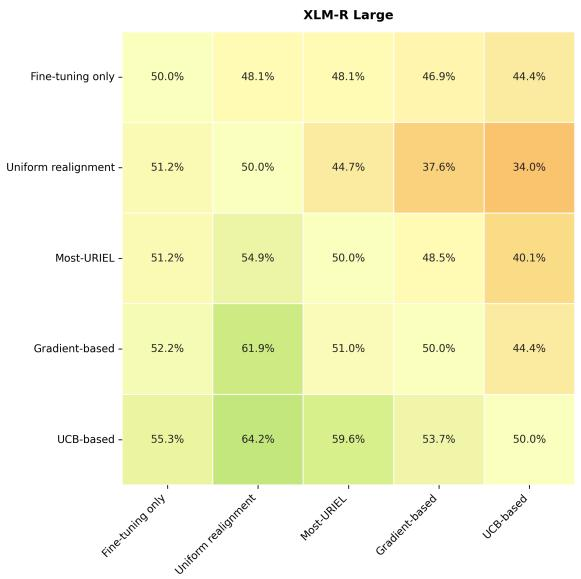

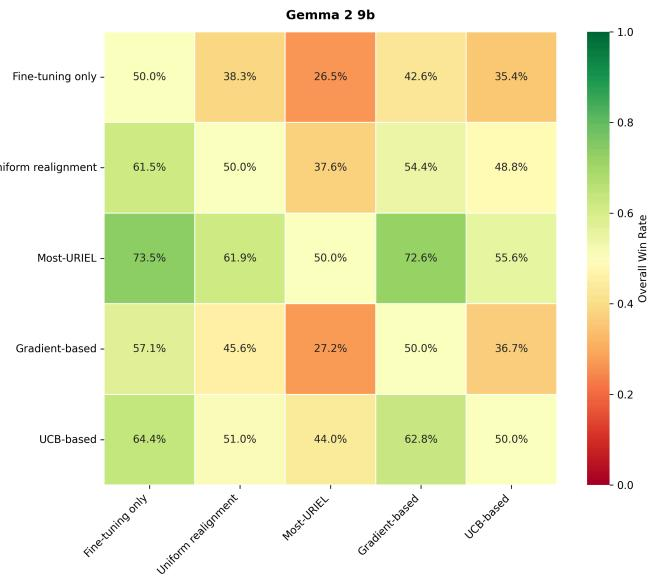  
Figure 4: Win Rate, N=441 (all tasks, all languages, all seeds). The value of a cell indicates how many times the method in the row outperformed the method in the column.

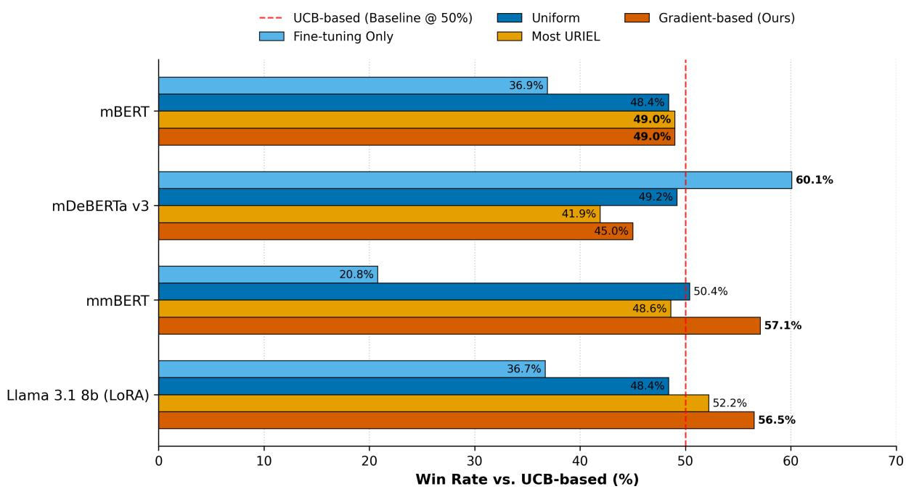  
Figure 5: Win Rate comparing other experiments to our proposed UCB-based method for extra 3 encoder-only models (mBERT, mDeBERTa-v3 and mmBERT) and 1 decoder-only model (Llama 3.1 8b) on the same tasks, languages and seeds. Bold indicates the the best win-rate of each model. Uniform realignment cannot surpass UCB-based strategy in distributing realignment gain across more languages in most of the cases.

– The WikiANN dataset (Pan et al., 2017) has the Apache 2.0 license.

Below is a list of the other artifacts under study:

• The code for realignment comes from Nguyen et al. (2025) and has the MIT license.

• The weights of XLM-R Base (Conneau et al., 2020) have the MIT license.

• The weights of Gemma 2 9B (Team et al., 2024) have a dedicated Gemma License, which allows for research use and redistribution under certain conditions.

All artifacts were thus used in accordance with their open-source or non-commercial licenses.

## G Use of AI

For the writing of this paper, AI was used for the following purposes: reformulate some text, autocomplete code, help with technical issues for Python code and LaTeX, and occasionally help with brainstorming and for generating code that would produce the figures.

All the ideas of the paper were proposed by the authors. All the text was originally written and revised by the authors, with some reformulation help from AI. All generated code was revised and edited by the authors. No figure was directly generated by AI.

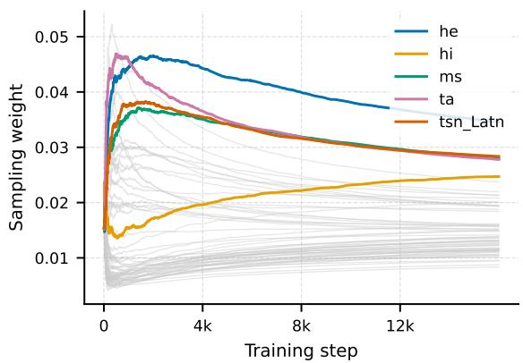  
(a) UCB weights, seed 31

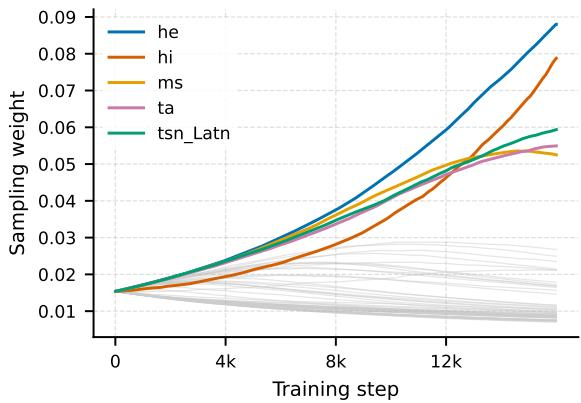  
(b) Gradient weights, seed 31

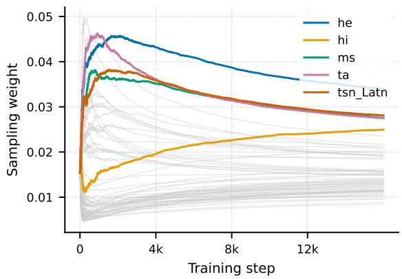  
(c) UCB weights, seed 42

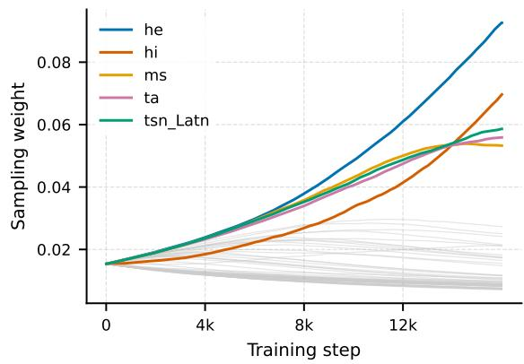  
(d) Gradient weights, seed 42

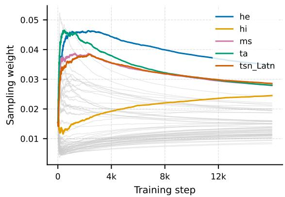  
(e) UCB weights, seed 66

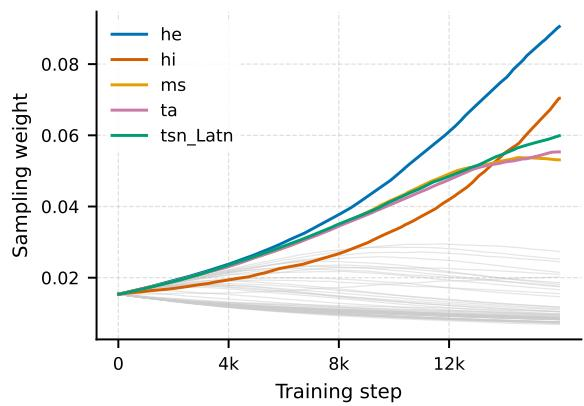  
(f) Gradient weights, seed 66  
Figure 6: Learned weights for XLM-R Large across seeds for UCB (left) and gradient-based (right) selection strategies.

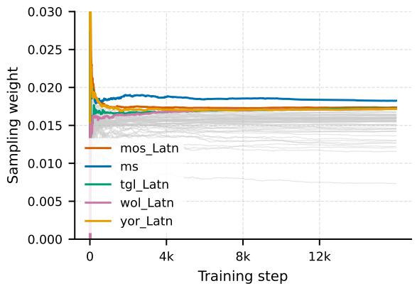  
(a) UCB weights, seed 31

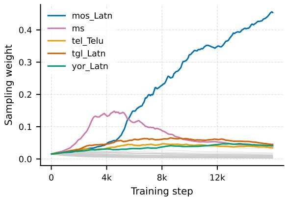  
(b) Gradient weights, seed 31

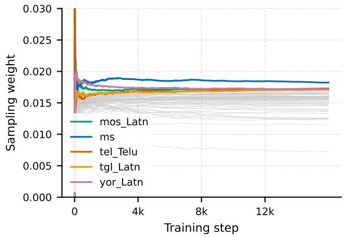  
(c) UCB weights, seed 42

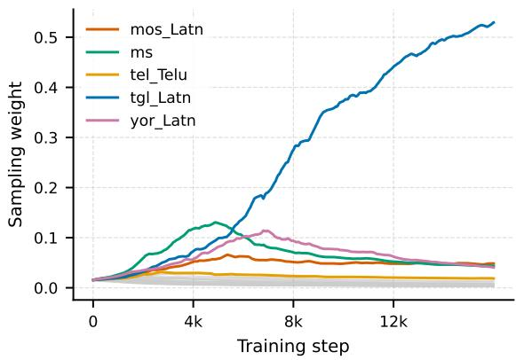  
(d) Gradient weights, seed 42

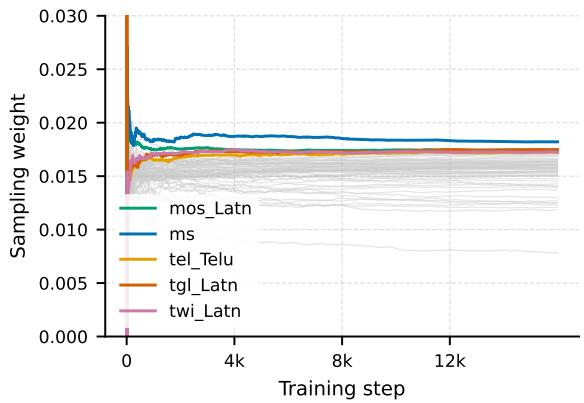  
(e) UCB weights, seed 66

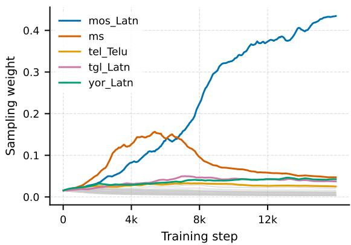  
(f) Gradient weights, seed 66  
Figure 7: Learned weights for Gemma 2 9B across seeds for UCB (left) and gradient-based (right) selection strategies.