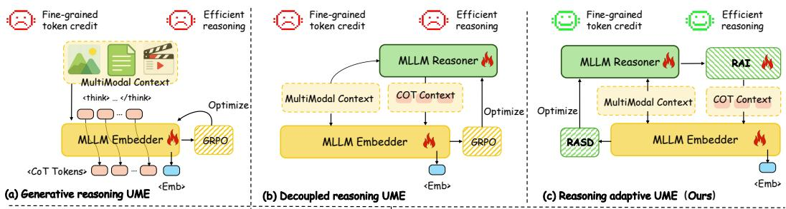
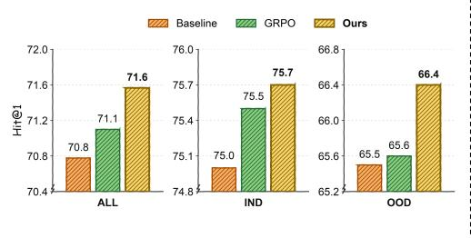
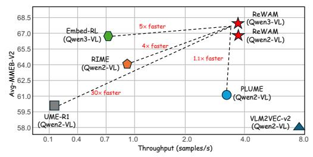
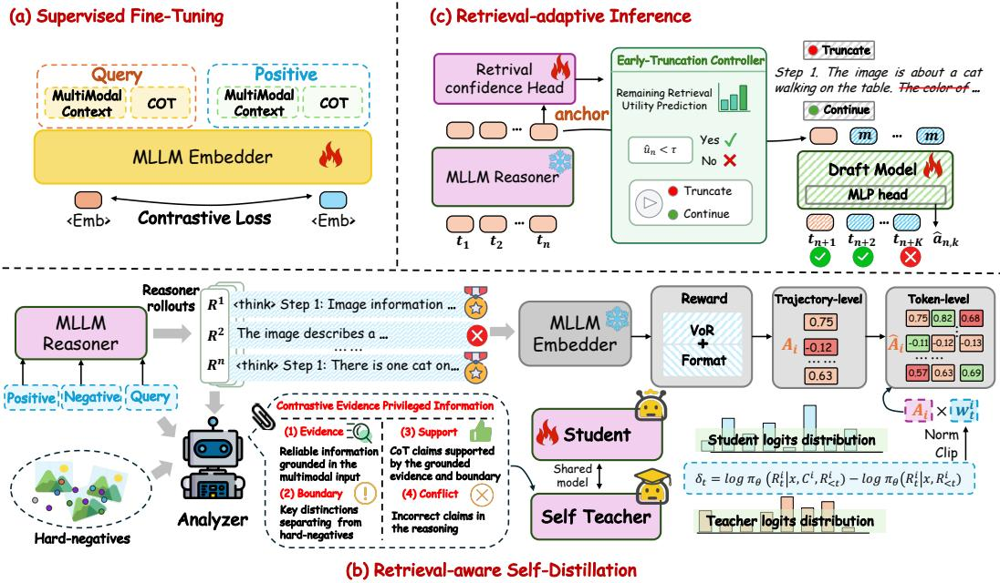
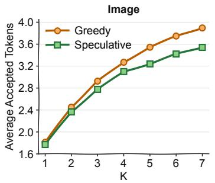
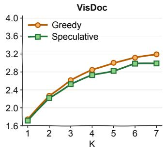
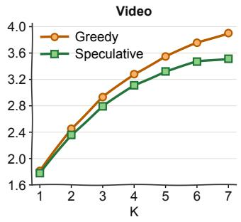

# REASON WHAT MATTERS: RETRIEVAL-GROUNDEDREASONING FOR UNIVERSAL MULTIMODAL EMBEDDINGS

Mingzhou Jiang1∗ Peixi Wu2∗ Hang Cheng1∗ Yunhao Zhou3∗† Biao Yang3 Wei Yuan3 Yun Li4 Fan Yang3 Wenwu Ou3 Honghui He1‡

1Tsinghua Shenzhen International Graduate School, Tsinghua University

2School of Artificial Intelligence and Data Science, USTC

3Kuaishou Technology

4College of Future Information Technology, Fudan University

## ABSTRACT

Universal multimodal embedding (UME) learns unified representations across modalities, enabling a single model to support diverse retrieval tasks. Recent methods use Chain-of-Thought (CoT) reasoning to better interpret multimodal inputs before generating embeddings for complex retrieval tasks and further optimize this reasoning process through GRPO with retrieval-based rewards. However, two limitations hinder corpus-scale deployment. GRPO assigns all CoT tokens the same advantage, without identifying input-supported claims or evidence that distinguishes the positive from negatives. Moreover, generating a complete CoT before each embedding introduces substantial latency, even when a partial trace already provides sufficient retrieval evidence. To address these limitations, we propose Reason What Matters (ReWAM), a retrieval-grounded reasoning framework that uses retrieval feedback to guide both credit assignment and reasoning computation. Specifically, we introduce Retrieval-aware Self-Distillation (RASD), which constructs privileged guidance from input-supported evidence that distinguishes the positive item from retrieved hard negatives. An on-policy self-teacher uses this guidance to refine trajectory-level feedback into token-specific supervision for retrieval-relevant reasoning. We further develop Retrieval-adaptive Inference (RAI), which uses a retrieval confidence head to estimate the remaining retrieval utility of a partial CoT. It stops unproductive traces early and accelerates useful continuations with speculative decoding. Extensive experiments on MMEB-V2 and MRMR demonstrate that ReWAM achieves stateof-the-art retrieval performance while delivering up to 5× the inference throughput of competitive explicit-CoT UME methods. These results bridge the gap between retrieval quality and inference efficiency, making reasoning-enhanced UME practical for large-scale deployment.

## 1 INTRODUCTION

Building on vision-language representation learning (Radford et al., 2021; Li et al., 2022; Zhai et al., 2023), universal multimodal embedding (UME) supports heterogeneous retrieval across modalities and tasks with a single model and a shared embedding space. Recent methods adapt multimodal large language models (MLLMs) into unified embedders through contrastive learning (Jiang et al., 2024b; Zhang et al., 2025; Meng et al., 2025). These models typically derive embeddings from finallayer hidden states in a fixed-depth forward pass. Although efficient and scalable, this design fails to fully leverage the reasoning capabilities of MLLMs, limiting performance on tasks that require compositional relations, fine-grained evidence, or multi-step visual understanding.

Reasoning-enhanced UME first performs Chain-of-Thought (CoT) reasoning over the input and then generates the final embedding conditioned on the reasoning process. As illustrated in Fig. 1, prior methods generally fall into two paradigms. Generative reasoning UME (Lan et al., 2026; Wu et al.,

  
(d) Comparison on MMEB-v2 Image OOD task

  
(e) Efficiency Comparison  
Figure 1: Overview of reasoning-enhanced UME paradigms and empirical comparisons. (a)–(c) show generative reasoning UME, decoupled reasoning UME, and ReWAM, respectively. (d) compares in-distribution and OOD retrieval, showing smaller gains from GRPO on OOD tasks. (e) compares retrieval performance and throughput across UME methods.

2026b) uses a shared MLLM backbone for both reasoning and embedding generation. However, this paradigm often yields suboptimal results due to potential gradient conflicts between the next-token prediction and contrastive learning objectives (Cui et al., 2026). Decoupled reasoning UME (Cui et al., 2026; Jiang et al., 2026; Zhang et al., 2026a) separates the reasoning and embedding components, conditioning the embedder on both the original input and the generated CoT. Although this separation requires additional parameters and computation, it mitigates conflicts between the train ing objectives and often leads to better retrieval performance (Jiang et al., 2026). Recent methods in both paradigms further apply Group Relative Policy Optimization (GRPO) (Shao et al., 2024) with retrieval-based rewards. This encourages the generated CoT to capture retrieval-relevant evidence and produce stronger embeddings.

Despite these advances, two limitations still hinder the corpus-scale deployment of reasoningenhanced UME. First, retrieval-based GRPO compresses candidate comparisons into a scalar advantage shared by all tokens. This feedback does not explicitly convey which reasoning claims are input-supported or which distinctions separate the positive from confusable negatives. As shown in Fig. 1(d), GRPO improves in-distribution retrieval but provides only marginal gains on out-ofdistribution (OOD) tasks. Second, reasoning remains expensive when generating embeddings for large corpora. Once CoT is invoked, existing methods autoregressively generate a complete trace even when a partial trace already provides sufficient retrieval evidence. The resulting latency grows with both trace length and corpus size. To mitigate the high inference cost of explicit CoT, some recent methods explore latent reasoning, generating only a few continuous latent tokens instead of a long textual reasoning trace (He et al., 2026; Tsai et al., 2026). Nevertheless, this approach sacrifices the interpretability of explicit CoT and often yields weaker retrieval performance due to noise accumulation across latent reasoning steps (He et al., 2026). These limitations motivate fine-grained retrieval supervision and adaptive control of both reasoning length and decoding cost.

To address these limitations, we propose Reason What Matters (ReWAM), a retrieval-grounded framework that improves both the quality and efficiency of explicit reasoning for universal multimodal embeddings. As illustrated in Fig. 1(c) and detailed in Fig. 2, ReWAM builds on a decoupled reasoner–embedder architecture, with a fixed CoT-conditioned embedder providing a stable retrieval signal. We introduce Retrieval-aware Self-Distillation (RASD), a retrieval-oriented policy optimization method that addresses the coarse credit assignment of retrieval-based GRPO. RASD contrasts the positive item with retrieved hard negatives to construct privileged guidance that captures inputsupported evidence and decision boundaries separating the target from confusable candidates. An on-policy self-teacher uses evidence-conditioned log-likelihood differences to modulate the trajectory advantage at the token level, focusing policy updates on retrieval-relevant reasoning grounded in the input. We further introduce Retrieval-adaptive Inference (RAI), which combines trajectorylevel truncation with token-level acceleration. A retrieval confidence head estimates the remaining retrieval utility of a partial CoT to decide when to stop, while speculative decoding accelerates token generation. Extensive experiments on MMEB-V2 and MRMR demonstrate that ReWAM achieves state-of-the-art retrieval performance while substantially improving inference efficiency. As shown in Fig. 1(e), it outperforms the decoupled explicit-CoT method Embed-RL (Jiang et al., 2026) while reaching up to 5× its throughput. It even surpasses the efficiency-oriented latent-reasoning method PLUME (He et al., 2026) in both retrieval performance and throughput. These results show that explicit reasoning can remain effective and efficient at corpus scale. The main contributions of this work are as follows:

• We propose ReWAM, a retrieval-grounded framework that jointly optimizes reasoning quality and inference efficiency. This establishes explicit reasoning as a scalable paradigm for real-world multimodal retrieval systems operating over massive corpora.

• We introduce RASD for token-level credit assignment through retrieval evidence verification, and RAI for adaptive CoT truncation guided by prefix-level remaining retrieval utility.

• Extensive experiments on MMEB-V2 and MRMR demonstrate state-of-the-art retrieval performance with up to 5× the throughput of prior decoupled explicit-CoT methods.

## 2 RELATED WORK

Universal Multimodal Embedding. Contrastive vision–language pretraining learns aligned representations across images and text (Radford et al., 2021; Li et al., 2022; Zhai et al., 2023). Building on this foundation, UME methods adapt MLLMs into general-purpose encoders and explore diverse architectures and training objectives for multimodal retrieval (Jiang et al., 2024b; Zhang et al., 2025; Meng et al., 2025; Faysse et al., 2025; Liu et al., 2025; Chen et al., 2026b; Yu et al., 2025). More recent studies integrate reasoning into representation learning to better capture compositional relations and fine-grained cross-modal cues (Lan et al., 2026; Wu et al., 2026b; Cui et al., 2026; Jiang et al., 2026; He et al., 2026; Tsai et al., 2026).

On-Policy Self-Distillation. Outcome-based RL provides verifiable feedback, yet sparse trajectory rewards do not reveal the contribution of intermediate decisions (Shao et al., 2024). On-policy self-distillation addresses this gap by conditioning the policy on privileged information to supervise its own rollouts at the token level (Zhao et al., 2026; Hubotter et al., 2026; Yang et al., 2026a; Song¨ & Zheng, 2026). Later methods refine these signals through confidence weighting, cross-rollout reflection, skill guidance, and self-evolving supervision (Zheng et al., 2026a;b; Yang et al., 2026b; Lu et al., 2026; Wu et al., 2026a).

Inference Acceleration. Autoregressive decoding generates tokens sequentially, making long reasoning traces costly at inference time. Speculative decoding reduces this cost by verifying multiple draft tokens in parallel (Leviathan et al., 2023), while multi-token prediction and multi-head decoding predict several future tokens per step (Gloeckle et al., 2024; Cai et al., 2024). Block-diffusion and semi-autoregressive methods further increase decoding parallelism (Chen et al., 2026a; Cheng et al., 2026). Complementary methods reduce reasoning length through retrieval-based input routing (Zhang et al., 2026a) or task-agnostic semantic redundancy detection (Sun et al., 2026).

## 3 METHOD

## 3.1 PRELIMINARIES

Given a multimodal query q and a candidate set T, universal multimodal retrieval aims to identify its positive target $t ^ { + } \in \dot { \tau }$ . The training set $\mathcal { D } = \{ ( q _ { i } , t _ { i } ) \} _ { i = 1 } ^ { N }$ consists of positive query–target pairs, where either side may contain text, images, videos, or visual documents. Let $E _ { \phi }$ be the MLLM-based embedder. Conditioned on a multimodal context x and CoT $c _ { x } , E _ { \phi }$ produces the normalized embedding ${ \bf e } _ { x } ^ { c }$ from the final-layer ⟨gen emb⟩ state. When conditioned only on x, it produces the direct embedding $\mathbf { e } _ { x } ^ { 0 }$ . Given a batch of B positive pairs, the embedder is optimized with the following InfoNCE objective:

  
Figure 2: Overview of ReWAM. (a) Supervised fine-tuning trains a CoT-conditioned embedder. (b) RASD uses privileged same-token rescoring to derive token-wise weights that modulate trajectorylevel retrieval advantages. (c) RAI stops a partial CoT when its predicted remaining retrieval utility is low and accelerates generation through speculative decoding.

$$
\mathcal { L } _ { \mathrm { I n f o N C E } } = - \frac { 1 } { B } \sum _ { i = 1 } ^ { B } \log \frac { \exp \bigl ( \cos ( \mathbf { e } _ { q _ { i } } ^ { c } , \mathbf { e } _ { t _ { i } } ^ { c } ) / \tau _ { E } \bigr ) } { \sum _ { j = 1 } ^ { B } \exp \Bigl ( \cos ( \mathbf { e } _ { q _ { i } } ^ { c } , \mathbf { e } _ { t _ { j } } ^ { c } ) / \tau _ { E } \Bigr ) } .\tag{1}
$$

Here cos $( \cdot , \cdot )$ denotes cosine similarity, $t _ { i }$ is the positive target of $q _ { i }$ , the remaining targets in the batch serve as negatives, and $\tau _ { E }$ is the temperature. We compute the loss in both query-to-target and target-to-query directions and average them as ${ \mathcal { L } } _ { \mathrm { c o n } }$

## 3.2 SUPERVISED FINE-TUNING

As shown in Fig. 2(a), $E _ { \phi }$ encodes each query and target together with an offline CoT and is finetuned using the bidirectional contrastive objective $\bar { \mathcal { L } _ { \mathrm { c o n } } }$ . No language-modeling loss is applied, keeping representation learning separate from autoregressive generation. We then freeze $E _ { \phi }$ to provide a stable retrieval criterion for evaluating and optimizing CoTs sampled by the reasoner.

## 3.3 RETRIEVAL-AWARE SELF-DISTILLATION

To address coarse credit assignment in retrieval-based RL, RASD constructs privileged guidance by contrasting the positive with hard negatives (Fig. 2(b)). An on-policy self-teacher uses this guid ance to derive token-level feedback for reweighting trajectory advantages. The resulting supervision focuses policy updates on reasoning that distinguishes the target from confusable candidates. For each multimodal input x in a batch, the reasoner policy π samples G CoTs $\{ R ^ { i } \} _ { i = 1 } ^ { G }$ , where $R ^ { i } = ( R _ { 1 } ^ { i } , . . . , R _ { T _ { i } } ^ { i } ) \sim \bar { \pi } _ { \theta } ( \cdot \mid x )$ The frozen embedder encodes each rollout as ${ \bf e } _ { x } ^ { i } = E _ { \phi } ( x , R ^ { i } )$ Strong retrieval performance alone does not establish the benefit of CoT, as the direct representation may already perform equally well. To quantify the added value of reasoning, we introduce a Value of Reasoning (VoR) reward based on the margin improvement over a no-CoT baseline on the same candidates. Let $t ^ { + }$ and $B _ { x } ^ { - }$ denote the positive and in-batch negatives of x. We define the retrieval margin of $R ^ { i }$ using all G rollout embeddings per candidate:

$$
M _ { i } ^ { c } = \frac { 1 } { G } \sum _ { j = 1 } ^ { G } \cos ( { \bf e } _ { x } ^ { i } , { \bf e } _ { t ^ { + } } ^ { j } ) - \frac { 1 } { G | \mathscr { B } _ { x } ^ { - } | } \sum _ { t ^ { - } \in \mathscr { B } _ { x } ^ { - } } \sum _ { j = 1 } ^ { G } \cos ( { \bf e } _ { x } ^ { i } , { \bf e } _ { t ^ { - } } ^ { j } ) .\tag{2}
$$

The no-CoT baseline margin $M ^ { 0 }$ is computed from direct embeddings of x and the same candidates. We map the reasoning gain $v _ { i } = M _ { i } ^ { c } \stackrel { - } { - } M ^ { 0 }$ to a ternary reward $r _ { i } ^ { \mathrm { \ w V o R } }$ , assigning $+ 1$ for $v _ { i } > \epsilon _ { v }$ −1 for $v _ { i } < - \epsilon _ { v }$ , and 0 otherwise. The threshold $\epsilon _ { v } = 0 . 0 1$ reduces reward sensitivity to minor embedding fluctuations. With a binary format reward $f _ { i } \in \{ 0 , 1 \}$ indicating whether ${ \dot { R } } ^ { i }$ follows the CoT template, the total reward $r _ { i } \ : = \ : r _ { i } ^ { \mathrm { V o R } } + \lambda _ { f } \dot { f _ { i } }$ is group-normalized as in GRPO, $A _ { i } \ =$ $( r _ { i } - \mu _ { r } ) / ( \sigma _ { r } + \epsilon _ { A } )$ , where $\mu _ { r }$ and $\sigma _ { r }$ are computed over the $G$ rollouts. We apply the computation symmetrically to both sides of each positive pair. For either side $x ,$ the reasoner generates CoTs from x alone, while retrieval rewards also depend on the positive and negative candidates.

However, the scalar advantage $A _ { i }$ does not convey the evidence underlying candidate comparisons. Applying it uniformly can reinforce hallucinated evidence and flawed reasoning alongside retrievalrelevant steps. Factual correctness alone does not establish retrieval relevance, as a supported detail may be shared by the positive and hard negatives. A seemingly discriminative claim may also lack support from x. To provide this guidance during training, RASD uses a multimodal analyzer to extract facts grounded in x and identify decision boundaries between its positive and in-batch hard negatives. The analyzer then performs claim verification by checking the sampled CoT $R ^ { i }$ against these facts and boundaries, identifying supported and conflicting claims. These findings form Contrastive Evidence Privileged Information (CEPI), denoted by $\bar { C } ^ { i }$ . This check connects the privileged guidance to specific claims in $R ^ { i }$ , informing the self-teacher’s token-level rescoring. Conditioned on $( x , C ^ { i } )$ , the same reasoner acts as an on-policy self-teacher and rescores $R ^ { i }$ without generating a new CoT. For each token $R _ { t } ^ { i } .$ , we compare its log-probabilities with and without $C ^ { i }$ under the same sampled prefix $R _ { < t } ^ { i } \mathrm { : }$

$$
\delta _ { t } ^ { i } = \log \pi _ { \theta } ( R _ { t } ^ { i } \mid x , C ^ { i } , R _ { < t } ^ { i } ) - \log \pi _ { \theta } ( R _ { t } ^ { i } \mid x , R _ { < t } ^ { i } ) .\tag{3}
$$

The likelihood difference $\delta _ { t } ^ { i }$ measures how the privileged evidence changes the policy’s support for each sampled token. We treat $\delta _ { t } ^ { i }$ as a stop-gradient signal for token-level credit assignment. To turn this feedback into token-level supervision, RASD converts it into bounded, sign-aligned weights $w _ { t } ^ { i }$ that modulate the trajectory advantage $A _ { i }$ :

$$
\begin{array} { r } { \bar { \delta } _ { t } ^ { i } = \mathrm { c l i p } \big ( \mathrm { s i g n } ( A _ { i } ) \delta _ { t } ^ { i } , \log ( 1 - \epsilon _ { R } ) , \log ( 1 + \epsilon _ { R } ) \big ) , \qquad w _ { t } ^ { i } = 1 + \lambda _ { R } \big ( \exp ( \bar { \delta } _ { t } ^ { i } ) - 1 \big ) . } \end{array}\tag{4}
$$

Here $w _ { t } ^ { i } \in [ 1 - \lambda _ { R } \epsilon _ { R } , 1 + \lambda _ { R } \epsilon _ { R } ]$ . The modulated advantage $\hat { A } _ { t } ^ { i } = A _ { i } w _ { t } ^ { i }$ strengthens reinforcement of evidence-supported tokens when $A _ { i } ~ > ~ 0$ and reduces their penalties when $A _ { i } ~ < ~ 0$ These adjustments refine token-level credit without replacing trajectory-level supervision, as the bounded positive weights preserve each rollout’s retrieval-derived preference. The RASD objective is

$$
\mathcal { L } _ { \mathrm { R A S D } } = - \mathbb { E } _ { i , t } \Big [ \operatorname* { m i n } \Big ( \rho _ { t } ^ { i } \hat { A } _ { t } ^ { i } , \mathrm { c l i p } ( \rho _ { t } ^ { i } , 1 - \epsilon _ { P } , 1 + \epsilon _ { P } ) \hat { A } _ { t } ^ { i } \Big ) \Big ] + \beta D _ { \mathrm { K L } } ( \pi _ { \theta } \| \pi _ { \mathrm { r e f } } ) .\tag{5}
$$

where $\rho _ { t } ^ { i } = \pi _ { \theta } ( R _ { t } ^ { i } \mid x , R _ { < t } ^ { i } ) / \pi _ { \mathrm { o l d } } ( R _ { t } ^ { i } \mid x , R _ { < t } ^ { i } )$ is the per-token importance sampling ratio. ϵR and ϵ are clipping thresholds. The KL term $D _ { \mathrm { K L } }$ penalizes deviation from the reference policy $\pi _ { \mathrm { r e f } }$ . This objective encourages the reasoner to express input-supported distinctions that matter for retrieval. Candidate information enriches training-time supervision while CoT generation remains conditioned on x alone, preserving independent encoding for corpus-scale retrieval.

## 3.4 RETRIEVAL-ADAPTIVE INFERENCE

Long CoTs incur substantial decoding latency even when later steps add little retrieval value, limiting their practicality in large-scale retrieval. Retrieval-adaptive Inference (RAI) addresses this overhead through trajectory-level truncation and token-level acceleration (Fig. 2(c)). A retrieval confidence head predicts the remaining retrieval utility to determine when a CoT should end. Speculative decoding reduces the per-token cost of generation up to this retrieval-dependent stopping point.

To learn a retrieval-grounded stopping criterion, we quantify the retrieval gains still available beyond each CoT prefix. The frozen embedder encodes x with selected CoT prefixes $c _ { \leq n }$ of increasing length, including the complete trace, and evaluates the resulting embeddings against fixed full-CoT candidate embeddings. For a prefix ending at token $t _ { n }$ , its retrieval margin $m _ { n }$ is computed following Eq. (2). The no-CoT baseline $m _ { 0 }$ uses the direct embedding of $x$ against the same candidates. The margin may remain unchanged over several prefixes before later reasoning improves retrieval. Stopping at such a plateau would discard this delayed gain. Let $b _ { n }$ denote the best margin among the current and later evaluated prefixes. The global best margin $m _ { \mathrm { b e s t } }$ is taken over all evaluated prefixes and the no-CoT baseline. The total retrieval gain observed along this CoT is $m _ { \mathrm { b e s t } } - m _ { 0 }$ We define the normalized remaining retrieval utility as

$$
u _ { n } = \mathrm { c l i p } \left( \frac { b _ { n } - \operatorname* { m a x } ( m _ { n } , m _ { 0 } ) } { \left( m _ { \mathrm { b e s t } } - m _ { 0 } \right) + 1 0 ^ { - 6 } } , 0 , 1 \right) .\tag{6}
$$

Larger values of $u _ { n }$ indicate that a greater fraction of the total retrieval gain remains available, while values near zero indicate negligible further gains. We use these offline targets to train the retrieval confidence head $H _ { \omega } ,$ which is a two-hidden-layer MLP with a sigmoid output. It takes the frozen reasoner’s hidden state $h _ { n }$ at anchor token $t _ { n }$ as input. Its scalar output $\hat { u } _ { n } ^ { \ast } = H _ { \omega } ( h _ { n } )$ estimates the normalized remaining retrieval utility. RAI truncates the CoT when $\hat { u } _ { n } < \tau .$ , without candidate comparisons or embedder calls. The training objective is

$$
\mathcal { L } _ { H } = \mathrm { S m o o t h L 1 } ( \hat { u } _ { n } , u _ { n } ) .\tag{7}
$$

To accelerate CoT generation, we adopt speculative decoding with a semi-autoregressive draft model that proposes K tokens for verification by the reasoner (Chen et al., 2026a; Cheng et al., 2026). The reasoner serves as the target model, with its parameters frozen during draft training. As shown in Fig. $2 ( \mathrm { c } ) ,$ , the draft model takes the anchor token $t _ { n }$ and $K - 1$ mask tokens m as input. We concatenate and project hidden states from selected layers of the frozen target model to obtain context features. The draft backbone attends to these features and computes $K$ draft states in one forward pass. The candidates $t _ { n + 1 } , \ldots , t _ { n + K }$ are sampled sequentially. A low-rank Markov head maps the preceding token to a compact embedding and projects it into a logit correction at the current position. This correction preserves within-block dependencies without rerunning the backbone.

Let $q _ { n , k }$ and $p _ { n , k }$ denote the draft and target distributions at position $n + k$ under the same reference prefix. The supervision token $t _ { n + k } ^ { \star }$ comes from the reference training trajectory. An auxiliary acceptance head takes the draft state concatenated with the preceding token’s Markov embedding as input. A linear projection and sigmoid yield the acceptance probability $\hat { a } _ { n , k }$ . Its soft label $a _ { n , k } =$ $\begin{array} { r } { 1 - \frac { 1 } { 2 } \| q _ { n , k } - p _ { n , k } \| } \end{array}$ is the distribution overlap, which equals the expected acceptance probability under speculative verification. Following Chen et al. (2026a) and Cheng et al. (2026), we weight valid training positions by $\omega _ { k } \propto e ^ { - k / \gamma }$ and minimize

$$
\mathcal { L } _ { D } = \mathbb { E } _ { n , k } \bigl [ \omega _ { k } \bigl ( 0 . 1 ~ \mathrm { C E } ( q _ { n , k } , t _ { n + k } ^ { \star } ) + 0 . 9 \| q _ { n , k } - p _ { n , k } \| _ { 1 } + \mathrm { B C E } ( \hat { a } _ { n , k } , a _ { n , k } ) \bigr ) \bigr ] .\tag{8}
$$

Here, the expectation is over valid training positions, and the weights $\omega _ { k }$ are normalized to have unit mean over these positions. The CE, $L _ { 1 }$ , and BCE terms supervise next-token prediction, distribution alignment, and acceptance confidence, respectively. The decay scale $\gamma$ controls how strongly early positions are emphasized, since rejection prevents acceptance of later proposals. The target model verifies each draft block in one pass and accepts its longest valid prefix. RAI lowers per-token decoding cost and controls CoT length using predicted remaining retrieval utility. This makes explicit CoT more efficient for large-scale multimodal retrieval.

## 4 EXPERIMENTS

## 4.1 EXPERIMENTAL SETUP

Implementation details. We train CoT-conditioned embedders based on Qwen2-VL (2B and 7B) and Qwen3-VL (2B and 4B). Following Embed-RL (Jiang et al., 2026), we adopt Qwen3-VL-8B-Instruct as the reasoner. For SFT, we use the same training data and prompt templates as RIME (Wu et al., 2026b). The embedders are trained on 1.4M query–target pairs for one epoch with a learning rate of $5 \times 1 0 ^ { - 5 }$ and a batch size of 512. For RASD, we train on 20K query–target pairs with hard-negative mining (see supplementary material). We use a fixed Qwen3.5-122B-A10B API as the multimodal analyzer to construct privileged guidance. The reasoner is trained for one epoch with a learning rate of $1 \times 1 0 ^ { - 6 }$ and a batch size of 32 query–target pairs. We use default GRPO hyperparameters and set $\epsilon _ { R } = \epsilon _ { P } = 0 . 2$ and $\lambda _ { R } = 0 . 5$ for RASD. For RAI, the RASD-trained reasoner greedily generates 700K offline CoT traces from 350K randomly sampled SFT pairs. We train the retrieval confidence head and draft model for 10 epochs with a batch size of 128 and learning rates of $3 \times 1 0 ^ { - 4 }$ and $6 \times 1 0 ^ { - 4 }$ , respectively. We set $\tau = 0 . 0 1$ for training and inference.

Table 1: Results on the MMEB-V2 benchmark. Best and second-best scores are bolded and underlined, respectively. CLS: classification, QA: question answering, RET: retrieval, GD: grounding, MRET: moment retrieval, VDR: ViDoRe, VR: VisRAG, and OOD: out-of-distribution. We follow the evaluation protocol of VLM2Vec-V2.
<table><tr><td rowspan="2">Model</td><td colspan="5">Image</td><td colspan="5">Video</td><td colspan="5">VisDoc</td><td rowspan="2">All</td></tr><tr><td>CLS</td><td>QA</td><td>RET</td><td>GD</td><td>Avg.</td><td>CLS</td><td>QA</td><td>RET</td><td>MRET</td><td>Avg.</td><td>VDRv1</td><td>VDRv2</td><td>VR</td><td>OOD</td><td>Avg.</td></tr><tr><td># of Datasets</td><td>10</td><td>10</td><td>12</td><td>4</td><td>36</td><td>5</td><td>5</td><td>5</td><td>3</td><td>18</td><td>10</td><td>4</td><td>6</td><td>4</td><td>24</td><td>78</td></tr><tr><td></td><td></td><td></td><td></td><td></td><td></td><td>~2B model size</td><td></td><td></td><td></td><td></td><td></td><td></td><td></td><td></td><td></td><td></td></tr><tr><td>ColPali-V1.3 (PaliGemma-3B)</td><td>40.3</td><td>11.5</td><td>48.1</td><td>40.3</td><td>34.9</td><td>26.7</td><td>37.8</td><td>21.6</td><td>25.5</td><td>28.2</td><td>83.6</td><td>52.0</td><td>81.1</td><td>43.1</td><td>71.0</td><td>44.4</td></tr><tr><td>GME (Qwen2-VL-2B)</td><td>54.4</td><td>29.9</td><td>66.9</td><td>55.5</td><td>51.9</td><td>34.9</td><td>42.0</td><td>25.6</td><td>32.4</td><td>33.9</td><td>86.1</td><td>54.0</td><td>82.5</td><td>43.1</td><td>72.7</td><td>54.1</td></tr><tr><td>VLM2Vec (Qwen2-VL-2B)</td><td>58.7</td><td>49.3</td><td>65.0</td><td>72.9</td><td>59.7</td><td>33.4</td><td>30.5</td><td>20.6</td><td>33.0</td><td>29.0</td><td>49.8</td><td>13.5</td><td>51.8</td><td>33.5</td><td>41.6</td><td>47.0</td></tr><tr><td>VLM2Vec-V2 (Qwen2-VL-2B)</td><td>62.9</td><td>56.3</td><td>69.5</td><td>77.3</td><td>64.9</td><td>39.3</td><td>34.3</td><td>28.8</td><td>38.5</td><td>34.9</td><td>75.5</td><td>44.9</td><td>79.4</td><td>39.4</td><td>65.4</td><td>58.0</td></tr><tr><td>UME-R1 (Qwen2-VL-2B)</td><td>64.8</td><td>62.8</td><td>67.6</td><td>77.2</td><td>66.6</td><td>44.3</td><td>51.2</td><td>32.9</td><td>39.7</td><td>42.2</td><td>72.4</td><td>46.2</td><td>79.2</td><td>37.2</td><td>63.9</td><td>60.1</td></tr><tr><td>TTEs (Qwen2-VL-2B)</td><td>67.9</td><td>66.6</td><td>70.2</td><td>84.1</td><td>70.1</td><td>47.3</td><td>49.1</td><td>34.4</td><td>33.2</td><td>32.1</td><td>77.5</td><td>53.2</td><td>83.2</td><td>41.1</td><td>68.8</td><td>63.1</td></tr><tr><td>RIME (Qwen2-VL-2B)</td><td>67.9</td><td>64.4</td><td>69.8</td><td>82.1</td><td>69.1</td><td>48.0</td><td>52.1</td><td>33.6</td><td>39.2</td><td>43.7</td><td>76.4</td><td>51.4</td><td>81.7</td><td>63.9</td><td>71.4</td><td>64.1</td></tr><tr><td>PLUME (Qwen2-VL-2B)</td><td>66.5</td><td>59.2</td><td>67.6</td><td>79.7</td><td>66.3</td><td>45.0</td><td>52.3</td><td>33.5</td><td>46.7</td><td>44.1</td><td>72.1</td><td>49.8</td><td>78.1</td><td>57.4</td><td>67.5</td><td>61.6</td></tr><tr><td>UMER-H (Qwen2-VL-2B)</td><td>66.1</td><td>68.9</td><td>71.7</td><td>80.8</td><td>70.4</td><td>50.6</td><td>52.8</td><td>37.7</td><td>35.0</td><td>45.0</td><td>78.0</td><td>50.5</td><td>85.0</td><td>68.8</td><td>73.6</td><td>65.5</td></tr><tr><td>Embed-RL (Qwen3-VL-2B)</td><td>62.8</td><td>67.9</td><td>68.6</td><td>90.4</td><td>69.2</td><td>57.0</td><td>55.9</td><td>45.1</td><td>49.4</td><td>52.1</td><td>79.9</td><td>52.0</td><td>84.6</td><td>65.7</td><td>74.1</td><td>66.8</td></tr><tr><td>ReWAM (Qwen2-VL-2B)</td><td>68.8</td><td>70.3</td><td>71.2</td><td>82.7</td><td>71.6</td><td>53.0</td><td>61.3</td><td>36.2</td><td>35.4</td><td>47.7</td><td>77.4</td><td>51.8</td><td>84.2</td><td>65.2</td><td>72.8</td><td>66.5</td></tr><tr><td>ReWAM (Qwen3-VL-2B)</td><td>68.9</td><td>70.7</td><td>70.5</td><td>86.0</td><td>71.9</td><td>53.6</td><td>63.3</td><td>38.0</td><td>39.9</td><td>49.7</td><td>78.6</td><td>55.4</td><td>84.2</td><td>66.7</td><td>74.2</td><td>67.4</td></tr><tr><td colspan="10">≥4B model size</td><td colspan="8"></td></tr><tr><td>GME (Qwen2-VL-7B)</td><td>57.7</td><td>34.7</td><td>71.2</td><td>59.3</td><td>56.0</td><td>37.4</td><td>50.4</td><td>28.4</td><td>38.2</td><td>38.6</td><td>89.4</td><td>55.6</td><td>85.0</td><td>44.4</td><td>75.2</td><td>57.8</td></tr><tr><td>LamRA-2 (Qwen2-VL-7B)</td><td>59.2</td><td>26.5</td><td>70.0</td><td>62.7</td><td>54.1</td><td>39.3</td><td>42.6</td><td>24.3</td><td>34.6</td><td>35.2</td><td>22.0</td><td>11.5</td><td>37.4</td><td>21.0</td><td>23.9</td><td>40.4</td></tr><tr><td>LamRA-2.5 (Qwen2.5-VL-7B)</td><td>51.7</td><td>34.1</td><td>66.9</td><td>56.7</td><td>52.4</td><td>32.9</td><td>42.6</td><td>23.2</td><td>37.6</td><td>33.7</td><td>56.3</td><td>33.3</td><td>58.2</td><td>40.1</td><td>50.2</td><td>47.4</td></tr><tr><td>VLM2Vec (Qwen2-VL-7B)</td><td>62.7</td><td>56.9</td><td>69.4</td><td>82.2</td><td>65.5</td><td>39.1</td><td>30.0</td><td>29.0</td><td>40.6</td><td>34.0</td><td>56.9</td><td>9.4</td><td>59.1</td><td>38.1</td><td>46.4</td><td>52.3</td></tr><tr><td>VLM2Vec-V2 (Qwen2-VL-7B)</td><td>65.7</td><td>61.5</td><td>70.0</td><td>85.2</td><td>68.1</td><td>45.9</td><td>33.9</td><td>27.6</td><td>39.3</td><td>36.4</td><td>78.8</td><td>52.6</td><td>82.7</td><td>42.1</td><td>69.3</td><td>61.2</td></tr><tr><td>CAFe (LLaVA-OV-7B)</td><td>63.6</td><td>61.7</td><td>69.1</td><td>87.6</td><td>67.6</td><td>35.8</td><td>58.7</td><td>34.4</td><td>39.5</td><td>42.4</td><td>70.7</td><td>49.6</td><td>79.5</td><td>38.1</td><td>63.9</td><td>60.6</td></tr><tr><td>UME-R1 (Qwen2-VL-7B)</td><td>67.1</td><td>69.2</td><td>71.9</td><td>84.9</td><td>71.3</td><td>48.6</td><td>60.7</td><td>38.2</td><td>39.3</td><td>47.5</td><td>75.7</td><td>50.5</td><td>83.7</td><td>37.6</td><td>67.1</td><td>64.5</td></tr><tr><td>RIME (Qwen2-VL-7B)</td><td>70.3</td><td>71.7</td><td>73.2</td><td>86.3</td><td>73.4</td><td>52.6</td><td>62.0</td><td>38.4</td><td>41.6</td><td>49.4</td><td>80.9</td><td>55.6</td><td>85.8</td><td>66.9</td><td>75.6</td><td>68.6</td></tr><tr><td>Embed-RL (Qwen3-VL-4B)</td><td>63.7</td><td>70.5</td><td>71.3</td><td>91.4</td><td>70.1</td><td>57.6</td><td>58.4</td><td>45.1</td><td>49.5</td><td>53.0</td><td>80.2 80.1</td><td>53.4 58.2</td><td>84.9 85.7</td><td>67.1 68.1</td><td>74.7 75.8</td><td>68.1 68.7</td></tr><tr><td>ReWAM (Qwen3-VL-4B) ReWAM (Qwen2-VL-7B)</td><td>70.3 70.3</td><td>71.8 72.5</td><td>72.3 74.2</td><td>88.4 87.8</td><td>73.4 74.2</td><td>52.2 53.6</td><td>63.2 62.6</td><td>39.5 38.6</td><td>40.4 38.6</td><td>49.8 49.5</td></table>

Baselines. Our comparisons cover both standard multimodal embedders and reasoning-enhanced methods. Standard embedding baselines include EVA-CLIP (Sun et al., 2023), OpenCLIP (Cherti et al., 2023), VISTA (Zhou et al., 2024), E5-V (Jiang et al., 2024a), ColPali (Faysse et al., 2025), GME (Zhang et al., 2025), VLM2Vec and VLM2Vec-V2 (Jiang et al., 2024b; Meng et al., 2025), LamRA (Liu et al., 2025), and CAFe (Yu et al., 2025). Reasoning-enhanced baselines include UME-R1 (Lan et al., 2026), RIME (Wu et al., 2026b), TTEs (Cui et al., 2026), Embed-RL (Jiang et al., 2026), and UMER-H (Chen et al., 2026b). We also include PLUME (He et al., 2026) as a latent-reasoning baseline. On MRMR, we include MM-Embed (Lin et al., 2025), Ops-MM-Embed (OpenSearch-AI, 2025), and LaME (Wu et al., 2026c).

Evaluation. We use MMEB-V2 (Meng et al., 2025) to assess general-purpose multimodal retrieval. It covers 78 datasets, with 36 for images, 18 for videos, and 24 for visual documents. For reasoning-intensive retrieval, we use MRMR (Zhang et al., 2026b). It comprises 11 subtasks across Knowledge, Theorem, and Contradiction. Following Meng et al. (2025) and Wu et al. (2026b), we report Hit@1 for image and video tasks and NDCG@5 for visual-document tasks on MMEB-V2. For MRMR, we report NDCG@10 for all subtasks except Negation, which uses Hit@1. For both benchmarks, the overall score is the mean over individual datasets or subtasks. All inference speed evaluations are conducted on a single H800 GPU.

## 4.2 MAIN RESULTS

Universal multimodal retrieval. ReWAM achieves the best overall scores of 67.4 and 69.0 in the two model-size groups of Table 1, outperforming both standard and reasoning-enhanced multimodal embedding methods. With Qwen2-VL-2B, ReWAM surpasses VLM2Vec-V2 by 8.5 points overall. Using the same SFT data and prompt templates as RIME, it gains 2.4 points overall and 2.5, 4.0, and 1.4 points on image, video, and visual-document tasks, respectively. It also exceeds the latent-reasoning method PLUME by 4.9 points overall while retaining explicit CoT. ReWAM further outperforms Embed-RL by 0.6 points at both the 2B and 4B scales with matched embedding backbones. These results demonstrate that retrieval-grounded explicit reasoning improves embedding quality across model scales and multimodal retrieval tasks.

Table 2: Results on the MRMR benchmark, covering Art, Medicine (Med.), Science (Sci.), Humanities (Hum.), Math, Physics (Phy.), Engineering (Eng.), Business (Bus.), Negation (Neg.), Design (Des.), and Traffic (Tra.). Best and second-best scores are bolded and underlined, respectively.
<table><tr><td rowspan="2">Model</td><td rowspan="2">Backbone</td><td rowspan="2">Size</td><td colspan="4">Knowledge</td><td colspan="4">Theorem</td><td colspan="3">Contradiction</td><td rowspan="2">All</td></tr><tr><td>Art</td><td>Med.</td><td>Sci.</td><td>Hum.</td><td>Math</td><td>Phy.</td><td>Eng.</td><td>Bus.</td><td>Neg.</td><td>Des.</td><td>Tra.</td></tr><tr><td>EVA-CLIP</td><td>EVA-ViT</td><td>0.4B</td><td>10.2</td><td>13.5</td><td>26.1</td><td>12.9</td><td>6.2</td><td>10.5</td><td>9.3</td><td>11.7</td><td>8.5</td><td>4.4</td><td>5.4</td><td>10.8</td></tr><tr><td>OpenCLIP</td><td>ViT-G/14</td><td>1B</td><td>56.0</td><td>17.9</td><td>33.2</td><td>22.0</td><td>5.7</td><td>5.0</td><td>7.0</td><td>9.7</td><td>13.0</td><td>8.1</td><td>12.4</td><td>17.3</td></tr><tr><td>VISTA</td><td>Qwen2-VL</td><td>2B</td><td>21.3</td><td>27.8</td><td>32.6</td><td>17.0</td><td>18.8</td><td>17.1</td><td>17.3</td><td>28.6</td><td>20.0</td><td>20.2</td><td>9.4</td><td>20.9</td></tr><tr><td>E5-V</td><td>LLaVA-Next</td><td>8B</td><td>25.1</td><td>11.7</td><td>16.6</td><td>10.8</td><td>2.1</td><td>3.4</td><td>2.5</td><td>5.2</td><td>11.5</td><td>3.7</td><td>2.1</td><td>8.6</td></tr><tr><td>VLM2Vec</td><td>Qwen2-VL</td><td>7B</td><td>53.5</td><td>22.4</td><td>36.7</td><td>24.0</td><td>2.1</td><td>2.8</td><td>2.8</td><td>2.9</td><td>11.5</td><td>5.6</td><td>18.3</td><td>18.1</td></tr><tr><td>ColPali</td><td>PaliGemma</td><td>3B</td><td>36.1</td><td>29.9</td><td>42.7</td><td>29.2</td><td>5.7</td><td>14.8</td><td>12.0</td><td>24.6</td><td>28.5</td><td>19.4</td><td>18.2</td><td>23.7</td></tr><tr><td>GME</td><td>Qwen2-VL</td><td>7B</td><td>54.3</td><td>40.1</td><td>46.8</td><td>45.6</td><td>28.8</td><td>36.0</td><td>30.2</td><td>45.1</td><td>15.0</td><td>26.3</td><td>29.6</td><td>36.2</td></tr><tr><td>MM-Embed</td><td>NV-Embed</td><td>8B</td><td>65.6</td><td>53.0</td><td>63.5</td><td>62.8</td><td>23.6</td><td>30.8</td><td>27.4</td><td>44.9</td><td>7.0</td><td>23.8</td><td>34.9</td><td>39.8</td></tr><tr><td>Ops-MM-Embed</td><td>Qwen2-VL</td><td>7B</td><td>79.3</td><td>52.5</td><td>70.0</td><td>67.8</td><td>27.7</td><td>39.5</td><td>30.1</td><td>52.3</td><td>8.0</td><td>55.9</td><td>45.8</td><td>48.1</td></tr><tr><td>Embed-RL</td><td>Qwen3-VL</td><td>4B</td><td>73.5</td><td>53.1</td><td>60.5</td><td>69.8</td><td>32.9</td><td>45.6</td><td>35.1</td><td>52.6</td><td>6.0</td><td>54.3</td><td>31.7</td><td>46.8</td></tr><tr><td>UME-R1</td><td>Qwen2-VL</td><td>7B</td><td>77.8</td><td>55.7</td><td>72.9</td><td>64.1</td><td>27.2</td><td>39.2</td><td>32.2</td><td>47.8</td><td>7.5</td><td>61.9</td><td>41.7</td><td>48.0</td></tr><tr><td>LaME</td><td>Qwen2-VL</td><td>7B</td><td>73.4</td><td>58.2</td><td>73.8</td><td>65.6</td><td>29.5</td><td>44.4</td><td>36.4</td><td>52.2</td><td>8.5</td><td>64.9</td><td>40.9</td><td>49.8</td></tr><tr><td>RIME</td><td>Qwen2-VL</td><td>7B</td><td>76.8</td><td>58.5</td><td>73.6</td><td>71.4</td><td>29.2</td><td>43.0</td><td>35.6</td><td>51.8</td><td>8.5</td><td>64.1</td><td>39.5</td><td>50.2</td></tr><tr><td>ReWAM ReWAM</td><td>Qwen3-VL Qwen2-VL</td><td>4B 7B</td><td>79.9 77.8</td><td>60.0 57.4</td><td>73.0 72.3</td><td>74.8 73.3</td><td>40.2 33.3</td><td>52.2 45.8</td><td>43.1 40.5</td><td>56.0 53.6</td><td>6.5 8.0</td><td>46.7 60.1</td><td>53.5 43.3</td><td>53.3 51.4</td></tr></table>

Reasoning-intensive retrieval. ReWAM achieves the top two overall scores on MRMR (Table 2), with 53.3 and 51.4 for the 4B and 7B models, respectively. ReWAM-4B surpasses RIME, LaME, Embed-RL, and UME-R1 by 3.1, 3.5, 6.5, and 5.3 points, respectively. It leads on eight of the eleven subtasks. In Knowledge tasks, it achieves the best results in Art, Medicine, and Humanities. The gains are particularly pronounced in Theorem tasks, where it ranks first on all four subtasks, exceeding the strongest prior results by 7.3, 6.6, 6.7, and 3.4 points in Math, Physics, Engineering, and Business, respectively. In Contradiction tasks, it reaches 53.5 on Traffic, improving over the best prior result by 7.7 points. These results demonstrate that ReWAM’s retrieval gains extend beyond general-purpose semantic matching to tasks requiring domain knowledge and specialized reasoning.

Retrieval quality and inference efficiency. Fig. 1(e) shows that ReWAM outperforms Embed-RL while delivering up to 5× its throughput. It also exceeds the latent-reasoning baseline PLUME in both retrieval quality and throughput while retaining explicit CoT. These results demonstrate that accelerating explicit reasoning need not compromise its retrieval advantage.

## 4.3 ABLATION STUDIES AND ANALYSIS

To validate the effectiveness of reasoning, evidence-guided credit assignment, and adaptive inference, we conduct ablations on MMEB-V2 using the Qwen2-VL-2B embedder.

Ablation on Core Components. We compare ReWAM with three variants in Table 3. The w/ raw input variant trains an embedder on raw multimodal content alone. The w/o CoT variant retains the trained CoT-conditioned embedder but omits CoT during encoding. The w/o RASD variant omits retrieval-aware self-distillation. ReWAM outperforms all three variants across all modalities, with overall gains of 3.4, 4.2, and 0.8 points, respectively. The gain over the raw-input baseline is largest on video tasks (5.2 points). These results demonstrate that explicit reasoning improves the discriminative power of multimodal embeddings, while RASD further improves the retrieval utility of reasoning.

Effectiveness of RASD. Table 4 shows that token-level supervision consistently outperforms trajectory-level supervision alone. Even a small modulation strength of $\lambda _ { R } = 0 . 1$ raises the overall score from 66.0 to 66.2. Evidence-guided weights differentiate token updates within a CoT and favor input-supported, retrieval-relevant reasoning. Even weak modulation therefore introduces guidance absent from a uniform trajectory-level signal. Performance peaks at 66.5 with $\lambda _ { R } = 0 . 5$ . Further increasing $\lambda _ { R }$ to 0.7 or 1.0 yields 66.3 and 66.4, respectively, both above the trajectory-level baseline. These gains across the tested range demonstrate robustness to the choice of modulation strength.

We further examine the contribution of Contrastive Evidence Privileged Information (CEPI) by progressively adding its components to trajectory-level supervision, as shown in Table 5. Grounded evidence supplies inputsupported facts, while decision boundaries distinguish the positive from hard negatives. Claim verification checks the sampled CoT against this guidance to identify supported and conflicting statements, completing CEPI. The full configuration raises the overall score from 66.0 to 66.5, with gains of 0.5, 0.4, and 0.4 points on image, visual-document, and video tasks, respectively. These gains futher support retrieval-grounded token-level guidance over uniform trajectory-level supervision.

Table 3: Main ablation studies. Best results are bolded.
<table><tr><td>Model</td><td>Image</td><td>VisDoc</td><td>Video</td><td>ALL</td></tr><tr><td>ReWAM</td><td>71.6</td><td>72.8</td><td>47.7</td><td>66.5</td></tr><tr><td>w/o RASD</td><td>70.8</td><td>72.1</td><td>46.9</td><td>65.7</td></tr><tr><td>w/o CoT</td><td>67.0</td><td>70.1</td><td>42.6</td><td>62.3</td></tr><tr><td>w/ raw input</td><td>68.5</td><td>70.4</td><td>42.5</td><td>63.1</td></tr></table>

Table 4: RASD training ablation. Best results are bolded.

Effectiveness of RAI. To evaluate RAI’s effectiveness in accelerating retrieval-grounded reasoning, we vary the number of draft tokens per block (K = 4 or 7) and ablate the retrieval confidence head (Table 6). Speculative decoding alone yields 2.0–2.4× the baseline throughput with nearly unchanged CoT lengths and retrieval scores. Adding the head reduces CoT length by 26–36% and further raises throughput by 26–64%. Increasing K from 4 to 7 raises full-RAI throughput from 4.1 to 4.5, 3.1 to 3.3, and 2.9 to 3.4 samples/s on image, visual-document, and video tasks, respectively. RAI thus delivers up to 3.8× the baseline throughput while largely preserving retrieval quality. This substantial speedup makes explicit reasoning more practical for corpus-scale multimodal retrieval.

<table><tr><td>Model</td><td>Image</td><td>VisDoc</td><td>Video</td><td>ALL</td></tr><tr><td>Trajectory-level</td><td>71.1</td><td>72.4</td><td>47.3</td><td>66.0</td></tr><tr><td>λR = 0.1</td><td>71.4</td><td>72.4</td><td>47.5</td><td>66.2</td></tr><tr><td>λR = 0.3</td><td>71.4</td><td>72.6</td><td>47.6</td><td>66.3</td></tr><tr><td>λR = 0.5</td><td>71.6</td><td>72.8</td><td>47.7</td><td>66.5</td></tr><tr><td>λR = 0.7</td><td>71.4</td><td>72.7</td><td>47.7</td><td>66.3</td></tr><tr><td>λR = 1.0</td><td>71.6</td><td>72.7</td><td>47.5</td><td>66.4</td></tr></table>

Table 5: Ablation of Contrastive Evidence Privileged Information (CEPI). Components are added cumulatively.
<table><tr><td>Variant</td><td>Image</td><td>VisDoc</td><td>Video</td><td>ALL</td></tr><tr><td>Trajectory-level</td><td>71.1</td><td>72.4</td><td>47.3</td><td>66.0</td></tr><tr><td>+ Grounded evidence</td><td>71.4</td><td>72.7</td><td>47.5</td><td>66.3</td></tr><tr><td>+ Decision boundary</td><td>71.5</td><td>72.8</td><td>47.6</td><td>66.4</td></tr><tr><td>+ Claim verification</td><td>71.6</td><td>72.8</td><td>47.7</td><td>66.5</td></tr></table>

Table 6: Ablation of RAI on MMEB-V2. We report Hit@1 for Image and Video, NDCG@5 for VisDoc, the average number of CoT tokens, and throughput (samples/s).
<table><tr><td rowspan="3">Variants</td><td rowspan="3">Retrieval confidence head</td><td colspan="3">Image</td><td colspan="3">VisDoc</td><td colspan="3">Video</td></tr><tr><td>Hit@1</td><td>Avg. tokens</td><td>Samples/s</td><td>NDCG@5</td><td>Avg. tokens</td><td>Samples/s</td><td>Hit@1</td><td>Avg. tokens</td><td>Samples/s</td></tr><tr><td>Baseline</td><td>X</td><td>71.6</td><td>136.3</td><td>1.2</td><td>72.8</td><td>131.4</td><td>1.1</td><td>47.7</td><td>143.5</td><td>1.1</td></tr><tr><td rowspan="2">K = 4</td><td>X √</td><td>71.5</td><td>137.4</td><td>2.5</td><td>72.7</td><td>132.2</td><td>2.2</td><td>47.9</td><td>144.1</td><td>2.3</td></tr><tr><td></td><td>71.4</td><td>87.9</td><td>4.1</td><td>72.5</td><td>97.1</td><td>3.1</td><td>47.4</td><td>102.0</td><td>2.9</td></tr><tr><td rowspan="2">K = 7</td><td>× &gt;</td><td>71.4</td><td>137.3</td><td>2.9</td><td>72.8</td><td>132.1</td><td>2.3</td><td>47.7</td><td>144.5</td><td>2.5</td></tr><tr><td></td><td>71.3</td><td>87.9</td><td>4.5</td><td>72.5</td><td>97.3</td><td>3.3</td><td>47.3</td><td>101.8</td><td>3.4</td></tr></table>

  
Figure 3: Ablation of retrieval-adaptive inference (RAI). Average accepted tokens as draft length K varies under greedy and speculative acceptance on MMEB-V2.

Fig. 3 shows continued gains in accepted-token counts up to $K = 7 ,$ , especially under greedy verification. This suggests further speedup potential from scaling draft-training data and block length. We also compare greedy and speculative verification, with greedy verification accepting more tokens across all three modalities. This gap may reflect stronger draft–target top-1 agreement encouraged by greedy-generated training traces. Such agreement suffices for greedy verification, whereas speculative verification must preserve the target distribution and may therefore reject a matching token when the draft overestimates its probability (Hu et al., 2025).

## 5 CONCLUSION

We presented ReWAM for retrieval-grounded reasoning in universal multimodal embeddings. Retrieval-aware Self-Distillation (RASD) conditions an on-policy self-teacher on input-supported contrastive evidence to refine token-level credit assignment. Retrieval-adaptive Inference (RAI) predicts remaining retrieval utility to terminate unproductive reasoning and accelerates token generation through speculative decoding. ReWAM achieves state-of-the-art performance on MMEB-V2 and MRMR with up to 5× the throughput of competitive explicit-CoT methods. These advances make high-quality explicit reasoning more practical for corpus-scale multimodal retrieval.

## REFERENCES

Tianle Cai, Yuhong Li, Zhengyang Geng, Hongwu Peng, Jason D Lee, Deming Chen, and Tri Dao. Medusa: Simple llm inference acceleration framework with multiple decoding heads. arXiv preprint arXiv:2401.10774, 2024.

Jian Chen, Yesheng Liang, and Zhijian Liu. Dflash: Block diffusion for flash speculative decoding. arXiv preprint arXiv:2602.06036, 2026a.

Libiao Chen, Xiyang Liu, Yanheng Wei, Tao Wang, and Zhenyu Tang. Umer: Unifying embedding and ranking via pair-aware discriminative reasoning for universal multimodal retrieval. arXiv preprint arXiv:2608.18504, 2026b.

Xin Cheng, Xingkai Yu, Chenze Shao, Jiashi Li, Yunfan Xiong, Yi Qian, Jiaqi Zhu, Shirong Ma, Xiaokang Zhang, Jiasheng Ye, et al. Dspark: Confidence-scheduled speculative decoding with semi-autoregressive generation. arXiv preprint arXiv:2607.05147, 2026.

Mehdi Cherti, Romain Beaumont, Ross Wightman, Mitchell Wortsman, Gabriel Ilharco, Cade Gordon, Christoph Schuhmann, Ludwig Schmidt, and Jenia Jitsev. Reproducible scaling laws for contrastive language-image learning. In 2023 IEEE/CVF Conference on Computer Vision and Pattern Recognition (CVPR), pp. 2818–2829. IEEE, 2023.

Xuanming Cui, Jianpeng Cheng, Hong-you Chen, Satya Narayan Shukla, Abhijeet Awasthi, Xichen Pan, Chaitanya Ahuja, Shlok Mishra, Taipeng Tian, Qi Guo, et al. Think then embed: Generative context improves multimodal embedding. In International Conference on Learning Representations, volume 2026, pp. 2690–2709, 2026.

Manuel Faysse, Hugues Sibille, Tony Wu, Bilel Omrani, Gautier Viaud, Celine Hudelot, and Pierre´ Colombo. Colpali: Efficient document retrieval with vision language models. In International Conference on Learning Representations, volume 2025, pp. 61424–61449, 2025.

Fabian Gloeckle, Badr Youbi Idrissi, Baptiste Roziere, David Lopez-Paz, and Gabriel Syn-\` naeve. Better & faster large language models via multi-token prediction. arXiv preprint arXiv:2404.19737, 2024.

Chenwei He, Xiangzhao Hao, Tianyu Yang, Yuxiang Ma, Yuheng Jia, Lingxiang Wu, Chaoyang Zhao, Haiyun Guo, and Jinqiao Wang. Plume: Latent reasoning based universal multimodal embedding. arXiv preprint arXiv:2604.02073, 2026.

Zhengmian Hu, Tong Zheng, Vignesh Viswanathan, Ziyi Chen, Ryan Rossi, Yihan Wu, Dinesh Manocha, and Heng Huang. Towards optimal multi-draft speculative decoding. In International Conference on Learning Representations, volume 2025, pp. 3181–3203, 2025.

Jonas Hubotter, Frederike L ¨ ubeck, Lejs Behric, Anton Baumann, Marco Bagatella, Daniel Marta,¨ Ido Hakimi, Idan Shenfeld, Thomas Kleine Buening, Carlos Guestrin, et al. Reinforcement learning via self-distillation. arXiv preprint arXiv:2601.20802, 2026.

Haonan Jiang, Yuji Wang, Yongjie Zhu, Xin Lu, Wenyu Qin, Meng Wang, Pengfei Wan, and Yansong Tang. Embed-rl: Reinforcement learning for reasoning-driven multimodal embeddings. arXiv preprint arXiv:2602.13823, 2026.

Ting Jiang, Minghui Song, Zihan Zhang, Haizhen Huang, Weiwei Deng, Feng Sun, Qi Zhang, Deqing Wang, and Fuzhen Zhuang. E5-v: Universal embeddings with multimodal large language models. arXiv preprint arXiv:2407.12580, 2024a.

Ziyan Jiang, Rui Meng, Xinyi Yang, Semih Yavuz, Yingbo Zhou, and Wenhu Chen. Vlm2vec: Training vision-language models for massive multimodal embedding tasks. arXiv preprint arXiv:2410.05160, 2024b.

Zhibin Lan, Liqiang Niu, Fandong Meng, Jie Zhou, and Jinsong Su. Ume-r1: Exploring reasoningdriven generative multimodal embeddings. In International Conference on Learning Representations, volume 2026, pp. 115779–115806, 2026.

Yaniv Leviathan, Matan Kalman, and Yossi Matias. Fast inference from transformers via speculative decoding. In International conference on machine learning, pp. 19274–19286. PMLR, 2023.

Junnan Li, Dongxu Li, Caiming Xiong, and Steven Hoi. Blip: Bootstrapping language-image pretraining for unified vision-language understanding and generation. In International conference on machine learning, pp. 12888–12900. PMLR, 2022.

Sheng-Chieh Lin, Chankyu Lee, Mohammad Shoeybi, Jimmy Lin, Bryan Catanzaro, and Wei Ping. Mm-embed: Universal multimodal retrieval with multimodal llms. In International Conference on Learning Representations, volume 2025, pp. 44215–44234, 2025.

Yikun Liu, Yajie Zhang, Jiayin Cai, Xiaolong Jiang, Yao Hu, Jiangchao Yao, Yanfeng Wang, and Weidi Xie. Lamra: Large multimodal model as your advanced retrieval assistant. In 2025 IEEE/CVF Conference on Computer Vision and Pattern Recognition (CVPR), pp. 4015–4025. IEEE, 2025.

Zhengxi Lu, Zhiyuan Yao, Zhuowen Han, Zi-Han Wang, Jinyang Wu, Qi Gu, Xunliang Cai, Weiming Lu, Jun Xiao, Yueting Zhuang, et al. Self-distilled agentic reinforcement learning. arXiv preprint arXiv:2605.15155, 2026.

Rui Meng, Ziyan Jiang, Ye Liu, Mingyi Su, Xinyi Yang, Yuepeng Fu, Can Qin, Zeyuan Chen, Ran Xu, Caiming Xiong, et al. Vlm2vec-v2: Advancing multimodal embedding for videos, images, and visual documents. arXiv preprint arXiv:2507.04590, 2025.

OpenSearch-AI. Ops-MM-embedding-v1-7B. Hugging Face, 2025. URL https:// huggingface.co/OpenSearch-AI/Ops-MM-embedding-v1-7B.

Alec Radford, Jong Wook Kim, Chris Hallacy, Aditya Ramesh, Gabriel Goh, Sandhini Agarwal, Girish Sastry, Amanda Askell, Pamela Mishkin, Jack Clark, et al. Learning transferable visual models from natural language supervision. In International conference on machine learning, pp. 8748–8763. PmLR, 2021.

Zhihong Shao, Peiyi Wang, Qihao Zhu, Runxin Xu, Junxiao Song, Xiao Bi, Haowei Zhang, Mingchuan Zhang, YK Li, Yang Wu, et al. Deepseekmath: Pushing the limits of mathematical reasoning in open language models. arXiv preprint arXiv:2402.03300, 2024.

Mingyang Song and Mao Zheng. A survey of on-policy distillation for large language models. arXiv preprint arXiv:2604.00626, 2026.

Quan Sun, Yuxin Fang, Ledell Wu, Xinlong Wang, and Yue Cao. Eva-clip: Improved training techniques for clip at scale. arXiv preprint arXiv:2303.15389, 2023.

Renliang Sun, Wei Cheng, Dawei Li, Haifeng Chen, and Wei Wang. Stop when enough: Adaptive early-stopping for chain-of-thought reasoning. In Proceedings of the 64th Annual Meeting of the Associationfor Computational Linguistics (Volume 1: Long Papers), pp. 27250–27268, 2026.

Yu-Che Tsai, Kuan-Yu Chen, Yuan-Chi Li, Yuan-Hao Chen, Ching-Yu Tsai, and Shou-De Lin. Let llms speak embedding languages: Generative text embeddings via iterative contrastive refinement. In International Conference on Learning Representations, volume 2026, pp. 19099–19119, 2026.

Jinyang Wu, Shuo Yang, Zhengxi Lu, Fan Zhang, Yuhao Shen, Lang Feng, Haoran Luo, Zheng Lian, Shuai Zhang, Zhengqi Wen, et al. Seed: Self-evolving on-policy distillation for agentic reinforcement learning. arXiv preprint arXiv:2607.14777, 2026a.

Peixi Wu, Ke Mei, Feipeng Ma, Bosong Chai, Zhibin Lan, Chenxi Zhao, Shannan Yan, Jie Chen, Zhangchi Hu, Yansong Peng, et al. Beyond chain-of-thought: Rewrite as a universal interface for generative multimodal embeddings. arXiv preprint arXiv:2604.22280, 2026b.

Peixi Wu, Biao Yang, Feipeng Ma, Bosong Chai, Bo Lin, Wei Yuan, Fan Yang, Tingting Gao, Hebei Li, and Xiaoyan Sun. Lame: Learning to think in latent space for multimodal embedding via information bottleneck. arXiv preprint arXiv:2606.13061, 2026c.

Chenxu Yang, Chuanyu Qin, Qingyi Si, Minghui Chen, Naibin Gu, Dingyu Yao, Zheng Lin, Weiping Wang, Jiaqi Wang, and Nan Duan. Self-distilled rlvr. arXiv preprint arXiv:2604.03128, 2026a.

Shuo Yang, Jinyang Wu, Zhengxi Lu, Yuhao Shen, Fan Zhang, Lang Feng, Shuai Zhang, Haoran Luo, Zheng Lian, Zhengqi Wen, et al. Opid: On-policy skill distillation for agentic reinforcement learning. arXiv preprint arXiv:2606.26790, 2026b.

Hao Yu, Zhuokai Zhao, Shen Yan, Lukasz Korycki, Jianyu Wang, Baosheng He, Jiayi Liu, Lizhu Zhang, Xiangjun Fan, and Hanchao Yu. Cafe: Unifying representation and generation with contrastive-autoregressive finetuning. In 2025 IEEE/CVF International Conference on Computer Vision Workshops (ICCVW), pp. 6345–6356. IEEE, 2025.

Xiaohua Zhai, Basil Mustafa, Alexander Kolesnikov, and Lucas Beyer. Sigmoid loss for language image pre-training. In 2023 IEEE/CVF International Conference on Computer Vision (ICCV), pp. 11941–11952. IEEE, 2023.

Longxiang Zhang, Weilong Dai, Guanghao Zhang, Hao Jiang, and Pipei Huang. Think when needed: Adaptive reasoning-driven multimodal embeddings with a dual-lora architecture. arXiv preprint arXiv:2605.14448, 2026a.

Siyue Zhang, Yuan Gao, Xiao Zhou, Yilun Zhao, Tingyu Song, Arman Cohan, Anh Tuan Luu, and Chen Zhao. Mrmr: A realistic and expert-level multidisciplinary benchmark for reasoningintensive multimodal retrieval. In International Conference on Learning Representations, volume 2026, pp. 100517–100555, 2026b.

Xin Zhang, Yanzhao Zhang, Wen Xie, Mingxin Li, Ziqi Dai, Dingkun Long, Pengjun Xie, Meishan Zhang, Wenjie Li, and Min Zhang. Bridging modalities: Improving universal multimodal retrieval by multimodal large language models. In 2025 IEEE/CVF Conference on Computer Vision and Pattern Recognition (CVPR), pp. 9274–9285. IEEE, 2025.

Siyan Zhao, Zhihui Xie, Mengchen Liu, Jing Huang, Guan Pang, Feiyu Chen, and Aditya Grover. Self-distilled reasoner: On-policy self-distillation for large language models. arXiv preprint arXiv:2601.18734, 2026.

Binbin Zheng, Xing Ma, Yiheng Liang, Jingqing Ruan, Xiaoliang Fu, Kepeng Lin, Benchang Zhu, Ke Zeng, and Xunliang Cai. Scope: Signal-calibrated on-policy distillation enhancement with dual-path adaptive weighting. arXiv preprint arXiv:2604.10688, 2026a.

Binbin Zheng, Zijun Xie, Guanqun Zhao, Enlei Gong, Xing Ma, Xiaoliang Fu, and Zeyu Chen. Group-reflective self-distillation for agentic reinforcement learning. arXiv preprint arXiv:2607.28076, 2026b.

Junjie Zhou, Zheng Liu, Shitao Xiao, Bo Zhao, and Yongping Xiong. Vista: Visualized text embedding for universal multi-modal retrieval. In Proceedings of the 62nd Annual Meeting of the Associationfor Computational Linguistics (Volume 1: Long Papers), pp. 3185–3200, 2024.