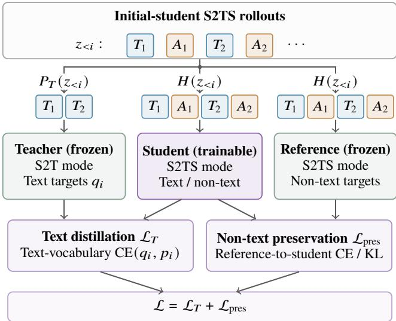

# REDUCING THE OUTPUT-MODE GAP IN SPEECH LANGUAGE MODELS VIA JOINT-OUTPUT ON-POLICY DISTILLATION

Daxin Tan1, Dehua Tao1, Chengxi Deng2, Hanlin Zhang3, Xiao Chen1

1AI Lab, Leibniz Research Center, Huawei 2The Chinese University of Hong Kong 3City University of Hong Kong {tan.daxin1, chen.xiao2}@huawei.com

## ABSTRACT

Autoregressive generation of interleaved text and acoustic tokens is a common approach to spoken-response generation in speech large language models. Although this design enables streaming generation with explicit textual guidance, generated acoustic tokens become part of the context for subsequent text predictions. Given identical speech inputs, we observe markedly lower answer accuracy for the internal text generated in speech-to-text-and-speech (S2TS) mode than for speech-to-text (S2T) responses. We term this discrepancy the output-mode gap (OMG). To reduce OMG, we propose Joint-Output On-Policy Distillation (JO-OPD), which distills the model’s stronger S2T policy into joint generation using student-generated S2TS trajectories. At each text position, the S2T teacher provides soft targets from a text-only projection of the student’s preceding outputs, while the student predicts from the corresponding full interleaved history. A preservation objective further regularizes native non-text predictions. Experiments on Step-Audio-2-mini and Baichuan-Audio-Instruct reveal OMG across two interleaved generation architectures. On Step-Audio-2-mini, JO-OPD reduces OMG from 42.87 to 16.26 percentage points on Spoken-MQA and from 29.72 to 13.04 points on speech-rendered GSM8K, with little change in S2T accuracy and substantially larger reductions than matched SFT baselines. ASR-based evaluation further shows a 7.49-point improvement in spoken-answer accuracy on Spoken-MQA.

Index Terms— speech language models, on-policy distillation, interleaved generation, output-mode gap

## 1. INTRODUCTION

Speech provides a natural interface for human–machine communication. Speech large language models (SLLMs) seek to bring the knowledge and reasoning capabilities of language models to spoken interaction. Models such as Qwen-Audio [1] and SALMONN [2] process speech and audio inputs to produce textual responses. Systems including SpeechGPT [3], Moshi [4], and GLM-4-Voice [5] further support spoken responses, extending language-model capabilities from speech understanding to speech generation. To support linguistic control over response content, many speech-output systems retain an explicit text stream to guide acoustic generation.

Two representative approaches difer in how they couple text and speech generation. One approach adopts a Thinker–Talker architecture, as exemplified by Qwen3-Omni [6], which separates text generation from speech generation, with a Talker producing speech conditioned on text outputs from a Thinker. An alternative approach uses fully discrete models, such as Step-Audio 2 [7] and Baichuan-Audio [8], which represent both text and speech as discrete tokens and generate them autoregressively in an interleaving pattern. This design supports streaming speech generation while incorporating previously generated acoustic tokens into the context for subsequent text predictions. In this interleaved setting, we seek to answer the following question: given the same speech input, does a model preserve its text answer accuracy when it also generates speech?

A line of work studies input-side modality gaps, examining how speech-conditioned performance difers from text-input performance and how speech adaptation afects pretrained languagemodel capabilities [9, 10]. Eforts to narrow these gaps include cross-modal alignment and distillation, reinforcement learning, and text-based input representations augmented with prosodic information [11, 12, 13, 14]. Complementing these input-side studies, we investigate an output-side discrepancy by keeping the speech input and model fixed and comparing the accuracy of text-only responses with that of the internal text generated during joint text–speech generation.

Paired evaluations of Step-Audio-2-mini and Baichuan-Audio-Instruct reveal that, given identical speech inputs, answer accuracy is substantially lower for the internal text generated in speechto-text-and-speech (S2TS) mode than for speech-to-text (S2T) responses. We term this diference the output-mode gap (OMG), measured as S2T accuracy minus S2TS internal-text accuracy under the same answer-scoring rule. On Spoken-MQA and speechrendered GSM8K, OMG reaches 42.87 and 29.72 percentage points (pp) for Step-Audio-2-mini, and 12.41 and 10.39 points for Baichuan-Audio-Instruct, respectively. Explicit reasoning instructions further widen OMG on human-recorded VoiceBench-BBH questions for Step-Audio-2-mini, extending the observation beyond mathematical tasks. These findings motivate improving text answer accuracy within interleaved text–speech generation.

Motivated by the model’s stronger S2T performance, we propose Joint-Output On-Policy Distillation (JO-OPD) to reduce OMG using its own S2T policy as a teacher. JO-OPD distills the teacher’s text predictions along student-generated S2TS trajectories. With the speech input unchanged, the teacher conditions on the text-only projection of each student prefix, while the student conditions on the full interleaved history. An additional preservation objective regularizes native non-text predictions to limit changes to the model’s speech-generation behavior.

Our contributions are threefold. (1) We identify and quantify the output-mode gap in Step-Audio 2 and Baichuan-Audio, observing substantially lower text answer accuracy when speech output is enabled under identical speech inputs. (2) We propose JO-OPD, which distills a model’s stronger S2T policy along student-generated S2TS trajectories while regularizing native non-text predictions. (3) Experimental results demonstrate that JO-OPD reduces OMG in both models, and further analyses examine how internal-text improvements translate into spoken-answer accuracy.

## 2. RELATED WORK

## 2.1. Coupling text and speech generation

Spirit LM [15] autoregressively models interleaved text and speech tokens, while MiMo-Audio [16] jointly models text tokens and audio patches. LongCat-Next [17] compares text-guidance accuracy under parallel and serial audio generation. TtT [18] combines autoregressive text generation with non-autoregressive audio difusion, whereas PRIME-Speech [19] adds a trainable audio post-decoder to a frozen speech-to-text backbone. These studies explore generation designs and capability preservation. JO-OPD targets the outputmode discrepancy within an existing interleaved architecture through distillation and non-text prediction regularization.

## 2.2. Input-side modality gaps

Prior work has observed that extending text LLMs into speech LLMs can degrade knowledge and reasoning capabilities [9, 10]. To address this issue, SALAD [10] combines cross-modal distillation with active data selection, while TARS [13] uses reinforcement learning with representation and behavior alignment rewards. TextPro-SLM [14] provides transcribed text and prosodic features through its Whisper-Pro encoder. These approaches address input-side capability gaps; we instead examine output-mode diferences with the speech input and model fixed.

## 2.3. Cross-modal on-policy distillation

On-policy distillation transfers teacher capabilities through supervision on student-generated trajectories [20]. X-OPD [11] uses a text-conditioned teacher to supervise student-generated trajectories under both speech and text inputs. CORD [12] uses an internal text-conditioned teacher with weighted token-level distillation and sequence-level reinforcement learning. $X ^ { 3 }$ -OPD [21] extends supervision to audio-grounded reasoning using matched text inputs and reference answers. JO-OPD instead keeps the speech input unchanged and provides S2T supervision on text-only projections of student-generated S2TS histories.

## 3. METHOD

## 3.1. Output-mode gap

We consider speech LLMs supporting both speech-to-text (S2T) and speech-to-text-and-speech (S2TS) generation. Given speech input $x ^ { \hat { S } }$ , S2T produces a text response, whereas S2TS produces a joint trajectory � containing text tokens, acoustic outputs, and control tokens. $\mathrm { L e t } P _ { T }$ denote the text-only projection that retains text tokens in their original order and removes acoustic outputs and control tokens. We denote the internal text $P _ { T } ( z )$ by S2TS(T) and the reconstructed spoken response by S2TS(S).

Let A denote answer accuracy (%) on a shared set of speech inputs $X ^ { S }$ . We define the output-mode gap (OMG) as

$$
\begin{array} { r l } & { \Delta _ { \mathrm { O M G } } = \mathcal { A } _ { \mathrm { S 2 T } } - \mathcal { A } _ { \mathrm { S 2 T S } ( \mathrm { T } ) } } \\ & { \qquad = \mathcal { A } \bigl ( \mathrm { S } 2 \mathrm { T } ( X ^ { S } ) \bigr ) - \mathcal { A } \bigl ( P _ { T } ( \mathrm { S } 2 \mathrm { T } \mathrm { S } ( X ^ { S } ) ) \bigr ) . } \end{array}\tag{1}
$$

Same speech input $x ^ { S }$ for all three branches  
  
�: text; �: acoustic. Control tokens not shown.  
Fig. 1. Overview of JO-OPD. Teacher and reference share a frozen base model, using S2T on projected text histories and S2TS on joint histories, respectively.

Both accuracies are computed using the same model, evaluation examples, and answer-scoring rule. A positive OMG indicates lower internal-text answer accuracy when speech output is enabled. Spoken-answer accuracy is assessed separately by transcribing S2TS(S) and scoring the extracted answer.

## 3.2. Joint-Output On-Policy Distillation

As shown in Fig. 1, JO-OPD uses the model’s stronger S2T policy to supervise text predictions along student-generated S2TS trajectories. The base model serves two roles: its S2T policy provides text supervision, and its S2TS policy provides reference distributions for preserving non-text predictions.

History projection. The student is initialized from the base model. Given speech input $x ^ { S }$ , we sample a joint trajectory � from the student in S2TS mode. At each text prediction position �, we construct two contexts:

$$
\begin{array} { r } { h _ { i } ^ { \mathrm { s t u } } = \big ( x ^ { S } , H ( z _ { < i } ) , \mathrm { S } 2 \mathrm { T S } \big ) , } \\ { h _ { i } ^ { \mathrm { t e a } } = \big ( x ^ { S } , P _ { T } ( z _ { < i } ) , \mathrm { S } 2 \mathrm { T } \big ) . } \end{array}\tag{2}
$$

Here, $H ( z _ { < i } )$ denotes the student’s native joint output history at position �. The teacher receives the same speech input and the student’s generated text prefix, while the student also conditions on its acoustic history.

Text distillation. Text distillation compares teacher and student predictions within the text vocabulary. This supervises relative preferences among text tokens without directly matching the probability assigned to text versus non-text outputs.

Let $p _ { i }$ denote the student distribution under $h _ { i } ^ { \mathrm { s u } }$ and $q _ { i }$ the teacher target under $h _ { i } ^ { \mathrm { t e a } }$ . The student distribution is normalized over the full text vocabulary. JO-OPD-Soft obtains $q _ { i }$ by retaining the teacher’s top-� text tokens and renormalizing their probabilities. JO-OPD-Hard instead uses a one-hot target at the teacher’s highest-probability text token. Both variants minimize the same text distillation objective:

$$
\mathcal { L } _ { T } = \mathbb { E } _ { z , i } \big [ \mathrm { C E } ( q _ { i } , p _ { i } ) \big ] ,\tag{3}
$$

where CE denotes cross-entropy, and the expectation averages over training trajectories and sampled text positions within each trajectory. Non-text preservation. Updates to shared parameters may also change predictions of acoustic outputs and control tokens. We therefore regularize these predictions against the fixed base model in S2TS mode, with both models conditioned on the same native joint history.

For Step-Audio 2, we apply cross-entropy at sampled non-text positions of the shared output head, using renormalized top-� reference targets selected from the full output vocabulary. Student probabilities are normalized over the full vocabulary. For Baichuan-Audio, we separately regularize the controller and codec distributions using exact reference-to-student KL divergence. Gradients from the codec loss propagate through the frozen speech head to the shared language model.

Let $\mathcal { L } _ { \mathrm { p r e s } }$ denote the weighted sum of mean distribution-matching losses for these non-text predictions. The overall objective is

$$
\begin{array} { r } { \mathcal { L } = \mathcal { L } _ { T } + \mathcal { L } _ { \mathrm { p r e s } } . } \end{array}\tag{4}
$$

## 4. EXPERIMENTAL SETUP

## 4.1. Models and datasets

We evaluate JO-OPD on Step-Audio-2-mini and Baichuan-Audio-Instruct. The training set comprises 27,847 prompts from Tulu 3 [22] and NaturalReasoning [23], excluding overlap with the evaluation benchmarks. Training speech is synthesized using the SLT voice in flite. We evaluate answer accuracy on Spoken-MQA [24] (1,402 questions) and speech-rendered GSM8K [25] (1,319 test questions). To examine the efect of reasoning instructions beyond mathematical tasks, we additionally evaluate Step-Audio 2 on 1,000 humanrecorded questions from four VoiceBench-BBH [26] tasks under short-answer and explicit-reasoning conditions.

## 4.2. Training and comparisons

In the main experiments, we train JO-OPD for one epoch on fixed S2TS trajectories sampled from the initial student. For Step-Audio 2, we update the full language model while freezing the audio encoder and adapter. For Baichuan-Audio, we update the full language model and text head, with all other components frozen. The teacher and preservation reference remain fixed throughout training. We use AdamW with a batch size of 32 and a learning rate of $2 \times 1 0 ^ { - 6 }$

JO-OPD-Soft uses top-32 teacher targets for text distillation. For Step-Audio 2, the preservation loss uses top-32 reference targets with a weight of 0.05. For Baichuan-Audio, the controller and codec preservation losses are weighted by 1 and 10, respectively.

We compare JO-OPD with Self-SFT and Response-SFT on Step-Audio 2, and with Response-SFT on Baichuan-Audio. Self-SFT uses the same S2TS trajectories, while Response-SFT uses independently generated S2T responses. Each baseline matches JO-OPD’s training prompts and optimization updates on its backbone.

## 4.3. Decoding and evaluation

Evaluation follows each model’s native decoding policy, with matched inputs and generation seeds for base–student comparisons. We generate one response per input and output mode. The generation budget is 4,096 joint tokens for Step-Audio 2 and 4,096 text tokens for Baichuan-Audio.

Table 1. Step-Audio 2 text answer accuracy (%) and OMG (pp).
<table><tr><td colspan="4">Spoken-MQA</td><td colspan="3">GSM8K</td></tr><tr><td>Method</td><td>S2T</td><td>S2TS(T)</td><td>OMG↓</td><td>S2T</td><td>S2TS(T)</td><td>OMG↓</td></tr><tr><td>Base</td><td>75.32</td><td>32.45</td><td>42.87</td><td>69.22</td><td>39.50</td><td>29.72</td></tr><tr><td>Self-SFT</td><td>76.18</td><td>23.61</td><td>52.57</td><td>71.72</td><td>36.92</td><td>34.80</td></tr><tr><td>Response-SFT</td><td>75.96</td><td>31.60</td><td>44.37</td><td>71.27</td><td>42.76</td><td>28.51</td></tr><tr><td>JO-OPD-Hard</td><td>77.03</td><td>40.94</td><td>36.09</td><td>75.13</td><td>52.54</td><td>22.59</td></tr><tr><td>JO-OPD-Soft</td><td>75.18</td><td>58.92</td><td>16.26</td><td>69.90</td><td>56.86</td><td>13.04</td></tr></table>

Table 2. Baichuan-Audio text answer accuracy (%) and OMG (pp).
<table><tr><td>Dataset</td><td>Method</td><td>S2T</td><td>S2TS(T)</td><td>OMG↓</td></tr><tr><td rowspan="3">Spoken-MQA</td><td>Base</td><td>66.26</td><td>53.85</td><td>12.41</td></tr><tr><td>Response-SFT</td><td>66.12</td><td>55.56</td><td>10.56</td></tr><tr><td>JO-OPD</td><td>69.54</td><td>60.06</td><td>9.49</td></tr><tr><td rowspan="3">GSM8K</td><td>Base</td><td>58.23</td><td>47.84</td><td>10.39</td></tr><tr><td>Response-SFT</td><td>59.36</td><td>46.55</td><td>12.81</td></tr><tr><td>JO-OPD</td><td>58.76</td><td>48.98</td><td>9.78</td></tr></table>

For numerical benchmarks, we report answer accuracy using the same extractor across models and output modes. Spoken responses are transcribed using Whisper-large-v3-turbo and evaluated with the same scoring rule. BBH uses task-specific extraction of yes/no responses or option labels. All diferences are computed from unrounded accuracies.

## 5. RESULTS AND ANALYSIS

## 5.1. Reducing the output-mode gap

As shown in Table 1, JO-OPD-Soft substantially reduces OMG in Step-Audio 2. The gap decreases from 42.87 to 16.26 points on Spoken-MQA and from 29.72 to 13.04 points on GSM8K. Since S2T accuracy remains nearly unchanged, these reductions primarily reflect improved text generation in S2TS mode.

The matched baselines provide further insight into the supervision strategy. Self-SFT decreases S2TS(T) accuracy on both benchmarks, while Response-SFT ofers little improvement in this mode. JO-OPD uses the stronger S2T policy to provide feedback at the student’s own joint-generation prefixes. Its larger gains suggest that aligning supervision with these prefixes is useful for improving text predictions conditioned on acoustic history.

Table 2 shows that JO-OPD also reduces OMG in Baichuan-Audio, by 2.92 points on Spoken-MQA and 0.61 points on GSM8K. Here, S2T accuracy also improves, making the reduction in OMG smaller than the gain in S2TS(T) accuracy. JO-OPD also exceeds Response-SFT in S2TS(T) accuracy on both benchmarks, with a larger gain on Spoken-MQA.

The results in Table 3 further show that explicit reasoning instructions afect the two output modes diferently. On human-recorded VoiceBench-BBH questions, requesting explicit reasoning slightly increases Step-Audio 2’s Base S2T accuracy but decreases S2TS(T) accuracy, widening OMG from 8.2 to 19.0 points. JO-OPD-Soft improves S2TS(T) accuracy by 14.7 points under CoT, compared with 2.9 points under Short, leaving gaps of 5.8 and 5.0 points, respectively. The larger CoT gain suggests that JO-OPD is particularly useful when reasoning instructions expose a greater discrepancy between output modes. These results extend its benefits to humanrecorded reasoning questions beyond the numerical benchmarks.

Table 3. Step-Audio 2 answer accuracy (%) and OMG (pp) under Short and CoT conditions on the same 1,000 human-recorded VoiceBench-BBH inputs.
<table><tr><td>Condition</td><td>Method</td><td>S2T</td><td>S2TS(T)</td><td>OMG↓</td></tr><tr><td rowspan="3">Short</td><td>Base</td><td>56.8</td><td>48.6</td><td>8.2</td></tr><tr><td>Response-SFT</td><td>56.3</td><td>50.4</td><td>5.9</td></tr><tr><td>JO-OPD-Soft</td><td>56.5</td><td>51.5</td><td>5.0</td></tr><tr><td rowspan="3">CoT</td><td>Base</td><td>58.6</td><td>39.6</td><td>19.0</td></tr><tr><td>Response-SFT</td><td>59.5</td><td>43.1</td><td>16.4</td></tr><tr><td>JO-OPD-Soft</td><td>60.1</td><td>54.3</td><td>5.8</td></tr></table>

Table 4. Internal-text and ASR-based spoken-answer accuracy (%) in S2TS mode.
<table><tr><td colspan="2"></td><td colspan="2">Spoken-MQA</td><td colspan="2">GSM8K</td></tr><tr><td>Model</td><td>Method</td><td>S2TS (T)</td><td>S2TS (S)</td><td>S2TS (T)</td><td>S2TS (S)</td></tr><tr><td rowspan="3">Step-Audio-2</td><td>Base</td><td>32.45</td><td>28.67</td><td>39.50</td><td>36.16</td></tr><tr><td>Response-SFT</td><td>31.60</td><td>28.32</td><td>42.76</td><td>39.80</td></tr><tr><td>JO-OPD-Soft</td><td>58.92</td><td>36.16</td><td>56.86</td><td>35.25</td></tr><tr><td rowspan="3">Baichuan-Audio</td><td>Base</td><td>53.85</td><td>50.14</td><td>47.84</td><td>43.82</td></tr><tr><td>Response-SFT</td><td>55.56</td><td>51.57</td><td>46.55</td><td>44.66</td></tr><tr><td>JO-OPD</td><td>60.06</td><td>53.07</td><td>48.98</td><td>46.17</td></tr></table>

## 5.2. Spoken-answer accuracy

As shown in Table 4, JO-OPD improves spoken-answer accuracy on Spoken-MQA for both models. Step-Audio 2’s S2TS(S) accuracy increases from 28.67% to 36.16%, a gain of 7.49 points, while Baichuan-Audio improves by 2.92 points. Baichuan-Audio also gains 2.35 points on GSM8K, where Step-Audio 2 shows little change from Base.

On Spoken-MQA, JO-OPD-Soft improves Step-Audio 2’s spoken-answer accuracy over Response-SFT by 7.85 points. For Baichuan-Audio, the spoken-answer gains over Response-SFT are modest, at approximately 1.5 percentage points on both benchmarks.

## 5.3. Ablation studies

As shown in Table 1, JO-OPD-Soft exceeds JO-OPD-Hard in S2TS(T) accuracy by 17.97 points on Spoken-MQA and 4.32 points on GSM8K. With the teacher, trajectories, and history projection held fixed, this comparison favors retaining the teacher’s relative preferences among candidate text tokens over using only its highestprobability prediction.

Table 5 examines text-vocabulary restriction and non-text preservation. Both ablations yield internal-text accuracies within 1.8 points of JO-OPD-Soft, but substantially lower spoken-answer accuracy. On Spoken-MQA, full-vocabulary supervision reduces S2TS(S) accuracy from 36.16% to 11.20%, while removing preservation reduces it to 29.74%. The same pattern holds on GSM8K. These results support restricting text supervision to the text vocabulary while separately regularizing non-text predictions to preserve speech generation.

Table 5. Ablations of text-vocabulary restriction and non-text preservation on Step-Audio 2. We report internal-text and ASR-based spoken-answer accuracy (%).
<table><tr><td rowspan="2">Method</td><td colspan="2">Spoken-MQA</td><td colspan="2">GSM8K</td></tr><tr><td>S2TS(T)</td><td>S2TS(S)</td><td>S2TS(T)</td><td>S2TS(S)</td></tr><tr><td>JO-OPD-Soft</td><td>58.92</td><td>36.16</td><td>56.86</td><td>35.25</td></tr><tr><td>Full vocabulary</td><td>60.70</td><td>11.20</td><td>55.80</td><td>13.04</td></tr><tr><td>No preservation</td><td>59.99</td><td>29.74</td><td>58.38</td><td>30.02</td></tr></table>

Table 6. Step-Audio 2 text answer accuracy (%) on Spoken-MQA with diferent JO-OPD-Soft training set sizes.
<table><tr><td>Training prompts</td><td>S2T</td><td>S2TS(T)</td></tr><tr><td>0 (Base)</td><td>75.32</td><td>32.45</td></tr><tr><td>2,000</td><td>75.89</td><td>36.95</td></tr><tr><td>8,000</td><td>75.04</td><td>49.71</td></tr><tr><td>27,847</td><td>75.18</td><td>58.92</td></tr></table>

## 5.4. Training scale and trajectory renewal

We evaluate JO-OPD-Soft on Step-Audio 2 using nested subsets of the same initial-student trajectory pool. Table 6 shows that S2TS(T) accuracy increases with training set size, while S2T accuracy remains near 75%. Under one-epoch training, larger datasets also entail more optimization updates, so this trend reflects the combined efects of additional data and optimization.

For trajectory renewal, we compare Static, which retains initialstudent trajectories, with Refresh, which regenerates trajectories from the updated student before stages 2–4. Both four-stage runs use the same prompt partitions and 871 updates, with the optimizer and learning-rate schedule reset at each stage. Refresh improves S2TS(T) accuracy by 2.57 points on Spoken-MQA and 2.73 points on GSM8K, with little change in S2T accuracy.

## 6. CONCLUSION

We identify an output-mode gap in interleaved speech LLMs, where enabling speech output can reduce text answer accuracy. To reduce this gap, we propose JO-OPD, which uses the model’s stronger S2T policy to supervise student-generated S2TS trajectories through textonly history projection while regularizing native non-text predictions. Experiments on Step-Audio 2 and Baichuan-Audio show OMG reductions in both models, with JO-OPD outperforming matched SFT baselines on Step-Audio 2. Ablations support the use of soft text targets, vocabulary restriction, and non-text preservation. The observed spoken-answer gains on Spoken-MQA further suggest that supervision from the model’s own S2T policy can benefit the content of spoken responses.

## 7. REFERENCES

[1] Yunfei Chu, Jin Xu, Xiaohuan Zhou, Qian Yang, Shiliang Zhang, Zhijie Yan, Chang Zhou, and Jingren Zhou, “Qwen-Audio: Advancing universal audio understanding via unified large-scale audio-language models,” arXiv preprint arXiv:2311.07919, 2023.

[2] Changli Tang, Wenyi Yu, Guangzhi Sun, Xianzhao Chen, Tian Tan, Wei Li, Lu Lu, Zejun Ma, and Chao Zhang, “SALMONN: Towards generic hearing abilities for large language models,” arXiv preprint arXiv:2310.13289, 2023.

[3] Dong Zhang, Shimin Li, Xin Zhang, Jun Zhan, Pengyu Wang, Yaqian Zhou, and Xipeng Qiu, “SpeechGPT: Empowering large language models with intrinsic cross-modal conversational abilities,” arXiv preprint arXiv:2305.11000, 2023.

[4] Alexandre Defossez, Laurent Mazar´ e, Manu Orsini, et al.,´ “Moshi: A speech-text foundation model for real-time dialogue,” arXiv preprint arXiv:2410.00037, 2024.

[5] Aohan Zeng, Zhengxiao Du, Mingdao Liu, Kedong Wang, Shengmin Jiang, Lei Zhao, Yuxiao Dong, and Jie Tang, “GLM-4-Voice: Towards intelligent and human-like end-to-end spoken chatbot,” arXiv preprint arXiv:2412.02612, 2024.

[6] Jin Xu, Zhifang Guo, Hangrui Hu, Yunfei Chu, Xiong Wang, Jinzheng He, Yuxuan Wang, Xian Shi, Ting He, Xinfa Zhu, Yuanjun Lv, Yongqi Wang, Dake Guo, He Wang, Linhan Ma, Pei Zhang, Xinyu Zhang, Hongkun Hao, Zishan Guo, Baosong Yang, Bin Zhang, Ziyang Ma, Xipin Wei, Shuai Bai, Keqin Chen, Xuejing Liu, Peng Wang, Mingkun Yang, Dayiheng Liu, Xingzhang Ren, Bo Zheng, Rui Men, Fan Zhou, Bowen Yu, Jianxin Yang, Le Yu, Jingren Zhou, and Junyang Lin, “Qwen3- Omni technical report,” arXiv preprint arXiv:2509.17765, 2025.

[7] Boyong Wu et al., “Step-audio 2 technical report,” arXiv preprint arXiv:2507.16632, 2025.

[8] Tianpeng Li, Jun Liu, Tao Zhang, Yuanbo Fang, Da Pan, Mingrui Wang, Zheng Liang, Zehuan Li, Mingan Lin, Guosheng Dong, et al., “Baichuan-Audio: A unified framework for endto-end speech interaction,” arXiv preprint arXiv:2502.17239, 2025.

[9] Bajian Xiang, Shuaijiang Zhao, Tingwei Guo, and Wei Zou, “Understanding the modality gap: An empirical study on the speech-text alignment mechanism of large speech language models,” arXiv preprint arXiv:2510.12116, 2025.

[10] Santiago Cuervo, Skyler Seto, Maureen de Seyssel, Richard He Bai, Zijin Gu, Tatiana Likhomanenko, Navdeep Jaitly, and Zakaria Aldeneh, “Closing the gap between text and speech understanding in LLMs,” arXivpreprint arXiv:2510.13632, 2025.

[11] Di Cao, Dongjie Fu, Hai Yu, et al., “X-OPD: Cross-modal onpolicy distillation for capability alignment in speech LLMs,” arXiv preprint arXiv:2603.24596, 2026.

[12] Jing Hu, Danxiang Zhu, Xianlong Luo, et al., “CORD: Bridging the audio-text reasoning gap via weighted on-policy crossmodal distillation,” arXiv preprint arXiv:2601.16547, 2026.

[13] Chaoren Wang, Heng Lu, Xueyao Zhang, Shujie Liu, Yan Lu, Jinyu Li, and Zhizheng Wu, “Closing the modality reasoning gap for speech large language models,” arXiv preprint arXiv:2601.05543, 2026.

[14] Wenqian Cui, Xiao-Hui Li, Daxin Tan, Qiyong Zheng, and Irwin King, “Minimizing modality gap from the input side: Your speech LLM can be a prosody-aware text LLM,” arXiv preprint arXiv:2605.05927, 2026.

[15] Tu Anh Nguyen, Benjamin Muller, Bokai Yu, Marta R. Costajussa, Maha Elbayad, Sravya Popuri, Christophe Ropers, Paul- \` Ambroise Duquenne, Robin Algayres, Ruslan Mavlyutov, Itai Gat, Mary Williamson, Gabriel Synnaeve, Juan Pino, Benoit Sagot, and Emmanuel Dupoux, “Spirit LM: Interleaved spoken and written language model,” arXivpreprint arXiv:2402.05755, 2024.

[16] Xiaomi LLM-Core Team, “MiMo-Audio: Audio language models are few-shot learners,” arXiv preprint arXiv:2512.23808, 2025.

[17] Meituan LongCat Team, “Longcat-next: Lexicalizing modalities as discrete tokens,” arXiv preprint arXiv:2603.27538, 2026.

[18] Tianqiao Liu, Xueyi Li, Hao Wang, et al., “From text to talk: Audio-language model needs non-autoregressive joint training,” in International Conference on Learning Representations, 2026.

[19] Yuxuan Hu, Heng Lu, Ruchao Fan, et al., “Preserving speechto-text LLM capabilities in speech-to-speech generation,” arXiv preprint arXiv:2606.30944, 2026.

[20] Rishabh Agarwal, Nino Vieillard, Yongchao Zhou, et al., “Onpolicy distillation of language models: Learning from selfgenerated mistakes,” in International Conference on Learning Representations, 2024.

[21] Dongjie Fu, Di Cao, Xize Cheng, et al., “�3-OPD: Distilling reasoning into large audio-language models via on-policy alignment,” arXiv preprint arXiv:2607.21550, 2026.

[22] Nathan Lambert, Jacob Morrison, Valentina Pyatkin, Shengyi Huang, Hamish Ivison, et al., “Tulu 3: Pushing frontiers in open language model post-training,” arXiv preprint arXiv:2411.15124, 2024.

[23] Weizhe Yuan, Jane Yu, Song Jiang, et al., “Naturalreasoning: Reasoning in the wild with 2.8m challenging questions,” arXiv preprint arXiv:2502.13124, 2025.

[24] Chengwei Wei, Bin Wang, Jung-jae Kim, and Nancy F. Chen, “Towards spoken mathematical reasoning: Benchmarking speech-based models over multi-faceted math problems,” arXiv preprint arXiv:2505.15000, 2025.

[25] Karl Cobbe, Vineet Kosaraju, Mohammad Bavarian, et al., “Training verifiers to solve math word problems,” arXiv preprint arXiv:2110.14168, 2021.

[26] Yiming Chen, Xianghu Yue, Chen Zhang, et al., “Voicebench: Benchmarking LLM-based voice assistants,” arXiv preprint arXiv:2410.17196, 2024.