# To Each Language Its Tokenizer: Modular Tokenizers for Efficient Multilingual LLMs

Franck Signe1,2, Hippolyte Pilchen1,3, François Yvon2, Édouard Grave1

<sup>1</sup>Kyutai, Paris <sup>2</sup>Sorbonne Université, CNRS, Institute of Intelligent Systems and Robotics, Paris <sup>3</sup>Univ. Grenoble Alpes, CNRS, Grenoble INP, LIG, Grenoble

Correspondence: franck.signe-talla@kyutai.org

## Abstract

Multilingual Large Language Models (LLMs) traditionally rely on a single vocabulary shared by all supported languages, which can lead to uneven compression across them. Moreover, their large embedding and output matrices increase memory usage and slow inference, notably for small-scale models. It is also wasteful as models are often used for only a subset of languages. To address these issues, we introduce a modular framework for multilingual model training. First, we propose methods to learn large modular BPE and Unigram tokenizers that enable extraction of subtokenizers tailored to any language subset. These subtokenizers achieve compression on par with monolingual tokenizers and improve cross-lingual fairness. Second, we design a pretraining strategy that samples subtokenizers to form batches, restricting predictions to the relevant vocabulary subset and allowing efficient training despite a large vocabulary. This supports efficient inference with any combination of language-specific vocabularies. Therefore, it reduces memory usage and speeds up inference in models without sacrificing performance.<sup>1</sup>

## 1 Introduction

Tokenization is the interface between raw text and the embedding space of Large Language Models (LLMs), directly influencing vocabulary coverage, sequence length, and computational efficiency. In multilingual settings, tokenizers must cover diverse scripts and linguistic patterns, often requiring large vocabularies. In smaller models, the embedding matrix can account for a disproportionate share of total parameters — for example, Gemma 2 2.6B (Team et al., 2024) devotes 22% of its parameters to a 256k-token vocabulary, even with shared input and output embeddings. This is particularly wasteful in resource-constrained settings, where models are often deployed for specific language(s) and the full multilingual output matrix need not be loaded, leaving most tokens redundant and wasting memory and compute. Beyond computational inefficiencies, standard multilingual tokenizers also induce compression disparities across languages: identical content can yield drastically different tokenization lengths depending on the language (Petrov et al., 2023), leading to unequal effective context windows and higher computational costs for non-English text. Together, these issues make inference with large multilingual tokenizers covering many languages slower and more expensive than with language-specific ones, as illustrated in Fig. 1.

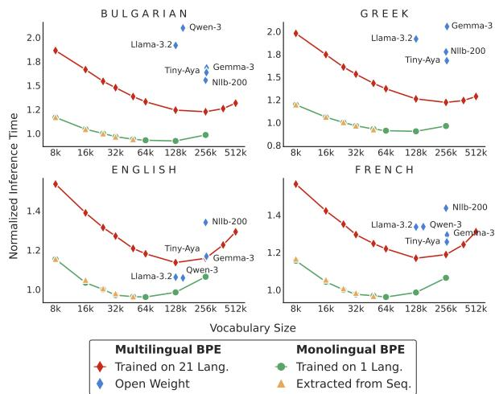  
Figure 1: Normalized inference time on FLORES 200 for a 2.5B non-embedding parameter model using monolingual and multilingual tokenizers of varying sizes. 24k-token monolingual tokenizers are used as reference. For each size, Extracted denotes monolingual tokenizers derived from a sequentially trained multilingual BPE model (§ 4.2), with a per-language budget of that size across 21 languages. Baseline open-weight tokenizers cover all reported languages.

To address both challenges at pretraining, we propose two complementary contributions. First, a method to construct a modular multilingual tokenizer from which specialized subtokenizers can be extracted, each covering a specific language or subset of languages, with compression rates comparable to independently trained monolingual tokenizers, provided for both BPE (Gage, 1994; Sennrich et al., 2016) and Unigram (Kudo, 2018). Second, a pretraining procedure that trains the model to operate with any combination of subtokenizers tailored to the language(s) of interest, allowing irrelevant tokens to be excluded from the output matrix at inference. By maintaining high compression for target languages, this yields faster inference than standard multilingual tokenizers while retaining competitive performance on multiple-choice evaluation, summarization, and translation.

## 2 Related Work

Unfairness in Tokenization. Multilingual tokenizers often compress languages unevenly: identical content translated from English can yield widely varying token lengths, with some lowresource languages requiring up to 15 times more tokens (Petrov et al., 2023), raising computational costs and penalizing them in token-based pricing schemes (Ahia et al., 2023). These disparities are not limited to multilingual settings: Arnett et al. (2025) show that monolingual BPE tokenizers trained under identical conditions (parallel contentmatched corpora, identical vocabulary sizes and training procedures) still exhibit different compression rates across languages. They attribute this largely to whitespace-based pre-tokenization which prevents merges across word boundaries, a limitation that superword tokenizers (Liu et al., 2025; Schmidt et al., 2025) address by allowing merges across whitespace boundaries.

To address these disparities, Foroutan et al. (2026) propose a BPE variant that selects, at each step, the merge maximizing compression for the worst-compressed language. Other work leverages byte-level models: Ahia et al. (2024) propose adaptive gradient-based tokenization to group bytes, and Limisiewicz et al. (2024) modify UTF-8 representations based on morphology to balance compression across languages. Zheng et al. (2021) explicitly allocate vocabulary capacity across languages, increasing the share of underrepresented languages. Chung et al. (2020); Liang et al. (2023) group linguistically similar languages to reduce harmful vocabulary sharing, training tokenizers for each cluster before merging them for multilingual coverage, and use these different tokenizers to train encoderbased models. In contrast, our approach enables flexible inference with any combination of specialized vocabularies, without sacrificing performance, notably on generation tasks.

Vocabulary Adaptation. The computational efficiency of a pretrained model on a target domain depends heavily on vocabulary suitability, motivating two adaptation strategies: vocabulary expansion to reduce sequence length, and vocabulary reduction to lower computational overhead.

Expansion methods append language-specific tokens to pretrained vocabularies (Tejaswi et al., 2024; Csaki et al., 2024; Cui et al., 2024; Kiulian et al., 2025; Fujii et al., 2024; Lin et al., 2024; Dagan et al., 2024), achieving more compact representations, lower tokenizer fertility, and higher throughput. Usually, a dedicated tokenizer is trained on the target distribution and its new tokens are appended to the original vocabulary, but existing merge rules can prevent these tokens from being formed, making this approach suboptimal. Purason et al. (2026) address this by continuing the training of the original tokenizer on the target distribution, refining its merge table rather than simply appending new tokens.

Reduction methods adapt vocabularies to target language(s) by pruning irrelevant tokens (Ushio et al., 2023; Williams and Aletras, 2025; Pilana Liyanage and Yvon, 2026; Zhang et al., 2026) or replacing them with domain-specific ones (Nakash et al., 2025; Chijiwa et al., 2026), reducing memory and improving inference speed. The latter requires careful embedding initialization (Minixhofer et al., 2022; Gee et al., 2022; Dobler and de Melo, 2023; Samuel et al., 2025; Nakash et al., 2025), and both require a fine-tuning step to maintain performance. Unlike prior work, we tackle these issues during pretraining rather than post-hoc, enabling vocabulary reduction gains to be realized effortlessly at inference.

## 3 Inefficiencies of Multilingual Tokenizers

A tokenizer T is formally defined as a tuple $( \mathcal { V } , \tau , \delta )$ , where V is a finite vocabulary of tokens (Zouhar et al., 2023). The tokenization function $\tau : \Sigma ^ { * } \to \mathcal { V } ^ { * }$ maps a string S defined over a finite alphabet Σ to a sequence of tokens, which we denote for simplicity as $\tau ( S ) = \tau ( S )$ . The detokenization function $\delta : \mathcal { V } ^ { * } \to \Sigma ^ { * }$ maps a token sequence back to a string over the original alphabet, with most modern tokenizers satisfying the lossless constraint $\delta ( \mathcal { T } ( S ) ) = S$ for all $S \in \Sigma ^ { * }$

Tokenizer Training. BPE tokenizers are trained with the Hugging Face tokenizers library<sup>2</sup> and Unigram tokenizers with SentencePiece,<sup>3</sup> both using whitespace pre-tokenization with byte-level fallback and no normalization. Monolingual tokenizers are trained on language-specific CommonCrawl subsets;<sup>4</sup> multilingual ones on the concatenation of these subsets, ensuring identical per-language data exposure in both settings.

## 3.1 Monolingual Tokenizers Better Compress than Multilingual Ones

Multilingual LLMs require tokenizers with broad language coverage to handle diverse scripts and linguistic structures, but larger vocabularies increase the computational cost of the output layer, forcing tokenizers to operate under limited capacity. This constraint disproportionately affects underrepresented languages, which tend to be poorly compressed (Zheng et al., 2021). To quantify the compression efficiency of a tokenizer on a given language L, we use the Normalized Sequence Length (NSL) (Dagan et al., 2024), defined as the ratio of tokenized sequence length to that of a reference tokenizer. For a dataset D with M examples in language L, NSL is defined as:

$$
\mathrm { N S L } = \frac { \sum _ { i = 1 } ^ { M } \mathrm { l e n g t h } \bigl ( \mathcal { T } ( \mathcal { D } [ i ] ) \bigr ) } { \sum _ { i = 1 } ^ { M } \mathrm { l e n g t h } \bigl ( \mathcal { T } _ { \mathrm { r e f } } ^ { l } ( \mathcal { D } [ i ] ) \bigr ) } ,\tag{1}
$$

where ${ \mathcal { T } } _ { \mathrm { r e f } } ^ { l }$ is a monolingual reference tokenizer of fixed vocabulary size trained exclusively on L.

Tab. 1 reports NSL on FLORES-200 (devtest, 1012 lines) for multilingual tokenizers relative to monolingual reference with 24k tokens. We focus on BPE, since the open-weight tokenizers are BPE-based, ensuring a uniform evaluation; the same conclusions hold for Unigram tokenizers (see Appendix A.3.3). Open-weight tokenizers — TinyAya (Salamanca et al., 2026), Nllb-200 (Costa-jussà et al., 2024), Gemma-3 (Team et al., 2025), Llama-3 (Grattafiori et al., 2024), and Qwen-3 (Yang et al., 2025) — achieve compression comparable to monolingual references for English but underperform for most other languages.

<table><tr><td colspan="7">NSL (↓)</td></tr><tr><td>Model</td><td>Size</td><td>BG</td><td>EL</td><td>EN</td><td>FI</td><td>FR</td></tr><tr><td>TinyAya</td><td>261k</td><td>1.38</td><td>1.42</td><td>0.98</td><td>1.35</td><td>1.06</td></tr><tr><td>NLLB</td><td>256k</td><td>1.33</td><td>1.51</td><td>1.14</td><td>1.30</td><td>1.21</td></tr><tr><td>Gemma3</td><td>262k</td><td>1.42</td><td>1.73</td><td>0.98</td><td>1.54</td><td>1.09</td></tr><tr><td>Llama3</td><td>128k</td><td>1.78</td><td>1.78</td><td>0.98</td><td>1.83</td><td>1.24</td></tr><tr><td>Qwen3</td><td>152k</td><td>1.92</td><td>3.90</td><td>0.96</td><td>1.82</td><td>1.22</td></tr><tr><td>Multi 21</td><td>128k 256k</td><td>1.16 1.04</td><td>1.17 1.04</td><td>1.06 0.98</td><td>1.14 1.02</td><td>1.09 1.01</td></tr></table>

Table 1: NSL relative to a 24k-token monolingual BPE reference, for open-weight tokenizers and a standard multilingual BPE jointly trained on our 21 languages (Multi 21). More languages in Appendix A.3.2.

By spreading a fixed vocabulary across many languages, these tokenizers end up providing poor compression for the majority of languages they aim to support.

Our evaluation set is deliberately conservative: 21 European languages (Appendix A.2), mediumto high-resource and well covered by open-weight multilingual tokenizers — unfairness thus appears even in a setting that favors these tokenizers, and it widens sharply on low-resource languages (Tab. 2). Covering fewer languages leaves more vocabulary per language: Multi 21, a standard BPE trained on our 21 languages only, comes within 4% of monolingual compression at 256k tokens — a size comparable to the largest open-weight tokenizers in Tab. 1. This trade-off between coverage and per-language compression motivates specialized tokenizers over a single large multilingual one.

While better compression allows more data to be processed for the same compute budget at training, its impact on model quality remains contentious: some work finds a positive correlation with downstream performance (Gallé, 2019; Goldman et al., 2024), while others find that increased compression fails to yield performance gains (Schmidt et al., 2024; Dagan et al., 2024). In this work, we therefore pursue improved compression primarily for efficiency rather than performance gains.

## 3.2 Monolingual Tokenizers Enable Cheaper Inference than Multilingual Ones

The previously discussed trade-off in multilingual coverage often forces large-coverage tokenizers to adopt extensive vocabularies to maintain competitive inference speeds. As shown in Fig. 1, initial vocabulary expansions bring substantial speed gains, but these quickly plateau as marginal compression improvements are offset by a growing output-layer cost. This cost is especially pronounced in smallscale models, where the embedding and output matrices represent a large share of total parameters, amplifying both memory overhead and inference latency. Fig. 1 suggests that monolingual tokenizers sidestep this issue, achieving faster inference with much smaller vocabularies.

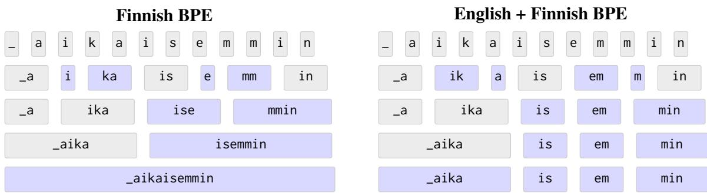  
Figure 2: Comparison of BPE merge hierarchies. The Finnish-only tokenizer (left) forms the token \_aikaisemmin. In contrast, the joint English–Finnish tokenizer (right), where Finnish rules are appended to English ones, produces suboptimal units: early English merges e+m and m+in prevent \_aikaisemmin from forming despite its presence in the vocabulary. Our Sequential training mitigates this by continuing training the English tokenizer on Finnish data, creating merges em+min, is+emmin, and \_aika+isemmin that ultimately recover the token \_aikaisemmin.

## 4 Building Modular Tokenizers

Given a global tokenizer $\mathcal { T } = ( \mathcal { V } , \tau , \delta )$ , we define a subtokenizer $\mathcal { T } _ { s } = ( \nu _ { s } , \tau _ { s } , \delta _ { s } )$ where $\mathcal { V } _ { s } \subseteq \mathcal { V }$ To leverage the advantages of monolingual tokenizers within a multilingual framework, we aim to design $\tau$ covering languages $\{ \mathcal { L } _ { 1 } , \ldots , \mathcal { L } _ { N } \}$ that satisfies: (i) Extractability: for each $\mathcal { L } _ { i } ,$ a specialized subtokenizer $\mathcal { T } _ { i } = ( \nu _ { i } , \tau _ { i } , \delta _ { i } )$ can be explicitly derived; (ii) Compression Efficiency: each $\tau _ { i }$ matches the compression of a tokenizer trained only on ${ \mathcal { L } } _ { i } ;$ and (iii) Compositionality: for any subset $\{ \mathcal { L } _ { 1 } , \ldots , \mathcal { L } _ { k } \}$ , a unified subtokenizer $\mathcal { T } _ { s }$ can be built via $\textstyle \mathcal { V } _ { s } = \bigcup _ { i = 1 } ^ { k } \mathcal { V } _ { i }$ , maintaining competitive compression across all included languages.

## 4.1 UnigramLM Tokenizer

The UnigramLM tokenization function assigns to each token in V a precomputed probability, assuming independence between token occurrences (Kudo, 2018; Meister, 2025). Given a string S, it finds the most probable sequence whose concatenation equals S, via the Viterbi algorithm (Viterbi, 1967). A subtokenizer $\mathcal { T } _ { s }$ restricts this to $\gamma _ { s }$ by assigning zero probability to tokens v $\notin \mathcal { V } _ { s }$ , while keeping original probabilities for v $\in \mathcal { V } _ { s }$ . No renormalization is needed, as rescaling does not affect the optimal Viterbi path. To build the vocabularies $\nu _ { i } .$ , we consider two main approaches.

Frequency-Based Extraction. Given a multilingual tokenizer $\tau$ , a language-specific vocabulary $\nu _ { i }$ of size k is built by retaining the k most frequent tokens on a corpus in $\mathcal { L } _ { i }$ . Even with k much smaller than $| \nu |$ , this approach preserves compression comparable to $\tau$ (Appendix A.3.4, Tab 12), and the reduced vocabulary size directly translates into lower inference latency (Appendix $_ { \mathrm { A } . 6 ) }$ . However, the compression of the resulting subtokenizer is inherently bounded by that of T.

Merging Monolingual Tokenizers. Monolingual tokenizers are trained on each corpus $\mathcal { D } _ { i }$ , and their vocabularies are merged into $\mathcal { V } = \cup \mathcal { V } _ { i }$ . Token probabilities are then re-estimated over the combined corpus $\mathcal { D } = \cup \mathcal { D } _ { i }$ using the EM algorithm (Algorithm 1, Appendix A.1.1). Subtokenizers extracted for each $\mathcal { L } _ { i }$ use the original $\nu _ { i } ,$ , achieving compression rates comparable to independently trained monolingual tokenizers (Appendix A.3.3, Tab 11). As this approach achieves better compression and faster inference than frequency-based extraction, it is used as the default Unigram setting.

## 4.2 BPE Tokenizer

BPE builds an ordered sequence of merge rules by recursively combining frequent adjacent token pairs. This merge order dictates token priority during segmentation, tying the tokenizer to its merge table and making it non-trivial to combine independently trained monolingual BPE models. A common, albeit suboptimal, approach is to concatenate their merge tables by appending non-overlapping tokens from one vocabulary to the other. However, early merges from one language can prevent tokens specific to the other from ever being formed, resulting in inefficiencies (Fig. 2).

Inspired by Purason et al. (2026), we propose a sequential training strategy (Algorithm 2). Given an ordered list of languages $\{ \mathcal { L } _ { 1 } , \ldots , \mathcal { L } _ { N } \}$ with corpora $\{ \mathcal { D } _ { 1 } , . . . , \mathcal { D } _ { N } \}$ and a per-language vocabulary budget k, it incrementally builds a multilingual tokenizer $\tau$ while producing a monolingual subtokenizer $\mathcal { T } _ { i }$ for each language. A BPE tokenizer of size k is first trained on $\mathcal { D } _ { 1 }$ , initializing the global tokenizer $\mathcal { T } = \mathcal { T } _ { 1 }$ . For each subsequent language $\mathcal { L } _ { i } .$ , the corpus $\mathcal { D } _ { i }$ is tokenized with $\tau$ , and a modified BPE procedure simultaneously trains $\mathcal { T } _ { i }$ and extends $\tau$ . At each iteration, we identify the most frequent unigram $u _ { m }$ and bigram $b _ { m } = ( x , y )$ in $\mathcal { T } ( \mathcal { D } _ { i } )$ , with respective counts $f _ { u }$ and $f _ { b }$ . If $f _ { u } \ge f _ { b }$ , we add $u _ { m }$ to $\tau _ { i }$ along with all ancestor units and merges required to recompose it. Otherwise, since $x$ and $y$ are more frequent than $( x , y )$ in $\mathcal { D } _ { i }$ and thus already belong to $\tau _ { i } ,$ we add the merged unit $( x , y )$ to both $\tau _ { i }$ and $\tau$ . As in standard BPE, occurrences of $( x , y )$ are replaced with $b _ { m }$ in $\mathcal { T } ( \mathcal { D } _ { i } )$ and the frequencies are updated accordingly. This continues until $| \nu _ { i } | = k$ . Crucially, the sequential merge order guarantees that every token in $\mathcal { T } _ { i }$ can be formed (proof in A.1.2).

Tabs. 2 and 10 show that both $\tau$ and each subtokenizer $\tau _ { i }$ achieve compression comparable to independently trained monolingual BPE models. Moreover, language ordering has negligible impact on compression (Tab. 7), so we use alphabetical order by default. For any subset of languages, a unified subtokenizer is formed by taking the union of their vocabularies and merges, preserving their original order in $\tau$ . Therefore, all tokens remain constructible (proof in A.1.2), unlike with naive concatenation, ensuring competitive compression across all selected languages.

## 5 Modular Tokenizers Resolve Multilingual Tokenizers’ Inefficiencies

We now show that modular tokenizers resolve both inefficiencies documented in §3. As these hit low-resource languages hardest, we retrain, for this section only, monolingual, sequential, and joint BPE tokenizers on 21 languages where Estonian, Finnish, Lithuanian, Latvian, Slovak, and Swedish are replaced by Croatian, Nepali, Sinhala, Somali, Swahili, and Telugu (three new scripts; using FineWeb-2 (Penedo et al., 2025) data, same construction as before: 24k tokens per language, alphabetical order).

<table><tr><td>Model</td><td>Size</td><td>HR</td><td>NSL (↓) NE SI</td><td>SO SW</td><td>TE</td></tr><tr><td>TinyAya NLLB Gemma3 Llama3</td><td>261k 256k 262k 128k</td><td>1.27 1.24 1.34 1.62</td><td>1.41 9.08 1.30 1.50 1.45 1.79 2.43 6.68</td><td>1.61 1.29 1.54 1.74</td><td>1.39 1.68 1.26 1.40 1.57 1.61 1.84 7.40</td></tr><tr><td>Qwen3 Multi 21</td><td>152k</td><td>1.66</td><td>4.15 0.99</td><td>5.38 1.74</td><td>1.84 6.33</td></tr><tr><td>Seq. 24k Extracted 24k</td><td>384k 387k</td><td>0.92 0.95 1.04 1.01</td><td>0.96 0.97 0.95</td><td>0.97 0.99 0.96 0.98</td><td>0.95 0.97</td></tr></table>

Table 2: NSL relative to 24k-token monolingual BPE references on low-resource languages. Multi $2 l { \colon }$ a standard BPE jointly trained on the same corpora; Seq. 24k: our sequential multilingual BPE (24k tokens per language); Extracted 24k: its per-language subtokenizers.

## 5.1 Multilingual Fairness

Our modular tokenizer yields subtokenizers on par with independently trained monolingual ones: every extracted 24k subtokenizer stays within 4% of its monolingual counterpart, on the lowresource languages (Tab. 2) as on the conservative set (Tab. 10). The full sequential tokenizer is equally fair (NSL 0.95–0.99), matching standard BPE trained on the same corpora at a comparable size — modularity costs nothing in compression, yet every language can be served by its own subtokenizer. The contrast is sharpest on the low-resource languages: Open-weight tokenizers instead inflate sequences even on languages they report as supported — up to 9.1× for TinyAya on Sinhala (Salamanca et al., 2026). In absolute terms, ours cost a uniform 0.21–0.27 tokens per character across the six languages, against 0.31–0.48 for Gemma-3 and 0.29–2.44 for TinyAya (A.3.1): no language pays a disproportionate price for being under-represented.

## 5.2 Inference and Memory Efficiency

The fairness gains of §5.1 translate into efficiency: inference time and memory follow the two quantities a tokenizer controls — the active vocabulary size, whose impact fades with model size, and the sequence length it produces, whose impact persists. The vocabulary costs compute at the output layer: running with the full vocabulary (an illustrative extreme — inference would restrict to the target languages) costs 1.58× the monolingual reference at 0.5B but 1.07× at 30B (Tab. 3). It also costs memory in its parameters: using a 24k sub-vocabulary instead of a conventional 256k removes 47%, 35%, and 10% of all parameters at 1B, 2.5B, and 30B for untied embeddings (31%, 21%, and 5% when tied). Compression, in contrast, is a property of the tokenizer alone: each token costs a forward pass and a KV-cache entry, so time and cache shrink with the sequence. In time, Gemma-3 runs 2.5× slower than the monolingual reference on Telugu at 0.5B and still 1.7× at 30B, while our extracted subtokenizers stay within 0.99–1.04× at every scale and language (full grid in Appendix F). In memory, Telugu sequences are 1.61× the monolingual length under Gemma-3 vs. 1.01× with our subtokenizer (Tab. 2), which thus needs 37% less cache, a cut over Gemma-3 of 22% (Croatian) to 44% (Sinhala), and ∼30% even on well-covered Bulgarian.

<table><tr><td colspan="6">Normalized inference time (↓)</td></tr><tr><td>Tokenizer</td><td>Lang</td><td>0.5B 2.5B</td><td>7B</td><td></td><td>30B</td></tr><tr><td>Gemma3</td><td>EN TE</td><td>1.49 2.46</td><td>1.26 2.09</td><td>1.12 1.84</td><td>1.05 1.73</td></tr><tr><td rowspan="2">Qwen3</td><td>EN</td><td>1.24</td><td>1.11</td><td>1.03</td><td>1.00</td></tr><tr><td>TE</td><td>8.18</td><td>7.34</td><td>6.86</td><td>6.56</td></tr><tr><td rowspan="2">Seq 24k</td><td>EN</td><td>1.58</td><td>1.28</td><td>1.12</td><td>1.07</td></tr><tr><td>TE</td><td>1.58</td><td>1.27</td><td>1.12</td><td>1.07</td></tr><tr><td>Extracted</td><td>(all langs)</td><td></td><td></td><td>0.99-1.04</td><td></td></tr></table>

Table 3: Forward time on FLORES relative to a dedicated 24k monolingual tokenizer, across model scales. Full grid in App. F and architecture details in Tab. 23.

## 6 Training Multilingual Models with Modular Vocabularies

## 6.1 Experimental Settings

Training Data. For all 21 languages considered (Appendix A.2), we use CommonCrawl data processed as follows: text is extracted from HTML using resiliparse,<sup>5</sup> language-identified with fastText<sup>6</sup> to build a dedicated corpus for each language, deduplicated at the paragraph level via hashing, and quality-filtered using a fastText classifier trained to distinguish high-quality documents (Wikipedia, textbooks, news, scientific articles) from random web pages. We use a mixture of 70% English and 30% other languages for training.

Models. We use 2.5B non-embedding-parameter decoder-only Transformers (Vaswani et al., 2017)

with a hidden dimension of 3072 (hyperparameters in Appendix B), trained on roughly 80B tokens with a context size of 4,096. Monolingual subtokenizers have a vocabulary budget of 24k tokens. As a baseline, standard training uses a single multilingual tokenizer with 384k tokens covering all languages. Merging monolingual Unigram tokenizers yields a vocabulary of 376,375 tokens, while sequential BPE yields 366,208 tokens. Since both approaches lead to the same conclusions (Tabs. 6 and 15), the merged Unigram tokenizer is our default modular tokenizer unless stated otherwise.

Evaluation. When using a subtokenizer, only the corresponding tokens are retained in the output matrix unless stated otherwise. For English, we evaluate on ARC Easy and Challenge (Clark et al., 2018), HellaSwag (Zellers et al., 2019), Common-SenseQA (Talmor et al., 2019), BeleBele (Bandarkar et al., 2024), PIQA (Bisk et al., 2020), SIQA (Sap et al., 2019), and MMLU (Hendrycks et al., 2021), following the cloze form setting and normalization recommendations of Gu et al. (2025). For other languages, we use translated versions of ARC, HellaSwag, and MMLU from Thellmann et al. (2024), as well as BeleBele (Bandarkar et al., 2024). We refer to the average of these benchmarks as MCQ (Multi-Choice Questioning). For generation, we evaluate summarization on WikiLingua (Ladhak et al., 2020) in the monolingual setting, and translation on FLORES-200 (Costa-jussà et al., 2024) (English to other languages) in the multilingual setting. All evaluations are 5-shot, except HellaSwag and BeleBele which are 0-shot.

## 6.2 Preliminary Analysis

For simplicity, our experiments use the combination of all subtokenizers (referred to as full tokenizer T ) as a reference to analyze model behavior when multiple subtokenizers are merged, even though in practice, only a subset would typically be used. Additional experiments with alternative subtokenizer combinations are presented in C.1.

To study the effects of training with different tokenizers, we train a model referred to as Mono-only on monolingual batches, where each language $\mathcal { L } _ { i }$ is tokenized with $\tau _ { i }$ and the loss is computed only over $\nu _ { i }$ via the corresponding output layer activations. The baseline follows the same monolingual batching scheme but with a single shared multilingual tokenizer. Mono-only matches the baseline on monolingual tasks including MCQ (Tab. 6)

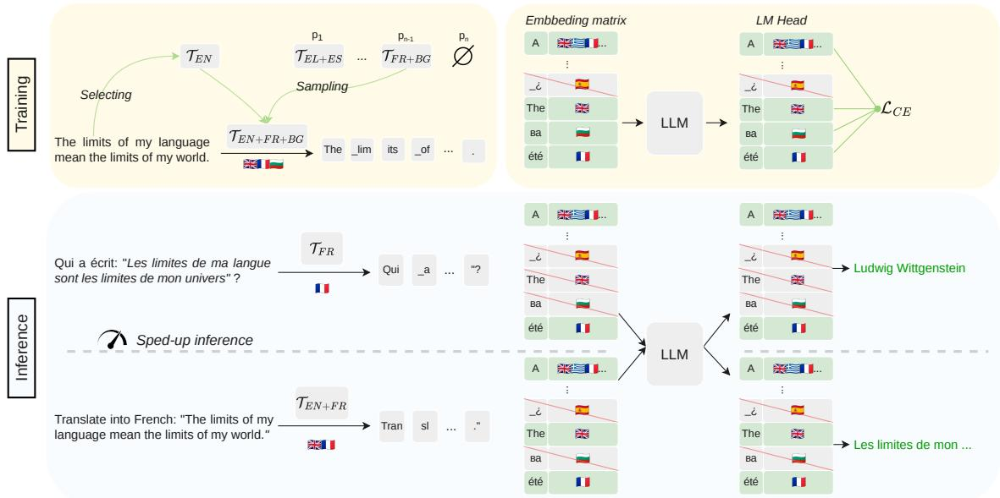  
Figure 3: Overview of our multilingual training method and modular inference. Top: At training, monolingual batches are formed using either strictly monolingual or combined with n other languages (here, n = 2), restricting logit computation to that specific sub-vocabulary. Bottom: At inference, applying task-specific tokenizers (e.g., French-only for QA in French or English+French for translation tasks) shrinks the active vocabulary. This specialized approach reduces both the output token count and FLOPs, improving inference efficiency.

<table><tr><td>Model</td><td>Infer.</td><td>CS EN</td><td>FR IT</td><td>NL PT</td></tr><tr><td>Baseline</td><td>Full</td><td>11.9 19.2</td><td>15.3 13.4 18.0</td><td>17.9</td></tr><tr><td rowspan="3">Mono-only</td><td>Lang</td><td>12.2 21.8</td><td>14.9 13.6</td><td rowspan="3">19.5 19.4 4.6 5.1</td></tr><tr><td>Full</td><td>4.2 20.4</td><td>7.2 3.8</td></tr><tr><td>Full - Lang</td><td>11.9 20.9</td><td>14.1 12.9 18.1</td></tr><tr><td> $S a m p _ { \mathrm { F u l l } }$ </td><td>Lang Full</td><td>12.6 19.3 12.9 20.1</td><td>14.8 14.2 13.6 14.4</td><td>17.8 17.8 18.2 17.2</td></tr><tr><td> $S a m p _ { \mathrm { S u b 2 } }$ </td><td>Lang Full</td><td>12.3 20.1 13.0 20.2</td><td>16.1 13.2 15.9 12.7</td><td>18.9 18.5 18.817.5</td></tr></table>

Table 4: Summarization across pretraining setups (Unigram). Infer. is the inference tokenizer. Lang is the monolingual tokenizer for the target language; Full is the full tokenizer. Full-Lang: inputs tokenized with Full, predictions restricted to Lang vocabulary.

and summarization (Tab. 4), when each language is evaluated with its corresponding subtokenizer. However, combining subtokenizers at inference degrades performance, particularly for non-English generation, where outputs often mix tokens from different languages. This is expected: since token prediction is restricted to monolingual vocabularies during training, merging them at inference introduces a distribution shift in the prediction space. To verify this, we evaluate the Full-Lang setting on summarization (Tab. 4), where inputs are tokenized with T but generation is constrained to V<sub>i</sub>. Recovering baseline performance confirms that the distribution shift is the cause of degradation. English is less affected, as its dominance in training naturally biases Mono-only toward English tokens.

<table><tr><td></td><td>BG</td><td>DA</td><td>EL</td><td>FR</td><td>IT</td></tr><tr><td>Mono-only (EN+Lang)</td><td>1.0</td><td>2.8</td><td>5.3</td><td>15.0</td><td>6.9</td></tr><tr><td>Mono-only (EN|Lang - Lang)</td><td>1.6</td><td>1.5</td><td>12.3</td><td>326.0 12.7</td><td></td></tr><tr><td>Baseline (Full)</td><td>26.1 35.3 17.1 32.4 20.1</td><td></td><td></td><td></td><td></td></tr></table>

Table 5: Translation results with the settings of Tab. 4. EN+Lang: inference with the union of English and Lang subtokenizers. EN|Lang: few-shot examples concatenate source tokenized with English subtokenizer and target with Lang subtokenizer; prediction restricted to Lang vocabulary.

This bias toward English is more pronounced when languages are mixed in context. We evaluate this in a 5-shot translation setting using the combination of the English and target language subtokenizers (EN+Lang in Tab. 5). Here, performance drops substantially compared to the baseline. The distribution shift in the prediction space partly explains this degradation, but does not fully account for it. To investigate further, we modify the evaluation protocol: source sentences are tokenized with the English subtokenizer and target translations with the target-language one, concatenated for each few-shot example, with generation restricted to the target vocabulary (EN | Lang in

<table><tr><td rowspan="2">Model</td><td rowspan="2">Infer.</td><td colspan="2">EN</td><td colspan="2">DA</td><td colspan="2">EL</td><td colspan="2">FR</td><td colspan="2">IT</td><td colspan="2">SK</td></tr><tr><td>MCQ</td><td>MCQ</td><td>MT</td><td>MCQ MT</td><td></td><td>MCQ MT</td><td>MCQ</td><td>MT</td><td></td><td>MCQ</td><td>MT</td><td>MCQ MT</td></tr><tr><td>Baseline</td><td>Full</td><td>52.9</td><td>37.3</td><td>26.1</td><td>40.4</td><td>35.3</td><td>37.3</td><td>17.1</td><td>39.5</td><td>32.4</td><td>38.8</td><td>20.1</td><td>38.1</td><td>21.0</td></tr><tr><td rowspan="2">Mono-only</td><td>Lang</td><td>52.6</td><td>38.3</td><td>1.0</td><td>40.5</td><td>2.8</td><td>37.9</td><td>5.3</td><td>40.3</td><td>15.0</td><td>38.9</td><td>6.9</td><td>38.9</td><td>1.6</td></tr><tr><td>Full</td><td>49.6</td><td>36.3</td><td>0.9</td><td>38.3</td><td>2.4</td><td>37.1</td><td>2.5</td><td>37.8</td><td>7.4</td><td>37.2</td><td>3.0</td><td>36.1</td><td>1.4</td></tr><tr><td rowspan="2"> $S a m p _ { \mathrm { F u l l } }$ </td><td>Lang</td><td>53.2</td><td>38.1</td><td>27.9</td><td>41.6</td><td>35.1</td><td>38.0</td><td>16.9</td><td>39.3</td><td>32.5</td><td>39.1</td><td>19.8</td><td>38.3</td><td>20.3</td></tr><tr><td>Full</td><td>53.0</td><td>38.0</td><td>27.7</td><td>41.5</td><td>35.2</td><td>37.9</td><td>16.8</td><td>39.4</td><td>32.6</td><td>38.8</td><td>20.2</td><td>38.2</td><td>21.1</td></tr><tr><td rowspan="2"> $S a m p _ { \mathrm { S u b 2 } }$ </td><td>Lang</td><td>52.5</td><td>38.9</td><td>27.1</td><td>40.8</td><td>35.0</td><td>37.8</td><td>17.5</td><td>40.4</td><td>32.2</td><td>38.7</td><td>19.8</td><td>39.3</td><td>20.2</td></tr><tr><td>Full</td><td>52.1</td><td>38.8</td><td>26.3</td><td>40.2</td><td>34.7</td><td>37.4</td><td>17.3</td><td>39.3</td><td>32.1</td><td>37.6</td><td>19.7</td><td>37.3</td><td>19.8</td></tr></table>

Table 6: Multiple-Choice Questioning (MCQ) and Machine Translation (MT) performance under different pretraining sampling schemes for Unigram Tokenizers. Infer. denotes the tokenizer used at inference; Full corresponds to the full tokenizer; Lang to the monolingual tokenizer for MCQ and the combined English–target tokenizer for MT.

Tab. 5). This mitigates the distribution shift and improves performance for some languages, but results remain far from the baseline. Despite these constraints, the model frequently produces English or mixed-language outputs, even for languages such as Bulgarian, which uses the Cyrillic script and shares few tokens with English. This suggests the issue goes beyond the prediction space distribution shift: during training, each sequence contains tokens from a single language only, so sequences mixing tokens from multiple languages at inference create out-of-distribution patterns that hinder proper language selection during translation.

## 6.3 Training with Sampled Subtokenizers

To mitigate this, we design $S a m p _ { \mathrm { F u l l } }$ , a middleground training regime between using a single large multilingual tokenizer and monolingual subtokenizers. The former enables proper language selection but is costly; the latter is efficient but tends to produce language mixtures at inference. For a batch in language $\mathcal { L } _ { i }$ , we tokenize using either $\tau$ or $\mathcal { T } _ { i }$ Using T introduces a small fraction of tokens from other languages (0.5–5%, depending on the language; Appendix D.1). We hypothesize that exposing the model to such mixed-token sequences acts as regularization, improving its ability to generate coherent text in $\mathcal { L } _ { i }$ even when foreign tokens appear in context. As a result, the model assigns more probability mass to target-language tokens during translation, enabling proper language switching and recovering baseline performance.

As the number of languages grows, thefull tokenizer becomes very large (Appendix A.5), making training expensive and requiring approximate softmax methods (Joulin et al., 2017; Baevski and

Auli, 2019). To improve scalability, we propose $S a m p _ { \mathrm { S u b } n }$ (Fig. 3): text in language $\mathcal { L } _ { i }$ is tokenized either with $\tau _ { i }$ alone or combined with n additional subtokenizers (instead of $\tau$ as in $S a m p _ { \mathrm { F u l l } }$ method). We decided to sample the additional subtokenizers proportionally to the frequencies of their corresponding languages in the training data. This sampling strategy ensures two key properties that we found to be important to match the baseline performance. First, it calibrates token probabilities across languages: tokens from overrepresented languages tend to have larger logits, so including their subtokenizers more often as "negatives" mitigates this bias. Second, when tokenizing texts from different languages with $\tau$ , English contributes the largest share of foreign tokens due to its prevalence in training data (Appendix D.1). So subtokenizers introducing the most out-of-language tokens should be selected more frequently to reproduce the regularizing effect of the $S a m p _ { \mathrm { F u l l } }$ method.

To simplify training, we retain the monolingual batching scheme: each batch uses a sampled subtokenizer (either $\tau _ { i }$ or a combination), ensuring all tokens belong to the same vocabulary subset and allowing the loss to be computed over that subset only. This avoids the training overhead caused by near-linear vocabulary growth, without requiring approximate softmax methods. Unless stated otherwise, we sample the monolingual tokenizer 50% of the time for $S a m p _ { \mathrm { F u l l } }$ and $S a m p _ { \mathrm { S u b } n }$ . These strategies recover baseline performance across MCQ, translation (Tab. 6), and summarization (Tab. 4). Crucially, $S a m p _ { \mathrm { S u b } n }$ maintains strong performance when using the full tokenizer at inference despite never seeing it during training, demonstrating that the model generalizes to any combination of subtokenizers without sacrificing performance.

<table><tr><td>n lang.</td><td>1</td><td>2</td><td>3</td><td>4</td></tr><tr><td>Seq.</td><td> $1 . 0 1 _ { \pm . 0 1 }$ </td><td> $1 . 0 0 { \scriptstyle \pm . 0 1 }$ </td><td> $0 . 9 9 { \scriptstyle \pm . 0 1 }$ </td><td> $0 . 9 9 { \scriptstyle \pm . 0 1 }$ </td></tr><tr><td>Concat.</td><td> $1 . 0 0 { \scriptstyle \pm . 0 0 }$ </td><td> $1 . 2 2 { \scriptstyle \pm . 2 7 }$ </td><td> $1 . 3 0 { \scriptstyle \pm . 2 7 }$ </td><td> $1 . 3 3 { \scriptstyle \pm . 2 5 }$ </td></tr></table>

Table 7: Mean NSL ± std across languages for nlanguage subtokenizers: concatenated monolingual tokenizers vs. extraction from sequential BPEs trained under different language orders (details in A.4.2).

## 6.4 Memory Footprint at Many Languages

Scaling to more languages grows the vocabulary near-linearly (Appendix A.5), and with it the memory-resident vocabulary state: embeddings, output matrix, optimizer states. CPU offloading lifts this bottleneck by keeping this state in CPU RAM (Miao et al., 2021; Ren et al., 2021), each step touching only the sampled subtokenizers rows. Updates are pipelined following the delayed scheme of Ren et al. (2021): while the GPU computes step t, the CPU updates the rows active at step t−1 with their gradients; the transfers (gradients of t−1 to the CPU, rows for step t+1 to the GPU) run asynchronously from pinned buffers and hide behind compute as well. Every per-step cost therefore depends only on the languages sampled, not on the total vocabulary: we measure identical step times whether CPU RAM holds 21, 100, or 250 languages. To introduce no overhead, this off-GPU work must complete within one GPU step, which we verify on a naive prototype (Appendix E), separate from our training runs: at batch 128, on $S a m p _ { \mathrm { S u b 5 } }$ batches, the full off-GPU work takes 1.2 s vs. a 1.5 s GPU step at 1B, 2.6 s vs. 3.1 s at 2.5B, and 4.7 s vs. 7.4 s at 7B, and monolingual batches stay far below. These timings can be further reduced using the fused optimizer of Ren et al. (2021), which significantly speeds up the CPU update that dominates the off-GPU work.

## 7 Ablations

Sequential BPE is order-robust and preserves compression. Tab. 7 compares subtokenizers covering n languages built via (i) sequential BPE training followed by subtokenizer extraction and merging as in § 4.2, evaluated across multiple training orders, and (ii) concatenation of independently trained monolingual tokenizers. For n = 1, subtokenizers extracted from sequential BPE achieve compression comparable to independently trained monolingual tokenizers. For larger n, concatenation becomes sensitive to both language selection and order, leading to unstable and degraded compression. In contrast, sequential BPE is insensitive to both training and combination orders: fixed merge priorities avoid ordering ambiguity, preserving strong and consistent compression across all languages in the considered set.

<table><tr><td>Model</td><td>BG</td><td>DA</td><td>EL</td><td>FR</td><td>IT</td><td>SK</td></tr><tr><td>Baseline</td><td>26.1</td><td>35.3</td><td>17.1</td><td>32.4</td><td>20.1</td><td>21.0</td></tr><tr><td> $S a m p _ { \mathrm { S u b 1 } }$ </td><td>21.4</td><td>26.4</td><td>14.7</td><td>27.4</td><td>16.7</td><td>13.6</td></tr><tr><td> $S a m p _ { \mathrm { S u b 2 } }$ </td><td>26.3</td><td>34.7</td><td>17.3</td><td>32.1</td><td>19.7</td><td>19.8</td></tr><tr><td> $S a m p _ { \mathrm { S u b 5 } }$ </td><td>28.0</td><td>36.1</td><td>17.2</td><td>32.4</td><td>20.7</td><td>21.2</td></tr><tr><td> $S a m p _ { \mathrm { F u l l } }$ </td><td>27.7</td><td>35.2</td><td>16.8</td><td>32.6</td><td>20.2</td><td>21.1</td></tr></table>

Table 8: Translation performance when varing n in $S a m p _ { \mathrm { S u b } n }$ using the Full tokenizer (Unigram).

Sampling more subtokenizers improves performance. $S a m p _ { \mathrm { S u b } n }$ interpolates between Mono-$o n l y \sim S a m p _ { \mathrm { S u b 0 } }$ and $S a m p _ { \mathrm { F u l l } } \sim S a m p _ { \mathrm { S u b } n - 1 }$ for n languages. Increasing n improves the model’s ability to handle mixed-language contexts, as in translation (Tab. 8). Even small n achieves nearbaseline performance, while larger n is beneficial when scaling to more languages. The main constraint is memory, as larger n increases the output matrix size. Since no performance degradation was observed, n can be as large as memory permits.

## 8 Conclusions

In this work, we highlight a key limitation of multilingual LLMs: their reliance on a single large shared tokenizer causes uneven compression across languages and memory and compute inefficiencies, especially when models are deployed on a subset of the supported languages. To address this, we introduce modular multilingual tokenizers for both BPE and Unigram, decomposable into fair and tailorable subtokenizers. We further propose a pretraining approach that samples subtokenizers per training batch, computing logits only over the relevant vocabulary subset, curbing the cost of large vocabularies. This enables flexible subtokenizer selection at inference. Our results show that this yields more efficient, fair, and modular multilingual LLMs — better cross-lingual balance, lower memory usage, and faster inference than sharedtokenizer models — at competitive performance.

## Limitations

While our approach improves compression fairness and inference efficiency, some limitations remain. First, our low-resource evaluation is tokenizerlevel: compression and fairness are measured on six genuinely low-resource languages, but reliable downstream validation requires stronger pretraining for these languages — our preliminary runs were too noisy to be conclusive — and remains future work. Second, subtokenizer selection at inference requires knowing the target language(s) in advance; language identification or a broader subtokenizer union can cover uncertain inputs, but we do not evaluate such pipelines.

## Acknowledgments

François Yvon has been partly funded by the French National Funding Agency (ANR) under the France 2030 program (ref. ANR-23-IACL-0007).

## References

Orevaoghene Ahia, Sachin Kumar, Hila Gonen, Valentin Hofmann, Tomasz Limisiewicz, Yulia Tsvetkov, and Noah A. Smith. 2024. MAGNET: Improving the multilingual fairness of language models with adaptive gradient-based tokenization. In The Thirty-eighth Annual Conference on Neural Information Processing Systems.

Orevaoghene Ahia, Sachin Kumar, Hila Gonen, Jungo Kasai, David Mortensen, Noah Smith, and Yulia Tsvetkov. 2023. Do all languages cost the same? tokenization in the era of commercial language models. In Proceedings of the 2023 Conference on Empirical Methods in Natural Language Processing, pages 9904–9923, Singapore. Association for Computational Linguistics.

Catherine Arnett, Tyler A. Chang, Stella Biderman, and Ben Bergen. 2025. Explaining and mitigating crosslingual tokenizer inequities. In The Thirty-ninth Annual Conference on Neural Information Processing Systems.

Alexei Baevski and Michael Auli. 2019. Adaptive input representations for neural language modeling. In International Conference on Learning Representations.

Lucas Bandarkar, Davis Liang, Benjamin Muller, Mikel Artetxe, Satya Narayan Shukla, Donald Husa, Naman Goyal, Abhinandan Krishnan, Luke Zettlemoyer, and Madian Khabsa. 2024. The belebele benchmark: a parallel reading comprehension dataset in 122 language variants. In Proceedings of the 62nd Annual Meeting of the Association for Computational Linguistics (Volume 1: Long Papers), pages 749–775, Bangkok, Thailand. Association for Computational Linguistics.

Martin Berglund and Brink van der Merwe. 2023. Formalizing BPE tokenization. Electronic Proceedings in Theoretical Computer Science, 388:16–27.

Yonatan Bisk, Rowan Zellers, Ronan bras, Jianfeng Gao, and Choi Yejin. 2020. Piqa: Reasoning about physical commonsense in natural language. Proceedings of the AAAI Conference on Artificial Intelligence, 34:7432–7439.

Daiki Chijiwa, Taku Hasegawa, Kyosuke Nishida, Shin’ya Yamaguchi, Tomoya Ohba, Tamao Sakao, and Susumu Takeuchi. 2026. Lossless vocabulary reduction for auto-regressive language models. In The Fourteenth International Conference on Learning Representations.

Hyung Won Chung, Dan Garrette, Kiat Chuan Tan, and Jason Riesa. 2020. Improving multilingual models with language-clustered vocabularies. In Proceedings of the 2020 Conference on Empirical Methods in Natural Language Processing (EMNLP), pages 4536–4546, Online. Association for Computational Linguistics.

Peter Clark, Isaac Cowhey, Oren Etzioni, Tushar Khot, Ashish Sabharwal, Carissa Schoenick, and Oyvind Tafjord. 2018. Think you have Solved Question Answering? Try ARC, the AI2 Reasoning Challenge. Preprint, arXiv:1803.05457.

Marta R. Costa-jussà, James Cross, Onur Çelebi, Maha Elbayad, Kenneth Heafield, Kevin Heffernan, Elahe Kalbassi, Janice Lam, Daniel Licht, Jean Maillard, Anna Sun, Skyler Wang, Guillaume Wenzek, Al Youngblood, Bapi Akula, Loic Barrault, Gabriel Mejia Gonzalez, Prangthip Hansanti, John Hoffman, and 20 others. 2024. Scaling neural machine translation to 200 languages. Nature, 630(8018):841–846. ISBN: 1476-4687 tex.date-added: 2024-08-21 15:32:57 +0200 tex.datemodified: 2024-08-21 15:32:57 +0200.

Zoltan Csaki, Bo Li, Jonathan Lingjie Li, Qiantong Xu, Pian Pawakapan, Leon Zhang, Yun Du, Hengyu Zhao, Changran Hu, and Urmish Thakker. 2024. SambaLingo: Teaching large language models new languages. In Proceedings of the Fourth Workshop on Multilingual Representation Learning (MRL 2024), pages 1–21, Miami, Florida, USA. Association for Computational Linguistics.

Yiming Cui, Ziqing Yang, and Xin Yao. 2024. Efficient and effective text encoding for chinese llama and alpaca. Preprint, arXiv:2304.08177.

Gautier Dagan, Gabriel Synnaeve, and Baptiste Roziere. 2024. Getting the most out of your tokenizer for pre-training and domain adaptation. In Forty-first International Conference on Machine Learning.

Konstantin Dobler and Gerard de Melo. 2023. FOCUS: Effective embedding initialization for monolingual specialization of multilingual models. In Proceedings of the 2023 Conference on Empirical Methods in Natural Language Processing, pages 13440–13454,

Singapore. Association for Computational Linguistics.

Negar Foroutan, Clara Meister, Debjit Paul, Joel Niklaus, Sina Ahmadi, Antoine Bosselut, and Rico Sennrich. 2026. Parity-aware byte-pair encoding: Improving cross-lingual fairness in tokenization. In Proceedings of the 64th Annual Meeting of the Associationfor Computational Linguistics (Volume 1: Long Papers), pages 7514–7538, San Diego, California, United States. Association for Computational Linguistics.

Kazuki Fujii, Taishi Nakamura, Mengsay Loem, Hiroki Iida, Masanari Ohi, Kakeru Hattori, Hirai Shota, Sakae Mizuki, Rio Yokota, and Naoaki Okazaki. 2024. Continual pre-training for cross-lingual LLM adaptation: Enhancing japanese language capabilities. In First Conference on Language Modeling, COLM 2024.

Philip Gage. 1994. A New Algorithm for Data Com pression. Computer Users Journal, 12(2):23–38.

Matthias Gallé. 2019. Investigating the effectiveness of BPE: The power of shorter sequences. In Proceedings of the 2019 Conference on Empirical Methods in Natural Language Processing and the 9th International Joint Conference on Natural Language Processing (EMNLP-IJCNLP), pages 1375–1381, Hong Kong, China. Association for Computational Linguistics.

Leonidas Gee, Andrea Zugarini, Leonardo Rigutini, and Paolo Torroni. 2022. Fast vocabulary transfer for language model compression. In Proceedings of the 2022 Conference on Empirical Methods in Natural Language Processing: Industry Track, pages 409– 416, Abu Dhabi, UAE. Association for Computational Linguistics.

Omer Goldman, Avi Caciularu, Matan Eyal, Kris Cao, Idan Szpektor, and Reut Tsarfaty. 2024. Unpacking tokenization: Evaluating text compression and its correlation with model performance. In Findings of the Associationfor Computational Linguistics: ACL 2024, pages 2274–2286, Bangkok, Thailand. Association for Computational Linguistics.

Aaron Grattafiori, Abhimanyu Dubey, Abhinav Jauhri, Abhinav Pandey, Abhishek Kadian, Ahmad Al-Dahle, Aiesha Letman, Akhil Mathur, Alan Schelten, Alex Vaughan, Amy Yang, Angela Fan, Anirudh Goyal, Anthony Hartshorn, Aobo Yang, Archi Mitra, Archie Sravankumar, Artem Korenev, Arthur Hinsvark, and 542 others. 2024. The llama 3 herd of models. Preprint, arXiv:2407.21783.

Yuling Gu, Oyvind Tafjord, Bailey Kuehl, Dany Haddad, Jesse Dodge, and Hannaneh Hajishirzi. 2025. OLMES: A standard for language model evaluations. In Findings of the Association for Computational Linguistics: NAACL 2025, pages 5020–5048, Albuquerque, New Mexico. Association for Computational Linguistics.

Dan Hendrycks, Collin Burns, Steven Basart, Andy Zou, Mantas Mazeika, Dawn Song, and Jacob Steinhardt. 2021. Measuring massive multitask language understanding. In International Conference on Learning Representations.

Kenji Imamura, Masao Utiyama, and Eiichiro Sumita. 2023. Pivot translation for zero-resource language pairs based on a multilingual pretrained model. In Proceedings of Machine Translation Summit XIX, Vol. 1: Research Track, pages 348–359, Macau SAR, China. Asia-Pacific Association for Machine Translation.

Armand Joulin, Moustapha Cissé, David Grangier, Hervé Jégou, and 1 others. 2017. Efficient softmax approximation for gpus. In International conference on machine learning, pages 1302–1310. PMLR.

Artur Kiulian, Anton Polishko, Mykola Khandoga, Yevhen Kostiuk, Guillermo Gabrielli, Łukasz Gagała, Fadi Zaraket, Qusai Abu Obaida, Hrishikesh Garud, Wendy Wing Yee Mak, Dmytro Chaplynskyi, Selma Amor, and Grigol Peradze. 2025. From Englishcentric to effective bilingual: LLMs with custom tokenizers for underrepresented languages. In Proceedings ofthe Fourth Ukrainian Natural Language Processing Workshop (UNLP 2025), pages 1–13, Vienna, Austria (online). Association for Computational Linguistics.

Taku Kudo. 2018. Subword regularization: Improving neural network translation models with multiple subword candidates. In Proceedings ofthe 56th Annual Meeting of the Association for Computational Linguistics (Volume 1: Long Papers), pages 66–75, Melbourne, Australia. Association for Computational Linguistics.

Faisal Ladhak, Esin Durmus, Claire Cardie, and Kathleen McKeown. 2020. WikiLingua: A new benchmark dataset for cross-lingual abstractive summarization. In Findings of the Association for Computational Linguistics: EMNLP 2020, pages 4034–4048, Online. Association for Computational Linguistics.

Davis Liang, Hila Gonen, Yuning Mao, Rui Hou, Naman Goyal, Marjan Ghazvininejad, Luke Zettlemoyer, and Madian Khabsa. 2023. XLM-V: Overcoming the vocabulary bottleneck in multilingual masked language models. In Proceedings ofthe 2023 Conference on Empirical Methods in Natural Language Processing, pages 13142–13152, Singapore. Association for Computational Linguistics.

Tomasz Limisiewicz, Terra Blevins, Hila Gonen, Orevaoghene Ahia, and Luke Zettlemoyer. 2024. MYTE: Morphology-driven byte encoding for better and fairer multilingual language modeling. In Proceedings of the 62nd Annual Meeting of the Association for Computational Linguistics (Volume 1: Long Papers), pages 15059–15076, Bangkok, Thailand. Association for Computational Linguistics.

Peiqin Lin, Shaoxiong Ji, Jörg Tiedemann, André F. T. Martins, and Hinrich Schütze. 2024. Mala-500: Massive language adaptation of large language models. Preprint, arXiv:2401.13303.

Alisa Liu, Jonathan Hayase, Valentin Hofmann, Sewoong Oh, Noah A. Smith, and Yejin Choi. 2025. SuperBPE: Space travel for language models. In Second Conference on Language Modeling.

Clara Meister. 2025. UnigramLM: An Attempt at Writing The Missing Manual. Blog post.

Xupeng Miao, Hailin Zhang, Yining Shi, Xiaonan Nie, Zhi Yang, Yangyu Tao, and Bin Cui. 2021. Het: scaling out huge embedding model training via cacheenabled distributed framework. Proceedings of the VLDB Endowment, 15(2):312–320.

Benjamin Minixhofer, Fabian Paischer, and Navid Rekabsaz. 2022. WECHSEL: Effective initialization of subword embeddings for cross-lingual transfer of monolingual language models. In Proceedings of the 2022 Conference of the North American Chapter ofthe Associationfor Computational Linguistics: Human Language Technologies, pages 3992–4006, Seattle, United States. Association for Computational Linguistics.

Itay Nakash, Nitay Calderon, Eyal Ben-David, Elad Hoffer, and Roi Reichart. 2025. AdaptiVocab: Enhancing LLM efficiency in focused domains through lightweight vocabulary adaptation. In Second Conference on Language Modeling, COLM 2025.

Guilherme Penedo, Hynek Kydlícek, Vinko Sabolˇ cec,ˇ Bettina Messmer, Negar Foroutan, Amir Hossein Kargaran, Colin Raffel, Martin Jaggi, Leandro Von Werra, and Thomas Wolf. 2025. Fineweb2: One pipeline to scale them all — adapting pre-training data processing to every language. In Second Conference on Language Modeling.

Aleksandar Petrov, Emanuele La Malfa, Philip Torr, and Adel Bibi. 2023. Language model tokenizers introduce unfairness between languages. In Thirtyseventh Conference on Neural Information Processing Systems.

Vijini Pilana Liyanage and François Yvon. 2026. AdaptBPE: From general purpose to specialized tokenizers. In Proceedings of the 19th conference of the European chapter ofthe Associationfor Computational Linguistics (volume 1: Long papers), pages 2607–2620, Rabat, Morocco. Association for Computational Linguistics.

Taido Purason, Pavel Chizhov, Ivan P. Yamshchikov, and Mark Fishel. 2026. Teaching old tokenizers new words: Efficient tokenizer adaptation for pretrained models. In Findings ofthe Associationfor Computational Linguistics: EACL 2026, pages 6492–6516, Rabat, Morocco. Association for Computational Linguistics.

Lawrence Rabiner and Biing Hwang Juang. 1993. Fundamentals of speech recognition.

Jie Ren, Samyam Rajbhandari, Reza Yazdani Aminabadi, Olatunji Ruwase, Shuangyan Yang, Minjia Zhang, Dong Li, and Yuxiong He. 2021. Zerooffload: Democratizing billion-scale model training. Preprint, arXiv:2101.06840.

Alejandro R. Salamanca, Diana Abagyan, Daniel D’souza, Ammar Khairi, David Mora, Saurabh Dash, Viraat Aryabumi, Sara Rajaee, Mehrnaz Mofakhami, Ananya Sahu, Thomas Euyang, Brittawnya Prince, Madeline Smith, Hangyu Lin, Acyr Locatelli, Sara Hooker, Tom Kocmi, Aidan Gomez, Ivan Zhang, and 7 others. 2026. Tiny Aya: Bridging Scale and Multilingual Depth. Preprint, arXiv:2603.11510.

David Samuel, Vladislav Mikhailov, Erik Velldal, Lilja Øvrelid, Lucas Georges Gabriel Charpentier, Andrey Kutuzov, and Stephan Oepen. 2025. Small languages, big models: A study of continual training on languages of Norway. In Proceedings ofthe Joint 25th Nordic Conference on Computational Linguistics and 11th Baltic Conference on Human Language Technologies (NoDaLiDa/Baltic-HLT 2025), pages 573– 608, Tallinn, Estonia. University of Tartu Library.

Maarten Sap, Hannah Rashkin, Derek Chen, Ronan Le Bras, and Yejin Choi. 2019. Social IQa: Commonsense reasoning about social interactions. In Proceedings of the 2019 Conference on Empirical Methods in Natural Language Processing and the 9th International Joint Conference on Natural Language Processing (EMNLP-IJCNLP), pages 4463– 4473, Hong Kong, China. Association for Computational Linguistics.

Craig W Schmidt, Varshini Reddy, Chris Tanner, and Yuval Pinter. 2025. Boundless byte pair encoding: Breaking the pre-tokenization barrier. In Second Conference on Language Modeling.

Craig W Schmidt, Varshini Reddy, Haoran Zhang, Alec Alameddine, Omri Uzan, Yuval Pinter, and Chris Tanner. 2024. Tokenization is more than compression. In Proceedings of the 2024 Conference on Empirical Methods in Natural Language Processing, pages 678–702, Miami, Florida, USA. Association for Computational Linguistics.

Rico Sennrich, Barry Haddow, and Alexandra Birch. 2016. Neural machine translation of rare words with subword units. In Proceedings of the 54th Annual Meeting of the Association for Computational Linguistics (Volume 1: Long Papers), pages 1715–1725, Berlin, Germany. Association for Computational Linguistics.

Alon Talmor, Jonathan Herzig, Nicholas Lourie, and Jonathan Berant. 2019. CommonsenseQA: A question answering challenge targeting commonsense knowledge. In Proceedings ofthe 2019 Conference ofthe North American Chapter ofthe Associationfor Computational Linguistics: Human Language Technologies, Volume 1 (Long and Short Papers), pages

4149–4158, Minneapolis, Minnesota. Association for Computational Linguistics.

Gemma Team, Aishwarya Kamath, Johan Ferret, Shreya Pathak, Nino Vieillard, Ramona Merhej, Sarah Perrin, Tatiana Matejovicova, Alexandre Ramé, Morgane Rivière, Louis Rouillard, Thomas Mesnard, Geoffrey Cideron, Jean bastien Grill, Sabela Ramos, Edouard Yvinec, Michelle Casbon, Etienne Pot, Ivo Penchev, and 197 others. 2025. Gemma 3 technical report. Preprint, arXiv:2503.19786.

Gemma Team, Morgane Riviere, Shreya Pathak, Pier Giuseppe Sessa, Cassidy Hardin, Surya Bhupatiraju, Léonard Hussenot, Thomas Mesnard, Bobak Shahriari, Alexandre Ramé, Johan Ferret, Peter Liu, Pouya Tafti, Abe Friesen, Michelle Casbon, Sabela Ramos, Ravin Kumar, Charline Le Lan, Sammy Jerome, and 179 others. 2024. Gemma 2: Improving open language models at a practical size. Preprint, arXiv:2408.00118.

Atula Tejaswi, Nilesh Gupta, and Eunsol Choi. 2024. Exploring design choices for building languagespecific LLMs. In Findings of the Association for Computational Linguistics: EMNLP 2024, pages 10485–10500, Miami, Florida, USA. Association for Computational Linguistics.

Klaudia Thellmann, Bernhard Stadler, Michael Fromm, Jasper Schulze Buschhoff, Alex Jude, Fabio Barth, Johannes Leveling, Nicolas Flores-Herr, Joachim Köhler, René Jäkel, and Mehdi Ali. 2024. Towards Multilingual LLM Evaluation for European Languages. Preprint, arXiv:2410.08928.

Asahi Ushio, Yi Zhou, and Jose Camacho-Collados. 2023. Efficient multilingual language model compression through vocabulary trimming. In Findings of the Association for Computational Linguistics: EMNLP 2023, pages 14725–14739, Singapore. Association for Computational Linguistics.

Ashish Vaswani, Noam Shazeer, Niki Parmar, Jakob Uszkoreit, Llion Jones, Aidan N Gomez, Ł ukasz Kaiser, and Illia Polosukhin. 2017. Attention is all you need. In Advances in Neural Information Processing Systems, volume 30. Curran Associates, Inc.

A. Viterbi. 1967. Error bounds for convolutional codes and an asymptotically optimum decoding algorithm. IEEE Transactions on Information Theory, 13(2):260–269.

Miles Williams and Nikolaos Aletras. 2025. Vocabulary-level memory efficiency for language model fine-tuning. In Proceedings of the 10th Workshop on Representation Learningfor NLP (RepL4NLP-2025), pages 185–196, Albuquerque, NM. Association for Computational Linguistics.

An Yang, Anfeng Li, Baosong Yang, Beichen Zhang, Binyuan Hui, Bo Zheng, Bowen Yu, Chang Gao, Chengen Huang, Chenxu Lv, Chujie Zheng, Dayiheng Liu, Fan Zhou, Fei Huang, Feng Hu, Hao Ge, Haoran Wei, Huan Lin, Jialong Tang, and 41

others. 2025. Qwen3 technical report. Preprint, arXiv:2505.09388.

Rowan Zellers, Ari Holtzman, Yonatan Bisk, Ali Farhadi, and Yejin Choi. 2019. HellaSwag: Can a machine really finish your sentence? In Proceedings of the 57th Annual Meeting ofthe Associationfor Computational Linguistics, pages 4791–4800, Florence, Italy. Association for Computational Linguistics.

Hanling Zhang, Yayu Zhou, Tongcheng Fang, Zhihang Yuan, Guohao Dai, Wanli Ouyang, and Yu Wang. 2026. VocabTailor: Dynamic vocabulary selection for downstream tasks in small language models. In Findings ofthe Associationfor Computational Linguistics: ACL 2026, pages 28453–28471, San Diego, California, United States. Association for Computational Linguistics.

Bo Zheng, Li Dong, Shaohan Huang, Saksham Singhal, Wanxiang Che, Ting Liu, Xia Song, and Furu Wei. 2021. Allocating large vocabulary capacity for crosslingual language model pre-training. In Proceedings of the 2021 Conference on Empirical Methods in Natural Language Processing, pages 3203–3215, Online and Punta Cana, Dominican Republic. Association for Computational Linguistics.

Vilém Zouhar, Clara Meister, Juan Gastaldi, Li Du, Tim Vieira, Mrinmaya Sachan, and Ryan Cotterell. 2023. A formal perspective on byte-pair encoding. In Findings of the Association for Computational Linguistics: ACL 2023, pages 598–614, Toronto, Canada. Association for Computational Linguistics.

## A Tokenizer Study

## A.1 Tokenizer construction

## A.1.1 Multilingual Unigram Tokenizer

Forward–Backward Re-estimation over Merged Vocabularies. To establish a unified probability space for the merged vocabulary $V = \cup V _ { i }$ , parameter estimation is performed over the aggregate multilingual corpus $\mathcal { D } = \cup \mathcal { D } _ { i }$ . As detailed in Algorithm 1, the Expectation-Maximization (EM) procedure reestimates token probabilities $p ( v )$ using the forward-backward algorithm (Rabiner and Juang, 1993).

For a sentence $S \in { \mathcal { D } }$ of length $n ,$ , the forward and backward variables, $\alpha ( i )$ and $\beta ( i )$ , are computed to represent the marginal probabilities of all segmentations for the prefix $S [ 0 : i ]$ and suffix $S [ i : n ]$ , respectively.

Under the Unigram independence assumption, the total sentence likelihood is given by $P ( S ) =$ $\alpha ( n ) = \beta ( 0 )$ . The E-step utilizes these variables to calculate the expected counts $E [ c ( v ) ]$ for each token $v \in V$ by marginalizing over all valid segmentation paths in the corpus. In the subsequent M-step, the parameters are updated via the normalization:

$$
p ( v ) = { \frac { E [ c ( v ) ] } { \sum _ { v ^ { \prime } \in V } E [ c ( v ^ { \prime } ) ] } }
$$

This iterative process ensures that the probabilities for the merged vocabulary are normalized and remain consistent with the multilingual data distribution.

## A.1.2 Multilingual BPE Tokenizer

Each BPE tokenizer $\tau$ consists of an ordered list of merges $\tau$ .merges and of tokens $\tau$ .vocab.

Proof of Properness. To prove the correctness of Algorithm 2, we show that it preserves the properness of the merge sequence (Berglund and van der Merwe, 2023). This property ensures that any compound token is introduced only after all tokens required to construct it have already been included.

Formally, let $\mu = [ \mu _ { 0 } , \mu _ { 1 } , \ldots , \mu _ { N } ]$ be the sequence of merges, where each $\mu _ { i } = ( x _ { i } , y _ { i } )  z _ { i }$ The sequence $\mu$ is proper if for all i:

$$
\bullet \ x _ { i } \in \Sigma \ \mathrm { o r } \exists j < i \ \mathrm { s u c h ~ t h a t } \ x _ { i } = z _ { j } ,
$$

$$
\bullet \ y _ { i } \in \Sigma \ \mathrm { o r } \exists j < i \ \mathrm { s u c h ~ t h a t } \ y _ { i } = z _ { j } .
$$

That is, both constituents of any merge must either belong to the base alphabet $\Sigma$ or have been produced by a previous merge. Note that any prefix of a proper merge sequence is also proper.

Global tokenizer $\tau .$ The global tokenizer $\tau$ is initialized using standard BPE on $\mathcal { D } _ { 1 }$ , which is known to produce a proper merge sequence. At each subsequent step, Algorithm 2 only appends a merge $( x , y )$ to $\tau$ when both $x$ and $y$ already belong to $\tau$ . Since $( x , y )$ is selected from $\mathcal { T } ( \mathcal { D } _ { i } )$ both x and y are already representable using $\tau$ Therefore, any newly added merge satisfies the properness condition, and $\tau$ remains proper by closure under extension.

Language-specific tokenizers $\mathcal { T } _ { i } \mathrm { : }$ Each $\tau _ { i }$ is constructed by adding tokens together with all their ancestors in $\tau$ , in the order induced by $\tau .$ . Since $\tau$ is proper, every merge depends only on tokens that appear earlier in this order. Thus, when a merge $( x , y ) \to z$ is included in $\mathcal { M } _ { i }$ , both x and $y$ have already been added to $\nu _ { i }$ . Moreover, the merge sequence of $\tau _ { i }$ is an order-preserving subsequence of that of $\tau$ that is closed under ancestry up to the vocabulary budget k. Although some tokens may be omitted due to truncation, no merge is included without its dependencies. Therefore, the merge sequence of $\tau _ { i }$ is proper.

Conclusion. Both the global tokenizer $\tau$ and each $\tau _ { i }$ maintain proper merge sequences, ensuring that all constructed tokenizers are valid BPE tokenizers.

Proof of Properness of Combined Subtokenizers. For any subset of languages $\{ \mathcal { L } _ { 1 } , \ldots , \mathcal { L } _ { k } \}$ let $\mathcal { T } _ { \mathrm { c o m b } }$ be the tokenizer obtained by taking the union of their vocabularies and merges and reordering them according to the global tokenizer $\tau$ . Since each language-specific tokenizer $\mathcal { T } _ { i }$ is proper, every token it contains is associated with a valid ancestral merge chain in the global sequence $\tau$ . As $\tau _ { \mathrm { c o m b } }$ is formed by taking the union of such tokens and preserving their global ordering, it remains closed under these ancestral dependencies. Therefore, every token in $\tau _ { \mathrm { c o m b } }$ is constructible from $\Sigma ,$ and $\tau _ { \mathrm { c o m b } }$ is proper.

In contrast, arbitrary concatenation of independently trained tokenizers may introduce tokens whose merge histories are incompatible or incomplete with respect to $\tau$ , leading to tokens that are not jointly constructible within a shared merge graph.

```latex
Algorithm 1 Unigram Probabilities Estimation via Expectation-Maximization
Require: Multilingual Corpus D, Merged Vocabulary V
1: Initialization: Set $\textstyle p ( v ) = { \frac { 1 } { | V | } }$ for all $v \in V$
2: repeat
3: $E [ c ( v ) ]  0 , \quad \forall v \in V$ ▷ Reset expected counts
4: for all sentences $S \in \mathcal { D }$ do
5: $n \gets | S |$
6: $\alpha ( 0 ) \stackrel { \cdot \cdot } {  } 1 , \quad \beta ( n )  1$
7: for $j = 1$ to n do ▷ E-step: Forward Pass
8: $\begin{array} { r } { \alpha ( j )  \sum _ { i : 0 \leq i < j , S [ i : j ] \in V } \alpha ( i ) \cdot p ( S [ i : j ] ) } \end{array}$
9: end for
10: for $i = n - 1$ down to 0 do ▷ E-step: Backward Pass
11: $\begin{array} { r } { \beta ( i )  \sum _ { j : i < j \leq n , S [ i : j ] \in V } p ( S [ i : j ] ) \cdot \beta ( j ) } \end{array}$
12: end for
13: for $i = 0$ to $n - 1$ do ▷ E-step: Expectation Accumulation
14: for $j = i + 1$ to n do
15: if $S [ i : j ] \in V$ then
16: v $ S [ i : j ]$
17: $\begin{array} { r } { E [ c ( v ) ]  E [ c ( v ) ] + \frac { \alpha ( i ) \cdot p ( v ) \cdot \beta ( j ) } { \alpha ( n ) } } \end{array}$
18: end if
19: end for
20: end for
21: end for
22:
23: $\begin{array} { r } { Z  \sum _ { v ^ { \prime } \in V } E [ c ( v ^ { \prime } ) ] } \end{array}$ ▷ M-step: Probabilities Update
24: for all $v \in V _ { - } \mathbf { d o }$
25: $p ( v )  \frac { E [ c ( v ) ] } { Z }$
26: end for
27: until Log-likelihood $\textstyle \sum _ { S \in { \mathcal { D } } } \log \alpha ( n )$ converges
```

Algorithm 2 Sequential Multilingual BPE with Language-Specific Extraction   
Inputs: Ordered languages $\{ \mathcal { L } _ { 1 } , \ldots , \mathcal { L } _ { N } \}$ ; corresponding corpora $\{ \mathcal { D } _ { 1 } , . . . , \mathcal { D } _ { N } \}$ ; vocabulary budget   
k per language   
Outputs: Global multilingual tokenizer $\tau { : }$ ; language-specific tokenizers $\{ \mathcal { T } _ { i } \} _ { i = 1 } ^ { N }$ , each preserving the   
merge order of $\tau$ and containing at most k tokens   
1: $\mathcal { T } _ { 1 } \gets$ Train BPE with $| \nu _ { 1 } | = k$ on $\mathcal { D } _ { 1 }$   
2: $\tau  \tau _ { 1 }$   
3: for $i = 2$ to $N$ do   
4: $\mathcal { D } _ { i } ^ { t o k }  \mathcal { T } ( \mathcal { D } _ { i } )$   
5: Compute unigram and bigram frequencies in $\mathcal { D } _ { i } ^ { t o k }$   
6: Initialize $\mathcal { V } _ { i }  \emptyset , \quad \mathcal { M } _ { i }  \emptyset$   
7: while $| \nu _ { i } | < k$ do   
8: $u _ { m } \gets$ most frequent unigram with frequency $f _ { u }$   
9: $b _ { m } = ( x , y ) \gets$ most frequent bigram with frequency $f _ { b }$   
10: if $f _ { u } \ge f _ { b }$ then   
11: $t _ { \mathrm { n e w } } \gets u _ { m }$   
12: else   
13: $t _ { \mathrm { n e w } } \gets \mathbf { M E R G E } ( x , y )$   
14: Replace all occurrences of $( x , y )$ with $t _ { \mathrm { n e w } }$ in $\mathcal { D } _ { i } ^ { t o k }$   
15: Update unigram and bigram frequencies   
16: Append $( x , y )$ to $\tau$ .merges   
17: Append $t _ { \mathrm { n e w } }$ to $\tau .$ .vocab   
18: end if   
19: $( \mathcal { A } , \mathcal { P } ) $ ancestors of $t _ { \mathrm { n e w } }$ in $\tau$ and corresponding merges (ordered as in $\tau _ { \ O }$   
20: for $( t , m e r g e ) \in ( \mathcal { A } , \mathcal { P } )$ do   
21: if $| \nu _ { i } | <$ k then   
22: $\mathcal { V } _ { i }  \mathcal { V } _ { i } \cup \{ t \}$   
23: if merge $\neq$ None then ▷ None for original bytes/characters   
24: $\mathcal { M } _ { i } \gets \mathcal { M } _ { i } \cup \{ m e r g e \}$   
25: end if   
26: else   
27: break   
28: end if   
29: end for   
30: end while   
31: Order $\nu _ { i }$ and $\mathcal { M } _ { i }$ according to $\tau$   
32: Define $\tau _ { i }$ from $( \nu _ { i } , \mathcal { M } _ { i } )$   
33: end for   
34: return $\mathscr { T } , \{ \mathscr { T } _ { i } \} _ { i = 1 } ^ { N }$

<table><tr><td>Model</td><td>BG</td><td>CS</td><td>DA</td><td>DE</td><td>EL</td><td>EN</td><td>ES</td><td>FR</td><td>HR</td><td>HU</td><td>IT</td><td></td><td>NE</td><td>NL</td><td>PL</td><td>PT</td><td>RO</td><td>SI</td><td>SL</td><td>SO</td><td>SW</td></tr><tr><td>TinyAya</td><td>0.32</td><td>0.29</td><td>0.27</td><td>0.23</td><td>0.31</td><td>0.21</td><td>0.23</td><td>0.24</td><td>0.30</td><td>0.31</td><td>0.23</td><td>0.33</td><td>0.25</td><td>0.29</td><td>0.24</td><td>0.28</td><td>2.44</td><td>0.30</td><td>0.37</td><td>0.29</td><td>0.39</td></tr><tr><td>NLLB</td><td>0.30</td><td>0.32</td><td>0.26</td><td>0.27</td><td>0.33</td><td>0.25</td><td>0.25</td><td>0.28</td><td>0.29</td><td>0.29</td><td>0.26</td><td>0.30</td><td>0.26</td><td>0.31</td><td>0.26</td><td>0.29</td><td>0.40</td><td>0.29</td><td>0.29</td><td>0.26</td><td>0.32</td></tr><tr><td>Gemma3</td><td>0.33</td><td>0.33</td><td>0.29</td><td>0.24</td><td>0.38</td><td>0.21</td><td>0.23</td><td>0.25</td><td>0.31</td><td>0.33</td><td>0.25</td><td>0.34</td><td>0.26</td><td>0.30</td><td>0.25</td><td>0.29</td><td>0.48</td><td>0.33</td><td>0.35</td><td>0.33</td><td>0.37</td></tr><tr><td>Llama3</td><td>0.41</td><td>0.33</td><td>0.33</td><td>0.28</td><td>0.39</td><td>0.21</td><td>0.27</td><td>0.28</td><td>0.38</td><td>0.42</td><td>0.29</td><td>0.56</td><td>0.30</td><td>0.37</td><td>0.29</td><td>0.35</td><td>1.79</td><td>0.38</td><td>0.40</td><td>0.39</td><td>1.70</td></tr><tr><td>Qwen3</td><td>0.44</td><td>0.45</td><td>0.33</td><td>0.28</td><td>0.86</td><td>0.21</td><td>0.27</td><td>0.27</td><td>0.39</td><td>0.42</td><td>0.29</td><td>0.96</td><td>0.30</td><td>0.35</td><td>0.28</td><td>0.35</td><td>1.45</td><td>0.39</td><td>0.39</td><td>0.39</td><td>1.46</td></tr><tr><td>BPE mono 24k</td><td>0.23</td><td>0.24</td><td>0.23</td><td>0.21</td><td>0.22</td><td>0.22</td><td>0.22</td><td>0.23</td><td>0.23</td><td>0.23</td><td>0.21</td><td>0.23</td><td>0.21</td><td>0.22</td><td>0.22</td><td>0.23</td><td>0.27</td><td>0.23</td><td>0.23</td><td>0.21</td><td>0.23</td></tr><tr><td>Extracted 24k</td><td>0.23</td><td>0.24</td><td>0.23</td><td>0.22</td><td>0.22</td><td>0.22</td><td>0.22</td><td>0.23</td><td>0.24</td><td>0.24</td><td>0.22</td><td>0.23</td><td>0.22</td><td>0.23</td><td>0.22</td><td>0.23</td><td>0.27</td><td>0.24</td><td>0.23</td><td>0.22</td><td>0.23</td></tr><tr><td>Seq. 24k</td><td>0.23</td><td>0.23</td><td>0.22</td><td>0.21</td><td>0.22</td><td>0.21</td><td>0.21</td><td>0.22</td><td>0.22</td><td>0.22</td><td>0.21</td><td>0.23</td><td>0.21</td><td>0.22</td><td>0.21</td><td>0.22</td><td>0.26</td><td>0.22</td><td>0.22</td><td>0.21</td><td>0.22</td></tr></table>

Table 9: Tokens per character (↓) on FLORES-200; lower and more uniform is fairer.

## A.2 Language choice

The selected dataset comprises twenty-one official working languages of the European Union, strategically chosen to provide a rigorous and representative linguistic testbed. We exclude Croatian, Irish and Maltese because of the poor coverage of these languages in our training data. A primary motivation for utilizing this specific European cohort is its coverage of three distinct scripts: Latin, Cyrillic, and Greek. By evaluating our method across these diverse writing systems, we can effectively demonstrate the framework’s modularity and robust handling of script-level variation. The chosen languages are named using the ISO 639-1 language codes:<sup>7</sup>

• Latin Script (19 languages): Czech (cs), Danish (da), German (de), English (en), Spanish (es), Estonian (et), Finnish (fi), French (fr), Hungarian (hu), Italian (it), Lithuanian (lt), Latvian (lv), Dutch (nl), Polish (pl), Portuguese (pt), Romanian (ro), Slovak (sk), Slovenian (sl), Swedish (sv);

• Cyrillic Script (1 language): Bulgarian (bg);

• Greek Script (1 language): Greek (el).

## A.3 Tokenizer Compression Efficiency

In these experiments, we evaluate the compression of tokenizers using tokens per character (Tab. 9). We then compare our modular multilingual tokenizers—Sequential BPE (Tab. 10) and merged monolingual Unigram (Tab. 11)—showing compression comparable to both monolingual baselines and a standard multilingual tokenizer of similar size. Sequential BPE is trained with an alphabetical ordering of languages. We also report compression for frequency-based subtokenizers (Tab. 12).

## A.3.1 Tokens per Character (↓)

Tab. 9 reports tokens per character across all 21 languages. Our tokenizers consistently achieve the lowest and most uniform values (0.21–0.27), while open-weight tokenizers are higher and more variable, especially on the low-resource languages.

## A.3.2 BPE Tokenizer

Tab. 10 reports NSL scores for BPE tokenizers across all 21 languages. Open-weight tokenizers show consistently high NSL. For similar vocabulary budgets, sequential BPE matches standard multilingual BPE (Multi 21), showing that modular construction does not hurt compression, while enabling extraction of monolingual subtokenizers that match independently trained monolingual tokenizers at a fraction of the global vocabulary size.

## A.3.3 Unigram Tokenizer

Tab. 11 reports NSL scores for Unigram tokenizers. Results are consistent with BPE: for similar vocabulary budgets, merged monolingual Unigram tokenizers achieve compression comparable to standard multilingual Unigram (Multi 21), while the extracted monolingual subtokenizers match independently trained monolingual tokenizers across all languages.

## A.3.4 Frequency-based Subtokenizers

Tab. 12 reports NSL scores for frequency-based subtokenizers extracted from multilingual Unigram tokenizers of two sizes (256k and 384k). As k increases, compression approaches the full tokenizer, with k = 24k already achieving comparable compression. However, compression is inherently bounded by the base tokenizer — languages poorly compressed by it remain so regardless of k. This limitation motivates our focus on the merged monolingual approach, which matches independently trained monolingual tokenizers.

<table><tr><td colspan="12">NSL (↓)</td></tr><tr><td>Model</td><td>Size</td><td>BG</td><td>CS</td><td>DA</td><td>DE</td><td>EL</td><td>EN</td><td>ES</td><td>ET</td><td>FI</td><td>FR</td><td>HU</td></tr><tr><td>TinyAya</td><td>261k</td><td>1.38</td><td>1.22</td><td>1.18</td><td>1.11</td><td>1.42</td><td>0.98</td><td>1.09</td><td>1.34</td><td>1.35</td><td>1.06</td><td>1.39</td></tr><tr><td>NLLB</td><td>256k</td><td>1.33</td><td>1.32</td><td>1.16</td><td>1.28</td><td>1.51</td><td>1.14</td><td>1.19</td><td>1.27</td><td>1.30</td><td>1.21</td><td>1.31</td></tr><tr><td>Gemma3</td><td>262k</td><td>1.42</td><td>1.38</td><td>1.29</td><td>1.13</td><td>1.73</td><td>0.98</td><td>1.07</td><td>1.48</td><td>1.54</td><td>1.09</td><td>1.49</td></tr><tr><td>Llama3</td><td>128k</td><td>1.78</td><td>1.36</td><td>1.45</td><td>1.35</td><td>1.78</td><td>0.98</td><td>1.27</td><td>1.75</td><td>1.83</td><td>1.24</td><td>1.87</td></tr><tr><td>Qwen3</td><td>152k</td><td>1.92</td><td>1.86</td><td>1.44</td><td>1.32</td><td>3.90</td><td>0.96</td><td>1.25</td><td>1.74</td><td>1.82</td><td>1.22</td><td>1.87</td></tr><tr><td rowspan="4">Multi 21</td><td>128k</td><td>1.16</td><td>1.07</td><td>1.07</td><td>1.10</td><td>1.17</td><td>1.06</td><td>1.08</td><td>1.11</td><td>1.14</td><td>1.09</td><td>1.12</td></tr><tr><td>256k</td><td>1.04</td><td>0.96</td><td>0.99</td><td>1.00</td><td>1.04</td><td>0.98</td><td>1.00</td><td>1.00</td><td>1.02</td><td>1.01</td><td>1.01</td></tr><tr><td>384k</td><td>0.99</td><td>0.91</td><td>0.95</td><td>0.95</td><td>0.98</td><td>0.96</td><td>0.97</td><td>0.94</td><td>0.95</td><td>0.97</td><td>0.96</td></tr><tr><td>512k</td><td>0.96</td><td>0.88</td><td>0.93</td><td>0.93</td><td>0.94</td><td>0.94</td><td>0.95</td><td>0.91</td><td>0.91</td><td>0.95</td><td>0.92</td></tr><tr><td>Seq. 8k</td><td>116k</td><td>1.18</td><td>1.13</td><td>1.10</td><td>1.13</td><td>1.19</td><td>1.10</td><td>1.12</td><td>1.13</td><td>1.16</td><td>1.10</td><td>1.16</td></tr><tr><td>Seq. 16k</td><td>241k</td><td>1.05</td><td>1.01</td><td>1.00</td><td>1.02</td><td>1.05</td><td>1.01</td><td>1.02</td><td>1.02</td><td>1.03</td><td>1.01</td><td>1.04</td></tr><tr><td>Seq. 24k</td><td>366k</td><td>1.00</td><td>0.95</td><td>0.96</td><td>0.97</td><td>0.98</td><td>0.97</td><td>0.97</td><td>0.96</td><td>0.97</td><td>0.97</td><td>0.98</td></tr><tr><td>Extracted 24k</td><td>24k</td><td>1.00</td><td>1.00</td><td>1.01</td><td>1.02</td><td>0.99</td><td>1.01</td><td>1.01</td><td>1.02</td><td>1.05</td><td>1.01</td><td>1.04</td></tr><tr><td>Model</td><td>Size</td><td>IT</td><td>LT</td><td>LV</td><td>NL</td><td>PL</td><td>PT</td><td>RO</td><td>SK</td><td>SL</td><td>SV</td><td></td></tr><tr><td>TinyAya</td><td>261k</td><td>1.09</td><td>1.40</td><td>1.45</td><td>1.19</td><td>1.32</td><td>1.10</td><td>1.25</td><td>1.28</td><td>1.30</td><td>1.21</td><td></td></tr><tr><td>NLLB</td><td>256k</td><td>1.22</td><td>1.30</td><td>1.27</td><td>1.23</td><td>1.40</td><td>1.21</td><td>1.29</td><td>1.23</td><td>1.23</td><td>1.22</td><td></td></tr><tr><td>Gemma3</td><td>262k</td><td>1.16</td><td>1.59</td><td>1.72</td><td>1.24</td><td>1.33</td><td>1.12</td><td>1.30</td><td>1.43</td><td>1.42</td><td>1.29</td><td></td></tr><tr><td>Llama3</td><td>128k</td><td>1.38</td><td>2.03</td><td>2.10</td><td>1.43</td><td>1.67</td><td>1.31</td><td>1.53</td><td>1.62</td><td>1.62</td><td>1.46</td><td></td></tr><tr><td>Qwen3</td><td>152k</td><td>1.36</td><td>1.94</td><td>2.08</td><td>1.41</td><td>1.55</td><td>1.28</td><td>1.52</td><td>1.82</td><td>1.68</td><td>1.45</td><td></td></tr><tr><td rowspan="4">Multi 21</td><td></td><td></td><td></td><td></td><td></td><td></td><td></td><td></td><td></td><td></td><td></td><td></td></tr><tr><td>128k 256k</td><td>1.09</td><td>1.11</td><td>1.11</td><td>1.09</td><td>1.11</td><td>1.08</td><td>1.08</td><td>1.06</td><td>1.09</td><td>1.07</td><td></td></tr><tr><td>384k</td><td>1.00</td><td>1.00</td><td>1.01</td><td>1.00</td><td>1.00</td><td>0.99</td><td>1.00</td><td>0.96</td><td>0.99</td><td>0.99</td><td></td></tr><tr><td>512k</td><td>0.97 0.95</td><td>0.94 0.90</td><td>0.95 0.92</td><td>0.96 0.94</td><td>0.94 0.90</td><td>0.96 0.94</td><td>0.95 0.93</td><td>0.91 0.88</td><td>0.94 0.91</td><td>0.94</td><td></td></tr><tr><td>Seq. 8k</td><td>116k</td><td>1.12</td><td>1.16</td><td></td><td></td><td></td><td></td><td></td><td></td><td></td><td>0.92</td><td></td></tr><tr><td>Seq. 16k</td><td>241k</td><td>1.02</td><td>1.03</td><td>1.15 1.03</td><td>1.10 1.01</td><td>1.15 1.03</td><td>1.11 1.00</td><td>1.11 1.01</td><td>1.10 0.99</td><td>1.11 1.01</td><td>1.09 0.99</td><td></td></tr><tr><td>Seq. 24k</td><td>366k</td><td>0.97</td><td>0.97</td><td>0.97</td><td>0.97</td><td>0.96</td><td>0.96</td><td>0.96</td><td>0.94</td><td>0.96</td><td>0.95</td><td></td></tr><tr><td>Extracted 24k</td><td>24k</td><td>1.02</td><td>1.04</td><td>1.03</td><td>1.03</td><td>1.03</td><td>1.01</td><td>1.02</td><td>1.04</td><td>1.04</td><td>1.03</td><td></td></tr></table>

Table 10: BPE NSL per language, relative to a 24k-token monolingual BPE tokenizer. Multi 21: standard BPE trained jointly on all 21 languages. Seq. k: the global sequential tokenizer with a budget of k tokens per language (Algorithm 2). Extracted 24k: per-language subtokenizers extracted from Seq. 24k (§ 4.2).

<table><tr><td></td><td></td><td colspan="10">NSL (↓)</td></tr><tr><td>Model</td><td>Size</td><td>BG</td><td>CS</td><td>DA</td><td>DE</td><td>EL</td><td>EN</td><td>ES</td><td>ET</td><td>FI</td><td>FR</td><td>HU</td></tr><tr><td>TinyAya</td><td>261k</td><td>1.38</td><td>1.22</td><td>1.18</td><td>1.11</td><td>1.42</td><td>0.98</td><td>1.09</td><td>1.34</td><td>1.35</td><td>1.06</td><td>1.39</td></tr><tr><td>NLLB</td><td>256k</td><td>1.33</td><td>1.32</td><td>1.16</td><td>1.28</td><td>1.51</td><td>1.14</td><td>1.19</td><td>1.27</td><td>1.30</td><td>1.21</td><td>1.31</td></tr><tr><td>Gemma3</td><td>262k</td><td>1.42</td><td>1.38</td><td>1.29</td><td>1.13</td><td>1.73</td><td>0.98</td><td>1.07</td><td>1.48</td><td>1.54</td><td>1.09</td><td>1.49</td></tr><tr><td>Llama3</td><td>128k</td><td>1.78</td><td>1.36</td><td>1.45</td><td>1.35</td><td>1.78</td><td>0.98</td><td>1.27</td><td>1.75</td><td>1.83</td><td>1.24</td><td>1.87</td></tr><tr><td>Qwen3</td><td>152k</td><td>1.92</td><td>1.86</td><td>1.44</td><td>1.32</td><td>3.90</td><td>0.96</td><td>1.25</td><td>1.74</td><td>1.82</td><td>1.22</td><td>1.87</td></tr><tr><td rowspan="4">Multi 21</td><td>128k</td><td>1.18</td><td>1.04</td><td>1.09</td><td>1.07</td><td>1.15</td><td>1.05</td><td>1.06</td><td>1.20</td><td>1.13</td><td>1.07</td><td>1.09</td></tr><tr><td>256k</td><td>1.10</td><td>0.97</td><td>1.02</td><td>1.00</td><td>1.07</td><td>1.00</td><td>1.00</td><td>1.09</td><td>1.02</td><td>1.01</td><td>1.01</td></tr><tr><td>384k</td><td>1.08</td><td>0.96</td><td>1.01</td><td>0.98</td><td>1.06</td><td>1.00</td><td>1.00</td><td>1.06</td><td>1.00</td><td>1.00</td><td>1.00</td></tr><tr><td>512k</td><td>1.08</td><td>0.96</td><td>1.01</td><td>0.98</td><td>1.06</td><td>1.00</td><td>1.00</td><td>1.06</td><td>1.00</td><td>1.00</td><td>1.00</td></tr><tr><td>Merged 8k</td><td>120k</td><td>1.18</td><td>1.12</td><td>1.09</td><td>1.12</td><td>1.20</td><td>1.10</td><td>1.10</td><td>1.12</td><td>1.13</td><td>1.10</td><td>1.13</td></tr><tr><td>Merged 16k</td><td>249k</td><td>1.06</td><td>1.00</td><td>1.00</td><td>1.01</td><td>1.06</td><td>1.01</td><td>1.01</td><td>1.01</td><td>1.01</td><td>1.01</td><td>1.01</td></tr><tr><td>Merged 24k</td><td>376k</td><td>1.00</td><td>0.94</td><td>0.96</td><td>0.97</td><td>0.99</td><td>0.98</td><td>0.97</td><td>0.96</td><td>0.95</td><td>0.98</td><td>0.97</td></tr><tr><td>Extracted 24k</td><td>24k</td><td>1.00</td><td>1.00</td><td>1.00</td><td>1.00</td><td>1.00</td><td>1.00</td><td>1.00</td><td>1.00</td><td>1.00</td><td>1.00</td><td>1.00</td></tr></table>

<table><tr><td colspan="10"></td></tr><tr><td>Model</td><td>Size</td><td>IT</td><td>LT</td><td>LV</td><td>NL</td><td>PL</td><td>NSL (↓) PT</td><td>RO</td><td>SK</td><td>SL</td><td>SV</td></tr><tr><td>TinyAya</td><td>261k</td><td>1.09</td><td>1.40</td><td>1.45</td><td>1.19</td><td>1.32</td><td>1.10</td><td>1.25</td><td>1.28</td><td>1.30</td><td>1.21</td></tr><tr><td>NLLB</td><td>256k</td><td>1.22</td><td>1.30</td><td>1.27</td><td>1.23</td><td>1.40</td><td>1.21</td><td>1.29</td><td>1.23</td><td>1.23</td><td>1.22</td></tr><tr><td>Gemma3</td><td>262k</td><td>1.16</td><td>1.59</td><td>1.72</td><td>1.24</td><td>1.33</td><td>1.12</td><td>1.30</td><td>1.43</td><td>1.42</td><td>1.29</td></tr><tr><td>Llama3</td><td>128k</td><td>1.38</td><td>2.03</td><td>2.10</td><td>1.43</td><td>1.67</td><td>1.31</td><td>1.53</td><td>1.62</td><td>1.62</td><td>1.46</td></tr><tr><td>Qwen3</td><td>152k</td><td>1.36</td><td>1.94</td><td>2.08</td><td>1.41</td><td>1.55</td><td>1.28</td><td>1.52</td><td>1.82</td><td>1.68</td><td>1.45</td></tr><tr><td rowspan="4">Multi 21</td><td>128k</td><td>1.07</td><td>1.17</td><td>1.26</td><td>1.08</td><td>1.06</td><td>1.06</td><td>1.09</td><td>1.08</td><td>1.14</td><td>1.08</td></tr><tr><td>256k</td><td>1.00</td><td>1.07</td><td>1.14</td><td>1.01</td><td>0.98</td><td>1.00</td><td>1.02</td><td>1.01</td><td>1.06</td><td>1.00</td></tr><tr><td>384k</td><td>1.00</td><td>1.06</td><td>1.12</td><td>1.00</td><td>0.97</td><td>0.99</td><td>1.01</td><td>1.00</td><td>1.04</td><td>0.99</td></tr><tr><td>512k</td><td>0.99</td><td>1.06</td><td>1.11</td><td>1.00</td><td>0.96</td><td>0.99</td><td>1.01</td><td>1.00</td><td>1.04</td><td>0.99</td></tr><tr><td>Merged 8k</td><td>120k</td><td>1.09</td><td>1.14</td><td>1.14</td><td>1.10</td><td>1.15</td><td>1.10</td><td>1.11</td><td>1.11</td><td>1.11</td><td>1.10</td></tr><tr><td>Merged 16k</td><td>249k</td><td>1.00</td><td>1.01</td><td>1.02</td><td>1.01</td><td>1.02</td><td>1.00</td><td>1.01</td><td>1.00</td><td>1.00</td><td>1.00</td></tr><tr><td>Merged 24k</td><td>376k</td><td>0.97</td><td>0.95</td><td>0.96</td><td>0.97</td><td>0.96</td><td>0.97</td><td>0.96</td><td>0.94</td><td>0.95</td><td>0.96</td></tr><tr><td>Extracted 24k</td><td>24k</td><td>1.00</td><td>1.00</td><td>1.00</td><td>1.00</td><td>1.00</td><td>1.00</td><td>1.00</td><td>1.00</td><td>1.00</td><td>1.00</td></tr></table>

Table 11: Unigram NSL per language, relative to a 24k-token monolingual Unigram tokenizer. Multi 21: standard Unigram trained jointly on all 21 languages. Merged k: concatenation of the 21 monolingual tokenizers of vocabulary size k, with scores re-estimated as in Algorithm 1. Extracted 24k: per-language subtokenizers extracted from Merged 24k (§ 4.1); all values round to 1.00 (true range 0.9999–1.0027).

<table><tr><td>Base Size</td><td></td><td></td><td></td><td></td><td></td><td></td><td>NSL (↓)</td><td></td><td></td><td></td><td></td><td></td></tr><tr><td></td><td>k</td><td>BG</td><td>CS</td><td>DA</td><td>DE</td><td>EL</td><td>EN</td><td>ES</td><td>ET</td><td>FI</td><td>FR</td><td>HU</td></tr><tr><td rowspan="5">256k</td><td>8k</td><td>1.19</td><td>1.26</td><td>1.19</td><td>1.21</td><td>1.21</td><td>1.17</td><td>1.18</td><td>1.21</td><td>1.23</td><td>1.17</td><td>1.20</td></tr><tr><td>16k</td><td>1.10</td><td>1.08</td><td>1.07</td><td>1.07</td><td>1.09</td><td>1.05</td><td>1.06</td><td>1.12</td><td>1.09</td><td>1.06</td><td>1.07</td></tr><tr><td>24k</td><td>1.10</td><td>1.02</td><td>1.04</td><td>1.03</td><td>1.08</td><td>1.02</td><td>1.03</td><td>1.10</td><td>1.05</td><td>1.03</td><td>1.03</td></tr><tr><td>32k</td><td>1.10</td><td>1.00</td><td>1.03</td><td>1.01</td><td>1.07</td><td>1.01</td><td>1.01</td><td>1.09</td><td>1.03</td><td>1.02</td><td>1.02</td></tr><tr><td>Full</td><td>1.10</td><td>0.97</td><td>1.02</td><td>1.00</td><td>1.07</td><td>1.00</td><td>1.00</td><td>1.09</td><td>1.02</td><td>1.01</td><td>1.01</td></tr><tr><td rowspan="5">384k</td><td>8k</td><td>1.19</td><td>1.28</td><td>1.19</td><td>1.22</td><td>1.22</td><td>1.18</td><td>1.19</td><td>1.22</td><td>1.24</td><td>1.17</td><td>1.21</td></tr><tr><td>16k</td><td>1.10</td><td>1.08</td><td>1.08</td><td>1.07</td><td>1.09</td><td>1.06</td><td>1.06</td><td>1.12</td><td>1.09</td><td>1.06</td><td>1.07</td></tr><tr><td>24k</td><td>1.09</td><td>1.02</td><td>1.04</td><td>1.03</td><td>1.07</td><td>1.02</td><td>1.03</td><td>1.09</td><td>1.05</td><td>1.03</td><td>1.03</td></tr><tr><td>32k</td><td>1.08</td><td>1.00</td><td>1.03</td><td>1.01</td><td>1.06</td><td>1.01</td><td>1.01</td><td>1.08</td><td>1.03</td><td>1.02</td><td>1.02</td></tr><tr><td>Full</td><td>1.08</td><td>0.96</td><td>1.01</td><td>0.98</td><td>1.06</td><td>1.00</td><td>1.00</td><td>1.06</td><td>1.00</td><td>1.00</td><td>1.00</td></tr><tr><td>Base Size</td><td>k</td><td>IT</td><td>LT</td><td>LV</td><td>NL</td><td>PL</td><td>PT</td><td>RO</td><td>SK</td><td>SL</td><td>SV</td><td></td></tr><tr><td rowspan="5">256k</td><td>8k</td><td>1.20</td><td>1.21</td><td>1.22</td><td>1.19</td><td>1.26</td><td>1.20</td><td>1.19</td><td>1.23</td><td>1.19</td><td>1.20</td><td></td></tr><tr><td>16k</td><td>1.07</td><td>1.11</td><td>1.16</td><td>1.07</td><td>1.08</td><td>1.06</td><td>1.08</td><td>1.09</td><td>1.10</td><td>1.07</td><td></td></tr><tr><td>24k</td><td>1.03</td><td>1.09</td><td>1.14</td><td>1.03</td><td>1.02</td><td>1.03</td><td>1.05</td><td>1.04</td><td>1.07</td><td>1.03</td><td></td></tr><tr><td>32k</td><td>1.02</td><td>1.08</td><td>1.14</td><td>1.02</td><td>1.00</td><td>1.01</td><td>1.03</td><td>1.03</td><td>1.06</td><td>1.02</td><td></td></tr><tr><td>Full</td><td>1.00</td><td>1.07</td><td>1.14</td><td>1.01</td><td>0.98</td><td>1.00</td><td>1.02</td><td>1.01</td><td>1.06</td><td>1.00</td><td></td></tr><tr><td rowspan="5">384k</td><td>8k</td><td>1.21</td><td>1.22</td><td>1.23</td><td>1.20</td><td>1.29</td><td>1.21</td><td>1.20</td><td>1.24</td><td>1.20</td><td>1.21</td><td></td></tr><tr><td>16k</td><td>1.07</td><td>1.11</td><td>1.15</td><td>1.07</td><td>1.09</td><td>1.07</td><td>1.08</td><td>1.09</td><td>1.10</td><td>1.07</td><td></td></tr><tr><td>24k</td><td>1.03</td><td>1.08</td><td>1.13</td><td>1.03</td><td>1.02</td><td>1.03</td><td>1.04</td><td>1.04</td><td>1.07</td><td>1.03</td><td></td></tr><tr><td>32k</td><td>1.02</td><td>1.07</td><td>1.12</td><td>1.02</td><td>1.00</td><td>1.01</td><td>1.03</td><td>1.02</td><td>1.06</td><td>1.01</td><td></td></tr><tr><td>Full</td><td>1.00</td><td>1.06</td><td>1.12</td><td>1.00</td><td>0.97</td><td>0.99</td><td>1.01</td><td>1.00</td><td>1.04</td><td>0.99</td><td></td></tr></table>

Table 12: Frequency-based subtokenizers NSL score. NSL per language, computed relative to a 24k tokens monolingual Unigram tokenizer. From multilingual Unigram tokenizers of various sizes, we extract the k most frequent tokens, as described in § 4.1, to build a language-specific tokenizer. We then compute the NSL scores for both the multilingual tokenizer and the language-specific one. We observe that when k = 24k, the language-specific subtokenizer achieves a compression performance similar to that of the original multilingual tokenizer (Full).

## A.4 Sequential BPE Robustness

## A.4.1 Robustness to Language Order in Training

To study the sensitivity of the resulting tokenizer to the order of languages in sequential BPE training, we train the tokenizer using multiple language orderings. Fig. 4 shows that the NLS of the resulting tokenizer varies only slightly across different training orders for all considered languages. This supports our choice of using alphabetical ordering for training in all experiments, as it provides a simple and consistent strategy without significantly impacting results.

## A.4.2 Robustness against Naive Concatenation in Subtokenizer Construction

The experiment in Fig. 5 extends § 7. We compare two approaches for constructing subtokenizers for a subset of n languages: (i) combining, as described in § 4.2, the corresponding subtokenizers extracted from sequential BPE trained under different language orders, and (ii) a concatenation baseline that appends non-overlapping tokens and merges from independently trained monolingual tokenizers, where the resulting compression ratio varies significantly with the order of concatenation. Results in Fig. 5 show that sequential training yields more robust subtokenizer composition than naive concatenation.

## A.5 Scaling of Vocabulary Size in Sequential Multilingual BPE with the Number of Languages

While ensuring fairness across languages, this sequential approach scales poorly as the language set expands. As illustrated in Fig. 6, the vocabulary size increases linearly with the number of languages. This trend underscores the need for training methods capable of integrating subtokenizers to maintain equitable compression ratios across a diverse linguistic range while staying computationally feasible. Our selection encompasses a highly diverse range of linguistic families, including major groups such as Indo-European, Afro-Asiatic, and Niger-Congo, as well as Dravidian, Turkic, Austronesian, Sino-Tibetan, and Tai-Kadai systems. This ensures our evaluation covers a broad spectrum of morphological structures.

## A.6 Inference Time Comparison for Unigram Tokenizers

Fig. 7 reports normalized inference time for Unigram tokenizers. Extracted subtokenizers from the merged multilingual tokenizer achieve inference speeds comparable to independently trained monolingual tokenizers. Frequency-based subtokenizers also reduce inference time, but remain bounded by the compression of the base multilingual tokenizer, with diminishing returns beyond v = 256k.

## B Experimental Settings

<table><tr><td colspan="2">Model Architecture</td></tr><tr><td>Number of non-embedding</td><td>2.5B</td></tr><tr><td>parameters Layers</td><td>24</td></tr><tr><td>Hidden dimension</td><td>3072</td></tr><tr><td>FFN latent dimension</td><td>8448</td></tr><tr><td>Number of heads</td><td>24</td></tr><tr><td>GQA</td><td>2</td></tr><tr><td>RoPE θ</td><td>100,000</td></tr><tr><td>Context length</td><td></td></tr><tr><td>Activation function</td><td>4096 SiGLU</td></tr><tr><td>Normalization</td><td>RMS pre-norm</td></tr></table>

Table 13: Model architecture details.
<table><tr><td>Hyperparameters</td><td> Pre-training Settings</td></tr><tr><td colspan="2">Optimizer</td></tr><tr><td>Optimizer Type</td><td>AdamW</td></tr><tr><td>Beta 1</td><td>0.9</td></tr><tr><td>Beta 2</td><td>0.95</td></tr><tr><td>€</td><td>1e-8</td></tr><tr><td>Weight Decay</td><td>0.1</td></tr><tr><td>Gradient Clipping</td><td>1.0</td></tr><tr><td colspan="2">Scheduler</td></tr><tr><td>LR Scheduler</td><td>Cosine</td></tr><tr><td>Max LR</td><td>3e-4</td></tr><tr><td>Final LR</td><td>3e-5</td></tr><tr><td>Warmup Steps</td><td>2000</td></tr><tr><td>Number of Steps</td><td>300k</td></tr><tr><td>Batch Size</td><td>64</td></tr><tr><td>Training Tokens</td><td>78B</td></tr></table>

Table 14: Pre-training hyperparameters.

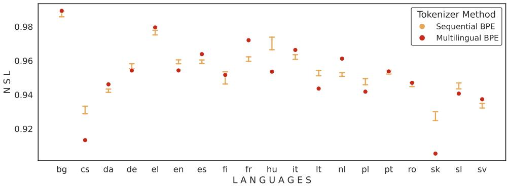

Figure 4: Per-language NLS comparison between a standard multilingual BPE tokenizer and a sequential one across language orders. In the sequential setting, each language is assigned a 24k token budget, yielding an average final vocabulary size of 361k tokens across orders, which matches the size of the standard BPE used for comparison. Horizontal bars show the min–max range across orders.  
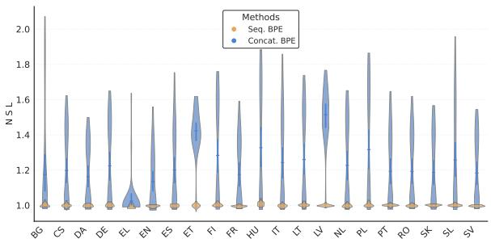  
(a) 2-uplet of languages

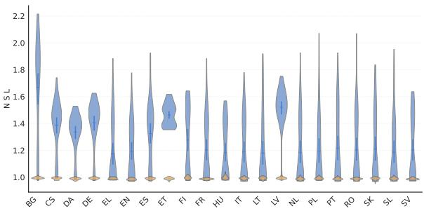

(b) 3-uplet of languages  
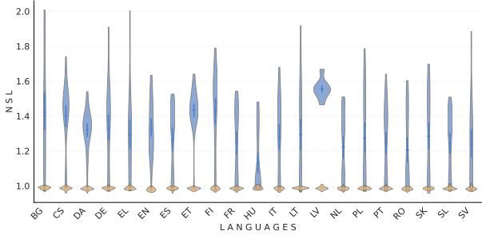  
(c) 4-uplet of languages

Figure 5: Comparison per language of NLS for combinations of BPE tokenizers over p languages under different language orders, either via trivial concatenation (blue) or by combining the corresponding subtokenizers extracted from a sequential BPE (orange). The density (horizontal thickness) indicates the number of tokenizer combinations falling within each NLS range. It has been truncated where the density approaches zero for visual clarity.  
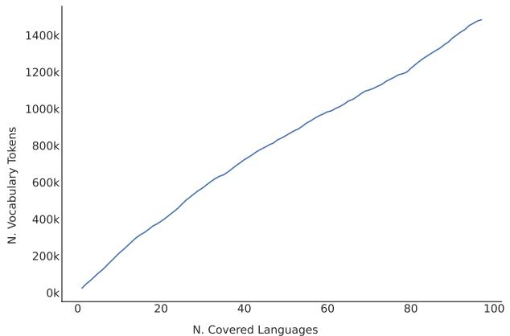  
Figure 6: Vocabulary size scaling of a sequential multilingual BPE (24k tokens/language): despite shared tokens, the vocabulary grows near-linearly with the number of languages.

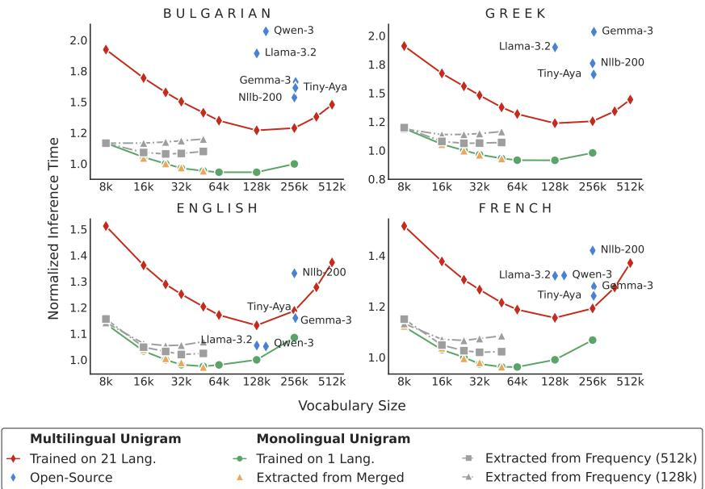  
Figure 7: Normalized inference time for Unigram Tokenizer: We evaluate the inference time of a 2.5B parameter model (excluding embedding parameters) on FLORES-200 using both monolingual and multilingual Unigram tokenizers of varying vocabulary sizes. Monolingual tokenizers with a 24k vocabulary serve as the reference. We consider two strategies for deriving monolingual subtokenizers from multilingual tokenizers. First, Extracted from Merged corresponds to subtokenizers obtained from a multilingual Unigram built by merging independently trained monolingual tokenizers, followed by probability renormalization, as described in § 4.1. Second, Extracted from Frequency v constructs subtokenizers of size k by selecting the k most frequent tokens from a multilingual tokenizer of size v, as described in § 4.1. The curves for $v = 2 5 6 \mathrm { k }$ and v = 512k overlap (not shown for clarity), showing diminishing returns when increasing the multilingual tokenizer size from v = 256k to $v = 5 1 2 \mathrm { k }$ , and that subtokenizer compression remains bounded by the global tokenizer.

## C Multilingual Performance

## C.1 Subtokenizer robustness at inference time.

The $S a m p _ { \mathrm { S u b } n }$ training method is designed to support monolingual subtokenizers, enhancing both fairness and efficiency across diverse languages. This approach also accommodates subtokenizers covering specific language groups, which is particularly beneficial for tasks like translation. In Fig. 8, we highlight that training with $S a m p _ { \mathrm { S u b } }$ 2 (in Unigram setting) enables the use of various subtokenizers at inference time covering between 2 and 10 languages with minimal variations on downstream performance. Notably, the score variance remains low, and average performance closely tracks the baseline that utilizes the full tokenizer for both training and inference.

## C.2 BPE Experiments

Tab. 15 presents MCQ and MT results for BPE tokenizers following the same setting as Tab. 6, confirming that our modular tokenizer approach generalizes across both tokenization schemes. Detailed per-language results are reported in Tab. 16.

## C.3 Translation Performance

Tab. 17 evaluates translation across more diverse language pairs to assess language switching. We modify the training distribution to 40% English and 60% other languages to improve non-English translation, keeping all other hyperparameters unchanged. We compare $S a m p _ { \mathrm { S u b 5 } }$ with the baseline, both using a Unigram tokenizer.

Both models show improved performance when translating directly between non-English languages. However, results vary depending on the language pair: $S a m p _ { \mathrm { S u b 5 } }$ sometimes matches the baseline, but in other cases performs worse. Analysis of generated outputs shows that even the baseline struggles to correctly switch languages, which is consistent with prior work relying on English as a pivot for such translations (Imamura et al., 2023). These limitations are primarily due to insufficient training. Direct translation between non-English languages requires strong cross-lingual alignment and reliable language switching, which our models have not yet fully acquired. In practice, strong performance on this task typically depends on training with substantially more tokens.

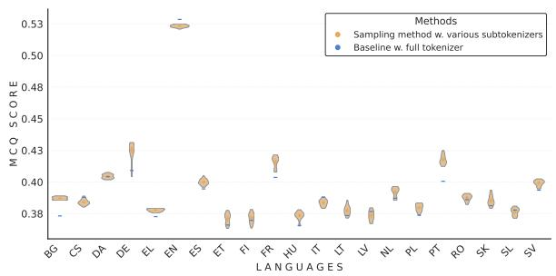  
(a) Multi-Choice Questioning

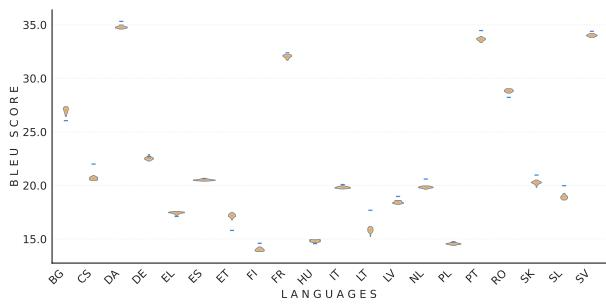  
(b) Machine Translation

Figure 8: Comparison of the baseline and our sampling training at inference. Both are trained using Unigram tokenizers. We use the $S a m p _ { \mathrm { S u b 2 } }$ method at training time but evaluated it using subtokenizers covering between 2 and 10 languages to underline the robustness at inference time of this method.
<table><tr><td rowspan="2">Model</td><td rowspan="2">Infer.</td><td rowspan="2">EN MCQ</td><td colspan="2">BG</td><td colspan="2">DA</td><td colspan="2">EL</td><td colspan="2">FR</td><td colspan="2">IT</td><td colspan="2">SK</td></tr><tr><td>MCQ</td><td>MT</td><td>MCQ</td><td>MT</td><td>MCQ</td><td>MT</td><td>MCQ</td><td>MT</td><td>MCQ</td><td>MT</td><td>MCQ</td><td>MT</td></tr><tr><td>Baseline</td><td>Full</td><td>52.6</td><td>37.2</td><td>28.0</td><td>39.4</td><td>36.1</td><td>36.9</td><td>18.5</td><td>39.2</td><td>32.8</td><td>38.7</td><td>20.8</td><td>38.7</td><td>22.6</td></tr><tr><td rowspan="2">Mono-only</td><td>Lang</td><td>52.4</td><td>39.6</td><td>0.8</td><td>40.1</td><td>2.5</td><td>38.4</td><td>1.5</td><td>39.6</td><td>9.6</td><td>39.2</td><td>4.8</td><td>37.7</td><td>0.9</td></tr><tr><td>Full</td><td>50.1</td><td>37.4</td><td>0.7</td><td>38.8</td><td>2.4</td><td>36.7</td><td>1.0</td><td>37.1</td><td>6.3</td><td>37.4</td><td>2.5</td><td>35.2</td><td>0.9</td></tr><tr><td rowspan="2"> $S a m p _ { \mathrm { F u l l } }$ </td><td>Lang</td><td>52.3</td><td>38.3</td><td>27.9</td><td>39.7</td><td>35.3</td><td>38.3</td><td>18.1</td><td>40.1</td><td>31.9</td><td>39.2</td><td>20.0</td><td>38.7</td><td>20.2</td></tr><tr><td>Full</td><td>52.5</td><td>38.1</td><td>27.9</td><td>39.7</td><td>35.7</td><td>37.6</td><td>18.2</td><td>39.6</td><td>31.7</td><td>39.1</td><td>20.1</td><td>38.5</td><td>20.8</td></tr><tr><td rowspan="2"> $S a m p _ { \mathrm { S u b 3 } }$ </td><td>Lang</td><td>52.5</td><td>38.6</td><td>28.1</td><td>39.9</td><td>36.0</td><td>38.0</td><td>18.3</td><td>39.8</td><td>32.5</td><td>39.4</td><td>20.3</td><td>39.0</td><td>21.4</td></tr><tr><td>Full</td><td>52.4</td><td>38.2</td><td>27.7</td><td>40.2</td><td>36.1</td><td>37.8</td><td>18.3</td><td>39.4</td><td>32.3</td><td>38.8</td><td>20.6</td><td>38.5</td><td>21.7</td></tr></table>

Table 15: MCQ and MT performance under different pretraining sampling schemes for BPE tokenizers, following the same setting as Tab. 6. Infer. denotes the tokenizer used at inference; Full corresponds to the full tokenizer; Lang to the monolingual tokenizer for MCQ and the combined English–target tokenizer for MT.

<table><tr><td colspan="3"></td><td colspan="3">Lang.</td><td colspan="3">Full</td></tr><tr><td>Lang.</td><td>Tasks</td><td>Baseline</td><td> $S a m p _ { \mathrm { S u b 3 } }$ </td><td> $S a m p _ { \mathrm { S u b } 5 }$ </td><td> $S a m p _ { \mathrm { F u l l } }$ </td><td> $S a m p _ { \mathrm { S u b 3 } }$ </td><td> $S a m p _ { \mathrm { S u b } 5 }$ </td><td> $S a m p _ { \mathrm { F u l l } }$ </td></tr><tr><td rowspan="7">BG</td><td>ARC-E</td><td>51.3</td><td>55.0</td><td>54.5</td><td>54.0</td><td>53.1</td><td>54.9</td><td>54.0</td></tr><tr><td>ARC-C</td><td>31.9</td><td>32.6</td><td>32.3</td><td>32.1</td><td>31.2</td><td>31.6</td><td>32.0</td></tr><tr><td>HellaSwag</td><td>47.1</td><td>48.3</td><td>47.5</td><td>48.0</td><td>47.3</td><td>48.2</td><td>47.6</td></tr><tr><td>MMLU</td><td>28.5</td><td>28.9</td><td>29.0</td><td>29.7</td><td>29.1</td><td>29.1</td><td>29.1</td></tr><tr><td>BeleBele</td><td>27.1</td><td>28.3</td><td>27.7</td><td>28.6</td><td>27.9</td><td>27.8</td><td>27.7</td></tr><tr><td>Flores</td><td>28.0</td><td>28.1</td><td>27.7</td><td>28.1</td><td>28.1</td><td>27.9</td><td>27.9</td></tr><tr><td>Avg.</td><td>35.7</td><td>36.9</td><td>36.4</td><td>36.7</td><td>36.1</td><td>36.6</td><td>36.4</td></tr><tr><td rowspan="7">CS</td><td>ARC-E</td><td>55.1</td><td>55.4</td><td>54.9</td><td>55.9</td><td>54.3</td><td>54.5</td><td>54.9</td></tr><tr><td>ARC-C</td><td>33.2</td><td>31.5</td><td>30.7</td><td>30.5</td><td>29.3</td><td>34.0</td><td>32.0</td></tr><tr><td>HellaSwag</td><td>47.9</td><td>48.0</td><td>47.3</td><td>48.3</td><td>47.9</td><td>48.7</td><td>48.2</td></tr><tr><td>MMLU</td><td>29.8</td><td>29.4</td><td>29.0</td><td>29.4</td><td>29.0</td><td>29.0</td><td>29.7</td></tr><tr><td>BeleBele</td><td>29.0</td><td>31.8</td><td>30.3</td><td>30.4</td><td>29.7</td><td>30.9</td><td>28.3</td></tr><tr><td>Flores</td><td>22.3</td><td>21.5</td><td>21.2</td><td>22.3</td><td>21.9</td><td>20.9</td><td>20.8</td></tr><tr><td>Avg.</td><td>36.2</td><td>36.3</td><td>35.6</td><td>36.1</td><td>35.4</td><td>36.3</td><td>35.7</td></tr><tr><td rowspan="7">DA</td><td>ARC-E</td><td>56.2</td><td>56.9</td><td>57.1</td><td>55.3</td><td>56.2</td><td>56.0</td><td>56.6</td></tr><tr><td>ARC-C</td><td>32.2</td><td>32.1</td><td>33.3</td><td>32.3</td><td>31.8</td><td>32.8</td><td>33.0</td></tr><tr><td>HellaSwag</td><td>50.7</td><td>51.5</td><td>50.6</td><td>50.1</td><td>49.5</td><td>50.6</td><td>50.2</td></tr><tr><td>MMLU</td><td>29.5</td><td>29.1</td><td>29.8</td><td>29.1</td><td>29.2</td><td>28.9</td><td>29.3</td></tr><tr><td>BeleBele</td><td>28.6</td><td>30.0</td><td>30.2</td><td>30.0</td><td>30.0</td><td>30.2</td><td>29.6</td></tr><tr><td>Flores</td><td>36.1</td><td>36.0</td><td>36.1</td><td>35.7</td><td>36.0</td><td>35.3</td><td>35.7</td></tr><tr><td>Avg.</td><td>38.9</td><td>39.3</td><td>39.5</td><td>38.7</td><td>38.8</td><td>39.0</td><td>39.1</td></tr><tr><td rowspan="2">Lang. Tasks</td><td rowspan="2"></td><td colspan="4">Lang.</td><td colspan="2">Full</td><td rowspan="2"> $S a m p _ { \mathrm { F u l l } }$ </td></tr><tr><td>Baseline</td><td> $S a m p _ { \mathrm { S u b 3 } }$ </td><td> $S a m p _ { \mathrm { S u b } 5 }$ </td><td> $S a m p _ { \mathrm { F u l l } }$ </td><td> $S a m p _ { \mathrm { S u b 3 } }$ </td><td> $S a m p _ { \mathrm { S u b } 5 }$ </td></tr><tr><td></td><td>ARC-E</td><td>53.3</td><td>53.7</td><td>53.3</td><td>52.7</td><td>52.1</td><td>53.0</td><td>52.4</td></tr><tr><td rowspan="7">DE</td><td>ARC-C</td><td>30.9</td><td>30.9 45.9</td><td>31.7 31.8</td><td>31.2</td><td>34.8</td><td>34.0</td></tr><tr><td>HellaSwag</td><td>45.8</td><td>45.0</td><td>45.3</td><td>45.0</td><td>45.8</td><td>45.7</td></tr><tr><td>MMLU</td><td>29.3 29.5</td><td>30.3</td><td>28.9</td><td>29.2</td><td></td><td>29.1</td></tr><tr><td></td><td>28.6</td><td></td><td></td><td></td><td>29.0</td><td></td></tr><tr><td>BeleBele</td><td>28.2</td><td>28.0</td><td>29.7</td><td>29.2</td><td>28.6</td><td>27.8</td></tr><tr><td>Flores 22.6</td><td>22.5 35.1</td><td>22.3</td><td>23.0</td><td>23.2</td><td>21.6</td><td>21.7</td></tr><tr><td>Avg.</td><td>35.1</td><td>35.1</td><td>35.2</td><td>35.0</td><td>35.4</td><td>35.1</td></tr><tr><td rowspan="6">EL</td><td>ARC-E ARC-C</td><td>49.7 31.7</td><td>51.3 32.1</td><td>50.7 50.9</td><td>50.2</td><td>52.6</td><td>52.7</td></tr><tr><td>HellaSwag</td><td></td><td>33.1</td><td>33.8</td><td>32.3</td><td>33.5</td><td>31.1</td></tr><tr><td>46.0</td><td>47.1 29.3</td><td>46.6</td><td>46.8</td><td>46.5</td><td>46.5</td><td>46.2</td></tr><tr><td>MMLU 28.1</td><td></td><td>29.5</td><td>29.1</td><td>28.6</td><td>28.8</td><td>29.3</td></tr><tr><td>BeleBele 28.9</td><td>30.1</td><td>28.9</td><td>27.9</td><td>28.1</td><td>30.2</td><td>28.9</td></tr><tr><td>Flores Avg.</td><td>18.5 33.8</td><td>18.3 34.7</td><td>18.3 19.0</td><td>19.0</td><td>18.1</td><td>18.2</td></tr><tr><td rowspan="8">EN</td><td>ARC-E ARC-C</td><td></td><td></td><td>34.5 34.6</td><td>34.1</td><td>35.0</td><td>34.4</td></tr><tr><td></td><td>66.6 67.7</td><td>68.0</td><td>67.3</td><td>67.4</td><td>66.3</td><td>67.3</td></tr><tr><td></td><td>39.2 38.3 60.1</td><td>38.3</td><td>40.3</td><td>39.3</td><td>40.2</td><td>40.9</td></tr><tr><td>CSQA HellaSwag</td><td>61.5 62.6</td><td>60.0 62.3</td><td>60.6</td><td>60.5</td><td>60.4</td><td>59.1</td></tr><tr><td>PIQA PIQA</td><td>75.1</td><td>62.8</td><td>62.1</td><td>61.7</td><td>62.1</td><td>62.1</td></tr><tr><td></td><td>75.8 49.0</td><td>75.5</td><td>76.4</td><td>76.0</td><td>74.7</td><td>75.4</td></tr><tr><td></td><td>50.1</td><td>49.4</td><td>49.4</td><td>49.6</td><td>50.5</td><td>50.7</td></tr><tr><td>MMLU 34.1</td><td>34.3</td><td>34.2</td><td>33.3</td><td>33.1</td><td>33.7</td><td>33.4</td></tr><tr><td>Avg.</td><td>BeleBele 32.8 33.7</td><td>31.2 52.5</td><td>31.4 52.4</td><td>32.3</td><td>32.2 30.6</td><td>31.0</td></tr><tr><td rowspan="8">ES</td><td>ARC-E ARC-C</td><td>52.6</td><td></td><td>52.7</td><td>52.5</td><td>52.3</td><td>52.5</td></tr><tr><td></td><td>55.7 56.6</td><td>56.1</td><td>55.9</td><td>55.6</td><td>57.0</td><td>56.7</td></tr><tr><td></td><td>34.3</td><td>33.9</td><td>33.3</td><td>32.0</td><td>33.4</td><td>34.6</td></tr><tr><td>HellaSwag MMLU</td><td>48.8</td><td>49.3 48.5</td><td>49.1</td><td>48.1</td><td>49.1</td><td>48.8</td></tr><tr><td>BeleBele</td><td>29.8</td><td>30.4 30.2</td><td>29.8</td><td>30.4</td><td>30.0</td><td>29.4</td></tr><tr><td>Flores</td><td>29.0</td><td>32.2 29.7</td><td>30.0</td><td>30.3</td><td>30.7</td><td>30.1</td></tr><tr><td></td><td>21.6</td><td>20.7</td><td>21.2</td><td>21.2</td><td>20.5</td><td>20.8</td></tr><tr><td>Avg. 36.4</td><td>20.8 37.3</td><td>36.5</td><td>36.5</td><td>36.3</td><td>36.8</td><td>36.7</td></tr><tr><td>ARC-E ARC-C HellaSwag ET</td><td>49.6 31.2</td><td>50.1</td><td>48.4</td><td>49.6</td><td>48.8 50.9</td><td>50.7</td></tr><tr><td rowspan="7">FI</td><td>MMLU</td><td>45.2 28.8</td><td>30.5 45.8 29.0</td><td>31.5 30.5 45.1</td><td>28.6 46.0 44.9</td><td>30.6 45.7</td><td>30.6 45.5</td></tr><tr><td>BeleBele</td><td>27.6</td><td>27.7</td><td>28.9 28.5</td><td>28.4</td><td>28.9</td><td>28.4</td></tr><tr><td>Flores</td><td>17.2</td><td>28.3 17.4</td><td>27.2</td><td>27.7</td><td>28.4 16.5</td><td>29.8</td></tr><tr><td>Avg.</td><td>33.2</td><td>17.4 33.4 33.3</td><td>16.9 33.1</td><td>17.3</td><td>33.5</td><td>16.4 33.6</td></tr><tr><td>ARC-E</td><td></td><td></td><td></td><td>32.6</td><td></td><td></td></tr><tr><td>ARC-C HellaSwag</td><td>51.3 29.4</td><td>51.5 49.2</td><td>50.8</td><td>49.3</td><td>51.3</td><td>51.5 30.2</td></tr><tr><td>MMLU</td><td>46.1</td><td>30.4 46.9 29.1</td><td>30.8 45.3</td><td>29.5 46.9</td><td>29.8 30.4 45.8 46.5</td><td>46.1</td></tr><tr><td rowspan="6"></td><td>BeleBele Flores Avg.</td><td>28.5 28.3</td><td></td><td>28.3 28.6</td><td>28.9</td><td>28.7</td><td>28.8</td></tr><tr><td></td><td>15.5</td><td>28.9 27.9</td><td>29.3</td><td>28.2</td><td>29.0</td><td>29.0</td></tr><tr><td></td><td>15.3</td><td>15.6</td><td>15.5</td><td>15.4</td><td>15.0</td><td>14.4</td></tr><tr><td>33.2</td><td>33.7</td><td>32.8</td><td>33.4</td><td>32.9</td><td>33.5</td><td>33.3</td></tr><tr><td>ARC-E</td><td></td><td>55.5</td><td></td><td>54.0</td><td>56.1</td><td>55.6</td></tr><tr><td rowspan="6">FR Flores Avg. ARC-E</td><td>ARC-C HellaSwag</td><td>54.8 32.2</td><td>55.6 33.0 32.5</td><td>54.5 33.6</td><td>32.5</td><td>34.2</td><td>32.5</td></tr><tr><td>MMLU</td><td>49.6</td><td>49.5 48.6</td><td>49.4</td><td>48.9</td><td>49.2</td><td>48.9</td></tr><tr><td>30.0</td><td>29.8</td><td>29.7</td><td>29.2</td><td>29.5</td><td>30.0</td><td>29.5</td></tr><tr><td>BeleBele 29.6</td><td></td><td>30.4</td><td>31.6</td><td>30.6</td><td>31.1</td><td>31.7</td></tr><tr><td>32.8 38.1</td><td>31.3 32.5</td><td>32.3</td><td>33.0</td><td>33.0</td><td>31.9 38.7</td><td>31.7 38.3</td></tr></table>

<table><tr><td rowspan=1 colspan=12>Lang.                               FullLang. Tasks     Baseline   SampSub 3 SampSub 5 SampFull   SampSub 3   $S a m p _ { \mathrm { S u b } 5 }$  SampFull</td></tr><tr><td rowspan=1 colspan=12>ARC-E     52.9        53.3      52.6     53.5        53.5      54.5      54.2</td></tr><tr><td rowspan=1 colspan=1></td><td rowspan=1 colspan=1>ARC-C</td><td rowspan=1 colspan=10>31.9        29.9      31.7      30.0        30.4      32.8     31.7</td></tr><tr><td rowspan=1 colspan=1></td><td rowspan=1 colspan=1>HellaSwag</td><td rowspan=1 colspan=10>46.5        46.4      45.6      46.8        45.5      46.5     46.0</td></tr><tr><td rowspan=1 colspan=1>LT</td><td rowspan=1 colspan=1>MMLU</td><td rowspan=1 colspan=10>29.3        29.2      28.9      29.3        28.7      28.8     28.9</td></tr><tr><td rowspan=1 colspan=1></td><td rowspan=1 colspan=1>BeleBele</td><td rowspan=1 colspan=10>27.7        28.6      28.3      28.4        27.2      29.0     28.1</td></tr><tr><td rowspan=1 colspan=1></td><td rowspan=1 colspan=11>Flores      17.9        18.4      18.3      17.6         17.7      17.7     18.1</td></tr><tr><td rowspan=1 colspan=1></td><td rowspan=1 colspan=11>Avg.       34.4        34.3      34.2      34.3        33.8      34.9      34.5</td></tr><tr><td rowspan=1 colspan=1></td><td rowspan=1 colspan=2>ARC-E     53.2</td><td rowspan=1 colspan=9>53.4      51.4      53.5        51.3      53.5     53.1</td></tr><tr><td rowspan=1 colspan=1></td><td rowspan=1 colspan=1>ARC-C</td><td rowspan=1 colspan=1>31.1</td><td rowspan=1 colspan=3>33.3      31.4</td><td rowspan=1 colspan=6>31.7        30.0      33.4     32.8</td></tr><tr><td rowspan=1 colspan=1></td><td rowspan=1 colspan=1>HellaSwag</td><td rowspan=1 colspan=1>46.3</td><td rowspan=1 colspan=3>46.9      46.0</td><td rowspan=1 colspan=2>46.5        45.6</td><td rowspan=1 colspan=2>46.5</td><td rowspan=1 colspan=2>46.5</td></tr><tr><td rowspan=1 colspan=1>LV</td><td rowspan=1 colspan=1>MMLU</td><td rowspan=1 colspan=1>28.8</td><td rowspan=1 colspan=3>29.1      28.5</td><td rowspan=1 colspan=2>29.1         27.9</td><td rowspan=1 colspan=2>29.7</td><td rowspan=1 colspan=1></td><td rowspan=1 colspan=1>28.1</td></tr><tr><td rowspan=1 colspan=1></td><td rowspan=1 colspan=1>BeleBele</td><td rowspan=1 colspan=1>27.9</td><td rowspan=1 colspan=3>29.9      30.0</td><td rowspan=1 colspan=2>28.3        28.1</td><td rowspan=1 colspan=2>27.2</td><td rowspan=1 colspan=1></td><td rowspan=1 colspan=1>29.0</td></tr><tr><td rowspan=1 colspan=1></td><td rowspan=1 colspan=1>Flores</td><td rowspan=1 colspan=1>20.2</td><td rowspan=1 colspan=3>19.9      19.8</td><td rowspan=1 colspan=5>20.4        20.4      19.6</td><td rowspan=1 colspan=1>19.9</td></tr><tr><td rowspan=1 colspan=1></td><td rowspan=1 colspan=1>Avg.</td><td rowspan=1 colspan=1>34.6</td><td rowspan=1 colspan=3>35.4      34.5</td><td rowspan=1 colspan=6>34.9        33.9      35.0      34.9</td></tr><tr><td rowspan=1 colspan=1></td><td rowspan=1 colspan=1>ARC-E</td><td rowspan=1 colspan=1>53.2</td><td rowspan=1 colspan=3>53.4      52.5</td><td rowspan=1 colspan=6>52.3        51.4      54.6     53.7</td></tr><tr><td rowspan=1 colspan=1></td><td rowspan=1 colspan=1>ARC-C</td><td rowspan=1 colspan=4>29.3        31.0      32.8</td><td rowspan=1 colspan=6>31.1        31.1      32.3     30.5</td></tr><tr><td rowspan=1 colspan=1></td><td rowspan=1 colspan=1>HellaSwag</td><td rowspan=1 colspan=1>47.7</td><td rowspan=1 colspan=3>47.7      47.1</td><td rowspan=1 colspan=2>48.2        47.6</td><td rowspan=1 colspan=2>48.5</td><td rowspan=1 colspan=1></td><td rowspan=1 colspan=1>48.3</td></tr><tr><td rowspan=1 colspan=1>NL</td><td rowspan=1 colspan=1>MMLU</td><td rowspan=1 colspan=1>29.0</td><td rowspan=1 colspan=3>28.9      29.5</td><td rowspan=1 colspan=2>28.5        29.3</td><td rowspan=1 colspan=2>28.5</td><td rowspan=1 colspan=1></td><td rowspan=1 colspan=1>28.9</td></tr><tr><td rowspan=1 colspan=1></td><td rowspan=1 colspan=1>BeleBele</td><td rowspan=1 colspan=1>30.0</td><td rowspan=1 colspan=3>31.3      30.4</td><td rowspan=1 colspan=2>31.7         30.8</td><td rowspan=1 colspan=2>31.1</td><td rowspan=1 colspan=1></td><td rowspan=1 colspan=1>30.3</td></tr><tr><td rowspan=1 colspan=1></td><td rowspan=1 colspan=1>Flores</td><td rowspan=1 colspan=1>20.9</td><td rowspan=1 colspan=3>20.5      20.3</td><td rowspan=1 colspan=5>20.3        20.2      20.2</td><td rowspan=1 colspan=1>20.1</td></tr><tr><td rowspan=1 colspan=1></td><td rowspan=1 colspan=1>Avg.</td><td rowspan=1 colspan=4>35.0        35.5      35.4</td><td rowspan=1 colspan=6>35.3        35.1      35.9     35.3</td></tr><tr><td rowspan=1 colspan=1></td><td rowspan=1 colspan=1>ARC-E</td><td rowspan=1 colspan=4>53.9        51.6      50.8</td><td rowspan=1 colspan=4>51.1        49.8      52.9</td><td rowspan=1 colspan=1></td><td rowspan=1 colspan=1>53.0</td></tr><tr><td rowspan=1 colspan=1></td><td rowspan=1 colspan=1>ARC-C</td><td rowspan=1 colspan=1>32.5</td><td rowspan=1 colspan=3>30.8      33.5</td><td rowspan=1 colspan=1>32.3</td><td rowspan=1 colspan=1>32.3</td><td rowspan=1 colspan=2>31.7</td><td rowspan=1 colspan=1></td><td rowspan=1 colspan=1>33.2</td></tr><tr><td rowspan=1 colspan=1></td><td rowspan=1 colspan=1>HellaSwag</td><td rowspan=1 colspan=1>46.6</td><td rowspan=1 colspan=3>46.5      45.9</td><td rowspan=1 colspan=1>47.0</td><td rowspan=1 colspan=1>46.1</td><td rowspan=1 colspan=2>46.8</td><td rowspan=1 colspan=1></td><td rowspan=1 colspan=1>46.6</td></tr><tr><td rowspan=1 colspan=1>PL</td><td rowspan=1 colspan=1>MMLU</td><td rowspan=1 colspan=1>28.6</td><td rowspan=1 colspan=3>28.6      28.3</td><td rowspan=1 colspan=1>28.6</td><td rowspan=1 colspan=1>28.1</td><td rowspan=1 colspan=1></td><td rowspan=1 colspan=1>29.0</td><td rowspan=1 colspan=1></td><td rowspan=1 colspan=1>28.3</td></tr><tr><td rowspan=1 colspan=1></td><td rowspan=1 colspan=1>BeleBele</td><td rowspan=1 colspan=1>30.3</td><td rowspan=1 colspan=3>30.7      27.4</td><td rowspan=1 colspan=1>30.1</td><td rowspan=1 colspan=1>29.7</td><td rowspan=1 colspan=1></td><td rowspan=1 colspan=1>30.6</td><td rowspan=1 colspan=1></td><td rowspan=1 colspan=1>31.2</td></tr><tr><td rowspan=1 colspan=1></td><td rowspan=1 colspan=1>Flores</td><td rowspan=1 colspan=4>15.2        14.5      14.4</td><td rowspan=1 colspan=2>14.4         14.7</td><td rowspan=1 colspan=3>14.0</td><td rowspan=1 colspan=1>14.3</td></tr><tr><td rowspan=1 colspan=1></td><td rowspan=1 colspan=1>Avg.</td><td rowspan=1 colspan=4>34.5        33.8      33.4</td><td rowspan=1 colspan=6>33.9        33.4      34.2     34.4</td></tr><tr><td rowspan=1 colspan=1></td><td rowspan=1 colspan=1>ARC-E</td><td rowspan=1 colspan=1>53.9</td><td rowspan=1 colspan=3>54.3      54.1</td><td rowspan=1 colspan=6>53.9        53.4      53.6     53.5</td></tr><tr><td rowspan=1 colspan=1></td><td rowspan=1 colspan=1>ARC-C</td><td rowspan=1 colspan=1>33.8</td><td rowspan=1 colspan=3>31.8      33.0</td><td rowspan=1 colspan=2>34.2        33.0</td><td rowspan=1 colspan=2>32.6</td><td rowspan=1 colspan=2>31.9</td></tr><tr><td rowspan=1 colspan=1></td><td rowspan=1 colspan=1>HellaSwag</td><td rowspan=1 colspan=1>47.6</td><td rowspan=1 colspan=1>48.3</td><td rowspan=1 colspan=1></td><td rowspan=1 colspan=1>47.0</td><td rowspan=1 colspan=1>48.2</td><td rowspan=1 colspan=1>46.9</td><td rowspan=1 colspan=1></td><td rowspan=1 colspan=1>48.0</td><td rowspan=1 colspan=1></td><td rowspan=1 colspan=1>48.0</td></tr><tr><td rowspan=1 colspan=1>PT</td><td rowspan=1 colspan=1>MMLU</td><td rowspan=1 colspan=1>29.6</td><td rowspan=1 colspan=1>29.8</td><td rowspan=1 colspan=1></td><td rowspan=1 colspan=1>29.7</td><td rowspan=1 colspan=1>29.9</td><td rowspan=1 colspan=1>29.8</td><td rowspan=1 colspan=1></td><td rowspan=1 colspan=1>29.8</td><td rowspan=1 colspan=1></td><td rowspan=1 colspan=1>29.8</td></tr><tr><td rowspan=1 colspan=1></td><td rowspan=1 colspan=1>BeleBele</td><td rowspan=1 colspan=1>27.9</td><td rowspan=1 colspan=1>29.3</td><td rowspan=1 colspan=1></td><td rowspan=1 colspan=1>29.0</td><td rowspan=1 colspan=1>30.0</td><td rowspan=1 colspan=1>29.7</td><td rowspan=1 colspan=1></td><td rowspan=1 colspan=1>29.0</td><td rowspan=1 colspan=1></td><td rowspan=1 colspan=1>29.2</td></tr><tr><td rowspan=1 colspan=1></td><td rowspan=1 colspan=1>Flores</td><td rowspan=1 colspan=1>35.5</td><td rowspan=1 colspan=3>34.3      34.3</td><td rowspan=1 colspan=2>34.6        34.9</td><td rowspan=1 colspan=1></td><td rowspan=1 colspan=1>33.5</td><td rowspan=1 colspan=1></td><td rowspan=1 colspan=1>34.2</td></tr><tr><td rowspan=1 colspan=1></td><td rowspan=1 colspan=1>Avg.</td><td rowspan=1 colspan=1>38.0</td><td rowspan=1 colspan=3>38.0      37.9</td><td rowspan=1 colspan=2>38.5         37.9</td><td rowspan=1 colspan=3>37.8</td><td rowspan=1 colspan=1>37.8</td></tr><tr><td rowspan=1 colspan=1></td><td rowspan=1 colspan=1>ARC-E</td><td rowspan=1 colspan=1>54.2</td><td rowspan=1 colspan=3>54.5      53.3</td><td rowspan=1 colspan=2>54.0        54.8</td><td rowspan=1 colspan=4>53.4     54.4</td></tr><tr><td rowspan=1 colspan=1></td><td rowspan=1 colspan=1>ARC-C</td><td rowspan=1 colspan=1>30.5</td><td rowspan=1 colspan=3>30.7      31.5</td><td rowspan=1 colspan=1>32.1</td><td rowspan=1 colspan=1>31.7</td><td rowspan=1 colspan=3>31.2</td><td rowspan=1 colspan=1>30.2</td></tr><tr><td rowspan=1 colspan=1></td><td rowspan=1 colspan=1>HellaSwag</td><td rowspan=1 colspan=1>47.6</td><td rowspan=1 colspan=1>48.2</td><td rowspan=1 colspan=1></td><td rowspan=1 colspan=1>47.0</td><td rowspan=1 colspan=1>47.8</td><td rowspan=1 colspan=1>46.6</td><td rowspan=1 colspan=1></td><td rowspan=1 colspan=1>48.1</td><td rowspan=1 colspan=1></td><td rowspan=1 colspan=1>47.8</td></tr><tr><td rowspan=1 colspan=1>RO</td><td rowspan=1 colspan=1>MMLU</td><td rowspan=1 colspan=1>29.7</td><td rowspan=1 colspan=1>30.2</td><td rowspan=1 colspan=1></td><td rowspan=1 colspan=1>30.2</td><td rowspan=1 colspan=1>29.4</td><td rowspan=1 colspan=1>28.9</td><td rowspan=1 colspan=1></td><td rowspan=1 colspan=1>29.9</td><td rowspan=1 colspan=1></td><td rowspan=1 colspan=1>29.8</td></tr><tr><td rowspan=1 colspan=1></td><td rowspan=1 colspan=1>BeleBele</td><td rowspan=1 colspan=1>28.4</td><td rowspan=1 colspan=1>29.3</td><td rowspan=1 colspan=1></td><td rowspan=1 colspan=1>28.1</td><td rowspan=1 colspan=1>29.2</td><td rowspan=1 colspan=1>28.2</td><td rowspan=1 colspan=1></td><td rowspan=1 colspan=1>28.3</td><td rowspan=1 colspan=1></td><td rowspan=1 colspan=1>28.0</td></tr><tr><td rowspan=1 colspan=1></td><td rowspan=1 colspan=1>Flores</td><td rowspan=1 colspan=1>29.8</td><td rowspan=1 colspan=2>28.6</td><td rowspan=1 colspan=1>28.7</td><td rowspan=1 colspan=1>28.9</td><td rowspan=1 colspan=1>29.0</td><td rowspan=1 colspan=1></td><td rowspan=1 colspan=1>28.3</td><td rowspan=1 colspan=1></td><td rowspan=1 colspan=1>28.8</td></tr><tr><td rowspan=1 colspan=1></td><td rowspan=1 colspan=1>Avg.</td><td rowspan=1 colspan=1>36.7</td><td rowspan=1 colspan=3>36.9      36.4</td><td rowspan=1 colspan=6>36.9        36.5      36.5      36.5</td></tr><tr><td rowspan=1 colspan=1></td><td rowspan=1 colspan=1>ARC-E</td><td rowspan=1 colspan=1>53.4</td><td rowspan=1 colspan=3>54.8      53.7</td><td rowspan=1 colspan=2>53.8        53.4</td><td rowspan=1 colspan=3>53.9</td><td rowspan=1 colspan=1>53.8</td></tr><tr><td rowspan=1 colspan=1></td><td rowspan=1 colspan=1>ARC-C</td><td rowspan=1 colspan=1>32.7</td><td rowspan=1 colspan=2>31.9</td><td rowspan=1 colspan=1>32.7</td><td rowspan=1 colspan=1>32.3</td><td rowspan=1 colspan=1>31.4</td><td rowspan=1 colspan=1></td><td rowspan=1 colspan=2>31.3</td><td rowspan=1 colspan=1>30.3</td></tr><tr><td rowspan=1 colspan=1></td><td rowspan=1 colspan=1>HellaSwag</td><td rowspan=1 colspan=1>47.5</td><td rowspan=1 colspan=1>47.6</td><td rowspan=1 colspan=1></td><td rowspan=1 colspan=1>46.9</td><td rowspan=1 colspan=1>47.5</td><td rowspan=1 colspan=1>47.0</td><td rowspan=1 colspan=1></td><td rowspan=1 colspan=1>47.7</td><td rowspan=1 colspan=1></td><td rowspan=1 colspan=1>47.6</td></tr><tr><td rowspan=1 colspan=1>SK</td><td rowspan=1 colspan=1>MMLU</td><td rowspan=1 colspan=1>29.3</td><td rowspan=1 colspan=1>29.0</td><td rowspan=1 colspan=1></td><td rowspan=1 colspan=1>28.6</td><td rowspan=1 colspan=1>30.1</td><td rowspan=1 colspan=1>29.4</td><td rowspan=1 colspan=1></td><td rowspan=1 colspan=1>29.5</td><td rowspan=1 colspan=1></td><td rowspan=1 colspan=1>29.5</td></tr><tr><td rowspan=1 colspan=1></td><td rowspan=1 colspan=1>BeleBele</td><td rowspan=1 colspan=1>30.9</td><td rowspan=1 colspan=2>31.6</td><td rowspan=1 colspan=1>30.6</td><td rowspan=1 colspan=1>31.1</td><td rowspan=1 colspan=1>29.9</td><td rowspan=1 colspan=1></td><td rowspan=1 colspan=1>31.0</td><td rowspan=1 colspan=1></td><td rowspan=1 colspan=1>31.4</td></tr><tr><td rowspan=1 colspan=1></td><td rowspan=1 colspan=1>Flores</td><td rowspan=1 colspan=1>22.6</td><td rowspan=1 colspan=3>21.4      21.7</td><td rowspan=1 colspan=2>21.7         21.9</td><td rowspan=1 colspan=1></td><td rowspan=1 colspan=2>20.2</td><td rowspan=1 colspan=1>20.8</td></tr><tr><td rowspan=1 colspan=1></td><td rowspan=1 colspan=1>Avg.</td><td rowspan=1 colspan=1>36.1</td><td rowspan=1 colspan=3>36.0      35.7</td><td rowspan=1 colspan=6>36.1        35.5      35.6     35.6</td></tr><tr><td rowspan=1 colspan=1></td><td rowspan=1 colspan=1>ARC-E</td><td rowspan=1 colspan=1>53.5</td><td rowspan=1 colspan=3>54.1      52.7</td><td rowspan=1 colspan=1>52.9</td><td rowspan=1 colspan=1>52.6</td><td rowspan=1 colspan=4>53.7      53.5</td></tr><tr><td rowspan=1 colspan=1></td><td rowspan=1 colspan=1>ARC-C</td><td rowspan=1 colspan=1>32.3</td><td rowspan=1 colspan=3>31.2      31.8</td><td rowspan=1 colspan=1>30.6</td><td rowspan=1 colspan=1>30.5</td><td rowspan=1 colspan=4>32.9     31.7</td></tr><tr><td rowspan=1 colspan=1></td><td rowspan=1 colspan=1>HellaSwag</td><td rowspan=1 colspan=1>46.7</td><td rowspan=1 colspan=2>47.1</td><td rowspan=1 colspan=1>46.0</td><td rowspan=1 colspan=1>46.2</td><td rowspan=1 colspan=1>45.7</td><td rowspan=1 colspan=1></td><td rowspan=1 colspan=2>46.8</td><td rowspan=1 colspan=1>46.3</td></tr><tr><td rowspan=1 colspan=1>SL</td><td rowspan=1 colspan=1>MMLU</td><td rowspan=1 colspan=1>28.5</td><td rowspan=1 colspan=2>29.2</td><td rowspan=1 colspan=1>28.8</td><td rowspan=1 colspan=1>28.4</td><td rowspan=1 colspan=1>28.3</td><td rowspan=1 colspan=1></td><td rowspan=1 colspan=2>28.9</td><td rowspan=1 colspan=1>29.5</td></tr><tr><td rowspan=1 colspan=1></td><td rowspan=1 colspan=1>BeleBele</td><td rowspan=1 colspan=1>29.9</td><td rowspan=1 colspan=2>29.9</td><td rowspan=1 colspan=1>27.6</td><td rowspan=1 colspan=1>29.9</td><td rowspan=1 colspan=1>30.1</td><td rowspan=1 colspan=1></td><td rowspan=1 colspan=2>29.1</td><td rowspan=1 colspan=1>29.4</td></tr><tr><td rowspan=1 colspan=1></td><td rowspan=1 colspan=1>Flores</td><td rowspan=1 colspan=1>19.7</td><td rowspan=1 colspan=3>19.7      19.8</td><td rowspan=1 colspan=5>19.6         19.9      18.8</td><td rowspan=1 colspan=1>19.2</td></tr><tr><td rowspan=1 colspan=1></td><td rowspan=1 colspan=1>Avg.</td><td rowspan=1 colspan=1>35.1</td><td rowspan=1 colspan=3>35.2       34.4</td><td rowspan=1 colspan=6>34.6        34.5      35.0     34.9</td></tr><tr><td rowspan=1 colspan=1></td><td rowspan=1 colspan=5>ARC-E     54.9        56.4      54.7</td><td rowspan=1 colspan=6>53.7        53.5      54.5     54.9</td></tr><tr><td rowspan=1 colspan=1></td><td rowspan=1 colspan=1>ARC-C</td><td rowspan=1 colspan=1>34.6</td><td rowspan=1 colspan=3>32.0      33.4</td><td rowspan=1 colspan=6>32.7        30.8      32.2     31.8</td></tr><tr><td rowspan=1 colspan=1></td><td rowspan=1 colspan=1>HellaSwag</td><td rowspan=1 colspan=1>49.4</td><td rowspan=1 colspan=3>49.7      49.0</td><td rowspan=1 colspan=2>48.9        48.1</td><td rowspan=1 colspan=1></td><td rowspan=1 colspan=2>49.2</td><td rowspan=1 colspan=1>49.7</td></tr><tr><td rowspan=1 colspan=1>SV</td><td rowspan=1 colspan=1>MMLU</td><td rowspan=1 colspan=1>29.3</td><td rowspan=1 colspan=2>30.0</td><td rowspan=1 colspan=1>29.9</td><td rowspan=1 colspan=2>28.8        29.2</td><td rowspan=1 colspan=1></td><td rowspan=1 colspan=2>29.6</td><td rowspan=1 colspan=1>29.4</td></tr><tr><td rowspan=1 colspan=1></td><td rowspan=1 colspan=1>BeleBele</td><td rowspan=1 colspan=1>30.2</td><td rowspan=1 colspan=2>29.8</td><td rowspan=1 colspan=1>29.3</td><td rowspan=1 colspan=2>29.1         29.0</td><td rowspan=1 colspan=3>30.4</td><td rowspan=1 colspan=1>30.3</td></tr><tr><td rowspan=1 colspan=1></td><td rowspan=1 colspan=1>Flores</td><td rowspan=1 colspan=1>34.2</td><td rowspan=1 colspan=3>34.2      34.0</td><td rowspan=1 colspan=5>34.5        34.6      33.6</td><td rowspan=1 colspan=1>33.9</td></tr><tr><td rowspan=1 colspan=1></td><td rowspan=1 colspan=11>Avg.       38.8        38.7      38.4      38.0        37.5      38.2      38.3</td></tr></table>

Table 16: Detailed results for BPE experiments

<table><tr><td></td><td></td><td></td><td></td><td></td><td></td><td></td><td></td><td></td><td></td><td></td><td></td><td></td><td></td><td></td><td></td><td></td><td></td><td></td><td></td><td></td><td></td><td></td><td></td></tr><tr><td></td><td> $S a m p _ { \mathrm { S u b } 5 }$ </td><td></td><td></td><td></td><td></td><td></td><td></td><td></td><td></td><td></td><td></td><td></td><td></td><td></td><td></td><td></td><td></td><td></td><td></td><td></td><td></td><td></td><td></td></tr><tr><td>CS</td><td>Baseline  $S a m p _ { \mathrm { S u b } 5 }$ </td><td>4.2</td><td></td><td>7.5</td><td>18.3</td><td>12.8</td><td>23.6</td><td>11.8</td><td>11.7</td><td>11.0</td><td>12.6</td><td>9.0</td><td>11.0</td><td>12.6</td><td>13.5</td><td>13.4 12.1</td><td>16.0 13.6</td><td>16.5 14.7</td><td>17.5 15.2</td><td>26.5 23.7</td><td>9.3</td><td>17.4 14.6 11.0</td><td></td></tr><tr><td>DA</td><td>Baseline  $S a m p _ { \mathrm { S u b } 5 }$ </td><td>21.6 23.2</td><td>23.3 23.4</td><td>-</td><td>25.2 25.1</td><td>19.5 20.2</td><td>38.1 37.4</td><td>18.5 18.8</td><td>19.6 18.3</td><td>18.5 19.2</td><td>24.1 22.8</td><td>16.2 17.9</td><td>19.5 18.6</td><td>17.7 18.1</td><td>19.1 19.2</td><td>18.5 19.2</td><td>17.6 17.6</td><td>25.2 26.4</td><td>22.9 24.4</td><td>22.6 23.1</td><td>20.4</td><td>33.5 19.9 32.5</td><td></td></tr><tr><td>DE</td><td>Baseline  $S a m p _ { \mathrm { S u b } 5 }$ </td><td>17.3 16.0</td><td>19.8 16.8</td><td>21.2 6.6</td><td></td><td>15.3 14.5</td><td>25.1 24.6</td><td>14.5 13.3</td><td>15.8 12.1</td><td>13.9 12.7</td><td>18.9 16.5</td><td>13.1 13.9</td><td>15.8 14.5</td><td>14.1 13.0</td><td>15.1 13.7</td><td>17.0 13.8</td><td>14.9 13.6</td><td>19.7 16.7</td><td>18.8 17.8</td><td>19.1 17.2</td><td>16.3</td><td>20.4 14.8 18.9</td><td></td></tr><tr><td>EL</td><td>Baseline SampSub 5</td><td>11.0 5.9</td><td>13.4 11.2</td><td>14.9 13.9</td><td>14.4 12.1</td><td></td><td>19.3 19.6</td><td>13.3 10.8</td><td>10.0 7.8</td><td>9.4 7.6</td><td>16.0 11.9</td><td>7.2 5.8</td><td>13.1 7.0</td><td>8.5 7.7</td><td>10.5 9.4</td><td>10.3 9.2</td><td>9.7 8.1</td><td></td><td>15.4 13.6</td><td>13.0 11.5</td><td>12.9 11.3</td><td>11.6 8.3</td><td>14.1 11.4</td></tr><tr><td>EN</td><td>Baseline SampSub 5</td><td>35.4 34.7</td><td>34.1 32.4</td><td>44.7 43.2</td><td>37.5 34.5</td><td>30.1 29.8</td><td></td><td>27.5 27.1</td><td>29.1 26.9</td><td>27.8 25.8</td><td>39.0 36.4</td><td>26.7 25.4</td><td>29.8 29.1</td><td>27.2 25.4</td><td>30.0 28.3</td><td>28.8 28.4</td><td>25.3 23.8</td><td></td><td>42.3 41.9</td><td>37.6 35.7</td><td>33.5 31.7</td><td>29.7 27.0</td><td>44.0 42.5</td></tr><tr><td>ES</td><td>Baseline  $S a m p _ { \mathrm { S u b } 5 }$ </td><td>16.2 16.0</td><td>16.9 15.5 12.1</td><td>17.4 9.3 12.6</td><td>17.6 16.8 12.5</td><td>16.1 15.2 5.5</td><td>22.2 21.7</td><td></td><td>14.0 11.1</td><td>14.1 13.2</td><td>21.0 20.3</td><td>13.2 14.4</td><td>19.1 18.0</td><td>12.4 13.5</td><td>13.1 12.7</td><td>14.1 13.4</td><td>15.5 15.5</td><td>19.7 17.8</td><td>19.9</td><td>19.7 16.9 16.2</td><td></td><td>14.9 13.2</td><td>17.1 15.2</td></tr><tr><td>ET</td><td>Baseline SampSub 5</td><td>9.6 6.3 9.0</td><td>12.9 12.2</td><td>5.6 13.7</td><td>11.3 13.2</td><td>7.6 7.9</td><td>18.9 17.7 17.1</td><td>8.2 7.4 9.6</td><td>13.2</td><td>10.7 12.2 -</td><td>11.2 4.8</td><td>3.5 7.5</td><td>6.4 7.7</td><td>6.1 12.7</td><td>8.6 9.4</td><td>8.2 8.1</td><td>8.5 10.6</td><td>9.2 5.2</td><td>8.5 9.3</td><td>9.2 10.3</td><td>9.4 9.1</td><td>10.9</td><td>12.6</td></tr><tr><td>FI</td><td>Baseline SampSub 5 Baseline</td><td>3.7 20.7</td><td>11.1 20.9</td><td>10.8 21.0</td><td>11.8 20.1</td><td>6.4 21.3</td><td>16.7 35.1</td><td>8.9 18.5</td><td>4.5 15.4</td><td>15.2</td><td>12.2 7.8</td><td>7.2 5.2 12.6</td><td>9.9 7.3 18.6</td><td>10.3 8.6</td><td>11.8 10.8 14.4</td><td>9.6 7.5</td><td>9.1 8.6 15.7</td><td>12.1 7.8</td><td>9.5</td><td>11.2 12.3 10.5</td><td>10.6 5.7</td><td>13.6 6.8</td><td></td></tr><tr><td>FR</td><td> $S a m p _ { \mathrm { S u b } 5 }$  Baseline</td><td>20.6 10.6</td><td>20.9 13.3</td><td>15.6 13.7</td><td>22.2 14.9</td><td>19.2 8.7</td><td>34.5 16.6</td><td>20.2 11.1</td><td>11.8 11.1</td><td>17.1 8.6</td><td>12.7</td><td>17.0</td><td>23.5 10.9</td><td>13.3 17.5 8.2</td><td>14.9 9.9</td><td>18.0 16.8 10.8</td><td>19.2 8.8</td><td>20.6 29.7 13.3</td><td>12.0</td><td>27.0 22.1 28.9 20.4</td><td>19.1 12.2</td><td>16.4 20.7</td><td>24.0 13.6</td></tr><tr><td>HU</td><td>SampSub 5 Baseline</td><td>2.3 14.8</td><td>9.6 17.3</td><td>10.6 17.7</td><td>12.5 17.8</td><td>0.7 15.0</td><td>16.1 22.5</td><td>8.5 18.7</td><td>4.2 14.0</td><td>6.8 12.1</td><td>7.4 23.0</td><td>12.8</td><td>6.0</td><td>8.1 13.0</td><td>7.7 13.6</td><td>8.2 13.9</td><td>8.3 14.6</td><td>6.5 20.8</td><td>7.1 20.7</td><td>12.0 9.2</td><td>17.1 14.4</td><td>9.7 7.6</td><td>15.7</td></tr><tr><td>IT</td><td>SampSub 5 Baseline</td><td>8.8 8.3</td><td>15.0 12.4</td><td>10.8 13.4</td><td>14.6 14.6</td><td>5.2 7.7</td><td>20.5 19.6</td><td>15.8 11.2</td><td>7.1 12.1</td><td>11.2 10.8</td><td>19.2 14.4</td><td>10.9 2.7</td><td>7.6</td><td>11.2</td><td>10.5 14.7</td><td>11.9 9.1</td><td>11.9 10.4</td><td>19.2 8.7</td><td>10.2</td><td>18.8 14.6 9.4</td><td>7.1</td><td>9.8 11.9</td><td>12.7</td></tr><tr><td>LT</td><td>SampSub 5 Baseline</td><td>0.7 12.3</td><td>12.2 10.9</td><td>11.9 14.6</td><td>13.2 15.2</td><td>0.4 8.7</td><td>19.2 21.3</td><td>8.5 11.3</td><td>1.3 13.2</td><td>9.3 12.1</td><td>6.7 13.9</td><td>1.1 4.9</td><td>1.9 11.4</td><td>13.8</td><td>8.1</td><td>7.7 9.4</td><td>6.1 9.8</td><td>4.3 12.3</td><td>9.3 11.3</td><td>6.2 11.4</td><td>11.2</td><td>2.2 9.9</td><td>11.8</td></tr><tr><td>LV NL</td><td> $S a m p _ { \mathrm { S u b } 5 }$  Baseline</td><td>2.6 14.7 11.2</td><td>14.0 16.2 14.7 7.8</td><td>7.1 18.5</td><td>14.0 19.0 19.1</td><td>3.6 13.7</td><td>20.0 21.6</td><td>9.0 13.6</td><td>2.3 13.1</td><td>10.3 13.3</td><td>6.1 16.6</td><td>8.2 12.3</td><td>7.5 14.5</td><td>10.5 12.3</td><td>13.0</td><td>9.7</td><td>10.0 13.7</td><td>11.4 16.4</td><td>16.0</td><td>11.7 13.0 16.2</td><td></td><td>7.6 14.1 17.9</td><td>11.5</td></tr><tr><td>PL</td><td>SampSub 5 Baseline</td><td>11.6 3.2</td><td>14.0 6.0</td><td>12.7 5.3</td><td>14.0 11.8</td><td>11.3 8.5 3.1</td><td>21.3 15.9 15.4</td><td>12.6 11.6 6.9</td><td>10.6 9.7 2.0</td><td>11.1 8.9 4.3</td><td>13.5 14.6 6.0</td><td>11.0 8.2 3.3</td><td>13.6 11.8 1.5</td><td>11.7 9.8 8.8</td><td>12.0 10.7 3.5</td><td>10.5 6.7</td><td>12.9</td><td>15.5 4.2</td><td>12.4 6.1</td><td>14.6 12.3</td><td>14.8 13.7 5.8 4.1</td><td>9.2 9.5</td><td>14.8 11.9 2.6</td></tr><tr><td>PT</td><td>SampSub 5 Baseline</td><td>23.6 16.9</td><td>22.9 20.5</td><td>26.4 18.2</td><td>24.8 23.7</td><td>21.2 13.4</td><td>37.6 36.7</td><td>22.9 21.3</td><td>20.1 15.3</td><td>18.4 17.1</td><td>31.2 28.6</td><td>17.7 15.3</td><td>24.8 23.0</td><td>18.1 15.5</td><td>19.2 15.7</td><td>18.9 16.9</td><td>18.3 16.4</td><td>-</td><td></td><td>28.1 27.6</td><td>23.0 19.8</td><td>20.1 17.3</td><td>25.5 21.2</td></tr><tr><td>RO</td><td>SampSub 5 Baseline SampSub 5</td><td>20.2 7.8</td><td>21.7 19.1</td><td>24.2 22.1</td><td>23.7 22.8</td><td>18.4 3.9</td><td>31.8 30.5</td><td>21.2 17.4</td><td>15.4 12.1</td><td>15.4 11.4</td><td>27.9 18.7</td><td>14.2 6.7</td><td>22.1 5.9</td><td>14.7 13.5</td><td>16.0 11.7</td><td>16.7 11.0</td><td>16.6 12.5</td><td></td><td>27.6 20.8</td><td></td><td>21.2 13.1</td><td>19.0 7.1</td><td>22.7 19.2</td></tr><tr><td>SK</td><td>Baseline SampSub 5</td><td>17.6 4.5 15.8</td><td>27.1 23.3 18.7</td><td>19.4 16.0</td><td>20.3 18.6 16.5</td><td>14.0 13.0 13.6</td><td>24.4 22.9 21.1</td><td>14.2 11.9 12.6</td><td>14.2 9.5 14.7</td><td>12.6 10.0 12.7 10.5 11.6</td><td>18.6 14.5 15.8</td><td>12.1 7.7 13.0 12.0 11.4</td><td>15.3 10.9 12.5 11.2</td><td>14.2 13.5 13.0 12.6</td><td>15.1 11.9 15.1 12.2</td><td>11.0</td><td>14.2 11.2 12.9</td><td>15.3 12.6 14.2 14.6</td><td>18.2 14.9</td><td>16.9 13.4 15.6</td><td>18.2</td><td>16.9 10.3</td><td>19.3 14.6 16.5</td></tr><tr><td>SL</td><td>Baseline  $S a m p _ { \mathrm { S u b } 5 }$  Baseline</td><td>9.3 17.5</td><td>17.3 22.0</td><td>17.1 7.6 15.0 32.2 24.2</td></table>

Table 17: Machine translation results for all language-to-language directions. We compare the baseline against the sampling method. In both cases, we use the full tokenizer at inference.

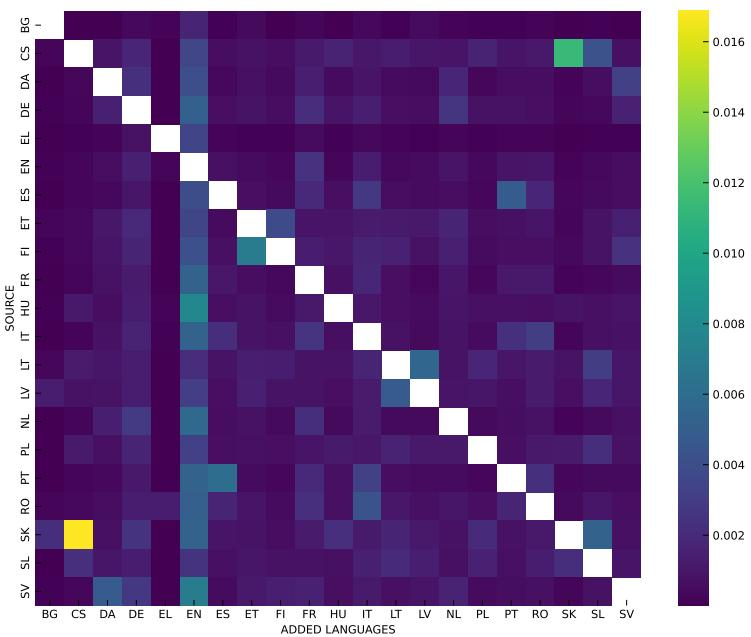  
Figure 9: For each Source language, we compute the proportion of tokens that are exclusively assigned to each Added Language when tokenizing a text from the Source language with the full tokenizer.

## D Supplementary Ablations

## D.1 Language Origin of Tokens Produced by the Full Tokenizer

To determine the language origin of the tokens introduced during tokenization when processing text in a Source language with the full tokenizer, we select a subset of the training data for each source language. In Fig. 9, for each Source language, we compute the proportion of tokens that are exclusively assigned to each Added Language when tokenizing the text using thefull tokenizer. We observe that English introduces the largest proportion of tokens across the considered languages, mainly due to its dominance in multilingual corpora.

## D.2 Impact of the Sampling Probability

Tabs. 19 and 20 report the performance of $S a m p _ { \mathrm { F u l l } }$ across different values of $p ,$ the probability of sampling thefull tokenizer during training; the following conclusions also hold for $S a m p _ { \mathrm { S u b } n }$

As observed in § $6 . 2 , p = 0$ matches the baseline performance on MCQ tasks across all languages when inference is performed using the corresponding monolingual subtokenizer. However, this setting struggles to handle combinations of subtokens for MCQ and performs even worse on translation.

The case $p = 1$ corresponds to a setting similar to the baseline, where the model is trained exclusively using the full tokenizer. We observe baseline-level performance on translation when using both thefull tokenizer and the combination (EN + LANG). The modularity of our tokenizer allows us to select the most relevant tokens for each language, leading to strong performance. However, a performance gap remains on MCQ tasks between thefull tokenizer and the monolingual subtokenizers. This highlights the importance of sampling monolingual subtokenizers during training, in order to enable the model to handle arbitrary combinations of subtokenizers at inference time. In practice, training in this setting is computationally challenging due to the large vocabulary size, especially when scaling to many languages.

We also observe that lower values of $p$ favor better performance when using monolingual subtokenizers, while higher values improve performance when using the full tokenizer (which serves as a proxy for inference with combined subtokenizers). We therefore selected $p = 0 . 5$ in our experiments to balance these two effects.

Additionally, lower values of $p$ can help reduce training costs, as they decrease the proportion of batches in which logits must be computed over combined vocabularies, particularly for large values of $n ,$ and instead restrict computation to smaller, language-specific vocabularies. However, this effect is dependent on model size and is more pronounced in smaller-scale models, where the cost of computing logits represents a larger fraction of the overall computation.

<table><tr><td>Lang. BG CS DA DE EL EN ES ET FI FR HU</td><td></td><td></td><td></td><td></td><td></td><td></td><td></td><td></td><td></td><td></td><td></td><td></td><td></td><td></td><td> IT LT LV NL PL PT RO SK SL SV</td><td></td><td></td><td></td><td></td><td></td><td></td><td></td><td></td></tr><tr><td>p (%)</td><td>0.5</td><td></td><td>3.51.9</td><td>2.2</td><td></td><td>0.7</td><td>1.3</td><td></td><td>2.2 2.3</td><td>2.8</td><td>1.7</td><td>2.2</td><td></td><td></td><td>2 2.4 2.8 2.5 2.0 2.2 2.5 2.6</td><td></td><td></td><td></td><td></td><td></td><td>4.8 2.3 2.7</td><td></td><td></td></tr></table>

Table 18: Percentage of tokens originating from other languages when tokenizing text in each reported language using the full tokenizer.
<table><tr><td></td><td>Infer.</td><td>BG</td><td>CS</td><td>DA</td><td>DE</td><td>EL</td><td>EN</td><td>ES</td><td>ET</td><td>FI</td><td>FR</td><td>HU</td><td>IT</td><td>LT</td><td>LV</td><td>NL</td><td>PL</td><td>PT</td><td>RO</td><td>SK</td><td>SL SV</td></tr><tr><td>Baseline</td><td>Lang Full</td><td>37.3 37.3</td><td>38.8 38.8</td><td>40.4 40.4</td><td>37.9 37.9</td><td>37.3 37.3</td><td>52.9 52.9</td><td>39.5 39.5</td><td>36.6 36.6</td><td>37.0 37.0</td><td>39.5 39.5</td><td>36.6 36.6</td><td>38.8 38.8</td><td>37.4 37.7 37.4 37.7</td><td>38.7 38.7</td><td>37.4 37.4</td><td>38.3 38.3</td><td>38.6 38.6</td><td>38.1 38.1</td><td>37.8 37.8</td><td>39.4 39.4</td></tr><tr><td>0</td><td>Lang</td><td>38.3</td><td>38.8</td><td>40.5</td><td>37.7</td><td>37.9</td><td>52.6</td><td>39.9</td><td>37.3</td><td>37.9</td><td>40.3 37.0</td><td>38.9</td><td>37.4</td><td>38.2</td><td>39.4</td><td>37.9</td><td>38.4</td><td>38.5</td><td>38.9</td><td>37.7</td><td>39.7</td></tr><tr><td></td><td>Full</td><td>36.3</td><td>36.6</td><td>38.3</td><td>36.3</td><td>37.1</td><td>49.6</td><td>38.0</td><td>34.4</td><td>34.2 37.8</td><td>35.3</td><td>37.2</td><td>34.6</td><td>35.1</td><td>37.3</td><td>35.1</td><td>37.7</td><td>36.2</td><td>36.1</td><td>36.0</td><td>38.2</td></tr><tr><td>0.1</td><td>Lang Full</td><td>38.7 38.2</td><td>38.4 38.0</td><td>41.3 40.6</td><td>38.2 37.5</td><td>38.1 37.5</td><td>52.4 52.1</td><td>40.0 39.0</td><td>37.0 35.8</td><td>37.7 39.3 36.5 38.9</td><td>37.5 36.6</td><td>38.8 38.1</td><td>37.5 35.9</td><td>37.6 36.1</td><td>39.4 38.6</td><td>37.7 36.6</td><td>38.4 38.0</td><td>39.1 37.8</td><td>38.3 37.8</td><td>37.8 36.9</td><td>39.6 38.9</td></tr><tr><td>0.2</td><td>Lang</td><td>38.0</td><td>37.6</td><td>39.7</td><td>37.4</td><td>37.7</td><td>52.2</td><td>39.4</td><td>36.5</td><td>36.9 39.2</td><td>36.5</td><td>38.2</td><td>37.3</td><td>37.4</td><td>38.7</td><td>37.5</td><td>38.2</td><td>37.7</td><td>38.0</td><td>37.5</td><td>39.3</td></tr><tr><td></td><td>Full</td><td>37.5</td><td>37.9</td><td>39.1</td><td>37.3</td><td>36.6</td><td>51.8</td><td>38.1</td><td>35.8</td><td>35.9 38.8</td><td>35.9</td><td>37.5</td><td>36.7</td><td>36.4</td><td>37.8</td><td>36.8</td><td>37.2</td><td>37.6</td><td>37.8</td><td>36.9</td><td>38.8</td></tr><tr><td>0.5</td><td>Lang Full</td><td>38.1 38.0</td><td>38.4 38.2</td><td>41.6 41.5</td><td>38.4 38.1</td><td>38.0 37.9</td><td>53.2 53.0</td><td>39.8 39.7</td><td>37.6 37.6 36.7 37.6</td><td>39.3 39.4</td><td>36.9 36.8</td><td>39.1 38.8</td><td>38.1 38.1</td><td>38.2 37.6</td><td>39.7 39.3</td><td>38.1 37.8</td><td>38.8 38.2</td><td>38.5 38.2</td><td>38.3 38.2</td><td>38.2 37.8</td><td>40.1 39.7</td></tr><tr><td></td><td>Lang</td><td>38.5</td><td></td><td></td><td></td><td>37.5</td><td>52.9</td><td></td><td></td><td></td><td></td><td></td><td></td><td></td><td></td><td></td><td></td><td></td><td></td><td></td><td>40.4</td></tr><tr><td>0.8</td><td>Full</td><td>38.6</td><td>38.1 38.6</td><td>40.3 40.8</td><td>37.9 38.0</td><td>36.9</td><td>53.5</td><td>39.5 36.7 39.7 36.2</td><td>37.2 37.3</td><td>39.4 41.6</td><td>36.7 36.3</td><td>38.7 38.7</td><td>37.4 37.7</td><td>37.6 37.9</td><td>38.9 39.6</td><td>36.9 37.5</td><td>38.4 38.4</td><td>38.2 38.5</td><td>38.5 38.7</td><td>38.2 38.0</td><td>40.0</td></tr><tr><td></td><td></td><td></td><td></td><td></td><td></td><td></td><td></td><td></td><td></td><td></td><td></td><td></td><td></td><td></td><td></td><td></td><td></td><td></td><td></td><td></td><td></td></tr><tr><td>1</td><td>Lang</td><td>37.4</td><td>35.5</td><td>38.8</td><td>36.6</td><td>37.3</td><td>50.3</td><td>37.0</td><td>34.5 34.7</td><td>37.6</td><td>35.2</td><td>36.2</td><td>34.8</td><td>35.6</td><td>37.1</td><td>35.2</td><td>35.9</td><td>36.2</td><td>34.9</td><td>35.3</td><td>37.7</td></tr><tr><td></td><td>Full</td><td>37.4</td><td>38.8</td><td>40.8</td><td>38.5</td><td>37.9</td><td>52.5</td><td>39.8 36.5</td><td>37.3</td><td>39.5</td><td>36.6</td><td>38.3</td><td>37.1</td><td>37.9</td><td>38.9</td><td>37.1</td><td>38.5</td><td>38.7</td><td>38.1</td><td>37.7</td><td>39.9</td></tr></table>

Table 19: MCQ Performance of $S a m p _ { \mathrm { F u l l } }$ for various probabilities of sampling the full tokenizer (Unigram).
<table><tr><td></td><td>Infer.</td><td>BG</td><td>CS</td><td>DA</td><td>DE</td><td>EL</td><td>EN</td><td>ES</td><td>ET</td><td>FI</td><td>FR HU</td><td>IT</td><td>LT</td><td>LV</td><td>NL</td><td>PL</td><td></td><td>PT RO</td><td>SK</td><td></td><td>SL SV</td></tr><tr><td>Baseline</td><td>Lang Full</td><td>26.1 26.1</td><td>22.0 22.0</td><td>35.3 35.3</td><td>22.7 22.7</td><td>17.1 17.1</td><td></td><td>20.6 20.6</td><td>15.8 15.8</td><td>14.6 14.6</td><td>32.4 14.6 32.4 14.6</td><td>20.1 20.1</td><td>17.7</td><td>19.0 19.0</td><td>20.6</td><td>14.7 14.7</td><td>34.5 34.5</td><td>28.2 28.2</td><td>21.0 21.0</td><td>20.0 20.0</td><td>34.4</td></tr><tr><td></td><td>Lang</td><td>1.0</td><td>1.8</td><td>2.8</td><td>2.6</td><td>5.3</td><td></td><td>6.2</td><td>1.5</td><td>15.0</td><td>1.5</td><td>6.9</td><td>17.7 1.0</td><td>1.0</td><td>20.6 2.6</td><td>1.4</td><td>5.2</td><td>9.3</td><td>1.6</td><td>2.0</td><td>34.4 2.6</td></tr><tr><td>0</td><td>Full</td><td>0.9</td><td>1.5</td><td>2.4</td><td>2.1</td><td>2.5</td><td></td><td>2.8</td><td>1.1 1.1 0.8</td><td>7.4</td><td>0.9</td><td>3.0</td><td>1.0</td><td>0.9</td><td>2.3</td><td>1.0</td><td>4.5</td><td>4.8</td><td>1.4</td><td>2.2</td><td>2.3</td></tr><tr><td>0.1</td><td>Lang</td><td>23.3</td><td>19.3</td><td>33.3</td><td>19.9</td><td>16.4</td><td></td><td>18.3</td><td>13.5 12.8</td><td>29.5</td><td>12.1</td><td>18.6</td><td>13.6</td><td>15.6</td><td>18.9</td><td>13.0</td><td>29.4</td><td>26.4</td><td>18.5</td><td>17.7</td><td>31.9</td></tr><tr><td></td><td>Full</td><td>23.7</td><td>19.4</td><td>33.1</td><td>20.1</td><td>16.4</td><td></td><td>18.6 14.7</td><td>13.2</td><td>29.3</td><td>11.9</td><td>18.7</td><td>15.7</td><td>17.5</td><td>18.8</td><td>13.2</td><td>30.9</td><td>26.0</td><td>18.8</td><td>18.0</td><td>31.8</td></tr><tr><td>0.2</td><td>Lang</td><td>26.0</td><td>19.9</td><td>33.9</td><td>21.6</td><td>16.1</td><td></td><td>19.6 15.4</td><td>14.0</td><td>30.8</td><td>13.9</td><td>18.6</td><td>16.0</td><td>17.1</td><td>19.2</td><td>12.2</td><td>31.1</td><td>26.3</td><td>19.8</td><td>18.2</td><td>33.2</td></tr><tr><td></td><td>Full</td><td>25.7</td><td>20.3</td><td>34.3</td><td>21.5</td><td>16.1</td><td></td><td>19.7 16.3</td><td>13.9</td><td>30.5</td><td>14.2</td><td>18.7</td><td>16.6</td><td>18.7</td><td>19.3</td><td>13.5</td><td>31.8</td><td>26.5</td><td>20.0</td><td>18.5</td><td>33.2</td></tr><tr><td>0.5</td><td>Lang Full</td><td>27.9 27.7</td><td>20.2</td><td>35.1</td><td>21.1</td><td>16.9</td><td></td><td>20.6 15.9</td><td>14.9 15.0</td><td>32.5</td><td>13.9</td><td>19.8</td><td>16.9</td><td>18.6</td><td>19.9</td><td>14.0</td><td>33.3</td><td>28.3</td><td>20.3</td><td>19.2</td><td>33.8</td></tr><tr><td></td><td></td><td></td><td>20.5</td><td>35.2</td><td>21.1</td><td>16.8</td><td></td><td>20.8 16.2</td><td></td><td>32.6</td><td>13.9</td><td>20.2</td><td>17.8</td><td>19.5</td><td>20.1</td><td>14.3</td><td>33.7</td><td>28.4</td><td>21.1</td><td>18.9</td><td>34.2</td></tr><tr><td>0.8</td><td>Lang Full</td><td>27.6 27.4</td><td>20.6</td><td>34.1</td><td>22.5</td><td>17.2</td><td></td><td>20.3 16.8 17.0</td><td>14.3 15.1</td><td>31.5 31.7</td><td>14.7</td><td>19.3</td><td>17.2</td><td>18.3</td><td>19.5</td><td>14.2</td><td>33.1</td><td>27.5</td><td>19.6</td><td>19.3</td><td>32.6</td></tr><tr><td></td><td></td><td></td><td>21.2</td><td>34.8</td><td>22.8</td><td>17.1</td><td></td><td>20.7</td><td></td><td></td><td>14.7</td><td>19.8</td><td>17.5</td><td>19.2</td><td>19.7</td><td>14.3</td><td>33.7</td><td>28.4</td><td>20.7</td><td>19.6</td><td>33.0</td></tr><tr><td>1</td><td>Lang</td><td>27.5</td><td>20.6</td><td>36.0</td><td>22.7</td><td>17.3</td><td></td><td>20.6 17.1</td><td>14.6</td><td>32.8</td><td>15.3</td><td>20.1</td><td>17.3</td><td>19.0</td><td>20.0</td><td>13.8</td><td>33.8</td><td>28.1</td><td>20.0</td><td>18.8</td><td>34.4</td></tr><tr><td></td><td>Full</td><td>27.3</td><td>22.1</td><td>37.1</td><td>23.2</td><td>17.4</td><td></td><td>21.1 17.5</td><td>15.4</td><td>34.0</td><td>15.6</td><td>20.7</td><td>19.1</td><td>20.1</td><td>20.7</td><td>14.9</td><td>35.0</td><td>29.4</td><td>22.1</td><td>20.3</td><td>35.5</td></tr></table>

Table 20: MT Performance of $S a m p _ { \mathrm { F u l l } }$ for various probabilities of sampling the full tokenizer (Unigram).

## E Offloading Vocabulary State to CPU: Proof of Concept

Setup. We benchmark our real training step — FSDP-sharded forward/backward with flash attention, activation rematerialization, and AdamW — on one node of 8×H100, at 1B, 2.5B, and a 7B configuration (d=4096, 32 layers). The vocabulary state resides in CPU RAM: an fp16 table holding the embedding rows of all 21 languages, with fp32 Adam moments and master weights host-side. A step activates the batch’s input rows (∼24k, one language) plus the output rows of the K sampled subtokenizers; we measure K=1 (monolingual batches, half of training at $\scriptstyle { p = 0 . 5 ) }$ and $K { = } 6 \ ( S a m p _ { \mathrm { S u b 5 } } )$ . The host side is deliberately naive: unpinned memory, threaded-NumPy AdamW. We report batch 64 — the configuration our full-vocabulary training was memoryconstrained to — and batch 128, which the freed vocabulary memory makes affordable.

Pipeline. Following ZeRO-Offload’s delayed parameter update (Ren et al., 2021): while the GPU computes step t, the CPU gathers the active rows, applies AdamW using the gradients of step t−1, and writes them back to the host table; the vocabulary rows thus lag one gradient step, a scheme whose convergence neutrality is established by Ren et al. (2021). The backbone updates synchronously on GPU. In our prototype the two row transfers (gradients to the CPU, updated parameter rows back) run between steps, since copies issued while a step is in flight are stream-ordered behind its kernels; production implementations overlap them with compute through pinned buffers and dedicated copy streams (Ren et al., 2021; Miao et al., 2021).

<table><tr><td>Model (batch)</td><td>K</td><td>fwd/bwd</td><td>off-GPU</td><td>xfer</td><td>step w/ offload</td></tr><tr><td>1B (128)</td><td>1</td><td>1.37</td><td>0.32</td><td>0.05</td><td>1.43</td></tr><tr><td>1B (128)</td><td>6</td><td>1.53-1.55</td><td>1.15-1.24</td><td>0.15</td><td>1.72-1.74</td></tr><tr><td>2.5B (64)</td><td>1</td><td>1.47</td><td>0.54</td><td>0.07</td><td>1.55</td></tr><tr><td>2.5B (64)</td><td>6</td><td>1.59</td><td>1.63-1.88</td><td>0.23</td><td>2.03–2.38</td></tr><tr><td>2.5B (128)</td><td>1</td><td>2.90</td><td>0.31-0.51</td><td>0.06</td><td>2.96–3.00</td></tr><tr><td>2.5B (128)</td><td>6</td><td>3.13</td><td>2.20–2.65</td><td>0.21-0.26</td><td>3.76-3.89</td></tr><tr><td>7B (64)</td><td>1</td><td>3.62</td><td>0.65-0.83</td><td>0.10</td><td>3.73-3.76</td></tr><tr><td>7B (64)</td><td>6</td><td>3.77-3.80</td><td>1.98–2.19</td><td>0.30</td><td>4.09-4.21</td></tr><tr><td>7B (128)</td><td>1</td><td>7.11-7.14</td><td>0.65</td><td>0.10</td><td>7.23-7.24</td></tr><tr><td>7B (128)</td><td>6</td><td>7.39-7.46</td><td>3.71-4.72</td><td>0.32–0.39</td><td>7.82-7.85</td></tr></table>

Table 21: Offloading proof of concept (seconds/step, median of 12; ranges over repeat runs on different nodes). fwd/bwd: step time with all state GPU-resident; off-GPU: the vocabulary round trip alone; xfer: its two row transfers; step w/ offload: step time with the round trip pipelined in. K=1: monolingual batch; $K { = } 6 \colon S a m p _ { \operatorname { S u b } 5 } .$

Results. Tab. 21 reports, per configuration, the step time, the full off-GPU round trip measured alone (gather, both transfers, CPU update, writeback), its transfer share, and the step time with the round trip pipelined in. The round trip fits within the step at every batch-128 configuration and every monolingual one; the sole overflow is $S a m p _ { \mathrm { S u b 5 } }$ at the memory-constrained 2.5B/batch-64 setting, where the naive CPU update alone (1.4–1.7 s) exceeds the 1.6 s step — the component a fused CPU optimizer accelerates several-fold. Transfers are 10–15% of the round trip throughout (0.05–0.39 s): the off-GPU cost is dominated by CPU compute, which the pipeline hides, not by data movement.

Caveats. These timings upper-bound the overhead: no pinned memory, no fused CPU optimizer, no transfer/compute overlap. Host-side times vary up to ∼2× across nodes without NUMA pinning (the upper ends of the off-GPU ranges). The delayed update applies to the vocabulary rows only.

## F Inference and Memory Efficiency Across Scales: Details

Setup. Inference time is the mean forward pass over the full FLORES corpus, context 4096, batch 1, bf16, on H100 GPUs right-sized per scale: one GPU up to 12B, two (tensor-parallel) at 30B, where the monolingual reference runs on the same hardware, keeping ratios comparable. Model configurations are given in Tab. 23; the 2.5B configuration matches our trained models. Tokenizers: Gemma-3 (262k), Qwen-3 (152k), Full (our sequential multilingual BPE, 387k), and Extracted (its perlanguage 24k subtokenizers), all against dedicated 24k monolingual BPE references.We measure 16 of the 21 languages: the six low-resource ones and ten from the conservative set; the five omitted (ES, PT, IT, DA, NL) fall within the reported range, and their ratios at scale follow from their NSL (see below).

Inference time. Full’s overhead is nearly language-independent — within ±0.04 of each scale’s mean, reflecting its pure output-layer cost — and decays from ∼1.58× to ∼1.07× (Tab. 22); open-weight overheads contain an additional compression factor that persists at every scale and is largest on low-resource languages and non-Latin scripts. At 30B, where the output-layer factor has faded, the normalized time converges to the tokenizer’s NSL (Gemma-3 on TE: 1.73 vs. an NSL of 1.61; on SI: 1.92 vs. 1.79) — Tab. 2 thus predicts large-scale inference cost for any language. Extracted matches the monolingual references (0.99– 1.04) everywhere.

<table><tr><td rowspan=1 colspan=17>Gemma-3 (262k)                      Qwen-3 (152k)                    Llama-3 (128k)</td></tr><tr><td rowspan=1 colspan=17>Lang 0.5B1B 2.5B 7B 12B30B    0.5B1B2.5B 7B 12B30B    0.5B 1B2.5B7B 12B30B</td></tr><tr><td rowspan=1 colspan=2>BG   2.151.97</td><td rowspan=1 colspan=7>1.821.631.591.51    2.462.332.22</td><td rowspan=1 colspan=5>2.072.032.00    2.071.991.92</td><td rowspan=1 colspan=2>1.841.81</td><td rowspan=1 colspan=1>1.83</td></tr><tr><td rowspan=1 colspan=1>CS   2.10</td><td rowspan=1 colspan=1>1.92</td><td rowspan=1 colspan=1>1.76</td><td rowspan=1 colspan=1>1.58</td><td rowspan=1 colspan=3>1.56 1.46    2.40</td><td rowspan=1 colspan=1>2.27</td><td rowspan=1 colspan=1>2.15</td><td rowspan=1 colspan=1>2.02</td><td rowspan=1 colspan=1>2.00</td><td rowspan=1 colspan=2>1.91    1.601.53</td><td rowspan=1 colspan=1>1.47</td><td rowspan=1 colspan=2>1.411.42</td><td rowspan=1 colspan=1>1.39</td></tr><tr><td rowspan=1 colspan=1>DE   1.72</td><td rowspan=1 colspan=1>1.58</td><td rowspan=1 colspan=1>1.45</td><td rowspan=1 colspan=1>1.31</td><td rowspan=1 colspan=3>1.281.20    1.70</td><td rowspan=1 colspan=1>1.61</td><td rowspan=1 colspan=1>1.52</td><td rowspan=1 colspan=1>1.43</td><td rowspan=1 colspan=1>1.42</td><td rowspan=1 colspan=3>1.36    1.571.511.44</td><td rowspan=1 colspan=2>1.401.39</td><td rowspan=1 colspan=1>1.37</td></tr><tr><td rowspan=1 colspan=1>EL   2.63</td><td rowspan=1 colspan=1>2.41</td><td rowspan=1 colspan=1>2.22</td><td rowspan=1 colspan=1>1.98</td><td rowspan=1 colspan=3>1.971.85    5.03</td><td rowspan=1 colspan=1>4.74</td><td rowspan=1 colspan=1>4.51</td><td rowspan=1 colspan=1>4.19</td><td rowspan=1 colspan=1>4.15</td><td rowspan=1 colspan=3>4.03    2.081.991.91</td><td rowspan=1 colspan=3>1.821.841.83</td></tr><tr><td rowspan=1 colspan=1>EN   1.49</td><td rowspan=1 colspan=1>1.37</td><td rowspan=1 colspan=1>1.26</td><td rowspan=1 colspan=1>1.12</td><td rowspan=1 colspan=1>1.11</td><td rowspan=1 colspan=2>1.05    1.24</td><td rowspan=1 colspan=1>1.17</td><td rowspan=1 colspan=1>1.11</td><td rowspan=1 colspan=1>1.03</td><td rowspan=1 colspan=1>1.03</td><td rowspan=1 colspan=2>1.00    1.151.10</td><td rowspan=1 colspan=1>1.06</td><td rowspan=1 colspan=2>1.001.01</td><td rowspan=1 colspan=1>1.01</td></tr><tr><td rowspan=1 colspan=1>FR   1.66</td><td rowspan=1 colspan=1>1.52</td><td rowspan=1 colspan=1>1.40</td><td rowspan=1 colspan=1>1.25</td><td rowspan=1 colspan=1>1.22</td><td rowspan=1 colspan=2>1.17    1.57</td><td rowspan=1 colspan=1>1.48</td><td rowspan=1 colspan=1>1.41</td><td rowspan=1 colspan=1>1.31</td><td rowspan=1 colspan=1>1.311</td><td rowspan=1 colspan=1>.26    1.45</td><td rowspan=1 colspan=1>1.38</td><td rowspan=1 colspan=1>1.33</td><td rowspan=1 colspan=1>1.28</td><td rowspan=1 colspan=1>1.27</td><td rowspan=1 colspan=1>1.27</td></tr><tr><td rowspan=1 colspan=1>HR   2.05</td><td rowspan=1 colspan=1>1.88</td><td rowspan=1 colspan=1>1.73</td><td rowspan=1 colspan=1>1.55</td><td rowspan=1 colspan=1>1.52</td><td rowspan=1 colspan=2>1.43    2.15</td><td rowspan=1 colspan=1>2.03</td><td rowspan=1 colspan=1>1.93</td><td rowspan=1 colspan=1>1.80</td><td rowspan=1 colspan=1>1.78</td><td rowspan=1 colspan=1>1.72    1.90</td><td rowspan=1 colspan=1>1.81</td><td rowspan=1 colspan=1>1.75</td><td rowspan=1 colspan=1>1.68</td><td rowspan=1 colspan=1>1.67</td><td rowspan=1 colspan=1>1.66</td></tr><tr><td rowspan=1 colspan=1>HU  2.25</td><td rowspan=1 colspan=1>2.06</td><td rowspan=1 colspan=1>1.90</td><td rowspan=1 colspan=1>1.69</td><td rowspan=1 colspan=1>1.67</td><td rowspan=1 colspan=2>1.59    2.40</td><td rowspan=1 colspan=1>2.27</td><td rowspan=1 colspan=1>2.16</td><td rowspan=1 colspan=1>2.01</td><td rowspan=1 colspan=1>2.00</td><td rowspan=1 colspan=1>1.92    2.18</td><td rowspan=1 colspan=1>2.08</td><td rowspan=1 colspan=1>2.00</td><td rowspan=1 colspan=1>1.93</td><td rowspan=1 colspan=1>1.92</td><td rowspan=1 colspan=1>1.90</td></tr><tr><td rowspan=1 colspan=1>NE   2.21</td><td rowspan=1 colspan=1>2.03</td><td rowspan=1 colspan=1>1.88</td><td rowspan=1 colspan=1>1.66</td><td rowspan=1 colspan=1>1.64</td><td rowspan=1 colspan=2>1.54    5.37</td><td rowspan=1 colspan=1>5.07</td><td rowspan=1 colspan=1>4.83</td><td rowspan=1 colspan=1>4.51</td><td rowspan=1 colspan=1>4.48</td><td rowspan=1 colspan=1>4.29    2.85</td><td rowspan=1 colspan=1>2.74</td><td rowspan=1 colspan=1>2.63</td><td rowspan=1 colspan=1>2.51</td><td rowspan=1 colspan=1>2.51</td><td rowspan=1 colspan=1>2.49</td></tr><tr><td rowspan=1 colspan=1>PL   2.03</td><td rowspan=1 colspan=1>1.86</td><td rowspan=1 colspan=1>1.71</td><td rowspan=1 colspan=1>1.53</td><td rowspan=1 colspan=1>1.52</td><td rowspan=1 colspan=2>1.41    2.01</td><td rowspan=1 colspan=1>1.90</td><td rowspan=1 colspan=1>1.80</td><td rowspan=1 colspan=1>1.68</td><td rowspan=1 colspan=1>1.66</td><td rowspan=1 colspan=1>1.61     1.95</td><td rowspan=1 colspan=1>1.88</td><td rowspan=1 colspan=1>1.80</td><td rowspan=1 colspan=1>1.73</td><td rowspan=1 colspan=1>1.73</td><td rowspan=1 colspan=1>1.69</td></tr><tr><td rowspan=1 colspan=1>RO   1.98</td><td rowspan=1 colspan=1>1.81</td><td rowspan=1 colspan=1>1.68</td><td rowspan=1 colspan=1>1.50</td><td rowspan=1 colspan=1>1.471</td><td rowspan=1 colspan=2>.39    1.97</td><td rowspan=1 colspan=1>1.86</td><td rowspan=1 colspan=1>1.77</td><td rowspan=1 colspan=1>1.65</td><td rowspan=1 colspan=1>1.65</td><td rowspan=1 colspan=1>1.58    1.80</td><td rowspan=1 colspan=1>1.73</td><td rowspan=1 colspan=1>1.66</td><td rowspan=1 colspan=1>1.60</td><td rowspan=1 colspan=1>1.58</td><td rowspan=1 colspan=1>1.58</td></tr><tr><td rowspan=1 colspan=1>SI   2.72</td><td rowspan=1 colspan=1>2.50</td><td rowspan=1 colspan=1>2.29</td><td rowspan=1 colspan=1>2.04</td><td rowspan=1 colspan=1>2.03</td><td rowspan=1 colspan=2>1.92    6.95</td><td rowspan=1 colspan=1>6.56</td><td rowspan=1 colspan=1>6.21</td><td rowspan=1 colspan=1>5.82</td><td rowspan=1 colspan=1>5.765</td><td rowspan=1 colspan=1>.58    7.82</td><td rowspan=1 colspan=1>7.47</td><td rowspan=1 colspan=1>7.15</td><td rowspan=1 colspan=1>6.88</td><td rowspan=1 colspan=1>6.89</td><td rowspan=1 colspan=1>6.85</td></tr><tr><td rowspan=1 colspan=1>SL   2.15</td><td rowspan=1 colspan=1>1.98</td><td rowspan=1 colspan=1>1.81</td><td rowspan=1 colspan=1>1.62</td><td rowspan=1 colspan=1>1.59</td><td rowspan=1 colspan=2>1.51    2.16</td><td rowspan=1 colspan=1>2.04</td><td rowspan=1 colspan=1>1.94</td><td rowspan=1 colspan=1>1.80</td><td rowspan=1 colspan=1>1.79</td><td rowspan=1 colspan=1>1.75    1.90</td><td rowspan=1 colspan=1>1.83</td><td rowspan=1 colspan=1>1.74</td><td rowspan=1 colspan=1>1.68</td><td rowspan=1 colspan=1>1.67</td><td rowspan=1 colspan=1>1.65</td></tr><tr><td rowspan=1 colspan=1>SO   2.36</td><td rowspan=1 colspan=1>2.17</td><td rowspan=1 colspan=1>1.99</td><td rowspan=1 colspan=1>1.78</td><td rowspan=1 colspan=1>1.75</td><td rowspan=1 colspan=2>1.65    2.26</td><td rowspan=1 colspan=1>2.13</td><td rowspan=1 colspan=1>2.03</td><td rowspan=1 colspan=1>1.89</td><td rowspan=1 colspan=1>1.87</td><td rowspan=1 colspan=1>1.82    2.05</td><td rowspan=1 colspan=1>1.97</td><td rowspan=1 colspan=1>1.89</td><td rowspan=1 colspan=1>1.82</td><td rowspan=1 colspan=1>1.80</td><td rowspan=1 colspan=1>1.80</td></tr><tr><td rowspan=1 colspan=1>SW   2.39</td><td rowspan=1 colspan=1>2.19</td><td rowspan=1 colspan=1>2.03</td><td rowspan=1 colspan=1>1.81</td><td rowspan=1 colspan=1>1.77</td><td rowspan=1 colspan=1>1.67</td><td rowspan=1 colspan=1>2.39</td><td rowspan=1 colspan=1>2.26</td><td rowspan=1 colspan=1>2.15</td><td rowspan=1 colspan=1>2.02</td><td rowspan=1 colspan=1>2.00</td><td rowspan=1 colspan=1>1.93    2.17</td><td rowspan=1 colspan=1>2.08</td><td rowspan=1 colspan=1>2.00</td><td rowspan=1 colspan=1>1.93</td><td rowspan=1 colspan=1>1.90</td><td rowspan=1 colspan=1>1.90</td></tr><tr><td rowspan=1 colspan=1>TE   2.46</td><td rowspan=1 colspan=1>2.26</td><td rowspan=1 colspan=1>2.09</td><td rowspan=1 colspan=1>1.84</td><td rowspan=1 colspan=1>1.82</td><td rowspan=1 colspan=2>1.73    8.18</td><td rowspan=1 colspan=1>7.72</td><td rowspan=1 colspan=1>7.34</td><td rowspan=1 colspan=1>6.86</td><td rowspan=1 colspan=1>6.70</td><td rowspan=1 colspan=1>6.56    8.69</td><td rowspan=1 colspan=1>8.31</td><td rowspan=1 colspan=1>7.97</td><td rowspan=1 colspan=1>7.65</td><td rowspan=1 colspan=1>7.57</td><td rowspan=1 colspan=1>7.64</td></tr><tr><td rowspan=1 colspan=1></td><td rowspan=1 colspan=1>T</td><td rowspan=1 colspan=6>inyAya (261k)                     F</td><td rowspan=1 colspan=1>ull (3</td><td rowspan=1 colspan=1>87k, o</td><td rowspan=1 colspan=3>urs)                Extra</td><td rowspan=1 colspan=1>cted</td><td rowspan=1 colspan=2>24k (ours)</td><td rowspan=1 colspan=1></td></tr><tr><td rowspan=1 colspan=1>BG   1.92</td><td rowspan=1 colspan=1>1.76</td><td rowspan=1 colspan=1>1.63</td><td rowspan=1 colspan=1>1.49</td><td rowspan=1 colspan=3>1.461.47    1.62</td><td rowspan=1 colspan=1>1.45</td><td rowspan=1 colspan=1>1.32</td><td rowspan=1 colspan=1>1.15</td><td rowspan=1 colspan=1>1.12</td><td rowspan=1 colspan=1>1.10    1.00</td><td rowspan=1 colspan=1>1.00</td><td rowspan=1 colspan=1>1.00</td><td rowspan=1 colspan=1>1.00</td><td rowspan=1 colspan=1>0.99</td><td rowspan=1 colspan=1>1.01</td></tr><tr><td rowspan=1 colspan=1>CS   1.71</td><td rowspan=1 colspan=1>1.56</td><td rowspan=1 colspan=1>1.44</td><td rowspan=1 colspan=1>1.32</td><td rowspan=1 colspan=1>1.31</td><td rowspan=1 colspan=2>1.55</td><td rowspan=1 colspan=1>1.39</td><td rowspan=1 colspan=1>1.25</td><td rowspan=1 colspan=1>1.11</td><td rowspan=1 colspan=1>1.09</td><td rowspan=1 colspan=1>1.05    1.00</td><td rowspan=1 colspan=1>1.00</td><td rowspan=1 colspan=1>1.00</td><td rowspan=1 colspan=1>1.00</td><td rowspan=1 colspan=1>1.01</td><td rowspan=1 colspan=1>1.00</td></tr><tr><td rowspan=1 colspan=1>DE   1.55</td><td rowspan=1 colspan=1>1.42</td><td rowspan=1 colspan=1>1.31</td><td rowspan=1 colspan=1>1.22</td><td rowspan=1 colspan=1>1.191</td><td rowspan=1 colspan=2>.17    1.58</td><td rowspan=1 colspan=1>1.42</td><td rowspan=1 colspan=1>1.27</td><td rowspan=1 colspan=1>1.13</td><td rowspan=1 colspan=1>1.10</td><td rowspan=1 colspan=1>1.06    1.02</td><td rowspan=1 colspan=1>1.02</td><td rowspan=1 colspan=1>1.02</td><td rowspan=1 colspan=1>1.03</td><td rowspan=1 colspan=1>1.02</td><td rowspan=1 colspan=1>1.02</td></tr><tr><td rowspan=1 colspan=1>EL   1.99</td><td rowspan=1 colspan=1>1.82</td><td rowspan=1 colspan=1>1.67</td><td rowspan=1 colspan=2>1.541.51</td><td rowspan=1 colspan=2>1.50    1.60</td><td rowspan=1 colspan=1>1.43</td><td rowspan=1 colspan=1>1.29</td><td rowspan=1 colspan=1>1.13</td><td rowspan=1 colspan=1>1.11</td><td rowspan=1 colspan=1>1.08    1.00</td><td rowspan=1 colspan=1>1.00</td><td rowspan=1 colspan=1>1.00</td><td rowspan=1 colspan=1>0.99</td><td rowspan=1 colspan=1>1.00</td><td rowspan=1 colspan=1>1.00</td></tr><tr><td rowspan=1 colspan=1>EN   1.37</td><td rowspan=1 colspan=1>1.25</td><td rowspan=1 colspan=1>1.15</td><td rowspan=1 colspan=2>1.061.05</td><td rowspan=1 colspan=2>1.04    1.58</td><td rowspan=1 colspan=1>1.42</td><td rowspan=1 colspan=1>1.28</td><td rowspan=1 colspan=1>1.12</td><td rowspan=1 colspan=1>1.11</td><td rowspan=1 colspan=1>1.07    1.01</td><td rowspan=1 colspan=1>1.01</td><td rowspan=1 colspan=1>1.01</td><td rowspan=1 colspan=2>1.011.00</td><td rowspan=1 colspan=1>1.01</td></tr><tr><td rowspan=1 colspan=1>FR   1.48</td><td rowspan=1 colspan=1>1.36</td><td rowspan=1 colspan=1>1.25</td><td rowspan=1 colspan=1>1.14</td><td rowspan=1 colspan=3>1.141.13    1.58</td><td rowspan=1 colspan=1>1.42</td><td rowspan=1 colspan=1>1.28</td><td rowspan=1 colspan=1>1.12</td><td rowspan=1 colspan=2>1.101.07    1.01</td><td rowspan=1 colspan=1>1.00</td><td rowspan=1 colspan=1>1.01</td><td rowspan=1 colspan=2>1.001.00</td><td rowspan=1 colspan=1>1.01</td></tr><tr><td rowspan=1 colspan=1>HR   1.78</td><td rowspan=1 colspan=1>1.62</td><td rowspan=1 colspan=1>1.51</td><td rowspan=1 colspan=4>1.381.361.35    1.54</td><td rowspan=1 colspan=1>1.38</td><td rowspan=1 colspan=1>1.25</td><td rowspan=1 colspan=1>1.10</td><td rowspan=1 colspan=3>1.061.04    1.031.03</td><td rowspan=1 colspan=1>1.04</td><td rowspan=1 colspan=2>1.041.04</td><td rowspan=1 colspan=1>1.04</td></tr><tr><td rowspan=1 colspan=1>HU   1.92</td><td rowspan=1 colspan=1>1.76</td><td rowspan=1 colspan=1>1.62</td><td rowspan=1 colspan=4>1.491.461.45    1.59</td><td rowspan=1 colspan=1>1.43</td><td rowspan=1 colspan=1>1.29</td><td rowspan=1 colspan=1>1.13</td><td rowspan=1 colspan=3>1.111.08    1.031.03</td><td rowspan=1 colspan=1>1.03</td><td rowspan=1 colspan=2>1.031.03</td><td rowspan=1 colspan=1>1.03</td></tr><tr><td rowspan=1 colspan=1>NE   1.98</td><td rowspan=1 colspan=1>1.81</td><td rowspan=1 colspan=1>1.67</td><td rowspan=1 colspan=4>1.541.521.50    1.59</td><td rowspan=1 colspan=1>1.42</td><td rowspan=1 colspan=1>1.28</td><td rowspan=1 colspan=1>1.11</td><td rowspan=1 colspan=3>1.111.07    1.011.02</td><td rowspan=1 colspan=1>1.02</td><td rowspan=1 colspan=2>1.011.02</td><td rowspan=1 colspan=1>1.01</td></tr><tr><td rowspan=1 colspan=1>PL   1.84</td><td rowspan=1 colspan=1>1.68</td><td rowspan=1 colspan=1>1.55</td><td rowspan=1 colspan=4>1.431.421.38    1.57</td><td rowspan=1 colspan=1>1.42</td><td rowspan=1 colspan=1>1.27</td><td rowspan=1 colspan=1>1.12</td><td rowspan=1 colspan=3>1.101.06    1.031.03</td><td rowspan=1 colspan=1>1.03</td><td rowspan=1 colspan=2>1.031.04</td><td rowspan=1 colspan=1>1.03</td></tr><tr><td rowspan=1 colspan=1>RO   1.75</td><td rowspan=1 colspan=1>1.61</td><td rowspan=1 colspan=1>1.47</td><td rowspan=1 colspan=2>1.361.35</td><td rowspan=1 colspan=2>1.32    1.57</td><td rowspan=1 colspan=1>1.41</td><td rowspan=1 colspan=1>1.27</td><td rowspan=1 colspan=1>1.12</td><td rowspan=1 colspan=3>1.091.06    1.021.02</td><td rowspan=1 colspan=1>1.02</td><td rowspan=1 colspan=2>1.031.02</td><td rowspan=1 colspan=1>1.02</td></tr><tr><td rowspan=1 colspan=1>SI    12.7</td><td rowspan=1 colspan=1>11.6</td><td rowspan=1 colspan=1>10.6</td><td rowspan=1 colspan=1>9.78</td><td rowspan=1 colspan=3>9.719.65    1.55</td><td rowspan=1 colspan=1>1.39</td><td rowspan=1 colspan=1>1.25</td><td rowspan=1 colspan=1>1.09</td><td rowspan=1 colspan=3>1.091.05    1.001.00</td><td rowspan=1 colspan=1>1.00</td><td rowspan=1 colspan=2>1.001.00</td><td rowspan=1 colspan=1>1.00</td></tr><tr><td rowspan=1 colspan=1>SL   1.82</td><td rowspan=1 colspan=1>1.67</td><td rowspan=1 colspan=1>1.52</td><td rowspan=1 colspan=1>1.41</td><td rowspan=1 colspan=3>1.391.39    1.55</td><td rowspan=1 colspan=1>1.39</td><td rowspan=1 colspan=1>1.25</td><td rowspan=1 colspan=1>1.10</td><td rowspan=1 colspan=3>1.071.05    1.041.04</td><td rowspan=1 colspan=1>1.04</td><td rowspan=1 colspan=2>1.041.04</td><td rowspan=1 colspan=1>1.04</td></tr><tr><td rowspan=1 colspan=1>SO   2.26</td><td rowspan=1 colspan=1>2.06</td><td rowspan=1 colspan=1>1.90</td><td rowspan=1 colspan=1>1.75</td><td rowspan=1 colspan=3>1.721.72    1.57</td><td rowspan=1 colspan=1>1.41</td><td rowspan=1 colspan=1>1.27</td><td rowspan=1 colspan=1>1.11</td><td rowspan=1 colspan=3>1.091.06    1.021.02</td><td rowspan=1 colspan=1>1.02</td><td rowspan=1 colspan=2>1.021.02</td><td rowspan=1 colspan=1>1.02</td></tr><tr><td rowspan=1 colspan=1>SW   1.96</td><td rowspan=1 colspan=1>1.79</td><td rowspan=1 colspan=1>1.65</td><td rowspan=1 colspan=1>1.52</td><td rowspan=1 colspan=3>1.491.49    1.61</td><td rowspan=1 colspan=1>1.44</td><td rowspan=1 colspan=1>1.30</td><td rowspan=1 colspan=1>1.15</td><td rowspan=1 colspan=3>1.121.09    1.031.03</td><td rowspan=1 colspan=1>1.03</td><td rowspan=1 colspan=2>1.031.03</td><td rowspan=1 colspan=1>1.03</td></tr><tr><td rowspan=1 colspan=1>TE   2.35</td><td rowspan=1 colspan=1>2.15</td><td rowspan=1 colspan=1>1.99</td><td rowspan=1 colspan=4>1.821.781.78    1.58</td><td rowspan=1 colspan=1>1.41</td><td rowspan=1 colspan=1>1.27</td><td rowspan=1 colspan=1>1.12</td><td rowspan=1 colspan=4>1.091.07    1.001.001.00</td><td rowspan=1 colspan=3>1.000.991.01</td></tr></table>

Table 22: Inference-time grid: forward time on FLORES relative to a dedicated 24k monolingual tokenizer, per language and model scale (configurations in Tab. 23).

Memory. For parameters (Tab. 23): a 24k subvocabulary instead of a 256k one removes 90.6% of the embedding parameters at any width; the share of total parameters saved shrinks as the backbone grows, and is lower with tied embeddings (last two rows). For compression (Tab. 9): comparing an open-weight row with the Extracted row gives the sequence-length cut, which equally cuts decode steps and KV cache: on HR, Gemma-3 costs 0.314 tokens per character and ours 0.242, a 23% cut. Cuts span −3% (EN) to 44% (low-resource). These cuts hold at every size and architecture; only the per-token cache cost varies (58–745 KB from 0.5B to 30B; bf16, GQA 2, head dim. 128).

<table><tr><td>Scale</td><td>0.5B</td><td>1B</td><td>2.5B</td><td>7B</td><td>12B</td><td>30B</td></tr><tr><td>Width d</td><td>1536</td><td>2048</td><td>3072</td><td>4096</td><td>5120</td><td>7168</td></tr><tr><td>Layers</td><td>19</td><td>21</td><td>24</td><td>40</td><td>40</td><td>52</td></tr><tr><td>Total-parameter reduction, 256k → 24k vocab.:</td><td></td><td></td><td></td><td></td><td></td><td></td></tr><tr><td>untied emb.</td><td>55%</td><td>47%</td><td>35% </td><td>20% </td><td>16%</td><td>10%</td></tr><tr><td>tied emb.</td><td>40%</td><td>31%</td><td>21%</td><td>11%</td><td>9%</td><td>5%</td></tr></table>

Table 23: Benchmark configurations (scales named by non-embedding parameter count; head dim. 128, GQA 2, MLP 2.75d; 2.5B matches our trained models) and the total-parameter reduction when serving a language with its 24k sub-vocabulary instead of a 256k one, for untied and tied embeddings.