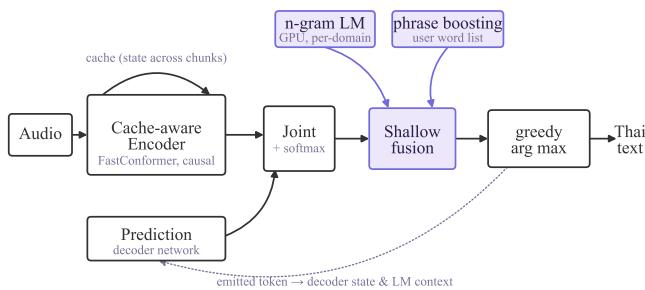
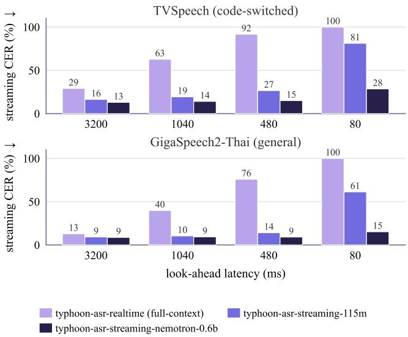

# Typhoon ASR Streaming: Steerable Low-Latency Thai Speech Recognition with Real-Time Shallow Fusion

Warit Sirichotedumrong, Tanawin Samutsin, Shah Faisal Wani, Sittipong Sripaisarnmongkol, Kunat Pipatanakul Typhoon Team, SCB DataX, Bangkok, Thailand

Abstract—Open Thai automatic speech recognition (ASR) is dominated by offline, Whisper-based models that read the whole utterance before transcribing, ruling out low-latency uses such as live captioning and voice agents. We present a deployable system for streaming Thai ASR that lets a user steer its vocabulary at decode time, without retraining. A widely used open Thai model, trained with full context, collapses when run as a true stream; we restore streaming with a cache-aware encoder, by converting it or adapting a natively streaming one, and add a shallow-fusion layer that re-ranks candidates inside the streaming decoder with a GPU n-gram language model and phrase boosting. Across two Thai benchmarks and two model sizes, the streaming models stay usable where the full-context model fails, cutting character error rate 4.3–4.5× at a one-second look-ahead while running faster than real time. Decode-time steering then lifts keyword recall from 16.6% to 20.7% at no accuracy cost and negligible overhead; most of the gain comes from an n-gram over ordinary training transcripts, which resolves the written form of codeswitched words the model hears but spells inconsistently, with phrase boosting adding targeted control over rare domain terms.

Index Terms—streaming speech recognition, cache-aware Transducer, shallow fusion, contextual biasing, Thai ASR.

## I. INTRODUCTION

Open Thai automatic speech recognition (ASR) is dominated by offline, Whisper-based models [1]–[3]. Their popularity stems from large-scale multilingual pretraining and strong accuracy, but they require the entire utterance before transcribing, making them unsuitable for live captioning, voice agents, and meeting transcription that demand low, predictable latency. Typhoon ASR Real-time [4], our previously released model and one of the most widely used open Thai checkpoints (over 28,000 downloads and nearly one million requests served through OpenTyphoon.ai), broke from this paradigm with a FastConformer-Transducer that runs about 45× cheaper than Whisper Large-v3 at comparable accuracy.

Yet it is still not truly low-latency: its released checkpoint is trained with full, bidirectional context, so forced into a real stream its character error rate (CER) rises from 11.0% to 62.8%, and at the lowest latency it stops emitting valid output.

Thai has no word spaces and admits several written forms per spoken word, including numbers, the repetition marker (mai yamok), and borrowed words, so transcripts must first be normalized to a single form. Live systems also need vocabulary control for names and domain terms the acoustic model rarely heard, yet per-customer retraining is impractical. Production English ASR systems address this by biasing the decoder at runtime with an n-gram language model or a phrase list [5]. However, the open Thai ASR ecosystem is largely built around Whisper-style autoregressive models, leaving no open implementation, training recipe, or systematic study of n-gram language models for decoder biasing in Thai. As a result, it remains unclear how effective such approaches are for steering Thai ASR toward domain-specific vocabulary.

We close both gaps with one deployable system; rather than a new fusion algorithm, we package a known one for streaming Thai and quantify its benefits. Our contributions are as follows:

• We present a model-agnostic framework for steerable streaming Thai ASR: cache-aware recognition with decode-time n-gram fusion and phrase boosting, plus a recipe that converts a full-context Typhoon ASR Realtime into a cache-aware streaming model.

• We provide insight through a controlled benchmark across two model sizes (115M, 0.6B) and two domains, characterizing the accuracy–latency trade-off and showing that a general-domain n-gram recovers frequent codeswitched terms, while keyword synthesis and phrase boosting extend control to rare ones, at no cost to the real-time factor.

• We release the two streaming models, the fusion and streaming code, and the Thai evaluation suite.1

## II. RELATED WORK

Low-latency ASR systems build on the RNN-Transducer [6] paired with a FastConformer encoder [7], made streamable by cache-aware chunked attention [8] rather than a full-context Conformer [9]. We build on the cache-aware line and quantify what the full-context variant loses when forced to stream.

To customize vocabulary without retraining, shallow fusion adds an external language-model score during decoding [10], [11] and contextual biasing boosts a phrase list [5]. We take the GPU n-gram fusion and phrase boosting from the NeMo toolkit [12], [13] and run them inside the cache-aware streaming decoder rather than only in offline decoding.

  
Fig. 1. System diagram. Audio enters the cache-aware encoder; the prediction network and joint produce candidate tokens; the n-gram language model and the boosting tree re-rank them at the fusion step; the encoder cache loops across chunks.

TABLE I  
THAI TRAINING CORPUS FROM TYPHOON ASR REAL-TIME [4].
<table><tr><td>Source</td><td>Focus</td><td>Hours</td><td>Utterances</td></tr><tr><td>GigaSpeech2 [14]</td><td>Acoustic diversity</td><td>10,329.5</td><td>9,843,999</td></tr><tr><td>Curated media</td><td>Conversational</td><td>631.0</td><td>93,879</td></tr><tr><td>Common Voice 17 [15]</td><td>Read speech</td><td>35.4</td><td>31,312</td></tr><tr><td>Synthetic TTS</td><td>Numeric norm.</td><td>3.2</td><td>2,697</td></tr><tr><td>Total</td><td></td><td>10,999.1</td><td>9,971,887</td></tr></table>

## III. SYSTEM OVERVIEW

Fig. 1 shows the system: audio enters a cache-aware Fast-Conformer encoder, the prediction and joint networks propose candidates, and a shallow-fusion layer re-ranks them with a GPU n-gram LM and phrase boosting before greedy decoding emits Thai text. The following subsections cover the data, the two streaming models, and the fusion layer.

## A. Data and Thai Text Normalization

In Thai, a single spoken word can take several written forms: the repetition marker (mai yamok), numbers, and borrowed words each admit more than one, so transcripts must be normalized to one canonical form. We resolve this with the normalization rules from the Typhoon ASR Real-time technical report [4], which map every such case to a single written form. We train on that report’s Thai corpus (Table I): ∼11k hours of mostly large-scale public speech, with smaller curated and synthetic-numeric sets.

## B. Streaming ASR Models

Both models are FastConformer-Transducer networks [6], [7], [9] in NVIDIA NeMo [12] and decode frame by frame. A full-context encoder attends over the whole utterance with non-causal convolutions; it is accurate offline but cannot run on partial audio. A cache-aware encoder instead uses chunked, limited-context attention and causal convolutions, and carries a cache across chunks, so each chunk costs constant compute [8].

typhoon-asr-streaming-115m. We continue from Typhoon ASR Real-time [4], our released full-context checkpoint. Converting it to streaming needs no training: we swap in causal convolutions and chunked, limited-context attention and copy every weight as a warm start. The converted model emits almost nothing on its own, so we fine-tune it briefly on the 11k-hour corpus.

typhoon-asr-streaming-nemotron-0.6b. We adapt NVIDIA’s Nemotron streaming ASR model [16], itself a cache-aware FastConformer-Transducer, to Thai. Its multilingual tokenizer has no Thai sub-words, only characters (consonants, vowels, and tone marks), so every word is encoded character by character. We therefore extend it with the multi-character Thai byte-pair encoding (BPE) from our Typhoon ASR Real-time tokenizer [4] rather than replacing it, which keeps the other languages recoverable, and we add a numeric fine-tuning stage.

## C. Real-Time Shallow Fusion

Shallow fusion and phrase-list biasing are well-established ASR techniques [5], [10], [11] and are widely used in production English systems, but remain largely unexplored for open Thai ASR. At each decoding step we re-rank the decoder’s next-token candidates:

$$
\operatorname { s c o r e } ( y ) = \log p _ { \mathrm { A M } } ( y \mid x ) + \sum _ { i } \alpha _ { i } \log p _ { \mathrm { L M } , i } ( y ) + \beta \cdot \operatorname { b o o s t } ( y ) ,\tag{1}
$$

where the three terms are the Transducer score, GPU ngram language models $( n = 4$ , over sub-word tokens, each weighted $\alpha _ { i } )$ , and a phrase-boosting tree from a user word list (weight $\beta )$ . Fusion only re-ranks candidates the model already proposes.

## IV. EXPERIMENTS

## A. Setup

We evaluate on two public Thai test sets from the Typhoon ASR Benchmark [4]: TVSpeech (570 utterances of economic and political Thai speech, rich in names, numbers, and English code-switching) and GigaSpeech2-Thai (1000 utterances of general YouTube speech). We report CER, since word error rate is meaningless for space-free Thai, and, on TVSpeech, keyword recall over the English code-switch terms in the references, as preliminary experiments showed these to be the main failure cases. We also report the real-time factor (RTF), streaming compute over audio duration, and first-token latency.

All systems run through one streaming evaluation with identical normalization, carrying the encoder cache across chunks. We sweep the look-ahead from 80 to 3200 ms via the chunk size (one encoder frame is 80 ms).

Training. All training uses NeMo with AdamW, a cosine learning-rate schedule, and bf16 mixed precision. We finetune typhoon-asr-streaming-115m on the ∼11k-hour corpus of Section III-A for one epoch at a $3 \times 1 0 ^ { - 4 }$ peak learning rate and effective batch 128 on four H100s, in about 8.6 hours. typhoon-asr-streaming-nemotron-0.6b trains in two stages: a one-time Thai adaptation on the same corpus at a $3 \times 1 0 ^ { - 4 }$ peak and effective batch 256 on six H100s, in about 68 hours, then a short numeric fine-tuning on a 569k-utterance mix at a $1 0 ^ { - 4 }$ peak, in about 3 hours on one H100.

  
Fig. 2. Streaming CER (%) versus look-ahead latency on the full TVSpeech (570 utterances) and GigaSpeech2-Thai (1000 utterances) sets. The fullcontext model collapses as latency drops; the streaming models hold. Offline CER (not plotted): full-context 11.0% / ∼5.8%; the streaming models sit near their 3200 ms values.

Fusion setup. We set up and tune the fusion as follows:

1) Build a 66k-sentence in-domain corpus by inserting the 300 English code-switch terms found in the TVSpeech references into 90 LLM-generated Thai carrier templates; the same 300 terms form the phrase-boost list.

2) Train two 4-grams over sub-word tokens, neither seeing any test transcript: a general n-gram over the ASR training transcripts alone, and a keyword-synth n-gram that also includes the in-domain corpus above.

3) Split TVSpeech into development and test halves and select the fusion weights on development, giving $\alpha { = } \beta { = } 0 . 5$

4) Apply those weights to the held-out test, evaluating each n-gram and the phrase boost independently against the same no-fusion baseline.

## B. The Full-Context Model Cannot Stream

Fig. 2 shows that streaming the original full-context model is not viable: its CER degrades from 11.0% offline to 62.8% at 1040 ms and 100% at 80 ms. The streaming models stay usable throughout, and our 0.6B model leads at every latency, reaching 14.1% CER at 1040 ms, a 4.5× reduction over the streamed baseline. The same collapse-versus-hold pattern holds on general speech (9.3% vs. 39.8% at 1040 ms), so the gain is not domain-specific.

## C. A General LM Prior Drives the Recall Gain

As Table II shows, a domain n-gram or phrase-boost list raises keyword recall on the held-out TVSpeech test from 16.6% to 20.4% and 20.7% at neutral CER. The steering is also nearly free: adding the n-gram and boosting tree changes the RTF by under 3% (Table III). The gain itself is not circular: a general n-gram over ASR transcripts alone, with no keyword synthesis, already reaches 20.2% recall, matching the keyword-synth n-gram (20.4%). The terms it recovers are frequent technology, business, and media words (technology, subscribe, podcast, ecosystem) that the acoustic model hears but writes inconsistently, as Thai transliterations or variant spellings (eco system for ecosystem); having seen them often in the training transcripts, the n-gram supplies the prior that tips the decoder to the canonical written form. Keyword synthesis therefore matters only for rarer terms the general transcripts lack, and phrase boosting adds targeted perterm control toward a supplied vocabulary; the upper-bound row (27.8% recall) marks the headroom a stronger in-domain LM could still close.

TABLE II  
DECODE-TIME STEERING ON THE 0.6B MODEL: TVSPEECH HELD-OUT TEST (285 UTTERANCES), 1040 MS.
<table><tr><td>Condition</td><td>CER (%) ↓</td><td>Recall (%) ↑</td></tr><tr><td>baseline (no LM)</td><td>14.4</td><td>16.6</td></tr><tr><td>+ n-gram (general)</td><td>14.6</td><td>20.2</td></tr><tr><td>+ n-gram (keyword synth)</td><td>14.6</td><td>20.4</td></tr><tr><td>+ phrase boost</td><td>14.1</td><td>20.7</td></tr><tr><td>+ n-gram on test refs (upper bound)</td><td>10.2</td><td>27.8</td></tr></table>

General: n-gram over ASR transcripts only; keyword synth adds a synthetic corpus of the 300 code-switch terms. Upper bound: an n-gram trained on the test references, a non-deployable memorization ceiling.

TABLE III  
EFFICIENCY AT 1040 MS LOOK-AHEAD ON ONE NVIDIA H100.
<table><tr><td>Metric</td><td>115M</td><td>0.6B</td></tr><tr><td>batch-1 RTF↓</td><td>0.020</td><td>0.024</td></tr><tr><td>+ fusion</td><td>0.020</td><td>0.024</td></tr><tr><td>batch-16 RTF↓</td><td>0.0023</td><td>0.0031</td></tr><tr><td>first-token @1040 ms↓</td><td>~1.06 s</td><td>~1.07 s</td></tr><tr><td>first-token @480 ms  $\downarrow$ </td><td>~0.49 s</td><td>~0.49 s</td></tr></table>

+ fusion: with n-gram fusion and phrase boosting enabled. Batch-16 RTF is the amortized (throughput) figure; timed over 100 utterances.

## V. CONCLUSION

We show that a widely used full-context Thai ASR model collapses when streamed, and that cache-aware conversion or adaptation restores accuracy across the latency range; decodetime shallow fusion then adds vocabulary control at negligible cost. The main insight is on the language-model side: an n-gram over ordinary training transcripts already recovers frequent code-switched terms by pinning inconsistent spellings to one canonical form, so keyword synthesis and phrase boosting are needed only for rare, domain-specific vocabulary. Steering only re-ranks candidates, so it cannot recover sounds the model never produced, and we measure keyword recall on a single code-switched set. We release the models, code, and evaluation suite as the low-latency successor to the heavily used full-context release.

## REFERENCES

[1] A. Radford, J. W. Kim, T. Xu, G. Brockman, C. McLeavey, and I. Sutskever, “Robust speech recognition via large-scale weak supervision,” in Proc. International Conference on Machine Learning (ICML), ser. Proceedings of Machine Learning Research, vol. 202. PMLR, 2023, pp. 28 492–28 518.

[2] Z. H. Aung, T. Thavornmongkol, A. Boribalburephan, V. Tangsriworakan, K. Pipatsrisawat, and T. Achakulvisut, “Thonburian Whisper: Robust fine-tuned and distilled Whisper for Thai,” in Proc. 7th International Conference on Natural Language and Speech Processing (ICNLSP). Association for Computational Linguistics, 2024, pp. 149–156. [Online]. Available: https://aclanthology.org/2024.icnlsp-1.17/

[3] P. Tipaksorn, W. Sommuang, O. Chatthong, and K. Thangthai, “Pathumma Whisper Large V3 (TH),” https://huggingface.co/nectec/Pathumma-whisper-th-large-v3, 2024.

[4] W. Sirichotedumrong, A. Na-Thalang, P. Manakul, P. Taveekitworachai, S. Sripaisarnmongkol, and K. Pipatanakul, “Typhoon ASR real-time: FastConformer-Transducer for Thai automatic speech recognition,” arXiv:2601.13044, 2026.

[5] D. Le, M. Jain, G. Keren, S. Kim, Y. Shi, J. Mahadeokar, J. Chan, Y. Shangguan, C. Fuegen, O. Kalinli, Y. Saraf, and M. L. Seltzer, “Contextualized streaming end-to-end speech recognition with trie-based deep biasing and shallow fusion,” in Proc. Interspeech, 2021, pp. 1772– 1776.

[6] A. Graves, “Sequence transduction with recurrent neural networks,” in ICML Representation Learning Workshop, 2012.

[7] D. Rekesh, N. R. Koluguri, S. Kriman, S. Majumdar, V. Noroozi, H. Huang, O. Hrinchuk, K. C. Puvvada, A. Kumar, J. Balam, and B. Ginsburg, “Fast Conformer with linearly scalable attention for efficient speech recognition,” in Proc. IEEE Automatic Speech Recognition and Understanding Workshop (ASRU), 2023, pp. 1–8.

[8] V. Noroozi, S. Majumdar, A. Kumar, J. Balam, and B. Ginsburg, “Stateful Conformer with cache-based inference for streaming automatic speech recognition,” in Proc. IEEE International Conference on Acoustics, Speech and Signal Processing (ICASSP), 2024.

[9] A. Gulati, J. Qin, C.-C. Chiu, N. Parmar, Y. Zhang, J. Yu, W. Han, S. Wang, Z. Zhang, Y. Wu, and R. Pang, “Conformer: Convolutionaugmented transformer for speech recognition,” in Proc. Interspeech, 2020, pp. 5036–5040.

[10] C¸ . Gulc¸ehre, O. Firat, K. Xu, K. Cho, L. Barrault, H.-C. Lin,¨ F. Bougares, H. Schwenk, and Y. Bengio, “On using monolingual corpora in neural machine translation,” arXiv preprint arXiv:1503.03535, 2015.

[11] A. Kannan, Y. Wu, P. Nguyen, T. N. Sainath, Z. Chen, and R. Prabhavalkar, “An analysis of incorporating an external language model into a sequence-to-sequence model,” in Proc. IEEE International Conference on Acoustics, Speech and Signal Processing (ICASSP), 2018, pp. 5824– 5828.

[12] O. Kuchaiev, J. Li, H. Nguyen, O. Hrinchuk, R. Leary, B. Ginsburg, S. Kriman, S. Beliaev, V. Lavrukhin, J. Cook, P. Castonguay, M. Popova, J. Huang, and J. M. Cohen, “NeMo: a toolkit for building AI applications using neural modules,” arXiv preprint arXiv:1909.09577, 2019.

[13] V. Bataev, A. Andrusenko, L. Grigoryan, A. Laptev, V. Lavrukhin, and B. Ginsburg, “NGPU-LM: GPU-accelerated n-gram language model for context-biasing in greedy ASR decoding,” in Proc. Interspeech, 2025, pp. 644–648.

[14] Y. Yang, Z. Song, J. Zhuo, M. Cui, J. Li, B. Yang, Y. Du, Z. Ma, X. Liu, Z. Wang, K. Li, S. Fan, K. Yu, W.-Q. Zhang, G. Chen, and X. Chen, “GigaSpeech 2: An evolving, large-scale and multi-domain ASR corpus for low-resource languages with automated crawling, transcription and refinement,” in Proc. 63rd Annual Meeting of the Association for Computational Linguistics (ACL). Association for Computational Linguistics, 2025, pp. 2673–2686.

[15] R. Ardila, M. Branson, K. Davis, M. Kohler, J. Meyer, M. Henretty, R. Morais, L. Saunders, F. M. Tyers, and G. Weber, “Common voice: A massively-multilingual speech corpus,” in Proc. 12th Language Resources and Evaluation Conference (LREC). European Language Resources Association, 2020, pp. 4218–4222. [Online]. Available: https://aclanthology.org/2020.lrec-1.520/

[16] NVIDIA, “Nemotron 3.5 ASR streaming (nemotron-3.5-asr-streaming-0.6b),” https://huggingface.co/nvidia/nemotron-3.5-asr-streaming-0.6b, 2026.

© 2026 IEEE. Personal use of this material is permitted. Permission from IEEE must be obtained for all other uses, in any current or future media, including reprinting/republishing this material for advertising or promotional purposes, creating new collective works, for resale or redistribution to servers or lists, or reuse of any copyrighted component of this work in other works.