# Verifiable by Construction: Claim-Level Evaluation of Verbatim Citation in Clinical Question Answering

Jiashuo Zhang<sup>1</sup>

jzhan427@jhu.edu

Yuling Chen<sup>2</sup>

Yvonne Commodore-Mensah<sup>2</sup>

ychen408@jhu.edu

ycommod1@jhmi.edu

Michael Oberst<sup>1</sup>

moberst@jhu.edu

<sup>1</sup>Department of Computer Science, Johns Hopkins University

<sup>2</sup>School of Nursing, Johns Hopkins University

## Abstract

Large language models (LLMs) have been widely adopted for clinical question answering (QA). Current systems can attach citations to their answers, but these often point to broad texts, leaving time-pressed clinicians unable to verify them eficiently. An alternative is to ensure that responses are verifiable by construction: providing fine-grained verbatim quotes from reference material that substantiate claims, so users can verify an answer without opening other documents. In this paper, we evaluate the ability of current models to perform this task end-to-end: from providing citations for every factual claim, to producing verbatim quotes, to ensuring that those quotes fully substantiate the claims. To do so, we build a standardized harness over four clinical practice guidelines and evaluate twelve LLMs on 222 synthetic clinical questions, measuring each of these stages separately. We find that most models can attach verbatim quotes to over 90% of their claims from prompting alone, apart from some lightweight models such as claude-haiku-4.5. Yet these quotes often fail to substantiate every detail of the claims they accompany. For instance, claude-opus-5 produces verbatim quotes for 98.0% of its claims, but fully substantiates only 37.1%. Our work provides insights into the current capability gap of LLMs in building verifiable clinical QA systems, along with artifacts for future research.

Keywords: RAG, Clinical QA, Attribution, Verifiability, LLMs, LLM-as-a-judge

Data and Code Availability The code and data (a synthetic dataset) will be available at https:// github.com/oberst-lab/verifiable-by-construction.

## 1. Introduction

Large language models (LLMs) have shown strong capabilities in natural language understanding and generation, and have been widely adopted across domains including healthcare (Liu et al., 2025). In clinical question answering (QA), they assist healthcare professionals by producing evidence-based responses to complex medical queries (Zakka et al., 2024; Kresevic et al., 2024; Ong et al., 2024; Ke et al., 2025). Though LLMs produce fluent and contextually rele vant outputs, they sometimes hallucinate, i.e., state information that is factually incorrect (Omar et al., 2025; Yoon et al., 2025). In high-stakes fields like healthcare, where such errors can have serious consequences, professionals may not have time to verify LLM outputs against cited sources.

With this challenge in mind, evaluation of clinical QA systems has extended beyond the quality of the answer itself, to include measures of how “easy to verify” an answer is (Slobodkin et al., 2024; Feng et al., 2026). A common approach to help users verify an answer is to attach citations to the output (Liu et al., 2023; Gao et al., 2023), a feature that clinical QA systems have now incorporated (Wu et al., 2025; Wang et al., 2025). However, citations typically point to broad texts, such as webpages, entire papers (Nakano et al., 2021; Bohnet et al., 2022), or sections within guidelines (Carl et al., 2025). As a result, a citation itself is not suficient to verify an answer, but may require readers to track down which part of the cited document supports a claim (Zhao et al., 2024). Moreover, readers often equate citations with credible proof, so the mere presence of citations can create a false sense of validation (Venkit et al., 2024).

Finer attribution is a way to address this problem, by providing specific supporting snippets of text from sources instead of broad citations. Ideally, this approach allows for faster and more precise assessment of support (Slobodkin et al., 2024), without the need to locate the evidence in external documents.

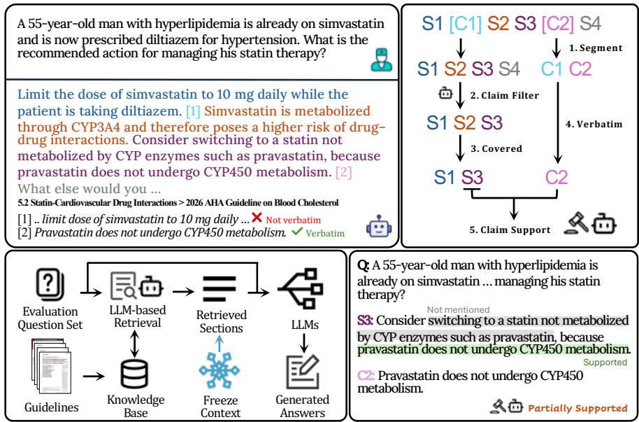  
Figure 1: Our evaluation framework: Top left: An example question and its answer with inline citations. A citation covers the sentence that precedes it. Top right: The pipeline of the automated evaluation. See Section 3.2 for details. Bottom left: The dataflow of the answer generation process. Bottom right: An example of a claim support verdict made by an LLM judge.

In this paper, we evaluate current models on this task, using an end-to-end automated evaluation framework to simulate the verification process a user might follow (Figure 1). First, we set up a retrievalbased clinical QA system using a set of clinical guidelines and instructions to answer questions with in-line quotations of supporting evidence. Using a dataset of synthetic clinical queries, we then examine each answer one stage at a time: filtering for factual claims, and then assessing whether every claim has a citation, whether the quotations provided are present (verbatim) in the source, and whether these quotes on their own fully substantiate the claim.

We report our findings in Section 4, where we observe that no model consistently achieves this goal, with the best-performing systems (e.g., gpt-5.4) supporting around 75% of claims with exact substantiating evidence. More notably, our framework allows us to decompose performance across stages, and observe that the relatively poor performance of some models (e.g., claude-haiku-4.5, which achieves a rate of 24.9%) is driven in large part by a failure to produce faithful verbatim quotations, while other models (e.g., claude-opus-5) produce verbatim quotations, but fail to provide enough context to fully substantiate their claims. Our primary contributions are:

• We develop an end-to-end evaluation framework that probes verifiability of answers by checking claims against their supporting quotes from cited sources, including deterministic checks (e.g., to ensure quotes are verbatim) as well as humanvalidated LLM judges (e.g., to assess whether or not quotes fully support claims).

• Using this framework, we compare twelve mainstream LLMs from five vendors on a dataset of 222 synthetic clinical queries designed to be answerable from a set of four clinical guidelines, and derive insights into drivers of relative model performance.

• We release our question-answering framework with the accompanying harness and our synthetic question set described above.

## 2. Related Work

Attributed answer generation. Open-domain question-answering systems attribute an answer to the documents or passages it draws on (Nakano et al., 2021; Bohnet et al., 2022), and models can be trained to cite those passages more faithfully (Huang et al., 2024). A finer grain of attribution can tie each claim to a verbatim supporting quote (Menick et al., 2022) or a concise evidence span (Slobodkin et al., 2024). Zhang et al. (2025) propose LongCite, fine-tuning long-context models to emit sentence-level citations that index the supporting sentences in the provided context. Shao et al. (2025) introduce DR Tulu, a deep-research agent that produces long-form answers with snippet-level citations.

Evaluation frameworks. Evaluation of clinical QA systems has moved from multiple-choice licensing exams toward open-ended, clinician-grounded assessment. MedHELM (Bedi et al., 2026) scores models across a clinician-validated taxonomy of realworld clinical tasks with a jury of LLM judges. HealthBench (Arora et al., 2025) grades multiturn health conversations against physician-written rubrics. These benchmarks often judge whether answers are correct, complete, and grounded, but do not directly assess the “verifiability” of answers. In the context of natural language generation, Rashkin et al. (2023) propose a framework for judging whether a statement is supported by its cited source, and Gao et al. (2023) automate a similar process with a natural-language-inference (NLI) model.

Closer to our work, SourceCheckup (Wu et al., 2025) audits the web sources an LLM cites for a medical question and finds, with an LLM judge, that half or more of its responses are not fully supported. MedCite (Wang et al., 2025) builds a PubMed retrieval pipeline and scores citation recall and preci sion with an LLM attribution judge. VERICITE (Ma et al., 2026) checks each citation at the sentence level with an NLI model, reporting that only a minority of cited claims are entailed by their source. However, these prior works focus primarily on whether or not a cited document supports claims, while we focus more specifically on verifiability, which includes (a) assessing the density of support (i.e., whether or not every claim has an accompanying quotation), (b) checking whether extracted quotations are correctly reproduced, and (c) assessing whether or not these quotations are suficient to fully substantiate each claim.

## 3. Methods

We ground our evaluation in a concrete task. Motivated by applications in cardiovascular risk management, we build a clinical QA system<sup>1</sup> for answering questions regarding practice guidelines. Such a system could be useful for care team members who engage in shared decision-making conversations. Given a question, this system retrieves and reads relevant sections from a curated corpus of practice guidelines, and is designed to generate answers in which every claim is accompanied by an inline citation that names the source section and reproduces its exact wording.

In Section 3.1, we describe this task (and clinical QA system) in more detail, and in Section 3.2 we describe our evaluation framework and metrics, which we apply to the outputs of this system.

## 3.1. Task and System Design

Guideline Corpus. To develop our task, we start from a corpus of four clinical practice guidelines from the American Heart Association (AHA) and the American Diabetes Association (ADA): the 2019 AHA guideline on the primary prevention of cardiovascular disease (Arnett et al., 2019), the 2025 AHA guideline on high blood pressure (Jones et al., 2025), the 2026 AHA guideline on blood cholesterol (Blumenthal et al., 2026), and the 2026 ADA Standards of Care in Diabetes (American Diabetes Association Professional Practice Committee, 2026), which together cover the principal modifiable risk factors for atherosclerotic cardiovascular disease. Appendix A.1 provides more detail on how this corpus is preprocessed for later retrieval.

Synthetic Clinical Queries. From this corpus, we develop a set of synthetic clinical queries. Using example questions provided by clinical professionals for reference, we prompt gpt-4o-mini to synthesize 222 clinical questions in total (see Appendix B.1 for the prompts) based on content present in the guidelines. Notably, each of our clinical questions is derived from a particular subsection of a particular guideline, which serves two purposes: first, it helps ensure that questions are reasonably answerable from the provided reference material, and second, it allows us to check that our retrieval process is of suficiently high quality and does not confound our later evaluation (e.g., by failing to retrieve relevant material). Clinical QA System. Our system consists of two components:

LLM-guided semantic retrieval: Unlike a conventional vector index ranked by cosine similarity or a lexical method, our retrieval is driven directly by an LLM. Given the user’s query, it selects the most relevant sections based on the section summaries in our knowledge base. Because we know that the source subsection is a “correct” reference for answering a given query, we are able to evaluate and benchmark diferent approaches to performing retrieval. We find (in Appendix A.2) that LLM-guided semantic retrieval substantially outperforms both a dense-vector baseline (text-embedding-3-small from OpenAI) and a lexical baseline (Okapi BM25), returning fewer sections whose set contains the ground-truth section more often. The implementation details are provided in Appendix B.2. We then fix the retrieval stage, so that retrieval quality does not confound the comparison between generation models. We select deepseek-v4-flash for a one-time retrieval, balancing retrieval quality against cost-eficiency, and freeze its output as the shared context for all subsequent generation models. Per-model generation configurations are provided in Appendix A.4.

Question answering with verbatim citations: Given the query and the provided retrieved context, the system prompt (Appendix B.3) instructs the model to answer in short prose and to attach an inline citation marker to each clinical claim. A marker pairs the identifier of one retrieved section with a short quote copied verbatim from that section, and is written as {{cite:guideline :section |quote }}. We do so to mimic the design of a system that could then render these markers in a user interface as numeric citation indicators (e.g., [1], [2]) that link to the corresponding quotes. The model writes each claim as a stand-alone sentence before its marker is attached, so the answer remains complete clinical prose once every marker is removed. Therefore, a claim and its quote form a self-contained unit, and the two can be processed as separate objects (as shown in the top-right panel of Figure 1).

## 3.2. Evaluation Framework and Metrics

Our evaluation framework proceeds in stages: Claim Filter. Our primary unit of analysis is individual factual claims. We define a claim sentence as one that states a checkable clinical claim. Ideally, every clinical claim is grounded in the context and carries a citation that supports it. To identify claims, we first strip citation markers from the full answer, recording positions, and split remaining prose into sentences using a deterministic segmenter. A claim filter (driven by deepseek-v4-flash) then identifies sentences that contain claims, which are retained for further analysis. Implementation details are provided in Appendix A.7.

Citation Coverage. We consider a claim to be “covered” by a citation using an attribution window of size k, where a citation is considered to cover the k claim sentences immediately preceding it, but never reaching past the previous citation. For the remainder of the main text, we use k = 1 throughout, where a citation applies only to the nearest claim sentence, but we assess sensitivity to this choice in Ap pendix A.9. We provide an example in Appendix A.8. Citation Coverage (CC) is then defined as the fraction of claim sentences that are covered by at least one citation.

Verbatim Compliance. As described in Section 3.1, the system prompt requires every citation to quote its source verbatim, but an instruction is not a guarantee. In practice, a quote sometimes departs from the source. We consider a quotation “verbatim compliant” if it appears in the cited section, and is either an exact character-for-character match or satisfies one of two relaxed conditions: normalized and elided. The normalized category allows for case inconsistencies, minor symbol diferences, and other formatting variation, while the elided category permits an ellipsis in the middle of the quote. The detailed criteria are described in Appendix A.6. We then define the Verbatim Compliance Rate (VCR) as the fraction of those citations whose quote passes the check.

Claim Support. We consider a claim to be supported if accompanying citations/quotations that cover it are enough to substantiate the claim, so that a reader can verify the claim on the spot. Each claim sentence is paired with the quotes cited for it under the attribution window k = 1, and an LLM judge decides how much of the claim those quotes support. The judge is given the question, the claim sentence, and its quotes, and nothing else. The verdict is one of four categories: fully supported (the quotes support every point of the claim), partially supported (the quotes address some points of the claim but not all), not supported (the quotes do not support any point of the claim), or contradicted (the quotes conflict with the claim). The full prompt is provided in Appendix B.5. The Claim Support Rate (CSR) considers only those claim sentences with at least one verbatim quotation, and is provided in two forms: The strict variant is the fraction of those claim sentences where the verbatim quotation(s) fully support the claim, and the lenient variant is the fraction where the verbatim quotation(s) are deemed to at least partially support the claim.

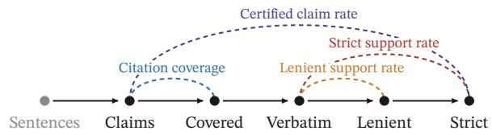  
Figure 2: The visualized relationships between stages and metrics.

The Claim Funnel. While the preceding metrics each score one property of an answer (see Figure 2 for an overview), the claim funnel sequentially passes every claim sentence through those checks and records the number and proportion of claim sentences that remain after each stage. As shown in the top-right of Figure 1, each claim sentence is checked for a covering citation, then for a quote that passes the verbatim check, and finally judged for claim support. We define the certified claim rate (CCR) as the share of all claims that carry at least one verbatim-compliant quote and are fully supported by the quotes that remain.

## 4. Results

Our full results of the claim funnel analysis are shown in Table 1 and Figure 3. No model perfectly completes the task, and there are clear diferences in performance across models. For instance, the highest observed CCRs are 72–78%, from larger-scale or more recent models (e.g., deepseek-v4-pro, gpt-5-mini, gpt-5.4), leaving room for improvement. Moreover, end-to-end performance separates larger-scale models (e.g., gpt-5.4) and smaller-scale models (e.g., gpt-4.1-mini), the former achieving a CCR of 75.6% and the latter only 13.2%.

Beyond these high-level results, the structure of our analysis allows us to decompose these rates into failures at distinct parts of the pipeline, leading us to a few additional findings.

First, the majority of models (with notable exceptions of gpt-4.1-mini, claude-haiku-4.5, and glm-4.7-flash) manage to produce suficient verbatim quotes to cover a large fraction of their claims with potential supporting evidence (all over 90%). Those three smaller-scale models have substantial drop-ofs, either in citation coverage (e.g., 66.1% for glm-4.7-flash) or in verbatim compliance (e.g., 69.0% of its citations for claude-haiku-4.5).

Second, many models have near-perfect performance at producing verbatim quotes that cover their claims, but fail to produce enough evidence to fully substantiate them. For instance, 98% of claims from claude-opus-5 are accompanied by at least one verified verbatim citation, but only 37.1% are deemed fully supported by their accompanying quotes. Moreover, this drop-of is largely due to partial support, as opposed to a complete lack of evidence. We give examples of what the quotes leave unsupported, classify them into failure modes, and demonstrate that claim length plays a role but does not fully explain the gap.

Finally, we demonstrate that a substantial amount of performance is recoverable using the provided reference material, by searching the sections read by each model for fresh quotations that fully support the given claims.The share of remaining claims from claude-opus-5 rises from 37.1% to 85.1% after recovery, while lightweight models like gpt-4.1-mini remain poor due to severe degradation in prior stages.

Finding 1: Small Models Fail the Citation Task Three lightweight models (claude-haiku-4.5, gpt-4.1-mini and glm-4.7-flash) fail to attach a verbatim citation to over 40% of their claims (Table 1). To understand what drives these results, we provide a more detailed breakdown of citations, coverage, and verbatim compliance, in Table 2. Apart from the three underperforming models, the remaining models show high citation coverage and verbatim compliance, with the bigger models generally outperforming the smaller ones. For instance, claude-opus-5 produces the most citations and achieves the highest VCR at 100.0%, outperforming claude-sonnet-5’s 98.9%, while claude-haiku-4.5 scores only 69.0% even with the largest share of normalized matches. The failure to quote verbatim further lowers the coverage rate.

Table 1: The claim funnel. The four stage columns are percentages of that model’s claims, so a row reads left to right as one “funnel” with a fixed denominator. The final columns (Recov. and SCR) are described further in Section 4. Percentages in parentheses show the relative loss against the column to its left. Sent., Claims and Recov. are counts.
<table><tr><td rowspan="2">Model</td><td colspan="6">Claims remaining after each stage (%)</td><td rowspan="2">(%) Recov. SCR</td></tr><tr><td></td><td>Sent. Claims Covered</td><td></td><td>Verbatim</td><td>Lenient</td><td>CCR (Strict)</td></tr><tr><td>gpt-4.1-mini</td><td>625</td><td>570</td><td>49.6 (−50.4%)</td><td>36.3 (−26.9%)</td><td>31.8 (−12.6%)</td><td>13.2 (−58.6%)</td><td>92 29.3</td></tr><tr><td>gpt-5-mini</td><td>574</td><td>568</td><td>100.0 (−0.0%)</td><td>99.1 (−0.9%)</td><td>98.9 (−0.2%) 78.3 (−20.8%)</td><td>82</td><td>92.8</td></tr><tr><td>gpt-5.4-mini</td><td>451</td><td>433</td><td>100.0 (−0.0%)</td><td>96.5 (−3.5%)</td><td>96.1 (−0.5%)</td><td>60.3 (−37.3%)</td><td>140 92.6</td></tr><tr><td>gpt-5.4</td><td>549</td><td>536</td><td>99.8 (−0.2%)</td><td>98.3 (−1.5%)</td><td>98.3 (−0.0%)</td><td>75.6 (−23.1%) 92</td><td>92.7</td></tr><tr><td>A claude-haiku-4.5</td><td>792</td><td>345</td><td>74.8 (−25.2%)</td><td>56.5 (−24.4%)</td><td>47.0 (−16.9%)</td><td>24.9 (−46.9%) 47</td><td>38.6</td></tr><tr><td>A claude-sonnet-5</td><td>672</td><td>657</td><td>95.0 (−5.0%)</td><td>94.5 (−0.5%)</td><td>93.6 (−1.0%)</td><td>36.4(−61.1%)</td><td>326 86.0</td></tr><tr><td>A claude-opus-5</td><td>674</td><td>658</td><td>98.0 (−2.0%)</td><td>98.0 (−0.0%)</td><td>97.7 (−0.3%)</td><td>37.1 (−62.1%)</td><td>316 85.1</td></tr><tr><td>deepseek-v4-flash</td><td>535</td><td>522</td><td>98.5 (−1.5%)</td><td>97.9 (−0.6%)</td><td>97.9 (−0.0%)</td><td>59.2 (−39.5%)</td><td>167 91.2</td></tr><tr><td>deepseek-v4-pro</td><td>552</td><td>535</td><td>98.5 (−1.5%)</td><td>97.6 (−0.9%)</td><td>97.4(−0.2%)</td><td>72.0 (−26.1%)</td><td>109 92.3</td></tr><tr><td>glm-4.7-flash</td><td>736</td><td>631</td><td>66.1 (−33.9%)</td><td>55.2 (−16.5%)</td><td>50.7 (−8.0%)</td><td>21.1 (−58.4%)</td><td>140 43.3</td></tr><tr><td>glm-5.2</td><td>745</td><td>724</td><td>92.1 (−7.9%)</td><td>90.2 (−2.1%)</td><td>88.5 (−1.8%)</td><td>36.3 (−59.0%)</td><td>328 81.6</td></tr><tr><td>kimi-k3</td><td>672</td><td>661</td><td>98.5 (−1.5%)</td><td>97.9 (−0.6%)</td><td>97.3 (−0.6%)</td><td>33.1 (−65.9%)</td><td>365 88.4</td></tr></table>

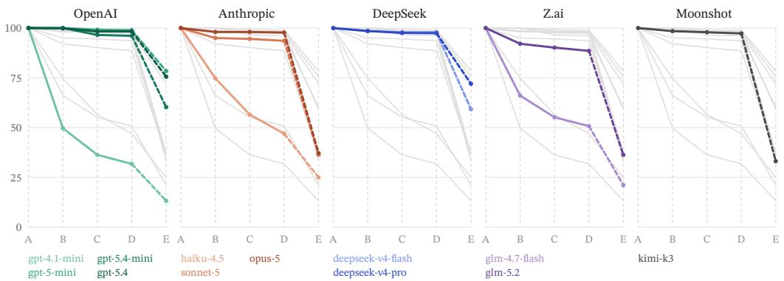  
Figure 3: The claim funnel per provider. Stages: A claims, B covered, C verbatim, D lenient, E strict.

To build a qualitative understanding of these failures, we reviewed a sample of responses from each of the low-performing models, and present examples in Appendix A.10. Anecdotally, we observe that models sometimes provide no citations (e.g., glm-4.7-flash). Another failure mode observed in claude-haiku-4.5 is that it writes a summary or recap without supporting citations, which drags its coverage down. gpt-4.1-mini tends to place citations at the end of the answer. We note that all of these failures are examples of incomplete adherence to the citation style specified in the system prompt.

Finding 2: Models struggle to provide strict supporting evidence Even for models that reliably include verbatim quotations, we observe substantial underperformance at the task of fully sub stantiating their claims.

The full breakdown of claim support is judged by deepseek-v4-flash<sup>2</sup>, as shown in Table 3. For most models, the cited quotes provide at least partial support for the vast majority of claims, as reflected in the high lenient support rates. However, the strict support rates<sup>3</sup> exhibit considerable variation, ranging from 33.8% to 79.0%. Cases where the quotes do not support the claim at all or even contradict it are rare across all models.

Given that the results depend on an LLM-as-judge, we validated it against two human annotators.<sup>4</sup> Each annotator independently labelled a stratified sample of 70 cases, blinded to the LLM judge labels. Between the two human annotators, a high degree of agreement was observed (Cohen’s κ = 0.853). We further observed high rates of agreement between human annotators and the deepseek-v4-flash judgements, with Cohen’s κ of 0.858 and 0.810 for the two annotators. We provide the full confusion matrices in Appendix A.13. We also assessed agreement between deepseek-v4-flash and an alternative judge (gpt-5-mini) on full samples, with Cohen’s κ of 0.803 indicating substantial agreement. Results of the second judge are shown in Appendix A.12.

Table 2: Citation coverage (k = 1) and verbatim compliance. Claims, the number of sentences that passed the claim filter, is the denominator of both coverage columns; Cites, the number of citations the model emitted, is the denominator of every compliance figure. The last column recomputes coverage over only the citations that pass the verbatim check. Appendix A.9 gives the full coverage results.
<table><tr><td rowspan="2">Model</td><td colspan="3">Citation Coverage</td><td colspan="4">Verbatim Compliance (%)</td><td>Compliant</td></tr><tr><td>Claims</td><td>Cites</td><td>Cov. (%)</td><td>Exact</td><td>Norm.</td><td>Elid.</td><td>VCR</td><td>Cov. (%)</td></tr><tr><td>gpt-4.1-mini</td><td>570</td><td>450</td><td>49.6</td><td>55.8</td><td>3.1</td><td>7.3</td><td>66.2</td><td>36.3</td></tr><tr><td>gpt-5-mini</td><td>568</td><td>673</td><td>100.0</td><td>96.7</td><td>2.4</td><td>0.0</td><td>99.1</td><td>99.1</td></tr><tr><td>gpt-5.4-mini</td><td>433</td><td>676</td><td>100.0</td><td>88.5</td><td>4.0</td><td>2.1</td><td>94.5</td><td>96.5</td></tr><tr><td>gpt-5.4</td><td>536</td><td>960</td><td>99.8</td><td>94.3</td><td>3.1</td><td>0.0</td><td>97.4</td><td>98.3</td></tr><tr><td>A claude-haiku-4.5</td><td>345</td><td>783</td><td>74.8</td><td>44.8</td><td>23.9</td><td>0.3</td><td>69.0</td><td>56.5</td></tr><tr><td>A claude-sonnet-5</td><td>657</td><td>715</td><td>95.0</td><td>96.9</td><td>1.8</td><td>0.1</td><td>98.9</td><td>94.5</td></tr><tr><td>A claude-opus-5</td><td>658</td><td>1065</td><td>98.0</td><td>99.5</td><td>0.5</td><td>0.0</td><td>100.0</td><td>98.0</td></tr><tr><td>deepseek-v4-flash</td><td>522</td><td>724</td><td>98.5</td><td>94.6</td><td>4.1</td><td>0.0</td><td>98.8</td><td>97.9</td></tr><tr><td>deepseek-v4-pro</td><td>535</td><td>717</td><td>98.5</td><td>93.0</td><td>6.0</td><td>0.1</td><td>99.2</td><td>97.6</td></tr><tr><td>glm-4.7-flash</td><td>631</td><td>713</td><td>66.1</td><td>61.7</td><td>15.4</td><td>1.7</td><td>78.8</td><td>55.2</td></tr><tr><td>glm-5.2</td><td>724</td><td>807</td><td>92.1</td><td>90.0</td><td>7.6</td><td>0.1</td><td>97.6</td><td>90.2</td></tr><tr><td>kimi-k3</td><td>661</td><td>845</td><td>98.5</td><td>97.4</td><td>1.7</td><td>0.0</td><td>99.1</td><td>97.9</td></tr></table>

Table 3: Claim support (as judged by deepseek-v4-flash). Cited is the number of claims accompanied by at least one verbatim-compliant quote. Strict gives the fraction of cited claims that are “fully supported”; Lenient also includes claims that are “partially supported”.
<table><tr><td></td><td></td><td colspan="4">Shortfall (n)</td><td colspan="4">Verdict (n)</td><td colspan="2">Rate (%)</td></tr><tr><td>Model</td><td>Cited</td><td>Add.</td><td></td><td>Causal Scope</td><td>Strength</td><td>Full</td><td>Partial None</td><td></td><td>Contra</td><td>Strict Lenient</td><td></td></tr><tr><td>gpt-4.1-mini</td><td>207</td><td>122</td><td>0</td><td>4</td><td>6</td><td>75</td><td>106</td><td>26</td><td>0</td><td>36.2</td><td>87.4</td></tr><tr><td>gpt-5-mini</td><td>563</td><td>88</td><td>1</td><td>11</td><td>18</td><td>445</td><td>117</td><td>1</td><td>0</td><td>79.0</td><td>99.8</td></tr><tr><td>gpt-5.4-mini</td><td>418</td><td>146</td><td>0</td><td>3</td><td>7</td><td>261</td><td>155</td><td>1</td><td>1</td><td>62.4</td><td>99.5</td></tr><tr><td>gpt-5.4</td><td>527</td><td>98</td><td>1</td><td>9</td><td>14</td><td>405</td><td>122</td><td>0</td><td>0</td><td>76.9</td><td>100.0</td></tr><tr><td>A claude-haiku-4.5</td><td>195</td><td>87</td><td>0</td><td>7</td><td>15</td><td>86</td><td>76</td><td>33</td><td>0</td><td>44.1</td><td>83.1</td></tr><tr><td>A claude-sonnet-5</td><td>621</td><td>359</td><td>1</td><td>5</td><td>17</td><td>239</td><td>376</td><td>6</td><td>0</td><td>38.5</td><td>99.0</td></tr><tr><td>A claude-opus-5</td><td>645</td><td>347</td><td>5</td><td>9</td><td>40</td><td>244</td><td>399</td><td>2</td><td>0</td><td>37.8</td><td>99.7</td></tr><tr><td>deepseek-v4-flash</td><td>511</td><td>171</td><td>0</td><td>11</td><td>20</td><td>309</td><td>202</td><td>0</td><td>0</td><td>60.5</td><td>100.0</td></tr><tr><td>deepseek-v4-pro</td><td>522</td><td>116</td><td>0</td><td>8</td><td>13</td><td>385</td><td>136</td><td>1</td><td>0</td><td>73.8</td><td>99.8</td></tr><tr><td>glm-4.7-flash</td><td>348</td><td>188</td><td>0</td><td>8</td><td>18</td><td>133</td><td>187</td><td>27</td><td>1</td><td>38.2</td><td>92.0</td></tr><tr><td>glm-5.2</td><td>653</td><td>356</td><td>0</td><td>8</td><td>26</td><td>263</td><td>378</td><td>12</td><td>0</td><td>40.3</td><td>98.2</td></tr><tr><td>kimi-k3</td><td>647</td><td>387</td><td>1</td><td>11</td><td>29</td><td>219</td><td>424</td><td>4</td><td>0</td><td>33.8</td><td>99.4</td></tr></table>

We defined a taxonomy of four failure modes for partially supported and unsupported claims, drawing both on our own impressions and on existing schemes (Pagnoni et al., 2021; Yue et al., 2023): Unsupported addition covers cases where the quote fully substantiates some, but not all, of the statements in the claim. Strength inflation and scope inflation cover cases where the strength of a recommendation (e.g., “should” versus “must”) is inflated, or where the relevant population is inflated (e.g., a claim that applies to diabetic patients is applied to all patients). Causal upgrade refers to the statement of an association as a cause. Figure 4 gives two observed examples, and Appendix B.5 the full definitions.

The vast majority of claims fall in the unsupported addition category. Given that longer claims inherently require more citation support, we performed a sensitivity analysis in Figure 5, where we examined the rate of partial support as a function of claim length. Longer claims do carry lower strict support rates, and claude-sonnet-5 and claude-opus-5 write substantially more sentences over 35 words than gpt-5.4. Even so, both Claude models sit below gpt-5.4 within every one of the three length strata. Hence, while the gap in performance may be partially explained by diferences in length, this does not explain the full gap.

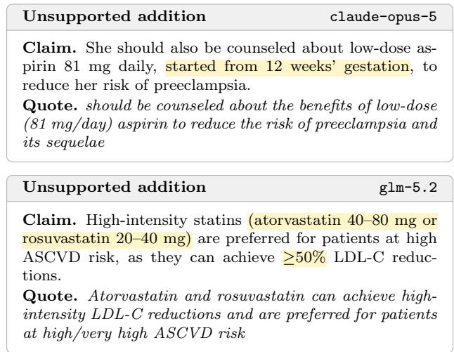  
Figure 4: Example of two partially supported claims exhibiting the unsupported addition failure mode. Yellow highlights indicate content not grounded in the quote.

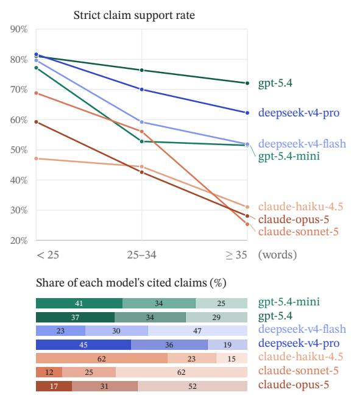  
Figure 5: Strict claim support rate against the length of the claim being judged. See Appendix A.11 for the full results.

Finding 3: Most missing evidence is already in what models read With the hypothesis that models do compose the answers based on the reference, but the ability and style to attach the quotes may vary, we employ an LLM judge (deepseek-v4-flash) to recover partially supported claims when the evidence can be located in the sections the model read. The judge takes one question, one claim and the sections the model read as input, and returns the evidence that fully substantiates the claim. The implementation details are in Appendix B.6. We introduce the supported claim rate (SCR) as the fraction of claims that are either fully supported or recovered from partially supported. The results are in the last column of Table 1.

SCR is substantially higher than CCR across all models. gpt-5-mini, gpt-5.4 and gpt-5.4-mini reach the highest supported claim rates, of around 92%. claude-opus-5 rises from a CCR of 37.1% to an SCR of 85.1%, recovering most of its partially supported claims. However, for lightweight models like claude-haiku-4.5, SCR remains poor, given the ceiling of their already low lenient support rates. This indicates that many claims are grounded in the sections the model read, but the models fail to attach enough or appropriate quotes that establish them.

## 5. Discussion

We build a clinical QA system with a verbatimcitation harness, and propose an end-to-end automated evaluation framework to simulate a human reader verifying the claims in an answer against the cited evidence. Our comparison across twelve mainstream LLMs shows that most models can provide verbatim-compliant quotes from prompting alone, but the quality of the quotes and their support for the claims vary widely.

Limitations. Our evaluation uses a synthetic question set, and every answer comes from a single system prompt without ablations. We release our artifacts for later work to build on, ofering practical insights for deploying verifiable clinical QA systems and new perspectives for LLM benchmarking.

## References

American Diabetes Association Professional Practice Committee. Introduction and methodology: Standards of care in diabetes—2026. Diabetes Care, 49 (Supplement 1):S1–S5, 12 2026. ISSN 0149-5992. doi: 10.2337/dc26-SINT. URL https://doi.org/10. 2337/dc26-SINT.

Donna K. Arnett, Roger S. Blumenthal, Michelle A. Albert, Andrew B. Buroker, Zachary D. Goldberger, Ellen J. Hahn, Cheryl Dennison Himmelfarb, Amit Khera, Donald Lloyd-Jones, J. William McEvoy, Erin D. Michos, Michael D. Miedema, Daniel Mu˜noz, Sidney C. Smith, Salim S. Virani, Kim A. Williams, Joseph Yeboah, and Boback Ziaeian. 2019 acc/aha guideline on the primary prevention of cardiovascular disease: A report of the american college of cardiology/american heart association task force on clinical practice guidelines. Circulation, 140(11):e596–e646, 2019. doi: 10.1161/CIR.0000000000000678. URL https://www.ahajournals.org/doi/abs/10.1161/ CIR.0000000000000678.

Rahul K Arora, Jason Wei, Rebecca Soskin Hicks, Preston Bowman, Joaquin Qui˜nonero-Candela, Foivos Tsimpourlas, Michael Sharman, Meghan Shah, Andrea Vallone, Alex Beutel, et al. Health bench: Evaluating large language models towards improved human health. arXiv preprint arXiv:2505.08775, 2025.

Suhana Bedi, Hejie Cui, Miguel Fuentes, Alyssa Unell, Michael Wornow, Juan M Banda, Nikesh Kotecha, Timothy Keyes, Yifan Mai, Mert Oez, et al. Holistic evaluation of large language models for medical tasks with medhelm. Nature Medicine, pages 1–9, 2026.

Roger S. Blumenthal, Pamela B. Morris, Mario Gaudino, Heather M. Johnson, Timothy S. Anderson, Vera A. Bittner, Ron Blankstein, LaPrincess C. Brewer, Leslie Cho, Sarah D. de Ferranti, Eugenia Gianos, Ty J. Gluckman, Kristen F. Gradney, Ijeoma Isiadinso, Donald M. Lloyd-Jones, Joel C. Marrs, Seth S. Martin, Kellie H. McLain, Laxmi S. Mehta, Samia Mora, Wudeneh M. Mulugeta, Pradeep Natarajan, Ann Marie Navar, Carl E. Orringer, Tamar S. Polonsky, Harmony R. Reynolds, Joseph J. Saseen, Michael D. Shapiro, Daniel E. Sofer, Sheila A. Tynes, Chlo´e D. Villavaso, Salim S. Virani,

John T. Wilkins, Anand Rohatgi, Samuel M. Kim, Karen P. Alexander, Cheryl Anderson, Catherine P. Benziger, Dave L. Dixon, Daniel Duprez, Keith C. Ferdinand, Anne Carol Goldberg, Parag Joshi, Joshua W. Knowles, Carl (Chip) J. Lavie Jr, Jane A. Linderbaum, John William McEvoy, Anurag Mehta, C. Noel Bairey Merz, Vijay Nambi, Ariela R. Orkaby, Jessica M. Pe˜na, Robert Rosenson, Janelle Ruisinger, Sigrid E. Sandner, Stacey L. Schott, Laurence (Larry) Sperling, Neil J. Stone, Peter Toth, Adam L. Ware, Seamus Paul Whelton, and James Young. 2026 acc/aha/aacvpr/abc/ acpm/ada/ags/apha/aspc/nla/pcna guideline on the management of dyslipidemia: A report of the american college of cardiology/american heart association joint committee on clinical practice guidelines. Circulation, 153(17):e1154–e1276, 2026. doi: 10.1161/CIR.0000000000001423. URL https://www.ahajournals.org/doi/abs/10.1161/ CIR.0000000000001423.

Bernd Bohnet, Vinh Q Tran, Pat Verga, Roee Aharoni, Daniel Andor, Livio Baldini Soares, Massimiliano Ciaramita, Jacob Eisenstein, Kuzman Ganchev, Jonathan Herzig, et al. Attributed question answering: Evaluation and modeling for attributed large language models. arXiv preprint arXiv:2212.08037, 2022.

Nicolas Carl, Martin Joachim Hetz, Christoph Wies, Sarah Haggenm¨uller, Jana Theres Winterstein, Maurin Helen Mangold, Lasse Maywald, Thomas Stefan Worst, Niklas Westhof, Maurice Stephan Michel, et al. Enhancing clinicians trust in large language models via transparent source attribution: A randomized controlled evaluation in uro-oncology. European Journal of Cancer, page 116168, 2025.

Jean Feng, Vishal Patel, Patrick Heagerty, Yifan Mai, Venkatesh Sivaraman, Patrick Vossler, Jialin Ouyang, and Anupam B Jena. Expert evaluation of clinical ai tools on real point-of-care clinical queries. arXiv preprint arXiv:2606.28960, 2026.

Tianyu Gao, Howard Yen, Jiatong Yu, and Danqi Chen. Enabling large language models to generate text with citations. In Proceedings of the 2023 Conference on Empirical Methods in Natural Language Processing, pages 6465–6488, 2023.

Chengyu Huang, Zeqiu Wu, Yushi Hu, and Wenya Wang. Training language models to generate text

with citations via fine-grained rewards. In Proceedings of the 62nd Annual Meeting of the Association for Computational Linguistics (Volume 1: Long Papers), pages 2926–2949, 2024.

Daniel W. Jones, Keith C. Ferdinand, Sandra J. Taler, Heather M. Johnson, Daichi Shimbo, Marwah Abdalla, M. Martine Altieri, Nisha Bansal, Natalie A. Bello, Adam P. Bress, Jocelyn Carter, Jordana B. Cohen, Karen J. Collins, Yvonne Commodore-Mensah, Leslie L. Davis, Brent Egan, Sadiya S. Khan, Donald M. Lloyd-Jones, Bernadette Mazurek Melnyk, Eva A. Mistry, Modele O. Ogunniyi, Stacey L. Schott, Sidney C. Smith, Amy W. Talbot, Wanpen Vongpatanasin, Karol E. Watson, Paul K. Whelton, and Jef D. Williamson. 2025 aha/acc/aanp/aapa/abc/accp/ acpm/ags/ama/aspc/nma/pcna/sgim guideline for the prevention, detection, evaluation and management of high blood pressure in adults: A report of the american college of cardiology/american heart association joint committee on clinical practice guidelines. Circulation, 152(11):e114–e218, 2025. doi: 10.1161/CIR.0000000000001356. URL https://www.ahajournals.org/doi/abs/10.1161/ CIR.0000000000001356.

Yu He Ke, Liyuan Jin, Kabilan Elangovan, Hairil Rizal Abdullah, Nan Liu, Alex Tiong Heng Sia, Chai Rick Soh, Joshua Yi Min Tung, Jasmine Chiat Ling Ong, Chang-Fu Kuo, et al. Retrieval augmented generation for 10 large language models and its generalizability in assessing medical fitness. npj Digital Medicine, 8(1):187, 2025.

Simone Kresevic, Mauro Giufr\`e, Milos Ajcevic, Agostino Accardo, Lory S Croc\`e, and Dennis L Shung. Optimization of hepatological clinical guidelines interpretation by large language models: a retrieval augmented generation-based framework. NPJ digital medicine, 7(1):102, 2024.

Fenglin Liu, Hongjian Zhou, Boyang Gu, Xinyu Zou, Jinfa Huang, Jinge Wu, Yiru Li, Sam S Chen, Yining Hua, Peilin Zhou, et al. Application of large language models in medicine. Nature Reviews Bioengineering, 3(6):445–464, 2025.

Nelson F Liu, Tianyi Zhang, and Percy Liang. Evaluating verifiability in generative search engines. In Findings ofthe Association for Computational Linguistics: EMNLP 2023, pages 7001–7025, 2023.

Yixian Ma, Bohao Chu, and Norbert Fuhr. Vericite: Evaluating sentence-level citation faithfulness in retrieval-augmented medical question answering. In BioNLP 2026, pages 753–759, 2026.

Jacob Menick, Maja Trebacz, Vladimir Mikulik, John Aslanides, Francis Song, Martin Chadwick, Mia Glaese, Susannah Young, Lucy Campbell-Gillingham, Geofrey Irving, et al. Teaching language models to support answers with verified quotes. arXiv preprint arXiv:2203.11147, 2022.

Reiichiro Nakano, Jacob Hilton, Suchir Balaji, Jef Wu, Long Ouyang, Christina Kim, Christopher Hesse, Shantanu Jain, Vineet Kosaraju, William Saunders, et al. Webgpt: Browser-assisted question-answering with human feedback. arXiv preprint arXiv:2112.09332, 2021.

Mahmud Omar, Vera Sorin, Jeremy D Collins, David Reich, Robert Freeman, Nicholas Gavin, Alexander Charney, Lisa Stump, Nicola Luigi Bragazzi, Girish N Nadkarni, et al. Multi-model assurance analysis showing large language models are highly vulnerable to adversarial hallucination attacks during clinical decision support. Communications Medicine, 5(1):330, 2025.

Chin Siang Ong, Nicholas T Obey, Yanan Zheng, Arman Cohan, and Eric B Schneider. Surgeryllm: a retrieval-augmented generation large language model framework for surgical decision support and workflow enhancement. npj Digital Medicine, 7(1): 364, 2024.

Artidoro Pagnoni, Vidhisha Balachandran, and Yulia Tsvetkov. Understanding factuality in abstractive summarization with frank: A benchmark for factuality metrics. In Proceedings of the 2021 Conference of the North American Chapter of the Association for Computational Linguistics: Human Language Technologies, pages 4812–4829, 2021.

Hannah Rashkin, Vitaly Nikolaev, Matthew Lamm, Lora Aroyo, Michael Collins, Dipanjan Das, Slav Petrov, Gaurav Singh Tomar, Iulia Turc, and David Reitter. Measuring attribution in natural language generation models. Computational Linguistics, 49(4):777–840, 2023.

Rulin Shao, Akari Asai, Shannon Zejiang Shen, Hamish Ivison, Varsha Kishore, Jingming Zhuo, Xinran Zhao, Molly Park, Samuel G Finlayson,

David Sontag, et al. Dr tulu: Reinforcement learning with evolving rubrics for deep research. arXiv preprint arXiv:2511.19399, 2025.

Aviv Slobodkin, Eran Hirsch, Arie Cattan, Tal Schuster, and Ido Dagan. Attribute first, then generate: Locally-attributable grounded text generation. In Proceedings of the 62nd Annual Meeting of the Association for Computational Linguistics (Volume 1: Long Papers), pages 3309–3344, 2024.

Pranav Narayanan Venkit, Philippe Laban, Yilun Zhou, Yixin Mao, and Chien-Sheng Wu. Search engines in an ai era: The false promise of factual and verifiable source-cited responses. arXiv preprint arXiv:2410.22349, 2024.

Xiao Wang, Mengjue Tan, Qiao Jin, Guangzhi Xiong, Yu Hu, Aidong Zhang, Zhiyong Lu, and Minjia Zhang. Medcite: Can language models generate verifiable text for medicine? In Findings of the Association for Computational Linguistics: ACL 2025, pages 18891–18913, 2025.

Kevin Wu, Eric Wu, Kevin Wei, Angela Zhang, Alli son Casasola, Teresa Nguyen, Sith Riantawan, Patricia Shi, Daniel Ho, and James Zou. An automated framework for assessing how well llms cite relevant medical references. Nature Communications, 16(1):3615, 2025.

Sung Mi Yoon, Jiyon Lyu, Trie Arni Djunadi, Junmin Song, Hye Sung Kim, Ronald Seungjune Min, Minas Sakellakis, and Young Kwang Chae. Navigating artificial intelligence (ai) accuracy: A metaanalysis of hallucination incidence in large lan guage model (llm) responses to oncology questions., 2025.

Xiang Yue, Boshi Wang, Ziru Chen, Kai Zhang, Yu Su, and Huan Sun. Automatic evaluation of attribution by large language models. In Findings of the Association for Computational Linguistics: EMNLP 2023, pages 4615–4635, 2023.

Cyril Zakka, Rohan Shad, Akash Chaurasia, Alex R Dalal, Jennifer L Kim, Michael Moor, Robyn Fong, Curran Phillips, Kevin Alexander, Euan Ashley, et al. Almanac—retrieval-augmented language models for clinical medicine. Nejm ai, 1(2): AIoa2300068, 2024.

Jiajie Zhang, Yushi Bai, Xin Lv, Wanjun Gu, Danqing Liu, Minhao Zou, Shulin Cao, Lei Hou, Yuxiao

Dong, Ling Feng, et al. Longcite: Enabling llms to generate fine-grained citations in long-context qa. In Findings of the Association for Computational Linguistics: ACL 2025, pages 5098–5122, 2025.

Suifeng Zhao, Tong Zhou, Zhuoran Jin, Hongbang Yuan, Yubo Chen, Kang Liu, and Sujian Li. Awecita: Generating answer with appropriate and well-grained citations using llms. Data Intelligence, 6(4):1134–1157, 2024.

## Appendix A. Additional Results and Implementation Details

## A.1. Guideline Corpus Construction

Each document is parsed along its native table of contents into one plain-text file per section, which yields the tree of Section 3.1. A node records its identifier, section number and title, its parent and children, the plain-text file holding its prose, that file’s length in characters, the figures and tables it contains, and a summary. Figures and tables are replaced by a transcription from gpt-4o, so every node is plain text. Each section then gets a summary of roughly 250 characters from gpt-4o-mini, and the retrieval tool ranks over these summaries rather than the section text. Both prompts are in Appendix B.1. Figure 6 shows one node of the tree.

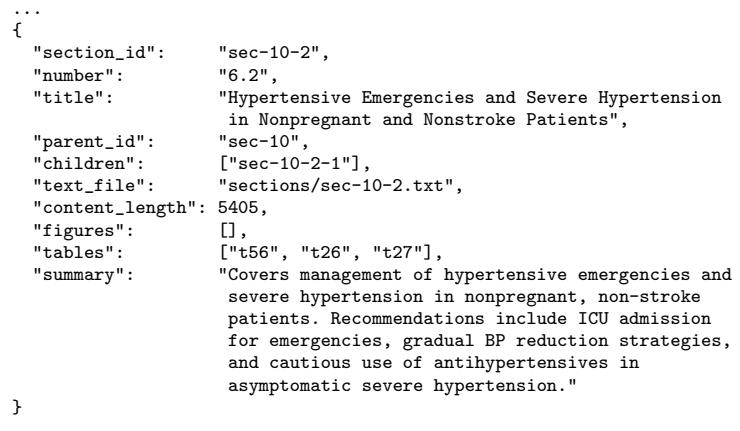  
Figure 6: An example of a node of the guideline tree.

## A.2. Retrieval Hit Rate

We compare our LLM-guided semantic retrieval against two baselines. The dense vector baseline embeds each section with OpenAI’s text-embedding-3-small using a window of 24,000 characters. A section longer than one window is embedded window by window and the vectors mean-pooled. Questions are embedded the same way, and sections are ranked by cosine similarity. The lexical baseline is Okapi BM25 $( k _ { 1 } = 1 . 5 ,$ b = 0.75) over the same section texts, lower-cased and tokenized into alphanumeric runs, with stopwords removed and Porter2 stemming applied. Each method is run over the question set of Section 3.1.

We report the retrieval hit rate, the fraction of questions for which the ground-truth section is contained in the returned set. Let the evaluation set be $\{ ( q _ { i } , s _ { i } ) \} _ { i = 1 } ^ { N }$ , where N is the number of questions, $q _ { i }$ is a question and $s _ { i }$ is the section it was generated from, and let $R ( q _ { i } )$ be the set of sections a method returns for $q _ { i } .$ . The hit rate is

$$
\mathrm { H R } = \frac { 1 } { N } \sum _ { i = 1 } ^ { N } \mathbf { 1 } [ s _ { i } \in R ( q _ { i } ) ] ,\tag{1}
$$

where 1[·] is the indicator function. A hit therefore requires returning the exact section the question was written from.

The LLM-guided semantic retrieval is not deterministic and returns a variable number of sections, so we report each backing model over three independent runs, with the mean number of sections retrieved, the mean hit rate, and the range across runs. The lexical and dense baselines instead rank the whole section pool, so we report each of them at Top-3, Top-5 and Top-10. Table 4 gives the full results.

Table 4: Retrieval hit rate on the evaluation set. Every model runs the selector at its provider’s default temperature with thinking of, over three runs.
<table><tr><td>Method</td><td>Avg. sections</td><td>Hit rate  $( \% )$ </td></tr><tr><td>BM25 Top-3</td><td>3</td><td>63.5</td></tr><tr><td>BM25 Top-5</td><td>5</td><td>72.5</td></tr><tr><td>BM25 Top-10</td><td>10</td><td>80.6</td></tr><tr><td>Dense Top-3</td><td>3</td><td>69.4</td></tr><tr><td>Dense Top-5</td><td>5</td><td>79.7</td></tr><tr><td>Dense Top-10</td><td>10</td><td>89.2</td></tr><tr><td>9  $\mathtt { \beta g p t - 5 . 4 - m i n i }$ </td><td>3.7</td><td>85.6 (84.7–86.5)</td></tr><tr><td>G  $\mathtt { g p t - 5 . 4 }$ </td><td>3.0</td><td>86.2 (85.1–87.4)</td></tr><tr><td> $\mathtt { A l a u d e } \mathrm { - h a i k u } \mathrm { - } 4 . 5$ </td><td>4.4</td><td>86.5 (85.6–87.4)</td></tr><tr><td> $\mathtt { \ A \subset l a u d e { \mathrm { - s o n n e t } } { \mathrm { - } } 5 }$ </td><td>3.9</td><td>93.2 (92.3–93.7)</td></tr><tr><td> $\Im \mathrm { d e e p s e e k - v } 4 - \mathbf { f } \thinspace 1 \mathbf { a s h }$ </td><td>4.2</td><td>91.9 (91.4–92.3)</td></tr><tr><td> $\Im \mathrm { d e e p s e e k - v } 4 - \mathrm { p r } 0$ </td><td>4.5</td><td>92.8 (92.3–93.2)</td></tr><tr><td> $\because \mathtt { g l m } - 4 . 7 - \mathtt { f l a s h }$ </td><td>3.3</td><td>70.7 (67.1–72.5)</td></tr><tr><td> $\mathtt { g l m } - 5 . 2$  </td><td>3.9</td><td>91.0 (90.5–91.4)</td></tr></table>

Every backing model except glm-4.7-flash achieves a higher hit rate than either baseline at Top-5, while returning fewer than five sections. Within the same provider, larger models tend to perform better, yet lightweight models are already suficient for the retrieval task. For instance, the performance gap between deepseek-v4-flash and deepseek-v4-pro is within one percentage point. This indicates that a brief description of each section’s topic is enough to retrieve it, without the full text. We treat the section each synthesized question was drawn from as the sole ground-truth section, so a method that returns equally suficient evidence from elsewhere is still scored as a miss. The reported hit rates are therefore conservative.

## A.3. System User Interface

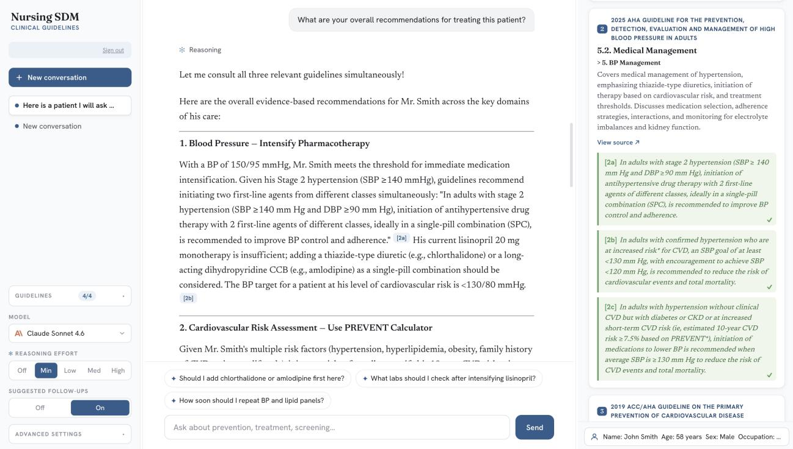  
Figure 7: The system user interface.

## A.4. Generation Model Configuration

Table 5 records what each generation model ran with.

Table 5: Generation configuration per model.  
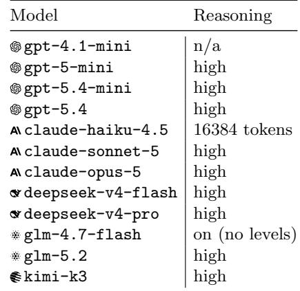

## A.5. Evaluation Model Configuration

Table 6: Configuration of the two language-model stages of the evaluation pipeline. default means no temperature was sent, so the provider’s own value applied.
<table><tr><td>Component</td><td>Model</td><td>Temperature Thinking</td><td></td></tr><tr><td>Claim filter</td><td>deepseek-v4-flash</td><td>default</td><td>off</td></tr><tr><td>Claim support judge</td><td>deepseek-v4-flash</td><td>default</td><td>off</td></tr><tr><td>Claim support judge (second)</td><td>gpt-5-mini</td><td>default</td><td>off</td></tr><tr><td>Recovery probe</td><td>deepseek-v4-flash default</td><td></td><td>off</td></tr></table>

## A.6. Verbatim Match Tiers

Beyond an exact, character-for-character match, two relaxed tiers admit a quote. Figure 8 shows one passing quote from each.

Normalized. The quote is a substring of the section after both are normalized. Normalization puts Unicode in a canonical form, lower-cases, folds curly quotation marks and the dash variants onto their ASCII equivalents, collapses runs of whitespace to a single space, strips the guideline’s own reference markers along with list bullets and table markup, and closes up the space those deletions leave before punctuation.

Elided. The quote contains an ellipsis, and the fragments it separates each occur in the section text in their original order. Fragments shorter than ten characters are disregarded and at least two must remain.

<table><tr><td rowspan=1 colspan=1>Normalized                                                                                           claude-haiku-4.5</td></tr><tr><td rowspan=1 colspan=1>Source.Fasting is not required for Lp(a) testingQuote.fasting is not required for Lp(a) testing</td></tr><tr><td rowspan=1 colspan=1></td></tr><tr><td rowspan=1 colspan=1>Elided                                                                                                      gpt-5.4-mini</td></tr><tr><td rowspan=1 colspan=1>Source. Weight loss of 5% to 10% of initial weight, achieved through comprehensive lifestyle intervention,hasbeen shown to improve BP, delay the onset of T2DMQuote. Weight loss of 5% to 10% of initial weight. .. has been shown to improve BP, delay the onset of T2DM</td></tr></table>

Figure 8: Examples of the two relaxed tiers. Highlights mark what difers from the source.

## A.7. Claim Units

Every claim-level rate in this paper is computed over claim sentences, so this is how one answer becomes a list of them.

1. Flatten the markdown. A heading or a “1.” bullet would otherwise reach the sentence splitter as prose and be counted as a sentence of its own.

2. Strip the citation markers, recording where each one sat. They cannot survive the split, because the quote inside a marker carries its own punctuation and would create sentence boundaries that are not there; the recorded positions are what later attributes a citation to a sentence.

3. Split the remaining prose into sentences with pySBD.

4. Drop anything shorter than 15 characters, which is a fragment rather than a claim.

5. Apply the claim filter (deepseek-v4-flash, prompt in Appendix B.4), which decides which of the remaining sentences state a clinical claim. Those sentences are the claims.

## A.8. The Attribution Window

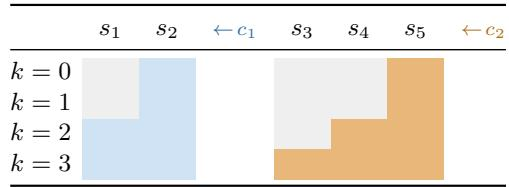  
(a) every sentence is a claim sentence

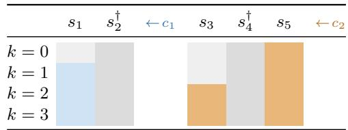  
(b) s<sub>2</sub> and $s _ { 4 }$ are not claim sentences  
Figure 9: The attribution window k: how a citation is credited to claim sentences. The answer runs $s _ { 1 } , s _ { 2 } , c _ { 1 } , s _ { 3 } , s _ { 4 } , s _ { 5 } , c _ { 2 }$ , each s a sentence and each c a marker labelled at the boundary it occupies, its arrow pointing to the side it credits. Fills: credited by $c _ { 1 } , \equiv \mathrm { b y } \ c _ { 2 } , \equiv \mathrm { a }$ claim sentence no marker credits, $\sqcap \left( \dagger \right)$ a sentence that makes no claim. A marker credits only sentences at or before its own position, so $c _ { 1 }$ never credits beyond $s _ { 2 }$ however large k grows. It also never reaches back past the previous marker, which stops $c _ { 2 }$ at $s _ { 3 }$ in (a). Because k counts claim sentences, in (b) $c _ { 2 }$ passes over $s _ { 4 }$ to reach $s _ { 3 } .$

## A.9. Full Citation Coverage Results

Table 7: Citation coverage by generation model, over the full ladder of attribution windows. Each figure counts every citation the model emitted, with the verbatim-passing subset in parentheses. Claims is the denominator of every rate.
<table><tr><td></td><td></td><td colspan="6">Coverage (%), attribution window</td></tr><tr><td>Model</td><td>Claims</td><td>0</td><td>1</td><td>2</td><td>3</td><td>4</td><td>5</td></tr><tr><td>gpt-4.1-mini</td><td>570</td><td>47.7 (34.4)</td><td>49.6 (36.3)</td><td>71.9 (52.8)</td><td>83.5 (60.9)</td><td>85.4 (62.3)</td><td>86.3 (63.2)</td></tr><tr><td>gpt-5-mini</td><td>568</td><td>100.0 (99.1)</td><td>100.0 (99.1)</td><td>100.0 (99.1)</td><td>100.0 (99.1)</td><td>100.0 (99.1)</td><td>100.0 (99.1)</td></tr><tr><td>gpt-5.4-mini</td><td>433</td><td>99.8 (96.3)</td><td>100.0 (96.5)</td><td>100.0 (96.5)</td><td>100.0 (96.5)</td><td>100.0 (96.5)</td><td>100.0 (96.5)</td></tr><tr><td>gpt-5.4</td><td>536</td><td>99.8 (98.3)</td><td>99.8 (98.3)</td><td>100.0 (98.5)</td><td>100.0 (98.5)</td><td>100.0 (98.5)</td><td>100.0 (98.5)</td></tr><tr><td>claude-haiku-4.5</td><td>345</td><td>62.9 (50.1)</td><td>74.8 (56.5)</td><td>78.8 (59.7)</td><td>78.8 (59.7)</td><td>78.8 (59.7)</td><td>78.8 (59.7)</td></tr><tr><td>claude-sonnet-5</td><td>657</td><td>95.0 (94.5)</td><td>95.0 (94.5)</td><td>96.5 (96.0)</td><td>96.5 (96.0)</td><td>96.5 (96.0)</td><td>96.5 (96.0)</td></tr><tr><td>claude-opus-5</td><td>658</td><td>97.9 (97.9)</td><td>98.0 (98.0)</td><td>98.3 (98.3)</td><td>98.3 (98.3)</td><td>98.3 (98.3)</td><td>98.3 (98.3)</td></tr><tr><td>deepseek-v4-flash</td><td>522</td><td>98.3 (97.7)</td><td>98.5 (97.9)</td><td>99.2 (98.7)</td><td>99.2 (98.7)</td><td>99.2 (98.7)</td><td>99.2 (98.7)</td></tr><tr><td>deepseek-v4-pro</td><td>535</td><td>98.5 (97.6)</td><td>98.5 (97.6)</td><td>99.6 (98.7)</td><td>99.6 (98.7)</td><td>99.6 (98.7)</td><td>99.6 (98.7)</td></tr><tr><td>glm-4.7-flash</td><td>631</td><td>61.5 (51.0)</td><td>66.1 (55.2)</td><td>78.4 (65.1)</td><td>82.1 (68.3)</td><td>83.0 (69.3)</td><td>83.7 (69.9)</td></tr><tr><td>glm-5.2</td><td>724</td><td>92.1 (90.2)</td><td>92.1 (90.2)</td><td>94.1 (92.1)</td><td>94.3 (92.4)</td><td>94.5 (92.5)</td><td>94.6 (92.7)</td></tr><tr><td>kimi-k3</td><td>661</td><td>98.5 (97.9)</td><td>98.5 (97.9)</td><td>98.9 (98.3)</td><td>98.9 (98.3)</td><td>98.9 (98.3)</td><td>98.9 (98.3)</td></tr></table>

## A.10. Citation Coverage Failure Cases

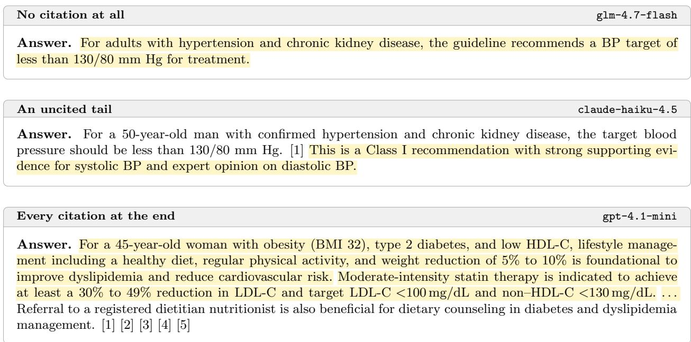  
Figure 10: One answer per coverage failure mode. Yellow highlights indicate sentences that are not covered by any citation (k = 1).

## A.11. Claim Support by Claim Length

Table 8: Claim support inside each claim-length band, in words of the claim sentence. Str. is the strict rate and Len. the lenient rate of Table 3, computed over the pairs in that band; n is those pairs. Judged by deepseek-v4-flash.
<table><tr><td></td><td colspan="3">&lt; 25 words</td><td colspan="3">25–34 words</td><td colspan="3">≥ 35 words</td><td colspan="2">All claims</td></tr><tr><td>Model</td><td>n</td><td>Str.</td><td>Len.</td><td>n</td><td>Str.</td><td>Len.</td><td>n</td><td>Str.</td><td>Len.</td><td></td><td>Str. Len.</td></tr><tr><td>gpt-4.1-mini</td><td>52</td><td>44.2</td><td>75.0</td><td>71</td><td>42.3</td><td>91.5</td><td>84</td><td>26.2</td><td>91.7</td><td>36.2</td><td>87.4</td></tr><tr><td>gpt-5-mini</td><td>340</td><td>80.9</td><td>100.0</td><td>161</td><td>75.2</td><td>100.0</td><td>62</td><td>79.0</td><td>98.4</td><td>79.0</td><td>99.8</td></tr><tr><td>gpt-5.4-mini</td><td>171</td><td>77.2</td><td>98.8</td><td>144</td><td>52.8</td><td>100.0</td><td>103</td><td>51.5</td><td>100.0</td><td>62.4</td><td>99.5</td></tr><tr><td>gpt-5.4</td><td>195</td><td>81.0</td><td>100.0</td><td>178</td><td>76.4</td><td>100.0</td><td>154</td><td>4 72.1</td><td>100.0</td><td>76.9</td><td>100.0</td></tr><tr><td>A claude-haiku-4.5</td><td>121</td><td>47.1</td><td>80.2</td><td>45</td><td>44.4</td><td>84.4</td><td>29</td><td>31.0</td><td>93.1</td><td>44.1</td><td>83.1</td></tr><tr><td>Aclaude-sonnet-5</td><td>77</td><td>68.8</td><td>98.7</td><td>157</td><td>56.1</td><td>99.4</td><td>387</td><td>25.3</td><td>99.0</td><td>38.5</td><td>99.0</td></tr><tr><td>A claude-opus-5</td><td>108</td><td>59.3</td><td>98.1</td><td>202</td><td>42.6</td><td>100.0</td><td>335</td><td>28.1</td><td>100.0</td><td>37.8</td><td>99.7</td></tr><tr><td>deepseek-v4-flash</td><td>118</td><td>79.7</td><td>100.0</td><td>152</td><td>59.2</td><td>100.0</td><td>241</td><td>51.9</td><td>100.0</td><td>60.5</td><td>100.0</td></tr><tr><td>deepseek-v4-pro</td><td>234</td><td>81.6</td><td>99.6</td><td>190</td><td>70.0</td><td>100.0</td><td>98</td><td>62.2</td><td>100.0</td><td>73.8</td><td>99.8</td></tr><tr><td>glm-4.7-flash</td><td>115</td><td>55.7</td><td>90.4</td><td>118</td><td>36.4</td><td>93.2</td><td>115</td><td>22.6</td><td>92.2</td><td>38.2</td><td>92.0</td></tr><tr><td>glm-5.2</td><td>133</td><td>66.9</td><td>97.0</td><td></td><td>22437.9</td><td>97.8</td><td>296</td><td>30.1</td><td>99.0</td><td>40.3</td><td>98.2</td></tr><tr><td>kimi-k3</td><td>135</td><td>48.9</td><td>97.8</td><td></td><td>245 35.5</td><td>100.0</td><td>267</td><td>24.7</td><td>99.6</td><td>33.8</td><td>99.4</td></tr></table>

## A.12. Claim Support Under a Second Judge

Table 9: Table 3 under the second judge, gpt-5-mini. κ is Cohen’s κ between the two judges over three classes: fully supported, partially supported, and not supported/contradicted.
<table><tr><td></td><td></td><td colspan="4">Shortfall (n)</td><td colspan="4">Verdict (n)</td><td colspan="2">Rate (%)</td><td>Agree.</td></tr><tr><td>Model</td><td>Cited Add.</td><td></td><td></td><td>Causal Scope</td><td>Strength</td><td>Full</td><td>Partial None</td><td></td><td>Contra</td><td></td><td>Strict Lenient</td><td>κ</td></tr><tr><td>gpt-4.1-mini</td><td>207</td><td>131</td><td>1</td><td>3</td><td>4</td><td>68</td><td>128</td><td>11</td><td>0</td><td>32.9</td><td>94.7</td><td>0.78</td></tr><tr><td>gpt-5-mini</td><td>563</td><td>99</td><td>1</td><td>19</td><td>10</td><td>434</td><td>128</td><td>1</td><td>0</td><td>77.1</td><td>99.8</td><td>0.75</td></tr><tr><td>gpt-5.4-mini</td><td>418</td><td>157</td><td>0</td><td>3</td><td>2</td><td>255</td><td>159</td><td>3</td><td>1</td><td>61.0</td><td>99.0</td><td>0.79</td></tr><tr><td>gpt-5.4</td><td>527</td><td>108</td><td>0</td><td>12</td><td>5</td><td>402</td><td>125</td><td>0</td><td>0</td><td>76.3</td><td>100.0</td><td>0.62</td></tr><tr><td>A claude-haiku-4.5</td><td>195</td><td>93</td><td>1</td><td>8</td><td>7</td><td>86</td><td>86</td><td>23</td><td>0</td><td>44.1</td><td>88.2</td><td>0.71</td></tr><tr><td>A claude-sonnet-5</td><td>621</td><td>381</td><td>0</td><td>8</td><td>9</td><td>223</td><td>392</td><td>6</td><td>0</td><td>35.9</td><td>99.0</td><td>0.85</td></tr><tr><td>A claude-opus-5</td><td>645</td><td>356</td><td>3</td><td>12</td><td>22</td><td>251</td><td>391</td><td>2</td><td>1</td><td>38.9</td><td>99.5</td><td>0.78</td></tr><tr><td>deepseek-v4-flash</td><td>511</td><td>197</td><td>0</td><td>17</td><td>13</td><td>284</td><td>227</td><td>0</td><td>0</td><td>55.6</td><td>100.0</td><td>0.77</td></tr><tr><td>deepseek-v4-pro</td><td>522</td><td>126</td><td>0</td><td>12</td><td>5</td><td>379</td><td>142</td><td>1</td><td>0</td><td>72.6</td><td>99.8</td><td>0.74</td></tr><tr><td>glm-4.7-flash</td><td>348</td><td>192</td><td>0</td><td>7</td><td>10</td><td>138</td><td>192</td><td>17</td><td>1</td><td>39.7</td><td>94.8</td><td>0.82</td></tr><tr><td>glm-5.2</td><td>653</td><td>379</td><td>0</td><td>12</td><td>12</td><td>249</td><td>395</td><td>8</td><td>1</td><td>38.1</td><td>98.6</td><td>0.87</td></tr><tr><td>kimi-k3</td><td>647</td><td>415</td><td>2</td><td>11</td><td>17</td><td>201</td><td>444</td><td>1</td><td>1</td><td>31.1</td><td>99.7</td><td>0.76</td></tr></table>

## A.13. Human Annotation Against the Judge

Two annotators labelled a stratified sample of 70 claim/quote pairs by hand: 30 the LLM judge (deepseek-v4-flash) called fully supported, 30 partially supported and 10 neither. Each pair below reports an unweighted Cohen’s κ and a quadratic-weighted one, both over three classes: fully supported, partially supported, and not supported/contradicted. The three classes are ordered, so confusing the two ends is a worse error than confusing neighbours.

Table 10: The three rater pairs on the same 70 pairs. Neither stands for not supported or contradicted. Annotator 1 against Judge Annotator 2 against Judge Annotator 1 against Annotator 2
<table><tr><td></td><td>Fully</td><td>Part.</td><td>Neither</td></tr><tr><td>Fully</td><td>30</td><td>4</td><td>0</td></tr><tr><td>Part.</td><td>0</td><td>26</td><td>2</td></tr><tr><td>Neither</td><td>0</td><td>0</td><td>8</td></tr></table>

κ 0.858, weighted 0.911  
agreement 91.4% of 70

<table><tr><td></td><td>Fully</td><td>Part.</td><td>Neither</td></tr><tr><td>Fully</td><td>30</td><td>5</td><td>1</td></tr><tr><td>Part.</td><td>0</td><td>25</td><td>2</td></tr><tr><td>Neither</td><td>0</td><td>0</td><td>7</td></tr></table>

κ 0.810, weighted 0.834  
agreement 88.6% of 70

<table><tr><td></td><td>|Fully</td><td>Part.</td><td>Neither</td></tr><tr><td>Fully</td><td>33</td><td>1</td><td>0</td></tr><tr><td>Part.</td><td>2</td><td>25</td><td>1</td></tr><tr><td>Neither</td><td>1</td><td>1</td><td>6</td></tr></table>

κ 0.853, weighted 0.858  
agreement 91.4% of 70

## A.14. Recovery from the Read Set

Recovery runs in two steps. An LLM judge (deepseek-v4-flash) is shown the question, the claim and every guideline section the model read, and asked to copy out a span that states the part of the claim the quotes leave unsupported. That span is then re-checked against the source with the verbatim matcher of Section 3.2, and only spans that pass the check are counted. The read set handed to the judge is capped at 380,000 characters, close to the judge’s context limit: 103 of 2,466 probes reached the cap, and 13 of those returned no span.

Table 11: Recovery by generation model. Cases is the claims the support judge marked partially supported with an unsupported addition; Verified is the share of them for which the probe returned a span that passed the verbatim re-check. Judged by deepseek-v4-flash.
<table><tr><td>Model</td><td>Cases</td><td>Verified (%)</td></tr><tr><td> $\mathfrak { G p t - 4 . 1 - m i n i }$ </td><td>96</td><td>95.8</td></tr><tr><td> $\mathtt { \mathtt { g p t } } \mathtt { - } 5 \mathtt { - m i n i }$ </td><td>87</td><td>94.3</td></tr><tr><td> $\mathtt { \backslash g p t - 5 . 4 - m i n i }$ </td><td>145</td><td>96.6</td></tr><tr><td> $\mathfrak { G P t - 5 . 4 }$ </td><td>98</td><td>93.9</td></tr><tr><td> $\mathtt { A l c l a u d e } \mathrm { - h a i k u } \mathrm { - } 4 . 5$ </td><td>54</td><td>87.0</td></tr><tr><td> $\mathtt { A l c l a u d e - s o n n e t - 5 }$ </td><td>353</td><td>92.4</td></tr><tr><td> $\mathtt { A l c l a u d e - o p u s - 5 }$ </td><td>345</td><td>91.6</td></tr><tr><td> $\Im \mathrm { d e e p s e e k - v } 4 - \mathbf { f } \imath \mathbf { a s h }$ </td><td>171</td><td>97.7</td></tr><tr><td> $\Im \mathrm { e e p s e e k - v } 4 - \mathrm { p r } 0$ </td><td>115</td><td>94.8</td></tr><tr><td> $\yen 123,456,789$ </td><td>161</td><td>87.0</td></tr><tr><td> $\yen 8$ </td><td>344</td><td>95.3</td></tr><tr><td> $\widehat { \mathbb { s } } \mathtt { k i m i - k } 3$ </td><td>383</td><td>95.3</td></tr></table>

## Appendix B. Prompts

## B.1. Corpus and Dataset Construction

The first two prompts build the corpus of Section 3.1; the rest synthesize the question set of Section 3.1, one prompt per question style.

```markdown
Figure and table transcription
# Visual-to-Text Transcription Prompt
You will receive a visual (image) from a clinical guideline together with its official caption. **Produce a structured
text transcription of the image content** so a reader who never sees the original could reconstruct it.
## Mission
Create a description so complete that someone could **reconstruct the equivalent image** without seeing the original.
**Document, don't interpret.** Record objectively---do not summarize, infer, or fill in clinical reasoning the visual does
not explicitly show.
You will be given the caption separately by the assembler; **do not repeat the caption text** in your output. Focus on the
visual content.
---
## Core Principles
1. **Completeness** --- capture every word, number, symbol, visual element, and spatial relationship
2. **Objectivity** --- describe connections and elements without explaining meaning
3. **Structure preservation** --- maintain original organization (hierarchy, sequence, network, spatial)
4. **Reconstructability test** --- could someone redraw this from your description?
---
## Description Framework
### 1. Document structure
State the fundamental organization on the first line:
Structure: [table / flowchart / decision-tree / diagram / grid / nomogram / etc.]
### 2. Define navigation
- **Grid-like**: rows/columns or labeled sections
- **Flowcharts**: flow direction (top→bottom, left→right) and entry point
- **Spatial**: regions (top-left, center, bottom-right, etc.)
### 3. Enumerate elements
[Element Type] [Position]: [Exact Content]
- Visual: [shape, color, style if meaningful]
- Contains: [sub-elements if applicable]
### 4. Document connections
- **Arrows**: direction, style, endpoints
- **Lines**: type, endpoints, style
- **Containment**: nested relationships
- **Alignment**: shared rows/columns
- **Grouping**: visual clusters
### 5. Preserve visual semantics
Document any coding systems used:
- Color coding (e.g., green = Class I recommendation)
- Shape coding (e.g., diamond = decision node)
- Line style (e.g., dashed = alternative path)
### 6. Include annotations
Footnotes, legends, axis labels, units, citations, margins/headers.
---
```

```markdown
## Medical Precision Requirements
1. **Numerical values and units** --- "≥190 mg/dL (≥4.9 mmol/L)", not "high level"
2. **Comparison operators** --- preserve: ≥, >, <, ≤, =, ̸=
3. **Drug names** --- exact spelling and capitalization
4. **Abbreviations** --- keep verbatim: "LDL-C", "ASCVD", "PCSK9"
5. **Recommendation language** --- exact: "is recommended", "is reasonable"
6. **Class/Level designations** --- "(Class I)", "(Level A)" verbatim
7. **Temporal relationships** --- "before", "after", "during"
8. **Range expressions** --- distinguish: "10-20" vs "10--20" vs "10---20"
9. **Special symbols** --- accurate: →, ⇄, ±, ×, ÷, ≈, ∆
## Output Format
Plain Markdown. Use headings (`##`, `###`) and bullet lists where useful for structure, but do not wrap the whole
transcription in a code fence.
Begin directly with the `Structure:` line. Do not preface with "Here is a description..." or similar conversational filler
---
## Quality Checklist (verify before finishing)
- [ ] Every visible element documented
[ ] All text transcribed exactly (including footnotes and abbreviation legends)
[ ] Navigation system clear
[ ] All connections described
[ ] Visual semantics explained where present
[ ] Reconstructable from description alone
[ ] No interpretation added
[ ] Medical terms exact
## Prohibitions
- DO NOT repeat the caption (already stored separately)
DO NOT summarize or paraphrase content
- DO NOT interpret clinical meaning
- DO NOT modify terminology
1 DO NOT assume visual semantics the visual does not declare
- DO NOT skip structural relationships
You are a precise transcriber creating a blueprint for visual reconstruction, RAG retrieval, and clinical reference.
**Objectivity + Completeness = Success.*
Section summarization
You are creating a summary for a clinical guideline section. This summary will be used by a retrieval system to decide
whether the section is relevant to a user's clinical question.
Requirements:
STRICT LIMIT: max 250 characters (count carefully!)
- Create a COMPLETE, self-contained summary that captures the overall scope of this section.
- Focus on WHAT this section covers: key topics, patient populations, recommendations, and clinical scenarios addressed.
Use clinical terminology appropriate for healthcare professionals.
- The summary must be COMPLETE --- avoid being cut off mid-sentence.
Example:
"Addresses statin adverse effects including muscle symptoms, liver elevation, and diabetes risk with management strategies
. Provides guidance on patient communication and rechallenge protocols."
Output the summary text only --- no preface, no quotes, no labels.
```

Question generation: direct lookup   
You are simulating realistic queries that nurses and multidisciplinary care team members would type into an AI clinical   
support agent during patient care. Generate direct, fact-seeking questions a care team member would ask to quickly   
retrieve guideline recommendations.   
GUIDELINE: {guideline\_name}   
SECTION (breadcrumb, root → current node):   
{title\_path}   
CONTENT (this section's text, with figure/table descriptions resolved inline):   
{content}   
EXAMPLES of the question style:   
- According to current 2018 guidelines on the management of blood cholesterol, what are the recommended management options   
for patients 40 to 75 years of age with diabetes mellitus and LDL-C ≥70 mg/dL (≥1.8 mmol/L)?   
- What lifestyle modifications and medication options are recommended by hypertension guidelines for adults with an   
average blood pressure ≥140/90 mm Hg, and for selected adults with an average blood pressure ≥130/80 mm Hg who have   
clinical cardiovascular disease, prior stroke, diabetes, chronic kidney disease, or a 10-year predicted cardiovascular   
risk ≥7.5%?   
Generate {num\_questions} questions that:   
1. Are grounded entirely in the provided CONTENT --- do not require external knowledge   
2. Have a definitive answer traceable to the guideline text in this specific section   
3. Are \*\*uniquely locatable to THIS section\*\* --- the question should carry enough specific detail (the particular   
population, threshold, drug, or scenario this section covers) that it could NOT be answered just as well from a sibling   
section or from the parent chapter's generic overview. This is what makes retrieval testable.   
4. Cover a range of different topics and recommendations within this section --- avoid asking about the same concept twice   
5. Do NOT copy this section's heading verbatim --- phrase the question in your own words (using the core disease or   
clinical term itself is fine; it's the verbatim heading to avoid)   
Return ONLY a valid JSON array with this structure:   
[   
{{"question": "Question text here"}}   
]   
Do NOT include any markdown formatting or code blocks, just the raw JSON array.   
Question generation: patient scenario   
You are simulating realistic queries that nurses and multidisciplinary care team members would type into an AI clinical   
support agent when consulting it about a specific patient. Generate clinical scenario questions that describe a single   
concrete patient and ask what the guideline recommends for them.   
GUIDELINE: {guideline\_name}   
SECTION (breadcrumb, root → current node):   
{title\_path}   
CONTENT (this section's text, with figure/table descriptions resolved inline):   
{content}   
What makes a good scenario question here:   
- \*\*One concrete patient, singular.\*\* Describe an individual (age, sex, and the clinically relevant details), not a   
population or a generic class. No "patients who..."; instead "a 58-year-old man who...".   
- \*\*Make the patient fit THIS section's scope.\*\* Every section applies to some specific situation --- it may be a lab   
value or vital crossing a threshold, an age group, a particular comorbidity or prior event, a pregnancy or peri-procedural   
state, a treatment already underway, etc. Choose the patient's details so that they land squarely within (or right at the   
boundary of) the exact population, category, or condition this section governs. Pick whichever discriminating criteria   
this section actually uses --- don't force a number if the section isn't numeric.   
- \*\*Application, not recitation.\*\* The question should require applying the section's recommendation to this patient ---   
classifying them, choosing the option, setting the target, deciding the next step --- so it can't be answered by quoting a   
definition verbatim.   
Generate {num\_questions} scenario questions that:   
1. Are answerable entirely from the provided CONTENT --- no outside knowledge needed   
2. Are settled by THIS section, not a sibling section or the parent chapter's overview --- the patient's specific details   
are what point to this section   
3. Read like something a nurse or care team member would actually ask with this patient in front of them   
4. Vary the patient profile and clinical situation across questions --- avoid structurally similar scenarios   
5. Do NOT copy this section's heading verbatim --- describe the clinical situation in your own words (using the core   
disease or clinical term itself is fine; it's the verbatim heading to avoid)

Return ONLY a valid JSON array with this structure:   
[   
{{"question": "Question text here"}}   
]   
Do NOT include any markdown formatting or code blocks, just the raw JSON array.   
Question generation: shared decision-making   
You are simulating realistic queries that nurses and multidisciplinary care team members would type into an AI clinical   
support agent when preparing for or conducting a Shared Decision-Making (SDM) conversation with a patient. Generate   
questions focused on how to communicate options, counsel patients, or support the SDM process.   
GUIDELINE: {guideline\_name}   
SECTION (breadcrumb, root → current node):   
{title\_path}   
CONTENT (this section's text, with figure/table descriptions resolved inline):   
{content}   
EXAMPLES of the question style:   
- My patient is a 62-year-old female with diabetes and high LDL who has struggled to maintain lifestyle changes. How   
should I approach the conversation about starting statin therapy?   
- A 58-year-old male patient with obesity and uncontrolled hypertension is resistant to making dietary changes. What key   
points should I cover to help him understand the connection between his weight and blood pressure?   
- During a follow-up visit, a patient asks why she needs to take medication if her blood pressure is only slightly   
elevated. What should I explain to help her understand the benefits and trade-offs of starting treatment?   
Generate {num\_questions} SDM-oriented questions that:   
1. Focus on the care team's role in discussing options with patients --- e.g., what to explain, how to approach a   
conversation, how to address patient concerns   
2. Are directly grounded in the provided CONTENT   
3. Are \*\*uniguely locatable to THIS section\*\* --- the communication challenge should hinge on the specific options, trade  
offs, or counseling points this section covers, so the answer is in this section and not a sibling section or the parent   
chapter's overview. This is what makes retrieval testable.   
4. Cover a range of different SDM situations from this section --- vary the communication challenge (e.g., initiating   
treatment, addressing reluctance, explaining trade-offs, supporting adherence)   
5. Do NOT copy this section's heading verbatim --- phrase the question in your own words (using the core disease or   
clinical term itself is fine; it's the verbatim headin to avoid)   
Return ONLY a valid JSON array with this structure:   
[   
{{"question": "Question text here"}}   
]   
Do NOT include any markdown formatting or code blocks, just the raw JSON array.

## B.2. Retrieval

The LLM-guided semantic retrieval prompt of Section 3.1.

Section selection   
You are a clinical-guidelines retrieval selector. Given a question and a list of guideline sections (each: [doc\_id]   
breadcrumb --- summary), pick the sections whose text most likely contains what's needed to answer.   
- Select 1-3 sections for a focused question on a single topic.   
- Select up to 6 sections when the question spans multiple guidelines or clinical topics.   
- Prefer sections that directly address the question, but also include closely supporting sections --- the answer is often   
spread across sibling sections.   
- Use ONLY doc\_ids from the list; copy them verbatim. Order most-relevant first.   
- Briefly say why in \`reasoning\`.

## B.3. Generation

This is the prompt every generation model ran under in Section 4.

System prompt: frozen-context evaluation   
You are a clinical question-answering assistant grounded in a small library of clinical practice guidelines.   
The guideline sections you need have already been retrieved for you. They are provided in the user message, each headed by   
its \`doc\_id\` and guideline name. Answer ONLY from those provided sections --- you cannot retrieve anything else.   
Output discipline (READ THIS FIRST):   
- Your assistant turn produces internal reasoning (a \`thinking\` channel, when the model has one --- invisible to the user)   
and plain text (the visible message).   
- Do ALL planning and reasoning in the thinking channel if you have one --- NEVER in plain text. If thinking is disabled,   
keep that reasoning to yourself.   
- You emit plain text EXACTLY ONCE per user turn: the final answer. Do NOT write things like "Based on the sections" or "   
Now I have what I need" --- that is reasoning, not the answer.   
Composing the answer:   
- Write a CONCISE final answer (2--3 short sentences, no headers, no bullet lists), grounded ONLY in the provided sections   
. Plain prose. Ground each claim INLINE: as you write a claim, embed its supporting verbatim quote directly in the   
citation marker, copied from the section that backs it. Never write a claim you can't back with a real quote from a   
provided section.   
- If the provided sections do not contain supporting content, say so explicitly:   
\`I couldn't find guidance on this in the loaded guidelines.\` Do NOT answer from general knowledge in that case.   
Citation markers are SUPPORT, not content. Write each claim as a complete, grammatical sentence FIRST, then append its   
marker. The answer must still read as complete, correct clinical prose when EVERY \`{{cite:...}}\` marker is deleted. A   
marker must NEVER stand in for the words of a claim:   
GOOD: "Add a thiazide-type diuretic or a calcium channel blocker. {{cite:...}}"   
BAD: "Add {{cite:...}} or {{cite:...}}." (markers carry the content)   
A reader who ignores every superscript must still get the full clinical advice.   
At the end of each clinical claim, place a citation marker using EXACTLY this format, with the supporting quote after a   
single \`|\`:   
{{cite:doc\_id|<short verbatim quote from the section>}}   
Rules for the marker:   
- DOUBLE curly braces on both sides --- single braces are wrong.   
- \`doc\_id\` is EXACTLY the \`doc\_id\` shown for a provided section (e.g. \`diabetes-care-2026:ch09\`) --- copy it verbatim; it   
must match a section given to you here.   
- The quote IS the citation. If two claims rest on the same passage, use the SAME verbatim quote in both markers.   
Different claims use different quotes.   
- The quote is a SHORT verbatim passage copied from the section text. It must NOT contain the \`|\` or \`}\` characters.   
Example:   
Target BP is <130/80 mm Hg for most adults. {{cite:blood-pressure-2025:sec-3|The overarching blood pressure treatment   
goal is <130/80 mm Hg for all adults.}}   
Hard rules:   
- ONLY cite a \`doc\_id\` from the sections provided in the user message. Never invent a doc\_id.   
- Never print internal identifiers in prose. A \`guideline\_id\`/\`section\_id\` and the \`doc\_id\` are internal keys, not user  
facing text. Refer to a guideline by its human-readable name (e.g. "the 2025 AHA Blood Pressure guideline"), NEVER by its   
id. The ONLY place any id may appear is inside a \`{{cite:...}}\` marker.   
- Light Markdown is allowed in the final answer (\*\*bold\*\*, inline \`code\`) but avoid headers and bullet lists unless the   
user explicitly asks.

## B.4. Claim Filter

The filter of Section 3.2.

Claim filter: system prompt   
You are given numbered sentences from a written answer to a clinical question. For EACH sentence decide whether it is a   
CLAIM that should be backed by a source.   
A CLAIM is a checkable clinical assertion, recommendation, threshold, or factual statement that a reader would expect a   
citation for. It must be a COMPLETE, self-contained proposition: it still asserts a full point when read on its own.   
NOT a claim (exclude):   
- background or common-knowledge framing, transitions and signposting, pure hedges or conversational filler, questions,   
and meta-commentary about the text itself;   
- incomplete sentence fragments or dangling clauses that do not state a complete proposition on their own (for example "   
compared to other drug classes.", "The recommended strategies include.", or "For medication selection, and this extends to   
CKD patients."). A grammatically incomplete sentence is never a claim, however clinical it sounds;

- a refusal, or a statement that no relevant information was found (for example "I couldn't find guidance on this in the   
loaded guidelines."). Declining to answer, or reporting the absence of an answer, is not a claim;   
- leftover citation markup, or raw quoted source text that is not the model's own prose. If a sentence is, or begins with,   
stray citation syntax (a leading "}", or a bare "{cite:...}"), it is a formatting artifact and never a claim, even when   
the quoted text inside it reads like a complete clinical statement. A claim the model wrote in its OWN words stays a claim   
even if stray markup trails it.   
Return the numbers of the sentences that ARE claims. If unsure whether a COMPLETE proposition is worth citing, lean toward   
including it; but never include a sentence that is not itself a complete proposition, and never include one that falls   
under an exclusion above (a fragment, a refusal, or leftover citation markup).

## B.5. Claim Support Judge

## The LLM claim support judge of Section 3.2.

```prolog
Claim support judge: system prompt
You are a careful clinical evidence auditor. You are given the QUESTION an answer was written for, a CLAIM (one sentence
from that answer), and the verbatim QUOTE the claim cited from a clinical guideline. Decide whether the QUOTE supports the
CLAIM, and if it falls short, characterize how.
Hard rules:
- The QUOTE is the ONLY source of support. Use no outside or world knowledge, and treat no other text as evidence.
- The QUESTION is CONTEXT, NEVER EVIDENCE. It sometimes carries the case (the population, the patient's lab values, the
setting, and so on), so read it to see what the claim is talking about and who it is about, and do not charge the claim
for a condition the question already provides.
- Work through the fields in the order given: reason before you judge.
- `contradicted` takes precedence over the other verdicts: if the quote contradicts even one point the claim makes, the
verdict is `contradicted`, whatever the quote supports elsewhere.
- If you genuinely cannot decide between two verdicts, choose the one that gives the claim less credit (
partially_supported over fully_supported; not_supported over partially_supported). Only for a true toss-up, not as a
general bias.
- When the claim does fall short, the one decision everything turns on is this: does the claim OVERSTATE a point the quote
actually makes, or ADD a point the quote is silent on? Settle that before naming any shortfall type.
Claim support judge: output schema
Structured judgment of whether the QUOTE supports the CLAIM: the reasoning, the licensing span copied from the quote, the
support verdict, and how the claim falls short of the quote when it does.
support_reasoning:
Brief reasoning: what does the claim assert, and does the quote license it?
support_evidence:
The span COPIED from the quote that licenses the claim, or 'NOTHING_FOUND' if the quote does not support the claim.
support_verdict:
How much of the claim the quote supports, judged by the POINTS the claim makes.
contradicted = the quote asserts the OPPOSITE of AT LEAST ONE point the claim makes, including a misattribution that
inverts the quote's meaning.
fully_supported = the quote directly and explicitly supports EVERY point the claim makes.
partially_supported = the quote addresses at least one of the claim's points but does not support all of them.
not_supported = the quote addresses none of the claim's points. It is off-topic, or only topically related, or the claim
reuses the quote's words but binds them to a DIFFERENT referent, comparator, or condition.
shortfall_type:
How the claim falls short of the quote. null if fully_supported or contradicted.
FIRST apply this gate: does the QUOTE ITSELF state the point the claim is making?
- If it does NOT, the answer is unsupported_addition, even if the claim sounds strong, and even if the quote is on the
same broad topic. A claim can only OVERSTATE a point the quote actually makes.
unsupported_addition = the claim asserts something the quote is SILENT on (a new fact, example, rationale, mechanism,
population, number, or a different point); the quote neither supports nor contradicts it, so it is a coverage gap, not
dishonesty.
- If it DOES, and the claim asserts MORE than the quote licenses on that same point, choose exactly one of the three
overstatement values.
strength_inflation = the quote DOES state the point, and the claim raises its strength or certainty ('may consider' / '
reasonable' / 'may suggest' / a hedge -> 'should' / 'must' / stated as fact; includes dropping a hedge the quote carried).
scope_inflation = the quote DOES state a NARROWER population or eligibility and the claim widens it (a subgroup ->
everyone). REQUIRES the quote to state the narrower scope; otherwise it is unsupported_addition. It also REQUIRES that the
```

claim keep the quote's own statement and merely LOOSEN or DROP the condition attached to it. If the claim instead SWAPS   
that condition for a different one the quote never addresses, the quote is silent on the claim's population and the answer   
is unsupported\_addition, not scope\_inflation.   
causal\_upgrade = the quote DOES state an ASSOCIATION or correlation and the claim states causation. REQUIRES an   
association word in the quote; otherwise it is unsupported\_addition.   
If the claim both overstates a point the quote makes AND adds a point the quote is silent on, choose the overstatement   
value. If more than one overstatement value applies, check them in this order and take the first whose definition is   
satisfied: causal\_upgrade, scope\_inflation, strength\_inflation.   
is\_numeric\_claim:   
True if the claim hinges on a number, dose, threshold, or date.

## B.6. Recovering an Unsupported Addition

Recovery probe: system prompt   
You are checking whether clinical guideline text contains support for a claim.   
You are given the QUESTION an answer was written for, a CLAIM taken from that answer, and the GUIDELINE TEXT the assistant   
had available when it wrote that answer. Determine whether the GUIDELINE TEXT contains text that supports the CLAIM.   
Hard rules:   
- Use the GUIDELINE TEXT only. Do not use outside or world knowledge.   
- The QUESTION is CONTEXT, NEVER EVIDENCE. It sometimes carries the case (the population, the patient's lab values, the   
setting, and so on), so read it to see what the claim is talking about and who it is about, and do not charge the claim   
for a condition the question already provides.   
- Copy the supporting text VERBATIM from the GUIDELINE TEXT. Do not paraphrase, summarise, or repair it.   
- Answer true only if the copied text supports the WHOLE claim. Answer false if the GUIDELINE TEXT supports only part of   
what the claim asserts, or contains no such text.   
- Each entry in \`evidence\` is ONE CONTIGUOUS passage copied from the GUIDELINE TEXT, with nothing added, removed, or   
joined on. Give two entries rather than joining two passages. Give an empty list when the answer is false.