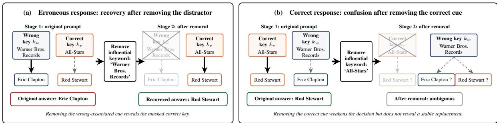

# When the Wrong Key Wins: Understanding and Detecting Hallucinations in LLMs

Xuhan Tong Jiawei Zhang University of Wisconsin–Madison

## Abstract

Large language models can hallucinate even when the knowledge required for a correct answer is already available. We study this failure through a latent-key view of inference, where answer selection depends on competition among associations acquired during pretraining. We show that model predictions can be highly sensitive to individual query keywords, that these influential keywords exhibit entity-specific binding, and that their efects are systematically shaped by pretraining frequency. Multiple bindings can also compete and exhibit higher-order interactions within the same query. Based on this mechanism, we introduce a two-stage keyword-perturbation method for hallucination detection. By removing influential keywords and measuring how the model reorganizes its prediction, the method distinguishes errors caused by misleading key associations from correct decisions supported by diagnostic evidence. Across multiple models and benchmarks, perturbation provides a strong and transferable detection signal, reaching .910 AUROC on probe-known ScientistQA. Finally, we extend the same probabilistic framework to four hallucination regimes: knowledge deficit, wrong knowledge, context distraction, and unstable inference. Their operational distributions across benchmarks provide diagnostic context for why diferent detector families succeed in diferent settings

## 1 Introduction

Lar e lan ua e models (LLMs) have achieved stron erformance across a broad ran e of tasks [O enAI et al., 2024, Gemini Team et al., 2025], but capability does not guarantee factual reliability. TruthfulQA shows that models can reproduce common human falsehoods [Lin et al., 2022], while HaluEval documents hallucinated content across knowledge-intensive question answering, dialogue, and summarization [Li et al., 2023]. This problem becomes more consequential as LLMs are embedded in tool-augmented and agentic workflows, including web search and external-service interaction [Nakano et al., 2022, Liu et al., 2023, Steinberger, 2026]. Reliably detecting hallucinations is therefore essential before model outputs trigger real-world actions.

One particularly dificult case is a factually incorrect answer produced with high confidence even though the required knowledge is behaviorally accessible. Existing detectors provide limited insight into such errors. Uncertainty-based methods use likelihood, self-evaluation, or disagreement across samples [Kadavath et al., 2022, Manakul et al., 2023, Farquhar et al., 2024], but systematic errors can be confident and repeatable. Hidden-state and attention-based detectors identify internal trajectories associated with incorrectness [Azaria and Mitchell, 2023, Chen et al., 2024, Du et al., 2024, Chuang et al., 2024, Binkowski et al., 2025], but a confidently reasoned wrong answer may follow a trajectory that is dificult to distinguish from that of a correct answer [Janiak et al., 2025]. Evidence-grounded methods verify generated claims against retrieved sources [Min et al., 2023], but depend on external evidence and assess support rather than the cause of the model’s decision. None of these approaches reveals which input evidence drives a confident, repeatable mistake.

Prior work relates these errors to conflicts between statistical associations and prompt-supported reasoning [McKenna et al., 2023, Sun et al., 2025]. However, these studies do not identify which keyword activates the competing association in an individual query or test how intervening on that keyword directionally changes answer selection. Most directly, Hu et al. [2026] formalize the phenomenon as inference misalignment and introduce ScientistQA to distinguish missing knowledge from failures to deploy accessible facts. Their analysis establishes the theoretical setting and demonstrates the phenomenon behaviorally, but leaves unresolved how competing associations are expressed and selected within a particular prompt.

  
Figure 1: Overview of two-stage keyword-perturbation detection. Starting from the model’s original response, we identify and remove the keyword that most strongly afects its relative preference between the two candidate answers, and then regenerate the answer from the perturbed prompt. (a): an erroneous response is driven by a misleading keyword association; removing that keyword suppresses the wrong key and reveals the correct answer. (b): a correct response relies on a diagnostic keyword; removing it weakens the correct key and leaves the model ambiguous rather than producing systematic recovery.

In this work, we study these questions through a latent-key view of inference and targeted keyword perturbations. We show that model predictions can depend strongly on entity–keyword bindings acquired during pretraining, that the strength of these bindings is systematically afected by exposure frequency, and that multiple bindings can compete within the same query. This motivates a two-stage perturbation detector (Figure 1): we first identify an influential association, then remove it and measure how the remaining evidence reorganizes the model’s prediction. Erroneous responses often exhibit a characteristic recovery trajectory in which suppressing a misleading key reveals a previously masked correct key, whereas perturbing an originally correct response more often produces ambiguity rather than systematic recovery. Across multiple models and benchmarks, this trajectory provides a strong and transferable signal for both hallucination detection and attribution.

Finally, we extend the same probabilistic framework beyond context-induced misrouting. We distinguish four broad hallucination regimes: knowledge-deficit errors, wrong-knowledge errors, context-distraction errors, and unstable- inference errors. These regimes correspond to diferent points of failure in the inference process and favor diferent diagnostic signals. Perturbation is particularly informative for context distraction, while uncertainty-based methods are better suited to unstable inference and evidence-based methods are most useful when the model’s underlying knowledge itself is unreliable. Their complementary behavior helps explain why no single hallucination detector performs uniformly well across benchmarks. Our main contributions are summarized as follows:

• Investigating why models hallucinate even when the relevant knowledge has been acquired (Section 2). We show that model predictions can depend strongly on particular keywords that are bound to question entities, and that these entity–keyword bindings systematically influence answer selection. Controlled experiments further demonstrate that binding strength is shaped by frequency imbalance during pretraining. We also characterize interactions among multiple bindings, including competitive and higher-order efects.

• Proposing a two-stage keyword-perturbation method for hallucination detection (Section 3). The method first identifies influential associations and then removes them to measure how the model reorganizes its prediction. Erroneous responses often exhibit a characteristic recovery trajectory in which suppressing a misleading key reveals a previously masked correct key, whereas perturbing an originally correct response more often leads to ambiguity rather than systematic recovery. This counterfactual trajectory provides both a detection signal and an interpretable view of the evidence drivin the model’s decision.

• Developing a taxonomy linking hallucination categories to suitable detectors (Section 4). We distinguish knowledge-deficit errors, wrong-knowledge errors, context-distraction errors, and unstable-inference errors, and characterize their empirical signatures across benchmarks. This framework explains why no single detector family performs best universally and why complementary signals can be combined.

## 2 Entity–Keyword Binding Efects

As a motivating example, consider a prompt asking the model to choose between Eric Clapton and Rod Stewart:

“This musician is associated with the record label Warner Bros. Records. However, this musician was not associated with the act All-Stars. Who is this person?”

Eric Clapton was associated with the All-Stars, whereas Rod Stewart was not; the explicit negative constraint therefore rules out Clapton. Nevertheless, the model selects Eric Clapton. One possible explanation is that the query activates several associations simultaneously. Although “Warner Bros. Records” is compatible with both musicians, its association with Clapton may be substantially stronger in pretraining, causing the model to retrieve the Clapton-related association even when another part of the prompt supports Stewart.

We study this mechanism progressively. We first formulate answer selection as competition between latent keys and show that individual query phrases can strongly alter candidate preference. We then test whether this sensitivity reflects entity-specific keyword bindings. Next, we manipulate pretraining frequency to test whether the prior strength of competing keys causally afects answer selection. Finally, we examine how several bindings interact when they are activated simultaneously.

## 2.1 Latent Key Model

We adopt the latent-key view of Hu et al. [2026]. Let $x _ { q }$ denote the query and � the remaining prompt context. We consider two com etin latent ke s: $k _ { r }$ , which retrieves the relation su ortin the correct answer $y _ { r }$ , and $k _ { w }$ , which retrieves a competing relation supporting the wrong answer $y _ { w }$ . The model prediction marginalizes over the latent ke ,

$$
P ( y \mid z , x _ { q } ) = \sum _ { k } { P ( k \mid z , x _ { q } ) P ( y \mid z , x _ { q } , k ) } .\tag{1}
$$

Our setting focuses on cases in which the relevant knowledge is available once the appropriate key has been selected, $P ( y _ { r } \mid z , x _ { q } , k _ { r } ) \approx 1$ and $P ( y _ { w } \mid z , x _ { q } , k _ { w } ) \approx 1$ , with little probability assigned to the opposite candidate under each key. Under this separation, the competition between the two answers is governed primarily by the competition between their corresponding keys.

The remaining question is therefore why a query activates one key more strongly than another. Let $P _ { \mathrm { p r e } }$ denote the pretraining distribution and define the prior probability of a key as $\pi ( k ) = P _ { \mathrm { p r e } } ( k )$

Proposition 1 (Key-odds decomposition). For afixed surrounding context $z ,$ the query-dependent contribution to key selection is determined by the relative pretraining association between the query and the competing keys:

$$
{ \frac { P ( y _ { r } \mid z , x _ { q } ) } { P ( y _ { w } \mid z , x _ { q } ) } } \propto { \frac { P _ { \mathrm { p r e } } ( k _ { r } , x _ { q } ) } { P _ { \mathrm { p r e } } ( k _ { w } , x _ { q } ) } } = { \frac { \pi ( k _ { r } ) } { \pi ( k _ { w } ) } } { \frac { P _ { \mathrm { p r e } } ( x _ { q } \mid k _ { r } ) } { P _ { \mathrm { p r e } } ( x _ { q } \mid k _ { w } ) } } .\tag{2}
$$

Proposition 1 gives a simple interpretation of answer selection. Once each key reliably retrieves its associated answer, the competition between $y _ { r }$ and $y _ { w }$ is governed primarily by which key receives greater weight. This preference has two components: the prior $\pi ( k )$ captures the overall strength of a key acquired during pretraining, while $P _ { \mathrm { p r e } } ( x _ { q } \mid k )$ captures how strongly the current query is associated with that key. A wrong answer can therefore arise when the wrong key is favored by its prior, by its binding to the current query, or by both.

Although these quantities are latent, the decomposition suggests a sequence of testable consequences. First, if the query–key association is concentrated in a small number of informative phrases, neutralizing such a phrase should produce a large change in answer preference, whereas perturbing a matched weakly associated span should have little efect. This establishes that answer selection is locally sensitive to particular query features. Second, local sensitivity alone does not establish binding: an influential phrase could simply be generically informative. If its efect is induced by an entity–keyword association, the same keyword should also be preferentially retrieved when conditioning on its associated entity rather than on the competing entity. Finally, the prior term predicts where these preferences can originate: increasing the pretraining frequency of one entity–keyword association, while keeping the evaluation query structure fixed, should shift answer preference toward the corresponding key. Section 2.2 tests these predictions in thi order. A formal derivation of Proposition 1 from the latent key–task framework is provided in Appendix B.1.

## 2.2 Empirical Verification

Section 2.1 shows that, once competing keys reliably retrieve their corresponding answers, answer selection depends jointly on the keys’ pretraining priors and their associations with the current query. In this subsection we test the three predictions of Equation 2 in turn.

I. Local Sensitivity The first prediction concerns the query-dependent association term in Equation 2. If this association is concentrated in a small number of attribute keywords, neutralizing one of them should produce a large change in the relative preference between $y _ { r }$ and $y _ { w } .$ . To measure this dependence, we score each candidate by its length-normalized conditional log-likelihood $\ell ( y \mid x )$ for the full prompt $\boldsymbol { x } = \left( z , x _ { q } \right)$ and define the wrong–right margin $m ( x ) = \ell ( y _ { w } \mid x ) - \ell ( y _ { r } \mid x )$ . For a uer ke word �, let � \ � denote the in ut obtained b re lacin the embeddin s of � with the model-wide mean embedding. We measure its perturbation efect by $u _ { k } = m ( x ) - m ( x \setminus k )$ .

We test local sensitivity on ScientistQA by matching query keywords to five profile at- tributes: award received, education, field, oc- cupation, and position held. For each matched keyword, we neutralize its embeddings while leaving all other tokens and positions un- changed. A nearby same-width non-attribute span serves as a control for intervention length and position. The analysis contains 454 er- roneous and 612 correct responses. Because a question may contain eligible keywords from multiple attribute families, the category- specific � values overlap and therefore sum to more than the Overall count. As shown in Table 1, individual attribute keywords ex- ert substantial control over answer preference. Thus, model decisions can be sharply altered

Table 1: Keyword perturbation efects and owner-aligned frequency diferences for erroneous and correct responses. Perturbation denotes the change in the wrong-versus-right answer margin after neutralizing the attribute keyword. Complete results and corresponding control values are reported in Appendix B.2.
<table><tr><td rowspan="2">Attribute</td><td colspan="3">Erroneous responses</td><td colspan="3">Correct responses</td></tr><tr><td>n</td><td>|uk|</td><td>|∆f|</td><td>n</td><td>|uk|</td><td>|∆f|</td></tr><tr><td>Overall</td><td>454</td><td>0.453</td><td>0.337</td><td>612</td><td>0.500</td><td>0.319</td></tr><tr><td>Award received</td><td>324</td><td>0.427</td><td>0.488</td><td>374</td><td>0.438</td><td>0.447</td></tr><tr><td>Education</td><td>144</td><td>0.648</td><td>0.287</td><td>221</td><td>0.723</td><td>0.337</td></tr><tr><td>Field</td><td>192</td><td>0.139</td><td>0.191</td><td>263</td><td>0.225</td><td>0.212</td></tr><tr><td>Occupation</td><td>79</td><td>0.104</td><td>0.081</td><td>148</td><td>0.215</td><td>0.146</td></tr><tr><td>Position held</td><td>63</td><td>0.556</td><td>0.212</td><td>96</td><td>0.636</td><td>0.213</td></tr></table>

by neutralizing a small part of the query. This result establishes local sensitivity but does not show whether the keyword is preferentially bound to one entity rather than being globally informative. The next experiment tests this entity-specific association.

II. Entity–Keyword Binding Equation 2 predicts that a query can favor one key over another when it has been more strongly associated with that key during pretraining. If a keyword is bound to one entity, this association should also be observable in the reverse direction: conditioning on that entity should make the keyword more likely to be retrieved than the competing entity.

We test this prediction with a separate free-generation assay over the same attributes used in the perturbation experiment. We prompt the model to describe each candidate with respect to an attribute compatible with both and measure the diference in exact keyword-mention frequency between them: $\Delta f = P ( k$ mentioned $\mid e _ { \mathrm { o w n e r } } ) - P ( k$ mentioned | $e _ { \mathrm { o t h e r } } )$ , where $e _ { \mathrm { o w n e r } }$ is the candidate whose profile supplies � and $e _ { \mathrm { o t h e r } }$ is the competing candidate. This behavioral quantity serves as a proxy for the relative query–key binding term in Equation 2.

Table 1 shows positive owner-aligned frequency diferences across all five attribute families. Averaged over attributes, Exact $\Delta f$ is 0.337 for erroneous responses and 0.319 for correct responses. Thus, an attribute shared by both candidates need not be neutral: conditioning on one candidate can retrieve its keyword more strongly than conditioning on the other. This asymmetry gives a concrete interpretation of the wrong keyword $k _ { w }$ introduced in Section 2.1: $k _ { w }$ is selected when a shared attribute is more strongly bound to the incorrect candidate and this association gives it greater weight than $k _ { r }$ in the current query. Once $k _ { w }$ dominates, the model can select the wrong answer even though the attribute itself is compatible with both candidates.

Importantly, both correct and erroneous responses exhibit strong bindings. Hallucination is therefore not caused by the mere existence of an entity–keyword association. In correct responses, the candidate-aligned binding does not outweigh the query’s logical evidence for $k _ { r } ,$ so the model still selects the correct answer. In erroneous responses, the binding favoring $k _ { w }$ instead dominates this evidence, preventing the logical constraint from correcting the prediction. The distinction lies in the balance between the competing signals, rather than in the absolute magnitude of a binding alone.

III. Pretraining Frequency Shapes Key Priors We next test the first factor in Equation 2: the prior ratio $\pi ( k _ { r } ) / \pi ( k _ { w } )$ which captures the relative prior strength of the competing keys. Since this prior is acquired from the pretraining distribution, the model predicts that increasing the frequency of one association during pretraining should systematically increase its influence at inference time.

We test this prediction with a con- trolled frequency–dose experiment. We construct 50 mirrored pairs of fictional people and facts, with each pair containing 4 shared facts and 1 constraint fact. We use a dose parameter � to control the relative pretraining frequency of one of the shared facts, and see how it afects the model’s preference; the assignment is reversed for the other person. For each pair, we com- pare the candidate-preference margin un- der the two competing facts. Let $x _ { w }$ and $x _ { r }$ denote the corresponding evaluation prompts. We report $u _ { \Delta } = m ( x _ { w } ) - m ( x _ { r } )$

Table 2: Frequency–dose response across models. Values are candidate- preference diferences $u _ { \Delta } ;$ larger values indicate stronger transfer of asym- metric exposure frequency into candidate preference. Values are means across random seeds 42, 43, and 44; complete per-seed results are reported in Appendix B.2.
<table><tr><td>Model  $d = 0$ </td><td colspan="4"> $d = . 2 5$   $d = . 5$   $d = . 7 5$   $d = 1$  Slope</td></tr><tr><td>Qwen2.5</td><td>.028 .055</td><td>.131</td><td>.200 .232</td><td>.221</td></tr><tr><td>Llama-3.2</td><td>.002 .013</td><td>.014 .024</td><td>.064</td><td>.054</td></tr><tr><td>Ministral-3</td><td>.013 .059</td><td>.095</td><td>.285 .564</td><td>.531</td></tr></table>

and fit a linear slope across the five dose levels.

Table 2 shows this predicted dose-response pattern. As the dose increases, the mean preference diference rises across all three models, and the fitted slopes are also positive, meaning that increasing the pretraining frequency of an association systematically shifts later answer preference in its direction.

This experiment provides evidence consistent with the prior term in Equation 2. Together with the binding experiment above, the results suggest a two-factor account in which key selection depends jointly on howfrequent a key is and how strongly the current query is bound to that key.

## 2.3 Interactions among Multiple Keyword Bindings

Section 2.1 isolates a pair of competing keys to expose the central mechanism. Real prompts, however, can activate several entity–keyword associations simultaneously. In the motivating example, diferent phrases may support diferent latent keys, and the efect of one keyword may depend on whether another remains present. We therefore enumerate the complete perturbation factorial over the candidate keywords in ScientistQA. This allows us to distinguish four broad pairwise patterns. Two keywords compete when their signed perturbation efects push answer preference in opposite directions; synergy and redundancy capture consistent non-additive interactions. We additionally report higher-order mass: the share of non-additive interaction strength attributable to combinations of at least three keywords, which describes where the interaction strength comes from.

Table 3 shows that keyword efects are not independent. Competition occurs in 19.3% of keyword pairs for erroneous responses, compared with 13.7% for correct responses. Redundancy (9.2% versus 9.5%) and synergy (0.6% versus 0.7%) are nearly unchanged, while Other accounts for 70.9% and 76.1% of pairs, respectively. Higher-order interaction mass is substantial in both groups.

These results complete the mechanism developed in this section. Pretraining creates keys with diferent prior strengths, queries bind asymmetrically to these keys, and several bindings can be activated together at inference time. First, the higher competition rate among erroneous responses supports the central account of error: influential keywords more often favor opposing answers, and an error occurs when their combined influence makes $k _ { w }$ dominate $k _ { r }$ despite the correct answer remaining available. Second, the large Other category suggests that strong, structured efects are concentrated in a relativel small subset of ke word airs, consistent with the framework’s assum tion that answer selection is dominated by a few salient associations rather than every word in the query. Third, the substantial higher-order mass shows that these associations can also combine in ways that cannot be reduced to isolated or pairwise efects. Consequently, the absolute influence of one keyword cannot by itself identify hallucination: strong bindings occur in both correct and erroneous responses, whereas errors depend on which answers the influential keywords support and how their efects combine. Section 3 therefore uses the joint pattern of signed perturbation efects rather than perturbation magnitude alone.

Table 3: Keyword interaction structure in correct and erroneous responses. Pairwise percentages are computed within each question and then averaged, giving every question equal weight. Higher-order mass is the share of absolute interaction mass at order two or above attributable to combinations of at least three ke words. Com lete results are reported in Appendix B.3.
<table><tr><td>Subset</td><td>n</td><td>Pairs</td><td>Competition</td><td>Redundancy</td><td>Synergy</td><td>Other</td><td>Higher-order mass</td></tr><tr><td>Correct responses</td><td>612</td><td>2,347</td><td>13.7%</td><td>9.5%</td><td>0.7%</td><td>76.1%</td><td>28.5%</td></tr><tr><td>Erroneous responses</td><td>454</td><td>1,781</td><td>19.3%</td><td>9.2%</td><td>0.6%</td><td>70.9%</td><td>29.9%</td></tr></table>

## 3 Hallucination Detection via Keyword Perturbation

## 3.1 Mechanism

Section 2 showed that both correct and erroneous responses can depend strongly on entity–keyword bindings. A large perturbation efect alone is therefore insuficient to identify hallucination. The key diference lies in what happens afte the currently dominant association is removed.

Let $y _ { c }$ denote the candidate originally selected by the model and $y _ { a }$ the competing candidate. For the original prompt $x ,$ we define the chosen-versus-alternative margin $m ( x ) = \ell ( y _ { c } \mid x ) - \ell ( y _ { a } \mid x )$ . For a candidate keyword $k _ { i } ,$ we first neutralize its embeddings and measure how the current prediction changes. This first-stage intervention identifies keywords on which the selected answer strongly depends. Importantly, such a keyword may correspond either to $k _ { w }$ in an erroneous response or to $k _ { r }$ in a correct response; first-stage sensitivity alone therefore does not distinguish the two cases.

The distinction emerges after the influential keyword is removed. Consider first an erroneous response. Under the latent-key model of Section 2.1, the model answers incorrectly because a wrong keyword $k _ { w }$ dominates the correct keyword $k _ { r } ,$ even though the knowledge associated with $k _ { r }$ remains available. In the motivating example, “Warner Bros. Records” may activate the Clapton-associated keyword strongly enough to dominate the more diagnostic “All-Stars” relation. Perturbing or removing the former suppresses $k _ { w }$ , allowing the previously masked correct keyword $k _ { r }$ to become dominant. The model can therefore recover from $y _ { w }$ to $y _ { r }$ . Once the shortcut keyword has been removed, perturbing the remaining correct keyword should again produce a strong efect, because that keyword now governs the recovered prediction.

The behavior is diferent when the original response is correct. In this case, the model already selects the appropriate keyword $k _ { r }$ . Removing the keyword that supports $k _ { r }$ destroys the evidence responsible for the correct prediction, but need not reveal a comparably strong competing keyword. In the motivating example, after removing “All-Stars”, “Warner Bros. Records” may be compatible with both candidates without functioning as a decisive keyword. The model therefore becomes less certain about which candidate to select rather than undergoing the systematic keyword replacement observed in the erroneous case. Subsequent perturbations of the remaining keywords consequently produce a weaker or more difuse response.

This motivates a two-stage perturbation procedure. In the first stage, we perturb each candidate keyword and measure its efect on the original chosen-versus-alternative margin. For an influential keyword $k _ { i } ,$ , we then remove $k _ { i }$ from the prompt and repeat the perturbation analysis over the remaining keywords. The second stage therefore measures how the model reorganizes its evidence after one association has been removed.

This distinction is expected to be strongest when the relevant knowledge is already available to the model. In the knowledge-known regime, $P ( y _ { r } \mid x , k _ { r } )$ is concentrated on the correct answer. Thus, when removing $k _ { w }$ causes $k _ { r }$ to become dominant, the change in keyword selection produces an observable recovery toward $y _ { r }$ . When the knowledge is unavailable, increasing the preference for $k _ { r }$ need not reliably recover the correct answer, and the erroneous trajectory can resemble the confusion induced by removing � from an originally correct response. We therefore expect two-stage ke word erturbation to be articularl distin uishable for knowled e-known hallucinations, while its si nal becomes weaker as the mapping from the correct keyword to the correct answer becomes less reliable.

## 3.2 Detection Performance

We next test whether the two-stage perturbation signatures described above can reliably distinguish erroneous from correct responses. For each question, we extract features from both the original perturbations and the second-stage perturbations after removing an influential keyword, and train a classifier to predict whether the model’s original answer is correct. We evaluate the detector on ScientistQA, TriviaQA, GSM8K, and DROP using three model families. ScientistQA additionally provides a probe-known subset, in which the relevant knowledge is independently verified to be available to the model. This subset directly tests the regime predicted by the mechanism above: when the correct key reliably retrieves the correct answer, removing a misleading key should expose a particularly clear recovery trajectory. For the open-ended GSM8K and DROP benchmarks, we use an LLM to generate an alternative candidate answer so that the same paired-candidate perturbation procedure can be applied. Appendix C.3 details this candidate-construction process and evaluates a modified perturbation method that does not require a paired alternative.

To further evaluate generalization beyond the entities and relations seen in ScientistQA, we construct a new multi-domain extension covering athletes, musicians, and buildings. The extension follows the same paired-candidate construction as ScientistQA but draws questions from disjoint entity domains, providing a stricter test of whether a detector learns a transferable hallucination signal rather than memorizing entity-specific patterns. We train the detector only on ScientistQA, freeze all preprocessing and classifier parameters, and evaluate it directly on the new domains. We highlight three main findings (Table 4).

I. Perturbation provides strong and transferable signals. Exact perturbation performs strongly across models and benchmarks. With Llama, the detector reaches an AUROC of .910 on probe-known ScientistQA, .949 on TriviaQA, and .919 on DROP, while frozen transfer to our multi-domain extension reaches .931. Similar patterns hold for Mistral and Qwen, indicating that the perturbation signature is not specific to a single model family or entity domain.

The results also support the distinguishability mechanism developed above. On ScientistQA, performance is substantially stronger on the probe-known subset than on the full benchmark (.910 versus .794 for the Llama exact detector). When the relevant knowledge is available, removing a misleading association can expose a recoverable correct key, producing a characteristic second-stage trajectory. When such knowledge is weak or unavailable, this recovery becomes less reliable and the perturbation patterns of correct and erroneous responses become harder to distinguish. A stage-1-only ablation is provided in Appendix D.1.

II. When perturbation is weaker. The main exception is GSM8K, where exact perturbation reaches only about .740–.760 AUROC across the three models. This is consistent with the mechanism in Section 2.1: our method is most informative when the model’s error is driven by competition among a small number of localized input associations. In multi-step mathematical reasoning, however, failure may arise from distributed computation across many intermediate steps rather than from one dominant keyword binding. Removing a local span therefore need not produce the clear wrong-key suppression and correct-key recovery trajectory observed in knowledge-known factual errors.

III. Reducing the cost of perturbation. A limitation of exact two-stage perturbation is its computational cost. Exhaustively intervening on every candidate span and then repeating the perturbation after first-stage removal requires many forward passes per question. We therefore introduce two eficient screening strategies based on candidate- conditioned attention and input gradients. These signals are used to rank candidate spans before intervention, so that perturbation is performed only on the most promising spans. As shown in Table 10 in Appendix C.2, both screening strategies retain most of the performance of exhaustive perturbation across benchmarks and models. This suggests that the informative perturbation trajectory can be recovered without enumerating all possible spans. We provide the detailed algorithms and additional ablations in Appendix C.2.

Table 4: Hallucination-detection AUROC across method families and benchmarks using Meta-Llama-3.1-8B-Instruct. † indicates access to full scientist profiles after answer generation, ★ indicates the probe-known subset of ScientistQA, and “–” in the Transfer column indicates that frozen-parameter transfer evaluation is not applicable to the method.
<table><tr><td>Family</td><td>Method</td><td>ScientistQA* ScientistQA TriviaQA GSM8K DROP Transfer</td><td></td><td></td><td></td><td></td><td></td></tr><tr><td rowspan="3">Perturbation</td><td>Ours (Exact)</td><td>.910</td><td>.794</td><td>.949</td><td>.747</td><td>.919</td><td>.931</td></tr><tr><td>Ours (Attention)</td><td>.906</td><td>.797</td><td>.946</td><td>.743</td><td>.915</td><td>.922</td></tr><tr><td>Ours (Gradient)</td><td>.905</td><td>.790</td><td>.943</td><td>.743</td><td>.915</td><td>.928</td></tr><tr><td rowspan="3"></td><td>Representation Aiersilan-style</td><td>.730</td><td>.646</td><td>.873</td><td>.806</td><td>.826</td><td>.753</td></tr><tr><td>SAPLMA</td><td>.671</td><td>.657</td><td>.840</td><td>.719</td><td>.869</td><td>.612</td></tr><tr><td>ICR Probe</td><td>.573</td><td>.569</td><td>.726</td><td>.707</td><td>.837</td><td>.563</td></tr><tr><td rowspan="3">Uncertainty</td><td>SelfCheckGPT</td><td>.593</td><td>.580</td><td>.747</td><td>.790</td><td>.765</td><td>一</td></tr><tr><td>SeSE</td><td>.560</td><td>.552</td><td>.705</td><td>.632</td><td>.749</td><td>一</td></tr><tr><td>Semantic Entropy</td><td>.518</td><td>.528</td><td>.708</td><td>.503</td><td>.752</td><td>一</td></tr><tr><td rowspan="2">Evidence</td><td>MiniCheck (unilateral)</td><td>.717†</td><td>.809†</td><td>.658</td><td>.558</td><td>.604</td><td></td></tr><tr><td>MiniCheck (contrastive)</td><td>.926†</td><td>.987†</td><td>.823</td><td>.506</td><td>.526</td><td>一</td></tr></table>

## 4 Hallucination Regimes and Detector Complementarity

The previous sections focused on one specific failure mechanism: the model possesses the relevant knowledge, but a competing entity–keyword association causes inference to select the wrong key. Keyword perturbation is particularly efective in this regime. However, Table 4 also shows that no detector family dominates across all benchmarks. In particular, representation- and uncertainty-based detection are stronger than perturbation on GSM8K, while evidence- based verification becomes highly competitive when explicit reference information is available. We argue that this variation follows naturally from the probabilistic framework introduced in Section 2.1. Diferent hallucinations correspond to failures at diferent components of the same inference process, and diferent detectors observe diferent components of that process.

## 4.1 A Probabilistic Taxonomy of Hallucination Regimes

Recall the latent-key decomposition in Equation 1–2. From an empirical perspective, the four regimes difer in which probability is responsible for the error and therefore in which detector can most directly expose it.

1. Knowledge-deficit errors. Even under the correct key, the answer remains difuse, $P ( y _ { r } \mid z , x _ { q } , k _ { r } ) \approx P ( y _ { w } \mid$ $z , x _ { q } , k _ { r } )$ . The resulting variation across outputs or internal trajectories is most naturally captured by uncertainty- and representation-based detectors; reliable external evidence can additionally expose a missing fact when one can be supplied.

2. Wrong-knowledge errors. The model concentrates on an incorrect association or computation, $P ( y _ { w } \mid z , x _ { q } , k _ { r } )$ ≫ $P ( y _ { r } \mid z , x _ { q } , k _ { r } )$ . Since this error can remain confident and self-consistent, uncertainty is weak; comparison with external evidence is the most direct detector.

3. Context-distraction errors. The correct-key answer is reliable, $P ( y _ { r } \mid z , x _ { q } , k _ { r } ) \approx 1$ , but the context makes a competing key more probable, $P ( k _ { w } \mid z , x _ { q } ) > P ( k _ { r } \mid z , x _ { q } )$ . Perturbation-based detection is therefore best suited to localized distractions, whereas representation-based signals can be preferable when the interference is distributed across several reasoning steps.

4. Unstable-inference errors. The posterior over competing keys or reasoning trajectories remains difuse, $P ( k _ { i } \mid$ $z , x _ { q } ) \approx P ( k _ { j } \mid z , x _ { q } )$ for plausible alternatives, so small changes in sampling or intermediate computation can change the final answer. The resulting disagreement and internal variation are most directly captured by uncertainty- and representation-based detectors.

We use this taxonomy as a diagnostic operational framework rather than as a direct estimator of latent causal mechanisms. The mechanisms may overlap; for the analysis below, each response is assigned to one operational regime using an independent capability probe and repeated generations (Appendix E). The label records the dominant observed failure pattern rather than a uniquely identified cause.

Table 5: Percenta e distribution of mutuall exclusive o erational hallucination labels across benchmarks. Because probe construction and assignment rules difer by benchmark, percentages are diagnostic and are not strictly comparable estimates of latent mechanism prevalence. Percentages may not sum to 100% because the small Unclassified category is omitted; complete counts including this category are reported in Appendix Table 26.
<table><tr><td>Category</td><td>Scientist</td><td>Scientist*</td><td>TriviaQA</td><td>GSM8K</td><td>DROP</td></tr><tr><td>Wrong knowledge</td><td>5.40%</td><td>0.00%</td><td>47.60%</td><td>7.20%</td><td>8.60%</td></tr><tr><td>Knowledge deficit</td><td>42.95%</td><td>14.57%</td><td>37.40%</td><td>21.00%</td><td>24.00%</td></tr><tr><td>Context distract</td><td>34.71%</td><td>56.95%</td><td>11.20%</td><td>47.10%</td><td>57.00%</td></tr><tr><td>Unstable inference</td><td>15.29%</td><td>26.05%</td><td>2.40%</td><td>20.00%</td><td>9.80%</td></tr></table>

## 4.2 Benchmark Classification

Table 5 summarizes the frequencies of the operational regime labels across the five benchmark populations. These frequencies provide diagnostic context for the detector rankings in Table 4, and here we highlight two representative cases.

Cross-benchmark caveat. The percentages should not be interpreted as strictly comparable estimates of the prevalence of latent mechanisms across datasets. Probe construction and the corresponding operational decision rules difer by benchmark (Appendix E.1); the table is intended to characterize within-benchmark behavioral signatures and support qualitative, rather than cardinal, cross-benchmark comparisons.

The clearest comparison is within ScientistQA. In the probe-known subset, context distraction accounts for 56.95% of errors. Our framework redicts that erturbation should be articularl efective in this re ime because it directl tests whether a localized competing association controls the answer. Consistent with this prediction, exact perturbation reaches .910 AUROC and is the strongest method that does not access full scientist profiles after generation. Full ScientistQA instead contains substantially more knowledge-deficit errors (42.95%) and fewer context-distraction errors (34.71%), so the perturbation signal is expected to weaken; its AUROC indeed falls to .794. Nevertheless, context distraction still constitutes a large share of the benchmark, and the perturbation family remains stronger than the representation- and uncertainty-based methods. Thus, the shift from the known subset to the full benchmark change the strength, but not the presence, of the localized dependence captured by perturbation.

GSM8K provides the complementary case. Knowledge deficit (21.00%) and unstable inference (20.00%) together account for 41.00% of errors, nearly matching the 47.10% attributed to context distraction. The framework therefore predicts strong representation and uncertainty signals, as confirmed by the .806 AUROC of Aiersilan-style detection and the .790 AUROC of SelfCheckGPT. At the same time, the substantial context-distraction component leaves a clear perturbation signal (.747 AUROC). Because these detector families target the two major components of the error distribution, their signals should be complementary. Both combining it with representations and combining it with uncertainty improves performance (.821 AUROC). The fusion results therefore support the central prediction of the taxonomy: a benchmark containing multiple failure regimes is better covered by combining their corresponding signals than by any single detector family. Detailed results are reported in Table 26 in Appendix E.

## 5 Conclusion

This work examined hallucinations that arise when models fail to use accessible knowledge correctly. We showed that answer selection can depend on entity–keyword bindings shaped by pretraining frequency, and that multiple bindings exhibit competitive and higher-order interactions. Based on this mechanism, we introduced a two-stage keyword-perturbation detector that first identifies and removes an influential keyword and then measures how the remaining evidence reorganizes the model’s prediction. The resulting recovery trajectory supports both hallucination detection and local attribution, eneralizes across models and benchmarks, and transfers to unseen entit domains. Our results also show that this advanta e is re ime-de endent, and hallucination detection should be matched to the underlying regime rather than treated as a uniform prediction problem.

## AI Use Statement

In this work, we used generative AI tools to generate synthetic examples for our multi-domain dataset, to create and modif scientific fi ures identif and summarize relevant literature source and search for information and edit the manuscript to improve readability. We have reviewed all AI-assisted work. In particular, AI-generated data were reviewed and filtered before being included in the final dataset, and AI-assisted literature search and manuscript edits were inde endentl checked b the authors. We have not used enerative AI tools to develo theoretical models or conceptual frameworks, formulate mathematical claims, design research methodology or experiments, implement methods, or interpret experimental results; the remaining required-disclosure tasks are not applicable to this work. We take responsibility for the final content of this work, including text, claims, or artifacts produced with the aid of generative AI.

## Reproducibility Statement

To support reproducibility, Appendix B.1 states the assumptions and provides the complete derivation of Proposition 1. Appendix B.2 specifies the natural-data perturbation operator, matched controls, and keyword-matching rules, and reports the frequency–dose construction, training settings, random seeds, and complete results underlying the main binding analyses; definitions for the interaction analysis are provided in Appendix B.3. Appendix C documents the evaluated checkpoints, detector features, screening procedures, classifier hyperparameters, data splits, frozen-transfer protocol, and full per-model metrics, while Appendix C.3 reports the open-ended control. Finally, Appendix E describes the regime-assignment procedure, and Table 26 reports the complete benchmark counts. Throughout the appendix, we provide the sample sizes, random seeds, and evaluation protocols for experiments conducted with the named public model checkpoints and benchmarks.

## References

Aizierjiang Aiersilan. Hallucination is linearly decodable from mid-layer hidden states in quantized LLMs. arXiv preprint arXiv:2606.02628, 2026. doi: 10.48550/arXiv.2606.02628. URL https://arxiv.org/abs/2606.02628.

Amos Azaria and Tom Mitchell. The internal state of an LLM knows when it’s lying. In Findings ofthe Associationfor Computational Linguistics: EMNLP 2023, pages 967–976, 2023. doi: 10.18653/v1/2023.findings-emnlp.68. URL https://aclanthology.org/2023.findings-emnlp.68/.

Jakub Binkowski, Denis Janiak, Albert Sawczyn, Bogdan Gabrys, and Tomasz Kajdanowicz. Hallucination detection in LLMs using spectral features ofattention maps. In Proceedings ofthe 2025 Conference on Empirical Methods in Natural Language Processing, pages 24354–24385, 2025. URL https://aclanthology.org/2025.emnlp-main.1239/.

Mohamed Aly Bouke. Detecting hallucinations in retrieval-augmented generation through grounding-aware sensitivity by perturbation (GASP). arXiv preprint arXiv:2607.04223, 2026. URL https://arxiv.org/abs/2607.04223.

Chao Chen, Kai Liu, Ze Chen, Yi Gu, Yue Wu, Mingyuan Tao, Zhihang Fu, and Jieping Ye. INSIDE: LLMs’ internal states retain the power of hallucination detection. In The Twelfth International Conference on Learning Representations, 2024. URL https://openreview.net/forum?id=Zj12nzlQbz.

Jiahao Cheng, Tiancheng Su, Jia Yuan, Guoxiu He, Jiawei Liu, Xinqi Tao, Jingwen Xie, and Huaxia Li. Chain-of-thought prompting obscures hallucination cues in large language models: An empirical evaluation. In Findings of the Association for Computational Linguistics: EMNLP 2025, pages 1272–1305, 2025. URL https://aclanthology. org/2025.findings-emnlp.67/.

Yung-Sung Chuang, Linlu Qiu, Cheng-Yu Hsieh, Ranjay Krishna, Yoon Kim, and James R. Glass. Lookback lens: Detecting and mitigating contextual hallucinations in large language models using only attention maps. In Proceedings of the 2024 Conference on Empirical Methods in Natural Language Processing, a es 1419–1436, 2024. doi: 10.18653/v1/2024.emnlp-main.84. URL https://aclanthology.org/2024.emnlp-main.84/.

Benjamin Cohen-Wang, Harshay Shah, Kristian Georgiev, and Aleksander Madry. ContextCite: Attributing model generation to context. In Advances in Neural Information Processing Systems, volume 37, pages 95764–95807, 2024. URL https://openreview.net/forum?id=7CMNSqsZJt.

Xuefeng Du, Chaowei Xiao, and Yixuan Li. HaloScope: Harnessing unlabeled LLM generations for hallucination detection. In Advances in Neural Information Processing Systems, volume 37, pages 102948–102972, 2024. URL https://proceedings.neurips.cc/paper\_files/paper/2024/hash/ ba92705991cfbbcedc26e27e833ebbae-Abstract-Conference.html.

Sebastian Farquhar, Jannik Kossen, Lorenz Kuhn, and Yarin Gal. Detecting hallucinations in large language models using semantic entropy. Nature, 630(8017):625–630, 2024. doi: 10.1038/s41586-024-07421-0. URL https://www.nature.com/articles/s41586-024-07421-0.

Gemini Team, Rohan Anil, Sebastian Borgeaud, Jean-Baptiste Alayrac, Jiahui Yu, Radu Soricut, Johan Schalkwyk, Andrew M. Dai, Anja Hauth, Katie Millican, et al. Gemini: A family of highly capable multimodal models. arXiv preprint arXiv:2312.11805, 2025. URL https://arxiv.org/abs/2312.11805.

Yangfan Hu, Xuhan Tong, Haoyue Bai, Xi Ding, Shashank Muralidhar Bharadwaj, Siyang Cao, Robert Nowak, and Jiawei Zhang. Understanding why language models hallucinate: Testing reasoning against priors. arXiv preprint arXiv:2607.00447, 2026. URL https://arxiv.org/abs/2607.00447.

Denis Janiak, Jakub Binkowski, Albert Sawczyn, Bogdan Gabrys, Ravid Shwartz-Ziv, and Tomasz Kajdanowicz. The illusion of progress: Re-evaluating hallucination detection in LLMs. In Proceedings of the 2025 Conference on Empirical Methods in Natural Language Processing, pages 34728–34745, 2025. URL https://aclanthology. org/2025.emnlp-main.1761/.

Saurav Kadavath, Tom Conerly, Amanda Askell, Tom Henighan, Dawn Drain, Ethan Perez, Nicholas Schiefer, Zac Hatfield-Dodds, Nova DasSarma, Eli Tran-Johnson, et al. Language models (mostly) know what they know. arXiv preprint arXiv:2207.05221, 2022. URL https://arxiv.org/abs/2207.05221.

Nikhil Kandpal, Haikang Deng, Adam Roberts, Eric Wallace, and Colin Rafel. Large language models struggle to learn long-tail knowledge. In Proceedings ofthe 40th International Conference on Machine Learning, volume 202 of Proceedings of Machine Learning Research, pages 15696–15707, 2023. URL https://proceedings.mlr. press/v202/kandpal23a.html.

Junyi Li, Xiaoxue Cheng, Xin Zhao, Jian-Yun Nie, and Ji-Rong Wen. HaluEval: A large-scale hallucination evaluation benchmark for large language models. In Proceedings of the 2023 Conference on Empirical Methods in Natural Language Processing, pages 6449–6464, 2023. doi: 10.18653/v1/2023.emnlp-main.397. URL https: //aclanthology.org/2023.emnlp-main.397/.

Ste hanie Lin Jacob Hilton and Owain Evans. TruthfulQA: Measurin how models mimic human falsehoods. In Proceedings of the 60th Annual Meeting of the Association for Computational Linguistics (Volume 1: Long Papers), pages 3214–3252, 2022. doi: 10.18653/v1/2022.acl-long.229. URL https://aclanthology.org/2022. acl-long.229/.

Xiao Liu, Hanyu Lai, Hao Yu, Yifan Xu, Aohan Zeng, Zhengxiao Du, Peng Zhang, Yuxiao Dong, and Jie Tang. WebGLM: Towards an eficient web-enhanced question answering system with human preferences. arXiv preprint arXiv:2306.07906, 2023. URL https://arxiv.org/abs/2306.07906.

Jinyuan Luo, Zhen Fang, Yixuan Li, Seongheon Park, and Ling Chen. Shaking to reveal: Perturbation-based detection of LLM hallucinations. arXiv preprint arXiv:2506.02696, 2025. URL https://arxiv.org/abs/2506.02696.

Alex Mallen, Akari Asai, Victor Zhong, Rajarshi Das, Daniel Khashabi, and Hannaneh Hajishirzi. When not to trust language models: Investigating efectiveness of parametric and non-parametric memories. In Proceedings ofthe 61st Annual Meeting ofthe Associationfor Computational Linguistics (Volume 1: Long Papers), a es 9802–9822, 2023. doi: 10.18653/v1/2023.acl-long.546. URL https://aclanthology.org/2023.acl-long.546/.

Potsawee Manakul, Adian Liusie, and Mark J. F. Gales. SelfCheckGPT: Zero-resource black-box hallucination detection for generative large language models. In Proceedings ofthe 2023 Conference on Empirical Methods in Natural Language Processing, pages 9004–9017, 2023. doi: 10.18653/v1/2023.emnlp-main.557. URL https: //aclanthology.org/2023.emnlp-main.557/.

Nick McKenna, Tianyi Li, Liang Cheng, Mohammad Javad Hosseini, Mark Johnson, and Mark Steedman. Sources of hallucination by large language models on inference tasks. arXiv preprint arXiv:2305.14552, 2023. URL https://arxiv.org/abs/2305.14552.

Sewon Min, Kalpesh Krishna, Xinxi Lyu, Mike Lewis, Wen-tau Yih, Pang Koh, Mohit Iyyer, Luke Zettlemoyer, and Hannaneh Hajishirzi. FActScore: Fine-grained atomic evaluation of factual precision in long form text generation. In Proceedings ofthe 2023 Conference on Empirical Methods in Natural Language Processing, pages 12076–12100, 2023. doi: 10.18653/v1/2023.emnlp-main.741. URL https://aclanthology.org/2023.emnlp-main.741/.

Reiichiro Nakano, Jacob Hilton, Suchir Balaji, Jef Wu, Long Ouyang, Christina Kim, Christopher Hesse, Shantanu Jain, Vineet Kosaraju, William Saunders, et al. WebGPT: Browser-assisted question-answering with human feedback. arXiv preprint arXiv:2112.09332, 2022. URL https://arxiv.org/abs/2112.09332.

OpenAI, Josh Achiam, Steven Adler, Sandhini Agarwal, Lama Ahmad, Ilge Akkaya, Florencia Leoni Aleman, Diogo Almeida, Janko Altenschmidt, Sam Altman, et al. GPT-4 technical re ort. arXiv preprint arXiv:2303.08774, 2024. URL https://arxiv.org/abs/2303.08774.

Peter Steinberger. Introducing OpenClaw. OpenClaw Blog, 2026. URL https://openclaw.ai/blog/ introducing-openclaw. Accessed: 2026-04-22.

Yiyou Sun, Yu Gai, Lijie Chen, Abhilasha Ravichander, Yejin Choi, Nouha Dziri, and Dawn Song. Why and how LLMs hallucinate: Connecting the dots with subsequence associations. In Advances in Neural Information Processing Systems, volume 38, 2025. URL https://arxiv.org/abs/2504.12691.

Liyan Tang, Philippe Laban, and Greg Durrett. MiniCheck: Eficient fact-checking of LLMs on grounding documents. In Proceedings ofthe 2024 Conference on Empirical Methods in Natural Language Processing, pages 8818–8847, 2024. doi: 10.18653/v1/2024.emnlp-main.499. URL https://aclanthology.org/2024.emnlp-main.499/.

Dongxu Zhang, Varun Gangal, Barrett Martin Lattimer, and Yi Yang. Enhancing hallucination detection through perturbation-based synthetic data generation in system responses. In Findings ofthe Associationfor Computational Linguistics: ACL 2024, pages 13321–13332, 2024. doi: 10.18653/v1/2024.findings-acl.789. URL https: //aclanthology.org/2024.findings-acl.789/.

Xiao Zhang, Miao Li, and Ji Wu. Co-occurrence is not factual association in language models. arXiv preprint arXiv:2409.14057, 2025a. URL https://arxiv.org/abs/2409.14057.

Zhenliang Zhang, Xinyu Hu, Huixuan Zhang, Junzhe Zhang, and Xiaojun Wan. ICR probe: Tracking hidden state dynamics for reliable hallucination detection in LLMs. In Proceedings of the 63rd Annual Meeting of the Association for Computational Linguistics (Volume 1: Long Papers), pages 17985–18001, 2025b. URL https://aclanthology.org/2025.acl-long.880/.

Xingtao Zhao, Hao Peng, Dingli Su, Xianghua Zeng, Chunyang Liu, Jinzhi Liao, and Philip S. Yu. SeSE: Black- box uncertainty quantification for large language models based on structural information theory. arXiv preprint arXiv:2511.16275, 2026. doi: 10.48550/arXiv.2511.16275. URL https://arxiv.org/abs/2511.16275. Accepted at the Conference on Uncertainty in Artificial Intelligence (UAI).

## A Related Work

Hallucination detection from confidence and output variation. One major line of work treats hallucination as uncertainty in the model’s output distribution. Token likelihood, perplexity, and verbalized or elicited self- evaluation—includin �(True)—ask whether the model assi ns low confidence to its own answer [Kadavath et al., 2022]. Sampling-based methods instead test whether repeated generations agree. SelfCheckGPT compares a response with stochastic samples without requiring an external knowledge base [Manakul et al., 2023], while semantic entropy aggregates probability mass over semantically equivalent answers so that paraphrastic variation is not mistaken for e istemic uncertaint [Far uhar et al., 2024]. These a roaches are owerful for confabulations, but their si nal is intrinsically limited for systematic errors: a model can repeatedly produce the same wrong answer with high likelihood. This distinction is explicit in the scope of semantic entropy, which targets arbitrary, sample-unstable confabulations rather than every kind of factual error. Our setting centers precisely on the complementary case in which the relevant knowledge is accessible but a statistically salient prompt association consistently dominates the correct constraint. Hence the relevant question is not only whether the model is uncertain, but which input evidence its wrong preference depends on.

Detection from hidden states and attention. White-box detectors exploit information that may be visible internally even when output confidence is misleading. Early probing work showed that classifiers over hidden activations can distinguish true from false statements [Azaria and Mitchell, 2023]. INSIDE measures consistency among sampled answers in representation space [Chen et al., 2024]; HaloScope learns a truthfulness detector from unlabeled model generations [Du et al., 2024]; and ICR Probe models how residual-stream updates evolve across layers rather than reading a single static activation [Zhang et al., 2025b]. Attention-based methods provide a diferent view. Lookback Lens predicts contextual hallucination from the ratio of attention paid to the source context versus generated tokens [Chuang et al., 2024], whereas LapEigvals uses spectral features of attention maps [Binkowski et al., 2025]. These methods establish that error information is encoded in re resentations and information-flow atterns. However, an internal state that is predictive of error does not by itself identify the input span responsible for the current decision, and attention weight is not a counterfactual efect. Our perturbation signature instead measures how the answer preference changes when individual keyword spans are neutralized or replaced, retaining both span identity and efect direction. The resulting object is simultaneously a detection feature and a local test of evidence dependence.

Recent evaluation work also cautions that strong in-domain detector scores need not imply robust error understanding. Apparent progress can be inflated by lexical correctness labels or response-length artifacts [Janiak et al., 2025], and supervised probes can exploit domain-specific regularities. We therefore use cross-dataset and frozen-transfer experiments to test whether a perturbation signature captures a reusable dependence pattern rather than merely dataset format. GSM8K provides a useful boundary condition: chain-of-thought prompting can obscure internal hallucination cues [Chen et al. 2025] and arithmetic errors need not be or anized around the entit –ke word associations that motivate our method. We consequently use GSM8K to evaluate the scope of the mechanism rather than as the benchmark from which the mechanism is inferred.

Perturbation-based detection and contextual attribution. The nearest methodological family measures a model’s response to counterfactual changes in its input. ContextCite learns a surrogate over subsets of the provided context to attribute a fixed generation to context units [Cohen-Wang et al., 2024]. GASP removes retrieved chunks and re-scores a fixed answer to detect whether RAG sentences depend on supporting evidence [Bouke, 2026]. These methods intervene on external context and localize support, but their main target is grounding: whether a generated claim is supported by retrieved or supplied passages. By contrast, our closed-book and prompt-conditioned setting contains both constraint-relevant and shortcut-inducing cues. A span may support the correct answer or push the model toward a wrong answer, so the sign of the margin change is essential; absolute sensitivity would conflate these two roles.

Two recent studies are particularly close to our approach. Shaking to Reveal perturbs prompts with dynamically generated noise and detects hallucinations from changes in intermediate representations [Luo et al., 2025]. It establishes that perturbation sensitivity can separate correct and incorrect answers while focusing on representation instability rather than semantically meaningful culprit keywords or their relationship to pretraining frequency. Sun et al. propose a subsequence-association account in which hallucinatory associations dominate faithful ones and trace causal subsequences by evaluating hallucination probabilities across randomized contexts [Sun et al., 2025]. This account provides a close mechanistic foundation for our view. Building on these insights, we use targeted, signed, local keyword interventions as a detector across tasks and models, and test frequency-dependent entity–attribute binding with both natural and controlled data. This connects directional keyword dependence, error detection, and pretraining-frequency imbalance within one empirical framework.

Input perturbation at inference time difers from perturbation-based synthetic-data construction. HaluGen rewrites system responses to synthesize faithful and hallucinated training examples for a downstream classifier [Zhang et al., 2024], whereas our method estimates evidence dependence by perturbing the test prompt. More generally, deletion, neutralization, and replacement are not interchangeable interventions. Deletion can alter syntax, discourse structure, or the input distribution, whereas semantic neutralization attempts to preserve form while weakening the targeted association. We therefore treat agreement across operators as robustness evidence and report operator-specific failures rather than interpreting every change as causal identification.

Pretraining frequency, factual association, and shortcut selection. A substantial literature links factual recall to exposure during pretraining. Accuracy on factual questions rises with the number of relevant pretraining documents [Kandpal et al., 2023]; entity popularity similarly predicts whether parametric memory is reliable, with retrieval helping most on long-tail facts [Mallen et al., 2023]. These findings explain which facts are likely to be stored or recalled, but they do not by themselves explain why a model that can answer component probes correctly selects the wrong entity under a richer prompt. Our focus is therefore not raw rarity alone, but relative association strength among competing entity–keyword bindings.

Recent mechanistic work sharpens this distinction. Co-occurrence statistics can be learned more readily than abstract factual associations and can fail to transfer to reasoning settings [Zhang et al., 2025a]. The subsequence-association framework likewise traces dominant rom t–out ut associations back to the trainin cor us [Sun et al., 2025]. The latent key–task account of Hu et al. [2026] formalizes a closely related failure mode: pretraining-frequency imbalance increases the posterior weight of a shortcut path relative to a constraint-sensitive path, producing errors even when the relevant knowledge is accessible. The present work operationalizes that hypothesis at the input-span level. We test whether frequency changes the strength of entity–keyword binding, whether the same keywords directionally move the wron -answer mar in, and whether the resultin erturbation rofile redicts errors. This closes a a between corpus-level exposure results, mechanistic accounts of competing associations, and deployable hallucination detection.

## B Supplementary Material for Section 2

## B.1 Proof of Proposition 1

We derive Proposition 1 as a key-only specialization of the latent key–task framework of Hu et al. [2026]. Their framework models inference through a posterior over latent key–task pairs,

$$
P ( y \mid \tilde { z } ) = \sum _ { k \in \mathcal { K } , t \in \mathcal { T } } P ( k , t \mid \tilde { z } ) P ( y \mid \tilde { z } ; k , t ) ,\tag{3}
$$

with a pretraining prior

$$
\pi ( k , t ) = \pi ^ { ( k ) } ( k ) \pi ^ { ( t ) } ( t \mid k ) .\tag{4}
$$

In our setting, we write the full prompt as $\tilde { z } = ( z , x _ { q } )$ , where � denotes the fixed surrounding context and $x _ { q }$ denotes the query content whose association with the competing keys may vary.

Let $\left( k _ { r } , t _ { r } \right)$ denote the path associated with the correct answer $y _ { r }$ , and let $( k _ { w } , t _ { w } )$ denote the competing path associated with $y _ { w }$ . We assume that posterior mass outside these two paths is negligible. We further use the output-separation condition that the two paths induce distinct answers:

$$
P ( y _ { r } \mid z , x _ { q } ; k _ { w } , t _ { w } ) \ll 1 , \qquad P ( y _ { w } \mid z , x _ { q } ; k _ { r } , t _ { r } ) \ll 1 .\tag{5}
$$

As in the main text, we focus on the knowledge-available regime in which

$$
P ( y _ { r } \mid z , x _ { q } ; k _ { r } , t _ { r } ) \approx 1 , \qquad P ( y _ { w } \mid z , x _ { q } ; k _ { w } , t _ { w } ) \approx 1 .\tag{6}
$$

Under these conditions, the law of total probability gives

$$
P ( y _ { r } \mid z , x _ { q } ) \approx P ( k _ { r } , t _ { r } \mid z , x _ { q } ) P ( y _ { r } \mid z , x _ { q } ; k _ { r } , t _ { r } ) ,\tag{7}
$$

$$
P ( y _ { w } \mid z , x _ { q } ) \approx P ( k _ { w } , t _ { w } \mid z , x _ { q } ) P ( y _ { w } \mid z , x _ { q } ; k _ { w } , t _ { w } ) .\tag{8}
$$

Therefore,

$$
\frac { P ( y _ { r } \mid z , x _ { q } ) } { P ( y _ { w } \mid z , x _ { q } ) } \approx \frac { P ( k _ { r } , t _ { r } \mid z , x _ { q } ) } { P ( k _ { w } , t _ { w } \mid z , x _ { q } ) } \frac { P ( y _ { r } \mid z , x _ { q } ; k _ { r } , t _ { r } ) } { P ( y _ { w } \mid z , x _ { q } ; k _ { w } , t _ { w } ) } .\tag{9}
$$

By Equation 6, the second factor is approximately one, so

$$
\frac { P ( y _ { r } \mid z , x _ { q } ) } { P ( y _ { w } \mid z , x _ { q } ) } \approx \frac { P ( k _ { r } , t _ { r } \mid z , x _ { q } ) } { P ( k _ { w } , t _ { w } \mid z , x _ { q } ) } .\tag{10}
$$

$$
P ( k , t \mid z , x _ { q } ) = P ( k \mid z , x _ { q } ) P ( t \mid k , z , x _ { q } ) .\tag{11}
$$

Our analysis marginalizes task-level variation into the key-conditional prediction. Equivalently, within each activated key, the relevant task posterior is concentrated on its associated task, so that

$$
P ( t _ { r } \mid k _ { r } , z , x _ { q } ) \approx 1 , \qquad P ( t _ { w } \mid k _ { w } , z , x _ { q } ) \approx 1 .\tag{12}
$$

Hence,

$$
\frac { P ( k _ { r } , t _ { r } \mid z , x _ { q } ) } { P ( k _ { w } , t _ { w } \mid z , x _ { q } ) } \approx \frac { P ( k _ { r } \mid z , x _ { q } ) } { P ( k _ { w } \mid z , x _ { q } ) } .\tag{13}
$$

It remains to characterize the relative posterior of the two keys. By Bayes’ rule,

$$
P ( k \mid z , x _ { q } ) = \frac { P ( x _ { q } \mid z , k ) P ( k \mid z ) } { \sum _ { k ^ { \prime } } P ( x _ { q } \mid z , k ^ { \prime } ) P ( k ^ { \prime } \mid z ) } .\tag{14}
$$

Taking the ratio between the two activated keys eliminates the common normalization:

$$
\frac { P ( k _ { r } \mid z , x _ { q } ) } { P ( k _ { w } \mid z , x _ { q } ) } = \frac { P ( k _ { r } \mid z ) } { P ( k _ { w } \mid z ) } \frac { P ( x _ { q } \mid z , k _ { r } ) } { P ( x _ { q } \mid z , k _ { w } ) } .\tag{15}
$$

The surrounding context � is fixed across the two competing paths. We assume that this fixed context does not itself diferentially reweight the two activated keys. Their relative prior after conditioning on � therefore follows their pretraining key frequencies:

$$
\frac { P ( k _ { r } \mid z ) } { P ( k _ { w } \mid z ) } \propto \frac { \pi ( k _ { r } ) } { \pi ( k _ { w } ) } ,\tag{16}
$$

where $\pi ( k ) = P _ { \mathrm { p r e } } ( k )$

Unlike the fixed context, $x _ { q }$ is precisely the query-dependent evidence whose association with the competing keys we wish to characterize. The latent-key model assumes that this association is inherited from the corresponding pretraining co-occurrence statistics. Thus, for the fixed context considered here,

$$
{ \frac { P ( x _ { q } \mid z , k _ { r } ) } { P ( x _ { q } \mid z , k _ { w } ) } } \propto { \frac { P _ { \mathrm { p r e } } ( x _ { q } \mid k _ { r } ) } { P _ { \mathrm { p r e } } ( x _ { q } \mid k _ { w } ) } } .\tag{17}
$$

The proportionality absorbs factors contributed by the fixed surrounding context that do not vary with $x _ { q }$

Combining Equations 10, 13, 15, 16, and 17, we obtain

$$
{ \frac { P ( y _ { r } \mid z , x _ { q } ) } { P ( y _ { w } \mid z , x _ { q } ) } } \propto { \frac { \pi ( k _ { r } ) } { \pi ( k _ { w } ) } } { \frac { P _ { \mathrm { p r e } } ( x _ { q } \mid k _ { r } ) } { P _ { \mathrm { p r e } } ( x _ { q } \mid k _ { w } ) } } .\tag{18}
$$

Finally, using

$$
P _ { \mathrm { p r e } } ( k , x _ { q } ) = P _ { \mathrm { p r e } } ( k ) P _ { \mathrm { p r e } } ( x _ { q } \mid k ) = \pi ( k ) P _ { \mathrm { p r e } } ( x _ { q } \mid k ) ,\tag{19}
$$

Equation 18 is equivalently

$$
{ \frac { P ( y _ { r } \mid z , x _ { q } ) } { P ( y _ { w } \mid z , x _ { q } ) } } \propto { \frac { P _ { \mathrm { p r e } } ( k _ { r } , x _ { q } ) } { P _ { \mathrm { p r e } } ( k _ { w } , x _ { q } ) } } = { \frac { \pi ( k _ { r } ) } { \pi ( k _ { w } ) } } { \frac { P _ { \mathrm { p r e } } ( x _ { q } \mid k _ { r } ) } { P _ { \mathrm { p r e } } ( x _ { q } \mid k _ { w } ) } } ,\tag{20}
$$

which proves Proposition 1.

The proposition is conditional on the two-path, knowledge-available regime stated in the proof. In particular, it does not claim that pretraining co-occurrence is the only source of key preference. The fixed-context proportionalities in Equations 16 and 17 isolate the part of the posterior odds that changes with the query association; the empirical experiments below test the corresponding sensitivity, binding, and frequency predictions separately.

## B.2 Empirical Verification

## B.2.1 Local Sensitivity and Entity-Keyword Binding

Population and model. We use the frozen 1,084-item probe-known ScientistQA population. The model is NousResearch/Meta-Llama-3.1-8B-Instruct in bfloat16. Correctness is defined by the original exact-name generation and is fixed before any keyword matching or perturbation is scored. The full population contains 461 erroneous and 623 correct responses. Candidate scores are length-normalized conditional log likelihoods, and every efect is oriented using the wrong-minus-right margin $m ( x ) = \ell ( y _ { w } \mid x ) - \ell ( y _ { r } \mid x )$

Semantics-fixed target spans. Target construction uses profile/question lexical semantics and does not rank spans by their measured model efect. We parse both profiles, retain attribute values that distinguish one profile from the other, and search for conservative lexical matches in the final natural-language question. The five reported familie are award received, education, field, occupation, and position held. Matches may contain one to eight words; abstract attributes require full token-set coverage, while named values require at least 80% coverage and at least one informative non-generic token. When several values match the same token span, the most specific match is retained. Before requiring a control, this procedure yields 2,409 target records over all supported profile fields, of which 2,217 belong to the five prespecified families reported here.

Deterministic safe random-span controls. For each target, we require a non-target span with exactly the same tokenizer-token length. The eligible pool excludes every target span plus an eight-token guard band on either side, candidate-name and profile-value tokens, and relation, negation, or instruction words such as attended, awarded, never, choose, and answer. Control spans are selected without replacement, so the same span is never reused within a question. We divide the question into four relative-position bins and prefer a control from the target bin; when none exists, we use the closest available bin. Ties are ordered by a SHA-256 digest of the protocol version, question ID, target rank, and control-span ID. Thus the procedure is random with respect to surface order but fully deterministic and does not inspect model efects. Every output stores the target and control span IDs, token boundaries, text, and control-protocol version for audit.

The initial strict same-bin implementation removed many end-loaded questions, because the guard band could occupy the entire final bin. We therefore use the bin as a matching preference rather than an exclusion. This final safe-random-v2 rule retains 2,395 target–control records over all fields and 2,204 records in the five reported families, spanning 1,066 questions (454 erroneous and 612 correct). Three otherwise eligible questions have no safe span of the exact required token length; they are excluded rather than weakening the lexical or non-overlap constraints.

Target and control embeddings are independently replaced by the model-wide mean input embedding while all remaining token embeddings and positions are held fixed. For any span �, the signed neutralization efect is

$$
u _ { s } = m ( x ) - m ( x \setminus s ) .\tag{21}
$$

A positive value means that neutralization lowers the wrong-minus-right margin. Because this assay tests local dependence rather than direction, the table reports $\left| \bar { u } _ { s } \right| ;$ : the absolute value of the population-level signed efect, not the mean of per-span absolute efects. We first average spans within question, then questions within person group, and finally weight person groups equally. The paired target–control contrast is $\Delta u = \left| \bar { u } _ { k } \right| - \left| \bar { u } _ { \mathrm { c t r l } } \right|$ . Confidence intervals use 10,000 person-group bootstrap draws. For $\left| \bar { u } _ { s } \right|$ , draws are oriented by the sign of the observed signed mean before taking quantiles; an interval can therefore cross zero, as it should under a weak directional efect.

Local sensitivity does not by itself establish an entity-specific binding. We therefore freeze the natural-data keywords above and probe the reverse direction: whether conditioning on the keyword’s profile owner retrieves that keyword more often than conditioning on the competing person. For each keyword, four field-specific prompt templates separately query the owner and the other person. We draw five continuations per template with temperature 0.8, top- $p = 0 . 9 5$ , at most 32 new tokens, and sampling seed 42, giving 20 continuations per person and keyword.

An exact hit occurs when the normalized keyword string appears in the continuation. The primary owner-aligned statistic is

$$
\Delta f _ { k } = P ( k \mathrm { \ m e n t i o n e d } | e _ { \mathrm { o w n e r } } ) - P ( k \mathrm { \ m e n t i o n e d } | e _ { \mathrm { o t h e r } } ) .\tag{22}
$$

We additionally computed a token-overlap variant with a small set of field-specific equivalences, but use exact matching for the paper tables. The generation outputs were frozen before the safe-control revision; because that revision changes only the control spans, we reuse those outputs and restrict scoring to the 2,204 retained target IDs. Exact normalized-string hits are averaged within item and then within person group, with person groups weighted equally. The assay therefore covers exactly the same 454 erroneous and 612 correct items as the perturbation table, and its interval also use 10,000 person-group bootstrap draws.

Table 6: Attribute-keyword perturbation efects, deterministic safe random-span controls, and owner-aligned keyword retrieval frequencies. $\left| \bar { u } _ { k } \right|$ and $| \bar { u } _ { \mathrm { c t r l } } |$ are absolute values of group-averaged signed efects, and $\Delta u = \left| \bar { u } _ { k } \right| - \left| \bar { u } _ { \mathrm { c t r l } } \right|$ . The retrieval frequencies $f _ { \mathrm { o w n e r } }$ and $f _ { \mathrm { o t h e r } }$ condition on the keyword owner and the competing entity, respectively, with $\Delta f = f _ { \mathrm { o w n e r } } - f _ { \mathrm { o t h e r } }$ . Category-specific counts overlap because a question may contain keywords from multiple attribute families.
<table><tr><td>Attribute</td><td>n</td><td> $\left| \bar { u } _ { k } \right|$ </td><td> $| \bar { u } _ { \mathrm { c t r l } } |$ </td><td> $\Delta u$ </td><td> $f _ { \mathrm { o w n e r } }$ </td><td> $f _ { \mathrm { o t h e r } }$ </td><td> $\Delta f$ </td></tr><tr><td>Erroneous responses</td><td></td><td></td><td></td><td></td><td></td><td></td><td></td></tr><tr><td>Overall</td><td>454</td><td>.453</td><td>.037</td><td>+.416</td><td>.414</td><td>.078</td><td>.337</td></tr><tr><td>Award received</td><td>324</td><td>.427</td><td>.006</td><td>+.421</td><td>.492</td><td>.004</td><td>.488</td></tr><tr><td>Education</td><td>144</td><td>.648</td><td>.076</td><td>+.572</td><td>.312</td><td>.026</td><td>.287</td></tr><tr><td>Field</td><td>192</td><td>.139</td><td>.048</td><td>+.091</td><td>.519</td><td>.329</td><td>.191</td></tr><tr><td>Occupation</td><td>79</td><td>.104</td><td>.066</td><td>+.038</td><td>.198</td><td>.117</td><td>.081</td></tr><tr><td>Position held</td><td>63</td><td>.556</td><td>.136</td><td>+.420</td><td>.243</td><td>.031</td><td>.212</td></tr><tr><td colspan="8">Correct responses</td></tr><tr><td>Overall</td><td>612</td><td>.500</td><td>.000</td><td>+.499</td><td>.385</td><td>.065</td><td>.319</td></tr><tr><td>Award received</td><td>374</td><td>.438</td><td>.050</td><td>+.388</td><td>.453</td><td>.006</td><td>.447</td></tr><tr><td>Education</td><td>221</td><td>.723</td><td>.105</td><td>+.618</td><td>.351</td><td>.013</td><td>.337</td></tr><tr><td>Field</td><td>263</td><td>.225</td><td>.032</td><td>+.193</td><td>.509</td><td>.297</td><td>.212</td></tr><tr><td>Occupation</td><td>148</td><td>.215</td><td>.001</td><td>+.214</td><td>.231</td><td>.084</td><td>.146</td></tr><tr><td>Position held</td><td>96</td><td>.636</td><td>.001</td><td>+.635</td><td>.239</td><td>.026</td><td>.213</td></tr></table>

Results and interpretation. The safe controls behave as a genuine placebo: overall $| \bar { u } _ { \mathrm { c t r l } } |$ is .037 for erroneous responses and rounds to .000 for correct responses, compared with target efects of .453 and .500. Hence the target–control gaps are .416 and .499. Every family has a positive point-estimate gap, although the erroneous-response contrasts are smallest for occupation (.038) and field (.091). Consistent with that weakness, the orientation-adjusted interval for the erroneous occupation target crosses zero ([−.026, .224]); we do not treat that cell alone as conclusive evidence.

The reverse-direction assay is more uniformly entity-specific. Overall $\Delta f$ is .337 for errors and .319 for correct responses, and every family-specific 95% interval is above zero, including the weakest erroneous occupation cell ([.009, .154]). Thus the same phrases that locally afect candidate preference are preferentially retrieved from their profile owners, while the safe non-target spans have little aggregate efect. However, target sensitivity and owner alignment are both comparably strong for correct and erroneous responses. Binding strength alone is therefore not an error criterion; the relevant distinction is which candidate a cue supports and how several signed cue efects combine.

Table 7: Keyword perturbation efects and owner-aligned frequency diferences under the safe random-span control. Bracketed values are person-clustered bootstrap 95% confidence intervals based on 10,000 draws. Perturbation intervals are computed for the signed group mean and oriented by its observed sign; this is why an interval shown beside $\left| \bar { u } _ { k } \right|$ may cross zero.
<table><tr><td></td><td colspan="4">Erroneous responses</td><td colspan="4">Correct responses</td></tr><tr><td>Attribute</td><td>n</td><td></td><td> $\lvert \bar { u } _ { k } \rvert$ </td><td> $\Delta f$ </td><td>n</td><td> $\lvert \bar { u } _ { k } \rvert$ </td><td></td><td> $\Delta f$ </td></tr><tr><td>Overall</td><td></td><td></td><td></td><td>4540.453 [0.388, 0.524]0.337 [0.298, 0.376]]</td><td></td><td></td><td>|612 0.500 [0.443, 0.560] 0.319 [0.289, 0.351]</td><td></td></tr><tr><td></td><td></td><td></td><td></td><td>Award received 3240.427 [0.349, 0.507] 0.488 [0.428, 0.549]]</td><td></td><td></td><td></td><td>[374 0.438 [0.363, 0.513] 0.447 [0.393, 0.502]</td></tr><tr><td>Education</td><td></td><td></td><td></td><td>1440.648 [0.541, 0.759]0.287 [0.231, 0.342]</td><td></td><td></td><td></td><td>221 0.723 [0.637, 0.817] 0.337 [0.292, 0.383]</td></tr><tr><td>Field</td><td></td><td></td><td></td><td>192 0.139 [0.065, 0.217]0.191 [0.136, 0.246]</td><td></td><td></td><td></td><td>263 0.225 [0.139, 0.313] 0.212 [0.165, 0.259]</td></tr><tr><td>Occupation</td><td></td><td></td><td></td><td>79 0.104 [–0.026, 0.224] 0.081 [0.009, 0.154]</td><td></td><td></td><td></td><td>148 0.215 [0.127, 0.310] 0.146 [0.087, 0.208]</td></tr><tr><td>Position held</td><td></td><td></td><td></td><td>63 0.556 [0.380, 0.748]0.212 [0.149, 0.279]</td><td></td><td></td><td></td><td>960.636 [0.489, 0.795] 0.213 [0.154, 0.279]</td></tr></table>

## B.2.2 Pretraining Frequency–Dose Experiment

The natural-data assays establish association and directional sensitivity but cannot manipulate the exposure from which a binding is learned. We therefore construct 50 pairs of fictional people (100 entities) with synthetic names, institutions, awards, societies, journals, and archives. In an evaluation prompt, both biographies share an award fact, a society fact, and one institution cue, either � or �. They difer on two crossed facts: the right candidate has the queried positive fact and satisfies a negative constraint, whereas the competing candidate has the opposite pattern. The question is logically identical in the � and � conditions and the selected institution cue appears in both supplied biographies, so the cue is non-discriminative from the prompt alone.

At each dose � ∈ {0, .25, .5, .75, 1}, every person contributes $N = 4 0$ trainin sentences. The weak association occurs 0.05� times and the strong association occurs $( 0 . 0 5 + 0 . 6 5 d ) l$ � times; remaining sentences contain a neutral fact. Concretely, the right candidate receives weak � and strong � exposure, while the competing candidate receives strong � and weak � exposure. The assignment is therefore mirrored within every person pair. Forward forms (person followed by fact) and reverse forms (fact followed by person) alternate independently within each fact type, using four templates of each form. The 4,000-sentence corpus is shufled with the run seed. Dose changes the relative entity–institution exposure while keeping the people, total sentences per person, neutral-fact identity, and evaluation prompts fixed.

For every dose and seed, we reload the original checkpoint and fine-tune only the final four transformer blocks and final normalization layer for two epochs. We use AdamW with learning rate $1 0 ^ { - 4 }$ , zero weight decay, batch size 12, bfloat16, gradient clipping at 1.0, and a maximum training length of 64 tokens; the causal-language-model loss covers all non-padding tokens. We evaluate Qwen2.5-3B-Instruct, Llama-3.2-3B-Instruct, and Ministral-3-3B-Instruct-2512 with seeds 42, 43, and 44.

At evaluation, we score the complete candidate names by length-normalized conditional log likelihood and average the wrong-minus-right margin over both profile orders. Let $m _ { B }$ and $m _ { F }$ denote this margin when the shared query cue is � or �. The reported contrast is $u _ { \Delta } = m _ { B } - m _ { F } ;$ positive values mean that the cue trained more often with the competing candidate induces a larger wrong-candidate preference than the cue trained more often with the right candidate. We fit an ordinary least-squares slope over the five dose levels separately for each seed.

Table 8 gives every seed and the three-seed mean. At symmetric exposure $( d = 0 )$ , the mean contrasts are close to zero (.028, .002, and .013). At $d = 1$ , the rise to .232, .064, and .564 for Qwen, Llama, and Ministral, res ectivel . All nine model–seed slopes are positive, with seed-wise Spearman correlations from .6 to 1.0. The efect size is model dependent—the mean slope is .054 for Llama and .531 for Ministral—but the exposure direction is stable.

This is a controlled continued-training intervention, not a reconstruction of the unknown original pretraining corpus. Within that scope, reloading the same checkpoint at every dose and changing only the mirrored exposure schedule supports the causal claim that relative entity–keyword frequency can alter later candidate preference, as predicted for the key-prior term.

Table 8: Frequency–dose response across models. Values are candidate-preference diferences $u _ { \Delta } ;$ larger values indicate stronger transfer of asymmetric exposure frequency into candidate preference. Bold values are means across three random seeds; the smaller values to their right report seeds 42, 43, and 44 from top to bottom. The final column reports the seed-wise Spearman correlation $\rho$ between dose and candidate preference in the same order.
<table><tr><td>Model</td><td> $d = 0$ </td><td></td><td> $d = . 2 5$ </td><td> $d = . 5$ </td><td> $d = . 7 5$ </td><td> $d = 1$ </td><td> $\mathrm { S l o p e }$ </td><td></td><td> $\rho$ </td></tr><tr><td rowspan="2">Qwen2.5-3B</td><td></td><td>.022</td><td>.028 .055.050</td><td>.171 .131.073</td><td></td><td>.346</td><td>.286</td><td>.338</td><td>.9</td></tr><tr><td>.028.024 .039</td><td></td><td>.086</td><td>.149</td><td>.200.096</td><td>.232.199 .156</td><td>.210</td><td>.221.159 .165</td><td>1.0 1.0</td></tr><tr><td rowspan="2">Llama-3.2-3B</td><td></td><td>-.005</td><td>.008</td><td>.009</td><td></td><td>.009</td><td>.047</td><td>.042</td><td>1.0</td></tr><tr><td>.002.000</td><td></td><td>.013.029</td><td>.014.016</td><td>.024.029</td><td></td><td>.064.124</td><td>.054.099</td><td>.9</td></tr><tr><td rowspan="3">Ministral-3-3B .013 .020</td><td></td><td>.011</td><td>.003</td><td>.018</td><td></td><td>.033</td><td>.021</td><td>.020</td><td>.8</td></tr><tr><td></td><td>-.031</td><td>.074</td><td>.143 .095.121</td><td>.374</td><td></td><td>.589</td><td>.616</td><td>1.0</td></tr><tr><td>.050</td><td></td><td>.059.062 .042</td><td>.021</td><td>.285.202 .279</td><td>.564.398 .704</td><td></td><td>.531.359 .618</td><td>1.0 .6</td></tr></table>

## B.3 Interactions among Multiple Keyword Bindings

## B.3.1 Full-Factorial Interaction Atlas

We construct candidate cues only from the final ScientistQA question. Exact occurrences of profile attribute values are grounded to tokenizer spans, and explicit negation terms (not, never, nor, without, and neither) are added as separate logic cues. A fixed semantic priority favors logic terms, locally negated attributes, attributes owned by only one profile, prespecified field types, and more specific values. This ordering is fixed before any model efect is measured. Duplicate concepts and overlapping token spans are removed, and at most six cues are retained in question order.

For a question with � retained cues, we evaluate all $2 ^ { q }$ masks (at most 64) using the same model-wide mean-embedding neutralization and length-normalized wrong-minus-right margin as above. The frozen 1,084-item generation labels contain 623 correct and 461 erroneous responses. Eight erroneous items have an invalid candidate name; another 16 items have fewer than two usable cues (12 correct and four erroneous). The analysed atlas therefore contains 1,060 questions—611 correct and 449 erroneous—and 4,128 cue pairs (2,347 and 1,781, respectively).

Let $u ( S ) = m ( x ) - m ( x \setminus S )$ be the response when the cue set � is neutralized, with $u ( \emptyset ) = 0$ . For cues � and $j ,$ the local pair interaction is

$$
I _ { i j } ^ { \mathrm { l o c a l } } = u ( \{ i , j \} ) - u ( \{ i \} ) - u ( \{ j \} ) ,\tag{23}
$$

and its Banzhaf counterpart averages the same second diference over every background � that contains neither cue,

$$
I _ { i j } ^ { \mathrm { B } } = 2 ^ { - ( q - 2 ) } \sum _ { B \subseteq [ q ] \backslash \{ i , j \} } \left[ u ( B \cup \{ i , j \} ) - u ( B \cup \{ i \} ) - u ( B \cup \{ j \} ) + u ( B ) \right] .\tag{24}
$$

We also compute the exact Harsanyi dividend for every nonempty set,

$$
H ( S ) = \sum _ { T \subseteq S } ( - 1 ) ^ { | S | - | T | } u ( T ) .\tag{25}
$$

Higher-order mass is the absolute Harsanyi mass at orders three and above, divided by the absolute mass at all orders two and above.

The prespecified primary threshold is $\tau = . 1 0 ; . 0 5$ and .20 serve as sensitivity checks. A pair is competitive when its two single-cue efects have opposite signs and both exceed � in magnitude. Synergy requires two positive single-cue efects and both local and Banzhaf interactions above �; redundancy requires the corresponding interactions below −�. Requiring local and context-averaged interactions to agree avoids labeling an efect from one arbitrary background as robust non-additivity. All other pairs are labeled Other. Rates and higher-order mass are computed within question and then averaged, so every question has equal weight. Confidence intervals use 10,000 independent question-bootstrap draws within the correct and erroneous subsets.

At � = .10, competition occurs in 19.3% of pairs within erroneous questions and 13.7% within correct questions. The 5.5-point diference has a 95% bootstrap interval of [2.3, 8.7] points. Redundancy (9.2% versus 9.5%), synergy (0.6% versus 0.7%), and higher-order mass (29.9% versus 28.5%) do not show a comparable error-specific increase: their error-minus-correct intervals are [−2.8, 2.3], [−.7, .5], and [−1.1, 3.9] percentage points, respectively. The competition diference also remains positive at the two sensitivity thresholds: 26.6% versus 21.2% at � = .05 (diference 5.3 points, 95% CI [1.6, 9.0]) and 9.9% versus 6.4% at � = .20 (diference 3.6 oints, [1.2, 5.9]). The robust conclusion is therefore more specific than generic non-additivity: erroneous responses contain more strong, oppositely directed cue competition, not simply more interaction mass.

## B.3.2 Frozen Directional Confirmation

The factorial atlas uses likelihood efects on the full analysis population. We separately test whether opposite-sign cue pairs cause the predicted changes in free generation. Before examining confirmation outcomes, we reserve person groups by SHA-256 parity and use only the parity-one half. Within frozen generation errors, eligible pairs must have opposite signed single-cue efects with both magnitudes above .10. A deterministic rule maximizes the weaker absolute efect, then the stronger efect, with cue IDs as the final tie-break. This rule selects 92 questions before generation outcomes are inspected. One question lacks a valid non-overlapping matched control, leaving 91 questions; we do not relax the control rule to retain it.

For each question we evaluate seven conditions: no intervention, neutralizing the wrong-supporting cue, neutralizing the right-supporting cue, neutralizing both, and three width- and question-position-matched random controls. Each random control uses the exact tokenizer-token width of its target, cannot overlap any candidate cue or the other control, and is drawn from the same relative-position quintile when possible. Its RNG seed and token boundaries are fixed before generation. Each condition uses ten continuations at temperature .8 and at most 20 new tokens, and all seven conditions share a per-question sampling seed to make comparisons paired. Exact-name frequencies are averaged by question; 95% intervals use 10,000 question-bootstrap draws. Although Table 9 uses the shorthand “Remove,” the implementation uses the same mean-embedding neutralization as the factorial atlas.

Neutralizing the wrong-supporting cue raises exact right-answer frequency by 14.5 points (95% CI [11.0, 18.1]), whereas neutralizing the right-supporting cue lowers it by 22.5 points ([−28.4, −16.9]). Their directional contrast is 37.0 points ([30.3, 43.7]). Relative to its matched-random control, neutralizing the wrong-supporting cue yields a 14.4-point additional recovery ([9.8, 19.5]). These directionally opposed interventions validate the competition interpretation behaviorally rather than relying only on likelihood curvature. Joint neutralization does not itself repair the errors: �(right) is 25.9%, close to the 27.7% joint random control and below the 37.9% baseline. This further shows why unsigned deletion magnitude is insuficient: recovery depends on removing the cue that supports the wrong candidate while preserving the countervailing right-supporting cue.

Table 9: Answer probabilities under targeted keyword neutralization and matched random controls for a frozen confirmation set of 91 baseline errors. Person groups are reserved by SHA-256 parity before outcomes are inspected; among opposite-sign pairs with a minimum one-sided efect above 0.10, the pair with the strongest minimum efect is selected. Probabilities are exact-name frequencies over ten continuations (temperature 0.8; at most 20 new tokens). All conditions share a per-question seed. Placebo spans are fixed in advance, match exact token width and relative question-position quintile when feasible, and overlap neither candidate cues nor each other.
<table><tr><td>Intervention</td><td>P(right)</td><td>P(wrong)</td></tr><tr><td>None</td><td>37.9%</td><td>60.9%</td></tr><tr><td>Remove wrong-answer keyword</td><td>52.4%</td><td>44.7%</td></tr><tr><td>Remove correct-answer keyword</td><td>15.4%</td><td>83.5%</td></tr><tr><td>Remove both keywords</td><td>25.9%</td><td>70.5%</td></tr><tr><td>Matched random (wrong-answer side)</td><td>38.0%</td><td>60.1%</td></tr><tr><td>Matched random (correct-answer side)</td><td>32.5%</td><td>65.9%</td></tr><tr><td>Matched random (both sides)</td><td>27.7%</td><td>70.4%</td></tr></table>

## C Supplementary Material for Section 3

## C.1 Experiment Setup

Additional analyses below use the two-stage perturbation mechanism defined in Section 3.1. Unless otherwise stated, all quantities are computed from a frozen generation: labels indicate whether that generation is correct, and the two candidate strings are the generated answer and a benchmark-specific alternative. We use NousResearch/ Meta-Llama-3.1-8B-Instruct,

mistralai/Mistral-7B-Instruct-v0.3,

and Qwen/Qwen2.5-7B-Instruct, run in bfloat16 with their native chat templates. ScientistQA, TriviaQA, DROP, and multidomain generations and labels are model-specific. Consequently, the probe-known ScientistQA cohorts contain 1,077 Llama, 621 Mistral, and 1,204 Qwen items (335, 267, and 379 person groups, respectively), and the frozen multidomain target cohorts contain 477, 423, and 350 items. Each TriviaQA cohort contains 1,000 items; its natural correctness counts are 518, 421, and 538 for Llama, Mistral, and Qwen. DROP is balanced within model at 500 correct and 500 erroneous generations. The clean GSM8K stress test instead deliberately fixes the same 942 Llama-generated, parse-valid responses (471 correct and 471 erroneous) for all three scoring backbones, so diferences there isolate the scoring/representation backbone rather than generation quality. These population distinctions are important: the earlier fixed-Llama 1,084-item ScientistQA and 849-item multidomain audits reported later in this appendix are separate experiments and are not pooled with the model-specific matrix.

Candidate scoring and perturbation operator. For a prompt �, generated candidate $y _ { c }$ , and alternative $y _ { a } .$ , we score each candidate using its length-normalized conditional log likelihood,

$$
\ell ( y \mid x ) = { \frac { 1 } { \mid y \mid } } \sum _ { t = 1 } ^ { \mid y \mid } \log p ( y _ { t } \mid x , y _ { < t } ) , \qquad m _ { c } ( x ) = \ell ( y _ { c } \mid x ) - \ell ( y _ { a } \mid x ) .\tag{26}
$$

The candidate span inventory is a deterministic left-to-right partition of the input context into adjacent non-overlapping two-word spans; a final one-word span is retained when necessary. To neutralize a span, we replace the corresponding input-token embeddings by the model-wide mean embedding, without changing the positions or embeddings of the remaining tokens. $\operatorname { I f } x \ \backslash$ � denotes this intervention, the si ned first-sta e efect is

$$
u _ { s } = m _ { c } ( x ) - m _ { c } ( x \setminus s ) .\tag{27}
$$

Positive $u _ { s }$ means that the span supports the generated candidate relative to the alternative; negative $u _ { s }$ means that it supports the alternative.

Two-stage collection. At the first stage, exact selection evaluates Equation 27 for every candidate span. We retain the five spans with largest $\left| u _ { s } \right|$ and physically delete the strongest one from the text, collapsing excess whitespace and removing whitespace before punctuation. We then retokenize the resulting prompt and repeat the full span construction and erturbation rocedure. The five lar est second-sta e efects describe how candidate reference reor anizes after the dominant first-stage cue is absent. Candidate likelihoods continue to be evaluated for the original generated answer and the same alternative, so the two stages have a common orientation. Items with fewer than five spans are zero-padded only when the fixed-length feature vector is assembled.

Detection representation. Each item is represented by the same fixed 127-dimensional detector input for all models, benchmarks, and span-selection strategies. The representation has three components:

1. 47 scalar response features. For both candidates at stage one, we include the unperturbed score, the five score changes, their versions normalized by the magnitude of the unperturbed score, and summary statistics (maximum, minimum, mean absolute efect, standard deviation, and positive-efect fraction). For both candidates at stage two, we include the unperturbed score and five score changes. Three additional features measure the cross-stage change in the chosen score, alternative score, and their margin.

2. Four candidate-conditioned hidden-state blocks. At layer 16, we record the unperturbed final-answer-token state for the generated and alternative candidates. For each candidate we also compute an efect-weighted average hidden-state displacement over the five retained first-stage interventions. Each of these four blocks is standardized and projected to eight whitened principal components, giving 32 features.

3. Generated-answer state. We mean-pool the layer-14 states over the generated answer tokens, standardize the resulting vector, and retain 48 whitened principal components.

The scalar block is standardized but not projected. Thus the final dimension is 47 + 4 × 8 + 48 = 127. All scalers and PCA projections are fitted exclusively on the current training fold, or exclusively on ScientistQA in frozen transfer.

Eficient span screening. The attention and gradient variants alter only which spans receive the costly counterfactual intervention; downstream feature construction and classifier training are unchanged. Attention screening averages candidate-conditioned attention over answer positions, heads, and layers. Its token score is the attention for the generated candidate plus the absolute generated–alternative attention diference. We divide the context into 12 contiguous token blocks, retain the six highest-scoring blocks, and exactly perturb only spans that overlap those blocks. This screening is recomputed after first-stage deletion.

Gradient screening computes separate derivatives of the generated-candidate score and alternative-candidate score with respect to a token-wise neutralization gate; their diference gives the margin derivative. Absolute span-level deletion gains from the three channels are standardized and summed. We aggregate spans into punctuation- and newline-delimited sentences, ranking a sentence by the mean of its three largest span saliencies. Sentences are added until they cover 75% of the saliency mass, subject to a cap of 60% of all candidate spans, and only spans in the selected sentences are exactl perturbed. Attention screening requires two candidate-conditioned forward passes at each stage, while gradient screening requires the corresponding class-gradient computations.

Dataset construction. For ScientistQA and the multidomain benchmark, the alternative is the other member of the predefined correct/incorrect answer pair. For TriviaQA, an incorrect generation is contrasted with the reference answer, whereas a correct generation is contrasted with the frozen distractor stored in the item manifest. Because GSM8K and DROP do not provide alternative candidates, we use an LLM to construct one for each generated response and freeze it before feature extraction and detector evaluation. The benchmark reference or gold answer is used only to determine whether the original response is correct; it is not used as the alternative candidate in the paired perturbation scores. For GSM8K, the evaluated model greedily generates a complete solution ending in a parseable number, and correctness is exact agreement of that number with the gold number. We retain a frozen, naturally generated 471/471 subset and reuse the same responses and LLM-constructed alternatives for all scoring backbones. For DROP, each model greedily generates a shortest direct answer, and correctness is normalized exact match to the consensus annotation. A deterministic seed-42 sample of 500 correct and 500 erroneous generations, together with their frozen LLM-constructed alternatives, is retained. DROP groups are passage section IDs; GSM8K groups are source problems.

The multidomain extension contains 1,500 paired-candidate questions, with 500 questions each about athletes, musicians, and buildings. We construct each item around a predefined correct/incorrect entity pair, following the ScientistQA format, and retain domain-specific attributes that distinguish the two entities. We then apply the same independent knowledge probe used for ScientistQA to determine whether both candidate facts are available to the evaluated model. As a separate dificulty check, GPT-5.2 answers 464/500 athlete questions (92.8%), 452/500 questions in the refined musician split (90.4%), and 413/500 building questions (82.6%), for 1,329/1,500 correct overall (88.6%). The probe-known rates are matched across domains at 425/500 (85.0%) each, or 1,275/1,500 (85.0%) overall. Thus, even for a strong frontier model, 11.4% of the questions remain incorrect, indicating that the extension is not a trivial collection of familiar facts.

Classifier and evaluation protocol. We concatenate the scalar and hidden-state blocks and train a class-balanced logistic regression with � = 0.03, the liblinear solver, and at most 5,000 iterations. No model- or benchmark-specific detector hyperparameters are tuned for the matrix reported below. In-domain results use five-fold out-of-fold prediction repeated with split/PCA seeds 42, 43, and 44. ScientistQA folds are grouped by person, and GSM8K and DROP folds by source item, using StratifiedGroupKFold. TriviaQA has one unique source key per item and therefore uses

StratifiedKFold. No group appears in both training and evaluation within a grouped split. We report the arithmetic mean of the three per-seed AUROC, AUPRC, and balanced-accuracy values; the fixed operating threshold for balanced accuracy is 0.5. The positive class is a correct generation.

For transfer, the scaler, every PCA projection, and the logistic classifier are fitted on the complete model-specific ScientistQA source cohort and then frozen. Target-domain labels are used only to compute evaluation metrics. Target predictions average the three source-side fits corresponding to seeds 42–44; there is no target fitting, calibration, threshold selection, or hyperparameter tuning. Because randomized PCA depends on the seed, the three fits can difer even though each uses the full source cohort.

Comparison methods. The representation baselines in Table 4 are traced to three original methods. Aiersilan-style follows the mid-layer hidden-state linear probe of Aiersilan [2026]. SAPLMA is the activation-based accuracy predictor introduced by Azaria and Mitchell [2023], and ICR Probe models layerwise internal-state dynamics following Zhang et al. [2025b]. The uncertainty baselines are SelfCheckGPT’s sampled-response consistency score [Manakul et al., 2023], SeSE’s semantic structural entropy [Zhao et al., 2026], and Semantic Entropy over meaning-equivalent generations [Farquhar et al., 2024]. Finally, both evidence rows use the published MiniCheck fact-checker [Tang et al., 2024]: the unilateral variant scores the generated answer against the supplied evidence, whereas our contrastive adaptation subtracts generated-answer support from alternative- answer support. All baselines operate on the same frozen generations and correctness labels as our detector.

Perturbation-query accounting. Query reduction measures the number of span interventions avoided relative to enumerating every span at both stages. For attention screening we additionally charge its four candidate-conditioned screening forwards (two candidates at each of two stages); the reported reduction therefore does not treat screening as free. Gradient screening has a diferent backward-pass cost, so its query reduction should be interpreted specifically as a reduction in exact span interventions rather than as an equal-cost wall-clock speedup.

## C.2 Detection Performance

Table 10 summarizes the complete model–benchmark matrix. Exact perturbation is consistently strong on ScientistQA, TriviaQA, and DROP: exact-selection AUROC spans .822–.910, .909–.964, and .907–.968, respectively. GSM8K is the clear boundary case: all three scoring backbones remain near .74–.76 AUROC. This is consistent with, but does not by itself prove, the hypothesis that many mathematical errors depend on distributed multi-step computation rather than a localized entity–keyword association. The full AUROC, AUPRC, balanced-accuracy, and intervention-count results are reported in Table 11.

Screenin removes a substantial fraction of exact interventions while usuall reservin most of the exhaustive detector’s AUROC. For Llama, attention and gradient screening reduce exact span interventions by roughly 36–47% and remain within .007 AUROC of exact selection on ever in-domain benchmark. The tradeof is more model dependent under domain shift: the Llama transfer gap is at most .009, whereas Mistral and Qwen lose more under screening. We therefore view attention and gradient as compute–accuracy operating points rather than strict replacements for exhaustive selection. Table 12 also shows that transfer dificult varies b tar et domain. For exam le, Qwen exact selection obtains .911 AUROC on buildings but .724 on musicians. Because these subsets difer in size, label prevalence, and question composition, this contrast should be interpreted as heterogeneity across the frozen target cohorts rather than as a causal efect of entity type.

Transfer AUROC can exceed source-domain out-of-fold AUROC, but the two values are not estimates on the same population: the target cohort is conditioned on the model knowing both candidate entities and has diferent label prevalence and domain composition. We therefore use transfer only as evidence that the frozen decision rule retains ranking signal outside ScientistQA, not as evidence that the target task is intrinsically easier.

Table 10: AUROC of ke word- erturbation detection across models and benchmarks. In-domain results use re eated five-fold out-of-fold evaluation; Transfer reports aggregate performance from a detector frozen on the corresponding model-specific ScientistQA cohort. ★ denotes the probe-known subset of ScientistQA. GSM8K uses the shared clean 942-res onse cohort described in the text.
<table><tr><td>Model</td><td>Selection</td><td>ScientistQA*</td><td>TriviaQA</td><td>GSM8K</td><td>DROP</td><td>Transfer</td></tr><tr><td rowspan="3">Llama</td><td>Exact</td><td>.910</td><td>.949</td><td>.7473</td><td>.919</td><td>.931</td></tr><tr><td>Attention</td><td>.906</td><td>.946</td><td>.7430</td><td>.915</td><td>.922</td></tr><tr><td>Gradient</td><td>.905</td><td>.943</td><td>.7426</td><td>.915</td><td>.928</td></tr><tr><td rowspan="3">Mistral</td><td>Exact</td><td>.822</td><td>.964</td><td>.7439</td><td>.968</td><td>.850</td></tr><tr><td>Attention</td><td>.817</td><td>.964</td><td>.7372</td><td>.969</td><td>.803</td></tr><tr><td>Gradient</td><td>.819</td><td>.966</td><td>.7415</td><td>.965</td><td>.809</td></tr><tr><td rowspan="3">Qwen</td><td>Exact</td><td>.861</td><td>.909</td><td>.7603</td><td>.907</td><td>.848</td></tr><tr><td>Attention</td><td>.835</td><td>.902</td><td>.7575</td><td>.902</td><td>.761</td></tr><tr><td>Gradient</td><td>.830</td><td>.898</td><td>.7599</td><td>.884</td><td>.811</td></tr></table>

Table 11: Complete in-domain correctness-detection results under repeated five-fold out-of-fold evaluation. Values are means over seeds 42–44. Query reduction is relative to exact two-stage span enumeration; attention includes four screening forwards, while gradient counts avoided exact span interventions.
<table><tr><td>Model</td><td>Selection</td><td>Benchmark</td><td>AUROC</td><td>AUPRC</td><td>Balanced accuracy</td><td>Query reduction</td></tr><tr><td>Llama</td><td>Exact</td><td>ScientistQA</td><td>.910</td><td>.930</td><td>.825</td><td>0.0%</td></tr><tr><td>Llama</td><td>Exact</td><td>TriviaQA</td><td>.949</td><td>.956</td><td>.876</td><td>0.0%</td></tr><tr><td>Llama</td><td>Exact</td><td>GSM8K</td><td>.7473</td><td>.7188</td><td>.6872</td><td>0.0%</td></tr><tr><td>Llama</td><td>Exact</td><td>DROP</td><td>.919</td><td>.911</td><td>.836</td><td>0.0%</td></tr><tr><td>Llama</td><td>Attention</td><td>ScientistQA</td><td>.906</td><td>.924</td><td>.825</td><td>41.4%</td></tr><tr><td>Llama</td><td>Attention</td><td>TriviaQA</td><td>.946</td><td>.952</td><td>.877</td><td>40.6%</td></tr><tr><td>Llama</td><td>Attention</td><td>GSM8K</td><td>.7430</td><td>.7191</td><td>.6794</td><td>35.9%</td></tr><tr><td>Llama</td><td>Attention</td><td>DROP</td><td>.915</td><td>.901</td><td>.833</td><td>46.6%</td></tr><tr><td>Llama</td><td>Gradient</td><td>ScientistQA</td><td>.905</td><td>.923</td><td>.817</td><td>45.4%</td></tr><tr><td>Llama</td><td>Gradient</td><td>TriviaQA</td><td>.943</td><td>.950</td><td>.873</td><td>42.7%</td></tr><tr><td>Llama</td><td>Gradient</td><td>GSM8K</td><td>.7426</td><td>.7115</td><td>.6787</td><td>44.2%</td></tr><tr><td>Llama</td><td>Gradient</td><td>DROP</td><td>.915</td><td>.903</td><td>.835</td><td>43.5%</td></tr><tr><td>Mistral</td><td>Exact</td><td>ScientistQA</td><td>.822</td><td>.844</td><td>.739</td><td>0.0%</td></tr><tr><td>Mistral</td><td>Exact</td><td>TriviaQA</td><td>.964</td><td>.948</td><td>.896</td><td>0.0%</td></tr><tr><td>Mistral</td><td>Exact</td><td>GSM8K</td><td>.7439</td><td>.7005</td><td>.6929</td><td>0.0%</td></tr><tr><td>Mistral</td><td>Exact</td><td>DROP</td><td>.968</td><td>.959</td><td>.912</td><td>0.0%</td></tr><tr><td>Mistral</td><td>Attention</td><td>ScientistQA</td><td>.817</td><td>.838</td><td>.730</td><td>40.6%</td></tr><tr><td>Mistral</td><td>Attention</td><td>TriviaQA</td><td>.964</td><td>.950</td><td>.897</td><td>40.0%</td></tr><tr><td>Mistral</td><td>Attention</td><td>GSM8K</td><td>.7372</td><td>.6958</td><td>.6886</td><td>34.5%</td></tr><tr><td>Mistral</td><td>Attention</td><td>DROP</td><td>.969</td><td>.961</td><td>.910</td><td>46.3%</td></tr><tr><td>Mistral</td><td>Gradient</td><td>ScientistQA</td><td>.819</td><td>.835</td><td>.729</td><td>46.6%</td></tr><tr><td>Mistral</td><td>Gradient</td><td>TriviaQA</td><td>.966</td><td>.951</td><td>.901</td><td>41.5%</td></tr><tr><td>Mistral</td><td>Gradient</td><td>GSM8K</td><td>.7415</td><td>.7029</td><td>.6791</td><td>43.9%</td></tr><tr><td>Mistral</td><td>Gradient</td><td>DROP</td><td>.965</td><td>.955</td><td>.908</td><td>42.9%</td></tr><tr><td>Qwen</td><td>Exact</td><td>ScientistQA</td><td>.861</td><td>.869</td><td>.778</td><td>0.0%</td></tr><tr><td>Qwen</td><td>Exact</td><td>TriviaQA</td><td>.909</td><td>.904</td><td>.829</td><td>0.0%</td></tr><tr><td>Qwen</td><td>Exact</td><td>GSM8K</td><td>.7603</td><td>.7267</td><td>.6996</td><td>0.0%</td></tr><tr><td>Qwen</td><td>Exact</td><td>DROP</td><td>.907</td><td>.909</td><td>.819</td><td>0.0%</td></tr><tr><td>Qwen</td><td>Attention</td><td>ScientistQA</td><td>.835</td><td>.837</td><td>.757</td><td>40.9%</td></tr><tr><td>Qwen</td><td>Attention</td><td>TriviaQA</td><td>.902</td><td>.893</td><td>.825</td><td>40.1%</td></tr><tr><td>Qwen</td><td>Attention</td><td>GSM8K</td><td>.7575</td><td>.7375</td><td>.6957</td><td>35.5%</td></tr><tr><td>Qwen</td><td>Attention</td><td>DROP</td><td>.902</td><td>.902</td><td>.812</td><td>46.7%</td></tr><tr><td>Qwen</td><td>Gradient</td><td>ScientistQA</td><td>.830</td><td>.832</td><td>.750</td><td>46.6%</td></tr><tr><td>Qwen</td><td>Gradient</td><td>TriviaQA</td><td>.898</td><td>.894</td><td>.820</td><td>43.6%</td></tr><tr><td>Qwen</td><td>Gradient</td><td>GSM8K</td><td>.7599</td><td>.7213</td><td>.6925</td><td>45.2%</td></tr><tr><td>Qwen</td><td>Gradient</td><td>DROP</td><td>.884</td><td>.877</td><td>.794</td><td>47.0%</td></tr></table>

Table 12: Complete model-specific multidomain transfer results for detectors frozen on ScientistQA. Source/target sizes for Llama, Mistral, and Qwen are 1,077/477, 621/423, and 1,204/350. Target labels are never used for fitting or calibration.
<table><tr><td>Model</td><td>Selection</td><td>Target</td><td>AUROC</td><td>AUPRC</td><td>Balanced accuracy</td><td>Query reduction</td></tr><tr><td>Llama</td><td>Exact</td><td>All</td><td>.931</td><td>.972</td><td>.791</td><td>0.0%</td></tr><tr><td>Llama</td><td>Exact</td><td>Athlete</td><td>.955</td><td>.988</td><td>.789</td><td>0.0%</td></tr><tr><td>Llama</td><td>Exact</td><td>Building</td><td>.945</td><td>.981</td><td>.852</td><td>0.0%</td></tr><tr><td>Llama</td><td>Exact</td><td>Musician</td><td>.897</td><td>.935</td><td>.728</td><td>0.0%</td></tr><tr><td>Llama</td><td>Attention</td><td>All</td><td>.922</td><td>.967</td><td>.785</td><td>31.7%</td></tr><tr><td>Llama</td><td>Attention</td><td>Athlete</td><td>.949</td><td>.985</td><td>.785</td><td>31.7%</td></tr><tr><td>Llama</td><td>Attention</td><td>Building</td><td>.934</td><td>.974</td><td>.849</td><td>31.7%</td></tr><tr><td>Llama</td><td>Attention</td><td>Musician</td><td>.889</td><td>.930</td><td>.723</td><td>31.7%</td></tr><tr><td>Llama</td><td>Gradient</td><td>All</td><td>.928</td><td>.970</td><td>.767</td><td>45.4%</td></tr><tr><td>Llama</td><td>Gradient</td><td>Athlete</td><td>.947</td><td>.985</td><td>.757</td><td>45.4%</td></tr><tr><td>Llama</td><td>Gradient</td><td>Building</td><td>.940</td><td>.976</td><td>.815</td><td>45.4%</td></tr><tr><td>Llama</td><td>Gradient</td><td>Musician</td><td>.896</td><td>.936</td><td>.723</td><td>45.4%</td></tr><tr><td>Mistral</td><td>Exact</td><td>All</td><td>.850</td><td>.942</td><td>.679</td><td>0.0%</td></tr><tr><td>Mistral</td><td>Exact</td><td>Athlete</td><td>.872</td><td>.963</td><td>.764</td><td>0.0%</td></tr><tr><td>Mistral</td><td>Exact</td><td>Building</td><td>.856</td><td>.947</td><td>.672</td><td>0.0%</td></tr><tr><td>Mistral</td><td>Exact</td><td>Musician</td><td>.860</td><td>.928</td><td>.635</td><td>0.0%</td></tr><tr><td>Mistral</td><td>Attention</td><td>All</td><td>.803</td><td>.920</td><td>.659</td><td>30.0%</td></tr><tr><td>Mistral</td><td>Attention</td><td>Athlete</td><td>.829</td><td>.947</td><td>.712</td><td>30.0%</td></tr><tr><td>Mistral</td><td>Attention</td><td>Building</td><td>.793</td><td>.923</td><td>.644</td><td>30.0%</td></tr><tr><td>Mistral</td><td>Attention</td><td>Musician</td><td>.832</td><td>.909</td><td>.647</td><td>30.0%</td></tr><tr><td>Mistral</td><td>Gradient</td><td>All</td><td>.809</td><td>.919</td><td>.691</td><td>43.8%</td></tr><tr><td>Mistral</td><td>Gradient</td><td>Athlete</td><td>.806</td><td>.933</td><td>.711</td><td>43.8%</td></tr><tr><td>Mistral</td><td>Gradient</td><td>Building</td><td>.842</td><td>.945</td><td>.696</td><td>43.8%</td></tr><tr><td>Mistral</td><td>Gradient</td><td>Musician</td><td>.826</td><td>.890</td><td>.688</td><td>43.8%</td></tr><tr><td>Qwen</td><td>Exact</td><td>All</td><td>.848</td><td>.929</td><td>.671</td><td>0.0%</td></tr><tr><td>Qwen</td><td>Exact</td><td>Athlete</td><td>.837</td><td>.924</td><td>.675</td><td>0.0%</td></tr><tr><td>Qwen</td><td>Exact</td><td>Building</td><td>.911</td><td>.971</td><td>.738</td><td>0.0%</td></tr><tr><td>Qwen</td><td>Exact</td><td>Musician</td><td>.724</td><td>.794</td><td>.589</td><td>0.0%</td></tr><tr><td>Qwen</td><td>Attention</td><td>All</td><td>.761</td><td>.876</td><td>.614</td><td>30.8%</td></tr><tr><td>Qwen</td><td>Attention</td><td>Athlete</td><td>.754</td><td>.867</td><td>.605</td><td>30.8%</td></tr><tr><td>Qwen</td><td>Attention</td><td>Building</td><td>.815</td><td>.933</td><td>.660</td><td>30.8%</td></tr><tr><td>Qwen</td><td>Attention</td><td>Musician</td><td>.658</td><td>.720</td><td>.564</td><td>30.8%</td></tr><tr><td>Qwen</td><td>Gradient</td><td>All</td><td>.811</td><td>.906</td><td>.652</td><td>44.5%</td></tr><tr><td>Qwen</td><td>Gradient</td><td>Athlete</td><td>.791</td><td>.896</td><td>.619</td><td>44.5%</td></tr><tr><td>Qwen</td><td>Gradient</td><td>Building</td><td>.872</td><td>.954</td><td>.743</td><td>44.5%</td></tr><tr><td>Qwen</td><td>Gradient</td><td>Musician</td><td>.700</td><td>.766</td><td>.593</td><td>44.5%</td></tr></table>

## C.3 Open-Ended Generation Version

The main experiments use the generated answer and a benchmark-specific alternative to form a contrastive margin. We additionally test a stricter open-ended setting in which the alternative answer is never loaded by the perturbation or representation pipeline. This control asks whether the method can detect an erroneous free-form generation from the behavior of that generation alone, rather than from access to a known competing answer.

Pred-only perturbation. Let $y _ { c }$ be the model’s original free-form generation. For every span �, the open-ended perturbation efect is

$$
u _ { s } ^ { \mathrm { o p e n } } = \ell ( y _ { c } \mid x ) - \ell ( y _ { c } \mid x \setminus s ) .\tag{28}
$$

Span ranking, first-stage deletion, and the second-stage rescan use only $| u _ { s } ^ { \mathrm { o p e n } } |$ . The feature vector likewise contains onl the generated-answer score trajector , its la er-16 unperturbed state and efect-weighted displacement, and its layer-14 answer state. In particular, alternative-answer scores, alternative-answer hidden states, contrastive margins, and contrastive span ranking are all excluded. The same generated answer is teacher-forced before and after perturbation; setting the unused second candidate in the shared implementation equal to $y _ { c }$ is only a container requirement, and its returned score is discarded.

The resulting detector has 87 inputs: 23 generated-answer scalar features, an eight-component unperturbed layer-16 block, an eight-component efect-weighted layer-16 displacement block, and 48 mean-pooled layer-14 components. The benchmark rows, labels, two-stage deletion operator, folds, seeds 42–44, fold-local preprocessing, and balanced logistic regression with � = .03 remain fixed across model families.

Table 13 reports the strict pred-only detector for all three model families together with the corresponding dual- candidate exact reference. Removing the alternative reduces Llama AUROC by .036 on ScientistQA, .069 on TriviaQA, and .046 on DROP, but not on GSM8K, where pred-only is .011 higher. The same exception appears for Mistral: pred-only is .047 higher on GSM8K while remaining lower on the other three benchmarks. Thus the competing answer is useful in most settings but is not the sole source of the detection signal. Pred-only detection also remains informative for Mistral and Qwen, with macro-average AUROCs of .856 and .781, respectively. The GSM8K results caution against treating the dual-candidate construction as uniformly easier: two long solution strings can add contrastive variation without adding a localized correctness cue.

Table 13: Open-ended, pred-only perturbation detection and its same-row dual-candidate exact reference. Exact, pred-only, and Δ report AUROC; AUPRC and balanced accuracy are computed for the pred-only detector with correctness as the positive class. Values are means over seeds 42–44 under repeated five-fold OOF evaluation, grouped by person/source item except for unique-key TriviaQA. These are the fixed legacy Llama cohorts; in particular, the 1,084-row ScientistQA exact reference (.902) difers from the model-specific 1,077-row primary result (.910). The Mistral and Qwen exact references are the model-specific results reported in Table 11.
<table><tr><td>Model</td><td>Benchmark</td><td>n</td><td>Exact</td><td>Pred-only</td><td>Δ</td><td>AUPRC</td><td>Bal. acc.</td></tr><tr><td>Llama</td><td>ScientistQA*</td><td>1,084</td><td>.902</td><td>.866</td><td>-.036</td><td>.893</td><td>.781</td></tr><tr><td></td><td>TriviaQA</td><td>1,000</td><td>.965</td><td>.896</td><td>-.069</td><td>.895</td><td>.813</td></tr><tr><td></td><td>GSM8K</td><td>942</td><td>.743</td><td>.754</td><td>+.011</td><td>.725</td><td>.692</td></tr><tr><td>Mistral</td><td>DROP</td><td>1,000</td><td>.919</td><td>.873</td><td>-.046</td><td>.834</td><td>.800</td></tr><tr><td></td><td>ScientistQA*</td><td>621</td><td>.822</td><td>.736</td><td>-.086</td><td>.778</td><td>.672</td></tr><tr><td></td><td>TriviaQA</td><td>1,000</td><td>.964</td><td>.943</td><td>-.021</td><td>.911</td><td>.878</td></tr><tr><td></td><td>GSM8K</td><td>942</td><td>.744</td><td>.791</td><td>+.047</td><td>.611</td><td>.727</td></tr><tr><td></td><td>DROP</td><td>1,000</td><td>.968</td><td>.956</td><td>-.012</td><td>.942</td><td>.901</td></tr><tr><td>Qwen</td><td>ScientistQA*</td><td>1,204</td><td>.861</td><td>.758</td><td>-.103</td><td>.784</td><td>.696</td></tr><tr><td></td><td>TriviaQA</td><td>1,000</td><td>.909</td><td>.885</td><td>-.024</td><td>.884</td><td>.795</td></tr><tr><td></td><td>GSM8K</td><td>942</td><td>.760</td><td>.754</td><td>-.006</td><td>.891</td><td>.695</td></tr><tr><td></td><td>DROP</td><td>1,000</td><td>.907</td><td>.728</td><td>-.179</td><td>.698</td><td>.671</td></tr></table>

Table 14: ScientistQA AUROC sensitivity to person-group versus example-random splitting. Exact perturbation uses ordinary stratified 80/20 splits; the Aiersilan-style MLP uses its oficial 70/10/20 train/validation/test split. Within each row, the model, representation, layer, preprocessing, probe, and test fraction are held fixed.
<table><tr><td>Model</td><td>Subset and method</td><td>Person-group OOF</td><td>Example-random holdout</td></tr><tr><td rowspan="4">Llama</td><td>Probe-known, exact perturbation</td><td>.908</td><td>.917</td></tr><tr><td>Probe-known, Aiersilan-style MLP</td><td>.765</td><td>.904</td></tr><tr><td>Full, exact perturbation</td><td>.794</td><td>.819</td></tr><tr><td>Full, Aiersilan-style MLP</td><td>.626</td><td>.808</td></tr><tr><td rowspan="4">Mistral</td><td>Probe-known, exact perturbation</td><td>.824</td><td>.846</td></tr><tr><td>Probe-known, Aiersilan-style MLP</td><td>.681</td><td>.867</td></tr><tr><td>Full, exact perturbation</td><td>.739</td><td>.789</td></tr><tr><td>Full, Aiersilan-style MLP</td><td>.585</td><td>.788</td></tr><tr><td rowspan="4">Qwen</td><td>Probe-known, exact perturbation</td><td>.861</td><td>.887</td></tr><tr><td>Probe-known, Aiersilan-style MLP</td><td>.713</td><td>.863</td></tr><tr><td>Full, exact perturbation</td><td>.720</td><td>.768</td></tr><tr><td>Full, Aiersilan-style MLP</td><td>.565</td><td>.783</td></tr></table>

## C.4 Ordinary 80/20 Splits and Entity Leakage

We also audit the sensitivity of the ScientistQA result to the splitting unit. An ordinary stratified 80/20 split assigns individual questions independently. Because ScientistQA contains several questions about the same person, this places questions sharing an entity—and therefore much of their lexical, factual, and representation structure—on both sides of the split. We regard this as entity-level data leakage: preprocessing is fitted on the training partition and no exact row is duplicated, but the test entities are no longer independent of the training entities. A representation probe can exploit person-specific regularities rather than learn a domain-general correctness signal.

Table 14 quantifies the efect under matched Llama detector configurations. The grouped values average seeds 42–44 over five-fold OOF; the ordinary 80/20 values average six independent holdouts (seeds 42–47). Aiersilan-style rises from .730 to .904 AUROC on probe-known ScientistQA and from .646 to .810 on full ScientistQA when person grouping is removed, gains of 17.4 and 16.4 points. Exact perturbation changes by 0.6 and 2.5 points, respectively. The larger Aiersilan-style increase is compatible with entity overlap inflating the ordinary-split estimate, although the change from OOF to a single holdout is a second protocol diference. Consequently, we use person-group OOF for the main ScientistQA claims and keep ordinary 80/20 results only as explicitly labeled supplementary analyses.

This split-only audit was not completed for attention, gradient, Mistral, or Qwen. We therefore do not extrapolate those cells from the primary grouped matrix. Their main person-disjoint results remain available in Table 11.

## C.5 Frozen Transfer to New Entity Domains

The primary model-specific transfer experiment is already reported in Table 12. We additionally retain an earlier fixed-Llama audit because it places several representation baselines on one common target. In this audit every detector is fitted on ScientistQA, frozen, and evaluated without target fitting or tuning on 849 knows-both questions: 316 athlete, 264 musician, and 269 building items. The target contains 686 correct and 163 erroneous answers and has no source–target item key overlap. The three source-side fits use seeds 42–44 and their target probabilities are averaged.

This fixed audit uses either the legacy 1,084-item probe-known source or the 2,894-item full ScientistQA source. It is not row-compatible with the model-specific transfer cohorts in Table 12; although exact perturbation obtains .931 aggregate AUROC in both audits, the identical value refers to diferent source and target populations. All three perturbation variants outperform the representation baselines on every target slice in Table 15. From the probe-known source, exact, attention, and gradient perturbation obtain aggregate AUROCs of .931, .922, and .928, respectively, compared with .677 for Aiersilan-style, .606 for SAPLMA, and .471 for ICR Probe. The advantage persists when training on full ScientistQA: the three perturbation variants obtain .923, .909, and .903, whereas the strongest representation baseline, SAPLMA, reaches .610. These results support transfer of the perturbation trajectory on this fixed target, but

Table 15: AUROC for strict frozen transfer from fixed Llama ScientistQA sources to a common 849-item multidomain tar et. Ever transform and classifier is fitted exclusivel on the indicated source o ulation; tar et labels are used onl to compute metrics. Exact perturbation uses the 127-dimensional representation. Aiersilan-style uses the generated-answer layer-14 last-token state; SAPLMA and ICR use their published MLP training protocols.
<table><tr><td>Source population</td><td>Method</td><td>All</td><td>Athlete</td><td>Musician</td><td>Building</td></tr><tr><td rowspan="5">Probe-known</td><td>Exact perturbation</td><td>.931</td><td>.955</td><td>.897</td><td>.945</td></tr><tr><td>Perturbation (attention)</td><td>.922</td><td>.949</td><td>.889</td><td>.934</td></tr><tr><td>Perturbation (gradient)</td><td>.928</td><td>.947</td><td>.896</td><td>.940</td></tr><tr><td>Aiersilan-style</td><td>.677</td><td>.727</td><td>.667</td><td>.682</td></tr><tr><td>SAPLMA</td><td>.606</td><td>.645</td><td>.602</td><td>.640</td></tr><tr><td>Full ScientistQA</td><td>ICR Probe</td><td>.471</td><td>.485</td><td>.402</td><td>.530</td></tr><tr><td rowspan="5"></td><td>Exact perturbation</td><td>.923</td><td>.946</td><td>.881</td><td>.942</td></tr><tr><td>Perturbation (attention)</td><td>.909</td><td>.942</td><td>.880</td><td>.913</td></tr><tr><td>Perturbation (gradient)</td><td>.903</td><td>.924</td><td>.874</td><td>.916</td></tr><tr><td>Aiersilan-style</td><td>.598</td><td>.637</td><td>.583</td><td>.617</td></tr><tr><td>SAPLMA</td><td>.610</td><td>.675</td><td>.583</td><td>.683</td></tr><tr><td></td><td>ICR Probe</td><td>.444</td><td>.394</td><td>.483</td><td>.443</td></tr></table>

Table 16: AUROC of Aiersilan hidden-state features and their fusion with perturbation hidden states (excluding non-perturbed hidden states) for in-domain ScientistQA evaluation and frozen multidomain transfer. Fusion gain is measured in AUROC points relative to the Aiersilan hidden-state baseline.
<table><tr><td>Setting</td><td>Aiersilan hidden</td><td>Fusion</td><td>Gain over Aiersilan</td></tr><tr><td>Panel A: In-domain and transfer results</td><td></td><td></td><td></td></tr><tr><td>ScientistQA in-domain</td><td>.7286</td><td>.8616</td><td>+13.30 pts</td></tr><tr><td>Multidomain transfer</td><td>.7577</td><td>.9318</td><td>+17.41 pts</td></tr><tr><td colspan="4">Panel B: Multidomain transfer by target domain</td></tr><tr><td>Athlete</td><td>.7340</td><td>.9526</td><td>+21.86 pts</td></tr><tr><td>Musician</td><td>.7477</td><td>.8958</td><td>+14.81 pts</td></tr><tr><td>Building</td><td>.7759</td><td>.9481</td><td>+17.22 pts</td></tr><tr><td>Overall</td><td>.7577</td><td>.9318</td><td>+17.41 pts</td></tr></table>

The frozen transfer AUROC is higher than the corresponding in-domain ScientistQA AUROC despite the absence of target-domain fitting. We conjecture that this diference primarily reflects target composition rather than a benefit from distribution shift. The transfer set contains many prominent athletes, musicians, and buildings that are likely to be well represented in pretraining, and it is restricted to questions for which the model knows both candidate entities. The model is therefore more likely to possess the relevant facts even when its original answer is wrong. In this knowledge-available regime, removing a misleading keyword can expose a stable recovery toward the correct candidate, producing a cleaner perturbation signal than on ScientistQA, which includes more obscure entities and knowledge-deficit cases. This explanation remains a hypothesis because we do not directly measure the pretraining exposure of individual target entities.

Attention and gradient transfer for all three backbones belong to the primary model-specific experiment and are given in Table 12. We do not copy those values into the 849-item table because doing so would create a false same-row comparison.

## D Supplementary Materials for Ablation Studies

This appendix isolates four design choices in the detector: the second perturbation stage, the use of perturbation responses beyond the unperturbed margin, the contribution of perturbation-induced hidden states, and targeted keyword

selection relative to random spans. Unless stated otherwise, all comparisons use the same benchmark- and model-specific cohorts, labels, grouping rules, and out-of-fold splits as the corresponding full detector.

## D.1 Stage-1 versus Two-Stage Detection

Table 17: Stage-1 and full two-stage detection under matched model-specific evaluation protocols. Stage 1 retains the initial-scan features, whereas the full detector adds the second-stage and cross-stage features. Values are means over seeds 42–44. Query reduction is measured relative to exact enumeration within the corresponding stage; dashes in the exact rows denote the reference method.
<table><tr><td colspan="3"></td><td colspan="3">Stage 1</td><td colspan="3">Two-stage</td></tr><tr><td>Model</td><td>Benchmark</td><td>Selection</td><td>AUROC</td><td>AUPRC</td><td>Query red.</td><td>AUROC</td><td>AUPRC</td><td>Query red.</td></tr><tr><td>Llama</td><td>ScientistQA</td><td>Exact</td><td>.886</td><td>.878</td><td></td><td>.910</td><td>.930</td><td>一</td></tr><tr><td rowspan="3"></td><td></td><td>Attention</td><td>.884</td><td>.869</td><td>37.1%</td><td>.906</td><td>.924</td><td>41.4%</td></tr><tr><td></td><td>Gradient</td><td>.879</td><td>.865</td><td>47.2%</td><td>.904</td><td>.923</td><td>45.4%</td></tr><tr><td>Mistral ScientistQA Exact</td><td></td><td>.810</td><td>.836</td><td>一</td><td>.822</td><td>.844</td><td>一</td></tr><tr><td rowspan="3"></td><td></td><td>Attention</td><td>.806</td><td>.833</td><td>37.4%</td><td>.817</td><td>.838</td><td>40.6%</td></tr><tr><td></td><td>Gradient</td><td>.796</td><td>.822</td><td>47.2%</td><td>.819</td><td>.835</td><td>46.6%</td></tr><tr><td>ScientistQA Exact</td><td></td><td>.853</td><td>.859</td><td></td><td>.861</td><td>.869</td><td></td></tr><tr><td rowspan="3">Qwen</td><td></td><td>Attention</td><td>.829</td><td>.831</td><td>37.9%</td><td>.835</td><td>.837</td><td>40.9%</td></tr><tr><td></td><td>Gradient</td><td>.825</td><td>.827</td><td>47.8%</td><td>.830</td><td>.832</td><td>46.6%</td></tr><tr><td></td><td></td><td></td><td></td><td></td><td></td><td></td><td></td></tr></table>

## D.2 Margin-Only Control

The margin-only control retains the unperturbed answer margin but removes all perturbation-response features. It is evaluated on exactly the same rows, labels, groups, and fold assignments as the full detector, so the comparison isolates the additional information supplied by the perturbation trajectory.

Table 18: AUROC for the full detector and the matched strict margin-only control across ScientistQA, TriviaQA, and GSM8K. Each comparison uses the same rows, labels, grouping, and folds; $\Delta _ { \mathrm { M } }$ is Full minus Margin-only.
<table><tr><td>Benchmark</td><td>Model</td><td>n</td><td>Margin-only</td><td>Full</td><td> $\Delta _ { \mathbf { M } }$ </td></tr><tr><td rowspan="4">ScientistQA</td><td>Llama</td><td>1,077</td><td>.653</td><td>.908</td><td>+.255</td></tr><tr><td>Mistral</td><td>621</td><td>.525</td><td>.824</td><td>+.299</td></tr><tr><td>Qwen</td><td>1,204</td><td>.586</td><td>.861</td><td>+.275</td></tr><tr><td>Macro average</td><td>一</td><td>.588</td><td>.864</td><td>+.276</td></tr><tr><td rowspan="4">TriviaQA</td><td>Llama</td><td>1,000</td><td>.7621</td><td>.9492</td><td>+.1871</td></tr><tr><td>Mistral</td><td>1,000</td><td>.7379</td><td>.9637</td><td>+.2258</td></tr><tr><td>Qwen</td><td>1,000</td><td>.7344</td><td>.9095</td><td>+.1751</td></tr><tr><td>Macro average</td><td>一</td><td>.7448</td><td>.9408</td><td>+.1960</td></tr><tr><td>GSM8K</td><td>Llama</td><td>942</td><td>.4989</td><td>.7473</td><td>+.2484</td></tr><tr><td></td><td>Mistral</td><td>942</td><td>.6069</td><td>.7439</td><td>+.1370</td></tr><tr><td></td><td>Qwen</td><td>942</td><td>.6688</td><td>.7603</td><td>+.0915</td></tr><tr><td></td><td>Macro average</td><td>一</td><td>.5915</td><td>.7505</td><td>+.1590</td></tr></table>

On ScientistQA, the full detector improves AUROC over margin-only by .255–.299 across the three backbones, with the same conclusion for AUPRC, balanced accuracy, and Macro-F1. The result replicates in all six TriviaQA and GSM8K settings: the gains range from .1751 to .2258 on TriviaQA and from .0915 to .2484 on GSM8K, for macro-average gains of .1960 and .1590, respectively. The full detector therefore cannot be reduced to a nonlinear

Table 19: Additional ScientistQA metrics for the margin-only comparison in Table 18. TriviaQA and GSM8K are omitted here because corresponding AUPRC, balanced-accuracy, and Macro-F1 summaries are not reported.
<table><tr><td>Model</td><td>Input</td><td>AUPRC</td><td>Bal. acc.</td><td>Macro-F1</td></tr><tr><td rowspan="2">Llama</td><td>Full</td><td>.928</td><td>.827</td><td>.823</td></tr><tr><td>Margin-only</td><td>.721</td><td>.604</td><td>.598</td></tr><tr><td rowspan="2">Mistral</td><td>Full</td><td>.845</td><td>.737</td><td>.734</td></tr><tr><td>Margin-only</td><td>.535</td><td>.529</td><td>.527</td></tr><tr><td rowspan="2">Qwen</td><td>Full</td><td>.871</td><td>.776</td><td>.775</td></tr><tr><td>Margin-only</td><td>.596</td><td>.564</td><td>.563</td></tr></table>

transformation of the model’s original answer margin; the response to targeted interventions supplies substantial additional discriminative information.

## D.3 Perturbation versus Non-Perturbation Features

This comparison asks whether perturbation-derived features add information beyond hidden states extracted without an intervention. The non-perturbation representation contains the unperturbed generated- and alternative-candidate states together with the layer-14 answer representation. The matched perturbation representation adds keyword-induced hidden-state deltas. Both use identical folds within each matched comparison. ScientistQA uses person-grouped five-fold OOF prediction repeated over seeds 42–44, and its transfer experiment fits all preprocessing and the classifier on ScientistQA before evaluating them unchanged on the multidomain target. TriviaQA and GSM8K use their corresponding benchmark-specific grouped OOF protocols.

Table 20: Matched AUROC comparison of non-perturbation hidden states and the same representation augmented with keyword perturbation hidden-state deltas. ScientistQA uses person-grouped 3 × 5 OOF evaluation; multidomain results use frozen transfer from ScientistQA. Gain is the augmented representation minus the non-perturbation representation.
<table><tr><td rowspan="2">Model</td><td colspan="3">ScientistQA OOF</td><td colspan="3">Multidomain transfer</td></tr><tr><td></td><td>Non-perturb + Perturb</td><td>Gain</td><td>Non-perturb + Perturb</td><td></td><td>Gain</td></tr><tr><td>Llama</td><td>.904</td><td>.910</td><td>+.006</td><td>.854</td><td>.896</td><td>+.042</td></tr><tr><td>Mistral</td><td>.817</td><td>.825</td><td>5+.008</td><td>.695</td><td></td><td>.832+.137</td></tr><tr><td>Qwen</td><td>.762</td><td>.853</td><td>+.091</td><td>.627</td><td>.829</td><td>+.202</td></tr><tr><td>Macro average</td><td>.828</td><td></td><td>.863 +.035</td><td>.725</td><td></td><td>.852+.127</td></tr></table>

Table 21: In-domain AUROC for non-perturbation hidden states and the matched representation augmented with perturbation-induced hidden-state deltas on TriviaQA and GSM8K. Gain is Augmented minus Non-perturb.
<table><tr><td>Benchmark</td><td>Model</td><td>Non-perturb</td><td>Augmented</td><td>Gain</td></tr><tr><td>TriviaQA</td><td>Llama</td><td>.9467</td><td>.9484</td><td>+.0016</td></tr><tr><td></td><td>Mistral</td><td>.9660</td><td>.9651</td><td>-.0009</td></tr><tr><td></td><td>Qwen</td><td>.9124</td><td>.9143</td><td>+.0019</td></tr><tr><td></td><td>Macro average</td><td>.9417</td><td>.9426</td><td>+.0009</td></tr><tr><td>GSM8K</td><td>Llama</td><td>.7366</td><td>.7413</td><td>+.0047</td></tr><tr><td></td><td>Mistral</td><td>.7056</td><td>.7020</td><td>-.0036</td></tr><tr><td></td><td>Qwen</td><td>.7360</td><td>.7334</td><td>-.0026</td></tr><tr><td></td><td>Macro average</td><td>.7261</td><td>.7256</td><td>-.0005</td></tr></table>

Table 20 provides the direct matched comparison. Perturbation features yield marginal in-domain improvements for Llama and Mistral (.006 and .008), but a substantially larger .091 gain for Qwen; the in-domain efect should therefore not be described as uniformly small across models. The transfer pattern is stronger and fully consistent: AUROC increases by .042, .137, and .202 for Llama, Mistral, and Qwen, respectively, with a macro-average gain of .127 compared with .035 in-domain. The perturbation-induced representation shift therefore contributes most clearly under distribution shift, where un erturbed hidden states alone lose considerabl more redictive information.

The additional in-domain results qualify this conclusion. On TriviaQA, adding the perturbation-induced hidden deltas chan es macro-avera e AUROC b onl +.0009; Llama and Qwen im rove sli htl , while Mistral declines. On GSM8K, the macro-avera e chan e is −.0005: onl Llama im roves, whereas Mistral and Qwen decline. Hence the large ScientistQA gain for Qwen does not generalize to TriviaQA or GSM8K. Taken together, these experiments show that perturbation hidden deltas add little consistent in-domain ranking information on the two additional benchmarks, while their clearest benefit remains the ScientistQA-to-multidomain transfer setting above.

## D.3.1 Compatibility with Aiersilan Representations

We evaluate compatibility under two protocols. The first follows the oficial Aiersilan MLP setup using random 70/10/20 train/validation/test splits for seeds 42–44. We apply this paper-faithful protocol first on full ScientistQA and then on

TriviaQA and GSM8K. The second is the stricter person-grouped ScientistQA cohort used elsewhere in this paper and treats Aiersilan hidden states as a compatible feature block rather than reproducing its oficial MLP protocol.  
Table 22: Aiersilan–perturbation fusion under the paper-faithful MLP protocol across ScientistQA, TriviaQA, and GSM8K. Values are mean ± standard deviation over seeds 42–44. Fusion concatenates the Aiersilan and perturbation representations.
<table><tr><td>Benchmark</td><td>Model</td><td>Metric</td><td>Aiersilan</td><td>Perturbation</td><td>Fusion</td></tr><tr><td rowspan="2">ScientistQA</td><td>Llama</td><td>AUROC</td><td> $. 8 1 8 \pm . 0 1 2$ </td><td> $. 8 2 3 \pm . 0 1 9$ </td><td> $\mathbf { 8 2 8 \pm . 0 1 } 2$ </td></tr><tr><td></td><td>AUPRC</td><td> $. 7 9 6 \pm . 0 1 2$ </td><td> $. 8 1 2 \pm . 0 1 8$ </td><td> ${ \bf 8 1 3 \pm . 0 0 8 }$ </td></tr><tr><td rowspan="3">TriviaQA</td><td>Llama</td><td>AUROC</td><td> $. 8 5 1 2 \pm . 0 0 2 9$ </td><td> $. 9 3 6 1 \pm . 0 0 6 7$ </td><td> $. 9 3 5 2 \pm . 0 0 9 5$ </td></tr><tr><td>Mistral</td><td>AUROC</td><td> $. 9 2 8 2 \pm . 0 0 7 1$ </td><td> $. 9 6 0 8 \pm . 0 0 6 5$ </td><td> $. 9 5 8 2 \pm . 0 0 5 9$ </td></tr><tr><td>Qwen</td><td>AUROC</td><td> $. 8 5 4 2 \pm . 0 1 3 3$ </td><td> $. 9 0 2 4 \pm . 0 1 7 1$ </td><td> $. 8 6 6 0 \pm . 0 1 1 6$ </td></tr><tr><td rowspan="3">GSM8K</td><td>Llama</td><td>AUROC</td><td> $. 7 5 0 1 \pm . 0 4 1 0$ </td><td> $. 7 3 6 0 \pm . 0 2 7 4$ </td><td> $. 7 3 6 8 \pm . 0 2 5 2$ </td></tr><tr><td>Mistral</td><td>AUROC</td><td> $. 7 3 5 8 \pm . 0 1 5 7$ </td><td> $. 7 3 6 4 \pm . 0 4 0 2$ </td><td> $. 7 4 5 9 \pm . 0 3 0 1$ </td></tr><tr><td>Qwen</td><td>AUROC</td><td> $. 7 2 0 2 \pm . 0 3 0 4$ </td><td> $. 7 3 7 3 \pm . 0 1 2 1$ </td><td> $. 7 5 8 1 \pm . 0 2 5 3$ </td></tr></table>

Under the oficial MLP protocol, fusion improves over Aiersilan alone by .010 AUROC and .017 AUPRC. AUROC increases in each of the three seeds, so the direction is consistent, although no paired significance test is available and we therefore do not characterize the ain as statisticall si nificant.

The additional benchmarks show that fusion is dataset-dependent. On TriviaQA, perturbation alone outperforms Aiersilan for all three backbones, while fusion is sli htl below erturbation for Llama (−.0009) and Mistral (−.0026) and more clearl below it for Qwen (−.0364). Fusion nevertheless remains above Aiersilan alone in all three cases. On GSM8K, fusion improves over perturbation alone by .0008, .0095, and .0208 for Llama, Mistral, and Qwen, respectively; relative to Aiersilan alone, it is lower for Llama (−.0133) but higher for Mistral (+.0101) and Qwen (+.0379). These results indicate complementary signals on GSM8K, especially for Qwen, but also show that concatenating the two representations does not guarantee an improvement when one component is already strong.

The grouped-cohort results in Table 16 show a larger efect. Adding perturbation hidden-state features raises ScientistQA AUROC from .7286 to .8616, a gain of 13.30 points. Under frozen multidomain transfer, AUROC rises from .7577 to .9318, or 17.41 points. The transfer improvement is positive in every target domain: 21.86 points for athletes, 14.81 for musicians, and 17.22 for buildings. Because this grouped experiment uses an Aiersilan-compatible hidden probe rather than the oficial MLP reproduction, the two protocols should not be treated as numerically interchangeable. Taken together, the results show that perturbation features often add information beyond the unperturbed representation, particularly under distribution shift, but that the benefit of direct feature-level fusion depends on the benchmark and backbone.

## D.4 Targeted Keyword versus Random-Span Perturbation

We next separate the value of performing an intervention from the value of targeting the intervention at a selected keyword. The $2 \times 2$ design varies the perturbation strategy used to construct the ScientistQA training features and the strategy used at multidomain evaluation. It therefore distinguishes in-domain separability from cross-domain alignment between the learned and evaluated perturbation responses.

## D.4.1 Complete Detector Representation

In-domain, keyword selection provides only a small advantage for Llama and Mistral: their keyword-versus-random OOF gaps are .019 and .009. The Qwen gap is larger at .081. The transfer results reveal a clearer distinction. When the detector is trained and evaluated with the same strategy, keyword–keyword outperforms random–random by .050 for Llama, .110 for Mistral, and .096 for Qwen. Moreover, changing a keyword-trained detector to random target perturbations reduces AUROC for every backbone, with drops of .036, .110, and .129 relative to keyword–keyword.

Table 23: The 2 × 2 transfer comparison using the complete detector representation. The detector is trained on ScientistQA features produced by keyword or random perturbations and evaluated on multidomain features produced by either strategy. Transfer change is target AUROC minus source OOF AUROC. Retention is the percentage of above-chance source AUROC retained on the target, so values above 100% indicate improvement.
<table><tr><td>Model</td><td>training</td><td>ScientistQA Multidomain perturbation</td><td>ScientistQA Multidomain Transfer Retention OOF</td><td>AUROC</td><td>change ↑</td><td>↑</td></tr><tr><td rowspan="4">Llama</td><td>Keyword</td><td>Keyword</td><td>.908</td><td>.933</td><td>+.025</td><td>106.2%</td></tr><tr><td>Keyword</td><td>Random</td><td>.908</td><td>.897</td><td>-.011</td><td>97.3%</td></tr><tr><td>Random</td><td>Keyword</td><td>.889</td><td>.920</td><td>+.031</td><td>108.0%</td></tr><tr><td>Random</td><td>Random</td><td>.889</td><td>.883</td><td>-.006</td><td>98.5%</td></tr><tr><td rowspan="4"></td><td>Mistral Keyword</td><td>Keyword</td><td>.824</td><td>.843</td><td>+.019</td><td>105.8%</td></tr><tr><td>Keyword</td><td>Random</td><td>.824</td><td>.733</td><td>-.091</td><td>71.9%</td></tr><tr><td>Random</td><td>Keyword</td><td>.815</td><td>.789</td><td>-.027</td><td>91.5%</td></tr><tr><td>Random</td><td>Random</td><td>.815</td><td>.733</td><td>-.082</td><td>74.0%</td></tr><tr><td rowspan="4">Qwen</td><td>Keyword</td><td>Keyword</td><td>.861</td><td>.853</td><td>-.009</td><td>97.6%</td></tr><tr><td>Keyword</td><td>Random</td><td>.861</td><td>.724</td><td>-.137</td><td>62.0%</td></tr><tr><td>Random</td><td>Keyword</td><td>.780</td><td>.778</td><td>-.002</td><td>99.2%</td></tr><tr><td>Random</td><td>Random</td><td>.780</td><td>.757</td><td>-.023</td><td>91.8%</td></tr></table>

Thus random perturbations can retain some in-domain predictive power, but targeted keywords yield a more stable feature meaning across domains, especially for Mistral and Qwen.

## D.4.2 Reverse Transfer: Multidomain to ScientistQA

We also reverse the transfer direction for the complete detector representation. The detector is trained on the pooled multidomain cohort and evaluated on ScientistQA. Ever scaler, PCA rojection, and classifier is fitted exclusivel on multidomain data; ScientistQA labels are used only for final evaluation.

Table 24: Reverse-transfer AUROC using the complete detector representation. Training uses pooled multidomain data and frozen evaluation uses ScientistQA. Values are means over seeds 42–44. Transfer chan e is ScientistQA AUROC minus multidomain OOF AUROC. Retention is the ercenta e of above-chance source AUROC retained on ScientistQA.
<table><tr><td>Model</td><td>training</td><td>perturbation</td><td>Multidomain ScientistQA Multidomain ScientistQA Transfer Retention OOF</td><td>AUROC</td><td>change ↑</td><td>↑</td></tr><tr><td rowspan="4">Llama</td><td>Keyword</td><td>Keyword</td><td>.928</td><td>.836</td><td>-.092</td><td>78.5%</td></tr><tr><td>Keyword</td><td>Random</td><td>.928</td><td>.766</td><td>-.162</td><td>62.1%</td></tr><tr><td>Random</td><td>Keyword</td><td>.909</td><td>.789</td><td>-.120</td><td>70.7%</td></tr><tr><td>Random</td><td>Random</td><td>.909</td><td>.835</td><td>-.074</td><td>81.9%</td></tr><tr><td rowspan="4"></td><td>Mistral Keyword</td><td>Keyword</td><td>.868</td><td>.680</td><td>-.188</td><td>48.9%</td></tr><tr><td>Keyword</td><td>Random</td><td>.868</td><td>.667</td><td>-.201</td><td>45.4%</td></tr><tr><td>Random</td><td>Keyword</td><td>.845</td><td>.657</td><td>-.188</td><td>45.5%</td></tr><tr><td>Random</td><td>Random</td><td>.845</td><td>.718</td><td>-.127</td><td>63.2%</td></tr><tr><td rowspan="4">Qwen</td><td>Keyword</td><td>Keyword</td><td>.899</td><td>.727</td><td>-.172</td><td>56.9%</td></tr><tr><td>Keyword</td><td>Random</td><td>.899</td><td>.612</td><td>-.287</td><td>28.1%</td></tr><tr><td>Random</td><td>Keyword</td><td>.840</td><td>.711</td><td>-.129</td><td>62.1%</td></tr><tr><td>Random</td><td>Random</td><td>.840</td><td>.675</td><td>-.165</td><td>51.5%</td></tr></table>

All twelve configurations decline under reverse transfer, by .074–.287 AUROC, showing that pooled-multidomain-to ScientistQA transfer is consistently harder than performance on the multidomain source. Matching the training and test perturbation semantics is beneficial overall: averaged over the six model–strategy entries, the matched keyword–keyword and random–random configurations obtain .745 AUROC, compared with .700 for the two crossed configurations. For keyword-trained detectors, keyword evaluation outperforms random evaluation for all three models, by .070 for Llama, .013 for Mistral, and .115 for Qwen. For random-trained detectors, random evaluation is better for Llama and Mistral, whereas Qwen is an exception: random–keyword reaches .711 compared with .675 for random–random. Thus the reverse experiment supports perturbation alignment in aggregate but neither universal alignment nor universal keyword superiority.

The conclusion is stable across the three seeds. ScientistQA AUROC is .8340/.8365/.8373 for keyword–keyword, .7619/.7669/.7684 for keyword–random,

.7859/.7891/.7913 for random–keyword, and .8315/.8352/.8371 for random–random.

## D.4.3 Perturbation-Induced Hidden-State Deltas Only

Table 25: The $2 \times 2$ transfer comparison using only perturbation-induced hidden-state delta features. Columns and transfer statistics follow Table 23
<table><tr><td>Model</td><td>training</td><td>ScientistQA Multidomain perturbation</td><td>ScientistQA Multidomain Transfer Retention OOF</td><td>AUROC</td><td>change ↑</td><td>↑</td></tr><tr><td rowspan="4">Llama</td><td>Keyword</td><td>Keyword</td><td>.783</td><td>.859</td><td>+.076</td><td>127.0%</td></tr><tr><td>Keyword</td><td>Random</td><td>.783</td><td>.765</td><td>-.017</td><td>93.9%</td></tr><tr><td>Random</td><td>Keyword</td><td>.725</td><td>.864</td><td>+.138</td><td>161.3%</td></tr><tr><td>Random</td><td>Random</td><td>.725</td><td>.784</td><td>+.058</td><td>125.8%</td></tr><tr><td rowspan="4"></td><td>Mistral Keyword</td><td>Keyword</td><td>.679</td><td>.832</td><td>+.153</td><td>185.3%</td></tr><tr><td>Keyword</td><td>Random</td><td>.679</td><td>.615</td><td>-.064</td><td>64.1%</td></tr><tr><td>Random</td><td>Keyword</td><td>.600</td><td>.752</td><td>+.151</td><td>250.7%</td></tr><tr><td>Random</td><td>Random</td><td>.600</td><td>.601</td><td>.000</td><td>100.4%</td></tr><tr><td rowspan="4">Qwen</td><td>Keyword</td><td>Keyword</td><td>.755</td><td>.831</td><td>+.076</td><td>129.7%</td></tr><tr><td>Keyword</td><td>Random</td><td>.755</td><td>.677</td><td>-.078</td><td>69.4%</td></tr><tr><td>Random</td><td>Keyword</td><td>.603</td><td>.707</td><td>+.104</td><td>201.6%</td></tr><tr><td>Random</td><td>Random</td><td>.603</td><td>.633</td><td>+.030</td><td>129.1%</td></tr></table>

With only perturbation-induced hidden-state deltas, the target perturbation strategy becomes decisive. For keyword- trained detectors, re lacin ke word tar et erturbations with random ones lowers transfer AUROC b .094 for Llama, .217 for Mistral, and .154 for Qwen. The same direction holds for random-trained detectors: keyword target perturbations outperform random target perturbations by .080, .151, and .074, respectively. This cross-direction result is important because it does not de end on the trainin erturbations bein ke words; the hidden-state res onse elicited at selected keywords is more informative on the new domains under this matched evaluation.

## E Supplementary Material for Section 4

## E.1 Operational Regime Assignment

This section specifies the empirical assignment underlying Table 5. The unit of analysis is an item whose original greedy answer is incorrect. No detector output—including P, U, R, E, a supervised error probability, or a threshold selected from an AUROC analysis—is used to assign a regime. Instead, assignment combines an independent capability probe with � = 6 stochastic generations from the unchanged original prompt. Let $e _ { \mathrm { o r i g } } \in \{ 0 , \ldots , 6 \}$ be the number of incorrect original-prompt generations.

The implementation has a shared decision structure but two kinds of capability probe. ScientistQA and TriviaQA

provide a continuous likelihood-based probability $p _ { \mathrm { p r o b e } }$ . For these benchmarks, the frozen assignment uses

$$
\begin{array} { r l } { \mathsf { W } _ { \mathrm { R O N G } } \mathsf { K } _ { \mathrm { N O W L E D G E } } : } & { { } \ p _ { \mathrm { p r o b e } } < 0 . 2 5 , } \end{array}
$$

$$
\mathrm { K n o w L E D G E D E F I C I T : } \quad 0 . 2 5 \leq p _ { \mathrm { p r o b e } } \leq 0 . 7 5 ,
$$

$$
\mathrm { C o N T E X T D I S T R A C T : } \quad p _ { \mathrm { p r o b e } } > 0 . 7 5 \wedge e _ { \mathrm { o r i g } } \in \{ 5 , 6 \} ,
$$

$$
\mathrm { U _ { N S T A B L E } I _ { N F E R E N C E } : } \quad p _ { \mathrm { p r o b e } } > 0 . 7 5 \ \wedge \ e _ { \mathrm { o r i g } } \in \{ 2 , 3 , 4 \} .
$$

An otherwise probe-capable item with $e _ { \mathrm { o r i g } } \in \{ 0 , 1 \}$ is Unclassified, as are missing or unverifiable probes.

GSM8K and DROP instead estimate ca abilit b directl sam lin the robe six times. Their im lementations therefore use integer success thresholds rather than the continuous cutofs above. A probe-capable item is ContextDis tract when $e _ { \mathrm { o r i g } } \in \{ 5 , 6 \}$ and UnstableInference when $e _ { \mathrm { o r i g } } \in \{ 2 , 3 , 4 \}$ . If the capability probe fails, the item is WrongKnowledge when one valid wrong probe answer is modal in at least five of six samples and KnowledgeDeficit otherwise. The pass threshold is four correct probe samples for GSM8K and five for DROP. These benchmark-specific thresholds are important: treating all four probes as a single $p _ { \mathrm { p r o b e } } > . 7 5$ rule would not reproduce the reported counts.

The thresholds have a direct behavioral interpretation. For the binary likelihood probes, 0.5 corresponds to no preference between the correct and incorrect alternatives. We therefore reserve the symmetric interval [0.25, 0.75] for ambiguous evidence: a model lacking the relevant knowledge should not reliably know which alternative to select and should remain near chance. Values below 0.25 instead indicate a pronounced preference for the incorrect alternative, which o erationalizes a stable wron belief, whereas values above 0.75 rovide ositive evidence that the re uired knowledge is available. Conditional on such availability, five or six errors among the six original-prompt samples indicate a persistent failure and are labeled ContextDistract; two to four errors indicate sensitivity to sampling and are labeled UnstableInference. Zero or one error is left unclassified because the initially incorrect greedy response is not reproduced often enough to establish either failure mode. The sampled probes use the same logic in discrete form: repeated selection of one identical wrong answer in at least five of six trials suggests wrong knowledge, while dispersed failures are more consistent with a knowledge deficit. The four-of-six GSM8K and five-of-six DROP capability cutofs reflect the reliability criteria fixed for their diferent probe constructions, rather than post-hoc optimization on detector performance.

The resulting labels are mutually exclusive operational signatures, not identified latent causes.

ScientistQA probe. The probe consists of closed-book binary questions about the discriminative facts associated with the two candidate scientists; the original profiles are not supplied. Each fact is queried for both candidate owners. To remove the model’s general tendency to answer “Yes” to both candidates, we form a paired owner probability. $\operatorname { I f } g$ is the gold owner and $d$ the other owner for fact $f ,$ , then

$$
p _ { f } = \sigma ( \log \operatorname { i t } p ( { \mathrm { Y e s ~ } } | g , f ) - \log \operatorname { i t } p ( { \mathrm { Y e s ~ } } | d , f ) ) , \qquad p _ { \mathrm { p r o b e } } = | F | ^ { - 1 } \sum _ { f \in F } p _ { f } .
$$

This paired construction is important: averaging the two binary accuracies directly would turn a “Yes/Yes” response into an artificial probability near 0.5. The Full cohort contains all aligned erroneous ScientistQA items. The Known cohort is the pre-existing experiment-88 subset with probe\_known=True; it is not reselected using the continuous probability above. Consequently, some items in this legacy Known cohort fall in the new continuous KnowledgeDeficit interval.

The label “Scientist” in Table 26 means the full ScientistQA sample cohort under the names/short-description prompt. It must not be confused with the separate condition that supplies both complete biographical profiles. The complete-profile condition has not yet been assigned regimes and is not included in the table. The full and Known columns contain 1,334 and 453 original errors, respectively.

TriviaQA probe. TriviaQA uses a closed-book question without the retrieved context. The cached correct-versus-wrong answer log-likelihood margin � is converted to $p _ { \mathrm { p r o b e } } = \sigma ( m )$ . Answer correctness in the six original-prompt generations is evaluated after TriviaQA alias normalization. Thus a stable error under the retrieved context is called context distraction only when the closed-book probe strongly supports the correct answer; stable error alone is not treated as evidence of wrong knowledge.

GSM8K probe. We construct a structured computation probe from the arithmetic expressions in the gold rationale. Specifically, we extract the ordered «expression=result» chain, remove each result, and omit the original word-problem story and gold final answer. The model completes this expression chain six times, and $p _ { \mathrm { p r o b e } }$ is the fraction of generations that produce the correct final numeric answer. Regimes are then assigned using the sample-based rules above.

DROP probe. Because DROP provides neither gold programs nor supporting-sentence annotations, we construct a minimal-evidence probe by ranking passage sentences according to lexical overlap with the question and selecting fixed top-one or top-two evidence sets. We then test a question-conditioned operation inventory covering sums, absolute diferences, percentage complements, ratios, direct numeric lookup, and extractive selection. The gold answer is used only to verify that the selected evidence and a unique compatible operation recover the annotation; model predictions and detector scores are never used during construction. Span-answer probes require two evidence sentences so that the reduced prompt does not reveal only the answer entity. The resulting probes are evaluated using the same six-sample rules above.

## E.2 Prevalence Results

Table 26: Empirical regime assignment among originally incorrect responses. Counts are followed by percentages within each benchmark. Scientist★ denotes the subset of ScientistQA for which the relevant knowledge is behaviorally verified as available to the model. The four regimes are mutually exclusive.
<table><tr><td>Category</td><td>Scientist (n = 1334)</td><td> $\mathrm { { S c i e n t i s t } } ^ { \star }$   $( n = 4 5 3 )$ </td><td>TriviaQA (n = 500)</td><td>GSM8K (n = 471)</td><td>DROP (n = 500)</td></tr><tr><td>Wrong knowledge</td><td>72 (5.40%)</td><td>0 (0.00%)</td><td>238 (47.60%)</td><td>34 (7.20%)</td><td>43 (8.60%)</td></tr><tr><td>Knowledge deficit</td><td>573 (42.95%)</td><td>66 (14.57%)</td><td>187 (37.40%)</td><td>99 (21.00%)</td><td>120 (24.00%)</td></tr><tr><td>Context distract</td><td>463 (34.71%)</td><td>258 (56.95%)</td><td>56 (11.20%)</td><td>222 (47.10%)</td><td>285 (57.00%)</td></tr><tr><td>Unstable inference</td><td>204(15.29%)</td><td>118 (26.05%)</td><td>12 (2.40%)</td><td>94 (20.00%)</td><td>49 (9.80%)</td></tr><tr><td>Unclassified</td><td>22 (1.65%)</td><td>11 (2.43%)</td><td>7 (1.40%)</td><td>22 (4.70%)</td><td>3 (0.60%)</td></tr></table>

Interpretation. The within-benchmark shifts, rather than a literal cross-benchmark comparison of percentages, provide the cleanest evidence. Restricting ScientistQA to the legacy probe-known cohort reduces knowledge deficit from 42.95% to 14.57% and increases context distraction from 34.71% to 56.95%. GSM8K contains both a large context-distraction component (47.10%) and a combined 41.00% knowledge-deficit/unstable component, which motivates the fusion experiments below. TriviaQA is instead dominated by failed closed-book probes (85.00% across wrong knowledge and knowledge deficit).

These are behavioral signatures rather than identified latent causes. ScientistQA and TriviaQA use likelihood-derived probabilities, GSM8K uses a gold-rationale computation probe, and DROP combines an automatic validator with manual probe auditing. Their capability measurements are therefore not calibrated to a common scale. In particular, the DROP percentages should not be interpreted as the output of a fully automatic taxonomy. Unclassified items indicate that the operational rules do not support a unique assignment, not that the error lacks a systematic cause.

## E.3 Method Fusion

## E.3.1 Perturbation and Representation

GSM8K contains substantial mass in both context-distraction and knowledge-deficit/unstable-inference errors, so it provides a direct test of whether perturbation and representation signals cover complementary failure patterns. We combine the exact perturbation detector (P) with the Aiersilan-style representation probe (R) using nested stacking. For each ordinary stratified 80/20 split, both base detectors are fitted on the development partition, and a logistic stacker is trained only on their five-fold out-of-fold development predictions before evaluation on the untouched test partition. We repeat this procedure for seeds 42–47, fitting all preprocessing within the corresponding training data.

Table 27 shows that P+R im roves over the stron er individual detector for ever backbone. The AUROC ains are .011 for Llama, .014 for Mistral, and .004 for Qwen; the corresponding AUPRC gains are .012, .022, and .001. These gains are modest and vary across models, indicating that the two signals overlap substantially, but their consistent direction supports the predicted complementarity between localized answer dependence and response-level representations.

Table 27: Nested perturbation–representation fusion under ordinary stratified 80/20 in-domain splits on GSM8K. Results are averaged over seeds 42–47.
<table><tr><td>Backbone</td><td>Method</td><td>AUROC</td><td>AUPRC</td></tr><tr><td rowspan="3">Llama</td><td>Perturbation (Exact)</td><td>.732</td><td>.751</td></tr><tr><td>Representation (Aiersilan-style)</td><td>.736</td><td>.758</td></tr><tr><td>P+R</td><td>.747</td><td>.770</td></tr><tr><td rowspan="3">Mistral</td><td>Perturbation (Exact)</td><td>.747</td><td>.763</td></tr><tr><td>Representation (Aiersilan-style)</td><td>.696</td><td>.729</td></tr><tr><td>P+R</td><td>.761</td><td>.785</td></tr><tr><td rowspan="3">Qwen</td><td>Perturbation (Exact)</td><td>.740</td><td>.761</td></tr><tr><td>Representation (Aiersilan-style)</td><td>.720</td><td>.740</td></tr><tr><td>P+R</td><td>.744</td><td>.762</td></tr></table>

## E.3.2 Perturbation and Uncertainty

We next combine perturbation with SelfCheckGPT (U) on GSM8K, where the regime distribution predicts that local answer dependence and sampling uncertainty should provide complementary signals. SelfCheckGPT draws 20 samples at temperature 1.0 and top-� = 1.0 with generation seed 20260823, then averages NLI contradiction probabilities over sampled passages and primary-response sentences. For each ordinary stratified 80/20 outer split, P is fitted on the development partition. A logistic stacker is trained on five-fold OOF scores within that partition and evaluated once on the untouched outer test partition. The outer seeds are 42–47. Because all three scoring backbones use the same frozen GSM8K generations and SelfCheckGPT does not depend on the scoring backbone, the U-only result is identical across the three blocks.

Table 28: Nested perturbation–uncertainty fusion under stratified 80/20 in-domain splits on GSM8K. Results are averaged over seeds 42–47.
<table><tr><td>Backbone</td><td>Method</td><td>AUROC</td><td>AUPRC</td></tr><tr><td rowspan="3">Llama</td><td>Perturbation (Exact)</td><td>.732</td><td>.778</td></tr><tr><td>Uncertainty (SelfCheckGPT)</td><td>.783</td><td>.762</td></tr><tr><td>P+U</td><td>.821</td><td>.813</td></tr><tr><td rowspan="3">Mistral</td><td>Perturbation (Exact)</td><td>.759</td><td>.770</td></tr><tr><td>Uncertainty (SelfCheckGPT)</td><td>.783</td><td>.762</td></tr><tr><td>P+U</td><td>.821</td><td>.806</td></tr><tr><td rowspan="3">Qwen</td><td>Perturbation (Exact)</td><td>.760</td><td>.774</td></tr><tr><td>Uncertainty (SelfCheckGPT)</td><td>.783</td><td>.762</td></tr><tr><td>P+U</td><td>.821</td><td>.812</td></tr></table>

Table 28 shows a consistent gain across backbones. P+U reaches .821 AUROC in all three cases, improving over U by .038 and over P by .059, .062, and .061 for Llama, Mistral, and Qwen, respectively. For AUPRC, fusion improves over the stronger individual detector—P in all three blocks—by .035, .036, and .038. The agreement across scoring backbones supports the predicted complementarity between localized perturbation efects and generation-level uncertainty on GSM8K. It does not imply that fusion is universally beneficial: a separate ScientistQA diagnostic produces no gain, indicating that complementarity depends on the benchmark’s mixture of failure regimes. Those ScientistQA runs use ordinar rather than erson- rou ed s lits and therefore do not re lace the main rou -disjoint metrics. No directly comparable completed nested P+U run is available for TriviaQA or DROP.

## F Limitations

Our study focuses on hallucination settings where model errors can be meaningfully analyzed through input perturbations, and we evaluate the proposed framework on a representative but necessarily limited set of benchmarks and model families. While the results are consistent across multiple domains, they do not establish that the same perturbation patterns will hold for every model architecture, training distribution, or type of hallucination. In particular, hallucinations arising from substantially diferent mechanisms may require additional signals beyond those considered in this work.

A second limitation is computational cost. Perturbation-based analysis requires multiple forward passes per example and is therefore more expensive than single-pass uncertainty- or representation-based detectors. This cost is acceptable for mechanistic analysis and ofline detection, but may be less suitable for latency-sensitive deployment. Extending the evaluation to a broader range of models and hallucination settings, as well as developing more eficient approximations to the perturbation signal, are natural directions for future work.