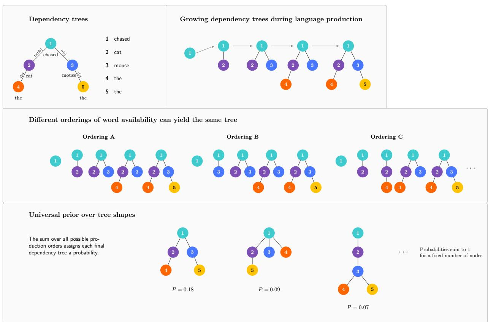
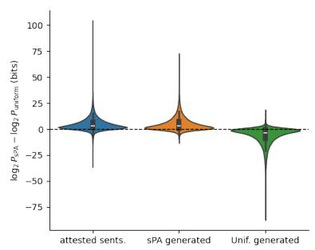
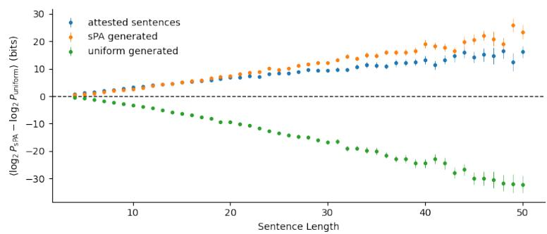
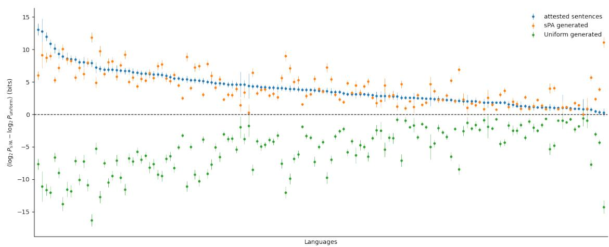
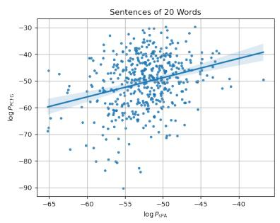
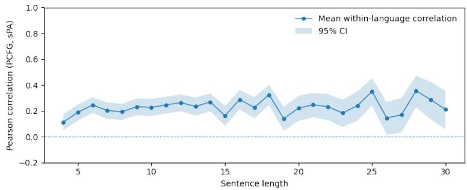
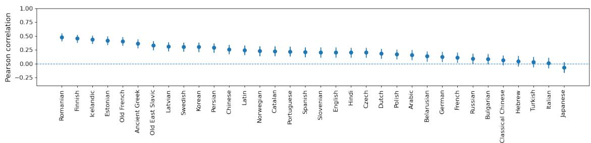
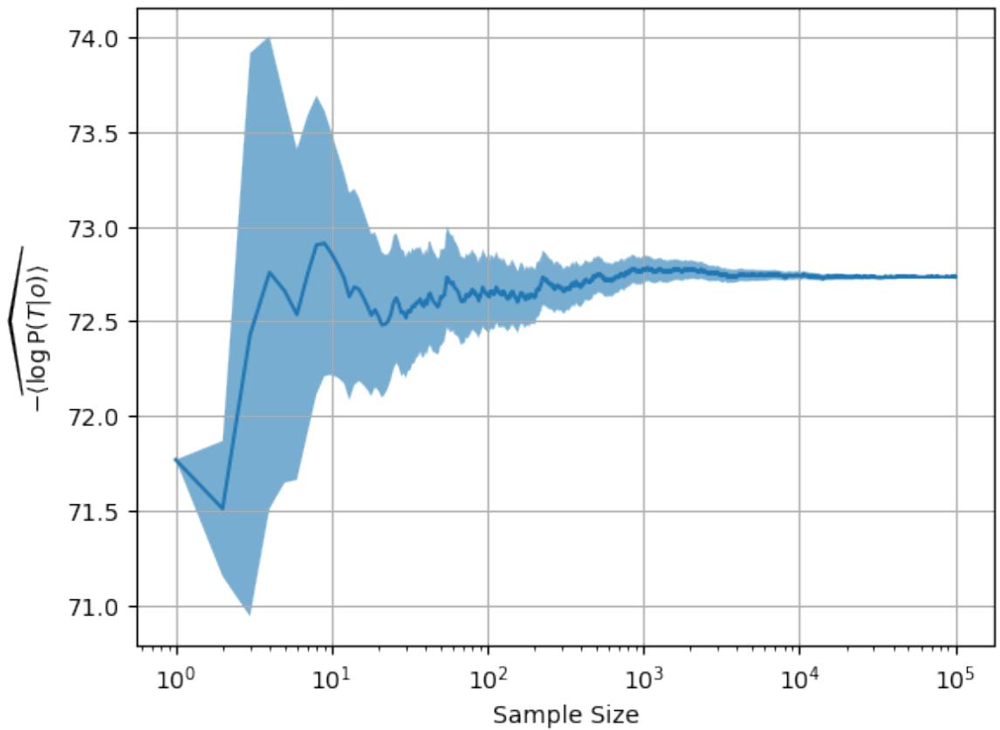

# A Data-free Universal Prior over Syntactic Structures

Ferm´ın Moscoso del Prado Mart´ın1

1Department of Computer Science and Technology, University of Cambridge, United Kingdom

Probability is fundamental to theories of language comprehension, production, acquisition, and evolution, as well as to large language models.1–8 Existing theories estimate the probability of syntactic structures from language-specific data.9, 10 Whether part of this probability structure can arise independently of language-specific experience remains unknown. Here I show that a universal prior over syntactic structures emerges from a cognitively motivated model of incremental language production,11 in which words are progressively integrated into syntactic structure through network growth.12 The resulting prior assigns probabilities to syntactic structures –represented as dependency trees– without fitting parameters to linguistic data, and assigns higher probabilities to attested than to random trees in all 138 typologically diverse languages examined. These prior probabilities correlate positively with probabilities estimated from corpora in 33 of 34 languages. The results indicate that part of the probability structure of syntax can arise independently of language-specific statistical learning. Linguistic experience may therefore refine probabilities that are already structured by the process of language production, rather than create them from an initially uniform space. This identifies a possible cognitive origin for part of the probability distribution over syntactic structures, linking language production and statistical learning while providing a data-independent structural bias for probabilistic models of language.

Language is fundamentally probabilistic. Humans continuously estimate the probabilities of forthcoming words and syntactic structures during language comprehension and production, and acquire these expectations from finite linguistic experience.1, 3, 5, 6 Likewise, modern large language models represent language as probability distributions learned from vast corpora, enabling them to predict and generate remarkably fluent text.7, 8 Understanding the origins of these probabilities is therefore central to both cognitive science and artificial intelligence.

Probabilistic theories of syntax estimate the probabilities of syntactic structures from languagespecific observations.9, 10 A fundamental question is whether, across languages, there exists a universal prior over syntactic structures, or whether all structures are equally plausible before linguistic evidence is observed. Universal hierarchical priors have proved invaluable in Bayesian nonparametrics.13–15 A cognitively grounded universal prior would provide a language-independent starting point from which language-specific probabilities could be learned, separating universal structural preferences from those acquired through experience. It could also provide a principled inductive bias for probabilistic models of language, including large language models.

In this paper, I show that a model of incremental human language production11 defines a universal data-free prior distribution over syntactic structures. This prior predicts both which structures occur across languages and their probabilities estimated from language-specific data.

## A universal prior over syntactic structures

Language production is inherently incremental, with syntactic structure emerging progressively during the planning and production of an utterance rather than being assembled all at once.16, 17 More generally, constraints imposed by language production have been argued to shape the structure of language itself.18, 19 At every stage of production, only a partial dependency tree has been constructed, and each newly available word must be integrated into this evolving structure by establishing a syntactic dependency with one of the words already present. This process can be naturally formulated as a growing network, in which words correspond to nodes, syntactic dependencies to edges, and the partial dependency tree grows through the successive addition of new nodes.11 Fig. 1 illustrates this generative process.

The choice of where to attach each newly available word depends on multiple syntactic, semantic, pragmatic, and contextual factors that are difficult to model explicitly. The current partial dependency tree nevertheless provides observable information about this latent attachment propen sity: The number of direct dependents already attracted by a word provides a natural observable proxy for its latent propensity to attract further ones.11 This naturally gives rise to preferential attachment, in which attachment probability increases with the number of existing connections.20 However, language production is only approximately incremental. Speakers often plan multiple words or constituents simultaneously, and previously activated syntactic structures facilitate the production of subsequent ones through structural priming.21–23 These interactions weaken the assumption that each attachment decision is made independently, attenuating the cumulative advantage characteristic of linear preferential attachment. The attachment process is therefore expected to follow sublinear preferential attachment $( \mathrm { s P A } ) , ^ { 1 2 }$ in which the probability that a newly available word attaches to node i at time t is

$$
P _ { t } ( i ) \propto ( k _ { t } ( i ) + 1 ) ^ { \alpha } , \qquad 0 < \alpha < 1 ,\tag{1}
$$

where $k _ { t } ( i )$ denotes the number of direct dependents (i.e., the out-degree) of node i in the partially constructed dependency tree.

Different node insertion orders may lead to the same final structure. Among all node orderings, only those in which every node appears after all of its ancestors are compatible with incremental construction of a specific observed tree. Denoting the set of compatible orderings for a tree $T$ by $V ( T )$ , the probability of a dependency tree is obtained by summing over all compatible orderings,

$$
P ( T ) = \sum _ { o \in V ( T ) } P ( o ) P ( T \mid o ) .\tag{2}
$$

Assuming no prior knowledge beyond the sentence length, all n! node orderings should –a priori– be considered equally likely. The tree probability therefore decomposes into

$$
P ( T ) = \frac { | V ( T ) | } { n ! } \langle P ( T \mid o ) \rangle _ { o \in V ( T ) } ,\tag{3}
$$

where $| V ( T ) |$ is the number of compatible node orderings and $\langle P ( T \mid o ) \rangle _ { o \in V ( T ) }$ is the average probability with which the tree is generated across those node orderings. The compatible node orderings are precisely the increasing labellings (equivalently, the linear extensions) of the tree, a classical combinatorial object with known cardinality.24

The sublinear preferential attachment process induces a prior probability over dependency trees. Rather than fixing the attachment parameter α of Eq. 1, I integrate over its full sublinear range, $0 \textless \alpha \textless 1$ , using the symmetric prior $\alpha \sim \mathrm { B e t a } ( 2 , 2 )$ .a This prior is broad across the sublinear range while placing moderately greater weight on intermediate values; its mode at $\alpha = . 5$ is also close to the value previously found to best describe human dependency trees.11 The resulting tree probability is therefore

$$
P ( T ) = { \frac { | V ( T ) | } { n ! } } \int _ { 0 } ^ { 1 } { \langle P ( T \mid o , \alpha ) \rangle } _ { o \in V ( T ) } p ( \alpha ) d \alpha ,\tag{4}
$$

where $p ( \alpha )$ is the Beta(2, 2) density. In this way, α is marginalised as a latent variable rather than fitted to linguistic data. This results in a data-independent prior distribution over dependency trees. The computation of the number of compatible orderings and the numerical estimation of this integral is described in the Methods.

## The universal prior distinguishes language from randomness

I evaluated the universal sPA prior on up to 500 dependency trees randomly sampled from each of 138 languages in the Universal Dependencies v2.11 corpora,25 retaining all suitable trees for languages with fewer than 500. I considered sentences containing 50 words or fewer (see Methods for corpus preprocessing and sampling, and Extended Data Table 1 for the list of languages).

For each attested tree of n words, I compared its probability under the sPA prior with that under a uniform prior over rooted labelled trees. By Cayley’s formula,26 there are $n ^ { n - 2 }$ labelled trees and n possible choices of root, yielding $n ^ { n - 1 }$ rooted labelled trees and hence a uniform probability of $n ^ { 1 - n }$ for each tree. As sanity checks, I used two controls to verify that this comparison discriminates between the two generative processes: For each attested tree, I generated a tree of the same size from a true sPA model and another uniformly from the space of rooted labelled trees, and evaluated both under the same two priors.

The sPA prior assigns systematically higher probabilities to attested dependency trees than the uniform prior (Fig. 2a). As expected, the same preference is observed for trees generated by the sPA process, whereas uniformly generated trees show the opposite pattern. For attested trees, the effect is remarkably consistent across every sentence length examined (Fig. 2b) and for every language studied (Fig. 2c). Together, these results show that attested dependency-tree topologies are systematically and substantially closer to those favoured by the sPA prior than expected under a uniform distribution over trees, and that this pattern generalises across typologically diverse languages.

## The universal prior predicts language-specific probabilities

The preceding analysis establishes that attested dependency-tree shapes are systematically favoured by the sPA prior, but this pattern could in principle partly reflect conventions used to construct dependency-tree annotations rather than the probabilistic structure of language itself. A stronger test is whether sPA probabilities predict the probabilities of syntactic structures estimated indepen dently from the statistics of individual languages. To approximate these language-specific probabilities, I used probabilistic context-free grammars (PCFGs).9 For each language in the Universal

Dependencies represented by at least 10,000 non-empty trees (34 languages), I induced a PCFG (see Methods for the detailed procedure). From each of the languages, I randomly sampled 500 sentences containing between 4 and 30 words. I computed the universal sPA probability of each dependency tree and the probability of the corresponding context-free derivation tree under the language-specific PCFG.

The sPA and language-specific PCFG probabilities were positively correlated at every sentence length examined (Fig. 3a,b), with all correlations being significantly greater than zero, and of a similar magnitude across all lengths, with no clear evidence of a systematic relation between sentence length and correlation strength. The pattern was remarkably consistent across languages (Fig. 3c): The correlations were positive for 33 of the 34 languages studied, and significant for 28 of those. Japanese was the sole exception, with a negative (but not significant) average correlation. This exception may reflect limitations of the PCFG approximation rather than a failure of the universal prior: in the preceding analysis, Japanese dependency trees, like those of every other language, are systematically better predicted by the sPA prior than by the uniform prior (Fig. 2c). These correlations are moderate in magnitude –roughly $R \approx . 3$ across sentence lengths– but substantial given that the sPA prior contains no language-specific information. The relationship was further confirmed by a linear mixed-effects analysis of sentence-level probabilities, accounting for variation across languages. The length-standardised sPA probability was a strong positive predic tor of language-specific length-standardised PCFG probability (β = .146, 95% CI [.118, .175], $P < . 0 0 0 1$ ; see Methods).

## The origins of syntactic structure probabilities

These results suggest that the probabilities of syntactic structures do not arise solely from statistical regularities acquired through language-specific experience. Incremental language production already induces a non-uniform distribution over possible structures, before any language-specific statistics are introduced. Linguistic experience can therefore be understood as updating a structured universal prior rather than inducing the probabilities of syntactic structures from scratch. The correlation between the data-free prior and probabilities estimated independently from indi vidual languages is consistent with this account: a universal component arising from language production remains detectable within the distributions shaped by language-specific experience.

This distinction connects two processes that are usually treated separately. Language production constrains how syntactic structures can be incrementally constructed, whereas statistical learning determines how experience modifies their probabilities. The present results suggest that the former constrains the initial distribution on which the latter operates. This echoes a broader principle introduced by D’Arcy Thompson in the study of biological form: understanding why particular forms arise requires considering the generative processes and constraints that produce them, rather than only the forces acting on the forms once produced.27 Applied to language, this perspective suggests that the distribution of syntactic structures may be shaped not only by lin guistic experience, but also by the very process through which those structures are gradually built up.

More generally, the present results show how a universal probabilistic bias emerges from a cognitive process without requiring either language-specific statistical estimation or an initially uniform distribution over syntactic structures. The same principle could provide a data-independent structural bias for computational models, including large language models, whose probability distributions are predominantly learned from linguistic data. The probabilistic structure of language may therefore reflect not only what speakers have experienced, but also how language must be produced.

## References

1. Shannon, C. E. Prediction and entropy of printed English. Bell Syst. Tech. J. 30, 50–64 (1951).

2. Saffran, J. R., Aslin, R. N. & Newport, E. L. Statistical learning by 8-month-old infants. Science 274, 1926–1928 (1996).

3. Hale, J. A probabilistic Earley parser as a psycholinguistic model. In Proc. 2nd Conf. North Am. Chapter Assoc. Comput. Linguist. Hum. Lang. Technol. (NAACL-HLT), 1–8 (ACL, Pittsburgh, PA, 2001).

4. Kirby, S., Cornish, H. & Smith, K. Cumulative cultural evolution in the laboratory: An experimental approach to the origins of structure in human language. Proc. Natl. Acad. Sci. U.S.A. 105, 10681–10686 (2008).

5. Levy, R. Expectation-based syntactic comprehension. Cognition 106, 1126–1177 (2008).

6. Jaeger, T. F. Redundancy and reduction: Speakers manage information density. Psychol. Rev. 117, 23–56 (2010).

7. Vaswani, A. et al. Attention is all you need. In Guyon, I. et al. (eds.) Adv. Neural Inf. Process. Syst. (NeurIPS), vol. 30, 5998–6008 (Curran Associates, 2017).

8. Brown, T. B. et al. Language models are few-shot learners. In Larochelle, H., Ranzato, M., Hadsell, R., Balcan, M. F. & Lin, H. (eds.) Adv. Neural Inf. Process. Syst. (NeurIPS), vol. 33, 1877–1901 (Curran Associates, 2020).

9. Johnson, M. PCFG models of linguistic tree representations. Comput. Linguist. 24, 613–632 (1998).

10. Klein, D. & Manning, C. D. Accurate unlexicalized parsing. In Proc. 41st Annu. Meet. Assoc. Comput. Linguist. (ACL), 423–430 (ACL, Sapporo, Japan, 2003).

11. Moscoso del Prado Mart´ın, F. Universal topological regularity of syntactic structures. arXiv preprint (2026). arXiv:2302.00129v2.

12. Krapivsky, P. L., Redner, S. & Leyvraz, F. Connectivity of growing random networks. Phys. Rev. Lett. 85, 4629–4632 (2000).

13. Neal, R. M. Density modeling and clustering using Dirichlet diffusion trees. In Bernardo, J. M. et al. (eds.) Bayesian Statistics 7, 619–629 (Oxford Univ. Press, 2003).

14. Teh, Y. W., Jordan, M. I., Beal, M. J. & Blei, D. M. Hierarchical Dirichlet processes. J. Am. Stat. Assoc. 101, 1566–1581 (2006).

15. Knowles, D. A. & Ghahramani, Z. Pitman-Yor diffusion trees. In Proc. 27th Conf. Uncertain. Artif. Intell. (UAI), 410–418 (2011).

16. Levelt, W. J. M. Speaking: From Intention to Articulation (MIT Press, Cambridge, MA, 1989).

17. Ferreira, F., Slevc, L. R. & Rogers, E. S. How do speakers avoid ambiguous linguistic expressions? Cognition 104, 358–374 (2007).

18. MacDonald, M. C. Distributional information in language comprehension, production, and acquisition: Three puzzles and a moral. In MacWhinney, B. (ed.) The Emergence of Language, 177–196 (Lawrence Erlbaum Associates, Mahwah, NJ, 1999).

19. MacDonald, M. C. How language production shapes language form and comprehension. Front. Psychol. 4, 226 (2013).

20. Barabasi, A.-L. & Albert, R. Emergence of scaling in random networks. ´ Science 286, 509–512 (1999).

21. Bock, J. K. Syntactic persistence in language production. Cogn. Psychol. 18, 355–387 (1986).

22. Pickering, M. J. & Ferreira, V. S. Structural priming: A critical review. Psychol. Bull. 134, 427–459 (2008).

23. Mahowald, K., James, A., Futrell, R. & Gibson, E. A meta-analysis of syntactic priming in language production. J. Mem. Lang. 91, 5–27 (2016).

24. Knuth, D. E. The Art of Computer Programming, Volume 3: Sorting and Searching (Addison– Wesley, Reading, MA, 1998), 2 edn.

25. de Marneffe, M.-C., Manning, C. D., Nivre, J. & Zeman, D. Universal Dependencies. Comput. Linguist. 47, 255–308 (2021).

26. Cayley, A. A theorem on trees. Q. J. Pure Appl. Math. 23, 376–378 (1889).

27. Thompson, D. W. On Growth and Form (Cambridge University Press, Cambridge, 1917).

## Methods

Corpora and preprocessing I analysed all languages represented in the Universal Dependencies v2.11 treebanks (UD).25 For languages represented by multiple treebanks, I concatenated all treebanks listed for that language. I retained only lexical vertices, removing punctuation and range vertices (e.g., “3–4” in the CoNLL format used in UD), deleted relation labels, and replaced vertex labels with consecutive integers. After these modifications, I retained only graphs that remained actual trees (see Extended Data Table 1 for the count of valid trees available in each language). For the comparison between the sPA and uniform priors, I randomly sampled up to 500 trees (taking all trees whenever fewer than 500 were available) with a maximum length of 50 words. For the analysis of the correlation between sPA and PCFG probabilities, I instead used a sample of 500 trees with a maximum length of 30 words, as longer trees were increasingly rare. Because trees with $N \leq 3$ do not exhibit any shape variability (all trees with three or fewer vertices are simultaneously line and star graphs), in both samples I considered only dependency graphs with at least four vertices. Computing the universal prior Computing the universal prior in Eq. 4 requires two quantities: the number of node orderings compatible with a dependency tree, and the average probability with which the tree is generated across those orderings. The former can be computed exactly, whereas

the latter is estimated by Monte Carlo sampling.

Compatible node orderings. In the network growth model, only orderings in which every node appears after all of its ancestors are compatible with a given dependency tree. These compatible orderings are precisely the increasing labellings of the tree, whose number is given exactly by the hook length formula,24

$$
| V ( T ) | = \frac { n ! } { \prod _ { v \in T } h _ { v } } ,\tag{5}
$$

where the hook length $( h _ { v } )$ of vertex v is the number of vertices in the subtree rooted at v, including v itself. Notice that the factorial in the numerator of Eq. 5 cancels out with the factorial in Eq. 4, simplifying its calculation.

Probability of a tree given a node ordering. Given a compatible node ordering, the probability of generating the tree is computed by replaying the sublinear preferential attachment process. Let $v _ { t }$ denote the node introduced at step t, and let $V _ { t - 1 }$ denote the set of nodes already present. If node $u \in V _ { t - 1 }$ currently has $k _ { u } ( t )$ direct dependents, its attachment weight is

$$
w ( u , \alpha ) = ( k _ { u } ( t ) + 1 ) ^ { \alpha } .\tag{6}
$$

The probability that the newly introduced node attaches to its observed parent $p _ { t }$ is therefore

$$
P ( v _ { t } \to p _ { t } \mid V _ { t - 1 } , \alpha ) = { \frac { w ( p _ { t } , \alpha ) } { \sum _ { u \in V _ { t - 1 } } w ( u , \alpha ) } } .\tag{7}
$$

The probability of the complete production history is obtained by multiplying these attachment probabilities over all construction steps,

$$
P ( T \mid o , \alpha ) = \prod _ { t = 2 } ^ { n } P ( v _ { t } \to p _ { t } \mid V _ { t - 1 } , \alpha ) ,\tag{8}
$$

while updating direct dependent counts after each attachment.

Monte Carlo estimation. The number of node orderings compatible with a given tree $( | V ( T ) | )$ can become extremely large as tree size increases. Exhaustive evaluation of Eq. 4 is therefore computationally infeasible even for moderately sized dependency trees. Instead, I estimate it using a Monte Carlo method.

The probability in Eq. 4 requires averaging jointly over compatible node orderings and over the attachment exponent α. For this exponent, I use the prior

$$
\alpha \sim \mathrm { B e t a } ( 2 , 2 ) ,\tag{9}
$$

which has support over the complete sublinear range $0 < \alpha < 1$ and is symmetric around $\alpha = . 5$ The prior remains sufficiently broad to assign substantial probability throughout this interval. For each Monte Carlo sample $i ,$ I independently draw a compatible node ordering $o _ { i }$ uniformly from $V ( T )$ and an attachment exponent $\alpha _ { i } \sim \mathrm { B e t a } ( 2 , 2 )$ , and evaluate $P ( T \mid o _ { i } , \alpha _ { i } )$ by replaying the growth process. For N samples, the integrated mean conditional probability is then estimated as

$$
\mathbb { E } _ { o , \alpha } [ P ( T \mid o , \alpha ) ] \approx \frac { 1 } { N } \sum _ { i = 1 } ^ { N } P ( T \mid o _ { i } , \alpha _ { i } ) .\tag{10}
$$

Substituting this estimate into Eq. 4 gives

$$
\widehat { P } ( T ) = \frac { | V ( T ) | } { n ! } \frac { 1 } { N } \sum _ { i = 1 } ^ { N } P ( T \mid o _ { i } , \alpha _ { i } ) .\tag{11}
$$

This Monte Carlo estimator jointly marginalises over uncertainty in production order and in the sublinear attachment exponent. This estimator is unbiased and converges to the exact expectation as N increases (see Extended Data Fig. 1). Unless otherwise stated, all analyses use $N = 1 0 0 0$ joint samples per tree.

Generation of random tree controls Uniform random-tree baselines for each number of nodes were generated by uniformly sampling Prufer sequences ¨ ? and then uniformly selecting a root node to determine the orientation of the edges.

Random sPA tree baselines were generated sequentially, starting from a single root node and adding one node at each step. Each new node was attached to an existing node i with probability proportional to $( k _ { i } + 1 ) ^ { \alpha }$ , where $k _ { i }$ is the current number of direct dependents of node i. Trees were grown until they matched the number of nodes of the corresponding attested dependency tree. I used a fixed value of $\alpha = . 4 2$ , which was previously found to be optimal for human language sentences.11

Language-specific probability estimation. I converted the dependency trees into phrase-structure trees using a common procedure.? These trees were built to have parts-of-speech as their leaves (i.e., they were preterminalised). From the resulting non-empty phrase-structure trees (without any minimum or maximum number of words), I induced, by maximum likelihood, a separate PCFG for each language. I restricted these analyses to languages with at least 10,000 non-empty dependency trees to ensure that the PCFG estimates were based on sufficiently large samples, resulting in 34 languages. The language-specific log probability of each selected sentence was approximated by the log probability assigned by the corresponding PCFG to its phrase-structure tree, computed as the sum of the log probabilities of the grammar rules used in its derivation.

Statistical Analyses I tested the relationship between the universal sPA and language-specific PCFG probabilities using a linear mixed-effects model with log PCFG probability as the dependent variable and log sPA probability, sentence length, and their interaction as fixed effects. PCFG and sPA log probabilities were independently standardised to zero mean and unit variance within each sentence length, and the sentence lengths were centred to have a mean of zero.

I compared two random-effects structures fitting the models by maximum likelihood: a model containing only a random intercept for language, and a model additionally containing a language-specific random slope for sPA probability. Adding the random slope substantially improved model fit (likelihood-ratio test: $\chi ^ { 2 } ( 3 ) = 3 9 7 . 6 5$ $P \ < \ . 0 0 0 1 $ ), and produced lower AIC (42,192.61 versus 41,800.97) and BIC (42,231.32 versus 41,862.90). I therefore retained the random intercept and random slope and refitted the final model using restricted maximum likelihood.

The final model showed a strong positive relationship between length-standardised sPA and PCFG probabilities $( \beta = . 1 4 6 , 9 5 \%$ CI [.118, .175], $z = 1 0 . 0 5 6$ $P < . 0 0 0 1 )$ . Sentence length also had a significant main effect (β = .080, 95% CI [.058, .102], $z = 7 . 1 5 6 ,$ $P < . 0 0 0 1 )$ , whereas the interaction between sPA probability and sentence length did not reach significance $( \beta = - . 0 0 2$ 95% CI $[ - . 0 0 4 , . 0 0 0 ]$ , z = 1.726, P = .084).

Models were fitted in Python using the statsmodels package.?

## Notes

Acknowledgements I am indebted to Prof. Enrique Amigo and Prof. Michael Anderson for helpful ´ suggestions on this manuscript.

Code Availability Python functions for computing probabilities of dependency trees under the sPA prior, sampling compatible node orderings, and sampling trees from the sPA and uniform models are available at https://github.com/fermosc24/ProbTreesPA.

Competing Interests The author declares that he has no competing financial interests.

Correspondence Correspondence and requests for materials should be addressed to F. MdP. (email: fm611@cst.cam.ac.uk).

Incremental language production induces a universal prior over dependency trees  
  
Figure 1: Incremental language production induces a universal prior over dependency trees. A dependency tree can be constructed incrementally as words become available during language production. Different orders of word availability can generate the same final dependency tree. Summing across all possible production orders assigns a probability to each dependency-tree shape, thereby defining a prior distribution over trees of a fixed number of nodes. The numerical probabilities shown are just for illustration.

a  

b  

c  
  
Figure 2: Probability advantage of the sPA model over the uniform model. a, Distribution of $\log _ { 2 } P _ { \mathrm { s P A } } - \log _ { 2 } P _ { \mathrm { u n i f o r m } }$ for attested dependency trees, trees generated by the sPA model, and uniformly generated random trees. Violins show the distributions; internal boxes indicate the median and interquartile range. b, Mean log-probability difference for each attested sentence length, shown for the same three sets of trees. Points indicate means and error bars 95% confidence intervals. c, Mean log-probability difference for each language, shown for the same three sets of trees. Points indicate means and error bars 95% confidence intervals. Languages are ordered by the mean difference for attested sentences. In all three panels, positive values indicate higher probability under sPA. Conversely, negative values reflect that the probability is higher under the uniform model than under the sPA one. 19

a  

b  

c  
  
Figure 3: Correlation between sPA and language-specific PCFG probabilities. a, Example of the relationship between the two probabilities for sentences of length 20 across all 34 languages. Each point represents an individual sentence; the line shows the linear regression fit, with shading indicating its 95% confidence interval. b, Mean within-language Pearson correlation as a function of sentence length, with correlations combined across languages using Fisher’s z transformation. Shading indicates 95% confidence intervals. c, Mean within-language Pearson correlation for each language, with correlations computed separately by sentence length and combined across lengths using Fisher’s z transformation. Error bars indicate 95% confidence intervals, and languages are ordered by decreasing correlation. In b and c, correlations are weighted by n − 3, the inverse of the approximate sampling variance of the Fisher-transformed correlation, where n is the number of sentences contributing to each correlation.

  
Extended Data Figure 1: Convergence of the Monte Carlo mean conditional probability estimate. The figure plots the mean estimated surprisal $\langle l o g P ( T | o ) \rangle _ { o \in V ( T ) }$ as a function of the number of sampled histories for a 30-node tree randomly generated by sublinear preferential attachment with $\alpha = 0 . 4 2$ . The shaded region denotes the 95% confidence interval of the estimate. The horizontal axis is logarithmic.

Extended Data Table 1: Languages included in the analysis, ordered by decreasing number of valid available trees.
<table><tr><td>Language</td><td>Family</td><td>Group</td><td>Number of Valid Trees</td></tr><tr><td>German</td><td>Indo-European</td><td>West Germanic</td><td>198,830</td></tr><tr><td>Japanese</td><td>Japonic</td><td>Japanese</td><td>120,218</td></tr><tr><td>Czech</td><td>Indo-European</td><td>West Slavic</td><td>115,497</td></tr><tr><td>Russian</td><td>Indo-European</td><td>East Slavic</td><td>101,260</td></tr><tr><td>Portuguese</td><td>Indo-European</td><td>Romance</td><td>67,709</td></tr><tr><td>Turkish</td><td>Turkic</td><td>Oghuz</td><td>63,453</td></tr><tr><td>Latin†</td><td>Indo-European</td><td>Italic (Latino-Faliscan)</td><td>53,303</td></tr><tr><td>Icelandic</td><td>Indo-European</td><td>North Germanic</td><td>52,395</td></tr><tr><td>French</td><td>Indo-European</td><td>Romance</td><td>46,378</td></tr><tr><td>Classical Chinese†</td><td>Sino-Tibetan</td><td>Sinitic</td><td>45,893</td></tr><tr><td>English</td><td>Indo-European</td><td>West Germanic</td><td>41,123</td></tr><tr><td>Romanian</td><td>Indo-European</td><td>Romance</td><td>39,802</td></tr><tr><td>Norwegian</td><td>Indo-European</td><td>North Germanic</td><td>37,679</td></tr><tr><td>Italian</td><td>Indo-European</td><td>Romance</td><td>36,676</td></tr><tr><td>Polish</td><td>Indo-European</td><td>West Slavic</td><td>35,839</td></tr><tr><td>Persian</td><td>Indo-European</td><td>Iranian</td><td>34,685</td></tr></table>

Continued on next page

Extended Data Table 1 – continued from previous page
<table><tr><td>Language</td><td>Family</td><td>Group</td><td>Number of Valid Trees</td></tr><tr><td>Spanish</td><td>Indo-European</td><td>Romance</td><td>34,134</td></tr><tr><td>Estonian</td><td>Uralic</td><td>Finnic</td><td>34,072</td></tr><tr><td>Korean</td><td>Koreanic</td><td>Korean</td><td>33,191</td></tr><tr><td>Finnish</td><td>Uralic</td><td>Finnic</td><td>31,574</td></tr><tr><td>Ancient Greek†</td><td>Indo-European</td><td>Hellenic</td><td>28,975</td></tr><tr><td>Arabic</td><td>Afro-Asiatic</td><td>Semitic</td><td>27,500</td></tr><tr><td>Belarusian</td><td>Indo-European</td><td>East Slavic</td><td>21,060</td></tr><tr><td>Old East Slavic†</td><td>Indo-European</td><td>East Slavic</td><td>19,303</td></tr><tr><td>Dutch</td><td>Indo-European</td><td>West Germanic</td><td>18,354</td></tr><tr><td>Hindi</td><td>Indo-European</td><td>Indo-Aryan</td><td>17,611</td></tr><tr><td>Catalan</td><td>Indo-European</td><td>Romance</td><td>16,500</td></tr><tr><td>Old French†</td><td>Indo-European</td><td>Romance</td><td>15,927</td></tr><tr><td>Latvian</td><td>Indo-European</td><td>Baltic</td><td>15,632</td></tr><tr><td>Slovenian</td><td>Indo-European</td><td>South Slavic</td><td>14,932</td></tr><tr><td>Chinese</td><td>Sino-Tibetan</td><td>Sinitic</td><td>12,300</td></tr><tr><td>Swedish</td><td>Indo-European</td><td>North Germanic</td><td>11,594</td></tr><tr><td>Hebrew</td><td>Afro-Asiatic</td><td>Semitic</td><td>11,015</td></tr><tr><td>Bulgarian</td><td>Indo-European</td><td>South Slavic</td><td>10,451</td></tr></table>

Continued on next page

Extended Data Table 1 – continued from previous page
<table><tr><td>Language</td><td>Family</td><td>Group</td><td>Number of Valid Trees</td></tr><tr><td>Croatian</td><td>Indo-European</td><td>South Slavic</td><td>8,921</td></tr><tr><td>Basque</td><td>isolate</td><td></td><td>8,691</td></tr><tr><td>Slovak</td><td>Indo-European</td><td>West Slavic</td><td>8,678</td></tr><tr><td>Naija</td><td>creole</td><td>English-lexifier</td><td>8,619</td></tr><tr><td>Indonesian</td><td>Austronesian</td><td>Malayic</td><td>7,555</td></tr><tr><td>Ukrainian</td><td>Indo-European</td><td>East Slavic</td><td>6,403</td></tr><tr><td>Western Armenian</td><td>Indo-European</td><td>Armenian</td><td>6,205</td></tr><tr><td>Pomak</td><td>Indo-European</td><td>South Slavic</td><td>5,791</td></tr><tr><td>Irish</td><td>Indo-European</td><td>Celtic</td><td>5,773</td></tr><tr><td>Old Church Slavonic†</td><td>Indo-European</td><td>South Slavic</td><td>5,449</td></tr><tr><td>Urdu</td><td>Indo-European</td><td>Indo-Aryan</td><td>5,128</td></tr><tr><td>Danish</td><td>Indo-European</td><td>North Germanic</td><td>5,087</td></tr><tr><td>Galician</td><td>Indo-European</td><td>Romance</td><td>4,899</td></tr><tr><td>Gothic†</td><td>Indo-European</td><td>East Germanic</td><td>4,742</td></tr><tr><td>Armenian</td><td>Indo-European</td><td>Armenian</td><td>4,448</td></tr><tr><td>Serbian</td><td>Indo-European</td><td>South Slavic</td><td>4,363</td></tr><tr><td>Scottish Gaelic</td><td>Indo-European</td><td>Celtic</td><td>4,275</td></tr><tr><td>Lithuanian</td><td>Indo-European</td><td>Baltic</td><td>3,641</td></tr></table>

Continued on next page

Extended Data Table 1 – continued from previous page
<table><tr><td>Language</td><td>Family</td><td>Group</td><td>Number of Valid Trees</td></tr><tr><td>Sanskrit†</td><td>Indo-European</td><td>Indo-Aryan</td><td>3,380</td></tr><tr><td>Uyghur</td><td>Turkic</td><td>Karluk</td><td>3,221</td></tr><tr><td>Vietnamese</td><td>Austroasiatic</td><td>Vietic</td><td>2,886</td></tr><tr><td>North Sami</td><td>Uralic</td><td>Sami</td><td>2,728</td></tr><tr><td>Faroese</td><td>Indo-European</td><td>North Germanic</td><td>2,720</td></tr><tr><td>Welsh</td><td>Indo-European</td><td>Celtic</td><td>2,445</td></tr><tr><td>Greek</td><td>Indo-European</td><td>Hellenic</td><td>2,423</td></tr><tr><td>Manx†</td><td>Indo-European</td><td>Celtic</td><td>2,207</td></tr><tr><td>Coptic†</td><td>Afro-Asiatic</td><td>Egyptian</td><td>2,146</td></tr><tr><td>Turkish German</td><td>code-switching</td><td>Oghuz / West Germanic</td><td>2,140</td></tr><tr><td>Wolof</td><td>Atlantic-Congo</td><td>Atlantic</td><td>2,076</td></tr><tr><td>Afrikaans</td><td>Indo-European</td><td>West Germanic</td><td>1,929</td></tr><tr><td>Maltese</td><td>Afro-Asiatic</td><td>Semitic</td><td>1,899</td></tr><tr><td>Hindi English</td><td>code-switching</td><td>Indo-Aryan / West</td><td>1,894</td></tr><tr><td></td><td></td><td>Germanic</td><td></td></tr><tr><td>Akkadian†</td><td>Afro-Asiatic</td><td>Semitic</td><td>1,844</td></tr><tr><td>Hungarian</td><td>Uralic</td><td>Ugric</td><td>1,780</td></tr><tr><td>Erzya</td><td>Uralic</td><td>Mordvinic</td><td>1,695</td></tr></table>

Continued on next page

Extended Data Table 1 – continued from previous page
<table><tr><td>Language</td><td>Family</td><td>Group</td><td>Number of Valid Trees</td></tr><tr><td>Ancient Hebrew†</td><td>Afro-Asiatic</td><td>Semitic</td><td>1,579</td></tr><tr><td>Kiche</td><td>Mayan</td><td>K&#x27;ichean</td><td>1,121</td></tr><tr><td>Mbya Guarani</td><td>Tupian</td><td>Tupi-Guarani</td><td>1,086</td></tr><tr><td>Guajajara</td><td>Tupian</td><td>Tupi-Guarani</td><td>1,017</td></tr><tr><td>Amharic</td><td>Afro-Asiatic</td><td>Semitic</td><td>1,013</td></tr><tr><td>Thai</td><td>Kra-Dai</td><td>Tai</td><td>999</td></tr><tr><td>Kazakh</td><td>Turkic</td><td>Kipchak</td><td>958</td></tr><tr><td>Gheg</td><td>Indo-European</td><td>Albanian</td><td>956</td></tr><tr><td>Bambara</td><td>Mande</td><td>Western Mande</td><td>930</td></tr><tr><td>Tamil</td><td>Dravidian</td><td>South Dravidian</td><td>878</td></tr><tr><td>Buryat</td><td>Mongolic</td><td>Central Mongolic</td><td>844</td></tr><tr><td>Cantonese</td><td>Sino-Tibetan</td><td>Sinitic</td><td>838</td></tr><tr><td>Breton</td><td>Indo-European</td><td>Celtic</td><td>807</td></tr><tr><td>Western Sierra Puebla</td><td>Uto-Aztecan</td><td>Nahuan</td><td>794</td></tr><tr><td>Nahuatl</td><td></td><td></td><td></td></tr><tr><td>Komi Zyrian</td><td>Uralic</td><td>Permic</td><td>787</td></tr><tr><td>Xibe</td><td>Tungusic</td><td>Jurchenic</td><td>780</td></tr><tr><td>Kurmanji</td><td>Indo-European</td><td>Iranian</td><td>743</td></tr></table>

Continued on next page

Extended Data Table 1 – continued from previous page
<table><tr><td>Language</td><td>Family</td><td>Group</td><td>Number of Valid Trees</td></tr><tr><td>Telugu</td><td>Dravidian</td><td>South-Central</td><td>665</td></tr><tr><td rowspan="3">Chukchi</td><td></td><td>Dravidian</td><td></td></tr><tr><td>Chukotko-</td><td>Chukotkan</td><td>653</td></tr><tr><td>Kamchatkan</td><td></td><td></td></tr><tr><td>Upper Sorbian</td><td>Indo-European</td><td>West Slavic</td><td>638</td></tr><tr><td>Zaar</td><td>Afro-Asiatic</td><td>Chadic</td><td>581</td></tr><tr><td>Tupinamba†</td><td>Tupian</td><td>Tupi-Guarani</td><td>429</td></tr><tr><td>Marathi</td><td>Indo-European</td><td>Indo-Aryan</td><td>393</td></tr><tr><td>Frisian Dutch</td><td>Indo-European</td><td>West Germanic</td><td>385</td></tr><tr><td>Moksha</td><td>Uralic</td><td>Mordvinic</td><td>350</td></tr><tr><td>Bhojpuri</td><td>Indo-European</td><td>Indo-Aryan</td><td>349</td></tr><tr><td>Yoruba</td><td>Atlantic-Congo</td><td>Volta-Niger</td><td>315</td></tr><tr><td>Karo</td><td>Tupian</td><td>Ramarama</td><td>297</td></tr><tr><td>Ligurian</td><td>Indo-European</td><td>Romance</td><td>297</td></tr><tr><td>Yupik</td><td>Eskimo-Aleut</td><td>Yupik</td><td>284</td></tr><tr><td>Kangri</td><td>Indo-European</td><td>Indo-Aryan</td><td>281</td></tr><tr><td>Yakut</td><td>Turkic</td><td>Siberian Turkic</td><td>237</td></tr><tr><td>Karelian</td><td>Uralic</td><td>Finnic</td><td>220</td></tr></table>

Continued on next page

Extended Data Table 1 – continued from previous page

Language Family Group Number of Valid Trees   
Skolt Sami Uralic Sami 216   
Nheengatu Tupian Tupi-Guarani 178   
Tagalog Austronesian Philippine 178   
Swedish Sign sign language 169   
Language   
Cebuano Austronesian Philippine 150   
Tatar Turkic Kipchak 146   
Teko Tupian Tupi-Guarani 132   
Hittite† Indo-European Anatolian 130   
Javanese Austronesian Malayo-Polynesian 123   
Livvi Uralic Finnic 119   
Munduruku Tupian Munduruku 113   
Swiss German Indo-European West Germanic 100   
Sinhala Indo-European Indo-Aryan 100   
Apurina Arawakan Purus 98   
Low Saxon Indo-European West Germanic 93   
Akuntsu Tupian Tupari 93

Continued on next page

Extended Data Table 1 – continued from previous page
<table><tr><td>Language</td><td>Family</td><td>Group</td><td>Number of Valid Trees</td></tr><tr><td>Abaza</td><td>Northwest</td><td>Abkhaz-Abaza</td><td>86</td></tr><tr><td></td><td>Caucasian</td><td></td><td></td></tr><tr><td>Komi Permyak</td><td>Uralic</td><td>Permic</td><td>86</td></tr><tr><td>South Levantine</td><td>Afro-Asiatic</td><td>Semitic</td><td>84</td></tr><tr><td>Arabic</td><td></td><td></td><td></td></tr><tr><td>Umbrian†</td><td>Indo-European</td><td>Italic (Sabellic)</td><td>80</td></tr><tr><td>Albanian</td><td>Indo-European</td><td>Albanian</td><td>60</td></tr><tr><td>Beja</td><td>Afro-Asiatic</td><td>Cushitic</td><td>52</td></tr><tr><td>Kaapor</td><td>Tupian</td><td>Tupi-Guarani</td><td>48</td></tr><tr><td>Warlpiri</td><td>Pama-Nyungan</td><td>Ngumpin-Yapa</td><td>47</td></tr><tr><td>Assyrian</td><td>Afro-Asiatic</td><td>Semitic (Aramaic)</td><td>45</td></tr><tr><td>Bengali</td><td>Indo-European</td><td>Indo-Aryan</td><td>36</td></tr><tr><td>Makurap</td><td>Tupian</td><td>Tupari</td><td>24</td></tr><tr><td>Malayalam</td><td>Dravidian</td><td>South Dravidian</td><td>23</td></tr><tr><td>Guarani</td><td>Tupian</td><td>Tupi-Guarani</td><td>22</td></tr><tr><td>Old Turkish†</td><td>Turkic</td><td>Common Turkic</td><td>16</td></tr><tr><td>Xavante</td><td>Macro-Je</td><td>Je</td><td>16</td></tr><tr><td>Madi</td><td>Arawan</td><td>Madi</td><td>11</td></tr></table>

Continued on next page

Extended Data Table 1 – continued from previous page
<table><tr><td>Language</td><td>Family</td><td>Group</td><td>Number of Valid Trees</td></tr><tr><td>Nayini</td><td>Indo-European</td><td>Iranian</td><td>10</td></tr><tr><td>Khunsari</td><td>Indo-European</td><td>Iranian</td><td>9</td></tr><tr><td>Soi</td><td>Indo-European</td><td>Iranian</td><td>7</td></tr><tr><td>Neapolitan</td><td>Indo-European</td><td>Romance</td><td>1</td></tr><tr><td>†Extinct language.</td><td></td><td></td><td></td></tr></table>