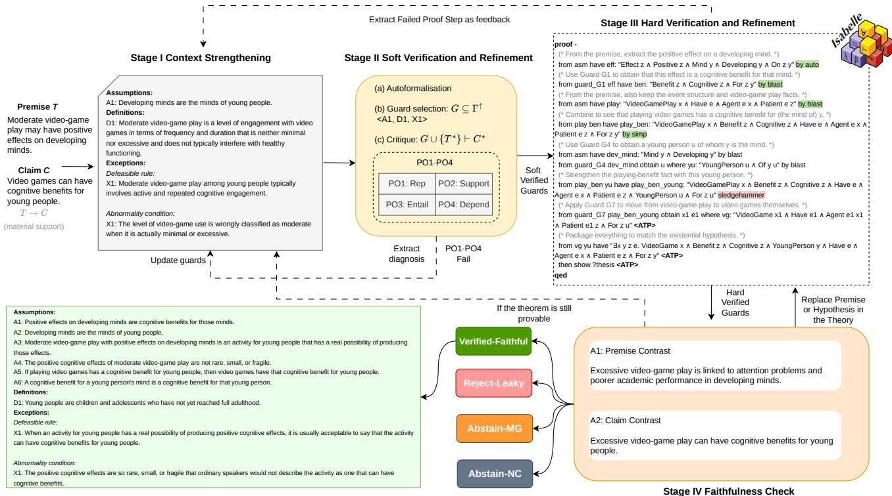
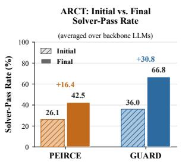
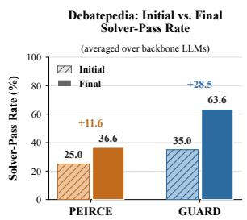
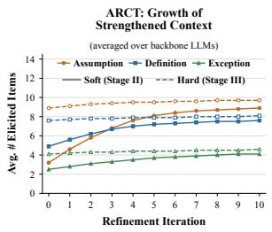
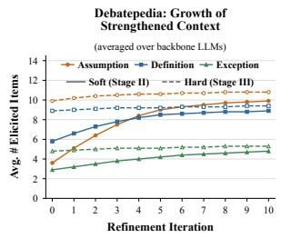
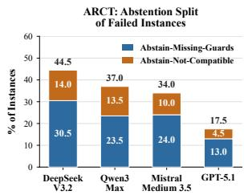
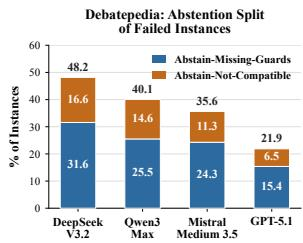
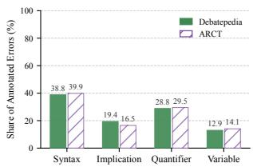
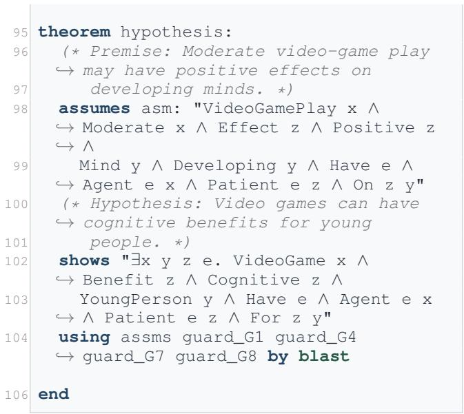

# A<sub>u</sub>t<sub>o</sub>f<sub>o</sub>rm<sub>a</sub>li<sub>z</sub>in<sub>g</sub> Ar<sub>gu</sub>m<sub>e</sub>nt<sub>a</sub>ti<sub>ve</sub> M<sub>a</sub>t<sub>e</sub>ri<sub>a</sub>l Inf<sub>e</sub>r<sub>e</sub>n<sub>ces</sub>

Xi<sub>n Quan</sub><sup>1</sup>,<sup>3</sup><sub>,</sub> R<sub>e</sub>t<sub>o</sub> G<sub>u</sub>b<sub>e</sub>l<sub>mann</sub><sup>2</sup><sub>,</sub> A<sub>n</sub>d<sub>r</sub>é F<sub>re</sub>it<sub>as</sub><sup>1</sup>,<sup>3∗</sup>

<sup>1</sup>Idi<sub>ap</sub> R<sub>esearc</sub>h I<sub>ns</sub>tit<sub>u</sub>t<sub>e,</sub> S<sub>w</sub>it<sub>zer</sub>l<sub>an</sub>d

<sup>2</sup>U<sub>n</sub>i<sub>vers</sub>it<sub>y</sub> <sub>o</sub>f Z<sub>ur</sub>i<sub>c</sub>h<sub>,</sub> S<sub>w</sub>it<sub>zer</sub>l<sub>an</sub>d

<sup>3</sup>D<sub>epa</sub>rtm<sub>e</sub>nt <sub>o</sub>f C<sub>o</sub>m<sub>pu</sub>t<sub>e</sub>r S<sub>c</sub>i<sub>e</sub>n<sub>ce,</sub> Uni<sub>ve</sub>r<sub>s</sub>it<sub>y</sub> <sub>o</sub>f M<sub>a</sub>n<sub>c</sub>h<sub>es</sub>t<sub>e</sub>r<sub>,</sub> UK <sub>x</sub>i<sub>n.quan</sub>@idi<sub>ap.c</sub>h<sub>, re</sub>t<sub>o.gu</sub>b<sub>e</sub>l<sub>mann</sub>@<sub>uz</sub>h<sub>.c</sub>h<sub>, an</sub>d<sub>re.</sub>f<sub>re</sub>it<sub>as</sub>@idi<sub>ap.c</sub>h

## Abstract

N<sub>a</sub>t<sub>ura</sub>l l<sub>anguage argumen</sub>t<sub>s are compe</sub>lli<sub>ng</sub> b<sub>e</sub>f<sub>ore</sub> th<sub>ey are</sub> f<sub>orma</sub>ll<sub>y exp</sub>li<sub>c</sub>it<sub>.</sub> A <sub>prem</sub>i<sub>se suppor</sub>t<sub>s a c</sub>l<sub>a</sub>i<sub>m</sub> th<sub>roug</sub>h d<sub>e-</sub> f<sub>eas</sub>ibl<sub>e warran</sub>t<sub>s,</sub> b<sub>ac</sub>k<sub>groun</sub>d <sub>comm</sub>it<sub>men</sub>t<sub>s, an</sub>d <sub>excep</sub>ti<sub>on</sub> <sub>con</sub>diti<sub>ons</sub> th<sub>a</sub>t th<sub>e</sub> t<sub>ex</sub>t l<sub>eaves</sub> i<sub>mp</sub>li<sub>c</sub>it<sub>.</sub> H<sub>owever,</sub> f<sub>orma</sub>l <sub>ver</sub>ifi<sub>-</sub> <sub>ca</sub>ti<sub>on requ</sub>i<sub>res</sub> th<sub>e oppos</sub>it<sub>e.</sub> M<sub>a</sub>ki<sub>ng suc</sub>h <sub>argumen</sub>t<sub>s mac</sub>hi<sub>ne-</sub> <sub>c</sub>h<sub>ec</sub>k<sub>a</sub>bl<sub>e requ</sub>i<sub>res cons</sub>t<sub>ruc</sub>ti<sub>ng</sub> th<sub>e m</sub>i<sub>ss</sub>i<sub>ng comm</sub>it<sub>men</sub>t<sub>s,</sub> <sub>no</sub>t <sub>on</sub>l<sub>y</sub> t<sub>rans</sub>l<sub>a</sub>ti<sub>ng g</sub>i<sub>ven sen</sub>t<sub>ences</sub> i<sub>n</sub>t<sub>o</sub> l<sub>og</sub>i<sub>c.</sub> C<sub>ons</sub>t<sub>ruc</sub>ti<sub>on,</sub> h<sub>owever, carr</sub>i<sub>es a r</sub>i<sub>s</sub>k th<sub>a</sub>t t<sub>rans</sub>l<sub>a</sub>ti<sub>on</sub> d<sub>oes no</sub>t<sub>: a sys</sub>t<sub>em</sub> f<sub>ree</sub> t<sub>o a</sub>dd <sub>prem</sub>i<sub>ses can ma</sub>k<sub>e any c</sub>l<sub>a</sub>i<sub>m prova</sub>bl<sub>e, an</sub>d <sub>a</sub> f<sub>orma</sub>ll<sub>y</sub> <sub>va</sub>lid <sub>proo</sub>f <sub>may asser</sub>t th<sub>e c</sub>l<sub>a</sub>i<sub>m ou</sub>t<sub>r</sub>i<sub>g</sub>ht<sub>, prove</sub> it <sub>w</sub>ith<sub>ou</sub>t th<sub>e or</sub>i<sub>g</sub>i<sub>na</sub>l <sub>prem</sub>i<sub>se, or es</sub>t<sub>a</sub>bli<sub>s</sub>h <sub>more</sub> th<sub>an</sub> th<sub>e c</sub>l<sub>a</sub>i<sub>m</sub> it<sub>se</sub>lf<sub>.</sub> W<sub>e a</sub>dd<sub>ress</sub> thi<sub>s pro</sub>bl<sub>em</sub> b<sub>y</sub> f<sub>ormu</sub>l<sub>a</sub>ti<sub>ng au</sub>t<sub>o</sub>f<sub>orma</sub>li<sub>za</sub>ti<sub>on</sub> f<sub>or</sub> <sub>argumen</sub>t<sub>a</sub>ti<sub>ve</sub> <sub>ma</sub>t<sub>er</sub>i<sub>a</sub>l i<sub>n</sub>f<sub>erence</sub> <sub>as</sub> <sub>guar</sub>d <sub>comp</sub>l<sub>e</sub>ti<sub>on,</sub> i<sub>n</sub> <sub>w</sub>hi<sub>c</sub>h <sub>non-mono</sub>t<sub>on</sub>i<sub>c</sub> <sub>ma</sub>t<sub>er</sub>i<sub>a</sub>l <sub>suppor</sub>t i<sub>s</sub> t<sub>urne</sub>d i<sub>n</sub>t<sub>o</sub> <sub>mono-</sub> t<sub>on</sub>i<sub>c</sub> f<sub>orma</sub>l i<sub>n</sub>f<sub>erence</sub> <sub>re</sub>l<sub>a</sub>ti<sub>ve</sub> t<sub>o</sub> <sub>an</sub> <sub>exp</sub>li<sub>c</sub>itl<sub>y</sub> <sub>cons</sub>t<sub>ruc</sub>t<sub>e</sub>d <sub>guar</sub>d <sub>se</sub>t<sub>.</sub> A <sub>comp</sub>l<sub>e</sub>ti<sub>on</sub> i<sub>s accep</sub>t<sub>e</sub>d <sub>on</sub>l<sub>y w</sub>h<sub>en</sub> it<sub>s proo</sub>f b<sub>o</sub>th <sub>passes</sub> th<sub>e</sub> th<sub>eorem prover an</sub>d <sub>surv</sub>i<sub>ves con</sub>t<sub>ras</sub>ti<sub>ve</sub> t<sub>es</sub>t<sub>s o</sub>f <sub>prem</sub>i<sub>se</sub> d<sub>epen</sub>d<sub>ence an</sub>d <sub>c</sub>l<sub>a</sub>i<sub>m se</sub>l<sub>ec</sub>ti<sub>v</sub>it<sub>y.</sub> W<sub>e</sub> i<sub>mp</sub>l<sub>emen</sub>t thi<sub>s</sub> f<sub>ormu</sub>l<sub>a</sub>ti<sub>on</sub> i<sub>n</sub> GUARD<sub>, a neuro-sym</sub>b<sub>o</sub>li<sub>c</sub> f<sub>ramewor</sub>k i<sub>n w</sub>hi<sub>c</sub>h LLM<sub>s cons</sub>t<sub>ruc</sub>t <sub>an</sub>d f<sub>orma</sub>li<sub>ze can</sub>did<sub>a</sub>t<sub>e guar</sub>d<sub>s,</sub> I<sub>sa</sub>b<sub>e</sub>ll<sub>e</sub>/HOL <sub>ver</sub>ifi<sub>es</sub> th<sub>e resu</sub>lti<sub>ng</sub> th<sub>eor</sub>i<sub>es an</sub>d <sub>re</sub>t<sub>urns s</sub>t<sub>ep-</sub>l<sub>eve</sub>l f<sub>ee</sub>db<sub>ac</sub>k f<sub>or</sub> it<sub>era</sub>ti<sub>ve re</sub>fi<sub>nemen</sub>t<sub>, an</sub>d th<sub>e sys</sub>t<sub>em a</sub>b<sub>s</sub>t<sub>a</sub>i<sub>ns w</sub>h<sub>en no</sub> f<sub>a</sub>ithf<sub>u</sub>l <sub>comp</sub>l<sub>e</sub>ti<sub>on can</sub> b<sub>e reac</sub>h<sub>e</sub>d<sub>.</sub> O<sub>ur emp</sub>i<sub>r</sub>i<sub>ca</sub>l <sub>resu</sub>lt<sub>s on</sub> D<sub>e</sub>b<sub>a</sub>t<sub>epe</sub>di<sub>a an</sub>d ARCT <sub>us</sub>i<sub>ng</sub> dif<sub>eren</sub>t LLM<sub>s</sub> d<sub>emons</sub>t<sub>ra</sub>t<sub>e</sub> th<sub>a</sub>t GUARD <sub>y</sub>i<sub>e</sub>ld<sub>s s</sub>i<sub>gn</sub>ifi<sub>can</sub>t i<sub>mprovemen</sub>t<sub>s</sub> i<sub>n ver</sub>ifi<sub>e</sub>d<sub>-</sub>f<sub>a</sub>ithf<sub>u</sub>l inference (+35.3, +32.9 points) and substantial reductions in leaka<sub>g</sub>e (−25.9, −21.9 <sub>p</sub>oints) over the state-of-the-art LLMd<sub>r</sub>i<sub>ven</sub> th<sub>eorem prov</sub>i<sub>ng approac</sub>h<sub>.</sub> M<sub>oreover, we s</sub>h<sub>ow</sub> th<sub>a</sub>t th<sub>e sym</sub>b<sub>o</sub>li<sub>c so</sub>ft <sub>cr</sub>iti<sub>que an</sub>d th<sub>e exp</sub>li<sub>c</sub>it <sub>assump</sub>ti<sub>on</sub> l<sub>ayer</sub> <sub>accoun</sub>t f<sub>or mos</sub>t <sub>o</sub>f th<sub>ese ga</sub>i<sub>ns, w</sub>ith th<sub>e so</sub>ft <sub>cr</sub>iti<sub>que a</sub>l<sub>so</sub> i<sub>m-</sub> <sub>prov</sub>i<sub>ng</sub> th<sub>e</sub> i<sub>n</sub>iti<sub>a</sub>l <sub>va</sub>lidit<sub>y o</sub>f th<sub>e e</sub>li<sub>c</sub>it<sub>e</sub>d <sub>con</sub>t<sub>ex</sub>t <sub>an</sub>d <sub>re</sub>d<sub>uc</sub>i<sub>ng</sub> th<sub>e num</sub>b<sub>er o</sub>f it<sub>era</sub>ti<sub>ons requ</sub>i<sub>re</sub>d f<sub>or success</sub>f<sub>u</sub>l <sub>ver</sub>ifi<sub>ca</sub>ti<sub>on.</sub>

## Intr<sub>o</sub>d<sub>uc</sub>ti<sub>o</sub>n

A<sub>rgumen</sub>t<sub>s</sub> i<sub>n na</sub>t<sub>ura</sub>l l<sub>anguage are rare</sub>l<sub>y</sub> d<sub>e</sub>li<sub>vere</sub>d <sub>as</sub> f<sub>orma</sub>l d<sub>er</sub>i<sub>va</sub>ti<sub>ons.</sub> I<sub>n</sub> d<sub>e</sub>b<sub>a</sub>t<sub>e,</sub> <sub>exp</sub>l<sub>ana</sub>ti<sub>on,</sub> <sub>an</sub>d <sub>every</sub>d<sub>ay</sub> <sub>reason</sub>i<sub>ng,</sub> <sub>a prem</sub>i<sub>se coun</sub>t<sub>s as a reason</sub> f<sub>or a c</sub>l<sub>a</sub>i<sub>m</sub> b<sub>ecause rea</sub>d<sub>ers can</sub> <sub>recover a warran</sub>t<sub>, re</sub>l<sub>y on s</sub>h<sub>are</sub>d b<sub>ac</sub>k<sub>groun</sub>d <sub>comm</sub>it<sub>men</sub>t<sub>s,</sub> <sub>an</sub>d l<sub>eave excep</sub>ti<sub>on con</sub>diti<sub>ons uns</sub>t<sub>a</sub>t<sub>e</sub>d<sub>.</sub> A<sub>rgumen</sub>t<sub>a</sub>ti<sub>on</sub> th<sub>e-</sub> <sub>ory</sub> h<sub>as</sub> l<sub>ong</sub> t<sub>rea</sub>t<sub>e</sub>d <sub>suc</sub>h <sub>warran</sub>t<sub>s as par</sub>t <sub>o</sub>f th<sub>e</sub> l<sub>ayou</sub>t <sub>o</sub>f reasons (Toulmin 1958; Lawrence and Reed 2020), while i<sub>n</sub>f<sub>eren</sub>ti<sub>a</sub>li<sub>s</sub>t <sub>accoun</sub>t<sub>s</sub> d<sub>escr</sub>ib<sub>e</sub> thi<sub>s suppor</sub>t <sub>as ma</sub>t<sub>er</sub>i<sub>a</sub>l i<sub>n-</sub> f<sub>erence:</sub> i<sub>n</sub>f<sub>erence</sub> li<sub>cense</sub>d b<sub>y</sub> th<sub>e con</sub>t<sub>en</sub>t <sub>o</sub>f th<sub>e concep</sub>t<sub>s</sub> i<sub>nvo</sub>l<sub>ve</sub>d <sub>an</sub>d th<sub>e comm</sub>it<sub>men</sub>t<sub>s o</sub>f th<sub>e</sub> di<sub>scourse, ra</sub>th<sub>er</sub> th<sub>an</sub> b<sub>y</sub> lo<sub>g</sub>ical form alone (Brandom 1994, 2008, 2002; Hlobil and Brandom 2024). Material inferences can be deductivel<sub>y</sub> <sub>va</sub>lid if th<sub>e</sub> t<sub>ru</sub>th <sub>o</sub>f th<sub>e prem</sub>i<sub>se necess</sub>it<sub>a</sub>t<sub>es</sub> th<sub>e</sub> t<sub>ru</sub>th <sub>o</sub>f th<sub>e</sub> conclusion (as in “LA is south of San Francisco, therefore San Francisco is north of LA”), or the<sub>y</sub> can be inductivel<sub>y</sub> valid if th<sub>e prem</sub>i<sub>se on</sub>l<sub>y ma</sub>k<sub>es</sub> th<sub>e conc</sub>l<sub>us</sub>i<sub>on p</sub>l<sub>aus</sub>ibl<sub>e, ra</sub>ti<sub>ona</sub>l<sub>, or</sub> likel<sub>y</sub> (as in “the streets are wet, therefore, it has rained”). It i<sub>s w</sub>id<sub>e</sub>l<sub>y accep</sub>t<sub>e</sub>d th<sub>a</sub>t<sub>,</sub> t<sub>yp</sub>i<sub>ca</sub>ll<sub>y, ma</sub>t<sub>er</sub>i<sub>a</sub>l i<sub>n</sub>f<sub>erences can</sub> b<sub>e</sub> ex<sub>p</sub>licated into formall<sub>y</sub> valid inferences (as in “LA is south <sub>o</sub>f S<sub>an</sub> F<sub>ranc</sub>i<sub>sco, an</sub>d <sub>w</sub>h<sub>enever</sub> A i<sub>s sou</sub>th <sub>o</sub>f B<sub>,</sub> B i<sub>s nor</sub>th <sub>o</sub>f A, therefore San Francisco is north of LA”). However, due to th<sub>e con</sub>t<sub>ex</sub>t<sub>-</sub>d<sub>epen</sub>d<sub>ence o</sub>f <sub>aspec</sub>t<sub>s o</sub>f <sub>mean</sub>i<sub>ng o</sub>f t<sub>erms an</sub>d <sub>o</sub>f th<sub>e comm</sub>it<sub>men</sub>t<sub>s o</sub>f th<sub>e</sub> di<sub>scourse, p</sub>hil<sub>osop</sub>h<sub>ers</sub> h<sub>ave seen</sub> thi<sub>s</sub> t<sub>as</sub>k <sub>o</sub>f f<sub>a</sub>ithf<sub>u</sub>ll<sub>y exp</sub>li<sub>ca</sub>ti<sub>ng</sub> i<sub>mp</sub>li<sub>c</sub>it <sub>ma</sub>t<sub>er</sub>i<sub>a</sub>l i<sub>n</sub>f<sub>erence</sub> i<sub>n</sub>t<sub>o exp</sub>li<sub>c</sub>it f<sub>orma</sub>l i<sub>n</sub>f<sub>erence as a</sub> f<sub>orm</sub>id<sub>a</sub>bl<sub>e o</sub>b<sub>s</sub>t<sub>ac</sub>l<sub>e</sub> f<sub>or</sub> AI to overcome (Brandom 2008, Ch. 3).

I<sub>n</sub> AI <sub>an</sub>d l<sub>og</sub>i<sub>c,</sub> th<sub>e s</sub>t<sub>ruc</sub>t<sub>ure re</sub>f<sub>erre</sub>d t<sub>o</sub> b<sub>y</sub> i<sub>n</sub>d<sub>uc</sub>ti<sub>ve ma</sub>t<sub>e-</sub> <sub>r</sub>i<sub>a</sub>l i<sub>n</sub>f<sub>erence</sub> i<sub>s cap</sub>t<sub>ure</sub>d b<sub>y</sub> d<sub>e</sub>f<sub>eas</sub>ibl<sub>e an</sub>d <sub>non-mono</sub>t<sub>on</sub>i<sub>c</sub> <sub>reason</sub>i<sub>ng: a conc</sub>l<sub>us</sub>i<sub>on may</sub> b<sub>e warran</sub>t<sub>e</sub>d i<sub>n</sub> th<sub>e curren</sub>t i<sub>n</sub>f<sub>orma</sub>ti<sub>on</sub> <sub>s</sub>t<sub>a</sub>t<sub>e</sub> <sub>an</sub>d l<sub>a</sub>t<sub>er</sub> <sub>w</sub>ithd<sub>rawn</sub> <sub>w</sub>h<sub>en</sub> <sub>an</sub> <sub>excep</sub>ti<sub>on,</sub> <sub>p</sub>riorit<sub>y</sub>, or counterar<sub>g</sub>ument is introduced (Reiter 1980; Mc-Carth<sub>y</sub> 1980; Pollock 1987; Dun<sub>g</sub> 1995). This im<sub>p</sub>licit and d<sub>e</sub>f<sub>eas</sub>ibl<sub>e c</sub>h<sub>arac</sub>t<sub>er runs</sub> th<sub>roug</sub>h NLP i<sub>n</sub>f<sub>erence se</sub>tti<sub>ngs.</sub> N<sub>a</sub>t<sub>ura</sub>l l<sub>anguage</sub> i<sub>n</sub>f<sub>erence, commonsense reason</sub>i<sub>ng, an</sub>d <sub>argumen</sub>t <sub>m</sub>i<sub>n</sub>i<sub>ng pac</sub>k<sub>age ma</sub>t<sub>er</sub>i<sub>a</sub>ll<sub>y</sub> li<sub>cense</sub>d <sub>suppor</sub>t <sub>un</sub>d<sub>er</sub> labels such as “entailment” or “ar<sub>g</sub>ument su<sub>pp</sub>ort” (Bowman <sub>e</sub>t <sub>a</sub>l<sub>.</sub> 2015<sub>;</sub> Willi<sub>ams,</sub> N<sub>ang</sub>i<sub>a, an</sub>d B<sub>owman</sub> 2018<sub>;</sub> Ni<sub>e e</sub>t <sub>a</sub>l<sub>.</sub> 2020; Storks, Gao, and Chai 2020; Gubelmann et al. 2023), <sub>an</sub>d <sub>argumen</sub>t <sub>reason</sub>i<sub>ng</sub> b<sub>enc</sub>h<sub>mar</sub>k<sub>s s</sub>h<sub>ow</sub> th<sub>a</sub>t th<sub>e</sub> d<sub>ec</sub>i<sub>s</sub>i<sub>ve</sub> <sub>s</sub>t<sub>ep</sub> i<sub>s o</sub>ft<sub>en</sub> th<sub>e recons</sub>t<sub>ruc</sub>ti<sub>on o</sub>f <sub>an</sub> i<sub>mp</sub>li<sub>c</sub>it <sub>warran</sub>t <sub>ra</sub>th<sub>er</sub> than the a<sub>pp</sub>lication of a stated rule (Habernal et al. 2018; Gu<sub>p</sub>ta, Zuckerman, and O’Connor 2024).

M<sub>a</sub>ki<sub>ng</sub> thi<sub>s</sub> <sub>suppor</sub>t f<sub>orma</sub>ll<sub>y</sub> <sub>exp</sub>li<sub>c</sub>it i<sub>s</sub> th<sub>e</sub> <sub>precon</sub>diti<sub>on</sub> for verification. A justification can be audited only when the <sub>comm</sub>it<sub>men</sub>t<sub>s</sub> it <sub>re</sub>li<sub>es on are s</sub>t<sub>a</sub>t<sub>e</sub>d<sub>, an</sub>d <sub>p</sub>l<sub>aus</sub>ibl<sub>e-soun</sub>di<sub>ng</sub> <sub>exp</sub>l<sub>ana</sub>ti<sub>ons are</sub> k<sub>nown</sub> t<sub>o o</sub>ft<sub>en</sub> f<sub>a</sub>il <sub>va</sub>lidit<sub>y or</sub> f<sub>a</sub>ithf<sub>u</sub>l<sub>ness</sub> (Kumar and Talukdar 2020; Valentino, Pratt-Hartmann, and Freitas 2021). A theorem <sub>p</sub>rover enforces exactl<sub>y</sub> this disci-<sub>p</sub>li<sub>ne,</sub> <sub>s</sub>i<sub>nce</sub> <sub>consequence</sub> i<sub>s</sub> <sub>c</sub>h<sub>ec</sub>k<sub>e</sub>d <sub>aga</sub>i<sub>ns</sub>t <sub>an</sub> <sub>exp</sub>li<sub>c</sub>it th<sub>eory</sub> <sub>an</sub>d <sub>every assump</sub>ti<sub>on,</sub> d<sub>e</sub>fi<sub>n</sub>iti<sub>on, an</sub>d <sub>excep</sub>ti<sub>on con</sub>diti<sub>on</sub> a <sub>p</sub>roof relies on must be written down (Ni<sub>p</sub>kow, Wenzel, and Paulson 2002). Recent autoformalization work makes the <sub>cons</sub>t<sub>ruc</sub>ti<sub>on o</sub>f <sub>suc</sub>h th<sub>eor</sub>i<sub>es</sub> f<sub>eas</sub>ibl<sub>e, w</sub>ith LLM<sub>s</sub> t<sub>rans</sub>l<sub>a</sub>t<sub>-</sub> i<sub>ng</sub> i<sub>n</sub>f<sub>orma</sub>l <sub>s</sub>t<sub>a</sub>t<sub>emen</sub>t<sub>s</sub> i<sub>n</sub>t<sub>o</sub> <sub>proo</sub>f<sub>-or</sub>i<sub>en</sub>t<sub>e</sub>d <sub>represen</sub>t<sub>a</sub>ti<sub>ons</sub> and revisin<sub>g</sub> them under formal feedback (Wu et al. 2022; Ol<sub>ausson</sub> <sub>e</sub>t <sub>a</sub>l<sub>.</sub> 2023<sub>;</sub> L<sub>u,</sub> D<sub>e</sub>l<sub>aware,</sub> <sub>an</sub>d Zh<sub>ang</sub> 2024<sub>;</sub> Zh<sub>ang,</sub> Quan, and Freitas 2024), and a closer line of work couples LLM<sub>s w</sub>ith th<sub>eorem provers</sub> t<sub>o ver</sub>if<sub>y an</sub>d it<sub>era</sub>ti<sub>ve</sub>l<sub>y re</sub>fi<sub>ne</sub> natural-lan<sub>g</sub>ua<sub>g</sub>e explanations for NLI (Quan et al. 2024a,b, 2025b,a).

H<sub>owever, au</sub>t<sub>o</sub>f<sub>orma</sub>li<sub>z</sub>i<sub>ng argumen</sub>t<sub>a</sub>ti<sub>ve ma</sub>t<sub>er</sub>i<sub>a</sub>l i<sub>n</sub>f<sub>er-</sub> <sub>ence ra</sub>i<sub>ses c</sub>h<sub>a</sub>ll<sub>enges</sub> th<sub>a</sub>t d<sub>o no</sub>t <sub>ar</sub>i<sub>se w</sub>h<sub>en</sub> th<sub>e suppor</sub>ti<sub>ng</sub> <sub>con</sub>t<sub>en</sub>t i<sub>s a</sub>l<sub>rea</sub>d<sub>y g</sub>i<sub>ven.</sub> Fi<sub>rs</sub>t<sub>, un</sub>lik<sub>e exp</sub>l<sub>ana</sub>ti<sub>on ver</sub>ifi<sub>ca</sub>ti<sub>on,</sub> <sub>w</sub>h<sub>ere</sub> th<sub>e sen</sub>t<sub>ences</sub> t<sub>o</sub> f<sub>orma</sub>li<sub>ze are prov</sub>id<sub>e</sub>d i<sub>n a</sub>d<sub>vance</sub> (Quan et al. 2024b), the commitments that make the <sub>p</sub>remise <sub>su</sub>fi<sub>c</sub>i<sub>en</sub>t <sub>mus</sub>t fi<sub>rs</sub>t b<sub>e cons</sub>t<sub>ruc</sub>t<sub>e</sub>d<sub>,</sub> t<sub>oge</sub>th<sub>er w</sub>ith th<sub>e excep</sub>ti<sub>on</sub> <sub>con</sub>diti<sub>ons un</sub>d<sub>er w</sub>hi<sub>c</sub>h th<sub>ey</sub> f<sub>a</sub>il<sub>.</sub> S<sub>econ</sub>d<sub>, once</sub> th<sub>e sys</sub>t<sub>em</sub> i<sub>s</sub> f<sub>ree</sub> t<sub>o a</sub>dd <sub>prem</sub>i<sub>ses,</sub> f<sub>orma</sub>l <sub>va</sub>lidit<sub>y a</sub>l<sub>one</sub> b<sub>ecomes un</sub>i<sub>n</sub>f<sub>or-</sub> <sub>ma</sub>ti<sub>ve.</sub> A <sub>proo</sub>f <sub>can</sub> b<sub>ecome va</sub>lid b<sub>ecause an a</sub>dd<sub>e</sub>d <sub>guar</sub>d <sub>s</sub>t<sub>a</sub>t<sub>es</sub> th<sub>e answer, wea</sub>k<sub>ens</sub> th<sub>e</sub> t<sub>arge</sub>t<sub>, or ma</sub>k<sub>es</sub> th<sub>e or</sub>i<sub>g</sub>i<sub>na</sub>l <sub>prem</sub>i<sub>se</sub> i<sub>rre</sub>l<sub>evan</sub>t<sub>.</sub> Thi<sub>r</sub>d<sub>, so</sub>l<sub>ver</sub> f<sub>ee</sub>db<sub>ac</sub>k <sub>canno</sub>t di<sub>s</sub>ti<sub>ngu</sub>i<sub>s</sub>h <sub>a</sub> f<sub>a</sub>ithf<sub>u</sub>l <sub>exp</sub>li<sub>c</sub>it<sub>a</sub>ti<sub>on</sub> <sub>o</sub>f th<sub>e</sub> <sub>or</sub>i<sub>g</sub>i<sub>na</sub>l <sub>suppor</sub>t f<sub>rom</sub> <sub>an</sub> <sub>eas</sub>i<sub>er</sub> <sub>su</sub>b<sub>s</sub>tit<sub>u</sub>t<sub>e proo</sub>f<sub>, so ver</sub>ifi<sub>ca</sub>ti<sub>on mus</sub>t b<sub>e pa</sub>i<sub>re</sub>d <sub>w</sub>ith <sub>exp</sub>li<sub>c</sub>it <sub>c</sub>h<sub>ec</sub>k<sub>s on prem</sub>i<sub>se</sub> d<sub>epen</sub>d<sub>ence an</sub>d <sub>c</sub>l<sub>a</sub>i<sub>m se</sub>l<sub>ec</sub>ti<sub>v</sub>it<sub>y.</sub>

I<sub>n</sub> thi<sub>s paper, we</sub> f<sub>rame au</sub>t<sub>o</sub>f<sub>orma</sub>li<sub>za</sub>ti<sub>on</sub> f<sub>or ma</sub>t<sub>er</sub>i<sub>a</sub>l i<sub>n</sub>f<sub>erence</sub> <sub>as</sub> <sub>a</sub> <sub>guar</sub>d<sub>-comp</sub>l<sub>e</sub>ti<sub>on</sub> <sub>pro</sub>bl<sub>em.</sub> W<sub>e</sub> <sub>propose</sub> <sub>a</sub> n<sub>eu</sub>r<sub>o-sy</sub>mb<sub>o</sub>li<sub>c</sub> fr<sub>a</sub>m<sub>ewo</sub>rk GUARD th<sub>a</sub>t int<sub>eg</sub>r<sub>a</sub>t<sub>es</sub> LLM<sub>s</sub> with the Isabelle/HOL theorem <sub>p</sub>rover (Ni<sub>p</sub>kow, Wenzel, and Paulson 2002) to investi<sub>g</sub>ate the followin<sub>g</sub> research questions: RQ1: Can autoformalization close the explicitness gap for non-monotonic argumentative support without distorting the original material relation? RQ2: Can autoformalizationbased feedback refine hidden warrants into explicit guard assumptions? RQ3: How robust andfaithful is guard completion across backbone LLMs?

T<sub>o a</sub>n<sub>swe</sub>r th<sub>ese ques</sub>ti<sub>o</sub>n<sub>s,</sub> GUARD fir<sub>s</sub>t <sub>co</sub>n<sub>s</sub>tr<sub>uc</sub>t<sub>s a</sub> <sub>s</sub>t<sub>reng</sub>th<sub>ene</sub>d <sub>con</sub>t<sub>ex</sub>t <sub>organ</sub>i<sub>ze</sub>d <sub>aroun</sub>d th<sub>e sources o</sub>f i<sub>mp</sub>li<sub>c-</sub> it<sub>ness</sub> th<sub>a</sub>t <sub>c</sub>l<sub>ass</sub>i<sub>ca</sub>l <sub>argumen</sub>t <sub>recons</sub>t<sub>ruc</sub>ti<sub>on</sub> id<sub>en</sub>tifi<sub>es: en-</sub> th<sub>ymema</sub>ti<sub>c</sub> <sub>assump</sub>ti<sub>ons,</sub> d<sub>e</sub>fi<sub>n</sub>iti<sub>ons</sub> <sub>an</sub>d t<sub>erm</sub> <sub>norma</sub>li<sub>za</sub>ti<sub>ons,</sub> <sub>an</sub>d th<sub>e excep</sub>ti<sub>on con</sub>diti<sub>ons un</sub>d<sub>er w</sub>hi<sub>c</sub>h <sub>a</sub> d<sub>e</sub>f<sub>eas</sub>ibl<sub>e warran</sub>t is blocked (Naess 1949; Pollock 1987; Gordon, Prakken, and Walton 2007). The elicited defeasible rules are inte<sub>g</sub>rated i<sub>n</sub>t<sub>o guar</sub>d<sub>e</sub>d f<sub>orm w</sub>ith <sub>exp</sub>li<sub>c</sub>it <sub>a</sub>b<sub>norma</sub>lit<sub>y con</sub>diti<sub>ons</sub> i<sub>n</sub> the st<sub>y</sub>le of circumscri<sub>p</sub>tion (McCarth<sub>y</sub> 1986), which is how <sub>non-mono</sub>t<sub>on</sub>i<sub>c suppor</sub>t i<sub>s</sub> t<sub>urne</sub>d i<sub>n</sub>t<sub>o mono</sub>t<sub>on</sub>i<sub>c</sub> i<sub>n</sub>f<sub>erence</sub> <sub>re</sub>l<sub>a</sub>ti<sub>ve</sub> t<sub>o exp</sub>li<sub>c</sub>it <sub>guar</sub>d<sub>s.</sub> A<sub>n</sub> LLM<sub>-</sub>b<sub>ase</sub>d <sub>so</sub>ft <sub>ver</sub>ifi<sub>er</sub> th<sub>en</sub> <sub>screens eac</sub>h <sub>can</sub>did<sub>a</sub>t<sub>e aga</sub>i<sub>ns</sub>t f<sub>our proo</sub>f <sub>o</sub>bli<sub>ga</sub>ti<sub>ons.</sub> I<sub>n</sub> t<sub>urn,</sub> I<sub>sa</sub>b<sub>e</sub>ll<sub>e</sub>/HOL i<sub>s a</sub>d<sub>op</sub>t<sub>e</sub>d <sub>as</sub> th<sub>e</sub> h<sub>ar</sub>d <sub>ver</sub>ifi<sub>er, an</sub>d it<sub>s</sub> f<sub>a</sub>il<sub>e</sub>d <sub>proo</sub>f <sub>s</sub>t<sub>eps are ex</sub>t<sub>rac</sub>t<sub>e</sub>d <sub>as</sub> f<sub>ee</sub>db<sub>ac</sub>k f<sub>or</sub> t<sub>arge</sub>t<sub>e</sub>d <sub>re</sub>fi<sub>nemen</sub>t<sub>,</sub> <sub>ex</sub>t<sub>en</sub>di<sub>ng</sub> th<sub>e so</sub>ft <sub>an</sub>d h<sub>ar</sub>d <sub>cr</sub>iti<sub>que</sub> d<sub>es</sub>i<sub>gn use</sub>d i<sub>n exp</sub>l<sub>ana</sub>ti<sub>on</sub> refinement (Quan et al. 2025b). Finall<sub>y</sub>, a contrastive faithful-<sub>ness s</sub>t<sub>age rep</sub>l<sub>aces</sub> th<sub>e prem</sub>i<sub>se w</sub>ith <sub>a</sub>lt<sub>erna</sub>ti<sub>ves</sub> th<sub>a</sub>t <sub>s</sub>h<sub>ou</sub>ld <sub>no</sub>t <sub>suppor</sub>t th<sub>e c</sub>l<sub>a</sub>i<sub>m, an</sub>d th<sub>e c</sub>l<sub>a</sub>i<sub>m w</sub>ith <sub>a</sub>lt<sub>erna</sub>ti<sub>ves</sub> th<sub>a</sub>t th<sub>e</sub> <sub>prem</sub>i<sub>se</sub> d<sub>oes no</sub>t <sub>warran</sub>t<sub>, an</sub>d <sub>accep</sub>t<sub>s a va</sub>lid i<sub>n</sub>f<sub>erence on</sub>l<sub>y</sub> if <sub>every per</sub>t<sub>ur</sub>b<sub>e</sub>d th<sub>eory</sub> b<sub>ecomes unprova</sub>bl<sub>e.</sub>

O<sub>ur emp</sub>i<sub>r</sub>i<sub>ca</sub>l <sub>eva</sub>l<sub>ua</sub>ti<sub>on on</sub> th<sub>e</sub> D<sub>e</sub>b<sub>a</sub>t<sub>epe</sub>di<sub>a argumen</sub>t cor<sub>p</sub>us (Cabrio and Villata 2013) and the Ar<sub>g</sub>ument Reasonin<sub>g</sub> Com<sub>p</sub>rehension Task (ARCT) (Habernal et al. 2018), conducted with GPT-5.1, Qwen3-Max, DeepSeek-V3.2, and Mi<sub>s</sub>t<sub>ra</sub>l M<sub>e</sub>di<sub>um</sub> 3<sub>.</sub>5 <sub>as</sub> b<sub>ac</sub>kb<sub>one</sub> LLM<sub>s, s</sub>h<sub>ows</sub> th<sub>a</sub>t <sub>ma</sub>t<sub>er</sub>i<sub>-</sub> <sub>a</sub>ll<sub>y</sub> <sub>suppor</sub>t<sub>e</sub>d <sub>argumen</sub>t<sub>s</sub> <sub>cons</sub>i<sub>s</sub>t<sub>en</sub>tl<sub>y</sub> l<sub>ac</sub>k f<sub>orma</sub>l <sub>va</sub>lidit<sub>y</sub> i<sub>n</sub> th<sub>e</sub>i<sub>r or</sub>i<sub>g</sub>i<sub>na</sub>l f<sub>orm, an</sub>d th<sub>a</sub>t GUARD i<sub>mproves</sub> th<sub>e aver-</sub> <sub>age ver</sub>ifi<sub>e</sub>d<sub>-</sub>f<sub>a</sub>ithf<sub>u</sub>l <sub>ra</sub>t<sub>e over</sub> th<sub>e s</sub>t<sub>ronges</sub>t b<sub>ase</sub>li<sub>ne</sub> b<sub>y</sub> 35<sub>.</sub>3 <sub>po</sub>i<sub>n</sub>t<sub>s</sub> <sub>on</sub> D<sub>e</sub>b<sub>a</sub>t<sub>epe</sub>di<sub>a</sub> <sub>an</sub>d 32<sub>.</sub>9 <sub>po</sub>i<sub>n</sub>t<sub>s</sub> <sub>on</sub> ARCT<sub>,</sub> <sub>w</sub>hil<sub>e</sub> <sub>re</sub>d<sub>uc-</sub> i<sub>ng</sub> l<sub>ea</sub>k<sub>age</sub> b<sub>y</sub> 25<sub>.</sub>9 <sub>an</sub>d 21<sub>.</sub>9 <sub>po</sub>i<sub>n</sub>t<sub>s</sub> <sub>respec</sub>ti<sub>ve</sub>l<sub>y.</sub> R<sub>emov</sub>i<sub>ng</sub> th<sub>e</sub> <sub>so</sub>ft <sub>sym</sub>b<sub>o</sub>li<sub>c</sub> <sub>cr</sub>iti<sub>que</sub> <sub>or</sub> th<sub>e</sub> <sub>assump</sub>ti<sub>on</sub> l<sub>ayer</sub> l<sub>owers</sub> th<sub>e ver</sub>ifi<sub>e</sub>d<sub>-</sub>f<sub>a</sub>ithf<sub>u</sub>l <sub>ra</sub>t<sub>e</sub> b<sub>y up</sub> t<sub>o</sub> 40<sub>.</sub>5 <sub>an</sub>d 31<sub>.</sub>5 <sub>po</sub>i<sub>n</sub>t<sub>s, an</sub>d <sub>an ex</sub>t<sub>en</sub>d<sub>e</sub>d<sub>-</sub>b<sub>u</sub>d<sub>ge</sub>t <sub>pro</sub>b<sub>e s</sub>h<sub>ows</sub> th<sub>a</sub>t <sub>mos</sub>t <sub>a</sub>b<sub>s</sub>t<sub>en</sub>ti<sub>ons are</sub> <sub>m</sub>i<sub>ss</sub>i<sub>ng guar</sub>d<sub>s ra</sub>th<sub>er</sub> th<sub>an</sub> i<sub>ncompa</sub>tibl<sub>e argumen</sub>t<sub>s.</sub>

T<sub>o summar</sub>i<sub>ze,</sub> thi<sub>s paper ma</sub>k<sub>es</sub> th<sub>ree con</sub>t<sub>r</sub>ib<sub>u</sub>ti<sub>ons.</sub> Fi<sub>rs</sub>t<sub>,</sub> <sub>we</sub> intr<sub>o</sub>d<sub>uce</sub> GUARD<sub>, a</sub>n LLM+I<sub>sa</sub>b<sub>e</sub>ll<sub>e</sub>/HOL fr<sub>a</sub>m<sub>ewo</sub>rk th<sub>a</sub>t f<sub>ormu</sub>l<sub>a</sub>t<sub>es ma</sub>t<sub>er</sub>i<sub>a</sub>l<sub>-</sub>i<sub>n</sub>f<sub>erence au</sub>t<sub>o</sub>f<sub>orma</sub>li<sub>za</sub>ti<sub>on as guar</sub>d <sub>comp</sub>l<sub>e</sub>ti<sub>on, cons</sub>t<sub>ruc</sub>ti<sub>ng exp</sub>li<sub>c</sub>it b<sub>ac</sub>k<sub>groun</sub>d <sub>con</sub>t<sub>ex</sub>t<sub>, se</sub>l<sub>ec</sub>t<sub>-</sub> i<sub>ng proo</sub>f<sub>-re</sub>l<sub>evan</sub>t <sub>guar</sub>d<sub>s, an</sub>d <sub>c</sub>h<sub>ec</sub>ki<sub>ng con</sub>t<sub>ras</sub>ti<sub>ve</sub> f<sub>a</sub>ith<sub>-</sub> f<sub>u</sub>l<sub>ness.</sub> S<sub>econ</sub>d<sub>, we eva</sub>l<sub>ua</sub>t<sub>e</sub> GUARD <sub>on</sub> D<sub>e</sub>b<sub>a</sub>t<sub>epe</sub>di<sub>a an</sub>d ARCT <sub>across</sub> f<sub>our</sub> b<sub>ac</sub>kb<sub>one</sub> LLM<sub>s, s</sub>h<sub>ow</sub>i<sub>ng average ga</sub>i<sub>ns o</sub>f 35<sub>.</sub>3 <sub>an</sub>d 32<sub>.</sub>9 <sub>po</sub>i<sub>n</sub>t<sub>s</sub> i<sub>n ver</sub>ifi<sub>e</sub>d<sub>-</sub>f<sub>a</sub>ithf<sub>u</sub>l <sub>ra</sub>t<sub>e over</sub> th<sub>e s</sub>t<sub>ronges</sub>t b<sub>ase</sub>li<sub>ne an</sub>d <sub>re</sub>d<sub>uc</sub>ti<sub>ons o</sub>f 25<sub>.</sub>9 <sub>an</sub>d 21<sub>.</sub>9 <sub>po</sub>i<sub>n</sub>t<sub>s</sub> i<sub>n</sub> l<sub>ea</sub>k<sub>age.</sub> Thi<sub>r</sub>d<sub>, our</sub> di<sub>agnos</sub>ti<sub>c ana</sub>l<sub>ys</sub>i<sub>s o</sub>f th<sub>e exp</sub>li<sub>c</sub>it<sub>a</sub>ti<sub>on process</sub> <sub>a</sub>tt<sub>r</sub>ib<sub>u</sub>t<sub>es</sub> d<sub>rops</sub> <sub>o</sub>f <sub>up</sub> t<sub>o</sub> 40<sub>.</sub>5 <sub>an</sub>d 31<sub>.</sub>5 <sub>ver</sub>ifi<sub>e</sub>d<sub>-</sub>f<sub>a</sub>ithf<sub>u</sub>l <sub>po</sub>i<sub>n</sub>t<sub>s</sub> t<sub>o</sub> th<sub>e</sub> <sub>so</sub>ft <sub>sym</sub>b<sub>o</sub>li<sub>c</sub> <sub>cr</sub>iti<sub>que</sub> <sub>an</sub>d th<sub>e</sub> <sub>assump</sub>ti<sub>on</sub> l<sub>ayer,</sub> <sub>con-</sub> fi<sub>nes res</sub>id<sub>ua</sub>l l<sub>ea</sub>k<sub>age</sub> t<sub>o prem</sub>i<sub>se-s</sub>id<sub>e</sub> f<sub>a</sub>il<sub>ures, an</sub>d t<sub>races</sub> 63<sub>.</sub>5 t<sub>o</sub> 74<sub>.</sub>3 <sub>percen</sub>t <sub>o</sub>f th<sub>e</sub> <sub>a</sub>b<sub>s</sub>t<sub>a</sub>i<sub>ne</sub>d i<sub>ns</sub>t<sub>ances</sub> t<sub>o</sub> <sub>m</sub>i<sub>ss</sub>i<sub>ng</sub> <sub>guar</sub>d<sub>s</sub> <sub>ra</sub>th<sub>er</sub> th<sub>an</sub> i<sub>ncompa</sub>tibl<sub>e</sub> <sub>argumen</sub>t<sub>s.</sub>

## Pr<sub>o</sub>bl<sub>e</sub>m D<sub>e</sub>finiti<sub>o</sub>n

I<sub>n</sub> thi<sub>s paper, we</sub> d<sub>e</sub>fi<sub>ne an argumen</sub>t <sub>as a prem</sub>i<sub>se-c</sub>l<sub>a</sub>i<sub>m pa</sub>i<sub>r</sub> $( T , C )$ i<sub>n</sub> <sub>w</sub>hi<sub>c</sub>h th<sub>e</sub> <sub>prem</sub>i<sub>se</sub> $\breve { T }$ <sub>prov</sub>id<sub>es</sub> <sub>a</sub> <sub>ma</sub>t<sub>er</sub>i<sub>a</sub>ll<sub>y</sub> li<sub>cense</sub>d reason for the claim C. Our goal is to construct an explicit strengthened context Γ<sup>↑</sup> and to identify a set of guards ${ \mathcal { G } } \subseteq \Gamma ^ { \uparrow }$ th<sub>a</sub>t t<sub>urns</sub> thi<sub>s ma</sub>t<sub>er</sub>i<sub>a</sub>l <sub>suppor</sub>t i<sub>n</sub>t<sub>o</sub> f<sub>orma</sub>l <sub>suppor</sub>t<sub>, suc</sub>h th<sub>a</sub>t ${ \mathcal { G } } \cup \{ T \} \left| = C \right.$ h<sub>o</sub>ld<sub>s.</sub>

W<sub>e</sub> l<sub>everage an</sub> LLM<sub>-</sub>b<sub>ase</sub>d <sub>so</sub>ft <sub>ver</sub>ifi<sub>er an</sub>d <sub>an ex</sub>t<sub>erna</sub>l th<sub>eorem prover</sub> t<sub>o sys</sub>t<sub>ema</sub>ti<sub>ca</sub>ll<sub>y ver</sub>if<sub>y</sub> th<sub>ese en</sub>t<sub>a</sub>il<sub>men</sub>t<sub>s</sub> th<sub>roug</sub>h <sub>an au</sub>t<sub>oma</sub>t<sub>e</sub>d <sub>process.</sub> S<sub>pec</sub>ifi<sub>ca</sub>ll<sub>y, g</sub>i<sub>ven</sub> th<sub>e se</sub>t <sub>o</sub>f i<sub>npu</sub>t <sub>sen</sub>t<sub>ences</sub> $S \stackrel { \triangledown } { = } \{ T , C \} \stackrel { \triangledown } { \cup } \mathcal { G }$ <sub>, we a</sub>i<sub>m</sub> t<sub>o cons</sub>t<sub>ruc</sub>t <sub>a se</sub>t <sub>o</sub>f l<sub>og</sub>i<sub>ca</sub>l f<sub>orms</sub> $\phi \stackrel { \cdot } { = } \{ \hat { \Phi } ( s ) | s \in S \}$ , where Φ is th<sub>e au</sub>t<sub>o</sub>f<sub>orma</sub>li<sub>za</sub>ti<sub>on process</sub> th<sub>a</sub>t <sub>conver</sub>t<sub>s na</sub>t<sub>ura</sub>l l<sub>anguage</sub> <sub>sen</sub>t<sub>ences</sub> i<sub>n</sub>t<sub>o sym</sub>b<sub>o</sub>li<sub>c represen</sub>t<sub>a</sub>ti<sub>ons.</sub> W<sub>e</sub> d<sub>eno</sub>t<sub>e</sub> th<sub>e</sub> l<sub>og</sub>i<sub>ca</sub>l f<sub>orms o</sub>f th<sub>e prem</sub>i<sub>se an</sub>d <sub>c</sub>l<sub>a</sub>i<sub>m</sub> b<sub>y</sub> $T ^ { * } = \Phi ( T )$ <sub>an</sub>d ${ \tilde { C } } ^ { * } =$ $\Phi ( C )$ <sub>, respec</sub>ti<sub>ve</sub>l<sub>y, an</sub>d <sub>wr</sub>it<sub>e</sub> $g ^ { * } = \Phi ( g )$ f<sub>or eac</sub>h <sub>guar</sub>d $g \in { \mathcal { G } }$ <sub>.</sub> F<sub>rom</sub> th<sub>ese</sub> l<sub>og</sub>i<sub>ca</sub>l f<sub>orms, we cons</sub>t<sub>ruc</sub>t <sub>a</sub> th<sub>eory</sub> $\Theta = ( A , \tau )$ <sub>, w</sub>h<sub>ere</sub> $A = \{ g ^ { * } \mid g \in { \mathcal { G } } \}$ i<sub>s</sub> th<sub>e se</sub>t <sub>o</sub>f <sub>ax</sub>i<sub>oms</sub> derived from formalizing the guards, and τ is the theorem to b<sub>e</sub> <sub>proven,</sub> <sub>w</sub>ith $T ^ { * }$ <sub>as</sub> it<sub>s</sub> <sub>assump</sub>ti<sub>on</sub> <sub>an</sub>d $C ^ { * }$ <sub>as</sub> it<sub>s</sub> <sub>proo</sub>f <sub>goa</sub>l<sub>.</sub> Proving τ thus establishes $A \stackrel { \cdot } { \cup } \{ T ^ { * } \} \vdash C ^ { * }$ <sub>.</sub> If th<sub>e</sub> th<sub>eorem</sub> prover derives a valid proof of τ under A, we conclude that G formall<sub>y</sub> licenses the inference from T to C under Γ<sup>↑</sup>.

Oth<sub>erw</sub>i<sub>se, a re</sub>fi<sub>nemen</sub>t <sub>con</sub>t<sub>ro</sub>ll<sub>er uses</sub> th<sub>e</sub> f<sub>a</sub>il<sub>e</sub>d <sub>proo</sub>f <sub>s</sub>t<sub>eps</sub> <sub>as</sub> f<sub>ee</sub>db<sub>ac</sub>k <sub>an</sub>d it<sub>era</sub>ti<sub>ve</sub>l<sub>y</sub> <sub>re</sub>fi<sub>nes</sub> th<sub>e</sub> <sub>guar</sub>d <sub>se</sub>t<sub>,</sub> <sub>up</sub>d<sub>a</sub>ti<sub>ng</sub> th<sub>e s</sub>t<sub>a</sub>t<sub>e</sub>

$$
s _ { k } = \langle \Gamma _ { k } ^ { \uparrow } , \mathcal { G } _ { k } , T ^ { * } , C ^ { * } \rangle ,
$$

<sub>genera</sub>ti<sub>ng</sub> <sub>a</sub> <sub>re</sub>fi<sub>ne</sub>d <sub>guar</sub>d <sub>se</sub>t $\mathcal { G } _ { k + 1 }$ <sub>,</sub> <sub>un</sub>til <sub>a</sub> <sub>va</sub>lid <sub>proo</sub>f i<sub>s</sub> f<sub>oun</sub>d <sub>or</sub> <sub>a</sub> <sub>pre</sub>d<sub>e</sub>fi<sub>ne</sub>d <sub>re</sub>fi<sub>nemen</sub>t b<sub>u</sub>d<sub>ge</sub>t i<sub>s</sub> <sub>ex</sub>h<sub>aus</sub>t<sub>e</sub>d<sub>.</sub>

## M<sub>e</sub>th<sub>o</sub>d<sub>o</sub>l<sub>ogy</sub>

## Sta<sub>g</sub>e I: Context Stren<sub>g</sub>thenin<sub>g</sub>

St<sub>age</sub> I i<sub>s</sub> <sub>groun</sub>d<sub>e</sub>d i<sub>n</sub> <sub>c</sub>l<sub>ass</sub>i<sub>ca</sub>l <sub>argumen</sub>t <sub>recons</sub>t<sub>ruc</sub>ti<sub>on:</sub> <sub>every</sub>d<sub>ay</sub> <sub>argumen</sub>t<sub>s</sub> <sub>are</sub> <sub>ma</sub>t<sub>er</sub>i<sub>a</sub>ll<sub>y</sub> <sub>va</sub>lid i<sub>n</sub> <sub>v</sub>i<sub>r</sub>t<sub>ue</sub> <sub>o</sub>f i<sub>mp</sub>li<sub>c</sub>it b<sub>ac</sub>k<sub>groun</sub>d <sub>comm</sub>it<sub>men</sub>t<sub>s an</sub>d b<sub>ecome</sub> f<sub>orma</sub>ll<sub>y assessa</sub>bl<sub>e</sub> once these commitments are made ex<sub>p</sub>licit (Sellars 1953; Brandom 1994). Startin<sub>g</sub> from the in<sub>p</sub>ut <sub>p</sub>air $( T , C )$ , we con-<sub>s</sub>t<sub>ruc</sub>t <sub>an exp</sub>li<sub>c</sub>it <sub>s</sub>t<sub>reng</sub>th<sub>ene</sub>d <sub>con</sub>t<sub>ex</sub>t $\operatorname { \dot { T } } ^ { \uparrow } \doteq \operatorname { \dot { A } } \stackrel { \cdot } { \cup } \Delta \cup X$ i<sub>n</sub>t<sub>en</sub>d<sub>e</sub>d <sub>as a</sub> t<sub>as</sub>k<sub>-spec</sub>ifi<sub>c exp</sub>li<sub>c</sub>it <sub>w</sub>it<sub>ness</sub> t<sub>o</sub> th<sub>e o</sub>th<sub>erw</sub>i<sub>se</sub> i<sub>mp</sub>li<sub>c</sub>it di<sub>scourse con</sub>t<sub>ex</sub>t<sub>, w</sub>ith <sub>eac</sub>h <sub>componen</sub>t <sub>e</sub>li<sub>c</sub>it<sub>e</sub>d b<sub>y a</sub> dedicated harvester under shared contextual <sub>p</sub>arameters (e.<sub>g</sub>., domain, jurisdiction, and timebound). A contains assumptions in the sense of enthymeme completion (Eemeren and Grootendorst 2003), includin<sub>g</sub> normalc<sub>y</sub> conditions, domain <sub>res</sub>t<sub>r</sub>i<sub>c</sub>ti<sub>ons,</sub> <sub>an</sub>d <sub>ce</sub>t<sub>er</sub>i<sub>s-par</sub>ib<sub>us</sub> <sub>c</sub>l<sub>auses.</sub> E<sub>ac</sub>h <sub>assump</sub>ti<sub>on</sub> i<sub>s</sub> t<sub>yp</sub>ed and linked to the <sub>p</sub>remise-claim ed<sub>g</sub>e it su<sub>pp</sub>orts. ∆ contains definitions and term-normalizationfacts in the spirit of makin<sub>g</sub> it more <sub>p</sub>recise (Naess 1949; Walton 2001), retrieved f<sub>rom au</sub>th<sub>or</sub>it<sub>a</sub>ti<sub>ve sources an</sub>d <sub>norma</sub>li<sub>ze</sub>d i<sub>n</sub>t<sub>o canon</sub>i<sub>ca</sub>l single-sentence forms for formalization. X contains exception management, following defeasible reasoning (Toulmin 1958; Pollock 1987; Gordon, Prakken, and Walton 2007). Based <sub>on</sub> th<sub>e e</sub>li<sub>c</sub>it<sub>e</sub>d <sub>assump</sub>ti<sub>ons an</sub>d d<sub>e</sub>fi<sub>n</sub>iti<sub>ons, we organ</sub>i<sub>ze</sub> th<sub>e</sub> l<sub>a</sub>tt<sub>er as</sub> l<sub>oca</sub>l d<sub>e</sub>f<sub>eas</sub>ibl<sub>e ru</sub>l<sub>es over</sub> i<sub>n</sub>t<sub>erme</sub>di<sub>a</sub>t<sub>e concep</sub>t<sub>s an</sub>d <sub>pa</sub>i<sub>r eac</sub>h <sub>ru</sub>l<sub>e w</sub>ith th<sub>e excep</sub>ti<sub>on con</sub>diti<sub>ons un</sub>d<sub>er w</sub>hi<sub>c</sub>h it i<sub>s</sub> bl<sub>oc</sub>k<sub>e</sub>d<sub>.</sub> St<sub>age</sub> I th<sub>ere</sub>f<sub>ore</sub> b<sub>u</sub>ild<sub>s</sub> th<sub>e s</sub>t<sub>reng</sub>th<sub>ene</sub>d b<sub>ac</sub>k<sub>groun</sub>d f<sub>rom w</sub>hi<sub>c</sub>h <sub>a s</sub>t<sub>ep-spec</sub>ifi<sub>c guar</sub>d <sub>se</sub>t $\bar { \mathcal { G } } \subseteq \Gamma ^ { \uparrow }$ <sub>w</sub>ill l<sub>a</sub>t<sub>er</sub> b<sub>e</sub> <sub>se</sub>l<sub>ec</sub>t<sub>e</sub>d<sub>.</sub> Th<sub>e</sub> d<sub>e</sub>t<sub>a</sub>il<sub>s</sub> f<sub>or eac</sub>h h<sub>arves</sub>t<sub>er are</sub> d<sub>escr</sub>ib<sub>e</sub>d i<sub>n</sub> th<sub>e</sub> A<sub>ppen</sub>di<sub>x</sub> D<sub>.</sub>

  
Figure 1: Overview of GUARD. Starting from a premise-claim pair (T, C), the framework constructs a strengthened context, <sub>au</sub>t<sub>o</sub>f<sub>orma</sub>li<sub>zes</sub> th<sub>e se</sub>l<sub>ec</sub>t<sub>e</sub>d <sub>can</sub>did<sub>a</sub>t<sub>e guar</sub>d<sub>s an</sub>d it<sub>era</sub>ti<sub>ve</sub>l<sub>y com</sub>bi<sub>nes so</sub>ft <sub>ver</sub>ifi<sub>ca</sub>ti<sub>on,</sub> h<sub>ar</sub>d th<sub>eorem prov</sub>i<sub>ng an</sub>d <sub>con</sub>t<sub>ras</sub>ti<sub>ve</sub> f<sub>a</sub>ithf<sub>u</sub>l<sub>ness c</sub>h<sub>ec</sub>k<sub>s un</sub>til <sub>one o</sub>f th<sub>e</sub> f<sub>our</sub> fi<sub>na</sub>l <sub>s</sub>t<sub>a</sub>t<sub>uses</sub> i<sub>s reac</sub>h<sub>e</sub>d<sub>.</sub>

## St<sub>age</sub> II<sub>:</sub> S<sub>o</sub>ft V<sub>e</sub>rifi<sub>ca</sub>ti<sub>o</sub>n <sub>a</sub>nd R<sub>e</sub>fin<sub>e</sub>m<sub>e</sub>nt

A<sub>u</sub>toformalization<sub>.</sub> St<sub>age</sub> II b<sub>eg</sub>in<sub>s</sub> b<sub>y</sub> <sub>app</sub>l<sub>y</sub>in<sub>g</sub> th<sub>e</sub> <sub>au</sub>t<sub>o-</sub> formalization function Φ to the context $\check { \Gamma ^ { \uparrow } }$ <sub>e</sub>li<sub>c</sub>it<sub>e</sub>d i<sub>n</sub> St<sub>age</sub> I<sub>.</sub>

Followin<sub>g</sub> Quan et al. (2024b), the function ma<sub>p</sub>s each natural language sentence s to a logical form $\Phi ( s )$ <sub>u</sub>sin<sub>g</sub> Neo-Davidsonian event semantics (Parsons 1990) cou<sub>p</sub>led with fi<sub>rs</sub>t<sub>-or</sub>d<sub>er</sub> l<sub>og</sub>i<sub>c.</sub> Th<sub>e resu</sub>lti<sub>ng</sub> l<sub>og</sub>i<sub>ca</sub>l f<sub>orms are</sub> th<sub>en a</sub>li<sub>gne</sub>d with the Isabelle/HOL style. For example, the sentence “Child beauty pageants can teach children to base self-worth on physical appearance” can be formalized as follows:

$$
\begin{array} { l l } { { } } & { { \forall x y e _ { 1 } . \ C h i l d B e a u t y P a g e a n t ( x ) \wedge C h i l d ( y ) \wedge T e a c h ( e _ { 1 } ) } } \\ { { } } & { { \ \wedge A g e n t ( e _ { 1 } , x ) \wedge P a t i e n t ( e _ { 1 } , y ) \longrightarrow } } \\ { { } } & { { \exists z w e _ { 2 } . \ S e l f W o r t h ( z ) \wedge P h y s i c a l A p p e a r a n c e ( w ) \wedge } } \\ { { } } & { { \ B a s e ( e _ { 2 } ) \wedge A g e n t ( e _ { 2 } , y ) \wedge P a t i e n t ( e _ { 2 } , z ) \wedge O n ( z , w ) . } } \end{array}
$$

Here, the verb teach is represented as the event $e _ { 1 }$ <sub>, w</sub>ith th<sub>e</sub> <sub>pagean</sub>t <sub>as</sub> it<sub>s agen</sub>t <sub>an</sub>d th<sub>e c</sub>hild <sub>as</sub> it<sub>s pa</sub>ti<sub>en</sub>t<sub>, w</sub>hil<sub>e</sub> th<sub>e</sub> t<sub>aug</sub>ht b<sub>e</sub>h<sub>av</sub>i<sub>or o</sub>f b<sub>as</sub>i<sub>ng se</sub>lf<sub>-wor</sub>th <sub>on p</sub>h<sub>ys</sub>i<sub>ca</sub>l <sub>appearance</sub> i<sub>s cap</sub>t<sub>ure</sub>d b<sub>y a secon</sub>d <sub>even</sub>t $e _ { 2 } .$ <sub>.</sub> Thi<sub>s pre</sub>di<sub>ca</sub>t<sub>e-argumen</sub>t <sub>s</sub>t<sub>ruc</sub>t<sub>ure</sub> k<sub>eeps</sub> th<sub>e</sub> l<sub>og</sub>i<sub>ca</sub>l f<sub>orm c</sub>l<sub>ose</sub> t<sub>o</sub> th<sub>e sur</sub>f<sub>ace</sub> f<sub>orm</sub> <sub>o</sub>f th<sub>e sen</sub>t<sub>ence an</sub>d <sub>preserves</sub> it<sub>s</sub> i<sub>n</sub>f<sub>orma</sub>ti<sub>on con</sub>t<sub>en</sub>t d<sub>ur</sub>i<sub>ng</sub> t<sub>rans</sub>l<sub>a</sub>ti<sub>on.</sub> E<sub>ac</sub>h <sub>assump</sub>ti<sub>on an</sub>d d<sub>e</sub>fi<sub>n</sub>iti<sub>on</sub> i<sub>n</sub> $\Gamma ^ { \uparrow }$ i<sub>s</sub> th<sub>en</sub> <sub>conver</sub>t<sub>e</sub>d i<sub>n</sub>t<sub>o an ax</sub>i<sub>om.</sub> Th<sub>e excep</sub>ti<sub>on s</sub>t<sub>ruc</sub>t<sub>ures e</sub>li<sub>c</sub>it<sub>e</sub>d i<sub>n</sub> St<sub>age</sub> I <sub>are</sub> th<sub>en</sub> i<sub>n</sub>t<sub>egra</sub>t<sub>e</sub>d i<sub>n</sub>t<sub>o guar</sub>d<sub>e</sub>d d<sub>e</sub>f<sub>eas</sub>ibl<sub>e ru</sub>l<sub>es, w</sub>h<sub>ere</sub> each rule family d is guarded by an abnormality predicate in the style of circumscription (McCarthy 1986): ∀k. $\left( \varphi _ { d } ( k ) \wedge \right.$ $\neg A b _ { d } ( k ) \to \psi _ { d } ( k ) \dag , A b _ { d } ( k )  \chi _ { d , 1 } ( k ) \lor \cdots \lor \chi _ { d , n } ( k )$ <sub>,</sub> i<sub>n</sub> <sub>w</sub>hi<sub>c</sub>h $\varphi _ { d }$ <sub>an</sub>d $\psi _ { d }$ d<sub>eno</sub>t<sub>e</sub> th<sub>e</sub> b<sub>o</sub>d<sub>y</sub> <sub>an</sub>d h<sub>ea</sub>d <sub>o</sub>f th<sub>e</sub> <sub>ru</sub>l<sub>e</sub> <sub>an</sub>d <sub>eac</sub>h $\chi _ { d , i }$ d<sub>escr</sub>ib<sub>es</sub> <sub>an</sub> <sub>excep</sub>ti<sub>on</sub> <sub>con</sub>diti<sub>on.</sub> Th<sub>e</sub> bi<sub>con</sub>diti<sub>ona</sub>l i<sub>s rep</sub>l<sub>ace</sub>d <sub>w</sub>ith <sub>a one-</sub>di<sub>rec</sub>ti<sub>ona</sub>l i<sub>mp</sub>li<sub>ca</sub>ti<sub>on</sub> if th<sub>e excep</sub>ti<sub>on</sub> li<sub>s</sub>t i<sub>s</sub> <sub>open-en</sub>d<sub>e</sub>d<sub>.</sub> Th<sub>e</sub> d<sub>e</sub>t<sub>a</sub>il<sub>s</sub> <sub>are</sub> d<sub>escr</sub>ib<sub>e</sub>d i<sub>n</sub> th<sub>e</sub> A<sub>ppen</sub>di<sub>x</sub> B <sub>an</sub>d A<sub>ppen</sub>di<sub>x</sub> D<sub>.</sub>

G<sub>ua</sub>rd <sub>se</sub>l<sub>ec</sub>ti<sub>o</sub>n<sub>.</sub> W<sub>e</sub> d<sub>e</sub>fi<sub>ne an</sub> LLM<sub>-</sub>b<sub>ase</sub>d <sub>cr</sub>iti<sub>c</sub> f<sub>unc-</sub> ti<sub>on</sub> $f _ { \mathrm { g u a r d } }$ t<sub>o</sub> id<sub>en</sub>tif<sub>y</sub> th<sub>e</sub> <sub>con</sub>t<sub>ex</sub>t<sub>ua</sub>l <sub>suppor</sub>t <sub>nee</sub>d<sub>e</sub>d f<sub>or</sub> th<sub>e</sub> i<sub>n</sub>f<sub>erence</sub> f<sub>rom</sub> $\check { T ^ { * } }$ to $C ^ { * }$ <sub>.</sub> Th<sub>e</sub> f<sub>unc</sub>ti<sub>on uses</sub> th<sub>e</sub> f<sub>or-</sub> <sub>ma</sub>li<sub>se</sub>d l<sub>og</sub>i<sub>ca</sub>l f<sub>orms</sub> <sub>o</sub>f $\Gamma ^ { \uparrow }$ t<sub>o</sub> <sub>se</sub>l<sub>ec</sub>t <sub>a</sub> <sub>s</sub>t<sub>ep-spec</sub>ifi<sub>c</sub> <sub>guar</sub>d <sub>se</sub>t $\mathcal { G } = f _ { \mathrm { g u a r d } } ( \Gamma ^ { \uparrow } , T ^ { * } , C ^ { * } ) \subseteq \Gamma ^ { \uparrow }$ <sub>, w</sub>ith f<sub>orma</sub>l <sub>represen</sub>t<sub>a</sub>ti<sub>on</sub> $G = \left\{ \^ { \cup ^ { * } } \mid \dot { g } \in \mathcal { G } \right\}$ . Selection aims to make the guards jointly <sub>su</sub>fi<sub>c</sub>i<sub>en</sub>t t<sub>o</sub> i<sub>n</sub>f<sub>er</sub> $C ^ { * }$ f<sub>rom</sub> $T ^ { * }$ <sub>an</sub>d th<sub>e resu</sub>lti<sub>ng can</sub>did<sub>a</sub>t<sub>e</sub> i<sub>s</sub> th<sub>en assesse</sub>d <sub>aga</sub>i<sub>ns</sub>t PO1 t<sub>o</sub> PO4<sub>.</sub>

S<sub>o</sub>ft <sub>ver</sub>ifi<sub>ca</sub>ti<sub>on:</sub> PO1<sub>-</sub>PO4<sub>.</sub> Th<sub>e</sub> f<sub>ramewor</sub>k th<sub>en per</sub>f<sub>orms</sub> <sub>a so</sub>ft <sub>cr</sub>iti<sub>que o</sub>f $\langle G , T ^ { * } , C ^ { * } \rangle$ <sub>over</sub> f<sub>our proo</sub>f <sub>o</sub>bli<sub>ga</sub>ti<sub>ons:</sub>

PO1 (Representation correctness) The formal re<sub>p</sub>resentati<sub>on</sub> i<sub>s syn</sub>t<sub>ac</sub>ti<sub>ca</sub>ll<sub>y we</sub>ll<sub>-</sub>f<sub>orme</sub>d<sub>,</sub> th<sub>e</sub> t<sub>ypes, ar</sub>iti<sub>es, var</sub>i<sub>a</sub>bl<sub>e</sub> bi<sub>n</sub>di<sub>ngs, an</sub>d <sub>seman</sub>ti<sub>c ro</sub>l<sub>es are co</sub>h<sub>eren</sub>t<sub>, an</sub>d <sub>pre</sub>di<sub>ca</sub>t<sub>e</sub> <sub>norma</sub>li<sub>za</sub>ti<sub>on</sub> i<sub>s cons</sub>i<sub>s</sub>t<sub>en</sub>t <sub>across</sub> th<sub>e prem</sub>i<sub>se,</sub> th<sub>e c</sub>l<sub>a</sub>i<sub>m,</sub> <sub>an</sub>d th<sub>e guar</sub>d<sub>s.</sub>

PO2 (Support adequac<sub>y</sub>) Each <sub>g</sub>uard in $G$ i<sub>s</sub> t<sub>racea</sub>bl<sub>e</sub> t<sub>o</sub> <sub>an</sub> it<sub>em</sub> i<sub>n</sub> $\Gamma ^ { \uparrow }$ . The guards jointly cover the missing infer-<sub>en</sub>ti<sub>a</sub>l <sub>ma</sub>t<sub>er</sub>i<sub>a</sub>l b<sub>e</sub>t<sub>ween</sub> $T ^ { * }$ <sub>an</sub>d $\dot { C } ^ { * }$ <sub>an</sub>d <sub>ma</sub>k<sub>e</sub> th<sub>e re</sub>l<sub>evan</sub>t <sub>excep</sub>ti<sub>on con</sub>diti<sub>ons exp</sub>li<sub>c</sub>it <sub>w</sub>h<sub>ere nee</sub>d<sub>e</sub>d<sub>.</sub>

PO3 (Strict support) The <sub>g</sub>uards make the <sub>p</sub>remise formall<sub>y</sub> <sub>suppor</sub>t th<sub>e c</sub>l<sub>a</sub>i<sub>m:</sub> $G \cup \{ { \breve { T } } ^ { * } \} \vdash C ^ { * }$

PO4 (Dependence) The <sub>p</sub>roof <sub>g</sub>enuinel<sub>y</sub> de<sub>p</sub>ends on both the <sub>p</sub>remise and ever<sub>y g</sub>uard: (a) $G \vdash { \dot { C } } ^ { * } ; { \dot { ( { \mathsf { b } } ) } } \left( G \setminus \{ g \} \right) \cup$ $\{ T ^ { * } \} \vdash C ^ { * }$ f<sub>or a</sub>ll $g \in G$

S<sub>o</sub>ft r<sub>e</sub>fin<sub>e</sub>m<sub>e</sub>nt<sub>.</sub> W<sub>e</sub> d<sub>e</sub>fi<sub>ne an</sub> LLM<sub>-</sub>b<sub>ase</sub>d <sub>so</sub>ft <sub>re</sub>fi<sub>nemen</sub>t f<sub>unc</sub>ti<sub>on</sub> $f _ { \mathrm { r e f i n e } } ^ { \mathrm { s o f t } }$ th<sub>a</sub>t <sub>app</sub>li<sub>es</sub> t<sub>arge</sub>t<sub>e</sub>d <sub>up</sub>d<sub>a</sub>t<sub>es</sub> t<sub>o</sub> th<sub>e curren</sub>t <sub>can</sub>did<sub>a</sub>t<sub>e</sub> b<sub>ase</sub>d <sub>on</sub> th<sub>e so</sub>ft <sub>cr</sub>iti<sub>que</sub> f<sub>ee</sub>db<sub>ac</sub>k<sub>.</sub> F<sub>or</sub> PO1 f<sub>a</sub>il<sub>ures,</sub> th<sub>e</sub> f<sub>unc</sub>ti<sub>on correc</sub>t<sub>s</sub> th<sub>e a</sub>f<sub>ec</sub>t<sub>e</sub>d f<sub>orma</sub>l <sub>represen</sub>t<sub>a</sub>ti<sub>ons.</sub> A f<sub>a</sub>il<sub>ure o</sub>f PO2 <sub>requ</sub>i<sub>res expan</sub>di<sub>ng or re</sub>fi<sub>n</sub>i<sub>ng</sub> $\Gamma ^ { \uparrow }$ b<sub>y a</sub>ddi<sub>ng</sub> <sub>m</sub>i<sub>ss</sub>i<sub>ng con</sub>t<sub>ex</sub>t<sub>ua</sub>l it<sub>ems or correc</sub>ti<sub>ng ex</sub>i<sub>s</sub>ti<sub>ng ones.</sub> Th<sub>e</sub> <sub>a</sub>f<sub>ec</sub>t<sub>e</sub>d it<sub>ems are</sub> th<sub>en</sub> f<sub>orma</sub>li<sub>se</sub>d <sub>an</sub>d $\breve { \mathcal { G } }$ i<sub>s rese</sub>l<sub>ec</sub>t<sub>e</sub>d<sub>.</sub> Wh<sub>en</sub> PO3 f<sub>a</sub>il<sub>s, re</sub>fi<sub>nemen</sub>t <sub>up</sub>d<sub>a</sub>t<sub>es</sub> th<sub>e s</sub>t<sub>reng</sub>th<sub>ene</sub>d <sub>con</sub>t<sub>ex</sub>t <sub>an</sub>d th<sub>e</sub> f<sub>orma</sub>li<sub>se</sub>d <sub>guar</sub>d <sub>can</sub>did<sub>a</sub>t<sub>es</sub> t<sub>o es</sub>t<sub>a</sub>bli<sub>s</sub>h f<sub>orma</sub>l <sub>suppor</sub>t f<sub>rom</sub> $T ^ { * }$ to $C ^ { * }$ <sub>.</sub> PO4 f<sub>a</sub>il<sub>ures are a</sub>dd<sub>resse</sub>d b<sub>y remov</sub>i<sub>ng pa</sub>dd<sub>e</sub>d <sub>guar</sub>d<sub>s</sub> <sub>or</sub> <sub>re</sub>fi<sub>n</sub>i<sub>ng</sub> th<sub>e</sub> <sub>s</sub>t<sub>reng</sub>th<sub>ene</sub>d <sub>con</sub>t<sub>ex</sub>t<sub>,</sub> <sub>w</sub>ith th<sub>e</sub> <sub>a</sub>i<sub>m</sub> <sub>o</sub>f <sub>ma</sub>ki<sub>ng</sub> th<sub>e</sub> <sub>proo</sub>f d<sub>epen</sub>d <sub>on</sub> th<sub>e</sub> <sub>prem</sub>i<sub>se</sub> <sub>an</sub>d <sub>on</sub> <sub>eac</sub>h <sub>se</sub>l<sub>ec</sub>t<sub>e</sub>d <sub>guar</sub>d<sub>.</sub> Th<sub>e up</sub>d<sub>a</sub>t<sub>e</sub>d <sub>can</sub>did<sub>a</sub>t<sub>e</sub> i<sub>s reassesse</sub>d <sub>aga</sub>i<sub>ns</sub>t PO1 t<sub>o</sub> PO4<sub>, w</sub>ith <sub>a max</sub>i<sub>mum o</sub>f 10 <sub>so</sub>ft <sub>re</sub>fi<sub>nemen</sub>t it<sub>era</sub>ti<sub>ons.</sub>

## St<sub>age</sub> III<sub>:</sub> H<sub>a</sub>rd V<sub>e</sub>rifi<sub>ca</sub>ti<sub>o</sub>n <sub>a</sub>nd R<sub>e</sub>fin<sub>e</sub>m<sub>e</sub>nt

Hard verification. Followin<sub>g</sub> Quan et al. (2024b), we construct an Isabelle/HOL theor<sub>y</sub> (Ni<sub>p</sub>kow, Wenzel, and Paulson 2002) to formall<sub>y</sub> verif<sub>y</sub> the selected <sub>g</sub>uards. Each formal <sub>g</sub>uar<sup>d</sup> $g ^ { * } \in G$ i<sub>s conver</sub>t<sub>e</sub>d i<sub>n</sub>t<sub>o an ax</sub>i<sub>om, w</sub>hil<sub>e</sub> th<sub>e prem</sub>i<sub>se</sub> <sub>an</sub>d th<sub>e c</sub>l<sub>a</sub>i<sub>m are conver</sub>t<sub>e</sub>d i<sub>n</sub>t<sub>o</sub> th<sub>e</sub> th<sub>eorem</sub> t<sub>o</sub> b<sub>e proven,</sub> <sub>w</sub>h<sub>ere</sub> $T ^ { * }$ <sub>cons</sub>tit<sub>u</sub>t<sub>es</sub> th<sub>e</sub> <sub>assump</sub>ti<sub>on</sub> <sub>c</sub>l<sub>ause</sub> <sub>an</sub>d $C ^ { * }$ th<sub>e</sub> <sub>proo</sub>f <sub>g</sub>oa<sup>l</sup>. $\mathbf { A }$ <sub>success</sub>f<sub>u</sub>l <sub>proo</sub>f th<sub>ere</sub>f<sub>ore es</sub>t<sub>a</sub>bli<sub>s</sub>h<sub>es</sub> $G \cup \{ T ^ { * } \} \vdash C ^ { * }$ A<sub>n examp</sub>l<sub>e o</sub>f th<sub>e cons</sub>t<sub>ruc</sub>t<sub>e</sub>d th<sub>eory</sub> i<sub>s s</sub>h<sub>own</sub> i<sub>n</sub> Fi<sub>gure</sub> 1<sub>.</sub>

H<sub>ar</sub>d <sub>re</sub>fi<sub>nemen</sub>t<sub>.</sub> If th<sub>e</sub> th<sub>eorem</sub> <sub>prover</sub> f<sub>a</sub>il<sub>s</sub> t<sub>o</sub> <sub>prove</sub> <sub>a</sub> <sub>proo</sub>f <sub>s</sub>t<sub>ep,</sub> <sub>we</sub> <sub>ex</sub>t<sub>rac</sub>t th<sub>e</sub> f<sub>a</sub>il<sub>e</sub>d <sub>s</sub>t<sub>ep</sub> t<sub>oge</sub>th<sub>er</sub> <sub>w</sub>ith th<sub>e</sub> <sub>app</sub>li<sub>e</sub>d <sub>ax</sub>i<sub>oms</sub> <sub>as</sub> <sub>ex</sub>t<sub>erna</sub>l f<sub>ee</sub>db<sub>ac</sub>k f<sub>or</sub> <sub>an</sub> LLM<sub>-</sub>b<sub>ase</sub>d h<sub>ar</sub>d <sub>re</sub>fi<sub>nemen</sub>t f<sub>unc</sub>ti<sub>on</sub> $f _ { \mathrm { r e f i n e } } ^ { \mathrm { h a r d } }$ <sub>.</sub> D<sub>epen</sub>di<sub>ng</sub> <sub>on</sub> th<sub>e</sub> di<sub>agnos</sub>i<sub>s,</sub> it <sub>correc</sub>t<sub>s</sub> th<sub>e a</sub>f<sub>ec</sub>t<sub>e</sub>d f<sub>orma</sub>l <sub>represen</sub>t<sub>a</sub>ti<sub>ons or re</sub>fi<sub>nes</sub> th<sub>e</sub> l<sub>og</sub>i<sub>ca</sub>l <sub>error</sub> i<sub>n</sub> th<sub>e s</sub>t<sub>reng</sub>th<sub>ene</sub>d <sub>con</sub>t<sub>ex</sub>t $\Gamma ^ { \uparrow }$ <sub>.</sub> G<sub>uar</sub>d <sub>se</sub>l<sub>ec</sub>ti<sub>on</sub> i<sub>s</sub> th<sub>en</sub> <sub>up</sub>d<sub>a</sub>t<sub>e</sub>d <sub>w</sub>h<sub>en</sub> <sub>nee</sub>d<sub>e</sub>d<sub>,</sub> <sub>an</sub>d th<sub>e</sub> <sub>resu</sub>lti<sub>ng</sub> th<sub>eory</sub> i<sub>s</sub> <sub>c</sub>h<sub>ec</sub>k<sub>e</sub>d b<sub>y</sub> th<sub>e</sub> th<sub>eorem prover</sub> i<sub>n</sub> th<sub>e nex</sub>t it<sub>era</sub>ti<sub>on.</sub>

## St<sub>age</sub> IV<sub>:</sub> F<sub>a</sub>ithf<sub>u</sub>l<sub>ness</sub> Ch<sub>ec</sub>k

A f<sub>orma</sub>ll<sub>y ver</sub>ifi<sub>e</sub>d <sub>proo</sub>f i<sub>s s</sub>till <sub>no</sub>t <sub>su</sub>fi<sub>c</sub>i<sub>en</sub>t<sub>.</sub> O<sub>ver-</sub>b<sub>roa</sub>d <sub>guar</sub>d<sub>s may prove</sub> th<sub>e c</sub>l<sub>a</sub>i<sub>m w</sub>ith<sub>ou</sub>t <sub>us</sub>i<sub>ng</sub> th<sub>e prem</sub>i<sub>se, or</sub> th<sub>ey</sub> <sub>may es</sub>t<sub>a</sub>bli<sub>s</sub>h <sub>more</sub> th<sub>an</sub> th<sub>e c</sub>l<sub>a</sub>i<sub>m</sub> it<sub>se</sub>lf<sub>.</sub> St<sub>age</sub> IV th<sub>ere</sub>f<sub>ore</sub> <sub>app</sub>li<sub>es</sub> t<sub>wo con</sub>t<sub>ras</sub>ti<sub>ve</sub> t<sub>es</sub>t<sub>s</sub> t<sub>o eac</sub>h <sub>ver</sub>ifi<sub>e</sub>d <sub>can</sub>did<sub>a</sub>t<sub>e.</sub>

A1<sub>:</sub> P<sub>rem</sub>i<sub>se con</sub>t<sub>ras</sub>t<sub>.</sub> A1 k<sub>eeps</sub> th<sub>e c</sub>l<sub>a</sub>i<sub>m an</sub>d <sub>rep</sub>l<sub>aces</sub> th<sub>e prem</sub>i<sub>se w</sub>ith <sub>a</sub>lt<sub>erna</sub>ti<sub>ves</sub> th<sub>a</sub>t <sub>s</sub>h<sub>ou</sub>ld <sub>no</sub>t <sub>suppor</sub>t it<sub>.</sub> Th<sub>e</sub> <sub>c</sub>h<sub>a</sub>ll<sub>enge</sub> <sub>se</sub>t $\mathcal { T } ^ { \prime }$ conta<sup>i</sup>ns t<sup>h</sup>e em<sub>p</sub>t<sub>y</sub>-<sub>p</sub>rem<sup>i</sup>se case $\bar { T } ^ { \prime } = \varnothing$ <sub>an</sub>d <sub>a same-</sub>t<sub>op</sub>i<sub>c coun</sub>t<sub>er-prem</sub>i<sub>s</sub> i<sub>s propose</sub>d b<sub>y our</sub> f<sub>ramewor</sub>k<sub>.</sub> F<sub>or examp</sub>l<sub>e, g</sub>i<sub>ven</sub> th<sub>e prem</sub>i<sub>se</sub> $^ { * } G M$ crops are diseaseresistant and therefore increase $y i e l d ^ { \prime \prime }$ <sub>an</sub>d th<sub>e c</sub>l<sub>a</sub>i<sub>m</sub> $^ { * } G M$ food is beneficial,” a generated counter-premise is $^ { * } G M$ agriculture pushes small traditional farming communities out ofbusiness.” A1 therefore measures premise sensitivity: <sub>w</sub>h<sub>e</sub>th<sub>er</sub> th<sub>e proo</sub>f <sub>genu</sub>i<sub>ne</sub>l<sub>y</sub> d<sub>epen</sub>d<sub>s on</sub> th<sub>e or</sub>i<sub>g</sub>i<sub>na</sub>l <sub>prem</sub>i<sub>se.</sub>

A2<sub>:</sub> Cl<sub>a</sub>im <sub>co</sub>ntr<sub>as</sub>t<sub>.</sub> A2 k<sub>eeps</sub> th<sub>e prem</sub>i<sub>se an</sub>d <sub>rep</sub>l<sub>aces</sub> th<sub>e c</sub>l<sub>a</sub>i<sub>m w</sub>ith <sub>a near</sub>b<sub>y a</sub>lt<sub>erna</sub>ti<sub>ve</sub> th<sub>a</sub>t th<sub>e prem</sub>i<sub>se</sub> d<sub>oes no</sub>t <sub>warran</sub>t<sub>, co</sub>ll<sub>ec</sub>t<sub>e</sub>d i<sub>n a c</sub>h<sub>a</sub>ll<sub>enge se</sub>t $\mathcal { C } ^ { \prime } .$ <sub>.</sub> Th<sub>e a</sub>lt<sub>erna</sub>ti<sub>ve</sub> i<sub>s</sub> <sub>propose</sub>d b<sub>y</sub> th<sub>e</sub> f<sub>ramewor</sub>k <sub>as a cross-su</sub>bt<sub>op</sub>i<sub>c c</sub>l<sub>a</sub>i<sub>m,</sub> i<sub>.e., a</sub> <sub>c</sub>l<sub>a</sub>i<sub>m on</sub> th<sub>e same</sub> t<sub>op</sub>i<sub>c w</sub>h<sub>ose con</sub>t<sub>en</sub>t th<sub>e prem</sub>i<sub>se</sub> d<sub>oes no</sub>t <sub>a</sub>dd<sub>ress.</sub> F<sub>or</sub> th<sub>e same examp</sub>l<sub>e,</sub> th<sub>e genera</sub>t<sub>e</sub>d <sub>a</sub>lt<sub>erna</sub>ti<sub>ve</sub> i<sub>s</sub> “GMfood is safefor consumers,” since the premise concerns yield rather than consumer safety. A2 therefore measures claim selectivity: whether the proof establishes only the intended <sub>c</sub>l<sub>a</sub>i<sub>m.</sub> W<sub>e au</sub>t<sub>o</sub>f<sub>orma</sub>li<sub>ze eac</sub>h <sub>pro</sub>b<sub>e an</sub>d <sub>su</sub>b<sub>s</sub>tit<sub>u</sub>t<sub>e</sub> it i<sub>n</sub>t<sub>o</sub> th<sub>e</sub> <sub>ver</sub>ifi<sub>e</sub>d th<sub>eory.</sub> Th<sub>e can</sub>did<sub>a</sub>t<sub>e passes</sub> th<sub>e</sub> f<sub>a</sub>ithf<sub>u</sub>l<sub>ness c</sub>h<sub>ec</sub>k <sub>on</sub>l<sub>y</sub> if <sub>none o</sub>f th<sub>e su</sub>b<sub>s</sub>tit<sub>u</sub>t<sub>e</sub>d th<sub>eor</sub>i<sub>es rema</sub>i<sub>ns prova</sub>bl<sub>e:</sub> $\forall T ^ { \check { \prime } } \in \mathcal { T } ^ { \prime } . G \cup \{ T ^ { \prime * } \} \vdash C ^ { * } , \forall C ^ { \prime } \in \mathcal { C } ^ { \prime } . G \cup \{ T ^ { * } \} \dot { \mathcal { H } } C ^ { \prime * }$

F<sub>a</sub>ithf<sub>u</sub>ln<sub>ess</sub> r<sub>e</sub>fin<sub>e</sub>m<sub>e</sub>nt<sub>.</sub> W<sub>e</sub> d<sub>e</sub>fi<sub>ne an</sub> LLM<sub>-</sub>b<sub>ase</sub>d f<sub>a</sub>ith<sub>-</sub> f<sub>u</sub>l<sub>ness re</sub>fi<sub>nemen</sub>t f<sub>unc</sub>ti<sub>on</sub> $f _ { \mathrm { r e f i n e } } ^ { \mathrm { f a i t h } }$ t<sub>o a</sub>dd<sub>ress</sub> l<sub>ea</sub>k<sub>age</sub> d<sub>e</sub>t<sub>ec</sub>t<sub>e</sub>d b<sub>y</sub> th<sub>e con</sub>t<sub>ras</sub>ti<sub>ve</sub> t<sub>es</sub>t<sub>s.</sub> If <sub>a su</sub>b<sub>s</sub>tit<sub>u</sub>t<sub>e</sub>d th<sub>eory rema</sub>i<sub>ns prov-</sub> <sub>a</sub>bl<sub>e,</sub> th<sub>e</sub> f<sub>unc</sub>ti<sub>on</sub> t<sub>a</sub>k<sub>es</sub> th<sub>e</sub> l<sub>ea</sub>ki<sub>ng</sub> th<sub>eory an</sub>d <sub>a</sub> l<sub>ea</sub>k <sub>repor</sub>t <sub>as</sub> i<sub>npu</sub>t <sub>an</sub>d <sub>pro</sub>d<sub>uces a comp</sub>l<sub>e</sub>t<sub>e up</sub>d<sub>a</sub>t<sub>e</sub>d <sub>guar</sub>d <sub>se</sub>t<sub>.</sub> $\mathrm { A }$ <sub>g</sub>uar<sup>d</sup> <sub>w</sub>h<sub>ose consequen</sub>t <sub>asser</sub>t<sub>s</sub> th<sub>e c</sub>l<sub>a</sub>i<sub>m uncon</sub>diti<sub>ona</sub>ll<sub>y</sub> i<sub>s ma</sub>d<sub>e</sub> <sub>con</sub>diti<sub>ona</sub>l <sub>on</sub> th<sub>e con</sub>t<sub>en</sub>t <sub>supp</sub>li<sub>e</sub>d b<sub>y</sub> th<sub>e prem</sub>i<sub>se.</sub> Th<sub>e</sub> f<sub>unc-</sub> ti<sub>on a</sub>l<sub>so narrows over-</sub>b<sub>roa</sub>d <sub>guar</sub>d<sub>s</sub> t<sub>o exac</sub>tl<sub>y w</sub>h<sub>a</sub>t th<sub>e c</sub>l<sub>a</sub>i<sub>m</sub> <sub>requ</sub>i<sub>res.</sub> Th<sub>e or</sub>i<sub>g</sub>i<sub>na</sub>l <sub>en</sub>t<sub>a</sub>il<sub>men</sub>t <sub>mus</sub>t <sub>rema</sub>i<sub>n prova</sub>bl<sub>e un</sub>d<sub>er</sub> th<sub>e up</sub>d<sub>a</sub>t<sub>e</sub>d <sub>guar</sub>d<sub>s.</sub> W<sub>e se</sub>t <sub>a max</sub>i<sub>mum o</sub>f 5 it<sub>era</sub>ti<sub>ons</sub> f<sub>or</sub> f<sub>a</sub>ithf<sub>u</sub>l<sub>ness re</sub>fi<sub>nemen</sub>t<sub>.</sub>

O<sub>u</sub>t<sub>pu</sub>t<sub>s.</sub> Th<sub>e p</sub>i<sub>pe</sub>li<sub>ne re</sub>t<sub>urns one o</sub>f f<sub>our ver</sub>di<sub>c</sub>t<sub>s.</sub> A <sub>can-</sub> did<sub>a</sub>t<sub>e</sub> i<sub>s</sub> l<sub>a</sub>b<sub>e</sub>ll<sub>e</sub>d V<sub>erified-</sub>F<sub>aithful w</sub>h<sub>en</sub> h<sub>ar</sub>d <sub>ver</sub>ifi<sub>ca</sub>ti<sub>on</sub> <sub>succee</sub>d<sub>s an</sub>d b<sub>o</sub>th <sub>con</sub>t<sub>ras</sub>ti<sub>ve</sub> t<sub>es</sub>t<sub>s pass, an</sub>d R<sub>eject-</sub>L<sub>eaky</sub> <sub>w</sub>h<sub>en</sub> th<sub>e en</sub>t<sub>a</sub>il<sub>men</sub>t i<sub>s</sub> f<sub>orma</sub>ll<sub>y ver</sub>ifi<sub>e</sub>d b<sub>u</sub>t A1 <sub>or</sub> A2 <sub>s</sub>till f<sub>a</sub>il<sub>s a</sub>ft<sub>er re</sub>fi<sub>nemen</sub>t<sub>.</sub> If <sub>no ver</sub>ifi<sub>e</sub>d <sub>can</sub>did<sub>a</sub>t<sub>e</sub> i<sub>s o</sub>bt<sub>a</sub>i<sub>ne</sub>d <sub>w</sub>ithi<sub>n</sub> th<sub>e</sub> <sub>re</sub>fi<sub>nemen</sub>t b<sub>u</sub>d<sub>ge</sub>t<sub>,</sub> <sub>we</sub> di<sub>s</sub>ti<sub>ngu</sub>i<sub>s</sub>h t<sub>wo</sub> <sub>ou</sub>t<sub>comes.</sub> A<sub>bstain-</sub>M<sub>issing-</sub>G<sub>uards</sub> i<sub>n</sub>di<sub>ca</sub>t<sub>es</sub> th<sub>a</sub>t <sub>a</sub>d<sub>m</sub>i<sub>ss</sub>ibl<sub>e repa</sub>i<sub>rs,</sub> <sub>suc</sub>h <sub>as unreso</sub>l<sub>ve</sub>d <sub>assump</sub>ti<sub>ons,</sub> d<sub>e</sub>fi<sub>n</sub>iti<sub>ons, excep</sub>ti<sub>on con-</sub> diti<sub>ons,</sub> <sub>or</sub> <sub>a</sub>lt<sub>erna</sub>ti<sub>ve</sub> <sub>guar</sub>d <sub>c</sub>h<sub>o</sub>i<sub>ces,</sub> <sub>are</sub> <sub>s</sub>till <sub>open</sub> <sub>w</sub>h<sub>en</sub> th<sub>e</sub> b<sub>u</sub>d<sub>ge</sub>t i<sub>s</sub> <sub>ex</sub>h<sub>aus</sub>t<sub>e</sub>d<sub>.</sub> A<sub>bstain-</sub>N<sub>ot-</sub>C<sub>ompatible</sub> i<sub>n</sub>di<sub>ca</sub>t<sub>es</sub> th<sub>a</sub>t <sub>no a</sub>d<sub>m</sub>i<sub>ss</sub>ibl<sub>e repa</sub>i<sub>r rema</sub>i<sub>ns, as</sub> th<sub>e rema</sub>i<sub>n</sub>i<sub>ng op</sub>ti<sub>ons wou</sub>ld <sub>requ</sub>i<sub>re</sub> <sub>a</sub>lt<sub>er</sub>i<sub>ng</sub> th<sub>e</sub> <sub>c</sub>l<sub>a</sub>i<sub>m</sub> it<sub>se</sub>lf <sub>or</sub> <sub>wou</sub>ld <sub>y</sub>i<sub>e</sub>ld <sub>on</sub>l<sub>y</sub> l<sub>ea</sub>k<sub>y</sub> <sub>or</sub> i<sub>rre</sub>l<sub>evan</sub>t <sub>proo</sub>f<sub>s.</sub>

<table><tr><td></td><td></td><td colspan="6">Debatepedia</td><td colspan="6">ARCT</td></tr><tr><td>Backbone</td><td>Method</td><td>SP↑</td><td>VFR↑</td><td>Leak ↓</td><td>A1↓</td><td>A2↓</td><td>#Iter</td><td>SP↑</td><td>VFR↑</td><td>Leak ↓</td><td>A1↓</td><td>A2↓</td><td>#Iter</td></tr><tr><td rowspan="5">DeepSeek-V3.2</td><td>Direct</td><td>0.00</td><td>0.00</td><td></td><td></td><td></td><td></td><td>0.00</td><td>0.00</td><td></td><td></td><td></td><td></td></tr><tr><td>CoT</td><td>14.17</td><td>11.74</td><td>17.14</td><td>11.43</td><td>5.71</td><td></td><td>16.00</td><td>12.50</td><td>21.88</td><td>15.63</td><td>9.38</td><td></td></tr><tr><td>Toulmin</td><td>10.93</td><td>8.10</td><td>25.93</td><td>18.52</td><td>14.81</td><td></td><td>17.00</td><td>14.00</td><td>17.65</td><td>14.71</td><td>2.94</td><td></td></tr><tr><td>PEIRCE</td><td>28.34</td><td>19.03</td><td>32.86</td><td>30.00</td><td>4.29</td><td>5.86</td><td>31.00</td><td>23.00</td><td>25.81</td><td>24.19</td><td>6.45</td><td>4.15</td></tr><tr><td>GUARD</td><td>51.82</td><td>48.58</td><td>6.25</td><td>6.25</td><td>0.78</td><td>3.72</td><td>55.50</td><td>53.50</td><td>3.60</td><td>3.60</td><td>0.00</td><td>3.82</td></tr><tr><td rowspan="5">Qwen3-Max</td><td>Direct</td><td>0.00</td><td>0.00</td><td></td><td></td><td></td><td></td><td>0.00</td><td>0.00</td><td></td><td></td><td></td><td></td></tr><tr><td>CoT</td><td>12.96</td><td>8.10</td><td>37.50</td><td>25.00</td><td>18.75</td><td></td><td>18.00</td><td>13.00</td><td>27.78</td><td>22.22</td><td>11.11</td><td></td></tr><tr><td>Toulmin</td><td>14.98</td><td>10.53</td><td>29.73</td><td>27.03</td><td>8.11</td><td></td><td>17.00</td><td>13.50</td><td>20.59</td><td>17.65</td><td>5.88</td><td></td></tr><tr><td>PEIRCE</td><td>34.82</td><td>24.29</td><td>30.23</td><td>26.74</td><td>8.14</td><td>5.94</td><td>42.00</td><td>30.00</td><td>28.57</td><td>25.00</td><td>3.57</td><td>3.27</td></tr><tr><td>GUARD</td><td>59.92</td><td>56.68</td><td>5.41</td><td>5.41</td><td>0.00</td><td>3.85</td><td>63.00</td><td>61.00</td><td>3.17</td><td>3.17</td><td>0.00</td><td>3.21</td></tr><tr><td rowspan="5"></td><td>Direct</td><td>0.00</td><td>0.00</td><td></td><td></td><td>一</td><td></td><td>0.00</td><td>0.00</td><td>一</td><td>一</td><td>一</td><td>一</td></tr><tr><td>CoT</td><td>14.98</td><td>10.53</td><td>29.73</td><td>21.62</td><td>10.81</td><td></td><td>19.50</td><td>12.00</td><td>38.46</td><td>25.64</td><td>15.38</td><td></td></tr><tr><td>Toulmin</td><td>18.22</td><td>13.77</td><td>24.44</td><td>17.78</td><td>11.11</td><td></td><td>16.00</td><td>12.50</td><td>21.88</td><td>18.75</td><td>6.25</td><td></td></tr><tr><td>PEIRCE</td><td>38.06</td><td>26.32</td><td>30.85</td><td>27.66</td><td>6.38</td><td>5.83</td><td>46.00</td><td>36.50</td><td>20.65</td><td>20.65</td><td>5.43</td><td>5.62</td></tr><tr><td>GUARD</td><td>64.37</td><td>62.75</td><td>2.52</td><td>2.52</td><td>0.00</td><td>3.74</td><td>66.00</td><td>64.50</td><td>2.27</td><td>2.27</td><td>0.76</td><td>3.25</td></tr><tr><td rowspan="5"></td><td>Direct</td><td>0.00</td><td>0.00</td><td></td><td></td><td></td><td></td><td>0.00</td><td>0.00</td><td></td><td>一</td><td></td><td>一</td></tr><tr><td>CoT</td><td>24.29</td><td>19.43</td><td>20.00</td><td>13.33</td><td>10.00</td><td></td><td>25.50</td><td>18.00</td><td>29.41</td><td>19.61</td><td>15.69</td><td></td></tr><tr><td>Toulmin</td><td>24.70</td><td>20.24</td><td>18.03</td><td>18.03</td><td>0.00</td><td></td><td>21.00</td><td>17.50</td><td>16.67</td><td>11.90</td><td>4.76</td><td></td></tr><tr><td>PEIRCE</td><td>45.34</td><td>33.60</td><td>25.89</td><td>17.86</td><td>9.82</td><td>5.21</td><td>51.00</td><td>39.00</td><td>23.53</td><td>19.61</td><td>5.88</td><td>4.07</td></tr><tr><td>GUARD</td><td>78.14</td><td>76.52</td><td>2.07</td><td>2.07</td><td>0.00</td><td>3.78</td><td>82.50</td><td>81.00</td><td>1.82</td><td>1.82</td><td>0.00</td><td>3.13</td></tr></table>

T<sub>a</sub>bl<sub>e</sub> 1<sub>:</sub> M<sub>a</sub>i<sub>n compar</sub>i<sub>son across</sub> f<sub>our</sub> b<sub>ac</sub>kb<sub>one</sub> LLM<sub>s on</sub> D<sub>e</sub>b<sub>a</sub>t<sub>epe</sub>di<sub>a an</sub>d ARCT<sub>.</sub> $\mathbf { \partial } ^ { 6 } \mathrm { S P } ^ { \prime }$ d<sub>eno</sub>t<sub>es</sub> th<sub>e so</sub>l<sub>ver-pass ra</sub>t<sub>e.</sub> ‘VFR’ d<sub>eno</sub>t<sub>es</sub> <sub>ver</sub>ifi<sub>e</sub>d<sub>-</sub>f<sub>a</sub>ithf<sub>u</sub>l <sub>ra</sub>t<sub>e,</sub> th<sub>e</sub> <sub>num</sub>b<sub>er</sub> <sub>o</sub>f i<sub>ns</sub>t<sub>ances</sub> <sub>w</sub>h<sub>ose</sub> <sub>proo</sub>f <sub>a</sub>dditi<sub>ona</sub>ll<sub>y</sub> <sub>passes</sub> th<sub>e</sub> <sub>con</sub>t<sub>ras</sub>ti<sub>ve</sub> f<sub>a</sub>ithf<sub>u</sub>l<sub>ness</sub> <sub>c</sub>h<sub>ec</sub>k<sub>s.</sub> ‘L<sub>ea</sub>k represents the solver-passed cases rejected by the faithfulness checks. ‘A1’ and ‘A2’ shows the number of solver-passed cases that f<sub>a</sub>il th<sub>e prem</sub>i<sub>se-con</sub>t<sub>ras</sub>t <sub>an</sub>d th<sub>e c</sub>l<sub>a</sub>i<sub>m-con</sub>t<sub>ras</sub>t t<sub>es</sub>t<sub>, respec</sub>ti<sub>ve</sub>l <sub>.</sub> ‘#It<sub>er</sub>’ i<sub>n</sub>di<sub>ca</sub>t<sub>es</sub> th<sub>e average</sub> it<sub>era</sub>ti<sub>on requ</sub>i<sub>re</sub>d t<sub>o re</sub>fi<sub>ne</sub> th<sub>e</sub> <sub>propose</sub>d <sub>con</sub>t<sub>ex</sub>t i<sub>n</sub>f<sub>orma</sub>ti<sub>on</sub> t<sub>o</sub> b<sub>e</sub> <sub>success</sub>f<sub>u</sub>ll<sub>y</sub> <sub>ver</sub>ifi<sub>e</sub>d b<sub>y</sub> th<sub>e</sub> th<sub>eorem</sub> <sub>prover.</sub> Th<sub>e</sub> b<sub>es</sub>t <sub>resu</sub>lt <sub>per</sub> b<sub>ac</sub>kb<sub>one</sub> <sub>an</sub>d <sub>co</sub>l<sub>umn</sub> i<sub>s</sub> i<sub>n</sub> b<sub>o</sub>ld <sub>an</sub>d th<sub>e secon</sub>d b<sub>es</sub>t i<sub>s un</sub>d<sub>er</sub>li<sub>ne</sub>d<sub>.</sub>

## Ex<sub>p</sub>erimental Setu<sub>p</sub>

D<sub>a</sub>t<sub>ase</sub>t<sub>s a</sub>nd M<sub>o</sub>d<sub>e</sub>l<sub>s.</sub> W<sub>e se</sub>l<sub>ec</sub>t t<sub>wo argumen</sub>t<sub>a</sub>ti<sub>on</sub> d<sub>a</sub>t<sub>ase</sub>t<sub>s</sub> f<sub>or eva</sub>l<sub>ua</sub>ti<sub>on: a</sub> t<sub>op</sub>i<sub>c-</sub>b<sub>a</sub>l<sub>ance</sub>d d<sub>er</sub>i<sub>va</sub>ti<sub>ve o</sub>f th<sub>e ex-</sub> tended Debate<sub>p</sub>edia cor<sub>p</sub>us (Cabrio and Villata 2013) and the Ar<sub>g</sub>ument Reasonin<sub>g</sub> Com<sub>p</sub>rehension Task (ARCT) (Habernal et al. 2018). The extended Debate<sub>p</sub>edia resource contains <sub>argumen</sub>t <sub>pa</sub>i<sub>rs</sub> d<sub>rawn</sub> f<sub>rom</sub> 19 <sub>on</sub>li<sub>ne-</sub>d<sub>e</sub>b<sub>a</sub>t<sub>e</sub> t<sub>op</sub>i<sub>cs.</sub> W<sub>e con-</sub> <sub>s</sub>t<sub>ruc</sub>t <sub>a</sub> b<sub>a</sub>l<sub>ance</sub>d <sub>eva</sub>l<sub>ua</sub>ti<sub>on</sub> <sub>se</sub>t <sub>o</sub>f 247 <sub>prem</sub>i<sub>se-c</sub>l<sub>a</sub>i<sub>m</sub> <sub>pa</sub>i<sub>rs,</sub> <sub>w</sub>ith <sub>exac</sub>tl<sub>y</sub> 13 <sub>pa</sub>i<sub>rs per</sub> t<sub>op</sub>i<sub>c.</sub> ARCT <sub>con</sub>t<sub>a</sub>i<sub>ns reason-c</sub>l<sub>a</sub>i<sub>m</sub> <sub>pa</sub>i<sub>rs</sub> i<sub>n</sub> <sub>w</sub>hi<sub>c</sub>h th<sub>e</sub> <sub>reason</sub> <sub>suppor</sub>t<sub>s</sub> th<sub>e</sub> <sub>c</sub>l<sub>a</sub>i<sub>m</sub> <sub>on</sub>l<sub>y</sub> th<sub>roug</sub>h <sub>an</sub> i<sub>mp</sub>li<sub>c</sub>it <sub>warran</sub>t<sub>.</sub> W<sub>e ran</sub>d<sub>om</sub>l<sub>y samp</sub>l<sub>e</sub>d 200 i<sub>ns</sub>t<sub>ances</sub> f<sub>rom</sub> ARCT <sub>an</sub>d t<sub>rea</sub>t <sub>eac</sub>h <sub>reason-c</sub>l<sub>a</sub>i<sub>m</sub> <sub>pa</sub>i<sub>r</sub> <sub>as</sub> <sub>a</sub> <sub>prem</sub>i<sub>se-c</sub>l<sub>a</sub>i<sub>m</sub> <sub>pa</sub>i<sub>r.</sub> Th<sub>e</sub> d<sub>a</sub>t<sub>ase</sub>t <sub>se</sub>l<sub>ec</sub>ti<sub>on</sub> d<sub>e</sub>t<sub>a</sub>il<sub>s are prov</sub>id<sub>e</sub>d i<sub>n</sub> A<sub>ppen</sub>di<sub>x</sub> A<sub>.</sub>1<sub>.</sub>

W<sub>e</sub> <sub>con</sub>d<sub>uc</sub>t<sub>e</sub>d <sub>exper</sub>i<sub>men</sub>t<sub>s</sub> <sub>w</sub>ith f<sub>our</sub> b<sub>ac</sub>kb<sub>one</sub> LLM<sub>s</sub> within the <sub>p</sub>ro<sub>p</sub>osed framework: GPT-5.1 (O<sub>p</sub>enAI 2025), Qwen3-Max (Qwen Team 2025), Dee<sub>p</sub>Seek-V3.2 (Dee<sub>p</sub>seek-AI 2025), and Mistral Medium 3.5 (Mistral AI 2026). We em<sub>p</sub>lo<sub>y</sub>ed Isabelle/HOL (Ni<sub>p</sub>kow, Wenzel, and Paulson 2002) <sub>as</sub> th<sub>e</sub> l<sub>og</sub>i<sub>ca</sub>l <sub>so</sub>l<sub>ver.</sub> B<sub>ac</sub>kb<sub>one se</sub>l<sub>ec</sub>ti<sub>on an</sub>d LLM i<sub>mp</sub>l<sub>emen-</sub> t<sub>a</sub>ti<sub>on se</sub>tti<sub>ngs are</sub> d<sub>e</sub>t<sub>a</sub>il<sub>e</sub>d i<sub>n</sub> A<sub>ppen</sub>di<sub>x</sub> A<sub>.</sub>2<sub>.</sub>

Baselines. We com<sub>p</sub>are a<sub>g</sub>ainst four baselines. (1) Direct <sub>au</sub>t<sub>o</sub>f<sub>orma</sub>li<sub>sa</sub>ti<sub>on: map</sub> $( { \check { T } } , C )$ di<sub>rec</sub>tl<sub>y</sub> i<sub>n</sub>t<sub>o</sub> $( T ^ { * } , { \dot { C } } ^ { * } )$ <sub>an</sub>d <sub>use</sub> th<sub>e</sub> <sub>so</sub>l<sub>ver</sub> t<sub>o</sub> fi<sub>n</sub>d <sub>a</sub> <sub>proo</sub>f <sub>w</sub>ith<sub>ou</sub>t <sub>a</sub>ddi<sub>ng</sub> <sub>exp</sub>li<sub>c</sub>it <sub>con</sub>t<sub>ex</sub>t<sub>.</sub> (2) 1-shot CoT: use chain-of-thou<sub>g</sub>ht <sub>p</sub>rom<sub>p</sub>tin<sub>g</sub> (Wei et al. 2022; Wan<sub>g</sub> et al. 2023) with one in-context exam<sub>p</sub>le to <sub>genera</sub>t<sub>e an or</sub>d<sub>ere</sub>d <sub>c</sub>h<sub>a</sub>i<sub>n o</sub>f t<sub>wo</sub> t<sub>o</sub> f<sub>our</sub> f<sub>ree-</sub>t<sub>ex</sub>t b<sub>ac</sub>k<sub>groun</sub>d <sub>sen</sub>t<sub>ences</sub> th<sub>a</sub>t <sub>ma</sub>k<sub>es</sub> th<sub>e</sub> i<sub>mp</sub>li<sub>c</sub>it <sub>reason</sub>i<sub>ng</sub> f<sub>rom</sub> th<sub>e prem</sub>i<sub>se</sub> t<sub>o</sub> th<sub>e</sub> h<sub>ypo</sub>th<sub>es</sub>i<sub>s exp</sub>li<sub>c</sub>it<sub>, an</sub>d th<sub>en</sub> f<sub>orma</sub>li<sub>se</sub> th<sub>e genera</sub>t<sub>e</sub>d back<sub>g</sub>round contextual information. (3) Toulmin-style 1-shot explication: follow Gu<sub>p</sub>ta, Zuckerman, and O’Connor (2024) <sub>an</sub>d <sub>promp</sub>t th<sub>e</sub> LLM t<sub>o exp</sub>li<sub>ca</sub>t<sub>e</sub> th<sub>e</sub> i<sub>mp</sub>li<sub>c</sub>it <sub>argumen</sub>t in Toulmin terms (i.e., a qualified warrant, its backin<sub>g</sub>, an <sub>a</sub>dditi<sub>ona</sub>l b<sub>r</sub>id<sub>g</sub>i<sub>ng sen</sub>t<sub>ence w</sub>h<sub>en nee</sub>d<sub>e</sub>d<sub>, an</sub>d <sub>a re</sub>b<sub>u</sub>tt<sub>a</sub>l condition). The <sub>g</sub>enerated Toulmin context is then used as th<sub>e a</sub>dd<sub>e</sub>d b<sub>r</sub>id<sub>g</sub>i<sub>ng</sub> t<sub>ex</sub>t f<sub>or</sub> d<sub>owns</sub>t<sub>ream</sub> f<sub>orma</sub>li<sub>sa</sub>ti<sub>on an</sub>d verification. (4) PEIRCE: use the neuro-s<sub>y</sub>mbolic refinement framework of Quan et al. (2025a), which su<sub>pp</sub>lements <sub>prem</sub>i<sub>se-s</sub>id<sub>e exp</sub>l<sub>ana</sub>t<sub>ory sen</sub>t<sub>ences</sub> i<sub>n response</sub> t<sub>o</sub> l<sub>og</sub>i<sub>ca</sub>l <sub>ver-</sub> ifi<sub>ca</sub>ti<sub>on resu</sub>lt<sub>s so</sub> th<sub>a</sub>t th<sub>e prem</sub>i<sub>se can prove</sub> th<sub>e</sub> h<sub>ypo</sub>th<sub>es</sub>i<sub>s.</sub> In <sub>ou</sub>r <sub>co</sub>m<sub>pa</sub>ri<sub>so</sub>n <sub>se</sub>ttin<sub>g,</sub> th<sub>ese exp</sub>l<sub>a</sub>n<sub>a</sub>t<sub>o</sub>r<sub>y se</sub>nt<sub>e</sub>n<sub>ces a</sub>r<sub>e</sub> t<sub>rea</sub>t<sub>e</sub>d <sub>as a</sub>dd<sub>e</sub>d <sub>con</sub>t<sub>ex</sub>t<sub>.</sub> W<sub>e se</sub>t th<sub>e max</sub>i<sub>mum num</sub>b<sub>er o</sub>f it<sub>era</sub>ti<sub>ons</sub> f<sub>or</sub> th<sub>eorem-prover-</sub>b<sub>ase</sub>d <sub>ver</sub>ifi<sub>ca</sub>ti<sub>on an</sub>d <sub>re</sub>fi<sub>ne-</sub> <sub>men</sub>t t<sub>o</sub> 10 f<sub>or</sub> b<sub>o</sub>th PEIRCE <sub>an</sub>d <sub>our approac</sub>h<sub>.</sub> Th<sub>e</sub> b<sub>ase</sub>li<sub>ne</sub> <sub>se</sub>l<sub>ec</sub>ti<sub>on ra</sub>ti<sub>ona</sub>l<sub>e an</sub>d <sub>compar</sub>i<sub>son</sub> d<sub>e</sub>t<sub>a</sub>il<sub>s are</sub> d<sub>escr</sub>ib<sub>e</sub>d i<sub>n</sub> A<sub>ppen</sub>di<sub>x</sub> A<sub>.</sub>3<sub>.</sub>

## R<sub>esu</sub>lt<sub>s an</sub>d E<sub>va</sub>l<sub>ua</sub>ti<sub>on</sub>

T<sub>a</sub>bl<sub>e</sub> 1 <sub>repor</sub>t<sub>s</sub> th<sub>e</sub> <sub>ma</sub>i<sub>n</sub> <sub>compar</sub>i<sub>son.</sub> F<sub>or</sub> C<sub>o</sub>T <sub>an</sub>d T<sub>ou</sub>l<sub>m</sub>i<sub>n,</sub> th<sub>e</sub> b<sub>ac</sub>kb<sub>one</sub> LLM fi<sub>rs</sub>t <sub>genera</sub>t<sub>es</sub> th<sub>e</sub> b<sub>r</sub>id<sub>g</sub>i<sub>ng</sub> <sub>con</sub>t<sub>ex</sub>t<sub>,</sub> <sub>w</sub>hi<sub>c</sub>h i<sub>s</sub> th<sub>en au</sub>t<sub>o</sub>f<sub>orma</sub>li<sub>se</sub>d i<sub>n</sub>t<sub>o</sub> l<sub>og</sub>i<sub>ca</sub>l f<sub>orms an</sub>d f<sub>orma</sub>li<sub>se</sub>d <sub>as an</sub> I<sub>sa</sub>b<sub>e</sub>ll<sub>e</sub>/HOL th<sub>eory.</sub> Di<sub>rec</sub>t<sub>,</sub> C<sub>o</sub>T<sub>, an</sub>d T<sub>ou</sub>l<sub>m</sub>i<sub>n are ver</sub>ifi<sub>e</sub>d in <sub>a s</sub>in<sub>g</sub>l<sub>e pass ove</sub>r th<sub>e ge</sub>n<sub>e</sub>r<sub>a</sub>t<sub>e</sub>d <sub>co</sub>nt<sub>ex</sub>t<sub>, w</sub>h<sub>e</sub>r<sub>eas</sub> PEIRCE <sub>an</sub>d GUARD <sub>re</sub>fi<sub>ne</sub> th<sub>e</sub>i<sub>r</sub> <sub>can</sub>did<sub>a</sub>t<sub>es</sub> it<sub>era</sub>ti<sub>ve</sub>l<sub>y</sub> <sub>w</sub>ith <sub>prover</sub> f<sub>ee</sub>db<sub>ac</sub>k<sub>.</sub> All <sub>me</sub>th<sub>o</sub>d<sub>s s</sub>h<sub>are</sub> th<sub>e same au</sub>t<sub>o</sub>f<sub>orma</sub>li<sub>za</sub>ti<sub>on</sub> <sub>process, w</sub>h<sub>ose</sub> f<sub>a</sub>ithf<sub>u</sub>l<sub>ness</sub> i<sub>s eva</sub>l<sub>ua</sub>t<sub>e</sub>d i<sub>n</sub> th<sub>e</sub> A<sub>ppen</sub>di<sub>x</sub> B<sub>.</sub>4<sub>.</sub> E<sub>very</sub> <sub>so</sub>l<sub>ver-passe</sub>d <sub>case,</sub> <sub>regar</sub>dl<sub>ess</sub> <sub>o</sub>f <sub>me</sub>th<sub>o</sub>d<sub>,</sub> i<sub>s</sub> <sub>su</sub>b<sub>m</sub>itt<sub>e</sub>d t<sub>o</sub> th<sub>e con</sub>t<sub>ras</sub>ti<sub>ve</sub> f<sub>a</sub>ithf<sub>u</sub>l<sub>ness c</sub>h<sub>ec</sub>k<sub>s</sub> i<sub>n</sub>t<sub>ro</sub>d<sub>uce</sub>d <sub>a</sub>b<sub>ove,</sub> f<sub>rom</sub> <sub>w</sub>hi<sub>c</sub>h th<sub>e</sub> L<sub>ea</sub>k<sub>,</sub> A1<sub>, an</sub>d A2 <sub>co</sub>l<sub>umns are</sub> d<sub>er</sub>i<sub>ve</sub>d<sub>.</sub>

<table><tr><td></td><td colspan="2">Debatepedia</td><td colspan="2">ARCT</td></tr><tr><td>Method</td><td>Empty ↓</td><td>Ctr.-only ↓</td><td>Empty ↓</td><td>Ctr.-only ↓</td></tr><tr><td>CoT</td><td>15.36</td><td>2.48</td><td>19.99</td><td>0.78</td></tr><tr><td>Toulmin</td><td>18.18</td><td>2.16</td><td>14.28</td><td>1.47</td></tr><tr><td>PEIRCE</td><td>25.03</td><td>0.53</td><td>22.36</td><td>0.00</td></tr><tr><td>GUARD</td><td>4.06</td><td>0.00</td><td>2.72</td><td>0.00</td></tr></table>

T<sub>a</sub>bl<sub>e</sub> 2<sub>:</sub> D<sub>ecompos</sub>iti<sub>on</sub> <sub>o</sub>f th<sub>e</sub> A1 f<sub>a</sub>il<sub>ures</sub> i<sub>n</sub> T<sub>a</sub>bl<sub>e</sub> 1 b<sub>y</sub> <sub>pro</sub>b<sub>e,</sub> <sub>average</sub>d <sub>over</sub> th<sub>e</sub> f<sub>our</sub> b<sub>ac</sub>kb<sub>one</sub> LLM<sub>s.</sub> ‘E<sub>mp</sub>t<sub>y</sub>’ d<sub>eno</sub>t<sub>es</sub> <sub>can</sub>did<sub>a</sub>t<sub>es</sub> <sub>w</sub>h<sub>ose</sub> <sub>guar</sub>d<sub>s</sub> <sub>prove</sub> th<sub>e</sub> <sub>c</sub>l<sub>a</sub>i<sub>m</sub> <sub>w</sub>ith <sub>no</sub> <sub>prem</sub>i<sub>se</sub> <sub>a</sub>t <sub>a</sub>ll<sub>, an</sub>d ‘Ct<sub>r.-on</sub>l<sub>y</sub>’ <sub>can</sub>did<sub>a</sub>t<sub>es</sub> th<sub>a</sub>t f<sub>a</sub>il <sub>on</sub>l<sub>y once</sub> th<sub>e coun</sub>t<sub>er-</sub> <sub>prem</sub>i<sub>se</sub> i<sub>s</sub> <sub>su</sub>b<sub>s</sub>tit<sub>u</sub>t<sub>e</sub>d<sub>.</sub>

M<sub>a</sub>t<sub>e</sub>ri<sub>a</sub>ll<sub>y</sub> <sub>suppo</sub>rt<sub>e</sub>d <sub>a</sub>r<sub>gu</sub>m<sub>e</sub>nt<sub>s</sub> l<sub>ac</sub>k f<sub>o</sub>rm<sub>a</sub>l <sub>va</sub>lidit<sub>y</sub> <sub>a</sub>nd GUARD <sub>co</sub>n<sub>s</sub>i<sub>s</sub>t<sub>e</sub>ntl<sub>y</sub> <sub>co</sub>n<sub>ve</sub>rt<sub>s</sub> th<sub>e</sub>m int<sub>o</sub> f<sub>o</sub>rm<sub>a</sub>ll<sub>y</sub> <sub>ver</sub>ifi<sub>e</sub>d i<sub>n</sub>f<sub>erences.</sub> Di<sub>rec</sub>t <sub>au</sub>t<sub>o</sub>f<sub>orma</sub>li<sub>za</sub>ti<sub>on</sub> f<sub>a</sub>il<sub>s on every</sub> i<sub>ns</sub>t<sub>ance: un</sub>d<sub>er a</sub>ll f<sub>our</sub> b<sub>ac</sub>kb<sub>ones, a so</sub>l<sub>ver-pass ra</sub>t<sub>e o</sub>f 0<sub>.</sub>00 <sub>s</sub>t<sub>an</sub>d<sub>s</sub> <sub>on</sub> b<sub>o</sub>th d<sub>a</sub>t<sub>ase</sub>t<sub>s.</sub> Th<sub>e</sub> <sub>suppor</sub>t <sub>res</sub>t<sub>s</sub> <sub>on</sub> <sub>comm</sub>it<sub>men</sub>t<sub>s</sub> th<sub>e</sub> t<sub>ex</sub>t <sub>never s</sub>t<sub>a</sub>t<sub>es, an</sub>d t<sub>rans</sub>l<sub>a</sub>ti<sub>on a</sub>l<sub>one canno</sub>t <sub>recover</sub> th<sub>em.</sub> Si<sub>ng</sub>l<sub>e-pass exp</sub>li<sub>ca</sub>ti<sub>on</sub> h<sub>e</sub>l<sub>ps</sub> littl<sub>e.</sub> C<sub>o</sub>T <sub>an</sub>d T<sub>ou</sub>l<sub>m</sub>i<sub>n genera</sub>t<sub>e</sub> b<sub>r</sub>id<sub>g</sub>i<sub>ng sen</sub>t<sub>ences</sub> th<sub>a</sub>t <sub>spe</sub>ll <sub>ou</sub>t th<sub>e</sub> hidd<sub>en warran</sub>t<sub>, an</sub>d th<sub>e</sub> <sub>resu</sub>lti<sub>ng argumen</sub>t<sub>s rea</sub>d <sub>as comp</sub>l<sub>e</sub>t<sub>e, ye</sub>t <sub>once</sub> f<sub>orma</sub>li<sub>ze</sub>d th<sub>ey reac</sub>h <sub>on</sub>l<sub>y</sub> 10<sub>.</sub>93 t<sub>o</sub> 25<sub>.</sub>50 SP <sub>an</sub>d <sub>en</sub>d <sub>w</sub>ith <sub>ver</sub>ifi<sub>e</sub>d<sub>-</sub> f<sub>a</sub>ithf<sub>u</sub>l <sub>ra</sub>t<sub>es</sub> b<sub>e</sub>t<sub>ween</sub> 8<sub>.</sub>10 <sub>an</sub>d 20<sub>.</sub>24<sub>.</sub> With f<sub>a</sub>il<sub>e</sub>d <sub>proo</sub>f <sub>s</sub>t<sub>eps</sub> f<sub>e</sub>d b<sub>ac</sub>k t<sub>o re</sub>fi<sub>nemen</sub>t f<sub>unc</sub>ti<sub>on,</sub> PEIRCE <sub>roug</sub>hl<sub>y</sub> d<sub>ou</sub>bl<sub>es</sub> th<sub>e</sub> <sub>s</sub>i<sub>ng</sub>l<sub>e-pass</sub> SP <sub>un</sub>d<sub>er every</sub> b<sub>ac</sub>kb<sub>one,</sub> t<sub>o</sub> b<sub>e</sub>t<sub>ween</sub> 28<sub>.</sub>34 <sub>an</sub>d 51<sub>.</sub>00<sub>: va</sub>lidit<sub>y accumu</sub>l<sub>a</sub>t<sub>es</sub> th<sub>roug</sub>h <sub>rev</sub>i<sub>s</sub>i<sub>on aga</sub>i<sub>ns</sub>t <sub>so</sub>l<sub>ver</sub> f<sub>ee</sub>db<sub>ac</sub>k <sub>ra</sub>th<sub>er</sub> th<sub>an arr</sub>i<sub>v</sub>i<sub>ng</sub> i<sub>n one s</sub>h<sub>o</sub>t<sub>.</sub> GUARD k<sub>eeps</sub> th<sub>e same</sub> it<sub>era</sub>ti<sub>ve</sub> l<sub>oop</sub> b<sub>u</sub>t di<sub>rec</sub>t<sub>s</sub> it <sub>a</sub>t <sub>exp</sub>li<sub>c</sub>itl<sub>y cons</sub>t<sub>ruc</sub>t<sub>e</sub>d <sub>guar</sub>d<sub>s, an</sub>d th<sub>e com</sub>bi<sub>na</sub>ti<sub>on per</sub>f<sub>orms</sub> b<sub>es</sub>t th<sub>roug</sub>h<sub>ou</sub>t<sub>.</sub> It obtains the hi<sub>g</sub>hest SP and verified-faithful rate (VFR) for <sub>every</sub> b<sub>ac</sub>kb<sub>one on</sub> b<sub>o</sub>th d<sub>a</sub>t<sub>ase</sub>t<sub>s, w</sub>ith <sub>an average</sub> VFR <sub>o</sub>f 61<sub>.</sub>13 <sub>on</sub> D<sub>e</sub>b<sub>a</sub>t<sub>epe</sub>di<sub>a an</sub>d 65<sub>.</sub>00 <sub>on</sub> ARCT<sub>,</sub> 35<sub>.</sub>3 <sub>an</sub>d 32<sub>.</sub>9 <sub>po</sub>int<sub>s a</sub>b<sub>ove</sub> PEIRCE<sub>, a</sub>nd it <sub>co</sub>n<sub>ve</sub>r<sub>ges w</sub>ithin 3<sub>.</sub>13 t<sub>o</sub> 3<sub>.</sub>85 h<sub>ar</sub>d it<sub>era</sub>ti<sub>ons</sub> <sub>on</sub> <sub>average.</sub>

LLM<sub>-</sub>dri<sub>ve</sub>n r<sub>e</sub>fin<sub>e</sub>m<sub>e</sub>nt im<sub>p</sub>r<sub>oves p</sub>r<sub>ova</sub>bilit<sub>y</sub> b<sub>y</sub> in<sub>-</sub> te<sub>g</sub>ratin<sub>g</sub> additional context b<sub>u</sub>t can make the ori<sub>g</sub>i-<sub>na</sub>l <sub>prem</sub>i<sub>se</sub> <sub>unnecessary.</sub> GUARD <sub>re</sub>d<sub>uces</sub> thi<sub>s</sub> l<sub>ea</sub>k<sub>age</sub> thr<sub>oug</sub>h <sub>exp</sub>li<sub>c</sub>it <sub>c</sub>h<sub>ec</sub>k<sub>s o</sub>n <sub>p</sub>r<sub>e</sub>mi<sub>se</sub> d<sub>epe</sub>nd<sub>e</sub>n<sub>ce.</sub> A<sub>verage</sub>d <sub>over</sub> th<sub>e</sub> f<sub>our</sub> b<sub>ac</sub>kb<sub>ones,</sub> PEIRCE <sub>reac</sub>h<sub>es a so</sub>l<sub>ver-pass ra</sub>t<sub>e</sub> <sub>o</sub>f 36<sub>.</sub>64% <sub>on</sub> D<sub>e</sub>b<sub>a</sub>t<sub>epe</sub>di<sub>a an</sub>d 42<sub>.</sub>50% <sub>on</sub> ARCT<sub>, more</sub> th<sub>an</sub> d<sub>ou</sub>bli<sub>ng</sub> th<sub>e</sub> <sub>promp</sub>ti<sub>ng</sub> b<sub>ase</sub>li<sub>nes,</sub> <sub>ye</sub>t it<sub>s</sub> l<sub>ea</sub>k<sub>age</sub> <sub>excee</sub>d<sub>s</sub> Toulmin’s on both datasets (29.96% a<sub>g</sub>ainst 24.53%, and 24.64% a<sub>g</sub>ainst 19.20%). Refinin<sub>g</sub> toward <sub>p</sub>rovabilit<sub>y</sub> theref<sub>ore</sub> i<sub>n</sub>fl<sub>a</sub>t<sub>es va</sub>lidit<sub>y</sub> f<sub>as</sub>t<sub>er</sub> th<sub>an</sub> f<sub>a</sub>ithf<sub>u</sub>l<sub>ness: w</sub>h<sub>en</sub> th<sub>e so</sub>l<sub>ver</sub> <sub>on</sub>l<sub>y</sub> <sub>rewar</sub>d<sub>s</sub> <sub>a</sub> <sub>c</sub>l<sub>ose</sub>d <sub>proo</sub>f<sub>,</sub> th<sub>e</sub> <sub>eas</sub>i<sub>es</sub>t <sub>repa</sub>i<sub>r</sub> i<sub>s</sub> t<sub>o</sub> <sub>s</sub>t<sub>reng</sub>th<sub>en</sub> th<sub>e</sub> <sub>a</sub>dd<sub>e</sub>d <sub>con</sub>t<sub>ex</sub>t <sub>un</sub>til it <sub>carr</sub>i<sub>es</sub> th<sub>e</sub> <sub>proo</sub>f <sub>on</sub> it<sub>s</sub> <sub>own.</sub> T<sub>a</sub>bl<sub>e</sub> 2 <sub>exposes</sub> th<sub>e mec</sub>h<sub>an</sub>i<sub>sm.</sub> PEIRCE’<sub>s</sub> l<sub>ea</sub>k<sub>e</sub>d <sub>can</sub>did<sub>a</sub>t<sub>es</sub> f<sub>a</sub>il almost exclusivel<sub>y</sub> under the em<sub>p</sub>t<sub>y</sub> <sub>p</sub>remise (25.03% and 22.36%, with counter-onl<sub>y</sub> rates of 0.53% and 0.00%): the f<sub>a</sub>il<sub>ure</sub> <sub>mo</sub>d<sub>e</sub> i<sub>s</sub> b<sub>ypass</sub>i<sub>ng</sub> th<sub>e</sub> <sub>prem</sub>i<sub>se,</sub> <sub>no</sub>t <sub>con</sub>t<sub>ra</sub>di<sub>c</sub>ti<sub>ng</sub> it<sub>,</sub> <sub>as</sub> th<sub>e</sub> <sub>re</sub>fi<sub>ne</sub>d <sub>sen</sub>t<sub>ences</sub> <sub>never</sub> t<sub>urn</sub> <sub>aga</sub>i<sub>ns</sub>t th<sub>e</sub> <sub>or</sub>i<sub>g</sub>i<sub>na</sub>l <sub>prem</sub>i<sub>se</sub> <sub>or</sub> fi<sub>re</sub> <sub>on</sub> <sub>an</sub> <sub>oppos</sub>i<sub>ng</sub> <sub>one,</sub> th<sub>ey</sub> <sub>s</sub>i<sub>mp</sub>l<sub>y</sub> <sub>ma</sub>k<sub>e</sub> th<sub>e</sub> <sub>prem</sub>i<sub>se</sub> <sub>u</sub>nn<sub>ecessa</sub>r<sub>y.</sub> GUARD r<sub>u</sub>n<sub>s</sub> th<sub>e</sub> <sub>sa</sub>m<sub>e</sub> LLM<sub>-p</sub>r<sub>ove</sub>r l<sub>oop</sub> b<sub>u</sub>t bl<sub>oc</sub>k<sub>s</sub> thi<sub>s</sub> <sub>pa</sub>th b<sub>y</sub> <sub>cons</sub>t<sub>ruc</sub>ti<sub>on,</sub> th<sub>roug</sub>h th<sub>e</sub> d<sub>epen</sub>d<sub>ence</sub> <sub>o</sub>bli<sub>-</sub> <sub>ga</sub>ti<sub>on</sub> PO4 d<sub>ur</sub>i<sub>ng</sub> <sub>so</sub>ft <sub>ver</sub>ifi<sub>ca</sub>ti<sub>on</sub> <sub>an</sub>d th<sub>e</sub> <sub>emp</sub>t<sub>y-prem</sub>i<sub>se</sub> <sub>pro</sub>b<sub>e a</sub>ft<sub>erwar</sub>d<sub>s, an</sub>d it<sub>s</sub> l<sub>ea</sub>k<sub>age</sub> f<sub>a</sub>ll<sub>s</sub> t<sub>o</sub> 4<sub>.</sub>06% <sub>an</sub>d 2<sub>.</sub>72%<sub>.</sub>



  
Fi<sub>gure</sub> 2<sub>:</sub> I<sub>n</sub>iti<sub>a</sub>l <sub>an</sub>d fi<sub>na</sub>l <sub>so</sub>l<sub>ver-pass ra</sub>t<sub>es o</sub>f PEIRCE <sub>an</sub>d GUARD <sub>o</sub>n D<sub>e</sub>b<sub>a</sub>t<sub>epe</sub>di<sub>a a</sub>nd ARCT<sub>, ave</sub>r<sub>age</sub>d <sub>ove</sub>r th<sub>e</sub> f<sub>ou</sub>r b<sub>ac</sub>kb<sub>one</sub> LLM<sub>s.</sub>

Th<sub>e</sub> int<sub>eg</sub>r<sub>a</sub>ti<sub>o</sub>n <sub>o</sub>f LLM<sub>-</sub>b<sub>ase</sub>d <sub>ve</sub>rifi<sub>ca</sub>ti<sub>o</sub>n <sub>a</sub>nd r<sub>e</sub>fin<sub>e-</sub> <sub>men</sub>t <sub>su</sub>b<sub>s</sub>t<sub>an</sub>ti<sub>a</sub>ll<sub>y</sub> i<sub>mproves</sub> th<sub>e</sub> f<sub>orma</sub>l <sub>va</sub>lidit<sub>y o</sub>f th<sub>e</sub> <sub>e</sub>li<sub>c</sub>it<sub>e</sub>d <sub>con</sub>t<sub>ex</sub>t<sub>.</sub> Fi<sub>gure</sub> 2 <sub>compares</sub> th<sub>e</sub> i<sub>n</sub>iti<sub>a</sub>l <sub>an</sub>d fi<sub>na</sub>l <sub>so</sub>l<sub>ver-</sub> <sub>pass</sub> r<sub>a</sub>t<sub>es o</sub>f PEIRCE <sub>a</sub>nd GUARD<sub>, w</sub>h<sub>e</sub>r<sub>e</sub> th<sub>e</sub> initi<sub>a</sub>l r<sub>a</sub>t<sub>e</sub> <sub>coun</sub>t<sub>s</sub> th<sub>e</sub> i<sub>ns</sub>t<sub>ances</sub> <sub>w</sub>h<sub>ose</sub> fi<sub>rs</sub>t <sub>su</sub>b<sub>m</sub>itt<sub>e</sub>d th<sub>eory</sub> i<sub>s</sub> <sub>a</sub>l<sub>rea</sub>d<sub>y</sub> proved. Stage II subjects the elicited context to a formal check b<sub>e</sub>f<sub>ore</sub> th<sub>e prover ever sees</sub> it<sub>:</sub> th<sub>e</sub> f<sub>ramewor</sub>k <sub>cr</sub>iti<sub>ques</sub> th<sub>e</sub> <sub>can</sub>did<sub>a</sub>t<sub>e guar</sub>d<sub>s a</sub>t th<sub>e</sub> l<sub>eve</sub>l <sub>o</sub>f th<sub>e</sub>i<sub>r</sub> l<sub>og</sub>i<sub>ca</sub>l f<sub>orms aga</sub>i<sub>ns</sub>t th<sub>e</sub> f<sub>our proo</sub>f <sub>o</sub>bli<sub>ga</sub>ti<sub>ons, an</sub>d <sub>repa</sub>i<sub>rs ma</sub>lf<sub>orme</sub>d <sub>represen</sub>t<sub>a</sub>ti<sub>ons,</sub> <sub>m</sub>i<sub>ss</sub>i<sub>ng</sub> <sub>suppor</sub>t<sub>,</sub> <sub>an</sub>d <sub>pa</sub>dd<sub>e</sub>d <sub>guar</sub>d<sub>s</sub> <sub>a</sub>t th<sub>e</sub> <sub>same</sub> <sub>sym</sub>b<sub>o</sub>li<sub>c</sub> l<sub>eve</sub>l<sub>.</sub> Th<sub>e e</sub>f<sub>ec</sub>t i<sub>s v</sub>i<sub>s</sub>ibl<sub>e a</sub>t th<sub>e</sub> fi<sub>rs</sub>t <sub>prover ca</sub>ll<sub>.</sub> Alth<sub>oug</sub>h b<sub>o</sub>th <sub>me</sub>th<sub>o</sub>d<sub>s</sub> <sub>s</sub>t<sub>ar</sub>t f<sub>rom</sub> th<sub>e</sub> <sub>same</sub> <sub>prem</sub>i<sub>se-c</sub>l<sub>a</sub>i<sub>m</sub> <sub>pa</sub>i<sub>rs,</sub> 35<sub>.</sub>0% <sub>o</sub>f GUARD’<sub>s</sub> fi<sub>rs</sub>t th<sub>eor</sub>i<sub>es are a</sub>l<sub>rea</sub>d<sub>y va</sub>lid <sub>on</sub> D<sub>e</sub>b<sub>a</sub>t<sub>epe</sub>di<sub>a</sub> <sub>a</sub>nd 36<sub>.</sub>0% <sub>o</sub>n ARCT<sub>, aga</sub>in<sub>s</sub>t 25<sub>.</sub>0% <sub>a</sub>nd 26<sub>.</sub>1% f<sub>o</sub>r PEIRCE<sub>,</sub> <sub>w</sub>hi<sub>c</sub>h <sub>su</sub>b<sub>m</sub>it<sub>s</sub> it<sub>s e</sub>li<sub>c</sub>it<sub>e</sub>d <sub>sen</sub>t<sub>ences</sub> t<sub>o</sub> th<sub>e so</sub>l<sub>ver</sub> di<sub>rec</sub>tl<sub>y;</sub> <sub>on</sub> D<sub>e</sub>b<sub>a</sub>t<sub>epe</sub>di<sub>a,</sub> GUARD’<sub>s</sub> fi<sub>rs</sub>t <sub>su</sub>b<sub>m</sub>i<sub>ss</sub>i<sub>on a</sub>l<sub>rea</sub>d<sub>y comes</sub> <sub>w</sub>ithi<sub>n</sub> 1<sub>.</sub>6 <sub>po</sub>i<sub>n</sub>t<sub>s o</sub>f th<sub>e ra</sub>t<sub>e</sub> PEIRCE <sub>reac</sub>h<sub>es a</sub>ft<sub>er</sub> it<sub>s</sub> f<sub>u</sub>ll <sub>re</sub>fi<sub>nemen</sub>t b<sub>u</sub>d<sub>ge</sub>t<sub>.</sub> Th<sub>e same sym</sub>b<sub>o</sub>li<sub>c-</sub>l<sub>eve</sub>l <sub>re</sub>fi<sub>nemen</sub>t <sub>a</sub>l<sub>so</sub> <sub>ma</sub>k<sub>es</sub> th<sub>e su</sub>b<sub>sequen</sub>t h<sub>ar</sub>d l<sub>oop more pro</sub>d<sub>uc</sub>ti<sub>ve:</sub> b<sub>ecause</sub> th<sub>e</sub> th<sub>eor</sub>i<sub>es</sub> th<sub>a</sub>t <sub>reac</sub>h I<sub>sa</sub>b<sub>e</sub>ll<sub>e</sub>/HOL <sub>are s</sub>t<sub>ruc</sub>t<sub>ura</sub>ll<sub>y soun</sub>d<sub>, a</sub> f<sub>a</sub>il<sub>e</sub>d <sub>proo</sub>f <sub>s</sub>t<sub>ep</sub> l<sub>oca</sub>li<sub>zes a genu</sub>i<sub>ne</sub> l<sub>og</sub>i<sub>ca</sub>l <sub>gap w</sub>h<sub>ose</sub> di<sub>ag-</sub> <sub>nos</sub>i<sub>s maps on</sub>t<sub>o an o</sub>bli<sub>ga</sub>ti<sub>on-spec</sub>ifi<sub>c repa</sub>i<sub>r, an</sub>d GUARD <sub>ga</sub>in<sub>s</sub> 28<sub>.</sub>6 <sub>po</sub>int<sub>s o</sub>n D<sub>e</sub>b<sub>a</sub>t<sub>epe</sub>di<sub>a a</sub>nd 30<sub>.</sub>8 <sub>po</sub>int<sub>s o</sub>n ARCT f<sub>rom</sub> h<sub>ar</sub>d <sub>re</sub>fi<sub>nemen</sub>t<sub>, aga</sub>i<sub>ns</sub>t 11<sub>.</sub>6 <sub>an</sub>d 16<sub>.</sub>4 f<sub>or</sub> PEIRCE<sub>,</sub> i<sub>n</sub> f<sub>ewer</sub> h<sub>ar</sub>d it<sub>era</sub>ti<sub>ons.</sub>

Soft refinement constructs the stren<sub>g</sub>thened context<sub>,</sub> <sub>w</sub>hil<sub>e</sub> h<sub>a</sub>rd r<sub>e</sub>fin<sub>e</sub>m<sub>e</sub>nt r<sub>epa</sub>ir<sub>s</sub> it<sub>.</sub> Fi<sub>gure</sub> 3 t<sub>rac</sub>k<sub>s</sub> th<sub>e average</sub> <sub>num</sub>b<sub>er o</sub>f <sub>assump</sub>ti<sub>ons,</sub> d<sub>e</sub>fi<sub>n</sub>iti<sub>ons, an</sub>d <sub>excep</sub>ti<sub>on con</sub>diti<sub>ons</sub> <sub>per</sub> i<sub>ns</sub>t<sub>ance across re</sub>fi<sub>nemen</sub>t it<sub>era</sub>ti<sub>ons.</sub> D<sub>ur</sub>i<sub>ng so</sub>ft <sub>re</sub>fi<sub>ne-</sub> <sub>men</sub>t<sub>, assump</sub>ti<sub>ons an</sub>d d<sub>e</sub>fi<sub>n</sub>iti<sub>ons grow s</sub>t<sub>eep</sub>l<sub>y</sub> i<sub>n</sub> th<sub>e</sub> fi<sub>rs</sub>t fi<sub>ve</sub> it<sub>era</sub>ti<sub>ons,</sub> f<sub>rom</sub> <sub>an</sub> <sub>average</sub> <sub>o</sub>f 3<sub>.</sub>6 t<sub>o</sub> 9<sub>.</sub>0 <sub>an</sub>d f<sub>rom</sub> <sub>an</sub> <sub>average o</sub>f 5<sub>.</sub>8 t<sub>o</sub> 8<sub>.</sub>5 <sub>on</sub> D<sub>e</sub>b<sub>a</sub>t<sub>epe</sub>di<sub>a, w</sub>hi<sub>c</sub>h <sub>accoun</sub>t<sub>s</sub> f<sub>or</sub> <sub>roug</sub>hl<sub>y</sub> 85% <sub>o</sub>f th<sub>e</sub>i<sub>r</sub> t<sub>o</sub>t<sub>a</sub>l <sub>so</sub>ft<sub>-p</sub>h<sub>ase</sub> <sub>grow</sub>th<sub>:</sub> th<sub>e</sub> f<sub>ramewor</sub>k i<sub>s</sub> <sub>s</sub>till <sub>propos</sub>i<sub>ng</sub> <sub>new</sub> it<sub>ems.</sub> Aft<sub>er</sub> th<sub>e</sub> fifth it<sub>era</sub>ti<sub>on</sub> b<sub>o</sub>th <sub>curves</sub> fl<sub>a</sub>tt<sub>en</sub> <sub>w</sub>hil<sub>e</sub> <sub>re</sub>fi<sub>nemen</sub>t <sub>con</sub>ti<sub>nues,</sub> i<sub>n</sub>di<sub>ca</sub>ti<sub>ng</sub> th<sub>a</sub>t l<sub>a</sub>t<sub>er</sub> <sub>so</sub>ft <sub>roun</sub>d<sub>s rev</sub>i<sub>se ex</sub>i<sub>s</sub>ti<sub>ng</sub> it<sub>ems ra</sub>th<sub>er</sub> th<sub>an a</sub>dd <sub>new ones.</sub> E<sub>xcep</sub>ti<sub>ons</sub> <sub>grow</sub> <sub>more</sub> <sub>s</sub>l<sub>ow</sub>l<sub>y</sub> <sub>an</sub>d <sub>a</sub>l<sub>mos</sub>t li<sub>near</sub>l<sub>y</sub> th<sub>roug</sub>h<sub>ou</sub>t (2.9 to 4.8 and 2.5 to 4.1), consistent with rebuttal conditions b<sub>e</sub>i<sub>ng</sub> <sub>a</sub>dd<sub>e</sub>d <sub>on</sub> d<sub>eman</sub>d<sub>,</sub> <sub>as</sub> <sub>coun</sub>t<sub>erexamp</sub>l<sub>es</sub> t<sub>o</sub> <sub>a</sub> <sub>spec</sub>ifi<sub>c</sub> <sub>guar</sub>d <sub>sur</sub>f<sub>ace, ra</sub>th<sub>er</sub> th<sub>an e</sub>li<sub>c</sub>it<sub>e</sub>d <sub>up</sub> f<sub>ron</sub>t<sub>.</sub> Th<sub>e</sub> h<sub>ar</sub>d <sub>p</sub>h<sub>ase</sub> b<sub>are</sub>l<sub>y</sub> <sub>c</sub>h<sub>anges</sub> th<sub>e</sub> <sub>s</sub>i<sub>ze</sub> <sub>o</sub>f th<sub>e</sub> <sub>con</sub>t<sub>ex</sub>t<sub>:</sub> t<sub>en</sub> h<sub>ar</sub>d it<sub>era</sub>ti<sub>ons</sub> <sub>a</sub>dd <sub>a</sub>t <sub>mos</sub>t 0<sub>.</sub>9 <sub>assump</sub>ti<sub>ons an</sub>d 0<sub>.</sub>5 d<sub>e</sub>fi<sub>n</sub>iti<sub>ons or excep</sub>ti<sub>ons</sub> <sub>per</sub> i<sub>ns</sub>t<sub>ance</sub> <sub>on</sub> <sub>e</sub>ith<sub>er</sub> d<sub>a</sub>t<sub>ase</sub>t<sub>.</sub> S<sub>o</sub>l<sub>ver</sub> f<sub>ee</sub>db<sub>ac</sub>k th<sub>us</sub> d<sub>r</sub>i<sub>ves</sub> l<sub>oca</sub>l l<sub>og</sub>i<sub>ca</sub>l <sub>correc</sub>ti<sub>ons</sub> t<sub>o</sub> <sub>guar</sub>d<sub>s</sub> <sub>ra</sub>th<sub>er</sub> th<sub>an</sub> <sub>propos</sub>i<sub>ng</sub> <sub>new</sub> <sub>e</sub>li<sub>c</sub>it<sub>e</sub>d <sub>con</sub>t<sub>ex</sub>t<sub>s.</sub>





Fi<sub>gure</sub> 3<sub>:</sub> A<sub>verage num</sub>b<sub>er o</sub>f <sub>assump</sub>ti<sub>ons,</sub> d<sub>e</sub>fi<sub>n</sub>iti<sub>ons, an</sub>d <sub>excep</sub>ti<sub>on con</sub>diti<sub>ons per</sub> i<sub>ns</sub>t<sub>ance across so</sub>ft <sub>an</sub>d h<sub>ar</sub>d <sub>re</sub>fi<sub>ne-</sub> <sub>men</sub>t it<sub>era</sub>ti<sub>ons on</sub> D<sub>e</sub>b<sub>a</sub>t<sub>epe</sub>di<sub>a an</sub>d ARCT<sub>.</sub>
<table><tr><td></td><td>VFR↑</td><td>Leak↓</td></tr><tr><td>DEBATEPEDIA</td><td></td><td></td></tr><tr><td>GUARD (full)</td><td>76.52</td><td>2.07</td></tr><tr><td>w/o soft critique</td><td>36.03 (—40.5)</td><td>24.58</td></tr><tr><td>w/o assumptions (A)</td><td>53.04(−23.5)</td><td>10.27</td></tr><tr><td>w/o definitions (∆)</td><td>62.35 (−14.2)</td><td>6.10</td></tr><tr><td>w/o exceptions (X)</td><td>73.68 (−2.8)</td><td>2.67</td></tr><tr><td>ARCT</td><td></td><td></td></tr><tr><td>GUARD (full)</td><td>81.00</td><td>1.82</td></tr><tr><td>w/o soft critique</td><td>41.50(-39.5)</td><td>21.70</td></tr><tr><td>w/o assumptions (A)</td><td>49.50 (-31.5)</td><td>18.18</td></tr><tr><td>w/o definitions (∆)</td><td>71.50(−9.5)</td><td>7.14</td></tr><tr><td>w/o exceptions (X)</td><td>78.50(−2.5)</td><td>2.48</td></tr></table>

T<sub>a</sub>bl<sub>e</sub> 3<sub>:</sub> Abl<sub>a</sub>ti<sub>on s</sub>t<sub>u</sub>d<sub>y w</sub>ith GPT<sub>-</sub>5<sub>.</sub>1 <sub>on</sub> D<sub>e</sub>b<sub>a</sub>t<sub>epe</sub>di<sub>a an</sub>d ARCT<sub>.</sub> Th<sub>e</sub> <sub>g</sub>r<sub>ay</sub> <sub>va</sub>l<sub>ues</sub> in <sub>pa</sub>r<sub>e</sub>nth<sub>eses</sub> <sub>g</sub>i<sub>ve</sub> th<sub>e</sub> VFR dr<sub>op</sub> <sub>re</sub>l<sub>a</sub>ti<sub>ve</sub> t<sub>o</sub> th<sub>e</sub> f<sub>u</sub>ll <sub>sys</sub>t<sub>em.</sub> R<sub>esu</sub>lt<sub>s</sub> f<sub>or</sub> th<sub>e</sub> <sub>rema</sub>i<sub>n</sub>i<sub>ng</sub> b<sub>ac</sub>kb<sub>ones</sub> <sub>are repor</sub>t<sub>e</sub>d i<sub>n</sub> th<sub>e</sub> A<sub>ppen</sub>di<sub>x</sub> E<sub>.</sub>

Th<sub>e</sub> <sub>so</sub>ft <sub>sy</sub>mb<sub>o</sub>li<sub>c</sub> <sub>c</sub>riti<sub>que</sub> <sub>a</sub>nd th<sub>e</sub> <sub>assu</sub>m<sub>p</sub>ti<sub>o</sub>n l<sub>aye</sub>r carr<sub>y</sub> most of the <sub>p</sub>erformance<sub>.</sub> T<sub>a</sub>bl<sub>e</sub> 3 r<sub>e</sub>m<sub>oves o</sub>n<sub>e co</sub>m<sub>-</sub> <sub>ponen</sub>t <sub>a</sub>t <sub>a</sub> ti<sub>me</sub> <sub>w</sub>ith GPT<sub>-</sub>5<sub>.</sub>1<sub>.</sub> R<sub>emov</sub>i<sub>ng</sub> th<sub>e</sub> <sub>so</sub>ft <sub>cr</sub>iti<sub>que</sub> i<sub>s</sub> th<sub>e mos</sub>t d<sub>amag</sub>i<sub>ng</sub> i<sub>n</sub>t<sub>erven</sub>ti<sub>on an</sub>d d<sub>egra</sub>d<sub>es va</sub>lidit<sub>y an</sub>d f<sub>a</sub>ithf<sub>u</sub>l<sub>ness a</sub>t <sub>once:</sub> VFR f<sub>a</sub>ll<sub>s</sub> b<sub>y</sub> 40<sub>.</sub>5 <sub>po</sub>i<sub>n</sub>t<sub>s on</sub> D<sub>e</sub>b<sub>a</sub>t<sub>epe</sub>di<sub>a</sub> <sub>an</sub>d 39<sub>.</sub>5 <sub>on</sub> ARCT<sub>,</sub> l<sub>ea</sub>k<sub>age r</sub>i<sub>ses</sub> f<sub>rom</sub> 2<sub>.</sub>07% t<sub>o</sub> 24<sub>.</sub>58% <sub>an</sub>d f<sub>rom</sub> 1<sub>.</sub>82% t<sub>o</sub> 21<sub>.</sub>70%<sub>.</sub> A<sub>mong</sub> th<sub>e</sub> <sub>e</sub>li<sub>c</sub>it<sub>a</sub>ti<sub>on</sub> l<sub>ayers,</sub> <sub>assump</sub>ti<sub>ons</sub> <sub>ma</sub>tt<sub>er</sub> <sub>mos</sub>t<sub>:</sub> th<sub>e</sub>i<sub>r</sub> <sub>remova</sub>l <sub>cos</sub>t<sub>s</sub> 23<sub>.</sub>5 <sub>po</sub>i<sub>n</sub>t<sub>s</sub> <sub>on</sub> D<sub>e</sub>b<sub>a</sub>t<sub>epe</sub>di<sub>a an</sub>d 31<sub>.</sub>5 <sub>on</sub> ARCT<sub>, an</sub>d th<sub>e</sub> l<sub>arger</sub> d<sub>rop on</sub> ARCT <sub>re</sub>fl<sub>ec</sub>t<sub>s</sub> th<sub>a</sub>t it<sub>s</sub> i<sub>ns</sub>t<sub>ances</sub> <sub>are</sub> <sub>cons</sub>t<sub>ruc</sub>t<sub>e</sub>d <sub>aroun</sub>d <sub>a</sub> <sub>m</sub>i<sub>ss</sub>i<sub>ng</sub> <sub>warran</sub>t<sub>, w</sub>hi<sub>c</sub>h i<sub>s exac</sub>tl<sub>y w</sub>h<sub>a</sub>t th<sub>e assump</sub>ti<sub>on</sub> l<sub>ayer supp</sub>li<sub>es.</sub> D<sub>e</sub>fi<sub>n</sub>iti<sub>ons con</sub>t<sub>r</sub>ib<sub>u</sub>t<sub>e a</sub> f<sub>ur</sub>th<sub>er</sub> 14<sub>.</sub>2 <sub>an</sub>d 9<sub>.</sub>5 <sub>po</sub>i<sub>n</sub>t<sub>s, s</sub>i<sub>nce</sub> t<sub>erm norma</sub>li<sub>za</sub>ti<sub>on</sub> i<sub>s w</sub>h<sub>a</sub>t l<sub>e</sub>t<sub>s guar</sub>d<sub>s an</sub>d <sub>prem</sub>i<sub>se un</sub>if<sub>y</sub> <sub>w</sub>ithi<sub>n a proo</sub>f<sub>, w</sub>hil<sub>e excep</sub>ti<sub>ons cos</sub>t <sub>on</sub>l<sub>y</sub> 2<sub>.</sub>8 <sub>an</sub>d 2<sub>.</sub>5 <sub>po</sub>i<sub>n</sub>t<sub>s</sub> i<sub>n aggrega</sub>t<sub>e, as</sub> f<sub>ew accep</sub>t<sub>e</sub>d <sub>proo</sub>f<sub>s nee</sub>d <sub>a re</sub>b<sub>u</sub>tt<sub>a</sub>l <sub>con</sub>diti<sub>on</sub> t<sub>o c</sub>l<sub>ose.</sub>

Abstention is mostl<sub>y</sub> a matter of missin<sub>g</sub> <sub>g</sub>uards<sub>,</sub> not <sub>o</sub>f <sub>ge</sub>n<sub>u</sub>in<sub>e</sub> in<sub>co</sub>m<sub>pa</sub>tibilit<sub>y</sub> b<sub>e</sub>t<sub>wee</sub>n <sub>p</sub>r<sub>e</sub>mi<sub>se a</sub>nd <sub>c</sub>l<sub>a</sub>im<sub>.</sub> Fi<sub>gure</sub> 4 d<sub>ecomposes</sub> th<sub>e</sub> i<sub>ns</sub>t<sub>ances w</sub>h<sub>ose</sub> th<sub>eory</sub> i<sub>s no</sub>t <sub>prove</sub>d <sub>w</sub>ithi<sub>n</sub> th<sub>e s</sub>t<sub>an</sub>d<sub>ar</sub>d b<sub>u</sub>d<sub>ge</sub>t<sub>.</sub> W<sub>e opera</sub>ti<sub>ona</sub>li<sub>ze</sub> th<sub>e</sub> t<sub>wo a</sub>b<sub>-</sub> <sub>s</sub>t<sub>en</sub>ti<sub>on s</sub>t<sub>a</sub>t<sub>es</sub> b<sub>y gran</sub>ti<sub>ng eac</sub>h <sub>suc</sub>h i<sub>ns</sub>t<sub>ance</sub> t<sub>en a</sub>dditi<sub>ona</sub>l h<sub>ar</sub>d it<sub>era</sub>ti<sub>ons: cases</sub> th<sub>a</sub>t b<sub>ecome prova</sub>bl<sub>e are coun</sub>t<sub>e</sub>d <sub>as</sub> abstain-missin<sub>g</sub>-<sub>g</sub>uards (AMG), and the remainder as abstainnot-com<sub>p</sub>atible (ANC). Across backbones and datasets, 63.5– 74<sub>.</sub>3% <sub>o</sub>f th<sub>e unproven</sub> i<sub>ns</sub>t<sub>ances are</sub> AMG<sub>, so</sub> th<sub>e</sub> d<sub>om</sub>i<sub>nan</sub>t <sub>cause o</sub>f <sub>a</sub>b<sub>s</sub>t<sub>en</sub>ti<sub>on</sub> i<sub>s an ex</sub>h<sub>aus</sub>t<sub>e</sub>d b<sub>u</sub>d<sub>ge</sub>t <sub>ra</sub>th<sub>er</sub> th<sub>an an</sub> <sub>argumen</sub>t th<sub>a</sub>t <sub>res</sub>i<sub>s</sub>t<sub>s</sub> <sub>exp</sub>li<sub>c</sub>it<sub>a</sub>ti<sub>on;</sub> <sub>un</sub>d<sub>er</sub> th<sub>e</sub> d<sub>ou</sub>bl<sub>e</sub>d b<sub>u</sub>d<sub>ge</sub>t<sub>,</sub> th<sub>e so</sub>l<sub>ver-pass ra</sub>t<sub>e o</sub>f GPT<sub>-</sub>5<sub>.</sub>1 <sub>wou</sub>ld <sub>reac</sub>h 93<sub>.</sub>5% <sub>on</sub> D<sub>e-</sub> b<sub>a</sub>t<sub>epe</sub>di<sub>a an</sub>d 95<sub>.</sub>5% <sub>on</sub> ARCT<sub>.</sub> Th<sub>e rema</sub>i<sub>n</sub>i<sub>ng</sub> ANC <sub>core</sub> i<sub>s</sub> <sub>sma</sub>ll b<sub>u</sub>t <sub>pers</sub>i<sub>s</sub>t<sub>en</sub>t<sub>, rang</sub>i<sub>ng</sub> f<sub>rom</sub> 6<sub>.</sub>5% <sub>o</sub>f <sub>a</sub>ll i<sub>ns</sub>t<sub>ances</sub> f<sub>or</sub> GPT<sub>-</sub>5<sub>.</sub>1 t<sub>o</sub> 16<sub>.</sub>6% f<sub>or</sub> D<sub>eep</sub>S<sub>ee</sub>k<sub>-</sub>V3<sub>.</sub>2 <sub>on</sub> D<sub>e</sub>b<sub>a</sub>t<sub>epe</sub>di<sub>a an</sub>d f<sub>rom</sub> 4<sub>.</sub>5% t<sub>o</sub> 14<sub>.</sub>0% <sub>on</sub> ARCT<sub>,</sub> <sub>an</sub>d it <sub>con</sub>t<sub>rac</sub>t<sub>s</sub> <sub>mono</sub>t<sub>on</sub>i<sub>ca</sub>ll<sub>y</sub> <sub>as</sub> th<sub>e</sub> b<sub>ac</sub>kb<sub>one s</sub>t<sub>reng</sub>th<sub>ens,</sub> i<sub>n</sub>di<sub>ca</sub>ti<sub>ng</sub> th<sub>a</sub>t <sub>par</sub>t <sub>o</sub>f <sub>w</sub>h<sub>a</sub>t <sub>a</sub> <sub>wea</sub>k<sub>er mo</sub>d<sub>e</sub>l <sub>repor</sub>t<sub>s as</sub> i<sub>ncompa</sub>tibl<sub>e re</sub>fl<sub>ec</sub>t<sub>s</sub> th<sub>e</sub> li<sub>m</sub>it<sub>s o</sub>f it<sub>s e</sub>li<sub>c</sub>it<sub>a</sub>ti<sub>on ra</sub>th<sub>er</sub> th<sub>an o</sub>f th<sub>e argumen</sub>t<sub>.</sub>



  
Fi<sub>gure</sub> 4<sub>:</sub> D<sub>ecompos</sub>iti<sub>on</sub> <sub>o</sub>f <sub>ou</sub>t<sub>comes</sub> <sub>on</sub> <sub>a</sub>b<sub>s</sub>t<sub>a</sub>i<sub>n-m</sub>i<sub>ss</sub>i<sub>ng-</sub> <sub>guar</sub>d<sub>s</sub> <sub>an</sub>d <sub>a</sub>b<sub>s</sub>t<sub>a</sub>i<sub>n-no</sub>t<sub>-compa</sub>tibl<sub>e.</sub>

## R<sub>e</sub>l<sub>a</sub>t<sub>e</sub>d W<sub>o</sub>rk

M<sub>a</sub>t<sub>e</sub>ri<sub>a</sub>l inf<sub>e</sub>r<sub>e</sub>n<sub>ce,</sub> d<sub>e</sub>f<sub>eas</sub>ibilit<sub>y, a</sub>nd im<sub>p</sub>li<sub>c</sub>it <sub>wa</sub>rr<sub>a</sub>nt<sub>s.</sub> Th<sub>e concep</sub>t<sub>ua</sub>l b<sub>ac</sub>k<sub>groun</sub>d <sub>comes</sub> f<sub>rom</sub> i<sub>n</sub>f<sub>eren</sub>ti<sub>a</sub>li<sub>s</sub>t <sub>ac-</sub> counts of material inference (Brandom 1994, 2008, 2002; Hlobil and Brandom 2024) and from classical work on defeasible and non-monotonic reasonin<sub>g</sub> (Reiter 1980; McCarth<sub>y</sub> 1980; Pollock 1987; Dun<sub>g</sub> 1995). In NLP, these concerns <sub>sur</sub>f<sub>ace</sub> i<sub>n argumen</sub>t <sub>reason</sub>i<sub>ng</sub> b<sub>enc</sub>h<sub>mar</sub>k<sub>s w</sub>h<sub>ose</sub> d<sub>ec</sub>i<sub>s</sub>i<sub>ve</sub> ste<sub>p</sub> is the reconstruction of an im<sub>p</sub>licit warrant (Habernal et al. 2018; Gu<sub>p</sub>ta, Zuckerman, and O’Connor 2024). We b<sub>orrow</sub> th<sub>ese</sub> di<sub>s</sub>ti<sub>nc</sub>ti<sub>ons</sub> t<sub>o</sub> d<sub>e</sub>fi<sub>ne w</sub>h<sub>a</sub>t <sub>coun</sub>t<sub>s as a</sub> l<sub>eg</sub>iti<sub>-</sub> <sub>ma</sub>t<sub>e</sub> <sub>guar</sub>d<sub>,</sub> b<sub>u</sub>t <sub>opera</sub>ti<sub>ona</sub>li<sub>ze</sub> th<sub>em</sub> <sub>compu</sub>t<sub>a</sub>ti<sub>ona</sub>ll<sub>y,</sub> <sub>as</sub> <sub>an</sub> <sub>au</sub>t<sub>o</sub>f<sub>orma</sub>li<sub>za</sub>ti<sub>on pro</sub>bl<sub>em w</sub>ith <sub>exp</sub>li<sub>c</sub>it <sub>success an</sub>d f<sub>a</sub>il<sub>ure</sub> states.

Ar<sub>g</sub>ument minin<sub>g,</sub> debate cor<sub>p</sub>ora<sub>,</sub> and su<sub>pp</sub>ort structure. D<sub>e</sub>b<sub>a</sub>t<sub>epe</sub>di<sub>a an</sub>d <sub>re</sub>l<sub>a</sub>t<sub>e</sub>d <sub>corpora</sub> h<sub>ave</sub> b<sub>een use</sub>d t<sub>o s</sub>t<sub>u</sub>d<sub>y</sub> <sub>argumen</sub>t<sub>a</sub>ti<sub>ve suppor</sub>t<sub>, con</sub>t<sub>ra</sub>di<sub>c</sub>ti<sub>on, an</sub>d <sub>s</sub>t<sub>ruc</sub>t<sub>ure over</sub> t<sub>op</sub>i<sub>c-</sub> bound debate text (Niculae, Park, and Cardie 2017; Lawrence and Reed 2020), t<sub>yp</sub>icall<sub>y</sub> b<sub>y p</sub>redictin<sub>g</sub> labels, retrievin<sub>g</sub> su<sub>pp</sub>ort, or reconstruct<sup>i</sup>n<sub>g</sub> warrants <sup>i</sup>n natura<sup>l l</sup>an<sub>g</sub>ua<sub>g</sub>e. <sup>O</sup>ur <sub>se</sub>tti<sub>ng</sub> i<sub>s narrower</sub> b<sub>u</sub>t d<sub>eeper: once a suppor</sub>t <sub>re</sub>l<sub>a</sub>ti<sub>on</sub> i<sub>s g</sub>i<sub>ven,</sub> GUARD <sub>cons</sub>t<sub>ruc</sub>t<sub>s</sub> th<sub>e proo</sub>f <sub>pac</sub>k<sub>age</sub> th<sub>a</sub>t <sub>ma</sub>k<sub>es</sub> it<sub>s</sub> hidd<sub>en</sub> b<sub>r</sub>id<sub>ge exp</sub>li<sub>c</sub>it <sub>w</sub>ith<sub>ou</sub>t <sub>a</sub>lt<sub>er</sub>i<sub>ng</sub> th<sub>e argumen</sub>t<sub>a</sub>ti<sub>ve mean</sub>i<sub>ng</sub> <sub>o</sub>f th<sub>e</sub> <sub>or</sub>i<sub>g</sub>i<sub>na</sub>l <sub>pa</sub>i<sub>r.</sub>

Cl<sub>oses</sub>t t<sub>o our wor</sub>k<sub>, so</sub>l<sub>ver-gu</sub>id<sub>e</sub>d <sub>exp</sub>l<sub>ana</sub>ti<sub>on ver</sub>ifi<sub>ca</sub>ti<sub>on</sub> for NLI (Quan et al. 2024b, 2025a) refines ex<sub>p</sub>lanator<sub>y</sub> sent<sub>ences</sub> th<sub>a</sub>t <sub>are a</sub>l<sub>rea</sub>d i<sub>ven w</sub>hil<sub>e our me</sub>th<sub>o</sub>d <sub>s</sub>t<sub>ar</sub>t<sub>s</sub> f<sub>rom</sub> d<sub>e</sub>b<sub>a</sub>t<sub>e prem</sub>i<sub>se-c</sub>l<sub>a</sub>i<sub>m pa</sub>i<sub>rs, searc</sub>h f<sub>or a</sub>d<sub>m</sub>i<sub>ss</sub>ibl<sub>e guar</sub>d<sub>s,</sub> <sub>an</sub>d <sub>repor</sub>t <sub>success</sub> <sub>on</sub>l<sub>y</sub> <sub>w</sub>h<sub>en</sub> th<sub>e</sub> <sub>resu</sub>lti<sub>ng</sub> <sub>proo</sub>f i<sub>s</sub> b<sub>o</sub>th <sub>so</sub>l<sub>ver-va</sub>lid <sub>an</sub>d <sub>con</sub>t<sub>ras</sub>ti<sub>ve</sub>l<sub>y</sub> f<sub>a</sub>ithf<sub>u</sub>l<sub>.</sub>

## C<sub>o</sub>n<sub>c</sub>l<sub>us</sub>i<sub>o</sub>n

In thi<sub>s</sub> <sub>pape</sub>r<sub>,</sub> <sub>we</sub> <sub>p</sub>r<sub>opose</sub>d GUARD<sub>,</sub> <sub>a</sub> n<sub>eu</sub>r<sub>o-sy</sub>mb<sub>o</sub>li<sub>c</sub> fr<sub>a</sub>m<sub>e-</sub> <sub>wor</sub>k th<sub>a</sub>t f<sub>ormu</sub>l<sub>a</sub>t<sub>es</sub> th<sub>e</sub> <sub>au</sub>t<sub>o</sub>f<sub>orma</sub>li<sub>za</sub>ti<sub>on</sub> <sub>o</sub>f <sub>argumen</sub>t<sub>a</sub>ti<sub>ve</sub> <sub>ma</sub>t<sub>er</sub>i<sub>a</sub>l i<sub>n</sub>f<sub>erence as guar</sub>d <sub>comp</sub>l<sub>e</sub>ti<sub>on,</sub> t<sub>urn</sub>i<sub>ng</sub> i<sub>mp</sub>li<sub>c</sub>it<sub>,</sub> <sub>non-mono</sub>t<sub>on</sub>i<sub>c suppor</sub>t i<sub>n</sub>t<sub>o exp</sub>li<sub>c</sub>it<sub>,</sub> d<sub>e</sub>d<sub>uc</sub>ti<sub>ve</sub>l<sub>y c</sub>h<sub>ec</sub>k<sub>a</sub>bl<sub>e</sub> i<sub>n</sub>f<sub>erence.</sub> B<sub>y com</sub>bi<sub>n</sub>i<sub>ng con</sub>t<sub>ex</sub>t <sub>s</sub>t<sub>reng</sub>th<sub>en</sub>i<sub>ng, sym</sub>b<sub>o</sub>li<sub>c</sub> <sub>so</sub>ft <sub>cr</sub>iti<sub>que, so</sub>l<sub>ver-gu</sub>id<sub>e</sub>d h<sub>ar</sub>d <sub>re</sub>fi<sub>nemen</sub>t<sub>, an</sub>d <sub>con</sub>t<sub>ras</sub>ti<sub>ve</sub> f<sub>a</sub>ithf<sub>u</sub>l<sub>ness c</sub>h<sub>ec</sub>k<sub>s,</sub> GUARD <sub>cons</sub>i<sub>s</sub>t<sub>en</sub>tl<sub>y ou</sub>t<sub>per</sub>f<sub>orms s</sub>t<sub>a</sub>t<sub>e-</sub> <sub>o</sub>f<sub>-</sub>th<sub>e-ar</sub>t LLM<sub>-</sub>d<sub>r</sub>i<sub>ven</sub> th<sub>eorem prov</sub>i<sub>ng on</sub> D<sub>e</sub>b<sub>a</sub>t<sub>epe</sub>di<sub>a an</sub>d ARCT <sub>across</sub> f<sub>our</sub> b<sub>ac</sub>kb<sub>one</sub> LLM<sub>s.</sub> I<sub>n</sub> f<sub>u</sub>t<sub>ure wor</sub>k<sub>, we w</sub>il <sub>ex</sub>t<sub>en</sub>d <sub>guar</sub>d <sub>comp</sub>l<sub>e</sub>ti<sub>on</sub> t<sub>o ma</sub>t<sub>er</sub>i<sub>a</sub>l i<sub>n</sub>f<sub>erences</sub> f<sub>rom a</sub> b<sub>roa</sub>d<sub>er</sub> <sub>range o</sub>f d<sub>oma</sub>i<sub>ns.</sub>

## R<sub>e</sub>f<sub>erences</sub>

B<sub>ow</sub>m<sub>a</sub>n<sub>,</sub> S<sub>.</sub> R<sub>.;</sub> An<sub>ge</sub>li<sub>,</sub> G<sub>.;</sub> P<sub>o</sub>tt<sub>s,</sub> C<sub>.; a</sub>nd M<sub>a</sub>nnin<sub>g,</sub> C<sub>.</sub> D<sub>.</sub> 2015<sub>.</sub> A l<sub>arge</sub> <sub>anno</sub>t<sub>a</sub>t<sub>e</sub>d <sub>corpus</sub> f<sub>or</sub> l<sub>earn</sub>i<sub>ng</sub> <sub>na</sub>t<sub>ura</sub>l l<sub>anguage</sub> inf<sub>e</sub>r<sub>e</sub>n<sub>ce.</sub> In Màr<sub>quez,</sub> L<sub>.;</sub> C<sub>a</sub>lli<sub>so</sub>n<sub>-</sub>B<sub>u</sub>r<sub>c</sub>h<sub>,</sub> C<sub>.;</sub> <sub>a</sub>nd S<sub>u,</sub> J<sub>.,</sub> <sub>e</sub>d<sub>s.,</sub> Proceedings ofthe 2015 Conference on Empirical Methods in Natural Language Processing, 632–642. Lisbon, Portugal: A<sub>ssoc</sub>i<sub>a</sub>ti<sub>on</sub> f<sub>or</sub> C<sub>ompu</sub>t<sub>a</sub>ti<sub>ona</sub>l Li<sub>ngu</sub>i<sub>s</sub>ti<sub>cs.</sub>

Brandom, R. 1994. Making It Explicit: Reasoning, Representing, and Discursive Commitment. Cambridge: Harvard Uni<sub>ve</sub>r<sub>s</sub>it<sub>y</sub> Pr<sub>ess.</sub>

B<sub>ran</sub>d<sub>om,</sub> R<sub>.</sub> 2002<sub>.</sub> A<sub>r</sub>ti<sub>cu</sub>l<sub>a</sub>ti<sub>ng</sub> R<sub>easons:</sub> A<sub>n</sub> I<sub>n</sub>t<sub>ro</sub>d<sub>uc</sub>ti<sub>on</sub> t<sub>o</sub> Inferentialism. Philosophical Quarterly, 52(206): 123–125.

Brandom, R. B. 2008. Between Saying and Doing: Towards an Analytic Pragmatism. New York: Oxford University Press.

C<sub>a</sub>b<sub>r</sub>i<sub>o,</sub> E<sub>.; an</sub>d Vill<sub>a</sub>t<sub>a,</sub> S<sub>.</sub> 2013<sub>.</sub> A <sub>na</sub>t<sub>ura</sub>l l<sub>anguage</sub> bi<sub>po</sub>l<sub>ar</sub> <sub>argumen</sub>t<sub>a</sub>ti<sub>on approac</sub>h t<sub>o suppor</sub>t <sub>users</sub> i<sub>n on</sub>li<sub>ne</sub> d<sub>e</sub>b<sub>a</sub>t<sub>e</sub> interactions†. Argument & Computation<sub>,</sub> 4(3): 209–230.

D<sub>eepsee</sub>k<sub>-</sub>AI<sub>.</sub> 2025<sub>.</sub> D<sub>eep</sub>S<sub>ee</sub>k<sub>-</sub>V3 T<sub>ec</sub>h<sub>n</sub>i<sub>ca</sub>l R<sub>epor</sub>t<sub>.</sub> <sub>ar</sub>Xi<sub>v:</sub>2412<sub>.</sub>19437<sub>.</sub>

D<sub>ung,</sub> P<sub>.</sub> M<sub>.</sub> 1995<sub>.</sub> O<sub>n</sub> th<sub>e</sub> <sub>accep</sub>t<sub>a</sub>bilit<sub>y</sub> <sub>o</sub>f <sub>argumen</sub>t<sub>s</sub> <sub>an</sub>d it<sub>s</sub> f<sub>un</sub>d<sub>amen</sub>t<sub>a</sub>l <sub>ro</sub>l<sub>e</sub> i<sub>n</sub> <sub>nonmono</sub>t<sub>on</sub>i<sub>c</sub> <sub>reason</sub>i<sub>ng,</sub> l<sub>og</sub>i<sub>c</sub> <sub>program-</sub> ming and n-person games. Artif. Intell., 77(2): 321–357.

Eemeren, F. H. V.; and Grootendorst, R. 2003. A Systematic Theory ofArgumentation: The Pragma-Dialectical Approach. C<sub>am</sub>b<sub>r</sub>id<sub>ge</sub> U<sub>n</sub>i<sub>vers</sub>it<sub>y</sub> P<sub>ress.</sub>

G<sub>o</sub>rd<sub>o</sub>n<sub>,</sub> T<sub>.</sub> F<sub>.;</sub> Pr<sub>a</sub>kk<sub>e</sub>n<sub>,</sub> H<sub>.; a</sub>nd W<sub>a</sub>lt<sub>o</sub>n<sub>,</sub> D<sub>.</sub> 2007<sub>.</sub> Th<sub>e</sub> Carneades Model of Argument and Burden of Proof. Artificial Intelligence, 171(10-15): 875–896.

G<sub>u</sub>b<sub>e</sub>l<sub>mann,</sub> R<sub>.;</sub> K<sub>a</sub>ti<sub>s,</sub> I<sub>.;</sub> Nikl<sub>aus,</sub> C<sub>.; an</sub>d H<sub>an</sub>d<sub>sc</sub>h<sub>u</sub>h<sub>,</sub> S<sub>.</sub> 2023<sub>.</sub> C<sub>ap</sub>t<sub>u</sub>rin<sub>g</sub> th<sub>e</sub> V<sub>a</sub>ri<sub>e</sub>ti<sub>es</sub> <sub>o</sub>f N<sub>a</sub>t<sub>u</sub>r<sub>a</sub>l L<sub>a</sub>n<sub>guage</sub> Inf<sub>e</sub>r<sub>e</sub>n<sub>ce:</sub> A S<sub>ys</sub>t<sub>e</sub>m<sub>a</sub>ti<sub>c</sub> S<sub>u</sub>r<sub>vey o</sub>f E<sub>x</sub>i<sub>s</sub>tin<sub>g</sub> D<sub>a</sub>t<sub>ase</sub>t<sub>s a</sub>nd T<sub>wo</sub> N<sub>ove</sub>l Benchmarks. J. ofLogic, Lang. and Inf., 33(1): 21–48.

G<sub>up</sub>t<sub>a,</sub> A<sub>.;</sub> Z<sub>uc</sub>k<sub>erman,</sub> E<sub>.; an</sub>d O’C<sub>onnor,</sub> B<sub>.</sub> 2024<sub>.</sub> H<sub>arness-</sub> i<sub>ng</sub> T<sub>ou</sub>l<sub>m</sub>i<sub>n</sub>’<sub>s</sub> th<sub>eory</sub> f<sub>or</sub> <sub>zero-s</sub>h<sub>o</sub>t <sub>argumen</sub>t <sub>exp</sub>li<sub>ca</sub>ti<sub>on.</sub> I<sub>n</sub> Ku, L.-W.; Martins, A.; and Srikumar, V., eds., Proceedings of the 62nd Annual Meeting of the Association for Computational Linguistics (Volume 1: Long Papers), 10259–10276.

B<sub>ang</sub>k<sub>o</sub>k<sub>,</sub> Th<sub>a</sub>il<sub>an</sub>d<sub>:</sub> A<sub>ssoc</sub>i<sub>a</sub>ti<sub>on</sub> f<sub>or</sub> C<sub>ompu</sub>t<sub>a</sub>ti<sub>ona</sub>l Li<sub>ngu</sub>i<sub>s-</sub> ti<sub>cs.</sub>

H<sub>a</sub>b<sub>e</sub>rn<sub>a</sub>l<sub>,</sub> I<sub>.;</sub> W<sub>ac</sub>h<sub>s</sub>m<sub>u</sub>th<sub>,</sub> H<sub>.;</sub> G<sub>u</sub>r<sub>evyc</sub>h<sub>,</sub> I<sub>.; a</sub>nd St<sub>e</sub>in<sub>,</sub> B<sub>.</sub> 2018<sub>.</sub> Th<sub>e</sub> A<sub>rgumen</sub>t R<sub>eason</sub>i<sub>ng</sub> C<sub>ompre</sub>h<sub>ens</sub>i<sub>on</sub> T<sub>as</sub>k<sub>:</sub> Id<sub>en</sub>tifi<sub>ca</sub>ti<sub>on</sub> <sub>an</sub>d R<sub>econs</sub>t<sub>ruc</sub>ti<sub>on o</sub>f I<sub>mp</sub>li<sub>c</sub>it W<sub>arran</sub>t<sub>s.</sub> I<sub>n</sub> W<sub>a</sub>lk<sub>er,</sub> M<sub>.;</sub> Ji<sub>,</sub> H<sub>.;</sub> and Stent, A., eds., Proceedings ofthe 2018 Conference ofthe NorthAmerican Chapter oftheAssociationfor Computational Linguistics: Human Language Technologies, Volume 1 (Long Papers), 1930–1940. New Orleans, Louisiana: Association f<sub>or</sub> C<sub>ompu</sub>t<sub>a</sub>ti<sub>ona</sub>l Li<sub>ngu</sub>i<sub>s</sub>ti<sub>cs.</sub>

Hlobil, U.; and Brandom, R. 2024. Reasonsfor Logic, Logic for Reasons: Pragmatics, Semantics, and Conceptual Roles. N<sub>ew</sub> Y<sub>o</sub>rk<sub>:</sub> R<sub>ou</sub>tl<sub>e</sub>d<sub>ge.</sub>

K<sub>u</sub>m<sub>a</sub>r<sub>,</sub> S<sub>.;</sub> <sub>a</sub>nd T<sub>a</sub>l<sub>u</sub>kd<sub>a</sub>r<sub>,</sub> P<sub>.</sub> 2020<sub>.</sub> NILE <sub>:</sub> N<sub>a</sub>t<sub>u</sub>r<sub>a</sub>l L<sub>a</sub>n<sub>guage</sub> I<sub>n</sub>f<sub>erence</sub> <sub>w</sub>ith F<sub>a</sub>ithf<sub>u</sub>l N<sub>a</sub>t<sub>ura</sub>l L<sub>anguage</sub> E<sub>xp</sub>l<sub>ana</sub>ti<sub>ons.</sub> I<sub>n</sub> J<sub>ura</sub>f<sub>s</sub>k<sub>y,</sub> D<sub>.;</sub> Ch<sub>a</sub>i<sub>,</sub> J<sub>.;</sub> S<sub>c</sub>hl<sub>u</sub>t<sub>er,</sub> N<sub>.;</sub> <sub>an</sub>d T<sub>e</sub>t<sub>reau</sub>lt<sub>,</sub> J<sub>.,</sub> <sub>e</sub>d<sub>s.,</sub> Proceedings ofthe 58th Annual Meeting ofthe Associationfor Computational Linguistics, 8730–8742. Online: Association f<sub>or</sub> C<sub>ompu</sub>t<sub>a</sub>ti<sub>ona</sub>l Li<sub>ngu</sub>i<sub>s</sub>ti<sub>cs.</sub>

L<sub>aw</sub>r<sub>e</sub>n<sub>ce,</sub> J<sub>.;</sub> <sub>a</sub>nd R<sub>ee</sub>d<sub>,</sub> C<sub>.</sub> 2020<sub>.</sub> Ar<sub>gu</sub>m<sub>e</sub>nt Minin<sub>g:</sub> A S<sub>u</sub>r<sub>vey.</sub> Computational Linguistics, 45(4): 765–818.

L<sub>u,</sub> M<sub>.;</sub> D<sub>e</sub>l<sub>aware,</sub> B<sub>.; an</sub>d Zh<sub>ang,</sub> T<sub>.</sub> 2024<sub>.</sub> P<sub>roo</sub>f A<sub>u</sub>t<sub>oma</sub>ti<sub>on</sub> with Large Language Models. In Proceedings of the 39th IEEE/ACM International Conference on Automated Software Engineering, ASE ’24, 1509–1520. New York, NY, USA: As-<sub>soc</sub>i<sub>a</sub>ti<sub>o</sub>n f<sub>o</sub>r C<sub>o</sub>m<sub>pu</sub>tin<sub>g</sub> M<sub>ac</sub>hin<sub>e</sub>r<sub>y.</sub> ISBN 9798400712487<sub>.</sub>

M<sub>c</sub>C<sub>a</sub>rth<sub>y,</sub> J<sub>.</sub> 1980<sub>.</sub> Cir<sub>cu</sub>m<sub>sc</sub>ri<sub>p</sub>ti<sub>o</sub>n <sub>– a</sub> F<sub>o</sub>rm <sub>o</sub>f N<sub>o</sub>n<sub>-</sub> Monotonic Reasoning. Artificial Intelligence, 13(1-2): 27–39.

M<sub>c</sub>C<sub>ar</sub>th<sub>y,</sub> J<sub>.</sub> 1986<sub>.</sub> A<sub>pp</sub>li<sub>ca</sub>ti<sub>ons o</sub>f Ci<sub>rcumscr</sub>i<sub>p</sub>ti<sub>on</sub> t<sub>o</sub> F<sub>or-</sub> malizing Common Sense Knowledge. Artificial Intelligence, 28(1): 89–116.

Mi<sub>s</sub>t<sub>ra</sub>l AI<sub>.</sub> 2026<sub>.</sub> Mi<sub>s</sub>t<sub>ra</sub>l M<sub>e</sub>di<sub>um</sub> 3<sub>.</sub>5<sub>.</sub> htt<sub>ps:</sub>//<sub>m</sub>i<sub>s</sub>t<sub>ra</sub>l<sub>.a</sub>i/ <sub>news</sub>/<sub>v</sub>ib<sub>e-remo</sub>t<sub>e-agen</sub>t<sub>s-m</sub>i<sub>s</sub>t<sub>ra</sub>l<sub>-me</sub>di<sub>um-</sub>3<sub>-</sub>5/<sub>.</sub>

N<sub>aess,</sub> A<sub>.</sub> 1949<sub>.</sub> T<sub>owar</sub>d <sub>a</sub> Th<sub>eory o</sub>f I<sub>n</sub>t<sub>erpre</sub>t<sub>a</sub>ti<sub>on an</sub>d Preciseness. Theoria, 15(1-3): 220–241.

Ni<sub>cu</sub>l<sub>ae,</sub> V<sub>.;</sub> P<sub>ar</sub>k<sub>,</sub> J<sub>.; an</sub>d C<sub>ar</sub>di<sub>e,</sub> C<sub>.</sub> 2017<sub>.</sub> A<sub>rgumen</sub>t Mi<sub>n</sub>i<sub>ng</sub> <sub>w</sub>ith Str<sub>uc</sub>t<sub>u</sub>r<sub>e</sub>d SVM<sub>s</sub> <sub>a</sub>nd RNN<sub>s.</sub> In B<sub>a</sub>r<sub>z</sub>il<sub>ay,</sub> R<sub>.;</sub> <sub>a</sub>nd Kan, M.-Y., eds., Proceedings of the 55th Annual Meeting ofthe Associationfor Computational Linguistics (Volume 1: Long Papers), 985–995. Vancouver, Canada: Association for C<sub>ompu</sub>t<sub>a</sub>ti<sub>ona</sub>l Li<sub>ngu</sub>i<sub>s</sub>ti<sub>cs.</sub>

Ni<sub>e,</sub> Y<sub>.;</sub> Willi<sub>ams,</sub> A<sub>.;</sub> Di<sub>nan,</sub> E<sub>.;</sub> B<sub>ansa</sub>l<sub>,</sub> M<sub>.;</sub> W<sub>es</sub>t<sub>on,</sub> J<sub>.; an</sub>d Ki<sub>e</sub>l<sub>a,</sub> D<sub>.</sub> 2020<sub>.</sub> Ad<sub>versar</sub>i<sub>a</sub>l NLI<sub>:</sub> A N<sub>ew</sub> B<sub>enc</sub>h<sub>mar</sub>k f<sub>or</sub> N<sub>a</sub>t<sub>u</sub>r<sub>a</sub>l L<sub>a</sub>n<sub>guage</sub> Und<sub>e</sub>r<sub>s</sub>t<sub>a</sub>ndin<sub>g.</sub> In J<sub>u</sub>r<sub>a</sub>f<sub>s</sub>k<sub>y,</sub> D<sub>.;</sub> Ch<sub>a</sub>i<sub>,</sub> J<sub>.;</sub> Schluter, N.; and Tetreault, J., eds., Proceedings ofthe 58th Annual Meeting of the Association for Computational Linguistics, 4885–4901. Online: Association for Computational Li<sub>ngu</sub>i<sub>s</sub>ti<sub>cs.</sub>

Nipkow, T.; Wenzel, M.; and Paulson, L. C. 2002. Isabelle/HOL: a proof assistant for higher-order logic. Springer. Ol<sub>ausso</sub>n<sub>,</sub> T<sub>.;</sub> G<sub>u,</sub> A<sub>.;</sub> Li<sub>p</sub>kin<sub>,</sub> B<sub>.;</sub> Zh<sub>a</sub>n<sub>g,</sub> C<sub>.;</sub> S<sub>o</sub>l<sub>a</sub>r<sub>-</sub>L<sub>eza</sub>m<sub>a,</sub> A<sub>.;</sub> T<sub>enen</sub>b<sub>aum,</sub> J<sub>.;</sub> <sub>an</sub>d L<sub>evy,</sub> R<sub>.</sub> 2023<sub>.</sub> LINC<sub>:</sub> A N<sub>eurosym</sub>b<sub>o</sub>li<sub>c</sub> A<sub>pp</sub>r<sub>oac</sub>h f<sub>o</sub>r L<sub>og</sub>i<sub>ca</sub>l R<sub>easo</sub>nin<sub>g</sub> b<sub>y</sub> C<sub>o</sub>mbinin<sub>g</sub> L<sub>a</sub>n<sub>guage</sub> M<sub>o</sub>d<sub>e</sub>l<sub>s</sub> <sub>w</sub>ith Fir<sub>s</sub>t<sub>-</sub>Ord<sub>e</sub>r L<sub>og</sub>i<sub>c</sub> Pr<sub>ove</sub>r<sub>s.</sub> In B<sub>oua</sub>m<sub>o</sub>r<sub>,</sub> H<sub>.;</sub> Pin<sub>o,</sub> J.; and Bali, K., eds., Proceedings of the 2023 Conference on Empirical Methods in Natural Language Processing, 5153– 5176<sub>.</sub> Si<sub>ngapore:</sub> A<sub>ssoc</sub>i<sub>a</sub>ti<sub>on</sub> f<sub>or</sub> C<sub>ompu</sub>t<sub>a</sub>ti<sub>ona</sub>l Li<sub>ngu</sub>i<sub>s</sub>ti<sub>cs.</sub>

O<sub>pe</sub>nAI<sub>.</sub> 2025<sub>.</sub> GPT<sub>-</sub>5<sub>.</sub>1<sub>.</sub> htt<sub>ps:</sub>//<sub>ope</sub>n<sub>a</sub>i<sub>.co</sub>m/ind<sub>ex</sub>/<sub>gp</sub>t<sub>-</sub>5<sub>-</sub>1/<sub>.</sub> Parsons, T. 1990. Events in the Semantics ofEnglish: A Study in Subatomic Semantics. MIT Press.

P<sub>au</sub>l<sub>son,</sub> L<sub>.</sub> C<sub>.; an</sub>d Bl<sub>anc</sub>h<sub>e</sub>tt<sub>e,</sub> J<sub>.</sub> C<sub>.</sub> 2012<sub>.</sub> Th<sub>ree</sub> Y<sub>ears o</sub>f E<sub>xper</sub>i<sub>ence w</sub>ith Sl<sub>e</sub>d<sub>ge</sub>h<sub>ammer, a</sub> P<sub>rac</sub>ti<sub>ca</sub>l Li<sub>n</sub>k b<sub>e</sub>t<sub>ween</sub> A<sub>u</sub>t<sub>oma</sub>ti<sub>c an</sub>d I<sub>n</sub>t<sub>erac</sub>ti<sub>ve</sub> Th<sub>eorem</sub> P<sub>rovers.</sub> I<sub>n</sub> S<sub>u</sub>t<sub>c</sub>lif<sub>e,</sub> G.; Schulz, S.; and Ternovska, E., eds., Proceedings of the 8th International Workshop on the Implementation ofLogics (IWIL 2010), volume 2 of EPiC Series in Computing, 1–11. E<sub>asy</sub>Ch<sub>a</sub>ir<sub>.</sub>

Pollock, J. L. 1987. Defeasible Reasoning. Cognitive Science, 11(4): 481–518.

Quan, X.; Valentino, M.; Carvalho, D.; Dalal, D.; and Freitas, A<sub>.</sub> 2025<sub>a.</sub> PEIRCE<sub>:</sub> U<sub>n</sub>if<sub>y</sub>i<sub>ng</sub> M<sub>a</sub>t<sub>er</sub>i<sub>a</sub>l <sub>an</sub>d F<sub>orma</sub>l R<sub>eason</sub>i<sub>ng</sub> <sub>v</sub>i<sub>a</sub> LLM<sub>-</sub>Dri<sub>ve</sub>n N<sub>eu</sub>r<sub>o-</sub>S<sub>y</sub>mb<sub>o</sub>li<sub>c</sub> R<sub>e</sub>fin<sub>e</sub>m<sub>e</sub>nt<sub>.</sub> In Mi<sub>s</sub>hr<sub>a,</sub> P<sub>.;</sub> Muresan, S.; and Yu, T., eds., Proceedings ofthe 63rd Annual Meeting of the Association for Computational Linguistics (Volume 3: System Demonstrations), 11–21. Vienna, Austria: A<sub>ssoc</sub>i<sub>a</sub>ti<sub>o</sub>n f<sub>o</sub>r C<sub>o</sub>m<sub>pu</sub>t<sub>a</sub>ti<sub>o</sub>n<sub>a</sub>l Lin<sub>gu</sub>i<sub>s</sub>ti<sub>cs.</sub> ISBN 979<sub>-</sub>8<sub>-</sub> 89176<sub>-</sub>253<sub>-</sub>4<sub>.</sub>

Quan, X.; Valentino, M.; Dennis, L.; and Freitas, A. 2024a. Enh<sub>a</sub>n<sub>c</sub>in<sub>g</sub> Ethi<sub>ca</sub>l E<sub>xp</sub>l<sub>a</sub>n<sub>a</sub>ti<sub>o</sub>n<sub>s</sub> <sub>o</sub>f L<sub>a</sub>r<sub>ge</sub> L<sub>a</sub>n<sub>guage</sub> M<sub>o</sub>d<sub>e</sub>l<sub>s</sub> th<sub>roug</sub>h It<sub>era</sub>ti<sub>ve</sub> S<sub>ym</sub>b<sub>o</sub>li<sub>c</sub> R<sub>e</sub>fi<sub>nemen</sub>t<sub>.</sub> I<sub>n</sub> G<sub>ra</sub>h<sub>am,</sub> Y<sub>.; an</sub>d Purver, M., eds., Proceedings of the 18th Conference of the European Chapter ofthe Associationfor Computational Linguistics (Volume 1: Long Papers), 1–22. St. Julian’s, Malta: A<sub>ssoc</sub>i<sub>a</sub>ti<sub>on</sub> f<sub>or</sub> C<sub>ompu</sub>t<sub>a</sub>ti<sub>ona</sub>l Li<sub>ngu</sub>i<sub>s</sub>ti<sub>cs.</sub>

Quan, X.; Valentino, M.; Dennis, L. A.; and Freitas, A. 2024b<sub>.</sub> V<sub>er</sub>ifi<sub>ca</sub>ti<sub>on</sub> <sub>an</sub>d R<sub>e</sub>fi<sub>nemen</sub>t <sub>o</sub>f N<sub>a</sub>t<sub>ura</sub>l L<sub>anguage</sub> E<sub>xp</sub>l<sub>a</sub>n<sub>a</sub>ti<sub>o</sub>n<sub>s</sub> thr<sub>oug</sub>h LLM<sub>-</sub>S<sub>y</sub>mb<sub>o</sub>li<sub>c</sub> Th<sub>eo</sub>r<sub>e</sub>m Pr<sub>ov</sub>in<sub>g.</sub> In Al-Onaizan, Y.; Bansal, M.; and Chen, Y.-N., eds., Proceedings ofthe 2024 Conference on Empirical Methods in Natural Language Processing, 2933–2958. Miami, Florida, USA: A<sub>ssoc</sub>i<sub>a</sub>ti<sub>on</sub> f<sub>or</sub> C<sub>ompu</sub>t<sub>a</sub>ti<sub>ona</sub>l Li<sub>ngu</sub>i<sub>s</sub>ti<sub>cs.</sub>

Quan, X.; Valentino, M.; Dennis, L. A.; and Freitas, A. 2025b. F<sub>a</sub>ithf<sub>u</sub>l <sub>a</sub>nd R<sub>o</sub>b<sub>us</sub>t LLM<sub>-</sub>Dri<sub>ve</sub>n Th<sub>eo</sub>r<sub>e</sub>m Pr<sub>ov</sub>in<sub>g</sub> f<sub>o</sub>r NLI E<sub>xp</sub>l<sub>a</sub>n<sub>a</sub>ti<sub>o</sub>n<sub>s.</sub> In Ch<sub>e,</sub> W<sub>.;</sub> N<sub>a</sub>b<sub>e</sub>nd<sub>e,</sub> J<sub>.;</sub> Sh<sub>u</sub>t<sub>ova,</sub> E<sub>.; a</sub>nd Pilehvar, M. T., eds., Proceedings ofthe 63rd Annual Meeting ofthe Associationfor Computational Linguistics (Volume 1: Long Papers), 17734–17755. Vienna, Austria: Association f<sub>o</sub>r C<sub>o</sub>m<sub>pu</sub>t<sub>a</sub>ti<sub>o</sub>n<sub>a</sub>l Lin<sub>gu</sub>i<sub>s</sub>ti<sub>cs.</sub> ISBN 979<sub>-</sub>8<sub>-</sub>89176<sub>-</sub>251<sub>-</sub>0<sub>.</sub>

Qwen Team. 2025. Qwen3 Technical Report. <sub>a</sub>rXi<sub>v:</sub>2505<sub>.</sub>09388<sub>.</sub>

Reiter, R. 1980. A logic for default reasoning. Artificial Intelligence, 13(1): 81–132. Special Issue on Non-Monotonic L<sub>og</sub>i<sub>c.</sub>

Sellars, W. 1953. Inference and Meaning. Mind, 62(247): 313<sub>–</sub>338<sub>.</sub>

Storks, S.; Gao, Q.; and Chai, J. Y. 2020. Recent Advances in N<sub>a</sub>t<sub>u</sub>r<sub>a</sub>l L<sub>a</sub>n<sub>guage</sub> Inf<sub>e</sub>r<sub>e</sub>n<sub>ce:</sub> A S<sub>u</sub>r<sub>vey o</sub>f B<sub>e</sub>n<sub>c</sub>hm<sub>a</sub>rk<sub>s,</sub> R<sub>esources, an</sub>d A<sub>pproac</sub>h<sub>es. ar</sub>Xi<sub>v:</sub>1904<sub>.</sub>01172<sub>.</sub>

Toulmin, S. 1958. The Uses of Argument. Cambridge, E<sub>ng</sub>l<sub>an</sub>d<sub>:</sub> C<sub>am</sub>b<sub>r</sub>id<sub>ge</sub> U<sub>n</sub>i<sub>vers</sub>it<sub>y</sub> P<sub>ress.</sub>

V<sub>a</sub>l<sub>en</sub>ti<sub>no,</sub> M<sub>.;</sub> P<sub>ra</sub>tt<sub>-</sub>H<sub>ar</sub>t<sub>mann,</sub> I<sub>.; an</sub>d F<sub>re</sub>it<sub>as,</sub> A<sub>.</sub> 2021<sub>.</sub> D<sub>o</sub> N<sub>a</sub>t<sub>u</sub>r<sub>a</sub>l L<sub>a</sub>n<sub>guage</sub> E<sub>xp</sub>l<sub>a</sub>n<sub>a</sub>ti<sub>o</sub>n<sub>s</sub> R<sub>ep</sub>r<sub>ese</sub>nt V<sub>a</sub>lid L<sub>og</sub>i<sub>ca</sub>l Ar<sub>-</sub> <sub>gumen</sub>t<sub>s</sub>? V<sub>er</sub>if<sub>y</sub>i<sub>ng</sub> E<sub>n</sub>t<sub>a</sub>il<sub>men</sub>t i<sub>n</sub> E<sub>xp</sub>l<sub>a</sub>i<sub>na</sub>bl<sub>e</sub> NLI G<sub>o</sub>ld St<sub>an-</sub> d<sub>ar</sub>d<sub>s.</sub> I<sub>n</sub> Z<sub>arr</sub>i<sub>e</sub>ß<sub>,</sub> S<sub>.;</sub> B<sub>os,</sub> J<sub>.; van</sub> N<sub>oor</sub>d<sub>,</sub> R<sub>.; an</sub>d Ab<sub>z</sub>i<sub>an</sub>id<sub>ze,</sub>

L., eds., Proceedings of the 14th International Conference on Computational Semantics (IWCS), 76–86. Groningen, The Netherlands (online): Association for Com<sub>p</sub>utational Li<sub>ngu</sub>i<sub>s</sub>ti<sub>cs.</sub>

W<sub>a</sub>lt<sub>on,</sub> D<sub>.</sub> 2001<sub>.</sub> P<sub>ersuas</sub>i<sub>ve</sub> D<sub>e</sub>fi<sub>n</sub>iti<sub>ons an</sub>d P<sub>u</sub>bli<sub>c</sub> P<sub>o</sub>li<sub>cy</sub> Arguments. Argumentation and Advocacy, 37(3): 117–132.

Wan<sub>g</sub>, X.; Wei, J.; Schuurmans, D.; Le, Q. V.; Chi, E. H.; N<sub>arang,</sub> S<sub>.;</sub> Ch<sub>ow</sub>dh<sub>ery,</sub> A<sub>.; an</sub>d Zh<sub>ou,</sub> D<sub>.</sub> 2023<sub>.</sub> S<sub>e</sub>lf<sub>-</sub> C<sub>o</sub>n<sub>s</sub>i<sub>s</sub>t<sub>e</sub>n<sub>cy</sub> Im<sub>p</sub>r<sub>oves</sub> Ch<sub>a</sub>in <sub>o</sub>f Th<sub>oug</sub>ht R<sub>easo</sub>nin<sub>g</sub> in L<sub>a</sub>n<sub>-</sub> guage Models. In The Eleventh International Conference on Learning Representations.

W<sub>e</sub>i<sub>,</sub> J<sub>.;</sub> W<sub>ang,</sub> X<sub>.;</sub> S<sub>c</sub>h<sub>uurmans,</sub> D<sub>.;</sub> B<sub>osma,</sub> M<sub>.;</sub> I<sub>c</sub>ht<sub>er,</sub> B<sub>.;</sub> Xia, F.; Chi, E. H.; Le, Q. V.; and Zhou, D. 2022. Chain-ofth<sub>oug</sub>ht <sub>promp</sub>ti<sub>ng</sub> <sub>e</sub>li<sub>c</sub>it<sub>s</sub> <sub>reason</sub>i<sub>ng</sub> i<sub>n</sub> l<sub>arge</sub> l<sub>anguage</sub> <sub>mo</sub>d<sub>e</sub>l<sub>s.</sub> In Proceedings ofthe 36th International Conference on Neural Information Processing Systems, NIPS ’22. Red Hook, NY, USA<sub>:</sub> C<sub>urran</sub> A<sub>ssoc</sub>i<sub>a</sub>t<sub>es</sub> I<sub>nc.</sub> ISBN 9781713871088<sub>.</sub>

Willi<sub>ams,</sub> A<sub>.;</sub> N<sub>ang</sub>i<sub>a,</sub> N<sub>.; an</sub>d B<sub>owman,</sub> S<sub>.</sub> R<sub>.</sub> 2018<sub>.</sub> A Br<sub>oa</sub>d<sub>-</sub>C<sub>ove</sub>r<sub>age</sub> Ch<sub>a</sub>ll<sub>e</sub>n<sub>ge</sub> C<sub>o</sub>r<sub>pus</sub> f<sub>o</sub>r S<sub>e</sub>nt<sub>e</sub>n<sub>ce</sub> Und<sub>e</sub>r<sub>s</sub>t<sub>a</sub>nd<sub>-</sub> in<sub>g</sub> thr<sub>oug</sub>h Inf<sub>e</sub>r<sub>e</sub>n<sub>ce.</sub> In W<sub>a</sub>lk<sub>e</sub>r<sub>,</sub> M<sub>.;</sub> Ji<sub>,</sub> H<sub>.; a</sub>nd St<sub>e</sub>nt<sub>,</sub> A., eds., Proceedings of the 2018 Conference of the North American Chapter ofthe Associationfor Computational Lin guistics: Human Language Technologies, Volume 1 (Long Papers), 1112–1122. New Orleans, Louisiana: Association f<sub>or</sub> C<sub>ompu</sub>t<sub>a</sub>ti<sub>ona</sub>l Li<sub>ngu</sub>i<sub>s</sub>ti<sub>cs.</sub>

Wu, Y.; Jian<sub>g</sub>, A. Q.; Li, W.; Rabe, M.; Staats, C.; Jamnik, M<sub>.; an</sub>d S<sub>zege</sub>d<sub>y,</sub> C<sub>.</sub> 2022<sub>.</sub> A<sub>u</sub>t<sub>o</sub>f<sub>orma</sub>li<sub>za</sub>ti<sub>on w</sub>ith L<sub>arge</sub> Language Models. In Koyejo, S.; Mohamed, S.; Agarwal, A.; Belgrave, D.; Cho, K.; and Oh, A., eds., Advances in Neural Information Processing Systems, volume 35, 32353–32368. C<sub>urran</sub> A<sub>ssoc</sub>i<sub>a</sub>t<sub>es,</sub> I<sub>nc.</sub>

Zhan<sub>g</sub>, L.; Quan, X.; and Freitas, A. 2024. Consistent Aut-<sub>o</sub>f<sub>orma</sub>li<sub>za</sub>ti<sub>on</sub> f<sub>or</sub> C<sub>ons</sub>t<sub>ruc</sub>ti<sub>ng</sub> M<sub>a</sub>th<sub>ema</sub>ti<sub>ca</sub>l Lib<sub>rar</sub>i<sub>es.</sub> I<sub>n</sub> Al-Onaizan, Y.; Bansal, M.; and Chen, Y.-N., eds., Proceedings ofthe 2024 Conference on Empirical Methods in Natural Language Processing, 4020–4033. Miami, Florida, USA: A<sub>ssoc</sub>i<sub>a</sub>ti<sub>on</sub> f<sub>or</sub> C<sub>ompu</sub>t<sub>a</sub>ti<sub>ona</sub>l Li<sub>ngu</sub>i<sub>s</sub>ti<sub>cs.</sub>

## A D<sub>e</sub>t<sub>a</sub>il<sub>e</sub>d E<sub>xpe</sub>rim<sub>e</sub>nt<sub>a</sub>l C<sub>o</sub>nfi<sub>gu</sub>r<sub>a</sub>ti<sub>o</sub>n A<sub>.</sub>1 D<sub>a</sub>t<sub>ase</sub>t<sub>s</sub> <sub>a</sub>nd S<sub>a</sub>m<sub>p</sub>lin<sub>g</sub>

W<sub>e eva</sub>l<sub>ua</sub>t<sub>e on</sub> D<sub>e</sub>b<sub>a</sub>t<sub>epe</sub>di<sub>a an</sub>d th<sub>e</sub> A<sub>rgumen</sub>t R<sub>eason</sub>i<sub>ng</sub> Com<sub>p</sub>rehension Task (ARCT). The Debate<sub>p</sub>edia evaluation <sub>se</sub>t <sub>con</sub>t<sub>a</sub>i<sub>ns</sub> 247 <sub>prem</sub>i<sub>se-c</sub>l<sub>a</sub>i<sub>m pa</sub>i<sub>rs</sub> b<sub>a</sub>l<sub>ance</sub>d <sub>across</sub> 19 t<sub>op</sub>i<sub>cs, w</sub>ith 13 <sub>pa</sub>i<sub>rs per</sub> t<sub>op</sub>i<sub>c.</sub> Th<sub>e</sub> ARCT <sub>eva</sub>l<sub>ua</sub>ti<sub>on se</sub>t <sub>con</sub>t<sub>a</sub>i<sub>ns</sub> 200 <sub>ran</sub>d<sub>om</sub>l<sub>y</sub> <sub>samp</sub>l<sub>e</sub>d <sub>reason-c</sub>l<sub>a</sub>i<sub>m</sub> <sub>pa</sub>i<sub>rs,</sub> <sub>w</sub>hi<sub>c</sub>h <sub>are</sub> t<sub>rea</sub>t<sub>e</sub>d <sub>as prem</sub>i<sub>se–c</sub>l<sub>a</sub>i<sub>m pa</sub>i<sub>rs.</sub> Th<sub>e same</sub> fi<sub>xe</sub>d i<sub>ns</sub>t<sub>ances are</sub> <sub>use</sub>d f<sub>or</sub> <sub>every</sub> <sub>me</sub>th<sub>o</sub>d <sub>an</sub>d b<sub>ac</sub>kb<sub>one</sub> <sub>so</sub> th<sub>a</sub>t <sub>a</sub>ll <sub>compar</sub>i<sub>sons</sub> <sub>are pa</sub>i<sub>re</sub>d <sub>a</sub>t th<sub>e</sub> i<sub>ns</sub>t<sub>ance</sub> l<sub>eve</sub>l<sub>.</sub>

D<sub>a</sub>t<sub>ase</sub>t <sub>se</sub>l<sub>ec</sub>ti<sub>o</sub>n<sub>.</sub> Th<sub>e</sub> <sub>eva</sub>l<sub>ua</sub>ti<sub>on</sub> t<sub>arge</sub>t<sub>s</sub> <sub>argumen</sub>t<sub>a</sub>ti<sub>ve</sub> <sub>suppor</sub>t <sub>w</sub>h<sub>ose con</sub>t<sub>ex</sub>t<sub>ua</sub>l b<sub>as</sub>i<sub>s rema</sub>i<sub>ns par</sub>tl<sub>y</sub> i<sub>mp</sub>li<sub>c</sub>it<sub>.</sub> A <sub>su</sub>it<sub>a</sub>bl<sub>e</sub> d<sub>a</sub>t<sub>ase</sub>t <sub>mus</sub>t <sub>prov</sub>id<sub>e</sub> <sub>a</sub> <sub>prem</sub>i<sub>se-c</sub>l<sub>a</sub>i<sub>m</sub> <sub>re</sub>l<sub>a</sub>ti<sub>on</sub> f<sub>or</sub> <sub>w</sub>hi<sub>c</sub>h th<sub>e m</sub>i<sub>ss</sub>i<sub>ng</sub> b<sub>ac</sub>k<sub>groun</sub>d <sub>comm</sub>it<sub>men</sub>t<sub>s can</sub> b<sub>e ma</sub>d<sub>e</sub> <sub>exp</sub>li<sub>c</sub>it <sub>an</sub>d <sub>assesse</sub>d th<sub>roug</sub>h f<sub>orma</sub>l <sub>ver</sub>ifi<sub>ca</sub>ti<sub>on.</sub> D<sub>e</sub>b<sub>a</sub>t<sub>epe</sub>di<sub>a</sub> <sub>mee</sub>t<sub>s</sub> thi<sub>s requ</sub>i<sub>remen</sub>t th<sub>roug</sub>h <sub>argumen</sub>t <sub>pa</sub>i<sub>rs</sub> f<sub>rom on</sub>li<sub>ne</sub> d<sub>e</sub>b<sub>a</sub>t<sub>es.</sub> It<sub>s</sub> <sub>ex</sub>t<sub>en</sub>d<sub>e</sub>d <sub>resource</sub> di<sub>s</sub>ti<sub>ngu</sub>i<sub>s</sub>h<sub>es</sub> <sub>argumen</sub>t<sub>a</sub>ti<sub>ve</sub> su<sub>pp</sub>ort from textual entailment (Cabrio and Villata 2013), <sub>ma</sub>ki<sub>ng</sub> it <sub>re</sub>l<sub>evan</sub>t t<sub>o</sub> th<sub>e</sub> di<sub>s</sub>ti<sub>nc</sub>ti<sub>on</sub> b<sub>e</sub>t<sub>ween</sub> <sub>a</sub> <sub>ma</sub>t<sub>er</sub>i<sub>a</sub>ll<sub>y</sub> <sub>suppor</sub>t<sub>e</sub>d <sub>argumen</sub>t <sub>an</sub>d <sub>an</sub> i<sub>n</sub>f<sub>erence</sub> <sub>w</sub>h<sub>ose</sub> <sub>suppor</sub>t h<sub>as</sub> b<sub>een</sub> <sub>ma</sub>d<sub>e</sub> f<sub>orma</sub>ll<sub>y exp</sub>li<sub>c</sub>it<sub>.</sub> Thi<sub>s se</sub>tti<sub>ng a</sub>ll<sub>ows us</sub> t<sub>o exam</sub>i<sub>ne</sub> <sub>w</sub>h<sub>a</sub>t <sub>con</sub>t<sub>ex</sub>t<sub>ua</sub>l i<sub>n</sub>f<sub>orma</sub>ti<sub>on</sub> i<sub>s nee</sub>d<sub>e</sub>d t<sub>o</sub> t<sub>urn</sub> th<sub>e or</sub>i<sub>g</sub>i<sub>na</sub>l <sub>suppor</sub>t <sub>re</sub>l<sub>a</sub>ti<sub>on</sub> i<sub>n</sub>t<sub>o a ver</sub>ifi<sub>a</sub>bl<sub>e</sub> i<sub>n</sub>f<sub>erence.</sub>

<table><tr><td>Dataset</td><td>Instances</td><td>Topics</td><td>Construction used in this paper</td></tr><tr><td>Debatepedia</td><td>247</td><td>19</td><td>Topic-balanced premise-claim pairs; 13 instances per topic</td></tr><tr><td>ARCT</td><td>200</td><td></td><td>Fixed random sâmple of reason-claim pairs</td></tr></table>

T<sub>a</sub>bl<sub>e</sub> A<sub>.</sub>1<sub>:</sub> S<sub>ummary</sub> <sub>o</sub>f th<sub>e</sub> <sub>eva</sub>l<sub>ua</sub>ti<sub>on</sub> d<sub>a</sub>t<sub>ase</sub>t<sub>s.</sub>

ARCT <sub>comp</sub>l<sub>emen</sub>t<sub>s</sub> thi<sub>s se</sub>tti<sub>ng</sub> b<sub>y</sub> f<sub>ocus</sub>i<sub>ng</sub> di<sub>rec</sub>tl<sub>y on</sub> im<sub>p</sub>licit warrants (Habernal et al. 2018). Its ori<sub>g</sub>inal task <sub>requ</sub>i<sub>res</sub> id<sub>en</sub>tif<sub>y</sub>i<sub>ng</sub> th<sub>e</sub> <sub>warran</sub>t th<sub>a</sub>t <sub>connec</sub>t<sub>s</sub> <sub>a</sub> <sub>reason</sub> t<sub>o</sub> <sub>a</sub> <sub>c</sub>l<sub>a</sub>i<sub>m.</sub> I<sub>n</sub> <sub>our</sub> <sub>eva</sub>l<sub>ua</sub>ti<sub>on,</sub> <sub>eac</sub>h <sub>reason-c</sub>l<sub>a</sub>i<sub>m</sub> <sub>pa</sub>i<sub>r</sub> <sub>serves</sub> <sub>as</sub> th<sub>e</sub> i<sub>npu</sub>t t<sub>o guar</sub>d <sub>comp</sub>l<sub>e</sub>ti<sub>on.</sub> Th<sub>e sys</sub>t<sub>em mus</sub>t <sub>cons</sub>t<sub>ruc</sub>t th<sub>e</sub> <sub>con</sub>t<sub>ex</sub>t<sub>ua</sub>l <sub>suppor</sub>t <sub>nee</sub>d<sub>e</sub>d f<sub>or</sub> f<sub>orma</sub>l <sub>ver</sub>ifi<sub>ca</sub>ti<sub>on,</sub> <sub>an</sub>d <sub>success</sub> i<sub>s assesse</sub>d th<sub>roug</sub>h th<sub>e resu</sub>lti<sub>ng proo</sub>f <sub>an</sub>d <sub>con</sub>t<sub>ras</sub>ti<sub>ve</sub> <sub>c</sub>h<sub>ec</sub>k<sub>s.</sub> Th<sub>e</sub> <sub>eva</sub>l<sub>ua</sub>ti<sub>on</sub> <sub>consequen</sub>tl<sub>y</sub> <sub>concerns</sub> th<sub>e</sub> <sub>exp</sub>li<sub>c</sub>it <sub>comp</sub>l<sub>e</sub>ti<sub>on o</sub>f th<sub>e argumen</sub>t<sub>, w</sub>ith<sub>ou</sub>t <sub>scor</sub>i<sub>ng</sub> th<sub>e or</sub>i<sub>g</sub>i<sub>na</sub>l <sub>warran</sub>t<sub>-se</sub>l<sub>ec</sub>ti<sub>on</sub> t<sub>as</sub>k<sub>.</sub>

T<sub>op</sub>i<sub>c</sub> <sub>coverage.</sub> Th<sub>e</sub> D<sub>e</sub>b<sub>a</sub>t<sub>epe</sub>di<sub>a</sub> <sub>eva</sub>l<sub>ua</sub>ti<sub>on</sub> f<sub>o</sub>ll<sub>ows</sub> th<sub>e</sub> 19-to<sub>p</sub>ic or<sub>g</sub>anisation of the extended resource (Cabrio and Villata 2013). These to<sub>p</sub>ics <sub>p</sub>rovide the basis for evaluatin<sub>g</sub> <sub>guar</sub>d <sub>comp</sub>l<sub>e</sub>ti<sub>on</sub> <sub>across</sub> dif<sub>eren</sub>t d<sub>e</sub>b<sub>a</sub>t<sub>e</sub> <sub>con</sub>t<sub>ex</sub>t<sub>s.</sub> A<sub>ss</sub>i<sub>gn</sub>i<sub>ng</sub> 13 <sub>prem</sub>i<sub>se-c</sub>l<sub>a</sub>i<sub>m pa</sub>i<sub>rs</sub> t<sub>o eac</sub>h t<sub>op</sub>i<sub>c g</sub>i<sub>ves every</sub> t<sub>op</sub>i<sub>c equa</sub>l <sub>we</sub>i<sub>g</sub>ht i<sub>n</sub> th<sub>e</sub> 247<sub>-</sub>i<sub>ns</sub>t<sub>ance</sub> <sub>eva</sub>l<sub>ua</sub>ti<sub>on</sub> <sub>se</sub>t<sub>.</sub> L<sub>arger</sub> t<sub>op</sub>i<sub>cs</sub> <sub>canno</sub>t d<sub>om</sub>i<sub>na</sub>t<sub>e</sub> th<sub>e</sub> <sub>aggrega</sub>t<sub>e</sub> <sub>resu</sub>lt<sub>s</sub> <sub>s</sub>i<sub>mp</sub>l<sub>y</sub> b<sub>y</sub> <sub>con</sub>t<sub>r</sub>ib<sub>u</sub>ti<sub>ng</sub> <sub>more</sub> i<sub>ns</sub>t<sub>ances.</sub> Thi<sub>s</sub> b<sub>a</sub>l<sub>ance concerns</sub> t<sub>op</sub>i<sub>c</sub> f<sub>requency an</sub>d d<sub>oes</sub> <sub>no</sub>t <sub>assume</sub> th<sub>a</sub>t <sub>a</sub>ll t<sub>op</sub>i<sub>cs</sub> h<sub>ave</sub> th<sub>e same reason</sub>i<sub>ng</sub> difi<sub>cu</sub>lt<sub>y.</sub>

## A<sub>.</sub>2 B<sub>ac</sub>kb<sub>o</sub>n<sub>e</sub> LLM<sub>s</sub> <sub>a</sub>nd Inf<sub>e</sub>r<sub>e</sub>n<sub>ce</sub> S<sub>e</sub>ttin<sub>gs</sub>

W<sub>e eva</sub>l<sub>ua</sub>t<sub>e</sub> f<sub>our</sub> b<sub>ac</sub>kb<sub>one</sub> LLM<sub>s</sub> th<sub>roug</sub>h th<sub>e</sub>i<sub>r respec-</sub> tive APIs. GPT-5.1 uses the identifier gpt-5.1 (O<sub>p</sub>enAI 2025). Qwen3-Max uses qwen3-max-preview (Qwen Team 2025). The identifiers for Dee<sub>p</sub>Seek-V3.2 and Mistral Medium 3.5 are deepseek-chat (Dee<sub>p</sub>seek-AI 2025) and mistral-medium-3-5 (Mistral AI 2026), res<sub>p</sub>ecti<sub>ve</sub>l<sub>y.</sub> F<sub>or</sub> GPT<sub>-</sub>5<sub>.</sub>1<sub>, we se</sub>t <sub>reason</sub>i<sub>ng\_e</sub>f<sub>or</sub>t t<sub>o me</sub>di<sub>um an</sub>d do not specif<sub>y</sub> a samplin<sub>g</sub> temperature. We run Qwen3- M<sub>ax an</sub>d D<sub>eep</sub>S<sub>ee</sub>k<sub>-</sub>V3<sub>.</sub>2 i<sub>n non-</sub>thi<sub>n</sub>ki<sub>ng mo</sub>d<sub>e an</sub>d <sub>se</sub>t t<sub>em-</sub> perature=0.6 for Qwen3-Max, DeepSeek-V3.2, and Mistral M<sub>e</sub>di<sub>um</sub> 3<sub>.</sub>5<sub>.</sub> W<sub>e</sub> d<sub>o no</sub>t <sub>exp</sub>li<sub>c</sub>itl<sub>y se</sub>t <sub>reason</sub>i<sub>ng\_e</sub>f<sub>or</sub>t f<sub>or</sub> Mi<sub>s</sub>t<sub>ra</sub>l M<sub>e</sub>di<sub>um</sub> 3<sub>.</sub>5<sub>.</sub> F<sub>or eac</sub>h b<sub>ac</sub>kb<sub>one, a</sub>ll <sub>me</sub>th<sub>o</sub>d<sub>s use</sub> id<sub>en</sub>ti<sub>ca</sub>l d<sub>eco</sub>di<sub>ng con</sub>fi<sub>gura</sub>ti<sub>ons</sub> f<sub>or</sub> t<sub>as</sub>k<sub>s s</sub>h<sub>are</sub>d <sub>across</sub> <sub>me</sub>th<sub>o</sub>d<sub>s.</sub> P<sub>romp</sub>t<sub>s are</sub> i<sub>ns</sub>t<sub>an</sub>ti<sub>a</sub>t<sub>e</sub>d i<sub>n</sub>d<sub>epen</sub>d<sub>en</sub>tl<sub>y</sub> f<sub>or eac</sub>h <sub>examp</sub>l<sub>e,</sub> <sub>an</sub>d <sub>ou</sub>t<sub>pu</sub>t<sub>s</sub> <sub>genera</sub>t<sub>e</sub>d b<sub>y</sub> <sub>one</sub> b<sub>ac</sub>kb<sub>one</sub> <sub>are</sub> <sub>never</sub> <sub>use</sub>d <sub>as</sub> d<sub>emons</sub>t<sub>ra</sub>ti<sub>ons</sub> f<sub>or any o</sub>th<sub>er</sub> b<sub>ac</sub>kb<sub>one.</sub>

B<sub>ac</sub>kb<sub>o</sub>n<sub>e</sub> <sub>se</sub>l<sub>ec</sub>ti<sub>o</sub>n<sub>.</sub> Th<sub>e</sub> b<sub>ac</sub>kb<sub>one</sub> <sub>compar</sub>i<sub>son</sub> <sub>eva</sub>l<sub>ua</sub>t<sub>es</sub> <sub>w</sub>h<sub>e</sub>th<sub>er</sub> th<sub>e</sub> b<sub>ene</sub>fit<sub>s o</sub>f <sub>guar</sub>d <sub>comp</sub>l<sub>e</sub>ti<sub>on pers</sub>i<sub>s</sub>t <sub>across</sub> dif<sub>-</sub> f<sub>eren</sub>t <sub>mo</sub>d<sub>e</sub>l f<sub>am</sub>ili<sub>es.</sub> Th<sub>e</sub> f<sub>ramewor</sub>k <sub>requ</sub>i<sub>res an</sub> LLM th<sub>a</sub>t <sup>can</sup> g<sup>enerate</sup> <sup>context</sup>u<sup>al</sup> <sup>s</sup>upp<sup>ort</sup> <sup>and</sup> <sup>ex</sup>p<sup>ress</sup> <sup>nat</sup>u<sup>ral</sup> <sup>lan</sup>gu<sup>a</sup>g<sup>e</sup> <sub>sen</sub>t<sub>ences</sub> i<sub>n a</sub> f<sub>orma</sub>l <sub>represen</sub>t<sub>a</sub>ti<sub>on.</sub> It <sub>mus</sub>t <sub>a</sub>l<sub>so respon</sub>d t<sub>o ver</sub>ifi<sub>ca</sub>ti<sub>on</sub> f<sub>ee</sub>db<sub>ac</sub>k d<sub>ur</sub>i<sub>ng re</sub>fi<sub>nemen</sub>t<sub>.</sub> Th<sub>e</sub> f<sub>our eva</sub>l<sub>u-</sub> <sub>a</sub>t<sub>e</sub>d b<sub>ac</sub>kb<sub>ones</sub> <sub>suppor</sub>t th<sub>ese</sub> <sub>ro</sub>l<sub>es</sub> th<sub>roug</sub>h th<sub>e</sub>i<sub>r</sub> <sub>respec</sub>ti<sub>ve</sub> API<sub>s, a</sub>ll<sub>ow</sub>i<sub>ng</sub> th<sub>e same</sub> f<sub>ramewor</sub>k t<sub>o</sub> b<sub>e eva</sub>l<sub>ua</sub>t<sub>e</sub>d <sub>w</sub>ith<sub>ou</sub>t d<sub>epen</sub>di<sub>ng</sub> <sub>on</sub> <sub>a</sub> <sub>s</sub>i<sub>ng</sub>l<sub>e</sub> <sub>mo</sub>d<sub>e</sub>l f<sub>am</sub>il<sub>y.</sub>

U<sub>s</sub>i<sub>ng one mo</sub>d<sub>e</sub>l f<sub>rom eac</sub>h <sub>o</sub>f f<sub>our</sub> di<sub>s</sub>ti<sub>nc</sub>t f<sub>am</sub>ili<sub>es</sub> b<sub>roa</sub>d<sub>-</sub> <sub>ens</sub> th<sub>e com ar</sub>i<sub>son</sub> b<sub>e on</sub>d <sub>mu</sub>lti l<sub>e vers</sub>i<sub>ons o</sub>f th<sub>e same</sub> b<sub>ac</sub>kb<sub>one.</sub> Th<sub>e pr</sub>i<sub>nc</sub>i<sub>pa</sub>l <sub>compar</sub>i<sub>son rema</sub>i<sub>ns</sub> b<sub>e</sub>t<sub>ween me</sub>th<sub>-</sub> <sub>o</sub>d<sub>s us</sub>i<sub>ng</sub> th<sub>e same mo</sub>d<sub>e</sub>l<sub>, w</sub>ith th<sub>e</sub> d<sub>eco</sub>di<sub>ng se</sub>tti<sub>ngs</sub> f<sub>or</sub> <sub>s</sub>h<sub>are</sub>d t<sub>as</sub>k<sub>s</sub> h<sub>e</sub>ld fi<sub>xe</sub>d<sub>.</sub> R<sub>epea</sub>ti<sub>ng</sub> thi<sub>s</sub> <sub>compar</sub>i<sub>son</sub> <sub>across</sub> b<sub>ac</sub>kb<sub>ones</sub> t<sub>es</sub>t<sub>s w</sub>h<sub>e</sub>th<sub>er</sub> th<sub>e con</sub>t<sub>r</sub>ib<sub>u</sub>ti<sub>on o</sub>f <sub>guar</sub>d <sub>comp</sub>l<sub>e</sub>ti<sub>on</sub> <sub>rema</sub>i<sub>ns cons</sub>i<sub>s</sub>t<sub>en</sub>t <sub>w</sub>h<sub>en</sub> th<sub>e un</sub>d<sub>er</sub>l<sub>y</sub>i<sub>ng</sub> LLM <sub>c</sub>h<sub>anges.</sub>

Th<sub>e se</sub>l<sub>ec</sub>ti<sub>on suppor</sub>t<sub>s a cross-</sub>f<sub>am</sub>il<sub>y eva</sub>l<sub>ua</sub>ti<sub>on un</sub>d<sub>er</sub> th<sub>e</sub> <sub>con</sub>fi<sub>gura</sub>ti<sub>ons</sub> <sub>repor</sub>t<sub>e</sub>d b<sub>e</sub>l<sub>ow.</sub> It d<sub>oes</sub> <sub>no</sub>t <sub>es</sub>t<sub>a</sub>bli<sub>s</sub>h <sub>an</sub> <sub>ex</sub>h<sub>aus</sub>ti<sub>ve ran</sub>ki<sub>ng o</sub>f <sub>ava</sub>il<sub>a</sub>bl<sub>e</sub> LLM<sub>s.</sub> Oth<sub>er genera</sub>l<sub>-purpose</sub> b<sub>ac</sub>kb<sub>ones cou</sub>ld b<sub>e eva</sub>l<sub>ua</sub>t<sub>e</sub>d th<sub>roug</sub>h th<sub>e same</sub> i<sub>n</sub>t<sub>er</sub>f<sub>ace,</sub> <sub>w</sub>hil<sub>e compar</sub>i<sub>sons</sub> b<sub>e</sub>t<sub>ween a</sub>dditi<sub>ona</sub>l <sub>vers</sub>i<sub>ons o</sub>f <sub>a s</sub>i<sub>ng</sub>l<sub>e</sub> f<sub>am</sub>il<sub>y wou</sub>ld <sub>a</sub>dd<sub>ress sens</sub>iti<sub>v</sub>it<sub>y</sub> t<sub>o mo</sub>d<sub>e</sub>l<sub>-vers</sub>i<sub>on c</sub>h<sub>o</sub>i<sub>ce.</sub>

## A<sub>.</sub>3 B<sub>ase</sub>lin<sub>e</sub> C<sub>o</sub>ntr<sub>o</sub>l C<sub>o</sub>nditi<sub>o</sub>n<sub>s</sub>

All <sub>me</sub>th<sub>o</sub>d<sub>s s</sub>h<sub>are</sub> th<sub>e same</sub> d<sub>owns</sub>t<sub>ream au</sub>t<sub>o</sub>f<sub>orma</sub>li<sub>sa</sub>ti<sub>on an</sub>d I<sub>sa</sub>b<sub>e</sub>ll<sub>e</sub>/HOL <sub>ver</sub>ifi<sub>ca</sub>ti<sub>on</sub> <sub>p</sub>i<sub>pe</sub>li<sub>ne.</sub> Th<sub>ey</sub> dif<sub>er</sub> <sub>on</sub>l<sub>y</sub> i<sub>n</sub> h<sub>ow</sub> th<sub>e m</sub>i<sub>ss</sub>i<sub>ng</sub> i<sub>n</sub>f<sub>eren</sub>ti<sub>a</sub>l <sub>ma</sub>t<sub>er</sub>i<sub>a</sub>l i<sub>s pro</sub>d<sub>uce</sub>d <sub>an</sub>d <sub>w</sub>h<sub>e</sub>th<sub>er</sub> it i<sub>s</sub> it<sub>era</sub>ti<sub>ve</sub>l<sub>y rev</sub>i<sub>se</sub>d<sub>.</sub> Th<sub>e</sub> Di<sub>rec</sub>t b<sub>ase</sub>li<sub>ne rece</sub>i<sub>ves no a</sub>dd<sub>e</sub>d <sub>con-</sub> t<sub>ex</sub>t<sub>ua</sub>l <sub>ma</sub>t<sub>er</sub>i<sub>a</sub>l<sub>.</sub> Th<sub>e c</sub>h<sub>a</sub>i<sub>n-o</sub>f<sub>-</sub>th<sub>oug</sub>ht <sub>an</sub>d T<sub>ou</sub>l<sub>m</sub>i<sub>n</sub> b<sub>ase</sub>li<sub>nes</sub> <sub>ge</sub>n<sub>e</sub>r<sub>a</sub>t<sub>e</sub> th<sub>e</sub>ir brid<sub>g</sub>in<sub>g co</sub>nt<sub>ex</sub>t <sub>o</sub>n<sub>ce.</sub> PEIRCE <sub>a</sub>nd GUARD <sub>rece</sub>i<sub>ve</sub> th<sub>eorem-prover</sub> f<sub>ee</sub>db<sub>ac</sub>k <sub>an</sub>d <sub>may rev</sub>i<sub>se</sub> th<sub>e a</sub>dd<sub>e</sub>d <sub>con</sub>t<sub>ex</sub>t <sub>w</sub>ithi<sub>n</sub> th<sub>e</sub> <sub>common</sub> it<sub>era</sub>ti<sub>on</sub> b<sub>u</sub>d<sub>ge</sub>t<sub>.</sub> E<sub>very</sub> <sub>so</sub>l<sub>ver-</sub> <sub>passe</sub>d <sub>can</sub>did<sub>a</sub>t<sub>e</sub> i<sub>s su</sub>b<sub>sequen</sub>tl<sub>y eva</sub>l<sub>ua</sub>t<sub>e</sub>d <sub>w</sub>ith th<sub>e same</sub> <sub>prem</sub>i<sub>se-con</sub>t<sub>ras</sub>t <sub>an</sub>d <sub>c</sub>l<sub>a</sub>i<sub>m-con</sub>t<sub>ras</sub>t t<sub>es</sub>t<sub>s use</sub>d b<sub>y</sub> GUARD<sub>.</sub>

B<sub>ase</sub>li<sub>ne se</sub>l<sub>ec</sub>ti<sub>on.</sub> Th<sub>e</sub> b<sub>ase</sub>li<sub>nes are se</sub>l<sub>ec</sub>t<sub>e</sub>d t<sub>o exam</sub>i<sub>ne</sub> h<sub>ow</sub> th<sub>e</sub> t<sub>rea</sub>t<sub>men</sub>t <sub>o</sub>f <sub>m</sub>i<sub>ss</sub>i<sub>ng con</sub>t<sub>ex</sub>t <sub>a</sub>f<sub>ec</sub>t<sub>s</sub> f<sub>orma</sub>l <sub>ver</sub>ifi<sub>ca-</sub> ti<sub>on.</sub> E<sub>ac</sub>h <sub>compar</sub>i<sub>son mus</sub>t <sub>pro</sub>d<sub>uce an</sub> i<sub>n</sub>f<sub>erence</sub> th<sub>a</sub>t <sub>can</sub> b<sub>e</sub> <sub>assesse</sub>d b<sub>y</sub> th<sub>e</sub> <sub>s</sub>h<sub>are</sub>d th<sub>eorem</sub> <sub>prover.</sub> Thi<sub>s</sub> <sub>requ</sub>i<sub>remen</sub>t <sub>a</sub>ll<sub>ows</sub> <sub>us</sub> t<sub>o</sub> <sub>eva</sub>l<sub>ua</sub>t<sub>e</sub> th<sub>e</sub> <sub>con</sub>t<sub>ex</sub>t<sub>ua</sub>l <sub>suppor</sub>t <sub>prov</sub>id<sub>e</sub>d b<sub>y</sub> <sub>a</sub> <sub>me</sub>th<sub>o</sub>d <sub>an</sub>d t<sub>o</sub> t<sub>es</sub>t <sub>w</sub>h<sub>e</sub>th<sub>er a success</sub>f<sub>u</sub>l <sub>proo</sub>f <sub>s</sub>till d<sub>epen</sub>d<sub>s</sub> <sub>on</sub> th<sub>e or</sub>i<sub>g</sub>i<sub>na</sub>l <sub>prem</sub>i<sub>se.</sub>

Di<sub>rec</sub>t <sub>au</sub>t<sub>o</sub>f<sub>orma</sub>li<sub>sa</sub>ti<sub>on prov</sub>id<sub>es</sub> th<sub>e no-con</sub>t<sub>ex</sub>t <sub>con</sub>t<sub>ro</sub>l<sub>.</sub> It <sub>es</sub>t<sub>a</sub>bli<sub>s</sub>h<sub>es w</sub>h<sub>a</sub>t <sub>can</sub> b<sub>e ver</sub>ifi<sub>e</sub>d f<sub>rom</sub> th<sub>e</sub> f<sub>orma</sub>li<sub>se</sub>d <sub>prem</sub>i<sub>se</sub> <sub>an</sub>d <sub>c</sub>l<sub>a</sub>i<sub>m</sub> <sub>w</sub>ith<sub>ou</sub>t <sub>cons</sub>t<sub>ruc</sub>ti<sub>ng</sub> <sub>a</sub>dditi<sub>ona</sub>l <sub>suppor</sub>t<sub>.</sub> Th<sub>e</sub> <sub>com-</sub> <sub>par</sub>i<sub>son w</sub>ith <sub>con</sub>t<sub>ex</sub>t<sub>-genera</sub>ti<sub>ng me</sub>th<sub>o</sub>d<sub>s measures</sub> th<sub>e con-</sub> t<sub>r</sub>ib<sub>u</sub>ti<sub>on o</sub>f <sub>ma</sub>ki<sub>ng</sub> i<sub>mp</sub>li<sub>c</sub>it <sub>comm</sub>it<sub>men</sub>t<sub>s exp</sub>li<sub>c</sub>it <sub>w</sub>ithi<sub>n</sub> th<sub>e</sub> <sub>same</sub> <sub>ver</sub>ifi<sub>ca</sub>ti<sub>on</sub> <sub>p</sub>i<sub>pe</sub>li<sub>ne.</sub>

Th<sub>e</sub> 1<sub>-s</sub>h<sub>o</sub>t C<sub>o</sub>T b<sub>ase</sub>li<sub>ne</sub> t<sub>es</sub>t<sub>s w</sub>h<sub>e</sub>th<sub>er a s</sub>h<sub>or</sub>t <sub>sequence</sub> <sub>o</sub>f b<sub>ac</sub>k<sub>groun</sub>d <sub>sen</sub>t<sub>ences</sub> <sub>can</sub> <sub>supp</sub>l<sub>y</sub> th<sub>e</sub> <sub>m</sub>i<sub>ss</sub>i<sub>ng</sub> <sub>connec</sub>ti<sub>on</sub> throu<sub>g</sub>h <sub>g</sub>eneral reasonin<sub>g p</sub>rom<sub>p</sub>ts (Wei et al. 2022). Toulmin-<sub>s</sub>t<sub>y</sub>l<sub>e</sub> <sub>exp</sub>li<sub>ca</sub>ti<sub>on</sub> i<sub>n</sub>t<sub>ro</sub>d<sub>uces</sub> <sub>an</sub> <sub>argumen</sub>t<sub>a</sub>ti<sub>on-spec</sub>ifi<sub>c</sub> <sub>accoun</sub>t <sub>o</sub>f th<sub>a</sub>t <sub>connec</sub>ti<sub>on.</sub> F<sub>o</sub>ll<sub>ow</sub>i<sub>ng</sub> th<sub>e mo</sub>ti<sub>va</sub>ti<sub>on o</sub>f G<sub>up</sub>t<sub>a,</sub> Z<sub>uc</sub>k erman, and O’Connor (2024), it makes the warrant ex<sub>p</sub>licit <sub>an</sub>d <sub>re</sub>l<sub>a</sub>t<sub>es</sub> it t<sub>o</sub> <sub>suppor</sub>ti<sub>ng</sub> b<sub>ac</sub>k<sub>groun</sub>d i<sub>n</sub>f<sub>orma</sub>ti<sub>on.</sub> It<sub>s</sub> <sub>qua</sub>li<sub>-</sub> fi<sub>ca</sub>ti<sub>on</sub> <sub>an</sub>d <sub>re</sub>b<sub>u</sub>tt<sub>a</sub>l <sub>con</sub>diti<sub>on</sub> <sub>a</sub>l<sub>so</sub> <sub>prov</sub>id<sub>e</sub> <sub>a</sub> <sub>way</sub> t<sub>o</sub> <sub>express</sub> th<sub>e</sub> <sub>c</sub>i<sub>rcums</sub>t<sub>ances</sub> <sub>un</sub>d<sub>er</sub> <sub>w</sub>hi<sub>c</sub>h th<sub>e</sub> <sub>suppor</sub>t <sub>app</sub>li<sub>es.</sub> O<sub>ur</sub> <sub>one-</sub> <sub>s</sub>h<sub>o</sub>t b<sub>ase</sub>li<sub>ne a</sub>d<sub>ap</sub>t<sub>s</sub> thi<sub>s</sub> id<sub>ea</sub> t<sub>o con</sub>t<sub>ex</sub>t <sub>genera</sub>ti<sub>on</sub> f<sub>or a</sub> fi<sub>xe</sub>d <sub>prem</sub>i<sub>se-c</sub>l<sub>a</sub>i<sub>m pa</sub>i<sub>r.</sub> C<sub>ompar</sub>i<sub>ng</sub> th<sub>ese</sub> t<sub>wo</sub> b<sub>ase</sub>li<sub>nes exam</sub>i<sub>nes</sub> <sub>w</sub>h<sub>e</sub>th<sub>er</sub> <sub>an</sub> <sub>exp</sub>li<sub>c</sub>it <sub>argumen</sub>t<sub>a</sub>ti<sub>on</sub> <sub>sc</sub>h<sub>ema</sub> i<sub>mproves</sub> <sub>on</sub> <sub>a</sub> <sub>gen-</sub> <sub>era</sub>l <sub>sequence</sub> <sub>o</sub>f b<sub>ac</sub>k<sub>groun</sub>d <sub>sen</sub>t<sub>ences</sub> <sub>w</sub>h<sub>en</sub> b<sub>o</sub>th <sub>con</sub>t<sub>ex</sub>t<sub>s</sub> <sub>are genera</sub>t<sub>e</sub>d i<sub>n a s</sub>i<sub>ng</sub>l<sub>e pass.</sub>

<table><tr><td>Stage or method</td><td>Maximum iterations</td><td>Termination condition</td></tr><tr><td>Soft verification and refinement</td><td>10</td><td>PO1–PO4 pass, or budget exhausted</td></tr><tr><td>Hard verification and refinement</td><td>10</td><td>Isabelle/HOL proof succeeds, no admissible repair remains, or budget exhausted</td></tr><tr><td>Faithfulness refinement</td><td>5</td><td>Both contrastive tests pass, no admissible repair remains, or budget exhausted</td></tr><tr><td>PEIRCE</td><td>10</td><td>Theorem is proved, or budget exhausted</td></tr><tr><td>Extended abstention probe</td><td>+10 hard iterations</td><td>Proof succeeds or extended budget is exhausted</td></tr></table>

T<sub>a</sub>bl<sub>e</sub> A<sub>.</sub>2<sub>:</sub> R<sub>e</sub>fi<sub>nemen</sub>t b<sub>u</sub>d<sub>ge</sub>t<sub>s</sub> <sub>an</sub>d <sub>s</sub>t<sub>opp</sub>i<sub>ng</sub> <sub>con</sub>diti<sub>ons.</sub>

PEIRCE <sub>prov</sub>id<sub>es</sub> th<sub>e</sub> it<sub>era</sub>ti<sub>ve neuro-sym</sub>b<sub>o</sub>li<sub>c compar</sub>i<sub>son</sub> (Quan et al. 2025a). In our settin<sub>g</sub>, its ex<sub>p</sub>lanator<sub>y</sub> sentences <sub>cons</sub>tit<sub>u</sub>t<sub>e</sub> <sub>a</sub>dd<sub>e</sub>d <sub>con</sub>t<sub>ex</sub>t th<sub>a</sub>t <sub>can</sub> b<sub>e</sub> <sub>re</sub>fi<sub>ne</sub>d <sub>us</sub>i<sub>ng</sub> th<sub>eorem-</sub> <sub>prover</sub> f<sub>ee</sub>db<sub>ac</sub>k<sub>.</sub> It<sub>s</sub> i<sub>nc</sub>l<sub>us</sub>i<sub>on a</sub>ll<sub>ows us</sub> t<sub>o compare</sub> GUARD <sub>w</sub>ith <sub>an</sub> <sub>approac</sub>h th<sub>a</sub>t <sub>a</sub>l<sub>rea</sub>d<sub>y</sub> b<sub>ene</sub>fit<sub>s</sub> f<sub>rom</sub> it<sub>era</sub>ti<sub>ve</sub> l<sub>og</sub>i<sub>ca</sub>l <sub>ver</sub>ifi<sub>ca</sub>ti<sub>on.</sub> Th<sub>e common</sub> li<sub>m</sub>it <sub>o</sub>f 10 <sub>ver</sub>ifi<sub>ca</sub>ti<sub>on an</sub>d <sub>re</sub>fi<sub>ne-</sub> <sub>men</sub>t it<sub>era</sub>ti<sub>ons</sub> k<sub>eeps</sub> th<sub>e</sub> h<sub>ar</sub>d<sub>-re</sub>fi<sub>nemen</sub>t b<sub>u</sub>d<sub>ge</sub>t <sub>a</sub>li<sub>gne</sub>d b<sub>e</sub>t<sub>ween</sub> th<sub>e</sub> t<sub>wo</sub> <sub>approac</sub>h<sub>es.</sub>

## B A<sub>u</sub>t<sub>o</sub>f<sub>orma</sub>li<sub>sa</sub>ti<sub>on</sub> P<sub>ro</sub>t<sub>oco</sub>l

## B.1 Re<sub>p</sub>resentation Lan<sub>g</sub>ua<sub>g</sub>e

N<sub>a</sub>t<sub>ura</sub>l l<sub>anguage sen</sub>t<sub>ences are</sub> t<sub>rans</sub>l<sub>a</sub>t<sub>e</sub>d i<sub>n</sub>t<sub>o</sub> fi<sub>rs</sub>t<sub>-or</sub>d<sub>er</sub> lo<sub>g</sub>ical forms with Neo-Davidsonian event variables (Parsons 1990). Entit<sub>y p</sub>redicates introduce individuals, while verbal <sub>pre</sub>di<sub>ca</sub>t<sub>es</sub> i<sub>n</sub>t<sub>ro</sub>d<sub>uce even</sub>t<sub>s.</sub> Th<sub>ema</sub>ti<sub>c-ro</sub>l<sub>e pre</sub>di<sub>ca</sub>t<sub>es connec</sub>t <sub>even</sub>t<sub>s</sub> t<sub>o</sub> th<sub>e</sub>i<sub>r par</sub>ti<sub>c</sub>i<sub>pan</sub>t<sub>s.</sub> M<sub>u</sub>lti<sub>p</sub>l<sub>e ver</sub>b<sub>a</sub>l <sub>even</sub>t<sub>ua</sub>liti<sub>es are</sub> represented b<sub>y</sub> distinct event variables. Quantifiers must bind <sub>every var</sub>i<sub>a</sub>bl<sub>e</sub> i<sub>n</sub> th<sub>e</sub>i<sub>r scope.</sub> P<sub>o</sub>l<sub>ar</sub>it<sub>y an</sub>d <sub>connec</sub>ti<sub>ves mus</sub>t <sub>ma</sub>t<sub>c</sub>h th<sub>e source sen</sub>t<sub>ence.</sub> P<sub>re</sub>di<sub>ca</sub>t<sub>es re</sub>f<sub>err</sub>i<sub>ng</sub> t<sub>o</sub> th<sub>e same</sub> <sub>en</sub>tit<sub>y, even</sub>t<sub>, or re</sub>l<sub>a</sub>ti<sub>on mus</sub>t <sub>rema</sub>i<sub>n cons</sub>i<sub>s</sub>t<sub>en</sub>t th<sub>roug</sub>h<sub>ou</sub>t th<sub>e</sub> i<sub>ns</sub>t<sub>ance.</sub>

Th<sub>e au</sub>t<sub>o</sub>f<sub>orma</sub>li<sub>ser</sub> i<sub>s rea</sub>li<sub>se</sub>d <sub>as a</sub> th<sub>ree-s</sub>t<sub>ep compos</sub>iti<sub>on.</sub> For each sentence s, a syntactic-parsing step π identifies the grammatical constituents. The parse records the subject with the main and auxiliary verbs. It also identifies objects and com-<sub>p</sub>l<sub>emen</sub>t<sub>s,</sub> t<sub>oge</sub>th<sub>er w</sub>ith <sub>a</sub>d<sub>ver</sub>bi<sub>a</sub>l <sub>mo</sub>difi<sub>ers.</sub> A f<sub>orma</sub>li<sub>sa</sub>ti<sub>on</sub> step F maps the parsed constituents into a Neo-Davidsonian l<sub>og</sub>i<sub>ca</sub>l f<sub>orm.</sub> A <sub>un</sub>ifi<sub>ca</sub>ti<sub>on</sub> <sub>s</sub>t<sub>ep</sub> $U _ { \Sigma }$ th<sub>en</sub> <sub>rewr</sub>it<sub>es</sub> th<sub>e</sub> f<sub>orms</sub> over a shared predicate signature Σ(S). Each concept has the <sub>same</sub> <sub>pre</sub>di<sub>ca</sub>t<sub>e</sub> <sub>sym</sub>b<sub>o</sub>l <sub>an</sub>d <sub>ar</sub>it<sub>y</sub> th<sub>roug</sub>h<sub>ou</sub>t th<sub>e</sub> i<sub>ns</sub>t<sub>ance.</sub>

$$
\Phi ( s ) = U _ { \Sigma ( S ) } \big ( F ( \pi ( s ) ) \big ) .\tag{B.1}
$$

F<sub>o</sub>r <sub>a</sub>n in<sub>pu</sub>t <sub>se</sub>t

$$
S = \{ T , C \} \cup \mathcal { G } ,
$$

th<sub>e au</sub>t<sub>o</sub>f<sub>orma</sub>li<sub>ser pro</sub>d<sub>uces</sub>

$$
\Phi ( S ) = \{ \Phi ( s ) \mid s \in S \} ,
$$

where the unification step is applied jointly over all elements of S to enforce cross-sentence predicate consistenc<sub>y</sub>. Each sel<sub>ec</sub>t<sub>e</sub>d <sub>guar</sub>d b<sub>ecomes</sub> <sub>an</sub> <sub>ax</sub>i<sub>om,</sub> <sub>w</sub>hil<sub>e</sub> th<sub>e</sub> f<sub>orma</sub>li<sub>se</sub>d <sub>prem</sub>i<sub>se</sub> i<sub>s</sub> i<sub>n</sub>t<sub>ro</sub>d<sub>uce</sub>d <sub>as a</sub> th<sub>eorem assump</sub>ti<sub>on an</sub>d th<sub>e</sub> f<sub>orma</sub>li<sub>se</sub>d <sub>c</sub>l<sub>a</sub>i<sub>m as</sub> th<sub>e proo</sub>f <sub>goa</sub>l<sub>.</sub>

A<sub>s</sub> <sub>a</sub> <sub>runn</sub>i<sub>ng</sub> ill<sub>us</sub>t<sub>ra</sub>ti<sub>on,</sub> <sub>cons</sub>id<sub>er</sub> th<sub>e</sub> D<sub>e</sub>b<sub>a</sub>t<sub>epe</sub>di<sub>a</sub> i<sub>ns</sub>t<sub>ance</sub> whose premise is “Many solar energy systems are now price competitive with coal.” The syntactic-parsing step returns the <sub>cons</sub>tit<sub>uen</sub>t <sub>s</sub>t<sub>ruc</sub>t<sub>ure</sub>

Subject: Many solar energy systems   
Linking Verb: are   
Adverbial Modifier (Time): now   
Subject Complement: price competitive   
with coal

f<sub>rom w</sub>hi<sub>c</sub>h th<sub>e</sub> f<sub>orma</sub>li<sub>sa</sub>ti<sub>on s</sub>t<sub>ep pro</sub>d<sub>uces</sub>

$$
\begin{array} { r l } & { \exists x y . S o l a r E n e r g y S y s t e m ( x ) \land M a n y ( x ) } \\ & { \land C o a l ( y ) \land N o w ( x ) } \\ & { \land P r i c e C o m p e t i t i v e W i t h ( x , y ) . } \end{array}\tag{B.2}
$$

The associated claim “Solar energy is economically sound” h<sub>as</sub> <sub>a</sub> <sub>gener</sub>i<sub>c,</sub> <sub>non-ep</sub>i<sub>so</sub>di<sub>c</sub> <sub>rea</sub>di<sub>ng</sub> <sub>an</sub>d i<sub>s</sub> <sub>accor</sub>di<sub>ng</sub>l<sub>y</sub> f<sub>or-</sub> <sub>ma</sub>li<sub>se</sub>d <sub>w</sub>ith <sub>un</sub>i<sub>versa</sub>l f<sub>orce,</sub>

$$
\forall x . ~ S o l a r E n e r g y ( x ) \longrightarrow E c o n o m i c a l l y S o u n d ( x ) , ~ ( { \bf B } . 3 )
$$

and an eventive guard such as “A solar energy system . . . converts solar energy into usable electricity or heat” i<sub>n</sub>t<sub>ro</sub>d<sub>uces</sub> <sub>an</sub> <sub>exp</sub>li<sub>c</sub>it <sub>even</sub>t <sub>var</sub>i<sub>a</sub>bl<sub>e</sub> <sub>w</sub>ith th<sub>ema</sub>ti<sub>c</sub> <sub>ro</sub>l<sub>es,</sub> e.g. Convert(e) ∧ Agent(e, y) ∧ Patient(e, z). The unification step guarantees, for instance, that SolarEnergy and PriceCompetitiveWith in Eq. (B.2) are the same symbols, with the same arities, that a<sub>pp</sub>ear in the <sub>g</sub>uards and in Eq. (B.3).

## B<sub>.</sub>2 F<sub>orma</sub>li<sub>sa</sub>ti<sub>on</sub> <sub>o</sub>f E<sub>xcep</sub>ti<sub>on-</sub>M<sub>anagemen</sub>t Items

A defeasible rule family d is formalised as a monotonic <sub>guar</sub>d<sub>e</sub>d <sub>ru</sub>l<sub>e us</sub>i<sub>ng an a</sub>b<sub>norma</sub>lit<sub>y pre</sub>di<sub>ca</sub>t<sub>e.</sub>

$$
\forall k . \varphi _ { d } ( k ) \wedge \neg A b _ { d } ( k ) \longrightarrow \psi _ { d } ( k ) .\tag{B.4}
$$

F<sub>or a c</sub>l<sub>ose</sub>d <sub>excep</sub>ti<sub>on</sub> li<sub>s</sub>t<sub>,</sub> th<sub>e a</sub>b<sub>norma</sub>lit<sub>y con</sub>diti<sub>on</sub> i<sub>s</sub> d<sub>e</sub>fi<sub>ne</sub>d b<sub>y</sub>

$$
A b _ { d } ( k ) \longleftrightarrow \chi _ { d , 1 } ( k ) \lor \cdots \lor \chi _ { d , n } ( k ) .\tag{B.5}
$$

F<sub>or</sub> <sub>an</sub> <sub>open-en</sub>d<sub>e</sub>d li<sub>s</sub>t<sub>,</sub> <sub>on</sub>l<sub>y</sub> th<sub>e</sub> di<sub>rec</sub>ti<sub>on</sub> f<sub>rom</sub> <sub>a</sub> li<sub>s</sub>t<sub>e</sub>d <sub>excep</sub>ti<sub>on</sub> t<sub>o a</sub>b<sub>norma</sub>lit<sub>y</sub> i<sub>s asser</sub>t<sub>e</sub>d<sub>, avo</sub>idi<sub>ng</sub> th<sub>e c</sub>l<sub>a</sub>i<sub>m</sub> th<sub>a</sub>t th<sub>e</sub> <sub>e</sub>li<sub>c</sub>it<sub>e</sub>d <sub>excep</sub>ti<sub>ons</sub> <sub>are</sub> <sub>ex</sub>h<sub>aus</sub>ti<sub>ve.</sub> I<sub>n</sub> th<sub>e</sub> f<sub>orma</sub>li<sub>se</sub>d th<sub>eory,</sub> Eq. (B.1) is a<sub>pp</sub>lied to the rule bod<sub>y</sub> $\varphi _ { d }$ <sub>an</sub>d h<sub>ea</sub>d $\psi _ { d } .$ <sub>.</sub> Th<sub>e</sub> abnormality disjuncts $\chi _ { d , i }$ <sub>are</sub> <sub>au</sub>t<sub>o</sub>f<sub>orma</sub>li<sub>se</sub>d i<sub>n</sub> th<sub>e</sub> <sub>same</sub> <sub>way.</sub> Th<sub>ese</sub> l<sub>og</sub>i<sub>ca</sub>l f<sub>orms are</sub> th<sub>en com</sub>bi<sub>ne</sub>d<sub>.</sub> A <sub>s</sub>i<sub>ng</sub>l<sub>e guar</sub>d<sub>e</sub>d <sub>ru</sub>l<sub>e</sub> <sub>may</sub> <sub>con</sub>t<sub>a</sub>i<sub>n</sub> <sub>severa</sub>l <sub>nes</sub>t<sub>e</sub>d D<sub>av</sub>id<sub>son</sub>i<sub>an</sub> <sub>even</sub>t d<sub>escr</sub>i<sub>p</sub>ti<sub>ons,</sub> as illustrated b<sub>y g</sub>uard G3 in Listin<sub>g</sub> C.1.

## B.3 Automatic Quality Checks

E<sub>ac</sub>h l<sub>og</sub>i<sub>ca</sub>l f<sub>orm</sub> i<sub>s c</sub>h<sub>ec</sub>k<sub>e</sub>d <sub>aga</sub>i<sub>ns</sub>t th<sub>e</sub> f<sub>o</sub>ll<sub>ow</sub>i<sub>ng cr</sub>it<sub>er</sub>i<sub>a</sub> b<sub>e</sub>f<sub>ore</sub> it i<sub>s a</sub>d<sub>m</sub>itt<sub>e</sub>d t<sub>o a</sub> th<sub>eory.</sub>

1<sub>.</sub> S<sub>y</sub>nt<sub>ac</sub>ti<sub>c we</sub>ll<sub>-</sub>f<sub>o</sub>rm<sub>e</sub>dn<sub>ess.</sub> Th<sub>e</sub> f<sub>ormu</sub>l<sub>a</sub> i<sub>s comp</sub>l<sub>e</sub>t<sub>e</sub> <sub>an</sub>d h<sub>as</sub> b<sub>a</sub>l<sub>ance</sub>d b<sub>rac</sub>k<sub>e</sub>t<sub>s.</sub> It<sub>s</sub> f<sub>orma</sub>li<sub>se</sub>d <sub>represen</sub>t<sub>a</sub>ti<sub>on</sub> <sub>uses</sub> l<sub>ega</sub>l I<sub>sa</sub>b<sub>e</sub>ll<sub>e</sub>/HOL <sub>sy</sub>nt<sub>ax.</sub>

2<sub>.</sub> V<sub>a</sub>ri<sub>a</sub>bl<sub>e</sub> bindin<sub>g.</sub> E<sub>very en</sub>tit<sub>y an</sub>d <sub>even</sub>t <sub>var</sub>i<sub>a</sub>bl<sub>e</sub> h<sub>as a</sub> <sub>quan</sub>tifi<sub>er or</sub> l<sub>oca</sub>l bi<sub>n</sub>d<sub>er w</sub>ith th<sub>e</sub> i<sub>n</sub>t<sub>en</sub>d<sub>e</sub>d <sub>scope.</sub>

3<sub>.</sub> Pr<sub>e</sub>di<sub>ca</sub>t<sub>e co</sub>n<sub>s</sub>i<sub>s</sub>t<sub>e</sub>n<sub>cy.</sub> A <sub>concep</sub>t <sub>or even</sub>t h<sub>as a cons</sub>i<sub>s-</sub> t<sub>en</sub>t <sub>pre</sub>di<sub>ca</sub>t<sub>e name an</sub>d <sub>ar</sub>it<sub>y w</sub>ithi<sub>n</sub> th<sub>e</sub> i<sub>ns</sub>t<sub>ance.</sub>

4<sub>.</sub> S<sub>eman</sub>ti<sub>c coverage.</sub> Th<sub>e</sub> l<sub>og</sub>i<sub>ca</sub>l f<sub>orm represen</sub>t<sub>s</sub> th<sub>e</sub> <sub>source sen</sub>t<sub>ence</sub>’<sub>s con</sub>t<sub>en</sub>t<sub>-</sub>b<sub>ear</sub>i<sub>ng pre</sub>di<sub>ca</sub>t<sub>es an</sub>d th<sub>e</sub>i<sub>r</sub> <sub>argumen</sub>t<sub>s.</sub> It <sub>preserves mo</sub>difi<sub>ers an</sub>d <sub>po</sub>l<sub>ar</sub>it<sub>y,</sub> t<sub>oge</sub>th<sub>er</sub> <sub>w</sub>ith th<sub>e</sub> l<sub>og</sub>i<sub>ca</sub>l <sub>connec</sub>ti<sub>ves.</sub>

5<sub>.</sub> R<sub>o</sub>l<sub>e</sub> fid<sub>e</sub>lit<sub>y.</sub> S<sub>eman</sub>ti<sub>c ro</sub>l<sub>es a</sub>tt<sub>ac</sub>h t<sub>o</sub> th<sub>e correc</sub>t <sub>even</sub>t <sub>an</sub>d <sub>par</sub>ti<sub>c</sub>i<sub>pan</sub>t<sub>.</sub> Th<sub>e c</sub>h<sub>ec</sub>k <sub>covers agen</sub>t <sub>an</sub>d <sub>pa</sub>ti<sub>en-</sub> t/th<sub>eme ro</sub>l<sub>es, as we</sub>ll <sub>as rec</sub>i<sub>p</sub>i<sub>en</sub>t<sub>,</sub> l<sub>oca</sub>ti<sub>on, an</sub>d <sub>o</sub>th<sub>er</sub> <sub>ro</sub>l<sub>es</sub> i<sub>n</sub> th<sub>e sen</sub>t<sub>ence.</sub>

6<sub>.</sub> I<sub>n</sub>f<sub>erence</sub> di<sub>rec</sub>ti<sub>on.</sub> I<sub>mp</sub>li<sub>ca</sub>ti<sub>ons preserve</sub> th<sub>e</sub> di<sub>rec</sub>ti<sub>on</sub> <sub>expresse</sub>d b<sub>y</sub> th<sub>e</sub> <sub>source</sub> <sub>sen</sub>t<sub>ence.</sub> C<sub>ausa</sub>l li<sub>n</sub>k<sub>s</sub> <sub>an</sub>d d<sub>e</sub>f<sub>eas</sub>ibl<sub>e ru</sub>l<sub>es</sub> f<sub>o</sub>ll<sub>ow</sub> th<sub>e same requ</sub>i<sub>remen</sub>t<sub>.</sub>

## B<sub>.</sub>4 F<sub>a</sub>ithf<sub>u</sub>l<sub>ness</sub> E<sub>va</sub>l<sub>ua</sub>ti<sub>on o</sub>f A<sub>u</sub>t<sub>o</sub>f<sub>orma</sub>li<sub>sa</sub>ti<sub>on</sub>

Th<sub>e ma</sub>i<sub>n exper</sub>i<sub>men</sub>t<sub>s s</sub>h<sub>are</sub> th<sub>e au</sub>t<sub>o</sub>f<sub>orma</sub>li<sub>sa</sub>ti<sub>on componen</sub>t <sub>across a</sub>ll <sub>compare</sub>d <sub>me</sub>th<sub>o</sub>d<sub>s, so au</sub>t<sub>o</sub>f<sub>orma</sub>li<sub>sa</sub>ti<sub>on errors</sub> <sub>a</sub>f<sub>ec</sub>t <sub>every</sub> <sub>sys</sub>t<sub>em</sub> <sub>equa</sub>ll<sub>y.</sub> W<sub>e</sub> <sub>quan</sub>tif<sub>y</sub> th<sub>e</sub> <sub>qua</sub>lit<sub>y</sub> <sub>o</sub>f thi<sub>s</sub> component usin<sub>g</sub> the two evaluation protocols of Quan et al. (2025b). In informalisation, an LLM translates each logical f<sub>orm</sub> b<sub>ac</sub>k i<sub>n</sub>t<sub>o na</sub>t<sub>ura</sub>l l<sub>anguage.</sub> Th<sub>e resu</sub>lti<sub>ng sen</sub>t<sub>ence</sub> i<sub>s</sub> <sub>compare</sub>d <sub>w</sub>ith th<sub>e</sub> <sub>source</sub> <sub>us</sub>i<sub>ng</sub> th<sub>e</sub> <sub>cos</sub>i<sub>ne</sub> <sub>s</sub>i<sub>m</sub>il<sub>ar</sub>it<sub>y</sub> <sub>o</sub>f th<sub>e</sub>i<sub>r</sub> <sub>sen</sub>t<sub>ence</sub> <sub>em</sub>b<sub>e</sub>ddi<sub>ngs,</sub>

$$
\operatorname { f a i t h } ( s ) = \cos { \big ( } \mathbf { e } ( s ) , \mathbf { e } ( \rho ( \Phi ( s ) ) ) { \big ) } ,\tag{B.6}
$$

<sub>w</sub>h<sub>ere</sub> $\rho$ d<sub>eno</sub>t<sub>es</sub> th<sub>e</sub> i<sub>n</sub>f<sub>orma</sub>li<sub>sa</sub>ti<sub>on</sub> <sub>map</sub> <sub>an</sub>d $\mathbf { e } ( \cdot )$ th<sub>e</sub> <sub>sen</sub>t<sub>ence</sub> <sub>enco</sub>d<sub>er.</sub>

In the human evaluation, annotators inspect the generated I<sub>sa</sub>b<sub>e</sub>ll<sub>e</sub>/HOL th<sub>eor</sub>i<sub>es an</sub>d <sub>ass</sub>i<sub>gn eac</sub>h <sub>erroneous</sub> l<sub>og</sub>i<sub>ca</sub>l form to one of four categories. The syntax category covers illf<sub>orme</sub>d <sub>or</sub> <sub>non-comp</sub>ili<sub>ng</sub> f<sub>ormu</sub>l<sub>as.</sub> A<sub>n</sub> i<sub>ncorrec</sub>t i<sub>mp</sub>li<sub>ca</sub>ti<sub>on</sub> direction or strength is labelled implication. The quantifier category covers an incorrect quantifier or scope, while variable <sub>covers un</sub>b<sub>oun</sub>d <sub>or</sub> i<sub>ncorrec</sub>tl<sub>y reuse</sub>d <sub>var</sub>i<sub>a</sub>bl<sub>es.</sub>

T<sub>a</sub>bl<sub>e</sub> B<sub>.</sub>1 <sub>repor</sub>t<sub>s</sub> th<sub>e</sub> i<sub>n</sub>f<sub>orma</sub>li<sub>sa</sub>ti<sub>on</sub> f<sub>a</sub>ithf<sub>u</sub>l<sub>ness over</sub> <sub>prem</sub>i<sub>se, c</sub>l<sub>a</sub>i<sub>m, an</sub>d <sub>guar</sub>d <sub>sen</sub>t<sub>ences</sub> f<sub>or eac</sub>h b<sub>ac</sub>kb<sub>one;</sub> Fi<sub>gure</sub> B<sub>.</sub>1 <sub>s</sub>h<sub>ows</sub> th<sub>e</sub> di<sub>s</sub>t<sub>r</sub>ib<sub>u</sub>ti<sub>on o</sub>f h<sub>uman-anno</sub>t<sub>a</sub>t<sub>e</sub>d <sub>error</sub> <sub>ca</sub>t<sub>egor</sub>i<sub>es average</sub>d <sub>over</sub> th<sub>e</sub> f<sub>our</sub> b<sub>ac</sub>kb<sub>ones on</sub> 300 <sub>ran</sub>d<sub>om</sub>l<sub>y</sub> <sub>samp</sub>l<sub>e</sub>d l<sub>og</sub>i<sub>ca</sub>l f<sub>orms.</sub> F<sub>a</sub>ithf<sub>u</sub>l<sub>ness</sub> i<sub>s</sub> hi<sub>g</sub>h <sub>an</sub>d <sub>s</sub>t<sub>a</sub>bl<sub>e across</sub> backbones (0.798–0.917), and the error mass concentrates on <sub>syn</sub>t<sub>ax errors, w</sub>hi<sub>c</sub>h <sub>are exac</sub>tl<sub>y</sub> th<sub>e errors</sub> th<sub>a</sub>t th<sub>e syn</sub>t<sub>ac</sub>ti<sub>c</sub> <sub>a</sub>d<sub>m</sub>i<sub>ss</sub>i<sub>on c</sub>h<sub>ec</sub>k <sub>o</sub>f S<sub>ec</sub>ti<sub>on</sub> C<sub>.</sub>1 d<sub>e</sub>t<sub>ec</sub>t<sub>s an</sub>d <sub>repa</sub>i<sub>rs</sub> b<sub>e</sub>f<sub>ore</sub> verification; <sub>g</sub>enuinel<sub>y</sub> semantic errors (im<sub>p</sub>lication direction, quantification) account for a minorit<sub>y</sub> of cases.

## C I<sub>sa</sub>b<sub>e</sub>ll<sub>e</sub>/HOL V<sub>e</sub>rifi<sub>ca</sub>ti<sub>o</sub>n D<sub>e</sub>t<sub>a</sub>il<sub>s</sub>

## C<sub>.</sub>1 Th<sub>eo</sub>r<sub>y</sub> C<sub>o</sub>n<sub>s</sub>tr<sub>uc</sub>ti<sub>o</sub>n

F<sub>or</sub> <sub>eac</sub>h i<sub>ns</sub>t<sub>ance,</sub> th<sub>e</sub> <sub>se</sub>l<sub>ec</sub>t<sub>e</sub>d f<sub>orma</sub>l <sub>guar</sub>d<sub>s</sub> ${ \cal G } ^ { \mathrm { ~ ~ } } =$ $\{ g _ { 1 } ^ { * } , \hdots , g _ { m } ^ { * } \}$ <sub>are</sub> i<sub>nser</sub>t<sub>e</sub>d <sub>as ax</sub>i<sub>oms.</sub> Th<sub>e</sub> th<sub>eorem</sub> i<sub>n</sub>t<sub>ro</sub>d<sub>uces</sub>

<table><tr><td>Backbone</td><td>Debatepedia</td><td>ARCT</td></tr><tr><td>DeepSeek-V3.2</td><td>0.812</td><td>0.798</td></tr><tr><td>Qwen3-Max</td><td>0.838</td><td>0.852</td></tr><tr><td>Mistral Medium 3.5</td><td>0.861</td><td>0.869</td></tr><tr><td>GPT-5.1</td><td>0.905</td><td>0.917</td></tr><tr><td>Avg.</td><td>0.854</td><td>0.859</td></tr></table>

Table B.1: Autoformalisation faithfulness (cosine similarit<sub>y</sub> b<sub>e</sub>t<sub>ween eac</sub>h <sub>source sen</sub>t<sub>ence an</sub>d th<sub>e</sub> i<sub>n</sub>f<sub>orma</sub>li<sub>sa</sub>ti<sub>on o</sub>f it<sub>s</sub> lo<sub>g</sub>ical form, Eq. (B.6)), com<sub>p</sub>uted over <sub>p</sub>remise, claim, and <sub>g</sub>uard sentences. The evaluation protocol follows Quan et al. (2025b).

  
Fi<sub>g</sub>ure B.1: Distribution of autoformalisation errors (s<sub>y</sub>ntax, im<sub>p</sub>lication, quantifier, variable) in the <sub>g</sub>enerated Is-<sub>a</sub>b<sub>e</sub>ll<sub>e</sub>/HOL th<sub>eor</sub>i<sub>es,</sub> <sub>average</sub>d <sub>over</sub> th<sub>e</sub> f<sub>our</sub> b<sub>ac</sub>kb<sub>one</sub> LLM<sub>s.</sub> Annotation cate<sub>g</sub>ories follow Quan et al. (2025b).

th<sub>e</sub> f<sub>orma</sub>l <sub>prem</sub>i<sub>se</sub> $T ^ { * }$ <sub>as an assump</sub>ti<sub>on an</sub>d th<sub>e</sub> f<sub>orma</sub>l <sub>c</sub>l<sub>a</sub>i<sub>m</sub> $C ^ { * }$ <sub>as</sub> th<sub>e goa</sub>l<sub>.</sub> A <sub>proo</sub>f <sub>succee</sub>d<sub>s on</sub>l<sub>y w</sub>h<sub>en</sub> I<sub>sa</sub>b<sub>e</sub>ll<sub>e</sub>/HOL <sub>es</sub>t<sub>a</sub>bli<sub>s</sub>h<sub>es</sub>

$$
G \cup \{ T ^ { * } \} \vdash C ^ { * } .\tag{C.1}
$$

The theor<sub>y</sub> declares the base t<sub>yp</sub>es entity and event. E<sub>ac</sub>h <sub>un</sub>ifi<sub>e</sub>d <sub>pre</sub>di<sub>ca</sub>t<sub>e rece</sub>i<sub>ves a cons</sub>t<sub>an</sub>t d<sub>ec</sub>l<sub>ara</sub>ti<sub>on, an</sub>d each selected <sub>g</sub>uard receives a named axiom guard\_Gk. The <sub>s</sub>i<sub>ng</sub>l<sub>e</sub> th<sub>eorem p</sub>l<sub>aces</sub> $T ^ { * }$ in its assumes clause and $C ^ { * }$ i<sub>n</sub> its shows clause. Listin<sub>g</sub> C.1 shows the (abbreviated) theor<sub>y</sub> <sub>genera</sub>t<sub>e</sub>d f<sub>or</sub> th<sub>e runn</sub>i<sub>ng examp</sub>l<sub>e o</sub>f S<sub>ec</sub>ti<sub>on</sub> B<sub>.</sub>1<sub>;</sub> th<sub>e proo</sub>f li<sub>ne</sub> i<sub>s</sub> th<sub>e</sub> t<sub>ac</sub>ti<sub>c re</sub>t<sub>urne</sub>d b<sub>y</sub> Sl<sub>e</sub>d<sub>ge</sub>h<sub>ammer as</sub> d<sub>escr</sub>ib<sub>e</sub>d b<sub>e</sub>l<sub>ow.</sub>

Li<sub>s</sub>ti<sub>ng</sub> C<sub>.</sub>1<sub>:</sub> I<sub>sa</sub>b<sub>e</sub>ll<sub>e</sub>/HOL th<sub>eory genera</sub>t<sub>e</sub>d f<sub>or</sub> th<sub>e runn</sub>i<sub>ng</sub> exam<sub>p</sub>le. Constant declarations, <sub>g</sub>uard G2, and the inner event descri<sub>p</sub>tions of <sub>g</sub>uard G3 (marked [...]) are abbreviated. The closin<sub>g</sub> tactic by blast was found b<sub>y</sub> Sled<sub>g</sub>ehammer.

```csv
1 theory debatepedia_52_hard_0
2 imports Main
3 begin
5 typedecl entity
6 typedecl event
8 consts
9 SolarEnergySystem :: "entity ⇒ bool"
10 PriceCompetitiveWith :: "entity ⇒
,→ entity ⇒ bool"
11 SolarEnergy :: "entity ⇒ bool"
12 EnergySource :: "entity ⇒ bool"
13 EconomicallySound :: "entity ⇒ bool"
```

```csv
14 (<sub>*</sub> ... one constant per unified
,→ predicate ... <sub>*</sub>)
16 (<sub>*</sub> Guard G1: If many solar energy
,→ systems are now price
17 competitive with coal, then every
,→ energy source that is
18 solar energy is economically sound.
,→ )
19 axiomatization where
20 guard_G1: "(∃ x y. SolarEnergySystem
,→ x ∧ Many x ∧ Coal y
21 ∧ Now x ∧
,→ PriceCompetitiveWith x y)
22 −→ (∀ z. (EnergySource z ∧
,→ SolarEnergy z)
23 −→ EconomicallySound z)"
25 (<sub>*</sub> Guard G3: compiled defeasible rule
,→ -- an energy source
26 that generally delivers energy at
,→ prices competitive with
27 coal for typical uses is
,→ economically sound, unless its
28 apparent competitiveness is driven
,→ by major subsidies or
29 hidden costs (the negated exception
,→ condition). Inner
30 event descriptions are elided here
,→ as [...] . )
31 axiomatization where
32 guard_G3: "∀ x. (EnergySource x
33 ∧ (∃ y u e. Energy y ∧
,→ Deliver e ∧ Agent e x
34 ∧ Patient e y ∧
,→ Generally e ∧ Price u
35 ∧ At e u ∧ [...])
36 ∧ ¬(∃ z e1. ((Subsidy z ∧
,→ Major z)
37 ∨ (Cost z ∧ Hidden z))
38 ∧ Drive e1 ∧ Agent e1 z
,→ ∧ [...]))
39 −→ EconomicallySound x"
41 (<sub>*</sub> Guard G4: Solar energy is radiant
,→ energy from sunlight,
42 and everything that is solar energy
,→ is an energy source. <sub>*</sub>)
43 axiomatization where
44 guard_G4: "∀ x. SolarEnergy x ←→
,→ (RadiantEnergy x
45 ∧ (∃ y. Sunlight y ∧ FromE
,→ x y) ∧ EnergySource x)"
47 (<sub>*</sub> Guard G2 (definition of a solar
,→ energy system) omitted
48 for space. <sub>*</sub>)
50 theorem hypothesis:
51 (<sub>*</sub> Premise: Many solar energy systems
,→ are now price
52 competitive with coal. )
53 assumes asm: "SolarEnergySystem x ∧
,→ Many x ∧ Coal y
54 ∧ Now x ∧
```

,→ PriceCompetitiveWith x y"   
55 ( Claim: Solar energy is   
,→ economically sound. <sub>\*</sub>)   
56 shows "∀ x. SolarEnergy x −→   
,→ EconomicallySound x"   
57 using assms guard\_G1 guard\_G4 by blast   
59 end

B<sub>e</sub>f<sub>ore any proo</sub>f i<sub>s a</sub>tt<sub>emp</sub>t<sub>e</sub>d<sub>,</sub> th<sub>e con</sub>t<sub>ro</sub>ll<sub>er per</sub>f<sub>orms</sub> t<sub>wo</sub> <sub>au</sub>t<sub>oma</sub>ti<sub>c a</sub>d<sub>m</sub>i<sub>ss</sub>i<sub>on c</sub>h<sub>ec</sub>k<sub>s on</sub> th<sub>e</sub> f<sub>orma</sub>li<sub>se</sub>d th<sub>eory.</sub> Th<sub>e</sub> syntax check runs the theory through Isabelle and rejects it if th<sub>e parser or</sub> t<sub>ype c</sub>h<sub>ec</sub>k<sub>er repor</sub>t<sub>s an error.</sub> Th<sub>e</sub> di<sub>agnos</sub>ti<sub>c</sub> <sub>an</sub>d th<sub>e a</sub>f<sub>ec</sub>t<sub>e</sub>d li<sub>nes are re</sub>t<sub>urne</sub>d f<sub>or</sub> LLM<sub>-</sub>b<sub>ase</sub>d <sub>re</sub>fi<sub>nemen</sub>t<sub>,</sub> subject to a fixed number of refinement iterations. The consistency check replaces the proof goal with False and runs Sl<sub>e</sub>d<sub>ge</sub>h<sub>ammer.</sub> If

$$
G \cup \{ T ^ { * } \} \vdash F a l s e\tag{C.2}
$$

i<sub>s prova</sub>bl<sub>e,</sub> th<sub>e ax</sub>i<sub>om se</sub>t i<sub>s con</sub>t<sub>ra</sub>di<sub>c</sub>t<sub>ory.</sub> A<sub>ny su</sub>b<sub>sequen</sub>t “proof” of C<sup>∗</sup> would be vacuous, so the theory is rejected. The th<sub>eorem prover ou</sub>t<sub>pu</sub>t id<sub>en</sub>tifi<sub>es</sub> th<sub>e ax</sub>i<sub>oms use</sub>d t<sub>o prove</sub> th<sub>e</sub> <sub>con</sub>t<sub>ra</sub>di<sub>c</sub>ti<sub>on.</sub> E<sub>xac</sub>tl<sub>y</sub> th<sub>ose ax</sub>i<sub>oms are re</sub>t<sub>urne</sub>d f<sub>or</sub> LLM<sub>-</sub> b<sub>ase</sub>d <sub>re</sub>fi<sub>nemen</sub>t<sub>.</sub> O<sub>n</sub>l<sub>y</sub> th<sub>eor</sub>i<sub>es</sub> th<sub>a</sub>t <sub>pass</sub> b<sub>o</sub>th <sub>c</sub>h<sub>ec</sub>k<sub>s procee</sub>d t<sub>o</sub> <sub>proo</sub>f <sub>searc</sub>h<sub>.</sub>

## C<sub>.</sub>2 Pr<sub>oo</sub>f S<sub>ea</sub>r<sub>c</sub>h <sub>w</sub>ith Sl<sub>e</sub>d<sub>ge</sub>h<sub>a</sub>mm<sub>e</sub>r

Proof search proceeds in two modes. In the direct mode, Sled ehammer (Paulson and Blanchette 2012) is invoked immediatel<sub>y</sub> on the stated <sub>g</sub>oal of Eq. (C.1). The external <sub>au</sub>t<sub>oma</sub>t<sub>e</sub>d <sub>provers searc</sub>h f<sub>or a proo</sub>f f<sub>rom</sub> th<sub>e prem</sub>i<sub>se as-</sub> <sub>sump</sub>ti<sub>on an</sub>d th<sub>e guar</sub>d <sub>ax</sub>i<sub>oms.</sub> O<sub>n success,</sub> Sl<sub>e</sub>d<sub>ge</sub>h<sub>ammer</sub> re<sub>p</sub>orts a reconstructin<sub>g</sub> tactic, such as by blast or by (metis guard\_G1 guard\_G4). The controller s<sub>p</sub>lices th<sub>e re</sub>t<sub>urne</sub>d t<sub>ac</sub>ti<sub>c</sub> i<sub>n</sub>t<sub>o</sub> th<sub>e</sub> th<sub>eory</sub> i<sub>n p</sub>l<sub>ace o</sub>f th<sub>e</sub> Sl<sub>e</sub>d<sub>ge</sub>h<sub>am-</sub> <sub>mer ca</sub>ll <sub>an</sub>d <sub>re-runs</sub> I<sub>sa</sub>b<sub>e</sub>ll<sub>e</sub> t<sub>o con</sub>fi<sub>rm</sub> th<sub>a</sub>t th<sub>e recons</sub>t<sub>ruc</sub>t<sub>e</sub>d <sub>proo</sub>f <sub>c</sub>h<sub>ec</sub>k<sub>s;</sub> th<sub>e con</sub>fi<sub>rme</sub>d th<sub>eory</sub> i<sub>s w</sub>h<sub>a</sub>t i<sub>s s</sub>t<sub>ore</sub>d <sub>an</sub>d <sub>coun</sub>t<sub>e</sub>d <sub>as so</sub>l<sub>ver-passe</sub>d<sub>.</sub> Th<sub>e proo</sub>f li<sub>ne o</sub>f Li<sub>s</sub>ti<sub>ng</sub> C<sub>.</sub>1 <sub>was</sub> <sub>o</sub>bt<sub>a</sub>i<sub>ne</sub>d i<sub>n</sub> thi<sub>s mo</sub>d<sub>e.</sub>

If <sub>no</sub> di<sub>rec</sub>t <sub>proo</sub>f i<sub>s</sub> f<sub>oun</sub>d<sub>,</sub> th<sub>e con</sub>t<sub>ro</sub>ll<sub>er</sub> f<sub>a</sub>ll<sub>s</sub> b<sub>ac</sub>k t<sub>o a</sub> proof-sketch mode. An LLM-based proof-sketch function <sub>pro</sub>d<sub>uces a s</sub>t<sub>ruc</sub>t<sub>ure</sub>d I<sub>sar proo</sub>f b<sub>o</sub>d<sub>y</sub> th<sub>a</sub>t d<sub>ecomposes</sub> th<sub>e</sub> <sub>en</sub>t<sub>a</sub>il<sub>men</sub>t i<sub>n</sub>t<sub>o a c</sub>h<sub>a</sub>i<sub>n o</sub>f i<sub>n</sub>t<sub>erme</sub>di<sub>a</sub>t<sub>e</sub> f<sub>ac</sub>t<sub>s</sub>

$$
T ^ { * } ~ = ~ f _ { 0 } \implies f _ { 1 } \implies \cdots \implies f _ { k } ~ = ~ C ^ { * } ,\tag{C.3}
$$

<sub>w</sub>h<sub>ere eac</sub>h <sub>s</sub>t<sub>ep names</sub> th<sub>e</sub> l<sub>oa</sub>d<sub>-</sub>b<sub>ear</sub>i<sub>ng guar</sub>d <sub>ax</sub>i<sub>oms</sub> it <sub>re</sub>li<sub>es</sub> on and leaves its local justification as an <ATP> placeholder. Th<sub>e con</sub>t<sub>ro</sub>ll<sub>er</sub> th<sub>en</sub> di<sub>sc</sub>h<sub>arges</sub> th<sub>e p</sub>l<sub>ace</sub>h<sub>o</sub>ld<sub>ers</sub> f<sub>rom</sub> l<sub>e</sub>ft t<sub>o</sub> ri<sub>g</sub>ht. Each <ATP> is re<sub>p</sub>laced b<sub>y</sub> a Sled<sub>g</sub>ehammer call, and th<sub>e</sub> t<sub>ac</sub>ti<sub>c</sub> Sl<sub>e</sub>d<sub>ge</sub>h<sub>ammer re</sub>t<sub>urns</sub> f<sub>or</sub> th<sub>a</sub>t <sub>su</sub>b<sub>goa</sub>l i<sub>s su</sub>b<sub>s</sub>tit<sub>u</sub>t<sub>e</sub>d i<sub>n p</sub>l<sub>ace.</sub> Th<sub>e s</sub>k<sub>e</sub>t<sub>c</sub>h <sub>succee</sub>d<sub>s on</sub>l<sub>y</sub> if <sub>every s</sub>t<sub>ep</sub> i<sub>s</sub> di<sub>sc</sub>h<sub>arge</sub>d <sub>an</sub>d th<sub>e comp</sub>l<sub>e</sub>t<sub>e</sub>d <sub>proo</sub>fi<sub>s re-c</sub>h<sub>ec</sub>k<sub>e</sub>d b<sub>y</sub> I<sub>sa</sub>b<sub>e</sub>ll<sub>e as a w</sub>h<sub>o</sub>l<sub>e.</sub> If <sub>some</sub> <sub>s</sub>t<sub>ep</sub> <sub>canno</sub>t b<sub>e</sub> di<sub>sc</sub>h<sub>arge</sub>d<sub>,</sub> th<sub>e</sub> f<sub>a</sub>ili<sub>ng</sub> <sub>s</sub>t<sub>ep,</sub> it<sub>s</sub> <sub>prece</sub>di<sub>ng</sub> <sub>commen</sub>t<sub>s, an</sub>d th<sub>e prover messages are recor</sub>d<sub>e</sub>d <sub>as</sub> th<sub>e</sub> f<sub>a</sub>il<sub>ure</sub> <sub>con</sub>t<sub>ex</sub>t f<sub>or</sub> h<sub>ar</sub>d <sub>re</sub>fi<sub>nemen</sub>t<sub>.</sub> Thi<sub>s</sub> t<sub>wo-mo</sub>d<sub>e</sub> d<sub>es</sub>i<sub>gn m</sub>i<sub>rrors</sub> th<sub>e</sub> <sub>o</sub>b<sub>serva</sub>ti<sub>on</sub> th<sub>a</sub>t <sub>a s</sub>i<sub>ng</sub>l<sub>e g</sub>l<sub>o</sub>b<sub>a</sub>l Sl<sub>e</sub>d<sub>ge</sub>h<sub>ammer ca</sub>ll <sub>su</sub>fi<sub>ces</sub> for short brid<sub>g</sub>es, while multi-<sub>g</sub>uard instances (e.<sub>g</sub>. those usin<sub>g</sub> a formalised defeasible rule to<sub>g</sub>ether with a definition) b<sub>ene</sub>fit f<sub>rom an exp</sub>li<sub>c</sub>it i<sub>n</sub>t<sub>erme</sub>di<sub>a</sub>t<sub>e</sub> d<sub>ecompos</sub>iti<sub>on.</sub>

## C<sub>.</sub>3 F<sub>a</sub>il<sub>u</sub>r<sub>e</sub> E<sub>x</sub>tr<sub>ac</sub>ti<sub>o</sub>n <sub>a</sub>nd H<sub>a</sub>rd R<sub>e</sub>fin<sub>e</sub>m<sub>e</sub>nt

Wh<sub>en a</sub> th<sub>eory</sub> f<sub>a</sub>il<sub>s,</sub> th<sub>e con</sub>t<sub>ro</sub>ll<sub>er recor</sub>d<sub>s</sub> th<sub>e</sub> f<sub>a</sub>ili<sub>ng</sub> th<sub>eorem</sub> <sub>or proo</sub>f <sub>s</sub>t<sub>ep an</sub>d th<sub>e curren</sub>t <sub>goa</sub>l <sub>s</sub>t<sub>a</sub>t<sub>e.</sub> It <sub>re</sub>t<sub>a</sub>i<sub>ns</sub> th<sub>e re</sub>l<sub>evan</sub>t t<sub>ype or syn</sub>t<sub>ax</sub> di<sub>agnos</sub>ti<sub>cs an</sub>d Sl<sub>e</sub>d<sub>ge</sub>h<sub>ammer messages,</sub> t<sub>oge</sub>th<sub>er w</sub>ith th<sub>e ax</sub>i<sub>oms supp</sub>li<sub>e</sub>d t<sub>o</sub> th<sub>a</sub>t <sub>s</sub>t<sub>ep.</sub> Th<sub>e</sub> LLM<sub>-</sub>b<sub>ase</sub>d hard critique and refinement function f<sup>hard</sup><sub>refine</sub> <sub>rece</sub>i<sub>ves</sub> thi<sub>s</sub> f<sub>ee</sub>db<sub>ac</sub>k <sub>a</sub>l<sub>ongs</sub>id<sub>e</sub> th<sub>e curren</sub>t <sub>na</sub>t<sub>ura</sub>l<sub>-</sub>l<sub>anguage guar</sub>d<sub>s an</sub>d th<sub>e</sub>i<sub>r</sub> l<sub>og</sub>i<sub>ca</sub>l f<sub>orms.</sub> Th<sub>e</sub> f<sub>unc</sub>ti<sub>on c</sub>l<sub>ass</sub>ifi<sub>es</sub> th<sub>e</sub> f<sub>a</sub>il<sub>ure un</sub>d<sub>er</sub> PO1<sub>–</sub>PO4 b<sub>e</sub>f<sub>ore propos</sub>i<sub>ng a re</sub>fi<sub>nemen</sub>t<sub>.</sub> It <sub>may correc</sub>t <sub>an</sub> <sub>erroneous</sub> <sub>represen</sub>t<sub>a</sub>ti<sub>on</sub> <sub>or</sub> <sub>a</sub>dd <sub>or</sub> <sub>re</sub>fi<sub>ne</sub> <sub>a</sub> <sub>m</sub>i<sub>ss</sub>i<sub>ng</sub> <sub>con</sub>t<sub>ex</sub>t<sub>ua</sub>l it<sub>em.</sub> G<sub>uar</sub>d <sub>se</sub>l<sub>ec</sub>ti<sub>on may a</sub>l<sub>so c</sub>h<sub>ange, w</sub>hil<sub>e</sub> th<sub>e or</sub>i<sub>g</sub>i<sub>na</sub>l <sub>prem</sub>i<sub>se</sub> <sub>an</sub>d <sub>c</sub>l<sub>a</sub>i<sub>m</sub> <sub>rema</sub>i<sub>n</sub> <sub>unc</sub>h<sub>ange</sub>d<sub>.</sub>

## D Prom<sub>p</sub>t Tem<sub>p</sub>lates

T<sub>a</sub>bl<sub>es</sub> D<sub>.</sub>1<sub>–</sub>D<sub>.</sub>12 li<sub>s</sub>t th<sub>e promp</sub>t t<sub>emp</sub>l<sub>a</sub>t<sub>es use</sub>d i<sub>n our exper</sub>i<sub>-</sub> <sub>men</sub>t<sub>s.</sub> Th<sub>e</sub> th<sub>ree</sub> b<sub>ase</sub>li<sub>ne</sub> <sub>promp</sub>t<sub>s</sub> <sub>appear</sub> fi<sub>rs</sub>t<sub>,</sub> f<sub>o</sub>ll<sub>owe</sub>d b<sub>y</sub> th<sub>e promp</sub>t<sub>s use</sub>d <sub>a</sub>t <sub>eac</sub>h <sub>s</sub>t<sub>age o</sub>f th<sub>e p</sub>i<sub>pe</sub>li<sub>ne.</sub> C<sub>ur</sub>l<sub>y-</sub>b<sub>race</sub>d items such as {premise} are <sub>p</sub>laceholders instantiated at <sub>run</sub> ti<sub>me.</sub> Th<sub>e</sub> <sub>comp</sub>l<sub>e</sub>t<sub>e</sub> <sub>sys</sub>t<sub>em</sub> <sub>an</sub>d <sub>user</sub> <sub>promp</sub>t<sub>s,</sub> i<sub>nc</sub>l<sub>u</sub>di<sub>ng</sub> <sub>a</sub>ll f<sub>ew-s</sub>h<sub>o</sub>t d<sub>emons</sub>t<sub>ra</sub>ti<sub>ons, are prov</sub>id<sub>e</sub>d i<sub>n</sub> th<sub>e su</sub>b<sub>m</sub>itt<sub>e</sub>d <sub>co</sub>d<sub>e.</sub>

## T<sub>a</sub>bl<sub>e</sub> D<sub>.</sub>1<sub>.</sub> B<sub>ase</sub>li<sub>ne</sub> <sub>promp</sub>t<sub>:</sub> <sub>c</sub>h<sub>a</sub>i<sub>n-o</sub>f<sub>-</sub>th<sub>oug</sub>ht b<sub>ac</sub>k<sub>groun</sub>d context.

SYSTEM<sub>:</sub> Y<sub>ou</sub> <sub>are</sub> <sub>an</sub> <sub>exper</sub>t i<sub>n</sub> <sub>argumen</sub>t<sub>a</sub>ti<sub>ve</sub> <sub>reason</sub>i<sub>ng.</sub> Y<sub>ou w</sub>ill b<sub>e g</sub>i<sub>ven a con</sub>t<sub>ex</sub>t <sub>an</sub>d <sub>a c</sub>l<sub>a</sub>i<sub>m.</sub> Th<sub>e con</sub>t<sub>ex</sub>t i<sub>s</sub> i<sub>n</sub>t<sub>en</sub>d<sub>e</sub>d t<sub>o</sub> <sub>suppor</sub>t th<sub>e</sub> <sub>c</sub>l<sub>a</sub>i<sub>m,</sub> b<sub>u</sub>t <sub>some</sub> <sub>o</sub>f th<sub>e</sub> <sub>connec</sub>ti<sub>ng</sub> b<sub>ac</sub>k<sub>groun</sub>d i<sub>n</sub>f<sub>orma</sub>ti<sub>on may</sub> b<sub>e</sub> i<sub>mp</sub>li<sub>c</sub>it<sub>.</sub> G<sub>enera</sub>t<sub>e a s</sub>h<sub>or</sub>t<sub>,</sub> <sub>or</sub>d<sub>ere</sub>d <sub>c</sub>h<sub>a</sub>i<sub>n o</sub>f b<sub>ac</sub>k<sub>groun</sub>d <sub>sen</sub>t<sub>ences</sub> th<sub>a</sub>t <sub>ma</sub>k<sub>es</sub> th<sub>e</sub> <sub>reason</sub>i<sub>ng</sub> f<sub>rom</sub> th<sub>e con</sub>t<sub>ex</sub>t t<sub>o</sub> th<sub>e c</sub>l<sub>a</sub>i<sub>m exp</sub>li<sub>c</sub>it<sub>.</sub>

## Re<sub>q</sub>uirements:

1<sub>.</sub> T<sub>rea</sub>t th<sub>e prov</sub>id<sub>e</sub>d <sub>con</sub>t<sub>ex</sub>t <sub>as</sub> i<sub>n</sub>di<sub>spensa</sub>bl<sub>e s</sub>t<sub>ar</sub>ti<sub>ng</sub> i<sub>n</sub>f<sub>orma</sub>ti<sub>on.</sub>

2<sub>.</sub> Th<sub>e con</sub>t<sub>ex</sub>t <sub>an</sub>d th<sub>e genera</sub>t<sub>e</sub>d b<sub>ac</sub>k<sub>groun</sub>d <sub>sen</sub>t<sub>ences,</sub> t<sub>a</sub>k<sub>en</sub> t<sub>oge</sub>th<sub>er, s</sub>h<sub>ou</sub>ld <sub>suppor</sub>t th<sub>e c</sub>l<sub>a</sub>i<sub>m.</sub>

3<sub>.</sub> Th<sub>e genera</sub>t<sub>e</sub>d b<sub>ac</sub>k<sub>groun</sub>d <sub>sen</sub>t<sub>ences a</sub>l<sub>one mus</sub>t <sub>no</sub>t b<sub>e</sub> <sub>su</sub>fi<sub>c</sub>i<sub>en</sub>t t<sub>o suppor</sub>t th<sub>e c</sub>l<sub>a</sub>i<sub>m w</sub>ith<sub>ou</sub>t th<sub>e prov</sub>id<sub>e</sub>d <sub>con</sub>t<sub>ex</sub>t<sub>.</sub>

4<sub>.</sub> E<sub>ac</sub>h b<sub>ac</sub>k<sub>groun</sub>d <sub>sen</sub>t<sub>ence s</sub>h<sub>ou</sub>ld <sub>con</sub>t<sub>r</sub>ib<sub>u</sub>t<sub>e one</sub> di<sub>s</sub>ti<sub>nc</sub>t <sub>genera</sub>l f<sub>ac</sub>t<sub>, ru</sub>l<sub>e, or</sub> i<sub>n</sub>t<sub>erme</sub>di<sub>a</sub>t<sub>e connec</sub>ti<sub>on.</sub>

5<sub>.</sub> A<sub>rrange</sub> th<sub>e</sub> b<sub>ac</sub>k<sub>groun</sub>d <sub>sen</sub>t<sub>ences</sub> i<sub>n</sub> th<sub>e or</sub>d<sub>er</sub> i<sub>n w</sub>hi<sub>c</sub>h th<sub>ey are nee</sub>d<sub>e</sub>d t<sub>o reac</sub>h th<sub>e c</sub>l<sub>a</sub>i<sub>m.</sub>

6<sub>.</sub> D<sub>o</sub> n<sub>o</sub>t r<sub>epea</sub>t <sub>o</sub>r <sub>pa</sub>r<sub>ap</sub>hr<sub>ase</sub> th<sub>e co</sub>m<sub>p</sub>l<sub>e</sub>t<sub>e co</sub>nt<sub>ex</sub>t<sub>.</sub>

7<sub>.</sub> D<sub>o</sub> n<sub>o</sub>t r<sub>epea</sub>t<sub>, pa</sub>r<sub>ap</sub>hr<sub>ase, o</sub>r dir<sub>ec</sub>tl<sub>y s</sub>t<sub>a</sub>t<sub>e</sub> th<sub>e co</sub>m<sub>p</sub>l<sub>e</sub>t<sub>e</sub> <sub>c</sub>l<sub>a</sub>i<sub>m.</sub>

8<sub>.</sub> D<sub>o no</sub>t <sub>use a pa</sub>i<sub>r-spec</sub>ifi<sub>c s</sub>h<sub>or</sub>t<sub>cu</sub>t <sub>suc</sub>h <sub>as</sub> “If th<sub>e con</sub>t<sub>ex</sub>t i<sub>s</sub> t<sub>rue,</sub> th<sub>en</sub> th<sub>e c</sub>l<sub>a</sub>i<sub>m</sub> i<sub>s</sub> t<sub>rue.</sub>”

9<sub>.</sub> D<sub>o</sub> <sub>no</sub>t i<sub>n</sub>t<sub>ro</sub>d<sub>uce</sub> <sub>unre</sub>l<sub>a</sub>t<sub>e</sub>d i<sub>n</sub>f<sub>orma</sub>ti<sub>on,</sub> <sub>con</sub>t<sub>ra</sub>di<sub>c</sub>t<sub>ory</sub> i<sub>n</sub>f<sub>orma</sub>ti<sub>on, or a conc</sub>l<sub>us</sub>i<sub>on s</sub>t<sub>ronger</sub> th<sub>an</sub> th<sub>e prov</sub>id<sub>e</sub>d <sub>c</sub>l<sub>a</sub>i<sub>m.</sub>

10<sub>.</sub> G<sub>enera</sub>t<sub>e</sub> 2 t<sub>o</sub> 4 <sub>conc</sub>i<sub>se</sub> d<sub>ec</sub>l<sub>ara</sub>ti<sub>ve sen</sub>t<sub>ences, w</sub>ith <sub>one</sub> <sub>sen</sub>t<sub>ence on eac</sub>h li<sub>ne.</sub>

11<sub>.</sub> R<sub>e</sub>t<sub>urn</sub> <sub>on</sub>l<sub>y</sub> th<sub>e</sub> <sub>reques</sub>t<sub>e</sub>d f<sub>orma</sub>t <sub>w</sub>ith<sub>ou</sub>t <sub>num</sub>b<sub>er</sub>i<sub>ng,</sub> b<sub>u</sub>ll<sub>e</sub>t <sub>po</sub>i<sub>n</sub>t<sub>s,</sub> <sub>or</sub> <sub>a</sub>dditi<sub>ona</sub>l <sub>commen</sub>t<sub>ary.</sub>

USER<sub>:</sub> H<sub>ere</sub> i<sub>s</sub> <sub>one</sub> <sub>examp</sub>l<sub>e:</sub>

Provided Context: Television and texting are disturbing brains <sup>at</sup> <sup>a</sup> y<sup>o</sup>u<sup>n</sup>g <sup>a</sup>g<sup>e</sup>.

Provided Claim: People are getting dumber.

Background Sentences:

A di<sub>s</sub>t<sub>ur</sub>b<sub>ance</sub> t<sub>o a person</sub>’<sub>s</sub> b<sub>ra</sub>i<sub>n a</sub>t <sub>a young age</sub> i<sub>mpa</sub>i<sub>rs</sub> th<sub>a</sub>t <sub>person</sub>’<sub>s</sub> l<sub>a</sub>t<sub>er reason</sub>i<sub>ng an</sub>d l<sub>earn</sub>i<sub>ng a</sub>biliti<sub>es.</sub>

## Table D.1 (continued)

I<sub>mpa</sub>i<sub>re</sub>d <sub>reason</sub>i<sub>ng an</sub>d l<sub>earn</sub>i<sub>ng a</sub>biliti<sub>es re</sub>d<sub>uce a person</sub>’<sub>s</sub> <sub>genera</sub>l <sub>cogn</sub>iti<sub>ve a</sub>bilit<sub>y over</sub> ti<sub>me.</sub>

A <sub>re</sub>d<sub>uc</sub>ti<sub>on</sub> i<sub>n genera</sub>l <sub>cogn</sub>iti<sub>ve a</sub>bilit<sub>y over</sub> ti<sub>me cons</sub>tit<sub>u</sub>t<sub>es a</sub> d<sub>ec</sub>li<sub>ne</sub> i<sub>n</sub> i<sub>n</sub>t<sub>e</sub>lli<sub>gence.</sub>

N<sub>ow</sub> <sub>genera</sub>t<sub>e</sub> th<sub>e</sub> b<sub>ac</sub>k<sub>groun</sub>d <sub>sen</sub>t<sub>ences</sub> f<sub>or</sub> th<sub>e</sub> f<sub>o</sub>ll<sub>ow</sub>i<sub>ng</sub> i<sub>ns</sub>t<sub>ance:</sub>

Provided Context: {premise\_sentence}

Provided Claim: {hypothesis\_sentence}

Background Sentences:

## T<sub>a</sub>bl<sub>e</sub> D<sub>.</sub>2<sub>.</sub> B<sub>ase</sub>lin<sub>e</sub> <sub>p</sub>r<sub>o</sub>m<sub>p</sub>t<sub>:</sub> <sub>e</sub>x<sub>p</sub>l<sub>a</sub>n<sub>a</sub>t<sub>o</sub>r<sub>y</sub>-<sub>se</sub>nt<sub>e</sub>n<sub>ce</sub> <sub>ge</sub>n<sub>e</sub>r<sub>a</sub>- tion.

SYSTEM<sub>:</sub> Y<sub>ou are an exper</sub>t i<sub>n na</sub>t<sub>ura</sub>l l<sub>anguage</sub> i<sub>n</sub>f<sub>erence.</sub> A h<sub>ypo</sub>th<sub>es</sub>i<sub>s sen</sub>t<sub>ence an</sub>d <sub>a prem</sub>i<sub>se sen</sub>t<sub>ence w</sub>ill b<sub>e prov</sub>id<sub>e</sub>d<sub>;</sub> h<sub>owever,</sub> th<sub>e prem</sub>i<sub>se sen</sub>t<sub>ence may no</sub>t <sub>a</sub>l<sub>ways</sub> b<sub>e</sub> i<sub>nc</sub>l<sub>u</sub>d<sub>e</sub>d<sub>.</sub> Pl<sub>ease ge</sub>n<sub>e</sub>r<sub>a</sub>t<sub>e so</sub>m<sub>e exp</sub>l<sub>a</sub>n<sub>a</sub>t<sub>o</sub>r<sub>y se</sub>nt<sub>e</sub>n<sub>ces</sub> t<sub>o s</sub>t<sub>a</sub>t<sub>e</sub> h<sub>ow</sub> t<sub>o</sub> i<sub>n</sub>f<sub>er</sub> th<sub>e prov</sub>id<sub>e</sub>d h<sub>ypo</sub>th<sub>es</sub>i<sub>s sen</sub>t<sub>ence.</sub>

USER<sub>:</sub> H<sub>ere are some examp</sub>l<sub>es:</sub>

Provided Hypothesis Sentence: Some children outside having f<sub>un</sub> <sub>an</sub>d <sub>p</sub>l<sub>ay</sub>i<sub>ng.</sub>

Provided Premise Sentence: Three children in swimsuites are h<sub>av</sub>i<sub>ng</sub> f<sub>un ou</sub>t<sub>s</sub>id<sub>e near a w</sub>hit<sub>e</sub> b<sub>u</sub>ildi<sub>ng.</sub>

Th<sub>ree c</sub>hild<sub>ren can</sub> b<sub>e cons</sub>id<sub>ere</sub>d <sub>as some c</sub>hild<sub>ren, an</sub>d th<sub>ey</sub> <sub>are c</sub>hild<sub>ren.</sub>

If <sub>some c</sub>hild<sub>ren are</sub> h<sub>av</sub>i<sub>ng</sub> f<sub>un ou</sub>t<sub>s</sub>id<sub>e,</sub> th<sub>ey are a</sub>l<sub>so p</sub>l<sub>ay</sub>i<sub>ng</sub> <sub>ou</sub>t<sub>s</sub>id<sub>e.</sub>

Provided Hypothesis Sentence: Azathioprine interferes with th<sub>e</sub> <sub>assem</sub>bl<sub>y</sub> <sub>o</sub>f <sub>pro</sub>t<sub>e</sub>i<sub>ns.</sub>

DNA <sub>con</sub>t<sub>a</sub>i<sub>ns gene</sub>ti<sub>c</sub> i<sub>ns</sub>t<sub>ruc</sub>ti<sub>ons</sub> f<sub>or pro</sub>t<sub>e</sub>i<sub>ns, an</sub>d RNA<sub>,</sub> <sub>syn</sub>th<sub>es</sub>i<sub>ze</sub>d f<sub>rom</sub> DNA<sub>,</sub> h<sub>e</sub>l<sub>ps assem</sub>bl<sub>e</sub> th<sub>e pro</sub>t<sub>e</sub>i<sub>ns.</sub>

Th<sub>e assem</sub>bl<sub>y o</sub>f <sub>pro</sub>t<sub>e</sub>i<sub>ns</sub> i<sub>s</sub> d<sub>epen</sub>d<sub>en</sub>t <sub>on</sub> th<sub>e syn</sub>th<sub>es</sub>i<sub>s o</sub>f DNA <sub>an</sub>d RNA<sub>.</sub>

A<sub>za</sub>thi<sub>opr</sub>i<sub>ne</sub> i<sub>n</sub>t<sub>er</sub>f<sub>eres w</sub>ith DNA <sub>an</sub>d RNA <sub>syn</sub>th<sub>es</sub>i<sub>s.</sub>

Do not generate explanatory sentences that just repeat or <sub>represen</sub>t th<sub>e same mean</sub>i<sub>ng o</sub>f th<sub>e</sub> h<sub>ypo</sub>th<sub>es</sub>i<sub>s sen</sub>t<sub>ence.</sub> Th<sub>e</sub> <sub>exp</sub>l<sub>ana</sub>t<sub>ory sen</sub>t<sub>ences s</sub>h<sub>ou</sub>ld f<sub>orm an</sub> i<sub>n</sub>f<sub>erence c</sub>h<sub>a</sub>i<sub>n</sub> t<sub>o</sub> i<sub>n</sub>f<sub>er</sub> th<sub>e</sub> h<sub>ypo</sub>th<sub>es</sub>i<sub>s sen</sub>t<sub>ence an</sub>d <sub>mus</sub>t <sub>no</sub>t <sub>repea</sub>t th<sub>e</sub> h<sub>ypo</sub>th<sub>es</sub>i<sub>s</sub> sentence.

Gi<sub>ve</sub> <sub>me</sub> th<sub>e</sub> <sub>exp</sub>l<sub>ana</sub>t<sub>ory</sub> <sub>sen</sub>t<sub>ences</sub> i<sub>n</sub> th<sub>e</sub> <sub>a</sub>b<sub>ove</sub> <sub>examp</sub>l<sub>e</sub> f<sub>orma</sub>t<sub>:</sub>

Provided Hypothesis Sentence:

{hypothesis\_sentence}

{premise\_sentence}

Explanatory Sentences:

## T<sub>a</sub>bl<sub>e</sub> D<sub>.</sub>3<sub>.</sub> B<sub>ase</sub>lin<sub>e</sub> <sub>p</sub>r<sub>o</sub>m<sub>p</sub>t<sub>:</sub> T<sub>ou</sub>lmin<sub>-s</sub>t<sub>y</sub>l<sub>e</sub> <sub>co</sub>nt<sub>ex</sub>t <sub>ge</sub>n<sub>e</sub>r<sub>a-</sub> tion.

SYSTEM<sub>:</sub> Y<sub>ou</sub> <sub>are</sub> <sub>an</sub> <sub>exper</sub>t i<sub>n</sub> <sub>argumen</sub>t<sub>a</sub>ti<sub>ve</sub> <sub>reason</sub>i<sub>ng.</sub> Y<sub>ou w</sub>ill b<sub>e g</sub>i<sub>ven a con</sub>t<sub>ex</sub>t <sub>an</sub>d <sub>a c</sub>l<sub>a</sub>i<sub>m.</sub> Th<sub>e con</sub>t<sub>ex</sub>t i<sub>s</sub> i<sub>n</sub>t<sub>en</sub>d<sub>e</sub>d t<sub>o suppor</sub>t th<sub>e c</sub>l<sub>a</sub>i<sub>m,</sub> b<sub>u</sub>t th<sub>e argumen</sub>t<sub>a</sub>ti<sub>ve</sub> <sub>comm</sub>it<sub>men</sub>t<sub>s connec</sub>ti<sub>ng</sub> th<sub>em may</sub> b<sub>e</sub> i<sub>mp</sub>li<sub>c</sub>it<sub>.</sub> G<sub>enera</sub>t<sub>e a</sub> <sub>conc</sub>i<sub>se</sub> T<sub>ou</sub>l<sub>m</sub>i<sub>n-s</sub>t<sub>y</sub>l<sub>e con</sub>t<sub>ex</sub>t th<sub>a</sub>t <sub>ma</sub>k<sub>es</sub> th<sub>e</sub> i<sub>mp</sub>li<sub>c</sub>it <sub>suppor</sub>t

## Table D.3 (continued)

## <sub>re</sub>l<sub>a</sub>ti<sub>on</sub> <sub>exp</sub>li<sub>c</sub>it<sub>.</sub>

Th<sub>e</sub> <sub>ge</sub>n<sub>e</sub>r<sub>a</sub>t<sub>e</sub>d <sub>co</sub>nt<sub>e</sub>xt <sub>s</sub>h<sub>ou</sub>ld <sub>co</sub>nt<sub>a</sub>in<sub>:</sub>

1<sub>.</sub> O<sub>ne qua</sub>lifi<sub>e</sub>d b<sub>r</sub>id<sub>g</sub>i<sub>ng sen</sub>t<sub>ence</sub> th<sub>a</sub>t <sub>expresses</sub> th<sub>e ma</sub>i<sub>n</sub> <sub>genera</sub>l <sub>connec</sub>ti<sub>on</sub> f<sub>rom</sub> th<sub>e</sub> t<sub>ype o</sub>f i<sub>n</sub>f<sub>orma</sub>ti<sub>on s</sub>t<sub>a</sub>t<sub>e</sub>d i<sub>n</sub> th<sub>e</sub> <sub>con</sub>t<sub>ex</sub>t t<sub>o</sub> th<sub>e</sub> t<sub>ype o</sub>f <sub>conc</sub>l<sub>us</sub>i<sub>on s</sub>t<sub>a</sub>t<sub>e</sub>d i<sub>n</sub> th<sub>e c</sub>l<sub>a</sub>i<sub>m.</sub>

2<sub>.</sub> O<sub>ne</sub> b<sub>ac</sub>ki<sub>ng sen</sub>t<sub>ence</sub> th<sub>a</sub>t <sub>prov</sub>id<sub>es a genera</sub>l f<sub>ac</sub>t <sub>or</sub> <sub>pr</sub>i<sub>nc</sub>i<sub>p</sub>l<sub>e</sub> <sub>suppor</sub>ti<sub>ng</sub> th<sub>e</sub> b<sub>r</sub>id<sub>g</sub>i<sub>ng</sub> <sub>connec</sub>ti<sub>on.</sub>

3<sub>.</sub> Wh<sub>en nee</sub>d<sub>e</sub>d<sub>, one a</sub>dditi<sub>ona</sub>l b<sub>r</sub>id<sub>g</sub>i<sub>ng sen</sub>t<sub>ence</sub> th<sub>a</sub>t <sub>comp</sub>l<sub>e</sub>t<sub>es an</sub> i<sub>n</sub>t<sub>erme</sub>di<sub>a</sub>t<sub>e reason</sub>i<sub>ng s</sub>t<sub>ep or a</sub>li<sub>gns</sub> th<sub>e</sub> <sub>concep</sub>t<sub>s use</sub>d i<sub>n</sub> th<sub>e con</sub>t<sub>ex</sub>t <sub>an</sub>d th<sub>e c</sub>l<sub>a</sub>i<sub>m.</sub>

4<sub>.</sub> O<sub>ne re</sub>b<sub>u</sub>tt<sub>a</sub>l <sub>con</sub>diti<sub>on</sub> d<sub>escr</sub>ibi<sub>ng a genu</sub>i<sub>ne c</sub>i<sub>rcums</sub>t<sub>ance</sub> <sub>un</sub>d<sub>er</sub> <sub>w</sub>hi<sub>c</sub>h th<sub>e</sub> b<sub>r</sub>id<sub>g</sub>i<sub>ng</sub> <sub>connec</sub>ti<sub>on</sub> <sub>may</sub> <sub>no</sub>t <sub>app</sub>l<sub>y.</sub>

## Re<sub>q</sub>uirements:

1<sub>.</sub> Th<sub>e prov</sub>id<sub>e</sub>d <sub>con</sub>t<sub>ex</sub>t <sub>an</sub>d th<sub>e genera</sub>t<sub>e</sub>d T<sub>ou</sub>l<sub>m</sub>i<sub>n con</sub>t<sub>ex</sub>t <sub>sen</sub>t<sub>ences,</sub> t<sub>a</sub>k<sub>en</sub> t<sub>oge</sub>th<sub>er, s</sub>h<sub>ou</sub>ld <sub>suppor</sub>t th<sub>e c</sub>l<sub>a</sub>i<sub>m.</sub>

2<sub>.</sub> Th<sub>e genera</sub>t<sub>e</sub>d <sub>sen</sub>t<sub>ences a</sub>l<sub>one mus</sub>t <sub>no</sub>t b<sub>e su</sub>fi<sub>c</sub>i<sub>en</sub>t t<sub>o</sub> <sub>suppor</sub>t th<sub>e</sub> <sub>c</sub>l<sub>a</sub>i<sub>m</sub> <sub>w</sub>ith<sub>ou</sub>t th<sub>e</sub> <sub>prov</sub>id<sub>e</sub>d <sub>con</sub>t<sub>ex</sub>t<sub>.</sub>

3<sub>.</sub> Th<sub>e prov</sub>id<sub>e</sub>d <sub>con</sub>t<sub>ex</sub>t <sub>mus</sub>t <sub>rema</sub>i<sub>n an</sub> i<sub>n</sub>di<sub>spensa</sub>bl<sub>e s</sub>t<sub>ar</sub>ti<sub>ng</sub> <sub>po</sub>i<sub>n</sub>t <sub>o</sub>f th<sub>e argumen</sub>t<sub>.</sub>

4<sub>.</sub> E<sub>xpress</sub> th<sub>e</sub> <sub>appropr</sub>i<sub>a</sub>t<sub>e</sub> i<sub>n</sub>f<sub>eren</sub>ti<sub>a</sub>l <sub>qua</sub>lifi<sub>er,</sub> <sub>suc</sub>h <sub>as</sub> “<sub>genera</sub>ll<sub>y</sub>”<sub>,</sub> “<sub>norma</sub>ll<sub>y</sub>”<sub>,</sub> “t<sub>yp</sub>i<sub>ca</sub>ll<sub>y</sub>”<sub>,</sub> <sub>or</sub> “<sub>necessar</sub>il<sub>y</sub>”<sub>,</sub> i<sub>ns</sub>id<sub>e</sub> th<sub>e ma</sub>i<sub>n</sub> b<sub>r</sub>id<sub>g</sub>i<sub>ng sen</sub>t<sub>ence.</sub>

5<sub>.</sub> U<sub>se</sub> “<sub>necessar</sub>il<sub>y</sub>” <sub>on</sub>l<sub>y</sub> <sub>w</sub>h<sub>en</sub> th<sub>e</sub> <sub>connec</sub>ti<sub>on</sub> i<sub>s</sub> <sub>genu</sub>i<sub>ne</sub>l<sub>y</sub> <sub>excep</sub>ti<sub>on</sub>l<sub>ess; o</sub>th<sub>erw</sub>i<sub>se pre</sub>f<sub>er a</sub> d<sub>e</sub>f<sub>eas</sub>ibl<sub>e qua</sub>lifi<sub>er suc</sub>h <sub>as</sub> “<sub>genera</sub>ll<sub>y</sub>” <sub>or</sub> “<sub>norma</sub>ll<sub>y</sub>”<sub>.</sub>

6<sub>.</sub> Th<sub>e</sub> b<sub>r</sub>id<sub>g</sub>i<sub>ng sen</sub>t<sub>ences mus</sub>t <sub>express genera</sub>l <sub>re</sub>l<sub>a</sub>ti<sub>ons ra</sub>th<sub>er</sub> th<sub>an</sub> f<sub>ac</sub>t<sub>s</sub> th<sub>a</sub>t <sub>asser</sub>t th<sub>e c</sub>l<sub>a</sub>i<sub>m a</sub>b<sub>ou</sub>t th<sub>e curren</sub>t <sub>case.</sub>

7<sub>.</sub> Th<sub>e</sub> b<sub>ac</sub>ki<sub>ng sen</sub>t<sub>ence mus</sub>t <sub>suppor</sub>t th<sub>e</sub> b<sub>r</sub>id<sub>g</sub>i<sub>ng re</sub>l<sub>a</sub>ti<sub>on</sub> <sub>an</sub>d <sub>mus</sub>t <sub>no</sub>t i<sub>n</sub>t<sub>ro</sub>d<sub>uce new case-spec</sub>ifi<sub>c ev</sub>id<sub>ence</sub> th<sub>a</sub>t i<sub>n</sub>d<sub>epen</sub>d<sub>en</sub>tl<sub>y es</sub>t<sub>a</sub>bli<sub>s</sub>h<sub>es</sub> th<sub>e c</sub>l<sub>a</sub>i<sub>m.</sub>

8<sub>.</sub> Th<sub>e re</sub>b<sub>u</sub>tt<sub>a</sub>l <sub>con</sub>diti<sub>on mus</sub>t d<sub>escr</sub>ib<sub>e on</sub>l<sub>y a poss</sub>ibl<sub>e</sub> <sub>excep</sub>ti<sub>on;</sub> d<sub>o</sub> <sub>no</sub>t <sub>asser</sub>t th<sub>a</sub>t th<sub>e</sub> <sub>excep</sub>ti<sub>on</sub> <sub>ac</sub>t<sub>ua</sub>ll<sub>y</sub> h<sub>o</sub>ld<sub>s</sub> i<sub>n</sub> th<sub>e</sub> <sub>prov</sub>id<sub>e</sub>d <sub>case.</sub>

9<sub>.</sub> D<sub>o</sub> n<sub>o</sub>t r<sub>epea</sub>t <sub>o</sub>r <sub>pa</sub>r<sub>ap</sub>hr<sub>ase</sub> th<sub>e</sub> <sub>co</sub>m<sub>p</sub>l<sub>e</sub>t<sub>e</sub> <sub>co</sub>nt<sub>e</sub>xt<sub>.</sub>

10<sub>.</sub> D<sub>o no</sub>t di<sub>rec</sub>tl<sub>y s</sub>t<sub>a</sub>t<sub>e or parap</sub>h<sub>rase</sub> th<sub>e c</sub>l<sub>a</sub>i<sub>m as a</sub> f<sub>ac</sub>t <sub>a</sub>b<sub>ou</sub>t th<sub>e</sub> <sub>curren</sub>t <sub>case.</sub>

11<sub>.</sub> D<sub>o no</sub>t <sub>use a pa</sub>i<sub>r-spec</sub>ifi<sub>c s</sub>h<sub>or</sub>t<sub>cu</sub>t <sub>suc</sub>h <sub>as</sub> “If th<sub>e prov</sub>id<sub>e</sub>d <sub>con</sub>t<sub>ex</sub>t i<sub>s</sub> t<sub>rue,</sub> th<sub>en</sub> th<sub>e prov</sub>id<sub>e</sub>d <sub>c</sub>l<sub>a</sub>i<sub>m</sub> i<sub>s</sub> t<sub>rue.</sub>”

12<sub>.</sub> D<sub>o no</sub>t <sub>mere</sub>l<sub>y com</sub>bi<sub>ne</sub> th<sub>e comp</sub>l<sub>e</sub>t<sub>e con</sub>t<sub>ex</sub>t <sub>an</sub>d <sub>c</sub>l<sub>a</sub>i<sub>m</sub> i<sub>n</sub>t<sub>o a con</sub>diti<sub>ona</sub>l <sub>sen</sub>t<sub>ence.</sub>

13<sub>.</sub> G<sub>enera</sub>t<sub>e</sub> th<sub>ree</sub> t<sub>o</sub> f<sub>our conc</sub>i<sub>se sen</sub>t<sub>ences, w</sub>ith <sub>one</sub> <sub>sen</sub>t<sub>ence</sub> f<sub>or eac</sub>h <sub>app</sub>li<sub>ca</sub>bl<sub>e argumen</sub>t<sub>a</sub>ti<sub>ve ro</sub>l<sub>e.</sub>

14<sub>.</sub> R<sub>e</sub>t<sub>urn on</sub>l<sub>y</sub> th<sub>e reques</sub>t<sub>e</sub>d f<sub>orma</sub>t <sub>w</sub>ith<sub>ou</sub>t JSON<sub>,</sub>

<sub>num</sub>b<sub>er</sub>i<sub>ng,</sub> b<sub>u</sub>ll<sub>e</sub>t <sub>po</sub>i<sub>n</sub>t<sub>s,</sub> <sub>or</sub> <sub>a</sub>dditi<sub>ona</sub>l <sub>commen</sub>t<sub>ary.</sub>

USER<sub>:</sub> H<sub>ere</sub> i<sub>s one examp</sub>l<sub>e:</sub>

Provided Context: Television and texting are disturbing brains <sup>at</sup> <sup>a</sup> y<sup>o</sup>u<sup>n</sup>g <sup>a</sup>g<sup>e</sup>.

Provided Claim: People are getting dumber.

Qualified Bridging Sentence: Disturbing brain development at <sub>a young age genera</sub>ll<sub>y</sub> i<sub>mpa</sub>i<sub>rs</sub> th<sub>e</sub> l<sub>a</sub>t<sub>er</sub> d<sub>eve</sub>l<sub>opmen</sub>t <sub>o</sub>f <sub>reason</sub>i<sub>ng an</sub>d l<sub>earn</sub>i<sub>ng a</sub>biliti<sub>es.</sub>

Backing Sentence: Reasoning, learning, and memory depend <sub>on</sub> h<sub>ea</sub>lth<sub>y</sub> b<sub>ra</sub>i<sub>n</sub> d<sub>eve</sub>l<sub>opmen</sub>t d<sub>ur</sub>i<sub>ng c</sub>hildh<sub>oo</sub>d<sub>.</sub>

Additional Bridging Sentence: People whose reasoning and l<sub>earn</sub>i<sub>ng a</sub>biliti<sub>es un</sub>d<sub>ergo a sus</sub>t<sub>a</sub>i<sub>ne</sub>d d<sub>ec</sub>li<sub>ne</sub> b<sub>ecome</sub> l<sub>ess</sub> i<sub>n</sub>t<sub>e</sub>lli<sub>gen</sub>t <sub>over</sub> ti<sub>me.</sub>

Rebuttal Condition: This connection may not apply when the di<sub>s</sub>t<sub>ur</sub>b<sub>ance</sub> i<sub>s</sub> t<sub>oo</sub> <sub>m</sub>i<sub>nor</sub> t<sub>o</sub> <sub>a</sub>f<sub>ec</sub>t <sub>cogn</sub>iti<sub>ve</sub> d<sub>eve</sub>l<sub>opmen</sub>t <sub>or</sub> <sub>w</sub>h<sub>en</sub> it<sub>s e</sub>f<sub>ec</sub>t<sub>s are</sub> f<sub>u</sub>ll<sub>y o</sub>f<sub>se</sub>t b<sub>y o</sub>th<sub>er</sub> i<sub>n</sub>fl<sub>uences.</sub>

N<sub>ow</sub> <sub>genera</sub>t<sub>e</sub> th<sub>e</sub> T<sub>ou</sub>l<sub>m</sub>i<sub>n</sub> <sub>con</sub>t<sub>ex</sub>t <sub>sen</sub>t<sub>ences</sub> f<sub>or</sub> th<sub>e</sub> f<sub>o</sub>ll<sub>ow</sub>i<sub>ng</sub> i<sub>ns</sub>t<sub>ance:</sub>

## Table D.3 (continued)

Provided Context: {premise\_sentence}

Provided Claim: {hypothesis\_sentence}

Toulmin Context Sentences:

## T<sub>a</sub>bl<sub>e</sub> D<sub>.</sub>4<sub>.</sub> Pi<sub>pe</sub>li<sub>ne</sub> <sub>promp</sub>t<sub>:</sub> <sub>e</sub>li<sub>c</sub>iti<sub>ng</sub> <sub>en</sub>th<sub>ymema</sub>ti<sub>c</sub> <sub>as-</sub> sum<sub>p</sub>tions.

SYSTEM<sub>:</sub> Y<sub>ou are an exper</sub>t i<sub>n ma</sub>t<sub>er</sub>i<sub>a</sub>l i<sub>n</sub>f<sub>erence an</sub>d ar<sub>g</sub>ument reconstruct<sup>i</sup>on.

USER<sub>:</sub> Premise: {premise} Claim: {claim}

Eli<sub>c</sub>it <sub>a conc</sub>i<sub>se se</sub>t <sub>o</sub>f i<sub>mp</sub>li<sub>c</sub>it <sub>assump</sub>ti<sub>ons</sub> th<sub>a</sub>t <sub>are nee</sub>d<sub>e</sub>d f<sub>or</sub> th<sub>e prem</sub>i<sub>se</sub> t<sub>o suppor</sub>t th<sub>e c</sub>l<sub>a</sub>i<sub>m.</sub> A<sub>ssump</sub>ti<sub>ons may</sub> i<sub>nc</sub>l<sub>u</sub>d<sub>e</sub> <sub>norma</sub>lit<sub>y con</sub>diti<sub>ons,</sub> d<sub>oma</sub>i<sub>n res</sub>t<sub>r</sub>i<sub>c</sub>ti<sub>ons, ce</sub>t<sub>er</sub>i<sub>s-par</sub>ib<sub>us</sub> <sub>con</sub>diti<sub>ons,</sub> <sub>or</sub> <sub>an</sub> i<sub>mp</sub>li<sub>c</sub>it <sub>warran</sub>t<sub>.</sub>

## Constraints:

1<sub>.</sub> D<sub>o no</sub>t <sub>res</sub>t<sub>a</sub>t<sub>e</sub> th<sub>e c</sub>l<sub>a</sub>i<sub>m or</sub> i<sub>n</sub>t<sub>ro</sub>d<sub>uce a ru</sub>l<sub>e equ</sub>i<sub>va</sub>l<sub>en</sub>t t<sub>o</sub> th<sub>e</sub> <sub>c</sub>l<sub>a</sub>i<sub>m.</sub>

2<sub>.</sub> D<sub>o no</sub>t <sub>a</sub>dd f<sub>ac</sub>t<sub>s</sub> th<sub>a</sub>t <sub>con</sub>t<sub>ra</sub>di<sub>c</sub>t th<sub>e prem</sub>i<sub>se.</sub>

3<sub>.</sub> M<sub>a</sub>k<sub>e eac</sub>h <sub>assump</sub>ti<sub>on</sub> i<sub>n</sub>d<sub>epen</sub>d<sub>en</sub>tl<sub>y un</sub>d<sub>ers</sub>t<sub>an</sub>d<sub>a</sub>bl<sub>e an</sub>d f<sub>orma</sub>li<sub>za</sub>bl<sub>e.</sub>

4<sub>.</sub> St<sub>a</sub>t<sub>e</sub> <sub>on</sub>l<sub>y</sub> <sub>assump</sub>ti<sub>ons</sub> th<sub>a</sub>t <sub>are</sub> <sub>po</sub>t<sub>en</sub>ti<sub>a</sub>ll<sub>y</sub> l<sub>oa</sub>d<sub>-</sub>b<sub>ear</sub>i<sub>ng.</sub>

5<sub>.</sub> M<sub>ar</sub>k <sub>uncer</sub>t<sub>a</sub>i<sub>n</sub>t<sub>y</sub> <sub>exp</sub>li<sub>c</sub>itl<sub>y</sub> <sub>ra</sub>th<sub>er</sub> th<sub>an</sub> <sub>presen</sub>ti<sub>ng</sub> <sub>a</sub> d<sub>ou</sub>btf<sub>u</sub>l f<sub>ac</sub>t <sub>as un</sub>i<sub>versa</sub>ll<sub>y</sub> t<sub>rue.</sub>

Return one item per line with a short justification of its role.

## T<sub>a</sub>bl<sub>e</sub> D<sub>.</sub>5<sub>.</sub> Pi<sub>pe</sub>lin<sub>e</sub> <sub>p</sub>r<sub>o</sub>m<sub>p</sub>t<sub>:</sub> <sub>e</sub>li<sub>c</sub>itin<sub>g</sub> d<sub>e</sub>finiti<sub>o</sub>n<sub>s</sub> <sub>a</sub>nd t<sub>e</sub>rm<sub>-</sub> <sub>norma</sub>li<sub>sa</sub>ti<sub>on</sub> f<sub>ac</sub>t<sub>s.</sub>

SYSTEM<sub>:</sub> Y<sub>ou are an exper</sub>t i<sub>n</sub> l<sub>ex</sub>i<sub>ca</sub>l <sub>seman</sub>ti<sub>cs,</sub> d<sub>e</sub>fi<sub>n</sub>iti<sub>ons,</sub> <sub>an</sub>d f<sub>orma</sub>li<sub>za</sub>ti<sub>on.</sub>

## USER<sub>:</sub>

Premise: {premise}

Claim: {claim}

Candidate assumptions: {assumptions}

Id<sub>en</sub>tif<sub>y</sub> d<sub>e</sub>fi<sub>n</sub>iti<sub>ons or</sub> t<sub>erm-norma</sub>li<sub>sa</sub>ti<sub>on</sub> f<sub>ac</sub>t<sub>s nee</sub>d<sub>e</sub>d t<sub>o a</sub>li<sub>gn</sub> th<sub>e</sub> <sub>concep</sub>t<sub>s</sub> <sub>use</sub>d b<sub>y</sub> th<sub>e</sub> <sub>prem</sub>i<sub>se,</sub> <sub>c</sub>l<sub>a</sub>i<sub>m,</sub> <sub>an</sub>d <sub>assump</sub>ti<sub>ons.</sub>

## Constraints:

1<sub>.</sub> P<sub>reserve</sub> th<sub>e con</sub>t<sub>ex</sub>t<sub>-spec</sub>ifi<sub>c mean</sub>i<sub>ng o</sub>f <sub>eac</sub>h t<sub>erm.</sub>

2<sub>.</sub> D<sub>o no</sub>t b<sub>roa</sub>d<sub>en a</sub> t<sub>erm mere</sub>l<sub>y</sub> t<sub>o ma</sub>k<sub>e</sub> th<sub>e c</sub>l<sub>a</sub>i<sub>m prova</sub>bl<sub>e.</sub>

3<sub>.</sub> P<sub>re</sub>f<sub>er</sub> <sub>a</sub> di<sub>rec</sub>ti<sub>ona</sub>l <sub>su</sub>b<sub>sump</sub>ti<sub>on</sub> <sub>or</sub> <sub>equ</sub>i<sub>va</sub>l<sub>ence</sub> <sub>on</sub>l<sub>y</sub> <sub>w</sub>h<sub>en</sub> it is semantically justified.

4<sub>.</sub> D<sub>o no</sub>t i<sub>n</sub>t<sub>ro</sub>d<sub>uce</sub> th<sub>e c</sub>l<sub>a</sub>i<sub>m, a parap</sub>h<sub>rase o</sub>f th<sub>e c</sub>l<sub>a</sub>i<sub>m, or an</sub> <sub>answer-</sub>b<sub>ear</sub>i<sub>ng</sub> d<sub>e</sub>fi<sub>n</sub>iti<sub>on.</sub>

5<sub>.</sub> W<sub>r</sub>it<sub>e eac</sub>h it<sub>em as one</sub> f<sub>orma</sub>li<sub>za</sub>bl<sub>e sen</sub>t<sub>ence.</sub>

## T<sub>a</sub>bl<sub>e</sub> D<sub>.</sub>6<sub>.</sub> Pi<sub>pe</sub>lin<sub>e</sub> <sub>p</sub>r<sub>o</sub>m<sub>p</sub>t<sub>:</sub> <sub>co</sub>n<sub>s</sub>tr<sub>uc</sub>tin<sub>g</sub> d<sub>e</sub>f<sub>eas</sub>ibl<sub>e</sub> r<sub>u</sub>l<sub>es</sub> and exce<sub>p</sub>tions.

SYSTEM<sub>:</sub> Y<sub>ou are an exper</sub>t i<sub>n</sub> d<sub>e</sub>f<sub>eas</sub>ibl<sub>e reason</sub>i<sub>ng an</sub>d <sup>exce</sup>p<sup>tion mana</sup>g<sup>ement</sup>.

## USER<sub>:</sub>

Premise: {premise}

Claim: {claim}

## Table D.6 (continued)

Assumptions: {assumptions} Definitions: {definitions}

C<sub>ons</sub>t<sub>ruc</sub>t <sub>on</sub>l<sub>y</sub> th<sub>e</sub> d<sub>e</sub>f<sub>eas</sub>ibl<sub>e ru</sub>l<sub>es nee</sub>d<sub>e</sub>d t<sub>o connec</sub>t th<sub>e</sub> <sub>prem</sub>i<sub>se</sub> t<sub>o</sub> th<sub>e c</sub>l<sub>a</sub>i<sub>m.</sub> F<sub>or eac</sub>h <sub>ru</sub>l<sub>e,</sub> li<sub>s</sub>t <sub>concre</sub>t<sub>e excep</sub>ti<sub>on</sub> <sub>con</sub>diti<sub>ons</sub> th<sub>a</sub>t <sub>wou</sub>ld bl<sub>oc</sub>k it<sub>s app</sub>li<sub>ca</sub>ti<sub>on.</sub>

## Constraints:

1<sub>.</sub> S<sub>epara</sub>t<sub>e</sub> th<sub>e ru</sub>l<sub>e an</sub>t<sub>ece</sub>d<sub>en</sub>t<sub>, ru</sub>l<sub>e consequen</sub>t<sub>, an</sub>d exce<sub>p</sub>t<sup>i</sup>ons.

2<sub>.</sub> K<sub>eep eac</sub>h <sub>ru</sub>l<sub>e</sub> l<sub>oca</sub>l<sub>;</sub> d<sub>o no</sub>t <sub>use an uncon</sub>diti<sub>ona</sub>l <sub>ru</sub>l<sub>e</sub> <sub>w</sub>h<sub>ose</sub> <sub>consequen</sub>t i<sub>s</sub> th<sub>e</sub> <sub>c</sub>l<sub>a</sub>i<sub>m.</sub>

3<sub>.</sub> E<sub>xcep</sub>ti<sub>ons mus</sub>t d<sub>escr</sub>ib<sub>e c</sub>i<sub>rcums</sub>t<sub>ances</sub> i<sub>n w</sub>hi<sub>c</sub>h th<sub>e ru</sub>l<sub>e</sub> i<sub>s</sub> not reliable, not arbitrary reasons to reject the claim.

4<sub>.</sub> St<sub>a</sub>t<sub>e w</sub>h<sub>e</sub>th<sub>er</sub> th<sub>e excep</sub>ti<sub>on</sub> li<sub>s</sub>t i<sub>s</sub> i<sub>n</sub>t<sub>en</sub>d<sub>e</sub>d t<sub>o</sub> b<sub>e c</sub>l<sub>ose</sub>d <sub>or</sub> <sub>open-en</sub>d<sub>e</sub>d<sub>.</sub>

5<sub>.</sub> D<sub>o no</sub>t <sub>a</sub>dd <sub>an excep</sub>ti<sub>on or ru</sub>l<sub>e</sub> th<sub>a</sub>t i<sub>s no</sub>t <sub>re</sub>l<sub>evan</sub>t t<sub>o</sub> thi<sub>s</sub> i<sub>n</sub>f<sub>erence.</sub>

## T<sub>a</sub>bl<sub>e</sub> D<sub>.</sub>7<sub>.</sub> Pi<sub>pe</sub>li<sub>ne</sub> <sub>promp</sub>t<sub>:</sub> t<sub>rans</sub>l<sub>a</sub>ti<sub>ng</sub> <sub>sen</sub>t<sub>ences</sub> i<sub>n</sub>t<sub>o</sub> l<sub>og</sub>i<sub>-</sub> <sub>ca</sub>l f<sub>orms.</sub>

SYSTEM<sub>:</sub> Y<sub>ou are an exper</sub>t i<sub>n</sub> fi<sub>rs</sub>t<sub>-or</sub>d<sub>er</sub> l<sub>og</sub>i<sub>c an</sub>d

N<sub>eo-</sub>D<sub>av</sub>id<sub>son</sub>i<sub>an even</sub>t <sub>seman</sub>ti<sub>cs.</sub>

## USER<sub>:</sub>

Natural-language sentence: {sentence}

T<sub>rans</sub>l<sub>a</sub>t<sub>e</sub> th<sub>e</sub> <sub>sen</sub>t<sub>ence</sub> i<sub>n</sub>t<sub>o</sub> <sub>one</sub> <sub>we</sub>ll<sub>-</sub>f<sub>orme</sub>d l<sub>og</sub>i<sub>ca</sub>l <sub>express</sub>i<sub>on.</sub>

## Re<sub>q</sub>uirements:

1<sub>.</sub> I<sub>n</sub>t<sub>ro</sub>d<sub>uce an even</sub>t <sub>var</sub>i<sub>a</sub>bl<sub>e</sub> f<sub>or ever con</sub>t<sub>en</sub>t<sub>-</sub>b<sub>ear</sub>i<sub>n ver</sub>b<sub>a</sub>l event.

2<sub>.</sub> U<sub>se</sub> di<sub>s</sub>ti<sub>nc</sub>t <sub>even</sub>t <sub>var</sub>i<sub>a</sub>bl<sub>es</sub> f<sub>or</sub> di<sub>s</sub>ti<sub>nc</sub>t <sub>even</sub>t<sub>s.</sub>

3<sub>.</sub> Bi<sub>n</sub>d <sub>every en</sub>tit<sub>y an</sub>d <sub>even</sub>t <sub>var</sub>i<sub>a</sub>bl<sub>e w</sub>ith th<sub>e correc</sub>t <sub>quan</sub>tifi<sub>er</sub> <sub>scope.</sub>

4. Preserve negation, modality, conditionals, conjunction, disjunction, and implication direction.

5<sub>.</sub> U<sub>se cons</sub>i<sub>s</sub>t<sub>en</sub>t <sub>pre</sub>di<sub>ca</sub>t<sub>es, ar</sub>iti<sub>es, en</sub>titi<sub>es, an</sub>d <sub>seman</sub>ti<sub>c</sub> <sub>ro</sub>l<sub>es.</sub>

6<sub>.</sub> R<sub>epresen</sub>t <sub>on</sub>l<sub>y con</sub>t<sub>en</sub>t li<sub>cense</sub>d b<sub>y</sub> th<sub>e sen</sub>t<sub>ence;</sub> d<sub>o no</sub>t <sub>a</sub>dd b<sub>ac</sub>k<sub>groun</sub>d k<sub>now</sub>l<sub>e</sub>d<sub>ge or a pre</sub>di<sub>ca</sub>t<sub>e</sub> th<sub>a</sub>t i<sub>s a</sub>b<sub>sen</sub>t f<sub>rom</sub> it<sub>s</sub> mean<sup>i</sup>n<sub>g</sub>.

7<sub>.</sub> P<sub>ro</sub>d<sub>uce a</sub> f<sub>orm</sub> th<sub>a</sub>t <sub>can</sub> b<sub>e comp</sub>il<sub>e</sub>d i<sub>n</sub>t<sub>o</sub> I<sub>sa</sub>b<sub>e</sub>ll<sub>e</sub>/HOL<sub>.</sub>

R<sub>e</sub>t<sub>urn</sub> <sub>on</sub>l<sub>y</sub> th<sub>e</sub> l<sub>og</sub>i<sub>ca</sub>l f<sub>orm</sub> <sub>an</sub>d <sub>a</sub> <sub>compac</sub>t <sub>pre</sub>di<sub>ca</sub>t<sub>e</sub> <sub>g</sub>l<sub>ossary.</sub>

## T<sub>a</sub>bl<sub>e</sub> D<sub>.</sub>8<sub>.</sub> Pi<sub>pe</sub>lin<sub>e</sub> <sub>p</sub>r<sub>o</sub>m<sub>p</sub>t<sub>:</sub> <sub>se</sub>l<sub>ec</sub>tin<sub>g</sub> <sub>a</sub> minim<sub>a</sub>l <sub>gua</sub>rd <sub>se</sub>t<sub>.</sub>

SYSTEM<sub>:</sub> Y<sub>ou are an exper</sub>t i<sub>n ma</sub>t<sub>er</sub>i<sub>a</sub>l i<sub>n</sub>f<sub>erence,</sub> f<sub>orma</sub>l i<sub>n</sub>f<sub>erence, an</sub>d <sub>argumen</sub>t<sub>a</sub>ti<sub>on</sub> th<sub>eory.</sub>

## USER<sub>:</sub>

Premise and formalization: {premise\_and\_form}

Claim andformalization: {claim\_and\_form}

Available assumptions, definitions, and exception-management items: {strengthened\_context}

Select the smallest set of guards that jointly covers the missing i<sub>n</sub>f<sub>eren</sub>ti<sub>a</sub>l <sub>ma</sub>t<sub>er</sub>i<sub>a</sub>l <sub>nee</sub>d<sub>e</sub>d f<sub>or</sub> th<sub>e prem</sub>i<sub>se</sub> t<sub>o suppor</sub>t th<sub>e</sub> <sub>c</sub>l<sub>a</sub>i<sub>m.</sub>

Constraints:

1<sub>.</sub> S<sub>e</sub>l<sub>ec</sub>t <sub>on</sub>l<sub>y</sub> f<sub>rom</sub> th<sub>e supp</sub>li<sub>e</sub>d <sub>con</sub>t<sub>ex</sub>t<sub>;</sub> d<sub>o no</sub>t i<sub>nven</sub>t <sub>a</sub> <sub>m</sub>i<sub>ss</sub>i<sub>ng</sub> it<sub>em.</sub>

## Table D.8 (continued)

2<sub>.</sub> D<sub>o no</sub>t <sub>se</sub>l<sub>ec</sub>t th<sub>e c</sub>l<sub>a</sub>i<sub>m, a parap</sub>h<sub>rase o</sub>f th<sub>e c</sub>l<sub>a</sub>i<sub>m, or an</sub> <sub>answer-</sub>b<sub>ear</sub>i<sub>ng ru</sub>l<sub>e equ</sub>i<sub>va</sub>l<sub>en</sub>t t<sub>o</sub> th<sub>e c</sub>l<sub>a</sub>i<sub>m.</sub>

3<sub>.</sub> E<sub>very se</sub>l<sub>ec</sub>t<sub>e</sub>d <sub>guar</sub>d <sub>mus</sub>t b<sub>e</sub> l<sub>oa</sub>d<sub>-</sub>b<sub>ear</sub>i<sub>ng: remov</sub>i<sub>ng</sub> it <sub>s</sub>h<sub>ou</sub>ld b<sub>rea</sub>k th<sub>e</sub> i<sub>n</sub>t<sub>en</sub>d<sub>e</sub>d d<sub>er</sub>i<sub>va</sub>ti<sub>on.</sub>

4<sub>.</sub> Th<sub>e se</sub>l<sub>ec</sub>t<sub>e</sub>d <sub>guar</sub>d<sub>s a</sub>l<sub>one mus</sub>t <sub>no</sub>t <sub>prove</sub> th<sub>e c</sub>l<sub>a</sub>i<sub>m w</sub>ith<sub>ou</sub>t th<sub>e</sub> <sub>prem</sub>i<sub>se.</sub>

5<sub>.</sub> S<sub>e</sub>l<sub>ec</sub>t <sub>zero or more</sub> it<sub>ems</sub> f<sub>rom eac</sub>h <sub>ca</sub>t<sub>egory accor</sub>di<sub>ng</sub> t<sub>o</sub> <sub>necess</sub>it<sub>y;</sub> d<sub>o</sub> <sub>no</sub>t <sub>pa</sub>d th<sub>e</sub> <sub>se</sub>t <sub>mere</sub>l<sub>y</sub> t<sub>o</sub> i<sub>nc</sub>l<sub>u</sub>d<sub>e</sub> <sub>every</sub> <sub>ca</sub>t<sub>egory.</sub> 6<sub>.</sub> If th<sub>e con</sub>t<sub>ex</sub>t i<sub>s</sub> i<sub>nsu</sub>fi<sub>c</sub>i<sub>en</sub>t<sub>, re</sub>t<sub>urn</sub> FAIL <sub>an</sub>d li<sub>s</sub>t <sub>repa</sub>i<sub>r</sub> <sub>can</sub>did<sub>a</sub>t<sub>es.</sub>

## T<sub>a</sub>bl<sub>e</sub> D<sub>.</sub>9<sub>.</sub> Pi<sub>pe</sub>lin<sub>e</sub> <sub>p</sub>r<sub>o</sub>m<sub>p</sub>t<sub>:</sub> <sub>so</sub>ft <sub>sy</sub>mb<sub>o</sub>li<sub>c</sub> <sub>c</sub>riti<sub>que</sub> <sub>u</sub>nd<sub>e</sub>r PO1<sub>–</sub>PO4<sub>.</sub>

SYSTEM<sub>:</sub> Y<sub>ou are a s</sub>t<sub>r</sub>i<sub>c</sub>t <sub>ver</sub>ifi<sub>er o</sub>f f<sub>orma</sub>li<sub>ze</sub>d <sub>ma</sub>t<sub>er</sub>i<sub>a</sub>l i<sub>n</sub>f<sub>erence.</sub>

## USER<sub>:</sub>

Premise T<sup>∗</sup>: {formal\_premise}

Claim C<sup>∗</sup>: {formal\_claim}

Selected guards G: {formal\_guards}

E<sub>va</sub>l<sub>ua</sub>t<sub>e</sub> th<sub>e can</sub>did<sub>a</sub>t<sub>e un</sub>d<sub>er</sub> f<sub>our proo</sub>f <sub>o</sub>bli<sub>ga</sub>ti<sub>ons:</sub>

PO1 R<sub>ep</sub>r<sub>ese</sub>nt<sub>a</sub>ti<sub>o</sub>n <sub>sa</sub>nit<sub>y: syn</sub>t<sub>ax,</sub> t<sub>ypes, ar</sub>iti<sub>es,</sub> bi<sub>n</sub>di<sub>ngs,</sub> <sub>ro</sub>l<sub>es, an</sub>d <sub>pre</sub>di<sub>ca</sub>t<sub>e norma</sub>li<sub>za</sub>ti<sub>on are co</sub>h<sub>eren</sub>t<sub>.</sub>

PO2 S<sub>uppo</sub>rt <sub>a</sub>d<sub>equacy:</sub> th<sub>e</sub> <sub>guar</sub>d<sub>s</sub> <sub>cover</sub> th<sub>e</sub> <sub>m</sub>i<sub>ss</sub>i<sub>ng</sub>

i<sub>n</sub>f<sub>eren</sub>ti<sub>a</sub>l <sub>ma</sub>t<sub>er</sub>i<sub>a</sub>l <sub>an</sub>d <sub>ma</sub>k<sub>e re</sub>l<sub>evan</sub>t <sub>excep</sub>ti<sub>ons exp</sub>li<sub>c</sub>it<sub>.</sub>

PO3 Strict support: G together with T<sup>∗</sup> is suficient to derive C<sup>∗</sup>.

PO4 Dependence: G alone does not derive C<sup>∗</sup>, and ever<sub>y</sub> <sub>se</sub>l<sub>ec</sub>t<sub>e</sub>d <sub>guar</sub>d i<sub>s</sub> <sub>necessary</sub> f<sub>or</sub> th<sub>e</sub> i<sub>n</sub>t<sub>en</sub>d<sub>e</sub>d <sub>proo</sub>f<sub>.</sub>

Do not silently repair the input while judging it. For every f<sub>a</sub>il<sub>e</sub>d <sub>o</sub>bli<sub>ga</sub>ti<sub>on,</sub> id<sub>en</sub>tif<sub>y</sub> th<sub>e exac</sub>t it<sub>em respons</sub>ibl<sub>e an</sub>d <sub>p</sub>rovide either: (a) a re<sub>p</sub>air to an existin<sub>g</sub> item; or (b) a d<sub>escr</sub>i<sub>p</sub>ti<sub>on</sub> <sub>o</sub>f <sub>a</sub> <sub>genu</sub>i<sub>ne</sub>l<sub>y</sub> <sub>m</sub>i<sub>ss</sub>i<sub>ng</sub> it<sub>em.</sub> R<sub>e</sub>t<sub>urn</sub> PASS <sub>on</sub>l<sub>y</sub> <sub>w</sub>h<sub>en</sub> <sub>a</sub>ll f<sub>our</sub> <sub>o</sub>bli<sub>ga</sub>ti<sub>ons</sub> <sub>pass.</sub>

## T<sub>a</sub>bl<sub>e</sub> D<sub>.</sub>10<sub>.</sub> Pi<sub>pe</sub>lin<sub>e</sub> <sub>p</sub>r<sub>o</sub>m<sub>p</sub>t<sub>:</sub> r<sub>e</sub>fin<sub>e</sub>m<sub>e</sub>nt fr<sub>o</sub>m I<sub>s-</sub> <sub>a</sub>b<sub>e</sub>ll<sub>e</sub>/HOL di<sub>ag</sub>n<sub>os</sub>ti<sub>cs.</sub>

SYSTEM<sub>:</sub> Y<sub>ou repa</sub>i<sub>r a</sub> f<sub>orma</sub>l th<sub>eory us</sub>i<sub>ng</sub> th<sub>eorem-prover</sub> di<sub>agnos</sub>ti<sub>cs.</sub> P<sub>reserve</sub> th<sub>e mean</sub>i<sub>ng o</sub>f th<sub>e or</sub>i<sub>g</sub>i<sub>na</sub>l <sub>prem</sub>i<sub>se an</sub>d <sub>c</sub>l<sub>a</sub>i<sub>m.</sub>

## USER<sub>:</sub>

Premise and claim: {premise\_claim}

Current strengthened context and selected guards:

{current\_context}

Current logicalforms: {logical\_forms}

Isabelle/HOL diagnostic and failed proof step:

{prover\_feedback}

Di<sub>agnose</sub> th<sub>e</sub> f<sub>a</sub>il<sub>ure un</sub>d<sub>er</sub> PO1<sub>–</sub>PO4<sub>,</sub> th<sub>en ma</sub>k<sub>e</sub> th<sub>e sma</sub>ll<sub>es</sub>t <sub>a</sub>d<sub>m</sub>i<sub>ss</sub>ibl<sub>e repa</sub>i<sub>r.</sub> Y<sub>ou may rev</sub>i<sub>se an erroneous</sub> l<sub>og</sub>i<sub>ca</sub>l f<sub>orm,</sub> <sub>repa</sub>i<sub>r</sub> <sub>or</sub> <sub>a</sub>dd <sub>a</sub> <sub>m</sub>i<sub>ss</sub>i<sub>ng</sub> <sub>con</sub>t<sub>ex</sub>t it<sub>em,</sub> <sub>or</sub> <sub>c</sub>h<sub>ange</sub> <sub>guar</sub>d <sub>se</sub>l<sub>ec</sub>ti<sub>on.</sub> Y<sub>ou</sub> <sub>mus</sub>t <sub>no</sub>t <sub>e</sub>dit th<sub>e</sub> <sub>or</sub>i<sub>g</sub>i<sub>na</sub>l <sub>prem</sub>i<sub>se</sub> <sub>or</sub> <sub>c</sub>l<sub>a</sub>i<sub>m,</sub> <sub>asser</sub>t th<sub>e</sub> <sub>c</sub>l<sub>a</sub>i<sub>m as a guar</sub>d<sub>, or ma</sub>k<sub>e</sub> th<sub>e proo</sub>f i<sub>n</sub>d<sub>epen</sub>d<sub>en</sub>t <sub>o</sub>f th<sub>e</sub> <sub>prem</sub>i<sub>se.</sub> R<sub>e</sub>t<sub>urn</sub> th<sub>e</sub> <sub>comp</sub>l<sub>e</sub>t<sub>e</sub> <sub>up</sub>d<sub>a</sub>t<sub>e</sub>d <sub>con</sub>t<sub>ex</sub>t <sub>an</sub>d <sub>guar</sub>d <sub>se</sub>t<sub>.</sub>

<table><tr><td>Table D.11. Pipeline prompt: premise- and claim-side con- trastive probes.</td></tr><tr><td>SYSTEM: You generate hard contrastive tests for argumentative support. USER: Original premise: {premise}</td></tr><tr><td>Original claim: {claim} Generate: A1. One same-topic counter-premise that should not support</td></tr><tr><td>the original claim. It must be plausible and relevant to the broad topic, but it must not be a paraphrase or direct negation of the original premise.</td></tr><tr><td>A2. One nearby cross-subtopic claim that is not warranted by the original premise. It must be plausible and topically related, but it must test a materially different conclusion. Explain briefly why each replacement should break the original support relation. Do not generate an obviously</td></tr></table>

T<sub>a</sub>bl<sub>e</sub> D<sub>.</sub>12<sub>.</sub> Pi<sub>pe</sub>lin<sub>e p</sub>r<sub>o</sub>m<sub>p</sub>t<sub>:</sub> r<sub>epa</sub>irin<sub>g a so</sub>l<sub>ve</sub>r<sub>-va</sub>lid b<sub>u</sub>t leak<sub>y</sub> <sub>g</sub>uard set.   
SYSTEM<sub>:</sub> Y<sub>ou repa</sub>i<sub>r a</sub> f<sub>orma</sub>ll<sub>y va</sub>lid <sub>argumen</sub>t th<sub>a</sub>t f<sub>a</sub>il<sub>e</sub>d <sub>a</sub> <sub>con</sub>t<sub>ras</sub>ti<sub>ve</sub> f<sub>a</sub>ithf<sub>u</sub>l<sub>ness c</sub>h<sub>ec</sub>k<sub>.</sub>   
USER<sub>:</sub>   
Original premise, claim, guards, and proof:   
{verified\_candidate}   
Leaking contrastive theory and leak report:   
{leak\_report}   
Revise the <sub>g</sub>uard set so that:   
1<sub>.</sub> th<sub>e or</sub>i<sub>g</sub>i<sub>na</sub>l <sub>prem</sub>i<sub>se an</sub>d <sub>rev</sub>i<sub>se</sub>d <sub>guar</sub>d<sub>s s</sub>till <sub>prove</sub> th<sub>e</sub> <sub>or</sub>i<sub>g</sub>i<sub>na</sub>l <sub>c</sub>l<sub>a</sub>i<sub>m;</sub>   
2<sub>.</sub> th<sub>e guar</sub>d<sub>s a</sub>l<sub>one</sub> d<sub>o no</sub>t <sub>prove</sub> th<sub>e c</sub>l<sub>a</sub>i<sub>m;</sub>   
3<sub>.</sub> th<sub>e coun</sub>t<sub>er-prem</sub>i<sub>se</sub> d<sub>oes no</sub>t <sub>prove</sub> th<sub>e c</sub>l<sub>a</sub>i<sub>m w</sub>ith th<sub>e</sub> <sub>g</sub>uar<sup>d</sup>s;   
4<sub>.</sub> th<sub>e or</sub>i<sub>g</sub>i<sub>na</sub>l <sub>prem</sub>i<sub>se</sub> d<sub>oes no</sub>t <sub>prove</sub> th<sub>e a</sub>lt<sub>erna</sub>ti<sub>ve c</sub>l<sub>a</sub>i<sub>m</sub> <sub>w</sub>ith th<sub>e guar</sub>d<sub>s; an</sub>d   
5. every guard remains semantically justified and load-bearing. N<sub>arrow or con</sub>diti<sub>on over-</sub>b<sub>roa</sub>d <sub>ru</sub>l<sub>es ra</sub>th<sub>er</sub> th<sub>an a</sub>ddi<sub>ng</sub> <sub>unre</sub>l<sub>a</sub>t<sub>e</sub>d bl<sub>oc</sub>k<sub>ers.</sub> R<sub>e</sub>t<sub>urn</sub> th<sub>e</sub> <sub>comp</sub>l<sub>e</sub>t<sub>e</sub> <sub>rev</sub>i<sub>se</sub>d <sub>guar</sub>d <sub>se</sub>t<sub>,</sub> <sub>no</sub>t <sub>on</sub>l<sub>y</sub> th<sub>e</sub> <sub>c</sub>h<sub>ange</sub>d it<sub>em.</sub>

## E C<sub>omp</sub>l<sub>e</sub>t<sub>e</sub> Abl<sub>a</sub>ti<sub>on</sub> R<sub>esu</sub>lt<sub>s</sub>

Th<sub>e</sub> <sub>ma</sub>i<sub>n</sub> <sub>paper</sub> <sub>repor</sub>t<sub>s</sub> th<sub>e</sub> GPT<sub>-</sub>5<sub>.</sub>1 <sub>a</sub>bl<sub>a</sub>ti<sub>on</sub> <sub>on</sub>l<sub>y.</sub> T<sub>a</sub>bl<sub>e</sub> E<sub>.</sub>1 <sub>repor</sub>t<sub>s</sub> th<sub>e same a</sub>bl<sub>a</sub>ti<sub>on</sub> f<sub>or every</sub> b<sub>ac</sub>kb<sub>one on</sub> b<sub>o</sub>th d<sub>a</sub>t<sub>ase</sub>t<sub>s.</sub> R<sub>emov</sub>i<sub>ng</sub> th<sub>e</sub> <sub>so</sub>ft <sub>cr</sub>iti<sub>que</sub> i<sub>s</sub> th<sub>e</sub> <sub>s</sub>i<sub>ng</sub>l<sub>e</sub> <sub>mos</sub>t d<sub>amag</sub>i<sub>ng</sub> intervention for all four backbones, and the orderin<sub>g</sub> A ≻ $\Delta \succ X$ i<sub>n con</sub>t<sub>r</sub>ib<sub>u</sub>ti<sub>on s</sub>i<sub>ze</sub> i<sub>s s</sub>t<sub>a</sub>bl<sub>e across</sub> b<sub>ac</sub>kb<sub>ones an</sub>d d<sub>a</sub>t<sub>ase</sub>t<sub>s.</sub>

## F E<sub>n</sub>d<sub>-</sub>t<sub>o-</sub>E<sub>n</sub>d E<sub>xamp</sub>l<sub>e</sub>

Thi<sub>s sec</sub>ti<sub>on</sub> t<sub>races</sub> D<sub>e</sub>b<sub>a</sub>t<sub>epe</sub>di<sub>a</sub> i<sub>ns</sub>t<sub>ance</sub> #197 th<sub>roug</sub>h th<sub>e</sub> f<sub>u</sub>ll <sub>p</sub>i<sub>pe</sub>li<sub>ne.</sub> Th<sub>e</sub> <sub>examp</sub>l<sub>e</sub> b<sub>eg</sub>i<sub>ns</sub> <sub>w</sub>ith <sub>con</sub>t<sub>ex</sub>t h<sub>arves</sub>ti<sub>ng</sub> <sub>an</sub>d f<sub>o</sub>ll<sub>ows</sub> th<sub>e</sub> <sub>se</sub>l<sub>ec</sub>t<sub>e</sub>d <sub>guar</sub>d<sub>s</sub> th<sub>roug</sub>h <sub>au</sub>t<sub>o</sub>f<sub>orma</sub>li<sub>sa</sub>ti<sub>on.</sub> It <sub>recor</sub>d<sub>s so</sub>ft <sub>an</sub>d h<sub>ar</sub>d <sub>ver</sub>ifi<sub>ca</sub>ti<sub>on w</sub>ith th<sub>e</sub>i<sub>r re</sub>fi<sub>nemen</sub>t<sub>s an</sub>d <sub>conc</sub>l<sub>u</sub>d<sub>es w</sub>ith th<sub>e con</sub>t<sub>ras</sub>ti<sub>ve c</sub>h<sub>ec</sub>k<sub>s.</sub>

## F<sub>.</sub>1 D<sub>e</sub>b<sub>a</sub>t<sub>epe</sub>di<sub>a</sub> #197<sub>:</sub> Vid<sub>eo-</sub>G<sub>a</sub>m<sub>e</sub> Pl<sub>ay a</sub>nd C<sub>og</sub>niti<sub>ve</sub> B<sub>e</sub>n<sub>e</sub>fit<sub>s</sub>

Pr<sub>e</sub>mi<sub>se:</sub> M<sub>o</sub>d<sub>era</sub>t<sub>e</sub> <sub>v</sub>id<sub>eo-game</sub> <sub>p</sub>l<sub>ay</sub> <sub>may</sub> h<sub>ave</sub> <sub>pos</sub>iti<sub>ve</sub> <sub>e</sub>f<sub>ec</sub>t<sub>s on</sub> d<sub>eve</sub>l<sub>op</sub>i<sub>ng m</sub>i<sub>n</sub>d<sub>s.</sub>

Cl<sub>a</sub>i<sub>m:</sub> Vid<sub>eo</sub> <sub>games</sub> <sub>can</sub> h<sub>ave</sub> <sub>cogn</sub>iti<sub>ve</sub> b<sub>ene</sub>fit<sub>s</sub> f<sub>or</sub> y<sup>o</sup>u<sup>n</sup>g p<sup>eo</sup>p<sup>le</sup>.

Stren<sub>g</sub>thened context<sub>.</sub> St<sub>age</sub> I h<sub>a</sub>r<sub>ves</sub>t<sub>s</sub> th<sub>e</sub> f<sub>o</sub>ll<sub>ow</sub>in<sub>g co</sub>n<sub>-</sub> t<sub>ex</sub>t i<sub>nven</sub>t<sub>ory</sub> f<sub>rom</sub> th<sub>e prem</sub>i<sub>se–c</sub>l<sub>a</sub>i<sub>m pa</sub>i<sub>r.</sub> It<sub>ems</sub> l<sub>a</sub>t<sub>er se-</sub> l<sub>ec</sub>t<sub>e</sub>d <sub>as guar</sub>d<sub>s are mar</sub>k<sub>e</sub>d <sub>w</sub>ith th<sub>e</sub>i<sub>r guar</sub>d id<sub>.</sub>

## Assumptions A

A1 (brid<sub>g</sub>in<sub>g</sub>, im<sub>p</sub>licit): Develo<sub>p</sub>in<sub>g</sub> minds are the m<sup>i</sup>n<sup>d</sup>s o<sup>f</sup> <sub>y</sub>oun<sub>g</sub> <sub>p</sub>eo<sub>p</sub><sup>l</sup>e.

A2 (semantic disambi<sub>g</sub>uation, received standard; → G1): P<sub>os</sub>iti<sub>ve e</sub>f<sub>ec</sub>t<sub>s on</sub> d<sub>eve</sub>l<sub>op</sub>i<sub>ng m</sub>i<sub>n</sub>d<sub>s are cogn</sub>iti<sub>ve</sub> b<sub>ene</sub>fit<sub>s</sub> for those minds. Rationale: links the general phrase “positive efects” in the premise to the specifically cognitive benefits asserted in the claim.

A3 (<sub>p</sub>air-s<sub>p</sub>ecific shortcut, later discarded b<sub>y</sub> selection): If <sub>mo</sub>d<sub>era</sub>t<sub>e</sub> <sub>v</sub>id<sub>eo</sub> <sub>game</sub> <sub>p</sub>l<sub>ay</sub> <sub>may</sub> h<sub>ave</sub> <sub>cogn</sub>iti<sub>ve</sub> b<sub>ene</sub>fit<sub>s</sub> f<sub>or</sub> <sub>young</sub> <sub>peop</sub>l<sub>e</sub> th<sub>en</sub> it i<sub>s</sub> <sub>correc</sub>t t<sub>o</sub> <sub>say</sub> th<sub>a</sub>t <sub>v</sub>id<sub>eo</sub> <sub>games</sub> <sub>can</sub> h<sub>ave</sub> <sub>cogn</sub>iti<sub>ve</sub> b<sub>ene</sub>fit<sub>s</sub> f<sub>or</sub> <sub>young</sub> <sub>peop</sub>l<sub>e.</sub>

## Definitions ∆

D1 (moderate video-<sub>g</sub>ame <sub>p</sub>la<sub>y</sub>): Moderate video-<sub>g</sub>ame <sub>p</sub>l<sub>ay</sub> i<sub>s a</sub> l<sub>eve</sub>l <sub>o</sub>f <sub>engagemen</sub>t <sub>w</sub>ith <sub>v</sub>id<sub>eo games</sub> i<sub>n</sub> t<sub>erms o</sub>f f<sub>requency an</sub>d d<sub>ura</sub>ti<sub>on</sub> th<sub>a</sub>t i<sub>s ne</sub>ith<sub>er m</sub>i<sub>n</sub>i<sub>ma</sub>l <sub>nor excess</sub>i<sub>ve</sub> <sub>an</sub>d d<sub>oes</sub> <sub>no</sub>t t<sub>yp</sub>i<sub>ca</sub>ll<sub>y</sub> i<sub>n</sub>t<sub>er</sub>f<sub>ere</sub> <sub>w</sub>ith h<sub>ea</sub>lth<sub>y</sub> f<sub>unc</sub>ti<sub>on</sub>i<sub>ng.</sub>

D2 (develo<sub>p</sub>in<sub>g</sub> minds): Develo<sub>p</sub>in<sub>g</sub> minds are the co<sub>g</sub>nitive <sub>sys</sub>t<sub>ems o</sub>f <sub>c</sub>hild<sub>ren an</sub>d <sub>a</sub>d<sub>o</sub>l<sub>escen</sub>t<sub>s w</sub>h<sub>ose</sub> b<sub>ra</sub>i<sub>n s</sub>t<sub>ruc</sub>t<sub>ure</sub> <sub>an</sub>d <sub>men</sub>t<sub>a</sub>l f<sub>unc</sub>ti<sub>ons are s</sub>till <sub>un</sub>d<sub>ergo</sub>i<sub>ng ma</sub>t<sub>ura</sub>ti<sub>on.</sub>

D3 (<sub>y</sub>oun<sub>g p</sub>eo<sub>p</sub>le; → G2): Youn<sub>g p</sub>eo<sub>p</sub>le are children and <sub>a</sub>d<sub>o</sub>l<sub>escen</sub>t<sub>s w</sub>h<sub>o</sub> h<sub>ave no</sub>t <sub>ye</sub>t <sub>reac</sub>h<sub>e</sub>d f<sub>u</sub>ll <sub>a</sub>d<sub>u</sub>lth<sub>oo</sub>d<sub>.</sub>

D4 (co<sub>g</sub>nitive benefits): Co<sub>g</sub>nitive benefits are advanta<sub>g</sub>eous <sub>c</sub>h<sub>anges</sub> <sub>suc</sub>h <sub>as</sub> i<sub>mprovemen</sub>t<sub>s</sub> i<sub>n</sub> <sub>men</sub>t<sub>a</sub>l <sub>processes</sub> i<sub>nc</sub>l<sub>u</sub>di<sub>ng</sub> <sub>a</sub>tt<sub>en</sub>ti<sub>on,</sub> <sub>memory,</sub> <sub>reason</sub>i<sub>ng,</sub> <sub>or</sub> <sub>pro</sub>bl<sub>em</sub> <sub>so</sub>l<sub>v</sub>i<sub>ng.</sub>

D5 (video-<sub>g</sub>ame <sub>p</sub>la<sub>y</sub>): Video-<sub>g</sub>ame <sub>p</sub>la<sub>y</sub> is the activit<sub>y</sub> of i<sub>n</sub>t<sub>erac</sub>ti<sub>ng w</sub>ith <sub>e</sub>l<sub>ec</sub>t<sub>ron</sub>i<sub>c games</sub> th<sub>a</sub>t di<sub>sp</sub>l<sub>ay v</sub>i<sub>sua</sub>l <sub>ou</sub>t<sub>pu</sub>t <sub>on a screen an</sub>d <sub>respon</sub>d t<sub>o user</sub> i<sub>npu</sub>t<sub>.</sub>

D6 (<sub>p</sub>ositive efects): Positive efects are chan<sub>g</sub>es in outcomes th<sub>a</sub>t <sub>are cons</sub>id<sub>ere</sub>d b<sub>ene</sub>fi<sub>c</sub>i<sub>a</sub>l <sub>accor</sub>di<sub>ng</sub> t<sub>o accep</sub>t<sub>e</sub>d <sub>psyc</sub>h<sub>o</sub>l<sub>og</sub>i<sub>ca</sub>l <sub>or</sub> d<sub>eve</sub>l<sub>opmen</sub>t<sub>a</sub>l i<sub>n</sub>di<sub>ca</sub>t<sub>ors.</sub>

## Exception items X

<sup>R1</sup>: <sup>M</sup>o<sup>d</sup>erate v<sup>id</sup>eo-<sub>g</sub>ame <sub>p</sub><sup>l</sup>a<sub>y</sub> amon<sub>g</sub> <sub>y</sub>oun<sub>g</sub> <sub>p</sub>eo<sub>p</sub><sup>l</sup>e t<sub>yp</sub>i<sub>ca</sub>ll<sub>y</sub> i<sub>nvo</sub>l<sub>ves ac</sub>ti<sub>ve an</sub>d <sub>repea</sub>t<sub>e</sub>d <sub>cogn</sub>iti<sub>ve engagemen</sub>t<sub>.</sub> $\chi _ { R 1 , 1 } \colon$ th<sub>e p</sub>l<sub>ay cons</sub>i<sub>s</sub>t<sub>s mos</sub>tl<sub>y o</sub>f <sub>pass</sub>i<sub>ve wa</sub>t<sub>c</sub>hi<sub>ng or</sub> <sub>repe</sub>titi<sub>ve</sub> <sub>ac</sub>ti<sub>ons</sub> th<sub>a</sub>t d<sub>eman</sub>d littl<sub>e</sub> <sub>men</sub>t<sub>a</sub>l <sub>e</sub>f<sub>or</sub>t<sub>.</sub> $\chi _ { R 1 , 2 } \mathrm { : }$ th<sub>e</sub> l<sub>eve</sub>l <sub>o</sub>f <sub>use</sub> i<sub>s wrong</sub>l<sub>y c</sub>l<sub>ass</sub>ifi<sub>e</sub>d <sub>as mo</sub>d<sub>era</sub>t<sub>e w</sub>h<sub>en</sub> it i<sub>s</sub> <sub>ac</sub>t<sub>ua</sub>ll<sub>y</sub> <sub>m</sub>i<sub>n</sub>i<sub>ma</sub>l <sub>or</sub> <sub>excess</sub>i<sub>ve.</sub>

R2<sub>:</sub> S<sub>us</sub>t<sub>a</sub>i<sub>ne</sub>d <sub>cogn</sub>iti<sub>ve</sub>l<sub>y engag</sub>i<sub>ng ac</sub>ti<sub>v</sub>iti<sub>es</sub> i<sub>n young peop</sub>l<sub>e</sub> <sub>genera</sub>ll<sub>y</sub> h<sub>ave</sub> th<sub>e</sub> <sub>po</sub>t<sub>en</sub>ti<sub>a</sub>l t<sub>o</sub> <sub>pro</sub>d<sub>uce</sub> <sub>pos</sub>iti<sub>ve</sub> <sub>cogn</sub>iti<sub>ve</sub> <sub>e</sub>f<sub>ec</sub>t<sub>s.</sub> $\chi _ { R 2 , 1 }$ <sub>: s</sub>t<sub>rong nega</sub>ti<sub>ve</sub> i<sub>n</sub>fl<sub>uences suc</sub>h <sub>as ex</sub>t<sub>reme</sub> <sub>s</sub>t<sub>ress,</sub> <sub>s</sub>l<sub>eep</sub> d<sub>epr</sub>i<sub>va</sub>ti<sub>on,</sub> <sub>or</sub> <sub>neuro</sub>l<sub>og</sub>i<sub>ca</sub>l d<sub>amage</sub> <sub>preven</sub>t <sub>cogn</sub>iti<sub>ve</sub>l<sub>y</sub> <sub>engag</sub>i<sub>ng</sub> <sub>ac</sub>ti<sub>v</sub>iti<sub>es</sub> f<sub>rom</sub> <sub>pro</sub>d<sub>uc</sub>i<sub>ng</sub> <sub>pos</sub>iti<sub>ve</sub>

<table><tr><td rowspan="2">Variant</td><td colspan="2">Debatepedia</td><td colspan="2">ARCT</td></tr><tr><td>VFR↑</td><td>Leak↓</td><td>VFR↑</td><td>Leak ↓</td></tr><tr><td>DeepSeek-V3.2</td><td></td><td></td><td></td><td></td></tr><tr><td>GUARD (full)</td><td>48.58</td><td>6.25</td><td>53.50</td><td>3.60</td></tr><tr><td>w/o soft critique</td><td>25.91-22.7</td><td>29.67</td><td>29.00-24.5</td><td>30.12</td></tr><tr><td>w/o assumptions (A)</td><td>34.01-14.6</td><td>16.83</td><td>36.50-17.0</td><td>17.98</td></tr><tr><td>w/o definitions (∆)</td><td>40.08-8.5</td><td>10.81</td><td>45.50-8.0</td><td>9.90</td></tr><tr><td>w/o exceptions (X)</td><td>45.34-3.2</td><td>7.44</td><td>51.50-2.0</td><td>4.63</td></tr><tr><td>Qwen3-Max</td><td></td><td></td><td></td><td></td></tr><tr><td>GUARD (full)</td><td>56.68</td><td>5.41</td><td>61.00</td><td>3.17</td></tr><tr><td>w/o soft critique</td><td>30.36-26.3</td><td>29.25</td><td>33.50-27.5</td><td>28.72</td></tr><tr><td>w/o assumptions (A)</td><td>39.68-17.0</td><td>16.24</td><td>42.00-19.0</td><td>18.45</td></tr><tr><td>w/o definitions (∆)</td><td>47.37-9.3</td><td>8.59</td><td>52.00-9.0</td><td>8.77</td></tr><tr><td>w/o exceptions (X)</td><td>54.25-2.4</td><td>5.63</td><td>57.50-3.5</td><td>4.96</td></tr><tr><td>Mistral Medium 3.5</td><td></td><td></td><td></td><td></td></tr><tr><td>GUARD (full)</td><td>62.75</td><td>2.52</td><td>64.50</td><td>2.27</td></tr><tr><td>w/o soft critique</td><td>37.65-25.1</td><td>21.85</td><td>40.50-24.0</td><td>24.30</td></tr><tr><td>w/o assumptions (A)</td><td>46.56-16.2</td><td>13.53</td><td>51.00-13.5</td><td>12.82</td></tr><tr><td>w/o definitions (∆)</td><td>56.28-6.5</td><td>6.71</td><td>59.00-5.5</td><td>6.35</td></tr><tr><td>w/o exceptions (X)</td><td>61.13-1.6</td><td>3.82</td><td>63.00-1.5</td><td>3.08</td></tr><tr><td>GPT-5.1</td><td></td><td></td><td></td><td></td></tr><tr><td>GUARD (full)</td><td>76.52</td><td>2.07</td><td>81.00</td><td>1.82</td></tr><tr><td>w/o soft critique</td><td>36.03-40.5</td><td>24.58</td><td>41.50-39.5</td><td>21.70</td></tr><tr><td>w/o assumptions (A)</td><td>53.04-23.5</td><td>10.27</td><td>49.50-31.5</td><td>18.18</td></tr><tr><td>w/o definitions (∆)</td><td>62.35-14.2</td><td>6.10</td><td>71.50-9.5</td><td>7.14</td></tr><tr><td>w/o exceptions (X)</td><td>73.68-2.8</td><td>2.67</td><td>78.50-2.5</td><td>2.48</td></tr><tr><td></td><td></td><td></td><td></td><td></td></tr></table>

T<sub>a</sub>bl<sub>e</sub> E<sub>.</sub>1<sub>:</sub> C<sub>omp</sub>l<sub>e</sub>t<sub>e a</sub>bl<sub>a</sub>ti<sub>on resu</sub>lt<sub>s</sub> f<sub>or a</sub>ll b<sub>ac</sub>kb<sub>one</sub> LLM<sub>s.</sub> VFR i<sub>s</sub> th<sub>e</sub> V<sub>erified-</sub>F<sub>aithful ra</sub>t<sub>e an</sub>d L<sub>ea</sub>k i<sub>s</sub> th<sub>e</sub> R<sub>eject-</sub>L<sub>eaky</sub> <sub>ra</sub>t<sub>e,</sub> b<sub>o</sub>th i<sub>n percen</sub>t<sub>.</sub> G<sub>rey va</sub>l<sub>ues g</sub>i<sub>ve</sub> th<sub>e a</sub>b<sub>so</sub>l<sub>u</sub>t<sub>e</sub> VFR d<sub>rop re</sub>l<sub>a</sub>ti<sub>ve</sub> t<sub>o</sub> th<sub>e</sub> f<sub>u</sub>ll GUARD <sub>p</sub>i<sub>pe</sub>li<sub>ne.</sub> Th<sub>e</sub> GPT<sub>-</sub>5<sub>.</sub>1 <sub>rows repro</sub>d<sub>uce</sub> th<sub>e a</sub>bl<sub>a</sub>ti<sub>on repor</sub>t<sub>e</sub>d i<sub>n</sub> th<sub>e ma</sub>i<sub>n paper.</sub>

<sub>cogn</sub>iti<sub>ve</sub> <sub>e</sub>f<sub>ec</sub>t<sub>s.</sub>

R3 (→ G3, combined with $\chi _ { R 3 , 1 } ) \colon$ Wh<sub>en an ac</sub>ti<sub>v</sub>it<sub>y</sub> f<sub>or</sub> <sub>young</sub> <sub>peop</sub>l<sub>e</sub> h<sub>as</sub> <sub>a</sub> <sub>rea</sub>l <sub>poss</sub>ibilit<sub>y</sub> <sub>o</sub>f <sub>pro</sub>d<sub>uc</sub>i<sub>ng</sub> <sub>pos</sub>iti<sub>ve</sub> <sub>cogn</sub>iti<sub>ve e</sub>f<sub>ec</sub>t<sub>s,</sub> it i<sub>s usua</sub>ll<sub>y accep</sub>t<sub>a</sub>bl<sub>e</sub> t<sub>o say</sub> th<sub>a</sub>t th<sub>e</sub> activity can have cognitive benefits for young people. χ<sub>R3,1</sub>: th<sub>e</sub> <sub>pos</sub>iti<sub>ve</sub> <sub>cogn</sub>iti<sub>ve</sub> <sub>e</sub>f<sub>ec</sub>t<sub>s</sub> <sub>are</sub> <sub>so</sub> <sub>rare,</sub> <sub>sma</sub>ll<sub>,</sub> <sub>or</sub> f<sub>rag</sub>il<sub>e</sub> th<sub>a</sub>t <sub>or</sub>di<sub>nary spea</sub>k<sub>ers wou</sub>ld <sub>no</sub>t d<sub>escr</sub>ib<sub>e</sub> th<sub>e ac</sub>ti<sub>v</sub>it<sub>y as one</sub> th<sub>a</sub>t <sub>can</sub> h<sub>ave cogn</sub>iti<sub>ve</sub> b<sub>ene</sub>fit<sub>s.</sub>

S<sub>e</sub>l<sub>ec</sub>t<sub>e</sub>d <sub>guar</sub>d<sub>s.</sub> Th<sub>e one-</sub>ti<sub>me se</sub>l<sub>ec</sub>t<sub>or c</sub>h<sub>ooses a m</sub>i<sub>n</sub>i<sub>ma</sub>l i<sub>n</sub>iti<sub>a</sub>l <sub>guar</sub>d <sub>se</sub>t <sub>o</sub>f th<sub>ree</sub> it<sub>ems</sub> f<sub>rom</sub> th<sub>e</sub> f<sub>u</sub>ll i<sub>nven</sub>t<sub>ory:</sub>

## G1 (from A2)

P<sub>os</sub>iti<sub>ve e</sub>f<sub>ec</sub>t<sub>s on</sub> d<sub>eve</sub>l<sub>op</sub>i<sub>ng m</sub>i<sub>n</sub>d<sub>s are cogn</sub>iti<sub>ve</sub> b<sub>ene</sub>fit<sub>s</sub> f<sub>or</sub> those minds. Load-bearing because it converts the premise’s positive efects on developing minds into the claim-side description of those same efects as cognitive benefits.

## G2 (from D3)

Y<sub>oung peop</sub>l<sub>e are c</sub>hild<sub>ren an</sub>d <sub>a</sub>d<sub>o</sub>l<sub>escen</sub>t<sub>s w</sub>h<sub>o</sub> h<sub>ave no</sub>t <sub>ye</sub>t reached full adulthood. Load-bearing because it aligns the premise’s target group (bearers of developing minds) with the claim’s young people.

## G3 (from R3 +χ<sub>R3,1</sub>)

Th<sub>e</sub> d<sub>e</sub>f<sub>eas</sub>ibl<sub>e</sub> <sub>ru</sub>l<sub>e</sub> R3 <sub>com</sub>bi<sub>ne</sub>d <sub>w</sub>ith it<sub>s</sub> <sub>excep</sub>ti<sub>on</sub> <sub>con</sub>diti<sub>on</sub> χ . Load-bearing because it licenses the move from an

activity’s potential to produce positive cognitive efects to the statement that the activity can have cognitive benefits, while guarding against efects that are too rare, small, orfragile.

Durin<sub>g</sub> the soft verification–refinement loo<sub>p</sub> (below), a <sub>s</sub>t<sub>r</sub>i<sub>c</sub>t<sub>-suppor</sub>t f<sub>a</sub>il<sub>ure</sub> t<sub>r</sub>i<sub>ggers</sub> <sub>one</sub> <sub>guar</sub>d <sub>re</sub>fi<sub>nemen</sub>t th<sub>a</sub>t <sub>a</sub>dd<sub>s</sub> f<sub>our</sub> <sub>assump</sub>ti<sub>ons</sub> t<sub>o</sub> th<sub>e</sub> <sub>wor</sub>k<sub>se</sub>t<sub>,</sub> <sub>y</sub>i<sub>e</sub>ldi<sub>ng</sub> <sub>guar</sub>d<sub>s</sub> G4<sub>–</sub>G7<sub>:</sub>

## G4 (added, A3<sup>′</sup>)

Developing minds are the minds of young people. Connects the mind afected in the premise to the young person it belongs to.

## G5 (added, A4)

M<sub>o</sub>d<sub>era</sub>t<sub>e</sub> <sub>v</sub>id<sub>eo-game</sub> <sub>p</sub>l<sub>ay</sub> <sub>w</sub>ith <sub>pos</sub>iti<sub>ve</sub> <sub>e</sub>f<sub>ec</sub>t<sub>s</sub> <sub>on</sub> d<sub>eve</sub>l<sub>op</sub>i<sub>ng</sub> <sub>m</sub>i<sub>n</sub>d<sub>s</sub> i<sub>s</sub> <sub>an</sub> <sub>ac</sub>ti<sub>v</sub>it<sub>y</sub> f<sub>or</sub> <sub>young</sub> <sub>peop</sub>l<sub>e</sub> th<sub>a</sub>t h<sub>as</sub> <sub>a</sub> <sub>rea</sub>l <sub>poss</sub>ibilit<sub>y</sub> of producing those efects. Lifts the premise facts into the antecedent ofthe default rule G3.

## G6 (added, A5)

Th<sub>e pos</sub>iti<sub>ve cogn</sub>iti<sub>ve e</sub>f<sub>ec</sub>t<sub>s o</sub>f <sub>mo</sub>d<sub>era</sub>t<sub>e v</sub>id<sub>eo-game p</sub>l<sub>ay</sub> are not rare, small, or fragile. Rules out the exception condition χ<sub>R3,1</sub> ofG3, so the default applies.

## G7 (added, A6)

If <sub>p</sub>l<sub>ay</sub>i<sub>ng</sub> <sub>v</sub>id<sub>eo</sub> <sub>games</sub> h<sub>as</sub> <sub>a</sub> <sub>cogn</sub>iti<sub>ve</sub> b<sub>ene</sub>fit f<sub>or</sub> <sub>young</sub> <sub>peop</sub>l<sub>e,</sub> th<sub>en</sub> <sub>v</sub>id<sub>eo</sub> <sub>games</sub> h<sub>ave</sub> th<sub>a</sub>t <sub>cogn</sub>iti<sub>ve</sub> b<sub>ene</sub>fit f<sub>or</sub> <sub>young</sub>

people. Carries the conclusion from the playing activity to video games, as the claim states.

H<sub>ar</sub>d <sub>ver</sub>ifi<sub>ca</sub>ti<sub>on</sub> l<sub>a</sub>t<sub>er</sub> <sub>a</sub>dd<sub>s</sub> <sub>one</sub> f<sub>ur</sub>th<sub>er</sub> <sub>guar</sub>d f<sub>rom</sub> <sub>prover</sub> f<sub>ee</sub>db<sub>ac</sub>k<sub>:</sub>

## G8 (added b<sub>y</sub> hard repair)

A <sub>cogn</sub>iti<sub>ve</sub> b<sub>ene</sub>fit f<sub>or a young person</sub>’<sub>s m</sub>i<sub>n</sub>d i<sub>s a cogn</sub>iti<sub>ve</sub> benefit for that young person. The failed proof step needed to transfer the benefitfrom the developing mind to its owner; no earlier guard licensed that transfer.

F<sub>o</sub>rm<sub>a</sub>li<sub>sa</sub>ti<sub>o</sub>n <sub>a</sub>nd th<sub>eo</sub>r<sub>y.</sub> Th<sub>e au</sub>t<sub>o</sub>f<sub>orma</sub>li<sub>se</sub>d <sub>prem</sub>i<sub>se</sub> T<sup>∗</sup> and claim C<sup>∗</sup> are:

Li<sub>s</sub>ti<sub>ng</sub> F<sub>.</sub>1<sub>:</sub> L<sub>og</sub>i<sub>ca</sub>l f<sub>orms</sub> <sub>o</sub>f th<sub>e</sub> <sub>prem</sub>i<sub>se</sub> <sub>an</sub>d <sub>c</sub>l<sub>a</sub>i<sub>m.</sub>

```csv
T<sub>*</sub> (P1): ∃x y z e. VideoGamePlay(x) ∧
,→ Moderate(x) ∧ Effect(z) ∧
Positive(z) ∧ Mind(y) ∧
,→ Developing(y) ∧ Have(e) ∧
Agent(e, x) ∧ Patient(e, z) ∧
,→ On(z, y)
C (C1): ∃x y z e. VideoGame(x) ∧
,→ Benefit(z) ∧ Cognitive(z) ∧
YoungPerson(y) ∧ Have(e) ∧
,→ Agent(e, x) ∧ Patient(e, z) ∧
For(z, y)
```

Th<sub>e</sub> fi<sub>na</sub>l h<sub>ar</sub>d<sub>-pass</sub> I<sub>sa</sub>b<sub>e</sub>ll<sub>e</sub>/HOL th<sub>eory,</sub> i<sub>nc</sub>l<sub>u</sub>di<sub>ng</sub> <sub>a</sub>ll <sub>guar</sub>d <sub>ax</sub>i<sub>oms</sub> G1<sub>–</sub>G8 <sub>an</sub>d th<sub>e mac</sub>hi<sub>ne-</sub>f<sub>oun</sub>d <sub>proo</sub>f<sub>,</sub> i<sub>s:</sub>

Li<sub>s</sub>ti<sub>ng</sub> F<sub>.</sub>2<sub>:</sub> Fi<sub>na</sub>l h<sub>ar</sub>d<sub>-pass</sub> th<sub>eory</sub> f<sub>or</sub> D<sub>e</sub>b<sub>a</sub>t<sub>epe</sub>di<sub>a</sub> #197<sub>.</sub>

```csv
1 theory debatepedia_197_hard_1
2 imports Main
4 begin
typedecl entity
7 typedecl event
9 consts
10 Effect :: "entity ⇒ bool"
11 Positive :: "entity ⇒ bool"
12 Mind :: "entity ⇒ bool"
13 Developing :: "entity ⇒ bool"
14 On :: "entity ⇒ entity ⇒ bool"
15 Benefit :: "entity ⇒ bool"
16 Cognitive :: "entity ⇒ bool"
17 For :: "entity ⇒ entity ⇒ bool"
18 YoungPerson :: "entity ⇒ bool"
19 Child :: "entity ⇒ bool"
20 Adolescent :: "entity ⇒ bool"
21 Adulthood :: "entity ⇒ bool"
22 Full :: "entity ⇒ bool"
23 Reach :: "event ⇒ bool"
24 Agent :: "event ⇒ entity ⇒ bool"
25 Patient :: "event ⇒ entity ⇒ bool"
26 Activity :: "entity ⇒ bool"
27 PotentialToProduce :: "entity ⇒
,→ entity ⇒ bool"
```

28 Rare :: "entity ⇒ bool"   
29 Small :: "entity ⇒ bool"   
30 Fragile :: "entity ⇒ bool"   
31 Have :: "event ⇒ bool"   
32 Of :: "entity ⇒ entity ⇒ bool"   
33 VideoGamePlay :: "entity ⇒ bool"   
34 Moderate :: "entity ⇒ bool"   
35 VideoGame :: "entity ⇒ bool"   
37 ( Guard G1: Positive effects on   
,→ developing minds are cognitive   
,→ benefits   
38 for those minds. <sub>\*</sub>)   
39 axiomatization where   
40 guard\_G1: "∀z y. (Effect z ∧ Positive   
,→ z ∧ Mind y ∧ Developing y ∧   
41 On z y) −→ (Benefit z ∧ Cognitive   
,→ z ∧ For z y)"   
43 ( Guard G2: Young people are children   
,→ and adolescents who have not yet   
44 reached full adulthood. <sub>\*</sub>)   
45 axiomatization where   
46 guard\_G2: "∀u. YoungPerson u ←→   
,→ ((Child u ∨ Adolescent u) ∧   
47 ¬(∃v e. Adulthood v ∧ Full v ∧   
,→ Reach e ∧ Agent e u ∧ Patient e   
,→ v))"   
49 ( Guard G3: Defeasible rule: When an   
,→ activity for young people has a real   
50 possibility of producing positive   
,→ cognitive effects, it is usually   
51 acceptable to say that the activity   
,→ can have cognitive benefits for   
52 young people. <sub>\*</sub>)   
53 axiomatization where   
54 guard\_G3: "∀x. (Activity x ∧ (∃u.   
,→ YoungPerson u ∧ For x u) ∧   
55 (∃z. Effect z ∧ Positive z ∧   
,→ Cognitive z ∧ PotentialToProduce x   
,→ z) ∧   
56 (¬(∃z. Effect z ∧ Positive z ∧   
,→ Cognitive z ∧   
57 (Rare z ∨ Small z ∨ Fragile   
,→ z)))) −→   
58 (∃z1 e1 u1. Benefit z1 ∧ Cognitive   
,→ z1 ∧ Have e1 ∧ Agent e1 x ∧   
59 Patient e1 z1 ∧ YoungPerson u1 ∧   
,→ For z1 u1)"   
61 ( Guard G4: Developing minds are the   
,→ minds of young people. <sub>\*</sub>)   
62 axiomatization where   
63 guard\_G4: "∀y. (Mind y ∧ Developing   
,→ y) −→ (∃u. YoungPerson u ∧ Of y u)"   
65 (<sub>\*</sub> Guard G5: Moderate video-game play   
,→ with positive effects on developing   
66 minds is an activity for young   
,→ people that has a real possibility   
,→ of   
67 producing those effects. <sub>\*</sub>)   
68 axiomatization where   
69 guard\_G5: "∀x y z e u. (VideoGamePlay

<table><tr><td>Iteration</td><td>Diagnostic</td><td>Repair</td></tr><tr><td>Soft 0</td><td>PO2 support adequacy passes on the selected guards G1–G3; PO3 strict support fails: the premise yields a positive effect on a developing mind and G1 recasts it as a cognitive benefit for that mind, but nothing connects the developing mind to a young person, nothing lifts moderate video-game play into the activity-for-young-people antecedent of the default G3, nothing rules out G3&#x27;s rare/small/fragile exception, and nothing carries</td><td>Guard refinement adds four assumptions in natural language (guards G4–G7): the young-person bridge, the activity lifting, the exception closure, and the play-to-game transfer. All Stage-II logical forms of the workset are cleared and the selected package (premise, claim, and guards) is re-autoformalised.</td></tr><tr><td>Soft 1</td><td>All four proof obligations pass (PO1 representation sanity, PO2 support adequacy, PO3 strict support, PO4 dependence); the loop stops with SoftPass after one refinement.</td><td></td></tr><tr><td>Hard 0</td><td>hard_fail (proof-sketch mode, 179.3 s): sledgehammer finds no proof at the sketch step that strengthens the playing-benefit fact with the young person, i.e. the transfer of the cognitive benefit from the developing mind to the young person whose mind it is; no guard licensed that transfer.</td><td>Hard refinement keeps guards G1-G7 unchanged and adds guard G8: “A cognitive benefit for a young person&#x27;s mind is a cognitive benefit for that young person, ∀z y u. (Benefit z ∧ Cognitive z ∧ For z y ∧ Mind y ∧ Of y u ∧ YoungPerson u) — For z u.</td></tr><tr><td>Hard 1</td><td>hard_pass (direct sledgehammer, 44.4 s): cvc4, vampire, and zipperposition all find proofs; the reconstructed tactic is using assms guard_G1 guard_G4 guard_G7 guard_G8 by blast.</td><td></td></tr></table>

T<sub>a</sub>bl<sub>e</sub> F<sub>.</sub>1<sub>:</sub> E<sub>n</sub>d<sub>-</sub>t<sub>o-en</sub>d <sub>re</sub>fi<sub>nemen</sub>t t<sub>race</sub> f<sub>or</sub> D<sub>e</sub>b<sub>a</sub>t<sub>epe</sub>di<sub>a</sub> #197<sub>.</sub>

```csv
,→ x ∧ Moderate x ∧ Effect z ∧
70 Positive z ∧ Mind y ∧ Developing y
,→ ∧ On z y ∧ Have e ∧ Agent e x ∧
71 Patient e z ∧ YoungPerson u ∧ Of y
,→ u) −→
72 (Activity x ∧ For x u ∧
,→ PotentialToProduce x z)"
74 (<sub>*</sub> Guard G6: The positive cognitive
,→ effects of moderate video-game play
75 are not rare, small, or fragile. <sub>*</sub>)
76 axiomatization where
77 guard_G6: "∀z. (Effect z ∧ Positive z
,→ ∧ Cognitive z) −→
78 (¬Rare z ∧ ¬Small z ∧ ¬Fragile z)"
80 ( Guard G7: If playing video games has
,→ a cognitive benefit for young
81 people, then video games have that
,→ cognitive benefit for young
82 people. <sub>*</sub>)
83 axiomatization where
84 guard_G7: "∀x z u e. (VideoGamePlay x
,→ ∧ Benefit z ∧ Cognitive z ∧
85 Have e ∧ Agent e x ∧ Patient e z ∧
,→ YoungPerson u ∧ For z u) −→
86 (∃x1 e1. VideoGame x1 ∧ Have e1 ∧
,→ Agent e1 x1 ∧ Patient e1 z ∧
87 For z u)"
89 (<sub>*</sub> Guard G8: A cognitive benefit for a
,→ young person’s mind is a cognitive
90 benefit for that young person. <sub>*</sub>)
91 axiomatization where
92 guard_G8: "∀z y u. (Benefit z ∧
,→ Cognitive z ∧ For z y ∧ Mind y ∧
93 Of y u ∧ YoungPerson u) −→ For z u"
```



R<sub>e</sub>fin<sub>e</sub>m<sub>e</sub>nt tr<sub>ace.</sub> T<sub>a</sub>bl<sub>e</sub> F<sub>.</sub>1 <sub>repor</sub>t<sub>s</sub> th<sub>e</sub> <sub>comp</sub>l<sub>e</sub>t<sub>e</sub> <sub>ver</sub>ifi<sub>ca-</sub> ti<sub>on</sub> <sub>an</sub>d <sub>re</sub>fi<sub>nemen</sub>t t<sub>race.</sub>

C<sub>o</sub>ntr<sub>as</sub>ti<sub>ve c</sub>h<sub>ec</sub>k<sub>s.</sub> All th<sub>ree</sub> St<sub>age</sub> IV <sub>pro</sub>b<sub>es are run</sub> <sub>aga</sub>i<sub>ns</sub>t th<sub>e</sub> h<sub>ar</sub>d<sub>-pass</sub> th<sub>eory</sub> <sub>w</sub>ith th<sub>e</sub> <sub>same</sub> <sub>guar</sub>d <sub>ax</sub>i<sub>oms</sub> G1<sub>–</sub>G8 <sub>an</sub>d di<sub>rec</sub>t <sub>s</sub>l<sub>e</sub>d<sub>ge</sub>h<sub>ammer.</sub>

## Premise check (empt<sub>y</sub> premise)

The assumes asm line is removed from the theorem and onl<sub>y</sub> the shows <sub>g</sub>oal is ke<sub>p</sub>t, so the claim is attem<sub>p</sub>ted f<sub>rom</sub> th<sub>e guar</sub>d <sub>ax</sub>i<sub>oms a</sub>l<sub>one.</sub> Sl<sub>e</sub>d<sub>ge</sub>h<sub>ammer</sub> fi<sub>n</sub>d<sub>s no proo</sub>f (not provable, 15.3 s): the guard set does not entail the claim <sub>w</sub>ith<sub>ou</sub>t th<sub>e prem</sub>i<sub>se, so</sub> th<sub>e prem</sub>i<sub>se</sub> i<sub>s genu</sub>i<sub>ne</sub>l<sub>y</sub> l<sub>oa</sub>d<sub>-</sub>b<sub>ear</sub>i<sub>ng.</sub>

Premise contrast check (same-topic counter-premise) Th<sub>e</sub> <sub>genera</sub>t<sub>e</sub>d <sub>coun</sub>t<sub>er-prem</sub>i<sub>se</sub> “E<sub>xcess</sub>i<sub>ve</sub> <sub>v</sub>id<sub>eo-game</sub> <sub>p</sub>l<sub>ay</sub> i<sub>s</sub> li<sub>n</sub>k<sub>e</sub>d t<sub>o a</sub>tt<sub>en</sub>ti<sub>on pro</sub>bl<sub>ems an</sub>d <sub>poorer aca</sub>d<sub>em</sub>i<sub>c per</sub>f<sub>or-</sub> <sub>mance</sub> i<sub>n</sub> d<sub>eve</sub>l<sub>op</sub>i<sub>ng m</sub>i<sub>n</sub>d<sub>s</sub>” <sub>rep</sub>l<sub>aces</sub> th<sub>e or</sub>i<sub>g</sub>i<sub>na</sub>l <sub>prem</sub>i<sub>se</sub> <sub>w</sub>hil<sub>e</sub> th<sub>e c</sub>l<sub>a</sub>i<sub>m</sub> i<sub>s</sub> k<sub>ep</sub>t fi<sub>xe</sub>d<sub>.</sub> It<sub>s</sub> f<sub>orma</sub>li<sub>sa</sub>ti<sub>on</sub> i<sub>s</sub>

∃x y w v. VideoGamePlay(x) ∧ Excessive(x)   
,→ ∧ AttentionProblem(w) ∧   
Performance(v) ∧ Academic(v) ∧ Poor(v) ∧   
,→ Mind(y) ∧ Developing(y) ∧   
LinkedTo(x, w) ∧ LinkedTo(x, v) ∧ In(w,   
,→ y) ∧ In(v, y)

Sledgehammer finds no proof (notprovable, 45.3 s): the guard <sub>se</sub>t d<sub>oes no</sub>t li<sub>cense</sub> th<sub>e c</sub>l<sub>a</sub>i<sub>m</sub> f<sub>rom a</sub> h<sub>arm-</sub>f<sub>ocuse</sub>d <sub>prem</sub>i<sub>se</sub> <sub>on</sub> th<sub>e same</sub> t<sub>op</sub>i<sub>c.</sub>

## H<sub>y</sub>pothesis contrast check (alternative claim)

Th<sub>e genera</sub>t<sub>e</sub>d <sub>ne</sub>i<sub>g</sub>hb<sub>or c</sub>l<sub>a</sub>i<sub>m</sub> “E<sub>xcess</sub>i<sub>ve v</sub>id<sub>eo-game p</sub>l<sub>ay</sub> <sub>can</sub> h<sub>ave cogn</sub>iti<sub>ve</sub> b<sub>ene</sub>fit<sub>s</sub> f<sub>or young peop</sub>l<sub>e</sub>” <sub>rep</sub>l<sub>aces</sub> th<sub>e</sub> <sub>or</sub>i<sub>g</sub>i<sub>na</sub>l <sub>c</sub>l<sub>a</sub>i<sub>m w</sub>hil<sub>e</sub> th<sub>e prem</sub>i<sub>se</sub> i<sub>s</sub> k<sub>ep</sub>t fi<sub>xe</sub>d<sub>.</sub> It<sub>s</sub> f<sub>orma</sub>li<sub>sa</sub>ti<sub>on</sub> i<sub>s</sub>

∃x y z e. VideoGamePlay(x) ∧ Excessive(x)   
,→ ∧ Benefit(z) ∧ Cognitive(z) ∧   
YoungPerson(y) ∧ Have(e) ∧ Agent(e, x) ∧   
,→ Patient(e, z) ∧ For(z, y)

Sledgehammer finds no proof (not provable, 44.9 s): the premise about moderate play does not warrant a conclusion about excessive play under the same guards.

Si<sub>nce</sub> th<sub>e or</sub>i<sub>g</sub>i<sub>na</sub>l th<sub>eorem</sub> i<sub>s prova</sub>bl<sub>e an</sub>d <sub>a</sub>ll th<sub>ree con-</sub> t<sub>ras</sub>ti<sub>ve pro</sub>b<sub>es are no</sub>t <sub>prova</sub>bl<sub>e,</sub> th<sub>e</sub> i<sub>ns</sub>t<sub>ance</sub> i<sub>s ver</sub>ifi<sub>e</sub>d V<sub>erified-</sub>F<sub>aithful.</sub>