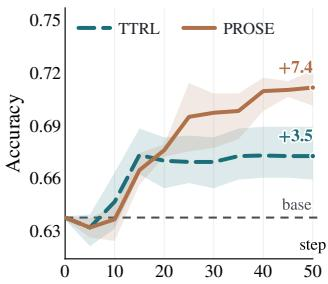
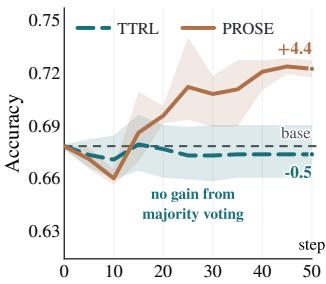
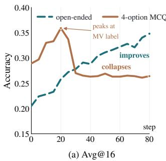
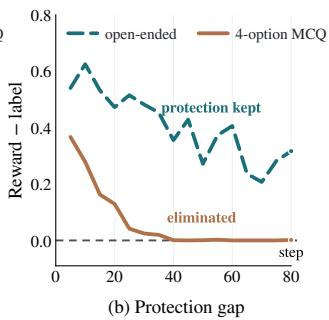
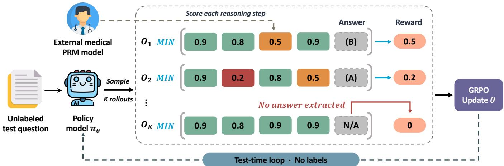
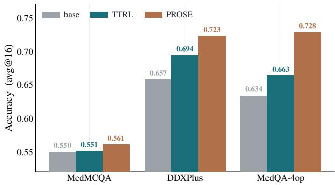
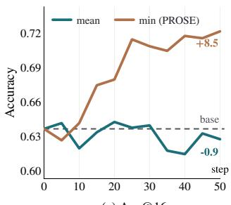
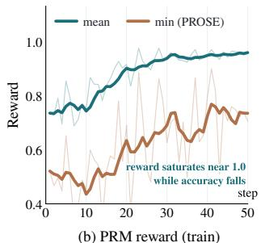

# Rewarding Reasoning, Not Answers: Fixing and Bounding Test-Time Reinforcement Learning on Medical QA

Kailong Fan1,2, Anqi Pu3, Yichen Wu1∗, Wanhua Li3, Yicong Li3, Hanspeter Pfister3, Huafeng Liu2, Xiang Li1, Quanzheng Li1, Ning Guo

1Harvard Medical School/MGH

2Zhejiang University 3Harvard University Corresponding author: yiwu6@mgh.harvard.edu

## Abstract

Test-time reinforcement learning adapts a model on its own unlabeled test set using majority-vote pseudo-labels and has shown strong results in mathematics. We show that this recipe collapses on medical multiple-choice QA: accuracy stagnates while output diversity rapidly declines. Through a controlled experiment that keeps the questions, model, and optimizer fixed while changing only the answer space, we trace this fail- ure to answer-space structure rather than domain dificulty. In small answer spaces, incorrect rollouts often collide on the same wrong pseudo-label and reinforce it; in large an- swer spaces, they disperse and receive little reward. This diagnosis motivates PROSE, Process Reward Guided Self- Training, which rewards reasoning quality instead of answer agreement. PROSE scores each reasoning step with a med- ical process reward model, assigns the trajectory reward as the minimum score across steps, and enforces answer-format constraints. Without labels, PROSE substantially improves a general Llama model, surpassing purpose-built medical mod- els and matching much larger systems. Because the process signal is internalized into the policy, the adapted model re- quires no reward model at inference and transfers its gains to unseen datasets. We further show that the minimum aggrega- tion is essential: mean aggregation can be exploited, saturating the proxy reward while degrading accuracy.

## 1 Introduction

Recent work shows that large language models can adapt at test time using their own sampled outputs (Zuo et al. 2026; Moradi et al. 2025; Yang et al. 2026). Test-time reinforcement learning (TTRL) turns these outputs into a learning signal: for each unlabeled test question, the model samples multiple responses, treats the majority answer as a pseudo-label, and updates itself to agree with it. This simple recipe has pro- duced strong gains in mathematics, making it attractive since it requires only test questions rather than ground-truth labels or additional annotation.

Medical question answering is a natural setting where such label-free adaptation would be especially valuable. Expert annotation is costly, clinical distributions vary across institu- tions and specialties, and privacy constraints often limit ex- ternal labeling (Wang et al. 2021; Zech et al. 2018; Price and Cohen 2019). At the same time, many medical benchmarks and decision-support interfaces are formulated as multiple- choice QA (MCQ), where the answer space is small and highly structured. This format raises a central question: does majority-vote self-training remain reliable when many different reasoning paths must choose from the same limited set of answers?

  
(a) Avg@16  
(b) Maj@16  
Figure 1: Rewarding reasoning prevents test-time RL collapse. Standard TTRL yields only modest gains in average accuracy over 16 sampled responses (avg@16) (a) and no gain in majority-vote accuracy over 16 sampled responses (maj@16) (b), whereas PROSE consistently improves both metrics. Curves show the mean, and shaded regions denote ± one standard deviation across three random seeds.

Figure 1 illustrates the empirical failure that motivates this work. Standard TTRL yields only marginal improve- ment in sample-level average accuracy and no improvement in majority-vote accuracy, despite repeated adaptation on the unlabeled test set. At the same time, the model’s outputs become substantially less diverse, indicating that adaptation increases agreement among samples without improving cor- rectness. In contrast, our PROSE improves both accuracy metrics by replacing final-answer agreement with process- level reward. This contrast suggests the limitation lies not in test-time adaptation itself, but in using majority-vote pseudolabels within a small, structured answer space.

To isolate the source of this collapse, we conduct a con- trolled experiment that holds the questions, model, optimizer, and training procedure fixed, and varies only the answer space. The results support an answer-space explanation rather than a domain-dificulty explanation. We show that the Lucky Hit mechanism identified by TTRL (Zuo et al. 2026) depends on the structure of the answer space: in a large free-form an- swer space, incorrect rollouts usually disperse across distinct strings and are rarely reinforced by the majority-vote reward; in a small multiple-choice answer space, diferent mistaken rationales can converge on the same wrong option, produc- ing a false consensus that is then rewarded as a pseudo-label. We quantify this efect through the protection gap between pseudo-label reward accuracy and true answer accuracy, and find that the gap present under free-form answering nearly vanishes under multiple choice.

This diagnosis points to a diferent training signal. If agree- ment on the final answer is unreliable, the reward should eval- uate the reasoning process that produced the answer (Uesato et al. 2022; Lightman et al. 2023). We introduce PROSE, which keeps the test-time RL loop but replaces majority-vote pseudo-labels with a step-level medical process reward model. PROSE scores each reasoning step, sets the trajectory reward to the minimum step score, and applies an answer- format guard. Minimum aggregation makes the reward de- pend on the weakest step in the chain, preventing trajectories from hiding flawed reasoning behind many easy or fluent steps.

Beyond improving adaptation, PROSE has a practical de- ployment advantage. The PRM is used only during the adap- tation stage to provide process-level rewards for sampled tra- jectories. After adaptation, the policy is evaluated on its own, using ordinary sampling or majority voting without access to the PRM. Thus, the process signal is absorbed into the model parameters rather than applied as an external selector at in- ference time. Empirically, this learned policy outperforms PRM-based selection under the same sampling budget and preserves its gains on datasets that were never used for adap- tation, indicating that PROSE learns transferable reasoning behavior rather than dataset-specific answer preferences. To sum up, our contributions are:

• We provide a causal account of why TTRL fails on medical multiple-choice QA. The Lucky Hit mechanism shows how small answer spaces convert independent reasoning errors into reinforced pseudo-label errors.

• We introduce PROSE, a label-free test-time adaptation method that rewards reasoning quality with a medical process reward model, assigns trajectory rewards by the minimum score across reasoning steps, and guards the answer format.

• We show that PROSE internalizes the process reward into the policy, requires no reward model at inference, generalizes beyond the adapted datasets, and avoids the reward hacking observed with mean aggregation.

## 2 Related Work

TTS and Self-Evolution. Increasing computation at infer- ence time has become a practical way to elicit stronger reasoning from LLMs, often complementing or even ri- valing gains from scaling model size (Snell et al. 2024; Huang et al. 2025). A dominant line of work samples multiple solutions and aggregates them via consensus (e.g., Self-Consistency) or selection (e.g., Best-of-M with a reward model) (Wang et al. 2022; Snell et al. 2024). Beyond selection-only schemes, TTRL enables parameter adaptation on unlabeled inputs by deriving proxy rewards from repeated sampling and MV, yielding self-evolution at test time (Zuo et al. 2026; Liu et al. 2025; Pan et al. 2026). While re-cent frontier reasoning models leverage outcome-verifiable rewards or expensive human annotations for RL (Guo et al. 2025; Jaech et al. 2024), unlabeled test-time adaptation is particularly appealing in medical settings where real-time gold standards are rarely available (Hager et al. 2024).

Inference-Time Verification: From Outcome to Process Rewards. Test-Time Scaling improves output quality with- out updating model parameters, typically by exploring multi- ple reasoning trajectories and selecting the most reliable one. Outcome-based reward models score whole solutions but can misjudge trajectories due to spurious reasoning that happens to reach the correct answer or correct early steps that later derail (Yuan, Mang et al. 2025; Lee et al. 2025). Process re-ward models address this by providing stepwise supervision to evaluate intermediate reasoning validity (Lightman et al. 2023; Zheng et al. 2025). In medicine, stepwise verification is challenging due to the lack of symbolic verifiers; Med- PRM tackles this by grounding step evaluations in retrieved clinical guidelines and medical literature (RAG-as-a-judge), enabling stronger verifier-based selection in medical reason- ing (Yun et al. 2025; Liu, McCoy, and Wright 2025).

## 3 Motivation: TTRL Fails on Medical MCQ

Observed Collapse. We first examine standard majority vote TTRL on medical multiple choice QA. As shown in Figure 1, TTRL produces only limited gains in sample-level accuracy, while majority vote accuracy remains essentially unchanged. At the same time, output diversity drops sharply (Cui et al. 2025; Chen et al. 2026). The model therefore becomes more self-consistent without becoming more correct. This behav- ior exposes a weakness of answer-level self-training. TTRL rewards agreement with the majority answer, but in medical MCQ, agreement is not a reliable proxy for correctness. When the answer space is small, diferent flawed reasoning paths can easily converge on the same option. Training then reinforces the shared answer even when the reasoning behind it is wrong.

Answer Space Matters. One possible explanation is that medical questions are simply harder than the mathematics tasks where TTRL has succeeded. To test this, we con- struct a controlled experiment on AMC mathematics prob- lems (Zuo et al. 2026). Each question is evaluated in two formats: its original free-form format and a matched four- option multiple-choice format. The questions, policy model, optimizer, and training procedure are held fixed. Only the answer space changes.

Figure 2 shows that this change is suficient to reverse the training dynamics. In the free form setting, TTRL steadily improves accuracy. In the matched multiple choice setting, accuracy initially rises but later collapses. Since the underly- ing questions and optimization procedure are unchanged, the result points to answer space structure rather than domain dificulty as a key cause of failure.

The Lucky Hit Mechanism. The controlled experiment re- veals how the Lucky Hit efect depends on the answer space. In a large free-form answer space, incorrect rollouts are dis- persed across many distinct strings. Even when the majority pseudo label is wrong, most other wrong rollouts do not exactly match it and therefore receive no reward. This spar- sity protects training from many pseudo label errors. In a small multiple-choice answer space, this protection disap- pears. Diferent mistaken rationales are compressed into the same few options, so wrong rollouts often collide on the same incorrect answer. Once that answer becomes the ma- jority pseudo label, many flawed trajectories receive positive reward. The measured protection gap consequently falls from strongly positive in the free form setting to nearly zero under multiple choice. This mechanism also explains why diversity collapse alone is not the root cause. Diversity can decrease while accuracy improves, as in the free form condition. What matters is where the probability mass concentrates. In medi- cal MCQ, the small answer space allows probability mass to concentrate on a wrong option, turning a pseudo-label error into a self-reinforcing training signal.

  
Figure 2: Changing only the answer space flips TTRL from improvement to collapse. (a) Avg@16 improves for openended answers but collapses for 4-option MCQs. (b) The protection gap (reward accuracy − label accuracy) remains positive for open-ended answers but vanishes for 4-option MCQs.

From Diagnosis to Reward Design. The diagnosis suggests that the reward should not depend only on final answer agree- ment. In collision-prone answer spaces, a more reliable signal should evaluate the reasoning process that produces the an- swer. This motivates PROSE, which replaces majority-vote rewards with process-level rewards from a medical PRM. PROSE scores each reasoning step and assigns the trajectory reward as the minimum score across steps. This design makes the reward sensitive to the weakest step in the rea- soning chain, so a response cannot hide a flawed inference behind fluent or easy steps. The PRM is used only during adaptation. Afterward, the adapted policy answers without PRM scoring, meaning the process signal is absorbed into the model rather than used as an inference-time selector.

## 4 Method

The preceding diagnosis shows that majority-vote TTRL fails because final-answer agreement becomes unreliable in a small answer space. PROSE (Process-Reward-Guided

Self-Training) keeps the same test-time RL loop but re-places answer-level pseudo-label rewards with process-level rewards. As shown in Figure 3, PROSE samples rollouts from the current policy, scores their reasoning steps with a medical process reward model (PRM), aggregates step scores with a minimum operator, applies a format guard, and updates the policy with GRPO. The entire procedure uses only unlabeled test questions.

Test-Time RL Setup. We consider transductive test-time adaptation on an unlabeled test set $\mathcal { D } = \{ q \}$ . For each ques- tion $q ,$ the policy samples a group of K rollouts,

$$
\{ o _ { k } \} _ { k = 1 } ^ { K } \sim \pi _ { \theta } ( \cdot \mid q ) ,\tag{1}
$$

where each rollout $o _ { k } = ( s _ { 1 } ^ { ( k ) } , \dots , s _ { n _ { k } } ^ { ( k ) } , a _ { k } )$ contains a se- quence of reasoning steps followed by a final answer $a _ { k }$

Given rollout rewards $\{ r _ { k } \} _ { k = 1 } ^ { K }$ , we optimize the policy with GRPO (Shao et al. 2024). The advantage of rollout k is normalized within the sampled group,

$$
A _ { k } = \frac { r _ { k } - \mu } { \sigma } ,\tag{2}
$$

where $\mu$ and σ are the mean and standard deviation of the group rewards. GRPO then updates θ with the clipped policy- gradient objective.

Standard TTRL defines reward by matching the majorityvote answer,

$$
r _ { k , \mathrm { T T R L } } = \left\{ \begin{array} { l l } { 1 , } & { \mathrm { i f } \ a _ { k } = \hat { a } , } \\ { 0 , } & { \mathrm { o t h e r w i s e } , } \end{array} \right. \quad \quad \hat { a } = \mathrm { M V } \big ( \{ a _ { j } \} _ { j = 1 } ^ { K } \big ) .\tag{3}
$$

This reward depends only on agreement in answer space, while PROSE replaces this signal with a reward over reason- ing steps.

Process-Level Reward. PROSE evaluates each rollout by the quality of its reasoning process rather than by agreement with other sampled answers. A medical PRM assigns a correctness score to each reasoning step,

$$
p _ { i } ^ { ( k ) } = \mathrm { P R M } \left( s _ { i } ^ { ( k ) } \mid q , s _ { < i } ^ { ( k ) } \right) \in [ 0 , 1 ] .\tag{4}
$$

This score is independent of whether other rollouts choose the same final option, so it is not directly afected by answer- space collisions.

To convert step scores into a trajectory reward, PROSE uses the minimum score across reasoning steps,

$$
r _ { k } = \operatorname* { m i n } _ { i } p _ { i } ^ { ( k ) } .\tag{5}
$$

This aggregation matches the structure of multi-step reason- ing: a chain is only as reliable as its weakest step. It also lim- its reward hacking (Gao, Schulman, and Hilton 2023; Skalse et al. 2022; Amodei et al. 2016). Mean or sum aggregation can be increased by adding high-scoring steps that dilute a flawed one, whereas the minimum can improve only when the weakest step improves. Empirically, this distinction is im- portant: mean aggregation saturates the proxy reward while degrading accuracy, whereas minimum aggregation remains aligned with answer correctness.

  
Figure 3: Overview of PROSE. Given an unlabeled test question, the policy $\pi _ { \theta }$ samples K rollouts. An external medical process reward model scores each reasoning step, and the minimum step score defines the reward for each rollout. A format guard assigns zero reward when no answer can be extracted. GRPO then updates the policy using the rollouts and their rewards, and the process repeats on the test set without labels.

Algorithm 1: PROSE, one optimization step   
Input: question q, policy πθ, process model Med-PRM   
1 Sample K rollouts $\{ o _ { k } \} _ { k = 1 } ^ { K } \sim \pi _ { \theta } ( \cdot \mid q )$   
2 for each rollout $O _ { k }$ do   
3 Score steps $p _ { i } ^ { ( k ) } \gets$ Med- $\mathbf { \cdot P R M } ( s _ { i } ^ { ( k ) } )$   
4 Set $r _ { k } \gets \dot { \operatorname* { m i n } _ { i } } p _ { i } ^ { ( k ) }$   
5 if $a _ { k }$ is not parseable then $r _ { k } \gets 0$   
6 end for   
7 Update θ with GRPO using rewards $\{ r _ { k } \} _ { k = 1 } ^ { K }$

Format Guard. The PRM scores reasoning steps but does not evaluate whether the rollout ends with a valid final an- swer. Without an explicit constraint, optimization can favor high-scoring reasoning traces that fail to produce a parseable answer. PROSE therefore applies a format guard:

$$
r _ { k } = { \left\{ \begin{array} { l l } { \operatorname* { m i n } _ { i } p _ { i } ^ { ( k ) } , } & { a _ { k } { \mathrm { ~ i s ~ p a r s e a b l e } } , } \\ { 0 , } & { { \mathrm { o t h e r w i s e } } . } \end{array} \right. }\tag{6}
$$

A rollout receives high reward only when it contains both a valid final answer and consistently reliable reasoning steps.

Algorithm and Inference Cost. Algorithm 1 summarizes one PROSE update. The PRM is used only during test-time adaptation to provide process-level rewards. After adapta- tion, the policy is evaluated directly with ordinary sampling or majority voting and requires no PRM scoring at inference. Thus, PROSE uses the PRM as a temporary training signal rather than as a per-query selector.

## 5 Experiments Setup

Policies. We evaluate two model families and three sizes: Llama-3.1-8B-Instruct (Grattafiori et al. 2024) and Qwen3- {1.7B, 4B, 8B} (with thinking disabled) (Yang et al. 2025). The two 8B models are our main policies; the smaller Qwen3 sizes are used to study the efect of model scale.

Process reward model. The reward comes from Med- PRM (Yun et al. 2025), an 8B medical process reward model that assigns each reasoning step a probability of being cor- rect, $p _ { i } ( \bar { + } ) \in [ 0 , 1 ]$ . Med-PRM is used only during test-time training: it provides the per-step scores that PROSE aggre- gates into a reward; the adapted policy answers at inference without it.

Datasets and protocol. We use four clinical multiple- choice benchmarks: MedQA-5op (5-option), MedQA-4op (4-option) (Jin et al. 2021), MedMCQA (Pal, Umapathi, and Sankarasubbu 2022), and DDXPlus (Fansi Tchango et al. 2022). Following the test-time RL setting, each run is transductive: the training set is the test set and no ground-truth labels are used at any point. A separate run adapts each policy on each dataset.

Baselines. We compare against: (i) the base model with no adaptation; (ii) TTRL, test-time RL with the majority- vote reward (Zuo et al. 2026); (iii) inference-time Med-PRM selection at a matched sampling budget, including best-of- N reranking (BoN) and reward-weighted self-consistency (SC+RM); and (iv) Large-scale General-purpose LLMs, open-source small language models and medical models re- run under our protocol (Chen et al. 2024; Zhang et al. 2024; Team et al. 2024).

Metrics. Our primary metric is avg@16: the average ac- curacy over 16 samples per question. Where we compare against inference-time selection (BoN, SC+RM), whose output is a single chosen answer, we instead report maj@16, the accuracy of the majority vote over 16 samples, so that all methods spend the same sampling budget. All models, in- cluding the external baselines, are evaluated identically: 16 samples per question at temperature 0.6 and top-p 0.95.

Optimization. We optimize with GRPO, normalizing each rollout’s advantage by the group standard deviation. Each update step uses 7 prompts × 32 samples (224 rollouts), and we train for 10 epochs. We use AdamW (learning rate $5 \times 1 0 ^ { - 7 }$ , cosine schedule with 3% warmup, weight decay 0.01, $\beta = ( 0 . 9 , 0 . 9 9 9 ) )$ , a symmetric PPO clip of 0.2 (no clip-higher) with one PPO epoch and gradient clipping at 1.0, a KL penalty (low-variance estimator, coeficient $1 0 ^ { - 3 } ) .$ and no entropy bonus. Training rollouts use temperature 1.0 (top-p 1.0); prompts and responses are capped at 1024 and 2048 tokens (context 3072). We do all experiments on A100 GPUs.

Table 1: Avg@16 performance on four medical QA datasets. Our method consistently improves standard TTRL across all datasets. Best and second-best results among models with fewer than 32B parameters are shown in bold and underlined, respectively.
<table><tr><td>Category</td><td>Model</td><td>Size</td><td>MedQA-5op</td><td>MedMCQA</td><td>DDXPlus</td><td>MedQA-4op</td><td>Avg.</td></tr><tr><td rowspan="6">Large-scale General-purpose LLMs</td><td>Gemini Flash 2.0</td><td></td><td>0.852</td><td>0.726</td><td>0.750</td><td>0.875</td><td>0.801</td></tr><tr><td>GPT-4o-mini</td><td></td><td>0.743</td><td>0.682</td><td>0.760</td><td>0.790</td><td>0.744</td></tr><tr><td>GPT-3.5 turbo</td><td></td><td>0.654</td><td>0.570</td><td>0.738</td><td>0.699</td><td>0.665</td></tr><tr><td>QWQ</td><td>32B</td><td>0.769</td><td>0.609</td><td>0.761</td><td>0.825</td><td>0.741</td></tr><tr><td>R1-Distill-Qwen</td><td>32B</td><td>0.738</td><td>0.591</td><td>0.781</td><td>0.772</td><td>0.721</td></tr><tr><td>Sky-T1</td><td>32B</td><td>0.749</td><td>0.587</td><td>0.776</td><td>0.795</td><td>0.727</td></tr><tr><td rowspan="2">Open-source Small Language Models</td><td>Llama3.1</td><td>8B</td><td>0.636</td><td>0.556</td><td>0.695</td><td>0.654</td><td>0.635</td></tr><tr><td>Gemma2</td><td>9B</td><td>0.532</td><td>0.512</td><td>0.676</td><td>0.581</td><td>0.575</td></tr><tr><td></td><td>Ministral</td><td>8B</td><td>0.475</td><td>0.469</td><td>0.606</td><td>0.530</td><td>0.520</td></tr><tr><td rowspan="7">Open-source Medical Language Models</td><td>Med42</td><td>8B</td><td>0.575</td><td>0.573</td><td>0.597</td><td>0.614</td><td>0.590</td></tr><tr><td>Meditron3</td><td>8B</td><td>0.569</td><td>0.549</td><td>0.632</td><td>0.612</td><td>0.591</td></tr><tr><td>OpenBioLLM</td><td>8B</td><td>0.363</td><td>0.459</td><td>0.438</td><td>0.373</td><td>0.408</td></tr><tr><td>m1-7B</td><td>7B</td><td>0.681</td><td>0.568</td><td>0.662</td><td>0.721</td><td>0.658</td></tr><tr><td>Meerkat</td><td>8B</td><td>0.654</td><td>0.569</td><td>0.709</td><td>0.672</td><td>0.651</td></tr><tr><td>UltraMedical</td><td>8B</td><td>0.665</td><td>0.579</td><td>0.694</td><td>0.710</td><td>0.662</td></tr><tr><td>HuatuoGPT-o1</td><td>8B</td><td>0.666</td><td>0.619</td><td>0.660</td><td>0.714</td><td>0.665</td></tr><tr><td rowspan="2">Test-time Training on Llama3.1-8B</td><td>TTRL</td><td>8B</td><td>0.672</td><td>0.573</td><td>0.761</td><td>0.676</td><td>0.671</td></tr><tr><td>Ours</td><td>8B</td><td>0.724</td><td>0.623</td><td>0.858</td><td>0.756</td><td>0.740</td></tr></table>

## 6 Results and Analysis

## 6.1 Main Results

PROSE lifts an 8B model to the top of its class. Table 1 reports avg@16 across the four clinical datasets, with every model evaluated under the same protocol. Applied to Llama- 3.1-8B, PROSE achieves an average score of 0.740, the best result among all 8–9B general and medical models. This rep- resents a substantial gain over its base model, from 0.635 to 0.740, or 10.5 percentage points. Using the same backbone, PROSE outperforms majority-vote TTRL by 6.9 percentage points, improving from 0.671 to 0.740. This result shows that the improvement comes from the process reward rather than test-time training alone. Notably, PROSE also surpasses ev- ery purpose-built open-source medical model, the strongest of which achieves approximately 0.665, despite using a gen-eral model adapted without labels.

Beyond its weight class, the 8B model adapted with PROSE is competitive with much larger and proprietary sys- tems. Its average score of 0.740 nearly matches QwQ at 0.741, the strongest 32B open reasoning model, while using roughly one quarter of the parameters. It is also comparable to GPT-4o-mini at 0.744 and trails only Gemini Flash 2.0 at 0.801. Among models of comparable size, PROSE performs best on all four datasets. On DDXPlus, it achieves 0.858, the highest score in the entire table, surpassing every proprietary and 32B model. Proprietary and 32B models retain an advan- tage on the exam-style MedQA and MedMCQA datasets, but PROSE closes much of this gap using a small, open model and no labeled data.

Reshaping the policy beats reranking its samples. Med- PRM is designed for inference-time selection with BoN or SC+RM. We ask whether the same reward model is more efective when used for selection or test-time train- ing. Since BoN and SC+RM return a single answer, we evaluate PROSE using maj@16 from the same N=16 sam-ples, ensuring a comparable single-answer evaluation and inference-time sampling budget. Table 2 compares these ap- proaches on two 8B policies. The comparison with TTRL directly isolates the efect of the reward signal, as the two methods otherwise follow the same test-time RL frame- work. PROSE improves the average by 6.6 percentage points on Llama-3.1-8B (0.683 → 0.749) and by 4.3 points on Qwen3-8B (0.724 → 0.767), outperforming TTRL on ev-ery dataset. PROSE also substantially outperforms inference- time PRM selection, achieving the best result in 7 of the 8 dataset×model settings. Compared with the strongest PRM selection baseline, it improves the average from 0.700 to 0.749 on Llama-3.1-8B and from 0.725 to 0.767 on Qwen3- 8B. The largest gains occur on DDXPlus, where PROSE reaches 0.863 with Llama-3.1-8B and 0.907 with Qwen3- 8B.

These results speak to how the PRM is best used. BoN and SC+RM can only pick among samples drawn from a fixed model, whereas PROSE uses the same Med-PRM to reshape the policy’s output distribution, making correct reasoning more likely in the first place; at a matched sampling budget, reshaping beats reranking. The reward is thereby internalized into the weights rather than merely consulted—the adapted policy answers by plain majority voting, with no PRM at inference, while BoN and SC+RM query the PRM on every question. We do not claim a net compute saving: test-time training is itself expensive. The point is that the PRM is needed only once, during adaptation, rather than on every future query, so its cost amortizes whenever the adapted policy is reused. We test this internalization next through out-of-distribution generalization.

Table 2: Comparison with TTRL and PRM-based inference methods on four medical QA datasets. PROSE achieves the best average performance for both model families and the best result in seven of eight model-dataset settings. Best results are shown in bold.
<table><tr><td>Model</td><td>Test-Time Method</td><td>MedQA-5op</td><td>MedMCQA</td><td>DDXPlus</td><td>MedQA-4op</td><td>Avg.</td></tr><tr><td rowspan="4">Llama3.1-8B</td><td>TTRL (maj@16)</td><td>0.684</td><td>0.572</td><td>0.760</td><td>0.714</td><td>0.683</td></tr><tr><td>PRM (BON@16)</td><td>0.690</td><td>0.610</td><td>0.780</td><td>0.720</td><td>0.700</td></tr><tr><td>PRM (SC+RM@16)</td><td>0.690</td><td>0.620</td><td>0.740</td><td>0.740</td><td>0.698</td></tr><tr><td>PROSE (maj@16)</td><td>0.740</td><td>0.628</td><td>0.863</td><td>0.764</td><td>0.749</td></tr><tr><td rowspan="4">Qwen3-8B</td><td>TTRL (maj@16)</td><td>0.696</td><td>0.606</td><td>0.866</td><td>0.729</td><td>0.724</td></tr><tr><td>PRM (BON@16)</td><td>0.690</td><td>0.590</td><td>0.810</td><td>0.770</td><td>0.715</td></tr><tr><td>PRM (SC+RM@16)</td><td>0.720</td><td>0.580</td><td>0.840</td><td>0.760</td><td>0.725</td></tr><tr><td>PROSE (maj@16)</td><td>0.754</td><td>0.645</td><td>0.907</td><td>0.760</td><td>0.767</td></tr></table>

Out-of-distribution generalization. If PROSE merely fit the specific questions used for adaptation, its gains would not transfer across datasets. We therefore freeze the policy adapted on MedQA-5op and evaluate it on three datasets unseen during adaptation, using standard sampling without the PRM. Figure 4 shows that PROSE improves over the base model on all three out-of-distribution datasets and out- performs TTRL in every case: MedMCQA improves from 0.550 to 0.561, DDXPlus from 0.657 to 0.723, and MedQA-4op from 0.634 to 0.728. As expected, these transferred gains are smaller than those obtained by adapting directly to each target dataset (see Table 1). The gain is largest on MedQA-4op, which most closely resembles the adaptation set, and smallest on MedMCQA.

This is the clearest evidence that the process reward has been internalized. The adapted policy carries its improve- ment to new distributions without any PRM at inference. The external evaluator was needed only once, to bootstrap the policy, and what remains is a self-contained model rather than a set of memorized answers.

## 6.2 Ablation: What matters in the reward design

Two design choices decide how much of the process signal survives: how the signal enters training, and how the per-step scores are aggregated.

A process reward beats a process label. Table 3 isolates the first choice on MedQA-5op. Replacing majority voting with a PRM-derived pseudo-label already improves avg@16 from 0.672 to 0.709, confirming that the process signal captures information missed by majority voting. But keeping the

  
Figure 4: Out-of-distribution generalization measured by avg@16. The policy is adapted on MedQA-5op, then frozen and evaluated on three unseen datasets without further adap- tation or PRM scoring. PROSE consistently outperforms both the base model and standard TTRL.

Table 3: Efect of incorporating process supervision into TTRL on MedQA-5op with Llama3.1-8B. PRM-derived labels outperform majority-vote labels, while using PRM scores as graded rewards (PROSE) achieves the best avg@16 and maj@16 performance. Best results are shown in bold.
<table><tr><td>Method</td><td>avg@16</td><td>maj@16</td></tr><tr><td>MV as label</td><td>0.672</td><td>0.684</td></tr><tr><td>PRM as label</td><td>0.709</td><td>0.710</td></tr><tr><td>PRM as reward (PROSE)</td><td>0.724</td><td>0.740</td></tr></table>

PRM as a continuous reward is better still (0.724 avg@16), and the gap widens under maj@16. The reason is what each formulation discards: collapsing the step scores into a sin- gle target to imitate throws away their gradation, so every incorrect trajectory looks equally wrong, whereas a graded reward preserves the ordering among partially-correct trajectories and tells the policy which of its attempts came closer.

Min aggregation keeps the reward honest. The second design choice is how to aggregate the step-level PRM scores, which directly determines the method’s susceptibility to re- ward hacking. Figure 5 compares minimum and mean ag- gregation under otherwise identical settings. With minimum aggregation, avg@16 improves by 8.5 percentage points over the untrained base and remains consistently above it. With mean aggregation, avg@16 eventually falls 0.9 points below the base, even as the optimized PRM reward approaches 1.0. The proxy is therefore nearly saturated while the true objective deteriorates, providing clear evidence of reward hacking. This behavior is consistent with the failure mode described in Section 4. Mean aggregation allows low-scoring reason- ing steps to be diluted by additional high-scoring steps, en- abling the policy to increase its reward without correcting its weakest reasoning. Minimum aggregation blocks this strat- egy because the trajectory reward cannot exceed its lowest step-level score. Optimization must therefore improve the weakest part of the trajectory. Accordingly, the minimum-aggregated reward remains well below saturation, at approx- imately 0.73–0.75, while accuracy improves.

Table 4: Efect of model scale on maj@16 performance. PROSE performs best across all four datasets at 4B, while at 1.7B its advantage is limited to DDXPlus, indicating that efective process-reward training depends on suficient policy capacity. Best results within each model block are shown in bold.
<table><tr><td>Model</td><td>Test-Time Method</td><td>MedQA-5op</td><td>MedMCQA</td><td>DDXPlus</td><td>MedQA-4op</td><td>Avg.</td></tr><tr><td rowspan="4">Qwen3-4B</td><td>TTRL (maj@16)</td><td>0.626</td><td>0.512</td><td>0.814</td><td>0.657</td><td>0.652</td></tr><tr><td>PRM (BON@16)</td><td>0.680</td><td>0.570</td><td>0.790</td><td>0.700</td><td>0.685</td></tr><tr><td>PRM (SC+RM@16)</td><td>0.670</td><td>0.570</td><td>0.800</td><td>0.690</td><td>0.683</td></tr><tr><td>PROSE (maj@16)</td><td>0.725</td><td>0.621</td><td>0.856</td><td>0.733</td><td>0.734</td></tr><tr><td rowspan="4">Qwen3-1.7B</td><td>TTRL (maj@16)</td><td>0.436</td><td>0.462</td><td>0.826</td><td>0.520</td><td>0.561</td></tr><tr><td>PRM (BON@16)</td><td>0.570</td><td>0.570</td><td>0.800</td><td>0.590</td><td>0.633</td></tr><tr><td>PRM (SC+RM@16)</td><td>0.530</td><td>0.510</td><td>0.810</td><td>0.570</td><td>0.605</td></tr><tr><td>PROSE (maj@16)</td><td>0.493</td><td>0.553</td><td>0.871</td><td>0.540</td><td>0.614</td></tr></table>

  
(a) Avg@16

  
Figure 5: Min vs. mean aggregation of step-level PRM scores on MedQA-5op. (a) With min aggregation (PROSE), accu-racy improves and remains above the untrained base, whereas mean aggregation eventually falls below it. (b) Despite the accuracy degradation, the mean-aggregated PRM reward sat- urates near 1.0, indicating reward hacking. Faint lines show the raw per-step rewards, and thick lines show their 5-step moving averages.

## 6.3 Ablation: Efect of model scale

Does internalizing the reward still pay of when the policy is small? Table 4 compares PROSE with TTRL and inference- time PRM selection on Qwen3-4B and Qwen3-1.7B under the same matched budget of N=16 samples per question.

At 4B the picture is unchanged from 8B: PROSE is the best method on all four datasets and by a wide margin on average (0.734 vs. 0.685 for the strongest selector), so the benefit of training with the process reward is not an artifact of scale. At 1.7B, however, the ordering reverses on three of four datasets—inference-time best-of-N leads on average (0.633 vs. 0.614)—and PROSE prevails only on DDXPlus.

This reversal is informative rather than incidental. Train- ing with the process reward requires the policy to be able to produce better reasoning once it is pushed toward it; selec- tion only requires that a good trajectory occasionally appear among N samples and be recognizable to the PRM. When the policy is very weak, the second condition is easier to satisfy than the first, so the external selector retains an ad- vantage. The practical implication is that internalization pays of once the policy is strong enough to act on the signal, from roughly 4B in our setting, while below that scale the reward is better used at inference time.

## 7 Conclusion

We showed that test-time RL, efective on mathematics, col- lapses on medical multiple-choice QA for a structural rea-son: in a small answer space, incorrect rollouts collide on the same wrong pseudo-label and reinforce it. A controlled ex- periment varying only the answer space isolates this efect, and the reward−label protection gap quantifies it (+0.246 free-form vs. +0.001 multiple-choice). PROSE follows from this diagnosis, rewarding the reasoning process rather than answer agreement through minimum step-level aggregation and an answer-format guard. Without labels, it gives Llama- 3.1-8B the best average accuracy among the evaluated 8–9B models and matches much larger systems. The adapted pol- icy requires no reward model at inference, outperforms PRM selection at the same sampling budget, and retains its gains on unseen adaptation datasets.

Limitations and future work. PROSE requires a domain- relevant process reward model. Self-generated or general- purpose process rewards could reduce this dependence and extend it beyond medical QA. Its efectiveness also depends on policy capacity: inference-time selection remains prefer- able below roughly 4B parameters in our experiments. Future work should characterize this transition and how policy ca- pacity and reward quality afect reward internalization.

Amodei, D.; Olah, C.; Steinhardt, J.; Christiano, P. F.; Schul- man, J.; and Mané, D. 2016. Concrete Problems in AI Safety. ArXiv, abs/1606.06565.

Chen, J.; Cai, Z.; Ji, K.; Wang, X.; Liu, W.; Wang, R.; Hou, J.; and Wang, B. 2024. Huatuogpt-o1, towards medical complex reasoning with llms. arXiv preprint arXiv:2412.18925.

Chen, Z.; Lu, R.; Zhao, A.; Wang, Z.; Yue, Y.; Song, S.; and Huang, G. 2026. Does reinforcement learning really incen- tivize reasoning capacity in llms beyond the base model? Advances in Neural Information Processing Systems, 38: 57654–57689.

Cui, G.; Zhang, Y.; Chen, J.; Yuan, L.; Wang, Z.; Zuo, Y.; Li, H.; Fan, Y.; Chen, H.; Chen, W.; et al. 2025. The entropy mechanism of reinforcement learning for reasoning language models. arXiv preprint arXiv:2505.22617.

Fansi Tchango, A.; Goel, R.; Wen, Z.; Martel, J.; and Ghosn, J. 2022. Ddxplus: A new dataset for automatic medical diag- nosis. Advances in neural information processing systems, 35: 31306–31318.

Gao, L.; Schulman, J.; and Hilton, J. 2023. Scaling Laws for Reward Model Overoptimization. In Krause, A.; Brun- skill, E.; Cho, K.; Engelhardt, B.; Sabato, S.; and Scarlett, J., eds., Proceedings ofthe 40th International Conference on Machine Learning, volume 202 of Proceedings ofMachine Learning Research, 10835–10866. PMLR.

Grattafiori, A.; Dubey, A.; Jauhri, A.; Pandey, A.; Kadian, A.; Al-Dahle, A.; Letman, A.; Mathur, A.; Schelten, A.; Vaughan, A.; et al. 2024. The llama 3 herd of models. arXiv preprint arXiv:2407.21783.

Guo, D.; Yang, D.; Zhang, H.; Song, J.; Wang, P.; Zhu, Q.; Xu, R.; Zhang, R.; Ma, S.; Bi, X.; et al. 2025. Deepseek-r1: Incentivizing reasoning capability in llms via reinforcement learning. arXiv preprint arXiv:2501.12948.

Hager, P.; Jungmann, F.; Holland, R.; Bhagat, K.; Hubrecht, I.; Knauer, M.; Vielhauer, J.; Makowski, M.; Braren, R.; Kaissis, G.; and Rueckert, D. 2024. Evaluation and mitiga- tion of the limitations of large language models in clinical decision-making. Nature Medicine, 30: 2613 – 2622.

Huang, X.; Wu, J.; Liu, H.; Tang, X.; and Zhou, Y. 2025. m1: Unleash the Potential of Test-Time Scaling for Medical Reasoning with Large Language Models. ArXiv, abs/2504.00869.

Jaech, A.; Kalai, A.; Lerer, A.; Richardson, A.; El-Kishky, A.; Low, A.; Helyar, A.; Madry, A.; Beutel, A.; Carney, A.; et al. 2024. Openai o1 system card. arXiv preprint arXiv:2412.16720.

Jin, D.; Pan, E.; Oufattole, N.; Weng, W.-H.; Fang, H.; and Szolovits, P. 2021. What disease does this patient have? a large-scale open domain question answering dataset from medical exams. Applied Sciences, 11(14): 6421.

Lee, D. B.; Lee, S.; Park, S.; Kang, M.; Baek, J.; Kim, D.; Wagner, D.; Jin, J.; Lee, H.; Bocklet, T.; et al. 2025. Rethink- ing reward models for multi-domain test-time scaling. arXiv preprint arXiv:2510.00492.

Lightman, H.; Kosaraju, V.; Burda, Y.; et al. 2023. Let’s Verify Step by Step. ArXiv, abs/2305.20050.

Liu, J.; He, C.; Lin, Y.; Yang, M.; Shen, F.; and Liu, S. 2025. Ettrl: Balancing exploration and exploitation in llm test- time reinforcement learning via entropy mechanism. arXiv preprint arXiv:2508.11356.

Liu, S.; McCoy, A. B.; and Wright, A. 2025. Improving large language model applications in biomedicine with retrieval- augmented generation: a systematic review, meta-analysis, and clinical development guidelines. Journal of the American Medical Informatics Association : JAMIA, 32: 605 – 615.

Moradi, M. M.; Amer, H.; Mudur, S.; Zhang, W.; Liu, Y.; and Ahmed, W. 2025. Continuous Self-Improvement of Large Language Models by Test-time Training with Verifier-Driven Sample Selection. ArXiv, abs/2505.19475.

Pal, A.; Umapathi, L. K.; and Sankarasubbu, M. 2022. MedMCQA: A Large-scale Multi-Subject Multi-Choice Dataset for Medical domain Question Answering. In Flores, G.; Chen, G. H.; Pollard, T.; Ho, J. C.; and Naumann, T., eds., Proceedings of the Conference on Health, Inference, and Learning, volume 174 of Proceedings ofMachine Learning Research, 248–260. PMLR.

Pan, T.; Yan, Y.; Wang, Z.; Zhang, R.; Hou, G.; Zhang, W.; Lu, W.; Xiao, J.; and Shen, Y. 2026. Coverrl: Breaking the consensus trap in label-free reasoning via generator-verifier co-evolution. In Proceedings of the 64th Annual Meeting of the Association for Computational Linguistics (Volume 1: Long Papers), 29833–29853.

Price, W. N.; and Cohen, I. G. 2019. Privacy in the age of medical big data. Nature medicine, 25(1): 37–43.

Shao, Z.; Wang, P.; Zhu, Q.; et al. 2024. Deepseekmath: Pushing the limits of mathematical reasoning in open lan- guage models. arXiv preprint arXiv:2402.03300.

Skalse, J. M. V.; Howe, N. H. R.; Krasheninnikov, D.; and Krueger, D. 2022. Defining and Characterizing Reward Hacking. ArXiv, abs/2209.13085.

Snell, C.; Lee, J.; Xu, K.; and Kumar, A. 2024. Scaling LLM Test-Time Compute Optimally can be More Efective than Scaling Model Parameters. ArXiv, abs/2408.03314.

Team, G.; Georgiev, P.; Lei, V. I.; Burnell, R.; Bai, L.; Gulati, A.; Tanzer, G.; Vincent, D.; Pan, Z.; Wang, S.; et al. 2024. Gemini 1.5: Unlocking multimodal understand- ing across millions of tokens of context. arXiv preprint arXiv:2403.05530.

Uesato, J.; Kushman, N.; Kumar, R.; Song, F.; Siegel, N.; Wang, L.; Creswell, A.; Irving, G.; and Higgins, I. 2022. Solving math word problems with process-and outcome- based feedback. arXiv preprint arXiv:2211.14275.

Wang, S.; Li, C.; Wang, R.; Liu, Z.; Wang, M.; Tan, H.;Wu, Y.; Liu, X.; Sun, H.; Yang, R.; et al. 2021. Annotation-eficient deep learning for automatic medical image segmen-tation. Nature communications, 12(1): 5915.

Wang, X.; Wei, J.; Schuurmans, D.; Le, Q.; Chi, E.; Narang, S.; Chowdhery, A.; and Zhou, D. 2022. Self-consistency improves chain of thought reasoning in language models. arXiv preprint arXiv:2203.11171.

Yang, A.; Li, A.; Yang, B.; Zhang, B.; Hui, B.; Zheng, B.; Yu, B.; Gao, C.; Huang, C.; Lv, C.; et al. 2025. Qwen3 technical report. arXiv preprint arXiv:2505.09388.

Yang, C.; Xiang, Z.; Tang, Y.; Teng, Z.; Huang, C.; Long, F.; Liu, Y.; and Su, J. 2026. Ttcs: Test-time curriculum synthesis for self-evolving. arXiv preprint arXiv:2601.22628.

Yuan, Y.; Mang, Q.; et al. 2025. Curing Miracle Steps in LLM Mathematical Reasoning with Rubric Rewards. ArXiv, abs/2510.07774.

Yun, J.; Sohn, J.; Park, J.; Kim, H.; Tang, X.; Shao, Y.; Koo, Y.; Ko, M.; Chen, Q.; Gerstein, M.; Moor, M.; and Kang, J. 2025. Med-PRM: Medical Reasoning Models with Stepwise, Guideline-verified Process Rewards. ArXiv, abs/2506.11474.

Zech, J. R.; Badgeley, M. A.; Liu, M.; Costa, A. B.; Titano, J. J.; and Oermann, E. K. 2018. Variable generalization performance of a deep learning model to detect pneumonia in chest radiographs: a cross-sectional study. PLoS medicine, 15(11): e1002683.

Zhang, K.; Zeng, S.; Hua, E.; Ding, N.; Chen, Z.-R.; Ma, Z.; Li, H.; Cui, G.; Qi, B.; Zhu, X.; et al. 2024. Ultramedical: Building specialized generalists in biomedicine. Advances in Neural Information Processing Systems, 37: 26045–26081.

Zheng, C.; Zhu, J.; Ou, Z.; et al. 2025. A Survey of Process Reward Models: From Outcome Signals to Process Supervi- sions for Large Language Models. ArXiv, abs/2510.08049.

Zuo, Y.; Zhang, K.; Sheng, L.; Qu, S.; Cui, G.; Zhu, X.; Li, H.; Long, X.; Hua, E.; Qi, B.; et al. 2026. Ttrl: Testtime reinforcement learning. Advances in Neural Information Processing Systems, 38: 131459–131483.