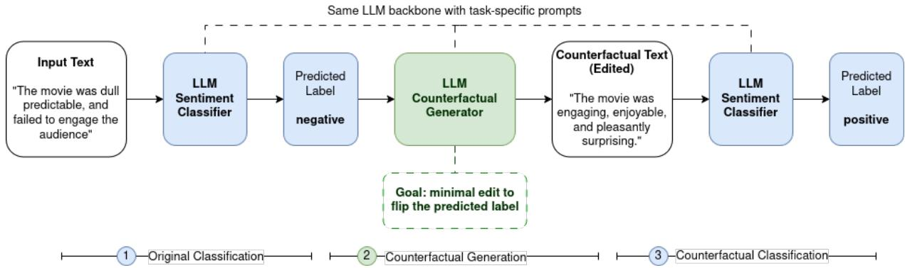
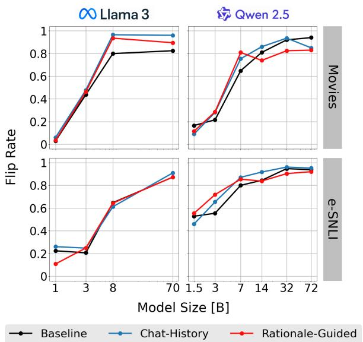
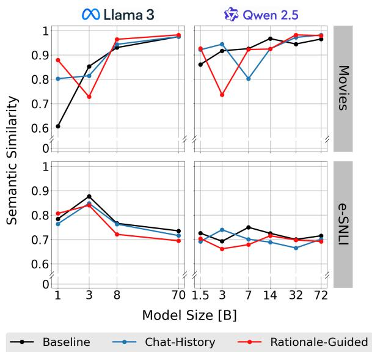
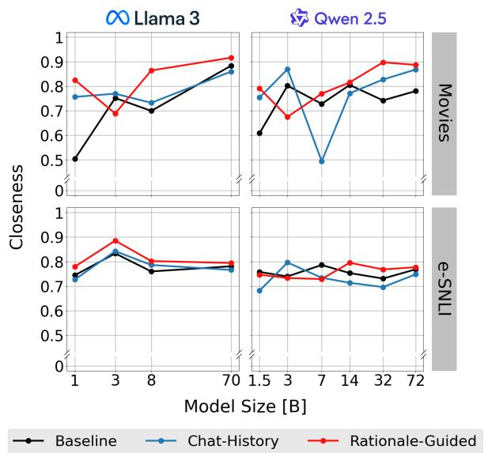
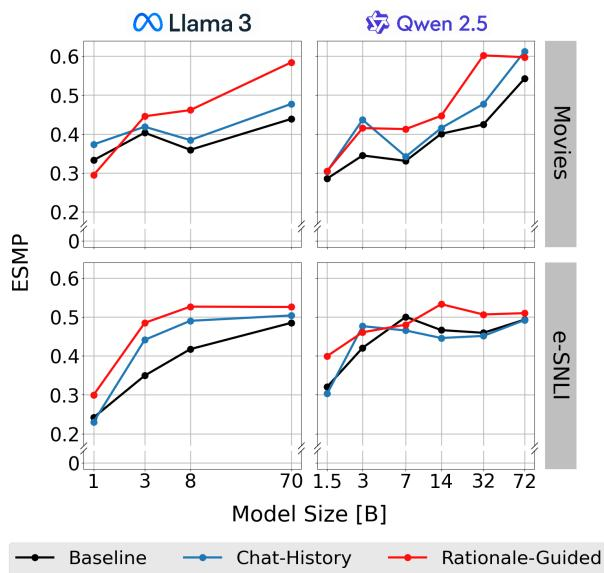

# An Empirical Study of Counterfactual Self-Explanations in LLMs

Giannis Kalyvas1, Giorgos Filandrianos1, Orfeas Menis Mastromichalakis2, Vassilis Lyberatos1, Giorgos Stamou1

1 National Technical University of Athens, Athens, Greece 2 Instituto de Telecomunicações, Lisbon, Portugal gian.kalyva@gmail.com

## Abstract

Large language models can easily generate explanations for their own outputs, but such self-explanations are not necessarily faithful to the model’s behavior. We study this issue through counterfactual self-explanations, where a model minimally edits an input so that its own prediction changes. Across sentiment analysis and natural language inference, we evaluate ten instruction-tuned models from the LLaMA-3 and Qwen-2.5 families, measuring faithfulness, minimality, and alignment with human-annotated rationales. Our results show that model scale is the strongest determinant of explanation quality: larger models are substantially more likely to generate counterfactuals that flip their own predictions and target decision-relevant evidence. In contrast, the rationale-guided condition produces edit-minimal counterfactuals that are also more human-aligned. However, it does not consistently improve faithfulness. Overall, counterfactual self-explanations can provide useful behavioral evidence about model decisions, but their reliability depends strongly on model capacity and should be empirically validated rather than assumed1.

## 1 Introduction

Large language models (LLMs) are increasingly asked not only to produce answers, but also to justify them. These self-explanations are attractive because they are easy to obtain, expressed in natural language, and often appear convincing to users. However, a fluent explanation is not necessarily a faithful one: a model may provide a plausible post-hoc rationale that does not reflect the factors that actually determine its behavior (Atanasova et al., 2023; Jacovi and Goldberg, 2020; Siegel et al., 2024). This raises an important question for interpretability: when, if ever, can self-generated explanations be treated as reliable evidence about a model’s own predictions?

We study this question through counterfactual self-explanations. In this setting, the same model first makes a prediction and is then asked to minimally edit the input so that its own prediction changes. Counterfactuals are useful because they connect explanation quality to observable model behavior: a faithful counterfactual should cross the model’s decision boundary, while human alignment reveals whether the model’s decision logic mirrors human reasoning. Together, faithfulness and human alignment distinguish merely superficial explanations from cases where the model both captures its own behavior and relies on evidence that correlates with human reasoning.

Prior work has examined LLM-generated counterfactual explanations and raised concerns about their reliability. Existing studies evaluate whether such explanations are behaviorally faithful across settings (Madsen et al., 2024; Atanasova et al., 2023; Nguyen et al., 2024; Randl et al., 2025; Mayne et al., 2025), how prompting affects their generation (Bhattacharjee et al., 2024; Dehghanighobadi et al., 2025; Turpin et al., 2023; Chen et al., 2025), and how factors such as intervention consistency, scale, verbosity, and counterfactual behavior shape self-explanations (Chuang et al., 2026; Siegel et al., 2025; Han et al., 2026; Hong and Roth, 2026). However, these works do not jointly examine whether counterfactual selfexplanations both reflect the model’s own behavior and align with human-relevant evidence.

In this work, we ask what determines whether counterfactual self-explanations are faithful, minimal, and aligned with decision-relevant evidence. Specifically, we examine how model scale affects the ability of LLMs to generate counterfactuals that flip their own predictions, whether faithful counterfactuals modify evidence that aligns with human-annotated rationales, and whether prompting choices improve self-explanations. We conduct an empirical study across sentiment analysis and natural language inference using ten instructiontuned open-weight models from the LLaMA-3 and Qwen-2.5 families. Evaluating counterfactual explanations is inherently multifaceted, as their desirable properties can depend on both the generation method and the intended explanatory objective (Filandrianos et al., 2023; Menis Mastromichalakis et al., 2025). We therefore evaluate counterfactual quality along three dimensions: faithfulness, measured by whether the generated edit flips the model’s own prediction; minimality, measured by closeness to the original input; and human alignment, measured by overlap with humanannotated rationales. To capture the latter, we introduce Evidence-Supported Modification Precision (ESMP), which measures whether the model edits human-supported evidence rather than arbitrary input tokens.

## 2 Methodology

We evaluate our framework on two tasks: sentiment analysis on movie reviews and natural language inference on e-SNLI. These tasks allow us to examine counterfactual self-explanations across different forms of language understanding. Both tasks are evaluated using the corresponding ERASER benchmark (DeYoung et al., 2020) test sets. For Movie Reviews, ERASER uses the dataset from (Zaidan and Eisner, 2008), while for SNLI, ERASER uses e-SNLI dataset from (Camburu et al., 2018). To assess alignment with human reasoning, we use human rationale annotations provided by ERASER as external evidence for whether model edits focus on text regions humans consider relevant for the prediction.

To isolate model-scale effects, we compare models only within the same architectural family. We evaluate ten models from two open-weight families, LLaMA-3 (Grattafiori et al., 2024) and Qwen-2.5 (Yang et al., 2025), ranging from 1B to 70B+. These families offer broad size ranges, consistent architectures, and public instruction-tuned variants, which help ensure prompt adherence. Further details on models, inference hyperparameters, and hardware are provided in Appendix A.

## 2.1 Counterfactual Generation Pipeline

The counterfactual generation pipeline, shown in Figure 1 and adapted from (Madsen et al., 2024), follows a three-stage process using the same LLM with role-specific prompts. In the first stage, the model is prompted to perform the original task and produce a label for the given input, which serves as the reference point. In the second stage, the model generates a counterfactual by minimally modifying the original text such that the predicted label would flip. In the third stage, the generated counterfactual is fed back into the model for re-classification.

## 2.2 Different Prompting Methods

We vary the prompting strategy used in counterfactual generation to examine how different forms of guidance influence the resulting counterfactuals. Specifically, we consider three variants. In the baseline setting, counterfactuals are generated by conditioning the model on the opposite of the label predicted in Stage 1. We directly instruct models to generate a minimally edited counterfactual that would be classified as the target label without additional structure or guidance. In the Chat-History setting, Stages 1 and 2 are conducted within a single dialogue context. In the Rationale-Guided setting, Stage 2 is decomposed into two steps following (Bhattacharjee et al., 2024): the model first identifies the key rationale underlying the original prediction and then generates a counterfactual by modifying these critical elements. See Appendix B for the prompts used.

## 2.3 Evaluation Protocol

Counterfactual explanations describe how an outcome would change under a minimal alteration to the input (Molnar, 2020). Formally, a counterfactual $x ^ { \prime }$ for input x $\in { \mathcal { X } }$ , given a model $f : \mathcal { X }  \mathcal { Y }$ and distance $d : \mathcal { X } \times \mathcal { X } \to \mathbb { R } _ { \ge 0 }$ , is defined as the solution to the optimization problem:

$$
x ^ { \prime } = \arg \operatorname* { m i n } _ { x ^ { \prime } \in \mathcal { X } } d ( x , x ^ { \prime } ) \quad \mathrm { s . t . } \quad f ( x ^ { \prime } ) \neq f ( x ) .\tag{1}
$$

We evaluate two objectives derived from this definition: faithfulness and minimality. Following prior work on textual counterfactual generation, we use minimality in the empirical edit-minimality sense: a counterfactual is more minimal when it preserves more of the original input. We operationalize this objective through closeness-based metrics, including normalized edit distance and semantic similarity. This should not be interpreted as a claim that generated counterfactuals are globally minimal over the full natural-language input space. Additionally, we introduce a third metric that measures the extent to which the modifications align with human-annotated evidence.

  
Figure 1: Experimental pipeline.

Faithfulness The primary objective of a counterfactual is to induce a change in the model prediction. Let $f ( \cdot )$ denote the classifier, x the original input, and $x ^ { \prime }$ the generated counterfactual instance. We measure faithfulness as in (Madsen et al., 2024) as the flip rate:

$$
{ \mathrm { F a i t h f u l n e s s } } = { \frac { 1 } { N } } \sum _ { i = 1 } ^ { N } \mathbf { 1 } \left[ f ( x _ { i } ^ { \prime } ) \neq f ( x _ { i } ) \right]\tag{2}
$$

where N is the number of instances and 1[·] indicates successful label flipping.

Closeness The second objective, derived from Equation 1, is to minimize the distance $d ( x , x ^ { \prime } )$ between the original input and the counterfactual. Since textual similarity cannot be captured by a single distance measure, we consider multiple instantiations of d.

We first consider closeness as a measure of surface-level similarity, defined as the complement of the normalized edit distance:

$$
\operatorname { C l o s e n e s s } ( x , x ^ { \prime } ) = 1 - { \frac { \operatorname { e d i t d i s t a n c e } ( x , x ^ { \prime } ) } { \operatorname { m a x } ( | x | , | x ^ { \prime } | ) } }\tag{3}
$$

We then consider semantic similarity, measured as the cosine similarity between sentence embeddings produced by an MPNet encoder, capturing meaning preservation beyond lexical overlap.

Evidence-Supported Modification Precision While faithfulness and minimality are standard evaluation axes in prior work, they do not capture whether the model modifies decision-relevant parts of the input. To address this, we introduce ESMP, a metric that leverages the human-provided annotations in ERASER to assess whether model edits align with annotated rationales.

We first align the original input and the counterfactual via minimal-edit sequence alignment (replacements, deletions, insertions), identifying the set of edits needed to transform the original into the counterfactual. Replacements, deletions, or insertions that fall inside annotated evidence spans are considered true positive (TP), while the remaining, unsupported edits are considered false positive (FP). ESMP is defined as:

$$
\operatorname { E S M P } = { \frac { T P } { T P + F P } }\tag{4}
$$

We use precision rather than recall because counterfactual explanations are intended to be minimal, so ESMP measures whether the modifications made are concentrated on human-annotated evidence, rather than measuring what fraction of all evidence is covered (a recall-style objective would instead reward broader edits, conflicting with minimality).

## 3 Results and Discussion

We evaluate self-explanations by faithfulness, minimality, and human alignment: whether edits flip the model’s prediction, remain close to the input, and overlap with human rationales. Detailed results are reported in Appendix C.

Larger models provide more faithful selfexplanations. Across tasks, model families, and prompting strategies, larger models are consistently better at producing self-explanations that change their own predictions (Figure 2). This suggests that self-explanation is not only a generation problem, but also a capacity problem: the model must identify which input parts support its decision and modify them in a way that crosses its own decision boundary. To quantify this trend, we compute the correlation between model size and each metric across all experimental settings. Model size is strongly correlated with flip rate $( \rho \ : = \ : 0 . 8 7 )$ showing that larger models are much more likely to produce behaviorally faithful self-explanations. Methodological details and aggregate results are reported in Appendix D. A regression analysis controlling for dataset, model family, and prompting strategy leads to the same conclusion: each doubling in model size is associated with an increase of 12 percentage points in self-explanation faithfulness. Thus, scale is not a minor variation across rows in the table, but a systematic driver of whether models can explain their own predictions through effective edits.

  
Figure 2: Faithfulness evaluation, measured by flip rate. Model size is a key factor in producing faithful selfexplanations.

The generated counterfactuals remain close to the original inputs. Figures 3 and 4 report the closeness scores across datasets, model families, model sizes, and prompting strategies. Overall, the generated counterfactuals remain close to the original inputs across most settings, indicating that the models generally perform localized edits rather than broad rewrites. This supports the minimality of the generated self-explanations.

Faithful self-explanations are also more human-aligned. Larger models not only produce more faithful self-explanations; their selfexplanations also become more aligned with human rationales (Figure 5). ESMP captures this aspect by measuring whether the evidence edited by the model overlaps with the evidence annotated by humans. This matters because, in our setting, a selfexplanation is meaningful when the model changes its own prediction by intervening on the evidence that supports that prediction. Higher ESMP suggests that larger models explain themselves through rationales that are closer to those used by humans.

  
Figure 3: Semantic similarity evaluation. Selfexplanations remain semantically close to the original input across all settings.

  
Figure 4: Closeness evaluation. The generated counterfactuals are consistently close to the input across all settings.

This trend is systematic: model size is strongly associated with ESMP $( \rho = 0 . 7 8 )$ , while its association with closeness $( \rho = 0 . 3 2 )$ and semantic similarity $( \rho = 0 . 1 6 )$ is much weaker. Thus, scaling does not mainly make self-explanations longer, broader, or more text-preserving. Instead, it makes models better at identifying the evidence behind their own decisions that is more consistent with

  
Figure 5: ESMP shows that larger models produce more targeted, decision-relevant edits.

Prompting can distort self-explanations. Chat-History produces the most faithful selfexplanations, achieving the best score in 12 out of 20 settings. The Rationale-Guided condition, however, lowers faithfulness while improving ESMP and closeness. This happens because this setting explicitly pushes the model to identify evidence-like tokens before editing them, making the explanation look more human-aligned and minimal. Since faithfulness decreases, these edits do not better reflect what drives the model’s own decision; rather, they reflect the structure imposed by the prompt. Thus, Rationale-Guided Counterfactual Generation can produce self-explanations that appear stronger under human-alignment metrics, while being less faithful to the model’s actual behavior.

Task structure matters. The two tasks show different patterns. In Movies, self-explanations can often be produced through local lexical substitutions, such as changing sentiment-bearing words, while preserving the overall meaning of the input. This explains why larger models can improve flip rate, ESMP, and semantic similarity at the same time (Figures 2, 3, and 5 respectively). In e-SNLI, however, changing the entailment relation often requires more semantic edits involving entities, actions, or relations. As a result, larger models improve flip rate and ESMP, but semantic similarity does not increase in the same way.

In this work, we examined whether LLMs can explain their own predictions through counterfactual self-explanations. Our results show that this ability depends primarily on model scale: larger models produce more faithful self-explanations, i.e., edits that change their own decisions, while increasingly targeting evidence aligned with human rationales. Thus, stronger models do not merely generate better-looking explanations, but better localize the evidence behind their predictions. At the same time, prompting can make self-explanations appear more convincing without making them more faithful. In particular, the Rationale-Guided condition produces counterfactuals that are more minimal under the normalized edit-distance metric and more human-aligned, but less faithful, suggesting that such rationales may reflect the prompt structure rather than the model’s actual decision process. Overall, self-generated counterfactuals provide useful behavioral evidence of what a model relies on, but should not be treated as direct access to its internal reasoning.

## Limitations

Herein we acknowledge certain limitations of the current work. We restrict our analysis to binary classification tasks, where model behavior is expressed through discrete predictions. This enables counterfactual and rationale-based evaluation, but limits generalization to multiple-choice and openended generative settings. Additionally, explanations are assessed using metrics like faithfulness and minimality. Although informative, they may not fully capture human understandability or usefulness, which is usually the end goal of explainability.

## References

Pepa Atanasova, Oana-Maria Camburu, Christina Lioma, Thomas Lukasiewicz, Jakob Grue Simonsen, and Isabelle Augenstein. 2023. Faithfulness tests for natural language explanations. In Proceedings of the 61st Annual Meeting of the Association for Computational Linguistics (Volume 2: Short Papers), pages 283–294, Toronto, Canada. Association for Computational Linguistics.

Amrita Bhattacharjee, Raha Moraffah, Joshua Garland, and Huan Liu. 2024. Zero-shot llm-guided counterfactual generation: A case study on nlp model evaluation. In 2024 IEEE International Conference on Big Data (BigData), pages 1243–1248. IEEE.

Oana-Maria Camburu, Tim Rocktäschel, Thomas Lukasiewicz, and Phil Blunsom. 2018. e-snli: Natural language inference with natural language explanations. In Advances in Neural Information Processing Systems, volume 31. Curran Associates, Inc.

Yanda Chen, Joe Benton, Ansh Radhakrishnan, Jonathan Uesato, Carson Denison, John Schulman, Arushi Somani, Peter Hase, Misha Wagner, Fabien Roger, and 1 others. 2025. Reasoning models don’t always say what they think. arXiv preprint arXiv:2505.05410.

Yu-Neng Chuang, Guanchu Wang, Chia-Yuan Chang, Ruixiang Tang, Shaochen Zhong, Fan Yang, Andrew Wen, Mengnan Du, Xuanting Cai, Vladimir Braverman, and Xia Hu. 2026. FaithLM: Towards faithful explanations for large language models. In Proceedings ofthe 19th Conference ofthe European Chap ter ofthe Associationfor Computational Linguistics (Volume 1: Long Papers), pages 3802–3824, Rabat, Morocco. Association for Computational Linguistics.

Zahra Dehghanighobadi, Asja Fischer, and Muhammad Bilal Zafar. 2025. Can LLMs explain themselves counterfactually? In Proceedings of the 2025 Conference on Empirical Methods in Natural Language Processing, pages 7787–7815, Suzhou, China. Association for Computational Linguistics.

Jay DeYoung, Sarthak Jain, Nazneen Fatema Rajani, Eric Lehman, Caiming Xiong, Richard Socher, and Byron C. Wallace. 2020. ERASER: A benchmark to evaluate rationalized NLP models. In Proceedings of the 58th Annual Meeting of the Association for Computational Linguistics, pages 4443–4458, Online. Association for Computational Linguistics.

George Filandrianos, Edmund Dervakos, Orfeas Menis Mastromichalakis, Chrysoula Zerva, and Giorgos Stamou. 2023. Counterfactuals of counterfactuals: a back-translation-inspired approach to analyse counterfactual editors. In Findings ofthe Associationfor Computational Linguistics: ACL 2023, pages 9507– 9525, Toronto, Canada. Association for Computational Linguistics.

Aaron Grattafiori, Abhimanyu Dubey, Abhinav Jauhri, Abhinav Pandey, Abhishek Kadian, Ahmad Al-Dahle, Aiesha Letman, Akhil Mathur, Alan Schelten, Alex Vaughan, Amy Yang, Angela Fan, Anirudh Goyal, Anthony Hartshorn, Aobo Yang, Archi Mitra, Archie Sravankumar, Artem Korenev, Arthur Hinsvark, and 542 others. 2024. The llama 3 herd of models. Preprint, arXiv:2407.21783.

Yunseok Han, Yejoon Lee, and Jaeyoung Do. 2026. Rfeval: Benchmarking reasoning faithfulness under counterfactual reasoning intervention in large reasoning models. In ICLR 2026.

Pingjun Hong and Benjamin Roth. 2026. Do llm selfexplanations help users predict model behavior? evaluating counterfactual simulatability with pragmatic perturbations. Preprint, arXiv:2601.03775.

Alon Jacovi and Yoav Goldberg. 2020. Towards faithfully interpretable NLP systems: How should we define and evaluate faithfulness? In Proceedings of the 58th Annual Meeting of the Association for Computational Linguistics, pages 4198–4205, Online. Association for Computational Linguistics.

Andreas Madsen, Sarath Chandar, and Siva Reddy. 2024. Are self-explanations from large language models faithful? In Findings of the Association for Computational Linguistics: ACL 2024, pages 295–337, Bangkok, Thailand. Association for Computational Linguistics.

Harry Mayne, Ryan Othniel Kearns, Yushi Yang, Andrew M. Bean, Eoin D. Delaney, Chris Russell, and Adam Mahdi. 2025. LLMs don’t know their own decision boundaries: The unreliability of self-generated counterfactual explanations. In Proceedings of the 2025 Conference on Empirical Methods in Natural Language Processing, pages 24161–24186, Suzhou, China. Association for Computational Linguistics.

Orfeas Menis Mastromichalakis, Jason Liartis, and Giorgos Stamou. 2025. Beyond one-size-fits-all: How user objectives shape counterfactual explanations. In Proceedings ofthe XAI 2025 Late-breaking Work, Demos and Doctoral Consortium ofthe 3rd World Conference on eXplainable Artificial Intelligence (XAI 2025).

Christoph Molnar. 2020. Interpretable machine learning. Lulu.com.

Van Bach Nguyen, Paul Youssef, Christin Seifert, and Jörg Schlötterer. 2024. LLMs for generating and evaluating counterfactuals: A comprehensive study. In Findings of the Association for Computational Linguistics: EMNLP 2024, pages 14809–14824, Miami, Florida, USA. Association for Computational Linguistics.

Korbinian Randl, John Pavlopoulos, Aron Henriksson, and Tony Lindgren. 2025. Mind the gap: from plausible to valid self-explanations in large language models. Machine Learning, 114.

Noah Siegel, Oana-Maria Camburu, Nicolas Heess, and Maria Perez-Ortiz. 2024. The probabilities also matter: A more faithful metric for faithfulness of freetext explanations in large language models. In Proceedings ofthe 62nd Annual Meeting ofthe Associationfor Computational Linguistics (Volume 2: Short Papers), pages 530–546, Bangkok, Thailand. Association for Computational Linguistics.

Noah Y. Siegel, Nicolas Heess, Maria Perez-Ortiz, and Oana-Maria Camburu. 2025. Verbosity tradeoffs and the impact of scale on the faithfulness of llm selfexplanations. Preprint, arXiv:2503.13445.

Miles Turpin, Julian Michael, Ethan Perez, and Samuel R. Bowman. 2023. Language models don’t always say what they think: unfaithful explanations in chain-of-thought prompting. In Proceedings of the 37th International Conference on Neural Information

Processing Systems, NIPS ’23, Red Hook, NY, USA.   
Curran Associates Inc.

An Yang, Baosong Yang, Beichen Zhang, Binyuan Hui, Bo Zheng, Bowen Yu, Chengyuan Li, Dayiheng Liu, Fei Huang, Haoran Wei, Huan Lin, Jian Yang, Jianhong Tu, Jianwei Zhang, Jianxin Yang, Jiaxi Yang, Jingren Zhou, Junyang Lin, Kai Dang, and 23 others. 2025. Qwen2.5 technical report. Preprint, arXiv:2412.15115.

Omar Zaidan and Jason Eisner. 2008. Modeling annotators: A generative approach to learning from annotator rationales. In Proceedings of the 2008 Conference on Empirical Methods in Natural Language Processing, pages 31–40, Honolulu, Hawaii. Association for Computational Linguistics.

## A Model Identifiers

Table 1 lists the exact model identifiers used in the experiments. All models were executed locally on a dedicated GPU-based infrastructure, rather than through external APIs or hosted inference services. This setup allowed us to maintain full control over the inference environment and ensured that all models were evaluated under comparable computational conditions. The experiments were conducted using a single NVIDIA H200 GPU with 140 GB of available GPU memory. The decoding configuration used during inference was defined by the following parameters: temperature [0], top-p [1], top-k [0], maximum new tokens [4096], and sampling [disabled].

<table><tr><td>Family</td><td>Model Identifier</td></tr><tr><td>Qwen</td><td>Qwen/Qwen2.5-1.5B-Instruct</td></tr><tr><td>Qwen</td><td>Qwen/Qwen2.5-3B-Instruct</td></tr><tr><td>Qwen</td><td>Qwen/Qwen2.5-7B-Instruct</td></tr><tr><td>Qwen</td><td>Qwen/Qwen2.5-14B-Instruct</td></tr><tr><td>Qwen</td><td>Qwen/Qwen2.5-32B-Instruct</td></tr><tr><td>Qwen</td><td>Qwen/Qwen2.5-72B-Instruct</td></tr><tr><td>LLaMA</td><td>meta-1lama/Llama-3.2-1B-Instruct</td></tr><tr><td>LLaMA</td><td>meta-1lama/Llama-3.2-3B-Instruct</td></tr><tr><td>LLaMA</td><td>meta-1lama/Llama-3.1-8B-Instruct</td></tr><tr><td>LLaMA</td><td>meta-1lama/Llama-3.1-70B-Instruct</td></tr><tr><td>MPNet</td><td>sentence-transformers/all-mpnet-base-v2</td></tr></table>

Table 1: Exact model identifiers used in the experiments.

## B Prompts

The prompts used for the two tasks under the baseline setup are presented below.

Movies task - Baseline

Stage 1: Original Classification

System Instruction. You are a sentiment classifier. Answer only “positive” or “negative”. Do not explain the answer. What is the sentiment of the user’s paragraph? User. Paragraph: The movie was dull, predictable, and failed to engage the audience.

Model. Negative.

## Stage 2: Counterfactual Generation

System Instruction. The task is sentiment classification. The following paragraph was classified as “negative”. Generate a counterfactual explanation by making minimal changes to the paragraph, so that the classifier would predict that the paragraph is “positive”. Use the following definition of ‘counterfactual explanation’: “A counterfactual explanation is a minimal edit of the original paragraph with the words or phrases crucial for classification changed, revealing what should have been different to observe the opposite outcome.” Enclose only the edited paragraph inside <new> tags and nothing else.

User. The movie was dull, predictable, and failed to engage the audience.

Model. <new>The movie was engaging, enjoyable, and pleasantly surprising.</new>

## Stage 3: Counterfactual Classification

System Instruction. You are a sentiment classifier. Answer only “positive” or “negative”. Do not explain the answer. What is the sentiment of the user’s paragraph?

User. Paragraph: The movie was engaging, enjoyable, and pleasantly surprising.

Model. Positive.

## SNLI task - Baseline

## Stage 1: Original Classification

System Instruction. You are an entailment classifier. Does the statement “A dog is chasing a ball across a grassy field.” entail from the following paragraph? Answer either “yes” for entailment or “no” for no entailment. Do not explain the answer.

User. Paragraph: An animal is running outside.

Model. Yes.

## Stage 2: Counterfactual Generation

System Instruction. The task is entailment classification and the statement “A dog is chasing a ball across a grassy field.” entails from the user’s paragraph. Generate a counterfactual explanation by making minimal changes to the paragraph, so that the following paragraph does not entail the statement “A dog is chasing a ball across a grassy field.”. Use the following definition of ‘counterfactual explanation’: “A counterfactual explanation is a minimal edit of the original paragraph with the words or phrases crucial for classification changed, revealing what should have been different to observe the opposite outcome.” Enclose only the edited paragraph inside <new> tags and nothing else; for example: <new>The revised paragraph goes here.</new>.

User. Paragraph: An animal is running outside.

Model. <new>A cat is running outside.</new>

## Stage 3: Counterfactual Classification

System Instruction. You are an entailment classifier. Does the statement “A dog is chasing a ball across a grassy

field.” entail from the following paragraph? Answer either “yes” for entailment or “no” for no entailment. Do not explain the answer.   
User. Paragraph: A cat is running outside.   
Model. No.

The prompts used for the two tasks under the Rationale-Guided condition are presented below.

## Movies task - Rationale Guided

## Stage 1: Original Classification

System Instruction. You are a sentiment classifier. Answer only “positive” or “negative”. Do not explain the answer. What is the sentiment of the user’s paragraph? User. Paragraph: The movie was dull, predictable, and failed to engage the audience.

Model. Negative.

## Stage 2: Counterfactual Generation

System Instruction. In the task of sentiment classification, the following paragraph was classified as “negative”. Explain why the “negative” label was predicted by identifying the words in the input that caused the label. List ONLY the words as a comma separated list.

User. The movie was dull, predictable, and failed to engage the audience.

Model. dull, predictable, failed, engage

System Instruction. Generate a counterfactual explanation for the original paragraph by ONLY changing a minimal set of the words you identified, so that the classifier would predict that the paragraph is “positive”. Use the following definition of ‘counterfactual explanation’: “A counterfactual explanation is a minimal edit of the original paragraph with the words or phrases crucial for classification changed, revealing what should have been different to observe the opposite outcome.” Enclose only the edited paragraph inside <new> tags and nothing else. User. The movie was dull, predictable, and failed to engage the audience.

Model. <new>The movie was engaging, enjoyable, and managed to engage the audience.</new>

## Stage 3: Counterfactual Classification

System Instruction. You are a sentiment classifier. Answer only “positive” or “negative”. Do not explain the answer. What is the sentiment of the user’s paragraph?

User. Paragraph: The movie was engaging, enjoyable, and managed to engage the audience.

Model. Positive.

## SNLI task - Rationale Guided

## Stage 1: Original Classification

System Instruction. You are an entailment classifier. Does the statement “A dog is chasing a ball across a grassy field.” entail from the following paragraph? Answer either “yes” for entailment or “no” for no entailment. Do not explain the answer.

User. Paragraph: An animal is running outside.

Model. Yes.

## Stage 2: Counterfactual Generation

System Instruction. In the task of entailment classification the statement “A dog is chasing a ball across a grassy field.” entails from the user’s paragraph. Explain the prediction by identifying the words in the paragraph that caused this label. List ONLY the words as a comma separated list.

User. Paragraph: An animal is running outside.

Model. animal, running, outside

System Instruction. Generate a counterfactual explanation for the original paragraph by ONLY changing a minimal set of the words you identified, so that the following paragraph does not entail the statement “A dog is chasing a ball across a grassy field.”. Use the following definition of ‘counterfactual explanation’: “A counterfactual explanation is a minimal edit of the original paragraph with the words or phrases crucial for classification changed, revealing what should have been different to observe the opposite outcome.” Enclose only the edited paragraph inside <new> tags and nothing else; for example: <new>The revised paragraph goes here.</new>.

User. Paragraph: An animal is running outside.

Model. <new>A cat is running outside.</new>

## Stage 3: Counterfactual Classification

System Instruction. You are an entailment classifier. Does the statement “A dog is chasing a ball across a grassy field.” entail from the following paragraph? Answer either “yes” for entailment or “no” for no entailment. Do not explain the answer.   
User. Paragraph: A cat is running outside.   
Model. No.

## C Detailed Analysis

Tables 2, 3, 4, and 5 report the full results for the two datasets across model families, model sizes, and prompting strategies, covering the four evaluation dimensions used in our analysis: faithfulness, semantic similarity, closeness, and ESMP. Hist. denotes the Chat-History setting, while RG denotes Rationale-Guided Counterfactual Generation.

In addition to the full per-model results, we performed aggregate analyses to summarize the main trends across datasets, model families, sizes, and prompting strategies. These analyses are intended to complement the tables, rather than replace the per-setting results.

First, we computed Spearman rank correlations between model size and each evaluation metric. Spearman correlation measures whether larger models tend to obtain higher values for a given metric, without assuming a linear relationship between size and performance. We find a strong positive association between model size and self-explanation faithfulness $( \rho = 0 . 8 7 )$ , and also between model size and ESMP $( \rho = 0 . 7 8 )$ . In contrast, the association is weaker for closeness $( \rho = 0 . 3 2 )$ and much smaller for semantic similarity $( \rho = 0 . 1 6 )$

<table><tr><td>Dataset</td><td>Model</td><td>Size</td><td>Baseline</td><td>Hist.</td><td>RG</td></tr><tr><td rowspan="3">Movies</td><td>LLaMA</td><td>1B 3B 8B 70B</td><td>0.030 0.437 0.799 0.824</td><td>0.060 0.477 0.965 0.960</td><td>0.035 0.462 0.935 0.894</td></tr><tr><td>Qwen</td><td>1.5B 3B 7B 14B 32B 72B</td><td>0.166 0.216 0.648 0.809 0.920 0.940</td><td>0.090 0.281 0.754 0.859 0.935</td><td>0.116 0.286 0.809 0.739 0.824</td></tr><tr><td>LLaMA</td><td>1B 3B 8B 70B</td><td>0.224 0.207 0.648 0.872</td><td>0.849 0.261 0.248 0.612 0.909</td><td>0.829 0.108 0.248 0.643 0.873</td></tr><tr><td>INS-I</td><td>Qwen</td><td>1.5B 3B 7B 14B 32B 72B</td><td>0.528 0.554 0.800 0.844 0.947 0.937</td><td>0.460 0.654 0.871 0.917 0.961 0.952</td><td>0.554 0.719 0.854 0.838 0.903 0.920</td></tr></table>

Table 2: Faithfulness results across datasets, model families, and prompting conditions. Higher values indicate that the generated self-explanation more often changes the model’s original prediction.

This indicates that scaling mainly affects whether models can produce faithful and evidence-aligned self-explanations, rather than simply making the generated edits more similar to the original input.

We also fitted a regression model to estimate the effect of model size while controlling for dataset, model family, and prompting strategy. Model size was represented on a log scale, so that the coefficient can be interpreted in terms of size doublings. Under this analysis, each doubling in model size is associated with an increase of approximately 12 percentage points in self-explanation faithfulness. A complementary fractional-logit model gives the same qualitative result: each doubling in size approximately doubles the odds of producing a faithful self-explanation. These results show that the effect of scale is systematic across settings, rather than being driven by a small number of individual models.

We further compared the smallest and largest models within each family and dataset, averaging over prompting strategies. For Movies, LLaMA increases in faithfulness from 0.042 to 0.893, while Qwen increases from 0.124 to 0.873. For e-SNLI, LLaMA increases from 0.198 to 0.885, and Qwen from 0.514 to 0.936. ESMP follows the same general direction: for Movies, it increases from 0.334 to 0.500 for LLaMA and from 0.298 to 0.585 for Qwen; for e-SNLI, it increases from 0.257 to 0.505 for LLaMA and from 0.341 to 0.498 for Qwen.

<table><tr><td>Dataset</td><td>Model</td><td>Size</td><td>Baseline</td><td>Hist.</td><td>RG</td></tr><tr><td rowspan="3">Movvies</td><td>LLaMA</td><td>1B 3B 8B 70B</td><td>0.607 0.852 0.930 0.974</td><td>0.802 0.814 0.943</td><td>0.879 0.728 0.964 0.982</td></tr><tr><td>Qwen</td><td>1.5B 3B 7B 14B 32B</td><td>0.860 0.917 0.925 0.966 0.944</td><td>0.974 0.921 0.943 0.802 0.924 0.971</td><td>0.926 0.736 0.922 0.924 0.982</td></tr><tr><td>LLaMA</td><td>72B 1B 3B 8B 70B</td><td>0.965 0.784 0.876 0.766 0.735</td><td>0.981 0.764 0.848 0.763 0.716</td><td>0.979 0.806 0.840 0.721 0.695</td></tr><tr><td rowspan="2">NS-I</td><td></td><td>1.5B 3B 7B</td><td>0.726 0.692</td><td>0.692 0.740</td><td>0.704 0.661</td></tr><tr><td>Qwen</td><td>14B 32B 72B</td><td>0.750 0.725 0.700 0.715</td><td>0.701 0.689 0.665 0.701</td><td>0.679 0.715 0.698 0.692</td></tr></table>

Table 3: Semantic Similarity results across datasets, model families, and prompting conditions. Higher values indicate stronger semantic preservation between the original input and the generated self-explanation.
<table><tr><td>Dataset</td><td>Model</td><td>Size</td><td>Baseline</td><td>Hist.</td><td>RG</td></tr><tr><td rowspan="2">Movies</td><td>LLaMA</td><td>1B 3B 8B 70B</td><td>0.504 0.752 0.700 0.883</td><td>0.756 0.770 0.732 0.860</td><td rowspan="2">0.826 0.689 0.864 0.916 0.791</td></tr><tr><td>Qwen</td><td>1.5B 3B 7B 14B 32B</td><td>0.609 0.802 0.728 0.805 0.742</td><td>0.754 0.869 0.675 0.494 0.770 0.771 0.816 0.827 0.897</td></tr><tr><td rowspan="3">NS-I</td><td>LLaMA</td><td>72B 1B 3B 8B 70B</td><td>0.780 0.745 0.833 0.760 0.781</td><td>0.868 0.727 0.843 0.786 0.766</td><td>0.887 0.780 0.886 0.802 0.795</td></tr><tr><td>Qwen</td><td>1.5B 3B 7B</td><td>0.758 0.740 0.786</td><td>0.682 0.796 0.734</td><td>0.747 0.733 0.729</td></tr><tr><td></td><td>14B 32B 72B</td><td>0.753 0.731 0.769</td><td>0.714 0.696 0.748</td><td>0.795 0.768 0.777</td></tr></table>

Table 4: Closeness results across datasets, model families, and prompting conditions. Higher values indicate that the generated self-explanation remains closer to the original input.

These comparisons show that scale improves both behavioral faithfulness and alignment with human rationales.

Finally, we examined which prompting strategy performs best in each dataset–family–size setting. Chat-History achieves the highest faithfulness in 12 out of 20 settings, suggesting that preserving the original prediction in the dialogue context often helps the model generate edits that change its own subsequent decision. Rationale-Guided Counterfactual Generation achieves the highest ESMP in 15 out of 20 settings and the highest closeness in 15 out of 20 settings. This confirms that this condition tends to produce more human-like and minimal edits, even though these edits are not always the most faithful explanations of the model’s own behavior.

<table><tr><td>Dataset</td><td>Model</td><td>Size</td><td>Baseline</td><td>Hist.</td><td>RG</td></tr><tr><td rowspan="3">Movies</td><td>LLaMA</td><td>1B 3B 8B 70B</td><td>0.333 0.373 0.403 0.419 0.359 0.384 0.439</td><td>0.295</td><td>0.446 0.462 0.584</td></tr><tr><td>Qwen</td><td>1.5B 3B 7B 14B 32B 72B</td><td>0.285 0.345 0.331 0.401 0.425 0.543</td><td>0.477 0.304 0.437 0.342 0.415 0.477</td><td>0.305 0.415 0.413 0.447 0.602</td></tr><tr><td>LLaMA</td><td>1B 3B 8B 70B</td><td>0.242 0.349 0.417 0.485</td><td>0.613 0.230 0.441 0.490 0.504</td><td>0.598 0.300 0.485 0.527 0.526</td></tr><tr><td>NS-I</td><td>Qwen</td><td>1.5B 3B 7B 14B 32B 72B</td><td>0.321 0.421 0.500 0.466 0.460 0.493</td><td>0.303 0.477 0.465 0.446 0.451 0.492</td><td>0.400 0.461 0.480 0.533 0.507 0.510</td></tr></table>

Table 5: ESMP results across datasets, model families, and prompting conditions. Higher values indicate stronger alignment between the model-edited evidence and human-annotated rationales.

## D Aggregate Statistical Analysis

In addition to the full per-setting results, we report a small set of aggregate analyses to summarize the main trends across datasets, model families, model sizes, and prompting strategies. Since the same datasets, families, and prompting settings are reused across conditions, these analyses should be interpreted as descriptive evidence over aggregate metric values, rather than as instance-level causal estimates.

Table 6 shows that model size is most strongly related to faithfulness and ESMP. In the regression analysis, each doubling in model size is associated with an increase of 11.9 percentage points in faithfulness and 3.2 points in ESMP. The effects on closeness and semantic similarity are much smaller, suggesting that scale mainly improves faithful and human-aligned self-explanation, rather than simply increasing textual preservation. A complementary fractional-logit model for faithfulness gives the same qualitative conclusion: each doubling in size approximately doubles the odds of producing a faithful self-explanation (odds ratio = 2.00, 95%

CI [1.68, 2.40], p < 0.001).

Table 7 gives a direct view of the scale effect. In all dataset–family combinations, the largest model is substantially more faithful than the smallest one, and ESMP increases in the same direction. This supports the interpretation that scale improves not only the ability to change the model’s own prediction, but also the ability to do so through evidence closer to human rationales. For prompting, Chat-History achieves the highest faithfulness in 12 out of 20 settings, while Rationale-Guided achieves the highest ESMP and closeness in 15 out of 20 settings each. This supports the main observation that Chat-History is more effective for faithful selfexplanation, whereas Rationale-Guided tends to produce more human-like and minimal edits that are not necessarily more faithful.

<table><tr><td>Metric</td><td>Spearman  $\rho$ </td><td>Spearman  $p$ </td><td> $\overline { { \beta } }$ </td><td>95% CI</td><td>Regression p</td></tr><tr><td>Faithfulness</td><td>0.866</td><td> $\overline { { < 0 . 0 0 1 } }$ </td><td>0.119</td><td>[0.092, 0.147]</td><td> $\overline { { < 0 . 0 0 1 } }$ </td></tr><tr><td>ESMP</td><td>0.778</td><td> $< 0 . 0 0 1$ </td><td>0.032</td><td>[0.023, 0.042]</td><td> $< 0 . 0 0 1$ </td></tr><tr><td>Closeness</td><td>0.319</td><td>0.013</td><td>0.014</td><td>[0.005, 0.023]</td><td>0.003</td></tr><tr><td>Semantic Similarity</td><td>0.157</td><td>0.230</td><td>0.010</td><td>[-0.004, 0.023]</td><td>0.165</td></tr></table>

Table 6: Aggregate association between model size and evaluation metrics. Spearman $\rho$ measures the monotonic association between model size and each metric. The regression coefficient $\beta$ is estimated with controls for dataset, model family, and prompting strategy, using log (size); therefore, $\beta$ corresponds to the effect of doubling model size.

<table><tr><td>Dataset</td><td>Family</td><td>Faithfulness</td><td>ESMP</td></tr><tr><td>Movies</td><td>LLaMA</td><td> $\overline { { 0 . 0 4 2  0 . 8 9 3 } }$ </td><td> $\overline { { 0 . 3 3 4 \to 0 . 5 0 0 } }$ </td></tr><tr><td>Movies</td><td>Qwen</td><td> $0 . 1 2 4  0 . 8 7 3$ </td><td> $0 . 2 9 8  0 . 5 8 5$ </td></tr><tr><td>e-SNLI</td><td>LLaMA</td><td> $0 . 1 9 8  0 . 8 8 5$ </td><td> $0 . 2 5 7  0 . 5 0 5$ </td></tr><tr><td>e-SNLI</td><td>Qwen</td><td> $0 . 5 1 4  0 . 9 3 6$ </td><td> $0 . 3 4 1  0 . 4 9 8$ </td></tr></table>

Table 7: Smallest-to-largest model comparison. Values are averaged over prompting strategies and show how faithfulness and ESMP change from the smallest to the largest model within each dataset and model family.