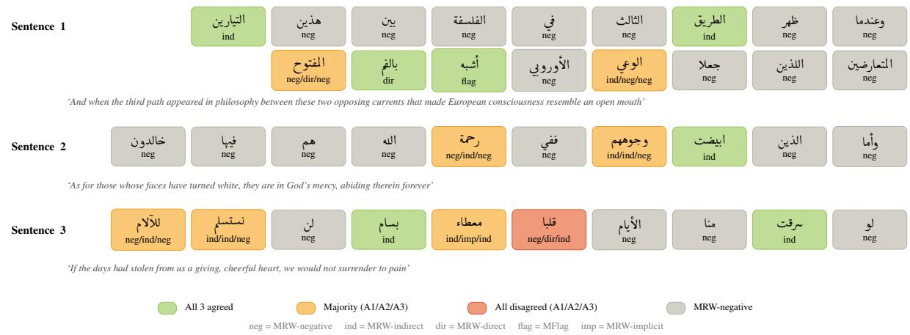
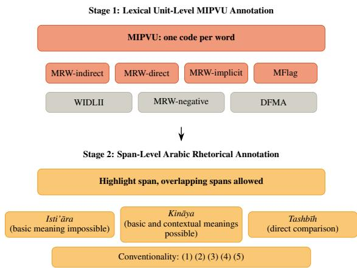
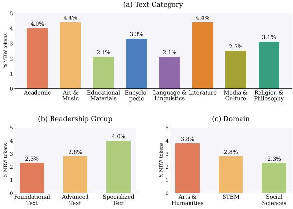
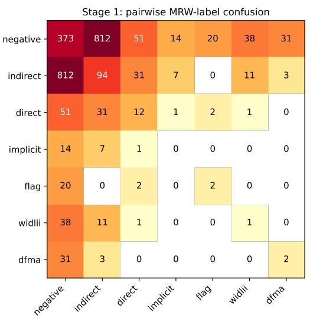
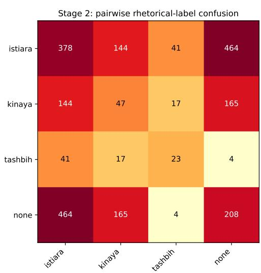
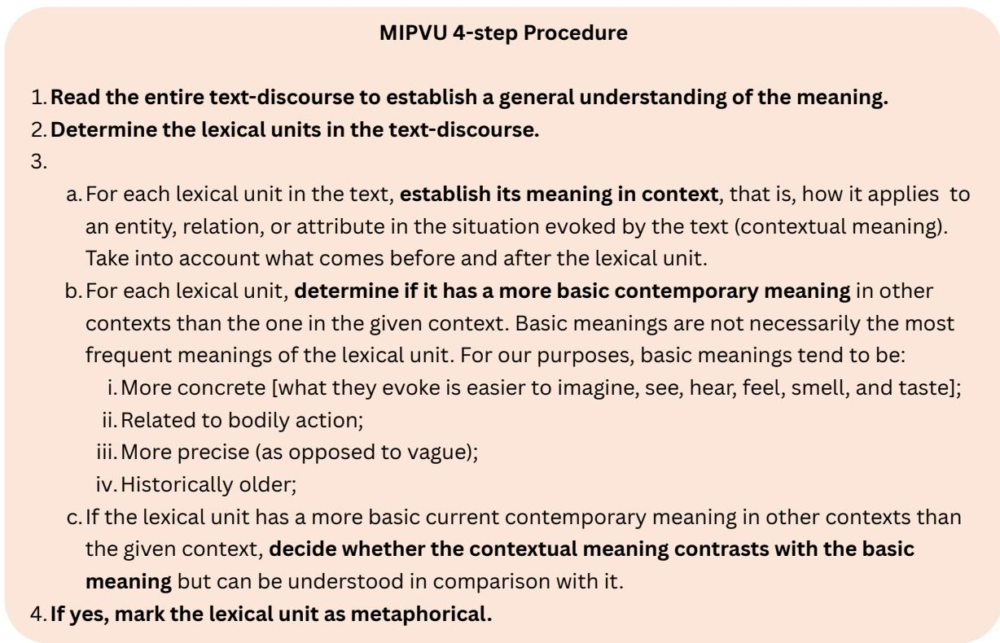
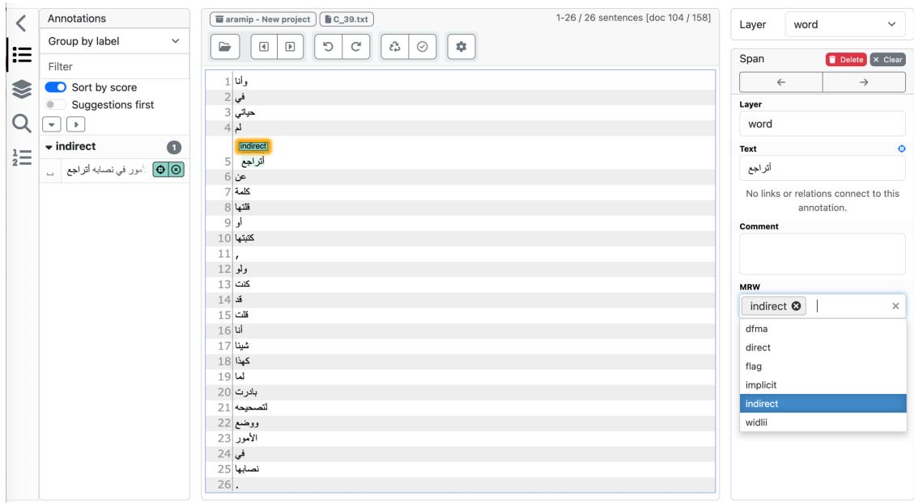
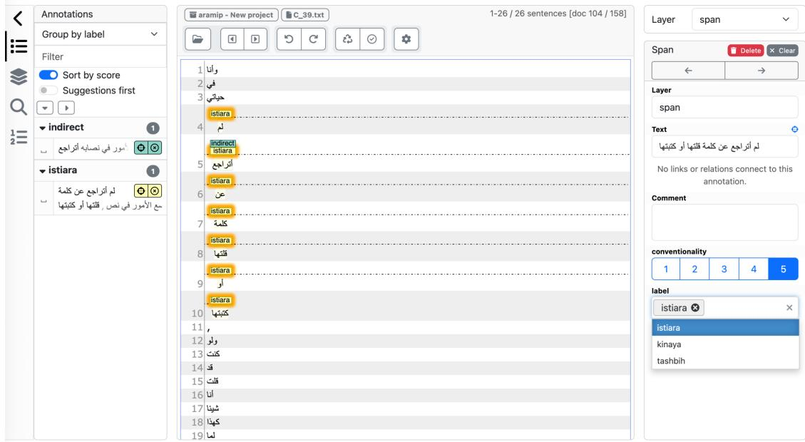
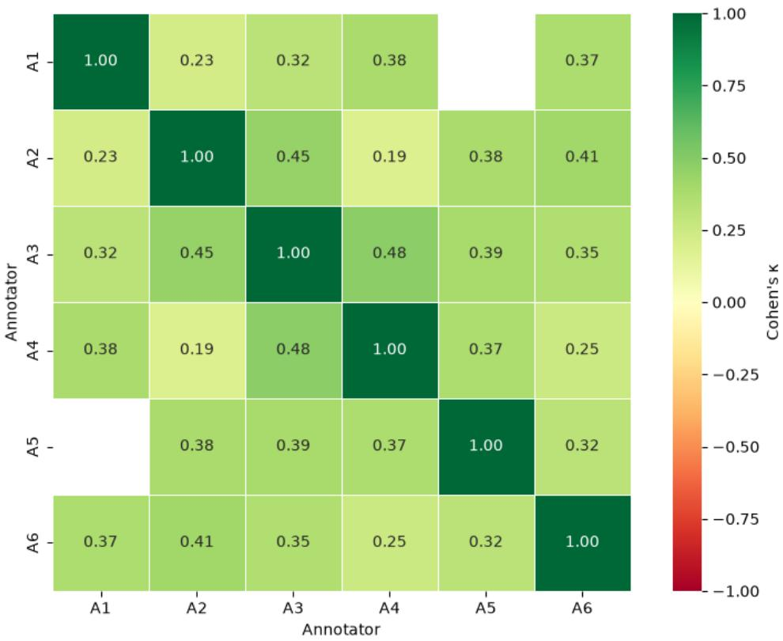

# AraMIP: Extending MIPVU Towards Metaphor Identification in Arabic

Mandar Marathe\*1 Manar Ali\*2 Sara Nabhani\*3 Raia Abu Ahmad\*4,5

Ibrahim Baroud\*4,5 Omar Momen\*2

1SOAS University of London, United Kingdom 2CRC 1646 ‘Linguistic Creativity in Communication’, Bielefeld University, Germany 3Computational Linguistics, CLCG, University of Groningen, The Netherlands 4German Research Center for Artificial Intelligence (DFKI), Germany 5Quality & Usability Lab, Technical University of Berlin, Germany

1mandar@marathe.org

3s.nabhani@rug.nl

2{manar.ali,omar.hassan}@uni-bielefeld.de

4,5{raia.abu\_ahmad,ibrahim.baroud}@dfki.de

## Abstract

Metaphor research has gained increasing attention due to its relevance to linguistic creativity, language use, cognitive processes, and related areas. While many efforts have been devoted to metaphor identification and annotation in English and other languages, Arabic remains under-resourced in this area. In this work, we propose the Arabic Metaphor Identification Procedure (AraMIP), a novel guideline for Arabic metaphor annotation. AraMIP builds on the widely used Metaphor Identification Procedure Vrije Universiteit (MIPVU) framework, incorporating adaptations that accounts for the language-specific properties of Arabic. We distinguish three major types of Arabic figurative language: isti‘ara ¯ (metaphor), kinaya¯ (metonymy/indirect expression), and tashb¯ıh (simile) and annotate a pilot dataset of 300 sentences (5277 words). Our analysis reveals key challenges specific to Arabic, including morphological complexity, inconsistencies in dictionary sense ordering, and the absence of standardized contextual materials for annotators. This work contributes a first step toward standardized Arabic figurative instances and facilitates the development of larger annotated resources, thereby supporting future research on figurative language in Arabic.1

## 1 Introduction

Humans use metaphors in everyday language to achieve diverse communicative goals, such as expressing emotions and explaining unfamiliar concepts. For instance, an L2 speaker may describe an attempted scam by saying, “Someone wants to eat my money,” drawing on the concrete domain of eating to express the more abstract notion of financial exploitation. Notably, humans can interpret metaphorical expressions quickly (Glucksberg,

1998). Such expressions involve cross-domain mapping, which is central to several influential theories of metaphor, most notably the Conceptual Metaphor Theory (CMT, Lakoff and Johnson, 1980), which argues that a metaphor is not only a linguistic phenomenon but also a cognitive mechanism through which concrete concepts (source) are mapped onto more abstract domains (target). In the example above, eating is the source and financial exploitation the target. Metaphorical framing also plays an important role in shaping how people conceptualize abstract ideas and reason about them (Thibodeau and Boroditsky, 2011).

Metaphor research has attracted increasing attention in (Cognitive) Linguistics and Natural Language Processing (NLP), and has also been discussed in the broader context of linguistic creativity (Vogel et al., 2026). Data collection and annotation studies identified metaphors (Steen et al., 2010; Mohammad et al., 2016; Beigman Klebanov et al., 2018; Leong et al., 2018), or classified them based on deliberateness and novelty (Reijnierse et al., 2018; Do Dinh et al., 2018). Tong et al. (2021) and Ge et al. (2023) investigated language models’ ability to generate and comprehend metaphors as a proxy for cognitive and pragmatic competence. Other studies explored the role of metaphor in downstream tasks such as machine translation (Wang et al., 2024) and offensive language detection (Lemmens et al., 2021; Zeng et al., 2025), where identifying figurative expressions can improve system performance (Huguet Cabot et al., 2020; Dankers et al., 2019).

Besides English, annotation efforts and benchmark datasets have been developed for several languages, including Spanish (Sanchez-Bayona and Agerri, 2022), Chinese (Lu and Wang, 2017), and German (Egg and Kordoni, 2022). Arabic, however, remains under-resourced in this area. While several studies have touched on Arabic metaphor in NLP contexts (Alkhatib and Shaalan, 2016; Alsiyat and Piao, 2020; Alsiyat et al., 2023), to our knowledge none provide a standardized, replicable annotation procedure, and existing datasets are limited in domain coverage or methodological transparency (Alsiyat and Piao, 2020; Magdy et al., 2024). Arabic furthermore presents challenges that existing frameworks do not address. In particular, its rich morphological system, root-based lexicographic structure, and the long rhetorical tradition distinguishing isti’ara¯ (metaphor), kinaya¯ (metonymy/indirect expression), and tashb¯ıh (simile) in ways that do not map directly onto categories developed for other languages.

  
Figure 1: Three annotated sentences illustrating token-level agreement. Green = all 3 agreed; orange = majority; red = all disagreed; gray = MRW-negative. Disagreement shown as A1/A2/A3.

In this work, we introduce the Arabic Metaphor Identification Procedure (AraMIP), a two-stage annotation framework that adapts the widely used Metaphor Identification Procedure Vrije Universiteit (MIPVU, Steen et al., 2010) to Arabic. The first stage follows MIPVU’s word-level metaphor identification (see Figure 1); the second maps metaphor-related words (spans) onto Arabic rhetorical categories and records the conventionality of each construction on a five-point scale. We apply AraMIP to a pilot corpus of 300 sentences (5277 words) sampled from the BAREC-10M corpus (Elmadani et al., 2026) and release the guidelines and the annotations to support future work. Our pilot study surfaces concrete challenges specific to Arabic annotation, including dictionary coverage at the boundary between Modern Standard Arabic (MSA) and Classical Arabic, and root-to-derivative sense resolution, and provides a diagnostic roadmap for future iterations of the framework.

## 2 Background and Related Work

## 2.1 Metaphor Theories

Theories and definitions of metaphors have a very long history. We do not review all theories of metaphors, but we point out their major views and understandings. The oldest standard view comes from Aristotle, where metaphor was mainly seen as a decorative, poetic, or rhetorical device where one word is used instead of another. Black (1955) viewed that metaphorical meaning emerges from the interaction between two conceptual systems, not by simple substitution as in the classical theory. On the other hand, in pragmatics, metaphor is not primarily a special semantic mapping. It is a case where the meaning of the sentence and the meaning of the speaker separate (Searle, 1979). Recently, CMT that was posed by Lakoff and Johnson (1980) has become widely adopted in multiple disciplines. It states that metaphor arises from understanding one domain of experience (that is typically abstract) in terms of another (that is typically concrete), e.g., in “She attacked my point.,” the abstract target domain of “Argument” is understood in terms of the source concrete domain of “War.”

In Arabic literary studies, particularly in the field of al-balagha¯ 2, metaphor is discussed within the domain of ‘ilm al-bayan¯ 3, especially through the interrelated concepts of tashb¯ıh (simile), isti‘ara¯ (metaphor), and kinaya ¯ (metonymy) (Abdul-Raof, 2006). The dominant textbook definition derives isti‘ara¯ from tashb¯ıh, where one pole of an underlying comparison is omitted. A more sophisticated account of metaphor is provided by Abd al-Qahir¯ al-Jurjan¯ ¯ı (d. 1078) as explained in Larkin (1995), who views metaphor not merely as an ornamental substitution, but as part of the production of second-order meaning through structure, context, and imaginative interpretation.

## 2.2 Operationalizing Metaphors

A group of scholars (The Pragglejaz Group, 2007) worked on developing a standard procedure for identifying metaphors in written and spoken discourse. They introduced the Metaphor Identification Procedure (MIP), which was then extended with finer details to MIPVU (Steen et al., 2010).4 MIP was motivated by the fact that scholars often disagreed about what counts as metaphor. The authors aimed for an explicit, reliable, and flexible method for identifying metaphorically used words in written and spoken discourse. The core theoretical assumption of MIP is that a lexical unit (a word) is metaphorically used when its contextual meaning contrasts with a more basic meaning, but the contextual meaning can be understood in comparison with that basic meaning.

The operationalization framework of MIP resulted in a standard annotated metaphor corpus in English (VUAMC, Steen et al., 2010), which has served as the standard corpus for most metaphor studies in NLP since then (Leong et al., 2018, 2020). Later, adaptations of MIP to other languages were developed and resulted in metaphor corpora in languages other than English. For example: Russian (Badryzlova et al., 2013), Chinese (Lu and Wang, 2017), German (Egg and Kordoni, 2022), Spanish (Sanchez-Bayona and Agerri, 2022) and Japanese (Zhu et al., 2026). However, no systematic adaptation of MIP was carried out for Arabic up to the moment of writing this paper.

## 2.3 Related Work

Despite the absence of a systematic procedure for identifying metaphors in Arabic texts, we find multiple works that discuss metaphors in Arabic. Alkhatib and Shaalan (2016) discuss the definitions, usages and differences of metaphors across dialects. They compare Classical, Modern Standard, and Dialectal Arabic. The authors argue that machine translation approaches do not translate metaphors correctly. Alsiyat and Piao (2020) show the importance of metaphor detection and interpretation in the task of sentiment analysis and later develop the Arabic Metaphor Corpus (AMC, Alsiyat et al., 2023), which contains 1,000 sentences extracted from book reviews annotated with metaphor spans and sentiment. However, no information on the procedure used to annotate the metaphors is mentioned. Magdy et al. (2024) introduce a dataset for Arabic writing assistance, which includes 330 sentences with incorrect usage of metaphors or multiword expressions (MWEs) paired with their corrections. However, the authors do not explain the process of collecting these sentences. Zibin et al. (2025) conduct a study where they compare human performance in interpreting (Classical, Jordanian, and Emirati) Arabic metaphors to Large Langauge Models (LLMs), finding that it is challenging for LLMs to process culturally rich and context-driven language compared to humans. Banou et al. (2025) introduce a dataset of Arabic figurative speech, including metaphors and similes, but they are directly translated from English.

Overall, we find a clear gap in work on systematically identifying metaphors in Arabic using a theoretically grounded procedure that has been applied to and validated across other languages.

## 3 AraMIP: Annotation Framework

AraMIP is a two-stage annotation framework for Arabic metaphor and related figurative language annotation. AraMIP extends MIPVU with a second annotation layer based on the Arabic rhetorical tradition. The combined framework retains MIPVU’s core annotation categories and decision principles while providing additional information about the rhetorical nature of identified metaphorical expressions (see Figure 2).

## 3.1 Stage 1: MIPVU Annotation

In Stage 1, AraMIP adopts the MIPVU procedure and annotation categories. The MSA dictionary ‘ èQå•AªÖÏ@ $\yen 1$ é 	ªÊË@ Ñj. ªÓ’ Mu‘jam al-Lugha al-‘Arabiyya al-Mu‘a¯s. ira 5 (Omar et al., 2008) is used to determine the “basic” meaning of each lexical unit in turn. Metaphor-related words (MRWs) are identified where a lexical unit participates in a cross-domain relationship between a contextual meaning and a more basic meaning, whether expressed directly, indirectly, or through an associated metaphor signal.

  
Figure 2: The AraMIP two-stage annotation procedure.

Direct metaphors are identified through explicit cross-domain comparison, typically signaled by a lexical comparator such as a simile marker, whereas this is absent in indirect metaphors. Implicit metaphors are lexical units that are MRWs by virtue of a previously stated comparison. Thus, each lexical unit is annotated as one of: indirect metaphor “MRW-indirect”, direct metaphor “MRW-direct”, implicit metaphor “MRW-implicit”, metaphor flag “MFlag” (for simile markers), or not a MRW “MRW-negative”. Other possible MIPVU annotations are When In Doubt, Leave It In (“WIDLII”) for uncertain cases, and Discarded For Metaphor Analysis (“DFMA”) for when the meaning of a lexical unit is impossible to discern.

## 3.2 Stage 2: Arabic Rhetorical Classification

The direct and indirect metaphors identified in Stage 1 generally correspond to three rhetorical devices in Arabic. Although the pattern is not invariable, direct metaphors often correspond to tashb¯ıh (simile), while indirect metaphors often correspond to isti‘ara ¯ (metaphor) and kinaya¯ (metonymy/indirect expression). Both the “basic” and “contextual” meanings are possible in kinaya¯ , but not in isti‘ara¯ . AraMIP therefore introduces a second annotation layer applied to non MRWnegative lexical units.

In accordance with Arabic rhetorical tradition, Stage 2 uses the rhetorical construction as the unit of annotation rather than the lexical unit. Rather than annotating only the individual metaphorrelated word, annotators identify the complete span of the rhetorical construction to which that word belongs. Unlike Stage 1, which operates at the lexical-unit level, Stage 2 permits multi-word spans and overlapping rhetorical constructions. MFlag lexical units are annotated as part of the tashb¯ıh span they introduce, rather than as an independent rhetorical category; MRW-implicit lexical units are not annotated in Stage 2.

While Stage 1 identifies conventionalized and novel metaphors alike, it does not record their degree of conventionality. In Stage 2, AraMIP additionally records the degree of conventionality of each rhetorical construction on a five-point scale.

The resulting corpus, therefore, contains both lexical unit-level metaphor annotations and spanlevel rhetorical annotations. Unlike previous MIPVU-based corpora, AraMIP supplements lexical-level metaphor annotation with span-level rhetorical classification grounded in the Arabic rhetorical tradition.

## 4 Corpus Selection

To test our proposed annotation framework, we select a collection of sentences to be annotated and analyzed in a pilot study. For simplicity, we only consider MSA texts, aiming to include different genres and domains to create a representative pool of MSA usage. We base this on VUAMC (Steen et al., 2010), in which the annotated sentences are sampled from the British National Corpus (BNC), thus seeking a similarly diverse MSA corpus that preferably contains additional annotation layers.

We find BAREC-10M (Elmadani et al., 2026) to be a suitable choice for our purpose. BAREC-10M contains 10 million words from a range of text genres, where each document is split by sentences and tokens and manually annotated for: 1. Domain (Arts & Humanities; Social Sciences; STEM); 2. Readership group (Foundational; Advanced; Specialized); and 3. Text category (Media & Culture; Religion & Philosophy; Literature, Art & Music; Academic; Educational Materials, Language & Linguistics; Encyclopedic). Additional automatic annotations are also available, such as word-level and sentence-level readability scores and part-ofspeech tags.

BAREC-10M contains around 514K sentences, from which we use 300 sentences to conduct our pilot study. We sample 50 random sentences from each text category, ensuring an equal distribution across domains and readership groups when possible. We also restrict sentences to lengths between 8 and 30 words, resulting in a corpus of 300 sentences and 5,277 words, with an average sentence length of 17.58 words.

## 5 Annotation Pilot Study

## 5.1 Annotation Setup

Annotators Annotation was performed by six annotators: five native Arabic speakers representing Egyptian and Levantine dialects, and one L2 Arabic speaker. Collectively, the annotators had expertise in Arabic NLP, lexicography, and Arabic rhetorical and figurative language. Before the main annotation process, all annotators participated in a training session during which they jointly annotated and discussed a sample of 10 sentences to establish a shared understanding of the guidelines.

Data The 300 sampled sentences were randomly partitioned and assigned to the annotators while ensuring an approximately equal distribution across text domains. Each sentence was independently annotated by three different annotators.

Annotation Platform We use INCEpTION (Klie et al., 2018), a web-based annotation platform, to annotate both stages. Screenshots of the annotation interface are shown in Appendix C.

## 5.2 Inter-annotator Agreement

We evaluate inter-annotator agreement (IAA) separately for each annotation stage. For Stage 1, where each word is assigned an MRW label, we report agreement at two levels. First, we measure agreement on whether a word is MRW-positive or -negative, regardless of its specific MRW type. Second, we measure agreement using the full set of MRW labels. For both settings, we compute Fleiss’ κ and report the average score, the weighted average score, and the agreement for each label. The results are shown in Table 1.

For Stage 2, where annotators identify spans and assign figurative language labels to them, agreement depends on both the span boundaries and the assigned label. We compute pairwise exactmatch F1 between annotators and report the average across all annotator pairs. Exact-match F1 requires both the span boundaries and the label to match exactly. We also compute pairwise IoUbased6 F1 and average the scores across all annotator pairs, using an IoU threshold of 0.5 to allow partial overlap between spans. Finally, we report Soft γ (Mathet et al., 2015) under three settings:

equal weight for span position and label, higher weight for the label, and higher weight for the span position. The results are shown in Table 2.

<table><tr><td>Measure</td><td>Fleiss&#x27; κ</td></tr><tr><td>Binary MRW agreement</td><td>0.358</td></tr><tr><td>Avg. MRW label agreement</td><td>0.229</td></tr><tr><td>Weighted MRW label agreement</td><td>0.357</td></tr><tr><td>Per-label agreement</td><td></td></tr><tr><td>MRW-Negative</td><td>0.360</td></tr><tr><td>MRW-Flag</td><td>0.499</td></tr><tr><td>MRW-Direct</td><td>0.292</td></tr><tr><td>MRW-Indirect</td><td>0.315</td></tr><tr><td>MRW-Implicit</td><td>-0.001</td></tr><tr><td>MRW-DFMA</td><td>0.104</td></tr><tr><td>MRW-WIDLII</td><td>0.035</td></tr></table>

Table 1: Inter-annotator agreement for the word-level annotation layer, measured using Fleiss’ κ.

<table><tr><td>Measure</td><td>Score</td></tr><tr><td>Soft γ (equal weighting) Soft γ (label-priority weighting)</td><td>0.477 0.442</td></tr><tr><td>Soft γ (position-priority weighting)</td><td>0.440</td></tr><tr><td>Exact-match  $\mathrm { F _ { 1 } }$  IoU-based F1</td><td>0.125 0.211</td></tr></table>

Table 2: Inter-annotator agreement for the span-level annotation layer.

## 5.3 Automatic Curation

We curate the annotations for both Stage 1 and Stage 2 for each word/sentence as follows:

Stage 1 Each word was assigned an MRW code following a majority vote. For the curation process, we distinguish between three kinds of agreement cases: 1. Clear agreement: same label given by all annotators, 2. Majority agreement: two annotators agree on the label, and 3. Disagreement: three different labels. The curated dataset contains 90.49% clear agreement cases, 9.08% majority agreement cases, and 0.44% disagreement cases. To resolve the disagreement cases, we perform a second annotation round, in which three different annotators independently annotate each case. The final curation was then performed by considering the annotations from all six annotators. This process resolved 21 out of 23 disagreements, leaving two critical disagreements for discussion, in which the words were still annotated with three different labels each by two annotators. The first disagreement concerned the word “ èAg. A 	®Ó” - “surprise”

in the sentence $w = v _ { 1 } ( 0 , 1 ) v _ { 2 } ( 0 , 1 ) v _ { 3 } ( 0 , 1 ) v _ { 2 } ( 0 , 1 ) v _ { 3 } ( 0 , 1 )$ - “The man was a never-ending surprise to me” which was annotated with the three labels MRW-Direct, MRW-Indirect and MRW-Negative twice each. The second disagreement involved to the word “ èXA«” - “Habit or something one is accustomed to” in the sentence “ èXA« 	àA¿ áÓ	 èA 	®k. @ 	YêÊ	¯” - “Thus the one to whom it was accustomed forsook it” which was annotated with the three labels MRW-WIDLII, MRW-Indirect and MRW-Negative twice each. The curation after the second round resulted in 90.49% clear agreement cases, 9.48% majority agreement cases (out of which 75.8% are MRW-Negative), and 0.04% disagreement cases. Table 3 and Table 4 describe the annotated dataset before and after the curation, respectively. We additionally report percentages of MRW-positive instances per text category, readership group, and domain in Figure 3.

<table><tr><td>Label</td><td>A1</td><td>A2</td><td>A3</td></tr><tr><td>MRW-Negative</td><td>4964</td><td>5055</td><td>5018</td></tr><tr><td>MRW-Indirect</td><td>266</td><td>152</td><td>240</td></tr><tr><td>MRW-Direct</td><td>7</td><td>37</td><td>8</td></tr><tr><td>MRW-Flag</td><td>6</td><td>8</td><td>4</td></tr><tr><td>MRW-Implicit</td><td>8</td><td>2</td><td>1</td></tr><tr><td>MRW-Direct/Flag</td><td>4</td><td>5</td><td>0</td></tr><tr><td>MRW-WIDLII</td><td>15</td><td>10</td><td>2</td></tr><tr><td>MRW-DFMA</td><td>7</td><td>8</td><td>4</td></tr></table>

Table 3: Distribution of Stage 1 MRW labels assigned by the three different annotators: A1, A2, A3.

<table><tr><td>Label</td><td>#</td><td>%</td></tr><tr><td>MRW-Negative</td><td>5106</td><td>96.76</td></tr><tr><td>MRW-Indirect</td><td>152</td><td>2.88</td></tr><tr><td>MRW-Direct</td><td>6</td><td>0.11</td></tr><tr><td>MRW-Flag</td><td>4</td><td>0.08</td></tr><tr><td>MRW-Direct, MRW-Flag</td><td>4</td><td>0.08</td></tr><tr><td>MRW-DFMA</td><td>2</td><td>0.04</td></tr><tr><td>MRW-WIDLII</td><td>1</td><td>0.02</td></tr><tr><td>Disagreement</td><td>2</td><td>0.04</td></tr></table>

Table 4: Distribution of Stage 1 labels in the curated dataset, showing the number (#) and percentage (%) of annotations for each label.

Stage 2 Span-level annotations were curated using a strict boundary-matching criterion. For each sentence, we compare the spans produced by the three annotators and retain only spans for which at least two annotators assigned the same label and the span boundaries either matched exactly or one span was fully contained within the other. Thus, cases of mere partial overlap were excluded, while minor boundary differences were accepted when one annotator selected a more specific subspan of another annotator’s longer span. To curate conventionality, we average the score given by the three annotators (we report the lowest scores, i.e. least conventional metaphors, in Figure 8). Table 5 and Table 6 describe the annotated dataset before and after the curation, respectively.

  
Figure 3: Percentage of MRWs across three corpus dimensions: text category, readership group, and domain.

<table><tr><td>Label</td><td>A1</td><td>A2</td><td>A3</td></tr><tr><td>istiāra</td><td>180</td><td>139</td><td>181</td></tr><tr><td>kināya</td><td>70</td><td>41</td><td>46</td></tr><tr><td>tashbīh</td><td>9</td><td>9</td><td>9</td></tr><tr><td>istiāra,kināya</td><td>1</td><td>0</td><td>0</td></tr></table>

Table 5: Distribution of annotated spans across Stage 2 labels assigned by the three different annotators: A1, A2, A3.

<table><tr><td>Label</td><td>#</td><td>Conventionality AVG</td></tr><tr><td>istiāra</td><td>106</td><td>4.05</td></tr><tr><td>kināya</td><td>22</td><td>3.67</td></tr><tr><td>tashbīh</td><td>8</td><td>2.40</td></tr></table>

Table 6: Distribution of curated spans by Stage 2 labels. (#) denotes the number of curated spans, and (ConventionalityAVG) denotes the mean conventionality score for each label.

## 6 Disagreement Analysis

To better understand the sources of annotator disagreements, we conduct a qualitative analysis of the disagreement cases from both annotation stages. We inspect the pairwise confusion patterns (Figure 4) and manually examine the sentences with the highest degree of disagreement, identifying recurring linguistic and interpretive factors behind them.

Stage 1 Disagreements Of 502 tokens resolved by majority vote (479) or left as full disagreements (23), we see that the dominant confusion is MRWindirect ↔ MRW-negative (812 pairs), followed by MRW-direct ↔ MRW-negative (51) and WIDLII ↔ MRW-negative (38). Thus, we infer that the central difficulty is MRW-positive vs. -negative status rather than distinguishing among positive subtypes. Within MRW-positive, MRW-direct ↔ MRW-indirect is the most frequent disagreement (31 pairs). We take a closer look at the 23 full disagreement tokens, which map out to 19 unique sentences sourced mainly from the Literature; Art & Music category (36.8%) and Arts & Humanities domain (68.4%), and identify five main categories of disagreement reasons:

1. Polysemy and domain-boundary ambiguity: disagreement stems from deciding whether two senses of a word are distinct enough domains to count as metaphor, e.g. $" { \circ } { \bf { { \psi } } } _ { { \bf { { \psi } } } } { \bf { { \psi } } } ^ { \prime } - \bf { \sigma }  ^ { \prime \epsilon } s t e p ^ { \prime \prime }$ as interpreted in the sentence $a ^ { 2 } < 1 3 1 1 . . . 5 5 5 [ ( - 1 . 6 7 2 5 ] \div 1 . 5 5 5 ] < 1 . 5 5 \cdot ^ { \circ } - ^ { \circ } T h 6$ author mentioned several [steps] for selfappreciation”.

2. Classical or poetic register: disagreements most probably occur because sentences require specialized knowledge of Classical Arabic or external exegesis. For example, the token $1 , \dot { 5 } ^ { \prime \prime } \cdot \dot { } ^ { \alpha } b l a z e s ^ { \prime \prime }$ in $c < \cos \omega _ { i } \cos \theta ( 1 , i , j \in ] \sin ^ { j } j ^ { \prime } .$ “it saw in it [blazes] ofbeauty and luster”.

3. MWEs: in some cases, figurativity attaches to a full expression rather than a single token, and annotators disagreed on which token(s) carry the figurative meaning. $\mathrm { E . g . }$ $[ L _ { n } L e ] \Delta ^ { 3 } s \Delta ^ { 5 } s \Delta ^ { 3 } s ^ { \prime }$ “putting things in their proper place”.

4. Dictionary gaps: some tokens were absent from the reference dictionary and unattested elsewhere, causing annotation disagreement, e.g. $[ i , \infty , 1 ] \in \times ( i \infty ) ^ { \prime }$ - “the ciliary(?) mus-$c l e s ^ { \prime \prime }$ , which is possibly an error in the original corpus.

5. Cultural and religious influence: some interpretations of metaphors depend on background knowledge or belief of an annotator, which in turn would cause disagreements, e.g. $\cdots \bigcup \limits _ { i = 1 } ^ { \infty } i ^ { n } .$ “the doors ofGod”, where a literal vs. figurative reading depends on the annotator’s own religious view.

Stage 2 Disagreements Of 136 curated spans, 45 had full agreement, 91 were resolved by majority vote, and 4 spans had complete disagreement (excluded from the final curated set). The most frequent source of disagreement is between a labeled span and unlabeled for both isti‘ara and kin ¯ aya,¯ i.e., annotators disagreed on whether a span was figurative at all; tashb¯ıh shows comparatively high agreement, likely due to its explicit comparator. Excluding unlabeled cases, the most common category of disagreement is isti‘ara vs. kin ¯ aya (44 out ¯ of 55 cases), which centers on whether the span’s meaning can happen literally or not, as in the example $c ^ { 2 } = \frac { 2 } { 3 } \geq \frac { 2 } { 3 } \pi = 0 \infty - c \infty$ wound has touched the people”.

## 7 Discussion

## 7.1 Dictionary-related Challenges

Coverage and the Modern/Classical boundary. A recurring difficulty during annotation concerned the choice and coverage of the Arabic dictionary used to determine basic (non-contextual) word meanings. Although we deliberately selected a modern Arabic dictionary to match the contemporary nature of our corpus, the boundary between MSA and Classical Arabic vocabulary proved difficult to differentiate. Many words occurring in classical registers, including terms found in Quranic verses or traditional Arabic poetry, were absent from or inadequately treated in the dictionary. For example, the lexeme $\because a _ { n } = 0 \Rightarrow$ (a classical variant of $\cos ^ { \prime } )$ was not included with its classical sense, meaning annotators could not reliably retrieve the basic meaning of such tokens. While the comprehensiveness constraints of any lexicographic resource are understandable, this created systematic gaps in the annotation workflow. Future guidelines should either specify a broader set of approved reference resources or provide explicit fallback procedures for cases of dictionary absence.

Morphological complexity and root-based lookup. Arabic’s rich morphological structure presents an additional challenge not addressed in the original MIPVU framework. Arabic dictionaries are organised by root, meaning that identifying the basic meaning of a morphologically derived form requires the annotator to locate the appropriate root entry and then determine whether the meaning of the derivative is predictable from, or has diverged from, that of the root. In practice, we observed a non-trivial mismatch between the primary sense listed under a root entry and the conventional meaning of a derived nominal or verbal form. MIPVU does not specify how to handle such cases, leaving annotators to exercise individual judgement. We consider this a key area for adaptation in future versions of AraMIP, which should provide explicit decision criteria for root-toderivative meaning transfer.

(a)  

(b)  
  
Figure 4: Pairwise label confusion matrices for (a) Stage 1 MRW labels and (b) Stage 2 rhetorical labels (none denotes cases where an annotator did not assign a label).

Inconsistency in sense ordering. Finally, although the dictionary we used states in its introduction that senses are ordered from most general to most specific, which is a convention that AraMI relies upon to identify the basic meaning of a lexical unit, we found this ordering to be inconsistently applied across entries in practice. This introduced further ambiguity into the sense selection step. Future work should either select resources with more reliable sense ordering, empirically validated if possible, or develop supplementary procedures that do not depend on lexicographic sense ordering alone.

## 7.2 Distribution of Metaphor-Related Words

The relatively low proportion of MRW-positive labels in the final corpus is expected given the composition of the sampled data. Our pilot sentences were drawn from a large-scale, domain-diverse corpus covering a wide range of MSA text types. The subset we used includes genres such as multiplechoice questions and scientific writing, which are predominantly denotative and thus inherently low in figurative density. Furthermore, our data is too small to ensure representativeness across the full range of MSA text types. These factors together limit the extent to which the distribution of annotation labels can be taken as indicative of broader figurative language use in Arabic. Larger-scale annotations covering a more balanced selection of domains will be necessary to characterize the figurative density of Arabic text more reliably.

## 7.3 Inter-Annotator Agreement

The IAA scores obtained in our pilot study fall below those reported for other MIPVU studies, including Fleiss’ κ 0.84 for the original VUAMC, averaged across six reliability tests conducted over two years (Steen et al., 2010). This reflects several practical and methodological challenges in annotating figurative language, particularly in a lowresource setting such as Arabic.

Impact of label imbalance. The annotated sample contains only a small number of MRW-positive instances, whereas the annotators agreed on the negative label for more than 90% of the examples. Although this produces high observed agreement, it also increases the level of agreement expected by chance. Fleiss’ κ adjusts for this chance agreement. Therefore, because annotators are very likely to assign the dominant negative label, the resulting Fleiss’ κ score may remain low despite the high percentage of observed agreement.

Annotation experience and iterative refinement. A key factor that contributes to disagreements is the limited number of annotation rounds. Due to time and resource constraints, annotators did not engage in the multiple cycles of annotation, discussion, and reconciliation that are usually recommended for developing new annotation guidelines (Artstein and Poesio, 2008). This led to inconsistencies in the interpretations of certain annotation rules. A prominent example is the label combination for direct metaphors. According to MIPVU, direct metaphors are typically accompanied by a corresponding MFlag label in the same sentence. However, a direct metaphor such as “I. ªÊÖÏ@ ú	¯ Yƒ@ YÔg@” - “Ahmad is a lion on the field” - lacks an MFlag element. Whether this should be annotated as MRWdirect or MRW-indirect was not interpreted consistently by the annotators, and would likely be resolved through further discussion rounds.

Context availability and interpretation. Unlike the original MIPVU, which annotated sentences with access to their full surrounding discourse, our annotation setup did not provide annotators with context material. When contextual information was needed, annotators were permitted to independently consult external resources such as online exegetical works. While this allowed for a more informed interpretation of individual tokens, it introduced a source of systematic variance: different annotators may have consulted different resources or weighted conflicting interpretations differently. Future work building on AraMIP should supply all annotators with a shared, fixed set of contextual materials and restrict independent look-ups to ensure that contextual knowledge does not become a confounding variable.

Annotator diversity. The annotation team consisted of six annotators with varied disciplinary backgrounds. This interdisciplinary composition is a strength of the study in terms of coverage and perspective, but it also introduced variability in how figurative language was conceptualized and operationalized. Furthermore, while five annotators were native Arabic speakers, they represented four distinct geographic varieties of Arabic, and one annotator was an advanced L2 speaker specializing in Arabic linguistics. Dialectal variation and differences in rhetorical intuition may have influenced judgments. To assess whether this diversity in disciplines and dialects systematically affected annotation agreement, we conducted an analysis comparing the IAA across annotator backgrounds. The results showed that annotators, including the L2 speaker, had very similar average IAA scores, regardless of their disciplines or dialect backgrounds. In particular, pairs of annotators with similar or different dialects did not show any consistent pattern of higher or lower agreement. Detailed results of this analysis are provided in Appendix H.

## 8 Conclusion

In this work, we introduced AraMIP, the first systematic, two-stage procedure for identifying and classifying metaphor-related expressions in Arabic text. AraMIP extends MIPVU’s lexical-unit-level metaphor identification with a second annotation layer that maps metaphor-related words onto the Arabic rhetorical tradition (isti‘ara¯ , kinaya¯ , and tashb¯ıh), additionally recording the conventionality of each rhetorical construction on a five-point scale. We applied AraMIP to a pilot corpus of 300 sentences (5277 words) sampled from BAREC-10M across a balanced range of domains, readership levels, and text categories. Our IAA analysis shows that annotating Arabic figurative language reliably is more difficult than reported for several other MIPVU adaptations. We use this pilot study to identify concrete, addressable sources of this difficulty: a single annotation round without iterative guideline refinement, inconsistent dictionary coverage across the MSA/Classical Arabic boundary, unresolved root-to-derivative meaning transfer within Arabic’s morphological system, inconsistent sense ordering within the lexicographic resource used, and uncontrolled access to contextual and exegetical materials during annotation. These findings constitute a diagnostic roadmap for future iterations of AraMIP, which should incorporate disagreementinformed guideline revisions, standardized contextual materials, and explicit root-based sense-lookup criteria. We release our pilot corpus and annotation guidelines to support this future work, scaling to larger and more representative corpora, extending coverage to dialectal Arabic, and training computa tional models for Arabic metaphor detection.

## Limitations

This work has several limitations. First, the pilot corpus of 300 sentences (5,277 words) is too small to reliably characterize metaphor use across

MSA. Second, AraMIP was applied only to MSA text, leaving open how the guidelines generalize to dialectal Arabic. Third, reliance on a single modern dictionary introduces gaps in Classical Arabic coverage, inconsistencies in sense ordering, and unresolved cases of root-to-derivative meaning transfer. Fourth, annotation guidelines were not iteratively refined through multiple rounds of discussion before the main annotation phase, and annotators were not provided standardized contextual or exegetical materials, independently consulting external resources such as Tafaseer when needed.

## Acknowledgments

This research has been funded by the Deutsche Forschungsgemeinschaft (DFG, German Research Foundation) – CRC-1646, project no. 512393437, project A05 and B02.

## References

Hussein Abdul-Raof. 2006. Arabic Rhetoric: A Pragmatic Analysis. Routledge, London.

Manar Alkhatib and Khaled Shaalan. 2016. Natural language processing for arabic metaphors: a conceptual approach. In International Conference on Advanced Intelligent Systems and Informatics, pages 170–181. Springer.

Israa Alsiyat and Scott Piao. 2020. Metaphorical expressions in automatic Arabic sentiment analysis. In Proceedings of the Twelfth Language Resources and Evaluation Conference, pages 4911–4916, Marseille, France. European Language Resources Association.

Israa Alsiyat, Scott Piao, and Mansour Almansour. 2023. Arabic metaphor corpus (amc) with semantic and sentiment annotation. page 1. The twelfth International Corpus Linguistics Conference, CL2023 ; Conference date: 03-07-2023 Through 06-07-2023.

Aristotle. 1996. Poetics. Penguin Books, London.

Ron Artstein and Massimo Poesio. 2008. Inter-coder agreement for computational linguistics. Computa tional Linguistics, 34(4):555–596.

Yulia Badryzlova, Natalia Shekhtman, Yekaterina Isaeva, and Ruslan Kerimov. 2013. Annotating a Russian corpus of conceptual metaphor: a bottom-up approach. In Proceedings of the First Workshop on Metaphor in NLP, pages 77–86, Atlanta, Georgia. Association for Computational Linguistics.

Zouheir Banou, Sanaa El Filali, El Habib Benlahmar, Fatima-Zahra Alaoui, and Laila Eljiani. 2025. Memphis: Towards a new benchmark for arabic figurative speech classification. Data Science.

Beata Beigman Klebanov, Chee Wee (Ben) Leong, and Michael Flor. 2018. A corpus of non-native written English annotated for metaphor. In NAACL, pages 86–91, New Orleans, Louisiana. Association for Computational Linguistics.

Max Black. 1955. Metaphor. Proceedings ofthe Aristotelian Society, 55(1):273–294.

Verna Dankers, Marek Rei, Martha Lewis, and Ekaterina Shutova. 2019. Modelling the interplay of metaphor and emotion through multitask learning. In Proceedings of the 2019 Conference on Empirical Methods in Natural Language Processing and the 9th International Joint Conference on Natural Language Processing (EMNLP-IJCNLP), pages 2218– 2229, Hong Kong, China. Association for Computational Linguistics.

Erik-Lân Do Dinh, Hannah Wieland, and Iryna Gurevych. 2018. Weeding out conventionalized metaphors: A corpus of novel metaphor annotations. In Proceedings of the 2018 Conference on Empirical Methods in Natural Language Processing, pages 1412–1424, Brussels, Belgium. Association for Computational Linguistics.

Markus Egg and Valia Kordoni. 2022. Metaphor annotation for German. In Proceedings of the Thirteenth Language Resources and Evaluation Conference, pages 2556–2562, Marseille, France. European Language Resources Association.

Khalid N. Elmadani, Adel Mahmoud Wizani, Hanada Taha Thomure, and Nizar Habash. 2026. A large and balanced multi-domain arabic corpus annotated for morphology, syntax, and readability. In Proceedings ofthe Fifteenth Language Resources and Evaluation Conference (LREC 2026), pages 11761–11775, Palma, Mallorca, Spain. European Language Resources Association (ELRA).

Mengshi Ge, Rui Mao, and Erik Cambria. 2023. A survey on computational metaphor processing techniques: From identification, interpretation, generation to application. Artificial Intelligence Review, 56(Suppl 2):1829–1895.

Sam Glucksberg. 1998. Understanding metaphors. Current Directions in Psychological Science, 7(2):39–43.

Pere-Lluís Huguet Cabot, Verna Dankers, David Abadi, Agneta Fischer, and Ekaterina Shutova. 2020. The Pragmatics behind Politics: Modelling Metaphor, Framing and Emotion in Political Discourse. In Findings of the Association for Computational Linguistics: EMNLP 2020, pages 4479–4488, Online. Association for Computational Linguistics.

Jan-Christoph Klie, Michael Bugert, Beto Boullosa, Richard Eckart de Castilho, and Iryna Gurevych. 2018. The inception platform: Machine-assisted and knowledge-oriented interactive annotation. In Proceedings of the 27th International Conference on Computational Linguistics: System Demonstrations,

pages 5–9. Association for Computational Linguistics. Event Title: The 27th International Conference on Computational Linguistics (COLING 2018).

George Lakoff and Mark Johnson. 1980. Metaphors We Live By. University of Chicago Press, Chicago.

Margaret Larkin. 1995. The Theology of Meaning: ‘Abd al-Qahir al-Jurjani’s Theory ofDiscourse, volume 79 of American Oriental Series. American Oriental Society, New Haven, CT.

Jens Lemmens, Ilia Markov, and Walter Daelemans. 2021. Improving hate speech type and target detection with hateful metaphor features. In Proceedings of the Fourth Workshop on NLP for Internet Freedom: Censorship, Disinformation, and Propaganda, pages 7–16, Online. Association for Computational Linguistics.

Chee Wee (Ben) Leong, Beata Beigman Klebanov, Chris Hamill, Egon Stemle, Rutuja Ubale, and Xianyang Chen. 2020. A report on the 2020 VUA and TOEFL metaphor detection shared task. In Proceedings of the Second Workshop on Figurative Language Processing, pages 18–29, Online. Association for Computational Linguistics.

Chee Wee (Ben) Leong, Beata Beigman Klebanov, and Ekaterina Shutova. 2018. A report on the 2018 VUA metaphor detection shared task. In Proceedings of the Workshop on Figurative Language Processing, pages 56–66, New Orleans, Louisiana. Association for Computational Linguistics.

Xiaofei Lu and Ben Pin-Yun Wang. 2017. Towards a metaphor-annotated corpus of Mandarin Chinese. Language Resources and Evaluation, 51(3):663–694.

Samar Mohamed Magdy, Fakhraddin Alwajih, Sang Yun Kwon, Reem Abdel-Salam, and Muhammad Abdul-Mageed. 2024. Gazelle: An instruction dataset for Arabic writing assistance. In Findings of the Association for Computational Linguistics: EMNLP 2024, pages 16027–16054, Miami, Florida, USA. Association for Computational Linguistics.

Yann Mathet, Antoine Widlöcher, and Jean-Philippe Mé- tivier. 2015. The unified and holistic method gamma for inter-annotator agreement measure and alignment. Computational Linguistics, 41(3):437–479.

Saif Mohammad, Ekaterina Shutova, and Peter Turney. 2016. Metaphor as a medium for emotion: An empirical study. In Proceedings of the Fifth Joint Conference on Lexical and Computational Semantics, pages 23–33, Berlin, Germany. Association for Computational Linguistics.

Ahmad Mukhtar Omar and 1 others. 2008. Mu‘jam al-lugha al-‘arabiyya al-mu‘asira. ‘Alam al-Kutub, Cairo, Egypt. Dictionary of Contemporary Arabic.

W. Gudrun Reijnierse, Christian F. Burgers, Tina Krennmayr, and Gerard J. Steen. 2018. DMIP: A method for identifying potentially deliberate metaphor in language use. Corpus Pragmatics, 2(2):129–147.

Elisa Sanchez-Bayona and Rodrigo Agerri. 2022. Leveraging a new Spanish corpus for multilingual and cross-lingual metaphor detection. In Proceedings of the 26th Conference on Computational Natural Language Learning (CoNLL), pages 228–240, Abu Dhabi, United Arab Emirates (Hybrid). Association for Computational Linguistics.

John R. Searle. 1979. Metaphor. In Expression and Meaning: Studies in the Theory ofSpeech Acts, pages 76–116. Cambridge University Press, Cambridge.

Gerard J. Steen, Aletta G. Dorst, J. Berenike Herrmann, Anna A. Kaal, Tina Krennmayr, and Trijntje Pasma. 2010. A Method for Linguistic Metaphor Identification: From MIP to MIPVU. Number 14 in Converging Evidence in Language and Communication Research. John Benjamins, Amsterdam.

The Pragglejaz Group. 2007. Mip: A method for identifying metaphorically used words in discourse. Metaphor and Symbol, 22(1):1–39.

Paul H Thibodeau and Lera Boroditsky. 2011. Metaphors we think with: The role of metaphor in reasoning. PloS one, 6(2):e16782.

Xiaoyu Tong, Ekaterina Shutova, and Martha Lewis. 2021. Recent advances in neural metaphor processing: A linguistic, cognitive and social perspective. In Proceedings ofthe 2021 Conference ofthe North American Chapter of the Association for Computational Linguistics: Human Language Technologies, pages 4673–4686, Online. Association for Computational Linguistics.

R. Vogel, J. Cholin, J. Hartmann, O. Bott, J. Häussler, T. Solstad, P. Wagner, S. Zarrieß, T. Ackermann, A. Bárány, C. de Beer, H. Buschmeier, B. Herrmann, M. Hielscher-Fastabend, F. Jabeen, B. Job, A. Jorschick, J. Kißler, H. Knerich, and 12 others. 2026. Linguistic creativity in communication. conceptions and challenges. Working Paper Series of the Collaborative Research Center CRC 1646, 1.

Shun Wang, Ge Zhang, Han Wu, Tyler Loakman, Wenhao Huang, and Chenghua Lin. 2024. MMTE: Corpus and metrics for evaluating machine translation quality of metaphorical language. In Proceedings of the 2024 Conference on Empirical Methods in Natural Language Processing, pages 11343–11358, Miami, Florida, USA. Association for Computational Linguistics.

Jingjie Zeng, Liang Yang, Zekun Wang, Yuanyuan Sun, and Hongfei Lin. 2025. Sheep’s skin, wolf’s deeds: Are LLMs ready for metaphorical implicit hate speech? In Proceedings of the 63rd Annual Meeting of the Association for Computational Linguistics (Volume 1: Long Papers), pages 16657– 16677, Vienna, Austria. Association for Computational Linguistics.

Hang Zhu, Mitoki Ohara, Rei Kikuchi, Kanako Komiya, Masayuki Asahara, and Sachi Kato. 2026. Automatic detection of metaphorical expressions in clas-

sical japanese using wlsp-enhanced bert. In Proceedings of LT4HALA 2026 @ LREC 2026, page 89–95, Palma, Mallorca, Spain. European Language Resources Association (ELRA).

Aseel Zibin, Nabeeha Binhaidara, Hala Al-Shahwan, and Haneen Yousef. 2025. Metaphor interpretation in jordanian arabic, emirati arabic and classical arabic: artificial intelligence vs. humans. Humanities and Social Sciences Communications, 12(1):1–12.

## A Risks and Ethical Considerations

We do not believe that there are significant risks associated with this work, as we annotate existing data without content that might be perceived as hurtful.

## B MIPVU Procedure

Steen et al. (2010) propose a standard procedure of identifying metaphors in written and spoken discourse. This procedure is presented in Figure 5.

## C Annotation Tool

The stage 1 and stage 2 annotations of an example sentence using the INCEpTION interface are presented in Figures 6 and 7, respectively.

## D Scientific Artifacts

In our work, we mainly used scientific artifacts in the form of publicly available datasets (Creative Commons Attribution Share Alike 4.0 International) and publicly available Python modules.

## E Use of AI Assistants

AI assistants were used during manuscript preparation for specific linguistic reformulation to refine clarity and style, and to assist with code writing.

## F License

The AraMIP annotation guidelines and the resulting corpus are released under the Creative Commons Attribution-NonCommercial 4.0 International License (CC BY-NC 4.0).

## G Recruitment Consent

This study used the six authors as annotators. A training session on the use of AraMIP was provided before annotations were performed. This included practice with a training dataset. Annotators were instructed to follow the AraMIP annotation guidelines to annotate Arabic sentences from the study corpus. Annotators were recruited on the basis of their ability to perform the annotation task. They freely consented to participate in the annotation, and did not receive any financial compensation.

## H IAA Results Across Disciplines and Dialects

Table 7 shows details about the annotators’ disciplinary and dialect backgrounds, along with their average pairwise Cohen’s κ agreement with the other annotators. Figure 9 shows the individual pairwise Cohen’s κ scores.

  
Figure 5: The Metaphor identification procedure of Steen et al. (2010).

  
Figure 6: The INCEpTION annotation interface showing Stage 1 word-level MIPVU annotation, where each word is assigned one of seven codes.

  
Figure 7: The INCEpTION annotation interface showing Stage 2 span-level rhetorical annotation, where annotators highlight spans and assign a rhetorical label (Isti’ara, Kin¯ aya, or Tashb¯ ¯ıh) along with a conventionality rating.

<table><tr><td rowspan=1 colspan=1>Label</td><td rowspan=1 colspan=1>MeanConventionality</td><td rowspan=1 colspan=1>Sentence</td><td rowspan=1 colspan=1>English Gloss</td></tr><tr><td rowspan=1 colspan=1>tashbīh</td><td rowspan=1 colspan=1>1.33</td><td rowspan=1 colspan=1>      $v ^ { 9 }$ jcg</td><td rowspan=1 colspan=1>“The speaker&#x27;s hair, which stood on the side of hishead like trees, helped confirm it.&quot;</td></tr><tr><td rowspan=1 colspan=1>kināya</td><td rowspan=1 colspan=1>1.33</td><td rowspan=1 colspan=1></td><td rowspan=1 colspan=1>“And so I want to turn my face toward the north,which has no scent to it.&quot;</td></tr><tr><td rowspan=1 colspan=1>istiāra</td><td rowspan=1 colspan=1>1.50</td><td rowspan=1 colspan=1></td><td rowspan=1 colspan=1>&quot;&quot;If my choosing laid his qualities bare, it would seein them blazing marks of beauty and luster.</td></tr><tr><td rowspan=1 colspan=1>kināya</td><td rowspan=1 colspan=1>1.50</td><td rowspan=1 colspan=1>        </td><td rowspan=1 colspan=1>“29 Take my yoke upon you and learn from me, for Iam gentle and humble in heart, and you will findrest for your souls.&quot;</td></tr><tr><td rowspan=1 colspan=1>istiāra</td><td rowspan=1 colspan=1>1.50</td><td rowspan=1 colspan=1>     </td><td rowspan=1 colspan=1>&quot;Since I was used to his exceptional talents, theman was a never-ending surprise to me.&quot;</td></tr></table>

Figure 8: Five stage 2 span annotations with the lowest mean conventionality scores (on a scale of 1-5). The annotated span shown here is the longest span between the annotations.

<table><tr><td>Annotaor</td><td>Arabic skills</td><td>Dialect</td><td>Gender</td><td>Expertise</td><td>Cohen&#x27;s κ</td></tr><tr><td>A1</td><td>L1</td><td>Syrian</td><td>M</td><td>Computer Science</td><td>0.321</td></tr><tr><td>A2</td><td>L1</td><td>Palestinian &amp; Syrian</td><td>F</td><td>NLP</td><td>0.330</td></tr><tr><td>A3</td><td>L1</td><td>Palestinian</td><td>F</td><td>NLP</td><td>0.398</td></tr><tr><td>A4</td><td>L1</td><td>Palestinian &amp; Syrian</td><td>F</td><td>Cognitive Science</td><td>0.333</td></tr><tr><td>A5</td><td>L1</td><td>Egyptian</td><td>M</td><td>Computer Science</td><td>0.364</td></tr><tr><td>A6</td><td>C1/2 level</td><td>Jordanian</td><td>M</td><td>Arabic rhetorical and figurative language</td><td>0.340</td></tr></table>

Table 7: Annotators’ disciplinary and dialect backgrounds, along with average pairwise Cohen’s κ scores.

  
Figure 9: Pairwise Cohen’s κ agreement.