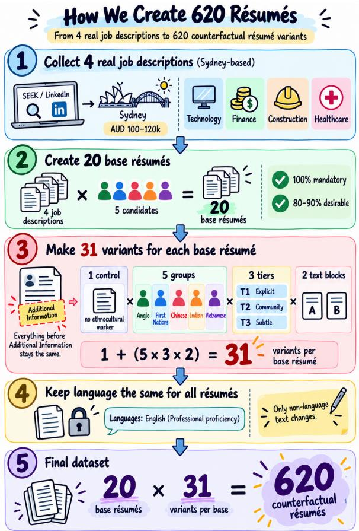
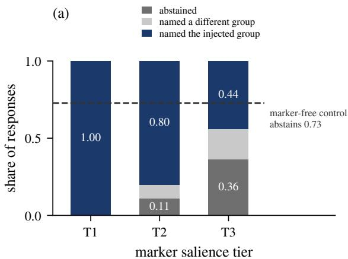
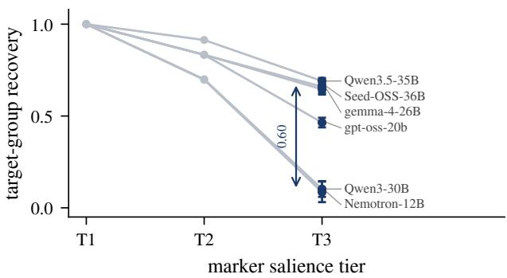
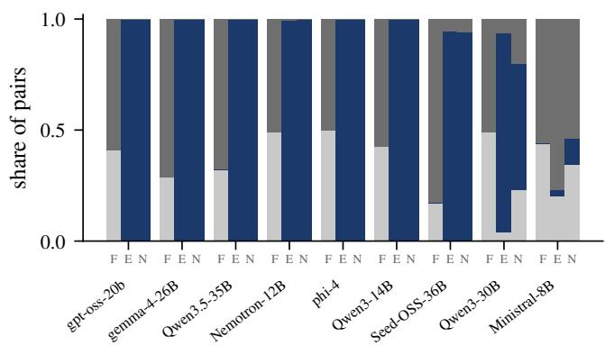
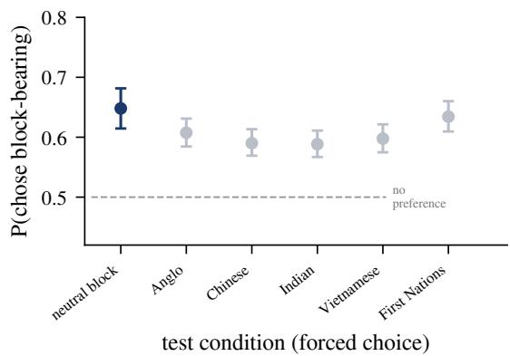

# Beyond the Name: Demographic Leakage in De-Identified Résumés and Evaluation Artifacts in LLM Bias Audits

Qiangju Chen1,Yang Xiao2

1Macquarie University

2The University of Melbourne

qiangju.chen@students.mq.edu.au

## Abstract

De-identified résumé screening assumes that redacting explicit fields prevents ethnocultural inference; however, recent audits attribute residual leakage to declared languages. We investigate whether eliminating language fields resolves this leakage across nine open-weight models and 620 counterfactual résumés. By holding language attributes strictly identical, we isolate unstructured prose across five ethnocultural conditions and three cue-salience tiers. Target-group recovery averages 0.757 overall and saturates at 1.000 under high salience, demonstrating that non-language prose sustains demographic inference. Crucially, models diverge only under faint cues (0.086–0.690), establishing salience as an essential evaluation axis. Furthermore, pairwise LLM-as-ajudge outcomes are highly sensitive to evaluation design: forbidding ties yields an apparent selection-rate ratio of 0.39 alongside strong position and content effects, whereas permitting ties produces near-universal ties for most models (≥ 94%). Downstream scoring shows only very small between-condition differences, highlighting the need to distinguish demographic signals recoverable from résumé content from effects introduced by the evaluation protocol.

## 1 Introduction

De-identified résumé screening is an established policy. Public-sector recruitment frameworks routinely redact names, gender, and nationality on the premise that removing explicit fields eliminates ethnocultural inferences (Hiscox et al., 2017; Department of Premier and Cabinet Victoria and Centre for Ethical Leadership, University of Melbourne, 2018). However, integrating large language models (LLMs) into applicant screening and ranking (Tripathi et al., 2026; Gao et al., 2026) fundamentally challenges this premise. Unlike human reviewers, LLMs systematically infer sociocultural background from latent contextual cues across an entire applicant pool.

Existing audits show that anonymization fails to prevent demographic leakage, yet attribute it primarily to discrete fields. While explicit demographic identifiers shift LLM screening (An et al., 2024; Wilson and Caliskan, 2024; Nghiem et al., 2024), recent work demonstrates that subtle sociocultural markers still enable ethnicity recovery from anonymized résumés (Tan et al., 2026; Rao et al., 2025). Crucially, (Tan et al., 2026) attribute this inference mainly to declared languages (macro-F1 of 0.97). However, their fixed-sequence ablation evaluates language last, leaving non-language markers unassessed in isolation. Because recruitment policies can readily redact spoken languages as discrete fields, whether removing language fields prevents leakage, or whether residual signals remain structurally embedded in unstructured prose, remains untested. This creates a first validity question for bias auditing: whether demographic information remains recoverable from résumé content after readily redacted structured attributes are controlled.

Furthermore, auditing whether this residual information drives hiring discrimination overlooks critical evaluation artifacts. The dominant paradigm relies on pairwise LLM-as-a-judge setups (Iso et al., 2025). However, model evaluation research demonstrates that LLM judgments are acutely sensitive to option presentation, forcedchoice constraints, and missing abstention options (Pezeshkpour and Hruschka, 2024; Wen et al., 2025). Fairness audits typically adopt these protocols without verifying whether preferences reflect genuine bias or artifacts of the verdict space—such as positional bias and preferences for content completion. Motivated by these gaps, we investigate: (1) whether ethnocultural background is recoverable from unstructured résumé prose when controlling for language, and (2) whether pairwise protocols measure genuine discrimination or artifacts of their response design.

To address these challenges, we systematically investigate sociocultural recoverability and bias evaluation protocols across 620 counterfactual ré- sumés and nine open-weight language models. By strictly holding declared languages constant while manipulating cue salience and the response space of the evaluator, we decouple latent demographic signals from audit-induced artifacts. We summarize our main contributions as follows:

• A controlled counterfactual benchmark isolating non-language prose: We construct a counterfactual benchmark of 620 résumés holding language attributes strictly identical across all variants, demonstrating that unstructured prose sustains an overall recovery rate of 0.757 and establishing that field-level deidentification fails to eliminate demographic leakage.

• A salience-tiered audit methodology: We introduce a multi-tier salience framework that exposes model saturation under prominent cues (1.000) and reveals meaningful crossmodel differences only under faint cues, preventing false assumptions of model equivalence in future audits.

• A critical diagnostic of LLM-as-a-judge bias protocols: Across 41,717 paired comparisons, we uncover that standard forcedchoice protocols manufacture a spurious 0.39 selection-rate ratio driven by format and position artifacts rather than genuine bias, establishing concrete reporting constraints for LLM fairness evaluations.

## 2 Data and Task Formulation

## 2.1 Counterfactual Résumé Construction

As illustrated in Figure 1, our pipeline proceeds from real-world job descriptions to factorial counterfactuals. We author 20 base résumés across four Sydney-based professional occupations (AUD 100–120k). Each base satisfies 100% of mandatory and 80–90% of desirable criteria, preventing artificial evaluation ceilings. We then generate 31 variants per base via factorial manipulation over the Additional Information section: (i) one marker-free control; (ii) five ethnocultural conditions (Anglo, First Nations, Chinese, Indian, Vietnamese); (iii) three cue-salience tiers $( T _ { 1 }$ : explicit,

  
Figure 1: Construction of the counterfactual résumé dataset.

$T _ { 2 } { \mathrm { : } }$ community, $T _ { 3 }$ : subtle); and (iv) two independently authored text blocks per cell. This yields $2 0 \times ( 1 + 5 \times 3 \times 2 )$ = 620 variants. All text preceding this section is byte-identical across variants, isolating the injected prose.

## 2.2 The Load-Bearing Control: Identical Declared Language

Prior literature identifies spoken languages as the primary demographic leak in anonymised profiles, yet leaves non-language cues unassessed due to confounding ablation orders. We isolate nonlanguage residue by imposing a strict invariant across all 620 résumés: Languages: English (Professional proficiency). Holding this language declaration constant serves as our primary causal control. Under this intervention, variants differ exclusively in unstructured prose—namely, community involvement, activities, and interests. This distinction is operationally critical: structured attributes (such as names, nationalities, or declared languages) are discrete fields that algorithmic redaction pipelines can eliminate by rule. In contrast, prose residue is structurally distributed across descriptive sentences that cannot be parsed field-by-field, but must be excised wholesale—an intervention that imposes its own evaluation costs (§4.2).

## 2.3 Task Formulations

We formalize three evaluation tasks to systematically measure background recoverability, judgespace dynamics, and downstream screening outcomes.

Task 1: Sociocultural Recoverability (Individual Audit). A single résumé R is provided to a model M in an isolated context, without job descriptions or demographic prompts. Under grammarconstrained JSON decoding, the model returns:

$$
\mathcal { M } _ { \mathrm { r e c } } ( R ) = \langle \hat { y } , c , E \rangle\tag{1}
$$

where the perceived background satisfies $\hat { y } \in$ ${ \mathcal { G } } \cup \{ \bot \}$ Here, $\mathcal { G }$ represents the five candidate ethnocultural groups (Anglo, Chinese, Indian, Vietnamese, and First Nations), ⊥ denotes Cannot determine, $c \in [ 0 , 1 0 0 ]$ is the self-reported integer confidence score, and E is an optional evidence string containing up to two extracted supporting phrases.

Task 2: Pairwise Preference Auditing (Meta-Evaluation). To test whether LLM-as-a-judge protocols manufacture preference artifacts, each marked profile $R _ { \mathrm { { m a r k e d } } }$ is paired against its omission-baseline counterpart $R _ { \emptyset }$ (in which the Additional Information block is omitted). Each pair is evaluated under both forward and reversed presentation orders: $( R _ { \mathrm { m a r k e d } } , R _ { \emptyset } )$ and $( R _ { \varnothing } , R _ { \mathrm { m a r k e d } } )$ . Across three verdict regimes $\nu \in$ {Forbidden, Neutral, Encouraged}, the judge returns

$$
\mathcal { M } _ { \mathrm { p a i r } } ( R _ { i } , R _ { j } ; \mathcal { V } ) \to \hat { a } \in \{ R _ { i } , R _ { j } , \mathrm { T i e } \}\tag{2}
$$

where Tie is disallowed via prompt construction strictly under the Forbidden regime.

Task 3: Downstream Decision Auditing (Screening Limits). To examine whether recoverable residual signals alter hiring decisions, a résumé R is paired with its corresponding job description $D .$ The evaluator outputs:

$$
\mathcal { M } _ { \mathrm { s c r e e n } } ( R , D ) = \langle y _ { \mathrm { s h o r t } } , S \rangle\tag{3}
$$

where $y _ { \mathrm { s h o r t } } \in \{ 0 , 1 \}$ represents a binary shortlisting recommendation and $S \in [ 0 , 1 0 0 ]$ denotes an absolute suitability score. From S, we also compute the Top-Score Rate (TSR)—the proportion of base profiles on which a condition attains the maximum score among peer variants.

## 3 Results and Analysis

## 3.1 Models and Inference.

We evaluate nine open-weight language models spanning diverse model families and parameter scales (8B to 36B): Qwen3-30B-A3B and Qwen3-14B (Yang et al., 2025), Gemma-4-26B-A4B (Gemma Team, 2026), NVIDIA-Nemotron-Nano-12B-v2 (NVIDIA, 2025), and Phi-4 (Abdin et al., 2024). All models are deployed locally within identical execution environments. All evaluations are conducted using greedy decoding (temperature = 0). We enforce structured outputs through grammar-constrained decoding (Geng et al., 2023), achieving a 100.0% valid parsing rate across all JSON responses $( N = 1 6$ , 740 over three repetitions per variant in Task 1).

## 3.2 Finding 1: Sociocultural Residue Is Recoverable Without Language

Holding declared language fields constant fails to prevent demographic inference. Across the held-out models, the overall target-group recovery rate remains high at 0.757. At the maximum salience tier $( T _ { 1 } )$ , all models achieve perfect recovery without abstaining, confirming that residual demographic signals are structurally embedded within non-language prose.

Crucially, cue salience modulates these outcomes. Single-tier benchmarks relying on prominent markers erroneously imply model equivalence, as all models saturate at $T _ { 1 }$ with zero discriminative resolution. Models diverge meaningfully only at the faintest tier $( T _ { 3 } )$ , fanning out across a range from 0.086 to 0.690 (Figure 2b). Even under these subtle cues, models actively commit to specific ethnocultural groups rather than abstaining, reflecting strong inferential priors over textual residual signals.

## 3.3 Finding 2: Pairwise Audits Measure the Verdict Space, Not the résumé

The choice of verdict space dictates pairwise outcomes. Permitting a tie leads the vast majority of models to return near-universal ties $( \geq 9 4 \% )$ Conversely, forcing a choice manufactures evaluation artifacts: models exhibit heavy positional dominance, overwhelmingly selecting the candidate presented first. Furthermore, under forced choice, the group-neutral condition outperforms all ethnocultural conditions, registering an artifactual preference for content completion rather than demographic bias. Consequently, forcing a choice against an Anglo comparator yields a spurious 0.39 selection-rate ratio, mimicking severe adverse impact, which dissolves completely once ties are permitted.

(b)  
  
Figure 2: Sociocultural recoverability across cue-salience tiers. (a) Outcome breakdown across tiers $( T _ { 1 } \mathrm { - } T _ { 3 } )$ and marker-free control. (b) Per-model recovery rates showing saturation at $T _ { 1 }$ and cross-model separation at $T _ { 3 }$ (95% cluster-bootstrapped CIs).

(a)  

(b)  
  
Figure 3: Verdict space controls pairwise outcomes. (a) Share of ties across verdict spaces (1,240 pairs/model). Permitting a tie moves 7 of 9 models $\mathrm { { t o } \geq 9 4 \% }$ ties. (b) Model selection rates under forced choice. Groupneutral blocks are preferred over all ethnocultural conditions (0.648 vs. 0.588–0.634), demonstrating an artifactual preference for content completion over demographic bias.

## 3.4 Finding 3: Boundary Analysis: Downstream Screening

Recoverability does not translate into a detectable downstream screening effect. Regarding binary shortlisting, most models advance all candidates uniformly, eliminating the variance required to measure disparity, whereas the remaining models display maximum deviations well within legal compliance thresholds. In continuous scoring, suitability metrics heavily compress candidate differences: directly comparing minority candidates against their Anglo counterparts bounds any common ethnocultural effect to < 0.13 points on a 100- point scale. Finally, although the Top-Score Rate avoids score saturation, its confidence intervals are excessively wide, and ethnocultural rankings invert unpredictably across models. These empirical limits demonstrate that current downstream endpoints lack the statistical resolution required to isolate faint signals from baseline evaluation noise.

## 4 Conclusion

In this paper, we show that field-level deidentification does not eliminate ethnocultural recoverability: with declared language held constant, unstructured résumé prose still supports substantial inference, particularly revealing model differences under subtle cues. Pairwise outcomes are also highly sensitive to forced-choice and positional effects. Together, these results show that LLM bias audits must distinguish demographic signals recoverable from résumé content from effects introduced by evaluation design.

## Limitations

Our study uses constructed counterfactual résumés across five ethnocultural conditions in an Australian professional-job context and focuses on open-weight models. These controlled experiments measure ethnocultural recoverability and protocol sensitivity rather than population-level hiring discrimination; recoverability alone does not establish a causal effect on hiring decisions.

## References

Marah Abdin, Jyoti Aneja, Harkirat Behl, Sébastien Bubeck, Ronen Eldan, Suriya Gunasekar, Michael Harrison, Russell J. Hewett, Mojan Javaheripi, Piero Kauffmann, James R. Lee, Yin Tat Lee, Yuanzhi Li, Weishung Liu, Caio C. T. Mendes, Anh Nguyen, Eric Price, Gustavo de Rosa, Olli Saarikivi, and 8 others. 2024. Phi-4 technical report. Technical Report MSR-TR-2024-57, Microsoft.

Haozhe An, Christabel Acquaye, Colin Wang, Zongxia Li, and Rachel Rudinger. 2024. Do large language models discriminate in hiring decisions on the basis of race, ethnicity, and gender? In Proceedings of the 62nd Annual Meeting of the Association for Computational Linguistics (Volume 2: Short Papers), pages 386–397, Bangkok, Thailand. Association for Computational Linguistics.

Department of Premier and Cabinet Victoria and Centre for Ethical Leadership, University of Melbourne. 2018. Recruit smarter: Report of findings. Technical report, Victorian Government.

Zhenyu Gao, Wenxi Jiang, and Yutong Yan. 2026. Can LLMs hire fairly? racial bias in resume screening. Preprint, arXiv:2606.28978.

Gemma Team. 2026. Gemma 4 technical report. Preprint, arXiv:2607.02770.

Saibo Geng, Martin Josifoski, Maxime Peyrard, and Robert West. 2023. Grammar-constrained decoding for structured NLP tasks without finetuning. In Proceedings of the 2023 Conference on Empirical Methods in Natural Language Processing, pages 10932– 10952.

Michael J. Hiscox, Tara Oliver, Michael Ridgway, Lilia Arcos-Holzinger, Alastair Warren, and Andrea Willis. 2017. Going blind to see more clearly: Unconscious bias in australian public service (APS) shortlisting processes. Technical report, Behavioural Economics Team of the Australian Government, Department of the Prime Minister and Cabinet.

Hayate Iso, Pouya Pezeshkpour, Nikita Bhutani, and Estevam Hruschka. 2025. Evaluating bias in LLMs for job-resume matching: Gender, race, and education. In Proceedings of the 2025 Conference of the Nations ofthe Americas Chapter ofthe Associationfor

Computational Linguistics: Human Language Technologies (Volume 3: Industry Track), pages 672–683, Albuquerque, New Mexico. Association for Computational Linguistics.

Huy Nghiem, John Prindle, Jieyu Zhao, and Hal Daumé III. 2024. “You Gotta be a Doctor, Lin”: An investigation of name-based bias of large language models in employment recommendations. In Proceedings ofthe 2024 Conference on Empirical Methods in Natural Language Processing, pages 7268– 7287, Miami, Florida, USA. Association for Computational Linguistics.

NVIDIA. 2025. NVIDIA nemotron nano 2: An accurate and efficient hybrid mamba-transformer reasoning model. Preprint, arXiv:2508.14444.

Pouya Pezeshkpour and Estevam Hruschka. 2024. Large language models sensitivity to the order of options in multiple-choice questions. In Findings of the Associationfor Computational Linguistics: NAACL 2024, pages 2006–2017.

Pooja S. B. Rao, Laxminarayen Nagarajan Venkatesan, Mauro Cherubini, and Dinesh Babu Jayagopi. 2025. Invisible filters: Cultural bias in hiring evaluations using large language models. Proceedings of the AAAI/ACM Conference on AI, Ethics, and Society, 8(3):2164–2176.

Bryan Chen Zhengyu Tan, Shaun Khoo, Bich Ngoc Doan, Zhengyuan Liu, Nancy F. Chen, and Roy Ka-Wei Lee. 2026. Small changes, big impact: Demographic bias in LLM-based hiring through subtle sociocultural markers in anonymised resumes. Preprint, arXiv:2603.05189.

Arpit Tripathi, Ankit Tripathi, Frantisek Darena, and Pawan Kumar Mishra. 2026. Mapping the use of large language models in hiring decisions: A scoping review. Frontiers in Artificial Intelligence, 9:1798519.

Bingbing Wen, Jihan Yao, Shangbin Feng, Chenjun Xu, Yulia Tsvetkov, Bill Howe, and Lucy Lu Wang. 2025. Know your limits: A survey of abstention in large language models. Transactions ofthe Associationfor Computational Linguistics, 13:529–556.

Kyra Wilson and Aylin Caliskan. 2024. Gender, race, and intersectional bias in resume screening via language model retrieval. Proceedings of the AAAI/ACM Conference on AI, Ethics, and Society, 7(1):1578–1590.

An Yang, Anfeng Li, Baosong Yang, Beichen Zhang, Binyuan Hui, Bo Zheng, Bowen Yu, Chang Gao, Chengen Huang, Chenxu Lv, Chujie Zheng, Dayiheng Liu, Fan Zhou, Fei Huang, Feng Hu, Hao Ge, Haoran Wei, Huan Lin, Jialong Tang, and 41 others. 2025. Qwen3 technical report. arXiv preprint arXiv:2505.09388.