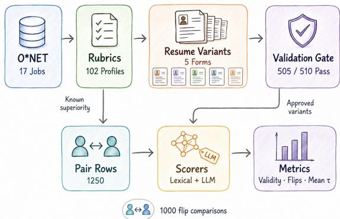
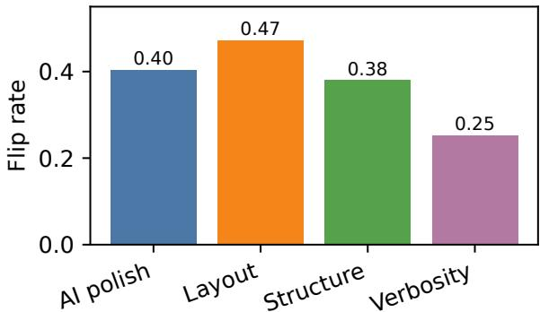

# Competence-Preserving Resume Perturbations Expose Presentation Sensitivity in LLM Screening

Qiangju Chen1,Yang Xiao2

1Macquarie University

2The University of Melbourne

qiangju.chen@students.mq.edu.au

## Abstract

Resume screeners must infer job-relevant competence from resumes whose presentation can vary substantially in wording, structure, stylistic polish, and document extraction quality. Ideally, such surface variation should not change decisions when the underlying qualification evidence is unchanged. We introduce a controlled audit of this property, constructing occupationgrounded candidate profiles at controlled competence levels and rendering each profile into multiple resume presentations. A deterministic validation gate excludes variants that alter the underlying evidence before scoring. Across six open instruction-tuned LLM conditions, we find a clear disconnect between screening validity and presentation stability. Llama-3.1- 8B with its native chat template achieves the strongest validity (0.781) yet reverses 29.6% of matched pairwise decisions under competencepreserving presentation changes; Mistral-7Bv0.3 reaches validity 0.644 with a 41.4% flip rate. Native chat formatting improves validity for several chat-tuned models but does not remove this instability. These results show that resume-screening evaluations should assess not only whether a system identifies stronger candidates, but also whether those decisions remain stable when the same competence evidence is presented differently.

## 1 Introduction

Automated resume screening requires systems to infer job-relevant competence from highly variable natural-language documents. The same qualification evidence can appear in concise bullet points, paragraph-style descriptions, AI-polished prose, or text affected by document extraction and layout artifacts. These differences are often orthogonal to whether a candidate is actually qualified, yet they change the surface form presented to the screening model. A central challenge is therefore to distinguish variation in candidate competence from variation in how that competence is expressed.

Algorithmic hiring has long raised questions about the validity, fairness, and reliability of automated decision systems (Raghavan et al., 2020; Köchling and Wehner, 2020; De-Arteaga et al., 2019). More recent work on LLM-based hiring has examined screening validity (Castleman et al., 2026), demographic bias (Gao et al., 2026; Iso et al., 2025), self-preference for AI-written resumes (Xu et al., 2025), and the influence of AI recommendations on human screeners (Wilson et al., 2026). These studies address important questions about whether screening systems make useful or fair decisions, but leave open a complementary robustness question: when the underlying competence evidence is unchanged, does the screening decision remain stable under changes in presentation? This question is practically relevant because applicants differ in writing assistance, resume templates, formatting conventions, and document-conversion pipelines. Presentation variation is therefore not merely an artificial perturbation, but a natural source of heterogeneity in the inputs that screening systems receive.

We study this problem through a controlled O\*NET-backed audit that separates candidate competence from resume presentation. Candidate profiles are constructed from occupation-grounded rubrics at controlled competence levels and then rendered into multiple resume forms. A deterministic validation gate removes variants that alter the underlying evidence before scoring. This design allows us to evaluate two properties on the same candidate set: whether a screener recovers knownsuperiority ordering (validity) and whether those decisions survive competence-preserving presentation changes (presentation invariance). We find that the two properties can diverge sharply: Llama-3.1-chat achieves validity 0.781 yet reverses 29.6% of matched decisions, while Mistral reaches validity 0.644 with a 41.4% flip rate. Native chat formatting improves validity for several chat-tuned

Benchmark Construction and Scoring Flow models but does not eliminate this sensitivity, consistent with broader evidence that LLM behavior can depend strongly on prompt format and other semantically incidental prompt choices (Sclar et al., 2024; Chatterjee et al., 2024).

## 2 Benchmark Framework

Our benchmark is designed to isolate a single question: does a resume screener preserve its decision when competence is fixed but presentation changes? To make this measurable, we separate benchmark construction into three stages as Figure 1. We first instantiate occupation-grounded candidate profiles with controlled competence differences, then render each profile into multiple presentation forms, and finally admit only variants that pass deterministic fact-preservation checks. Scorers operate on the validated resume text rather than hidden competence labels. This design allows known-superiority validity and presentation invariance to be evaluated on the same underlying candidate set.

## 2.1 O\*NET-Grounded Candidate Profiles

We construct the benchmark from the O\*NET 30.3 (National Center for O\*NET Development, 2026) database, selecting 17 occupations spanning technical, administrative, customer-facing, and health-related roles. For each occupation, we derive a screening rubric from its title, required skills, knowledge elements, and representative core tasks. We then instantiate six synthetic candidate profiles for a total of 102 profiles, per occupation, with two qualified, two borderline, and two underqualified. Profiles differ in rubric-aligned skill evidence, years of experience, and achievement strength, providing controlled competence differences from which known-superiority comparisons can be constructed.

This construction separates candidate competence from its eventual textual realization. Competence is specified at the profile level before any resume is rendered, so multiple presentation variants can later be generated from the same underlying candidate record. Known-superiority pairs support the validity evaluation, while same-tier pairs provide controlled equal-competence comparisons. This design allows presentation changes to be studied without redefining the underlying candidate qualifications.

  
Figure 1: Benchmark construction and scoring flow.

## 2.2 Competence-Preserving Resume Perturbations

Each candidate profile is rendered into five resume forms: an original bullet-style resume and four controlled presentation perturbations. Verbosity adds redundant summary language around the same facts; structure reorganizes bullet-style evidence into paragraph-like prose; AI polish rewrites tone and fluency without introducing new skills; and layout simulates extraction artifacts and local ordering noise. Together, these axes vary length, discourse organization, stylistic polish, and documentextraction quality while keeping the intended jobrelevant evidence fixed. Across 102 candidate profiles, this process produces 510 resume variants.

Because an intended rewrite is not necessarily competence-preserving, every generated variant passes through a deterministic validation gate before scoring. A variant is accepted only if required fact fields remain present, no unsupported rubric skill is introduced, no hidden competence-tier label is exposed, and perturbation generation is independent of the downstream scorer. Of the 510 variants, 505 pass validation. For same-tier base pairs, we additionally require exact agreement in the benchmark evidence vector (required-skill hits, task hits, and years of experience). The 255 base candidate comparisons then expand across presentation axes into 1,250 validation-approved pair rows. For the invariance audit, each non-original axis is matched to its corresponding original-axis decision, yielding 1,000 flip comparisons.

## 2.3 Independent Screening Protocol

Each resume is scored independently against the rubric of its corresponding occupation. Given a resume $r _ { i }$ and occupation rubric $q ,$ a screening

function produces a scalar score.

$$
s _ { i } = f ( r _ { i } , q ) .\tag{1}
$$

For two candidates i and $j ,$ , the pairwise decision is computed only after both resumes have been scored:

$$
D ( i , j ) = \mathrm { s i g n } ( s _ { i } - s _ { j } ) .\tag{2}
$$

The scorer therefore never receives two resumes in the same comparison prompt. This avoids pairorder and comparative prompt-position effects in the known-superiority evaluation. It is also important for the invariance audit: an original-toperturbed decision change reflects movement in independently assigned resume scores rather than a change in the surrounding pairwise prompt context.

## 2.4 Evaluation Metrics

We evaluate screening systems along two primary dimensions: validity and presentation invariance.

Known-superiority validity. For a knownsuperiority pair $( i , j )$ , where candidate i is constructed to be stronger than candidate $j ,$ validity measures whether the scorer assigns the stronger candidate the higher score:

$$
\mathrm { V a l i d i t y } = \frac { 1 } { N } \sum _ { ( i , j ) } \mathbb { I } [ s _ { i } > s _ { j } ] .
$$

Validity therefore measures recovery of the benchmark’s controlled competence ordering.

Presentation flip rate. For each non-original presentation axis $^ { a , }$ we compare its pairwise decision $D _ { a } ( i , j )$ with the decision obtained from the corresponding original resumes, $D _ { 0 } ( i , j )$

$$
\mathrm { F l i p } = \frac { 1 } { M } \sum _ { ( i , j , a ) } \mathbb { I } [ D _ { a } ( i , j ) \neq D _ { 0 } ( i , j ) ] .\tag{3}
$$

A flip indicates that the pairwise decision changes when presentation changes while the underlying competence record is held fixed. Flip rate measures decision instability, not error: a flip may either introduce an incorrect decision or correct an originally incorrect one. We therefore treat validity and flip rate as complementary properties.

Complementary stability metrics. For sametier pairs, we report the fraction assigned equal scores as the equal-tier tie rate. We also compute Kendall’s τ between original-axis and perturbedaxis rankings within each occupation and average it across occupations. Flip rate captures matched pairwise decision changes, whereas Kendall’s $\tau$ provides an occupation-level view of ranking stability.

## 3 Experimental Setup

Screening systems. We evaluate lexical baselines and direct LLM scorers under the validationgated benchmark. The lexical baselines are BM25 (Robertson and Zaragoza, 2009) and TF–IDF (Salton and Buckley, 1988). The direct LLM scorers span five model families: Qwen2.5-7B (Qwen Team, 2025), Llama-3.1-8B and Llama-3.2-3B (Meta AI, 2024), Phi-3.5-mini (Abdin et al., 2024), Mistral-7B-v0.3 (Jiang et al., 2023), and Gemma-2-2B (Gemma Team, 2024).

We additionally include a deterministic phrasepreserving control that matches rubric skill and task phrases together with years of experience and aggregates the resulting evidence deterministically.

Prompt conditions. We use raw prompts where available and native chat templates for Llama-3.1, Llama-3.2, and Gemma as a prompt-format ablation. The main table reports the stronger nativetemplate condition for Llama-3.2 and Gemma.

## 4 Results

## 4.1 Validity and Presentation Invariance

Table 1 shows that validity and presentation invariance capture distinct properties of a screening system. The strongest direct LLM condition is Llama-3.1-8B with its native chat template, which achieves validity 0.781. Under paired occupationcluster bootstrap, it exceeds BM25 by 0.293 and TF–IDF by 0.305. Mistral-7B-v0.3 also clears both lexical baselines, reaching validity 0.644. Phi-3.5- mini clears TF–IDF but not BM25, while the remaining direct LLM conditions provide directional rather than confirmatory validity evidence.

Stronger validity, however, does not imply presentation invariance. Llama-3.1-chat reverses 29.6% of matched pairwise decisions under competence-preserving presentation changes, while Mistral flips 41.4%. The same pattern is visible across the broader direct LLM set, with flip rates ranging from 0.285 to 0.456. Thus, even systems that recover known-superiority ordering relatively well can remain substantially sensitive to how the same competence evidence is presented.

Table 1: Validity and presentation stability across screening systems. Higher validity indicates better recovery of known-superiority ordering, while lower flip rate indicates greater stability under competence-preserving presentation changes.
<table><tr><td>System</td><td>Validity</td><td>Cluster 95% CI</td><td>Flip</td><td>Mean τ</td></tr><tr><td>BM25 lexical</td><td>0.488</td><td>[0.367, 0.603]</td><td>0.040</td><td>0.992</td></tr><tr><td>TF-IDF lexical</td><td>0.476</td><td>[0.375, 0.584]</td><td>0.052</td><td>0.979</td></tr><tr><td>Qwen2.5-7B raw</td><td>0.555</td><td>[0.470, 0.630]</td><td>0.377</td><td>0.682</td></tr><tr><td>Llama-3.1-8B raw</td><td>0.622</td><td>[0.513,0.712]</td><td>0.357</td><td>0.708</td></tr><tr><td>Llama-3.1-8B chat</td><td>0.781</td><td>[0.746, 0.814]</td><td>0.296</td><td>0.755</td></tr><tr><td>Phi-3.5-mini raw</td><td>0.611</td><td>[0.563, 0.663]</td><td>0.311</td><td>0.732</td></tr><tr><td>Mistral-7B-v0.3 raw</td><td>0.644</td><td>[0.593, 0.691]</td><td>0.414</td><td>0.630</td></tr><tr><td>Llama-3.2-3B chat</td><td>0.551</td><td>[0.488, 0.614]</td><td>0.285</td><td>0.762</td></tr><tr><td>Gemma-2-2B chat</td><td>0.576</td><td>[0.506, 0.644]</td><td>0.456</td><td>0.590</td></tr></table>

This separation motivates treating validity and presentation invariance as complementary evaluation dimensions. Validity measures whether a screener recovers the intended competence ordering, whereas invariance measures whether that decision survives irrelevant surface variation. High invariance alone is therefore not sufficient: a system may preserve consistently poor decisions. The desirable regime is one in which screening decisions are both valid and stable.

BM25 and TF–IDF show much lower flip rates (0.040 and 0.052), but these values should not be interpreted as evidence that lexical matching is generally a better resume screener. The benchmark deliberately preserves many rubric phrases across presentation variants, allowing lexical systems to retain the same pairwise sign under this controlled phrase-preserving condition. They therefore serve as stability references rather than deploymentquality screening methods. The deterministic structured control is narrower still: its validity 1.000 and flip rate 0.000 arise by construction and serve only as a benchmark sanity check.

## 4.2 Prompt-Format Ablation

A potential confound is that chat-tuned models may be miscalibrated under raw completion prompts. Table 2 tests this explanation using native chat templates for Llama-3.1, Llama-3.2, and Gemma. Chat formatting substantially improves validity: Llama-3.1 rises from 0.622 to 0.781, Llama-3.2 from 0.321 to 0.551, and Gemma from 0.287 to 0.576. Weak raw-prompt validity should therefore not be interpreted as an intrinsic inability of these chat-tuned models to perform the task.

Table 2: Native chat-template ablation. Raw completion prompts can understate validity for chat-tuned models, but presentation sensitivity remains high after the correction.
<table><tr><td>Model</td><td>Raw val.</td><td>Chat val.</td><td>Raw flip</td><td>Chat flip</td></tr><tr><td>Llama-3.1-8B</td><td>0.622</td><td>0.781</td><td>0.357</td><td>0.296</td></tr><tr><td>Llama-3.2-3B</td><td>0.321</td><td>0.551</td><td>0.363</td><td>0.285</td></tr><tr><td>Gemma-2-2B</td><td>0.287</td><td>0.576</td><td>0.363</td><td>0.456</td></tr></table>

The presentation-sensitivity result nevertheless survives this correction. Native-template flip rates remain 0.296 for Llama-3.1, 0.285 for Llama-3.2, and 0.456 for Gemma. Prompt-format mismatch can therefore explain part of the validity degradation under raw prompting, but it is not a sufficient explanation for presentation instability.

## 5 Conclusion

We introduced a controlled audit for studying how resume-screening systems respond to presentation variation when job-relevant competence is held fixed. By separating candidate competence from resume realization, the benchmark makes it possible to evaluate screening validity and presentation stability on the same underlying candidates. Our results show that these properties can diverge substantially: the strongest-validity LLM conditions still reverse a large fraction of decisions under competence-preserving rewrites, and native chat formatting does not eliminate the effect. These findings highlight presentation stability as an important dimension of resume-screening evaluation. Future audits should therefore examine not only whether a system ranks stronger candidates correctly, but also whether those decisions remain consistent across equivalent forms of the same evidence.

## 6 Limitations

Our controlled construction trades breadth for attribution: the benchmark covers 17 occupations and 102 synthetic O\*NET-grounded candidates, allowing presentation effects to be isolated while competence evidence is held fixed. Extending the audit to more occupations, human-authored resumes, and production resume-processing pipelines would test how well these findings generalize beyond the controlled setting. The occupation-cluster analysis is also based on 17 clusters, so its bootstrap intervals are best interpreted as pilot-scale evidence rather than precise population estimates. Finally, the evaluated systems are open-weight instruction models; broader audits could include proprietary screening models and end-to-end applicant-tracking systems.

## References

Marah Abdin, Sam Ade Jacobs, Ammar Ahmad Awan, Jyoti Aneja, Ahmed Awadallah, Hany Awadalla, Nguyen Bach, Amit Bahree, Arash Bakhtiari, Harkirat Behl, et al. 2024. Phi-3 technical report: A highly capable language model locally on your phone. Preprint, arXiv:2404.14219.

Jane Castleman, Zeyu Shen, Blossom Metevier, Max Springer, and Aleksandra Korolova. 2026. Measuring validity in LLM-based resume screening. Preprint, arXiv:2602.18550.

Anwoy Chatterjee, H S V N S Kowndinya Renduchintala, Sumit Bhatia, and Tanmoy Chakraborty. 2024. POSIX: A prompt sensitivity index for large language models. In Findings ofthe Associationfor Computational Linguistics: EMNLP 2024, pages 14550– 14565, Miami, Florida, USA. Association for Computational Linguistics.

Maria De-Arteaga, Alexey Romanov, Hanna Wal lach, Jennifer Chayes, Christian Borgs, Alexandra Chouldechova, Sahin Geyik, Krishnaram Kenthapadi, and Adam Tauman Kalai. 2019. Bias in bios: A case study of semantic representation bias in a highstakes setting. In Proceedings ofthe Conference on Fairness, Accountability, and Transparency, pages 120–128. Association for Computing Machinery.

Zhenyu Gao, Wenxi Jiang, and Yutong Yan. 2026. Can LLMs hire fairly? racial bias in resume screening. Preprint, arXiv:2606.28978.

Gemma Team. 2024. Gemma: Open models based on Gemini research and technology. Preprint, arXiv:2403.08295.

Hayate Iso, Pouya Pezeshkpour, Nikita Bhutani, and Estevam Hruschka. 2025. Evaluating bias in LLMs for job-resume matching: Gender, race, and education.

In Proceedings of the 2025 Conference of the Nations of the Americas Chapter of the Association for Computational Linguistics: Human Language Technologies (Volume 3: Industry Track), pages 672–683, Albuquerque, New Mexico. Association for Computational Linguistics.

Albert Q. Jiang, Alexandre Sablayrolles, Arthur Mensch, Chris Bamford, Devendra Singh Chaplot, Diego de Las Casas, Florian Bressand, Gianna Lengyel, Guillaume Lample, Lucile Saulnier, et al. 2023. Mistral 7b. Preprint, arXiv:2310.06825.

Alina Köchling and Marius Claus Wehner. 2020. Discriminated by an algorithm: A systematic review of discrimination and fairness by algorithmic decisionmaking in the context of hr recruitment and hr development. Business Research, 13:795–848.

Meta AI. 2024. The Llama 3 herd of models. Preprint, arXiv:2407.21783.

National Center for O\*NET Development. 2026. O\*NET 30.3 Database. O\*NET Resource Center. Version 30.3.

Qwen Team. 2025. Qwen2.5 technical report. Preprint, arXiv:2412.15115.

Manish Raghavan, Solon Barocas, Jon Kleinberg, and Karen Levy. 2020. Mitigating bias in algorithmic hiring: Evaluating claims and practices. In Proceedings ofthe 2020 Conference on Fairness, Accountability, and Transparency, pages 469–481. Association for Computing Machinery.

Stephen Robertson and Hugo Zaragoza. 2009. The probabilistic relevance framework: BM25 and beyond. In Foundations and Trends in Information Retrieval, volume 3, pages 333–389.

Gerard Salton and Christopher Buckley. 1988. Termweighting approaches in automatic text retrieval. Information Processing & Management, 24(5):513– 523.

Melanie Sclar, Yejin Choi, Yulia Tsvetkov, and Alane Suhr. 2024. Quantifying language models’ sensitivity to spurious features in prompt design or: How i learned to start worrying about prompt formatting. In International Conference on Learning Representations.

Kyra Wilson, Mattea Sim, Anna-Maria Gueorguieva, Soham Chatterjee, and Aylin Caliskan. 2026. Resume screening, fast and slow: (biased) AI recommendations’ influence on human decision making. Preprint, arXiv:2606.22213.

Jiannan Xu, Gujie Li, and Jane Yi Jiang. 2025. AI self-preferencing in algorithmic hiring: Empirical evidence and insights. Preprint, arXiv:2509.00462.

  
Figure 2: Axis-level flip-rate diagnostic for a directional raw-model slice. AI-polished prose and layout artifacts are among the most unstable axes in this slice.

## A Implementation Details

Phi-3.5-mini and Mistral-7B-v0.3 checkpoints are obtained from Hugging Face. Llama, Phi, Mistral, and the evaluated chat-template conditions are executed through vLLM on a single NVIDIA L40S GPU with 48 GB of memory. Each resume is scored independently against its corresponding occupation rubric; no model receives both resumes from a comparison pair in the same prompt. Pairwise decisions are formed only after the individual scalar scores have been produced, avoiding pairorder and comparative prompt-position effects.

For uncertainty estimation, we report both rowlevel bootstrap intervals and occupation-cluster percentile bootstrap intervals using 10,000 resamples. The cluster bootstrap resamples the 17 occupations and serves as a robustness check against row-level pseudo-replication. Because the benchmark contains only 17 occupation clusters, we interpret these intervals as exploratory small-cluster evidence rather than precise nominal population coverage.

## B Axis-Level Presentation Sensitivity

As a directional failure-analysis slice, Figure 2 decomposes Qwen2.5-7B raw flips by presentation axis. Layout artifacts produce the highest flip rate (0.472), followed by AI-polished prose (0.404), structural reorganization (0.380), and verbosity (0.252). Because Qwen’s validity advantage over the lexical baselines does not clear zero under paired occupation-cluster bootstrap, we treat this decomposition as an illustrative diagnostic rather than evidence that these axes have a universal ordering of difficulty.