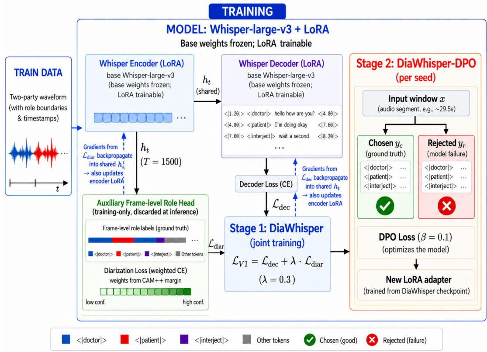
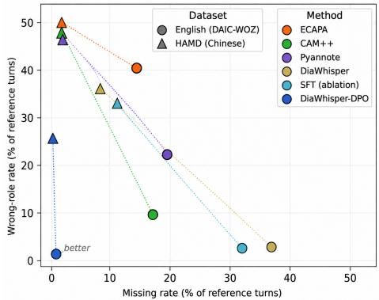

# DIAWHISPER-DPO: ROLE-ATTRIBUTED TRANSCRIPTION OF CLINICAL INTERVIEWSVIA FAILURE-MINED PREFERENCE OPTIMIZATION

Weiming Li1, Ana Catarina Fidalgo Barata1, Miguel Constante2, and Joao Miguel Sanches ˜ 1

1Institute for Systems and Robotics (ISR), LARSyS, Departamento de Bioengenharia, Instituto Superior Tecnico (IST), Universidade de Lisboa, 1049-001 Lisboa, Portugal ´ 2Hospital Beatriz Angelo, Faculdade de Medicina Universidade Cat ˆ olica Portuguesa, 2674-514 Loures, Portugal´

## ABSTRACT

Automated depression screening from clinical interviews requires attribution of utterances to the clinician or patient. We evaluate two datasets: DAIC-WOZ, where participant-only recordings require re-synthesizing both sides for controlled two-party evaluation, and PDCH-HAMD, comprising voiceconverted real Chinese interviews for cross-lingual validation. Cascaded systems combine speaker diarization with roleassignment heuristics, so errors can propagate across stages. We propose an end-to-end model, which we named DiaWhisper, that fine-tunes Whisper-large-v3 with LoRA and an auxiliary frame-level role head for transcription and attribution, together with DiaWhisper-DPO, a failure-mined refinement that uses genuine decoding failures as DPO rejected completions without human preference annotation. On 29 DAIC-WOZ test sessions, DiaWhisper-DPO achieves 0.973 role accuracy and 0.119 DER, 72% below the strongest cascaded baseline, and reduces seed variation from σ = .205 to .002. Retrained on PDCH-HAMD, it achieves 0.757 role accuracy and improves all 78 session-seed pairs.

Index Terms— speech recognition, speaker diarization, role attribution, parameter-efficient fine-tuning, preference optimization

## 1. INTRODUCTION

Automated depression screening from clinical interviews depends on more than accurate transcription: it also requires knowing who said what. Patient word choice, hesitation, response latency, and turn-taking dynamics are established markers of depressive symptomatology, but they are informative only when correctly attributed and often depend on the preceding interviewer question [1, 2]. The same lexical or acoustic pattern can have different clinical relevance depending on whether it comes from the clinician or patient, and misattributed turns distort downstream screening signals [3], making reliable role attribution clinically important for downstream clinical analysis, where speaker identity directly conditions interpretation. We study this problem on two complementary corpora: DAIC-WOZ [4, 5], a widely used English corpus whose participant-only recordings require two-party re-synthesis for controlled evaluation (Section 2.1), and PDCH-HAMD [6], voice-converted recordings of real Chinese clinical interviews for independent crosslingual validation (Section 3.1). Traditional pipelines use speaker diarization [7] followed by heuristic role assignment, but this cascaded design lets errors propagate: diarization mistakes carry into role assignment, while neither stage can correct the other [8]. Recent work instead models transcription and role or speaker attribution jointly within a single sequence-transduction model [8, 9, 10], alongside parameterefficient Whisper adaptation [11] and preference optimization for code-switching ASR [12]. We combine these directions by fine-tuning Whisper to produce role-tagged, timestamped transcripts end-to-end, then refining it with failuremined DPO [13, 14], using genuine decoding failures as rejected completions and ground truth as chosen completions, without additional preference annotation.

Our contributions are: (i) failure-mined preference optimization, showing that genuine model failures provide a stronger and more stable training signal than extra SFT or artificial negatives, without additional annotation cost; (ii) DiaWhisper, a LoRA-tuned Whisper-large-v3 with an auxiliary frame-level role-classification head for role-tagged, timestamped two-party transcription without separate diarization; (iii) a DAIC-WOZ real-versus-synthetic acoustic validation that quantifies the participant-side domain gap introduced by re-synthesis; (iv) DiaWhisper-DPO, which on DAIC-WOZ improves seed stability from σ=.205 to .002 and reduces DER by 72% relative to the strongest cascaded baseline; when independently trained and evaluated on voice-converted PDCH-HAMD, the same method improves role attribution in all 78 matched session-seed cases, supporting its cross-lingual applicability; and (v) per-role AER and DER with bootstrap confidence intervals, coverage-conditioned accuracy, and oracle role-mapping checks, which expose role- and languagespecific failures while separating genuine attribution gains from coverage or heuristic effects.

  
Fig. 1. Training pipeline: Stage 1 produces DiaWhisper; Stage 2 refines it into DiaWhisper-DPO. Both share the inference procedure in Section 2.4.

## 2. METHOD

We construct two-party clinical interview data, adapt Whisper for joint transcription, timestamps, and roles with an auxiliary diarization loss, then refine DiaWhisper using failure-mined DPO from training-set failures. Both models share the same inference procedure.

## 2.1. Dataset Construction

We use DAIC-WOZ [4, 5] and the Chinese PDCH corpus [6] as complementary clinical-interview corpora. DAIC-WOZ distributes only participant-side audio, so we reconstruct twoparty dialogues by synthesizing Doctor and Patient speech from the ground-truth transcripts using XTTS [15, 16], preserving exact role boundaries and timestamps. For each session, two VCTK voices per role [17] are cross-combined into four variants, of which one is deterministically selected using SHA256(session id, filename), ensuring approximately balanced voice assignments without cross-split leakage. For Chinese validation, we use PDCH recordings containing depression consultations and Hamilton Depression Rating Scale (HAMD) assessment; speech is voice-converted for privacy, and our patient-level partitioning prevents speaker identity from crossing data splits.

## 2.2. Architecture

Fig. 1 outlines the pipeline. We fine-tune Whisper-large-v3 [18] with LoRA [19] (rank = 16, α = 32, dropout = 0.05) applied to self-attention query/value projections across both encoder and decoder. Targets follow Whisper’s native timestamp–tag–text–timestamp format, replacing text spans with role-tagged spans (<|doctor|>, <|patient|>, or <|interject|> for overlap); only the embedding/output rows for the 3 role tokens are unfrozen.

We attach an auxiliary role head $g _ { \phi } - \mathbf { a }$ single linear layer, 4-way: Doctor/Patient/Interject/None, training-only and discarded at inference – to each encoder frame $h _ { t } ~ \in ~ \mathbb { R } ^ { 1 2 8 0 }$ (t = 1, . . . , T=1500 frames per 30 s chunk). For each frame, a confidence weight $w _ { t }$ comes from the margin $m _ { t } \ -$ the gap between how strongly frame $t \mathbf { \hat { s } }$ CAM++ [20] speaker embedding $e _ { t }$ resembles the session’s Doctor versus Patient voiceprint centroid:

$$
\begin{array} { r l } & { m _ { t } = \cos ( e _ { t } , c _ { D o c t o r } ) - \cos ( e _ { t } , c _ { P a t i e n t } ) } \\ & { \quad w _ { t } = f ( | m _ { t } | ) } \end{array}\tag{1}
$$

where $f ( \cdot )$ maps larger margins to higher confidence in 5 bins $( | m _ { t } |$ thresholds 0.05/0.15/0.3/0.5), from 0.4 (∼39% measured reliability) to 1.0 (∼99.8%). This weight feeds an inde-

pendent loss:

$$
\mathcal { L } _ { d i a r } = \frac { 1 } { T } \sum _ { t = 1 } ^ { T } w _ { t } \cdot \mathrm { C E } \big ( g _ { \phi } ( h _ { t } ) , r _ { t } \big )\tag{2}
$$

where CE is cross-entropy and $r _ { t }$ the ground-truth frame role; low-confidence frames are down-weighted to limit ambiguous-frame gradients.

## 2.3. Training

In Stage 1 (DiaWhisper), we jointly optimize:

$$
\mathcal { L } _ { V 1 } = \mathcal { L } _ { d e c } + \lambda \cdot \mathcal { L } _ { d i a r } , \quad \lambda = 0 . 3\tag{3}
$$

where $\mathcal { L } _ { d e c }$ is teacher-forcing cross-entropy over the serialized target and λ weights the auxiliary diarization loss. Training uses learning rate $1 \times 1 0 ^ { - 4 }$ , effective batch size 16, for 3 epochs across 3 seeds.

In Stage 2, we refine DiaWhisper with DPO [13] to obtain DiaWhisper-DPO. From training windows triggering the 8- token repetition criterion, we sample about 500 per seed to form preference pairs (500/500/500 EN; 499/500/499 ZH), with the model’s own genuine failure as rejected and ground truth as chosen. Stage-1 parameters are merged and frozen, and only a newly initialized policy LoRA adapter is optimized. With policy $\pi _ { \theta } ,$ , frozen reference $\pi _ { r e f }$ , input x, chosen $y _ { c } ,$ and rejected $y _ { r }$ :

$$
\Delta _ { \theta } = \log \pi _ { \theta } ( y _ { c } | x ) - \log \pi _ { \theta } ( y _ { r } | x )\tag{4}
$$

$$
\Delta _ { r e f } = \log \pi _ { r e f } ( y _ { c } | x ) - \log \pi _ { r e f } ( y _ { r } | x )\tag{5}
$$

$$
\mathcal { L } _ { D P O } = - \log \sigma \big ( \beta [ \Delta _ { \theta } - \Delta _ { r e f } ] \big )\tag{6}
$$

where $\sigma ( \cdot )$ is the sigmoid and $\beta$ controls preference sharpness. Training uses $\beta = 0 . 1$ , learning rate $5 \times 1 0 ^ { - 5 }$ , for 1 epoch, mined and trained independently per seed.

## 2.4. Inference and Decoding

Audio is segmented into ∼29.5s chunks, boundaries snapped to the nearest low-energy pause within ±2s, since no groundtruth boundaries exist at inference. Each chunk is decoded greedily (beam search often loses the fine-tuned role/timestamp structure), stopping on 8 consecutive repeated tokens – also the DPO-mining criterion (Section 2.3) – or a token budget. A repetition cutoff before full coverage triggers a retry (up to 4/chunk), resuming from an estimated point with sampling (temperature = 0.5, top-p = 0.9) instead of greedy, since resuming from near-identical context under greedy decoding reproduces the loop. Output is parsed into (role, start, end, text) triplets and concatenated per session; DiaWhisper and DiaWhisper-DPO share this procedure, differing only in checkpoint.

## 3. EXPERIMENTAL RESULTS AND ANALYSIS

We assess whether failure-mined preference optimization improves the accuracy and robustness of role-attributed transcription across DAIC-WOZ and PDCH-HAMD, with additional analysis of seed sensitivity and decoding failures.

## 3.1. Experimental Setup

DAIC-WOZ uses 132/28/29 train/dev/test sessions; our PDCH-HAMD subset has 100 sessions (49.8 h) from 73 patients, split patient-wise 51/11/11, yielding 26 test sessions. We compare three cascaded Whisper-large-v3 baselines sharing the same first-speaker heuristic and aligner, differing only in diarization: ECAPA-TDNN [21], CAM++ [20], and pyannote.audio [22]. Metrics include turn-level role accuracy after temporal alignment (unmatched reference turns count as incorrect), WER/CER, and Attribution Error Rate (AER) over matched reference turns. With $T _ { r }$ denoting reference turns of role r and $D _ { r } = \{ t \in T _ { r }$ : pred role(t) ̸= Missing}:

$$
\mathrm { A E R } _ { r } = { \frac { | \{ t \in D _ { r } : \mathrm { p r e d } \mathbf { \bot } \mathrm { r o l e } ( t ) \neq r \} | } { | D _ { r } | } }\tag{7}
$$

AER therefore measures attribution conditional on nonmissing turns; coverage errors are captured by DER. We also report NIST-style Diarization Error Rate (DER) [23]:

$$
\mathrm { { D E R } = \frac { M D + S C + F A } { T O T A L } , }\tag{8}
$$

where MD is missed reference duration, SC misattributed duration, FA non-overlapping predicted duration, and TOTAL total reference speech. With only Doctor and Patient roles, SC directly reflects role errors, so DER is interpreted only within this task. We report 2000-resample session-bootstrap 95% CIs for all systems; for DiaWhisper and DiaWhisper-DPO, [24], pooling three seeds within each sampled session. To quantify the DAIC-WOZ synthetic gap, we transcribe matched real and XTTS patient audio: mean WER is 0.136 vs. 0.106 across 189 sessions and 0.107 vs. 0.099 on the test split. PDCH-HAMD provides independent validation on real conversational interviews after voice conversion. Results appear in Tables 1–2, with cross-dataset and stability analyses in Section 3.3.

## 3.2. Main Results

Table 1 reports both datasets. DiaWhisper-DPO leads all baselines in role accuracy, DER, and AER. On DAIC-WOZ, the large WER gain mainly reflects recovered coverage after eliminating repetition loops that exhaust retries (Section 3.3). Its DER (0.119) is roughly one quarter of the strongest baseline’s 0.431 and DiaWhisper’s 0.485, while FA falls from ∼30% for baselines to ∼10%. Noisier, with untranscribed filler words and voice-converted speech,

PDCH-HAMD shows the same ranking with a smaller margin: DiaWhisper-DPO achieves 0.313 DER versus Pyannote’s 0.574, with FA of 8–17%, suggesting errors are dominated by missed or misattributed speech. Per-role AER remains lowest for DiaWhisper-DPO at 0.01/0.02 on DAIC-WOZ and 0.26/0.26 on PDCH-HAMD. Oracle role mapping changes baseline accuracy by only 0–7 points (per-system values omitted for space); DiaWhisper-DPO still leads the best oracle baseline by 21.5 points on DAIC-WOZ and 17.1 on PDCH-HAMD, indicating mainly diarization rather than role-assignment errors.

Table 1. Test-set results, DAIC-WOZ (n=29) and PDCH-HAMD (n=26). CI = session-bootstrap 95% CI; DiaWhisper CIs pool 3 seeds/session. σ = seed SD; AER (D/P) = Doctor/Patient.
<table><tr><td>Method</td><td>Dataset</td><td colspan="2">Role Acc. (CI, σ)</td><td>DER (CI)</td><td>WER/CER</td><td>AER(D/P)</td></tr><tr><td>ECAPA</td><td>DAIC</td><td colspan="2">0.464 [.39,.54]</td><td>0.792 [.65,.95]</td><td>0.104</td><td>0.20/0.60</td></tr><tr><td>ECAPA</td><td>PDCH</td><td colspan="2">0.480 [.46,.50]</td><td>0.713 [.63,.81]</td><td>0.489</td><td>0.41/0.62</td></tr><tr><td>CAM++</td><td>DAIC</td><td colspan="2">0.758 [.71,.80]</td><td>0.431 [.37,.51]</td><td>0.099</td><td>0.17/0.08</td></tr><tr><td>CAM++</td><td>PDCH</td><td colspan="2">0.507 [.49,.52]</td><td>0.594 [.51,.69]</td><td>0.489</td><td>0.55/0.42</td></tr><tr><td>Pyannote</td><td>DAIC</td><td colspan="2">0.600 [.56,.65]</td><td>0.559 [.49,.64]</td><td>0.099</td><td>0.43/0.17</td></tr><tr><td>Pyannote</td><td>PDCH</td><td colspan="2">0.514 [.46,.57]</td><td>0.574 [.49,.66]</td><td>0.628</td><td>0.28/0.65</td></tr><tr><td></td><td></td><td colspan="2"></td><td>DiaWhisper DAIC 0.645 [.62,.67] σ.205 0.485 [.46,.51] 0.455±.175 0.09/0.02</td><td></td><td></td></tr><tr><td></td><td></td><td colspan="2"></td><td>DiaWhisper PDCH 0.570 [.55,.59] σ.052 0.447[.39,.50] 0.599±.111 0.33/0.45</td><td></td><td></td></tr><tr><td></td><td></td><td colspan="2"></td><td>DiaW-DO DAIC 0.973 [.97,.98] σ.002 0.119 [.10,.14] 0.048±.005 0.01/0.02</td><td></td><td></td></tr><tr><td></td><td></td><td colspan="2"></td><td>DiaW-DPO PDCH0.757 [.74,.78] σ.005 0.313 [.25,.38] 0.505±.073 0.26/0.26</td><td></td><td></td></tr></table>

## 3.3. Seed Stability and Error Analysis

On DAIC-WOZ, DiaWhisper is highly sensitive to the random seed (role accuracy 0.41–0.79, σ=.205), whereas DPO cuts this variation to σ=.002 (Table 1). The DAIC-WOZ ablations (Table 2) show that removing retry drops DiaWhisper from 0.645 to 0.280 but barely moves DiaWhisper-DPO (0.973 to 0.971), and replacing DPO with SFT reaches only 0.684, so the improvement comes from the preference signal rather than retry recovery or extra exposure to ground truth. Replacing genuine failures with synthetic corruptions (role-swapped, truncated, looped, or mismatched) still recovers 0.910 role accuracy on DAIC-WOZ, but with 18× the seed variability (σ=.037 vs. .002), so genuine failures give a more stable refinement signal.

Table 2. Ablations, DAIC-WOZ and PDCH-HAMD, mean±SD over 3 seeds. SFT and artificial negatives replace the DPO stage; CER replaces WER for PDCH-HAMD rows.
<table><tr><td>Variant</td><td>Dataset</td><td>Role Acc.</td><td>WER/CER</td></tr><tr><td>SFT (replaces DPO)</td><td>DAIC</td><td>0.684±.182</td><td>0.441±.151</td></tr><tr><td>SFT (replaces DPO)</td><td>PDCH</td><td>0.568±.085</td><td>0.720±.141</td></tr><tr><td>DPO, artificial negatives</td><td>DAIC</td><td></td><td>0.910±.037 0.279±.075</td></tr><tr><td>DPO, artificial negatives</td><td>PDCH</td><td></td><td>0.682±.049 0.443±.044</td></tr><tr><td>DiaWhisper, no retry</td><td>DAIC</td><td></td><td>0.280±.127 0.761±.121</td></tr><tr><td>DiaWhisper, no retry</td><td>PDCH</td><td></td><td>0.509±.089 0.625±.111</td></tr><tr><td>DiaWhisper-DPO, no retry</td><td>DAIC</td><td></td><td>0.971±.002 0.047±.004</td></tr><tr><td>DiaWhisper-DPO, no retry</td><td>PDCH</td><td></td><td>0.756±.004 0.481±.058</td></tr></table>

Across all 87 matched DAIC-WOZ session-seed evaluations, DiaWhisper-DPO improves role accuracy by +0.220 to +0.442. On the full DAIC-WOZ test set (2694 chunks), retry exhaustion leaves 33.6% of DiaWhisper’s speech uncovered against 3.2% for DiaWhisper-DPO, the main error source (Fig. 2); beyond this coverage gain, DAIC-WOZ matchedturn role accuracy also rises from 95.4% to 98.3% (nonoverlapping 95% CIs).

  
Fig. 2. Missing rate vs. wrong-role rate by method, DAIC-WOZ (circle) and PDCH-HAMD (triangle); dotted lines join each method’s two points. DiaWhisper-DPO sits closest to the origin on both datasets, nearly eliminating missing turns on PDCH-HAMD as well as DAIC-WOZ, though wrong-role attribution remains the larger residual error there.

PDCH-HAMD follows the same pattern more weakly: seed variability falls from σ=.052 to .005, and the PDCH-HAMD ablations keep the ranking – retry removal mildly hurts DiaWhisper (0.570 to 0.509) but not DiaWhisper-DPO (0.757 to 0.756), SFT (0.568) stays within DiaWhisper’s seed noise, and artificial negatives (0.682) fall in between. DiaWhisper-DPO improves all 78 matched PDCH-HAMD session-seed evaluations (mean +0.188 role accuracy), with PDCH-HAMD matched-turn role accuracy rising from 62.3% to 75.9% (non-overlapping 95% CIs); unlike DAIC-WOZ, the residual PDCH-HAMD error is concentrated in role attribution rather than coverage (0.2% missing vs. 25.8% wrongrole).

Finally, the real-versus-synthetic check covers only the DAIC-WOZ patient side, as no real interviewer audio is distributed, and since incorrect role attribution could distort depression-screening signals [3], such output still requires human verification.

## 4. CONCLUSION

DiaWhisper-DPO fine-tunes Whisper-large-v3 with LoRA and an auxiliary role head, then applies DPO to genuine decoding failures for joint transcription and role attribution without separate diarization or human preference annotation. Independently trained on DAIC-WOZ and PDCH, it outperforms cascaded baselines and greatly reduces seed variability, demonstrating the effectiveness of failure-mined preference optimization for structured transcription.

## 5. COMPLIANCE WITH ETHICAL STANDARDS

PDCH was collected at Beijing Anding Hospital with ethics approval (No. 2021-research-102) and written informed consent from all participants [6]. DAIC-WOZ was originally collected with USC IRB approval (UP-11-00342) and informed consent; this study used the existing de-identified dataset under its data-use terms [4].

## 6. REFERENCES

[1] Tuka Al Hanai, Mohammad Ghassemi, and James Glass, “Detecting depression with audio/text sequence modeling of interviews,” in Proc. Interspeech 2018, 2018, pp. 1716–1720.

[2] Yuan Gong and Christian Poellabauer, “Topic modeling based multimodal depression detection,” in Proc. 7th Annual Workshop on Audio/Visual Emotion Challenge (AVEC), 2017, pp. 69–76.

[3] Sergio Burdisso, Ernesto Reyes-Ram´ırez, Esau Villatoro-tello, Fer-´ nando Sanchez-Vega, Adrian Lopez Monroy, and Petr Motlicek,´ “DAIC-WOZ: On the validity of using the therapist’s prompts in automatic depression detection from clinical interviews,” in Proceedings of the 6th Clinical Natural Language Processing Workshop, Mexico City, Mexico, 2024, pp. 82–90, Association for Computational Linguistics.

[4] Jonathan Gratch, Ron Artstein, Gale Lucas, Giota Stratou, Stefan Scherer, Angela Nazarian, Rachel Wood, Jill Boberg, David De-Vault, Stacy Marsella, David Traum, Skip Rizzo, and Louis-Philippe Morency, “The distress analysis interview corpus of human and computer interviews,” in Proceedings of the Ninth International Conference on Language Resources and Evaluation (LREC’14). European Language Resources Association (ELRA), 2014, pp. 3123–3128.

[5] Fabien Ringeval, Bjorn Schuller, Michel Valstar, Nicholas Cummins,¨ Roddy Cowie, Leili Tavabi, Maximilian Schmitt, Sina Alisamir, Shahin Amiriparian, Eva-Maria Messner, Siyang Song, Siyuan Liu, Ziping Zhao, Adria Mallol-Ragolta, Zhao Ren, Mohammad Soleymani, and Maja Pantic, “Avec 2019 workshop and challenge: State-of-mind, detecting depression with ai, and cross-cultural affect recognition,” in Proceedings of the 9th International on Audio/Visual Emotion Challenge and Workshop (AVEC’19). ACM, 2019, pp. 3–12.

[6] Pengfei Cao, Yuanzhe Zhang, Chenxiang Zhang, Wei Chen, Yan Liu, Shuang Xu, Miao Xu, Wenqing Jin, Jinjie Xu, Dan Wang, Wei Wang, Xue Wang, Wen Wang, Yanping Ren, Jun Zhao, Rena Li, and Kang Liu, “A multimodal depression consultation dataset of speech and text with hamd-17 assessments,” Scientific Data, vol. 12, pp. 1577, 2025.

[7] Tae Jin Park, Naoyuki Kanda, Dimitrios Dimitriadis, Kyu J. Han, Shinji Watanabe, and Shrikanth Narayanan, “A review of speaker diarization: Recent advances with deep learning,” Computer Speech & Language, vol. 72, pp. 101317, 2022.

[8] Laurent El Shafey, Hagen Soltau, and Izhak Shafran, “Joint speech recognition and speaker diarization via sequence transduction,” in Proc. Interspeech 2019, 2019, pp. 396–400.

[9] Naoyuki Kanda, Yashesh Gaur, Xiaofei Wang, Zhong Meng, and Takuya Yoshioka, “Serialized output training for end-to-end overlapped speech recognition,” in Proc. Interspeech, 2020, pp. 2797–2801.

[10] Anfeng Xu, Tiantian Feng, Somer Bishop, Catherine Lord, and Shrikanth Narayanan, “End-to-end joint ASR and speaker role diarization with child-adult interactions,” arXiv preprint arXiv:2601.17640, 2026.

[11] Zheshu Song, Jianheng Zhuo, Yifan Yang, Ziyang Ma, Shixiong Zhang, and Xie Chen, “LoRA-Whisper: Parameter-efficient and extensible multilingual ASR,” in Proc. Interspeech 2024, 2024.

[12] Trung Nguyen Quang, Cheng Yi Lewis Won, Minh Duc Pham, Yingxu He, Shuo Sun, and Ai Ti Aw, “Direct preference optimization for

English-Mandarin code-switching speech recognition in audio LLMs,” arXiv preprint arXiv:2605.23975, 2026.

[13] Rafael Rafailov, Archit Sharma, Eric Mitchell, Stefano Ermon, Christopher D. Manning, and Chelsea Finn, “Direct preference optimization: Your language model is secretly a reward model,” in Advances in Neural Information Processing Systems 36 (NeurIPS 2023). Curran Associates, Inc., 2023, vol. 36, pp. 53728–53741.

[14] Long Ouyang, Jeff Wu, Xu Jiang, Diogo Almeida, Carroll Wainwright, Pamela Mishkin, Chong Zhang, Sandhini Agarwal, Katarina Slama, Alex Ray, John Schulman, Jacob Hilton, Fraser Kelton, Luke Miller, Maddie Simens, Amanda Askell, Peter Welinder, Paul Christiano, Jan Leike, and Ryan Lowe, “Training language models to follow instructions with human feedback,” in Advances in Neural Information Processing Systems (NeurIPS), 2022, vol. 35, pp. 27730–27744.

[15] Edresson Casanova, Kelly Davis, Eren Golge, G ¨ orkem G ¨ oknar, Iu- ¨ lian Gulea, Logan Hart, Aya Aljafari, Joshua Meyer, Reuben Morais, Samuel Olayemi, and Julian Weber, “XTTS: A massively multilingual zero-shot text-to-speech model,” in Proceedings of Interspeech 2024. ISCA, 2024, pp. 4978–4982.

[16] Edresson Casanova, Julian Weber, Christopher D. Shulby, Arnaldo Candido Junior, Eren Golge, and Moacir A. Ponti, “Yourtts: Towards¨ zero-shot multi-speaker tts and zero-shot voice conversion for everyone,” in Proc. International Conference on Machine Learning (ICML). PMLR, 2022, pp. 2709–2720.

[17] Christophe Veaux, Junichi Yamagishi, and Kirsten MacDonald, “CSTR VCTK Corpus: English multi-speaker corpus for CSTR voice cloning toolkit,” Tech. Rep., University of Edinburgh, The Centre for Speech Technology Research (CSTR), 2017.

[18] Alec Radford, Jong Wook Kim, Tao Xu, Greg Brockman, Christine McLeavey, and Ilya Sutskever, “Robust speech recognition via largescale weak supervision,” in Proceedings ofthe 40th International Conference on Machine Learning, 2023.

[19] Edward J. Hu, Yelong Shen, Phillip Wallis, Zeyuan Allen-Zhu, Yuanzhi Li, Shean Wang, Lu Wang, and Weizhu Chen, “LoRA: Low-rank adaptation of large language models,” in International Conference on Learning Representations, 2022.

[20] Yafeng Chen, Siqi Zheng, Hui Wang, Luyao Cheng, Tinglong Zhu, Rongjie Huang, Chong Deng, Qian Chen, Shiliang Zhang, Wen Wang, and Xihao Li, “3D-speaker-toolkit: An open source toolkit for multi-modal speaker verification and diarization,” arXiv preprint arXiv:2403.19971, 2024.

[21] Brecht Desplanques, Jenthe Thienpondt, and Kris Demuynck, “ECAPA-TDNN: Emphasized channel attention, propagation and aggregation in TDNN based speaker verification,” in Proc. Interspeech 2020, 2020, pp. 3830–3834.

[22] Herve Bredin, “pyannote.audio 2.1 speaker diarization pipeline: prin-´ ciple, benchmark, and recipe,” in Proc. Interspeech 2023, 2023.

[23] Jonathan G. Fiscus, Jerome Ajot, Martial Michel, and John S. Garofolo, “The rich transcription 2006 spring meeting recognition evaluation,” in Machine Learningfor Multimodal Interaction (MLMI), 2006.

[24] Bradley Efron and Robert J. Tibshirani, An Introduction to the Bootstrap, Chapman and Hall/CRC, 1994.