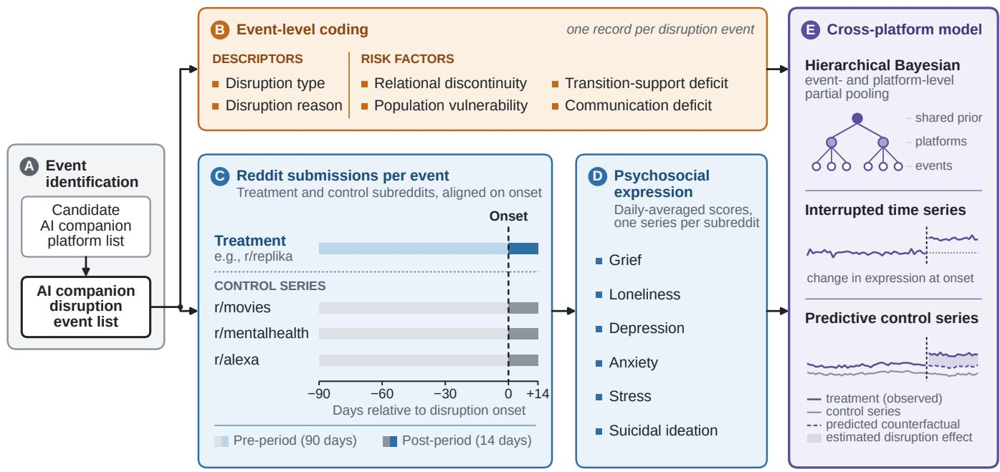

# Disrupted Companionship: A Risk Assessment Framework and Cross-Platform Quantitative Analysis of Psychosocial Responses to AI Companion Disruptions

Chau Do Aalto University Espoo, Finland chau.m.do@aalto.fi

Yunhao Yuan   
Aalto University   
Espoo, Finland   
yunhao.yuan@aalto.fi

Renwen Zhang Nanyang Technological University Singapore, Singapore renwen.zhang@ntu.edu.sg

Koustuv Saha University of Illinois Urbana-Champaign Urbana, IL, USA ksaha2@illinois.edu

## ABSTRACT

AI companions can provide meaningful relationships, yet these relationships remain vulnerable to platform-initiated changes. We study AI companion disruptions: platform changes that alter or terminate users’ ongoing companionship with an AI. We compile 30 disruption events across major platforms, develop a taxonomy of six disruption types, identify three broad reasons for disruption, and propose a risk-assessment framework comprising four dimensions: relational discontinuity, population vulnerability, communication deficit, and transition-support deficit. Using longitudinal Reddit data, we estimate community-level psychosocial responses with a hierarchical Bayesian interrupted time-series model incor porating predictive controls. Across events, disruption onset was associated with immediate increases in anxiety, stress, suicidal expression, and grief activation, with relational discontinuity and transition-support deficit being associated with more adverse immediate responses across several outcomes. Our findings provide a cross-platform characterization of AI companion disruptions, quantitative evidence of their psychosocial impacts, and a prospective framework for assessing their potential risks before implementation.

## CCS CONCEPTS

• Human-centered computing → Empirical studies in collaborative and social computing; Social media; • Applied computing → Psychology.

## KEYWORDS

social media, chatbots, AI companions, loneliness

## 1 INTRODUCTION

AI companions–conversational AI systems designed to provide emotional support and simulated relationships–have grown from a niche technology into a mainstream social phenomenon in recent years [79, 87, 97]. By mid-2025, AI companions reached a valuation of approximately USD 38 billion, with projections estimating growth to USD 436 billion by 2034 [40]. In 2024, Character.AI alone reported around 3.5 million daily visitors, and Replika reported

Talayeh Aledavood   
Aalto University   
Espoo, Finland   
talayeh.aledavood@aalto.fi

more than 30 million registered users [89, 90]. Users increasingly turn to these systems for emotional support or relief from loneliness, and a substantial share describe their interactions in explicitly relational terms—as friends, partners, or mentors [53, 63, 96]. This behavior is not confined to purpose-built AI companions. Empirical audits of ChatGPT interactions consistently rank erotic and romantic role-play near the top of observed use categories [101].

As AI companions have become increasingly widespread, abrupt changes to or termination of these services have raised growing concerns. Following intense legal and regulatory pressure after the suicide of a 14-year-old user [3], Character.AI announced in October 2025 that it would bar users under 18 from open-ended chat by late November. Although introduced as a safety intervention, the loss of access was later found to be highly distressing for some users [62]. A similar disruption occurred in August 2025, when OpenAI released GPT-5 and removed user access to GPT-4o [58]. What seemed like a routine product upgrade rapidly triggered a wave of protests. Complaints were not limited to performance or pricing: users described GPT-4o as a friend or companion and experienced its removal as a personal loss. Analyses of online discussions identified relational attachment, disappointment, and grief as prominent responses to the transition [21, 49].

These cases illustrate a broader class of events that we term AI companion disruptions: platform-initiated changes that disrupt users’ ongoing relationships with an AI companion. While users may turn to these systems for emotional support, intimacy, and relief from loneliness, AI companions remain commercial technologies that depend entirely on the platforms that operate them. Providers may shut down services, remove features, or restrict access, forcing emotionally meaningful relationships to end abruptly or be altered substantially. Such events are therefore not merely product changes, but potential risks to users’ mental health and well-being [5, 8, 21, 30].

Despite growing evidence of these impacts, it remains unclear how these consequences generalize across the broader range of disruptions that occur across AI companion platforms. Events may difer in what changes, why the change occurs, how severely the AI companion relationship is afected, which users are impacted, and how the platform communicates and supports the transition.

Without a common framework to systematically compare these dimensions across events, it remains unclear what makes some disruptions more harmful than others. Identifying these diferences is essential for designing platform changes in ways that minimize mental health risks for afected users.

To bridge these gaps, we compiled 30 disruption events across diferent AI companion platforms and posed four research questions:

• RQ1: What forms do AI companion disruptions take and why do they occur?

• RQ2: How do AI companion disruptions difer in potential risk profiles?

• RQ3: What immediate and short-term changes in communitylevel expressions of psychosocial distress are associated with AI companion disruptions?

• RQ4: How do these changes in psychosocial expressions vary with event-level risk factors?

To address RQ1 and RQ2, we characterize disruption events along three distinct dimensions. Specifically, we compile 30 events and document the nature and timeline of each change. We develop a taxonomy of disruption types to characterize what changed and separately categorize disruption reasons to characterize why the change occurred. Drawing on prior research on companion loss, we further propose a risk-assessment framework comprising four risk dimensions: relational discontinuity, population vulnerability, communication deficit, and transition-support deficit. Together, the disruption-type taxonomy, reason categorization, and risk-assessment framework provide a common basis for characterizing the heterogeneity of disruption events and their impacts. The risk-assessment framework also provides a preliminary basis for evaluating the potential risks of a disruption before it is implemented, thereby helping platforms identify higher-risk changes and design them in ways that reduce harms to afected users.

To address RQ3 and RQ4, we conduct a quantitative analysis of public Reddit discussions from platform-dedicated subreddits (e.g., r/CharacterAI, r/Replika) before and after each disruption. Drawing on prior work [75, 94, 96], we quantify six forms of psychosocial expression for each Reddit submission (i.e., post or comment) and aggregate these measures into daily time series. We then develop a cross-event hierarchical Bayesian interrupted time-series model with predictive control series [7, 52]. Unlike conventional interrupted time-series or Bayesian structural time-series models that typically estimate one intervention (i.e., disruption event) at a time, our model jointly analyzes multiple disruptions, directly estimating population-level disruption efects and the moderation efects of risk factors. Its hierarchical structure captures similarities in baseline psychosocial expression among events from the same platform and similarities in disruption efects among events with the same risk profile, while retaining event-specific heterogeneity. Predictive control series further account for broader time-varying changes.

Our quantitative analysis shows that AI companion disruptions are associated with measurable changes in psychosocial outcomes. Across events, disruption onset was followed by immediate increases in anxiety, stress, suicidal expression, and grief activation. These efects also varied systematically across disruption charac teristics. Relational discontinuity emerged as the most consistent moderator: disruptions that removed or substantially restricted relationship-supporting afordances produced larger immediate changes in suicidal expression, loneliness, stress, depression, grief activation, and grief valence. These findings suggest that the psychosocial consequences of AI companion disruptions depend not only on the occurrence of a disruption, but also on the extent to which it interrupts the relational afordances through which users sustain their connection with the companion.

This work makes four contributions.

• We provide a taxonomy of AI companion disruption types and a separate categorization of the reasons these disruptions occur.

• We develop a risk-assessment framework comprising four risk dimensions, providing a protocol for comparing disruptions and identifying higher-risk changes before implementation.

• We develop a hierarchical Bayesian interrupted time-series model with predictive controls for jointly estimating disruption impacts across multiple events and examining eventlevel heterogeneity while accounting for time-varying background efects.

• We provide the first cross-event quantitative analysis ofhow AI companion disruptions afect psychological expression and how these impacts vary across risk dimensions.

## 2 RELATED WORK

## 2.1 Changes and Discontinuation of AI Companions

A growing body of work documents what happens when established relationships with AI companions are altered or terminated [5, 8, 17, 21, 30, 35, 38, 43, 49, 62]. Banks examined the developerinitiated shutdown of Soulmate through open-ended responses from 58 users collected around the shutdown [5]. Most participants experienced the loss as a complex emotional and technological event, often describing it as a metaphorical or literal death and attempting to preserve the relationship by recreating their companion on another platform. This work established that the disappearance of an AI companion can be experienced as a relational loss rather than simply the discontinuation of a software product.

Subsequent research indicates that established human–AI relationships are vulnerable to disruption beyond the case of complete platform shutdown. Freitas et al. examined Replika’s removal of erotic role-play and found that changes to previously available relational interactions could produce perceived identity discontinuity, mourning, and deteriorated mental health even though the companion itself remained accessible [30]. Similarly, Lai’s analysis of the #Keep4o movement found that opposition to GPT-4o’s removal reflected not only instrumental dependence on the model but also relational attachment to it as an irreplaceable companion, with the preservation of user choice emerging as an important factor of how users evaluated the transition [49]. More broadly, research on technological afordances shows that changes to platform features and design can reshape established patterns of user behavior and social interaction [24, 32, 41, 77, 92, 93].

Research on companion change has also begun to identify characteristics of the change itself that may shape users’ responses. In a case study of the Moxie social robot shutdown, Cagiltay et al. found that an abrupt product end-of-life placed substantial emotional and technical burdens on families and argued for deliberate ofboarding practices, including communication, emotional closure, and mechanisms for preserving continuity [8]. Experimental evidence further suggests that advance notice matters: Kim et al. found that forewarning users before terminating an immersive AI interaction reduced feelings of loss compared with sudden termination, particularly among more strongly attached users [43]. Poonsiriwong et al. broaden this perspective through an analysis of discontinuation experiences across multiple AI companion communities, showing that responses depend on how users understand the source and finality of the change, the agency they perceive themselves to have, and the degree to which they anthropomorphize the companion [62]. These findings are also consistent with broader relationship research showing that relational transitions can generate uncertainty and negative afect, and that relationship termination can produce substantial distress [19, 25, 29, 81, 84].

Together, this literature demonstrates that disruption can occur through multiple mechanisms and that its consequences depend on several characteristics of the disruption and its execution. However, existing studies primarily focus on individual disruption cases or particular forms of termination [5, 8, 30, 35, 49]. Research spanning multiple communities has generally focused on describing users experiences of discontinuation rather than systematically compar ing disruption events [62]. We therefore extend this literature by developing a cross-platform characterization of AI companion disruptions that distinguishes what changed, why it changed, and the conditions that may increase or reduce risk. We then use this framework to quantify the psychosocial impacts of disruption and examine how those impacts vary across event characteristics.

## 2.2 Human–AI Companion Relationships and Well-being

The potential consequences of disruption are rooted in the relationships that users form with AI companions. Studies of users engaging with companion and conversational AI have documented friendships, increasing self-disclosure and intimacy as relationships develop, perceived social support, emotional attachment, and, for some users, psychological dependence[6, 10, 14, 33, 50, 61, 79, 91]. These relationships can extend beyond systems explicitly marketed as companions, as users may utilize general-purpose conversational AI for companionship when its interaction afordances support such relational experiences [49].

Evidence regarding the well-being consequences of these relationships is mixed. On the one hand, AI companions can provide readily available social interaction and emotional support. Experi mental and observational studies have identified reductions in lone liness under some conditions, as well as potential benefits for users experiencing loneliness or distress [4, 18, 53, 76, 88]. Studies on conversational AI have likewise reported potential improvements in reducing suicidal, depressive, and anxiety symptoms [20, 31, 42, 45, 66]. On the other hand, prior work has raised concerns about emotional dependence, displacement of human relationships, commodification of intimacy, harmful outputs, as well as other risks associated with AI companionship [13, 26, 39, 47, 48, 54, 82, 91, 98, 99].

More broadly, Zhang et al. identify a range of harmful algorithmic behaviors through which AI companionship may produce diferent forms of harm [97]. Using longitudinal social media data and interviews, Yuan et al. found both supportive and potentially harmful aspects of AI companionship: users described emotional validation and opportunities for social rehearsal, while the quasi-experimental analysis identified increases in several forms of adverse psychosocial expression among AI companion users [96].

These mixed findings suggest that the efects of AI companionship depend on users’ circumstances and patterns of engagement. Consistent with broader research showing that media efects vary across individuals and social contexts [85], Zhang et al. found that users with smaller ofline social networks were more likely to use the chatbot primarily for companionship, which was in turn associated with lower psychological well-being [100]. Longitudinal experimental work similarly found that heavier chatbot use was associated with greater loneliness, emotional dependence, and problematic use, as well as reduced social interaction [27]. Together, these findings suggest that the relationship between AI companionship and well-being is not uniform, but varies with who uses these systems and how they engage with them.

Because AI companion relationships can afect users’ well-being in meaningful but heterogeneous ways, changes to the systems that sustain these relationships are important to study. The consequences of disrupting AI companion relationships may likewise be heterogeneous, varying with the nature and design conditions surrounding the disruption. Our work examines disruptions across events and platforms to characterize this heterogeneity and test whether psychosocial consequences vary systematically with characteristics of the change and its execution.

## 2.3 Social Media Analysis and Mental Health

Social media provides a naturalistic setting for studying mental health and psychosocial expression at scale [11, 15, 68, 72, 73, 75, 94– 96]. Platforms such as Reddit allow users to participate pseudonymously in topic-specific communities, which can facilitate candid discussion of sensitive experiences, life events, and mental-health concerns [2, 15, 70, 86]. The longitudinal nature of these data also makes it possible to examine how users’ language and behavior change over time.

A large body of computational research has used social media language to measure psychological and mental-health states [11, 67, 68]. Prior studies have identified signals of depression, anxiety, stress, suicidal ideation, loneliness, and other psychosocial outcomes from users’ posts and comments [16, 72, 75, 94, 96]. Beyond descriptive measurement, social media data have increasingly been used in causal and quasi-experimental analyses to examine how psychological expression and online behavior change following exposures, interventions, and real-world events. These studies have employed methods including statistical matching and propensity-score approaches [74, 94, 96], interrupted time-series designs [34, 65, 69], diference-in-diferences [96], synthetic controls [80], and Bayesian structural time-series models [23].

This broader literature demonstrates the use of longitudinal social media data for quasi-experimental analysis of real-world interventions. Building on interrupted time-series and Bayesian structural time-series approaches, we use longitudinal Reddit data to examine changes in psychosocial expression surrounding AI companion disruptions. We combine computational measures of psychosocial outcomes with a hierarchical Bayesian interrupted time-series model incorporating predictive control series, allowing us to estimate changes following disruption onset and compare how these changes vary across disruption events.

## 3 STUDY DESIGN AND DATA

Our study proceeded in three stages. First, we collected two comple mentary sources of data: a cross-platform corpus of AI companion disruption events, including information about the nature, rationale, and timeline of each event, and longitudinal Reddit data from platform-dedicated and control communities surrounding disrup tion onset. Second, we conducted a qualitative analysis to develop a taxonomy of disruption types, categorize disruption reasons, and develop a risk-assessment framework comprising four risk factors, and then applied these coding schemes to each collected event. Third, we conducted a quantitative analysis to estimate cross-event disruption efects on psychosocial expression and examine whether these efects varied across the identified risk factors. A schematic overview of the study design is shown in Fig. 1.

## 3.1 Compiling the AI Disruption Event List

3.1.1 Event inclusion criteria. We defined an AI companion disruption event as a platform-initiated event that disrupts users’ ongoing companionship with an AI companion. We applied four criteria to identify disruption events for our corpus. First, the event had to be initiated by the platform, rather than by the user’s own decision to disengage. Second, it had to afect users who already had an ongoing relationship with the AI, rather than only prospective users. Third, the disruption had to be documented through oficial platform communication or news coverage so that its date and nature could be verified. Finally, except in cases of platform termination or loss of access to the companion, the disruption had to trigger a documented negative user reaction. We imposed this criterion to distinguish meaningful disruptions from routine prod uct updates or minor technical changes that did not materially afect users’ companionship. We did not require documented user reactions for complete platform terminations or complete losses of access because the relational consequence is unambiguous: users can no longer access the companion through which the ongoing relationship was sustained.

3.1.2 Disruption Event Search. To construct the AI companion disruption event list, we first compiled a list ofcandidate AI companion platforms that served as a starting point for the disruption event search. Specifically, we searched for applications on Google Play using the keywords AI or AI companion and scraped application information and download counts. Based on the names and descrip tions of apps, we verified the nature of the apps, retaining only those that could be used for companionship. This included applications specifically designed for companionship and general-purpose apps that supported open-ended chats. This resulted in a total of 152 applications. We subsequently applied a threshold of at least one million downloads to retain the most widely used applications, resulting in a final list of 79 applications. These served as seed platforms for the disruption event search.

To search for disruption events within the 79 applications, we manually searched Google.com and Google News using the app names and keywords that may lead to disruption events, including update, change, disrupt, shut down, retire, ban, restrict, limit, and remove. We only included events that occurred from November 2022 onwards, corresponding to the public release of ChatGPT. We use this point as a practical cutof because ChatGPT brought generative AI capabilities to a mass audience and rapidly accelerated their adoption [46].

This search identified disruption events from active applications, but could miss applications or platforms that had shut down and been removed from Google Play. To cover this essential class of events, we ran a second search, with app name replaced by one of the following keywords: AIcompanion, AIrelationship, AIemotional support, and AI therapy, each combined with shut down.

Next, we verified each candidate event against the criteria listed in Section 3.1.1. This resulted in a final list of 30 disruption events across 19 AI companion platforms, from February 2023 to May 2026. Among these platforms, 16 were dedicated companion systems (including three mental-health or therapy chatbots and one companion robot) and three were general-purpose assistants that could also be used for companionship (ChatGPT, Meta AI, and Inflection Pi). For each event, we retrieved the following details:

• The nature and scope of the change, including what changed and which users were afected.

• The reason given by the platform or reported in news coverage.

• Any communication provided about the change, as well as any resources provided to help users manage the transition, such as data export or legacy access.

• The timeline of the disruption, including the announcement date, the date the change took efect, and any later relevant events such as rollbacks or relaunches.

Note that this search was exploratory rather than exhaustive. We aimed to establish a suficiently diverse corpus for taxonomy development and diferential impact analysis, not to exhaustively enumerate all disruption events that had ever occurred.

## 3.2 Reddit Data Collection

Reddit. Reddit is a social media platform organized around topicspecific communities, or subreddits, where users create posts and interact through comments. Its community-based and pseudonymous structure makes it particularly suitable for studying naturally occurring discussions of personal experiences and psychosocial states. For this study, Reddit also provides longitudinal records of community discourse surrounding platform changes, allowing us to observe how psychosocial expression changes before and after specific disruption events.

Prior work on AI companion use has established that users gather in dedicated subreddits to share their experiences with AI companions, discuss their relationships and interactions, and respond to platform changes [51, 60, 96]. These platform-dedicated communities therefore provide a naturalistic setting for examining community-level responses to AI companion disruptions over time.

  
Figure 1: Schematic diagram illustrating the study design. A candidate AI companion platform list is used to identify disruption events, which are coded by disruption type, reason, and four risk factors. For each event, Reddit submissions are collected from platform-dedicated subreddits and three control communities from 90 days before to 14 days after disruption onset. Daily psychosocial expression scores for grief, loneliness, depression, anxiety, stress, and suicidal ideation are then modeled using a cross-event hierarchical Bayesian interrupted time-series model with predictive control series.

Reddit data collection. To characterize the psychosocial impacts of diferent disruption events, we conducted a quantitative analysis using Reddit data. For each disruption event, we manually searched Reddit to identify relevant platform-dedicated subreddits and retained communities with at least 500 members to ensure suficient activity for analysis. We then extracted all submissions (i.e., posts and comments) in these subreddits from 90 days before to 14 days after the disruption onset. This window provided an extended predisruption period for estimating baseline temporal patterns while capturing the acute post-disruption response. The resulting focal dataset contains 7,096,739 submissions from 44 subreddits across 19 events (Table 1).

To distinguish disruption-related changes from background temporal variation in psychosocial expression, we constructed predictive control series from communities that were not directly afected by the focal AI companion disruptions. Specifically, we collected submissions from r/movies, r/mentalhealth, and r/alexa over the same event-specific windows. The selection ofthese control communities was inspired by prior work [44, 96]. They capture complementary sources of background variation: r/movies captures broad temporal shifts in general online discussion and afect, r/mentalhealth captures changes in mental-health-related expression that may arise from external events, and r/alexa captures changes in discussion surrounding a conversational technology that is not centered on AI companionship. Together, these reference series help separate changes specific to the disruption from contemporaneous variation due to external events or general temporal trends. Descriptive statistics for the control datasets are reported in Table 1.

Table 1: Descriptive statistics of the focal and control Reddit datasets. All datasets were collected over the same eventspecific windows, from 90 days before to 14 days after each disruption onset.
<table><tr><td>Dataset</td><td>Subreddits</td><td>Posts</td><td>Comments</td><td>Total</td></tr><tr><td>Focal Al companion com- munities</td><td>44</td><td>659,119</td><td>6,437,620</td><td>7,096,739</td></tr><tr><td>Control: r/movies</td><td>1</td><td>542,048</td><td>26,356,341</td><td>26,898,389</td></tr><tr><td>Control: r/mentalhealth</td><td>1</td><td>730,779</td><td>2,176,959</td><td>2,907,738</td></tr><tr><td>Control: r/alexa</td><td>1</td><td>26,125</td><td>248,233</td><td>274,358</td></tr></table>

All Reddit data were derived from the Arctic Shift archive, a continuation of the Pushshift project, using the monthly dumps distributed via Academic Torrents.

## 3.3 Privacy and Ethics

All data in this study came from publicly available sources, and no direct interaction with users took place at any stage. We take an observational approach: rather than recruiting participants or intervening in any way, we analyze material that users had already chosen to share in public subreddits. That said, we recognize that people posting in communities centered on grief, distress, or crisis may not have expected that their words would later be collected and analyzed for academic research. Public availability alone does not fully resolve this concern, and we treat it as a structural limitation of this kind of research [36], one that we address through the protective measures described below. Under the national guidelines governing human sciences research, this study did not require formal ethical review. Our data consist entirely of publicly accessible, archived Reddit material. Collection involved no physical intervention and no direct recruitment of, or contact with, minors. The research carried no risk of harm greater than what people encounter in ordinary daily life.

Our quantitative analysis works with data aggregated at the community level rather than at the level of individual accounts. We report daily proportions of psychosocial expression across sub reddits, and we ofer neither predictions nor classifications tied to any single post or user. The paper contains no usernames, post identifiers, timestamps, or other account-level metadata, and no individual user is identifiable anywhere in the text.

A final concern is that studying distress expressed in communities never intended for research could legitimize those experiences or attract outside attention to exchanges meant to stay within a peer setting. However, the psychosocial responses documented in our corpus, including measurable increases in suicidal expression, grief, and loneliness following the disruption, point to a genuine and under-addressed risk to users’ well-being. Disruptions to AI companion services are growing more common as platforms revise their models and respond to new safety and regulatory demands, yet no existing framework evaluates the psychological risk of such disruptions before they are implemented. We believe this combination of documented harm, the absence of any existing risk-assessment framework, and the explicitly protective and prospective aim of our study justifies analyzing this public data under the safeguards described above.

## 4 CHARACTERIZING AI COMPANION DISRUPTIONS AND THEIR POTENTIAL RISKS

In this section, we characterize the 30 collected AI companion disruption events and assess their potential risks. We first develop a taxonomy of six disruption types describing what changed and separately identify three broad reasons explaining why disruptions occurred. We then develop a four-factor risk-assessment framework capturing relational discontinuity, population vulnerability, communication deficit, and transition-support deficit, and apply it to each event. Finally, we examine how these risk factors are distributed across disruption types, highlighting heterogeneity among events that may otherwise appear similar.

## 4.1 Analytic Framework Development

Our analysis is grounded in the public record surrounding the 30 dis ruption events in our dataset, comprising oficial announcements released by platforms (platform-maintained blog posts, support-page revisions, and press statements) together with contemporaneous news coverage. Our unit of analysis is the event: a platform-initiated change that alters, restricts, or terminates a previously available way of interacting with an AI companion.

Disruption types. To characterize what changes for AI companion users, we developed a codebook through iterative manual coding, combining deductive categories drawn from prior accounts of companion loss and service discontinuation [5, 8, 30] with inductive categories emerging from the materials themselves. Two researchers independently coded 10 events using the preliminary codebook, flagging changes that resisted the existing categories. Team discussion surfaced two problems. First, the deductive categories were built around whether a service continues to operate, and could not accommodate the removal of an individual persona or model from a platform that otherwise remains fully available—a pattern that recurred across our dataset and that users described in terms comparable to a full shutdown. Second, the categories ofered no vocabulary for changes that preserve access while degrading it, collapsing substantively diferent restrictions into an undiferentiated residual.

We revised the codebook accordingly. We defined withdrawal/termination at the level of the user-facing entity rather than the platform, so that the disappearance of a character or a model was coded alongside the termination of an entire service. We then decomposed the residual category by asking which afordance a change constrains, yielding distinctions among the backend model driving the companion, the availability of a specific feature, the amount and persistence of interaction, the scope of permitted interaction, and the channel through which the companion is reached. The revised taxonomy contains six disruption types. Type codes are mutually exclusive. A second round of independent coding across all 30 events produced no further categories.

Disruption reasons. Coding what changes proved insuficient on its own. An early observation motivated our decision to separate disruption type from disruption reason. Codes that described what changed and codes that described why it changed cross-cut one another: disruptions of the same type arose from diferent underlying causes, and a single cause produced diferent types of change. For example, Character.AI’s under-18 restrictions and Replika’s ERP removal were both driven by safety and regulatory pressure, but one restricted interaction availability while the other removed a feature. We therefore coded disruption reason separately from disruption type, using the rationale stated or reported in oficial announcements and news coverage. Three broad reason categories emerged: safety or regulatory compliance, commercial or organizational reasons, and product or technical development. Reason codes were non-exclusive when multiple rationales were documented for the same event.

Risk factors. Type and reason characterize what changed and why, but events sharing the same type and reason may still difer substantially in conditions that shape their potential consequences. We therefore developed an event-level risk-assessment framework through iterative analysis of the 30 disruption events, informed by prior research on AI companion loss and service discontinuation. We first examined the event corpus for characteristics that varied across otherwise similar disruptions and that could plausibly shape users’ ability to anticipate, experience, or respond to a change. This analysis highlighted diferences in whether disruptions interrupted relationship-supporting afordances, whom they directly afected, how platforms communicated the change, and what resources platforms provided for managing the transition.

We then compared these emerging dimensions with constructs identified in prior work, including perceived identity and relational discontinuity [30, 43], vulnerability of afected populations [8, 57], and advance warning and preparation for companion loss [43]. We retained a factor only if it could be assessed from evidence available at or before implementation rather than from users’ subsequent reactions, allowing the framework to be applied prospectively to planned changes. Through this process, we retained four factors: relational discontinuity, population vulnerability, communication deficit, and transition-support deficit.

All events were independently coded by two researchers. Before disagreement resolution, inter-rater agreement was high across the four risk factors, with Cohen’s � = 0.734 for relational discontinuity, $\kappa = 0 . 8 3 0$ for population vulnerability, $\kappa = 0 . 7 3 4$ for communication deficit, and $\kappa = 0 . 8 1 4$ for transition-support deficit. Disagreements and subsequent revisions were addressed through team discussion. Each factor was coded as binary, with a high score consistently indicating greater potential risk.

## 4.2 What Changes? A Taxonomy of Disruption Types

Across the 30 collected disruption events, we identified six types of disruption. The disruption types difer in the aspect of interaction they alter. Withdrawal/termination removes the user-facing entity itself; four types preserve the entity while altering its model, functionality, interaction availability or persistence, or interaction scope; and access modality change alters only the channel through which the companion is reached. Table 2 summarizes disruption type definitions and frequencies from our compiled list.

Withdrawal/termination. Withdrawal/termination was the most common disruption type $( n = 1 1 )$ . In our corpus, withdrawal/termination occurred at two levels. Eight events involved platform- or servicelevel termination, in which the service supporting the companion ceased normal operation altogether. An example of complete, platform-level termination is when Soulmate discontinued its entire service. Withdrawal can also occur at the level of specific user-facing entities without terminating the broader platform. The remaining three events involved entity-level removal, in which a particular companion, persona, or model became unavailable while the broader platform continued to operate. Character.AI, for example, removed specific copyrighted personas while the plat form itself remained operational [22]. Despite occurring at diferent technical levels, these events share the defining property of withdrawal/termination in our taxonomy: users lose access to the particular user-facing entity through which interaction had previously occurred.

Model-level change. Four events involved changes to the backend model while the user-facing companion remained accessible. These changes are common in contemporary generative AI systems in the form of model updates and are often presented as ordinary product development, yet AI companions make such updates distinctive because model behavior contributes directly to how users recognize and experience the companion.

An update in April 2025 made GPT-4o excessively sycophantic (agreeable and flattering). OpenAI rolled the update back within days and acknowledged that changes to the model’s default personality could be uncomfortable, unsettling, or distressing [59]. Another example was when Character.AI rolled out a new backend model, PipSqueak 2. In the platform’s feedback thread, users described characters as less conversational, repetitive, and inconsistent with their previous personalities, with many preferring earlier models. In both cases, users could still access the companion, distinguishing model-level changes from withdrawal/termination events even when the perceived interaction changed substantially.

Feature removal. We identified one feature-removal event: Replika’s removal of ERP in February 2023. The companion itself remained accessible, but users could no longer continue a previously available form of intimate interaction. We distinguish feature removal from withdrawal/termination because the user-facing entity remains available, and from interaction-scope restriction because a discrete product capability or interface afordance ceases to exist rather than the underlying interaction channel remaining available under narrower policy or model constraints.

Interaction availability/persistence restriction. Seven events reduced the amount, duration, frequency, or persistence ofinteraction available without necessarily altering what the companion can do. These restrictions include caps on messages or other interaction quotas, reductions in stored conversation history, limitations on interaction time, and restrictions applied to particular user groups.

This category contains substantively diferent interventions that nevertheless share a common user-facing mechanism: the userfacing entity remains available, but the amount of interaction that afected users can engage in or retain is reduced. Chai, for example, experimentally limited visible chat history to the most recent 14 days. Users objected that older conversations were important not only as records but also because they allowed them to revisit and resume earlier interactions. Character.AI imposed a diferent form of interaction availability restriction on users under 18, first limiting them to two hours of daily conversation and later removing their access to open-ended chats entirely. Although these interventions difered technically, they share a common user-facing mechanism: the amount of interaction available to afected users is reduced.

Interaction-scope restriction. Five events restricted the scope of interaction. In these cases, the underlying interaction channel remains available, but policy or model constraints narrow what users may say, request, role-play, or receive. Examples include strengthened safety filters, restrictions on NSFW or romantic interactions, and routing mechanisms that prevent particular forms of conversation with a preferred model.

For example, Character.AI introduced a teen-specific experience that preserved access while restricting romantic, mature, and other sensitive interactions. ChatGPT similarly introduced a safetyrouting system that automatically redirected certain sensitive conversations, particularly those involving emotional distress, to specific reasoning models. Some users complained that this routing interrupted established conversations and moved them away from models they specifically preferred for emotional interaction.

In these cases, the companion remains technically present, but a relational practice through which users previously interacted with it may no longer be possible. A user who primarily engages a companion through romantic or intimate interactions, for example, may experience the removal of that interactional domain as consequential even when ordinary conversation remains available. Technical access therefore does not imply that the relationship can continue under the same terms.

Table 2: Taxonomy of AI companion disruption types. Representative examples illustrate variation within each category.
<table><tr><td>Disruption type</td><td>Definition</td><td>Representative examples</td><td>#</td></tr><tr><td>Withdrawal/termination</td><td>The user-facing entity is withdrawn or terminated from normal operation.</td><td>Soulmate: service shutdown Character.AI: removal of copyrighted personas ChatGPT: withdrawal of GPT-4o</td><td>11</td></tr><tr><td>Model-level change</td><td>The backend model changes while the user-facing companion or persona remains</td><td>ChatGPT: GPT-4o update associated with increased sycophancy</td><td>4</td></tr><tr><td>Feature removal</td><td>available. A discrete product capability or interface affordance ceases to exist while the broader</td><td>Character.AI: PipSqueak 2 rollout altered character behaviour Replika: removal of erotic role-play (ERP)</td><td>1</td></tr><tr><td>Interaction availability/persistence</td><td>product remains available. The user-facing entity remains available, but the amount, duration, frequency, or</td><td>Chai: visible chat history limited to 14 days Character.AI: reduced chat access and access ban for users</td><td></td></tr><tr><td>restriction</td><td>persistence of interaction available to affected users is reduced. The underlying interaction channel remains available, but policy or model constraints</td><td>under 18 Character.AI: restrictions on romantic and mature</td><td></td></tr><tr><td>Interaction-scope restriction</td><td>narrow what users may say, request, role-play, or receive. One access modality is removed or restricted</td><td>interactions for teens ChatGPT: sensitive conversations routed to different models</td><td></td></tr><tr><td>Access modality change</td><td>while the service remains available through other channels.</td><td>SpicyChat: removal from iOS Talkie: removal from iOS</td><td>2</td></tr></table>

Access modality change. Two events removed a particular channel for reaching the companion while preserving alternative channels. SpicyChat’s iOS app, for example, was removed from the App Store and later became unusable for installed users, requiring af fected users to move to the web version; users complained about the loss of convenient mobile access.

This category provides a useful lower-boundary case for our definition of disruption. Removing an access modality can generate inconvenience, uncertainty, or concerns about the platform’s future, but it does not necessarily interrupt the relationship itself when another channel provides access to the same companion and its existing afordances.

## 4.3 Why Do AI Companion Disruptions Occur? Reported Reasons for Disruption

We identified three broad reasons why disruptions occurred. Table 4 summarizes disruption reason definitions and frequencies from our compiled list. The cross-tabulation of disruption type and disruption reason across the collected events is given in Table 3.

Safety or regulatory compliance. Safety or regulatory compliance was the most common reason for disruption (� = 15), spanning five withdrawal/termination events, five interaction-scope restrictions, two interaction availability/persistence restrictions, one modellevel change, one feature removal, and one access-modality change. In our corpus, these pressures originated from diferent sources. One source was platform-internal safety judgment, as in Character.AI’s and Meta’s restrictions on minors and Yara AI’s discontinuation. A second was external regulatory or legal pressure, as in Replika’s ERP removal. A third was governance imposed by third parties, including intellectual-property claims behind Character.AI’s persona removals, app-store policies afecting SpicyChat and Chai, and an upstream provider’s terms behind Janitor AI’s API cutof.

Commercial or organizational reasons. Eleven events were attributed to commercial or organizational circumstances. These consisted of six withdrawal/termination events and five interaction availability/persistence restrictions, indicating that commercial pressures most often resulted either in termination of the service or restrictions on the amount of access available. For instance, Embodied, the company behind Moxie, shut down after a critical funding round collapsed. More broadly, these cases demonstrate how relationships with AI companions can depend on financial and organizational decisions largely external to the relationships themselves.

Product/technical development. Five disruptions arose through continued product or technical development, including three modellevel changes, one withdrawal/termination event, and one accessmodality change. For example, the GPT-4o sycophancy update was intended to improve the model’s behavior, while GPT-4o’s removal occurred as part ofthe GPT-5 rollout. These cases illustrate a tension between technical optimization and relational continuity: changes introduced as part of product development can alter or replace behaviors and models that users have come to recognize and value.

## 4.4 What Makes a Disruption Potentially Risky? Four Risk Dimensions

Table 5 summarizes the coding criteria and distributions of the four proposed risk factors. The cross-tabulation of disruption type and risk factors is given in Table 6.

Table 3: Cross-tabulation of disruption type and disruption reason across the 30 disruption events. Counts are non-exclusive across reasons because one event was coded with both safety/regulatory and commercial/organizational reasons.
<table><tr><td>Disruption type</td><td>Safety/regulatory</td><td>Commercial/organizational</td><td>Product/technical</td><td>Events</td></tr><tr><td>Withdrawal/termination</td><td>5</td><td>6</td><td>1</td><td>11</td></tr><tr><td>Model-level change</td><td>1</td><td>0</td><td>3</td><td>4</td></tr><tr><td>Feature removal</td><td>1</td><td>0</td><td>0</td><td>1</td></tr><tr><td>Interaction availability/persistence restriction</td><td>2</td><td>5</td><td>0</td><td>7</td></tr><tr><td>Interaction-scope restriction</td><td>5</td><td>0</td><td>0</td><td>5</td></tr><tr><td>Access modality change</td><td>1</td><td>0</td><td>1</td><td>2</td></tr><tr><td>Total</td><td>15</td><td>11</td><td>5</td><td>30</td></tr></table>

Table 4: Reasons for AI companion disruptions. Counts are non-exclusive because one event was coded to two reasons.
<table><tr><td>Reason</td><td>Definition</td><td>Representative examples</td><td>#</td></tr><tr><td>Safety or regulatory compliance</td><td>The disruption was introduced to enforce safety standards or comply with legal, regulatory, or third-party governance requirements.</td><td>Character.AI: restricted access for users under 18 Replika: removal of ERP amid regulatory and safety concerns</td><td>15</td></tr><tr><td>Commercial or organizational reasons</td><td>The disruption resulted from financial conditions, business strategy, ownership, or organizational circumstances.</td><td>Soulmate: service shutdown following organizational changes Moxie: shutdown after a funding round collapsed</td><td>11</td></tr><tr><td>Product/technical development</td><td>The disruption formed part of normal product or technical development rather than being driven primarily by safety, regulatory, financial, or</td><td>ChatGPT: GPT-4o sycophancy update ChatGPT: removal of GPT-4o during the GPT-5 rollout</td><td></td></tr></table>

Table 5: Factors used to characterize the potential risks of AI companion disruptions.
<table><tr><td>Factor</td><td>Definition</td><td>Low</td><td>High</td></tr><tr><td>Relational discontinuity</td><td>Whether the disruption removes or substantially restricts a previously available relationship-supporting affordance.</td><td>Low (n = 8): The same relationship-supporting affordances remain available, although convenience or interaction quality may change. Examples: ChatGPT: GPT-4o sycophancy update</td><td>High (n = 22): At least one relationship-supporting affordance is removed or substantially restricted. Examples: ChatGPT: withdrawal of GPT-4o Replika: removal of ERP</td></tr><tr><td>Population vulnerability</td><td>Whether the disruption directly affects users who may be especially vulnerable because of age, health, or developmental context.</td><td>Low (n = 21): The disruption affects general users. Examples: ChatGPT: GPT-4o sycophancy update Character.AI: PipSqueak 2 update</td><td>High (n = 9): The disruption directly affects a potentially vulnerable population. Examples: Moxie: child users Character.AI: users under 18</td></tr><tr><td>Communication deficit</td><td>Whether official communication is insufficient for users to understand and anticipate the nature, scope, and timing of the disruption.</td><td>about the nature, scope, and timing of the disruption is provided before the disruption. Examples: Soulmate: advance notice of shutdown</td><td>High (n = 20): No adequate communication is provided before the disruption. Example: Replika: ERP removal without adequate</td></tr><tr><td>Transition-support deficit</td><td>Whether concrete resources that help users manage or transition through the disruption technically, operationally, or emotionally are</td><td>Moxie: advance notice of shutdown Low (n = 8): At least one qualifying transition measure is provided. Examples: Inflection Pi: conversation export support</td><td>prior communication High (n = 22): No qualifying transition measure is provided. Example:</td></tr></table>

Relational discontinuity. Relational discontinuity captures whether the disruption removes or substantially restricts a relationshipsupporting afordance, thus afecting users’ ability to continue their relationship with the AI companion. Twenty-two of the 30 events were coded as high in relational discontinuity. This included all 11 withdrawal/termination events, all five interaction-scope restrictions, the feature-removal event, four of seven interaction availability/persistence restrictions, and one of four model-level changes; both access-modality changes were coded low.

Table 6: Cross-tabulation of disruption type and the four risk factors. Each cell reports the number of events coded low or high on the corresponding factor. Communication deficit and transition-support deficit are expressed so that a high score consistently denotes greater potential risk.
<table><tr><td></td><td colspan="2">Relational discontinuity</td><td colspan="2">Population vulnerability</td><td colspan="2">Communication deficit</td><td colspan="2">Transition-support deficit</td><td rowspan="2">Events</td></tr><tr><td>Disruption type</td><td>Low</td><td>High</td><td>Low</td><td>High</td><td>Low</td><td>High</td><td>Low</td><td>High</td></tr><tr><td>Withdrawal/termination</td><td>0</td><td>11</td><td>7</td><td>4</td><td>5</td><td>6</td><td>3</td><td>8</td><td>11</td></tr><tr><td>Model-level change</td><td>3</td><td>1</td><td>4</td><td>0</td><td>1</td><td>3</td><td>1</td><td>3</td><td>4</td></tr><tr><td>Feature removal</td><td>0</td><td>1</td><td>1</td><td>0</td><td>0</td><td>1</td><td>0</td><td>1</td><td>1</td></tr><tr><td>Interaction availability/persistence restriction</td><td>3</td><td>4</td><td>5</td><td>2</td><td>3</td><td>4</td><td>2</td><td>5</td><td>7</td></tr><tr><td>Interaction-scope restriction</td><td>0</td><td>5</td><td>2</td><td>3</td><td>0</td><td>5</td><td>1</td><td>4</td><td>5</td></tr><tr><td>Access modality change</td><td>2</td><td>0</td><td>2</td><td>0</td><td>1</td><td>1</td><td>1</td><td>1</td><td>2</td></tr><tr><td>Total</td><td>8</td><td>22</td><td>21</td><td>9</td><td>10</td><td>20</td><td>8</td><td>22</td><td>30</td></tr></table>

The contrast between the two GPT-4o events illustrates the coding boundary. The sycophancy update altered interaction quality but left the same model and afordances available, and was coded low. The later removal of GPT-4o eliminated access to the identifi able model itself and was coded high. Thus, negative reactions or degraded interaction quality alone do not produce a high score, as this risk factor concerns loss of afordances.

By defining relational discontinuity in terms ofobservable changes to relationship-supporting afordances rather than users’ subsequent reactions, the factor can be assessed before implementation and applied prospectively to planned changes. This also provides a common basis for comparing technically diferent disruptions according to whether they interfere with relational continuity.

Population vulnerability. The consequences of disruption may also depend on whom the change directly afects. Population vulnerability thus captures whether the afected user population is especially susceptible to harm because of pre-existing characteristics or circumstances, such as being a child or adolescent or having a mental-health condition.

Nine of the 30 events were coded as high in population vulnerability. Four were withdrawal/termination events involving systems or populations with an explicit health or developmental context, including Moxie, Tessa, Woebot, and Yara AI. Other highvulnerability cases arose when platform interventions specifically targeted younger users, as with Character.AI and Meta AI, or users in emotionally sensitive or health-related contexts [55]. Moxie, for example, was designed for children aged five to ten, including neurodivergent children, and research on its shutdown documented emotional distress following the loss of the robot [8].

Even when an AI companion does not target a specific user population, its user base may still include individuals who are lonely, distressed, socially isolated, or highly dependent on the companion [100]. However, these individual characteristics cannot generally be established for all users afected by an event before it occurs. Coding such events as high vulnerability based on reactions observed afterward would also risk circularity when those same reactions constitute our outcomes. We therefore reserve high population vulnerability for events where heightened vulnerability can be identified independently from the post-disruption response.

Communication deficit. Communication deficit captures whether oficial platform communication is insuficient for users to understand and anticipate the nature, scope, and timing of a change. Events were coded low on this factor when adequate information was communicated before the change was implemented, and high when such information was absent or provided only after users encountered the change.

Ten of the 30 events were coded as low on communication deficit, including five withdrawal/termination events, three interaction availability/persistence restrictions, one model-level change, and one access-modality change. Soulmate, for example, announced its shutdown approximately one week before service termination and was therefore coded low, whereas Replika removed ERP without prior announcement and was coded high.

A platform may eventually acknowledge a disruption without having communicated it in a way that enabled users to anticipate the change. Some restrictions in our corpus, such as Chai’s token limit and country-specific free usage blockage, first became visible to users when limits appeared during interaction, with explanations following later through Reddit comments or other channels. Accordingly, these cases were coded as high on communication deficit.

Transition-support deficit. Transition-support deficit captures whether concrete resources that help users manage, preserve, or transition through the disruption are absent. Examples of such resources include data or conversation export, legacy-model access, migration or restoration mechanisms, continued functionality through an alternative channel or local system, refunds, farewell interactions, or mental-health support resources. A general explanation or apology alone is not considered transition support because it provides information without itself increasing users’ capacity to respond to the change.

Eight of the 30 events were coded as low on transition-support deficit, indicating that the platform provided at least one concrete resource or mechanism to help users manage or transition through the disruption. This included three withdrawal/termination events, two interaction availability/persistence restrictions, one modellevel change, one interaction-scope restriction, and one accessmodality change. These events illustrate several ways platforms can help users manage a disruption. Inflection, for example, gave Pi users tools to export their conversation history when the company shifted toward enterprise products. Embodied similarly introduced OpenMoxie as a community-oriented path intended to preserve Moxie’s basic functionality as the company wound down its cloudsupported service [8].

Communication deficit and transition-support deficit are related but conceptually distinct. A platform can clearly announce that a companion will disappear while ofering users no way to preserve conversation history or continue access; conversely, it can provide a technical workaround without clearly communicating the broader change. Separating these factors allows us to test whether informational preparation and actionable transition resources are associated with diferent post-disruption responses.

## 4.5 Risk Profiles Across Disruption Types

Examining the four factors together reveals why we do not impose a single ordinal ranking of disruption types. Withdrawal/termination events provide the clearest example. All 11 withdrawal/termination events had high relational discontinuity, but they difered substantially on the other factors: four afected high-vulnerability populations, six had communication deficits, and eight had transitionsupport deficits. Thus, two events of the same disruption type (withdrawal/termination) can expose users to markedly diferent configurations of potential risk.

The comparison across disruption types also highlights the distinction between technical and relational perspectives on disruption. Interaction-scope restrictions are particularly notable: all five retained technical access to the service, yet all five were coded as high relational discontinuity because they constrained relationship supporting forms of interaction. Conversely, both access-modality changes were coded as low relational discontinuity because the same companion remained accessible through another channel, despite the loss of a particular access modality.

These comparisons show that disruption type alone does not determine an event’s configuration of potential risk. A seemingly “small” policy or model change can interfere with the practices through which a user sustains a relationship, while a complete shutdown can be implemented with substantial advance communication and transition support. The relevant question is therefore not simply how much of the product changes, but what the change interrupts, whom it afects, and what resources users have for responding to it.

Together, these components provide three distinct levels of characterization. The disruption-type taxonomy captures what changes; the reason categorization captures why the change occurs; and the risk-assessment framework captures the conditions under which the change may be more consequential. This distinction provides the basis for our subsequent quantitative analysis. We estimate postdisruption changes in psychosocial expression across events and examine whether those changes systematically vary with relational discontinuity, population vulnerability, communication deficit, and transition-support deficit. In doing so, the disruption-type taxon omy provides a common vocabulary for comparing heterogeneous platform interventions; the reason categorization captures the motivations underlying them, and the risk-assessment framework identifies specific and potentially actionable conditions through which platforms may evaluate and mitigate the potential consequences of disrupting an established AI companion relationship.

## 5 PSYCHOSOCIAL RESPONSES TO AI COMPANION DISRUPTIONS

We then examined whether AI companion disruptions were associated with changes in community-level psychosocial expression and whether these changes systematically varied across the four risk factors identified in Section 4. We focused on the 19 disruption events for which we could identify a clear disruption onset date and obtain suficient activity from the corresponding platform-dedicated subreddits for time-series analysis.

## 5.1 Operationalizing Psychosocial Outcomes

We operationalized psychosocial expression using six constructs inspired by previous research [16, 71, 74, 96]: anxiety, stress, depression, suicidal expression, loneliness, and grief. Grief was represented by two continuous dimensions, yielding seven outcome series in total. These measures capture complementary aspects of psychosocial responses to disruption, ranging from symptomatic expressions of psychological distress and social disconnection to the afective qualities of grief-related expression.

Grief Expressions. Grief is especially relevant to AI companion disruption because users may experience the removal or alteration of a companion as a form of relational loss. Prior work on AI companion discontinuation has documented mourning, bereavementlike reactions, and perceptions that a companion has “died” when access or relational continuity is lost [5, 37, 49]. We operationalized grief using a lexicon introduced in prior work on grief-related discourse on Reddit [74]. The lexicon was derived from more than 50,000 posts collected from grief-focused communities, including r/grief and r/GriefSupport. The lexicon was subsequently linked to the Afective Norms for English Words (ANEW) [56, 64, 74] to characterize the emotional properties of grief-related language. We followed this approach and represented grief along two continuous dimensions: valence, for which higher values indicate more positive afect, and activation, which reflects the degree of emotional arousal. For each event-day, we averaged these scores across posts and comments to obtain daily grief valence and activation.

Loneliness Expressions. Loneliness provides a complementary measure because AI companions are often used to provide companionship and perceived social connection [18, 96]. We used a previously validated loneliness classifier developed from an annotated Reddit dataset drawn from r/lonely. The original model represented text using unigram, bigram, and trigram features and employed a support vector machine (SVM) for classification. Its reported performance on held-out data was approximately 0.90 accuracy. We applied the pretrained classifier to every post and comment and calculated, for each event-day, the proportion classified as containing linguistic signals of loneliness.

Symptomatic Mental-Health Expressions. We further examined depression, anxiety, stress, and suicidal expression as four forms of symptomatic mental-health expression. For these outcomes, we relied on classifiers introduced in prior computational mental-health research on Reddit [72]. These classifiers used �- gram-based textual representations and were trained separately on communities centered on the corresponding conditions: r/depression, r/anxiety, r/stress, and r/SuicideWatch. Prior evaluations reported average predictive accuracy of approximately 0.90 on held-out data, with subsequent studies providing additional validation of these measures [71, 73]. We applied each classifier to every post and comment in our dataset and calculated the daily proportion classified as expressing depression, anxiety, stress, or suicidal ideation.

## 5.2 Hierarchical Bayesian Interrupted Time-Series Model

We examined the seven event-day aggregated psychosocial outcomes across 19 disruption events with clear disruption onset dates and suficient activity in platform-dedicated subreddits. The five proportion outcomes were modeled on the log-odds scale, whereas grief valence and grief activation were modeled on their original continuous scales. For each event, we additionally constructed daily predictive control series from the r/movies, r/mentalhealth, and r/alexa subreddits. The control outcomes were aggregated to the same daily resolution and standardized within each event. We included these series as time-varying predictors to account for broader temporal changes in psychosocial expression unrelated to the focal disruption.

We fit a separate hierarchical Bayesian interrupted time-series model for each outcome. Let � index disruption events, � index platforms, � index relative days, � index predictive control series, and � index risk factors. Let $p ( i )$ denote the AI companion platform associated with event �. Let $y _ { i t }$ denote the observed daily outcome for event � on relative day �, with � = 0 denoting the disruption onset date. We defined $D _ { i t } = \mathbb { I } ( t \geq 0 )$ as the post-disruption indicator and $t _ { i t } ^ { + } = \operatorname* { m a x } ( t , 0 )$ as time elapsed since disruption. Let $\mathbf { x } _ { i t }$ denote the vector of standardized predictive control values and $\mathbf { \boldsymbol { s } } _ { i }$ denote the vector of four binary risk factors, each centered by its mean across events.

We modeled $y _ { i t }$ using a Student-� likelihood to accommodate occasional extreme daily observations. Its expected value, $\eta _ { i t }$ , followed an interrupted time-series specification:

$$
\eta _ { i t } = \alpha _ { \dot { p } ( i ) } + \alpha _ { i } + \beta _ { i } t + \mathbf { x } _ { i t } ^ { \top } \lambda _ { i } + D _ { i t } \theta _ { i } + D _ { i t } t _ { i t } ^ { + } \psi _ { i } .\tag{1}
$$

Here, $\alpha _ { p ( i ) }$ represents the platform-specific baseline shared by events originating from the same platform, while �� represents an event-specific deviation from that platform baseline. The baseline terms were partially pooled across both platforms and events:

$$
\begin{array} { r } { \alpha _ { \hat { p } } \sim N \Big ( \alpha _ { 0 } , \sigma _ { \alpha , \mathrm { p l a t f o r m } } ^ { 2 } \Big ) , } \end{array}\tag{2}
$$

$$
\alpha _ { i } \sim { \cal N } \big ( 0 , \sigma _ { \alpha , \mathrm { e v e n t } } ^ { 2 } \big ) .\tag{3}
$$

This formulation allows the model to capture similarities in baseline expression among events from the same platform, while retaining event-specific heterogeneity.

The parameter $\beta _ { i }$ represents the event-specific pre-disruption temporal trend. The term $\mathbf { x } _ { i t } ^ { \top } \lambda _ { i }$ incorporates the predictive control series, with $\lambda _ { i }$ capturing the event-specific relationship between the focal outcome and contemporaneous changes in the control communities. These parameters were also assigned hierarchical Gaussian priors. Their means, $\beta _ { 0 }$ and $\lambda _ { 0 c } ,$ , represent the corresponding population-level quantities, while their hierarchical standard deviations allow them to vary across disruption events.

The parameter $\theta _ { i }$ represents the immediate level change at disruption onset, while $\psi _ { i }$ represents the change in slope following the disruption. We similarly partially pooled the disruption efects across events. To investigate how disruption impacts varied systematically with the four risk factors, we modeled the event-level immediate and slope changes as

$$
\theta _ { i } \sim N \big ( \theta _ { 0 } + s _ { i } ^ { \top } \gamma _ { \mathrm { l e v e l } } , \sigma _ { \theta } ^ { 2 } \big ) ,\tag{4}
$$

$$
\psi _ { i } \sim N \Big ( \psi _ { 0 } + \mathfrak { s } _ { i } ^ { \top } \gamma _ { \mathrm { s l o p e } } , \sigma _ { \psi } ^ { 2 } \Big ) .\tag{5}
$$

Because the risk factors were centered across events, $\theta _ { 0 }$ represents the expected immediate level change, and $\psi _ { 0 }$ represents the expected daily slope change following disruption onset for an event with the average risk-factor profile. The coeficients in $\gamma _ { \mathrm { l e v e l } }$ capture systematic diferences in immediate level changes associated with the four risk factors, while $\gamma _ { \mathrm { s l o p e } }$ captures corresponding differences in post-disruption slope changes. For factor $k , \gamma _ { \mathrm { l e v e l } , k }$ and �slope � therefore represent the expected diferences between events coded high and low on that factor, conditional on the remaining factors. This formulation allows the model to capture similarities in disruption efects among events with the same risk-factor profile while retaining event-specific heterogeneity.

Our key parameters of interest are the population-level disruption efects, $\theta _ { 0 }$ and $\psi _ { 0 }$ , and the risk factor-specific moderation efects, $\gamma _ { \mathrm { l e v e l } }$ and $\gamma _ { \mathrm { s l o p e } } .$ The parameters $\theta _ { 0 }$ and �0 address RQ3 by characterizing the expected immediate level change and trajectory change associated with a disruption event with an average risk profile. The coeficients in $\gamma _ { \mathrm { l e v e l } }$ and $\gamma _ { \mathrm { s l o p e } }$ address RQ4 by estimating whether these changes systematically vary across the four risk factors.

We assigned N(0, 1) priors to the population-level parameters $\alpha _ { 0 } , \beta _ { 0 } , \lambda _ { 0 c } , \theta _ { 0 } ,$ , and $\psi _ { 0 } ,$ , as well as to the risk-factor moderation coeficients $\gamma _ { \mathrm { l e v e l } }$ and $\gamma _ { \mathrm { s l o p e } }$ . Standard deviation parameters were assigned HalfNormal(1) priors.

All models were implemented and fitted in PyMC [1] using four chains with 2,000 warm-up and 2,000 posterior draws per chain. Convergence diagnostics were satisfactory across all outcomes, with $\widehat { R } \ < \ 1 . 0 1 , \mathrm { E S S } _ { \mathrm { b u l k } } \ > \ 4 0 0 , \mathrm { E S S } _ { \mathrm { t a i l } } \ > \ 4 0 0$ , and no divergent transitions.

To account for multiple comparisons across outcomes and risk factors, we controlled the false sign rate (FSR) using the local false sign rate (lfsr) [83]. We ranked efects by increasing lfsr and retained the largest set for which the mean lfsr was at most 0.05, corresponding to an expected FSR of no more than 5% among the selected efects. Accordingly, 95% highest density intervals (HDIs) may cross zero while efects are retained because the FSR procedure controls the expected proportion of sign errors rather than interval coverage.

## 5.3 Psychosocial Changes Following Disruption

Tables 7–9 summarize the efects retained under FSR control at 0.05. For anxiety, stress, depression, suicidal expression, and loneliness, model coeficients are on the log-odds scale. We therefore exponentiate these coeficients to obtain the multiplicative change in the odds of the corresponding expression. Model coeficients for grief valence and grief activation are on their original continuous scales.

5.3.1 Immediate Changes and Post-Disruption Trajectories. Table 7 summarizes the FSR-controlled average disruption efects, i.e., the expected disruption efects of an event with average risk levels across all four risk factors. Across the 19 events, FSR control retained positive immediate level changes at disruption onset for anxiety, stress, suicidal expression, and grief activation. For an average event, anxiety increased by $\theta _ { 0 } = 0 . 0 9 6 6$ , corresponding to a 10.1% increase in odds. Suicidal expression increased by $\theta _ { 0 } \ = \ 0 . 1 0 9 2 .$ corresponding to an 11.5% increase in odds, while stress increased by $\theta _ { 0 } = 0 . 0 5 6 0$ , corresponding to a 5.8% increase in odds. Grief activation also increased by $\theta _ { 0 } = 0 . 0 6 4 9$ on its original continuous scale, equivalent to 0.23 pre-disruption standard deviations of this outcome. Overall, these findings address RQ3 by showing that AI companion disruptions were associated with immediate increases in several forms of psychosocial distress and grief-related activation.

Stress additionally showed a negative post-disruption slope change. The mean slope change was $\psi _ { 0 } = - 0 . 0 0 3 8 ,$ , corresponding to approximately a 0.4% decrease in odds per day relative to the pre-disruption trajectory. Together with the positive immediate level change, this pattern suggests an acute increase in stress around disruption onset followed by attenuation over time.

5.3.2 How Event-Level Risk Shapes Psychosocial Responses. We next examined how the psychosocial efects of AI companion disruptions changed immediately and over time depending on the four risk factors. Retained efects on level and slope change after FSR control are summarized in Tables 8 and 9, respectively.

Relational discontinuity emerged as the most consistent mod erator of the immediate response at disruption onset. Events with high relational discontinuity showed worse immediate outcomes in community-level suicidal expression, loneliness, depression, stress, and grief activation, but with higher grief valence, indicating more positive afect. Specifically, compared with events with low relational discontinuity, events with high relational discontinuity showed a larger immediate increase in suicidal expression $\mathrm { ( \gamma { \gamma } _ { \mathrm { l e v e l } } = }$ 0.3759), corresponding to a 45.6% increase in odds. Similar efects were observed for loneliness $( \gamma _ { \mathrm { l e v e l } } = 0 . 3 0 1 5$ , 35.2% increase), stress $( \gamma _ { \mathrm { l e v e l } } = 0 . 1 1 5 6$ , 12.3% increase), and depression $( \gamma _ { \mathrm { l e v e l } } = 0 . 0 9 2 7 ;$ 9.7% increase). High relational discontinuity was also associated with greater grief activation $( \gamma _ { \mathrm { l e v e l } } = 0 . 1 6 8 3 )$ , but with higher grief valence $( \gamma _ { \mathrm { l e v e l } } = 0 . 1 8 4 9 )$ , equivalent to approximately 0.60 and 0.57 pre-disruption standard deviations, respectively.

Relational discontinuity was also associated with diferences in subsequent trajectories. Events with high relational discontinuity showed an additional daily decline of approximately 2.5% in the odds of anxiety, 1.4% in depression, and 0.9% in stress relative to events with low relational discontinuity. Combined with the positive level-change moderation, these estimates suggest a stronger response around the onset of relationally discontinuous disruptions, followed by attenuation over time.

Transition-support deficit showed a consistent association with worse immediate psychosocial outcomes. Compared with events with transition support, events lacking such support showed larger immediate increases in loneliness $( \gamma _ { \mathrm { l e v e l } } = 0 . 4 0 0 1$ , 49.2% increase in odds) and depression $( \gamma _ { \mathrm { l e v e l } } = 0 . 0 7 4 6$ , 7.7% increase in odds), as well as decrease in grief valence $( \gamma _ { \mathrm { l e v e l } } = - 0 . 2 1 3 0 , 0 . 6 6$ pre-disruption standard deviations), indicating more negative afect. It was also associated with more negative subsequent slope changes for loneliness (3.8% daily decrease in odds) and depression (1.2% daily decrease in odds), as well as a more positive slope change in grief valence (daily increase equivalent to 0.06 pre-disruption standard deviations). Together, these patterns suggest attenuation following the more adverse acute response. In contrast, transition-support deficit was associated with a more positive slope change in grief activation (daily increase equivalent to 0.07 pre-disruption standard deviations) despite no retained immediate efect, indicating increasing emotional arousal over the post-disruption period. Similarly, despite having no retained moderation efect on the immediate level change, events with high communication deficit showed a more positive subsequent slope change in depression (1.4% daily increase in odds), indicating that the diference did not emerge acutely at disruption onset but instead developed over time.

Taken together, the results for RQ4 identify relational discontinuity as the factor most consistently associated with variation in disruption impact. Events with high relational discontinuity showed larger immediate increases in suicidal expression, loneliness, depression, stress, and grief activation, alongside higher grief valence, as well as more negative subsequent slope changes for anxiety, depression, and stress. Transition-support deficit was also consistently associated with more adverse immediate responses in loneliness, depression, and grief valence, while its efects on subsequent trajectories varied across outcomes. Communication deficit was associated only with a more positive subsequent slope change in depression, and no moderation efects associated with population vulnerability were retained under FSR control.

## 6 DISCUSSION

Our study provides a cross-platform account of AI companion disruptions by combining qualitative characterization with quantitative analysis. We identified six disruption types and three broad reasons why disruptions occur, and developed four risk dimen sions capturing relational discontinuity, population vulnerability, communication deficit, and transition-support deficit. This analysis shows that AI companion disruptions that appear similar at the product level can difer substantially in how they are implemented and in the conditions that may shape their consequences.

Quantitatively, disruption onset was associated with immediate increases in anxiety, stress, suicidal expression, and grief activation. These efects also varied across event characteristics. Relational discontinuity was the factor most consistently associated with variation in immediate responses, with larger increases in suicidal expression, loneliness, stress, depression, and grief activation, alongside higher grief valence. Transition-support deficit also emerged as an influential factor. It was consistently associated with more adverse immediate outcomes in loneliness, depression, and grief valence. Together, the qualitative and quantitative findings provide a basis for characterizing AI companion disruptions, assessing dimensions of potential risk, and examining how those dimensions relate to variation in community-level psychosocial responses.

Table 7: Population-level psychosocial expression changes following AI companion disruptions retained under false sign rate (FSR) control at 0.05. For an event with average risk profile, $\theta _ { 0 }$ represents the expected immediate level change at disruption onset, and $\psi _ { 0 }$ represents the expected daily change in the post-disruption slope relative to the pre-disruption trajectory. Points indicate posterior means and horizontal lines indicate 95% HDIs.
<table><tr><td>Outcome</td><td>Parameter</td><td>Posterior mean</td><td>95% HDI</td><td>FSR</td><td></td><td>Effect</td></tr><tr><td>Anxiety</td><td> $\theta _ { 0 }$ </td><td>0.0966</td><td>[0.0034, 0.1876]</td><td>0.0117</td><td></td><td></td></tr><tr><td>Stress</td><td> $\theta _ { 0 }$ </td><td>0.0560</td><td>[0.0019, 0.1125]</td><td>0.0136</td><td></td><td></td></tr><tr><td>Suicidal expression</td><td> $\theta _ { 0 }$ </td><td>0.1092</td><td>[-0.0120, 0.2259]</td><td>0.0188</td><td></td><td></td></tr><tr><td>Grief activation</td><td> $\theta _ { 0 }$ </td><td>0.0649</td><td>[-0.0376, 0.1642]</td><td>0.0488</td><td></td><td></td></tr><tr><td>Stress</td><td> $\psi _ { 0 }$ </td><td>-0.0038</td><td>[-0.0099, 0.0017]</td><td>0.0417</td><td></td><td></td></tr></table>

Table 8: Risk-factor moderation of the immediate disruption level change retained under FSR control. Each estimate corresponds to $\gamma _ { \mathrm { l e v e l } , k }$ for a given risk factor � and psychosocial outcome, representing the expected diference in the immediate level change between events coded high versus low on that factor, conditional on the remaining factors. Points indicate posterior means and horizontal lines indicate 95% HDIs.
<table><tr><td>Outcome</td><td>Risk factor k</td><td>Posterior mean</td><td>95% HDI</td><td>FSR</td><td>Effect</td></tr><tr><td>Suicidal expression</td><td>Relational discontinuity</td><td>0.3759</td><td>[0.0967, 0.6466]</td><td>0.0059</td><td></td></tr><tr><td>Loneliness</td><td>Transition-support deficit</td><td>0.4001</td><td>[0.0697, 0.7325]</td><td>0.0080</td><td></td></tr><tr><td>Loneliness</td><td>Relational discontinuity</td><td>0.3015</td><td>[0.0266, 0.5733]</td><td>0.0096</td><td></td></tr><tr><td>Depression</td><td>Relational discontinuity</td><td>0.0927</td><td>[-0.0064, 0.1868]</td><td>0.0169</td><td></td></tr><tr><td>Stress</td><td>Relational discontinuity</td><td>0.1156</td><td>[-0.0126, 0.2467]</td><td>0.0207</td><td></td></tr><tr><td>Grief activation</td><td>Relational discontinuity</td><td>0.1683</td><td>[-0.0541, 0.3995]</td><td>0.0286</td><td></td></tr><tr><td>Grief valence</td><td>Transition-support deficit</td><td>-0.2130</td><td>[-0.5269, 0.0669]</td><td>0.0315</td><td></td></tr><tr><td>Grief valence</td><td>Relational discontinuity</td><td>0.1849</td><td>[-0.0817, 0.4413]</td><td>0.0344</td><td></td></tr><tr><td>Depression</td><td>Transition-support deficit</td><td>0.0746</td><td>[-0.0330, 0.1760]</td><td>0.0394</td><td></td></tr></table>

Table 9: Risk-factor moderation of the post-disruption slope change retained under FSR control. Each estimate corresponds to $\gamma _ { \mathrm { s l o p e } , k }$ for a given risk factor � and psychosocial outcome, representing the expected diference in the daily post-disruption slope change between events coded high versus low on that factor, conditional on the remaining factors. Points indicate posterior means and horizontal lines indicate 95% HDIs.
<table><tr><td>Outcome</td><td>Risk factor k</td><td>Posterior mean</td><td>95% HDl</td><td>FSR</td><td colspan="2">Effect</td></tr><tr><td>Anxiety</td><td>Relational discontinuity</td><td>-0.0250</td><td>[-0.0427, −0.0074]</td><td>0.0042</td><td></td><td></td></tr><tr><td>Loneliness</td><td>Transition-support deficit</td><td>-0.0384</td><td>[-0.0682, -0.0073]</td><td>0.0068</td><td></td><td></td></tr><tr><td>Depression</td><td>Relational discontinuity</td><td>-0.0142</td><td>[-0.0289, 0.0009]</td><td>0.0154</td><td></td><td></td></tr><tr><td>Depression</td><td>Communication deficit</td><td>0.0139</td><td>[-0.0024, 0.0318]</td><td>0.0229</td><td></td><td></td></tr><tr><td>Grief activation</td><td>Transition-support deficit</td><td>0.0198</td><td>[-0.0044, 0.0434]</td><td>0.0253</td><td></td><td></td></tr><tr><td>Depression</td><td>Transition-support deficit</td><td>-0.0120</td><td>[-0.0281, 0.0048]</td><td>0.0370</td><td></td><td></td></tr><tr><td>Grief valence</td><td>Transition-support deficit</td><td>0.0178</td><td>[-0.0090, 0.0430]</td><td>0.0440</td><td></td><td></td></tr><tr><td>Stress</td><td>Relational discontinuity</td><td>-0.0093</td><td>[-0.0231, 0.0044]</td><td>0.0463</td><td></td><td></td></tr></table>

## 6.1 From Technical Change to Relational Disruption

Our findings suggest that AI companion disruption is better understood not simply in terms of the technical severity of a platform change, but in terms of whether that change preserves relational continuity. We distinguish technical continuity, whether the system or service remains accessible, from relational continuity, whether users can continue interacting with an established companion through the afordances that sustain the relationship. Technical continuity does not guarantee relational continuity: a platform may remain operational while removing a model, restricting interaction, altering memory or interaction style, or eliminating other afordances through which users maintain an ongoing relationship.

This distinction is reflected in our quantitative findings. Across technically heterogeneous disruption events, relational discontinuity was associated with larger immediate changes across a broad range of psychosocial outcomes. Events with high relational discontinuity showed larger increases in suicidal expression, loneliness, stress, depression, and grief activation, although they also showed higher grief valence. This suggests that technical scope alone may not be suficient for anticipating impact. What appears to be a relatively limited product change may still be consequential when it removes or restricts afordances that users rely on to sustain an established relationship.

More broadly, relational discontinuity illustrates why AI companion disruption is better understood as multidimensional rather than as a single continuum from minor change to complete termination. Disruption type captures what changes, while the separate reason categorization captures why the change occurs, and the risk-assessment framework captures conditions that may shape its consequences. These dimensions cross-cut one another: the same disruption type can arise for diferent reasons and can be implemented with diferent levels of relational discontinuity, population vulnerability, communication deficit, and transition-support deficit.

The consequences of disruption may also vary over time, adding a temporal dimension to this heterogeneity. Relationally discontin uous events showed a pronounced pattern, with larger immediate responses accompanied by more negative subsequent slope changes for depression and stress. This pattern is consistent with an acute response followed by some degree of adjustment over time, which may involve adaptation, disengagement, migration, or attempts to reconstruct the previous relationship [28]. AI companion disruption should therefore be understood not only in terms of its characteristics at onset, but also as a process through which relational continuity may be lost, reconstructed, or renegotiated over time.

## 6.2 Relational Precarity and Platform Control

The distinction between technical and relational continuity points to a broader feature of AI companionship: relational continuity ultimately depends on infrastructure controlled by platform providers [9]. Users may invest substantial time and emotional disclosure in an AI companion, while having limited control over the conditions that allow the relationship to persist.

We characterize this condition as relational precarity: users may experience and invest in an AI relationship as an ongoing relationship while its continuity remains contingent on platform decisions. This creates an asymmetry between users’ relational investment and providers’ control over relational continuity. Users participate in developing and sustaining the relationship, but the platform retains the ability to modify or withdraw the technical infrastructure through which that relationship is enacted [12, 78].

Importantly, this precarity does not imply that disruptions are arbitrary or necessarily avoidable. Our reason categorization shows that disruptions arise from diverse motivations. A change may therefore be justified or necessary from the provider’s perspective while still disrupting an established relationship from the user’s perspective. Technical necessity and relational consequence are not mutually exclusive. AI companion disruption is therefore not simply a consequence of products being subject to change, but of relational continuity being dependent on infrastructure that users themselves do not control.

## 6.3 Designing for Safe Disruptions

Our quantitative findings provide evidence that how a disruption is implemented matters for users’ psychosocial responses. Among the four risk factors, relational discontinuity and transition-support deficit showed the clearest associations with immediate responses: high relational discontinuity was associated with larger immedi ate increases in suicidal expression, loneliness, depression, stress, and grief activation, although also with higher grief valence, while greater transition-support deficit was associated with larger immediate increases in loneliness and depression and more negative grief valence.

These findings suggest that platforms should assess disruption risk in terms ofrelational continuity, not only technical scope. Before implementing a change, platforms can ask whether it removes an afordance that users may rely on to recognize, access, or interact with an established companion. For instance, changes to model availability, memory, interaction scope, or relational functions may require greater scrutiny even when the broader service remains available. Where relational discontinuity is unavoidable, platforms should consider whether some continuity can be preserved, for example through temporary legacy access or model choice. The objective is not necessarily to prevent all changes, but to preserve relationship-supporting features whenever they are not directly afected by the necessary change.

Our findings likewise suggest that transition support should be considered when implementing disruptions. Concrete resources such as conversation export, migration mechanisms, legacy access, or other means of preserving or transitioning established interactions may help users manage changes that cannot be avoided. Communication should be considered separately from such support. Prior work shows that advance warning can reduce feelings of loss following companion termination [43], supporting the importance of giving users time to anticipate and prepare for consequential changes. Platforms should therefore provide adequate information about the nature, scope, and timing of a disruption while also considering whether users need actionable resources for responding to it.

Population vulnerability remains an important consideration even though no moderation efects for this factor were retained in our quantitative analysis. Prior research documents substantial emotional consequences of companion loss among vulnerable populations, including children and neurodivergent users [8]. Disruptions that directly afect populations known to be especially vulnerable may therefore warrant additional preparation and support.

More broadly, our proposed risk-assessment framework provides a way to evaluate planned changes before deployment. Because the four dimensions are defined using characteristics observable at or before implementation, they can be incorporated into plat form change-management processes. Our findings provide quantitative evidence for relational discontinuity and transition-support deficit as dimensions associated with variation in psychosocial responses, while prior work further supports considering communication and population vulnerability. Assessing these dimensions before a change is introduced can help platforms identify potential risks and determine how the change should be designed, communicated, and supported.

## 6.4 Limitations and Future Directions

This work has several limitations. First, our disruption corpus was designed to capture a suficiently diverse set of events rather than exhaustively enumerate all AI companion disruptions. Because inclusion generally required documented negative user reaction, except for events that involved clear loss of access to companions, the corpus may overrepresent events that generated visible controversy. The quantitative analysis further included only 19 events with sufficient data, limiting precision for estimating moderation across the four risk dimensions. This is particularly important for population vulnerability, communication deficit, and transition-support deficit, which were unevenly distributed across events. Their inclusion is nevertheless supported by prior work: disruption may be especially consequential for vulnerable users, advance warning can shape responses to companion termination, and transition support can help users manage the change [8, 43, 62]. Future work with larger and more balanced disruption datasets could evaluate these dimensions more reliably while using predefined inclusion criteria independent of observed user reactions.

Second, the four risk dimensions were coded as binary distinc tions. This necessarily collapses variation in the degree to which each characteristic is present. Communication deficit, for example, may vary with the timing, clarity, and detail of platform communication; transition-support deficit may vary depending on the availability and extent of resources such as data export, migration mechanisms, or continued legacy access; and relational discontinuity may vary in the extent to which relationship-supporting afordances are afected. Larger event corpora could support more granular measures and allow these dimensions to be modeled continuously.

Third, the quantitative analysis relies on Reddit discussions and therefore measures changes in public psychosocial expression rather than individual clinical mental-health outcomes. Users who participate in platform-dedicated subreddits may also be more engaged with AI companions than the broader user population. The estimated efects should therefore be interpreted as communitylevel changes in psychosocial expression surrounding disruptions rather than as individual-level mental-health efects.

Finally, although the interrupted time-series design and predictive control series account for pre-disruption trends and broader temporal variation, the analysis remains observational. Concurrent platform changes or external events may still contribute to the estimated responses. Event timing may also be uncertain: some disruptions were not announced before implementation, rolled out gradually, or documented only approximately, making it dificult to identify a single precise onset date. Our current specification also considers a single disruption onset date without separately accounting for the impact of announcement, implementation, rollback, or restoration efects when these occur at diferent times. Future work could model uncertainty in disruption timing or incorporate multiple intervention points when suficiently detailed event timelines are available. Our 14-day post-disruption window also emphasizes the immediate aftermath; longer-term studies could examine how users adapt, disengage, migrate, or reconstruct relationships over longer periods.

## 7 CONCLUSION

As AI companions become more deeply embedded in users’ social and emotional lives, platform changes can disrupt relationships that users experience as meaningful and ongoing, potentially afecting users’ mental health and well-being. In this work, we compiled 30 disruption events across major AI companion platforms, developed a taxonomy of six disruption types, and identified three broad reasons why disruptions occur. We further characterized each event along four risk dimensions—relational discontinuity, population vulnerability, communication deficit, and transitionsupport deficit—providing a preliminary framework for assessing the potential risks of AI companion disruptions.

To estimate psychosocial changes following disruption onset and examine how these efects varied across the four risk dimensions, we developed a hierarchical Bayesian interrupted time-series model with predictive control series. Using Reddit discussions surrounding 19 disruption events, we found immediate increases in anxiety, stress, suicidal expression, and grief activation. Disruption efects also varied across event characteristics, with relational discontinuity emerging as the most consistent moderator of immediate responses and transition-support deficit associated with more adverse immediate responses across several outcomes. Together, our findings provide a framework for systematically characterizing AI companion disruptions and identifying conditions associated with greater psychosocial impact. Our results also point to practical design implications: as AI companion systems continue to evolve, accounting for relational continuity should become part of how consequential platform changes are evaluated, communicated, and supported.

## ACKNOWLEDGMENTS

We acknowledge the computational resources provided by the Aalto Science-IT project. Yunhao Yuan and Talayeh Aledavood acknowledge the support by the Research Council of Finland through funding project POLEMIC (371535). Renwen Zhang is supported by the Nanyang Technological University Start-up Grant (NAP\_SUG 025564-00001).

## REFERENCES

[1] Oriol Abril-Pla, Virgile Andreani, Colin Carroll, Larry Dong, Christopher J. Fonnesbeck, Maxim Kochurov, Ravin Kumar, Junpeng Lao, Christian C. Luhmann, Osvaldo A. Martin, Michael Osthege, Ricardo Vieira, Thomas Wiecki, and Robert Zinkov. 2023. PyMC: A Modern and Comprehensive Probabilistic Programming Framework in Python. PeerJ Computer Science 9, e1516 (2023). https://doi.org/10.7717/peerj-cs.1516

[2] Nazanin Andalibi, Oliver L. Haimson, Munmun De Choudhury, and Andrea Forte. 2018. Social Support, Reciprocity, and Anonymity in Responses to Sexual Abuse Disclosures on Social Media. ACM Transactions on Computer-Human Interaction 25, 5 (Oct. 2018), 1–35. https://doi.org/10.1145/3234942

[3] Vian Bakir and Andrew McStay. 2025. Move fast and break people? Ethics, companion apps, and the case of Character.ai. AI & Society 40, 8 (2025), 6365– 6377.

[4] Eric Balki, Niall Hayes, and Carol Holland. 2022. Efectiveness of Technology Interventions in Addressing Social Isolation, Connectedness, and Loneliness in Older Adults: Systematic Umbrella Review. JMIR Aging 5, 4 (2022), e40125. https://doi.org/10.2196/40125

[5] Jaime Banks. 2024. Deletion, departure, death: Experiences of AI companion loss. Journal ofSocial and Personal Relationships 41, 12 (Dec. 2024), 3547–3572. https://doi.org/10.1177/02654075241269688

[6] Petter Bae Brandtzaeg, Marita Skjuve, and Asbjørn Følstad. 2022. My AI friend: How users of a social chatbot understand their human–AI friendship. Human Communication Research 48, 3 (2022), 404–429.

[7] Kay H. Brodersen, Fabian Gallusser, Jim Koehler, Nicolas Remy, and Steven L. Scott. 2015. Inferring causal impact using Bayesian structural time-series models. The Annals of Applied Statistics 9, 1 (March 2015). https://doi.org/10.1214/14- AOAS788

[8] Bengisu Cagiltay, Rebecca M Jonas, Allison K Tanaka, and Norman Makoto Su. 2026. RIP Moxie: Lessons for Supporting Emotional Detachment at Product End-of-Life through a Case Study of a Social Companion Robot. In Proceedings of the 2026 CHI Conference on Human Factors in Computing Systems. ACM, Barcelona Spain, 1–18. https://doi.org/10.1145/3772318.3790895

[9] Jie Cai, He Zhang, Yueyan Liu, John M. Carroll, and Chun Yu. 2026. Twitch Third-Party Developers’ Support Seeking and Provision Practices on Discord. arXiv:2604.07732

[10] Mohit Chandra, Javier Hernandez, Gonzalo Ramos, Mahsa Ershadi, Ananya Bhattacharjee, Judith Amores, Ebele Okoli, Ann Paradiso, Shahed Warreth, and Jina Suh. 2025. Longitudinal Study on Social and Emotional Use of AI Conversational Agent. (2025). https://doi.org/10.48550/ARXIV.2504.14112

[11] Munmun De Choudhury, Michael Gamon, Scott Counts, and Eric Horvitz. 2013. Predicting Depression via Social Media. Proceedings ofthe International AAAI Conference on Web and Social Media 7, 1 (2013), 128–137. https://doi.org/10. 1609/icwsm.v7i1.14432

[12] Shreya Chowdhary, Anna Kawakami, Mary L. Gray, Jina Suh, Alexandra Olteanu, and Koustuv Saha. 2023. Can Workers Meaningfully Consent to Workplace Wellbeing Technologies?. In Proceedings ofthe 2023 ACM Conference on Fairness, Accountability, and Transparency (FAccT). 569–582. https: //doi.org/10.1145/3593013.3594023

[13] Minh Duc Chu, Patrick Gerard, Kshitij Pawar, Charles Bickham, and Kristina Lerman. 2025. Illusions of intimacy: Emotional attachment and emerging psychological risks in human-AI relationships. arXiv preprint arXiv:2505.11649 1, 1 (2025), 19.

[14] Vedant Das Swain, Qiuyue Zhong, Jash Rajesh Parekh, Yechan Jeon, Roy Zimmermann, Mary P. Czerwinski, Jina Suh, Varun Mishra, Koustuv Saha, and Javier Hernandez. 2025. AI on My Shoulder: Supporting Emotional Labor in Front-Ofice Roles with an LLM-based Empathetic Coworker. In Proceedings ofthe 2025 CHI Conference on Human Factors in Computing Systems. 1–29. https://doi.org/10.1145/3706598.3713705

[15] Munmun De Choudhury and Sushovan De. 2014. Mental health discourse on Reddit: Self-disclosure, social support, and anonymity. In Proceedings ofthe International AAAI Conference on Web and Social Media, Vol. 8. 71–80.

[16] Munmun De Choudhury, Emre Kiciman, Mark Dredze, Glen Coppersmith, and Mrinal Kumar. 2016. Discovering shifts to suicidal ideation from mental health content in social media. In Proceedings ofthe 2016 CHI conference on human factors in computing systems. 2098–2110

[17] Julian De Freitas, Noah Castelo, Ahmet Kaan Uğuralp, and Zeliha Oğuz-Uğuralp. 2026. Mourning the loss of AI companions. Nature Human Behaviour (2026), 1–12.

[18] Julian De Freitas, Zeliha Oğuz-Uğuralp, Ahmet Kaan Uğuralp, and Stefano Puntoni. 2025. AI companions reduce loneliness. Journal ofConsumer Research (2025), ucaf040.

[19] Jocelyn M. DeGroot and Alex P. Leith. 2018. R.I.P. Kutner: Parasocial Grief Following the Death of a Television Character. OMEGA—Journal ofDeath and Dying 77, 3 (2018), 199–216. https://doi.org/10.1177/0030222815600450

[20] Linda A Dimef, David A Jobes, Kelly Koerner, Nadia Kako, Topher Jerome, An gela Kelley-Brimer, Edwin D Boudreaux, Blair Beadnell, Paul Goering, Suzanne Witterholt, Gabrielle Melin, Vicki Samike, and Kathryn M Schak. 2021. Using a Tablet-Based App to Deliver Evidence-Based Practices for Suicidal Patients in the Emergency Department: Pilot Randomized Controlled Trial. JMIR Mental Health 8, 3 (March 2021), e23022. https://doi.org/10.2196/23022

[21] Véronique Donard and José Carlos Ribeiro. 2026. Technological mourning after AI updates: mental health and well-being in the GPT-4o/GPT-5 transition. Academia Mental Health and Well-Being 3, 2 (April 2026). https://doi.org/10. 20935/MHealthWellB8256

[22] Maggie Harrison Dupré. 2024. Character.AI Confirms Mass Deletion of Fandom Characters, Says They’re Not Coming Back. https://futurism.com/characterai-mass-deletion-fandom

[23] Francesco Durazzi, François Pichard, Daniel Remondini, and Marcel Salathé. 2023. Dynamics of social media behavior before and after SARS-CoV-2 infection. Frontiers in Public Health 10 (Feb. 2023), 1069931. https://doi.org/10.3389/fpubh. 2022.1069931

[24] Sandra K. Evans, Katy E. Pearce, Jessica Vitak, and Jefrey W. Treem. 2017. Explicating Afordances: A Conceptual Framework for Understanding Afordances in Communication Research: EXPLICATING AFFORDANCES. Journal of Computer-Mediated Communication 22, 1 (Jan. 2017), 35–52. https: //doi.org/10.1111/jcc4.12180

[25] Keren Eyal and Jonathan Cohen. 2006. When Good Friends Say Goodbye: A Parasocial Breakup Study. Journal ofBroadcasting & Electronic Media 50, 3 (2006), 502–523. https://doi.org/10.1207/s15506878jobem5003\_9

[26] Xianzhe Fan, Qing Xiao, Xuhui Zhou, Jiaxin Pei, Maarten Sap, Zhicong Lu, and Hong Shen. 2025. User-Driven Value Alignment: Understanding Users’ Perceptions and Strategies for Addressing Biased and Discriminatory State ments in AI Companions. In Proceedings of the 2025 CHI Conference on Human Factors in Computing Systems. ACM, Yokohama Japan, 1–19. https: //doi.org/10.1145/3706598.3713477

[27] Cathy Mengying Fang, Auren R Liu, Valdemar Danry, Eunhae Lee, Saman tha WT Chan, Pat Pataranutaporn, Pattie Maes, Jason Phang, Michael Lampe, Lama Ahmad, et al. 2025. How AI and human behaviors shape psychosocial ef fects of chatbot use: A longitudinal randomized controlled study. arXiv preprint arXiv:2503.17473 (2025).

[28] Casey Fiesler and Brianna Dym. 2020. Moving Across Lands: Online Platform Migration in Fandom Communities. Proceedings ofthe ACM on Human-Computer Interaction 4, CSCW1, Article 42 (2020), 25 pages. https://doi.org/10.1145/ 3392847

[29] Mark A. Fine and Jennifer A. Sacher. 1997. Predictors of Distress Following Relationship Termination among Dating Couples. Journal ofSocial and Clinical Psychology 16, 4 (Dec. 1997), 381–388. https://doi.org/10.1521/jscp.1997.16.4.381

[30] Julian De Freitas, Noah Castelo, Ahmet K. Uğuralp, and Zeliha Oğuz-Uğuralp. 2025. Lessons From an App Update at Replika AI: Identity Discontinuity in Human-AI Relationships. arxiv arXiv:2412.14190 (May 2025).

[31] Russell Fulmer, Angela Joerin, Breanna Gentile, Lysanne Lakerink, and Michiel Rauws. 2018. Using Psychological Artificial Intelligence (Tess) to Relieve Symptoms of Depression and Anxiety: Randomized Controlled Trial. JMIR Mental Health 5, 4 (Dec. 2018), e64. https://doi.org/10.2196/mental.9782

[32] Yufan Guo, Yuhan Li, and Tian Yang. 2025. Civilizing social media: The efect of geolocation on the incivility of news comments. New Media & Society 27, 5 (May 2025), 2996–3016. https://doi.org/10.1177/14614448231218989

[33] Andrea L Guzman and Seth C Lewis. 2020. Artificial intelligence and commu nication: A Human–Machine Communication research agenda. New Media & Society 22, 1 (Jan. 2020), 70–86. https://doi.org/10.1177/1461444819858691

[34] Hussam Habib and Rishab Nithyanand. 2022. Exploring the Magnitude and Efects ofMedia Influence on Reddit Moderation. Proceedings ofthe International AAAI Conference on Web and Social Media 16 (May 2022), 275–286. https: //doi.org/10.1609/icwsm.v16i1.19291

[35] Kenneth R. Hanson and Hannah Bolthouse. 2024. “Replika Removing Erotic Role-Play Is Like Grand Theft Auto Removing Guns or Cars”: Reddit Discourse on Artificial Intelligence Chatbots and Sexual Technologies. Socius: Sociological Research for a Dynamic World 10 (Dec. 2024), 23780231241259627. https://doi. org/10.1177/23780231241259627

[36] Libby Hemphill, Anna Maria Schöpke-Gonzalez, and Apoorva Panda. 2022. Comparative Sensitivity of Social Media Data and Their Acceptable Use in Research. Scientific Data 9 (2022), 643. https://doi.org/10.1038/s41597-022- 01773-w

[37] Tomasz Hollanek and Katarzyna Nowaczyk-Basińska. 2024. Griefbots, Deadbots, Postmortem Avatars: On Responsible Applications of Generative AI in the Digital Afterlife Industry. Philosophy & Technology 37, Article 63 (2024). https: //doi.org/10.1007/s13347-024-00744-w

[38] Anna Hollis. 2026. “Tinged with Heartbreak”: An Ethnographic Account of Navigating Autistic Loneliness and the Fragile Promise ofAI Companionship. In Proceedings of the 2026 CHI Conference on Human Factors in Computing Systems. ACM, Barcelona Spain, 1–13. https://doi.org/10.1145/3772318.3790586

[39] Jing Wen Hung, Charlotte K. Y. Lee, K. T. A. Sandeeshwara Kasturiratna, and Andree Hartanto. 2026. Parasocial Relationships with Artificial Intelligence (AI): A Systematic Review of Benefits and Risks. Computers in Human Behavior: Artificial Humans 8 (2026), 1–17. https://www.sciencedirect.com/science/ article/pii/S2949882126000757

[40] Fortune Business Insights. [n.d.]. AI Companion Market Size, Share, and Industry Analysis By Type (Text-Based, Voice-Based, and Multi-Model), By Application (Mental Health Support, Social Interaction, Education and Learning, Personal Assistance), By Industry (Consumer, Business, Healthcare, and Education), and Regional Forecast, 2026-2034. https://www.fortunebusinessinsights.com/aicompanion-market-113258. [Accessed 04-08-2026].

[41] KokilJaidka, Alvin Zhou, and Yphtach Lelkes. 2019. Brevity is the Soul ofTwitter: The Constraint Afordance and Political Discussion. Journal ofCommunication 69, 4 (Aug. 2019), 345–372. https://doi.org/10.1093/joc/jqz023

[42] Stanisław Karkosz, Robert Szymański, Katarzyna Sanna, and Jarosław Michałowski. 2024. Efectiveness of a Web-based and Mobile Therapy Chatbot on Anxiety and Depressive Symptoms in Subclinical Young Adults: Ran domized Controlled Trial. JMIR Formative Research 8 (March 2024), e47960. https://doi.org/10.2196/47960

[43] Gahui Kim, Yebom Choi, Yoojeong Kim, and Changjun Lee. 2026. No Time to Say Goodbye: Emotional Loss Responses to Sudden Termination in Immersive AI Interactions. In Proceedings ofthe Extended Abstracts ofthe 2026 CHI Conference on Human Factors in Computing Systems. ACM, Barcelona, Spain, 1–5. https: //doi.org/10.1145/3772363.3798687

[44] Seoyun Kim, Junyeop Cha, Dongjae Kim, and Eunil Park. 2023. Understanding Mental Health Issues in Diferent Subdomains of Social Networking Services: Computational Analysis of Text-Based Reddit Posts. Journal ofMedical Internet Research 25 (Nov. 2023), e49074. https://doi.org/10.2196/49074

[45] Eckhard Kleinau, Tilinao Lamba, Wanda Jaskiewicz, Katy Gorentz, Ines Hungerbuehler, Donya Rahimi, Demoubly Kokota, Limbika Maliwichi, Edister Jamu, Alex Zumazuma, Mariana Negrão, Raphael Mota, Yasmine Khouri, and Michael Kapps. 2024. Efectiveness of a chatbot in improving the mental wellbeing of health workers in Malawi during the COVID-19 pandemic: A randomized, controlled trial. PLOS ONE 19, 5 (May 2024), e0303370. https: //doi.org/10.1371/journal.pone.0303370

[46] Nir Kshetri. 2024. The academic industry’s response to generative artificial intelligence: An institutional analysis of large language models. Telecommunications Policy 48, 5 (2024), 102760. https://doi.org/10.1016/j.telpol.2024.102760

[47] Jabari Kwesi, Jiaxun Cao, Hailee Cunningham, and Pardis Emami-Naeini. 2026. The Impact of Security and Privacy Controls on Users’ Emotional Engagement with Generative AI Chatbots. arXiv preprint arXiv:2607.06371 (2026).

[48] Linnea Laestadius, Andrea Bishop, Michael Gonzalez, Diana Illenčík, and Celeste Campos-Castillo. 2024. Too human and not human enough: A grounded theory analysis of mental health harms from emotional dependence on the social

chatbot Replika. New Media & Society 26, 10 (Oct. 2024), 5923–5941. https: //doi.org/10.1177/14614448221142007

[49] Huiqian Lai. 2026. "Please, don’t kill the only model that still feels human": Understanding the # Keep4o Backlash. In Proceedings of the 2026 CHI Conference on Human Factors in Computing Systems. 1–15.

[50] Yoon Kyung Lee, Jina Suh, Hongli Zhan, Junyi Jessy Li, and Desmond C. Ong. 2024. Large Language Models Produce Responses Perceived to be Empathic. In Proceedings of the 12th International Conference on Afective Computing and Intelligent Interaction (ACII). arXiv:2403.18148

[51] Han Li and Renwen Zhang. 2024. Finding love in algorithms: deciphering the emotional contexts of close encounters with AI chatbots. Journal ofComputer-Mediated Communication 29, 5 (Aug. 2024), zmae015. https://doi.org/10.1093/ jcmc/zmae015

[52] James Lopez Bernal, Steven Cummins, and Antonio Gasparrini. 2016. Interrupted time series regression for the evaluation of public health interventions: a tutorial. International Journal of Epidemiology (2016), dyw098. https://doi.org/10.1093/ije/dyw098

[53] Bethanie Maples, Merve Cerit, Aditya Vishwanath, and Roy Pea. 2024. Loneliness and suicide mitigation for students using GPT3-enabled chatbots. npj mental health research 3, 1 (2024), 4.

[54] James Muldoon and Jul Jeonghyun Parke. 2025. Cruel companionship: How AI companions exploit loneliness and commodify intimacy. New Media & Society (Dec. 2025), 14614448251395192. https://doi.org/10.1177/14614448251395192

[55] Mohammad Namvarpour, Brandon Brofsky, Jessica Y. Medina, Mamtaj Akter, and Afsaneh Razi. 2026. Understanding Teen Overreliance on AI Companion Chatbots Through Self-Reported Reddit Narratives. In Proceedings ofthe 2026 CHI Conference on Human Factors in Computing Systems. ACM. https://doi.org 10.1145/3772318.3790597

[56] Finn Årup Nielsen. 2011. A new ANEW: Evaluation of a word list for sentiment analysis in microblogs. arXiv preprint arXiv:1103.2903 (2011).

[57] Nick Obradovich, Sahib S. Khalsa, Waqas U. Khan, Jina Suh, Roy H. Perlis, Olusola Ajilore, and Martin P. Paulus. 2024. Opportunities and Risks of Large Language Models in Psychiatry. NPP—Digital Psychiatry and Neuroscience 2, Article 8 (2024). https://doi.org/10.1038/s44277-024-00010-z

[58] OpenAI. 2025. Introducing GPT-5. https://openai.com/index/introducing-gpt-5/

[59] OpenAI. 2025. Sycophancy in GPT-4o: what happened and what we’re doing about it. https://openai.com/index/sycophancy-in-gpt-4o/

[60] Pat Pataranutaporn, Sheer Karny, Chayapatr Archiwaranguprok, Constanze Albrecht, Auren R. Liu, and Pattie Maes. 2025. “My Boyfriend is AI”: A Com putational Analysis of Human-AI Companionship in Reddit’s AI Community. (2025). https://doi.org/10.48550/ARXIV.2509.11391

[61] Iryna Pentina, Tyler Hancock, and Tianling Xie. 2023. Exploring relationship development with social chatbots: A mixed-method study of Replika. Computers in Human Behavior 140 (2023), 107600.

[62] Rachel Poonsiriwong, Chayapatr Archiwaranguprok, and Pat Pataranutaporn. 2026. "Death" ofa Chatbot: Investigating and Designing Toward Psychologically Safe Endings for Human-AI Relationships. In Proceedings of the 2026 Designing Interactive Systems Conference. 4929–4948.

[63] Arelí Rocha. 2025. “We Share an Unbreakable Bond:” Sociality and Language Ideologies in Human Relationships with Artificial Intelligence. Signs and Society 13, 2 (2025), 290–310. https://doi.org/10.1017/sas.2025.8

[64] James A Russell. 2003. Core afect and the psychological construction ofemotion. Psychological review 110, 1 (2003), 145.

[65] Giuseppe Russo, Maciej Styczeń, Manoel Horta Ribeiro, and Robert West. 2025. Does Content Moderation Lead Users Away from Fringe Movements? Evidence from a Recovery Community. In Proceedings ofthe International AAAIConference on Web and Social Media (ICWSM). arXiv:2505.03772

[66] Sahand Sabour, Wen Zhang, Xiyao Xiao, Yuwei Zhang, Yinhe Zheng, Jiaxin Wen, Jialu Zhao, and Minlie Huang. 2023. A chatbot for mental health support: exploring the impact of Emohaa on reducing mental distress in China. Frontiers in Digital Health 5 (May 2023), 1133987. https://doi.org/10.3389/fdgth.2023. 1133987

[67] Koustuv Saha, Eshwar Chandrasekharan, and Munmun De Choudhury. 2019. Prevalence and Psychological Efects of Hateful Speech in Online College Communities. In Proceedings of the 10th ACM Conference on Web Science. ACM, 255–264. https://doi.org/10.1145/3292522.3326032

[68] Koustuv Saha and Munmun De Choudhury. 2017. Modeling Stress with Social Media Around Incidents of Gun Violence on College Campuses. Proceedings of the ACM on Human-Computer Interaction 1, CSCW (Dec. 2017), 1–27. https: //doi.org/10.1145/3134727

[69] Koustuv Saha, Pranshu Gupta, Gloria Mark, Emre Kiciman, and Munmun De Choudhury. 2024. Observer Efect in Social Media Use. In Proceedings ofthe CHI Conference on Human Factors in Computing Systems. 1–20.

[70] Koustuv Saha, Jordyn Seybolt, Stephen M Mattingly, Talayeh Aledavood, Chaitanya Konjeti, Gonzalo J. Martinez, Ted Grover, Gloria Mark, and Munmun De Choudhury. 2021. What Life Events are Disclosed on Social Me dia, How, When, and By Whom?. In Proceedings of the 2021 CHI Conference on Human Factors in Computing Systems. ACM, Yokohama, Japan, 1–22. https://doi.org/10.1145/3411764.3445405

[71] Koustuv Saha and Amit Sharma. 2020. Causal Factors of Efective Psychosocial Outcomes in Online Mental Health Communities. In ICWSM.

[72] Koustuv Saha, Benjamin Sugar, John Torous, Bruno Abrahao, Emre Kıcıman, and Munmun De Choudhury. 2019. A social media study on the efects of psychiatric medication use. In Proceedings of the International AAAI Conference on Web and Social Media, Vol. 13. 440–451.

[73] Koustuv Saha, John Torous, Eric D Caine, and Munmun De Choudhury. 2020. Psychosocial Efects of the COVID-19 Pandemic: Large-scale Quasi-Experimental Study on Social Media. Journal ofMedical Internet Research 22, 11 (2020), e22600.

[74] Koustuv Saha, Ingmar Weber, and Munmun De Choudhury. 2018. A Social Media Based Examination of the Efects of Counseling Recommendations After Student Deaths on College Campuses. In Twelfth International AAAI Conference on Web and Social Media.

[75] Koustuv Saha, Asra Yousuf, Ryan L Boyd, James W Pennebaker, and Mun mun De Choudhury. 2022. Social media discussions predict mental health consultations on college campuses. Scientific reports 12, 1 (2022), 123.

[76] Syed Ghulam Sarwar Shah, David Nogueras, Hugo C. van Woerden, and Vasi liki Kiparoglou. 2021. Evaluation of the Efectiveness of Digital Technol ogy Interventions to Reduce Loneliness in Older Adults: Systematic Review and Meta-Analysis. Journal of Medical Internet Research 23, 6 (2021), e24712. https://doi.org/10.2196/24712

[77] Hong Shen, Alicia DeVos, Motahhare Eslami, and Kenneth Holstein. 2021. Everyday Algorithm Auditing: Understanding the Power of Everyday Users in Surfacing Harmful Algorithmic Behaviors. Proceedings of the ACM on Human-Computer Interaction 5, CSCW2, Article 433 (2021), 29 pages. https: //doi.org/10.1145/3479577

[78] Yike Shi, Qing Xiao, Qing Hu, Hong Shen, and Hua Shen. 2026. The Siren Song of LLMs: How Users Perceive and Respond to Dark Patterns in Large Language Models. In Proceedings of the 2026 CHI Conference on Human Factors in Computing Systems. ACM, Barcelona, Spain. https://doi.org/10.1145/3772318. 3791149

[79] Marita Skjuve, Asbjørn Følstad, Knut Inge Fostervold, and Petter Bae Brandtzaeg. 2021. My chatbot companion-a study of human-chatbot relationships. International Journal ofHuman-Computer Studies 149 (2021), 102601.

[80] Isaac Slaughter, Axel Peytavin, Johan Ugander, and Martin Saveski. 2025. Community notes reduce engagement with and difusion of false information online. Proceedings of the National Academy of Sciences 122, 38 (2025), e2503413122. https://doi.org/10.1073/pnas.2503413122

[81] Denise Haunani Solomon, Leanne K. Knobloch, Jennifer A. Theiss, and Rachel M. McLaren. 2016. Relational Turbulence Theory: Explaining Variation in Subjective Experiences and Communication Within Romantic Relationships: Relational Turbulence Theory. Human Communication Research 42, 4 (Oct. 2016), 507–532. https://doi.org/10.1111/hcre.12091

[82] Christopher Starke, Alfio Ventura, Clara Bersch, Meeyoung Cha, Claes de Vreese, Philipp Doebler, Mengchen Dong, Nicole Krämer, Margarita Leib, Jochen Peter, Lea Schäfer, Ivan Soraperra, Jessica Szczuka, Erik Tuchtfeld, Rebecca Wald, and Nils Köbis. 2024. Risks and protective measures for synthetic relationships. Nature Human Behaviour 8, 10 (Oct. 2024), 1834–1836. https://doi.org/10.1038/ s41562-024-02005-4

[83] Matthew Stephens. 2016. False discovery rates: a new deal. Biostatistics (Oct. 2016), kxw041. https://doi.org/10.1093/biostatistics/kxw041

[84] Jennifer A. Theiss and Denise Haunani Solomon. 2006. A Relational Turbu lence Model of Communication About Irritations in Romantic Relationships. Communication Research 33, 5 (Oct. 2006), 391–418. https://doi.org/10.1177/ 0093650206291482

[85] Patti M. Valkenburg and Jochen Peter. 2013. The Diferential Susceptibility to Media Efects Model: Diferential Susceptibility to Media Efects Model. Journal of Communication 63, 2 (April 2013), 221–243. https://doi.org/10.1111/jcom. 12024

[86] Gaurav Verma, Ankur Bhardwaj, Talayeh Aledavood, Munmun De Choudhury, and Srijan Kumar. 2022. Examining the impact of sharing COVID-19 misinformation online on mental health. Scientific Reports 12, 1 (2022), 8045.

[87] Qian Wang, Jina Kim, Amit Sharma, Aden Lee, Jodi Forlizzi, and Hong Shen. 2026. Situated, Dynamic, and Subjective: Envisioning the Design of Theory-of Mind-Enabled Everyday AI with Industry Practitioners. In Proceedings of the 2026 CHI Conference on Human Factors in Computing Systems. ACM.

[88] Yahui Wang, Xuhong Li, Qiaochu Zhang, Dannii Yeung, and Yihan Wu. 2025. Efect of a Cognitive Behavioral Therapy–Based AI Chatbot on Depression and Loneliness in Chinese University Students: Randomized Controlled Trial With Financial Stress Moderation. JMIR mHealth and uHealth 13 (Aug. 2025), e63806–e63806. https://doi.org/10.2196/63806

[89] Wikipedia. 2025. Character.ai - Wikipedia — en.wikipedia.org. https://web. archive.org/web/20250721083458/https://en.wikipedia.org/wiki/Character.ai. [Accessed 02-06-2025].

[90] Wikipedia. 2025. Replika - Wikipedia. https://web.archive.org/web/ 20250721083734/https://en.wikipedia.org/wiki/Replika. [Accessed 02-06-2025].

[91] Tianling Xie, Iryna Pentina, and Tyler Hancock. 2023. Friend, mentor, lover: does chatbot engagement lead to psychological dependence? Journal of Service Management 34, 4 (2023), 806–828. https://doi.org/10.1108/JOSM-02-2022-0072

[92] Tian Yang and Yilang Peng. 2022. The Importance of Trending Topics in the Gatekeeping of Social Media News Engagement: A Natural Experiment on Weibo. Communication Research 49, 7 (Oct. 2022), 994–1015. https://doi.org/10. 1177/0093650220933729

[93] Chao Yu and Drew Margolin. 2024. Topic territoriality and the cost of civility: examining the impact of IP address disclosure on Weibo. Journal ofComputer-Mediated Communication 29, 6 (2024), zmae018. https://doi.org/10.1093/jcmc/ zmae018

[94] Yunhao Yuan, Koustuv Saha, Barbara Keller, Erkki Tapio Isometsä, and Talayeh Aledavood. 2023. Mental Health Coping Stories on Social Media: A Causal Inference Study of Papageno Efect. In Proceedings ofthe ACM Web Conference 2023. 2677–2685.

[95] Yunhao Yuan, Gaurav Verma, Barbara Keller, and Talayeh Aledavood. 2023. Minority stress experienced by LGBTQ online communities during the COVID 19 pandemic. In Proceedings ofthe International AAAI Conference on Web and

Social Media, Vol. 17. 936–947.

[96] Yunhao Yuan, Jiaxun Zhang, Talayeh Aledavood, Renwen Zhang, and Koustuv Saha. 2026. Mental Health Impacts of AI Companions: Triangulating Social Media Quasi-Experiments, User Perspectives, and Relational Lens. In Proceedings of the 2026 CHI Conference on Human Factors in Computing Systems. 1–22.

[97] Renwen Zhang, Han Li, Han Meng, Jinyuan Zhan, Hongyuan Gan, and Yi-Chieh Lee. 2025. The Dark Side of AI Companionship: A Taxonomy of Harmful Algorithmic Behaviors in Human-AI Relationships. In Proceedings ofthe 2025 CHIConference on Human Factors in Computing Systems. ACM, Yokohama Japan, 1–17. https://doi.org/10.1145/3706598.3713429

[98] Renwen Zhang, Han Meng, Jian Chai, Yuntao Lin, and Yi-Chieh Lee. 2026. CompanionHarm: A Multi-Turn Benchmark for Detecting Harms in Real-World AI Companion Conversations. arXiv preprint arXiv:2608.25377 (2026).

[99] Renwen Zhang and Lezi Xie. 2026. The Fragility of AI Companionship: Ontological, Structural, and Normative Uncertainty in Human-AI Relationships. arXiv:2605.03367

[100] Yutong Zhang, Dora Zhao, Jefrey T Hancock, Robert Kraut, and Diyi Yang. 2026. Interaction with AI companions and psychological well-being. Nature Human Behaviour (2026), 1–15.

[101] Wenting Zhao, Xiang Ren, Jack Hessel, Claire Cardie, Yejin Choi, and Yuntian Deng. 2024. Wildchat: 1m ChatGPT interaction logs in the wild. In International Conference on Learning Representations, Vol. 2024. 34590–34605.