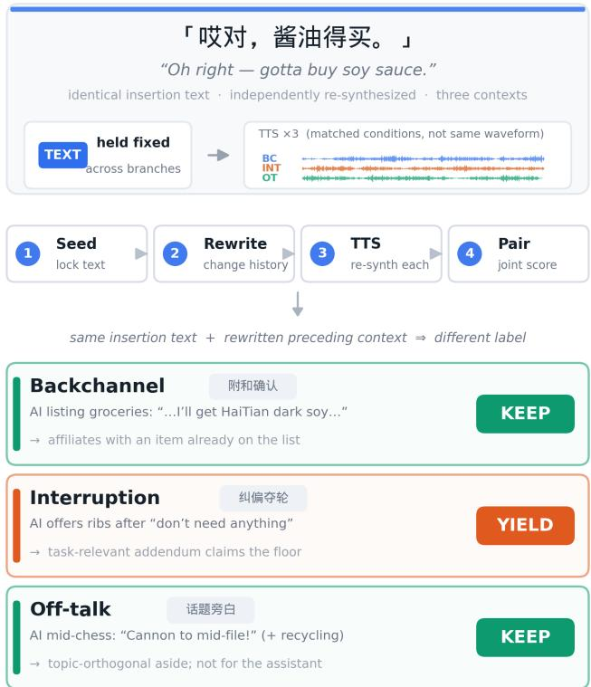

# ECHO: A MATCHED-CONTRAST BENCHMARK FOR CONTEXT-SENSITIVE TURN-TAKING IN FULL-DUPLEX DIALOGUE

Shuofeng Zhao∗, Hongwei Cai†, Wenke Fan, Qingxiang Guo,Dawei Yang, Zhou Wang, Zhiyang Zhou, Yingxin Shang, Weixu Wang, Lin Yang, Shuran Zhou, Yang Song

Zuoyebang Education Technology, Beijing, China

## ABSTRACT

Full-duplex spoken dialogue systems must distinguish interruptions that require yielding the floor from backchannels that permit continued speaking. Existing benchmarks typically evaluate events independently and may therefore reward fixed action preferences rather than context-sensitive decisions. We introduce ECHO, a paired diagnostic benchmark for Chinese full-duplex turn-taking. ECHO pairs examples with the same overlap transcript but contrasting preceding multi-turn dialogue contexts, with one requiring YIELD and the other KEEP. It additionally includes off-talk examples for diagnosing unnecessary yielding. We introduce pair accuracy, which requires correct decisions on both members of a pair and assigns no credit to constant-action policies. Experiments on multiple full-duplex systems show that most exhibit a pronounced bias toward YIELD, performing substantially better on interruptions than on backchannels, while another system remains comparatively balanced. These findings demonstrate that interruption-only evaluation can overestimate practical turn-taking reliability. ECHO and its metadata will be publicly released.

Index Terms— full-duplex spoken dialogue, turn taking, interruption detection, overlapping speech, diagnostic evaluation

## 1. INTRODUCTION

Full-duplex spoken dialogue systems are expected to listen while speaking and to yield when a user claims the conversational floor. Overlapping speech, however, does not by itself constitute an interruption: users also produce acknowledgments and affective feedback that invite the assistant to continue, as well as speech directed at themselves or at a third party. Treating every overlap as an interruption yields fragmented, oversensitive interactions, whereas ignoring genuine floor-claiming speech leaves users unable to correct or redirect the system. Reliable full-duplex interaction therefore hinges on deciding whether overlapping speech warrants a YIELD or a KEEP, not on detecting that speech occurred.

Recent benchmarks have advanced this evaluation considerably. Full-Duplex-Bench and its extensions cover interruption handling, backchannels, pauses, non-target speech, and multi-turn interaction quality [1, 2, 3]; the ICASSP 2026 HumDial Challenge tests acceptance of genuine interruptions against non-interruptive feedback [4]; TurnBench examines false interruptions across conversation types [5]; and recent work targets robustness to third-party speech [6] and semantic-aware interruption detection on real dialogues [7]. In parallel, semantic VAD, streaming state prediction, and context-aware dialogue management combine acoustic and semantic evidence for turn management [8, 9, 10, 11], alongside end-to-end full-duplex architectures [12, 13, 14] and dedicated interaction corpora [15].

These benchmarks measure independently occurring events drawn from natural conversation (e.g., [16]) or scenario scripts, so the inserted utterance and its preceding dialogue vary together. They also sample non-interruptive feedback narrowly, leaving that class lexically closed (Table 2). In SID-Bench [7], 81.8% of noninterruptive instances consist entirely of the fifteen most frequent characters; in the Easy Turn [17] test set the backchannel and turntaking vocabularies are disjoint, so the two classes are distinguishable by vocabulary membership alone. Such items are separable by lexical form alone and leave untested whether a system recovers non-floor-claiming intent from dialogue context. Substantive feedback of this kind is less frequent than canonical tokens, but it is exactly where context is indispensable. The utterance “This pen has run out of ink again” is an affiliative completion when the assistant is already complaining about the pen, but a genuine interruption when a faulty pen blocks a form the user was asked to fill in (Fig. 1), so lexical content alone does not determine the correct action. This raises our central question: can a full-duplex system produce the correct action across context-rewritten instances that share exactly the same insertion text?

We introduce ECHO (Evaluating Context-conditioned Handling of Overlaps), a paired evaluation set of Chinese multi-turn dialogues in which the inserted utterance is held lexically fixed while the preceding dialogue is rewritten to change its interactional role. Because a system with a constant action preference scores well on any interruption-only test, we pair this design with metrics that require joint correctness across both members of a linked pair. Evaluating four speech systems and a text-conditioned semantic reference, we find that moderate interruption accuracy does not translate into reliable turn taking: three of the four speech systems respond to a substantial share of interruptions yet yield to most backchannels, an action-level Yield bias that interruption accuracy alone conceals and that limited context access does not explain.

## 2. ECHO DATASET CONSTRUCTION

ECHO follows an insertion-text-matched contrastive design inspired by minimal-pair testing, a strategy also used to probe whether audio language models genuinely attend to the acoustic evidence they are given [18].

## 2.1. Interaction Roles and System Actions

ECHO defines three interaction roles by intended addressee and target floor action. An interruption is directed to the assistant and introduces a request, correction, task obstacle, condition change, or control instruction that requires immediate handling, so its target action is YIELD. A backchannel is also assistant-directed but does not claim the floor; we use the term broadly for acknowledgments, affective feedback, affiliative responses, and brief collaborative completions, and its target action is KEEP. Off-talk is generated with an intended self- or third-party-directed role and is likewise assigned KEEP; the stage directions used during generation are never exposed to the evaluated models. We retain the original three-way labels alongside the binary action labels because the two KEEP roles differ downstream: off-talk should generally not be committed to the dialogue state as a system-directed user turn.

  
Fig. 1. One insertion, three required actions. All three ECHO branches share the same user insertion transcript, glossed “This pen has run out of ink again”. In each branch, the insertion is placed at the annotated overlap position located by forced alignment, while the preceding multi-turn dialogue context is rewritten. The rewrite changes the interactional role from backchannel to interruption to off-talk, and with it the target action from KEEP to YIELD to KEEP. Lexical form is therefore uninformative, and a system must decide before the assistant track terminates.

## 2.2. Context-Rewritten Contrast Generation

We first randomly sample Chinese multi-turn dialogue skeletons from the synthesized dialogue data constructed in Duplex-Drama [19], which covers diverse interlocutor relationships, locations, everyday tasks, and conversational situations. DeepSeek-V4-Pro [20] then selects candidate overlap positions and generates initial backchannel or off-talk insertions according to the dialogue state and character roles. We retain only insertions that can plausibly receive an alternative interactional interpretation under a rewritten context; we do not force every insertion to realize all three roles.

Given a selected insertion, Claude-3.5-Sonnet [21] rewrites the dialogue history up to and including the assistant utterance being overlapped while keeping the insertion text unchanged, under a prompt that enforces the role definitions of Sec. 2.1. Writing ui for the insertion shared by two context variants $c _ { i } ^ { ( a ) }$ and $c _ { i } ^ { ( b ) }$ , the contrast satisfies $u _ { i } ^ { ( a ) } = u _ { i } ^ { ( b ) } = u _ { i }$ with $y _ { i } ^ { ( a ) } \neq \mathsf { \bar { y } } _ { i } ^ { ( b ) }$ , and each linked instance is represented as $( c _ { i } ^ { ( k ) } , u _ { i } , y _ { i } ^ { ( k ) } )$ . A group may contain two or all three role variants. The equality constraint applies to the insertion text, not to its synthesized waveform.

Candidates are then screened by DeepSeek-V4-Pro for consistency between the rewritten history, the target insertion, and the requested role, followed by a manual consistency review over all candidates. Examples whose history and insertion are incompatible with the requested label are discarded. Human evaluation on the retained instances achieves 97.45% accuracy, confirming that the rewritten contexts successfully induce the intended interactional roles.

## 2.3. Speech Synthesis and Overlap Rendering

All dialogue turns are independently synthesized with IndexTTS2 [22] and rendered as speaker-separated dual-channel audio. We apply the same synthesis and post-processing pipeline to all examples, including speaker-prompt RMS normalization, bounded speakingrate normalization, forced-alignment-based overlap placement, and role-dependent overlap rendering.

Within each linked group, the insertion text, emotion condition, and TTS inference configuration are held fixed, while the preceding multi-turn context and the intended interaction role are changed. The role determines the rendered interaction: backchannel and off-talk speech is overlaid without modifying the assistant track, whereas an interruption receives onset emphasis and causes the assistant track to fade to silence after a short reaction interval. Speaker-reference audio may differ across paired instances, and all utterances are synthesized independently; paired insertions are therefore controlled in lexical and selected synthesis conditions, but are not waveformidentical or fully acoustically matched. The faded assistant waveform is excluded from evaluated model inputs, so post-decision floor release cannot serve as a label cue.

## 2.4. Dataset Organization and Scope

ECHO distinguishes three metadata units: a sample id identifies one instance with a specific context, waveform, and role label; a group id links instances sharing the same insertion text and generation source; and a pair id identifies a two-role contrast derived from a group.

The release contains 266 groups, 549 unique audio instances, and 300 pair relations, distributed over two-role and three-role groups as reported in Table 1. The three roles are balanced at the instance level (183 each), and pair relations are balanced by construction with 100 pairs for each of the interruption–backchannel, interruption–off-talk, and backchannel–off-talk contrasts. We release the audio, model-observable dialogue text, original scenario labels, binary action labels, event timestamps, and group/pair metadata.

Non-interruptive feedback in prior test sets is separable by lexical form alone, and ECHO removes that shortcut by construction. All 100 interruption–backchannel pairs carry identical insertion text, each of the 183 backchannel instances is lexically unique, none is built only from the fifteen most frequent characters, and the three roles have matched length distributions (6.3, 6.2, and 6.6 characters on average), so the insertion text carries no discriminative information within a pair (Table 2).

Table 1. ECHO dataset statistics. Groups, unique samples, and pair relations are counted separately so that three-role groups are not counted multiple times at the instance level. Each of the 17 threerole groups induces all three pair contrasts.
<table><tr><td>Group type</td><td>Groups</td><td>Unique samples</td><td>Pair relations</td></tr><tr><td>Interruption-Backchannel only</td><td>83</td><td>166</td><td>83</td></tr><tr><td>Interruption-Off-talk only</td><td>83</td><td>166</td><td>83</td></tr><tr><td>Backchannel-Off-talk only</td><td>83</td><td>166</td><td>83</td></tr><tr><td>Three-role groups</td><td>17</td><td>51</td><td>51</td></tr><tr><td>Total</td><td>266</td><td>549</td><td>300</td></tr></table>

Table 2. Lexical closure of non-interruptive feedback.
<table><tr><td>Set</td><td>Inst.</td><td>Char. voc.</td><td>Top-15-char only</td></tr><tr><td>SID-Bench (zh)</td><td>494</td><td>124</td><td>81.8</td></tr><tr><td>Easy Turn</td><td>100</td><td>67</td><td>26.0</td></tr><tr><td>ECHO (ours)</td><td>183</td><td>400</td><td>0.0</td></tr></table>

Table 3. Native input interfaces and event-level decision rules. The amount and representation of dialogue context differ across systems; assistant-side context is provided only where supported by the corresponding interface.
<table><tr><td>Model</td><td>User-side input</td><td>Assistant-side text</td><td>Decision rule</td></tr><tr><td>Easy Turn</td><td>Target insertion</td><td>None</td><td>Native state during insertion</td></tr><tr><td>SoulX-Duplug</td><td>Last 2 user turns + insertion</td><td>None</td><td>Hit over insertion + 1 s</td></tr><tr><td>Lychee-FD</td><td>Up to 5 user turns + insertion</td><td>History + planned utterance</td><td>Stop event during insertion</td></tr><tr><td>MiniCPM-o 4.5</td><td>Full history + insertion</td><td>Teacher-forced planned utterance</td><td>Stop event during insertion</td></tr><tr><td>Gemini</td><td>Insertion transcript</td><td>History + spoken prefix only</td><td>Prompted three-way prediction</td></tr></table>

## 3. EXPERIMENTS

## 3.1. Evaluated Systems and Native Interfaces

We evaluate four speech systems and one text-only language model as a semantic reference (Table 3). Each system is evaluated through its supported interface, resulting in different amounts and representations of dialogue context. Easy Turn receives only the target insertion, while SoulX-Duplug receives the two preceding user turns and the insertion. Lychee-FD receives five preceding user-side turns and the insertion, together with the assistant dialogue history and the complete planned utterance. MiniCPM-o 4.5 receives the full userside history and insertion while the planned assistant utterance is teacher-forced during streaming. Gemini receives the dialogue history and insertion in text form, but only the already-spoken prefix of the current assistant utterance. Gemini therefore serves as a textonly semantic reference, rather than a modality-matched baseline or an upper bound. In particular, cross-model differences cannot isolate the effects of context access, modality, model capacity, or native decision interface.

Easy Turn [17] is a modular turn-state predictor with four native outputs; we map complete and incomplete to YIELD and backchannel and offtalk to KEEP, since the first two indicate that the user is claiming the floor. Receiving only the insertion, it is a context-free local baseline. SoulX-Duplug [10] is a streaming state predictor on 160-ms chunks and Lychee-FD [13] a full-duplex dialogue model with a dedicated control head at 400-ms resolution; Interruptions were correct if speech stopped, whereas backchannels and off-talk were correct if speech continued. MiniCPM-o 4.5 [14] is end-to-end multimodal; we force-aligned the final assistant utterance and teacher-forced its text up to the target event while streaming the user audio. We assessed whether the model correctly stopped for an interruption and continued speaking for a backchannel or offtalk event. Gemini-3.1-Pro-Preview [23] predicts one of the three ECHO roles from text alone. It receives no audio, stage directions, unspoken assistant content, or post-event reference responses, and serves as a semantic reference rather than a modality-matched baseline or an upper bound.

## 3.2. Action Alignment and Metrics

We map interruption to YIELD and backchannel and off-talk to KEEP (Sec. 2.1), over all unique instances. For speech models without an explicit off-talk state, an off-talk instance counts as correct whenever the system continues its current turn, so no fine-grained off-talk recognition is required. Gemini’s three-way predictions are mapped to the same binary space before action metrics are computed; predicting off-talk for a backchannel is therefore wrong in the three-way analysis but right in the binary one. We additionally evaluate Gemini in the original three-way role space to test whether the intended roles can be recovered from explicit textual context.

We report action accuracy over unique samples, separately for each original label: $\operatorname { A c c } _ { I }$ is the correct YIELD rate on interruptions, and $\operatorname { A c c } _ { B }$ and $\operatorname { A c c } _ { O }$ the correct KEEP rates on backchannel and offtalk. Macro accuracy averages the three, and each unique sample is counted once even when it belongs to a three-role group.

Sample-level accuracy can overstate reliability when a model prefers one action, so we define Pairwise Action Success Rate (PASR) over the linked pairs whose target actions differ, $\mathcal { P } _ { \mathrm { { f i i p } } } ~ =$ $\mathcal { P } _ { I - B } \cup \mathcal { P } _ { I - O } \colon$

$$
\mathrm { P A S R } = \frac { 1 } { | \mathcal { P } _ { \mathrm { f i p } } | } \sum _ { ( p , q ) \in \mathcal { P } _ { \mathrm { f l i p } } } \mathcal { H } [ \hat { a } _ { p } = a _ { p } \wedge \hat { a } _ { q } = a _ { q } ] .\tag{1}
$$

By Eq. (1) a pair succeeds only if the model yields to the interruption member and keeps the floor for the other, so PASR penalizes both constant-YIELD and constant-KEEP strategies. Backchannel–offtalk pairs share the target action KEEP and are instead summarized by Pairwise Keep Consistency (PKC), the fraction of such pairs on which the system keeps the floor for both members. PASR and PKC are complementary: a constant-KEEP policy maximizes PKC but scores zero on PASR, so a system must do well on both to be nondegenerate. For the three-way evaluation we report Pairwise Role Success Rate (PRSR), which applies the same joint-correctness criterion to the original role labels and therefore covers all three pair types.

## 3.3. Results and Analysis

Finding 1: high interruption accuracy can coexist with severe over-yielding on non-floor-claiming feedback. Easy Turn and SoulX-Duplug correctly yield on 98.91% and 91.26% of interruptions, respectively, but keep the floor on only 1.09% and 6.56% of backchannels. Lychee-FD shows a similar imbalance, with 55.19% interruption accuracy but only 12.02% backchannel Keep accuracy. Consistent with these class-conditioned results, the interruption– backchannel PASR is 0.00% for Easy Turn and only 4.00% for both SoulX-Duplug and Lychee-FD. Over the balanced ECHO construction, Easy Turn and SoulX-Duplug predict YIELD on 99.09% and 89.80% of all instances, respectively. These results reveal a strong YIELD preference that would be obscured by reporting interruption accuracy alone. The aggregate predicted-action rates describe ECHO’s balanced diagnostic distribution and should not be interpreted as estimates under naturally occurring event prevalence. Finding 2: the bias is not explained by limited context. Lychee-FD receives up to five preceding dialogue turns and the complete planned assistant utterance, and still keeps the floor on only 12.02% of backchannels and 8.20% of off-talk, with 4.00% PASR . The text-conditioned reference, which observes the same dialogue but only the assistant prefix already spoken, reaches 86.34% on backchannels. The low off-talk rate is consistent with the difficulty on incidental side-talk reported in the original Lychee-FD study [13]; the comparably low backchannel rate shows that overyielding extends to system-directed feedback that does not claim the floor. Among the speech systems, MiniCPM-o 4.5 is the only balanced one (63.39%/65.57%, 54.00% PASRI−B). Since the failing systems observe at least as much assistant-side context as the reference that succeeds, the limiting factor is how floor decisions use available context rather than how much context is available.

Table 4. Binary system-action evaluation on ECHO. Input interfaces are given in Table 3. All sample-level accuracies are computed over unique instances. Gemini’s three-way predictions are mapped to YIELD/KEEP before computing this table.
<table><tr><td>Model</td><td>Int. Yield</td><td>BC Keep</td><td>OT Keep†</td><td>Macro</td><td>Overall</td><td> $\mathrm { P A S R } _ { I - B }$ </td><td> $\mathrm { P A S R } _ { I - O }$ </td><td> $\mathrm { P K C } _ { B - O }$ </td></tr><tr><td>Easy Turn</td><td>98.91</td><td>1.09</td><td>0.55</td><td>33.52</td><td>33.52</td><td>0.00</td><td>0.00</td><td>1.00</td></tr><tr><td>SoulX-Duplug</td><td>91.26</td><td>6.56</td><td>15.30</td><td>37.71</td><td>37.71</td><td>4.00</td><td>12.00</td><td>2.00</td></tr><tr><td>Lychee-FD</td><td>55.19</td><td>12.02</td><td>8.20</td><td>25.14</td><td>25.14</td><td>4.00</td><td>6.00</td><td>0.00</td></tr><tr><td>MiniCPM-o 4.5</td><td>63.39</td><td>65.57</td><td>53.55</td><td>60.84</td><td>60.84</td><td>54.00</td><td>53.00</td><td>49.00</td></tr><tr><td>Gemini reference</td><td>90.71</td><td>86.34</td><td>71.58</td><td>82.88</td><td>82.88</td><td>79.00</td><td>52.00</td><td>70.00</td></tr></table>

†Keep rate on scenario-labeled off-talk, interpreted as a scenario-based action diagnostic rather than an unambiguous false-trigger estimate.

Finding 3: pair-level metrics expose what sample-level accuracy hides. Evaluated in the original three-way role space (Table 4, last row), the text-conditioned reference reaches 82.33% macro accuracy but only 66.00% PRSR, so correct predictions on individual samples do not imply consistent predictions across linked context variants. The same gap appears in the binary space, where 82.88% overall accuracy corresponds to 52.00% $\mathrm { P A S R } _ { I - O } .$

Label ambiguity affects all evaluated systems identically. The text-conditioned reference recovers the intended role for 82.33% of instances from the same observable context, which bounds the share of the observed gap that residual ambiguity can explain; the three systems exhibiting Yield bias reach at most 35.70% overall accuracy, far below that bound.

## 4. CONCLUSION

We presented ECHO, a paired diagnostic set for Chinese full-duplex turn taking that holds the inserted utterance lexically fixed while rewriting the preceding dialogue, together with pair-level metrics that require correct actions on both members of a linked pair. Under this protocol, three of the four evaluated speech systems show a pronounced action-level Yield bias that single-number interruption accuracy conceals. Limited context does not explain the bias: Lychee-FD observes up to five preceding dialogue turns and the complete planned assistant utterance but maintains the floor on only 12.02% of backchannels, whereas a text-conditioned reference that sees strictly less assistant-side information reaches 86.34%. The limiting factor is therefore how floor decisions use available context, not how much context is available. Reporting class-conditioned Keep rates alongside interruption accuracy is necessary for meaningful turn-taking evaluation. We release the ECHO audio, observable dialogue text, labels, and pair metadata.

Limitations. ECHO is a paired diagnostic set rather than an estimate of performance in naturally occurring dialogue: synthesis is what allows one insertion to recur across rewritten histories, at the cost of the ecological validity of real-speech benchmarks [7]. Furthermore, interruption waveforms receive label-dependent RMS scaling and onset emphasis. The design therefore controls insertion text, emotion condition, and TTS inference configuration, but does not fully isolate dialogue context from speaker-reference variation or other acoustic factors. A waveform-reuse condition and a gainfree interruption ablation would be required for strict acoustic control. Off-talk is scenario-labeled and its intended addressee is not always explicit, so we treat backchannel as the primary evidence for Yield bias and off-talk as a supporting diagnostic. Finally, the evaluated systems differ in modality, streaming latency, and native output space, so the results are a behavioral audit under supported interfaces rather than a modality-matched ranking.

## 5. ACKNOWLEDGMENTS AND DISCLOSURE OF AI USE

Generative AI is used in this work in two capacities, both disclosed in accordance with IEEE policy. As construction tools, the models named in Sec. 2 generate the ECHO material: dialogue skeletons, context rewrites, and synthesized audio; all retained items passed the human review of Sec. 2.2. In manuscript preparation, the authors used llm for language polishing and assisted drafting. No AI system contributed to the experimental design, the reported results, or the scientific claims, and the authors take full responsibility for the content of this publication.

## 6. REFERENCES

[1] Guan-Ting Lin et al., “Full-Duplex-Bench: A Benchmark to Evaluate Full-Duplex Spoken Dialogue Models on Turn-taking Capabilities,” in 2025 IEEE Automatic Speech Recognition and Understanding Workshop (ASRU), 2025, pp. 1–8.

[2] Guan-Ting Lin, Shih-Yun Shan Kuan, Qirui Wang, Jiachen Lian, Tingle Li, and Hung-yi Lee, “Full-Duplex-Bench v1.5: Evaluating Overlap Handling for Full-Duplex Speech Models,”

in IEEE International Conference on Acoustics, Speech and Signal Processing (ICASSP), 2026.

[3] Guan-Ting Lin et al., “Full-Duplex-Bench-v2: A Multi-Turn Evaluation Framework for Duplex Dialogue Systems with an Automated Examiner,” 2026.

[4] Chengyou Wang et al., “Full-Duplex Interaction in Spoken Dialogue Systems: A Comprehensive Study from the ICASSP 2026 HumDial Challenge,” in IEEE International Conference on Acoustics, Speech and Signal Processing (ICASSP), 2026, arXiv:2604.21406.

[5] Freeman Jiang et al., “TurnBench: A Multi-Domain Benchmark for Turn-Taking Dynamics in Spoken Dialogue,” 2026.

[6] Dongwook Lee, Eunwoo Song, Che Hyun Lee, Heeseung Kim, and Sungroh Yoon, “Still Between Us? Evaluating and Improving Voice Assistant Robustness to Third-Party Interruptions,” in Proceedings of the 64th Annual Meeting of the Association for Computational Linguistics (ACL), 2026, arXiv:2604.17358.

[7] Bingshen Mu, Jin Xu, Kangxiang Xia, et al., “Semantic-Aware Interruption Detection in Spoken Dialogue Systems: Benchmark, Metric, and Model,” in Proceedings of the IEEE International Conference on Multimedia and Expo (ICME), 2026, arXiv:2603.24144.

[8] Chengyou Wang et al., “FastTurn: Unifying Acoustic and Streaming Semantic Cues for Low-Latency and Robust Turn Detection,” ArXiv, vol. abs/2604.01897, 2026.

[9] Weijie Wu et al., “Phoenix-VAD: Streaming Semantic Endpoint Detection for Full-Duplex Speech Interaction,” ArXiv, vol. abs/2509.20410, 2025.

[10] Ruiqi Yan et al., “SoulX-Duplug: Plug-and-Play Streaming State Prediction Module for Realtime Full-Duplex Speech Conversation,” 2026.

[11] Hao Zhang, Weiwei Li, Rilin Chen, Vinay Kothapally, Meng Yu, and Dong Yu, “LLM-Enhanced Dialogue Management for Full-Duplex Spoken Dialogue Systems,” ArXiv, vol. abs/2502.14145, 2025.

[12] Wenyi Yu et al., “SALMONN-omni: A Standalone Speech LLM without Codec Injection for Full-duplex Conversation,” 2025.

[13] Zhenyu Liu et al., “Hierarchical Acoustic-Semantic Modeling: Modality Separation and Semantic Coherence for Full-Duplex SLMs,” 2026.

[14] Junbo Cui et al., “MiniCPM-o 4.5: Towards Real-Time Full-Duplex Omni-Modal Interaction,” ArXiv, vol. abs/2604.27393, 2026.

[15] Yifu Chen, Shengpeng Ji, Ziqing Wang, Hanting Wang, and Zhou Zhao, “InteractSpeech: A Speech Dialogue Interaction Corpus for Spoken Dialogue Model,” in Findings of the Association for Computational Linguistics: EMNLP 2025, Suzhou, China, 2025, pp. 8024–8033, Association for Computational Linguistics.

[16] Christopher Cieri, David Miller, and Kevin Walker, “The Fisher Corpus: A Resource for the Next Generations of Speech-to-Text,” in Proceedings of the Fourth International Conference on Language Resources and Evaluation (LREC), 2004.

[17] Guojian Li et al., “Easy Turn: Integrating Acoustic and Linguistic Modalities for Robust Turn-Taking in Full-Duplex Spoken Dialogue Systems,” 2025.

[18] Jiaqi Xiong et al., “DEAF: A Benchmark for Diagnostic Evaluation of Acoustic Faithfulness in Audio Language Models,” ArXiv, vol. abs/2603.18048, 2026.

[19] Qingxiang Guo, Wenke Fan, Shuofeng Zhao, Dawei Yang, Zhiyang Zhou, Yingxin Shang, Hongwei Cai, Zhou Wang, Weixu Wang, Lin Yang, Shuran Zhou, and Yang Song, “Duplexdrama: A synthesized dialogue dataset with scenarios, full-duplex behaviors, expressive speech, and sound events,” 2026.

[20] DeepSeek-AI, “DeepSeek-V4: Towards Highly Efficient Million-Token Context Intelligence,” 2026.

[21] Anthropic, “Model Card Addendum: Claude 3.5 Haiku and Upgraded Claude 3.5 Sonnet,” Tech. Rep., Anthropic, October 2024.

[22] Siyi Zhou et al., “IndexTTS2: A Breakthrough in Emotionally Expressive and Duration-Controlled Auto-Regressive Zero-Shot Text-to-Speech,” 2025.

[23] Google DeepMind, “Gemini 3.1 Pro Model Card,” Tech. Rep., Google DeepMind, February 2026.