# Interactive Memory Learning for Long-Term Conversations

Cai Ke1,2, Jiangyue Yan1,2, Han Zhang2, Xin Liu2∗, Zike Yuan1,2, Yue Yu2, Hui Wang2, and Ruifeng Xu1,2∗

1Harbin Institute of Technology, Shenzhen, China 2Pengcheng Laboratory, China kecai@stu.hit.edu.cn, xuruifeng@hit.edu.cn

## Abstract

Recent advancements in large language mod els have significantly enhanced the capabilities of agents in modeling long-term conversations. Despite these successes, existing approaches typically adopt a static heuristic paradigm, where information is passively archived without adaptive memory valuation. Consequently, these methods fail to self-evolve or align their memory management with evolving user needs. To address this, we propose ICML (InteraCtive Memory Learning), a multi-agent framework that transforms the memory mechanism from a passive archive into a learnable, interactive memory policy. Specifically, we first employ a session synthesis pipeline to generate ex pert data, facilitating rapid test-time adaptation in unseen scenarios. Building on this, ICML utilizes an online reinforcement learning mechanism where a Planner agent selectively encodes high-value information and a Trigger agent dynamically retrieves it to optimize response quality, whereby the two agents co-evolve through continuous interaction feedback. Crucially, both agents are synchronized through a delayed reward mechanism that propagates future feedback back to earlier storage decisions, ensuring memory policies are precisely aligned with user expectations. Experi mental results demonstrate that ICML signifi cantly outperforms strong baselines, exhibiting the unique capability to continuously improve response quality as interactions accumulate.

## 1 Introduction

The remarkable advances in Large Language Models (LLMs) have led to the rapid development of opendomain conversations (Li et al., 2017; Zhang et al., 2018; Dinan et al., 2018; Rashkin et al., 2019; Baumgartner et al., 2020). By modeling historical information, LLMs demonstrate strong capabilities in generating fluent responses. However, in long-term conversations, they still struggle to maintain human-like engagement. A major reason is the lack of an effective mechanism that allows the model to truly learn and adapt through continuous dialogue (Xu et al., 2022a; Shi et al., 2023; Zhang et al., 2024; Du et al., 2024; Li et al., 2024; Levy et al., 2024; Liu et al., 2024a; Zhang et al., 2025; Hu et al., 2025).

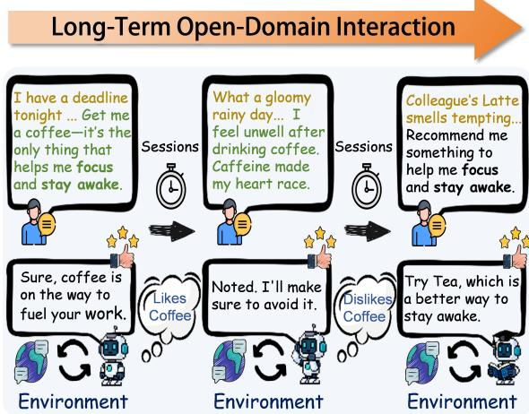  
Figure 1: The ICML framework for long-term conversations. Through long-term interactions, the agent utilizes environmental feedback to distinguish high-value memories from low-value noise for online self-evolution.

The essence of long-term open-domain conversation generation is the ability to satisfy the user’s constantly changing expectations and preferences over time. This requires a dynamic memory process where the agent learns from real-time interactions to provide personalized services. Most existing methods, however, rely on a static heuristic paradigm (Bae et al., 2022; Jang et al., 2023; Zhang et al., 2023; Lu et al., 2023; Zhong et al., 2024; Li et al., 2025; Ong et al., 2025; Chen et al., 2025; Wang et al., 2025b; Ke et al., 2025, 2026a; Liang et al., 2026). These methods treat memory as a simple database rather than a learning process, failing to understand what to memorize and when to trigger. This leads to unresolved conflicts between outdated preferences and new user requirements.

In contrast, Cognitive Psychology suggests that human memory is not a passive archive but a learnable process. Humans do not treat all information equally; instead, we selectively encode information that has high value for future decisions while discarding irrelevant noise (Schank, 1980; Tulving, 1983, 2002; Anderson,

2005; Yadav et al., 2022). Furthermore, we continuously update our memory through feedback to adapt to changing circumstances. As illustrated in Figure 1, humans naturally distinguish between high-value memories (e.g., a critical health warning like heart race) and low-value noise (e.g., transient states like a deadline or gloomy rainy day). Consequently, when the user’s situation changes, the listener actively updates their mental model by letting the new constraint override the outdated preference. This self-evolution capability allows humans to become more understanding as interactions progress. Therefore, we argue that the key to mastering long-term conversations lies in transforming passive heuristic paradigm into an interactive memory learning paradigm where the agent learns what to memorize and when to trigger based on continuous environmental feedback.

To realize this goal, we introduce ICML (InteraCtive Memory Learning), a novel multi-agent collaborative framework underpinned by online Reinforcement Learning (RL). Specifically, addressing the challenge where agents typically lack relevant memories when encountering a new environment for the first time interaction and thus produce suboptimal responses, we devise a retrospective session synthesis pipeline. Starting from a seed session involving user initial interaction as an expert demonstration, we inversely generate multiple consistent storylines comprising interconnected sessions, which are subsequently forward-annotated to produce high-quality expert data for autonomous test-time adaptation. The core of ICML consists of two interactive Actor-Critic (Konda and Tsitsiklis, 1999) agents: a Planner agent that selectively memorizes high-value information, and a Trigger agent that retrieves memory based on the utterance. Crucially, these agents co-evolve to align memory planning with actual utility through a delayed cross-session truth reward mechanism. While the Planner makes initial storage decisions, its policy is refined only when the Trigger successfully utilizes the memory to satisfy user expectations. This feedback loop ensures that both agents mutually adapt and converge toward an optimal collaborative strategy for personalized engagement. Experimental results on three long-term conversation datasets derived from real human interactions demonstrate that ICML significantly outperforms strong baselines, exhibiting the capability to effectively evolve into a more personalized agent over time. The contribution can be summarized as follows:

1) We explore a learnable memory paradigm that leverages continuous environmental feedback to dynamically optimize what to memorize and when to trigger.

2) We are the first to propose a plug-and-play, online RL framework for long-term open-domain conversation that enables autonomous test-time adaptation of memory policies, allowing the model to self-evolve and align with user expectations without human intervention.

3) Extensive evaluations on three long-term opendomain datasets demonstrate that ICML significantly outperforms state-of-the-art baselines, with response quality and personalization improving consistently as the agent evolves through continuous interaction.

## 2 Related Work

Long-Term Open-Domain Conversation. Longterm open-domain conversation generation (Xu et al., 2022a; Jang et al., 2023; Zhang et al., 2023) aims to simulate real-world human-to-human interactions, focusing on building lifelong companionship and personalized experiences rather than long-term question answering. To achieve this, a major trend is developing generationcentric dialogue agents (Lu et al., 2023; Zhong et al., 2024; Chen et al., 2025; Li et al., 2025; Ong et al., 2025; Wang et al., 2025b; Ke et al., 2026b) for LLMs. For example, existing methods often compress dialogue sessions into static summaries or specific user facts (Zhong et al., 2024; Li et al., 2025). Moreover, some methods also explore recursive summarization (Wang et al., 2025b) or model the impact of time lines (Zhang et al., 2023; Ong et al., 2025) to maintain consistency over time. Different from these methods relying on passive storage and retrieval, we propose a new paradigm to selectively encode and retrieve high-value information via environmental feedback, thereby achieving self-evolution through online RL.

Agentic Memory Architectures and Management. Prior works on memory management have explored various mechanisms for management-centric memory agents (Packer et al., 2023; Liu et al., 2024b; Mei et al., 2024; Wang et al., 2025a; Chhikara et al., 2025; Xu et al., 2025; Kang et al., 2025), focusing on designing sophisticated architectures to handle the full lifecycle of memory. For instance, Chhikara et al. (2025) utilize graph-based representations to capture complex relational structures. Xu et al. (2025) link memories as structured notes that dynamically evolve through interconnected indexing. Moreover, Kang et al. (2025) introduce an OS-inspired hierarchical storage system comprising short-, mid-, and long-term units. Different from these heuristic architectures, we introduce a collaborative multi-agent framework where the agent teams co-evolve via a delayed reward mechanism, ensuring memory policies are precisely aligned with user expectations in long-term conversations.

## 3 Methodology

We approach the long-term conversation task as a sequential decision-making problem, where the agent must learn to dynamically manage its memory to maximize long-term conversational quality. Our method, as shown in Figure 2, consists of three key components: (1) Problem Formulation, which rigorously defines the interactive memory learning process as a Partially Observable Markov Decision Process (POMDP) (Åström, 1965); (2) Retrospective Session Synthesis, a novel data synthesis pipeline for initializing the system with high-quality expert data to address the cold-start problem; and (3) The ICML framework, comprising collaborative Planner and Trigger agents that continuously evolve via Cross-Session Truth Rewards.

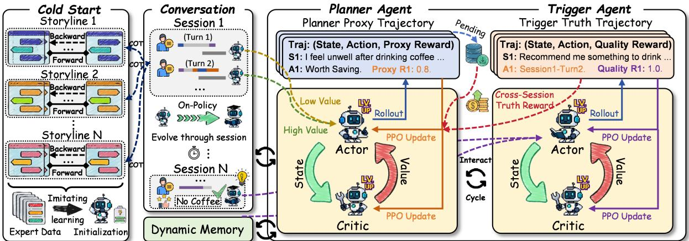  
Figure 2: Illustration of our Retrospective Session Synthesis (Left) and ICML framework (Right).

## 3.1 Problem Formulation

To rigorously model the dynamic interaction where the agent must infer user intent from limited context and memory, we formulate the Interactive Memory Learning process as a POMDP, defined by the tuple $\langle S , \mathcal { A } , \mathcal { O } , \mathcal { R } , \gamma \rangle$ , where R denotes the reward function and γ represents the discount factor.

State and Observation. The underlying state $s _ { k } ~ \in$ $s$ at turn k includes the user’s latent intent and the complete interaction history, which is not fully visible to the agent. Instead, the agent receives an observation $o _ { k } \in { \mathcal { O } } .$ , consisting of the current user query $u _ { k }$ , the recent dialogue context $H _ { k }$ , and the current external memory state $\mathcal { M } _ { k } = \{ m _ { 1 } , m _ { 2 } , . . . , m _ { N } \}$

Action Space. The joint action $a _ { k } = ( a _ { k } ^ { p } , a _ { k } ^ { t } )$ decomposes into a memory planning action $a _ { k } ^ { p } \in \{ 0 , 1 \}$ and a memory triggering action $a _ { k } ^ { t } \in \{ 0 , \ddot { 1 } , \ldots \dot { , } N \}$ controlled by the Planner and Trigger respectively.

## 3.2 Retrospective Session Synthesis

Training a robust POMDP policy requires high-quality data where memory dependencies are explicit (i.e., knowing why a memory was saved and when it was used). However, test-time interaction datasets typically lack long-term consistency labels, and initializing the policy from scratch often leads to the cold-start problem, where the agent fails to capture critical user constraints due to sparse rewards. To overcome this, we introduce a Retrospective Session Synthesis pipeline to synthesize expert data with dense, causal memory dependencies by utilizing the chain of thought (Wei et al., 2022). All prompts are shown in Appendix Q.

Backward Storyline Generation. To address the challenge where agents lack relevant memories during their initial interaction in a new environment, we adopt a reverse-generation strategy. We designate the initial interaction where a new user first reveals specific constraints or preferences as the seed session $S _ { s e e d } .$ Using backbone LLMs as user simulators, we then recursively generate preceding sessions $S _ { p r e v }$ that logically ground the context of $S _ { s e e d }$ (e.g., generating a past event where coffee caused heart race). This reverse causality ensures that the generated history ${ \mathbb H } _ { g e n } = \{ S _ { p r e v } ^ { ( L ) } , \dots , S _ { p r e v } ^ { ( 1 ) } , S _ { s e e d } \}$ maintains strict logical consistency, providing high-quality expert data that explain the origin of current user preferences.

Forward Dependency Annotation. With the coherent storyline established, we traverse $\mathbb { H } _ { g e n }$ in chronological order to generate ground-truth labels for supervised warm-up.

• For the Planner, we evaluate the information gain of each turn to assign a binary label $y ^ { p } \in \{ 0 , 1 \}$ indicating whether the turn contains high-value information worth saving.

• For the Trigger, we identify the specific historical fragments required to resolve the query in $S _ { s e e d } ,$ assigning the target retrieval index $y ^ { t }$ . To enhance the Trigger’s discrimination ability against semantic noise, we further mix this ground-truth with hard negatives (irrelevant turns from the same session) and soft negatives (random global memories).

This pipeline yields a high-quality expert dataset $\mathcal { D } _ { e x p e r t }$ , which is utilized to initialize the policy πθ before online deployment.

## 3.3 The ICML Framework

As illustrated in Figure $2 ^ { 1 }$ , the core of ICML consists of two collaborative agents—the Planner and the Trigger, which co-evolve to align memory management with actual conversational utility. This architecture enables autonomous test-time adaptation without human intervention, allowing the model to refine its policies during live interactions. To stabilize the online learning process in this complex interactive environment, we adopt a shared Actor-Critic (Konda and Tsitsiklis, 1999) that governs two collaborative agents. All prompts and pseudocode are shown in Appendix R and E.

## 3.3.1 The Planner Agent (Memory Planning)

The Planner acts as the proactive gatekeeper of longterm memory. Its primary goal is to identify and retain high-value memories while filtering out low-value noise.

State and Policy. At turn k, the Planner receives an observation $o _ { k } ^ { p }$ consisting of the user query $u _ { k }$ .The policy $\pi _ { \theta } ( a _ { k } ^ { p } | o _ { k } ^ { p } )$ outputs a binary distribution over action space $\{ 0 , 1 \}$

• Save $( a _ { k } ^ { p } = 1 ) :$ The current interaction is condensed into a memory fragment $m _ { n e w }$ and appended to the external memory.

• Discard $( a _ { k } ^ { p } = 0 )$ : The information is deemed redundant or irrelevant and is discarded.

Proxy Reward. Since the true utility of a memory is often unknown at the moment of storage, we employ backbone LLMs to provide an immediate proxy reward $r _ { k } ^ { p r o x y } \in [ 0 , 1 ]$ . This judge evaluates the intrinsic information value of the turn, providing a dense signal to guide the Planner’s exploration in the early stages. Additionally, we incorporate a miss-penalty term: if the Planner discards a high-value turn, a negative reward $- \alpha r _ { k } ^ { p r o x y }$ is applied to discourage information loss during exploration.

## 3.3.2 The Trigger Agent (Memory Triggering)

The Trigger is responsible for contextualizing the generation process by retrieving the most relevant information from the dynamic memory. Unlike traditional dense retrieval, the Trigger learns a policy to select memories that maximize the final response quality.

State and Policy. The Trigger observes the current query $u _ { k } .$ , the dialogue history $H _ { k } .$ , and a set of candidate memories $\mathcal { M } _ { k }$ . The policy $\pi _ { \theta } ( a _ { k } ^ { t } | o _ { k } ^ { t } )$ outputs a categorical distribution over the memory indices $\{ 0 , 1 , \ldots , | \mathcal { M } _ { k } | \}$ . Selecting index 0 implies no memory is needed. The selected memory $m _ { a _ { k } ^ { t } }$ is then concatenated with the context to generate the final response.

Quality Reward. To accurately evaluate the agent’s performance, we do not rely on simple heuristics. Instead, we also employ backbone LLMs to score the final response based on multiple dimensions, yielding a comprehensive quality reward $r _ { k } ^ { q u a l } \in [ 0 , \dot { 1 } ]$ . This multi-dimensional scoring aligns the Trigger’s objective with complex human preferences.

## 3.3.3 Response Generation

Finally, our ICML generates a personalized response $r ^ { * }$ by grounding the LLM in the retrieved memory $m _ { a _ { k } ^ { t } }$

and current context:

$$
r ^ { * } \sim P _ { \mathrm { L L M } } ( \cdot \mid H _ { k } , u _ { k } , m _ { a _ { k } ^ { t } } ) .\tag{1}
$$

This process bridges temporal gaps across sessions and yields $r ^ { q u a l }$ , serving as the ultimate feedback to drive the co-evolution of the entire system.

## 3.3.4 Cross-Session Truth Reward

To resolve the delayed verification of memory utility, we propose the Cross-Session Truth Reward mechanism. It propagates the quality signal from $r ^ { * }$ back to the Planner’s historical storage decisions, aligning memory policies with actual utility. We maintain a Pending Reward Buffer that stores the Planner’s latent experiences $( \mathrm { i . e . }$ ., stored memories waiting to be verified).

When the Trigger activates a memory fragment $m _ { i }$ at a future turn $k _ { f u t u r e }$ to address a user query, we retrospectively trace $m _ { i }$ back to its creation turn $k _ { p a s t } .$ . We then propagate the obtained quality assessment $r _ { k _ { f u t u r e } } ^ { q u a l }$ back to the Planner as the truth reward:

$$
r _ { k _ { p a s t } } ^ { t r u t h } = r _ { k _ { p a s t } } ^ { p r o x y } + \lambda \cdot r _ { k _ { f u t u r e } } ^ { q u a l } \cdot \mathbb { I } ( m _ { i } \mathrm { i s } \mathrm { t r i g g e r e d } ) ,\tag{2}
$$

where λ is a weighting factor. This mechanism aligns the Planner’s storage objective with the long-term utility of the memory. By linking historical planning with future retrieval success, the Planner and Trigger mutually adapt their policies, ensuring the internal memory state is precisely aligned with latent user expectations.

## 3.3.5 On-Policy Optimization

We employ the Proximal Policy Optimization (PPO) algorithm (Schulman et al., 2017) for end-to-end optimization. During the online interaction phase, the agent performs rollouts through in real-world scenarios, collecting experience trajectories $\tau = \{ ( o _ { k } , a _ { k } , r _ { k } ) \} _ { k = 1 } ^ { T } .$

The optimization objective involves maximizing the cumulative return $\begin{array} { r } { R _ { k } ^ { j ^ { \bullet } } = \sum _ { i = k } ^ { T } \gamma ^ { t - k } r _ { i } ^ { j } } \end{array}$ , where $j \in$ $\{ p , t \}$ denotes the Planner or Trigger agent. The Critic loss $L _ { c r i t i c } ( \phi )$ minimizes the mean squared error between the estimated value $V _ { \phi } ^ { j } ( o _ { k } ^ { j } )$ and the actual return:

$$
L _ { c r i t i c } ( \phi ) = \sum _ { j \in \{ p , t \} } \mathbb { E } _ { \tau } \left[ \sum _ { k = 0 } ^ { T } \left( V _ { \phi } ^ { j } ( o _ { k } ^ { j } ) - R _ { k } ^ { j } \right) ^ { 2 } \right] .\tag{3}
$$

The Actor loss $L _ { a c t o r } ( \theta )$ is computed over the collected trajectories using the clipped surrogate objective:

$$
\begin{array} { r l } & { L _ { a c t o r } ( \theta ) = \displaystyle \sum _ { j \in \{ p , t \} } \mathbb { E } _ { ( o , a ) \sim \tau } \Big [ \operatorname* { m i n } \big ( \rho _ { k } ^ { j } A _ { k } ^ { j } , } \\ & { \qquad \mathrm { ~ c l i p } ( \rho _ { k } ^ { j } , 1 - \epsilon , 1 + \epsilon ) A _ { k } ^ { j } \big ) } \\ & { \qquad \quad + \beta \mathbb { S } [ \pi _ { \theta } ^ { j } ] ( o _ { k } ^ { j } ) \Big ] , } \end{array}\tag{4}
$$

where $\begin{array} { r } { \rho _ { k } ^ { j } = \frac { \pi _ { \theta } ^ { j } ( a _ { k } ^ { j } | o _ { k } ^ { j } ) } { \pi _ { \theta _ { o l d } } ^ { j } ( a _ { k } ^ { j } | o _ { k } ^ { j } ) } } \end{array}$ is the importance sampling ratio, $A _ { k } ^ { j }$ is the advantage estimated based on $R _ { k } ^ { j }$ , and S denotes the entropy bonus. This joint optimization allows both agents to co-evolve their specific policies.

<table><tr><td rowspan="2">Backbone</td><td rowspan="2">Methods</td><td colspan="4">CC</td><td colspan="4">MSC</td><td colspan="4">GC</td></tr><tr><td>B-4</td><td>R-L</td><td>Bert</td><td>Mauve</td><td>B-4</td><td>R-L</td><td>Bert</td><td>Mauve</td><td>B-4</td><td>R-L</td><td>Bert</td><td>Mauve</td></tr><tr><td rowspan="10">GPT-40</td><td>Long Context (128K)</td><td>1.79</td><td>17.41 14.57</td><td>47.79</td><td>55.73</td><td>1.21 0.69</td><td>15.12 12.78</td><td>49.17</td><td>54.36</td><td>0.66</td><td>11.43</td><td>36.57</td><td>25.12</td></tr><tr><td>Mem0 (2025)</td><td>1.02</td><td></td><td>45.85</td><td>46.92</td><td></td><td></td><td>45.68</td><td>45.61</td><td>0.53</td><td>9.42</td><td>34.08</td><td>23.43</td></tr><tr><td>A-Mem (2025)</td><td>1.21</td><td>15.12</td><td>46.01</td><td>50.04</td><td>0.88</td><td>13.07</td><td>46.79</td><td>50.74</td><td>0.61</td><td>10.14</td><td>35.48</td><td>26.23</td></tr><tr><td>MemoryOS (2025)</td><td>1.14</td><td>15.46</td><td>45.73</td><td>47.87</td><td>0.97</td><td>13.86</td><td>47.55</td><td>46.28</td><td>0.69</td><td>10.33</td><td>35.87</td><td>24.58</td></tr><tr><td>MemoryBank (2024)</td><td>1.08</td><td>15.14</td><td>47.27</td><td>45.95</td><td>1.03</td><td>13.74</td><td>48.39</td><td>45.51</td><td>0.64</td><td>10.05</td><td>35.78</td><td>23.32</td></tr><tr><td>LD-Agent (2025)</td><td>1.37</td><td>15.78</td><td>46.42</td><td>50.16</td><td>1.02</td><td>14.05</td><td>47.76</td><td>48.63</td><td>0.72</td><td>10.47</td><td>35.96</td><td>25.94</td></tr><tr><td>THEANINE (2025)</td><td>1.27</td><td>14.84</td><td>45.69</td><td>54.23</td><td>0.94</td><td>13.55</td><td>47.42</td><td>53.64</td><td>0.79</td><td>10.23</td><td>35.77</td><td>28.97</td></tr><tr><td colspan="10">Llama3-Instruct</td><td></td><td></td><td></td></tr><tr><td></td><td>ICML-1B</td><td>2.31</td><td>18.72</td><td>47.62</td><td>56.63</td><td>1.42 15.30</td><td>47.99</td><td>54.71</td><td>1.21</td><td>11.09</td><td>40.74</td><td>34.39</td></tr><tr><td>ICML-3B</td><td>2.37</td><td>18.78</td><td>47.65</td><td>61.66</td><td>1.49</td><td>15.38</td><td>48.02</td><td>57.39</td><td>1.20</td><td>11.21</td><td>40.80</td><td>36.37</td></tr><tr><td>ICML-8B</td><td>2.31</td><td>18.29</td><td>47.40</td><td>57.76</td><td>1.46</td><td>15.41</td><td>48.04</td><td>57.53</td><td>1.25</td><td>11.26</td><td>40.84</td><td>36.42</td></tr><tr><td rowspan="7"></td><td></td><td></td><td></td><td></td><td></td><td>Gemma3-it</td><td></td><td></td><td></td><td></td><td></td><td></td><td></td></tr><tr><td>ICML-1B</td><td>2.25</td><td>18.88</td><td>47.76</td><td>57.59</td><td>1.41</td><td>15.36</td><td>47.92</td><td>56.37</td><td>1.00</td><td>9.39</td><td>39.80</td><td>31.15</td></tr><tr><td>ICML-4B</td><td>2.44</td><td>18.88</td><td>47.70</td><td>58.39</td><td>1.36</td><td>15.44</td><td>48.01</td><td>57.02</td><td>1.16</td><td>11.32</td><td>40.87</td><td>35.19</td></tr><tr><td>ICML-12B</td><td>2.36</td><td>18.37</td><td>47.64</td><td>58.77</td><td>1.44</td><td>15.27</td><td>47.97</td><td>54.46</td><td>1.19</td><td>11.25</td><td>40.75</td><td>36.13</td></tr><tr><td></td><td></td><td></td><td></td><td></td><td>Qwen3</td><td></td><td></td><td></td><td></td><td></td><td></td><td></td></tr><tr><td>ICML-1.7B</td><td>2.19</td><td>18.92</td><td>47.66</td><td>57.95</td><td>1.40</td><td>15.41</td><td>48.00</td><td>56.55</td><td>1.23</td><td>11.27</td><td>40.75</td><td>36.69</td></tr><tr><td>ICML-4B ICML-8B</td><td>2.33</td><td>18.55</td><td>47.69</td><td>57.34</td><td>1.43</td><td>15.38</td><td>47.87</td><td>56.19</td><td>1.20</td><td>11.29</td><td>40.81</td><td>35.90</td></tr><tr><td>Long Context (1M)</td><td></td><td>2.40</td><td>18.93 47.74</td><td></td><td>57.60</td><td>1.40 15.45</td><td>47.96 47.59</td><td>57.58 55.61</td><td>1.17 0.78</td><td>11.25 10.05</td><td>40.86 35.76</td><td>35.85</td></tr><tr><td rowspan="10"></td><td>Mem0 (2025)</td><td>1.57 1.09</td><td>17.50 15.88</td><td>47.50 44.73</td><td>72.04</td><td>0.89 0.93</td><td>13.60 12.92</td><td></td><td>49.46</td><td>0.66</td><td>9.64</td><td></td><td>25.44</td></tr><tr><td>A-Mem (2025)</td><td></td><td></td><td></td><td>52.94</td><td></td><td></td><td>45.88</td><td>49.71</td><td></td><td></td><td>35.67</td><td>26.93</td></tr><tr><td>MemoryOS (2025)</td><td>1.18</td><td>14.97</td><td>45.38</td><td>51.86</td><td>0.75</td><td>12.42</td><td>46.85</td><td></td><td>0.76</td><td>10.28</td><td>36.12</td><td>25.94</td></tr><tr><td>MemoryBank (2024)</td><td>1.26</td><td>15.75</td><td>45.97</td><td>51.93</td><td>0.91</td><td>12.78 45.76</td><td></td><td>48.94</td><td>0.71</td><td>9.53</td><td>35.58</td><td>26.47</td></tr><tr><td></td><td>1.08</td><td>15.14</td><td>47.27</td><td>45.95</td><td>1.03</td><td>13.74 48.39</td><td>45.51</td><td>0.64</td><td></td><td>10.05</td><td>35.78</td><td>23.32</td></tr><tr><td>LD-Agent (2025)</td><td>1.43</td><td>16.17</td><td>45.78</td><td>60.42</td><td>0.96</td><td>12.54</td><td>45.47 49.93</td><td></td><td>0.74</td><td>9.83</td><td>35.49</td><td>27.96</td></tr><tr><td>THEANINE (2025)</td><td>1.64</td><td>17.02</td><td>45.23</td><td>75.42</td><td>1.07</td><td>14.27</td><td>46.01</td><td>55.64</td><td>0.91</td><td>11.45</td><td>36.98</td><td>30.29</td></tr><tr><td>Llama3-Instruct</td><td></td><td></td><td></td><td></td><td></td><td></td><td></td><td></td><td></td><td></td><td></td><td></td></tr><tr><td>ICML-1B</td><td>1.94 14.48</td><td></td><td>43.15</td><td>63.95</td><td>0.94</td><td>10.83</td><td>42.56</td><td>55.59</td><td>0.92</td><td>9.05</td><td>39.78</td><td>47.38</td></tr><tr><td>ICML-3B ICML-8B</td><td>2.47 2.47</td><td>18.97 18.37</td><td>47.64 47.36</td><td>78.45</td><td>1.12 1.20</td><td>13.78 13.78</td><td>46.13 46.18</td><td>64.23 65.64</td><td>0.90 0.92</td><td>9.58 9.73</td><td>39.79 40.38</td><td>43.69</td></tr><tr><td colspan="10">78.62 Gemma3-it</td><td colspan="3"></td><td>50.42</td></tr><tr><td rowspan="7">ICML-4B</td><td>ICML-1B</td><td>1.74</td><td>14.47</td><td>43.56</td><td>66.39</td></table>

Table 1: Automatic evaluation (%) of generation performance per episode. "Bold Font" means the highest results, while "Underlined Font" means second-highest results. \*B-4 = BLEU-4, R-L = ROUGE-L, and Bert = BertScore. More results comparing memory-related methods and training reward curves are shown in Appendix B and G.

## 4 Experiments

## 4.1 Experimental Settings

Following Zhang et al. (2023) and Ong et al. (2025), we evaluate our method on three long-term open-domain conversation datasets: Multi-Session Chat (MSC) (Xu et al., 2022a), Conversation Chronicles (CC), (Jang et al., 2023), and GapChat (GC) (Zhang et al., 2023). These datasets comprise authentic human-to-human interactions, providing robust benchmarks to ensure generated responses align with real-world human expectations. More details are shown in Appendix A.

Models and Baselines. For backbone, we evaluate on two closed-source long-context LLMs: 1) GPT-4o (128K) (Hurst et al., 2024), the gpt-4o-2024-11-20 version. 2) Gemini2.5 (1M) (Comanici et al., 2025), the gemini-2.5-pro-preview-03-25 version. For our method, we employ several state-of-the-art opensource LLMs: 1) Llama-3.2 (1B/3B) and Llama-3.1 (8B), specifically the -Instruct versions. 2) Gemma-3 (1B/4B/12B), using the -it versions. 3) Qwen-3 (1.7B/4B/8B). We compare our ICML against various baselines. 1) Long Context: which use all the conversation histories. 2) Management-centric memory agents: Mem0 (Chhikara et al., 2025), A-Mem (Xu et al., 2025), and MemoryOS (Ong et al., 2025). 3) Generation-centric dialogue agents: MemoryBank (Zhong et al., 2024), LD-Agent (Li et al., 2025), and THEANINE (Ong et al., 2025). More details and baselines are shown in Appendix B and C. Unless otherwise specified, we employ Qwen3-8B for training and Gemini2.5 as the backbone in the following experiments and analyses.

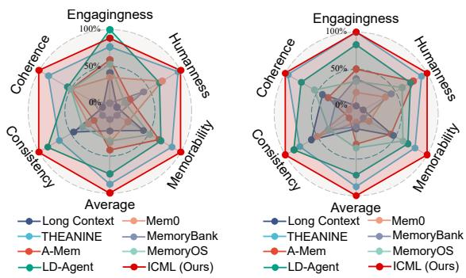  
(a) GPT-4o evaluation.  
(b) Gemini2.5 evaluation.

Figure 3: LLM cross-evaluation.  
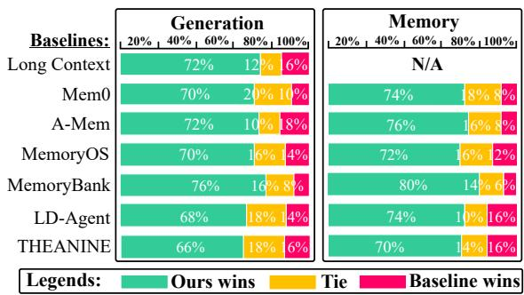  
Figure 4: Human evaluation on generation and memory.

Evaluation Metrics. We comprehensively evaluate our ICML on three types of metrics. 1) Automatic Metrics. Following Ong et al. (2025), we use BLEU-4 (Papineni et al., 2002), ROUGE-L (Lin, 2004), BertScore (Zhang et al., 2019), and Mauve (Pillutla et al., 2021) to automatically evaluate response generation. 2) Personalized Metrics. Following Xu et al. (2022b) and Jang et al. (2023), we introduce LLM-as-a-Judge (Zheng et al., 2023) to evaluate response generation on five dimensions: Engagingness, Humanness, Coherence, Consistency, and Memorability. 3) Human Metrics. Following Xu et al. (2022b) and Jang et al. (2023), we evaluate the winning performance of different methods on response generation and memory retrieval. More details of metrics are shown in Appendix D.

## 4.2 Main Results

Evolving memory surpasses static heuristics. Table 1 shows that ICML achieves state-of-the-art results across all datasets, consistently outperforming management-centric memory agents, generation-centric dialogue agents, and long-context baselines. This proves that actively selecting high-value memories is far more effective than simply processing the entire, noise-filled history. Furthermore, our framework features a flexible plug-and-play design. It can be directly integrated with top-tier closed-source LLMs, equipping them with evolving long-term memory capabilities without requiring access to their internal weights.

<table><tr><td>Datasets</td><td>Methods</td><td>B-4 R-L</td><td>Bert</td><td>Mauve</td></tr><tr><td rowspan="5">CC</td><td>IcML (Ours)</td><td>2.21 18.22</td><td>47.82</td><td>80.33</td></tr><tr><td>w/o Synthetic Data 2.08</td><td>18.15 46.87</td><td></td><td>79.57</td></tr><tr><td>w/o Planner Agent</td><td>2.01 18.01</td><td>47.04</td><td>78.77</td></tr><tr><td>w/o Trigger Agent</td><td>2.10 18.18</td><td>46.83</td><td>79.91</td></tr><tr><td>w/o Truth Reward w/o Evolution</td><td>1.95 17.96</td><td>47.15</td><td>76.19</td></tr><tr><td rowspan="5">MSC</td><td>IcML (Ours)</td><td>2.16 1.13</td><td>18.14~47.31 13.97 48.60</td><td>79.83 66.01</td></tr><tr><td>w/o Synthetic Data</td><td>a 1.01</td><td>13.61 45.85</td><td>62.56</td></tr><tr><td>w/o Planner Agent</td><td>1.05 13.46</td><td>45.79</td><td>63.54</td></tr><tr><td>w/o Trigger Agent</td><td>1.08 13.31</td><td>45.44</td><td>62.62</td></tr><tr><td>w/o Truth Reward</td><td>1.10 13.62</td><td>46.00</td><td>65.99</td></tr><tr><td rowspan="5">GC</td><td>w/o Evolution</td><td>1.03 13.86</td><td>46.33</td><td>61.81</td></tr><tr><td>IcML (Ours) w/o Synthetic Data 1.28</td><td>1.28</td><td>10.64 40.20</td><td>59.81</td></tr><tr><td>w/o Planner Agent</td><td>10.47 40.18</td><td>40.09</td><td>59.07</td></tr><tr><td>w/o Trigger Agent</td><td>1.26 10.07</td><td></td><td>58.07</td></tr><tr><td></td><td></td><td></td><td></td></tr><tr><td rowspan="5"></td><td></td><td>1.22 10.25</td><td>40.02</td><td>58.35</td></tr><tr><td>w/o Truth Reward</td><td>0.97 10.35</td><td>40.11</td><td>58.78</td></tr><tr><td></td><td></td><td></td><td></td></tr><tr><td>w/o Evolution</td><td>9.96</td><td>40.26</td><td>59.08</td></tr><tr><td></td><td>1.16</td><td></td><td></td></tr></table>

Table 2: Ablation study of our method. We further investigate different reward models in Appendix H.

Consistent alignment with LLMs and human expectations. The core insight from our subjective evaluations is that ICML achieves a unified consensus between automated model judgments and real human preferences. Unlike static baselines that often struggle to balance accurate recall with engaging conversation, our interactive learning paradigm effectively bridges this gap, delivering responses that are both contextually precise and naturally fluid. As illustrated in Figure 3 and Figure 4, this superiority is consistently verified: ICML not only demonstrates comprehensive improvements across all dimensions in LLM cross-evaluation but also secures a dominant preference in human evaluation. This confirms that evolving memory policies through interaction leads to a generation style that is significantly more attuned to user expectations than traditional methods.

Holistic integrity sustains the evolutionary cycle. Table 2 confirms that every component is essential for optimal performance. Removing the Cross-Session Truth Reward causes the sharpest drop, proving that long-term feedback is vital for judging memory utility. Similarly, the decline without Evolution shows that static training is insufficient, and the agent must adapt continuously during testing. Synthetic Data is also critical, as it solves the cold-start problem by providing initial expert examples. Finally, removing either the Planner or Trigger breaks the collaborative workflow, confirming that both agents must cooperate for effective memory management.

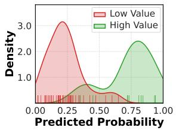  
(a) Value discrimination.

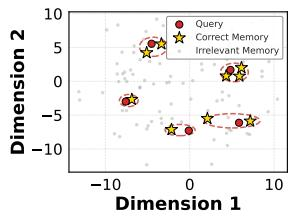  
(b) Retrieval space.

Figure 5: Visualization of learned Planner policy (Left) and Trigger policy (Right).  
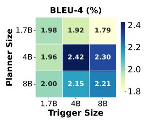

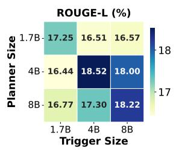

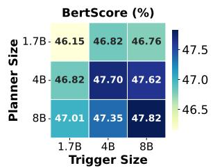

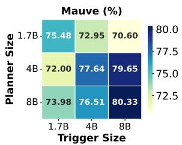  
Figure 6: Performance scaling of Planner and Trigger on CC dataset. More results are shown in Appendix F.

## 4.3 Analysis of Collaborative Agents

Emergence of distinct decision boundaries. To intuitively understand the learned policies, we visualize the decision landscapes of both agents from an episode in Figure 5. As shown in Figure 5 (a), the Planner develops a sharp discrimination ability after evolution, where it assigns distinctively high probabilities to valuable information while effectively suppressing low-value noise. Complementing this, the t-SNE visualization of the Trigger in Figure 5 (b) reveals that user queries and ground-truth memories form tight semantic clusters separated from irrelevant noise. This spatial alignment confirms that the agent has successfully learned to map current user needs to precise historical contexts, ensuring accurate retrieval even in complex scenarios.

Balanced scaling facilitates efficient collaboration. We examine the impact of model scaling in Figure 6. In most cases, the results exhibit a diagonal pattern where performance peaks with matched model sizes, suggesting that aligned capabilities facilitate the collaborative loop. However, larger models also contribute positive gains due to their enhanced raw capacity. Notably, smaller but paired models frequently yield competitive results against mismatched configurations, indicating that architectural balance is often a cost-effective strategy for maximizing synergy.

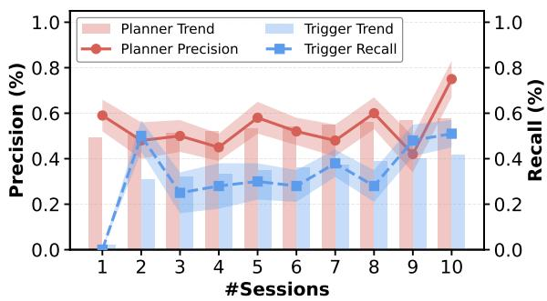  
Figure 7: Co-evolution of Planner and Trigger performance over online sessions.

<table><tr><td>Datasets</td><td>Synthetic Size</td><td>B-4</td><td>R-L</td><td>Bert</td><td>Mauve</td></tr><tr><td rowspan="5">CC</td><td>None</td><td>2.08</td><td>18.15</td><td>46.87</td><td>79.57</td></tr><tr><td>0.25K</td><td>2.21</td><td>18.22</td><td>47.82</td><td>80.33</td></tr><tr><td>0.5K</td><td>2.62</td><td>18.59</td><td>47.28</td><td>79.60</td></tr><tr><td>0.75K</td><td>2.32</td><td>17.92</td><td>46.83</td><td>77.87</td></tr><tr><td>1K</td><td>2.02</td><td>17.24</td><td>46.57</td><td>76.33</td></tr><tr><td rowspan="5">MSC</td><td>None</td><td>1.01</td><td>13.61</td><td>45.85</td><td>62.56</td></tr><tr><td>0.25K</td><td>1.13</td><td>13.97</td><td>48.60</td><td>66.01</td></tr><tr><td>0.5K</td><td>1.18</td><td>13.67</td><td>46.06</td><td>66.45</td></tr><tr><td>0.75K</td><td>1.10</td><td>13.42</td><td>45.86</td><td>65.25</td></tr><tr><td>1K</td><td>1.05</td><td>13.56</td><td>45.81</td><td>65.89</td></tr><tr><td rowspan="5">GC</td><td>None</td><td>1.28</td><td>10.47</td><td>40.18</td><td>59.07</td></tr><tr><td>0.25K</td><td>1.28</td><td>10.64</td><td>40.20</td><td>59.81</td></tr><tr><td>0.5K</td><td>0.90</td><td>10.04</td><td>40.22</td><td>49.21</td></tr><tr><td>0.75K</td><td>0.93</td><td>10.23</td><td>40.37</td><td>50.30</td></tr><tr><td>1K</td><td>0.95</td><td>10.42</td><td>40.31</td><td>49.39</td></tr></table>

Table 3: Performance scaling with synthetic data size.

Continuous improvement via co-evolution. To evaluate lifelong adaptation capabilities, we extend the interaction to 10 sessions and label ground truths as shown in Figure 7. The results demonstrate a consistent upward trend for both Planner precision and Trigger recall as the dialogue progresses. This confirms the effectiveness of our self-evolutionary mechanism: the agents actively refine their collaborative strategies through continuous environmental feedback, progressively enhancing their coordination to sustain high-quality generation over interactions.

Moderate warm-up enables test-time adaptation. We explore the scaling effects of synthetic data in Table 3. The results indicate that a modest range of 0.25K to 0.5K episodes yields the optimal performance gain. This phenomenon stems from the constantly changing nature of user expectations: insufficient data fails to

## Long-Term Open-Domain Interaction

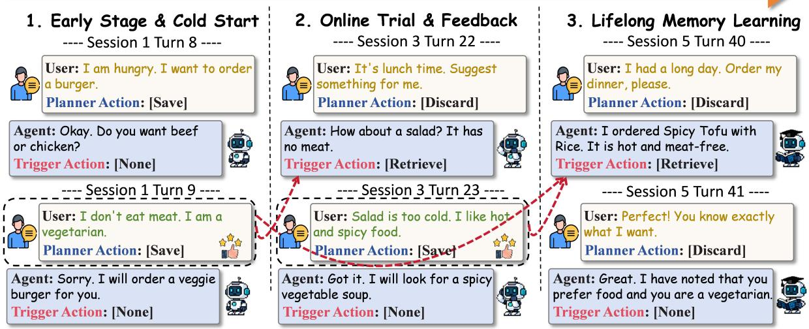  
Figure 8: Case study of the interactive memory learning process. The red dashed arrow shows memory retrieval. The ultimate evolutionary goal is further illustrated in Figure 14 (Appendix I).

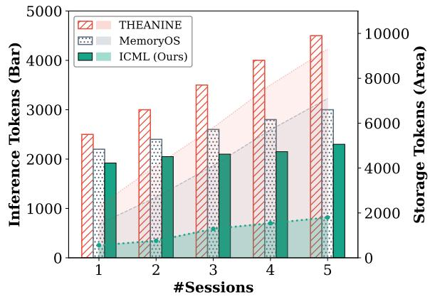  
(a) Construction latency.  
Figure 9: Inference tokens and storage tokens.

overcome the cold-start problem, hindering rapid adaptation; conversely, excessive static supervision risks overfitting to fixed patterns, reducing the agent’s flexibility to align with shifting real-time preferences. Therefore, a moderate warm-up strikes the best balance, initializing the policy just enough to unlock ICML’s capability for autonomous test-time evolution.

## 4.4 Case Study

(b) Retrieval latency.  
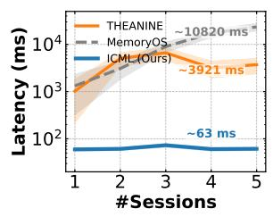

Figure 8 illustrates how ICML evolves through realtime interaction. Initially capturing the "vegetarian" constraint, the agent later encounters a conflict when the user rejects a cold salad. Instead of failing, the Planner adaptively updates its memory to include the specific "hot and spicy" preference derived from this feedback. Consequently, the Trigger successfully synthesizes both the long-term restriction and the newly learned preference to recommend "Spicy Tofu", perfectly aligning with the user’s expectations.

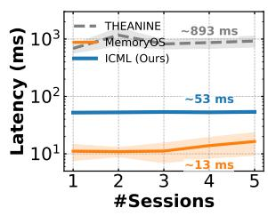  
Figure 10: Computational time cost. More results of total processing time are shown in Appendix J.

## 4.5 Analysis of Token and Latency Efficiency

Token efficiency. We analyze the token consumption in Figure 9. Unlike baselines where costs escalate linearly with session depth, ICML maintains remarkably stable inference usage (bars) and minimal storage growth (area). This proves that the Planner’s rigorous noise filtering effectively prevents context bloating, ensuring that long-term interaction remains computationally feasible without sacrificing performance.

Latency efficiency. As shown in Figure 10, ICML achieves fast memory construction, performing much better than other methods that rely on complex processing. This improvement removes the main delay in the system. This ensures our system is ready for real-time use where quick response generation is needed.

## 5 Conclusions

In this paper, we present ICML, a collaborative framework where a Planner and Trigger co-evolve to optimize long-term memory. By leveraging delayed feedback, our approach effectively aligns memory operations with actual conversational utility, ensuring the agent retains only truly valuable information. Extensive experiments demonstrate that ICML significantly outperforms strong baselines in generation quality while maintaining millisecond-level latency and stable token consumption. Furthermore, our analysis confirms that the system achieves continuous self-evolution through online interaction, offering a robust and efficient solution for lifelong personalized assistants.

## Limitations

Our work is dedicated to constructing personal conversational assistants capable of self-evolution through deep, long-term open-domain interaction. Consequently, our evaluation prioritizes open-domain engagement and personalized alignment rather than rigid reasoning or strict fact-retrieval tasks, such as complex mathematics, coding, or standard question answering benchmarks, which lie beyond the scope of this companionship-centric goal. Furthermore, while we validate our approach within the dialogue domain, we propose a novel paradigm for interactive memory learning. We believe this framework offers valuable insights into dynamic information retention, with the potential to inspire future adaptations across broader domains involving complex temporal dependencies.

## Acknowledgements

This work was supported by the National Natural Science Foundation of China 62576120 and the Major Key Project of PCL2025A11 and PCL2024A08. Thanks for the support provided by OpenI Community (https://openi.pcl.ac.cn).

## References

John R Anderson. 2005. Cognitive psychology and its implications. Macmillan.

Karl Johan Åström. 1965. Optimal control of markov processes with incomplete state information i. Journal of mathematical analysis and applications, 10:174–205.

Sanghwan Bae, Donghyun Kwak, Soyoung Kang, Min Young Lee, Sungdong Kim, Yuin Jeong, Hyeri Kim, Sang-Woo Lee, Woomyoung Park, and Nako Sung. 2022. Keep me updated! memory management in long-term conversations. In Findings ofthe Associationfor Computational Linguistics: EMNLP 2022, pages 3769–3787.

Jason Baumgartner, Savvas Zannettou, Brian Keegan, Megan Squire, and Jeremy Blackburn. 2020. The pushshift reddit dataset. In Proceedings of the international AAAI conference on web and social media, volume 14, pages 830–839.

Nuo Chen, Hongguang Li, Jianhui Chang, Juhua Huang, Baoyuan Wang, and Jia Li. 2025. Compress to impress: Unleashing the potential of compressive mem-

ory in real-world long-term conversations. In Proceedings of the 31st International Conference on Computational Linguistics, pages 755–773.

Prateek Chhikara, Dev Khant, Saket Aryan, Taranjeet Singh, and Deshraj Yadav. 2025. Mem0: Building production-ready ai agents with scalable long-term memory. arXiv preprint arXiv:2504.19413.

Gheorghe Comanici, Eric Bieber, Mike Schaekermann, Ice Pasupat, Noveen Sachdeva, Inderjit Dhillon, Marcel Blistein, Ori Ram, Dan Zhang, Evan Rosen, et al. 2025. Gemini 2.5: Pushing the frontier with advanced reasoning, multimodality, long context, and next generation agentic capabilities. arXiv preprint arXiv:2507.06261.

Emily Dinan, Stephen Roller, Kurt Shuster, Angela Fan, Michael Auli, and Jason Weston. 2018. Wizard of wikipedia: Knowledge-powered conversational agents. arXiv preprint arXiv:1811.01241.

Yiming Du, Hongru Wang, Zhengyi Zhao, Bin Liang, Baojun Wang, Wanjun Zhong, Zezhong Wang, and Kam-Fai Wong. 2024. PerLTQA: A personal longterm memory dataset for memory classification, retrieval, and fusion in question answering. In Proceedings of the 10th SIGHAN Workshop on Chinese Language Processing (SIGHAN-10), pages 152–164, Bangkok, Thailand. Association for Computational Linguistics.

Edward J Hu, Yelong Shen, Phillip Wallis, Zeyuan Allen-Zhu, Yuanzhi Li, Shean Wang, Lu Wang, Weizhu Chen, et al. 2022. Lora: Low-rank adaptation of large language models. ICLR, 1(2):3.

Yuyang Hu, Shichun Liu, Yanwei Yue, Guibin Zhang, Boyang Liu, Fangyi Zhu, Jiahang Lin, Honglin Guo, Shihan Dou, Zhiheng Xi, et al. 2025. Memory in the age of ai agents. arXiv preprint arXiv:2512.13564.

Aaron Hurst, Adam Lerer, Adam P Goucher, Adam Perelman, Aditya Ramesh, Aidan Clark, AJ Ostrow, Akila Welihinda, Alan Hayes, Alec Radford, et al. 2024. Gpt-4o system card. arXiv preprint arXiv:2410.21276.

Jihyoung Jang, Minseong Boo, and Hyounghun Kim. 2023. Conversation chronicles: Towards diverse temporal and relational dynamics in multi-session conversations. In Proceedings ofthe 2023 Conference on Empirical Methods in Natural Language Processing, pages 13584–13606.

Jiazheng Kang, Mingming Ji, Zhe Zhao, and Ting Bai. 2025. Memory OS of AI agent. In Proceedings of the 2025 Conference on Empirical Methods in Natural Language Processing, pages 25972–25981. Association for Computational Linguistics.

Cai Ke, Yiming Du, Bin Liang, Yifan Xiang, Lin Gui, Zhongyang Li, Baojun Wang, Yue Yu, Hui Wang, Kam-Fai Wong, et al. 2025. Flexibly utilize memory for long-term conversation via a fragment-thencompose framework. In Proceedings of the 2025 Conference on Empirical Methods in Natural Language Processing, pages 21130–21147.

Cai Ke, Bin Liang, Xin Liu, Yue Yu, Hui Wang, and Ruifeng Xu. 2026a. Dynamic memory forest: Constructing and tracing conversational trajectories for long-term conversation. In Proceedings of the 49th International ACM SIGIR Conference on Research and Development in Information Retrieval, pages 767–777.

Cai Ke, Liu Xin, Han Zhang, Jiangyue Yan, Zike Yuan, Ling Deng, Yue Yu, Hui Wang, and Ruifeng Xu. 2026b. Thinkflow: Self-evolving probabilistic latent memory for lifelong conversational agents. In Findings of the Association for Computational Linguistics: EMNLP 2026.

Vijay Konda and John Tsitsiklis. 1999. Actor-critic algorithms. Advances in neural information processing systems, 12.

Mosh Levy, Alon Jacoby, and Yoav Goldberg. 2024. Same task, more tokens: the impact of input length on the reasoning performance of large language models. In Proceedings of the 62nd Annual Meeting of the Associationfor Computational Linguistics (Volume 1: Long Papers), pages 15339–15353, Bangkok, Thailand. Association for Computational Linguistics.

Hao Li, Chenghao Yang, An Zhang, Yang Deng, Xiang Wang, and Tat-Seng Chua. 2025. Hello again! LLMpowered personalized agent for long-term dialogue. In Proceedings of the 2025 Conference of the Nations ofthe Americas Chapter ofthe Associationfor Computational Linguistics: Human Language Technologies (Volume 1: Long Papers), pages 5259–5276.

Tianle Li, Ge Zhang, Quy Duc Do, Xiang Yue, and Wenhu Chen. 2024. Long-context llms struggle with long in-context learning. arXiv preprint arXiv:2404.02060.

Yanran Li, Hui Su, Xiaoyu Shen, Wenjie Li, Ziqiang Cao, and Shuzi Niu. 2017. Dailydialog: A manually labelled multi-turn dialogue dataset. In Proceedings ofthe Eighth International Joint Conference on Natural Language Processing (Volume 1: Long Papers), pages 986–995.

Bin Liang, Cai Ke, Runcong Zhao, Qinglin Zhu, Lin Gui, Yue Yu, Hui Wang, Ruifeng Xu, and Kam-Fai Wong. 2026. Meta-memory for large language models. IEEE Transactions on Audio, Speech and Language Processing.

CY Lin. 2004. Rouge: A package for automatic evaluation of summaries. In Text Summarization Branches Out: Proceedings of the ACL-04 Workshop, Barcelona, Spain, pages 74–81.

Chia-Wei Liu, Ryan Lowe, Iulian Vlad Serban, Mike Noseworthy, Laurent Charlin, and Joelle Pineau. 2016. How not to evaluate your dialogue system: An empirical study of unsupervised evaluation metrics for dialogue response generation. In Proceedings of the 2016 Conference on Empirical Methods in Natural Language Processing, pages 2122–2132.

Nelson F Liu, Kevin Lin, John Hewitt, Ashwin Paranjape, Michele Bevilacqua, Fabio Petroni, and Percy Liang. 2024a. Lost in the middle: How language models use long contexts. Transactions ofthe Associationfor Computational Linguistics, 12:157–173.

Zhiwei Liu, Weiran Yao, Jianguo Zhang, Liangwei Yang, Zuxin Liu, Juntao Tan, Prafulla K Choubey, Tian Lan, Jason Wu, Huan Wang, et al. 2024b. Agentlite: A lightweight library for building and advancing task-oriented llm agent system. arXiv preprint arXiv:2402.15538.

Junru Lu, Siyu An, Mingbao Lin, Gabriele Pergola, Yulan He, Di Yin, Xing Sun, and Yunsheng Wu. 2023. Memochat: Tuning llms to use memos for consistent long-range open-domain conversation. arXiv preprint arXiv:2308.08239.

Kai Mei, Xi Zhu, Wujiang Xu, Wenyue Hua, Mingyu Jin, Zelong Li, Shuyuan Xu, Ruosong Ye, Yingqiang Ge, and Yongfeng Zhang. 2024. Aios: Llm agent operating system. arXiv preprint arXiv:2403.16971.

Kai Tzu-iunn Ong, Namyoung Kim, Minju Gwak, Hyungjoo Chae, Taeyoon Kwon, Yohan Jo, Seungwon Hwang, Dongha Lee, and Jinyoung Yeo. 2025. Towards lifelong dialogue agents via timeline-based memory management. In Proceedings of the 2025 Conference of the Nations of the Americas Chapter ofthe Associationfor Computational Linguistics: Human Language Technologies (Volume 1: Long Papers), pages 8631–8661.

Charles Packer, Sarah Wooders, Kevin Lin, Vivian Fang, Shishir G Patil, Ion Stoica, and Joseph E Gonzalez. 2023. Memgpt: Towards llms as operating systems. arXiv preprint arXiv:2310.08560.

Kishore Papineni, Salim Roukos, Todd Ward, and Wei-Jing Zhu. 2002. Bleu: a method for automatic evaluation of machine translation. In Proceedings of the 40th annual meeting ofthe Associationfor Computational Linguistics, pages 311–318.

Krishna Pillutla, Swabha Swayamdipta, Rowan Zellers, John Thickstun, Sean Welleck, Yejin Choi, and Zaid Harchaoui. 2021. Mauve: Measuring the gap between neural text and human text using divergence frontiers. Advances in Neural Information Processing Systems, 34:4816–4828.

Hannah Rashkin, Eric Michael Smith, Margaret Li, and Y-Lan Boureau. 2019. Towards empathetic opendomain conversation models: A new benchmark and dataset. In Proceedings of the 57th Annual Meeting of the Association for Computational Linguistics, pages 5370–5381.

Roger C Schank. 1980. Language and memory. Cognitive science, 4(3):243–284.

John Schulman, Philipp Moritz, Sergey Levine, Michael Jordan, and Pieter Abbeel. 2015. High-dimensional continuous control using generalized advantage estimation. arXiv preprint arXiv:1506.02438.

John Schulman, Filip Wolski, Prafulla Dhariwal, Alec Radford, and Oleg Klimov. 2017. Proximal policy optimization algorithms. arXiv preprint arXiv:1707.06347.

Freda Shi, Xinyun Chen, Kanishka Misra, Nathan Scales, David Dohan, Ed Chi, Nathanael Schärli, and Denny Zhou. 2023. Large language models can be easily distracted by irrelevant context. In Proceedings ofthe 40th International Conference on Machine Learning, pages 31210–31227.

Zhen Tan, Jun Yan, I-Hung Hsu, Rujun Han, Zifeng Wang, Long Le, Yiwen Song, Yanfei Chen, Hamid Palangi, George Lee, et al. 2025. In prospect and retrospect: Reflective memory management for longterm personalized dialogue agents. In Proceedings of the 63rd Annual Meeting of the Association for Computational Linguistics (Volume 1: Long Papers), pages 8416–8439.

Endel Tulving. 1983. Elements of Episodic Memory. Oxford University Press.

Endel Tulving. 2002. Episodic memory: From mind to brain. Annual review ofpsychology, 53(1):1–25.

Piaohong Wang, Motong Tian, Jiaxian Li, Yuan Liang, Yuqing Wang, Qianben Chen, Tiannan Wang, Zhicong Lu, Jiawei Ma, Yuchen Eleanor Jiang, et al. 2025a. O-mem: Omni memory system for personalized, long horizon, self-evolving agents. arXiv eprints, pages arXiv–2511.

Qingyue Wang, Yanhe Fu, Yanan Cao, Shuai Wang, Zhiliang Tian, and Liang Ding. 2025b. Recursively summarizing enables long-term dialogue memory in large language models. Neurocomputing, page 130193.

Jason Wei, Xuezhi Wang, Dale Schuurmans, Maarten Bosma, Fei Xia, Ed Chi, Quoc V Le, Denny Zhou, et al. 2022. Chain-of-thought prompting elicits reasoning in large language models. Advances in neural information processing systems, 35:24824–24837.

Jing Xu, Arthur Szlam, and Jason Weston. 2022a. Beyond goldfish memory: Long-term open-domain conversation. In Proceedings of the 60th Annual Meeting ofthe Associationfor Computational Linguistics (Volume 1: Long Papers), pages 5180–5197.

Wujiang Xu, Zujie Liang, Kai Mei, Hang Gao, Juntao Tan, and Yongfeng Zhang. 2025. A-mem: Agentic memory for llm agents. In Advances in Neural Information Processing Systems.

Xinchao Xu, Zhibin Gou, Wenquan Wu, Zheng-Yu Niu, Hua Wu, Haifeng Wang, and Shihang Wang. 2022b. Long time no see! open-domain conversation with long-term persona memory. In Findings of the Associationfor Computational Linguistics: ACL 2022, pages 2639–2650.

Nakul Yadav, Chelsea Noble, James E Niemeyer, Andrea Terceros, Jonathan Victor, Conor Liston, and

Priyamvada Rajasethupathy. 2022. Prefrontal feature representations drive memory recall. Nature, 608(7921):153–160.

Qiang Zhang, Jason Naradowsky, and Yusuke Miyao. 2023. Mind the gap between conversations for improved long-term dialogue generation. In Findings of the Association for Computational Linguistics: EMNLP 2023, pages 10735–10762.

Saizheng Zhang, Emily Dinan, Jack Urbanek, Arthur Szlam, Douwe Kiela, and Jason Weston. 2018. Personalizing dialogue agents: I have a dog, do you have pets too? In Proceedings of the 56th Annual Meeting of the Association for Computational Linguistics (Volume 1: Long Papers), pages 2204–2213.

Tianyi Zhang, Varsha Kishore, Felix Wu, Kilian Q Weinberger, and Yoav Artzi. 2019. Bertscore: Evaluating text generation with bert. arXiv preprint arXiv:1904.09675.

Xinrong Zhang, Yingfa Chen, Shengding Hu, Zihang Xu, Junhao Chen, Moo Hao, Xu Han, Zhen Thai, Shuo Wang, Zhiyuan Liu, et al. 2024. Bench: Extending long context evaluation beyond 100k tokens. In Proceedings of the 62nd Annual Meeting of the Association for Computational Linguistics (Volume 1: Long Papers), pages 15262–15277.

Zeyu Zhang, Quanyu Dai, Xiaohe Bo, Chen Ma, Rui Li, Xu Chen, Jieming Zhu, Zhenhua Dong, and Ji-Rong Wen. 2025. A survey on the memory mechanism of large language model-based agents. ACM Transactions on Information Systems, 43(6):1–47.

Lianmin Zheng, Wei-Lin Chiang, Ying Sheng, Siyuan Zhuang, Zhanghao Wu, Yonghao Zhuang, Zi Lin, Zhuohan Li, Dacheng Li, Eric Xing, et al. 2023. Judging llm-as-a-judge with mt-bench and chatbot arena. Advances in neural information processing systems, 36:46595–46623.

Wanjun Zhong, Lianghong Guo, Qiqi Gao, He Ye, and Yanlin Wang. 2024. Memorybank: Enhancing large language models with long-term memory. In Proceedings ofthe AAAI Conference on Artificial Intelligence, volume 38, pages 19724–19731.

## A Dataset Information

We evaluate our method on three long-term multisession conversation datasets: Conversation Chronicles (CC) (Jang et al., 2023), Multi-Session Chat (MSC) (Xu et al., 2022a), and GapChat (GC) (Zhang et al., 2023):

• CC: It features a 1M multi-session dialogue dataset that emphasizes temporal dynamics and complex speaker relationships in long-term interactions. It captures the natural flow and logical development found in real human conversations, maintaining coherent and consistent interactions across many sessions. This dataset helps agents learn how to communicate naturally and personally, just like humans do in diverse social contexts.

<table><tr><td>Datasets</td><td># of Sessions</td><td># of Episodes</td><td># of Turns</td><td>Avg. Turns per Session</td><td>Avg. Turns per Episode</td></tr><tr><td>CC</td><td>1M</td><td>200K</td><td>11.7M</td><td>11.70</td><td>58.50</td></tr><tr><td>MSC</td><td>16K</td><td>5K</td><td>214K</td><td>13.38</td><td>42.80</td></tr><tr><td>GC</td><td>2.65K</td><td>0.65K</td><td>28.13K</td><td>10.62</td><td>43.28</td></tr></table>

Table 4: The statistics of three long-term open domain datasets.

• MSC: It is a large-scale, long-term open-domain dialogue dataset built from authentic human-tohuman interactions across multiple sessions. In this dataset, speakers learn about each other’s interests over time and discuss things they have learned in past conversations. It mimics the way real humans build relationships through long-term interaction, making it a key benchmark for testing an agent’s long-term memory.

• GC: It is a challenging multi-session dialogue dataset that incorporates realistic time intervals between conversations, ranging from minutes to years. To create realistic long-term dialogues, it simulates progress in the speakers’ lives based on real-world human rhythms. This dataset requires agents to perceive the passage of time like humans and accurately adapt to changes in a user’s life across different session gaps.

These datasets are human-verified and built through a meticulous crowdsourcing pipeline, purpose-built for the simulation and evaluation of long-term, contextdependent conversations. Following Ong et al. (2025), we randomly select 50 episodes from the test set of each dataset, a total of 250 sessions for the experiments in this paper. The statistics of each data set are shown in Table 4.

## B Compared Baselines

To evaluate the effectiveness of our approach, we compare it against two primary categories of baselines: management-centric memory agents and generationcentric dialogue agents.

## B.1 Management-Centric Memory Agents

This category focuses on the autonomous organization and structural maintenance of the memory database:

• Mem0 (Chhikara et al., 2025): Memo uses a scalable architecture with two phases: extraction and update. In the extraction phase, the system picks out key facts from conversation pairs. In the update phase, it manages memory using a tool call to decide whether to add, update, delete, or ignore new information.

• A-Mem (Xu et al., 2025): A-Mem is an agentic memory system inspired by the Zettelkasten method. It turns conversation steps into atomic notes that include keywords, tags, and context descriptions. The system finds relevant past notes by comparing their embedding vectors.

• MemoryOS (Kang et al., 2025): MemoryOS is inspired by operating systems and uses three levels of storage: short-term, mid-term, and longterm personal memory. It organizes data using a segment-page strategy, where dialogues about the same topic are grouped into segments and divided into pages.

## B.2 Generation-Centric Dialogue Agents

Beyond memory management, we also compare our method with state-of-the-art agents that prioritize longterm consistency and personalized response generation:

• MemoryBank (Zhong et al., 2024): MemoryBank provides a long-term memory system for LLMs inspired by human memory. It saves conversation logs and summarizes them into hierarchical event summaries, allowing the agent to better adapt to the user’s personality.

• LD-Agent (Li et al., 2025): This paper introduces a framework called LD-Agent for personalized, long-term dialogue. The system uses a modular design, breaking the task into three separate parts: event perception, persona extraction, and response generation.

• THEANINE (Ong et al., 2025): THEANINE helps dialogue agents manage memory without deleting old information. While most systems throw away old data, THEANINE keeps everything because it believes even outdated information provides important context, such as changes in user behavior.

## B.3 Memory-Related Methods

Furthermore, we compare our work with a range of established memory-related methods. These approaches typically focus on enhancing memory utilization through recursive summarization or instructionbased techniques to support long-term dialogues:

• MemoChat (Lu et al., 2023): MemoChat uses instruction tuning to help models maintain consistency in long conversations via self-composed "memos". It follows a cycle of "memorizationretrieval-response" to ensure the agent effectively uses historical information.

• Rsum (Wang et al., 2025b): Rsum proposes a recursive summarization mechanism. It guides the model to first memorize small dialogue segments and then recursively generate new memory by combining old memory with the subsequent context to maintain consistency over time.

<table><tr><td>Category</td><td>Hyperparameter</td><td>Value</td></tr><tr><td rowspan="3">Data Synthesis 1</td><td>Storylines per Episode</td><td>3</td></tr><tr><td>Prequels per Storyline</td><td>4</td></tr><tr><td>Data Size</td><td>0.25K</td></tr><tr><td rowspan="3">Cold Start</td><td>Learning Rate</td><td> $2 \times 1 0 ^ { - 5 }$ </td></tr><tr><td>Training Epochs</td><td>3</td></tr><tr><td>Batch Size</td><td>1/2/4/8/16</td></tr><tr><td rowspan="6">RL</td><td>Actor Learning Rate Critic Learning Rate</td><td> $1 \times 1 0 ^ { - 6 }$   $1 \times 1 0 ^ { - 5 }$ </td></tr><tr><td></td><td></td></tr><tr><td>Discount Factor (γ)</td><td>0.99</td></tr><tr><td>GAE Lambda (λ)</td><td>0.95</td></tr><tr><td>PPO Clip Epsilon (€)</td><td>0.2</td></tr><tr><td>Reward Normalization Batch Size</td><td>[0, 1] 4</td></tr><tr><td rowspan="4">LoRA</td><td>rank</td><td>8</td></tr><tr><td>lora_alpha</td><td>16</td></tr><tr><td></td><td>0.1</td></tr><tr><td>lora_dropout</td><td></td></tr><tr><td></td><td>bias</td><td>none</td></tr></table>

Table 5: Key hyperparameters for ICML training.

• COMEDY (Chen et al., 2025): COMEDY moves away from traditional retrieval modules and uses a single model for memory generation, compression, and response. It integrates dialogue summaries, user-bot dynamics, and past events into a concise "compressive memory" format.

## C Implementation Details

To ensure the reproducibility of our ICML framework, we summarize the key hyperparameters used in both the supervised warm-up and the online reinforcement learning stages in Table 5.

## C.1 Supervised Warm-up Stage

To mitigate the cold-start problem inherent in interactive learning, we first conduct supervised pre-training on expert trajectories generated via Retrospective Session Synthesis. In this phase, we employ a learning rate of $2 \times 1 0 ^ { - 5 }$ for 3 epochs. The batch size is set to 1/2/4/8/16 (according to VRAM), and we employ LoRA (Hu et al., 2022) to train our method.

## C.2 Interactive Reinforcement Learning Stage

In the online self-evolution phase, we jointly optimize the Planner and Trigger modules using the PPO algorithm. The learning rate for the Actor is set to a relatively small value of $1 \times 1 0 ^ { - 6 }$ to preserve policy stability, while the Critic uses $1 \times 1 0 ^ { - 5 }$ to accelerate the convergence of the value function. We set the discount factor $\gamma \ : = \ : 0 . 9 9$ , and utilize GAE (Schulman et al., 2015) (λ = 0.95) alongside a clipping coefficient $\epsilon = 0 . 2$ to balance bias and variance. All reward signals, derived from an LLM-as-a-Judge, are normalized within the range of [0, 1].

Algorithm 1: Interactive Memory Learning   
Input: Expert data $\mathcal { D } _ { e x p e r t }$ , discount γ, learning rates   
η   
Output: Optimized policy πθ   
1 Pre-train πθ on $\mathcal { D } _ { e x p e r t } ;$   
2 $\begin{array} { r } { B _ { p e n d i n g }  \emptyset ; } \end{array}$   
3 for each episode E do   
4 for each session $S \in E$ do   
5 for each turn $k \in S$ do   
6 $o _ { k } = ( u _ { k } , H _ { k } , \mathcal { M } _ { k } ) ;$   
7 $a _ { k } ^ { t } \sim \pi _ { \theta } ^ { t } ( a _ { k } ^ { t } | o _ { k } )$ // Trigger   
Decision   
8 if $a _ { k } ^ { t } > 0$ then   
9 Generate $r ^ { * }$ using $\boldsymbol { m } _ { a _ { k } ^ { t } }$ and obtain   
$r _ { k } ^ { q u a l } ;$   
10 if $\ddot { m } _ { a _ { k } ^ { t } } \in B _ { p e n d i n g }$ then   
11 $r ^ { \hat { t } r u t h } \gets r _ { k } ^ { q u a l } ; / /$ Reward   
Propagation   
12 $B _ { p e n d i n g }  B _ { p e n d i n g } \setminus \{ m _ { a _ { k } ^ { t } } \} ;$   
13 end   
14 end   
15 $a _ { k } ^ { p } \sim \pi _ { \theta } ^ { p } ( a _ { k } ^ { p } | o _ { k } )$ // Planner   
Decision   
16 if $a _ { k } ^ { p } = 1$ then   
17 $\mathbf { \mathcal { M } } \gets \mathcal { M } \cup \{ m _ { n e w } \}$ ; Obtain   
$\dot { r } _ { \ast } ^ { p r o x y } ;$   
18 $B _ { p e n d i n g } ^ { \ \kappa }  B _ { p e n d i n g } \cup \{ ( o _ { k } , a _ { k } ^ { p } ) \} ;$   
19 end   
20 Collect trajectory ${ { \tau } _ { k } } = \{ { { o } _ { k } } , { { a } _ { k } } , { { r } _ { k } } \} ;$   
21 end   
22 $\pi _ { \theta } \gets \mathrm { P P O } ( \pi _ { \theta } , \tau , \eta )$ ; // Online   
Optimization   
23 end   
24 end

## D Metrics

## D.1 Personalized Metrics

With the development of open-domain conversation based on LLM, traditional overlap metrics such as BLEU (Papineni et al., 2002), ROUGE (Lin, 2004), etc. face great challenges. The reason is that a wide range of response generation can be considered as appropriate responses (Liu et al., 2016). To this end, we refer to LLM-as-a-Judge (Zheng et al., 2023) and use LLMs to evaluate episodes. In our paper, we follow the metrics set in Xu et al. (2022b) and Jang et al. (2023):

• Engagingness: The assistant can have rich interactions with users that go beyond simple conversations. For example, the assistant can generate interesting and immersive responses based on the current context.

• Humanness: Measures the extent to which the assistant exhibits anthropomorphic traits. This includes the capacity for empathetic reasoning and the simulation of humanlike cognitive patterns during communication.

• Coherence: Measures the logical and thematic continuity across both immediate turns and distant historical sessions. The assistant must synthesize information from different points in time to ensure the conversation flows naturally without losing the "thread".

• Consistency: Focuses on the internal stability of the agent’s persona and its knowledge of the user. The assistant must avoid self-contradiction and maintain a persistent identity across interactions spanning days or weeks.

• Memorability: Reflects the efficiency of the memory system in identifying and retrieving salient facts from past experiences. It evaluates whether the agent can correctly reference specific details, preferences, or events mentioned in earlier sessions to build a sense of shared history.

Each metric is scored on a scale of 1-5, with 1 being the worst and 5 being the best. Normalisation is taken in LLM-as-a-Judge experimental results to maintain a better visualisation.

## D.2 Human Metrics

To further assess the winning performance of different methods in terms of response generation and memory retrieval, we conduct a human evaluation. Following Xu et al. (2022b) and Jang et al. (2023), we hire five in-house evaluators to examine 50 randomly selected samples from each of the three datasets. Each sample consists of the model-generated response and its corresponding retrieved memories. The evaluators are tasked with scoring these outputs based on the previously defined metrics to determine which method demonstrates superior capabilities in sustaining high-quality, longterm interactions.

## E Algorithm: Interactive Memory Learning

This section presents the algorithmic implementation of ICML, illustrating the flow from initialization to online self-evolution. Algorithm 1 summarizes the complete execution process. The framework begins with supervised pre-training using synthesized expert data $\mathcal { D } _ { e x p e r t }$ to establish a baseline policy. During real-time interaction, the Planner and Trigger perform on-policy exploration while receiving environmental feedback. A key novelty is the Cross-Session Truth Reward mechanism, which retrospectively aligns planning decisions with the actual conversational utility observed in future sessions.

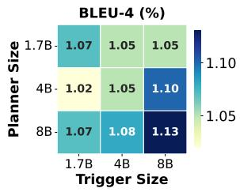

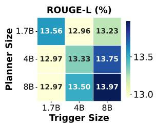

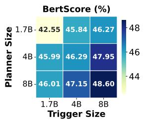

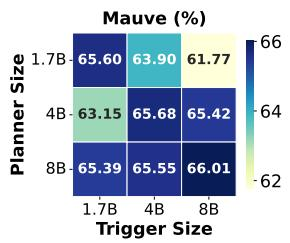  
Figure 11: Performance scaling of Planner and Trigger on MSC dataset.

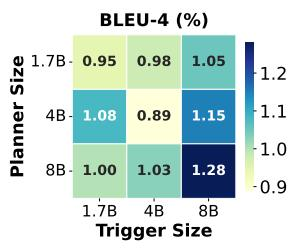

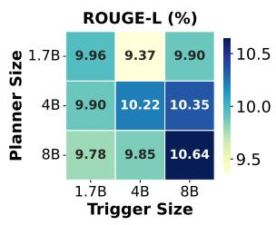

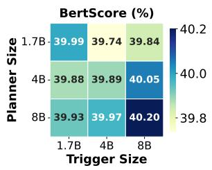

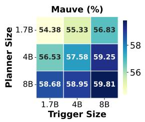  
Figure 12: Performance scaling of Planner and Trigger on GC dataset.

## F Performance scaling of Planner and Trigger

Figures 11 and 12 present the performance scaling results on the MSC and GC datasets. The observations are highly consistent with the findings in our main experiments. Specifically, performance across all metrics generally improves as the sizes of the Planner and Trigger increase, demonstrating a clear scaling effect. Moreover, the diagonal patterns remain evident in these datasets, where matched model sizes often lead to better synergy and more efficient collaboration. These results further confirm that maintaining an architectural balance is a robust strategy for maximizing performance across different data contexts.

## G Training Reward Analysis

We visualize the training reward trajectories for both the Planner and Trigger across the CC, MSC, and

<table><tr><td rowspan="2">Backbone</td><td rowspan="2">Methods</td><td colspan="4">CC</td><td colspan="4">MSC</td><td colspan="4">GC</td></tr><tr><td>B-4</td><td>R-L</td><td>Bert</td><td>Mauve</td><td>B-4</td><td>R-L</td><td>Bert</td><td>Mauve</td><td>B-4</td><td>R-L</td><td>Bert</td><td>Mauve</td></tr><tr><td rowspan="10"></td><td>MemoChat (2023)</td><td>0.72</td><td>12.56</td><td>45.78</td><td>35.60</td><td>0.83</td><td>12.63</td><td>47.93</td><td>53.20</td><td>0.74</td><td>10.94</td><td>35.03</td><td>22.51</td></tr><tr><td>Rsum (2025b)</td><td>1.01</td><td>14.57</td><td>47.12</td><td>46.51</td><td>0.97</td><td>13.99</td><td>48.43</td><td>51.99</td><td>1.06</td><td>16.16</td><td>35.77</td><td>27.48</td></tr><tr><td>COMEDY (2025)</td><td>0.67</td><td>11.30</td><td>46.18</td><td>39.51</td><td>0.60</td><td>11.07</td><td>47.19</td><td>48.86</td><td>0.51</td><td>9.91</td><td>34.00</td><td>24.80</td></tr><tr><td colspan="10">Llama3-Instruct</td><td></td><td></td><td></td></tr><tr><td>ICML-1B</td><td>2.31</td><td>18.72</td><td>47.62</td><td>56.63</td><td>1.42</td><td>15.30</td><td>47.99</td><td>54.71</td><td>1.21</td><td>11.09</td><td>40.74</td><td>34.39</td></tr><tr><td>ICML-3B</td><td>2.37</td><td>18.78</td><td>47.65</td><td>61.66</td><td>1.49</td><td>15.38</td><td>48.02</td><td>57.39</td><td>1.20</td><td>11.21</td><td>40.80</td><td>36.37</td></tr><tr><td>ICML-8B</td><td>2.31</td><td>18.29</td><td>47.40</td><td>57.76</td><td>1.46</td><td>15.41</td><td>48.04</td><td>57.53</td><td>1.25</td><td>11.26</td><td>40.84</td><td>36.42</td></tr><tr><td></td><td colspan="10">Gemma3-it</td><td></td><td></td></tr><tr><td>ICML-1B</td><td>2.25</td><td>18.88</td><td>47.76</td><td>57.59</td><td>1.41</td><td>15.36</td><td>47.92</td><td>56.37</td><td>1.00</td><td>9.39</td><td>39.80</td><td>31.15</td></tr><tr><td>ICML-4B</td><td>2.44 2.36</td><td>18.88</td><td>47.70</td><td>58.39</td><td>1.36</td><td>15.44</td><td>48.01</td><td>57.02</td><td>1.16</td><td>11.32</td><td>40.87</td><td>35.19</td></tr><tr><td>ICML-12B</td><td>18.37</td><td></td><td>47.64</td><td>58.77</td><td>1.44</td><td>15.27</td><td>47.97</td><td>54.46</td><td>1.19</td><td>11.25</td><td>40.75</td><td>36.13</td></tr><tr><td colspan="10">Qwen3</td><td colspan="3"></td></tr><tr><td>ICML-1.7B</td><td></td><td>2.19</td><td>18.92 47.66</td><td>57.95</td><td>1.40</td><td>15.41</td><td>48.00</td><td>56.55</td><td>1.23</td><td>11.27</td><td>40.75</td><td>36.69</td></tr><tr><td>ICML-4B</td><td>2.33</td><td>18.55</td><td>47.69</td><td>57.34</td><td>1.43</td><td>15.38</td><td>47.87</td><td>56.19</td><td>1.20</td><td>11.29</td><td>40.81</td><td>35.90</td></tr><tr><td>ICML-8B</td><td>2.40</td><td>18.93</td><td>47.74</td><td>57.60</td><td>1.40</td><td>15.45</td><td>47.96</td><td>57.58</td><td>1.17</td><td>11.25</td><td>40.86</td><td>35.85</td></tr><tr><td rowspan="9"></td><td>MemoChat (2023)</td><td>1.57</td><td>17.50</td><td>47.50</td><td>72.04</td><td>0.89</td><td>13.60</td><td>47.59</td><td>55.61</td><td>0.78 10.05</td><td>35.76</td><td>25.44</td></tr><tr><td>Rsum (2025b)</td><td>1.56</td><td>16.97</td><td>48.17</td><td>63.41 1.09</td><td>14.43</td><td>47.67</td><td>52.24</td><td>0.61</td><td>10.55</td><td>35.27</td><td>27.15</td></tr><tr><td>COMEDY (2025)</td><td>1.55</td><td>16.63 46.71</td><td>57.01</td><td>0.93</td><td>11.89</td><td>55.39</td><td>46.73</td><td>0.67</td><td>10.22</td><td>33.57</td><td>25.09</td></tr><tr><td colspan="10">Llama3-Instruct</td></tr><tr><td>ICML-1B</td><td>1.94 14.48</td><td></td><td>43.15</td><td>63.95</td><td>0.94 10.83</td><td>42.56</td><td></td><td>55.59</td><td>0.92</td><td>9.05 39.78</td><td>47.38</td></tr><tr><td>ICML-3B</td><td>2.47</td><td>18.97</td><td>47.64</td><td>78.45</td><td>1.12 13.78</td><td>46.13</td><td>64.23</td><td>0.90</td><td>9.58</td><td>39.79</td><td>43.69</td></tr><tr><td>ICML-8B</td><td>2.47</td><td>18.37</td><td>47.36 78.62</td><td>1.20</td><td>13.78</td><td>46.18</td><td>65.64</td><td>0.92</td><td>9.73</td><td>40.38</td><td>50.42</td></tr><tr><td colspan="10"></td><td colspan="3"></td></tr><tr><td>ICML-1B</td><td>1.74</td><td>14.47</td><td>43.56</td><td>66.39</td><td></td><td>1.11 13.65</td><td>46.00</td><td>66.15</td><td>0.65</td><td>8.12</td><td>38.99</td><td>43.13</td></tr><tr><td>ICML-4B</td><td>2.30</td><td>18.28</td><td>47.22</td><td>77.94</td><td>1.13</td><td>13.85 13.77</td><td>46.20 46.12</td><td>66.86 65.89</td><td>0.88 0.77</td><td>9.02 8.37</td><td>39.26 39.40</td><td>52.27 42.10</td></tr><tr><td>ICML-12B</td><td colspan="10">2.39 17.94 47.85 78.67</td></tr><tr><td></td><td></td><td></td><td></td><td></td><td>Qwen3</td><td></td><td></td><td></td><td></td><td></td><td></td><td></td></tr><tr><td>ICML-1.7B</td><td>1.98</td><td>17.25</td><td>46.15</td><td>75.48</td><td>1.07</td><td>13.56</td><td>42.55</td><td>65.50 65.68</td><td>0.95 0.89</td><td>9.96 10.22</td><td>39.99 39.89</td><td>54.38 57.58</td></tr><tr><td>ICML-4B ICML-8B</td><td>2.42</td><td>18.52</td><td>47.70</td><td>77.60</td><td>1.05</td><td>13.33</td><td>46.29</td><td>66.01</td><td>1.28</td><td>10.64</td><td>40.20</td><td>59.81</td></tr><tr><td></td><td>2.21</td><td>18.22</td><td>47.82</td><td>80.33</td><td>1.13</td><td>13.97</td><td>48.60</td><td></td><td></td><td></td><td></td><td></td></tr></table>

Table 6: Automatic evaluation (%) of generation performance per episode. "Bold Font" means the highest results, while "Underlined Font" means second-highest results. \*B-4 = BLEU-4, R-L = ROUGE-L, and Bert = BertScore.

<table><tr><td>Backbone</td><td>Reward Model</td><td>B-4 R-L</td><td>Bert</td><td>Mauve</td></tr><tr><td rowspan="2">Gemini2.5</td><td>Gemini2.5</td><td>2.21 18.22</td><td>47.82</td><td>80.33</td></tr><tr><td>GPT-3.5-turbo GPT-4o-mini 2.20</td><td>2.34 18.29 18.31</td><td>47.39 47.29</td><td>80.93 80.69</td></tr></table>

Table 7: Performance comparison using different LLMs as the reward model on the CC dataset.

GC datasets in Figure 13. The curves demonstrate a synchronized upward trend, indicating that the writing and reading policies co-evolve effectively rather than competing adversarially. Crucially, after an initial phase of rapid exploration, the rewards for both agents settle into a stable plateau without significant oscillation. This convergence confirms the robustness of our collaborative reinforcement learning framework, verifying that the system successfully reaches a steady equilibrium where both agents consistently maximize their mutual conversational utility.

## H Robustness to Reward Model Choice

We test if our method relies on a specific reward model in Table 7. The results show that performance remains very stable, whether we use Gemini2.5, GPT-3.5-turbo, or GPT-4o-mini as the judge. The differences in key metrics are negligible (e.g., Mauve stays around 80). This proves that the success of ICML comes from its collaborative design, not from the power of the reward model. Therefore, our framework is robust and can work effectively even with smaller or cheaper closed open-source LLMs providing feedback.

## I Bridging the Gap to User Expectations

Figure 14 illustrates the core goal of our framework. Our proposed retrospective synthesis method acts as a crucial "warm-up" stage (labeled as SFT), giving the agent basic memory skills. However, as shown by the grey dashed line, relying only on static synthetic data inevitably hits a performance ceiling because fixed datasets cannot capture constantly changing user behaviors. To break this limit, ICML introduces the reinforcement learning phase. Here, the system treats every real-time interaction as a chance to learn. By using feedback from the environment, the agent actively evolves beyond the static baseline, climbing the curve to finally reach the high level of personalization that users expect.

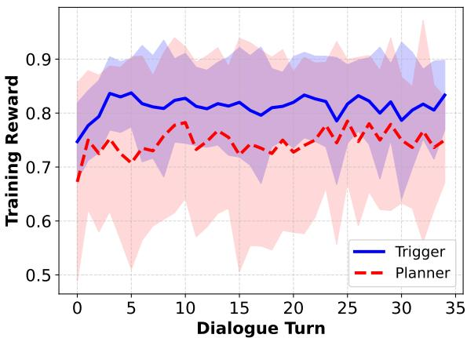

(a) Training reward on CC dataset.  
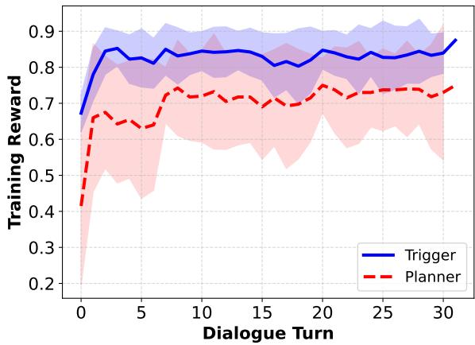

(b) Training reward on MSC dataset.  
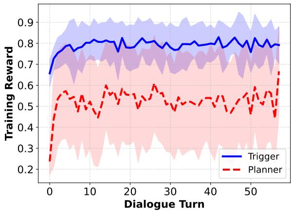  
(c) Training reward on GC dataset.  
Figure 13: Training reward curves on three different datasets.

## J Efficiency Analysis

As illustrated in Figure 15, our method demonstrates superior long-term efficiency compared to THEANINE and MemoryOS. Although ICML starts with a higher initial cost of 52.74s in Session 1 due to the system’s warm-up process—which includes GPU memory allocation and model initialization—it quickly stabilizes to only 10.22s by Session 5. This high-speed stable performance ensures that in real-world interaction scenarios, our method can perform rapid memory updates to support real-time online deployment without significant latency. In contrast, the baselines show significant time increases: THEANINE’s cost grows as the memory graph expands, requiring more LLM calls for node relationship checks, while MemoryOS suffers a dramatic time explosion (reaching 826.61s) in late sessions when memory heat triggers heavy long-term memory extraction tasks. Consequently, ICML effectively maintains a constant and efficient processing speed for long conversations, avoiding the performance bottlenecks found in traditional graph-based or hierarchical memory systems.

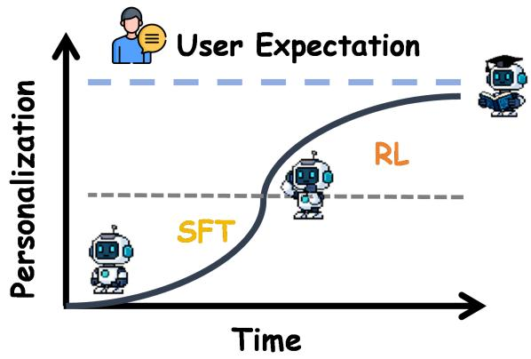  
Figure 14: Evolution of personalization. SFT means warm-up stage.

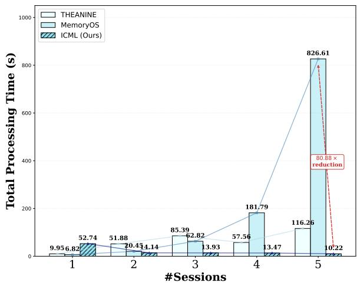  
Figure 15: Total time efficiency comparison. This demonstrates that our method has sufficient time to adapt to real-world scenarios.

## K Analysis of Early Exploration and Proxy Rewards

In the early stages of interactive learning, the Trigger agent may occasionally fail to retrieve useful memories due to insufficient exploration. This raises a potential concern regarding exploration failure: if a valuable memory is stored but never retrieved, it will not receive the delayed Cross-Session Truth Reward, which might seemingly hinder the Planner agent’s ability to learn.

To address this issue, our framework does not rely solely on the delayed Truth Reward. As detailed in Section 3.3.1, we incorporate an immediate Proxy Reward $( r ^ { p r o x y } )$ and a Miss-penalty $( - \alpha r ^ { p r o x y } )$ provided by the backbone LLM. Even if the Trigger fails to select a memory later, the Planner receives immediate feedback regarding the intrinsic value of the dialogue turn. This mechanism ensures that high-value information is consistently retained during the initial exploration phase.

To empirically validate the effectiveness of this mechanism, we tracked the memory retention performance and reward dynamics over five continuous training sessions. We measured the Miss Rate of high-value memories, the False Positive Rate (FPR), and the Pearson correlation (r) between the immediate Proxy Reward and the delayed Truth Reward.

As shown in Table 8, there is a clear and rapid downward trend in the Miss Rate from Session 1 to Session 3. This rapid drop confirms that the Proxy Rewards effectively and quickly guide the Planner’s exploration before the Truth Rewards become sufficiently dense. Furthermore, the continued improvement in later sessions (Sessions 4 and 5) and the steadily increasing correlation (r) demonstrate that the model successfully refines its policy over prolonged interactions, achieving higher precision and stronger alignment between the internal proxy evaluation and the actual long-term user expectations.

## L Significance and Agreement Analysis for Human Evaluation

To confirm the reliability and statistical significance of our human evaluation results, we conducted further statistical tests comparing our ICML framework against the strongest baseline, THEANINE. Specifically, we calculated Fleiss’ Kappa (κ) to measure the agreement among our five in-house evaluators, and we computed the 95% Confidence Intervals along with P-values (using pairwise t-tests) for the win rates.

As shown in Table 9, the Fleiss’ Kappa scores (> 0.6) demonstrate a reliable, substantial agreement among the evaluators. Furthermore, the win rates of 66.0% and 70.0% are statistically significant $( p < 0 . 0 1 )$ and feature narrow confidence intervals. This rigorously validates that the observed superiority of ICML in both generation quality and memory retrieval is highly significant and not attributable to random chance or small sample size

noise.

## M Hyperparameter Sensitivity Analysis

To evaluate the robustness of our hybrid reward design, we conducted comprehensive sensitivity experiments regarding the hyperparameter λ, which balances the Immediate Proxy Reward and the Delayed Quality Reward. Using ICML-8B (Qwen3), we tested $\lambda \in \{ 0 . 3 , 0 . 5 , 0 . 7 \}$ across the CC, MSC, and GC datasets, evaluated by two different backbone models (GPT-4o and Gemini2.5).

As shown in Table 10, the setting of λ = 0.5 (used in our main experiments) consistently yields the best performance across both backbones and all three datasets. Minor deviations $( \lambda = 0 . 3 \mathrm { o r } 0 . 7 )$ result in slight performance drops. This confirms that while λ influences the trade-off between short-term guidance and long-term objectives, our chosen hyperparameter is optimal, and the system remains stable without drastic collapse regardless of the evaluator architecture.

## N Robustness to Tiny Reward Models

To stress-test the robustness of our framework, we conducted additional experiments employing significantly weaker LLMs (Qwen2.5-1.5B-Instruct and Llama-3.2- 1B-Instruct) as Reward Models (Judges). We evaluated the impact on performance across the CC, MSC, and GC datasets using ICML-8B (Qwen3).

As shown in Table 11, even when guided by a 1Bparameter judge, the performance degradation is minimal compared to the strong teacher models (GPT-4o and Gemini2.5). While there is an expected slight drop in metrics, the system does not collapse and continues to perform robustly. This highlights the resilience of the ICML framework to noisy reward signals and demonstrates its strong potential for deployment in resourceconstrained environments.

## O Effectiveness of Backward Storyline Generation

To clearly demonstrate the motivation behind our Backward Storyline Generation, we explicitly compared it against standard Forward Generation. By anchoring the generation on the future outcome (the Seed Session) and generating backwards, we force the LLM to plant necessary clues that causally lead to the current outcome (e.g., ensuring the generated history logically explains the user’s current constraints). In contrast, forward generation lacks this target-driven control and often fails to converge to the specific constraints required for effective cold-start training.

To empirically validate this, we evaluated the performance of ICML-8B (based on Qwen3) trained with initialization data generated from both strategies. We tested across three datasets using GPT-4o and Gemini2.5 as backbones.

As shown in Table 12, the Backward (Ours) strategy consistently outperforms Forward generation across all metrics. This empirical evidence confirms that backward generation provides a higher-quality, logically consistent initialization signal, which is crucial for the subsequent reinforcement learning stage.

<table><tr><td>Training Session</td><td>Miss Rate (%)</td><td>False Positive Rate (%)</td><td>Proxy &amp; Truth Reward Correlation (r)</td></tr><tr><td>Session 1 (Start)</td><td>48.2</td><td>15.6</td><td>0.62</td></tr><tr><td>Session 2</td><td>24.5</td><td>12.1</td><td>0.75</td></tr><tr><td>Session 3</td><td>5.8</td><td>8.4</td><td>0.83</td></tr><tr><td>Session 4</td><td>4.1</td><td>7.2</td><td>0.87</td></tr><tr><td>Session 5</td><td>3.2</td><td>6.1</td><td>0.89</td></tr></table>

Table 8: Performance metrics of memory exploration over training sessions. The Proxy Reward & Truth Reward Correlation is measured using Pearson r.
<table><tr><td>Metric</td><td>ICML Win Rate (%)</td><td>95% Confidence Interval</td><td>Fleiss&#x27; Kappa (κ)</td><td>P-value (vs. Baseline)</td></tr><tr><td>Generation Quality</td><td>66.0</td><td>[60.5%, 71.5%]</td><td>0.65 (Substantial)</td><td>&lt; 0.01</td></tr><tr><td>Memory Retrieval</td><td>70.0</td><td>[64.2%, 75.8%]</td><td>0.68 (Substantial)</td><td>&lt; 0.01</td></tr></table>

Table 9: Human Evaluation Statistics (ICML vs. THEANINE).
<table><tr><td>Backbone</td><td>Dataset</td><td>λ Value</td><td>B-4</td><td>R-L</td><td>Bert</td><td>Mauve</td></tr><tr><td rowspan="9">GPT-40</td><td rowspan="3">CC</td><td>λ = 0.3</td><td>2.31</td><td>18.45</td><td>47.12</td><td>55.80</td></tr><tr><td>λ = 0.5 (Main)</td><td>2.40</td><td>18.93</td><td>47.74</td><td>57.60</td></tr><tr><td>λ = 0.7</td><td>2.35</td><td>18.62</td><td>47.35</td><td>56.45</td></tr><tr><td rowspan="3">MSC</td><td>λ = 0.3</td><td>1.28</td><td>14.85</td><td>47.15</td><td>56.13</td></tr><tr><td>λ = 0.5 (Main)</td><td>1.40</td><td>15.45</td><td>47.96</td><td>57.58</td></tr><tr><td>λ = 0.7</td><td>1.35</td><td>15.19</td><td>47.54</td><td>56.91</td></tr><tr><td rowspan="3">GC</td><td>λ = 0.3</td><td>1.12</td><td>10.95</td><td>40.15</td><td>34.50</td></tr><tr><td>λ = 0.5 (Main)</td><td>1.17</td><td>11.25</td><td>40.86</td><td>35.85</td></tr><tr><td>λ = 0.7</td><td>1.15</td><td>11.10</td><td>40.57</td><td>35.14</td></tr><tr><td rowspan="7">Gemini2.5</td><td rowspan="3">CC</td><td>λ = 0.3</td><td>2.15</td><td>17.82</td><td>47.26</td><td>78.54</td></tr><tr><td>λ = 0.5 (Main)</td><td>2.21</td><td>18.22</td><td>47.82</td><td>80.33</td></tr><tr><td>λ = 0.7</td><td>2.18</td><td>18.05</td><td>47.55</td><td>79.10</td></tr><tr><td rowspan="3">MSC</td><td>λ = 0.3</td><td>1.08</td><td>13.51</td><td>48.12</td><td>64.20</td></tr><tr><td>λ = 0.5 (Main)</td><td>1.13</td><td>13.97</td><td>48.60</td><td>66.01</td></tr><tr><td>λ = 0.7</td><td>1.10</td><td>13.75</td><td>48.35</td><td>65.10</td></tr><tr><td rowspan="3">GC</td><td>λ = 0.3</td><td>1.22</td><td>10.15</td><td>39.87</td><td>58.23</td></tr><tr><td>λ = 0.5 (Main)</td><td>1.28</td><td>10.64</td><td>40.20</td><td>59.81</td></tr><tr><td>λ = 0.7</td><td>1.25</td><td>10.44</td><td>40.05</td><td>58.97</td></tr></table>

Table 10: Sensitivity analysis of the hyperparameter λ using ICML-8B (Qwen3) across different backbones and datasets.

## P Comparison with RMM

To further evaluate the zero-shot online adaptation capability of our framework, we compared ICML against Reflective Memory Management (RMM) (Tan et al., 2025). Since RMM also proposes an online reinforcement learning framework to optimize memory management, we implemented a variant of RMM that utilizes only its online RL module (Retrospective Reflection) while skipping the offline supervised pre-training. This ensures a fair comparison under a strict zero-shot testtime adaptation setting, where neither model has access to the task-specific training sets.

We conducted a comprehensive evaluation across the

CC, MSC, and GC datasets using GPT-4o and Gemini 2.5 as backbones. Both methods operate in a zeroshot setting regarding the dataset, and our method utilizes ICML-8B (based on Qwen3) as the memory policy model.

As shown in Table 13, ICML consistently outperforms the RL-only variant of RMM across all datasets and backbones. While RMM is a strong baseline, its performance drops significantly when deprived of offline training data. This empirical evidence confirms that ICML’s dual-agent architecture is far more effective for zero-shot online adaptation, demonstrating superior data efficiency and adaptability in true zero-shot scenarios compared to methods that heavily rely on offline supervision for initialization.

<table><tr><td>Backbone</td><td>Dataset</td><td>Reward Model (Judge)</td><td>B-4 (%)</td><td>R-L (%)</td><td>Bert (%)</td><td>Mauve (%)</td></tr><tr><td rowspan="8">GPT-40</td><td rowspan="3">CC</td><td>GPT-4o (Baseline)</td><td>2.40</td><td>18.93</td><td>47.74</td><td>57.60</td></tr><tr><td>Qwen2.5-1.5B</td><td>2.25</td><td>18.14</td><td>47.05</td><td>54.82</td></tr><tr><td>Llama-3.2-1B</td><td>2.18</td><td>17.85</td><td>46.86</td><td>53.20</td></tr><tr><td rowspan="3">MSC</td><td>GPT-4o (Baseline)</td><td>1.40</td><td>15.45</td><td>47.96</td><td>57.58</td></tr><tr><td>Qwen2.5-1.5B</td><td>1.31</td><td>14.83</td><td>47.24</td><td>55.10</td></tr><tr><td>Llama-3.2-1B</td><td>1.25</td><td>14.57</td><td>46.92</td><td>53.85</td></tr><tr><td rowspan="3">GC</td><td>GPT-4o (Baseline)</td><td>1.17</td><td>11.25</td><td>40.86</td><td>35.85</td></tr><tr><td>Qwen2.5-1.5B</td><td>1.09</td><td>10.81</td><td>40.19</td><td>33.92</td></tr><tr><td>Llama-3.2-1B</td><td>1.05</td><td>10.54</td><td>39.80</td><td>32.59</td></tr><tr><td rowspan="8">Gemini2.5</td><td rowspan="3">CC</td><td>Gemini2.5 (Baseline)</td><td>2.21</td><td>18.22</td><td>47.82</td><td>80.33</td></tr><tr><td>Qwen2.5-1.5B</td><td>2.08</td><td>17.54</td><td>47.12</td><td>76.50</td></tr><tr><td>Llama-3.2-1B</td><td>1.98</td><td>17.18</td><td>46.85</td><td>74.27</td></tr><tr><td rowspan="3">MSC</td><td>Gemini2.5 (Baseline)</td><td>1.13</td><td>13.97</td><td>48.60</td><td>66.01</td></tr><tr><td>Qwen2.5-1.5B</td><td>1.05</td><td>13.42</td><td>47.90</td><td>63.52</td></tr><tr><td>Llama-3.2-1B</td><td>1.01</td><td>13.11</td><td>47.56</td><td>61.83</td></tr><tr><td rowspan="3">GC</td><td>Gemini2.5 (Baseline)</td><td>1.28</td><td>10.64</td><td>40.20</td><td>59.81</td></tr><tr><td>Qwen2.5-1.5B</td><td>1.18</td><td>10.18</td><td>39.53</td><td>56.44</td></tr><tr><td>Llama-3.2-1B</td><td>1.12</td><td>9.88</td><td>39.12</td><td>54.52</td></tr></table>

Table 11: Performance comparison of ICML-8B (Qwen3) when trained with tiny Reward Models (Judges).
<table><tr><td>Dataset</td><td>Backbone</td><td>Method</td><td>B-4</td><td>R-L</td><td>Bert</td><td>Mauve</td><td>LLM Judge (1-5)</td></tr><tr><td rowspan="4">CC</td><td rowspan="2">GPT-40</td><td>Forward</td><td>1.85</td><td>16.51</td><td>45.20</td><td>52.15</td><td>4.15</td></tr><tr><td>Backward (Ours)</td><td>2.40</td><td>18.93</td><td>47.74</td><td>57.60</td><td>4.82</td></tr><tr><td rowspan="2">Gemini2.5</td><td>Forward</td><td>1.92</td><td>16.85</td><td>45.82</td><td>70.24</td><td>4.22</td></tr><tr><td>Backward (Ours)</td><td>2.21</td><td>18.22</td><td>47.82</td><td>80.33</td><td>4.88</td></tr><tr><td rowspan="4">MSC</td><td rowspan="2">GPT-40</td><td>Forward</td><td>1.15</td><td>13.20</td><td>46.15</td><td>51.58</td><td>4.08</td></tr><tr><td>Backward (Ours)</td><td>1.40</td><td>15.45</td><td>47.96</td><td>57.58</td><td>4.76</td></tr><tr><td rowspan="2">Gemini2.5</td><td>Forward</td><td>0.95</td><td>12.15</td><td>46.50</td><td>60.55</td><td>4.12</td></tr><tr><td>Backward (Ours)</td><td>1.13</td><td>13.97</td><td>48.60</td><td>66.01</td><td>4.85</td></tr><tr><td rowspan="4">GC</td><td rowspan="2">GPT-40</td><td>Forward</td><td>1.05</td><td>9.55</td><td>38.52</td><td>32.17</td><td>3.95</td></tr><tr><td>Backward (Ours)</td><td>1.17</td><td>11.25</td><td>40.86</td><td>35.85</td><td>4.68</td></tr><tr><td rowspan="2">Gemini2.5</td><td>Forward</td><td>1.02</td><td>9.12</td><td>38.25</td><td>52.45</td><td>4.05</td></tr><tr><td>Backward (Ours)</td><td>1.28</td><td>10.64</td><td>40.20</td><td>59.81</td><td>4.79</td></tr></table>

Table 12: Comparison of ICML-8B (Qwen3) trained with Backward vs. Forward synthetic data strategies.
<table><tr><td>Dataset</td><td>Backbone</td><td>Method</td><td>B-4</td><td>R-L</td><td>Bert</td><td>Mauve</td></tr><tr><td rowspan="3">CC</td><td>GPT-40</td><td>RMM (RL-only) ICML (Ours)</td><td>1.95 2.40</td><td>17.10 18.93</td><td>46.54 47.74</td><td>52.39 57.60</td></tr><tr><td>Gemini 2.5</td><td>RMM (RL-only)</td><td>1.85</td><td>16.92</td><td>46.25</td><td>72.42</td></tr><tr><td></td><td>ICML (Ours) RMM (RL-only)</td><td>2.21 1.20</td><td>18.22</td><td>47.82</td><td>80.33</td></tr><tr><td rowspan="2">MSC</td><td>GPT-40</td><td>ICML (Ours)</td><td>1.40</td><td>14.27 15.45</td><td>46.84 47.96</td><td>52.62 57.58</td></tr><tr><td>Gemini 2.5</td><td>RMM (RL-only) ICML (Ours)</td><td>0.98 1.13</td><td>12.59 13.97</td><td>47.61 48.60</td><td>63.47 66.01</td></tr><tr><td rowspan="2">GC</td><td>GPT-40</td><td>RMM (RL-only) ICML (Ours)</td><td>1.08 1.17</td><td>10.32</td><td>39.56</td><td>33.04</td></tr><tr><td>Gemini 2.5</td><td>RMM (RL-only) ICML (Ours)</td><td>1.10 1.28</td><td>11.25 9.87 10.64</td><td>40.86 39.53 40.20</td><td>35.85 54.02 59.81</td></tr></table>

Table 13: Comparison with RMM (RL-only) across different datasets and backbones in a zero-shot setting.

## Q Retrospective Session Synthesis Prompts

The following subsections describe the prompts used in the Retrospective Session Synthesis pipeline, which

initializes the ICML framework with high-quality expert trajectories.

## Q.1 Backward Storyline Generation

To address the cold-start problem where agents lack historical context, we utilize a reverse-generation strategy. Starting from a seed session $S _ { s e e d } ,$ , this prompt guides the LLM to recursively generate preceding sessions that provide logical grounding for the user’s current preferences or constraints. This ensures that the generated history is both consistent and causally linked to the final interaction. The specific instruction set for this stage is presented in Figure 16.

## Q.2 Forward Dependency Annotation: Planner Agent

Once the storyline is established, we perform Forward Dependency Annotation. This prompt corresponds to the Planner’s role in the synthesis phase. It evaluates the information gain of each dialogue turn to determine whether it contains high-value information worth saving. This process creates the binary labels necessary for the agent to learn how to distinguish critical user facts from transient noise. As illustrated in Figure 17, the agent is instructed to focus on implicit traits and potential future topics.

## Q.3 Forward Dependency Annotation: Trigger Agent

This prompt facilitates the annotation of memory dependencies for the Trigger. By identifying which specific historical fragments are required to resolve a query in the current session, we establish the explicit links between retrieval actions and conversational utility. This annotation allows the policy to be warmed up with dense, causal signals before online reinforcement learning begins. We utilize the logic detailed in Figure 18 to perform this fine-grained association analysis.

## R Online Interaction and RL Training Prompts

This section details the prompts used during the active interaction phase, where the Planner and Trigger agents co-evolve based on environmental feedback.

## R.1 Agent Response Generation

To produce human-like and personalized replies, the agent’s generation process is grounded in both the current dialogue history and the retrieved memory fragments. As described in Figure 19, the prompt instructs the model to synthesize this information while maintaining brevity and ignoring misleading context.

## R.2 Planner Agent: Proxy Reward Evaluation

During online interaction, the Planner requires immediate feedback to guide its exploration of information value. We employ an LLM-based judge to provide a proxy reward $( r ^ { p r o x y } )$ , as specified in Figure 20. This evaluation focuses on identifying specific facts or emotional markers that warrant long-term storage.

## R.3 Trigger Agent: Quality Reward Evaluation

To align the Trigger’s retrieval policy with human preferences, the system evaluates the final response quality $( r ^ { q u a l } )$ . The prompt shown in Figure 21 directs an LLM judge to score the response based on relevance, fluency, and the appropriate utilization of memory.

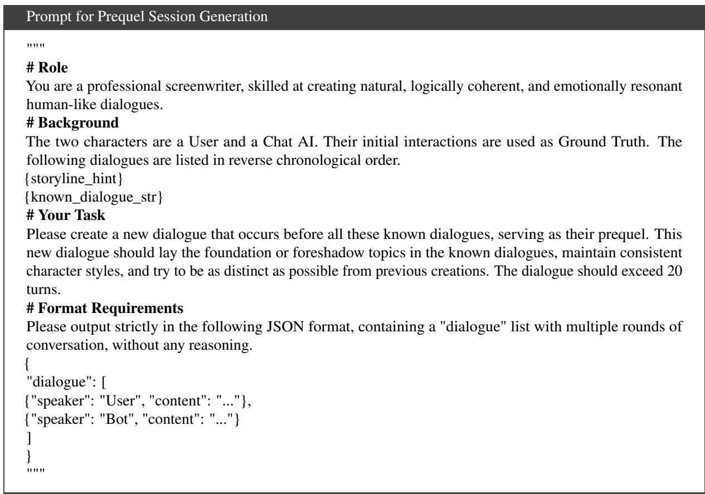  
Figure 16: Prompt for backward prequel session synthesis.

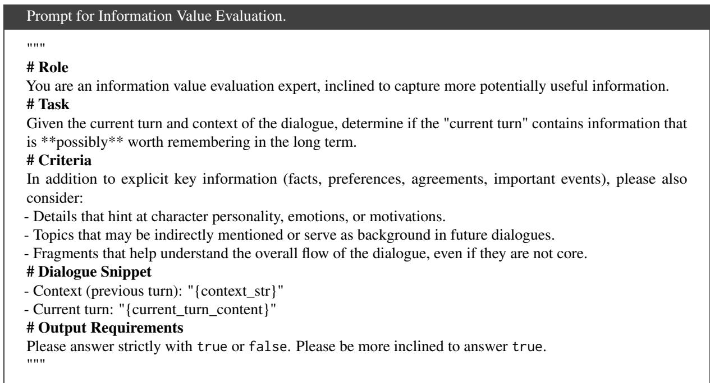  
Figure 17: Prompt for evaluating the information value of dialogue turns.

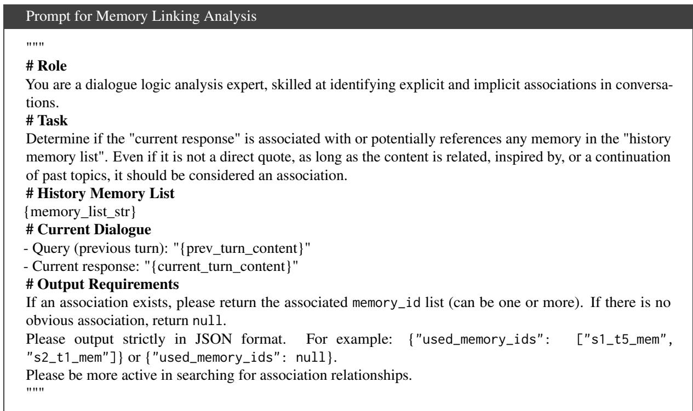  
Figure 18: Prompt for linking current turns to historical memory items.

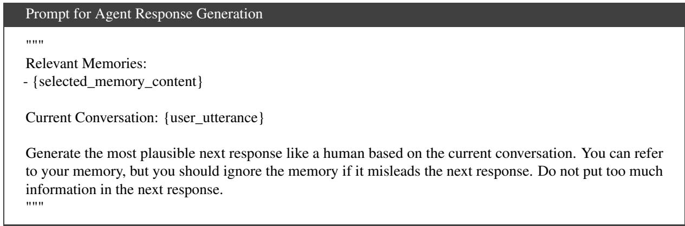  
Figure 19: Prompt for generating personalized agent responses grounded in memory.

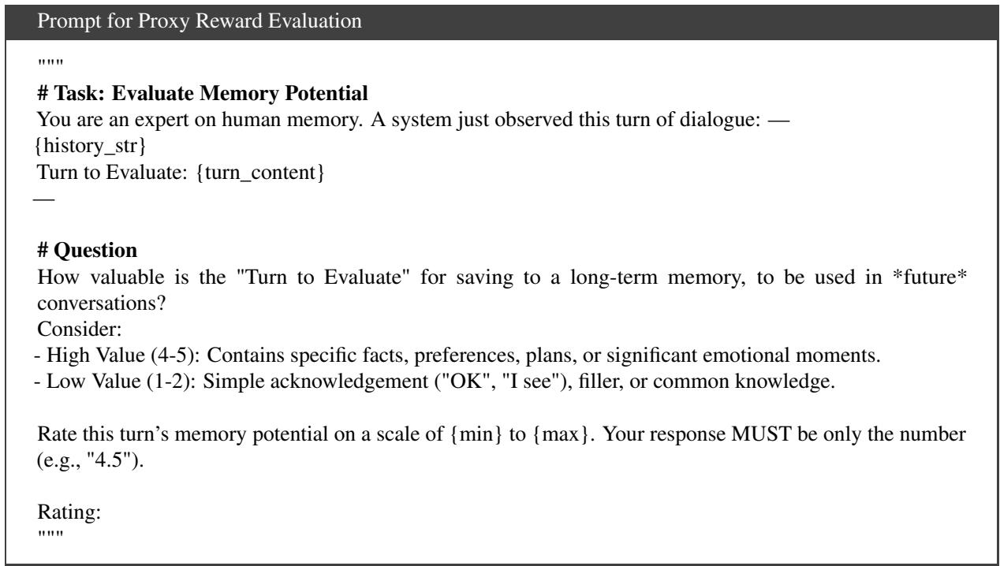  
Figure 20: Prompt for providing immediate proxy rewards to the Planner agent.

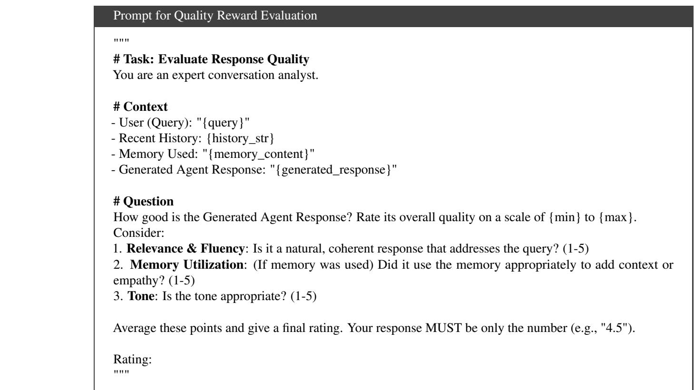  
Figure 21: Prompt for evaluating response quality and providing feedback to the Trigger agent.