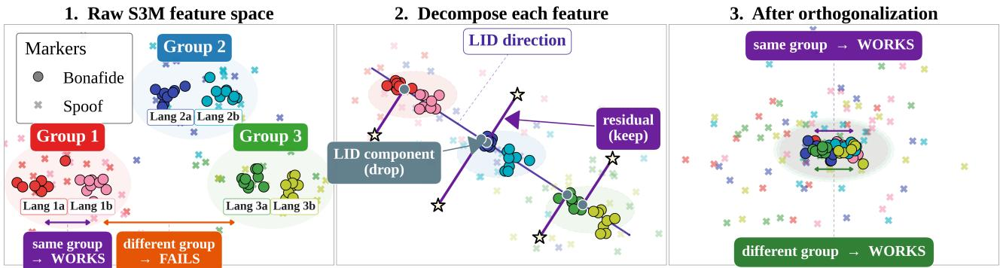
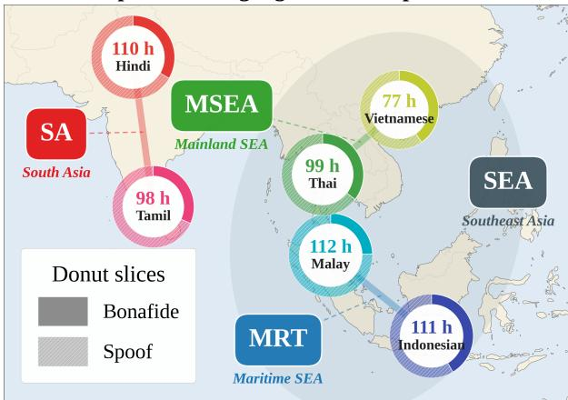
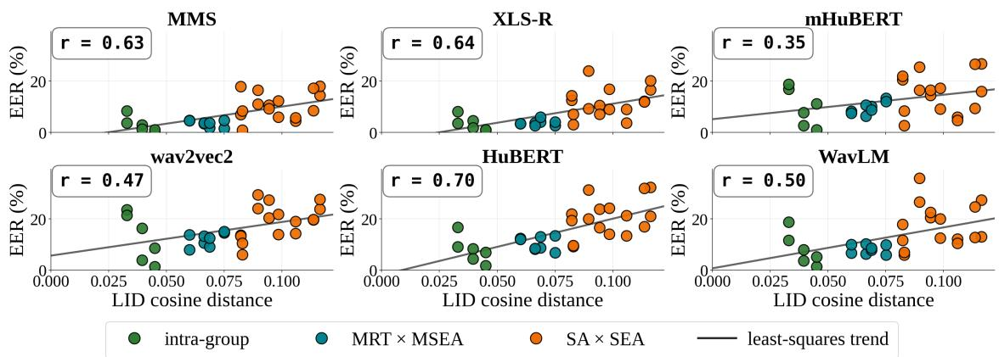
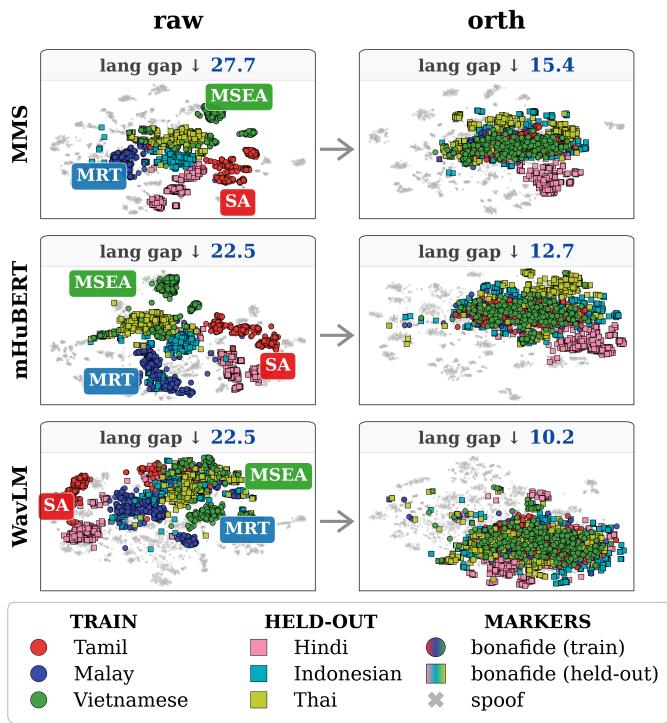

# LANGUAGE ORTHOGONALIZATION FOR ZERO-SHOT CROSS-LINGUAL AUDIO DEEPFAKE DETECTION

Minu Kim 1,2, Ji Sub Um2, Hoirin Kim2

1University of Southern California, USA, 2KAIST, South Korea minukim@usc.edu, {twiz0311,hoirkim}@kaist.ac.kr

## ABSTRACT

Audio deepfake detectors need to transfer to languages absent from training, as multilingual speech synthesis outpaces labeled anti-spoofing resources. While detectors increasingly rely on self-supervised speech models (S3Ms), these backbones encode language-dependent structure that confounds spoof cues. We address this confound through language orthogonalization, a target-free ridge map that removes S3M variation projected onto continuous language-identification (LID) embeddings. Across six languages, six S3M backbones, and all Leave-N-Out settings, it consistently reduces EER across unseen languages. Cross-lingual EER correlates with LID-space distance, where orthogonalization yields larger gains for more distant transfers.

Index Terms— audio deepfake detection, self-supervised speech models, cross-lingual transfer, language identity.

## 1. INTRODUCTION

Consider deploying an audio deepfake detector in a language entirely absent from training: neither bonafide nor spoofed speech is available for adaptation or calibration. This scenario is increasingly plausible: speech synthesis now spans over a thousand languages [1], while standard anti-spoofing benchmarks remain largely English-centric [2, 3] and recent multilingual resources cover only a fraction of this breadth [4]. A scalable detector should therefore transfer both its bonafide reference and spoof decision boundary across languages.

Self-supervised speech models (S3Ms) appear well suited to this transfer setting, having shown strong performance in audio deepfake detection [5]. However, their representations also encode language identity [6], and spoof detectors often degrade across linguistic boundaries [7, 8]. A detector may easily confuse language-conditioned acoustics with transferable spoof cues. Because both bonafide and spoofed speech retain this linguistic structure, cross-lingual degradation is especially severe when transferring to distant target languages.

Meanwhile, prior work shows that S3M phonetic variations occupy approximately linear subspaces [9, 10], motivating subspace residualization to reduce cross-lingual confounds [11]. We hypothesize that removing linear language directions eliminates confounds across large linguistic distances without target data. We thus formulate language orthogonalization for audio deepfake detection under a strictly unseen setting, removing language variation without observing target-language speech during training.

Our approach fits a closed-form ridge map from continuous language identification (LID) embeddings to S3M representations using bonafide speech from source languages, then subtracts the mapped language component from each representation. A frozen multilingual LID encoder [12] extracts continuous language representations without languagespecific tuning, enabling target-data-free transformation. Consequently, this orthogonalization isolates and preserves spoof artifacts while removing language confounds.

By leveraging continuous LID space, which provides a meaningful geometry reflecting phonological, geographic, and genealogical language relationships [13, 14], we first show that cross-lingual equal error rate (EER) increases with LID distance across six South and Southeast Asian languages and six S3M backbones. Language orthogonalization consistently improves Leave-N-Out evaluation across all settings, with the most pronounced gains on distant transfers where language confounds are most severe.

Our contributions are: (1) showing that LID distance and linguistic composition govern cross-lingual transfer difficulty; (2) formulating target-free language orthogonalization for unseen-language audio deepfake detection; and (3) demonstrating consistent EER reductions across six S3Ms and all Leave-N-Out settings, with largest gains on distant transfers and constrained source setups.

## 2. METHODOLOGY

## 2.1. Feature Representations

We use six frozen S3Ms as utterance-level feature extractors: MMS-300M [1], XLS-R-300M [15], wav2vec2-Large-LV60 [16], HuBERT-Large [17], WavLM-Large [18], and mHuBERT-147 [19]. For each utterance, we compute mean+std pooling [20] across all hidden layers, average the layer-wise representations depthwise, and $\ell _ { 2 }$ -normalize the result to obtain a 2048-d embedding $\mathbf { x } _ { i } \in \mathbb { R } ^ { D }$ . This fixed pipeline avoids backbone-specific layer selection [21, 22].

  
Fig. 1. Language orthogonalization for cross-lingual anti-spoofing. (1) S3M representations place similar languages nearby, easing transfer between close languages. (2) Orthogonalization removes language-predictable variation and retains the residual. (3) The residual space aligns bonafide distributions and improves transfer across linguistic groups.

SEA-Spoof· 6 languages across 3 sprachbunds  
  
Fig. 2. Evaluation languages. Six languages span South Asia, Mainland Southeast Asia, and Maritime Southeast Asia, enabling transfer within and across linguistic areas (i.e., sprachbunds).

As an external language reference, we extract a continuous LID embedding $\mathbf { g } _ { i } \in \mathbb { R } ^ { 2 5 6 }$ using an ECAPA-TDNN pretrained on VoxLingua107 [12]. Unlike discrete language labels, these embeddings place utterances in a shared language space, enabling both language-distance analysis and transformation of target languages unseen during training.

## 2.2. Language Orthogonalization

We propose a source-only formulation of language orthogonalization for fully unseen-language anti-spoofing. The mapping is learned exclusively from source-language bonafide speech, requiring neither class from target languages and preventing spoof artifacts from entering its estimation.

For the bonafide training set $\mathcal { D } _ { \mathrm { b f } } .$ , we stack its $N _ { \mathrm { b f } } \ =$ $| \mathcal { D } _ { \mathrm { b f } } |$ utterances into S3M features $\mathbf { X } _ { \mathrm { b f } } ~ \in ~ \mathbb { R } ^ { N _ { \mathrm { b f } } \times 2 0 4 8 }$ and

LID embeddings $\mathbf { G } _ { \mathrm { b f } } \in \mathbb { R } ^ { N _ { \mathrm { b f } } \times 2 5 6 }$ to fit a ridge map:

$$
\mathbf { W } ^ { * } = \arg \operatorname* { m i n } _ { \mathbf { W } } \| \mathbf { X } _ { \mathrm { b f } } - \mathbf { G } _ { \mathrm { b f } } \mathbf { W } \| _ { F } ^ { 2 } + \lambda \| \mathbf { W } \| _ { F } ^ { 2 } .\tag{1}
$$

The closed-form solution is

$$
\mathbf { W } ^ { * } = \left( \mathbf { G } _ { \mathrm { b f } } ^ { \top } \mathbf { G } _ { \mathrm { b f } } + \lambda \mathbf { I } \right) ^ { - 1 } \mathbf { G } _ { \mathrm { b f } } ^ { \top } \mathbf { X } _ { \mathrm { b f } } .\tag{2}
$$

For an utterance with S3M representation X and LID embedding g, we subtract the language-predictable component:

$$
\mathbf { X } _ { \mathrm { o r t h } } = \mathbf { X } - \mathbf { g } \mathbf { W } ^ { * } .\tag{3}
$$

The transformation is applied to both bonafide and spoofed utterances. Its continuous LID conditioning allows application to target languages unseen during training.1

## 3. EXPERIMENTAL SETUP

## 3.1. Dataset

We evaluate on SEA-Spoof [23], which contains bonafide and spoofed speech from six languages under diverse speakers and spoofing conditions. We group the languages into South Asia (SA; Hindi and Tamil), Mainland Southeast Asia (MSEA; Thai and Vietnamese), and Maritime Southeast Asia (MRT; Indonesian and Malay) (Fig. 2); MSEA and MRT together form the Southeast Asian (SEA) subset. Prior S3M studies likewise report representational proximity and effective transfer among languages in these regions [13, 24], motivating comparisons within and across linguistic areas.

## 3.2. Cross-Lingual Evaluation

Under Leave-N-Out evaluation, we hold out every combination of $N \in \{ 1 , 2 , 3 , 4 , 5 \}$ languages and train on the remaining $6 - N$ . The held-out languages are entirely unseen, with

  
Fig. 3. Language distance predicts cross-lingual difficulty. LID distances reflect linguistic-area structure, with intra-group pairs closer than MSEA–MRT and SEA–SA pairs. Across six S3Ms, greater distance is consistently associated with higher EER; r denotes the Pearson correlation between distance and EER.

Table 1. Cross-lingual EER (%) under Leave-N-Out evaluation. The remaining 6 − N languages are used for training. Parentheses show relative EER reduction from Raw. Orthogonalization improves every backbone and N.
<table><tr><td>Backbone</td><td colspan="2">N = 1</td><td colspan="2">N = 2</td><td colspan="2">N = 3</td><td colspan="2"> $N = 4$ </td><td colspan="2"> $N = 5$ </td></tr><tr><td></td><td>Raw</td><td>Orth</td><td>Raw</td><td>Orth</td><td>Raw</td><td>Orth</td><td>Raw</td><td>Orth</td><td>Raw</td><td>Orth</td></tr><tr><td colspan="9">Multilingual Pre-trained Backbones</td><td></td></tr><tr><td>MMS-300M</td><td>1.48</td><td>1.16 (↓22%)</td><td>2.44</td><td>1.82 (↓25%)</td><td>3.54</td><td>2.68 (↓24%)</td><td>5.65</td><td>3.91 (↓31%)</td><td>10.06</td><td>7.80 (↓22%)</td></tr><tr><td>XLS-R-300M</td><td>1.62</td><td>1.58 (↓2%)</td><td>2.36</td><td>2.14 (↓9%)</td><td>3.59</td><td>2.89 (↓20%)</td><td>6.36</td><td>4.24 (↓33%)</td><td>11.56</td><td>7.77 (↓33%)</td></tr><tr><td>mHuBERT-147</td><td>5.16</td><td>4.39 (↓15%)</td><td>6.46</td><td>5.49 (↓15%)</td><td>7.95</td><td>7.07 (↓11%)</td><td>10.56</td><td> $9 . 3 7 \ _ { ( \downarrow I I \% ) }$ </td><td>16.10</td><td> $1 4 . 7 6 ( \downarrow 8 \% )$ </td></tr><tr><td colspan="9">Monolingual Pre-trained Backbones</td></tr><tr><td>wav2vec2-large</td><td>6.45</td><td></td><td>8.50</td><td>7.23</td><td>10.34</td><td>9.05</td><td>12.86</td><td>11.44(↓11%)</td><td>17.20</td><td>15.63(↓9%)</td></tr><tr><td>HuBERT-large</td><td>5.47</td><td>5.75 (↓11%)  $5 . 2 9 \ ( \downarrow 3 \% )$ </td><td>6.84</td><td>(↓15%) 6.65 (↓3%)</td><td>9.10</td><td>(↓12%) 8.70 (↓4%)</td><td>12.66</td><td> ${ \bf 1 1 . 3 0 } _ { ( \downarrow I I \% ) }$ </td><td>17.54</td><td>15.54(↓11%)</td></tr><tr><td>WavLM-large</td><td>4.32</td><td>4.18  $( \downarrow , 3 \% )$ </td><td>5.93</td><td>5.23 (↓12%)</td><td>7.83</td><td>6.72  $( \downarrow I 4 \% )$ </td><td>10.86</td><td> $8 . 8 6 ~ ( \downarrow I 8 \% )$ </td><td>15.56</td><td>13.14(↓16%)</td></tr><tr><td>Avg.</td><td>4.08</td><td> $3 . 7 3 \ \mathrm { ~ } ( \downarrow 9 \% )$ </td><td>5.42</td><td> $4 . 7 6 ~ ( \downarrow I 2 \% )$ </td><td>7.06</td><td> ${ \bf 6 . 1 9 } _ { \mathrm { ~ } ( \downarrow I 2 \% ) }$ </td><td>9.83</td><td> $8 . 1 9 \ _ { ( \downarrow I 7 \% ) }$ </td><td>14.67</td><td> $1 2 . 4 4 _ { ( \downarrow I 5 \% ) }$ </td></tr></table>

For each source–target language pair, we compare the cosine distance of their mean LID embeddings against cross-lingual evaluation EER. Figure 3 shows that LID distance reflects linguistic-area structure and correlates with EER across all six S3Ms. Transfer difficulty thus aligns with linguistic distance from the training language, motivating orthogonalization under severe linguistic distance.

no language-specific adaptation. For each split, we compare raw and orthogonalized S3M representations using EER, averaged across all language combinations at each N. To evaluate the representations, we fit a logistic regression classifier with class-balanced $L _ { 2 }$ regularization using L-BFGS [25].

## 4. RESULTS

## 4.1. Language Distance and Cross-Lingual Difficulty

## 4.2. Overall Leave-N-Out Performance

Table 1 reports performance as unseen languages increase from $N = 1$ to 5. Orthogonalization consistently reduces EER across all backbones and N, yielding 9–17% average relative gains across all setups.

## 4.3. Effect of Linguistic-Area Composition

We examine how linguistic-area structure influences crosslingual difficulty and orthogonalization gains under data scarcity. Under single-language training (Table 2), transfer difficulty scales with linguistic mismatch: Raw baseline performance is strong on closely related pairs (intra-group), leaving limited room for improvement. Conversely, Raw performance drops on distant cross-area pairs $( \mathrm { S A } \times \mathrm { S E A } )$ due to severe linguistic confounds. Crucially, orthogonalization yields its largest gains on these distant pairs (e.g., up to 22% relative EER reduction on XLS-R), confirming that language removal is most effective across large linguistic distances.

Table 2. Cross-lingual EER (%) under single-language training (Leave-5-Out). Raw results are shown in gray ; Orth results are grouped by source–target relation: intra-group MRT × MSEA , and SA × SEA Parentheses indicate relative EER change from Raw.
<table><tr><td rowspan="3"></td><td colspan="6">Source-target relation at evaluation</td></tr><tr><td colspan="2">intra-group</td><td colspan="2">MRT × MSEA</td><td colspan="2">SA × SEA</td></tr><tr><td>Raw</td><td>Orth</td><td>Raw</td><td>Orth</td><td>Raw</td><td>Orth</td></tr><tr><td colspan="7">Multilingual Pre-trained Backbones</td></tr><tr><td>MMS</td><td>2.90</td><td>2.89 (↓0%)</td><td>3.54</td><td>3.70 (↑5%)</td><td>10.52</td><td>8.62 (↓18%)</td></tr><tr><td>XLS-R</td><td>3.33</td><td>4.05 (↑22%)</td><td>3.75</td><td>3.43 (↓9%)</td><td>11.72</td><td>9.18 (↓22%)</td></tr><tr><td>mHuBERT</td><td>9.72</td><td>8.29 (↓15%)</td><td>9.63</td><td>10.40(↑8%)</td><td>15.16</td><td>15.14(↓0%)</td></tr><tr><td colspan="7">Monolingual Pre-trained Backbones</td></tr><tr><td>wav2vec2</td><td>12.53</td><td>11.51 (↓8%)</td><td>12.13</td><td>11.78 (↓3%)</td><td>19.04</td><td>17.35 (↓9%)</td></tr><tr><td>HuBERT</td><td>7.85</td><td>7.65 (↓3%)</td><td>10.41</td><td>9.67 (↓7%)</td><td>20.42</td><td>18.26(↓11%)</td></tr><tr><td>WavLM</td><td>8.09</td><td>6.54 (↓19%)</td><td>8.17</td><td>7.51 (↓8%)</td><td>17.56</td><td>15.76(↓10%)</td></tr></table>

Table 3. Cross-lingual EER (%) under two-language training (Leave-4-Out). Raw results are shown in gray ; Orth results are grouped by training-language composition: intra-group MRT × MSEA , and $S \mathbb { A } ~ \times ~ S \mathbb { E } \mathbb { A }$ Parentheses indicate relative EER reduction from Raw.
<table><tr><td></td><td>intra-group train</td><td></td><td></td><td>MRT × MSEA train</td><td></td><td>SA × SEA train</td></tr><tr><td>Backbone</td><td>Raw</td><td>Orth</td><td>Raw</td><td>Orth</td><td>Raw</td><td>Orth</td></tr><tr><td colspan="7">Multilingual Pre-trained Backbones</td></tr><tr><td>MMS</td><td>8.66</td><td>5.91 (↓32%)</td><td>6.86</td><td>3.85 (↓44%)</td><td>3.91</td><td> $3 . 1 9 \ _ { \mathrm { \ell } ( \downarrow I 8 \% ) }$ </td></tr><tr><td>XLS-R</td><td>10.82</td><td>6.44 (↓41%)</td><td>9.67</td><td> ${ \pmb 5 . 3 0 } _ { \mathrm { ( } \downarrow 4 5 \% ) }$ </td><td>3.03</td><td> $2 . 9 \mathbf { 0 } \ \mathbf { \Omega } ( \downarrow 5 \% )$ </td></tr><tr><td>mHuBERT</td><td>14.56</td><td>13.15(↓10%)</td><td>13.05</td><td> $\mathbf { 1 0 . 1 0 } _ { ( \downarrow 2 3 \% ) }$ </td><td>7.82</td><td> $7 . 5 8 ~ ( \downarrow 3 \% )$ </td></tr><tr><td colspan="7">Monolingual Pre-trained Backbones</td></tr><tr><td>wav2vec2</td><td>16.24</td><td>14.30(↓12%)</td><td>15.64</td><td>13.35(↓15%)</td><td>10.20</td><td>9.42 (↓8%)</td></tr><tr><td>HuBERT</td><td>17.67</td><td> $1 6 . 2 2 \ : ( \downarrow 8 \% )$ </td><td>16.55</td><td> $1 3 . 4 1 ( \downarrow I 9 \% )$ </td><td>8.83</td><td> ${ \bf 8 . 4 1 _ { \mathrm { ~ ( \downarrow ~ 5 \% ) ~ } } }$ </td></tr><tr><td>WavLM</td><td>14.40</td><td> $1 2 . 4 1 _ { \ : ( \downarrow I 4 \% ) }$ </td><td>13.99</td><td> $\mathbf { 1 0 . 5 3 } _ { ( \downarrow 2 5 \% ) }$ </td><td>7.96</td><td> ${ \bf 6 . 7 0 } _ { \mathrm { ~ } ( \downarrow I 6 \% ) }$ </td></tr></table>

Under two-language training (Table 3), generalization depends on source diversity. Diverse training pairs (SA × SEA) yield robust baselines with low Raw EERs, leading to minor orthogonalization gains. In contrast, homogeneous pairs (intra-group) restrict linguistic coverage, degrading baseline accuracy. Orthogonalization markedly improves these constrained setups (e.g., up to 41% and 45% EER reduction on XLS-R for intra-group and MRT × MSEA), showing that removing LID-mapped components can effectively compensate for limited source diversity.

## 4.4. Representation Geometry after Orthogonalization

Figure 4 visualizes the representation geometry in a representative Leave-3-Out setting. Raw S3M representations cluster hierarchically by language and linguistic group, with substantial domain shifts across languages. Orthogonalization suppresses this language-dependent structure, effectively aligning bonafide representations across both source and unseen target languages into a shared space.

  
Fig. 4. Representation geometry before and after orthogonalization. Raw representations cluster hierarchically by language and linguistic group, whereas orthogonalization aligns bonafide speech and improves bonafide–spoof separation. Reported values denote Euclidean distances between bonafide language centroids in the S3M feature space.

Quantitatively, orthogonalization substantially reduces the Euclidean distance between bonafide language centroids in the S3M feature space across all backbones: MMS (27.7 → 15.4, −44%), mHuBERT (22.5 → 12.7, −44%), WavLM (22.5 → 10.2, −55%), XLS-R (20.3 → 9.4, −54%), wav2vec 2.0 (21.2 → 6.4, −70%), and HuBERT (23.4 → 9.7, −59%). This spatial reorganization confirms that removing LID-predictable components closes crosslingual domain gaps while retaining the discriminative representation needed for detection.

## 5. CONCLUSION

We introduce a language orthogonalization strategy that fits an LID-to-S3M mapping on bonafide speech to improve cross-lingual audio deepfake detection. Across multiple S3M backbones and unseen-language setups, this approach consistently lowers EER, yielding larger gains on linguistically distant transfers. Furthermore, we show that continuous distance in LID space reflects linguistic-area structure, providing a clear metric to characterize transfer difficulty.

## 6. ACKNOWLEDGMENTS

This work was supported by Institute of Information & communications Technology Planning & Evaluation (IITP) grant funded by the Korea government(MSIT) (No.RS-2025-02215393).

## 7. REFERENCES

[1] Vineel Pratap, Andros Tjandra, Bowen Shi, Paden Tomasello, Arun Babu, Sayani Kundu, Ali Elkahky, Zhaoheng Ni, Apoorv Vyas, Maryam Fazel-Zarandi, et al., “Scaling speech technology to 1,000+ languages,” Journal of Machine Learning Research, vol. 25, no. 97, pp. 1–52, 2024.

[2] Massimiliano Todisco, Xin Wang, Ville Vestman, Md Sahidullah, Hector Delgado, Andreas Nautsch, Junichi Yamagishi, Nicholas Evans,´ Tomi Kinnunen, and Kong Aik Lee, “Asvspoof 2019: Future horizons in spoofed and fake audio detection,” arXiv preprint arXiv:1904.05441, 2019.

[3] Xuechen Liu, Xin Wang, Md Sahidullah, Jose Patino, Hector Del-´ gado, Tomi Kinnunen, Massimiliano Todisco, Junichi Yamagishi, Nicholas Evans, Andreas Nautsch, et al., “Asvspoof 2021: Towards spoofed and deepfake speech detection in the wild,” arXiv preprint arXiv:2210.02437, 2022.

[4] Nicolas M Muller, Piotr Kawa, Wei Herng Choong, Edresson¨ Casanova, Eren Golge, Thorsten M¨ uller, Piotr Syga, Philip Sperl, and¨ Konstantin Bottinger, “Mlaad: The multi-language audio anti-spoofing¨ dataset,” in 2024 International Joint Conference on Neural Networks (IJCNN). IEEE, 2024, pp. 1–7.

[5] Hemlata Tak, Massimiliano Todisco, Xin Wang, Jee weon Jung, Junichi Yamagishi, and Nicholas Evans, “Automatic Speaker Verification Spoofing and Deepfake Detection Using Wav2vec 2.0 and Data Augmentation,” in The Speaker and Language Recognition Workshop (Odyssey 2022), 2022, pp. 112–119.

[6] Hexin Liu, Leibny Paola Garcia Perera, Andy WH Khong, Eng Siong Chng, Suzy J Styles, and Sanjeev Khudanpur, “Efficient selfsupervised learning representations for spoken language identification,” IEEE Journal ofSelected Topics in Signal Processing, vol. 16, no. 6, pp. 1296–1307, 2022.

[7] Bartłomiej Marek, Piotr Kawa, and Piotr Syga, “Are audio deepfake detection models polyglots?,” arXiv preprint arXiv:2412.17924, 2024.

[8] Kirill Borodin, Vasiliy Kudryavtsev, Maxim Maslov, Mikhail Gorodnichev, and Grach Mkrtchian, “When spoof detectors travel: Evaluation across 66 languages in the low-resource language spoofing corpus,” arXiv preprint arXiv:2603.02364, 2026.

[9] Kwanghee Choi, Eunjung Yeo, Cheol Jun Cho, David R Mortensen, and David Harwath, “Self-supervised speech models encode phonetic context via position-dependent orthogonal subspaces,” arXiv preprint arXiv:2603.12642, 2026.

[10] Kwanghee Choi, Eunjung Yeo, Cheol Jun Cho, David Harwath, and David R Mortensen, “[b]=[d]-[t]+[p]: Self-supervised speech models discover phonological vector arithmetic,” in Findings ofthe Association for Computational Linguistics: ACL 2026, 2026, pp. 11048–11069.

[11] Minu Kim, Eunjung Yeo, Kwanghee Choi, and June-Woo Kim, “Language orthogonalization of self-supervised speech representations for cross-lingual parkinson’s detection,” arXiv preprint arXiv:2609.09499, 2026.

[12] Jorgen Valk and Tanel Alum¨ ae, “VoxLingua107: A dataset for spoken¨ language recognition,” in Proc. IEEE SLT, 2021, pp. 652–658.

[13] Minu Kim, Hoirin Kim, and David R Mortensen, “Scaling selfsupervised speech models uncovers deep linguistic relationships: Evidence from the pacific cluster,” arXiv preprint arXiv:2603.07238, 2026.

[14] Minu Kim, Kangwook Jang, and Hoirin Kim, “Improving cross-lingual phonetic representation of low-resource languages through language similarity analysis,” in ICASSP 2025-2025 IEEE International Conference on Acoustics, Speech and Signal Processing (ICASSP). IEEE, 2025, pp. 1–5.

[15] Arun Babu, Changhan Wang, Andros Tjandra, Kushal Lakhotia, Qiantong Xu, Naman Goyal, Kritika Singh, Patrick Von Platen, Yatharth Saraf, Juan Pino, et al., “Xls-r: Self-supervised crosslingual speech representation learning at scale,” arXiv preprint arXiv:2111.09296, 2021.

[16] Alexei Baevski, Yuhao Zhou, Abdelrahman Mohamed, and Michael Auli, “wav2vec 2.0: A framework for self-supervised learning of speech representations,” Advances in neural information processing systems, vol. 33, pp. 12449–12460, 2020.

[17] Wei-Ning Hsu, Benjamin Bolte, Yao-Hung Hubert Tsai, Kushal Lakhotia, Ruslan Salakhutdinov, and Abdelrahman Mohamed, “Hubert: Selfsupervised speech representation learning by masked prediction of hidden units,” IEEE/ACM transactions on audio, speech, and language processing, vol. 29, pp. 3451–3460, 2021.

[18] Sanyuan Chen, Chengyi Wang, Zhengyang Chen, Yu Wu, Shujie Liu, Zhuo Chen, Jinyu Li, Naoyuki Kanda, Takuya Yoshioka, Xiong Xiao, et al., “Wavlm: Large-scale self-supervised pre-training for full stack speech processing,” IEEE Journal ofSelected Topics in Signal Processing, vol. 16, no. 6, pp. 1505–1518, 2022.

[19] Marcely Zanon Boito, Vivek Iyer, Nikolaos Lagos, Laurent Besacier, and Ioan Calapodescu, “mhubert-147: A compact multilingual hubert model,” arXiv preprint arXiv:2406.06371, 2024.

[20] Ondrej Klempir, Juliana Grand Mullerova, and Radim Krupicka, “Statistical, multi-scale and attention-based layer pooling of wav2vec-2 speech embeddings for parkinson’s disease detection,” Computers in Biology and Medicine, vol. 200, pp. 111368, 2026.

[21] Ankita Pasad, Ju-Chieh Chou, and Karen Livescu, “Layer-wise analysis of a self-supervised speech representation model,” in 2021 IEEE Automatic Speech Recognition and Understanding Workshop (ASRU). IEEE, 2021, pp. 914–921.

[22] Ankita Pasad, Bowen Shi, and Karen Livescu, “Comparative layerwise analysis of self-supervised speech models,” in ICASSP 2023-2023 IEEE International Conference on Acoustics, Speech and Signal Processing (ICASSP). IEEE, 2023, pp. 1–5.

[23] Jinyang Wu, Nana Hou, Zihan Pan, Qiquan Zhang, Sailor Hardik Bhupendra, and Soumik Mondal, “Sea-spoof: Bridging the gap in multilingual audio deepfake detection for south-east asian,” arXiv preprint arXiv:2509.19865, 2025.

[24] Minu Kim, Ji Sub Um, and Hoirin Kim, “How far do ssl speech models listen for tone? temporal focus of tone representation under low-resource transfer,” in ICASSP 2026-2026 IEEE International Conference on Acoustics, Speech and Signal Processing (ICASSP). IEEE, 2026, pp. 18297–18301.

[25] Fabian Pedregosa, Gael Varoquaux, Alexandre Gramfort, Vincent¨ Michel, Bertrand Thirion, Olivier Grisel, Mathieu Blondel, Peter Prettenhofer, Ron Weiss, Vincent Dubourg, et al., “Scikit-learn: Machine learning in python,” the Journal of machine Learning research, vol. 12, pp. 2825–2830, 2011.