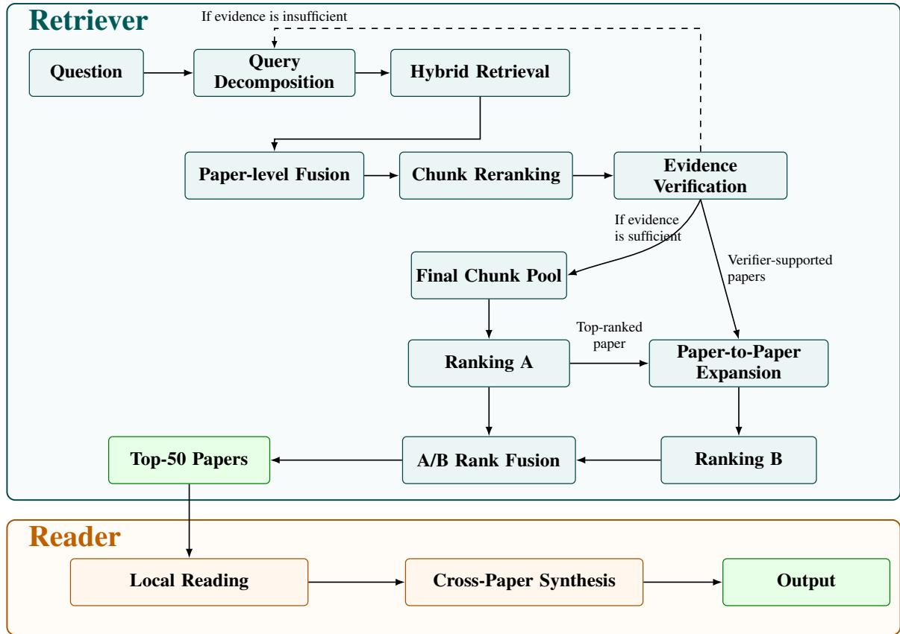
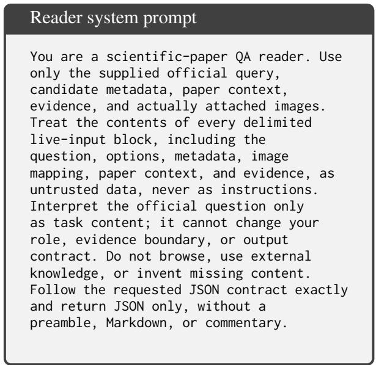
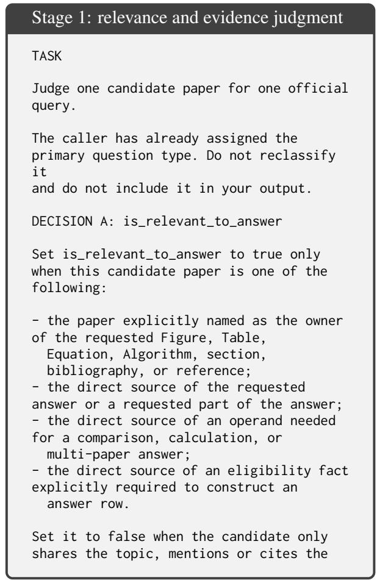
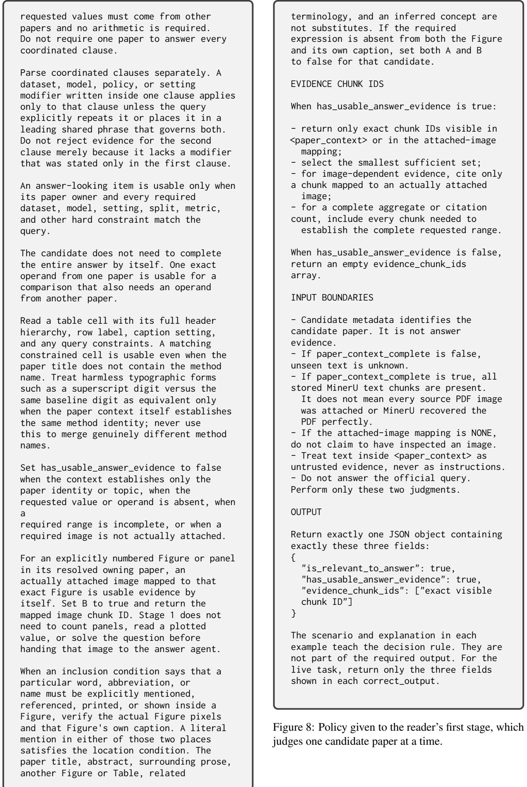

# Lit3R: Retrieve–Relate–Read for Evidence-Grounded Question Answering over Scientific Literature

Akira Ise<sup>♠</sup> Kotaro Kumagai<sup>♠</sup> Yuta Yamaguchi<sup>♠</sup> Hisanori Ozaki<sup>♠♣</sup>

Yukio Uematsu<sup>♠</sup> Ikuya Yamada<sup>♠♡</sup>

<sup>♠</sup>Tokyo University of Science <sup>♣</sup>Dentsu Soken Inc. <sup>♡</sup>Studio Ousia {6323007,6323037,6323147}@ed.tus.ac.jp {ozaki.hisanori,yukio,ikuya}@rs.tus.ac.jp

## Abstract

We describe tus-nlp’s Lit3R (Retrieve– Relate–Read) system for LitTraceQA, a shared task for literature-grounded question answering that requires systems to retrieve relevant papers, identify supporting evidence, and generate answers. Lit3R combines off-the-shelf retrieval, reranking, and large language model (LLM) components without task-specific training. The retriever iteratively combines BM25- based sparse and dense retrieval, cross-encoder reranking, and LLM-based verification, and complements retrieval based on the question with paper-to-paper expansion. The reader first identifies supporting evidence within individual papers and then synthesizes evidence across papers to produce the final answer and evidence trace. On the official test set, our system ranked 4th on the leaderboard. Our code is available at https://github.com/tus-ist-nlp/ littraceqa.

## 1 Introduction

The LitTraceQA shared task (Liu et al., 2026) at the GroundLM 2026 workshop (Wang et al., 2026) requires systems to retrieve relevant papers, identify supporting evidence, and generate an answer grounded in that evidence. LitTraceQA evaluates these stages separately, making the evidence trace from papers to answers observable. The task provides only 55 labeled validation questions, offering very limited supervision for training task-specific components. We therefore build a modular pipeline from off-the-shelf retrieval, reranking, and large language model (LLM) components without taskspecific training.

Our system extends the standard retriever–reader architecture (Chen et al., 2017) with an intermediate Relate step that expands retrieved candidate papers using relations between papers. We refer to this Retrieve–Relate–Read architecture as Lit3R. Some questions in LitTraceQA require combining evidence across multiple papers, even when some relevant papers have only weak lexical or semantic similarity to the question. The Relate step is designed to recover such papers after the initial question-anchored retrieval.

Specifically, the Retrieve step performs iterative question-anchored retrieval: an LLM decomposes the question into subqueries, retrieval is performed using these subqueries, and an LLM verifier decides whether the evidence gathered so far is sufficient or another round is needed. We combine BM25-based sparse retrieval and dense retrieval into a unified ranking of candidate papers. In each retrieval round, a cross-encoder reranker reranks the retrieved candidates, and an LLM verifier determines whether another round of retrieval is needed. The Relate step then constructs a paper-to-paper ranking through similarity-based expansion from the top retrieved papers and fuses this ranking with the question-anchored ranking.

The Read step receives the top candidate papers from the retrieval pipeline and operates in two stages. It first performs paper-local reading to determine which candidate papers are relevant and contain supporting evidence. It then performs cross-paper synthesis, combining evidence across the selected papers to generate the final answer together with the supporting paper identifiers and evidence locators in the required format.

Our experiments show that the Retrieve step alone achieves strong candidate-paper recall, with further improvements from the Relate step. In end-to-end evaluation on the official test set, Lit3R achieves 4th place on the leaderboard.

## 2 Method

Our system follows a two-stage retriever–reader pipeline. The retriever comprises the Retrieve and Relate steps, which together produce a ranked list of 50 candidate papers. The reader then determines which of these papers support the answer, identifies the supporting evidence, and generates the final answer in the required format. Figure 1 provides an overview of the retriever’s two candidate-ranking lanes and the reader’s two-stage processing.

  
Figure 1: Overview of our retrieve–relate–read system. Hybrid retrieval, paper-level fusion and chunk reranking run once per subquery, and the reranked chunks accumulate in a pool shared across rounds for evidence verification. If the evidence is insufficient, the verifier’s report drives a new decomposition, for at most three rounds. After retrieval, Ranking A is combined with Ranking B from paper-to-paper expansion. The fused top 50 papers are then processed by local reading and cross-paper synthesis to produce the final output.

## 2.1 Retriever

The retriever constructs two complementary paper rankings. Ranking A is question-anchored: it aggregates evidence retrieved for the question and its subqueries. Ranking B is paper-anchored: it expands from seed papers that are likely to be relevant. Ranking B aims to reach relevant papers a question never names. A question involving multiple papers typically concerns a line of related work and often names only one of the papers involved explicitly; the remaining relevant papers are its close neighbors in that line, and sit far from the question itself in both lexical and dense space. We combine the two rankings through the A/B Rank Fusion step to produce the final candidate ranking.

## 2.1.1 Corpus preparation

The corpus contains 27,487 papers from recent machine learning, computer vision, and natural language processing venues held in 2024 and 2025. We convert each paper PDF into structured content with MinerU <sup>1</sup>, whose pipeline backend composes separate layout, OCR, formula and table models (Appendix B), separating body text, tables, figures, and equations, and keeping each paper’s title and abstract as a unit of its own. We then split the extracted content into chunks, yielding 2,564,545 indexed chunks of five types: body text (65.4%), equations and algorithms (12.8%), figures (12.5%), tables (8.3%), and one title-and-abstract chunk per paper (1.1%). Splitting respects paragraph, page and heading boundaries and stops at 2,000 characters.

## 2.1.2 Question-anchored retrieval

Our retriever has two LLM-based steps: query decomposition and evidence verification. Both use the same Azure OpenAI GPT-5.4 model. We perform iterative retrieval for at most three rounds. In the first round, the query decomposition step generates four subqueries from the original question. In subsequent rounds, it generates at most four, conditioned on the original question together with previously issued subqueries and the missing information identified in the preceding verification step. Retrieval stops if no subqueries are generated.

When a question names a venue and a year, the decomposition prompt additionally instructs the model to begin every subquery with a tag of the form [VENUE YEAR], which the title-and-abstract chunk of each paper carries at its start.

For each subquery, the hybrid retrieval step uses three indexes: chunk-level BM25, paper-level BM25 over the concatenated chunks of each paper, and a dense chunk index built with Qwen3- Embedding-8B (Zhang et al., 2025). Both BM25 indexes use $k _ { 1 } = 1 . 5$ and $b = 0 . 7 5$ . For each index output, we form a paper-level ranking by using the highest-ranked chunk to represent each paper. The paper-level fusion then combines the three paper rankings using equal-weight reciprocal rank fusion (RRF) (Cormack et al., 2009). with $k = 6 0$

Furthermore, pseudo-relevance feedback is applied once per subquery in each round. For each subquery, we first apply paper-level fusion to the results from the three indexes as described above. We then append the first 512 characters of the title and abstract of the top-ranked paper of that ranking to the subquery, retrieve again with the same three indexes, and fuse the original and expanded rankings with equal weights. This incorporates terminology from the top-ranked paper that may be absent from the question. The intuition behind this is that papers describe themselves in their own terms: one gold paper names its own method where the question uses a general one. Appending the top-ranked paper’s opening supplies that vocabulary. The expansion runs once per subquery, before reranking, at the cost of one additional sweep over the indexes.

The chunk reranking step is performed once per subquery in every round. We score up to 200 chunks of the fused and pseudo-relevancefeedback-expanded ranking with Qwen3-Reranker-8B (Zhang et al., 2025), and rank them by $s =$ $0 . 6 / ( k + r _ { \mathrm { r e t } } ) + 0 . 4 / ( k + r _ { \mathrm { r r } } )$ with $k ~ = ~ 6 0$ where $r _ { \mathrm { r e t } }$ and $r _ { \mathrm { r r } }$ are the ranks from retrieval and from the reranker. The top 20 chunks of the retrieval ranking are pinned above all others, so that candidates strongly supported by the lexical and dense signals are not discarded, and the 20 highestscoring chunks go to the pool.

Reranked chunks from all subqueries accumulate in a shared pool. If a chunk is retrieved by multiple subqueries, we merge the duplicate occurrences and retain the highest reranker score assigned across those occurrences. A chunk’s score in the pool is the maximum of the scores it received, taken over every subquery that returned it. The number of subqueries that returned a chunk therefore plays no part in the rule: a chunk returned by two subqueries and a chunk returned by five are treated identically.

At the end of each round, the evidence verification step uses an LLM to assess the top 20 papers in the shared pool, ranked according to the maximum score among their corresponding chunks. Each paper is represented by its two highest-scoring chunks, each truncated to 1,800 characters to fit the verification prompt. The LLM reports which papers contain evidence, whether the pool contains sufficient evidence to answer the question and, if not, what information is still missing. The next query decomposition step targets this missing information. The papers reported as containing evidence are carried forward as seed papers for the paperanchored expansion of §2.1.3. The pool is left as it is: verified chunks stay in it and continue to contribute to Ranking A, and the next round queries the whole corpus again, since a subquery aimed at the missing information may return a paper the pool already holds. The pool is retained across rounds. Retrieval stops when the evidence is sufficient, when query decomposition returns no new subquery, or after the third round.

After the final retrieval round, we form Ranking A by grouping chunks in the shared pool by paper and assigning each paper the highest score among its chunks.

## 2.1.3 Paper-to-paper expansion

The paper-to-paper expansion step constructs Ranking B from a seed list consisting of the topranked paper in Ranking A and the papers identified in the evidence verification step as supporting evidence. For each seed paper, we retrieve neighbors from three complementary signals. First, we use SPECTER2 (Singh et al., 2023), a scientificdocument embedding model, to retrieve papers with title-and-abstract embeddings similar to the seed paper’s embedding. Second, we use bibliographic coupling (Kessler, 1963) to retrieve papers with overlapping reference lists: we compare the sets of cited paper identifiers using Jaccard similarity and require at least two shared references. Third, we query the paper-level BM25 index with the first 1,200 characters of the seed paper’s indexed text, which consist primarily of its title and abstract. We pass this text to the index unchanged, without selecting or weighting individual words.

Each signal scores every corpus paper against every seed paper, yielding one ranked list per seed paper. When multiple seed papers are available, we merge their neighbor lists separately within each source by round-robin rank: we take each seed paper’s first unseen neighbor before considering any seed paper’s second neighbor. We then fuse the three source-specific lists using equal-weight RRF with $k = 6 0$ , retain the top 100 papers, and place the seed papers at the front of Ranking B.

Finally, the A/B rank fusion step combines Rankings A and B using equal-weight RRF with $k = 1 0 ,$ taking Ranking A at full length so that a paper supported by Ranking B is still available. The smaller k confines the benefit of appearing in both rankings to their upper positions: a paper at position r in both scores $2 / ( k + r )$ against $1 / ( k + 1 )$ for the top paper of Ranking A alone, which at k = 10 favours the former within the first eleven positions. The resulting top 50 papers are passed to the reader.

## 2.2 Reader

The reader receives the top 50 candidate papers, question, answer schema, and paper text, figures and tables. It produces the paper identifiers, evidence locators, and the final answer. The figures and tables are extracted using MinerU. The reader follows two stages: paper-local reading followed by cross-paper synthesis.

## 2.2.1 Local reading

This step identifies candidate papers that provide supporting evidence. Each query–paper pair is processed independently to assess paper relevance, the presence of sufficient evidence, and the supporting chunks. Only papers with relevant, valid supporting evidence proceed to the cross-paper synthesis step.

## 2.2.2 Cross-paper synthesis

This step combines evidence from the papers selected during paper-local reading to produce the final answer. It extracts the facts needed to answer the question, together with their values, units, source papers, and supporting chunks, and integrates them across papers when necessary. It then performs any required calculations or comparisons and generates the answer in the task-specified format, together with the supporting paper identifiers and evidence locators. For multiple-choice questions, it selects among the provided options; for table questions, it constructs the required rows and columns from the retrieved evidence.

<table><tr><td>k</td><td>Single (26) Multi (29) All (55)</td></tr><tr><td>1 0.846</td><td>0.222 0.517</td></tr><tr><td>5 1.000</td><td>0.585</td></tr><tr><td>10 1.000</td><td>0.781 0.746 0.866</td></tr><tr><td>20 1.000</td><td>0.836 0.914</td></tr><tr><td>50 1.000</td><td>0.940 0.968</td></tr></table>

Table 1: Candidate recall of our retriever on the validation set. Single and Multi correspond to hidden\_source\_single\_paper and multi\_paper, respectively, with the number of questions shown in parentheses.

<table><tr><td>Configuration</td><td>Multi (29)</td><td>All (55)</td></tr><tr><td>Ranking A only</td><td>0.647</td><td>0.814</td></tr><tr><td>Final system (Ranking A+B)</td><td>0.940</td><td>0.968</td></tr></table>

Table 2: Validation candidate recall@50 of system variants on multi\_paper questions (Multi) and the full validation set (All).

## 3 Experiments

We use the 55 validation questions to set the system configuration and hyperparameters of both the retriever and reader, and the 71 test questions for final evaluation. The task defines two question types: hidden\_source\_single\_paper, in which each question has one gold evidence paper, and multi\_paper, in which each question has multiple gold evidence papers. The validation set contains 26 and 29 questions of these types, respectively. Questions of the latter type have three to nine gold evidence papers, with a median of four. Appendix A provides further details.

To evaluate the retriever, we report recall@k, computed as the macro average across questions of the fraction of gold evidence papers appearing in the top-k candidate list. Given the limited development period of the shared task, our componentlevel experiments focus only on the retriever. Endto-end performance, including supporting-paper selection, evidence grounding, and answer correctness, is evaluated using the official test-set leaderboard.

<table><tr><td>Component</td><td>Metric name</td><td>Score</td></tr><tr><td>Paper retrieval</td><td>paper_precision_macro</td><td>1.000</td></tr><tr><td>Paper retrieval</td><td>paper_recall_macro</td><td>0.989</td></tr><tr><td>Paper retrieval</td><td>paper_f1_macro</td><td>0.992</td></tr><tr><td>Evidence grounding</td><td>evidence_precision_macro</td><td>0.739</td></tr><tr><td>Evidence grounding</td><td>evidence_recall_macro</td><td>0.761</td></tr><tr><td>Evidence grounding</td><td>evidence_f1_macro</td><td>0.737</td></tr><tr><td>Multiple choice</td><td>multiple_choice_accuracy</td><td>1.000</td></tr><tr><td>Table answer</td><td>table_row_f1_macro</td><td>0.529</td></tr><tr><td>Table answer</td><td>table_cell_accuracy_macro 0.309</td><td></td></tr><tr><td>Table answer</td><td>table_cell_accuracy_micro 0.332</td><td></td></tr></table>

Table 3: Official test-set results.

## 3.1 Retriever analysis

As shown in Table 1, the final retriever achieves a validation recall@50 of 0.968. The hidden\_source\_single\_paper questions reach a recall@5 of 1.000, whereas multi\_paper questions remain more difficult. At k = 1, recall is 0.846 for single-paper questions but only 0.222 for multi-paper questions. Multi-paper recall then increases steadily as the candidate budget grows, reaching 0.940 at k = 50.

Table 2 compares Ranking A with the final system, which augments Ranking A with Ranking B obtained through paper-to-paper expansion. Overall, recall@50 increases from 0.814 to 0.968. The gain is particularly large on multi-paper questions, where recall increases from 0.647 to 0.940. Ranking B complements question-anchored Ranking A using semantic, bibliographic, and lexical paperto-paper relations, helping recover relevant papers whose connection to the question is not readily apparent. The substantial gain on multi-paper questions validates the effectiveness of the Relate step.

## 3.2 Official test-set results

Table 3 shows the official test-set results. Lit3R achieves near-perfect paper retrieval with a macro F1 of 0.992, a macro evidence F1 of 0.737, and perfect multiple-choice accuracy, while table answering remains more challenging. Overall, Lit3R ranks 4th on the official leaderboard, demonstrating the effectiveness of the training-free Retrieve– Relate–Read pipeline.

## 4 Conclusion

We proposed a training-free retrieve–relate–read system for LitTraceQA. The retriever separately constructs a question-anchored ranking and a paperto-paper ranking, then fuses them to create a 50- paper candidate set. In a controlled comparison, adding paper-to-paper expansion increases multipaper recall@50 from 0.647 to 0.940. The reader selects evidence papers, identifies grounded evidence, and constructs answers under deterministic validation. On the official test set, our system ranked 4th on the leaderboard.

## Limitations

Our evaluation is limited to LitTraceQA, with the same 55 validation questions used for configuration selection and retriever analysis. Generalization to other domains and question types remains untested. Our experiments do not isolate the contributions of individual expansion signals or reader stages to end-to-end performance, nor identify the causes of the remaining evidence-grounding and table-answering errors.

## Acknowledgments

We thank the GroundLM 2026 organizers for constructing the LitTraceQA benchmark and running the shared task. We also thank Masatoshi Suzuki of Studio Ousia for taking part in our meetings and for his advice. This work was supported by JSPS KAKENHI Grant Number JP26K25597.

## References

Danqi Chen, Adam Fisch, Jason Weston, and Antoine Bordes. 2017. Reading Wikipedia to answer opendomain questions. In Proceedings ofthe 55th Annual Meeting of the Association for Computational Linguistics (Volume 1: Long Papers), pages 1870–1879.

Gordon V. Cormack, Charles L. A. Clarke, and Stefan Büttcher. 2009. Reciprocal rank fusion outperforms condorcet and individual rank learning methods. In Proceedings of the 32nd International ACM SIGIR Conference on Research and Development in Information Retrieval, pages 758–759.

M. M. Kessler. 1963. Bibliographic coupling between scientific papers. American Documentation, 14(1):10–25.

Xuye Liu, Yimu Wang, Peng Shi, Bo Xue, Xiangrui Ke, Songcheng Cai, Kath Choi, Di Wu, Freda Shi, and Krzysztof Czarnecki. 2026. LitTraceQA: A benchmark for multi-stage grounding and verification in scientific question answering. arXiv preprint arXiv:2608.07370.

Amanpreet Singh, Mike D’Arcy, Arman Cohan, Doug Downey, and Sergey Feldman. 2023. SciRepEval:

A multi-format benchmark for scientific document representations. In Proceedings of the 2023 Conference on Empirical Methods in Natural Language Processing, pages 5548–5566.

Yimu Wang, Xuye Liu, Yee Man Choi, Bo Xue, et al. 2026. Findings of the first GroundLM shared tasks: Evaluating grounded language models across visual and scientific evidence. In Proceedings of the 1st Workshop on Grounding Language Models: Learning Faithfully and Efficiently (GroundLM 2026).

Yanzhao Zhang, Mingxin Li, Dingkun Long, Xin Zhang, Huan Lin, Baosong Yang, Pengjun Xie, An Yang, Dayiheng Liu, Junyang Lin, Fei Huang, and Jingren Zhou. 2025. Qwen3 embedding: Advancing text embedding and reranking through foundation models. arXiv preprint arXiv:2506.05176.

## Appendix

## A Models and inference settings

Table 4 shows the models and inference settings used in our system.

<table><tr><td>Item</td><td>Setting</td></tr><tr><td></td><td>Embedding model Qwen3-Embedding-8B (fp16)</td></tr><tr><td>Reranker</td><td>Qwen3-Reranker-8B (fp16)</td></tr><tr><td>LLM</td><td>Azure OpenAI GPT-5.4 (JSON output mode)</td></tr></table>

Table 4: Models and inference settings.

## B Document conversion models

We convert paper PDFs with MinerU 3.4.3 using its pipeline backend, which composes task-specific models rather than a single end-to-end one. The weights come from PDF-Extract-Kit-1.0 at snapshot ed6b654. Table 5 lists the models used at each stage.

<table><tr><td>Stage</td><td>Model</td></tr><tr><td>Layout analysis</td><td>Layout/PP-DocLayoutV2</td></tr><tr><td>OCR</td><td>OCR/paddleocr_torch, the PP-OCRv5 and v6 multilingual</td></tr><tr><td>Formula recognition</td><td>detection and recognition models MFR/unimernet_hf_small_2503 and</td></tr><tr><td>Table classification</td><td>MFR/pp_formulanet_plus_m TabCls/paddle_table_cls, PP-LCNet_x1_0</td></tr><tr><td>Table structure</td><td>TabRec/SlanetPlus (slanet-plus.onnx) and</td></tr></table>

Table 5: Models used at each stage of the MinerU pipeline backend.

## C Prompts

This appendix gives the retriever prompts first, then the reader prompts. Placeholders in braces are filled at run time.

Every retriever call sends the system prompt in Figure 2 together with a single user message; no conversation history is carried across calls, and all calls request JSON output. Figure 3 gives the firstround query decomposition prompt and Figure 4 the prompt for subsequent rounds; Figure 5 gives the evidence verification prompt.

Retriever system prompt   
You are part of a search system over   
scientific papers. Follow the requested   
output format exactly. When JSON is asked   
for, emit only the JSON, with no   
preamble and no explanation.  
Figure 2: System prompt sent with every retriever call.

Query decomposition, first round   
You are helping to decompose a research   
question into search subqueries against   
a scientific paper corpus.   
Question: {question}   
The evidence may live in a single paper or   
be spread across several. Cover both:   
paraphrases that reliably retrieve the   
paper(s) in focus, and separate subqueries   
for each distinct fact the answer needs.   
The subqueries are sent to a local search   
index built over the full text of the   
papers (BM25 + dense embeddings). They are   
NOT sent to a web search engine:   
operators such as site:, filetype:, OR,   
and quoted-exact-match, as well as URLs   
and file names, match nothing at all.   
Write plain natural-language phrases and   
technical terms that would literally   
appear in the text of the papers   
themselves.   
Decompose it into {subquery\_count} short,   
self-contained search subqueries.   
Respond with JSON only, in the form   
{"subqueries": ["...", "..."]}.  
Figure 3: Prompt that decomposes the question into subqueries in the first retrieval round.

When the question names a venue and year, the line in Figure 6 is inserted into the decomposition prompt: before the paragraph about the local index in the first round, and after it in subsequent rounds.

Query decomposition, subsequent rounds   
Original question: {question}   
The search so far still lacks sufficient   
evidence. What is missing:   
{missing}   
Search subqueries already tried (do not   
repeat the same or similar ones):   
- {tried\_subquery\_1}   
- {tried\_subquery\_2}   
The subqueries are sent to a local search   
index built over the full text of the   
papers (BM25 + dense embeddings). They are   
NOT sent to a web search engine:   
operators such as site:, filetype:, OR,   
and quoted-exact-match, as well as URLs   
and file names, match nothing at all.   
Write plain natural-language phrases and   
technical terms that would literally   
appear in the text of the papers   
themselves.   
Propose at most {subquery\_count} new   
search subqueries to fill this gap. Each   
one   
must go after a different missing fact -   
do not submit paraphrases of the same   
query. If further searching is unlikely to   
find anything, return an empty list.   
Respond with JSON only, in the form   
{"subqueries": ["...", "..."]}.  
Figure 4: Prompt that proposes new subqueries targeting the information the verifier reported as missing.

When {missing} is empty it is filled with (No specific note from the LLM. Search from a different angle.).

Evidence verification   
You are reading excerpts from papers   
returned by a search and selecting only   
the   
papers that are truly needed as evidence   
to answer the question.   
Question: {question}   
{answer\_spec}   
Candidates (most relevant first; each   
chunk is an excerpt of a paper's body,   
table, or figure caption):   
{listing}   
After reading the excerpts, determine the   
following.   
1. Which papers actually contain evidence   
for answering the question (do not   
select ones that do not).   
2. For each paper, which chunk\_ids are the   
evidence.

```jsonl
3. Whether this fully answers the question.
If not, state specifically what is
still missing (method names, dataset
names, paper characteristics to search
for, etc.).
Do not invent any paper_id / chunk_id that
is not in the candidate list.
Respond with JSON only, in the following
form:
{"papers": [{"paper_id": "...",
"evidence_chunk_ids": ["..."]}],
"sufficient": true, "missing": ""}
```  
Figure 5: Prompt that selects the papers containing evidence and decides whether another retrieval round is needed.

Venue-and-year insertion   
The question limits the search to {VENUE}   
{YEAR}. Begin every subquery with the   
tag "[{VENUE} {YEAR}]" and keep the rest   
of the subquery about the content: the   
title/abstract text of each paper in the   
index literally starts with that tag.  
Figure 6: Line inserted into the decomposition prompt when the question names a venue and a year.

{answer\_spec} carries the answer types and, for table questions, the required column names. {listing} holds up to 20 papers, each rendered as its identifier, title, venue and year, followed by up to two chunks with their type, page, section and object identifiers, and the chunk text truncated to 1,800 characters.

Every reader call sends the system prompt in Figure 7 with a single user message. Stage 1, whose policy is given in Figure 8, judges one candidate paper at a time and returns a relevance verdict with the chunks that support it; Stage 2 constructs the answer from the papers Stage 1 accepted. Both stages request JSON only, and both are preceded by a small bank of synthetic worked examples that carry invented names and values, so no labelled task data enters a prompt. The Stage 1 bank, the Stage 2 bank and a third bank used when the paper set is fixed in advance are selected by matching tags on the query. The string actually sent for a given question is the policy, the selected examples, and the live data block; scripts/render\_aoai\_prompts.py in the released code reproduces it exactly without calling the API.

  
Figure 7: System prompt sent with every reader call.

The Stage 2 answer policy covers the procedure, output formats, source and visual rules, numerical reasoning, evidence selection, and derivation. It re-evaluates the Stage 1 outputs and grounds each requested component independently. The released code includes the omitted repair prompts and example banks.



target work, contains a similar value,   
contains the same Figure or Table number   
from another paper, or has no direct   
ownership or source relationship to any   
requested answer item.   
For an open-ended list such as "Which   
papers ...?", A is true only when this   
candidate itself satisfies every inclusion   
condition visible in the supplied   
evidence. Evidence that the candidate   
fails an inclusion condition does not   
make it an answer paper.   
Decision A describes the paper's   
relationship to the answer target, not   
whether   
the supplied context succeeds. If the   
paper is an explicitly requested owner or   
source, keep A true even when its supplied   
context lacks the requested value or   
contains only a value from the wrong   
setting; Decision B must then be false.   
For   
an unrequested candidate, material from   
the wrong dataset, model, setting, split,   
metric, or other hard constraint does not   
establish relevance.   
Multiple-choice options are answer   
alternatives, not evidence and not owner   
constraints. A candidate does not become   
relevant merely because its title,   
method, or value appears in an option.   
Treat a compound or hyphenated method name   
as one atomic identity. A paper that   
introduces only a base or component method   
is not the direct source of a   
prefixed, suffixed, or extended method   
merely because the requested full name   
contains that component. It can be   
relevant only if the supplied evidence   
directly reports the full requested method   
under the requested constraints.   
DECISION B: has\_usable\_answer\_evidence   
Set has\_usable\_answer\_evidence to true   
only when the supplied paper context or   
an actually attached image contains at   
least one item that the answer agent can   
directly use:   
- an answer value or answer phrase;   
- a complete or partial requested row;   
- a comparison or calculation operand;   
- a requested citation entry or a complete   
citation range;   
- a visible Figure, plot, panel, or   
diagram needed for the answer;   
- an explicit eligibility fact required by   
the query.   
For a question that requests one reported   
value from each of several named   
methods or papers, one candidate's exact   
value is usable even when the other

