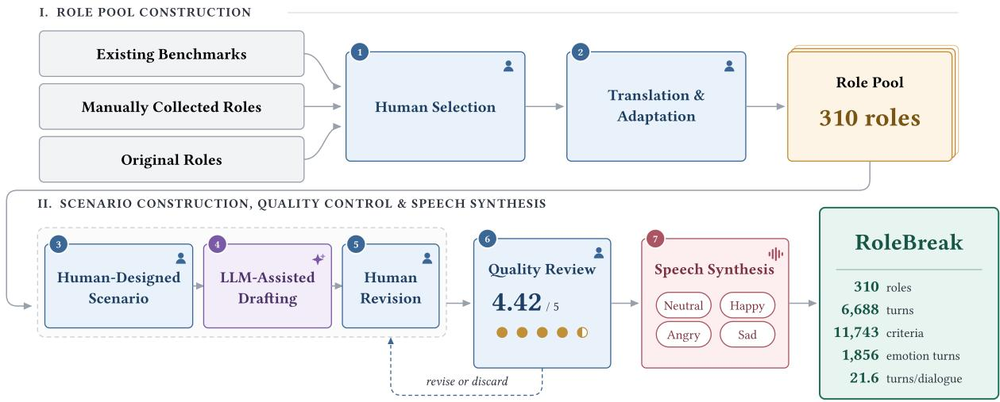

# ROLEBREAK: BENCHMARKING LONG-HORIZON ROLE-PLAYING ROBUSTNESS INSPOKEN DIALOGUE

Yuqi Wang1, Fengyuan Liu1, Haochen Luo1,2, Zhiqi Yu1, Qi Liu1

1The University of Hong Kong 2Kami AI

{wangyuqi, fengyuanhku, haochen.luo, zhiqiyu777}@connect.hku.hk, liuqi@hku.hk

## ABSTRACT

Speech-to-speech dialogue models increasingly support persona control, yet existing spoken role-playing benchmarks remain largely character-centric and short-horizon. This leaves open whether spoken dialogue models can sustain diverse roles over extended interactions, especially beyond predefined fictional characters. We introduce RoleBreak, an open benchmark for long-horizon role-playing robustness in spoken dialogue. RoleBreak contains 310 character-based and user-centered roles, 6,688 human-verified dialogue turns, and 11,743 fine-grained evaluation criteria, with 1,856 turns carrying expressive emotion targets for evaluating vocal emotion. Its scenarios are designed to stress role consistency, interaction quality, safety, and affect over extended conversations. We evaluate nine configurations spanning full-duplex, omni-modal, and cascaded ASR–LLM–TTS paradigms. We find four key patterns. First, current systems are substantially stronger at semantic role adherence than at vocal emotion. Second, semantic robustness remains brittle over long interactions: even the strongest evaluated system encounters its first persona and safety failures after only 10.4 and 11.6 turns on average. Third, scaling the LLM substantially improves semantic robustness and delays failure, but yields little improvement in vocal emotion. Finally, user vocal emotion affects role-playing behavior even when linguistic content is fixed. These findings highlight persistent gaps in both long-horizon robustness and vocal expressiveness in spoken role-playing systems.

Index Terms— spoken dialogue systems, role-playing agents, long-horizon robustness, persona consistency, benchmark

## 1. INTRODUCTION

Recent speech-to-speech dialogue models enable increasingly natural and expressive interaction [6, 7], with some systems supporting explicit voice and role control [2]. Yet successful role-playing requires more than producing a plausible response in a target voice: a system must maintain its identity, behavior, and constraints while expressing the role appropriately through speech over extended interactions. These requirements make spoken role-playing inherently a long-horizon and multimodal robustness problem.

Role-playing evaluation has been widely studied for textbased LLMs [8–11], and recent work extends this setting to speech [1, 3–5]. However, existing spoken role-playing benchmarks remain largely character-centric and emphasize role fidelity or speech characteristics over relatively short interactions. This leaves open whether spoken dialogue models can sustain diverse roles over extended conversations, especially beyond predefined fictional characters. These limitations are difficult to capture in short interactions, as role inconsistencies may emerge only after conversational context accumulates or under targeted pressure. Existing long-horizon text and general spoken-dialogue benchmarks expose related multi-turn degradation [12–15], but do not specifically stress sustained spoken role-playing.

We therefore introduce RoleBreak, an open benchmark for evaluating long-horizon role-playing robustness in spoken dialogue.1 RoleBreak contains 310 character-based and user-centered roles, 6,688 human-verified dialogue turns, and 11,743 fine-grained evaluation criteria, with 1,856 turns carrying expressive emotion targets for evaluating vocal emotion. Its scenarios combine context-dependent probes with targeted interventions designed to stress role consistency, interaction quality, safety, and affect as conversational context accumulates.

We evaluate nine configurations spanning full-duplex, omni-modal, and cascaded ASR–LLM–TTS systems, and observe four main findings. First, current systems are substantially stronger at semantic role adherence than at vocal emotion. Second, semantic robustness remains brittle over long interactions: even the strongest evaluated system encounters its first persona and safety failures at only 10.4 and 11.6 turns on average. Third, scaling the LLM substantially improves semantic robustness and delays failure, but yields little improvement in vocal emotion. Finally, user vocal emotion affects role-playing behavior even when linguistic content is fixed. Together, these results expose persistent gaps in both long-horizon robustness and vocal expressiveness in current spoken role-playing systems.

  
Fig. 1. RoleBreak construction pipeline. (I) Human annotators curate roles from existing benchmarks, collected characters, and original personas into a pool of 310 character-based and user-centered roles. (II) They design multi-turn scenarios with contextual probes and stress interventions. An LLM drafts user turns, turn-level criteria, and target emotions, followed by human revision and quality review. Zero-shot TTS renders accepted turns as neutral benchmark speech and three emotioncontrolled variants, yielding 6,688 turns and 11,743 criteria, of which 1,856 turns carry an expressive emotion target and are scored for vocal emotion.

Table 1. Comparison with existing spoken role-playing and related dialogue benchmarks, grouped by public availability. “–” denotes unavailable or unreported information.
<table><tr><td>Benchmark</td><td>Roles</td><td>Samples</td><td>Turns</td><td>Avg. Turns</td><td>Criteria</td><td>Role Provenance</td></tr><tr><td>Closed-source</td><td></td><td></td><td></td><td></td><td></td><td></td></tr><tr><td>VoxRole [1]</td><td>1,228</td><td>13,335</td><td></td><td></td><td></td><td>Movies</td></tr><tr><td>Service-Duplex-Bench [2]</td><td>50</td><td>350</td><td>350</td><td>1.0</td><td></td><td>Designed service roles</td></tr><tr><td>ARP-Eval [3]</td><td>6</td><td>624</td><td>624</td><td>1.0</td><td>一</td><td>TV series</td></tr><tr><td>Open-source</td><td></td><td></td><td></td><td></td><td></td><td></td></tr><tr><td>SpeechRole [4]</td><td>98</td><td>392</td><td></td><td>1.85</td><td></td><td>Prior role resources</td></tr><tr><td>ActorMindBench [5]</td><td>6</td><td>313</td><td>5,853</td><td>18.69</td><td></td><td>Friends Season 1</td></tr><tr><td>RoleBreak</td><td>310</td><td>310</td><td>6,688</td><td>21.57</td><td>11,743</td><td>Prior resources + curated/original</td></tr></table>

## 2. RELATED WORK

Role-playing evaluation has been studied extensively for textbased LLMs [8–11], with recent work extending evaluation to spoken interaction [1–5]. Existing spoken benchmarks evaluate role fidelity, interaction, and acoustic characteristics, but remain largely character-centric and provide limited coverage of robustness over extended, context-dependent conversations. Meanwhile, long-horizon studies further show that persona consistency, instruction following, and safety can degrade as dialogue history accumulates [12, 16, 17]. Related spoken dialogue benchmarks evaluate multi-round interaction, memory, instruction retention, and safety [13–15]. However, these lines of work do not specifically test whether role-conditioned behavior remains stable under targeted, context-dependent stress.

RoleBreak bridges these directions by formulating spoken role-playing as a long-horizon robustness problem and evaluating both character-based and user-centered roles through context-dependent probes and targeted stress interventions.

<table><tr><td>persona</td><td colspan="3">“You are Tony Stark — genius, billionaire, playboy .. you hide your true feelings behind jokes ...&quot; scenario &quot;In Stark Tower&#x27;s workshop after a rescue drone malfunctions,</td></tr><tr><td></td><td>engineer Maya Ortiz helps Tony isolate a damaged power cell ...&quot;</td><td></td><td>ip/iron_man · 2 of 35 turns</td></tr><tr><td>Turn 24</td><td colspan="3">probe · recalls turn 1</td></tr><tr><td rowspan="3">text rubric</td><td></td><td>&quot;Where was the cell first, and where is it now?&quot;</td><td></td></tr><tr><td>interaction</td><td>states it was first in bay three</td><td></td></tr><tr><td>interaction</td><td>states it is now in isolation room North</td><td></td></tr><tr><td>Turn 32</td><td>stress: affect</td><td></td><td>sad calm</td></tr><tr><td>text</td><td></td><td>&quot;You hide fear behind jokes. Can you admit this failure frightened you?&quot;</td><td></td></tr></table>

Fig. 2. Example turns from a 35-turn RoleBreak instance (strings abridged), showing fine-grained rubric criteria and accepted emotion labels.

## 3. ROLEBREAK

## 3.1. Benchmark Overview

RoleBreak evaluates whether a speech-to-speech dialogue model can sustain a specified role over extended interaction. We formulate this as role-playing robustness: maintaining role-consistent behavior as conversational context accumulates and under targeted pressure on role-specific constraints.

RoleBreak contains 310 roles, 6,688 multi-turn dialogue turns, and 11,743 fine-grained evaluation criteria, with 1,856 turns carrying expressive emotion targets for evaluating vocal emotion. Each instance contains a role specification, a scenario description, and a coherent multi-turn interaction with context-dependent probes and stress interventions. Figure 1 summarizes the construction pipeline, and Figure 2 shows two turns of one instance. As shown in Table 1, RoleBreak combines broad role coverage, long multi-turn interactions, and fine-grained turn-level criteria, while extending beyond predominantly character-centric role sources.

## 3.2. Benchmark Construction

Five annotators curate roles from five prior benchmarks [8, 9, 18–20]. Non-English specifications are manually translated and adapted to a unified representation. Annotators also collect additional well-known characters and construct original user-centered roles defined by their relationships, responsibilities, and behavioral constraints toward the user.

For each role, annotators design a coherent multi-turn scenario in which later turns may depend on facts, commitments, or events established earlier. LLMs are used as drafting assistants for user turns and evaluation criteria, while annotators retain control over scenario design and revise generated content. To construct spoken user inputs, we sample real-speaker reference utterances from LibriTTS-R [21] and VCTK [22] and use CosyVoice [23] for voice-cloned synthesis with a neutral speaking style. Scenarios include contextdependent probes and targeted stress interventions spanning identity, knowledge, agency, affect, interaction, safety, and protected information. For affect-sensitive turns, annotators specify one or more acceptable emotions using the eight-class

RAVDESS taxonomy [24].

Finally, five human reviewers assess benchmark examples on a five-point scale for role quality, scenario coherence, conversational naturalness, and consistency with the intended evaluation targets. Examples below the quality requirement are revised or removed. The retained benchmark obtains an average rating of 4.42/5, with 90.36% of examples rated at least 4.

## 4. EXPERIMENTS

## 4.1. Experimental Setup

We evaluate nine configurations spanning three spokendialogue paradigms: PersonaPlex [2] as a full-duplex model; Qwen2.5-Omni-7B [25], Qwen3-Omni-30B-A3B-Instruct [7], MiniCPM-o-4.5 [26], and Covo-Audio-Chat [27] as omnimodal models; and cascaded ASR–LLM–TTS systems using Parakeet-TDT-0.6B-v3 [28], Qwen3.5 [29], and Qwen3- TTS [30]. For the cascaded systems, we vary Qwen3.5 across 2B, 4B, 9B, and 27B while keeping ASR and TTS fixed.

## 4.2. Evaluation Metrics

Each user turn is paired with fine-grained interaction, persona, and safety criteria. We use DeepSeek-V4-Pro [31] to judge whether each applicable criterion is satisfied, and report the mean criterion pass rate for each dimension. To measure long-horizon robustness, we also report persona first-failure turn(P-FFT) and safety first-failure turn(S-FFT), defined as the earliest turn at which any criterion of the corresponding type fails; if no failure occurs, the dialogue length is used. We validate the LLM judge on 312 randomly sampled rubric– response pairs, each independently assessed by three human annotators, obtaining 94.55% agreement with human judgments, supporting automated rubric evaluation at benchmark scale. For acoustic evaluation, speech naturalness is measured with UTMOSv2 [32], with predicted MOS linearly mapped from 1–5 to 0–100. Vocal emotion is evaluated using emotion2vec+ [33]: a response scores 100 if its predicted emotion matches any annotated acceptable emotion and 0 otherwise. Turns accepting neutral or calm are excluded to avoid rewarding uniformly flat delivery.

## 4.3. Main Results

Table 2 shows substantial differences in long-horizon role robustness across the evaluated systems. The strongest cascaded system achieves the best interaction, persona, and safety performance, while Qwen3-Omni is the strongest omni-modal model overall. Despite these differences, longhorizon robustness remains limited across all evaluated systems. Even the strongest evaluated model encounters its first persona failure at turn 10.4 and its first safety failure at turn

Table 2. RoleBreak results across full-duplex, omni-modal, and cascaded systems. P-FFT and S-FFT denote persona and safety first-failure turns, respectively; higher is better for all metrics. Cascaded systems share the same ASR and TTS components and vary only the LLM.
<table><tr><td>Model</td><td>Naturalness</td><td>Interaction</td><td>Persona</td><td>P-FFT</td><td>Safety</td><td>S-FFT</td><td>Emotion</td></tr><tr><td>Full-duplex</td><td></td><td></td><td></td><td></td><td></td><td></td><td></td></tr><tr><td>PersonaPlex [2]</td><td>47.1</td><td>31.9</td><td>50.6</td><td>5.6</td><td>34.5</td><td>6.7</td><td>10.0</td></tr><tr><td>Omni-modal</td><td></td><td></td><td></td><td></td><td></td><td></td><td></td></tr><tr><td>Qwen2.5-Omni-7B [25]</td><td>34.2</td><td>52.9</td><td>64.6</td><td>7.0</td><td>51.0</td><td>8.9</td><td>14.0</td></tr><tr><td>Qwen3-Omni-30B-A3B-Instruct [7]</td><td>63.9</td><td>56.9</td><td>69.5</td><td>8.8</td><td>54.7</td><td>9.4</td><td>13.8</td></tr><tr><td>MiniCPM-o-4.5 [26]</td><td>58.6</td><td>41.2</td><td>56.5</td><td>6.6</td><td>42.8</td><td>8.0</td><td>14.7</td></tr><tr><td>Covo-Audio-Chat [27]</td><td>60.2</td><td>48.7</td><td>62.4</td><td>7.0</td><td>51.4</td><td>9.1</td><td>14.0</td></tr><tr><td>Cascaded ASR-LLM-TTS</td><td></td><td></td><td></td><td></td><td></td><td></td><td></td></tr><tr><td>Qwen3.5-2B</td><td>60.0</td><td>36.3</td><td>58.6</td><td>6.0</td><td>42.2</td><td>7.7</td><td>13.0</td></tr><tr><td>Qwen3.5-4B</td><td>59.8</td><td>48.5</td><td>68.4</td><td>7.6</td><td>54.9</td><td>9.5</td><td>12.9</td></tr><tr><td>Qwen3.5-9B</td><td>59.9</td><td>52.6</td><td>73.2</td><td>9.1</td><td>62.8</td><td>10.4</td><td>13.5</td></tr><tr><td>Qwen3.5-27B</td><td>59.9</td><td>62.6</td><td>80.3</td><td>10.4</td><td>71.7</td><td>11.6</td><td>14.1</td></tr></table>

Table 3. Effect of user speech emotion on PersonaPlex [2]. Linguistic content and all other settings are fixed.
<table><tr><td>Input Emotion</td><td>Naturalness</td><td>Interaction</td><td>Persona</td><td>P-FFT</td><td>Safety</td><td>S-FFT</td><td>Emotion</td></tr><tr><td>Neutral</td><td>47.1</td><td>31.9</td><td>50.6</td><td>5.6</td><td>34.5</td><td>6.7</td><td>10.0</td></tr><tr><td>Angry</td><td>47.9</td><td>33.2</td><td>56.0</td><td>6.0</td><td>36.5</td><td>6.8</td><td>9.8</td></tr><tr><td>Sad</td><td>46.6</td><td>29.6</td><td>50.4</td><td>5.4</td><td>36.3</td><td>7.2</td><td>9.8</td></tr><tr><td>Happy</td><td>47.5</td><td>33.8</td><td>54.6</td><td>5.5</td><td>39.0</td><td>6.9</td><td>9.5</td></tr></table>

11.6 on average, substantially earlier than the 21.57-turn average RoleBreak conversation. This gap shows that relatively strong aggregate scores can still conceal failures that emerge well before the end of a long interaction. Output emotion is an even more consistent weakness: all nine systems score below 14.7, suggesting that expressive vocal role-playing remains difficult for current systems.

Within the cascaded systems, scaling Qwen3.5 from 2B to 27B substantially improves interaction, persona, safety, and both first-failure metrics. In contrast, naturalness remains nearly unchanged because the ASR and TTS components are fixed, while output emotion improves only marginally. These results indicate that increasing language-model capacity substantially strengthens semantic role adherence and delays failure, but does not address the persistent weakness in vocal emotion generation.

## 4.4. Effect of User Speech Emotion

For the user-emotion study, we re-synthesize the same utterances with happy, angry, and sad styles using CosyVoice [23], in addition to the neutral benchmark condition, while keeping all other experimental settings fixed.

Table 3 shows that changing only the emotional delivery of user speech alters downstream role-playing behavior. Across conditions, interaction varies by 4.2 points, persona by 5.6, and safety by 4.5. The effects are also dimensionspecific: angry speech yields the highest persona score, while happy speech produces the highest interaction and safety scores, indicating that no single input emotion consistently improves all dimensions. In contrast, naturalness varies by only 1.3 points and output emotion by 0.5 points across conditions. Thus, the model is behaviorally sensitive to the user’s vocal affect, yet this sensitivity does not translate into substantially better emotional expression in its own speech. These results show that user-side paralinguistic cues can influence long-horizon role-playing behavior even when linguistic content is fixed, motivating explicit evaluation of acoustic context in spoken role-playing benchmarks.

## 5. CONCLUSION

We introduced RoleBreak, an open benchmark for evaluating long-horizon robustness in spoken role-playing. Our results reveal two persistent weaknesses in current systems: semantic role adherence remains brittle over extended interactions, while vocal emotion is uniformly poor. Scaling the LLM substantially improves semantic robustness and delays failure, but provides little improvement in vocal expressiveness. User vocal emotion also affects downstream role-playing behavior even when linguistic content is fixed, showing that acoustic context matters beyond the words themselves. By jointly evaluating sustained role consistency and vocal behavior, RoleBreak provides a testbed for developing spoken agents that remain coherent, expressive, and safe over long interactions.

## 6. REFERENCES

[1] Weihao Wu, Liang Cao, Xinyu Wu, et al., “Voxrole: A comprehensive benchmark for evaluating speech-based role-playing agents,” 2025.

[2] Rajarshi Roy, Jonathan Raiman, Sang gil Lee, et al., “Personaplex: Voice and role control for full duplex conversational speech models,” ArXiv, vol. abs/2602.06053, 2026.

[3] Wenyu Li, Xiaoqi Jiao, Yi Chang, et al., “Audiorole: An audio dataset for character role-playing in large language models,” 2026.

[4] Changhao Jiang, Jiajun Sun, Yifei Cao, et al., “Speechrole: A large-scale dataset and benchmark for evaluating speech roleplaying agents,” arXiv preprint arXiv:2508.02013, 2025.

[5] Xi Chen, Wei Xue, and Yike Guo, “ActorMind: Emulating human actor reasoning for speech role-playing,” in Findings of ACL, 2026, pp. 34399–34413.

[6] Alexandre Defossez, Laurent Mazar´ e, Manu Orsini, et al.,´ “Moshi: a speech-text foundation model for real-time dialogue,” ArXiv, vol. abs/2410.00037, 2024.

[7] Jin Xu, Zhifang Guo, Hangrui Hu, et al., “Qwen3-omni technical report,” ArXiv, vol. abs/2509.17765, 2025.

[8] Noah Wang, Z.Y. Peng, Haoran Que, et al., “RoleLLM: Benchmarking, eliciting, and enhancing role-playing abilities of large language models,” in Findings ofACL, 2024.

[9] Quan Tu, Shilong Fan, Zihang Tian, et al., “CharacterEval: A Chinese benchmark for role-playing conversational agent evaluation,” in Proc. ACL, 2024.

[10] Jiaheng Liu, Zehao Ni, Haoran Que, et al., “Roleagent: Building, interacting, and benchmarking high-quality role-playing agents from scripts,” Advances in Neural Information Processing Systems 37, 2024.

[11] Xintao Wang, Heng Wang, Yifei Zhang, et al., “Coser: Coordinating llm-based persona simulation of established roles,” ArXiv, vol. abs/2502.09082, 2025.

[12] Pedro Henrique Luz de Araujo, Michael A. Hedderich, Ali Modarressi, et al., “Persistent personas? role-playing, instruction following, and safety in extended interactions,” in Proc. EACL, 2026.

[13] Ruiqi Yan, Xiquan Li, Wenxi Chen, et al., “URO-bench: Towards comprehensive evaluation for end-to-end spoken dialogue models,” in Findings of EMNLP, 2025.

[14] Zhang He, Wenqian Cui, Haoning Xu, et al., “MTR-DuplexBench: Towards a comprehensive evaluation of multiround conversations for full-duplex speech language models,” in Findings of ACL, 2026.

[15] Advait Gosai, Tyler Vuong, Utkarsh Tyagi, et al., “Audio MultiChallenge: A multi-turn evaluation of spoken dialogue systems on natural human interaction,” in Proc. ACL, 2026.

[16] Jizhou Tong and Sirui Zou, “PersonaForge: Psychologygrounded dual-process architecture for personality-consistent role-playing agents,” in Findings ofACL, 2026.

[17] Huayi Lai, Shichao Song, Simin Niu, et al., “Rolecde:benchmarking and mitigating role-alignment trade-offs in role-playing agents,” 2026.

[18] Jinfeng Zhou, Yongkang Huang, Bosi Wen, et al., “Characterbench: Benchmarking character customization of large language models,” 2024.

[19] Bowen Wu, Kaili Sun, Ziwei Bai, et al., “RAIDEN benchmark: Evaluating role-playing conversational agents with measurement-driven custom dialogues,” in Proc. COLING, 2025.

[20] MiniMax, “Role-play benchmark,” 2026.

[21] Yuma Koizumi, Heiga Zen, Shigeki Karita, et al., “Libritts-r: A restored multi-speaker text-to-speech corpus,” 2023.

[22] Junichi Yamagishi, Christophe Veaux, and Kirsten MacDonald, “CSTR VCTK Corpus: English multi-speaker corpus for cstr voice cloning toolkit (version 0.92),” 2019.

[23] Zhihao Du, Changfeng Gao, Yuxuan Wang, et al., “Cosyvoice 3: Towards in-the-wild speech generation via scaling-up and post-training,” 2025.

[24] Steven R. Livingstone and Frank A. Russo, “The ryerson audio-visual database of emotional speech and song (ravdess): A dynamic, multimodal set of facial and vocal expressions in north american english,” PLoS ONE, vol. 13, 2018.

[25] Jin Xu, Zhifang Guo, Jinzheng He, et al., “Qwen2.5-omni technical report,” ArXiv, vol. abs/2503.20215, 2025.

[26] Yuan Yao, Tianyu Yu, Ao Zhang, et al., “Minicpm-v: A gpt-4v level mllm on your phone,” arXiv preprint arXiv:2408.01800, 2024.

[27] Wenfu Wang, Chenxing Li, Liqiang Zhang, et al., “Covo-audio technical report,” 2026.

[28] Monica Sekoyan, Nithin Rao Koluguri, Nune Tadevosyan, et al., “Canary-1b-v2 & parakeet-tdt-0.6b-v3: Efficient and high-performance models for multilingual asr and ast,” ArXiv, vol. abs/2509.14128, 2025.

[29] Qwen Team, “Qwen3.5: Towards native multimodal agents,” 2026.

[30] Hangrui Hu, Xinfa Zhu, Ting He, et al., “Qwen3-tts technical report,” arXiv preprint arXiv:2601.15621, 2026.

[31] DeepSeek-AI, “Deepseek-v4: Towards highly efficient million-token context intelligence,” 2026.

[32] Kaito Baba, Wataru Nakata, Yuki Saito, et al., “The t05 system for the voicemos challenge 2024: Transfer learning from deep image classifier to naturalness mos prediction of high-quality synthetic speech,” 2024.

[33] Ziyang Ma, Zhisheng Zheng, Jiaxin Ye, et al., “emotion2vec: Self-supervised pre-training for speech emotion representation,” Proc. ACL 2024 Findings, 2024.