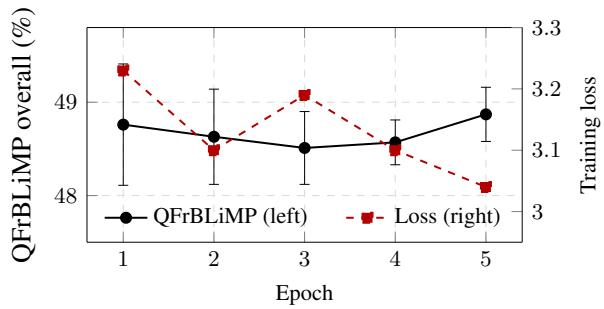

# Right Tool, Right Job: Native-Language Evaluation, Tokenizer Sensitivity, and Methodological Findings from a French-Only BabyLM

Adam Zachary Wasserman1 David Beauchemin2

1Open Honest Foundation

2Group for Research in Artificial Intelligence of Laval University (GRAIL), Université Laval, Québec, Canada

adam.wasserman@openhonest.org david.beauchemin@ift.ulaval.ca

## Abstract

We submit MéTRON-FR, a 125M GPT-2 pretrained on 92.47M words of French, to the BabyLM 2026 Strict track. It scores 85.97 ± 0.17% on QFrBLiMP (a native Quebec-French benchmark of grammatical minimal pairs) and 62.80% on the BabyLM-weighted leaderboard. A cross-lingual GLUE (General Language Understanding Evaluation) protocol that combines French task-data translation with rank-16 LoRA (Low-Rank Adaptation) produces a sharp task-type gradient: relational tasks gain measurably, while world-knowledge tasks regress. Bilingual Lexicon Induction aligns the French embeddings to GPT-2 at p@1 = 68.84± 8.61%, 18× above chance, suggesting crosslingual alignment tracks acquired grammatical competence rather than training duration. An ablation study shows that single-token zeroshot scoring is dominated by tokenizer and template artifacts at the child scale, motivating tokenizer-swap sensitivity, placebo-controlled prompting, and native-language minimal-pair benchmarks as standard diagnostics.

## 1 Introduction

The BabyLM challenge (Warstadt et al., 2023; Hu et al., 2024; Charpentier et al., 2025) asks whether language models can be trained on plausible amounts of input. Submissions in the Strict track are constrained to 100M words, and are evaluated on grammatical, world-knowledge, and downstream-task probes. This budget makes data curation and architectural choices first-order determinants of performance and turns child-scale pretraining into a tractable laboratory for both cognitive-science-inspired hypotheses about acquisition and engineering questions about efficiency.

Submissions through 2025 have all been in English, raising the question of whether the lessons drawn at the child scale are properties of language acquisition in general or of English specifically. The 2026 edition lifts this restriction (Choshen et al., 2026), and BabyBabelLM (Jumelet et al., 2026a) provides a multilingual training corpus across 15 languages. We submit to this edition MéTRON-FR, a 125M-parameter GPT-2 pretrained for five epochs on the French-only MéTRON-FR Strict corpus, with sentence-level oversampling driven by a Haitian-Creole lexical oracle. We evaluate on both the official BabyLM 2025 pipeline and with the Quebec French benchmarks (Beauchemin et al., 2026b; Beauchemin and Khoury, 2025).

At the date of writing, MéTRON-FR’s 85.97% on QFrBLiMP exceeds the best native-BLiMP (Benchmark of Linguistic Minimal Pairs; Warstadt et al., 2020) score posted in any of the three official languages of the 2026 multilingual track: 80.75% on English BLiMP (Strict, ≈100M words), 81.70% on Dutch BLiMP-NL (50M words), and 78.60% on Chinese ZhoBLiMP (50M words).1 Each version of BLiMP is a separate monolingual nativelanguage minimal-pair evaluation instrument.

Our single central message is that a French-only child-scale model attains strong native grammatical competence, and that at this scale single-token zero-shot scoring is dominated by tokenizer and answer-template artifacts; everything else in the paper (cross-lingual transfer via BLI and CL GLUE, and the forensic ablations) is evidence in service of that message and of the reporting diagnostics we recommend for non-English child-scale submissions. Our contributions are: 1) We submit, to our knowledge, the first model trained from scratch under the BabyLM 100M-word constraint for evaluation on the Quebec dialect of French. 2) We release a cross-lingual (CL) GLUE adaptation protocol that combines French task-data translation with rank-16 LoRA, and characterize a model’s failure modes via three contrastive levers. 3) We adapt Bilingual Lexicon Induction (BLI) as a child-scale geometric diagnostic of CL structural alignment. The model, corpus, bilingual lemma bridge, and all evaluation scripts are available at github.com/adamzwasserman/babylm.

The rest of this paper is organized as follows. In Section 2, we present a review of small-scale and multilingual LM work amongst native non-English minimal-pair benchmarks. Section 3 describes the model, corpus, and evaluation protocol. Section 4 reports results on native Quebec French and on the official BabyLM suite. Section 5 presents an ablation study isolating tokenizer-swap sensitivity, placebo-controlled prompting, and a lexicalfrequency confound in the translated BLiMP Supplement, then draws methodological recommendations for child-scale non-English submissions (Section 5.4). We conclude the article in Section 6.

## 2 Related Work

Non-English and multilingual child-scale LMs. Strict-track BabyLM entries from 2023 to 2025 (Warstadt et al., 2023; Hu et al., 2024; Charpentier et al., 2025) are English-only and have advanced primarily through architectural innovation, with ELC-BERT (Charpentier and Samuel, 2023) and GPT-BERT (Charpentier and Samuel, 2024) as the leading lines of work. The 2026 multilingual axis (Choshen et al., 2026) is enabled by BabyBabelLM (Jumelet et al., 2026a), a developmentally plausible corpus across 15 languages, including French. Cross-linguistic studies with matched architectures document large differences in training efficiency across typologically diverse languages (Wasserman, 2026), with morphologically rich languages reaching grammatical competence with orders-ofmagnitude fewer tokens than English.

Native non-English minimal-pair and acceptability benchmarks. A French-trained model evaluated on translated BLiMP conflates model competence with translation quality and with lexical-frequency artifacts of the translation pipeline. Native targeted-syntactic and acceptability corpora that avoid this confound have been released for several languages following the methodology of Warstadt et al. (2020); the Quebec-French Benchmark of Linguistic Minimal Pairs (QFr-BLiMP; Beauchemin et al., 2026b) and the Quebec-French Corpus of Linguistic Acceptability (QFr-CoLA; Beauchemin and Khoury, 2025) provide this instrument for Quebec French. Moreover, the COLE evaluation suite (Beauchemin et al., 2025)

bundles these grammatical probes alongside lexical and cultural-knowledge tasks (Beauchemin et al., 2026a).

CL transfer and structural alignment. Two complementary methods inform our CL setup. BLI learns an orthogonal map between embedding spaces (Mikolov et al., 2013; Lample et al., 2018) and provides a geometric measurement of CL alignment that does not depend on translation. Yet, it was never adapted as a child-scale diagnostic to connect the resulting measurements to the formal-versus-functional linguistic competence distinction (Mahowald et al., 2024). For downstream CL evaluation, parameter-efficient fine-tuning via Low-Rank Adaptation (Hu et al., 2022) preserves the pretrained base by construction and lets us run a four-lever experiment grid on a single submitted checkpoint without losing the grammatical signal measured natively.

## 3 Methodology

We address three orthogonal experimental questions: native grammatical competence (Section 4.1), CL transfer along four levers (BLI in Section 4.3; GLUE adaptation in Section 4.4), and forensic ablations isolating tokenizer, prompttemplate, and lexical-frequency confounds in benchmark scoring (Section 5). All experiments share a single submitted checkpoint; no checkpoint is selected per experiment.

## 3.1 Architecture and Training

MéTRON-FR (Greek métron for “measurement”) is a 125M-parameter GPT-2 (Radford et al., 2019) pretrained for five epochs on the MéTRON-FR Strict corpus (Section 3.3 and Section 3.4). We select the best checkpoint as the empirically located grammatical-competence peak; intermediate checkpoints are released at the BabyLM-mandated cadence. Architecture hyperparameters, training schedule, hardware, GPU budget, and the released checkpoint manifest are detailed in Appendix E.

Reproduction protocol. The submitted checkpoint is the headline run; for variance estimation, we report a 5-seed reproduction ([42–46]) at matched corpus, tokenizer, and hyperparameters. Results in Section 4 report mean ± standard deviation across the 5 seeds, alongside the submittedcheckpoint headline values (epoch 3, seed 42); the per-seed epoch-selection rule is given in Appendix E.

## 3.2 Tokenizer

We use a 50,000-token byte-pair encoding (BPE) (Sennrich et al., 2016) tokenizer trained on the French training corpus itself (Appendix J). Three alternatives were compared in an ablation study: 16K/50K/64K child-directed speech-trained (CDStrained). The 50K vocabulary yielded the lowest perplexity and the best downstream stability. The tokenizer is not a tuning parameter in our analysis. Indeed, Section 5.1 reports a forensic ablation in which only the tokenizer is swapped, with corpus, architecture, training steps, optimizer, and seed held constant.

## 3.3 Corpus Composition

The training corpus is French-only and combines three sources, totalling 92,469,402 words (92.47M) as counted on the released train\_french.txt. A grammatically dense base draws on child-directed speech and accessible French text: ≈ 2.10M words from CHILDES French (MacWhinney, 2000), plus ≈24.90M words from the non-subtitle portion of the French component of BabyBabelLM (Jumelet et al., 2026a). The remainder, ≈ 66M words, comes from the filtered French Wikipedia (see Appendix E for details). Per-source figures are counts of the source pools before oracle-weighted assembly (Section 3.4) and therefore do not sum exactly to the released total; the 92.47M figure is the whitespace word count of the released corpus file. A hand-curated bilingual French–English lemma bridge is released alongside the corpus but is not part of the training data: its sole role is to supply the seed dictionary of the BLI diagnostic (Section 4.3). It consists of 73 lemma entries (30 verbs, 18 nouns, 15 adjectives, 10 function words) with full inflection tables and English glosses, enumerating 715 distinct (FR, EN) form-level pairs. The corpus builder also exposes a variant harness that interleaves the bridge into the training text; the submitted model was trained on the Frenchonly harness, and no bridge text enters it. The corpus is pan-French rather than Quebec-specific: no Quebec-restricted corpus of comparable size exists at the BabyLM scale, and most QFrBLiMP phenomena (syntactic, morphological, agreement) are shared across French varieties; the gap with the Quebec normative prescription is isolated in the anglicism-related subscore and discussed in Section 4.1. This simple recipe outperforms a more aggressively engineered reallocation with EWoK targeted Wikipedia (EWoK, Elements of World Knowledge; Ivanova et al., 2025) and instruction blocks; see the ablation in Section 5.1.

## 3.4 The Haitian-Creole Lexical Oracle

Sentences are not sampled uniformly from the three sources. We oversample by the density of French lemmas whose cognates survived into Haitian Cre ole. Our working hypothesis, informed by creolegenesis research (Lefebvre, 1998; Mufwene, 2001), is that because creoles form under acute communicative pressure, lemmas surviving this contact filter are plausibly disproportionately load-bearing for grammatical communication. Concretely, we map a high-frequency Haitian-Creole (HC) lemma list to a French cognate set and oversample sentences dense in these lemmas; the extraction procedure, the cognate set, and the oversampling weight are detailed in Appendix C. No Haitian Creole text enters training. The lemmas act as an oracle lexical filter on French source material only. Using HC as an instrument rather than a training source is consistent with prior evidence that mix ing analytical languages into morphologically rich corpora degrades the training dynamics of the rich language (Wasserman, 2026). French is the mor phologically richer member of the French–HC pair on every category that QFrBLiMP probes (verbal inflection, determiner-noun and subject-verb agreement); treating HC as a lexical filter rather than a training distribution preserves these French regularities while still drawing on the contact-filtered survival signal as a corpus-weighting heuristic. We present the oracle as an exploratory corpusweighting heuristic, not as a validated contribution: its effect is not isolated against an unweighted baseline in this paper, and the clean-rebuild control (Section 5.1) bounds any oracle-specific gain to within the training-time noise floor (Section 6). We report it because the recipe is what we submit ted, and flag the unweighted-baseline ablation as follow-up work.

## 3.5 Evaluation Suite

Official BabyLM 2026 leaderboard. We report scores on the four instruments of the released 2025 evaluation pipeline. BLiMP (Warstadt et al., 2020) is a zero-shot targeted-syntactic benchmark of English minimal pairs grouped into 67 paradigms (each a good/bad sentence pair), scored by comparing per-token log-probabilities. The BLiMP Supplement adds five pragmatic and discourse paradigms (e.g. question-answer congruence, subject-aux inversion) in the same format. (Super)GLUE (Wang et al., 2018) is a set of seven classification tasks evaluated after finetuning. EWoK (Ivanova et al., 2025) probes world knowledge across physical, spatial, and social domains as a binary choice. The leaderboard reports both per-task accuracies and an aggregate score that averages across these instruments; a Frenchtrained model is expected to be near chance on the English zero-shot probes, so we read the Englishsuite numbers as a lower-bound sanity check rather than a competitive target.

Native Quebec-French grammatical competence. Neither QFrBLiMP nor QFrCoLA is part of the official BabyLM suite; they are native Quebec-French instruments we adopt as our primary grammatical probe, on the argument (Section 2) that a native minimal-pair benchmark avoids the translation and lexical-frequency confounds of a translated one. They are complementary to, not a substitute for, MultiBLiMP (Jumelet et al., 2026b), whose French portion targets the metropolitan standard: QFrBLiMP encodes the Office québé- cois de la langue française (OQLF) Quebec norm, so the two measure different prescriptive targets rather than the same one at different difficulty. We map the QFrBLiMP buckets to the translated-BLiMP paradigm breakdown per phenomenon in Appendix F. We use two native Quebec-French corpora. First, the QFrBLiMP (Beauchemin et al., 2026b) a corpus of 1,761 minimal pairs annotated for 20 fine-grained linguistic phenomena of Quebec French, taken from the Banque de dépannage linguistique (BDL), a public normative grammar resource maintained by the OQLF, and annotated by twelve native Quebec-French annotators. The 20 phenomena span syntactic, morphological, lexical-semantic, and lexical-normative judgments. Second, the QFrCoLA (Beauchemin and Khoury, 2025) a sentence-level acceptability judgment corpus extracted from the BDL, with an additional outof-domain split drawn from the Académiefrançaise normative journal. Each sentence is labelled acceptable or unacceptable, where 69.50% of sentences are labelled acceptable. The in-domain release totals 25,153 sentences, plus a separate 2,675- sentence out-of-domain set.

CL measurements. Because English benchmarks cannot be applied directly to a Frenchtrained model without translation or CL adaptation, we also report a structural CL measurement via BLI against frozen English embedding matrices (Section 4.3) and a four-lever experiment grid for CL GLUE (Section 4.4).

## 3.6 Evaluation Metrics

The minimal-pair benchmarks (QFrBLiMP, BLiMP, BLiMP Supplement, EWoK) are scored zero-shot as item-level accuracy per paradigm and overall; QFrCoLA is fine-tuned and reported as accuracy and Matthews Correlation Coefficient (MCC) (Matthews, 1975); CL GLUE is fine-tuned with rank-16 Low-Rank Adaptation (LoRA) (Hu et al., 2022) on French-translated task data and reported as per-task accuracy and a five-task mean (Section 4.4); and BLI reports the orthogonal Procrustes fit and word-translation precision@k on a held-out split (Section 4.3). The exact scoring rules, the MCC reference points, and the fine-tuning setup are detailed in Appendix B.

## 4 Results

## 4.1 Native Quebec-French Evaluation

QFrBLiMP. The submitted checkpoint reaches $8 5 . 9 7 \pm 0 . 1 7 \%$ overall on QFrBLiMP at epoch 3, the empirically located grammatical-competence peak (point estimate from the submitted run; variance from the 5-seed reproduction described in Section 3.1). We report accuracy aggregated into four broader buckets in Table 1; the epoch-1 reference checkpoint chck\_92M, used downstream for adaptation comparisons, scores 83.53%. Figure 1 shows the multi-epoch trajectory across the 5-seed reproduction. Grammatical accuracy oscillates within a narrow band of approximately 0.40pp across epochs while training loss continues to decline, monotonically from epoch 3 onward, indicating, at the BabyLM scale, that grammatical competence saturates before perplexity saturates.

Anglicisms as a probe of normative Quebec French. On QFrBLiMP a higher score is better: it means the model assigns lower probability to the ungrammatical (here OQLF-proscribed) member of each minimal pair. The anglicism-related bucket is the lowest of the four (Table 1) because sensitivity to the prescriptive norm is the hardest of these signals to acquire at the child scale, not because the model is failing at grammar in general. The anglicism-related sub-score reflects two simultaneous mechanisms. The first is phonotactic and morphological internalization: anglicism candidates with non-French coda clusters or stress patterns receive lower probability under any model that has internalized French regularities, regardless of normative status. The second is sensitivity to the prescriptive norm encoded in the BDL itself: many lexical items in the underlying lexical-semantics phenomenon are phonotactically licit French formations (e.g. matcher) but flagged as unacceptable in the BDL because the OQLF prescribes a Frenchsource equivalent (correspondre) as the standard. A high sub-score, therefore, reflects either internalization of the prescriptive distribution itself or of morphological cues correlated with it. Results on a metropolitan-French benchmark may differ on anglicism-sensitive items, where descriptive metropolitan usage is more permissive; the morphological and syntactic sub-scores are expected to generalize. Appendix K details the OQLF normative framework.

<table><tr><td>Bucket</td><td>Accuracy</td></tr><tr><td>Syntactic</td><td> $8 9 . 7 4 \pm 1 . 3 2 \%$ </td></tr><tr><td>Semantic</td><td> $8 7 . 1 9 \pm 1 . 7 0 \%$ </td></tr><tr><td>Morphological</td><td> $8 5 . 4 7 \pm 1 . 0 2 \%$ </td></tr><tr><td>Anglicism-related</td><td> $8 0 . 1 5 \pm 1 . 5 4 \%$ </td></tr><tr><td>Overall (submitted)</td><td> $\mathbf { 8 5 . 9 7 \pm 0 . 1 7 \% }$ </td></tr></table>

Table 1: QFrBLiMP results on the submitted checkpoint, zero-shot, using the aggregated four high-level buckets used in Beauchemin et al. (2026b). Bucket point estimates are from the submitted run; standard deviations are from the 5-seed reproduction (Section 3.1). The epoch-1 reference checkpoint scores 83.53% overall.  
  
Figure 1: QFrBLiMP overall accuracy per epoch (mean ± std across 5 reproduction seeds; Section 3.1) versus training loss on the submitted run. Grammatical accuracy stays within a ∼0.40pp band across the 5 epochs while training loss continues to decline, monotonically from epoch 3 onward, illustrating that grammatical competence saturates before perplexity does at this scale.

QFrCoLA. On the in-domain test set, the finetuned classifier achieves $6 9 . 6 8 \pm 0 . 5 0 \%$ accuracy and an MCC of $0 . 1 3 \pm 0 . 0 3$ across the 5-seed reproduction. The reference upper bound is BERTbase on English CoLA at MCC 0.52, achieved with ≈ 110M parameters but on the order of 3.30B pretraining tokens. At the ≈1.3 tokens-perword rate of English BPE, that budget is ≈ 2.5B words, so ours is at the same parameter scale with ≈ 27× fewer words; tokens and words are not interchangeable units, and we state the comparison word-for-word. The 0.13 MCC characterizes what acceptability-judgment competence is measurable at the BabyLM word budget on a native non-English benchmark: positive and above chance, but well below that of a model trained at the standard scale.

## 4.2 Official BabyLM Suite

Translated BLiMP and Supplement. On translated BLiMP, the submitted checkpoint scores 76.28%. We report this strictly as a cross-lingual transfer number: our French-trained model is scored on French translations of the originally English items, so it is not directly comparable to English-native models evaluated on the original English items. For context only, and not as a like-for-like ranking, OPT-125M (a 125Mparameter open pretrained transformer language model; Zhang et al., 2022) scores 75.30% and ELC-BERT (Charpentier and Samuel, 2023) 85.30% on the English items. See Appendix F for the perparadigm breakdown. The translated BLiMP Supplement scores 34.00%, below chance, reported as a methodological finding rather than a performance claim (Section 5.3).

GLUE. Under the submitted configuration, GLUE reaches a mean of 60.90% across the five translated tasks, on par with the 61.21% English-LoRA baseline mean (discussed in Section 4.4). We translate the official English GLUE splits into French via an LLM pass, preserving the original alignment targets; the translation script is released with the submission. We treat this as a downstream adaptation choice rather than a pretraining data violation under the 2025 rule change: no new task content is introduced, and each French example is deterministically derivable from its English source.

EWoK. EWoK falls inside the 95% chance interval [47.90%, 52.10%] for n=2200 across all four interventions we tested (Section 5.3). We report it as a clean structural null result that bounds the task definition at the child scale.

<table><tr><td>Target</td><td>Fit</td><td>p@1 (%)</td><td>p@5 (%)</td><td>p@10 (%)</td></tr><tr><td>GPT-2 (competent EN)</td><td>0.40 ± 0.03</td><td>68.84 ± 8.61</td><td>91.87 ± 6.07</td><td>98.56 ± 1.97</td></tr><tr><td>Matched-arch failed-EN</td><td>0.51</td><td>25.00</td><td>52.10</td><td>66.70</td></tr><tr><td>Random orthogonal (ref)</td><td>-0.20</td><td>11.50</td><td>26.90</td><td>53.80</td></tr><tr><td>Chance (1/ntest)</td><td></td><td>3.80</td><td>19.20</td><td>38.50</td></tr></table>

Table 2: BLI Procrustes alignment from the BabyLM French model to two English embedding spaces. The GPT-2 row reports mean ± std across the 5-seed reproduction (Section 3.1); the matched-arch failed-EN row is from the submitted run only. $\mathrm { F i t } \ = 1 - \| E _ { \mathrm { F R } } W -$ $E _ { \mathrm { E N } } \Vert _ { F } ^ { 2 } / \Vert E _ { \mathrm { E N } } \Vert _ { F } ^ { 2 }$ (1.00 perfect, 0.00 no alignment); p@k is held-out word-translation precision at the k nearest neighbours under the learned map.

Weighted leaderboard score. On the BabyLMweighted metric, the submission scores 62.80%, at or above all Strict-track reference points reevaluated on the 2025 pipeline (GPT-BERT Charpentier and Samuel, 2024 NLP 57.8–63.0, macro 40.8–43.5; GPT-2 naive; 2025 Strict-track winners; Charpentier et al., 2025; Appendix G). We read this not as a competitive outperformance but as evidence that the language-choice axis is empirically larger than the architectural axis the field has been optimizing on.

## 4.3 CL Structural Alignment via BLI

The first CL question, i.e. “does a French-trained model exhibit structure recognizably aligned with that of English-trained models?”, admits a direct geometric answer via BLI (Mikolov et al., 2013; Lample et al., 2018): we learn a frozen orthogonal map between the two models’ embedding spaces on a seed dictionary, then measure held-out word translation precision@k by nearest-neighbour retrieval in the mapped space. The seed dictionary is the form-level expansion of the 73-entry bilingual lemma bridge of Section 3.3, a released resource that is not part of the training corpus; its 715 enumerated pairs reduce to 242 (FR, EN) pairs (194 to fit the map, 48 held out) after a morphology-aware parser pass; the closed-form Procrustes derivation and the parser-pass details are in Appendix H. We compare the BabyLM French model against two English embedding targets (Table 2): (a) GPT-2 (Radford et al., 2019), 117M parameters trained on ≈ 8B WebText tokens and fully grammatically competent; (b) a matched-architecture 125M English model that plateaued at chance (40%) on English grammar probes despite being trained on 6.50B C4 tokens (Wasserman, 2026).

Alignment to GPT-2 reaches p@1 of 68.84 ± 8.61% on held-out word pairs, an order of magnitude above chance, purely via a frozen

768 × 768 orthogonal matrix; content-word alignments are rank-1 nearly universally (fuir→flee, donner→give, cassé→broke, imaginer→imagine, révéler→reveal), and morphological features map structurally (écrivent→write, révélé→revealed). We present twenty retrievals with commentary in Appendix I. The decisive contrast is the matchedarchitecture English model that failed to acquire English grammar: alignment drops to p@1 of 25.00% despite training on 6.50B tokens (71× more than ours, and 50% more than GPT-2 on a per-token basis). Structural alignment tracks acquired grammatical competence, not duration or architecture.

## 4.4 CL GLUE Experiment Grid

We test four LoRA-adapted levers for CL GLUE on each reproduction seed (Hu et al., 2022), varying the task-data language, the LoRA rank, and the number of epochs; the key contrast is D+C (task data translated to French, rank-16 LoRA) against the English-LoRA Baseline. The full lever specification is in Appendix D. An inferencetime vocabulary-axiom alternative (lever B) is reported separately in Section 5.2, and LoRA leaves the French base model bit-identical (Section 4.4). The translation lever (D+C) does not dominate uniformly across tasks but produces a sharp tasktype gradient (Table 3): the relational tasks BoolQ (+3.45pp), RTE (+5.13pp), and MRPC (+2.89pp) gain measurably over the English-LoRA baseline, whereas the world-knowledge task MNLI regresses (−11.10pp) and the discourse-coreference task WSC is statistically inconclusive (−1.92pp with $\sigma = 8 . 8 8 \mathrm { p p } )$ . The mean across the five tasks is therefore approximately flat (−0.31pp), but the pertask structure is the contribution: training-language adaptation helps where the task probes structural relations and not where it probes encyclopedic content or extended discourse. We state this gradient as conditional on two controls. First, the per-task deltas of D+C over the Baseline conflate LoRA rank (8 vs 16) with the language of the task data (English vs French-translated); lever C (rank-16 English-LoRA, run on all five tasks across the 5 seeds) isolates the rank effect within a single language and shows no consistent gain over the rank-8 Baseline, so the structure in D+C is attributable to training-language adaptation rather than to rank. Second, we do not run the symmetric control, i.e. the same French-translated + rank-16 LoRA pipeline applied to an English-native childscale model; without it we cannot fully exclude that the pipeline benefits any model regardless of pretraining language. We flag this control as follow-up work (Section 6).

<table><tr><td>Task</td><td>Baseline</td><td>A</td><td>C</td><td>D+C</td><td>∆</td></tr><tr><td>BoolQ</td><td> $6 2 . 3 6 \pm 0 . 3 3$ </td><td> $6 3 . 1 0 \pm 0 . 7 2$ </td><td> $6 2 . 8 9 \pm 0 . 1 3$ </td><td> ${ \bf 6 5 . 8 1 \pm 0 . 5 1 }$ </td><td>+3.45</td></tr><tr><td>RTE</td><td> $5 3 . 1 4 \pm 2 . 6 5$ </td><td> $5 3 . 3 6 \pm 2 . 7 1$ </td><td> $5 2 . 8 5 \pm 1 . 6 9$ </td><td> ${ \bf 5 8 . 2 7 \pm 2 . 3 9 }$ </td><td>+5.13</td></tr><tr><td>MRPC</td><td> $6 8 . 7 7 \pm 0 . 9 3$ </td><td> $6 9 . 2 2 \pm 0 . 9 1$ </td><td> $6 8 . 5 8 \pm 0 . 8 4$ </td><td> ${ \bf 7 1 . 6 7 \pm 0 . 7 3 }$ </td><td>+2.89</td></tr><tr><td>WSC</td><td> $5 8 . 4 6 \pm 4 . 1 6$ </td><td> ${ \bf 5 9 . 4 2 \pm 2 . 1 9 }$ </td><td> $5 8 . 8 5 \pm 4 . 0 5$ </td><td> $5 6 . 5 4 \pm 8 . 8 8$ </td><td>-1.92</td></tr><tr><td>MNLI</td><td> $6 3 . 3 1 \pm 0 . 9 3$ </td><td> ${ \bf 6 4 . 4 7 \pm 0 . 7 4 }$ </td><td> $6 4 . 2 9 \pm 0 . 5 8$ </td><td> $5 2 . 2 1 \pm 3 . 8 3$ </td><td> $- 1 1 . 1 0$ </td></tr><tr><td>Mean</td><td>61.21</td><td>61.91</td><td>61.49</td><td>60.90</td><td>-0.31</td></tr></table>

Table 3: CL GLUE grid (mean ± std across 5 seeds); best per task in bold. ∆ is the gain of D+C over the Baseline. MultiRC and QQP held at baseline values for budget reasons. Inference-time vocabulary axioms (lever B) are placebo-tested separately in Section 5.2.

LoRA preserves the base by construction. Each per-task LoRA adapter applied to the epoch-1 checkpoint yields an identical 83.53% on QFr-BLiMP because the base parameters are bitidentical and the adapter weights do not enter the autoregressive head. Full fine-tuning on BoolQ drifts the QFrBLiMP score by −0.17pp to 83.36%. We adopt LoRA as the headline adaptation method on the strength of this construction-time preservation guarantee, which we argue is methodologically preferable to post-hoc verification at child scale, where every grammatical-competence parameter is hard-won. Full ablation in Appendix L.

## 5 Methodological Findings and Recommendations

We report four ablations whose results we read as constraints on the interpretation of child-scale zero-shot scoring. None are pre-registered; they emerged during the preparation of submissions and are presented as forensic diagnostics rather than confirmatory tests. Together they support a single observation: at 125M parameters and 100M words, single-token log-probability scoring on short-sequence benchmarks responds principally to lexical-distributional properties of the tokenizer and the answer template, with task-level competence a secondary signal at best.

## 5.1 Tokenizer-Swap on GLUE-Axiomatic

We initially trained a substantially reallocated 93Mword corpus $( \mathbf { \vec { \Sigma } } ^ { 6 } \mathbf { \vec { V } } \mathbf { \vec { \Sigma } } ^ { 9 } )$ with 38M words of EWoKtargeted Wikipedia, 25M words of instruction data in GLUE format, and a 16K CDS-trained BPE tokenizer. The v2 model regressed by 7.70 percentage points on GLUE-axiomatic relative to the simpler v1 corpus (Table 4, rows v1 and v2). To isolate which intervention caused the regression, we trained four additional models on the v1 corpus, varying one component at a time: v3a rebuilds v1 with the same 50K Wikipedia tokenizer; v3b replaces 15M words of Wikipedia with the formattargeted Opus instructions from v2; v3c replaces 38M words of Wikipedia with the EWoK-targeted Wikipedia from v2; v3d uses the v3a corpus but the 16K CDS-trained tokenizer from v2.

<table><tr><td>Variant</td><td>QFrBLiMP</td><td>EWoK</td><td>GLUE-ax</td></tr><tr><td>v1 (chck_92M)</td><td>83.53</td><td>50.95</td><td>51.00</td></tr><tr><td>v2 (full reallocation)</td><td>82.68</td><td>50.59</td><td>43.30</td></tr><tr><td>v3a (v1 recipe rebuild)</td><td>83.08</td><td>51.59</td><td>46.10</td></tr><tr><td>v3b (v3a + 15M Opus)</td><td>83.30</td><td>50.50</td><td>50.70</td></tr><tr><td>v3c (v3a + 38M EWoK Wiki)</td><td>83.08</td><td>52.32</td><td>50.70</td></tr><tr><td>v3d  $( \mathsf { v } 3 \mathsf { a } + 1 6 \mathsf { K }$  tokenizer)</td><td>82.68</td><td>51.36</td><td>43.50</td></tr></table>

Table 4: Single-intervention ablation isolating which v2 component caused the 7.70pp GLUE-axiomatic collapse. Only v3d, the tokenizer swap, reproduces the v2 floor.

v3d alone reproduces the entire v2 GLUEaxiomatic collapse: 43.50% versus v2’s 43.30%, with the same corpus as v3a, v3b, and v3c. The format-targeted instructions and the EWoKtargeted Wikipedia, when introduced individually on top of the v1 recipe, do not regress GLUEaxiomatic. The 16K CDS tokenizer swap, holding all other variables constant, does.

A second observation reinforces the reading. v3a, the clean rebuild of v1 with a nominally identical recipe, scores 4.90pp lower than v1 itself. The difference was accidental, not designed: a different pre-tokenization shuffle seed reordered the sentences of an otherwise identical corpus. It changes neither the source material nor the word budget, yet it produces GLUE-axiomatic swings comparable to differences between models (Appendix J, rebuild\_seed\_sweep.json). The score is a property of the tokenizer’s vocabulary against the scoring protocol’s answer-template tokens, not of task-level competence. The finetuned LoRA numbers we adopt as the headline GLUE results (Section 4.4) replace single-token scoring with a learned decision boundary and are not subject to this artifact. Any method comparing log-probabilities of single-token answers across prompts is vulnerable, and a benchmark that does not report tokenizer-swap sensitivity cannot distinguish task-competence from tokenizer-vocabulary differences. Full v3 protocol and v2 details in Appendix J and Appendix M.

<table><tr><td>Task</td><td>Bare</td><td>Targeted</td><td>Placebo</td><td>Tautology</td></tr><tr><td>BoolQ</td><td>45.20</td><td>49.20</td><td>50.00</td><td>48.20</td></tr><tr><td>RTE</td><td>54.00</td><td>54.00</td><td>54.00</td><td>54.00</td></tr><tr><td>MNLI</td><td>32.20</td><td>35.20</td><td>35.20</td><td>34.00</td></tr><tr><td>Mean</td><td>43.80</td><td>46.10</td><td>46.40</td><td>45.40</td></tr></table>

Table 5: Dictionary-axioms placebo control. Targeted: relevant FR–EN pairs. Placebo: random, unrelated FR– EN pairs of the same number. Tautology: en=en pairs containing zero translation information.

## 5.2 Placebo Control on Dictionary-Axiom Prompting

An inference-time approach that prepends a French– English vocabulary axiom block to each English benchmark item produced apparent gains of 5–9 pp on three GLUE tasks (BoolQ, RTE, MNLI). A placebo control falsified the interpretation. We re-ran with three axiom variants under the same French answer template (Table 5):

Targeted minus bare is +2.33pp; placebo minus bare is +2.60pp; tautology minus bare is +1.60pp. The translation-specific effect (targeted minus placebo) is −0.27 pp: random, unrelated axioms produce as much improvement as targeted ones. The semantic content of the axiom block is irrelevant; the gain is structural prompting noise. The original 5–9pp effect was further inflated by an answer-template confound (English template without axioms vs. French template with axioms); with template held constant, the structural prompting effect is approximately 2pp. We retain this as a null result: structural prompting at the child scale yields a small, content-independent GLUE gain but does not constitute evidence of CL lexical transfer via vocabulary mappings.

## 5.3 Translated BLiMP Supplement and EWoK at Child Scale

Two further results bound interpretation. The translated BLiMP Supplement score (34%, Section 4.2) is below chance because the items contain a systematic lexical-frequency confound: in qacongruence-easy, for instance, the “good” French sentence consistently has a less-frequent content word (médecin rather than chaise as the subject of an embrassée-predicate) than the “bad” sentence, and the model prefers the higher-frequency alternative regardless of grammaticality. The score measures translation-specific lexical frequency in the training distribution, not the pragmatic inference phenomena that the English original probes; we report 34% as honest evidence rather than as a competence claim. EWoK at n = 2200 falls inside the 95% chance interval [47.90%, 52.10%] across all four interventions tested (raw pretraining, EWoKtargeted Wikipedia, dictionary axioms, retrievalaugmented prompting), with conditions ranging 49.86-50.95%. The right tool for world knowledge at 125M / 100M words does not exist within the BabyLM envelope; inference-time tricks cannot substitute for parameters or data.

## 5.4 Recommendations

The unifying observation across Section 4 and Section 5 is that no single instrument fits every evaluation decision at the child scale. Table 6 (Appendix A) summarises the mapping for the seven decisions our pipeline made: each row is backed by an experiment in this paper, and every wrong-tool entry was tested and produced a null or negative result.

Native-language evaluation as the preferred axis. The CL gap between QFrBLiMP (85.97%, native) and translated BLiMP (76.28%) is a 9.69-point gap on essentially the same kind of probe, differing only in whether the items are native or translated; translated minimal-pair benchmarks at child scale conflate model competence with translation quality and lexical-frequency artifacts (Section 5.3). Where a native-language benchmark exists, it is the cleaner instrument; otherwise a placebo-controlled translation pass is a workable second-best.

Recommended reporting metrics. For childscale submissions scored by single-token logprobability on short-sequence benchmarks, two diagnostics should accompany headline accuracy: tokenizer-swap sensitivity (re-evaluating under a second BPE tokenizer trained on a different distribution) and placebo-controlled prompting (reevaluating any prompt-prepended scoring under an unrelated-content prompt of matched length). Without them, a benchmark cannot separate task competence from tokenizer-vocabulary or prompt artifacts.

## 6 Conclusion

MéTRON-FR demonstrates that French-only childscale pretraining produces a BabyLM submission scoring 85.97% on QFrBLiMP, above the best native-BLiMP score in any other 2026 official language (Section 1), and 62.80% on the BabyLMweighted metric, at or above the re-evaluated Stricttrack reference points (Appendix G), while exposing measurement gaps within the suite.

We do not argue that this submission supersedes the architectural line of work (Charpentier and Samuel, 2023, 2024); we test a different axis, the choice of pretraining language, enabled by the 2025 rule change. Native-language minimal-pair benchmarks and protocol-level diagnostics belong in the standard reporting set for child-scale submissions relying on single-token zero-shot scoring.

## Limitations

The submitted checkpoint is from a single pretraining seed; for variance estimation, we report a 5- seed reproduction (Section 3.1) on the headline downstream evaluations (QFrBLiMP, QFrCoLA, BLI, CL GLUE). The 4.90 percentage-point gap on GLUE-axiomatic between two nominally identical recipe rebuilds (Section 5.1, v1 vs. v3a) is a separate, training-time noise floor that bounds the resolution of any single-seed claim on this benchmark to approximately 5pp at this scale; we adopt fine-tuned LoRA numbers as the GLUE headline partly because they are not subject to this artifact.

Several quantitative sub-claims in this paper sit within or near that noise floor and should be read accordingly. The per-task gains in Table 3 (BoolQ +3.45pp, RTE +5.13pp, MRPC +2.89pp; std ≤ 2.70pp on the gain) are above the noise floor; the WSC and MNLI deltas are within or below it (WSC σ = 8.88pp on D+C; MNLI std small but the regression magnitude is large), and the relative differences between v3a, v3b, and v3c in Table 4 are of comparable magnitude to the rebuild noise. The qualitative conclusions of those experiments, that the translated-data lever (D+C) helps short-input relational tasks while the inference-time-axiom lever (B) does not, and that only the tokenizer swap (v3d) reproduces the v2 GLUE-axiomatic floor, do not depend on point-estimate precision and survive within the noise floor; the per-task point estimates do.

The Quebec-French normative scope of QFr-BLiMP and QFrCoLA is a deliberate choice but a real limitation. Anglicism-sensitive findings do not generalize to metropolitan French without revalidation, since the metropolitan norm is more permissive on lexical anglicisms (Appendix K); morphological and syntactic findings are expected to generalize.

The single-language design cannot adjudicate whether the observed phenomena, namely the native-vs-translated minimal-pair gap, the BLI competence-vs-duration contrast, and the tokenizer and placebo sensitivities, are French-specific or general to child-scale non-English pretraining. Replicating the protocol across the BabyBabelLM languages (Jumelet et al., 2026a) with native minimal-pair instruments would test whether the right-tool mapping (Table 6) holds crosslinguistically.

The methodological findings in Section 5 are post hoc forensic diagnostics that emerged during the preparation of the submission, not preregistered confirmatory tests; we report them as constraints on interpretation rather than as confirmatory claims. The Haitian-Creole lexical oracle is a corpus-curation heuristic whose contribution is not isolated against an unweighted baseline within this paper; the v3a clean-rebuild result (Section 5.1) bounds any oracle-specific contribution to within the noise floor of the rebuild itself.

Our CL GLUE results (Section 4.4) are not directly comparable to English-trained baselines such as ELC-BERT or GPT-BERT (Charpentier and Samuel, 2023, 2024): those models report Englishnative fine-tuning on English task data, while ours reports rank-16 LoRA on French-translated task data. Two specific controls are missing from the present protocol. First, the per-task gains over the English-LoRA baseline conflate LoRA rank (8 vs 16) with the language of the task data (English vs French-translated); the rank-16 English-LoRA condition (Table 3, lever C, run on all five tasks in the 5-seed reproduction) does isolate the rank effect within the same language and shows no consistent gain over rank-8, supporting the reading that the per-task structure in lever D+C is driven by traininglanguage adaptation rather than rank. Second, applying the same translated-French + rank-16 LoRA pipeline to an English-native child-scale model would test whether the protocol benefits any model regardless of pretraining language, or whether the gain is specific to having French-trained representations to adapt. This second control was outside the scope of computation for this submission and is flagged for camera-ready or follow-up work.

## Ethical Considerations

The training corpus is assembled from publicdomain or research-licensed French sources: CHILDES via childes-db (MacWhinney, 2000), French Wikipedia, and the openly released babylmfra component of BabyBabelLM (Jumelet et al., 2026a). The hand-curated bilingual lemma bridge is released as an evaluation resource for the BLI diagnostic and is not part of the training corpus. No human-subjects data is collected for this study, and no individually identifying content is introduced beyond what is already published in the source corpora; CHILDES transcripts are used within their documented research-release terms.

The Haitian-Creole lexical oracle uses a highfrequency word list as an instrument to oversample French sentences; no Haitian-Creole text enters training, and the procedure does not model, generate, or make claims about Haitian Creole as a language. We note the asymmetry: a creole derived from French serves here as an analytic tool for a French-only model, and we make no inference about Haitian Creole grammar or its speakers from the procedure.

QFrBLiMP encodes the prescriptive norm of the Office québécois de la langue française, an autonomous regulatory body whose recommendations differ from metropolitan French usage on the items the anglicism category probes (Appendix K); submissions evaluated on QFrBLiMP should report this scope alongside the score.

The released model is a 125M-parameter French language model trained on 92.47M words. At this scale, generation quality is limited, and the model is not appropriate for user-facing applications; we release it as a research artifact for the BabyLM community, not as a deployment-ready system.

## Use of AI Assistants

Generative AI assistants (large language models) were used during the preparation of this submission. Their use was limited to: (i) copy-editing and language correction of author-written prose, including rephrasing for clarity and proofreading in the style of a Grammarly-type tool; and (ii) code-review and error-detection assistance applied to scripts that had been written and initially validated by the authors. All code in this submission was originally written by the authors; AI assistants were used to audit and review it, not to produce it. AI assistants were not used to generate research ideas, conduct experiments, run analyses, write substantive scientific argumentation, or perform literature search. The authors take full responsibility for all content.

## Acknowledgements

This research was made possible thanks to the support of a Canadian insurance company, NSERC research grant RDCPJ 537198-18 and an FRQNT doctoral research grant. We thank the reviewers for their comments regarding our work.

## References

David Beauchemin and Richard Khoury. 2025. QFr-CoLA: A Quebec-French Corpus of Linguistic Acceptability Judgments. In Proceedings of the Conference on Empirical Methods in Natural Language Processing, pages 119–130, Suzhou, China. Association for Computational Linguistics.

David Beauchemin, Yan Tremblay, Mohamed Amine Youssef, and Richard Khoury. 2025. COLE: A Comprehensive Benchmark for French Language Understanding Evaluation. Preprint, arXiv:2510.05046.

David Beauchemin, Yan Tremblay, Mohamed Amine Youssef, and Richard Khoury. 2026a. Idiom Understanding as a Tool to Measure the Dialect Gap. In Findings ofthe Associationfor Computational Linguistics: ACL 2026, pages 505–522, San Diego, California, United States. Association for Computational Linguistics.

David Beauchemin, Pier-Luc Veilleux, Richard Khoury, and Johanna-Pascale Roy. 2026b. QFrBLiMP: A Quebec-French Benchmark of Linguistic Minimal Pairs. In Findings of the Association for Computational Linguistics: EACL 2026, pages 4274–4304, Rabat, Morocco. Association for Computational Linguistics.

Lucas Charpentier, Leshem Choshen, Ryan Cotterell, Mustafa Omer Gul, Michael Y. Hu, Jing Liu, Jaap Jumelet, Tal Linzen, Aaron Mueller, Candace Ross, Raj Sanjay Shah, Alex Warstadt, Ethan Gotlieb Wilcox, and Adina Williams. 2025. Findings of the BabyLM Challenge: Accelerating Language Modeling Research with Cognitively Plausible Data. In Proceedings of the BabyLM Workshop, pages 399– 420, Suzhou, China. Association for Computational Linguistics.

Lucas Georges Gabriel Charpentier and David Samuel. 2023. Not All Layers Are Equally as Important: Every Layer Counts BERT. In Proceedings of the BabyLM Challenge at the Conference on Computational Natural Language Learning.

Lucas Georges Gabriel Charpentier and David Samuel. 2024. GPT or BERT: Why Not Both? In Proceedings ofthe BabyLM Challenge at the Conference on Computational Natural Language Learning.

Leshem Choshen, Ryan Cotterell, Mustafa Omer Gul, Jaap Jumelet, Tal Linzen, Aaron Mueller, Suchir Salhan, Raj Sanjay Shah, Alex Warstadt, and

Ethan Gotlieb Wilcox. 2026. BabyLM Turns 4 and Goes Multilingual: Call for Papers for the 2026 BabyLM Workshop. https://babylm.github. io/. Preprint, arXiv:2602.20092.

Jonathan Frankle and Michael Carbin. 2019. The Lottery Ticket Hypothesis: Finding Sparse, Trainable Neural Networks. In International Conference on Learning Representations.

Edward J. Hu, Yelong Shen, Phillip Wallis, Zeyuan Allen-Zhu, Yuanzhi Li, Shean Wang, Lu Wang, and Weizhu Chen. 2022. LoRA: Low-Rank Adaptation of Large Language Models. In International Conference on Learning Representations.

Michael Y. Hu, Aaron Mueller, Candace Ross, Adina Williams, Tal Linzen, Chengxu Zhuang, Leshem Choshen, Ryan Cotterell, Alex Warstadt, and Ethan Gotlieb Wilcox, editors. 2024. The BabyLM Challenge at the Conference on Computational Natural Language Learning. Association for Computational Linguistics, Miami, FL, USA.

Anna A. Ivanova, Aalok Sathe, Benjamin Lipkin, Unnathi U. Kumar, Setayesh Radkani, Thomas H. Clark, Carina Kauf, Jennifer Hu, R. T. Pramod, Gabriel Grand, Vivian C. Paulun, Maria Ryskina, Ekin Akyürek, Ethan G. Wilcox, Nafisa Rashid, Leshem Choshen, Roger Levy, Evelina Fedorenko, Joshua Tenenbaum, and Jacob Andreas. 2025. Elements of World Knowledge (EWoK): A Cognition-Inspired Framework for Evaluating Basic World Knowledge in Language Models. Transactions of the Association for Computational Linguistics, 13:1245–1270.

Jaap Jumelet, Abdellah Fourtassi, Akari Haga, Bastian Bunzeck, Bhargav Shandilya, Diana Galván-Sosa, Faiz Ghifari Haznitrama, Francesca Padovani, Francois Meyer, Hai Hu, Julen Etxaniz, Laurent Prévot, Linyang He, María Grandury, Mila Marcheva, Negar Foroutan, Nikitas Theodoropoulos, Pouya Sadeghi, Siyuan Song, and 7 others. 2026a. BabyBabelLM: A Multilingual Benchmark of Developmentally Plausible Training Data. In Proceedings of the Conference ofthe European Chapter ofthe Associationfor Computational Linguistics (Volume 1: Long Papers), pages 3297–3329, Rabat, Morocco. Association for Computational Linguistics.

Jaap Jumelet, Leonie Weissweiler, Joakim Nivre, and Arianna Bisazza. 2026b. MultiBLiMP 1.0: A Massively Multilingual Benchmark of Linguistic Minimal Pairs. Transactions ofthe Associationfor Computational Linguistics, 14:193–216.

Guillaume Lample, Alexis Conneau, Marc’Aurelio Ranzato, Ludovic Denoyer, and Hervé Jégou. 2018. Word Translation Without Parallel Data. In International Conference on Learning Representations.

Claire Lefebvre. 1998. Creole Genesis and the Acquisition ofGrammar: The Case ofHaitian Creole. Cambridge University Press, Cambridge.

Brian MacWhinney. 2000. The CHILDES Project: Tools for Analyzing Talk, Volume II: The Database, 3rd edition. Lawrence Erlbaum Associates, Mahwah, NJ.

Kyle Mahowald, Anna A. Ivanova, Idan A. Blank, Nancy Kanwisher, Joshua B. Tenenbaum, and Evelina Fedorenko. 2024. Dissociating Language and Thought in Large Language Models. Trends in Cognitive Sciences, 28(6):517–540.

B. W. Matthews. 1975. Comparison of the Predicted and Observed Secondary Structure of T4 Phage Lysozyme. Biochimica et Biophysica Acta (BBA) - Protein Structure, 405(2):442–451.

Tomas Mikolov, Quoc V. Le, and Ilya Sutskever. 2013. Exploiting Similarities Among Languages for Machine Translation. arXiv preprint arXiv:1309.4168.

Salikoko S. Mufwene. 2001. The Ecology of Language Evolution. Cambridge University Press, Cambridge.

Alec Radford, Jeffrey Wu, Rewon Child, David Luan, Dario Amodei, and Ilya Sutskever. 2019. Language Models Are Unsupervised Multitask Learners. OpenAI blog, 1(8):9.

Rico Sennrich, Barry Haddow, and Alexandra Birch. 2016. Neural Machine Translation of Rare Words with Subword Units. In Proceedings of the Annual Meeting of the Association for Computational Linguistics (Volume 1: Long Papers), pages 1715–1725, Berlin, Germany. Association for Computational Linguistics.

Alex Wang, Amanpreet Singh, Julian Michael, Felix Hill, Omer Levy, and Samuel R. Bowman. 2018. GLUE: A Multi-Task Benchmark and Analysis Platform for Natural Language Understanding. In Proceedings ofthe EMNLP Workshop BlackboxNLP.

Alex Warstadt, Aaron Mueller, Leshem Choshen, Ethan Wilcox, Chengxu Zhuang, Juan Ciro, Rafael Mosquera, Bhargavi Paranjabe, Adina Williams, Tal Linzen, and Ryan Cotterell. 2023. Findings of the BabyLM Challenge: Sample-Efficient Pretraining on Developmentally Plausible Corpora. In Proceedings of the BabyLM Challenge at the Conference on Computational Natural Language Learning, pages 1–34, Singapore. Association for Computational Linguistics.

Alex Warstadt, Alicia Parrish, Haokun Liu, Anhad Mohananey, Wei Peng, Sheng-Fu Wang, and Samuel R. Bowman. 2020. BLiMP: The Benchmark of Linguistic Minimal Pairs for English. Transactions of the Associationfor Computational Linguistics, 8:377– 392.

Adam Zachary Wasserman. 2026. The Scaling Hypothesis Is Language-Contingent: Evidence from Cross-Linguistic Training Dynamics. SSRN preprint 7115418.

Susan Zhang, Stephen Roller, Naman Goyal, Mikel Artetxe, Moya Chen, Shuohui Chen, Christopher Dewan, Mona Diab, Xian Li, Xi Victoria Lin, Todor Mihaylov, Myle Ott, Sam Shleifer, Kurt Shuster, Daniel Simig, Punit Singh Koura, Anjali Sridhar, Tianlu Wang, and Luke Zettlemoyer. 2022. OPT: Open Pre-trained Transformer Language Models. arXiv preprint arXiv:2205.01068.

## A Right Tool, Right Job Summary

<table><tr><td>Job</td><td>Right tool</td><td>Wrong tool tried</td></tr><tr><td>Corpus</td><td>Cross-linguistic evolutionary filter (Sec-</td><td>Editorial intuition</td></tr><tr><td>weighting</td><td>tion 3.4, exploratory)</td><td>at child</td></tr><tr><td>Grammatical competence Acceptability</td><td>French pretraining Fine-tune classification</td><td>English scale Zero-shot perplex-</td></tr><tr><td>judgment</td><td>head (Section 4.1) LoRA on translated Inference-time</td><td>ity</td></tr><tr><td>CL GLUE</td><td>task data (Section 4.4) vocabulary axioms</td><td>(Section 5.2)</td></tr><tr><td>CL structure</td><td>Procrustes on frozen embeddings (Sec- tion 4.3)</td><td>Direct task transfer</td></tr><tr><td>edge</td><td>World knowl- More parameters or Any data (out of constraint)</td><td>child-scale intervention (Sec-</td></tr><tr><td></td><td></td><td>tion 5.3)</td></tr><tr><td>Adaptation preservation</td><td>LoRA (Section 4.4)</td><td>Full fine-tuning</td></tr></table>

Table 6: Right tool, right job: each row is backed by an experiment in this paper; every wrong-tool entry was tested and produced a null or negative result.

## B Evaluation Metric Details

For QFrBLiMP, BLiMP, BLiMP Supplement, and EWoK, we score zero-shot by computing the pertoken loss on each candidate sentence and selecting the lower-loss alternative, and report item-level accuracy aggregated per paradigm (i.e. per finegrained linguistic phenomenon, e.g. determinernoun agreement) and across the benchmark. For QFrCoLA, we fine-tune a classification head on the in-domain train set and report accuracy and the Matthews Correlation Coefficient (MCC) (Matthews, 1975); chance MCC is 0.00, and a fine-tuned BERT-base on English CoLA reaches MCC 0.52 at substantially larger pretraining scale, which we use as an upper-bound reference. For CL GLUE, we fine-tune using rank-16 LoRA (Hu et al., 2022) on French-translated task data and report per-task accuracy, averaged across the five tasks (Section 4.4). For BLI, we report the orthogonal Procrustes alignment fit and word-translation precision@k on a held-out seed-dictionary split (Section 4.3; Appendix H).

## C Haitian-Creole Oracle Procedure

We extract the top 300 high-frequency Haitian-Creole (HC) lemmas and map them to a 333-lemma French cognate set with multi-form expansions such as nou → nous / on / notre / nos. Each French training sentence is scored by target-lemma density, and high-density sentences are oversampled at weight 3.00 against a unit-weight default (Section 3.4). No Haitian-Creole text enters training; the lemmas act as a lexical filter on French source material only.

## D CL GLUE Lever Specification

The four LoRA levers of Section 4.4 (Table 3) are: 1) Baseline (rank-8 English LoRA, 3 epochs); 2) A (baseline + 5 epochs); 3) C (tuned rank-16 LoRA on English task data, α=32); 4) D+C (“E3”: GLUE train/eval translated to French, then rank-16 LoRA). Lever B (inference-time vocabulary axioms) is placebo-tested in Section 5.2.

## E Reproduction Checklist

Per-seed epoch selection. Each of the 5 reproduction seeds ([42–46]) is trained for 5 epochs and evaluated at each epoch on QFrBLiMP; the per-seed best epoch is selected by argmax of QFr-BLiMP overall accuracy and used as input to the downstream evaluations. The submitted headline checkpoint is epoch 3, seed 42.

Table 7 summarises the model and training specification; Table 8 lists the scripts and output paths for each experiment reported in the main body. All scripts assume the submission directory as the working directory and are invoked via uv run python. Corpus word counts are whitespacecounted per the Strict-track convention, after deduplication. The French Wikipedia component (Section 3.3) is filtered to exclude pure list pages, infobox text, and reference dumps.

## F Per-paradigm Translated BLiMP

Table 9 reports the 38-paradigm breakdown for the translated BLiMP evaluation of MéTRON-FR at epoch 3 (Section 4.2). Each paradigm has 200 unique minimal pairs; chance is 50%. Fifteen paradigms score above 80%; the lowest-scoring paradigms cluster in Principle A (anaphor binding) and gender-agreement categories, where French– English grammatical differences make the translation lossiest.

<table><tr><td>Component</td><td>Specification</td></tr><tr><td>Architecture</td><td>125M GPT-2</td></tr><tr><td>Layers / dim / heads</td><td>12 / 768 / 12</td></tr><tr><td>Batch / sequence</td><td>32 / 512</td></tr><tr><td>Optimizer</td><td>AdamW (defaults)</td></tr><tr><td>Learning rate</td><td> $5 \times 1 0 ^ { - 4 }$ </td></tr><tr><td>LR warmup</td><td>1,000 steps</td></tr><tr><td>Epochs</td><td>5</td></tr><tr><td>Hardware</td><td>single RTX 4090</td></tr><tr><td>Time / cost per epoch</td><td>≈24 min / ≈$0.25</td></tr><tr><td>Total project cost</td><td>≈$65</td></tr><tr><td>Tokenizer</td><td>50K BPE, FR training corpus</td></tr><tr><td>Submitted checkpoint</td><td>epoch 3 (of 1–5)</td></tr></table>

Table 7: Model and training specification.

## G Strict-track Reference Comparison

Table 10 reproduces the Strict-track reference points cited in Section 4.2 under the 2025 evaluation pipeline, drawn from Charpentier et al. (2025, Table 3).

## H BLI Method Details

Given two frozen embedding matrices $E _ { \mathrm { F R } }$ and EEN and a seed dictionary, we learn an orthogonal transformation $W \in \mathbb { R } ^ { 7 6 8 \times 7 6 8 }$ minimizing $\| E _ { \mathrm { F R } } W - E _ { \mathrm { E N } } \| _ { F }$ via closed-form Procrustes, and evaluate word-translation precision@k by cosine nearest-neighbour retrieval in the mapped space (Section 4.3). The reported fit is $1 - \| E _ { \mathrm { F R } } W -$ $\displaystyle E _ { \mathrm { E N } } \| _ { F } ^ { 2 } / \| E _ { \mathrm { E N } } \| _ { F } ^ { 2 }$ (1.00 perfect, 0.00 no alignment).

The seed dictionary starts from the 715 formlevel (FR, EN) pairs enumerated from the 73-entry bilingual lemma bridge of Section 3.3, a resource released with the submission that is not part of the training corpus. The language-aware parser pass is a morphology-aware normalization step: it lemmatizes and, where needed, segments each surface form on both the French and English sides so that inflected variants map onto their base form, drops pairs that survive in only one vocabulary, and deduplicates the result to the (FR, EN) pairs that are single-token in both embedding matrices (a requirement of the closed-form Procrustes map). After this pass, 242 unique pairs are retained; 194 are used to fit W and 48 are held out for precision@k evaluation.

## I BLI Alignment Qualitative Examples

Table 11 shows twenty representative held-out French-to-English word-translation retrievals from the BLI experiment (Section 4.3), under the learned orthogonal map W aligning MéTRON-FR’s embedding matrix to GPT-2’s. Rank is the position of the gold English translation in the top-k cosinesimilarity nearest neighbours. Content-word mappings reach rank 1 in most cases; function-word mappings and morphologically complex inflections frequently succeed at rank 2–5.

## J Tokenizer Ablation Full Protocol

The v3a–v3d ablation (Section 5.1, Table 4) was run with the same architecture, batch size, sequence length, optimizer, learning-rate schedule, and random seed (42) as the v1 submission. The four v3 models were trained for one epoch each on their respective corpora; QFrBLiMP is reported on the resulting chck\_92M-equivalent checkpoints. Tokenizer training corpora and seeds:

• 50K-FR BPE (v1, v3a, v3b, v3c): trained on the full v1 training corpus (corpus/final/train\_french.txt, 92.47M words), vocab size 50,000 including the two special tokens <|endoftext|> and <|padding|>, byte-level pre-tokenizer with add\_prefix\_space=False and byte-level decoder, and no Unicode normalization step. BPE training is deterministic given the corpus and the vocabulary size, so no tokenizer seed is involved.

• 16K-CDS BPE (v2, v3d): trained on the 25Mword CHILDES + babylm-fra component of the v1 corpus, vocab size 16,000, otherwise identical to the 50K-FR configuration.

The GLUE-axiomatic evaluation set is the inference-time axioms protocol of Lever B (Section 4.4) on the five translated GLUE tasks, scored using the lowest-loss-token-among-thetemplate-options heuristic. The full release includes scripts/train\_tokenizer\_exp.py, the four trained tokenizer files, the v3a–v3d corpus chunks, and the per-task scoring logs at submission/eval\_logs/full\_v3\_ablation/. The 4.90pp v1-vs-v3a rebuild noise (a positive control: same recipe, different seeds in pretokenization shuffle) is documented in the same log directory under rebuild\_seed\_sweep.json.

<table><tr><td>Experiment</td><td>Scripts</td><td>Outputs / notes</td></tr><tr><td>Pretraining</td><td>build_french_corpus.py,</td><td>model/chck_92M_epoch3/</td></tr><tr><td>(Section 3) QFrBLiMP</td><td>train.py eval_qfrblimp.py</td><td>1,761 minimal pairs</td></tr><tr><td>(Section 4.1) QFrCoLA</td><td>finetune_qfrcola.py</td><td>3 epochs, learning rate  $2 \times 1 0 ^ { - 5 }$ </td></tr><tr><td>(Section 4.1) Translated</td><td>eval_blimp_translated.py</td><td>translations under</td></tr><tr><td>BLiMP / Suppl. (Section 4.2) BLI (Section 4.3)</td><td>bli_procrustes.py (GPT-2);</td><td>fast_eval_improved/ 242 FR–EN pairs (194 train, 48</td></tr><tr><td></td><td>bli_procrustes_fractal.py (failed-EN)</td><td>held out)</td></tr><tr><td>CL GLUE (Section 4.4)</td><td>translate_glue_fr.py; finetune_glue_lora_fr_tuned.py α=32,3epochs</td><td>7 per-task LoRA adapters, rank 16,</td></tr><tr><td>Tokenizer-swap</td><td>train_tokenizer_exp.py,</td><td>logs under full_v3_ablation/</td></tr><tr><td>v3 (Section 5.1)</td><td>build_v3_corpora.py</td><td></td></tr><tr><td>Dict-axioms placebo</td><td>eval_dict_axioms_*.py</td><td>logs under dict_axioms/</td></tr></table>

Table 8: Scripts and outputs for each experiment.

## K Quebec French Normative Framework

QFrBLiMP encodes the prescriptive norm of the Office québécois de la langue française (OQLF), an autonomous regulatory body created under the Charte de la langue française (Loi 101, 1977; expanded by Loi 96, 2022). The OQLF defines normative Quebec French through the Grand dictionnaire terminologique and the Banque de dépannage linguistique; its mandate is both administrative and descriptive; its recommendations are binding for Quebec public administration, education, and commercial signage. The norm, therefore, has political constitution, not merely lexicographic authority.

The metropolitan French standard, by contrast, is descriptive: the Académie française issues recommendations without administrative force, and the metropolitan written-press and dictionary tradition is more permissive on lexical anglicisms in an informal register. The two norms diverge most sharply on the items the QFrBLiMP anglicism category probes:

• checker (QC anglicism) vs vérifier (OQLF normative). Metropolitan informal usage admits checker freely; metropolitan formal register prefers vérifier.

• matcher (anglicism) vs correspondre / aller avec (OQLF normative). Metropolitan informal usage admits matcher routinely.

• fun (anglicism) vs plaisir / amusant (OQLF normative). Metropolitan informal usage admits fun as a noun and adjective.

• cool (anglicism) vs bien / super (OQLF normative). Metropolitan usage admits cool across registers.

• courriel (OQLF coinage, normative QC) vs email/e-mail (metropolitan accepts; OQLF prefers courriel).

A model evaluated on QFrBLiMP is being asked whether it has internalized the OQLF norm, not French grammaticality in some language-neutral sense. The 80.15% anglicism sub-score (Table 1) reflects two simultaneous mechanisms: (i) phonotactic and morphological internalization of French regularities, which assigns lower probability to anglicisms with non-French coda clusters or stress patterns regardless of normative status, and (ii) sensitivity to the OQLF norm itself, which flags phonotactically licit anglicisms as ungrammatical. The benchmark’s strength is a well-defined ground truth backed by a regulatory body with continuous publication; its scope limitation is that performance does not translate one-to-one to a metropolitan-French informal-register benchmark.

## L LoRA Preservation Details

Table 12 reports QFrBLiMP scores after each pertask LoRA adapter is applied to chck\_92M (epoch 1, baseline value 83.53%). Every LoRA adapter produces an identical 83.53% because the base model’s parameters are bit-identical by construction and the adapter weights do not enter the autoregressive language-modelling head used for QFr-BLiMP scoring. The submitted epoch-3 checkpoint exhibits identical preservation properties at its own QFrBLiMP baseline of 85.97%. Full fine-tuning on BoolQ drifts the QFrBLiMP score by −0.17pp, indicating mild catastrophic forgetting at this scale.

The result is a parameter-efficient instance of the lottery-ticket hypothesis (Frankle and Carbin, 2019) at the adaptation layer rather than the pretraining layer: 0.65% of total parameters (the rank-8 baseline LoRA) or 1.29% (the rank-16 tuned LoRA) suffices to encode per-task downstream behaviour, while the remaining ≥ 98.70% serves as a fixed substrate. The construction-time guarantee replaces the empirical claim “we measured QFr-BLiMP after fine-tuning, and it stayed high” with a structural one: the base parameters are bit-identical, so the QFrBLiMP score is unchanged by definition.

## M Additional Methodological Details

v2 corpus reallocation (Section 5.1). The v2 model was trained on a 93M-word reallocation: 25M words of grammatical base content (CHILDES + babylm-fra, identical to v1), 38M words of EWoK-targeted Wikipedia (filtered for vocabulary relevant to the physical, social, and spatial domains targeted by EWoK), 15M words of GLUE-format Opus instructions in French, 10M words of supplement-targeted Opus instructions, and 4.60M words of diverse instruction data. v2 regressed on every metric (Table 13).

A per-item diagnosis on the BoolQ validation set showed v2 predicting “non” (no) for 97.60% of items, while v1 predicted “oui” (yes) for 66.60% (gold yes-rate is 62.20%). The v2 regression is therefore a token-calibration collapse rather than a task-level capability loss: the format-targeted instruction data shifted the output distribution toward “non”, and the resulting accuracy regression is the mechanical consequence of a benchmark whose gold distribution favours “yes”. The singleintervention v3 ablation (Section 5.1) localized this calibration shift to the 16K CDS-trained tokenizer.

EWoK by-domain breakdown. Table 14 shows the four interventions across the eleven EWoK domains. No domain shows statistically significant separation from chance for any intervention.

Dict-axioms placebo answer-template confound. The original 5–9pp axiom effect (Section 5.2) compared an English answer template (no axioms) against a French answer template (with axioms), conflating the template change with axiom introduction. With the template held constant, the structural prompting effect (targeted minus bare under the matched French template) is approximately 2 pp; the translation-specific effect (targeted minus placebo) is −0.27 pp.

<table><tr><td>Paradigm</td><td>Accuracy</td></tr><tr><td>anaphor gender agreement</td><td>43.50%</td></tr><tr><td>anaphor number agreement</td><td>74.00%</td></tr><tr><td>animate subject transitive</td><td>78.00%</td></tr><tr><td>coordinate structure (complex left branch)</td><td>87.50%</td></tr><tr><td>coordinate structure (object extraction)</td><td>56.50%</td></tr><tr><td>determiner-noun agreement 1</td><td>93.50%</td></tr><tr><td>determiner-noun agreement 2</td><td>100.00%</td></tr><tr><td>determiner-noun agreement (irregular 1)</td><td>85.00%</td></tr><tr><td>determiner-noun agreement with adjective 2</td><td>98.50%</td></tr><tr><td>distractor agreement (relative clause)</td><td>78.50%</td></tr><tr><td>ellipsis n-bar 1</td><td>77.00%</td></tr><tr><td>expletive it, object raising</td><td>72.50%</td></tr><tr><td>inchoative</td><td>77.50%</td></tr><tr><td>intransitive</td><td>74.00%</td></tr><tr><td>irregular past participle adjectives</td><td>82.50%</td></tr><tr><td>irregular past participle verbs</td><td>76.50%</td></tr><tr><td>irregular plural subject-verb agreement 1</td><td>86.50%</td></tr><tr><td>irregular plural subject-verb agreement 2</td><td>86.50%</td></tr><tr><td>left-branch island (simple question)</td><td>92.00%</td></tr><tr><td>matrix question negative polarity item licensor present</td><td>80.00%</td></tr><tr><td>negative polarity item present 1</td><td>78.00%</td></tr><tr><td>only-negative polarity item scope</td><td>98.50%</td></tr><tr><td>passive 1</td><td>73.00%</td></tr><tr><td>principle A (case 1)</td><td>43.00%</td></tr><tr><td>principle A (case 2)</td><td>82.00%</td></tr><tr><td>principle A (domain 3)</td><td>48.50%</td></tr><tr><td>principle A (reconstruction)</td><td>51.50%</td></tr><tr><td>sentential negation negative polarity item licensor present</td><td>100.00%</td></tr><tr><td>sentential subject island</td><td>69.00%</td></tr><tr><td>superlative quantifiers 2</td><td>86.00%</td></tr><tr><td>tough-vs-raising 1</td><td>65.00%</td></tr><tr><td>tough-vs-raising 2</td><td>55.00%</td></tr><tr><td>transitive</td><td>67.50%</td></tr><tr><td>wh-island</td><td>92.00%</td></tr><tr><td>wh-question subject gap</td><td>74.50%</td></tr><tr><td>wh-question subject gap (long distance)</td><td>93.00%</td></tr><tr><td>wh-vs-that, no gap, long distance</td><td>80.50%</td></tr><tr><td>wh-vs-that, gap, long distance</td><td>41.50%</td></tr><tr><td>Overall</td><td>76.30%</td></tr></table>

Table 9: Per-paradigm translated BLiMP accuracy for MéTRON-FR at epoch 3.

<table><tr><td>Model (Strict track)</td><td>NLP</td><td>Macro</td></tr><tr><td>GPT-BERT, 7 variants</td><td>57.8–63.0</td><td>40.8-43.5</td></tr><tr><td>GPT-2 naive baseline</td><td>55.4</td><td>36.2</td></tr><tr><td>CLASS-IT (2025 HL win.)</td><td>52.9</td><td>36.6</td></tr><tr><td>Simple-Diffusion (2025 NLP win.)</td><td>58.4</td><td>35.5</td></tr><tr><td>MéTRON-FR (2026)</td><td colspan="2">62.80 (weighted)</td></tr></table>

Table 10: Strict-track reference scores under the 2025 evaluation pipeline (from Charpentier et al., 2025, Table 3): NLP-task average (GLUE-style fine-tuning) and macro average. GPT-BERT (Charpentier and Samuel, 2024) is the prior challenge winner re-evaluated as the 2025 baseline; the seven variants combine {causal, mixed, masked} training objectives with {MNTP, AR} evaluation styles. MéTRON-FR’s BabyLM-weighted score is a single composite reported by the same pipeline.

<table><tr><td>FR held-out</td><td>EN gold</td><td>Rank</td><td>Top-5 retrieved</td></tr><tr><td>écrit</td><td>writes</td><td>2</td><td>write, writes, read, articles, notice</td></tr><tr><td>l&#x27;</td><td>the</td><td>1</td><td>the, the, a, this, in</td></tr><tr><td>allé</td><td>gone</td><td>1</td><td>gone, watched, forgotten, scared, do</td></tr><tr><td>nous</td><td>us</td><td>2</td><td>we, us, your, the, the</td></tr><tr><td> $c e$ </td><td>this</td><td>1</td><td>this, the, the, a, what</td></tr><tr><td>fuir</td><td>flee</td><td>1</td><td>flee, speak, scared, conceal, gone</td></tr><tr><td>imaginer</td><td>imagine</td><td>1</td><td>imagine, write, give, see, reveal</td></tr><tr><td>par</td><td>by</td><td>5</td><td>in, the, a, the, by</td></tr><tr><td>cassé</td><td>broke</td><td>1</td><td>broke, gone, forgotten, scared, revealed</td></tr><tr><td>écris</td><td>write</td><td>1</td><td>write, flee, watch, so, read</td></tr><tr><td>dans</td><td>in</td><td>1</td><td>in, the, the, a, by</td></tr><tr><td>révéler</td><td>reveal</td><td>1</td><td>reveal, revealed, give, conceal, see</td></tr><tr><td>regarder</td><td>watch</td><td>3</td><td>do, see, watch, give, watched</td></tr><tr><td>nous</td><td>we</td><td>1</td><td>we, us, your, the, the</td></tr><tr><td>une</td><td>a</td><td>1</td><td>a, the, the, this, in</td></tr><tr><td>donc</td><td>SO</td><td>4</td><td>the, the, a, so, this</td></tr><tr><td>donner</td><td>give</td><td>1</td><td>give, do, see, speak, reveal</td></tr><tr><td>quoi</td><td>what</td><td>2</td><td>what, what, your, a, we</td></tr><tr><td>caché</td><td>concealed</td><td>8</td><td>watched, scared, revealed, gone, watch</td></tr><tr><td>révélé</td><td>revealed</td><td>1</td><td>revealed, reveal, forgotten, watched, investigating</td></tr></table>

Table 11: Sample BLI retrievals (MéTRON-FR → GPT-2 via learned orthogonal map). Content verbs (fuir, cassé, donner, révéler) and morphologically inflected past participles (allé, révélé) align at rank 1. Function words (par, donc) are retrieved at slightly lower ranks but within the top 5.

<table><tr><td>Configuration</td><td>QFrBLiMP</td><td>GLUE (E3 best)</td></tr><tr><td>chck_92M (no FT)</td><td>83.53</td><td></td></tr><tr><td>+ E3 BoolQ adapter</td><td>83.53</td><td>68.26</td></tr><tr><td>+ E3 MNLI adapter</td><td>83.53</td><td>53.79</td></tr><tr><td>+ E3 MRPC adapter</td><td>83.53</td><td>72.55</td></tr><tr><td>+ LoRA MultiRC adapter</td><td>83.53</td><td>57.55</td></tr><tr><td>+ LoRA QQP adapter</td><td>83.53</td><td>73.14</td></tr><tr><td>+ E3 RTE adapter</td><td>83.53</td><td>61.15</td></tr><tr><td>+ E3 WSC adapter</td><td>83.53</td><td>73.08</td></tr><tr><td>Full FT on BoolQ</td><td>83.36</td><td>66.20</td></tr></table>

Table 12: QFrBLiMP after downstream LoRA fine-tuning. Every adapter produces the same 83.53% because the base parameters are unchanged, and adapter weights do not enter the autoregressive head. Full FT drifts QFrBLiMP by 0.17pp.

<table><tr><td>Metric</td><td>v1</td><td>v2</td><td> $\Delta$ </td></tr><tr><td>QFrBLiMP</td><td>83.53</td><td>82.68</td><td>-0.85</td></tr><tr><td>GLUE-axiomatic</td><td>51.00</td><td>43.30</td><td>-7.70</td></tr><tr><td>EWoK</td><td>50.95</td><td>50.59</td><td>-0.36</td></tr></table>

Table 13: v1 vs v2 corpus reallocation results. The 7.70pp GLUE-axiomatic regression motivated the v3 ablation (Section 5.1).

<table><tr><td>Intervention</td><td>EWoK</td><td>95% CI</td></tr><tr><td>v1 raw pretraining v2 EWoK-targeted Wiki Dict-axioms (small bridge) Dict-axioms (big, 452 entries)</td><td>50.95 50.59 49.86</td><td>[47.90, 52.10] [47.90, 52.10] [47.90, 52.10]</td></tr><tr><td>Retrieval-augmented (top-3)</td><td>50.59 50.95</td><td>[47.90, 52.10] [47.90, 52.10]</td></tr><tr><td>Chance (binary)</td><td>50.00</td><td></td></tr></table>

Table 14: EWoK across interventions. All five conditions fall inside the 95% chance interval [47.90%, 52.10%] for n=2200.