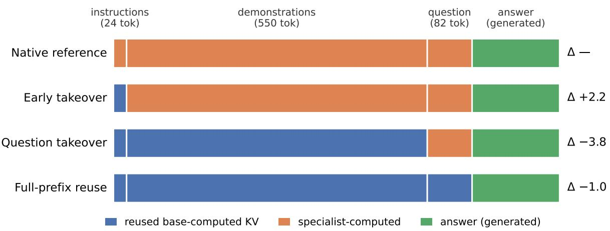
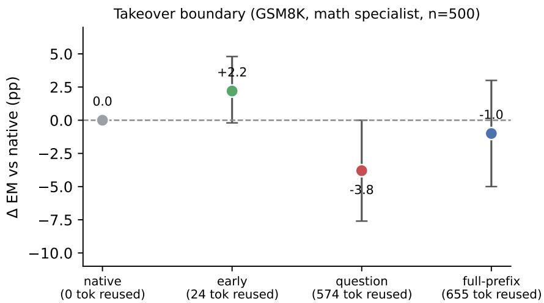
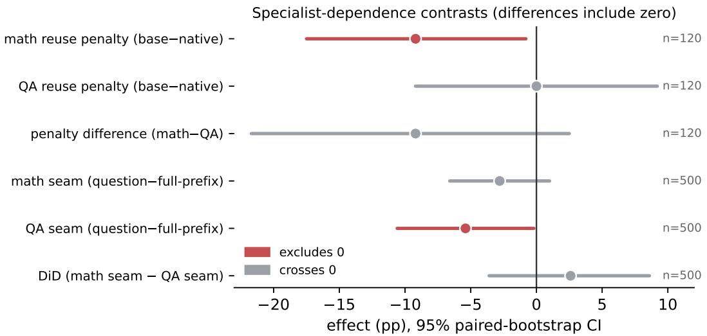

# Shared-Prefix KV Reuse Across Standard LoRA Adapters: Quality and Serving Tradeofs

Dushyant Rajput AltSlate Labs LLP dushyant@altslate.com

September 2026

## Abstract

A common small-model deployment runs one shared backbone with several LoRA [1] special ists that answer over the same context. Serving them na¨ıvely re-prefills that shared context once per specialist. We study a narrow, practical question: for already-trained standard LoRA adapters—not adapters retrained for cache compatibility—how much task quality is preserved if the backbone’s prefill KV cache is computed once and reused across specialists, and what does that buy in serving cost? On a Qwen3-1.7B [2] backbone with two adapters (extractive QA on HotpotQA [3], arithmetic reasoning on GSM8K [4]), we sweep the boundary at which the specialist takes over from the reused base cache and measure paired quality diferences and serving cost. Full-prefix reuse had the lowest prefill cost and a small quality diference on held-out GSM8K (∆ = −4.6 EM at a 160-token budget; −3.0 at 320 tokens; −0.8 under a second training seed—all favoring native, only the first excluding zero, and the magnitude not consistent). Partial recomputation provided no demonstrated advantage. Neither quality equivalence nor a general boundary-selection rule is established. We also report a closed-form ridge KV translator that did not beat direct reuse, and specialist-dependence contrasts whose intervals all include zero. The measured serving benefit is warm-cache time-to-first-token, which grows with context (≈16× at 8K); two-branch peak memory was only 12% lower and, on inspection, the prefix was never physically shared across branches—this implementation reuses KV values but copies their storage, so shared-cache memory savings are not achieved.

## 1 Introduction

Small models are increasingly deployed as a composable system: one backbone plus several lightweight LoRA [1] specialists, routed per request. These specialists often answer over a shared context—the same retrieved passages, the same conversation history, the same few-shot demonstrations—and difer only in the adapter applied. Serving such a system the obvious way re-runs the prefill over that shared context once per specialist that touches it.

Prefix caching in serving stacks (PagedAttention [5], RadixAttention [6]) already avoids recomputation when the same model sees an identical prefix. The question here is diferent: several diferent models (backbone + A<sub>i</sub>) see the same prefix. For a family of diferent-size models this needs a learned map between key/value spaces—NVIDIA’s closed-form linear KV transfer [7] and the concurrent CacheBridge [8]. Activated LoRA [9] and its serving engine [10] instead modify the adapter so a base prefix cache is exactly reusable by construction.

We study the case those methods do not target: standard LoRA adapters, already trained for their task with no cache-compatibility objective, on a shared backbone. The precise question is:

How much task quality does inference-time base-cache reuse preserve for already-trained standard LoRA adapters, without retraining for cache compatibility, and at what serving cost?

Our answer is qualified. We report the exact reuse procedure, a quality study with paired confidence intervals, a reconciled serving-cost accounting, one rejected translator, and specialistdependence contrasts that do not resolve. We are explicit about which measurements are exploratory and which we would trust, and about the gap between the context lengths used for quality and for serving cost.

## 2 Setting and method

Composable serving. One backbone B (Qwen3-1.7B [2]) hosts LoRA specialists, each rank-16 (α = 32) on the attention projections (q/k/v/o). We train two: QA on HotpotQA [3] and math on GSM8K [4] (recipe in Appendix C). At request time a router selects a specialist; several specialists may answer over the same shared context. Because every specialist shares the backbone weights (loaded once) and the same context, the shared prefix is a candidate for compute-once reuse. Throughout, M denotes the number of specialists sharing a context; the two trained adapters are used for quality, and M enters only the (adapter-agnostic) serving-cost accounting of §3.

Reuse procedure. The backbone computes the prefill KV cache for the shared prefix with adapters disabled (base representation). A chosen specialist then processes the non-reused suffix of the prompt on top of that cache and generates. No key/value mapping is applied. Crucially, the first answer token’s logits always come from the specialist, which processes at least one prompt token (Figure 2, Figure 1). For a boundary b (number of reused prefix tokens) and prompt of length T:

```ini
prefix_kv = forward(B, tokens[0:b], adapters_disabled).kv # b reused base-computed tokens
set_adapter(specialist) # base -> specialist
out = forward(specialist, tokens[b:T], past=prefix_kv) # suffix; positions continue at b..T-1
logits_1 = out.logits[-1] # FIRST answer token: specialist’s logits
# then greedy-decode with the specialist and the growing cache
```

Figure 1: Reuse procedure. native: b = 0 (specialist computes the whole prompt). early: b = |instr|. question: b = |instr| + |demos|. full-prefix: b = T − 1, so the specialist processes exactly the final prompt token before generating—not “generation only.” Position IDs continue from b; the reused cache is base-computed, the sufix and all generation are specialist-computed.

Takeover boundary. We formalize the prompt as three segments—[instructions | demonstrations | question] -> answer—and sweep b across the four settings above (Figure 2), holding the full prompt and greedy decoding fixed. This separates “how many tokens are reused” from “which content the specialist re-encodes.”

Evaluation. Metrics are deterministic: token-level F1 for extractive QA, exact-match (final numeric answer) for GSM8K; no model-based judging. We report paired bootstrap [11] 95% confidence intervals over per-example score diferences (10,000 resamples), the appropriate interval for the same-example, cached-vs-native comparisons here. Runs use transformers 5.5 / peft 0.20 / torch 2.11, bf16, greedy decoding, generation capped at 160 tokens, on NVIDIA Blackwell GPUs. Exact revisions, prompts, sample ranges, and timing methodology are in Appendix C.

  
Figure 2: The four takeover boundaries. Blue tokens reuse the base-computed prefill KV; orange tokens are processed by the specialist; green is the generated answer. In full-prefix the specialist still processes the final prompt token (a one-token orange sliver, not drawn to scale). The full prompt and decoding are identical across rows; only the boundary b moves.

## 3 Serving cost

We separate three quantities and, where possible, replace structural arithmetic with direct measurement. The central distinction is between logical reuse (a specialist reuses previously-computed KV values, skipping their recomputation) and physical sharing (those values occupy one copy of storage across branches). This implementation achieves the former; §3.2 shows it does not achieve the latter.

Prefill count (structural). When M specialists answer over one shared context, the shared prefix is prefilled once instead of M times. Reuse does not make per-specialist work vanish: each specialist still runs a sufix forward over its non-reused tokens plus generation (Figure 1). Table 3 gives single-prefix cost; the native per-specialist prefill (489 ms at 8K) exceeds the base prefill (413 ms) that reuse pays once.

## 3.1 Warm-cache latency (measured)

Table 1 reports latency across the three matched settings. TTFT for reuse is measured warm-cache: it excludes constructing the base prefix cache (that one-time cost—40/91/417 ms at 655/2K/8K— is amortized across specialists and reported separately) and includes the specialist’s final-prompttoken forward (Figure 1). Warm-cache TTFT is where reuse wins, and the win grows with context: at 8K, 30 ms vs. 486 ms, a ≈16× warm-cache TTFT speedup. Because reuse also generates longer outputs on GSM8K (§4), a TTFT improvement does not imply a completion-latency improvement: completion was faster at 8K QA (265 vs. 582 ms) but slower on GSM8K (3149 vs. 2787 ms).

<table><tr><td>setting</td><td>TTFT nat</td><td>TTFT reuse</td><td>compl nat</td><td>compl reuse</td><td>1-req peak nat</td><td>reuse</td></tr><tr><td>GSM8K ≈655</td><td>38 ms</td><td>30 ms</td><td>2787 ms</td><td>3149 ms</td><td>3.83 GB</td><td>3.65 GB</td></tr><tr><td>QA 2K</td><td>96 ms</td><td>30 ms</td><td>188 ms</td><td>196 ms</td><td>4.57 GB</td><td>3.95 GB</td></tr><tr><td>QA 8K</td><td>486 ms</td><td>30 ms</td><td>582 ms</td><td>265 ms</td><td>7.79 GB</td><td>5.35 GB</td></tr></table>

Table 1: Warm-cache latency and single-request peak memory (means; GSM8K $n = 5 0 0 .$ QA-2K $n = 3 0 0 .$ QA-8K $n = 2 0 0 )$ . Reuse TTFT excludes the one-time base prefill (40/91/417 ms) and includes the specialist’s final-token forward. Single-request peak is lower for reuse at long context because it skips native’s full-context prefill activation spike; this is a per-request working-set efect, not cross-branch sharing (§3.2).

## 3.2 Two-branch memory: logical reuse, no physical sharing

We held two branches (QA + math) over one shared context and measured peak allocation across generation (Table 2). Two-branch peak was 12% lower at 8K and 5% lower at 2K under reuse. This is not a sharing efect: inspecting tensor storage, the two branches’ prefix KV was never physically shared—0% of trials aliased the prefix, before or after generation—because the cache concatenates new keys/values each step, copying the prefix into each branch. The modest reduction comes from reuse doing one base prefill instead of two adapter prefills, not from one copy of the prefix serving both branches. Persistent shared-cache storage would require an implementation that preserves shared storage during generation (a paged cache is one route); it remains unimplemented here.

<table><tr><td>context</td><td>peak nat (2 br.)</td><td>peak reuse</td><td>reuse/native</td><td>prefix physically shared?</td></tr><tr><td>2048</td><td>4.62 GB</td><td>4.38 GB</td><td>0.95×</td><td>no (0%)</td></tr><tr><td>8192</td><td>7.92 GB</td><td>6.98 GB</td><td>0.88×</td><td>no (0%)</td></tr></table>

Table 2: Two simultaneously-retained branches (QA + math) over one shared context, n = 20, 32 generated tokens each. Reuse’s peak is modestly lower (one base prefill vs. two), but the prefix is never physically shared across branches—the saving is not from sharing.

<table><tr><td>context (tok)</td><td>prefix KV cache</td><td>base prefill</td><td>specialist prefill</td></tr><tr><td>700</td><td>80 MB</td><td>38 ms</td><td>42 ms</td></tr><tr><td>2048</td><td>235 MB</td><td>88 ms</td><td>100 ms</td></tr><tr><td>8192</td><td>940 MB</td><td>413 ms</td><td>489 ms</td></tr></table>

Table 3: Single-prefix cost (Qwen3-1.7B, bf16; one benchmark run). Cache is the KV tensor footprint reuse avoids recomputing; prefill is what reuse avoids repaying per specialist. Specialist prefill exceeds base by the adapter’s matrix-multiply overhead.

Scope. Backbone weights (3.5 GB) are resident once regardless of reuse; per-specialist answer-side caches and generation bufers are unchanged. The serving benefit is warm-cache latency (largest at long context), not a peak-memory reduction from sharing. The quality study (§4) uses ≈655-token GSM8K prompts and 2K/8K QA contexts, so quality and latency are reported at matched scales; equivalence at any scale is not claimed (§6).

## 4 Quality of reused-KV inference

Own-KV control (harness check). Reusing each specialist’s own recomputed prefix KV should be near-identical to native. It was (math EM 49.2 vs. 48.3, n = 120): 3/120 examples disagreed (two cached-correct, one native-correct). We did not instrument the numerical divergence (e.g. per-layer KV or first-token logit deltas), so we report the discrepancy as consistent with greedy sensitivity to cache-reconstruction diferences but not further diagnosed. It is small relative to the cross-source efects below.

Central result. On 500 untouched GSM8K examples, full-prefix base-KV reuse reduced accuracy from 54.4% to 49.8% (∆ = −4.6 percentage points; paired CI [−8.8, −0.4]; the point estimate moves to −3.0 at a larger budget and −0.8 under a second seed—see Generation budget and Replication below). In the 8K supplied-context QA workload, reuse reduced warm-cache TTFT from 486 ms to 30 ms. Two-branch peak memory was 12% lower, but storage inspection found no physical prefix sharing. These results establish a quality–TTFT tradeof; persistent shared-cache storage remains unimplemented.

Matched quality with a base-only baseline. Table 4 gives the three conditions on identical examples per setting. The adapter is necessary: base-only trails native by 46 EM on GSM8K and 27–29 F1 on QA—though, since base-only reaches the 160-token generation limit on 100% of GSM8K examples, this establishes adapter necessity under the tested decoding budget, not budgetindependent inferiority. Full-prefix reuse costs a small but mostly significant amount of quality: −4.6 EM on GSM8K and −6.6/−4.5 F1 on QA at 2K/8K.
<table><tr><td>setting (metric)</td><td>base-only</td><td>native</td><td>reuse</td><td></td><td>∆ reuse-native cap% nat/reuse</td></tr><tr><td>GSM8K, EM (n=500)</td><td>8.4</td><td>54.4</td><td>49.8</td><td> $- 4 . 6 \ [ - 8 . 8 , - 0 . 4 ]$ </td><td>15 / 30</td></tr><tr><td>QA 2K, F1 (n=300)</td><td>42.7</td><td>69.4</td><td>62.8</td><td>−6.6 [−10.5, −2.7]</td><td>0 / 0.7</td></tr><tr><td>QA 8K, F1 (n=200)</td><td>43.3</td><td>72.5</td><td>67.9</td><td> $- 4 . 5 \ [ - 9 . 3 , + 0 . 1 ]$ </td><td>0/3</td></tr></table>

Table 4: Matched quality on identical examples per setting (paired bootstrap CIs). base-only ∆ vs native is −46.0/−26.6/−29.2 (all excluding zero). GSM8K uses untouched test[580:1080]; QA uses constructed 2K/8K contexts (gold paragraphs preserved, Appendix C). cap% is the fraction reaching the 160-token limit.

Generation budget. Reuse reached the 160-token cap more often than native (30% vs. 15%). At a pre-frozen 320-token budget on the same held-out examples, both conditions improve and cap-hit falls (native 59.4 EM / 1.2% capped; reuse $5 6 . 4 \mathrm { ~ / ~ } 6 . 6 \% )$ , and the penalty’s point estimate moves from −4.6 to −3.0 (CI now including zero). But the direct paired contrast of the two budgets is +1.6 EM (CI $[ - 0 . 8 , + 4 . 0 ] )$ , which includes zero: we cannot conclude the budget significantly changed the penalty. The higher cap-hit is evidence of changed generation behavior; its causal contribution to the accuracy gap is not established.

Replication across adapter initialization (second seed, same held-out examples). The secondseed adapter reached a comparable native baseline (53.8 vs. 54.4 EM)—a valid replication—with a reuse penalty of $- 0 . 8 \left( \mathrm { C I \ [ - 5 . 0 , + 3 . 2 ] } \right)$ . The direct paired seed contrast (seed 2 − seed 1, both 160 tokens) is +3.8 EM (CI [−0.4, +8.2]), including zero, so the two checkpoints’ penalties are not shown to difer. In summary: across two adapter initialization seeds on the same held-out examples, full-prefix reuse produced GSM8K accuracy diferences of −4.6 and −0.8 EM at a 160-token budget; raising the first seed’s budget to 320 tokens reduced its observed gap to −3.0. All point estimates favored native inference, but only the first configuration’s interval excluded zero. These results neither establish a consistent penalty magnitude nor demonstrate quality equivalence. Two seeds cannot characterize seed variability; the base-only gap (≈−45 EM, under the tested decoding budget) does reproduce, so adapter necessity is robust even where the reuse penalty is not.

Held-out vs. overlapping evaluation. The GSM8K penalty above (−4.6, test[580:1080]) comes from examples untouched by any earlier run. The boundary study below used test[80:580], which overlaps prior development, and gave −1.0 [−5.0, +3.0] for the same full-prefix condition. The two intervals overlap, so we do not claim overlap caused the diference; we take the untouched evaluation to establish a penalty under this protocol, and treat the overlapping one as insuficient confirmation.

Extractive QA with supplied context. This result is not the full distractor-retrieval task: for each HotpotQA [3] example we concatenate the distractor context (all 10 paragraphs, 2 gold + 8 distractor) and truncate to 700 tokens, then reuse the base prefix cache of that context for the QA specialist. Truncation can drop answer-bearing text (not audited), so scores are a lower bound on the oracle-context setting. At this short (700-tok) context, reuse matched native: $\Delta = + 0 . 3 ~ \mathrm { F 1 }$ CI [−1.5, +2.2] (Table 5). Read with Table 4, the QA reuse penalty is context-dependent: +0.3 at 700 tok, then −6.6 (2K) and −4.5 (8K)—reuse is not free once the shared context is long.

<table><tr><td>QA specialist (HotpotQA, supplied context, n = 500)</td><td>F1 ∆ vs native</td></tr><tr><td>Native (specialist prefills context)</td><td>53.0</td></tr><tr><td></td><td>+0.3 [−1.5, +2.2]</td></tr><tr><td>Full-prefix base-KV reuse aLoRA adapter, native (preliminary)</td><td>53.3 42.6</td></tr></table>

Table 5: QA F1 on the supplied-context setting. Native and reuse are the standard-LoRA specialist. The aLoRA row is a preliminary run with matched rank/targets; activation correctness was not verified (§5), and it is not established to be on the identical sample as the standard-LoRA rows. The 53.0 here is QA F1 and is unrelated to the numerically-coincident GSM8K native EM of 53.0.

Takeover boundary (GSM8K, math specialist, n = 500, overlapping sample test[80:580]). As a mechanism probe, moving only b (Table 6, Figure 3) gives a non-monotonic pattern: recomputing more of the prefix is not uniformly better. (This is the overlapping-sample study; the held-out penalty is above.)
<table><tr><td>boundary</td><td>specialist processes</td><td>EM</td><td>∆ vs native (paired)</td><td></td></tr><tr><td>Native reference</td><td>entire prompt</td><td>53.0</td><td></td><td></td></tr><tr><td>Early takeover</td><td>demonstrations + question</td><td>55.2</td><td></td><td>+2.2 [−0.2, +4.8]</td></tr><tr><td>Question takeover</td><td>question only</td><td>49.2</td><td></td><td>-3.8 [−7.6, +0.0]</td></tr><tr><td>Full-prefix reuse</td><td>final prompt token only</td><td>52.0</td><td></td><td>-1.0 [−5.0, +3.0]</td></tr></table>

Table 6: Boundary sweep, math specialist, GSM8K, n = 500 (test[80:580]), paired bootstrap CIs. Fullprefix reuse is closest to native and cheapest; the mid-context “question takeover” has the worst point estimate but its CI reaches zero.

  
Figure 3: ∆ EM vs native as a function of reused-prefix size (paired bootstrap 95% CIs). Non-monotonic: reusing more is not uniformly worse. Full-prefix reuse (rightmost) returns closest to native.

Two comparisons matter. Full-prefix reuse is closest to native $( \Delta = - 1 . 0 \mathrm { p p } , \mathrm { C I } \left[ - 5 . 0 , + 3 . 0 \right] )$ and processes the fewest specialist tokens. Question takeover—the intuitive “share the background, let the specialist encode the question” policy—has the worst point estimate $( \Delta = - 3 . 8 \mathrm { p p }$ ， $\mathrm { C I } \ [ - 7 . 6 , + 0 . 0 ] )$ ; its direct paired contrast against full-prefix reuse is $- 2 . 8 \mathrm { p p \ ( C I \ [ - 6 . 6 , + 1 . 0 ] ) }$ , which includes zero.

Interpretation. In our tested setup full-prefix reuse is cheaper than every other condition and has a better observed point estimate than question takeover (early takeover has the highest point estimate, but its interval also includes zero). We do not establish quality equivalence (the interval permits a loss up to ≈5pp) nor a general boundary-selection rule: §4 does not support “always recompute more” or “never split representations.” The consistent direction (the mid-context boundary is the worst cell in every run we did) is a tendency we cannot yet attribute to a mechanism.

## 5 Comparisons and negative results

Standard LoRA vs Activated LoRA. Because aLoRA [9] is designed for exact base-cache reuse (adapter weights activate only after an invocation sequence) and its serving engine [10] implements this, it is the natural comparison. We trained an aLoRA adapter on the same QA data (invocation “Answer:”, matched rank/target modules; Appendix C). This is a preliminary aLoRA run; activation correctness unverified. Its native F1 was 42.6 versus the standard-LoRA specialist’s 53.0, but because we did not validate the activation gating (below), we do not attribute this gap to training quality, capacity, or architecture—it is not yet interpretable. Our structural cached-vs-uncached parity check for the aLoRA adapter was inconclusive: a plain forward pass does not exercise the generation-time activation gating that makes aLoRA’s reuse exact, so we could not confirm end-to-end exactness in our harness. A proper comparison (matched standard-LoRA and aLoRA quality, their training configs, and aLoRA cached-vs-uncached parity under generation) is left as needed work.

A ridge KV translator does not earn its cost. Motivated by cross-model transfer [7, 8], we fit closed-form per-head ridge maps (RoPE-stripped keys, single-layer l→l and top-k multi-layer)

to translate base KV into the specialist’s space. On our same-backbone setting it did not beat direct reuse on task quality while adding per-layer matrix-multiply cost per reused token. (For the harder cross-size base→base case it improved fidelity—multi-layer maps reached 78.5% next-token top-1 agreement—but task retention was 33–56% and the accurate map was not economical.) The tested ridge map is rejected; translation as a class is not.

Specialist dependence is not established. Is the reasoning specialist specifically fragile under reuse? Two contrasts test this and both include zero (Appendix A). The base-reuse-vs-native penalty diference between adapters was −9.2pp (CI [−21.7, +2.5], n = 120). The takeover-seam diference-in-diferences, (question − full-prefix)<sub>math</sub> − (question − full-prefix)<sub>QA</sub>, was +2.6pp (CI [−3.6, +8.6], n = 500)—and the point estimate reverses: the math seam (−2.8pp, CI [−6.6, +1.0]) was smaller than the QA seam (−5.4pp, CI [−10.6, −0.2]). Their individual intervals exclude zero for the math reuse penalty and the QA seam, but the diferences between specialists do not. Notably, for the weak-on-task QA specialist, letting the base encode the question was associated with higher EM (full-prefix 44.2 vs. question-takeover 38.8). The present comparisons do not establish specialist dependence; we do not inflate the sample to seek significance.

## 6 Limitations and future work

The central claim is a quality–latency tradeof, not equivalence: the GSM8K held-out reuse penalty (−4.6) excludes zero and the QA penalty grows with context. Several gaps bound the claims:

• The penalty is partly truncation. Reuse doubled the GSM8K generation-cap rate (15%→30%); a pre-frozen 320-token diagnostic shrinks the penalty from −4.6 to −3.0 (CI now includes zero). Part of the loss is decoding-budget truncation; a residual negative point estimate remains, so a budget-independent penalty is neither established nor excluded.

• Two “shared context” workloads difer. Full-prefix reuse as measured shares an identical full prompt across specialists. Sharing background passages across diferent questions is a diferent setting our full-prefix result does not establish; it corresponds to a mid-prompt boundary, which is exactly where we see the (uncertain) penalty.

• Provenance. The n = 500 boundary evaluation (test[80:580]) is a larger follow-up evaluation, not an independent held-out confirmation: it overlaps the boundary-development slice (test[80:200]) entirely and the earliest development run used test[0:500]. A clean result needs a frozen harness and primary comparison, then a fresh evaluation whose size is set for a prespecified precision or noninferiority margin.

• Generality. One backbone, small (1.7B) scale, two tasks. A second-seed replication is done (above); its point estimate (−0.8) difers from seed 1’s (−4.6) but the direct contrast includes zero, so the penalty magnitude is uncharacterized, not shown unstable. Two seeds cannot estimate seed variability; replication on a diferent backbone and more seeds is the remaining generality test, alongside re-checking the null specialist-dependence result under those conditions.

The boundary sweep is parked; the exploratory measurement history is in Appendix B.

## 7 Related work

Cross-model KV transfer. Heo et al. [7] fit a closed-form linear mapping to transfer KV between diferent-size models in a family, reporting 2.7–25× mapper speedups and 73–98% accuracy retention on four of six pairs. CacheBridge [8] is a concurrent method for cross-model KV transfer with its own comparisons and results (we do not restate its numbers). Both target the cross-size case where key/value spaces difer and a map is required. Our setting is the complementary one— same backbone, diferent LoRA head—where, for full-prefix reuse, no map is applied; our ridge-map result is a negative for this regime.

Adapter-aware caching. Activated LoRA [9] modifies the adapter so base-prefix KV is exactly reusable, and a serving engine [10] implements multi-adapter serving on this reuse in vLLM. We instead ask what already-trained standard LoRA adapters preserve under direct reuse, and quantify it with paired intervals; §5 gives our (partial) aLoRA comparison.

Prefix caching. PagedAttention [5] and RadixAttention [6] reuse KV across requests sharing an identical prefix under the same model. Our question is reuse of one prefill across diferent specialists of a shared backbone.

## 8 Conclusion

For composable serving on a shared backbone, reusing the backbone’s prefill KV cache across already-trained standard LoRA specialists is a quality–latency tradeof. The measured benefit is warm-cache time-to-first-token, which grows with context (≈16× at 8K); the cost is a small quality loss whose magnitude was not consistent on GSM8K (held-out −4.6 EM at 160 tokens, −3.0 at 320, −0.8 under a second seed—all favoring native, only the first excluding zero) and contextdependent on QA (−6.6/−4.5 F1 at 2K/8K). The memory story is the paper’s main correction: this implementation reuses KV values but copies their storage—two-branch peak was only 12% lower at 8K and the prefix was never physically shared, so shared-cache memory savings are not achieved and would need a paged cache. Partial recomputation gave no demonstrated advantage; a ridge translator did not earn its cost; specialist-dependence did not resolve. The immediate next step is the frozen generation-budget diagnostic (to settle the truncation question), then a replication on another seed/backbone; the claims above should be confirmed on one’s own adapters before reuse is assumed lossless.

## A Specialist-dependence contrasts

  
Figure 4: Contrasts bearing on specialist-specific reuse penalty. Red intervals exclude zero; grey include it. The individual math reuse penalty and $\mathrm { Q A }$ seam exclude zero, but the diferences between specialists—the penalty diference $( n = 1 2 0 )$ and the seam diference-in-diferences $( n = 5 0 0 )$ —include zero, and the DiD point estimate is positive. Note the difering n; these come from separate runs.

## B Exploratory measurement history

The “question takeover” penalty changed across successive development measurements (Table 7). These are not independent replications: sample draw and prompt construction changed together. One diference we can rule out is add special tokens (a no-op here—the Qwen3 tokenizer emits no BOS token, verified); the rest (a shared instruction preamble; diferent, overlapping GSM8K slices) are confounded. We report the final row and treat the earlier ones as development history, not evidence of a fixed bug.

<table><tr><td>run (role)</td><td>n</td><td>prefix</td><td>test slice</td><td>∆ (question)</td></tr><tr><td>initial (dev)</td><td>500</td><td>demos</td><td>test[0:500]</td><td>-14.4</td></tr><tr><td>matrix (dev)</td><td>120</td><td>demos</td><td>test[0:120]</td><td>-9.2</td></tr><tr><td>boundary (dev)</td><td>120</td><td>instr+demos</td><td>test[80:200]</td><td>-4.2</td></tr><tr><td>confirm (follow-up)</td><td>500</td><td>instr+demos</td><td>test[80:580]</td><td>-3.8</td></tr></table>

Table 7: Development history of the “question takeover” penalty. The final follow-up overlaps the boundary development slice (test[80:200] ⊂ test[80:580]); it is not an independent held-out sample.

## C Reproducibility

Code, adapter checkpoints, exact configs, prompts, and per-example score arrays are at https: //github.com/AltSlate-Labs/routekv. Remaining unpinned items (below) are marked; this appendix is an outline, and the fully-pinned artifact accompanies the repository.

Models. Backbone Qwen/Qwen3-1.7B (bf16; HF revision main, exact commit pinned in the repo). Specialists are LoRA [1] adapters, rank 16, α = 32, dropout 0, target modules q proj,k proj,v proj,o proj; QA trained on HotpotQA [3] (distractor split), math on GSM8K [4] (main), plus one aLoRA [9] QA adapter (invocation “Answer:”, matched rank/targets). Per-adapter SFT recipe, seeds, and checkpoint hashes are in the repo (training seeds were not varied—a single seed per task, which is why replication across seeds is future work).

Evaluation. GSM8K: 4 fixed few-shot demonstrations from the train split; prompt [instruction | demos | "Question: {q}\nAnswer:"]; greedy, generation capped at 160 tokens. Answer extraction removes thousands-separators (commas), then takes the last signed-integer match; decimals and fractions are not parsed and a completion with no integer scores as wrong. The fraction of completions that hit the 160-token cap was not logged in these runs (it is reported in the planned matched experiment, §6); cap-induced truncation could bias adapter comparisons and is a known gap. QA: for each example the distractor context (all 10 paragraphs, 2 gold + 8 distractor) is concatenated and truncated to 700 tokens (truncation can drop answer text; not audited), token-leve F1 on the first output line. Sample ranges: boundary follow-up GSM8K test[80:580] (n = 500, overlapping earlier development slices, Appendix B); own-KV control and penalty-diference contrast n = 120; QA n = 500. Paired bootstrap CIs use 10,000 resamples of per-example diferences [11]; per-example arrays are released.

Systems measurement. transformers 5.5 / peft 0.20 / torch 2.11, one NVIDIA RTX PRO 4500 Blackwell GPU; attention backend and exact timing protocol (warmup, repetitions, CUDA synchronization) are pinned in the repo—reported timings here are single-run. Table 3 (singleprefix cost), Table 1 (warm-cache latency), and Table 2 (two-branch peak) are separate runs. Prefix-cache figures in Table 3 are KV tensor footprint. The physical-sharing check (Table 2) is a data ptr identity test across the two branches’ prefix tensors, measured before and after generation.

Translator. Per-head ridge maps calibrated on 40 held-out HotpotQA distractor contexts (N CAL=40) with RoPE-stripped keys; single-layer l→l and top-k multi-layer variants; ridge regularization λ = 10. Reported cross-size fidelity (next-token top-1 agreement) and task retention are from that calibration; the numerical comparison against direct reuse (no quality gain, added per-token matrix-multiply cost) is in the repo. The map was not adopted.

## References

[1] Edward J. Hu, Yelong Shen, Phillip Wallis, Zeyuan Allen-Zhu, Yuanzhi Li, Shean Wang, Lu Wang, and Weizhu Chen. Lora: Low-rank adaptation of large language models. arXiv preprint arXiv:2106.09685, 2021.

[2] An Yang et al. Qwen3 technical report. arXiv preprint arXiv:2505.09388, 2025.

[3] Zhilin Yang, Peng Qi, Saizheng Zhang, Yoshua Bengio, William W. Cohen, Ruslan Salakhutdinov, and Christopher D. Manning. Hotpotqa: A dataset for diverse, explainable multi-hop question answering. In Conference on Empirical Methods in Natural Language Processing (EMNLP), 2018.

[4] Karl Cobbe, Vineet Kosaraju, Mohammad Bavarian, et al. Training verifiers to solve math word problems. arXiv preprint arXiv:2110.14168, 2021.

[5] Woosuk Kwon, Zhuohan Li, Siyuan Zhuang, Ying Sheng, Lianmin Zheng, Cody Hao Yu, Joseph E. Gonzalez, Hao Zhang, and Ion Stoica. Eficient memory management for large language model serving with pagedattention. In Proceedings of the 29th Symposium on Operating Systems Principles (SOSP), 2023.

[6] Lianmin Zheng, Liangsheng Yin, Zhiqiang Xie, Chuyue Sun, Jef Huang, Cody Hao Yu, Shiyi Cao, Christos Kozyrakis, Ion Stoica, Joseph E. Gonzalez, Clark Barrett, and Ying Sheng. Sglang: Eficient execution of structured language model programs. In Advances in Neural Information Processing Systems (NeurIPS), 2024.

[7] Taekyung Heo, Rasoul Shafipour, Ritchie Zhao, Maximilian Golub, Mohammad Mahdi Kamani, Ritika Borkar, Makesh Tarun Chandran, Pantea Zardoshti, and Bita Darvish Rouhani. Cross-model kv cache transfer in llm families: A closed-form linear mapping for prefill reuse. arXiv preprint arXiv:2608.03893, 2026.

[8] Xingyu Qu, Siyuan Lu, Zhiyu Chen, Sheng Wang, and Tao Lin. Cachebridge: Eficient crossmodel kv cache transfer. arXiv preprint arXiv:2609.00891, 2026.

[9] Kristjan Greenewald, Luis Lastras, Thomas Parnell, Vraj Shah, Lucian Popa, Giulio Zizzo, Chulaka Gunasekara, Ambrish Rawat, and David Cox. Activated lora: Fine-tuned llms for intrinsics. arXiv preprint arXiv:2504.12397, 2025.

[10] Allison Li, Kristjan Greenewald, Thomas Parnell, and Navid Azizan. Eficient multiadapter llm serving via cross-model kv-cache reuse with activated lora. arXiv preprint arXiv:2512.17910, 2025.

[11] Bradley Efron and Robert J. Tibshirani. An Introduction to the Bootstrap. Chapman & Hall/CRC, 1993.