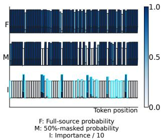
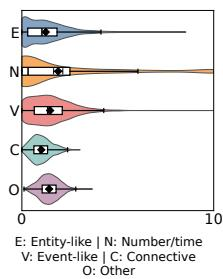
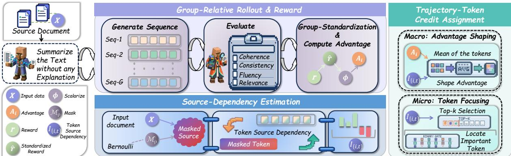
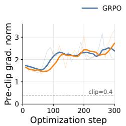
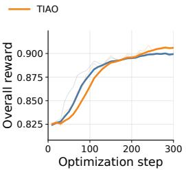

# TIAO: TOKEN IMPORTANCE-AWARE POLICY OPTIMIZATION FOR TEXT SUMMARIZATION

Qixiu Li1,† Chenlong Bao1,† Xiang Zhu1,∗ Xiaoyong Li1,∗ Ruixin Cao1 Shukai Chen1 Zhenxiong Zhou1

1National University of Defense Technology

## ABSTRACT

Text summarization requires models to condense content while preserving key qualities such as consistency and coherence. Large language models (LLMs) have shown strong performance on this task and can be further improved through reinforcement learning (RL). However, most existing methods apply reward signals directly to undifferentiated token sequences, overlooking the varying importance of individual tokens to word and sentence level quality in summarization. In this paper, we propose Token Importance-Aware Policy Optimization (TIAO), a novel reinforcement learning strategy that explicitly leverages token-importance awareness. Specifically, TIAO identifies core tokens based on token dependency and reweights a trajectory’s advantage according to its overall dependencies. Experiments on the real world dataset show that our TIAO achieves highly competitive results, and that a 7B foundation model enhanced by TIAO performs comparably to GPT-4 and GPT-5-nano. Code is available at https://github.com/TechCloud-x/TIAO.

Index Terms— Reinforcement Learning, Text Summarization

## 1. INTRODUCTION

Text summarization is a selective information compression problem: a system must shorten a source document while preserving salient entities, numbers, events, and relations, and while maintaining coherence, relevance, fluency, and factual consistency. Pre-trained sequenceto-sequence models and recent large language models (LLMs) have substantially improved abstractive summarization quality [1, 2, 3]. Yet factuality studies show that fluent summaries may still hallucinate or distort source-supported content [4, 5, 6]; once key evidence is dropped during compression, fluent surface realization cannot recover it. This has motivated multi-dimensional evaluators for consistency, coherence, relevance, and fluency [7, 8, 9]. Reinforcement learning (RL) offers a direct way to optimize such non-differentiable quality signals, from human-feedback summarization [10] to recent multi objective reward balancing policy HVO [11]. These methods mainly improve what reward should define a better summary.

However, summarization policy optimization also faces a creditresolution mismatch. Autoregressive generation is a token-level sequence decision process, where the policy selects each token conditioned on the source and the generated prefix. In contrast, summary quality is usually evaluated only after the whole sequence is completed. In a GRPO-style objective [12], the same trajectory advantage is commonly multiplied by token-wise policy ratios across positions. This distinguishes better and worse summary trajectories, but cannot identify which positions actually depend on the source document or determine factual coverage. The resulting reward broadcast can dilute useful gradients over many low-information tokens.

Recent fine-grained RL methods partially address this limitation. Process reward models and step-wise verifiers provide denser feedback for reasoning traces [13, 14], while reward redistribution decomposes holistic feedback into token-level rewards [15]. Entropy based analysis further shows that a small fraction of uncertain tokens can dominate RL gains in reasoning models [16]. Optimization-side advances such as DAPO [17] and SAPO [18] improve large-scale LLM RL through token-level design, dynamic sampling, and tokenadaptive update control. Nevertheless, these approaches often rely on auxiliary reward models, process annotations, or output-side proxy signals, and are largely developed for mathematical or general reasoning. For summarization, the central question is different: whether an output token is genuinely supported by source evidence.

  
(a) 3D heatmap

  
(b) Distributions  
Fig. 1. TIAO token dependency analysis under source masking. (a) compares full-source and masked-source token probabilities and highlights source-dependent update positions. (b) summarizes trajectorylevel dependency patterns across token categories.

This paper targets this missing link. Under multi-dimensional summarization rewards, existing algorithms still lack sourcedependency-aware credit assignment that can align sequence-level quality feedback with token-level evidence usage. Such a mechanism should distinguish source-grounded trajectories from language-prior shortcuts and, within the same trajectory, assign stronger learning pressure to tokens whose probabilities are sensitive to the source document. Importantly (Fig. 1), this should be achieved without training additional token critic. Better rewards specify what to learn; our goal is to decide where and how strongly the policy should learn.

To this end, we propose Token Importance-Aware Policy Optimization (TIAO), a source-sensitive policy optimization method for text summarization. TIAO forms a dual-scale optimization loop: source perturbation estimates token dependency; token dependencies are aggregated into trajectory-level source dependency; trajectory advantages are scaled by this dependency; and token updates are focused on source-sensitive positions. Our contributions are threefold. ❶ We define a source-dependency measure for summary output tokens based on probability changes under counterfactual source masking. ❷ We introduce a trajectory-token credit assignment strategy that jointly reweights trajectory advantages and concentrates token-level policy updates. ❸ We validate TIAO on CNN/Daily-Mail [19], demonstrating improvements in summary quality, training stability.

  
Fig. 2. The logic implementation of our proposed TIAO.

## 2. METHODOLOGY

## 2.1. Overview

We propose Token Importance-Aware Policy Optimization (TIAO), a source-sensitive reinforcement learning framework for abstractive summarization. As shown in Fig. 2, TIAO keeps the standard grouprelative rollout and multi-dimensional summarization rewards, but changes how the resulting learning signal is assigned. For each sampled summary, we perturb the source document and re-score the same output tokens under the original and perturbed sources. The induced probability shift estimates how strongly each output token depends on source evidence. TIAO then uses this signal at two levels: it reshapes the trajectory advantage according to the summary’s overall source dependency, and it filters token-level policy gradients toward the most source-sensitive output positions. Thus, the reward still defines what summary is better, while TIAO determines where the policy should learn from it.

## 2.2. Problem Formulation

Given a document x and a reference summary $y ^ { \star }$ , a policy πθ generates an abstractive summary $y = ( y _ { 1 } , \dots , y _ { T } )$ autoregressively:

$$
y _ { t } \sim \pi _ { \theta } ( \cdot \mid x , y _ { < t } ) , \quad t = 1 , \ldots , T .\tag{1}
$$

Text summarization policy optimization is therefore a sequence decision problem with token-level actions and sequence-level feedback. Since generated summaries have variable lengths, we define a validtoken mask $c _ { i , t } \in \{ 0 , 1 \}$ for the i-th sampled trajectory, where tokens after the first end-of-sequence marker are excluded and $\begin{array} { r } { T _ { i } = \sum _ { t } c _ { i , t } } \end{array}$ Let $\mathbf { r } ( x , y ) \in \mathbb { R } ^ { D }$ denote a multi-dimensional evaluator, where the dimensions correspond to coherence, consistency, fluency, and relevance in our implementation. A scalar trajectory reward is obtained through an external aggregation function Φ, calculated as:

$$
R ( x , y ) = \Phi ( \mathbf { r } ( x , y ) ) .\tag{2}
$$

TIAO is independent of the specific evaluator and aggregation rule. Its role is to convert the resulting trajectory-level signal into sourceaware trajectory and token credits without an additional token critic.

## 2.3. Multi-Dimensional Group-Relative Policy Optimization

For each document x, the old policy $\pi _ { \theta _ { \mathrm { o l d } } }$ samples a group of G summaries $\{ y _ { i } \} _ { i = 1 } ^ { G }$ . Each summary first receives a reward vector $\mathbf { r } _ { i } = [ r _ { i , 1 } , \ldots , r _ { i , D } ]$ . To make different dimensions comparable before scalarization, we write a group-wise standardized score as:

$$
\hat { r } _ { i , d } = \frac { r _ { i , d } - \mu _ { d } } { \sigma _ { d } + \epsilon _ { d } } , \quad \mu _ { d } = \frac { 1 } { G } \sum _ { j = 1 } ^ { G } r _ { j , d } .\tag{3}
$$

The scalar reward is then obtained as $R _ { i } = \Phi ( \hat { \mathbf { r } } _ { i } ; \lambda )$ , where $\lambda \in$ $\Delta ^ { D - 1 }$ denotes non-negative dimension preferences and Φ may represent a linear or non-linear aggregation. TIAO treats this reward construction as an external evaluator and modifies only the credit assigned to generated tokens. Following the group-relative policy optimization paradigm, we normalize scalar rewards within the group, which can be mathematically formulated as:

$$
A _ { i } = \frac { R _ { i } - \mu _ { R } } { \sigma _ { R } + \epsilon } , \quad \mu _ { R } = \frac { 1 } { G } \sum _ { j = 1 } ^ { G } R _ { j } ,\tag{4}
$$

where $\sigma _ { R }$ is the within-group reward standard deviation and ϵ is a small constant. The token-wise policy ratio is calculated as:

$$
w _ { i , t } ( \theta ) = \frac { \pi _ { \theta } ( y _ { i , t } \mid x , y _ { i , < t } ) } { \pi _ { \theta _ { \mathrm { o l d } } } ( y _ { i , t } \mid x , y _ { i , < t } ) } .\tag{5}
$$

The corresponding unclipped token contribution can be written as $g _ { i , t } = c _ { i , t } w _ { i , t } ( \theta ) A _ { i }$ , which shows the credit-resolution issue explicitly: all valid positions inherit the same trajectory-level scalar. In conventional GRPO-style training, this is efficient, but it treats factual content tokens, discourse markers, and low-information function words as equally responsible for the sequence-level reward.

## 2.4. Source-Dependency Estimation for Output Tokens

TIAO estimates token importance by measuring whether the probability of an already generated token changes when source evidence is partially removed. Let the source be ${ \boldsymbol x } = ( x _ { 1 } , \dots , x _ { N } )$ . For each sampled trajectory, we draw an independent source mask as:

$$
b _ { i , n } \sim \mathrm { B e r n o u l l i } ( 1 - \rho ) , \quad \tilde { x } _ { i , n } = \left\{ \begin{array} { l l } { x _ { n } , } & { b _ { i , n } = 1 , } \\ { [ \mathrm { M A S K } ] , } & { b _ { i , n } = 0 , } \end{array} \right.\tag{6}
$$

where $\rho \in ( 0 , 1 )$ controls the perturbation strength. This defines the counterfactual source $\tilde { { \boldsymbol { x } } } _ { i } = \mathcal { M } _ { \rho } ( { \boldsymbol { x } } ; { \mathbf { b } } _ { i } )$ while keeping the generated prefix $y _ { i , < t }$ unchanged. We then compute teacher-forced log probabilities under the rollout policy. The process is as follow:

$$
\ell _ { i , t } ^ { F } = \log \pi _ { \theta _ { \mathrm { o l d } } } ( y _ { i , t } \mid x , y _ { i , < t } ) , \quad \ell _ { i , t } ^ { M } = \log \pi _ { \theta _ { \mathrm { o l d } } } ( y _ { i , t } \mid \tilde { x } _ { i } , y _ { i , < t } ) .\tag{7}
$$

We define the token source dependency as a sampled-token lowvariance estimate of the conditional divergence between the fullsource and masked-source predictions, which can be expressed as:

$$
d _ { i , t } = \mathrm { c l i p } ( \ell _ { i , t } ^ { M } - \ell _ { i , t } ^ { F } , - \tau , \tau ) , \quad I _ { i , t } = c _ { i , t } \left[ \mathrm { e x p } ( d _ { i , t } ) - d _ { i , t } - 1 \right] .\tag{8}
$$

A larger $I _ { i , t }$ indicates that $y _ { i , t }$ is more sensitive to the source document. The clipping threshold τ only stabilizes extreme log-probability shifts and does not introduce any trainable critic. This formulation focuses on source support rather than output-side uncertainty alone: a token is important only when removing source evidence changes the model’s confidence in producing it.

## 2.5. Trajectory–Token Credit Assignment

Based on the dependency scores, TIAO reshapes the learning signal at both macro and micro levels.

Macro-level: trajectory advantage shaping. For each generated summary, we aggregate token dependencies into a trajectory dependency score. This operation can be mathematically formulated as:

$$
S _ { i } = \frac { \sum _ { t } c _ { i , t } I _ { i , t } } { \sum _ { t } c _ { i , t } + \delta _ { T } } ,\tag{9}
$$

where $\delta _ { T }$ prevents division by zero for degenerate completions. We then compute a mean-preserving positive scale over the rollout batch B, this operation can be formulated as:

$$
\alpha _ { i } = \frac { S _ { i } } { \bar { S } + \delta } , ~ \bar { S } = \frac { 1 } { | \mathscr { B } | } \sum _ { j \in B } S _ { j } ,\tag{10}
$$

where $\delta$ prevents numerical instability. The shaped advantage is:

$$
{ \tilde { A } } _ { i } = \alpha _ { i } A _ { i } .\tag{11}
$$

This scaling amplifies updates for high-reward summaries that are strongly grounded in the source, while also applying stronger corrective pressure to low-reward summaries whose errors occur in source-dependent regions.

Micro-level: token update focusing. Within each trajectory, we select the top-κ proportion of valid output tokens according to $I _ { i , t } ,$ where $\kappa \in ( 0 , 1 )$ . Let $\mathrm { r a n k _ { \downarrow } } ( I _ { i , t } )$ be the descending rank of token t among valid tokens in the same trajectory, with invalid positions assigned infinite rank. The selected index set and binary token gate are computed mathematically as:

$$
\begin{array} { r } { \mathcal { K } _ { i } = \{ t \mid c _ { i , t } = 1 , \mathrm { r a n k } _ { \downarrow } ( I _ { i , t } ) \leq \lceil \kappa T _ { i } \rceil \} , \quad m _ { i , t } = c _ { i , t } \mathbb { I } ( t \in \mathcal { K } _ { i } ) . } \end{array}\tag{12}
$$

The gate is detached from policy optimization and serves only as a credit-assignment mask. By concentrating the policy-gradient term on source-sensitive tokens, TIAO reduces the diffusion of sequence-level rewards over generic or weakly grounded positions.

## 2.6. Training Objective

Integrating trajectory advantage shaping and token update focusing gives the final TIAO objective, which can be formulated as:

$$
\begin{array} { r l } & { \mathcal { L } _ { \mathrm { T I A O } } ( \theta ) = \mathbb { E } _ { { x } \sim \mathcal { D } , { \mathbf { y } } \sim \pi _ { \theta _ { \mathrm { o l d } } } ^ { G } ( \cdot \vert x ) } \Bigg [ \frac { 1 } { G } \sum _ { i = 1 } ^ { G } \frac { 1 } { T _ { i } } \sum _ { t } } \\ & { ~ m _ { i , t } \operatorname* { m i n } \big ( w _ { i , t } ( \theta ) \tilde { A } _ { i } , \mathrm { c l i p } ( w _ { i , t } ( \theta ) , 1 - \varepsilon , 1 + \varepsilon ) \tilde { A } _ { i } \big ) \Bigg ] . } \end{array}
$$

Equivalently, TIAO optimizes an active surrogate as follow:

(13)

$$
\psi _ { i , t } ( \theta ) = m _ { i , t } \operatorname* { m i n } \Big ( w _ { i , t } ( \theta ) \tilde { A } _ { i } , \mathrm { c l i p } ( w _ { i , t } ( \theta ) , 1 - \varepsilon , 1 + \varepsilon ) \tilde { A } _ { i } \Big )\tag{14}
$$

whose support is the source-sensitive set $\mathcal { A } _ { i } = \{ t \mid m _ { i , t } = 1 \}$ . Thus, the gradient estimator excludes inactive positions before summation while preserving the trajectory-level reward ordering. The expectation emphasizes that dependency estimation, reward normalization, and token gating are recomputed for every rollout batch. The denominator remains the full completion length $T _ { i } ,$ matching the original GRPO normalization; unselected tokens therefore reduce the effective policygradient mass instead of changing the reduction rule. Consequently, TIAO changes the credit resolution of policy optimization: sequencelevel summarization rewards are preserved, but their learning pressure is routed toward source-dependent trajectories and tokens.

## 3. EXPERIMENTS

## 3.1. Experimental Settings

Datasets. Following [11], we evaluate TIAO on the CNN/Daily-Mail abstractive summarization benchmark1 [19]. CNN/DailyMail contains online news articles paired with ordered multi-sentence high lights, and is widely used to test whether a system can compress long news documents while preserving salient events and entities.

Baselines and Evaluation Metrics. We compare TIAO with three groups of representative baselines. The first group contains PEGA-SUS [20], a supervised abstractive summarization model. Following HVO [11], we report its SFT result and the zero-shot result of GPT-4 [21]. The second group includes zero-shot open-source LLMs at different scales, including Qwen2.5 1.5B, 7B, 14B, and 32B [22], which allows us to separate the effect of model scale from that of policy optimization. We further evaluate GPT-5-nano through the Poe API2. The third group includes RL-based methods, including GRPO [12], HVO [11], DAPO [17], and SAPO [18]. For evaluation, we use UniEval [7]. We report four standard summarization dimensions: coherence, consistency, fluency, and relevance. The overall score is the arithmetic mean of the four dimensions. We also report STD, the standard deviation over the four dimension scores, to measure whether a method improves summary quality in a balanced manner. Higher values indicate better performance for all UniEval scores, while lower values are better for STD.

Implementation Details. All RL methods use Qwen2.5-7B-Instruct as the initial policy for a fair comparison. We use the same prompt template for training and inference: “Summarize the Text without any Explanation.” The maximum prompt length and completion length are set to 2048 and 512 tokens, respectively. We use UniEvalsum to compute the four reward dimensions, and normalize rewards within each generation group. The group size is set to 8. We train for 4 epochs with AdamW [23], using a learning rate of $5 \times 1 0 ^ { - 7 }$ betas of (0.9, 0.999), weight decay of 0.1, a cosine learning-rate schedule, a warmup ratio of 0.1, and a maximum gradient norm of 0.4. The rollout temperature is set to 1.0. For TIAO, we randomly mask 50% of source tokens and compare the token probabilities of the same generated summary under the original and masked sources to estimate source-dependent token importance. The token-importance signal is used only for credit assignment. We reweight each trajectory advantage by its mean token importance normalized by the rollout mean, and apply policy-gradient updates only to the top 40% most important valid output tokens in each trajectory. At inference time, all trained and zero-shot open-source models use greedy decoding with a maximum of 512 new tokens. Experiments are conducted on 32 × 4 NVIDIA A100 GPUs with 40GB memory.

Table 1. The results of multi-dimensional evaluation on the CNN/DailyMail dataset. Top three results for each metric are highlighted as best , second , and third , respectively.
<table><tr><td>Dataset</td><td>Model</td><td>Method</td><td>Coherence ↑</td><td>Consistency ↑</td><td>Fluency ↑</td><td>Relevance ↑</td><td>Overall ↑</td><td>STD ↓</td></tr><tr><td rowspan="18">CNNl D/1gl]</td><td>PEGASUS</td><td>SFT</td><td>0.936</td><td>0.939</td><td>0.815</td><td>0.684</td><td>0.843</td><td>0.121</td></tr><tr><td colspan="8">Scaling Models</td></tr><tr><td>Qwen2.5 1.5B Qwen2.5 7B</td><td>Zero-shot Zero-shot</td><td>0.871 0.890</td><td>0.819 0.820</td><td>0.936 0.932</td><td>0.861 0.874</td><td>0.872 0.879</td><td>0.048 0.046</td></tr><tr><td>Qwen2.5 14B</td><td></td><td>0.931</td><td></td><td>0.859</td><td>0.907</td><td></td><td></td></tr><tr><td>Qwen2.5 32B</td><td>Zero-shot</td><td>0.918</td><td>0.826</td><td>0.933</td><td>0.893</td><td>0.881</td><td>0.047</td></tr><tr><td></td><td>Zero-shot</td><td></td><td>0.843 Proprietary Models</td><td></td><td></td><td>0.897</td><td>0.040</td></tr><tr><td colspan="8"></td></tr><tr><td>GPT-4 GPT-5-nano</td><td>Zero-shot</td><td>0.967</td><td>0.840</td><td>0.945</td><td>0.934</td><td>0.921</td><td>0.056</td></tr><tr><td></td><td>Zero-shot</td><td>0.835</td><td>0.735 Reinforcement Learning Methods</td><td>0.813</td><td>0.794</td><td>0.794</td><td>0.084</td></tr><tr><td colspan="8"></td></tr><tr><td>Qwen2.5 7B Qwen2.5 7B</td><td>GRPO [12]</td><td>0.908</td><td>0.903</td><td>0.922</td><td>0.954</td><td>0.922</td><td>0.023</td></tr><tr><td>Qwen2.5 7B</td><td>HVO [11] DAPO [17]</td><td>0.961</td><td>0.926</td><td>0.951</td><td>0.934</td><td>0.943</td><td>0.016</td></tr><tr><td>Qwen2.5 7B</td><td></td><td>0.937 0.931</td><td>0.864</td><td>0.906</td><td>0.929</td><td>0.909</td><td>0.036</td></tr><tr><td></td><td>SAPO [18]</td><td></td><td>0.869</td><td>0.914</td><td>0.927</td><td>0.910</td><td>0.037</td></tr><tr><td colspan="8">Our Method and Ablation Studies</td></tr><tr><td>Qwen2.5 7B</td><td>TIAO (Ours)-mask 20%</td><td>0.943</td><td>0.943</td><td>0.980</td><td>0.969</td><td>0.959</td><td>0.059</td></tr><tr><td>Qwen2.5 7B</td><td>TIAO (Ours)-mask 80%</td><td>0.942</td><td>0.940</td><td>0.979</td><td>0.968</td><td>0.957</td><td>0.063</td></tr><tr><td>Qwen2.5 7B</td><td>TIAO (Ours)</td><td>0.961</td><td>0.946</td><td>0.967</td><td>0.966</td><td>0.960</td><td>0.020</td></tr></table>

## 3.2. Performance Comparison

Table 1 reports the main evaluation results. 1) Overall, TIAO achieves the best overall score of 0.960 and ranks first on consistency, fluency, and relevance, reaching 0.946, 0.967, and 0.966, respectively. It also obtains the second-best coherence score of 0.961 and the secondlowest STD of 0.020. Compared with the Qwen2.5 7B zero-shot, TIAO improves the overall score by 0.081 and consistency by 0.126, showing that the gain is not merely inherited from the foundation model but comes from policy optimization. Compared with the larger Qwen2.5 32B zero-shot model, the 7B policy optimized by TIAO still improves the overall score by 0.063, indicating that source-aware RL can be more effective than simply increasing model scale under the same evaluation setting. 2) Scaling open-source LLMs improves summarization quality only moderately. The overall score increases from 0.872 for Qwen2.5 1.5B to 0.897 for Qwen2.5 32B, but the improvements are uneven across dimensions. In contrast, TIAO substantially improves all dimensions over the Qwen2.5 7B zero-shot model. Against proprietary models, GPT-4 obtains the highest coherence score of 0.967, but TIAO surpasses it on consistency, fluency, relevance, and overall score by 0.106, 0.022, 0.032, and 0.039, respectively. These results suggest that a 7B model can reach highly competitive summarization quality when the optimization signal is assigned to source-dependent tokens. 3) Among RL-based baselines, TIAO also shows clear advantages. It improves the overall score over GRPO, HVO, DAPO, and SAPO by 0.038, 0.017, 0.051, and 0.050. Compared with HVO, the strongest previous RL baseline in overall performance, TIAO matches its coherence score and further improves consistency, fluency, and relevance by 0.020, 0.016, and 0.032. Although HVO obtains a slightly lower STD, TIAO maintains a similarly balanced profile while achieving much higher absolute quality. This supports our central hypothesis: under sequence-level summarization rewards, explicitly resolving trajectory-token credit through source dependency leads to more reliable improvements than broadcasting the same advantage to all generated tokens.

## 3.3. Ablation Study

Table 1 also evaluates the masking ratio used in source-dependency estimation. Both 20% and 80% masking remain strong, obtaining overall scores of 0.959 and 0.957, respectively, which confirms that the token-importance mechanism is robust to perturbation strength. However, the default 50% setting achieves the best overall score

  
(a) Effective gradient dynamics  
(b) Overall reward  
Fig. 3. Case study on effective gradient dynamics and overall reward. (0.960), the highest consistency (0.946), and a much lower STD. This indicates that moderate perturbation provides more balanced source-dependency signals than too weak or too aggressive masking.

## 3.4. Case Study

Fig. 3 illustrates why TIAO behaves differently from vanilla GRPO. In GRPO, the group-relative advantage is broadcast to all valid tokens in a completion. TIAO first estimates how much each sampled token depends on the source document by comparing token probabilities under the original and masked sources, and then uses this dependency signal to reshape trajectory advantages and select the most sourcesensitive output tokens for policy-gradient updates. GRPO improves the overall reward rapidly in the early stage. As training proceeds, TIAO shows a stronger pre-clip gradient signal and reaches a higher overall reward. This late-stage separation suggests that concentrating optimization on source-dependent tokens helps the policy keep improving evidence-related decisions instead of repeatedly reinforcing low-information positions.

## 4. CONCLUSION

In this paper, we address the credit-resolution mismatch in RL-based text summarization, where sequence-level rewards are broadcast to undifferentiated tokens. We propose TIAO, a token importance-aware policy optimization method that estimates source-dependent token importance through source masking, reweights trajectory advantages, and focuses updates on important output tokens. Experiments on CNN/DailyMail show that the 7B policy achieves competitive quality against strong open-source and proprietary baselines.

## 5. REFERENCES

[1] Yuchen Fan, Yazhe Wan, Xin Zhong, Haonan Cheng, Ning Ding, and Bowen Zhou, “Eva-score: Evaluating abstractive long-form summarization on informativeness through extraction and validation,” in IEEE International Conference on Acoustics, Speech and Signal Processing, 2026, pp. 16782–16786.

[2] Weixin Liang, Yaohui Zhang, Zhengxuan Wu, Haley Lepp, Wenlong Ji, Xuandong Zhao, Hancheng Cao, Sheng Liu, Siyu He, Zhi Huang, et al., “Quantifying large language model usage in scientific papers,” Nature Human Behaviour, vol. 9, no. 12, pp. 2599–2609, 2025.

[3] Tianyi Zhang, Faisal Ladhak, Esin Durmus, Percy Liang, Kathleen McKeown, and Tatsunori B Hashimoto, “Benchmarking large language models for news summarization,” Transactions of the Association for Computational Linguistics, vol. 12, pp. 39–57, 2024.

[4] Rui Wang, Ziang Li, Shiyu Sun, Guozi Sun, Haiping Huang, Jialin Yu, Yuxiang Zhou, and Philip Torr, “Raptm: Retrievalaugmented prompting for short-text topic modeling,” in IEEE International Conference on Acoustics, Speech and Signal Pro cessing, 2026, pp. 17497–17501.

[5] Joshua Maynez, Shashi Narayan, Bernd Bohnet, and Ryan McDonald, “On faithfulness and factuality in abstractive summarization,” in Proceedings ofthe annual meeting ofthe associationfor computational linguistics, 2020, pp. 1906–1919.

[6] Artidoro Pagnoni, Vidhisha Balachandran, and Yulia Tsvetkov, “Understanding factuality in abstractive summarization with frank: A benchmark for factuality metrics,” in Proceedings of the Conference of the North American Chapter of the Association for Computational Linguistics: Human Language Technologies, 2021, pp. 4812–4829.

[7] Ming Zhong, Yang Liu, Da Yin, Yuning Mao, Yizhu Jiao, Pengfei Liu, Chenguang Zhu, Heng Ji, and Jiawei Han, “Towards a unified multi-dimensional evaluator for text generation,” in Proceedings of the Conference on Empirical Methods in Natural Language Processing, 2022, pp. 2023–2038.

[8] Philippe Laban, Tobias Schnabel, Paul N Bennett, and Marti A Hearst, “Summac: Re-visiting nli-based models for inconsistency detection in summarization,” Transactions of the Association for Computational Linguistics, vol. 10, pp. 163–177, 2022.

[9] Yang Liu, Dan Iter, Yichong Xu, Shuohang Wang, Ruochen Xu, and Chenguang Zhu, “G-eval: Nlg evaluation using gpt-4 with better human alignment,” in Proceedings of the conference on empirical methods in natural language processing, 2023, pp. 2511–2522.

[10] Nisan Stiennon, Long Ouyang, Jeffrey Wu, Daniel Ziegler, Ryan Lowe, Chelsea Voss, Alec Radford, Dario Amodei, and Paul F Christiano, “Learning to summarize with human feedback,” Advances in neural information processing systems, vol. 33, pp. 3008–3021, 2020.

[11] Junjie Song, Yiwen Liu, Dapeng Li, Yin Sun, Shukun Fu, Siqi Chen, and Yuji Cao, “Balancing rewards in text summarization: Multi-objective reinforcement learning via hypervolume optimization,” in IEEE International Conference on Acoustics, Speech and Signal Processing, 2026, pp. 16777–16781.

[12] Zhihong Shao, Peiyi Wang, Qihao Zhu, Runxin Xu, Junxiao Song, Xiao Bi, Haowei Zhang, Mingchuan Zhang, YK Li, Yang Wu, et al., “Deepseekmath: Pushing the limits of mathematical reasoning in open language models,” arXiv preprint arXiv:2402.03300, pp. 1–30, 2024.

[13] Hunter Lightman, Vineet Kosaraju, Yuri Burda, Harrison Edwards, Bowen Baker, Teddy Lee, Jan Leike, John Schulman, Ilya Sutskever, and Karl Cobbe, “Let’s verify step by step,” in International Conference on Learning Representations, 2024, vol. 2024, pp. 39578–39601.

[14] Peiyi Wang, Lei Li, Zhihong Shao, Runxin Xu, Damai Dai, Yifei Li, Deli Chen, Yu Wu, and Zhifang Sui, “Math-shepherd: Verify and reinforce llms step-by-step without human annotations,” in Proceedings of the Annual Meeting of the Association for Computational Linguistics, 2024, pp. 9426–9439.

[15] Jiahui Li, Lin Li, Tai-Wei Chang, Kun Kuang, Long Chen, Jun Zhou, and Cheng Yang, “Red: Unleashing token-level rewards from holistic feedback via reward redistribution,” in Proceedings ofthe Conference on Empirical Methods in Natural Language Processing, 2025, pp. 4993–5022.

[16] Shenzhi Wang, Le Yu, Chang Gao, Chujie Zheng, Shixuan Liu, Rui Lu, Kai Dang, Xiong-Hui Chen, Jianxin Yang, Zhenru Zhang, et al., “Beyond the 80/20 rule: High-entropy minority tokens drive effective reinforcement learning for llm reasoning,” Advances in Neural Information Processing Systems, vol. 38, pp. 115452–115486, 2026.

[17] Qiying Yu, Zheng Zhang, Ruofei Zhu, Yufeng Yuan, Xiaochen Zuo, Yu Yue, Weinan Dai, Tiantian Fan, Gaohong Liu, Lingjun Liu, et al., “Dapo: An open-source llm reinforcement learning system at scale,” Advances in Neural Information Processing Systems, vol. 38, pp. 113222–113244, 2026.

[18] Chang Gao, Chujie Zheng, Xiong-Hui Chen, Kai Dang, Shixuan Liu, Bowen Yu, An Yang, Shuai Bai, Jingren Zhou, and Junyang Lin, “Soft adaptive policy optimization,” arXiv preprint arXiv:2511.20347, pp. 1–9, 2025.

[19] Ramesh Nallapati, Bowen Zhou, Cicero Dos Santos, C¸ aglar˘ Gulc¸ehre, and Bing Xiang, “Abstractive text summarization using sequence-to-sequence rnns and beyond,” in Proceedings ofthe SIGNLL conference on computational natural language learning, 2016, pp. 280–290.

[20] Jingqing Zhang, Yao Zhao, Mohammad Saleh, and Peter Liu, “Pegasus: Pre-training with extracted gap-sentences for abstractive summarization,” in International conference on machine learning, 2020, pp. 11328–11339.

[21] Josh Achiam, Steven Adler, Sandhini Agarwal, Lama Ahmad, Ilge Akkaya, Florencia Leoni Aleman, Diogo Almeida, Janko Altenschmidt, Sam Altman, Shyamal Anadkat, et al., “Gpt-4 technical report,” arXiv preprint arXiv:2303.08774, pp. 1–100, 2023.

[22] Shuai Bai, Keqin Chen, Xuejing Liu, Jialin Wang, Wenbin Ge, Sibo Song, Kai Dang, Peng Wang, Shijie Wang, Jun Tang, et al., “Qwen2.5-vl technical report,” arXiv preprint arXiv:2502.13923, pp. 1–23, 2025.

[23] Ilya Loshchilov and Frank Hutter, “Decoupled weight decay regularization,” in International Conference on Learning Representations, 2019, pp. 4061–4078.