# Target-Language Generation in Multilingual Models: Activation Steering and Optimal Control

James A. Michaelov Massachusetts Institute of Technology

Tyler A. Chang University of California San Diego

Carmen Amo Alonso Stanford University

Roger P. Levy Massachusetts Institute of Technology

## Abstract

Ensuring that multilingual language models generate coherent text in a specific target language is a major issue in multilingual language modeling. We develop an optimal control method for target-language text generation as well as a framework for evaluating the quality of generated text in terms of language adherence, linguistic coherence, and semantic coherence. We find that the proposed method performs at least as well as the prominent difference-in-means activation steering method for the majority of models tested, with substantially less hyperparameter tuning required.

jmichaelov/target-language-control

## 1 Introduction

Despite substantial advances in natural language technology in recent years, the vast majority of progress has focused on a limited number of highresource languages, primarily English (Joshi et al., 2020; Nigatu et al., 2024; Qin et al., 2025; Wu et al., 2025). While capabilities can transfer across languages, current research suggests that the extent to which this is the case is limited and uneven across languages and capabilities (Conneau et al., 2020; Wang et al., 2020; Chang et al., 2023). One known issue is that when prompted in a specific target language or explicitly prompted to generate text in that language, even state-of-the-art models can drift into generating in higher-resource languages, especially when generating longer texts or during reasoning (Marchisio et al., 2024; Yong et al., 2025).

In this paper, we address the multifaceted challenge of generating text in a specific target language. First, we consider the difficulty of evaluating whether a language model has successfully done so. We identify three key desiderata for targetlanguage generation, namely, language adherence (whether the model generates text in the target language), linguistic coherence (whether the model generates a valid string of the target language), and semantic coherence (whether the model generates text with the appropriate meaning and relation to its context, e.g., the prompt). We propose a specific operationalization of each of these desiderata as metrics, and develop a metric that combines them appropriately, which we name adhered coherence.

Next, we narrow our focus to one specific and promising avenue for target-language generation, namely, activation steering. We formulate this approach to target-language generation as an optimal control problem based on the framework developed by Cheng et al. (2024), and use this to formally compare the accompanying Linear Semantic Control method of activation steering (LISECO; Cheng et al., 2024; Cheng and Amo Alonso, 2026) to approaches that have been proposed for target-language activation steering, including both the standard difference-in-means method (DIFFMEANS; Rimsky et al., 2024), and other more specific approaches tailored to language steering. Based on this, we argue that a LISECObased approach has desirable properties in that it is in principle more flexible and provides formal guarantees that other methods do not.

We then empirically compare methods. We adapt the LISECO method of Cheng et al. (2024) for target-language activation steering, and compare this to DIFFMEANS, as well as the related lightweight ACTADD method. Using crosslingually-paired XSTORYCLOZE items, we then evaluate the performance of each method at switching the language of text generation without any prompt (i.e., ‘language forcing’; Gurgurov et al., 2025). While we observe substantial variation by model and language pair, we find that LISECO empirically performs more predictably and generally better than the DIFFMEANS and AC-TADD approaches, and requires substantially less hyperparameter tuning to be effective.

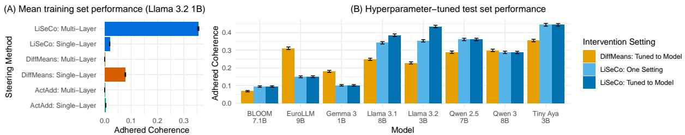  
Figure 1: (A) Performance of Llama 3.2 1B after activation steering (on all English, Spanish, and Hindi language pairs of the XSTORYCLOZE training set), averaged across all ACTADD, DIFFMEANS, and LISECO hyperparamters. (B) Performance of 8 language models after activation steering (on all English, Spanish, Hindi, and Chinese language pairs of the XSTORYCLOZE test set), using the single-layer DIFFMEANS and multi-layer LISECO, with hyperparameters tuned to a single setting (LISECO), or to each individual language model (DIFFMEANS, LISECO). Error bars reflect 95% bootstrapped confidence intervals.

## 2 Related Work

## 2.1 Multilingual Representations and Target-Language Activation Steering

While there is some evidence that some semantic knowledge is best accessed in the language in which it is learned (Mittal et al., 2023; Ifergan et al., 2025; Goldman et al., 2025; Zhong et al., 2025), an increasing amount of evidence suggests that language representations and semantic representations can often be dissociated, particularly for languages on which models have been more extensively trained (Tezuka and Inoue, 2025; Chen et al., 2025; Tamo et al., 2025). For example, activating neurons associated with a concept in one language can lead to models generating text related to that concept in another language (Riemenschneider and Frank, 2025), and activating neurons associated with a specific language can be used to generate text in that language (Gurgurov et al., 2025; Sundar et al., 2025). Similarly, the difference-in-means (DIFFMEANS; Subramani et al., 2022; Li et al., 2023b; Rimsky et al., 2024; Marks and Tegmark, 2024) method, where the difference between mean representations of texts with two different features is used to steer the model in the direction of either has been applied to language (Lu et al., 2025), as have other approaches that involve calculating or learning a mapping between two languages (Chang et al., 2022; Mahmoud et al., 2025; Wang et al., 2025b; Sterz et al., 2025; Lopo et al., 2025).

Because Transformer model representations are highly anisotropic (Ethayarajh, 2019; Hämmerl et al., 2023), one possible issue with activation steering is that the model’s activation state could be shifted into an ‘unnatural’ subspace, where it is within the right region along the dimensions for desired language, but other dimensions of the representations could be degraded. Thus, most of the aforementioned methods try to reduce the extent to which representations are shifted during steering, for example by reducing the distance in activation space to which representations are steered (e.g., Wang et al., 2025b), only intervening on a small subset of layers (e.g., Lu et al., 2025), only intervening on a small subset of neurons (e.g., Gurgurov et al., 2025), or other similar approaches. Generally, the research suggests that input-language-specific representations are most distinct in the earlier layers, and output-language-specific representations in the later layers, with more language-neutral representations in the middle layers (Kojima et al., 2024; Wang et al., 2025a; Dumas et al., 2024; Zhang et al., 2025; Wu et al., 2024; Tezuka and Inoue, 2025). Thus, when the goal is to steer the model to generate text in a specific language, one would expect that intervening on later layers is likely to be the most successful approach (see Lu et al., 2025).

## 2.2 Evaluation

Previous work evaluating target-language generation through activation steering generally focuses on one or more of three settings. The first is prompting a model in a target language and evaluating whether the activation intervention leads to an improvement in text generated in the same language, either due to intervening to align the model’s internal representations more with a high-resource language such as English (Wang et al., 2025b; Lu et al., 2025; Mahmoud et al., 2025) or intervening to steer the model’s output in the direction of the target language (Sterz et al., 2025). The second is prompting a model to generate text in a target language and evaluating whether it successfully generates text in that language (Sterz et al., 2025;

Lopo et al., 2025). The third common type of experiment is to intervene in some way on the model’s representations to attempt to cause it to generate text in a target language and evaluating whether it does so successfully (Chang et al., 2022; Sundar et al., 2025; Gurgurov et al., 2025, 2026).

One of the primary evaluation metrics in such experiments is whether the language model generates text in the appropriate language, often referred to as language adherence (Langlais et al., 2024). In general, the approach taken is to use a language identification classifier on the generated text, and a model is considered to adhere if the generated text is assigned the label corresponding to the target language (Chang et al., 2022; Sundar et al., 2025; Gurgurov et al., 2025). This can be calculated at the level of a whole text generation, or in a more finegrained fashion by classifying individual words or lines of the text to see what proportion successfully adhere (see Marchisio et al., 2024).

Alternatively or in addition, generations can be evaluated based on the quality of the input and output. For example, activation steering has been used to improve translation quality (Lopo et al., 2025; Wang et al., 2025b); in this case, evaluation based on a reference translation inherently captures language adherence. Cases where the models are evaluated on tasks where there is a reference or ground-truth answer in the target language (as in the case of same-language prompting or including the generation language in the prompt) can also be treated in the same way (Mahmoud et al., 2025; Lu et al., 2025; Wang et al., 2025b), though some work evaluates language adherence separately in addition to task accuracy (Sterz et al., 2025; Lopo et al., 2025). Finally, in contemporaneous work, Gurgurov et al. (2026) fully separate language adherence and content (in terms of both linguistic and semantic coherence as defined in Section 3) by evaluating generation quality using a multilingual LLM-as-judge that is instructed to ignore language adherence in its rating.

## 3 Evaluating language activation steering

Evaluating target-language text generations is a multifaceted problem that requires both assessing whether the generated text is in the correct language, and assessing the appropriateness of the generated text itself. We develop a principled approach to assess this. Following previous work on summary evaluation (Peyrard et al., 2017; Zhu and

Bhat, 2020), we begin by determining three key desiderata that we believe are important to evaluating model generations in context. We then describe how they can be combined into a single principled metric of target-language text generation quality.

Language Adherence When assessing the quality of the text generated by a model in a specific target language, perhaps the most straightforward aspect to test is whether the text is in fact in the target language. We consider language adherence as a binary variable, specifically, whether a language classifier that predicts the language $\mathcal { L } _ { i }$ of a given text assigns target language t the highest probability given the generated text (i.e., arg maxi $\hat { p } ( \mathcal { L } _ { i } ) = t )$

Semantic Coherence In addition to language adherence, it is also important for the generated text to have appropriate content given its context. For our purposes, we consider a specific case where the output is not straightforwardly verifiable, and the task has reference correct $( s _ { \mathrm { t r u e } } )$ and incorrect $\left( s _ { \mathrm { f a l s e } } \right)$ outputs. Thus, to get a binary value for semantic coherence for a given output string $s _ { \mathrm { g e n } } .$ , we can calculate whether sim ${ \sf 1 } \bigl ( s _ { \mathrm { g e n } } , s _ { \mathrm { t r u e } } \bigr ) > \mathrm { s i m } ( s _ { \mathrm { g e n } } , s _ { \mathrm { f a l s e } } )$ where similarity is calculated from multilingual sentence embeddings.

Linguistic Coherence Less considered in previous work is the question of whether the generated text is not only recognizable as being in a given language and contains semantically appropriate content, but is also well-formed in the target language. We operationalize linguistic coherence as log-perplexity. We specifically propose the use of n-gram perplexity because it avoids the confounds of evaluating a model’s output based on another model with the same architecture—for example, a common failure mode for neural language models is repetition (Fu et al., 2021; Xu et al., 2022; Li et al., 2023a; Hiraoka and Inui, 2025; Doan et al., 2025), and if a model susceptible to this were used to evaluate the generations, it would lead to repetitive generations being assigned unduly low (i.e., good) perplexities. For our purposes, as with the other two metrics, we treat linguistic coherence as a binary variable by setting a threshold value. We set a linguistic coherence threshold such that a response’s log-perplexity in the target language $L _ { t }$ must have a value smaller than than 2 standard deviations above the mean baseline log-perplexity in the target language $L _ { b } .$ where the baseline refers to a monolingual setting in the target language with no activation steering. Thus, our measure of linguistic coherence is described by the equation $L _ { t } \le \mu ( L _ { b } ) + 2 \sigma ( L _ { b } )$

Adhered coherence We then combine these three metrics in a joint score that encompasses all three desiderata, which we name adhered coherence. As shown in Equation (1), a specific text generation demonstrates adhered coherence C if it adheres to the target language, is semantically coherent, and is linguistically coherent, as defined previously in this section:

$$
C = \left\{ \begin{array} { l l } { 1 } & { \mathrm { i f ~ } \arg \operatorname* { m a x } _ { i } \hat { p } ( \mathcal { L } _ { i } ) = t } \\ & { \mathrm { a n d ~ } \ s \mathrm { i m } ( s _ { \mathrm { g e n } } , s _ { \mathrm { t r u e } } ) > \sin ( s _ { \mathrm { g e n } } , s _ { \mathrm { f a l s e } } ) } \\ & { \mathrm { a n d ~ } L _ { t } \leq \mu ( L _ { b } ) + 2 \sigma ( L _ { b } ) } \\ { 0 } & { \mathrm { o t h e r w i s e } } \end{array} \right.\tag{1}
$$

## 4 Target-Language Generation as an Optimal Control Problem

## 4.1 Activations Across Layers as Dynamic Trajectories

Following Cheng et al. (2024), one can conceptualize the flow of activations across Transformer layers as forming dynamic trajectories through highdimensional representation spaces. Transformations of the input representations are realized in a sequential manner given the iterative nature of language model layers. Hence, if we treat the activation state at a given token as capturing the representation of the current token and relevant information from previous tokens (as in, e.g., Olsson et al., 2022; Rimsky et al., 2024; Wang et al., 2025b), the trajectory of an activation through layers can be described as a discrete-time dynamical system propagation of the form:

$$
\begin{array} { r l } { x _ { 0 } = E ( s _ { i } ) , \ } & { x _ { \tau + 1 } = \ell _ { \tau + 1 } ( x _ { \tau } ) , } \\ & { s _ { i + 1 } = U ( x _ { T } ) , } \\ & { \ \qquad \mathrm { w i t h } \ \tau = 0 , \ldots , T - 1 } \end{array}\tag{2}
$$

where $s \in \Sigma ^ { * }$ is the prompt string, $x _ { \tau } \in \mathbb { R } ^ { d }$ is the latent representation of string s after layer $\ell _ { \tau } , \ell _ { \tau }$ is the $\tau ^ { t \hat { h } }$ model layer, $T$ is the number of layers in the model, and $E$ and U are the embedding and unembedding matrices, respectively.

Evidence suggests that cross-lingual understanding emerges from the geometry and dynamics of these activation spaces naturally, rather than from explicit training objectives for cross-lingual alignment (see §2). Thus, the dynamical systems perspective above offers a principled framework for understanding and manipulating multilingual generation: by viewing the Transformer as implementing the dynamics in Equation 2, we can conceptualize cross-lingual steering as a trajectory control problem, where interventions guide the activation flow toward desired linguistic or semantic targets while preserving the underlying conceptual structure that enables cross-lingual generalization.

## 4.2 Problem Statement

Building on the dynamical systems perspective, we formulate cross-lingual steering as an intervention design problem in activation space. Given a trained multilingual language model and a source language input, the goal is to design activation interventions that guide the model’s output toward a target language while preserving semantic content and maintaining generation quality. Given a target language $\mathcal { L } _ { t }$ , let $\mathcal { R } _ { t } \subset \mathbb { R } ^ { d }$ represent the region in layer $t \mathbf { \bar { s } }$ activation space corresponding to generations in that target language. The goal is to design control inputs $\theta _ { \tau } : \mathbb { R } ^ { d }  \mathbb { R } ^ { d }$ to modify the dynamics of the last token’s activations:

$$
\begin{array} { r l } & { x _ { 0 } = E ( s ) , \quad \tilde { x } _ { \tau } = x _ { \tau } + \theta _ { \tau } ( x _ { \tau } ) , } \\ & { \qquad x _ { \tau + 1 } = \ell _ { \tau + 1 } ( \tilde { x } _ { \tau } ) , \quad y = U ( x _ { T } ) , } \end{array}\tag{3}
$$

such that the following requirements are satisfied:

• Minimal Disturbance: The intervention should introduce the smallest possible perturbation to the original activation trajectory, i.e., should prevent oversteering and preserve the model’s learned representations.

• Guaranteed Language Transition: The modified activations must reliably steer the language attribute toward the target, ensuring that $\tilde { x } _ { \tau } \in \mathcal { R } _ { t }$ for intervened layers $\tau \in \mathcal { T }$ such that for any text in source language $\mathcal { L } _ { s } ,$ the generated continuation is classified to be in target language $\mathcal { L } _ { t }$ , where $\tau$ is the set of layers chosen for intervention.

• Topology Awareness: The intervention must respect the geometric structure of the embedding space, leveraging the multilingual topology to move between language-specific regions while maintaining semantic coherence and conceptual alignment with the original source language.

The challenge lies in simultaneously satisfying these competing objectives: achieving reliable language transition while minimizing activation perturbations and respecting the learned multilingual geometry underlying the model’s core capabilities.

## 4.3 Existing Approaches

Our formulation allows us to describe current methods in terms of $\theta _ { \tau }$ . With DIFFMEANS (see, $\mathrm { e . g . }$ , Lu et al., 2025), $\theta _ { \tau } = \kappa z _ { t }$ , where $z _ { \tau } = \mu _ { \tau } ^ { \mathcal { L } _ { t } } - \mu _ { \tau } ^ { \mathcal { L } _ { s } }$ is computed from paired data in the source and target languages and κ is a hyperparameter. The neuron manipulation approach (Gurgurov et al., 2025) also has $\theta _ { \tau } = \kappa z _ { \tau }$ , but in this case $z _ { \tau }$ is a sparse vector $( \leq 5 \%$ of neurons are intervened on) where non-zero values are ‘boost values’ calculated for each individual neuron based on $\mu _ { \tau } ^ { \mathcal { L } _ { t } }$ . Most other previous studies (e.g., Chang et al., 2022; Sundar et al., 2025; Mahmoud et al., 2025; Wang et al., 2025b; Sterz et al., 2025; Lopo et al., 2025) can generally be considered variants of one (or a combination) of these approaches—crucially, under these approaches $\theta _ { \tau }$ does not depend on the original activation $x _ { \tau }$ . The exception to this is INCLINE (Wang et al., 2025b), where $\theta _ { \tau } = \kappa x _ { \tau } V _ { \tau }$ , and $V _ { \tau }$ is a learned matrix that maps $x _ { \tau } ^ { \mathcal { L } _ { s } } \mathrm { t o } x _ { \tau } ^ { \mathcal { L } _ { t } }$ , fitted based on paired data in the source and target languages.

## 5 Target-Language Interventions in Activation Space via Optimal Control

## 5.1 Multilingual Region Identification in Activation Space

Identifying the language-specific region $\mathcal { R } _ { t } ^ { i }$ depends on how the language attribute a is encoded in latent space. Let layer t’s activations encode language as $f _ { t } : \mathbb { R } ^ { d }  \mathcal { L }$ , mapping activation vectors to discrete language labels. Then, the region $\mathcal { R } _ { t } ^ { i }$ in latent space can be identified as the pre-image of language $\mathcal { L } _ { i }$ under $f _ { t }$ . This information can then be leveraged to control activations, since the desired language outcome $a = \mathcal { L } _ { t } ^ { * }$ can be proxied by enforcing the activation $\boldsymbol { x } _ { t } \in \mathcal { R } _ { t } ^ { \mathcal { L } _ { t } ^ { \ast } }$

Linear Representation Hypothesis. (Park et al., 2023) In the Linear Separability Hypothesis, each language $\mathcal { L } _ { i }$ is hypothesized to occupy a distinct region $\mathcal { R } _ { t } ^ { i }$ of activation space for each layer t. Formally, a string $s \in \Sigma ^ { * }$ generates text in language $\mathcal { L } _ { i }$ if and only if its corresponding representations $\boldsymbol { x } _ { t } \in \mathcal { R } _ { t } ^ { i }$ , where $\mathcal { R } _ { t } ^ { i }$ is a linearly-separable region in embedding space.

The goal is to identify the regions in activation space that correspond to different languages. Specifically, at each layer t we learn a lightweight linear probe $f _ { t }$ that maps the latent state $x _ { t }$ to language probabilities. By the linearity hypothesis, we define $f _ { t } : \mathbb { R } ^ { d }  \mathbb { R } ^ { | \mathcal { L } | }$ as:

$$
f _ { \tau } ( x _ { t } ) = \mathrm { s o f t m a x } ( W _ { \tau } ^ { T } x _ { \tau } ) ,\tag{4}
$$

where $W _ { \tau } \in \mathbb { R } ^ { d \times | \mathcal { L } | }$ is a weight matrix that projects activations to language logits.

For each layer τ, we minimize the cross-entropy loss over a dataset $\{ s ^ { ( i ) } , \mathcal { L } ^ { ( i ) } \} _ { i = 1 } ^ { N }$ of (text, language) pairs:

$$
\operatorname* { m i n } _ { W _ { t } } - \sum _ { i = 1 } ^ { N } \sum _ { j = 1 } ^ { | \mathcal { L } | } \mathbf { 1 } [ \mathcal { L } ^ { ( i ) } = \mathcal { L } _ { j } ] \log f _ { \tau } ( x _ { \tau } ^ { ( i ) } ) _ { j }\tag{5}
$$

where $x _ { \tau } ^ { ( i ) }$ is the representation of string $s ^ { ( i ) }$ at layer τ , and $f _ { \tau } ( x _ { \tau } ^ { ( i ) } ) _ { j }$ is the predicted probability for language $\mathcal { L } _ { j }$

## 5.2 Multilingual Control of Activations

Having identified language-specific regions in activation space, we now turn to the problem of controlling activations to steer generation toward the target language.

Semantic Hub Hypothesis (Wu et al., 2024). The Semantic Hub Hypothesis provides crucial insight into how multilingual control should be designed. It posits that semantically equivalent inputs $\phantom { } _ { s } \bar { \mathcal { L } } _ { s }$ and $s ^ { \hat { \mathcal { L } } _ { t } }$ from source and target languages have representations such that:

$$
\sin ( x ^ { \mathcal { L } _ { s } } , x ^ { \mathcal { L } _ { t } } ) > \sin ( x ^ { \mathcal { L } _ { s } } , u ^ { \mathcal { L } _ { t } } ) ,\tag{6}
$$

where sim is a similarity measure and $\boldsymbol { u } ^ { \mathcal { L } _ { t } }$ represents semantically unrelated content in the target language. In other words, semantically equivalent content in the target language lies closer to the source representation than does semantically unrelated content in the target language; thus, the nearest point in the target language region is a representation that preserves semantic content. This suggests that in order for cross-lingual control to preserve semantic content while transitioning between language-specific regions, it is enough to compute minimal interventions to $x ^ { \mathcal { L } _ { s } }$ as long as the modified activation is guaranteed to lie in $\mathcal { R } ^ { t }$

The goal is to design control interventions $\theta _ { \tau }$ that respect this geometric structure. Therefore, we formulate the control problem as finding the minimal intervention that moves activations into the target region $\mathcal { R } _ { t } ^ { \mathcal { L } _ { t } ^ { \ast } }$ . Following the framework of LISECO (Cheng et al., 2024), we can adapt their continuous attribute control formulation to our discrete language setting. For binary language classification (source vs. target), the control problem becomes:

<table><tr><td rowspan=1 colspan=1>Condition</td><td rowspan=1 colspan=1> $\sigma ( W _ { \tau } ^ { T } x _ { \tau } ) > \alpha ^ { \mathrm { m a x } }$ </td><td rowspan=1 colspan=1> $\sigma ( W _ { \tau } ^ { T } x _ { \tau } ) < \alpha ^ { \mathrm { m i n } }$ </td><td rowspan=1 colspan=1>otherwise</td></tr><tr><td rowspan=1 colspan=1> $\pmb { \theta } _ { \tau } ^ { * }$ </td><td rowspan=1 colspan=1> $\frac { \log ( \frac { 1 } { \alpha ^ { \mathrm { m a x } } } - 1 ) - W _ { \tau } ^ { T } x _ { \tau } } { ! ! \textbf { r r } \textbf { \textsf { m } } } { W _ { \tau } }$  $\| \boldsymbol { W } _ { \tau } \| _ { 2 } ^ { 2 }$ </td><td rowspan=1 colspan=1> $\underbrace { \log ( \frac { 1 } { \alpha ^ { \mathrm { m i n } } } - 1 ) - W _ { \tau } ^ { T } x _ { \tau } } _ { ! ! \mathbf { r } \mathbf { r } \mathbf { \tau } ^ { \prime } } \underbrace { W _ { \tau } ^ { T } x _ { \tau } } _ { W _ { \tau } }$  $\| \boldsymbol { W } _ { \tau } \| _ { 2 } ^ { 2 }$ </td><td rowspan=1 colspan=1>0</td></tr></table>

Table 1: Optimal intervention $\theta _ { \tau } ^ { * }$ for language control at layer t.

$$
\operatorname* { m i n } _ { \theta _ { \tau } } \quad \quad \| \theta _ { \tau } \| _ { 2 } ^ { 2 }\tag{7a}
$$

$$
s . t . \quad \quad \alpha ^ { \mathrm { m i n } } \leq f _ { \tau } ( x _ { \tau } + \theta _ { \tau } ) ) \leq \alpha ^ { \mathrm { m a x } } ,\tag{7b}
$$

for each layer $\tau \in \mathcal { T }$ and $[ \alpha ^ { \mathrm { m i n } } , \alpha ^ { \mathrm { m a x } } ]$ defines the desired probability range for the target language.

A key advantage of this formulation is that it admits a closed-form solution, enabling efficient computation with minimal overhead. From Theorem 1 in Cheng et al. (2024), the optimal solution $\theta _ { \tau } ^ { * } \in \mathbb { R } ^ { d }$ to the optimization problem 7 is given in Table 1. Geometrically, the optimal solution projects $x _ { t }$ onto the closest point in the target language region $\mathcal { R } _ { t } ^ { \mathcal { L } _ { t } ^ { \ast } }$ . When the current activation already lies within the desired region, no intervention is needed $( \theta _ { \tau } ^ { * } = 0 )$ . Otherwise, the intervention is a scaled version of the probe direction $W _ { \tau } .$ with magnitude determined by the distance to the region boundary. This approach guarantees that the perturbed activation will lie within the target language region while minimizing the perturbation magnitude.

The proposed intervention, based on optimal control, provides a principled framework that is more general and flexible than existing multilingual intervention methods. For example, as discussed in §4.3, under most existing methods $\theta _ { \tau }$ does not depend on $x _ { \tau }$ , but rather is fixed. Furthermore, the one existing method where it does (INCLINE; Wang et al., 2025b) relies on mapping from $x _ { \tau } ^ { \mathcal { L } _ { s } }$ to $x _ { \tau } ^ { \mathcal { L } _ { t } }$ based on a pre-trained alignment matrix $V _ { \tau }$ and shifting $x _ { \tau }$ in that direction based on a fixed hyperparameter $\kappa ,$ which could in principle lead to under- or over-shooting. Our proposed approach, meanwhile, is guaranteed to move the activations to the closest point in $\mathcal { R } ^ { t }$ . This highlights perhaps the greatest strength and weakness of the approach—it relies on the extent to which the language classifier used is able to identify causally-relevant languagespecific regions. However, it also means that it is possible to use different classifiers and compare their performance, and given the theoretical guarantees, provides a method for directly testing whether the decision boundary learned by a given classifier is causally relevant.

A more extensive treatment of the LISECO method, including a brief application to the targetlanguage generation task, can be found in Cheng and Amo Alonso (2026).

## 6 Exploratory Analyses

We use the evaluation framework proposed in Section 3 to evaluate the LiSeCo-based approach proposed in Section 5. We compare this to two baselines—DIFFMEANS and ACTADD.

## 6.1 Method

## 6.1.1 Task

STORYCLOZE (Mostafazadeh et al., 2016) is a benchmark consisting of stories with two possible endings, one plausible and one implausible, which has been translated into multiple languages as XSTORYCLOZE (Lin et al., 2022). We construct a crosslingual variant of the task where the input is in the source language and the two possible endings are in the target language. The standard version of the task is to test whether a given language model assigns a higher probability to the plausible continuation. Because we study how activation steering shapes generation, we let the model generate the final sentence and evaluate it as described below.

## 6.1.2 Activation Steering

For LISECO, we use a linear classifier to compute the boundary between the language-specific region of each language based on the activations at the last word of paired sentences from the FLORES development set (997 items; Goyal et al., 2022). For DIFFMEANS, we calculate the difference between the mean activations (at the last word) of the FLO-RES sentences in each language for each layer. AC-TADD follows the same approach as DIFFMEANS, but the difference is calculated between two specific words; in this case, the difference between the activations of the endonyms of each language, e.g., ‘English’ for English or $\cdot \sqrt { \frac { n } { n } - \frac { n } { n } } \cdot$ for Hindi.

LISECO is formulated such that it can be applied at all layers (Cheng et al., 2024); but this is not true for ACTADD and DIFFMEANS—in both cases, the intervention is generally only applied at one or a few layers, determined empirically based on performance (Marks and Tegmark, 2024; Turner et al., 2023; Lu et al., 2025). We thus evaluate the performance of the ACTADD and DIFFMEANS methods for interventions at each layer t. In addition, because output language is generally thought to be controlled by the later layers (see §2), we also try an alternative approach, where we apply the intervention at all layers from a given layer t to the last layer. To allow full comparison we also apply LISECO under both of these settings. In addition to layer, each method also includes another tunable hyperparameter as discussed below.

LISECO guarantees a representation that lies within probability range $[ \alpha ^ { \mathrm { m i n } } , \alpha ^ { \mathrm { m a x } } ]$ . For example, in a case where the classifier assigns English the 0 label and Spanish the 1 label, we can set the bounds [0, 0.1] to restrict the probability of the generation being English (as determined by the classifier) to $p \leq 0 . 1$ and Spanish to $p > 0 . 9$ , and vice-versa by setting the bounds to [0.9, 1]. Thus, we manipulate this ‘inner’ bound αinner (i.e., 0.1 or 0.9 in the aforementioned examples). With ACTADD, the difference between the representations is multiplied by an ‘injection coefficient’ c (Turner et al., 2023; corresponding to κ in §5) before being applied to the model. With DIFFMEANS, as with ACTADD, differences are multiplied by a value before being applied to the model. For consistency, we also refer to this as the injection coefficient c in the case of DIFFMEANS.

## 6.1.3 Model and Settings

Testing all possible settings of all steering methods is not computationally feasible, so we carry out exploratory experiments on Llama 3.2 1B (Grattafiori et al., 2024; Meta AI, 2024) to narrow down the scope of our analyses. We select the three XSTORYCLOZE languages that are officially supported by the model: English (eng), Spanish (spa), and Hindi (hin). We evaluate on all 6 language pairs: English source with Spanish target (eng→spa), eng→hin, hin→eng, hin→spa, spa→eng, and spa→hin. For LISECO, we set $\alpha ^ { \mathrm { i n n e r } } \in \{ 1 0 ^ { - 1 } , 1 0 ^ { - 2 } , 1 0 ^ { - 3 } , 1 0 ^ { - 4 } , 1 0 ^ { - 5 } \}$ ; for AC-TADD and DIFFMEANS, c ∈ {0.5, 1, 2, 4, 8}.

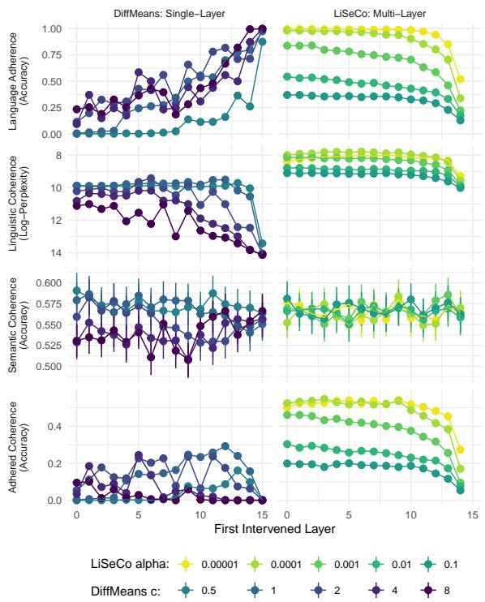  
Figure 2: Results of the exploratory analyses on Llama 3.2 1B. Points represent mean adhered coherence based intervention starting layer, and error bars represent 95% confidence intervals based on bootstrapping.

## 6.1.4 Evaluation

We evaluate the target-language generations based on the language adherence, linguistic coherence, and semantic coherence metrics defined in Section 3, as well as the combined adhered coherence metric. We evaluate language adherence using the fastText language ID model released as part of the No Language Left Behind project (Costajussà et al., 2022). We evaluate semantic coherence as the cosine similarity between the embedding of the generated sentence and each of the two reference XSTORYCLOZE sentences using the Language-Agnostic BERT Sentence Embeddings model (LaBSE; Feng et al., 2022), considering a generation closer to the plausible continuation than the implausible continuation to be correct. Finally, we evaluate linguistic coherence based on perplexity calculated using the n-gram language models trained by González Ponferrada (2024). We calculate adhered coherence as discussed in Section 3.

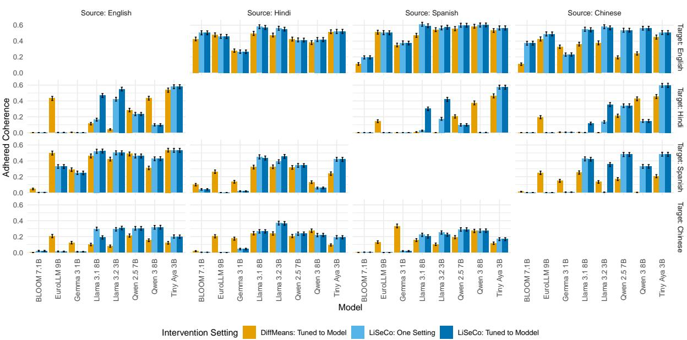  
Figure 3: Test set results for all language pairs. Error bars reflect 95% bootstrapped confidence intervals.

## 6.2 Results

We show a summary of our results in Figure 1A. As can be seen, multi-layer LISECO and singlelayer DIFFMEANS perform substantially better than the other activation steering methods on average (across all hyperparameters and language pairs); thus, we focus on these for the remainder of the paper. In Figure 3, we show the language adherence, linguistic coherence, and semantic coherence achieved using each of these methods, and how these are shaped by the first intervention layer and their method-specific hyperparameter (the full breakdown by language pair is provided in Section A). First, we observe that LISECO generally performs better than DIFFMEANS, especially for smaller values of $\alpha ^ { \mathrm { i n n e r } }$ . We additionally observe that DIFFMEANS performs best when it is applied with $c = 1$ to one of the final third of layers; LISECO performs better when applied with a very low $\alpha ^ { \mathrm { i n n e r } }$ to all or most layers.

## 7 Targeted Analyses

Given the results of §6, we carry out our main experiments on single-layer DIFFMEANS and multilayer LISECO only. We follow the method in §6 with a more restricted set of hyperparameters (see §7.1) on a larger set of (generally larger) models: BLOOM 7.1B, EuroLLM 9B, Gemma-3 1B, Llama-3.1 8B, Llama-3.2 3B, Qwen-2.5 7B, Qwen-3 8B, and Tiny-Aya-Base. After selecting the best hyperparameters for each method, we compare the performance of the two steering methods on the held-out test set of 1,512 items for each language pair. To test hyperparameter generalization, we add Chinese (zho) as an additional language1 and test all the pairs it forms with {eng, spa, hin}.

## 7.1 Hyperparameter Selection

We consider two different hyperparameter approaches for DIFFMEANS and LISECO.

DIFFMEANS was shown in §6 to work best when applied to one of the final third of layers with $c = 1$ . Thus, we fix $c = 1$ , and use the training set to select the best layer for each model.

LISECO was shown in §6 to perform well when applied to all hidden layers with a low $\alpha ^ { \mathrm { i n n e r } }$ We thus apply LISECO to all layers in [1, max (t)] (i.e., all but the static embedding layer; as in Cheng et al., 2024) and vary $\alpha ^ { \mathrm { i n n e r } }$ . Since our best-performing values were the lowest (i.e., $\alpha ^ { \mathrm { i n n e r } } \in \{ 1 0 ^ { - 4 } , 1 0 ^ { - 5 } \} )$ , we also include $\alpha ^ { \mathrm { i n n e r } } \in$ $\{ 1 0 ^ { - 6 } , 1 0 ^ { - 7 } , 1 0 ^ { - 8 } \}$ . We tune $\alpha ^ { \mathrm { i n n e r } }$ to each model, and also find the best $\alpha ^ { \mathrm { i n n e r } }$ across all models.

## 7.2 Results

Our model-level results are presented in Figure 1 (full results including each metric for each language pair are provided in Section B). We observe that on the whole, our proposed method, LISECO, performs at least as well as DIFFMEANS: both LISECO settings out-perform model-tuned

DIFFMEANS when applied to BLOOM, Llama 3.1, Llama 3.2, Qwen 2.5, and Aya. In the case of Qwen 3, we do not see a clear difference in either direction, and we see better DIFFMEANS performance for EuroLLM and Gemma 3. When we further break down the results according to language pair (Figure 3), we see that these patterns are non-uniform. For example, we see that for EuroLLM, LISECO only works for English targets (i.e., x→eng) and for eng→spa, and Gemma shows a similar but less extreme pattern. Another case of asymmetry is that DIFFMEANS works better than LISECO for Qwen 3 when the target language is Hindi (i.e., x→hin), but the reverse is true for the Llama models. We also observe that a single LISECO setting $( \alpha ^ { \mathrm { i n n e r } } = 1 0 ^ { - 8 } )$ works best for most models, with the exception of Llama 3.1 8B $( \alpha ^ { \mathrm { i n n e r } } = 1 0 ^ { - 5 } )$ and Llama $3 . 2 3 \mathrm { B } ( \alpha ^ { \mathrm { i n n e r } } = 1 0 ^ { - 6 } )$ suggesting that there are commonalities in this across models at the task level.

## 8 General Discussion

Our study has several main takeaways. First, we provide a theoretical framework that characterizes optimal language control, and based on this, propose a LISECO-based method for activation steering of language. Unlike existing methods that use fixed-magnitude interventions, this approach dynamically computes the minimal intervention needed based on the current activation state, providing both theoretical guarantees and computational efficiency. The presented method is, to the best of our knowledge, the only one that balances three competing requirements: ensuring the perturbed activation lies within the target language region, minimizing disruption to the original representation, and is topology-aware with embedding space geometry (i.e. it only moves activations along the axis orthogonal to the decision boundary between language-specific regions).

Second, we provide what is to our knowledge some of the first quantitative evidence that activation steering alone can be used to control generation language while preserving linguistic and semantic coherence (for contemporaneous work, see Gurgurov et al., 2026). We demonstrate that the LISECO-based approach generally performs better than DIFFMEANS for 5 of the 8 models tested. Crucially, we observe that the performance of LISECO is relatively predictable and robust to hyperparameters—a single LISECO setting, namely, intervening on all but the static embedding layer with $\alpha ^ { \mathrm { i n n e r } } = 1 0 ^ { - 8 } .$ , performs better overall for 5 of the 8 models than DIFFMEANS, even when the latter method involves tuning the layer of the intervention to each model and the former does not (though this does also improve performance). The performance of DIFFMEANS and ACTADD is far more sensitive to their hyperparameters, especially at the language-pair level (see Appendix A).

Finally, we consider the cases where LISECO under-performs relative to DIFFMEANS. Crucially, the asymmetries in performance (e.g., eng→hin vs. hin→eng) suggest that LISECO performance may arise from poor classifier performance. For example, language subspaces identified by the classifier may not be causally implicated; that is, it is possible to train an accurate linear classifier probe to separate the representations of two languages, but this does not mean that manipulating the language model state to fall within these regions will cause the language model to generate in the corresponding language. This highlights the importance of causally testing probing results (see Elazar et al., 2021; Ravichander et al., 2021; Kumar et al., 2022).

We also observe strong asymmetries. For example, all models are able to be steered into generating English with LISECO, but EuroLLM and Gemma struggle to be steered to other languages from English. One possible explanation for this is an inherent feature of any binary classification approach in a context where there are more than two classes (in this case, languages in multilingual models): one or both of the regions on either side of the decision boundary will include model activation states that correspond to other languages that the models are trained on (i.e., those not being classified). Given that English is almost always the primary training language, we might expect most language models are likely to have higher-quality representations of English than its paired languages, and English may occupy “more” of the total representation space (see, e.g., Wendler et al., 2024; Schut et al., 2025; Zhong et al., 2025; Lu et al., 2025); this may make it easier to delineate English from non-English model states. Crucially, however, LISECO is compatible with a wide range of possible linear classifiers; and thus, there is substantial scope for improvement. Furthermore, given the theoretical guarantees of the method, such improvements are likely to aid in uncovering the nature of the representations in language models that causally shape generation language.

## Limitations

Our main limitation in this work is coverage. Due to the computational cost of the experiments (∼7000 GPU hours on a cluster including L40S, A100, and H100 GPUs), we chose to evaluate 8 language models on one task made up of 12 language pairs.

We do not believe that the number of models is a substantial concern; in fact, most previous work in this area involves a smaller number of models (see, e.g., Chang et al., 2022; Gurgurov et al., 2025; Sundar et al., 2025; Mahmoud et al., 2025; Lu et al., 2025; Wang et al., 2025b; Sterz et al., 2025; Lopo et al., 2025). Nonetheless, a larger number of models would allow for more robust generalizations to be made.

Similarly, while we believe that 12 language pairs (including three scripts and two language families) allows us to answer our research questions sufficiently, a larger and more diverse sample of languages would enable more robust conclusions, and would allow potentially informative comparisons between pairs of languages that are related or typologically similar to different degrees.

Finally, we construct a specific variant of the XSTORYCLOZE task in order to avoid potential confounds arising from prompt adherence; this allows us to directly test the efficacy of different steering approaches. However, a more complete picture would be provided by considering a wider range of tasks, including those where the prompt explicitly states the target language (e.g., translation).

## Ethical Considerations

We do not consider our work to present any substantial risks. However, since activation steering methods edit the activations of models directly, it is possible that model generations may be more unstable and unpredictable, which in principle could increase the risk of harmful content. Thus, without further safety measures, the intended use for our work is limited to fundamental research.

With respect to licenses and intended use, we report the details of the main scientific artifacts used below:

## Datasets:

• FLORES (Goyal et al., 2022): CC BY-SA 4.0

• XStoryCloze (Lin et al., 2022): CC BY-SA 4.0

## Models:

• fastText LangID (Costa-jussà et al., 2024): CC-BY-NC-4.0 License

• BLOOM 7.1B (BigScience Workshop et al., 2023): BigScience RAIL License v1.0

• EuroLLM 9B (Martins et al., 2025): Apache 2.0 License

• Gemma-3 1B Pretrained (Gemma Team et al., 2025): Gemma License

• Llama-3.1 8B (Grattafiori et al., 2024): Llama 3.1 License

• Llama-3.2 3B (Grattafiori et al., 2024): Llama 3.2 License

• Qwen-2.5 7B (Qwen Team et al., 2025): Apache 2.0 License

• Qwen-3 8B Base (Yang et al., 2025): Apache 2.0 License

• Tiny-Aya-Base (Salamanca et al., 2026): CC-BY-NC-4.0 License

• n-gram models (González Ponferrada, 2024): MIT License

• LaBSE (Feng et al., 2022): Apache 2.0 License

## Research code:

• LiSeCo and ActAdd implementations from Cheng et al. (2024): https://github.com/ chengemily1/llm-control; no license stated; provided for research purposes.

## Acknowledgments

James Michaelov was supported by a grant from the Andrew W. Mellon foundation (#2210-13947) during the writing of this paper.

## References

BigScience Workshop, Teven Le Scao, Angela Fan, Christopher Akiki, Ellie Pavlick, Suzana Ilic, Daniel´ Hesslow, Roman Castagné, Alexandra Sasha Luccioni, François Yvon, Matthias Gallé, Jonathan Tow, Alexander M. Rush, Stella Biderman, Albert Webson, Pawan Sasanka Ammanamanchi, Thomas Wang, Benoît Sagot, Niklas Muennighoff, Albert Villanova del Moral, Olatunji Ruwase, Rachel Bawden,

Stas Bekman, Angelina McMillan-Major, Iz Belt agy, Huu Nguyen, Lucile Saulnier, Samson Tan, Pe dro Ortiz Suarez, Victor Sanh, Hugo Laurençon, Yacine Jernite, Julien Launay, Margaret Mitchell, Colin Raffel, Aaron Gokaslan, Adi Simhi, Aitor Soroa, Alham Fikri Aji, Amit Alfassy, Anna Rogers, Ariel Kreisberg Nitzav, Canwen Xu, Chenghao Mou, Chris Emezue, Christopher Klamm, Colin Leong, Daniel van Strien, David Ifeoluwa Adelani, Dragomir Radev, Eduardo González Ponferrada, Efrat Lev kovizh, Ethan Kim, Eyal Bar Natan, Francesco De Toni, Gérard Dupont, Germán Kruszewski, Giada Pistilli, Hady Elsahar, Hamza Benyamina, Hieu Tran, Ian Yu, Idris Abdulmumin, Isaac Johnson, Itziar Gonzalez-Dios, Javier de la Rosa, Jenny Chim, Jesse Dodge, Jian Zhu, Jonathan Chang, Jörg Frohberg, Joseph Tobing, Joydeep Bhattacharjee, Khalid Al mubarak, Kimbo Chen, Kyle Lo, Leandro Von Werra, Leon Weber, Long Phan, Loubna Ben allal, Lu dovic Tanguy, Manan Dey, Manuel Romero Muñoz, Maraim Masoud, María Grandury, Mario Šaško, Max Huang, Maximin Coavoux, Mayank Singh, Mike Tian-Jian Jiang, Minh Chien Vu, Moham mad A. Jauhar, Mustafa Ghaleb, Nishant Subramani, Nora Kassner, Nurulaqilla Khamis, Olivier Nguyen, Omar Espejel, Ona de Gibert, Paulo Villegas, Pe ter Henderson, Pierre Colombo, Priscilla Amuok, Quentin Lhoest, Rheza Harliman, Rishi Bommasani, Roberto Luis López, Rui Ribeiro, Salomey Osei, Sampo Pyysalo, Sebastian Nagel, Shamik Bose, Shamsuddeen Hassan Muhammad, Shanya Sharma, Shayne Longpre, Somaieh Nikpoor, Stanislav Silber berg, Suhas Pai, Sydney Zink, Tiago Timponi Tor rent, Timo Schick, Tristan Thrush, Valentin Danchev, Vassilina Nikoulina, Veronika Laippala, Violette Lepercq, Vrinda Prabhu, Zaid Alyafeai, Zeerak Ta lat, Arun Raja, Benjamin Heinzerling, Chenglei Si, Davut Emre Ta¸sar, Elizabeth Salesky, Sabrina J. Mielke, Wilson Y. Lee, Abheesht Sharma, Andrea Santilli, Antoine Chaffin, Arnaud Stiegler, Debajy oti Datta, Eliza Szczechla, Gunjan Chhablani, Han Wang, Harshit Pandey, Hendrik Strobelt, Jason Alan Fries, Jos Rozen, Leo Gao, Lintang Sutawika, M. Sai ful Bari, Maged S. Al-shaibani, Matteo Manica, Ni hal Nayak, Ryan Teehan, Samuel Albanie, Sheng Shen, Srulik Ben-David, Stephen H. Bach, Taewoon Kim, Tali Bers, Thibault Fevry, Trishala Neeraj, Ur mish Thakker, Vikas Raunak, Xiangru Tang, Zheng Xin Yong, Zhiqing Sun, Shaked Brody, Yallow Uri, Hadar Tojarieh, Adam Roberts, Hyung Won Chung, Jaesung Tae, Jason Phang, Ofir Press, Conglong Li, Deepak Naravanan. Hatim Bourfoune. Jared Casper Jeff Rasley, Max Ryabinin, Mayank Mishra, Minjia Zhang, Mohammad Shoeybi, Myriam Peyrounette, Nicolas Patry, Nouamane Tazi, Omar Sanseviero, Patrick von Platen, Pierre Cornette, Pierre François Lavallée, Rémi Lacroix, Samyam Rajbhandari, San chit Gandhi, Shaden Smith, Stéphane Requena, Suraj Patil, Tim Dettmers, Ahmed Baruwa, Amanpreet Singh, Anastasia Cheveleva, Anne-Laure Ligozat, Arjun Subramonian, Aurélie Névéol, Charles Lovering, Dan Garrette, Deepak Tunuguntla, Ehud Reiter, Ekaterina Taktasheva, Ekaterina Voloshina, Eli Bog danov, Genta Indra Winata, Hailey Schoelkopf, Jan Christoph Kalo, Jekaterina Novikova, Jessica Zosa Forde, Jordan Clive, Jungo Kasai, Ken Kawamura Liam Hazan, Marine Carpuat, Miruna Clinciu, Na joung Kim, Newton Cheng, Oleg Serikov, Omer Antverg, Oskar van der Wal, Rui Zhang, Ruochen Zhang, Sebastian Gehrmann, Shachar Mirkin, Shan Pais, Tatiana Shavrina, Thomas Scialom, Tian Yun Tomasz Limisiewicz, Verena Rieser, Vitaly Protasov Vladislav Mikhailov, Yada Pruksachatkun, Yonatan Belinkov, Zachary Bamberger, Zdenek Kasner, Al-ˇ ice Rueda, Amanda Pestana, Amir Feizpour, Ammar Khan, Amy Faranak, Ana Santos, Anthony Hevia Antigona Unldreaj, Arash Aghagol, Arezoo Abdollahi, Aycha Tammour, Azadeh HajiHosseini, Bahareh Behroozi, Benjamin Ajibade, Bharat Saxena, Carlos Muñoz Ferrandis. Daniel McDuff. Danish Con tractor, David Lansky Davis David Douwe Kiela Duong A. Nguyen, Edward Tan, Emi Baylor, Ezinwanne Ozoani, Fatima Mirza, Frankline Ononiwu, Habib Rezanejad, Hessie Jones, Indrani Bhat tacharya, Irene Solaiman, Irina Sedenko, Isar Ne jadgholi. Jesse Passmore. Josh Seltzer. Julio Bonis Sanz, Livia Dutra, Mairon Samagaio, Maraim El badri, Margot Mieskes, Marissa Gerchick, Martha Akinlolu, Michael McKenna, Mike Qiu, Muhammed Ghauri, Mykola Burynok, Nafis Abrar, Nazneen Ra jani, Nour Elkott, Nour Fahmy, Olanrewaju Samuel, Ran An, Rasmus Kromann, Ryan Hao, Samira Al izadeh, Sarmad Shubber, Silas Wang, Sourav Roy, Sylvain Viguier, Thanh Le, Tobi Oyebade, Trieu Le, Yoyo Yang, Zach Nguyen, Abhinav Ramesh Kashyap, Alfredo Palasciano, Alison Callahan, Anima Shukla Antonio Miranda-Escalada, Ayush Singh, Benjamin Beilharz, Bo Wang, Caio Brito, Chenxi Zhou, Chirag Jain, Chuxin Xu, Clémentine Fourrier, Daniel León Periñán, Daniel Molano, Dian Yu, Enrique Manjavacas, Fabio Barth, Florian Fuhrimann, Gabriel Altay Giyaseddin Bayrak, Gully Burns, Helena U. Vrabec, Imane Bello, Ishani Dash, Jihyun Kang, John Giorgi, Jonas Golde, Jose David Posada, Karthik Ranga sai Sivaraman, Lokesh Bulchandani, Lu Liu, Luisa Shinzato, Madeleine Hahn de Bykhovetz, Maiko Takeuchi, Marc Pàmies, Maria A. Castillo, Mari anna Nezhurina, Mario Sänger, Matthias Samwald, Michael Cullan, Michael Weinberg, Michiel De Wolf, Mina Mihaljcic, Minna Liu, Moritz Freidank, Myungsun Kang, Natasha Seelam, Nathan Dahlberg, Nicholas Michio Broad, Nikolaus Muellner, Pascale Fung, Patrick Haller, Ramya Chandrasekhar, Renata Eisenberg, Robert Martin, Rodrigo Canalli, Ros aline Su, Ruisi Su, Samuel Cahyawijaya, Samuele Garda, Shlok S. Deshmukh, Shubhanshu Mishra, Sid Kiblawi, Simon Ott, Sinee Sang-aroonsiri, Sr ishti Kumar, Stefan Schweter, Sushil Bharati, Tanmay Laud, Théo Gigant, Tomoya Kainuma, Wo jciech Kusa, Yanis Labrak, Yash Shailesh Bajaj, Yash Venkatraman, Yifan Xu, Yingxin Xu, Yu Xu, Zhe Tan, Zhongli Xie, Zifan Ye, Mathilde Bras, Younes Belkada, and Thomas Wolf. 2023. BLOOM: A 176B-Parameter Open-Access Multilingual Language Model. ArXiv:2211.05100.

Tyler Chang, Zhuowen Tu, and Benjamin Bergen. 2022.

The Geometry of Multilingual Language Model Representations. In Proceedings ofthe 2022 Conference on Empirical Methods in Natural Language Processing, pages 119–136, Abu Dhabi, United Arab Emirates. Association for Computational Linguistics.

Tyler A. Chang, Catherine Arnett, Zhuowen Tu, and Benjamin K. Bergen. 2023. When Is Multilinguality a Curse? Language Modeling for 250 High- and Low-Resource Languages. ArXiv:2311.09205 [cs].

Yuxin Chen, Yiran Zhao, Yang Zhang, An Zhang, Kenji Kawaguchi, Shafiq Joty, Junnan Li, Tat-Seng Chua, Michael Qizhe Shieh, and Wenxuan Zhang. 2025. The Emergence of Abstract Thought in Large Language Models Beyond Any Language.

Emily Cheng and Carmen Amo Alonso. 2026. Liseco: Linear semantic control for language generation. Transactions on Machine Learning Research.

Emily Cheng, Marco Baroni, and Carmen Amo Alonso. 2024. Linearly controlled language generation with performative guarantees. In MINT: NeurIPS Workshop on Foundation Model Interventions.

Alexis Conneau, Kartikay Khandelwal, Naman Goyal, Vishrav Chaudhary, Guillaume Wenzek, Francisco Guzmán, Edouard Grave, Myle Ott, Luke Zettlemoyer, and Veselin Stoyanov. 2020. Unsupervised Cross-lingual Representation Learning at Scale. In Proceedings of the 58th Annual Meeting of the Association for Computational Linguistics, pages 8440– 8451, Online. Association for Computational Linguistics.

Marta R. Costa-jussà, James Cross, Onur Çelebi, Maha Elbayad, Kenneth Heafield, Kevin Heffernan, Elahe Kalbassi, Janice Lam, Daniel Licht, Jean Maillard, Anna Sun, Skyler Wang, Guillaume Wenzek, Al Youngblood, Bapi Akula, Loic Barrault, Gabriel Mejia Gonzalez, Prangthip Hansanti, John Hoffman, Semarley Jarrett, Kaushik Ram Sadagopan, Dirk Rowe, Shannon Spruit, Chau Tran, Pierre Andrews, Necip Fazil Ayan, Shruti Bhosale, Sergey Edunov, Angela Fan, Cynthia Gao, Vedanuj Goswami, Francisco Guzmán, Philipp Koehn, Alexandre Mourachko, Christophe Ropers, Safiyyah Saleem, Holger Schwenk, and Jeff Wang. 2022. No Language Left Behind: Scaling Human-Centered Machine Translation. ArXiv:2207.04672 [cs].

Marta R. Costa-jussà, James Cross, Onur Çelebi, Maha Elbayad, Kenneth Heafield, Kevin Heffernan, Elahe Kalbassi, Janice Lam, Daniel Licht, Jean Maillard, Anna Sun, Skyler Wang, Guillaume Wenzek, Al Youngblood, Bapi Akula, Loic Barrault, Gabriel Mejia Gonzalez, Prangthip Hansanti, John Hoffman, Semarley Jarrett, Kaushik Ram Sadagopan, Dirk Rowe, Shannon Spruit, Chau Tran, Pierre Andrews, Necip Fazil Ayan, Shruti Bhosale, Sergey Edunov, Angela Fan, Cynthia Gao, Vedanuj Goswami, Francisco Guzmán, Philipp Koehn, Alexandre Mourachko, Christophe Ropers,

Safiyyah Saleem, Holger Schwenk, Jeff Wang, and NLLB Team. 2024. Scaling neural machine translation to 200 languages. Nature, 630(8018):841–846. Publisher: Nature Publishing Group.

Nhi Hoai Doan, Tatsuya Hiraoka, and Kentaro Inui. 2025. Understanding and Controlling Repetition Neurons and Induction Heads in In-Context Learning. In Proceedings ofthe 14th International Joint Conference on Natural Language Processing and the 4th Conference of the Asia-Pacific Chapter of the Association for Computational Linguistics, pages 2854–2876, Mumbai, India. The Asian Federation of Natural Language Processing and The Association for Computational Linguistics.

Clément Dumas, Chris Wendler, Veniamin Veselovsky, Giovanni Monea, and Robert West. 2024. Separating tongue from thought: Activation patching reveals language-agnostic concept representations in transformers. CoRR.

Yanai Elazar, Shauli Ravfogel, Alon Jacovi, and Yoav Goldberg. 2021. Amnesic Probing: Behavioral Explanation with Amnesic Counterfactuals. Transactions ofthe Associationfor Computational Linguistics, 9:160–175.

Kawin Ethayarajh. 2019. How Contextual are Contextualized Word Representations? Comparing the Geometry of BERT, ELMo, and GPT-2 Embeddings. In Proceedings ofthe 2019 Conference on Empirical Methods in Natural Language Processing and the 9th International Joint Conference on Natural Language Processing (EMNLP-IJCNLP), pages 55–65, Hong Kong, China. Association for Computational Linguistics.

Fangxiaoyu Feng, Yinfei Yang, Daniel Cer, Naveen Arivazhagan, and Wei Wang. 2022. Language-agnostic BERT Sentence Embedding. In Proceedings of the 60th Annual Meeting ofthe Associationfor Computational Linguistics (Volume 1: Long Papers), pages 878–891, Dublin, Ireland. Association for Computational Linguistics.

Zihao Fu, Wai Lam, Anthony Man-Cho So, and Bei Shi. 2021. A Theoretical Analysis of the Repetition Problem in Text Generation. Proceedings of the AAAI Conference on Artificial Intelligence, 35(14):12848– 12856.

Gemma Team, Aishwarya Kamath, Johan Ferret, Shreya Pathak, Nino Vieillard, Ramona Merhej, Sarah Perrin, Tatiana Matejovicova, Alexandre Ramé, Morgane Rivière, Louis Rouillard, Thomas Mesnard, Geoffrey Cideron, Jean-bastien Grill, Sabela Ramos, Edouard Yvinec, Michelle Casbon, Etienne Pot, Ivo Penchev, Gaël Liu, Francesco Visin, Kathleen Kenealy, Lucas Beyer, Xiaohai Zhai, Anton Tsitsulin, Robert Busa-Fekete, Alex Feng, Noveen Sachdeva, Benjamin Coleman, Yi Gao, Basil Mustafa, Iain Barr, Emilio Parisotto, David Tian, Matan Eyal, Colin Cherry, Jan-Thorsten Peter, Danila Sinopalnikov, Surya Bhupatiraju, Rishabh Agarwal, Mehran

Kazemi, Dan Malkin, Ravin Kumar, David Vilar, Idan Brusilovsky, Jiaming Luo, Andreas Steiner, Abe Friesen, Abhanshu Sharma, Abheesht Sharma, Adi Mayrav Gilady, Adrian Goedeckemeyer, Alaa Saade, Alex Fen , Alexander Kolesnikov, Alexei Bendebury, Alvin Abdagic, Amit Vadi, András György, André Susano Pinto, Anil Das, Ankur Bapna, Antoine Miech, Antoine Yang, Antonia Paterson, Ashish Shenoy, Ayan Chakrabarti, Bilal Piot, Bo Wu, Bobak Shahriari, Bryce Petrini, Charlie Chen, Char line Le Lan, Christopher A. Choquette-Choo, C. J. Carey, Cormac Brick, Daniel Deutsch, Danielle Eisenbud, Dee Cattle, Derek Cheng, Dimitris Pa paras, Divyashree Shivakumar Sreepathihalli, Doug Reid, Dustin Tran, Dustin Zelle, Eric Noland, Er win Huizenga, Eugene Kharitonov, Frederick Liu, Gagik Amirkhanyan, Glenn Cameron, Hadi Hashemi, Hanna Klimczak-Plucinska, Harman Singh, Harsh´ Mehta, Harshal Tushar Lehri, Hussein Hazimeh, Ian Ballantyne, Idan Szpektor, Ivan Nardini, Jean Pouget-Abadie, Jetha Chan, Joe Stanton, John Wi eting, Jonathan Lai, Jordi Orbay, Joseph Fernan dez, Josh Newlan, Ju-yeong Ji, Jyotinder Singh, Kat Black, Kathy Yu, Kevin Hui, Kiran Vodra halli, Klaus Greff, Linhai Qiu, Marcella Valen tine, Marina Coelho, Marvin Ritter, Matt Hoff man, Matthew Watson, Mayank Chaturvedi, Michael Moynihan, Min Ma, Nabila Babar, Natasha Noy, Nathan Byrd, Nick Roy, Nikola Momchev, Nilay Chauhan, Noveen Sachdeva, Oskar Bunyan, Pankil Botarda, Paul Caron, Paul Kishan Rubenstein, Phil Culliton, Philipp Schmid, Pier Giuseppe Sessa, Ping mei Xu, Piotr Stanczyk, Pouya Tafti, Rakesh Shiv anna, Renjie Wu, Renke Pan, Reza Rokni, Rob Willoughby, Rohith Vallu, Ryan Mullins, Sammy Jerome, Sara Smoot, Sertan Girgin, Shariq Iqbal, Shashir Reddy, Shruti Sheth, Siim Põder, Sijal Bhat nagar, Sindhu Raghuram Panyam, Sivan Eiger, Su san Zhang, Tianqi Liu, Trevor Yacovone, Tyler Liechty, Uday Kalra, Utku Evci, Vedant Misra, Vin cent Roseberry, Vlad Feinberg, Vlad Kolesnikov, Woohyun Han, Woosuk Kwon, Xi Chen, Yinlam Chow, Yuvein Zhu, Zichuan Wei, Zoltan Egyed, Vic tor Cotruta, Minh Giang, Phoebe Kirk, Anand Rao, Kat Black, Nabila Babar, Jessica Lo, Erica Mor eira, Luiz Gustavo Martins, Omar Sanseviero, Lu cas Gonzalez, Zach Gleicher, Tris Warkentin, Va hab Mirrokni, Evan Senter, Eli Collins, Joelle Bar ral, Zoubin Ghahramani, Raia Hadsell, Yossi Matias, D. Sculley, Slav Petrov, Noah Fiedel, Noam Shazeer, Oriol Vinyals, Jeff Dean, Demis Hassabis, Koray Kavukcuoglu, Clement Farabet, Elena Buchatskaya, Jean-Baptiste Alayrac, Rohan Anil, Dmitry, Lepikhin, Sebastian Borgeaud, Olivier Bachem, Armand Joulin, Alek Andreev, Cassidy Hardin, Robert Dadashi, and Léonard Hussenot. 2025. Gemma 3 Technical Re port. ArXiv:2503.19786 [cs.CL].

Omer Goldman, Uri Shaham, Dan Malkin, Sivan Eiger, Avinatan Hassidim, Yossi Matias, Joshua Maynez, Adi Mayrav Gilady, Jason Riesa, Shruti Rijhwani, Laura Rimell, Idan Szpektor, Reut Tsarfaty, and Matan Eyal. 2025. ECLeKTic: a Novel Chal-

lenge Set for Evaluation of Cross-Lingual Knowledge Transfer. ArXiv:2502.21228 [cs].

Eduardo González Ponferrada. 2024. edugp/kenlm · Hugging Face.

Naman Goyal, Cynthia Gao, Vishrav Chaudhary, Peng-Jen Chen, Guillaume Wenzek, Da Ju, Sanjana Krishnan, Marc’Aurelio Ranzato, Francisco Guzmán, and Angela Fan. 2022. The Flores-101 Evaluation Benchmark for Low-Resource and Multilingual Machine Translation. Transactions of the Association for Computational Linguistics, 10:522–538. Place: Cambridge, MA Publisher: MIT Press.

Aaron Grattafiori, Abhimanyu Dubey, Abhinav Jauhri, Abhinav Pandey, Abhishek Kadian, Ahmad Al Dahle, Aiesha Letman, Akhil Mathur, Alan Schel ten, Alex Vaughan, Amy Yang, Angela Fan, Anirudh Goyal, Anthony Hartshorn, Aobo Yang, Archi Mitra, Archie Sravankumar, Artem Korenev, Arthur Hinsvark, Arun Rao, Aston Zhang, Aurelien Rodriguez, Austen Gregerson, Ava Spataru, Baptiste Roziere, Bethany Biron, Binh Tang, Bobbie Chern, Charlotte Caucheteux, Chaya Nayak, Chloe Bi, Chris Marra, Chris McConnell, Christian Keller, Christophe Touret, Chunyang Wu, Corinne Wong, Cristian Canton Ferrer, Cyrus Nikolaidis, Damien Al lonsius, Daniel Song, Danielle Pintz, Danny Livshits, Danny Wyatt, David Esiobu, Dhruv Choudhary, Dhruv Mahajan, Diego Garcia-Olano, Diego Perino, Dieuwke Hupkes, Egor Lakomkin, Ehab AlBadawy, Elina Lobanova, Emily Dinan, Eric Michael Smith, Filip Radenovic, Francisco Guzmán, Frank Zhang, Gabriel Synnaeve, Gabrielle Lee, Georgia Lewis Anderson, Govind Thattai, Graeme Nail, Gregoire Mi alon, Guan Pang, Guillem Cucurell, Hailey Nguyen, Hannah Korevaar, Hu Xu, Hugo Touvron, Iliyan Zarov, Imanol Arrieta Ibarra, Isabel Kloumann, Ishan Misra, Ivan Evtimov, Jack Zhang, Jade Copet, Jaewon Lee, Jan Geffert, Jana Vranes, Jason Park, Jay Mahadeokar, Jeet Shah, Jelmer van der Linde, Jennifer Billock, Jenny Hong, Jenya Lee, Jeremy Fu, Jianfeng Chi, Jianyu Huang, Jiawen Liu, Jie Wang, Jiecao Yu, Joanna Bitton, Joe Spisak, Jongsoo Park, Joseph Rocca, Joshua Johnstun, Joshua Saxe, Jun teng Jia, Kalyan Vasuden Alwala, Karthik Prasad, Kartikeya Upasani, Kate Plawiak, Ke Li, Kenneth Heafield, Kevin Stone, Khalid El-Arini, Krithika Iyer, Kshitiz Malik, Kuenley Chiu, Kunal Bhalla, Kushal Lakhotia, Lauren Rantala-Yeary, Laurens van der Maaten, Lawrence Chen, Liang Tan, Liz Jenkins, Louis Martin, Lovish Madaan, Lubo Malo, Lukas Blecher, Lukas Landzaat, Luke de Oliveira, Madeline Muzzi, Mahesh Pasupuleti, Mannat Singh, Manohar Paluri, Marcin Kardas, Maria Tsimpoukelli, Mathew Oldham, Mathieu Rita, Maya Pavlova, Melanie Kam badur, Mike Lewis, Min Si, Mitesh Kumar Singh, Mona Hassan, Naman Goyal, Narjes Torabi, Niko lay Bashlykov, Nikolay Bogoychev, Niladri Chatterji, Ning Zhang, Olivier Duchenne, Onur Çelebi, Patrick Alrassy, Pengchuan Zhang, Pengwei Li, Petar Vasic, Peter Weng, Prajjwal Bhargava, Pratik Dubal, Praveen Krishnan, Punit Singh Koura, Puxin Xu,

Qing He, Qingxiao Dong, Ragavan Srinivasan, Raj Ganapathy, Ramon Calderer, Ricardo Silveira Cabral, Robert Stojnic, Roberta Raileanu, Rohan Maheswari, Rohit Girdhar, Rohit Patel, Romain Sauvestre, Ron nie Polidoro, Roshan Sumbaly, Ross Taylor, Ruan Silva, Rui Hou, Rui Wang, Saghar Hosseini, Sa hana Chennabasappa, Sanjay Singh, Sean Bell, Seo hyun Sonia Kim, Sergey Edunov, Shaoliang Nie, Sha ran Narang, Sharath Raparthy, Sheng Shen, Shengye Wan, Shruti Bhosale, Shun Zhang, Simon Van denhende, Soumya Batra, Spencer Whitman, Sten Sootla, Stephane Collot, Suchin Gururangan, Syd ney Borodinsky, Tamar Herman, Tara Fowler, Tarek Sheasha, Thomas Georgiou, Thomas Scialom, Tobias Speckbacher, Todor Mihaylov, Tong Xiao, Ujjwal Karn, Vedanuj Goswami, Vibhor Gupta, Vignesh Ramanathan, Viktor Kerkez, Vincent Gonguet, Vir ginie Do, Vish Vogeti, Vítor Albiero, Vladan Petro vic, Weiwei Chu, Wenhan Xiong, Wenyin Fu, Whit ney Meers Xavier Martinet Xiaodong Wang Xi aofang Wang, Xiaoqing Ellen Tan, Xide Xia, Xin feng Xie, Xuchao Jia, Xuewei Wang, Yaelle Gold schlag, Yashesh Gaur, Yasmine Babaei, Yi Wen, Yiwen Song, Yuchen Zhang, Yue Li, Yuning Mao, Zacharie Delpierre Coudert, Zheng Yan, Zhengxing Chen, Zoe Papakipos, Aaditya Singh, Aayushi Sri vastava, Abha Jain, Adam Kelsey, Adam Shajnfeld, Adithya Gangidi, Adolfo Victoria, Ahuva Goldstand, Ajay Menon, Ajay Sharma, Alex Boesenberg, Alexe Baevski, Allie Feinstein, Amanda Kallet, Amit San gani, Amos Teo, Anam Yunus, Andrei Lupu, An dres Alvarado, Andrew Caples, Andrew Gu, Andrew Ho, Andrew Poulton, Andrew Ryan, Ankit Ramchan dani, Annie Dong, Annie Franco, Anuj Goyal, Apara jita Saraf, Arkabandhu Chowdhury, Ashley Gabriel, Ashwin Bharambe, Assaf Eisenman, Azadeh Yaz dan, Beau James, Ben Maurer, Benjamin Leonhardi, Bernie Huang, Beth Loyd, Beto De Paola, Bhargavi Paranjape, Bing Liu, Bo Wu, Boyu Ni, Braden Han cock, Bram Wasti, Brandon Spence, Brani Stojkovic, Brian Gamido, Britt Montalvo, Carl Parker, Carly Burton, Catalina Mejia, Ce Liu, Changhan Wang, Changkyu Kim, Chao Zhou, Chester Hu, Ching Hsiang Chu, Chris Cai, Chris Tindal, Christoph Fe ichtenhofer, Cynthia Gao, Damon Civin, Dana Beaty, Daniel Kreymer, Daniel Li, David Adkins, David Xu, Davide Testuggine, Delia David, Devi Parikh, Diana Liskovich, Didem Foss, Dingkang Wang, Duc Le, Dustin Holland, Edward Dowling, Eissa Jamil, Elaine Montgomery, Eleonora Presani, Emily Hahn, Emily Wood, Eric-Tuan Le, Erik Brinkman, Este ban Arcaute, Evan Dunbar, Evan Smothers, Fei Sun, Felix Kreuk, Feng Tian, Filippos Kokkinos, Firat Ozgenel, Francesco Caggioni, Frank Kanayet, Frank Seide, Gabriela Medina Florez, Gabriella Schwarz, Gada Badeer, Georgia Swee, Gil Halpern, Grant Herman, Grigory Sizov, Guangyi, Zhang, Guna Lakshminarayanan, Hakan Inan, Hamid Shojanaz eri, Han Zou, Hannah Wang, Hanwen Zha, Haroun Habeeb, Harrison Rudolph, Helen Suk, Henry As pegren, Hunter Goldman, Hongyuan Zhan, Ibrahim Damlaj, Igor Molybog, Igor Tufanov, Ilias Leontiadis, Irina-Elena Veliche, Itai Gat, Jake Weissman, James Geboski, James Kohli, Janice Lam, Japhet Asher,

Jean-Baptiste Gaya, Jeff Marcus, Jeff Tang, Jen nifer Chan, Jenny Zhen, Jeremy Reizenstein, Jeremy Teboul, Jessica Zhong, Jian Jin, Jingyi Yang, Joe Cummings, Jon Carvill, Jon Shepard, Jonathan Mc Phie, Jonathan Torres, Josh Ginsburg, Junjie Wang, Kai Wu, Kam Hou U, Karan Saxena, Kartikay Khan delwal, Katayoun Zand, Kathy Matosich, Kaushik Veeraraghavan, Kelly Michelena, Keqian Li, Ki ran Jagadeesh, Kun Huang, Kunal Chawla, Kyle Huang, Lailin Chen, Lakshya Garg, Lavender A, Leandro Silva, Lee Bell, Lei Zhang, Liangpeng Guo, Licheng Yu, Liron Moshkovich, Luca Wehrst edt, Madian Khabsa, Manav Avalani, Manish Bhatt Martynas Mankus, Matan Hasson, Matthew Lennie, Matthias Reso, Maxim Groshev, Maxim Naumov, Maya Lathi, Meghan Keneally, Miao Liu, Michael L. Seltzer, Michal Valko, Michelle Restrepo, Mihir Pa tel, Mik Vyatskov, Mikayel Samvelyan, Mike Clark, Mike Macey, Mike Wang, Miquel Jubert Hermoso, Mo Metanat, Mohammad Rastegari, Munish Bansal, Nandhini Santhanam. Natascha Parks. Natasha White, Navyata Bawa, Nayan Singhal, Nick Egebo, Nicolas Usunier, Nikhil Mehta, Nikolay Pavlovich Laptev, Ning Dong, Norman Cheng, Oleg Chernoguz, Olivia Hart, Omkar Salpekar, Ozlem Kalinli, Parkin Kent, Parth Parekh, Paul Saab, Pavan Balaji, Pe dro Rittner, Philip Bontrager, Pierre Roux, Piotr Dollar, Polina Zvyagina, Prashant Ratanchandani, Pritish Yuvraj, Qian Liang, Rachad Alao, Rachel Rodriguez, Rafi Ayub, Raghotham Murthy, Raghu Nayani, Rahul Mitra, Rangaprabhu Parthasarathy, Raymond Li, Rebekkah Hogan, Robin Battey, Rocky Wang, Russ Howes, Ruty Rinott, Sachin Mehta, Sachin Siby, Sai Jayesh Bondu, Samyak Datta, Sara Chugh, Sara Hunt, Sargun Dhillon, Sasha Sidorov, Satadru Pan, Saurabh Mahajan, Saurabh Verma, Seiji Yamamoto, Sharadh Ramaswamy, Shaun Lind say, Shaun Lindsay, Sheng Feng, Shenghao Lin, Shengxin Cindy Zha, Shishir Patil, Shiva Shankar, Shuqiang Zhang, Shuqiang Zhang, Sinong Wang, Sneha Agarwal, Soji Sajuyigbe, Soumith Chintala, Stephanie Max, Stephen Chen, Steve Kehoe, Steve Satterfield, Sudarshan Govindaprasad, Sumit Gupta Summer Deng, Sungmin Cho, Sunny Virk, Suraj Subramanian, Sy Choudhury, Sydney Goldman, Tal Remez, Tamar Glaser, Tamara Best, Thilo Koehler, Thomas Robinson, Tianhe Li, Tianjun Zhang, Tim Matthews, Timothy Chou, Tzook Shaked, Varun Vontimitta, Victoria Ajayi, Victoria Montanez, Vijai Mohan, Vinay Satish Kumar, Vishal Mangla, Vlad Ionescu, Vlad Poenaru, Vlad Tiberiu Mihailescu, Vladimir Ivanov, Wei Li, Wenchen Wang, Wen wen Jiang, Wes Bouaziz, Will Constable, Xiaocheng Tang, Xiaojian Wu, Xiaolan Wang, Xilun Wu, Xinbo Gao, Yaniv Kleinman, Yanjun Chen, Ye Hu, Ye Jia, Ye Qi, Yenda Li, Yilin Zhang, Ying Zhang, Yossi Adi, Youngjin Nam, Yu, Wang, Yu Zhao, Yuchen Hao, Yundi Qian, Yunlu Li, Yuzi He, Zach Rait, Zachary DeVito, Zef Rosnbrick, Zhaoduo Wen, Zhenyu Yang, Zhiwei Zhao, and Zhiyu Ma. 2024. The Llama 3 Herd of Models. ArXiv:2407.21783 [cs] version: 3.

Daniil Gurgurov, Yusser Al Ghussin, Tanja Baeumel, Cheng-Ting Chou, Patrick Schramowski, Marius

Mosbach, Josef van Genabith, and Simon Ostermann. 2026. CLaS-bench: A cross-lingual alignment and steering benchmark. In Findings ofthe Association for Computational Linguistics: ACL 2026, pages 21591–21628, San Diego, California, United States. Association for Computational Linguistics.

Daniil Gurgurov, Katharina Trinley, Yusser Al Ghussin, Tanja Baeumel, Josef Van Genabith, and Simon Ostermann. 2025. Language arithmetics: Towards systematic language neuron identification and manipulation. In Proceedings of the 14th International Joint Conference on Natural Language Processing and the 4th Conference ofthe Asia-Pacific Chapter of the Associationfor Computational Linguistics, pages 2911–2937, Mumbai, India. The Asian Federation of Natural Language Processing and The Association for Computational Linguistics.

Tatsuya Hiraoka and Kentaro Inui. 2025. Repetition Neurons: How Do Language Models Produce Repetitions? In Proceedings ofthe 2025 Conference of the Nations of the Americas Chapter of the Association for Computational Linguistics: Human Language Technologies (Volume 2: Short Papers), pages 483–495, Albuquerque, New Mexico. Association for Computational Linguistics.

Katharina Hämmerl, Alina Fastowski, Jindˇrich Libovický, and Alexander Fraser. 2023. Exploring Anisotropy and Outliers in Multilingual Language Models for Cross-Lingual Semantic Sentence Similarity. In Findings of the Association for Computational Linguistics: ACL 2023, pages 7023–7037, Toronto, Canada. Association for Computational Linguistics.

Maxim Ifergan, Leshem Choshen, Roee Aharoni, Idan Szpektor, and Omri Abend. 2025. Beneath the Surface of Consistency: Exploring Cross-lingual Knowledge Representation Sharing in LLMs. In Findings of the Association for Computational Linguistics: NAACL 2025, pages 4630–4644, Albuquerque, New Mexico. Association for Computational Linguistics.

Pratik Joshi, Sebastin Santy, Amar Budhiraja, Kalika Bali, and Monojit Choudhury. 2020. The state and fate of linguistic diversity and inclusion in the NLP world. In Proceedings ofthe 58th Annual Meeting of the Association for Computational Linguistics, pages 6282–6293, Online. Association for Computational Linguistics.

Takeshi Kojima, Itsuki Okimura, Yusuke Iwasawa, Hitomi Yanaka, and Yutaka Matsuo. 2024. On the multilingual ability of decoder-based pre-trained language models: Finding and controlling language-specific neurons. In Proceedings ofthe 2024 Conference of the North American Chapter ofthe Associationfor Computational Linguistics: Human Language Technologies (Volume 1: Long Papers), pages 6919–6971.

Abhinav Kumar, Chenhao Tan, and Amit Sharma. 2022. Probing Classifiers are Unreliable for Concept Removal and Detection. Advances in Neural Information Processing Systems, 35:17994–18008.

Pierre-Carl Langlais, Anastasia Stasenko, and Catherine Arnett. 2024. They said it couldn’t be done. Hugging Face Blog.

Huayang Li, Tian Lan, Zihao Fu, Deng Cai, Lemao Liu, Nigel Collier, Taro Watanabe, and Yixuan Su. 2023a. Repetition In Repetition Out: Towards Understanding Neural Text Degeneration from the Data Perspective. Advances in Neural Information Processing Systems, 36:72888–72903.

Kenneth Li, Oam Patel, Fernanda Viégas, Hanspeter Pfister, and Martin Wattenberg. 2023b. Inferencetime intervention: Eliciting truthful answers from a language model. In Thirty-seventh Conference on Neural Information Processing Systems.

Xi Victoria Lin, Todor Mihaylov, Mikel Artetxe, Tianlu Wang, Shuohui Chen, Daniel Simig, Myle Ott, Naman Goyal, Shruti Bhosale, Jingfei Du, Ramakanth Pasunuru, Sam Shleifer, Punit Singh Koura, Vishrav Chaudhary, Brian O’Horo, Jeff Wang, Luke Zettlemoyer, Zornitsa Kozareva, Mona Diab, Veselin Stoyanov, and Xian Li. 2022. Few-shot Learning with Multilingual Generative Language Models. In Proceedings ofthe 2022 Conference on Empirical Methods in Natural Language Processing, pages 9019– 9052, Abu Dhabi, United Arab Emirates. Association for Computational Linguistics.

Joanito Agili Lopo, Muhammad Ravi Shulthan Habibi, Tack Hwa Wong, Muhammad Ilham Ghozali, Fajri Koto, Genta Indra Winata, Peerat Limkonchotiwat, Alham Fikri Aji, and Samuel Cahyawijaya. 2025. Language Surgery in Multilingual Large Language Models. In Proceedings of the 5th Workshop on Multilingual Representation Learning (MRL 2025), pages 438–467, Suzhuo, China. Association for Computational Linguistics.

Meng Lu, Ruochen Zhang, Carsten Eickhoff, and Ellie Pavlick. 2025. Paths Not Taken: Understanding and Mending the Multilingual Factual Recall Pipeline. In Proceedings of the 2025 Conference on Empirical Methods in Natural Language Processing, pages 15066–15096, Suzhou, China. Association for Computational Linguistics.

Omar Mahmoud, Buddhika Laknath Semage, Thommen George Karimpanal, and Santu Rana. 2025. Improving multilingual language models by aligning representations through steering.

Kelly Marchisio, Wei-Yin Ko, Alexandre Berard, Théo Dehaze, and Sebastian Ruder. 2024. Understanding and Mitigating Language Confusion in LLMs. In Proceedings of the 2024 Conference on Empirical Methods in Natural Language Processing, pages 6653–6677, Miami, Florida, USA. Association for Computational Linguistics.

Samuel Marks and Max Tegmark. 2024. The Geometry of Truth: Emergent Linear Structure in Large Language Model Representations of True/False Datasets.

Pedro Henrique Martins, Patrick Fernandes, João Alves, Nuno M. Guerreiro, Ricardo Rei, Duarte M. Alves, José Pombal, Amin Farajian, Manuel Faysse, Mateusz Klimaszewski, Pierre Colombo, Barry Haddow, José G. C. de Souza, Alexandra Birch, and André F. T. Martins. 2025. EuroLLM: Multilingual Language Models for Europe. Procedia Computer Science, 255:53–62.

Meta AI. 2024. Llama 3.2: Revolutionizing edge AI and vision with open, customizable models.

Shubham Mittal, Keshav Kolluru, Soumen Chakrabarti, and Mausam. 2023. mOKB6: A Multilingual Open Knowledge Base Completion Benchmark. In Proceedings ofthe 61st Annual Meeting ofthe Associationfor Computational Linguistics (Volume 2: Short Papers), pages 201–214, Toronto, Canada. Association for Computational Linguistics.

Nasrin Mostafazadeh, Nathanael Chambers, Xiaodong He, Devi Parikh, Dhruv Batra, Lucy Vanderwende, Pushmeet Kohli, and James Allen. 2016. A Corpus and Cloze Evaluation for Deeper Understanding of Commonsense Stories. In Proceedings ofthe 2016 Conference of the North American Chapter of the Association for Computational Linguistics: Human Language Technologies, pages 839–849, San Diego, California. Association for Computational Linguistics.

Hellina Hailu Nigatu, Atnafu Lambebo Tonja, Benjamin Rosman, Thamar Solorio, and Monojit Choudhury. 2024. The Zeno’s paradox of ‘low-resource’ languages. In Proceedings of the 2024 Conference on Empirical Methods in Natural Language Processing, pages 17753–17774, Miami, Florida, USA. Association for Computational Linguistics.

Catherine Olsson, Nelson Elhage, Neel Nanda, Nicholas Joseph, Nova DasSarma, Tom Henighan, Ben Mann, Amanda Askell, Yuntao Bai, Anna Chen, Tom Conerly, Dawn Drain, Deep Ganguli, Zac Hatfield-Dodds, Danny Hernandez, Scott Johnston, Andy Jones, Jackson Kernion, Liane Lovitt, Kamal Ndousse, Dario Amodei, Tom Brown, Jack Clark, Jared Kaplan, Sam McCandlish, and Chris Olah. 2022. In-context Learning and Induction Heads. ArXiv:2209.11895 [cs].

Kiho Park, Yo Joong Choe, and Victor Veitch. 2023. The linear representation hypothesis and the geometry of large language models. In Causal Representation Learning Workshop at NeurIPS 2023.

Maxime Peyrard, Teresa Botschen, and Iryna Gurevych. 2017. Learning to score system summaries for better content selection evaluation. In Proceedings of the Workshop on New Frontiers in Summarization, pages 74–84, Copenhagen, Denmark. Association for Computational Linguistics.

Libo Qin, Qiguang Chen, Yuhang Zhou, Zhi Chen, Yinghui Li, Lizi Liao, Min Li, Wanxiang Che, and Philip S. Yu. 2025. A survey of multilingual large language models. Patterns, 6(1):101118.

Qwen Team, An Yang, Baosong Yang, Beichen Zhang, Binyuan Hui, Bo Zheng, Bowen Yu, Chengyuan Li, Dayiheng Liu, Fei Huang, Haoran Wei, Huan Lin, Jian Yang, Jianhong Tu, Jianwei Zhang, Jianxin Yang, Jiaxi Yang, Jingren Zhou, Junyang Lin, Kai Dang, Keming Lu, Keqin Bao, Kexin Yang, Le Yu, Mei Li, Mingfeng Xue, Pei Zhang, Qin Zhu, Rui Men, Runji Lin, Tianhao Li, Tianyi Tang, Tingyu Xia, Xingzhang Ren, Xuancheng Ren, Yang Fan, Yang Su, Yichang Zhang, Yu Wan, Yuqiong Liu, Zeyu Cui, Zhenru Zhang, and Zihan Qiu. 2025. Qwen2.5 Technical Report. ArXiv:2412.15115 [cs].

Abhilasha Ravichander, Yonatan Belinkov, and Eduard Hovy. 2021. Probing the Probing Paradigm: Does Probing Accuracy Entail Task Relevance? In Proceedings of the 16th Conference of the European Chapter of the Association for Computational Linguistics: Main Volume, pages 3363–3377, Online. Association for Computational Linguistics.

Frederick Riemenschneider and Anette Frank. 2025. Cross-lingual generalization and compression: From language-specific to shared neurons. arXiv preprint arXiv:2506.01629.

Nina Rimsky, Nick Gabrieli, Julian Schulz, Meg Tong, Evan Hubinger, and Alexander Turner. 2024. Steering Llama 2 via Contrastive Activation Addition. In Proceedings ofthe 62nd Annual Meeting ofthe Associationfor Computational Linguistics (Volume 1: Long Papers), pages 15504–15522, Bangkok, Thailand. Association for Computational Linguistics.

Alejandro R. Salamanca, Diana Abagyan, Daniel D’souza, Ammar Khairi, David Mora, Saurabh Dash, Viraat Aryabumi, Sara Rajaee, Mehrnaz Mofakhami, Ananya Sahu, Thomas Euyang, Brittawnya Prince, Madeline Smith, Hangyu Lin, Acyr Locatelli, Sara Hooker, Tom Kocmi, Aidan Gomez, Ivan Zhang, Phil Blunsom, Nick Frosst, Joelle Pineau, Beyza Ermis, Ahmet Üstün, Julia Kreutzer, and Marzieh Fadaee. 2026. Tiny Aya: Bridging Scale and Multilingual Depth. ArXiv:2603.11510 [cs.CL].

Lisa Schut, Yarin Gal, and Sebastian Farquhar. 2025. Do Multilingual LLMs Think In English? In ICLR 2025 Workshop on Building Trust in Language Models and Applications.

Hannah Sterz, Fabian David Schmidt, Goran Glavaš, and Ivan Vulic. 2025. ´ ReCoVeR the Target Language: Language Steering without Sacrificing Task Performance. In Findings of the Association for Computational Linguistics: EMNLP 2025, pages 19390–19405, Suzhou, China. Association for Computational Linguistics.

Nishant Subramani, Nivedita Suresh, and Matthew E Peters. 2022. Extracting latent steering vectors from pretrained language models. arXiv preprint arXiv:2205.05124.

Anirudh Sundar, Sinead Williamson, Katherine Metcalf, Barry-John Theobald, Skyler Seto, and Masha

Fedzechkina. 2025. Steering into new embedding spaces: Analyzing cross-lingual alignment induced by model interventions in multilingual language models. In Proceedings ofthe 63rd Annual Meeting ofthe Associationfor Computational Linguistics (Volume 1: Long Papers), pages 2375–2401, Vienna, Austria. Association for Computational Linguistics.

J. Ben Tamo, Daniel Carlander-Reuterfelt, Jonathan Rubin, Oleg Poliannikov, Dezhi Hong, and Mingxian Wang. 2025. LinguaMap: Which Layers of LLMs Speak Your Language and How to Tune Them?

Hinata Tezuka and Naoya Inoue. 2025. The Transfer Neurons Hypothesis: An Underlying Mechanism for Language Latent Space Transitions in Multilingual LLMs. In Proceedings of the 2025 Conference on Empirical Methods in Natural Language Processing, pages 31742–31792, Suzhou, China. Association for Computational Linguistics.

Alex Turner, Lisa Thiergart, David Udell, Gavin Leech, Ulisse Mini, and Monte MacDiarmid. 2023. Activation addition: Steering language models without optimization. arXiv preprint arXiv:2308.10248.

Mingyang Wang, Heike Adel, Lukas Lange, Yihong Liu, Ercong Nie, Jannik Strötgen, and Hinrich Schütze. 2025a. Lost in multilinguality: Dissecting crosslingual factual inconsistency in transformer language models. arXiv preprint arXiv:2504.04264.

Weixuan Wang, Minghao Wu, Barry Haddow, and Alexandra Birch. 2025b. Bridging the language gaps in large language models with inference-time cross-lingual intervention. In Proceedings of the 63rd Annual Meeting ofthe Associationfor Computational Linguistics (Volume 1: Long Papers), pages 5418–5433, Vienna, Austria. Association for Computational Linguistics.

Zirui Wang, Zachary C. Lipton, and Yulia Tsvetkov. 2020. On Negative Interference in Multilingual Models: Findings and A Meta-Learning Treatment. In Proceedings of the 2020 Conference on Empirical Methods in Natural Language Processing (EMNLP), pages 4438–4450, Online. Association for Computational Linguistics.

Chris Wendler, Veniamin Veselovsky, Giovanni Monea, and Robert West. 2024. Do llamas work in english? on the latent language of multilingual transformers. In Proceedings of the 62nd Annual Meeting of the Association for Computational Linguistics (Volume 1: Long Papers), pages 15366–15394.

Minghao Wu, Weixuan Wang, Sinuo Liu, Huifeng Yin, Xintong Wang, Yu Zhao, Chenyang Lyu, Longyue Wang, Weihua Luo, and Kaifu Zhang. 2025. The bitter lesson learned from 2,000+ multilingual benchmarks.

Zhaofeng Wu, Xinyan Velocity Yu, Dani Yogatama, Jiasen Lu, and Yoon Kim. 2024. The Semantic Hub Hypothesis: Language Models Share Semantic Representations Across Languages and Modalities.

Jin Xu, Xiaojiang Liu, Jianhao Yan, Deng Cai, Huayang Li, and Jian Li. 2022. Learning to Break the Loop: Analyzing and Mitigating Repetitions for Neural Text Generation. Advances in Neural Information Processing Systems, 35:3082–3095.

An Yang, Anfeng Li, Baosong Yang, Beichen Zhang, Binyuan Hui, Bo Zheng, Bowen Yu, Chang Gao, Chengen Huang, Chenxu Lv, Chujie Zheng, Dayiheng Liu, Fan Zhou, Fei Huang, Feng Hu, Hao Ge, Haoran Wei, Huan Lin, Jialong Tang, Jian Yang, Jianhong Tu, Jianwei Zhang, Jianxin Yang, Jiaxi Yang, Jing Zhou, Jingren Zhou, Junyang Lin, Kai Dang, Keqin Bao, Kexin Yang, Le Yu, Lianghao Deng, Mei Li, Mingfeng Xue, Mingze Li, Pei Zhang, Peng Wang, Qin Zhu, Rui Men, Ruize Gao, Shixuan Liu, Shuang Luo, Tianhao Li, Tianyi Tang, Wenbiao Yin, Xingzhang Ren, Xinyu Wang, Xinyu Zhang, Xuancheng Ren, Yang Fan, Yang Su, Yichang Zhang, Yinger Zhang, Yu Wan, Yuqiong Liu, Zekun Wang, Zeyu Cui, Zhenru Zhang, Zhipeng Zhou, and Zihan Qiu. 2025. Qwen3 Technical Report. ArXiv:2505.09388 [cs.CL].

Zheng-Xin Yong, M. Farid Adilazuarda, Jonibek Mansurov, Ruochen Zhang, Niklas Muennighoff, Carsten Eickhoff, Genta Indra Winata, Julia Kreutzer, Stephen H. Bach, and Alham Fikri Aji. 2025. Crosslingual Reasoning through Test-Time Scaling.

Ruochen Zhang, Qinan Yu, Matianyu Zang, Carsten Eickhoff, and Ellie Pavlick. 2025. The same but different: Structural similarities and differences in multilingual language modeling. In The Thirteenth International Conference on Learning Representations.

Chengzhi Zhong, Qianying Liu, Fei Cheng, Junfeng Jiang, Zhen Wan, Chenhui Chu, Yugo Murawaki, and Sadao Kurohashi. 2025. What Language Do Non-English-Centric Large Language Models Think in? In Findings of the Association for Computational Linguistics: ACL 2025, pages 26333–26346, Vienna, Austria. Association for Computational Linguistics.

Wanzheng Zhu and Suma Bhat. 2020. GRUEN for evaluating linguistic quality of generated text. In Findings of the Association for Computational Linguistics: EMNLP 2020, pages 94–108, Online. Association for Computational Linguistics.

## A Exploratory Analyses: Further Details

We provide the full details of Llama 3.1 1B language adherence (Figure 4), linguistic coherence (Figure 5), semantic coherence (Figure 6), and adhered coherence (Figure 7) broken down by steering method, set of intervened layers, method hyperparameter, and language pair.

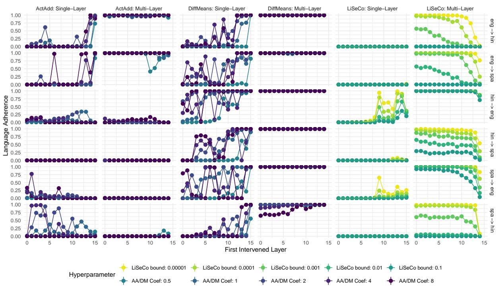  
Figure 4: Llama 3.1 1B language adherence for all evaluated activation steering configurations and language pairs on the XSTORYCLOZE training set.

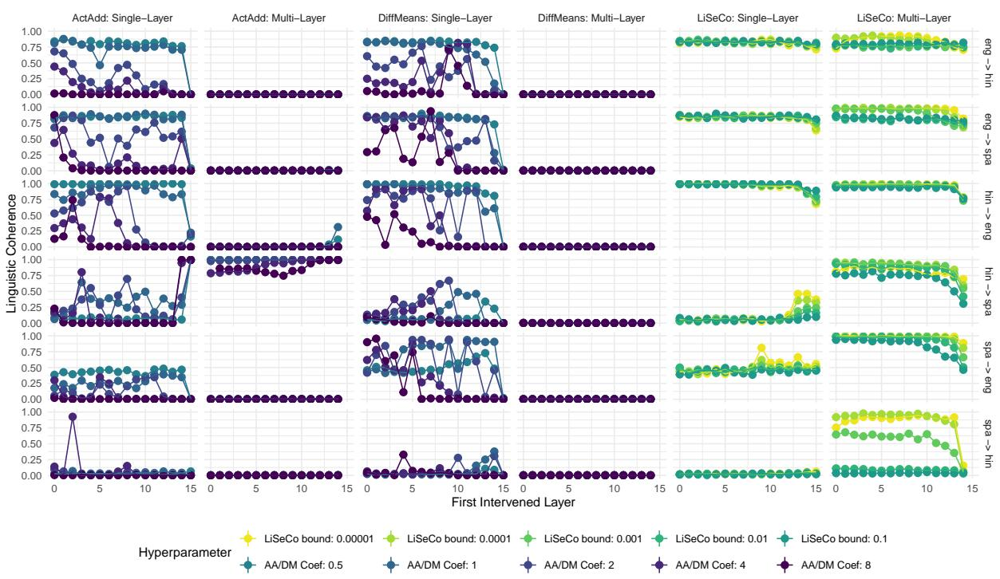  
Figure 5: Llama 3.1 1B linguistic coherence for all evaluated activation steering configurations and language pairs on the XSTORYCLOZE training set.

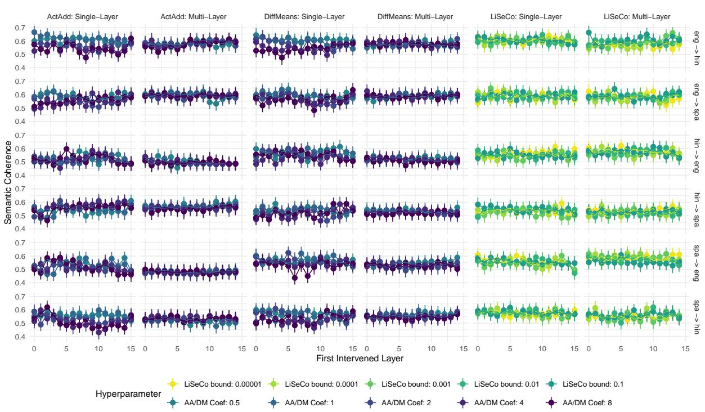  
Figure 6: Llama 3.1 1B semantic coherence for all evaluated activation steering configurations and language pairs on the XSTORYCLOZE training set.

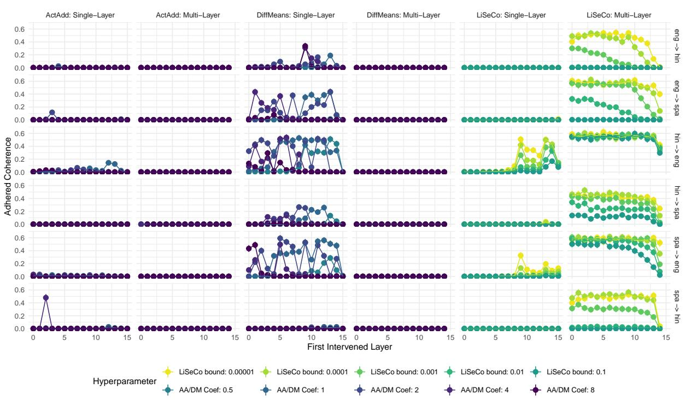  
Figure 7: Llama 3.1 1B adhered coherence for all evaluated activation steering configurations and language pairs on the XSTORYCLOZE training set.

## B Targeted Analyses: Further Details

We provide the test set language adherence (Figure 8), linguistic coherence (Figure 9), semantic coherence (Figure 10), and adhered coherence (Figure 11) for each language model on each language pair below.

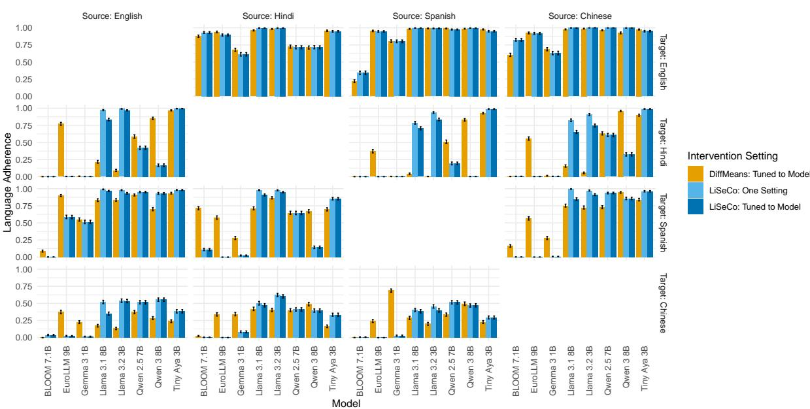  
Figure 8: Language Adherence of all language models and language pairs on the XSTORYCLOZE test set.

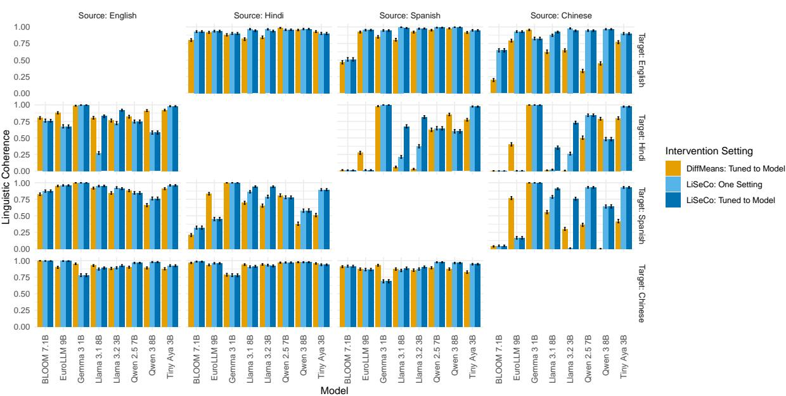  
Figure 9: Linguistic Coherence of all language models and language pairs on the XSTORYCLOZE test set.

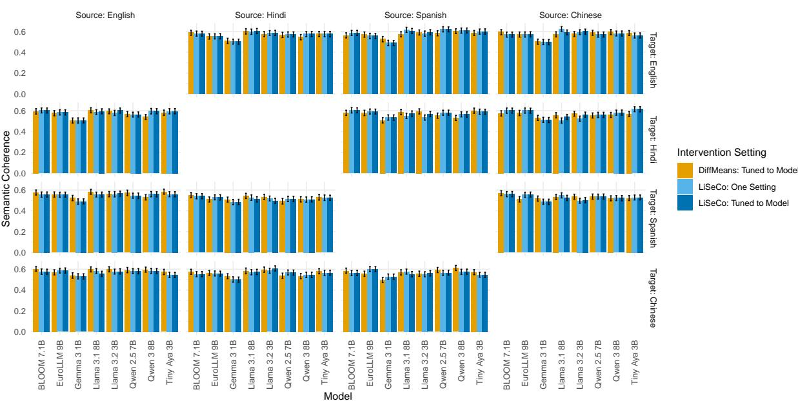  
Figure 10: Semantic coherence of all language models and language pairs on the XSTORYCLOZE test set.

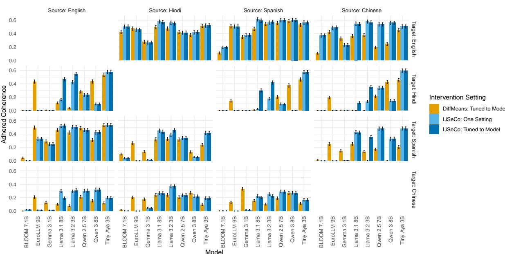  
Figure 11: Adhered Coherence of all language models and language pairs on the XSTORYCLOZE test set.