# The Role of Implicit and Explicit Demographic Signals in Large Language Model-based Student Assessment

Donya Rooein1, Luca Benedetto2, Dirk Hovy1

1Bocconi University, Milan, Italy

2Télécom SudParis, Institut Polytechnique de Paris, Palaiseau, France

Correspondence: donya.rooein@unibocconi.it

Code Data

## Abstract

Large Language Models are now common in student assessment, but we know little about how student demographics affect their use. Sometimes, considering student demographics may be necessary—for example, to improve readability for users with lower educational levels. However, it also risks being a cause of discrimination, e.g., when assigning lower scores to students from lower socioeconomic backgrounds. We set up controlled prompts to test 1) explicit demographic effects, where we mention demographic details directly, and 2) implicit effects, where we use conversation history as a demographic signal. We test these settings in three tasks: Automated Essay Scoring, Formative Feedback, and Metalinguistic Question Answering. We test six state-of-the-art LLMs on these tasks. In both explicit and implicit cases, the models pick up on demographic cues and can change their scoring, feedback, and answers accordingly. We find that LLMs frequently adjust the readability of feedback to education levels when these are explicitly mentioned. On the other hand, implicit conditions produce unpredictable biases, such as in question answering, where responses from lower-education levels receive lower sentiment scores. Our results provide clear evidence of demographic sensitivity in LLMs for educational assessment tasks1.

## 1 Introduction

Should teachers take into account who the student is when giving scores and feedback? Educational tasks differ in the extent to which outputs should depend on student demographics (Guo and Reinecke, 2014). In evaluative tasks such as essay grading, the score of a language learner should depend solely on the quality of the essay, not on their demographic characteristics, whether known or inferred (Doewes et al., 2022). In practice, though, this invariance does not hold, as extensive evidence shows that human evaluations are often influenced by demographic factors. Gentrup et al. (2024) documented systematic grading biases: when deanonymised, teacher-assigned grades for girls were higher than for boys with equivalent competencies in the anonymised setting.

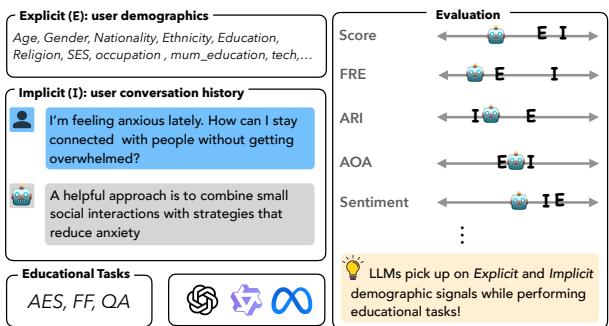  
Figure 1: We use multiple evaluation metrics to compare LLM-generated responses across three different educational tasks (Automated Essay Scoring (AES), Formative Feedback (FF), and Question-answering QA) under the model default ( ), explicit (E), and implicit (I) demographic conditions. We then use statistical tests to analyze the effect of demographic signals.

However, other educational tasks actively require consideration of student demographics. The feedback on an essay should legitimately vary according to a student’s L1 (first language), to account for similarities and differences between the learner’s L1 and the target language. In those contexts, demographic adaptation can improve personalization and instructional quality, provided it does not reinforce stereotypes or unequal expectations.

In essay grading, subtle differences in writing style, discourse structure, or self-presentation may inadvertently influence judgments (Kim and Zabelina, 2015). A writer who uses frequent hedges (e.g., “I think”) can be perceived as less confident or competent, whereas someone who writes in clear, assertive prose is more likely to be seen as authoritative (Zhou et al., 2025). Implicit signals arise naturally through linguistic variation, lexical choice, syntactic patterns, discourse style, or topic framing that correlate with social or demographic attributes (Bassignana et al., 2025). Even when demographic attributes are not directly stated, these cues may shape model responses (Jin et al., 2024). These linguistic cues can therefore affect scoring and feedback assessments. While human educators might not pick up on these more subtle cues systematically, LLMs do (Abdulhai et al., 2026). LLMs’ sensitivity to minute linguistic cues, such as variations in phrasing, also enables them to systematically infer author demographics when explicitly prompted (Ashok Kumar et al., 2025). Implicit signals may emerge from prior chat history or contextual cues (Neplenbroek et al., 2025; Sen et al., 2025). Since LLMs have rapidly been used to support teachers in tasks such as scoring and feedback (Shi et al., 2026; Wang et al., 2025c), this raises our main research questions: RQ1) Do implicit and explicit demographic cues systematically influence LLM behavior? and RQ2) How does the effect ofdemographic conditioning differ across educational tasks?

To address these questions, we evaluate six LLMs across educational tasks with different evaluative and instructional demands, comparing their responses under model default, explicit, and implicit demographic conditions (Figure 1). In objective tasks such as numerical scoring, outputs should ideally remain stable across demographic features. In more open-ended tasks, such as feedback generation, differences in tone, encouragement, and elaboration may be pedagogically relevant (Gallegos et al., 2024; Du et al., 2026). However, systematic demographic disparities raise concerns about equity and consistency (Gallegos et al., 2024). Existing work on LLM fairness in education has focused mainly on gender, including asymmetric feedback responses to gender substitutions (Du et al., 2026; Warr and Oster, 2025), with fewer studies examining race or socioeconomic background (Warr et al., 2025; Cantini et al., 2025). We address this gap using realistic user profiles with demographic attributes and real prompt histories (§2.1) to separate baseline behavior from explicit and implicit demographic effects.

Our contributions are as follows: a We assemble a dataset of 192,480 LLM-generated responses with default, explicit, and implicit demographic conditions across three educational tasks.; b We compare six LLMs on the data, using real-user demographic profiles.; and c We analyze LLM sensitivity to demographic information, combining linguistic comparisons and statistical tests across tasks and model families.

## 2 Defining and Measuring Demographic Sensitivity in Education

We define demographic sensitivity as systematic differences in model behavior attributable solely to variations in demographic context, with taskrelevant inputs held constant. Demographic sensitivity can lead to adaptation in settings that require awareness of differences but may also introduce demographic bias (Wang et al., 2025a). We measure demographic sensitivity across three common educational tasks that reflect distinct dimensions of model behavior: i) Automated Essay Scoring (AES) requires LLMs to assign holistic scores to student essays according to a provided rubric; ii) Formative Feedback (FF) involves generating open-ended feedback on student writings; iii) Metalinguistic Question Answering (QA) consists of answering open-ended questions about English from learners of English as a second or additional language. We selected these tasks because, together, they enable us to investigate how the scoring, feedback, and reasoning-oriented capabilities of LLMs vary across tasks and demographic signals. Given their distinct nature, we use different datasets to perform our experiments.

## 2.1 Datasets

We use data from three existing datasets: two as sources of educational tasks, and one as a source of realistic user profiles to be used as contextual information.

Datasets of educational tasks For AES and FF, we use the Persuade 2.0 (human) dataset (Crossley et al., 2024), which contains human-written essays scored by expert teachers. For AES, the LLM is prompted to score the essays following the predefined rubric scores (from 1 to 6), while for FF the LLM is prompted to provide formative feedback (details in §2.2). For QA, we use the ELQA dataset (Behzad et al., 2023), which contains metalinguistic questions about English sourced from Stack Exchange, and we prompt the LLMs to answer the metalinguistic questions. We randomly subsample from each dataset 40 tasks, and use those for the experiment described in the remainder of the paper.

Dataset of demographic context The dataset used to retrieve contextual information is the AI Gap dataset introduced by Bassignana et al. (2025). It contains the real prompt histories of 1,000 users along with detailed demographic information. We selected this dataset because it enables the study of more realistic personas and richer demographic attributes, which have been relatively underexplored in prior work.

For each user profile, the dataset provides a list of demographic attributes and at least one userwritten prompt. We first filter the dataset to retain only users with histories of 10 prompts, the maximum length in the AI gap dataset. This yields 490 profiles; we then randomly subsample 200 of them as our context dataset. The dataset provides 25 demographic attributes2 as follows:

gender, age, nationality, ethnicity, marital, language, religion, education, mum\_education, dad\_education, ses,3 home, employment, occupation, mother\_occupation, father\_occupation, hobbies, tech, know\_nlp, use\_nlp, would\_nlp, frequency\_llm, llm\_use, usecases, contexts .

The attributes can be divided into two categories: core demographics, such as age and gender, and behavioral demographics, such as hobbies, technology use, and frequency of LLM usage. They are a combination of single-value categorical, multivalue categorical, and ordinal attributes; the nature of each, as well as their possible values and frequencies, are shown in Appendix §A.

## 2.2 Prompting Strategy

Our prompting strategy has two steps: i) we provide contextual information (i.e., implicit or explicit settings), and ii) we prompt the model to perform the task (AES, FF, or QA).

Providing contextual information Our objective is to measure how LLM responses vary with demographic contextualization (i.e., their demographic sensitivity). To this end, we define three prompting conditions.

(I) Model default (Model). In this baseline setting, the model receives only the target task (essay or question) and no demographic information. This condition establishes standard reference performance with no conditioning.

(II) Explicit condition (Exp). We incorporate the detailed demographic attributes from the AI Gap dataset directly into the prompt. The demographic profile is explicitly stated in the user description, following a persona-based prompting paradigm.

(III) Implicit condition (Imp). In this condition, essays and questions are paired with prompt histories extracted from the AI Gap dataset, to indirectly signal demographic information without explicitly disclosing any attributes. Concretely, we prepend the 10 previous user prompts (along with responses simulated by an LLM in the format of questionanswering4) as conversational history before presenting our target educational task. This design allows us to assess whether subtle demographic cues embedded in prior interactions influence LLM evaluation. The full prompts are shown in §B.1.

Prompting to perform the task We use different prompts for the three educational tasks. For AES and FF, following (Xiao et al., 2025), we use a single prompt to first grade an essay and then provide feedback on that essay. To do this, we include an essay-scoring rubric in the prompt,5 and ask the model to return a score from 1 to 6 and a summary of the feedback according to the rubric. We then store the score and feedback separately for each item for further analysis. The Metalinguistic QA task is more open-ended (i.e., there are no rubrics or guidelines to follow); thus, we use a simple prompt corresponding to the user’s question. In §B.2, we show the complete structures used for the experiments.

## 2.3 Evaluation

The demographic contexts retrieved from the AI Gap dataset (Bassignana et al., 2025) do not necessarily correspond to the actual demographic profiles of the students who authored the educational inputs in Persuade 2.0 (human) dataset (Crossley et al., 2024) or ELQA dataset (Behzad et al., 2023). Importantly, our objective is therefore not to infer or reconstruct the true demographic characteristics of these authors. Instead, we adopt a controlled counterfactual sensitivity-testing framework in which the educational task input is held fixed while only the demographic context provided to the model is varied, either explicitly or implicitly. This design enables us to isolate whether and to what extent demographic signals influence model behaviour, while ensuring that the underlying essay or question remains identical across conditions.

We use the retrieved demographic information solely as contextual cues for constructing these controlled experimental conditions. Specifically, we evaluate the effect of different demographic attributes under Exp and Imp conditions on the evaluation metrics described below. We further examine whether the introduction of demographic signals systematically shifts model outputs away from Model, our reference condition without demographic information. Finally, we use statistical hypothesis tests to determine whether the observed differences associated with each demographic attribute are statistically significant.

Metrics Given the different nature of the three educational tasks, we use partially different metrics for them. For AES, the Persuade 2.0 (human) dataset provides a score assigned by a human expert to each essay, and we use that to evaluate the responses of the models. We first measure the mean absolute error relative to human scores, then examine shifts in the scoring distribution across demographic variants. For FF and QA, there are no references that we can use for the evaluation. Thus, we use a variety of linguistic-based metrics computed from LLM responses, and study how they change for different demographics. Specifically, we consider: the Automated Readability Index (ARI) (Senter and Smith, 1967) and Flesch Reading Ease (FRE) (Flesch, 1948) of the responses; the average Age ofAcquisition (AoA) of the words in the LLM responses (Kuperman et al., 2012); the response length (in number of words); the F1 BERTscore between the conditioned responses and the model default (Model); and the sentiment of the response.

To contextualize these metrics, we additionally apply topic modeling to the user prompts to characterize the topics of the prior conversations. This allows us to examine whether differences in sentiment are associated with the topical composition of the prompts, rather than reflecting demographic context alone. The resulting topic distribution is presented in Figure 2 in §E.1. We applied sentence-embedding clustering to 2,000 simulated user prompts (10 per user, 200 users). Prompts were encoded using all-MiniLM-L6-v26, producing 384-dimensional normalized embeddings, then clustered with KMeans (k = 15, n\_init=10, random\_state=42).

Statistical tests We perform two tests for all three tasks: i) a regularized linear regression test with an $L _ { 1 }$ penalty and ii) a two-sample Kolmogorov-Smirnov (KS) test for goodness of fit. In addition, for the AES task only, we perform a paired t-test with Bonferroni correction7 to assess the significance of score differences.

First, to identify the most predictive demographic attributes, we use a regularized linear regression test with an $L _ { 1 }$ penalty (Lasso). The regularization parameter (α) was determined via k-fold cross-validation (k = 5) to minimize mean squared error. Continuous variables were standardized, and the effect of the categorical variables was compared with the global average. In other words, we trained a regression model to predict each measure (e.g., the readability of the LLM response) from the demographic attributes. Features with non-zero coefficients in the final model were considered significant predictors. Then, we perform a further analysis with the two-sample KS test for goodness of fit, comparing the distributions observed for different conditions (e.g., “Is the sentiment for age 25–34 and age 45–54 significantly different?”). For the KS test, we use a p-value of 0.05 for statistical significance, adjusted with the conservative Bonferroni correction8. Bonferroni correction is run independently for each KS test. We run one KS test for each of the 120 (i.e., 40 × 3) tasks, and perform p-value correction independently. Each of these statistical tests is performed on 200 demographic profiles in our experiment.

For both tests, we set 10 as the support threshold, aggregating conditions that appear fewer than 10 times into an “others” class. Each of our tasks comprises 40 items (e.g., 40 essays for AES). For brevity, we focus on AES to illustrate our setup. Using 200 user profiles from the AI Gap dataset, we prompt the LLMs to perform each task conditioned on these demographic attributes. For instance, for the Imp condition, each LLM scores each essay 200 times – once for each implicit profile. Because each user profile appears 40 times (once per essay), the data entries are not independent. To avoid violating the assumption of independence, we cannot run a single statistical test across the 8,000 data samples (40 items × 200 profiles). Instead, we conduct 40 separate statistical tests – one per item – and evaluate the significance of demographic attributes independently before aggregating the results. An attribute is considered globally significant only if it achieves significance in at least N individual tests. We set $N = 1 0$ for Exp and $N = 5$ for Imp; a lower threshold is used for Imp because models must detect much subtler, less visible demographic differences.9 Additionally, in all tables in the results section (§3), we report only effects for which the absolute average regression coefficient $( | \mu _ { b } | )$ exceeds 10% of the standard deviation of the metric under consideration.

## 2.4 Models

We evaluate six instruction-tuned LLMs spanning proprietary and open-source families of varying sizes: GPT-5-mini, GPT-5-nano, Llama 3.3 70B, Llama 3.2 3B, Qwen3 4B, and Qwen3 30B. Exact model versions, hyperparameters, and references are provided in Appendix D. Each model processes every task under all three prompting conditions (Model, Imp, and Exp), enabling controlled within-model comparisons. The full experimental design comprises 6 models and 2 datasets (each with 40 items). For each dataset, every model is prompted with $( 4 0 \times 2 0 0 ) \times 2$ conditioned prompts (for Imp and Exp), and with 40 baseline prompts (for Model). Overall, this results in $6 \times 2 \times [ ( 4 0 \times 2 0 0 ) \times 2 + 4 0 ] = 1 9 2 , 4 8 0 \mathrm { L L M }$ inference calls. Approximately one-third of these calls correspond to API-based inference for proprietary models, while the remaining calls are executed on locally deployed open-weight models. In addition, Imp requires a one-time simulation of 200 profile-specific interaction histories, which we generate using GPT-5-nano, resulting in 200 additional API calls; we use the same simulated responses for all models in our experiments.

## 3 Results and Discussion

## 3.1 Automated Essay Scoring

First, we compare the model’s score for a given essay under Exp and Imp demographic conditions, and then contrast these scores with the Model outputs and the human baseline. Table 1 shows the mean score deviation per model and condition, where the human mean score is $3 . 0 2 \pm 1 . 0 0$ . Positive values indicate that the model assigns higher scores than humans under that condition. The Llama-3B significantly overscores relative to humans in the Model condition $( + 0 . 4 8 , p < 0 . 0 1 )$ and Llama-70B underscores $( - 0 . 5 2 , p < 0 . 0 1 )$ Under the Exp condition, deviations from human ratings remain modest and directionally positive for most models, with significant upward shifts for Llama-3B (+0.55, $p \ < \ 0 . 0 1 )$ and Qwen-4B (+0.29, $p \ < \ 0 . 0 5 )$ , and a significant downward shift for Llama- $7 0 \mathrm { B } \left( - 0 . 6 0 , p < 0 . 0 0 1 \right)$ . The Imp condition reveals the starkest effect: Llama-70B scores inflate by +1.57 points relative to its own default $( p < 0 . 0 0 1 )$ , the largest deviation observed across all models and conditions. In addition, GPT models are the most stable, and neither Exp nor Imp personas produce significant shifts in scores relative to human ratings.

<table><tr><td></td><td colspan="3">w.r.t. human</td><td colspan="2">w.r.t. default</td></tr><tr><td>Model</td><td>Model</td><td>Exp</td><td>Imp</td><td>Exp</td><td>Imp</td></tr><tr><td>GPT-mini</td><td>+0.05</td><td>+0.16</td><td>-0.02</td><td>+0.11</td><td>-0.07</td></tr><tr><td>GPT-nano</td><td>+0.10</td><td>+0.25</td><td>+0.10</td><td>+0.15*</td><td>0.00</td></tr><tr><td>Llama-70B</td><td> $- 0 . 5 2 ^ { * * }$ </td><td> $- 0 . 6 0 ^ { * * * }$ </td><td> $+ 1 . 0 4 ^ { * * * }$ </td><td>-0.07</td><td> $+ 1 . 5 7 ^ { * * * }$ </td></tr><tr><td>Llama-3B</td><td> $+ 0 . 4 8 ^ { * * }$ </td><td> $+ 0 . 5 5 ^ { * * }$ </td><td> $- 0 . 0 1$ </td><td>+0.08</td><td> $- 0 . 4 9 ^ { * * * }$ </td></tr><tr><td>Qwen-30B</td><td>-0.05</td><td>+0.11</td><td>-0.15</td><td> $+ 0 . 1 6 ^ { * * }$ </td><td> $- 0 . 1 0$ </td></tr><tr><td>Qwen-4B</td><td>+0.12</td><td>+0.29*</td><td>-0.05</td><td> $+ 0 . 1 6 ^ { * * }$ </td><td> $- 0 . 1 8 ^ { * * }$ </td></tr></table>

Table 1: Mean AES score deviation from human ratings and Model, per condition. Significance assessed via paired t-test on 40 per-essay means $^ { * } p { < } 0 . 0 5 , ^ { * * } p { < } 0 . 0 1$ $^ { \ast \ast \ast } p { < } 0 . 0 0 1$

<table><tr><td>Model</td><td>Attribute</td><td> $\mu _ { b } \ \left( \sigma _ { b } \right)$ </td><td>Cnt</td></tr><tr><td>Qwen-30B</td><td>education</td><td>-0.11 (0.08)</td><td>12</td></tr><tr><td>Qwen-4B</td><td>frequency_llm</td><td>+0.04 (0.07)</td><td>15</td></tr><tr><td>Llama-70B</td><td>usecases: Brainstorming</td><td>+0.26 (0.16)</td><td>24</td></tr><tr><td>Llama-70B</td><td>usecases: Writing</td><td>+0.24 (0.08)</td><td>19</td></tr><tr><td>Llama-70B</td><td>religion: Nothing</td><td>+0.19 (0.12)</td><td>20</td></tr><tr><td>Llama-70B</td><td>hobbies: arts</td><td>+0.18 (0.13)</td><td>15</td></tr><tr><td>Llama-70B</td><td>would_nlp: Dialog tech.</td><td>+0.17 (0.12)</td><td>20</td></tr><tr><td>Llama-70B</td><td>gender: Female</td><td>+0.12 (0.08)</td><td>21</td></tr></table>

Table 2: Impact of different demographic attributes in Exp (top) and Imp (bottom) on the score of the model responses, ordered by $| \mu _ { b } |$ . In bold if $| \mu _ { b } | \geq \sigma _ { \mathrm { r e s p . s c o r e } }$

Our regression analysis shows multiple significant results for scoring in the AES task (summary of attributes with Cnt ≥ 10 in Table $2 ^ { 1 0 } )$ Across all models in the Exp condition, demographic attributes generally produce only small shifts in scores. The largest observed effect is in Exp, Qwen-30B penalizes scores from users with higher education levels $( \mu _ { b } ~ = ~ - 0 . 1 1 )$ . In Imp, Llama-70B constantly overscores essays based on different demographic attributes. Users mentioning brainstorming (+0.26) or writing (+0.24) in their conversation history receive notably higher scores11. The KS test compares score distributions across demographic subgroups and assesses whether demographic attributes shift the full score distribution — not merely its mean. We find significant results only in Exp condition. For instance, for education Llama-3B: D(edu , edu ) = 0.65 and Qwen-30B: D(edu2, edu0) = 0.60 produce large distributional differences, with effects tending to grow across more distant ordinal levels (details in Table 15).

## 3.2 Metalinguistic QA

As described in §2.3, for QA we use a variety of metrics to measure demographic sensitivity. Unlike the AES task, where LLM responses are anchored to a fixed evaluation rubric, the QA task is inherently less constrained. There is no single objectively correct response, leaving the model greater latitude to adapt its tone, complexity, and framing to perceived user characteristics. We therefore anticipate demographic-driven variation in QA response metrics to be larger than in AES (RQ2).

Text accessibility We found multiple significant results for the two readability indexes, for both Exp (more frequently) and Imp. Table 3 shows

<table><tr><td>Model</td><td>Attribute</td><td>µb(σb)</td><td>Cnt</td></tr><tr><td>Llama-70B</td><td>education</td><td>+0.73 (0.51)</td><td>36</td></tr><tr><td>Llama-70B</td><td>nationality: US</td><td>+0.33 (0.39)</td><td>20</td></tr><tr><td>Llama-70B</td><td>language: English</td><td>+0.31 (0.37)</td><td>12</td></tr><tr><td>Llama-70B</td><td>nationality: UK</td><td>-0.29 (0.52)</td><td>13</td></tr><tr><td>Llama-3B</td><td>empl: Employed full time</td><td>+0.29 (0.26)</td><td>11</td></tr><tr><td>Llama-3B</td><td>age</td><td>−0.28 (0.20)</td><td>16</td></tr><tr><td>Llama-3B</td><td>education</td><td>+0.25 (0.19)</td><td>14</td></tr><tr><td>Llama-70B</td><td>empl: Employed full time</td><td>+0.24 (0.20)</td><td>22</td></tr><tr><td>Llama-70B</td><td>mum_education</td><td>+0.24 (0.40)</td><td>21</td></tr><tr><td>Qwen-30B</td><td>education</td><td>+0.21 (0.12)</td><td>20</td></tr><tr><td>Llama-3B</td><td>nationality: US</td><td>+0.19 (0.30)</td><td>12</td></tr><tr><td>Llama-70B</td><td>frequency_llm</td><td>−0.17 (0.29)</td><td>10</td></tr><tr><td>GPT-mini</td><td>education</td><td>+0.16 (0.12)</td><td>13</td></tr><tr><td>Llama-70B</td><td>ses</td><td>+0.16 (0.10)</td><td>18</td></tr><tr><td>Qwen-30B</td><td>empl: Employed full time</td><td>+0.12 (0.10)</td><td>13</td></tr><tr><td>Llama-70B</td><td>dad_education</td><td>+0.11 (0.06)</td><td>16</td></tr><tr><td>Llama-3B</td><td>gender: Male</td><td>+0.53 (0.23)</td><td>5</td></tr><tr><td>Qwen-4B</td><td>religion: Christian</td><td>+0.31 (0.24)</td><td>5</td></tr><tr><td>GPT-mini</td><td>language: English</td><td>+0.21 (0.16)</td><td>6</td></tr><tr><td>Llama-70B</td><td>language: English</td><td>+0.20 (0.12)</td><td>6</td></tr><tr><td>GPT-nano</td><td>gender: Male</td><td>+0.19 (0.17)</td><td>5</td></tr><tr><td>Qwen-30B</td><td>language: English</td><td>+0.19 (0.11)</td><td>6</td></tr><tr><td>Qwen-4B</td><td>language: English</td><td>+0.16 (0.11)</td><td>5</td></tr><tr><td>Qwen-4B</td><td>gender: Male</td><td>+0.12 (0.07)</td><td>5</td></tr></table>

Table 3: Impact of different demographic attributes in Exp (top) and Imp (bottom) on the ARI of the model responses, ordered by $\left| \mu _ { b } \right|$

how the ARI (larger values indicates more difficult texts) of the model response changes for different demographics, without considering Model. Notably, for categorical attributes, the coefficient indicates how much the readability index changes for the prompts conditioned with a demographic attribute with respect to the other attributes; for the ordinal attributes (e.g. education) the coefficient indicates how much the value of the readability index changes moving to the following value in the list (e.g., from High school or below to undergraduate). The responses provided by the GPT and Qwen models rarely change significantly, and when they do, the coefficient is generally smaller than that of the two Llama models. On the other hand, the readability of the responses of two Llama models changes significantly for a variety of attributes – although the coefficient is consistently smaller than the standard deviation of the ARI $( \sigma _ { \mathrm { A R I } } = 1 . 0 6 ) $ The Education attribute consistently leads to significant positive coefficients for Exp (for Llama-70B, Llama-3B, Qwen-30B, and GPT-mini), meaning that users with higher educational level receive less readable responses: this suggests that if the models have access to an explicit reference to the educational level of the user they can partially adapt the readability of their responses. A similar effect is visible, to a lesser extent and for Llama-70B only, for mum\_education, ses, and dad\_education. However, this adaptation does nor occur for Imp: indeed, we find that users whose first language is English receives (slightly) less readable responses (from GPT-mini, Llama-70B, and the two Qwen models), as well as users who identified as Males (from Llama-3B, GPT-nano, and Qwen-4B), and Christians (Qwen-4B). We note that this might be due to the effect of the majority-group attributes. Focusing on the results of the KS test (details in §E.4) we find that, for the same model, the difference in readability tends to be larger for larger ses gaps (Llama-70B: $D ( \mathrm { s e s } _ { 4 } , \mathrm { s e s } _ { 8 } ) = 0 . 7 9 , D ( \mathrm { s e s } _ { 4 } , \mathrm { s e s } _ { 7 } ) = 0 . 6 3 )$ and for larger education gaps (e.g., for Qwen-30B: $D ( \mathrm { { e d u } _ { 0 } , \mathrm { { e d u } _ { 2 } ) \ = \ 0 . 5 1 , \ D ( \mathrm { { e d u } _ { 0 } , \mathrm { { e d u } _ { 1 } ) \ = \ 0 . 4 2 , } } } }$ $D ( \mathrm { { e d u } _ { 1 } , \mathrm { { e d u } _ { 2 } ) = 0 . 3 9 ) } }$ , although this is not uni form across levels.

The results for FRE are similar to those for ARI (full details and tables in §E.4). According to the regression test (Table 26), higher education levels consistently receive responses of lower readability for Exp (we found significance for 5 models), and we also find the same effect with Imp on Qwen-4B (but with a smaller coefficient). Similarly, users with higher SES values receive less readable responses in both Exp (4 out of 6 models) and Imp (3 models). As for the ARI, the KS test shows that larger gaps in education levels lead to larger differences in the readability of the LLM response (Table 27). Comparing the effect of the same attributes in the two conditioning settings, we find that the demographic attributes tend to have the same effect, but with smaller magnitude for Imp: indeed, the coefficient of the least-squares regression line (Exp on the x-axis, more details and plots in §E.4) is $\mu _ { b } = 0 . 5 6$ for ARI and $\mu _ { b } = 0 . 5 1$ for FRE.

<table><tr><td>Model</td><td>Attribute</td><td>µb(σb)</td><td>Cnt</td></tr><tr><td>Llama-70B</td><td>language: English</td><td>+7.83 (4.08)</td><td>20</td></tr><tr><td>Qwen-30B</td><td>education</td><td>+7.11 (10.90)</td><td>12</td></tr><tr><td>Llama-70B</td><td>education</td><td>+6.89 (6.28)</td><td>29</td></tr><tr><td>Llama-70B</td><td>nationality: US</td><td>+6.41 (7.11)</td><td>19</td></tr><tr><td>Llama-3B</td><td>education</td><td>+4.25 (2.99)</td><td>11</td></tr><tr><td>GPT-mini</td><td>education</td><td>+4.22 (4.22)</td><td>11</td></tr><tr><td>Qwen-30B</td><td>mum_education</td><td>+4.19 (3.67)</td><td>10</td></tr><tr><td>Llama-70B</td><td>gender: Male</td><td>+3.50 (2.71)</td><td>10</td></tr><tr><td>Llama-70B</td><td>mum_education</td><td>+3.43 (2.67)</td><td>23</td></tr><tr><td>Qwen-4B</td><td>tech: Laptop</td><td>+32.97 (27.88)</td><td>5</td></tr><tr><td>Qwen-30B</td><td>usecases: Writing</td><td>+30.64 (34.21)</td><td>5</td></tr><tr><td>GPT-mini</td><td>tech: Laptop</td><td>+21.20 (21.87)</td><td>5</td></tr><tr><td>Llama-3B</td><td>tech: Laptop</td><td>+13.94 (14.12)</td><td>6</td></tr><tr><td>GPT-nano</td><td>tech: Laptop</td><td>+12.08 (11.88)</td><td>5</td></tr><tr><td>Llama-70B</td><td>hobbies: Exercise</td><td>+9.65 (9.93)</td><td>7</td></tr><tr><td>GPT-nano</td><td>tech: Tablet</td><td>+9.57 (10.71)</td><td>5</td></tr><tr><td>GPT-mini</td><td>gender: Male</td><td>+8.49 (12.33)</td><td>5</td></tr><tr><td>GPT-nano</td><td>empl: Employed full time</td><td>+8.49 (5.19)</td><td>5</td></tr><tr><td>GPT-mini</td><td>empl: Employed full time</td><td>+8.41 (4.58)</td><td>6</td></tr><tr><td>GPT-nano</td><td>hobbies: Use social media</td><td>+7.21 (6.26)</td><td>5</td></tr><tr><td>Qwen-4B</td><td>usecases: Coding</td><td>-6.38 (7.34)</td><td>5</td></tr><tr><td>Llama-70B</td><td>language: English</td><td>+5.51 (5.23)</td><td>8</td></tr><tr><td>GPT-mini</td><td>mum_education</td><td>+3.18 (2.98)</td><td>5</td></tr></table>

Table 4: Impact of different demographic attributes in Exp (top) and Imp (bottom) on the length (number of words) of the model responses, ordered by $| \mu _ { b } | .$ In bold if $\left| \mu _ { b } \right| \geq \sigma _ { \mathrm { r e s p . l e n g t h } } .$

Notably, our findings were quite different when measuring differences in the response length (number of words) of the LLM responses: indeed, we find more significant results for Imp than for Exp, and the coefficients were generally larger, as shown in Table 4. We consistently find that users who use laptops receive longer responses (4 models). Again, we find that the responses for higher education levels are longer (which is potentially correlated with less readable texts), and we observe the same effect (with smaller coefficients) for mum\_education in Qwen-30B and Llama-70B. The fact that Imp has stronger effects is also visible from the leastsquares regression line (Figure 5 in §E.4), which has a coefficient $m = 1 . 2 0$ . Conversely, we did not find many attributes who consistently appeared as significant according to the KS test; indeed, we only found education for Llama-70B when conditioning explicitly: D(edu0, ses2) = 0.54(±0.09) and $D ( { \mathrm { e d u } } _ { 0 } , { \mathrm { e d u } } _ { 1 } ) = 0 . 4 6 ( \pm 0 . 0 6 )$ , with a support of 13 and 8 tasks respectively. Lastly, our statistical tests yield few significant results for AoA, and we report the statistically significant attributes in §E.4.

Overall, our readability analysis suggests that when Exp references to the user’s (or their parents’) education level or Socio-Economic Status are available, most models partially adapt their responses, producing less readable messages for users with higher education levels and SES. However, the same adaptation is not present in Imp conditioning, and we only find that the models often mimic surface characteristics of previous prompt histories (e.g., longer responses for users with longer prompts in their history).

<table><tr><td>Model</td><td>Attribute</td><td>µb(σb)</td><td>Cnt</td></tr><tr><td>Llama-70B</td><td>education</td><td>+0.08 (0.06)</td><td>26</td></tr><tr><td>Llama-3B</td><td>education</td><td>+0.07 (0.09)</td><td>12</td></tr><tr><td>Llama-70B</td><td>empl: Employed full time</td><td>+0.05 (0.02)</td><td>12</td></tr><tr><td>Llama-3B</td><td>age</td><td>+0.04 (0.07)</td><td>14</td></tr><tr><td>Llama-70B</td><td>ses</td><td>+0.02 (0.03)</td><td>12</td></tr><tr><td>Llama-3B</td><td>tech: Smartphone</td><td>+0.19 (0.19)</td><td>5</td></tr><tr><td>Qwen-30B</td><td>religion: Christian</td><td>+0.08 (0.13)</td><td>5</td></tr><tr><td>GPT-nano</td><td>hobbies: Use social media</td><td>+0.07 (0.05)</td><td>5</td></tr><tr><td>Qwen-4B</td><td>nationality: US</td><td>+0.05 (0.03)</td><td>5</td></tr><tr><td>GPT-mini</td><td>empl: Employed full time</td><td>+0.03 (0.02)</td><td>5</td></tr><tr><td>Qwen-30B</td><td>education</td><td>+0.02 (0.02)</td><td>5</td></tr><tr><td>Llama-70B</td><td>frequency_llm</td><td>−0.02 (0.02)</td><td>5</td></tr><tr><td>Llama-3B</td><td>ses</td><td>+0.01 (0.03)</td><td>6</td></tr></table>

Table 5: Impact of different demographic attributes in Exp (top) and Imp (bottom) on the sentiment of the model responses, ordered by $| \mu _ { b } |$ . In bold if $| \mu _ { b } | \geq$ σsentiment.

Sentiment Analysis. Table 5 presents the results of the multivariate regression test on the sentiment of the conditioned model responses. We found significance for both Imp and Exp, and in some cases for the same conditions: education leads to a positive coefficient for the two Llama models (Exp) and, with smaller coefficient, Qwen-30B (Imp). This indicates that higher education level receives responses with more positive sentiment, which can be problematic especially with Exp: indeed, the dataset contains 4 education levels (from ‘High school or below’ to ‘Doctorate or above’) and the coefficient indicates that, on average, there is a difference of 0.3 between the sentiment of the lowest and higher education level (with sentiment $\in \{ 0 , 1 , 2 , 3 , 4 \}$ , and $\sigma _ { \mathrm { s e n t i m e n t } } = 0 . 0 7 )$ The same effect is visible for Imp with Qwen-30B, but with a smaller coefficient. We also find that ‘Employment: Employed full time’ leads to positive coefficients in both Exp (Llama-70B) and Imp (GPT-mini), as well as ses (Llama-70B explicit and Llama-3B implicit), both with a coefficient which is smaller for Imp. Finally, we find that for Imp there are several attributes which have a strong effect on the sentiment of the responses $( | \mu _ { b } | \geq \sigma _ { \mathrm { s e n t i m e n t } } )$ even though they do not appear from the analysis on Exp: Tech: Smartphone, religion: Christian, hobbies: Use social media. Most likely, LLMs pick up the topics in these users’ previous prompt histories, leading to more positive sentiments; however, the effects are not consistent across models.

Topic Analysis. To further investigate potential sources of variation in the implicit demographic condition, we analyze the topic distribution of users’ prompt histories. Among the 15 identified topics, the most prevalent are General Q&A, Career & Resume, and AI & Concept Explanation. The complete topic-modeling results are presented in Figure 2. The demographic breakdown of topic distributions reveals systematic differences in the types of queries. Gender differences are apparent: women’s prompts are more concentrated in Career & Resume, whereas men’s prompts are more frequently associated with General Q&A. Age-related differences are also observed, with younger users (18–34) showing a greater concentration of AIrelated queries (T11, 12.8%), while older users (45– 54 and 60+) are more concentrated on Account & Admin tasks (T7, up to 15.5%). Socioeconomic status exhibits a similar pattern, with lower-SES users more frequently associated with Factual Lookup (T4, 24.0% at SES 1), whereas higher-SES users show a greater concentration of Finance & Stocks queries (T2, 23.3% at SES 10). Similar differences are observed across employment status and frequency of AI usage.

BERTScore. Differently from the metrics discussed previously, which only focus on surface aspects (e.g., readability, length, ...), BERTScores can capture the semantics of the model responses.

Table 6 shows the results of the regression test on the BERTscore F1 of the LLM responses, using Model as reference (i.e., we measure how much the response of the model is steered away from the default under the different prompting conditions; larger BERTscore values indicate responses that are more similar to the reference). We find that, beyond language:English (the majority attribute), nationality: US, shows positive coefficients for Exp conditioning (4 models). These results show, once more, that the default of LLMs tends to be Englishcentric (and US-centric in particular). We also find that higher education levels lead to responses more similar to the default when stated explicitly, as well as lower age and higher SES. Notably, we find a contrasting effect for the latter two: their effect is opposite with Imp and Exp: age has a negative coefficient for Exp (3 models) but positive for Imp (2 models), while ses has a positive coefficient for Exp but a negative for Imp (same model, Llama-70B, in both cases).

<table><tr><td>Model</td><td>Attribute</td><td> $\mu _ { b } ( \sigma _ { b } )$ </td><td>Cnt</td></tr><tr><td>GPT-mini</td><td>language: English</td><td>+0.0150 (0.0090)</td><td>14</td></tr><tr><td>Llama-70B</td><td>language: English</td><td>+0.0116 (0.0060)</td><td>31</td></tr><tr><td>Llama-70B</td><td>education</td><td>+0.0069 (0.0039)</td><td>36</td></tr><tr><td>Llama-70B</td><td>nationality: US</td><td>+0.0040 (0.0052)</td><td>23</td></tr><tr><td>Qwen-4B</td><td>language: English</td><td>+0.0038 (0.0040)</td><td>16</td></tr><tr><td>Llama-3B</td><td>education</td><td>+0.0036 (0.0040)</td><td>12</td></tr><tr><td>Llama-3B</td><td>age</td><td>-0.0033 (0.0023)</td><td>20</td></tr><tr><td>GPT-nano</td><td>language: English</td><td>+0.0032 (0.0030)</td><td>10</td></tr><tr><td>Llama-70B</td><td>age</td><td>-0.0032 (0.0020)</td><td>27</td></tr><tr><td>GPT-mini</td><td>nationality: US</td><td>+0.0032 (0.0019)</td><td>11</td></tr><tr><td>Llama-3B</td><td>nationality: US</td><td>+0.0029 (0.0050)</td><td>15</td></tr><tr><td>Llama-3B</td><td>dad_education</td><td>+0.0018 (0.0017)</td><td>15</td></tr><tr><td>Llama-70B</td><td>dad_education</td><td>+0.0018 (0.0015)</td><td>10</td></tr><tr><td>Llama-70B</td><td>mum_education</td><td>+0.0016 (0.0012)</td><td>20</td></tr><tr><td>Qwen-4B</td><td>age</td><td>-0.0014 (0.0021)</td><td>17</td></tr><tr><td>Llama-70B</td><td>ses</td><td>+0.0014 (0.0013)</td><td>12</td></tr><tr><td>Qwen-30B</td><td>nationality: US</td><td>+0.0014 (0.0020)</td><td>10</td></tr><tr><td>Llama-70B</td><td>hobbies: social media</td><td>+0.0063 (0.0090)</td><td>5</td></tr><tr><td>Llama-3B</td><td>language: English</td><td>+0.0028 (0.0014)</td><td>5</td></tr><tr><td>GPT-mini</td><td>tech: Laptop</td><td>+0.0026 (0.0012)</td><td>6</td></tr><tr><td>Llama-70B</td><td>language: English</td><td>+0.0022 (0.0016)</td><td>7</td></tr><tr><td>Qwen-4B</td><td>gender: Male</td><td>+0.0020 (0.0008)</td><td>5</td></tr><tr><td>Llama-70B</td><td>ses</td><td>-0.0019 (0.0010)</td><td>5</td></tr><tr><td>GPT-nano</td><td>use_nlp: detect spam</td><td>+0.0016 (0.0021)</td><td>5</td></tr><tr><td>Qwen-30B</td><td>language: English</td><td>+0.0016 (0.0009)</td><td>8</td></tr><tr><td>Llama-70B</td><td>age</td><td>+0.0012 (0.0010)</td><td>6</td></tr><tr><td>GPT-nano</td><td>home: Rent</td><td>+0.0010 (0.0010)</td><td>5</td></tr><tr><td>Qwen-4B</td><td>age</td><td>+0.0010 (0.0005)</td><td>8</td></tr></table>

Table 6: Impact of different demographic attributes in Exp (top) and Imp (bottom) on the BERTscore F1 of the model responses (using Model as reference), ordered by $\left| \mu _ { b } \right|$ . In bold if $| \mu _ { b } | \geq \sigma _ { \mathrm { B E R T s c o r e F 1 } }$

## 3.3 Formative Feedback

Similar to §3.2, we report the most significant attributes from regression analysis for the FF task.12

Text accessibility. In essay feedback generation, all significant attributes are driven almost entirely by Imp conditioning and are largely concentrated in Llama-70B. FRE. Personas associated with usecases: Writing $( \mu _ { b } { = } \mathrm { { + } } 3 . 6 7 , \mathrm { { C n t = } } 6 )$ hobbies: museums or exercise $( + 1 . 9 3 \ \mathrm { t o } + 1 . 7 2 ) $ religion:Christian (+1.41), and gender: Female (+1.09) all receive more readable feedback with no Exp effect. For ARI (Table 20), the Imp effects are sparse, and hobbies: museums or exercise appears again for Llama-70B, GPT-nano.

Response length. Under Imp condition, Qwen-4B shows longer feedback for behavioral attributes such as brainstorming use cases (+2.51), knowledge of dialog technology (+2.46), and digital content creation (+2.41). Notably, Qwen-4B also shows a significant effect for ethnicity: Black or African American (+1.35, Cnt=5)—the only core demographic attribute beyond technology-use patterns to emerge in this metric.

Sentiment. No Exp effects are found (Table 23). Under Imp all attributable exclusively to Llama-70B. We observe significant over behavioral attributes such as (usecase:Brainstorming: +0.32; tech:laptop: +0.24; usecase:Writing: +0.19)) and core demographics such (religion:Noting), (gender:Female: +0.14). The breadth of attributes suggests that Llama-70B’s feedback sentiment is broadly susceptible to implicit persona context.

## 4 Related Work

LLMs are increasingly being adopted for educational tasks such as automated scoring, feedback generation, tutoring, question generation, and learning analytics, offering opportunities for scalable and personalized instructional support (Parker et al., 2025; Kasneci et al., 2023; Frederick Eneye et al., 2025; Gupta et al., 2025; Golchin et al., 2025; Stahl et al., 2024; Wang et al., 2025b). However, their deployment in educational settings raises important concerns about validity, reliability, transparency, and fairness, particularly when model outputs influence assessment, feedback, or student learning trajectories (Liu et al., 2026; Gupta et al., 2025; Gallegos et al., 2024). A central risk is that LLMs may reproduce or amplify demographic, linguistic, cultural, and socioeconomic biases inherited from training data in explicit and implicit conditions (Warr et al., 2025; Jin et al., 2024; Weissburg et al., 2025; Rooein et al., 2025; Zhao et al., 2025). Most existing studies focus only on a limited set of explicit demographic attributes such as race, gender, and socioeconomic status (Du et al., 2026; Shailya et al., 2025; Warr and Oster, 2025; Du et al., 2026; Gándara et al., 2024). In this study, however, we examine the effects of a broad range of explicit demographic attributes, together with implicit conversational characteristics derived from real user interactions with LLMs, across three educational tasks.

## 5 Conclusion

We systematically investigate how explicit and implicit demographic signals influence LLM behavior across three educational assessment tasks. Using a controlled experimental setup, we evaluate 6 LLMs,

25 demographic attributes, and 10 rounds of conversation across 200 real user profiles. Our findings reveal that demographic effects are strongly taskdependent. Most models remain relatively stable given Exp persona conditioning in AES. However, Imp demographic cues produce larger and less predictable effects, particularly for Llama-70B model. In contrast, for open-ended tasks, models show systematic differences in readability, sentiment, and response length. Our findings have important implications for using AI in performing educational tasks such as scoring and generating feedback for students: in high-stakes evaluative settings, demographic invariance is essential. However, in instructional contexts, some adaptation may be pedagogically appropriate, such as adjusting readability metrics. However, current LLMs cannot reliably separate task-relevant information from demographic cues. That raises concerns about fairness, transparency, and the potential amplification of educational inequities. As LLMs become increasingly integrated in education, we need to ensure their behavior reflects pedagogical objectives rather than unintended demographic biases.

## 6 Acknowledgments

This work was conducted while Donya Rooein was a Postdoctoral Researcher at Bocconi University. Donya Rooein and Dirk Hovy were supported by the European Research Council (ERC) under the European Union’s Horizon 2020 research and innovation program (grant agreement No. 949944, INTEGRATOR) and MUR FARE 2020 initiative under grant agreement Prot. R20YSMBZ8S (IN-DOMITA).

## Limitations

This work has some limitations in terms of the dataset used for the evaluation: indeed, to limit the computational costs of the experiments, we subsampled the original datasets and kept only 120 items (40 each from Automated Essay Scoring, Formative Feedback, and Metalinguistic QA), and 200 user profiles (subsampled from the AI Gap paper). Although the statistical tests we consider account for this when studying the significance, this work would benefit from larger datasets, and potentially from the inclusion of other educational tasks. In addition, several demographic attributes in the AI Gap dataset are heavily skewed toward majority groups (e.g., 96% of profiles report English as their first language), making the corresponding regression coefficients uninterpretable as genuine group contrasts; we therefore exclude these from our results.

We use the prompt histories available in the original paper from Bassignana et al. (2025) for implicit conditioning; we do this in order to work with realistic prompts, but the histories are not necessarily related to the educational domain, and thus not necessarily representative of how LLMs are used by students in educational settings. Indeed, we work on a dataset that might contain a lot of noise and thus make our study (of the effect of the implicit conditioning) even more challenging. Another point to note is the fact that the tasks we prompt the models to perform (e.g., the essays which have to be scored) have been written by users whose demographic profile is different from those we give to the models with conditioning (both implicit and explicit conditioning). This might lead to a conflicting signal: on one hand, there is the linguistic signal from the student essay, and, on the other, there is the linguistic signal from the history of previous prompts (or the explicit persona), and the two might “pull” in different directions. However, this does not affect the validity of our findings as the (potential) signal from the educational task is the same when conditioning on different demographics. Also, even though we consider implicit conditioning, the fact that we experiment on English only implies that we cannot properly evaluate the effect of grammatical gender, which is much more significant in other languages (Benedetto et al., 2026; Ducel et al., 2024).

We use Bonferroni correction to adjust the pvalue of the KS test, which has been criticized as being too conservative (Nakagawa, 2004) and thus missing some significant results. While this is arguably a limitation, since there might be other effects which have gone unnoticed, it suggests that the statistically significant results found in this paper are due to a real effect of the conditions on the model responses.

## Ethics Statements

This research examines demographic sensitivity in LLMs applied to educational tasks—a domain with significant equity implications. While our study does not directly involve human subjects, we use real user demographic profiles from the publicly available AI Gap dataset (Bassignana et al., 2025), which was collected under appropriate ethical oversight and with informed consent. Our experimental design deliberately measures demographic sensitivity in LLMs for performing three educational tasks to identify potential harms before deployment.

## References

Marwa Abdulhai, Isadora White, Yanming Wan, Ibrahim Qureshi, Joel Leibo, Max Kleiman-Weiner, and Natasha Jaques. 2026. How llms distort our written language. arXiv preprint arXiv:2603.18161.

Nischal Ashok Kumar, Chau Minh Pham, Mohit Iyyer, and Andrew Lan. 2025. Whose story is it? personalizing story generation by inferring author styles. In Proceedings ofthe 14th International Joint Conference on Natural Language Processing and the 4th Conference ofthe Asia-Pacific Chapter ofthe Association for Computational Linguistics, pages 1485– 1540, Mumbai, India. The Asian Federation of Natural Language Processing and The Association for Computational Linguistics.

Elisa Bassignana, Amanda Cercas Curry, and Dirk Hovy. 2025. The AI gap: How socioeconomic status affects language technology interactions. In Proceedings of the 63rd Annual Meeting of the Association for Computational Linguistics (Volume 1: Long Papers), pages 18647–18664, Vienna, Austria. Association for Computational Linguistics.

Shabnam Behzad, Keisuke Sakaguchi, Nathan Schneider, and Amir Zeldes. 2023. ELQA: A corpus of metalinguistic questions and answers about English. In Proceedings of the 61st Annual Meeting of the Associationfor Computational Linguistics (Volume 1: Long Papers), pages 2031–2047, Toronto, Canada. Association for Computational Linguistics.

Luca Benedetto, Antonia Donvito, Alberto Lucchetti, Andrea Cappelli, and Paula Buttery. 2026. Beyond names: How grammatical gender markers bias LLMbased educational recommendations. In Proceedings of the 19th Conference of the European Chapter of the Associationfor Computational Linguistics (Volume 1: Long Papers), pages 5648–5668, Rabat, Morocco. Association for Computational Linguistics.

Riccardo Cantini, Alessio Orsino, Massimo Ruggiero, and Domenico Talia. 2025. Benchmarking adversarial robustness to bias elicitation in large language models: Scalable automated assessment with llm-asa-judge. Machine Learning, 114(11):249.

S.A. Crossley, Y. Tian, P. Baffour, A. Franklin, M. Benner, and U. Boser. 2024. A large-scale corpus for assessing written argumentation: Persuade 2.0. Assessing Writing, 61:100865.

Afrizal Doewes, Akrati Saxena, Yulong Pei, and Mykola Pechenizkiy. 2022. Individual fairness evaluation for automated essay scoring system. In Proceedings of the 15th International Conference on Educational Data Mining, pages 206–216, Durham, United Kingdom. International Educational Data Mining Society.

Yishan Du, Conrad Borchers, and Mutlu Cukurova. 2026. A benchmark for gender bias in large language model feedback on student essays. In Artificial Intelligence in Education: 27th International Conference, AIED 2026, Seoul, South Korea, June 27–July 3, 2026, Proceedings, Part VI, page 163–178, Berlin, Heidelberg. Springer-Verlag.

Fanny Ducel, Aurélie Névéol, and Karën Fort. 2024. “you’ll be a nurse, my son!” automatically assessing gender biases in autoregressive language models in french and italian: You’ll be a nurse, my son. Lang. Resour. Eval., 59(2):1495–1523.

Rudolph Flesch. 1948. A new readability yardstick. Journal ofapplied psychology, 32(3):221.

Tania Amanda Nkoyo Frederick Eneye, Chukwuebuka Fortunate Ijezue, Ahmad Imam Amjad, Maaz Amjad, Sabur Butt, and Gerardo Castañeda-Garza. 2025. Advances in auto-grading with large language models: A cross-disciplinary survey. In Proceedings of the 20th Workshop on Innovative Use of NLP for Building Educational Applications (BEA 2025), pages 477–498, Vienna, Austria. Association for Computational Linguistics.

Isabel O. Gallegos, Ryan A. Rossi, Joe Barrow, Md Mehrab Tanjim, Sungchul Kim, Franck Dernoncourt, Tong Yu, Ruiyi Zhang, and Nesreen K. Ahmed. 2024. Bias and fairness in large language models: A survey. Computational Linguistics, 50(3):1097– 1179.

Denisa Gándara, Hadis Anahideh, Matthew P Ison, and Lorenzo Picchiarini. 2024. Inside the black box: Detecting and mitigating algorithmic bias across racialized groups in college student-success prediction. AERA open, 10:23328584241258741.

Sarah Gentrup, Melanie Olczyk, and Georg Lorenz. 2024. Teacher stereotypes and teacher expectations at the intersection of student gender and socioeconomic status. Zeitschrift für Entwicklungspsychologie und Pädagogische Psychologie, 56(1-2):87–102.

Shahriar Golchin, Nikhil Garuda, Christopher Impey, and Matthew Wenger. 2025. Grading massive open online courses using large language models. In Proceedings of the 31st International Conference on Computational Linguistics, pages 3899–3912, Abu Dhabi, UAE. Association for Computational Linguistics.

Philip J. Guo and Katharina Reinecke. 2014. Demographic differences in how students navigate through moocs. In Proceedings of the First ACM Conference on Learning @ Scale Conference, L@S ’14, page 21–30, New York, NY, USA. Association for Computing Machinery.

Vansh Gupta, Sankalan Pal Chowdhury, Vilém Zouhar, Donya Rooein, and Mrinmaya Sachan. 2025. Are large language models for education reliable across languages? In Proceedings of the 20th Workshop on Innovative Use ofNLPfor Building Educational

Applications (BEA 2025), pages 612–631, Vienna, Austria. Association for Computational Linguistics.

Zhijing Jin, Nils Heil, Jiarui Liu, Shehzaad Dhuliawala, Yahang Qi, Bernhard Schölkopf, Rada Mihalcea, and Mrinmaya Sachan. 2024. Implicit personalization in language models: A systematic study. In Findings ofthe Associationfor Computational Linguistics: EMNLP 2024, pages 12309–12325, Miami, Florida, USA. Association for Computational Linguistics.

Enkelejda Kasneci, Kathrin Sessler, Stefan Küchemann, Maria Bannert, Daryna Dementieva, Frank Fischer, Urs Gasser, Georg Groh, Stephan Günnemann, Eyke Hüllermeier, Stephan Krusche, Gitta Kutyniok, Tilman Michaeli, Claudia Nerdel, Jürgen Pfeffer, Oleksandra Poquet, Michael Sailer, Albrecht Schmidt, Tina Seidel, and 4 others. 2023. Chatgpt for good? on opportunities and challenges of large language models for education. Learning and Individual Differences, 103:102274.

Kyung Hee Kim and Darya Zabelina. 2015. Cultural bias in assessment: Can creativity assessment help? International Journal ofCritical Pedagogy, 6(2).

Victor Kuperman, Hans Stadthagen-Gonzalez, and Marc Brysbaert. 2012. Age-of-acquisition ratings for 30,000 english words. Behavior research methods, 44(4):978–990.

Tongxi Liu, Luyao Ye, and Wei Yan. 2026. A framework for evaluation of large language models in essay assessment: Reliability, alignment, and causal reasoning. Computers and Education: Artificial Intelligence, 10:100565.

Shinichi Nakagawa. 2004. A farewell to bonferroni: the problems of low statistical power and publication bias. Behavioral ecology, 15(6):1044–1045.

Vera Neplenbroek, Arianna Bisazza, and Raquel Fernández. 2025. Reading between the prompts: How stereotypes shape LLM’s implicit personalization. In Proceedings of the 2025 Conference on Empirical Methods in Natural Language Processing, pages 20367–20400, Suzhou, China. Association for Computational Linguistics.

Michael J Parker, Caitlin Anderson, Claire Stone, and YeaRim Oh. 2025. A large language model approach to educational survey feedback analysis. International journal ofartificial intelligence in education, 35(2):444–481.

Donya Rooein, Vilém Zouhar, Debora Nozza, and Dirk Hovy. 2025. Biased tales: Cultural and topic bias in generating children’s stories. In Proceedings of the 2025 Conference on Empirical Methods in Natural Language Processing, pages 52–72, Suzhou, China. Association for Computational Linguistics.

Indira Sen, Marlene Lutz, Elisa Rogers, David Garcia, and Markus Strohmaier. 2025. Missing the margins: A systematic literature review on the demographic

representativeness of LLMs. In Findings of the Associationfor Computational Linguistics: ACL 2025, pages 24263–24289, Vienna, Austria. Association for Computational Linguistics.

Richard J Senter and Edgar A Smith. 1967. Automated readability index. Technical report.

Krithi Shailya, Akhilesh Kumar Mishra, Gokul S Krishnan, and Balaraman Ravindran. 2025. Where should I study? biased language models decide! evaluating fairness in LMs for academic recommendations. In Proceedings ofthe 14th International Joint Conference on Natural Language Processing and the 4th Conference ofthe Asia-Pacific Chapter ofthe Associationfor Computational Linguistics, pages 2291– 2317, Mumbai, India. The Asian Federation of Natural Language Processing and The Association for Computational Linguistics.

Yuhong Shi, Kun Yu, Yifei Dong, and Fang Chen. 2026. Large language models in education: a systematic review of empirical applications, benefits, and challenges. Computers and Education: Artificial Intelligence.

Maja Stahl, Leon Biermann, Andreas Nehring, and Henning Wachsmuth. 2024. Exploring LLM prompting strategies for joint essay scoring and feedback generation. In Proceedings of the 19th Workshop on Innovative Use of NLP for Building Educational Applications (BEA 2024), pages 283–298, Mexico City, Mexico. Association for Computational Linguistics.

Angelina Wang, Michelle Phan, Daniel E. Ho, and Sanmi Koyejo. 2025a. Fairness through difference awareness: Measuring Desired group discrimination in LLMs. In Proceedings ofthe 63rd Annual Meeting ofthe Associationfor Computational Linguistics (Volume 1: Long Papers), pages 6867–6893, Vienna, Austria. Association for Computational Linguistics.

Hanling Wang, Banghao Chi, Yufei Wu, Kexin Chen, Di Wu, Songning Liu, Yiwei Li, Hanyan Niu, and Xiaohui Zhu. 2025b. Llmarking: Adaptive automatic short-answer grading using large language models. In Proceedings of the Twelfth ACM Conference on Learning @ Scale, L@S ’25, page 105–115, New York, NY, USA. Association for Computing Machinery.

Shen Wang, Tianlong Xu, Hang Li, Chaoli Zhang, Joleen Liang, Jiliang Tang, Philip S. Yu, and Qingsong Wen. 2025c. Large language models for education: A survey and outlook. IEEE Signal Processing Magazine, 42(6):51–63.

Melissa Warr and Nicole Oster. 2025. Analyzing aigenerated feedback: A mixed-methods examination of chatgpt’s responses to student writers. In Society for Information Technology & Teacher Education International Conference, pages 3034–3043. Association for the Advancement of Computing in Education (AACE).

Melissa Warr, Nicole Jakubczyk Oster, and Roger Isaac. 2025. Implicit bias in large language models: Experimental proof and implications for education. Journal ofresearch on technology in education, 57(6):1324– 1349.

Iain Weissburg, Sathvika Anand, Sharon Levy, and Haewon Jeong. 2025. LLMs are biased teachers: Evaluating LLM bias in personalized education. In Findings ofthe Associationfor Computational Linguistics: NAACL 2025, pages 5665–5713, Albuquerque, New Mexico. Association for Computational Linguistics.

Changrong Xiao, Wenxing Ma, Qingping Song, Sean Xin Xu, Kunpeng Zhang, Yufang Wang, and Qi Fu. 2025. Human-ai collaborative essay scoring: A dual-process framework with llms. In Proceedings ofthe 15th International Learning Analytics and Knowledge Conference, LAK ’25, page 293–305, New York, NY, USA. Association for Computing Machinery.

Yachao Zhao, Bo Wang, Yan Wang, Dongming Zhao, Ruifang He, and Yuexian Hou. 2025. Explicit vs. implicit: Investigating social bias in large language models through self-reflection. In Findings of the Association for Computational Linguistics: ACL 2025, pages 1–12, Vienna, Austria. Association for Computational Linguistics.

David Zhou, John R. Gallagher, and Sarah Sterman. 2025. Thoughtful, confused, or untrustworthy: How text presentation influences perceptions of ai writing tools. In Proceedings of the 2025 Conference on Creativity and Cognition, CC ’25, page 573–589, New York, NY, USA. Association for Computing Machinery.

## A List of demographic attributes

The demographic attributes considered in this paper are a combination of single-value categorical, multi-value categorical, and ordinal attributes.

The ordinal attributes are age, ses, education, mum\_education, dad\_education, frequency\_llm; they are provided as strings in the original AI Gap dataset, but we convert them to integers (from 0 to N) due to their intrinsic ordinal nature (e.g., Doctorate or above is a higher educational level with respect to Undergraduate degree). They are listed in Table 7, together with their possible values. In some cases, the value of one or more of these attributes is Prefer not to say, which we replace with the median of the other values for the statistical test.

The single-value categorical attributes are gender, nationality, ethnicity, marital, language, religion, home, employment; their possible values are listed in Table 8. For nationality, ethnicity, and language we opted to create a multi\_\* attribute (i.e., multi\_nationality, multi\_ethnicity, multi\_language) for participants who selected multiple options. This was done to reduce the degrees of freedom for the statistical tests, and because most of those options appeared rarely in the dataset, thus would be discarded due to the low support during the statistical tests (we only keep attributes that appear in at least 10 different user profiles). In any case, most of them are dropped from the statistical tests due to the low support even after grouping. The multi-value categorical are occupation, mother\_occupation, father\_occupation, hobbies, tech, know\_nlp, use\_nlp, would\_nlp, llm\_use, usecases, contexts. Their possible values are listed in Table 9. For the statistical tests, they are encoded with a MultiLabelBinarizer13 from sklearn, and we discard attributes that appear in less than 10 different user profiles.

<table><tr><td>Attribute</td><td>Values</td><td>Value (int)</td><td>Count</td></tr><tr><td>age</td><td>18-24</td><td>0</td><td>36</td></tr><tr><td>age</td><td>25-34</td><td>1</td><td>60</td></tr><tr><td>age</td><td>35-44</td><td>2</td><td>45</td></tr><tr><td>age</td><td>45-54</td><td>3</td><td>40</td></tr><tr><td>age</td><td>55-60</td><td>4</td><td>8</td></tr><tr><td>age</td><td>60+</td><td>5</td><td>11</td></tr><tr><td>education</td><td>High school or below</td><td>0</td><td>57</td></tr><tr><td>education</td><td>Undergraduate degree</td><td>1</td><td>77</td></tr><tr><td>education</td><td>Graduate degree</td><td>2</td><td>56</td></tr><tr><td>education</td><td>Doctorate or above</td><td>3</td><td>8</td></tr><tr><td>education</td><td>Prefer not to say</td><td>=</td><td>2</td></tr><tr><td>mum_education</td><td>High school or below</td><td>0</td><td>108</td></tr><tr><td>mum_education</td><td>Undergraduate degree</td><td>1</td><td>45</td></tr><tr><td>mum_education</td><td>Graduate degree</td><td>2</td><td>37</td></tr><tr><td>mum_education</td><td>Doctorate or above</td><td>3</td><td>8</td></tr><tr><td>mum_education</td><td>Prefer not to say</td><td>-</td><td>2</td></tr><tr><td>dad_education</td><td>High school or below</td><td>0</td><td>103</td></tr><tr><td>dad_education</td><td>Undergraduate degree</td><td>1</td><td>41</td></tr><tr><td>dad_education</td><td>Graduate degree</td><td>2</td><td>34</td></tr><tr><td>dad_education</td><td>Doctorate or above</td><td>3</td><td>17</td></tr><tr><td>dad_education</td><td>Prefer not to say</td><td>-</td><td>5</td></tr><tr><td>ses</td><td>1</td><td>0</td><td>5</td></tr><tr><td>ses</td><td>2</td><td>1</td><td>18</td></tr><tr><td>ses</td><td>3</td><td>2</td><td>36</td></tr><tr><td>ses</td><td>4</td><td>3</td><td>25</td></tr><tr><td>ses</td><td>5</td><td>4</td><td>30</td></tr><tr><td>ses</td><td>6</td><td>5</td><td>32</td></tr><tr><td>ses</td><td>7</td><td>6</td><td>27</td></tr><tr><td>ses</td><td>8</td><td>7</td><td>15</td></tr><tr><td>ses</td><td>9</td><td>8</td><td>8</td></tr><tr><td>ses</td><td>10</td><td>9</td><td>3</td></tr><tr><td>ses</td><td>Prefer not to say</td><td>-</td><td></td></tr><tr><td>frequency_llm</td><td>Rarely</td><td>0</td><td>23</td></tr><tr><td>frequency_llm</td><td>Sometimes</td><td>1</td><td>49</td></tr><tr><td>frequency_llm</td><td>Nearly every day</td><td>2</td><td>69</td></tr><tr><td>frequency_llm</td><td>Every day</td><td>3</td><td>59</td></tr></table>

Table 7: List of the ordinal demographic attributes an their possible values, sorted by increasing value after conversion to integer. We refer to the original AI Gap paper (Bassignana et al., 2025) for more details.

<table><tr><td>Attribute</td><td>Values</td><td>Count</td></tr><tr><td>gender</td><td>Male</td><td>108</td></tr><tr><td>gender</td><td>Female</td><td>91</td></tr><tr><td>nationality</td><td>United States</td><td>104</td></tr><tr><td>nationality</td><td>United Kingdom</td><td>73</td></tr><tr><td>nationality</td><td>multi_nationality</td><td>10</td></tr><tr><td>ethnicity</td><td>White / Caucasian</td><td>119</td></tr><tr><td>ethnicity</td><td>Black or African American</td><td>53</td></tr><tr><td>ethnicity</td><td>multi_ethnicity</td><td>13</td></tr><tr><td>ethnicity</td><td>Asian / Pacific Islander</td><td>8</td></tr><tr><td>ethnicity</td><td>Hispanic</td><td>5</td></tr><tr><td>marital</td><td>Single</td><td>83</td></tr><tr><td>marital</td><td>Married</td><td>70</td></tr><tr><td>marital</td><td>Cohabitating</td><td>26</td></tr><tr><td>marital</td><td>Divorced</td><td>15</td></tr><tr><td>language</td><td></td><td>192</td></tr><tr><td>language</td><td>English multi_language</td><td>8</td></tr><tr><td>religion</td><td>Christian</td><td>102</td></tr><tr><td>religion</td><td>Nothing</td><td>76</td></tr><tr><td>religion</td><td>Muslim</td><td>14</td></tr><tr><td>home</td><td></td><td>101</td></tr><tr><td>home</td><td>Rent Own</td><td>82</td></tr><tr><td>home</td><td>Other (Please specify)</td><td>15</td></tr><tr><td></td><td></td><td></td></tr><tr><td>employment</td><td>Employed full time</td><td>102</td></tr><tr><td>employment</td><td>Employed part time</td><td>35</td></tr><tr><td>employment</td><td>Self-employed full time</td><td>18</td></tr><tr><td>employment</td><td>Not employed, but looking for work</td><td>14</td></tr><tr><td>employment</td><td>Self-employed part time</td><td>12</td></tr><tr><td>employment</td><td>Student</td><td>6</td></tr></table>

Table 8: Single-value categorical attributes from the AI Gap dataset, which we use for conditioning, sorted by their frequency (Count). We do not show attributes that appear less than 5 times. We refer to the original paper (Bassignana et al., 2025) for more details.

## B Prompts

As described in the main body of text, our prompting strategy is main of two different steps: first, we provide contextual information in explicit or implicit settings (or neither, for the model default); then, we prompt the model to perform the task (AES, FF, QA). The prompts used to provide contextual information are discussed in §B.1, and the prompts used to perform the educational task, which are agnostic to the specific conditioning, are discussed in §B.2.

## B.1 Providing contextual information

We consider three conditions in this study: model default (Model), implicit demographic cue (Imp), and explicit personas (Exp). For Model, we only give the LLM the task to perform, without any additional context. For Imp, we provide a list of previous questions asked by users from different demographic groups (according to the AI Gap paper), and (simulated) LLM responses to those questions. For Exp, we prompt the model with an explicit description of the demographic information about the user. This structure is shown in detail in Table

10. Please note that we only consider the last response of the model (to the last user message) for our analysis.

## B.2 Performing the educational tasks

While the prompts differ depending on the task under consideration (AES, FF, or QA), the structure is shared across them. The structure of <task\_under\_study> differs between the three tasks under consideration (AES, FF, QA). For Automated Essay Scoring (AES), we ask the model to rate essay based on the overall writing quality, where 6 indicates clear and consistent mastery. For the Formative Feedback task (FF), we prompt the model to provide a brief summary of the strengths and weaknesses of each essay. For the metalinguistic QA task, the prompt is the user’s question on the Stack Exchange forum, with no additional information. Table 11 shows the structure for the three tasks.

## C Libraries and Packages

## C.1 Linguistic Metrics

• ARI and FRE computed via textstat package.14 .

• Sentiment: We calculate the sentiment of the response, measured with the BERT-based, education-fine-tuned sentiment classifier15.

• BERTScore: We use the score method from the bert\_score package and consider the BERTScore F1 score in the analysis.16

## C.2 Statistical Tests

• OLS model: We use statsmodels package.17

• KS test: We use ks\_2samp from scipy.stats package.

• Bonferroni correction: Implemented with statsmodels18

## D Models

Table 12 lists the models that we use for the experiments described in this paper. We query the GPT models via the OpenAI API and prompt the openweight models from HuggingFace after deploying them on local resources (using vLLM). For all models, we use temperature = 0.0; for Llama 3.3 70B and Qwen3 30B we use bitsandbytes quantization as provided by vLLM, and limit the context length to 32,768 tokens (we do not use this hard limit for the smaller Llama 3.2 7B and Qwen3 4B, nor for the GPT models).

## E Additional Results

## E.1 Topic Modeling on User Prompts

Topic labels were derived post-hoc using TF-IDF top-10 terms per cluster. All topics and related terms are presented in Table 13. Across 15 topics, the most populated were General Q&A (T0, n = 240), Career & Resume (T10, n = 185), and AI & Concept Explanation (T11, n = 179). The results of the topic model are presented in Figure 2. Demographic breakdowns revealed several patterns: Gender: Women’s prompts skew toward career/resume tasks (T10, 12.5%); men’s toward general Q&A (T0, 13.8%). Age: Younger users (25–34) show the highest share of AI/concept prompts (T11); older users (45–54, 60+) cluster on account/admin tasks (T7). SES: lower SES (1) dominates factual lookup (T4); mid-high SES (6–7) shifts to coding and AI explanations; top SES (10) shows the strongest finance signal (T2, 23%). Employment: Full-time employees favour career/resume (T10); students favour creative writing (T9); selfemployed users lean toward social media content (T3). LLM frequency: Daily users default to general Q&A; "nearly every day" users are the most AI/concept-oriented subgroup.

## E.2 Automated Essay Scoring

In Table 14 we show all results related to the regression test over the AES task. The KS test results in Table 15 show that demographic-related shifts in AES score deviation occur only under the Exp persona condition and not under Imp conditioning.

## E.3 Formative Feedback

Age of Acquisition (AoA) Qwen-4B shows significant results with profiles related to the tech:Laptop attribute in the Exp condition (Table 17). In the KS test, the largest distributional differences involve father’s occupation in Llama-3B, where “Prefer not to say” vs. “technician/associate” has D=0.79. SES shows large gaps in Llama-70B (e.g., ses2 vs. ses4: D=0.78). Education shows consistent effects across Llama-3B, Llama-70B, Qwen-30B, and Qwen-4B, with larger gaps between more distant education levels (e.g., edu2 vs. edu0 > edu1 vs. edu0). Nationality (UK vs. US) is significant for Llama-3B, Llama-70B, and Qwen-4B (Table 16).

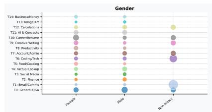

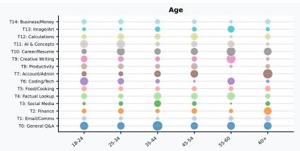

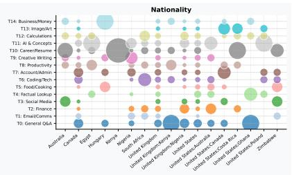

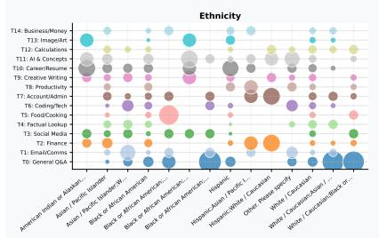

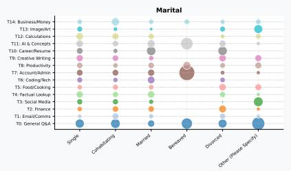

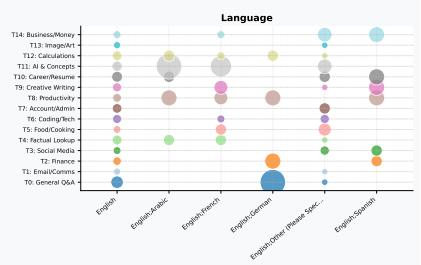

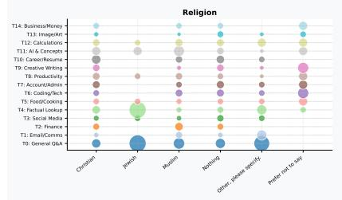

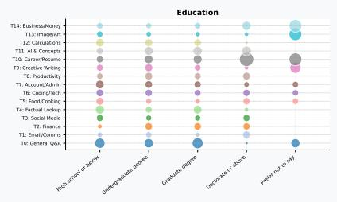

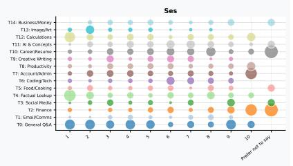

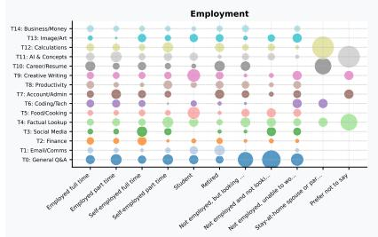

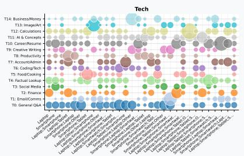

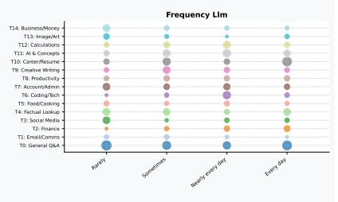  
Figure 2: Topic distribution across demographic groups derived from KMeans clustering (k = 15) applied to 2,000 simulated user prompts (200 participants, 10 prompts each). Each bubble represents the share of prompts assigned to a given topic (y-axis) within a demographic subgroup (x-axis); bubble size is proportional to that percentage. Groups with fewer than 5 users are excluded.

Flesch Reading Ease (FRE) Under Imp personas, 11 significant predictors emerge, entirely positive, which means greater readability compared to the model default (Table 18). Llama-70B shows the largest and most varied set of predictors: persona profiles associated with writing email use cases $( \mu _ { b } = + 3 . 6 7$ , Cnt=6), hobbies of visiting museums (+1.93), exercising (+1.72), Christian religion (+1.41), English language (+1.19), home ownership (+1.12), and female gender (+1.09) all receive more readable feedback. GPT-nano and GPT-mini also show significant language: English effects (+1.35 and +0.87), as does Qwen-30B (+0.86). We do not observe any significant results under Exp.

However, with the KS test as presented in Table 19, only Exp conditioning shows significant results. We observe SES in Llama-3B, with the largest D values reaching 0.66 (Llama-3B, ses4 vs. ses7). Occupation and education affect the outputs of Qwen-4B, Llama-3B, and Llama-70B. For example, when the occupation is explicitly defined as “Technician/associate”, Llama-3B significantly increases FRE compared with other occupations. We find Nationality as a significant effect for Llama-3B, Llama-70B, and Qwen-4B. It indicates that US nationality vs UK in Exp, the generated feedback has higher readability.

Automated Readability Index (ARI) Table 20 measures text complexity (higher = harder to read), and is thus directionally opposite to FRI. Significant effects are sparse: over Exp condition, our results find one significant result for GPT-nano, language: English, +0.46, Cnt=11) and three Imp effects (GPT-nano hobbies: Exercise +0.32; Llama-70B hobbies: Use social media +0.73; Llama-70B hobbies: museums +0.56). Again, only Exp conditioning produces significant results. Father’s occupation produces the largest effects in Llama-3B (D up to 0.78). Education is consistently significant across Llama-3B, Llama-70B, Qwen-30B, and Qwen-4B, with larger gaps correlating with more distant education levels. Nationality (UK vs. US) is significant for Llama-3B (Cnt=11), Llama-70B, and Qwen-4B, with UK users receiving a more readable response (Table 21).

Feedback Length Qwen-4B has the largest set of significant predictors in Imp: personas associated with brainstorming (+2.51), dialog technology knowledge (+2.46), digital content creation (+2.41), speech-to-text usage (+1.59), paraphrasing/summarisation interest (+1.56), and Black or African American ethnicity (+1.35) all receive longer feedback Table 22. The ethnicity effect in Qwen-4B is particularly notable as it is the only demographic group attribute (beyond language and technology-use patterns) to emerge in this metric.

Sentiment Sentiment effects are only present for the Imp condition and only for the Llama-70B model. All listed attributes in Table 23 make a positive sentiment in feedbacks. For example, usecases: Brainstorming is the strongest (+0.32, Cnt=12), followed by tech:Laptop (+0.24), know\_nlp: Textto-Speech (+0.21), religion: Nothing (+0.19), usecases: Writing (+0.19), would\_nlp: Dialog technology (+0.23), hobbies: arts (+0.17), gender: Female (+0.14).

BERTScore F1 BERTScore F1 effects are the smallest in absolute terms of all FF metrics as presented in Table 24, confirming that Imp and Exp personas primarily reshape surface-level properties (readability, tone, length) rather than core semantic content.

## E.4 Metalinguistic QA

Table 23 shows the sentiment effects which are exclusively implicit and exclusively for the Llama-70B model. This makes Llama-70B uniquely sensitive to implicit personas in the way it frames feedback, whether positively or negatively. Thirteen predictors are significant, all positive, covering a broad range of demographic attributes: usecases:Brainstorming is the strongest (+0.32, Cnt=12), followed by tech: Laptop (+0.24), know\_nlp: Text-to-Speech (+0.21), religion: Nothing (+0.19), usecases: Writing (+0.19), would\_nlp: Dialog technology (+0.23), hobbies: arts (+0.17), gender: Female (+0.14), and several others. The breadth of this list — spanning gender, religion, hobbies, technology use, and LLM use cases — suggests that Llama-70B’s sentiment is broadly susceptible to implicit persona context rather than being driven by one specific attribute type.

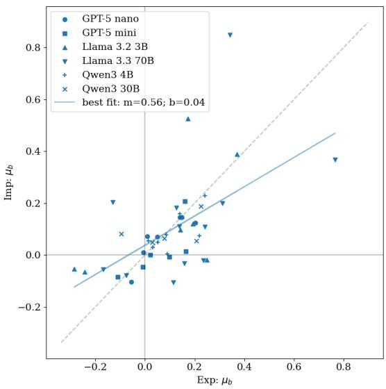  
Figure 3: Correlation between the effect (according to the regression test) of the same demographic attributes on the ARI in Imp and Exp. We show attributes significant in at least 3 tasks for both Imp and Exp.

Automated Readability Index (ARI) Table 25 shows the results of the KS test on the ARI for explicit conditioning. As discusses in the main body of text (§3.2), we find that ses and education are the two demographic attributes which most strongly impact the readability of the responses of the LLMs, and this behaviour is visible particularly in Llama-70B (and, to a lesser extent, and only for education in Qwen-30B). We also find that (for Llama-70B) explicit references to the nationality of the user have a significant impact in a lot of cases – the pair UK–US being found as significant in 10 items out of 40 – with UK users receiving more readable responses (as seen in Table 3).

Figure 3 shows the average coefficient obtained from the regression test for Imp and Exp: each dot in the scatterplot is a demographic attribute (which proved significant according to both conditioning settings), the x-values indicate the $\mu _ { b }$ from Exp, the y-values indicate the $\mu _ { b }$ from Imp. The figure shows that there is a positive correlation between the two (0.56); thus, the effect of the same demographic attribute is comparable in the two conditioning settings, with smaller effects for Imp than for Exp.

Flesch Reading Ease (FRE) Table 26 shows the significant results obtained for the FRE for Exp (top) and Imp (bottom) conditioning. Some of the results are in line with what we observed for the ARI: with explicit conditioning, we obtain a negative coefficient (thus, in this case, less readable texts) for higher education (Llama-70B, Llama-3B, Qwen-30B, GPT-mini, and Qwen-4B), a negative coefficient for higher SES (Llama-70B, Qwen-30B, and Qwen-4B), and a positive coefficient (thus more readable texts) for nationality: UK (Llama-70B, and Llama-3B). For Llama-70B, the effect of education and nationality: UK (and tech: Laptop) is larger than 1 × σFRE, and consistent across multiple items (> 12 out of 40). A notable difference with the results obtained for the ARI is that, according to the FRE, some models can adapt the readability of their responses to different education and ses levels even in the case of Imp conditioning, but the models that can do that are not the same models that perform the adaptation when the conditioning is Exp: indeed, we obtain negative coefficient for ses (GPT-nano, Qwen-4B and Llama-3B), education (Qwen-4B), dad\_education (Qwen-4B), and mum\_education (Qwen-4B). Similarly to what we observed for the ARI, Figure 4 shows the average coefficient obtained from the regression test for Imp and Exp for the FRE: we see that there is a positive correlation between the two (0.51), with a smaller effect for Imp than for Exp.

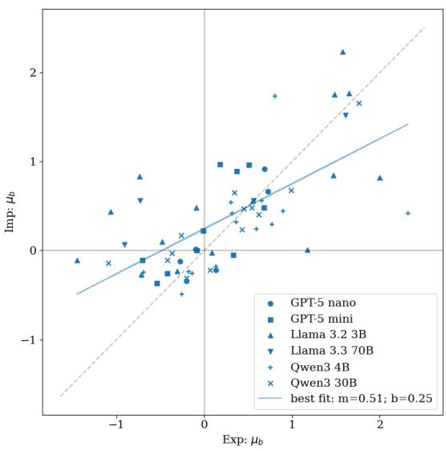  
Figure 4: Correlation between the effect (according to the regression test) of the same demographic attributes on the FRE in Imp and Exp. We show attributes significant in at least 3 tasks for both Imp and Exp.

Table 27 shows the results for the KS test on the FRE. Similarly to what we observed for the ARI, we find that larger gaps in education levels of the user tend to lead to larger values of KS statistics (D): for Llama-70B $D ( \mathrm { { e d u } _ { 0 } , \mathrm { { e d u } _ { 2 } ) \ = \ } }$

0.65(±0.11) and $D ( { \mathrm { e d u } } _ { 0 } , { \mathrm { e d u } } _ { 1 } ) = 0 . 5 8 ( \pm 0 . 1 1 )$ for Qwen-30B D(edu0, edu2) = 0.56(±0.13) and $D ( { \bf e d u } _ { 0 } , { \bf e d u } _ { 1 } ) ~ = ~ 0 . 4 8 ( \pm 0 . 0 5 )$ The attributes dad\_education and mum\_education have an effect, but it is generally smaller (and less consistent) than the effect of the education level of the user (education). Again, we find that there is a significant difference in the responses provided by Llama-70B to users identified as being from the UK and from the US. Differently from what we observed for the ARI, we do not find significance for the ses attribute in the responses of any LLM.

Response length Figure 5 shows the correlation between the effect of the same demographic attributes in Exp (x-axis) Imp (y-axis). Differently from what we observed for the ARI and FRE, we find that while each demographic attribute has a similar effect in both conditioning setups, their effect is larger in Imp than in Exp.

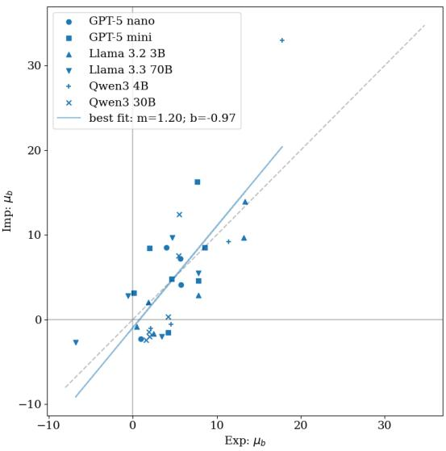  
Figure 5: Correlation between the effect (according to the regression test) of the same demographic attributes on the length of the responses (n. words) in Imp and Exp. We show attributes significant in at least 3 tasks for both Imp and Exp.

Age of Acquisition Table 28 shows the impact of different explicit (top) and implicit (bottom) conditions on the average Age of Acquisition (AoA) of the model’s responses. The table shows that, even though we found multiple significant predictors, and in some cases even with coefficients $\left| b \right| \geq \sigma _ { \mathrm { A o A } }$ , the differences between different demographic attributes are really marginal: most likely, they are due to the sporadic usage of words of higher/lower AoA (whose impact is then reduced when averaging the AoA of all the words in the model responses). Still, the results are in line with the ARI and FRE: explicit conditioning leads to (slightly) more difficult texts for higher education levels (Llama-70B, Llama-3B, Qwen-30B, Qwen-4B, and GPT-mini), language English (GPT-mini, Llama-70B, Qwen-30B, and Qwen-4B), and (with smaller coefficients) for higher levels of mum\_education and dad\_education. Some significance was also found for implicit conditioning, but with even smaller coefficients.

## F Use of AI Assistants

We used Claude $\mathsf { A I } ^ { 1 9 }$ to refine the writing and grammar of the manuscript.

<table><tr><td>Attribute</td><td>Value</td><td>Count</td></tr><tr><td>occupation</td><td>Professionals or highly skilled workers</td><td>59</td></tr><tr><td>occupation</td><td>Manager or business owner</td><td>40</td></tr><tr><td>occupation</td><td>Service and sales workers</td><td>35</td></tr><tr><td>occupation</td><td>Technicians and associate professionals</td><td>28</td></tr><tr><td>occupation</td><td>Clerical support workers</td><td>23</td></tr><tr><td>occupation</td><td>Homemaker</td><td>9</td></tr><tr><td>occupation</td><td>Prefer not to say</td><td>8</td></tr><tr><td>occupation occupation</td><td>Craft related trades workers Skilled agricultural, forestry and fishery workers</td><td>6 5</td></tr><tr><td></td><td></td><td>39</td></tr><tr><td>mother_occ. Homemaker</td><td>mother_occ. Clerical support workers</td><td></td></tr><tr><td></td><td></td><td></td></tr><tr><td></td><td>mother_occ. Professionals or highly skilled workers</td><td>34</td></tr><tr><td></td><td>mother occ. Service and sales workers</td><td>33 21</td></tr><tr><td></td><td>mother_occ. Manager or business owner</td><td></td></tr><tr><td></td><td>mother_occ. Elementary occupations</td><td>11</td></tr><tr><td></td><td>mother_occ. Technicians and associate professionals</td><td></td></tr><tr><td></td><td>mother_occ. Skilled agricultural, forestry and fishery workers mother occ. Craft related trades workers</td><td></td></tr><tr><td>mother_occ. Prefer not to say</td><td></td><td></td></tr><tr><td>mother_occ.</td><td>Plant and machine operators, and assemblers</td><td></td></tr><tr><td>father_occ.</td><td>Professionals or highly skilled workers</td><td></td></tr><tr><td>father_occ.</td><td>Manager or business owner</td><td>46</td></tr><tr><td>father_occ.</td><td></td><td>40 27</td></tr><tr><td></td><td>Service and sales workers</td><td>20</td></tr><tr><td>father_occ.</td><td>Craft related trades workers</td><td></td></tr><tr><td>father_occ.</td><td>Technicians and associate professionals</td><td></td></tr><tr><td>father_occ.</td><td>Prefer not to say</td><td></td></tr><tr><td>father_occ. father_occ.</td><td>Plant and machine operators, and assemblers</td><td></td></tr><tr><td>father_occ.</td><td>Elementary occupations</td><td></td></tr><tr><td>father_occ.</td><td>Clerical support workers</td><td></td></tr><tr><td>father_occ.</td><td>Armed forces occupations Skilled agricultural, forestry and fishery workers</td><td></td></tr><tr><td>hobbies</td><td>Use social media</td><td></td></tr><tr><td>hobbies</td><td>Exercise</td><td>141</td></tr><tr><td>hobbies</td><td></td><td>111</td></tr><tr><td></td><td>Listen to rock/indie music</td><td></td></tr><tr><td>hobbies</td><td>Watch sports</td><td></td></tr><tr><td>hobbies</td><td>Listen to hiphop and rap</td><td></td></tr><tr><td>hobbies</td><td>Do arts and crafts</td><td></td></tr><tr><td>hobbies</td><td>Go to museums and galleries</td><td></td></tr><tr><td>hobbies</td><td>Go to gigs</td><td></td></tr><tr><td>hobbies</td><td>Listen to classical music</td><td></td></tr><tr><td>hobbies</td><td>Other (Please specify)</td><td></td></tr><tr><td>hobbies</td><td>Attend football matches</td><td></td></tr><tr><td>hobbies</td><td>Listen to jazz</td><td></td></tr><tr><td>hobbies</td><td>Watch dance or ballet</td><td></td></tr><tr><td>hobbies</td><td>Visit to stately homes</td><td></td></tr><tr><td>hobbies</td><td>Go to the opera</td><td></td></tr><tr><td>tech</td><td>Smartphone</td><td>193</td></tr><tr><td>tech</td><td>Laptop Tablet</td><td>183 98</td></tr><tr><td>tech</td><td>Smartwatch</td><td>64</td></tr><tr><td>tech</td><td>Other</td><td></td></tr><tr><td>tech</td><td></td><td></td></tr><tr><td>contexts</td><td>Personal</td><td>135</td></tr><tr><td>contexts</td><td>Work</td><td></td></tr><tr><td>contexts</td><td>Learning</td><td></td></tr><tr><td>contexts</td><td>Entertainment</td><td></td></tr><tr><td>contexts</td><td>Creative or artistic</td><td></td></tr><tr><td>contexts</td><td>School/University</td><td></td></tr><tr><td>contexts</td><td>Technical</td><td></td></tr></table>

<table><tr><td>Attribute</td><td>Value</td><td>Count</td></tr><tr><td>llm_use</td><td>ChatGPT</td><td>185</td></tr><tr><td>llm_use</td><td>Google Gemini</td><td>99</td></tr><tr><td>llm_use</td><td>Microsoft Bing AI</td><td>46</td></tr><tr><td></td><td></td><td>37</td></tr><tr><td>llm_use</td><td>GitHub Copilot</td><td>29</td></tr><tr><td>llm_use</td><td>Claude</td><td></td></tr><tr><td>llm_use</td><td>Snapchat My AI</td><td>29</td></tr><tr><td>llm_use llm_use</td><td>Character.AI</td><td>25</td></tr><tr><td>llm_use</td><td>Perplexity</td><td>19 19</td></tr><tr><td>llm_use</td><td>Google Bard</td><td></td></tr><tr><td>llm_use</td><td>Grok</td><td>17</td></tr><tr><td>llm_use</td><td>Meta Llama 2</td><td>14</td></tr><tr><td>llm_use</td><td>Pi</td><td>12 10</td></tr><tr><td>llm_use</td><td>Other</td><td>6</td></tr><tr><td>llm_use</td><td>Jasper Poe</td><td>6</td></tr><tr><td>know_nlp</td><td></td><td></td></tr><tr><td>know_nlp</td><td>Spell checker</td><td>181</td></tr><tr><td>know_nlp</td><td>Grammar checker</td><td>174 163</td></tr><tr><td>know_nlp</td><td>E-mail spam detection</td><td>157</td></tr><tr><td>know_nlp</td><td>Text-to-Speech</td><td>156</td></tr><tr><td>know_nlp</td><td>Speech-to-Text</td><td>136</td></tr><tr><td>know_nlp</td><td>Question Answering &amp; Search Engine.</td><td>123</td></tr><tr><td>know_nlp</td><td>Dialog technology</td><td>108</td></tr><tr><td>know_nlp</td><td>Paraphrasing and Summarisation</td><td>95</td></tr><tr><td>know_nlp</td><td>Reading text from scanned documents Machine translation</td><td>85</td></tr><tr><td>know_nlp</td><td>Sentiment analysis</td><td>57</td></tr><tr><td>use_nlp</td><td>Paraphrasing and Summarisation</td><td>167</td></tr><tr><td>use_nlp</td><td>Grammar checker</td><td>158</td></tr><tr><td>use_nlp</td><td>E-mail spam detection</td><td>142</td></tr><tr><td>use_nlp use_nlp</td><td>Question Answering &amp; Search Engine.</td><td>123</td></tr><tr><td>use_nlp</td><td>Dialog technology</td><td>116</td></tr><tr><td>use_nlp</td><td>Speech-to-Text</td><td>108</td></tr><tr><td>use_nlp</td><td>Text-to-Speech</td><td>99</td></tr><tr><td>use_nlp</td><td>Machine translation</td><td>65</td></tr><tr><td>use_nlp</td><td>Reading text from scanned documents</td><td>55</td></tr><tr><td></td><td>Sentiment analysis</td><td>34</td></tr><tr><td>would_nlp Sentiment analysis</td><td></td><td>66</td></tr><tr><td></td><td></td><td>61</td></tr><tr><td>would_nlp Machine translation</td><td>would_nlp Paraphrasing and Summarisation</td><td>59</td></tr><tr><td></td><td></td><td>57</td></tr><tr><td>would_nlp Grammar checker</td><td>would_nlp E-mail spam detection</td><td>54</td></tr><tr><td>would_nlp Speech-to-Text</td><td></td><td>54</td></tr><tr><td></td><td></td><td>54</td></tr><tr><td>would_nlp Text-to-Speech</td><td>would_nlp Reading text from scanned documents</td><td>48</td></tr><tr><td>would_nlp Spell checker</td><td></td><td></td></tr><tr><td>would_nlp Dialog technology</td><td></td><td>47</td></tr><tr><td>would_nlp Question Answering &amp; Search Engine.</td><td></td><td>41 35</td></tr><tr><td>would_nlp Other (specify)</td><td></td><td>7</td></tr><tr><td>usecases</td><td></td><td></td></tr><tr><td>usecases</td><td>Writing</td><td>135</td></tr><tr><td>usecases</td><td>Brainstorming</td><td>113 110</td></tr><tr><td>usecases</td><td>Answering questions about general knowledge</td><td>95</td></tr><tr><td>usecases</td><td>Learning</td><td>95</td></tr><tr><td>usecases</td><td>Proofreading/Editing</td><td>88</td></tr><tr><td>usecases</td><td>Paraphrasing or finding synonyms</td><td>85</td></tr><tr><td>usecases</td><td>Generic chatbot conversation</td><td>78</td></tr><tr><td></td><td>Solving math or logical problems</td><td></td></tr><tr><td>usecases</td><td>Translation</td><td>75</td></tr><tr><td>usecases</td><td>Summarizing long texts</td><td>74</td></tr><tr><td>usecases</td><td>Analyze data</td><td>70</td></tr><tr><td>usecases</td><td>Coding</td><td>56</td></tr><tr><td>usecases</td><td>Get information about current events</td><td>55</td></tr><tr><td>usecases</td><td>Generate art</td><td>46</td></tr><tr><td>usecases</td><td>Digital content creation</td><td>46</td></tr><tr><td>usecases</td><td>Completing assignments</td><td>39</td></tr><tr><td>usecases</td><td>Collecting references</td><td>22</td></tr><tr><td>usecases</td><td>Play games</td><td>14</td></tr></table>

Table 9: List of multi-value categorical attributes from the AI Gap dataset, which we use for conditioning, and their values (sorted by their frequency). We do not show attributes that appear less than 5 times. The full value names are shortened, we refer to the original paper (Bassignana et al., 2025) for more details.

Input to the LLMs   
Modeldefault [{‘role’: ‘system’, ‘content’: ‘’},   
{‘role’: ‘user’, ‘content’: <task\_under\_study>},]   
[‘role’: ‘system’, ‘content’: ‘’,   
Implicitcue(Imp) ‘role’: ‘user’, ‘content’: <previous\_msg\_1>, ‘role’: ‘assistant’, ‘content’: <simulated\_resp\_1>,   
‘role’: ‘user’, ‘content’: <previous\_msg\_2>,   
‘role’: ‘assistant’, ‘content’: <simulated\_resp\_2>,   
‘role’: ‘assistant’, ‘content’: <previous\_msg\_10>,   
‘role’: ‘assistant’, ‘content’: <simulated\_resp\_10>,   
‘role’: ‘user’, ‘content’: <task\_under\_study>,]   
[{‘role’: ‘system’, ‘content’: ‘’},   
{‘role’: ‘user’, ‘content’: “““   
Persona description:   
Demographics: <data> years old; nationality: <data>;   
ethnicity: <data>; marital status: <data>; primary   
Explicitpersona(Exp) language: <data>; religion: <data>. Education & SES: education: <data>; SES: <data>; mother’s   
education: <data>; father’s education: <data>.   
Household & Occupation: home setting: <data>; employment:   
<data>; occupation: <data>; mother’s occupation: <data>;   
father’s occupation: <data>.   
Technology & NLP: general tech familiarity: <data>; NLP   
knowledge: <data>; past NLP use: <data>; willingness to   
use NLP tools: <data>; LLM usage frequency: <data>; LLM   
typical use: <data>.   
Interests & Hobbies: <data>.   
NLP/AI Use-Cases of Interest: <data>.   
Usage Contexts: <data>.   
””” + <task\_under\_study>},]  
Table 10: Structure of the messages sent to the LLMs for the three conditions under study. In Imp, the <previous\_msg\_\*> are the prompt histories from the AI Gap paper, and the <simulated\_resp\_\*> are the responses provided by GPT-5-nano. In Exp, the <data> are the explicit demographic information taken from the AI Gap paper. The <task\_under\_study> is the part of the prompt that describes the educational task to perform (see Table 11).

<table><tr><td>Task</td><td>Description</td></tr><tr><td></td><td>After reading each essay and completing the analytical rating form, assign a holistic score based on the rubric below. Use a grading scale from 1 (minimum) to 6 (maximum), where the distance between adjacent scores is considered equal.</td></tr><tr><td></td><td>Score 1: very little or no mastery; severely flawed in argumentation, organization, language use, and grammar. Score 2: little mastery; vague position, weak</td></tr><tr><td></td><td>evidence, poor organization, limited language facility.</td></tr><tr><td></td><td>Score 3: developing mastery; some critical thinking but inconsistent support and</td></tr><tr><td></td><td>organization. Score 4: adequate mastery; competent reasoning,</td></tr><tr><td></td><td>adequate support, generally organized writing. Score 5: reasonably consistent mastery; strong</td></tr><tr><td></td><td>critical thinking, coherent organization, effective language use.</td></tr><tr><td></td><td>Score 6: clear and consistent mastery; insightful reasoning, strong evidence, skillful language use.</td></tr><tr><td></td><td>Writing Assignment: {writing_assignment}</td></tr><tr><td></td><td>Source Text: {source_text}</td></tr><tr><td></td><td>Essay: {essay_text}</td></tr><tr><td></td><td></td></tr><tr><td></td><td>{&quot;holistic_essay_score&quot;: &lt;integer 1-6&gt;,</td></tr><tr><td></td><td></td></tr><tr><td></td><td></td></tr><tr><td></td><td></td></tr><tr><td></td><td></td></tr><tr><td></td><td></td></tr><tr><td></td><td></td></tr><tr><td></td><td></td></tr><tr><td></td><td></td></tr><tr><td></td><td></td></tr><tr><td></td><td></td></tr><tr><td></td><td></td></tr><tr><td></td><td></td></tr><tr><td></td><td></td></tr><tr><td></td><td></td></tr><tr><td></td><td></td></tr><tr><td></td><td></td></tr><tr><td></td><td>&quot;summary&quot;: &quot;brief summary of strengths and</td></tr><tr><td></td><td></td></tr><tr><td></td><td></td></tr><tr><td></td><td>weaknesses&quot;}</td></tr><tr><td></td><td></td></tr><tr><td></td><td></td></tr><tr><td></td><td></td></tr><tr><td></td><td></td></tr><tr><td></td><td></td></tr><tr><td></td><td></td></tr><tr><td></td><td></td></tr><tr><td></td><td></td></tr><tr><td></td><td></td></tr><tr><td></td><td></td></tr><tr><td></td><td></td></tr><tr><td></td><td></td></tr><tr><td></td><td></td></tr><tr><td></td><td></td></tr><tr><td></td><td></td></tr><tr><td></td><td></td></tr><tr><td></td><td></td></tr><tr><td></td><td></td></tr><tr><td></td><td></td></tr><tr><td></td><td></td></tr><tr><td></td><td></td></tr><tr><td></td><td></td></tr><tr><td></td><td></td></tr><tr><td></td><td></td></tr><tr><td></td><td></td></tr><tr><td></td><td></td></tr><tr><td></td><td></td></tr><tr><td></td><td></td></tr><tr><td></td><td></td></tr><tr><td></td><td></td></tr><tr><td>QA</td><td></td></tr><tr><td></td><td></td></tr><tr><td></td><td></td></tr><tr><td></td><td></td></tr><tr><td></td><td></td></tr><tr><td></td><td></td></tr></table>

Table 11: Texts used to instruct the LLMs to perform the educational tasks. For the AES task, we use the scoring instructions provided in the PERSUADE 2.0 dataset. The placeholders {essay\_text}, {source\_text}, {writting\_assignment} and {metalinguistic\_question} are replaced with examples from the datasets.

<table><tr><td>Model</td><td>Identifier</td></tr><tr><td>GPT-5-nano</td><td>gpt-5-nano-2025-08-07</td></tr><tr><td>GPT-5-mini</td><td>gpt-5-mini-2025-08-07</td></tr><tr><td>Llama-3B</td><td>meta-1lama/Llama-3.2-3B-Instruct</td></tr><tr><td>Llama-70B</td><td>meta-1lama/Llama-3.3-70B-Instruct</td></tr><tr><td>Qwen-4B</td><td>Qwen/Qwen-4B-Instruct-2507</td></tr><tr><td>Qwen-30B</td><td>Qwen/Qwen-30B-A3B-Instruct-2507</td></tr></table>

Table 12: List of models used for the experiments.

<table><tr><td>Topic</td><td>Label</td><td>n</td><td>Top TF-IDF terms</td></tr><tr><td>TO</td><td>General Q&amp;A / Health</td><td>240</td><td>does, think, like, signs, causes, tall, people, know, dexter, time</td></tr><tr><td>T1</td><td>Email writing</td><td>80</td><td>email, write, translate, make, help, professional, want, sound, draft, good</td></tr><tr><td>T2</td><td>Finance &amp; stocks</td><td>112</td><td>stock, stocks, market, financial, uk, explain, tax, invest, money, company</td></tr><tr><td>T3</td><td>Media &amp; social content</td><td>98</td><td>video, youtube, tv, description, title, media, good, rain, channel, games</td></tr><tr><td>T4</td><td>Factual lookup</td><td>152</td><td>weather, did, win, today, time, year, 2025, does, usa, tomorrow</td></tr><tr><td>T5</td><td>Food &amp; recipes</td><td>101</td><td>make, recipe, dinner, food, best, soup, restaurants, ingredients, does, meal</td></tr><tr><td>T6</td><td>Coding</td><td>126</td><td>function, create, js, make, way, best, button, php, excel, learn</td></tr><tr><td>T7</td><td>Account &amp; admin</td><td>144</td><td>account, use, need, access, uk, does, data, information, phone, help</td></tr><tr><td>T8</td><td>Health &amp; productivity</td><td>124</td><td>best, work, time, ways, strategies, improve, stress, productivity, day, workout</td></tr><tr><td>T9</td><td>Creative writing</td><td>129</td><td>write, story, short, poem, help, tell, summary, make, books, like</td></tr><tr><td>T10</td><td>Career &amp; resume</td><td>185</td><td>write, customer, resume, help, service, skills, job, best, business, questions</td></tr><tr><td>T11 T12</td><td>AI &amp; concept explanation</td><td>179 146</td><td>ai, explain, difference, terms, simple, learning, research, concept, data, tell</td></tr><tr><td>T13</td><td>Calculations</td><td>79</td><td>calculate, number, cost, month, 100, day, 12, miles, population, tell</td></tr><tr><td>T14</td><td>Image generation</td><td></td><td>image, make, create, art, picture, creation, cat, cute, ninja, like</td></tr><tr><td></td><td>Business ideas</td><td>105</td><td>best, money, good, make, new, business, start, want, selling, things</td></tr></table>

Table 13: Topics identified by KMeans clustering $( k = 1 5 )$ on 2,000 simulated user prompts, with post-hoc labels and top-10 TF-IDF terms per cluster. Only T0, T10, and T11 are named in the main text; remaining labels are descriptive glosses derived from top terms and example prompts.

<table><tr><td>Model</td><td>Attribute</td><td>µμb (σb)</td><td>Cnt</td></tr><tr><td>Qwen-30B</td><td>education</td><td>-0.11 (0.08)</td><td>12</td></tr><tr><td>Qwen-4B</td><td>frequency_llm</td><td>+0.04 (0.07)</td><td>15</td></tr><tr><td>Qwen-30B</td><td>mum_education</td><td>-0.03 (0.02)</td><td>11</td></tr><tr><td>Qwen-4B</td><td>education</td><td>-0.02 (0.09)</td><td>14</td></tr><tr><td>Qwen-4B</td><td>age</td><td>-0.01 (0.06)</td><td>11</td></tr><tr><td>Qwen-4B</td><td>dad_education</td><td>-0.01 (0.03)</td><td>11</td></tr><tr><td>GPT-mini</td><td>ses</td><td>+0.00 (0.04)</td><td>12</td></tr><tr><td>Llama-3B Llama-3B</td><td>education</td><td>+0.00 (0.11)</td><td>13</td></tr><tr><td></td><td>frequency_llm</td><td>+0.00 (0.03)</td><td>12</td></tr><tr><td>Llama-70B</td><td>know_nlp: Text-to-Speech</td><td>+0.27 (0.10)</td><td>5</td></tr><tr><td>Llama-70B</td><td>usecases: Brainstorming</td><td>+0.26 (0.16)</td><td>24</td></tr><tr><td>Llama-70B</td><td>usecases: Writing</td><td>+0.24 (0.08)</td><td>19</td></tr><tr><td>Llama-70B</td><td>tech: Laptop</td><td>+0.21 (0.05)</td><td>5</td></tr><tr><td>Llama-70B</td><td>religion: Nothing</td><td>+0.19 (0.12)</td><td>20</td></tr><tr><td>Llama-70B</td><td>hobbies: arts</td><td>+0.18 (0.13)</td><td>15</td></tr><tr><td>Llama-70B</td><td>would_nlp: Dialog tech.</td><td>+0.17 (0.12)</td><td>20</td></tr><tr><td>Llama-70B Llama-70B</td><td>hobbies: museums</td><td>+0.16 (0.11)</td><td>6</td></tr><tr><td></td><td>mum_occupation: Service and sales workers</td><td>+0.16 (0.07)</td><td>8</td></tr><tr><td>Llama-70B</td><td>llm_use: GitHub Copilot</td><td>+0.12 (0.08)</td><td>7</td></tr><tr><td>Llama-70B</td><td>gender: Female</td><td>+0.12 (0.08)</td><td>21</td></tr><tr><td>Llama-70B</td><td>language: English</td><td>+0.10 (0.04)</td><td>13</td></tr><tr><td>Llama-70B</td><td>use_nlp: Dialog tech.</td><td>+0.09 (0.05)</td><td>8</td></tr><tr><td>Llama-70B</td><td>religion: Christian</td><td>+0.09 (0.07)</td><td>6</td></tr><tr><td>Llama-70B</td><td>would_nlp: Search Eng.</td><td>+0.08 (0.05)</td><td>13</td></tr><tr><td>Llama-3B</td><td>language: English</td><td>+0.08 (0.07)</td><td>10</td></tr><tr><td>Qwen-30B</td><td>usecases: Writing</td><td>+0.08 (0.04)</td><td>6</td></tr><tr><td>Llama-70B</td><td>employment: Employed full time</td><td>+0.07 (0.05)</td><td>17</td></tr><tr><td>Llama-70B</td><td>ses</td><td>+0.07 (0.05)</td><td>17</td></tr><tr><td>Llama-70B</td><td>usecases: Solving math or logical problems</td><td>−0.05 (0.05)</td><td>9</td></tr><tr><td>Qwen-30B</td><td>religion: Nothing</td><td>+0.05 (0.06)</td><td>7</td></tr><tr><td>Llama-3B</td><td>dad_education</td><td>-0.04 (0.03)</td><td>7</td></tr><tr><td>Llama-70B</td><td>mum_education</td><td>+0.03 (0.02)</td><td>13</td></tr><tr><td>Llama-70B</td><td>education</td><td>+0.03 (0.03)</td><td>19</td></tr><tr><td>Llama-70B</td><td>dad_education</td><td>-0.03 (0.02)</td><td>7</td></tr><tr><td>Qwen-30B</td><td>religion: Christian</td><td>+0.02 (0.03)</td><td>6</td></tr><tr><td>GPT-nano</td><td>education</td><td>-0.02 (0.03)</td><td>7</td></tr><tr><td>Qwen-30B</td><td>ses</td><td>+0.02 (0.03)</td><td>9</td></tr><tr><td>Llama-70B</td><td>age</td><td>-0.01 (0.04)</td><td>11</td></tr><tr><td>Llama-3B</td><td>frequency_llm</td><td>-0.01 (0.04)</td><td>7</td></tr><tr><td>Qwen-30B</td><td>usecases: Solving math or logical problems</td><td>+0.01 (0.03)</td><td>5</td></tr><tr><td>Qwen-30B</td><td>education</td><td>-0.01 (0.02)</td><td>8</td></tr><tr><td>Qwen-30B</td><td>mum_education</td><td>-0.01 (0.02)</td><td>5</td></tr><tr><td>Llama-3B</td><td>ses</td><td>+0.01 (0.03)</td><td>6</td></tr><tr><td>Qwen-4B</td><td>education</td><td>+0.00 (0.02)</td><td>5</td></tr><tr><td>Qwen-30B</td><td>nationality: United States</td><td>+0.00 (0.04)</td><td>7</td></tr><tr><td>Qwen-4B</td><td>nationality: United States</td><td>+0.00 (0.03)</td><td>5</td></tr><tr><td>Qwen-30B</td><td>dad_education</td><td>+0.00 (0.02)</td><td>6</td></tr><tr><td>Llama-3B</td><td>age</td><td>+0.00 (0.01)</td><td>5</td></tr></table>

Table 14: Impact of different demographic attributes in Exp (top) and Imp (bottom) on the score of the model responses, ordered by $| \mu _ { b } |$ . In bold if $| \mu _ { b } | \geq \sigma _ { \mathrm { r e s p . s c o r e } }$

<table><tr><td>Model</td><td>Attribute</td><td>V.1</td><td>V.2</td><td> $\mu _ { D } \left( \sigma _ { D } \right)$ </td><td>Cnt</td></tr><tr><td>Llama-3B</td><td>education</td><td>2</td><td>0</td><td>0.65 (0.12)</td><td>4</td></tr><tr><td>Qwen-30B</td><td>education</td><td>2</td><td>0</td><td>0.60 (0.14)</td><td>7</td></tr><tr><td>Qwen-4B</td><td>frequency_llm</td><td>3</td><td>0</td><td>0.59 (0.09)</td><td>4</td></tr><tr><td>Qwen-4B</td><td>frequency_llm</td><td>2</td><td>0</td><td>0.57 (0.11)</td><td>3</td></tr><tr><td>Llama-3B</td><td>education</td><td>0</td><td>1</td><td>0.48 (0.09)</td><td>5</td></tr><tr><td>Qwen-30B</td><td>education</td><td>0</td><td>1</td><td>0.44 (0.03)</td><td>3</td></tr><tr><td>Qwen-4B</td><td>frequency_llm</td><td>3</td><td>1</td><td>0.41 (0.03)</td><td>3</td></tr><tr><td>Llama-3B</td><td>education</td><td>2</td><td>1</td><td>0.40 (0.02)</td><td>2</td></tr><tr><td>Qwen-30B</td><td>education</td><td>2</td><td>1</td><td>0.39 (0.04)</td><td>2</td></tr></table>

Table 15: Impact of different demographic attributes in Exp (top) and Imp (bottom) conditions on the AES score deviation, according to the KS test, ordered by average magnitude of $\mu _ { D }$ (the KS statistic D). V.1/V.2 = ordinal codes for ordered attributes, category labels otherwise. $\mu _ { D } = \mathrm { m e a n }$ D across essays where the pair was significant; $\sigma _ { D } = \mathrm { s t d } ;$ Cnt = number of essays of 40.

<table><tr><td>Model</td><td>Attribute</td><td>V.1</td><td>V.2</td><td> $\mu _ { D } \left( \sigma _ { D } \right)$ </td><td>Cnt</td></tr><tr><td>Llama-3B</td><td>father_occupation</td><td>Prefer not to say</td><td>Technician/associate</td><td>0.79</td><td>1</td></tr><tr><td>Llama-70B</td><td>ses</td><td>2</td><td>4</td><td>0.78</td><td>1</td></tr><tr><td>Llama-70B</td><td>ses</td><td>2</td><td>8</td><td>0.76</td><td>1</td></tr><tr><td>Llama-3B</td><td>father_occupation</td><td>Elementary occupation</td><td>Manager/business owner</td><td>0.71</td><td>1</td></tr><tr><td>Llama-3B</td><td>father_occupation</td><td>Prefer not to say</td><td>Professional/skilled worker</td><td>0.71 (0.08)</td><td>3</td></tr><tr><td>Llama-70B</td><td>ses</td><td>2</td><td>3</td><td>0.67</td><td>1</td></tr><tr><td>Llama-70B</td><td>ses</td><td>2</td><td>7</td><td>0.64 (0.03)</td><td>3</td></tr><tr><td>Llama-70B</td><td>ses</td><td>3</td><td>8</td><td>0.62</td><td>1</td></tr><tr><td>Llama-70B</td><td>ses</td><td>2</td><td>5</td><td>0.61</td><td>1</td></tr><tr><td>Llama-70B</td><td>ses</td><td>2</td><td>6</td><td>0.60</td><td>1</td></tr><tr><td>Llama-3B</td><td>occupation</td><td>Manager/business owner</td><td>Technician/associate</td><td>0.59</td><td>1</td></tr><tr><td>Llama-70B</td><td>ses</td><td>3</td><td>4</td><td>0.57</td><td>1</td></tr><tr><td>Llama-3B</td><td>occupation</td><td>Professional/skilled worker</td><td>Technician/associate</td><td>0.57 (0.02)</td><td>2</td></tr><tr><td>Llama-3B</td><td>father_occupation</td><td>Craft/trades worker</td><td>Professional/skilled worker</td><td>0.56</td><td>1</td></tr><tr><td>Llama-3B</td><td>occupation</td><td>Manager/business owner</td><td>Service/sales worker</td><td>0.54</td><td>1</td></tr><tr><td>Llama-3B</td><td>father_occupation</td><td>Professional/skilled worker</td><td>Service/sales worker</td><td>0.53</td><td>1</td></tr><tr><td>Llama-70B</td><td>ses</td><td>3</td><td></td><td>0.53 (0.00)</td><td>2</td></tr><tr><td>Llama-3B</td><td>father_occupation</td><td>Manager/business owner</td><td>Professional/skilled worker</td><td>0.52</td><td>1</td></tr><tr><td>Llama-3B</td><td>occupation</td><td>Professional/skilled worker</td><td>Service/sales worker</td><td>0.52 (0.04)</td><td>5</td></tr><tr><td>Qwen-4B</td><td>education</td><td>2</td><td>0</td><td>0.48 (0.08)</td><td>4</td></tr><tr><td>Llama-70B</td><td>education</td><td>2</td><td>0</td><td>0.48 (0.08)</td><td>10</td></tr><tr><td>Llama-70B</td><td>education</td><td>0 2</td><td>1</td><td>0.47 (0.11)</td><td>6</td></tr><tr><td>Llama-3B</td><td>education</td><td></td><td>0</td><td>0.47 (0.09)</td><td>11</td></tr><tr><td>Llama-3B</td><td>education</td><td>0</td><td>1</td><td>0.42 (0.06)</td><td>10</td></tr><tr><td>Llama-3B</td><td>education</td><td>2</td><td>1</td><td>0.42</td><td>1</td></tr><tr><td>Llama-3B</td><td>nationality</td><td>UK</td><td>US</td><td>0.41 (0.10)</td><td>12</td></tr><tr><td>Qwen-30B</td><td>education</td><td>2</td><td>0</td><td>0.40 (0.02)</td><td>4</td></tr><tr><td>Llama-70B</td><td>nationality</td><td>UK</td><td>US</td><td>0.39 (0.08)</td><td>8</td></tr><tr><td>Qwen-30B</td><td>education</td><td>0</td><td>1</td><td>0.39 (0.05)</td><td>3</td></tr><tr><td>Qwen-4B</td><td>education</td><td>0</td><td>1</td><td>0.39 (0.02)</td><td>3</td></tr><tr><td>Qwen-4B</td><td>nationality</td><td>UK</td><td>US</td><td>0.38 (0.06)</td><td>5</td></tr></table>

Table 16: Impact of different demographic attributes in Exp (top) and Imp (bottom) conditions on Age of Acquisition $( \Delta )$ , according to the KS test, ordered by average magnitude of $\mu _ { D }$ (the KS statistic D). V.1/V.2 = ordinal codes for ordered attributes, category labels otherwise. $\mu _ { D } = \mathrm { m e a n }$ D across essays where the pair was significant; $\sigma _ { D } = \mathrm { s t d } ;$ Cnt = number of essays of 40.

<table><tr><td>Model</td><td>Attribute</td><td> $\mu _ { b } \ \left( \sigma _ { b } \right)$ </td><td>Cnt</td></tr><tr><td>Qwen-4B</td><td>tech: Laptop</td><td>+0.03 (0.03)</td><td>10</td></tr><tr><td>Llama-70B</td><td>language: English</td><td>+0.03 (0.02)</td><td>8</td></tr><tr><td>Qwen-30B</td><td>language: English</td><td>+0.02 (0.02)</td><td>7</td></tr><tr><td>GPT-mini</td><td>language: English</td><td>+0.02 (0.01)</td><td>5</td></tr></table>

Table 17: Impact of different demographic attributes in Exp (top) and Imp (bottom) on the AoA of the model responses (using Model as reference), ordered by |µb| in the FF task. In bold if $| \mu _ { b } | \geq \sigma _ { \mathrm { A o A } }$

<table><tr><td>Model</td><td>Attribute</td><td> $\mu _ { b } \ \left( \sigma _ { b } \right)$ </td><td>Cnt</td></tr><tr><td colspan="4">No rows pass filters (Explicit).</td></tr><tr><td>Llama-70B</td><td>usecases: Writing</td><td>+3.67 (1.05)</td><td>6</td></tr><tr><td>Llama-70B</td><td>know_nlp: spam detec</td><td>+1.95 (1.14)</td><td>6</td></tr><tr><td>Llama-70B</td><td>hobbies: museums</td><td>+1.93 (1.87)</td><td>5</td></tr><tr><td>Llama-70B</td><td>hobbies: Exercise</td><td>+1.72 (0.82)</td><td>5</td></tr><tr><td>Llama-70B</td><td>religion: Christian</td><td>+1.41 (1.15)</td><td>6</td></tr><tr><td>GPT-nano</td><td>language: English</td><td>+1.35 (0.88)</td><td>8</td></tr><tr><td>Llama-70B</td><td>language: English</td><td>+1.19 (1.12)</td><td>5</td></tr><tr><td>Llama-70B</td><td>home: Own</td><td>+1.12 (0.74)</td><td>5</td></tr><tr><td>Llama-70B</td><td>gender: Female</td><td>+1.09 (0.65)</td><td>6</td></tr><tr><td>GPT-mini</td><td>language: English</td><td>+0.87 (0.50)</td><td>5</td></tr><tr><td>Qwen3-30B</td><td>language: English</td><td>+0.86 (0.36)</td><td>5</td></tr></table>

Table 18: Impact of different demographic attributes in Exp (top) and Imp (bottom) on the FRE of the model responses (using Model as reference), ordered by |µb| in the FF task. In bold if $| \mu _ { b } | \geq \sigma _ { \mathrm { F R E } }$

<table><tr><td>Model</td><td>Attribute</td><td>V.1</td><td>V.2</td><td> $\mu _ { D } \left( \sigma _ { D } \right)$ </td><td>Cnt</td></tr><tr><td>Llama-3B</td><td>ses</td><td>4</td><td>7</td><td>0.66</td><td>1</td></tr><tr><td>Llama-70B</td><td>occupation</td><td>Clerical worker</td><td>Manager/business owner</td><td>0.63</td><td>1</td></tr><tr><td>Llama-3B</td><td>occupation</td><td>Service/sales worker</td><td>Technician/associate</td><td>0.63</td><td>1</td></tr><tr><td>Qwen-4B</td><td>occupation</td><td>Clerical worker</td><td>Professional/skilled worker</td><td>0.62 (0.05)</td><td>2</td></tr><tr><td>Llama-3B</td><td>ses</td><td>3</td><td>4</td><td>0.61</td><td>1</td></tr><tr><td>Llama-3B</td><td>ses</td><td>2</td><td>3</td><td>0.61</td><td>1</td></tr><tr><td>Llama-3B</td><td>ses</td><td>2</td><td>6</td><td>0.60</td><td>1</td></tr><tr><td>Llama-3B</td><td>occupation</td><td>Manager/business owner</td><td>Technician/associate</td><td>0.59</td><td>1</td></tr><tr><td>Llama-3B</td><td>ses</td><td>4</td><td></td><td>0.58</td><td>1</td></tr><tr><td>Llama-70B</td><td>occupation</td><td>Clerical worker</td><td>Professional/skilled worker</td><td>0.58</td><td>1</td></tr><tr><td>Llama-3B</td><td>occupation</td><td>Professional/skilled worker</td><td>Service/sales worker</td><td>0.55 (0.06)</td><td>4</td></tr><tr><td>Llama-70B</td><td>education</td><td>2</td><td>0</td><td>0.55 (0.08)</td><td>6</td></tr><tr><td>Llama-3B</td><td>ses</td><td>5</td><td>6</td><td>0.55</td><td>1</td></tr><tr><td>Llama-3B</td><td>ses</td><td>6</td><td>7</td><td>0.55</td><td>1</td></tr><tr><td>Llama-3B</td><td>ses</td><td>4</td><td>5</td><td>0.55</td><td>1</td></tr><tr><td>Llama-3B</td><td>occupation</td><td>Professional/skilled worker</td><td>Technician/associate</td><td>0.54</td><td>1</td></tr><tr><td>Llama-3B</td><td>ses</td><td>3</td><td>7</td><td>0.53 (0.01)</td><td>2</td></tr><tr><td>Llama-70B</td><td>occupation</td><td>Professional/skilled worker</td><td>Service/sales worker</td><td>0.52 (0.08)</td><td>4</td></tr><tr><td>Qwen-4B</td><td>occupation</td><td>Manager/business owner</td><td>Service/sales worker</td><td>0.51</td><td>1</td></tr><tr><td>Llama-70B</td><td>education</td><td>0</td><td>1</td><td>0.50 (0.13)</td><td>6</td></tr><tr><td>Qwen-4B</td><td>occupation</td><td>Professional/skilled worker</td><td>Service/sales worker</td><td>0.49 (0.04)</td><td>2</td></tr><tr><td>Llama-3B</td><td>education</td><td>2</td><td>0</td><td>0.46 (0.07)</td><td>10</td></tr><tr><td>Llama-3B</td><td>nationality</td><td>UK</td><td>US</td><td>0.42 (0.13)</td><td>11</td></tr><tr><td>Qwen-4B</td><td>nationality</td><td>UK</td><td>US</td><td>0.41 (0.13)</td><td>5</td></tr><tr><td>Llama-3B</td><td>education</td><td>0</td><td>1</td><td>0.40 (0.05)</td><td>9</td></tr><tr><td>Llama-3B</td><td>education</td><td>2</td><td>1</td><td>0.40</td><td>1</td></tr><tr><td>Llama-70B</td><td>nationality</td><td>UK</td><td>US</td><td>0.37 (0.06)</td><td>7</td></tr></table>

Table 19: Impact of different demographic attributes in Exp (top) and Imp (bottom) conditions on Flesch Reading Ease (∆), according to the KS test, ordered by average magnitude of $\mu _ { D }$ (the KS statistic D). V.1/V.2 = ordinal codes for ordered attributes, category labels otherwise. $\mu _ { D } = \mathrm { m e a n } D$ across essays where the pair was significant; σ = std; Cnt = number of essays of 40.

<table><tr><td>Model</td><td>Attribute</td><td> $\mu _ { b } \ \left( \sigma _ { b } \right)$ </td><td>Cnt</td></tr><tr><td>GPT-nano</td><td>language: English</td><td>+0.46 (0.31)</td><td>11</td></tr><tr><td>Llama-70B</td><td>hobbies: Use social media</td><td>+0.73 (0.46)</td><td>5</td></tr><tr><td>Llama-70B</td><td>hobbies: museums</td><td>+0.56 (0.25)</td><td>8</td></tr><tr><td>GPT-nano</td><td>hobbies: Exercise</td><td>+0.32 (0.19)</td><td>5</td></tr></table>

Table 20: Impact of different demographic attributes in Exp (top) and Imp (bottom) on the ARI of the model responses (using Model as reference), ordered by $| \mu _ { b } |$ in the FF task. In bold if $| \mu _ { b } | \geq \sigma _ { \mathrm { A R I } }$

<table><tr><td>Model</td><td>Attribute</td><td>V.1</td><td>V.2</td><td> $\mu _ { D } \left( \sigma _ { D } \right)$ </td><td>Cnt</td></tr><tr><td>Llama-3B</td><td>father_occupation</td><td>Prefer not to say</td><td>Technician/associate</td><td>0.78 (0.00)</td><td>2</td></tr><tr><td>Llama-3B</td><td>father_occupation</td><td>Craft/trades worker</td><td>Prefer not to say</td><td>0.76</td><td>1</td></tr><tr><td>Llama-3B</td><td>father_occupation</td><td>Craft/trades worker</td><td>Technician/associate</td><td>0.71</td><td>1</td></tr><tr><td>Llama-3B</td><td>father_occupation</td><td>Prefer not to say</td><td>Professional/skilled worker</td><td>0.66 (0.02)</td><td>4</td></tr><tr><td>Llama-3B</td><td>occupation</td><td>Manager/business owner</td><td>Technician/associate</td><td>0.61</td><td>1</td></tr><tr><td>Llama-3B</td><td>occupation</td><td>Service/sales worker</td><td>Technician/associate</td><td>0.60 (0.02)</td><td>2</td></tr><tr><td>Llama-3B</td><td>father_occupation</td><td>Craft/trades worker</td><td>Professional/skilled worker</td><td>0.58</td><td>1</td></tr><tr><td>Llama-3B</td><td>occupation</td><td>Professional/skilled worker</td><td>Technician/associate</td><td>0.55 (0.03)</td><td>3</td></tr><tr><td>Llama-3B</td><td>occupation</td><td>Professional/skilled worker</td><td>Service/sales worker</td><td>0.54 (0.04)</td><td>5</td></tr><tr><td>Llama-70B</td><td>education</td><td>2</td><td>0</td><td>0.50 (0.06)</td><td>7</td></tr><tr><td>Llama-70B</td><td>education</td><td>0</td><td>1</td><td>0.50 (0.13)</td><td>4</td></tr><tr><td>Llama-3B</td><td>education</td><td>2</td><td>0</td><td>0.47 (0.07)</td><td>6</td></tr><tr><td>Llama-3B</td><td>nationality</td><td>UK</td><td>US</td><td>0.44 (0.13)</td><td>11</td></tr><tr><td>Qwen-4B</td><td>education</td><td>2</td><td>0</td><td>0.43 (0.05)</td><td>5</td></tr><tr><td>Llama-3B</td><td>education</td><td>0</td><td>1</td><td>0.43 (0.06)</td><td>7</td></tr><tr><td>Qwen-4B</td><td>nationality</td><td>UK</td><td>US</td><td>0.39 (0.03)</td><td>8</td></tr><tr><td>Qwen-4B</td><td>education</td><td>0</td><td>1</td><td>0.38 (0.01)</td><td>2</td></tr><tr><td>Llama-70B</td><td>nationality</td><td>UK</td><td>US</td><td>0.36 (0.04)</td><td>7</td></tr><tr><td>Llama-3B</td><td>education</td><td>2</td><td>1</td><td>0.36</td><td>1</td></tr></table>

No significant results (Implicit).

Table 21: Impact of different demographic attributes in Exp (top) and Imp (bottom) conditions on Automated Readability Index (∆), according to the KS test, ordered by average magnitude of $\mu _ { D }$ (the KS statistic D). V.1/V.2 = ordinal codes for ordered attributes, category labels otherwise. $\mu _ { D } = \mathrm { m e a n }$ D across essays where the pair was significant; $\sigma _ { D } = \mathrm { s t d } ;$ Cnt = number of essays of 40.
<table><tr><td>Model</td><td>Attribute</td><td> $\mu _ { b } \ \left( \sigma _ { b } \right)$ </td><td>Cnt</td></tr><tr><td colspan="4">No rows pass filters (Explicit).</td></tr><tr><td>Qwen-4B</td><td>usecases: Brainstorming</td><td>+2.51 (1.51)</td><td>5</td></tr><tr><td>GPT-nano</td><td>language: English</td><td>+2.48 (1.72)</td><td>7</td></tr><tr><td>Qwen-4B</td><td>know_nlp: Dialog tech.</td><td>+2.46 (2.03)</td><td>6</td></tr><tr><td>Qwen-4B</td><td>usecases: content creation</td><td>+2.41 (1.41)</td><td>6</td></tr><tr><td>Llama-3B</td><td>language: English</td><td>+2.01 (1.06)</td><td>7</td></tr><tr><td>Qwen-4B</td><td>use_nlp: Speech-to-Text</td><td>+1.59 (1.24)</td><td>9</td></tr><tr><td>Qwen-4B</td><td>would_nlp: Summarisation</td><td>+1.56 (0.98)</td><td>5</td></tr><tr><td>Qwen-4B</td><td>ethnicity: Black or Af-Am</td><td>+1.35 (0.38)</td><td>5</td></tr></table>

Table 22: Impact of different demographic attributes in Exp (top) and Imp (bottom) on the length of the model responses (using Model as reference), ordered by $| \mu _ { b } |$ in the FF task. In bold if $| \mu _ { b } | \geq \sigma _ { \mathrm { ( r e s p . } }$ \_length).

<table><tr><td>Model</td><td>Attribute</td><td> $\mu _ { b } \ \left( \sigma _ { b } \right)$ </td><td>Cnt</td></tr><tr><td colspan="3">No rows pass filters (Explicit).</td><td></td></tr><tr><td>Llama-70B</td><td>usecases: Brainstorming</td><td>+0.32 (0.17)</td><td>12</td></tr><tr><td>Llama-70B</td><td>tech: Laptop</td><td>+0.24 (0.21)</td><td>8</td></tr><tr><td>Llama-70B</td><td>would_nlp: Dialog tech.</td><td>+0.23 (0.11)</td><td>6</td></tr><tr><td>Llama-70B</td><td>know_nlp: Text-to-Speech</td><td>+0.21 (0.11)</td><td>6</td></tr><tr><td>Llama-70B</td><td>religion: Nothing</td><td>+0.19 (0.17)</td><td>7</td></tr><tr><td>Llama-70B</td><td>usecases: Writing</td><td>+0.19 (0.21)</td><td>11</td></tr><tr><td>Llama-70B</td><td>hobbies: arts</td><td>+0.17 (0.13)</td><td>6</td></tr><tr><td>Llama-70B</td><td>mum_occupation: Service</td><td>+0.15 (0.10)</td><td>7</td></tr><tr><td>Llama-70B</td><td>and sales workers would_nlp: Search Eng.</td><td>+0.14 (0.05)</td><td>5</td></tr><tr><td>Llama-70B</td><td>gender: Female</td><td>+0.14 (0.05)</td><td>7</td></tr><tr><td>Llama-70B</td><td>know_nlp: Dialog tech.</td><td>+0.14 (0.09)</td><td>5</td></tr><tr><td>Llama-70B</td><td>hobbies: museums</td><td>+0.12 (0.08)</td><td>7</td></tr><tr><td>Llama-70B</td><td>language: English</td><td>+0.11 (0.10)</td><td>7</td></tr></table>

Table 23: Impact of different demographic attributes in Exp (top) and Imp (bottom) on the Sentiment of the model responses (using Model as reference), ordered by $\left| \mu _ { b } \right|$ in the FF task. In bold if $\left| \mu _ { b } \right| \geq \sigma _ { \mathrm { S e n t i m e n t } } .$

<table><tr><td>Model</td><td>Attribute</td><td> $\mu _ { b } \ \left( \sigma _ { b } \right)$ </td><td>Cnt</td></tr><tr><td>Llama-3B</td><td>nationality: US</td><td>+0.0058 (0.0078)</td><td>14</td></tr><tr><td>Qwen-30B</td><td>language: English</td><td>+0.0041 (0.0034)</td><td>14</td></tr><tr><td>GPT-nano</td><td>language: English</td><td>+0.0094 (0.0066)</td><td>6</td></tr><tr><td>Llama-3B</td><td>tech: Smartphone</td><td>+0.0061 (0.0049)</td><td>5</td></tr><tr><td>Llama-70B</td><td>tech: Smartphone</td><td>+0.0048 (0.0015)</td><td>5</td></tr><tr><td>GPT-mini</td><td>llm_use: ChatGPT</td><td>+0.0045 (0.0012)</td><td>5</td></tr><tr><td>Llama-70B</td><td>gender: Male</td><td>+0.0043 (0.0036)</td><td>19</td></tr><tr><td>Llama-70B</td><td>use_nlp: Spell check</td><td>+0.0038 (0.0019)</td><td>5</td></tr><tr><td>Llama-70B</td><td>usecases: Brain-</td><td>-0.0036 (0.0033)</td><td>11</td></tr><tr><td>Llama-70B</td><td>storm usecases: Writing</td><td>-0.0035 (0.0026)</td><td>10</td></tr></table>

Table 24: Impact of different demographic attributes in Exp (top) and Imp (bottom) on the BERTscore F1 of the model responses (using Model as reference), ordered by $\left| \mu _ { b } \right|$ in the FF task. In bold if $| \mu _ { b } | \geq \sigma$ BERTscore F1.

<table><tr><td>Model</td><td>Attribute</td><td>V.1</td><td>V.2</td><td> $\mu _ { D } \left( \sigma _ { D } \right)$ </td><td>Cnt</td></tr><tr><td>Llama-70B</td><td>ses</td><td>4</td><td>8</td><td>0.79 (nan)</td><td>1</td></tr><tr><td>Llama-70B</td><td>ses</td><td>5</td><td>7</td><td>0.71 (nan)</td><td>1</td></tr><tr><td>Llama-70B</td><td>ses</td><td>5</td><td>8</td><td>0.68 (0.01)</td><td>2</td></tr><tr><td>Llama-70B</td><td>ses</td><td>3</td><td>8</td><td>0.68 (0.01)</td><td>3</td></tr><tr><td>Llama-70B</td><td>ses</td><td>4</td><td>7</td><td>0.63 (nan)</td><td>1</td></tr><tr><td>Llama-70B</td><td>education</td><td>0</td><td>2</td><td>0.60 (0.11)</td><td>29</td></tr><tr><td>Llama-70B</td><td>ses</td><td>3</td><td>7</td><td>0.57 (0.03)</td><td>2</td></tr><tr><td>Llama-70B</td><td>education</td><td>0</td><td>1</td><td>0.53 (0.10)</td><td>21</td></tr><tr><td>Qwen-30B</td><td>education</td><td>0</td><td>2</td><td>0.51 (0.10)</td><td>6</td></tr><tr><td>Llama-70B</td><td>mum_education</td><td>0</td><td>2</td><td>0.48 (0.07)</td><td>13</td></tr><tr><td>Llama-70B</td><td>nationality</td><td>UK</td><td>US</td><td>0.45 (0.14)</td><td>10</td></tr><tr><td>Llama-70B</td><td>mum_education</td><td>0</td><td>1</td><td>0.42 (0.03)</td><td>3</td></tr><tr><td>Qwen-30B</td><td>education</td><td>0</td><td>1</td><td>0.41 (0.01)</td><td>2</td></tr><tr><td>Qwen-30B</td><td>education</td><td>1</td><td>2</td><td>0.39 (0.00)</td><td>2</td></tr></table>

Table 25: Impact of different demographic attributes in Exp on the ARI of the model responses, according to the KS test, ordered by average magnitude of D (the KS statistics from the test).

<table><tr><td>Model</td><td>Attribute</td><td> $\mu _ { b } ( \sigma _ { b } )$ </td><td>Cnt</td></tr><tr><td>Llama-70B</td><td>education</td><td>-3.78 (2.07)</td><td>38</td></tr><tr><td>Llama-3B</td><td>tech: Laptop</td><td>+3.19 (3.47)</td><td>12</td></tr><tr><td>Llama-70B</td><td>nationality: UK</td><td>+2.04 (1.64)</td><td>18</td></tr><tr><td>Llama-3B</td><td>use_nlp: Speech-to-Text</td><td>+1.47 (0.87)</td><td>11</td></tr><tr><td>Llama-3B</td><td>nationality: UK</td><td>+1.47 (1.27)</td><td>14</td></tr><tr><td>Llama-3B</td><td>education</td><td>-1.45 (0.92)</td><td>18</td></tr><tr><td>Llama-3B</td><td>age</td><td>+1.17 (1.07)</td><td>20</td></tr><tr><td>Llama-70B</td><td>religion: Nothing</td><td>+1.10 (0.81)</td><td>15</td></tr><tr><td>Qwen-30B</td><td>education</td><td>-1.09 (0.89)</td><td>28</td></tr><tr><td>Llama-70B</td><td>ethnicity: White / Caucasian</td><td>+1.07 (1.03)</td><td>18</td></tr><tr><td>Llama-70B</td><td>ses</td><td>-0.91 (0.50)</td><td>20</td></tr><tr><td>Qwen-4B</td><td>tech: Laptop</td><td>+0.81 (0.50)</td><td>11</td></tr><tr><td>Llama-70B</td><td>nationality: US</td><td>−0.74 (2.02)</td><td>19</td></tr><tr><td>Llama-70B</td><td>mum_education</td><td>−0.73 (0.76)</td><td>24</td></tr><tr><td>Llama-3B</td><td>dad_education</td><td>−0.72 (0.78)</td><td>10</td></tr><tr><td>GPT-mini</td><td>education</td><td>−0.71 (0.48)</td><td>16</td></tr><tr><td>Llama-70B</td><td>dad_education</td><td>-0.70 (0.43)</td><td>12</td></tr><tr><td>Qwen-4B</td><td>education</td><td>-0.69 (0.67)</td><td>24</td></tr><tr><td>Qwen-30B</td><td>language: English</td><td>+0.62 (0.59)</td><td>12</td></tr><tr><td>Qwen-4B</td><td>gender: Male</td><td>+0.60 (0.42)</td><td>10</td></tr><tr><td>Llama-70B Llama-3B</td><td>age</td><td>+0.56 (0.73)</td><td>21</td></tr><tr><td></td><td>ethnicity: White / Caucasian</td><td>+0.55 (0.38)</td><td>13</td></tr><tr><td>Qwen-30B Qwen-30B</td><td>nationality: US</td><td>+0.43 (0.56)</td><td>10 13</td></tr><tr><td>Qwen-30B</td><td>ses</td><td>−0.37 (0.57)</td><td>11</td></tr><tr><td>Qwen-4B</td><td>age ses</td><td>−0.20 (0.57)</td><td>10</td></tr><tr><td></td><td></td><td>-0.18 (0.23)</td><td></td></tr><tr><td>Llama-3B Qwen-4B</td><td>language: English</td><td>+1.75 (1.21)</td><td>7 6</td></tr><tr><td>Llama-3B</td><td>tech: Laptop gender: Male</td><td>+1.73 (0.26)</td><td>5</td></tr><tr><td>GPT-nano</td><td>language: English</td><td>+1.01 (0.55)</td><td>6</td></tr><tr><td>Llama-3B</td><td>hobbies: Use social media</td><td>+0.92 (0.53) +0.89 (0.93)</td><td>6</td></tr><tr><td>Qwen-30B</td><td></td><td></td><td></td></tr><tr><td>Qwen-4B</td><td>hobbies: Exercise</td><td>+0.68 (0.67)</td><td>5</td></tr><tr><td></td><td>dad_education</td><td>−0.49 (0.43)</td><td>8</td></tr><tr><td>GPT-mini GPT-mini</td><td>gender: Male</td><td>+0.49 (0.55)</td><td>5</td></tr><tr><td></td><td>empl: Employed full time</td><td>+0.48 (0.20)</td><td>5</td></tr><tr><td>Qwen-4B Qwen-4B</td><td>nationality: US</td><td>+0.44 (0.33)</td><td>8</td></tr><tr><td>GPT-nano</td><td>language: English</td><td>+0.42 (0.28)</td><td>7</td></tr><tr><td>Llama-3B</td><td>ses</td><td>-0.34 (0.25)</td><td>6</td></tr><tr><td></td><td>marital: Married</td><td>+0.32 (0.41)</td><td>5</td></tr><tr><td>Qwen-4B</td><td>hobbies: Use social media</td><td>+0.30 (0.37)</td><td>5</td></tr><tr><td>GPT-nano</td><td>marital: Single</td><td>+0.29 (0.63)</td><td>5</td></tr><tr><td>Qwen-4B</td><td>mum_education</td><td>−0.26 (0.18)</td><td>7</td></tr><tr><td>Qwen-4B</td><td>education</td><td>-0.25 (0.18)</td><td>6</td></tr><tr><td>Qwen-4B</td><td>ses</td><td>-0.24 (0.28)</td><td>8</td></tr><tr><td>Llama-3B</td><td>ses</td><td>−0.23 (0.28)</td><td>6</td></tr><tr><td>Qwen-4B</td><td>frequency_llm</td><td>−0.18 (0.24)</td><td>8</td></tr></table>

Table 26: Impact of different demographic attributes in Exp (top) and Imp (bottom) on the FRE of the model responses (larger FRE indicates more readable texts), ordered by $| \mu _ { b } |$ . In bold if $\left. \mu _ { b } \right. \geq \sigma _ { \mathrm { F R E } } .$

<table><tr><td>Model</td><td>Attribute</td><td>V.1</td><td>V.2</td><td>µD (σD)</td><td>Cnt</td></tr><tr><td>Llama-70B</td><td>education</td><td>0</td><td>2</td><td>0.65 (0.11)</td><td>32</td></tr><tr><td>Llama-70B</td><td>dad_education</td><td>1</td><td>3</td><td>0.61 (nan)</td><td>1</td></tr><tr><td>Llama-70B</td><td>education</td><td>0</td><td>1</td><td>0.58 (0.11)</td><td>26</td></tr><tr><td>Llama-70B</td><td>dad_education</td><td>0</td><td>3</td><td>0.56 (0.02)</td><td>9</td></tr><tr><td>Qwen-30B</td><td>education</td><td>0</td><td>2</td><td>0.56 (0.13)</td><td>11</td></tr><tr><td>Qwen-4B</td><td>education</td><td>0</td><td>1</td><td>0.52 (nan)</td><td>1</td></tr><tr><td>Qwen-4B</td><td>education</td><td>0</td><td>2</td><td>0.49 (0.08)</td><td>9</td></tr><tr><td>Llama-70B</td><td>mum_education</td><td>0</td><td>2</td><td>0.49 (0.06)</td><td>20</td></tr><tr><td>Qwen-30B</td><td>education</td><td>0</td><td>1</td><td>0.48 (0.05)</td><td>6</td></tr><tr><td>Llama-70B</td><td>dad_education</td><td>0</td><td>1</td><td>0.47 (0.05)</td><td>2</td></tr><tr><td>Llama-70B</td><td>dad_education</td><td>0</td><td>2</td><td>0.46 (0.02)</td><td>3</td></tr><tr><td>Llama-70B</td><td>nationality</td><td>UK</td><td>US</td><td>0.45 (0.13)</td><td>11</td></tr><tr><td>Qwen-30B</td><td>education</td><td>1</td><td>2</td><td>0.41 (nan)</td><td>1</td></tr><tr><td>Llama-70B</td><td>education</td><td>1</td><td>2</td><td>0.41 (nan)</td><td>1</td></tr><tr><td>Llama-70B</td><td>mum_education</td><td>0</td><td>1</td><td>0.41 (0.01)</td><td>3</td></tr></table>

Table 27: Impact of different demographic attributes in Exp on the FRE of the model responses, according to the KS test, ordered by average magnitude of D (the KS statistics from the test).

<table><tr><td>Model</td><td>Attribute</td><td>µb(σb)</td><td>Cnt</td></tr><tr><td>Llama-70B</td><td>education</td><td>+0.11 (0.05)</td><td>38</td></tr><tr><td>GPT-mini</td><td>language: English</td><td>+0.06 (0.05)</td><td>14</td></tr><tr><td>Llama-3B</td><td>education</td><td>+0.05 (0.04)</td><td>22</td></tr><tr><td>Llama-70B</td><td>language: English</td><td>+0.05 (0.03)</td><td>20</td></tr><tr><td>Llama-70B</td><td>nationality: US</td><td>+0.04 (0.06)</td><td>23</td></tr><tr><td>Llama-70B</td><td>nationality: UK</td><td>-0.04 (0.04)</td><td>12</td></tr><tr><td>Qwen-30B</td><td>education</td><td>+0.04 (0.03)</td><td>32</td></tr><tr><td>Qwen-30B</td><td>language: English</td><td>+0.03 (0.02)</td><td>11</td></tr><tr><td>Llama-3B</td><td>nationality: US</td><td>+0.03 (0.04)</td><td>18</td></tr><tr><td>Qwen-4B</td><td>language: English</td><td>+0.03 (0.02)</td><td>19</td></tr><tr><td>Qwen-4B</td><td>education</td><td>+0.03 (0.02)</td><td>30</td></tr><tr><td>GPT-mini</td><td>education</td><td>+0.03 (0.02)</td><td>16</td></tr><tr><td>Llama-3B</td><td>empl: Employed full time</td><td>+0.02 (0.03)</td><td>15</td></tr><tr><td>Llama-70B</td><td>empl: Employed full time</td><td>+0.02 (0.02)</td><td>17</td></tr><tr><td>Llama-70B</td><td>ses</td><td>+0.02 (0.02)</td><td>19</td></tr><tr><td>Llama-70B</td><td>mum_education</td><td>+0.02 (0.01)</td><td>22</td></tr><tr><td>Llama-3B</td><td>age</td><td>-0.02 (0.03)</td><td>18</td></tr><tr><td>Llama-70B Llama-3B</td><td>age</td><td>-0.02 (0.03)</td><td>17</td></tr><tr><td></td><td>dad_education</td><td>+0.02 (0.01)</td><td>18</td></tr><tr><td>Llama-70B</td><td>dad_education</td><td>+0.02 (0.01)</td><td>15</td></tr><tr><td>GPT-mini</td><td>dad_education</td><td>+0.01 (0.01)</td><td>10</td></tr><tr><td>Qwen-30B</td><td>empl: Employed full time</td><td>+0.01 (0.01)</td><td>24</td></tr><tr><td>Qwen-4B</td><td>empl: Employed full time</td><td>+0.01 (0.01)</td><td>20</td></tr><tr><td>Qwen-4B</td><td>age</td><td>-0.01 (0.02)</td><td>21</td></tr><tr><td>Llama-3B Qwen-30B</td><td>ses</td><td>+0.01 (0.02)</td><td>11 10</td></tr><tr><td>Qwen-30B</td><td>ses</td><td>+0.01 (0.01)</td><td>15</td></tr><tr><td>Qwen-30B</td><td>mum_education</td><td>+0.01 (0.01)</td><td>10</td></tr><tr><td>Qwen-4B</td><td>dad_education</td><td>+0.01 (0.01)</td><td>11</td></tr><tr><td>Qwen-30B</td><td>mum_education age</td><td>+0.01 (0.01) -0.01 (0.02)</td><td>10</td></tr><tr><td></td><td></td><td></td><td>5</td></tr><tr><td>Qwen-4B Qwen-4B</td><td>use_nlp: Spell checker know_nlp: Speech-to-Text</td><td>+0.04 (0.01) +0.03 (0.02)</td><td>6</td></tr><tr><td>Llama-3B</td><td>language: English</td><td>+0.03 (0.02)</td><td>5</td></tr><tr><td>Qwen-4B</td><td>use_nlp: Dialog technology</td><td>+0.02 (0.02)</td><td>8</td></tr><tr><td>Llama-70B</td><td>hobbies: Use social media</td><td>+0.02 (0.01)</td><td>7</td></tr><tr><td>Qwen-4B</td><td>religion: Christian</td><td>+0.02 (0.02)</td><td>9</td></tr><tr><td>Qwen-30B</td><td>use_nlp: Dialog technology</td><td>+0.02 (0.01)</td><td>9</td></tr><tr><td>Qwen-4B</td><td>know_nlp: QA &amp; Search</td><td>+0.02 (0.01)</td><td>9</td></tr><tr><td>Qwen-4B</td><td>dad_education</td><td>+0.02 (0.02)</td><td>11</td></tr><tr><td>GPT-nano</td><td>education</td><td>+0.01 (0.01)</td><td>6</td></tr><tr><td>Llama-3B</td><td>education</td><td>+0.01 (0.02)</td><td>5</td></tr><tr><td>Qwen-4B</td><td>ses</td><td>+0.01 (0.01)</td><td>9</td></tr><tr><td>Qwen-4B</td><td>frequency_llm</td><td>+0.01 (0.02)</td><td>10</td></tr><tr><td>Qwen-4B</td><td>mum_education</td><td>+0.01 (0.01)</td><td>7</td></tr><tr><td>Qwen-30B</td><td>mum_education</td><td>+0.01 (0.01)</td><td>5</td></tr><tr><td>GPT-nano</td><td>frequency_llm</td><td>+0.01 (0.01)</td><td>5</td></tr><tr><td>Qwen-30B</td><td>education</td><td>+0.01 (0.01)</td><td>5</td></tr><tr><td>Qwen-4B</td><td>nationality: UK</td><td>+0.01 (0.01)</td><td>6</td></tr><tr><td>Llama-3B</td><td>ses</td><td>+0.01 (0.01)</td><td>5</td></tr><tr><td>GPT-nano</td><td>ses</td><td></td><td>6</td></tr><tr><td>Qwen-4B</td><td></td><td>+0.01 (0.01)</td><td>5</td></tr><tr><td></td><td>nationality: US</td><td>-0.01 (0.01)</td><td>6</td></tr><tr><td>Llama-3B Qwen-4B</td><td>age</td><td>+0.01 (0.01)</td><td>5</td></tr><tr><td>Qwen-4B</td><td>empl: Employed full time</td><td>+0.01 (0.02) (0.01)</td><td>6</td></tr><tr><td>Llama-3B</td><td>language: English mum_education</td><td>+0.01 −0.01 (0.01)</td><td>5</td></tr></table>

Table 28: Impact of different demographic attributes in Exp (top) and Imp (bottom) on the AoA of the model responses, ordered by $| \mu _ { b } |$ . In bold if $| \mu _ { b } | \geq \sigma _ { \mathrm { A o A } }$