# Towards Detecting AI-Assisted Responses in Online Surveys

Qizhou Wang1\*† Bogdan Mamaev2\* Christopher Leckie1

1The University of Melbourne, Australia 2Deakin University, Australia {mike.wang, caleckie}@unimelb.edu.au bogdan.mamaev@deakin.edu.au

## Abstract

The use of LLMs to complete online surveys impacts the validity of survey-based research, but detecting such usage remains underexplored. We introduce an initial benchmark dataset, namely ASURRE, for AI-assisted survey participation to capture usage strategies ranging from full generation and revision to persona-grounded agentic completion. Controlled by these strategies, LLM-assisted survey responses are generated using multiple LLMs on three real-world surveys in different disciplines, paired with genuine human responses. Our evaluation of existing machine-generated text (MGT) detectors shows that naive AI usage is readily detectable, whereas personagrounded agents that mimic entire respondents push detector performance toward chance. We further show that agentic completion cannot fully replicate respondent-level behaviour and leaves distinctive behavioural traces. While individual cues can be circumvented by targeted prompting, a simple few-shot, training-free aggregator over these cues improves mean AU-ROC by +0.14 over the best existing detector across agentic settings. Our project is available on GitHub. 1.

## 1 Introduction

Online surveys are one of the main tools of social science research used to measure attitudes, behaviours, and social phenomena (Groves et al., 2011). However, the growing use of generative AI tools raises a question: can survey responses still be trusted as genuine human input? Under incentives such as reducing effort, maximising compensation, or manipulating outcomes, participants may rely on AI models, which threatens validity assumptions for most survey instruments (Krosnick, 1991; Meade and Craig, 2012; Huang et al., 2012). For instance, Zhang et al. (2025) find that 34% of participants on a major crowdsourcing platform reported using LLMs to answer open-ended survey questions, with AI-generated responses systematically more homogeneous than human ones. Beyond selfreported usage, AI-assisted submissions have been identified as a documented validity risk in survey data collection more broadly (Veselovsky et al., 2023; Kennedy et al., 2020). This risk is increased by evidence that persona-grounded LLMs can reproduce human survey responses that can pass as genuine (Argyle et al., 2023; Park et al., 2026). However, such studies do not discuss detection, nor is data with raw responses easily accessible to run such analyses. Thus, detecting AI usage in online surveys is increasingly important.

To study this underexplored problem, we construct a benchmark dataset, namely AI-assisted SURvey REsponses (ASURRE). It captures revision, full generation, and persona-grounded agentic completion as three usage strategies across three real-world surveys (App. A.1) and multiple open and proprietary LLMs, covering both questionlevel and response-level usage. We evaluate existing MGT detection models (Wu et al., 2024; Yang et al., 2024) from two families: training-free approaches exploiting token-level probability statistics (Mitchell et al., 2023; Bao et al., 2024; Solaiman et al., 2019; Gehrmann et al., 2019; Hans et al., 2024) and supervised classifiers trained on labelled MGT corpora (Hu et al., 2023). However, these detectors are intended to be used on long-form text, and not on short, often fragmented responses that are spread across multiple fields in a survey. They are not able to capture respondent behaviour from response to response.

Our key finding is that AI use can be identified not only in individual answers, but also in behavioural patterns across a respondent’s full set of answers. Detection can therefore extend beyond single answers to respondent-level analysis.

In this regard, we make three contributions: (1) a benchmark dataset for AI-assisted survey participation, covering three usage patterns across three surveys and several LLMs; (2) a systematic evaluation showing that detection difficulty varies by usage pattern — full generation is detectable, revision is partially detectable, and agentic completion is identified near chance — confirming that the most realistic threat is the least detectable; and (3) SPABD, a simple aggregator over four behavioural cues computed across a respondent’s answers, which requires no training and only a few reference responses, and improves mean AUROC from 0.61 to 0.75 in agentic settings.

## 2 Detecting AI Survey Completion

Problem Definition. For each respondent r, we observe a response set $R _ { r } = \{ ( q _ { k } , a _ { r , k } ) \} _ { k }$ of answered questions $q _ { k }$ and corresponding text $\boldsymbol { a } _ { r , k }$ Each Rr is produced either by a human or by one of the three AI usage strategies introduced below: revision, full generation, and agentic completion. We distinguish two detection granularities. A perquestion detector scores each answer in isolation and returns $f ( q _ { k } , a _ { r , k } ) \in [ 0 , 1 ]$ . A per-respondent detector aggregates the respondent’s full answer set into a single score $f ( R _ { r } ) \in [ 0 , 1 ]$ , so it can exploit cross-answer signals that no single answer reveals, such as length variance and engagement levels. Existing MGT detectors tend to focus on individual answers without considering the full answer set.

## 2.1 Dataset Creation

Our dataset pairs real human responses from three publicly available surveys with AI submissions across three usage strategies and multiple LLMs. Full details on datasets, simulation pipeline, and persona portraits are in App. A.

Question-Level Completion. Two usages operate independently per question. Revision rewrites a respondent’s own answer for stylistic polish, preserving meaning, opinions, and concrete details. Full Generation produces a plausible but ungrounded answer from the question text alone.

Agentic Completion. A persona-grounded LLM simulator mimics a specific real respondent across the entire survey (Argyle et al., 2023; Park et al., 2026). From the respondent’s answer set, an LLM first produces a structured persona portrait covering writing style, affect, English level, seriousness, themes, and data-derived length habits. A fresh simulator then fills the survey question by question, conditioned only on the portrait and its own prior answers, and autonomously decides which questions to answer or skip.

<table><tr><td></td><td>Train H+AI × 3 LLMs</td><td>Test H+AI  $\mathbf { \nabla } \times 3 \mathbf { L L M s }$ </td><td>Agent Test H+AI × 4 modes</td></tr><tr><td>Dataset</td><td></td><td> $( 6 8 2 + 6 8 1 ) \times 3$ </td><td> $( 5 0 4 + 5 0 4 ) \times 4$ </td></tr><tr><td>phd2019 springer2017</td><td> $( 2 7 2 5 + 2 7 2 5 ) \times 3$   $( 6 3 8 \substack { + 6 3 8 } ) \times 3$ </td><td> $( 1 6 0 + 1 6 0 ) \times 3$ </td><td> $( 9 0 \substack { + 9 0 } ) \times 4$ </td></tr><tr><td>osmi_mh</td><td> $( 4 2 7 + 4 2 7 ) \times 3$ </td><td> $( 1 0 7 + 1 0 7 ) \times 3$ </td><td></td></tr><tr><td></td><td></td><td></td><td> $( 1 0 7 + 1 0 7 ) \times 4$ </td></tr></table>

Table 1: Dataset train/test composition. Revision and Full Generation share train/test splits across three augmenter LLMs; Agentic Completion is test-only across four prompting modes.

A final humanisation pass suppresses AI stylistic markers. We evaluate four prompting modes: natural, controlled, length-restrictive, and combined. Specifically, natural means that the agent follows only the persona portrait and completes the survey with full autonomy. The other three are humanisation variants targeting specific behavioural cues. Controlled adds a skip policy so the agent can skip questions based on the persona portrait, while length-restrictive constrains verbosity. Combined applies both.

Datasets and Models. We use three publicly available surveys, all collected before LLMs became widely available (pre-2020), so that every original response is verifiably human-written: phd2019 (Nature PhD Students Survey 2019), springer2017 (Springer Nature Social Media Survey 2017), and osmi\_mh (OSMI Mental Health in Tech Survey 2017–18). Tab. 1 reports the per-usage train/test composition. Revision and Full Generation use three augmenter LLMs: gpt-oss-120b (OSS120; OpenAI, 2025), Qwen3.5-35B-A3B (Qwen3.5; Yang et al., 2025), and Gemini-3-Flash-Preview (Gemini3; Google DeepMind, 2025). Agentic Completion uses a Claude Code agent as the persona simulator, with Sonnet 4.6 (Anthropic, 2025) as its primary backbone and OSS120 and Gemini3 reserved for the cross-LLM ablation (Sec. 3.4).

## 2.2 Analysing Human vs. AI Completion

We analyse human–AI divergence through four respondent-level behavioural cues (Tab. 2). The cues require only a sentence encoder (all-MiniLM-L6-v2; Reimers and Gurevych, 2019; Wang et al., 2020) and no reference scoring LLM, training labels, or population calibration; each captures a behavioural property of LLM generation that humans need not follow.

<table><tr><td>Cue</td><td>Definition</td><td>AI dir.</td></tr><tr><td>min_len</td><td>shortest answered field (words)</td><td>↑</td></tr><tr><td>length_cv</td><td>std/mean of answer lengths</td><td>↓</td></tr><tr><td>mean_qa_sim</td><td>mean cos. sim. between answer and its question</td><td>↑</td></tr><tr><td>n_answered</td><td>number of answered fields</td><td>↑(nat.)</td></tr></table>

Table 2: Four respondent-level behavioural cues. “AI dir.” is the sign of the AI–human distributional shift.

Full Generation is the easy case for existing MGT detectors (Sec. 3.1, Tab. 3) because the AI signal lives at the token level. Behavioural cues still show up here, most clearly the verbosity gap: AI per-field answers are roughly twice as long as human ones. Revision preserves human length, content, and coverage by construction, leaving only style cues for detection.

Agentic Completion is where behavioural cues become necessary. Persona completions diverge from humans on all four cues: they over-answer optional fields (n\_answered; OSMI 10 vs 2), produce uniform-length responses (length\_cv; PhD 0.33 vs 0.67), respect a minimum-length floor that humans freely violate (min\_len; PhD 6 vs 2 words), and answer slightly more on-topic (mean\_qa\_sim; small but consistent shift). At the field level, however, the agentic outputs are visually indistinguishable from one another and often from human prose (qualitative examples in App. H), motivating the respondent-level aggregation in Sec. 2.3. The pattern holds across all three surveys and four prompting modes (App. G, Tab. 19 and Figs. 3, 4).

## 2.3 Aggregating Respondent-Level Behavioural Cues

We combine the four cues into SPABD (Survey-Pool Anchored Behavioural Detection), a few-shot, training-free detector. Given K known-human reference responses, for each cue c with direction prior sgn(c) (Tab. 2), we compute a robust location $\mu _ { c } = \mathrm { m e d i a n } _ { r \in R } c ( r )$ and scale $\sigma _ { c }$ median $r \in R \left| c ( r ) - \mu _ { c } \right|$ . The aggregate score for test respondent r is

$$
\mathrm { S c o r e } ( r ) = \operatorname* { m a x } _ { c } \left( \mathrm { s g n } ( c ) \cdot \frac { c ( r ) - \mu _ { c } } { \sigma _ { c } } \right) ,
$$

a one-tail, prior-corrected max-aggregator. We rank by Score and flag top-tail respondents as AI. The design has three properties: (i) median/MAD on K known humans provides a contamination-free reference distribution; (ii) sign priors derived from

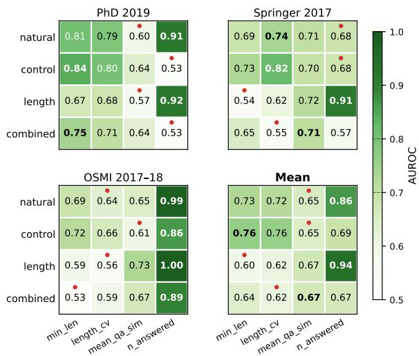  
Figure 1: Cue AUROC across four prompting modes (natural, controlled, length-restrictive, combined) and three surveys. Rows: prompting modes; columns: cues.

LLM-generation properties preserve directional information through one-tail aggregation; (iii) maxaggregation ensures no single targeted attack on one cue defeats the score (Sec. 3.2).

## 3 Experiments

We evaluate whether AI-assisted survey participation can be detected under increasingly realistic usage patterns. We first benchmark existing MGT detectors, then evaluate SPABD against the strongest existing detector in agentic-completion settings. We focus on zero-shot and training-free methods because labelled AI-assisted survey data is unlikely to be available for new surveys, and per-survey fine-tuning is often impractical.

We benchmark six existing detectors zero-shot: a prompt-based classifier using gpt-oss-120b (OpenAI, 2025); token-probability methods including DetectGPT (Mitchell et al., 2023), Fast-DetectGPT (Bao et al., 2024), and per-token log-likelihood (Solaiman et al., 2019; Gehrmann et al., 2019); Binoculars (Hans et al., 2024); and the supervised detector RADAR (Hu et al., 2023). These baselines are mostly training-free, reflecting the lack of survey-labelled AI usage data, while RADAR tests whether general MGT training transfers to survey responses. Since they score individual texts, we average answer-level scores to obtain respondentlevel scores. Details are in App. B.1. We report AUROC, the conventional metric in AI-text detection (Hans et al., 2024; Dugan et al., 2024).

<table><tr><td rowspan="2">D.set</td><td rowspan="2">Method</td><td rowspan="2">Rev. avg</td><td rowspan="2">Gen.</td><td colspan="4">Agentic Fill</td></tr><tr><td>avg</td><td>NAT</td><td>CTRL</td><td>LEN</td><td>CMB</td></tr><tr><td rowspan="5">phd</td><td>Zero-shot</td><td>0.63</td><td>0.45</td><td>0.43</td><td>0.45</td><td>0.44</td><td>0.46</td></tr><tr><td>Fast-DGPT</td><td>0.64</td><td>0.87</td><td>0.50</td><td>0.55</td><td>0.54</td><td>0.53</td></tr><tr><td>DetectGPT</td><td>0.57</td><td>0.83</td><td>0.61</td><td>0.59</td><td>0.56</td><td>0.57</td></tr><tr><td>Log-Lik</td><td>0.66</td><td>0.90</td><td>0.56</td><td>0.57</td><td>0.57</td><td>0.58</td></tr><tr><td>Binoculars</td><td>0.57</td><td>0.69</td><td>0.63</td><td>0.59</td><td>0.63</td><td>0.61</td></tr><tr><td rowspan="5">sp</td><td>RADAR Zero-shot</td><td>0.29 0.60</td><td>0.25 0.45</td><td>0.28 0.47</td><td>0.34 0.41</td><td>0.24 0.51</td><td>0.23 0.52</td></tr><tr><td>Fast-DGPT</td><td>0.74</td><td>0.88</td><td>0.58</td><td>0.62</td><td>0.52</td><td>0.53</td></tr><tr><td>DetectGPT</td><td>0.64</td><td>0.87</td><td>0.61</td><td>0.64</td><td>0.51</td><td>0.56</td></tr><tr><td>Log-Lik</td><td>0.64</td><td>0.93</td><td>0.62</td><td>0.68</td><td>0.52</td><td>0.56</td></tr><tr><td>Binoculars RADAR</td><td>0.44 0.34</td><td>0.68</td><td>0.56</td><td>0.55</td><td>0.56</td><td>0.59</td></tr><tr><td rowspan="5">osmi</td><td>Zero-shot</td><td>0.63</td><td>0.39 0.49</td><td>0.42 0.45</td><td>0.51 0.44</td><td>0.35 0.45</td><td>0.31 0.45</td></tr><tr><td>Fast-DGPT DetectGPT</td><td>0.64</td><td>0.79</td><td>0.46</td><td>0.48</td><td>0.44</td><td>0.46</td></tr><tr><td></td><td>0.49</td><td>0.81</td><td>0.60</td><td>0.65</td><td>0.55</td><td>0.56</td></tr><tr><td>Log-Lik</td><td>0.62</td><td>0.78</td><td>0.45</td><td>0.48</td><td>0.40</td><td>0.44</td></tr><tr><td>Binoculars</td><td>0.55</td><td>0.68</td><td>0.53</td><td></td><td></td><td></td></tr><tr><td rowspan="4"></td><td></td><td></td><td></td><td></td><td>0.51</td><td>0.55</td><td>0.52</td></tr><tr><td>RADAR</td><td></td><td></td><td></td><td></td><td></td><td></td></tr><tr><td></td><td>0.40</td><td>0.62</td><td>0.56</td><td>0.59</td><td>0.50</td><td>0.53</td></tr><tr><td></td><td></td><td></td><td></td><td></td><td></td><td></td></tr></table>

Table 3: Test AUROC of the baselines. Rev. and Gen. are averages over the three augmenter LLMs; Agentic Fill columns are per-mode (NAT/CTRL/LEN/CMB = natural / controlled / length-restrictive / combined).

## 3.1 Zero-Shot Performance

Tab. 3 reports test-split AUROC. Existing detectors perform best under Full Generation, where top AU-ROCs reach 0.79–0.93, but degrade under Revision (0.55–0.74) and further under Agentic Completion, where most scores remain close to chance (0.50– 0.65). Log-Likelihood and Fast-DetectGPT obtain the strongest row averages, but their advantage is driven mainly by Full Generation and does not transfer to Agentic Completion once responses are conditioned on persona context and prior answers. RADAR performs below chance on phd2019 (0.28) and springer2017 (0.39), suggesting a domain mismatch between its training distribution and short open-ended survey responses. The prompt-based Zero-Shot classifier is also near chance (∼0.50– 0.53). Per-augmenter results are in App. D.

## 3.2 Behavioural Cue Evaluation

Fig. 1 shows an oracle cue analysis that measures the discriminability of each respondent-level cue and demonstrates that they provide additional signal across datasets and prompting modes. Not a single cue dominates consistently. For instance, coverage becomes weaker when agents are prompted to skip survey fields, while length weakens under length-restrictive prompting. Even so, other cues often remain informative, indicating that targeted prompting can reduce individual behavioural artefacts. However, it does not eliminate all respondentlevel signals as multiple cues aggregate.

<table><tr><td>Method</td><td>Nat</td><td>Ctrl</td><td>Len</td><td>Cmb</td><td>Mean</td></tr><tr><td colspan="6">phd2019</td></tr><tr><td>Best exist SPABD</td><td>0.63 0.82±.05</td><td>0.59 0.79 ±.04</td><td>0.63 0.72 ±.07</td><td>0.61 0.68 ±.03</td><td>0.61 0.75</td></tr><tr><td colspan="6">springer2017</td></tr><tr><td>Best exist SPABD</td><td>0.62 0.75±.06</td><td>0.68 0.72±.11</td><td>0.56 0.72 ±.11</td><td>0.59 0.56±.10</td><td>0.61 0.69</td></tr><tr><td colspan="6">osmi_mh</td></tr><tr><td>Best exist SPABD</td><td>0.60 0.89 ±.12</td><td>0.65 0.76±.07</td><td>0.55 0.88 ±.16</td><td>0.56 0.73±.12</td><td>0.59 0.82</td></tr><tr><td colspan="6">Mean</td></tr><tr><td>Best exist</td><td>0.62</td><td>0.64</td><td>0.58</td><td>0.59</td><td>0.61</td></tr><tr><td>SPABD</td><td>0.82</td><td>0.76</td><td>0.77</td><td>0.66</td><td>0.75</td></tr></table>

Table 4: SPABD (K=5, 1-tail prior max) vs best percell existing detector AUROC; SPABD = mean ± std over 50 seeds. Bold = best per cell.

## 3.3 SPABD Performance

Tab. 4 compares SPABD (K=5, one-tail prior max aggregation) with the best existing MGT detector in each of the 12 agentic-completion settings. SPABD improves mean AUROC from 0.61 to 0.75, showing that respondent-level behavioural cues provide complementary signal beyond per-answer text detection. It outperforms the best existing detector in 11 of 12 settings, with the only exception being the combined adversarial mode on Springer (0.56 ± 0.10), where multiple cues are simultaneously weakened. Performance remains variable across surveys and prompting modes, suggesting that SPABD should be viewed as a lightweight reference detector rather than a complete solution.

Tab. 5 reports the aggregated operating-point performance across the same settings. This is more indicative of detection performance at a fixed threshold. SPABD exhibits advantageous performance under tight false-positive tolerance. Specifically, at FPR=5%, it detects 27.7% of AI submissions versus 12.0% for the best existing detector, and at FPR=1%, 15.5% versus 4.5%. On the shortest survey, springer2017, the best existing detectors remain stronger at low FPR. However, it is also worth noting that the tolerance is a hyperparameter chosen in practice, and SPABD performs better overall in both types of metrics by a larger margin. Metric definitions are in App. I.

## 3.4 Ablation Studies

We ablate five design choices in SPABD: referenceset size, persona-simulator backbone, aggregator, the number of open-ended fields, and the reference sample quality.

<table><tr><td>D.set</td><td>Method</td><td>AUROC</td><td>TPR@1%</td><td>TPR@5%</td><td>TPR @10%</td></tr><tr><td rowspan="2">phd</td><td>Best exist</td><td>0.613</td><td>0.018</td><td>0.085</td><td>0.175</td></tr><tr><td>SPABD</td><td>0.753</td><td>0.157</td><td>0.279</td><td>0.317</td></tr><tr><td rowspan="2">sp</td><td>Best exist</td><td>0.613</td><td>0.064</td><td>0.153</td><td>0.230</td></tr><tr><td>SPABD</td><td>0.687</td><td>0.008</td><td>0.105</td><td>0.195</td></tr><tr><td rowspan="2">osmi</td><td>Best exist</td><td>0.591</td><td>0.052</td><td>0.124</td><td>0.218</td></tr><tr><td>SPABD</td><td>0.813</td><td>0.301</td><td>0.446</td><td>0.497</td></tr><tr><td rowspan="2">Mean</td><td>Best exist</td><td>0.606</td><td>0.045</td><td>0.120</td><td>0.207</td></tr><tr><td>SPABD</td><td>0.751</td><td>0.155</td><td>0.277</td><td>0.336</td></tr></table>

Table 5: Operating-point metrics on the 12 agent\_fill settings with SPABD at K=5. Best exist is the best existing detector per setting. TPR@x% is the AI detection rate at x% FPR.

Scaling with K. SPABD’s reference set is the only supervision it consumes; we ablate its size. Performance scales smoothly across K ∈ {5, 10, 20, 50, 100} (mean AUROC 0.75 → 0.79), with K=5 capturing most of the achievable gain and the seed-level std shrinking from 0.09 to 0.02 (Tab. 12, App. E). Five known-human responses (which a survey practitioner can supply from a pre-LLM-era split or small curated set) are sufficient.

Cross-LLM backbone robustness. The cues target LLM-generation properties rather than a specific model or agent runtime. To test this, we run two additional persona-simulator backbones on OSMI alongside the Sonnet results above: gpt-oss-120b and Gemini-3-Flash (both via raw chat-completions, in contrast to Sonnet’s Claude Code agent runtime). Despite this implementation asymmetry, SPABD K=5 holds across all three backbones (mean AUROC 0.90, within ±0.02). Existing detectors are far less robust. SPABD beats the best per-cell baseline by +0.25 to +0.34 on every backbone (Tab. 13, App. E).

Aggregator choice. Since SPABD aggregates the four cue z-scores via a one-tail max for scoring, we study the effect of using different unsupervised aggregation strategies. We find that mean-z and sumz perform slightly better on average under clean settings (0.776 vs. 0.751), but we adopt max-z for its robustness. It relies on whichever cue is most informative for a given respondent, allowing it to remain effective when other cues are weakened. For example, under a blind attack that varies answer lengths to appear more human-like, max-z achieves 0.839 while mean-z drops to 0.722. Overall, performance is relatively insensitive to the choice of aggregation strategy. The full results are reported in App. E.

The number of open-ended fields. SPABD is designed for online surveys with multiple openended text fields. As the number of such fields decreases, detection performance declines gracefully. When half of the fields are removed, the average AUROC is reduced to 0.655, while still remaining superior to the performance of the best existing detector (0.61) when given all survey texts from the full surveys (Tab. 16). This is expected because behavioural cues are most informative when observed across the entire survey and through the relationships between questions and their answers, which is exactly why SPABD performs better than applying MGT models to concatenated text. When the number of text fields is reduced to one, it becomes MGT detection over short text.

Reference sample quality. We analyse how the quality of the K reference responses affects SPABD at inference time, considering both contamination and references drawn from other surveys. SPABD is relatively robust to mild contamination. Replacing one of five verified human responses with an AI response reduces mean AUROC from 0.751 to 0.730, while replacing two reduces it to 0.692, both still well above the best-performing baseline at 0.61. However, using reference responses from outside the target survey leads to a non-trivial reduction in performance. This setting is not intended by design. The verified responses should therefore be selected with caution. Full results are reported in App. E.

## 4 Conclusion

We introduce ASURRE, a dataset for AI-assisted online survey participation, on which existing MGT detection fails against persona-grounded agentic completion. Our analysis shows that although this sophisticated usage weakens textual signals, behavioural cues exploiting discrepancies between human variability and LLM regularities remain discriminative. To validate the promise of using such behavioural cues for detection, we introduce a simple yet effective baseline method, SPABD, that is training-free and uses few-shot aggregation of our identified behavioural cues. Across three surveys in different domains, it achieves a 0.14 AUROC improvement over the best existing baseline and remains effective under different usage strategies.

## Limitations

Applicable settings. SPABD requires a survey with multiple open-ended fields per respondent. This is the setting in which AI-assisted completion is both most likely and most consequential for validity. Open-ended fields are standard practice across most disciplines in the social sciences. At inference, a small set of verified human responses is needed to anchor the reference distribution. The cues are undefined for single-field instruments, and detection weakens as the number of open-ended fields decreases (App. E). Even though the default number of reference responses is small (5), removing them would limit the performance of SPABD.

Resilience against adversarial attacks. Our study concerns agentic survey completion with persona conditioning, where moderate engineering effort is spent on achieving human-like realism or mimicking a persona. However, malicious, targeted adversarial attacks are outside the scope of our evaluation and should be studied separately.

Effective but imperfect. Although SPABD substantially outperforms existing zero-shot detectors on agentic survey completion, its performance remains imperfect under sophisticated agentic completion. Our work validates behavioural detection as a promising direction rather than a complete solution.

Language coverage. We evaluate personagrounded LLM agents in four control modes on three primarily English-language surveys, among which PhD2019 includes some non-English responses. It is possible that behavioural cues may have different characteristics in other languages.

## Ethical Considerations

Broader impact. Since our work could make AIassisted survey completion easier to carry out, we release only the high-level architecture of the agentic completion pipelines alongside our behavioural analyses, and will provide full implementation details on a case-by-case basis upon request. The detection framework is intended as a practical tool for researchers working with survey data. We are conscious that false detections, particularly false positives, carry costs for participants, and recommend that scores be used as screening signals rather than as grounds for exclusion or non-payment.

Participants or adversaries may attempt to evade SPABD’s cues, since they are interpretable and fully described. Robustness of such adversarial attacks is not in the scope of our study, but it is important to note that all currently published detectors are not immune to this threat and, therefore, it is not unique to SPABD.

Risk of demographic bias. MGT models can systematically disadvantage non-native English writers (Liang et al., 2023). SPABD does not rely on fluency, perplexity, or vocabulary, and only one of its four cues is length-based. We nevertheless evaluate potential bias related to these factors to assess fairness. We compare cue values and flag rates between native and non-native respondents across all three surveys, using interface language or country of residence as proxies for respondent background (App. J). We find that non-native respondents do not show more uniform answer lengths on any survey. On the largest survey, their answers are also shorter and less closely aligned with the questions than those of native respondents. Both characteristics are less similar to the typical AI pattern than those observed in the native group. As a result, nonnative respondents are flagged less often rather than more. Nevertheless, we recommend using flagged responses for human review rather than automatic rejection. Auditing flag rates across respondent groups is also recommended.

## Acknowledgments

Qizhou Wang, Bogdan Mamaev, and Christopher Leckie were supported in part by the Australian Internet Observatory (AIO), a national research infrastructure supporting digital platform and smart data research. AIO received investment from the Australian Research Data Commons (ARDC) through the National Collaborative Research Infrastructure Strategy (NCRIS).

This work was supported in part by the ARC Centre of Excellence on Automated Decision Making and Society CE200100005.

This research was supported by The University of Melbourne’s Research Computing Services and the Petascale Campus Initiative.

This material is based upon work supported by the Google Cloud Research Credits program.

## References

Anthropic. 2025. Claude Sonnet 4.6. https://www. anthropic.com/claude.

Lisa P Argyle, Ethan C Busby, Nancy Fulda, Joshua R Gubler, Christopher Rytting, and David Wingate.

2023. Out of one, many: Using language models to simulate human samples. Political Analysis, 31(3):337–351.

Guangsheng Bao, Yanbin Zhao, Zhiyang Teng, Linyi Yang, and Yue Zhang. 2024. Fast-DetectGPT: Efficient zero-shot detection of machine-generated text via conditional probability curvature. Preprint, arXiv:2310.05130.

Liam Dugan, Alyssa Hwang, Filip Trhlik, Josh Magnus Ludan, Andrew Zhu, Hainiu Xu, Daphne Ippolito, and Chris Callison-Burch. 2024. RAID: A shared benchmark for robust evaluation of machine-generated text detectors. Preprint, arXiv:2405.07940.

Sebastian Gehrmann, Hendrik Strobelt, and Alexander Rush. 2019. GLTR: Statistical detection and visualization of generated text. In Proceedings ofthe 57th Annual Meeting ofthe Associationfor Computational Linguistics: System Demonstrations, pages 111–116, Florence, Italy. Association for Computational Linguistics.

Google DeepMind. 2025. Gemini 3 flash. https:// deepmind.google/technologies/gemini/.

Robert M Groves, Floyd J Fowler Jr, Mick P Couper, James M Lepkowski, Eleanor Singer, and Roger Tourangeau. 2011. Survey methodology. John Wiley & Sons.

Abhimanyu Hans, Avi Schwarzschild, Valeriia Cherepanova, Hamid Kazemi, Aniruddha Saha, Micah Goldblum, Jonas Geiping, and Tom Goldstein. 2024. Spotting LLMs with Binoculars: Zero-shot detection of machine-generated text. Preprint, arXiv:2401.12070.

Xiaomeng Hu, Pin-Yu Chen, and Tsung-Yi Ho. 2023. Radar: Robust AI-text detection via adversarial learning. Preprint, arXiv:2307.03838.

Jason L. Huang, Paul G. Curran, Jessica Keeney, Elizabeth M. Poposki, and Richard P. DeShon. 2012. Detecting and deterring insufficient effort responding to surveys. Journal of Business and Psychology, 27(1):99–114.

Ryan Kennedy, Scott Clifford, Tyler Burleigh, Philip D. Waggoner, Ryan Jewell, and Nicholas J. G. Winter. 2020. The shape of and solutions to the MTurk quality crisis. Political Science Research and Methods, 8(4):614–629.

Jon A Krosnick. 1991. Response strategies for coping with the cognitive demands of attitude measures in surveys. Applied cognitive psychology, 5(3):213– 236.

Weixin Liang, Mert Yuksekgonul, Yining Mao, Eric Wu, and James Zou. 2023. GPT detectors are biased against non-native english writers. Patterns, 4(7).

Adam W. Meade and S. Bartholomew Craig. 2012. Identifying careless responses in survey data. Psychological Methods, 17(3):437–455.

Eric Mitchell, Yoonho Lee, Alexander Khazatsky, Christopher D. Manning, and Chelsea Finn. 2023. DetectGPT: Zero-shot machine-generated text detection using probability curvature. Preprint, arXiv:2301.11305.

OpenAI. 2025. gpt-oss-120b & gpt-oss-20b model card. Preprint, arXiv:2508.10925.

Joon Sung Park, Carolyn Q. Zou, Jonne Kamphorst, Niles Egan, Aaron Shaw, Benjamin Mako Hill, Carrie Cai, Meredith Ringel Morris, Percy Liang, Robb Willer, and Michael S. Bernstein. 2026. LLM agents grounded in self-reports enable general-purpose simulation of individuals. Preprint, arXiv:2411.10109.

Nils Reimers and Iryna Gurevych. 2019. Sentence-BERT: Sentence embeddings using Siamese BERTnetworks. Preprint, arXiv:1908.10084.

Irene Solaiman, Miles Brundage, Jack Clark, Amanda Askell, Ariel Herbert-Voss, Jeff Wu, Alec Radford, Gretchen Krueger, Jong Wook Kim, Sarah Kreps, Miles McCain, Alex Newhouse, Jason Blazakis, Kris McGuffie, and Jasmine Wang. 2019. Release strategies and the social impacts of language models. Preprint, arXiv:1908.09203.

Veniamin Veselovsky, Manoel Horta Ribeiro, and Robert West. 2023. Artificial artificial artificial intelligence: Crowd workers widely use large language models for text production tasks. Preprint, arXiv:2306.07899.

Wenhui Wang, Furu Wei, Li Dong, Hangbo Bao, Nan Yang, and Ming Zhou. 2020. MiniLM: Deep self-attention distillation for task-agnostic compression of pre-trained transformers. Preprint, arXiv:2002.10957.

Junchao Wu, Shu Yang, Runzhe Zhan, Yulin Yuan, Derek F. Wong, and Lidia S. Chao. 2024. A survey on LLM-generated text detection: Necessity, methods, and future directions. Preprint, arXiv:2310.14724.

An Yang, Anfeng Li, Baosong Yang, Beichen Zhang, Binyuan Hui, Bo Zheng, Bowen Yu, Chang Gao, Chengen Huang, Chenxu Lv, Chujie Zheng, Dayiheng Liu, Fan Zhou, Fei Huang, Feng Hu, Hao Ge, Haoran Wei, Huan Lin, Jialong Tang, and 41 others. 2025. Qwen3 technical report. Preprint, arXiv:2505.09388.

Xianjun Yang, Liangming Pan, Xuandong Zhao, Haifeng Chen, Linda Ruth Petzold, William Yang Wang, and Wei Cheng. 2024. A survey on detection of LLMs-generated content. In Findings ofthe Association for Computational Linguistics: EMNLP 2024, pages 9786–9805, Miami, Florida, USA. Association for Computational Linguistics.

Simone Zhang, Janet Xu, and AJ Alvero. 2025. Generative AI meets open-ended survey responses: Research participant use of AI and homogenization. Sociological Methods & Research, 54(3):1197–1242.

## A AI Response Simulation

## A.1 Source Datasets

We use three publicly available survey datasets, all collected before widespread LLM availability (pre-2020), so that every original response is verifiably human-written and free of AI contamination. Tab. 6 summarises the corpora.

<table><tr><td>Dataset</td><td>Year</td><td>Raw</td><td>Retained</td><td>Train</td><td>Test</td></tr><tr><td>phd2019</td><td>2019</td><td>6,813</td><td>6,813</td><td>5,450</td><td>1,363</td></tr><tr><td>springer2017</td><td>2017</td><td>5,292</td><td>1,596</td><td>1,276</td><td>320</td></tr><tr><td>osmi_mh</td><td>2017-18</td><td>1,173</td><td>534</td><td>427</td><td>107</td></tr></table>

Table 6: Source datasets. Raw: original number of participants. Retained: respondents kept after eligibility filtering (≥ 80 characters of open-text content).

phd2019. A global survey of PhD students on experiences, satisfaction, supervisor relationships, mental health, and career intentions, conducted by Nature / Shift Learning (CC BY 4.0; Figshare DOI 10.6084/m9.figshare.10266299). We use the six open-text fields listed in Tab. 7. Median 26 words per respondent (IQR 10–61); Q26 is the richest field and Q17 is uniformly very short (≤ 15 words).

<table><tr><td>ID</td><td>Question</td></tr><tr><td>Q26</td><td>How would you describe the academic system based on your PhD experience?</td></tr><tr><td>Q16</td><td>Is there anything else that has concerned you since starting your PhD?</td></tr><tr><td>Q55</td><td>What one thing do you wish you&#x27;d known when you started your PhD?</td></tr><tr><td>Q41</td><td>What type of career are you interested in pursu- ing after your degree?</td></tr><tr><td>Q60</td><td>Any further comments?</td></tr><tr><td>Q17</td><td>What do you enjoy most about life as a PhD student?</td></tr></table>

Table 7: Open-text fields used from phd2019.

springer2017. A global survey of academic researchers on professional use of social media and scholarly collaboration networks, run by Springer Nature in 2017 (CC BY 4.0; Figshare DOI 10.6084/m9.figshare.5028212). Of 5,292 raw respondents, 1,596 contributed sufficient open-text content. We use the seven open-text fields listed in Tab. 8. Responses are short and telegraphic (median 9 words per respondent, IQR 4–27; most fields have a median of 1–3 words).

<table><tr><td>ID</td><td>Question</td></tr><tr><td>Q23</td><td>Other tasks you use social media for in relation to your work.</td></tr><tr><td>Q29</td><td>Comments on usefulness of social media for sup- porting research.</td></tr><tr><td>Q37</td><td>Comments on usefulness of social media for sharing professional content.</td></tr><tr><td>Q43</td><td>Comments on usefulness of social media for pro- moting professional content.</td></tr><tr><td>Q47</td><td>Comments on usefulness of social media for net- working and collaboration.</td></tr><tr><td>Q63</td><td>What could publishers provide or improve to</td></tr><tr><td>Q65</td><td>help your use of social media? Further comments on professional use of social media.</td></tr></table>

Table 8: Open-text fields used from springer2017.

osmi\_mh. The annual Mental Health in Tech Survey from Open Sourcing Mental Illness, combining the 2017 and 2018 releases (CC BY-SA 4.0; osmihelp.org). Of 1,173 raw respondents, 534 are retained. We use ten open-text fields (Tab. 9); the five narrative fields covering current/previous employer and coworker conversations (Q\_EC, Q\_CC, Q\_CW, Q\_PE, Q\_PC) carry the bulk of the content. Responses are the longest and most narrative-rich in our study (median 45 words per respondent, IQR 26–79), and the only ones centred on a sensitive personal topic.

<table><tr><td>ID</td><td>Question</td></tr><tr><td>Q_EC</td><td>Conversation with current employer about men- tal health.</td></tr><tr><td>Q_CC</td><td>Conversation with current coworkers about men- tal health.</td></tr><tr><td>Q_CW</td><td>Coworker&#x27;s disclosure of their mental health to you.</td></tr><tr><td>Q_PE</td><td>Conversation with previous employer about men- tal health.</td></tr><tr><td>Q_PC</td><td>Conversation with previous coworkers about mental health.</td></tr><tr><td>Q_CA</td><td>How being identified as having a mental health issue affected your career.</td></tr><tr><td>Q_BH</td><td>Circumstances of a badly handled or unsupport- ive workplace response.</td></tr><tr><td>Q_SH</td><td>Circumstances of a supportive or well-handled workplace response.</td></tr><tr><td>Q_ID</td><td>What could the industry or employers do to im- prove mental health support?</td></tr><tr><td>Q_AE</td><td>Any additional comments.</td></tr></table>

Table 9: Open-text fields used from osmi\_mh.

## A.2 Simulation Patterns

We simulate three patterns of LLM use. All three operate at the respondent level: the unit is a com-

plete answer set, not an isolated field.

## A.2.1 LLM Revision

The respondent writes their own answers and runs each through an LLM purely for stylistic polishing. The LLM receives the raw answer text, with no question label or surrounding fields, and is instructed to rewrite the prose while preserving meaning, opinions, and concrete details. Fields are processed independently as an asynchronous batch via vLLM.

## A.2.2 Full Generation

The respondent delegates authoring entirely to an LLM. The LLM receives only the question label and is prompted to respond as a researcher quickly completing the survey. Because no human input or respondent context is provided, outputs are plausible but ungrounded. Fields are again processed independently.

## A.2.3 Persona Simulation

A two-stage pipeline mimics a specific real respondent. Stage A (portrait): Claude reads the respondent’s full answer set and produces a structured persona portrait (Section A.2.4). Stage B (simulation): a fresh Claude agent session fills the survey one question per turn, conditioned on the portrait and accumulating prior answers in context. Three skills regulate generation: ground\_persona maps each portrait dimension to concrete writing behaviour before the first answer; survey\_fill produces each answer under length and consistency constraints; and humanise performs a post-generation pass that suppresses AI stylistic markers and injects register-appropriate informality. Unlike the field-independent patterns, this produces internally consistent, persona-grounded answer sets.

The agent autonomously decides which questions to answer; skipping is signalled by emitting exactly [SKIP], which is excluded from the output. We evaluate two engagement modes. The natural variant (persona\_sonnet) lets the agent choose purely from its portrait, with no external policy. The controlled variant (persona\_sonnet\_controlled) additionally applies a deterministic policy that pre-marks some questions as must-skip based on the persona’s seriousness and a per-question tier (mandatory / standard / optional), with an eligibility floor of at least one answered question per persona. The persona portrait is the only carry-over from the source respondent into the simulation — no field-level content or coverage is propagated.

## A.2.4 Persona Portrait Dimensions

The portrait specifies eight dimensions inferred from the source respondent’s full answer set (Tab. 10). All categorical dimensions are inferred by an LLM; response\_length\_habit is computed directly from the respondent’s empirical answer lengths, providing a quantitative anchor on response scale that the LLM does not invent.

Per-dataset portrait distributions. Inferred portraits over the eligible respondents in each dataset reveal markedly different population profiles:

• phd2019 (n=100): affect mixed 79%, negative 15%, positive 5%; strain\_level medium 57%, high 34%, low 9%; survey\_seriousness moderate 57%, low 23%, high 20%; english\_level proficient 45%, native 26%, fluent 21%, intermediate 8%.

• springer2017 (n=90): affect positive 52%, neutral 23%, mixed 17%, negative 8%; engagement\_level low 62%, moderate 37%, high 1%; survey\_seriousness low 61%, moderate 32%, high 7%; english\_level proficient 66%, fluent 16%, native 11%, intermediate 8%.

• osmi\_mh (n=107): affect predominantly mixed/negative (disclosure-anxiety register); disclosure\_comfort spread across low/medium/high; survey\_seriousness moderate-to-high (self-selected respondents); english\_level mostly native/fluent.

## A.3 Models

LLM Revision and Full Generation use the open-weight models gpt-oss-120b and Qwen3.5-35B-A3B and the proprietary Gemini 3 Flash Preview. Persona Simulation uses Claude Sonnet 4.6 with both the natural and controlled engagement modes described above. This combination spans open-weight and commercial families across multiple providers, allowing us to assess detection generalisation across model sources. All splits use balanced human and AI samples following the partitions in Tab. 6.

## B Implementation Details

## B.1 Detection Methods

We evaluate six AI-text detectors covering the main families of zero-shot detection plus one supervised baseline. All are run zero-shot on our survey corpora — no fine-tuning on survey text. We summarise each below.

<table><tr><td>Dimension</td><td>Values</td><td>Role</td></tr><tr><td>affect</td><td>positive / negative / mixed / neutral</td><td>emotional register of every answer</td></tr><tr><td>engagement_level</td><td>high / moderate / low</td><td>depth of engagement (survey-dependent)</td></tr><tr><td>english_level</td><td>native / fluent / proficient / intermediate</td><td>vocabulary range, idiom use</td></tr><tr><td>grammar_error_level</td><td>none / minor / moderate / frequent</td><td>error rate, applied consistently</td></tr><tr><td>survey_seriousness</td><td>high / moderate / low</td><td>effort; drives controlled-mode rates</td></tr><tr><td>writing_style</td><td>free text (2 sentences)</td><td>sentence length, formality, patterns</td></tr><tr><td>main_themes</td><td>2–3 topics</td><td>topics that recur across answers</td></tr><tr><td>response_length_habit</td><td>derived statistic</td><td>data-grounded length anchor</td></tr></table>

Table 10: Persona portrait dimensions used to control agentic completion.

Zero-Shot Prompt Classifier (zeroshot). Direct prompt-based binary classification: gpt-oss-120b is asked whether each input is AI-generated, and the binary label is parsed from a JSON reply (temperature=0).

Fast-DetectGPT (fdgpt). Sampling-free curvature score using a single model’s logits to construct a per-token reference distribution (Bao et al., 2024). Scored with Qwen3-4B.

DetectGPT (dgpt). The original perturbationbased curvature detector (Mitchell et al., 2023): ten mask-fill perturbations per input; AI text appears as a local maximum in the log-probability landscape. Scored with Qwen3-4B.

Log-Likelihood (loglik). The simplest baseline: per-token mean log-probability under Qwen3-4B. AI-sampled text tends to sit in higherprobability regions than human text.

Binoculars (bino). Cross-perplexity ratio between a base (observer) and instructiontuned (performer) model (Hans et al., 2024). We use Qwen3-4B as observer and Qwen3-4B-Instruct-2507 as performer.

RADAR (radar). The only supervised detector in the matrix: an adversarially-trained RoBERTastyle classifier (TrustSafeAI/RADAR-Vicuna-7B) producing a softmax probability for the AI class (Hu et al., 2023).

## B.2 Behavioural Cue Computation

Let respondent r have answered set $\begin{array} { r c l } { A _ { r } } & { = } & { \mathsf { \bar { \{ } } } ( q _ { i } , a _ { i } ) \} _ { i = 1 } ^ { K _ { r } }  \end{array}$ , where $q _ { i }$ is the question prompt and $a _ { i }$ the free-text answer. Let $\begin{array} { r l r } { \ell _ { i } } & { { } = } & { | a _ { i } | } \end{array}$ be the whitespace-split word count, and $\phi ( \cdot )$ the L2-normalised sentence encoder (sentence-transformers/all-MiniLM-L6-v2). The four cues are

$$
\begin{array} { c } { { \displaystyle \mathfrak { m i n } _ { - } \mathrm { l e n } ( r ) = \operatorname* { m i n } _ { i } \ell _ { i } , } } \\ { { \displaystyle \mathrm { l e n g t h } _ { - } \mathrm { c v } ( r ) = \mathrm { s t d } _ { i } ( \ell _ { i } ) / \mathrm { m e a n } _ { i } ( \ell _ { i } ) , } } \\ { { \displaystyle \mathfrak { m e a n } _ { - } \mathfrak { q } \mathsf { a } _ { - } \mathrm { s i m } ( r ) = \frac { 1 } { K _ { r } } \sum _ { i = 1 } ^ { K _ { r } } \phi ( q _ { i } ) \cdot \phi ( a _ { i } ) , } } \\ { { \displaystyle \mathfrak { n } _ { - } \mathsf { a n s w e r e d } ( r ) = K _ { r } . } } \end{array}
$$

All cues depend only on r’s own answers and the survey question texts — no reference language model, no labels, no peer respondents. The encoder is 80M parameters and runs once per respondent.

## B.3 Evaluation Metrics

We report AUROC, the area under the receiver operating characteristic curve. Values range in [0, 1]: 1 indicates perfect ranking (every AI response scored above every human response), 0.5 indicates random ranking. AUROC is invariant to monotonic transformations of s(·) and independent of any decision threshold, making it a measure of discriminative ability rather than operating-point performance.

## C Question–Answer Homogenisation

We probe the question–answer coupling behind mean\_qa\_sim on OSMI agent\_fill. For each respondent we form within-respondent pairs of (question similarity, answer similarity) across their answered fields and fit sim $_ A = \alpha + \beta$ simQ separately for the human and persona-AI pools (Fig. 2). Human respondents track question similarity (β = 0.55): when two questions are semantically close, their answers are too. Persona-grounded AI completions homogenise into a narrower, less questioncoupled distribution $( \beta = 0 . 1 6$ , non-overlapping 95% CIs), reflecting the portrait-anchored compression of sim $A$ visible in the marginal densities.

OSMI Mental Health in Tech Agent fill: AI (persona\_sonnet) vs Human Pooled OLS: sim $\_ A = \alpha + \beta \cdot \sin \_ Q$ (cluster-robust SEs)

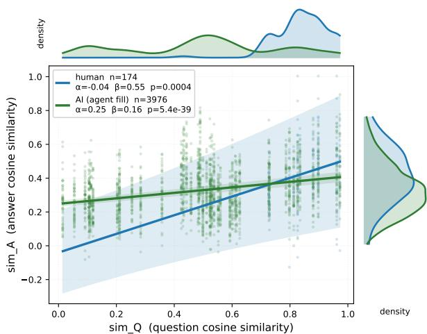  
Figure 2: Within-respondent question–answer similarity on OSMI agent\_fill. Humans (left) track question similarity $( \beta = 0 . 5 5 ) ;$ ; persona AI (right) collapses to a portrait-anchored register $( \beta = 0 . 1 6 ;$ non-overlapping CIs).

## D Detailed Experiment Results

Tab. 11 reports the full per-augmenter test-split AUROC matrix expanding the per-pattern averages in Tab. 3 (main paper).

## E Ablation Studies

This appendix backs the two ablations in Sec. 3.4. Tab. 12 reports SPABD as a function of the knownhuman reference size $K \in \{ 5 , 1 0 , 2 0 , 5 0 , 1 0 0 \}$ , averaged over the 12 agentic-completion cells and 50 random K-shot draws per cell. Mean AUROC climbs from 0.75 at K=5 to 0.79 at $K { = } 1 0 0$ , and the seed-level standard deviation falls from 0.09 to $0 . 0 2 - K { = } 5$ captures most of the achievable AU-ROC, and the variance reduction at larger K comes from a more stable reference distribution rather than from new signal. Tab. 13 reports the cross-LLM backbone ablation on OSMI agent\_fill (natural mode). The Sonnet column is the same personasimulator run used in the main results above (Claude Code agent runtime); we add two more backbones, gpt-oss-120b and Gemini-3-Flash, run via raw chat-completions. SPABD K=5 holds at 0.886/0.909/0.895 (within ±0.02), while the best per-cell baseline changes identity between backbones (DetectGPT → RADAR → Binoculars) and Fast-DetectGPT / Log-Likelihood fall below chance on gpt-oss-120b.

Aggregator choice. Tab. 14 compares SPABD’s max-z against seven alternative unsupervised aggregators on the 12 agent\_fill cells. Z-score-based methods (max-z, sum-z, mean-z, trimmed-sum-z) use the same K=5 robust reference as SPABD; covariance- and density-based methods (robust Mahalanobis, Isolation Forest, One-Class SVM, LOF) use $K { = } 2 0$ , since $K { = } 5$ is too small for stable 4- dimensional covariance or density estimation. We also include a fully supervised $\scriptstyle \mathrm { K } = 5 + \mathrm { K } = 5$ logistic classifier as an upper bound (mean AUROC 0.856, requires AI labels). Among zero-shot aggregators, max-z, sum-z, mean-z, robust Mahalanobis, and Isolation Forest fall within 0.03 of each other (mean AUROCs 0.751–0.776); trimmedsum-z, One-Class SVM and LOF trail at 0.682– 0.689 in the small-K, 4-dimensional regime. We adopt max-z for two reasons: (i) each flag is traceable to a specific cue, supporting human review of decisions; (ii) it is robust to per-cell direction inversion of any single cue (e.g., mean\_qa\_sim on OSMI), where sum-z or mean-z would carry the inverted z into the score. The zero-shot max-z method closes 57% of the gap between existing zero-shot baselines (mean 0.61) and the supervised upper bound (0.86), without using any AI labels.

The clean average is not the whole picture. On osmi\_mh with the Gemini-3-Flash backbone we also score a blind attacker, prompted to leave one to three questions blank and to vary answer lengths so they look natural, with no persona document and no access to any real respondent statistics (App. A.2). Mean-z is marginally ahead of maxz without the attack (0.899 vs 0.895) but falls to 0.722 under it, while max-z retains 0.839. The reason is visible in the individual cues: the attacker’s guessed length distribution inverts both length cues (min\_len 0.701 → 0.459, length\_cv 0.702 → 0.383), but its guessed skip rate still under-shoots real non-participation, so n\_answered remains at 1.000. A one-tail max rides that single surviving cue; an average dilutes it across four. Because the blind attacker is generated without persona grounding, this pair is not a clean ablation of the attack alone, but the two aggregators are compared on identical generations, which is what the design choice turns on.

Open-field count. SPABD reads behaviour across a respondent’s answered fields, so its signal depends on how many open-ended fields a survey has. Tab. 16 retains the first 25/50/75/100% of each survey’s fields and recomputes the cues. Detection degrades gracefully rather than collapsing: at half the fields SPABD averages 0.655, still above the 0.61 achieved by the best existing detector on full surveys, and even at a quarter of the fields it averages 0.612. The trend is survey-dependent — phd2019 and osmi\_mh lose most, while springer2017 is nearly flat — and because fields are retained as a prefix rather than sampled, part of that variation reflects which fields survive rather than how many.

<table><tr><td rowspan="2">Dataset</td><td rowspan="2">Method</td><td colspan="3">LLM Revision</td><td colspan="3">Full Generation</td><td rowspan="2"></td><td colspan="3">Agentic Fill</td></tr><tr><td>OSS120</td><td>Qwen3.5</td><td>Gemini3</td><td>OSS120</td><td>Qwen3.5</td><td>Gemini3</td><td>NAT CTRL</td><td>LEN</td><td>CMB</td></tr><tr><td rowspan="6">phd2019</td><td>Zero-shot</td><td>0.623</td><td>0.595</td><td>0.664</td><td>0.465</td><td>0.424</td><td>0.445</td><td>0.428</td><td>0.447</td><td>0.442</td><td>0.463</td></tr><tr><td>Fast-DGPT</td><td>0.613</td><td>0.616</td><td>0.693</td><td>0.833</td><td>0.920</td><td>0.845</td><td>0.498</td><td>0.550</td><td>0.538</td><td>0.527</td></tr><tr><td>DetectGPT</td><td>0.549</td><td>0.555</td><td>0.590</td><td>0.809</td><td>0.911</td><td>0.779</td><td>0.609</td><td>0.593</td><td>0.562</td><td>0.569</td></tr><tr><td>Log-Lik</td><td>0.654</td><td>0.616</td><td>0.718</td><td>0.885</td><td>0.949</td><td>0.878</td><td>0.562</td><td>0.573</td><td>0.572</td><td>0.578</td></tr><tr><td>Binoculars</td><td>0.571</td><td>0.513</td><td>0.622</td><td>0.657</td><td>0.708</td><td>0.694</td><td>0.625</td><td>0.593</td><td>0.625</td><td>0.608</td></tr><tr><td>RADAR</td><td>0.285</td><td>0.354</td><td>0.226</td><td>0.241</td><td>0.374</td><td>0.144</td><td>0.283</td><td>0.344</td><td>0.237</td><td>0.228</td></tr><tr><td rowspan="6">springer2017</td><td>Zero-shot</td><td>0.563</td><td>0.563</td><td>0.681</td><td>0.460</td><td>0.440</td><td>0.443</td><td>0.473</td><td>0.405</td><td>0.508</td><td>0.520</td></tr><tr><td>Fast-DGPT</td><td>0.717</td><td>0.677</td><td>0.818</td><td>0.846</td><td>0.912</td><td>0.884</td><td>0.575</td><td>0.622</td><td>0.517</td><td>0.526</td></tr><tr><td>DetectGPT</td><td>0.763</td><td>0.527</td><td>0.642</td><td>0.834</td><td>0.941</td><td>0.820</td><td>0.605</td><td>0.639</td><td>0.505</td><td>0.556</td></tr><tr><td>Log-Lik</td><td>0.544</td><td>0.565</td><td>0.815</td><td>0.919</td><td>0.961</td><td>0.923</td><td>0.619</td><td>0.683</td><td>0.519</td><td>0.557</td></tr><tr><td>Binoculars</td><td>0.371</td><td>0.405</td><td>0.553</td><td>0.667</td><td>0.677</td><td>0.709</td><td>0.557</td><td>0.554</td><td>0.562</td><td>0.586</td></tr><tr><td>RADAR</td><td>0.375</td><td>0.416</td><td>0.224</td><td>0.345</td><td>0.594</td><td>0.221</td><td>0.424</td><td>0.510</td><td>0.345</td><td>0.312</td></tr><tr><td rowspan="6">osmi_mh</td><td>Zero-shot</td><td>0.568</td><td>0.593</td><td>0.729</td><td>0.533</td><td>0.461</td><td>0.463</td><td>0.448</td><td>0.439</td><td>0.452</td><td>0.451</td></tr><tr><td>Fast-DGPT</td><td>0.601</td><td>0.686</td><td>0.628</td><td>0.857</td><td>0.813</td><td>0.695</td><td>0.456</td><td>0.476</td><td>0.439</td><td>0.461</td></tr><tr><td>DetectGPT</td><td>0.490</td><td>0.598</td><td>0.385</td><td>0.896</td><td>0.941</td><td>0.604</td><td>0.599</td><td>0.648</td><td>0.554</td><td>0.563</td></tr><tr><td>Log-Lik</td><td>0.634</td><td>0.686</td><td>0.550</td><td>0.867</td><td>0.849</td><td>0.627</td><td>0.447</td><td>0.480</td><td>0.399</td><td>0.439</td></tr><tr><td>Binoculars</td><td>0.545</td><td>0.593</td><td>0.508</td><td>0.747</td><td>0.592</td><td>0.705</td><td>0.533</td><td>0.510</td><td>0.554</td><td>0.522</td></tr><tr><td>RADAR</td><td>0.431</td><td>0.417</td><td>0.349</td><td>0.646</td><td>0.791</td><td>0.429</td><td>0.560</td><td>0.588</td><td>0.497</td><td>0.525</td></tr></table>

Table 11: Full test-split AUROC per (dataset, usage pattern, augmenter, detector). NAT/CTRL/LEN/CMB = natural / controlled / length-restrictive / combined.

<table><tr><td>K</td><td>3</td><td>5</td><td>10</td><td>20</td><td>50</td><td>100</td></tr><tr><td>Mean AUROC</td><td>0.74</td><td>0.75</td><td>0.78</td><td>0.78</td><td>0.79</td><td>0.79</td></tr><tr><td>Seed std</td><td>0.10</td><td>0.09</td><td>0.06</td><td>0.05</td><td>0.03</td><td>0.02</td></tr></table>

Table 12: SPABD scaling with K (known-human reference size). Mean over 12 cells × 50 seeds.

Reference-set robustness. The K known-human responses are SPABD’s only supervision, so we test what happens when that anchor is imperfect (Tab. 17). Contamination is mild: replacing one of the five references with an AI response costs 0.021 AUROC (0.751 → 0.730) and replacing two costs 0.059, both still well above the best existing detector. Trimming the anchor recovers roughly half of that loss (0.740 and 0.716), so a practitioner who suspects their reference batch is impure should trim rather than enlarge it.

Transfer across surveys, however, does not hold. Drawing the reference from a different survey lowers the mean from 0.751 to 0.646 and roughly doubles the spread across cells (sd 0.088 → 0.135, range 0.393–0.910); a cross-survey reference exceeds the 0.61 baseline in only 14 of 24 cells. The cost is uneven — −0.030 on phd2019 but −0.227 on osmi\_mh, whose respondents answer far fewer fields than either other population, so an out-ofsurvey anchor misplaces the n\_answered scale that carries most of its signal. We therefore report this as a requirement rather than a robustness result: the reference set must come from the survey being screened. Since K=5 suffices (Tab. 12) and tolerates contamination, this is a light requirement in practice — a small verified pilot batch, which is standard survey design — but it is a real one.

Table 13: Cross-LLM ablation on OSMI agent\_fill (natural mode). AUROC of six existing detectors and our SPABD (K=5) across three persona-simulator backbones. Best per-cell baseline changes identity between backbones and Fast-DGPT and Log-Lik fall below chance on gpt-oss. SPABD generalises within ±0.02 and beats the best per-cell baseline by +0.25 to +0.34.
<table><tr><td>Method</td><td>Sonnet 4.6</td><td>gpt-oss-120b</td><td>Gemini-3-Flash</td></tr><tr><td>Zero-shot</td><td>0.448</td><td>0.456</td><td>0.481</td></tr><tr><td>Fast-DGPT</td><td>0.456</td><td>0.264</td><td>0.372</td></tr><tr><td>DetectGPT</td><td>0.599</td><td>0.517</td><td>0.497</td></tr><tr><td>Log-Lik</td><td>0.447</td><td>0.289</td><td>0.365</td></tr><tr><td>Binoculars</td><td>0.533</td><td>0.535</td><td>0.553</td></tr><tr><td>RADAR</td><td>0.560</td><td>0.657</td><td>0.455</td></tr><tr><td rowspan="2">Mean (6 detectors) Best per cell</td><td>0.507</td><td>0.453</td><td>0.454</td></tr><tr><td>0.599</td><td>0.657</td><td>0.553</td></tr><tr><td>SPABD K=5 (ours)</td><td>0.886</td><td>0.909</td><td>0.895</td></tr><tr><td>∆ vs best baseline</td><td>+0.287</td><td>+0.252</td><td>+0.342</td></tr></table>

Flagged design choices. Review raised three settings that were fixed rather than tuned. Tab. 15 varies each in turn. When a cue’s MAD is near zero on the reference sample we floor it; the alternatives are a fixed ϵ (0.768), an IQR-based scale (0.742), or discarding the degenerate cue altogether, which costs the most (0.693) because the discarded cue is often the one carrying the signal for that survey. The minimum-character floor used when selecting a respondent’s own text is likewise not critical: over 40–160 characters the mean moves within 0.746–0.765 without an interior optimum, so the setting trades pool size against per-respondent evidence rather than tuning the score. Finally, the DetectGPT baseline is insensitive to its perturbation count: across 10, 25, 50 and 100 perturbations on a matched osmi\_mh reproduction its AUROC varies by less than 0.002, so the number of perturbations does not explain that detector’s standing in Tab. 3.

Table 14: Aggregator ablation: SPABD’s max-z vs alternative unsupervised aggregators on the 12 agent\_fill cells. Z-based methods use a K=5 robust reference with the same reference draws as Tab. 4; covarianceand density-based methods use K=20 (K=5 is too small for covariance estimation). Sum-z is a monotone transform of mean-z over the same four cues, so their AUROCs coincide by construction. 50 seeds, AUROC mean across 12 cells.
<table><tr><td>Method</td><td>Mean</td><td>Min</td><td>Max</td></tr><tr><td> $\mathbf { M a x { \mathrm { - } } Z } \left( \mathbf { K } { = } 5 , \mathbf { o u r s } \right)$ </td><td>0.751</td><td>0.557</td><td>0.886</td></tr><tr><td> $\mathrm { S u m - Z } \left( \mathrm { K } { = } 5 \right)$ </td><td>0.776</td><td>0.636</td><td>0.862</td></tr><tr><td> $\mathbf { M e a n - z } \ ( \mathbf { K = } 5 )$ </td><td>0.776</td><td>0.636</td><td>0.862</td></tr><tr><td>Trimmed-sum-z (K=5, drop top |z|)</td><td>0.689</td><td>0.404</td><td>0.856</td></tr><tr><td>Robust Mahalanobis (K=20)</td><td>0.759</td><td>0.466</td><td>0.997</td></tr><tr><td>Isolation Forest  $\scriptstyle ( \mathrm { K } = 2 0 )$ </td><td>0.756</td><td>0.566</td><td>0.906</td></tr><tr><td>One-Class  $\mathrm { S V M } \left( \mathrm { K } { = } 2 0 \right)$ </td><td>0.682</td><td>0.396</td><td>0.949</td></tr><tr><td>Local Outlier Factor (K=20)</td><td>0.682</td><td>0.504</td><td>0.831</td></tr><tr><td>Logistic (5 humans + 5 AI; SUPERVISED)</td><td>0.856</td><td>0.651</td><td>0.989</td></tr></table>

Table 15: Sensitivity to the design choices raised in review, mean AUROC over the 12 agentic cells. Top: handling of a near-zero MAD for a cue. Bottom: minimumcharacter floor applied when selecting a respondent’s own text.
<table><tr><td>MAD ≈ 0 handling</td><td>floor (ours)</td><td></td><td>€</td><td>IQR</td><td colspan="2">discard cue</td></tr><tr><td>Mean AUROC</td><td></td><td>0.751</td><td>0.768</td><td>0.742</td><td colspan="2">0.693</td></tr><tr><td>Character floor</td><td>40</td><td>60</td><td>80</td><td>100</td><td>120</td><td>160</td></tr><tr><td>Mean AUROC</td><td>0.746</td><td>0.751</td><td>0.759</td><td>0.760</td><td>0.758</td><td>0.765</td></tr></table>

## F Held-Out Validation

The four cues and their sign priors were fixed from general properties of LLM generation — verbosity, length uniformity, over-coverage and on-topic-ness — and applied unchanged to every survey, model and prompting mode; Fig. 1 is an oracle analysis of their individual discriminability, not a selection step. To test whether that claim survives a stricter protocol, we run a leave-one-survey-out study. For each held-out survey we fit a configuration on the other two — cues, sign directions and aggregator chosen by greedy forward search over an 18-feature pool — freeze it, and evaluate it on the held-out survey, whose data the search never sees. This is deliberately not our method; it is the fitted alternative.

Table 16: SPABD (K=5) as open-ended fields are removed, mean AUROC over the four agentic modes. Fields are retained as a prefix of the survey’s field order; absolute counts are 2/3/5/6 (phd2019), 2/4/6/7 (springer2017) and 3/5/8/10 (osmi\_mh).
<table><tr><td>Fields retained</td><td>25%</td><td>50%</td><td>75%</td><td>100%</td></tr><tr><td>phd2019</td><td>0.544</td><td>0.604</td><td>0.622</td><td>0.753</td></tr><tr><td>springer2017</td><td>0.680</td><td>0.690</td><td>0.670</td><td>0.687</td></tr><tr><td>osmi_mh</td><td>0.611</td><td>0.671</td><td>0.775</td><td>0.813</td></tr><tr><td>Mean</td><td>0.612</td><td>0.655</td><td>0.689</td><td>0.751</td></tr></table>

Table 17: Reference-set robustness, mean AUROC over the 12 agentic cells. Top: known-human reference responses replaced by AI ones. Bottom: reference drawn from a different survey (rows: test survey; columns: reference survey).
<table><tr><td colspan="3">Contaminated (of K=5)</td><td colspan="2">1</td><td>2</td></tr><tr><td colspan="3">Plain anchor Trimmed anchor</td><td colspan="3">0.751 0.730 0.740</td></tr><tr><td colspan="2"></td><td></td><td></td><td>0.716</td><td></td></tr><tr><td colspan="2">Test \ Ref.</td><td>phd2019</td><td>springer2017</td><td></td><td>osmi_mh</td></tr><tr><td colspan="2">phd2019</td><td>0.753</td><td>0.712</td><td></td><td>0.733</td></tr><tr><td colspan="2">springer2017</td><td>0.662</td><td>0.687</td><td></td><td>0.599</td></tr><tr><td colspan="2">osmi_mh</td><td>0.592</td><td>0.579</td><td></td><td>0.813</td></tr></table>

Tab. 18 reports the result. The fitted configuration beats the best existing detector on every fold (mean 0.668 vs 0.61), which is itself evidence that respondent-level behaviour carries signal. But it scores below our fixed priors on every fold (0.668 vs 0.751 overall) — the opposite of what an overfitted prior set would show. The selection traces make the mechanism explicit: the search chose a different cue set on each fold and never recovered the paper’s four, preferring n\_answered and engagement-rate features on phd2019 and springer2017 and min\_len with optional-field coverage on osmi\_mh, and it selected mean-z rather than max-z every time. Its development scores were high (0.802, 0.887, 0.765) and fell by 0.07–

Table 18: Leave-one-survey-out validation, mean AU-ROC over the four agentic modes. Fitted (blind) selects cues, directions and aggregator by greedy search on the other two surveys and is then frozen; SPABD applies the same four cues and sign priors everywhere. Baselines are the best existing detector per survey (Tab. 3).
<table><tr><td>Held out</td><td>Fitted (blind)</td><td>SPABD</td><td>Best existing</td></tr><tr><td>phd2019</td><td>0.729</td><td>0.753</td><td>0.61</td></tr><tr><td>springer2017</td><td>0.651</td><td>0.687</td><td>0.61</td></tr><tr><td>osmi_mh</td><td>0.624</td><td>0.813</td><td>0.59</td></tr><tr><td>Mean</td><td>0.668</td><td>0.751</td><td>0.61</td></tr></table>

0.24 once frozen and transferred, which is the signature of fitting to the development surveys rather than to a population-level regularity. Per-fold variance is also large — the frozen configuration ranges from 0.473 to 0.889 across individual cells — so we report the fold means rather than any single cell.

## G Behavioural Evidence for Agent\_Fill

This appendix substantiates the behaviouraldivergence claims of Sec. 2.2. Tab. 19 reports per-respondent cue distributions (median [IQR]) across the four agent\_fill prompting modes and the three surveys. Fig. 3 visualises the same comparison via four respondent-level statistics (total words, fields answered, average words per field, TTR) on each dataset. Fig. 4 demonstrates that the on-topic-ness and answer-reuse cues are LLMfamily-independent across three persona-simulator backbones.

## H Qualitative Examples

We reproduce one representative respondent per survey, with every question they answered shown across all seven variants: the original Human, an LLM Revision of the human draft, a Full Generation from the question alone, and four Agentic completions (natural / controlled / length-restrictive / combined). LLM Revision and Full Generation are per-field pipelines that sample 50% of a respondent’s answered fields i.i.d.; where the chosen respondent’s field was not sampled we show a representative AI output for that same question from another respondent, marked (repr.). An em-dash marks variants where neither path is available. At the field level the AI variants are visually indistinguishable from one another; the AI signal lives at the respondent level (Sec. 2.2, App. G). Tabs. 21– 25.

## I Deployment Metrics

The main paper reports AUROC because it is the standard benchmark metric in AI-text detection. For deployment, practitioners care more about operating-point behaviour: how many real respondents are wrongly flagged for each AI submission caught, and how well the detector ranks AI cases when they are the rare class. Tab. 5 in the main text reports AUPR (rank quality under class imbalance) and TPR at low FPR (the catch rate at deploymentrelevant false-alarm budgets), averaged across the 12 agent\_fill cells; this appendix gives the metric definitions.

Definitions. AUPR is the area under the precision–recall curve; values range in [0, 1] with the chance level equal to the AI prevalence. TPR@FPR=x% is the fraction of AI respondents caught at the decision threshold where at most x% of humans are wrongly flagged — the natural metric when each false positive corresponds to a wrongfully rejected respondent.

Partial adoption. The operating points above assume a balanced pool. In practice only some respondents use AI, so we vary the AI share of the screened pool from 5% to 50%, holding the four cues and the K=5 in-survey reference fixed and averaging over repeated pool draws (Tab. 20). Ranking quality is essentially prevalence-invariant — AUROC stays within 0.003 of 0.744 across the whole range — because each respondent is scored against a human reference rather than against the rest of the pool. What changes is the yield of a fixed review budget: the precision of the ten highestranked respondents rises from 0.288 at 5% adoption to 0.671 at 50%. A practitioner screening a lightly affected survey should therefore expect to inspect several genuine respondents for each AI submission found, and that ratio improves as adoption grows.

## J Demographic-Bias Analysis

Liang et al. (2023) show that perplexity-based detectors disproportionately flag non-native English writers as AI-generated, on the basis of TOEFL essays compared against essays by native students. That setting differs from ours in both the conditions of production (a timed high-stakes exam versus a voluntary survey) and the response characteristics (long-form essays versus short, fragmented answers spread over multiple fields). SPABD is also not a perplexity detector and reads no fluency or vocabulary signal; of the properties implicated by Liang et al. (2023), only length enters our cue set. We nonetheless test directly whether the reported bias appears in survey completion.

Table 19: Per-respondent behavioural cues: median [IQR] for human respondents and AI completions under four prompting modes (natural plus three adversarial: controlled, length-restrictive, combined), across three surveys. AI rows use persona-grounded completion with the Sonnet 4.6 backbone.
<table><tr><td>Cue</td><td>Group</td><td>PhD</td><td>Springer</td><td>OSMI</td></tr><tr><td>min_len</td><td>Human</td><td>2 [1,2]</td><td>1 [1,3]</td><td>10 [4,22]</td></tr><tr><td></td><td>Natural</td><td>6 [2,13]</td><td>8 [3,14]</td><td>20 [10,36]</td></tr><tr><td></td><td>Controlled</td><td>6 [3,12]</td><td>9 [5,17]</td><td>20 [13,32]</td></tr><tr><td></td><td>Length-restrictive</td><td>2 [2,5]</td><td>1 [1,3]</td><td>9 [2,14]</td></tr><tr><td></td><td>Combined</td><td>3 [2,6]</td><td>3 [1,6]</td><td>11 [7,19]</td></tr><tr><td>length_cv</td><td>Human</td><td>0.67 [0.42,0.93]</td><td>0.32 [0.00,0.65]</td><td>0.42 [0.01,0.64]</td></tr><tr><td></td><td>Natural</td><td>0.33 [0.24,0.43]</td><td>0.19 [0.11,0.28]</td><td>0.18 [0.13,0.25]</td></tr><tr><td></td><td>Controlled</td><td>0.30 [0.19,0.42]</td><td>0.00 [0.00,0.17]</td><td>0.16 [0.10,0.22]</td></tr><tr><td></td><td>Length-restrictive</td><td>0.48 [0.38,0.59]</td><td>0.41 [0.30,0.52]</td><td>0.33 [0.26,0.40]</td></tr><tr><td></td><td>Combined</td><td>0.45 [0.32,0.57]</td><td>0.25 [0.00,0.41]</td><td>0.30 [0.19,0.38]</td></tr><tr><td>mean_qa_sim</td><td>Human</td><td>0.23 [0.18,0.28]</td><td>0.17 [0.12,0.27]</td><td>0.42 [0.34,0.50]</td></tr><tr><td></td><td>Natural</td><td>0.26 [0.21,0.31]</td><td>0.38 [0.28,0.48]</td><td>0.36 [0.31,0.42]</td></tr><tr><td></td><td>Controlled</td><td>0.28 [0.22,0.33]</td><td>0.37 [0.27,0.48]</td><td>0.38 [0.32,0.43]</td></tr><tr><td></td><td>Length-restrictive</td><td>0.25 [0.21,0.30]</td><td>0.28 [0.20,0.35]</td><td>0.33 [0.27,0.38]</td></tr><tr><td></td><td>Combined</td><td>0.27 [0.22,0.32]</td><td>0.28 [0.19,0.37]</td><td>0.35 [0.32,0.41]</td></tr><tr><td>n_answered</td><td>Human</td><td>4 [3,5]</td><td>3 [1,5]</td><td>2 [2,3]</td></tr><tr><td></td><td>Natural</td><td>6 [6,6]</td><td>6 [4,7]</td><td>10 [9,10]</td></tr><tr><td></td><td>Controlled</td><td>4 [3,5]</td><td>2 [1,3]</td><td>6 [4,8]</td></tr><tr><td></td><td>Length-restrictive</td><td>6 [6,6]</td><td>7 [7,7]</td><td>10 [10,10]</td></tr><tr><td></td><td>Combined</td><td>4 [3,5]</td><td>2 [1,3]</td><td>7 [4,8]</td></tr></table>

Table 20: Detection under partial adoption: share of AI respondents in the screened pool varied from 5% to 50%, mean over the 12 agentic cells and 20 pool subsamples, K=5 in-survey reference throughout. Prec@10 is the precision of the ten highest-ranked respondents, i.e. a fixed review budget.
<table><tr><td>AI share of pool</td><td>5%</td><td>10%</td><td>25%</td><td>50%</td></tr><tr><td>AUROC</td><td>0.743</td><td>0.742</td><td>0.745</td><td>0.744</td></tr><tr><td>Prec@10</td><td>0.288</td><td>0.434</td><td>0.582</td><td>0.671</td></tr><tr><td>Prec@  $n _ { \mathrm { A I } }$ </td><td>0.251</td><td>0.300</td><td>0.486</td><td>0.628</td></tr></table>

For each survey we identify non-native English respondents by interface language or country of residence and compare them against native respondents on the SPABD cues and on the resulting flag rates. Answer-length variance is not significantly more rigid for non-native respondents on any survey (phd2019 $p = 0 . 2 1$ , springer2017 $p = 0 . 4 6$ osmi\_mh $p = 0 . 2 2 )$ , so the length\_cv cue does not encode proficiency. On phd2019, the largest survey $( n = 1 2 7$ non-native and 476 native respondents with a usable proxy), non-native answers are shorter and less on-topic than native ones — the opposite of the AI direction on both min\_len (effect

AUC 0.31) and mean\_qa\_sim (0.09) — and are correspondingly flagged less often, 0.6% versus 2.4% at a global 5% operating point. springer2017 shows the same direction (3.0% versus 7.5%, with n = 101 and 45). One cue runs the other way: on phd2019 non-native respondents answer slightly more fields (n\_answered, effect AUC 0.59, p = 0.002), which is the AI direction, but it is outweighed by the other two. On osmi\_mh non-native respondents show a higher flag rate (14.2%), but with only $n ~ = ~ 1 0$ matched respondents this is within sampling noise. We also probed gender and age band on osmi\_mh and geographic region on phd2019 and springer2017: no cue differs significantly by gender or age band, while regional differences track the same length and on-topic-ness effects as the language proxy.

We report this as evidence against the specific bias documented by Liang et al. (2023) in this setting, not as a general fairness guarantee. Proficiency proxies derived from interface language and country are coarse, the osmi\_mh subgroup is too small to support a conclusion, and the subgroup axes available to us are limited to what the source surveys recorded. As stated in the Ethical Considerations, flagged responses should receive human review rather than automatic rejection.

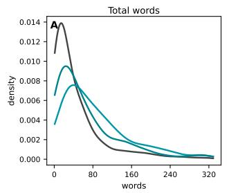

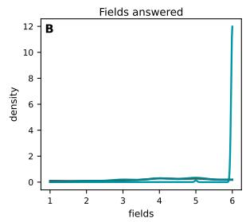  
Springer Nature Social Media Survey 2017 overlay: human + AI augmenters (agent\_fill, test split)

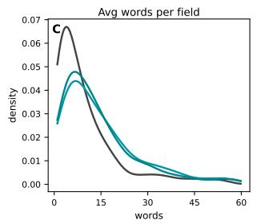

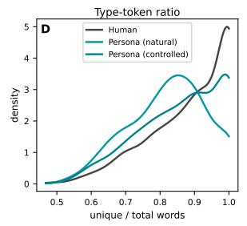

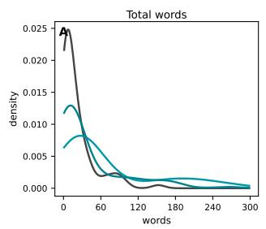

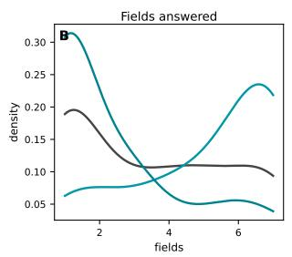

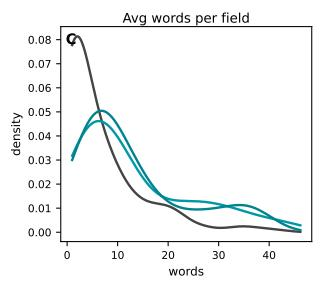

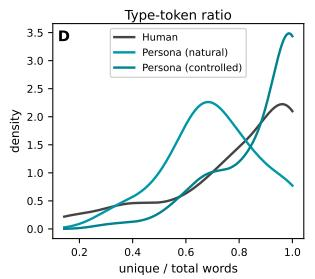  
OSMI Mental Health in Tech Survey 2017 2018 overlay: human + AI augmenters (agent\_fill, test split)

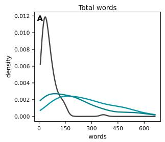

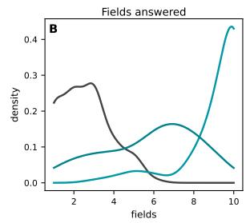

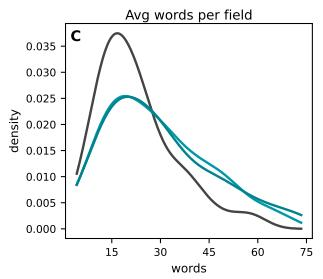

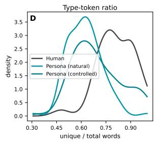  
Figure 3: Per-respondent behavioural-stats comparison (human vs persona-grounded AI under four prompting modes) across phd2019 (top), springer2017 (middle), and osmi\_mh (bottom). Four panels each: total words, fields answered, average words per field, type–token ratio (TTR).

OSMI agent\_fill behavioural cues across persona-simulator backbones  
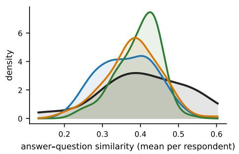

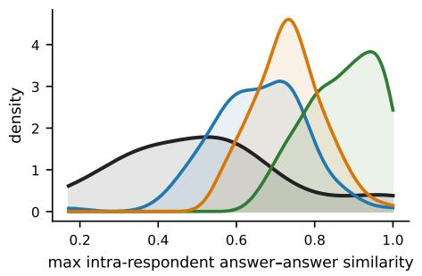  
uman (n=107) Persona (Sonnet 4.6) (n=107) Persona (gpt-oss-120b) (n=107) Persona (Gemini-3-Flash)  
Figure 4: Cross-LLM behavioural cues on osmi\_mh: mean\_qa\_sim (left) and max\_aa\_sim (right) KDEs for human respondents and three persona-simulator backbones (Sonnet, gpt-oss-120b, Gemini-3-Flash). Sonnet and Gemini sit just to the right of the human distribution on mean\_qa\_sim, supporting the LLM-family-independent on-topic-ness cue; gpt-oss-120b exhibits a sharp max\_aa\_sim shift due to intra-respondent answer reuse.

<table><tr><td>Variant</td><td>Response</td></tr><tr><td colspan="2">Q1: Overall, how would you describe the academic system, based on your PhD experience so far?</td></tr><tr><td>Human LLM Revision</td><td>The system needs a complete overhaul.</td></tr><tr><td>Full Generation</td><td>A competitive yet vibrant environment. Honestly, it's a bit of a love-hate thing – lots of pressure and red tape, but also decent mentorship and some</td></tr><tr><td>Agentic (natural)</td><td>cool collaborations when you find the right people.</td></tr><tr><td>Agentic (con- trolled)</td><td>Outdated and honestly not in tune with global standards – supervision is lacking too. Idealistic but disconnected from industry, I think. there's real freedom to explore ideas which I genuinely enjoy, but the workload expectations are pretty unrealistic.</td></tr><tr><td>Agentic (length- rest.) Agentic</td><td>Kinda disconnected from industry, which bothers me. And there's alot of unpaid work wrapped up as “opportunity" – it gets old pretty fast. Its quite rigid and honestly pretty disconnected from industry. The RA work just piles up and your actual</td></tr><tr><td>(com- bined)</td><td>research suffers. Q2: Is there anything else not mentioned that has concerned you since you started your PhD?</td></tr><tr><td colspan="2">Human</td></tr><tr><td></td><td>Inadequate or lack of expert supervisors/mentors to guide in the doctoral study and out of date curriculum which is not in tune with global standards as well as too much work load giving little room for research.</td></tr><tr><td>LLM Revision Full Generation</td><td></td></tr><tr><td>Agentic (natural)</td><td>Workload honestly, and the resources here are very limited.</td></tr><tr><td>Agentic (con- trolled)</td><td>The RA role honestly takes up way more time than it should, and it directly cuts into my research hours.</td></tr><tr><td>Agentic (length-</td><td>The RA work takes up way more time than it should, its hard to focus on my own research rn.</td></tr><tr><td>rest.) Agentic (com-</td><td>The RA workload honestly. It eats into research time more than I expected.</td></tr><tr><td>bined)</td><td></td></tr><tr><td colspan="2">Q3: With hindsight, what one thing do you wish you'd known when you started your PhD?</td></tr><tr><td>Human LLM Revision</td><td>That it is better to study outside my environment.</td></tr><tr><td>Full Generation</td><td>Manage my time more wisely and act on it.</td></tr><tr><td></td><td>I wish I'd known that managing expectations and setting realistic milestones is crucial – lots of people dive into research without a clear plan.</td></tr><tr><td>Agentic (natural) (con-</td><td>That doing a PhD abroad would have been a much better option for me. How much the RA role would eat into my actual research time. would've pushed back before agreeing to</td></tr><tr><td>Agentic trolled)</td><td>anything.</td></tr><tr><td>Agentic (length- rest.)</td><td>That RA commitments can quietly swallow your entire schedule if you dont set boundaries early on.</td></tr><tr><td>Agentic (com- bined)</td><td>Time management is harder than you expect, especially when RA duties keep creeping in.</td></tr><tr><td colspan="2">Q4: What type of career are you interested in pursuing after your degree?</td></tr><tr><td>Human</td><td>Academia.</td></tr><tr><td>LLM Revision</td><td>University academic staff.</td></tr><tr><td>Full Generation</td><td>I'm aiming for a data-science/AI role in the tech industry, preferably as a machine-learning engineer.</td></tr><tr><td>Agentic (natural) Agentic (con-</td><td>Academic career, ideally in a university setting. R&amp;D, something that bridges academia and industry. I dont wanna stay purely in academia tbh.</td></tr><tr><td>trolled) Agentic (length-</td><td>R&amp;D, something that bridges academia and industry.</td></tr><tr><td>rest.) Agentic (com-</td><td>R&amp;D, bridging academia and industry.</td></tr><tr><td>bined) Q5: Any more comments?</td><td></td></tr><tr><td colspan="2">Human</td></tr><tr><td>LLM Revision</td><td>No.</td></tr><tr><td>Full Generation Agentic (natural)</td><td></td></tr><tr><td>Agentic (con-</td><td>Nothing much more to add, it's been a frustrating experience overall.</td></tr><tr><td>trolled)</td><td>Just that the RA workload issue is something universities need to take seriously.</td></tr><tr><td>Agentic (length- rest.)</td><td>Not really, I think I covered the main stuff.</td></tr><tr><td>Agentic (com- bined)</td><td>Not really. Just hope the findings are useful for improving PhD structures.</td></tr><tr><td colspan="2">Q6: Overall, what do you enjoy most about life as a PhD student?</td></tr><tr><td>Human</td><td>Knowing I will have a chance to use my skills in a non-research science job.</td></tr><tr><td>LLM Revision</td><td>University/Academic Environment.</td></tr><tr><td>Full Generation</td><td>I love the intellectual freedom – getting to dive deep into topics I'm really passionate about.</td></tr><tr><td>Agentic (natural)</td><td>Not much honestly, maybe the independence sometimes.</td></tr><tr><td>Agentic (con- trolled)</td><td>The creative side of it, honestly. getting to dig into a problem that actually interests me.</td></tr><tr><td>Agentic (length-</td><td>The freedom to explore ideas. And honestly the creative side of research.</td></tr><tr><td>rest.) Agentic (com- bined)</td><td>The creative side of research, honestly. Coming up with ideas that could actually matter in industry.</td></tr></table>

Table 21: Qualitative example 1 (Q1–Q3) — Nature PhD Students Survey 2019, respondent SNAP 2015 SHIFT (persona persona\_476). Em-dashes mark variants where no response was produced; (repr.) marks Revision/Full Generation outputs taken from another respondent (50% per-field sampling in these two pipelines).

Table 22: Qualitative example 1 (Q4–Q6), continued.

<table><tr><td>Variant</td><td>Response</td><td></td></tr><tr><td colspan="3">Q1: Are there any other tasks you use social media/SCN for, in relation to your work?</td></tr><tr><td>Human LLM Revision</td><td></td><td>to stay up-to-date on the latest advances in my areas of research. Fortunately, I can find clips and movies related to my research topic on social media. (repr.)</td></tr><tr><td>Full Generation</td><td></td><td>I also use it for recruiting candidates, posting conference updates, and staying on top of what competitors</td></tr><tr><td></td><td></td><td>are doing. (repr.) Monitoring my digital presence and occasionally engaging with science communication to non-specialist</td></tr><tr><td>Agentic (natural)</td><td></td><td>audiences, which I find aligns well with Open Science goals.</td></tr><tr><td>Agentic trolled)</td><td>(con-</td><td>Monitoring field discussions and curating content for science communication to broader audiences. Also building a consistent professional online presence – honestly quite useful for Open Science visibility.</td></tr><tr><td>Agentic rest.)</td><td>(length-</td><td>Keeping up with open science discussions and policy.</td></tr><tr><td>Agentic bined)</td><td>(com-</td><td>Building professional visibility and staying updated on field developments.</td></tr><tr><td colspan="3">Q2: Comments on the usefulness of SCN for sharing professional content? (1) building one&#x27;s own brand, value, reputation – building one&#x27;s own professional E-persona; I consider this</td></tr><tr><td>Human</td><td></td><td>a very important aspect of everyone&#x27;s career in this digital age. (2) supporting / promoting Open Science – making scientific information available to a wide audience.</td></tr><tr><td>LLM Revision</td><td></td><td>I don&#x27;t find social media particularly useful for this, since it still has to earn credibility—except in a few cases, of course. (repr.)</td></tr><tr><td>Full Generation</td><td></td><td>Social media is useful for getting quick updates and connecting with peers, but the sheer volume of content can make it hard to find really relevant professional info. (repr.)</td></tr><tr><td></td><td>Agentic (natural)</td><td>Sharing content through SCNs has been pretty effective for me – preprints, conference talks, and outputs that might otherwise sit behind paywalls reach a broader audience.</td></tr><tr><td>Agentic</td><td>(con-</td><td>Sharing papers and preprints through SCNs has been effective for reaching audiences beyond my immediate network. it&#x27;s also a good way to establish visibility for Open Science outputs.</td></tr><tr><td>trolled) Agentic</td><td>(length-</td><td>Useful for reaching audiences beyond the journal.</td></tr><tr><td>rest.) Agentic bined)</td><td>(com-</td><td>Useful for reaching audiences beyond traditional publishing channels, especially for open access content.</td></tr><tr><td colspan="3">Q3: Anything that publishers could provide or improve to help your professional use of SCN?</td></tr><tr><td>Human</td><td></td><td>perhaps present more information on science &amp; policy, funding opportunities via social media channels (more emphasis on sharing news &amp; views, commentaries, blog articles related to these fields).</td></tr><tr><td>LLM Revision</td><td></td><td>Pop-ups should be blocked. Instead, send an email—perhaps offering a free reading trial—to encourage users. (repr.)</td></tr><tr><td>Full Generation</td><td></td><td>A unified scheduling tool with clearer analytics and a way to filter out irrelevant content would be super helpful. (repr.)</td></tr><tr><td>Agentic (natural)</td><td></td><td>Better integration between journal platforms and SCNs would help – something like automatic DOI-linked sharing options at point of publication. Open access by default would also do more than any platform feature.</td></tr><tr><td>Agentic trolled)</td><td>(con-</td><td>Better integration between journal platforms and SCNs – making it easier to share newly published work with a single click and track engagement metrics.</td></tr><tr><td>Agentic rest.)</td><td>(length-</td><td>Better integration between journal platforms and SCNs, and clearer guidelines on sharing preprints/accepted manuscripts.</td></tr><tr><td>Agentic bined)</td><td>(com-</td><td>Better integration between journal platforms and SCNs for sharing publications directly.</td></tr><tr><td colspan="3">Q4: Any further comments on your professional use of social media/SCN?</td></tr><tr><td>Human</td><td></td><td></td></tr><tr><td>LLM Revision</td><td></td><td>I use it mainly for networking and staying up-to-date – LinkedIn for industry news and Twitter for quick</td></tr><tr><td>Full Generation</td><td></td><td>updates. (repr.) The main shift I&#x27;ve noticed is that maintaining a professional digital presence feels less optional than it did</td></tr><tr><td></td><td>Agentic (natural)</td><td>– it&#x27;s increasingly part of how research impact gets measured and recognised, whether we like it or not.</td></tr><tr><td>Agentic trolled)</td><td>(con-</td><td>Publishers and platforms could do more to recognise SCN activity as a legitimate form of scholarly output – engagement metrics and public communication efforts are still largely invisible in academic evaluation.</td></tr><tr><td>Agentic rest.)</td><td>(length-</td><td>More open access by default would help a lot — it makes sharing research far easier.</td></tr><tr><td>Agentic bined)</td><td>(com-</td><td>No strong further comments — Open Science advocacy is where I find these tools most valuable</td></tr></table>

Table 23: Qualitative example 2 — Springer Nature Social Media Survey 2017, respondent R\_2cvJRdYeEQWgy0z (persona persona\_042). Four questions, seven variants each.

<table><tr><td>Variant</td><td>Response</td></tr><tr><td colspan="2">Q1: Describe the conversation you had with your employer about your mental health.</td></tr><tr><td>Human</td><td>I disclosed my OCD/anxiety issues, and I felt safe and heard. Next steps included allowing for any accommodations I needed, including working from home more often.</td></tr><tr><td>LLM Revision</td><td>I have severe anxiety and ADD, and I take medication for both. Occasionally this can affect my work performance, but I make a concerted effort to prevent any impact. (repr.)</td></tr><tr><td>Full Generation</td><td>I told my manager I was feeling burnt out and pretty anxious. They were supportive, cut back my workload, gave me flexible hours, and pointed me to the EAP. (repr.)</td></tr><tr><td>Agentic (natural)</td><td>Told my manager during a rough stretch. they were pretty understanding, made some small adjustments – honestly better than I expected.</td></tr><tr><td>Agentic (con- trolled)</td><td>Only disclosed to folks I was pretty confident would be supportive, and honestly it went better than I expected each time.</td></tr><tr><td>Agentic (length- rest.) Agentic</td><td>Only brought it up with my manager – they were pretty understanding. we worked out some flexibility around deadlines.</td></tr><tr><td>(com- bined)</td><td>Kept it fairly high-level with my manager – mentioned I was dealing with some anxiety and might need flexibility.</td></tr><tr><td colspan="2">Q2: Describe the conversation with coworkers about your mental health. Human It's always been well received, I've felt supported. However, I've only disclosed to folks who I anticipated</td></tr><tr><td></td><td>would be supportive.</td></tr><tr><td>LLM Revision Full Generation</td><td>I have struggled with depression and panic attacks. (repr.) I mentioned to a couple of teammates that I've been feeling pretty anxious lately. One suggested grabbing</td></tr><tr><td></td><td>coffee; another just said, “Take care of yourself."(repr.)</td></tr><tr><td>Agentic (natural) Agentic (con-</td><td>Only disclosed to folks I was pretty sure would be okay with it. they were supportive, no drama. Similar story – only brought it up with a couple people I trusted. they were pretty understanding, no</td></tr><tr><td>trolled) Agentic (length-</td><td>awkwardness about it. Only told a couple folks I trusted. they were supportive, no weird reactions or anything.</td></tr><tr><td>rest.) Agentic (com-</td><td>Only disclosed to folks who I anticipated would be supportive. those conversations went fine.</td></tr><tr><td>bined)</td><td></td></tr><tr><td colspan="2">Q3: Describe the conversation your coworker had with you about their mental health.</td></tr><tr><td>Human</td><td>It was mentioned that this colleague was suffering from depression, and I was asked for advice on how best to support.</td></tr><tr><td>LLM Revision</td><td>I was told that this colleague was dealing with depression, and I was asked for advice on the best ways to support them.</td></tr><tr><td>Full Generation</td><td>They said they've been feeling pretty overwhelmed and anxious lately, especially with the workload. They mentioned they're seeing a therapist and have started medication, and asked if I could be flexible with deadlines.</td></tr><tr><td colspan="2">Agentic (natural)</td></tr><tr><td>Agentic (con- trolled)</td><td>someone listen. A coworker opened up to me about burnout and some anxiety. I just tried to listen, not make it weird.</td></tr><tr><td>Agentic (length- rest.)</td><td>They mentioned they were struggling with burnout, kind of just venting. I just listened, didn't make it a big</td></tr><tr><td>Agentic (com- bined)</td><td>deal. A colleague mentioned they were struggling with burnout. I just listened, didn't make it weird.</td></tr><tr><td colspan="2">Q4: Describe the conversation with your previous employer about your mental health.</td></tr><tr><td>Human</td><td>I disclosed my OCD/anxiety to my whole team. It was awkward, but they were ultimately caring and supportive.</td></tr><tr><td>LLM Revision</td><td>I disclosed my OCD and anxiety to my entire team. Although it felt awkward at first, they responded with care and support.</td></tr><tr><td>Full Generation</td><td>I sat down with my manager and HR after noticing I was getting overwhelmed and told them I was struggling with anxiety and burnout. They were pretty understanding – my manager cut back my overtime and let me work from home a couple days a week.</td></tr><tr><td>Agentic (natural) Agentic (con-</td><td>Pretty similar experience – disclosed to my direct manager when things got tough, they were receptive. Only disclosed to one manager there, someone I had a good read on. they were fine about it, offered some</td></tr><tr><td>trolled)</td><td>flexibility which helped.</td></tr><tr><td>Agentic (length- rest.)</td><td>Similar experience – told my manager at my previous job when I needed accommodations.</td></tr><tr><td>Agentic (com- bined)</td><td>Similar experience – mentioned I had OCD and anxiety, kept it brief. My previous manager was supportive, offered some schedule flexibility.</td></tr><tr><td colspan="2">Q5: Describe the conversation with your previous coworkers about your mental health.</td></tr><tr><td>Human LLM Revision</td><td>Again, I only disclosed when I felt safe enough to do so. I felt supported and heard by those folks.</td></tr><tr><td></td><td>I told a few coworkers that I was seeing a therapist, both to help break down stigma and to encourage them to seek mental-health support. (repr.)</td></tr><tr><td>Full Generation</td><td>I was pretty open about feeling burnt out and anxious. A few teammates just said “take care of yourself, we've all been there."(repr.)</td></tr><tr><td>Agentic (natural) Agentic (con-</td><td>Pretty similar to my current job honestly – only told a few people I trusted.</td></tr><tr><td>trolled)</td><td>Similar to current job – only disclosed to folks who I anticipated would be supportive.</td></tr><tr><td>Agentic (length- rest.)</td><td>Kept it pretty limited, only disclosed to folks who I anticipated would be supportive.</td></tr><tr><td>Agentic (com- bined)</td><td>Only told one or two people. reactions were fine, they didn't make a thing of it.</td></tr><tr><td colspan="2">Q6: What could the industry/employers do to improve mental health support?</td></tr><tr><td>Human LLM Revision</td><td>Obsessive-Compulsive Disorder. I have been diagnosed with Obsessive-Compulsive Disorder (OCD).</td></tr><tr><td>Full Generation</td><td>Employers could make mental-health resources a regular part of the work culture – offering free counseling,</td></tr><tr><td>Agentic (natural)</td><td>flexible schedules, and clear policies that reduce stigma. More training for managers on how to actually respond – not just policies on paper.</td></tr><tr><td>Agentic (con-</td><td>More openness from leadership would go a long way – if managers talk about it, it normalizes things for</td></tr><tr><td>trolled) Agentic (length-</td><td>everyone. More openness at the leadership level, I think. concrete stuff like flexible time off and EAP that people</td></tr><tr><td>rest.) Agentic (com- bined)</td><td>actually know about. More openness at the leadership level would help – if managers talk about it, it normalizes things.</td></tr></table>

Table 24: Qualitative example 3 (Q1–Q3) — OSMI Mental Health in Tech 2017–18, respondent osmi\_2018\_0200 (persona persona\_035).

Table 25: Qualitative example 3 (Q4–Q6), continued.