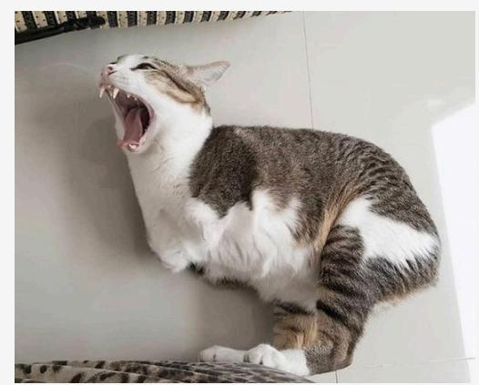
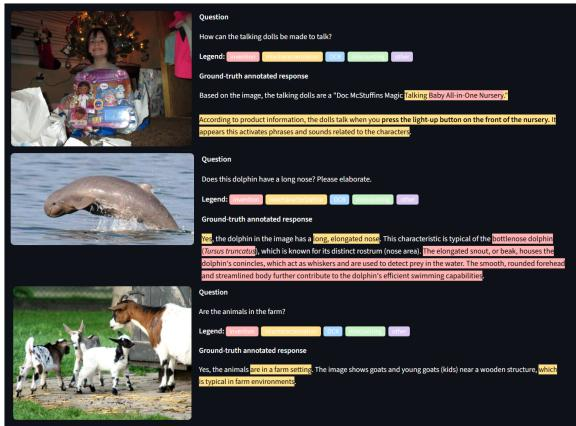
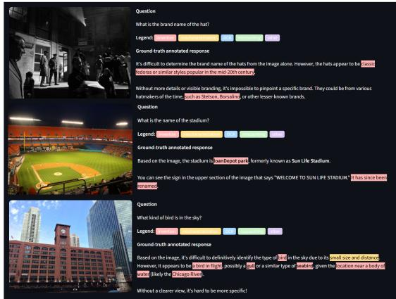

# Vroom-Vroom at SHROOM-Visions: A Multi-Judge Committee for Detecting Hallucinated Spans in Vision-Language Outputs

Toqeer Ehsan, Nico Penttilä, Richard Schmidt, Arash Hajikhani, Victoria Palacin Reliable Intelligence Team, Physical AI, VTT Technical Research Centre of Finland {firstname.lastname}@vtt.fi

## Abstract

This paper describes our submission to the SHROOM-Visions shared task on detecting and classifying hallucinated character spans in vision-language model outputs across four languages. We employ several fine-tuned visionlanguage models as independent annotators and combine their span predictions through character-level majority voting, and additionally explore activation probes. The approach ranks first in three of four languages and places on the podium in every language and metric. Our analysis indicates that disagreement among diverse models tracks disagreement among human annotators.

## 1 Introduction

Vision-Language Models (VLMs) are increasingly used to answer questions, describe scenes, and read text in images. Like text-only models, they often produce fluent and confident outputs that are factually unsupported. In visual settings, such errors take distinct forms: invention, miscounting, relational errors, misinterpretation, or characterrecognition errors (Liu et al., 2024; Bai et al., 2025b). Their growing role in deployed systems motivates automatic and span-precise error detection as a safeguard (Huang et al., 2025; Zhang et al., 2025).

Predicting hallucination at the character level is particularly challenging, as human evaluators likewise disagree on whether a span is hallucinated and where it begins and ends (Mickus et al., 2024; Vázquez et al., 2025). This disagreement, reflecting inherent ambiguity, sets a practical upper bound on detector performance. We present multiple detection approaches in the context of the SHROOM-Visions (Vázquez et al., 2026) shared task1, a supervised hallucination detection challenge that is built on a multi-annotator, span-level benchmark covering English, French, Italian, and Chinese (Mickus

  
Ground-truth annotated response: Yes, the cat in the image has four legs. We can observe that it is standing with its front and hind legs visible. Cats typically have four legs, which they use for walking, running, and climbing. In this image, all four legs are evident as the cat is in a dynamic pose, likely stretching or in the middle of a movement.

VLM Committee: Yes, the cat in the image has four legs. We can observe that it is standing with its front and hind legs visible. Cats typically have four legs, which they use for walking, running, and climbing. In this image, all four legs are evident as the cat is in a dynamic pose, likely stretching or in the middle of a movement.

Multi-layer Probes: Yes, the cat in the image has four legs. We can observe that it is standing with its front and hind legs visible. Cats typically have four legs, which they use for walking, running, and climbing. In this image, all four legs are evident as the cat is in a dynamic pose, likely stretching or in the middle of a movement.

Figure 1: Illustration of hallucination predictions from multilayer probe and VLM ensemble against human annotations.

et al., 2026). Systems are compared for each language using character-level overlap and confidence correlation against the human annotator’s gold set of real VLM responses. Figure 1 illustrates a human hallucination annotation alongside model predictions.

We explore two parallel approaches: fine-tuned VLMs treated as independent judges combined through character-level voting, and VLM activation probes trained on internal states. Our contributions are twofold: (i) a committee aggregating multi-model span predictions into character-level probabilities; (ii) evidence that multi-model diversity reflects annotation disagreement. Our strategy ranks first in three of four languages.

## 2 Related Work

Vision hallucination benchmarks: We situate the SHEEP dataset among vision-hallucination datasets along two axes: sourcing of ground truth and hallucination definition. Automated ground truth creation, including synthetic vision-responses (Xie et al., 2026; Zhang et al., 2024a) or error-incaption augmentation (Shekhar et al., 2017), has been criticized for distributional mismatch (Mickus et al., 2026). In contrast, human-sourced annotations of naturally occurring hallucinations, to which SHEEP belongs, can capture authentic and emerging hallucination types, but at the price of annotation and span inconsistencies. This can partially be addressed with the explicitness of the hallucination definition. Existing benchmarks separate descriptive errors, which violate image-grounded features, from errors in visual reasoning (Guan et al., 2024; Seth et al., 2025). With SHEEP belonging to the former descriptive group, additional variation comes with the definition of boundaries, particularly including factually correct elaboration (Gunjal et al., 2024), the handling of hard-to-verify, specialized world knowledge, or the inclusion of decoding errors, such as repetition, template, or code switching errors (Ye-Bin et al., 2025), that SHEEP captures under OTHER.

Vision hallucination detection: A smaller body of model-free approaches uses reference captions under a closed-world assumption to identify violations (Rohrbach et al., 2018) or use betweenrollout consistency as uncertainty proxy (Zhang et al., 2023). In contrast, an extensive body of literature has been concerned with utilizing a secondary VLM to detect hallucinations, either through (i) VLM-as-a-Judge configurations or by (ii) Analysis of Internal Representation. Instruction-following variants include factual decomposition (Jing et al., 2024), inter-judge consistency (Zhang et al., 2024b), or VLM synthesis with smaller attribute models (Li et al., 2025). Interpretability-based methods include uncertainty calibration (Geng et al., 2024; Li et al., 2024), which is less effective for hallucinations driven by the language modeling prior (Shoby et al., 2026), but more prominently, supervised methods using visual attention-based attributes (Wang et al., 2026), embedding representations (Chen et al., 2024), or between-layer dynamics (Nath et al., 2026).

## 3 Methodology

EDA and training split: To inform subsequent architecture, training, and prompt design, we performed exploratory data analysis (EDA), surfacing differences at both the hallucination and annotation levels. We find that the annotations are skewed toward invention and mischaracterization as dominant classes (80-88% of all errors), with severe correlation of error occurrence, where the 10th percentile with the most erroneous responses holds above 50% of all error characters. Most challenging is inter-annotator disagreement: 80-86% of hallucination characters are marked by only one of three annotators across languages, motivating the subsequent qualitative analysis of annotation patterns. For the SHEEP dataset, hallucinations are defined as "unsupported by or contradictory to the [...] input image" (Mickus et al., 2026), leaving considerable uncertainty regarding both boundary specifications and the verifiability of specialized parametric knowledge. Regarding hallucination boundaries, one inconsistency is the marking of accompanying, factually correct descriptive elaboration of incorrectly identified attributes. Another concerns hard-to-verify but factually correct general knowledge. Prominent examples include the correct inference of geolocations that, while theoretically grounded in the image, are hard to verify without a literal display and were subsequently annotated as hallucinations. Examples are displayed in Figures 2 and 3. To account for the data distribution and the reuse of source images, we perform a train, development, test split that groups by image ID and stratifies by error type on a span, not character level.

## 3.1 Vision-Language Judges

For the training sets and few-shot examples, we converted each annotation into an inline representation, i.e., <hall label="LABEL" prob="PROB">hallucinated text</hall>. This allowed VLM judges to produce predictions in the same format as their input. We simplified the gold annotations by removing overlapping spans and mapped agreement scores to three probability classes: approximately 0.33, 0.67, and 1.0. We retained samples whose spans are all between one and one hundred characters, excluding unusually long spans. Predicted markup was converted back to character offsets, with each span assigned the probability of its confidence class. For each evaluation item, we retrieved six in-context examples from the training set using weighted cosine similarity.2 We used a 50:30:20 ratio for image, response, and prompt similarity, respectively, and selected demonstrations containing at least three hallucination spans. For fine-tuning, we constructed three distinct training sets to decorrelate the VLM judges.

We used five VLM judges from four backbone families: Gemma-4 (Gemma Team, 2026), Mistral-Small (Mistral AI, 2025), Qwen3-VL (Bai et al., 2025a), and a second Qwen variant (Qwen Team, 2026), providing diverse inductive biases. In the few-shot setting, each model received the image, question, and response with six in-context demonstrations retrieved by similarity, and inserted inline markup around unsupported spans. In the fine-tuning setting, we adapted each model with LoRA (Hu et al., 2022) on inline-annotated data, using a distinct sample per model. All judges produced responses with identified hallucination labels and confidence probabilities. Prompt templates, retrieval details, and LoRA hyperparameters are provided in Appendix D.

## 3.2 Internal State Probing

Probing refers to the family of techniques where language models’ internal activations are extracted and analyzed. Prior work has successfully used probes to study representation of values (Shen et al., 2025) and concepts (Abdelwahab et al., 2026) of LLMs; they are a popular approach in LLM monitoring (McKenzie et al., 2025) and existing work has found that internal states are a promising direction for detecting hallucinations (Orgad et al., 2025; Kossen et al., 2024; Bar-Shalom et al., 2025; Han et al., 2025; Kim et al., 2025). Inspired by these results, our team trained multiple classes of probes of ranging complexity on the internal states of both Qwen3-VL-4B3 and Qwen3-VL-8B4.

All of the probes feature transformer encoder layers and down projection before the classification heads in order to facilitate horizontal information flow between tokens to better incorporate the span-based nature of the task. We refer to this variant as Multi-layer, since the probe input is a learned mixture of all layers rather than a single selected layer. So given $f ^ { \bar { l } } \in \Re ^ { n \times D }$ being the hidden state extracted from layer l from the pretrained VLM, the classification heads operate on $z ^ { l } =$ $p r o j e c t i o n ( e n c o d e r ( f ^ { l } ) ) . ~ z ^ { l } \in \mathfrak { R } ^ { n \times d } , d < < D$ is then fed to classification head(s) to produce pertoken hallucination estimations $\hat { y } = h e a d ( z _ { \theta } ^ { l } ) , \hat { y } \in$ $\mathfrak { R } ^ { n \times 5 } , \hat { y } _ { i , j } \in [ 0 , 1 ]$ . The probes were optimized with binary cross entropy loss.

We initially trained a linear classification head to estimate per-type probability of the token being hallucinated only on the response token positions. Switching the probe’s linear layer to a twolayer perceptron yielded small improvements on the baseline. A large improvement was achieved by compressing the image-token position embeddings to a smaller number of mean-pooled tokens and then cross attending over the mean-pooled representations. Increasing the number of compressed tokens yielded diminishing improvements after 256 tokens. We next added auxiliary heads with their respective losses to the training. Namely, we added start and end boundary logits, sample level logit and a per-token hallucination logit to the existing hallucination type classification head, with the final prediction being gated by the product of the sample level logit and per-token hallucination logit. We refer to this variant as Multi-stage, since the type prediction is gated by two preceding decisions rather than produced in a single step. Finally, we incorporated the per-position residual stream changes in the input to the probe, inspired by existing work (Kim et al., 2025) and the intuition that hallucinations may manifest as language priors overriding the visually grounded representations. This was implemented by adding a difference of layers $h ^ { l } = f ^ { \hat { l } } - f ^ { l - 1 } , l \in L$ to the hidden states: $\dot { f ^ { L } } =$ $[ [ f ^ { 0 } , 0 ] , [ f ^ { 1 } , f ^ { 1 } - f ^ { 0 } ] , . . . [ f ^ { l } , f ^ { l } - f ^ { l - 1 } ] ]$ , passing $f ^ { L }$ through layer-wise encoder $h ^ { L } = e n c o d e r ( f ^ { L } )$ from which we acquire scores for each layer $s ^ { l } =$ $w h ^ { l } + b$ and further pass them through softmax $\begin{array} { r } { a ^ { l } = \frac { e x p ( s ^ { l } ) } { \sum _ { k } e x p ( s ^ { k } ) } } \end{array}$ which are used to create a weighted average of the layers which gets down-projected and functions as the replacement of $f ^ { l }$ when creating the input z to the classification heads: $z ^ { L } =$ projection(encoder(projection(P alhl))).

## 3.3 Committee Aggregation

Judges often disagree on span boundaries, so we first project each judge’s spans onto characters: for character $^ { c , }$ judge j’s confidence $p _ { j } ( c )$ and label $\ell _ { j } ( c )$ are those of its highest-confidence covering span, and $p _ { j } ( c ) = 0$ where no span covers c. Judges can then be compared position by position irrespective of their segmentation. We count the judges flagging each character, $\begin{array} { r } { v ( c ) = \sum _ { j = 1 } ^ { N } \mathbb { I } _ { j } ( c ) } \end{array}$ and sum their confidences:

<table><tr><td colspan="2">Approach</td><td colspan="4">Cor_lbl</td><td colspan="4">Cor</td><td colspan="4">IoU</td></tr><tr><td colspan="2">Model</td><td>EN FR</td><td></td><td>IT</td><td>ZH</td><td>EN</td><td>FR</td><td>IT</td><td>ZH</td><td>EN</td><td>FR</td><td>IT</td><td>ZH</td></tr><tr><td rowspan="5">VVILMS</td><td>Gemma-4-ft</td><td>0.3772</td><td>0.3897</td><td>0.4153</td><td>0.4575</td><td>0.4276</td><td>0.4556</td><td>0.4952</td><td>0.5173</td><td>0.3734</td><td>0.4124</td><td>0.4422</td><td>0.4751</td></tr><tr><td>Mistral-small-ft</td><td>0.3384</td><td>0.3414</td><td>0.3750</td><td>0.3912</td><td>0.3734</td><td>0.4031</td><td>0.4625</td><td>0.4451</td><td>0.3229</td><td>0.3589</td><td>0.4224</td><td>0.4136</td></tr><tr><td>Qwen3.6-ft</td><td>0.3738</td><td>0.3759</td><td>0.3729</td><td>0.4359</td><td>0.4127</td><td>0.4287</td><td>0.4445</td><td>0.4774</td><td>0.3691</td><td>0.3842</td><td>0.3935</td><td>0.4395</td></tr><tr><td>Qwen3-vl-ft-3shot</td><td>0.3904</td><td>0.3639</td><td>0.3751</td><td>0.4497</td><td>0.4344</td><td>0.4272</td><td>0.4729</td><td>0.5042</td><td>0.3721</td><td>0.3825</td><td>0.4166</td><td>0.4599</td></tr><tr><td>Gemma-4-6shot</td><td>0.3117</td><td>0.3329</td><td>0.3222</td><td>0.4155</td><td>0.3890</td><td>0.4149</td><td>0.4256</td><td>0.4991</td><td>0.3706</td><td>0.4099</td><td>0.4207</td><td>0.4659</td></tr><tr><td colspan="2">Votes</td><td>0.3227 0.3569</td><td>0.3671</td><td></td><td>0.3927</td><td>0.4125 0.4722</td><td></td><td>0.4911</td><td>0.4944</td><td>0.3575</td><td>0.4230</td><td>0.4225</td><td>0.4421</td></tr><tr><td rowspan="3">Comtet</td><td>Votes ≥ 2</td><td>0.3872</td><td>0.3979</td><td>0.4246</td><td>0.4669</td><td>0.4594</td><td>0.4827</td><td>0.5355</td><td>0.5407</td><td>0.3932</td><td>0.4322</td><td>0.4756</td><td>0.4936</td></tr><tr><td>Votes ≥3</td><td>0.3903</td><td>0.4019</td><td>0.4125</td><td>0.4709</td><td>0.4437</td><td>0.4776</td><td>0.5047</td><td>0.5229</td><td>0.3786</td><td>0.4145</td><td>0.4443</td><td>0.4737</td></tr><tr><td>Votes ≥ 4</td><td>0.3803 0.3755</td><td></td><td>0.3999</td><td>0.4575</td><td>0.4220</td><td>0.4221</td><td>0.4665</td><td>0.4938</td><td>0.3588</td><td>0.3664</td><td>0.4075</td><td>0.4496</td></tr><tr><td rowspan="4">Probes</td><td>Multi-layer (4B)</td><td>0.3176</td><td>0.3230</td><td>0.3410</td><td>0.3903</td><td>0.4044</td><td>0.4034</td><td>0.4503</td><td>0.4864</td><td>0.3801</td><td>0.3835</td><td>0.4017</td><td>0.4551</td></tr><tr><td>Multi-stage (4B)</td><td>0.3314</td><td>0.3267</td><td>0.3429</td><td>0.4007</td><td>0.4101</td><td>0.4087</td><td>0.4538</td><td>0.4881</td><td>0.3813</td><td>0.3929</td><td>0.4033</td><td>0.4607</td></tr><tr><td>Multi-layer (8B)</td><td>0.3170</td><td>0.2967</td><td>0.3251</td><td>0.3940</td><td>0.3940</td><td>0.4133</td><td>0.4558</td><td>0.4842</td><td>0.3744</td><td>0.3978</td><td>0.4081</td><td>0.4594</td></tr><tr><td>Multi-stage (8B)</td><td>0.3236</td><td>0.3242</td><td>0.3404</td><td>0.4076</td><td>0.3933</td><td>0.4290</td><td>0.4655</td><td>0.4977</td><td>0.3764</td><td>0.4091</td><td>0.4173</td><td>0.4616</td></tr></table>

Table 1: Language-wise scores against all three metrics on the test split of SHROOM-Visions’ train set. Multi-layer probes read a learned softmax-weighted combination of all layers including residual-stream differences; Multi-stage probes add boundary, sample-level, and token-level heads and gate the type prediction on the latter two (§3.2).

$$
\mathrm { p r o b } [ c ] = \frac { 1 } { N } \sum _ { j = 1 } ^ { N } \mathbb { I } _ { j } ( c ) p _ { j } ( c ) ,\tag{1}
$$

where $\mathbb { I } _ { j } ( c )$ indicates whether judge j flags c and N is the number of judges. Dividing by N combines agreement with confidence; normalizing by v(c) would give the same value to a character flagged by one judge and by five, and the finer probability scale benefits the rank-based metrics. The predicted label is the category with the highest summed confidence. We retained characters with $v ( c ) \geq 2$ and merged maximal runs sharing a label and probability into spans, mirroring the gold labels, the union of three annotators. The rule is deliberately inclusive, since most gold spans carry only one annotator. Adding high-recall probes did not improve performance.

## 4 Results and Discussion

We evaluate using three metrics: correlation between predicted and empirical per-character hallucination probabilities (Cor), its per-label variant (Cor\_lbl), and character-level intersection-overunion (IoU). Table 1 reports per-language results on the labeled test split for individual judges, committee variants with different vote thresholds and the best performing probes. No judge performs best across all settings. Fine-tuned Gemma-4 and Qwen3-VL are strongest in most languages, but different judges lead on specific metrics. Probe scores are closely correlated with one another, suggesting that performance depends on the underlying activations rather than the probe architecture.

The committee outperforms every individual judge on Cor and IoU, the only exception being English Cor\_lbl, where Qwen3-vl-ft-3shot scores slightly higher. With votes ≥ 2, it achieves the best Cor and IoU across all four languages, showing that aggregation recovers recall lost by fine-tuned judges while suppressing single-judge false positives. The threshold shows a consistent pattern: the two-vote setup performs best for Cor and IoU, whereas the stricter votes $\geq 3$ slightly improves Cor\_lbl in three of four languages by increasing label precision at the cost of coverage. The addition of the probes to the ensemble does not yield improvements overall due to the high correlation of errors with existing approaches.

## 4.1 Evaluation on the Challenge Set

Table 2 shows the scores of the VLM committee on the unseen challenge set from the shared task for all languages. The votes $\geq 2$ configuration ranks first in French, Italian, and Chinese on the correlation metrics and second in English, placing on the podium for every language and metric. English performs the worst, as its longer responses reduce annotator agreement and limit achievable scores. Although the margin on the seen split is small, the votes $\geq 3$ configuration degrades performance for every language and metric on the challenge set, indicating a genuine difference rather than noise.

<table><tr><td></td><td>Votes Metrics</td><td>EN</td><td>FR</td><td>IT</td><td>ZH</td><td>Avg.</td></tr><tr><td rowspan="3">2 ΛI</td><td>Cor_lbl</td><td>0.4251</td><td>0.4738</td><td>0.4511</td><td>0.5040</td><td>0.4635</td></tr><tr><td>Cor</td><td>0.5334</td><td>0.5873</td><td>0.5628</td><td>0.6083</td><td>0.5730</td></tr><tr><td>IoU</td><td>0.4486</td><td>0.5150</td><td>0.4793</td><td>0.5344</td><td>0.4943</td></tr><tr><td rowspan="3">3 ΛI</td><td>Cor_lbl</td><td>0.4064</td><td>0.4509</td><td>0.4393</td><td>0.4988</td><td>0.4489</td></tr><tr><td>Cor</td><td>0.4965</td><td>0.5417</td><td>0.5300</td><td>0.5812</td><td>0.5373</td></tr><tr><td>IoU</td><td>0.4063</td><td>0.4644</td><td>0.4447</td><td>0.5112</td><td>0.4566</td></tr></table>

Table 2: Language-wise scores on the SHROOM-Visions challenge set from the VLM judge committee with votes ≥ 2 and ≥ 3. Scores with votes ≥ 2 are from shared task rankings.

<table><tr><td>System Gemma-4-ft</td><td></td><td>Inv.</td><td>MisCh. OCR</td><td>MisC.</td><td>Oth.</td></tr><tr><td>191 Cor</td><td>Mistral-small-ft Qwen3.6-ft Qwen3-vl-ft Gemma-4-6shot</td><td>0.208 0.144 0.182 0.186 0.194 0.235</td><td>0.178 0.157 0.112 0.176 0.181</td><td>0.446 0.249 0.399 0.280 0.379</td><td>0.409 0.266 0.365 0.365</td><td>0.082 0.106 0.036 0.039</td></tr><tr><td>Cor</td><td>Committee (≥2) Gemma-4-ft Mistral-small-ft Qwen3.6-ft Qwen3-vl-ft Gemma-4-6shot</td><td>0.335 0.282 0.276 0.324 0.338 0.397</td><td>0.208 0.316 0.259 0.231 0.293 0.329</td><td>0.449 0.502 0.341 0.534 0.430 0.454</td><td>0.320 0.399 0.409 0.266 0.364 0.362 0.383</td><td>0.057 0.089 0.204 0.231 0.133 0.208 0.273</td></tr><tr><td>∩oI</td><td>Committee (≥2) Gemma-4-ft Mistral-small-ft Qwen3.6-ft Qwen3-vl-ft Gemma-4-6shot Committee (≥2)</td><td>0.176 0.116 0.143 0.148 0.203 0.199 0.332</td><td>0.363 0.144 0.131 0.091 0.145 0.145 0.168</td><td>0.550 0.406 0.228 0.369 0.244 0.338 0.404</td><td>0.441 0.342 0.212 0.309 0.300 0.246 0.315</td><td>0.296 0.095 0.109 0.036 0.036 0.063 0.086</td></tr><tr><td>MAPL</td><td>Gemma-4-ft Mistral-small-ft Qwen3.6-ft Qwen3-vl-ft Gemma-4-6shot Committee (≥2)</td><td>0.361 0.352 0.348 0.498 0.309</td><td>0.342 0.357 0.366 0.342 0.466 0.318</td><td>0.379 0.440 0.378 0.422 0.447 0.310</td><td>0.334 0.446 0.349 0.356 0.475 0.305</td><td>0.331 0.328 0.355 0.354 0.394 0.336</td></tr></table>

Table 3: Label-wise scores on the test split of SHROOM-Visions’ train set. Cor\_lbl, Cor and IoU are higher-is-better; $\mathrm { M A E } _ { p }$ is the mean absolute difference between predicted and gold character probabilities (lower is better).

## 4.2 Label-wise Analysis

Table 3 breaks the official metrics down by hallucination label and adds $\mathrm { M A E } _ { p }$ , the mean absolute difference between predicted and gold character probabilities. The committee is strongest overall on all four measures, most clearly on the correlation metrics: it obtains the best Cor on every label and the best Cor\_lbl on three of five, raising Cor. A single judge emits only three confidence values, confining it to a coarse grid, whereas averaging over the committee yields a finer range closer to the empirical annotator agreement, reducing the $\mathrm { M A E } _ { p }$ . The picture is mixed for IoU, which depends only on which characters are marked: individual judges remain competitive on invention, OCR and miscounting, and the committee’s advantage comes from suppressing spans that only one judge proposes rather than from marking more text. Performance on other is low throughout, consistent with it being the least frequent and least consistently annotated category.

## 4.3 VLM Judge vs. Annotator Agreement

Judge agreement tracks human agreement. Table 4 groups characters by how many judges flagged them. The mean number of annotators who marked them rises monotonically from 0.11 at zero votes to 2.07 at five, with a Spearman correlation of 0.39 over characters and 0.51 at the record level. This supports our claim that model diversity reflects annotator disagreement and motivates the two-vote (≥2) threshold.

<table><tr><td>Judges flagging</td><td>Mean annotators</td><td>Characters</td></tr><tr><td>0</td><td>0.109</td><td>633,649</td></tr><tr><td>1</td><td>0.453</td><td>86,999</td></tr><tr><td>2</td><td>0.743</td><td>19,838</td></tr><tr><td>3</td><td>1.205</td><td>9,171</td></tr><tr><td>4</td><td>1.535</td><td>5,968</td></tr><tr><td>5</td><td>2.072</td><td>5,260</td></tr></table>

Table 4: Mean number of annotators marking a character, grouped by how many judges flagged it.

## 4.4 Committee vs. Probes

The two approaches trade accuracy against cost: the committee needs five forward passes through large fine-tuned VLMs, while a probe adds only a lightweight head over hidden states from a single pass. Probes match individual judges on IoU but trail the committee on the correlation metrics, making them preferable when the inference budget is the binding constraint.

## 5 Conclusion

We present a committee approach to multilingual hallucination span detection in vision-language models. Fine-tuned and few-shot judges independently identify unsupported spans, which are combined through character-level voting. Only corroborated spans are retained, while averaged confidences provide the probabilities used by the correlation metric. The system ranks first in three of four languages. The results show that activation probes can detect hallucinations from language model hidden states, but the results are highly dependent on the model from which the activations are collected. Currently, it is unclear whether probes offer mechanistic insight into hallucination or merely exploit surface linguistic features.

## Limitations

Our committee inherits the limitations of its individual judges. Long, fluent hallucinations not confidently detected by multiple models may fall below the two-vote threshold and remain undetected, particularly in the longer English responses where performance is weakest. We also do not explore image preprocessing: images vary considerably in resolution and are passed to the judges without normalization or aspect-ratio-aware transformation, which may affect grounding. The voting threshold is tuned on the labeled test split and applied unchanged to the challenge set, but may not generalize to other models, languages, or annotation schemes. Confidence scores are based on three discrete agreement classes rather than continuous estimates, limiting how precisely uncertainty can be represented. Finally, our analysis is limited to the four task languages and selected judges, and the aggregated predictions may not capture the full complexity of human annotator disagreement.

## Acknowledgments

This research was part of the Postdoctoral Programme for Research Institutes in Finland, funded by the Finnish Government. We used Claude (Anthropic) to assist with drafting and editing the paper and with code generation. All decisions, experiments, and results were designed and verified by the authors.

## Data and Code Availability

Our VLM committee code is available at https://github.com/toqeerehsan/vlm\_ hallucination\_detect and the fine-tuned checkpoints(v3) at https://huggingface.co/ QSTS-VTT. The SHEEP dataset is distributed by the task organizers.

## References

Mohamed Abdelwahab, Michelle Yu Collins, Sihan Chen, Yi Cheng Zhao, Zafarullah Mahmood, Jiading Zhu, Soliman Ali, and Jonathan Rose. 2026. What are They Thinking? Delineation, Probing, and Tracking of Concepts in LLMs. In Proceedings of the 6th Workshop on Trustworthy NLP (TrustNLP 2026), pages 121–179, San Diego, California. Association for Computational Linguistics.

Shuai Bai, Yuxuan Cai, Ruizhe Chen, et al. 2025a. Qwen3-VL Technical Report. arXiv preprint arXiv:2511.21631.

Zechen Bai, Pichao Wang, Tianjun Xiao, Tong He, Zongbo Han, Zheng Zhang, and Mike Zheng Shou. 2025b. Hallucination of Multimodal Large Language Models: A Survey. arXiv preprint arXiv:2404.18930.

Guy Bar-Shalom, Fabrizio Frasca, Yaniv Galron, Yftah Ziser, and Haggai Maron. 2025. Beyond Token Probes: Hallucination Detection via Activation Tensors with ACT-ViT. In Advances in Neural Information Processing Systems, volume 38, pages 85531– 85561. Curran Associates, Inc.

Chao Chen, Kai Liu, Ze Chen, Yi Gu, Yue Wu, Mingyuan Tao, Zhihang Fu, and Jieping Ye. 2024. INSIDE: LLMs’ Internal States Retain the Power of Hallucination Detection. Preprint, arXiv:2402.03744.

Gemma Team. 2026. Gemma 4 Technical Report. Preprint, arXiv:2607.02770.

Jiahui Geng, Fengyu Cai, Yuxia Wang, Heinz Koeppl, Preslav Nakov, and Iryna Gurevych. 2024. A Survey of Confidence Estimation and Calibration in Large Language Models. In Proceedings ofthe 2024 Conference ofthe North American Chapter ofthe Associationfor Computational Linguistics: Human Language Technologies (Volume 1: Long Papers), pages 6577–6595, Mexico City, Mexico. Association for Computational Linguistics.

Tianrui Guan, Fuxiao Liu, Xiyang Wu, Ruiqi Xian, Zongxia Li, Xiaoyu Liu, Xijun Wang, Lichang Chen, Furong Huang, Yaser Yacoob, Dinesh Manocha, and Tianyi Zhou. 2024. Hallusionbench: An Advanced Diagnostic Suite for Entangled Language Hallucination and Visual Illusion in Large Vision-Language Models. In 2024 IEEE/CVF Conference on Computer Vision and Pattern Recognition (CVPR), pages 14375–14385.

Anisha Gunjal, Jihan Yin, and Erhan Bas. 2024. Detecting and preventing hallucinations in large vision language models. In Proceedings of the Thirty-Eighth AAAI Conference on Artificial Intelligence and Thirty-Sixth Conference on Innovative Applications of Artificial Intelligence and Fourteenth Symposium on Educational Advances in Artificial Intelligence, AAAI’24/IAAI’24/EAAI’24. AAAI Press.

Jiatong Han, Neil Band, Muhammed Razzak, Jannik Kossen, Tim GJ Rudner, and Yarin Gal. 2025. Simple Factuality Probes Detect Hallucinations in Long-Form Natural Language Generation. In EMNLP (Findings), pages 16209–16226.

Edward J. Hu, Yelong Shen, Phillip Wallis, Zeyuan Allen-Zhu, Yuanzhi Li, Shean Wang, Lu Wang, and Weizhu Chen. 2022. LoRA: Low-Rank Adaptation of Large Language Models. In International Conference on Learning Representations (ICLR).

Lei Huang, Weijiang Yu, Weitao Ma, Weihong Zhong, Zhangyin Feng, Haotian Wang, Qianglong Chen, Weihua Peng, Xiaocheng Feng, Bing Qin, and Ting

Liu. 2025. A Survey on Hallucination in Large Language Models: Principles, Taxonomy, Challenges, and Open Questions. ACM Transactions on Information Systems, 43(2):1–55.

Liqiang Jing, Ruosen Li, Yunmo Chen, and Xinya Du. 2024. FaithScore: Fine-grained Evaluations of Hallucinations in Large Vision-Language Models. In Findings ofthe Associationfor Computational Linguistics: EMNLP 2024, pages 5042–5063, Miami, Florida, USA. Association for Computational Linguistics.

Hazel Kim, Tom A. Lamb, Adel Bibi, Philip Torr, and Yarin Gal. 2025. Detecting LLM Hallucination Through Layer-wise Information Deficiency: Analysis of Ambiguous Prompts and Unanswerable Questions. In Proceedings of the 2025 Conference on Empirical Methods in Natural Language Processing, pages 32310–32322, Suzhou, China. Association for Computational Linguistics.

Jannik Kossen, Jiatong Han, Muhammed Razzak, Lisa Schut, Shreshth Malik, and Yarin Gal. 2024. Semantic Entropy Probes: Robust and Cheap Hallucination Detection in LLMs. Preprint, arXiv:2406.15927.

Qing Li, Jiahui Geng, Chenyang Lyu, Derui Zhu, Maxim Panov, and Fakhri Karray. 2024. Referencefree Hallucination Detection for Large Vision-Language Models. In Findings of the Association for Computational Linguistics: EMNLP 2024, pages 4542–4551, Miami, Florida, USA. Association for Computational Linguistics.

Wei Li, Zhen Huang, Houqiang Li, Le Lu, Yang Lu, Xinmei Tian, Xu Shen, and Jieping Ye. 2025. Visual Evidence Prompting Mitigates Hallucinations in Large Vision-Language Models. In Proceedings of the 63rd Annual Meeting of the Association for Computational Linguistics (Volume 1: Long Papers), pages 4048–4080, Vienna, Austria. Association for Computational Linguistics.

Hanchao Liu, Wenyuan Xue, Yifei Chen, Dapeng Chen, Xiutian Zhao, Ke Wang, Liping Hou, Rongjun Li, and Wei Peng. 2024. A Survey on Hallucination in Large Vision-Language Models. arXiv preprint arXiv:2402.00253.

Alex McKenzie, Urja Pawar, Phil Blandfort, William Bankes, David Krueger, Ekdeep S Lubana, and Dmitrii Krasheninnikov. 2025. Detecting High-Stakes Interactions with Activation Probes. In Advances in Neural Information Processing Systems, volume 38, pages 127556–127594. Curran Associates, Inc.

Timothee Mickus, Claudio Savelli, Eduardo Calò, Emilio Raimond, Stella Frank, Hengyu Luo, Flavio Giobergia, Vincent Segonne, Chuyuan Li, Aman Sinha, Lorenzo Vaiani, Jörg Tiedemann, and Raúl Vázquez. 2026. Can Humans Dream of Electric Sheep? Human-Written Samples for Fine-Grained Vision-and-Language Hallucination Benchmarking. Preprint, arXiv:2608.01021.

Timothee Mickus, Elaine Zosa, Raúl Vázquez, Teemu Vahtola, Jörg Tiedemann, Vincent Segonne, Alessandro Raganato, and Marianna Apidianaki. 2024. SemEval-2024 Task 6: SHROOM, a Shared-Task on Hallucinations and Related Observable Overgeneration Mistakes. In Proceedings ofthe 18th International Workshop on Semantic Evaluation (SemEval-2024), pages 1979–1993, Mexico City, Mexico. Association for Computational Linguistics.

Mistral AI. 2025. Mistral-Small-3.1-24B-Instruct-2503. https://huggingface.co/mistralai/ Mistral-Small-3.1-24B-Instruct-2503.

Sujoy Nath, Arkaprabha Basu, Sharanya Dasgupta, and Swagatam Das. 2026. HalluShift++: Bridging Language and Vision through Internal Representation Shifts for Hierarchical Hallucinations in MLLMs. In Proceedings of the Sixteenth Indian Conference on Computer Vision, Graphics and Image Processing, ICVGIP ’25, New York, NY, USA. Association for Computing Machinery.

Hadas Orgad, Michael Toker, Zorik Gekhman, Roi Reichart, Idan Szpektor, Hadas Kotek, and Yonatan Belinkov. 2025. Llms know more than they show: On the intrinsic representation of llm hallucinations. volume 2025, pages 66880–66913.

Qwen Team. 2025. Qwen3-vl technical report. arXiv preprint arXiv:2511.21631.

Qwen Team. 2026. Qwen3.6-27B: Flagship-Level Coding in a 27B Dense Model.

Anna Rohrbach, Lisa Anne Hendricks, Kaylee Burns, Trevor Darrell, and Kate Saenko. 2018. Object Hallucination in Image Captioning. In Proceedings ofthe 2018 Conference on Empirical Methods in Natural Language Processing, pages 4035–4045, Brussels, Belgium. Association for Computational Linguistics.

Ashish Seth, Dinesh Manocha, and Chirag Agarwal. 2025. HALLUCINOGEN: Benchmarking Hallucination in Implicit Reasoning within Large Vision Language Models. In Proceedings ofthe 2nd Workshop on Uncertainty-Aware NLP (UncertaiNLP 2025), pages 89–102, Suzhou, China. Association for Computational Linguistics.

Ravi Shekhar, Sandro Pezzelle, Yauhen Klimovich, Aurélie Herbelot, Moin Nabi, Enver Sangineto, and Raffaella Bernardi. 2017. FOIL it! Find One mismatch between Image and Language caption. In Proceedings of the 55th Annual Meeting of the Association for Computational Linguistics (Volume 1: Long Papers), pages 255–265, Vancouver, Canada. Association for Computational Linguistics.

Siqi Shen, Mehar Singh, Lajanugen Logeswaran, Moontae Lee, Honglak Lee, and Rada Mihalcea. 2025. Revisiting LLM Value Probing Strategies: Are They Robust and Expressive? In Proceedings ofthe 2025 Conference on Empirical Methods in Natural Language Processing, pages 131–145, Suzhou, China. Association for Computational Linguistics.

Abin Shoby, Ta Duc Huy, Tuan Dung Nguyen, Minh Khoi Ho, Qi Chen, Anton van den Hengel, Phi Le Nguyen, Johan W. Verjans, and Vu Minh Hieu Phan. 2026. Overthinking Causes Hallucination: Tracing Confounder Propagation in Vision Language Models. Preprint, arXiv:2603.07619.

Raúl Vázquez, Timothee Mickus, Elaine Zosa, Teemu Vahtola, Jörg Tiedemann, Aman Sinha, Vincent Segonne, Fernando Sanchez Vega, Alessandro Raganato, Jindˇrich Libovický, Jussi Karlgren, Shaoxiong Ji, Jindˇrich Helcl, Liane Guillou, Ona De Gibert, Jaione Bengoetxea, Joseph Attieh, and Marianna Apidianaki. 2025. SemEval-2025 Task 3: Mu-SHROOM, the Multilingual Shared-Task on Hallucinations and Related Observable Overgeneration Mistakes. In Proceedings ofthe 19th International Workshop on Semantic Evaluation (SemEval-2025), pages 2472–2497, Vienna, Austria. Association for Computational Linguistics.

Raúl Vázquez, Aman Sinha, Chuyuan Li, Artem Shelmanov, Artem Vazhentsev, Claudio Savelli, Eduardo Calò, Emilio Raimond, Stella Frank, Hengyu Luo, Flavio Giobergia, Vincent Segonne, Lorenzo Vaiani, Jörg Tiedemann, and Timothee Mickus. 2026. Overview of shroom-visions 2026: A shared task on hallucination detection in large vision-language models. Preprint, arXiv:2608.25662.

Zichuan Wang, Songlin YANG, Bo Peng, Zhenchen Tang, Yang Li, Beibei Dong, and Jing Dong. 2026. Same attention, different truths: Put logit-lens over visual attention to detect and mitigate lvlm object hallucination. In Proceedings - 2026 IEEE/CVF Conference on Computer Vision and Pattern Recognition, CVPR 2026, pages 25315–25325. Institute of Electrical and Electronics Engineers Inc. IEEE/CVF Conference on Computer Vision and Pattern Recognition 2026 (CVPR 2026) ; Conference date: 03-06-2026 Through 07-06-2026.

Yong Xie, Karan Aggarwal, Aitzaz Ahmad, and Stephen Lau. 2026. Controlled Automatic Task-Specific Synthetic Data Generation for Hallucination Detection. Preprint, arXiv:2410.12278.

Moon Ye-Bin, Nam Hyeon-Woo, Wonseok Choi, and Tae-Hyun Oh. 2025. BEAF: Observing BEfore-AFter Changes to Evaluate Hallucination in Vision-Language Models. In Computer Vision – ECCV2024, pages 232–248, Cham. Springer Nature Switzerland.

Dongxu Zhang, Varun Gangal, Barrett Lattimer, and Yi Yang. 2024a. Enhancing Hallucination Detection through Perturbation-Based Synthetic Data Generation in System Responses. In Findings ofthe Associationfor Computational Linguistics: ACL 2024, pages 13321–13332, Bangkok, Thailand. Association for Computational Linguistics.

Jiaxin Zhang, Zhuohang Li, Kamalika Das, Bradley Malin, and Sricharan Kumar. 2023. SAC3: Reliable Hallucination Detection in Black-Box Language Models via Semantic-aware Cross-check Consistency. In

Findings of the Association for Computational Linguistics: EMNLP 2023, pages 15445–15458, Singapore. Association for Computational Linguistics.

Ruiyang Zhang, Hu Zhang, and Zhedong Zheng. 2024b. VL-Uncertainty: Detecting Hallucination in Large Vision-Language Model via Uncertainty Estimation. Preprint, arXiv:2411.11919.

Yue Zhang, Yafu Li, Leyang Cui, Deng Cai, Lemao Liu, Tingchen Fu, Xinting Huang, Enbo Zhao, Yu Zhang, Yulong Chen, Longyue Wang, Anh Tuan Luu, Wei Bi, Freda Shi, and Shuming Shi. 2025. Siren’s Song in the AI Ocean: A Survey on Hallucination in Large Language Models. Computational Linguistics, 51(4):1373–1418.

## A SHEEP examples: penalizing elaboration and world knowledge

See Figure 2.

  
Figure 2: The three selected samples from the SHEEP dataset, showing penalization of factually correct elaboration for hallucinated attributes.

## B SHEEP examples: penalizing world knowledge

See Figure 3.

## C Probing details

## C.1 Base model initialization

The underlying Qwen models from which the embeddings were extracted from were initialized with the image from the dataset, a system prompt, a user prompt consisting of the prompt from the dataset and the response from the dataset.

The system prompt used for extracting the hidden states was the following.

You are an image-grounded hallucination detector.

  
Figure 3: The three selected samples from the SHEEP dataset, showing penalization of factually correct, but hard to verify world knowledge.

Given an image, a query and a response, identify hallucinated spans in the response and assign labels.

Labels:

A. invention : entities, objects, properties, or   
events not present in the image.   
B. mischaracterization : incorrect description   
of content that is visible.   
C. OCR : misreading of text visible in the image.   
D. miscounting : incorrect reporting of   
quantities of visible items.   
E. other : the hallucination does not fit in   
classes A-D.

The user prompt contained the inputs, with most importantly the response being started and ended with easily identifiable token sequences.

## C.2 Training

The probes were trained with a learning rate of $1 \times 1 0 ^ { - 4 }$ , with a batch size of 24 and with weight decay of 0.01. The weight factors for the different BCE-losses were 1.0 for hallucination type loss, 0.1 for the boundary (start/end) loss, 0.5 for the sample level hallucination loss and 0.25 for the token-level hallucination loss.

## D VLM judge configurations

## D.1 Fine-tuning

We adapt each backbone with LoRA (Hu et al., 2022), using rank 64, α = 16, and dropout 0.05, together with rsLoRA and LoRA+ at a ratio of 4. Training runs for two epochs with a learning rate of $5 \times 1 0 ^ { - 5 }$ , warmup ratio 0.05, batch size 1, gradient accumulation over 8 steps, and a maximum sequence length of 6192. We use bf16 without quantization. The judges are based on Gemma 4, Mistral-Small, Qwen3-VL (Qwen Team, 2025), and Qwen3.6 (Qwen Team, 2026), with each finetuned on a distinct data subset. The committee also includes one few-shot Gemma 4 judge.

## D.2 Prompt

You are a hallucination-span annotator for vision-language model outputs.

You are given: an IMAGE, a PROMPT that was asked about it, and a RESPONSE that a vision-language model produced. Parts of the RESPONSE are often hallucinated — that is, not supported by the image.

Your job: MARK hallucinations with <hall> tags inserted around every hallucinated span and return the RESPONSE text EXACTLY as given, character for character. Change NOTHING else — do not fix typos, spacing, markdown, or line breaks. Do not add words. Do not add any preamble, reasoning, or explanation. Output ONLY the annotated response text.

Tag format:   
<hall label="LABEL"   
prob="PROBCLASS">hallucinated text</hall>   
LABEL is exactly one of (never "None", never   
empty):   
invention - entity/object/property/event not   
present in the image   
mischaracterization - content is visible but   
described incorrectly   
OCR - text visible in the image is misread   
miscounting - a quantity of visible items is   
reported incorrectly   
other - a hallucination that fits none of the   
above

PROBCLASS is exactly one of prob1..prob3 (never "None"): how likely a panel of three human   
annotators would agree the span is hallucinated (higher = clearer):   
prob1 - \~0.3333 (weak) , prob2 - \~0.6667 , prob3 - \~1.0 (blatant).

How to annotate:

\- Be thorough: check every claim against the image (colors, counts, object/species identity, brands, text, spatial relations, materials, details) and MARK anything not clearly supported. - Mark a doubtful span with low-confidence (prob1) class rather than leaving unmarked. - Mark the SMALLEST text carrying the error (a word or short phrase), not the whole sentence. - Tags may nest (in rare cases), but never partially cross, never repeat the same tag on the same text, and never wrap markdown like \*\*. - Leave the response untagged ONLY if every claim is supported.

\- Keep the response in its original language.