# What Breaks Under Pruning in Smart Homes, and When? Evaluating LLM Degradation Across Architectures and Task Complexity

Congjing Zhang   
Alexa Home AI, Amazon.com   
University of Washington   
cjzhang@amazon.com   
congjing@uw.edu

Henning Lange Alexa Home AI, Amazon.com helange@amazon.com

Vashishtha Patil† Alexa Home AI, Amazon.com pativash@amazon.com

Usman Aleem Alexa Home AI, Amazon.com ualeem@amazon.com

## Abstract

Pruning can reduce the deployment cost of large language models (LLMs), but its impact on context-grounded tool calling remains poorly understood. We systematically study pruning-induced degradation in smart-home tool calling across four LLMs spanning dense Transformer, dense hybrid, and mixture-ofexperts (MoE) architectures, together with depth, width, hybrid, and expert pruning methods. After post-pruning supervised fine-tuning (SFT), we evaluate more than 19,500 instances from three smart-home datasets. Beyond aggregate task accuracy, we characterize degradation along two dimensions: action components (i.e., operation, device, argument, and value) and task complexity. Our results show that dense models have narrow safe pruning regions followed by sharp degradation, while MoE models tolerate substantially more pruning. Pruning degrades grounded specificity before schemalevel intent, and aggressive dense pruning can induce systematic over-refusal. These findings highlight the importance of evaluating pruning beyond aggregate accuracy when selecting pruned LLMs for reliable tool execution.

## 1 Introduction

Large language models (LLMs) are increasingly used as natural-language interfaces for smart-home control, translating user requests into structured actions grounded in household devices, capabilities, and states (Rivkin et al., 2024; Zhang et al., 2026b). However, deploying LLMs can incur substantial memory and computational costs. Structured pruning reduces these costs by removing components such as Transformer layers, channels, or experts while preserving hardware-friendly model structures (Ma et al., 2023; Gao et al., 2024). For deployment, an important question is therefore not only how much an LLM can be pruned, but what capabilities are lost as capacity is removed.

This question is particularly important for smarthome tool execution, where a single action requires multiple decisions: what operation to perform, which device to target, which argument to control, and what value to use (Seo et al., 2026). Requests also vary in complexity, from singledevice operations to multi-action, contextual, partially executable, and infeasible requests (Li et al., 2025). Aggregate accuracy can therefore hide substantially different pruning-induced failure modes. Prior work shows that pruning can disproportionately impair difficult downstream tasks (Yin et al., 2024), but existing studies largely evaluate pruned LLMs using aggregate benchmarks, while smarthome benchmarks primarily study unpruned models. It remains unclear how pruning sensitivity varies across architectures, action components, and task complexity, or whether aggressive pruning can qualitatively change model behavior rather than simply reduce accuracy.

We systematically study these questions across four LLMs spanning dense Transformer, dense hybrid, and sparse mixture-of-experts (MoE) architectures, using representative depth, width, hybrid, and expert-pruning methods. Each pruned model undergoes supervised fine-tuning (SFT), followed by evaluation on more than 19,500 instances from three smart-home datasets. Beyond aggregate task accuracy, we analyze degradation along two dimensions: action components (operation, device, argument, and value) and task complexity (Simple, Medium, Complex, Partially Executable, and Infeasible). We find that dense models exhibit narrow safe pruning regions followed by sharp degradation, whereas the MoE model tolerates greater expert removal. Pruning also degrades grounded specificity (i.e., device and value prediction) before schemalevel intent, while baseline task difficulty does not reliably show pruning sensitivity. Under aggressive dense pruning, models can further shift toward systematic over-refusal of executable requests.

To sum up, our main contributions are: (1) a fine-grained framework for analyzing pruninginduced degradation across action components and smart-home task-complexity levels; (2) a systematic evaluation across three architecture families, four classes of structured pruning, and three smarthome datasets with post-pruning SFT; and (3) empirical characterization of deployment-relevant failure patterns, including pruning cliffs, specificityfirst degradation, task-dependent pruning sensitivity, and over-refusal under aggressive pruning.

## 2 Related Work

LLM pruning. Structured pruning improves LLM inference efficiency by removing redundant structural components, such as channels, Transformer layers, or experts (Ma et al., 2023; Gao et al., 2024). Existing methods operate at different structural levels: FLAP (An et al., 2024) and Slim-LLM (Guo et al., 2025) prune width-level components such as channels and attention heads, while ShortGPT (Men et al., 2025) and Gromov et al. (2025) identify and remove redundant Transformer layers. Hybrid approaches such as 2SSP (Sandri et al., 2025) combine depth and width pruning, and recent methods extend structured pruning to globally optimized settings and MoE models (Lasby et al., 2026; Zhang et al., 2026a). However, most pruning studies evaluate aggregate accuracy, which can obscure capability-specific degradation.

LLMs for smart homes. LLMs have increasingly been explored as natural-language interfaces and autonomous agents for smart-home control (Chen et al., 2026). Rivkin et al. (2024) develop an LLM-based agent that reasons over household context and interacts with smart-home devices. HomeBench (Li et al., 2025) studies valid and invalid instructions involving single and multiple devices. SimuHome (Seo et al., 2026) introduces temporal and environment-aware interactions. SMH-Bench (Li et al., 2026) further evaluates environment-grounded reasoning and action across complex smart-home scenarios. These works primarily study unpruned LLMs for smart homes. The reliability of pruned LLMs for smarthome tool execution remains largely unexplored.

## 3 Evaluation Framework

Figure 1 summarizes our evaluation framework. We apply various pruning methods to LLMs with different architectural designs and recover the pruned models through SFT. We then evaluate reliability at two complementary granularities. At the action level, we decompose each generated smart-home operation into its device, operation, argument, and value components to identify which part of structured execution is most affected by pruning. At the task level, we stratify requests by smart-home complexity to characterize when pruning-induced degradation emerges. Together, these two views allow us to measure not only how much reliability is lost under pruning, but also what breaks and under which task conditions.

## 3.1 Problem Formulation

Following Seo et al. (2026); Li et al. (2026), we formulate smart-home tool calling as contextgrounded structured prediction. Each instance is represented by $X = \{ { \pmb u } , H , A \}$ , where u is the user request, H is the smart-home context, and A is the set of available device actions. The context H specifies devices, their capabilities, and current device or environmental states. Given X, an LLM produces a set of executions by $Y =$ $\{ { \pmb a } _ { 1 } , { \pmb a } _ { 2 } , \dots , { \pmb a } _ { T } \}$ , where $T$ is the number of actions a required to fulfill the user request u. We define each action $\mathbf { \delta } _ { a _ { j } , j } = 1 , \ldots , T$ into four semantic components ${ \pmb a } _ { j } = ( o _ { j } , d _ { j } , p _ { j } , v _ { j } )$ , where $o _ { j }$ is the operation to be performed, $d _ { j }$ is the targetdevice, $p _ { j }$ is the control-argument names, and $v _ { j }$ is the argument value. For example, for the request “dim the bedroom light to $5 0 ^ { \circ }$ , consider the action “bedroom.light.set.brightness(50)”. It is represented as $d = ^ { 6 6 }$ “bedroom.light”, $o = \tilde { \mathbf { \Gamma } } \mathbf { s e t } ^ { \prime \prime } , p =$ “brightness”, and $v = 5 0$

## 3.2 Smart-Home Task-Complexity Taxonomy

To characterize pruning sensitivity across request types, we partition evaluation instances into five mutually exclusive categories based on execution complexity and feasibility.

Simple. A single-turn request requiring one action on one target device, e.g., “turn off the kitchen

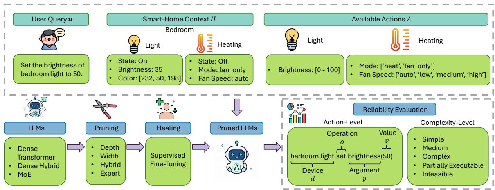  
Figure 1: Overview of our framework for evaluating pruning-induced reliability degradation in smart-home tool execution across action components and task-complexity levels.

light.”

Medium. A single-turn request requiring multiple actions or multiple target devices, or an underspecified request that requires clarification but not prior dialogue context.

Complex. A request whose correct execution depends on prior interaction context, such as resolving anaphoric references or repeating, reversing, or modifying a previous action.

Partially Executable. Only a subset of the requested actions is feasible; the model must execute the valid portion while rejecting the invalid portion.

Infeasible. None of the requested actions is feasible under the current smart-home context, so the model should avoid execution and reject X.

## 3.3 LLM Architecture Families

To examine whether pruning-induced degradation depends on model architecture, we evaluate four models from the Qwen family spanning dense Transformer, dense hybrid, and MoE designs. Qwen3-4B (Team, 2025) is a 4B-parameter dense Transformer with 36 layers and grouped-query attention (GQA). Qwen3.5-4B and Qwen3.5-9B (Qwen Team, 2026a) adopt a dense hybrid architecture that interleaves Gated DeltaNet linear-attention layers with full-attention layers; both contain 32 layers. Finally, Qwen3.6-35B-A3B (Qwen Team, 2026b) extends this hybrid design with sparse MoE feed-forward layers, comprising 35B total parameters while activating around 3B parameters per token across 40 layers.

This selection enables us to study three complementary factors. Comparing Qwen3-4B with Qwen3.5-4B isolates changes in architectural design at approximately fixed parameter scale; comparing Qwen3.5-4B with Qwen3.5-9B examines the effect of dense model capacity; and Qwen3.6- 35B-A3B provides a sparse MoE architecture whose parameter allocation differs fundamentally from dense models. Together, these models allow us to test whether pruning affects smart-home reliability consistently across architectural families or produces architecture-specific failure patterns.

## 3.4 Pruning Methods

We evaluate pruning across four granularities: depth, width, hybrid, and expert pruning, subject to architectural compatibility.

Depth pruning. We use ShortGPT (Men et al., 2025), which removes low-importance layers based on Block Influence, and Angular (Gromov et al., 2025), which identifies redundant contiguous layer blocks using angular similarity of boundary representations. Both are applied to Qwen3-4B, Qwen3.5-4B, and Qwen3.5-9B.

Width pruning. We use FLAP (An et al., 2024), which prunes feature channels using a fluctuationbased importance criterion with adaptive sparsity allocation and bias compensation. We apply FLAP to Qwen3-4B; its method design does not directly support the Gated DeltaNet modules used in Qwen3.5.

Hybrid pruning. We use 2SSP (Sandri et al., 2025), which combines feed-forward neuron pruning with attention-submodule pruning. We apply 2SSP to Qwen3-4B; its attention-pruning stage assumes conventional attention modules and would require architecture-specific modifications for Qwen3.5.

Expert pruning. For Qwen3.6-35B-A3B, we use REAP (Lasby et al., 2026), which ranks experts using router scores and activation magnitudes and removes those with low estimated contribution.

After pruning, all models undergo the same SFT procedure while keeping the pruned architecture fixed. Overall, Qwen3-4B is evaluated with Short-GPT, Angular, FLAP, and 2SSP; Qwen3.5-4B and Qwen3.5-9B with ShortGPT and Angular; and Qwen3.6-35B-A3B with REAP.

## 3.5 Pruning-Degradation Evaluation

Let $M _ { 0 }$ denote the original SFT LLM without pruning and $M _ { \pi }$ an LLM obtained under pruning configuration π, which specifies the pruning method and ratio. We evaluate performance at two complementary granularities: action-component level, which identifies what parts of structured tool execution are affected by pruning, and taskcomplexity level, which identifies under what task conditions degradation occurs. For evaluation instance $X _ { i } , i = 1 , \ldots , N$ , let $Y _ { i }$ denote the groundtruth action set and $M ( X _ { i } )$ the action set produced by model M. Overall task accuracy is $\begin{array} { r } { \operatorname { A c c } ( M ) = \frac { 1 } { N } \sum _ { i = 1 } ^ { N } \mathbb { I } [ M ( X _ { i } ) = Y _ { i } ] } \end{array}$ . An instance is considered correct only when the complete required execution of a is satisfied. For multi-action requests, actions are matched independently of their order.

Action-component accuracy. We evaluate the four action components $\{ o , d , p , v \}$ defined in Section 3.1. For instance $X _ { i }$ , let $Y _ { i } ^ { ( j ) }$ and $M ^ { ( j ) } ( X _ { i } )$ denote its ground-truth and predicted component from model M, where $j ~ \in ~ \{ o , d , p , v \}$ , respectively. Component $j ^ { \prime } { \bf s }$ accuracy of M is $\begin{array} { r } { \operatorname { A c c } ^ { ( j ) } ( M ) = \frac { 1 } { N } \sum _ { i = 1 } ^ { N } \mathbb { I } \Big [ M ^ { ( j ) } ( X _ { i } ) = Y _ { i } ^ { ( j ) } \Big ] } \end{array}$

Complexity-level accuracy. We report task accuracy separately for each category $c \in$ {Simple, Medium, Complex, Partially Executable, Infeasible} in the complexity taxonomy of Section 3.2. Let $I _ { c }$ denote the set of evaluation instances belonging to category c. We define the category c’s accuracy of M as $\operatorname { A c c } _ { c } ( M ) =$ $\begin{array} { r } { \frac { 1 } { | I _ { c } | } \sum _ { i \in I _ { c } } \mathbb { I } [ M ( X _ { i } ) = Y _ { i } ] } \end{array}$

<table><tr><td>Complexity Category</td><td>SHTC (%)</td><td>HomeBench</td><td>HAR</td></tr><tr><td>Simple</td><td>66.6%</td><td>6,187</td><td>1,903</td></tr><tr><td>Medium</td><td>29.4%</td><td>245</td><td>291</td></tr><tr><td>Complex</td><td>3.9%</td><td></td><td></td></tr><tr><td>Partially Executable</td><td>一</td><td>4,072</td><td>一</td></tr><tr><td>Infeasible</td><td></td><td>6,862</td><td></td></tr><tr><td>Total</td><td>100%</td><td>17,366</td><td>2,194</td></tr></table>

Table 1: Statistics of the evaluation sets. For SHTC, we report the proportion of instances in each category.

Pruning-induced degradation. We measure reliability degradation relative to the corresponding unpruned model: $\Delta \mathrm { A c c } ( M _ { \pi } )$ = $\begin{array} { r l r } { \operatorname { A c c } ( M _ { \pi } ) } & { { } - } & { \operatorname { A c c } ( M _ { 0 } ) , \operatorname { \Delta A c c } ^ { ( k ) } ( M _ { \pi } ) } \end{array}$ = $\begin{array} { r l r } { \operatorname { A c c } ^ { ( k ) } ( M _ { \pi } ) } & { { } - } & { \operatorname { A c c } ^ { ( k ) } ( M _ { 0 } ) , \operatorname { \Delta A c c } _ { c } ( M _ { \pi } ) } \end{array} \quad =$ $\operatorname { A c c } _ { c } ( M _ { \pi } ) - \operatorname { A c c } _ { c } ( M _ { 0 } )$ . We report these changes with negative values indicating degradation after pruning. Action-component changes identify which parts of structured tool execution are most sensitive to capacity reduction, while complexitylevel changes identify the task conditions under which these failures are most pronounced.

## 4 Experiments

## 4.1 Experimental Setup

For SFT and evaluation datasets, we use the training and test splits, respectively, from the same three sources: proprietary smart-home tool-calling dialogues (SHTC), HomeBench (Li et al., 2025), and Home-Assistant-Requests-V2 (HAR)1. All pruned models are healed using the same SFT mixture constructed from the training splits. Table 1 shows the statistics of the evaluation set. For SHTC, to comply with proprietary-data requirements, we report only performance changes ∆Acc relative to the corresponding unpruned model $M _ { 0 }$ . Additional details of experimental setup are provided in Appendix A.

## 4.2 Results

We show HomeBench action-component and complexity-level accuracy for Qwen3-4B in Figures 2 and 3. Complete results are provided in Appendix Figures 9-11 and 12-14. Here, we focus on the key findings and insights.

Dense pruning exhibits a narrower safe region than MoE pruning. Figure 4 contrasts the dense and MoE pruning curves. Overall, dense pruning exhibits sharp cliffs, whereas MoE pruning maintains a wider plateau. At 10% dense pruning, seven of eight LLM-method combinations lose less than 0.6% accuracy, suggesting that mild pruning mainly removes redundant capacity. Pruning ratio alone does not determine retained capability; which structures are removed is also critical. The dense hybrid Qwen3.5-4B is more robust than the same-scale GQA model, possibly because its heterogeneous Gated DeltaNet and full-attention layers provide more alternative information pathways. However, increasing the hybrid model from 4B to 9B yields no consistent benefit, suggesting that additional parameters do not necessarily correspond to pruning-redundant capacity. For REAP, removing 70% of experts reduces stored parameters from 35B to approximately 12.5B with a nonsignificant −0.37% change. Unlike dense pruning, REAP reduces stored experts while preserving routing and eight active experts per token (around 3B parameters), which explains its wider safe region.

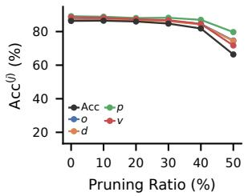  
(a) ShortGPT

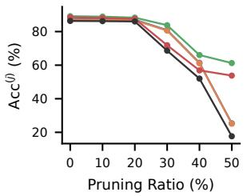  
(b) Angular

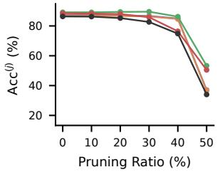  
(c) FLAP

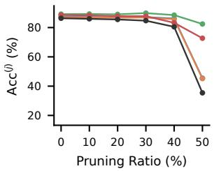  
(d) 2SSP

Figure 2: HomeBench action-component accuracy across pruning ratios for four pruning methods in Qwen3-4B.  
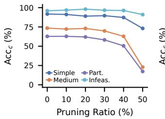  
(a) ShortGPT

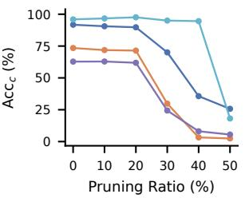  
(b) Angular

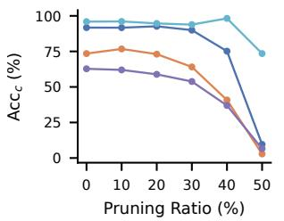  
(c) FLAP

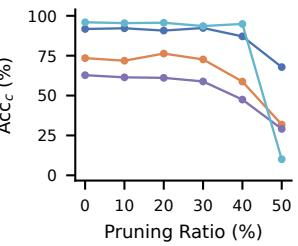  
(d) 2SSP  
Figure 3: HomeBench complexity-level accuracy across pruning ratios for four pruning methods in Qwen3-4B.

Pruning removes specificity before intent. We distinguish schema-level intent, represented by operation and argument $( o , p )$ , from grounded specificity, represented by device and value (d, v). We compare device with operation because o specifies what to do and d where to do it; similarly, p identifies the controlled attribute and v its requested setting. Figure 5 plots $\Delta \operatorname { A c c } ^ { ( d ) } - \Delta \operatorname { A c c } ^ { \mathsf { ( \alpha ) } }$ and $\Delta \operatorname { A c c } ^ { ( v ) } - \Delta \operatorname { A c c } ^ { ( p ) }$ , averaged across dense pruning results over all three datasets; negative values indicate greater degradation of specificity than intent. Both gaps become increasingly negative with pruning. At 50%, mean losses are 24.2% vs. 21.1% for d vs. o, and 20.7% vs. 14.5% for v vs. p, with both specificity components degrading at least as much as their paired intent components. It is because o and p come from a relatively small, repeated schema, whereas d and v require instance-specific grounding in the provided context and precise selection among candidates. d is also the weakest unpruned component, suggesting that pruning amplifies an already difficult grounding step. Thus, reduced capacity appears to preserve the general action schema longer than the contextual details needed to execute it precisely.

Baseline accuracy does not predict pruning sensitivity. Figure 6 shows that pruning sensitivity is not monotonic in unpruned accuracy. Partially Executable requests are the most sensitive, losing about 10.3% accuracy per additional 10% pruning, followed by Simple (7.7%) and Medium (7.2%) requests. Notably, Simple and Infeasible requests have similarly high unpruned accuracy, yet Simple requests degrade faster than Infeasible requests. Conversely, Medium requests begin at much lower accuracy but exhibit pruning sensitivity comparable to Simple requests. These contrasts show that baseline difficulty alone does not determine robustness to capacity reduction. Partially Executable requests are especially vulnerable because they require jointly identifying feasible and infeasible portions while coordinating execution and rejection. Simple requests, despite being easy for the unpruned model, still require precise grounding to a device and action, which can deteriorate under pruning. Infeasible requests instead primarily require withholding action; together with Figure 7, their relative robustness may partly reflect pruninginduced preference for rejection.

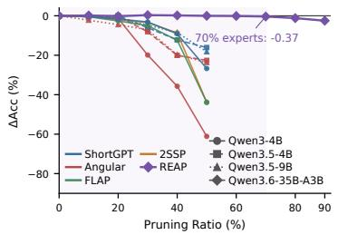  
Figure 4: Average ∆Acc of different LLMs under different pruning methods across three datasets.

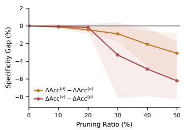  
Figure 5: Specificity gaps $\Delta \mathrm { A c c } ^ { ( d ) }$ $\Delta \ * { \check { \mathrm { A c c } } } ^ { ( o ) }$ and $\Delta \mathrm { A c c } ^ { ( v ) } ~ - ~ \Delta \mathrm { A c c } ^ { ( p ) }$ across dense pruning configurations.

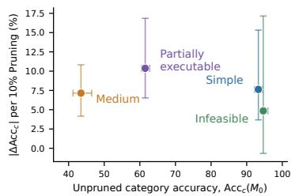  
Figure 6: $| \Delta \mathrm { A c c } _ { c } |$ per additional 10% pruning versus mean $\operatorname { A c c } _ { c } ( M _ { 0 } )$ across public datasets.

Deep pruning can collapse into over-refusal. Figure 7 shows that aggressive pruning increasingly shifts the model from incorrect

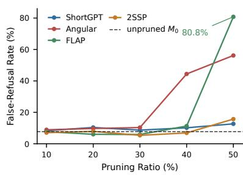  
Figure 7: False-refusal rate on executable HomeBench requests.

execution toward refusing to act using Qwen3-4B. On executable HomeBench requests, unpruned Qwen3-4B refuses 7.7%; at 50% pruning this rises to 56.2% with Angular and 80.8% with FLAP. Yet these models still withhold action on 86.8% and 99.9% of infeasible requests, respectively. One possible explanation is that generating a valid tool call requires precise device, operation, and value grounding, whereas refusal is a simpler low-commitment output. As pruning weakens grounded generation, the model may therefore increasingly default to rejection when uncertain. Consequently, an infeasible-only refusal metric would make the FLAP model appear robust while it rejects four out of five valid commands. Deep pruning thus changes the model’s decision policy, not merely its execution accuracy.

## 5 Discussion and Future Work

Our results show that pruning in smart-home tool calling must preserve more than general semantic capability. Unlike conventional language or structured-prediction tasks, correct execution is conditioned on the current complex homeenvironment. Operation and argument prediction remain stable longer than device and value prediction, indicating that pruning can preserve the general action schema while damaging the contextual specificity. Partially Executable requests are especially sensitive, and aggressive pruning can shift models toward over-refusal. Thus, aggregate accuracy alone is insufficient in smart homes. For bounded-domain MoEs, expert pruning is a promising starting point. For dense LLMs, pruning should be more conservative, with multiple ratios and criteria evaluated for degradation.

In smart homes, future work should develop pruning and recovery methods that explicitly preserve environment grounding. Pruning criteria could protect components important for device resolution and precise value prediction rather than relying only on generic importance scores. Healing data should target pruning-specific failures, including distractor-rich device resolution, precise values, multi-device requests, and partially executable instructions. Because aggressive pruning can induce over-refusal, recovery should also calibrate the execute-versus-reject decision using feasible and infeasible requests. Unlike conventional domains where recovery may mainly restore aggregate language or reasoning performance, smart-home healing must restore the link between language, the current environment, and selective action.

## 6 Conclusion

We systematically study how pruning affects LLMs for context-grounded smart-home tool calling across architectures, pruning methods, and severities. Beyond aggregate accuracy, we examine degradation at the action-component and taskcomplexity levels. We find that grounded specificity degrades before schema-level intent, and aggressive dense pruning can induce over-refusal. These findings show that pruning should be evaluated not only by overall accuracy, but also by architecture, workload, and failure mode. Fine-grained evaluation is therefore important for identifying pruning regimes that reduce model cost while preserving reliable smart-home tool execution.

## Limitations

Despite the insights, our study has several limitations. First, although we cover dense Transformer, dense hybrid, and MoE architectures, all evaluated models belong to the Qwen family; whether the observed pruning patterns generalize to other model families remains to be studied. Second, pruning methods are not evaluated in a fully factorial manner because some methods are architecturespecific; for example, FLAP and 2SSP are not directly applicable to the Gated DeltaNet-based models. Finally, our evaluation is restricted to smarthome tool calling, and some complexity categories are available in only a subset of the three datasets, which limits broader generalization across domains. Future work could extend the analysis to additional model families, domains, pruning methods, and deployment-level efficiency measures such as latency and throughput.

## References

Yongqi An, Xu Zhao, Tao Yu, Ming Tang, and Jinqiao Wang. 2024. Fluctuation-based adaptive structured pruning for large language models. In Proceedings of the AAAI conference on artificial intelligence, volume 38, pages 10865–10873.

Maximillian Chen, Xuanming Zhang, Michael Peng, Zhou Yu, Alexandros Papangelis, and Yohan Jo. 2026. Mist: Multimodal interactive speech-based tool-calling conversational assistants for smart homes. arXiv preprint arXiv:2605.06897.

Shangqian Gao, Chi-Heng Lin, Ting Hua, Tang Zheng, Yilin Shen, Hongxia Jin, and Yen-Chang Hsu. 2024. Disp-llm: Dimension-independent structural pruning for large language models. Advances in Neural Information Processing Systems, 37:72219–72244.

Andrey Gromov, Kushal Tirumala, Hassan Shapourian, Paolo Glorioso, and Daniel A Roberts. 2025. The unreasonable ineffectiveness of the deeper layers. In

International Conference on Learning Representations, volume 2025, pages 81906–81920.

Jialong Guo, Xinghao Chen, Yehui Tang, and Yunhe Wang. 2025. SlimLLM: Accurate structured pruning for large language models. In Proceedings of the 42nd International Conference on Machine Learning, volume 267 of Proceedings of Machine Learning Research, pages 20766–20776. PMLR.

Mike Lasby, Ivan Lazarevich, Nish Sinnadurai, Sean Lie, Yani Ioannou, and Vithursan Thangarasa. 2026. Reap the experts: Why pruning prevails for oneshot moe compression. In International Conference on Learning Representations, volume 2026, pages 146883–146912.

Kuan Li, Shuo Zhang, Huacan Wang, Fangzhou Yu, Zecheng Sheng, Yi Gu, Weipeng Ming, Lei Xue, Chen Liu, Sen Hu, et al. 2026. Smh-bench: Benchmarking llm agents for environment-grounded reasoning and action in smart homes. arXiv preprint arXiv:2606.01912.

Silin Li, Yuhang Guo, Jiashu Yao, Zeming Liu, and Haifeng Wang. 2025. Homebench: Evaluating llms in smart homes with valid and invalid instructions across single and multiple devices. In Proceedings of the 63rd Annual Meeting of the Association for Computational Linguistics (Volume 1: Long Papers), pages 12230–12250.

Xinyin Ma, Gongfan Fang, and Xinchao Wang. 2023. Llm-pruner: On the structural pruning of large language models. Advances in neural information processing systems, 36:21702–21720.

Xin Men, Mingyu Xu, Qingyu Zhang, Qianhao Yuan, Bingning Wang, Hongyu Lin, Yaojie Lu, Xianpei Han, and Weipeng Chen. 2025. Shortgpt: Layers in large language models are more redundant than you expect. In Findings ofthe Associationfor Computational Linguistics: ACL 2025, pages 20192–20204.

Qwen Team. 2026a. Qwen3.5: Towards native multimodal agents.

Qwen Team. 2026b. Qwen3.6-35B-A3B: Agentic coding power, now open to all.

Dmitriy Rivkin, Francois Hogan, Amal Feriani, Abhisek Konar, Adam Sigal, Xue Liu, and Gregory Dudek. 2024. Aiot smart home via autonomous llm agents. IEEE Internet ofThings Journal, 12(3):2458–2472.

Fabrizio Sandri, Elia Cunegatti, and Giovanni Iacca. 2025. 2SSP: A two-stage framework for structured pruning of LLMs. Transactions on Machine Learning Research.

Gyuhyeon Seo, Jungwoo Yang, Junseong Pyo, Nalim Kim, Jonggeun Lee, and Yohan Jo. 2026. Simuhome: A temporal-and environment-aware benchmark for smart home llm agents. In International Conference on Learning Representations, volume 2026, pages 40070–40097.

Qwen Team. 2025. Qwen3 technical report. Preprint, arXiv:2505.09388.

Lu Yin, Ajay Kumar Jaiswal, Shiwei Liu, Souvik Kundu, and Zhangyang Wang. 2024. Junk DNA hypothesis: Pruning small pre-trained weights Irreversibly and Monotonically impairs “difficult" downstream tasks in LLMs. In Proceedings of the 41st International Conference on Machine Learning, volume 235 of Proceedings of Machine Learning Research, pages 57053–57068. PMLR.

Geng Zhang, Han Yuxuan, Yuxuan Lou, Yiqi Zhang, Wangbo Zhao, and Yang You. 2026a. Mone: Replacing redundant experts with lightweight novices for structured pruning of moe. In International Conference on Learning Representations, volume 2026, pages 39983–40009.

Zhengyuan Zhang, Dong Zhao, Tiancheng He, Zilong Wang, Xiangyu Li, and Huadong Ma. 2026b. Vcullm: Prompt-efficient on-device large language model for vague command understanding in smart homes. Proceedings ofthe ACM on Interactive, Mobile, Wearable and Ubiquitous Technologies, 10(2):1–30.

## A Additional Experimental Setup

Pruning Ratios. Dense LLM architectures are pruned at ratios from 10% to 50% in increments of 10%. For the MoE architecture, we evaluate more aggressive expert pruning, removing 10% to 90% of experts to account for its higher structural sparsity.

SFT Data. The SFT data mixture is balanced three ways by source rather than pooled in natural proportion: 16,667 examples each from SHTC, HomeBench and HAR, giving 50,001 training examples, with 100 further examples per source held out for validation.

Training Settings. SFT is performed for one epoch with a global batch size of 32 and a microbatch size of 1, resulting in 1,563 optimizer steps. We use a maximum sequence length of 32,768 tokens and bf16 mixed precision. Optimization uses Adam with $\beta _ { 2 } { = } 0 . 9 8$ and an initial learning rate of $5 \times 1 0 ^ { - 6 }$ , with 50 warmup steps followed by decay to a minimum learning rate of $5 \times 1 0 ^ { - 7 }$ . We use 32 NVIDIA A100 80 GB GPUs for dense LLM architectures and 64 NVIDIA A100 80 GB GPUs for the MoE model.

Generation Settings. Unless stated otherwise, we use greedy decoding with temperature as 0. To quantify the extent to which per-instance variation may arise from sampling stochasticity, we additionally evaluate Qwen-recommended sampling settings with temperature as 0.7, top- $\cdot p = 0 . 8$ , and top-k = 20.

## B Prompt Example

Figure 8 shows an example prompt used for smarthome tool calling in HomeBench. The prompt provides the LLM with the current smart-home state, including available devices, their attributes, and valid value ranges, together with the device-control methods that may be invoked. The prompt also specifies the required machine-instruction output format. The target user request is then appended at the end of the prompt, and the model is required to generate the corresponding executable action(s) using only the provided devices and methods. For unsupported devices or attributes, the prompt instructs the model to return “error\_input”.

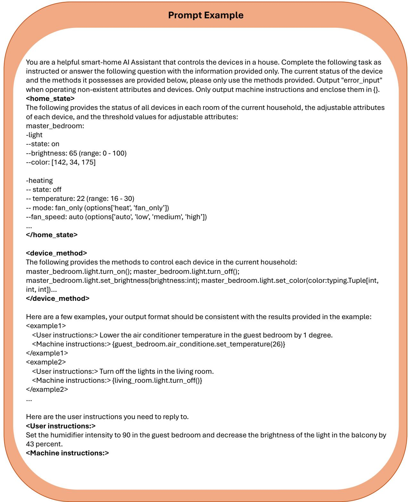  
Figure 8: Prompt example for HomeBench.

## C Action-Component Accuracy

Figures 9-11 provide the complete actioncomponent results across datasets, LLMs, pruning methods, and pruning ratios. Overall, the results support the pattern discussed in Section 4.2: dense models generally preserve all four components under mild pruning, followed by increasingly component-specific degradation at higher pruning ratios. In particular, device (d) and value (v) accuracy often decline more rapidly than operation (o) and argument (p) accuracy, indicating that pruning tends to damage grounded specificity before schema-level intent. This behavior is consistent across HomeBench (Figure 9), HAR (Figure 10), and SHTC (Figure 11). In contrast, the MoE model pruned with REAP maintains relatively stable component-level performance over a much wider range of pruning ratios, with noticeable degradation appearing primarily under the most aggressive expert pruning.

## D Complexity-Level Accuracy

Figures 12-14 present the complete complexitylevel results across datasets, LLM architectures, pruning methods, and pruning ratios. The results further show that pruning sensitivity is not determined by the unpruned accuracy alone. For HomeBench (Figure 12), Medium and Partially Executable requests generally degrade more rapidly under aggressive dense pruning, while Infeasible requests remain comparatively robust. The HAR results (Figure 13) similarly show substantial degradation of Medium requests for several densepruning configurations, although the magnitude varies across architectures and methods. For SHTC (Figure 14), Simple and Medium requests generally experience larger losses than Complex requests at high dense-pruning ratios, further illustrating that baseline task difficulty does not directly determine pruning sensitivity. Across all three datasets, degradation becomes substantially more categorydependent as dense pruning becomes aggressive. In contrast, the MoE model with REAP preserves relatively stable accuracy across task categories over a much wider pruning range, with degradation emerging primarily at the highest expert-pruning ratios.

## E Operation-Level F1 Scores

Figures 15-20 repeat the action-component and complexity-level analyses of Appendices C and D with F1 scores in place of Acc. The actioncomponent results are Figures 15 (HomeBench), 16 (HAR) and 17 (SHTC), and the complexitylevel results are Figures 18, 19 and 20. We use the operation-level F1 following Li et al. (2025). Precision (P) is the number of operations the model predicts correctly divided by the number of operations it predicts; recall (R) is the number of operations it predicts correctly divided by the number of operations the user instruction actually requires, and $\mathrm { F } 1 = 2 P R / ( P + R )$

F1 does not change the conclusions, and the shape of the degradation is unchanged. Averaged over every LLM-pruning pair, the drop from $M _ { 0 }$ to the most aggressive ratio decomposes almost identically under the two metrics: on SHTC d loses 28.7% of F1 against 20.9% for $p ,$ 21.5% for v and 12.9% for $^ { O , }$ and on HAR d loses 17.6% points against 9.5%, 9.6% and 7.8%. Grounded target selection therefore remains the component that pruning erodes first, dense pruning still shows a narrow safe region followed by a category-dependent collapse, and the MoE model under REAP still stays flat over a far wider pruning range.

## F Robustness Analyses

## F.1 Robustness Across the Pruning Ratios

To study the behavioral robustness across pruning ratios, we use the results at each REAP ratio for Qwen3.6-35B-A3B. For each instance and metric, we classify the outcome across the ten checkpoints from 0% to 90% as always correct, always wrong, or flipping across ratios. Thus, this analysis measures whether the same instances remain correct throughout the pruning sweep, rather than variation across random seeds.

Figure 21 shows that robust aggregate accuracy does not imply stable instance-level behavior. On HomeBench, 14.1% of exact-match outcomes change somewhere along the pruning, rising to 33.7% for Partially Executable and 24.9% for Medium requests, despite the nearly flat aggregate curve. HAR has a larger exact-match flipping band (25.1%), concentrated in device grounding (24.4%) and Simple requests (27.4%); its Medium band is instead mostly always wrong (78.7%). On SHTC, Medium is again the least stable category (29.4% flipping), while operation selection is the most stable action component (11.0%). These results distinguish a stable mean from stable predictions: expert pruning can preserve aggregate accuracy while changing which requests succeed.

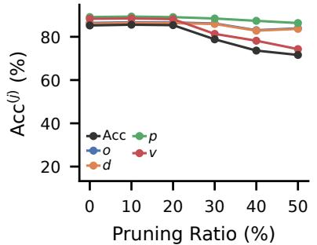  
(a) Qwen3.5-4B, ShortGPT

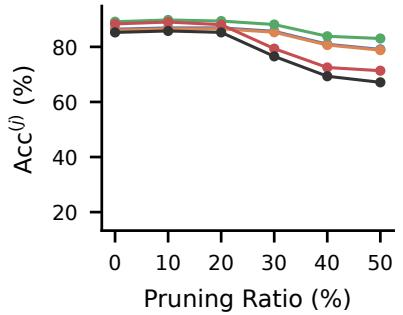  
(b) Qwen3.5-4B, Angular

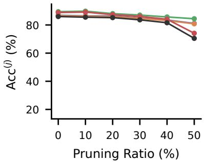  
(c) Qwen3.5-9B, ShortGPT

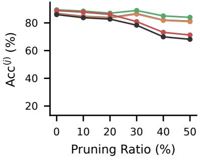  
(d) Qwen3.5-9B, Angular

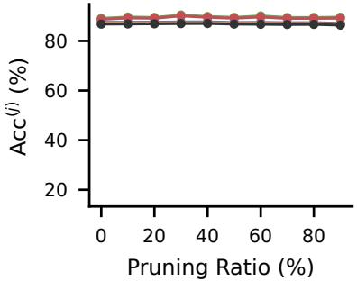  
(e) Qwen3.6-35B-A3B, REAP  
Figure 9: HomeBench: action-component accuracy for the remaining LLM-pruning combinations. Acc together with the four action components $o , d , p ,$ v against pruning ratio. Each subfigure is one LLM and pruning method. Qwen3-4B results are in Figure 2.

## F.2 Robustness Across Seeds

We measure behavioral robustness using three reruns with the same weights and sampling settings (i.e., temperature is 0.7) for unpruned Qwen3.6- 35B-A3B. For a given instance and metric, an outcome is always correct if all three runs succeed, always wrong if all three fail, and flipping if correctness changes across seeds. The flipping share therefore measures cross-seed instability, whereas the always-wrong share measures a seed-invariant failure core.

Figure 22 shows that task difficulty and crossseed instability are not equivalent. HomeBench Medium has the largest borderline band (24.1% flipping), followed by Partially Executable (18.4%), while Infeasible is comparatively stable (7.1%). In contrast, HAR Medium flips on only 4.5% of instances but is always wrong on 79.7%: it is chronically difficult rather than seed-sensitive. On SHTC, Medium and Complex flip more often than Simple (12.8% and 11.6% versus 6.3%).

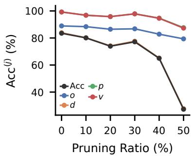  
(a) Qwen3-4B, ShortGPT

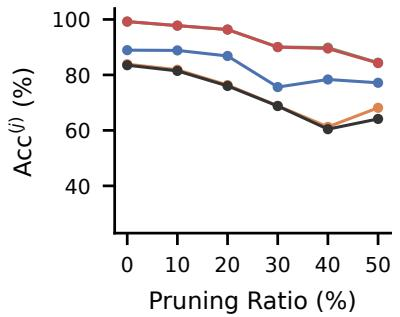  
(b) Qwen3-4B, Angular

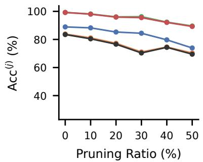  
(c) Qwen3-4B, FLAP

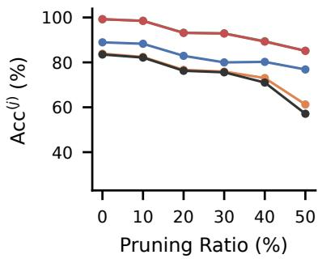  
(d) Qwen3-4B, 2SSP

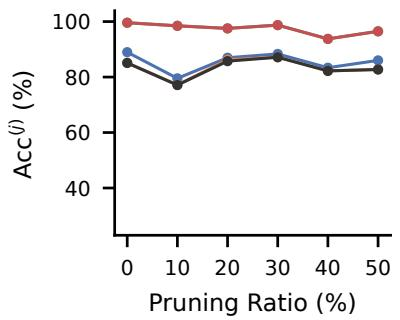  
(e) Qwen3.5-4B, ShortGPT

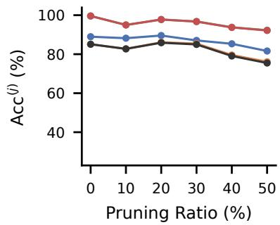  
(f) Qwen3.5-4B, Angular

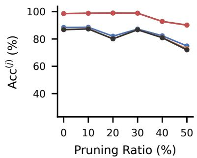  
(g) Qwen3.5-9B, ShortGPT

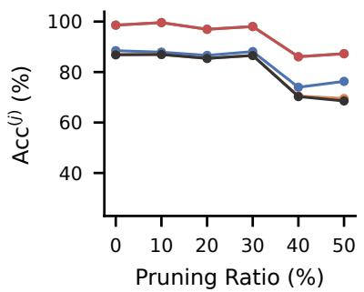  
(h) Qwen3.5-9B, Angular

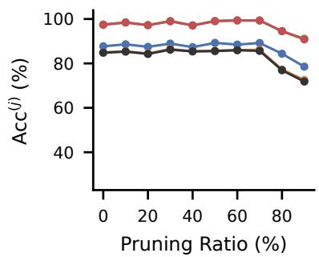  
(i) Qwen3.6-35B-A3B, REAP  
Figure 10: HAR: action-component accuracy. Acc together with the four action components $o , d , p ,$ v against pruning ratio. Each subfigure is one LLM and pruning method.

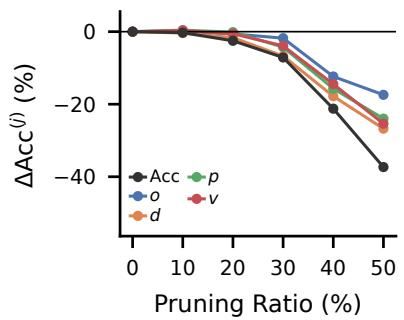  
(a) Qwen3-4B, ShortGPT

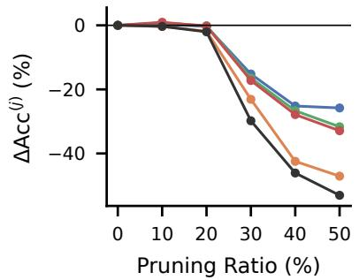  
(b) Qwen3-4B, Angular

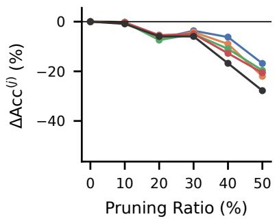  
(c) Qwen3-4B, FLAP

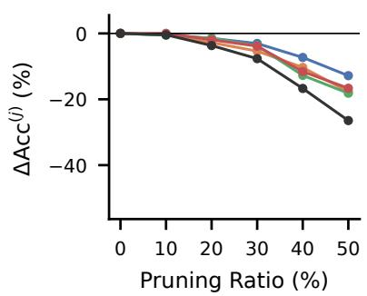  
(d) Qwen3-4B, 2SSP

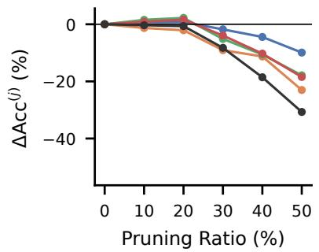  
(e) Qwen3.5-4B, ShortGPT

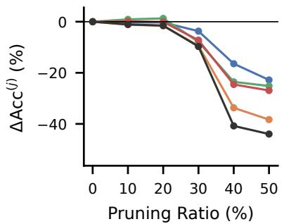  
(f) Qwen3.5-4B, Angular

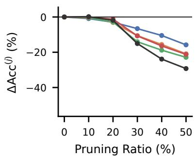  
(g) Qwen3.5-9B, ShortGPT

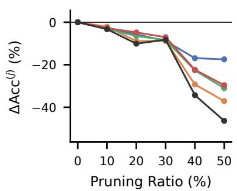  
(h) Qwen3.5-9B, Angular

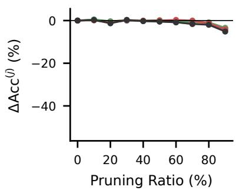  
(i) Qwen3.6-35B-A3B, REAP  
Figure 11: SHTC: action-component accuracy. ∆Acc relative to $M _ { 0 }$ together with the four action components $o , d , p ,$ v against pruning ratio. Each subfigure is one LLM and pruning method.

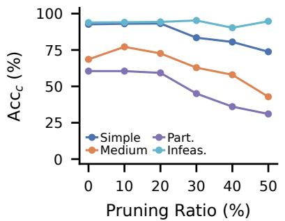  
(a) Qwen3.5-4B, ShortGPT

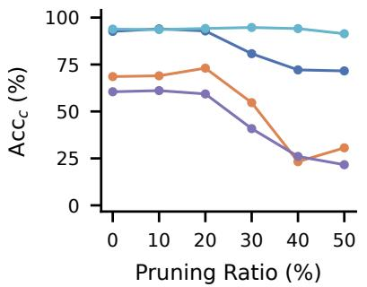  
(b) Qwen3.5-4B, Angular

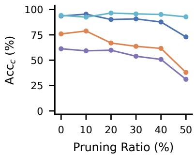  
(c) Qwen3.5-9B, ShortGPT

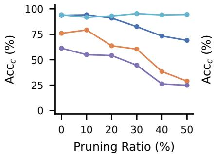  
(d) Qwen3.5-9B, Angular

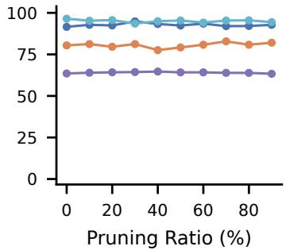  
(e) Qwen3.6-35B-A3B, REAP  
Figure 12: HomeBench: accuracy of task-complexity categories for the remaining LLM-pruning combinations. $\operatorname { A c c } _ { c }$ for the complexity categories present in the source against pruning ratio. Each subfigure is one LLM and pruning method. Qwen3-4B results are in Figure 3.

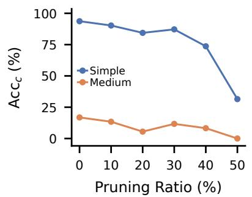  
(a) Qwen3-4B, ShortGPT

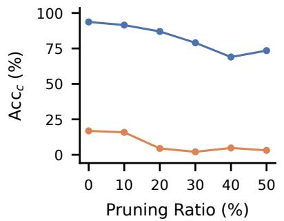  
(b) Qwen3-4B, Angular

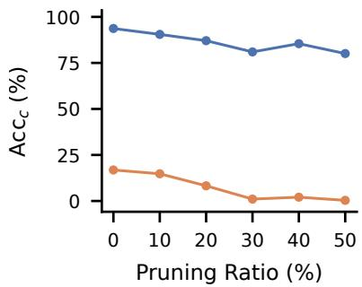  
(c) Qwen3-4B, FLAP

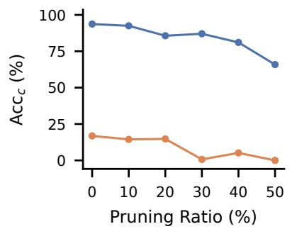  
(d) Qwen3-4B, 2SSP

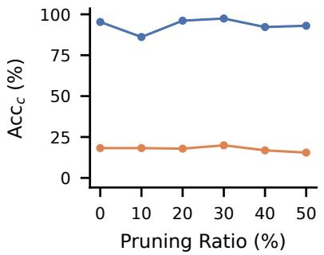  
(e) Qwen3.5-4B, ShortGPT

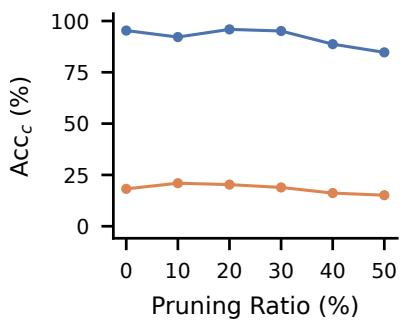  
(f) Qwen3.5-4B, Angular

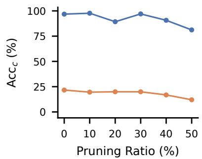  
(g) Qwen3.5-9B, ShortGPT

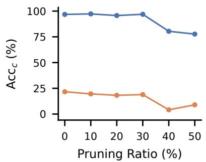  
(h) Qwen3.5-9B, Angular

  
(i) Qwen3.6-35B-A3B, REAP

Figure 13: HAR: accuracy of task-complexity categories. $\operatorname { A c c } _ { c }$ for the complexity categories present in the source against pruning ratio. Each subfigure is one LLM and pruning method.

  
(a) Qwen3-4B, ShortGPT

  
(b) Qwen3-4B, Angular

  
(c) Qwen3-4B, FLAP

  
(d) Qwen3-4B, 2SSP

  
(e) Qwen3.5-4B, ShortGPT

  
(f) Qwen3.5-4B, Angular

  
(g) Qwen3.5-9B, ShortGPT

  
(h) Qwen3.5-9B, Angular

  
(i) Qwen3.6-35B-A3B, REAP

Figure 14: SHTC: accuracy of task-complexity categories. ∆Acc relative to $M _ { 0 }$ for the complexity categories present in the source against pruning ratio. Each subfigure is one LLM and pruning method.

  
Pruning Ratio (%)  
(a) Qwen3-4B, ShortGPT

  
(b) Qwen3-4B, Angular

  
Pruning Ratio (%)  
(c) Qwen3-4B, FLAP

  
(d) Qwen3-4B, 2SSP

  
(f) Qwen3.5-4B, Angular

  
(g) Qwen3.5-9B, ShortGPT

(e) Qwen3.5-4B, ShortGPT  
  
(h) Qwen3.5-9B, Angular

  
(i) Qwen3.6-35B-A3B, REAP

Figure 15: HomeBench: operation-level F1 of the action components. F1 together with the four action components o, d, p, v against pruning ratio. Each subfigure is one LLM and pruning method.

  
Pruning Ratio (%)  
(a) Qwen3-4B, ShortGPT

  
(b) Qwen3-4B, Angular

  
Pruning Ratio (%)  
(c) Qwen3-4B, FLAP

  
(d) Qwen3-4B, 2SSP

  
(e) Qwen3.5-4B, ShortGPT

  
(f) Qwen3.5-4B, Angular

  
(g) Qwen3.5-9B, ShortGPT

  
(h) Qwen3.5-9B, Angular

  
(i) Qwen3.6-35B-A3B, REAP

Figure 16: HAR: operation-level F1 of the action components. F1 together with the four action components o, d, p, v against pruning ratio. Each subfigure is one LLM and pruning method.

  
(a) Qwen3-4B, ShortGPT

  
(b) Qwen3-4B, Angular

  
(c) Qwen3-4B, FLAP

  
(d) Qwen3-4B, 2SSP

  
(f) Qwen3.5-4B, Angular

(e) Qwen3.5-4B, ShortGPT  
  
(g) Qwen3.5-9B, ShortGPT

  
(h) Qwen3.5-9B, Angular

  
(i) Qwen3.6-35B-A3B, REAP

Figure 17: SHTC: operation-level F1 of the action components. ∆F1 relative to $M _ { 0 }$ together with the four action components $o , d , p ,$ v against pruning ratio. Each subfigure is one LLM and pruning method.

  
(a) Qwen3-4B, ShortGPT

  
(b) Qwen3-4B, Angular

  
(c) Qwen3-4B, FLAP

  
(d) Qwen3-4B, 2SSP

  
(e) Qwen3.5-4B, ShortGPT

  
(f) Qwen3.5-4B, Angular

  
(g) Qwen3.5-9B, ShortGPT

  
(h) Qwen3.5-9B, Angular

  
(i) Qwen3.6-35B-A3B, REAP  
Figure 18: HomeBench: operation-level F1 of the task-complexity categories. $\mathrm { F } 1 _ { c }$ for the complexity categories present in the source against pruning ratio. Each subfigure is one LLM and pruning method.

  
(a) Qwen3-4B, ShortGPT

  
(b) Qwen3-4B, Angular

  
(c) Qwen3-4B, FLAP

  
(d) Qwen3-4B, 2SSP

  
(e) Qwen3.5-4B, ShortGPT

  
(f) Qwen3.5-4B, Angular

  
(g) Qwen3.5-9B, ShortGPT

  
(h) Qwen3.5-9B, Angular

  
(i) Qwen3.6-35B-A3B, REAP

Figure 19: HAR: operation-level F1 of the task-complexity categories. $\mathrm { F } 1 _ { c }$ for the complexity categories present in the source against pruning ratio. Each subfigure is one LLM and pruning method.

  
Pruning Ratio (%)  
(a) Qwen3-4B, ShortGPT

  
(b) Qwen3-4B, Angular

  
(c) Qwen3-4B, FLAP

  
(d) Qwen3-4B, 2SSP

  
(e) Qwen3.5-4B, ShortGPT

  
(f) Qwen3.5-4B, Angular

  
(g) Qwen3.5-9B, ShortGPT

  
(h) Qwen3.5-9B, Angular

  
(i) Qwen3.6-35B-A3B, REAP

Figure 20: SHTC: operation-level F1 of the task-complexity categories. $\Delta \mathrm { F } 1 _ { c }$ relative to $M _ { 0 }$ for the complexity categories present in the source against pruning ratio. Each subfigure is one LLM and pruning method.

  
(a) HomeBench: Action Components

  
(b) HAR: Action Components

  
(c) SHTC: Action Components

  
(d) HomeBench: Task-Complexity Categories

  
(e) HAR: Task-Complexity Categories

  
(f) SHTC: Task-Complexity Categories

Figure 21: Qwen3.6 MoE robustness across REAP pruning ratios by action component and task-complexity level.   
Labels prefixed by C, F, or W above a bar denote Always Correct, Flips Across Ratios, or Always Wrong.

  
(a) HomeBench: Action Components

  
(b) HAR: Action Components

  
(c) SHTC: Action Components

  
(d) HomeBench: Task-Complexity Categories

  
(e) HAR: Task-Complexity Categories

  
(f) SHTC: Task-Complexity Categories  
Figure 22: Qwen3.6 MoE robustness across seeds by action component and task-complexity level. Labels prefixed by C, F, or W above a bar denote Always Correct, Flips Across Seeds, or Always Wrong.