# Dependency-Aware Trajectory Refinement for Efficient Multi-Turn Agent Fine-Tuning

Zhuo Chen1, Zhen Zhang, Xinyu Wang, Kewei Tu1\*

1School of Information Science and Technology, ShanghaiTech University 1Shanghai Engineering Research Center of Intelligent Vision and Imaging chenzhuo@shanghaitech.edu.cn

## Abstract

Multi-turn agent trajectories often contain redundant rounds (failed tool calls, parallel subqueries, verification-only steps) that inflate both training and inference cost. We propose viewing each trajectory as a round-level dependency DAG that exposes which rounds are globally load-bearing for the final answer, and fine-tune agents on trajectories refined through this DAG. Given an LLM-annotated DAG, these edits are deterministic and interpretable, with optional rephrasing. Models trained on these refined trajectories consistently outperform those trained on the original trajectories at lower inference cost. Specifically, across four multi-modal QA benchmarks, our refinements improve downstream accuracy by up to 1.7 pp over vanilla SFT (and 5.7 pp over an LLM-deletion baseline) while reducing persample inference messages by up to approximately 40% and inference tokens by up to approximately 48%, translating to substantial savings in compute and serving cost. Code is available here.

## 1 Introduction

Tool-augmented multi-modal agents that interleave reasoning with retrieval calls now define the state of the art for visual question answering (Yao et al., 2023; Schick et al., 2023; Qin et al., 2023; Deng et al., 2023; Xie et al., 2024). Training such agents from a pretrained model typically needs high-quality multi-turn trajectories that demonstrate how to use tools to solve complex problems. These trajectories are valuable but not always information-dense. While synthesizing these trajectories, the source model inevitably runs failed searches, double-checks already confirmed facts, or branches into parallel sub-queries whose results never enter the final answer. Cost then compounds at both training and inference stages.

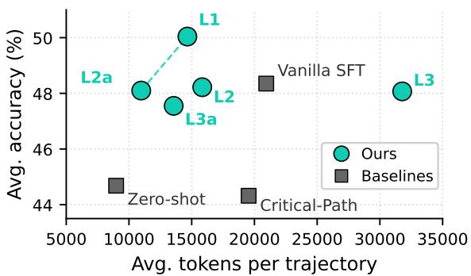  
Figure 1: Accuracy vs. inference-cost trade-off. L1 reaches the highest accuracy. L2a halves the inference tokens at vanilla-SFT accuracy.

A natural temptation is to compress trajectories before SFT. We focus on two contrasting operations. The first intuitive baseline method is round deletion without the contextual awareness of a dependency DAG. An LLM judge marks middle rounds as redundant towards the final answer. Through experiments, we find it aggressive but lossy, since removing a round whose facts are still cited leaves the student “hallucinating sources”. In contrast, our proposed method operates on a dependency graph. We first construct a DAG over rounds, then perform two levels of structural pruning. The first level removes non-terminal leaf nodes, and the second level merges independent sibling rounds.

Once a trajectory is recast as a round-level dependency DAG, edits become deterministic, interpretable, and inexpensive to apply. We instantiate three such variants of increasing aggressiveness (leaf prune, strict merge, relaxed merge), each preserving the load-bearing dependencies of the original trajectory, optionally followed by LLM rephrasing. Our results reveal two complementary sweet spots (Fig. 1). Leaf prune (L1) anchors the high-accuracy end at +5.7 pp over the Critical-Path baseline. Strict merge with LLM rephrasing (L2a) anchors the cost-efficient end, matching vanilla-SFT accuracy while using only 11.0 K inference tokens per sample, vs. 20.9 K for vanilla SFT. Together these two points define the best accuracy–cost trade-off among the SFT systems we compare. We further note that the most aggressive variant, relaxed merge (L3), is sensitive to the one-tool-call-per-turn protocol used at inference. A sizeable fraction of samples exhibit extended interaction loops at noticeably higher inference cost. Structural edits work best when they preserve the train–test interaction pattern expected at inference.

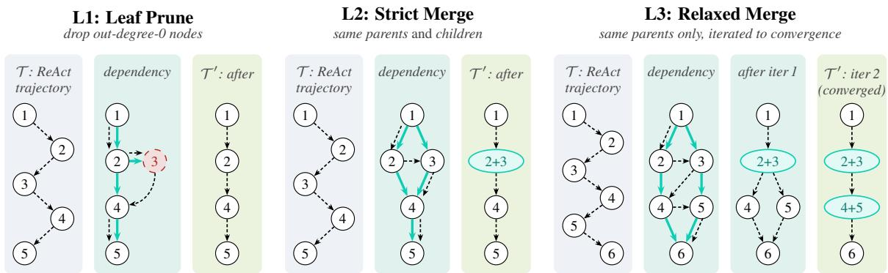  
Figure 2: Three levels of refinements on a structural dependency DAG. For each level, trajectory traces the recorded round order ( ), dependency overlays the actual data dependencies on the same nodes ( ), and after shows the rewritten trajectory. Round 1 is the user query, the highest-indexed round the assistant answer.

Contributions. (1) A dependency-DAG view of agent trajectories that turns trajectory refinement into a transparent, deterministic graphediting problem, with three concrete levels of structural edit. (2) Across four multi-modal QA benchmarks, our refined trajectories train models that surpass vanilla-SFT accuracy at substantially lower inference cost. (3) An LLM-rephrasing extension that closes the training/inference format gap from round merging, together with an analysis linking each edit level’s behaviour to that gap.

## 2 Method

## 2.1 Preliminary

We discuss agent trajectories in the ReAct paradigm (Yao et al., 2023), where an agent interleaves reasoning and acting to solve tasks. An agent trajectory T is a sequence of rounds. Round 1 is the user’s question. Rounds 2..N−1 each consist of an assistant turn (<think>+<tool\_call>) followed by a user turn (<tool\_response>). Round N is the final assistant answer (<think>+<answer>). We refine T into a $\tau ^ { \prime }$ that preserves the final answer while containing no more rounds than T .

## 2.2 Round-Level Dependency DAG

For each trajectory T we extract a DAG G(T) whose edges i → j record globally load-bearing dependencies. Round i produced a concrete artefact (number, named entity, URL, intermediate conclusion) that Round j uses to reach the final answer. Edges encoding mere narrative reference (“... was unhelpful, let me try ...”) are excluded. After parsing, any cycles are removed by depthfirst traversal. We obtain these edges by querying GPT-5.4 with the prompt shown in Sec. J.

## 2.3 Three Levels of Structural Edit

We apply three edits of increasing aggressiveness, illustrated in Fig. 2:

Leaf Prune (L1). Iteratively remove every outdegree-zero round except round 1 (the user query) and round N (the assistant answer). These nodes correspond to dead-end tool calls (failed retrievals, abandoned sub-queries) whose outputs feed nothing downstream.

Strict Merge (L2). Two rounds with the same upstream context and the same downstream consumer are interchangeable in dataflow. From the perspective of the final answer, they are parallel computations of the same logical step. L2 fuses these sibling rounds into one. This collapses redundant parallelism while preserving every dependency in the DAG. L2 is applied on top of L1.

Relaxed Merge (L3). L3 relaxes L2’s criterion by requiring only shared parents, regardless of downstream consumers, and applies the rule iteratively. Because every merge changes the parent set of nodes downstream of it, new sibling pairs can emerge after a pass, so we keep fusing until no candidates remain. In Fig. 2 (panel L3), merging {2, 3} into 2+3 makes rounds 4 and 5 share the new parent 2+3, and they are fused into 4+5 in a second pass. L3 is applied on top of L1.

Canonical Format. All edits keep one outer tag per turn (<think> + <tool\_call>/<answer> on the assistant, <tool\_response> on the user). Merged bodies are concatenated inside the tag.

## 2.4 LLM-Rephrased Merge (L2a, L3a)

A merged round’s <think> is a concatenation of several disjoint trains of thought, a pattern absent in original trajectories. L2a and L3a apply an LLM rewrite to the merged <think> of L2 and L3 that produces a single coherent passage while preserving every sub-task transition and tool-call reference (prompt in Sec. J). The <tool\_call> and <tool\_response> bodies are kept verbatim.

## 3 Experiments

## 3.1 Setup

Training Data. We use 6196 multi-modal, toolusing trajectories extended from Geng et al. (2025). Table 1 reports message and token reductions for each edit on a fair-comparison subset, 1334 trajectories that at least one edit modifies. Critical-Path is the most aggressive, and L1 is the most conservative. L2 and L3 fall in between where L3 removes more rounds but fewer tokens than L2.

Systems Compared. (i) Zero-shot: the base Qwen3-VL-30B-A3B-Thinking model without SFT (Bai et al., 2025). (ii) Vanilla SFT: SFT on the unmodified 6196 raw trajectories. (iii) Critical-Path: an LLM marks each middle round to be “Keep or Remove”, with a grounding check that vetoes deletions that would orphan named entities in the final answer. (iv) Ours: SFT on the same base with L1–L3a trajectory refinement. See Secs. A and B for full settings.

Benchmarks. We evaluate on four multi-modal, tool-using QA datasets. SimpleVQA (visual factuality, 300; Cheng et al., 2025), LiveVQA (recent-knowledge visual QA, 300; Fu et al., 2025), HLE (hard knowledge problems, 330; Phan et al., 2026), and MMSearch (multi-modal search, 171; Jiang et al., 2024). We report gpt-5-nano judge accuracy along with two efficiency proxies.

<table><tr><td>Config</td><td>Avg. #msgs</td><td>Msg. red.</td><td>Avg. #toks</td><td>Tok. red.</td></tr><tr><td>Original Critical-Path</td><td>11.77 8.29</td><td>29.46%</td><td>3,692 2,781</td><td>24.65%</td></tr><tr><td>L1</td><td>9.63</td><td>18.18%</td><td>3,096</td><td>16.15%</td></tr><tr><td>L2</td><td>9.22</td><td>21.61%</td><td>3,091</td><td>16.28%</td></tr><tr><td>L3</td><td>8.87</td><td>24.67%</td><td>3,087</td><td>16.39%</td></tr><tr><td>L2a</td><td>9.22</td><td>21.61%</td><td>3,080</td><td>16.57%</td></tr><tr><td>L3a</td><td>8.87</td><td>24.67%</td><td>3,067</td><td>16.93%</td></tr></table>

Table 1: Training-set message and token reduction.

## 3.2 Main Results

Table 2 reports task accuracy, average message and token counts, and derived cost-effectiveness ratios across the four benchmarks. Overall, Leaf Prune (L1) achieves the highest accuracy, while the rephrased strict merge (L2a) emerges as the most cost-effective variant. Three key observations follow from these results:

(i) Breaking limits on both accuracy and efficiency. Our methods successfully decouple the tight coupling between high accuracy and high cost. L1 establishes a new performance ceiling (50.04% Avg. Acc.), outperforming vanilla SFT by +1.7 pp. Simultaneously, L2a redefines inference efficiency, achieving the highest accuracyper-token ratio among all SFT variants while maintaining accuracy comparable to the baseline. Breaking the 4-benchmark average down, L2a is uniformly the cheapest in messages, and the cheapest in tokens, on every single benchmark among SFT systems (Sec. C).

(ii) Flexible accuracy/cost selection under diverse deployment constraints. When compute budgets are generous, L1 serves as the optimal choice, leading performance on three of the four benchmarks. Conversely, under strict cost or latency constraints, L2a provides an ideal drop-in alternative, slashing token overhead by approximately 48% without sacrificing accuracy.

(iii) Boundary exploration and specialized strengths. Relaxed merging (L3) increases token costs on standard tasks but achieves a peak accuracy of 11.52% on the challenging HLE dataset, showing promise for complex reasoning. In contrast, the Critical-Path baseline drops sharply, confirming that bluntly deleting intermediate rounds hurts generalization.

<table><tr><td></td><td></td><td>Zero -shot</td><td>Vanilla SFT</td><td>Critical Path</td><td>L1</td><td>L2</td><td>L3</td><td>L2a</td><td>L3a</td></tr><tr><td></td><td>SimpleVQA</td><td>66.67</td><td>68.67</td><td>60.67</td><td>70.67</td><td>68.67</td><td>66.67</td><td>67.33</td><td>64.33</td></tr><tr><td>Task</td><td>LiveVQA</td><td>48.00</td><td>51.00</td><td>46.33</td><td>53.67</td><td>51.33</td><td>50.33</td><td>51.00</td><td>51.00</td></tr><tr><td></td><td>HLE</td><td>8.48</td><td>9.39</td><td>11.21</td><td>10.30</td><td>10.30</td><td>11.52</td><td>11.52</td><td>8.79</td></tr><tr><td>accuracy</td><td>MMSearch</td><td>55.56</td><td>64.33</td><td>59.06</td><td>65.50</td><td>62.57</td><td>63.74</td><td>62.57</td><td>66.08</td></tr><tr><td></td><td>Avg. Acc.</td><td>44.68</td><td>48.35</td><td>44.32</td><td>50.04</td><td>48.22</td><td>48.07</td><td>48.10</td><td>47.55</td></tr><tr><td>Inference</td><td>Avg. #msgs</td><td>41.67</td><td>23.94</td><td>27.33</td><td>15.90</td><td>22.25</td><td>30.19</td><td>14.30</td><td>16.63</td></tr><tr><td>efficiency</td><td>Avg. #toks</td><td>8,977÷</td><td>20,940</td><td>19,540</td><td>14,657</td><td>15,841</td><td>31,779</td><td>10,977</td><td>13,766</td></tr><tr><td>Cost-</td><td>Acc./msg</td><td>1.07</td><td>2.02</td><td>1.62</td><td>3.15</td><td>2.17</td><td>1.59</td><td>3.36</td><td>2.86</td></tr><tr><td>effectiveness</td><td>Acc./tok  $( \times 1 0 ^ { 3 } )$ </td><td>4.98÷</td><td>2.31</td><td>2.27</td><td>3.41</td><td>3.04</td><td>1.51</td><td>4.38</td><td>3.45</td></tr></table>

Table 2: Main results across four multi-modal QA benchmarks. Bold marks the best in each row. Artefactual: Zero-shot frequently enters stuck loops on HLE (see Sec. D), deflating its token average.

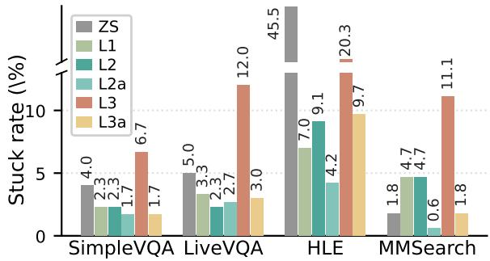  
Figure 3: Stuck rate (%), the fraction of samples that hit the 128-round agent-loop ceiling.

## 4 Analysis

In this section, first we analyse why relaxed merge raises stuck rates and how LLM rephrasing mitigates that gap. Second, we compare against Chain-of-Draft as an inference-time baseline. Third, we test whether L1’s kept-node set is stable under alternative annotators.

## 4.1 Trajectory Merging and Rephrasing

When a merge group contains sibling nodes with divergent children, the training turn aggregates multiple tool responses into one <tool\_response> block. This format departs from typical multi-turn interactions and creates a shift that can disrupt the model’s behavior during inference. As a result, samples hit the 128-round agent-loop ceiling 2–3× as often under L3 as under L2 across all four benchmarks (Fig. 3). Excluding these stuck samples nearly aligns L3’s median message count with L2’s. L2 avoids this distribution shift by restricting merges to interchangeable siblings.

L2a and L3a rewrite the concatenated <think> bodies into a single coherent reasoning passage. On L3, this rewrite both largely closes the stuckrate gap (Fig. 3) and substantially cuts per-sample cost (45% messages, 57% tokens) at comparable accuracy. The residual gap between L3a and L2a is structural, since L3 fuses siblings whose downstream consumers differ, a pattern that rephrasing alone cannot reshape.

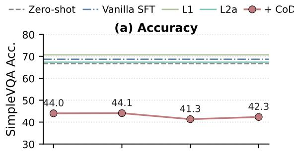

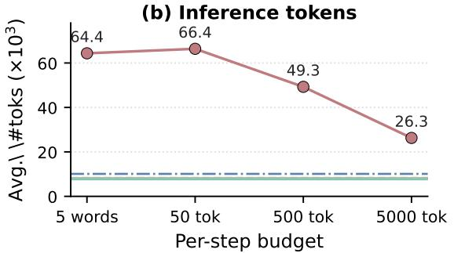  
Figure 4: Chain-of-Draft sweep on SimpleVQA versus Zero-shot, Vanilla SFT, L1, and L2a.

## 4.2 Comparison with Chain-of-Draft

We also test Chain of Draft (Xu et al., 2025), a prompting-only method that compresses singleresponse chain of thought, as an inference-time baseline on the unmodified Zero-shot model with same agent loop and judge. Sweeping the perstep budget from 5 words to 5000 tokens on SimpleVQA (Fig. 4), accuracy falls about 22 pp below Zero-shot while tokens rise to 6–8× the Zero-shot average. CoD targets short single-turn reasoning; tightening per-round <think> in a multi-turn tool loop makes the agent fire tools before framing the sub-problem, so it becomes more wasteful. We therefore omit CoD from Table 2. Promptingonly compression for single-response tasks does not transfer here, which supports editing trajectories before training rather than constraining generation at inference.

<table><tr><td>Annotator</td><td>Kept-P</td><td>Kept-R</td><td>Kept-F1</td></tr><tr><td>claude-sonnet-4-6</td><td>0.916</td><td>0.819</td><td>0.865</td></tr><tr><td>deepseek-v4-pro</td><td>0.990</td><td>0.575</td><td>0.727</td></tr></table>

Table 3: Kept-node agreement vs. GPT-5.4.

## 4.3 Annotator Agreement

We re-annotate training trajectories with two alternative annotators and compare the kept-node set that L1 consumes against the GPT-5.4 reference (Table 3). Kept-P is the fraction of an alternative’s kept rounds that GPT-5.4 also keeps. Kept-R is the fraction of GPT-5.4’s kept rounds that the alternative retains. Both recover the same load-bearing core and differ mainly in how aggressively they prune.

## 4.4 Additional Experiments

Appendix material covers training and inference settings (Secs. A–B), per-benchmark cost breakdowns (Sec. C), stuck-rate notes (Sec. D), mergeformat alignment (Sec. E), DPO results and setting (Secs. F–G), checkpoint selection (Sec. H), a qualitative DAG example (Sec. I), and prompt templates (Sec. J).

## 5 Related Work

Tool-using LLM agents that interleave reasoning with search, visit, or system-level actions are now a mainstream recipe (Yao et al., 2023; Schick et al., 2023; Qin et al., 2023; Deng et al., 2023; Xie et al., 2024; Yao et al., 2024), and SFT on multi-turn trajectories from a stronger LLM is the prevailing fine-tuning route (Zeng et al., 2024).

Closer in spirit, three lines of work pursue better SFT data. The “less-is-more” line picks SFT samples by hand, quality score, or influence estimate, and shows that small selected corpora can match larger noisy ones (Zhou et al., 2023; Cao et al., 2024; Liu et al., 2024). Reasoning-step supervision edits or scores individual steps inside one response, either by self-training new rationales (Zelikman et al., 2022) or via step-level process rewards (Wang et al., 2024). Trajectory synthesis generates agentic training data from scratch via teacher-driven agentic flows (Mitra et al., 2024).

These approaches operate across whole samples, inside a single response, or by generating new data, leaving the internal structure of an agent trajectory untouched. We recast each trajectory as a round-level dependency DAG and apply deterministic edits inside it, turning trajectory refinement into a transparent graph-editing problem.

## 6 Conclusion

We recast each multi-turn agent trajectory as a round-level dependency DAG and apply three deterministic structural edits, with an optional LLM rephrasing variant. Across four multi-modal QA benchmarks, leaf prune (L1) anchors the highaccuracy end at +1.7 pp over vanilla SFT, while strict merge with rephrasing (L2a) anchors the cost-efficient end by halving per-sample inference tokens at vanilla-SFT accuracy. The graphediting view makes the structural assumptions behind each edit explicit and offers a general handle for refining multi-turn agent trajectories.

## Limitations

Our study is scoped to one base model family (Qwen3-VL-30B-A3B-Thinking). The proposed edits act on training data rather than model weights, but the combined training and per-checkpoint evaluation already approaches our compute budget, so transfer across base models and modalities is left to follow-up work. Dependency annotation and merge-think rephrasing each add one annotator pass at data preparation time, and these one-time costs amortise quickly against the inference-time savings in Sec. 3.2.

## Acknowledgments

This work was supported by the Core Facility Platform of Computer Science and Communication, SIST, ShanghaiTech University.

## References

Shuai Bai, Yuxuan Cai, Ruizhe Chen, Keqin Chen, Xionghui Chen, Zesen Cheng, Lianghao Deng, Wei Ding, Chang Gao, Chunjiang Ge, Wenbin Ge, Zhifang Guo, Qidong Huang, Jie Huang, Fei Huang,

Binyuan Hui, Shutong Jiang, Zhaohai Li, Mingsheng Li, and 45 others. 2025. Qwen3-vl technical report. Preprint, arXiv:2511.21631.

Yihan Cao, Yanbin Kang, Chi Wang, and Lichao Sun. 2024. Instruction mining: Instruction data selection for tuning large language models. Preprint, arXiv:2307.06290.

Xianfu Cheng, Wei Zhang, Shiwei Zhang, Jian Yang, Xiangyuan Guan, Xianjie Wu, Xiang Li, Ge Zhang, Jiaheng Liu, Yuying Mai, Yutao Zeng, Zhoufutu Wen, Ke Jin, Baorui Wang, Weixiao Zhou, Yunhong Lu, Tongliang Li, Wenhao Huang, and Zhoujun Li. 2025. Simplevqa: Multimodal factuality evaluation for multimodal large language models. Preprint, arXiv:2502.13059.

Xiang Deng, Yu Gu, Boyuan Zheng, Shijie Chen, Samuel Stevens, Boshi Wang, Huan Sun, and Yu Su. 2023. Mind2web: Towards a generalist agent for the web. Preprint, arXiv:2306.06070.

Mingyang Fu, Yuyang Peng, Dongping Chen, Zetong Zhou, Benlin Liu, Yao Wan, Zhou Zhao, Philip S. Yu, and Ranjay Krishna. 2025. Seeking and updating with live visual knowledge. Preprint, arXiv:2504.05288.

Xinyu Geng, Peng Xia, Zhen Zhang, Xinyu Wang, Qiuchen Wang, Ruixue Ding, Chenxi Wang, Jialong Wu, Yida Zhao, Kuan Li, Yong Jiang, Pengjun Xie, Fei Huang, and Jingren Zhou. 2025. Webwatcher: Breaking new frontier of vision-language deep research agent. Preprint, arXiv:2508.05748.

Dongzhi Jiang, Renrui Zhang, Ziyu Guo, Yanmin Wu, Jiayi Lei, Pengshuo Qiu, Pan Lu, Zehui Chen, Guanglu Song, Peng Gao, and 1 others. 2024. Mmsearch: Benchmarking the potential of large models as multi-modal search engines. arXiv preprint arXiv:2409.12959.

Wei Liu, Weihao Zeng, Keqing He, Yong Jiang, and Junxian He. 2024. What makes good data for alignment? a comprehensive study of automatic data selection in instruction tuning. Preprint, arXiv:2312.15685.

Arindam Mitra, Luciano Del Corro, Guoqing Zheng, Shweti Mahajan, Dany Rouhana, Andres Codas, Yadong Lu, Wei ge Chen, Olga Vrousgos, Corby Rosset, Fillipe Silva, Hamed Khanpour, Yash Lara, and Ahmed Awadallah. 2024. Agentinstruct: Toward generative teaching with agentic flows. Preprint, arXiv:2407.03502.

Long Phan, Alice Gatti, Ziwen Han, Nathaniel Li, Josephina Hu, Hugh Zhang, Chen Bo Calvin Zhang, Mohamed Shaaban, John Ling, Sean Shi, Michael Choi, Anish Agrawal, Arnav Chopra, Adam Khoja, Ryan Kim, Richard Ren, Jason Hausenloy, Oliver Zhang, Mantas Mazeika, and 1103 others. 2026. Humanity’s last exam. Preprint, arXiv:2501.14249.

Yujia Qin, Shihao Liang, Yining Ye, Kunlun Zhu, Lan Yan, Yaxi Lu, Yankai Lin, Xin Cong, Xiangru Tang, Bill Qian, Sihan Zhao, Lauren Hong, Runchu Tian, Ruobing Xie, Jie Zhou, Mark Gerstein, Dahai Li, Zhiyuan Liu, and Maosong Sun. 2023. Toolllm: Facilitating large language models to master 16000+ real-world apis. Preprint, arXiv:2307.16789.

Rafael Rafailov, Archit Sharma, Eric Mitchell, Stefano Ermon, Christopher D. Manning, and Chelsea Finn. 2024. Direct preference optimization: Your language model is secretly a reward model. Preprint, arXiv:2305.18290.

Timo Schick, Jane Dwivedi-Yu, Roberto Dessì, Roberta Raileanu, Maria Lomeli, Luke Zettlemoyer, Nicola Cancedda, and Thomas Scialom. 2023. Toolformer: Language models can teach themselves to use tools. Preprint, arXiv:2302.04761.

Peiyi Wang, Lei Li, Zhihong Shao, Runxin Xu, Damai Dai, Yifei Li, Deli Chen, Yu Wu, and Zhifang Sui. 2024. Math-shepherd: Verify and reinforce LLMs step-by-step without human annotations. In Proceedings of the 62nd Annual Meeting of the Association for Computational Linguistics (Volume 1: Long Papers), pages 9426–9439, Bangkok, Thailand. Association for Computational Linguistics.

Tianbao Xie, Danyang Zhang, Jixuan Chen, Xiaochuan Li, Siheng Zhao, Ruisheng Cao, Toh Jing Hua, Zhoujun Cheng, Dongchan Shin, Fangyu Lei, Yitao Liu, Yiheng Xu, Shuyan Zhou, Silvio Savarese, Caiming Xiong, Victor Zhong, and Tao Yu. 2024. Osworld: Benchmarking multimodal agents for open-ended tasks in real computer environments. Preprint, arXiv:2404.07972.

Silei Xu, Wenhao Xie, Lingxiao Zhao, and Pengcheng He. 2025. Chain of draft: Thinking faster by writing less. Preprint, arXiv:2502.18600.

Shunyu Yao, Noah Shinn, Pedram Razavi, and Karthik Narasimhan. 2024. τ-bench: A benchmark for tool-agent-user interaction in real-world domains. Preprint, arXiv:2406.12045.

Shunyu Yao, Jeffrey Zhao, Dian Yu, Nan Du, Izhak Shafran, Karthik Narasimhan, and Yuan Cao. 2023. ReAct: Synergizing reasoning and acting in language models. In International Conference on Learning Representations (ICLR).

Eric Zelikman, Yuhuai Wu, Jesse Mu, and Noah D. Goodman. 2022. Star: Bootstrapping reasoning with reasoning. Preprint, arXiv:2203.14465.

Aohan Zeng, Mingdao Liu, Rui Lu, Bowen Wang, Xiao Liu, Yuxiao Dong, and Jie Tang. 2024. AgentTuning: Enabling generalized agent abilities for LLMs. In Findings of the Association for Computational Linguistics: ACL 2024, pages 3053–3077, Bangkok, Thailand. Association for Computational Linguistics.

Yaowei Zheng, Richong Zhang, Junhao Zhang, Yanhan Ye, and Zheyan Luo. 2024. LlamaFactory: Unified efficient fine-tuning of 100+ language models. In Proceedings of the 62nd Annual Meeting of the Association for Computational Linguistics (Volume 3: System Demonstrations), pages 400–410, Bangkok, Thailand. Association for Computational Linguistics.

Chunting Zhou, Pengfei Liu, Puxin Xu, Srinivasan Iyer, Jiao Sun, Yuning Mao, Xuezhe Ma, Avia Efrat, Ping Yu, LILI YU, Susan Zhang, Gargi Ghosh, Mike Lewis, Luke Zettlemoyer, and Omer Levy. 2023. Lima: Less is more for alignment. In Advances in Neural Information Processing Systems, volume 36, pages 55006–55021. Curran Associates, Inc.

## A Training Setting

All SFT systems (Vanilla SFT, Critical-Path, L1–L3a) fine-tune the same Qwen3-VL-30B-A3B-Thinking base model (Bai et al., 2025) with full-parameter updates under identical hyperparameters (Table 4). Systems differ only in their training trajectories. The training set is split 90/10 into train/eval, and the best checkpoint per system is chosen by held-out 4-benchmark accuracy (Sec. H). Implementation builds on LLaMA-Factory (Zheng et al., 2024).

<table><tr><td>Hyperparameter</td><td>Value</td></tr><tr><td>Base model</td><td>Qwen3-VL-30B-A3B-Thinking</td></tr><tr><td>Update type</td><td>full-parameter</td></tr><tr><td>Epochs</td><td>4</td></tr><tr><td>Learning rate</td><td>5×10−⁶</td></tr><tr><td>LR schedule</td><td>cosine, 10% warm-up</td></tr><tr><td>Precision</td><td>bf16</td></tr><tr><td>Optimizer sharding</td><td>DeepSpeed ZeRO-3</td></tr><tr><td>Gradient accumulation</td><td>2</td></tr><tr><td>ddp_timeout</td><td> $1 . 8 \times { { 1 0 } ^ { 8 } } { { \mathrm { s } } }$ </td></tr><tr><td>Train / eval split</td><td>90 / 10</td></tr></table>

Table 4: Training setting, shared across all SFT systems.

## B Inference Setting

We use a standard agent loop with one tool call per assistant turn and at most 128 rounds in total. Serving is via vLLM (TP= 8, bf16). The 128-round limit acts as a safety net. We report stuck rate as the fraction of evaluation samples that hit this limit (see Sec. 4 and Sec. D).

## C Per-Dataset Inference Cost

Tables 5–6 expand the per-sample message and token columns of Table 2 into a system × dataset grid. Both metrics are averaged across the samples of each benchmark, and the rightmost column reproduces the 4-benchmark average reported in the main table. L2a is uniformly the cheapest in messages on every benchmark (Table 5). Among SFT systems it is the best on all four benchmarks in tokens (Table 6). Zero-shot’s apparently low token counts on LiveVQA, HLE, and MMSearch, and its 119.26 messages on HLE, are a side-effect of the stuck-loop rate of 45.5% on HLE (Sec. D), which produces short repeated messages until the round limit.

<table><tr><td>System</td><td>Simple Live VQA VQA</td><td>HLE</td><td>MM Search</td><td>Avg.</td></tr><tr><td>Zero-shot Vanilla SFT</td><td>16.69</td><td>18.71 119.26†</td><td>12.03</td><td>41.67</td></tr><tr><td>Critical-Path</td><td>12.51 19.27</td><td>26.31 36.60 25.79 43.41</td><td>20.33 20.87</td><td>23.94 27.33</td></tr><tr><td>L1</td><td>11.09</td><td>21.58</td><td>15.56</td><td>15.90</td></tr><tr><td>L2</td><td>14.03</td><td>15.37 17.34</td><td>36.53 21.11</td><td>22.25</td></tr><tr><td>L3</td><td>26.09</td><td>28.56 39.90</td><td>26.20</td><td>30.19</td></tr><tr><td>L2a</td><td>10.84</td><td>14.93</td><td>20.04 11.39</td><td>14.30</td></tr><tr><td>L3a</td><td>11.25</td><td>15.62 27.61</td><td>12.04</td><td>16.63</td></tr></table>

Table 5: Per-sample average message count by system and dataset. Bold = best in column (among SFT systems). Zero-shot artefact, see prose above.
<table><tr><td>System</td><td>Simple VQA</td><td>Live VQA</td><td>HLE</td><td>MM Search</td><td>Avg.</td></tr><tr><td>Zero-shot</td><td>8,278</td><td>10,757÷</td><td>11,488</td><td>5,385</td><td>8,977÷</td></tr><tr><td>Vanilla SFT</td><td>10,106</td><td>28,176</td><td>26,880</td><td>18,596</td><td>20,940</td></tr><tr><td>Critical-Path</td><td>12,531</td><td>22,804</td><td>26,820</td><td>16,005</td><td>19,540</td></tr><tr><td>L1</td><td>8,241</td><td>18,081</td><td>16,012</td><td>16,293</td><td>14,657</td></tr><tr><td>L2</td><td>9,133</td><td>14,461</td><td>21,750</td><td>18,018</td><td>15,841</td></tr><tr><td>L3</td><td>25,532</td><td>39,353</td><td>30,834</td><td>31,396</td><td>31,779</td></tr><tr><td>L2a</td><td>7,665</td><td>13,264</td><td>13,816</td><td>9,161</td><td>10,977</td></tr><tr><td>L3a</td><td>8,485</td><td>14,435</td><td>18,709</td><td>13,437</td><td>13,766</td></tr></table>

Table 6: Per-sample average token count by system and dataset, computed via Qwen2Tokenizer on the full assistant+user trajectory. Bold = best in column. Zero-shot artefact, see prose above.

## D Stuck-Rate Note

The per-dataset stuck-rate breakdown is given in Sec. 4. We note two side observations not covered there. First, the 45.5% stuck rate of zero-shot on HLE explains the anomalously low average-token figure of zero-shot in Sec. C, since stuck rollouts end without an <answer> and are truncated at the 128-round ceiling. Second, the residual elevation of L3a on HLE (versus L2a) is consistent with the format-mismatch interpretation in Sec. 4, since merge-think rephrasing cannot fully reshape the multi-response <tool\_response> block that L3

<table><tr><td></td><td>Avg. Avg. Acc. (%) #msgs</td><td>Acc/msg</td><td>Acc/tok ×103</td></tr><tr><td>Zero-shot</td><td>44.68</td><td>41.67 1.07</td><td>4.98÷</td></tr><tr><td>Vanilla SFT</td><td>48.35 23.94</td><td>2.02</td><td>2.31</td></tr><tr><td>Critical-Path</td><td>44.32 27.33</td><td>1.62</td><td>2.27</td></tr><tr><td>L1</td><td>50.04</td><td>15.90 3.15</td><td>3.41</td></tr><tr><td>L2</td><td>48.22</td><td>22.25 2.17</td><td>3.04</td></tr><tr><td>L3</td><td>48.07</td><td>30.19 1.59</td><td>1.51</td></tr><tr><td>L2a</td><td>48.10</td><td>14.30 3.36</td><td>4.38</td></tr><tr><td>L3a</td><td>47.55</td><td>16.63 2.86</td><td>3.45</td></tr></table>

Table 7: Cost-effectiveness summary, restating the bottom block of Table 2. Bold = best in column. Both cost-effectiveness ratios are computed from the row’s average accuracy and the corresponding average message / token count. Zero-shot’s Acc/tok ratio inherits the stuck-loop artefact in Table 6. L2a strictly beats every SFT baseline on both ratios.

produces.

## E Merge Granularity and Inference-Time Format Alignment

L2/L2a and L3/L3a use closely related merge primitives but show distinctly different inference behaviour (Tables 5–6, Sec. D). This appendix explains where the gap arises and states the design rule it suggests.

The Format Gap. The inference agent loop is strictly serial. In the great majority of assistant turns, one <tool\_call> tag carries a single JSON call, and the next user turn returns one <tool\_response> with that call’s result. Merging preserves the canonical outer tags on both sides, but concatenates the $k \geq 2$ siblings’ bodies inside them. The merged <tool\_call> now contains k JSON calls, and the merged <tool\_response>, prefixed “Previous tool call results:”, contains the k corresponding results. A round whose two outer tags hold k items each is a configuration the inference loop does not emit (Fig. 5).

Why L2 and L3 Differ. Both edits create the multi-item pattern above, but at different rates and with different downstream structure (Table 8). (i) Frequency. L2 requires matching parents and children and yields 1,044 fusions; L3 matches parents only and yields 3,234 (about 3×), mostly as more merges per sample (samples affected rise only 19.0% → 21.3%). (ii) Downstream alignment. L2 merges only siblings that feed the same next round, so each merged user turn still has a single consumer—the same “one user turn → one next <think>” pattern as inference. L3 can bundle siblings that originally fed different children, gaining denser compression at the cost of that oneto-one structure; keeping the stricter L2 rule is the more inference-aligned choice.

(a) Merged training round  
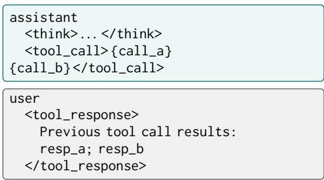

(b) Inference-time loop  
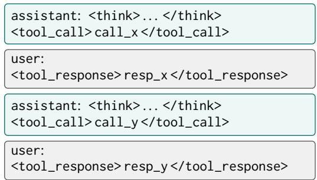  
Figure 5: Message pattern of a merged training round (a) vs. a typical inference-time loop (b). In (a) a single <tool\_call> tag holds k JSON calls and a single <tool\_response> tag holds the k corresponding results, whereas the loop in (b) usually emits one call/result per turn.

<table><tr><td>Merge group size</td><td>L2</td><td>L3</td></tr><tr><td>2</td><td>709</td><td>2,491</td></tr><tr><td>3</td><td>230</td><td>586</td></tr><tr><td>4</td><td>83</td><td>122</td></tr><tr><td>≥5</td><td>22</td><td>35</td></tr><tr><td>Total fusions</td><td>1,044</td><td>3,234</td></tr><tr><td>Samples affected</td><td>1,175 (19.0%)</td><td>1,322 (21.3%)</td></tr></table>

Table 8: Merge groups by size and fraction of training samples affected, on the 6,196-trajectory corpus.

Design Rule. A round-level merge should preserve the downstream consumption pattern of the original trajectory. Concretely, require the merge criterion to match on both parents and children, and prefer leaf-pruning over fusion when downstream consumers differ. This keeps the trainingtime user-turn distribution close to what the inference loop produces.

<table><tr><td></td><td></td><td>Vanilla | SFT</td><td>+DPO[CP]</td><td>+DPO[L1]</td><td>∆v</td><td>+DPO[L2]</td><td>∆v</td><td>+DPO[L3]</td><td>∆v</td><td>+DPO[L2a]</td><td>∆v</td><td>+DPO[L3a]</td><td>∆v</td></tr><tr><td rowspan="5">Task acc.</td><td>SimpleVQA</td><td>68.67</td><td>diverged†</td><td>70.00</td><td>+1.3</td><td>70.67</td><td>+2.0</td><td>67.33</td><td>-1.3</td><td>68.33</td><td>-0.3</td><td>66.67</td><td>-2.0</td></tr><tr><td>LiveVQA</td><td>51.00</td><td>diverged†</td><td>52.00</td><td>+1.0</td><td>53.67</td><td>+2.7</td><td>50.67</td><td>-0.3</td><td>50.33</td><td>-0.7</td><td>50.00</td><td>-1.0</td></tr><tr><td>HLE</td><td>9.39</td><td>diverged†</td><td>12.42</td><td>+3.0</td><td>12.12</td><td>+2.7</td><td>12.73</td><td>+3.3</td><td>12.42</td><td>+3.0</td><td>10.91</td><td>+1.5</td></tr><tr><td>MMSearch</td><td>64.33</td><td>diverged†</td><td>54.39</td><td>-9.9</td><td>59.06</td><td>-5.3</td><td>57.89</td><td>-6.4</td><td>53.22</td><td>-11.1</td><td>60.23</td><td>-4.1</td></tr><tr><td>Avg. Acc.</td><td>48.35</td><td>diverged†</td><td>47.20</td><td>-1.2</td><td>48.88</td><td>+0.5</td><td>47.16</td><td>-1.2</td><td>46.08</td><td>-2.3</td><td>46.95</td><td>-1.4</td></tr><tr><td rowspan="2">Inf. eff.</td><td>Avg. #msgs</td><td>23.94</td><td>diverged†</td><td>11.60</td><td>-12.3</td><td>11.43</td><td>-12.5</td><td>12.03</td><td>-11.9</td><td>11.25</td><td>-12.7</td><td>10.23</td><td>-13.7</td></tr><tr><td>Avg. #toks (103)</td><td>20.9</td><td>diverged†</td><td>4.8</td><td>-16.1</td><td>4.5</td><td>-16.5</td><td>4.7</td><td>-16.2</td><td>4.6</td><td>-16.4</td><td>4.0</td><td>-16.9</td></tr><tr><td></td><td>Cost- Acc/msg</td><td>2.02</td><td>diverged†</td><td>4.07</td><td>+2.0</td><td>4.28</td><td>+2.3</td><td>3.92</td><td>+1.9</td><td>4.09</td><td>+2.1</td><td>4.59</td><td>+2.6</td></tr><tr><td>eff.</td><td>Acc/10³tok</td><td>2.31</td><td>diverged†</td><td>9.85</td><td>+7.5</td><td>10.98</td><td>+8.7</td><td>9.99</td><td>+7.7</td><td>10.10</td><td>+7.8</td><td>11.63</td><td>+9.3</td></tr></table>

Table 9: Shared-base DPO from Vanilla SFT. ∆V: +DPO minus Vanilla SFT. †Diverged (context overflow).
<table><tr><td></td><td></td><td colspan="3">Critical-P.</td><td colspan="2">L1</td><td colspan="2"></td><td colspan="2">L2</td><td colspan="2"></td><td colspan="2">Δ</td><td colspan="2">L2a</td><td colspan="2"></td><td colspan="2">L3a</td></tr><tr><td></td><td></td><td></td><td>SFT +DPO</td><td>∆</td><td>SFT</td><td>+DPO</td><td>∆</td><td>SFT</td><td>+DPO</td><td>∆</td><td>SFT</td><td>+DPO</td><td></td><td></td><td>SFT</td><td>+DPO</td><td>∆</td><td>SFT</td><td>+DPO</td><td>∆</td></tr><tr><td rowspan="5">Task acc.</td><td>SimpleVQA</td><td>60.67</td><td>68.00</td><td>+7.3</td><td></td><td>70.67 68.00</td><td>-2.7</td><td></td><td>|68.67</td><td>64.67</td><td>-4.0</td><td>|66.67</td><td>66.67</td><td>0</td><td>67.33</td><td>68.67</td><td>+1.3</td><td>|64.33</td><td>66.00</td><td>+1.7</td></tr><tr><td>LiveVQA</td><td>46.33</td><td>48.67</td><td>+2.3</td><td>53.67</td><td>51.00</td><td>-2.7</td><td>51.33</td><td>49.33</td><td></td><td>-2.0</td><td>50.33</td><td>51.00</td><td>+0.7</td><td>51.00</td><td>50.67</td><td>-0.3</td><td>51.00</td><td>52.67</td><td>+1.7</td></tr><tr><td>HLE</td><td>11.21</td><td>8.48</td><td>-2.7</td><td></td><td>10.30 10.91</td><td>+0.6</td><td></td><td>10.30</td><td>12.12</td><td>+1.8</td><td>11.52</td><td>13.33</td><td>+1.8</td><td>11.52</td><td>14.55</td><td>+3.0</td><td>8.79</td><td>10.91</td><td>+2.1</td></tr><tr><td>MMSearch</td><td>59.06</td><td>58.48</td><td>-0.6</td><td>65.50</td><td>62.57</td><td>-2.9</td><td>62.57</td><td>60.82</td><td></td><td>-1.8</td><td>63.74</td><td>66.08</td><td>+2.3</td><td>62.57</td><td>59.06</td><td>-3.5</td><td>66.08</td><td>63.74</td><td>-2.3</td></tr><tr><td>Avg. Acc.</td><td>44.32</td><td>45.91</td><td>+1.6</td><td></td><td>50.04 48.12</td><td></td><td>-1.9</td><td>48.22</td><td>46.73</td><td>-1.5</td><td>48.07</td><td>49.27</td><td>+1.2</td><td>48.10</td><td>48.24</td><td>+0.1</td><td>47.55</td><td>48.33</td><td>+0.8</td></tr><tr><td rowspan="2">Inf. eff.</td><td>Avg. #msgs</td><td>27.33</td><td>14.12</td><td>-13.2</td><td>15.90</td><td>13.86</td><td>-2.0</td><td>|22.25</td><td>16.52</td><td>-5.7</td><td>|30.19</td><td>22.08</td><td></td><td>-8.1</td><td>14.30</td><td>14.48</td><td>+0.2</td><td>16.63</td><td>15.60</td><td>-1.0</td></tr><tr><td>Avg. #toks (103)</td><td>19.5</td><td>5.2</td><td>-14.4</td><td>14.7</td><td>5.3</td><td>-9.4</td><td>15.8</td><td>6.1</td><td></td><td>-9.8</td><td>31.8</td><td>8.8</td><td>-23.0</td><td>11.0</td><td>5.5</td><td>-5.5</td><td>13.8</td><td>5.8</td><td>-7.9</td></tr><tr><td></td><td>Cost- Acc/msg</td><td>1.62</td><td>3.25</td><td>+1.6</td><td>3.15</td><td>3.47</td><td>+0.3</td><td>2.17</td><td>2.83</td><td></td><td>+0.7</td><td>1.59</td><td>2.23</td><td>+0.6</td><td>3.36</td><td>3.33</td><td>-0.0</td><td>2.86</td><td>3.10</td><td>+0.2</td></tr><tr><td>eff.</td><td>Acc/103tok</td><td>2.27</td><td>8.90</td><td>+6.6</td><td>3.41</td><td>9.14</td><td>+5.7</td><td></td><td>3.04</td><td>7.71</td><td>+4.7</td><td>1.51</td><td>5.62</td><td>+4.1</td><td>4.38</td><td>8.80</td><td>+4.4</td><td>3.45</td><td>8.28</td><td>+4.8</td></tr></table>

Table 10: Matched-base DPO on each setting’s own SFT checkpoint. ∆: +DPO minus that setting’s SFT.

## F DPO on Refined-vs-Raw Preference Pairs

Each structural edit yields a free preference pair that shares the final answer, taking the refined trajectory as “chosen” and the raw trajectory as “rejected” (counts: Critical-Path 4,446; L1 986; L2/L2a 1,175; L3/L3a 1,322). We plug these pairs into a follow-up DPO (Rafailov et al., 2024) stage in two recipes that differ only in the DPO starting checkpoint.

Shared-Base Recipe. Train one Vanilla SFT model on raw trajectories, then run DPO from that shared base while swapping each setting’s preference pairs, Table 9. All five transferable settings collapse inference cost far below Vanilla SFT. L2 pairs are strongest on accuracy, L3a pairs on costefficiency. Critical-Path pairs push Vanilla SFT off distribution and the run diverges.

Matched-Base Recipe. Start DPO from each setting’s own SFT checkpoint, Table 10. Accuracy is better preserved than under the shared base, while tokens still drop, though they remain above the shared-base band. Shared-base is stronger for cost-efficient deployment. Matched-base is safer when raw accuracy is the priority.

<table><tr><td>Hyperparameter</td><td>Value</td></tr><tr><td>Loss</td><td>sigmoid DPO + NLL-on-chosen</td></tr><tr><td>β (DPO temp.)</td><td>0.1</td></tr><tr><td>αRPO (NLL wt.)</td><td>0.5 (0.7 for L1)</td></tr><tr><td>Max steps</td><td>300 (200 for L1)</td></tr><tr><td>Learning rate</td><td>5×10−7</td></tr><tr><td>LR schedule</td><td>cosine, 5% warm-up</td></tr><tr><td>Max seq. length</td><td>16,384</td></tr><tr><td>Per-device batch</td><td>1</td></tr><tr><td>Grad. accum.</td><td>2</td></tr><tr><td>Global batch</td><td>16</td></tr><tr><td>Hardware</td><td>8 × 80 GiB GPUs</td></tr><tr><td>Optimiser</td><td>DeepSpeed ZeRO-3</td></tr><tr><td>Attention</td><td>SDPA</td></tr></table>

Table 11: DPO training setting (shared across SFT bases).

## G DPO Setting

We train with sigmoid DPO plus an NLL-onchosen anchor (Table 11). L1 uses 200 steps and αRPO = 0.7; others use 300 steps and αRPO = 0.5. Checkpoints every 50 steps are selected by mix-dev accuracy rather than eval-loss.

## H Checkpoint Selection

Eval-loss on the held-out 10% of the training data was recorded at every 200 steps (Table 12, top half, and Fig. 6 left). Downstream task accuracy, however, requires running the full agent loop on the four benchmarks for every candidate checkpoint, which is expensive. Within our compute budget we evaluated four checkpoints for our edits, namely steps 200, 600, 800, and 1396 (final), and a single checkpoint at step 600 for Vanilla SFT and Critical-Path (selected by the same rule applied to our edits). A denser sweep is left to follow-up work.

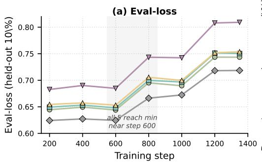

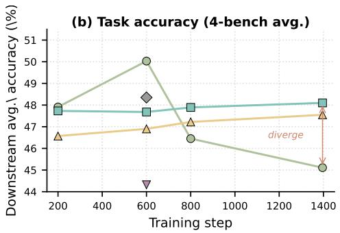  
Figure 6: Eval-loss curves (left, dense schedule) vs. downstream 4-benchmark accuracy (right, four evaluated checkpoints) for L1, L2a, L3a.

<table><tr><td>Step</td><td>Raw</td><td>CP</td><td>L1</td><td>L2a</td><td>L3a</td></tr><tr><td colspan="6">eval-loss (held-out 10% of training data)</td></tr><tr><td>200 400 600</td><td>0.6243 0.6272 0.6245</td><td>0.6827 0.6902 0.6848</td><td>0.6445 0.6494 0.6440</td><td>0.6494 0.6532 0.6480</td><td>0.6545 0.6573 0.6531</td></tr><tr><td>800 1000 1200 1350</td><td>0.6663 0.6724 0.7181 0.7185</td><td>0.7434 0.7424 0.8080 0.8092</td><td>0.6952 0.6897 0.7436 0.7435</td><td>0.6999 0.6967 0.7512 0.7504</td><td>0.7056 0.6997 0.7518 0.7537</td></tr><tr><td colspan="4">downstream task accuracy (%, 4-bench avg.) 50.04 47.68 46.90</td><td></td><td></td></tr><tr><td colspan="2">200 600 48.35</td><td>44.32</td><td>47.91</td><td>47.73</td><td>46.57</td></tr></table>

Table 12: Eval-loss vs. downstream accuracy.

Best-Checkpoint Summary. By 4-benchmark average accuracy, L1, Vanilla SFT, and Critical-Path pick step 600, while L2a and L3a actually pick step 1396.

Eval-Loss Decouples from Accuracy. All three of L1, L2a, L3a follow a similar eval-loss trajectory (minimum near step 600, then rising), but downstream accuracy diverges. L1 peaks at step 600 (50.04%), drops to 46.45% at step 800, and reaches 45.11% at step 1396 (−4.9 pp from peak). L2a and L3a instead climb monotonically from step 600 onwards (47.68 → 47.89 → 48.10 for L2a, and 46.90 → 47.22 → 47.55 for L3a, all in %). Picking the checkpoint by evalloss alone would have chosen step 600 for everyone, which is exactly L1’s peak but a poor choice for L2a/L3a. Practitioners training on merged trajectories should therefore select checkpoints by downstream metrics rather than evalloss. Continuing training beyond step 1396 would extend the 4-epoch SFT budget and require evaluating additional checkpoints on the full agent loop, which doubles inference cost per added checkpoint. Eval-loss has been rising since step 600, so further training carries a non-trivial overfitting risk despite the still-climbing downstream metric for L2a/L3a. A larger compute-budget sweep is left to follow-up work.

## I Qualitative Example

Source Sample. Training-corpus sample \_idx=1581. The user shows an image carrying “SAGE Publishing” branding and a “Live Product Training” banner, and asks: “Whofounded SAGE Publishing, and within the first decade after that, who established the company’s first international office in London?” The gold answer ends with “Sara Miller McCune (with George McCune) founded SAGE in 1965, and SAGE Publications Ltd. was established in London in 1971”.

In what follows, each grey box is one round of the original trajectory, and the bar at the top names the round and its role. Round 1 is the user question (image + text). Rounds 2–4 are assistant turns whose think and call are followed by a user-side resp. Round 5 is the final assistant answer. Red-bordered boxes mark rounds removed by an edit, and teal-bordered boxes mark rounds produced by merging.

## Original Trajectory (8 Messages, 5 Rounds)

## R1 (user)

[image: SAGE Publishing logo on a Live Product Training banner]   
Who founded SAGE Publishing, and within the first decade after that, who established the company’s first international   
office in London?

## R2 (assistant + user)

think Identify who founded SAGE Publishing, then look up the London office. Start with the founder. call web\_search("Who founded SAGE Publishing") resp “24-year-old Sara Miller McCune founded Sage in 1965 . . . ” (Wikipedia / About-SAGE)

## R3 (assistant + user)

think Now find who set up SAGE’s first international office in London. call web\_search("SAGE first international office London established by who and when") resp Same About-SAGE snippet as R2, with no new fact about the London office.

## R4 (assistant + user)

think The previous result added nothing new. Try SAGE’s own 50-year history page directly. call visit\_url("https://us.sagepub.com/.../sage-50-year-history.pdf") resp “1971: SAGE Publications, Ltd. established in London. Sara and George hired David Brooks . . . ”

## R5 (assistant)

think I have what I need.

answer Sara Miller McCune (with George McCune) founded SAGE, and the first international office was established in London in 1971.

## Annotated DAG (Prompt A)

Running the strict prompt (Sec. J, Prompt A) on this trajectory, the annotator LLM emits three edges with the following abridged reasons.

• R2→R3: “Round 2 produced the concrete founder identification Sara Miller McCune, which Round 3 uses to frame the next search.”

• R4→R5: “Round 4 produced the key historical fact that SAGE Publications, Ltd. was established in London in 1971, which Round 5 uses to conclude the first international office was in London within the first decade.”

• R2→R5: “Round 2 established Sara Miller McCune as the founder, which Round 5 combines with the London-1971 fact to answer the full question.”

No Edge Originates at R1. Prompt A asks the annotator to mark only globally load-bearing edges, where round j uses a specific retrieved fact that round i produced. The user query itself (R1) is the topic of every later round but contributes no new retrieved fact that a downstream round consumes, so the strict criterion correctly omits all R1→\* edges. Two structural guarantees keep this safe-by-construction. First, leaf pruning removes only nodes with out-degree 0 that are neither round 1 nor the highest-indexed round, so R1 is never a deletion candidate even when it has no edges in the annotated DAG. Second, the merge function (Sec. 2.4) skips any merge group whose smallest round index is below 2, so R1’s message is left untouched even if it appeared in a merged set. As a result the merge topology is identical whether or not the annotator emits R1→\* edges.

The resulting DAG over annotated edges is R2→R3, R2→R5, and R4→R5. R3 has out-degree 0 (no downstream round uses anything it produced), which marks it as the L1 leaf.

## After L1 (Leaf Prune): 6 Messages, 4 Rounds

R3 has out-degree 0 in the annotated DAG, so L1 drops it. R1, R2, R4, R5 remain unchanged.

R3 (pruned by L1: out-degree 0)   
think (removed) call (removed) resp (removed)

The kept trajectory after L1 is R1 → R2 → R4 → R5, i.e. the original boxes for R1, R2, R4, R5 unchanged (not redrawn).

## After L2a (Strict Merge + LLM Rephrase): 4 Messages, 3 Rounds

In the annotated DAG after L1, R2 and R4 both have an empty parent set (Prompt A emits no R1→\* edge) and the same child set ({R5}). The strict-merge rule fuses them into one round R2+4. Note that even if Prompt A had emitted R1→R2 and R1→R4, both rounds would then share parents {R1} and child {R5}, and the same merge would fire. Their two think bodies are concatenated and rephrased by the annotator LLM into a single coherent passage (the <think> shown below). The two original calls are emitted as two JSON arguments inside a single <tool\_call> tag, and the two resp bodies are prefixed with “Previous tool call results:” and emitted in one user turn.

R2+4 (merged by L2a, covering original R2 and R4)   
think The image shows SAGE Publishing’s branding on a Live Product Training banner. The question has two parts   
(who founded SAGE Publishing and who established its first London office within the first decade) and these are likely   
connected, so first locate the founder, then look at SAGE’s early history for when and how the London office was set up.   
call web\_search("Who founded SAGE Publishing"),   
visit\_url("https://us.sagepub.com/.../sage-50-year-history.pdf")   
resp Previous tool call results:   
(1) “24-year-old Sara Miller McCune founded Sage in 1965 . . . ”   
(2) “1971: SAGE Publications, Ltd. established in London. Sara and George hired David Brooks . . . ”

The full L2a trajectory is R1 → R2+4 → R5 (R5 unchanged from the original).

Take-Aways. Two distinct effects compose on the same trajectory. First, Leaf Prune (L1) removes the redundant follow-up search whose evidence was already in R2. Second, Strict Merge with rephrase (L2a) folds the two substantively different sub-queries (“who founded” vs. “where was the first international office”) into one round of reasoning whose <think> reads as a single chain of thought, not two disjoint segments concatenated with a semicolon. The final answer in R5 is unchanged.

## Two Further DAG-Only Cases

To isolate each edit’s topological action, we show two more samples from the training corpus as bare DAGs, omitting the per-round content. The first sample triggers only L1, the second only L3.

Sample A (\_idx=6061), L1 Only. The annotated DAG has edges R1→R2, R1→R3, R3→R4. Round R2’s out-degree is 0 and it is not the highest-indexed round, so L1 prunes it. L2 and L3 fire on sibling groups, and the remaining graph has no siblings sharing parents, so both are no-ops. Trajectory shrinks from 6 messages to 4.

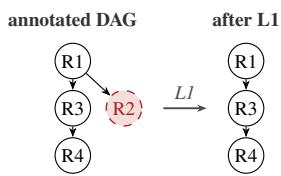

Sample C (\_idx=13), L3 Only. The annotated DAG has edges R1→R2, R1→R4, R2→R3, R3→R5, R4→R5. No round is a deletable leaf, so L1 is a no-op. For L2, R2’s children are {R3} while R4’s are {R5}, so the strict criterion (same parents and children) does not fire either. L3 requires only shared parents, and R2 and R4 both have parent {R1}, so they merge into one round R2+4. The remaining edges become R1→R2+4, R2+4→R3, R2+4→R5, R3→R5. Trajectory shrinks from 8 messages to 6.

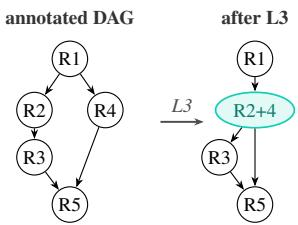

Together with Sample B (\_idx=1581) above, the three samples isolate the three edit primitives. Real trajectories often chain them, as Sample B does (L1 then L2a).

## J Prompt Templates

This appendix gathers LLM prompts used in the paper:

• Prompt A, DAG annotation: extracts the round-level dependency DAG used by all our edits (Sec. 2.2).

• Prompt B, Critical-Path KEEP/REMOVE: the LLM-deletion baseline against which we compare (Sec. 3.1).

• Prompt C, Merge-think rephrase: turns raw-concatenated <think> blocks into a single coherent passage for L2a/L3a (Sec. 2.4).

• Prompt D, LLM-as-judge: scores the model’s final <answer> against the gold answer. Used as the task-accuracy metric in all tables (Sec. 3.1).

## Prompt A: DAG annotation

# Role   
You are an expert in logical reasoning and causal analysis. Your task is to analyze a multi-round AI Agent trajectory and deconstruct it into a Directed Acyclic Graph (DAG) that captures only the dependencies that actually matter for producing the final answer.

\# Task Description The trajectory is organized by “Rounds.” You will be told which round contains the final answer (typically the last round). Your job is to decide, for every candidate edge Round i -> Round j, whether Round j would have been impossible or clearly wrong without Round i’s concrete contribution — judged globally against the final answer, not by local narrative flow.

1. Concrete carry-over: A specific fact, number, entity, URL, identifier, or inferred conclusion that Round j actually uses was first produced in Round i — and cannot be obtained from any other earlier round or from the original query alone.

2. Globally load-bearing: Removing Round i would break Round j’s ability to make progress toward the final answer in Round N.   
If Round j could have been produced by skipping Round i (perhaps with minor rewording), do NOT add the edge.

3. Not mere narrative / chronological continuity: Do NOT add an edge just because Round j’s <think> text mentions, reacts to, or rhetorically references Round i.

• Dead-end rounds: Round i returned information not used anywhere downstream (including Round N).

• Redundant confirmation: Round j merely re-verifies a fact already established in an earlier round.

• Parallel independent lookups: Round i and j are both sub-queries derived from a common ancestor, with no information flowing from one to the other.

• Pure stylistic/continuity reference: “continuing from the previous step” without consuming any output of Round i.

# Be Aggressive About Pruning Edges   
Default to NOT adding an edge. When in doubt, ask: “If I deleted Round i from the transcript, would Round j still reach the same conclusion (perhaps via trivial rewording)?” If yes — do not add the edge.

## Prompt B: Critical-Path KEEP/REMOVE baseline (English translation of the production prompt)

System. You are a rigorous, conservative cleaning assistant for multi-modal Agent research data. Your task is to prune unnecessary   
reasoning / tool-call rounds so the training data is more efficient, while keeping the remaining trajectory logically coherent   
and self-consistent. Output compact JSON only; do not wrap in markdown code fences.   
User.   
# Background   
Below is one Agent trajectory. Each middle round consists of an assistant turn (with <think> and <tool\_call>) followed by a   
user turn (tool\_response). The final assistant turn emits <answer>.   
# Goal   
Decide which middle rounds can be deleted entirely, such that the trajectory becomes more concise without changing the correctness   
of the final answer.   
# Typical removable rounds   
1. Failed / empty result: tool\_response is “Page not found”, empty, or irrelevant, and no later round adjusts strategy based   
on it.   
2. Redundant repeat: this tool\_call overlaps a prior one, information already obtained.   
3. Abandoned branch: this round tried a direction but no later think/tool\_call uses its output, and the final answer is   
unrelated.   
4. Extra re-verification: the key fact already entered the answer via an earlier round; this round only reconfirms.   
5. Over-long reasoning prep: the tool\_call output of this round does not appear in the evidence chain for the final answer.   
# Non-removable rounds   
Concrete artefacts of this round (number, year, name, link, image description, . . . ) appear directly in the final answer; OR   
some kept round’s think / tool\_call explicitly references this round’s output; OR this round is a non-skippable step in the   
reasoning chain.   
# Coherence hard constraint   
After deleting a round, the next kept round’s <think> prefix must not read as a reference to the deleted content (e.g., “let’s   
try another link”, “that didn’t work”, “another search”, “hmm”). To repair such dangling references, you may supply a minimal   
rewrite (patch\_think) for the affected kept round. The rewrite must preserve its conclusion and subsequent tool\_call, only   
altering the opening one or two sentences. null means no rewrite needed.   
# Conservative principle   
When in doubt, keep the round. If no round can be safely deleted, return remove: [].   
# Output Format   
Strict JSON, no markdown:   
"status": "reduce" | "non\_reducible" | "illogical",   
"remove": [<round\_id\_int>, ...],   
"patch\_think": { "<id>": "<rewritten think>", ... },   
"reason": "<short justification>"   
}   
reduce: at least one deletable round.   
non\_reducible: all rounds load-bearing or patch\_think cannot fix coherence.   
illogical: trajectory itself is broken (answer mismatched, final answer missing, . . . ).   
remove must not include Round 1 or the final answer round.   
# Input Trajectory   
{INPUT\_TRAJ\_STRING}

Prompt C: Merge-think rephrase (used by L2a, L3a)   
Your task is to merge multiple <think></think> segments from a trajectory of model outputs into a single coherent reasoning   
passage.   
Context: These <think> segments originally came from separate turns in a multi-turn user–assistant conversation, where each   
<think> block was followed by tool\_call arguments. It has now been determined that the think contents and the tool\_calls can   
each be consolidated into a single turn. Your job is to merge the think segments into one logical, coherent reasoning passage.   
Requirements:   
• Preserve the original intent and logical flow of the reasoning.   
• If the original think segments reference or describe tool\_calls (tool invocations), you must retain that meaning — do not   
drop references to which tools are being used or why.   
• Smooth out the transitions: the current think contents are crudely concatenated with semicolons (;) and line breaks. Rewrite   
them so they read as one continuous, natural chain of thought rather than disjoint fragments.   
• Do not add new reasoning that wasn’t present in the original; only restructure and connect what is already there.   
• Compress for token efficiency without losing information. Eliminate redundancy, repeated context, filler phrases, and verbose   
restatements. Merge overlapping points — but every distinct piece of information, decision, and tool-call reference must still   
be present in the output.   
Input (concatenated think contents):   
{CONCATED\_THINK}   
Output format: Plain text only. Do not wrap the output in any special tags (no <think>, no XML, no markdown code fences).

Prompt D: LLM-as-judge (gpt-5-nano)   
Your job is to look at a question, a gold target, and a predicted answer, and then assign a grade of either [CORRECT, INCORRECT,   
NOT\_ATTEMPTED]. First, examples of each grade; then a new example.   
CORRECT examples (predicted answer is equivalent to the gold target):   
Q: “What are the names of Barack Obama’s children?”; Gold: “Malia Obama and Sasha Obama”. Accept: “sasha and malia obama”; “most   
people would say Malia and Sasha, but I’m not sure. . . ”; “. . . Malia Ann and Natasha Marian, but commonly Malia and Sasha. . .   
A predicted answer is CORRECT iff it fully contains the gold information, contradicts nothing in it, and only semantic meaning   
matters (case / punctuation / order do not). Hedging is allowed as long as the gold is fully included.   
INCORRECT examples (predicted answer contradicts the gold):   
“Malia.”; “Malia, Sasha, and Susan.”; “Obama has no children.”; “either Malia and Sasha. Or Malia and Jackie. . . ”. A factual   
statement contradicting the gold is INCORRECT, even if hedged.   
NOT\_ATTEMPTED examples (predicted answer neither contains nor contradicts the gold):   
“I don't know.": “I need more context.": “He has two children, I know one is Malia, but I'm not sure about the other.'   
Additional rules:   
• Numbers must be correct to the last significant figure in the gold (“120k”→ accept 115k–124k; reject 100k or 113k).   
• Gold may carry extra info beyond the question; predicted need only cover what the question asked.   
• Do not punish omissions clearly inferred from the question (“San Francisco” for “San Francisco, California”).   
• Tolerate typos in names if clearly the same person.   
Here is a new example. Simply reply with A, B, or C (no other text).   
Question: {query}   
Gold target: {reference\_answer}   
Predicted answer: {generated\_answer}   
Grade as one of:   
A: CORRECT   
B: INCORRECT   
C: NOT\_ATTEMPTED   
Return only the single letter.