# DualSQL: Text-to-SQL with Multi-Agent Reinforcement Learning

Shijie Chen1\*, Yu Gan2, Yeounoh Chung2, Jiani Zhang2,

Quannan Li2, Sravan Bodapati2, Cody Greer2,

Yu Su1, Fatma Ozcan2

1The Ohio State University 2Google LLC chen.10216@osu.edu, {gany, fozcan}@google.com

## Abstract

State-of-the-art Text-to-SQL systems are typically multi-agent pipelines centered around two fundamental tasks: schema linking and SQL generation. However, existing work trains separate models for each task, failing to leverage the synergy between these interrelated tasks. In this work, we propose DualSQL, a new Textto-SQL system consisting of two agents powered by a single model backbone. The agents share the same model weights and agentic scaffold, enabling joint optimization through a robust multi-agent reinforcement learning (RL) framework. We design three database access tools to facilitate effective multi-step reasoning grounded in interactions with the databases. To improve training and avoid model collapse, we introduce a set of rollout guardrail mechanisms that stabilize multi-agent RL training, enabling DualSQL to keep improving during training. We also introduce a new SQL correctness metric, robust execution match (REX), to more accurately judge SQL correctness and assign reward signals. Trained on only 3755 examples, DualSQL-4B achieves an impressive 68.0% execution accuracy on the BIRD development set, matching previous 7B mod els. DualSQL-8B further improves to 71.1%, outperforming previous state-of-the-art singlemodel solutions with 32B parameters. These results demonstrate the strength of joint multiagent reinforcement learning for building highperformance Text-to-SQL pipelines.

## 1 Introduction

Text-to-SQL is a key technology for democratizing access to data analytics for non-expert users through a natural language interface (Li et al., 2024a; Luo et al., 2025). However, this task is particularly difficult due to several challenges. First, injecting the entire schema and sampled data from large-scale databases into the context window of language models is prohibitively impractical due to the well-known degradation of reasoning capabilities in long contexts (Du et al., 2025; Chung et al., 2025a; Ling et al., 2025) and high prefilling costs. Second, SQL queries must be strongly grounded in the database context, requiring precise schema linking for identifying relevant tables and columns, navigating complex schema relationships for formulating correct joins, and a comprehensive understanding of database content for selecting accurate literals (Zhang et al., 2025a; Su et al., 2024). Third, the inherent semantic complexity of the Textto-SQL task complicates the accurate mapping of user intent to valid SQL. This complexity stems from the semantic gap between ambiguous natural language and rigid SQL logic, the requirement for domain knowledge, and ambiguities within the schema itself.

State-of-the-art LLM-based systems address these challenges through a modular design built around schema linking and SQL generation (Liu et al., 2025c; Pourreza and Rafiei, 2023; Pourreza et al., 2025a). Within each stage, various methods have been explored, including supervised finetuning (Li et al., 2025), in-context learning (Talaei et al., 2024; Pourreza et al., 2025a), and reinforcement learning from execution feedback (Pourreza et al., 2025b; Yao et al., 2025). However, these methods optimize the two stages in isolation, pointing to a critical gap in joint optimization of the end-to-end pipeline.

We argue that, despite differing task formulations, schema linking and SQL generation share two core capabilities: semantic retrieval over complex relational schemas and reasoning grounded in database context. Therefore, instead of building separate models, it is better to treat these tasks as dual facets of a unified agent that can operate on databases, learn shared knowledge representations, and transfer reasoning skills.

In this work, we propose DualSQL, a Text-to-

SQL framework that consolidates schema linking and SQL generation into a unified agentic pipeline powered by a single, parameter-shared open-weight LLM. Inspired by the iterative workflow of human database developers, we equip DualSQL with three database access tools: metadata profiling, full-text search, and SQL execution. Rather than relying on rigid, pre-defined workflows, DualSQL learns to autonomously interact with databases, dynamically verifying and correcting its reasoning through tooluse feedback.

The entire system is jointly trained with a multiagent reinforcement learning framework, supported by an asynchronous rollout system that decouples synchronization between stages. We find that standard stabilization techniques such as importance sampling correction (Li, 2025; Liu et al., 2025a; Zheng et al., 2025a) are insufficient to prevent structural degeneration in our multi-agent, multi-turn tool-use settings. We therefore introduce a set of agentic rollout guardrails, including strict format checking with rollout cutoff and error-focused loss masking. Furthermore, to provide cleaner reward signals than the standard execution accuracy (EX), which is overly sensitive to benign formatting variations and insensitive to duplicates, we introduce Robust Execution Match (REX). REX can be computed deterministically to efficiently assess exact execution equivalence, preventing the reinforcement of false positives during training.

By combining this stable agentic RL framework with the unified multi-agent formulation, Dual-SQL demonstrates that open-weight models can achieve strong Text-to-SQL capabilities without relying on massive parameter counts or multi-model ensembles. On the challenging BIRD benchmark, DualSQL-4B achieves a competitive 68.0% EX, while DualSQL-8B establishes a new state-of-theart for single-model solutions at 71.1% EX, rivaling systems that utilize 32B parameters.

To summarize, our main contributions are:

• We introduce a multi-agent Text-to-SQL framework driven by a shared LLM backbone and three database access tools.

• We introduce comprehensive agentic rollout guardrails that successfully stabilize multiagent RL training, and Robust Execution Match, which provides more accurate SQL evaluation.

• We demonstrate that joint multi-agent optimization significantly extends the performance ceiling of single-model pipelines, achieving highly competitive performance with small model sizes.

## 2 Related Work

## 2.1 LLM-based Text-to-SQL

Recent advancements in Text-to-SQL have progressed from simple prompt engineering on general-purpose LLMs to specialized multi-agent systems (Biswal et al., 2026; Wang et al., 2025b; Deng et al., 2025). Initial efforts utilized in-context learning (ICL) to optimize the zero-shot and fewshot performance of proprietary LLMs like GPT-4 (Gao et al., 2023; Pourreza and Rafiei, 2023; Chung et al., 2025b). Subsequent context engineering strategies (Chung et al., 2025b; Shkapenyuk et al., 2025) highlighted the criticality of schema linking via augmented metadata for accurate SQL generation. Unlike ICL-based methods, which rely on passive context engineering, DualSQL learns to perform iterative schema linking with tool use. To handle query complexity, the field shifted toward multi-agent collaboration (Wang et al., 2025a; Pourreza et al., 2025a) for task decomposition and external tool leverage. To reduce API dependency and improve cost-efficiency, supervised fine-tuned approaches emerged (Ma et al., 2025a), utilizing large-scale synthetic datasets to align open-source models with the Text-to-SQL task (Li et al., 2024b, 2025). This paradigm was further refined by integrating RL with execution feedback to optimize reasoning chains and bridge the performance gap with larger models (Ma et al., 2025b; Yao et al., 2025; Zhang et al., 2025c). While the latest solutions synthesize agentic decomposition and RL (Liu et al., 2025b; Xu et al., 2025b; Yang et al., 2025b), they optimize agents for different stages separately, neglecting their synergy.

DualSQL differs from existing work by (1) introducing the robust execution match metric for precise SQL correctness evaluation, (2) providing a comprehensive database manipulation toolset, and (3) establishing a robust multi-agent RL framework for joint optimization of the Text-to-SQL pipeline.

## 2.2 Reinforcement Learning with Verifiable Rewards

Reinforcement Learning with Verifiable Rewards (RLVR) has become a cornerstone for enhancing LLM reasoning in domains with verifiable outcomes, such as mathematics (Shao et al., 2024) and coding (Guo et al., 2025). To address inherent training instabilities, recent research has introduced optimization techniques ranging from decoupled clipping and dynamic sampling (Yu et al., 2025) to variance-based rollout down-sampling (Xu et al., 2025a). In multi-turn agentic scenarios, methods such as entropy-based adaptive branching (Dong et al., 2025) and void-turn filtering (Xue et al., 2025) have been proposed to mitigate distribution shifts, while other studies have investigated the role of high-entropy tokens (Wang et al., 2025c), the boundaries of reasoning capabilities versus sampling efficiency, and curriculum learning for autonomous agents (Nguyen et al., 2025; Zheng et al., 2025b). The complex and noisy database environments pose new challenges to agentic RL stability for text-to-SQL systems. Our work contributes an efficient rollout implementation and a set of agentic rollout guardrails, which effectively enhance the efficiency and stability of multi-agent RL, leading to better performance via prolonged exploration.

## 3 DualSQL Agentic System

This section introduces the agentic system of DualSQL. We introduce a unified agentic formulation for the sub-agents in Text-to-SQL systems: schema linker and SQL generator. Each agent is powered by the same backbone LLM that is equipped with a set of database access tools, engaging in multiturn interactions to understand database context and reason about the question.

## 3.1 Database Access Tools

Inspired by the iterative workflow of human database developers, we equip the agents with three database access tools. Implementation details, including JSON serialization of tool outputs and asynchronous tool hosting, are in Appendix A.

SQL Executor. The primary interface between the agents and the database. The agents use it for (i) execution feedback to verify syntactic and semantic correctness, (ii) entity grounding to inspect literal representations, and (iii) ad-hoc schema exploration via sqlite\_master or PRAGMA. A contentaware truncation policy keeps standard retrievals within context limits while preserving full schemaquery responses.

Full Text Search. To bridge ambiguous or abbreviated mentions in user queries to literal database content, this tool performs fuzzy matching over schema names and cell values using SQLite FTS5 inverted indices. It returns the matched schema elements and up to five matching values per column.

Database Profiler. This tool retrieves offlineprepared database metadata. For each table and column, we use an LLM to produce a description summarizing semantic intent and to infer foreignkey relationships that may be missing from the DDL. We additionally pre-compute column-level statistics (distinct counts, types, null ratios). Offloading this analysis offline frees the agent to focus on query logic at runtime.

## 3.2 DualSQL Agents

DualSQL features a multi-agent pipeline consisting of two agents, both of which are powered by the same backbone LLM and can engage in multi-turn interactions with the database via the tools introduced in Section 3.1:

Schema linker: Given the natural language question Q and the complete database schema $S = \{ \mathcal { T } , \mathcal { C } \}$ , where T and C are the sets of tables and columns, the schema linker identifies the relevant database schema $S ^ { \prime } \subseteq S$ to reduce the distraction in large databases and ensures the subsequent SQL generator operates within a focused context window.

SQL generator: The SQL generator generates a SQL query y′ based on the question Q and the linked schema S′. By modeling schema linking and SQL generation as a joint stochastic process, we encourage the generated SQL to be grounded in the correct schema elements, reducing hallucination from irrelevant table schemas.

Despite its simplicity, this unified design proves effective and allows us to jointly optimize the entire pipeline with our multi-agent RL framework.

## 4 Multi-Agent RL Framework for Optimizing Text-to-SQL Pipelines

The unified agent design enables joint optimization of the two agents by training a single LLM. In this section, we introduce our multi-agent RL recipe, including an asynchronous rollout system, rollout guardrails, reward design, and training objectives.

## 4.1 Asynchronous Rollout System

Considering the dependency structure of the above Text-to-SQL pipeline and that agent trajectories vary greatly in length, we design an asynchronous rollout system which manages asynchronous rollout for parsing pipelines. We treat schema linking and SQL generation as an integral stochastic process, which avoids synchronization between stages and improves throughput of multi-agent rollout.

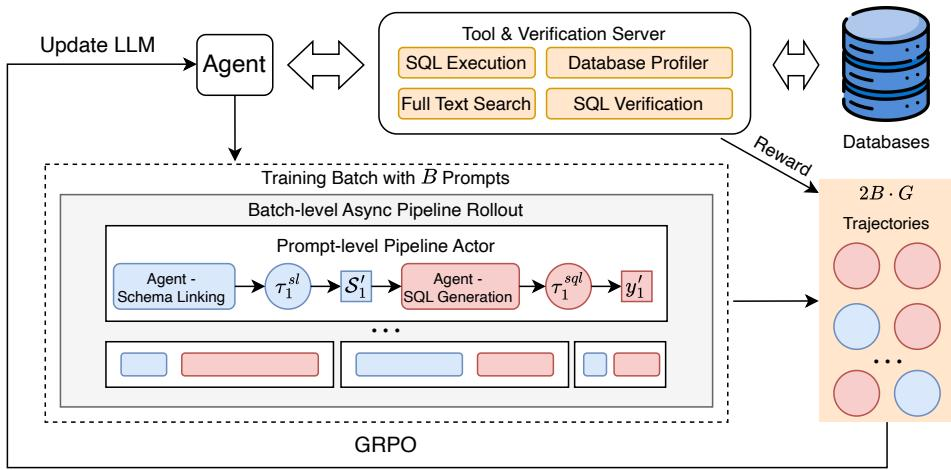  
Figure 1: The multi-agent training framework for DualSQL. sl and sql denote schema linking and SQL generation tasks, respectively. The two agents are driven by the same LLM and tools.

For each batch of B prompts, the batch-level controller manages asynchronous rollout of different prompts, each supported by the prompt-level pipeline actor. The prompt-level pipeline actor executes individual Text-to-SQL pipelines. It flexibly supports rollout of a single task or a pipeline chaining schema linking and SQL generation. With a group size of G, we sample a total of 2B · G trajectories in each optimization step. These trajectories are later grouped by task and used for joint optimization of the policy model.

## 4.2 Agentic Rollout Guardrails

In our preliminary experiments, we observe that multi-agent RL training is much more unstable than non-agentic or single-agent RL training, shown by frequent collapse in trajectory format in one or both tasks. Existing work advocates for variants of sequence-level importance sampling or negative sampling to calibrate the distribution mismatch between rollout and policy models, aiming to stabilize training (Liu et al., 2025a; Li, 2025). However, we find that representative collapse patterns, such as the incorrect use of format tokens, endless loops, and incorrect tool calls, persist even with these calibration techniques. To improve the robustness of multi-agent RL training, we design a set of agentic rollout guardrails, including strict format checking, rollout cutoff, and loss masking.

Strict Format Checking. To maintain format correctness of agentic rollouts, we design a strict format checking mechanism that enforces the following requirements:

• In each turn, the agent should generate a nonempty <think></think> block for effective reasoning.

• In each turn, the agent should generate either a <tool\_call></tool\_call> block for tool calls or a single \`\`\`...\`\`\` code block for returning final answers, such as a linked schema or a SQL query.

• If a tool call is generated, it should be formatted as a JSON string following the pre-defined tool call format, including a valid tool name and tool arguments. Moreover, the tools are idempotent and the same tool should not be called more than once with the exact same argument.

• If a code block is generated, the content after the code block should not constitute more than half of the total length in that turn. This requirement prevents the model from collapsing into generating redundant or even endless explanations after the solution is given.

fiIf a trajectory violates any of the above constraints, we set the format correctness reward $R _ { f }$ to 0. Otherwise, $R _ { f } = 1$ . In this way, format checking helps reduce degeneration and mode collapse during training.

Rollout Cutoff. Allowing rollout to proceed after format violations can lead to a reward hacking pattern, where agents learn that format errors are acceptable as long as the final answer is correct. Moreover, the malformed actions pollute reward signals, causing the policy model to reinforce invalid actions and eventually reach an unrecoverable state. To prevent this, we stop rollout immediately when detecting any format constraint violation, which acts as a hard filter on the exploration space, ensuring that the agent is only rewarded when strictly adhering to the format requirements.

Loss Masking. Penalizing an entire multi-turn trajectory for a terminal format error introduces noise in reward signals, as it may discourage the valid reasoning steps that preceded the error. At the same time, rewarding correct trajectories with intermediate format or tool call errors also risks reinforcing bad behaviors. Therefore, we mask out the loss for previous turns if a trajectory ends with a turn with a format error to concentrate learning signals on format error turns. This approach effectively teaches the agent to unlearn malformed actions before improving reasoning correctness.

At test time, we add meaningful error messages as tool responses to the trajectory upon occasional errors, such as JSON parsing errors or argument type mismatches. In this way, the agent can correct its tool-use mistakes and continue reasoning.

## 4.3 Reward Design

Schema Linking. We design a reward function that encourages high recall. Given the ground truth schema items $S ^ { * }$ and the linked schema items $S ^ { \prime }$ we compute the schema linking reward as:

$$
\begin{array} { r } { R _ { s l } = \left\{ \begin{array} { l l } { 1 } & { \mathrm { i f ~ } S ^ { * } = S ^ { \prime } } \\ { 0 . 9 - \operatorname* { m a x } ( 0 . 2 - \frac { | S ^ { * } \cap S ^ { \prime } | } { | S ^ { \prime } | } , 0 ) } & { \mathrm { i f ~ } S ^ { * } \subseteq S ^ { \prime } } \\ { 0 . 7 - \operatorname* { m a x } ( 0 . 2 - \frac { | S ^ { * } \cap S ^ { \prime } | } { | S ^ { \prime } | } , 0 ) } & { \mathrm { i f ~ } T ^ { * } \subseteq T ^ { \prime } } \\ { 0 . 5 \cdot \frac { 2 | S ^ { * } \cap S ^ { \prime } | } { | S ^ { * } | + | S ^ { \prime } | } } & { \mathrm { o t h e r w i s e } } \end{array} \right. , } \end{array}\tag{1}
$$

where $T ^ { * }$ and $T ^ { \prime }$ are the sets of ground truth and linked tables, respectively.

This reward function gives full credit to perfect matches. Then, partial credit is given for complete schema-level and table-level recall with a penalty for low precision. Finally, we give partial credit based on F1 score.

SQL Generation. We use the correctness of the predicted SQL query $y ^ { \prime }$ as the reward signal for SQL generation. To avoid degeneration into single-turn reasoning, we add a bonus for correct trajectories that use tools $R _ { t o o l } = 1$

$$
R _ { s q l } = { \left\{ \begin{array} { l l } { 1 + 0 . 1 \cdot R _ { t o o l } } & { { \mathrm { i f ~ } } E q ( y ^ { \prime } , y ^ { * } ) } \\ { 0 } & { { \mathrm { o t h e r w i s e } } } \end{array} \right. }\tag{2}
$$

where $y ^ { * }$ is the ground truth SQL query and $E q ( \cdot )$ indicates whether two SQL queries are equivalent.

The execution match (EX) metric, widely used in Text-to-SQL benchmarks like Spider and BIRD, first converts SQL query result sets into a set of literals and evaluates equivalence. This process overlooks the important discrepancies brought by duplicated rows and row ordering, leading to false positive evaluations. Moreover, EX also does not tolerate column order permutations, which introduces false negative signals.

We propose robust execution match (REX), a stricter metric based on data similarity, which evaluates equivalence by finding the maximum matching between the result sets of two SQL queries. If the question does not demand row order matching, REX first sorts the result sets by high-cardinality columns. Then, REX tries to find a permutation of columns that leads to the maximum matching. If a perfect matching is found, the two result sets are considered equivalent. We decide whether a question requires row ordering matching based on the presence of the ORDER BY keyword in ground truth SQL queries. Algorithm details are available in Appendix E.

Format Reward and Length Penalty. We use the soft overlong punishment introduced by DAPO to penalize overlong trajectories. Additionally, the length penalty also implicitly incentivizes the agent to avoid unnecessary self-correction steps by assigning higher marginal rewards to concise, errorfree trajectories.

$$
R _ { l } = \left\{ \begin{array} { l l } { 0 } & { | \tau | \leq L _ { m a x } - L _ { c a c h e } } \\ { \frac { ( L _ { m a x } - L _ { c a c h e } - | \tau | ) } { L _ { c a c h e } } } & { L _ { m a x } - L _ { c a c h e } < | \tau | \leq L _ { m a x } } \\ { - 1 , } & { | \tau | > L _ { m a x } } \end{array} \right.\tag{3}
$$

We only apply the length penalty to trajectories with the correct format to avoid false positive signals. The final reward is computed as:

$$
\begin{array} { r } { R = \operatorname* { m a x } ( R _ { t a s k } , 0 . 1 \cdot R _ { f } ) + \lambda _ { l } R _ { l } \cdot R _ { f } , } \end{array}\tag{4}
$$

where $R _ { t a s k } \in \{ R _ { s l } , R _ { s q l } \}$ is the task-specific reward. $\lambda _ { l } = 0 . 2$ is the weight for the length penalty. We further clip negative rewards to 0 to prevent undesirable trajectories from having a positive advantage.

## 4.4 Training Objectives

We optimize DualSQL with GRPO (Shao et al., 2024), incorporating token-mean loss and cliphigher (Yu et al., 2025) into the training objective, and sequence-level masked importance sampling (Liu et al., 2025a) for enhancing training stability. For each prompt x, we sample 2G trajectories from $\pi _ { \theta }$ (G per task $t \in \{ s l , s q l \} )$ and compute a task-specific group-relative advantage $\hat { A } _ { t } ^ { ( i ) }$ for policy updates.

## 5 Experiments

## 5.1 Experiment Setup

Training Data Preparation We train our models on the officially revised training set of BIRD. We filter out 2715 trivial examples where Qwen3- 8B has $P a s s ^ { 1 6 } = 1$ and 466 intractable examples where Gemini-2.5-Pro has $\mathrm { P a s s } @ 3 2 \ = \ 0$ when evaluated in both single-turn and agentic Text-to-SQL settings. This leads to a training set of 3376 examples. We further manually analyze the intractable questions and correct 384 annotation errors as augmented training data, leading to 3755 training examples after deduplication.

RL Setup We implement our multi-agent RL framework based on VeRL (Sheng et al., 2024). We use a learning rate of $2 \mathrm { e } { \cdot } 6 .$ , linear warmup of 20 steps, batch size of 256, and group size of 16 during training. For rollout, we set the temperature to 1.0, top-k = 20 and $\mathrm { { t o p - p } = 0 . 9 9 }$ to encourage exploration. We use Qwen3 (Yang et al., 2025a) 4B and 8B models as the base models for training. The trajectory length limit is set to 32K tokens and the overlong buffer size $L _ { c a c h e }$ to 4K tokens. More training details, including the training performance curve, can be found in Appendix B.

## 5.2 Experiment Results

We follow the same schema serialization procedure as OmniSQL (Li et al., 2025) to be consistent with previous work and use OmniSQL’s prompt when evaluating base LLMs. By default, we report the average performance over 8 runs.

## 5.2.1 In-Domain Evaluation

Text-to-SQL We compare DualSQL with existing RL-based single-model Text-to-SQL methods on the BIRD development set (BIRD-Dev), including single-turn models like SQL-R1 (Ma et al., 2025b), Reasoning-SQL (Pourreza et al., 2025b) and Arctic-Text2SQL-R1 (Yao et al., 2025), and the singleagent MTIR-SQL (Xu et al., 2025b) with only the SQL execution tool.

As shown by Table 1, with multi-agent RL training of both schema linking and SQL generation, DualSQL achieves impressive Text-to-SQL performance with small model sizes. DualSQL-4B reaches 68.0% EX, matching prior 7B baselines. DualSQL-8B further improves performance to 71.1% EX, surpassing previous methods built on 14B or 32B models and establishing a new single-model state-of-the-art. Breaking down by question difficulty (Appendix C), our multi-agent formulation consistently improves over the SQLonly $D u a l S Q L _ { s q l }$ baseline across all difficulty levels, with the largest gain on challenging questions (3.0% EX for the 8B model).

<table><tr><td>Method</td><td>Size</td><td>Agent</td><td>EX</td></tr><tr><td>MTIR-SQL</td><td>4B</td><td> $s q l$ </td><td>64.4</td></tr><tr><td>Reasoning-SQL</td><td>7B</td><td>×</td><td>64.0</td></tr><tr><td>SQL-R1</td><td>7B</td><td>X</td><td>66.6</td></tr><tr><td>Arctic-Text2SQL-R1</td><td>7B</td><td>X</td><td>68.9</td></tr><tr><td>MTIR-SQL</td><td>8B</td><td> $s q l$ </td><td>64.6</td></tr><tr><td>Reasoning-SQL</td><td>14B</td><td>×</td><td>65.3</td></tr><tr><td>SQL-R1</td><td>14B</td><td>X</td><td>67.1</td></tr><tr><td>MTIR-SQL</td><td>14B</td><td> $s q l$ </td><td>68.1</td></tr><tr><td>Arctic-Text2SQL-R1</td><td>14B</td><td>X</td><td>70.1</td></tr><tr><td>Arctic-Text2SQL-R1</td><td>32B</td><td> $\times$ </td><td>70.5</td></tr><tr><td>DualSQL (Ours)</td><td>4B</td><td> $s l + s q l$ </td><td>68.0</td></tr><tr><td>DualSQL (Ours)</td><td>8B</td><td> $s l + s q l$ </td><td>71.1</td></tr></table>

Table 1: Performance on the BIRD development set.

<table><tr><td>Method</td><td>Precision</td><td>Recall</td><td>F1</td><td>C-Recall</td></tr><tr><td> $D u a l S Q L _ { s l } – 8 \mathbf { B }$ </td><td>91.7</td><td>89.9</td><td>90.0</td><td>64.7</td></tr><tr><td>DualSQL-4B</td><td>92.6</td><td>89.5</td><td>90.3</td><td>63.8</td></tr><tr><td>DualSQL-8B</td><td>93.1</td><td>90.0</td><td>90.8</td><td>65.8</td></tr></table>

Table 2: Schema linking performance on BIRD-Dev. C-Recall denotes complete recall.

Schema Linking We evaluate the schema linking performance of DualSQL on the BIRD development set by comparing linked schema $S ^ { \prime }$ with the schema used by the ground truth query ${ S ^ { * } }$ . In addition to precision, recall, and F1 score, we also report complete recall rate (C-Recall), which measures the percentage of examples where all ground truth schema entities are retrieved by the agent.

Table 2 shows the schema linking performance of DualSQL. We compare the performance of standalone RL for the schema linking agent $( D u a l S Q L _ { s l }$ -8B) and multi-agent RL. As shown by the table, DualSQL-8B can accurately find relevant schema items, achieving over 90% F1 score in schema linking. Multi-agent RL training additionally boosts precision by 1.4% and C-Recall by 1.1%, demonstrating the synergy between agents.

Linking Errors and Parsing Errors. We conduct a manual error analysis on DualSQL-8B’s errors and find that only 15.3% of them are due to schema linking errors such as wrong columns and tables, despite C-Recall being only 65.8%. This discrepancy exists because C-Recall is a strict and over-pessimistic metric. In practice, we find Dual-SQL can use tools to dynamically recover missing schema context during its multi-turn reasoning process in the SQL generation stage, compensating for imperfect schema linking results.

<table><tr><td>Model</td><td>EX</td><td>REX</td></tr><tr><td> $D u a l S Q L – 4 \mathrm { B }$ </td><td> $6 8 . 0 { \scriptstyle \pm 0 . 7 4 }$ </td><td> $6 4 . 0 { \scriptstyle \pm 0 . 7 5 }$ </td></tr><tr><td>DualSQL-4B w/ oracle schema</td><td> $7 1 . 7 _ { \pm 0 . 4 0 }$ </td><td> $6 6 . 8 { \scriptstyle \pm 0 . 6 4 }$ </td></tr><tr><td> $D u a l S Q L _ { s q l } – 8 \mathbf { B }$ </td><td> $6 9 . 6 { \scriptstyle \pm 0 . 2 8 }$ </td><td> $6 6 . 7 _ { \pm 0 . 3 0 }$ </td></tr><tr><td> $D u a l S Q L _ { s q l }$  -8B w/ oracle schema</td><td> $7 5 . 7 _ { \pm 0 . 6 4 }$ </td><td> $7 1 . 1 { \scriptstyle \pm 0 . 6 0 }$ </td></tr><tr><td> $D u a l S Q L – \tilde { 8 } \mathbf { B }$ </td><td> $7 1 . 1 { \scriptstyle \pm 0 . 2 3 }$ </td><td> $6 8 . 6 _ { \pm 0 . 2 1 }$ </td></tr><tr><td> $D u a l S Q L – 8 \mathbf { B }$  w/ oracle schema</td><td> $7 6 . 5 _ { \pm 0 . 5 0 }$ </td><td> $7 2 . 1 _ { \pm 0 . 4 8 }$ </td></tr></table>

Table 3: SQL generation performance on BIRD-Dev when paired with an oracle schema linker.

To quantify the impact of imperfect schema linking, we evaluate DualSQL-8B’s performance with oracle schema linkers (Table 3). DualSQL-$\mathrm { 8 B ^ { \circ } s }$ performance can be improved by 5.4 points, demonstrating sizable headroom for improvement in schema linking. We also notice that Dual-SQL maintains its advantage over $D u a l S Q L _ { s q l }$ by 0.8 points in EX, indicating that joint multi-agent RL indeed improves reasoning capabilities.

## 5.2.2 Out-of-domain Evaluation

<table><tr><td colspan="3">BIRD-Dev</td><td colspan="2">Spider</td></tr><tr><td>Model</td><td>EX</td><td>REX</td><td>EX</td><td>REX</td></tr><tr><td colspan="3">Qwen3-4B</td><td> $7 8 . 9 { \scriptstyle \pm 0 . 2 2 }$ </td><td>81.4±0.25</td></tr><tr><td rowspan="3">DualSQL-4B</td><td> $5 9 . 6 { \scriptstyle \pm 0 . 4 9 }$   ${ \bf 6 8 . 0 _ { \pm 0 . 7 4 } }$ </td><td> $5 2 . 8 { \scriptstyle \pm 0 . 5 2 }$   ${ \bf 6 4 . 0 _ { \pm 0 . 7 5 } }$ </td><td> ${ \bf 8 1 . 9 _ { \pm 0 . 3 0 } }$ </td><td> ${ \bf 8 5 . 3 _ { \pm 0 . 2 7 } }$ </td></tr><tr><td></td><td></td><td> $7 8 . 9 { \scriptstyle \pm 0 . 3 3 }$ </td><td></td></tr><tr><td> $6 0 . 9 { \scriptstyle \pm 0 . 6 0 }$   $6 7 . 3 { \scriptstyle \pm 0 . 4 6 }$ </td><td> $5 6 . 6 _ { \pm 0 . 4 7 }$   $6 1 . 3 { \scriptstyle \pm 0 . 3 9 }$ </td><td> $8 2 . 3 { \scriptstyle \pm 0 . 3 7 }$ </td><td> $7 6 . 1 { \scriptstyle \pm 0 . 3 5 }$  78.7±0.35</td></tr><tr><td colspan="3">Single-turn RL  $D u \bar { a } l S Q L _ { s q l } – 8 \mathbf { B }$ </td><td> $8 2 . 7 _ { \pm 0 . 2 1 }$ </td><td> $8 0 . 6 _ { \pm 0 . 3 1 }$ </td></tr><tr><td colspan="3"> $D u a l S Q L – \dot { 8 } \mathbf { B }$ </td><td> $6 6 . 7 _ { \pm 0 . 3 0 }$   ${ \bf 6 8 . 6 _ { \pm 0 . 2 1 } }$ </td><td> ${ \bf 8 3 . 1 _ { \pm 0 . 2 9 } }$   ${ \bf 8 0 . 8 _ { \pm 0 . 1 8 } }$ </td></tr></table>

Table 4: Comparing different RL training settings on BIRD-Dev and Spider.

Our models are trained on data from only the BIRD training set. To evaluate the generalization ability of our models, we also test DualSQL on Spider’s test set (Yu et al., 2018) and compare singleturn RL, single-agent RL, and multi-agent RL when using the same training data and parameter setup. As shown by Table 4, we observe a significant advantage of single-agent RL over single-turn RL on the 8B models. In addition, our joint multi-agent RL training method further improves the text-to-

SQL performance on both benchmarks, demonstrating that the tool-use and reasoning capabilities learned during training can generalize to Spider.

## 5.2.3 Ablation Studies

Effectiveness of Multi-Agent RL: To understand the effectiveness of our multi-agent RL framework, we compare RL outcomes using Qwen3-8B under 3 settings: (1) single-turn Text-to-SQL with reasoning, (2) multi-turn agentic Text-to-SQL, and (3) multi-agent Text-to-SQL (schema linking + SQL generation) trained with the same reward function and hyperparameter settings.

Using the same training data and reward signal, we observe a significant performance gain of 2.3% EX and 5.4% REX when moving from single-turn Text-to-SQL to multi-turn agentic Text-to-SQL, demonstrating the effectiveness of our agentic Textto-SQL framework. Multi-agent RL training of both schema linking and SQL generation further improves the performance by 1.5% EX and 1.9% REX on BIRD-Dev, showing the benefit of joint optimization of multiple agents.

Effectiveness of Robust Execution Match: To study the effectiveness of the proposed robust execution match as a reward signal, we compare RL outcomes in the single-agent setting when using EX or REX as $E q ( \cdot )$ in the reward function.

<table><tr><td>Eq(·)</td><td>EX</td><td>REX</td></tr><tr><td>EX</td><td>69.2</td><td>63.7</td></tr><tr><td>REX</td><td>69.6</td><td>66.7</td></tr></table>

Table 5: Comparison of performance on BIRD-Dev when using EX or REX as $E q ( \cdot )$ in the reward function for single-agent Text-to-SQL RL. We test on 8B models.

As shown by Table 5, using the high-fidelity REX metric as the reward signal leads to better RL outcomes measured in both EX and REX metrics. Through error analysis, we find that the model trained with EX as the reward signal struggles with questions where using DISTINCT and ORDER BY clauses is required, which are also the scenarios where EX fails to distinguish. This demonstrates that a cleaner reward signal consistently leads to better training outcomes, although the target benchmark is measured using a coarser metric.

Effectiveness of Agentic Rollout Guardrails: To test the effectiveness of the proposed agentic rollout guardrails, we compare RL training runs with and without the guardrails and report execution accuracy on BIRD-Dev during training.

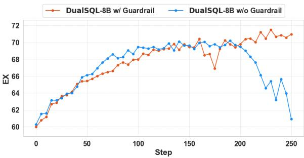  
Figure 2: Ablation study on the effectiveness of agentic rollout guardrails. We report execution accuracy (EX) on BIRD-Dev during training. Sequence-level masked importance sampling is enabled for both models.

Fig. 2 shows that agentic rollout guardrails prevent mode collapse before convergence by guiding the model to unlearn erroneous behavior immediately at the error turns. This allows the agent to maintain format correctness and reach higher performance via sustained training. In contrast, malformed actions are retained in trajectories with high rewards without the guardrails, which are reinforced during training and eventually lead to behavioral collapse.

## 5.2.4 DualSQL Reasoning Strategies

To characterize the behavior of DualSQL, we analyze the reasoning trajectories and tool usage patterns that emerged through joint multi-agent reinforcement learning. Table 6 summarizes the average number of tool calls made by DualSQL in each stage on BIRD-Dev. An ablation study of individual tools is available in Appendix D.

<table><tr><td>Stage</td><td>SE</td><td>FTS</td><td>DP</td><td>Total</td></tr><tr><td>Schema Linking</td><td>0.25</td><td>0.00</td><td>1.00</td><td>1.26</td></tr><tr><td>SQL Generation</td><td>1.22</td><td>0.05</td><td>0.49</td><td>1.76</td></tr></table>

Table 6: Average number of tools used by DualSQL-8B on BIRD-Dev. SE: SQL Execution, FTS: Full Text Search, DP: Database Profiler.

We highlight two primary strategies that distinguish DualSQL from single-turn baselines. (Please see Appendix G for example agent trajectories.)

Interactive Schema Linking: Rather than operating on a potentially hallucinated mental model derived from static DDL, the agents employ an interactive schema linking strategy. By leveraging the Database Profiler to inspect table metadata and the SQL Executor to sample specific rows, the agents actively resolve lexical mismatches and verify columns, tables, and join paths before generating the SQL code. The strategic separation between schema linking and SQL generation reduces the attention dilution of relevant information within massive input sequences in the SQL generator, allowing it to operate within a pruned, high-relevance context window. Additionally, our two-stage approach achieves robust failure recovery by augmenting self-correction with cross-validation, mitigating the risks of relying solely on self-correction (Zhang et al., 2025b). Should the pre-filtered schema from the schema linker prove insufficient during execution, the SQL generator retains the capability of using tools to refine its schema understanding.

Execution-guided Error Correction: Unlike the standard single-turn reasoning models that are prone to syntactically valid queries returning incorrect results, DualSQL emulates the behavior of human developers to transform SQL generation from a static parsing task into a dynamic hypothesistesting loop. By analyzing intermediate execution feedback, the agents detect discrepancies (e.g., numerical data stored as strings, non-standard date formats, or string values in a different language) and iteratively refine their queries with precise dialect-specific adjustments, such as type casting or string manipulation. It ensures the final SQL is consistent with users’ intents and the contents stored in the database.

## 6 Conclusion

We propose DualSQL, a multi-agent Text-to-SQL system optimized by a robust reinforcement learning framework. DualSQL unifies schema linking and SQL generation as two agents powered by a single LLM backbone and a set of database access tools, enabling effective reasoning over databases and joint optimization through RL. DualSQL-4B reaches 68.0% EX on BIRD-Dev, matching prior 7B baselines, while DualSQL-8B sets a new singlemodel state-of-the-art of 71.1% EX, surpassing methods built on 32B models. These results demonstrate that joint multi-agent optimization is an effective path toward stronger Text-to-SQL systems.

We see three promising directions for future work: (1) better reward design for multi-agent reinforcement learning, including fine-grained process reward signals and inter-agent credit assignment mechanisms; (2) scaling training data via synthesis of large-scale databases and challenging Text-to-SQL questions; and (3) more effective multi-agent RL recipes for training larger models and supporting longer-horizon trajectories.

## Limitations

Model backbone. We instantiate DualSQL on the Qwen3 family because (1) it natively supports both extended reasoning and tool calling, two key capabilities our agentic formulation requires; and (2) it is well supported by open-source training frameworks like VeRL. Nevertheless, we believe our training recipe to be applicable to any backbone LLMs with these capabilities, including openweight and proprietary ones.

Reward design. REX substantially improves over EX as a reward signal, as confirmed by our ablations. However, it is still a proxy for SQL equivalence checking and could produce false signals. In addition, as with any outcome-based reward function, our reward design lacks fine-grained process-level reward signals which could be important for training stronger Text-to-SQL agents in the future.

Security. We restrict the agents to read-only database access throughout training and evaluation. As with any LLM-driven system that interfaces with live data sources, deploying DualSQL in production warrants standard precautions against query-induced resource exhaustion and adversarial prompt injection.

## Artifact and Data Usage

This work leverages datasets and code from previous research, including the BIRD Dataset (Li et al., 2023) (CC BY-SA 4.0), the Spider dataset (Yu et al., 2018) (CC BY-SA 4.0), code from the VeRL (Apache 2.0) framework (Sheng et al., 2024), and the Qwen3 (Apache 2.0) family of models (Yang et al., 2025a). These data, software, and models have permissive licenses for use in academic research.

## AI Assistant Usage

The authors used AI assistants for editing and improving the language of the paper. All presented content is reviewed by the authors.

## References

Asim Biswal, Chuan Lei, Xiao Qin, Aodong Li, Balakrishnan Narayanaswamy, and Tim Kraska. 2026. Agentsm: Semantic memory for agentic text-to-sql. arXiv preprint arXiv:2601.15709.

Andy Chung, Yichi Zhang, Kaixiang Lin, Aditya Rawal, Qiaozi Gao, and Joyce Chai. 2025a. Evaluating longcontext reasoning in llm-based webagents. arXiv preprint arXiv:2512.04307.

Yeounoh Chung, Gaurav T. Kakkar, Yu Gan, Brenton Milne, and Fatma Ozcan. 2025b. Is long context all you need? leveraging llm’s extended context for nl2sql. Proc. VLDB Endow., 18(7):2735–2748.

Minghang Deng, Ashwin Ramachandran, Canwen Xu, Lanxiang Hu, Zhewei Yao, Anupam Datta, and Hao Zhang. 2025. Reforce: A text-to-sql agent with self-refinement, format restriction, and column exploration. In ICLR 2025 Workshop: VerifAI: AI Verification in the Wild.

Guanting Dong, Hangyu Mao, Kai Ma, Licheng Bao, Yifei Chen, Zhongyuan Wang, Zhongxia Chen, Jiazhen Du, Huiyang Wang, Fuzheng Zhang, et al. 2025. Agentic reinforced policy optimization. arXiv preprint arXiv:2507.19849.

Yufeng Du, Minyang Tian, Srikanth Ronanki, Subendhu Rongali, Sravan Bodapati, Aram Galstyan, Azton Wells, Roy Schwartz, Eliu A Huerta, and Hao Peng. 2025. Context length alone hurts llm performance despite perfect retrieval. arXiv preprint arXiv:2510.05381.

Dawei Gao, Haibin Wang, Yaliang Li, Xiuyu Sun, Yichen Qian, Bolin Ding, and Jingren Zhou. 2023. Text-to-sql empowered by large language models: A benchmark evaluation. arXiv preprint arXiv:2308.15363.

Daya Guo, Dejian Yang, Haowei Zhang, Junxiao Song, Ruoyu Zhang, Runxin Xu, Qihao Zhu, Shirong Ma, Peiyi Wang, Xiao Bi, et al. 2025. Deepseek-r1: Incentivizing reasoning capability in llms via reinforcement learning. arXiv preprint arXiv:2501.12948.

Boyan Li, Yuyu Luo, Chengliang Chai, Guoliang Li, and Nan Tang. 2024a. The dawn of natural language to sql: Are we fully ready? arXiv preprint arXiv:2406.01265.

Haoyang Li, Shang Wu, Xiaokang Zhang, Xinmei Huang, Jing Zhang, Fuxin Jiang, Shuai Wang, Tieying Zhang, Jianjun Chen, Rui Shi, Hong Chen, and Cuiping Li. 2025. Omnisql: Synthesizing highquality text-to-sql data at scale. Proc. VLDB Endow., 18(11):4695–4709.

Haoyang Li, Jing Zhang, Hanbing Liu, Ju Fan, Xiaokang Zhang, Jun Zhu, Renjie Wei, Hongyan Pan, Cuiping Li, and Hong Chen. 2024b. Codes: Towards building open-source language models for text-to-sql. Proceedings of the ACM on Management of Data, 2(3):1–28.

Jinyang Li, Binyuan Hui, Ge Qu, Jiaxi Yang, Binhua Li, Bowen Li, Bailin Wang, Bowen Qin, Ruiying Geng, Nan Huo, Xuanhe Zhou, Chenhao Ma, Guoliang Li, Kevin C.C. Chang, Fei Huang, Reynold Cheng, and Yongbin Li. 2023. Can llm already

serve as a database interface? a big bench for largescale database grounded text-to-sqls. In Proceedings of the 37th International Conference on Neural Information Processing Systems, NIPS ’23, Red Hook, NY, USA. Curran Associates Inc.

Yingru Li. 2025. Mathematical formulations of rollout correction methods in verl.

Zhan Ling, Kang Liu, Kai Yan, Yifan Yang, Weijian Lin, Ting-Han Fan, Lingfeng Shen, Zhengyin Du, and Jiecao Chen. 2025. Longreason: A synthetic longcontext reasoning benchmark via context expansion. arXiv preprint arXiv:2501.15089.

Jiacai Liu, Yingru Li, Yuqian Fu, Jiawei Wang, Qian Liu, and Yu Shen. 2025a. When speed kills stability: Demystifying RL collapse from the training-inference mismatch.

Shu Liu, Alan Zhu, Sumanth Hegde, Shiyi Cao, Shuo Yuan, Samion Suwito, Tyler Griggs, Matei Zaharia, Joseph E Gonzalez, and Ion Stoica. 2025b. Skyrl-sql: Multi-turn sql data agents via rl. In First Workshop on Multi-Turn Interactions in Large Language Models (MTI-LLM @ NeurIPS).

Yifu Liu, Yin Zhu, Yingqi Gao, Zhiling Luo, Xiaoxia Li, Xiaorong Shi, Yuntao Hong, Jinyang Gao, Yu Li, Bolin Ding, et al. 2025c. Xiyan-sql: A novel multigenerator framework for text-to-sql. arXiv preprint arXiv:2507.04701.

Yuyu Luo, Guoliang Li, Ju Fan, Chengliang Chai, and Nan Tang. 2025. Natural language to sql: State of the art and open problems. Proceedings of the VLDB Endowment, 18(12):5466–5471.

Haoyuan Ma, Yongliang Shen, Hengwei Liu, Wenqi Zhang, Haolei Xu, Qiuying Peng, Jun Wang, and Weiming Lu. 2025a. Db-explore: Automated database exploration and instruction synthesis for text-to-sql. arXiv preprint arXiv:2503.04959.

Peixian Ma, Xialie Zhuang, Chengjin Xu, Xuhui Jiang, Ran Chen, and Jian Guo. 2025b. Sql-r1: Training natural language to sql reasoning model by reinforcement learning. arXiv preprint arXiv:2504.08600.

Xuan-Phi Nguyen, Shrey Pandit, Revanth Gangi Reddy, Austin Xu, Silvio Savarese, Caiming Xiong, and Shafiq Joty. 2025. Sfr-deepresearch: Towards effective reinforcement learning for autonomously reasoning single agents. arXiv preprint arXiv:2509.06283.

Mohammadreza Pourreza, Hailong Li, Ruoxi Sun, Yeounoh Chung, Shayan Talaei, Gaurav Tarlok Kakkar, Yu Gan, Amin Saberi, Fatma Ozcan, and Sercan O Arik. 2025a. CHASE-SQL: Multi-path reasoning and preference optimized candidate selection in text-to-SQL. In The Thirteenth International Conference on Learning Representations.

Mohammadreza Pourreza and Davood Rafiei. 2023. DIN-SQL: Decomposed in-context learning of textto-SQL with self-correction. In Thirty-seventh

Conference on Neural Information Processing Systems.

Mohammadreza Pourreza, Shayan Talaei, Ruoxi Sun, Xingchen Wan, Hailong Li, Azalia Mirhoseini, Amin Saberi, and Sercan O Arik. 2025b. Reasoning-SQL: Reinforcement learning with SQL tailored partial rewards for reasoning-enhanced text-to-SQL. In Second Conference on Language Modeling.

Zhihong Shao, Peiyi Wang, Qihao Zhu, Runxin Xu, Junxiao Song, Xiao Bi, Haowei Zhang, Mingchuan Zhang, Y. K. Li, Y. Wu, and Daya Guo. 2024. Deepseekmath: Pushing the limits of mathematical reasoning in open language models. Preprint, arXiv:2402.03300.

Guangming Sheng, Chi Zhang, Zilingfeng Ye, Xibin Wu, Wang Zhang, Ru Zhang, Yanghua Peng, Haibin Lin, and Chuan Wu. 2024. Hybridflow: A flexible and efficient rlhf framework. arXiv preprint arXiv: 2409.19256.

Vladislav Shkapenyuk, Divesh Srivastava, Theodore Johnson, and Parisa Ghane. 2025. Automatic metadata extraction for text-to-sql. arXiv preprint arXiv:2505.19988.

Aofeng Su, Aowen Wang, Chao Ye, Chen Zhou, Ga Zhang, Gang Chen, Guangcheng Zhu, Haobo Wang, Haokai Xu, Hao Chen, et al. 2024. Tablegpt2: A large multimodal model with tabular data integration. arXiv preprint arXiv:2411.02059.

Shayan Talaei, Mohammadreza Pourreza, Yu-Chen Chang, Azalia Mirhoseini, and Amin Saberi. 2024. Chess: Contextual harnessing for efficient sql synthesis. Preprint, arXiv:2405.16755.

Bing Wang, Changyu Ren, Jian Yang, Xinnian Liang, Jiaqi Bai, LinZheng Chai, Zhao Yan, Qian-Wen Zhang, Di Yin, Xing Sun, and Zhoujun Li. 2025a. MAC-SQL: A multi-agent collaborative framework for textto-SQL. In Proceedings of the 31st International Conference on Computational Linguistics, pages 540–557, Abu Dhabi, UAE. Association for Computational Linguistics.

Pengfei Wang, Baolin Sun, Xuemei Dong, Yaxun Dai, Hongwei Yuan, Mengdie Chu, Yingqi Gao, Xiang Qi, Peng Zhang, and Ying Yan. 2025b. Agentarscale-sql: Advancing text-to-sql through orchestrated test-time scaling. arXiv preprint arXiv:2509.24403.

Shenzhi Wang, Le Yu, Chang Gao, Chujie Zheng, Shixuan Liu, Rui Lu, Kai Dang, Xionghui Chen, Jianxin Yang, Zhenru Zhang, et al. 2025c. Beyond the 80/20 rule: High-entropy minority tokens drive effective reinforcement learning for llm reasoning. arXiv preprint arXiv:2506.01939.

Yixuan Even Xu, Yash Savani, Fei Fang, and J Zico Kolter. 2025a. Not all rollouts are useful: Downsampling rollouts in llm reinforcement learning. arXiv preprint arXiv:2504.13818.

Zekun Xu, Siyu Xia, Chuhuai Yue, Jiajun Chai, Mingxue Tian, Xiaohan Wang, Wei Lin, Haoxuan Li, and Guojun Yin. 2025b. Mtir-sql: Multi-turn tool-integrated reasoning reinforcement learning for text-to-sql. Preprint, arXiv:2510.25510.

Zhenghai Xue, Longtao Zheng, Qian Liu, Yingru Li, Xiaosen Zheng, Zejun Ma, and Bo An. 2025. Simpletir: End-to-end reinforcement learning for multi-turn tool-integrated reasoning. arXiv preprint arXiv:2509.02479.

An Yang, Anfeng Li, Baosong Yang, Beichen Zhang, Binyuan Hui, Bo Zheng, Bowen Yu, Chang Gao, Chengen Huang, Chenxu Lv, Chujie Zheng, Dayiheng Liu, Fan Zhou, Fei Huang, Feng Hu, Hao Ge, Haoran Wei, Huan Lin, Jialong Tang, and 41 others. 2025a. Qwen3 technical report. arXiv preprint arXiv:2505.09388.

Haolin Yang, Jipeng Zhang, Zhitao He, and Yi R. Fung. 2025b. Mars-sql: A multi-agent reinforcement learning framework for text-to-sql. Preprint, arXiv:2511.01008.

Zhewei Yao, Guoheng Sun, Lukasz Borchmann, Zheyu Shen, Minghang Deng, Bohan Zhai, Hao Zhang, Ang Li, and Yuxiong He. 2025. Arctic-text2sql-r1: Simple rewards, strong reasoning in text-to-sql. Preprint, arXiv:2505.20315.

Qiying Yu, Zheng Zhang, Ruofei Zhu, Yufeng Yuan, Xiaochen Zuo, Yu Yue, Weinan Dai, Tiantian Fan, Gaohong Liu, Lingjun Liu, et al. 2025. DAPO: An open-source LLM reinforcement learning system at scale. In The Thirty-ninth Annual Conference on Neural Information Processing Systems.

Tao Yu, Rui Zhang, Kai Yang, Michihiro Yasunaga, Dongxu Wang, Zifan Li, James Ma, Irene Li, Qingning Yao, Shanelle Roman, Zilin Zhang, and Dragomir Radev. 2018. Spider: A large-scale human-labeled dataset for complex and cross-domain semantic parsing and text-to-SQL task. In Proceedings of the 2018 Conference on Empirical Methods in Natural Language Processing, pages 3911–3921, Brussels, Belgium. Association for Computational Linguistics.

Jiani Zhang, Hengrui Zhang, Rishav Chakravarti, Yiqun Hu, Patrick Ng, Asterios Katsifodimos, Huzefa Rangwala, George Karypis, and Alon Halevy. 2025a. Coddllm: Empowering large language models for data analytics. arXiv preprint arXiv:2502.00329.

Qingjie Zhang, Di Wang, Haoting Qian, Yiming Li, Tianwei Zhang, Minlie Huang, Ke Xu, Hewu Li, Liu Yan, and Han Qiu. 2025b. Understanding the dark side of llms’ intrinsic self-correction. In Proceedings of the 63rd Annual Meeting of the Association for Computational Linguistics (Volume 1: Long Papers), pages 27066–27101.

Yuxin Zhang, Meihao Fan, Ju Fan, Mingyang Yi, Yuyu Luo, Jian Tan, and Guoliang Li. 2025c. Rewardsql: Boosting text-to-sql via stepwise reasoning and process-supervised rewards. arXiv preprint arXiv:2505.04671.

Chujie Zheng, Kai Dang, Bowen Yu, Mingze Li, Huiqiang Jiang, Junrong Lin, Yuqiong Liu, Hao Lin, Chencan Wu, Feng Hu, et al. 2025a. Stabilizing reinforcement learning with llms: Formulation and practices. arXiv preprint arXiv:2512.01374.

Tong Zheng, Hongming Zhang, Wenhao Yu, Xiaoyang Wang, Runpeng Dai, Rui Liu, Huiwen Bao, Chengsong Huang, Heng Huang, and Dong Yu. 2025b. Parallel-r1: Towards parallel thinking via reinforcement learning. arXiv preprint arXiv:2509.07980.

## A More Tool Implementation Details

To optimize the model’s consumption of tool results, we serialize all tool results using the JSON format, minimizing the distribution gap between tool results and the model’s pre-training data. We further host the tools as an independent asynchronous web service, isolating the high latency of database operations from the GPU-intensive LLM inference process so that database access does not bottleneck GPU utilization during rollout.

SQL Executor. The tool returns query results as row objects. To prevent retrieved data from exceeding context window limits, we implement a content-aware truncation strategy: for regular SQL queries, output is restricted to a maximum of 10 rows and overlong cell values (>150 characters) are truncated; for schema-related queries (e.g., sqlite\_master or PRAGMA), the tool preserves the full result set to ensure the agent maintains accurate and complete knowledge of the database structure.

Full Text Search. Databases may contain hundreds of tables and millions of rows, making embedding-based semantic matching expensive to deploy. We instead leverage the SQLite FTS5 extension to construct inverted indices over schema names and database contents, facilitating low-latency fuzzy matching. The tool returns a structured context containing the matched schema elements and up to five distinct matched values per column.

Database Profiler. For each table and column, we prompt an LLM offline to generate a description summarizing semantic intent and to infer foreignkey relationships that may not be formally defined in the DDL. The profiler also computes columnlevel statistics including distinct value counts, data types, and null-value ratios. By precomputing these static features applicable to all queries, the tool offloads complex schema analysis from the runtime reasoning process, so the agent can focus on query logic rather than schema interpretation.

## B More Training Details

We train DualSQL-4B for 100 steps. The training for DualSQL-8B takes 300 steps, taking about 4.5 days on a 4-node compute cluster, with 8 H100 80GB GPUs per node.

We compare the Robust Execution Match during training for the single-agent $D u a l S Q L _ { s q l } – 8 \mathbf { B }$ and multi-agent DualSQL-8B in Fig. 3. Although DualSQL-8B starts a little worse due to limited initial schema linking accuracy, it catches up and consistently outperforms $D u a l S Q L _ { s q l } – 8 \mathbf { B }$ in the rest of the training process, demonstrating the effectiveness of our multi-agent framework.

## C Performance Breakdown by Difficulty

We break down the performance of DualSQL by difficulty in Table 7. Compared with $D u a l S Q L _ { s q l }$ which is trained only on the SQL generation task with the same recipe, our multi-agent formulation brings performance improvements at all difficulty levels, with the most significant improvement on challenging questions (3.0% EX for the 8B model).

## D Ablation on Tools

We conduct an ablation study to evaluate the impact of each tool on the performance of DualSQL-8B on BIRD-Dev. On the BIRD-Dev dataset, we evaluate the DualSQL-8B model, which is trained with all three tools, and disable each tool one at a time. We report the average number of tool calls and overall performance in Table 8.

The results demonstrate that each tool contributes positively to the overall performance. Although DualSQL is able to compensate for the missing tool by increasing the usage of other tools, the removal of any tool results in a performance drop, especially for SQL generation. The SQL execution tool has the most significant impact when removed. Without the ability to execute SQL queries and iteratively refine its solutions, the agents suffer a 2.5% drop in EX and a massive 6.8% drop in REX during the SQL generation stage.

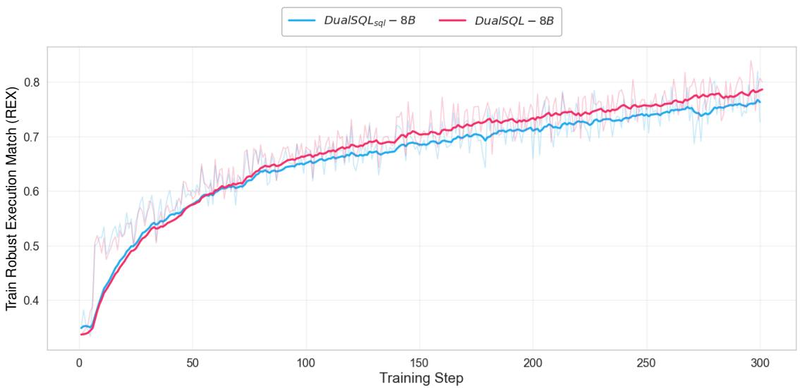

Figure 3: Training robust execution match of $D u a l S Q L _ { s q l }$ -8B (single-agent) and DualSQL-8B (multi-agent).
<table><tr><td>Method</td><td>Base Model</td><td>Task</td><td>Easy Moderate Challenging</td><td></td><td></td><td>Overall</td></tr><tr><td rowspan="3">SQL-R1-7B SQL-R1-14B OmniSQL-7B</td><td>Qwen2.5-Coder-7B</td><td>SQL Generation</td><td>72.1</td><td>60.8</td><td>51.0</td><td>66.6</td></tr><tr><td>Qwen2.5-Coder-14B</td><td>SQL Generation</td><td>72.4</td><td>59.7</td><td>56.5</td><td>67.1</td></tr><tr><td>Qwen2.5-Coder-7B</td><td>SQL Generation</td><td></td><td></td><td></td><td>63.9</td></tr><tr><td>Arctic-text2sql-R1*</td><td>OmniSQL-7B</td><td>SQL Generation</td><td>73.9</td><td>62.3</td><td>55.9</td><td>68.7</td></tr><tr><td rowspan="3"> $\mathrm { Q w e n } 3 – 4 \mathrm { B }$  DualSQL-4B (Ours)</td><td></td><td>SQL Generation</td><td>67.5</td><td>49.1</td><td>42.6</td><td>59.6</td></tr><tr><td>Qwen3-4B</td><td>Linking + SQL Generation 73.2</td><td></td><td>61.9</td><td>54.4</td><td>68.0</td></tr><tr><td></td><td>SQL Generation</td><td>68.5</td><td>51.8</td><td>41.1</td><td>60.9</td></tr><tr><td> $\mathrm { Q w e n } 3 { - } 8 \mathrm { B }$   $D u a l S Q L _ { s q l } – 8 \mathbf { B } \left( \mathrm { O u r s } \right)$ </td><td>Qwen3-8B</td><td>SQL Generation</td><td>74.7</td><td>63.9</td><td>55.7</td><td>69.6</td></tr><tr><td> $D u a l S Q L \dot { - } 8 \mathbf { B } \left( \mathrm { O u r s } \right)$ </td><td>Qwen3-8B</td><td>Linking + SQL Generation 76.1</td><td></td><td>64.9</td><td>58.7</td><td>71.1</td></tr></table>

Table 7: Performance on BIRD-Dev by question difficulty. We report average execution match. ∗We evaluate the released checkpoints of Arctic-text2sql-R1 7B for per-difficulty performance. SQL-R1 and OmniSQL performance are taken from their publications.

## E Robust Execution Match

This algorithm computes a similarity score between a ground truth dataframe (G) and a sample dataframe (S). Equivalence is determined by $s c o r e = 1 . 0$ . The behavior is primarily controlled by a user-defined boolean, strict\_row\_ordering. If columns do not match by name, then they are matched by content using a standard Linear Sum Assignment Problem solver (LSAP) as a subroutine. If the sample dataframe contains more columns/rows than the ground truth, then a proportional penalty is applied. Type differences are handled flexibly.

## Complexity Analysis Notes

Let N be the number of rows and M be the number of columns.

## Strict Row Ordering

• Element-wise scores: $O ( N \cdot M )$

• Unmatched Column Matching (LSAP): Score matrix $O ( M ^ { 2 } \cdot N )$ , LSAP solution $O ( M ^ { 3 } )$ .

• Total Complexity: $O ( N \cdot M ^ { 2 } )$

## Loose Row Ordering

• Heuristic (M > 4):

– Row alignment on $K _ { k e y } \left( \mathrm { L S A P } \right) : O ( N ^ { 2 }$ $| K _ { k e y } | + N ^ { 3 } ) \approx { \cal O } ( N ^ { \bar { 3 } } )$

– Column Matching phase: $O ( N \cdot M ^ { 2 } )$

– Total: $O ( N ^ { 3 } + N \cdot M ^ { 2 } )$

• Exact $( M \leq 4 .$ , With Common Columns):

– Row alignment on $K _ { c o m m o n }$ (LSAP): $O ( N ^ { 2 } \cdot M + N ^ { 3 } )$

– Column matching on $\begin{array} { r l } { K _ { u } } & { { } ( \mathrm { L S A P } ) } \end{array}$ $O ( M ^ { 2 } \cdot N )$

– Total: $O ( N ^ { 3 } + N ^ { 2 } \cdot M )$

• Exact $( M \leq 4 ,$ , No Common Columns):

Algorithm 1 Robust Execution Match   
Require: $G , S ;$ parameter strict\_row\_ordering   
1: if NOT strict\_row\_ordering AND max $( | G _ { c o l s } | , | S _ { c o l s } | ) > 4$ then   
2: // Heuristic for wide dataframes   
3: Select $K _ { k e y }$ columns from G with highest cardinality (1 or 2 columns depending on $| S _ { c o l s } | )$   
4: Align $G [ K _ { k e y } ]$ and $S$ using exact matching (line 14), yielding row map $\pi _ { r o w s }$   
5: Reorder $G$ and S based on $\pi _ { r o w s }$   
6: strict\_row\_ordering ← True // proceed to strict row logic   
7: go to line 10   
8: end if   
9: Identify common columns $K _ { c o m m o n }$ and unmatched $K _ { u _ { g } }$ (in G), $K _ { u _ { s } }$ (in S)   
10: if strict\_row\_ordering then   
11: Score similarity of $G [ K _ { c o m m o n } ]$ and $S [ K _ { c o m m o n } ]$ via element-wise comparison   
12: Match $K _ { u _ { g } } , K _ { u _ { s } }$ using LSAP to maximize column similarity, yielding $\pi _ { c o l s }$   
13: Combine scores from common and best-matched unmatched columns   
14: else   
15: // Loose row ordering, exact matching   
16: if $K _ { c o m m o n } \neq \emptyset$ then   
17: Match rows of $G [ K _ { c o m m o n } ]$ and $S [ K _ { c o m m o n } ]$ to find permutation $\pi _ { r o w s }$ using LSAP   
18: Calculate score for Kcommon based on this alignment   
19: Reorder $G [ K _ { u _ { g } } ]$ and $S [ K _ { u _ { s } } ]$ according to πrows   
20: Match reordered $K _ { u _ { g } } , K _ { u _ { s } }$ using column LSAP, yielding $\pi _ { c o l s }$   
21: Combine scores   
22: else   
23: // No common columns   
24: Fallback: iterate column permutations of S with G   
25: For each permutation, find optimal row alignment $\pi _ { r o w s }$ using LSAP   
26: Keep permutation yielding maximum total similarity   
27: end if   
28: end if   
29: Calculate final score, normalized by $| G _ { c o l s } |$   
30: Apply penalty: score ← score $\times \frac { | G _ { c o l s } | } { \operatorname* { m a x } ( | G _ { c o l s } | , | S _ { c o l s } | ) }$   
|Grows|   
31: Apply penalty: score ← score ×   
max(|Grows|,|Srows|)   
32: return score

<table><tr><td>Model</td><td>Stage</td><td>SQL Execution</td><td>Full Text Search</td><td>Database Profiler</td><td>Total</td><td>F1</td><td>EX</td><td>REX</td></tr><tr><td>DualSQL-8B</td><td>Schema Linking</td><td>0.25</td><td>0.00</td><td>1.00</td><td>1.26</td><td>90.8</td><td>一</td><td></td></tr><tr><td>DualSQL-8B</td><td>SQL Generation</td><td>1.22</td><td>0.05</td><td>0.49</td><td>1.76</td><td>-</td><td>71.1</td><td>68.6</td></tr><tr><td>DualSQL-8B</td><td>Schema Linking</td><td>X</td><td>0.06</td><td>1.03</td><td>1.09</td><td>90.6</td><td>一</td><td>-</td></tr><tr><td>DualSQL-8B</td><td>SQL Generation</td><td>X</td><td>0.29</td><td>1.08</td><td>1.37</td><td></td><td>68.6</td><td>61.8</td></tr><tr><td>DualSQL-8B</td><td>Schema Linking</td><td>0.34</td><td>X</td><td>1.02</td><td>1.36</td><td>90.6</td><td></td><td></td></tr><tr><td>DualSQL-8B</td><td>SQL Generation</td><td>1.35</td><td>X</td><td>0.76</td><td>2.11</td><td></td><td>69.8</td><td>66.6</td></tr><tr><td>DualSQL-8B</td><td>Schema Linking</td><td>1.24</td><td>0.15</td><td>X</td><td>1.39</td><td>90.2</td><td></td><td></td></tr><tr><td>DualSQL-8B</td><td>SQL Generation</td><td>1.43</td><td>0.27</td><td>X</td><td>1.70</td><td></td><td>69.9</td><td>66.6</td></tr></table>

Table 8: Average number of tools used on BIRD-Dev and overall performance.

– Column Permutations × Row LSAP: $O ( M ! \cdot ( N ^ { 2 } \cdot M + N ^ { 3 } ) )$

– Total: $O ( M ! \cdot ( N ^ { 3 } + N ^ { 2 } \cdot M ) )$

## F Prompts

## F.1 Schema Linking Agent Prompt

Figure 4 and 5 show the system and user prompts for the Schema Linking Agent.

## F.2 SQL Generation Agent Prompt

Figure 6 and 7 show the system and user prompts for the SQL Generation Agent.

## G Example Agent Trajectories and Reasoning Patterns

In this section, we showcase the reasoning patterns that emerged through the agents’ RL training.

## G.1 Schema Linking Agent

As illustrated in Figure 8, the Schema Linking agent learns to actively ground its selection process through database profiling rather than relying on zero-shot assumptions. When faced with specific formatting requirements or ambiguous column names, the agent utilizes the database\_profiler tool to inspect actual data samples and column descriptions (e.g., verifying date formats). This ensures the semantic correctness of the chosen tables before proceeding.

Furthermore, Figure 9 demonstrates a more sophisticated, multi-tool dynamic verification strategy. In this trajectory, the agent sequentially chains multiple tools to adaptively prune the schema: it employs full\_text\_search to locate relevant tables based on keywords, profiles the data to confirm formats, and executes exploratory queries via execute\_sql to empirically validate table joins (e.g., checking for overlapping entity IDs between tables). Together, these emergent reasoning patterns highlight the agent’s ability to iteratively gather evidence and construct a highly reliable schema for downstream SQL generation.

## G.2 SQL Generation Agent

For the SQL Generation agent, we observe a strong tendency toward a minimal output strategy, as depicted in Figure 10. Rather than generating verbose queries that return extraneous columns or intermediate calculations, the agent carefully aligns its SQL logic with the exact semantic intent of the user’s question. For instance, when asked to identify which of two players is older, the agent explicitly reasons that the final output should only be a single name. It subsequently formulates a query utilizing an ORDER BY clause combined with LIMIT 1 to extract precisely the requested entity. This behavior indicates that the agent has learned to synthesize highly targeted queries that directly answer the prompt without requiring further human interpretation of the result set.

Furthermore, the agent exhibits advanced iterative debugging capabilities and an awareness of database-specific nuances, as illustrated in Figure 11. In this trajectory, the agent’s initial query execution unexpectedly yields NULL values. Instead of halting or blindly guessing a fix, the agent systematically hypothesizes potential mathematical and dialect-specific causes—such as division by zero or SQLite’s default handling of integer division. By dynamically reasoning about the underlying database engine’s mechanics, the agent actively corrects its query by applying the CAST(... AS REAL) function to prevent integer truncation. This demonstrates how the RL training framework enables the agent to utilize execution feedback not just to fix syntax errors, but to resolve subtle, datadependent semantic edge cases.

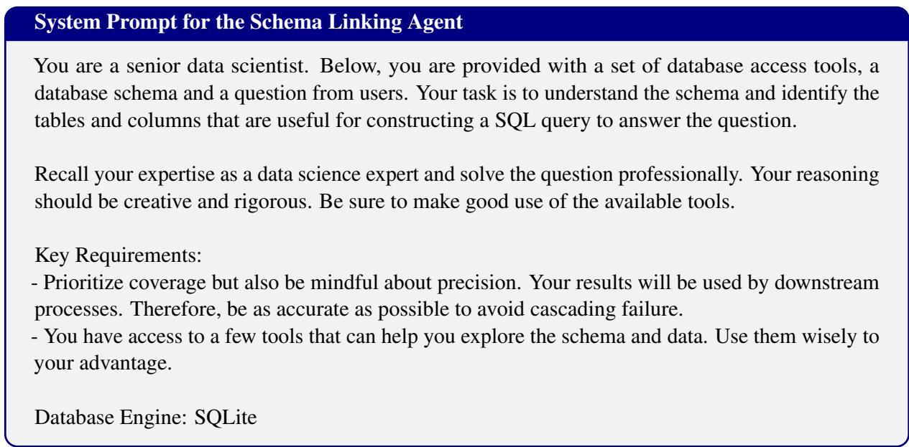

Figure 4: System Prompt for Schema Linking Agent  
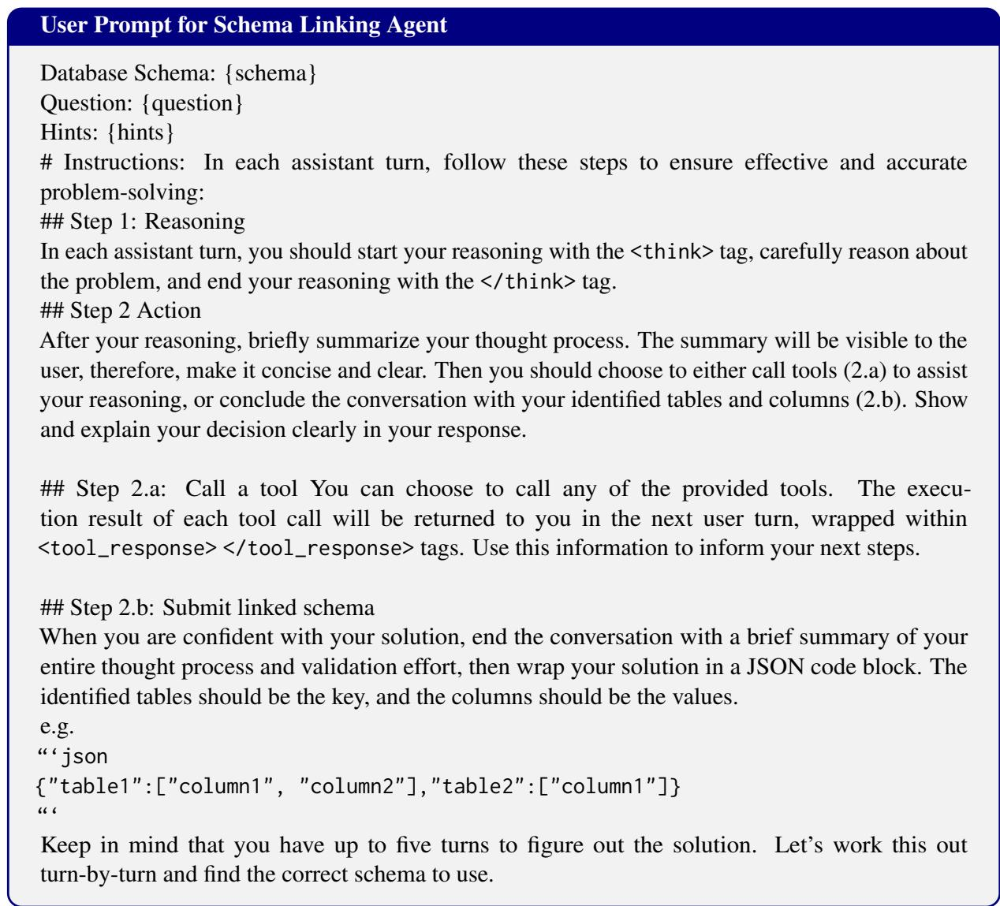  
Figure 5: User Prompt Template for Schema Linking Agent

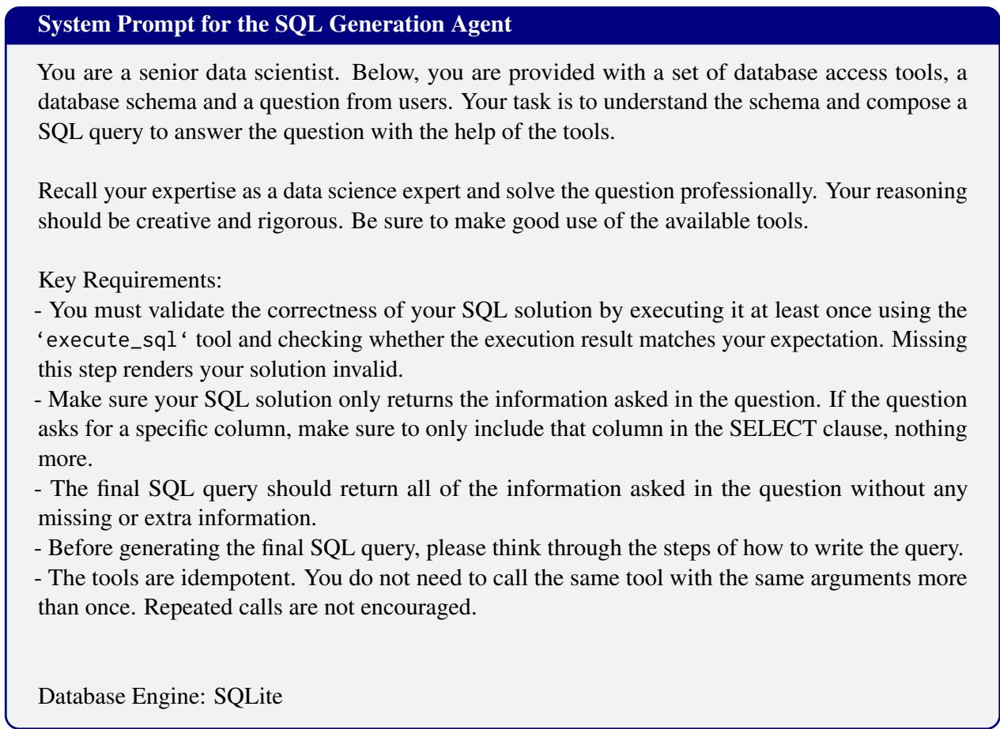  
Figure 6: System Prompt for SQL Generation Agent

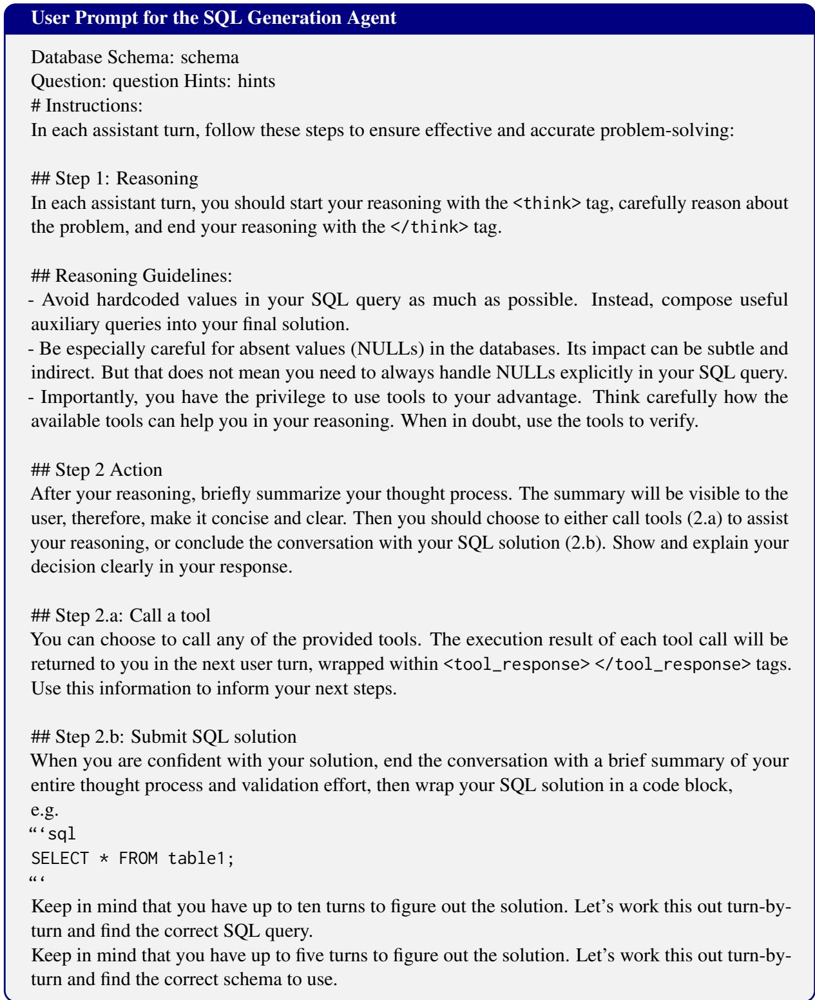  
Figure 7: User Prompt for the SQL Generation Agent

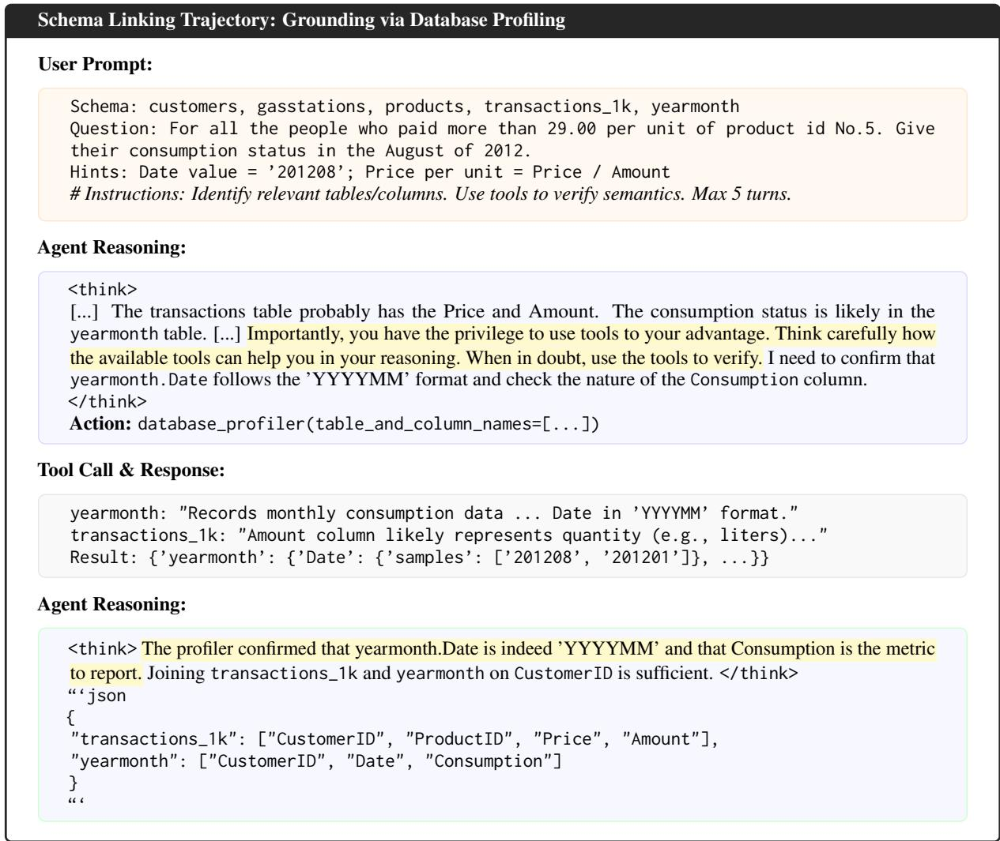  
Figure 8: Trajectory illustrating the agent’s use of database\_profiler for schema linking. Instead of guessing column formats, it learns to inspect data samples and descriptions, ensuring the final linked schema is sound for the subsequent SQL generation step.

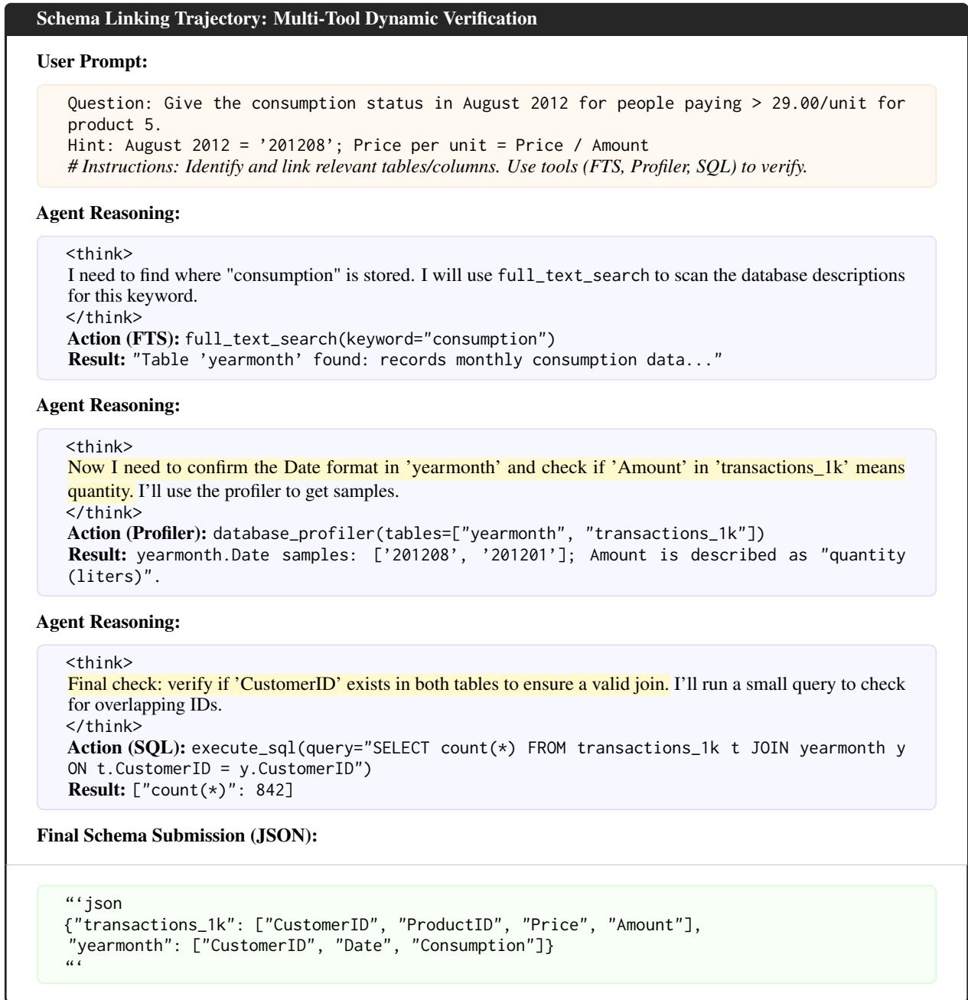  
Figure 9: Schema Linking trajectory for adaptive schema pruning based on tool calling responses from Full-Text Search, Database Profiler, and Execute SQL.

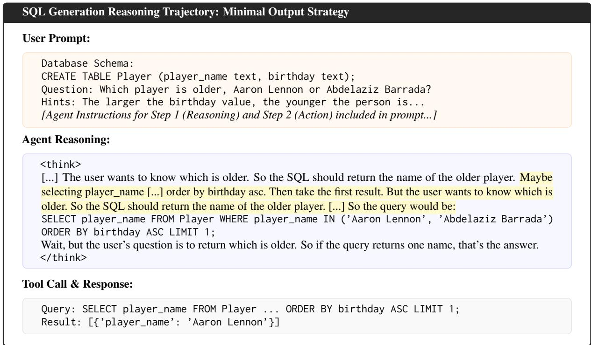  
Figure 10: SQL Generation trajectory showing the agent’s decision-making process to ensure the SQL output is minimal, just answering what the user asked for using LIMIT 1.

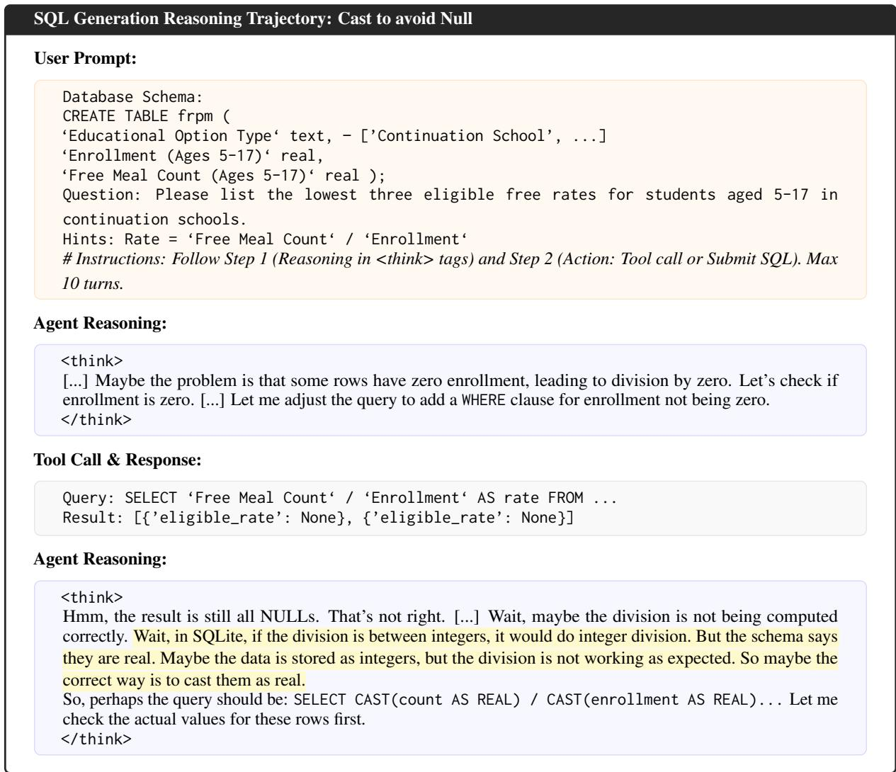  
Figure 11: SQL Generation trajectory showing the agent identifying an integer division issue in SQLite through iterative tool use and reasoning.