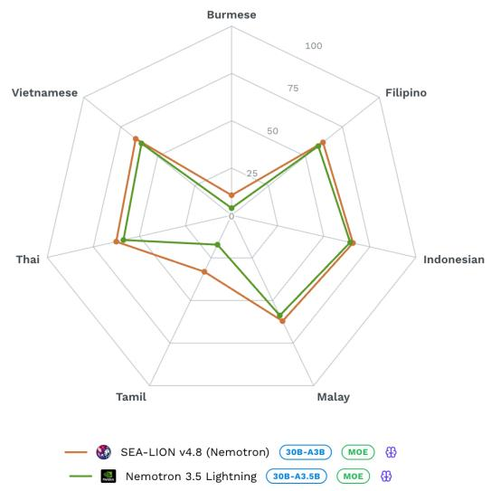
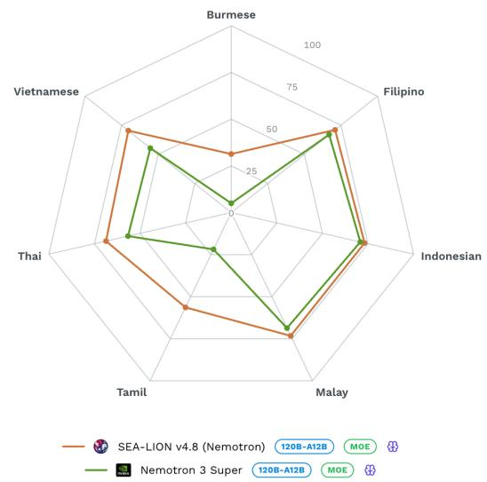
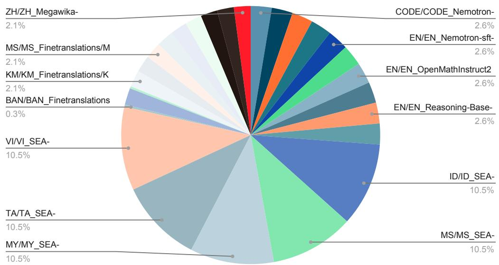
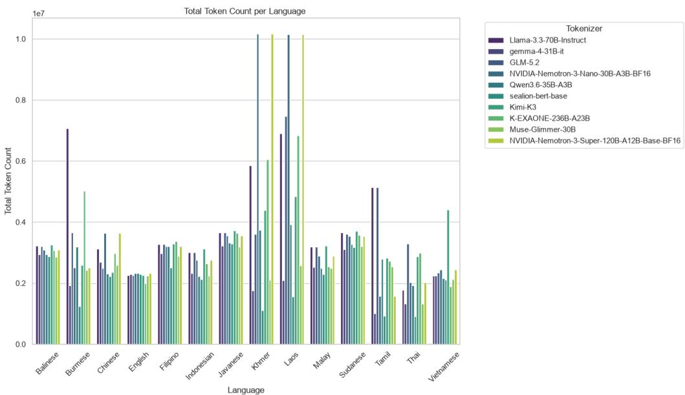
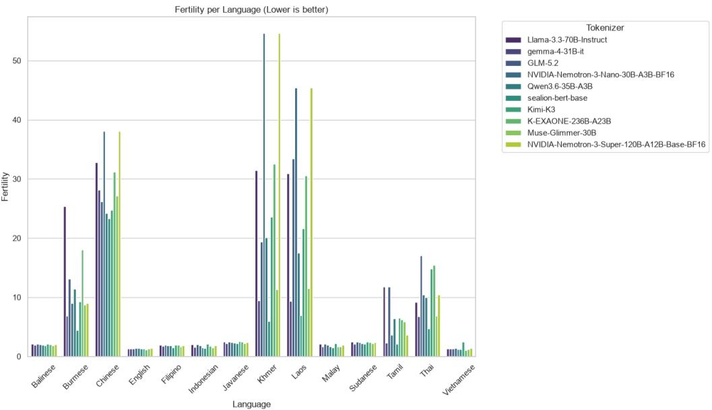
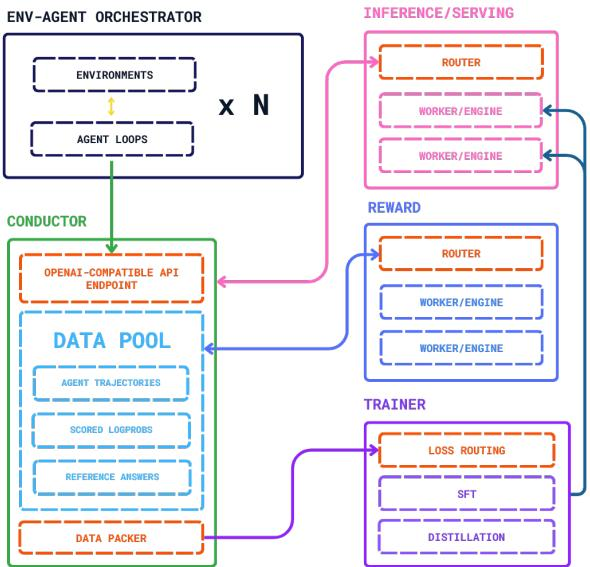

# EA-LION-v4.8: A Technical Report

AI Products Pillar, AI Singapore

sealion@aisingapore.org

## Abstract

We introduce NEMOTRON-SEA-LION-V4.8, a family of Southeast Asian Languages in One Network (SEA-LION) built upon NVIDIA Nemotron 3. The family includes 30B-A3B and 120B-A12B models, with both continued-pretrained base checkpoints and post-trained variants. We adapt the models using Southeast Asian, reasoning, code, and multilingual parallel datasets, followed by post-training with supervised fine-tuning and online on-policy distillation. On SEA-HELM, the 30B-A3B model improves the overall SEA score from 46.06 to 51.57, while the 120B-A12B model improves from 49.30 to 63.44. The strongest gains are observed in instruction following, natural language reasoning, and natural language understanding across seven Southeast Asian languages.

## Contents

1 Introduction 3   
2 Model Architecture 4   
2.1 Model Variants 4   
3 Continual Pre-training 5   
3.1 Pre-training Data 5   
3.2 Tokenizer 6   
3.3 Training Recipe . 7   
3.4 Limitations of Continued Pre-training 8   
4 Post-training 9   
4.1 Post-training Data . 9   
4.2 Training Recipe . 10   
5 Evaluation: SEA-HELM 12   
5.1 Language Coverage . 13   
5.2 Additional Evaluation Dimensions 13   
5.3 Evaluation Methodology 13   
6 Main Results 14

Preprint.

6.1 Language Performance . 14   
6.2 Task Performance . 14   
7 Conclusion 16

## 1 Introduction

Large language models (LLMs) have made rapid progress in reasoning, instruction following, coding, long-context understanding, and agentic capabilities. Recent open-weight model families have also become increasingly multilingual, enabling a broader range of users to access capable language models without relying exclusively on proprietary systems. Nevertheless, multilingual coverage remains highly uneven. Languages with substantially less representation in large-scale training corpora often receive weaker linguistic, cultural, and domain-specific support, and improvements observed on English-centric benchmarks do not necessarily transfer uniformly to these languages.

This challenge is particularly important for Southeast Asia, one of the world’s most linguistically and culturally diverse regions. The region spans multiple language families and writing systems, with substantial differences in the availability and quality of digital resources. Consequently, even strong multilingual foundation models can exhibit large differences in performance across Southeast Asian languages. Therefore, improving regional capability requires more than simply scaling model size: it requires deliberate choices about language coverage, training data, and training methodology.

In this report, we introduce NEMOTRON-SEA-LION-V4.8, a new generation of SEA-LION models built upon the NVIDIA Nemotron 3 series. SEA-LION-v4.8 comprises two model scales: a 30Bparameter model with 3B active parameters and a 120B-parameter model with 12B active parameters. For each size, we release both a continued-pretrained base model and a corresponding post-trained model, resulting in four released checkpoints: NEMOTRON-SEA-LION-V4.8-30B-A3B-BASE, NEMOTRON-SEA-LION-V4.8-30B-A3B, NEMOTRON-SEA-LION-V4.8-120B-A12B-BASE, and NEMOTRON-SEA-LION-V4.8-120B-A12B.

For the continued-pretraining stage, we adapt the corresponding Nemotron 3 foundation models using 150B high-quality tokens covering question answering, reasoning, code, and multilingual translation data, with particular emphasis on English and Southeast Asian languages. The 30B model is trained using Megatron Bridge, while the 120B model is trained using NVIDIA NeMo AutoModel. We retain the original Nemotron tokenizers for both model families. Building on these continuedpretrained checkpoints, we further perform large-scale post-training using our unified training pipeline which consists of online on-policy distillation (OPD) with SFT. Rather than relying exclusively on a static offline instruction dataset, our post-training system allows the model to continuously generate interactions across heterogeneous task environments and learn from supervision provided on its own current behavior. This framework enables the model to combine conventional supervised data with online-generated trajectories while exposing a single evolving model to large numbers of concurrent interaction environments.

To demonstrate the robustness of SEA-LION-v4.8, we evaluate SEA-LION- 4.8 on SEA-HELM, where we also update the dataset and evaluation methods, for a robustness evaluation. The experimental results demonstrate that, as shown in Figure 1, SEA-LION-V4.8 achieves substantial improvements over the corresponding Nemotron 3 foundation models on Southeast Asian languages while preserving strong general capabilities. In particular, NEMOTRON-SEA-LION-V4.8-120B-A3B (Figure 1b) improves the overall SEA-HELM score from 49.30 to 63.44, with the largest gains observed for TAMIL AND BURMESE. The strongest gains are observed in instruction following, natu ral language reasoning, and natural language understanding across seven Southeast Asian languages. NEMOTRON-SEA-LION-V4.8-30B-A12B (Figure 1a) further achieves a gain from 46.06 to 51.57, demonstrating that the proposed continued-pretraining and post-training pipeline remains effective at a substantially larger model scale. These results suggest that targeted regional adaptation can substantially improve Southeast Asian language capabilities without requiring the development of an entirely new foundation model from scratch.

Our contributions are summarized as follows:

• We introduce NEMOTRON-SEA-LION-V4.8, a family of four open models spanning 30B-A3B and 120B-A12B scales, including both pre-trained and instruction-trained checkpoints.

• We perform continued pre-training on 150B high-quality tokens spanning Southeast Asian and English languages, adapting strong Nemotron 3 foundation models toward regional linguistic and cultural capabilities.

• We develop a large-scale post-training framework based on online on-policy distillation, enabling a single evolving model to learn continuously from interactions generated across heterogeneous task environments.

<table><tr><td>Model</td><td>Stage</td><td>Total</td><td>Architecture</td><td>Context</td></tr><tr><td>Nemotron-SEA-LION-v4.8-30B-A3B-Base</td><td>CPT</td><td>30B</td><td>Mamba2-Transformer Hybrid MoE</td><td>128K</td></tr><tr><td>Nemotron-SEA-LION-v4.8-30B-A3B</td><td>Post-training</td><td>30B</td><td>Mamba2-Transformer Hybrid MoE</td><td>128K</td></tr><tr><td>Nemotron-SEA-LION-v4.8-120B-A12B-Base</td><td>CPT</td><td>120B</td><td>Mamba2-Attention Hybrid LatentMoE</td><td>128K</td></tr><tr><td>Nemotron-SEA-LION-v4.8-120B-A12B</td><td>Post-training</td><td>120B</td><td>Mamba2-Attention Hybrid LatentMoE</td><td>128K</td></tr></table>

Table 1: Overview of the SEA-LION-v4.8 model family. We release continued-pretrained base models and corresponding post-trained models at two computational scales.

  
(a) The overall result comparison between Nemotron-SEA-LION-v4.8-30B-A3B and its base model (nvidia/NVIDIA-Nemotron-3.5-Lightning-30B-A3B-BF16).

  
(b) The overall result comparison between Nemotron-SEA-LION-v4.8-120B-A12B and its base model (nvidia/NVIDIA-Nemotron-3-Super-120B-A12B-FP8).  
Figure 1: Overall result comparisons between Nemotron-SEA-LION-v4.8 models and their respective base models.

## 2 Model Architecture

SEA-LION-v4.8 consists of two complementary development tracks: a SEA-focused continued pre-training track and a post-training-focused track. Rather than assuming that the difference between continued-pretraining and post-training of the models is simply a matter of scale, we separate the two tracks to reflect distinct strategies for incorporating regional capability into large language models. In particular, the continued pre-training track investigates adaptation at the foundation-model level, whereas the post-training track investigates how far strong existing foundation models can be specialized for SEA through intensive post-training.

## 2.1 Model Variants

As shown in Table 1, SEA-LION-V4.8 consists of four released checkpoints at two model scales: 30B parameters with 3B active parameters and 120B parameters with 12B active parameters. For each size, we release both a continued-pretrained base model and a corresponding post-trained model. This design allows the continued-pretraining and post-training stages to be performed independently while also providing complete end-to-end SEA-LION-v4.8 models.

Nemotron-SEA-LION-v4.8-30B-A3B-Base. Our smaller base model is initialized from nvidia/NVIDIA-Nemotron-3-Nano-30B-A3B-Base-BF16. The model contains approximately 30B total parameters with 3B active parameters and uses a Mamba2-Transformer hybrid mixture-of-experts (MoE) architecture. To adapt the foundation Nemotron-SEA-LION-v4.8-30B-A3B-Base model toward Southeast Asian languages and contexts, we perform continued pre-training on 150B high-quality tokens spanning question answering, reasoning, code, and multilingual translation data. Training is performed using Megatron Bridge. We retain the original tokenizer without modification and preserve the model’s maximum context length of 1M tokens 1. This checkpoint represents the output of the continued-pretraining stage before SEA-LION-v4.8 post-training.

Nemotron-SEA-LION-v4.8-30B-A3B. The post-trained 30B-A3B model is initialized from NEMOTRON-SEA-LION-V4.8-30B-A3B-BASE. It therefore inherits the same 30B-total/3B-active Mamba2-Transformer hybrid MoE architecture, tokenizer, and 1M-token context window of the continued-pretrained model. We further adapt the model using the SEA-LION-v4.8 post-training framework, with online on-policy distillation (OPD) as the primary online learning objective. This model represents the complete 30B-A3B SEA-LION-v4.8 pipeline, combining Southeast-Asiafocused continued pre-training with large-scale online post-training.

Nemotron-SEA-LION-v4.8-120B-A12B-Base. Our larger base model is initialized from nvidia/NVIDIA-Nemotron-3-Super-120B-A12B-BF16. The model contains approximately 120B total parameters with 12B active parameters and uses NVIDIA Nemotron 3 Super’s hybrid LatentMoE architecture, which interleaves Mamba-2, mixture-of-experts, and attention layers and additionally incorporates multi-token prediction. We perform continued pre-training on 33.5B high-quality tokens covering multiple tasks and languages. Training is also performed using NVIDIA NeMo AutoModel, where we retain the original Nemotron tokenizer without vocabulary modification. The resulting checkpoint serves as the higher-capacity continued-pretrained model in the SEA-LION-v4.8 family.

Nemotron-SEA-LION-v4.8-120B-A12B. The final 120B-A12B model is initialized from NEMOTRON-SEA-LION-V4.8-120B-A12B-BASE and subsequently undergoes SEA-LION-v4.8 post-training. The model retains approximately 120B total parameters with 12B active parameters, together with the tokenizer, architecture, and 1M-token context window inherited from the continued-pretrained checkpoint. We apply the same overall online post-training framework used for the 30B-A3B model, centered around online on-policy distillation. This checkpoint represents the high-capability member of the SEA-LION-v4.8 family and combines large-scale continued pre-training with online post-training at substantially greater model capacity.

## 3 Continual Pre-training

For SEA-LION-V4.8, we perform continued pre-training (CPT) on two NVIDIA Nemotron 3 foundation models at different scales: nvidia/NVIDIA-Nemotron-3-Nano-30B-A3B-Base-BF16 and nvidia/NVIDIA-Nemotron-3-Super-120B-A12B-BF16. The resulting checkpoints are released as NEMOTRON-SEA-LION-V4.8-30B-A3B-BASE and NEMOTRON-SEA-LION-V4.8-120B-A12B-BASE, respectively.

Our CPT stage is designed to strengthen the representation of Southeast Asian languages while preserving the reasoning, coding, and general capabilities inherited from the original Nemotron 3 models. Rather than relying primarily on generic web text, we emphasize structured and capabilityoriented data, including question answering, chain-of-thought reasoning, mathematical and scientific reasoning, code, and bilingual parallel data. The 30B-A3B model is trained using Megatron Bridge, whereas the 120B-A12B model is trained using NVIDIA NeMo AutoModel. The training data and CPT strategy are described below.

## 3.1 Pre-training Data

We construct a 150B-token CPT corpus consisting of Southeast Asian instruction data, reasoningoriented data, code, and bilingual parallel data. The corpus is designed to increase exposure to Southeast Asian languages while retaining the general reasoning and knowledge capabilities of the original Nemotron 3 foundation models. The training data can be broadly divided into three groups.

In addition, Table 2 summarizes the main components of the CPT mixture, while Figure 2 shows the overall data distribution.

Southeast Asian data. A substantial portion of the training mixture consists of Southeast Asian data covering Balinese, Burmese, Indonesian, Javanese, Khmer, Lao, Malay, Sundanese, Tamil, Thai, Vietnamese, and other regional languages. High-weight SEA-Instruct data are included for Burmese, Indonesian, Malay, Tamil, and Vietnamese, while additional language coverage is provided through bilingual parallel corpora.

Reasoning and code data. To preserve and strengthen the reasoning capabilities of the underlying foundation models during CPT, we include English and multilingual datasets covering code, mathematics, scientific reasoning, general reasoning, question answering, and chain-of-thought supervision. The mixture additionally includes Thai medical reasoning data.

Parallel multilingual data. We include bilingual parallel data in which a Southeast Asian language is paired with English. For each pair, both translation directions are represented by alternating the source and target languages across examples. This exposes the model to both SEA-to-English and English-to-SEA mappings and provides an explicit cross-lingual training signal.

<table><tr><td>Data Group</td><td>Languages / Domains</td><td>Sampling Weight</td></tr><tr><td rowspan="5">SEA-Instruct</td><td>Indonesian</td><td>10</td></tr><tr><td>Malay</td><td>10</td></tr><tr><td>Burmese</td><td>10</td></tr><tr><td>Tamil</td><td>10</td></tr><tr><td>Vietnamese</td><td>10</td></tr><tr><td rowspan="5">Reasoning / Code</td><td>Code</td><td>2.5 per dataset</td></tr><tr><td>Mathematics</td><td>2.5 per dataset</td></tr><tr><td>Scientific reasoning</td><td>2.5 per dataset</td></tr><tr><td>General reasoning / CoT</td><td>2.5 per dataset</td></tr><tr><td>Thai medical reasoning</td><td>2.5</td></tr><tr><td rowspan="9">Parallel Data</td><td>Indonesian</td><td>2</td></tr><tr><td>Khmer</td><td></td></tr><tr><td></td><td>2</td></tr><tr><td>Lao</td><td>2</td></tr><tr><td>Malay Burmese</td><td>2</td></tr><tr><td>Tamil</td><td>2 2</td></tr><tr><td>Thai</td><td>2</td></tr><tr><td>Vietnamese</td><td>2</td></tr><tr><td>Chinese</td><td>2</td></tr><tr><td rowspan="4"></td><td></td><td></td></tr><tr><td>Bengali</td><td>0.25</td></tr><tr><td>Javanese</td><td>0.25</td></tr><tr><td>Sundanese</td><td>0.25</td></tr></table>

Table 2: Overview of the continued pre-training data mixture used for SEA-LION-V4.8. Sampling weights determine the relative contribution of each component to the 150B-token CPT corpus.

## 3.2 Tokenizer

We retain the original tokenizer of each Nemotron 3 foundation model without modification. Retaining the original tokenizer preserves compatibility with the pretrained embedding and output layers and avoids introducing additional architectural changes during CPT. However, this decision also exposes an important limitation of continued pre-training: additional language data cannot fully compensate for inefficient tokenization.

As shown in Figures 3 and 4, our tokenizer analysis for the 30B-A3B model reveals substantial differences in tokenization efficiency across Southeast Asian languages. The Nemotron 3 tokenizer produces substantially more tokens for several regional languages than tokenizers designed with stronger SEA coverage. In particular, for Khmer, Lao, and Tamil, the tokenizer produces approximately five times as many tokens as the previous SEA-LION tokenizer. This fragmentation reduces the amount of linguistic information represented within a fixed context and increases the effective sequence length of the corresponding language. Consequently, a language may receive substantial CPT exposure while still benefiting less from training because its text is represented inefficiently.

Dataset Breakdown  
  
Figure 2: Distribution of the 150B-token continued pre-training corpus. The mixture combines SEA-focused instruction data with reasoning, code, and bilingual parallel data.

  
Figure 3: Comparison of total token counts produced by different tokenizers across languages. Lower token counts indicate more compact text representations.

## 3.3 Training Recipe

Our CPT recipe follows four main design choices. We use a maximum learning rate of $3 \times 1 0 ^ { - 5 }$ following prior work showing that relatively high learning rates can be effective during continued pre-training [Gupta et al., 2023]. Rather than relying primarily on generic unstructured text, our CPT mixture places substantial weight on question answering, chain-of-thought, mathematical, scientific, and general reasoning data. The objective is to improve regional language exposure while maintaining a strong capability foundation for the subsequent post-training stage [Akter et al., 2025, Jiang et al., 2024]. Moreover, we use bilingual parallel data to provide an explicit cross-lingual learning signal. By presenting both SEA-to-English and English-to-SEA examples, the model is encouraged to align representations across languages rather than learning each regional language independently [Nguyen et al., 2026]. Lastly, we adopt a WSD learning-rate schedule but omit the final decay stage. Our motivation is to avoid aggressively converging the CPT checkpoint before post-training and to preserve sufficient model plasticity for subsequent adaptation [Yano et al., 2026, Luo et al., 2025]. Lastly, we set the hyper-parameter and configuration as shown in Table 3.

  
Figure 4: Tokenizer fertility across languages. Lower fertility indicates that fewer tokens are required to represent the same text.

<table><tr><td>Configuration</td><td>30B-A3B</td><td>120B-A12B</td></tr><tr><td>Initialization</td><td>Nemotron 3 Nano 30B-A3B Base</td><td>Nemotron 3 Super 120B-A12B Base</td></tr><tr><td>Training tokens</td><td>150B</td><td>33.5B</td></tr><tr><td>Training framework</td><td>Megatron Bridge</td><td>NeMo AutoModel</td></tr><tr><td>Tokenizer</td><td>Original Nemotron tokenizer</td><td>Original Nemotron tokenizer</td></tr><tr><td>Maximum learning rate LR scheduler</td><td>3 × 10−5</td><td>1 × 10−5</td></tr><tr><td>Maximum sequence length</td><td>WSD without final decay</td><td>WSD without final decay</td></tr><tr><td></td><td>8192</td><td>8192</td></tr><tr><td>Optimizer Global batch size</td><td>AdamW</td><td>AdamW</td></tr><tr><td></td><td>1024</td><td>1024</td></tr><tr><td>Warmup Precision</td><td>5% BF16</td><td>5%</td></tr><tr><td>Training hardware</td><td>H200</td><td>BF16</td></tr><tr><td>Number of GPUs</td><td>32</td><td>H200 32</td></tr><tr><td>Training time</td><td>114.23 hrs</td><td></td></tr><tr><td></td><td></td><td>186.65 hrs</td></tr></table>

Table 3: Continued pre-training configurations for the 30B-A3B and 120B-A12B base models.

## 3.4 Limitations of Continued Pre-training

Our CPT experiments expose two important limitations of adapting existing foundation models to Southeast Asian languages.

First, tokenization can impose a fundamental bottleneck on language adaptation. Although we substantially increase the amount of Southeast Asian data seen during CPT, the underlying Nemotron tokenizer is retained. For several regional scripts, the tokenizer represents text much less efficiently than tokenizers explicitly optimized for Southeast Asian languages. This result indicates that regional adaptation cannot be treated solely as a data-scaling problem. If a target language is poorly represented in the tokenizer vocabulary, increasing the amount of training data may provide diminishing returns. Addressing this limitation may require vocabulary expansion, tokenizer adaptation, or language-aware initialization of newly introduced embeddings. We leave these directions for future work because modifying the tokenizer would also require changes to pretrained embedding and output parameters.

Second, Filipino is not explicitly represented in the current CPT corpus. Although Filipino is relevant to our downstream Southeast Asian evaluation and deployment setting, no dedicated Filipino training component is included in the present CPT mixture. Any improvement on Filipino therefore arises from cross-lingual transfer from other languages and from improvements in the model’s broader multilingual capabilities rather than direct Filipino-specific continued pre-training. This distinction is important because the failure modes are different. For Tamil and Burmese, training data are available, but the model is constrained by representation and tokenization quality. For Filipino, the primary limitation is direct data coverage. Future iterations should incorporate high-quality Filipino corpora and investigate whether explicit Filipino CPT produces gains beyond those obtained through cross-lingual transfer.

Together, these cases show that successful regional continued pre-training depends not only on the total amount of Southeast Asian data, but also on whether individual target languages are adequately represented in both the training distribution and the model’s tokenization space.

## 4 Post-training

Starting from the continued-pretrained NEMOTRON-SEA-LION-V4.8-30B-A3B-BASE and NEMOTRON-SEA-LION-V4.8-120B-A12B-BASE checkpoints, we further adapt both model sizes using a unified online post-training framework. In particular, we iteratively enhance model’s capabilities through self-generated exploratory experiences using a strong signal to guide the model towards the right direction. To generate a strong signal, we produce it from a stronger teacher model that scoring the original response of the student model, so that the student learns at each token position what the teacher would have chosen instead as a signal, so it can make the same generations as the stronger model.

Moreover, we also design a separate environment interaction, token-exact trajectory capture, and model optimization, so that each service is decoupled and scaled individually and easily extendable. Agent trajectories are inherently unpredictable, long-tailed, and difficult to attribute rewards to, especially in online training, where the agent needs its answer at serving latency, but training evidence could trail behind; the scaling has to be decoupled to be able to optimize. Since every subsequent turn re-submits the whole history, it is especially important to identify the correct session and stitch it onto an existing conversation or forked incase of compaction or change in history. This allows environments to scale and continuously produce new interactions asynchronously while the trainer consumes previously completed trajectories, creating a continuously evolving training distribution.

## 4.1 Post-training Data

Unlike continued pre-training, the main contribution of the SEA-LION-v4.8 post-training stage is not a new static data distribution, but rather focuses on the unified training pipeline that is modular and decoupled. Instead, the training stream combines high-quality offline supervised examples with agentic trajectories generated dynamically by the model during training. The data is being consumed using 1 environment that acts like a data feeder to either directly consume the offline supervised data as training samples or to pass it to agent harnesses to create agentic trajectories. The agents are scaled dynamically based on the load on the inference server. Therefore, we divide the post-training data into two broad sources: offline supervised data and online interaction data.

Offline supervised data. The unified training pipeline can directly consume conventional supervised fine-tuning examples. These examples are a subset from our aisingapore/SEA-Instruct-2602 dataset and cover a wide range of South East Asian Langugages namely Indonesian, Vietnamese, Thai, Filipino, Tamil, Tagalog, Malay and Burmese and English, all in equal proportions. This include instruction-following supervision datasets and are injected into the same training pipeline as onlinegenerated trajectories, but scored with a different SFT loss instead.

Online interaction data. The input prompts are the same as the supervised fine tuned examples. The second source of post-training data consists of trajectories generated dynamically by the model through a large collection of environments and agent harnesses. Each environment defines an interaction protocol, a task that interacts with an agent harness, relying on the model currently being trained to produce the language-model responses. The environments cover heterogeneous interaction patterns, including direct instruction-following tasks, multi-turn interactions, agentic tasks, and other structured scenarios. Some environments also include persona-based debate or multi-agent-style interactions. Unlike conventional offline distillation, these trajectories are not generated once and stored as a fixed dataset. Instead, the current student model generates new trajectories throughout training. As the model parameters change, the distribution of generated responses changes accordingly, allowing the training data to evolve together with the student policy. To meet the scale of the training system, the agent environment orchestrator supports approximately 3,000 simultaneously active agent instances and processes more than 100,000 interaction sessions over the course of training. A key property of this design is that the agent instances themselves contain no independent language models and use the model in training as the inference engine. A single model checkpoint powers all active agents, while the individual environments determine the task, environment state, interaction structure, and other task-specific behavior for each agent harness.

## 4.2 Training Recipe

As shown in Figure 5, the SEA-LION-v4.8 post-training pipeline consists of five principal components: environment-agent orchestrator, Conductor and training database, inference service, reward service, and trainer. Together, these components form an asynchronous, modular, fully decoupled agent-oriented design training pipeline that separates rollout, reward engines from training engines for generating interactions, recording model behavior, and continuously updating model parameters

  
Figure 5: An overview of the post-training framework.

Environment-agent orchestrator. The environment-agent orchestrator dynamically defines and scales the containers needed, based on watching the conductor endpoint. It manages a collection of different environments and agent harnesses that expose the model to different tasks, environments, and interaction structures. Each environment container defines the objective and enforces how the tasks should be carried out. The agent harness does not contain its own language model, Whenever a model response is required, the harness sends the corresponding request through the training system to the model currently being optimized. This separation between the model and the task harnesses allows a single evolving model to participate simultaneously in thousands of heterogeneous interactions. The orchestrator is able to scale dynamically and can sustain 3,000 agent instances active concurrently, depending on what the training requires. The orchestrator can additionally inject conventional supervised examples into the training stream, allowing offline SFT data and online interaction data to be handled within the same training infrastructure.

Conductor and token-exact data capture. All training interactions pass through Conductor, which acts as the interface between the task environments and the training system. A central design principle is to train on the exact model behavior that occurred during interaction. Therefore, the Conductor records model responses and the associated training information before the responses are returned to the corresponding environments. The resulting records are stored in a central training database that serves as the system of record for the post-training process. In particular, the database preserves the exact token sequences and associated metadata required for subsequent training. This token-exact capture avoids reconstructing model trajectories after generation and ensures that the trainer optimizes the model using the behavior that was actually produced. The separation between interaction generation and optimization also enables asynchronous execution: environments can continue producing new trajectories while the trainer independently consumes previously completed records.

Serving and reward fleet. We used a modified version of SGLang for both serving and reward. Incoming requests are preferentially routed to target workers using session ID affinity. If an existing session is not found, routing defaults to the SGLang worker holding the matching key-value (KV) cache. However, to prevent bottleneck, this prefix-cache affinity is overridden in favor of load balancing if the target worker exceeds safe capacity, re-routing the request to the lowest-workload instance. Within the reward fleet, top-k teacher outputs are compressed and binarized before sending over. We only score and materialize the unmasked token positions that we want to train on for each sequence. The serving and reward fleets share a unified compute pool and dynamically scale worker instances up or down based on backlogs in each respective queue. Model weights are synchronized continuously via step-wise updates from the trainer while preserving stale KV cache states, and all generated tokens are versioned individually at the token level to guarantee tracking accuracy across model iterations.

Asynchronous trainer. We used a modified version of AutoModel. The trainer continuously consumes training records from the central database. We train tokens based on staleness up to 32. Tokens outside of this window are masked. When we consume training records, they are also packed to the maximum sequence length. We make sure to keep rollouts and the off policy reference answer from the same prompt together into the same batch. Instead of first generating an entire dataset and subsequently launching a separate optimization stage, trajectory generation and model training proceed concurrently. Once an interaction becomes available, it can be selected for optimization without waiting for the overall data-collection process to finish. Conceptually, the resulting training loop is

environment interaction → student response → trajectory capture → training → updated student → new interactions.

The trainer can consume both offline supervised examples and online-generated trajectories through a unified interface. This enables conventional supervised fine-tuning and online distillation to be interleaved during the same post-training run.

Online on-policy distillation. The primary online learning method used in SEA-LION-v4.8 is online on-policy distillation over the teacher’s top k (OPD). Given an input or an environment state, the current student model first generates a response using its current policy. A stronger teacher model then provides supervision over the student’s generated trajectory. The student is subsequently optimized using a KL-based distillation objective. The important distinction from conventional offline knowledge distillation is that the training trajectories originate from the current student policy. They are not generated in advance by a fixed teacher and then reused throughout training. Let the student distribution at training step t be $p _ { \theta _ { t } }$ . The online interaction process produces trajectories

$$
\tau _ { t } \sim p _ { \theta _ { t } } .
$$

Teacher supervision is then evaluated on $\tau _ { t } .$ , and the resulting signal is used to update the student,

$$
\theta _ { t }  \theta _ { t + 1 } .
$$

Consequently, the training distribution evolves together with the student:

$$
\tau _ { t + 1 } \sim p _ { \theta _ { t + 1 } } .
$$

This allows the teacher to provide supervision specifically on behaviors that the current student is likely to produce, rather than only on trajectories sampled from a fixed offline distribution. Both for the 30B-A3B and model and 120B-A12B model, the teacher model is REDHATAI/NVIDIA-NEMOTRON-3-ULTRA-550B-A55B-FP8-DYNAMIC.

Joint SFT and OPD training. We do not treat supervised fine-tuning and online distillation as completely independent sequential stages. The same trainer can consume offline supervised examples and online-generated OPD trajectories. For an SFT example, the model is optimized using the corresponding supervised objective. For an online trajectory, the model instead receives teacher supervision through the OPD objective. The effective training stream can therefore be written as

$$
\mathcal { D } _ { \mathrm { t r a i n } } = \mathcal { D } _ { \mathrm { S F T } } \cup \mathcal { D } _ { \mathrm { O P D } } ,
$$

This design allows curated supervised data to provide a stable instruction-following foundation while OPD continually exposes the model to trajectories generated from its own evolving policy.

Training configuration. Table 4 summarizes the post-training configurations of the two released SEA-LION-v4.8 models. After tuning with OPD as the primary objective together with a combination of SFT loss, we perform merging with the nvidia/NVIDIA-Nemotron-3.5-Lightning-30B-A3B-BF16 and nvidia/NVIDIA-Nemotron-3-Super-120B-A12B-BF16 respectively. For the 30B model, we tuned it for 1200 Steps and 1600 steps for the 120B model.

<table><tr><td>Configuration</td><td>30B-A3B</td><td>120B-A12B</td></tr><tr><td>Initialization</td><td>NEMOTRON-SEA-LION-V4.8-30B-A3B-BASE</td><td>NEMOTRON-SEA-LION-V4.8-120B-A12B-BASE</td></tr><tr><td>Post-training methods</td><td>SFT + online OPD</td><td>SFT + online OPD</td></tr><tr><td>Teacher model</td><td>RedHatAI/NVIDIA-Nemotron-3-Ultra-550B-A55B-FP8-dynamic</td><td>RedHatAI/NVIDIA-Nemotron-3-Ultra-550B-A55B-FP8-dynamic</td></tr><tr><td>Distillation objective</td><td>Reverse KL</td><td>Reverse KL</td></tr><tr><td>Concurrent agent instances</td><td>~3,000 at system scale</td><td>~3,000 at system scale</td></tr><tr><td>Total interaction sessions</td><td>≥100,000 across training</td><td>≥100,000 across training</td></tr><tr><td>Maximum sequence length Optimizer</td><td>128,000</td><td>128,000</td></tr><tr><td>Maximum learning rate</td><td>AdamW</td><td>AdamW</td></tr><tr><td>Global batch size</td><td>1e-5</td><td>1e-5</td></tr><tr><td>Training hardware</td><td>24</td><td>24</td></tr><tr><td>Training /No. of GPUs</td><td>H200</td><td>H200</td></tr><tr><td>Reward /No. of GPUs</td><td>16 48</td><td>48 48</td></tr><tr><td>Serving /No. of GPUs</td><td>8</td><td>16</td></tr><tr><td>Training duration</td><td>12 hours</td><td>24 hours</td></tr><tr><td>Parallelism</td><td>HSDP x1 (FSDP, DP2, EP8, CP8, PP1)</td><td>HSDP x3 (FSDP, DP1, EP8, CP8, PP2, Interleaved 1f1b)</td></tr><tr><td></td><td></td><td></td></tr></table>

Table 4: Post-training configuration for NEMOTRON-SEA-LION-V4.8-30B-A3B and NEMOTRON-SEA-LION-V4.8-120B-A12B. Both models are trained using a shared framework combining supervised fine-tuning with online on-policy distillation. \*Reward and Serving is only at the initialized values but changes dynamically during training.

## 5 Evaluation: SEA-HELM

The updated version of SEA-HELM [Susanto et al., 2025] (Southeast Asian Holistic Evaluation of Language Models) was used to evaluate the SEA-LION-v4.8 models. SEA-HELM is a holistic evaluation suite designed to assess the linguistic and cultural competencies of LLMs with respect to Southeast Asia. It was introduced to address the lack of a benchmark constructed with substantive community participation that provides a comprehensive and culturally representative coverage of Southeast Asian languages.

Several design commitments have defined the suite since its inception and were retained in this updated version. First, to avoid translationese and cultural erasure associated with machine-translated benchmarks, datasets were curated to be natively written wherever possible, or otherwise carefully translated and localized in collaboration with native speakers. Second, native speakers of the target languages participate during each stage of dataset planning and construction, and task prompts are written in the target language itself. This ensured that SEA-HELM evaluated the models’ abilities to both interpret native instructions and to respond coherently in that language. Third, results are normalized against random-baseline performance and aggregated hierarchically, from task to competency to language to an overall Southeast Asian average, and are presented through a publicly accessible leaderboard2 that offers an overall, per-language, and per-task views. This updated suite preserved the evaluation philosophy summarized above while expanding language coverage, broadening the treatment of culture and knowledge, and strengthening the statistical methodology underpinning reported results. Complete specifications for each task are available in the SEA-HELM leaderboard.

## 5.1 Language Coverage

In this update, two additional languages, Malay and Burmese [Aung et al., 2026], have been added. This builds on the existing coverage of the Filipino, Indonesian, Tamil, Thai, and Vietnamese languages, bringing the total number of SEA languages supported to 7.

## 5.2 Additional Evaluation Dimensions

Cultural capabilities were evaluated primarily using SEA-NLI and, additionally, for Filipino, KALAHI. SEA-NLI [Chomphooyod et al., 2026] assesses the model’s ability to draw cultural relationships between specific entities in the native language. This evaluates the model’s cultural understanding and reasoning. KALAHI [Montalan et al., 2025], a participatory dataset that was designed with the help of native speakers of Filipino from the Philippines, assesses whether models can select culturally appropriate responses to situations that members of the target community plausibly encounter. This release further extends this evaluation task by not providing any options for models to choose from. This forces the models to generate the culturally appropriate response independently. These responses were then graded using the LLM-as-a-Judge paradigm with targeted criteria for each prompt.

In addition to cultural knowledge, models were also evaluated on their general world knowledge in the various Southeast Asian languages via the addition of Global MMLU-Lite [Singh et al., 2025] and Thai Exam [Pipatanakul et al., 2023].

The linguistic capabilities of the models were evaluated using LINDSEA (Linguistic Diagnostics for Southeast Asian languages) [Leong et al., 2023], a hand-crafted dataset constructed by linguists in collaboration with native speakers to probe models’ grammatical and linguistic understanding at a fine-grained level. Similar to KALAHI, this release introduced a generative variant of the linguistic diagnostic task. Models were required to generate sentences that exhibited the linguistic phenomena, and these tests whether models know and, more importantly, are able to apply these linguistic rules.

The ability of models to be able to distinguish between safe and unsafe prompts is vital to ensure that models are ready for interacting with a general audience. To that end, SEA-HELM now includes SEA-SafeguardBench, a task that diagnoses whether models are able to identify culturally inappropriate prompts and responses [Tasawong et al., 2026].

## 5.3 Evaluation Methodology

To account for the statistical nature of the models and the reality that deployed models are often run with temperatures higher than 0, we chose to forgo the single-run methodology of the original release. Instead, we employed eight independent runs per model using the default generation configurations defined in each model’s configuration. For each prompt, we calculate the average score across the eight independent runs to account for the run-to-run variance of the generated answer.

Additionally, bootstrapping with resampling across the prompts for each task was performed. A total of 2000 bootstraps were performed, and the 95% confidence interval was calculated from the bootstraps.

## 6 Main Results

## 6.1 Language Performance

Goal. The goal of this experiment is to evaluate whether SEA-LION-V4.8 improves languagespecific performance across Southeast Asian languages, rather than relying only on an aggregate regional score. We report SEA-HELM results separately for Burmese (MY), Filipino (TL), Indonesian (ID), Malay (MS), Tamil (TA), Thai (TH), and Vietnamese (VI), and compare the 30B-A3B and 120B-A12B SEA-LION-V4.8 models against their corresponding Nemotron 3 baselines. The live SEA-HELM leaderboard is available at https://leaderboard.sea-lion.ai/.

Results. As shown in Table 5, SEA-LION-V4.8 consistently improves over the corresponding Nemotron 3 models at both model scales. The 30B-A3B model improves the overall SEA score from 46.06 to 51.57, while the 120B-A12B model shows a substantially larger improvement from 49.30 to 63.44. This indicates that the SEA-oriented continued pre-training and post-training pipeline provides consistent gains beyond the original Nemotron 3 models, with the larger 120B-A12B model benefiting more strongly overall.

At the language level, improvements are observed across all seven evaluated SEA languages. For the 30B-A3B model, the largest gain is observed in Tamil, improving from 17.23 to 33.14, followed by Burmese from 3.79 to 10.61. The model also improves Filipino, Indonesian, Malay, Thai, and Vietnamese by smaller but consistent margins. The gains become substantially more pronounced at the 120B-A12B scale: Burmese improves from 4.98 to 31.35, Tamil from 21.83 to 56.35, Thai from 56.61 to 68.66, and Vietnamese from 55.31 to 70.36. These results suggest that increasing model capacity together with SEA-oriented adaptation is particularly beneficial for languages that are comparatively weak in the original Nemotron 3 models.

Despite these improvements, performance remains uneven across languages. In particular, Burmese and Tamil remain more challenging than Indonesian, Malay, Filipino, Thai, and Vietnamese in absolute performance, especially for the 30B-A3B model. This is consistent with our tokenizer analysis in Section 3, which shows that the original Nemotron tokenizer provides less efficient representations for several Southeast Asian scripts. For such languages, additional CPT data can substantially improve performance, but tokenizer inefficiency may still constrain how effectively the model learns from the available data. This suggests that further improvements may require not only additional language-specific training data, but also better tokenizer support for underrepresented Southeast Asian scripts.

<table><tr><td>Model</td><td>Org.</td><td>Size (B)</td><td>SEA</td><td>MY</td><td>TL</td><td>ID</td><td>MS</td><td>TA</td><td>TH</td><td>VI</td></tr><tr><td>Models ≤ 35B</td><td></td><td></td><td></td><td></td><td></td><td></td><td></td><td></td><td></td><td></td></tr><tr><td>Nemotron 3 Lightning</td><td>NVIDIA</td><td>30</td><td>46.06</td><td>3.79</td><td>58.69</td><td>64.34</td><td>58.76</td><td>17.23</td><td>58.66</td><td>60.97</td></tr><tr><td>SEA-LION v4.8 (Nemotron)</td><td>AISG+NVidia</td><td>30</td><td>51.57</td><td>10.61</td><td>61.82</td><td>65.87</td><td>62.09</td><td>33.14</td><td>62.60</td><td>64.86</td></tr><tr><td>Models &gt; 35B</td><td></td><td></td><td></td><td></td><td></td><td></td><td></td><td></td><td></td><td></td></tr><tr><td>Nemotron 3 Super</td><td>NVIDIA</td><td>120</td><td>49.30</td><td>4.98</td><td>66.92</td><td>70.78</td><td>68.66</td><td>21.83</td><td>56.61</td><td>55.31</td></tr><tr><td>SEA-LION v4.8 (Nemotron)</td><td>AISG+NVidia</td><td>120</td><td>63.44</td><td>31.35</td><td>71.01</td><td>73.10</td><td>73.25</td><td>56.35</td><td>68.66</td><td>70.36</td></tr></table>

Table 5: SEA-HELM scores by language (point estimates). Note that the scores were gathered on September 15, 2026. The score in the live leaderboard might be changed.

## 6.2 Task Performance

Goal. While the language-level analysis measures how well SEA-LION-V4.8 performs across individual Southeast Asian languages, it does not reveal which capabilities are improved by our training pipeline. Thus, we evaluate the models across eight SEA-HELM capability categories: Cultural, Instruction Following, Knowledge, Multi-turn, Natural Language Generation (NLG), Natural Language Reasoning (NLR), Natural Language Understanding (NLU), and Safety. This capability-level analysis allows us to identify which skills benefit most from continued pre-training and post-training, and where the adapted models remain comparable to or weaker than their corresponding Nemotron baselines. We report results separately for the 30B-A3B and 120B-A12B models across seven Southeast Asian languages.

Results. As shown in Tables 6 and 7, SEA-LION-V4.8 improves the corresponding Nemotron baseline across most capability categories, although the magnitude of the improvement varies considerably by task, language, and model scale. Overall, the most consistent gains are observed in Instruction Following, NLR, and NLU, with the 120B-A12B model additionally showing strong improvements in Cultural, Knowledge, and Safety capabilities.

<table><tr><td>Model</td><td>MY</td><td>TL</td><td>ID</td><td>MS</td><td>TA</td><td>TH</td><td>VI</td></tr><tr><td>Cultural</td><td></td><td></td><td></td><td></td><td></td><td></td><td></td></tr><tr><td>Models ≤ 35B</td><td></td><td></td><td></td><td></td><td></td><td></td><td></td></tr><tr><td>Nemotron 3.5 Lightning</td><td>0.00</td><td>64.29</td><td>55.34</td><td>30.77</td><td>0.00</td><td>65.56</td><td>62.76</td></tr><tr><td>SEA-LION v4.8 (Nemotron 30B)</td><td>0.00</td><td>65.38</td><td>58.29</td><td>45.42</td><td>3.27</td><td>48.98</td><td>50.31</td></tr><tr><td>Models &gt; 35B</td><td></td><td></td><td></td><td></td><td></td><td></td><td></td></tr><tr><td>Nemotron 3 Super</td><td>0.00</td><td>53.07</td><td>48.82</td><td>41.47</td><td>18.81</td><td>50.18</td><td>35.49</td></tr><tr><td>SEA-LION v4.8 (Nemotron 120B)</td><td>37.68</td><td>71.72</td><td>67.85</td><td>54.88</td><td>47.47</td><td>61.99</td><td>50.84</td></tr><tr><td>Instruction Following Models ≤ 35B</td><td></td><td></td><td></td><td></td><td></td><td></td><td></td></tr><tr><td>Nemotron 3.5 Lightning</td><td>16.40</td><td>50.87</td><td>89.17</td><td>59.30</td><td>31.15</td><td>78.56</td><td>80.78</td></tr><tr><td>SEA-LION v4.8 (Nemotron 30B)</td><td>53.13</td><td>74.42</td><td>80.27</td><td>82.06</td><td>70.01</td><td>79.96</td><td>85.92</td></tr><tr><td></td><td></td><td></td><td></td><td></td><td></td><td></td><td></td></tr><tr><td>Models &gt; 35B</td><td></td><td></td><td></td><td></td><td></td><td></td><td></td></tr><tr><td>Nemotron 3 Super SEA-LION v4.8 (Nemotron 120B)</td><td>17.99 61.65</td><td>80.23 77.04</td><td>75.70 84.89</td><td>71.33 74.55</td><td>39.51 77.11</td><td>68.58</td><td>75.68</td></tr><tr><td></td><td></td><td></td><td></td><td></td><td></td><td>80.66</td><td>78.37</td></tr><tr><td>Knowledge Models ≤ 35B</td><td></td><td></td><td></td><td></td><td></td><td></td><td></td></tr><tr><td>Nemotron 3.5 Lightning</td><td>0.00</td><td></td><td></td><td></td><td></td><td></td><td></td></tr><tr><td>SEA-LION v4.8 (Nemotron 30B)</td><td>0.68</td><td>66.63 68.25</td><td>52.95</td><td>71.22</td><td></td><td>61.19</td><td>50.82</td></tr><tr><td></td><td></td><td></td><td>76.11</td><td>53.28</td><td></td><td>53.83</td><td>55.50</td></tr><tr><td>Models &gt; 35B</td><td></td><td></td><td></td><td></td><td></td><td></td><td></td></tr><tr><td>Nemotron 3 Super</td><td>0.00</td><td>49.90</td><td>75.70</td><td>76.10</td><td></td><td>61.77</td><td>72.44</td></tr><tr><td>SEA-LION v4.8 (Nemotron 120B)</td><td>34.60</td><td>79.20</td><td>82.57</td><td>80.14</td><td></td><td>62.80</td><td>74.65</td></tr><tr><td>Multi-turn</td><td></td><td></td><td></td><td></td><td></td><td></td><td></td></tr><tr><td>Models ≤ 35B</td><td></td><td></td><td></td><td></td><td></td><td></td><td></td></tr><tr><td>Nemotron 3.5 Lightning</td><td></td><td>77.62</td><td>75.96</td><td>82.80</td><td>50.16</td><td>81.41</td><td>83.20</td></tr><tr><td>SEA-LION v4.8 (Nemotron 30B)</td><td></td><td>76.75</td><td>84.54</td><td>75.93</td><td>66.19</td><td>72.18</td><td>76.67</td></tr><tr><td>Models &gt; 35B</td><td></td><td></td><td></td><td></td><td></td><td></td><td></td></tr><tr><td>Nemotron 3 Super</td><td></td><td>74.47</td><td>82.32</td><td>83.37</td><td>60.85</td><td>84.09</td><td>83.06</td></tr><tr><td>SEA-LION v4.8 (Nemotron 120B)</td><td></td><td>79.22</td><td>82.70</td><td>81.37</td><td>71.68</td><td>82.60</td><td>83.06</td></tr><tr><td></td><td></td><td></td><td></td><td></td><td></td><td></td><td></td></tr></table>

Table 6: Performance comparison between Nemotron models and SEA-LION v4.8 across Southeast Asian languages: Cultural, Instruction Following, Knowledge, and Multi-turn.

For Instruction Following, improvements are broad at both model scales. The 30B-A3B model provides particularly large gains for Burmese, Filipino, Malay, and Tamil, while the 120B-A12B model substantially improves Burmese and Tamil and also improves Indonesian and Thai. Similarly, NLR improves consistently across the available languages. The gains are especially pronounced for Vietnamese and Thai in the 30B-A3B model, and for Burmese and Tamil in the 120B-A12B model. For NLU, both model scales also show clear overall gains. In particular, the 120B-A12B model improves Burmese from 2.25 to 43.46 and Tamil from 17.89 to 80.04, while also improving Indonesian and Malay. The larger model further provides broad gains in Cultural and Knowledge capabilities: the 120B-A12B model improves Cultural performance across all seven languages and Knowledge performance across all available languages.

However, the improvements are not uniform across all capability categories. For the 30B-A3B model, Cultural performance is mixed: Filipino, Indonesian, Malay, and Tamil improve, whereas Thai and Vietnamese decrease. Knowledge performance at 30B-A3B is also mixed, with a large improvement in Indonesian but decreases in Malay and Thai. For NLG, the 30B-A3B model improves most languages but slightly decreases on Thai, while the 120B-A12B model remains broadly comparable to its baseline and decreases on Filipino. Safety also exhibits uneven behavior. Although both model scales improve several languages, most notably Thai and Vietnamese for the 30B-A3B model and Burmese, Malay, Tamil, and Thai for the 120B-A12B model, performance decreases on some languages, including Indonesian and Malay at 30B-A3B and Filipino and Indonesian at 120B-A12B. Finally, the Multi-turn results show relatively modest changes for the 120B-A12B model, with improvements in Filipino, Indonesian, and Tamil but small decreases in Malay and Thai. A direct comparison of the 30B-A3B model demonstrates 50.16 to 66.19 improvement in Tamil, despite it continuing to yield the lowest absolute scores, alongside minor score decreases across Thai, Vietnamese, and Malay.

Taken together, these results indicate that SEA-LION-v4.8 does not simply improve the aggregate SEA-HELM score uniformly across all tasks. Instead, the adaptation produces its clearest benefits in instruction following, reasoning, and language understanding, while cultural, generation, knowledge, safety, and multi-turn capabilities exhibit more task- and language-dependent trade-offs.

<table><tr><td>Model</td><td>MY</td><td>TL</td><td>ID</td><td>MS</td><td>TA</td><td>TH</td><td>VI</td></tr><tr><td>NLG</td><td></td><td></td><td></td><td></td><td></td><td></td><td></td></tr><tr><td>Models ≤ 35B</td><td></td><td></td><td></td><td></td><td></td><td></td><td></td></tr><tr><td>Nemotron 3.5 Lightning</td><td>10.14</td><td>44.92</td><td>75.96</td><td>81.16</td><td>22.24</td><td>57.04</td><td>51.89</td></tr><tr><td>SEA-LION v4.8 (Nemotron 30B)</td><td>18.97</td><td>46.49</td><td>84.54</td><td>90.30</td><td>37.66</td><td>54.93</td><td>53.25</td></tr><tr><td>Models &gt; 35B</td><td></td><td></td><td></td><td></td><td></td><td></td><td></td></tr><tr><td>Nemotron 3 Super</td><td>14.63</td><td>54.69</td><td>82.32</td><td>85.86</td><td>34.83</td><td>54.25</td><td>48.94</td></tr><tr><td>SEA-LION v4.8 (Nemotron 120B)</td><td>15.66</td><td>49.95</td><td>82.70</td><td>86.21</td><td>37.72</td><td>56.11</td><td>52.08</td></tr><tr><td>NLR</td><td></td><td></td><td></td><td></td><td></td><td></td><td></td></tr><tr><td>Models ≤ 35B</td><td></td><td></td><td></td><td></td><td></td><td></td><td></td></tr><tr><td>Nemotron 3.5 Lightning</td><td>0.00</td><td>60.36</td><td>76.06</td><td></td><td>5.98</td><td>44.01</td><td>40.11</td></tr><tr><td>SEA-LION v4.8 (Nemotron 30B)</td><td>1.47</td><td>62.60</td><td>82.58</td><td></td><td>8.77</td><td>59.50</td><td>61.11</td></tr><tr><td>Models &gt; 35B</td><td></td><td></td><td></td><td></td><td></td><td></td><td></td></tr><tr><td>Nemotron 3 Super</td><td>0.00</td><td>59.90</td><td>80.43</td><td></td><td>2.75</td><td>63.52</td><td>61.21</td></tr><tr><td>SEA-LION v4.8 (Nemotron 120B)</td><td>16.18</td><td>70.65</td><td>84.12</td><td></td><td>40.98</td><td>66.41</td><td>66.52</td></tr><tr><td>NLU</td><td></td><td></td><td></td><td></td><td></td><td></td><td></td></tr><tr><td>Models ≤ 35B</td><td></td><td></td><td></td><td></td><td></td><td></td><td></td></tr><tr><td>Nemotron 3.5 Lightning</td><td>0.00</td><td>68.64</td><td>72.97</td><td>57.31</td><td>23.48</td><td>51.07</td><td>36.31</td></tr><tr><td>SEA-LION v4.8 (Nemotron 30B)</td><td>0.00</td><td>62.81</td><td>66.45</td><td>64.40</td><td>75.26</td><td>56.31</td><td>64.01</td></tr><tr><td>Models &gt; 35B</td><td></td><td></td><td></td><td></td><td></td><td></td><td></td></tr><tr><td>Nemotron 3 Super</td><td>2.25</td><td>68.43</td><td>63.35</td><td>55.17</td><td>17.89</td><td>56.49</td><td>63.49</td></tr><tr><td>SEA-LION v4.8 (Nemotron 120B)</td><td>43.46</td><td>65.67</td><td>77.92</td><td>68.72</td><td>80.04</td><td>57.93</td><td>65.85</td></tr><tr><td>Safety</td><td></td><td></td><td></td><td></td><td></td><td></td><td></td></tr><tr><td>Models ≤ 35B</td><td></td><td></td><td></td><td></td><td></td><td></td><td></td></tr><tr><td>Nemotron 3.5 Lightning</td><td>0.00</td><td>36.16</td><td>55.02</td><td>28.78</td><td>0.00</td><td>14.05</td><td>36.61</td></tr><tr><td>SEA-LION v4.8 (Nemotron 30B)</td><td>0.00</td><td>37.87</td><td>46.07</td><td>24.58</td><td>0.00</td><td>45.81</td><td>48.80</td></tr><tr><td>Models &gt; 35B</td><td></td><td></td><td></td><td></td><td></td><td></td><td></td></tr><tr><td>Nemotron 3 Super</td><td>0.00</td><td>45.18</td><td>55.19</td><td>21.35</td><td>0.00</td><td>30.40</td><td>47.42</td></tr><tr><td>SEA-LION v4.8 (Nemotron 120B)</td><td>10.20</td><td>41.89</td><td>49.32</td><td>34.73</td><td>65.55</td><td>32.28</td><td>47.50</td></tr><tr><td></td><td></td><td></td><td></td><td></td><td></td><td></td><td></td></tr></table>

Table 7: Performance comparison between Nemotron models and SEA-LION v4.8 across Southeast Asian languages: NLG, NLR, NLU, and Safety.

## 7 Conclusion

We introduced NEMOTRON-SEA-LION-V4.8, a family of Southeast-Asia-focused models at 30B-A3B and 120B-A12B scales. Our training pipeline combines continued pre-training on Southeast Asian and capability-oriented data with post-training based on supervised fine-tuning and online on-policy distillation. Across SEA-HELM, both models outperform their corresponding Nemotron 3 baselines, with the 120B-A12B model showing particularly strong gains across all seven evaluated Southeast Asian languages. Capability-level analysis shows the clearest improvements in instruction following, natural language reasoning, and natural language understanding, while other tasks exhibit more language-dependent trade-offs. These results demonstrate that targeted continued pre-training and online post-training can substantially improve Southeast Asian language capabilities without training a new foundation model from scratch.

## Limitations

SEA-LION-v4.8 has several limitations. First, we retain the original Nemotron tokenizer, which is considerably less efficient for several Southeast Asian scripts. In particular, Khmer, Lao, and Tamil require substantially more tokens than with previous SEA-LION tokenizers, potentially limiting the effectiveness of additional language-specific training data. Second, the continued pre-training corpus does not explicitly include Filipino data. Improvements for Filipino rely primarily on crosslingual transfer rather than direct continued pre-training. Third, although SEA-LION-v4.8 improves overall SEA-HELM performance, the gains are not uniform across capabilities. Instruction following, reasoning, and language understanding show the clearest improvements, while cultural, generation, safety, knowledge, and multi-turn tasks exhibit more language-dependent trade-offs. Finally, our evaluation currently covers seven Southeast Asian languages and therefore does not represent the full linguistic diversity of the region.

## Contributor

Ahmed Mohammad Dabeer, Ahn Jeongmi, Anocha Sutaveephamochanon, Antonyrex Sajeban, Aulia Adila, Chan Hok Teng, Adwin, Cheng Zi Yi, Nicholas (Zhuang Ziyi), Choa Hsueh Mei Esther, David Ong Tat-Wee (David Wang Dawei), Evelyn Tan Chor Phin, Heng Cheng Peng, Jonathan, Lee Chwan Ren (Li Chunren), Leong Wai Yi, Leong Wei Qi, Leslie Teo Eng Sipp, Liew Rachel, Limkonchotiwat Peerat, Montalan Jann Railey Estrada, Muhammad Ridzuan Bin Mokhtar, Nagarajan Karthik, Ng Boon Cheong, Raymond (Huang Wenzong, Raymond), Ngui Jian Gang, Nguyen Thanh Ngan, Tasawong Panuthep, Pereira Mark Gregory, Phang Shi Wei Benjamin, Poon Yip Hung, Joseph, Rengarajan Hamsawardhini, Siow Wei Kang Bryan, Tai Ngee Chia, Tan Choon Meng, Tan Le Min, Sheryl, Tan Siao Wei (Chen Xiaowei), Tan Yi Xian, Tee Jun Yun, Teng Kok Wai, Tjhi William Chandra, Tuchinda Pume, Wu Donghang, Yong Xianbin, Yosephine, Zhang Zhou

## References

Syeda Nahida Akter, Shrimai Prabhumoye, Eric Nyberg, Mostofa Patwary, Mohammad Shoeybi, Yejin Choi, and Bryan Catanzaro. Front-loading reasoning: The synergy between pretraining and post-training data. CoRR, abs/2510.03264, 2025. doi: 10.48550/ARXIV.2510.03264. URL https://doi.org/10.48550/ arXiv.2510.03264.

Thura Aung, Jann Railey Montalan, Jian Gang Ngui, and Peerat Limkonchotiwat. Burmese-san: Burmese nlp benchmark for evaluating large language models, 2026. URL https://arxiv.org/abs/2602. 18788.

Peerawat Chomphooyod, Jian Gang Ngui, Yosephine Susanto, Attapol T. Rutherford, Alham Fikri Aji, Sarana Nutanong, Can Udomcharoenchaikit, and Peerat Limkonchotiwat. Sea-nli: Natural language inference as a lens into southeast asian cultural understanding, 2026. URL https://arxiv.org/abs/2606.03284.

Kshitij Gupta, Benjamin Thérien, Adam Ibrahim, Mats L. Richter, Quentin Anthony, Eugene Belilovsky, Irina Rish, and Timothée Lesort. Continual pre-training of large language models: How to (re)warm your model? CoRR, abs/2308.04014, 2023. doi: 10.48550/ARXIV.2308.04014. URL https://doi.org/10. 48550/arXiv.2308.04014.

Zhengbao Jiang, Zhiqing Sun, Weijia Shi, Pedro Rodríguez, Chunting Zhou, Graham Neubig, Xi Victoria Lin, Wen-tau Yih, and Srini Iyer. Instruction-tuned language models are better knowledge learners. In Lun-Wei Ku, Andre Martins, and Vivek Srikumar, editors, Proceedings ofthe 62nd Annual Meeting ofthe Association for Computational Linguistics (Volume 1: Long Papers), ACL 2024, Bangkok, Thailand, August 11-16, 2024, pages 5421–5434. Association for Computational Linguistics, 2024. doi: 10.18653/V1/2024.ACL-LONG.296. URL https://doi.org/10.18653/v1/2024.acl-long.296.

Wei Qi Leong, Jian Gang Ngui, Yosephine Susanto, Hamsawardhini Rengarajan, Kengatharaiyer Sarveswaran, and William Chandra Tjhi. Bhasa: A holistic southeast asian linguistic and cultural evaluation suite for large language models, 2023. URL https://arxiv.org/abs/2309.06085.

Kairong Luo, Zhenbo Sun, Haodong Wen, Xinyu Shi, Jiarui Cui, Chenyi Dang, Kaifeng Lyu, and Wenguang Chen. How learning rate decay wastes your best data in curriculum-based LLM pretraining. CoRR, abs/2511.18903, 2025. doi: 10.48550/ARXIV.2511.18903. URL https://doi.org/10.48550/ arXiv.2511.18903.

Jann Railey Montalan, Jian Gang Ngui, Wei Qi Leong, Yosephine Susanto, Hamsawardhini Rengarajan, Alham Fikri Aji, and William Chandra Tjhi. Kalahi: A handcrafted, grassroots cultural llm evaluation suite for filipino, 2025. URL https://arxiv.org/abs/2409.15380.

Tan Sang Nguyen, Muhammad Reza Qorib, and Hwee Tou Ng. Openseal: Good, fast, and cheap construction of an open-source southeast asian LLM via parallel data. CoRR, abs/2602.02266, 2026. doi: 10.48550/ARXIV. 2602.02266. URL https://doi.org/10.48550/arXiv.2602.02266.

Kunat Pipatanakul, Phatrasek Jirabovonvisut, Potsawee Manakul, Sittipong Sripaisarnmongkol, Ruangsak Patomwong, Pathomporn Chokchainant, and Kasima Tharnpipitchai. Typhoon: Thai large language models. arXiv preprint arXiv:2312.13951, 2023.

Shivalika Singh, Angelika Romanou, Clémentine Fourrier, David Ifeoluwa Adelani, Jian Gang Ngui, Daniel Vila-Suero, Peerat Limkonchotiwat, Kelly Marchisio, Wei Qi Leong, Yosephine Susanto, Raymond Ng, Shayne Longpre, Sebastian Ruder, Wei-Yin Ko, Antoine Bosselut, Alice Oh, Andre Martins, Leshem Choshen, Daphne Ippolito, Enzo Ferrante, Marzieh Fadaee, Beyza Ermis, and Sara Hooker. Global MMLU: Understanding and addressing cultural and linguistic biases in multilingual evaluation. In Wanxiang Che, Joyce Nabende, Ekaterina Shutova, and Mohammad Taher Pilehvar, editors, Proceedings of the 63rd Annual Meeting of the Association for Computational Linguistics (Volume 1: Long Papers), pages 18761–18799, Vienna, Austria, July 2025. Association for Computational Linguistics. ISBN 979-8-89176-251-0. doi: 10.18653/v1/2025.acl-long.919. URL https://aclanthology.org/2025.acl-long.919/.

Yosephine Susanto, Adithya Venkatadri Hulagadri, Jann Railey Montalan, Jian Gang Ngui, Xianbin Yong, Wei Qi Leong, Hamsawardhini Rengarajan, Peerat Limkonchotiwat, Yifan Mai, and William Chandra Tjhi. SEA-HELM: Southeast Asian holistic evaluation of language models. In Wanxiang Che, Joyce Nabende, Ekaterina Shutova, and Mohammad Taher Pilehvar, editors, Findings of the Association for Computational Linguistics: ACL 2025, pages 12308–12336, Vienna, Austria, July 2025. Association for Computational Linguistics. ISBN 979-8-89176-256-5. doi: 10.18653/v1/2025.findings-acl.636. URL https://aclanthology.org/2025.findings-acl.636/.

Panuthep Tasawong, Jian Gang Ngui, Alham Fikri Aji, Trevor Cohn, and Peerat Limkonchotiwat. SEA-SafeguardBench: Culturally grounded safety benchmark for Southeast Asian languages. In Maria Liakata, Viviane P. Moreira, Jiajun Zhang, and David Jurgens, editors, Findings ofthe Associationfor Computational Linguistics: ACL 2026, pages 3973–4003, San Diego, California, United States, July 2026. Association for Computational Linguistics. ISBN 979-8-89176-395-1. doi: 10.18653/v1/2026.findings-acl.194. URL https://aclanthology.org/2026.findings-acl.194/.

Kazuki Yano, Shun Kiyono, Sosuke Kobayashi, Sho Takase, and Jun Suzuki. Pre-training LLM without learning rate decay enhances supervised fine-tuning. CoRR, abs/2603.16127, 2026. doi: 10.48550/ARXIV.2603.16127. URL https://doi.org/10.48550/arXiv.2603.16127.